# sequence.py序列对象介绍&推理引擎中的序列管理 原始文稿（图-字幕分栏）

| 字幕文本 | 画面 |
| :--- | ---: |
| 哈喽大家好，好久不见。这一期我准备尝试用一种新的方式给大家分享，也就是大家看到的这个界面。今天主要分享序列对象，也就是 `sequence.py`。左边是 sequence 的全部代码，我已经粘贴出来了。我们分四个部分去理解它：第一部分是一个序列状态类， [【跳转到 00:00】](https://www.bilibili.com/video/BV1aYMM6wEsm/?t=0) |  |
| 里面存放了序列的三种状态，后面再详细讲。 [【跳转到 00:17】](https://www.bilibili.com/video/BV1aYMM6wEsm/?t=17) | 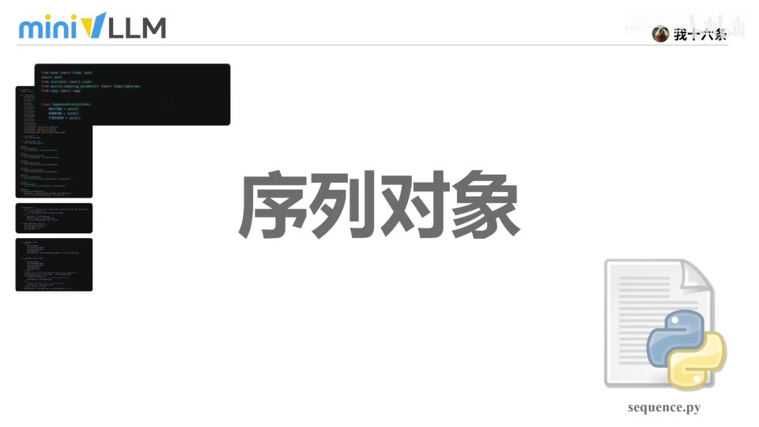 |
| OK，我们来看第二个部分。 [【跳转到 00:22】](https://www.bilibili.com/video/BV1aYMM6wEsm/?t=22) | 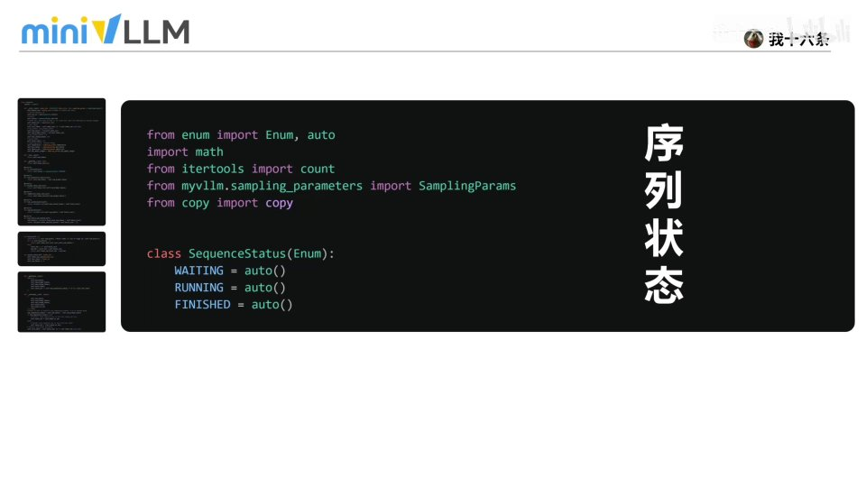 |
| 第二部分对应的代码就是序列对象，其中初始化函数里 [【跳转到 00:27】](https://www.bilibili.com/video/BV1aYMM6wEsm/?t=27) |  |
| 定义了序列的属性和采样的相关参数，同时也封装了一些只读属性函数用于上下文 token 管理：比如 prompt token id 用于切分出提示（prompt）对应的 token id 列表；token id 用于提取模型生成阶段的 token id；num cached blocks 用于获取当前一共占用多少个 KV cache block（用于显存分配、缓存 [【跳转到 00:32】](https://www.bilibili.com/video/BV1aYMM6wEsm/?t=32) | 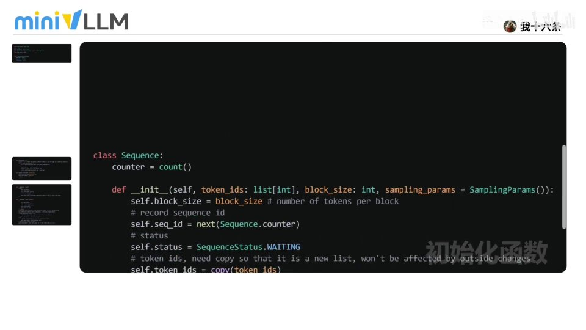 |
| 回收、内存调度）；num blocks 用于计算整条上下文序列总共需要多少个缓存块；last block num tokens 表示最后一个缓存块里实际存在多少个 token。关于序列对象其实有四个关键点。 [【跳转到 00:57】](https://www.bilibili.com/video/BV1aYMM6wEsm/?t=57) | 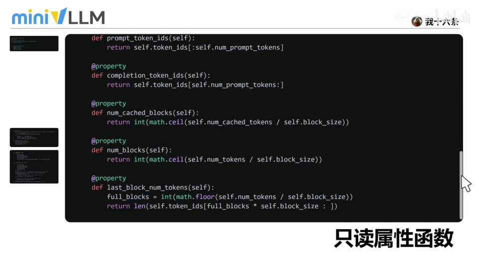 |
| 第一个关键点就是刚才提到的序列状态 [【跳转到 01:09】](https://www.bilibili.com/video/BV1aYMM6wEsm/?t=69) | 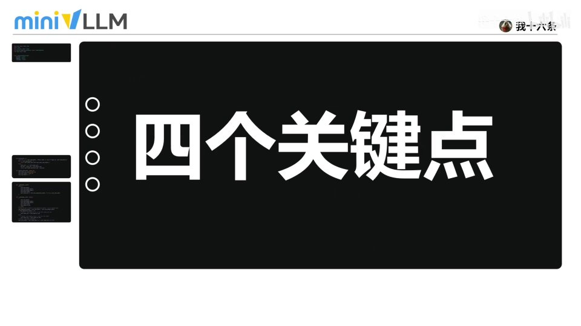 |
| 枚举类。对一条序列来说，状态代表了一条请求的生命周期：请求进入系统后最开始处于 **waiting** 状态，表示还在排队等待资源调度；被调度到 GPU 或执行队列后进入 **running** 运行状态，开始生成 token；请求完成、达到停止条件或被终止时进入 **finished** 状态，也就是结束。 [【跳转到 01:14】](https://www.bilibili.com/video/BV1aYMM6wEsm/?t=74) |  |
| 第二个关键点是：序列对象需要保存一个 token 的进度，在序列对象中通过以下参数记录 token 的属性：token id 记录当前请求已有的全部 token；last token 保存最后生成或输入的 token；num tokens 表示当前总长度；num prompt tokens 记录原始 prompt 的 token 数量，后续生成时可以用它区分输入和输出部分。 [【跳转到 01:39】](https://www.bilibili.com/video/BV1aYMM6wEsm/?t=99) | 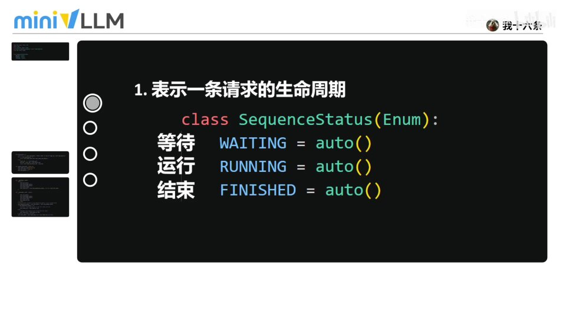 |
| 第三个关键点是：序列对象也存放了 KV cache 的 block 映射。比如 block_size 表示每个缓存块能存放多少个 token；num cached tokens 记录当前已经写入缓存的 token 数量；block table 保存这个序列占用过的 block id，方便后续生成时快速找到对应的缓存。 [【跳转到 02:04】](https://www.bilibili.com/video/BV1aYMM6wEsm/?t=124) |  |
| 第四个关键点是：序列对象同时携带了采样和停止的相关参数。比如 temperature 决定采样的随机性（温度越高越随机）；max tokens 限制最多生成多少个 token；ignore_eos 表示是否忽略结束符继续生成；max_model_len 限制 prompt 加输出的总长度，避免超过模型的上下文窗口。好，代码的第二部分就讲完了。 [【跳转到 02:29】](https://www.bilibili.com/video/BV1aYMM6wEsm/?t=149) |  |
| （续） [【跳转到 02:54】](https://www.bilibili.com/video/BV1aYMM6wEsm/?t=174) | 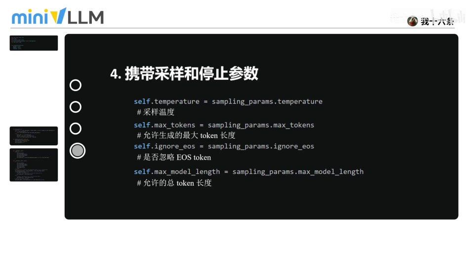 |
| 我们来看第三部分。第三部分主要有两个函数， [【跳转到 03:03】](https://www.bilibili.com/video/BV1aYMM6wEsm/?t=183) | 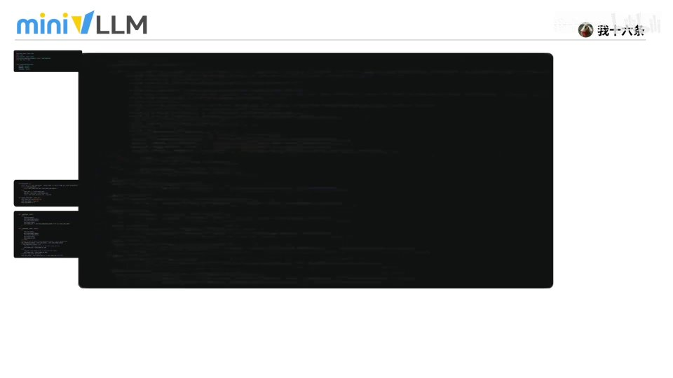 |
| 阐述序列如何按 block 读取 token、以及如何追加新的 token。block 函数的作用是按编号取出某一个逻辑 block 里的 token。具体看一个例子：有这样一条序列「今天天气非常不错」，tokenize 后变成长度为 11 的 token 序列。假设 block_size 等于 3， [【跳转到 03:08】](https://www.bilibili.com/video/BV1aYMM6wEsm/?t=188) |  |
| 对这样一条 token 序列，我们需要把它保存到对应的 block 中。因为 block_size 是 3、token 长度是 11，要缓存所有 KV 就需要 11÷3 向上取整，等于 4 个 block。每个 block 实际缓存的对应 token 就是这些。block(i) 函数实际上就是获取 block id 为 i 的块中 [【跳转到 03:33】](https://www.bilibili.com/video/BV1aYMM6wEsm/?t=213) | 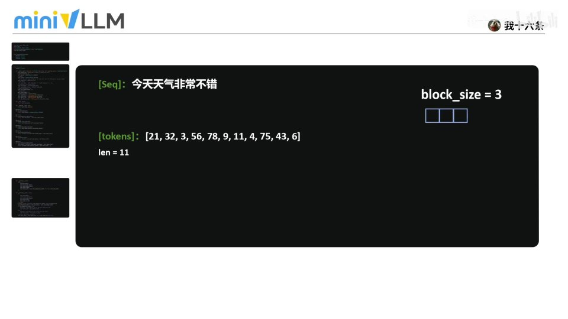 |
| 缓存的实际 token。我们可以把一整段 token 看成一条长队，按固定的 block_size 切成一块一块，传入的 i 就是想取第几块。append_token 函数则是在每次新生成 token 之后把它加入 token id、更新最后一个 token，并让 token 总数加一。好， [【跳转到 03:58】](https://www.bilibili.com/video/BV1aYMM6wEsm/?t=238) | 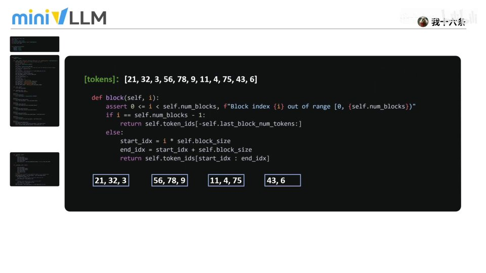 |
| 最后我们来看代码的最后一个部分：序列化函数 [【跳转到 04:19】](https://www.bilibili.com/video/BV1aYMM6wEsm/?t=259) | 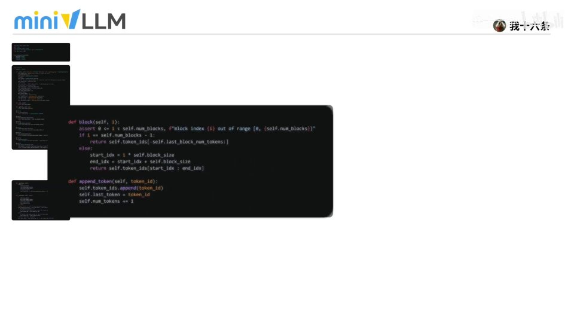 |
| `__getstate__` 和反序列化函数 `__setstate__`。`__getstate__` 可以理解成打包当前状态，把 token 数量、prompt 长度、缓存数量以及 block 映射表这些关键信息保存下来；`__setstate__` 则还原状态，把刚才保存的信息重新复制回来，并判断当前是 prefill 还是 decode 阶段：如果还在 prefill 阶段，就恢复完整的 token id；如果已经进入 decode 阶段，为了节省开销， [【跳转到 04:24】](https://www.bilibili.com/video/BV1aYMM6wEsm/?t=264) |  |
| 只需要恢复最后一个 token，最后再更新 last token，保证序列可以继续正常生成。好， [【跳转到 04:49】](https://www.bilibili.com/video/BV1aYMM6wEsm/?t=289) | 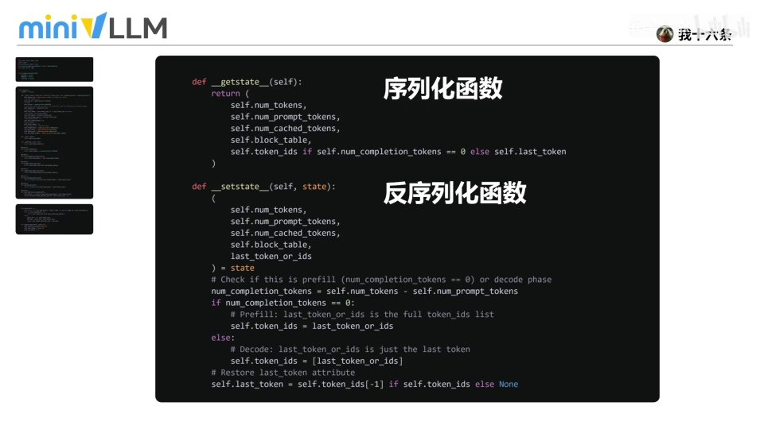 |
| 关于序列对象今天就分享完了。开源不易，更新需要动力，感谢各位观众老爷的支持。 [【跳转到 04:56】](https://www.bilibili.com/video/BV1aYMM6wEsm/?t=296) | 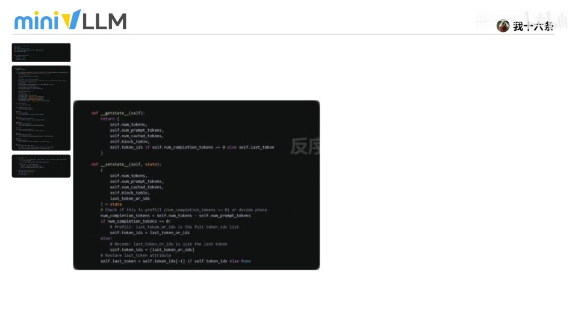 |
| （此区间无字幕） [【跳转到 05:01】](https://www.bilibili.com/video/BV1aYMM6wEsm/?t=301) | 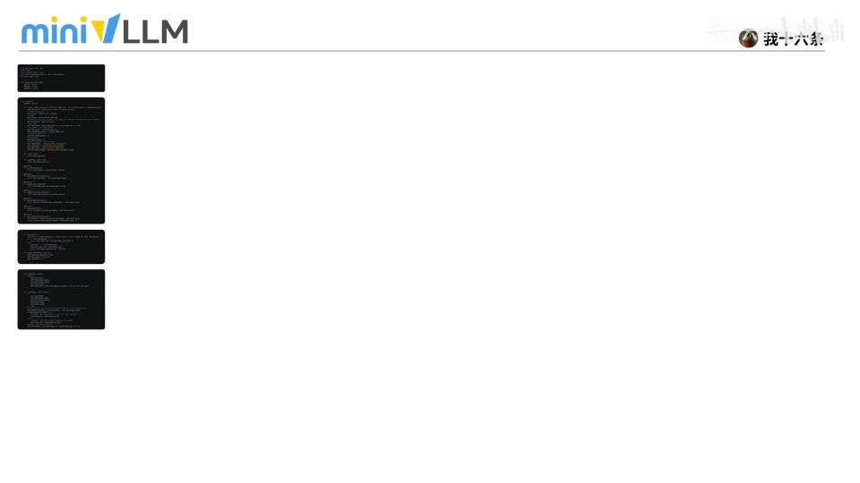 |