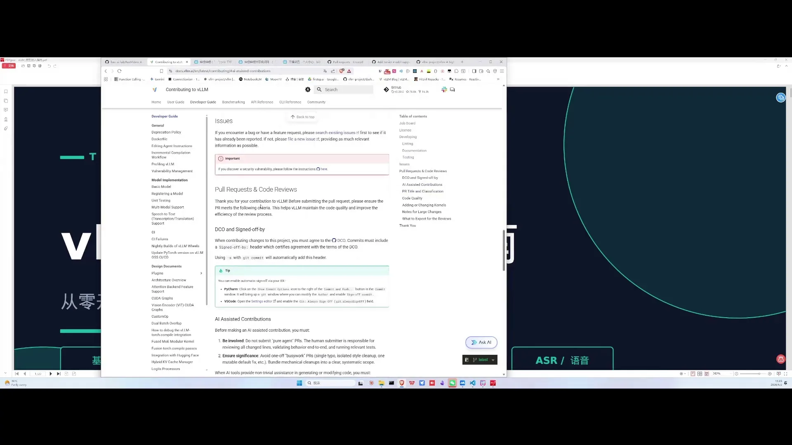
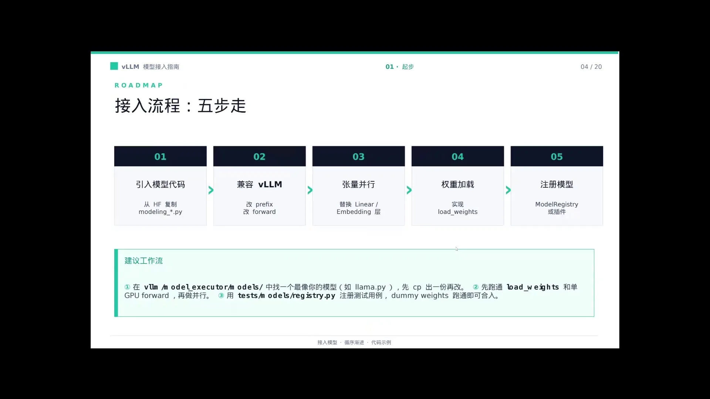
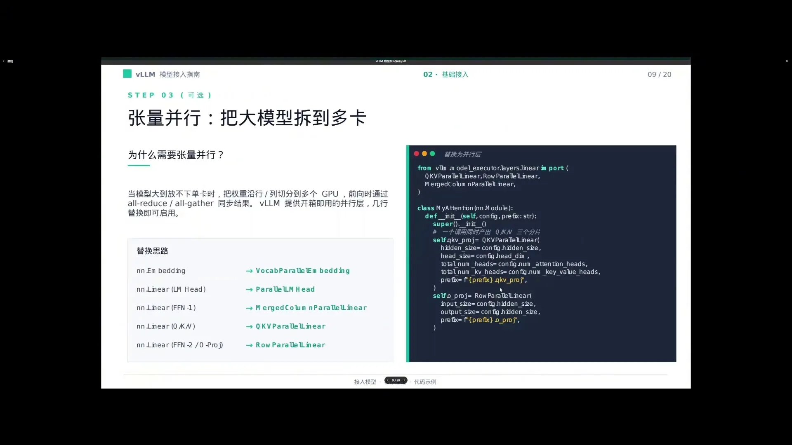
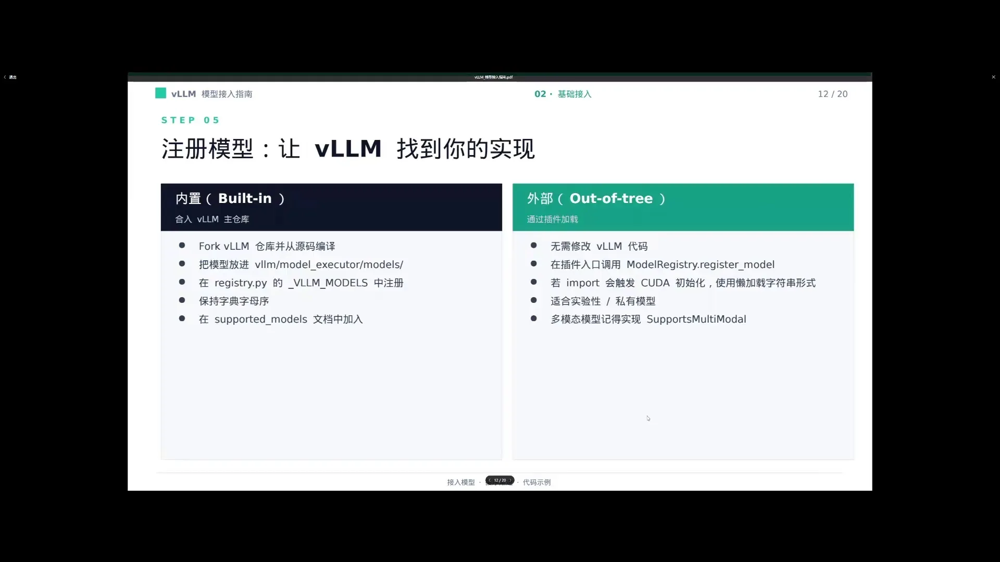
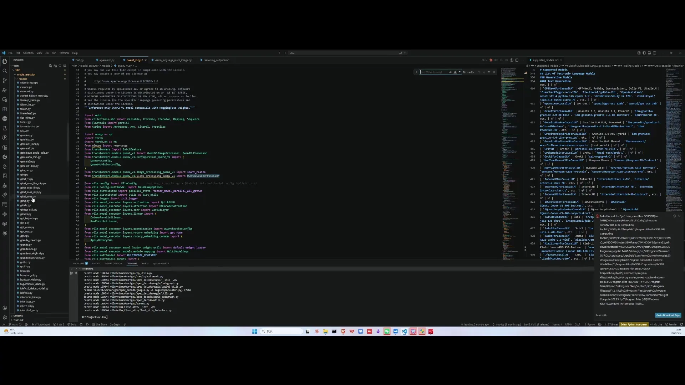
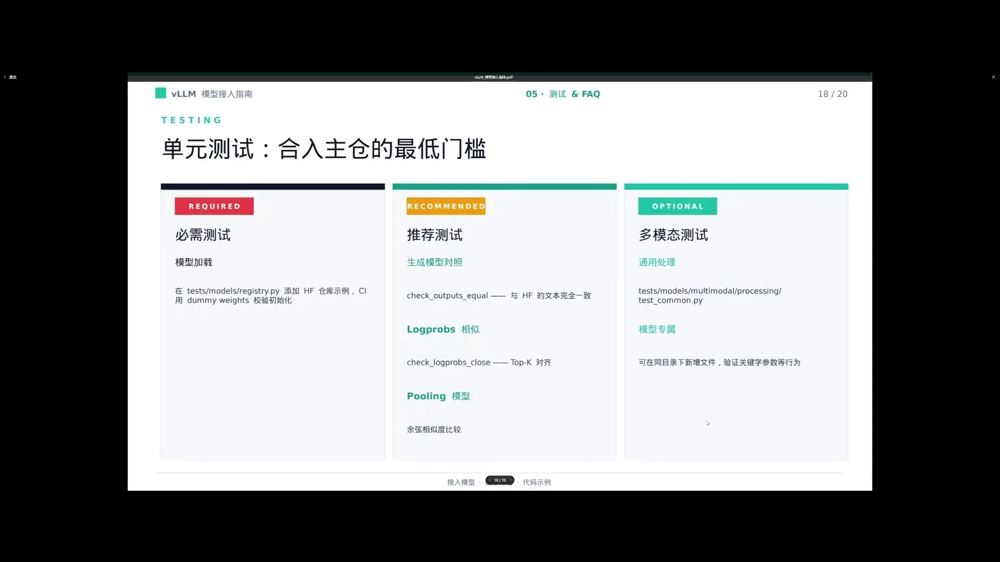

# 第01讲：如何在 vLLM 中接入一个模型

> 视频来源：[vLLM小课堂（一）：如何在vLLM中接入一个模型](https://www.bilibili.com/video/BV1gYL965ERP/)（约 72 分钟，嘉宾：子枫，vLLM 主仓多模态方向 Maintainer）。本文基于直播实录整理，时间戳可跳转到对应画面。

## 本讲要解决的核心问题（SCQA）

**背景**：vLLM 是目前最主流的大模型推理引擎之一，新模型（尤其是开源新架构）层出不穷，很多开发者都想让自己的模型"进 vLLM"。

**冲突**：但接入模型并不是"把代码贴进去"这么简单——主仓 review 严格、CI 门槛高、多模态与量化的坑极多；同时 AI 生成代码（vibe coding）泛滥，大量低质量 PR 反而拖慢了社区。

**疑问**：一个新模型到底要怎么接进 vLLM？流程是什么？哪些地方最容易翻车？维护者希望贡献者怎么做？

**回答（中心思想）**：接入模型 = 照着官方 Developer Guide 走"模型实现 → 注册 → TP 支持 → 权重加载 → 测试"这套标准流程，其中**TP 支持和权重加载（loader）是成败关键**；多模态模型则要理解三个 Base 类的分工。代码必须是人写的、人能读的，并且带可复现的测试。

---

## 一、先搞清楚：谁来接模型，什么模型值得接

### 1.1 两类模型来源，两种接入节奏

嘉宾把需要接入 vLLM 的模型分成两类（[【跳转到 03:05】](https://www.bilibili.com/video/BV1gYL965ERP/?t=185)）：

1. **大厂模型**：几百 B 参数的旗舰模型，厂商会找专业的人做 **day0 支持**（发布当天就能在 vLLM 上跑）。
2. **学术机构 / 学校的模型**：通常没有人力做 day0，或者模型发布了一段时间一直没人接——这类就是社区"认领接入"的主要来源。

一个有意思的观察：学术机构现在基本不做纯语言模型了，因为纯语言模型拼不过大厂；即使模型结构有创新也很难获得关注，所以大家把注意力都放在了**多模态**上。嘉宾做模型支持时遇到的情况就是"多模态模型没人接"，而不会出现"大家抢着接"。

### 1.2 官方路径：Developer Guide

接入模型的官方资料就是 vLLM 的 **Developer Guide（开发者指南）**，里面详细讲了：模型怎么实现、怎么注册、怎么写测试、怎么做多模态支持，以及后来新增的 VLM 视频支持等内容。本讲嘉宾做的 PPT 基本就是这份文档的汉化版（[【跳转到 01:46】](https://www.bilibili.com/video/BV1gYL965ERP/?t=106)）。

## 二、接入思路：先看模型的"出身"

接入前最关键的一步是想清楚**这个模型是从哪里来的**（[【跳转到 05:35】](https://www.bilibili.com/video/BV1gYL965ERP/?t=335)）：

- **vLLM 里已经有类似架构的模型** → 直接在已有实现上改就行；
- **vLLM 完全没支持过** → 需要从 **Transformers**（HuggingFace 的模型库）的实现入手，把模型"翻译"成 vLLM 的写法。

## 三、移植代码：抄得爽，review 得哭

### 3.1 Reviewer 怎么看一个模型的 PR

维护者 review 时的动作是：把代码拉到本地、跑通、检查代码规范（[【跳转到 06:52】](https://www.bilibili.com/video/BV1gYL965ERP/?t=412)）。两个红线：

- **许可协议（License）**：主仓很重视，必须确认原仓库的协议允许这样移植；
- **外部贡献代码过多**：如果原模型仓库代码过于混乱（大量外部贡献），reviewer 可能根本不会去拉原代码，而是直接基于它改写提交；混乱严重的模型甚至不会被考虑合并。

### 3.2 从 Transformers 抄代码的三大坑

第四步"移植代码"是最容易出问题的一步（[【跳转到 09:22】](https://www.bilibili.com/video/BV1gYL965ERP/?t=562)）：

1. **训练代码要删干净**：原仓库里 Jupyter notebook、训练专用代码在推理引擎里没用；有些"雷"藏在模型代码深处（不像 checkpoint、初始化代码那么显眼），抄的时候要仔细甄别删掉，删不干净 CI 也会提醒你。
2. **代码量夸张**：有的模型代码删到最后还有六七千行，review 量根本看不过来；一个 1000 行的 PR 可能就要 review 一周。
3. **AI 生成的 loader 是重灾区**：很多人把报错喂给 AI，AI 在 loader（权重加载函数）上来回反复改，最后产出三四百行"不知道在写什么"的 loader。dense 模型还好，**MoE 模型的加载本身就复杂，AI 写的 MoE loader 更是灾难**（MoE＝混合专家架构：由多个"专家"网络组成，按 token 分配、只激活其中一部分，所以权重加载比 dense 模型复杂得多）。正确姿势是：照着现成的模型改，不要自己凭空写。

## 四、TP 支持：所有模型的硬要求

**TP（Tensor Parallelism，张量并行）**指把一个模型的权重切开放到多张 GPU 上并行计算——这是大模型能装进显存的关键手段。嘉宾强调（[【跳转到 15:01】](https://www.bilibili.com/video/BV1gYL965ERP/?t=901)）：

- **所有提交的模型都优先要支持 TP**。否则用户一开 TP（本来就是为了多卡跑大模型），发现每张卡还是占满显存、模型照样跑不起来；
- 但也**不是所有部件都适合 TP**。主仓里 vision encoder（视觉编码器）一般不做 TP——模型小，切了反而亏。

多模态模型的视觉部分有替代方案：**encoder DP（视觉编码器数据并行）**——每张卡保留完整的 ViT，把不同图片分给不同卡。vLLM 提供了 `mm encoder tp mode` 设成 `data` 即可启用图像级 DP（[【跳转到 16:16】](https://www.bilibili.com/video/BV1gYL965ERP/?t=976)）。例如 InternVL 的 ViT 有 6B 参数，就适合这种做法。

但**按 patch 切分视觉输入有前提**：Qwen2-VL 这类模型的 attention 带 sliding window（滑窗注意力），按图像块切分会让 attention 计算不正确，所以不能切；传统 LLaVA 系的 ViT 则可以按 patch 分。

## 五、权重加载（loader）：最容易出事的地方

### 5.1 原理其实很简单：权重名对上 + 必要的拼接

loader 的本职工作是：把 checkpoint（权重文件）里的张量，按名字对号入座地放进模型（[【跳转到 23:19】](https://www.bilibili.com/video/BV1gYL965ERP/?t=1399)）：

- **权重名映射**：模型里会有一个 mapping 文件写明"checkpoint 里的权重名 → 模型定义里的权重名"，两者一一对应即可；
- **stack（拼接）**：如果模型用了合并层，就要手动拼接。典型有两处：
  - **attention 的 QKV**：用了 `QKVParallelLinear`，需要把 Q、K、V 三个权重拼起来；
  - **MLP 的两个上采样**：用了 `MergedColumnParallelLinear`（gate 和 up 合并的层），需要把两个权重拼起来。

规则一句话：**你在模型里哪里调用了 QKVParallelLinear / MergedColumnParallelLinear，哪里就要记得拼权重**。

### 5.2 实用技巧与组织方式

- **打开 loading check**：加载时打印/追踪"哪些权重加载了、哪些没加载"，名字对不上立刻暴露（[【跳转到 22:04】](https://www.bilibili.com/video/BV1gYL965ERP/?t=1324)）。这是作者当年专门加的功能；
- **量化权重映射**：量化（如把权重压成低比特）时 QKV 已合在一起，weight loader 还要知道加载顺序，所以要写好映射——不是量化场景可以不加，但**最好还是写上**，免得别人想跑量化时各种报错（[【跳转到 12:14】](https://www.bilibili.com/video/BV1gYL965ERP/?t=734)）；
- **组织方式**：与其给每个 module 写一个几百行的 loader，不如**根模型写一个、ViT 写一个，由最终模型递归调用加载**，简洁得多（[【跳转到 24:55】](https://www.bilibili.com/video/BV1gYL965ERP/?t=1495)）。

## 六、插件机制：不合主仓也能用

不是所有模型都适合进主仓。vLLM 提供两种注册方式（[【跳转到 25:39】](https://www.bilibili.com/video/BV1gYL965ERP/?t=1539)）：

1. **built-in（内置）**：直接注册进主仓的模型列表；
2. **插件（plugin）**：很多公司内部会 fork 一份 vLLM 实现自己的模型，用**插件形式**注册，这样以后 rebase 上游更方便；不适合合入主仓的模型也可以自建分支用插件加载。现在 **encoder-decoder 类模型已全部走插件**，主仓里的典型实现就是现成参考。

## 七、多模态接入：三个 Base 类是骨架

多模态接入相对复杂，但贡献机会也多。核心是三个类的分工（[【跳转到 32:57】](https://www.bilibili.com/video/BV1gYL965ERP/?t=1977)）：

| 类 | 职责 |
| --- | --- |
| **BaseProcessingInfo** | 声明模型支持哪些模态、要用 HuggingFace 的哪些 processor（图像/文本预处理器），以及 `get_hf_processor` 等辅助函数 |
| **BaseDummyInputBuilder** | 构造 **dummy input（假输入）**：按配置文件里"最长序列 + 最多图片数"生成最坏情况的输入 |
| **BaseMultiModalProcessor** | 执行完整处理：调用 HF processor 后做后处理，把多模态数据替换进 prompt |

几个关键点：

- **dummy input 决定显存上限**：用最坏情况（最长序列、最多图片）构造输入，先跑一遍就知道 encoder 最坏占多少显存，剩下的才分给 KV cache（推理时缓存的注意力 Key/Value，避免每生成一个 token 都重算整段历史）。如果替换逻辑写错，运行时会直接 OOM（显存溢出），或者位置 shift 对不上（[【跳转到 28:47】](https://www.bilibili.com/video/BV1gYL965ERP/?t=1727)）；
- **processor cache**：一张图处理过一次就缓存起来，多轮对话重复发图时直接取缓存（[【跳转到 34:12】](https://www.bilibili.com/video/BV1gYL965ERP/?t=2052)）；
- **可关闭模态**：像 Qwen-Omni 这类模型，可以只保留视觉、关掉音频（[【跳转到 30:27】](https://www.bilibili.com/video/BV1gYL965ERP/?t=1827)）。

关于趋势的讨论：**any-to-any（任意模态进、任意模态出）肯定是方向**，但同时支持音频+图像+视频输出不一定必要；"文本+图像"或"文本+音频"一体化更现实。多模态**输入**基本就是加个 ViT，**输出**要加的东西多得多。而且在线服务和离线任务的推理范式完全不同：在线只能自回归地一块块生成，离线则可以把所有内容一起做 attention，生成质量通常更好（[【跳转到 31:17】](https://www.bilibili.com/video/BV1gYL965ERP/?t=1877)）。

## 八、以 Fuyu 为例：最短的多模态实现走读

直播里现场翻了一个最简单的模型 **Fuyu-8B**（2023 年，作者接入的第一个多模态模型）来讲解（[【跳转到 35:37】](https://www.bilibili.com/video/BV1gYL965ERP/?t=2137)）：

- **整个模型文件只有 300 多行**，非常好读；
- **没有 ViT**：图像 patch 直接进一层 Linear 变成 embedding——这就是"vision embedding"路线（原生多模态），等于跳过了视觉编码器的开销；
- **没有占位符**：大部分多模态模型在文本里插 `<image>` 占位符再替换成图像 token，而 Fuyu 的图像直接插在文本输入最前面，所以 dummy input 逻辑也特殊；
- **image patch 是二维输入**，形状定义要写清楚——现在框架会验证输入形状（这个功能是后来加的）。

顺带一提 vision embedding 路线的起伏：这种原生多模态在 2023 年之后一度沉寂，业界都走 LLaVA 风格，直到最近 Meta 的新模型才重新恢复这一架构；不过 LLaVA 仍是主流——模型终究要靠训练出来，LLaVA 的训练生态最成熟，而原生路线对学术机构来说训练成本太高（[【跳转到 18:46】](https://www.bilibili.com/video/BV1gYL965ERP/?t=1126)）。

替换占位符用 **`get_replacement`**（自动识别插在哪里）；"一张图提供多少个 token"由辅助函数估算，真正的替换在 MultiModalProcessor 里完成；如果 HF 的输出和 vLLM 预期不一致（比如多了一个 batch 维、漏了 bos token），就 override 做后处理——但这属于特殊情况，一般接入不用改（[【跳转到 41:02】](https://www.bilibili.com/video/BV1gYL965ERP/?t=2462)）。

另一个实用信息：**很多模型可以直接在已有实现上改**——Qwen2 和 InternVL 的架构被各家大量借鉴，往模型注册表底下翻一翻，往往能找到结构相近的现成实现（比如 TeleChat2 就是在 Qwen2 基础上改的，替换几个权重名就行）（[【跳转到 44:47】](https://www.bilibili.com/video/BV1gYL965ERP/?t=2687)）。

## 九、音频 / ASR 模型的特殊点

以 Qwen3-ASR 为例（[【跳转到 46:26】](https://www.bilibili.com/video/BV1gYL965ERP/?t=2786)）：

- 除了 chat completion，还有 **transcription（语音转文字）接口**，直接输入音频出字幕；
- 实现上本质是**提前准备一个 prompt 模板**，输入音频按模板转录即可；
- 中英文切换靠 **language 字段**：加对应 token，模型就会按语言输出；
- 注意区分：TTS（语音合成、声音克隆）是生成音频；ASR 只做转录出字幕。

## 十、测试、CI 与社区：代码要"人能读"

### 10.1 不注册测试 = 过不了 CI

音频等特殊模型必须加上对应的单元测试并**注册**，不注册肯定过不了 CI（持续集成，自动跑测试的机器人）（[【跳转到 51:49】](https://www.bilibili.com/video/BV1gYL965ERP/?t=3109)）。PR description 里必须写清楚**测试怎么跑**，并把运行结果贴上来——维护者一眼就能看出"这人根本没跑过代码，只报个加速数字"。

### 10.2 vibe coding 时代的贡献乱象

直播花了很大篇幅聊 AI 生成代码对开源社区的冲击（[【跳转到 52:49】](https://www.bilibili.com/video/BV1gYL965ERP/?t=3169)）：

- 有人 5 分钟提 5 个 PR，明显没在本机装过框架，纯捣乱，只能当 bot 封禁；还有人对封禁不满反过来说社区"打击参与热情"；
- Omni 项目里大量 AI 生成的 test 是"自己测自己"，没有意义；
- **AI review 也有害**：它会把代码越改越复杂、讲得头头是道但抓不住真正的点，照着改越改越错；
- 结论：如果 vibe coding 生成代码、AI review 审核、机器合并，全程没人参与，项目就"没有人类了"，也没人读得懂。所以**代码一定要是人写的、人能读的**，这也是办直播教学的原因——指导新贡献者什么能做、什么不能做。

顺带一提，嘉宾分享了自己接模型时踩过的坑：他接自家模型时做了混合注意力，用 DSA（DeepSeek Sparse Attention，稀疏注意力）混 linear attention，两套分页（page）逻辑叠出乘积关系，block size 算出来几十个 G，八张 H100 布一个只有 9B 的模型直接爆显存；最后的解法是把 linear attention 挪到分页管理之外才不爆显存（[【跳转到 47:01】](https://www.bilibili.com/video/BV1gYL965ERP/?t=2821)）。

另一段是 linear attention（Mamba 这类模型）实现本身的调试故事：bug 太多，必须把断点打得很深才能定位，结果打着打着就打进 vLLM kernel 里，"人都麻了"；这个坑当时搞了好几个月，最后只能在外部另起炉灶做一套（[【跳转到 58:19】](https://www.bilibili.com/video/BV1gYL965ERP/?t=3499)）。

## 十一、想贡献？找对人：governance 与 CODEOWNERS

新贡献者最常见的问题"我的 PR 该找谁 review"，答案是看官方治理文档（[【跳转到 63:42】](https://www.bilibili.com/video/BV1gYL965ERP/?t=3822)）：

- **governance 文档**：vLLM 官网文档里搜 governance，里面有方向划分和**维护者名单**；
- **CODEOWNERS 文件**：按目录/领域列出自动请求 review 的人，照着 at 人就行；
- **committers 页面**：完整名单包含每个人负责的领域；
- 分工经验：大部分模型找主讲人这类 maintainer，多模态找子枫和赛尔；纯 diffusion 模型有对应负责人；Omni 侧也已有自己的名单。

Omni（vLLM-Omni，多模态/生成方向的新仓库）当前的痛点（[【跳转到 69:03】](https://www.bilibili.com/video/BV1gYL965ERP/?t=4143)）：方向太多（world model、diffusion……）、committer 少、单个 PR 提交量巨大，而且**新模型结构千奇百怪没法统一**——接入新结构常常要考虑框架级重构，还得保证重构不掉性能，工作量很大。反过来，新方向没有 committer，做得多了你很容易成为那个方向**第一个 committer**。

## 小结

- 接入模型的官方路径是 **Developer Guide**：模型实现 → 注册 → 测试 → 多模态支持，一整套都有文档；
- 接入前先看模型"出身"：vLLM 有类似架构就在上面改，没有就从 Transformers 移植；很多新模型其实能在 Qwen2/InternVL 的现成实现上改出来；
- **TP 支持是硬要求**（否则多卡跑不起来），但 vision encoder 通常走 encoder DP 而非 TP；sliding window 模型不能按 patch 切分；
- **权重加载是重灾区**：权重名 mapping + QKV/gate-up 拼接，开 loading check 自查，别让 AI 凭空写 loader；
- 多模态三件套 **BaseProcessingInfo / BaseDummyInputBuilder / BaseMultiModalProcessor** 分工明确，dummy input 按"最长序列+最多图"构造来验证显存上限；
- 模型可以走**插件**注册，encoder-decoder 已全走插件，fork 上游 rebase 更轻松；
- 测试必须注册并贴运行结果，**代码要人写、人读**——vibe coding 时代的低质量 PR 是社区最大噪音源；
- 找 reviewer 看 governance / CODEOWNERS / committers 名单；冷门新方向反而容易成为第一个 committer。

## 关键术语速查

| 术语 | 一句话解释 |
| --- | --- |
| vLLM | 主流大模型推理引擎，本讲所有内容的载体 |
| Developer Guide | vLLM 官方开发者指南，接入模型的说明书 |
| day0 支持 | 模型发布当天就可用，通常由厂商专人负责 |
| Transformers | HuggingFace 的模型库，新模型移植的起点 |
| TP（张量并行） | 把模型权重切开到多卡并行计算，大模型上多卡的基础 |
| ViT / vision encoder | 视觉编码器，把图片变成模型能理解的 embedding |
| encoder DP | 视觉编码器数据并行：每卡保留完整 ViT，不同图分给不同卡 |
| sliding window attention | 滑窗注意力（如 Qwen2-VL），限制可切的图像块划分 |
| loader（权重加载） | 把 checkpoint 的权重按名字放进模型的代码 |
| QKVParallelLinear / MergedColumnParallelLinear | 合并的线性层，加载时需要拼接 QKV / gate-up 权重 |
| MoE | 混合专家模型，加载逻辑复杂，AI 生成 loader 的重灾区 |
| 插件（plugin） | 不进主仓也能注册模型的方式，方便公司内部 fork 后 rebase |
| dummy input | 按最坏情况构造的假输入，用于估算显存、验证多模态替换逻辑 |
| Fuyu-8B | 无 ViT、无占位符的原生多模态模型，300 行实现，适合入门阅读 |
| ASR / TTS | 语音转文字 / 文字转语音，本讲只涉及 ASR 转录 |
| CI（持续集成） | 自动跑测试的机器人，测试未注册的 PR 过不了 CI |
| vibe coding | 用 AI 大量生成代码的写法，本讲反复吐槽其低质 PR 危害 |
| CODEOWNERS / governance | GitHub 的目录负责人文件 / vLLM 的治理文档，用来找 reviewer |
