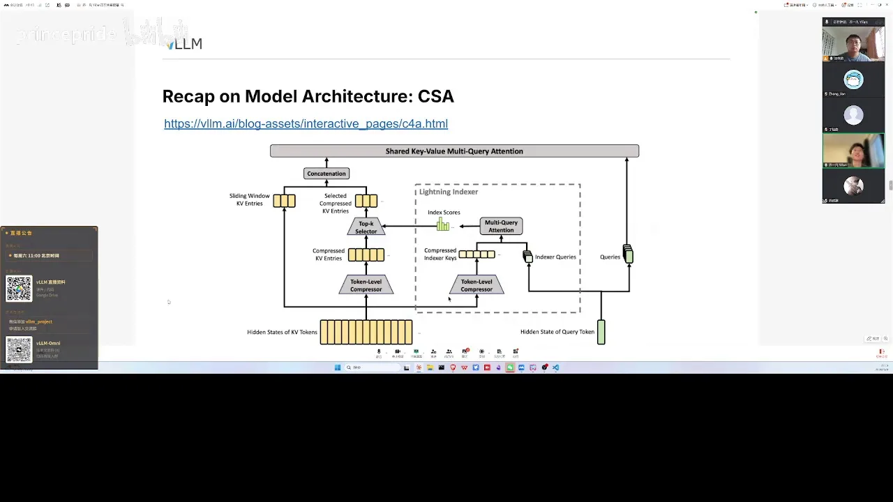
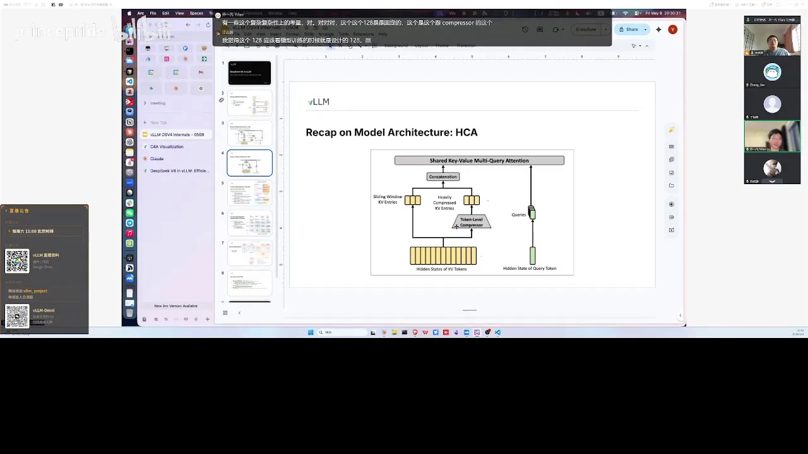
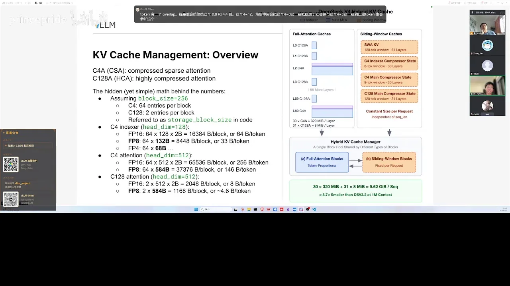
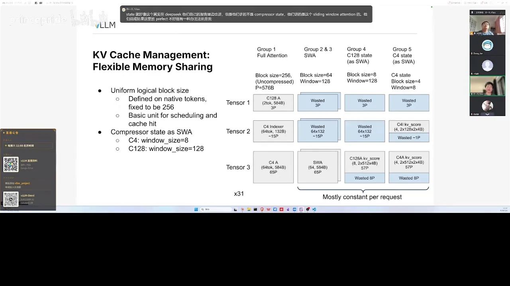
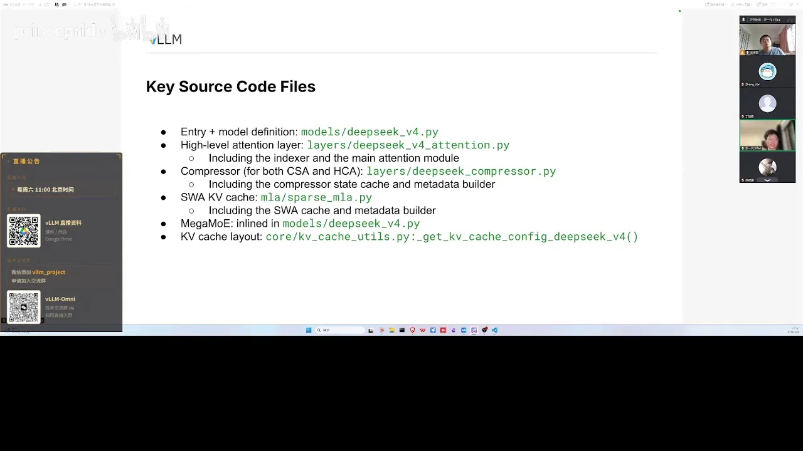

# 第02讲：大家一起来学 DeepSeek-v4

> 视频来源：[vLLM小课堂（二）：大家一起来学DeepSeek-v4](https://www.bilibili.com/video/BV17iJF67EaY/)（约 94 分钟，嘉宾：乔一凡，INFX 工程师，DeepSeek-V4 的 vLLM 支持主要贡献者）。本文基于直播实录整理，时间戳可跳转到对应画面。

## 本讲要解决的核心问题（SCQA）

**背景**：DeepSeek-V4 发布，支持 1M 上下文，架构在 V3.2 的稀疏注意力基础上又引入了压缩注意力、新 MoE 等大量新设计。

**冲突**：架构越先进，推理引擎越难支持——KV cache 形态五花八门、kernel 数量爆炸、显存管理复杂，"接入"远不止写个模型文件。

**疑问**：DeepSeek-V4 到底新在哪？vLLM 团队是怎么在短时间内完成高质量接入的？普通开发者能从中学到什么？

**回答（中心思想）**：V4 的三件套是**压缩注意力（CSA/HCA）、HashLine 前三层路由、MegaMoE 通算融合**；vLLM 侧的解法是把压缩后的状态**统一当成 sliding window 来管理**，从而免费获得 prefix caching、PD 分离和 offloading；kernel 层面靠**双 stream 并行 + 大量 fusion** 榨性能。

---

## 一、V4 架构总览：三个大亮点

嘉宾开场强调：V4 是团队协作的成果——除他之外还有永夜、乌苏可等很多同学分别负责不同模块。整体架构图来自 DeepSeek 官方技术报告，拆开看跟普通 Transformer、V3/V3.2 大同小异，真正的亮点有 3~4 个（[【跳转到 11:06】](https://www.bilibili.com/video/BV17iJF67EaY/?t=666)）：

1. **MAHC 对残差流的增强**：把之前"单流"的残差变成多维的；残差之外，attention 计算和 MoE 计算仍通过 mixing 转回单流 hidden state，所以对其余模块没有影响。
2. **压缩注意力**：延续 V3.2 的稀疏性并进一步增强，两种压缩注意力交错排列（下文详述）。
3. **MoE 的小改动**：算法上有一些调整（HashLine），infra 上开源了 MegaMoE。

### 1.1 HashLine：前三层不用 gate 选专家

一个有意思的设计：模型**前三层不使用 gate 去选专家**，而是通过一个固定的 hashtable（HashLine）直接给每个 token 指定专家，计算时把 token 直接路由到对应专家上。据报告说这让前三层的 MoE 更容易训练（[【跳转到 14:01】](https://www.bilibili.com/video/BV17iJF67EaY/?t=841)）。

### 1.2 MegaMoE：计算与通信融成一个 kernel

DeepSeek 这一代开源了 **MegaMoE**：把 MoE 的计算和通信（原先分散的 kernel）融合成一个更大的 kernel，还融合了前后零碎的小 kernel——整个 MoE 可能只需要一个 kernel 就能跑起来。好处：减少 kernel launch 的 CPU 开销，而且**接口本身很简洁**，从接入模型的角度更容易调用（[【跳转到 14:51】](https://www.bilibili.com/video/BV17iJF67EaY/?t=891)）。

## 二、压缩注意力：一个当 sliding window 管，一个只靠 128 倍压缩

### 2.1 CSA：压缩 + 稀疏 + sliding window 兜底

**CSA（Compressed Sparse Attention）**大致对应 V3.2 的 Sparse Attention 加上压缩模块（[【跳转到 16:06】](https://www.bilibili.com/video/BV17iJF67EaY/?t=966)）：

- **token-level compressor**：把连续 4 个 token 压缩成 1 个 compressed entry（长度变为原来的 1/4），喂给 attention kernel 做真正的计算；
- **indexer（继承自 V3.2）**：用 indexer 的 query 和 KV 打分，筛出最相关的 entry（比如最多的 512 个）。注意主 attention 已经压缩过，所以 **indexer 里也要做相应的压缩**——打分是"压缩 entry 之间"的 score。compressor 同时作用在主 attention 和 indexer 两处，只是位置不同；
- **sliding window 兜底**：还没凑够一个压缩 entry 的 token（比如开头的 token 0/1/2）信息会丢失，所以在压缩 attention 旁边并联一个 sliding window attention 抓住这些"零头"。随着 token 增多，一个 query 可以 reference 到多个 compressed entry。

**压缩过程很像 sliding window**：每个压缩 entry 只跟它前面 4~8 个 token 有关。相邻压缩块之间还做了 **overlap**——比如压缩 4~7 时把 0~3 的状态也存一份参与计算，让模型抓住跨块的上下文关联；C128 因为块足够大就没做 overlap（[【跳转到 19:06】](https://www.bilibili.com/video/BV17iJF67EaY/?t=1146)）。这也是 C4 需要 8 token window 的原因。

### 2.2 HCA：128 倍压缩，无稀疏

**HCA（Highly Compressed Attention）**更简单：压缩比直接到 **128（128 个原始 token 压成 1 个）**，没有稀疏性——仍然处理所有 token，但因为压缩比高，即使 1M token 的 KV cache 也占用不大。它同样面临"零头 token 未被覆盖"的问题，所以旁边也加 sliding window。两部分拼起来交给 attention kernel（如 FlashMLA）。

**压缩比 128 与 block size 无关**：128 是模型训练时定死的（跟 compressor 权重无关，用户控制不了），而 KV cache 的 block size 最小 128，实际实践中固定 256（[【跳转到 29:36】](https://www.bilibili.com/video/BV17iJF67EaY/?t=1776)）。

### 2.3 关键洞察：把压缩状态当 sliding window 管理

压缩 entry 的刷新类似环状缓冲区（ring buffer），如果直接按 ring buffer 管理，prefix caching 和 PD 分离都会引入额外困难。团队的观察是：**既然每个压缩 entry 只依赖前面固定个数的 token，就可以把它当成 sliding window attention 来管理**——DeepSeek 报告和常见实现里也是开一个固定大小的 buffer（[【跳转到 21:11】](https://www.bilibili.com/video/BV17iJF67EaY/?t=1271)）。

这个决策的价值在后面兑现：一旦 planning 做好，内存分配、prefix caching 都是原有 KV cache manager **天生就支持**的，"基本没改任何代码，只要把 block size 调对就好"，还自动获得了 PREFETCH 和 PD 分离支持；传输 KV cache 时也只需要当成普通 sliding window 处理（[【跳转到 53:29】](https://www.bilibili.com/video/BV17iJF67EaY/?t=3209)）。

### 2.4 和 SSM、Qwen3.5 稀疏注意力有何区别？

- **与 SSM 类比**：compressor state 跟 SSM 的状态一样"每个 sequence 只存一份、不断更新"；但 SSM 的状态更新不严格对应到具体 token，而压缩过程里每个 token 的状态可以留到自己所属块的边界再一起压出来（[【跳转到 23:16】](https://www.bilibili.com/video/BV17iJF67EaY/?t=1396)）。
- **与 Qwen3.5（混合 attention）对比**：Qwen3.5 靠 linear attention 把与 sequence 成正比的 KV 压成固定大小状态；而稀疏注意力的 KV cache 总量仍与 sequence length 成正比，只是每次计算只选固定数量的 block——**省的是计算，不是容量**；V4 的容量节省靠压缩实现。另外 linear attention 的 state 太大导致 KV cache block 被迫调大，cache hit 粒度变粗；而 compressor state 小而可控，不会给 block size 带来压力（[【跳转到 24:31】](https://www.bilibili.com/video/BV17iJF67EaY/?t=1471)）。

## 三、KV cache 管理：动态分配与共享

### 3.1 层的组成与 state 分类

以 V4 Pro 为例（内部代号：C128A=HCA，C4A=CSA）：共 61 层，**前两层是 C128A，后面 C4A 与 C128A 交替排列**（[【跳转到 31:16】](https://www.bilibili.com/video/BV17iJF67EaY/?t=1876)）：

C4A 在图上有两块——indexer 自己需要 KV cache，main attention 也需要 KV cache（[【跳转到 31:41】](https://www.bilibili.com/video/BV17iJF67EaY/?t=1901)）。

与每个 request 相关的固定大小的 state（DeepSeek 报告里类似叫 streaming state）包括：sliding window 的 KV cache，以及 compressor 在块未凑满整数倍时暂存 token 的 **compressor state**（C4A 的 indexer/main attention 各一份，C128A 仅 main attention 一份）。

### 3.2 动态申请、按比例伸缩

vLLM 让"与 sequence length 成正比的 KV cache"（C128、C4 indexer、C4 main 三种，共三类 tensor）和这些固定 state **共享 GPU 内存**：三类 tensor 按剩余显存比例分出来，剩下的 sliding window 和 compressor state 尽量拼进去——比如 SWA 的 block size 选 64 时正好能塞进对应 tensor 的一个 block（[【跳转到 42:14】](https://www.bilibili.com/video/BV17iJF67EaY/?t=2534)）。

sequence 长时主 attention 占比高、sliding window 占比低；很多短 sequence 时反过来。这个动态调整靠一个统一的大 KV cache pool 完成（[【跳转到 33:57】](https://www.bilibili.com/video/BV17iJF67EaY/?t=2037)）。

### 3.3 数字怎么来的：256 / 320 / 8 / 9.62GB

- **统一 block = 256 个原始 token**：scheduler 按 256 调度，KV cache manager 按 256 划块，prefix cache 也按 256 命中；但 C4 层一个 block 只有 64 个压缩 entry、C128A 只有 2 个 entry——代码里用 **storage block size**（真正存了多少 entry）与 block size 区分（[【跳转到 35:34】](https://www.bilibili.com/video/BV17iJF67EaY/?t=2134)）；
- **量化**：indexer KV 支持 MXFP8/MXFP4（FP4 默认不开）；V3.2 的 attention FP8 每 token 约 656 bytes（512 原始维度量化 + 64 维 rope 存 FP16），V4 的 **shared KV** 把 key/value 与 rope 存在一起，降到 448 bytes；C4 两部分加起来每 token **320 bytes**，C128A 每 token **8 bytes**——这就是博客里 320 和 8 的来历（[【跳转到 38:04】](https://www.bilibili.com/video/BV17iJF67EaY/?t=2284)）；
- **显存估算**：1M token 的 V4 Pro 约 **9.62GB（FP16）**；用 FP8 KV cache 再省约 50%，**约 5GB**。嘉宾在 PPT 里补上了博客没展开的计算细节，并建议遇到分配 bug 时可以自己按公式算一算（[【跳转到 30:51】](https://www.bilibili.com/video/BV17iJF67EaY/?t=1851)）；
- **P = 576 bytes**：一个挺特殊的数字——kernel 要求每个 block 对齐到这个粒度才能正确访存，所以分配时每一块要做小的对齐调整，有时会浪费一些显存，但因为这些都是 per-request 常数，浪费可控（[【跳转到 46:24】](https://www.bilibili.com/video/BV17iJF67EaY/?t=2784)）。

### 3.4 更模块化的计划

这套 planning 已经过于复杂，团队正在努力模块化：**短期**让不同模型自定义内存的 planning/allocate，把 DeepSeek-V4 的复杂逻辑放进 V4 自己的代码里，不干扰其他模型；**长期**简化 prefix cache 与 KV cache management（[【跳转到 50:09】](https://www.bilibili.com/video/BV17iJF67EaY/?t=3009)）。嘉宾还分享了此前做 hybrid attention 的教训：在原实现上改不动，最后限制默认 GPU allocation、另写一套 linear attention 专属的 scheduler/cache manager 才跑通，但非常 case by case，换个模型就不行——这正是模块化要解决的问题（[【跳转到 48:04】](https://www.bilibili.com/video/BV17iJF67EaY/?t=2884)）。

### 3.5 重计算与 checkpoint：prefix cache 高命中率从哪来

直播间有观众问：C4A 的 overlap 对应的 compressor state 能不能支持重计算？答案是肯定的——只要手里还有原始 token 的 hidden states（比如上一层的完整 hidden states），就可以选择性地把这层的 compressor state 重算出来（[【跳转到 50:59】](https://www.bilibili.com/video/BV17iJF67EaY/?t=3059)）。

DeepSeek 报告里也讲过类似策略（他们讲的是 sliding window attention 的 KV）：如果 prefetch sliding window 不好做，那就干脆不做 prefetch sliding window，只 cache full attention 的 blocks；每次遇到 sliding window 层，再把相应的 token 重算一遍——相当于 **prefix caching 与重计算的结合**。cache 结构复杂到难管理时，舍弃一部分反而更好。而 vLLM 之所以不用这么纠结，正是因为 2.3 那个"统一当 sliding window 管理"的决策，让这些都由原有 KV cache manager 天生支持。

另外，嘉宾透露接下来会把 DeepSeek 论文里描述的 **checkpoint 机制**也支持起来：不必每个 block 都存 cache，而是每隔一定数量 token（比如每 1024 个 token）定期存一个 checkpoint——这样能减少存储量，把 prefix cache 的规模控制在可控范围，从而存下更多 sequence。大家看新闻会感叹 DeepSeek 的 prefix cache hit rate 非常高，嘉宾认为正是来自这类优化（[【跳转到 53:54】](https://www.bilibili.com/video/BV17iJF67EaY/?t=3234)）。

## 四、Kernel 优化：并行与融合

### 4.1 两条流水线 + 双 stream

V4 的 attention 模块（decode path；prefill 不读之前的 KV cache，反而更简单）分成 C4 main attention 和 C4 indexer 两部分，二者**几乎完全并行，只在 topk selector 处汇合**。所以可以放到两个 CUDA stream 里，共享 GPU 把 SM 使用率跑得更高（[【跳转到 59:19】](https://www.bilibili.com/video/BV17iJF67EaY/?t=3559)）。

每条流水线内部是 QKV 计算与 compressor 计算：以 main attention 为例，hidden state 先算 compressor 的 KV 和 state；**positional encoding 是在 compress 之后加的**（与训练有关）；compressor 结果量化成 FP8 写进 KV cache，供 FlashMLA kernel 直接读取。QKV 计算与 V3.2 类似：一个 fused weight 同时算出 latent space 的 Q 和 KV，再经 up projection 把 Q 变成 multi-head（KV 是 single head shared）。

### 4.2 一个有趣的细节：inverse rope

因为 V4 把 Q 和 K 只存一份，计算前加 rope 时**不仅 K 加了 rope，V 也被加了 rope**。为了消除影响，V4 额外加了一个 **inverse rope**——把 rope 公式反过来再应用一遍，数学上等效于"只在 K 上加了 rope"（[【跳转到 64:35】](https://www.bilibili.com/video/BV17iJF67EaY/?t=3875)）。

### 4.3 Fusion 的两类思路

哪些 kernel 该融合？**红色的重矩阵乘（GEMM）不融合**——它们用满 tensor core/TMA，利用率本来就高；**其余小 kernel 大多是 elementwise，瓶颈在 HBM 带宽**，融合它们既减少 launch 开销又减少 HBM↔register 搬运，能带来 2~4 倍甚至更多加速（[【跳转到 65:25】](https://www.bilibili.com/video/BV17iJF67EaY/?t=3925)）：

- **纵向融合**：KV compression → RMSNorm → rope → FP8 quantization → 写 KV cache，一串 elementwise 算子让一个 warp 从头处理到尾，四五个 kernel 压成一个；
- **横向融合（warp specialization 风格）**：KV 的 RMSNorm、Q 的 RMSNorm 这些互相独立的 kernel，按数据量切分 warp，一次 launch 全做完；当算子太小喂不满 SM 时，这样能充分调度所有 SM。

kernel 工作的主力是永夜同学，但嘉宾特别鼓励大家参与：**kernel 对机器要求不高**（跑完整模型测试很贵，测 kernel 不需要大显卡），是相对容易上手的贡献方向，roadmap 上挂着可认领的 issue。

## 五、通算融合与 KV offloading 生态：MegaMoE 一天接入，LMCache 与 Mooncake 同为一等公民

### 5.1 通算融合：MegaMoE 一天接入

有同学问"通算融合（通信算子融合）"的想法——最好的例子还是 MegaMoE：**模型 release 当天/第二天 vLLM 就加上了支持**，一个 kernel 把计算、all-to-all 通信和零碎小 kernel 全做了。这既得益于 MegaMoE 接口简洁，也因为 MoE 模块相对独立。接入者是乌苏可，"可能一天就搞完了"（[【跳转到 71:40】](https://www.bilibili.com/video/BV17iJF67EaY/?t=4300)）。

### 5.2 KV cache offloading：LMCache 与 Mooncake 都是 first-class

- 之前主要与 **LMCache** 集成；最近接入了 **Mooncake**（国内很多用户在用），并把两者都当作 first-class citizen 支持。此前 Mooncake 是通过 LMCache 接口接进来的，不够灵活、性能也非最优；
- vLLM 还有一套 **simple CPU offloading** backend，已支持很多 hybrid model，DeepSeek-V4 也会加上；后续计划支持 disk offloading；
- 长期方向：审视 connector API，抽出共有逻辑，让外部库（3FS、NFS、云存储等）更容易接入（[【跳转到 83:20】](https://www.bilibili.com/video/BV17iJF67EaY/?t=5000)）；
- Mooncake 的跨机 offloading（共享内存池）是支持的，vLLM 的 PR 已把它原生接入——EP（专家并行，把 MoE 的专家拆分到多卡/多机）场景下跨机是常态，这个特性很重要。

直播里还有一个高频部署问题：两台 H100 给 V4 Pro 开 TP=16 行不行？嘉宾明确不推荐——TP 每层要做**两次 all reduce，而且是全张量通讯**，跨机之后会变得很慢（何况 FP8 权重分片 192 在 TP=16 下也无法整除）。建议改成 **EP=16、TP=8、DP=2**（DP 即数据并行，两台机器各作为一个数据并行副本）：EP 开满 16 卡跨两机，TP 限制在单机 8 卡内，避开跨机 TP 的通讯瓶颈（[【跳转到 55:09】](https://www.bilibili.com/video/BV17iJF67EaY/?t=3309)）。

## 六、算子库要不要独立？

有同学问：vLLM 里 kernel 代码太重，未来会独立一套算子库吗？嘉宾的回答很务实（[【跳转到 79:35】](https://www.bilibili.com/video/BV17iJF67EaY/?t=4775)）：

- 现状：代码库里已有大量算子，实现方式多样——有 CUDA kernel、第三方 kernel、Triton 写的 fuse kernel；DeepSeek 最近也用 **TileLang** 开源了一套 kernel 库；
- 独立 vs 合并是**包管理问题**：拆开则两边代码独立但版本对齐痛苦；合并则主库好管但越来越庞大；
- **按模型分类组织 kernel** 可能是更可行的方向：要发挥 GPU 极限性能就得做模型专属优化（DeepSeek 的专用 kernel 对 Kimi 不通用，反之亦然），独立的通用算子库解决不了这个问题；
- 痛点确认：kernel 选择有多级优先级和隐性条件（KV cache layout、block size 都会影响选择），用户/开发者经常"以为会选 A 算子结果选了 B"。改进方向是让不同模型互不影响、每个模型的 kernel 选择更清晰。

## 七、How to scale your model：more is different

收尾前有人问 how to scale your model，嘉宾的回答值得细品（[【跳转到 88:20】](https://www.bilibili.com/video/BV17iJF67EaY/?t=5300)）：

- 模型参数越来越大（V4 Pro 一台机器已放不下）、推理集群越来越大、负载也越来越长越来越多样——这是**模型与系统共同设计**的问题；
- 单机视角不够了：多机 EP、跨机 DP 之后，前面需要 router/frontend 做分发；
- 输入输出变长让 KV cache 压力剧增，**KV cache offloading 从可选项变成必选项**——分布式场景下换一台机器就全 miss 是不行的，未来可能需要分布式、多层的 cache 池；
- 一句话总结：**more is different**——规模上去了，很多设计都要重新想。

另外两位也谈到部署 recipe 需要改进（[【跳转到 90:25】](https://www.bilibili.com/video/BV17iJF67EaY/?t=5425)）：部署策略跟 workload（大小）、机器（H 卡/B 卡）强相关，普通用户没精力测试、也不了解原理，配置写得千奇百怪（比如 PP=16）；vLLM 可以按"负载+模型+环境+版本"给出**比较好的**（不是最好的）开箱即用指引——但也得承认"连我自己跑都很难确定最优部署，不能全怪用户"。

## 小结

- V4 三大亮点：**MAHC 多维残差流**、**压缩注意力（CSA 压缩+稀疏 / HCA 128 倍压缩）**、**MoE 更新（HashLine 前三层固定路由 + MegaMoE 通算融合）**，共同支撑 1M 上下文；
- CSA = token-level compressor（4:1，带 overlap）+ V3.2 indexer（同步压缩）+ sliding window 兜底；HCA 无稀疏、靠 128 倍压缩压低 KV cache；
- vLLM 侧最重要的决策：**把压缩状态统一当 sliding window 管理**，prefix caching / PD 分离 / offloading 几乎零成本获得；
- KV cache 管理：统一 256 token 的 block + storage block size 概念，三类主 attention tensor 按比例动态分配，sliding window 与 compressor state 拼进去共享；FP8 下 1M 上下文约 5GB；
- kernel 层：main attention 与 indexer 双 stream 并行；不融合重 GEMM，纵向融合 elementwise 链、横向用 warp specialization 合并独立小 kernel，2~4 倍加速；shared KV 引出 inverse rope 的巧思；
- 生态：MegaMoE 展示通算融合范式；LMCache 与 Mooncake 并列为 first-class offloading 后端，simple CPU offloading 覆盖 hybrid model；
- 工程判断：算子库按模型分类可能比独立通用库更符合"模型专属优化"的趋势；规模变大后（more is different），部署、cache 池都需要分布式思维。

## 关键术语速查

| 术语 | 一句话解释 |
| --- | --- |
| MAHC | V4 对残差流的多维增强设计，其余模块经 mixing 仍是单流 |
| CSA（Compressed Sparse Attention） | 4:1 压缩 + V3.2 式稀疏筛选 + sliding window 兜底的注意力 |
| HCA（Highly Compressed Attention） | 128:1 压缩、无稀疏的注意力，KV cache 极小 |
| token-level compressor | 把连续 4/128 个 token 压成 1 个 entry 的模块 |
| indexer | 从 V3.2 继承的相关性打分器，选出 top entry 参与计算 |
| HashLine | 前三层不用 gate、用固定 hashtable 路由 token 到专家的设计 |
| MegaMoE | 计算与 all-to-all 通信融合为单 kernel 的 MoE 实现 |
| FlashMLA | DeepSeek 的 MLA attention kernel，直接读压缩后的 FP8 KV cache |
| inverse rope | 把 rope 反向应用，消除 shared KV 下误加在 V 上的 rope |
| sliding window | 固定窗口的局部注意力，vLLM 借它统一管理压缩状态 |
| compressor state | 块未凑满整数倍时暂存 token 的状态（C4A 的 indexer/main 各一份，C128A 仅 main） |
| storage block size | 一个 KV block 里真正存的 entry 数（与 block size 256 区分） |
| prefix caching / PD 分离 | 前缀缓存命中 / prefill-decode 分离部署 |
| KV cache offloading | 把 KV cache 卸载到 CPU/远端存储，代表后端 LMCache、Mooncake |
| 通算融合 | 把通信算子与计算 kernel 融合（如 MegaMoE） |
| TileLang | DeepSeek 用来开源 V4 kernel 库的编程语言 |
| EP / TP / DP | 专家并行 / 张量并行 / 数据并行；TP 只建议单机 8 卡内开 |
| more is different | 规模变化带来质变，分布式时代需要重新设计 cache 与部署 |
