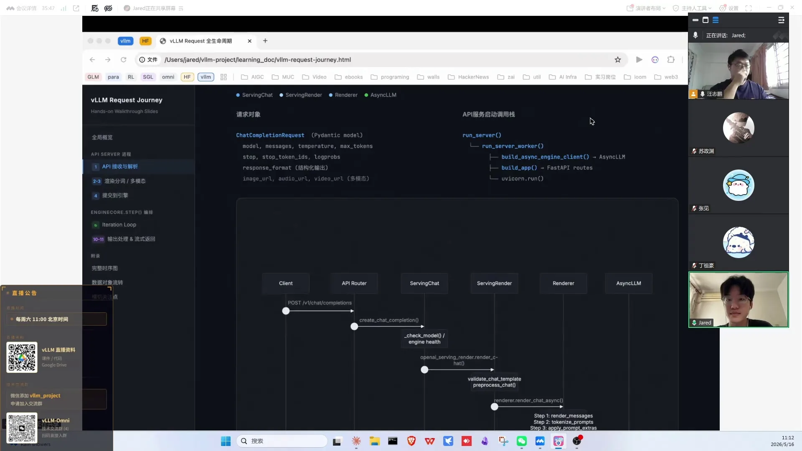
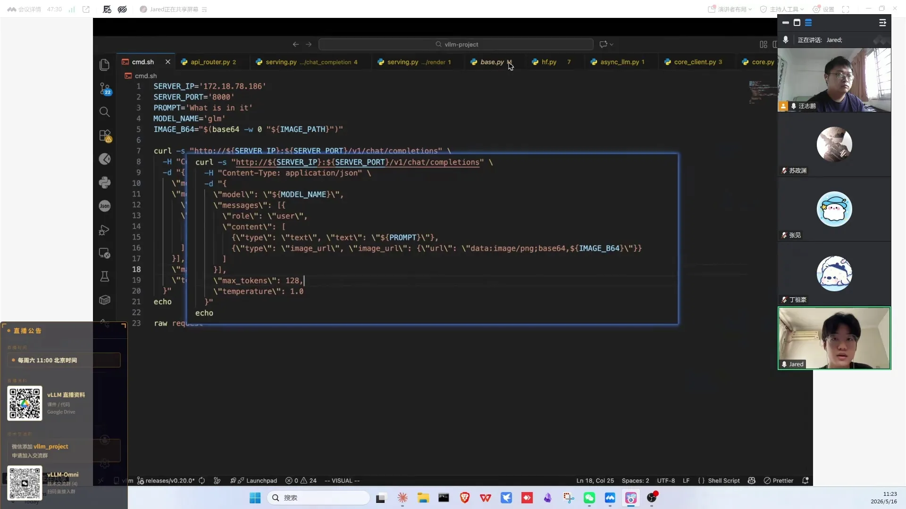
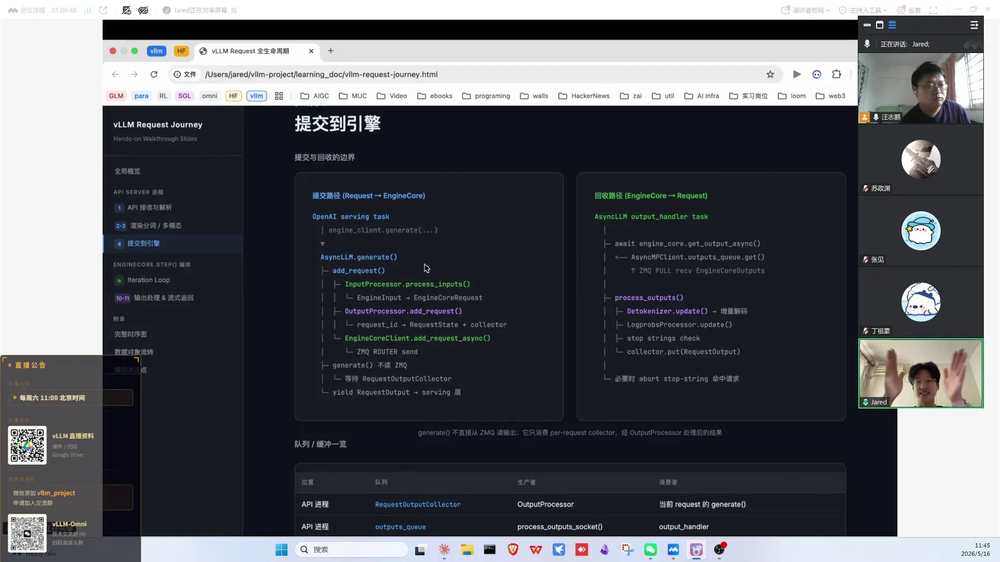
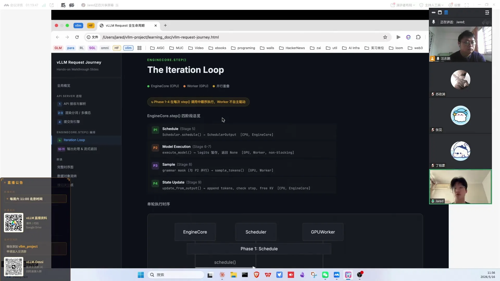

# 第03讲：一个 Request 的完整旅程

> 视频来源：[vLLM小课堂（三）：一个Request的完整旅程](https://www.bilibili.com/video/BV1yrJH6pEFQ/)（约 115 分钟，嘉宾：郭峰，大三学生、vLLM Committer，基于 vLLM v0.20.0 源码）。本文基于直播实录整理，时间戳可跳转到对应画面。

## 本讲要解决的核心问题（SCQA）

**背景**：大多数新人学 vLLM，都是直接从 PagedAttention、continuous batching 这些"明星概念"入手。

**冲突**：这些概念有很多 blog 和论文可看，但真正去 debug、去开发的时候，从 HTTP 请求进来到结果返回的整条调用栈又深又绕，新人往往晕头转向；而 AI 帮你写代码时，你自己没有全局视野也一样抓瞎。

**疑问**：一个请求在 vLLM 里到底是怎么一步步走完的？每一站有哪些关键类、关键数据结构？

**回答（中心思想）**：把一个 Request 的生命周期拆成**预处理 → 提交引擎 → 调度执行 → 采样 → 反序列化返回**五段主干，明星特性（PagedAttention、prefix caching、PD 分离、offloading）都是挂在这条主干上的扩展点。理解主干，才能有的放矢地 debug 和开发。

---

## 一、学 vLLM 要先有 Request 主干的全局视野

嘉宾的学习经验（[【跳转到 00:50】](https://www.bilibili.com/video/BV1yrJH6pEFQ/?t=50)）：熟练的人觉得调用栈"理所应当"，但新人直接看 attention 配置或 continuous batching，即使看完 Nano-vLLM / Mini vLLM 这类简化实现的实践，也还缺**一整个全局视野**。有了主干，debug、开发、甚至指挥 AI 写代码，才不会迷路。

本讲的源码版本是 **vLLM v0.20.0**（[【跳转到 03:41】](https://www.bilibili.com/video/BV1yrJH6pEFQ/?t=221)）。嘉宾还整理了一份 HTML 调用栈图 + Markdown 文档（手写骨架 → AI 补细节 → Claude Code 生成 HTML，再人工校对好几版），已经传到共享资料夹。

概览图就是本讲地图（[【跳转到 09:25】](https://www.bilibili.com/video/BV1yrJH6pEFQ/?t=565)）：request 打到 API 进程 → 渲染/分词/多模态处理 → 提交引擎 → 引擎内调度 → 模型 forward 与**采样分开执行** → 输出 token update 回 scheduler → 推回 API 进程 → detokenize → 返回用户。跟 HuggingFace Transformers 本质流程没区别，vLLM 做的是"更复杂、更稳定、更高效、能服务大规模用户"。

## 二、起点：vLLM 本质是 Transformers 五步推理的工程化

不从 vLLM 开始，先看裸 Transformers（[【跳转到 04:56】](https://www.bilibili.com/video/BV1yrJH6pEFQ/?t=296)）：

1. 加载 tokenizer 和模型（到 GPU）；
2. 准备 message——面向人类的原始对话；
3. **apply_chat_template**：把 message 套上对话模板。为什么需要？现在的对话模型走的是 OpenAI **chat completion** 端点语义，不再是"接着你的话说"的补全（completion）模型；预训练后要经过 SFT 具备对话能力，且必须符合 chat template 格式才能一问一答；
4. tokenize 成 token id，喂给模型 → embedding → hidden space → 若干层 forward → 输出 token id；
5. **tokenizer decode** 把 token id 变回字符串，得到 response。

vLLM 启动时把模型加载进来、做预热、对外 serve 接口；请求进来后做的事本质相同，只是每一步都被工程化地拆开、异步化、进程化。

## 三、API 层只做两件事：预处理与转交

### 3.1 入口处理靠两级外包

请求进来后的链路（[【跳转到 10:33】](https://www.bilibili.com/video/BV1yrJH6pEFQ/?t=633)）：client 向 chat completion 端点打请求 → **API router**（FastAPI 装饰器暴露端点，pydantic 把请求体包装成 `ChatCompletionRequest`）→ **OpenAIServingChat**。这个类只做两件事：预处理（render）+ 把 request 打包丢给 engine。

而预处理又被外包给 **OpenAIServingRender**，render 再把实际计算交给 **Renderer**。Renderer 涉及两个类：**BaseRenderer**（基类）和 **HF renderer**（真正干活），一般一起看。另外 render 还有**独立端点**：vLLM entrypoints 的 serving 里可以直接只打 render，拿到预处理结果而不跑后面的 forward；甚至可以不传原始文本、直接传已处理过的输入，请求进来后会被检测并跳过重复处理（[【跳转到 14:37】](https://www.bilibili.com/video/BV1yrJH6pEFQ/?t=877)）。

读这段代码时还会经常看到 `harmony` 分支——那是**专门给 GPT-OSS** 的处理，服务于 OpenAI 的 responses 端点，绝大部分模型不需要走这条路（[【跳转到 17:07】](https://www.bilibili.com/video/BV1yrJH6pEFQ/?t=1027)）。

### 3.2 预处理固定走四步

BaseRenderer 实际执行四个任务（[【跳转到 18:52】](https://www.bilibili.com/video/BV1yrJH6pEFQ/?t=1132)）：

1. **apply_chat_template**（由 HF renderer 执行，逻辑与 Transformers 一模一样，只是包了一层 async/future，避免阻塞）；
2. **tokenize**：text → token id，同样异步化。设计意图：长文本的 tokenize 和模板拼接都是耗时操作，拆成 async 各自跑，这也是 V0→V1 重构"前后端分离"后专门留给 CPU 侧的工作；
3. **extra 拼接**：把额外信息塞进已 tokenized 的数据类。典型如 `mm processor kwargs`——嘉宾踩过的坑：某些多模态模型必须把图片高宽塞进去，否则处理失败且报错丑陋难懂；
4. **多模态预处理**（process inputs）。

### 3.3 多模态靠两个 processor 分工

多模态请求的 message 结构（[【跳转到 22:16】](https://www.bilibili.com/video/BV1yrJH6pEFQ/?t=1336)）：role + content，content 里可以有 text、image url、audio url、video 等多种数据。预处理先把 message 拆开（parse messages → parse message 递归），多模态数据被 parse 出来放进 mm data。

process multi-modal 时会拿到模型的 processor（[【跳转到 33:08】](https://www.bilibili.com/video/BV1yrJH6pEFQ/?t=1988)），这里有**两个不同层面的 processor**（[【跳转到 36:15】](https://www.bilibili.com/video/BV1yrJH6pEFQ/?t=2175)）：

- **HF processor**（HuggingFace transformers 里实现）：真正执行运算——图像 resize/normalize/切 patch，音频 feature extraction（可理解为采样+数学计算），视频抽帧等模型特化计算；
- **vLLM multimodal processor**：跟模型行为关系没那么大，负责框架侧的处理。

另外 processor 结果有 **cache**：边 cache 边 apply，命中就直接 update，是性能考虑。调试建议：模型实现跑不通时，直接在模型实现处打断点，看调用栈向上追溯，就能分清问题出在 vLLM multimodal processor 还是 HF processor 本来就实现错了。

### 3.4 返回前还有 tool/reasoning parser 收尾

预处理结束后一路返回 engine prompt + conversation（[【跳转到 39:01】](https://www.bilibili.com/video/BV1yrJH6pEFQ/?t=2341)）。往回走还有：如果你配置了 **tool parser / reasoning parser**（工具调用/推理能力），会对已 tokenize 的内容做小调整。 Omni 的多模态预处理代码基本复用主仓，diffusion 部分则尽量与主仓层次结构一一对应——嘉宾先走 Omni 再回头看 vLLM，总结后才"没那么难"。

## 四、提交引擎：三条流水线各司其职

进入 engine 阶段后，难点从"调用栈深"变成"类的数量多"（[【跳转到 43:34】](https://www.bilibili.com/video/BV1yrJH6pEFQ/?t=2614)）：engine client、engine core、engine core client 三四个类放在一起。理解方式是**三条流水线**（[【跳转到 47:06】](https://www.bilibili.com/video/BV1yrJH6pEFQ/?t=2826)）：

1. **API 进程**（HTTP 进来 → engine client）；
2. **engine core 进程**（真正跑重计算：调度 + forward）；
3. **output 侧**（output processor 等着结果出来）。

`client generate` 拿到 render 结果（prompt tokens + conversation + engine input）后，补上 sampling params，丢给 engine client 的 **add request**。add request 做三件事（[【跳转到 48:21】](https://www.bilibili.com/video/BV1yrJH6pEFQ/?t=2901)）：

1. **input processor**：把 engine input 转成 engine core request（主要是格式转换，多模态也可能在这里处理，Omni 有自己的 input processor）；
2. **output processor 注册**：告诉第三条流水线"有个 request 进来了，你等着收结果"——LLM 的结果是一个 token 一个 token 出的，要有人在那收；
3. **engine core client**：通过 **ZMQ** 跨进程通信，把 request 真正从第一条流水线丢到第二条。

顺带说明 n 参数：一个 prompt 要几个输出序列，默认 1；n>1 多见于强化学习 rollout（一个 group 多条采样），读代码看 n=1 的主路径即可。另外 `support embedding model / pooling` 的分支与今天主题无关，可以跳过。

## 五、一个 step 走完调度、执行、采样、更新

### 5.1 busy loop 只做两件事：收请求、交调度

engine core process 一直在跑 busy loop，做两件事（[【跳转到 58:57】](https://www.bilibili.com/video/BV1yrJH6pEFQ/?t=3537)）：

- 从 ZMQ input queue 里 get/get_nowait 新 request；没有新请求且没在计算时就 block 等待；
- 拿到 request 后 `handle client request`：做一些校验，然后交给 **scheduler**。

真正在底层管理一个个 request 的是 scheduler（engine core 自己的 queue 其实由 scheduler 维护）。**PagedAttention、prefix caching 相关的东西都会在这一块做预先分配**。scheduler 维护 waiting / running 等状态的队列。

### 5.2 一个 step 走四段：schedule → execute → sample → update

engine step 是最关键的循环（[【跳转到 54:33】](https://www.bilibili.com/video/BV1yrJH6pEFQ/?t=3273)）：

1. **schedule**：按 FCFS（先来先服务）等策略调度，返回 scheduler output（对 waiting 的新请求，先算 prefix cache 命中、分配 KV cache block，再放入 running）；
2. **execute model**：GPU model runner 实际执行一次 forward。这一块代码最多最深，性能优化也在这里；**模型实现错误通常在 vllm serve 启动阶段就会在这附近报错**；
3. **sampler**：forward 结束返回（future），sampler 把 logits sample 成 token。刻意设计：execution 和 sampling 都在 GPU 上，但做成**异步分开的操作**；
4. **update from output**：scheduler 更新状态——KV cache 相关处理、判断请求是否结束（没结束继续留在队列，结束了释放 KV cache）；开启 MTP 时 output 里可能有多个 token（被拒绝的丢掉、被接受的塞回去）；最终把结果推给 output queue。

### 5.3 engine core 数量由并行策略决定

- engine core 数量 = engine core client 数量；**worker 数 ≈ DP × PP × TP**（大致每 GPU 一个 worker）；
- DP 场景有 N 个 engine core 和 N 个 client，每个 DP 副本有自己独立的 KV cache——所以 semantic router 这类按服务路由的组件与 DP 结合并不紧密（[【跳转到 57:28】](https://www.bilibili.com/video/BV1yrJH6pEFQ/?t=3448)）；
- "一个 engine core 是一个完整模型吗？"——不是，它只是**模型运行部分的抽象**，取决于并行策略；
- DP 只与 EP 同时存在：典型 MoE 部署 TP=8、DP=2、EP=16，attention 有两个副本各占八卡，但**仍然是一个 vLLM 实例**，不是两个（[【跳转到 67:51】](https://www.bilibili.com/video/BV1yrJH6pEFQ/?t=4071)）；
- worker/runner/model 三层架构：worker 绑定 GPU、持有 model runner，按 DP/PP/TP 算出自己 rank 属于哪一组，指挥 runner 加载对应权重、与其他 rank 配合；而我们平时做贡献最多的是 **model 层**——新模型适配往往先写 model（[【跳转到 70:21】](https://www.bilibili.com/video/BV1yrJH6pEFQ/?t=4221)）。

### 5.4 多模态执行期有两套 cache

Qwen-VL 这类模型的 forward（[【跳转到 64:56】](https://www.bilibili.com/video/BV1yrJH6pEFQ/?t=3896)）：image 先被 patch 成小块，过 vision tower 得到 feature/embedding——这个 embedding 与文本 embedding 语义对齐——再进语言模型主干 forward。多模态其实有**两套 cache**：纯 image cache（存 encoder output）和 KV cache（经处理后的）；profiling 阶段用 dummy data 估算最大负载下的显存，剩下的再分给 KV cache 管理。PD 分离、propose draft token（投机解码）也都挂在这一块。

## 六、采样与返回：GPU 算 token，API 层拼结果

### 6.1 采样发生在 GPU 上

model 输出最后一层 hidden states → compute logits → softmax → sampler（[【跳转到 95:37】](https://www.bilibili.com/video/BV1yrJH6pEFQ/?t=5737)）。sampling 实际由 **FlashInfer** 等 backend 在 GPU 上执行，启动日志里能看到用的是哪个。sampling 也消耗性能，高并发时要留意。

### 6.2 token 回到 API 层才变可读

engine core output 经 output queue、ZMQ 推回 API 层（[【跳转到 97:17】](https://www.bilibili.com/video/BV1yrJH6pEFQ/?t=5837)）。engine client 的 **run output handler** 从 output queue 取出结果，交给 output processor：update states from output——新 token id 交给 detokenizer 变成可读字符串；如果请求参数带了 logprobs，也一并附上（logprobs 多用于 debug）；组装成 **request output** 往外传。

### 6.3 stream 与 JSON 只是两种出口

generate 返回的是 Python generator（yield），两种模式（[【跳转到 100:38】](https://www.bilibili.com/video/BV1yrJH6pEFQ/?t=6038)）：

- **非 stream**：等全部生成完，返回一个完整 JSON；
- **stream=true**：SSE（Server-Sent Events）一个一个往外推。

最后一步的拼装（[【跳转到 102:53】](https://www.bilibili.com/video/BV1yrJH6pEFQ/?t=6173)）：从 final result 里把 reasoning 内容放进 reasoning 字段、把 tool 调用提取进 tools；message 塞进 choice，choice 塞进最终的 ChatCompletionResponse JSON，附上 model name、可选的 logprobs / token id，返回用户。

**tool choice** 有好几种语义（[【跳转到 103:18】](https://www.bilibili.com/video/BV1yrJH6pEFQ/?t=6198)）：`auto`（自动决定）、`none`（给了工具也不准调）、`named function`（指定调某个函数）、`required`（必须调工具但不指定哪个）。

另外有些模型（GPT-OSS、Kimi K2 等）需要在架构层做针对模型的 hack（[【跳转到 105:23】](https://www.bilibili.com/video/BV1yrJH6pEFQ/?t=6323)），读代码时可以跳过这些特判，先看最通用的路径。

整个返回链路串起来就是一张时序图（[【跳转到 106:34】](https://www.bilibili.com/video/BV1yrJH6pEFQ/?t=6394)）：sample 完的 token 经 scheduler → engine core → engine core client → engine client → API server，最后以 SSE data 一路推到用户手上。

## 七、高频问答：答案背后都是工程取舍

- **多轮对话的记忆是谁拼的？**不是 vLLM——是**调用方**自己管理 context：上一轮问题+回答+本轮问题，一直拼上去（[【跳转到 91:38】](https://www.bilibili.com/video/BV1yrJH6pEFQ/?t=5498)）。而 **prefix cache** 的复用机制：把 token 分 chunk 算哈希，用 hash 匹配可以复用多少前缀的 KV（[【跳转到 92:47】](https://www.bilibili.com/video/BV1yrJH6pEFQ/?t=5567)）。

- **MTP / 投机解码**：prefill 也会猜、但不验证，猜的结果丢给 decode 阶段验证（PD 分离时 P 端开 MTP，把猜的都丢给 D 端）；**只在 decode 生效**——一个请求只有一次 prefill，decode 才是"小模型猜、大模型验"的循环。纯推理应开尽开，加速约 2.2~2.7 倍；但 RL rollout 训练里权重会漂移，需要再套 SFT，否则训练后期 acceptance 变负收益（[【跳转到 83:43】](https://www.bilibili.com/video/BV1yrJH6pEFQ/?t=5023)）。高并发下 MTP 验证量大可能算力受限，建议水平扩展 + 外层 load balancer。
- **SP vs CP**：训练里分 Megatron / DeepSpeed 两套，很复杂；vLLM 里的 SP 只是改了通讯算子（all-reduce → reduce-scatter + all-gather），对 MoE 跨机有效；vLLM-Omni 用 Ulysses + ring attention（合称 USP），并行都在 attention 处（[【跳转到 81:38】](https://www.bilibili.com/video/BV1yrJH6pEFQ/?t=4898)）。
- **跨机部署**：两台机器用 **Ray** 连起来，起两个脚本（head/worker），之后的策略与单机一致——TP=8 DP=2 时框架自己知道怎么切权重，EP=16 时 expert 自动放到 16 卡；K8s / 云原生部署可参考社区的 recipe（yaml 一键提交）（[【跳转到 73:39】](https://www.bilibili.com/video/BV1yrJH6pEFQ/?t=4419)）。
- **Omni 分 stage**：以 Qwen3-Omni 为例，thinker / talker / Code2Wav 三部分完全分隔，就是三个 stage = 三个 engine，各配一个 engine core 和一个 worker（[【跳转到 75:23】](https://www.bilibili.com/video/BV1yrJH6pEFQ/?t=4523)）。
- **训练与推理的并行差异**：训练必开 PP（要填流水线 bubble，复杂得多）、DP 因为要算 loss 不是纯水平扩展；推理一般不开 PP，只在 EP 场景才见 DP（[【跳转到 77:03】](https://www.bilibili.com/video/BV1yrJH6pEFQ/?t=4623)）。
- **CPU 还是 GPU？**vLLM 主要用 GPU；processor/preprocess 在 CPU，sampling 在 GPU（FlashInfer）。
- **多硬件后端怎么支持？**vLLM 对多硬件后端的抽象已经做得比较好，各后端都以 **plugin 形式**接入；再往上走，核心在于硬件厂商能否提供更好的 kernel、并管理好跨硬件的**精度**差异，否则模型在 vLLM 里基本没法用（[【跳转到 88:43】](https://www.bilibili.com/video/BV1yrJH6pEFQ/?t=5323)）。
- **Mac 能学吗？**能安装能开发，但**不能做推理**——找工作必须得有 GPU；可以租昇腾卡等学习；只做 Ollama 小模型方向难以支撑求职（[【跳转到 113:59】](https://www.bilibili.com/video/BV1yrJH6pEFQ/?t=6839)）。

## 八、学习方法：地图要自己走一遍才算数

- 嘉宾的 HTML/Markdown 是**地图不是教材**：对着代码自己走一遍，效果远好于只听讲（[【跳转到 106:59】](https://www.bilibili.com/video/BV1yrJH6pEFQ/?t=6419)）；
- 内容在 v0.20.0 验证过，其他版本可能有出入；CUDA graph、attention 配置、continuous batching 值得另开两三个小时专题，但因已有大量 blog/论文，本讲把时间花在"被认为很基础"的主干上；
- **带着问题 debug**：vLLM V0→V1 切换期 bug 最多，修 bug 是理解框架最快的方式；
- 入门实践路径：拿千问 0.6B 小模型，在一块小 GPU 甚至 CPU 上跑通全流程；先 debug Transformers（简单得多），建立基本概念后再上 vLLM（[【跳转到 78:18】](https://www.bilibili.com/video/BV1yrJH6pEFQ/?t=4698)）；
- AI 可以帮忙（写文档、rebase、生成时序图），但**它的调用栈图会出错、认知会有偏差**，必须人工逐版校对（[【跳转到 111:54】](https://www.bilibili.com/video/BV1yrJH6pEFQ/?t=6714)）。

## 小结

- 一个 Request = **预处理（4 步）→ add request（3 件事）→ engine step（4 阶段）→ output processor → 返回**，所有明星特性都挂在这条主干上；
- API 层两级外包：OpenAIServingChat → OpenAIServingRender → Renderer（BaseRenderer/HF renderer）；HF processor 管模型特化计算，vLLM multimodal processor 管框架侧；
- engine 阶段按**三条流水线**理解：API 进程 / engine core 进程 / output 侧，靠 **ZMQ** 跨进程通信；engine client、engine core client、engine core 各司其职；
- engine step = schedule（FCFS，PagedAttention/prefix cache 在此分配）→ execute model → sampler（异步分离）→ update from output（KV cache 释放、判断结束）；
- 返回侧：detokenize、logprobs、stream（SSE）/JSON 两模式、reasoning/tool 提取、tool choice 语义；
- 实例与并行的换算：worker ≈ DP×PP×TP；engine core = engine core client；DP 只与 EP 同在，TP8+DP2+EP16 仍是一个 vLLM 实例；
- 学习心法：地图在手、带着问题、小模型跑通全流程、AI 产物必须人工校对。

## 关键术语速查

| 术语 | 一句话解释 |
| --- | --- |
| chat completion | OpenAI 风格的对话端点，本讲请求的入口 |
| apply_chat_template | 把人类对话套上模型对话模板，tokenize 前的必备步骤 |
| API router / OpenAIServingChat | FastAPI 端点路由 / 端点处理类（预处理+提交引擎两件事） |
| BaseRenderer / HF renderer | 预处理四步的基类与真正执行 apply_chat_template 的实现 |
| mm processor kwargs | 预处理第三步塞进去的多模态附加参数（如图片高宽） |
| HF processor / multimodal processor | HuggingFace 侧模型特化计算 / vLLM 侧框架处理，两层分工 |
| tool parser / reasoning parser | 从输出中提取工具调用 / 思考内容的解析器 |
| engine client / engine core client / engine core | API 层交互 / 跨进程通信握手 / 真正调度+计算的三个类 |
| ZMQ | vLLM 各进程间的消息通信层 |
| add request | 提交请求的入口：input processor → 注册 output → 发给 engine core |
| n 参数 | 一个 prompt 生成几条输出，>1 常见于 RL rollout |
| scheduler / waiting / running | 调度器与其维护的请求队列状态 |
| FCFS | 先来先服务，vLLM 默认调度策略 |
| execute model / GPU model runner | 一次 forward 的实际执行层 |
| sampler / FlashInfer | 采样器与常用的采样 backend |
| update from output | 每步后更新 KV cache、判断结束、推送 token |
| detokenize / logprobs | token id → 字符串 / 输出的概率分布（调试用） |
| SSE | stream 模式下逐 token 推送的方式 |
| tool choice | auto / none / named function / required 四种工具调用语义 |
| DP / EP / TP / PP | 数据 / 专家 / 张量 / 流水线并行；worker 数 ≈ DP×PP×TP |
| USP | Ulysses + ring attention 的合称，vLLM-Omni 的序列并行方案，并行都发生在 attention 处 |
| Ray | 跨机组网工具，跨机部署用它连 head/worker |
| MTP / speculative decoding | 多 token 预测 / 投机解码，只在 decode 阶段生效 |
| prefix cache | 按 chunk 哈希匹配前缀、复用已算好的 KV |
| PD 分离 | prefill 与 decode 分开部署，P 端猜的 token 丢给 D 端验证 |
