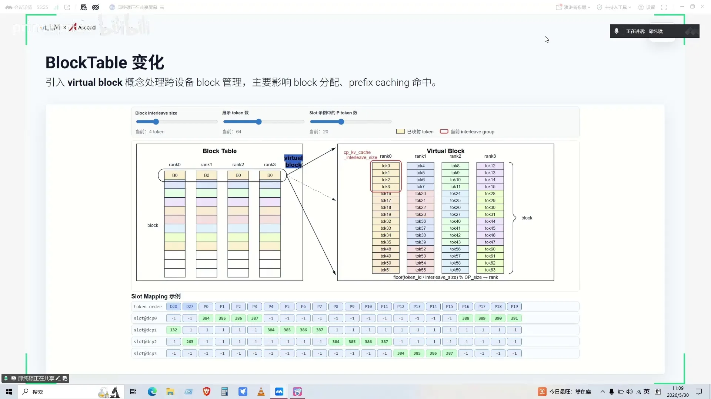
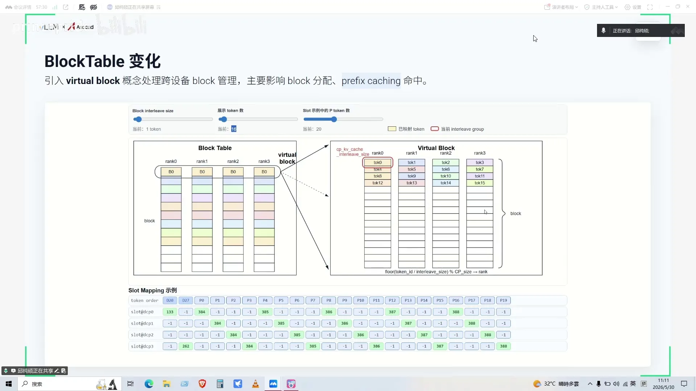
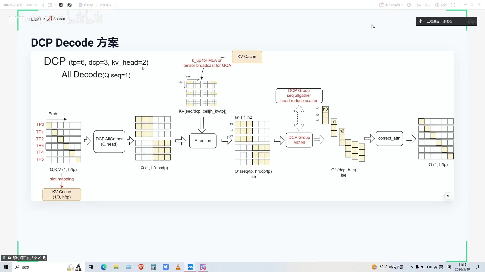
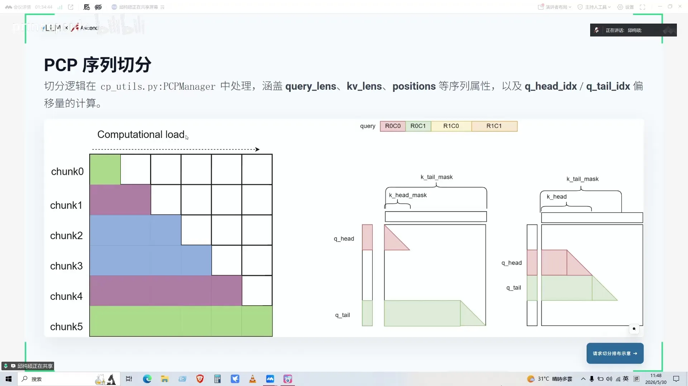
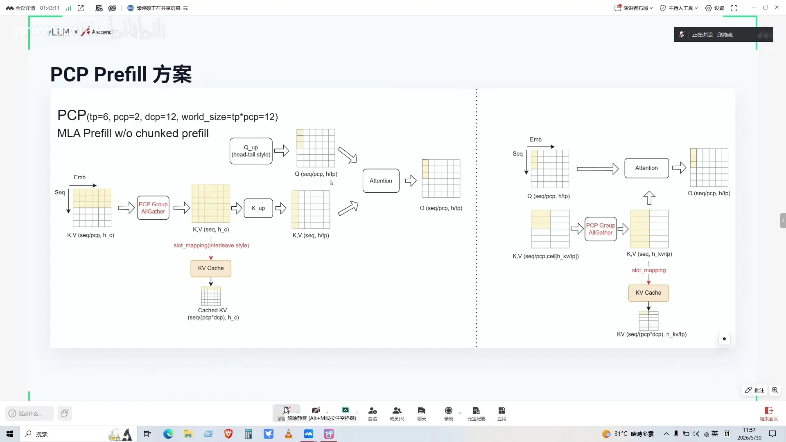
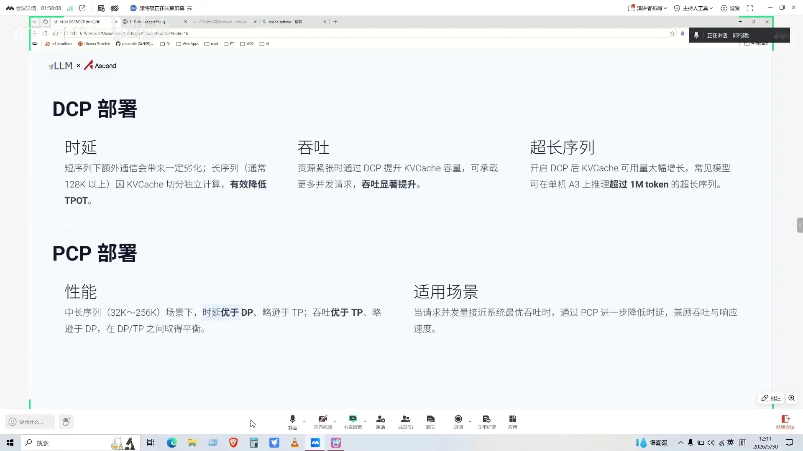
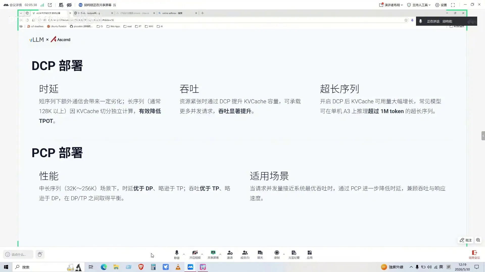

# 第04讲：PCP与DCP详解

> 视频来源：[vLLM小课堂（四）：PCP与DCP详解](https://www.bilibili.com/video/BV1W1L96KEf5/)（约 90 分钟，嘉宾：乔老师，PCP 作者、DCP 维护者）。本文基于直播实录整理，时间戳可跳转到对应画面。

## 本讲要解决的核心问题（SCQA）

**背景**：模型上下文越做越长（V4 已到 1M），但 TP/PP/DP 这些经典并行策略都不是按"序列"切的。

**冲突**：KV head 数很少（GQA 只有 2/4/8，MLA 等效为 1）时，TP 切分后不同卡存了大量重复的 KV cache——纯冗余；prefill 输入序列再长，单卡也要整体扛。

**疑问**：能不能让"序列"也成为并行的维度？切了之后注意力计算、KV cache 管理、PD 分离、prefix caching 怎么办？

**回答（中心思想）**：vLLM 把序列并行拆成两半——**PCP 管 prefill 阶段的输入序列切分，DCP 管 KV cache 的分卡存储**；两者解耦、可独立开关。DCP 用 virtual block + interleave size 管理 KV 存储，用 all-gather/all-to-all 补全计算；PCP 用首尾拼接（zigzag）保证带 mask 计算的负载均衡，用两套 all-gather 方案覆盖长 prefill。其中只有 PCP 是介于 DP 和 TP 之间的取舍型策略（时延/吞吐的平衡点），DCP 的取舍则是"短序列少量 TPOT 劣化换显存与长序列能力"。

---

## 一、总览：为什么序列并行要拆成两半

PCP（Prefill Context Parallelism）= **prefill 阶段的序列并行**：输入的 QKV 序列在 prefill 阶段被切成多个 chunk，分给不同的 PCP rank（[【跳转到 00:25】](https://www.bilibili.com/video/BV1W1L96KEf5/?t=25)）。DCP（KV cache 的 CP）= 对 **KV cache 做切分**：KV 存入 cache 时按 DCP rank 切到各卡上（[【跳转到 00:50】](https://www.bilibili.com/video/BV1W1L96KEf5/?t=50)）。

收益：**消除冗余存储**，提升 KV cache 利用率，从而支撑更大的最大序列长度和整体吞吐。

DCP 最早由月之暗面的同事贡献进 vLLM，嘉宾在其基础上做了多后端适配与维护；PCP 则是嘉宾去年下半年向社区提交 RFC 后逐步推进的。

## 二、DCP：KV cache 的分卡存储

### 2.1 为什么需要：冗余存储

DCP 引入的立足点（[【跳转到 09:25】](https://www.bilibili.com/video/BV1W1L96KEf5/?t=565)）：**当 KV head 数小于 TP head 数时，TP 切分必然产生冗余**——GQA 的 KV head 通常只有 2/4/8，TP 一旦超过这个值，不同卡就会存相同的 KV cache；MLA 更严重，KV 压缩后等效 KV head=1，所有卡上都存着全量冗余。因此 DCP 有个约束：**DCP size × KV head 数 ≤ TP size**。

### 2.2 怎么存：virtual block 与 slot mapping

纯 prefill 阶段（不考虑 chunked prefill）DCP 对计算没有影响，唯一改变的是**存 KV cache 的过程**（[【跳转到 01:25】](https://www.bilibili.com/video/BV1W1L96KEf5/?t=85)）。存储方案（[【跳转到 02:30】](https://www.bilibili.com/video/BV1W1L96KEf5/?t=150)）：

- 每个 rank 仍维护一份 block table（按 token 粒度映射）；
- 引入 **virtual block**：把同一个 DCP 组里各卡上的物理 block 合成一个虚拟块，virtual block 的 block size 相应扩张——这样按序列长度分配 block、做 prefix caching 命中时都更精准（[【跳转到 03:45】](https://www.bilibili.com/video/BV1W1L96KEf5/?t=225)）；
- token 在多卡间最初采用**按 token 轮询**（round-robin）存储，实现简单（下标取模即可）。

### 2.3 interleave size：为 PD 分离省通信

轮询存储在 PD 分离下有个问题：KV 是按 block 整块传输的。例如 16 个 token、block size 16，本可放进一张卡的一个 block，轮询后却散在 4 个 block 里，传输成本增加（[【跳转到 05:25】](https://www.bilibili.com/video/BV1W1L96KEf5/?t=325)）。解法是引入 **CP KV cache interleave size**（[【跳转到 05:50】](https://www.bilibili.com/video/BV1W1L96KEf5/?t=350)）：开 PD 分离时把它设成 block size，让 token 尽量填满前面的 block，后面的空 block 无需传输。

存储分布改变后，slot mapping 也随之修改：按 token 原始位置对 interleave size 和 CP size 取模，落在本卡就写入对应 block 位置，不在本卡则置为无效值（[【跳转到 06:40】](https://www.bilibili.com/video/BV1W1L96KEf5/?t=400)）。

## 三、DCP 的计算：怎么把切开的 KV "拼"回来

### 3.1 GQA 路径：gather Q + all-to-all

decode 时本卡的 Q 只能看到本卡的 KV，需要两处修改（[【跳转到 08:45】](https://www.bilibili.com/video/BV1W1L96KEf5/?t=525)）。以 TP=6、DCP=3、KV head=2 为例（[【跳转到 10:25】](https://www.bilibili.com/video/BV1W1L96KEf5/?t=625)）：

1. **DCP 组内对 Q 做 head 维 all-gather**：Q 的 head 通常较多、按 TP 切分，而 KV head 少、在 DCP 组内共享——让 Q head 的切分逻辑与 KV head 对齐；
2. 做一次**正常的 attention**（每个 Q head 只对部分 KV 序列），返回 **LSE**（online softmax 的中间状态）；
3. **all-to-all 通信**（可理解为一次转置）：head 恢复正常 TP 切分，同时把完整序列的 KV 信息聚合过来。此前它由"序列维 all-gather + head 维 reduce-scatter"两次通信等价实现；
4. **correct attention**：按 LSE 对 output 做一次更新，把分块结果变成全局结果，恢复到与输入 Q 相同的维度。

**各后端对异构 mask 的支持差异（长 prefill 场景）**：KV 按 token 轮询存储后，chunked prefill 的 attention mask 会呈"两个阶梯"状增长的异构形态，并非每个后端都能直接支持（[【跳转到 33:21】](https://www.bilibili.com/video/BV1W1L96KEf5/?t=2001)）——**FlashInfer** 暂不支持这种阶梯 mask，需要把当前 chunk 的 KV 与 Q 先做一次正常完整计算，上下文部分再走另一条路径（两条路径）；**FlashAttention** 则支持在后端传入 KV cache 的 interleave size 来构造这种异构 mask，存完当前 KV 后直接拿 Q 与聚合来的 KV cache 做一次带 mask 的 attention（一条路径）。

### 3.2 MLA 路径：聚合 KV 而不是 Q

MLA 的方案不同（[【跳转到 17:30】](https://www.bilibili.com/video/BV1W1L96KEf5/?t=1050)）：不是对 Q 操作，而是**把切分出去的 KV cache 重新聚集回来**——存储分散、计算聚合。实现上复用 MLA 长 prefill 已有的 workspace 机制（不断从 KV cache 取一块 KV 与 Q 计算，避免一次算超长上下文导致激活值过大）：先 all-gather 各卡的 local KV cache，再做 **reorg KV cache**——把 all-gather 后交错存储的多请求 KV 重新排成连续存储，顺便去掉算子不支持的中间 pad，然后与本卡 Q 计算，一轮轮迭代出所有上下文的 output 和 LSE，最后与当前 Q 的结果做一次更新。

思路对比：**MLA 只在存储上分块、计算上仍走全量 KV；GQA 则存储和计算都做了切分**（[【跳转到 21:16】](https://www.bilibili.com/video/BV1W1L96KEf5/?t=1276)）。

### 3.3 什么场景该开 DCP

实测结论（[【跳转到 24:35】](https://www.bilibili.com/video/BV1W1L96KEf5/?t=1475)）：

- **短序列下 TPOT 有劣化**（额外通信 + 更新操作）；**序列超过 128K 后才有 TPOT 收益**；
- 收益来源：固定上下文/请求数时可以调低单卡显存；显存固定时可存更多 KV cache → 并发更高、prefix cache 命中更好（[【跳转到 24:10】](https://www.bilibili.com/video/BV1W1L96KEf5/?t=1450)）；
- 典型案例：昇腾 Atlas A3（910C）八卡、H200 八卡上开 DCP 都能把**单序列推理长度推到 1M**（[【跳转到 27:16】](https://www.bilibili.com/video/BV1W1L96KEf5/?t=1636)）；
- 取舍本质：更看重低时延部署，还是吞吐/可服务序列长度。

支持范围：普通结构模型（Qwen3、DeepSeek 3.1 等）已支持；DeepSeek 3.2/V4、Qwen3.5 这类**混合线性注意力**模型还在 PR 阶段——对 hybrid 模型只在 full attention/GQA 层做 DCP 分块，linear attention 层只存 sliding window 无需处理（[【跳转到 29:31】](https://www.bilibili.com/video/BV1W1L96KEf5/?t=1771)）。

## 四、PCP：prefill 序列切分

### 4.1 通信组：与 DP/PP/TP 并列

DCP 的通信组复用 TP 组（是 TP 的子集）；**PCP 则引入独立的通信组**，与 DP/PP/TP 并列，会增加总卡数（[【跳转到 37:30】](https://www.bilibili.com/video/BV1W1L96KEf5/?t=2250)）。划分顺序：先切 PCP（拿不同序列块），再在组内切 TP（切 head）。DCP 与 PCP 可组合，DCP size 三个取值：1（不开）、等于 PCP size（只在 PCP 组内开）、以及受 KV head 限制的最大值 PCP size × TP size ÷ KV head（GQA 场景还要按"持有相同 KV head 的 TP 组"再折算）。

### 4.2 Q 序列切分：zigzag 首尾拼接

prefill 的 attention 带下三角 mask，按 token 轮询切会破坏 mask 语义。PCP 采用 **zigzag（首尾拼接）**（[【跳转到 43:07】](https://www.bilibili.com/video/BV1W1L96KEf5/?t=2587)）：序列先 pad 到 2×PCP size 的整数倍（PCP=2 时即 pad 到 4 的倍数），再切成 2×PCP 个 chunk，chunk 0 与最后一个 chunk 拼在同一张卡、chunk 1 与倒数第二个拼一起……这样带着 mask 计算时**各 PCP rank 负载均衡**（头尾 chunk 的计算量互补）。

代价是 metadata 全变了（[【跳转到 45:37】](https://www.bilibili.com/video/BV1W1L96KEf5/?t=2737)）：positions 从单调递增变成首尾拼接状；Q length 折半；KV length 按块不同（头短尾长）；mask 变成"短梯形+长梯形"拼接、阶梯状增长，大多数 attention 后端不支持。解法：**头 chunk 和尾 chunk 分别与 KV 各做一次 attention**（这就是引入 Q head index / Q tail index 的原因），梯形 mask 本身大多数算子已支持——Q 短于 KV 时算子会自动把 Q 对齐到 KV 末端、按 causal 选项做梯形 mask（[【跳转到 61:08】](https://www.bilibili.com/video/BV1W1L96KEf5/?t=3668) 问答）。

### 4.3 计算方案：ring attention vs all-gather

学术界经典方案是 **ring attention**（每块 Q 与本地 KV 算完，用 point-to-point 通信传递 KV，滚动更新），但实现/调试/对后端的影响都大，vLLM 暂未采用，只在做实验验证（[【跳转到 50:18】](https://www.bilibili.com/video/BV1W1L96KEf5/?t=3018)）。

已提交 PR 的方案是 **all-gather 系**（[【跳转到 51:33】](https://www.bilibili.com/video/BV1W1L96KEf5/?t=3093)）：

- **普通 prefill**：Q 保持 PCP 切分、head 按 TP 切，KV 做一次 PCP group 的 all-gather 拿到全量，然后头/尾 chunk 各算一次 attention——KV 全量所以不需要 online softmax 更新；存 KV cache 时还能按算好的 slot mapping 一把写入；
- **长 prefill（chunked prefill）两套方案**：① **all-gather Q**——把 Q 的序列切分 gather 掉，流程就退化成 DCP 的长 prefill 方案（DCP 长 prefill 的 GQA 路径与 decode 完全一致：Q 本身就是完整的、只有 KV cache 不完整，先对 Q 做 DCP 组内 all-gather，再做 KV cache update 与 all-to-all 补全上下文信息，[【跳转到 15:00】](https://www.bilibili.com/video/BV1W1L96KEf5/?t=900)）；② **all-gather KV**——KV 聚合回来，退化成 PCP 的普通 prefill 方案（Q 局部 + KV 全量）。两方案各有优劣：chunked prefill 的 Q 很大（max prefill tokens × batch），而 KV 切过 head 后可能不大，通信量与计算量在不同上下文长度下存在 tradeoff，目前两套并行推进（[【跳转到 59:03】](https://www.bilibili.com/video/BV1W1L96KEf5/?t=3543)）。

- **PCP 对 decode 的影响**：理论上无影响——只是让 DCP group 等价变大；实际要做的调整是把 DCP 组内 Q head 的 all-gather 收窄为"DCP 与 TP 的交集"，避免把 PCP 维度冗余 gather 进来（[【跳转到 53:38】](https://www.bilibili.com/video/BV1W1L96KEf5/?t=3218)）。

### 4.4 PCP 的定位：DP 与 TP 之间

在 vllm-ascend 上验证较多（[【跳转到 65:42】](https://www.bilibili.com/video/BV1W1L96KEf5/?t=3942)）：

- **收益区间**：中长序列（约 32K~256K）收益较好；
- **时延**：比 DP 好、负载均衡也比 DP LB（即便加了）在变长序列下更好；但仍**比不过 TP**——PCP=2 无法让时延低于 DP=2 的一半，只有低于一半才可能在总吞吐上赢过 DP；
- **吞吐**：比 TP 好、比 DP 略差；
- **部署场景较窄**：当并发量已经接近系统吞吐、或并发显著超过吞吐导致处理不过来时，用 PCP 进一步降时延，兼顾吞吐与响应速度；
- **为什么上限是 256K**：PCP 理论计算量与 TP 相同，优势在通信量更小、激活值更小；超长序列下计算占大头，通信优势被稀释——此时 **TP + DCP + 长 prefill** 反而是已支持特性里更优的组合。

## 五、decode 通信还能再省：TPA 不切 Q，动态 CP 让短序列回到 DP

### 5.1 TPA：把 Q 的 TP 切分消掉

**TPA（Tensor Parallel Sparse Attention，英伟达同事提出，RFC/PR 阶段）**（[【跳转到 72:22】](https://www.bilibili.com/video/BV1W1L96KEf5/?t=4342)）：DCP 的 head 维 all-gather 前，通信算子往往要先 transpose 对齐维度，开销不小。而 decode 阶段是访存受限、计算不是瓶颈——那就让 Q projection **不按 TP 切分**，直接输出完整 head：省掉一次 DCP 通信和一堆变换算子，代价是多了些计算。decode 场景下这笔账划算，TPOT 收益更明显。

### 5.2 动态 CP：DP 与 CP 之间自由切换

**动态 CP**（同时惠及 PCP/DCP）的出发点（[【跳转到 74:02】](https://www.bilibili.com/video/BV1W1L96KEf5/?t=4442)）：短序列下 CP 的额外通信没有收益、反而吃掉计算收益。做法是在**调度侧与通信组**做调整：短序列走 CP=1 的标准 DP 通路；长序列选预设的 CP size；长尾请求（一直在 decode 或长 prefill）也可以在两种通信策略间切换。实测把 CP 的优势区间**从 32K 降到 4K**，变长序列下表现更好，吞吐与 TTFT 比 DP 更好，TPOT 无额外劣化——CP 特性的适用范围大幅扩大。

嘉宾还在推进长序列方向的 PP 优化（动态 chunk / 动态 context 的流水线并行），在接近 1M 的场景已有测试；DeepSeek V4 支持 1M 后，这类场景会逐渐进入部署考量。

## 六、特性要好用：支持范围要清楚、隔离要做好、recipe 要细化、评测要能触发特性

- **支持现状与 MoE 的边界**：vLLM 主线上 DCP 基础特性已支持；MTP（投机推理）尚未很完善的支持，FA 后端/CUDA graph、PD 分离等已有 PR 但暂未合入；vllm-ascend 侧 PCP 特性基本开发完成（[【跳转到 64:02】](https://www.bilibili.com/video/BV1W1L96KEf5/?t=3842)）。同时 PCP/DCP 只作用于 attention，MoE 部分照旧——单机少并发用 TP，多机用 EP，EP 可跨 DP/PP/PCP 组成（[【跳转到 69:27】](https://www.bilibili.com/video/BV1W1L96KEf5/?t=4167)）；
- **high level 特性的隔离决定可维护性**：PCP/DCP 对 model runner 的 metadata 修改很多，设计上尽量抽离成统一接口（CP manager），让新人读主流程不被干扰——"很多 high level 特性，隔离做好很关键"；特性越来越多，新人对主仓代码的理解门槛在上升（[【跳转到 81:36】](https://www.bilibili.com/video/BV1W1L96KEf5/?t=4896)）；
- **部署 recipe 要按优化目标细化**：现在的部署 recipe 太宽泛，一个典型模型只给一个策略；用户更关心"追求 TTFT 该怎么调、追求吞吐该怎么调"——每个特性都应说明它提升了什么、劣化了什么；社区也建议在论坛维护部署场景的最佳实践帖（信息目前很分散）（[【跳转到 83:03】](https://www.bilibili.com/video/BV1W1L96KEf5/?t=4983)）；
- **引擎能力 ≠ 模型能力，评测要能强制触发特性**：PCP/DCP 下引擎早就能推 1M，但 V4 之前没有模型真支持这么长，且超过训练 context 后模型能力会下降（[【跳转到 83:53】](https://www.bilibili.com/video/BV1W1L96KEf5/?t=5033)）；测特性时日常 CI 看护多跑 GSM8K（快、能看出问题），长序列特性可加 GPQA 等经典集，并用 long prefill token threshold 之类开关强制每个请求触发目标特性、便于暴露问题（[【跳转到 87:18】](https://www.bilibili.com/video/BV1W1L96KEf5/?t=5238)）；
- **与 SGLang 对比：EP 语义不同**：SGLang 的 DP attention 目标类似（KV 拆卡防冗余），但其 TP 与 vLLM 的 TP 不是一个含义；vLLM 的 EP = DP × PCP × TP 的层级组合（[【跳转到 62:23】](https://www.bilibili.com/video/BV1W1L96KEf5/?t=3743)）。

## 小结

- 序列并行拆两半：**PCP 切 prefill 输入序列、DCP 切 KV cache 存储**，互相解耦、只作用于 attention，不影响 MoE 的 TP/EP 选择；
- DCP 立足于 KV head < TP head 的冗余（MLA 最严重），约束 DCP size × KV head ≤ TP size；存储靠 **virtual block + interleave size**（PD 分离省传输），计算分 **GQA（gather Q + all-to-all + correct attention）与 MLA（聚合 KV + reorg）** 两条路径；
- DCP 的取舍：短序列 TPOT 劣化、128K 以上才有收益；换来的是更长序列、更高并发、更好的 prefix cache 命中；
- PCP 独立通信组、先于 TP 划分；用 **zigzag 首尾拼接**保证 mask 下负载均衡，代价是 metadata 与 mask 形态变化，需头/尾 chunk 两次 attention；
- 计算选 all-gather 系而非 ring attention；长 prefill 有 all-gather Q / all-gather KV 两套方案，按 chunk 大小与上下文长度 tradeoff；
- PCP 定位在 DP 与 TP 之间：时延好于 DP、差于 TP；吞吐好于 TP、差于 DP；甜点区 32K~256K，超长序列交给 TP+DCP；
- 进化方向：TPA 消掉 Q 的 TP 切分省通信、动态 CP 让 DP/CP 按序列长度自适应切换（优势区间 32K→4K）、面向 1M 场景的 PP 优化。

## 关键术语速查

| 术语 | 一句话解释 |
| --- | --- |
| PCP | Prefill 阶段序列并行：把输入 QKV 序列切块分给不同 rank |
| DCP | KV cache 的序列并行：KV 按 rank 分卡存储，消除冗余 |
| virtual block | 把 CP 组内各卡的物理 block 合成的虚拟块，统一管理分配与命中 |
| slot mapping | token → KV cache 物理位置的映射表，DCP 下按取模改写 |
| interleave size | 控制 token 在 CP 组各卡间的分布密度，PD 分离时设为 block size 省传输 |
| LSE | online softmax 分块计算的中间状态，用于跨块合并结果 |
| correct attention | 按 LSE 把分块 attention 结果修正为全局结果的更新步骤 |
| all-to-all | head 维与序列维信息"转置"的通信，可由 all-gather+reduce-scatter 等价替代 |
| reorg KV cache | 把 all-gather 后交错的多请求 KV 重排为连续存储并去 pad |
| workspace | MLA 长 prefill 分块取 KV 计算的缓冲机制，避免激活值过大 |
| zigzag（首尾拼接） | chunk 0+尾 chunk 同卡交错切分，保证带 mask 计算的负载均衡 |
| ring attention | 学术界序列并行方案：KV 分块沿 ring 传递滚动计算，实现成本高 |
| TPA | Tensor Parallel Sparse Attention：Q 不按 TP 切，省 DCP head 维通信 |
| 动态 CP | 调度侧按序列长度在 DP（CP=1）与 CP>1 之间动态切换 |
| TPOT / TTFT | 每 token 时延 / 首 token 时延 |
| DP LB | DP 前的负载均衡器 |
| vllm-ascend | vLLM 的昇腾后端社区仓库，PCP/DCP 在此先落地验证 |
