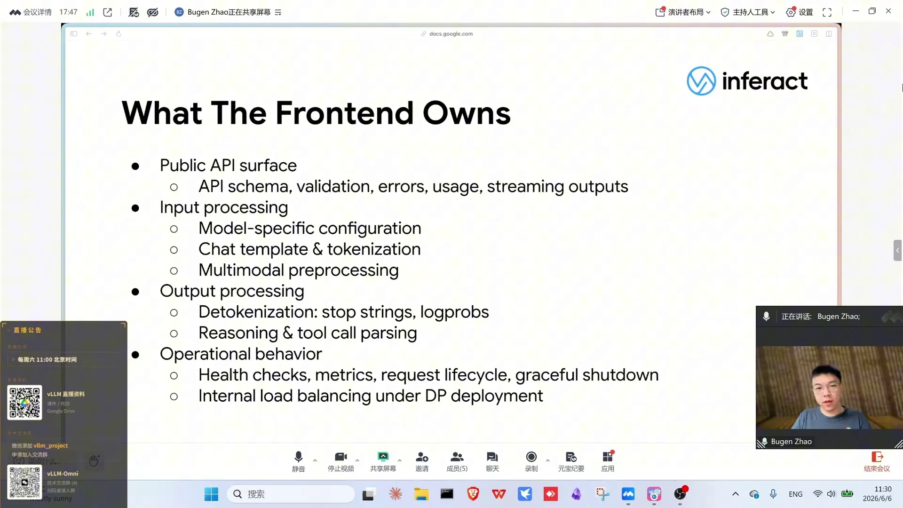
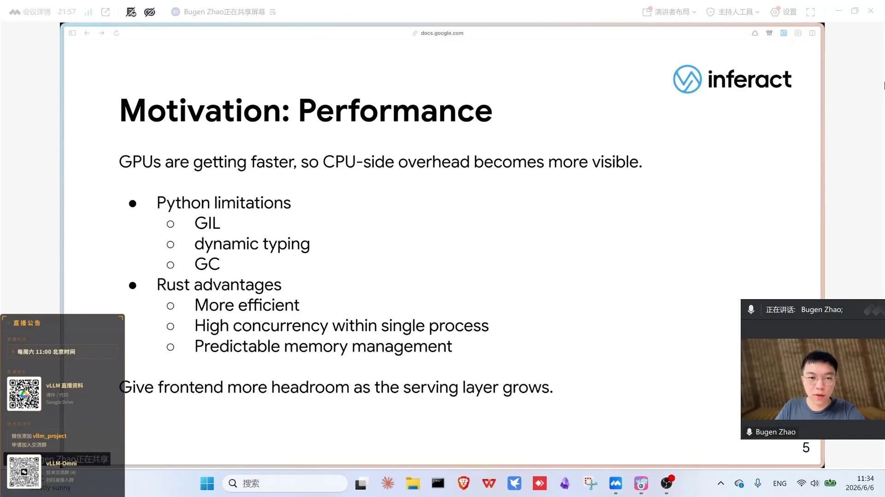
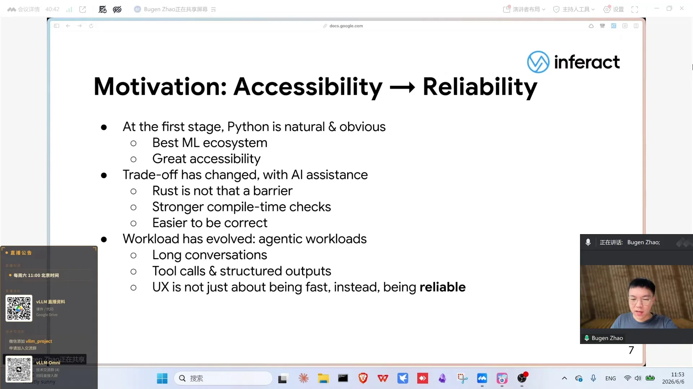
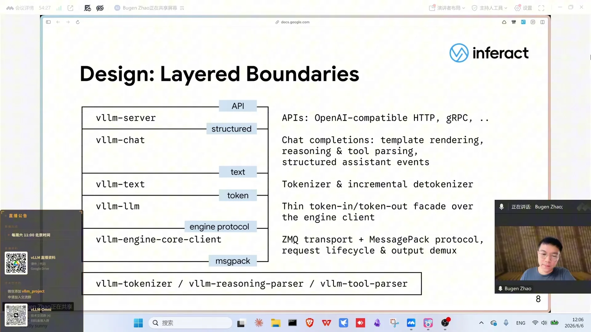
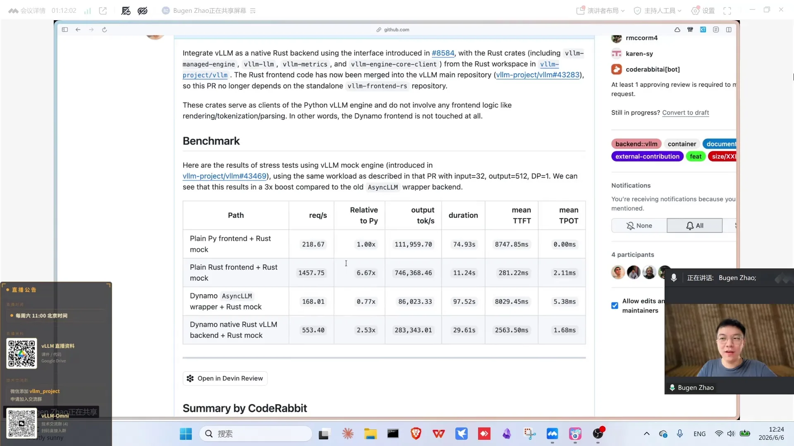

# 第05讲：Rust前端重构

> 视频来源：[vLLM小课堂（五）：Rust前端重构](https://www.bilibili.com/video/BV19fJJ6AE6W/)（约 73 分钟，嘉宾：赵紫棋，INFX 工程师）。本视频 B 站无 AI 字幕，文稿由本地 Whisper 转写并逐窗校正，时间戳可跳转到对应画面。

## 本讲要解决的核心问题（SCQA）

**背景**：vLLM 的架构被 ZMQ 天然分成两半——GPU 侧的 engine 和 Python 写的 API server（frontend）。

**冲突**：GPU 侧被各大厂商持续优化、越来越快，而 Python frontend 却因为 GIL、GC、单线程模型，在高并发 agent 场景下逐渐成为 CPU 瓶颈；同时多年积累的 streaming / non-streaming 双路径、tool parser 的正则 hack 让它越来越难维护。

**疑问**：能不能把 frontend 换成高性能语言重写，而不动 engine？换语言能解决架构问题吗？

**回答（中心思想）**：vLLM 用 Rust 重写了 frontend（Rust Frontend），利用 ZMQ 边界做成 **drop-in 替换**；设计上坚持**分层 + stream native**：每一层都是增量流的 transformation，non-streaming 只是流式路径的 one-shot 聚合；tool parser 用 parser combinator 声明式重写，AI 就能一把写出新 parser。压测显示纯 frontend 吞吐从约 200 RPS 提升到 1400 RPS。

---

## 一、背景：frontend 在整个系统中的位置

在 vLLM 的部署中，用户与 API server（frontend）打交道（[【跳转到 02:55】](https://www.bilibili.com/video/BV19fJJ6AE6W/?t=175)）：frontend 暴露 OpenAI compatible 的 completions / chat completions 等 HTTP endpoint，把结构化请求 + 历史对话转成更底层的 **EngineCoreRequest**；frontend 与 engine core、GPU worker 通过 **ZMQ**（消息队列，类似 RPC）通讯；engine 负责 KV cache 分配、执行模型前向，生成 token 后通过 **EngineCoreOutput** 返回，frontend 再转回结构化 response 给用户。

关键点：**ZMQ 是一个天然的边界**，把系统分成前端、后端两块。要替换 Python frontend，只需替换图中 Python 的那一部分，后端 engine 不受任何影响——这让整个工作的 scope 非常清晰。

## 二、frontend 远不止"薄薄一层转换"

很多人以为 frontend 只是 HTTP server + 请求转换（[【跳转到 06:20】](https://www.bilibili.com/video/BV19fJJ6AE6W/?t=380)），但随着 workload 复杂化和 agent 场景深入，它做的事情包括：

- **API 层**：定义 API schema、validation、error handling，以及把 engine 的 token stream 正确转成 SSE（Server-Sent Events，服务器向客户端单向、持续推送数据块的流式 HTTP 协议）流式响应；
- **input processing**：处理不同模型的特定参数（如 thinking 开关、reasoning effort），套 chat template，把结构化聊天记录变成扁平 string，tokenize 成 raw token，多模态图片等预处理；
- **output processing**：**增量 detokenize**（网页聊天是一个字一个字蹦出来的）、stop string、logprobs，以及最关键的——**从原始输出中提取推理内容和 tool call**。每个模型的 tool call syntax 都不同，需要各自的 tool call parser；
- **operational**：health check、监控 metrics、request lifecycle（比如用户 cancel 时要把 abort 传递给 engine）、graceful shutdown，DP 部署时还要在不同 DP rank 之间做简单的 load balancing 路由。

它从最初的 trivial API layer 变得越来越复杂，而且**高并发下很容易成为 CPU 瓶颈**——这就是 Rust 重写的出发点。

## 三、为什么是 Rust，为什么是现在

### 3.1 性能

GPU 侧一直被各硬件厂商迭代优化，TPOT（Time Per Output token，每输出一个 token 的平均耗时，衡量解码速度的核心指标）越来越低、吞吐越来越高（[【跳转到 10:30】](https://www.bilibili.com/video/BV19fJJ6AE6W/?t=630)）。而 Python frontend 有固有限制：

- **GIL（全局解释器锁）**：并发和并行都很别扭；高并发下一个 Python frontend 进程承载能力有限，社区为此引入 multiprocessing 把 frontend scale out 成多进程，但马上带来 m 对 n 的通讯方式、coordination、race condition、process management 一堆新复杂度；
- 运行时动态类型有代价：代码里要尽量避免高频 for loop；
- **GC 内存管理**：高频调用下延迟（尤其尾延迟）不可控。

Rust 在这几方面全是优势：没有 GIL、没有 GC、单进程内即可实现高并发。嘉宾强调：目前还没到"所有 workload 都撞瓶颈"的程度，但随着 GPU 更快、vLLM 趋向大规模部署，frontend 承载更高并发后**很可能首先成为瓶颈**——重写一部分是未雨绸缪，给 frontend 留 headroom。

### 3.2 复杂度

Python frontend 是社区里成长出来的，积累 feature 的同时也积累复杂度（[【跳转到 17:55】](https://www.bilibili.com/video/BV19fJJ6AE6W/?t=1075)）。有些复杂度是必要的：vLLM 要支持大量模型，frontend 不能为单一模型做 ad-hoc 特化，必须有抽象；对 OpenAI 协议的扩展（离线、RL 等场景）也是必要的。但也有技术债：Python frontend 可以被当 library import 使用，一些设计为内部、不保证稳定性的 API 一旦暴露被依赖，就有了兼容包袱；此外还有为了 workaround Python 性能限制而引入的复杂度。

重写不是原封不动翻译，而是参照现有 boundary 重新设计架构、划清界线。

### 3.3 从 accessibility 到 reliability

vLLM 用 Python 是因为 AI/ML 生态都是 Python、门槛最低，这让社区长成今天规模（[【跳转到 25:05】](https://www.bilibili.com/video/BV19fJJ6AE6W/?t=1505)）。但现在情况变了：**agentic coding** 让 Rust 的"学习门槛高"不再是贡献障碍——简单 bug fix 和 feature 用 AI agent 写 Rust 已经很好用；而 Rust 编译器严格，编译期就能查出 Python 里靠 linter/type hint 都查不出的 trivial bug。既然大家都用强大工具贡献、代码量变大，**把正确性门槛提高反而更好**。

再加上 workload 变化：agent 场景不是"答错就错了"的 VQA，而是要长时间运行不出问题——tool call、reasoning、structured output 任何一处出错都会打断 agent loop。所以好的用户体验不只是模型快，**frontend 也不能掉链子**。

### 3.4 插播问答：跨机部署、"disaggregating everything" 与 engine core 的未来

分享进行到动机部分时插播了一段问答，信息量不小，整理如下。

- **跨机部署：ZMQ 本机走 IPC、跨机走 TCP**（[【跳转到 18:00】](https://www.bilibili.com/video/BV19fJJ6AE6W/?t=1080)）：frontend 与 engine core 之间的 ZMQ 边界，同机就是 IPC、跨机就是 TCP，因此天然支持分开部署——可以在一台机器上起一个**纯 frontend**，在另一台机器上起一个 **headless vLLM**（不启动 frontend、只有 engine），在 engine 侧指定要连接的 frontend 地址即可（[【跳转到 19:15】](https://www.bilibili.com/video/BV19fJJ6AE6W/?t=1155)）；多个 DP rank 也可以共享同一个 frontend，请求由它转发到另一台机器上的各个 DP rank（[【跳转到 19:40】](https://www.bilibili.com/video/BV19fJJ6AE6W/?t=1180)）。
- **Python frontend 正在做"disaggregating everything"重构**（[【跳转到 20:30】](https://www.bilibili.com/video/BV19fJJ6AE6W/?t=1230)）：把 frontend 的职责也拆开——未来会有专门的 entrypoint 只做 input processing（处理完产出 input ids 再转交），也有直接传 input ids、跳过预处理直接对接 engine core 的入口（[【跳转到 20:55】](https://www.bilibili.com/video/BV19fJJ6AE6W/?t=1255)）。多种 endpoint 并存，上层可以自由选择让 frontend 处理或不处理，部署形态更灵活。
- **PD 分离下复用 raw token**（[【跳转到 21:20】](https://www.bilibili.com/video/BV19fJJ6AE6W/?t=1280)）：prefill 与 decode 分开部署时，不希望同一个请求被 frontend 处理两次——处理一次后复用 raw token（tokenize 得到的 input ids），分别打 prefill 和 decode 两个请求即可；而且 frontend 生成的 input ids 可以直接复用，不需要再通过 IPC 传一遍（[【跳转到 22:10】](https://www.bilibili.com/video/BV19fJJ6AE6W/?t=1330)）。
- **engine core 未来也可能用高性能语言重写**（[【跳转到 23:00】](https://www.bilibili.com/video/BV19fJJ6AE6W/?t=1380)）：engine core 只做调度、KV cache 管理和执行编排，并不直接参与 GPU 计算，所以同样存在被高性能语言重构的可能。一个佐证是异步 scheduler 的引入：原先同步 scheduler"schedule 完再执行、执行完再 schedule"已遇到性能瓶颈，于是改成在 GPU 还没返回时就预先做下一次 schedule，尽可能利用 engine core 侧的 CPU（[【跳转到 23:25】](https://www.bilibili.com/video/BV19fJJ6AE6W/?t=1405)）——这本身就说明 Python 在 engine core 上也构成瓶颈。主持人补充自己踩过的坑：异步 scheduler 需要预先填充一段占位 token 来占住已调度的空间，之后再换算实际输出了多少 token，而它依赖的 API 是按同步方式处理的，当时就发现了相关 bug（[【跳转到 24:15】](https://www.bilibili.com/video/BV19fJJ6AE6W/?t=1455)）。

## 四、设计一：分层架构——每层讲自己的"语言"，支持新 endpoint 只做简单 mapping

Rust frontend 是 layered 结构（[【跳转到 29:15】](https://www.bilibili.com/video/BV19fJJ6AE6W/?t=1755)），自底向上：

| 层 | 职责 |
| --- | --- |
| **engine core client** | 与 engine 通讯：ZMQ transport（握手、收发流程）、MessagePack 协议的编解码、请求 lifecycle、把 batch 的输出 demultiplex 到单个 request |
| **LLM 层** | 非常薄，类似 Python 的 LLM/AsyncLLM：把 engine core 的编码绑定结构藏起来，暴露 Rust native 结构；可当 engine library 用（Dynamo 等可直接通过这层以 Rust 方式接入 engine core） |
| **text 层** | tokenization / detokenization / stop string，接口直接以 text 进出 |
| **chat 层** | chat template、reasoning parsing、tool parsing，把 text 变成结构化的 assistant 输出 |
| **server 层** | user facing：OpenAI compatible HTTP endpoint、vLLM 自己的 gRPC endpoint，未来 Anthropic messages 等也接在这一层 |

每一层讲不同的"语言"（MessagePack → token → text → structured → HTTP），界限清晰：preprocessing 不会堆在 OpenAI handler 里，而是一层层在下面做好，上层只做简单 mapping——支持新的 endpoint（Anthropic、responses API）绝大多数代码直接复用。

另一个设计原则：**主链路不感知当前 serve 的是哪个模型**，不加任何特判（"如果是 GPT-OSS 怎么办、如果是 Kimi K2 怎么办"都不存在）。主链路全部通过 type-erased 结构 / interface 接入 model-specific 实现，具体实现放在最下面三个独立模块：tokenizer、tool parser、reasoning parser（multimodal 还在重新设计中）。

## 五、离开 Python 生态：Rust frontend 缺什么，又赢在哪

现场讨论了 Rust 侧没有 transformers 生态的利弊（[【跳转到 36:20】](https://www.bilibili.com/video/BV19fJJ6AE6W/?t=2180)）：

- **tokenizer**：Python 侧很多 tokenizer 底层本来就是 Rust 实现，所以 Rust 可用的 tokenizer 很多；
- **多模态**：Rust 侧没有现成可调的（也不想用 FFI 调回 Python），生态不成熟是劣势；但没有依赖包袱、只能从头做也是优势。有反馈认为 Python 侧 multimodal 逻辑过于复杂、抽象过多，而不同模型间真正可复用的东西不多——AI 写代码很快的时代，把每个模型当黑盒重写一遍可能反而更好；
- **真实教训**：HuggingFace 4.53 → 4.54 之间引入了一个奇怪的 config 处理，导致 attention backend 选不了、直接报错，排查很久才发现、修复，要等后续版本才稳定——**上游依赖的不可控是真实痛点**；很多多模态模型干脆没有 HF 实现；
- remote code（模型文件里的 python code）在 Rust frontend 下无法动态加载，所以兼容方式与 Python 侧不同，可能要完整重写 pre-processing 路径；
- frontend 需要依赖 HF 的主要是多模态 processor 里比较稳定的少数字段，各家 overwrite 不多，尚可复用。

## 六、设计二：stream native——streaming 是唯一路径，non-streaming 只是聚合

Rust frontend 把 streaming / incremental 当作**一等公民**（[【跳转到 43:00】](https://www.bilibili.com/video/BV19fJJ6AE6W/?t=2580)），而不是单独支持的 path。engine 本来就是按 token 增量产出的，所以每一层都这样思考：上层吐出一个新事件，我这层怎么处理、什么时候吐出下一个事件——**每一层就是流上的一次 transformation**：

engine output 流 →（text 层）decoded text →（chat 层）结构化 chat event →（server 层）HTTP response（SSE 或 JSON）。

每层用 generator 方式增量实现（收发、处理、状态机累积到一定程度 yield 出去），自然能在层内追踪状态、知道事件何时可以安全下发，不需要手动维护复杂的状态机迁移。

**streaming enforced**：streaming 路径是 single source of truth。non-streaming 不是独立路径，只是一个 one-shot——把所有事件喂进同一条增量流，最后聚合。这解决了 Python 侧的老问题：tool parser / reasoning parser 的 streaming 与 non-streaming 是两套代码，处理逻辑有 hack、结果可能不一致（streaming 下不知道下一个事件只能保守处理，non-streaming 有上帝视角但可能过于贪婪做错）。stream native 下两类路径**结果保证完全一致**。

## 七、parser combinator：声明式语法消灭正则 hack，AI 一把写出新 parser

tool parser 是 stream native pipeline 的最佳例子（[【跳转到 48:00】](https://www.bilibili.com/video/BV19fJJ6AE6W/?t=2880)）。不同模型的 tool call 格式各异（早期 JSON，现在很多 XML，扁平或递归），Python 侧的现状是一堆正则 + ad-hoc 字符串处理 + 手写状态机，几乎无复用，hack 修不完——而且很多"修复"并不是模型输出了非法 syntax，而是**正常 syntax 没被 tool parser 正确处理**：修的是 frontend 的 bug，不是模型 robustness。

Rust 侧的解法：

1. **摒弃 1:1 翻译**，全部重构；
2. 用 **parser combinator** 库声明式描述每个模型的 tool syntax，坚决不用正则 match、不手写字符串处理；
3. 利用 combinator 自带的 incremental primitive 构造流式 parser——声明式的代码"写死"了语法形状，不需要运行时编译正则状态机，高效且好读；
4. 提炼 shared utility：比如 **safe text 缓冲**——模型吐出"可能是 special mark 前缀"的 token 时要拦截住，等后续 token 确认后再决定下发还是进入 tool call 解析状态。这种 pattern 在每个 streaming tool parser 都存在。

效果：用 AI 写一个新的 tool parser "几乎都是一把过"——把上游和 SGLang 等覆盖各种 edge case 的测试用例拉过来就能验证，因为语法是被严格描述的。

## 八、drop-in 替换：一个环境变量切换，纯 frontend 吞吐 7 倍

### 8.1 无缝接入

因为 ZMQ 边界清晰，可以把 ZMQ 前面的进程直接换成 Rust frontend（[【跳转到 54:15】](https://www.bilibili.com/video/BV19fJJ6AE6W/?t=3255)）。pipeline 场景（多 API server 进程）天然由外部进程管理——Rust 进程伪装成一个被管理的 API server，就集成进了 Python entrypoint。设计上只需打开 `VLLM_USE_RUST_FRONTEND` 环境变量；nightly release / 官方镜像已打包 Rust binary，无需额外配置。另有一个**纯 Rust entrypoint**：Rust frontend 自己负责启动 engine core，整条启动链路没有 Python，还可能加速 startup。

### 8.2 Benchmark

用千问 3 0.6B、GB200 四卡、高并发测了两个 workload（[【跳转到 58:50】](https://www.bilibili.com/video/BV19fJJ6AE6W/?t=3530)）：

- **decode 场景**：差距不大，但 Python 侧要开 4 个 API server 才接近一半性能、开 16 个才接近 Rust 的性能，且 latency 始终更差；
- **pre-process heavy 场景**（超长 input + 极短 output，测 tokenize/template rendering/HTTP 开销）：单个 Python API server 的吞吐只有 Rust 的约 **1/5**，且基本都在排队（延迟爆炸）；要开 **32 个进程**才追平 Rust 单进程，latency 仍更差；
- **mock engine 压测**：用 Rust 写一个不跑 GPU、只收请求并随机吐 token 的假 engine，纯压 frontend：Python frontend 约 **200+ RPS**，Rust frontend 达 **1400 RPS**；
- **Dynamo 对比**：Dynamo（类 Rust frontend）处理完仍要 delegate 回 Python engine，性能甚至不如纯 Python 方案（瓶颈在 engine 侧）；把 Rust 的 engine core client 接入 Dynamo 后，链路上除 vLLM engine 外全是 Rust，性能立刻大幅提升、超过 Python 方案，但仍不及纯 Rust 方案——嘉宾怀疑差距至少部分来自**Dynamo 链路中间多的一跳 RPC**（纯 Rust frontend 直连 engine core、中间少一次中转），以及 Rust frontend 本身做了不少性能优化。

## 九、未来方向：先补齐 feature parity，再走向 gateway 的垂直整合

- **Feature parity**：Rust frontend 已开源并合入主仓（0.22 带入第一个版本），有专门的 feature parity roadmap（[【跳转到 68:22】](https://www.bilibili.com/video/BV19fJJ6AE6W/?t=4102)）；还缺 tool choice、n（>1）、beam search（束搜索：解码时同时保留多条候选序列、最后择优输出）、更多 API endpoint、生产用的 metrics 等，已有 PR 在推进，欢迎社区贡献；
- **Day-zero support**：随新模型发布，希望 Rust 侧同步支持；长期可能把重心转移到 Rust frontend，Python 侧关键组件反过来用 FFI 调 Rust；
- **Gateway / 垂直整合**：生产环境很少裸跑 vLLM，前面都会加 gateway/router（大规模路由、load balance、PD disaggregation、KV aware routing），这些组件多用高性能语言写，甚至会逐渐吞噬 tokenize、chat template 等功能，把 vLLM 当 token-in token-out 的 engine 用。vLLM 自带的 router 项目目前功能、性能、维护状态都不理想；而 Rust frontend 的模块化设计（tool parser、reasoning parser 都是独立 crate）让这些组件**天然可以复用为 gateway 的 building blocks**，实现更好的垂直整合——但单机部署的纯粹性不会被牺牲，router/gateway 是独立组件、不在主仓；
- **与 semantic router 的关系**（[【跳转到 68:47】](https://www.bilibili.com/video/BV19fJJ6AE6W/?t=4127)）：semantic router 是"不同模型之间选"、更靠上游；PD/副本间的路由是另一个层面的问题，两者可能互补，边界还在讨论中。

## 小结

- Rust frontend 只替换 ZMQ 边界前的 Python frontend，engine 不动，`VLLM_USE_RUST_FRONTEND` 一键切换，0.22 已带第一个版本；
- frontend 的真实职责远超"薄转换"：schema/validation、流式 SSE、增量 detokenize、tool/reasoning 解析、metrics、abort 传递、DP 负载均衡；
- 三个动机：性能（GIL/GC/尾延迟）、复杂度（双路径与技术债）、从 accessibility 转向 reliability（AI coding 时代编译期检查反而降低贡献门槛）；
- 分层设计让每层讲自己的"语言"，上层只做 mapping；主链路 type-erased、不感知具体模型；
- stream native 是核心思想：streaming 是一等公民，每层是流的 transformation，non-streaming 只是 one-shot 聚合，两类路径结果强制一致；
- tool parser 用 parser combinator 声明式重写，消灭正则 hack，AI 写新 parser"一把过"；
- 压测数据：纯 frontend RPS 从 200+ 到 1400（7 倍）；preprocess heavy 场景 32 个 Python 进程才追平 1 个 Rust 进程。

## 关键术语速查

| 术语 | 一句话解释 |
| --- | --- |
| frontend / API server | vLLM 中处理 HTTP、预处理、流式返回的前端层 |
| EngineCoreRequest / EngineCoreOutput | 前端与引擎间的底层请求 / 输出结构 |
| ZMQ boundary | 前端与引擎间的消息边界，是 Rust 替换的切入点 |
| GIL | Python 全局解释器锁，并发瓶颈的根源之一 |
| TPOT | Time Per Output token，每输出一个 token 的平均耗时，衡量解码速度 |
| 尾延迟（tail latency） | 高频请求下最慢那一部分请求的延迟，GC 使其不可控 |
| schema / validation | API 的结构定义与参数校验 |
| SSE | 流式逐 token 推送的 HTTP 响应格式 |
| incremental detokenize | 增量地把 token 解码成文字，支撑打字机式输出 |
| tool call parser | 从模型输出中提取工具调用的解析器，每个模型语法不同 |
| reasoning parsing | 从输出中分离思考内容与正式回答 |
| layered architecture | engine core client / LLM / text / chat / server 五层结构 |
| type-erased | 主链路不感知具体模型类型、通过接口接实现的技巧 |
| stream native / streaming enforced | 流式是一等公民，non-streaming 只是流的 one-shot 聚合 |
| chat event | chat 层产出的结构化事件（内容/工具调用/推理等） |
| parser combinator | 声明式组合子解析库，自带增量解析能力 |
| safe text 缓冲 | 拦截可能是特殊标记前缀的 token，待确认后再下发的通用逻辑 |
| mock engine | 不跑 GPU、只回吐 token 的假引擎，用于纯前端压测 |
| Dynamo | 外部推理服务框架，可通过 Rust engine core client 接入 vLLM |
| feature parity roadmap | Rust frontend 与 Python frontend 功能对齐的计划表 |
| beam search | 束搜索：解码时同时保留多条候选序列、最后择优 |
| semantic router | 在多个模型之间做上游选择的语义路由层 |
