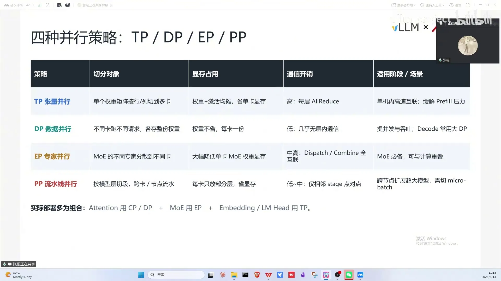
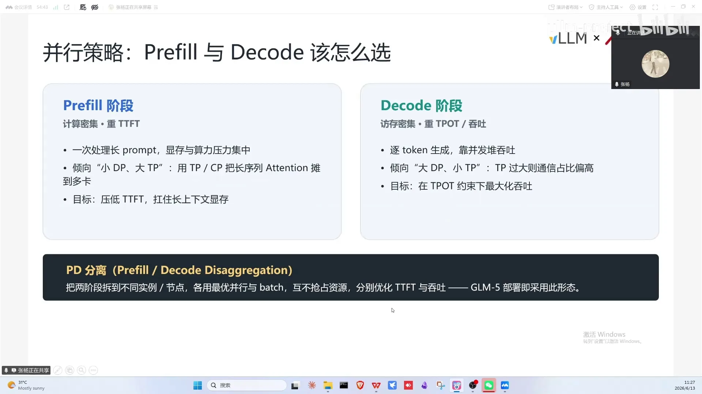
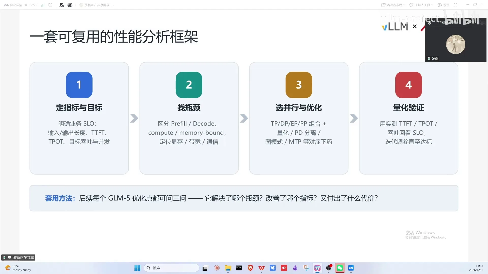
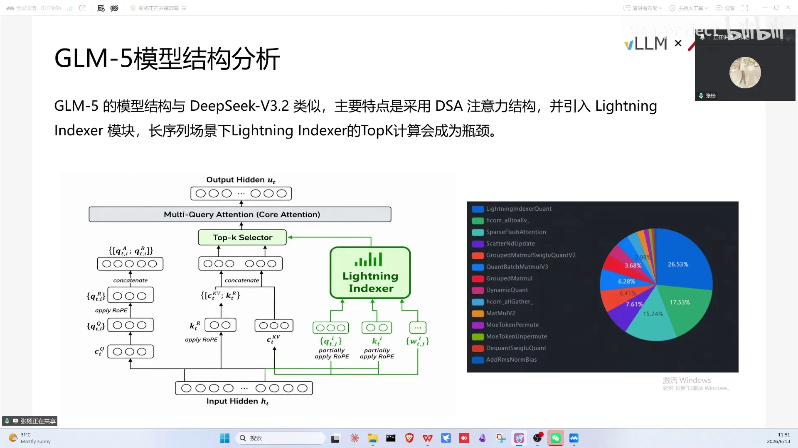
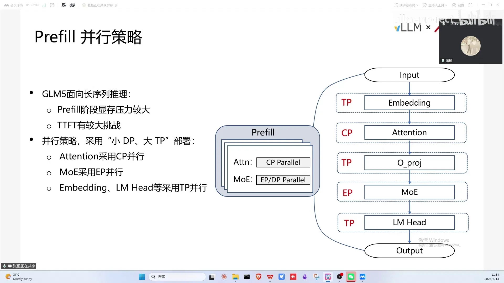
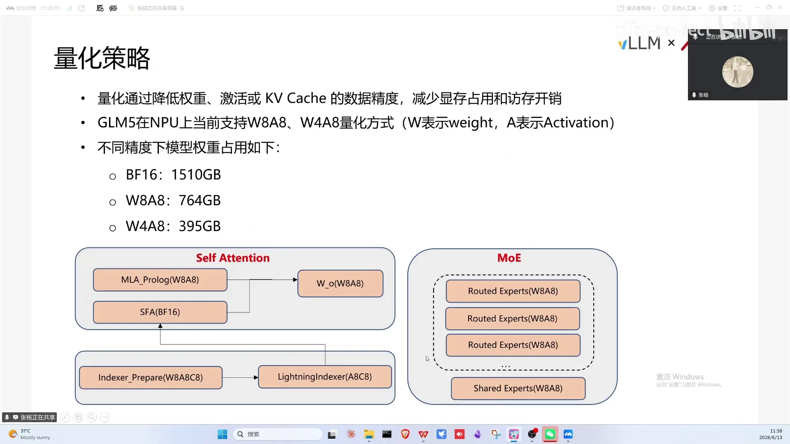

# 第06讲：昇腾部署GLM5指南

> 视频来源：[vLLM小课堂（六）：昇腾部署GLM5指南](https://www.bilibili.com/video/BV1eoJJ6eEUv/)（约 99 分钟，嘉宾：张阳，华为昇腾）。本视频 B 站无 AI 字幕，文稿由本地 Whisper 转写并逐窗校正，时间戳可跳转到对应画面。

## 本讲要解决的核心问题（SCQA）

**背景**：GLM-5/5.1 面向长上下文场景，采用类似 DeepSeek 的 DSA 稀疏注意力 + LightIndexer 结构，需要在昇腾 NPU 上用 vLLM 落地。

**冲突**：长上下文下 LightIndexer 算子耗时占比可达 50%-60%，成为整网瓶颈；而很多同学对推理性能指标、并行策略、部署形态选择缺乏系统认知。

**疑问**：怎么系统地做推理性能优化？GLM5 在昇腾上该怎么选精度、并行策略和部署形态？

**回答（中心思想）**：先建立"指标—并行—方法论"的基础框架，再落到 GLM5 的具体实践：**W8A8 量化单机即可部署 200K 上下文；prefill 用小 DP 大 TP + CP、decode 用大 DP 小 TP；PD 分离是最推荐的形态**；配合 ACL Graph、MTP、MLA prologue、MC2 等关键特性，把 indexer 瓶颈压下去。

---

## 一、性能指标与 SLO：一切优化的起点

衡量模型推理性能的主要指标（[【跳转到 01:25】](https://www.bilibili.com/video/BV1eoJJ6eEUv/?t=85)）：

- **TTFT**：从请求进入到生成第一个 token 的时间。与并发量、输入长度强相关——输入越长 TTFT 越高；
- **TPOT**：decode 时相邻两个 token 之间的时延，决定 decode 生成速度；
- **吞吐（TPS）**：单位时间生成的 token 数。提高吞吐最直接的方法是打高并发，但并发不是越高越好——考虑到业务的 TTFT SLO，高并发会明显劣化 TTFT；
- **并发能力**：能同时服务的请求数。

*图：01:25 指标总览——TTFT / TPOT / 吞吐 / 并发能力四个核心指标，以及本讲要覆盖的 TP / PP / DP / EP 并行策略。*

四个指标要相互权衡，不能为提升某一个牺牲其他。实际部署要根据需求来定：只要首 token 快就对 TTFT 做针对性优化，对吞吐/TPOT 不敏感；想要 token 间隔短就针对 TPOT 调。所谓 **SLO（Service Level Objective）**就是公司内部定义的服务目标，比如 P99：100 条请求里 99 条要在多长时间内返回（[【跳转到 07:52】](https://www.bilibili.com/video/BV1eoJJ6eEUv/?t=472)）。

## 二、并行策略基础：TP / DP / EP / PP

- **TP（张量并行）**：把权重/激活切分到多张卡上计算，解决单卡压力，最后通过通信把结果汇聚（all-reduce）（[【跳转到 06:02】](https://www.bilibili.com/video/BV1eoJJ6eEUv/?t=362)）；
- **DP（数据并行）**：每个 DP 副本保存完整权重，副本间互不影响；资源充足时多 DP 提吞吐；
- **EP（专家并行）**：专家分散到不同卡，专家本身不切分。vLLM 昇腾上 EP 数量通常是 DP×TP；EP 通信成本较高，但当前可与计算 overlap 隐藏开销；
- **PP（流水线并行）**：按模型层切分，每张卡放一部分层，可部署更大模型。GLM 部署中用得不多——MoE 架构下 attention 用 DP+TP、专家用 EP（只有进入/退出专家时 dispatch/combine 两次通信），跨机问题直接用 TP+DP+EP 解决，没必要上 PP。

顺带回答"并行方案在 GPU 和 NPU 上实现有区别吗"：并行切分逻辑本质相同，区别只在通信算子的底层实现（all-reduce/all-gather/all-to-all 行为一致）。

**为什么推理要分 prefill / decode 两阶段**（[【跳转到 08:57】](https://www.bilibili.com/video/BV1eoJJ6eEUv/?t=537)）：直接原因是 KV cache 与用户体验——decode 时每个 token 可以直接复用前面已算好的 KV cache。prefill 阶段的计算量与序列长度**平方**成正比（[【跳转到 09:37】](https://www.bilibili.com/video/BV1eoJJ6eEUv/?t=577)）；decode 阶段只有新 token 需要参与计算、与序列长度只是正比关系，负载从**计算密集型**转为**访存密集型**（[【跳转到 10:02】](https://www.bilibili.com/video/BV1eoJJ6eEUv/?t=602)）。也正因为推理非常在乎用户体验，才需要在吞吐和时延之间做取舍，这也是后面 PD 分离部署形态的出发点。

**PD 分离**：常见形态是 PD 混布——prefill 和 decode 混在同一实例。大模型场景下 vLLM 优先 prefill，prefill 耗时久会让 decode 等待，TPOT 受影响大。PD 分离后两阶段独立伸缩：TTFT 不好就加 P 的算力，decode 不用动，灵活得多（[【跳转到 19:58】](https://www.bilibili.com/video/BV1eoJJ6eEUv/?t=1198)）。

## 三、性能优化方法论

嘉宾给出的通用优化流程（[【跳转到 25:33】](https://www.bilibili.com/video/BV1eoJJ6eEUv/?t=1533)）：

1. **分析模型结构**：上下文长度、MoE 结构、适用场景；
2. **制定优化目标**：针对适用场景定指标；
3. **先跑通模型**，看现状与目标的差距；
4. **profiling** 找瓶颈：分析各算子耗时分布；
5. **针对性优化**：调整切分点、适配加速特性、融合算子等；
6. **验证**：性能之外，**精度验证最重要**——特性算子可能有精度问题，先保精度再谈性能。

关于 custom ops 开关：有用，默认的都是官方 custom ops，开启配套算子有加速；具体加速多少跟矩阵形状有关——形状不同会路由到不同 kernel，需按自己的场景实测。另外可以针对部署做特定并行策略优化，对 TTFT 的影响可能比算子还大。

## 四、GLM5 昇腾部署流程

对着 vLLM 社区文档讲（GLM5 与 5.1 结构相同），完整流程如下（[【跳转到 31:04】](https://www.bilibili.com/video/BV1eoJJ6eEUv/?t=1864)）：

1. **权重获取**：三种精度形态——BF16 原始精度、W4A8、W8A8。资源充足选 W8A8（芯片支持更好）；显存紧张（如 A3 单机放不下 BF16/W8A8）选 W4A8。权重可在 ModelScope（魔搭）下载；
2. **安装**：推荐直接用官方发布的镜像（含每日构建）。裸机安装依赖多（CANN、驱动）且复杂；
3. **部署形态**：
   - **单机 PD 混布**：A3 单机 8 卡 16 die 约 1024G 显存，W8A8 即可做到 200K 最大上下文；BF16 权重太大不推荐；
   - **A2 机型**：显存比 A3 少一半，需调整 DP/TP；
   - **双机 PD 混布**；
   - **PD 分离（最推荐）**：资源充足时性能最好，但步骤多、部署麻烦。示例配置：6 个节点——P 两个节点（两台 A3），D 四个节点，每个节点一套具体配置（prefill 开 DP 与部分算子，decode 的算子配置更多），通过主节点连接对外提供端口服务。

**P2、D4 是最佳组合吗？**不是，要按场景：比如 64K 上下文、cache 命中率 80-90% 时 prefill 压力小，可以减小 P 资源、给 D 多分配资源来打吞吐。另外 **P2 = 一个模型切分部署在 2 个 node（类似 PP 的概念），不是 2 个 P 副本**；2 个 P1 意味着每个 P 都要存完整权重（包括 MoE 权重），显存压力大得多。D 侧同理：D4 可以是一个模型切 4 节点，也可以拆成 2 个独立 D 实例（各含完整权重，相当于 DP）。

## 五、GLM5 结构与瓶颈：LightIndexer

GLM 模型整体结构与 DeepSeek V3 类似，核心特点是采用 DSA（稀疏注意力）结构并引入 **LightIndexer** 模块（[【跳转到 41:49】](https://www.bilibili.com/video/BV1eoJJ6eEUv/?t=2509)）：帮助模型在长上下文下做更高效的检索和 token 筛选，减少注意力计算量。但 LightIndexer 引入的开销在长上下文下会数量级增加：

- 128K 长上下文下，该算子整网耗时占比超过 **25%**（这还是经过每 8K 量化优化后的结果）；
- 不做优化的话占比可达夸张的 **50%-60%**。

后续的并行切分和算子优化主要就是围绕这个瓶颈展开的。

## 六、两阶段的并行策略设计

**prefill 侧**（[【跳转到 45:19】](https://www.bilibili.com/video/BV1eoJJ6eEUv/?t=2719)）：GLM 面向长序列场景，一次性输入大量 token，显存压力和 TTFT 挑战大——适合**小 DP、大 TP**，减少副本数、增大单请求内部计算规模。各模块组合：embedding/MHA 用 TP 切 matmul 计算；长序列部分用 **CP**（DSA CP）按块切分长序列再分散到 TP；MoE 用 EP。CP 还有通信计算 overlap 可掩盖部分通信开销。

**decode 侧**：每步只生成少量 token，单步计算量小，对并发能力和 TPOT 更敏感——适合**大 DP、小 TP**。PD 分离下 KV cache 先存在 P 节点，decode 需要时才通过通信传输过来，所以 decode 显存压力小，可以减小 TP 降低通信开销，拿到更好的 TPOT 和吞吐。decode 阶段当前没有 CP（后续会上 DCP）。

一句话总结：**prefill 关注长序列计算和显存压力，decode 关注高并发和单步生成效率，两阶段策略必须分开设计**。

## 七、量化策略

量化通过降低权重/激活/KV cache 的存储精度来减少显存占用和访存开销（[【跳转到 49:11】](https://www.bilibili.com/video/BV1eoJJ6eEUv/?t=2951)）：

- **W8A8**：权重压到 400 多个 G；**W4A8** 更小（400G 以内）；BF16 权重 1500G，NPU 上要跑 BF16 需要约 4 台机器的规模；
- 担心精度损失坚持 BF16 的代价就是更多资源；
- MoE 部分用 W8A8；**LightIndexer 的 KV cache 当前支持 INT8 量化**，可缓解 KV cache 压力；
- 量化对 TTFT 的帮助有两层：显存占用小 → KV cache 空间足 → 高并发长序列下不触发重计算（重算没存住的 KV 对 TTFT 影响巨大）；量化算子（指令/矩阵形式）本身比 BF16 有较大优化；
- 910B/910C 的 KV cache 量化只支持 INT8，950 将支持 FP8；
- Quant/Dequant 已与 matmul 融合成算子，不会单独调用。

*图：49:11 量化策略页——BF16 权重 1500G，W8A8 可压到 400 余 G，W4A8 能压进 400G 以内。*

## 八、关键特性清单

部署中用到的关键特性（[【跳转到 55:05】](https://www.bilibili.com/video/BV1eoJJ6eEUv/?t=3305)）：

- **ACL Graph**：对标 CUDA Graph 的图模式。提前捕获算子执行序列，避免每个算子从 CPU 下发到 NPU 的耗时（没有图模式时下发耗时可能比执行还久）。开启后 TPOT 明显优化、总吞吐提升；
- **MTP**：相比单 token 额外增加一个投机层，GLM 的 MTP 步长为 3（每步除正常 token 外额外推测 3 个）。**不是越大越好**：MTP 引入一层额外计算，且越大接受率越低（步长 4 接受率可能 20-30%，5 可能只剩 10%），性价比下降，要设合理值；
- **DSA CP**：专门针对 DSA attention 在 prefill 队列按 CP 维度切 token。为什么按 TP 通信组切？因为 indexer/attention 阶段很多计算与 token 数强相关，token 块分给各 TP 独立计算相当于变相减少 token 数，强相关计算得到优化——CP 通信组直接绑定 TP 通信组是最直观的实现；
- **PD 分离**（前面已详述）；后续会用 vLLM 上游的 DCP/CP 替代现在的 DSA CP；
- **MLA prologue**：把 MLA/SFA 的前处理计算全部融合成一个算子（SFA 即 sparse flash attention，稀疏 flash attention，[【跳转到 63:50】](https://www.bilibili.com/video/BV1eoJJ6eEUv/?t=3830)）；
- **MC2**：通信与计算融合的大算子，面向 MoE 场景——把 token 分发（dispatch）、专家 FFN 计算、结果重排（combine）合并到一起。传统流程 dispatch→门控→激活量化→combine 之间有大量中间搬运和通信等待；MC2 减少搬运并实现通信与计算重叠（以前是"先通信、再计算、再通信"的串行过程）。

现场答疑补充：dispatch/combine 是 all-to-all（多 rank 各自把 token 发到对应 expert，发完再回收），不是 all-gather/reduce-scatter；融合算子跨进程、跨 GPU；与 DeepEP 的区别是 DeepEP 只做 all-to-all 通信，MC2 是通信+计算一体；NPU 上 AIC 是做矩阵计算的核、AIV 面向向量/通信（profile 里两条线分别是通信和计算）。

## 九、生产性能数据解读

嘉宾展示了各场景在生产设备上的性能数据（[【跳转到 74:39】](https://www.bilibili.com/video/BV1eoJJ6eEUv/?t=4479)），场景多为线上推理、prefix cache 命中率给到 99%：

- **64K、命中率 90%、并发 256、请求频率 0**（256 个请求同时打向 prefill 节点）：TTFT 高达 60 多秒——只追求 TPS 极限可以这么压测，但不合理；
- **108K、P2D2（2 台 A3）**：P 用 DP2+TP16（小 DP 大 TP），D 用 DP8+TP4（大 DP 小 TP）；调整请求频率为每秒 1 条后，P 节点压力小、TTFT 比上一组小很多，代价是整体吞吐略降；
- **社区文档形态**：cache 命中率高、prefill 压力小时，可给 D 节点加到 DP32 打更高并发；
- 大 DP 实测最大到 12 台机器（12×16 die）；
- 数据集方面：补测了 GPQA、AIME，以及面向编码 agent 的 SWE-bench 等，与官方分数一致；W8A8+C8（KV cache INT8）权重刚做完还未开放下载；TPS 指的是所有卡总和；A3 一卡双 die、单机 8 卡 16 die，节点数可以按 die 数换算。

## 十、问答精华

- **超长输出会降准确率吗**：超过 128K 到 200K 确实会出现幻觉、准确度受影响——是模型本身的问题，不是推理引擎的问题（[【跳转到 83:24】](https://www.bilibili.com/video/BV1eoJJ6eEUv/?t=5004)）；
- **384 超节点**：节点间通过超节点互联；实际没用满 384（规模太大），用几十台节点组成超节点，通信域规模不同而已；大 MoE 模型下超节点（多节点）平均到单卡的吞吐比 16 卡更好，特别是 PD 分离场景（[【跳转到 84:14】](https://www.bilibili.com/video/BV1eoJJ6eEUv/?t=5054)）；
- **910B vs 910C**：主要是带宽差距，910C 带宽更高、通信更强；A3 = 两个 die 叠加，单卡 128G，算力与单 die 差别不大（[【跳转到 85:04】](https://www.bilibili.com/video/BV1eoJJ6eEUv/?t=5104)）。另外 TP 不能超过节点卡数——910B 单机 8 卡最多支持 TP8、不能 TP16（[【跳转到 52:13】](https://www.bilibili.com/video/BV1eoJJ6eEUv/?t=3133)）；
- **PD 混布推荐开 CP 吗**：长序列场景推荐 P 开 CP；D 侧目前有开关、默认不走 CP（[【跳转到 86:19】](https://www.bilibili.com/video/BV1eoJJ6eEUv/?t=5179)）；
- **prefix cache 存在哪**：就存在 KV cache 里。命中率与场景强相关——coding 任务可达 95%。offload 到内存就够，不建议到磁盘：磁盘命中率低（跨 session 的缓存命中概率小），为低概率命中花大代价存"可能一辈子用不上"的 cache 不划算；prefix cache offloading 技术即将上线（[【跳转到 87:34】](https://www.bilibili.com/video/BV1eoJJ6eEUv/?t=5254)）；
- **TPOT 能到 25ms 吗**：基本是 25ms 量级，与并发相关，降并发可以降 TPOT（[【跳转到 90:04】](https://www.bilibili.com/video/BV1eoJJ6eEUv/?t=5404)）；
- **LMCache vs Mooncake**：嘉宾实际开发接触不多（主要面向提高 cache 命中率），实际场景用的是自带的 KV offload；落地方案用 Mooncake 的不少，vLLM 上游也会把 Mooncake 作为 KV offloader 之一（[【跳转到 90:29】](https://www.bilibili.com/video/BV1eoJJ6eEUv/?t=5429)）；
- **要写 kernel 吗**：不需要。算子由专门团队按需求提供，社区开发者写不过厂商（通用性也难保证）；框架层可做的工作非常多——推理栈分芯片/框架/算子三层，把自己所在方向做好就是大贡献（[【跳转到 93:24】](https://www.bilibili.com/video/BV1eoJJ6eEUv/?t=5604)）；
- **想给 vLLM 昇腾提 PR**：A3/910B/910C 是整机租赁形式较贵，但可以用 310P 等低端单卡设备、开发板低成本上手；华为云和三方云服务商都能租到 NPU；一个很好的贡献方向是做 NVIDIA 对比——发现"他们有我们没有"的算子/特性，帮助昇腾团队发现优化空间（[【跳转到 71:45】](https://www.bilibili.com/video/BV1eoJJ6eEUv/?t=4305)）；
- **专家分布**：EP 的 rank 数确定后一般按专家总数均分，但可以手动调整冷热专家的分布（用得少的专家多放一台机器）做负载均衡（[【跳转到 95:29】](https://www.bilibili.com/video/BV1eoJJ6eEUv/?t=5729)）。

## 小结

- 推理优化先立指标：TTFT / TPOT / 吞吐 / 并发相互权衡，SLO 决定优化方向；
- 并行策略各司其职：TP 解单卡压力、DP 提吞吐、EP 分摊专家、PP 在 MoE 时代基本被 TP+DP+EP 取代；PD 分离让两阶段独立伸缩，是资源充足时的首选形态；
- 优化方法论：定目标 → 跑通 → profiling 找瓶颈 → 针对性优化 → 精度优先验证；
- GLM5 的最大瓶颈是 LightIndexer（128K 下占比 25%，未优化 50-60%），后续并行与算子优化都围绕它展开；
- 部署选型：W8A8 单机即可 200K 上下文；prefill 小 DP 大 TP + DSA CP、decode 大 DP 小 TP；P2 是模型切分不是副本数；
- 关键特性：ACL Graph 消下发开销、MTP 步长 3 要平衡接受率、MC2 实现通信计算重叠、MLA prologue 融合前处理、KV cache INT8 量化缓解显存；
- 生产数据表明：请求到达模式（频率）对 TTFT 影响巨大，高命中场景可以把资源向 decode 倾斜打吞吐；
- 社区参与门槛在降低：低端单卡/云上租卡即可上手，做与 NVIDIA 的特性对比就是有价值的贡献。

## 关键术语速查

| 术语 | 一句话解释 |
| --- | --- |
| TTFT / TPOT | 首 token 时间 / 相邻 token 间隔，分别代表首响与生成速度 |
| TPS | 单位时间生成的 token 总数（吞吐） |
| SLO / P99 | 服务等级目标 / 99% 请求的时延要求 |
| TP / DP / EP / PP | 张量 / 数据 / 专家 / 流水线并行 |
| dispatch / combine | MoE 中 token 分发到专家与结果回收的两个 all-to-all 通信 |
| PD 分离 / PD 混布 | prefill 与 decode 分节点部署 / 混在同一实例 |
| P2 / D4 | 一个模型切分部署在 2 个 P 节点 / 4 个 D 节点（切分，不是副本数） |
| DSA / LightIndexer | 稀疏注意力机制及其配套的轻量索引模块（GLM5 的主要瓶颈） |
| DSA CP | 专门针对 DSA attention 按 CP 维度切 token 的序列并行 |
| PCP / DCP | 序列并行的两种 CP 形态；DCP 更准确说是对 KV cache 做 CP，两者并非一一对应、优化方式也不同 |
| 小 DP 大 TP / 大 DP 小 TP | prefill 与 decode 各自适配的并行形态 |
| W8A8 / W4A8 | 权重 8/4 比特、激活 8 比特的量化方案 |
| KV cache INT8 量化 | 将 KV cache 压成 INT8，缓解长上下文显存压力 |
| ACL Graph | 昇腾对标 CUDA Graph 的图捕获技术，消除算子下发开销 |
| MTP / 接受率 | 多 token 预测投机层 / 被采纳 token 的比例 |
| MLA prologue | 融合 MLA/SFA 前处理计算的单算子 |
| SFA | sparse flash attention，稀疏 FlashAttention |
| MC2 | 昇腾通信+计算融合算子：dispatch/FFN/combine 一体（对标 DeepEP+计算） |
| AIC / AIV | NPU 上做矩阵计算的核 / 面向向量与通信的核 |
| die | A3 一卡双 die，单机 8 卡 16 die，用于换算集群规模 |
| 超节点 | 昇腾跨机互联形态，节点间组成更大通信域 |
| prefix cache offloading | 把前缀缓存卸载到内存/磁盘以扩大可存容量 |
| ModelScope（魔搭） | 下载 GLM5 各精度权重的模型平台 |
