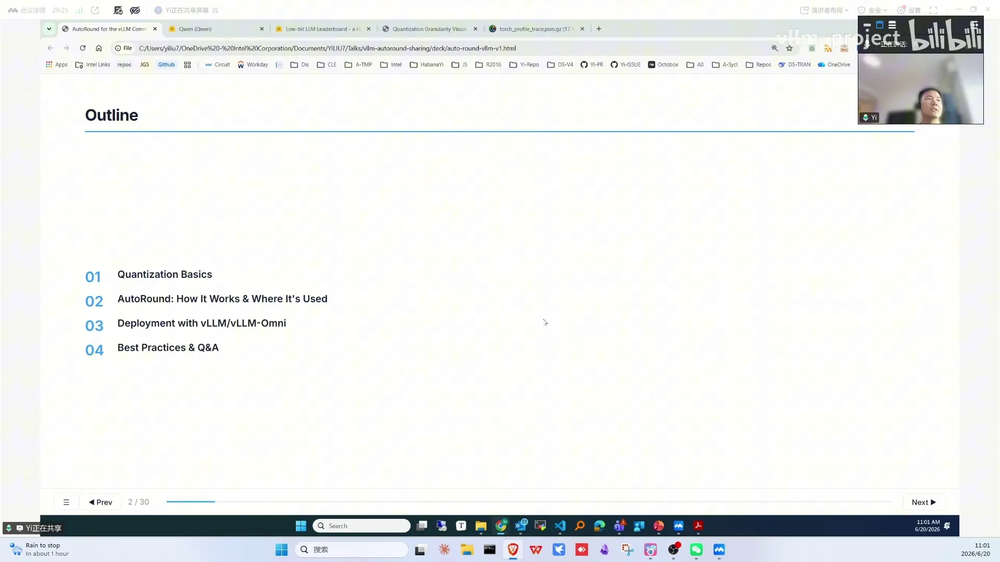
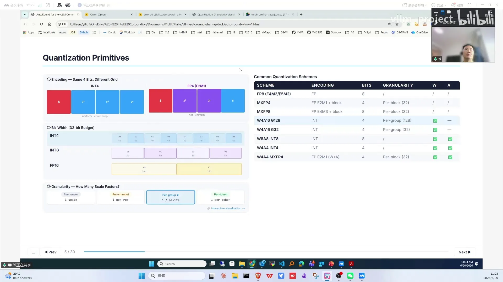
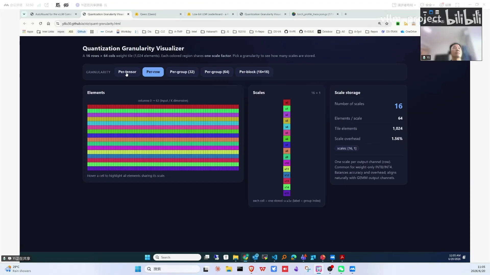
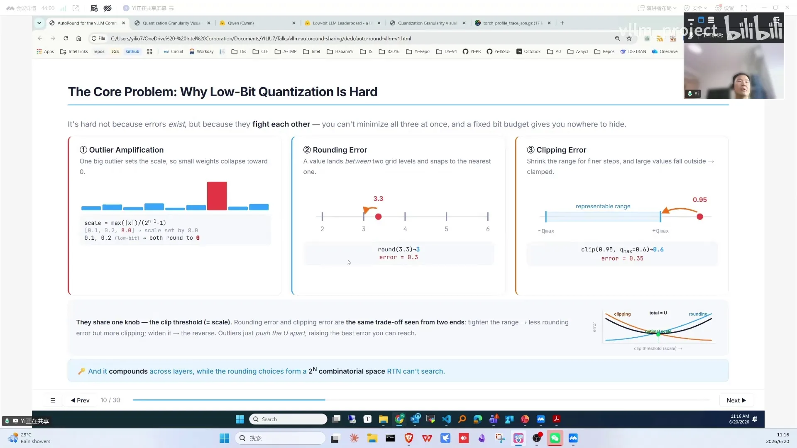
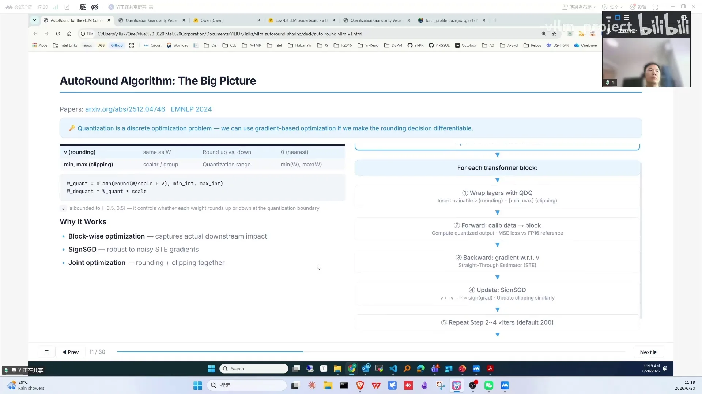
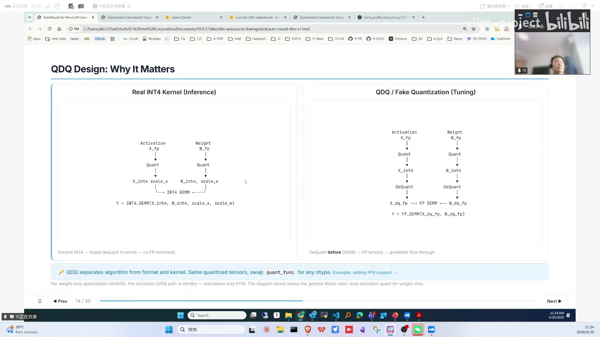
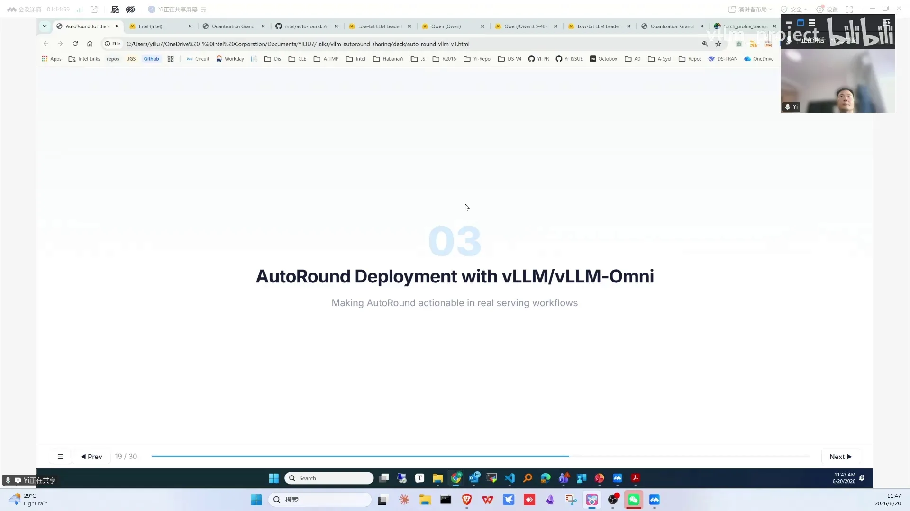
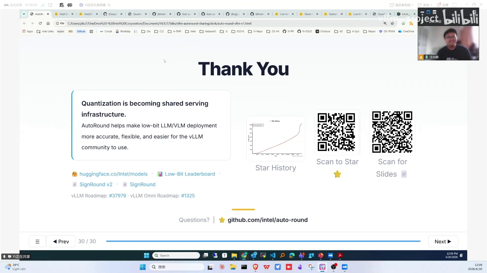

# 第07讲：AutoRound加速LLM/VLM低比特量化部署

> 视频来源：[vLLM小课堂（七）：AutoRound加速LLM/VLM低比特量化部署](https://www.bilibili.com/video/BV1etjE69Efx/)（约 76 分钟，嘉宾：刘毅，Intel Neural Compress 团队，AutoRound 核心贡献者）。本文基于直播实录整理，时间戳可跳转到对应画面。

## 本讲要解决的核心问题（SCQA）

**背景**：模型越来越大、硬件低比特算力越来越强，量化是推理省钱提速的标准手段。

**冲突**：量化 scheme 千奇百怪（int4/FP4/MXFP4、per-tensor/per-group/per-block……），权重和激活的 outlier 让简单的映射产生明显精度损失；GPTQ 靠补偿误差、AWQ 靠保护关键权重，但两者都只在 layer/linear 层做校准，低比特（如 W2）下精度不足。

**疑问**：有没有一个既准又省、能覆盖新模型新 scheme、还能在 vLLM/vLLM-Omni 里直接落地的量化方案？

**回答（中心思想）**：**AutoRound 是一种带 QAT 思想的轻量 PTQ**：按 block 优化 rounding 方向与 clip range 两个可学习参数，signSGD 200 次迭代即可收敛；量化产物与 device 无关，vLLM/vLLM-Omni/SGLang/transformers 都能加载；它还提供低比特 kernel 和 agent 驱动的 leaderboard，让"新模型发布即有量化版"成为可能。

---

## 一、量化就是把高精度权重映射到低精度：scaling + rounding 两步

量化是从高精度数据类型到低精度数据类型的映射（[【跳转到 01:40】](https://www.bilibili.com/video/BV1etjE69Efx/?t=100)），两步：

1. **scaling**：整个 tensor 的最大值 ÷ 低精度能表示的最大值，得到缩放系数；
2. **rounding**：除完 scale 后的浮点值 round 到低精度能表示的值。

两步都会引入量化误差，量化调优的目标就是**尽可能减小误差**。

### 1.1 量化 scheme 的维度组合

量化的组合非常多，可以从底向上分层理解（[【跳转到 03:45】](https://www.bilibili.com/video/BV1etjE69Efx/?t=225)）：

- **编码方式**：同样 4 比特，可以编码成 INT4 或 FP4；
- **位宽**：32 比特里可以打包不同数量的元素（int4 装 8 个、int8 装 4 个、FP8 装 2 个）；
- **分组粒度**：per-tensor（整组一个 scale）→ per-row（每行一个）→ per-group（每 32 个元素一个，group size 可调）→ per-block（DeepSeek 带火的块级量化）；
- **模块组合**：一个 linear 的 weight 和 activation 可以分别选精度，于是有 W4A16、W4A8 等；
- **模型混合精度**：不同层可以有不同精度。

正是这些维度的组合，催生了如今五花八门的精度 recipe。

### 1.2 两个误差：rounding 与 clip

以 activation 为例（[【跳转到 16:16】](https://www.bilibili.com/video/BV1etjE69Efx/?t=976)）：数据分布不均匀、存在 outlier——大部分值 0.1 左右，突然来个 8。误差有两类：

- **rounding 误差**：3.3 round 到 3，损失 0.3；
- **clip 误差**：calibration 时认为最大值 0.6，推理时来了 0.95，被截断。

这是一个 mental model：scale 调大 → clip 误差减小，但两个数之间的 step 变大 → rounding 误差增加。**量化调优就是在这两者之间找平衡**。

### 1.3 为什么要量化：两个角度

- **能不能跑**：模型尺寸不断增大，而显存固定。DeepSeek 671B 在 8×H100 上 BF16 权重根本放不下，原生 FP8 就能跑——量化先解决"能不能跑"；
- **跑得快不快**：能跑的前提下，量化省下的 free memory 可以给更大的 KV cache → 更大 batch、更长 context；计算上，compute bound 场景低精度 tensor core 有 2-4 倍算力，memory bound 场景搬运量减少直接降 latency（[【跳转到 10:51】](https://www.bilibili.com/video/BV1etjE69Efx/?t=651)）。

### 1.4 PTQ 与 QAT

PTQ 在训练完成后把高精度模型量化成低精度，校准数据少、计算量少；QAT 在训练时就让模型以低精度状态学习，效果可能更好但代价大。**AutoRound 是 PTQ 的一种，但引入了 QAT 的优化手段**（梯度回传、train 思路），而且非常轻量（[【跳转到 37:55】](https://www.bilibili.com/video/BV1etjE69Efx/?t=2275)）：校准数据 512 甚至 128 个 samples 就够，调的参数只有 scale，不会对整个 weight 做大改动。

## 二、量化在 vLLM 架构中的位置

vLLM 包含 API serving、scheduler、model runner 等层；量化发生在 model 之下的 **layer 层**：由 layer dispatch 到不同的量化 kernel（[【跳转到 14:36】](https://www.bilibili.com/video/BV1etjE69Efx/?t=876)）。调用链：量化过的 projection 层 → forward → quant method →（比如 W4A16）→ W4A16 linear scheme → Marlin kernel（vLLM 里的高性能 W4A16 低比特 GEMM kernel）。

## 三、AutoRound 算法：block-wise 优化两个参数

### 3.1 优化什么

AutoRound 把两个"说不清"的东西变成可学习参数（[【跳转到 19:36】](https://www.bilibili.com/video/BV1etjE69Efx/?t=1176)）：

1. **rounding 方向**：每个值往上 round 还是往下 round；
2. **clip range**：activation 的最大值本来就未知，outlier 要抛掉多少需要整体权衡。

### 3.2 怎么优化：按 decoding block 迭代

以 DeepSeek 61 层为例，对每个 decoding block（包含 attention 和 FFN）（[【跳转到 19:36】](https://www.bilibili.com/video/BV1etjE69Efx/?t=1176)）：

1. 把该 layer wrap 成 **QDQ** 形式（即在高精度计算里插入 quant/dequant、模拟低比特误差的"伪量化"设计，详见第四章），插入两个可变参数；
2. 先做一次 forward 收集 **BF16 reference**（基准输出）；
3. 做 QDQ forward，计算两者之间的 **MSE loss**，梯度回传更新参数；
4. 重复 200 次（超参数）。

优化器用的是 **signSGD**：更新 delta = learning rate × 梯度的正负号，不乘梯度真实值——因为优化的是 round up/down 的方向，signSGD 在这种场景足够且稳定。

**显存技巧**（[【跳转到 50:13】](https://www.bilibili.com/video/BV1etjE69Efx/?t=3013)）：量化前所有权重放在 CPU 上，逐 block 把当前 layer 加载进 GPU VRAM，量化完 offload 回 DRAM 再加载下一层——**量化 600B 模型不需要 600B 显存**。

进阶：**SignRound V2** 做混合精度——不同层分配不同位宽，面向 2 比特、MXFP4 等极低比特场景。

### 3.3 与 GPTQ/AWQ 的 insight 对比

- **GPTQ**：知道有量化误差，用补偿的方式去抵消；
- **AWQ**：发现 weight 里有对精度影响大的关键值，基于 activation 保护这些值；
- **AutoRound**：在 block 层级做校准（GPTQ/AWQ 都在 layer/linear 层）。低比特（如 W2）下 AutoRound 的优势比较明显。

## 四、QDQ：模拟任意新数据类型

工程上 AutoRound 全面采用 QDQ 设计（[【跳转到 24:07】](https://www.bilibili.com/video/BV1etjE69Efx/?t=1447)）：低比特 kernel 需要硬件指令支持，但探索新数据类型/新算法时硬件还不支持——QDQ 就是"伪量化"：输入输出都是高精度，GEMM 也是高精度，只在中间插入 quant/dequant 操作来模拟误差。

好处：想探索新 scheme，只要实现一个 tensor 级的 QDQ function 注册进来即可。这也是 AutoRound 支持几乎所有 scheme 的原因。

## 五、生态全景：QDQ 让 scheme 几乎全支持，day-zero 量化与 agent 化 leaderboard

AutoRound 的覆盖面（[【跳转到 26:13】](https://www.bilibili.com/video/BV1etjE69Efx/?t=1573)）：

- **模型**：主流 LLM + 部分 diffusion/video 模型；
- **scheme**：得益于 QDQ design 几乎全支持；支持 layer-wise 自动搜索 recipe、手动指定混合精度；module type 覆盖 linear/MoE/KV cache/attention；
- **硬件**：量化过程可在 Intel GPU、CUDA、Intel HPU、CPU 上进行；
- **国产芯片**：量化侧华为此前已把相关量化算法集成进自己的量化工具（仓库链接可找作者要）；推理侧因为 checkpoint 与 device 不绑定，有兴趣的国产芯片厂商可以自行接入（[【跳转到 44:45】](https://www.bilibili.com/video/BV1etjE69Efx/?t=2685)）；
- **serving 支持矩阵**：导出侧 AutoRound 支持 W4A8、W4A16、W8A8 等各种 scheme；serving 侧 vLLM 目前支持 W4A8，vLLM-Omni 支持 MXFP8，近期还会把 MXFP4/MXFP8 加进 vLLM（[【跳转到 43:30】](https://www.bilibili.com/video/BV1etjE69Efx/?t=2610)）；
- **导出**：autoGPTQ、autoAWQ、compressed-tensors 等格式，可部署到不同 serving framework；
- **kernel**：CPU 上支持 INT1-8 的 WOQ GEMM、FP8/FP4；Intel XPU 上有 2/4/8 比特 WOQ GEMM；video 模型还有低比特 attention（已进 vLLM-Omni，B60/B70 可跑）；
- **整合**：transformers 的 quant method 之一、neural compressor、torchao；vLLM/vLLM-Omni/SGLang 都能加载其量化模型；
- **day-zero**：新模型发布即量化上传 HuggingFace；
- **low-bit leaderboard**：agent-driven 工具——用户贴个 HuggingFace 模型名，后台 agent 自动量化（失败时 agent 还会尝试修复模型结构/版本问题），输出几个数据集的精度结果（暂无 performance），任何有 HF 账号的用户都可提交。

## 六、实操：一次完整的量化迭代

量化是迭代过程（[【跳转到 47:15】](https://www.bilibili.com/video/BV1etjE69Efx/?t=2835)）：高精度模型 → AutoRound 量化出 checkpoint → vLLM/vLLM-Omni inference 测精度和性能 → 不达标换 scheme 回到 AutoRound。

使用方式和 vLLM 类似，command line 指定 model name、scheme（如 W8A16、W4A16）、导出 format 即可；推理时加载命令与 BF16 模型一样，只需按缩减后的 weight 空间调整显存参数。

**案例：Wan2.2（视频生成）**：W4A8 精度与 BF16 基本相当，部分指标甚至稍好。部署侧：transformer 部分 23GB，Intel B60 显存 24GB——BF16 需四卡（还没算其他组件），量化成 4 比特 weight 只有 7GB，**单卡即可推理**；四卡机器省下的显存开优化后，不同分辨率下拿到 **1.5-1.6 倍性能收益**（[【跳转到 53:46】](https://www.bilibili.com/video/BV1etjE69Efx/?t=3226)）。

## 七、scheme 选型经验

第一步永远看 device 支持哪些低比特数据类型（[【跳转到 55:08】](https://www.bilibili.com/video/BV1etjE69Efx/?t=3308)）：Intel B60/B70 支持 INT4，英伟达支持 FP8，即将发布的新 GPU 支持 MXFP4/MXFP8。然后：

- 在保证精度的前提下尽量减小 model size：W4A4 激进，W4A8 是折中；
- 新模型如 DeepSeek 的 MoE 用 4 比特权重 + 8 比特激活，但 inference 时只有 8 比特硬件指令可享，想吃到 4 比特指令的性能需要 W4A8 kernel；
- **长文本务必叠加 KV cache 量化**（INT8 起步），依赖 kernel 支持；
- 精度调优超参数：iteration 数、calibration samples 数、序列长度——越多越准但量化时间越长；AutoRound 提供 default/best/light/fast 预设，像做选择题一样试；量化时间是一次性开销，不影响推理速度。

## 八、社区协作与贡献指南

- **vs NVIDIA ModelOpt**：都是量化工具，但支持的 feature/scope 不同；
- **vLLM-Omni 新人贡献路径**：仓库里有 good first issue 可按喜好挑选；建议先部署小模型把 recipe 跑通——既能摸清它支持哪些功能，也很容易发现 recipe 里的 bug、提出 good first issue；之后再专注自己感兴趣的模块（如 vLLM-Omni 主打的世界模型、原生双工模型、生图生视频，以及 multistage 模型的通信传输优化）（[【跳转到 34:35】](https://www.bilibili.com/video/BV1etjE69Efx/?t=2075)）；
- **vLLM-Omni 与 vLLM 的关系**：vLLM-Omni 大量复用 vLLM 现有代码——有的直接复用、有的通过继承（如 vLLM 的 engine、scheduler 需做改动再加新 feature）；vLLM 主打输入侧，vLLM-Omni 主打生成输出侧，弥补 vLLM 对视频模型、世界模型等 Omni 模型的支持空白（[【跳转到 40:00】](https://www.bilibili.com/video/BV1etjE69Efx/?t=2400)）；
- **主仓找谁 review 量化 PR**：主仓找 Robert 及 Red Hat 的两位同学；vLLM-Omni 找李顺阳（等）；提交必附**精度**（影响可接受）与 **benchmark**（吞吐/TTFT 提升范围）数据；
- **提交流程**：先提 issue 关联问题 → 特性类先写 RFC 讲清问题与设计 → 挂几天等社区讨论 → 再提 PR（[【跳转到 69:14】](https://www.bilibili.com/video/BV1etjE69Efx/?t=4154)）；
- **AutoRound 对新人友好**：maintainer 会主动帮新人 onboarding；vLLM 主仓任务繁重、onboarding 精力有限——有人带是参与影响力项目的宝贵机会（[【跳转到 70:04】](https://www.bilibili.com/video/BV1etjE69Efx/?t=4204)）；
- **量化更久值得吗**：同 size/同推理速度下，iteration 多数情况下越多效果越好，case by case；量化时长取决于 iteration 数等配置，paper 里有详细对比（[【跳转到 71:44】](https://www.bilibili.com/video/BV1etjE69Efx/?t=4304)）；
- **AWQ + AutoRound 混合**：两者从不同角度解决量化误差，混合取长补短（[【跳转到 72:42】](https://www.bilibili.com/video/BV1etjE69Efx/?t=4362)）；
- **A100 场景**：不支持 MXFP4 但有 W4A16 kernel，这就是"V4 原生 MXFP4 却量化成 W4A16"的典型场景（[【跳转到 73:32】](https://www.bilibili.com/video/BV1etjE69Efx/?t=4412)）；
- **2 比特**：看 SignRound V2 论文的详细数据（[【跳转到 74:22】](https://www.bilibili.com/video/BV1etjE69Efx/?t=4462)）。

## 九、未来方向：rotation 治 outlier、算法 mix 与极低比特探索

- **rotation**：解决 outlier 分布问题（[【跳转到 59:18】](https://www.bilibili.com/video/BV1etjE69Efx/?t=3558)）；
- **架构 refactor**：支持不同算法 mix（如 AWQ + AutoRound）；
- **SVD 量化**、2 比特等极低比特探索；
- **kernel 拓展**：vLLM-Omni 的量化 scheme、MXFP4/MXFP8、linear/MoE；
- **attention V3**：4 比特的激进 attention 量化；
- **leaderboard 的 agent 化**：model-free 量化（不解析模型架构，直接对 checkpoint tensor 做转换）让 agent 自动适配新架构——DeepSeek V4 的适配 PR 就是例子。

## 小结

- 量化 = scale + rounding，误差分 rounding 与 clip 两类，调优就是找平衡；
- scheme 的组合维度：编码、位宽、分组粒度、模块组合、模型混合精度；
- AutoRound = block-wise 优化 rounding/clip 参数 + signSGD 的轻量 PTQ，显存友好（逐 block 加载），低比特优势明显；
- QDQ 伪量化让它天然支持任意新 scheme，注册一个 function 即可实验；
- 生态完整：transformers/torchao/neural compressor 皆可加载；serving 侧 vLLM 支持 W4A8、vLLM-Omni 支持 MXFP8，checkpoint 与 device 无关；
- Wan2.2 案例：W4A8 精度持平 BF16，23GB→7GB 单卡部署，1.5-1.6 倍收益；
- 选型口诀：先看硬件 dtype、精度优先减体积、长文本叠 KV 量化、量化时间是一次性开销；
- 贡献路径：issue → RFC → PR，AutoRound 主动提供 onboarding。

## 关键术语速查

| 术语 | 一句话解释 |
| --- | --- |
| 量化 | 高精度数据类型到低精度的映射，省显存提速 |
| scale / rounding | 缩放系数计算 / 取整，量化误差的两大来源 |
| clip 误差 | calibration 最大值之外的数据被截断产生的误差 |
| outlier | 数据分布中的异常大值，量化的主要难点 |
| per-tensor / per-row / per-group / per-block | 共享 scale 的粒度，越细精度越好开销越大 |
| W4A16 / W4A8 / W4A4 | 权重 4 比特 + 激活 16/8/4 比特的组合 |
| MXFP4 / MXFP8 | 微缩放块浮点格式，DeepSeek V4 等新模型采用 |
| PTQ / QAT | 训练后量化 / 量化感知训练 |
| AutoRound | Intel 的 PTQ 算法：block-wise 优化 rounding/clip 参数 |
| signSGD | 只用梯度符号更新的优化器，AutoRound 的训练技巧 |
| SignRound V2 | AutoRound 的混合精度扩展，面向 2 比特/MXFP4 |
| QDQ（伪量化） | 高精度 GEMM 中插入 quant/dequant 模拟量化误差 |
| Marlin | vLLM 中的高性能 W4A16 kernel |
| WOQ GEMM | weight-only 量化矩阵乘，CPU/XPU 低比特指令实现 |
| compressed-tensors | vLLM 常用的量化模型格式 |
| low-bit leaderboard | agent 自动量化+评测的平台，贴模型名即可提交 |
| model-free 量化 | 不解析模型结构、直接转换 checkpoint tensor 的量化模式 |
| calibration samples | 量化校准用的样本，越多越准、时间越长 |
| RFC | 提交特性前的问题与设计说明，vLLM 社区的贡献流程 |
