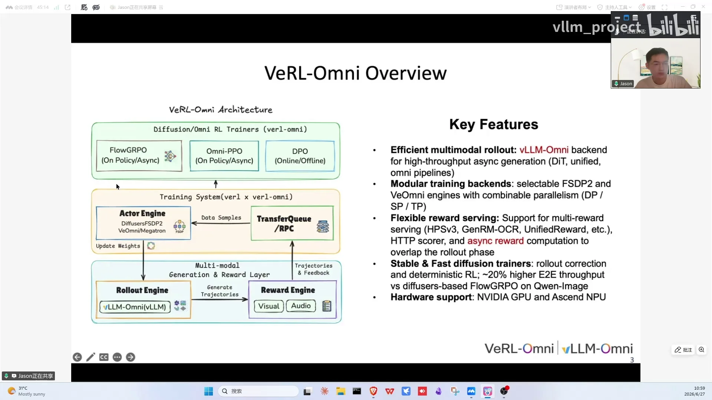
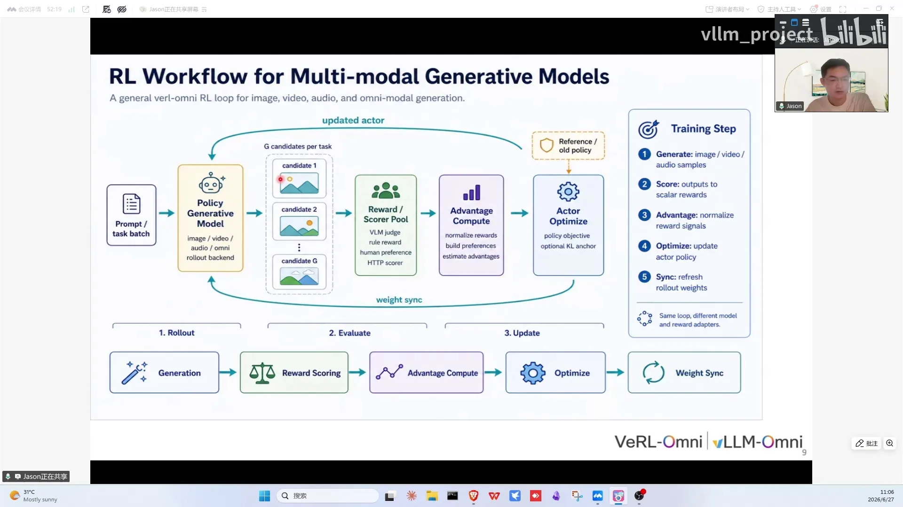
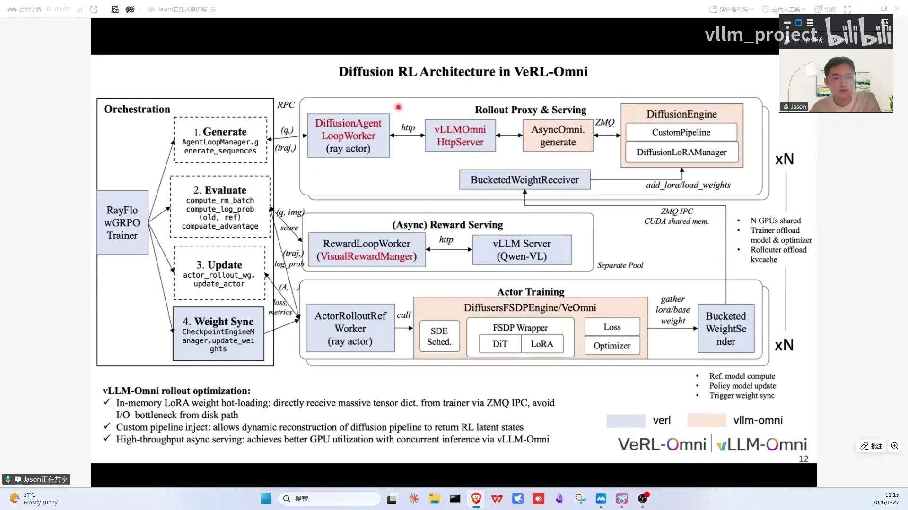

# 第08讲：veRL-Omni为vLLM-Omni打造的RL框架

> 视频来源：[vLLM小课堂（八）：veRL-Omni，为vLLM-Omni打造的RL框架](https://www.bilibili.com/video/BV1qd7n6TEZk/)（约 37 分钟，嘉宾：黄永强，华为香港研究所，veRL-Omni 核心作者）。本文基于直播实录整理，时间戳可跳转到对应画面。

## 本讲要解决的核心问题（SCQA）

**背景**：图像/视频生成模型的后训练正在全面 RL 化（Qwen-Image、混元 image 都用了多个 RL 算法），而 RL 训练需要 rollout 引擎。

**冲突**：diffusion RL 迭代速度快，放在 veRL 主仓里走 CI/PR review 流程太慢；而且 LLM 的 RL 框架（veRL）并不能直接处理"对图像打分"这种重 IO 的 reward。

**疑问**：多模态生成模型的 RL 训练框架应该怎么设计？和 LLM RL 到底差在哪？

**回答（中心思想）**：**veRL-Omni = veRL 的训练框架 + vLLM-Omni 的 rollout 引擎**，针对 diffusion RL 的三大差异点（reward 重、输出定长、多步去噪的马尔可夫链）做了 prompt-id 路由、state-wise continuous batching、raw correction 和异步 reward 四项优化，端到端吞吐比 diffusers 原版 FlowGRPO 快约 20%。

---

## 一、独立仓库的由来：主仓 CI 节奏追不上 diffusion RL 的快迭代

veRL-Omni 基于 veRL 和 vLLM-Omni 构建（[【跳转到 01:15】](https://www.bilibili.com/video/BV1qd7n6TEZk/?t=75)）。前期 diffusion RL 是在 veRL 上支持的，但后来发现两个问题：对主仓影响大；动态生成的 RL 本身迭代快，在主仓做 CI、PR review 和合入整体太慢。于是独立出 veRL-Omni 仓库，目标是**高性能、兼顾易用性与训练稳定性的多模态生成统一 RL 训练框架**，主要针对 diffusion 类和 Omni 类模型。

## 二、服务对象是三类模型：Omni 混合架构、Diffusion/DiT、理解+生成统一

框架设计前先看清楚服务对象的三类架构（[【跳转到 05:50】](https://www.bilibili.com/video/BV1qd7n6TEZk/?t=350)）：

1. **Omni 模型**（如 Qwen-Omni）：AR + 扩散的混合架构；
2. **Diffusion/DiT 模型**（目前支持最多）：主流音视频图像生成模型都属于这类——文本/图像 encoder 做 conditional embedding，中间对 noise latent 做多步去噪，最后 VAE decoding 映射回 RGB pixel space；
3. **理解+生成统一模型**（如 BAGEL）：两个 transformer——understanding expert 和 generation expert，中间通过 KV 把 understanding 的 embedding 当作 condition 传给 generation expert。

## 三、与 LLM RL 的三大差异：reward 重 IO、输出定长、多步去噪马尔可夫链

整体训练流程（[【跳转到 02:30】](https://www.bilibili.com/video/BV1qd7n6TEZk/?t=150)）：对所有 query 做**多组 rollout**（vLLM-Omni 生成图像/音频/视频 + trajectory）→ **reward engine** 打分 → 通过传输（transport/gRPC）把 trajectory 和 reward 传给 actor engine 更新策略 → 权重同步回 rollout engine，完成一个大 loop。

与 LLM RL 的主要区别都在 reward（[【跳转到 09:35】](https://www.bilibili.com/video/BV1qd7n6TEZk/?t=575)）：

- LLM 的 reward 主要是文本判定或文本评估模型打分，IO 轻；
- diffusion RL 要对**同一 prompt 生成的一组图像**打分，图像评估很主观、很难用规则描述——一般用 VLM 直接问"美学程度如何、与 prompt 语义匹配程度如何"，或用 CLIP、OCR 等偏好/识别模型给文本渲染准确性打分，之后根据 reward 和 trajectory 算优势、更新策略。

其他差异：

- **rollout 形态**：LLM 输出变长不可预测；diffusion 输入 latent 确定后输出长度可预知——负载分配可以更准确；
- **算法形态**：LLM 是 next-token prediction 的自回归马尔可夫链；diffusion 的马尔可夫链变成从 z_T（全噪声）到 z_0（干净 latent）的多步去噪，loss 从 per token logprob 变成 per denoised step logprob。训练时不会跑满 50/30 步，而是截取部分步数——由 **SDE window size** 决定：比如前两步做 SDE 随机采样（保证探索多样性），后面用 ODE 确定性采样，loss 只算前两步的反向。

多样性的来源：把 ODE scheduler 变成 SDE——每步去噪注入高斯噪声，转移过程近似高斯分布（mean 与 ODE 接近）；prompt 层面也可以通过改写增加多样性。

## 四、系统设计：直接复用 veRL 的 single controller 与三 engine

基于 veRL 的原因（[【跳转到 18:59】](https://www.bilibili.com/video/BV1qd7n6TEZk/?t=1139)）：复用它的分布式 RL 训练框架能力——hybrid flow 框架设计兼顾算法灵活性；single controller 维护整个训练主 loop；各模块（rollout/reward/actor）单独实现优化，并行策略和权重同步能力直接复用。

veRL-Omni 的框架：single controller 实现 FlowGRPO 的四大步（generate、evaluate、actor update、weight synchronization）；右侧三个 engine——**rollout engine**（基于 vLLM-Omni）、**reward engine**、**actor engine**（rollout 与 actor 共卡，权重同步走共享内存 IPC）。reward 支持两种模式：同步（整个 training batch 推理完再算）和异步（每生成一个 sample/microbatch 就流式送出去算）。

支持的 trainers：扩散生成场景的 **FlowGRPO** 及变种（MixGRPO、FlowDPO）；**PPO**（对应 Qwen3-Omni 这类 AR 模型）；**DPO** 偏好对齐。reward 覆盖 model-based（Qwen2.5-VL、CLIP、OCR 等）与 function-based 及其组合。硬件支持英伟达 GPU 与昇腾 NPU。端到端性能：Qwen-Image 上比 diffusers 的 FlowGRPO 原仓库 baseline **快约 20% 吞吐**。性能来源（[【跳转到 05:00】](https://www.bilibili.com/video/BV1qd7n6TEZk/?t=300)）：异步 reward 掩盖 rollout 计算、state-wise continuous batching、raw correction 省掉部分 logprob 重算，外加 **FA3 kernel** 与 **FSDP2 training backend**。

## 五、四项优化分别砍掉 padding、一路 logprob 和 reward 等待

### 5.1 灵活的 training backend

支持 diffusers 与 vLLM-Omni 两种 backend 切换（[【跳转到 20:39】](https://www.bilibili.com/video/BV1qd7n6TEZk/?t=1239)）：前者推理计算图/scheduler 与 diffusers 保持一致；后者偏向大规模训练。vLLM-Omni backend 已支持视频生成、图像生成、Qwen3-Omni；diffusers backend 原生支持 diffusers 库大部分模型。并行 mesh 支持 USP（序列并行）+ DP 及混合。

### 5.2 rollout 优化：prompt-id 路由 + state-wise continuous batching

diffusion RL 输出 latent 长度固定、没有长尾气泡，所以可以把**相同 prompt 的请求路由到同一张卡**，消除 padding 开销——在原路由算法上加 prompt id 前缀检索。再加上 **state-wise continuous batching**：按去噪步维度把输出 latent 相同的请求组成 batch（[【跳转到 22:49】](https://www.bilibili.com/video/BV1qd7n6TEZk/?t=1369)）。两项合计 rollout 吞吐提升约 **20%**（[【跳转到 22:44】](https://www.bilibili.com/video/BV1qd7n6TEZk/?t=1364)）。

### 5.3 raw correction：省掉一路 logprob

FlowGRPO 训练有三路 logprob：① rollout 用旧权重算的；② 旧权重 + trainer 计算图算的；③ 新权重 + trainer 计算图算的。每一路都是多步去噪、计算量大。优化：**跳过第②路**，直接用 rollout 的 logprob 作为 old logprob 估计；计算图差异带来的 drift 用 **rejection sampling** 过滤——比值超过阈值的 sample 丢弃。效果：每步时间从约 420 秒降到 400 秒，reward 收敛不受影响。

### 5.4 async reward

纯同步要等所有 sample rollout 完才算 reward 再训练；async reward 下**每算完一个 sample/microbatch 就流式交给 reward serving engine**，掩盖 reward 计算时间。

## 六、训练效果：OCR reward 120 步见效，DiffusionNFT 收敛更快，BAGEL 更难调

- **Qwen-Image + OCR reward**：reward model 用 Qwen3-VL 给图片内文本打分。训 120 步后文本渲染明显更清晰，整体美观度无劣化（[【跳转到 28:43】](https://www.bilibili.com/video/BV1qd7n6TEZk/?t=1723)）。支持 wandb 快速浏览每个 optimization step 的图像质量，直观判断收敛；CLIP score、zero std 等诊断指标齐全；
- **DiffusionNFT**：收敛速度比 FlowGRPO 快很多——FlowGRPO 60 步 reward 在 0.8-0.9 区间，DiffusionNFT 更早达标，对收敛速度要求高可以优先尝试。算法思路与 DDPO 相似：旧策略模型与当前策略模型加权求和，得到代理 positive/negative policy，beta 控制差距，reward 判断 sample 好坏。配置简单（[【跳转到 30:55】](https://www.bilibili.com/video/BV1qd7n6TEZk/?t=1855)）：设定 model algorithm、sample source 换成 online（思路类似 DDPO 的 online/offline，借用 DPO 的同一字段），model path 指定要训的基模，reward model path 指定 Qwen3-VL；
- **DPO**：trainer type 改成 direct preference 即可，收敛稳定、训练效果符合预期（[【跳转到 31:51】](https://www.bilibili.com/video/BV1qd7n6TEZk/?t=1911)）；
- **Qwen3-Omni（AR 类）**：做了 thinker 训练，因基模数学能力强、验证集也是数学集，收敛趋势平缓；配置上 model stage 写 thinker、worker type 把 diffusion 改成 AR；
- **BAGEL（非 diffusers 仓库）**：需要适配 dataset/training/rollout 三个 adaptor；validation reward 约 30 步趋稳，但整体比 FlowGRPO 更难调。

## 七、Q&A：图像 RL 需求真实存在，暂不支持的能力大多已列入 Q3

- **图像生成 RL 的业务需求**：Qwen-Image 最后一阶段用 FlowGRPO 训；混元 image 后训练至少用了三个 RL 算法（含 MixGRPO、GSPO 及内部算法）。SFT 只是拟合训练数据分布，RL 可直接对齐人类偏好——比如生成 PPT 场景可以设定 OCR reward 定向增强文本渲染（[【跳转到 12:55】](https://www.bilibili.com/video/BV1qd7n6TEZk/?t=775)）；
- **SDE step 要连续吗**：是，一般是，目前的算法都是连续的（[【跳转到 16:20】](https://www.bilibili.com/video/BV1qd7n6TEZk/?t=980)）；
- **TTS 与多 LoRA**：都暂不支持、均已列入 Q3（[【跳转到 16:45】](https://www.bilibili.com/video/BV1qd7n6TEZk/?t=1005)）。TTS 模型小、训练成本低，reward engine 支持 HTTP server 调外部 API，model-based reward 可以较快支持；多 LoRA 同时训练是数据中心把 RL 做 SaaS 服务的典型需求；
- **部署灵活性**：一个模型可以挂多个 rollout engine，具体拉多少个通过 config 设置，八卡跑 Qwen-Image（80GB）这类不大的模型可以一卡放一个（[【跳转到 25:42】](https://www.bilibili.com/video/BV1qd7n6TEZk/?t=1542)）；FlashAttention4 暂不支持，需要 trainer 与 rollout 一起支持（[【跳转到 26:57】](https://www.bilibili.com/video/BV1qd7n6TEZk/?t=1617)）；
- **64 卡验证与 NPU**：64 卡跑 FlowGRPO，vLLM-Omni 与 FSDP 两种 engine 收敛接近，vLLM-Omni 有约 2% 性能优势（[【跳转到 27:40】](https://www.bilibili.com/video/BV1qd7n6TEZk/?t=1660)）；NPU 支持与 GPU 基本做到 day0/week level——BAGEL 在 GPU 支持后一周内 NPU 即支持训练，加速特性同步支持，后续还会结合超节点等硬件优势优化（[【跳转到 34:10】](https://www.bilibili.com/video/BV1qd7n6TEZk/?t=2050)）。

## 八、Roadmap：deterministic RL、数值一致性、全异步三条主线

Q3 重点（[【跳转到 34:40】](https://www.bilibili.com/video/BV1qd7n6TEZk/?t=2080)）：

- **训练稳定性**：deterministic RL，让 reward curve 做到 bit-wise 对齐（两次重复实验结果一致），对 research 很有价值；
- trainer engine 与 rollout engine 的**数值一致性**提升；
- 算法与模型支持持续扩充；
- 更大规模并行训练，以及针对 Qwen3-Omni 的**全异步流程**（吞吐明显提升）；
- CI 质量加入标准回归测试（保证新特性合入不影响已有模型收敛），并继续支持国产算力卡及其他硬件。

## 小结

- veRL-Omni = veRL（训练框架）+ vLLM-Omni（rollout 引擎），独立仓库是为了摆脱主仓 CI 对快迭代 RL 的拖累；
- 与 LLM RL 的三大差异：reward 重 IO（图像打分靠 VLM/CLIP/OCR）、输出定长（负载分配可预知）、马尔可夫链变成多步去噪（loss 按 denoised step，SDE window 截断）；
- 系统复用 veRL 的 hybrid flow：single controller + rollout/reward/actor 三 engine，rollout 与 actor 共卡、IPC 同步权重；
- 四项优化：双 training backend、prompt-id 路由 + state-wise continuous batching（+20%）、raw correction 省一路 logprob（rejection sampling 控 drift）、async reward；底层还有 FA3 kernel 与 FSDP2 training backend；
- 算法覆盖 FlowGRPO/MixGRPO/FlowDPO/PPO/DPO/DiffusionNFT/GSPO 等，模型覆盖 diffusion、BAGEL、Qwen3-Omni 三类；
- 实战效果：Qwen-Image OCR reward 120 步文本渲染显著提升；DiffusionNFT 收敛更快；BAGEL 更难调但 30 步趋稳；
- Roadmap 主线：deterministic RL、数值一致性、全异步、更大规模并行、国产硬件周级支持。

## 关键术语速查

| 术语 | 一句话解释 |
| --- | --- |
| veRL / veRL-Omni | LLM RL 训练框架 / 基于它扩展的多模态生成 RL 框架 |
| rollout / reward / actor engine | 采样生成 / 打分 / 策略更新三个引擎 |
| single controller | veRL 的集中式控制器，维护整个训练主循环 |
| hybrid flow | veRL 的框架设计：单控制器调度多 worker，兼顾灵活性与性能 |
| trajectory / reward | 一次生成的完整轨迹及其得分 |
| FlowGRPO / MixGRPO / FlowDPO | 扩散生成场景的 GRPO 类 RL 算法及变种 |
| DiffusionNFT | 收敛更快的扩散 RL 算法，新旧策略加权构造正负代理策略 |
| DDPO | 用 RL 直接优化扩散模型去噪过程的方法（online/offline） |
| GSPO | 本讲仅提及的 RL 算法之一（混元 image 后训练采用），未展开定义 |
| SDE window size | 训练时做随机 SDE 采样的截断步数，其余步走 ODE |
| z_T / z_0 | 全噪声 latent / 去噪完成的干净 latent |
| per denoised step logprob | diffusion RL 按"每个去噪步"计算的策略概率 |
| prompt-id 路由 | 相同 prompt 的请求路由到同一张卡，消除 padding |
| state-wise continuous batching | 按去噪步状态组 batch 的连续批处理 |
| raw correction | 用 rollout 的 logprob 代替 trainer 重算的 old logprob |
| rejection sampling | 过滤新旧策略偏差超过阈值的样本 |
| async reward | 逐 sample 流式送 reward 引擎打分，掩盖计算时间 |
| BAGEL | 理解+生成统一模型：understanding/generation 双 expert |
| thinker / talker | Omni 模型的文本推理 / 音频生成两部分（本讲只涉及 thinker 训练） |
| FSDP | 全分片数据并行；本讲 64 卡验证中与 vLLM-Omni 对比的 trainer engine |
| USP | 统一序列并行，本框架支持的并行方式（可与 DP 组合） |
| wandb | 训练指标与生成图像的可视化平台 |
