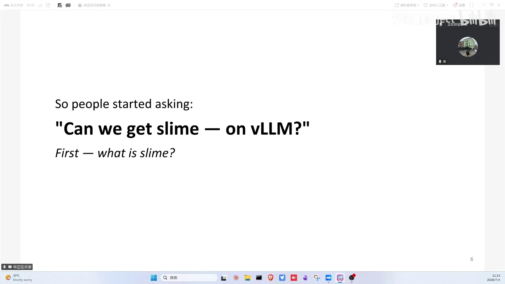
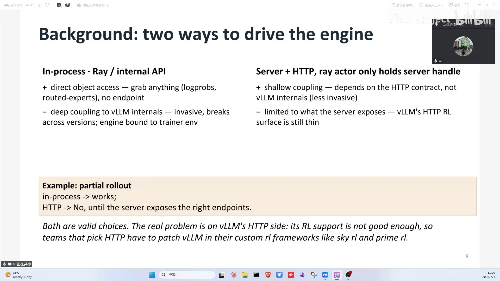
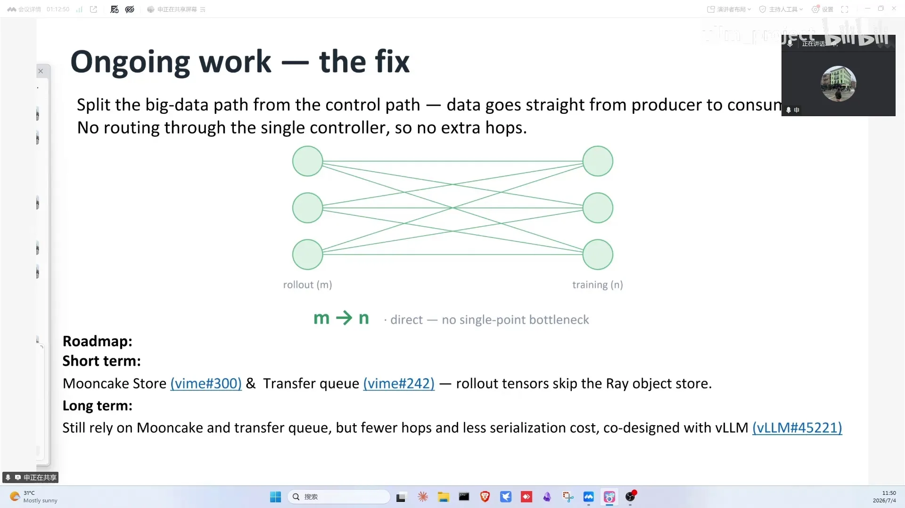

# 第09讲：当vLLM遇见slime

> 视频来源：[vLLM小课堂（九）：当vLLM遇见slime](https://www.bilibili.com/video/BV1LGMP6FEQa/)（约 64 分钟，嘉宾：申望，slime 团队，也是 veRL 贡献者）。本文基于直播实录整理，时间戳可跳转到对应画面。

## 本讲要解决的核心问题（SCQA）

**背景**：RL 框架经过 OpenRLHF → 训推分离 → veRL（single controller、训推共卡——rollout 与训练复用同一批卡，不必为推理单独部署一套服务）三代演进，veRL 已是 star 最多、功能最全的 RL 框架，by default 使用 vLLM。

**冲突**：功能全面=代码 10 万行、抽象层级多；很多团队（包括字节内部训练豆包）并不用主分支——他们要的是好改、简单、AI 友好的框架。而以 HTTP server 方式接入 vLLM 做 rollout，在 RL 生态里长期没有成熟支持。

**疑问**：一个轻量框架如何既复用 vLLM 生态，又能解决 RL rollout 的长尾问题，还能低成本跟上游同步？

**回答（中心思想）**：**slime 选择"server + HTTP"的浅耦合接入方式**，把 vLLM 当作普通 serving 端点用（推理、权重同步都是 HTTP 请求），用控制论式的闭环（代码 diff + 实验 CI 双层测量 + agent 自动修复）维护 fork，并把数据面从 single controller 中分离出来交给 Mooncake store，让大规模 RL 训练不再被序列化和聚合拖垮。

---

## 一、三代演进：每一代都在解上一代的瓶颈

- **OpenRLHF**（ChatGPT 爆发后）：奠定 RL 框架技术形态——Ray 做资源协调 + 成熟推理引擎做加速 + 训练/推理引擎结合完成后训练（[【跳转到 00:48】](https://www.bilibili.com/video/BV1LGMP6FEQa/?t=48)）；
- **训推分离**：24 年社区发现 rollout/生成时间占一半以上成为瓶颈；解决参数同步问题后，训推分离式 RL 走向成熟；
- **veRL**：24 年底横空出世，single controller 架构 + 训推共卡，赶上 DeepSeek-R1 迅猛发展（[【跳转到 01:35】](https://www.bilibili.com/video/BV1LGMP6FEQa/?t=95)）。star 20 多 K，是 RL 框架里最多的；周会 20 多个贡献者（字节、美团、NVIDIA 等），分享 Megatron 时 100 多人参加；production ready，还有 veRL-Omni 这个基于 vLLM-Omni 的 fork。veRL 是 vLLM 生态里最重要的 RL 框架，by default 用 vLLM。

## 二、veRL 的成功与"需求错位"

veRL 几乎什么都支持：各种训练/推理后端、各种算法、各种模态、生产级规模验证（[【跳转到 04:45】](https://www.bilibili.com/video/BV1LGMP6FEQa/?t=285)）。但代价是代码从 OpenRLHF 的约 1 万行涨到约 10 万行——为了支持更多特性，增加了不少抽象层级。

而用户需求差别很大：**推理引擎的用户只关心 token in/token out；训练引擎的用户绝大多数很懂行，需要能快速改你的框架**。代码多、兼容后端多 → 难改；对接它的 CI 改一点就跑不通 → 维护系统+CI 的时间是轻量框架的几倍 → 迭代慢。甚至字节内部训练豆包也不用 veRL 主分支（有另外一套），veRL 背后是字节 Seed 团队、需求主要从内部挖掘，但资源和豆包团队不是一个数量级。这就是"需求错位"：有人只需要好改、简单、上下文精简、封装少、AI 友好的框架——slime 应运而生。

## 三、slime：为想改框架的人而生

slime 是一个非常简单优雅的框架（[【跳转到 09:45】](https://www.bilibili.com/video/BV1LGMP6FEQa/?t=585)）：只有一套推理和训练引擎、没有那么多封装层，容易上手；同时提供 research 需要的灵活性——reward 设计、数据排布、rollout 数据的 filter（只让高质量数据被训练）等关键组件都可自定义。据嘉宾所知，它是 veRL 和 OpenRLHF 之后最受欢迎的 RL 框架，而且诞生最晚（去年 5 月开始做、7 月开源）。

## 四、internal API 拿得多，HTTP 接入更干净

RL 框架实现推理后端有两种方案（[【跳转到 11:30】](https://www.bilibili.com/video/BV1LGMP6FEQa/?t=690)）：

| 方案 | 做法 | 优点 | 缺点 |
| --- | --- | --- | --- |
| **in-process** | 基于 Ray 用 internal API 直接调 vLLM 封装层 | 能直接拿到 logprobs 等所有内部信息，无需暴露 endpoint | 与推理后端代码强耦合、有侵入性，跨版本维护负担重 |
| **server + HTTP** | Ray 只做浅 wrapper，拿 server 子进程句柄，不持有 vLLM server 内部信息 | 耦合少，完全靠 HTTP endpoint，干净简洁 | 需要 server 暴露所需 endpoint——比如 partial rollout 直到最近才支持 |

很多选 vLLM 后端的团队（SkyRL、PRIME-RL 等）因此需要做 monkey patch。嘉宾的观点：internal API 适合单后端框架（支持多后端要叠很多抽象层）；HTTP 方式要求引擎暴露接口、不管内部实现，反而更适合多后端。slime 的集成正是看中了 HTTP 路线——vLLM 本来就是 HTTP server-based 架构。

## 五、最慢的请求决定训练节奏：rollout 长尾与解法

为什么 RL rollout 和普通推理不一样（[【跳转到 16:52】](https://www.bilibili.com/video/BV1LGMP6FEQa/?t=1012)）：rollout 更像离线推理——同一时间 32 条请求打进引擎，必有快有慢；但必须**等所有请求完成才能进入下一步训练**。慢请求（P99 latency）成为木桶短板。

解法两条路：

1. **算法-系统 co-design**：算法上做取舍，不保证完全 on-policy，允许 off-policy 松弛；
2. **纯系统优化**：优化长请求实例——PD 分离（把 prefill 与 decode 拆到不同实例分别优化）、MTP 加速。训练侧（slime 0.3）也有针对长尾的改动（主要作者子琳的博客有写）。

投机解码与 RL 结合：小 batch、追求低时延（正是有长尾的场景）时有收益——verification 开销远小于正常推理开销即可。RL rollout 天然分两阶段：前期每个 engine 被请求打满（优化吞吐），后期请求渐渐结束转为低时延优化——PD 分离、MTP 恰好对症。甚至不是小 batch 时 MTP 收益也挺明显。

RL 的 PD 分离和推理的 PD 分离没有区别：都可以把整个推理服务用 HTTP 打通，rollout 通过一个单独的 serving 端点接入，就像普通 serving 实例。

## 六、补上生态空缺：给 RL 一个纯 HTTP 的 rollout 选择

- **社区需求**：很多人想要 slime + 自定义后端的组合；
- **生态空缺**：RL 里对纯 HTTP rollout 缺成熟支持；
- **真实案例（Cursor）**（[【跳转到 20:37】](https://www.bilibili.com/video/BV1LGMP6FEQa/?t=1237)）：技术报告提到卡数量不足，只用自己的卡做训练，推理服务找 Fireworks AI 等云厂商提供——所有请求（包括普通推理和控制面的权重同步）都走 HTTP。推理集群甚至跨区域、跨大洲。用 Ray 也能做，但要包一层、增加封装复杂度。

## 七、维护 fork 的闭环：跟 Cursor 学控制论

slime 是 veRL 的 fork，目前仍处于 fork 发展的早期阶段，主要"靠上游喂饭"——复用上游的特性（[【跳转到 31:14】](https://www.bilibili.com/video/BV1LGMP6FEQa/?t=1874)）。最近一个月里，与推理不相关的 PR 只占 10%-15%，主要还是训练和算法侧的改动；结合人手不多的现状，策略是保持接口一致、每两周同步一次上游——但持续同步有很多机械繁琐的过程，而且很容易跑偏。硬件上，slime + vLLM 目前支持 MoE 的 GB 系列、Blackwell 与 Hopper，同时大力支持华为昇腾和 AMD（[【跳转到 30:37】](https://www.bilibili.com/video/BV1LGMP6FEQa/?t=1837)）。

解法参考了 Cursor 的实践（[【跳转到 33:10】](https://www.bilibili.com/video/BV1LGMP6FEQa/?t=1990)）：**把维护 fork 变成控制论闭环**——

- **空调比喻**：设定 25 度是目标，温度计是测量，遥控器是纠正；没有温度计就是开环。维护 fork 的"温度计"就是 CI、测试（精度、perf）；
- **干扰源**：上游每次 merge 新 PR 合入 fork 都可能 break；
- **闭环动作**：agent 从测量结果出发获得确定性反馈，出问题就二分（代码二分、镜像二分），直到 CI 和测试全部 pass；
- **帮 agent 建知识库**：一张"翻译表"做简单参数的映射；一个"历史表"记录历史上大改动存在的原因供 agent 回顾；
- **双层测量**：代码层面 diff 与 merge 前尽量一致（新增文件人工确认）；实验层面训练 CI 一直绿（端到端功能 + 精度对齐），并在主力模型上与原版保持一致——Qwen3-4B（dense）与 Qwen3-30B（MoE）的 reward 和 logprobs 指标均对齐，对比原版约有十几个点的提升（其中某个指标 17 个点）；
- **替换工作量**：slime 这次是对 rollout engine 的系统性替换（[【跳转到 37:20】](https://www.bilibili.com/video/BV1LGMP6FEQa/?t=2240)），其中大部分改动相当 mechanical，少部分才是引擎级的重写，但总体接口和代码规模保持一致；
- **GB300 实战**：跑通了 GB300 上 GLM-5.2 的训练（[【跳转到 40:15】](https://www.bilibili.com/video/BV1LGMP6FEQa/?t=2415)）——rollout 侧 EP8、TP8、开 MTP、八个 vLLM instance，训练侧 PP4 加一系列并行配置。

趣闻：veRL-Omni 跟 vLLM 做一次大版本 rebase 用 DeepSeek V4，约 100 元人民币、CI 基本全过；申请 GLM5 API 做测试反而被怀疑爬数据封了号（还充了几千块钱）。

## 八、Ongoing work：数据面与控制面分离

长上下文、AR、MoE 模型的 RL 训练，要从 rollout 集群往训练集群搬大量数据（多模态的 pixel values、重计算的 extra indices 等）以维持 training/inference 一致性（[【跳转到 42:20】](https://www.bilibili.com/video/BV1LGMP6FEQa/?t=2540)）。现状：single controller（头节点）先聚合再分发，头节点 CPU 爆炸、序列化开销巨大——single point 瓶颈。

方案：**数据面与控制面分离**——大数据直接从生产方送到消费方，data path 不多绕一跳；single controller 只管 metadata。短期用 Mooncake store 搭数据面，跳过 Ray 的序列化和 GPU→CPU 搬运；长期与 Mooncake 做 co-design、更深入地结合进 vLLM 后端。

## 九、Q&A：agent 训练、服务共存、选型与数值一致性

**训练 agent：黑盒还是白盒？**

- **训练 code agent**（[【跳转到 45:40】](https://www.bilibili.com/video/BV1LGMP6FEQa/?t=2740)）：支持，只要 slime 支持的框架就支持，已经跑过相关实验——用云厂商的远程 CPU 沙盒，把环境和版本上传进去，通过 Anthropic/Claude gateway 提供背后的推理服务，构成一个黑盒方案；
- **黑盒 vs 白盒**（[【跳转到 46:55】](https://www.bilibili.com/video/BV1LGMP6FEQa/?t=2815)）：黑盒=用 Claude Code/Codex 这类 real-world harness——为了和生产环境完全一致，但只能给命令、难自定义 system prompt 和工作流，内部不可见；白盒=自定义 agent loop（感知-决策-执行），每步调用什么推理/工具、最多几轮都可定义；
- **白盒的优势**（[【跳转到 48:35】](https://www.bilibili.com/video/BV1LGMP6FEQa/?t=2915)）：可观测性与数据收集更友好——比如访问 webpage 超时，黑盒下这个信息很难通过 gateway 拿到（[【跳转到 49:50】](https://www.bilibili.com/video/BV1LGMP6FEQa/?t=2990)）；desktop GUI、browser、具身真机等前沿场景，Claude Code 类 harness 的工具集（截图、鼠标点击等）覆盖不了，需要 fully customize。

**rollout 服务与在线业务共存**

- **trajectory 保存与监控**（[【跳转到 26:02】](https://www.bilibili.com/video/BV1LGMP6FEQa/?t=1562)）：轨迹数据一般都会保存——方便 debug、排查某条轨迹是否产生了 reward spike；推理性能相关的 metrics 通过 Prometheus 收集，监控里都能看；
- **在线服务与 RL 训练共存**（[【跳转到 26:52】](https://www.bilibili.com/video/BV1LGMP6FEQa/?t=1612)）：一个 rollout server 一边在线服务一边接 RL 请求技术上可行（都是 endpoint），但有权重周期性更新影响服务、以及训练需要单独抽出的 render/derender（前处理/后处理）两大差异；权重同步后已生成的 decode token 丢弃重算还要回滚用户反馈，很麻烦——**不建议在线服务和训练同时搞**；vLLM 已把"传 prompt"和"只传 token id"拆成不同 endpoint，专为 RL 服务（[【跳转到 28:57】](https://www.bilibili.com/video/BV1LGMP6FEQa/?t=1737)）；
- **跨机传输**（[【跳转到 55:15】](https://www.bilibili.com/video/BV1LGMP6FEQa/?t=3315)）：NCCL 与其他方案、混合同步传输都要实测，不一定如想象中好。

**框架选型与算法灵活性**

- **veRL vs slime**（[【跳转到 56:05】](https://www.bilibili.com/video/BV1LGMP6FEQa/?t=3365)）：生态位不同。开箱即用选 veRL；想改框架、适配新算法选 slime（轻量、与 veRL 性能没有差别；veRL 数据面因 transport 支持在多模态上更优，代价是代码极复杂）；
- **diffusion LM 怎么支持**（[【跳转到 23:32】](https://www.bilibili.com/video/BV1LGMP6FEQa/?t=1412)）：推荐 veRL-Omni（基于 vLLM-Omni 的 fork）；训练目前主要用 FSDP，Qwen3-Omni 这类模型用 Megatron-LM 做（[【跳转到 25:12】](https://www.bilibili.com/video/BV1LGMP6FEQa/?t=1512)）；veRL-Omni、veRL 社区都缺人，有算力欢迎贡献；
- **新手 case**（[【跳转到 53:10】](https://www.bilibili.com/video/BV1LGMP6FEQa/?t=3190)）：Qwen3-4B、16B-A3B，更大一点 30B-A3B（单机八卡可满足）；
- **reward 怎么定**（[【跳转到 59:25】](https://www.bilibili.com/video/BV1LGMP6FEQa/?t=3565)）：task-specific——简单任务用确定性规则（填表对几个给几分），复杂任务用模型打分；框架侧只保证能跑通、指标有上升趋势，slime 继承了给算法同学的灵活性，关键算法模块可自定义、侵入性不大。

**多模态、AR-DiT 与数值一致性**

- **单轮/多轮对齐**（[【跳转到 50:15】](https://www.bilibili.com/video/BV1LGMP6FEQa/?t=3015)）：单轮 token id 对齐与多轮对话漂移的处理，和 slime 的解决方案没有任何区别，都是最基本的；
- **AR/DiT 分离部署**（[【跳转到 50:15】](https://www.bilibili.com/video/BV1LGMP6FEQa/?t=3015)）：vLLM 的核心是 HTTP server-based 架构——先让 vLLM-Omni 支持 HTTP 请求做权重同步（有好几个请求要实现），再让它支持通过 HTTP 把训练时的 trajectory 传出来；分布式部署可以复用 router 的 manager group（支持多种 rollout 部署形态，含 PD 分离），主要实现 AR/DiT 形式的部署就行；
- **多模态新分支计划**（[【跳转到 54:00】](https://www.bilibili.com/video/BV1LGMP6FEQa/?t=3240)）：计划投入精力做一个多模态分支——在 slime 里加一层对 vLLM-Omni 的适配，引擎侧也要加新接口（否则没法用纯 HTTP 做后训练）；只有 encoder 的模型问题不大，资源充足欢迎参与；
- **训推一致性**（[【跳转到 57:20】](https://www.bilibili.com/video/BV1LGMP6FEQa/?t=3440)）：slime 与原版数值偏差很低（logprob 对比）；追求 bitwise 可看与 Meta（TorchTitan）合作的 zero drift blog——代价是放弃激进优化。单引擎时代靠在训练引擎上加推理接口实现 100% 一致，Megatron 也在做类似的事；
- **deterministic kernel**（[【跳转到 61:30】](https://www.bilibili.com/video/BV1LGMP6FEQa/?t=3690)）：非确定性 kernel 是训推不一致的主因，deterministic 采样 kernel 可以救（DeepSeek V4 训练用）；但好框架本身就应该一致，补救手段默认不开（有性能代价），出了问题再上。

## 小结

- RL 框架三代演进：OpenRLHF 定形态 → 训推分离解 rollout 瓶颈 → veRL 以 single controller + 训推共卡登顶；
- veRL 的 10 万行代码带来"需求错位"：训练侧用户要的是能快速改的框架，slime 以简单、可定制、AI 友好立足；
- 接入 vLLM 两条路：in-process 拿得多但耦合重；server+HTTP 解耦干净但要引擎暴露 endpoint——slime 选后者，vLLM 的 HTTP server 架构天然契合；
- RL rollout 的长尾：等最慢请求才能进下一步；解法是算法松弛（off-policy）+ 系统优化（PD 分离、MTP，小 batch 低时延阶段对症）；
- RL 的 PD 分离与推理 PD 分离无本质区别：rollout 就是普通 serving 端点 + HTTP；
- 硬件与规模实战：GB 系列、Blackwell、Hopper、昇腾、AMD 均支持；GB300 上跑通 GLM-5.2（EP8/TP8/MTP/8 instance + PP4），对比原版约十几个点提升；
- 维护 fork = 控制论闭环：CI/测试是温度计，agent 二分修复；翻译表+历史表做知识库，双层验证（代码 diff + 实验对齐）；
- 下一步主线：数据面/控制面分离（Mooncake store 跳过 Ray 序列化），支撑长上下文与多模态的大规模 RL。

## 关键术语速查

| 术语 | 一句话解释 |
| --- | --- |
| OpenRLHF | 早期 RLHF 框架，奠定 Ray+推理引擎+训练引擎的形态 |
| veRL | 字节 Seed 的 RL 框架：single controller、训推共卡、star 最多 |
| slime | 轻量 RL 框架：好改、简单、AI 友好，HTTP 接入 vLLM |
| single controller | veRL 的集中式控制器，调度整个训练循环 |
| 训推共卡 | rollout 与训练共用同一批卡的训练方式（veRL 引入） |
| in-process / server+HTTP | 推理后端两种接入方式：内部 API 直调 / HTTP 端点解耦 |
| partial rollout | 生成到一半切换策略继续生成的 rollout 方式 |
| monkey patch | 运行时改第三方库行为的补丁手段 |
| 长尾问题 | rollout 中最慢请求拖住整批进入下一步训练 |
| on-policy / off-policy | 训练数据是否由当前策略生成 / 允许旧策略数据 |
| PD 分离 | 把 prefill 与 decode 拆到不同实例分别优化，对长尾/低时延场景对症 |
| MTP | 多 token 预测投机加速，小 batch 低时延场景收益大 |
| Fireworks AI | 提供外部推理服务的云厂商（Cursor 案例） |
| control theory 闭环 | 目标-测量-纠正的反馈循环，用于自动化维护 fork |
| 翻译表 / 历史表 | 参数映射表 / 大改动背景知识，agent 维护 fork 的知识库 |
| Mooncake store | KV cache 与数据传输的存储层，slime 数据面后端 |
| 数据面/控制面分离 | 大数据直传生产方到消费方，控制器只管元数据 |
| 黑盒 / 白盒 agent | 闭源 harness 整体调用 / 自定义 agent loop 与工具 |
| agent loop | 感知-决策-执行的循环，白盒下完全可自定义 |
| zero drift / bitwise | 训推数值完全一致 / 按比特对齐 |
| deterministic kernel | 输出确定的算子实现，用于对齐训推结果 |
| NCCL | NVIDIA 跨机集合通信库，RL 数据传输方案之一 |
