# 第10讲：kv connector的前世今生

> 视频来源：[vLLM小课堂（十）：kv connector的前世今生](https://www.bilibili.com/video/BV1gRNF6PEc3/)（约 125 分钟，嘉宾：陈逸华（LMCache）、卢嘉豪（Mooncake））。本文基于直播实录整理，时间戳可跳转到对应画面。

## 本讲要解决的核心问题（SCQA）

**背景**：KV cache 相关的学术与工程工作爆发（压缩、offloading、PD 分离、跨实例复用），大家都要"把 KV cache 从推理引擎里拿出来放回去"。

**冲突**：vLLM 的 KV cache 是 PagedAttention 碎片化管理、attention backend 百花齐放（metadata 各不相同），外部系统想接入处处是坑。

**疑问**：vLLM 怎么设计一套通用的 KV cache 拿进拿出接口？这些年它经历了怎样的演进？

**回答（中心思想）**：**KV connector 是 vLLM 官方的 KV cache 拿出/放回抽象层**——V0 靠魔改 attention metadata 闯出雏形，V1 转向"原生流程上打钩子 + get_num_new_matched_tokens 查询内外命中"，再叠 layer-wise / request-level async / prefetch 三级异步把传输藏进计算；LMCache（MP 模式 + CUDA IPC）与 Mooncake（transfer engine + store）是两个标杆实现。

---

## 一、KV connector：vLLM 的"另一面"，专管 KV cache 拿进拿出

vLLM 有一个面向用户的一面，也有"另一面"：**KV cache connector 把 KV cache 从 vLLM 拿出来、或把外面的 KV cache 放进 vLLM**，提供一个 generic 的 interface（[【跳转到 01:15】](https://www.bilibili.com/video/BV1gRNF6PEc3/?t=75)）。学术界的 KV cache 工作想落地、生产环境想用 KV cache，都可以基于社区现成的 solution 或做 customization。

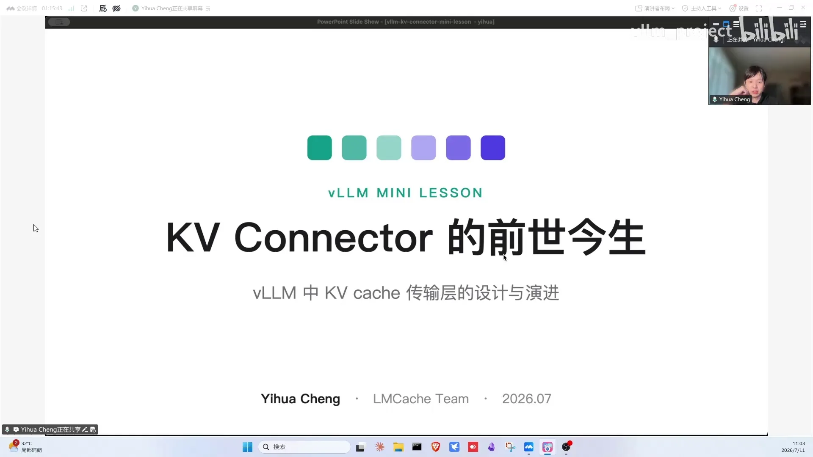

## 二、起源：CacheGen 的教训——改动越小，越容易被社区接受

故事从 23 年年中开始（[【跳转到 04:01】](https://www.bilibili.com/video/BV1gRNF6PEc3/?t=241)）：LLM research 刚火，团队做了 KV cache 压缩项目 **CacheGen**（trunk-based 压缩）——长 request 的 KV cache 很大，从远端读回来要花很久，于是压缩后放外部存储，同样 prefix 进来时取出、解压、放回做 inference。最早基于 HuggingFace Transformers 实现（KV cache 就是扁平的 PyTorch tensor，随便改），但 vLLM 以火箭速度起飞成为 serving 基础设施，于是想把这套机制集成进 vLLM。

当时没有任何开源经验，一位工业界前辈点醒：**想让开源社区接受，改动必须干净很小——在 vLLM 里改的代码行数越少越好**。最早的设计原则由此而来：

1. 对 vLLM 改动尽量少（interface 足够简单，只调用一两次）；
2. 以 chunk 为单位管理外部 KV cache；
3. 不对 KV cache 形状做任何假设（general interface，可扩展）。

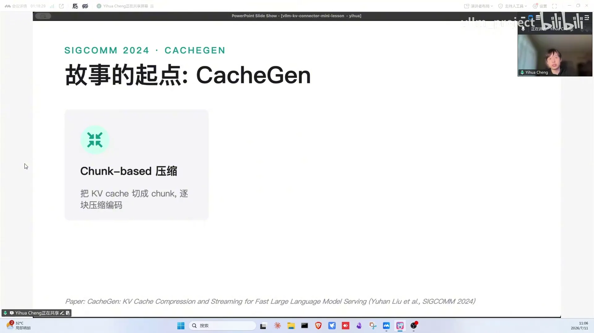

于是最早的接口就两个：**store**（把 request 的 KV cache tensors 卸载 offload 到外部介质——硬盘/内存/另一个 vLLM instance）和 **retrieve**（按 tokens 取回来）。但 vLLM 以 PagedAttention 闻名：KV cache 都是 page 化、碎片化地存于 GPU 内存，且 connector 不做形状假设——所以要加辅助函数，把整理好的 chunk-based KV cache 通过 attention metadata 和 slot mapping 搬进/搬出 paged cache。

## 三、V0 雏形：靠"欺骗 worker"的 metadata 魔法起家

背景知识（[【跳转到 12:19】](https://www.bilibili.com/video/BV1gRNF6PEc3/?t=739)）：vLLM 有 scheduler 和 worker 两个部件——scheduler 决定 request 推理多长、每个 token 的 KV cache 在 GPU 哪里，信息传给 worker 才能推理。

V0 的做法：scheduler 不知道外面 hit 了多少 KV cache（只有自己 GPU 的 visibility），会当新 request 要求重算；connector 在 GPU 即将重算的位置插入逻辑，**魔改 attention metadata**——告诉 vLLM"别听 scheduler 的，听 KV connector 的：命中了 8000 个 token"，把 metadata 改成 8000 命中、2000 未命中，再做 model forward。

这就是 V0 connector 雏形：抽象层背后是什么对 vLLM 没有感知（LMCache/Mooncake/磁盘/对象存储/另一个 vLLM——即 PD disaggregation）；对 model runner 来说就是 send 和 receive（后来加 PD 后接口演进为 send/receive KV caches and hidden states，V0 做 PD 时 hidden states 会一并发出）；"魔改 metadata"变成 rebuild model input。

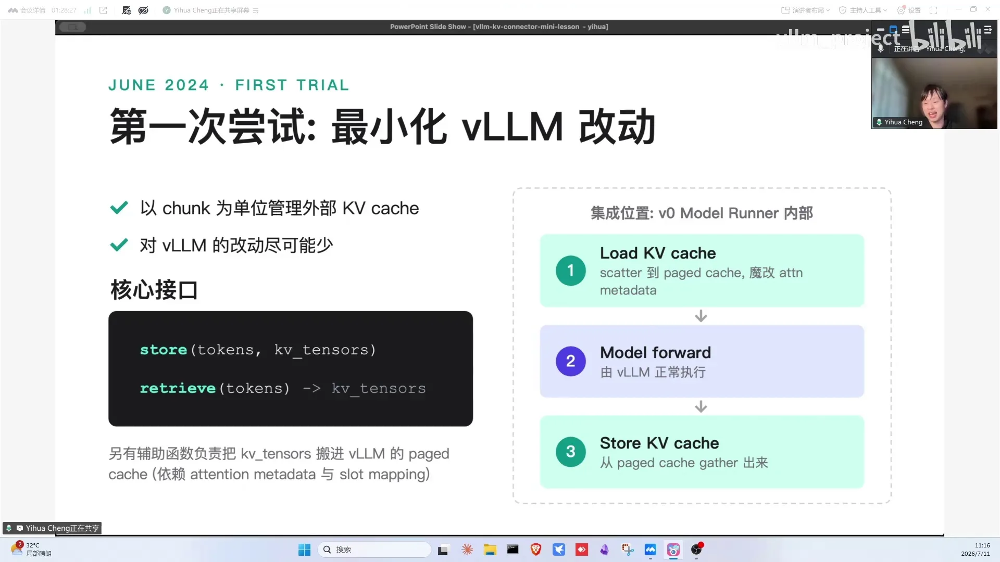

**成也 metadata，败也 metadata**：早期 attention 简单（FlashAttention/FlashInfer/XFormers，metadata 相似）；后来 DeepSeek 带来 MLA（Multi-head Latent Attention，多头潜在注意力——KV cache 形状与常规 attention 不同）、又有 Triton attention 等各种 backend，KV cache layout 一变再变，metadata 复杂化——connector 若还要构造 metadata，就得和所有 attention 抽象耦合，难以为继。

## 四、V0 → V1：metadata 魔法失灵，冒出三个新挑战

vLLM V0 → V1 的架构转变对 connector 的影响：

1. **attention metadata 持续复杂化**（sparse MLA、indexer cache……），不可能再靠维护 metadata 接入；
2. **scheduler 与 worker 分进程**：V0 里 scheduler 跑在 worker 0 上、数据无痛传递；V1 里 scheduler 独立成进程，通过 IPC（进程间通信）把 scheduler output share 给 worker——connector 若要在 scheduler 侧做变化，逻辑要透传到各 worker process，而 bypass scheduler 又行不通，只能把逻辑拆成 scheduler 侧 + worker 侧两部分（隐形复杂度）；
3. **chunked prefill 变默认**：默认一次只 prefill 8192 token，长 request（1 万~10 万 token）的 KV cache load 会被切成多次、越来越慢——不能因为开了 chunked prefill 就让 KV cache loading 也变成 chunked loading。

## 五、V1 设计：原生流程上打钩子

最终 converged 的设计：**在 vLLM 原生流程上以钩子函数注入新逻辑**（[【跳转到 20:58】](https://www.bilibili.com/video/BV1gRNF6PEc3/?t=1258)）。先复习 V1 原生三步：① scheduler 查 prefix cache 命中 token 数（block hash 对比）；② 按命中+剩余数量分配 KV cache blocks，得到 block ids 放进 scheduler output 发给 worker；③ worker 建 attention metadata 执行推理。

connector 的做法：scheduler 查命中时**同时查外部匹配数量**（内外命中一视同仁、应用尽用）；基于总命中数分配 blocks（1 万 token：内部命中 2000 + 外部 3000 = 只需分配剩余 5000 的 blocks）；worker 端再按 V0 的方式 load/save。

好处：**完全不碰 KV cache block 分配逻辑**——分配逻辑不 care KV cache 在 GPU 内还是外，token budget、continuous batching 等逻辑都不用动，只是 local hit 变成 local hit + remote hit。

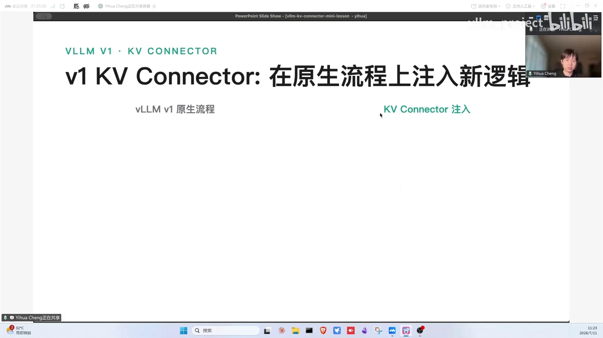

关键接口全家桶：scheduler 侧 `get_num_new_matched_tokens`（查命中）+ `update_state_after_alloc`（把分配的 block id 告诉 connector——"3000 个新 token 分别存在 1 号、2 号、100 号房间"）；connector 打包状态为 metadata（build connector metadata）发给 worker；worker 侧按 metadata 决定 load/save 的位置。

顺带的 vLLM 小知识：**KV cache 为什么可复用**——每个 token 的 KV cache 对应它自己及所有前缀，token 1~10 的 cache 可被 1~12 的请求复用，跳过繁重的 attention 计算；命中以 block 为单位（一个 block 16/256 个 token 全命中，18 token 请求只有前 16 个可命中）。

弹幕 Q&A 顺带澄清了一组容易混淆的概念（[【跳转到 30:58】](https://www.bilibili.com/video/BV1gRNF6PEc3/?t=1858)）：connector 背后既可以"存"也可以"发"——**去存就是 offloading**（接 Mooncake store、LMCache、vLLM 自带 offloading 这类存储池，像文件系统，见到的都往里存），**去发就是 transfer**（发给另一个 vLLM，典型场景是 PD 分离，走网络抽象）。vLLM 内部其实有多个 connector（offloading、NIXL、AMD 的 memory IO……），启动时用 command line 指定，还能用 multi connector 把几个组合起来"既存又发"。

## 六、三级异步：把传输藏进计算里

整张流程图全是顺序的，实际落地有个大问题：load 时 GPU 空等、store 时 GPU 又空闲（[【跳转到 41:03】](https://www.bilibili.com/video/BV1gRNF6PEc3/?t=2463)）。

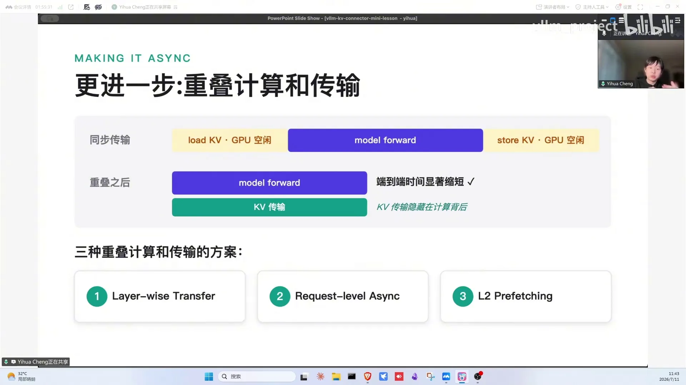

那 KV cache 要加载多快才够？弹幕 Q&A 给了个直观基准（[【跳转到 39:23】](https://www.bilibili.com/video/BV1gRNF6PEc3/?t=2363)）：假设一张 GPU 跑 8B 模型一秒能生成 1 万 token，想让 load 比重算更快，就得在一秒内搬完这 1 万 token 的 KV cache；如果 load 稍慢但异步做得好，GPU 照样能保持满负荷运转，只是 request 延迟略微上升。理想仍是 model forward 与 KV 传输完全 overlap。社区逐步提出三种方案：

### 6.1 layer-wise transfer（逐层流水线）

transformer 逐层计算：load 完第 1 层算第 1 层，同时 load 第 2 层……最终计算与 load 几乎全并行（[【跳转到 42:43】](https://www.bilibili.com/video/BV1gRNF6PEc3/?t=2563)）。worker 侧四个接口：`start_load_kv`（开始拷贝）、`wait_for_layer_load`（每层算之前等数据好，好了直接返回）、`save_kv_layer`（每层算完存）、`wait_for_save`（收尾等待）。

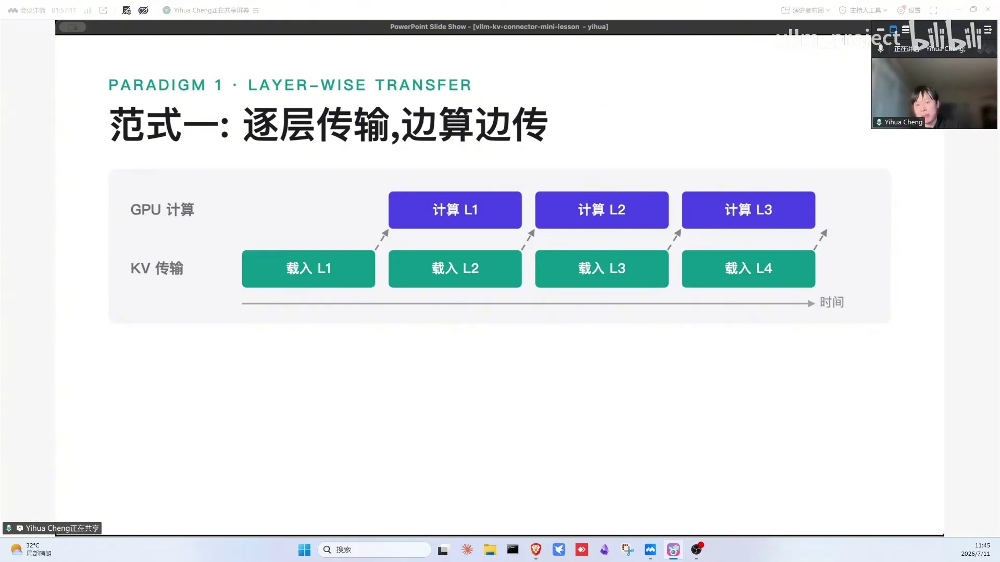

- 好处：**对 scheduler 完全透明**，一两行代码改动即可开启；
- 坏处：KV cache 太大、计算太快时，取 KV 比单层计算还慢，GPU 仍会空转（agentic trace 前缀利用率高、模型大时很常见）。默认逐层都要 save（不存的话取的时候傻眼），但逐层 interface 也给特殊算法留了空间。

### 6.2 request level async（请求级异步）

加载期间先跑别的请求：A 要 load KV cache、B/C 不用，就后台异步 load A，scheduler 先让 GPU 算 B/C；A 的 cache 好了下一轮再调度 A（[【跳转到 46:56】](https://www.bilibili.com/video/BV1gRNF6PEc3/?t=2816)）。实现上 scheduler 要知道哪些请求在 load：connector 在查询时返回"有 1 万 token 但需要一段时间"的异步信号，scheduler 先调度别的；仍会为该 request 分配显存（load 的 destination buffer）；worker load 完通知 scheduler，下一轮调度上 GPU。

- 好处：异步程度最高——不假设 load 与算谁快谁慢，多请求下 GPU 几乎不空转；
- 坏处：**scheduler 改动巨大**（代码行数几乎翻倍）；且有个至今仍存在的 tricky 问题——加载期间预留的显存被占住，很多请求都在 load 时 GPU KV cache 被预分配占满、正常请求跑不了（最近有 PR 修复）。

### 6.3 prefetch（预取）

KV cache 在远端/慢速 storage 时，加载期间一直占 GPU 显存更浪费（[【跳转到 56:04】](https://www.bilibili.com/video/BV1gRNF6PEc3/?t=3364)）。技巧：还是 `get_num_new_matched_tokens`，利用 Python optional 返回 **None**——意思是"这个 request 你先别管，我过一会再告诉你命中数"；scheduler 把 request 放回等待队列、下一轮再问，且**不分配显存**。connector 借这个窗口先把远端 KV cache 预取到 CPU 缓冲区，就绪后 scheduler 再分配 GPU blocks、快速从 CPU 内存搬进 GPU——GPU 被占时间从"disk 10 秒"缩到"CPU 1 秒"。若是 GDS（GPU Direct Storage）直读则不需要预取（绕 CPU 反而是弯路）。

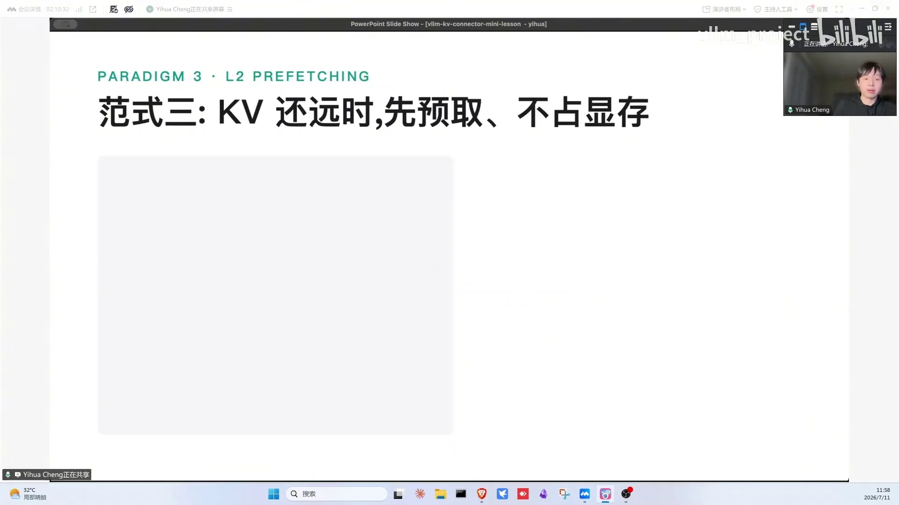

其他 Q&A 要点：KV cache 默认 immutable（一般不更新）；驱逐从尾巴开始（中间命中很少出现）；异步条件取决于 connector 实现（现在所有 connector 至少 CPU→GPU copy 可异步）；load/save 竞争带宽取决于 PCIE 全双工与 DMA 通道；三种异步方案是否都集成了则取决于 connector——LMCache 三种全做了，Mooncake 只支持前两种，而其中 request level async 收益最大（[【跳转到 60:17】](https://www.bilibili.com/video/BV1gRNF6PEc3/?t=3617)）。

### 6.4 拓展：linear attention 模型怎么兼容 prefix 加载

弹幕问了个好问题：linear attention（比如 Qwen3.5/3.6 这类模型）怎么兼容 prefix 加载？答案在 linear attention state 的存取频率上有两种模式（[【跳转到 61:32】](https://www.bilibili.com/video/BV1gRNF6PEc3/?t=3692)）：一种存得更频繁，GPU KV cache 占用更高，但 prefix 命中更频繁、更细腻；另一种每个 chunked prefill 的 chunk 只存一次状态，若命中更长的 prefix cache，就切到完整的 chunk 边界去做 prefix cache。

### 6.5 拓展：NIXL connector 的 PD 分离流程

顺带看一个 NIXL connector 的 PD 分离流程（[【跳转到 74:09】](https://www.bilibili.com/video/BV1gRNF6PEc3/?t=4449)）：prefill 算完后，GPU 的 block id 先回传给 router，router 再把 block ids 发给 decoder——decoder 必须先拿到这些 KV params（去哪读、读哪些），才能开始读 prefill 侧的 KV cache。另一种做法是 prefill 直接把 KV cache 写到 decoder 那边，但有两个前提：scheduler 发 request 时就已决定好 decoder 是谁；且把 request 发给 prefiller 时，decoder 端的 KV cache buffer 已经开好。Red Hat 曾为这条路径写过 patch，但相当复杂——两边要来回通信协调 memory lock，才能保证一边在写时另一边的 buffer 可写。

## 七、LMCache：把 KV 管理拆成独立进程——MP 模式与 CUDA IPC 零拷贝

LMCache 是 KV connector 之一，定位是**一整个 KV cache 管理层**——存算分离，算管算、存管存（[【跳转到 65:13】](https://www.bilibili.com/video/BV1gRNF6PEc3/?t=3913)）。与其他 KV cache 库（Dynamo KVBM、SGLang HiCache 等"library 模式"——库跑在 serving 进程内、本地调用）不同，LMCache 是 **MP（multiprocess）模式**：KV cache 管理整套 separate 到独立进程，connector 调用变成 RPC（远程过程调用）；通过 **CUDA IPC 共享 vLLM 的 GPU buffer**，LMCache 无痛访问 GPU 数据、免进程间大拷贝；worker 端做 CUDA IPC 零拷贝搬运，memory copy 直接发生在 LMCache 进程、结果自动进 vLLM 地址空间。

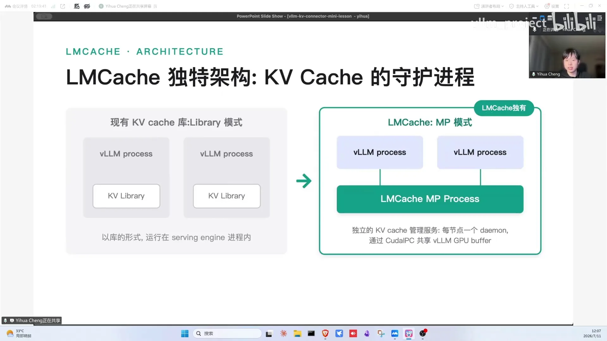

MP 模式三个好处：不受 GIL（Python 全局解释器锁，同一进程内多线程无法真正并行执行 Python 代码）干扰、有全节点视野（管理所有 vLLM 的 KV cache GPU 内存）、debug 友好（LMCache 挂了 vLLM 没事；LMCache 侧 bug fix/download/print 都好做）。

集成流程：scheduler 侧 `get_num_new_matched_tokens` 时 LMCache 先做**分布式多级 lookup**（local CPU / peer CPU / 底层多个 storage）；守护进程决定从哪 load 什么、触发异步 prefetch；worker 侧 CUDA IPC 零拷贝。带宽经验值：读 1 GB/s per GPU 堪堪够用，2 GB/s 更好，RDMA（Remote Direct Memory Access，远端直接内存访问——跨节点绕过 CPU 直读对方内存）十几~几十 GB/s 非常足够。

特性盘点：三个异步方案全做了；RDMA 跨节点共享 DRAM；多级存储（GPU/CPU/磁盘/远端）全局管理；fault tolerance；云原生（K8s、可观测性）；硬件支持 AMD/NVIDIA/昇腾/国产卡；research 方向——KV 压缩、非前缀复用（CacheBlend）、请求级 KV 管理（pin 住不 evict、按 user 分配）、多租户加密隔离；KV cache SDK 支持 CPU 上量化/反量化及更高级的 encoding/decoding。

## 八、Mooncake：一个管传一个管存——transfer engine 与 store 双管齐下

Mooncake 是分布式存储系统，24 年由清华 MADsys 实验室与 Kimi（月之暗面）推出、为 LLM serving 服务，25 年获 FAST 最佳论文（[【跳转到 80:12】](https://www.bilibili.com/video/BV1gRNF6PEc3/?t=4812)）。与 vLLM 的时间线：V0 时代支持 Mooncake 做 PD 分离传输；V1 时代 KV cache 卸载到 Mooncake store；今年 5 月起 Mooncake store 支持跨 prefill instance 的 KV cache 复用、SSD 支持。另外 Mooncake 发展到现在已不只服务推理——还会存强化学习的权重参数、checkpoint 等，定位更像"大模型生态的通信与存储基础设施"（[【跳转到 88:43】](https://www.bilibili.com/video/BV1gRNF6PEc3/?t=5323)）。

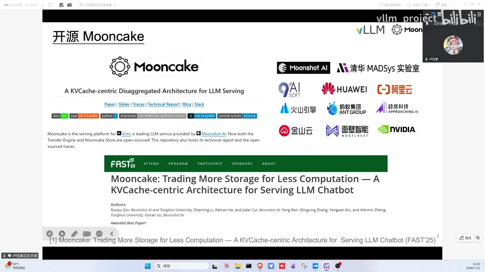

两个 connector：

- **Mooncake connector**：prefill 与 decode 之间通过 Mooncake transfer engine 点对点传输 KV cache；
- **Mooncake store connector**：把算出来的 KV cache 存进 Mooncake store。官方推荐 **multi connector**：两个同时用（既存又传）。

背景：agentic workload 上下文长、每轮新增 KV 有限、理论命中率极高——缓存下来减少重计算，本质是**以存换算**。国产卡算力强但带宽弱，适合做 prefill 节点；但多数国产卡不原生支持 GPU direct RDMA，V0 曾有国产卡 PD 走 Mooncake store 的支持、V1 暂缺，社区正推动这个 promising 的特性。

**Mooncake transfer engine**：高性能通信库，支持 prefill HBM 直传 decode HBM（GPU direct RDMA）（[【跳转到 89:58】](https://www.bilibili.com/video/BV1gRNF6PEc3/?t=5398)）；24 年诞生时假设 RDMA 为主、TCP 为 fallback；有多网卡调度、拓扑感知路径选择、负载均衡与容错。**Transfer engine next**：针对异构生态（RDMA/CXL/UB，GPU/CPU/SSD 多介质）的"通信孤岛"问题，把传输元数据与传输后端解耦——像寄快递：用户只说数据从哪搬到哪、SLO 是什么，next 自动编排传输计划；并解决链路故障后只能靠运维恢复路径的问题。

**Mooncake store**：分布式内存池 + SSD 池组成 KV cache 池（[【跳转到 97:07】](https://www.bilibili.com/video/BV1gRNF6PEc3/?t=5827)）。SSD 作为每个节点 DDR 下面的层级（tiered storage）：写先入 DDR、异步刷 SSD；读从 SSD 到 DDR buffer、DMA 端到端零拷贝；支持动态增删存储节点不打断推理；近期上线 GDS 与分布式文件系统支持；host memory 有近似 LRU 水位驱逐。社区也有人提出"不要 memory、全放 SSD"的省成本方案：走 SPDK + NVMe over fabric 把 SSD 做成共享盘，已集成进 Mooncake 主线（[【跳转到 112:42】](https://www.bilibili.com/video/BV1gRNF6PEc3/?t=6762)）。

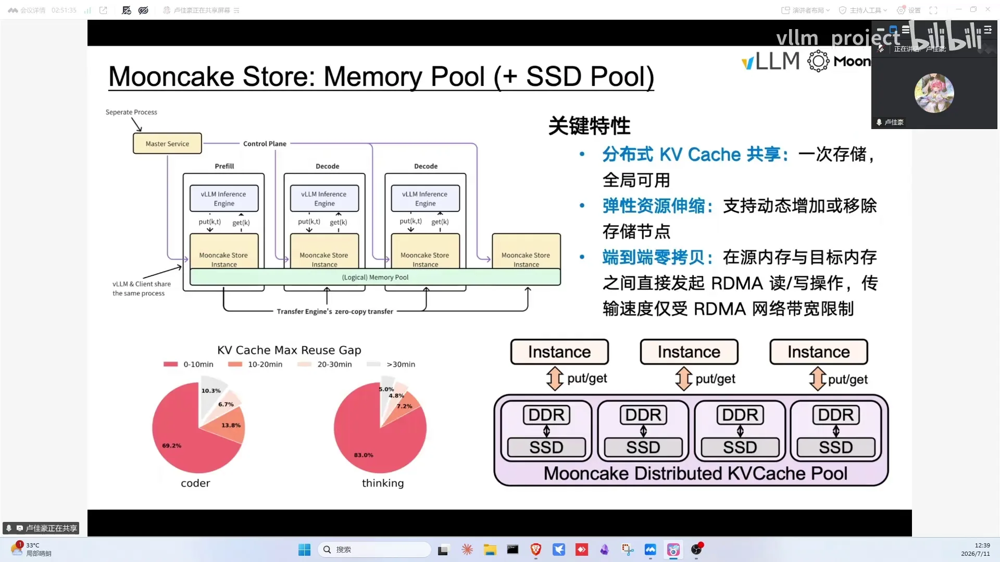

connector 架构（[【跳转到 99:53】](https://www.bilibili.com/video/BV1gRNF6PEc3/?t=5993)）依旧是熟悉的 scheduler（控制面：对新请求做哈希、发起 lookup）+ worker（数据面：store client 内嵌进 worker、batch put/get 多缓冲零拷贝 API），scheduler 与 worker 0 之间走 ZMQ（ZeroMQ，进程间消息队列，vLLM 用它发 scheduler 到 worker 的 RPC 请求）；lookup 按 group 拆分（hybrid attention 每层不同）、与 Mooncake master 交互。它的核心作用是实现跨实例 KV cache 复用——写入时按 key 去重，内存与 KV cache 的利用率都更高（[【跳转到 106:39】](https://www.bilibili.com/video/BV1gRNF6PEc3/?t=6399)）。

### Mooncake store connector 的演进：GDS、多租户与 workload hint

这个 connector 在社区里的 PR 非常多、一直在演进（[【跳转到 107:27】](https://www.bilibili.com/video/BV1gRNF6PEc3/?t=6447)）。近期工作重心是 GDS 与分布式文件系统：当前 GDS 只是在读写数据流上做了并发控制与并行处理，集成方式是复用现有 API——每次写操作并行发起 GDS 写和 DRAM 写，代码改动量最小；后续可能设计 GDS replica，并让 vLLM 侧选择部分 KV cache 直接走 GDS、不再绕 Mooncake 的整体控制。多租户 feature 也已提到 vLLM 的 PR 里。更长远是打通式的 workload hint（cache hint）：上层把 session id、优先级等信息经 KV connector 透传给 Mooncake，Mooncake 据此做更好的决策——哪些 KV cache 该 pin 在 memory、哪些可以优先 evict。

## 九、Vision：KV cache 是新基础设施的一层

逸华老师的总结（[【跳转到 76:50】](https://www.bilibili.com/video/BV1gRNF6PEc3/?t=4610)）：KV cache 层会跟推理引擎走得很近，但有自己独有的功能——user 对推理引擎说"帮我推理"，对 KV cache 层则可以问"这个 KV cache 有没有""把某租户的 KV cache 删掉""固定某个请求的 KV cache 不被 evict"。另一本质区别：推理引擎 scale 只需 replicate compute（无状态），数据则要 distributed、需要全局视角（Mooncake master 亦然）；推理引擎优化计算效率，KV cache 层优化 IO 与存储效率。**存算分离：算的推到最好，存的管到最好**——这就是 KV connector 的 future looking 方向。

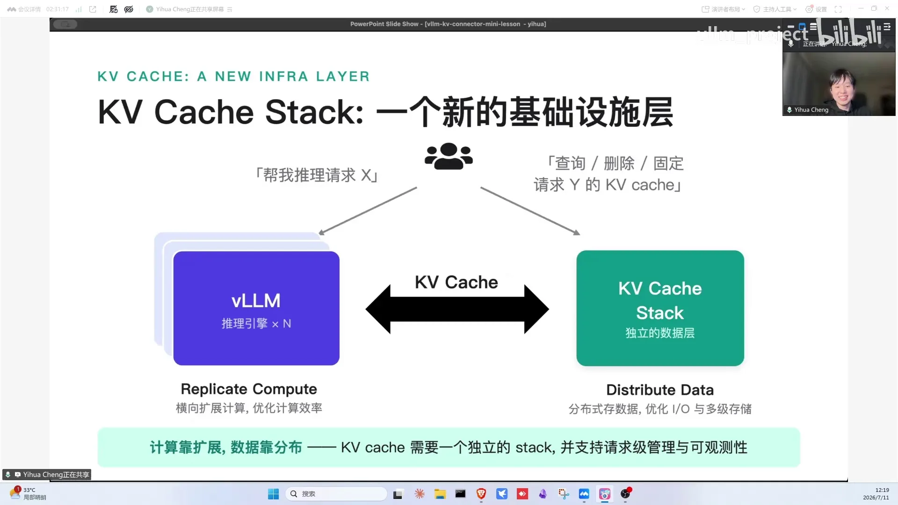

其他问答：请求级 KV 管理（[【跳转到 120:18】](https://www.bilibili.com/video/BV1gRNF6PEc3/?t=7218)）对标 Claude Code/Gemini 的 prompt caching（cache for 5 分钟/1 小时），像管数据库一样对 request 级 KV 做 CRUD；Mooncake store vs 全闪分布式存储——KV cache 层优化差距明显；跨实例复用实验（Codex agent trace、1P1D）近线性扩展；LMCache 已支持 MacBook（消费级也能玩 vLLM+KV cache）；Mooncake 不做分布式显存池（经济开销太贵）；推荐阅读 Mooncake 原文、OSDI'24 的 distserve 等 PD 分离文章。

## 小结

- KV connector = vLLM 官方的 KV cache 拿出/放回抽象：背后可接存储（offloading）或另一个 vLLM（transfer），启动时 command line 选择，还能 multi connector 组合；
- V0 靠魔改 attention metadata 起家，V1 转向原生流程打钩子：查询内外命中 → 分配 block → worker load/save，完全不碰分配逻辑；
- 三级异步：layer-wise（透明轻量但有 idle）、request-level async（异步最彻底但 scheduler 复杂度翻倍、预分配占显存）、prefetch（返回 None 的窗口，远端冷数据场景）；
- LMCache：MP 多进程模式 + CUDA IPC 零拷贝 + 多级 lookup + 多级存储 + 压缩/CacheBlend/请求级管理/加密；
- Mooncake：transfer engine（RDMA 点对点）+ store（memory+SSD 分布式池）双 connector 组合，transfer engine next 解决异构通信孤岛，GDS/tiered SSD 与 workload hint 仍在演进，agentic 场景以存换算；
- KV cache 正在成为独立的基础设施层：有全局视角、管 IO 与存储、支持请求级语义（pin/删除/配额），存算分离各行其职。

## 关键术语速查

| 术语 | 一句话解释 |
| --- | --- |
| KV connector | vLLM 把 KV cache 拿出/放回引擎的通用接口层 |
| CacheGen | 最早的 KV cache 压缩工作，connector 故事的起点 |
| store / retrieve | 把 KV cache 卸载到外部介质 / 按前缀取回 |
| scatter / gather | 连续 KV cache 打散进 paged cache / 从 page 中拼回连续 |
| attention metadata | 驱动 attention 计算的元数据（KV 位置、batch 分段等） |
| rebuild model input | V0 靠重造 metadata 欺骗 worker 跳过重算 |
| get_num_new_matched_tokens | 查询本地+外部命中 token 数的钩子（可返回 None 触发预取） |
| update_state_after_alloc | scheduler 把分配的 block id 同步给 connector |
| build connector metadata | scheduler 侧状态打包传给 worker 的载体 |
| layer-wise transfer | 逐层边算边传：start_load/wait_for_layer_load/save/wait_for_save |
| request level async | 请求级异步加载，先算别的请求 |
| prefetch | 返回 None 打开预取窗口，先取到 CPU 缓冲区 |
| GDS | GPU Direct Storage，绕过 CPU 直读 SSD |
| CacheBlend | 非前缀（中间块）复用的算法 |
| MP 模式 | LMCache 的多进程模式：KV 管理独立进程 + RPC |
| CUDA IPC | 跨进程共享 GPU buffer，实现零拷贝 |
| Mooncake connector / store connector | transfer engine 点对点传输 / 存入 Mooncake store 的两个 connector |
| transfer engine next | 元数据与后端解耦的下一代传输引擎（解决通信孤岛） |
| Mooncake store | 分布式内存池 + SSD 池组成的 KV cache 池 |
| multi connector | 多个 connector 组合：既存又传 |
| KV cache SDK | LMCache 的 KV 处理套件：量化/反量化等编解码 |
| 以存换算 | 缓存 KV cache 减少重计算，agentic 高命中场景的核心逻辑 |
| ZMQ | ZeroMQ 进程间消息队列，vLLM 里 scheduler 与 worker 间 RPC 通信的载体 |
| RPC | 远程过程调用：调用远端进程/机器上的函数，像调用本地函数一样 |
| RDMA | 远端直接内存访问：跨节点绕过 CPU 直读对方内存，带宽可达几十 GB/s |
| MLA | DeepSeek 的多头潜在注意力，KV cache 形状与常规 attention 不同 |
| GIL | Python 全局解释器锁：同进程多线程无法真正并行执行 Python 代码 |
| NIXL | NVIDIA 开源的传输接口，vLLM 内置 connector；PD 时 decoder 先拿 KV params 才能读 KV |
| workload hint | 上层透传 session id/优先级等提示，指导 KV 层做 pin/evict 决策 |
