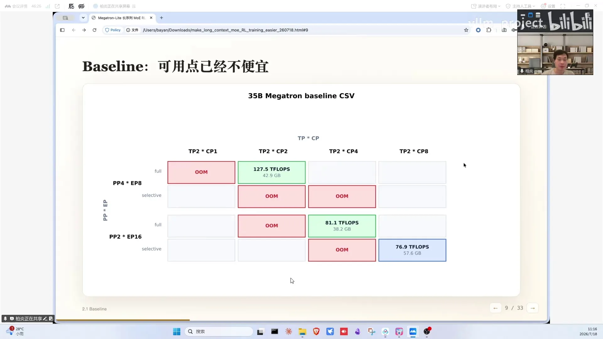
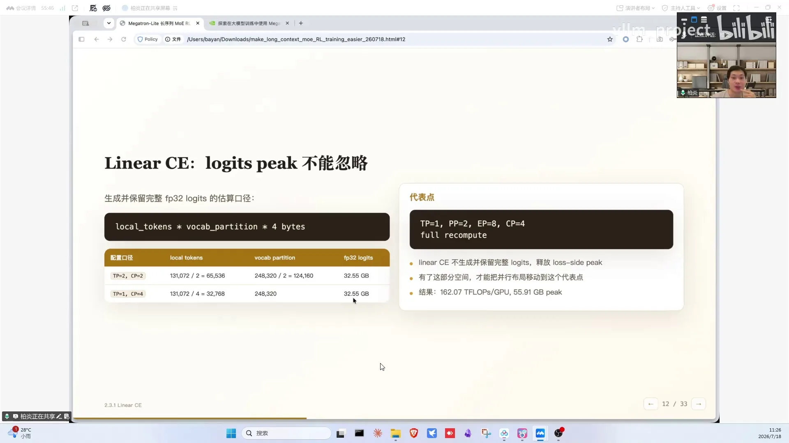
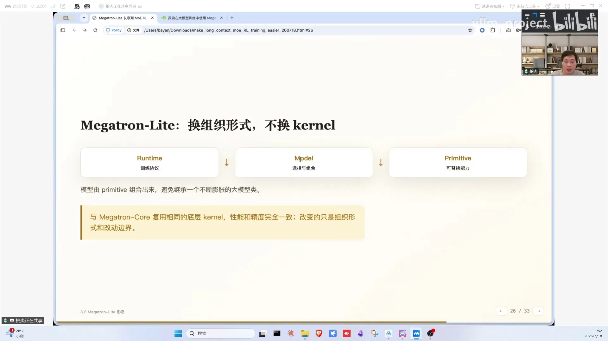

# 第11讲：让长序列MoE RL训练更好调

> 视频来源：[vLLM小课堂（十一）：让长序列 MoE RL训练更好调](https://www.bilibili.com/video/BV1WLKw6aEDq/)（约 73 分钟，嘉宾：白岩，NVIDIA Megatron 工程师，Megatron bridge 与 Megatron-Light 发起者）。本文基于直播实录整理，时间戳可跳转到对应画面。

## 本讲要解决的核心问题（SCQA）

**背景**：RL 后训练成为主流，但 RL 和 pretrain 的负载特性完全不同：算力受限、要多组实验、序列越来越长（agentic 时代 1M 上下文）。

**冲突**：长序列 MoE 模型的 RL 训练难调——5D 并行、重算、显存、通信、CPU overhead 相互耦合牵制，调优像盲人摸象。

**疑问**：有没有一张全景图讲清楚每个旋钮影响什么？有没有一条可复制的优化路径？

**回答（中心思想）**：把显存拆成"静态（权重/优化器）/动态（activation）"两本账，**静态显存全交给 FSDP2、动态显存全交给 CP**，EP 只负责 MoE 的通信换效率、PP 只负责缩小问题规模、TP 大多数时候不用开；配合 linear cross entropy 融合算子和 chunk EP overlap，32×H100 上 Qwen3.5-35B 128K RL 训练从 127 TFLOPS 打到 190、峰值显存从 55GB 降到 37GB（55GB 是中途 PP 降为 2、换 FSDP2 前的峰值；初始 baseline 是 43GB，完整演进见第八章表格）。

---

## 一、RL 和 Pretrain 有什么不同

Pretrain 追求大规模、稳定、长时间吞吐：几千到几万张卡跑一个月以上，核心目标是吞吐跑满（[【跳转到 02:05】](https://www.bilibili.com/video/BV1WLKw6aEDq/?t=125)）。强化学习完全不同：

- 没有特别多的卡做训练；有卡也会分成不同的组多跑实验；
- 通常先拿小模型打磨算法和 infra，再加大资源；
- **始终资源受限**：30B/300B/1T 模型都用尽可能少的卡数；
- 解空间是 reward、rollout、数据配方、超参——需要尽可能多地尝试。

所以长序列 RL 的系统难点是：**用尽可能少的卡数跑通更长的序列**（如今 coding agent 已习惯 1M 上下文，而 pretrain 主流去年还是 4K 序列）。

## 二、一张全景图讲透 5D 并行的牵制关系

本讲的 case：Qwen3.5-35B、32×H100、最大序列 128K。Megatron 里可调的是 5D 并行——DP/PP/TP/EP/CP（data/pipeline/tensor/expert/context parallel，即数据/流水线/张量/专家/上下文并行），其中 DP 是凑数的——再加上重算。嘉宾给出的全景图堪称"面试神图"（[【跳转到 06:15】](https://www.bilibili.com/video/BV1WLKw6aEDq/?t=375)）：横轴是 GPU 上的关键成本（静态显存、动态显存、kernel overhead、通信暴露、CPU overhead），纵轴是可调旋钮：

- **PP**：把模型横向切块，降静态显存；但**不降动态显存**——1F1B 调度下 rank 0 要缓存多份 chunk 的 activation（PP8 缓存八份）；对 kernel overhead 无影响；带来 PP bubble 通信暴露；
- **TP**（Megatron 里是 TP+SP 结合）：降显存最彻底（TP2/TP4 → 1/2、1/4），静态动态都降；代价是把矩阵乘的 K 切薄 → kernel overhead 上涨、通信暴露、CPU overhead 上涨；还会导致精度对不齐；
- **EP**：降静态显存，对动态无帮助；EP 开大后 expert 不均衡反而让动态显存上升；group GEMM 访存量减少、kernel 效率上升 → kernel overhead 下降；有 all-to-all 通信暴露和 CPU overhead；
- **CP**：把 DP 换成 CP、单纯切序列——对静态显存无帮助、能降动态显存；带来额外 kernel/通信与 CPU overhead；
- **recompute**：单纯降静态显存，完全重算多约 30% 计算。

TP 开大的代价在这个案例里看得非常直观：baseline（TP1/CP8）能跑出 127 TFLOPS，而把 TP 开大后 TP×CP 只能开到 8 的组合，单卡计算密度下降，TFLOPS 直接掉到 81，更下面的点位就更低了（[【跳转到 16:26】](https://www.bilibili.com/video/BV1WLKw6aEDq/?t=986)）。

所有并行都是"不开就 OOM 的不得已"，但怎么开有讲究。

## 三、建立 5D 并行 baseline

baseline 也不容易建（[【跳转到 14:21】](https://www.bilibili.com/video/BV1WLKw6aEDq/?t=861)）：把旋钮分成两组——**PP×EP 主要降静态显存，TP×CP 主要降动态显存**。EP8（不跨机）/EP16（跨机）；Qwen3.5 的 KV head 是 2，不做 replicate 时 TP 只能开到 2、剩下给 CP。

二维表上：往右对长序列更友好、往下对大模型静态显存更友好，要在左上角找能跑不 OOM 的点。搜索后得到 **EP8、PP4、TP1、CP8**：127 TFLOPS、peak memory 43GB（[【跳转到 15:36】](https://www.bilibili.com/video/BV1WLKw6aEDq/?t=936)）。

## 四、要不要重算：两条路径，RL 选完全重算

围绕"要不要重算"有两条路径：

1. **避免重算**（NVIDIA pretrain 同事的路）：保留 activation（或 offload，但易 OOM），用大 CP 压低 local seq length（总长 ÷ TP ÷ CP）；代价是 kernel 效率下降、CPU overhead 大——需要 CUDA Graph 回放调度减少 CPU overhead；
2. **接受完全重算**（RL 主流实践）：动态显存空间一下子变大，可以调大 local seq length，CPU/kernel/通信 overhead 全都降低，代价是多 30% 计算。**两条路径都值得投资，本讲主讲第二条。**

顺带区分：Megatron-LM 是英伟达正式产品；Megatron-Light 是 Megatron dev 分支 experimental/light 里的 agentic 实验；auto model 基于 HuggingFace 原生模型做优化——追求极致性能选 Megatron，开箱即用选 auto model。

## 五、显存大头：logits 与 linear cross entropy

长序列下最后一个显存大头是**最后一层的 logits**：每卡 logits = local seq length × vocab（分区），4 字节存储。128K 序列开 CP4 时 logits 就有 **32GB**——H100 一共才 80GB（[【跳转到 24:56】](https://www.bilibili.com/video/BV1WLKw6aEDq/?t=1496)）。

解法：**linear cross entropy 融合算子**——logits 只是为了算 logprobs，那就 fuse 掉不产生 logits、直接产生 logprobs，完全避免这块显存。代价是反向多一些计算，overall 利大于弊。

图中就是 linear cross entropy 融合算子：不物化 logits、一步直接产出 logprobs，把这块显存大头彻底消灭。

## 六、FSDP2：静态显存的终极答案

Megatron 的 distributed optimizer 是 ZeRO-1、分片有冗余；用 **FSDP2** 消除冗余（ZeRO-1 → ZeRO-3），相同配置 peak memory 从 55GB 降到 47GB（[【跳转到 27:23】](https://www.bilibili.com/video/BV1WLKw6aEDq/?t=1643)）。

FSDP2 与 5D 并行结合后，职责划分变得清晰：

- **静态显存全部交给 FSDP DP**——不管开什么 PP/EP 都 zero redundant；
- **EP 只考虑通信拓扑**（通常 EP8），只负责 MoE 阶段"要不要用通信换计算效率"；
- **PP 负责缩小问题规模**（1024 卡开 PP8 = 8 个 128 卡的模型），代价是 PP bubble；
- **TP 大多数时候不用开**（切薄 K 既损效率又损精度，FSDP2 接管后性价比更低）；
- **CP 照旧切序列**。

大集群补充：几千卡做 pretrain 时为防 FSDP 通信域过大用 **HSDP**（保留部分 replicate 换通信量），结论对更大集群也成立。PP bubble 诊断（[【跳转到 31:33】](https://www.bilibili.com/video/BV1WLKw6aEDq/?t=1893)）：bubble 无法完全消除——想让计算一刻不停就必然要牺牲显存去换，所以 bubble 不能无限压；microbatch 多则占比小；RL 中负载不均衡（嘉宾在 veRL 里做过负载均衡工作）或 microbatch 太少（PP8 配 8 个 microbatch，bubble rate 接近 50%、效率打五折）是常见原因；可开 VPP（virtual pipeline parallel，把每个 stage 再切成多个虚拟 stage、用交错式 1F1B 进一步压 bubble）、调整 layer layout，也可参考 ZeRO bubble 研究与 dualpipe（DeepSeek 提出的流水线"计算-通信"重叠方案）。反过来，**PP 一旦叠加完全重算就成了"六边形战士"**：只要能接受重算，PP 对显存的降低非常彻底；这类"牺牲显存换所有卡一起跑"的 bubble 优化在 dense 模型时代很流行，MoE 时代显存更紧张、用的人不多，但嘉宾非常鼓励尝试（[【跳转到 33:38】](https://www.bilibili.com/video/BV1WLKw6aEDq/?t=2018)）。

## 七、通信线：chunk EP overlap 把 all-to-all 藏进计算

EP 的典型流程：all-to-all（dispatch）→ group GEMM → all-to-all（combine）。开完全重算后 all-to-all 不可避免暴露（1F1B overlap 与重算不兼容）。解法：**把序列分 chunk**——chunk 0 的计算与 chunk 1 的通信互相掩盖（[【跳转到 41:33】](https://www.bilibili.com/video/BV1WLKw6aEDq/?t=2493)）：

- forward：POC 实现配合 Nsight Systems 打点，一层 forward 从 10ms 降到 7.8ms；
- backward 更复杂：data grad 可 overlap，weight grad 要积累到最后；完全重算下把 forward/backward fuse——重算 forward 的 combine 可以直接扔掉，overlap 更细致，还降低 peak memory；
- 峰值显存变成单 chunk 的峰值，随序列长度线性下降（16K 时一层 7-8GB → chunk 化显著降低）；
- 加速比随 local seq length 增大而升高（分 chunk 本身有 overhead，序列越长越划算）。

## 八、完整 recipe 演进：五步把 127 TFLOPS 打到 190

一步步叠加（[【跳转到 46:39】](https://www.bilibili.com/video/BV1WLKw6aEDq/?t=2799)）：

| 步骤 | TFLOPS | peak memory |
| --- | --- | --- |
| Megatron baseline（EP8/PP4/TP1/CP8） | 127 | 43GB |
| + linear cross entropy → PP 降为 2 | 162 | 55GB（PP 变小、每卡分到更多模型，显存反而升高） |
| + FSDP2 替换 distributed optimizer | 163（波动） | 47GB |
| + PP 降为 1 | 180 | 60GB |
| + chunk EP overlap | **190** | **37GB** |

两个容易看混的数字说明一下：43GB 是初始 baseline（PP4）的峰值；打开 linear cross entropy 后把 PP 从 4 降到 2，PP 变小意味着每卡分到的模型变大，所以 55GB 是"PP2 + distributed optimizer"的峰值，换 FSDP2 后同配置降到 47GB。"+FSDP2"这一步 TFLOPS 停在 163 附近属于正常波动——计算量没变，收益全在显存，显存省出来才给下一步"PP 降为 1"腾出空间。

调参方法也换了一套。旧方法论（[【跳转到 29:28】](https://www.bilibili.com/video/BV1WLKw6aEDq/?t=1768)）：先把 TP 开满到 8，再往里填 PP，PP 填完与 CP 互调到模型放得下，最后剩下给 DP。FSDP2 之后顺序颠倒：先开 FSDP 管静态显存，再开 CP 管动态显存，看情况开小 PP，EP=CP×PP，TP 大多数情况下没有用武之地。

新配方的调参口诀：**静态显存交 FSDP、动态显存交 CP、EP 默认 8、TP 通常不开、大模型开小 PP**。CP 按 local seq length 推（128K 总长：CP2→64K、CP4→32K）。DeepSeek V4 的强化学习 recipe 就是这个实践（Hopper 至少 88 卡、通常 128 卡，128K 可跑；之前 Megatron+distributed optimizer 需保证 PP×EP≈卡数，FSDP2 后无需此假设）。

## 九、Megatron-Light：agentic 时代的训练框架

这些优化都在 **Megatron-Light** 上实现（[【跳转到 51:14】](https://www.bilibili.com/video/BV1WLKw6aEDq/?t=3074)）：保持 Megatron 的性能与精度，但切换组织形式（kernel 还是 Megatron 的）。三层抽象：

1. **primitive**：可替换的原子能力（TP/CP/PP、MoE、optimizer……）；
2. **model**：primitive 组装成的模型；
3. **runtime**：agentic 的 training loop（tinker-like API），已与 RL 框架结合。

本讲三个优化对应三个 primitive：linear cross entropy、FSDP2（作为 optimizer）、chunk EP（替换 MoE 模块）——都可替换、可验证（原代码做参考）。它还提供 agent tools 与 skill 体系：agent 读 skill → 确定改动边界 → 对照已有代码验证 → 替换模块组装新东西。项目在 Megatron dev 分支（experimental/light），会持续 upstream；DeepSeek V4 RL recipe（支持 128K/256K CP）已在 Megatron dev/main 分支。

## 十、Q&A 精华：并行能不开就不开、overlap 跟 Megatron 学、工程要敢删旧代码

直播问答信息密度很高，按主题整理如下（每条附时间戳，可跳转原视频）。

**显存与并行选择**

- **开 PP 一定降 MFU 吗**（[【跳转到 57:24】](https://www.bilibili.com/video/BV1WLKw6aEDq/?t=3444)）：不一定，看情况。所有并行的总原则是"能不开就不开"——**DP 均衡时严格优于其他并行**（除非 DP 负载严重不均）；
- **TP/CP 为何增加 CPU overhead**（[【跳转到 60:19】](https://www.bilibili.com/video/BV1WLKw6aEDq/?t=3619)）：复杂 shape 切换、if/else、concat 都要花 CPU；且计算密度降低后 CPU 更容易暴露。可变序列（RL）的打包解包判断更多、更易暴露；
- **FSDP 序列越长越划算吗**（[【跳转到 35:18】](https://www.bilibili.com/video/BV1WLKw6aEDq/?t=2118)）：是——相同通信量下序列越长计算越多，可掩盖的越多；
- **CP 做 all-to-all 前必须切头（复制）吗**（[【跳转到 37:23】](https://www.bilibili.com/video/BV1WLKw6aEDq/?t=2243)）：训练和推理不一样，推理可切可不切——切头则通信量增加、不切头则显存占得多。一般做 CP 会切头；replicate 的部分只在计算时通信拿回来、算完立马送回，保证尽可能多的时间处于零冗余状态，否则 CP 就白降了；
- **PP bubble 怎么诊断**（[【跳转到 31:33】](https://www.bilibili.com/video/BV1WLKw6aEDq/?t=1893)）：看 microbatch 数量、负载均衡、VPP 与 layer layout（参考 ZeRO bubble 研究、dualpipe，见第六章）；
- **Megatron core 支持 FSDP2 吗**（[【跳转到 55:19】](https://www.bilibili.com/video/BV1WLKw6aEDq/?t=3319)）：Megatron core 自带一个弱化版 FSDP2，不支持与 PP 结合；另有 Megatron FSDP，是 FSDP2 的上位替代（性能严格优于 FSDP2），但还在开发中、目前同样不支持 PP；Megatron-Light 能把 FSDP2 与 5D 并行结合，是因为做了重构——把整个 optimizer 做成一个 primitive（约 600 行），把耦合降到最低。

**通信与 overlap**

- **CP 实现：flash attention 思路还是 Ulysses**（[【跳转到 35:43】](https://www.bilibili.com/video/BV1WLKw6aEDq/?t=2143)）：Megatron 有 point-to-point（ring flash attention 风格）与 all-to-all（Ulysses 风格）多种，都可以设置；MLA/CSA/GDN 等新 attention 各有 CP 实现，DeepSeek V4 attention CP 已有、GDN CP 已优化到好用版本；
- **训练 backward 的 overlap 跟推理差别大吗，怎么学**（[【跳转到 67:53】](https://www.bilibili.com/video/BV1WLKw6aEDq/?t=4073)）：原理和推理完全一样——计算通信 overlap 就是对计算做 chunk 切分、一遍算一遍传；训练特殊在 backward 要保存更多 activation、weight grad 要单独积累。推荐直接学 Megatron 里各种权威的 overlap 配置（如 all-to-all overlap、MoE 的 expert overlap）：让 agent 列出 overlap 目录、再逐个问原理和实现，是很好的学习方式。

**工程实践**

- **Megatron 这种库怎么学**（[【跳转到 70:23】](https://www.bilibili.com/video/BV1WLKw6aEDq/?t=4223)）：直接问 AI——把代码给 AI、要指路、让它讲每部分实现什么功能；最快路径是用 Megatron-Light（对 Megatron 做了一遍蒸馏）+ readme，BERT 时代的代码不用管；
- **框架要定期删老功能**（[【跳转到 64:58】](https://www.bilibili.com/video/BV1WLKw6aEDq/?t=3898)）：BERT 测试还在跑、CI 浪费资源——vLLM 去年也把 BERT 支持删了；
- **Megatron-Light 会持续维护吗**（[【跳转到 58:14】](https://www.bilibili.com/video/BV1WLKw6aEDq/?t=3494)）：会，早期用户越来越多，目标是进入 Megatron main 分支，作为 agentic 时代的探索性项目；
- **Megatron-Light 性能与 Megatron 差距大吗**（[【跳转到 64:08】](https://www.bilibili.com/video/BV1WLKw6aEDq/?t=3848)）：性能一致——kernel 还是 Megatron 的 kernel；而且轻量化后减少了很多不必要的 CPU 判断，某些情况下比 Megatron core 更快；
- **RL 用卡不多，trainer 优先选易二开的？**（[【跳转到 65:48】](https://www.bilibili.com/video/BV1WLKw6aEDq/?t=3948)）：用卡不多是为了多组实验，实验效率低照样要优化；agentic RL 大部分时间在 rollout，但异步调度要求两边吞吐大致匹配（单步异步已是极限，吞吐不匹配必有 bubble）；
- **训推一致性做了哪些优化**（[【跳转到 71:13】](https://www.bilibili.com/video/BV1WLKw6aEDq/?t=4273)）：QAT（fake quant：训练时量化到 rollout 的 4 比特再反量化）、rollout replay、batch-invariant kernel；都是 BF16 时就得深入 kernel 级。

## 小结

- RL ≠ pretrain：资源受限、多组实验、序列暴涨，"少卡跑长序列"是系统难点；
- 全景图先行：横轴（静态/动态显存、kernel/通信/CPU 开销）× 纵轴（PP/TP/EP/CP/recompute），讲清牵制关系面试就稳了；
- PP 降静态不降动态（1F1B 缓存多份）、TP 彻底但切薄 K、EP 换 MoE 效率但 all-to-all 暴露、CP 只降动态、重算 +30% 计算换所有 overhead；
- 两条路径：避免重算（大 CP + CUDA Graph）vs 接受完全重算（RL 主流）；
- 两个杀手锏：linear cross entropy 消灭 logits 显存；FSDP2 把静态显存做到 zero redundant；
- chunk EP overlap 把 EP 的 all-to-all 藏进计算，序列越长收益越大；
- 新配方：FSDP 管静态、CP 管动态、EP 默认 8、TP 不开、大模型小 PP——32×H100 128K 从 127 到 190 TFLOPS；
- Megatron-Light：primitive/model/runtime 三层抽象 + agent skill 体系，agentic 时代的训练框架探索。

## 关键术语速查

| 术语 | 一句话解释 |
| --- | --- |
| 5D 并行 | DP/PP/TP/EP/CP（data/pipeline/tensor/expert/context parallel）五种并行（DP 用来凑数） |
| 静态/动态显存 | 权重与优化器状态 / activation 的显存占用 |
| kernel overhead | 算子效率不足或切分过细带来的开销 |
| 通信暴露 | 关键路径上无法被计算掩盖的通信 |
| 1F1B | one-forward-one-backward 流水线调度，rank0 缓存多份 activation |
| PP bubble | 流水线并行中等待其他 stage 的空闲 |
| VPP | virtual pipeline parallel，把 stage 再切成多个虚拟 stage 的交错式 1F1B |
| SP | sequence parallel，与 TP 绑定使用的序列并行 |
| local seq length | 总序列长度 ÷ TP ÷ CP，单卡处理的序列长度 |
| selective / full recompute | 部分重算（core attention/MoE） / 完全重算（+30% 计算） |
| linear cross entropy | 不物化 logits、直接算 logprobs 的融合算子 |
| ZeRO | 优化器/参数分片技术：ZeRO-1 只切优化器状态，ZeRO-3 连参数一起切 |
| FSDP2 | 全分片数据并行，消除 optimizer 冗余（ZeRO-3） |
| Megatron FSDP | Megatron 中 FSDP2 的上位替代，性能严格优于 FSDP2；开发中、暂不支持 PP |
| HSDP | 混合分片：保留部分副本换更小的通信域 |
| MFU | model FLOPs utilization，有效算力与 GPU 峰值算力之比 |
| CUDA Graph | 录制并回放 kernel 发射序列，消除 CPU 发射开销 |
| chunk EP overlap | 把序列分 chunk，让 EP 的 all-to-all 与计算互相掩盖 |
| group GEMM | MoE 专家计算的分组矩阵乘 |
| data grad / weight grad | 数据梯度（可 overlap）/ 权重梯度（需积累到最后） |
| dualpipe | DeepSeek 提出的流水线通信计算重叠方案 |
| POC | proof of concept，概念验证实现 |
| Ulysses | all-to-all 风格的 CP 实现（Megatron 同时支持 point-to-point/ring 风格） |
| rollout replay | 把 rollout 的输出重放回训练侧，缓解训推不一致 |
| Megatron-Light | Megatron dev 分支的 agentic 训练框架实验（primitive/model/runtime 三层） |
| Megatron bridge | RL 框架接入 Megatron 的桥接层，Megatron-Light 前身 |
| fake quant | QAT 中先量化再反量化的假量化操作 |
| batch-invariant kernel | 输出与 batch 组成无关的确定性算子 |
| QAT | 量化感知训练 |
