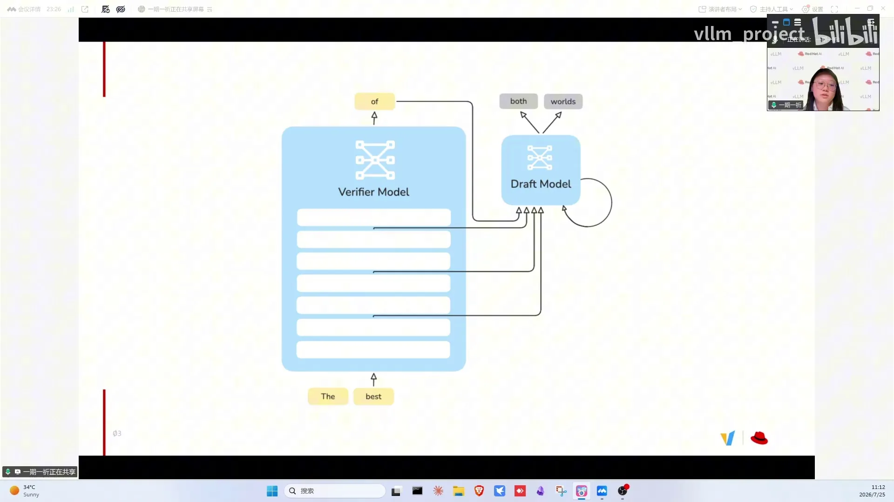
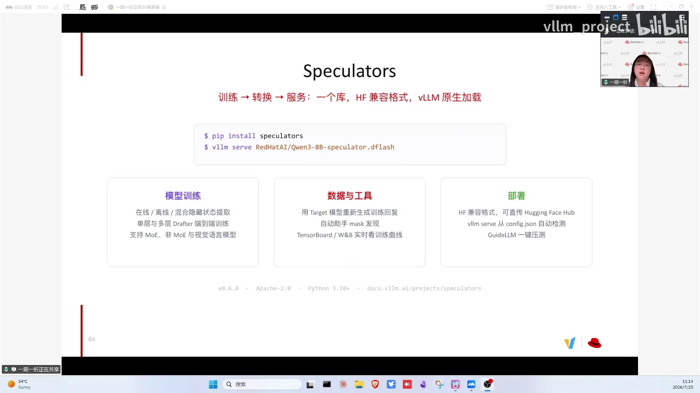
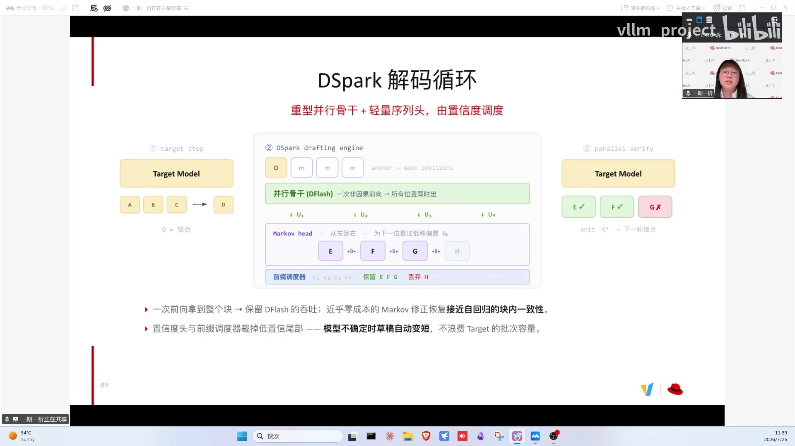
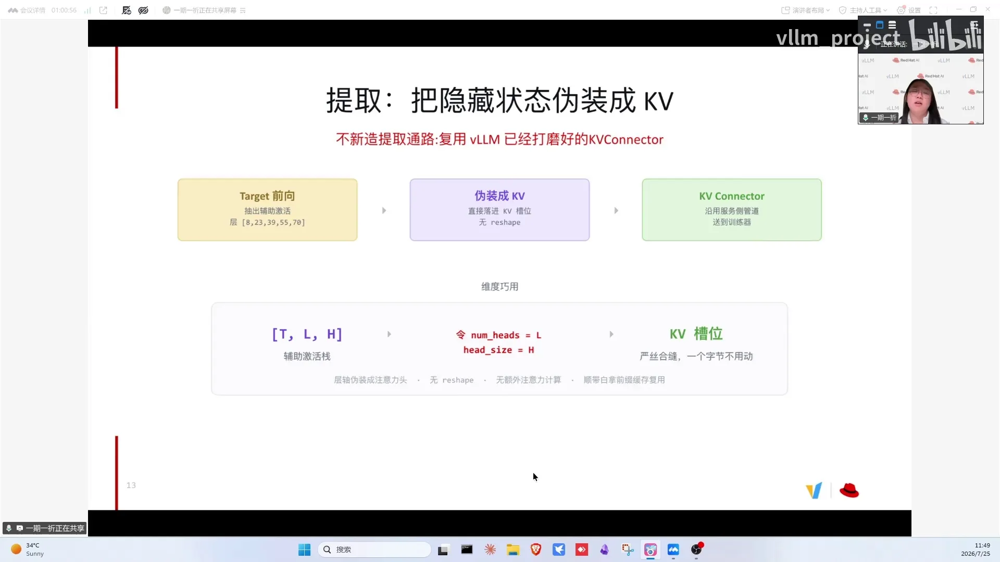
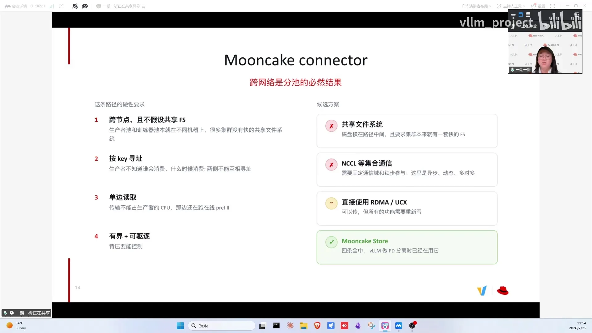

# 第12讲：DSpark当下最强投机解码详解

> 视频来源：[vLLM小课堂（十二）：DSpark，当下最强投机解码详解](https://www.bilibili.com/video/BV18E3u63EdR/)（约 73 分钟，嘉宾：赵山嘉文（HELENZO），Red Hat ML Engineer，vLLM 生态 speculators 库 Maintainer）。本文基于直播实录整理，时间戳可跳转到对应画面。

## 本讲要解决的核心问题（SCQA）

**背景**：模型越做越大（trillion 级），推理延迟成为部署瓶颈；投机解码是无损加速的标准答案。

**冲突**：传统 EAGLE-3 靠自回归小模型打草稿，速度受限；并行草稿（DFlash 类）虽快，但并行 token 之间没有上下文，输出容易"胡言乱语"、精度不够。

**疑问**：能不能既有并行打草稿的速度、又有自回归的精确度？训练这样的 drafter 需要海量 hidden states，怎么在集群规模下低成本拿到？

**回答（中心思想）**：**DSpark 在并行草稿之上加一个轻量 Markov head（token 间的 affinity matrix）修正连贯性，再加 confidence head 过滤不自信的草稿**——相对 EAGLE-3 加速 +30%、相对 DFlash +18%，而额外延迟开销只有 0.22%~1.3%；训练侧用 speculators 库把 hidden states 伪装成 KV cache（推理引擎缓存注意力键值、避免重复计算的那个缓存），通过 vLLM 的 KV connector（含 Mooncake connector）在线提取、跨节点消费。

---

## 一、投机解码原理：小模型起草、大模型验收

一个直观类比：Anthropic 的 coding agent 简单场景调用 Sonnet，复杂问题才调用更强模型（[【跳转到 01:40】](https://www.bilibili.com/video/BV18E3u63EdR/?t=100)）。投机解码把这个想法用到极致：给大模型训练一个特别小的 drafter，大部分 token 由小模型提议，大模型只在"验收"时出场。

*这一页用 Anthropic coding agent 的类比——简单请求交给 Sonnet、难题才交给更强模型——帮助读者理解投机解码"小模型起草、大模型验收"的分工思路。*

工作方式（[【跳转到 03:45】](https://www.bilibili.com/video/BV18E3u63EdR/?t=225)）：

- 小模型一次提出若干 token（例：Jumps the lazy 4 个）：EAGLE-3 类 drafter 一般一次提 3~5 个，新的 DFlash、DSpark 一次能提 8~16 个（[【跳转到 02:30】](https://www.bilibili.com/video/BV18E3u63EdR/?t=150)）——记住 3~5 与 8~16 这个差距，它是后文"训练打 16、部署用 8"提升接受率技巧的伏笔；
- target 模型**一次前向同时验证**这几个 token——因为它给自己也跑了一次前向，还能免费多产出一个 token；
- 接受标准（简化理解）：大模型对这个 token 的 log probability 比小模型更自信就接受，否则拒绝。

*这张图帮读者看懂验收流程：target 一次前向同时验证小模型起草的 4 个 token，还能顺便多产出一个免费 token。*

最重要的性质：**完全无损**——接受/拒绝机制保证 target 输出与单独 serve target 完全一样，不像量化/稀疏化有任何损失，是纯加速。

关键指标：**平均接受长度**（4 个草稿全收 = 省掉 3 次前向）与**每个位置的接受率**。接受率越高说明小模型越学会大模型的思考方式，加速越明显。

## 二、hidden states 替代自然语言：drafter 直接窥探大模型的思考

最初的思路是"Qwen 小模型加速 Qwen 大模型"——两者都吃自然语言 token（[【跳转到 11:40】](https://www.bilibili.com/video/BV18E3u63EdR/?t=700)）。实践发现加速不明显。**EAGLE-3 开始改用大模型 prefill 时的隐藏状态作为 drafter 输入**：从前、中、后各取几层，drafter 等于窥探到大模型的思考过程，生成质量更高、接受率更高。

drafter 结构：EAGLE-3 单层 transformer；新的 DFlash、DSpark 3~5 层——但相对大模型仍小得多，**两个模型体型相差越大，加速越明显**。drafter 的 embedding 还会做 reduce：词汇量不需要那么大，掌握最常用词汇即可。

*这张图展示 EAGLE-3 起的关键转变：从大模型 prefill 时的 hidden states 里前、中、后各取几层作为 drafter 输入，小模型等于窥探到大模型的思考过程。*

## 三、speculators 库：训练到部署一条龙

speculators 覆盖"训练 → 转换/微调 → 部署"全流程（[【跳转到 14:10】](https://www.bilibili.com/video/BV18E3u63EdR/?t=850)）：

- 可以把别人训好的 DFlash 模型转换后，用自己 production 数据微调；
- **所有 speculators 训练的模型一键在 vLLM 部署**：`vllm serve` 一条命令；
- hidden states 支持**在线**（边生成边训练）/ **离线**（先生成完）/ **混合**三种模式；
- 支持 MoE（Mixture of Experts 混合专家：把大模型拆成多个专家子网络、每个 token 只路由给少数专家计算），vision-language 视觉语言模型训练；
- 实用工具：**用 target 模型重新生成训练回复**（用 ChatGPT 数据训 Qwen 的 drafter，学不会 Qwen 的说话方式，接受率上不去）；loss mask（prompt 不参与训练）；chat template 自动适配；TensorBoard/wandb 实时看曲线（过拟合立即停）；训练只需三条命令（data → 启动 vLLM hidden states 提取服务器 → train），vLLM 原生提取比 transformers 快。

*这一页帮读者记住 speculators 的定位：一条 vllm serve 命令即可部署训练好的模型，hidden states 支持在线/离线/混合三种提取模式。*

## 四、从 EAGLE-3 到 DSpark：并行草稿如何逼近两全其美

- **传统大小模型**：过时且无需训练，不支持；
- **EAGLE-3**：最成熟经典，自回归打草稿；
- **并行变体**（架构同 EAGLE-3 + mask hidden states/mask id）：并行预测多 token，比 EAGLE-3 快，某些场景加速接近 DFlash；
- **DFlash**：用 diffusion 式 layer（不自回归地一个一个产 token，而是像图像扩散模型那样一次前向同时产出所有位置的 token），在 anchor position 定一个锚点（固定锚定位置），围绕锚点做快的并行草稿预测；
- **MTP**：模型厂商自带的多 token 预测头，但打草稿仍是自回归、慢一点；
- **Medusa**：早期多解码头投机方案，加速与 EAGLE-3 相比有差距，相对过时、不选择支持（[【跳转到 23:45】](https://www.bilibili.com/video/BV18E3u63EdR/?t=1425)）；
- **DSpark**：并行速度 + 自回归精度，两全其美（下节详解）。

主持人在弹幕里追问过并行草稿的内部机制（[【跳转到 06:40】](https://www.bilibili.com/video/BV18E3u63EdR/?t=400)），值得展开：并行草稿的注意力**仍然是 causal 的**（causal attention，每个 token 只能看到它前面的 token），并不是扩散模型那样的双向注意力；关键是配了一个特殊 sampling 策略，否则"上一个位置选 A、下一个位置选 B"的组合空间会很快爆炸。训练上则用 **mask token 代替缺失的前文信息**——并行预测时没有前一个 token 的信息，就用 mask token 占位，另外还训练 masked hidden states 来代替本来能得到的自回归 hidden states 信息。

*这一页帮读者看清算法家族的落地情况：Red Hat AI 训练了 28 个 draft model，大部分是 EAGLE-3，另有 7 个 DFlash、1 个 DSpark 和一款并行模型，更多在训、持续发布。*

Red Hat AI 自己训练了 28 个 draft model：大部分 EAGLE-3、7 个 DFlash、1 个 DSpark（更多在训、持续发布）加一款并行模型（[【跳转到 21:40】](https://www.bilibili.com/video/BV18E3u63EdR/?t=1300)）。新算法淘汰旧的也很正常：Domino 想法与 DSpark 类似，实测不如 DSpark，就不支持了。

新旧算法还会互相反哺：DFlash 出现后发现 Qwen3 layers 比 Llama layers 更适合 EAGLE-3；Domino 引入的 markov chain、confidence head 也反哺 DFlash——库一直在做 ablation。

## 五、DSpark：Markov head + confidence head

并行草稿的天然缺陷（[【跳转到 39:10】](https://www.bilibili.com/video/BV18E3u63EdR/?t=2350)）：token 同时产出、没有前文信息——回复 thank you，No problem 和 Of course 都可能；自回归下第一个 token 是 of、第二个必是 course，并行预测第二个却可能选成 problem，输出变成"of problem"式胡言乱语。

DSpark 的两层修正：

1. **Markov head**：在 DFlash 输出的 8~16 个位置的概率分布上加一个轻量头——相当于 affinity matrix，从左到右学到"这个 token 后面接哪个 token"，修正连贯性；
2. **confidence head（置信度头）**：输出 token 的同时给出自信度；不自信的 token 索性不提交给 target，进一步减轻验收工作量。

论文数据：相对 EAGLE-3 加速 **+30%**、相对 DFlash **+18%**，而 Markov 头带来的延迟开销仅 **0.22%~1.3%**。两个机制相互独立、可叠加；vLLM 目前先支持 Markov chain，confidence head 的 inference 支持在推进中（speculators 已支持两个都训练）。

*这张图帮读者理解 DSpark 的核心创新：在 DFlash 并行输出的概率分布上加一个轻量 Markov head（affinity matrix），从左到右修正并行 token 之间的连贯性。*

## 六、vLLM 侧：零气泡调度与动态投机

vLLM 的调度在投机解码下接近**零气泡**：GPU 上草稿模型提草稿、target 前向、prefill、verify 的同时，CPU 的 scheduler 已在准备下一步甚至下下步，GPU 基本无空闲（[【跳转到 42:05】](https://www.bilibili.com/video/BV18E3u63EdR/?t=2525)）。部署时 config JSON 自动检测算法类型、hidden states 取层、layer 类型与层数，一条命令部署。vLLM 还支持**动态投机解码**：按请求数配置草稿数（请求 1~5 打 8 个草稿、5~30 打 5 个、更多直接关闭），目前这段配置需要用户自己输入。

*这张图帮读者理解 vLLM 的零气泡调度：GPU 忙于草稿-验证-prefill 时，CPU scheduler 已提前准备下一步甚至下下步，算力几乎不空闲。*

加速的量级与边界：vLLM 上 3~5 倍（甚至六倍）是正常区间，论文里 6~8 倍多半出现在本身没怎么优化过的推理引擎上；EAGLE/MTP 时代只有 1~2 倍（acceptance length 2 点几）。有观众问 3~5 倍是不是在 GLM5.2 上测的：这个正在训练的 drafter 当天在不同领域数据上实测的接受长度就在 3~5 左右（具体加速倍数还没测），训练数据正从常规的 50 万条往 100 万条加——模型越大训练越慢。投机解码本质是用算力换速度——**compute bound（请求多、算力不够）时建议关掉**，vLLM 支持按负载自动关闭。提升接受率的 trick：训练时打 16 个草稿、部署时只用 8 个——呼应第一章"一次提 3~5 个与一次提 8~16 个"的差距：训得多、用得少，接受率更高。

## 七、hidden states 提取：伪装成 KV cache + Mooncake connector

训练 drafter 需要 target 的 hidden states。离线方式（跑 prefill 存盘）在 GLM5.2 级别的模型上要占 **200+TB** 且只对这一个模型有用——不划算。推荐**在线训练**：trainer 向 vLLM endpoint 发批量请求，hidden states 用完即删。

提取通路完全复用 vLLM 的 **KV connector**（[【跳转到 49:10】](https://www.bilibili.com/video/BV18E3u63EdR/?t=2950)）：target 前向时抽出第 8/23/39/50/70 层等 hidden states，**伪装成 KV cache 装进 KV cache 槽位**——把 hidden size 命名成 num heads × head size，严丝合缝嵌入，不需要 reshape、不需要新写通路。

但 vLLM 原生 connector 要求 trainer 与 extractor 同节点（共享内存 + 文件锁解决读写冲突）。模型越来越大，一个 node 放不下 target + drafter，于是需要**跨节点训练**：不假设共享文件系统、生产和消费解耦（生产者不管谁消费）、生成有界可驱逐（trainer 掉线时停止生产、超时文件清理）。这恰好是 **Mooncake connector** 的能力——speculators 已提 PR 集成，所以现在可以做到跨节点训练，为像 Kimi K3 这样很大的模型训练一个 draft 模型，进一步拓宽支持的模型家族（[【跳转到 54:35】](https://www.bilibili.com/video/BV18E3u63EdR/?t=3275)）。

*这张图帮读者看懂提取技巧：target 前向时抽出第 8/23/39/50/70 层等 hidden states，伪装成 KV cache 严丝合缝塞进 KV cache 槽位，复用现成 KV connector 传输、完全不用 reshape。*

*这一页帮读者记住 Mooncake connector 的价值：不需要共享文件系统、生成有界可驱逐，让 speculators 支持跨节点训练，像 Kimi K3 这样的大模型也能训 drafter。*

Q&A 里主持人还替大家追问了传输细节（[【跳转到 55:50】](https://www.bilibili.com/video/BV18E3u63EdR/?t=3350)）：如果生产者和消费者用相同的切分 head 并行方式，应该可以**直接 point-to-point 传输**（具体取决于 Mooncake connector 的实现）；因为 hidden states 是拆成类似 KV cache 的格式去传的，所以**对切 head 的方式并不敏感**——不管怎么切，传的都是 hidden states、最后都会还原回去。传输后端也有多种选择：point-to-point、all-gather、broadcast 及混合方式；训练侧一般有 DP（数据并行）维度，传进训练 group 后要么做 broadcast、要么每个 rank 单独传一份——后者会让中间通信负载比较高，更好的实现方式还在探索，PR 会分享给大家试用。

## 八、训练细节与 Q&A：搞清数据配方和兼容边界，drafter 才训得稳

**训练配置**

- **target 只需 prefill**：训练只要 hidden states 和 logprobs，decode 让它出 1 个 token 即可，主要就学 prefill、不需要 target 完整输出，整个方法类似 SFT（[【跳转到 59:35】](https://www.bilibili.com/video/BV18E3u63EdR/?t=3575)）；
- **数据**：Magpie、UltraChat（原生支持 response regeneration），一般 50 万条起步；正在试验 100 万条、且已支持多轮对话数据（[【跳转到 64:35】](https://www.bilibili.com/video/BV18E3u63EdR/?t=3875)）；用 from_pretrained 加载现成 DFlash 在自己 production 数据上微调（几万条即可见效）；**所有 DFlash 模型可轻易转换成 DSpark**；
- **max model length 退化**：训练序列短、推理超长会明显退化；加了 sliding window attention 优化后退化不明显甚至持平；更长 context 的训练优化在做（[【跳转到 68:20】](https://www.bilibili.com/video/BV18E3u63EdR/?t=4100)）；
- **多模态**：支持图像数据训练（有用户在用），但投机只加速文字部分。

**兼容边界**

- **投机解码只加速 decode、不加速 prefill**——做 prefill 优化的特性与它正交；除此之外目前没遇到过与 vLLM 其他优化不兼容的情况，部署时可查投机解码的 recipe（[【跳转到 60:25】](https://www.bilibili.com/video/BV18E3u63EdR/?t=3625)）；
- **与 LoRA 已兼容**：这是 vLLM 侧的工作，细节可以请 vLLM 同事专门介绍（[【跳转到 35:00】](https://www.bilibili.com/video/BV18E3u63EdR/?t=2100)）；
- **与 RL 的关系**：RL rollout 默认会开投机解码，权重偏移后需要一起训 draft model——model provider 自带的 draft 有优势；speculators 与 RL 框架的集成在计划中；
- **训练场景一般不需要 PD 分离**：target 训练只需要 prefill、不需要完整 decode，只有 rollout 特别长时才可能需要；
- **diffusion LM 不建议**：并行精度问题难解，且没有专门推理引擎（只能 transformers）；vLLM 里 diffuser 类支持很多用 DFlash 思路做的。

**生态共建**

- **给 vLLM project 下的项目点 star**：那是开源项目的本钱、指路明星；
- **野生开发者用 speculators 训的模型欢迎贡献到 HuggingFace 仓库**（"相当于给我们免费的 GPU"）；
- **系列内容联动**：第十期专门讲过 KV connector（LMCache 与 Mooncake 嘉宾），veRL office hour 讲过 diffusion 式支持的实现，链接都在群里。

## 小结

- 投机解码 = 小模型起草 + 大模型一次前向验收 + 免费 token，完全无损纯加速；
- 指标就两个：接受率与平均接受长度；EAGLE-3 起改用 target hidden states 做输入，drafter 窥探大模型思考；
- speculators 打通训练→微调→一键部署，支持在线/离线 hidden states、MoE/VLM、target 重生成回复、loss mask、template 自动适配；
- DSpark = DFlash 的并行骨干 + Markov head 修连贯 + confidence head 过滤，+30%/+18% 加速只花 0.22%~1.3% 延迟；
- vLLM 零气泡调度、config 自动检测、动态投机（按负载关）；compute bound 时记得关投机；
- hidden states 在线提取复用 KV connector（伪装成 KV cache），Mooncake connector 打通跨节点训练；
- 数据配方：target 重生成回复 + 50 万条起步 + 领域微调，接受率还能再涨。

## 关键术语速查

| 术语 | 一句话解释 |
| --- | --- |
| 投机解码 | 小模型打草稿、大模型一次前向验收的无损加速 |
| drafter / target | 打草稿的小模型 / 负责验收的目标大模型 |
| EAGLE-3 | 经典算法：取 target hidden states 输入，单层自回归草稿 |
| DFlash | 并行草稿算法：diffusion 式 layer（一次前向产出所有位置的 token）+ anchor position（固定锚点） |
| DSpark | DFlash 并行骨干 + Markov head + confidence head |
| Markov head | 轻量 affinity matrix，修正并行 token 间的连贯性 |
| confidence head | 置信度头：不自信的草稿不提交给 target |
| acceptance rate / length | 每位置接受概率 / 平均接受长度，决定加速比 |
| hidden states | target 中间层输出，drafter 的输入与训练数据 |
| causal attention | 每个 token 只能看到它前面的 token；并行草稿的注意力仍是 causal |
| speculators | Red Hat 的 draft 模型训练/转换/部署库 |
| loss mask | 让 prompt 不参与训练、只学生成 token |
| response regeneration | 用 target 模型重写训练回复，让 drafter 学 target 的说话方式 |
| MoE | 混合专家：模型拆成多个专家子网络，每个 token 只路由给少数专家计算 |
| KV cache | 推理引擎缓存注意力键值、避免重复计算的缓存 |
| KV connector 伪装 | 把 hidden size 当 num heads×head size 塞进 KV cache 槽位传输 |
| Mooncake connector | 跨节点、有界、可驱逐的 KV/hidden states 传输通道 |
| dynamic spec decode | 按负载动态调整草稿数或关闭投机 |
| zero bubble | GPU 上草稿-验证-调度几乎无空闲的流水线 |
| MTP | 模型自带的多 token 预测头（仍是自回归） |
| Medusa | 早期多解码头投机方案，加速不如 EAGLE-3，已不选择支持 |
