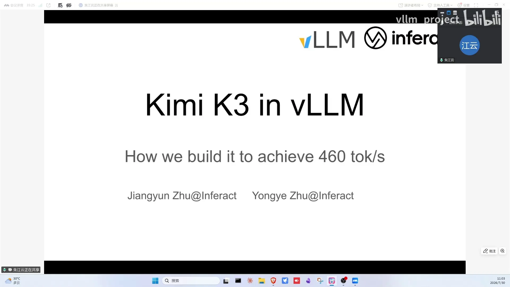
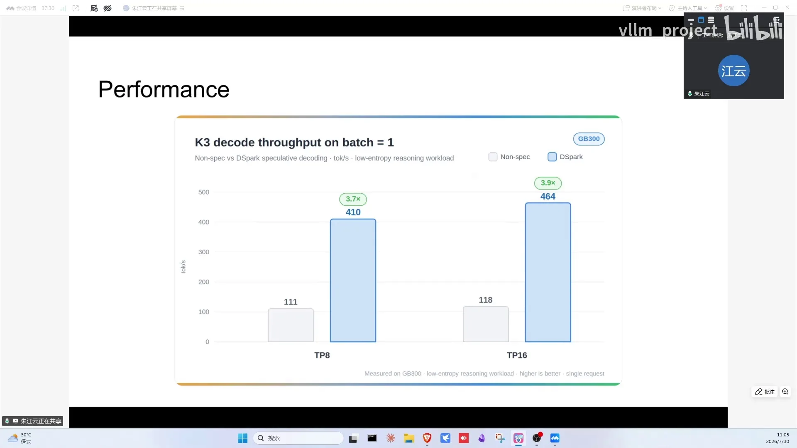
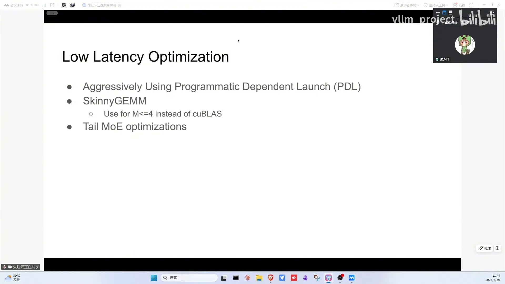
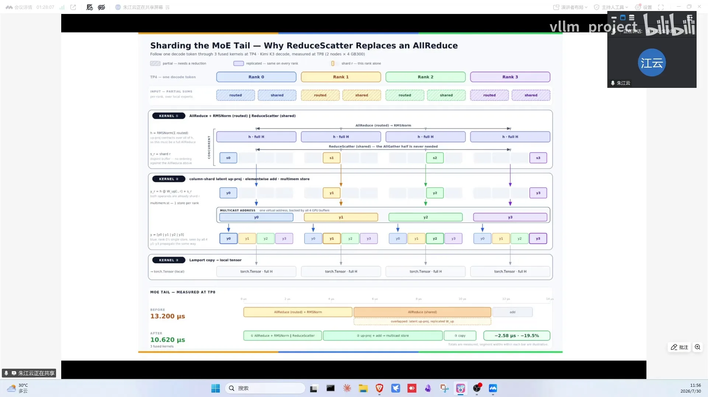

# 第13讲：day0 Kimi K3支持——探索智能新前沿的推理边界

> 视频来源：[vLLM day-0 Kimi K3支持：探索智能新前沿的推理边界](https://www.bilibili.com/video/BV11z3m63ECo/)（约 92 分钟，嘉宾：嘉文与永夜，INFX 工程师，K3 day0 支持的主要贡献者）。本文基于直播实录整理，时间戳可跳转到对应画面。

## 本讲要解决的核心问题（SCQA）

**背景**：Kimi K3 是又一个划时代模型（"第二个 DeepSeek 时刻"）：93 层、参数量翻倍、原生多模态，attention 换成 **MLA + KDA（Kimi Delta Attention）混合架构**——MLA（Multi-head Latent Attention，多头潜在注意力）把 KV 压缩到低秩 latent 向量再缓存，用小得多的显存装下注意力历史——MoE 换成 **latent MoE**。

**冲突**：KDA 是线性注意力——维护状态而不是 KV cache、inplace 更新，直接打破了 vLLM "KV cache 随序列 append-only 增长"的全部假设：显存管理、prefix cache、投机解码全要重来。

**疑问**：vLLM 如何 day0 支持这样的架构，还能跑到优秀性能？

**回答（中心思想）**：用 **hybrid memory allocator（最小公倍数对齐）** 统一管理 MLA page 与 KDA state，用 **chunked prefill 在 block 边界存快照**（chunked prefill：把长 prompt 切成多个 chunk 分批 forward，既压内存峰值，又天然提供 block 边界这个存档点）解决状态缓存，用 **partial cache hit（PR 45702）** 解耦命中粒度与 block size；kernel 侧激进启用 PDL、重写小并发矩阵乘、重构 latent MoE 通信——TP1 上 110+ TPS，开 DSpark（DeepSeek 开源的新投机解码范式：并行 draft + 线性依赖提升接受率，详见第四章）达 410，TP16 达 464 TPS。

---

## 一、K3 用 MLA+KDA 混合和 latent MoE 换来翻倍参数与原生多模态

K3 相比 K2 的创新（[【跳转到 00:25】](https://www.bilibili.com/video/BV11z3m63ECo/?t=25)）：

- **attention**：MLA 变成 MLA + KDA 混合，MLA 本身也有小修改；
- **MoE**：引入 latent MoE——在 router 之前先降维（如 512→256），数据量、计算量、通信量一起降低，出口处再升维回来；shared expert 不做降维；
- **规模**：61 层 → 93 层，参数量翻倍、激活参数量大增、上下文更长、原生多模态输入。

性能（day0，[【跳转到 02:05】](https://www.bilibili.com/video/BV11z3m63ECo/?t=125)）：重点优化 decode 场景——TP1 batch=1 跑 110+ TPS；带头训练的 DSpark 上线后 410 TPS；TP16 达 464 TPS。DSpark 权重已在 HuggingFace 开源（K3 开源版没有 MTP，所以需要自训 drafter）。

**latent MoE 细节**（[【跳转到 02:30】](https://www.bilibili.com/video/BV11z3m63ECo/?t=150)）：正常 MoE 是 hidden states 经 router 分发、all-to-all 给 expert、算完 all-to-all 聚合，通信量大；latent MoE 入口降维再出口升维。TP 下 shared expert 与 routed expert 各需一次 all-reduce 的问题，后面 kernel 优化解决。

**工程小改动**（[【跳转到 04:10】](https://www.bilibili.com/video/BV11z3m63ECo/?t=250)）：把 KDA 相关的定义与文件收进 K3 专属文件夹——不是重构，而是方便对 KDA 做激进优化而不影响其他模型。

**KDA 原理**（[【跳转到 05:50】](https://www.bilibili.com/video/BV11z3m63ECo/?t=350)）：来自 Kimi Linear 论文。维护一个状态 S：新 token 进来时，先对上一步状态 S(t-1) 做衰减（衰减分两部分、与当前 token 的 K 相关），加上当前 token 的 K·V，输出即 S(t)·q(t)。推荐 Moonshot 大佬讲 KDA 数学与 linear attention 演进的博客。

## 二、hybrid memory allocator 用最小公倍数对齐，让 MLA page 与 KDA state 共用一块显存

KDA 的 S 状态与 KV cache 完全不同：KV cache append-only、可 rollback（往前查就能命中）；KDA 状态 inplace 复写、不可回滚，且缓存代价比 KV cache 高得多。K3 中 MLA 压缩 KV、KDA state 巨大，比例悬殊。

解法一：**hybrid memory allocator**（[【跳转到 08:45】](https://www.bilibili.com/video/BV11z3m63ECo/?t=525)）——申请同样的 tensor，上层把它解释成不同语义（左边当 KV cache、右边当 KDA state）；大小用**最小公倍数**对齐（1KB/2KB/3KB → 分配 6KB）。MLA 的 page 小、Mamba/KDA state 大：把 attention page 向上扩容若干倍到刚好大于 state，剩余冗余加 padding（约浪费 12% 内存，换管理便利）。

架构上做成了插件化：统一 allocator 之下，full attention manager、Mamba manager、sliding window manager 各管各的；K3 用 hybrid KV cache coordinator 统筹。prefix cache 能命中多少 token 与 attention 语义相关，由各 manager 上报、coordinator 取最小共识；block 生命周期、free 也由 manager 管理，汇总给 scheduler 决定调度量。

Mamba/KDA 状态也能复用：存快照即可（每隔多少 token 存一个），但 state 比 KV cache 大几百倍，全存代价高；且它的复用与自回归有一个"异步 step 差距"的性质差异。

> **插播问答（[【跳转到 15:25】](https://www.bilibili.com/video/BV11z3m63ECo/?t=925)）**：投机解码丢弃最后一个 block 的机制，在 hybrid 模型上会导致 cache miss 吗？——会。现在丢弃的最后一个 block 是对齐后的 block，比纯 full attention 多丢几个，cache 命中会下降；这是正在解决的设计缺陷，欢迎给 vLLM 贡献。

## 三、chunked prefill 快照 + partial cache hit 让粗粒度 block 也能命中

问题一：**怎么缓存状态**（[【跳转到 17:18】](https://www.bilibili.com/video/BV11z3m63ECo/?t=1038)）？KDA 每步都覆盖上一步状态，需要把想存的状态拷贝走，又不能大改模型代码。巧思：利用推理引擎都有的 **chunked prefill**——在 block 边界切开 prompt，forward 结束把状态拷贝出来，天然保住 block 边界处的状态，不动 kernel、不动模型代码，还在内存压力与命中率之间取得平衡。

关键约束：**Mamba/KDA 存状态的 block 边界必须与 full attention 对齐**——Mamba 的 block 对应一个 token 的状态，full attention 的 block 对应一段序列的状态；哈希按 prefix token 维度算，与存什么无关。

> **插播问答（[【跳转到 21:03】](https://www.bilibili.com/video/BV11z3m63ECo/?t=1263)）**：B300 单并发吞吐只有几十 TPS？——照 recipe 的环境变量与参数跑就能复现，且必须开 DSpark；另外 B300 的 GPU 频率与 GB300 不同，实测会稍慢一点，NVLink 带宽倒相近。
>
> **插播问答（[【跳转到 23:04】](https://www.bilibili.com/video/BV11z3m63ECo/?t=1384)）**：Mamba 的 cache 粒度绑定 chunk size 吗？——是，chunk 粒度永远是 block 的整数倍（最后一个 chunk 除外）；token 不满一个 block 时先继续 decode，凑满 block 再存。
>
> **插播问答（[【跳转到 23:54】](https://www.bilibili.com/video/BV11z3m63ECo/?t=1434)）**：输入 128K 时 block size 越大越好？——不是。存 block 是为了命中：不考虑命中确实越大越好（甚至不需要 block size），考虑命中就不是了。

问题二：**命中粒度太粗**（[【跳转到 26:24】](https://www.bilibili.com/video/BV11z3m63ECo/?t=1584)）。MLA 压缩 KV、KDA state 巨大，attention page 被迫向上对齐几十倍——K3 开 DP 时 block size 达 6000+：每 6000 token 才能命中一次，哪怕共享前缀 5000 token 也要重算。

**先想清楚哪些 cache 值得存**（[【跳转到 26:49】](https://www.bilibili.com/video/BV11z3m63ECo/?t=1609)）：大量输入是 system prompt + 用户请求，多轮对话会回传上一轮历史——真正有价值的 cache 只有两处：system prompt 和每一轮对话的边界。把这两处存下来，真实负载里就能大幅提高命中、降低缓存压力。

解法：**partial cache hit（PR 45702，Moonshot 提出、INFX 集成）**——把 block size 与 cache hit 粒度解耦。原来 block size=6、算到 H，新增 X/Y 后整个多余 block 要重算；现在引入更细粒度缓存"没填满的 block"的黄色部分（G、H 的 state），下次请求直接复用（为防再次命中，先把 G/H 拷到另一 block 再原地更新）。实测 Qwen3-30B 上命中时 TTFT 有 1 点几倍提升。实现要点：给未填满的 block 打 tag，命中时先 copy 再 write（Mamba inplace）；哈希沿 block 链式累计，partial hash 接在后面，新请求按 block 截断后算尾哈希即可命中；粒度需按负载调（越小复用越多、内存压力越大）。

**system prompt 的检测巧思**（[【跳转到 35:59】](https://www.bilibili.com/video/BV11z3m63ECo/?t=2159)）：第二次请求到来时发现 MLA 命中而 KDA 未命中——说明该处有缓存价值，scheduler 切分时只切到那一份、把状态存下来。其他坑：full attention 与 Mamba 共用物理 tensor 需要 padding，复用前要清零 block，清零 GPU 操作与 RDMA 写有并发问题，需要精巧设计；投机解码下每个投机 token 都要存一份 KDA state（state 不能像 KV cache 那样 rollback）。

## 四、DSpark 用并行 draft + 线性依赖提升接受率，给 K3 带来近 4 倍加速

**DSpark 出处**（[【跳转到 38:04】](https://www.bilibili.com/video/BV11z3m63ECo/?t=2284)）：DSpark 是 DeepSeek 开源的新投机解码范式——用并行方式跑 draft model，同时引入一条线性依赖来提升接受率（上期直播由 Red Hat 的 Helen 专门介绍过）。因为开源 K3 没有开放 MTP，K3 团队带头用 speculators 框架自训了 DSpark drafter（[【跳转到 39:19】](https://www.bilibili.com/video/BV11z3m63ECo/?t=2359)）：training 与 inference 分机部署，hidden states 通过 Mooncake（月之暗面开源的高性能 KV cache 传输层）跨机传送；上线后 K3 加速将近 4 倍，非常欢迎试用。

官方 **recipe 网站**可选硬件（GB300/B300 已验证）、并行方式（TP / DP+EP / spec decoding），自动给出可复现的部署参数；vLLM blog（vllm.ai/blog）有 K3 系列文章。

## 五、kernel 三板斧把小并发 GPU 打满：PDL、特化 GEMM、latent MoE 通信重构

永夜接手讲 kernel（[【跳转到 40:09】](https://www.bilibili.com/video/BV11z3m63ECo/?t=2409)）：优化主要针对小并发场景（agent 场景越快越好），三板斧：

1. **激进启用 PDL**（Programmatic Dependent Launch）：顺序 kernel 在前一个结束前就启动后一个，index 计算等无数据依赖的工作提前做，同步后即可读到前一个 kernel 写入 global memory 的数据——把 GPU 打满。正确性保证：在读取依赖数据之前插入即可；性能需实测（重叠可能拖慢前一 kernel）；
2. **自写小并发特化矩阵乘**，不用通用库算法；
3. **latent MoE 通信重构**：TP 下 shared expert 与 routed expert 各一次 all-reduce，小 token 打不满 NVLink 带宽。重构为：routed expert all-reduce 后做 RMSNorm（RMSNorm 只做均方根缩放、是非线性的，不可拆开算，所以必须先 all-reduce 再 norm）；shared expert 升维后只相加，用 **reduce-scatter** 让每卡拿不同位置的完整数据，按列切分 GEMM 后与 shared expert 对应部分相加，最后一次集合通信让所有卡拿全量——省去重复计算，该块 **20%~30% 提升**。

Breakdown（[【跳转到 53:07】](https://www.bilibili.com/video/BV11z3m63ECo/?t=3187)）：PDL 约 3~4%、MoE 部分约 9~10%、自写矩阵乘约 7~8%。此外还有 KDA kernel、prefill 的 CPU overhead 优化、decode 详细优化——细节看 blog（PR 编号恰是 vLLM 第 50000 号"靓号"，可用 AI 扫 PR 分类阅读）。

## 六、Q&A 精华：block size、并行选择与成长路径的实战答案

- **快照的数量等于 block 的数量吗？**（[【跳转到 56:08】](https://www.bilibili.com/video/BV11z3m63ECo/?t=3368)）：不是。以 4 个 block 为一个缓存粒度时，一次 forward 4 个 block 的 token，只在最后一个 block 存快照（前 3 个不存）——缓存哪个 block 的 state 就必须在对应位置切开，切成 4 次 forward 不高效。也正因粒度太粗才有 partial cache hit，目前需手动开启（[【跳转到 57:09】](https://www.bilibili.com/video/BV11z3m63ECo/?t=3429)），用法见 RFC 与 PR；
- **低并发下 Python 开销会盖过 kernel 吗？**（[【跳转到 60:14】](https://www.bilibili.com/video/BV11z3m63ECo/?t=3614)）：没有刻板印象中大。async scheduler 把下一步调度开销藏进上一步 forward；recipe 用 rust frontend 重写 HTTP server；低并发开 CUDA graph 后，CPU 一个 API 就能 launch 几百个 kernel。decode 的显著瓶颈是 MoE——1.5T 模型约一半~60% 权重在 MoE；
- **成长路径**（[【跳转到 62:44】](https://www.bilibili.com/video/BV11z3m63ECo/?t=3764)）：从修 bug 入手，对 KV cache 这类核心部分多攒经验；用 Nano-vLLM 自己实现核心功能；嘉文贡献 vLLM 一年多已成社区扛把子——关键是内驱力；
- **H100 能用吗**（[【跳转到 64:56】](https://www.bilibili.com/video/BV11z3m63ECo/?t=3896)）：能跑（跑过 16 卡 128K），部分 kernel 优化未针对 H 卡开发；
- **和直接减 block size 的区别是什么？**（[【跳转到 65:21】](https://www.bilibili.com/video/BV11z3m63ECo/?t=3921)）：不能直接减——现在的设计中 attention page size 必须向上对齐到 Mamba state 的大小，这是 allocator 最小公倍数对齐的约束；
- **MoE 原本的 up/down projection 与 latent 的区别？**（[【跳转到 75:20】](https://www.bilibili.com/video/BV11z3m63ECo/?t=4520)）：latent 的降/升维包在 MoE 外面，降的是 hidden state 的维度；expert 内部的 up/down 是中间隐层维度，两边维度不一样。latent 降维让传输的每 token 数据变小、矩阵乘运算量也变小（[【跳转到 76:06】](https://www.bilibili.com/video/BV11z3m63ECo/?t=4566)）；
- **视频理解**（[【跳转到 79:36】](https://www.bilibili.com/video/BV11z3m63ECo/?t=4776)）：开源 K3 无视频；通用做法都是抽帧成连续图像，且都发生在 prefill 阶段——DSpark 只加速 decode；
- **有 build 好的 docker 镜像吗？能 from source 吗？**（[【跳转到 81:26】](https://www.bilibili.com/video/BV11z3m63ECo/?t=4886)）：会提供镜像，但依赖的 FlashInfer 修改（PR）尚未全部合并，暂时不丝滑，合入后提供新 image/nightly；from source 可行但安装较复杂，commit 就是第 5 万号（[【跳转到 82:43】](https://www.bilibili.com/video/BV11z3m63ECo/?t=4963)），直接搜就能找到；
- **MoE 走 TP 还是 EP**（[【跳转到 81:51】](https://www.bilibili.com/video/BV11z3m63ECo/?t=4911)）：小并发求快走 TP，中大并发走 EP；
- **DSpark 随 batch 增大会掉速吗？**（[【跳转到 84:23】](https://www.bilibili.com/video/BV11z3m63ECo/?t=5063)）：原理上会，阈值要按自己的机器和负载测；batch 变大 drafter token 数要相应下调（经验公式见上期直播）；
- **PP/EP/TP 怎么选**（[【跳转到 86:03】](https://www.bilibili.com/video/BV11z3m63ECo/?t=5163)）：小并发走 TP（KV 与权重不重复存）；K3 模型太大、KV cache 先满，TP 保证权重不重复存更划算；卡多了集合通信量大，EP 更优；
- **DCP**（[【跳转到 87:43】](https://www.bilibili.com/video/BV11z3m63ECo/?t=5263)）：K3 全 MLA，TP 下每个 rank 重复存 KV cache；**DCP 支持后可不重复存、增并发**；
- **DSpark vs MTP**（[【跳转到 88:58】](https://www.bilibili.com/video/BV11z3m63ECo/?t=5338)）：理论上 spec decode 一般比 MTP 快，与测试集相关（代码输出好预测、作文难预测）；
- **1M 序列衰减**（[【跳转到 88:58】](https://www.bilibili.com/video/BV11z3m63ECo/?t=5338)）：未测过这么长，但模型 3/4 是 KDA、decode 不随序列变慢，预计衰减有限。

## 小结

- K3 = MLA+KDA 混合注意力 + latent MoE + 原生多模态；day0 性能：TP1 110+ TPS、DSpark 410、TP16 464；
- hybrid memory allocator 用最小公倍数对齐 MLA page 与 KDA state，插件化 manager 各管语义，coordinator 取最小共识命中；
- 状态缓存靠 chunked prefill 在 block 边界拷贝快照，不改模型代码；chunk 粒度永远是 block 的整数倍（最后一个除外），快照在每个缓存粒度里只存最后一个 block；partial cache hit 解耦命中粒度与 block size（需手动开启），MLA/KDA 命中差异还能自动检测 system prompt；
- kernel 三板斧：PDL、小并发特化 GEMM、latent MoE 通信重构（reduce-scatter 消重复计算）；
- DSpark 加持近 4 倍加速；hidden states 复用 KV connector 通路、Mooncake 跨节点传输；
- recipe 网站 + blog + PR 50000：性能可复现、代码可导读。

## 关键术语速查

| 术语 | 一句话解释 |
| --- | --- |
| Kimi K3 | 月之暗面旗舰模型：93 层、MLA+KDA 混合、latent MoE、原生多模态 |
| MLA | Multi-head Latent Attention：把 KV 压缩到低秩 latent 向量再缓存，省显存 |
| KDA（Kimi Delta Attention） | 线性注意力：维护衰减更新的状态 S，输出 S·q |
| latent MoE | MoE 前后加降维/升维，减小 token 传输量与计算量 |
| hybrid memory allocator | 同一 tensor 按 MLA/KDA 语义解释，最小公倍数对齐大小 |
| append-only | KV cache 只增不改、可前缀回滚的特性（KDA 不具备） |
| cache manager / coordinator | 各 attention 语义的缓存管理器 / 汇总最小命中的协调层 |
| chunked prefill 存快照 | 把长 prompt 切 chunk 分批 forward；在 block 边界切、forward 后拷贝 KDA 状态 |
| partial cache hit | 缓存未填满 block 的部分 token，解耦命中粒度（PR 45702，需手动开启） |
| inplace 更新 | KDA 状态直接覆写，命中需先 copy 再 write |
| PDL | Programmatic Dependent Launch：前 kernel 结束前启动后 kernel |
| RMSNorm | 只用均方根缩放的层归一化；非线性不可拆，决定 all-reduce 必须先做 |
| reduce-scatter | 分发各卡不同位置的完整数据，消重复计算 |
| TP / EP | 张量并行（一层矩阵乘切多卡、权重与 KV 每卡各存一份）/ 专家并行（expert 分散到多卡） |
| DCP | 让 MLA 不在每个 TP rank 重复存 KV cache 的并行支持 |
| DSpark | DeepSeek 开源的投机解码新范式：并行 draft + 线性依赖提升接受率；K3 团队据此自训 drafter |
| MTP | Multi-Token Prediction：模型原生的多 token 预测头，K3 开源版未开放 |
| Mooncake | 月之暗面开源的高性能 KV cache 传输层，本讲用它跨机传 hidden states |
| recipe 网站 | 官方可交互的部署配置生成器（硬件/并行/spec decoding） |
