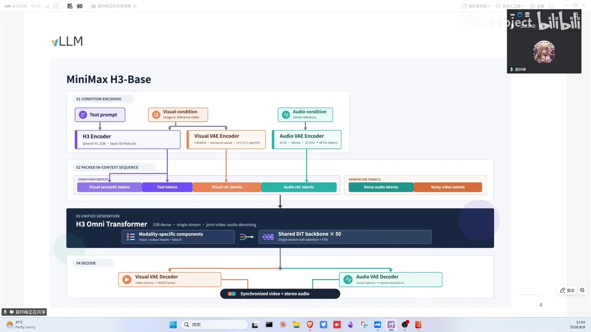
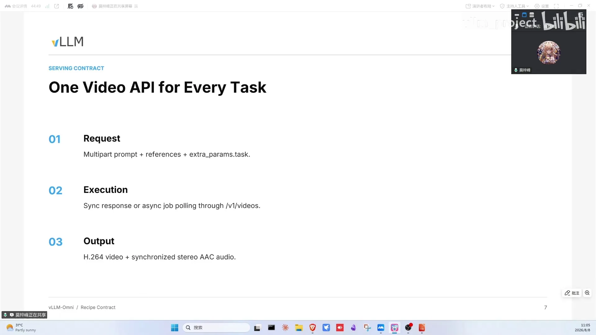
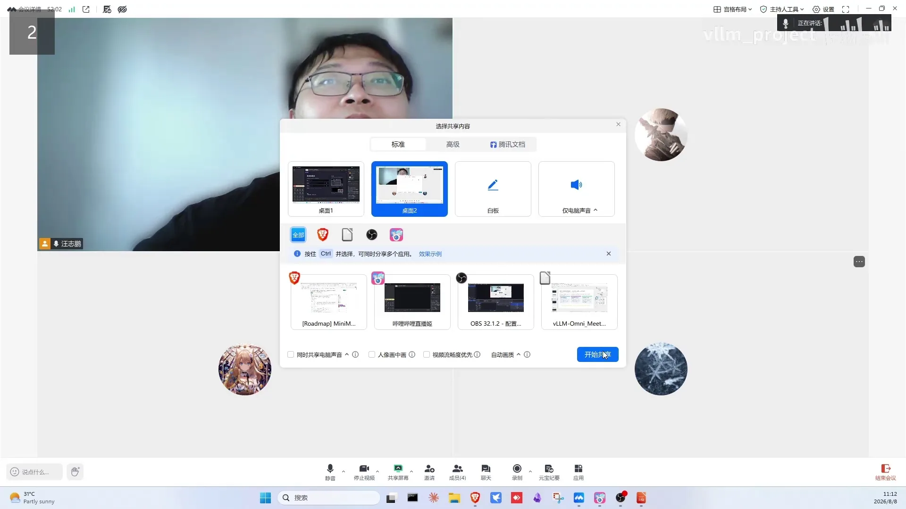
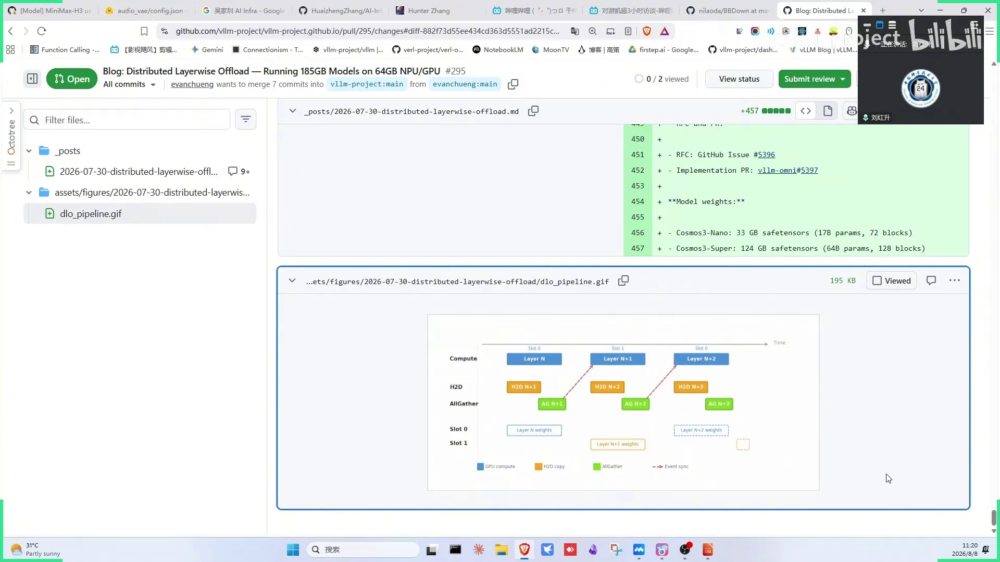
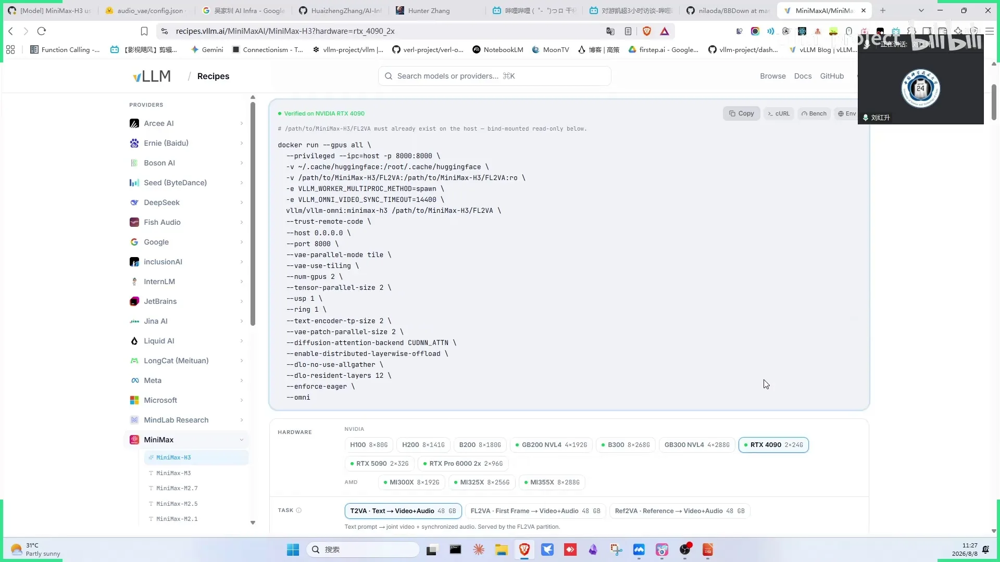

# 第14讲：day0 MiniMax H3支持——探索最强视频生成模型推理的极限

> 视频来源：[vLLM-Omni day-0 MiniMax H3支持：探索最强视频生成模型推理的极限](https://www.bilibili.com/video/BV1xmuT6dE1M/)（约 34 分钟，嘉宾：子枫，INFX 工程师，MiniMax H3 day0 支持主要贡献者）。本文基于直播实录整理，时间戳可跳转到对应画面。

## 本讲要解决的核心问题（SCQA）

**背景**：MiniMax H3 是当前开源最强的音视频生成模型，vLLM-Omni 要做 day0 支持。

**冲突**：day0 目标只是跑通；模型 text encoder 与 DiT 权重都巨大，且音视频共享 DiT 但有两套任务权重——传统单引擎部署既浪费又不好扩展。

**疑问**：如何在 vLLM-Omni 中优雅地支持这种"双任务共享骨干"的音视频生成模型，并快速把性能拉起来？

**回答（中心思想）**：利用 H3"DiT 不同但 encoder/VAE 完全一致"的特点做**任务级路由**（PR 5720：一个 API 按请求路由到不同 DiT）；利用"text encoder 重 + DiT 重"的特点做**分 stage 部署**；性能靠 **DLO 分布式逐层 offload**（八卡共享一份 host 权重）与 **diffusion continuous batching**（不同 request 的去噪 step 组 batch）持续压榨。

---

## 一、H3 架构：音视频共享 DiT、两套权重对应两个任务

H3 的特别之处（[【跳转到 01:10】](https://www.bilibili.com/video/BV1xmuT6dE1M/?t=70)）：一般音视频生成分成视频与音频两个部分；H3 的音频与视频共享同一个 diffusion（DiT）部分，encoder 用 Qwen3-VL——文本塞进去后，视频 token 与 audio token 直接拼接，去噪完成后分别输出到两个 VAE（变分自编码器，负责把 DiT 输出的潜空间表示解码成像素视频与音频波形），生成完整视频与音频轨道。

仓库里有两套权重，区别是**对应不同任务**（平时模型是两套权重对应不同模态）：

- **t2v**：文本生成视频+音频，还支持前后帧插中间帧；
- **ref2v**：参考视频续写——DiT 换成另一个，类似图片生成里的 image editing（很取巧）。

关键观察：**两套权重虽然 DiT 不同，但 encoder 和 VAE 完全一致**。

## 二、任务级路由（PR 5720）：一个 API 服务两种任务

既然只有 DiT 不同，最简单的想法就是**路由**：把两套任务塞进同一个推理 API，按请求内容路由到不同 DiT（[【跳转到 03:45】](https://www.bilibili.com/video/BV1xmuT6dE1M/?t=225)）。day0 时只能加载本地下载好的单一任务权重；PR 5720 实现了按请求路由（t2v 走 t2v DiT、ref2v 走 ref2v DiT）。文本 encoder 与 VAE 共享在同一进程，起几个 Omni 服务即可。

部署灵活性：可以只启动其中一个 DiT（显存有限时只跑一种任务），默认两个 DiT 一起启动。部署方法见 vLLM 官方 recipe（搜 MiniMax H3），vLLM-Omni 的 recipe 也接受 PR。

## 三、为什么要放 vLLM-Omni：分 stage 部署

这个模型 text encoder 和 DiT 两个权重都非常大，**天然适合分 stage 部署**（[【跳转到 07:30】](https://www.bilibili.com/video/BV1xmuT6dE1M/?t=450)）——这也是没有像友商把图像生成模型放进 vLLM 而是 vLLM-Omni 的原因：视频生成模型的 text encoder 部分变得很重。分离部署的好处：

- 不同 stage 的模组对量化精度敏感性不同；
- 计算任务完全不同，部署策略天差地别。

day0 后的优化清单：分任务路由已合入；CPU offloading 验证合入；DiT 在线量化；text encoder INT8 有社区合作推进；（新 attention backend）成为默认；FA4（FlashAttention 4，新一代高效注意力算子实现）在新卡上验证过（与现有差别不大）；算子融合大多上游已写好；变体 DiT 有验证；INFX 的 HuggingFace 仓库将上量化版本；昇腾等平台可跑通（支持 INT8 量化）。

## 四、DLO 用分布式逐层 offload 让八卡共享一份 host 权重

正在推进的两大特性之一 **DLO（distributed layer-wise offload，分布式逐层 offload）**（[【跳转到 14:38】](https://www.bilibili.com/video/BV1xmuT6dE1M/?t=878)）：

- 以前的 offload 有两个维度：CPU offload（粗粒度，encoder/transformer 级别）与 layer-wise offload（按层做，核心是 DiT 一层层换入换出）——把内存留给 activation，长序列时消费级显卡也能跑；
- DLO 把它做成**分布式**：多卡场景每张 device 都 offload，host 侧共享一块权重内存（每张卡朝同一地址取），八张卡只卸一份内存还能开八个 DP（数据并行，各张卡独立处理不同请求）；
- 三条流水线（[【跳转到 15:13】](https://www.bilibili.com/video/BV1xmuT6dE1M/?t=913)）：计算流、host→device 取权重流、计算时依赖的 all-gather 流（每卡只拿一部分权重、算完丢掉）——这也是 HBM（GPU 板载的高带宽显存）需求低的原因；有 NVLink 的高端卡可以把通信也用起来，只有 PCIE 时可能就不走 all-gather；
- 效果：后侧有 1.5~2TB DRAM 时，500B 模型可以比较好地 serve，对 HBM 需求大幅降低；
- 验证情况：此前已用 Cosmos 模型验证过 DLO，现在在 H3 这个新模型上再验一把；
- 适用边界：显存不足时才需要；GB300/B300 级别建议改用 continuous batching——高端卡上 DiT 达不到 compute bound，把 batch 打大提 MFU（模型算力利用率，衡量 GPU 算力被有效利用的比例）更 prefer；
- 退化与组合：单卡自动退化为以前的 layer-wise CPU offload；与 TP（张量并行，把单层计算切分到多卡同时进行）组合也可行；文档与 blog 在路上。

正在进行的另一大特性：**diffusion continuous batching**（PR 5810，[【跳转到 10:58】](https://www.bilibili.com/video/BV1xmuT6dE1M/?t=658)）——不同 request 的去噪 step 组成 batch，diffusion 推理变成类似 AR 模型的重叠式推理；H100 上暂未观察到收益，B300 等更强算力上会有；前提是把 USP 开大（减少激活占用与单卡计算量），否则在计算瓶颈下组 batch 没有收益。

### DLO 等价于 llama.cpp 的 GPU layers 吗（观众问答）

直播间有同学问：DLO 是不是等价于 llama.cpp 的 GPU layers 参数（[【跳转到 19:23】](https://www.bilibili.com/video/BV1xmuT6dE1M/?t=1163)）？嘉宾的判断是：llama.cpp 确实有这个功能，它本身就是给消费级显卡做的，但基本是**单机**实现、没做到分布式。DLO 的分布式版本强依赖 all-gather 的通信时延——如果走 PCIE，时延大概率掩盖不住，会让计算出现很多空隙；早期单机版 CPU layer offload 更极端：一旦计算速度太快，开 CPU offload 纯粹是负收益，因为传输速度远慢于计算速度。所以 DLO 的收益建立在"分布式 + 高速互连"之上，与 llama.cpp 的单机 GPU layers 并不是一回事。

### DLO 可以与 continuous batching、TP 叠加

DLO 后面还可以跟 diffusion continuous batching 叠加使用（[【跳转到 21:03】](https://www.bilibili.com/video/BV1xmuT6dE1M/?t=1263)）：开 CB 后 compute 那条流的时间会被拉长一点，而通信时间本来就有初始延迟作为基础，只要带宽没跑满，往上加一点增量、时间并不会增加很多，两者互不冲突。部署时如果发现需要开 TP，也可以尝试 DLO 加 TP 的组合，详细文档与 blog 会随后给出。

## 五、recipe、测 bug 与消费级显卡是社区贡献的三个入口

- **提 recipe**：vLLM 官方 recipe 与 vLLM-Omni recipe 都接受 PR（models/minimax 下的 yaml 配置），合入很快；手里有 4090/5090/GB10/L20 等各种卡的欢迎多测（resident layers、用不用 gather 等参数需按卡调）；
- **找 bug 就是贡献**：很多特性一起开时很可能冲突（如 CB 与 DP 的 request 冲突、与其他并行不正交），测出来提 PR；
- **cache DIT**（[【跳转到 28:33】](https://www.bilibili.com/video/BV1xmuT6dE1M/?t=1713)）：vLLM-Omni docs 的 feature design 有介绍；原理是在 step 内跳 layer——算相似度，与之前 step 的输入输出向量类似就直接复用之前结果，免去该层计算（跳 step 与跳 layer 是两个维度）；来自唯品会的仓库，仓里已有好几种同类算法、后续会把更多方法兼容进来，具体原理看 paper；
- 模型评价：当前开源最强的（文生）视频音频模型；算子融合、sparse attention 等加速社区可做的还很多。

## 六、小结与路线

- H3：音视频共享 DiT、两套权重对应 t2v/ref2v 两任务，encoder（Qwen3-VL）与 VAE 完全一致；
- PR 5720 任务路由 + 可单独启动 DiT + recipe 一键部署；
- 放 vLLM-Omni 的原因：text encoder 与 DiT 都重，天然分 stage 部署，量化敏感性与部署策略各 stage 不同；
- DLO：host 共享权重内存（八卡一份）+ NVLink all-gather，1.5~2TB DRAM serve 500B 模型；与 llama.cpp 式单机 GPU layers 不同，分布式 all-gather 走 PCIE 掩盖不住时延；可与 CB、TP 叠加；显存充足时改用 continuous batching 提 MFU；
- diffusion continuous batching：按 step 组 batch 的重叠式推理，B300 级算力上更有收益；
- 社区共建：recipe PR、特性冲突测试、消费级显卡验证都是贡献机会；下个版本 26.1 将以 DLO 为基础首发 MiniMax H3 支持。

## 关键术语速查

| 术语 | 一句话解释 |
| --- | --- |
| MiniMax H3 | 开源最强的音视频生成模型：音视频共享 DiT、双 VAE 输出 |
| t2v / ref2v | 文生视频（含音频）/ 参考视频续写，两套 DiT 权重 |
| 任务级路由 | 按请求把生成任务路由到对应 DiT，共享 encoder/VAE |
| 分 stage 部署 | text encoder 与 DiT 分开部署，量化与策略各自优化 |
| DLO | 分布式逐层 offload：host 共享权重、按层换入换出，可与 CB/TP 叠加 |
| all-gather 流 | 每卡只持部分权重、计算时集合通信取全量的流水线 |
| VAE | 变分自编码器：把 DiT 输出的潜空间表示解码成像素视频与音频波形 |
| DP | 数据并行：各张卡独立处理不同请求 |
| TP | 张量并行：把单层计算切分到多卡同时进行 |
| HBM | GPU 板载的高带宽显存，DLO 可大幅降低对它的需求 |
| MFU | 模型算力利用率：衡量 GPU 算力被有效利用的比例 |
| FA4 | FlashAttention 4：新一代高效注意力算子实现 |
| diffusion continuous batching | 不同 request 的去噪 step 组 batch 的重叠推理 |
| USP | 序列并行，降低单卡激活与计算量，为组 batch 创造条件 |
| cache DIT | step 内跳 layer 的缓存推理：相似输入直接复用历史结果 |
| recipe | vLLM/Omni 官方的模型部署配置库（yaml），接受社区 PR |
