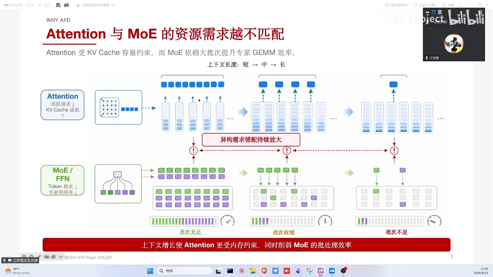
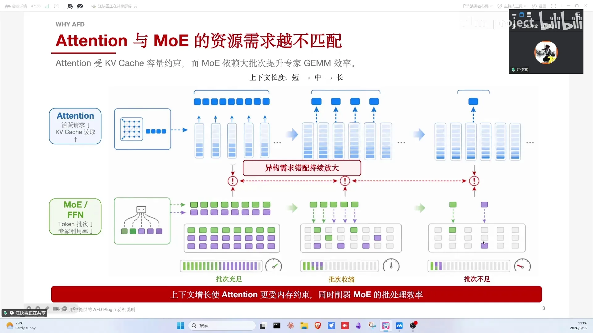
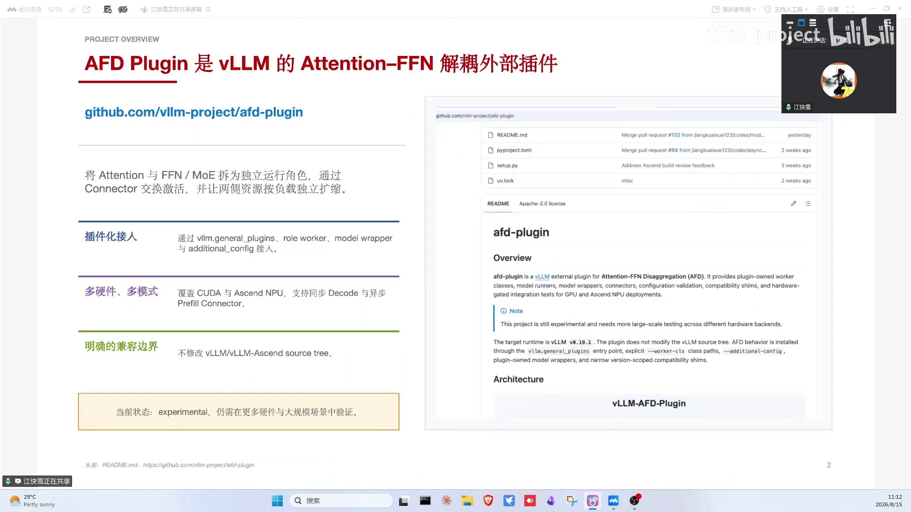
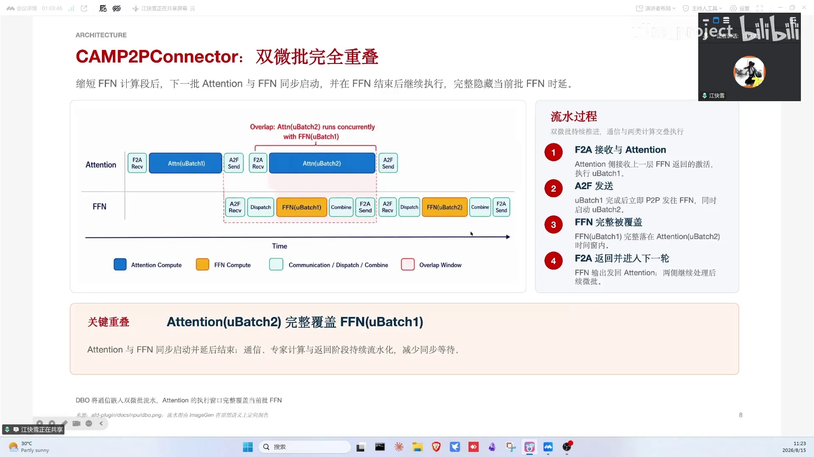
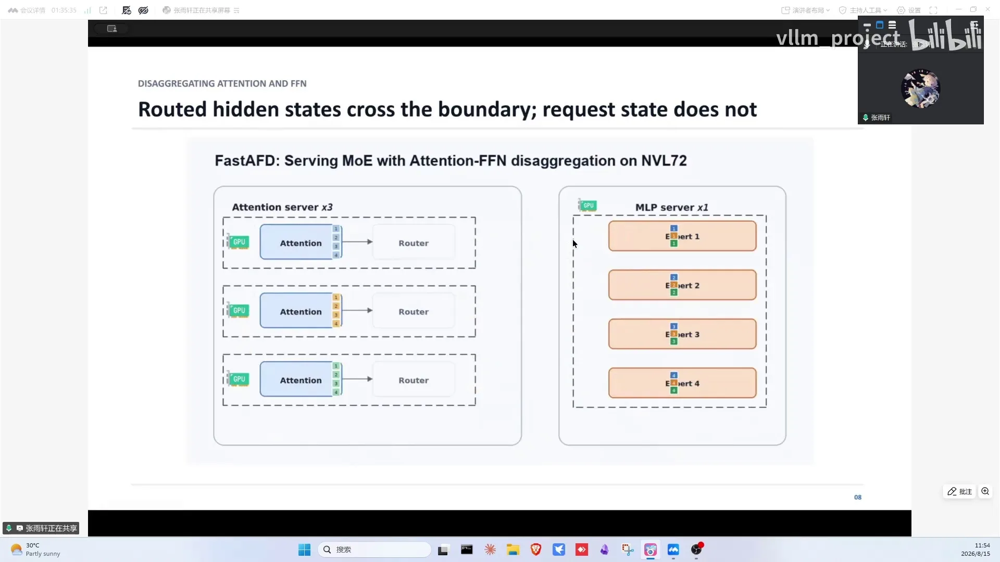
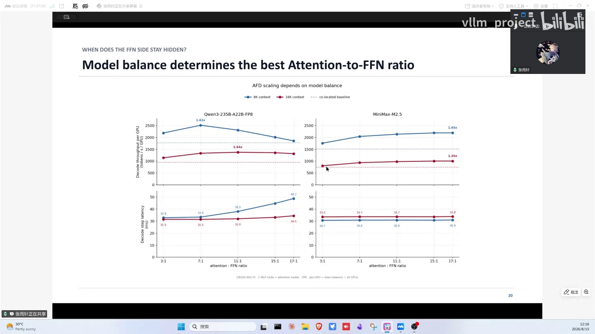
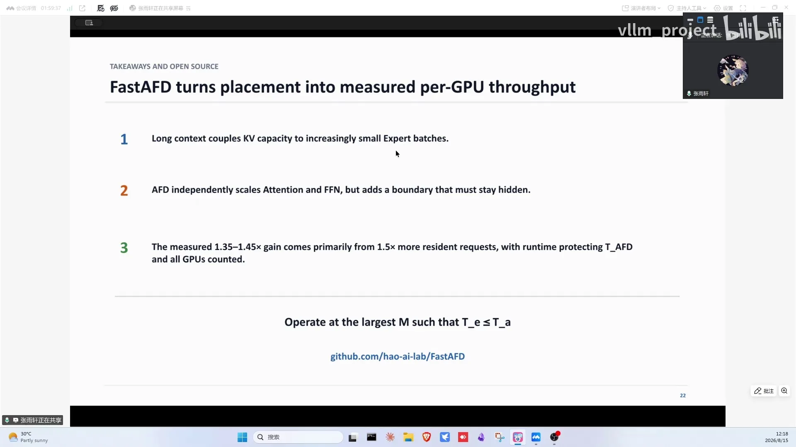

# 第15讲：将系统效率推向极致——Attention/FFN分离详解

> 视频来源：[vLLM小课堂（十五）：将系统效率推向极致，Attention FFN分离详解](https://www.bilibili.com/video/BV14Jgg6iEhN/)（约 88 分钟，嘉宾：华为团队（AFD 框架接入与昇腾实践）与宇宣（UCSD，FastAFD/GPU 实现））。本视频 B 站无 AI 字幕，文稿由本地 Whisper 转写并逐窗校正，时间戳可跳转到对应画面。

## 本讲要解决的核心问题（SCQA）

**背景**：decode 阶段 attention 是访存密集（读 KV cache 随序列增长），MoE/FFN 是矩阵计算（读固定专家权重，受 HBM 带宽限制）。

**冲突**：两者合布时 batch size 绑定——长上下文下 attention 的 batch 变小，FFN 跟着变小，大量算力闲置；大 EP（Expert Parallelism，专家并行）又有 dispatch/combine（MoE 的 all-to-all 两步通信：token 按路由发给专家、算完再汇合回来）同步屏障，长慢卡拖累全局。

**疑问**：能不能让 attention 和 FFN 各自独立配比、独立伸缩，甚至异步化？

**回答（中心思想）**：**AFD（Attention-FFN Disaggregation）把两类计算拆成两组资源**：attention worker 专心吃 KV cache，FFN worker 专心吃专家权重，中间用流水线与 macrobatch overlap 把"两段时间"变成"一段 max 时间"。昇腾侧吞吐随 A:F 配比提升，GPU 侧（GB200 NVL72）TPOT（Time Per Output Token：decode 阶段平均每输出一个 token 的时间）改善 30~40%、per-GPU 吞吐 1.3~1.4 倍。

---

## 一、为什么分离：attention 吃访存、FFN 吃算力，合布互相拖累

attention 部分对访存要求高（[【跳转到 02:53】](https://www.bilibili.com/video/BV14Jgg6iEhN/?t=173)）：除了自身权重还要读历史信息——KV cache（DSV4 是压缩 KV）、线性注意力的 memory 模块，访存量与计算量随序列增长，计算强度稳定。MoE 部分是矩阵运算、访存量固定（专家权重）。

decode 下 FFN 利用率不足的直观理解：batch 打大时 KV cache 时间线性增长，而 FFN 在 batch 较小时是访存 bound——大量被 HBM 带宽限制而非算力限制。上下文越长，能并发的数量越少，FFN 的访存时间占比越高，算力浪费越多。

分离后可以：

1. **独立配比**：A 卡多、F 卡少，把 FFN 利用率拉上去、降低成本；
2. **异构部署**：两类计算特性不同，用便宜卡做 FFN（NVIDIA GTC 上 Rubin + Rubin CPX 的组合也被推测是异构+异步思路）；
3. **去同步屏障**：大 EP 的 dispatch/combine 同步屏障造成宽慢卡现象，分离后可异步化。

关于"小 batch 为什么浪费"：容量有限时 sequence length 大则 batch 小，MoE 计算效率上不去——存在一个甜点区域；"算 1 个 batch 和算 60 个 batch 时间可能一样"。Dense 与 MoE 的 bound 差异需实测：MoE 更稀疏、临界点更小，Dense 可能也有类似情况但收益不如 MoE 明显。

## 二、框架设计：FFN 做成无 KV cache 的服务、attention 复用 vLLM，一个外部插件接进现有集群

仓库是 vLLM project 下的外部插件（开源约 20 天，experimental），依赖 vLLM 的 general plugins 机制接入（[【跳转到 09:59】](https://www.bilibili.com/video/BV14Jgg6iEhN/?t=599)）。覆盖 GPU（demo 性质，欢迎社区参与）与昇腾 NPU（生产实验）。当前基于 decode 阶段 + 异步 prefill 阶段。

架构：attention 与 FFN 解耦成两个角色——

- **FFN 角色**：类似服务层，没有 KV cache、不 care scheduler 调度，被动接收 attention 传来的 hidden state/路由信息；
- **attention 角色**：基本复用 vLLM（engine core、scheduler、KV cache），通过 worker class 指定自己的 worker 类，各持自己的 model runner（V1，正在切 V2）。

当前模型仓库改动还比较多（维护成本上升），减少 patch 是持续工作方向；FFN 侧的做法还比较"暴力"——跳过引擎里 scheduler/KV cache 的部分，希望后续与 vLLM 结合形成自己的方式、不受主线更新影响。模型侧：已适配 DeepSeek V2/V3.2，正在支持 V4，社区在帮做 Qwen3/3.5。

通信抽象：ConnectorBase 提供 send/receive attention output、send/receive FFN output 公共接口——与 vLLM 里 KV connector、EP 通信 connector 一个玩法。

上手方式也简单（[【跳转到 27:48】](https://www.bilibili.com/video/BV14Jgg6iEhN/?t=1668)）：还是 vllm serve 起服务，AFD 的开关通过 advanced config 指定——role 指定 attention/FFN 角色，connector 自选通信后端；因为以外部插件接入，暂没有像 KV/EP connector 那样的专用命令行，等合入主仓后有望简化。

## 三、昇腾实践：ubatch 流水消串行等待，异步 prefill 治大 EP 同步空耗

**decode P2P 流水**（[【跳转到 21:58】](https://www.bilibili.com/video/BV14Jgg6iEhN/?t=1318)）：把 batch 切成两个 ubatch（复用上游 dual-batch/DPBO 基础设施——Lucas Wilkinson 等在 vLLM 的实现，多线程 + CUDA graph 捕获）。不切分就是串行：batch 算完发 FFN、FFN 算完发回来互相等；切分后 attention 的第二个 microbatch 与 FFN 的第一个交叉流水。

**异步 prefill 的动机不同**：不是 FFN 利用率，而是大 EP 同步下多 DP 部署的序列长度/token 数不均——某些 DP 上 attention 计算时长不一样，all-to-all 同步屏障带来大量空耗。异步化后：不等慢卡，直接发给对应 FFN 算完发回。实现上是异步 dispatch send/combine receive（attention 侧）与 dispatch receive/combine send（FFN 侧）的高性能算子。

**昇腾 910C 实测**（DeepSeek V3.2、EP64、稳态吞吐）：提高 A:F 比例后单卡吞吐提升（还有空间，卡不够没法测更极端比例；FastAFD 团队测过更极端比例收益更高）。收益来源：权重分开加载——attention 侧只放 attention 权重，KV cache 容量变大、batch size 打更大；FFN 在甜点区内就持续受益。异步实验（A 3:1 F、FFN EP8、真实线上数据集）：不平衡负载下 TTFT（Time To First Token：从请求发出到收到第一个 token 的时间）与 SLO 达成率都有提升。

**减少侵入式的 idea**：FFN 卡的空闲 HBM 不参与 KV cache——是否可以在上面部署冗余专家副本，让 EPLB 的权重搬移开销更小（设想未验证）；profile 流程不变：attention 发起、FFN 接收 hidden state，attention 卡空闲容量大（可卸载 90%+ KV cache），A:F 常见 3:1、4:1 甚至更高。

## 四、GPU 实现：FastAFD 在 GB200 NVL72 把 TPOT 改善 30~40%

FastAFD 在 GB200 NVL72 上实现 AFD（[【跳转到 46:12】](https://www.bilibili.com/video/BV14Jgg6iEhN/?t=2772)），TPOT 改善 30~40%。理论：attention 与 MoE 的 scaling 是两个维度——attention 随 context length（KV cache）变化，FFN 只随 batch size；合布绑定导致 long context 下 FFN 利用率降低。单纯增大 EP 也能提 FFN 利用率（IO 变小、arithmetic intensity 变高），但有甜点（DeepGEMM 实测 EP2→EP128 收益递减，甜点约 16；dispatch/combine 两层通信随 EP 增长）——**AFD 与大 EP 相辅相成**：小 IO + 大 batch 双管齐下。

本质：AFD 不打破模型计算语义（attention → dispatch → experts → combine → 下一层），只是把两部分资源分开放置。三个 attention worker 的 batch 合并成大 batch 给 MoE server：attention 侧更多 KV cache 容量、MoE 侧更大 batch，两个 scaling 同时做。

通信底子也好（[【跳转到 53:22】](https://www.bilibili.com/video/BV14Jgg6iEhN/?t=3202)）：GB200 NVL72 跨节点同样走 NVLink（双向 1800GB/s），通信容易被 hide——AFD 的 TPOT 甚至能比单节点合布 server 还快一些。

**MacroBatch Overlapping**：分离后如果 sequential 走就是低效的（跟合布没区别还多一倍卡）；用两个 macrobatch 交错——算 MB2 的 attention 时 FFN 在算 MB1，中间跨节点通信被 hide。理想状态下整体时间 = max(attention 时间, FFN 时间)；配比的目标是**让 attention 时间 ≈ expert 时间**，越接近收益越大。

踩坑与解决：

1. **跨节点通信昂贵**（router→expert→combine 回下一层）：借鉴 DeepSeek V4 的融合 kernel，把通信与计算交织 hide 掉，FFN server 时间变小→整个时间就是一个 attention 的时间；
2. **launch 与同步的小 kernel**：decode step 间很多碎 kernel——用 async scheduling（decode 的同时做下一个 step 的 schedule），省 9.8ms/step 的调度 gap；
3. Nsight 验证：两个 stream 的 microbatch overlap 良好、基本无 bubble。

结果：Qwen3-235B 与 MiniMax M2.5（200+B MoE）、定长 8K/16K、vLLM baseline DP4+EP4、AFD FFN 侧 EP4、steady decode per-GPU 吞吐：colocated baseline 的 **1.3~1.4 倍**；TPOT 基本不变（就是 attention 时间）。配比调到 17:1 时 MiniMax 收益 45%。

## 五、一个公式预测收益：batch 扩张 × decode 时间比 × 卡数比，误差约 2%

三个 factor（[【跳转到 73:19】](https://www.bilibili.com/video/BV14Jgg6iEhN/?t=4399)）：AFD batch size 扩张倍数 × decode latency 比例（vLLM 时间 vs AFD 时间）× 卡数（A 卡：F 卡）。用 vLLM 的 decode latency 就能预测 AFD 的 decode latency——预估与实测差距约 2.2%，公式很准；hybrid 注意力下公式会改变（研究中）。

公式还有两个修正项（[【跳转到 71:59】](https://www.bilibili.com/video/BV14Jgg6iEhN/?t=4319)）：FFN worker 不做任何 attention，它的 KV cache 完全废掉，算总吞吐时要把这些卡计入——配比拉大后可忽略不计；attention worker 则保留少量 MoE 运算，大小与 macrobatch 数相关（两个 macrobatch 时 attention 侧的 MoE 开销就是两倍）。

发现：**收益是 model dependent 的**——MiniMax 稳定在 1.35~1.45；Qwen3-235B scale up attention 后收益变小：overlapping hide 不住 expert 时间，从 memory bandwidth bound 变成 compute bound。但随着硬件演进（Rubin CPX 类专用卡、TPU 加大 SRAM）FFN 更快后，配比可调更高、收益上限更高。microbatch 数=2 是甜点（更大 hide 更好但 overhead 3~4 倍增长）；不做 CPU 预调度会 +9.8ms/step。

**为什么不用"合布 + CPU offload"模拟分离**（[【跳转到 63:22】](https://www.bilibili.com/video/BV14Jgg6iEhN/?t=3802)）？有观众问能否在 colocated 部署里让 CPU 做中间人传 hidden state——带宽不允许：hidden state 要走 GPU↔CPU 带宽，远低于现在的 GPU↔GPU 直连；通信一长就盖不住，理想公式要求 attention 时间 ≥ expert 时间才能 overlap，通信暴露出来整体就不划算。colocated 的根本问题在下图——attention 与 MoE 同卡、batch 互相绑定，long context 下 FFN 利用率必然下降：

**更多 Q&A**（[【跳转到 66:24】](https://www.bilibili.com/video/BV14Jgg6iEhN/?t=3984)）：单机 AFD 可行——一台 8 卡机 1 卡布 FFN、7 卡布 attention，走 NVLink 通信；新请求到 FFN 的等待时间——理想稳态下就只有 attention 的时间，仅开头的第一个 microbatch 要多等一次 attention、一次 MoE 和两次通信；FFN 侧显存——MoE 权重占模型大头，FFN 装得下并选一个甜点 EP 即可，EP 开大就必须多卡。

其他问答：AFD 可叠加 PD 分离（P/D 场景分开算）；F 节点排队/通信开销每层累积约 1% 劣化——用小劣化换单卡吞吐与成本；HBM 有效容量提升 1.5 倍（去掉冗余），hybrid 下可能更多；专家负载不均 AFD 不解决（EPLB 叠加未实验，FFN 侧空闲 HBM 放冗余副本是设想）；纯 PCIE 可做但要更好掩盖——超节点低时延下当前没做掩盖（阶跃星辰的方案用多层 CPU 存权重、要多流掩盖，CPU 不占 GPU 但传输性能有瓶颈）；AFD idea 源自 ByteDance 的 MegaScale-Infer（未开源）；MFU=实际 FLOPS÷peak FLOPS，单请求同理；单请求 TPOT 不会有收益（FFN 利用率上不去），AFD 主打 per-GPU 吞吐；CloudMatrix 384（910C 超节点）约一个亿，长视频生成等不 care 时延的场景用便宜卡异构也是方向。

## 六、Roadmap 与贡献机会：减 patch、异步 connector、模型适配都是现成入口

华为侧：兼容性/CI/CD/版本发布（GPU 初步 CI 已有、月度升级节奏）、更多模型适配（GPU 侧已写了一版 Qwen3.5 hybrid 的适配，初步 profiling 结果挺好，[【跳转到 80:48】](https://www.bilibili.com/video/BV14Jgg6iEhN/?t=4848)）、其他硬件 backend（AMD 等欢迎社区）、异步方案与工业场景落地、RFC（削减模型侵入式修改、model runner V2、异步 GPU connector）。昇腾侧异构 PD 也是后续重点。实验室（UCSD）欢迎 intern/PhD：独立解决问题的能力是硬指标，做开源是接触顶级团队的捷径。

## 小结

宇宣最后总结（[【跳转到 77:49】](https://www.bilibili.com/video/BV14Jgg6iEhN/?t=4669)）：AFD 针对 long context，把 expert 的 batch size 拉大、抬高 MoE FFN 利用率；优化后 FFN 能被 attention 很好 hide 住，整体吞吐 1.3~1.4 倍。

- AFD 的动机：attention 访存随序列涨、FFN 访存固定；合布下 batch 绑定导致 long context 时 FFN 算力闲置；
- 设计：vLLM 外部插件 + 双角色（attention 复用 vLLM 全家桶、FFN 服务化无 KV cache）+ ConnectorBase 公共通信抽象；
- 昇腾：ubatch P2P 流水 + 异步 prefill（消大 EP 同步屏障），配比提升吞吐、真实负载 TTFT/SLO 受益；
- GPU：GB200 NVL72 上 macrobatch overlapping + DeepSeek V4 融合 kernel + async scheduling，TPOT 改善 30~40%、吞吐 1.3~1.4 倍，预测公式误差 2.2%；
- 收益 model dependent：MiniMax 1.35~1.45，Qwen3-235B 受 compute bound 限制；硬件演进（专用卡/大 SRAM）会抬高配比上限；
- 愿景：KV cache 成为独立基础设施层，存算分离各行其职。

## 关键术语速查

| 术语 | 一句话解释 |
| --- | --- |
| AFD | Attention-FFN Disaggregation：注意力与 FFN 拆成两组资源独立配比 |
| TPOT | Time Per Output Token：decode 阶段平均每输出一个 token 的时间 |
| TTFT | Time To First Token：从请求发出到收到第一个 token 的时间 |
| EP | Expert Parallelism：专家并行，把 MoE 专家拆分到多卡 |
| dispatch/combine | MoE 的 all-to-all 两步通信：token 按路由发给专家（dispatch）、算完再汇合回来（combine） |
| colocated | attention 与 FFN 合布在同一批卡上（传统部署） |
| FFN 服务化 | FFN 角色无 KV cache、被动接收 hidden state 的服务层 |
| ubatch / macrobatch overlap | 切分 batch 交错 attention 与 FFN 计算，理想时间取 max |
| DPBO | vLLM 的 dual-batch overlap 基础设施（Lucas Wilkinson 等） |
| ConnectorBase | AFD 的公共通信抽象：send/receive attention/FFN output |
| 大 EP 同步屏障 | all-to-all dispatch/combine 的同步点导致宽慢卡互相等待 |
| 异步 prefill | 多 DP 下序列不均时以异步消除 all-to-all 空耗 |
| 甜点区域 | FFN 从访存 bound 转向 compute bound 的 batch 区间 |
| EP 甜点 | EP 增大收益递减的拐点（DeepGEMM 实测约 16） |
| MegaScale-Infer | ByteDance 提出 AFD 思想的论文（未开源） |
| FastAFD | UCSD 等在 GB200 NVL72 上的 GPU AFD 实现 |
| Rubin CPX | NVIDIA 面向上下文处理的专用卡（异构思路印证） |
| CloudMatrix 384 | 昇腾 910C 超节点（约亿元级） |
| EPLB | 专家负载均衡，AFD 场景下可用 FFN 空闲 HBM 放冗余副本 |
| fake profile | 分离后 profile 流程不变：attention 发起、FFN 接收 |
| MFU | 实际 FLOPS ÷ 峰值 FLOPS |
