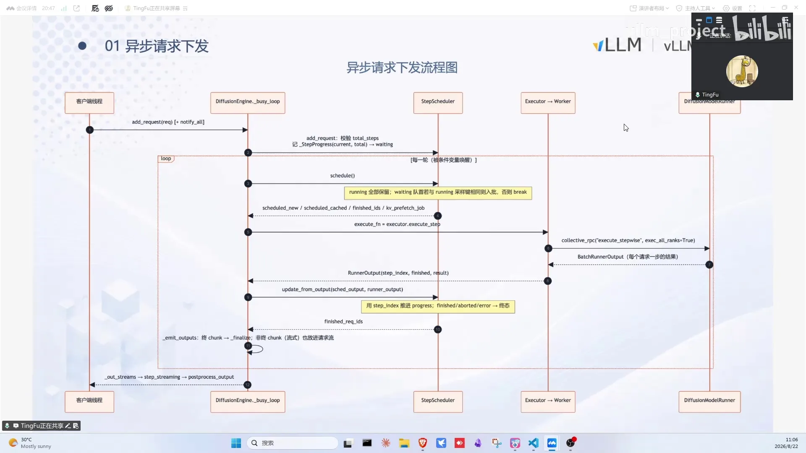
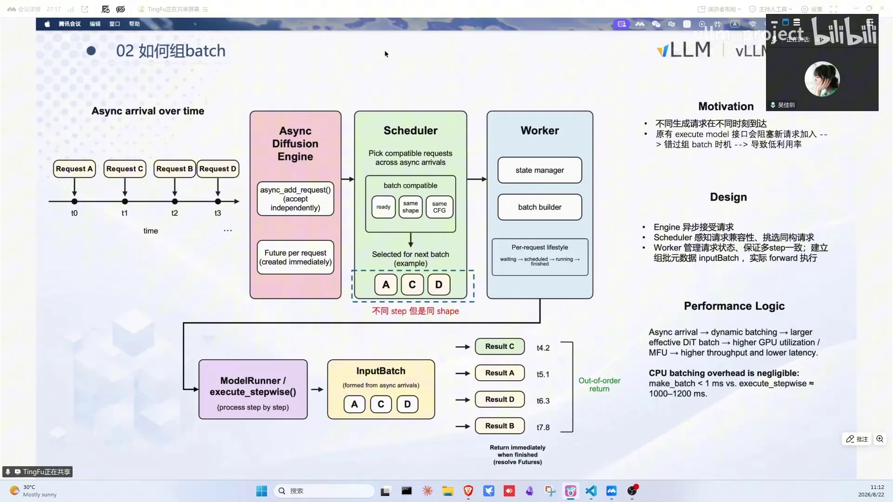
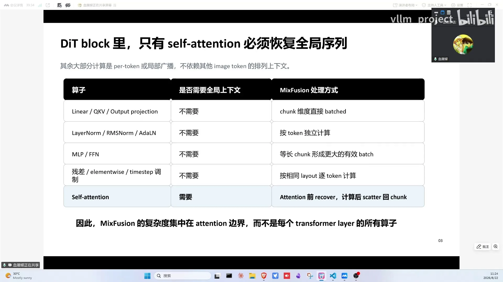
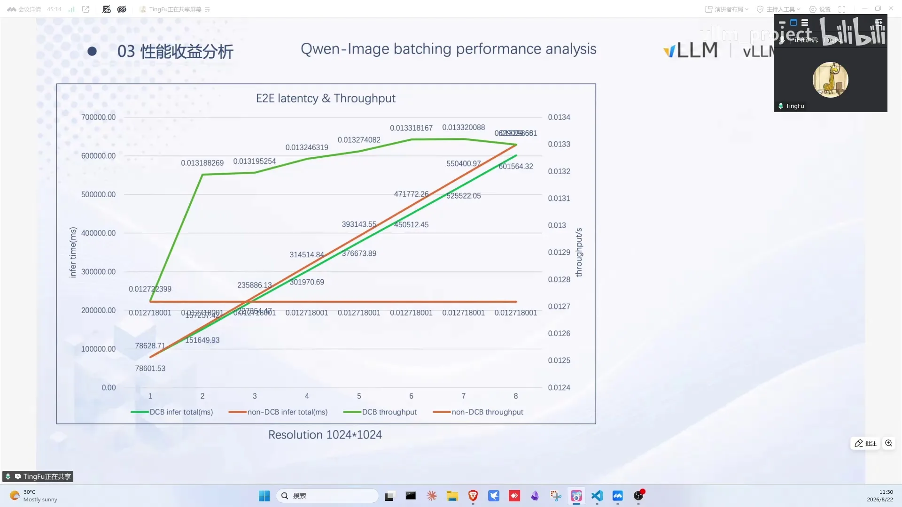
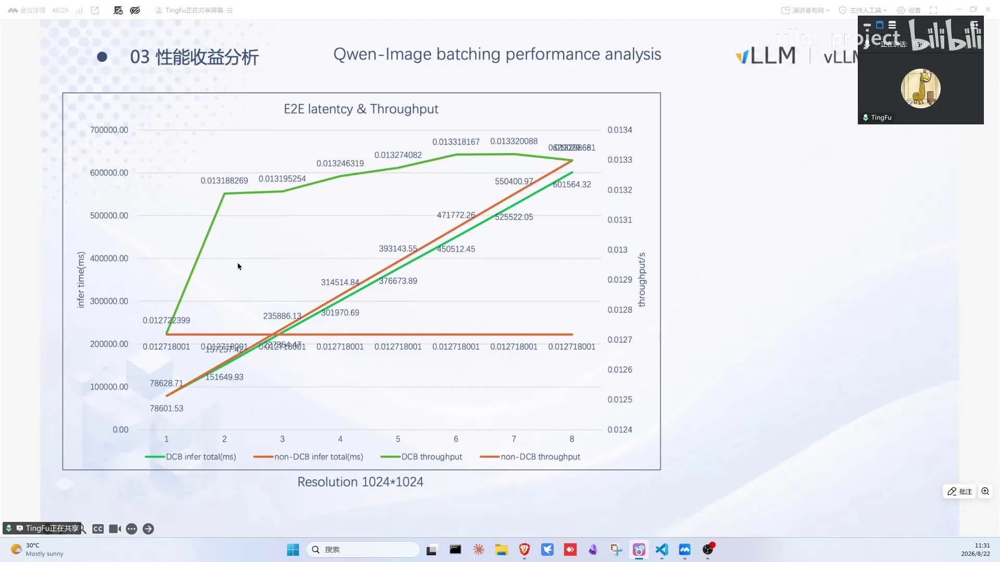
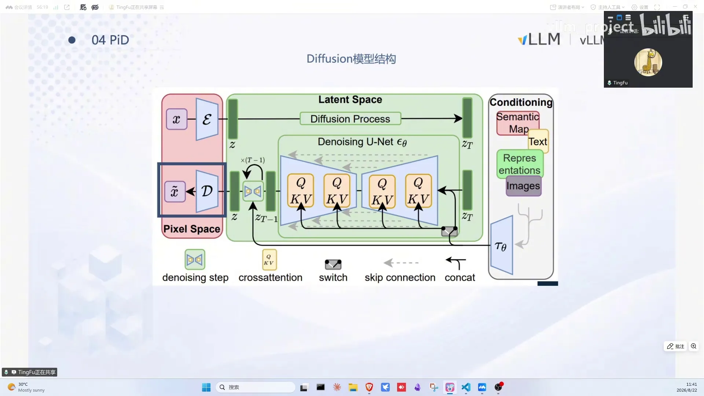
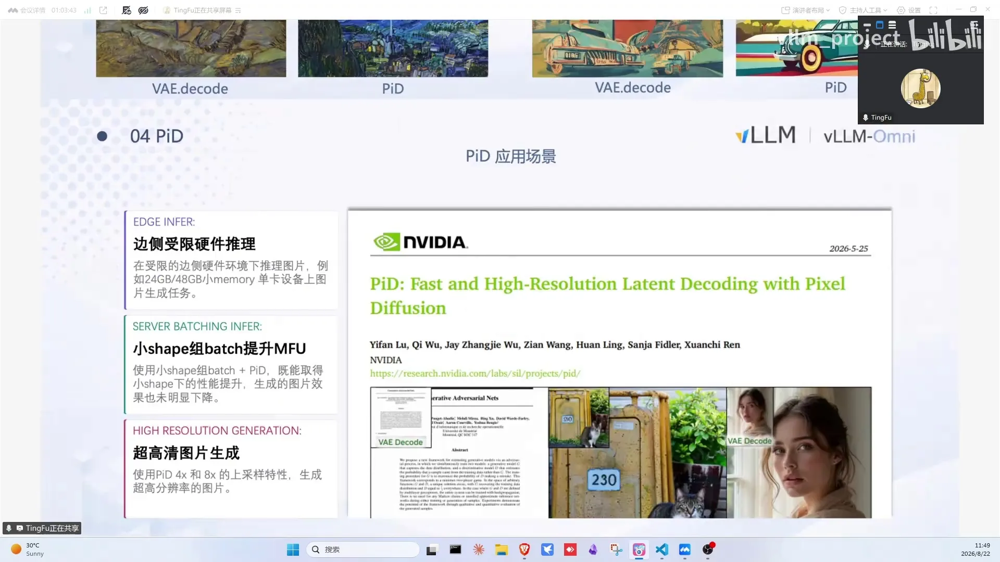

# 第16讲：Diffusion模型也能continuous batching

> 视频来源：[vLLM小课堂（十六）：Diffusion模型也能continuous batching？！vLLM-Omni中的Diffusion CB详解](https://www.bilibili.com/video/BV189816ZE9C/)（约 63 分钟，嘉宾：傅挺（华为）、孙德森（滑铁卢大学）、吴家政（字节实习））。本文基于直播实录整理，时间戳可跳转到对应画面。

## 本讲要解决的核心问题（SCQA）

**背景**：vLLM-Omni 已支持音视频生成模型（DiT，Diffusion Transformer，即用 Transformer 做骨干网络的扩散模型），但请求是同步逐个处理的。

**冲突**：diffusion 模型每个请求需要几十步去噪，单请求 GPU 利用率低——尤其小分辨率场景计算量小、算子下发开销占比高，组 batch 收益理应很大；但 diffusion 的多步迭代让"组 batch"远比 LLM 的 token 级调度复杂。

**疑问**：diffusion 模型能不能也做 continuous batching？组完 batch 的收益从哪来？小分辨率才赚，高清怎么办？

**回答（中心思想）**：vLLM-Omni 把请求下发改造成**异步、以降噪步为粒度**调度，DiT forward 把不同 step 进度的请求组在一起；异构分辨率通过**chunk 化（最大公因数切 patch）**解决，self attention 恢复原形、其他算子直接组 batch；实测 512×512 下 BS=8 吞吐提升约 45%（算子下发省 34%+MFU 提升）；高清场景用 **PID（像素空间扩散）** 从 512 latent 直出 2048 大图。

---

## 一、异步请求下发：从同步到以降噪步为粒度

改造前（[【跳转到 02:55】](https://www.bilibili.com/video/BV189816ZE9C/?t=175)）：请求由 FastAPI 拉起的服务接收解析，上层 stage 入队，底下的 AR stage / diffusion stage 处理——但 diffusion stage 内部是**以 request 为粒度同步下发**到后端 worker pipeline，无法一次处理多个请求。

第一步：把 diffusion engine 的请求下发改造成**异步、以一次降噪步为粒度**（[【跳转到 04:10】](https://www.bilibili.com/video/BV189816ZE9C/?t=250)）：

- 客户端线程将请求发送到 diffusion engine；
- engine 异步地把请求放入 step scheduler 类（含 running/waiting 队列）；
- scheduler 做简单调度：把符合条件（如同分辨率）的请求 batch 到一起；
- 每次下发完一个请求，**以一个降噪步的时间为粒度返回给上层**做判断——可以在每个降噪步中间推入新请求、终止某些请求、或直接返回已完成的请求。

实现细节：engine 初始化时准备异步变量与共享锁；首次收到请求触发 background loop 的初始化；请求通过 `add_request` 添加到 scheduler（生产者只做添加和等待 output stream，不等处理完成）；cb loop 线程循环调用 schedule 判断是否有可调度请求，有则送后端执行（有 wait/唤醒机制防 CPU 空转）；消费者与底层 pipeline 交互，execute function 调实际模型推理。

## 二、组 batch：scheduler 挑选 + worker 组装

scheduler 侧（[【跳转到 10:15】](https://www.bilibili.com/video/BV189816ZE9C/?t=615)）：从等待队列里找哪些可以组 batch（同分辨率等约束），挑出来放进 scheduler output 发给 worker——发给 worker 的通常就表示一定能组。

worker 侧：

- **step manager**：step 粒度执行的组件，按 step 执行、存 step 粒度的请求信息；
- **batch builder**：计算 batch 的 metadata（循环数、CFG embedding、input embedding 等）；
- **model runner**：简单接口做 step 粒度执行；input batch 抽象对这批请求计算元数据——哪个先算完、所有 step 都算完就返回给 engine。

设计动机：请求在不同时刻到达，原来的请求粒度执行会阻塞、错过组 batch 时机导致低利用率。拆成 step 粒度后在每个 step 检查能否组 batch。input batch 的 CPU 开销实测 <1ms（vs GPU 计算可忽略）。

当前未做 encoder/decoder 分离，会有额外空泡（encoder 和 decoder 部分 GPU 利用率不足）。链路：encoder 对新请求编码 → prepare 元数据 → input batch 准备 → DiT forward → 每个 request 单独 scheduler step 步进。latent 保存给后续 step 用；到达最后一步的请求做 VAE decode 得 output。

组 batch 的核心：timestamp（时间戳，这里指每个请求记录的降噪步进度计数，不是视频时间戳）是请求级状态，跟 DiT forward 无关——DiT forward 就可以把不同 step 进度的请求组在一起。文生视频场景：不同 text 长度通过 padding + mask 解决；image token 长度固定（同分辨率）；双流模型 image token 不走 padding。

每个请求要跨几十个降噪步执行，request state 里保存的状态清单包括：prompt embedding/prompt mask、scheduler 的调度信号与参数；为了防止多步重复计算，还缓存 attention mask/attention metadata、KV cache，以及 MoE、稀疏 attention 的预处理结果（跨步复用）；loop 相关的 metadata 在 input batch 里算好存住，forward 时各请求直接读取。

## 三、异构分辨率：chunk 化组 batch

不同分辨率请求组 batch 的问题（[【跳转到 18:39】](https://www.bilibili.com/video/BV189816ZE9C/?t=1119)）：vLLM-Omni 之前通过 padding（768×768 → 1024×1024）再组——有资源浪费且 shape 不匹配只能序列化执行。

解法：**把每个请求切分成等长 patch（chunk）**，等长 chunk 可以一起组队。比如三个请求 shape 不同，每个分成等大 patch，降噪中单独处理每个 patch，最后合并成高分辨率图片（源自一篇混合分辨率组 batch 的论文）。

直播间有同学问：跨请求组 batch 会不会有显存压力？——diffusion 模型本身**没有 KV cache**（之前的 diffusion 模型都没有）；但混元 image 这类生成理解一体的模型有 KV cache，社区正在做它的 KV 配置管理 PR，后续会让这部分也能组起来。

**DiT block 算子分类**（[【跳转到 22:57】](https://www.bilibili.com/video/BV189816ZE9C/?t=1377)）：整个 DiT block 里只有 **self attention** 需要和其他窗口交互（N² 复杂度）；其他 linear/elementwise/normalization 本质是 token 自身的 projection/残差变换——无论切多细都和正常执行逻辑相同。所以只需要在 self attention 一步做特殊处理，其他算子直接组 batch。

chunk size 选择：所有请求的长宽算最大公因数，按公因数切分。分辨率不同的请求可分组拼接 QKV 执行（论文做法），最近 FlashAttention 的 varlen 接口可以传递分段的 QKV 交互信息、避免 gather/scatter。收益主要来自其他算子在 batch 下执行；patch 越大收益越高（SDXL/SD3 实验）。

## 四、性能分析：小分辨率收益 45%

以 Qwen-Image 为例（[【跳转到 28:37】](https://www.bilibili.com/video/BV189816ZE9C/?t=1717)）。实验环境（[【跳转到 36:37】](https://www.bilibili.com/video/BV189816ZE9C/?t=2197)）：昇腾 A3 单芯（上面一个核在跑），算力约 1628T、内存 64G，BS=1~8 分别测 1024 与 512 两档分辨率的端到端耗时并采集 profiling 统计算子耗时：

- **1024×1024**（compute bound）：不开 batch 橙线线性增长；开 batch 绿线放缓但仍正比——性能提升不高（BS=1→2 吞吐 0.0127→0.0131，微乎其微）；
- **512×512**：明显斜率下降；BS=1→8 吞吐从 0.1151 稳步升到 0.2，**提升约 45%**；
- 算子下发时间：不开 batch 时明显上升（几根斜线），开 batch 后基本稳定——第一部分收益来自此（BS=8 场景：72s→38s，减少的 34s 中 34% 来自算子下发节省的 11 秒）；
- 算子 MFU（Model FLOPs Utilization，模型算力利用率）：top3 算子（attention matmul / matmul / FA）——不开 batch 线性增长，开了非线性增长（每次 +20~30%）；matmul 类改进比 FA 大（FA 本身计算量大、batch 后相对收益小）。

跟传统 LLM 的收益逻辑一致：小分辨率一方面降低算子下发开销、另一方面提升 MFU。

## 五、PID：像素空间扩散生成高清图

小分辨率收益高但没法高清？**PID（Pixel Diffusion）**替代最后的 VAE decode（[【跳转到 39:37】](https://www.bilibili.com/video/BV189816ZE9C/?t=2377)）：

- 输入三个（[【跳转到 40:32】](https://www.bilibili.com/video/BV189816ZE9C/?t=2432)）：主模型的 latent（可以是中间步 N-2/N-4/N-6 的）、文本 embedding、目标分辨率的纯噪声图像（如 512→2048 的 upscale 噪声）；
- latent 经**条件适配器**（翻译器，模型强相关）转成主干能识别的特征表达；
- 主干（Pixel DiT）在目标分辨率上做扩散生成高清图——相当于超分模型的 diffusion 版本，以小生大。

训练上主要训的就是**条件适配器**这部分（[【跳转到 42:26】](https://www.bilibili.com/video/BV189816ZE9C/?t=2546)）：它跟主模型强相关，角色类似 LLM 投机解码里的 draft 模型，负责把主模型的 latent 翻译成主干能识别的特征表达；主干（Pixel DiT）本身跟主模型无关，训练方法见直播贴的论文。

性能（2048 生成）：显存从 VAE decode 省 16G→11G（约 5GB），PID 再省 3G；单请求单步只有原来的 1/8，时延降低 90%+；decode 阶段（PID 内有小 diffusion）下降 38%，总收益 90%+。质量：PID 与 VAE 互有胜负——论文指标如此，实测主观也不分伯仲（有些场景 PID 质感更好、有些过曝像手机拍）；跟 CLIP text embedding 的质量也有关。

论文总结了 PID 的三大应用场景（[【跳转到 48:51】](https://www.bilibili.com/video/BV189816ZE9C/?t=2931)）：① 显存受限的硬件跑高分辨率生成——VAE decode 显存占比高，换 PID 后压力骤减；② 小分辨率组 batch + PID 放大——先在收益最高的小分辨率组 batch，再在 PID 阶段生成回大图；③ 超出主模型原生分辨率生成——原生最高 2K/4K 的模型，可以再叠 4×/8× 的 PID 上采样。

## 六、答疑划重点：小分辨率才赚、T2V 未必赚、PID 是高清出路

- **PID 模型很小**（[【跳转到 53:53】](https://www.bilibili.com/video/BV189816ZE9C/?t=3233)）：主干+文本模型不到 3B；组 batch 在目标分辨率下做降噪、显存可能爆炸，需评估；
- **VAE decode 串行**：是，后面会分离出来；本身 memory bound 组 batch 收益小；text encoder 分离后复用 AR 接口可组 batch；
- **T2V 场景**：attention 占比大、linear 占比小——收益可能不如 T2I 明显甚至轻微劣化（另一个模型实测正常分辨率有轻微劣化）；很多 T2V 是流式/分 chunk 生成，需逐模型分析；
- **padding vs 组 batch**：padding CPU 开销更大（进出机制）、FlashAttention 两套接口差异；组 batch 的 CPU 开销 <1ms；
- **和 vLLM 已有 CB 的区别**（[【跳转到 56:47】](https://www.bilibili.com/video/BV189816ZE9C/?t=3407)）：vLLM 是 token 级调度（decode 优先+prefill 凑 batch），DiT 是 step 之间组；两者可共存（AR stage 走 vLLM CB、diffusion stage 走 diffusion CB）；
- **异构 vs 同构组 batch**（[【跳转到 60:48】](https://www.bilibili.com/video/BV189816ZE9C/?t=3648)）：差异看总 token 数，量级差不多则差距不大；varlen 避免 gather/scatter；异构额外开销不大；
- **未来场景**：组 batch + PID 叠加；按分辨率分实例调度；offload + 组 batch 掩盖搬运开销；消费级显卡（5090 FP4）+ 480P 组 batch；H3 等 720P→2K 级联场景的低分辨率段组 batch；
- **中断请求**：以降噪步为粒度返回后，可以在中间步接收中断消息、把请求从队列剔除（毫秒级开销）。

## 小结

- diffusion CB 的前提：异步请求下发 + 以降噪步为粒度调度 + step manager 管理 per-request 状态；
- 组 batch = scheduler 挑选同分辨率请求 + worker 组装元数据（input batch CPU 开销 <1ms）+ DiT forward 混合不同 step 进度；
- 异构分辨率：最大公因数切 chunk，只有 self attention 需要特殊处理（varlen 接口），其他算子直接组；
- 收益：512×512 BS=8 吞吐 +45%（算子下发省 34% + MFU 提升），1024×1024 compute bound 收益小；
- 高清走 PID：像素空间扩散以小生大，显存省 5~8G、时延降 90%+、质量与 VAE 互有胜负；
- 未来：CB+PID 叠加、按分辨率分实例、offload+CB 掩盖搬运、TTS flow 的 chunk 化组 batch。

## 关键术语速查

| 术语 | 一句话解释 |
| --- | --- |
| diffusion CB | 以降噪步为粒度把不同 request 组 batch 的连续批处理 |
| step scheduler | diffusion engine 内管理 running/waiting 队列、按 step 调度的组件 |
| cb loop | 循环判断可调度请求并送后端执行的线程 |
| step manager | 管理 per-request step 状态的 worker 组件 |
| input batch | 对一组 batch 请求计算元数据（mask/loop/CFG embedding）的抽象 |
| timestamp | 请求级的降噪步进度状态，与 DiT forward 解耦 |
| chunk 化组 batch | 按最大公因数把不同分辨率切成等大 patch 再组 batch |
| varlen | FlashAttention 的变长序列接口，避免 gather/scatter |
| MFU（Model FLOPs Utilization） | 模型算力利用率：实际有效计算占 GPU 峰值算力的比例，小分辨率/小模型算力打不满，组 batch 后提升明显 |
| DiT block 算子分类 | self attention 需要跨窗口交互，其余算子 token 独立 |
| PID（Pixel Diffusion） | 像素空间扩散：从低分辨率 latent 直出高分辨率图片 |
| 条件适配器 | PID 的翻译器：把主模型 latent 转成主干能识别的特征 |
| 以小生大 | PID 的本质：512 latent 生成 2048 图像的超分 diffusion |
| 中断请求 | 以降噪步为粒度后可在中间步终止请求的机制 |
| 亲和性调度 | 固定分辨率的请求路由到对应实例提高命中率 |
