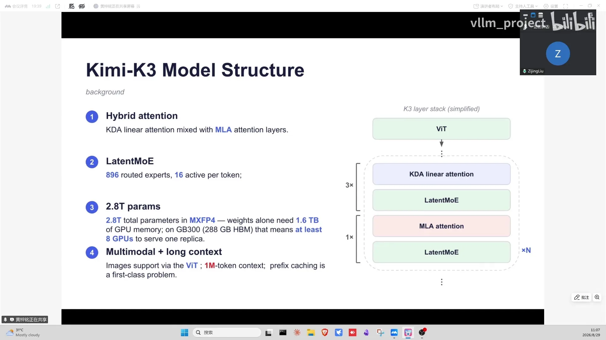
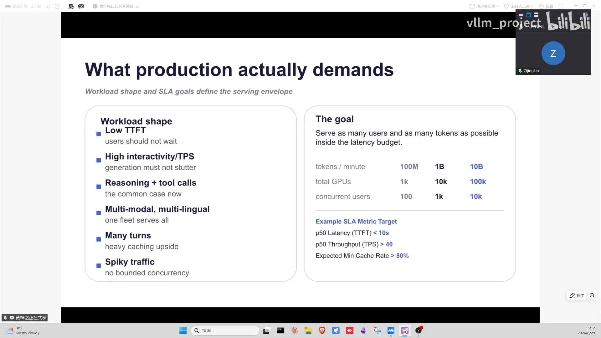
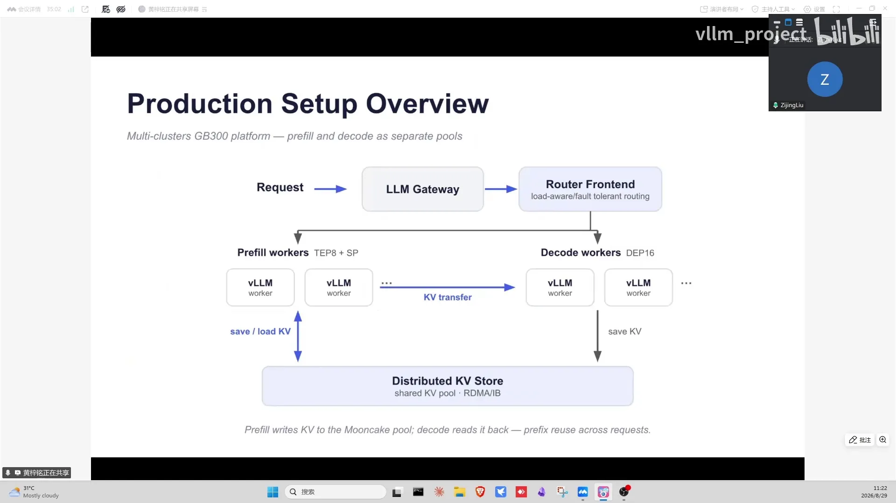
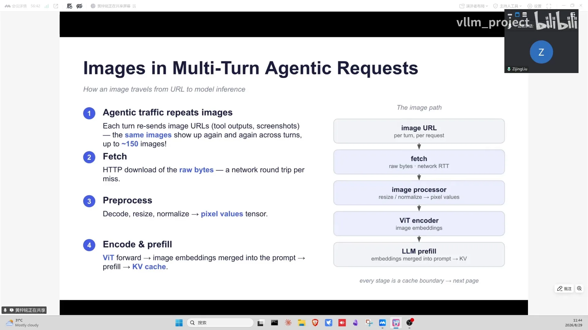
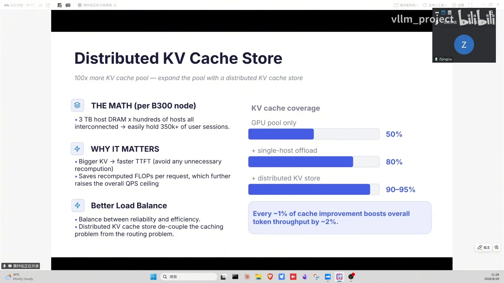
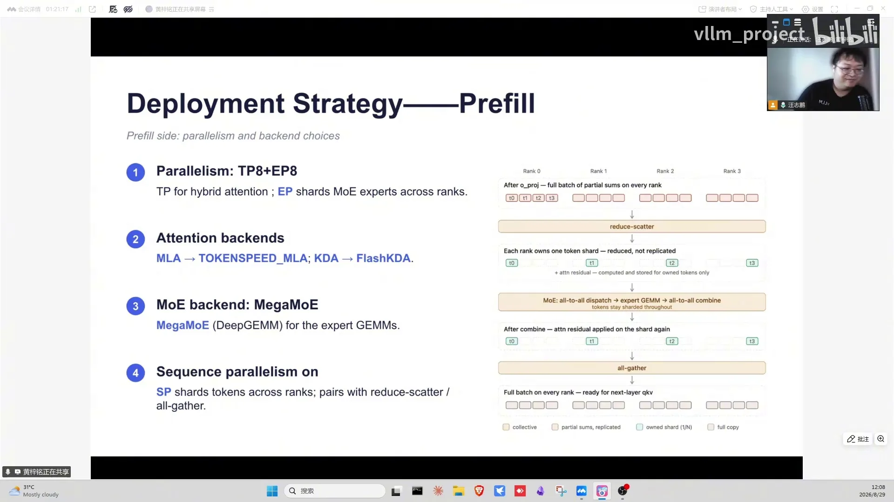
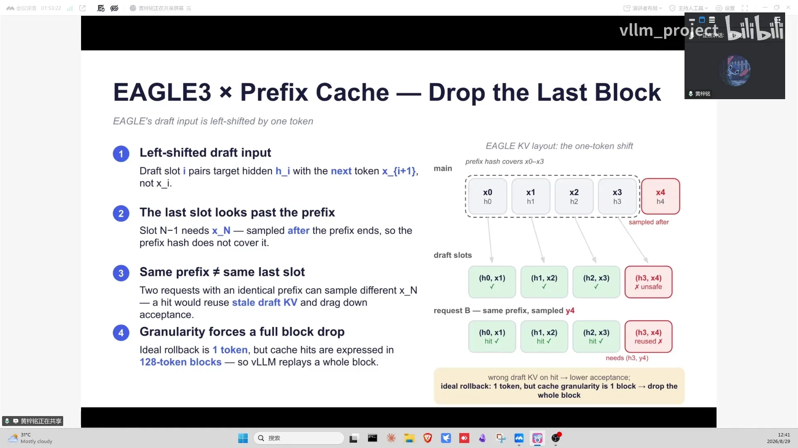
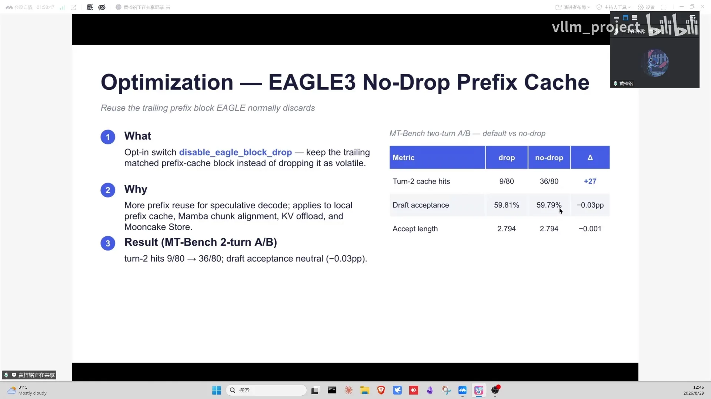

# 第17讲：基于vLLM的Kimi K3智能体生产级推理服务

> 视频来源：[vLLM小课堂（十七）：基于vLLM的Kimi K3智能体生产级推理服务](https://www.bilibili.com/video/BV1Wv4k6YEdB/)（约 115:40，两位 INFX 工程师分享，其中一位是子林）。本视频 B 站无 AI 字幕，文稿由本地 Whisper 转写并逐窗校正，时间戳可跳转到对应画面；文末约 5 分钟无字幕区间已如实标注。

## 本讲要解决的核心问题（SCQA）

**背景**：Kimi K3 是开源社区第一个 2.8T 参数的超大模型：MoE 部分用 MXFP4 权重、linear 部分用 BF16，存储 1T 多；还有 Lightning MLA、hybrid attention、1M context、原生多模态。

**冲突**：世界上没有任何一台单机吃得下这个模型；用户 SLA 极高（TTFT P99 < 10 秒、每秒 40 token、tool call 100% schema 遵循）；workload 是多轮、多图、多语言的复杂 agent 场景；流量还有明显高峰低谷。

**疑问**：怎么把它从 day0 支持推上生产，并 scale 到 billion token/min？

**回答（中心思想）**：**多层架构兜稳定性（gateway → vLLM Router → 多机群 GB300 上的 PD 分离 + KV disaggregation），分布式 KV cache store 抬吞吐上限（每 1% 命中率 ≈ 2% 总吞吐），引擎层用 TP8+EP8+SP 的 prefill、DP16+EP16 的 decode，再靠 ChunkOne 等原创优化把 prefix cache 的代价打下来**。

---

## 一、K3 是开源社区第一个 2.8T 参数模型，单节点根本放不下

K3 是开源社区里第一次见到的超大规模模型——**2.8T 参数**，此前开源最大模型接近 1T（[【跳转到 02:05】](https://www.bilibili.com/video/BV1Wv4k6YEdB/?t=125)）。MoE 部分是 **MXFP4** 权重（一种 4 比特浮点量化格式，用来把万亿参数的专家权重压到可存储的大小），前端的 linear projection 部分是 BF16，加起来存储接近 1T 多。生产部署的第一个头疼问题就是：**世界上没有任何一台单机能把 2.8T 完整吃下**。

除了大，K3 还有几个"不太一样"：
- **Lightning MLA**：MLA（Multi-head Latent Attention，多头潜在注意力）的变体，里面做了特殊操作，kernel 层面有专门实现；
- **hybrid attention**：sparse attention（KDA）+ Mamba + dense attention 的混合模式（从 DeepSeek 到 MiniMax 都在用类似结构）；
- **1M context + 原生多模态**：上下文长度 1M，同时吃很多图片。

这些特性意味着生产上每一处都要专门做调整——不光针对文字、chat、coding，还要针对 multimodal 做大量优化。

## 二、生产 SLA 是三条硬指标，workload 是多轮/多图/多语言，流量还有高峰低谷

**SLA 三条硬指标**（[【跳转到 14:08】](https://www.bilibili.com/video/BV1Wv4k6YEdB/?t=848)）：

1. **TTFT P99 < 10 秒**：TTFT（Time To First Token，首 token 时间）不管什么场景、怎么退化都要达标——不能让用户输入后转两分钟；
2. **每秒 40 token 的生成水位线**：即 ITL（Inter-Token Latency，相邻 token 间隔）要低，apply 到所有用户，中间不能有停顿感；
3. **tool call 100% schema 遵循**：K3 是很强的 generative model，生产上大量 rewriting context 和 tool call context，用户给一个 customized 的 tool call parameter schema，就要 strictly follow——不能有任何请求因为 format 或 schema 原因失败。

**workload 三个特点**（[【跳转到 05:48】](https://www.bilibili.com/video/BV1Wv4k6YEdB/?t=348)）：一是**图片极多**——截图场景常见，一个 request 带几十张图；二是**多语言**——不止中英文，各种语源；三是**多轮对话为主**——生产上很少见 10 轮 5 轮以下的简单对话，大多是多轮反复迭代解决复杂问题。

**traffic 有明显高峰低谷**（[【跳转到 21:38】](https://www.bilibili.com/video/BV1Wv4k6YEdB/?t=1298)）：早上 10 点用量上来，12 点、1 点下去（午休），下午再上来，7、8 点再下去；夜里流量比中午还少。生产的挑战是在浮动流量下保证系统稳定——怎么在所有要求达标的情况下服务越多用户越好，这就是 **scalability** 的问题：一套系统不仅 100M token/min 能用，还要能 scale 到 billion 甚至 10 billion token/min（[【跳转到 07:28】](https://www.bilibili.com/video/BV1Wv4k6YEdB/?t=448)）。

## 三、多层架构兜稳定性，引擎层把 day0 适配全部复用到生产

High level 架构从上到下（[【跳转到 09:08】](https://www.bilibili.com/video/BV1Wv4k6YEdB/?t=548)）：

1. **Gateway**：总接入口，做认证、限流、导流，按流量高低把请求分发到后端可能超过 10 个 GPU 集群；
2. **vLLM Router**：负载均衡 + failover——集群里某些部署出问题时，router 能感知错误、把失败请求 retry 到新 node（vLLM Router 是独立项目，在 vLLM project 里可以找到）；
3. **vLLM 部署**：**PD 分离 + KV cache disaggregation**——PD 分离指 prefill（算完整个输入、产出首 token）和 decode（逐 token 生成）分节点部署，中间通过 KV connector 传输 KV cache，这是 vLLM V1 的原生能力（[【跳转到 17:28】](https://www.bilibili.com/video/BV1Wv4k6YEdB/?t=1048)）。

2.8T 单节点放不下，所以引擎必须多节点并行，MXFP4 权重减小存储压力。引擎层把 day0 支持时的所有优化复用过来（[【跳转到 12:03】](https://www.bilibili.com/video/BV1Wv4k6YEdB/?t=723)）：

- **Lightning MLA 适配**：kernel 有特殊实现，在 vLLM 里专门做了适配；
- **hybrid attention 的 cache 管理**：prefix cache 需要 KDA 和 MLA 两种 attention 的 cache manager 协调（这一设计正是第 10 章 ChunkOne 优化的背景）；
- **latent MoE 通信优化**：用 reduce-scatter 替代 all-reduce 消除冗余计算（第 13 讲详述）；
- **多模态**：生产大量截图请求，ViT（视觉编码器）的 batch 处理优化；
- **1M context**：CP 切分、prefix cache、chunked prefill 配合。

SLA 的实现手段也都在引擎层：**partial cache hit**（多轮对话命中率高）保 TTFT；**CUDA graph + PDL** 等 kernel 优化保 ITL；**structured output + tool parser** 保证 tool call 100% schema 遵循——structured output 指约束解码，让模型输出严格符合给定 JSON schema。

## 四、分布式 KV pool 是台"吞吐机器"：300TB 池子免重算，1% 命中率 ≈ 2% 总吞吐

为什么一定要做分布式 KV cache store？讲者算了一笔简单的账（[【跳转到 30:48】](https://www.bilibili.com/video/BV1Wv4k6YEdB/?t=1848)）：以 B300 为例，一台机器大概 3TB 内存，**100 台机器就是 300TB 的 KV cache pool**，1000 台就是 3000TB。而大部分用户的 session 是在几分钟到十小时内完成的，不是存一个月每天来问两句——所以 300TB 量级的池子，基本能把当前所有并发用户的历史 KV 全部保留下来。

这带来两个好处（[【跳转到 32:03】](https://www.bilibili.com/video/BV1Wv4k6YEdB/?t=1923)）：

1. **免重算 → 延迟变短**：KV cache 命中就直接复用，TTFT 相对变短；
2. **省下算力 → QPS 上限拉高**：不用重算，省下来的 flops 可以拿去接入新 session、新流量——整体部署的 QPS 上限被拉高非常多。延迟变短和总量拉高是同时发生的。

还有一个附加收益：**负载均衡被解耦**。以前没有分布式 KV store，router 必须同时考虑"流量均衡"和"缓存亲和"两个问题——某个实例因为历史 KV 多变得很受欢迎（水位 80%），其他实例还在 50%，新请求发不发它？发了更不均匀，不发就白重算。有了分布式 KV store，router 只管负载均匀，KV 复用全部交给 store 解决。

**实测命中率数字**（[【跳转到 34:33】](https://www.bilibili.com/video/BV1Wv4k6YEdB/?t=2073)）：

| 方案 | prefix cache 命中率 |
| --- | --- |
| 只用 GPU HBM | ~50% |
| + 单机 offload（offload 到 DRAM） | ~80% |
| + 分布式 KV cache store | 90-95%（接近理论上限） |

而且提升过程中观察到：**1% 的 cache 提升 ≈ 2% 的总 token throughput 提升**。对 100B token 量级规模的集群来说，2% 已经是非常大的增量。

## 五、Mooncake 独立部署：每 node 让出 2.5-2.8TB 内存，vLLM 实例随便动、KV 不丢

分布式 KV cache store 的实现用的是 **Mooncake**（月之暗面开源的分布式 KV cache store 项目）——讲者团队对这个产品评价非常高，但部署方式与开源社区一般做法不太一样（[【跳转到 35:23】](https://www.bilibili.com/video/BV1Wv4k6YEdB/?t=2123)）：

- **独立实例**：Mooncake store 是单独的实例，与 vLLM 引擎实例分开部署。以一个 72 张 GB300 卡的集群为例，Mooncake 实例与 vLLM 实例是分离的；
- **每 node 让出大部分内存**：假设一个 node 上有 3TB CPU DRAM（讲者举例），Mooncake store 吃掉 **2.5-2.8TB**，剩下 200-300G 留给 vLLM 做必要的 RAM buffering；
- **这样分离的最大好处**：vLLM 实例可以随便动——更新、扩容、缩容（downscale/upscale），甚至 crash 重启，**KV cache 都不会损失**，因为所有 KV 都 offload 在独立的 Mooncake 实例里；
- **互联与控制面**：所有 Mooncake 实例通过 RDMA/IB fabric 连接到一起，并由 **Mooncake master** 这个控制面统一管理——一个 KV cache 来了该放到哪个实例、怎么做 sharding 和 lock，都由独立的控制面处理。

整套思路是：分布式 KV store 在自己的环境里跑，与所有 vLLM 引擎互相解耦、互不影响。

## 六、多模态图片三级缓存：Redis fetch cache 95% 命中，合计省约 53% TTFT

多模态是生产上非常痛苦的部分（[【跳转到 38:18】](https://www.bilibili.com/video/BV1Wv4k6YEdB/?t=2298)）：一个请求里可能有大几十张照片，尤其多轮对话中历史会保留——某一轮发了 50 张照片，之后每一轮请求都带着这 50 张。

图片的完整链路是（[【跳转到 39:08】](https://www.bilibili.com/video/BV1Wv4k6YEdB/?t=2348)）：拿到 URL → **download** → pre-processing（resize/normalize）→ 放进 Vision Encoder（ViT）拿 embedding → 最后做 LLM prefill。线上看到 **image downloading 占 TTFT 差不多 50%**——一半时间在搞图片链路，剩下一半才在跑 prefill 和 KV transfer。

于是做了三级缓存（讲者强调 L1/L2/L3 是工作的先后顺序，不是技术分层）：

1. **L1 fetch cache**：多轮对话里上一轮已下载过的 50 张图，下一轮就不再下载——用分布式 **Redis** server（开 500G 到 2TB），设 TTL 半小时到一小时（图片不会一直被反复使用，过了这个时间就再也不出现）。开启后观察到：**整个流量里 95% 的图片都是 cache hit**；
2. **L2 pre-processing cache**：如果 resize/normalize 参数都一样，做完 pre-processing 的图片结果可以直接复用；
3. **L3 encoder cache**：图片和预处理参数完全一样，ViT 的输出（embedding）也应该一样，直接复用 encoder 输出。这一块还不完善——公司同学有初步版本，内部生产实验中，希望之后推出去。

三级 cache 加起来（尤其 fetch cache + processing cache），**一共省了大概 53% 的 TTFT**——以前要 20 秒，现在 10 秒搞定（[【跳转到 41:38】](https://www.bilibili.com/video/BV1Wv4k6YEdB/?t=2498)）。既省了延迟，也给网络 ingress 流量省了很多带宽。

## 七、有分布式 KV store 之后，路由只管负载均衡：cache-aware routing 被解耦

有同学问：有分布式缓存时，路由该用 hash 还是 cache-aware？这是个好问题（[【跳转到 24:58】](https://www.bilibili.com/video/BV1Wv4k6YEdB/?t=1498)）。答案：**有分布式 KV cache store 的时候，cache-aware routing 就不是特别重要了**——请求不管发给哪个实例，都能从分布式 KV store 里拿到缓存。此时 routing 更多考量的是负载均衡：实例的 KV cache pressure、queue 里排队的请求长度、batch request 长度，有时还有 GPU utilization/GPU temperature。Routing 与 KV 命中这两件事被 **decoupling**：routing 只负责负载均衡，所有 KV 命中都由分布式 KV cache store 处理。

**用什么指标衡量一个 node 的负载？**（[【跳转到 46:13】](https://www.bilibili.com/video/BV1Wv4k6YEdB/?t=2773)）尝试过不少，最后觉得最好用的是 **KV cache utilization（KV 缓存水位）**。以前用排队/在跑的请求数（10 个 vs 5 个）判断，在 agentic workflow 上很不好用——request 和 request 带来的工作量可以差非常多：可能一个请求直接把一本书塞进来打满 1M context，另一个还是空的。目标是让全集群所有实例的 KV cache utilization 的 min/max 差距不超过 10%（比如最低 40%、最高 50%）。

**负载不均的代价有多大？**（[【跳转到 61:38】](https://www.bilibili.com/video/BV1Wv4k6YEdB/?t=3698)）大家常常低估它：如果 10% 的实例跑到 80% 水位、另一些在 40%，就可能有 20% 的流量要忍受更高的延迟，直接影响 P90 TTFT；最难受的是 50% 实例很热、50% 很凉——TTFT 就变成"跳楼机"，有时落高区间、有时落低区间。10% 的 min/max 差距都能在整体 TTFT 和吞吐上看到明显区别。所以即使有了 Mooncake 也不需要做高开销的 KV 感知调度，但负载均衡本身要做足。

两个相关的部署细节：

- **D 节点要不要直读 KV store？**（[【跳转到 47:28】](https://www.bilibili.com/video/BV1Wv4k6YEdB/?t=2848)）目前生产还是 P 节点读写缓存、算完整个输入后通过 PD transfer 发给 D 节点；在尝试的方案是 D 节点直接从 Mooncake 拿历史 KV（比如 250K 历史），P 节点只算新增的 100K token 并发增量过去——Mooncake 传输与 P 端计算可以同步，能再省一点 TTFT。但在 10 秒 TTFT budget 里，300ms 和 200ms 传输的差别影响相对有限；
- **跨交换机部署有影响吗？**（[【跳转到 44:58】](https://www.bilibili.com/video/BV1Wv4k6YEdB/?t=2698)）他们的 Mooncake store 就是跨交换机部署的——只要机架间有 IB/RDMA fabric 互联就没大问题。KV transfer 再慢也就 500ms 撑死，在 10 秒 budget 里占比很小（跨交换机 500ms → 300ms → 250ms 的差别对整体 SLA 影响有限）。
- **KV 传输会和推理通信抢带宽吗？**（[【跳转到 27:28】](https://www.bilibili.com/video/BV1Wv4k6YEdB/?t=1648)）GB300 单机内的所有集合通信都走 NVLink，不会跟 KV transfer 流量抢带宽；至于分布式 KV 流量和 PD 流量的冲突，线上看"还好"——因为一个请求绝大部分时间都在做 decode（输出 500、800、1000 个 token），prefill 和 KV 拉取在集群总时间里占比有限。大部分情况下，**同时能服务多少用户取决于 KV cache pool 有多大，而不是网络带宽**——它远早于网络成为瓶颈（[【跳转到 29:08】](https://www.bilibili.com/video/BV1Wv4k6YEdB/?t=1748)）。
- **DeepSeek 的 3FS 这类分布式文件系统能拿来当 KV cache store 吗？**（[【跳转到 26:13】](https://www.bilibili.com/video/BV1Wv4k6YEdB/?t=1573)）DeepSeek 内部肯定广泛使用（他们的 datacenter 也是自己搭的，软硬件结合非常强）；但在开源社区和讲者经历过的公司里，分布式文件系统多用于备份/传输，生产上真拿来存 KV cache 的，除 DeepSeek 外还没见过一手案例。

## 八、Q&A 实操：跨模型 KV 禁止共享、命中率经验值 90%、pool 大小自己算

Q&A 环节覆盖了大量生产实操问题（[【跳转到 23:43】](https://www.bilibili.com/video/BV1Wv4k6YEdB/?t=1423)），精选如下：

- **部署框架怎么选**：Kubernetes 原生的 LLM 部署框架（如 NVIDIA Dynamo、LMDeploy、SGLang）各有特色，但设计原理都基于 Kubernetes、都走模块化扩展，本质上没有非常核心的区别——哪个用起来舒服就用哪个。SGLang 也从 vLLM 社区单独发展出去了，vLLM 团队希望所有前端/gateway 都能很好地支持 vLLM，而不是只能用 vLLM Router；
- **跨模型 KV 共享：绝对禁止**（[【跳转到 52:28】](https://www.bilibili.com/video/BV1Wv4k6YEdB/?t=3148)）：往 store 里存的 KV 必须带自己专属的 key（不同模型/不同版本用不同 prefix，K3 一个 key、另一个模型另一个 key），互不污染。多个模型可以共用一个 Mooncake pool，但跨模型读 KV cache 是非常高危的操作——生产上最忌讳"串流"，当前请求绝不能读到别人请求或不该读的模型的 KV cache，所有操作都把这一点放第一位；
- **命中率经验值**（[【跳转到 54:33】](https://www.bilibili.com/video/BV1Wv4k6YEdB/?t=3273)）：多轮对话场景，每轮输出 300-600 token、每轮输入 2000-4000、总长 10 万-20 万、20 轮以上（无图片、纯文字），**90% 是比较客观的数字**；**80% 是现在生产上线的入门线**。具体要看流量和 workload，不能一概而论；
- **pool 大小可以自己算**（[【跳转到 55:23】](https://www.bilibili.com/video/BV1Wv4k6YEdB/?t=3323)）：K3 一个 token 约 **40KB**。知道要 serve 多少 QPS、每个请求历史多长，就能算出任意时刻在服务多少 token，乘 40KB 就是保证"任何时刻没有请求需要重算"所需的 KV cache 容量——实在懒得算可以扔给 Claude Code/GPT，它们算得挺快；
- **Mooncake master 有单点风险吗**（[【跳转到 56:13】](https://www.bilibili.com/video/BV1Wv4k6YEdB/?t=3373)）：有可能，但 master 支持 high availability（一个节点挂了另一个立马顶上），且 CPU 算力非常强——目前他们的量还没大到 OpenAI/Anthropic 那个 level，没遇到瓶颈；
- **有没有"更快的付费档"**（[【跳转到 57:28】](https://www.bilibili.com/video/BV1Wv4k6YEdB/?t=3448)）：没有。极速档实现其实简单——开 spec decode、batch 压到 1-3，模型能跑到 200-500 token/s；但一台机器只能服务两三个用户，单 token 成本极高、收益低，商业上很难持续（所以市面上极速档一般是 3-6 倍价钱）；
- **chunked prefill 的 chunk size 建议**（[【跳转到 58:43】](https://www.bilibili.com/video/BV1Wv4k6YEdB/?t=3523)）：讲者常用的数字是 **4096、16384、32768**，99% 的场景都没问题；vLLM 默认比较小（好像是 8192），有同学现场澄清：vLLM 的 max_num_batched_tokens 默认已改成 16384；
- **没做 PD 分离也能用 Mooncake 吗**（[【跳转到 59:33】](https://www.bilibili.com/video/BV1Wv4k6YEdB/?t=3573)）：可以，Mooncake 用不用跟做不做 PD 分离关系不大，多个模型也可以共用一个 Mooncake。

## 九、Prefill 并行选 TP8+EP8+SP：MLA 的 KV 在 TP 下会重复存，896 个 expert 每 GPU 分 112 个

引擎层的 prefill 并行策略是 **TP8 + EP8**（[【跳转到 63:43】](https://www.bilibili.com/video/BV1Wv4k6YEdB/?t=3823)）。先解释几个并行缩写：**TP**（张量并行，把权重切到多卡）、**EP**（专家并行，每个 rank 持有一部分 expert）、**DP**（数据并行，复制整个引擎、每个 rank 服务不同请求）、**SP**（序列并行，把序列切分）、**PCP**（prefill 侧上下文并行）、**DCP**（decode 侧上下文并行）。

为什么这么选？

1. **Prefill 不是 KV cache bound 的场景**：95% 以上的 KV 从远端（Mooncake）拉起，只需要显存装得下当前 batch 的 KV，再给 1M context 留足余量；
2. **不希望单个部署 unit 太大**：如果 prefill 是 16 卡或 32 卡的部署，硬件或引擎问题挂掉时对整体 SLA 影响太大——稳定性与性能要一起考量，所以选小部署单元；
3. **Attention 用 TP8 有个已知问题**：MLA 的 KV cache 存的是压缩后的低秩 KV，没有 num heads 维度，所以开 TP8 时 MLA 的 KV cache **不会随并行度减小，而是每个 rank 重复存一份（duplicate）**（[【跳转到 65:48】](https://www.bilibili.com/video/BV1Wv4k6YEdB/?t=3948)）。但 prefill 本来不受 KV cache 约束，所以 attention 可以放心用 TP8；
4. **MoE 必须用 EP**（[【跳转到 66:38】](https://www.bilibili.com/video/BV1Wv4k6YEdB/?t=3998)）：K3 的 MoE 有 **896 个 expert**，结构非常"细"。max_num_batched_tokens 已是 16K，batch 达到 16K 肯定是 compute bound；这时若用 TP 切所有 expert，MoE 的 intermediate size 会非常小——K3 的 intermediate size 是 3000，切 8 后只剩 300 多，而 batch/token 维度又非常大，对 GEMM 来说非常低效。所以 MoE 用 EP8：896 个 expert 除以 8，**每个 GPU 持有 112 个 expert**（[【跳转到 81:38】](https://www.bilibili.com/video/BV1Wv4k6YEdB/?t=4898)；8 卡即 GB300 两个 node，单 node 4 卡、两颗 CPU 各挂两张卡）。

**TP+EP 混合带来 SP 的必要性**（[【跳转到 68:43】](https://www.bilibili.com/video/BV1Wv4k6YEdB/?t=4123)）：纯 TP8 部署时每个 rank 拿全量 token，需要在 attention output projection 和 MoE 后各做一次 all-reduce；但现在是 attention 用 TP、MoE 用 EP——如果沿用 TP 的通信模式，MoE 部分会有大量重复计算和重复通信。做法：attention output projection 之后先做一次 **reduce-scatter**，每个 rank 只拿自己那份 token 的 hidden states（例如 4 个 rank、16 个 token，每个 rank 4 个 token），然后各自过 MoE，MoE 之后再 all-gather 拿回全量 token 继续往下算。这就是 SP——相当于把 all-reduce（= reduce-scatter + all-gather）拆开放到 MoE 前后做，通信量相对 TP 部署没有增加，且这个 feature 在 vLLM 部署时**不需要打开任何开关**。

**Kernel/backend 选择**（[【跳转到 72:03】](https://www.bilibili.com/video/BV1Wv4k6YEdB/?t=4323)）：

- vLLM 有很多 MLA backend，选择要 case by case——按硬件（GB300）和并行策略做 prefill benchmark 选出来的；KDA 用的是 **FlashKDA**，一个专门为超长序列 KDA prefill 开发的算子；
- MoE 侧在 Blackwell 平台用 **megakernel**：在一个超大 kernel 里把 dispatch/combine 通信与专家计算 fuse 并 overlap；此前 Hopper 上用 DeepEP 这类方案，dispatch → GEMM → activation → combine 是串行的，通信期间算力在空转，且现成的 overlap 方案对 hybrid 模型（每层 attention 类型不同）引擎侵入性大、不友好；
- NVSwitch 本身会做 in-switch reduce，SP 的通信会走这一块，属于比较常见的现象。

**PCP 要不要开？**（[【跳转到 76:38】](https://www.bilibili.com/video/BV1Wv4k6YEdB/?t=4598)）PCP 面向几百 K 到 1M 的超长序列，可以调多个 node/GPU 的算力一起算；但生产上绝大部分请求的增量只有几 K 量级，PCP 还要处理不同请求 input 长度的分配与 chunk 切分，比较复杂。一个未来方向：session 的第一条请求通常很长，可以单独起 PCP 部署，session 后续的几 K 增量请求继续用现有策略。

## 十、本讲核心技术贡献 ChunkOne：一次 forward 导出中间 prefix cache，TTFT 最坏 3 倍 → 降约 40%

这是本讲最重要的技术点（[【跳转到 84:08】](https://www.bilibili.com/video/BV1Wv4k6YEdB/?t=5048)）。Prefix cache 对 agentic 多轮场景的 prefill 吞吐影响非常大，围绕 K3 的 cache 设计有两层背景：

**背景一：K3 的 blocksize 是自动算的，而且非常大。** 普通 vLLM 模型 blocksize 很小（64/128 可随意指定），但 K3 这类 hybrid 模型要统一管理 KDA 和 MLA 两种 attention——必须用同一个 memory pool 做 KV cache management，所以**不能让用户手动指定 blocksize，而是系统根据当前部署/分布式策略自动算出一个**（[【跳转到 85:23】](https://www.bilibili.com/video/BV1Wv4k6YEdB/?t=5123)）。K3 的 MLA cache 单 token 较小、KDA cache 单 token 较大，算出来的 blocksize 非常大——prefill 场景差不多是 **1500** 这个量级（[【跳转到 87:03】](https://www.bilibili.com/video/BV1Wv4k6YEdB/?t=5223)）。

**背景二：大 blocksize 让 prefix cache 导出变得昂贵。** Cache 以 blocksize 为粒度，理想情况一个 chunk 一次 forward 就能算完，但要导出 blocksize 对齐位置的 KDA cache，就必须把 chunk 切成两段做**两次 forward**（第一次以 blocksize 对齐收尾，第二次算剩余部分）；blocksize 太大还导致最坏情况浪费一千多个 token 重算。于是 vLLM 社区提出了 **partial cache** 模式——在 blocksize 之上再引入 partial unit 维度，把缓存粒度缩小。但代价是又多一次 forward：一条请求要 **3 次 forward**（对齐 blocksize 一次、对齐 partial unit 一次、算尾部一次），而 serving 时这条请求还和其他请求拼在同一个 batch 里，最坏情况相当于跑 3 个完整 16K batch 的 forward——**TTFT 最坏 ×3**（[【跳转到 90:48】](https://www.bilibili.com/video/BV1Wv4k6YEdB/?t=5448)）。

**ChunkOne 的解法：一次 forward 同时完成计算和中间 prefix cache 导出**（[【跳转到 91:13】](https://www.bilibili.com/video/BV1Wv4k6YEdB/?t=5473)）：

1. **改 FlashKDA kernel**：它默认只返回最后一个位置的 KDA state（算 16K context 只给结尾状态）；在 kernel 上做修改，支持在中间的 checkpoint 位置导出中间 KDA state——这是先决条件；
2. **每请求维护一个 checkpoint block**：专门管理这个 token 位置的 prefix cache 导出；
3. 两个适配做完后，一次 forward 就能解决问题。

代价是**非常 model specific**：要改 FlashKDA kernel 和 model forward 实现，目前只支持 K3；很多其他 hybrid attention 模型也有同样问题，后续会把 feature 推广到更多模型。**线上观察，相比之前的实现，TTFT 大约能降 40%**（[【跳转到 93:43】](https://www.bilibili.com/video/BV1Wv4k6YEdB/?t=5623)）。

## 十一、Prefill 开 Eagle3 draft 牵出 prefix cache 细节：vLLM 丢最后一个 token 的原理与改动

**为什么 prefill 上要跑 draft 模型？**（[【跳转到 94:08】](https://www.bilibili.com/video/BV1Wv4k6YEdB/?t=5648)）Draft 模型（这里用 **Eagle3**）本身是一个较小的 LM，有自己的 KV cache、要做 forward 和 decode。主模型 K3 prefill 完后，还要跑 Eagle3 的 forward 算它自己的 KV cache；而且 Eagle3 的 forward 依赖主模型输出的 hidden states——主模型 prefill 输出的 hidden 结合 token，喂给 Eagle3 做 prefill。所以 prefill 阶段开 spec decode，draft 的开销是躲不开的。

**由此发现 vLLM 的一个"奇怪"设计**（[【跳转到 95:48】](https://www.bilibili.com/video/BV1Wv4k6YEdB/?t=5748)）：开启 prefix cache 时，vLLM 有一个 drop last block token 的逻辑——缓存时会把最后一个 token 扔掉、只 cache 到倒数第二个。直觉上这是亏的（cache 越靠右越省），为什么要丢？

**原因是 draft 模型的输入整体移位了一位**（[【跳转到 97:03】](https://www.bilibili.com/video/BV1Wv4k6YEdB/?t=5823)）：主模型吃 x1 x2 x3 做 prefill，采样出 x4；draft 模型的输入却是 x1 的 token + 主模型对应位置的 hidden states，最后一位不是 x3 而是 x4——整体相对主模型输入向右移一位。而主模型和 draft 模型的 prefix cache 是统一的：如果最后一个 token 位置命中了"此处是 x3"的缓存，draft 会默认这个位置后面接的是 x4；但有的请求在 x3 后面采出来的可能是 x5——此时 draft 就用了一份错误的 KV cache，decode 时的接受率会受影响。所以 vLM 默认丢掉最后一个 block token 来规避。

**但他们决定不丢了**（[【跳转到 100:23】](https://www.bilibili.com/video/BV1Wv4k6YEdB/?t=6023)）：丢不丢是个 trade-off，应该按 workload 决定。如果 prefix cache 命中位置分叉多（同一位置下一个 token 不一样），drop 有道理；但线上观察到分叉很少——多轮对话更多是"上一轮基础上累加"，最后一个 token 大部分情况是一样的。于是改成**不丢最后一个 block token**，线上观测和跑数据集的结果：多轮对话下接受率基本没掉点。

## 十二、Decode 引擎：DP16+EP16 取最小爆炸半径，FlashInfer MLA + Eagle3 spec decode

Decode 和 prefill 的诉求完全不同（[【跳转到 101:13】](https://www.bilibili.com/video/BV1Wv4k6YEdB/?t=6073)）：**一个请求绝大部分时间都在 decode**，所以 decode 要保证 KV cache 足够支撑对应的 batch size——它才是 KV cache bound 的场景。

**部署选 DP16 + EP16**（[【跳转到 102:03】](https://www.bilibili.com/video/BV1Wv4k6YEdB/?t=6123)）：DP（数据并行）下 MLA 的 KV cache 不会 duplicate，每个 rank 都能跑到比较好的 batch size。候选还有更小的 DP8 和更大的 DP32：DP8 的 KV cache 可能不够；DP32 部数太大、**爆炸半径大**——一个部署挂掉波及面广，对稳定性有害。原则是**选满足 SLA 的最小部数**：部数越大，MoE 权重切得越散，留给 KV cache 的容量越大、max batch size 越大，但稳定性风险也越高。另外，如果不做 PD 分离，**DCP8 是比较合适的部署策略**（DCP 并行度不能开太大，会引入额外通信）（[【跳转到 106:13】](https://www.bilibili.com/video/BV1Wv4k6YEdB/?t=6373)）。

**Decode 的 backend 与 prefill 不同**（[【跳转到 104:33】](https://www.bilibili.com/video/BV1Wv4k6YEdB/?t=6273)）：MLA 和 KDA 在 decode 的计算模式与 prefill 不一样，同样靠 benchmark 选——MLA 选了 **FlashInfer 的 MLA**，KDA 用 **flash-linear-attention 的 KDA**（实现可以在各自的工作仓库里看）。

**Spec decode 用 Eagle3**（[【跳转到 105:23】](https://www.bilibili.com/video/BV1Wv4k6YEdB/?t=6323)）：decode 侧 spec decode 已是标配，先用了 Eagle3；也尝试过 DSpark，但它在长序列下接受率比较一般，后面还会做进一步优化。

**Hybrid 模型的 SSM state 额外开销**（[【跳转到 107:28】](https://www.bilibili.com/video/BV1Wv4k6YEdB/?t=6448)）：spec decode 一次出多个候选，比如 draft 长度为 3 就有 3 个候选的 SSM state（KDA 这类线性注意力的状态），forward 时要把三个都存下来，最后选中对应位置的状态保存进 KV cache。SSM state 会随 token 数 scale，像 DSpark 这类方法下会占非常多显存——后续优化方向是对 SSM state 做压缩/量化来降低 memory 开销。

**最后引入的优化方向**（[【跳转到 109:08】](https://www.bilibili.com/video/BV1Wv4k6YEdB/?t=6548)）：decode 很多时候被 KV cache memory bound 卡住，K3 的 attention 是 BF16 权重、MoE 部分是 MXFP4 权重，为解决 KV bound 还要对 attention 做进一步优化——（视频此处之后约 5.7 分钟无字幕区间，109:58-115:40，内容以画面演示为主，文稿无法覆盖）。

## 小结

- **架构**：gateway（认证限流导流）→ vLLM Router（负载均衡 + failover）→ 多机群 GB300 上的 PD 分离 + KV disaggregation，全链路支撑从 100M 到 billion token/min 的 scalability；
- **SLA**：TTFT P99 < 10s、40 token/s 水位线、tool call 100% schema 遵循；靠 partial cache hit、CUDA graph + PDL、structured output + tool parser 分头实现；
- **KV pool**：100 台机器 ≈ 300TB 分布式 KV cache，免重算既降 TTFT 又拉高 QPS 上限；命中率 HBM ~50% → 单机 offload ~80% → 分布式 store 90-95%，1% 命中 ≈ 2% 总吞吐；
- **Mooncake 独立部署**：每 node 让出 2.5-2.8TB 内存，vLLM 实例更新/重启不丢 KV；路由只管负载均衡、指标用 KV cache utilization，与 KV 命中彻底解耦；
- **多模态**：图片链路里下载占 TTFT 近一半，Redis fetch cache（TTL 30min-1h）95% 命中，三级缓存合计省约 53% TTFT（20s→10s）；
- **引擎层**：prefill TP8+EP8+SP（896 expert 每 GPU 112 个，MLA KV 在 TP 下 duplicate 但 prefill 不受约束），decode DP16+EP16（最小爆炸半径）+ FlashInfer MLA + flash-linear-attention KDA + Eagle3 spec decode；
- **本讲核心贡献 ChunkOne**：改 FlashKDA kernel 支持中间 checkpoint 导出，一次 forward 完成 prefix cache 导出，把 partial cache 的三次 forward 压成一次，线上 TTFT 降约 40%；顺带把 vLLM prefix cache 丢最后一个 token 的保守设计改掉，接受率基本没掉点。

## 关键术语速查

| 术语 | 一句话解释 |
| --- | --- |
| Kimi K3 | 月之暗面旗舰模型：2.8T 参数、MoE MXFP4 + linear BF16、hybrid attention、1M context、原生多模态 |
| MXFP4 | 4 比特浮点量化权重格式，用于压缩万亿参数的 MoE 专家权重 |
| Lightning MLA | K3 使用的 MLA 变体，kernel 层有专门实现 |
| KDA | K3 hybrid attention 中的 sparse/linear attention 分支，decode 时需维护 SSM state |
| TTFT / ITL | 首 token 时间 / 相邻 token 间隔；SLA 分别要求 P99 < 10s 和 40 token/s 水位线 |
| PD 分离 | prefill 与 decode 分节点部署，各自按自己的瓶颈优化 |
| KV disaggregation | 通过 KV connector 在 PD 节点间传输/共享 KV cache |
| prefix cache | 相同前缀的 KV cache 复用，多轮对话性能的关键 |
| partial cache | 在 blocksize 之上引入 partial unit，缩小 prefix cache 粒度的社区方案（会多一次 forward） |
| ChunkOne | INFX 的原创优化：改 FlashKDA kernel 中间导出，一次 forward 完成计算 + prefix cache 导出，TTFT 降约 40% |
| Eagle3 | draft 模型投机解码方案，prefill/decode 都要为它算 KV cache |
| DSpark | 另一种投机解码方案，长序列下接受率一般 |
| Mooncake | 分布式 KV cache store，独立实例部署，RDMA/IB 互联，由 master 控制面管理 |
| KV cache utilization | KV 缓存水位，生产上衡量实例负载的首选指标（比请求数更准） |
| TP / EP / DP / SP | 张量并行 / 专家并行 / 数据并行 / 序列并行 |
| PCP / DCP | prefill 侧 / decode 侧的上下文并行，用于超长序列 |
| structured output | 约束解码，保证 tool call 100% 符合用户给的 schema |
| max_num_batched_tokens | vLLM 单 batch 的 token 上限，默认 16384，决定 prefill 的 batch 量级 |
| 40KB/token | K3 每个 token 的 KV cache 大小，估算 pool 容量的基本单位 |
