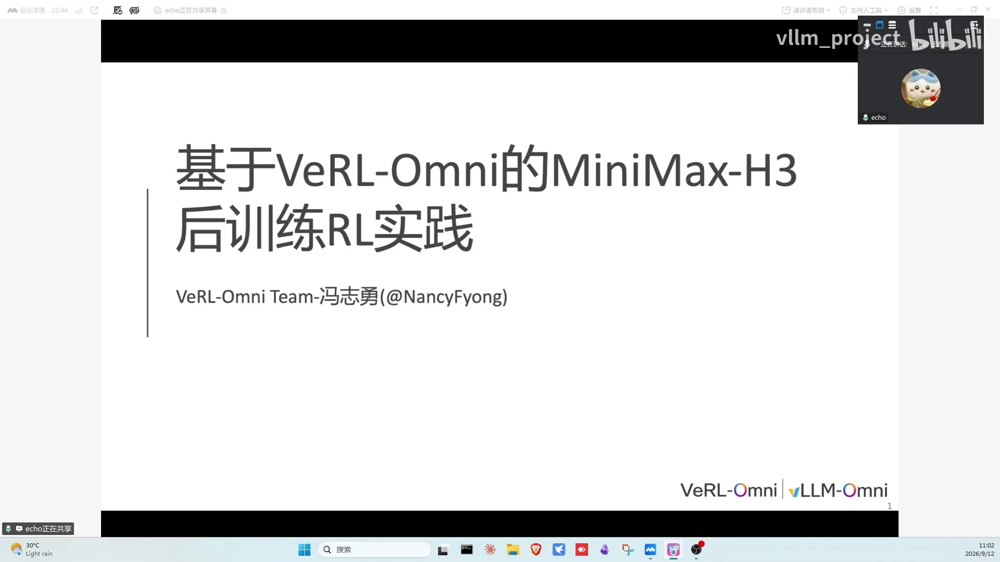
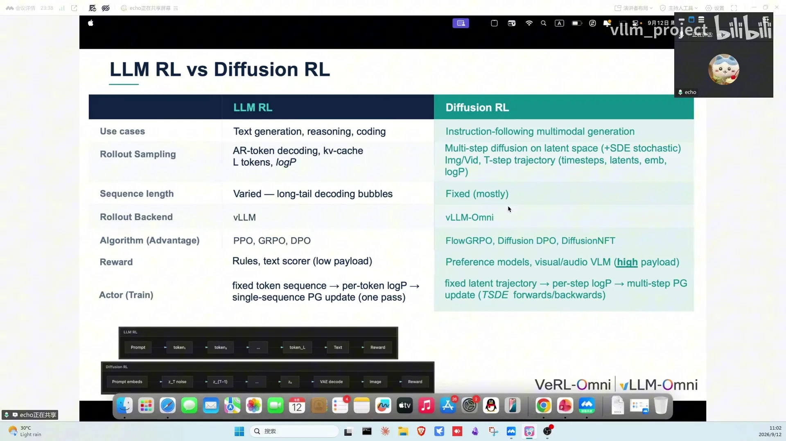
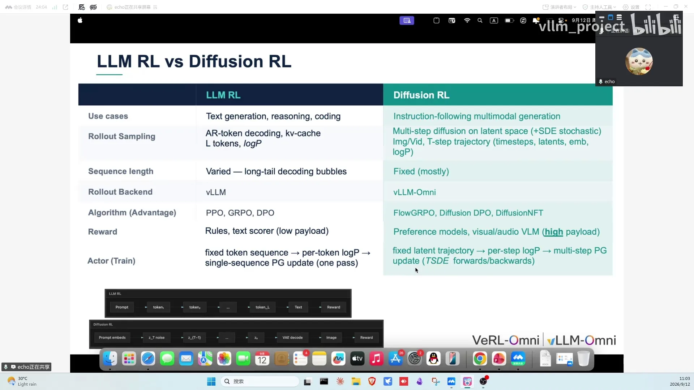
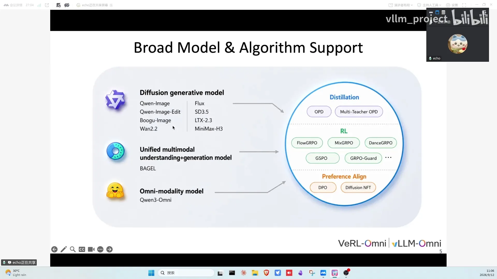
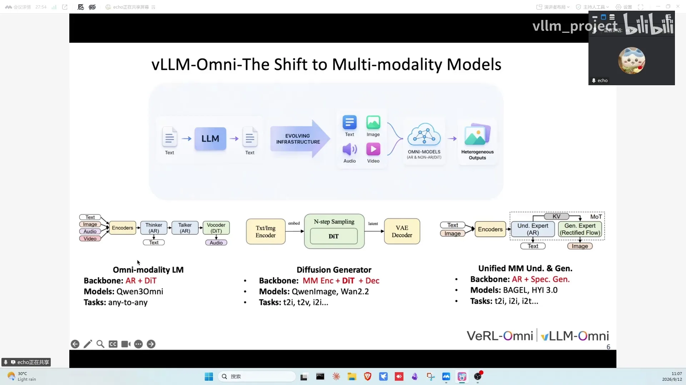
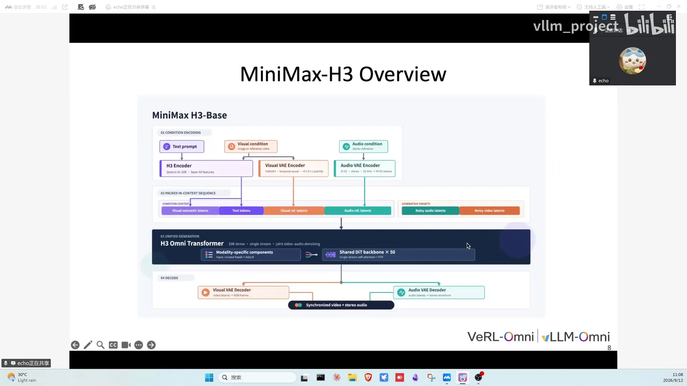
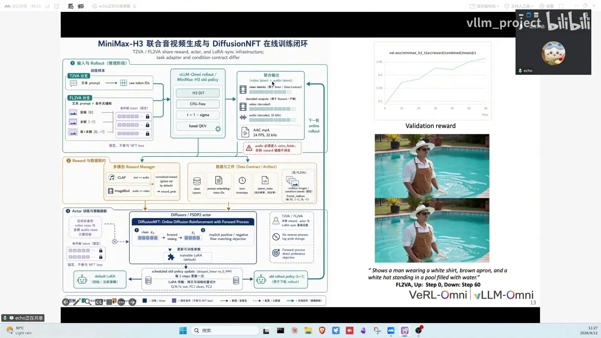
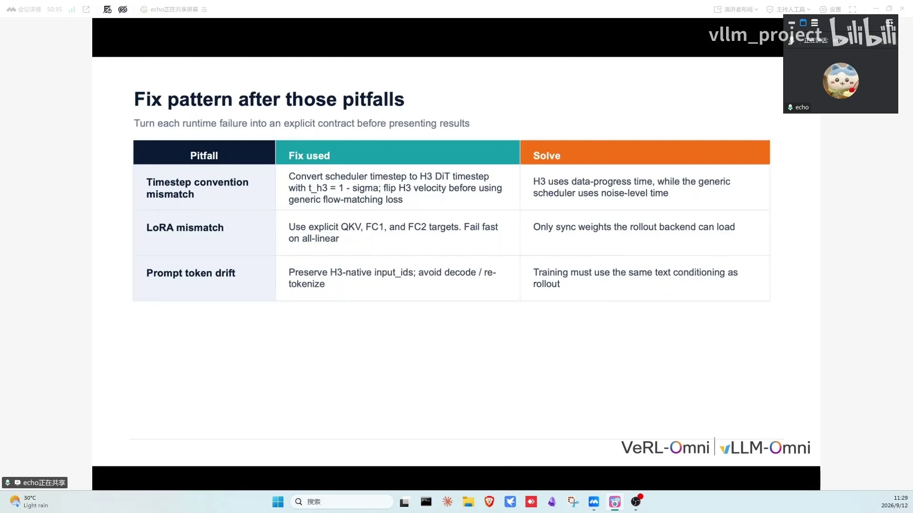
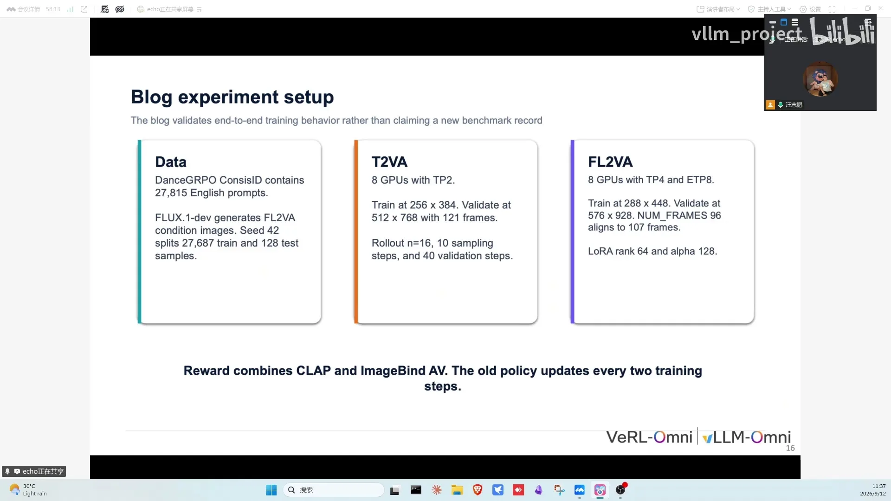
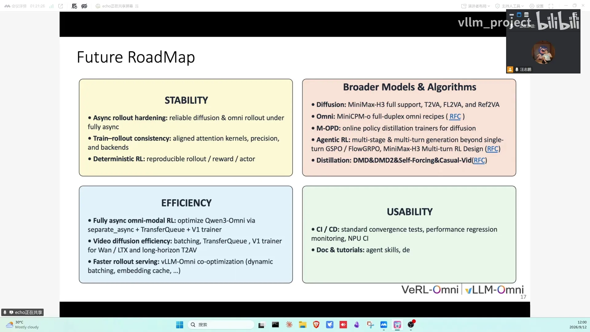

# 第18讲：基于 VeRL-Omni 的 MiniMax-H3 RL 后训练实践

> 视频来源：[vLLM 小课堂（十八）：基于 VeRL-Omni 的 MiniMax-H3 RL 后训练实践](https://www.bilibili.com/video/BV1skYQ63EPW/)（约 63 分钟）。嘉宾：冯志勇（哈工大研二，VeRL-Omni 社区贡献者，负责 diffusion / Omni 模型接入）。本文基于直播实录整理，时间戳可跳转到对应画面。

## 本讲要解决的核心问题（SCQA）

**背景**：扩散模型（图像/视频生成）与 Omni 模型的 RL 后训练正在成为社区热点，推理侧已经有 vLLM-Omni 这样的引擎能跑 diffusion 模型。

**冲突**：但训练侧一直缺少一个"接入快、用起来简单"的开源框架，把 RL 算法和这些推理引擎打通；而且每接入一个新模型（比如刚开源的 MiniMax H3）都要重新踩一遍集成坑。

**疑问**：如何基于 VeRL-Omni 搭一套扩散模型的 RL 训练框架？在 MiniMax H3 上实践时，哪些坑必须提前知道？

**回答（中心思想）**：VeRL-Omni 社区用四层架构（actor = Diffusers+FSDP2、rollout = vLLM-Omni、reward = VLM 打分、transport = RPC）接入了 FlowGRPO、MixGRPO、DiffusionDPO、DiffusionNFT 等算法，端到端比主流框架快约 5%；在 MiniMax H3 上完成了 RL 后训练，并把集成踩过的三个坑、实验配置与调参经验（group 要大、batch 要够、ETP 给文本编码器分片）全部沉淀下来。

---

## 一、扩散模型的 RL 不能照搬 LLM：四个关键差异（00:55）

先补一句 RL 后训练是什么：用当前策略** rollout**（实际采样生成）一批候选，交给 **reward 模型**打分，再根据分数算优势、回传更新策略，循环往复让模型往"高分分布"靠。

Diffusion RL 与 LLM RL 的关键差异（[【跳转到 00:55】](https://www.bilibili.com/video/BV1skYQ63EPW/?t=55)）：

| | LLM RL | Diffusion RL |
| --- | --- | --- |
| 生成对象 | 文本 token | 多模态（图像/视频/音频） |
| 优化空间 | 离散 token | 潜空间 + 扩散 timestep 上的连续优化 |
| rollout backend | vLLM | vLLM-Omni |
| 代表算法 | PPO / GRPO / DPO | FlowGRPO / DiffusionDPO / DiffusionNFT |

## 二、VeRL-Omni 四层架构：actor 留在 Diffusers，rollout 交给 vLLM-Omni（01:45）

框架主要分四个部分（[【跳转到 01:45】](https://www.bilibili.com/video/BV1skYQ63EPW/?t=105)）：

- **actor 引擎**：Diffusers + FSDP2（后续还会接入 Megatron 来加强吞吐）；
- **rollout 引擎**：vLLM-Omni，负责加速 rollout 速度；
- **reward**：对视觉/音频模态打分（VLM 等）；
- **transport**：基于 RPC 的数据传输层，目前已接入约 90%。

FlowGRPO 训练脚本有 V0/V1 两个版本：V0 直接用 IPC+ZMQ 传输数据；V1 全部转成了 transport，可以做成异步。目前训练还是**共卡**形式（训练和 rollout 同卡切换），权重同步用 CUDA IPC（跨进程共享 GPU 显存的机制）；分卡异步还没完全验证（[【跳转到 02:40】](https://www.bilibili.com/video/BV1skYQ63EPW/?t=160)）。

## 三、支持版图与提速收益：diffusion、视频、Omni 全覆盖，SD3.5 端到端快约 5%（03:05）

- **模型清单**（[【跳转到 04:20】](https://www.bilibili.com/video/BV1skYQ63EPW/?t=260)）：diffusion 模型（Qwen-Image、image editing、FLUX/SD3.5）；视频模型（MiniMax H3、Wan2.2、LTX）；理解+生成统一（BAGEL）；Omni 模型（已完全支持，后续接入 MiniCPM-o 4.5）。
- **算法清单**（[【跳转到 05:10】](https://www.bilibili.com/video/BV1skYQ63EPW/?t=310)）：GRPO、MixGRPO 变体、FlowGRPO、DiffusionDPO、DiffusionNFT 等。
- **vLLM-Omni 带来的加速**（[【跳转到 05:35】](https://www.bilibili.com/video/BV1skYQ63EPW/?t=335)）：支持 Omni 模态（AR+DiT backbone）与 diffusion 生成，continuous batching 等特性给 rollout 提速很多；SD3.5 上端到端比主流框架**快约 5%**（[【跳转到 06:00】](https://www.bilibili.com/video/BV1skYQ63EPW/?t=360)）。
- 其他特性：异步算 reward、step-wise continuous batching、rollout 上的正确性计算、kernel 算子集成 FA3、分布式用 FSDP2。

## 四、MiniMax-H3 架构：三模态条件 + 单流 self-attention + 双 VAE 解码（06:33）

H3 的输入条件分三路（[【跳转到 06:33】](https://www.bilibili.com/video/BV1skYQ63EPW/?t=393)）：

- **文本**：经 Qwen3-VL-32B 取第 50 层 feature；
- **视觉**：经 Qwen3-VL encoder + 视觉 VAE（如果有参考视频，同样过这两个模块）；
- **音频**：经 audio VAE，从 32Hz 转成 40Hz 的 tokens。

不同模态用不同的 token id 区分，在同一个 packed sequence 里做 self-attention，自回归生成 target；输出再分别经过两个 VAE decoder，得到音视频（[【跳转到 07:23】](https://www.bilibili.com/video/BV1skYQ63EPW/?t=443)）。

> 术语：**DiT**（Diffusion Transformer）是扩散模型的主干网络；**VAE** 是像素与潜空间互转的编解码器。

## 五、蒸馏与 RL 是近亲：业界主流是 RL 后接 DMD 四步蒸馏（07:56）

这部分的 Q&A 信息量很大：

- **FastH3 能 RL 吗**：还没进一步尝试，当前优先把原生推理速度拉上去（[【跳转到 07:56】](https://www.bilibili.com/video/BV1skYQ63EPW/?t=476)）。
- **蒸馏 ≈ RL**：turbo/LoRA 类蒸馏本质是把 50 步压到 4 步的分布拟合——相当于给模型"集成一个 reward"，再用学生模型去拟合教师分布（[【跳转到 09:33】](https://www.bilibili.com/video/BV1skYQ63EPW/?t=573)）。
- **业界主流路径**：RL 之后接一个 DMD（Distribution Matching Distillation，分布匹配蒸馏）做整流部署，比直接蒸馏更稳（[【跳转到 09:58】](https://www.bilibili.com/video/BV1skYQ63EPW/?t=598)）。
- **DMD 数据从哪来**：与专门做 DMD 蒸馏的团队交流，他们用不到 5 万条数据就蒸出了 4 步模型（[【跳转到 10:48】](https://www.bilibili.com/video/BV1skYQ63EPW/?t=648)）；社区此前有模型 V0 用约 6000 条开源数据完成蒸馏，数据多样性很重要。
- **RL 数据可复用**：RL 之后的分布已经是 RL 的效果了，RL 数据集可以很大程度复用到 DMD 上（[【跳转到 09:58】](https://www.bilibili.com/video/BV1skYQ63EPW/?t=598)）。
- **数据分布建议**：有技术报告提到做 DMD 的训练数据分布尽量别与基模预训练时的分布差太远；嘉宾用公开 text-to-image 数据集实测，4 步效果与 50 步对齐，定量指标 PixScore 分数相当（[【跳转到 16:13】](https://www.bilibili.com/video/BV1skYQ63EPW/?t=973)）。
- **数据开源的法律风险**：拿 H3 直接生成数据做后训练，因部分地区法规限制无法开源（[【跳转到 17:28】](https://www.bilibili.com/video/BV1skYQ63EPW/?t=1048)）。

## 六、为什么先接 DiffusionNFT：正样本拉近、负样本推远，比 FlowGRPO 更好接（18:40）

先回顾一遍 RL 流程（[【跳转到 17:53】](https://www.bilibili.com/video/BV1skYQ63EPW/?t=1073)）：prompt 进入 policy 生成模型 → 同一 group 产生多个候选 → reward 模型打分 → 算优势 → 算 loss → 回流更新策略模型。

当时第一个介入的算法是 **DiffusionNFT**（[【跳转到 18:40】](https://www.bilibili.com/video/BV1skYQ63EPW/?t=1120)），原因是它比 FlowGRPO 好接入：

- 它有 condition，在初始噪声上加噪后 rollout 出不同的图像样本即可；
- **不需要 ODE 转 SDE 的流程**（FlowGRPO 需要），直接对干净图像反向加噪、学习去噪过程（[【跳转到 19:05】](https://www.bilibili.com/video/BV1skYQ63EPW/?t=1145)）；
- reward 好的样本用 loss 往好分布拉，负样本推远，通过 loss 计算即可，接入成本低（[【跳转到 19:30】](https://www.bilibili.com/video/BV1skYQ63EPW/?t=1170)）。

MiniMax 相比 Wan、LTX **涨点特别快**，这也是选它做 RL 实践的主要动机（[【跳转到 19:55】](https://www.bilibili.com/video/BV1skYQ63EPW/?t=1195)）。

## 七、RL 里开 batching 有没有收益：先分清 compute bound 与 memory bound（20:12）

弹幕高频问题：step-wise continuous batching 在 RL 训练中真的用到了吗（[【跳转到 20:12】](https://www.bilibili.com/video/BV1skYQ63EPW/?t=1212)）？

- diffusers 端没有 batch 维度，当前接入相当于 **batch size 为 1**；为了快速接入，现阶段主要针对 batch=1（[【跳转到 20:17】](https://www.bilibili.com/video/BV1skYQ63EPW/?t=1217)）。
- 实测手头这些设备算出来都是 **compute bound**（算力先被打满）；设备越好，计算能力和显存带宽都变强，要找"计算强、访存带宽弱"的配置才容易变成 **memory bound**（[【跳转到 20:42】](https://www.bilibili.com/video/BV1skYQ63EPW/?t=1242)）。
- 图像模型上开 continuous batching / request-level batching 收益是明确的，**模型越小收益越大**（[【跳转到 22:47】](https://www.bilibili.com/video/BV1skYQ63EPW/?t=1367)）；有同学实测约 50% 收益（H200）（[【跳转到 22:22】](https://www.bilibili.com/video/BV1skYQ63EPW/?t=1342)）。
- 分辨率不同很难组 batch，可参考前几期专门讲 diffusion batching（切窗口组 batch）的内容（[【跳转到 24:27】](https://www.bilibili.com/video/BV1skYQ63EPW/?t=1467)）；Wan2.2 上开也有收益（[【跳转到 24:02】](https://www.bilibili.com/video/BV1skYQ63EPW/?t=1442)）。

## 八、H3 训练全流程与效果：old policy 每两步一更，60 步后明显变好（25:39）

训练流程（[【跳转到 25:39】](https://www.bilibili.com/video/BV1skYQ63EPW/?t=1539)）：

1. 文本 prompt 编码成 token id；首尾帧也做条件编码，这部分**不参与 loss**；
2. 通过 vLLM-Omni（MiniMax H3）rollout 出 video latent 和 audio latent；
3. 计算 reward；
4. 反向加噪、算 loss backward 联合输出；
5. 挂 **old policy**（更新前的参考策略），**每两步更新一次**，避免策略更新太快。

效果（[【跳转到 26:54】](https://www.bilibili.com/video/BV1skYQ63EPW/?t=1614)）：zero-shot 也能强加配乐（"你哪怕不让他加声音，他都会加声音"）；**60 步之后指令跟随明显变好**；训好的权重后续会开源。局限：RL 数据的 prompt 很短、表现力不强，长 prompt/详细描述的场景值得进一步验证（[【跳转到 27:54】](https://www.bilibili.com/video/BV1skYQ63EPW/?t=1674)）。

## 九、MiniMax 集成踩过的三个坑：timestep 反向、权重分布不一致、token id 偏移（28:16）

这是本讲最"值钱"的实战部分（[【跳转到 28:16】](https://www.bilibili.com/video/BV1skYQ63EPW/?t=1696)）：

1. **timestep 语义相反**：diffusers 是噪声 σ 从 1→0（从噪声到干净图像）；MiniMax DiT 的方向是反的。对接时公式和循环方向都要反过来写。
2. **权重分布不一致**（[【跳转到 29:06】](https://www.bilibili.com/video/BV1skYQ63EPW/?t=1746)）：diffusers 没把 QKV 打包，vLLM-Omni（MiniMax）为了速度把 QKV 打包；FC1 权重在 rollout 端被拆成两块且顺序相反。必须写一套权重同步逻辑，把 rollout 权重按 diffusers 的分布做映射调整，**否则 LoRA 权重根本没同步上去**。
3. **token id 偏移**（[【跳转到 30:21】](https://www.bilibili.com/video/BV1skYQ63EPW/?t=1821)）：rollout 端内部会再 tokenize 一遍（tokenizer → … → detokenize → tokenize），MiniMax 这种多模态 token id 特别多的模型很容易出现偏移。解决：**只编码一次**，保存 input id，rollout 时直接使用（[【跳转到 30:46】](https://www.bilibili.com/video/BV1skYQ63EPW/?t=1846)）。

## 十、实验设置与调参经验：group 16、batch≥16、一步 512 样本、ETP=4（30:54）

- **数据**：社区里主流的 RL 验证数据集，共 2.7 万条英文 prompt（train 27000 / test 128）（[【跳转到 30:54】](https://www.bilibili.com/video/BV1skYQ63EPW/?t=1854)）；像原步骤一样先用 FLUX.1 对 text-to-image 数据生成图片，做首尾帧固定（[【跳转到 31:19】](https://www.bilibili.com/video/BV1skYQ63EPW/?t=1879)）。
- **算力与分辨率**：H100/H200 验证；显存不够时开 TP=2；训练分辨率 256×384，验证 512×768。
- **★最重要的调参经验**（[【跳转到 31:44】](https://www.bilibili.com/video/BV1skYQ63EPW/?t=1904)）：rollout group 设 16，train batch size 尽可能 **≥16**；batch 太小的话二三十步 reward 就会下降、组内方差变得特别小、没有 RL 的必要；推荐一个 step 里放 256-512 个样本。
- **文本编码器要分片**：Qwen3-VL-32B 文本编码器很大，不开 ETP 时 rank 0 显存会超 100G；推荐 ETP=TP=4 或 8，权重分布均衡后可以在 H20/H100 80G 上跑（[【跳转到 32:34】](https://www.bilibili.com/video/BV1skYQ63EPW/?t=1954)）。
- **Q&A 数字**：共卡权重切换约十几二十秒（[【跳转到 33:24】](https://www.bilibili.com/video/BV1skYQ63EPW/?t=2004)）；端到端一个 step 约 500-600 秒；全局 batch 32、group 16 → 一个 step 约 512 个样本（[【跳转到 33:49】](https://www.bilibili.com/video/BV1skYQ63EPW/?t=2029)）。
- **光斑问题**：训练后期（约 70/80 步）模型会变暗、出现光斑，60 步之前都很好；如果 step 0 就出现光斑，说明训练脚本本身出了问题，可以提 issue（[【跳转到 34:14】](https://www.bilibili.com/video/BV1skYQ63EPW/?t=2054)）。
- **ETP 是什么**：encoder 的 tensor parallel——把 Qwen3-VL 整个 text encoder（60 多 G）分片；不上 H200/B 系列的话大概率爆显存；H3 在推理部署时一般也会默认给 encoder 开 TP（[【跳转到 35:54】](https://www.bilibili.com/video/BV1skYQ63EPW/?t=2154)）。

## 十一、Roadmap、硬件门槛与社区生态：4×A100 80G 就能参与（36:19）

- **Roadmap**（[【跳转到 36:19】](https://www.bilibili.com/video/BV1skYQ63EPW/?t=2179)）：稳定性上要做异步 rollout、训推一致性、确定性 RL 推理；模型上 diffusion 的 P0 是把 MiniMax H3 整体速度再提升打满，Omni 侧接入 MiniCPM-o（会贴 RFC）；算法侧继续集成 DMD/DMD2、self-forcing、CausVid 等蒸馏算法。
- **agentic 方向**：主持人补充，用 H3 做视频创作要反复抽卡、拼接违和感强；Seedance 靠 agentic 分镜系统（自动生成分镜剧本、直接产出长剧）+ 步数蒸馏压成本，社区想跟进这两块（[【跳转到 38:42】](https://www.bilibili.com/video/BV1skYQ63EPW/?t=2322)）。
- **H3 生态**（[【跳转到 39:57】](https://www.bilibili.com/video/BV1skYQ63EPW/?t=2397)）：HuggingFace 原版下载 500 多万、ComfyUI 版约 1800 万；云厂商开始部署；大量 LoRA 微调、RL 后训练、蒸馏工作在进行。用 H3 对 Seedance 2.5 成片做分镜复现，能达到约 **95% 水平**（对比对象的视频约 1 秒 3 块钱）（[【跳转到 41:12】](https://www.bilibili.com/video/BV1skYQ63EPW/?t=2472)）。
- **贡献门槛**（[【跳转到 43:17】](https://www.bilibili.com/video/BV1skYQ63EPW/?t=2597)）：4×A100 80G 完全够（跑得慢没关系，跑对就行）；显存优化支持 offload、CPU offload、rollout 端 layer-wise offload（开启后 ETP=TP=8 每卡峰值约 40 多 G）；**LoRA 效果与全参对齐、耗时短很多，全参反而容易训爆**；华为 910B 也可以（8 张、每卡约 60G，FlowGRPO 的 910B 集成就是华为同学贡献的）（[【跳转到 46:12】](https://www.bilibili.com/video/BV1skYQ63EPW/?t=2772)）。
- **H3 还有优化空间**：目前优化都在 t2v 上，首尾帧（first-last-frame）路线没好好做；ComfyUI 集成刚有 RFC，还可以集成 MiniMax music、TTS 做旁白；有社区同学给 TRT 做了 H3 优化，5 秒视频 1.6 秒生成（多数为有损优化，出于成本效率可以考虑）（[【跳转到 48:17】](https://www.bilibili.com/video/BV1skYQ63EPW/?t=2897)）。
- **全异步进展**：rollout 与 trainer 之间还没真正异步，正在 V1 上支持（全异步需要推理和训练分卡/分机）（[【跳转到 49:57】](https://www.bilibili.com/video/BV1skYQ63EPW/?t=2997)）；Qwen3-Omni thinker 的分卡异步已验证 reward 与性能正常，diffusion 侧（Qwen-Image）此前没有收益；显卡共享、共同作者模式在讨论中，每周三有 VeRL-Omni 组会（[【跳转到 52:02】](https://www.bilibili.com/video/BV1skYQ63EPW/?t=3122)）。

## 十二、多模态 scaling law：33B dense 达到 Seedance 95%，数据质量比模型大小重要（58:42）

- **视频生成同样适用 scaling law**（[【跳转到 59:07】](https://www.bilibili.com/video/BV1skYQ63EPW/?t=3547)）：Seedance 传闻是 200 多 B 的 MoE，而 MiniMax H3 只有 33B 的 dense 模型就达到了其约 95% 的效果——说明模型大小在 scaling law 里占比很小，**数据质量和训练手法更关键**。
- 一个好理解框架：每次推理**激活的参数 ≈ 智力**，**总参数规模 ≈ 知识**；参数规模越大，对真实世界的模拟越好。H3 参数量已超过此前很多开源模型，所以有人把它转向世界模型方向（[【跳转到 60:22】](https://www.bilibili.com/video/BV1skYQ63EPW/?t=3622)）。
- **单流设计优劣**（[【跳转到 61:12】](https://www.bilibili.com/video/BV1skYQ63EPW/?t=3672)）：优势是在一个 packed sequence 里做 self-attention，更容易融合各模态信息；技术报告未开源，细节要等公布。单流很大程度是因为 infra 简单；现在模型架构设计都奔着省钱去——参数量不大没必要上 MoE，**MoE 只有规模很大、需要省 infra 成本时才值得**（[【跳转到 62:02】](https://www.bilibili.com/video/BV1skYQ63EPW/?t=3722)）。

## 小结

- VeRL-Omni 四层架构：actor（Diffusers+FSDP2）+ rollout（vLLM-Omni）+ reward（VLM 打分）+ transport（RPC 已接入 90%）；FlowGRPO V0=IPC/ZMQ、V1=transport 异步。
- 已接入 FlowGRPO/MixGRPO/DiffusionDPO/DiffusionNFT；SD3.5 端到端快约 5%；batching 有没有收益取决于 compute bound 还是 memory bound。
- MiniMax H3：三模态条件 + 单流 self-attention + 双 VAE 解码；RL 后 60 步指令跟随明显变好；old policy 每两步一更。
- 集成三坑：timestep 方向相反、权重分布（QKV 打包/FC1 拆分）需要同步逻辑、token id 只编码一次。
- 调参经验：rollout group 16、train batch ≥16、一步 256-512 样本、ETP=TP=4/8（否则 rank0 超 100G）、共卡切换约 20 秒、一步约 500-600 秒。
- 参与门槛：4×A100 80G 即可贡献，LoRA≈全参且更稳，910B 可用；H3 可复现 Seedance 约 95%，数据质量 > 模型大小。
- 下一步：全异步 rollout、训推一致性、DMD 蒸馏集成、agentic RL。

## 关键术语速查

| 术语 | 一句话解释 |
| --- | --- |
| veRL-Omni | 基于 veRL + vLLM-Omni 的多模态生成 RL 训练框架（本讲主角） |
| RL 后训练 | rollout 生成候选 → reward 打分 → 算优势 → 更新策略的循环 |
| rollout | 用当前策略实际采样生成的过程（这里指生成图像/视频） |
| FlowGRPO | 扩散版 GRPO：在 ODE→SDE 流程上计算 advantage |
| DiffusionNFT | 无需 ODE→SDE 的扩散 RL：正样本拉近、负样本推远 |
| DMD | Distribution Matching Distillation：把多步教师蒸馏成少步学生 |
| FSDP2 | 全分片数据并行（ZeRO-3 风格），actor 的训练后端 |
| vLLM-Omni | 支持 AR+DiT 的多模态推理引擎，承担 diffusion rollout |
| CUDA IPC | 跨进程共享 GPU 显存，共卡模式的权重同步方式 |
| transport | VeRL-Omni 的数据传输层（RPC），替代 V0 的 IPC+ZMQ |
| continuous batching | 请求级/步级组 batch，减少 GPU 空泡 |
| compute/memory bound | 瓶颈在算力还是显存带宽；决定开 batching 是否有收益 |
| rollout group | 一个 prompt 采样的候选数量（本讲设 16） |
| ETP | encoder tensor parallel：给巨大的文本编码器做张量并行分片 |
| old policy | 更新前的参考策略，本讲每两步同步一次 |
| LoRA | 低秩适配微调，显存需求远小于全参且效果对齐 |
| DiT | Diffusion Transformer，扩散模型的主干网络 |
| VAE | 像素与潜空间互转的编解码器 |
| MoE / dense | 混合专家 / 稠密模型；参数量不大时没必要上 MoE |
| scaling law | 规模规律：视频生成里数据质量与训练手法比模型大小更关键 |
