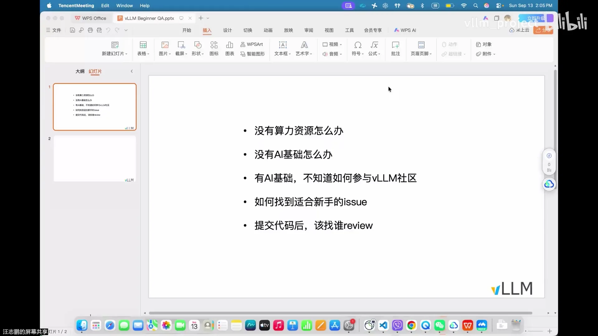
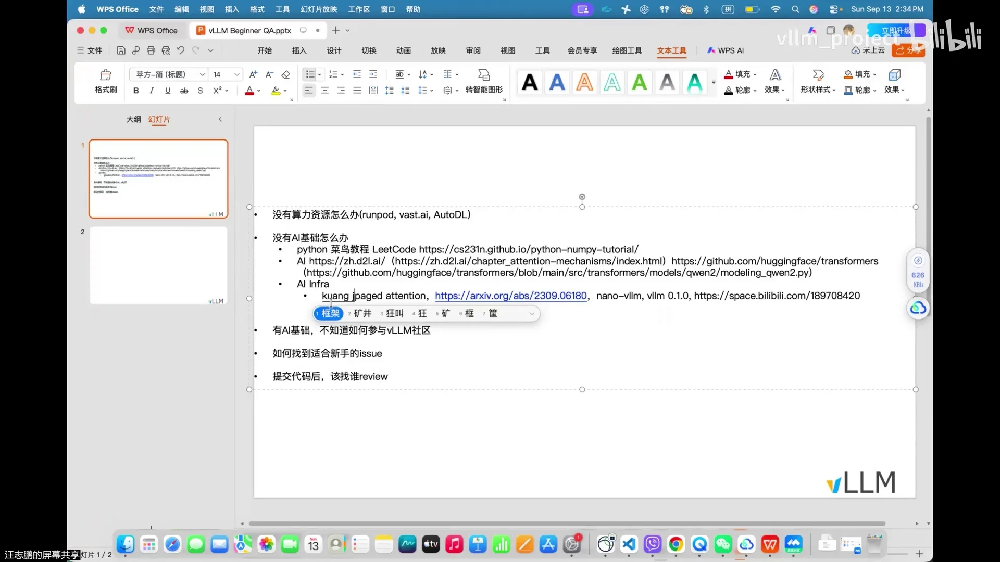
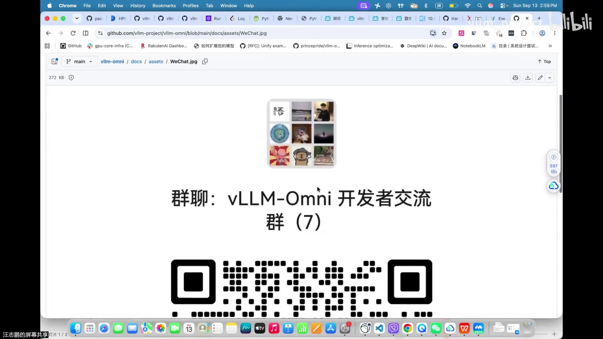

# 第19讲：AI Infra 新手答疑：vLLM 从入门到精通

> 视频来源：[vLLM 小课堂（十九）：AI Infra 新手答疑 - vLLM 从入门到精通](https://www.bilibili.com/video/BV1nEYv6XE15/)（约 65 分钟）。本期没有固定讲稿，是 vLLM 中文社区的几位开发者（志鹏、顺阳等）针对新手后台私信里最高频的五个问题做的一场直播答疑，最后还有自由问答。本文基于直播实录整理，时间戳可跳转到对应画面。

## 本讲要解决的核心问题（SCQA）

**背景**：想进入 AI Infra（AI 基础设施：支撑大模型训练与推理的系统工程）、参与 vLLM 或 vLLM-Omni 开源社区的同学越来越多，后台私信里的问题高度重复。

**冲突**：新手的拦路虎集中在五件事上——没有算力、没有 AI 基础、不知道怎么入门 Infra、不知道怎么参与社区、找不到适合新手的 issue。而且现在 AI 自动"抢"issue、自动提 PR 已经成常态，过去那套"抢 good first issue"的新手路径基本失效。

**疑问**：这五个问题在今天到底该怎么解？新手还有没有一条靠谱的参与路径？

**回答（中心思想）**：有。核心路线是——用算力租赁平台低成本跑通 vLLM，按"编程基础 → PyTorch/Transformer 基础 → 读 HuggingFace 与 Qwen2 代码"补齐 AI 基础，再走"先在例会和 issue 区混脸熟、让 maintainer 主动把任务分给你"的路径进入社区；算子方向则从 C++/CUDA 基础和 FlashAttention、FlashInfer 两个项目入手。**在人机抢贡献的时代，"让真人认识你"比"抢 issue"重要得多。**

---

## 一、问题一：没有算力，怎么把 vLLM 跑起来？（00:05）

**结论先说：用算力租赁平台，按需租卡、用完就停。** 买 4090 或 H100 对个人来说太重了，几位主讲人自己平时开发也是租卡（[【跳转到 00:30】](https://www.bilibili.com/video/BV1nEYv6XE15/?t=30)）。

### 1.1 平台选择

- **RunPod**：主讲人最常用，国内可以直接访问（[【跳转到 11:15】](https://www.bilibili.com/video/BV1nEYv6XE15/?t=675)）；
- **Vast.ai**：社区同学推荐过；
- **AutoDL**：国内平台，有同学在上面租到过昇腾（Ascend）卡。

如果觉得 RunPod 价格偏高，可以对比另外两家。

### 1.2 RunPod 实操四步（志鹏演示）

1. **按显存选卡**：先估一下你的模型需要多少显存，租一张"差不多够用"的卡即可，不要为用不上的算力付费；要测并行特性可以同时租两张（[【跳转到 01:15】](https://www.bilibili.com/video/BV1nEYv6XE15/?t=75)）。

2. **改镜像**：这是最关键的一步。
   - 做 **vLLM-Omni** 开发：直接用官方 `latest` 镜像（[【跳转到 02:00】](https://www.bilibili.com/video/BV1nEYv6XE15/?t=120)）；
   - 做 **vLLM 本身**的开发：选 PyTorch 官方镜像里 **2.9.0 + CUDA 13.0（cu130）** 的 tag——vLLM 可以直接装在这个组合之上，主讲人认为这是当前最好的搭配（[【跳转到 02:23】](https://www.bilibili.com/video/BV1nEYv6XE15/?t=143)），然后在镜像里用 **editable 模式**（`pip install -e`，代码改动即时生效的安装方式）装 vLLM（[【跳转到 02:09】](https://www.bilibili.com/video/BV1nEYv6XE15/?t=129)）。
   - 有人问能不能直接用 vLLM-Omni 每天发布的 nightly 镜像一步到位：**做 Omni 开发可以跟进较新的大版本；做 vLLM 开发则装标准版 PyTorch 即可**（PyTorch 和 CUDA 版本一定要对应）。另外**生产部署不要追 nightly**，用正式版才稳定（[【跳转到 08:46】](https://www.bilibili.com/video/BV1nEYv6XE15/?t=526)）。
3. **改磁盘大小**：磁盘分"持久挂载 PVC"和"随实例重建而刷新"两种，但不管哪种都要调大——模型权重要下载到本地磁盘（[【跳转到 03:46】](https://www.bilibili.com/video/BV1nEYv6XE15/?t=226)）。
4. **SSH 连 VSCode**：用实例提供的 SSH 连接方式把远端机器接到本地 VSCode，之后就可以像本地开发一样写代码、访问 GPU（[【跳转到 05:26】](https://www.bilibili.com/video/BV1nEYv6XE15/?t=326)）。

### 1.3 省钱两原则

- **按任务选卡**：TTS 这类 1B~2B 的小语音模型，4090/5090 就够，每小时约 0.3~0.4 美元；视频模型（如混元 Video、MiniMax H3）显存要求高，要上 H 卡甚至 Blackwell（B 卡，如 RTX Pro 6000）（[【跳转到 07:06】](https://www.bilibili.com/video/BV1nEYv6XE15/?t=426)）。
- **先 stop，再 terminate**：主讲人只跑了一小会儿就花了零点几美元——闲置挂机照样计费。不用时先 stop；确认不再用了还要记得 terminate，把服务彻底停掉（[【跳转到 10:51】](https://www.bilibili.com/video/BV1nEYv6XE15/?t=651)）。

> 顺带回答了一个环境问题：做外部（plugin/外围）开发不需要专门装 Linux 系统，也不需要自己买 4090，租卡 + 镜像就够了（[【跳转到 12:20】](https://www.bilibili.com/video/BV1nEYv6XE15/?t=740)）。

## 二、问题二：没有 AI 基础怎么办？（15:53）

**结论先说：按自己缺什么补什么，别贪多。** 主讲人把"没有 AI 基础"拆成三类人，每类给一条路径（[【跳转到 15:53】](https://www.bilibili.com/video/BV1nEYv6XE15/?t=953)）：

| 你的现状 | 补什么 | 推荐资源 |
| --- | --- | --- |
| 没有编程基础 | Python 语法 | AI 辅助入门 + 力扣 10~20 道 + 菜鸟教程 + SF 的 Python/NumPy 速通课 |
| 有编程基础，不懂 Transformer | PyTorch + 深度学习基础 | 李沐《动手学深度学习》（重点看 PyTorch 语法与注意力机制章节） |
| 懂 Transformer，想懂大模型实现 | 读代码 | HuggingFace `transformers` + Qwen2 主干 + `GenerationMixin` |

### 2.1 第一类：没有编程基础

- 先让 **AI 帮你补编程基础**，目标是能看懂基础 Python 代码；
- 到 **力扣**刷 10~20 道题，掌握循环、条件判断这类基本结构即可（[【跳转到 16:43】](https://www.bilibili.com/video/BV1nEYv6XE15/?t=1003)）；
- **菜鸟教程**补最基础的语法；SF（一个社区）还有 Python 和 NumPy 的速通课——NumPy 的语法跟 PyTorch 很像，可以放在 Python 之后学（[【跳转到 18:24】](https://www.bilibili.com/video/BV1nEYv6XE15/?t=1104)）。

### 2.2 第二类：没有 Transformer / 深度学习基础

- **李沐《动手学深度学习》**（在 B 站搜"李沐"就能找到，有纯中文版）：这是比较早期的课，不用全看，**重点看 PyTorch 语法章节和注意力机制（attention）章节**。现在的所有模型都建立在注意力机制上，其中 **QKV（Query/Key/Value）** 的基本原理必须搞懂（[【跳转到 19:21】](https://www.bilibili.com/video/BV1nEYv6XE15/?t=1161)、[【跳转到 21:38】](https://www.bilibili.com/video/BV1nEYv6XE15/?t=1298)）；

- 课里传统的神经网络（如 VAE 用到的那类）个别地方有用，但现代 LLM 的主干本质就是 Transformer，老内容不必纠结（[【跳转到 21:03】](https://www.bilibili.com/video/BV1nEYv6XE15/?t=1263)）；
- 直播间还提到了 CMU 的相关课程（志颖在 CMU），大家也可以看（[【跳转到 20:26】](https://www.bilibili.com/video/BV1nEYv6XE15/?t=1226)）。

### 2.3 第三类：想真正搞懂大模型是怎么实现的

**最简单直接的办法：把 HuggingFace `transformers` 这套代码搞清楚**——它有各种主流模型最简单的实现，特别适合新手（[【跳转到 22:01】](https://www.bilibili.com/video/BV1nEYv6XE15/?t=1321)）：

- 它框架非常简单，KV cache（模型推理时缓存的注意力中间结果）都是各模型自己私有的；不像 vLLM，要翻很复杂的代码才能找到它是怎么管理 paged KV cache 的（[【跳转到 22:37】](https://www.bilibili.com/video/BV1nEYv6XE15/?t=1357)）；
- 做研究也离不开它：模型后训练、微调（配合 PEFT 那套体系）都有非常简单的实现，不需要深厚的工程基础。

**具体入口：读 Qwen2。** Qwen2 是最基础款的 dense model（稠密模型），里面有现在常用的 RoPE（旋转位置编码）和 attention 的最基本实现，很多后来的模型都基于它改（[【跳转到 22:58】](https://www.bilibili.com/video/BV1nEYv6XE15/?t=1378)）。读法是：

1. 先看模型主干文件（`modeling_qwen2.py`）；
2. 再往上看调用它的上层抽象——那个类负责调用模型跑服务，包括预处理和 KV cache 相关交互；KV cache 的逻辑可能写在模型里，也可能放到 `GenerationMixin` 这个类里，把这个文件研究清楚，LLM 入门就算搞定了（[【跳转到 24:13】](https://www.bilibili.com/video/BV1nEYv6XE15/?t=1453)）；
3. 之后再看 sparse model、linear model 之类的新型注意力架构，可以在 vLLM 里找，也可以回 HuggingFace 看实现——但那是后话，先把常规模型学扎实（[【跳转到 24:38】](https://www.bilibili.com/video/BV1nEYv6XE15/?t=1478)）。

## 三、问题三：有 AI 基础，怎么入门 AI Infra？（25:16）

**结论先说：AI Infra 核心就两块——算子和推理/训练框架。** 有 AI 基础之后再入手 Infra 会容易很多（[【跳转到 25:16】](https://www.bilibili.com/video/BV1nEYv6XE15/?t=1516)）。

### 3.1 框架侧：从 PagedAttention 和早期源码读起

- **读 vLLM 的开山论文（PagedAttention）**：直接读会比较痛苦（[【跳转到 25:50】](https://www.bilibili.com/video/BV1nEYv6XE15/?t=1550)）；
- **更推荐读 vLLM 0.1 版本的源码**：当时 Woosuk 和 Zhuohan 实现的基础版 vLLM 还能看到算子的原始实现（现在的代码已经把算子这块移走、全面接 PagedAttention 了，想找直观感受反而难）（[【跳转到 26:04】](https://www.bilibili.com/video/BV1nEYv6XE15/?t=1564)）；
- **还可以看 nano-vllm 项目**：一个最基本的极简实现（[【跳转到 26:29】](https://www.bilibili.com/video/BV1nEYv6XE15/?t=1589)）；

- 广度上还需要了解**投机解码**（用小模型先猜、大模型验证来加速生成）和各种**并行策略**（[【跳转到 27:03】](https://www.bilibili.com/video/BV1nEYv6XE15/?t=1623)）。

### 3.2 算子侧（顺阳分享）：C++/CUDA 起步，以 FlashAttention 为纲

- 做算子跟写 vLLM/vLLM-Omni 不一样，**首先得会一点 C++**，做 CUDA 开发也是如此（[【跳转到 28:03】](https://www.bilibili.com/video/BV1nEYv6XE15/?t=1683)）；
- 现在 AI 写代码很厉害，可以**用 agent 辅助读 CUDA 代码和文档**（[【跳转到 28:23】](https://www.bilibili.com/video/BV1nEYv6XE15/?t=1703)）；
- vLLM / vLLM-Omni 的算子目前主要基于 **FlashInfer** 这个后端，新型 attention 算子也都放在这里——对算子感兴趣可以看 FlashInfer 仓库（[【跳转到 28:48】](https://www.bilibili.com/video/BV1nEYv6XE15/?t=1728)）；
- **FlashAttention 必看**：它把整个 attention 做分块处理、边传边算，减少数据搬运的开销。现在已出到第四版，可以从 Tri Dao 2021 年的第一版思想看起（[【跳转到 29:38】](https://www.bilibili.com/video/BV1nEYv6XE15/?t=1778)）。连词表预测（lm head）这种算子的分块思路都跟它很像（[【跳转到 30:03】](https://www.bilibili.com/video/BV1nEYv6XE15/?t=1803)）；
- **面试最常考的两篇：FlashAttention 和 PagedAttention**——系统领域最顶级的两篇学术成果（[【跳转到 30:28】](https://www.bilibili.com/video/BV1nEYv6XE15/?t=1828)）。

## 四、问题四：怎么参与 vLLM 社区？（31:43）

**结论先说：先跟大家打成一片，再谈贡献。** 背景是现在的"AI vibe coding"（让 AI 全自动写代码提交）太猛：有人代码全自动提交、完全不对代码负责，reviewer 压力极大——有同学凌晨两点连着 review 十个 AI 生成的 PR，看完都睡不着觉（[【跳转到 31:43】](https://www.bilibili.com/video/BV1nEYv6XE15/?t=1903)）。

**推荐的参与路径**（按顺序）：

1. **积极参加周会/例会**：各模块周会会讲这个模块最近在做什么方向、有什么开发点。在周会上多跟核心开发者交流，让大家觉得你认真负责、真心想贡献，maintainer 自然会知道有什么事可以交给你（[【跳转到 32:21】](https://www.bilibili.com/video/BV1nEYv6XE15/?t=1941)）。
2. **盯住 vllm.ai/events**：所有活动（各模块例会 + 每周直播）都在这个网站上，能看到上周直播内容和下周预告（[【跳转到 33:11】](https://www.bilibili.com/video/BV1nEYv6XE15/?t=1991)）。
3. **会挑会议时间**：有的例会在凌晨 02:30，学生党如果有精力可以起来听；也有贴近北京时间的——**每周三 11:30 的 vLLM-Omni 例会**，会讲五六个议题或 PR，想提 RFC/大改动/有意思的 feature，可以找会议主持人（洪生、高寒）要文档编辑权限，把 issue 和 PR 贴上去（[【跳转到 34:26】](https://www.bilibili.com/video/BV1nEYv6XE15/?t=2066)）。对硬件厂商感兴趣的同学还可以看 AMD 的例会（几个硬件厂商的人互相流动，进 AMD/华为/英伟达都容易）；英伟达也有一个晚上十点的会（[【跳转到 35:41】](https://www.bilibili.com/video/BV1nEYv6XE15/?t=2141)）。主讲人还吐槽：多模态的双周会没列上 events 页面，这个页面要好好维护，不然都没人知道还有这个会（[【跳转到 36:06】](https://www.bilibili.com/video/BV1nEYv6XE15/?t=2166)）。
4. **在 issue 和 PR 下面提问、刷脸熟**：新人非常建议先看社区里还没完成的 roadmap、issue 和 PR，看不懂就在底下问问题——这是社区非常欢迎的参与方式。大家都认识你之后，领 issue、修 bug、做特性都会顺畅很多，reviewer 会很乐意帮你看代码、推进你的开发进度（[【跳转到 37:21】](https://www.bilibili.com/video/BV1nEYv6XE15/?t=2241)）。
5. **别急着提第一个 PR**：先了解社区——参加例会、看文档、看 issue/RFC/PR 的讨论。现在社区每天有接近五六十个 PR，多参与讨论、做个有"活人感"的参与者（[【跳转到 38:11】](https://www.bilibili.com/video/BV1nEYv6XE15/?t=2291)）。

## 五、问题五：如何找到适合新手的 issue？（39:26）

**结论先说：good first issue 基本抢不到了，靠关系网络分任务更现实。**

- 过去的标准答案是在仓库里找 **good first issue**（专为新手标记的入门任务），但现在只要一挂出来就被抢光——点开一看，有的 issue 旁边已经挂了 18 个链接，非常恐怖（[【跳转到 40:41】](https://www.bilibili.com/video/BV1nEYv6XE15/?t=2441)）；
- 更糟的是 AI 甚至不看它是不是 good first issue，看到新 issue 就自动去抢（[【跳转到 41:06】](https://www.bilibili.com/video/BV1nEYv6XE15/?t=2466)）；
- 社区大概率不会合这种纯 AI 提交的代码，但正儿八经想做贡献的人也抢不到活了。所以**第四节讲的"先跟仓库的人搞好关系"路径反而成了最有效的首次贡献方式**：大家认识你之后，会把好做的任务主动分给你（[【跳转到 41:31】](https://www.bilibili.com/video/BV1nEYv6XE15/?t=2491)）。

### 5.1 志鹏补充：两类贡献 + 三条实战技巧

issue 大致分两类：**RFC**（提新 feature）和 **bug**（特定环境下测出的问题）。bug fix 相对更适合新手（[【跳转到 44:22】](https://www.bilibili.com/video/BV1nEYv6XE15/?t=2662)）。

1. **常规 bug fix 的正确姿势**：先按 issue 里的环境**复现**问题，在 issue 下留言说明你打算怎么修，请 maintainer **assign 给你**，再开始开发、提 PR。态度要谦虚，别上来就要求 assign 或者直接甩 PR——这类 P2 级别的 issue 是 AI coding 的"甜品区"，抢的人极多（[【跳转到 44:47】](https://www.bilibili.com/video/BV1nEYv6XE15/?t=2687)）。
2. **自己踩到 bug 是最好的机会**：技巧是三步走——**第一步先自己 fix；第二步再提 issue；第三步把 fix 的 PR 和 issue 关联（link）起来**。这样保证没人跟你抢（[【跳转到 46:27】](https://www.bilibili.com/video/BV1nEYv6XE15/?t=2787)）。
3. **被 assign 之后防 agent 抢跑**：先 request maintainer 确认任务归你，然后**立刻开一个 draft PR 并 link 到这个 issue——哪怕是空的、只加了一个空格都行**，先占坑，之后再慢慢开发，最后 convert 成正式的 ready for review（[【跳转到 48:07】](https://www.bilibili.com/video/BV1nEYv6XE15/?t=2887)）。

## 六、代码写完找谁 review？（48:57）

**结论先说：三个途径，按优先级是 CODEOWNERS → Slack → 微信群。**

1. **CODEOWNERS 文件**：vLLM 主仓库 `.github` 目录下有 CODEOWNERS，标注了每个模块由谁负责、代码提交后谁来说了算。比如投机解码（含 MTP，多 token 预测）模块会 link 到同一位负责人——你做哪个方向，就去找对应的同学（[【跳转到 48:57】](https://www.bilibili.com/video/BV1nEYv6XE15/?t=2937)、[【跳转到 49:47】](https://www.bilibili.com/video/BV1nEYv6XE15/?t=2987)）。vLLM-Omni 也有类似的文件（在 doc 目录），同样能找到各模块负责人（[【跳转到 51:02】](https://www.bilibili.com/video/BV1nEYv6XE15/?t=3062)）。
2. **PR 里直接 @**：官方推荐的路径，但要注意现在 AI @ maintainer 的频率太高，你的 @ 很可能被淹没。更可靠的是去 **Slack** 上找对应的人（maintainer 都有 Slack 账号），请他来 review（[【跳转到 51:52】](https://www.bilibili.com/video/BV1nEYv6XE15/?t=3112)）。
3. **中文渠道**：如果确定对方是中国人、在微信群里，可以直接把 PR 贴到微信 study group 里，会有人帮忙看。vLLM-Omni 在主仓页面上还有微信群的二维码（本期直播里的"开发者交流群七"），进群后可以直接 @ 提问——study group 并不是所有 contributor 都在（[【跳转到 53:07】](https://www.bilibili.com/video/BV1nEYv6XE15/?t=3187)）。每周三 vLLM-Omni 周会的链接也会在群里发（不进群公告，周三当天发）（[【跳转到 54:13】](https://www.bilibili.com/video/BV1nEYv6XE15/?t=3253)）。

## 七、自由问答：职业发展与学习路径（53:07）

### 7.1 为什么"和真人互动"这么重要？

想参加 vLLM 社区，**一定要多参加真人互动的机会**——这是现在你唯一能在"纯 agent 提代码"的浪潮里破局的方式。找工作时，认识正在招人的团队、知道组里在招什么人，会让求职容易得多；而认识这些人的唯一办法就是频繁参加互动活动。**埋头写代码、纯靠钻研技术就能找到好工作的时代已经过去了**（[【跳转到 54:43】](https://www.bilibili.com/video/BV1nEYv6XE15/?t=3283)）。

社区同学补充：阿里、腾讯等大厂内部也在用 vLLM 和 vLLM-Omni，深度参与过社区的同学进去就能无缝衔接（onboard），面试通过会容易很多；给社区提代码还有机会参与和工业界合作的例会（[【跳转到 55:33】](https://www.bilibili.com/video/BV1nEYv6XE15/?t=3333)）。

### 7.2 框架和算子要一起学吗？

**不需要。** 可以精通框架、了解算子，也可以精通算子、了解框架。新人建议先 focus 框架这一侧。企业里本来就分框架组和算子组：框架组主要优化特定生产环境上的模型，向算子组提需求（[【跳转到 56:48】](https://www.bilibili.com/video/BV1nEYv6XE15/?t=3408)）。

### 7.3 算法论文要不要读？

- 当作**了解**即可——这块论文太多了，大多数人手头的活都忙不过来，没精力追工作以外的内容（[【跳转到 58:26】](https://www.bilibili.com/video/BV1nEYv6XE15/?t=3506)）；
- 值得读的是少数头部团队的：**DeepSeek V3、R1、V4 和 Kimi K3** 很有读的价值；其他模型的技术报告没必要精读（[【跳转到 62:59】](https://www.bilibili.com/video/BV1nEYv6XE15/?t=3779)）；
- **系统方向的论文看社区信号**：有价值的论文社区里一定会有人推荐；哪怕没人推荐，你也会发现某个框架突然多了个新功能——那就是某篇新论文落地了，做/学这个功能时再回头看论文；
- 例外提示：**FlashAttention 的论文原文反而不推荐硬啃**——现在 AI 都能比论文讲得清楚，不如先用 AI 搞懂思想，再读代码、让 AI 帮你把代码搞熟，比直接读论文更有效（[【跳转到 63:49】](https://www.bilibili.com/video/BV1nEYv6XE15/?t=3829)）。

### 7.4 怎么快速了解 vLLM 架构？

**不要试图一次看懂整个框架。** 先侧重一个 module：scheduler、KV cache manager 这些核心组件，连很多老开发者都没碰过，只有 Woosuk 这个级别的人经常动，别人动也多是小修补。只有真正要做那块开发时才需要深入了解。现在就挑一个自己感兴趣的方向去学（[【跳转到 59:16】](https://www.bilibili.com/video/BV1nEYv6XE15/?t=3556)）。

### 7.5 AI Infra 岗位看重什么？

头部大厂看三样（[【跳转到 60:31】](https://www.bilibili.com/video/BV1nEYv6XE15/?t=3631)）：

1. 同类型公司的实习或工作经验；
2. 系统方向的顶会论文；
3. 对头部开源软件做过有价值的贡献。

三者有一即可形成竞争力。没有论文，就把开源贡献做得更显著——**单纯修 bug 已经不足以在 AI Infra 找到好工作，连实习都难**，要 focus 在核心功能上的贡献（[【跳转到 61:21】](https://www.bilibili.com/video/BV1nEYv6XE15/?t=3681)）。

### 7.6 有没有 vLLM 使用教程？

推荐看上一期（第 17 讲）：**基于 vLLM 的 Kimi K3 智能体生产级推理服务**。它讲的是集群环境部署，比单机起一个 vLLM 更有价值；还能了解到现在推荐的 KV cache offloading 策略背后用的是 **Mooncake**——vLLM 原生也支持 KV cache offloading，但生产环境更推荐 Mooncake，它跟 vLLM 有紧密合作（[【跳转到 61:59】](https://www.bilibili.com/video/BV1nEYv6XE15/?t=3719)）。

## 小结

- **算力**：RunPod（国内可用）/ Vast.ai / AutoDL 三选一；按任务选卡（TTS 小模型 4090/5090 即可，视频模型上 H/B 卡）；vLLM 开发用 PyTorch 2.9.0 + CUDA 13.0 镜像 + editable 安装；磁盘要调大；**先 stop 再 terminate**。
- **AI 基础**：分三类补齐——无编程基础补 Python（AI 辅助 + 力扣 10~20 道 + 菜鸟教程）；不懂 Transformer 看李沐《动手学深度学习》的 PyTorch 与注意力章节；想懂实现就读 HuggingFace transformers + Qwen2 主干 + GenerationMixin。
- **Infra 入门**：核心是算子 + 推理/训练框架两块；框架侧读 PagedAttention 论文、vLLM 0.1 源码、nano-vllm；算子侧学 C++/CUDA，精读 FlashAttention，关注 FlashInfer 后端。
- **参与社区**：AI vibe coding 已让 reviewer 不堪重负，好路径是"参加例会（vllm.ai/events）→ issue/PR 下提问刷脸熟 → 让 maintainer 分任务"，不要急着提第一个 PR。
- **新手 issue**：good first issue 被 AI 抢光（有的挂 18 个链接）；改为关系网络分任务；bug fix 三技巧——复现+留言求 assign、自踩 bug 先修后提再 link、被 assign 后立刻开 draft PR 占坑。
- **找 reviewer**：CODEOWNERS（vLLM 主仓 + Omni doc 目录）→ Slack（防 @ 被淹）→ 微信群 study group。
- **职业建议**：多参加真人互动是破局点；框架/算子先专精一个；论文只精读 DeepSeek V3/R1/V4、Kimi K3 和社区推荐的系统论文，FlashAttention 论文用 AI 学更快；岗位竞争三要素——实习经验、系统顶会、头部开源贡献。

## 关键术语速查

| 术语 | 一句话解释 |
| --- | --- |
| AI Infra | AI 基础设施：支撑大模型训练与推理的系统工程（算子、推理/训练框架等） |
| vLLM / vLLM-Omni | 高性能 LLM 推理引擎 / 其多模态扩展项目（本系列的主角） |
| 算力租赁平台 | 按小时租 GPU 的云服务：RunPod、Vast.ai、AutoDL |
| 镜像（image） | 预装好环境的系统模板，租卡后选对镜像能省掉环境安装 |
| editable 安装 | `pip install -e`：以"可编辑"方式装包，改源码即时生效，适合开发 |
| nightly / 正式版 | 每日构建的开发版（不稳定）/ 定期发布的稳定版；生产用正式版 |
| PVC | 持久卷（Persistent Volume Claim）：云实例重启后数据仍在的磁盘挂载方式 |
| stop / terminate | 云实例"暂停（保留磁盘，通常计少量费用）"与"彻底销毁"两步 |
| Transformer / attention / QKV | 现代大模型的主干网络结构 / 其核心注意力机制 / 查询-键-值三要素 |
| PEFT | HuggingFace 的参数高效微调库（LoRA 等方法的集合） |
| KV cache | 推理时缓存的注意力中间结果，避免重复计算 |
| paged KV cache | vLLM 的核心技术：像操作系统分页管理内存一样管理 KV cache（PagedAttention） |
| dense model | 稠密模型：每个 token 都激活全部参数（与 MoE 相对） |
| RoPE | 旋转位置编码：Transformer 里编码 token 位置信息的常用方法 |
| GenerationMixin | HuggingFace transformers 里封装"生成式解码循环"的基类 |
| 投机解码 | 用小模型快速草拟、大模型并行验证的加速生成技术 |
| 并行策略 | 把模型/数据切到多卡上的方法（TP/PP/EP 等） |
| 算子（operator/kernel） | GPU 上执行的最小计算单元，如矩阵乘、attention kernel |
| FlashAttention | 把 attention 分块计算、减少显存读写开销的经典算子（Tri Dao，2021 起，现已到 v4） |
| FlashInfer | vLLM/vLLM-Omni 目前主要使用的算子后端库 |
| vibe coding | 让 AI 全自动生成并提交代码的开发方式（社区当前最头疼的事） |
| good first issue | 仓库里标给新手的入门 issue，如今常被 AI 秒抢 |
| assign | maintainer 把 issue 正式指派给某位贡献者的动作 |
| draft PR | 草稿状态的 PR；先开 draft 并 link issue 可占坑防抢 |
| CODEOWNERS | 仓库里标注"每个模块归谁负责、谁必须 review"的文件 |
| RFC | Request for Comments：提交新 feature 设计方案的流程 |
| Slack / 微信 study group | vLLM 国际社区 / 中文社区的即时讨论渠道 |
| Mooncake | KV cache 分层存储/缓存服务，生产环境 KV offloading 的推荐方案 |
