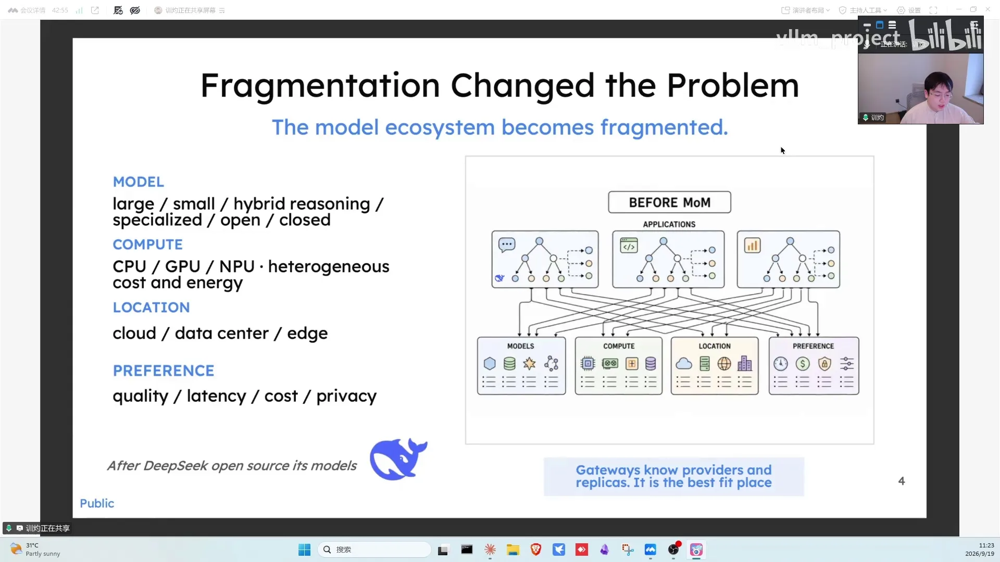
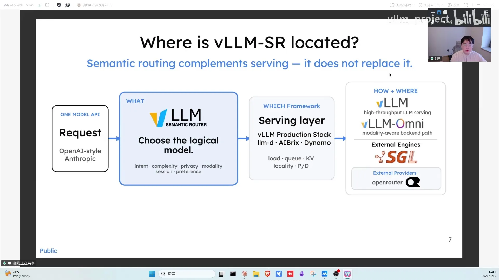
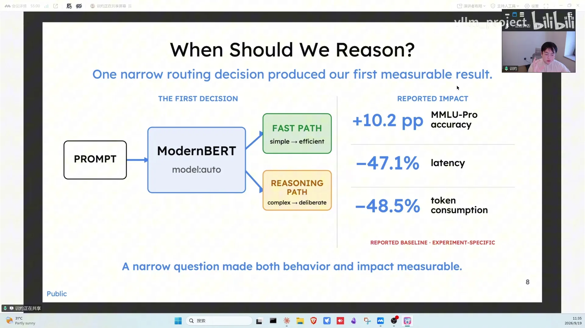
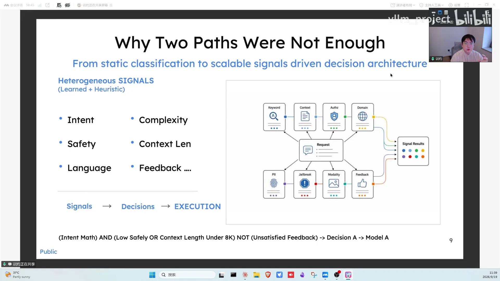
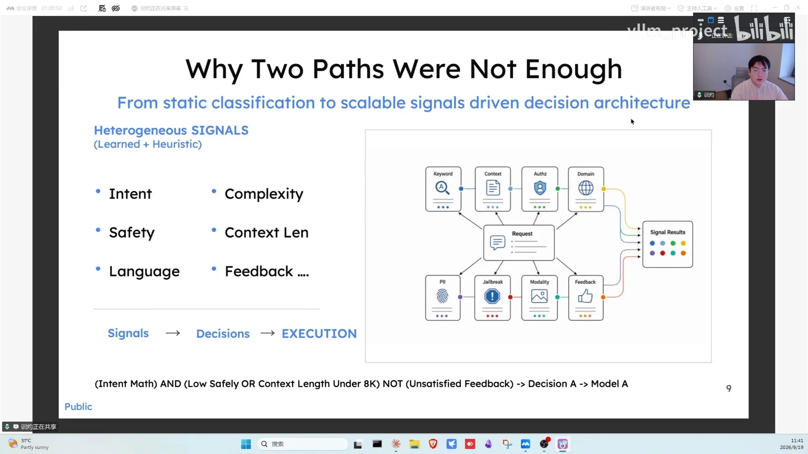

# 第20讲：vLLM 语义路由器：探索多模型系统智能的边界

> 视频来源：[vLLM 小课堂（二十）：vLLM 语义路由器 - 探索多模型系统智能的边界](https://www.bilibili.com/video/BV13Jeh68Eam/)（约 85 分钟）。嘉宾：训卓老师——前云基础设施/networking 老兵，CNCF Envoy、Envoy Gateway、Envoy AI Gateway 等项目的参与者，Semantic Router（SR）项目发起人。本文基于直播实录整理，时间戳可跳转到对应画面。

## 本讲要解决的核心问题（SCQA）

**背景**：DeepSeek 开源之后，模型生态爆发，Inference 和 Training 在市场上平分秋色，模型数量快速增长。

**冲突**：但"模型多了"带来了四个维度的碎片化——模型本身碎片化（开源/闭源、大小、特化、架构、成本各异）、算力碎片化（不同模型优化绑定不同硬件）、部署位置碎片化（云端 API / on-prem 机房 / AI PC / DGX Spark）、用户偏好碎片化（质量优先 / 延迟优先 / 成本优先 / 隐私优先）。传统 API 网关只会转发流量，不会"理解"请求，帮不了用户选模型。

**疑问**：Routing 在 AI 时代的本质是什么？在模型和用户之间，谁来做"这次请求该用哪个模型"的决策？

**回答（中心思想）**：Semantic Router（语义路由器）。它用统一的 API 协议从请求里提取语义信息，经过"信号层 → 投影层 → 决策层 → 插件层 → 算法层"的可解释流水线，把非结构化请求变成结构化的模型决策；不仅会 select（选一个模型），还会 cascade（先便宜后贵逐步升级）、fusion（多模型答案融合）甚至多模型协作，对外暴露的就像一个"统一模型"——这就是 **Mixture of Models（MoM）**。它与 vLLM 等 serving 侧路由（Dynamo、vLLM router）是互补关系：后者管"模型内部怎么跑得快"，SR 管"请求该交给哪个模型"。

---

## 一、从 API 网关到语义路由：Routing 的第一性原理（00:16）

### 1.1 讲者的底气：十年网关手艺

讲者的主业经历在 Cloud 基础设施：参与过 L4/L7 networking 开源项目，维护过 CNCF 毕业项目 **Envoy**（高性能代理）、**Envoy Gateway**（API 网关），以及 AI 时代的 **Envoy AI Gateway**，也深度参与过 service mesh（服务网格）。AI 时代对他像一次 "auto research"——把老手艺演进到新场景（[【跳转到 00:36】](https://www.bilibili.com/video/BV13Jeh68Eam/?t=36)）。

### 1.2 两层网关架构：老手艺换汤不换药

DeepSeek 之后模型越来越多，做 networking 的人自然想到：把模型当成后端服务来管。API Gateway 的本质就是代理聚合（Nginx、OpenResty、Envoy 都是这类技术），只是现在的后端 workload 从"传统服务"换成了 deployed model（vLLM、SGLang 起的服务）。手艺也跟着升级：以前限流按"每分钟多少次请求"，现在要按 **token level 限流**（[【跳转到 03:50】](https://www.bilibili.com/video/BV13Jeh68Eam/?t=230)）。

他们在社区提出过 **Two-Tier 架构**（[【跳转到 05:05】](https://www.bilibili.com/video/BV13Jeh68Eam/?t=305)）：

- **Tier 1：AI Gateway**——API 网关的演进，做 Unified APIs，把各家模型统一管理（类似 LiteLLM）；
- **Tier 2：推理感知网关**——vLLM、AI Bricks、Production Stack、SGLang 都有自己的 router。这层要做的事完全不同：感知后端 worker 状态、获取 GPU 利用率、KV cache 使用、ongoing request 等指标，做 **prefix cache affinity routing**（前缀缓存亲和调度），乃至 **PD disaggregation**（预填充-解码分离）下的路由（[【跳转到 05:55】](https://www.bilibili.com/video/BV13Jeh68Eam/?t=355)）。

### 1.3 四个碎片化：为什么"选模型"会成为问题

做 Envoy AI Gateway 时讲者不断追问：AI 时代 routing 的本质是什么？关键变化是——现在有了 **OpenAI Compatible API、Anthropic Messages 这样的统一协议**，可以从请求 payload 里用固定的 schema 稳定提取出：当前 query、历史 messages、历史 context、tool use 的执行与结果。**这些信息是富含语义（semantic）的**——语义信息在手，路由就可以做得更聪明（[【跳转到 07:35】](https://www.bilibili.com/video/BV13Jeh68Eam/?t=455)）。

而选模型的难度来自四个碎片化（[【跳转到 08:55】](https://www.bilibili.com/video/BV13Jeh68Eam/?t=535)、[【跳转到 12:10】](https://www.bilibili.com/video/BV13Jeh68Eam/?t=730)）：

1. **模型碎片化**：开源/闭源、大/小、specialized model、架构与成本各不相同，模型间差距越拉越大；
2. **算力碎片化**：上一代模型优化在某一种硬件上，下一代又优化在更宽的算力池上，模型与硬件之间是复杂的映射关系；
3. **位置碎片化**：云端 API、on-prem GPU 机房、AI PC（AMD）、DGX Spark（英伟达）——大家想把模型部署在各种各样的地方；
4. **偏好碎片化**：frontier lab 要 quality first，延迟敏感业务要 latency first，C 端订阅用户要 cost first（一个月几十块别几天就用光额度），银行金融要 privacy/security first（guardrails、防敏感信息泄漏）。

网关/router 恰好 **stands between the models and people**——站在模型和用户（agent）之间做桥梁，是解决这个问题的最佳位置（[【跳转到 14:40】](https://www.bilibili.com/video/BV13Jeh68Eam/?t=880)）。

**SR 的初衷**由此而来：在语义（semantic）层面加一个 layer 去理解 query 和 context，帮用户决定用哪个模型，以及模型要戴什么"帽子"——比如 reasoning on / reasoning off、reasoning effort 设多大、偏好使用哪些 tool；从而在"语义化的 query"与"异构 model pool"之间动态地 orchestrate / select 模型（[【跳转到 20:30】](https://www.bilibili.com/video/BV13Jeh68Eam/?t=1230)）。

## 二、SR 是什么：定位、历史与"决策引擎"对照（15:05）

### 2.1 与"决策引擎"创业公司的对照

直播中回应弹幕：SR 和一家新创业公司 JV 的"decision engine"有什么区别？ JV 的产品是把非结构化数据输入引擎、得到结构化决策（比如怎么决策一个 prompt）。这与 SR 的 decision engine **思路部分吻合，但落点不同**：SR 把这个能力放在了路由上——放在模型和用户、和 agent 之间。讲者猜测 JV 大概率用的是 encoder-based 模型（forward 出各 label 的概率），但也表示只要对方开放 API 就能研究，"哪怕不开源也可以蒸馏出来"（[【跳转到 15:30】](https://www.bilibili.com/video/BV13Jeh68Eam/?t=930)）。

### 2.2 新一代路由模型：SR 内部模型全面重训

有同学问"最新的新一代路由模型（Villa，音）和以前有什么区别、为什么要加一道"：SR 最近把内部跑的一批模型重新 training 了一遍，目标是一个**更系统化的模型家族**——从 Omni 到 Text，包括 embedding、reranker、各种训练好的 classifier。重新 rerank 本质上提高了以前模型的 accuracy 和跨 context window 的稳定性，是对上一版 SR 内部 encoder-based 模型的升级迭代，也是未来**系统化发布模型**的起点：后续会有 decoder-based、dense/MoE 等架构，conductor（编排）类、worker 类模型做动态 model collaboration。选 encoder-based 路线是因为它在模型路由场景**高效、成本低**（[【跳转到 18:25】](https://www.bilibili.com/video/BV13Jeh68Eam/?t=1105)）。

### 2.3 SR 在技术栈中的位置：serving 的前一站

**结论先说：SR 在 serving 的前面、infra 的边界上。** 一个 request 进到 infra 先到 Semantic Router，由它决策用什么模型、怎么用模型；后面的 serving 层（infra framework、各种 engine，甚至 external provider）负责把模型 serve 起来——包括 KV routing、PD routing、prefix cache routing 这些**serving 内部的 routing**。所以两者互补：serving 解决"怎么更高效地 serve 模型"，SR 解决"怎么更聪明地选模型"（[【跳转到 24:40】](https://www.bilibili.com/video/BV13Jeh68Eam/?t=1480)）。

**发展史一句话版**（[【跳转到 21:45】](https://www.bilibili.com/video/BV13Jeh68Eam/?t=1305)）：2024 年就在另一个 org 里做（当时 industry track 里没有先例，去推各家产品集成阻力很大，跟 MIT 的俊诚教授、IBM 等朋友一起孵化）→ 2025 年 GPT-5 发布 auto mode（用户不用选模型，系统动态帮你选），印证了这个方向 → 与 vLLM 的 Simon 达成共识，年中在 vLLM 社区发布 → 至今 contributor 与关注度持续增长。另外，学术界 2024 年提出了 **RouteLLM**，属于更偏 research track 的研究路线；而 SR 一开始就把自己定位在 industry track（[【跳转到 08:50】](https://www.bilibili.com/video/BV13Jeh68Eam/?t=530)）。

## 三、0.1 原型：三个分类器串成的流水线（25:55）

SR 0.1 发布之前，他们训练了三个 encoder-based 模型，在 router 里 **in-process** 地跑起来做原型验证（[【跳转到 25:55】](https://www.bilibili.com/video/BV13Jeh68Eam/?t=1555)）：

1. **Domain 分类器**：用 MMLU-pro 数据训练的 domain-level 分类——这个 prompt 是数学、coding、化学、心理还是哲学；
2. **Jailbreak 分类器**：sentence-level 二分类——这个 prompt 是否有越狱/隐藏恶意意图；
3. **PII 分类器**：token-level 分类——检测每个 token 是否敏感信息、具体是哪类（email、人名等）。

三个模型串成 pipeline：先 domain、再 jailbreak（命中即拒绝）、再 PII（命中即拒绝）。当时用（某家的）classifier 配不同 reasoning effort / hybrid reasoning 模型做了小实验：简单任务走 fast pass，复杂多步任务走 reasoning pass，效果不错，pipeline 论文发到了 NeurIPS（[【跳转到 26:45】](https://www.bilibili.com/video/BV13Jeh68Eam/?t=1605)）。

**但这条固定 pipeline 死穴是不能 scale**——它能接的模型非常少。转折点是 HuggingChat 推出 Omni 模式（类似 GPT-5 的 auto 模式，在 HuggingFace 上动态选模型）：HuggingFace 模型太多了，他们与 HuggingFace CEO 聊过后确认固定 pipeline 跑不进这种场景，必须重新设计架构（[【跳转到 28:50】](https://www.bilibili.com/video/BV13Jeh68Eam/?t=1730)）。

## 四、可扩展架构：Signal → Projection → Decision → Plugin → Algorithm（29:40)

重构后的架构叫 **Signal-Driven 架构**，发布了 white paper，微软 CEO 也为这篇 paper 做过 highlight（[【跳转到 30:05】](https://www.bilibili.com/video/BV13Jeh68Eam/?t=1805)）。核心思想：**选模型之前，先搞清楚这个请求"是什么、有什么特质"。**

1. **Signal Layer（信号层）**：并行观测 prompt 的特质，两类信号——
   - **Rule-based（启发式/确定性）**：query 长度、context window、token 数、语言、结构化信息，确定性 100%；
   - **Model-based（学习式）**：intent/domain 分类、jailbreak 分类、PII token 分类。关键演进是把原来"串联 + 命中即拒绝"的流水线改成**并行观测**：一个 prompt 可以同时有 jailbreak 风险、domain 信息和 PII 信息（[【跳转到 31:20】](https://www.bilibili.com/video/BV13Jeh68Eam/?t=1880)）。
2. **Projection Layer（投影层）**：signal 越多、output 越多，但不同信号对决策的重要度不同。投影层把高维 output 压缩成**低维决策因子**，并支持用权重区分信号的重要度，让 decision 的编排复杂度大幅下降（[【跳转到 49:32】](https://www.bilibili.com/video/BV13Jeh68Eam/?t=2972)）。
3. **Decision Stage（决策层）**：把决策因子做预定义的**布尔运算**，组合排列出复杂决策。比如"query 是数学问题 AND 没有 jailbreak AND 没有 PII 泄漏"命中某个 decision，decision 后面挂一组候选模型。signal 越多、观测越充分，决策确定性越高——整个架构因此可扩展（[【跳转到 32:10】](https://www.bilibili.com/video/BV13Jeh68Eam/?t=1930)）。决策也支持多种模式：有 **priority-first**（按优先级的决策树），也有 **confidence-based**（按置信度选择），可以按需选用（[【跳转到 45:22】](https://www.bilibili.com/video/BV13Jeh68Eam/?t=2722)）。

4. **Plugin Layer（插件层）**：前半部分是"感知与推理"（react/reason），插件层是"行动"（action）。例如危险 query 直接用 block plugin 拒绝；与历史 query 高度相似时，用 **semantic cache plugin** 直接返回缓存答案（[【跳转到 52:27】](https://www.bilibili.com/video/BV13Jeh68Eam/?t=3147)）。
5. **Algorithm Layer（算法层）**：decision 后面挂了多个模型，"怎么选"交给算法层——而且**没有万能算法**：不同 workload 特征适合不同算法（latency first / quality first / RL-driven / model collaboration），所以需要一层来做算法适配（[【跳转到 50:47】](https://www.bilibili.com/video/BV13Jeh68Eam/?t=3047)）。

这套流水线是**可解释、可编程（programmable）**的：signal→decision 的过程可以人为编写；随着信号变多，人工编排布尔逻辑不现实，就演进为 **agent-driven**——通过 evaluation 和真实 workload 不断优化路由策略（剪枝、并行化、组合）（[【跳转到 39:07】](https://www.bilibili.com/video/BV13Jeh68Eam/?t=2347)）。整体 pipeline 见下图：任何新 algorithm 可落进 algorithm layer、新 signal 可落进 signal layer、新 tuning 方式可集成进 agent loop，是一个完整 framework（[【跳转到 52:52】](https://www.bilibili.com/video/BV13Jeh68Eam/?t=3172)）。

## 五、它不是什么：与 Dynamo/vLLM Router 的区别 + Agent 场景的 KV 难题（34:15）

### 5.1 高频对比题

- **与 NVIDIA Dynamo、vLLM Router / Production Stack 的区别**：它们本质是 **inference routing**——模型内部的路由（几个 worker 之间怎么分、用什么并行策略、KV/PD routing），暴露的是 model level endpoint；SR 在上层管理这些 model level endpoint，为用户做"更智能的选择"。**互补关系**（[【跳转到 38:00】](https://www.bilibili.com/video/BV13Jeh68Eam/?t=2280)）。
- **可以叠加吗**？可以，而且是个好的 reference architecture：vLLM router 专注 router 内部 routing（如 KV routing），暴露 model endpoint；SR 在其后端模型之间做路由（[【跳转到 41:37】](https://www.bilibili.com/video/BV13Jeh68Eam/?t=2497)）。
- 主持人补充视角：vLLM router/Dynamo 的工作越来越像**负载均衡**（关心各设备算力有没有打满、KV 中心化管理）；而 SR 是一类新的调度问题——它的 workload 特殊，传统 load balancing 的 round-robin/random 算法根本不适用。SR 更接近"system level"的问题：model pool 怎么设计、system design 怎么做，routing、models、workload 三者必须 **codesign**，在端到端 loop 里持续优化，系统才会越来越好（[【跳转到 42:27】](https://www.bilibili.com/video/BV13Jeh68Eam/?t=2547)）。

### 5.2 Agent/多轮对话怎么办：KV 复用不是借口

弹幕高问：多轮/agent 场景下 KV cache 复用很重要，同一会话里切换模型会不会导致 KV 重算代价太大？回答分三层（[【跳转到 34:40】](https://www.bilibili.com/video/BV13Jeh68Eam/?t=2080)）：

1. **chat→agent 让 routing 更复杂**：chat 是一来一回；agent 一个 session 很长，切不切模型变得更重要——长会话里乱切模型，要么延迟变高、要么整体成本反增。SR 需要 **session awareness** 来优化（后续展开）。
2. **KV 复用本身有研究空间**：相同架构模型间怎么 reuse、切换时怎么减少 prefill 时间。LMCache 几年前就有跨模型 KV reuse 的 paper，vLLM 最近也有新 paper，SR 团队也在写新的。这是"减少 model switch 代价"的方向之一。
3. **multi-agent 的信息传递**：agent 之间怎么传 context、切模型时旧 context 怎么压缩后带给新模型，也是值得展开的合作方向。

## 六、超越 Select：Cascade、Fusion、RMoM 与多模型协作（53:42)

讲者对 SR 的一个核心认知演进：**"选模型"（select，one-of-N）只是最基础的算法**。在 request 级、real-time 的场景里，还可以 dynamic 地组合出更聪明的玩法（[【跳转到 54:07】](https://www.bilibili.com/video/BV13Jeh68Eam/?t=3247)）：

- **Cascade（级联）**：decision 后面挂"从便宜到贵"的候选模型链。Query 先试小模型，confidence 足够就直接 return；不够就升级到更贵的模型，逐步解决。省钱 + 保质量（[【跳转到 54:57】](https://www.bilibili.com/video/BV13Jeh68Eam/?t=3297)）。

- **Fusion（融合）**：同一个问题用不同模型回答再 fuse，由 judge model 判断答案是否 qualify，合格就得到更好的答案——可以用这种 fusion 语义 loop 一个 graph 来解题（[【跳转到 55:47】](https://www.bilibili.com/video/BV13Jeh68Eam/?t=3347)）。
- **RMoM（Reasoning of Mixture-of-Models，音）**：混合模型里怎么做 reasoning——类似锦标赛：第一轮 8 个 worker model 并行 reasoning，下一层 4 个模型对 8 个答案各给出更好的答案，再传给最后 1~2 个模型收束，最终得到一个答案（[【跳转到 56:12】](https://www.bilibili.com/video/BV13Jeh68Eam/?t=3372)）。
- **角色协作（Planner-Worker-Verifier）**：给 request 里的模型分配角色——Planner 拆解问题，把子问题分给不同 model 做 real-time inference，再由 Verify 判断结果是否合格：合格就合成更好答案返回，不合格继续 loop（[【跳转到 57:02】](https://www.bilibili.com/video/BV13Jeh68Eam/?t=3422)）。

这些都属于 **real-time model collaboration**，有点像 test-time scaling：把模型答案变得更好。他们已经用 vLLM serve 一组模型（一个小模型 + 一个更强模型）做过 dynamic planning 的部分实现，效果不错。当前核心研究方向是 **Planner Model**：怎么用 RL 训练 planner 判断"怎样的 plan 更好/更差"，同时优化成本、控制延迟——因为 model collaboration 本身会增加 latency（[【跳转到 58:47】](https://www.bilibili.com/video/BV13Jeh68Eam/?t=3527)）。

## 七、Mixture of Models（MoM）：SR 的终极形态（69:36)

### 7.1 MoE vs MoM

MoE（Mixture of Experts）解决**单模型内部**的问题；MoM（Mixture of Models）解决**系统层面**的问题。SR 构成的 MoM 目标是：让正确的 workload 路由到合适的模型、合适的硬件，从而**提升 accuracy、降低 cost、保证安全合规**。SR 就是构成 MoM 的那个智能层——select/cascade/collaborate 这些模型，对外暴露一个 **unified model**：用户看到的"一个模型"，背后由 routing + model pool 组成（[【跳转到 69:36】](https://www.bilibili.com/video/BV13Jeh68Eam/?t=4176)）。

### 7.2 两个视角看 MoM

- **用户/Agent 视角**：MoM 就是一个 Model Provider / Model API——agent framework 把 SR 暴露的 endpoint 当普通模型 integrate 进 harness，SR 对外暴露的是 **virtual model** 的 identity。由此引出评估问题：virtual model 的体验要和单模型无差别，就得**像单模型一样被打分**——同样跑 benchmark 看 virtual model 与 single model 分数差多少（有没有 loss），同时观测 mixture model 给系统带来的 benefit（端到端 latency、cost）（[【跳转到 71:24】](https://www.bilibili.com/video/BV13Jeh68Eam/?t=4284)）。
- **系统视角**：MoM = **a set of models**，一个系统模型，由三部分 codesign 而成——**workload + routing recipe（算法）+ 后端模型**，通过 Semantic Router runtime 连接打包。这个视角下的 eval 关注系统收益（合规、成本、安全）；用户视角像黑盒、实验简单，系统视角是白盒、metrics 更系统化（[【跳转到 72:44】](https://www.bilibili.com/video/BV13Jeh68Eam/?t=4364)）。

## 八、部署在哪，就是什么场景（74:17）

MoM 部署的位置映射出四类场景（[【跳转到 74:42】](https://www.bilibili.com/video/BV13Jeh68Eam/?t=4482)）：

1. **端侧（Edge / Personal Agent）**：router 部署在本地——本地安全性和隐私好，external provider 规模大能力强。SR 决定哪些 query 留本地、哪些发外部；privacy 无所谓、在意成本的话，也可以反过来组合：简单任务留本地，复杂 query forward 到 cloud model。
2. **企业混合部署**：企业普遍 GPU 不够，要采购外部模型供应商，但 domain-specific knowledge 和敏感 messages 不能泄漏。把 SR 放中间、连接 on-prem GPU models 和 cloud models：合规 query 留本地、宽松 query 上云，全程 **programmable**，可以跟企业的合规要求做 tooling。
3. **云厂商的新产品形态**：卖 token 的 cloud provider 可以把 mixture model 包装成一个 unified model 暴露到模型 API，让本地 agent framework 当一个模型来用——这里有实打实的 business value。
4. **硬件公司的数据中心路由**：硬件公司有不同 chips——新卡、老卡、specialized 卡（如加拿大公司 Tenstorrent 把模型直接做到芯片上，好处是极致推理 latency，坏处是模型迭代要跟着硬件走）。SR 可以做不同硬件间的 routing/orchestrator：简单 query 放 specialized inference hardware，困难 query forward 到通用 GPU/模型；甚至按数据中心指标做 **hardware routing / energy routing**（[【跳转到 78:27】](https://www.bilibili.com/video/BV13Jeh68Eam/?t=4707)）。

## 九、生态、行业趋势与路线图（59:24)

### 9.1 行业认可与趋势

- 发布 white paper 时，微软 CEO Satya 在一次大会上提到了这个方向（未来需要一个 Meta model 的概念，在后端不同模型间做决策和选择），与 SR 想做的很像；HuggingFace CEO 在 X 上 follow 并推荐；AMD CTO、Broadcom（音）CTO 也在会上提到过；还有人把 SR 放在 DGX Spark 上演示 dynamic route 到本地/外部模型（[【跳转到 59:49】](https://www.bilibili.com/video/BV13Jeh68Eam/?t=3589)）。
- 近几个月 intelligent/semantic routing 全面升温：Cursor 发布了 Router；Kilo 有 Auto Model；Databricks 在 Unified Gateway 里发布 smart routing；还有公司发布 Inference Router；开源侧 **AMD 发布了 SwitchR**、LlamaIndex 等也有 auto routing 能力；model collaboration 方向的代表还有 Microsoft AI 的 MAI（音）——自训模型混合外部模型，在多个 benchmark 上打出接近 SOTA 的水平。相比 24/25 年，业界明显更重视这个问题了（[【跳转到 62:32】](https://www.bilibili.com/video/BV13Jeh68Eam/?t=3752)）。

### 9.2 七个工作组：欢迎贡献

SR 建立了 working group 机制，持续贡献可以成为 member、leader。7 个组按技能对号入座（[【跳转到 64:56】](https://www.bilibili.com/video/BV13Jeh68Eam/?t=3896)）：

| # | 工作组 | 干什么 | 适合谁 |
| --- | --- | --- | --- |
| 1 | MoM Routing | 构建 mixture model、选 model pool、routing 算法（偏 research） | 算法方向 |
| 2 | Router Model | 优化跑在 SR 内部的路由模型：训练、RL、inference 优化、引入新模型 | 懂 encoder/decoder 训练与 RL |
| 3 | Data Plane & Load Balancing | 协议转换、schema（OpenAI Compatible API、Messages、Response API）、网络 | 懂网关/网络 |
| 4 | Deployment & Infra | 硬件/环境/运行时支持：Docker、Kubernetes 等 | 懂企业部署 |
| 5 | Agentics | agent session 管理、model switch 时机、KV reuse、context 压缩与传递 | 关注 agent 场景 |
| 6 | UX | CLI、Dashboard、官网、helm charts、写 blog 等材料 | 懂开发者体验 |
| 7 | Quality & Evaluation | CI/CD、测试（好上手）；统一 evaluation、自建 benchmark | 想入门贡献的人 |

同时 SR 在和一些高校合作，希望建立 **research loop**：research 的 paper/idea 落到项目架构里优化，项目反过来用真实反馈优化研究方向。industry（厂商/组织）与 academic（lab/高校）想做 routing 研究都可以合作（[【跳转到 61:42】](https://www.bilibili.com/video/BV13Jeh68Eam/?t=3702)）。

### 9.3 Recipe 与 Evaluation 的现状

- **评测不统一**：学术界有 Rice University 合作的 RouterBench 等小 benchmark，但各管各的——有的专注本地 AI PC 的隐私（统计哪些不该外发的请求泄出去了），有的把 router 当选择器在预计算好的 model pool 里选。SR 正在做更 unified 的 evaluation：混合模型 vs 单模型的能力指标 + cost/latency 指标 + agent session 里 KV reuse 后的整体任务成本，还需要更多人来参与（[【跳转到 46:12】](https://www.bilibili.com/video/BV13Jeh68Eam/?t=2772)）。
- **开放 routing recipe**：像 vLLM 的 "模型 × 硬件怎么跑" support matrix 一样，SR 把 recipe 分成 **single model** 和 **virtual model**（混合模型）两类：virtual model recipe 写清后端模型怎么选、recipe 怎么复用，给大家做参考；目标是这些 recipe 既能跑评测拿好成绩，也能跑出系统角度的收益（cost、latency）（[【跳转到 83:29】](https://www.bilibili.com/video/BV13Jeh68Eam/?t=5009)）。

## 十、收尾问答：评测 gap、数据飞轮与 GPT-5 auto 的启示（79:55）

- **评测和实际体验有 gap 怎么办**（任务数据集 vs 人类偏好差异大）：单模型 eval 只需要证明和其他模型有没有差异；要把 mixture model 作为 production 服务，评测标准本来就不一样——需要设计符合智能路由/MoM 的 evaluation（[【跳转到 80:20】](https://www.bilibili.com/video/BV13Jeh68Eam/?t=4820)）。
- **数据评估策略的自我迭代飞轮可行吗**：非常好的方向，而且是 system 必须做的事——online 的 data/result 拿来 tuning，offline 做优化，再看 online 效果，像个数据 flywheel；这个飞轮不仅优化 routing 算法，也优化后端模型和系统设计，思路和 RSI（自我改进）很像。系统变好不是 one shot，必须数据驱动地不断迭代（[【跳转到 81:10】](https://www.bilibili.com/video/BV13Jeh68Eam/?t=4870)）。
- **做评测成本高**：确实需要像 AMD 这样的大公司 sponsor，个人做所有 benchmark + model 的事很困难；有些 evaluation 只当参考也正常（[【跳转到 82:00】](https://www.bilibili.com/video/BV13Jeh68Eam/?t=4920)）。
- **GPT-5 auto mode 现在用得少了吗**：GPT 只是把 auto 做得更隐形了——codex 这类场景倾向让用户选模型，ChatGPT 这类默认就是 auto。至于"auto 会不会多收钱"：不至于多收，但成本压缩空间变大（简单任务悄悄分给 mini 档模型），利润空间自然变大（[【跳转到 40:47】](https://www.bilibili.com/video/BV13Jeh68Eam/?t=2447)）。

## 小结

- **问题**：模型、算力、位置、偏好四个维度碎片化，传统 API 网关不理解请求语义；Routing 在 AI 时代的本质是"站在模型和用户之间做语义决策"。
- **定位**：SR 在 serving 前面一站，与 Dynamo/vLLM router（inference routing）互补；可与 vLLM router 叠加成"两级 router"参考架构。
- **架构演进**：固定三分类器 pipeline（domain/jailbreak/PII，NeurIPS）→ 不可扩展 → Signal-Driven 多级流水线：Signal（规则+模型并行观测）→ Projection（高维压低维+加权）→ Decision（布尔编排，可解释可编程）→ Plugin（block/semantic cache 等 action）→ Algorithm（select/cascade/collaboration 的适配层）。
- **算法视野**：select 只是 one-of-N；cascade 省钱保质量；fusion + judge 提质量；RMoM 锦标赛式 reasoning；Planner-Worker-Verifier 角色协作；下一步用 RL 训 Planner。
- **终局形态**：Mixture of Models——用户视角一个 unified/virtual model，系统视角 workload+routing+model pool 的 codesign；评估要同时看 benchmark 分数差与系统收益。
- **场景**：端侧 personal agent、企业混合部署（合规）、云厂商混合模型产品、硬件间 routing（含 energy routing）。
- **生态**：微软/HuggingFace/AMD 等认可，Cursor/Databricks/AMD SwitchR 等跟进；7 个工作组开放贡献，recipe（single/virtual model）+ unified evaluation 是社区的下一步。

## 关键术语速查

| 术语 | 一句话解释 |
| --- | --- |
| Semantic Router (SR) | vLLM 语义路由器：在模型和用户之间做"选模型"决策的智能层（本讲主角） |
| Two-Tier 架构 | Tier1 AI Gateway（统一 API）+ Tier2 推理感知网关（worker 级调度） |
| PagedAttention / PD 分离 | vLLM 的核心内存复用技术 / 预填充与解码分离部署，均涉及 serving 内部路由 |
| prefix cache affinity | 把请求调度到已缓存其前缀的实例上，减少重复计算 |
| 统一 API 协议 | OpenAI Compatible API、Anthropic Messages 等，使请求语义可标准化提取 |
| signal layer | SR 第一级：规则（确定性）+ 模型（domain/jailbreak/PII 等）并行观测请求特质 |
| projection layer | 把高维信号压缩成低维决策因子并加权的层 |
| decision stage | 用布尔逻辑组合信号得出可解释决策；后续可 agent-driven 自动优化 |
| plugin layer | 在请求路径上执行动作：拦截（block）、semantic cache 直接应答等 |
| algorithm layer | 决策后挂多模型时选择"用什么算法选/协作"的适配层 |
| select / cascade / fusion | 选一个模型 / 从便宜到贵逐级升级 / 多模型答案融合由 judge 评判 |
| RMoM | Reasoning of Mixture-of-Models：锦标赛式多模型层层 reasoning |
| Planner-Worker-Verifier | Planner 拆任务、多模型执行、Verifier 验收循环的角色协作算法 |
| session awareness | 在长会话/agent 场景里感知上下文，决定切不切模型 |
| KV cache reuse | 跨请求/跨模型复用已计算的 KV（LMCache、vLLM 均有相关工作） |
| codesign | routing、model pool、workload 三者联合设计，端到端 loop 优化 |
| Mixture of Models (MoM) | 系统级"混合模型"：routing + model pool 对外呈现为一个 unified model |
| virtual model | SR 暴露给用户的模型身份；需像单模型一样被打分评估 |
| MoE | 单模型内的专家混合；与系统级的 MoM 相对 |
| RouterBench | 学术界提出的 router 评测 benchmark（Rice University 合作等） |
| SwitchR | AMD 发布的 semantic routing 开源项目 |
| recipe | SR 的"模型×场景怎么配"参考配置，分 single model / virtual model 两类 |
| working group | SR 社区的 7 个贡献方向（算法/模型/网关/部署/agentics/UX/质量评测） |
| auto mode | GPT-5/HuggingChat Omni 等不选模型、系统动态分配的产品形态 |
