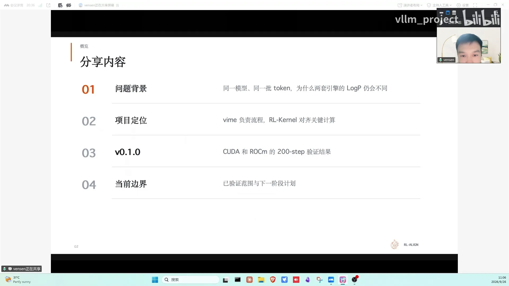
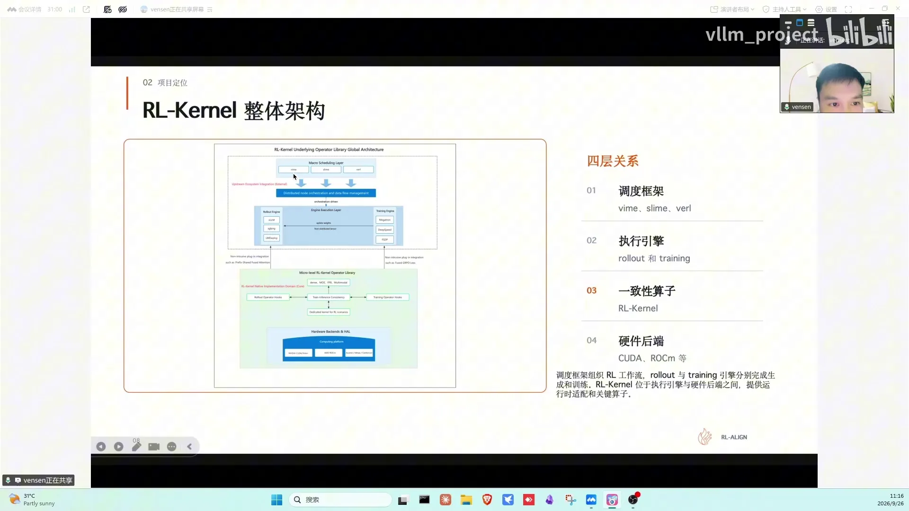
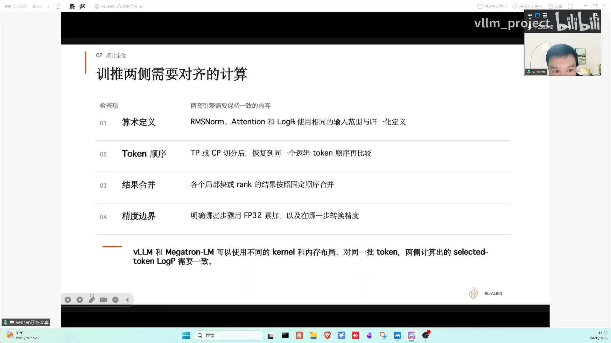
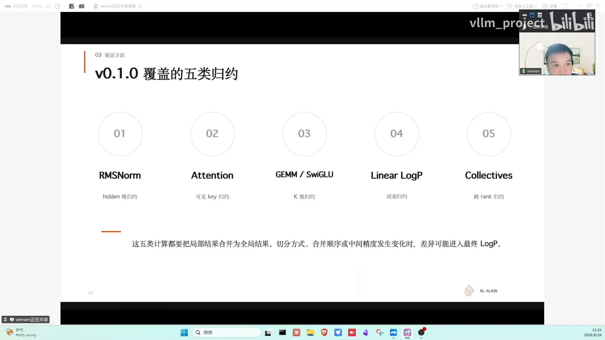
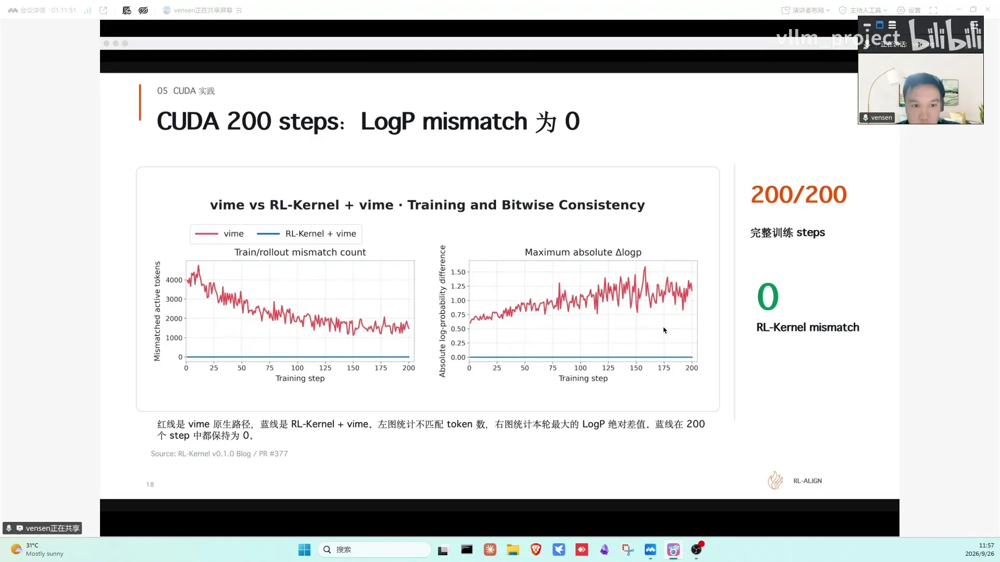

# 第21讲：RL-Kernel：大模型 RL 后训练中的训推一致性实践

> 视频来源：[vLLM 小课堂（二十一）：RL-Kernel，大模型 RL 后训练中的训推一致性实践](https://www.bilibili.com/video/BV1Ech96cEzW/)（约 76 分钟）。嘉宾：文森——RL-Kernel（R-Kernel）核心维护者；主持：志鹏。本次分享基于 RL-Kernel V0.1.0 版本，介绍了训推一致性的问题背景、与 vLLM 的分工、数值契约、200 步零 mismatch 验证，以及社区贡献方式。本文基于直播实录整理，时间戳可跳转到对应画面。

## 本讲要解决的核心问题（SCQA）

**背景**：RL 后训练（rollout 生成 → reward 打分 → 策略更新）需要推理引擎（如 vLLM）和训练引擎（如 Megatron）两套系统接力工作。

**冲突**：同一个模型、同一批 token，两套引擎算出的 logprob 却可能不同——两边执行的 kernel、batch、并行布局、规约方式都不一样。logprob 偏差会提前改变 importance ratio、触发 clipping，严重时模型训崩、GPU 空转。

**疑问**：训推两侧的数值到底能不能做到**绝对一致（零 mismatch）**？代价是不是要把性能全牺牲掉？

**回答（中心思想）**：可以。RL-Kernel 的做法是**数值契约**：把容易产生差异的地方（精度边界、累加/规约顺序、合并方式、通信时机）明确写下来，训推两侧按同一套约定执行；vLLM 负责"在正确的时间处理正确的数据"，RL-Kernel 负责"关键计算按对齐的规则执行"。V0.1.0 已在 CUDA（8×H100）和 ROCm（8×MI300X）上用 Qwen3-8B dense 模型连续跑完 200 个 RL step，每一步 logprob mismatch 均为零，性能与原生路径基本持平。

---

## 一、问题背景：同一个模型，为什么两套引擎的 logprob 会不同？（00:25)

### 1.1 rollout logprob vs training logprob

- **rollout 侧**：vLLM 读取当前权重，与 prompt 一起生成 response token，同时记录模型对这些 token 给出的概率——这就是 **rollout logprob**（[【跳转到 01:40】](https://www.bilibili.com/video/BV1Ech96cEzW/?t=100)）。
- **training 侧**：Megatron 接收这批 response token，在更新权重之前做一次前向计算，得到 **training logprob**（即 old logprob），后续用它计算 loss（[【跳转到 02:05】](https://www.bilibili.com/video/BV1Ech96cEzW/?t=125)）。

这两个数不是来自同一次程序执行，但描述的是**同一时刻、同一策略对同一 token 的概率**——权重没更新时理应一致。可系统执行时，两边的 kernel、batch、并行布局、规约方式都不同：**模型相同 ≠ 执行路径相同**，所以必须打一个问号（[【跳转到 02:55】](https://www.bilibili.com/video/BV1Ech96cEzW/?t=175)）。

### 1.2 偏差的两个直接后果

1. **importance ratio 提前失真**：training 侧用 current logprob 和 old logprob 算 importance ratio，ratio 远离 1 会**提前触发 clipping**——这是训推同步时非常关键的一步（[【跳转到 03:45】](https://www.bilibili.com/video/BV1Ech96cEzW/?t=225)）。
2. **浮点规约顺序改变结果**：经典例子——A=1000、B=1、C=-1000、D=1，每次加法保留三位有效数字：顺序一算出 1，顺序二因为中间舍入（1000+1→1000；-1000+1→-1000）最终得 0（[【跳转到 04:35】](https://www.bilibili.com/video/BV1Ech96cEzW/?t=275)）。GPU 里完全类似：矩阵乘、attention、跨卡求和都要把很多数加起来，为并行会拆块各自计算再合并；训推两侧 batch、shape 不同，就可能选中不同 kernel 路径，分块数量、合并顺序随之改变——差异先出现在某个中间结果，经后续计算最终传到 logprob（[【跳转到 06:15】](https://www.bilibili.com/video/BV1Ech96cEzW/?t=375)）。

**结论：做训推一致，除了同步权重，还要对齐累加顺序、计算精度和中间结果的舍入位置。**

## 二、比较 logprob 前，先对齐这五项条件（07:05)

**查 kernel 之前必须先排查这五项基础条件，否则很容易排查错方向**（[【跳转到 07:30】](https://www.bilibili.com/video/BV1Ech96cEzW/?t=450)）：

1. **权重版本**：rollout 和 training 必须对应同一个 checkpoint、同一个训练 step；
2. **输入边界**：prefix、active mask 等；
3. **位置信息**：position id、attention mask 等；
4. **运行时逻辑状态**：KV 的归属、token 在不同 rank 上的分布、有效的 vocabulary 范围；
5. **随机条件**：seed、采样状态（sampling state）。

任何一项不同，logprob 差异都不能直接归因于 kernel；只有这些全对齐了，剩下的差异才值得往底层计算里查（[【跳转到 08:45】](https://www.bilibili.com/video/BV1Ech96cEzW/?t=525)）。

## 三、分工与架构：vLLM 管时序，RL-Kernel 管数值（09:10)

- **vLLM 侧**：组织完整的 RL 生命周期——什么时候 rollout、什么时候 reference、什么时候训练 actor、权重更新后怎么同步给推理侧；管的是时序、数据流、权重版本等上层调度（[【跳转到 09:35】](https://www.bilibili.com/video/BV1Ech96cEzW/?t=575)）。
- **RL-Kernel 侧**：关注流程里关键计算能不能对齐——attention 局部结果怎么合并、FFN 哪一步转精度、跨卡求和先加哪块、运行时是否按预期路由到目标算子、logprob 怎么比较（[【跳转到 10:00】](https://www.bilibili.com/video/BV1Ech96cEzW/?t=600)）。

**数值契约**：把容易产生差异的地方明确写下来，两边必须按约定执行。vLLM 保证"在正确的时间处理正确的数据"，RL-Kernel 保证"关键计算按对齐后的规则执行"——互补关系（[【跳转到 10:25】](https://www.bilibili.com/video/BV1Ech96cEzW/?t=625)）。

**分层架构**（README 首页同款，[【跳转到 11:15】](https://www.bilibili.com/video/BV1Ech96cEzW/?t=675)）：

- 上层：同步/异步 RL 框架（AReaL、vLLM、veRL 等），串起生成、训练、权重更新；
- 中层绿色区域即 RL-Kernel：**不接管训练流程**，只在 rollout/training 的关键计算位置提供算子、运行时检查和一致性实现；
- 底层：执行引擎（CUDA、ROCm，其他厂商可按自己的方式接入）。

架构的核心价值是**把问题分层**：上层框架保留自己的调度方式，引擎保留专项优化（vLLM 的高性能算子等），但哪些关键结果必须对齐由 RL-Kernel 明确（[【跳转到 12:30】](https://www.bilibili.com/video/BV1Ech96cEzW/?t=750)）。

## 四、一个 RL Step 里的训推一致性（13:20)

把架构放回一轮完整 RL 训练（[【跳转到 13:45】](https://www.bilibili.com/video/BV1Ech96cEzW/?t=825)）：

1. vLLM 按 prompt 生成回答，保存 token 和 rollout logprob；系统评分得到 reward，样本打包给训练侧；
2. Megatron 用**未更新的权重**对 prompt+回答做一次无梯度 forward，得到 **old logprob**；同时按 reward 计算 **advantage**（告诉模型哪些回答该鼓励、哪些该降概率）（[【跳转到 14:35】](https://www.bilibili.com/video/BV1Ech96cEzW/?t=875)）；
3. 用当前权重做（带梯度的）forward 得到 **current logprob** → 与 old logprob 算 **importance ratio** → 结合 advantage 计算 loss → backward + optimizer step 更新模型（[【跳转到 15:25】](https://www.bilibili.com/video/BV1Ech96cEzW/?t=925)）；
4. 第一次算 current 时权重未更新、计算条件一致，current 和 old 应相同或非常接近；同一批数据若继续训练（多 epoch），会用**更新后的权重**重算 current，而 old logprob 保持固定（[【跳转到 15:50】](https://www.bilibili.com/video/BV1Ech96cEzW/?t=950)）；
5. 本轮训练完成后新权重同步回 vLLM，开始下一轮生成——在新权重版本下继续检查训推一致性。

**验证目标：完整循环持续运行时，每一轮对应位置的概率都对得上。**

## 五、数值契约拆四类 + V0.1.0 覆盖的五类规约（17:30)

**对齐拆成四类**（[【跳转到 17:55】](https://www.bilibili.com/video/BV1Ech96cEzW/?t=1075)）：

1. **算术定义**：归一化覆盖哪些元素、mask 哪一步生效、selected token logprob 用什么定义；
2. **Token 顺序**：开 TP/CP 后 token 分到不同设备，比较前必须恢复相同逻辑顺序；
3. **结果合并**：大结果来自多个局部/多个 rank，局部结果怎么组合直接影响最后浮点值；
4. **精度边界**：哪些阶段 FP32 累加、什么时候转回 BF16/FP16。

**V0.1.0 覆盖的五类规约**（按 model 拆出来，[【跳转到 19:10】](https://www.bilibili.com/video/BV1Ech96cEzW/?t=1150)）：

1. **RMSNorm**：沿 hidden 维度归约（均值/方差依赖 hidden 维累加顺序）；
2. **Attention**：在当前 token 可见的 K 范围内做 softmax 归约；
3. **GEMM 与 SwiGLU**：承担矩阵乘；换 model 需按具体架构拆对应 kernel；
4. **Linear logprob（lm head）**：从 vocabulary 的 logits 得到目标 token 概率；
5. **Collectives**：合并不同 rank 上的局部结果——最关键的部分之一。

五类的共同点：**先切分数据、完成局部计算、再合并局部结果**。只要分区、合并顺序或中间精度变了，最后几位就可能不同。V0.1.0 的目标就是覆盖这条影响 logprob 的完整主路径，沿支持的模型逐段检查、找到最先不同的地方（[【跳转到 21:15】](https://www.bilibili.com/video/BV1Ech96cEzW/?t=1275)）。

**关键算子的维度**：RMSNorm 看 hidden 维；GEMM 是 K 维连续累加；attention 在可见 K 内归约；lm head 在整个 vocabulary 上算 LSE；collective 跨 rank 合并（[【跳转到 22:05】](https://www.bilibili.com/video/BV1Ech96cEzW/?t=1325)）。注意：第一次差异出现在通信层不能马上归因于通信——可能各卡交给通信层的局部结果就已经不同了，要看输入输出定位。而且 batch 大小、序列长度、并行度一变，系统可能选另一条 kernel 路径：表面只是配置变了，实际分块、局部结果、合并顺序全跟着变（[【跳转到 23:20】](https://www.bilibili.com/video/BV1Ech96cEzW/?t=1400)）。

## 六、两个核心模块：Attention 与 Linear Logprob（LSE）（24:10)

**LSE**（log-sum-exp）：把一组分数转换成概率时需要计算的归一化统计量。attention 里一个 query 给多个 K 打分，所有分数要一起归一化才能决定关注哪些位置；lm head 对整个词表打分得到各 token 的对数概率。两者作用不同，但都要处理一组分数的统计归一（[【跳转到 25:00】](https://www.bilibili.com/video/BV1Ech96cEzW/?t=1500)）。

**为什么不能只检查目标 token 自己的分数**：其他词表项会影响归一化——自己分数没变、但汇总结果变了，最终概率照样变。所以关心的是 **LSE 的精度和合并顺序**：词表和多个 K 被切块、分到多卡时，每块的统计量怎么合并必须有明确约定（[【跳转到 25:50】](https://www.bilibili.com/video/BV1Ech96cEzW/?t=1550)）。

## 七、Debug 方法：固定 Replay 定位第一处差异（26:15)

实际 debug 流程（[【跳转到 26:40】](https://www.bilibili.com/video/BV1Ech96cEzW/?t=1600)）：

1. 拿一份固定权重，保存已生成的 token，让训练和推理算**同一份输入**；
2. 看中间结果：前几层输出都一样 → 范围缩小；到 attention 层开始不一样 → 检查这一层的精度、规约、kernel 选择；
3. 输入已不同就往前继续找——后面的模块只是继承了前面的误差。最终找到**第一个分叉的位置**。

主持人补充：debug 时输入需要特意构造边界性数值吗？要——必须有对照，固定边界再走整个流程，相当于"逐层探针"（[【跳转到 32:30】](https://www.bilibili.com/video/BV1Ech96cEzW/?t=1950)）。

**衡量标准必须是完全一致（不是误差极低）**：极低误差经过多层累加/转化可能越滚越大，导致训练仍不稳定。精度、舍入边界、通信时机都要考虑；通信也一样——各分块到最终都按固定顺序累加（[【跳转到 28:20】](https://www.bilibili.com/video/BV1Ech96cEzW/?t=1700)）。

主持人共鸣：做推理天天对精度——逐层对比时一开始误差极低、前几个 token 一致，但每次 forward 都累积一点误差，慢慢在 token 上分叉，最后跑 benchmark 发现分数掉了才追悔莫及。**精度问题是 Infra 完全绕不开的**。参照系方面，不同推理框架/云厂商的 benchmark 跑分本就不一样；vLLM 内部有专门的 LM Eval 标准流程（GLM、DeepSeek 等模型都按它跑），一般以它为参照判断是否有问题。举个量化的例子：像 DeepSeek V4 原本能跑到 0.99 多，如果掉到 0.8 几，那就一定有地方出了问题（[【跳转到 29:10】](https://www.bilibili.com/video/BV1Ech96cEzW/?t=1750)）。

## 八、性能与一致性是 tradeoff，但可以兼得（33:20)

- **算子复用优先**：vLLM 会持续支持新算子（H 系列/B 系列卡都有硬件加速技术）；RL-Kernel 尽可能复用高性能算子库——vLLM 内置算子、FlashInfer、AMD 的 AITER 等，只有算子保证不了累加/规约顺序时才自研（[【跳转到 33:45】](https://www.bilibili.com/video/BV1Ech96cEzW/?t=2025)）。
- **一致性 vs 性能**：保证一致性会牺牲性能；保性能时尽量复用高性能算子库，两头兼顾。vLLM Slack 里有专门 channel 跟踪（[【跳转到 34:10】](https://www.bilibili.com/video/BV1Ech96cEzW/?t=2050)）。
- **同一份算子、同一条路径**：训推用同一份算子，从不同框架进来都路由到同一路径，按固定累加/规约顺序执行，consistency 才有保证（[【跳转到 35:50】](https://www.bilibili.com/video/BV1Ech96cEzW/?t=2150)）。
- **不同卡的容差问题**：确实有些卡强制一致会掉很多性能（与硬件设计有关）；目前整体先走**绝对一致性**，个别路径容差方案取决于后续规划（[【跳转到 45:00】](https://www.bilibili.com/video/BV1Ech96cEzW/?t=2700)）。

### 8.1 关键澄清：不是"换算子补丁"，部署也不用换回原算子

有同学担心：RL 时换掉不一致的算子保一致性，正式部署又要换回来，效果没法迁移？——RL-Kernel 是**按 model 拆算子的完整体系**（dense 按 dense 拆、MoE 按 MoE 拆），集成代码、运行时检查、通信方式是一个整体，不是只改一个 attention。部署时**不需要切换回原算子**：consistency 路径和 fast pass 路径都会保留（[【跳转到 37:05】](https://www.bilibili.com/video/BV1Ech96cEzW/?t=2225)）。

上线用原生还是改过的版本？——vLLM 原生是 baseline，取决于用户：如果 RL-Kernel 保证了绝对一致、性能又不比原生差（甚至更高），两种都可以。但主持人的建议是**上线沿用训练时的代码路径**——否则速度上可能有一点优势，benchmark 却和训练时的预期对不上。RL-Kernel 里 reward、一致性测试、benchmark、accuracy 几大类都会跑，数据摆出来由用户选择；也取决于框架的 model 覆盖（多机多卡验证、主流 model 支持度、放出的 benchmark 和 reward 曲线）（[【跳转到 38:45】](https://www.bilibili.com/video/BV1Ech96cEzW/?t=2325)）。

### 8.2 训推不一致的后果分级

- 最严重：**训崩**——训练侧和推理侧行为完全不一致，推理生成的 token 放回训练重跑后整体行为漂移，大 batch size 下可能 200 轮或几百轮就崩，RL step 作废重跑、浪费算力；
- 次级：**clipping 率很高**——相当于系统里大量算力在空转，直接影响成本；
- 还有一层行为学问题：token 是推理侧生成的，训推差异太大时，Megatron 重算所依赖的 token 也不是模型"本来应该生成"的——重算本身就建立在失真的行为上（[【跳转到 41:40】](https://www.bilibili.com/video/BV1Ech96cEzW/?t=2500)）。

### 8.3 为什么还需要推理引擎（而不是训练侧直接算）？

弹幕问题：既然 Megatron 要重算 old logprob，为什么还要推理引擎、直接在训练代码换算子不就行了？——主持人理解这是在问 veRL 里 `use_rollout_logprob` 的 true/false 模式：直接用 rollout 的 logprob、不做重算。实践中这两种形式跑下来确实有差别（[【跳转到 47:05】](https://www.bilibili.com/video/BV1Ech96cEzW/?t=2825)）。

## 九、零 Mismatch 验证：CUDA 与 ROCm 双平台 200 步（48:20)

**验证流程**（[【跳转到 48:45】](https://www.bilibili.com/video/BV1Ech96cEzW/?t=2925)）：

1. **固定比较对象**：权重、token、mask 一致（seed、采样也归入此类）；
2. **同一配置重复运行**：确保问题可稳定复现，而不是跑一次的偶然结果；
3. **对齐两侧关键计算**：比较 rollout logprob 与 old logprob；
4. **完整 workflow 跑 200 step**：rollout、reward、training、权重同步全部走完，每一步比较 logprob mismatch，都为零。

配置命令在仓库 README 的 quickstart 里（点进去有另一位 member 整理的命令）。

**CUDA 实验**（[【跳转到 50:50】](https://www.bilibili.com/video/BV1Ech96cEzW/?t=3050)）：单机 8×H100，TP4 CP2，全局 batch 128，seed=1234；对比 vLLM native vs vLLM+R-Kernel，模型/数据/训练配置一致，各跑 200 轮。参数罗列得细是因为性能与工作负载强相关（极限负载 vs 中等负载、batch 大小、回答长度都影响计算/通信时间占比）。检查两件事：200 step 训练概率能否对上；完整 step time 有没有明显增加。

**结果**（[【跳转到 52:30】](https://www.bilibili.com/video/BV1Ech96cEzW/?t=3150)）：Qwen3-8B dense，8×H100 TP4 CP2——R-Kernel 路径跑完完整 200 step，**每一步 logprob mismatch 都是零**。

**CUDA 路径的关键实现**（[【跳转到 55:25】](https://www.bilibili.com/video/BV1Ech96cEzW/?t=3325)）：

- **GEMM**：自研 **SM90** 路径——一个计算单元负责一个输出的 tile，沿完整 K 维度按固定顺序累加，保证累加顺序与规约顺序确定；
- **RMSNorm**：切换到 torch 实现并约定对应参数的语义，避免不同实现带来的差异；
- **Attention**：复用 **FA4**，关掉 split-k，训练的 backward 使用 deterministic 路径；
- **FFN 与 lm head**：都做了特定实现；其中 linear logprob（lm head）让训练与 rollout 复用本地 logits，减少重复的 GEMM；
- **通信**：单节点使用 CUDA IPC 的 **fixed-tree collective**；TP1/TP2/TP4/TP8 都采用固定的 balanced tree，固定数据类型与舍入位置。

**CUDA 单机快速启动四步**（[【跳转到 57:30】](https://www.bilibili.com/video/BV1Ech96cEzW/?t=3450)）：① 安装并指定本地路径；② 准备数据和 checkpoint；③ 启动 Ray、检查环境；④ 先运行 vLLM native（原生基线），再运行 consistency 路径——两次运行必须是同一份输入和环境，结果才可直接比较（需替换成自己的 workspace 与模型目录）。

**ROCm 实验**（[【跳转到 58:45】](https://www.bilibili.com/video/BV1Ech96cEzW/?t=3525)）：单机 8×MI300X，TP4 CP2，seed=1234，对比条件一样。vLLM 原生 vs R-Kernel（ROCm 上）：指定位置的逐元素比较结果**在这 200 步完整 step 里全部保持为零**，试验累计做了 900 多万次逐元素比较——验证了 ROCm 上训推路径也能保持一致；性能与原生路径基本持平（[【跳转到 60:00】](https://www.bilibili.com/video/BV1Ech96cEzW/?t=3600)）。

**ROCm 路径的关键实现**（[【跳转到 61:25】](https://www.bilibili.com/video/BV1Ech96cEzW/?t=3685)）：

- **GEMM**：自研 MFMA kernel，固定累加顺序，FP32 合并后写回 BF16；
- **Attention**：默认路径由 AITER 的 CK 和 Triton 实现，处理 K 分块、固定 CK 路径与 decode 配置；关掉 split-k，backward 用 deterministic 路径；
- **RMSNorm**：切换到 torch 实现并约定参数语义，避免不同实现差异；
- **FFN**：复用 MFMA、grouped GEMM、SwiGLU down projection 等；
- **lm head logprob**：各 TP rank 先算局部统计量，最后按固定 vocabulary 顺序合并；
- **通信**：HIP IPC 与 RCCL 分层传输——小 token 走 HIP IPC，较大 token 走 RCCL；本地规约配合 HIP graph 和 cache 复用；TP1/TP2/TP4/TP8 都用固定 balanced tree，固定数据类型与舍入位置；
- **CUDA 侧**：单节点用 CUDA IPC 的 fixed-tree collective——所有这些最后都落在同一个数值契约上：精度、舍入边界、累加/规约顺序、通信时机。

## 十、V0.1.0 边界与路线图（63:20)

**已完成**（[【跳转到 63:45】](https://www.bilibili.com/video/BV1Ech96cEzW/?t=3825)）：200 训练 step 内 logprob mismatch 为零；CUDA + ROCm 双平台；以 vLLM 原生为 baseline（对比 Megatron）；Qwen3-8B dense 模型；单机快速启动（README quickstart）。

**待做**（[【跳转到 64:10】](https://www.bilibili.com/video/BV1Ech96cEzW/?t=3850)）：

1. **训练收益验证**：消除 logprob mismatch 后，reward 是否稳定提升——需要更长训练、更多组 seed 验证；
2. **MoE / 多模态 / 多机多卡**：并行推进多条线（DCP 等开发中），核心 member 都在做；
3. **更多模型**：Qwen3-Next、GLM 模型已提 RFC，社区有人认领（GLM 已有人牵头做适配）；MiniMax H3 等大模型、以及 **Qwen-Image** 也在并行拆分，认领的人不少；
4. **更多后端**：MUSA（摩尔线程自己的人在做）、昇腾（有厂商同学适配算子）；
5. **更多框架对接**：veRL、AReaL（异步 RL 框架）等，与上层 RL 框架的定位首尾呼应。

### 10.1 如何参与贡献（68:00)

- **认领 RFC/issue**：仓库里 model/kernel 拆分得很细，直接认领；先读完整 RFC 理解意图，认领后开发提 PR，从单算子验证开始（CUDA 上验证；ROCm 有卡可租卡，没有的话社区协助适配）（[【跳转到 70:44】](https://www.bilibili.com/video/BV1Ech96cEzW/?t=4244)）。
- **卡的要求不高**：不一定要 B200/B300——5090、RTX Pro 5000/6000 等 50 系卡都可以；RL-Kernel 把 model 拆开，显存要求很低。B 系列路径尚未支持，可以按 H 卡的节奏做适配——刷 PR 的好去处。单卡可开发单算子，分布式可以先写代码、再借社区 H 卡一起测（[【跳转到 45:50】](https://www.bilibili.com/video/BV1Ech96cEzW/?t=2750)）。
- **文档工作**：documentation 有 good first issue 可认领；发现命令跑不通、确认是 bug 就提 issue（[【跳转到 72:35】](https://www.bilibili.com/video/BV1Ech96cEzW/?t=4355)）。
- **联系社区**：加 member 微信拉群，简单说明背景（做过 CUDA 算子/通信等）方便分配任务；benchmark、CI 测试等也都需要人手（[【跳转到 73:34】](https://www.bilibili.com/video/BV1Ech96cEzW/?t=4414)）。
- **为什么值得投入**：强化学习是当前最热门方向之一，参与 RL-Kernel 对实习/求职都有帮助；它与上层框架（vLLM 等）有对接，也有高性能算子复用的机会（[【跳转到 74:49】](https://www.bilibili.com/video/BV1Ech96cEzW/?t=4489)）。

## 小结

- **问题**：RL 后训练中，同一模型在 vLLM（推理）和 Megatron（训练）里的 logprob 可能不同——执行路径（kernel、batch、并行、规约）不同所致；偏差会提前触发 clipping，严重时训崩、算力空转。
- **前提**：比较 logprob 前先对齐五项条件——权重版本、输入边界、位置、运行时逻辑状态、随机条件。
- **方案**：数值契约（算术定义、token 顺序、结果合并、精度边界四类）+ 分层架构——vLLM 管时序与数据流，RL-Kernel 在关键计算位置提供算子、运行时检查与一致性实现。
- **覆盖**：V0.1.0 覆盖五类规约（RMSNorm、Attention、GEMM/SwiGLU、lm head logprob、Collectives），重点保证 LSE 的精度与合并顺序。
- **验证**：CUDA（8×H100，Qwen3-8B，TP4 CP2）与 ROCm（8×MI300X）各跑 200 step，mismatch 全程为零（ROCm 累计 900 多万次逐元素比较），性能与原生基本持平。
- **实现要点**：同一份算子、固定累加/规约顺序、FP32 累加+舍入边界、固定 balanced tree、分层的通信（HIP IPC/RCCL、CUDA IPC fixed-tree）；按 model 拆算子，consistency 与 fast pass 路径并存，部署无需换回原算子。
- **路线**：更多 seed/更长训练验证 reward 收益、MoE/多模态/多机多卡、Qwen3-Next/GLM 等模型 RFC、MUSA/昇腾后端、veRL/AReaL 框架对接；社区可认领 RFC，50 系消费卡即可上手。

## 关键术语速查

| 术语 | 一句话解释 |
| --- | --- |
| RL 后训练 | rollout 生成候选 → reward 打分 → 策略更新的强化学习训练循环 |
| 训推一致性 | 训练引擎与推理引擎对同一输入算出相同数值结果（本讲目标：零 mismatch） |
| rollout/training logprob | 推理侧生成时记录的 token 概率 / 训练侧重算的同一批 token 概率 |
| old / current logprob | 更新权重前固定的参考概率 / 用当前权重算出的概率 |
| importance ratio | current 与 old logprob 的比值，PPO/GRPO 的核心量 |
| clipping | ratio 偏离 1 过多时截断梯度更新；训推不一致会提前触发 |
| advantage | 衡量某回答比平均水平好多少的信号，决定概率增减方向 |
| 数值契约 | 把精度、累加/规约顺序、合并方式、通信时机等写成训推双方共同遵守的约定 |
| 浮点规约顺序 | 多数相加的先后次序；顺序不同+舍入会让结果差之毫厘 |
| 精度边界 | 明确哪些阶段 FP32 累加、何时转回 BF16/FP16 的约定 |
| LSE | log-sum-exp：分数转概率的归一化统计量，attention 与 lm head 共同的关键量 |
| TP / CP | 张量并行 / 上下文并行：切分模型或序列的并行策略 |
| collective | 跨 rank 合并局部结果的集合通信操作 |
| balanced tree | 固定的规约树形状，保证合并顺序确定 |
| fixed-tree collective | 基于 CUDA IPC/HIP IPC 的固定树形集合通信 |
| HIP IPC / RCCL | AMD 的进程间通信 / 集合通信库（对应 CUDA 的 IPC/NCCL） |
| AITER | AMD 的 ROCm 高性能算子库（含 CK、Triton 实现） |
| MFMA | AMD 矩阵乘指令，RL-Kernel 自研 GEMM kernel 基于它 |
| deterministic 路径 | 结果与执行顺序无关、可复现的算子实现（如 backward 关掉 split-k） |
| mismatch | 训推两侧数值的差异；V0.1.0 目标为每步为零 |
| 固定 replay | 固定权重+输入逐层对比，定位第一个分叉位置的 debug 方法 |
| 逐层探针 | 在模型每层插入检查点对比训推中间结果的调试手段 |
| fast pass | RL-Kernel 中与一致性路径并存的高性能快速路径 |
| vLLM / Megatron / veRL / AReaL | 推理引擎 / 训练引擎 / RL 训练框架 / 异步 RL 框架（RL-Kernel 的对接对象） |
| LM Eval | vLLM 内部的模型评测标准流程，用于判断精度是否异常 |
