# vLLM小课堂（一）：如何在vLLM中接入一个模型 原始文稿（图-字幕分栏）

| 字幕文本 | 画面 |
| :--- | ---: |
| 大家好，今天我们很荣幸请到了子枫老师。子枫是 vLLM 主仓的 Maintainer，专门做多模态模型这一块。我最开始入行的时候，基本上也是子枫带进门的。哎，子枫—— [【跳转到 00:00】](https://www.bilibili.com/video/BV1gYL965ERP/?t=0) |  |
| 你可以先做个自我介绍吗？对，哎，子枫他的头像是个二次元头像，是吧？然后对…… [【跳转到 00:25】](https://www.bilibili.com/video/BV1gYL965ERP/?t=25) |  |
| 是的。 [【跳转到 00:50】](https://www.bilibili.com/video/BV1gYL965ERP/?t=50) | 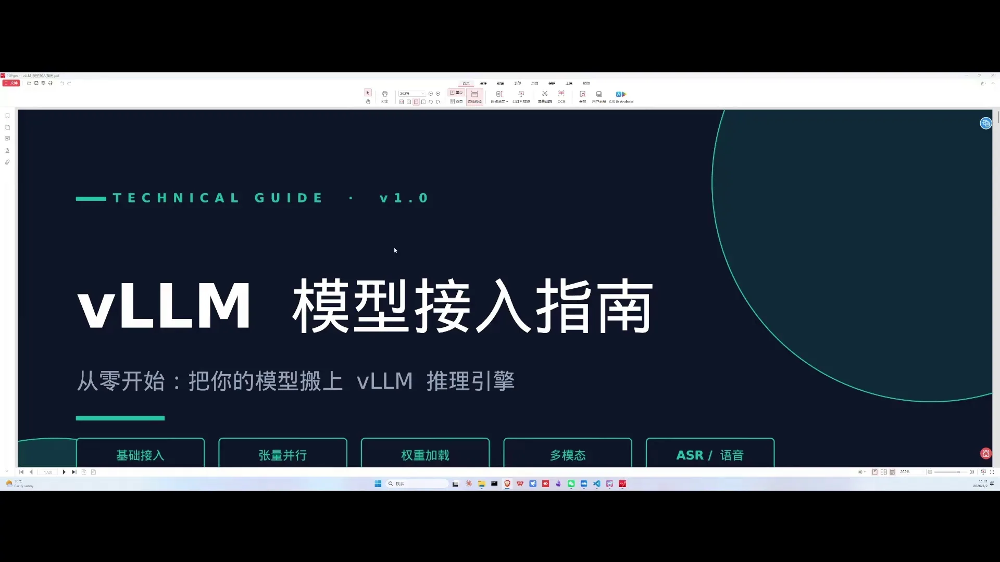 |
| （此区间无字幕） [【跳转到 01:06】](https://www.bilibili.com/video/BV1gYL965ERP/?t=66) | 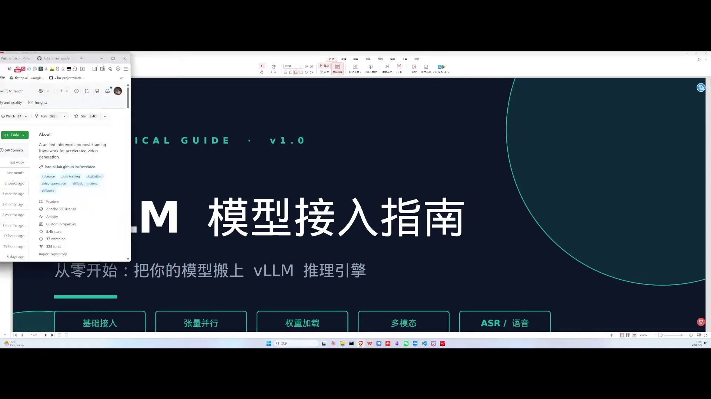 |
| （此区间无字幕） [【跳转到 01:11】](https://www.bilibili.com/video/BV1gYL965ERP/?t=71) | 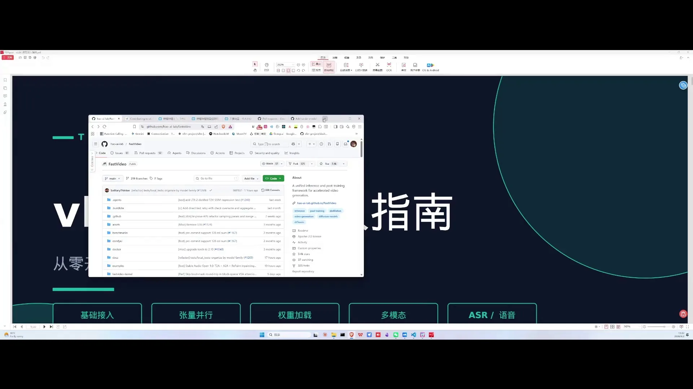 |
| 其实啊，今天要聊的就是：在 vLLM 里面去接入一个模型。 [【跳转到 01:16】](https://www.bilibili.com/video/BV1gYL965ERP/?t=76) | 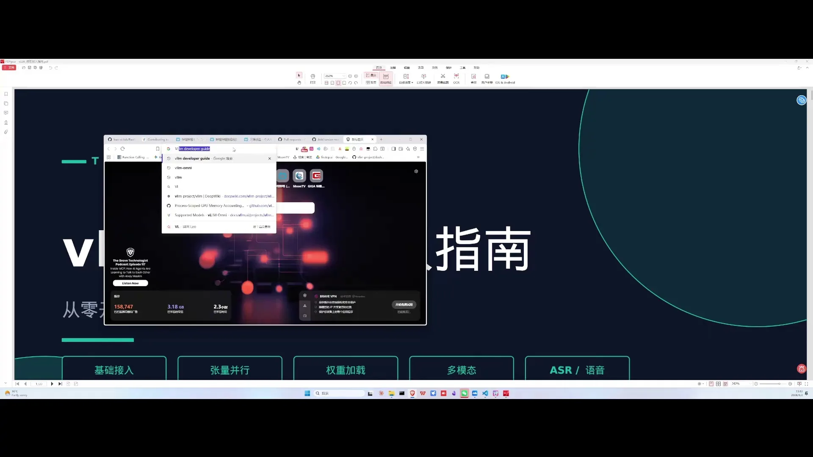 |
| 一般来讲，看 vLLM 的 Developer Guide（开发者指南）就可以了。啊，然后这个是子枫，这就是子枫，对，现在看直播间应该可以看到。哎，子枫，你这个东西好像是改过吧？ [【跳转到 01:21】](https://www.bilibili.com/video/BV1gYL965ERP/?t=81) | 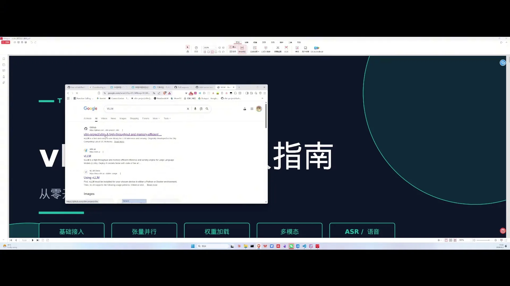 |
| 感觉现在跟凯朝那个长得很像，就是你这些背景是奖杯什么的。OK 好。呃，我这个 PPT 基本上就是靠 AI 做的。因为最开始的话，其实如果你想接入模型——反正我之前最开始学接入模型的时候…… [【跳转到 01:46】](https://www.bilibili.com/video/BV1gYL965ERP/?t=106) | 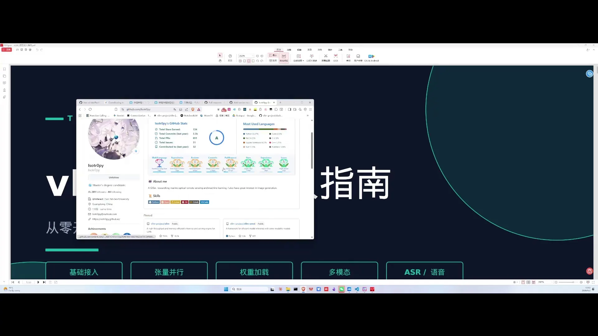 |
| 就是看这个文档，这文档里面讲得很详细了。 [【跳转到 02:11】](https://www.bilibili.com/video/BV1gYL965ERP/?t=131) | 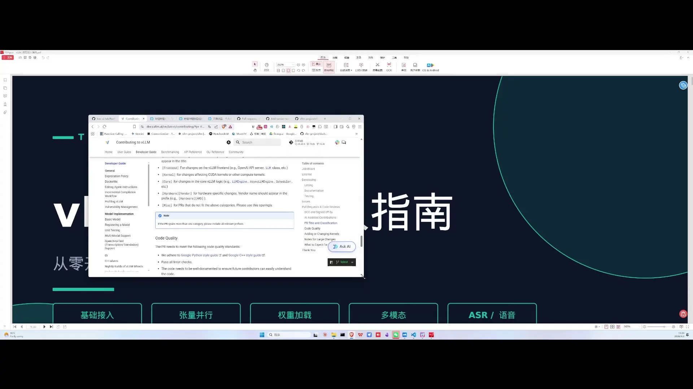 |
| 它会有最基础的内容：这个模型应该怎么接入，对吧，然后怎么注册，怎么写测试，怎么做多模态支持。最后这个应该是后面新加的，我当时做的时候还没有，就是咱们自己去给 VLM 视频做一些支持工作。然后我这个 PPT 基本上算是一个汉化版的。 [【跳转到 02:16】](https://www.bilibili.com/video/BV1gYL965ERP/?t=136) |  |
| 看一下，现在播放的这个。 [【跳转到 02:41】](https://www.bilibili.com/video/BV1gYL965ERP/?t=161) | 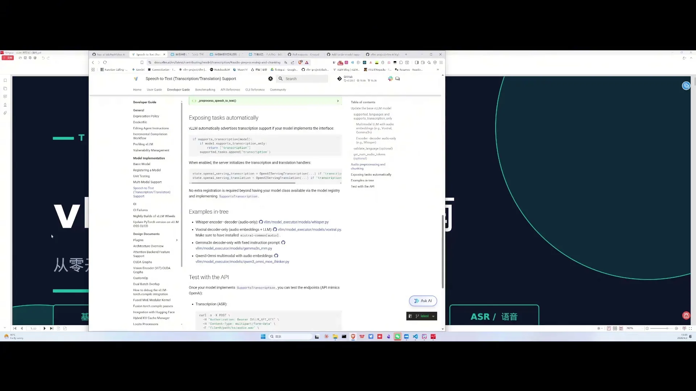 |
| （此区间无字幕） [【跳转到 02:46】](https://www.bilibili.com/video/BV1gYL965ERP/?t=166) |  |
| 对，所以基本上来讲就是一个汉化的 PPT。 [【跳转到 02:55】](https://www.bilibili.com/video/BV1gYL965ERP/?t=175) |  |
| 然后我们怎么接入模型呢？ [【跳转到 03:00】](https://www.bilibili.com/video/BV1gYL965ERP/?t=180) | 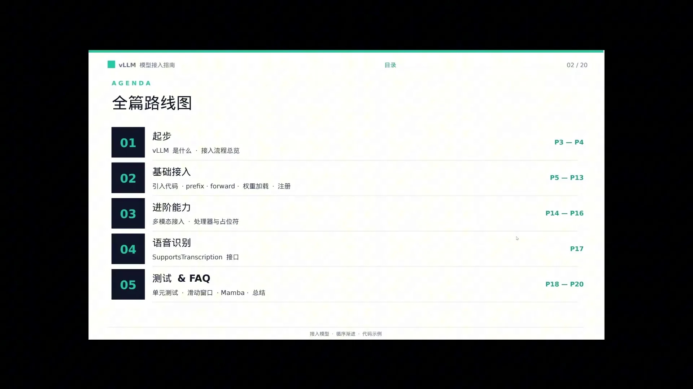 |
| 就是呃，我觉得现在来讲，要接的模型一般可以分成两类：一类是学术机构的，还有一类是大厂的。大厂的模型，他们很多都会做 day0 支持，就是我们会有一些比较专业的人…… [【跳转到 03:05】](https://www.bilibili.com/video/BV1gYL965ERP/?t=185) |  |
| 去接这些大厂模型。所以剩下的这些模型需求，要么来自大厂里的研究机构，或者一些纯学校的机构，他们做的模型可能没有办法做 day0 支持；也有可能是这个模型已经发布了一段时间、一直没人做。这种情况下，就会比较容易出现这种给 vLLM 做支持的需求。 [【跳转到 03:30】](https://www.bilibili.com/video/BV1gYL965ERP/?t=210) |  |
| 哎，子枫，现在主仓那边那种无人认领的模型还多吗？——对，一般无人认领的模型还是比较多的。因为如果是比较……比如说纯 language model 的话…… [【跳转到 03:55】](https://www.bilibili.com/video/BV1gYL965ERP/?t=235) |  |
| 现在比较火的全都是那种非常大的模型，这种模型一般来讲都会做 day0 支持，就是那种几百 B 的模型。——是的。因为学术机构现在应该不太可能去做一些非多模态的模型，因为这块你性能比不过大厂，然后你也……对吧，你现在跟大厂比…… [【跳转到 04:20】](https://www.bilibili.com/video/BV1gYL965ERP/?t=260) | 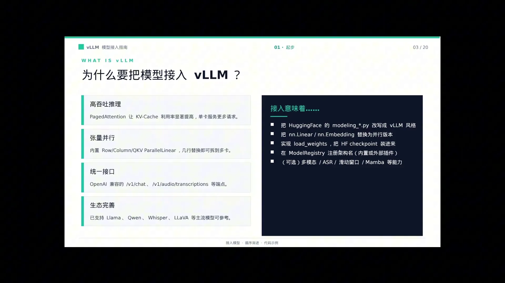 |
| 你即使模型结构做一些创新，其实也很难获得比较好的关注。所以基本上大家都把关注点放到多模态这块。我之前最开始做模型支持的时候，也都是做多模态模型支持。当时只会出现一种情况，就是多模态模型没人接，不会说是大家需要抢的这种情况。 [【跳转到 04:45】](https://www.bilibili.com/video/BV1gYL965ERP/?t=285) |  |
| 因为当时 AI（编程助手）这块也不是很厉害嘛，基本上大家很多都靠手写一些代码。然后呃，这里面就是先介绍了做多模态模型需要准备的一些东西，还有一些就是其他类的模型支持。基本来讲，其实接入模型很关键的…… [【跳转到 05:10】](https://www.bilibili.com/video/BV1gYL965ERP/?t=310) | 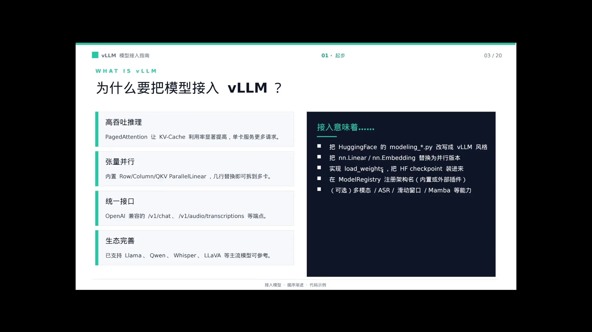 |
| 一点就是：你需要知道这个模型它到底是从什么地方来的，对吧。你看这个模型是不是原本在 vLLM 中就有类似的模型已经被支持了，那你可以直接在它基础上改就行了；如果这个模型在 vLLM 中没有被支持，那你就需要从 Transformers 里面去改。基本就是这样的一个思路。 [【跳转到 05:35】](https://www.bilibili.com/video/BV1gYL965ERP/?t=335) |  |
| 然后整体来讲，这就是接入模型的这一整套流程。最后你看一下，是不是差不多是这个流程，对吧。 [【跳转到 05:56】](https://www.bilibili.com/video/BV1gYL965ERP/?t=356) |  |
| （此区间无字幕） [【跳转到 06:21】](https://www.bilibili.com/video/BV1gYL965ERP/?t=381) | 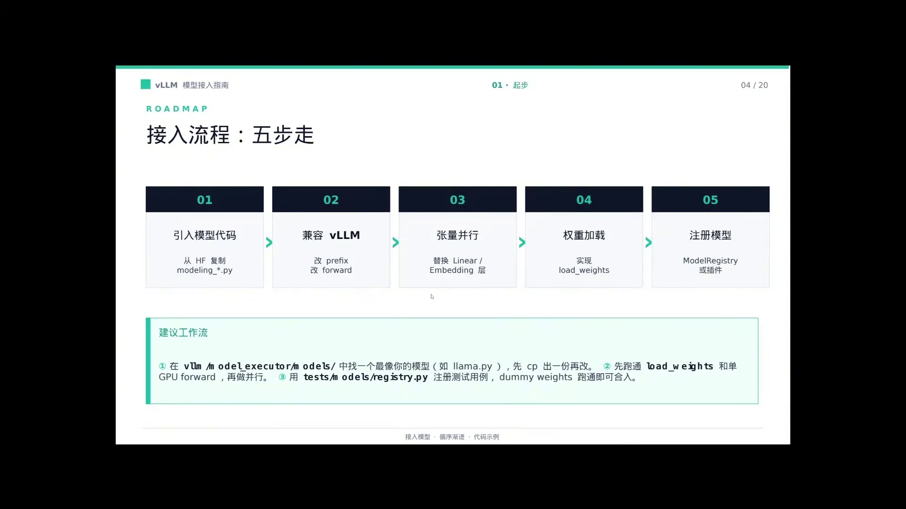 |
| 然后这个就是怎么去引入模型。另外这个许可协议（License）主仓这边会比较重视，对吧。OK，嗯，因为一般来讲…… [【跳转到 06:27】](https://www.bilibili.com/video/BV1gYL965ERP/?t=387) |  |
| 我们会去翻一下原来的代码，看它的许可协议是什么东西。一般来讲，我们 review 这个模型的时候，首先把这个模型拉到我本地，看一下能不能跑通，对吧。然后可能我一开始会先看这代码合不合规范，因为如果太多外部贡献的代码…… [【跳转到 06:52】](https://www.bilibili.com/video/BV1gYL965ERP/?t=412) | 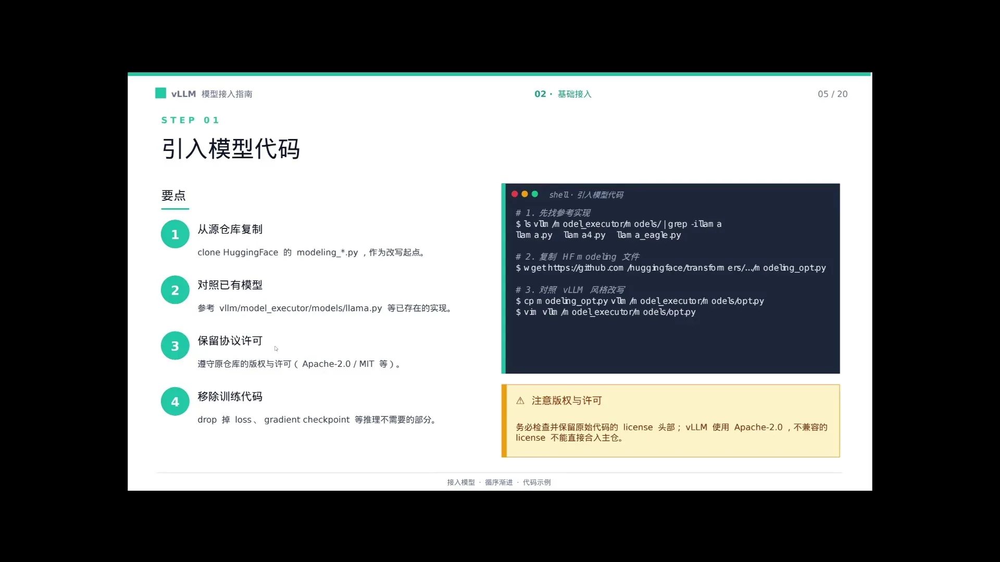 |
| 会导致我都不会去拉你的代码，我就直接在上面去改、去提交了，对吧。如果外部贡献过于严重的话，我们应该是不会考虑去合的。——我靠，等一下，我研究一下。 [【跳转到 07:17】](https://www.bilibili.com/video/BV1gYL965ERP/?t=437) |  |
| OK，呵呵呵。哎，怎么会有延迟呢？ [【跳转到 07:42】](https://www.bilibili.com/video/BV1gYL965ERP/?t=462) |  |
| 哎，上一次直播的时候是能听到声音的，对吧，就是你们的声音。 [【跳转到 08:07】](https://www.bilibili.com/video/BV1gYL965ERP/?t=487) |  |
| 再试一下，现在能听到吗？你们说两句话。喂喂喂喂，听得到吗？ [【跳转到 08:32】](https://www.bilibili.com/video/BV1gYL965ERP/?t=512) |  |
| 呃，现在可以了。OK，我知道是这个扬声器通道有问题，我刚才接了个外置显示器。OK 好。 [【跳转到 08:57】](https://www.bilibili.com/video/BV1gYL965ERP/?t=537) |  |
| 哦，那刚才就像你没听到子枫介绍这块，好，我们继续吧，后面反正就直接继续了。好，然后我觉得这个第四步现在是很重要的。因为我这边看代码，很多人没有意识到需要把这个像是这个…… [【跳转到 09:22】](https://www.bilibili.com/video/BV1gYL965ERP/?t=562) | 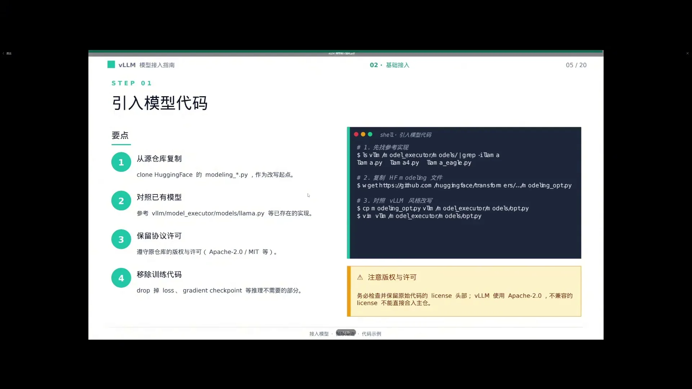 |
| 比如说如果你是照托马斯那边抄的话，那边可有很多训练代码。——是的，因为你像那个 Jupyter（notebook）它只在训练的时候会有用嘛。 [【跳转到 09:47】](https://www.bilibili.com/video/BV1gYL965ERP/?t=587) |  |
| 好，（画面）大概又出了点问题。 [【跳转到 10:12】](https://www.bilibili.com/video/BV1gYL965ERP/?t=612) |  |
| 因为有些大的雷啊，它这个东西就藏在模型代码里面，这东西不像一些比如说 checkpoint、初始化代码，你可能很容易看到。抄代码的时候要看仔细点，把它给删掉。你删不干净的话，我们 review 这边也会提醒你删。——是，然后我们之前是迪单还是谁合的那份代码…… [【跳转到 10:37】](https://www.bilibili.com/video/BV1gYL965ERP/?t=637) |  |
| 那简直是灾难，我靠。当时我们看……我在你们群里不是动不动就说几天吗？每次接模型（的 PR），（review 量）都是看不过来的。他那个模型的代码量实在是太夸张了，就是有的代码你删到最后，它还是有个六七千行。 [【跳转到 11:02】](https://www.bilibili.com/video/BV1gYL965ERP/?t=662) |  |
| 然后你就很容易去漏掉这种东西基本上我们一六这边的话1000行你可能已经要得来回161周了是但我们这边的话就很容易六星哈哎他有的那个就是提交代码的还属于是比如说一些企业的对吧 [【跳转到 11:27】](https://www.bilibili.com/video/BV1gYL965ERP/?t=687) |  |
| 然后他们会很强硬你你想让他们帮忙去改一些这个行业face子仓库东西他都很难去改唉还很多人小时候你你你要求他来一下马车他都得跟你拉扯半天是好 [【跳转到 11:52】](https://www.bilibili.com/video/BV1gYL965ERP/?t=712) |  |
| 然后这个就是打包映射（packed）。刚才子枫讲的就是：这个东西其实只是量化这块需要用的；如果不是量化，你做模型的话是不需要去加这个东西的。——这个东西最好还是写上，最好还是写上，不然别人突然想跑个量化，结果发现各种报错。 [【跳转到 12:14】](https://www.bilibili.com/video/BV1gYL965ERP/?t=734) | 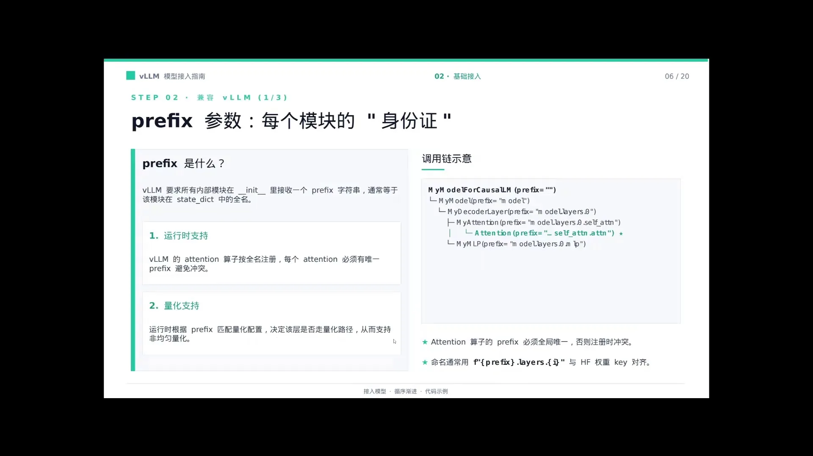 |
| 我理解这个东西，它其实应该是跟那个 Llama 的 weight 里面做一些那种全映射。这块逻辑应该是因为你量化的话，你要将 QKV 这种合在一起，会需要额外处理。嗯，然后这里面因为你 Q 和 KV 的话…… [【跳转到 12:39】](https://www.bilibili.com/video/BV1gYL965ERP/?t=759) | 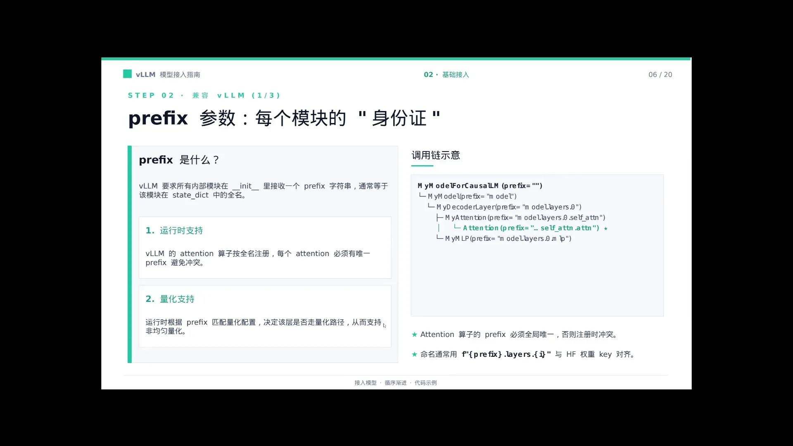 |
| 你 weight loader 的时候，它其实不知道你加载的是哪一个顺序嘛。——对。而且好像主仓这边量化也主要是子枫在负责的，对吧？——没有，是约翰那边。——OK，right。好，然后这个就是这个打包映射的一个…… [【跳转到 12:56】](https://www.bilibili.com/video/BV1gYL965ERP/?t=776) |  |
| 传递方式。嗯，就是你这个（layer 的）前向，然后这个是 attention。attention 的话，你就点开 attention——就基本上来讲就是这个 layers，对吧，它这个是多层的，那你就直接照着它抄，然后这个权重…… [【跳转到 13:21】](https://www.bilibili.com/video/BV1gYL965ERP/?t=801) | 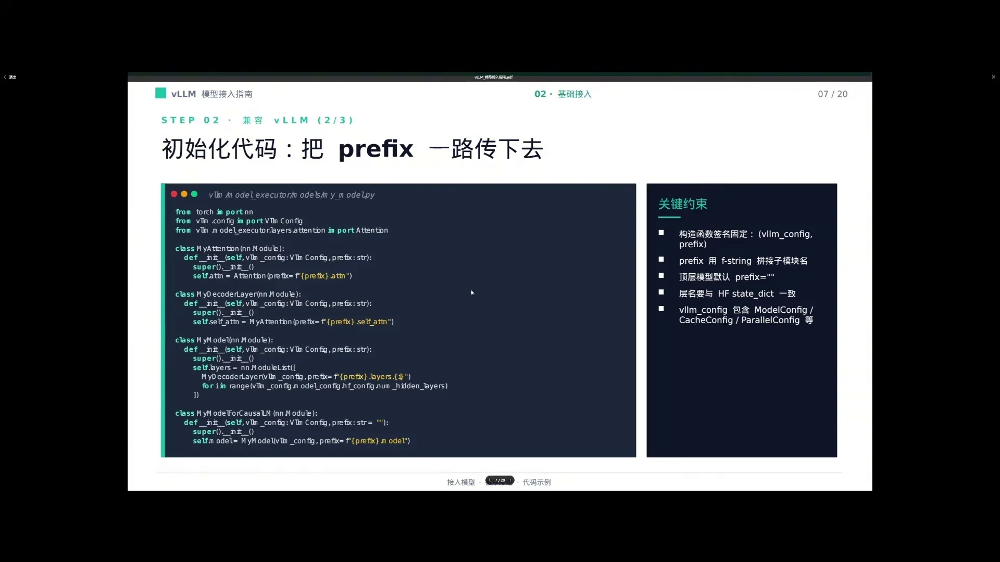 |
| 哎，等一下，又没声音了。其实他这个整个逻辑的话，是跟模型（原仓库）里的 module name 是完全一致的。 [【跳转到 13:46】](https://www.bilibili.com/video/BV1gYL965ERP/?t=826) | 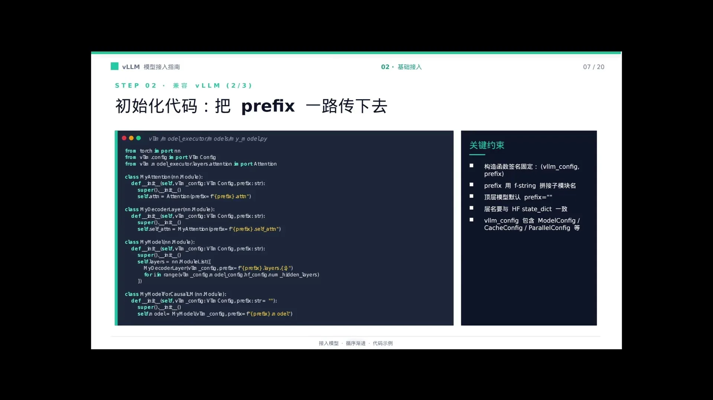 |
| 这个逻辑，呃，是有回放的，好。 [【跳转到 14:11】](https://www.bilibili.com/video/BV1gYL965ERP/?t=851) |  |
| 这个 embedding、input_ids，它是把 input_ids 转成 index。如果你是多模态的话，这边应该也不用改，因为现在多模态那边会自动把多模态的输入走一遍 ViT…… [【跳转到 14:21】](https://www.bilibili.com/video/BV1gYL965ERP/?t=861) | 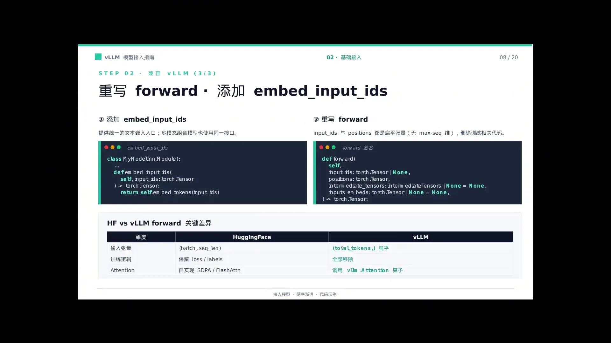 |
| 然后转成多模态 embedding。也就是我输入一个 input，它如何转成 embedding 并嵌入进去。 [【跳转到 14:46】](https://www.bilibili.com/video/BV1gYL965ERP/?t=886) | 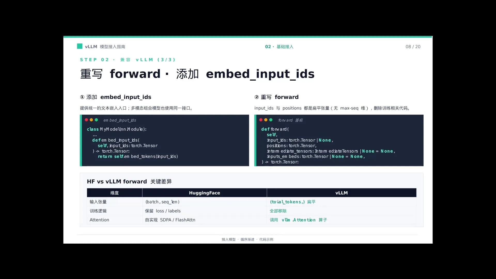 |
| 然后这个我觉得是最重要的：就是所有的模型你提交的话，都是优先要支持 TP（张量并行）的。我们平时做模型的时候，特别是从 Transformers 里面把模型移植过来，如果不支持 TP 的话…… [【跳转到 15:01】](https://www.bilibili.com/video/BV1gYL965ERP/?t=901) |  |
| 我们部署的时候去添加一个 TP，那么实际上你会发现每一张卡，对吧，可能都会占用很多的显存。特别是一般我们开 TP 的目的就是为了让一个模型可以在多卡里面跑起来，结果你一开 TP，你没有去实现这个功能，那么大概率这个模型还是跑不起来。但是我觉得在 vLLM-Omni 这边有很大的问题…… [【跳转到 15:26】](https://www.bilibili.com/video/BV1gYL965ERP/?t=926) | 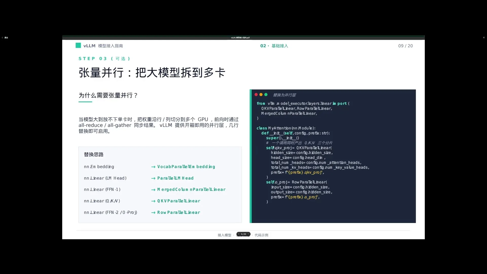 |
| 就是在于它有些模型很小，可能就不适合做 TP，对吧。你像我们在主仓的话，vision encoder 一般是不做 TP 的，是吧？——对啊，其实可以开。因为有像 InternVL，它有个很奇葩的点，就是它的 ViT 是 6B 的啊。 [【跳转到 15:51】](https://www.bilibili.com/video/BV1gYL965ERP/?t=951) |  |
| 对，但是呢你可以不用 TP，走 encoder DP：有个 mm encoder TP mode，把它设成 data 的话，就可以直接进行图像 DP 了。OK，这个可以详见 3 月份 meetup 的那个 PPT，里面有讲。这块我就不太懂，他这个 encoder 的 batch 是…… [【跳转到 16:16】](https://www.bilibili.com/video/BV1gYL965ERP/?t=976) |  |
| 它就是每个卡都保留完整的 ViT。嗯，但是例如我这个对话有四张图嘛，我分两张图到每张卡里面。我们这边也有一个对应的实现，其实跟 ViT-1 差不多，但它的话是 patch 级的嘛，它是对图像的每个 patch 来进行分配啊。 [【跳转到 16:41】](https://www.bilibili.com/video/BV1gYL965ERP/?t=1001) |  |
| 对对对对，但是我们这边的 DP 是 item-wise 的，就是……我有四张图像，每张图像独立分到 DP。哦哎，其实 ViT 是图像分块嘛，我觉得图像应该也可以（按块分）。我想想，哦对，这个我之前跟同事讨论过…… [【跳转到 17:06】](https://www.bilibili.com/video/BV1gYL965ERP/?t=1026) |  |
| 就是有些 ViT 是可以的，但有些像你千问 Qwen2-VL 这些，它本身的 attention 是 sliding window，你这个不能分，OK，就不能按 patch 来分，不然你的 attention 就会不对。因为我记得以前比较传统的一些 ViT，它其实是可以这样按 patch（切分）的，LLaVA 那些是可以的。 [【跳转到 17:31】](https://www.bilibili.com/video/BV1gYL965ERP/?t=1051) |  |
| LLaVA 那些。但你千问的话它有 sliding window attention 嘛。我最近看到有些模型，它是不是不做 vision encoder 了，直接就做 vision embedding？——有啊有啊，就最早我支持的那个 Fuyu-8B，23 年的时候就已经是这样了。那年其他一些模型不也是直接走一层 Linear、 [【跳转到 17:56】](https://www.bilibili.com/video/BV1gYL965ERP/?t=1076) |  |
| 把 patch 直接解过去嘛，从 patch 开始。嗯，因为我感觉这种模型架构可能会好一些，因为我们如果在 LLM 那边开 DP 的话，对吧，之前的这种做法就比如说……因为我们 ViT 本身开销就比较厉害嘛。嗯，你这等于直接跳过了 ViT 了是吧。——但是话说回来…… [【跳转到 18:21】](https://www.bilibili.com/video/BV1gYL965ERP/?t=1101) |  |
| 这个 23 年我就看过一次，后面就没人搞这种了吧，都是 LLaVA style 的。反正也就最近不是 Meta 那个新模型才恢复成这个架构嘛。——啊，因为我觉得主要是 LLaVA，因为我们模型最后还是要靠训练过来的，就是 LLaVA 提供的这套训练机制是非常好的。就原生这种 vision embedding 它有个很大的问题…… [【跳转到 18:46】](https://www.bilibili.com/video/BV1gYL965ERP/?t=1126) |  |
| 是在于你要做个原生多模态支持的模型，对对，那这一块对于很多学术机构来讲，训练成本太高了。像是上海 AI Lab 那边，他们不是就直接拿个现成的 ViT，然后直接微调再接上吗？——哦，它类似于是做一个蒸馏形式吗，对吧？——是，他们（学术界）基本都是蒸馏的。 [【跳转到 19:11】](https://www.bilibili.com/video/BV1gYL965ERP/?t=1151) |  |
| 我看，对，那其实这样来看，这种成本也可以降下来。因为我感觉之前就是有些做 VLM 的，他们也会强调一下自己是原生多模态。然后这个 TP 里面就讲了一些需要去替换的方法。其实这个东西在这个 developer 文档里面…… [【跳转到 19:36】](https://www.bilibili.com/video/BV1gYL965ERP/?t=1176) |  |
| 全都是有的，然后大家可以好好看一看，这东西属于是必须得支持的。 [【跳转到 20:01】](https://www.bilibili.com/video/BV1gYL965ERP/?t=1201) |  |
| 其实你也可以点进去看一下 Llama 是怎么实现的，这对你理解怎么用这些会很有用。这个东西是我觉得很重要的：你一开始第一次接模型时…… [【跳转到 20:11】](https://www.bilibili.com/video/BV1gYL965ERP/?t=1211) | 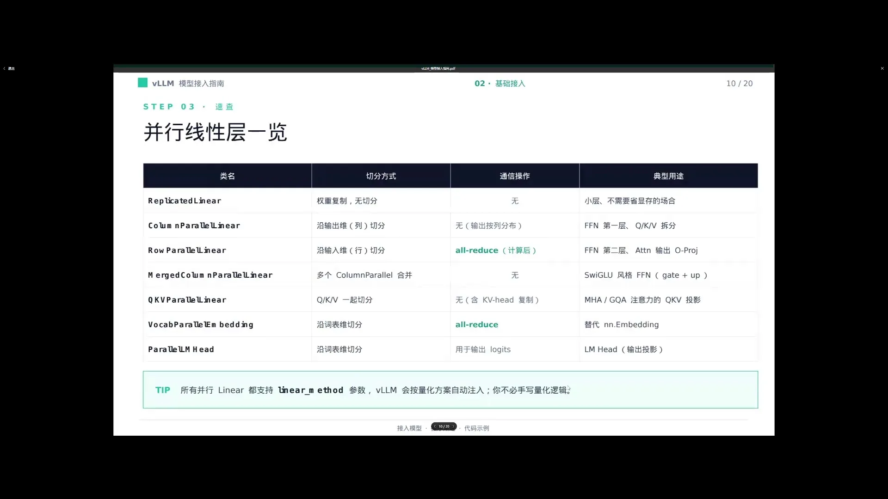 |
| 你可能先要求把它跑通。然后后面的话，比如说你修 bug 或者是对进度的时候，你肯定必然会点进去看一下这个模型怎么实现的啊。 [【跳转到 20:23】](https://www.bilibili.com/video/BV1gYL965ERP/?t=1223) |  |
| 我个人感觉的话，我现在一般看一个框架：首先就是先用 AI 去做一个基本的代码解析，看看有没有自己感兴趣的代码；有感兴趣的代码的话，还是得去 debug 看一下里面具体长什么样，我觉得这样会好一些。 [【跳转到 20:44】](https://www.bilibili.com/video/BV1gYL965ERP/?t=1244) | 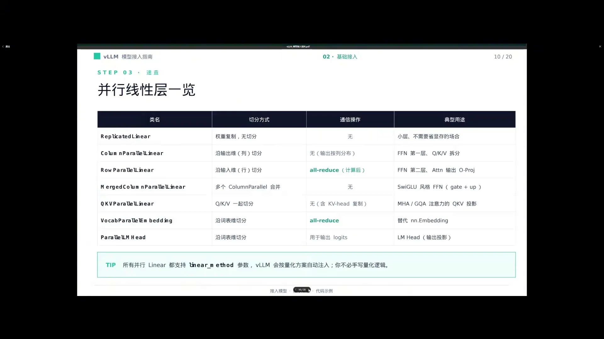 |
| （此区间无字幕） [【跳转到 21:09】](https://www.bilibili.com/video/BV1gYL965ERP/?t=1269) | 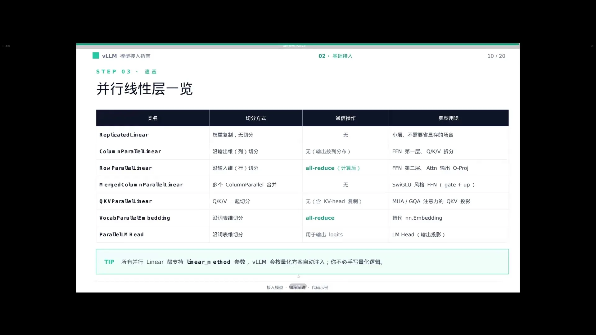 |
| 呃，一直到现在都是同一页 PPT，这个是正常的吗？啊，现在直播间还是第一页？——就是直播间的 PPT 一直是第一页啊。 [【跳转到 21:14】](https://www.bilibili.com/video/BV1gYL965ERP/?t=1274) |  |
| 没有啊，我看直播间是先播了。——对啊，我也看了，直播间换了，已经换了。——卡住了？别吓我别吓我，卡了卡了。OK，这个我觉得这个东西属于是最容易出问题的，就是 loader，所以呢当时因为老是出问题…… [【跳转到 21:39】](https://www.bilibili.com/video/BV1gYL965ERP/?t=1299) |  |
| 我当时加了个功能：就是 loader 其实可以去打印（trace）一下你已经加载的所有权重的名字。我们加了一个可以自动追踪哪些权重没有加载、有哪些加载过的，这个很重要。就是 loader 一定要去 trace 一下。对，我现在 review 代码的时候，看到很多 loader 是纯 AI 写的…… [【跳转到 22:04】](https://www.bilibili.com/video/BV1gYL965ERP/?t=1324) |  |
| 然后那简直就是重灾区。如果你是 dense model 还好，MoE 的话那更恐怖，呵呵。这个 loader 很可能三四百行，对吧，然后完全不知道他写什么。——是啊，MoE 的更严重了。MoE 本身加载就够复杂，就是你可以很明显感觉到…… [【跳转到 22:29】](https://www.bilibili.com/video/BV1gYL965ERP/?t=1349) |  |
| 它就是比如说跑到某个位置出了报错，然后他把报错喂给 AI，AI 就在这个 loader 上面改，来回不停反复地改，最后改出来就是三四百行的 loader。——是这样的啊。——然后直播间的（朋友问）rise 有什么讲究？尽量就照着现成的去改一改，别自己另写了。 [【跳转到 22:54】](https://www.bilibili.com/video/BV1gYL965ERP/?t=1374) |  |
| 其实 loader 这个东西很简单的：就是你一定要开 loading check，一定要去 trace 那个加载过程中的值。loader 这个东西其实很简单：你看它不是有一个 model 的 mapping 文件嘛，就是它里面会写哪个权重名叫什么，对吧。然后你这个权重名只要是跟你模型定义的…… [【跳转到 23:19】](https://www.bilibili.com/video/BV1gYL965ERP/?t=1399) |  |
| 这个权重名一一对应就行了。然后唯一需要的可能是需要做一些 stack（拼接）：就像这里面演示的，把 attention 这一块的 QKV 把它给拼起来；然后就是 MLP 那边的，它有两个上采样（gate/up），也需要把它拼起来。 [【跳转到 23:44】](https://www.bilibili.com/video/BV1gYL965ERP/?t=1424) | 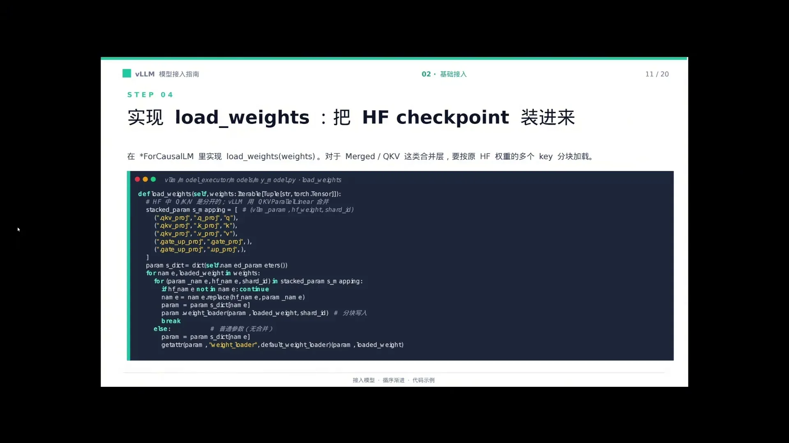 |
| 就这样子。就是你哪里调用了 QKV Parallel 或者 MergedColumnParallel 的话，你就记得要拼。因为这东西其实也是跟前面说的（权重名）替换有关的，对吧：我们做权重名替换的话…… [【跳转到 24:09】](https://www.bilibili.com/video/BV1gYL965ERP/?t=1449) |  |
| 是会有个 QKV Parallel 的那个 Linear；然后如果是 MLP 那层的话，就应该是有个 MergedColumnParallel 的 Linear，它对应的就是这两个部分把它拼起来。 [【跳转到 24:23】](https://www.bilibili.com/video/BV1gYL965ERP/?t=1463) | 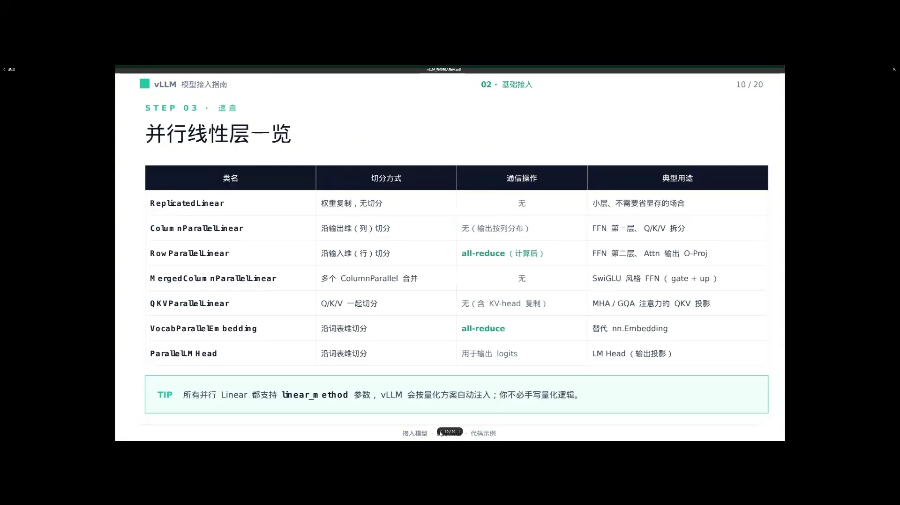 |
| 哦不对，是 MergedColumnParallel 那个什么，是比较拼的。 [【跳转到 24:36】](https://www.bilibili.com/video/BV1gYL965ERP/?t=1476) |  |
| 普通的 ColumnParallel 是拼的。——对，是的是的是是的，对。 [【跳转到 24:43】](https://www.bilibili.com/video/BV1gYL965ERP/?t=1483) | 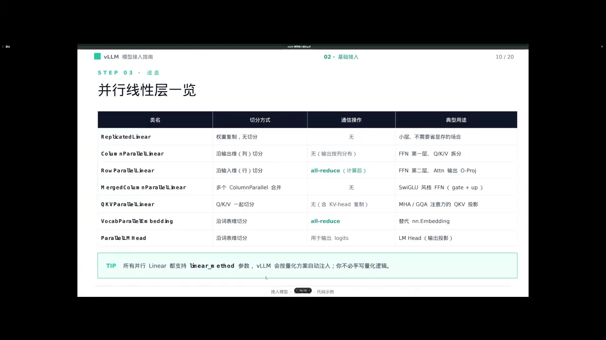 |
| 对，然后我还看到有 loader 是…… [【跳转到 24:50】](https://www.bilibili.com/video/BV1gYL965ERP/?t=1490) | 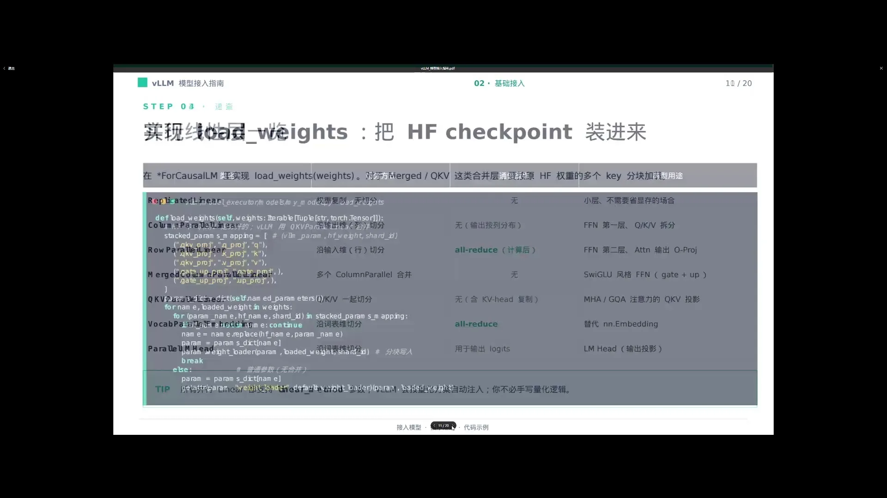 |
| 有一种情况，就是他基本上每个 module 就写一个（loader）。——唉，可以的。其实这个最简洁的做法：一般我们（根）model 写一个，然后 ViT 写一个，最终的模型它可以调用 loader 直接递归地去加载。这其实也是一种方法，而且会简洁很多。但是这个地方也会有个重灾区…… [【跳转到 24:55】](https://www.bilibili.com/video/BV1gYL965ERP/?t=1495) | 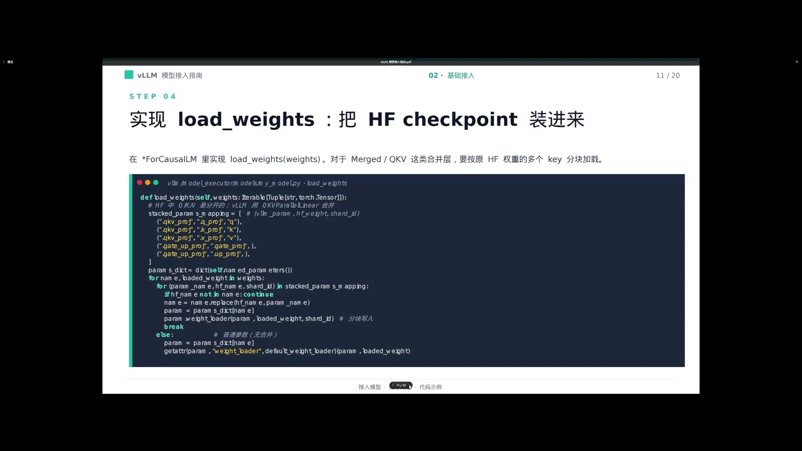 |
| 就是如果是 AI 写的 loader，对吧，那你 review 的话会更加困惑：就是每个 module 他都有个几百行的 loader，然后完全不知道他在写什么。 [【跳转到 25:20】](https://www.bilibili.com/video/BV1gYL965ERP/?t=1520) | 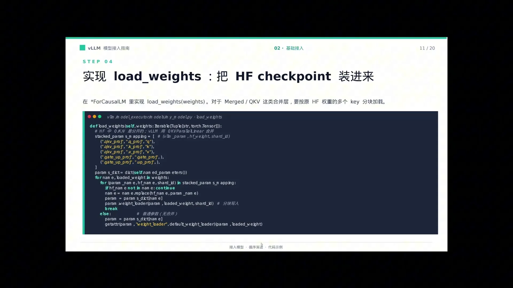 |
| 好好，然后这个主要是介绍 vLLM 的插件功能，对吧。一方面的话，你在主仓上面做的话，就直接可以 built-in，把它注册到你的 model 的 list 里面去；而如果你是在外部的话——很多公司内部相当于自己会 fork 一个 vLLM，去在里面实现自己的模型…… [【跳转到 25:39】](https://www.bilibili.com/video/BV1gYL965ERP/?t=1539) |  |
| 然后为了保证后面 rebase 更方便，一般来讲大家会使用插件形式去做。还有些是这个模型不适合合到主仓里面，那么他自己这边也会做一个分支，就用这种方式去实现。其实现在 vLLM 这边有个 encoder-decoder 的插件，现在的 encoder-decoder model 全部走插件了。 [【跳转到 26:04】](https://www.bilibili.com/video/BV1gYL965ERP/?t=1564) |  |
| OK 那很好。你可以直接看主仓里那个 encoder-decoder 的典型实现，就是一个很典型的插件。嗯。 [【跳转到 26:29】](https://www.bilibili.com/video/BV1gYL965ERP/?t=1589) | 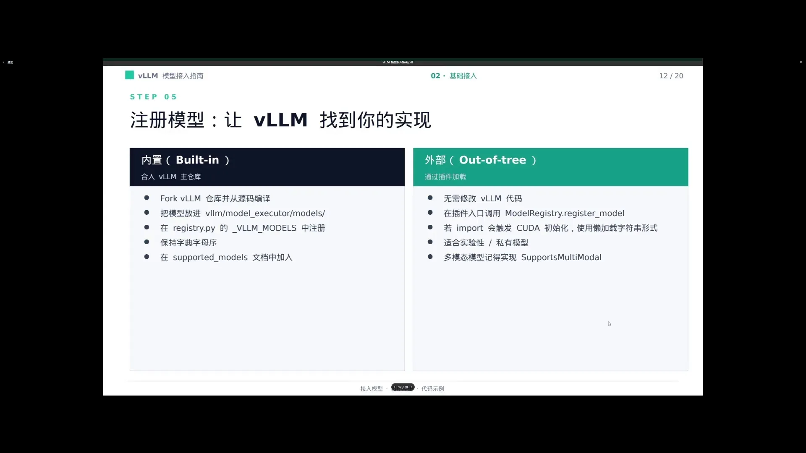 |
| 好，然后这个就是介绍了这两种注册模式，其实两边基本上就是差不多的。 [【跳转到 26:46】](https://www.bilibili.com/video/BV1gYL965ERP/?t=1606) | 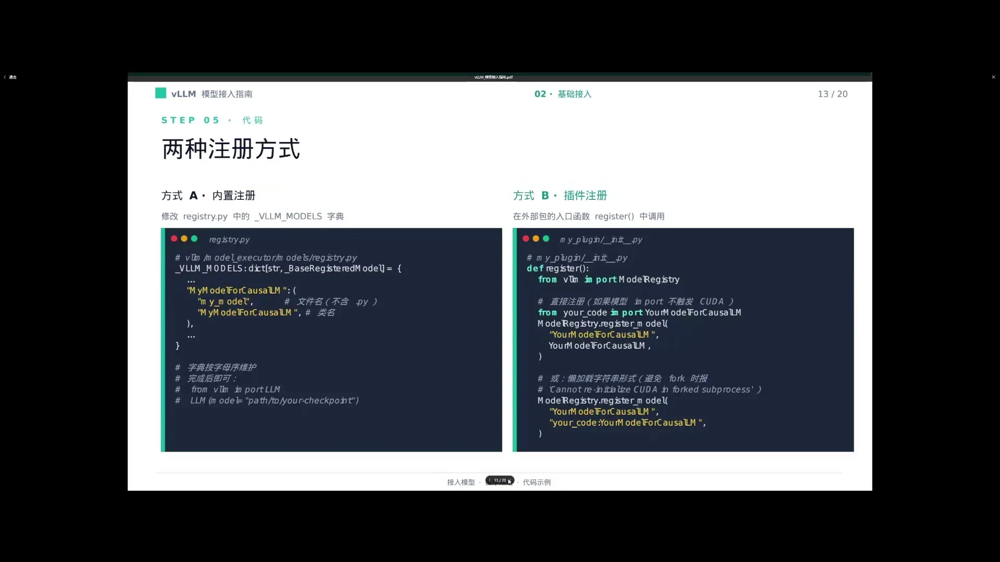 |
| 好，然后这个就属于是多模态这块了。多模态这块的话，其实我个人感觉相对而言是比较复杂的，不过这一块多模态模型的贡献机会我觉得也是比较多的，因为相对而言很多多模态模型没办法去做对应支持，（这块）是最适合参考的…… [【跳转到 26:56】](https://www.bilibili.com/video/BV1gYL965ERP/?t=1616) | 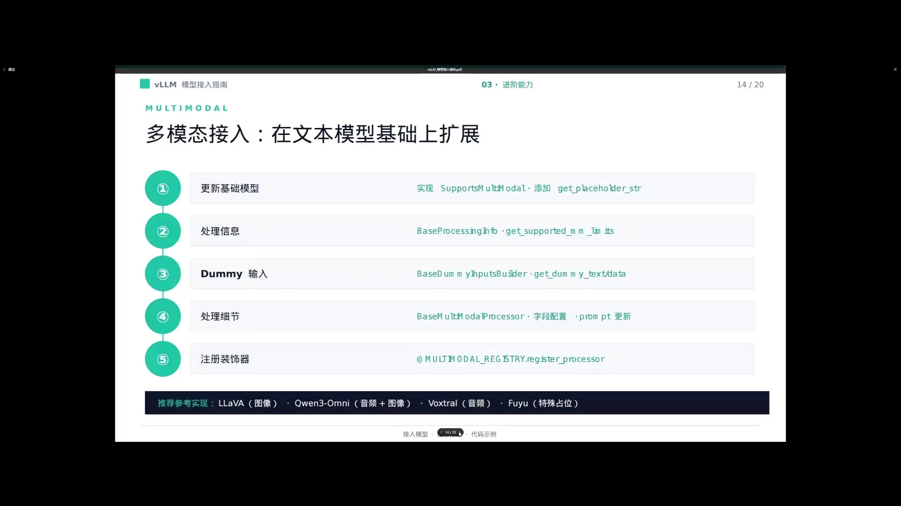 |
| 现在为它超级简单，也不用看 ViT 什么的。——我确实也觉得超级简单。 [【跳转到 27:16】](https://www.bilibili.com/video/BV1gYL965ERP/?t=1636) |  |
| ——是哪个？就最后一个，Fuyu 那个。——哦，这个模型是什么时候的？我都没见过。——23 年，很早，是我写的第一个多模态（模型接入）。它整个模型文件好像只有 300 多行，非常好读。 [【跳转到 27:21】](https://www.bilibili.com/video/BV1gYL965ERP/?t=1641) | 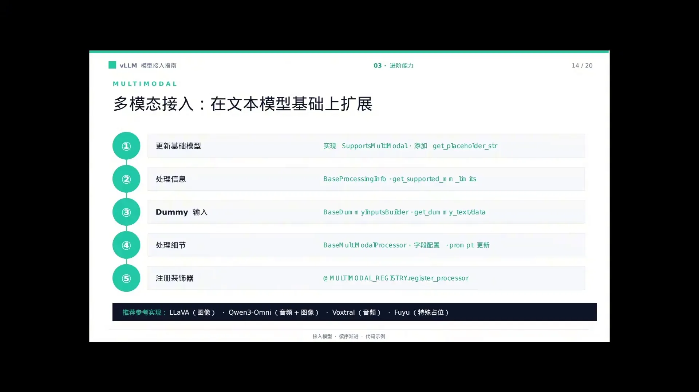 |
| 哦，我都没见过这个模型。我最开始接触多模态的话，都是 LLaVA 系的，大家都是看 LLaVA。但是主仓的 LLaVA 其实不太好读，因为 mm 那边的 processor 跟 LLaVA 耦合在一起了，那你读起来会很困惑…… [【跳转到 27:46】](https://www.bilibili.com/video/BV1gYL965ERP/?t=1666) | 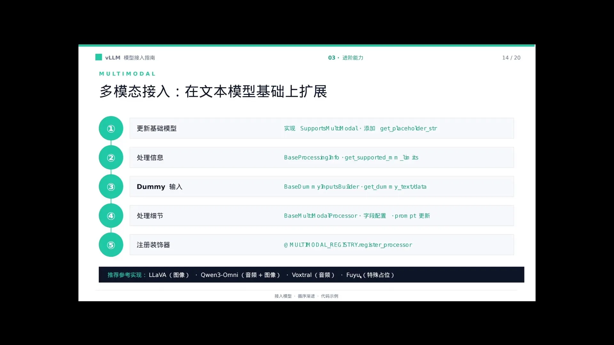 |
| 为什么这里会调用多个 ViT？——说实话，多个 ViT……我反正记得我当时看的时候有什么 LLaVA、LLaVA-NeXT，一堆文件一堆模型。嗯，对。然后我当时接的第一个模型是在 LLaVA-NeXT 之前出的，它有些思路其实跟 LLaVA-NeXT 很像。 [【跳转到 28:11】](https://www.bilibili.com/video/BV1gYL965ERP/?t=1691) |  |
| 哦我想起来，当时好像也是堆 patch 是吧？——对对对对。 [【跳转到 28:36】](https://www.bilibili.com/video/BV1gYL965ERP/?t=1716) |  |
| 然后这个地方的话，就是我觉得多模态一个比较重要的衔接点：就是你的（模型）跟 mm processor，还有 dummy input 这块地方，是要保证能够对得上的。你 dummy input 其实也很关键，一点就是你这个 dummy input 一定要保证你输出的那个 embedding 要是最长的…… [【跳转到 28:47】](https://www.bilibili.com/video/BV1gYL965ERP/?t=1727) |  |
| 理论上最长的是。不然你部署的时候可能会报显存（OOM）。就是应该来讲是有一个配置，这配置文件会写比如说你支持的最长序列是什么样子，然后这里面应该有多少个 image，对吧。然后它会先通过这种东西去构造一个 dummy input…… [【跳转到 29:12】](https://www.bilibili.com/video/BV1gYL965ERP/?t=1752) |  |
| 然后 dummy input 拿去先跑一遍嘛，我知道最坏情况下 encoder 可能要占多少，剩下的我就可以分给 KV cache 去了。基本上来讲，我觉得主要需要注意一点：就是你这个图像（占位）替换，最后要保证它能打到这个最长的（长度），否则的话…… [【跳转到 29:37】](https://www.bilibili.com/video/BV1gYL965ERP/?t=1777) |  |
| 其实很容易看出来的。就如果你写得有问题的话，那你应该是在后面运行的时候可能会出现 OOM；然后还有一个就是你这地方可能有问题的话，它直接做个 shift，就直接对不上了。还有一个点，这里的（配置）是用来 optional 地 disable 一些 modality 的…… [【跳转到 30:02】](https://www.bilibili.com/video/BV1gYL965ERP/?t=1802) | 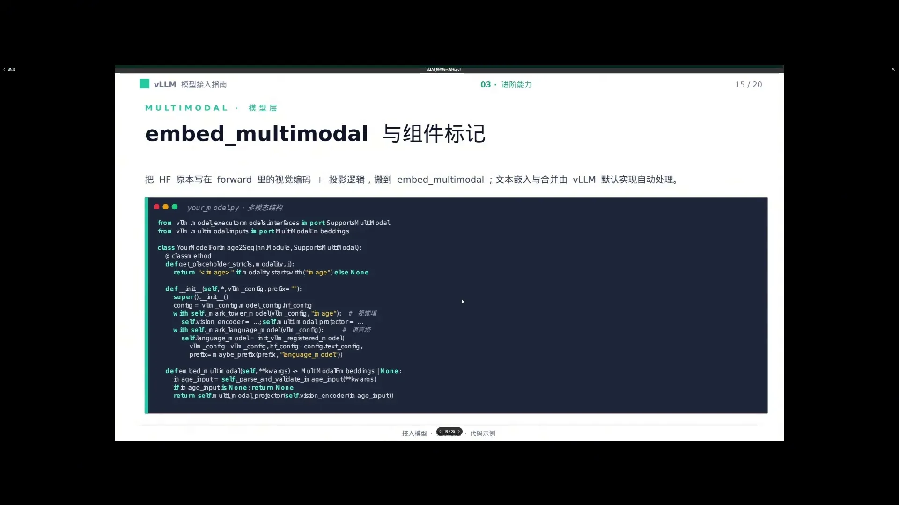 |
| 例如像千问 Qwen-Omni 里那些，我可能只需要视觉，音频不想要的话可以关掉。——可以，现在可以。嗯，其实这种支持多个模态的模型，我觉得以后会是比较主流的。——对，肯定是趋势。 [【跳转到 30:27】](https://www.bilibili.com/video/BV1gYL965ERP/?t=1827) |  |
| 我们 any-to-any 肯定是趋势的。但 any-to-any 我觉得它比如说同时支持音频、图像、视频输出，我觉得不一定必要，而且比较难；但是支持文本生成跟图像生成一体，或者文本跟音频一体，应该是趋势。是的。然后这个模态（输出）这一块一般来讲会尽可能拓展到所有的模态，因为这个东西看起来就会感觉很有用…… [【跳转到 30:52】](https://www.bilibili.com/video/BV1gYL965ERP/?t=1852) | 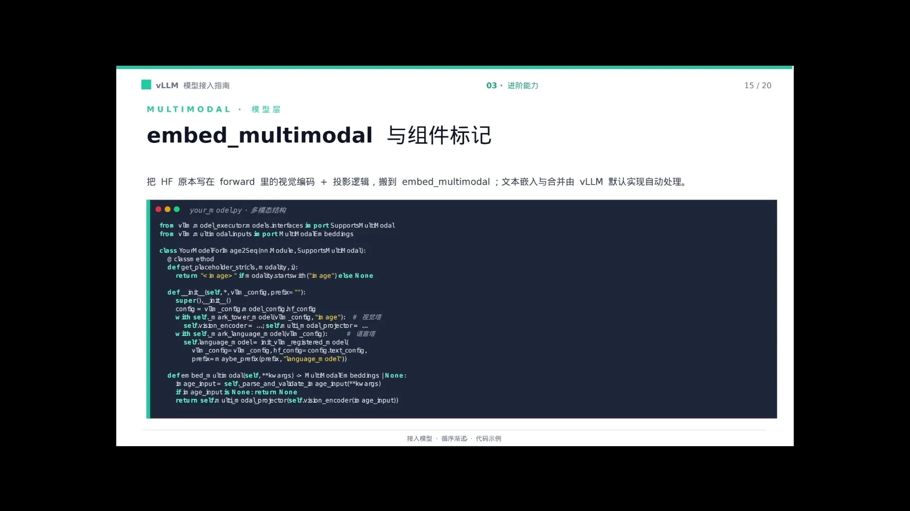 |
| 是因为你多模态输入基本就加个 ViT 嘛，但是你输出的话要加的东西就多了。对，而且这里我觉得还跟你是在线还是离线有很大关系，就可能会整个改变你的推理范式。比如说如果你是一个在线服务的话，那你基本上只能够去走这种自回归的方式…… [【跳转到 31:17】](https://www.bilibili.com/video/BV1gYL965ERP/?t=1877) |  |
| 比如说去生成视频或者是生成音频这一块，对吧。而如果你是个离线任务的话，基本上大家会更倾向于把所有的（内容）一起做 attention 然后去做生成。因为我感觉这样的话，一般来讲模型的质量会好一些，更适合离线任务。 [【跳转到 31:42】](https://www.bilibili.com/video/BV1gYL965ERP/?t=1902) |  |
| 对，之前主仓也在讨论那个 stream input 不好，现在也还是只有个别那边在用。Dummy input 我之前看主仓那边代码的话，它主要就是可以在 decode 的时候直接把 input 往 decode 的（序列）里面去加，对吧。嗯，但这个的话应该目前还是只有个别那边在用…… [【跳转到 32:07】](https://www.bilibili.com/video/BV1gYL965ERP/?t=1927) | 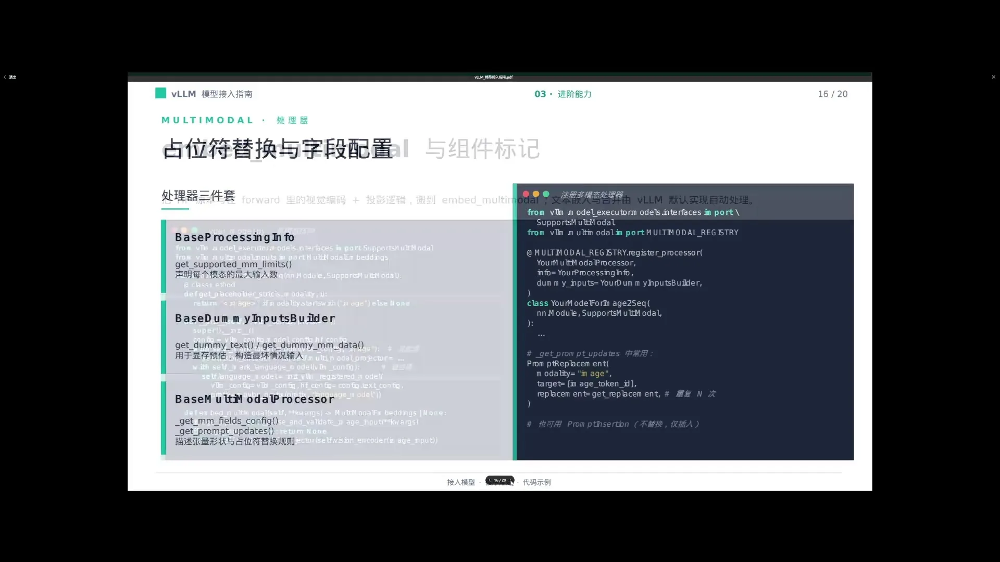 |
| 这功能其实很有用的，它可以做到双工音频交互。——对这种（需求）生产的肯定支持吧，因为我觉得那些厂商肯定各有各的魔改版本…… [【跳转到 32:32】](https://www.bilibili.com/video/BV1gYL965ERP/?t=1952) | 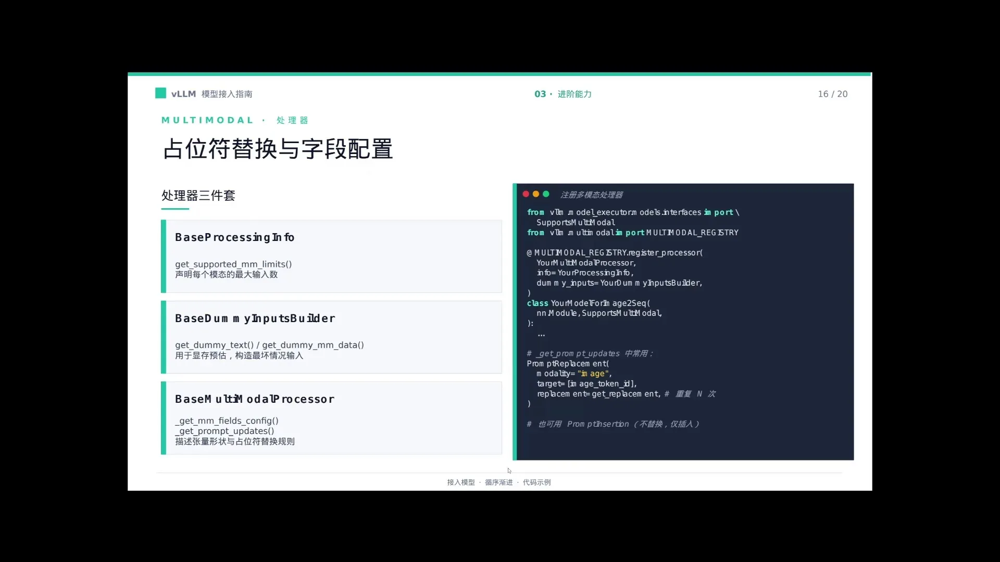 |
| 因为这个东西很明显很适合做产品。好，然后这个就属于是多模态这一块非常重要的几个了：就是 BaseProcessingInfo 对吧，然后 BaseDummyInputBuilder，然后 BaseMultiModalProcessor。子枫可以介绍一下…… [【跳转到 32:57】](https://www.bilibili.com/video/BV1gYL965ERP/?t=1977) |  |
| 这几个主要是用来做什么的？BaseProcessingInfo 其实就是告诉你我要用哪些 processor。因为我们这边默认是假设你是调用 HuggingFace 那边的 processor 嘛，一般来说 processor 会要提供基本信息：我这是什么模态、我们要调用哪些（组件）。这里会看到有些 get_hf_processor 这些的函数在里面…… [【跳转到 33:22】](https://www.bilibili.com/video/BV1gYL965ERP/?t=2002) | 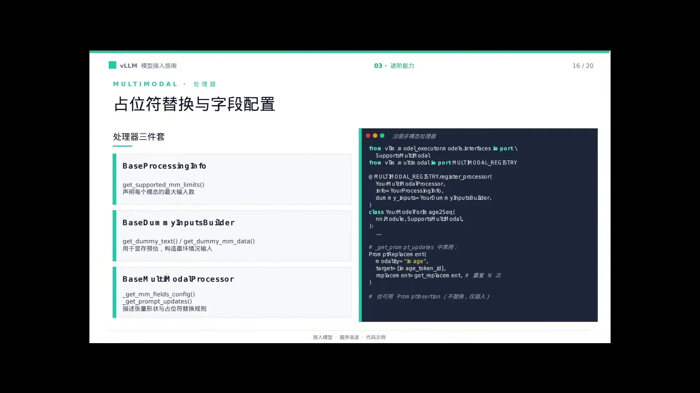 |
| 然后一些辅助的计算，例如我计算有多少个 token 是要用来做 placeholder 之类，也可以塞到里面去。DummyInputBuilder 的话刚才子枫也介绍过了，就是用来构造 dummy input 的…… [【跳转到 33:47】](https://www.bilibili.com/video/BV1gYL965ERP/?t=2027) |  |
| image input 变成 video……其实这些 get processor（update）这些的话，其实跟那个 processor cache，就那个 processor 的缓存有关：我们这边一张图片处理过一次，第二次就会直接从缓存里面拿。这在多轮对话里面是很有用的。get mm config 的话就是定义我…… [【跳转到 34:12】](https://www.bilibili.com/video/BV1gYL965ERP/?t=2052) |  |
| 因为 HuggingFace 那边的 processor 它会输出好几个字段，但有一些是用在训练里面的，实际推理上面是用不了，所以我们要 skip 掉它。——唉，就是我觉得你现在打开一个 Fuyu 的（代码），可能直接对着（源码）看会更好。——好好好好，可以可以。 [【跳转到 34:37】](https://www.bilibili.com/video/BV1gYL965ERP/?t=2077) |  |
| （此区间无字幕） [【跳转到 35:02】](https://www.bilibili.com/video/BV1gYL965ERP/?t=2102) |  |
| 你先打开一个 F 开头的文件。 [【跳转到 35:07】](https://www.bilibili.com/video/BV1gYL965ERP/?t=2107) | 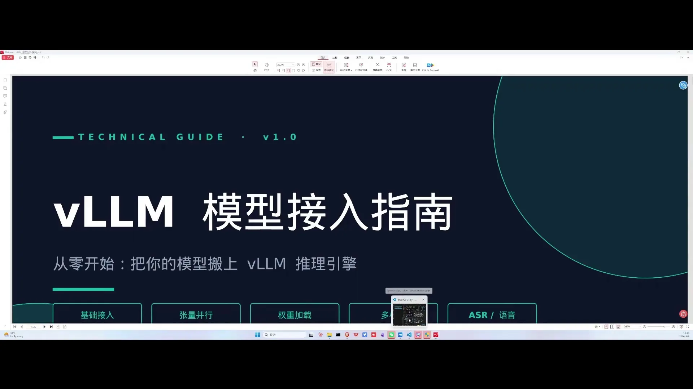 |
| 就拿（别的）不了，对吧。那看到它 F 开头，直接个 Fuyu 吧，Qwen2-VL 因为有一点还是太复杂了。OK。 [【跳转到 35:12】](https://www.bilibili.com/video/BV1gYL965ERP/?t=2112) | 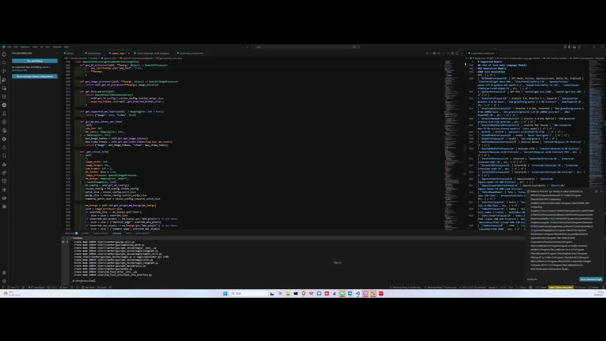 |
| 上面 F 开头这个东西很简单的，如果大家去研究多模态模型怎么接，可以优先看这个，这应该是最短的模型了。我靠，就三百（行），超简单的，它甚至没有 ViT。——哎，它没有 ViT？——哦哦对对。 [【跳转到 35:37】](https://www.bilibili.com/video/BV1gYL965ERP/?t=2137) |  |
| 它是那个 vision embedding 的做法，对。——哦。好像有人说字太小了，要不要放大一下。OK。哎，我很久没有用过 Windows 了，Windows 怎么（缩放）了，Ctrl 加 Ctrl 加 Ctrl 加…… [【跳转到 36:02】](https://www.bilibili.com/video/BV1gYL965ERP/?t=2162) | 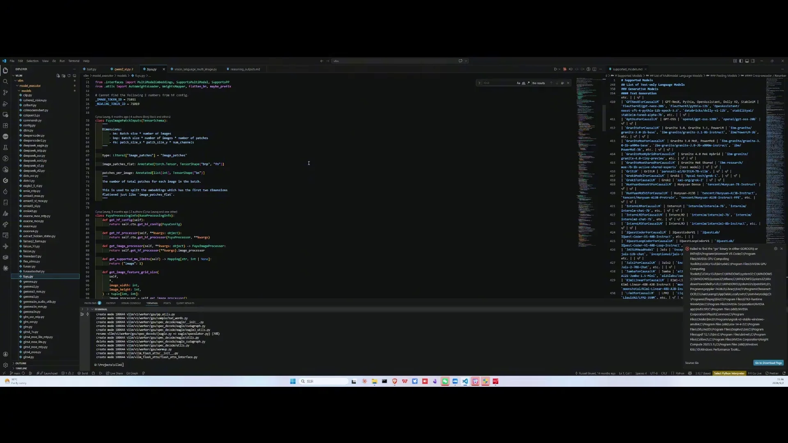 |
| OK 现在可以了吧，再放大一点也可以。哦对，这个（输入形状定义）一定要记得写啊。 [【跳转到 36:27】](https://www.bilibili.com/video/BV1gYL965ERP/?t=2187) | 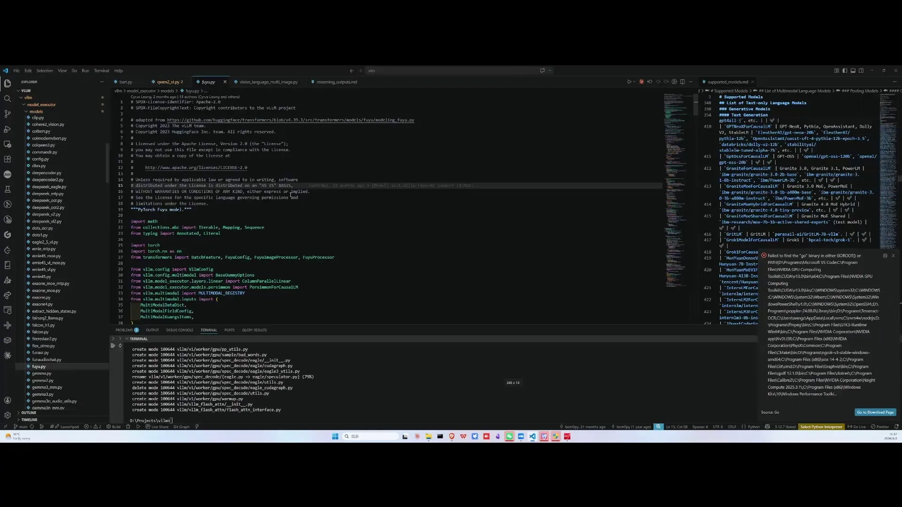 |
| 因为这个是用来定义你这个 input 形状是什么样的，我们会调用这个东西来验证它的输入形状。——哦我记得之前我好像……噢我想想，以前是一个普通的字典，后面我们加了这个形状验证的功能。——这什么时候加的功能？——应该也是去年年中吧。 [【跳转到 36:52】](https://www.bilibili.com/video/BV1gYL965ERP/?t=2212) | 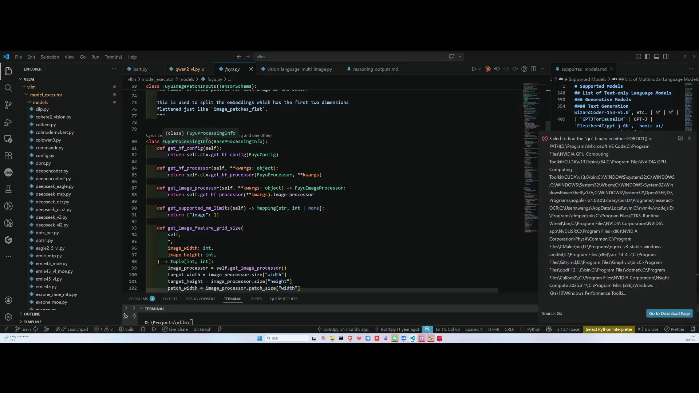 |
| 年终，加了有一段时间了。——哦唉，我都没有印象这个东西。我靠。——你当时写的时候应该还没有加这个功能。——对。我当时就是这里，像这个 image patch 的话就代表它是个二维的输入嘛，它的直接输入是二维…… [【跳转到 37:17】](https://www.bilibili.com/video/BV1gYL965ERP/?t=2237) | 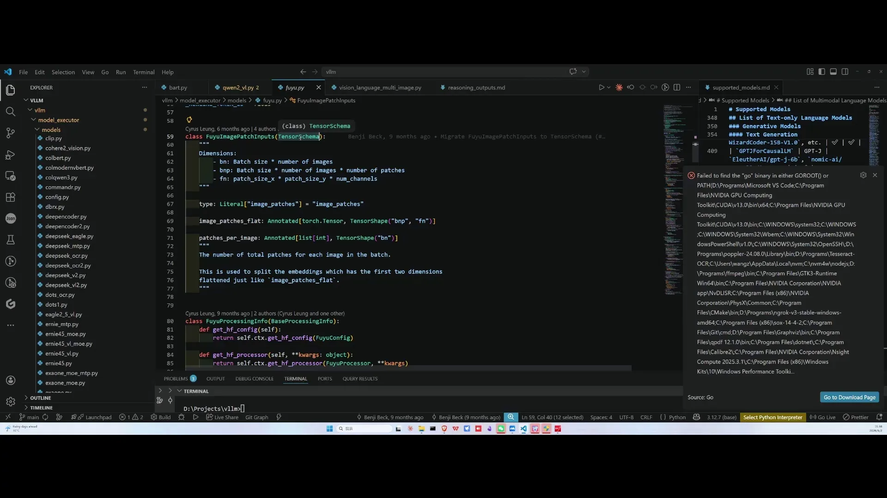 |
| 然后这个就是 ProcessingInfo，在下面就（是）这样写。对，就是例如我们这个模型它支持单独输入，那就 image 等于一。然后这个是它的 text 的 processor 和 image processor，它主要就是用来做一些图像或者是文本的预处理阶段的…… [【跳转到 37:42】](https://www.bilibili.com/video/BV1gYL965ERP/?t=2262) | 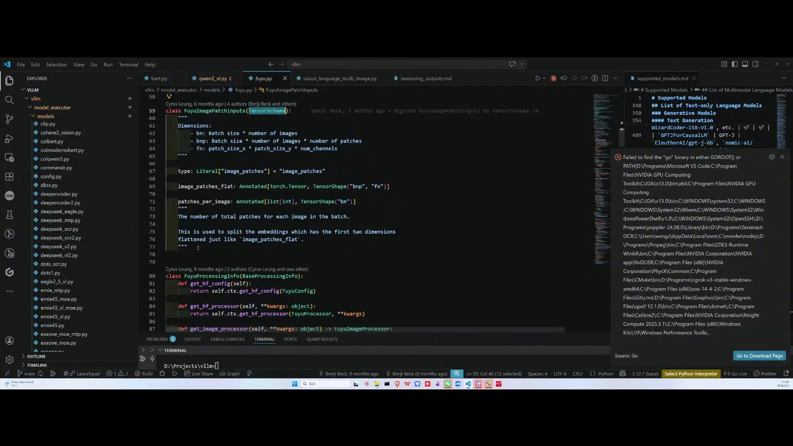 |
| 对，就是告诉他们我们要调用哪些（组件）来用。其实这个（一般）它跟 HF 那边有个 config，会自动识别出他用的哪个 processor，要自动加载。这些是一些辅助函数…… [【跳转到 38:07】](https://www.bilibili.com/video/BV1gYL965ERP/?t=2287) | 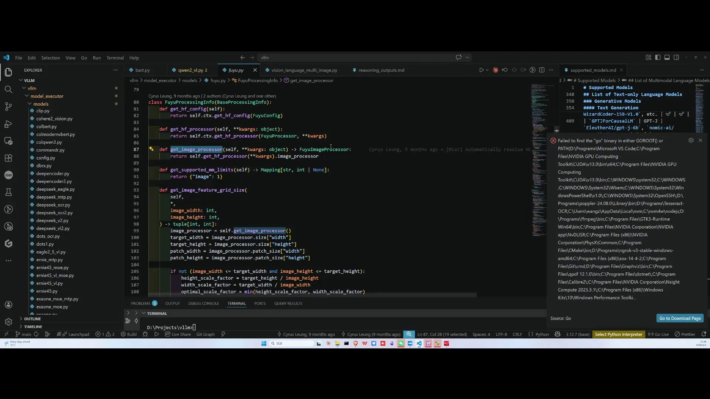 |
| 就是用来做一些处理后的后处理辅助而已。get image token 就是告诉我：我输入一个 image，它能提供多少个 token 来用。对，在 vLLM 这边的话它是需要做个替换的…… [【跳转到 38:32】](https://www.bilibili.com/video/BV1gYL965ERP/?t=2312) | 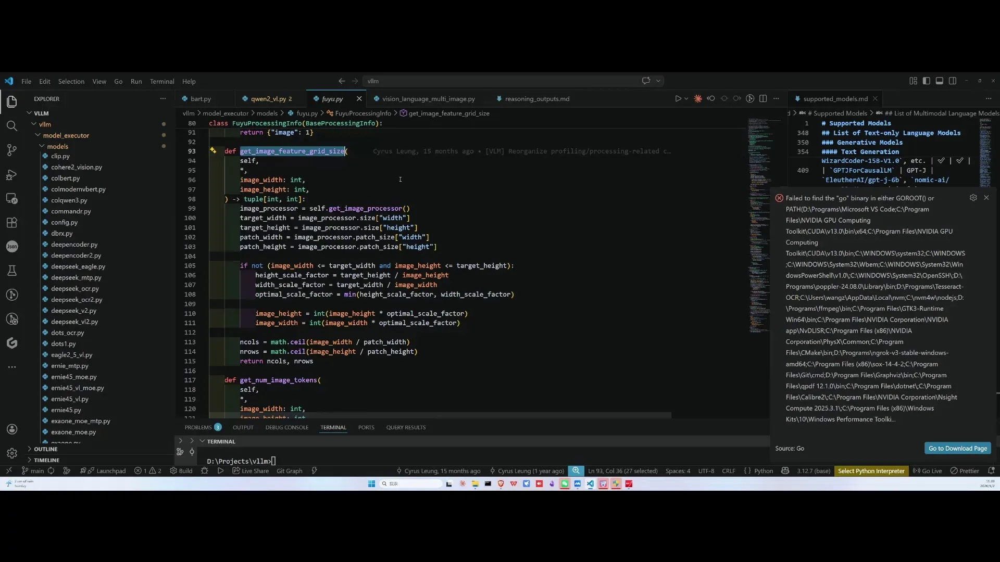 |
| 就是他会把占位符替换掉，然后替换就需要靠这个东西来进行，替换成多少个（token）。——啊不是，用这个替换……这个只是估计我这里要用多少个（token）。——哦，这个只是辅助函数而已。——OK。但是我记得是要下面那个（max）那个也是个辅助函数，只不过本身应该写在 DummyBuilder 那边，但是我想了想放在这也行。OK。 [【跳转到 38:57】](https://www.bilibili.com/video/BV1gYL965ERP/?t=2337) | 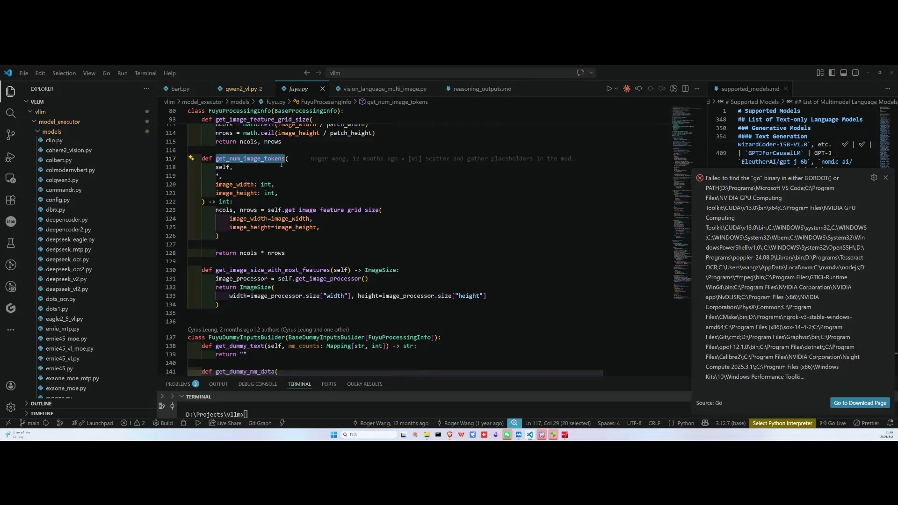 |
| 是它最大最坏情况那个图像大小有多大嘛。好，这个就是 DummyInputBuilder 的。对，Dummy（Input）那边比较特殊，是因为这个模型它本身没有占位符，它的图像是直接插入到你文本输入的最前面的…… [【跳转到 39:22】](https://www.bilibili.com/video/BV1gYL965ERP/?t=2362) | 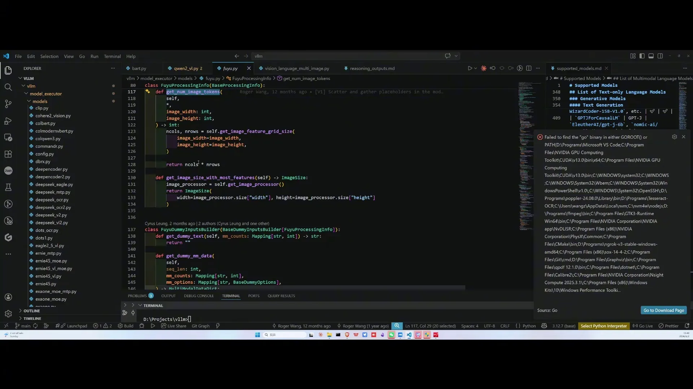 |
| 所以这里 write 出来就是一个空白。——哦可以。然后大家也可以看一下，应该有很多其他模型它是有这种占位符的。——对，很大部分模型都有占位符，一般就是（少数模型）跟 Fuyu 没有占位符。——我找一找。 [【跳转到 39:47】](https://www.bilibili.com/video/BV1gYL965ERP/?t=2387) | 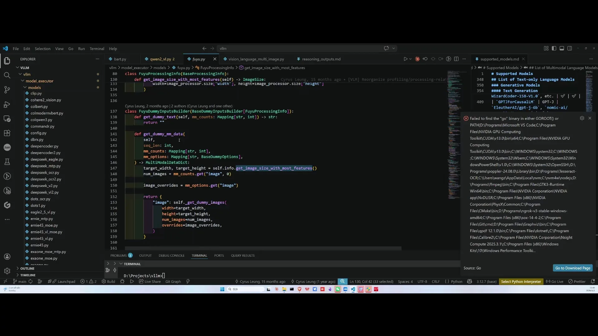 |
| 哎呀你看 DeepSeek-VL 那就乱了，你不如看看 LLaVA。OK 我看 LLaVA 那个（实现）啊，很乱的，因为这东西学起来各种兼容性问题。——拉一下 list 吧。——对，你看就是有的这个 num image 乘以上…… [【跳转到 40:12】](https://www.bilibili.com/video/BV1gYL965ERP/?t=2412) |  |
| 这个 image token，然后这个 image token 的话它就是根据这个 processor 的 image（配置）。——哦哦不对不对不对不对。哎，他那个替换的地方是在哪啊？——没有，替换是在下面 MultiModalProcessor 那里。 [【跳转到 40:37】](https://www.bilibili.com/video/BV1gYL965ERP/?t=2437) | 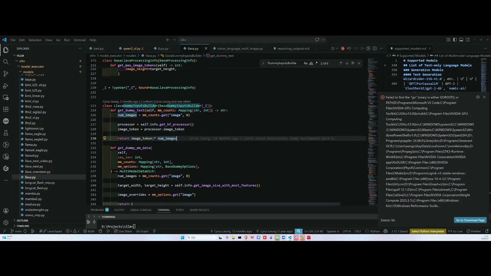 |
| 他有个 get processor update？——噢对对对，好，是在这里。——就 get_replacement：我这里这个完整的占位符我要怎么插进去。然后我记得他有一个函数是可以去那个挑着查的，对吧？——对，可以，其实就是这个函数吧。 [【跳转到 41:02】](https://www.bilibili.com/video/BV1gYL965ERP/?t=2462) | 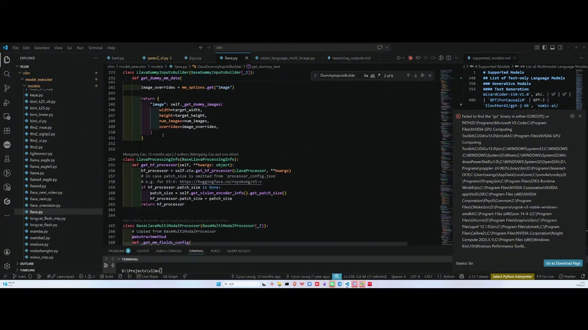 |
| 就 get_replacement，它会自动识别你要插在哪里吗？——哦对对对。——我看到了看到了。OK，好，我们再回到这个 Fuyu 这里来。 [【跳转到 41:27】](https://www.bilibili.com/video/BV1gYL965ERP/?t=2487) | 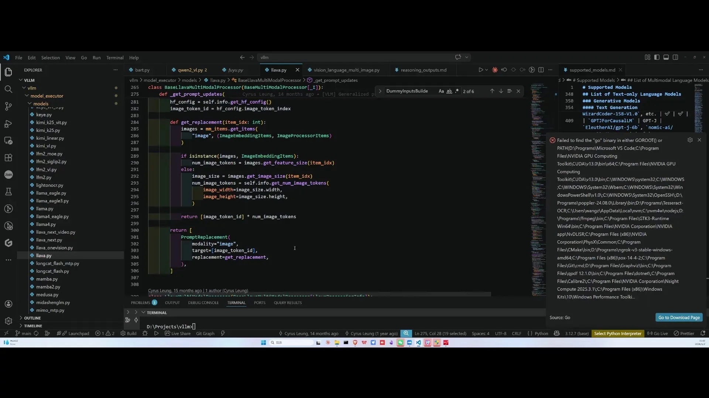 |
| 嗯，等我看一下，看看看。然后这个是 MultiModalProcessor。这个 MultiModalProcessor 跟前面的 image processor 有什么关系呢？mm processor 的话是执行整个完整的 processor 吗？ [【跳转到 41:52】](https://www.bilibili.com/video/BV1gYL965ERP/?t=2512) | 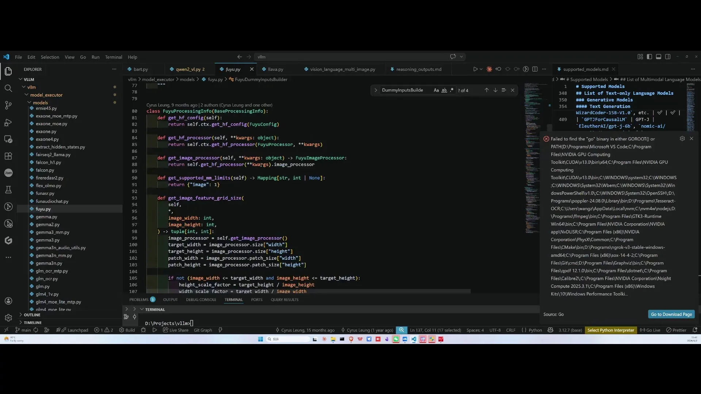 |
| 就你不是有个 call hf processor 吗？嗯，他这里就是调用了 HF processor 来进行处理。但是因为很多时候 Transformers 那边的输出跟 vLLM 这边的预期其实不太一致的，对。这里的话我们是 override 一下，然后做一下后处理。例如我们这里…… [【跳转到 42:17】](https://www.bilibili.com/video/BV1gYL965ERP/?t=2537) | 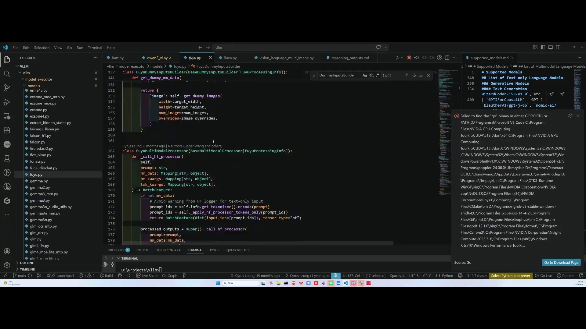 |
| 它 HF 那边会多一个 batch 的维度，但是我们当时写的时候是不希望它有（batch）的，所以就做一下（去掉 batch 维的）处理。其实大部分如果 HF 那边写得好的话，其实不用 override 这个 call hf processor，直接调用基类就行。 [【跳转到 42:42】](https://www.bilibili.com/video/BV1gYL965ERP/?t=2562) | 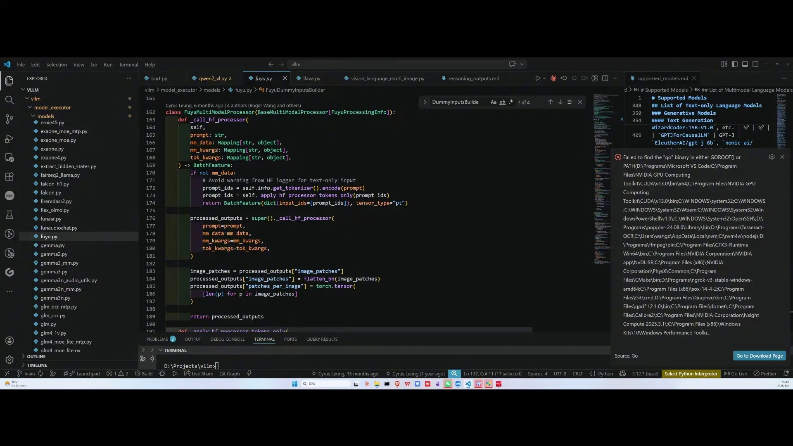 |
| 然后 token（输出）这边就是做了一个 check，因为他当时这个模型会漏掉一个 bos token，就手动处理一下。一般接模型就不用改这里，这个属于特殊情况。嗯。 [【跳转到 43:07】](https://www.bilibili.com/video/BV1gYL965ERP/?t=2587) | 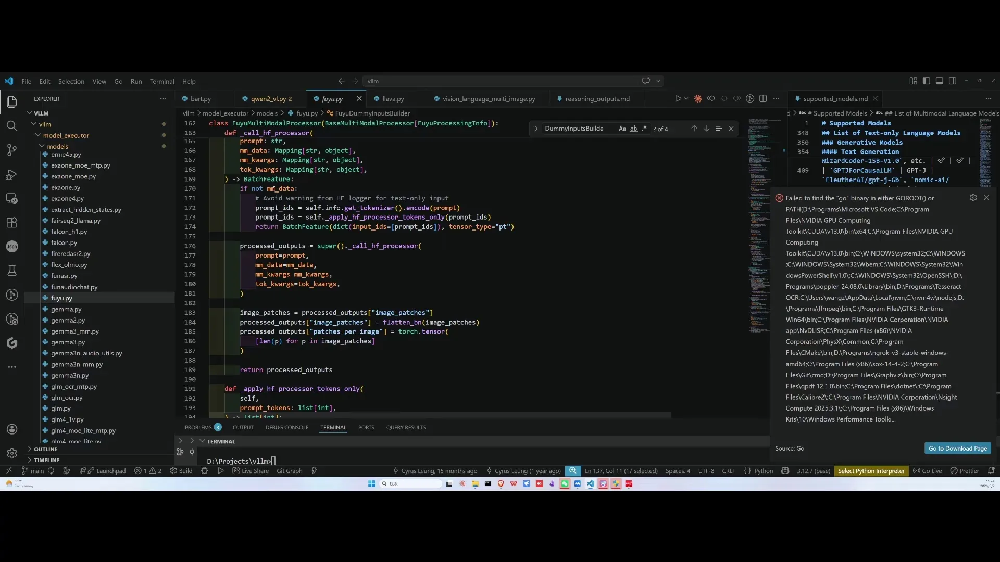 |
| get mm fields 的话就是告诉我们要用哪些——我 HF processor 输出以后要用哪些字段作为输入。这里的话 Fuyu 是用了两个嘛：一个 image patch，因为我删掉了那个 batch 维，所以的话得用 patch 和 image 来识别…… [【跳转到 43:32】](https://www.bilibili.com/video/BV1gYL965ERP/?t=2612) | 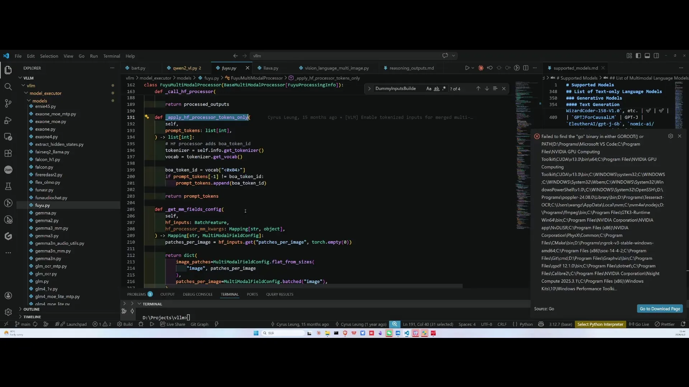 |
| 我对每个 image 标一个。因为 vLLM 是 concat 的 batch 嘛，每个（样本）是直接拼在一起 concat 的，所以要用这个来（区分），免得不同（样本）里面混在一起。好，然后这个就是刚才所说的，对吧，对它做多个 token 替换。 [【跳转到 43:57】](https://www.bilibili.com/video/BV1gYL965ERP/?t=2637) | 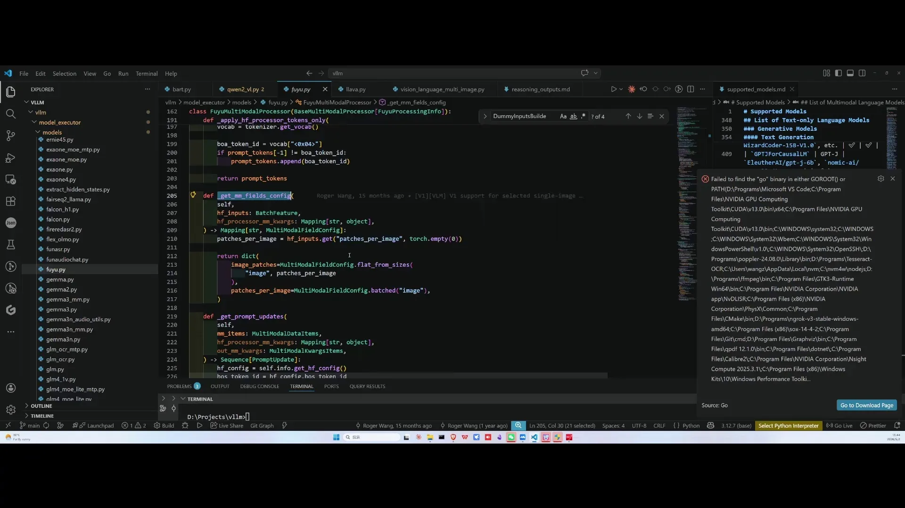 |
| 然后这个 image token。哦，然后这个多模态的话，还是需要有些注册的，是需要注册一下它的（处理器）。嗯，当然有现成的话可以直接注册现成的。——对，都是一样。 [【跳转到 44:22】](https://www.bilibili.com/video/BV1gYL965ERP/?t=2662) | 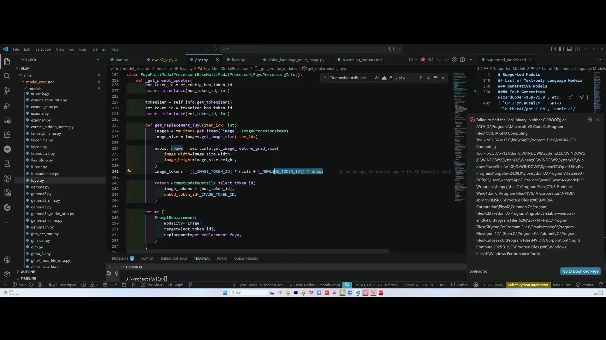 |
| 其实就是很多情况下我们做的模型是可以直接在一些模型基础上改的。就比如说像 Qwen——千问（衍生模型）很多很多，对吧，我们只要往底下翻。——对啊，这个（类）就是当时写的，他写了。对。 [【跳转到 44:47】](https://www.bilibili.com/video/BV1gYL965ERP/?t=2687) | 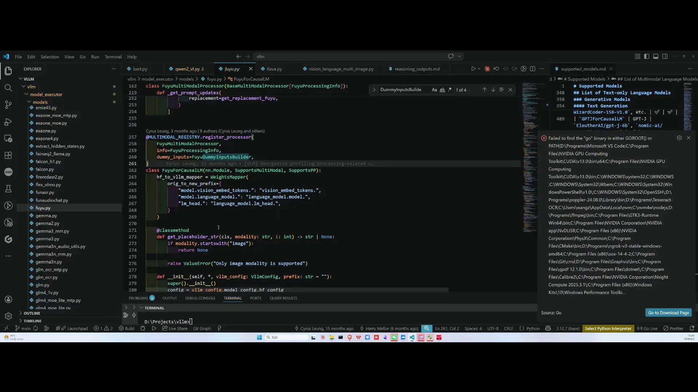 |
| 也有很多这种样子的，这我之前做的 TeleChat2，然后我感觉应该还有好多，都是可以在 Qwen2 基础上改的。其实这个东西你只需要……嗯，基本 Qwen2 跟 InternVL 都是被各家一起抄的。InternVL 我当时感觉它性能真的超级好。 [【跳转到 45:12】](https://www.bilibili.com/video/BV1gYL965ERP/?t=2712) | 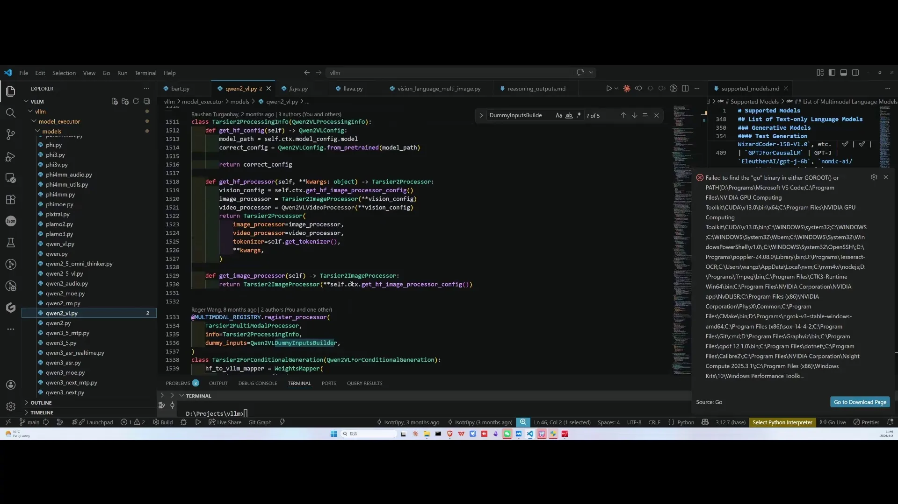 |
| 嗯，可惜好像是也不知道他们（下一代）什么时候出。对，就是我当时做的时候其实也就是把他这几个替换一下子就行了。 [【跳转到 45:37】](https://www.bilibili.com/video/BV1gYL965ERP/?t=2737) | 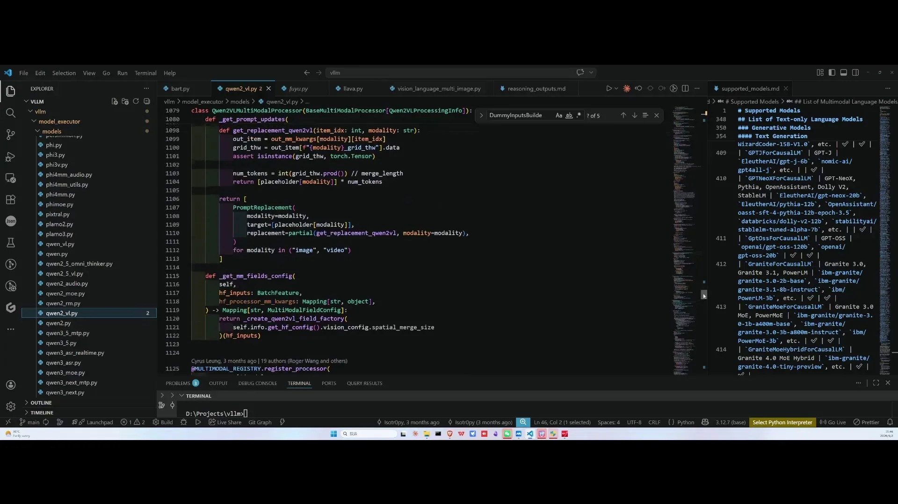 |
| 这是当时 TeleChat2 的。好。 [【跳转到 46:02】](https://www.bilibili.com/video/BV1gYL965ERP/?t=2762) | 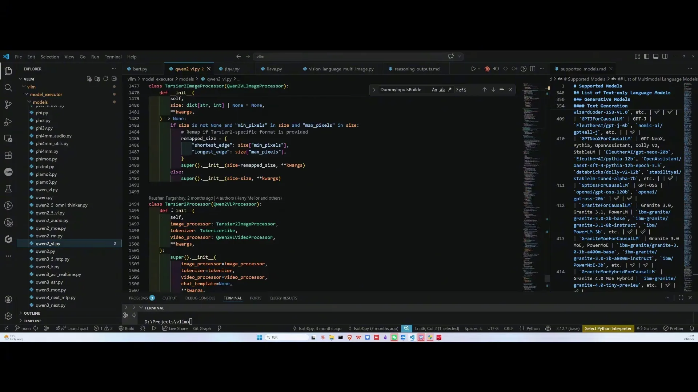 |
| （此区间无字幕） [【跳转到 46:11】](https://www.bilibili.com/video/BV1gYL965ERP/?t=2771) | 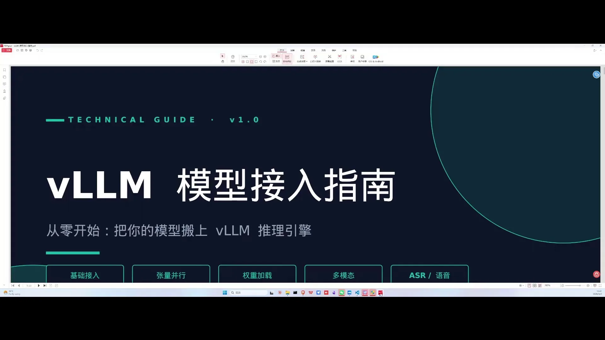 |
| （此区间无字幕） [【跳转到 46:16】](https://www.bilibili.com/video/BV1gYL965ERP/?t=2776) | 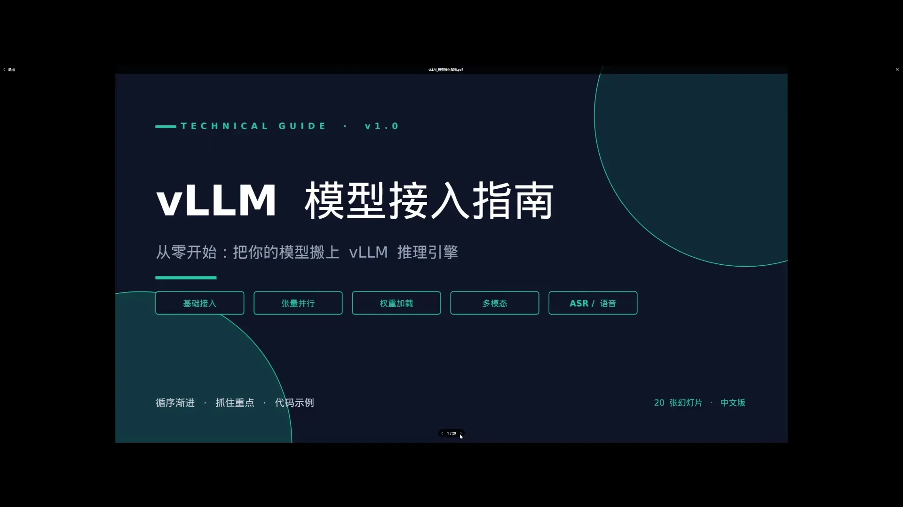 |
| （此区间无字幕） [【跳转到 46:21】](https://www.bilibili.com/video/BV1gYL965ERP/?t=2781) |  |
| 哎，这个接口是什么接口啊？——哪个？——这个哦，这个是 ASR 那边的。因为（服务）除了 chat completion 的话，它有个 transcription 接口嘛，就直接输入语音自动转录。——哦，这个可以去看那个千问 ASR 啊。 [【跳转到 46:26】](https://www.bilibili.com/video/BV1gYL965ERP/?t=2786) |  |
| 千问 ASR 有几个接口。OK 我看一看。 [【跳转到 46:51】](https://www.bilibili.com/video/BV1gYL965ERP/?t=2811) | 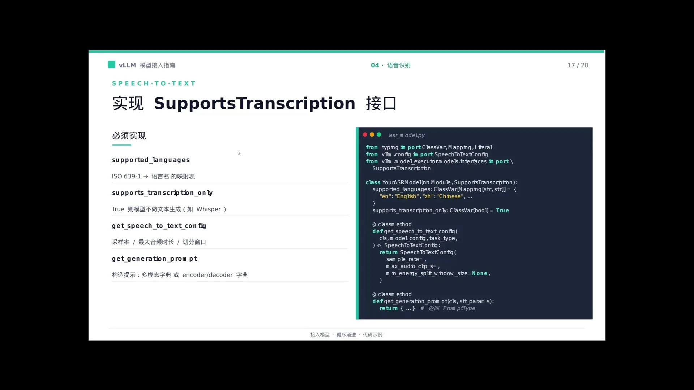 |
| （此区间无字幕） [【跳转到 46:56】](https://www.bilibili.com/video/BV1gYL965ERP/?t=2816) | 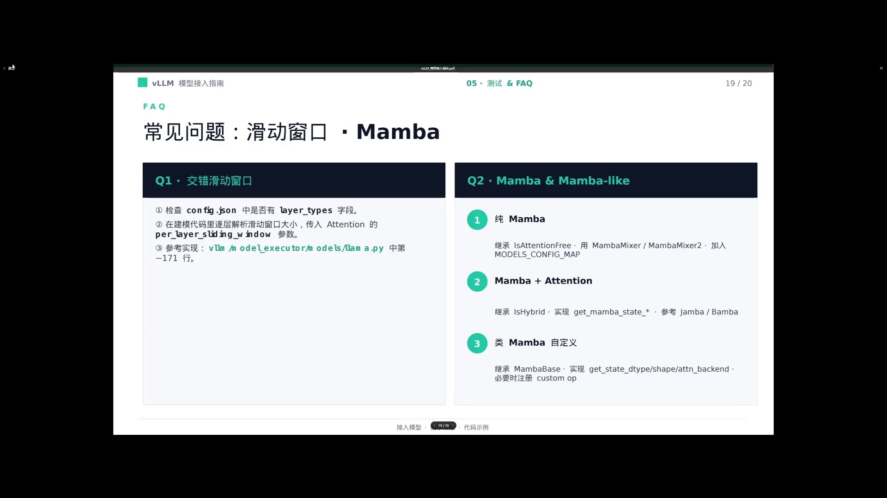 |
| （这种架构）的话我们就不建议新手入门了吧，坑好多的。唉，我之前接一个模型，就是我们自己的一个模型，当时是做那种混合注意力，它里面的 MInference 那一块试了好几个版本总出问题。——哎，你这（跑起来）是直接报显存（OOM）是吧？ [【跳转到 47:01】](https://www.bilibili.com/video/BV1gYL965ERP/?t=2821) | 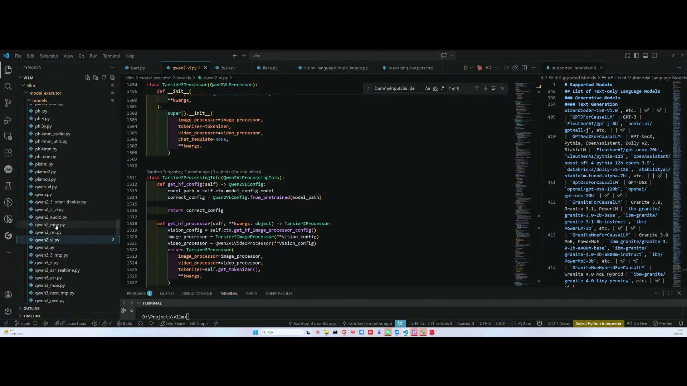 |
| 是的。当时我们那边是用的 DSA（DeepSeek Sparse Attention），然后再混上那个 linear attention，然后两边（两套 KV 管理）肯定得炸，因为你分页配置还得配。等一下——是的，两边都有不同的分页逻辑。你这一（下）直接爆炸。——对，两套分页逻辑…… [【跳转到 47:26】](https://www.bilibili.com/video/BV1gYL965ERP/?t=2846) | 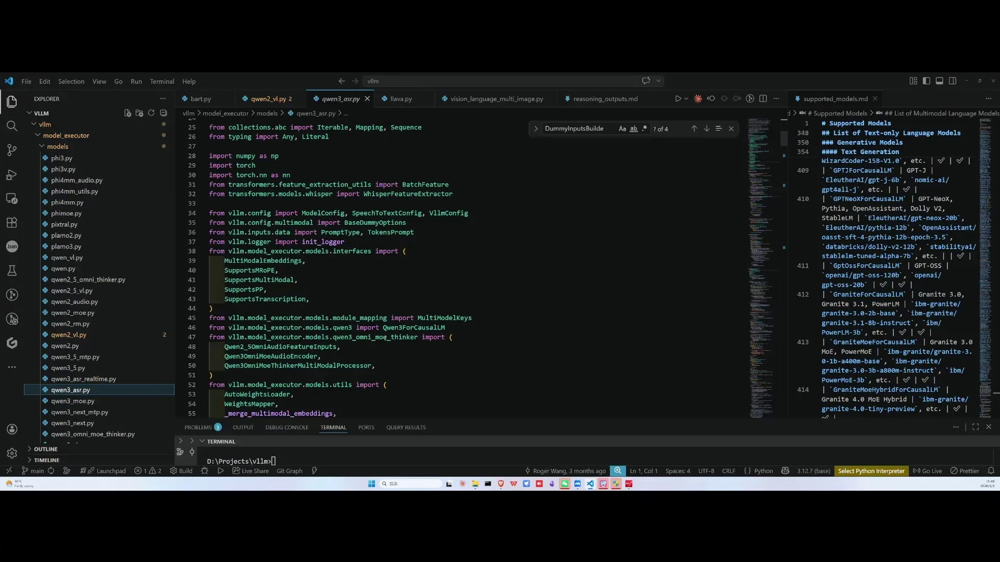 |
| 正好它是可以有一种那种（乘）积关系，然后最后一个那个 block 的 size 算出来好像几十个 G。我靠。对。然后我们当时拿那个八张 H100 去布一个只有 9B 大小的模型，结果直接爆显存了。——唉，肯定你 KV cache 肯定得爆掉，你那个 KV 开启的（page size）肯定很大。 [【跳转到 47:51】](https://www.bilibili.com/video/BV1gYL965ERP/?t=2871) | 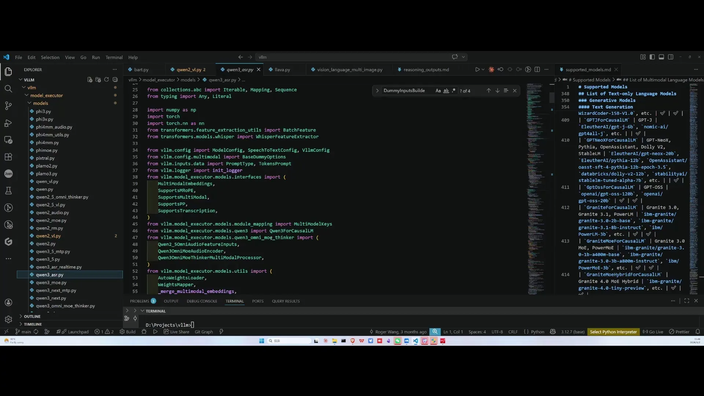 |
| 是的，这有点离谱，我靠。然后当时我们反正又做了很多（额外的）处理。后来我发现最好的方法就是把那个 linear attention 直接放到外面去了，就不用这个（分页）配置去管理，这样它就不会爆显存了。——好，我们看一下这个地方。 [【跳转到 48:16】](https://www.bilibili.com/video/BV1gYL965ERP/?t=2896) | 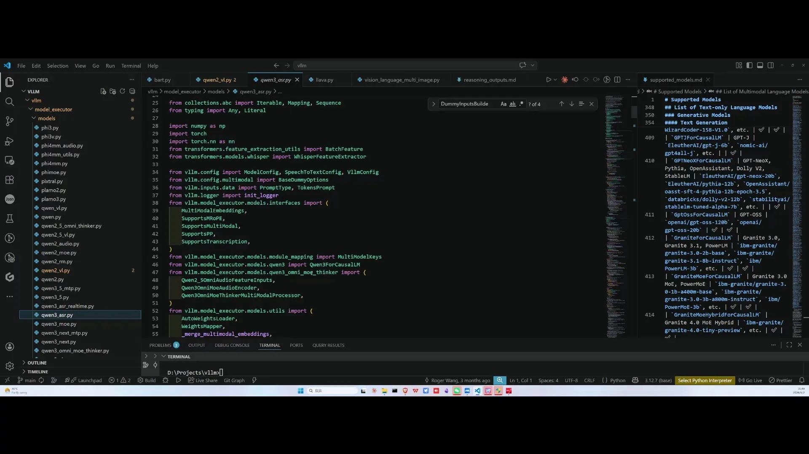 |
| 可直接拉到最下面，拉到最下面。他这个是 model 那里的。——对，基本就这里，就是告诉你 speech to text 的话那些字段要怎么设置而已。 [【跳转到 48:41】](https://www.bilibili.com/video/BV1gYL965ERP/?t=2921) | 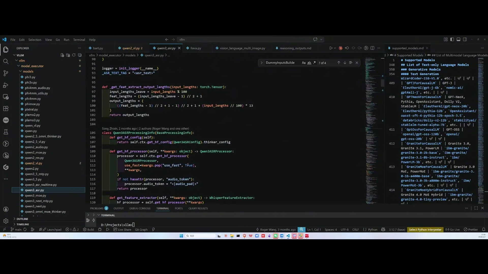 |
| 应该在下面吧？——在上面那几个 fields。——哦搞什么。 [【跳转到 49:06】](https://www.bilibili.com/video/BV1gYL965ERP/?t=2946) | 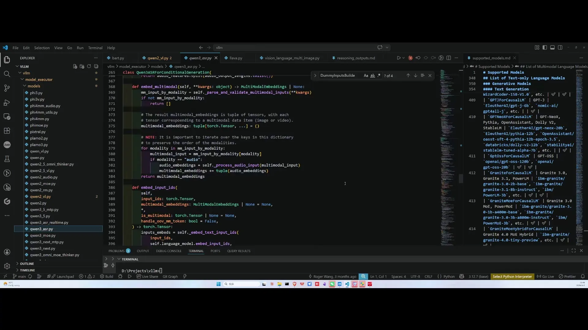 |
| 对，就 get speech to text（fields）这些。嗯，在哪？——对。 [【跳转到 49:31】](https://www.bilibili.com/video/BV1gYL965ERP/?t=2971) | 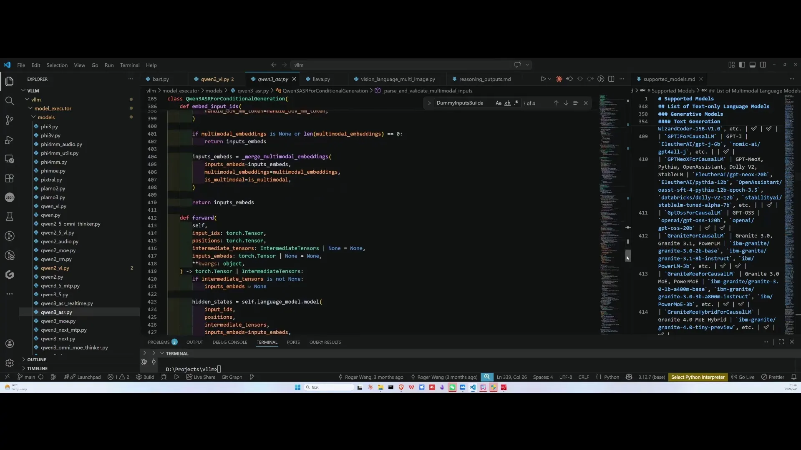 |
| 就这里就这里。——哦这个吗？——对。其实以前（Qwen-Audio）的话，本质就是提前提供好一个 prompt 的模板，然后你输入音频的时候直接按照这个模板进行音频转录就完事了。噢，它原理其实没有多复杂：就是提前加一个模板，我就不用输入 text…… [【跳转到 49:56】](https://www.bilibili.com/video/BV1gYL965ERP/?t=2996) | 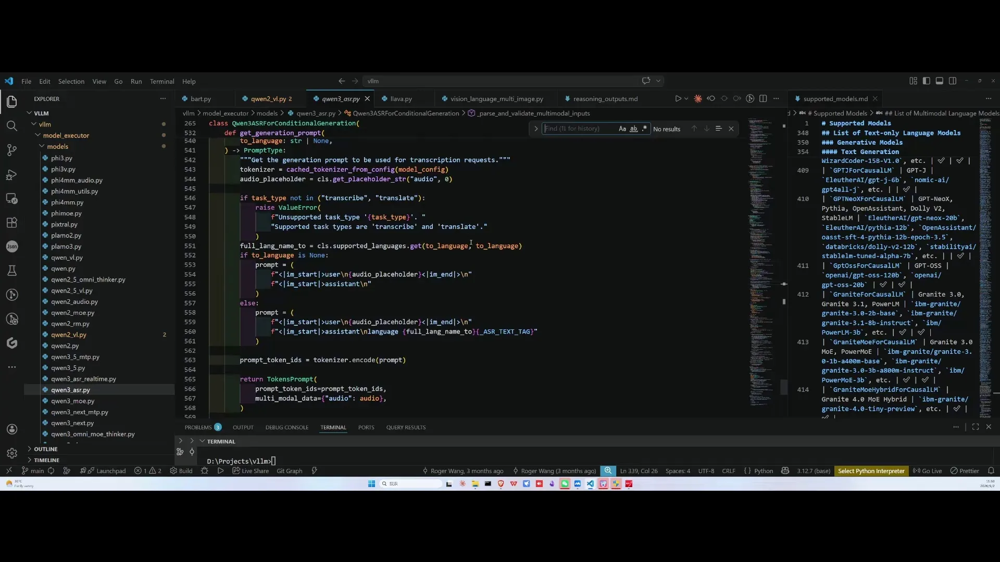 |
| 当 prompt 是吧，直接输入一个 audio，它直接运行。嗯，我刚才看了那个什么中文英文那个东西是在哪里的？中文英文那些的话…… [【跳转到 50:21】](https://www.bilibili.com/video/BV1gYL965ERP/?t=3021) | 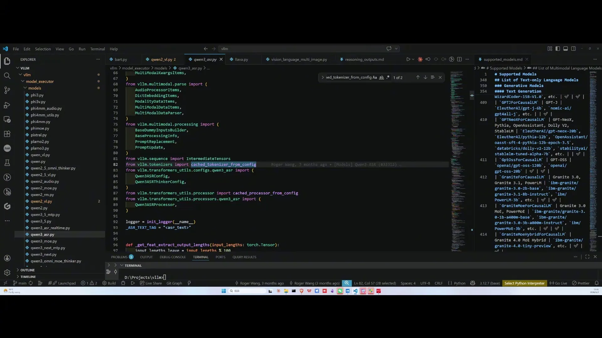 |
| 其实他就是你（代码）里面加一个语言字段嘛，有个 language（参数）。嗯，就加一些 token，它会自动根据你那个 token 输出对应的是输出英文还是输出中文。哦，你看 Qwen3-ASR 那个那里就有一个 language，就最下面。 [【跳转到 50:46】](https://www.bilibili.com/video/BV1gYL965ERP/?t=3046) | 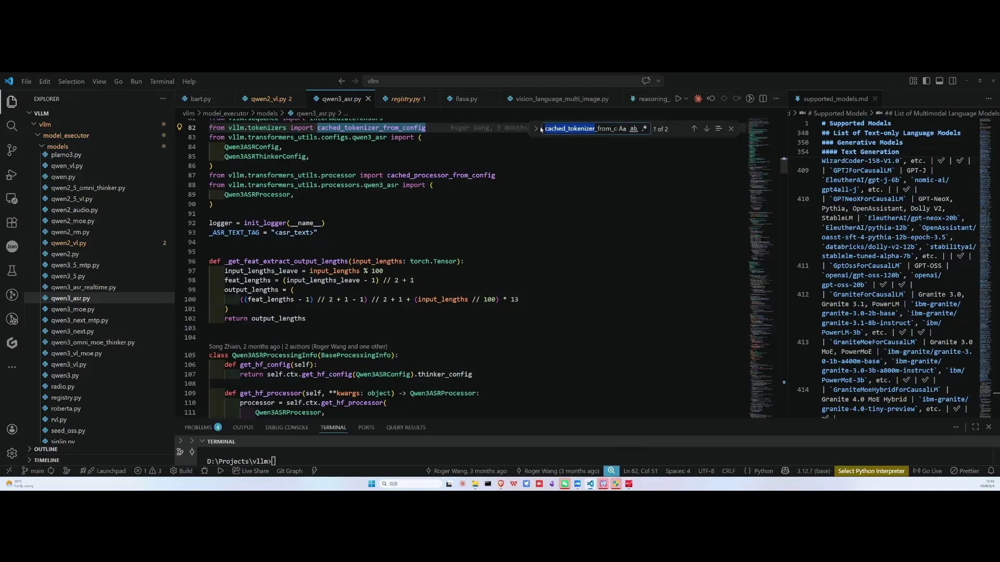 |
| 对，就（相当于）加了一个（字段）。它不是有个 language 参数嘛。噢，Qwen3-ASR 就是（只要）有这个关键词，它就会根据你这个关键词输出对应的，输出中文还是英文。 [【跳转到 51:11】](https://www.bilibili.com/video/BV1gYL965ERP/?t=3071) | 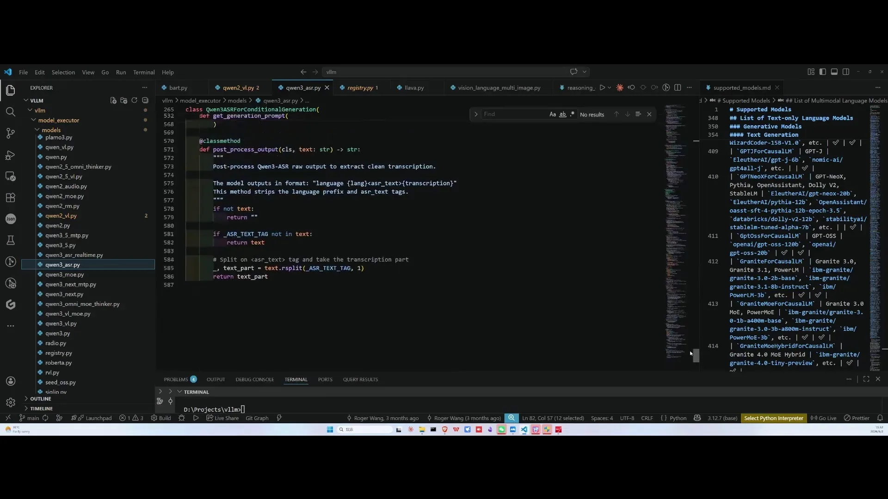 |
| 这个一般是他们训练好的。OK。哎，像现在这种模型的话，它支持的话就是我们自己去做一些那种后训练吧？ASR 应该可以吧，微调训一下就（可以）……因为我之前看的有的模型…… [【跳转到 51:36】](https://www.bilibili.com/video/BV1gYL965ERP/?t=3096) | 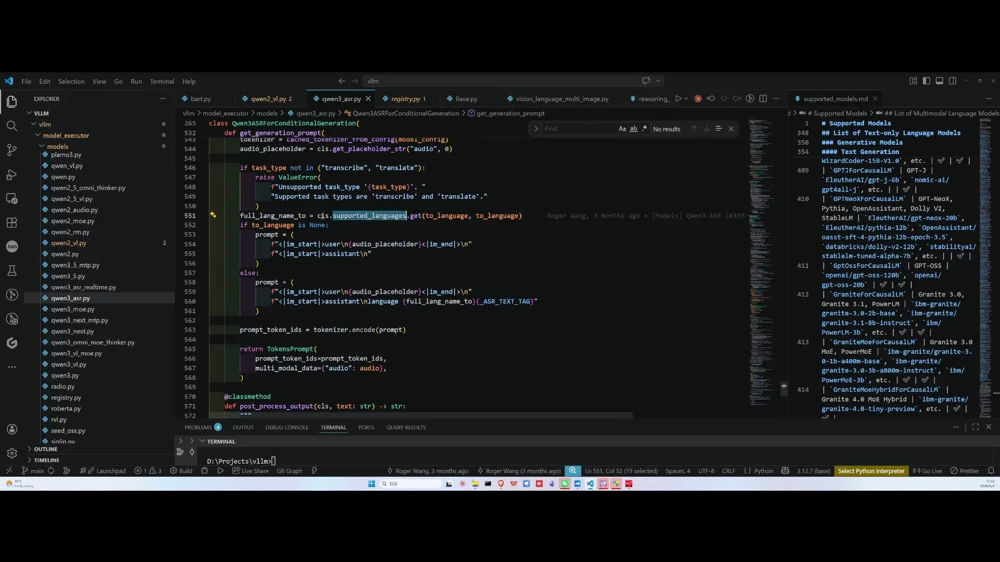 |
| 它属于是你往里面提供一段参照的声音，然后它就不需要去训练，直接就出结果了。——就是它主要是对音色上面做一些那种调整吗？——哦那是生成音频吧，那是 TTS 吧。TTS、声音 copy 这些是 TTS。——你千问 3 是 TTS 还是 ASR？——是转录啊。 [【跳转到 52:01】](https://www.bilibili.com/video/BV1gYL965ERP/?t=3121) | 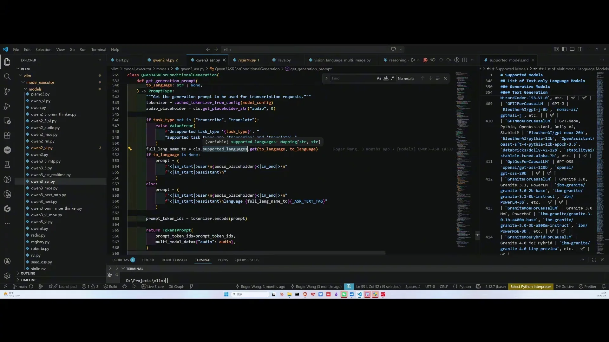 |
| 就是出字幕而已。 [【跳转到 52:26】](https://www.bilibili.com/video/BV1gYL965ERP/?t=3146) | 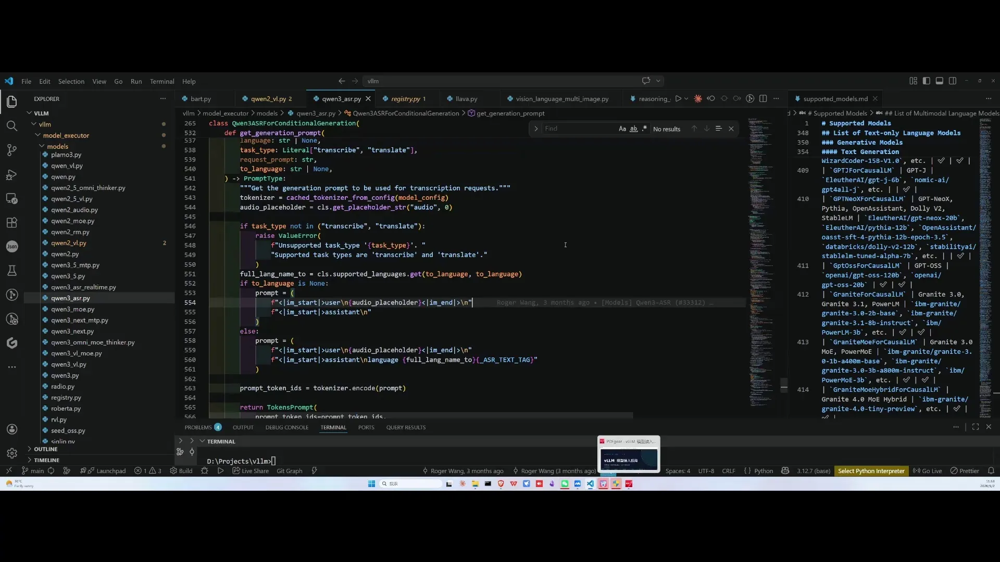 |
| （此区间无字幕） [【跳转到 52:34】](https://www.bilibili.com/video/BV1gYL965ERP/?t=3154) |  |
| （此区间无字幕） [【跳转到 52:39】](https://www.bilibili.com/video/BV1gYL965ERP/?t=3159) |  |
| 哦，这个我觉得也是很重要的。 [【跳转到 52:44】](https://www.bilibili.com/video/BV1gYL965ERP/?t=3164) | 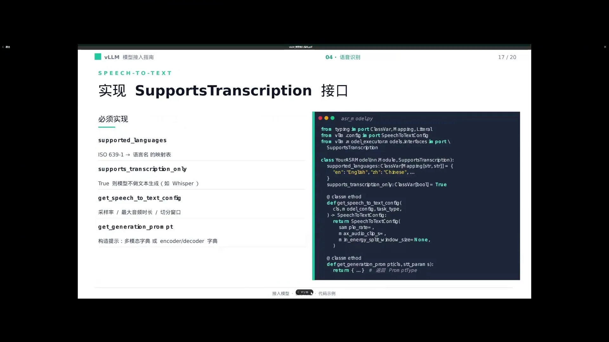 |
| 对，如果你是音频模型，一般都得加上这个（对应的注册）。要 unittest 的话一定要记得给你（的模型）注册啊，不注册肯定过不了 CI 的。——是。而且我觉得现在因为 vibe coding 严重了之后，这个 CI 可能会比本身那个代码开发更重要。 [【跳转到 52:49】](https://www.bilibili.com/video/BV1gYL965ERP/?t=3169) |  |
| 对，哎呀很多人现在写（代码）都是玩 vibe coding 啊。——特别是我们那个 Omni 这边：它很多 test 全都是因为 vibe coding 嘛，全都是测一些（没意义的）功能的，就自己测自己，其实意义不大。一定要（真的测到东西）啊。——是。 [【跳转到 53:14】](https://www.bilibili.com/video/BV1gYL965ERP/?t=3194) |  |
| 就一定要（真实）测。但是有的接模型（的人），甚至都没有在本机上面把这个框架给真正地安装好，他就纯 vibe coding。真是……我之前整过一个 PR，就是一个印度老哥写的，然后他让我来 review。我看了一下感觉写得怪怪的，上去一跑，怎么都跑不动啊。 [【跳转到 53:39】](https://www.bilibili.com/video/BV1gYL965ERP/?t=3219) |  |
| 我上一次直播的时候也说了：有一个老哥，我靠，尼日利亚的，基本上 5 分钟提五个 PR。然后你一看就感觉完全就是在捣乱的，他应该是没有在自己电脑上把这个框架给装好的。然后现在（这种人）就是用一整套（自动化），自动写代码自动提交了。然后我们把这个 PR 给关了嘛。 [【跳转到 54:04】](https://www.bilibili.com/video/BV1gYL965ERP/?t=3244) |  |
| 然后关了之后他就……（维护者）说尽量不要这样啊，你现在（spam）的话会被 mark 为 bot 杀掉的啊。然后我们关了之后他就直接在底下去喷我们，说我们的行为会阻止开源社区的人参与的热情。下午才来，还没好，还在喷。 [【跳转到 54:29】](https://www.bilibili.com/video/BV1gYL965ERP/?t=3269) |  |
| 我们之前都是看到有人一口气开十多个（PR），直接当成 bot 杀了。哎，我们这玩意能够搞个（自动封禁）的吗？我靠。应该这边杀了以后那边一起也会杀了吧。我就是搞了一下（规则）：这种太过于离谱的，以后就直接自动关掉算了。 [【跳转到 54:54】](https://www.bilibili.com/video/BV1gYL965ERP/?t=3294) | 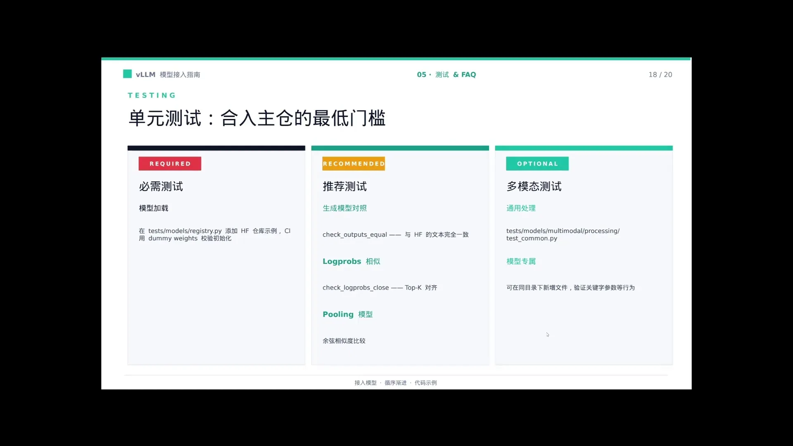 |
| 没有，可能（是）跟（上游）那边 mark 一下，可能是 AI 写的吧。你直接用那批号 AI（自动）杀可能也不太好，现在主仓那边是人工手动关的，我们这边也是手动关的。就是做任何的这个模型的话，一定要提供单元测试、端到端的测试，特别是你（要）在这个 PR description 里面…… [【跳转到 55:19】](https://www.bilibili.com/video/BV1gYL965ERP/?t=3319) |  |
| 这至少你得告诉我们这玩意怎么跑，对吧，然后把这个跑的结果贴上来，这样至少我们可以知道你确实是跑了的。——是不是就直接提一个东西然后什么都没有？——这点很重要，很明显一点他是不会跑的，他只会给个（声称的）加速（数字），然后不会输出结果给我。——哎，你们现在的话有人去用 AI 去做那个 review 吗？ [【跳转到 55:44】](https://www.bilibili.com/video/BV1gYL965ERP/?t=3344) |  |
| 有，我们组上不是有个 bot 在那里用吗？嗯，有的，但是（效果）……就是我觉得那些（意见）用处不大，有时候效果不是很好，因为可能谷歌给他降智了。对，因为我个人感觉就是我们这个 vibe coding…… [【跳转到 56:09】](https://www.bilibili.com/video/BV1gYL965ERP/?t=3369) |  |
| 最大的问题在于它会把一个东西写得很复杂，对吧，反而在误导。然后这个 AI review 它干的（事）会把你的代码变得更复杂。它（AI）讲的时候你（照）着（改）就越改越不对呀，越改越错。呃，因为我最近在做一些那种训练上的东西，我感觉 AI 很多情况下根本没法 get 到那个点。 [【跳转到 56:34】](https://www.bilibili.com/video/BV1gYL965ERP/?t=3394) |  |
| 你知道。对，而且它会越写越复杂。——是的是的。所以就是我们搞这个东西的话，还是尽量要人去参与。对，就是如果 vibe coding 然后 AI review，最后把代码合进去，全程可以完全没有一个人参与，那这个项目就没有人类了。 [【跳转到 56:59】](https://www.bilibili.com/video/BV1gYL965ERP/?t=3419) |  |
| 这也是为什么我希望……然后你这个项目也不是人类能读的了，只有机器能读。这是为什么我觉得搞这个直播的话，一方面就是告诉新来的开发者我们应该怎样去做开源的贡献，还好，我觉得也希望大家可以多聊天，多干一些只有人能干的事情。 [【跳转到 57:24】](https://www.bilibili.com/video/BV1gYL965ERP/?t=3444) |  |
| 好，这最后这个 Mamba 吧。 [【跳转到 57:49】](https://www.bilibili.com/video/BV1gYL965ERP/?t=3469) |  |
| 就是这个 linear（attention）这块东西可能会实现起来比较复杂，对吧。我觉得最主要问题还是在于我们这个框架可能需要有更多的调整。因为我之前（接过）Mamba 了。——要不你哪一天把姜云拉上来（讲）Mamba？——可以可以，下一次我们把姜云拉上来。——姜云他现在在那边主要是做这个 linear attention 这种东西吗？ [【跳转到 57:54】](https://www.bilibili.com/video/BV1gYL965ERP/?t=3474) | 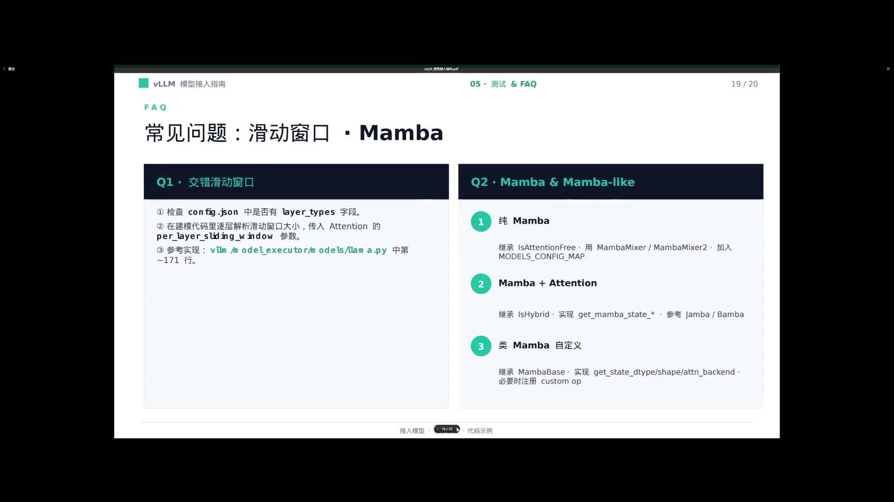 |
| 他在主仓这边做那个 chat（模型）。最近他好像也在帮忙优化 V4 吧。——啊。这个东西反正我之前踩过这个坑，哇真的是好难好难，bug 太多了。——对对，就是你这东西必须得把断点打得很深，然后你才发现。然后发现之后你想我靠…… [【跳转到 58:19】](https://www.bilibili.com/video/BV1gYL965ERP/?t=3499) | 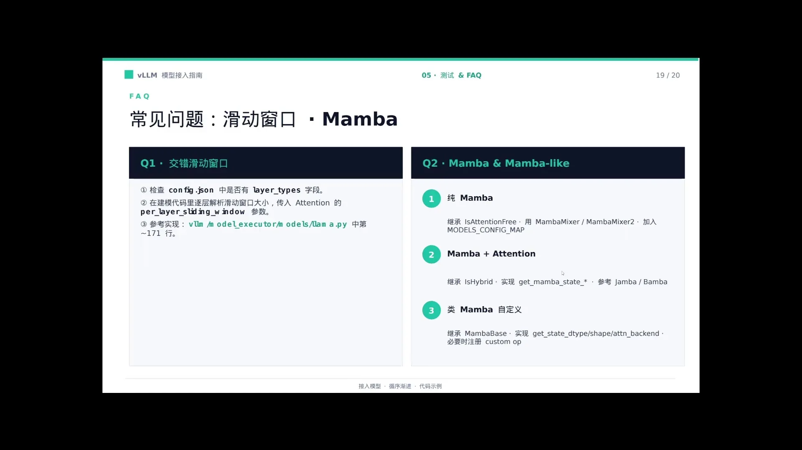 |
| 那看来这东西实现我就不能用（依赖）我们这边的实现了，我想着自己做（一套）。——如果他是模型那边出问题了你可以打断点，打着打着打到 vLLM kernel 那边了，那人都麻了。——是。反正我记得当时搞（这个）真的是搞了几个月，最后解决方案是在外面（另起炉灶）做一套。 [【跳转到 58:44】](https://www.bilibili.com/video/BV1gYL965ERP/?t=3524) | 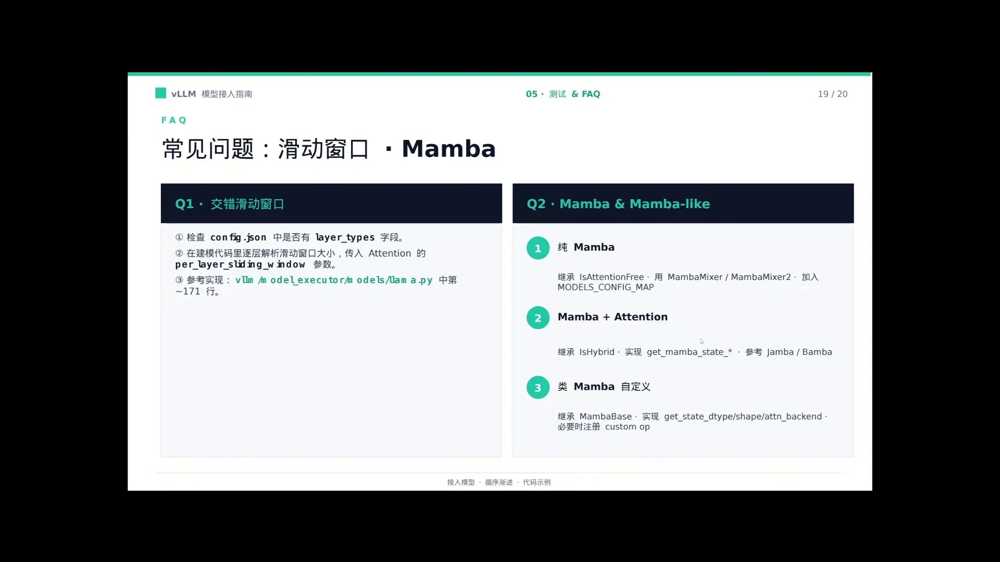 |
| 好，然后直播间如果有人有什么问题的话可以先来问一问。——对。 [【跳转到 59:09】](https://www.bilibili.com/video/BV1gYL965ERP/?t=3549) | 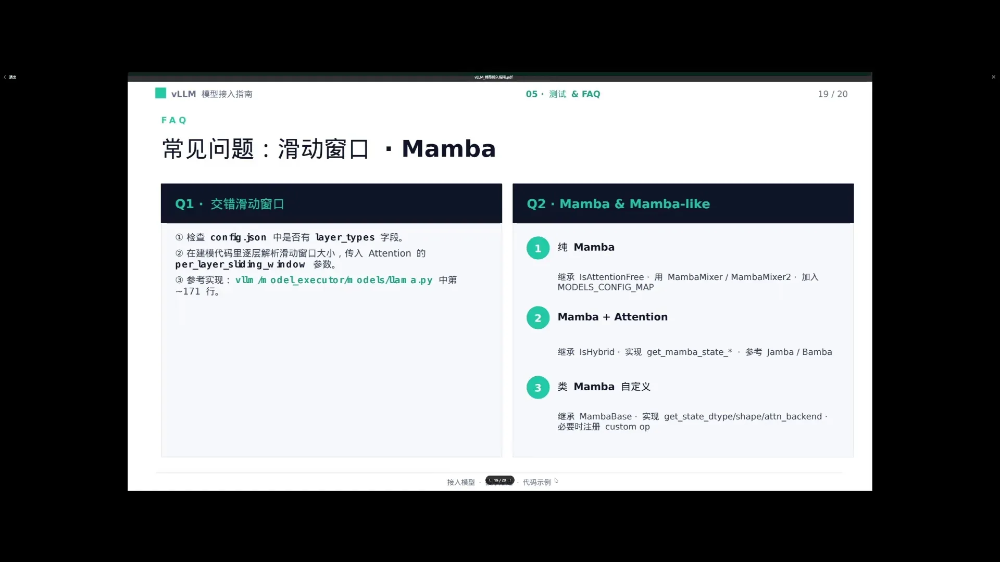 |
| 直播间有人有问题吗？或者是我们这个 Zoom 房间有人有问题吗？ [【跳转到 59:27】](https://www.bilibili.com/video/BV1gYL965ERP/?t=3567) |  |
| 好，如果没有问题的话那我们就下了好吧。然后后面的话会把这个直播录像上传的。——哎呀我感觉你可以每周都抓个（maintainer/贡献者）来讲一讲。 [【跳转到 59:52】](https://www.bilibili.com/video/BV1gYL965ERP/?t=3592) |  |
| 对，我是这么想的，每周搞一个。因为我们最开始的话其实很多是看那种（国外）大叔那边的直播，但是他前面几期主要是讲这一块的，后面的话就没讲了。但是我们这个代码更新速度实在太快了，对吧，基本上之前可能隔两周以后再看…… [【跳转到 60:17】](https://www.bilibili.com/video/BV1gYL965ERP/?t=3617) |  |
| 那个回放已经对不上了。——是的。所以这个东西我觉得我们得（做），特别是现在新的贡献者很多哎。 [【跳转到 60:42】](https://www.bilibili.com/video/BV1gYL965ERP/?t=3642) |  |
| 就（现在的新人）可能对 vibe coding 依赖比较强，所以我们需要指导一下。我觉得最起码得告诉我什么样（的贡献）我们是能接受的，什么样的我们是不能（接受的）。代码一定要是人写的，代码一定是要人能读的。对，我觉得最起码就是人得是能读的，就是我们能够知道你在干什么。我觉得做（开源贡献）…… [【跳转到 61:07】](https://www.bilibili.com/video/BV1gYL965ERP/?t=3667) |  |
| 你最起码你自己要知道你自己写的什么东西。——哦，有人问 world model 值得做吗？我觉得 world model 是很值得做，你在做吧？——是在做，对，Omni 也是在做的。因为我个人感觉的话，我们搞这个 AI 这个方向，得去尽量多做一些比较热门的东西。因为比较热的东西首先会比较好做贡献…… [【跳转到 61:32】](https://www.bilibili.com/video/BV1gYL965ERP/?t=3692) |  |
| 你的代码我们是更倾向于去合的。还有一个是：现在属于一个比较新的方向的话，一开始做贡献会相对而言简单一些，但后面的话可能会比较难，对吧。你像 vLLM 那边很多贡献的话，那些 issue 下面都会标个 good first issue 嘛。——对对对，去那里面（挑）那都是很简单的。 [【跳转到 61:57】](https://www.bilibili.com/video/BV1gYL965ERP/?t=3717) |  |
| 对，比如说你像 world model，现在我们是没有 committer 的。那么如果你在 world model 里做了很多的话，你会很容易成为 world model 第一个 committer。——对，Omni 现在 committer 挺少的。——是的，因为我们很多方向都完全没有 committer，也就是因为有些方向就太新了。好。 [【跳转到 62:22】](https://www.bilibili.com/video/BV1gYL965ERP/?t=3742) | 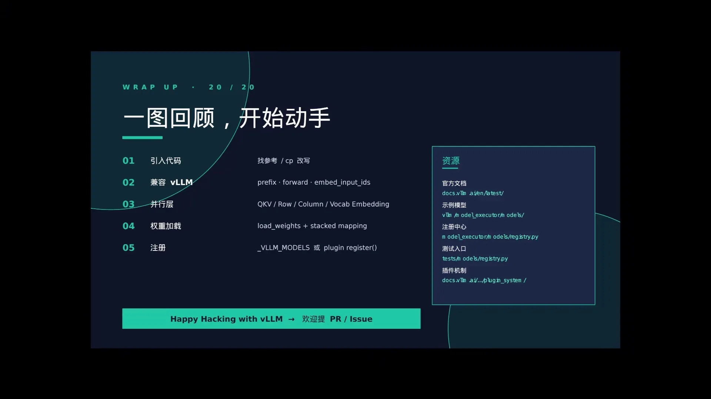 |
| 而且很多 committer 的话，主仓、Omni 两（边）都管不了了。像姜云现在肯定都基本都在搞主仓这边。——是的。——像我们姜宁基本还有药姐基本都这样子。……哎，你们那边那个 DS V4 现在是什么情况？还带各种优惠？ [【跳转到 62:47】](https://www.bilibili.com/video/BV1gYL965ERP/?t=3767) |  |
| 啊，友商这个也在拼命追赶。好。然后他说主仓这边有人问：就是小模型的话找谁去引入？——小模型很简单，就是……噢，小模型看是什么吧，其实大部分模型你找我或者找（对口的人），多模态找我跟赛尔。——对。 [【跳转到 63:12】](https://www.bilibili.com/video/BV1gYL965ERP/?t=3792) |  |
| 因为……文本你也可以 ping 我一下。我之前在主仓主要是做多模态的，当时就是子枫和赛尔两个人在轮流 review 的代码。——就这样，提了 PR 没有人（帮忙）……——呃，我觉得这个首先得看你这个 PR 是什么方向的，然后你可以看…… [【跳转到 63:37】](https://www.bilibili.com/video/BV1gYL965ERP/?t=3817) |  |
| 我们有一个 governance 的（文档），有个 gov。——对，我就想问你去哪里翻。 [【跳转到 64:02】](https://www.bilibili.com/video/BV1gYL965ERP/?t=3842) |  |
| 对，你打开一下 gov（文档），是那个标准。嗯。 [【跳转到 64:07】](https://www.bilibili.com/video/BV1gYL965ERP/?t=3847) | 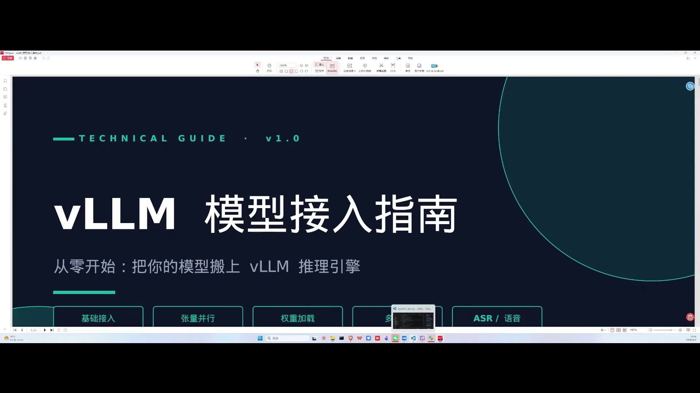 |
| 是在哪个地方？——你直接去 vLLM 的文档里面翻吧，直接往网页那里搜就行了。 [【跳转到 64:12】](https://www.bilibili.com/video/BV1gYL965ERP/?t=3852) | 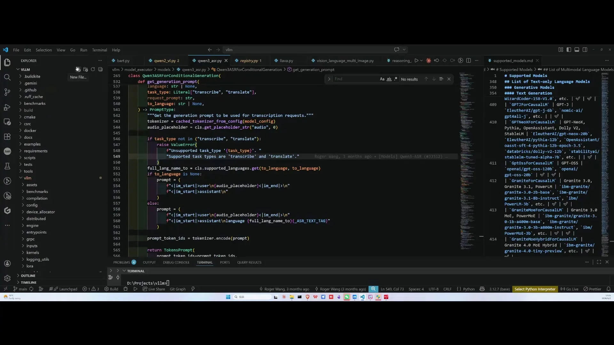 |
| It is so so governance……我记得我之前看过的，但我不太记得放哪去了。 [【跳转到 64:31】](https://www.bilibili.com/video/BV1gYL965ERP/?t=3871) | 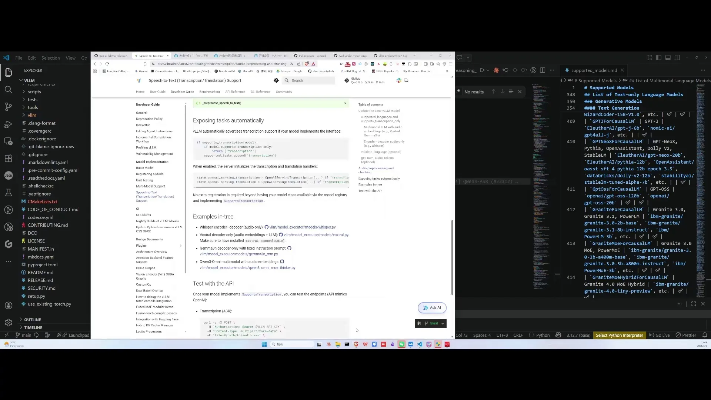 |
| 应该是这个，应该是这个里面的 CODEOWNERS。你可以看这个 CODEOWNERS，这里面就是 code owners。 [【跳转到 64:56】](https://www.bilibili.com/video/BV1gYL965ERP/?t=3896) | 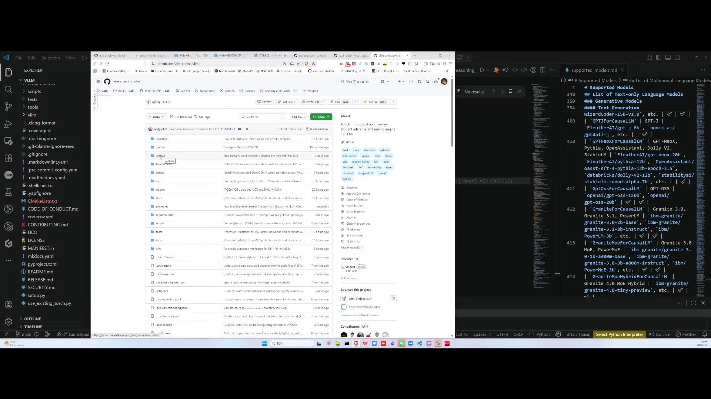 |
| 不一定（全），像我就是没写 code owner 的。——哦，你看那个 CODEOWNERS 从来不会骗人，不然我那邮箱得被塞爆了。——我说哦。啊，我翻到了。 [【跳转到 65:04】](https://www.bilibili.com/video/BV1gYL965ERP/?t=3904) | 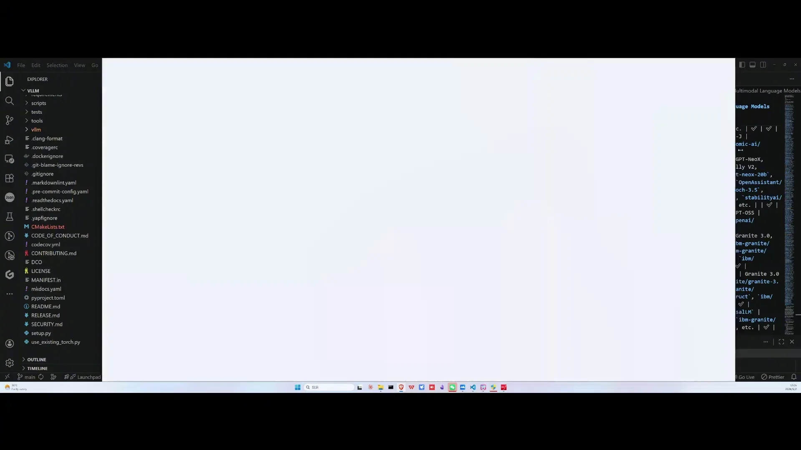 |
| 我发（你）腾讯（会议）……哎等一下，你发我微信吧。 [【跳转到 65:29】](https://www.bilibili.com/video/BV1gYL965ERP/?t=3929) | 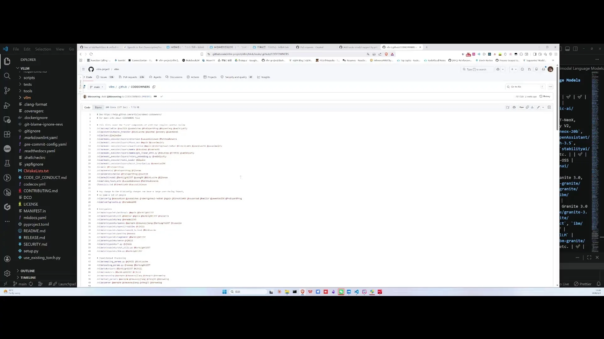 |
| 嗯我是腾讯（会议/微信）……为什么打不开？发微信。——OK。 [【跳转到 65:54】](https://www.bilibili.com/video/BV1gYL965ERP/?t=3954) | 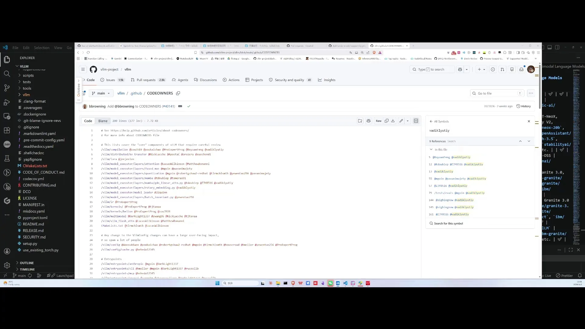 |
| 因为我当时不想被邮件轰炸，所以没写 CODEOWNERS。 [【跳转到 66:09】](https://www.bilibili.com/video/BV1gYL965ERP/?t=3969) | 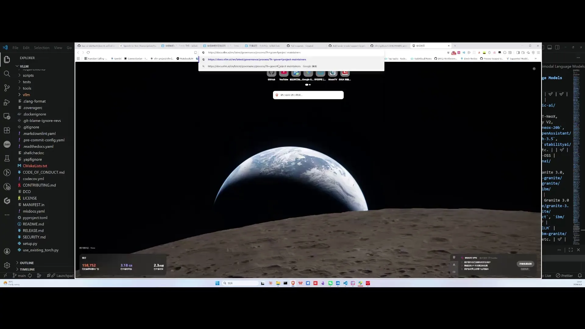 |
| 对，然后这个东西就是你可以去看，对吧。如果你想做贡献的话，它这里面会有什么方向的话（找）做什么贡献（的人），一般我理解是这样子的。是，然后这里有 maintainer 的名单。嗯，这里，噢这里是在几个头头部的（人）。 [【跳转到 66:14】](https://www.bilibili.com/video/BV1gYL965ERP/?t=3974) |  |
| 反正有个……对，committers 那一页的话有完整的（名单）。——哦，这个里面就是完整名单了。——对，然后这里面就会包含每个人负责的领域啊，所以你照着他（找）就行了。 [【跳转到 66:39】](https://www.bilibili.com/video/BV1gYL965ERP/?t=3999) | 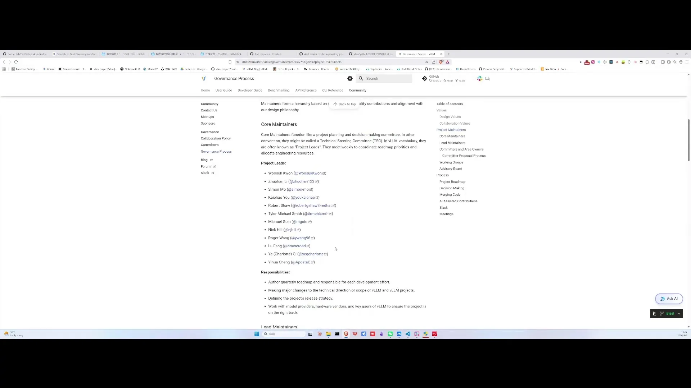 |
| 是。哦，他说是 diffusion 那边的那得让永祥来（看）干嘛啊。——呃，Diffusion 的话 Omni 这边……我看了看，这边其实也是看他是属于哪个方向的。 [【跳转到 67:04】](https://www.bilibili.com/video/BV1gYL965ERP/?t=4024) | 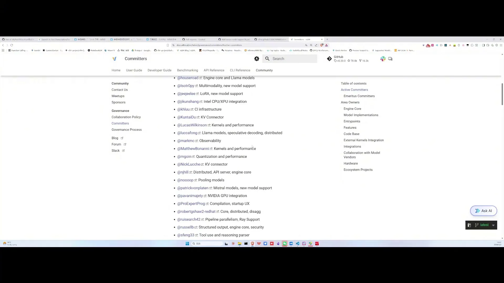 |
| 基本上来讲的话，如果是 Omni 的模型的话可以去找（对应负责人），然后如果是纯 diffusion 模型的话，就是有一个 ID 叫 DDD 的。就是如果是纯 diffusion 模型，你直接可以找这个 DDD 就行了。我感觉我们要维护一个这样的名单，方便（大家）。——Omni 是有的。 [【跳转到 67:29】](https://www.bilibili.com/video/BV1gYL965ERP/?t=4049) | 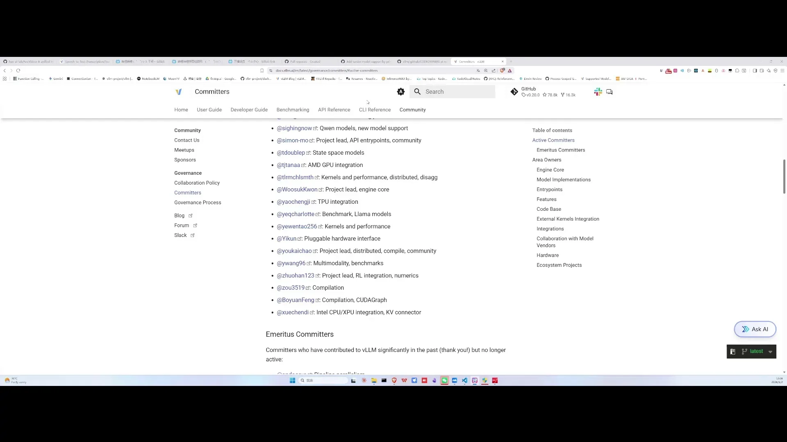 |
| Omni 是有的。——Omni 也有。好，交给谁（审）过……对。 [【跳转到 67:54】](https://www.bilibili.com/video/BV1gYL965ERP/?t=4074) | 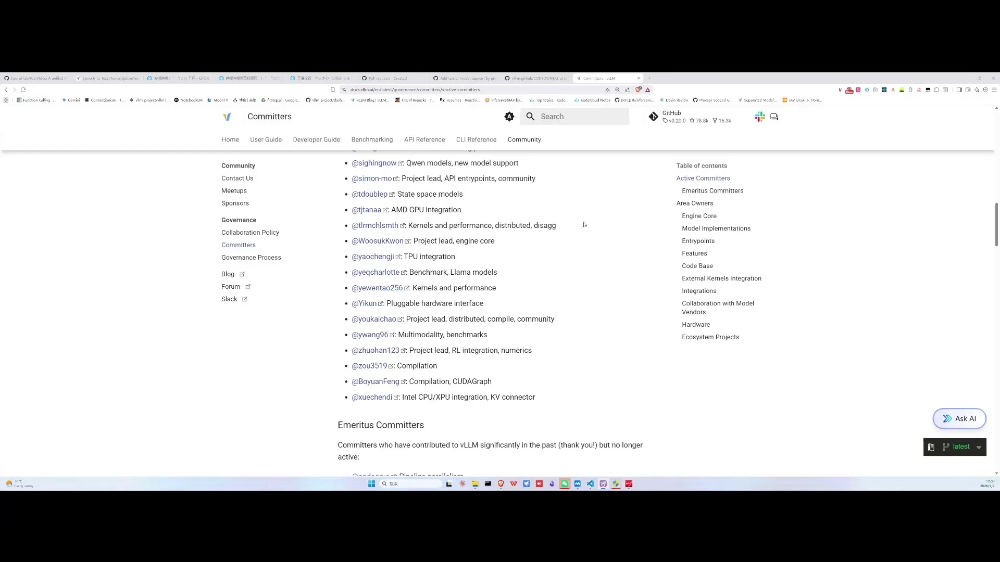 |
| （此区间无字幕） [【跳转到 67:59】](https://www.bilibili.com/video/BV1gYL965ERP/?t=4079) | 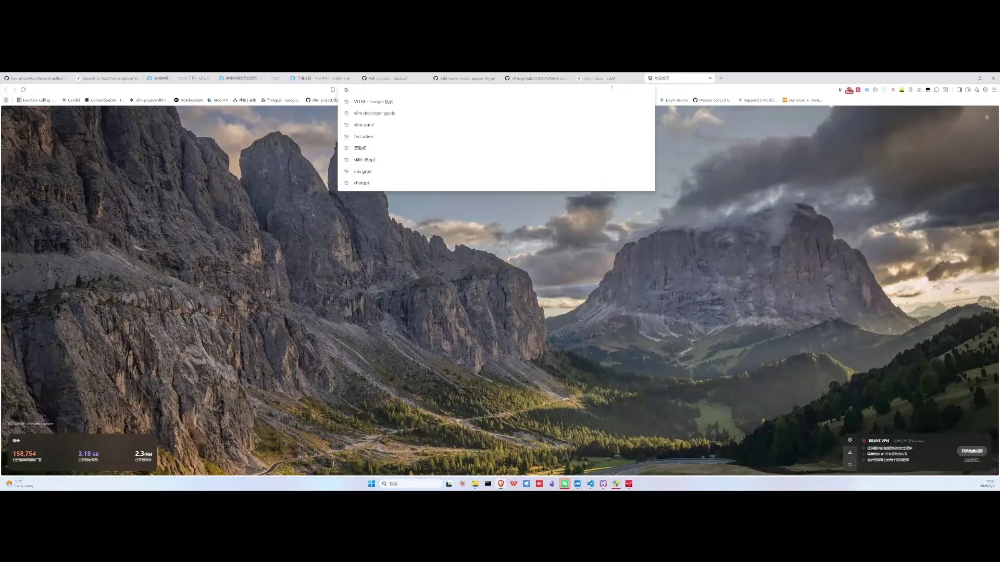 |
| 看一下。哦我不知道这个能不能给我直接（转）过来看一下。咱们应该也是 committer 集体维护的，就 gov 应该也是 gov（那边维护）的。哦。 [【跳转到 68:04】](https://www.bilibili.com/video/BV1gYL965ERP/?t=4084) | 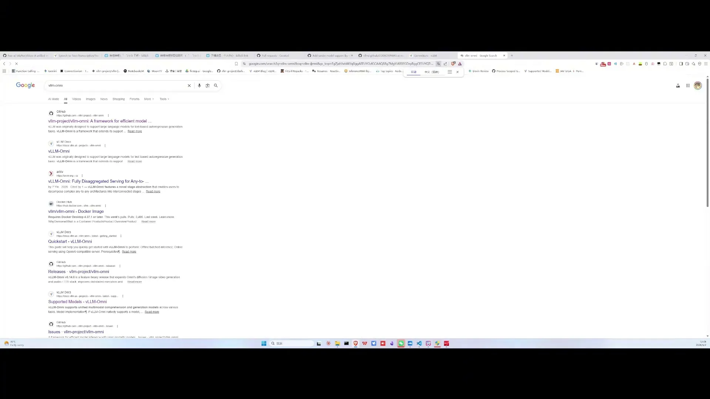 |
| 我看排序可能会变一点的。不对。 [【跳转到 68:29】](https://www.bilibili.com/video/BV1gYL965ERP/?t=4109) | 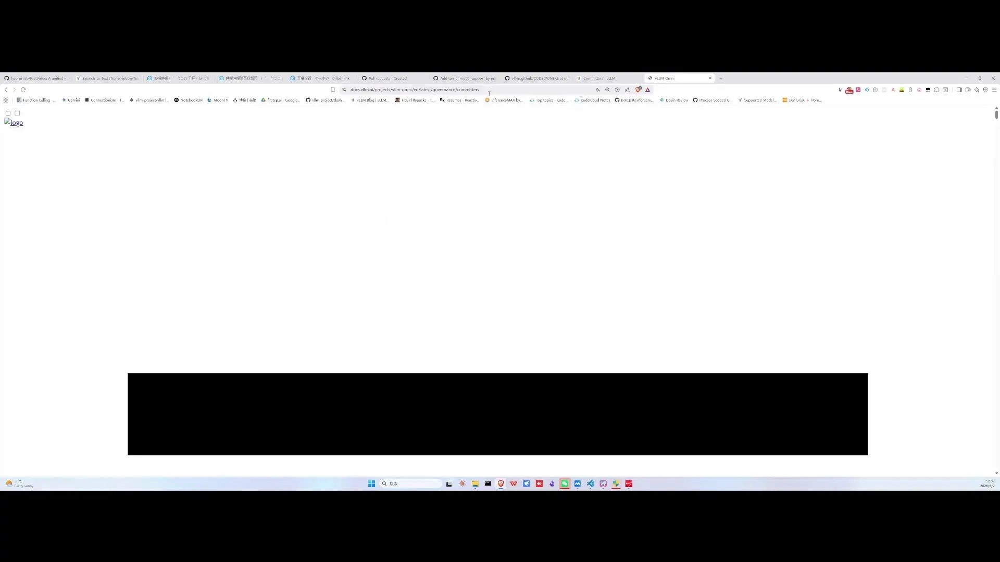 |
| Oh governance。OK 对，我们这边相对来说人比较少了。你看，如果你是做 diffusion 或者是（对应方向）的话，你就直接艾特这个人，这个就是（他的）账号。 [【跳转到 68:38】](https://www.bilibili.com/video/BV1gYL965ERP/?t=4118) | 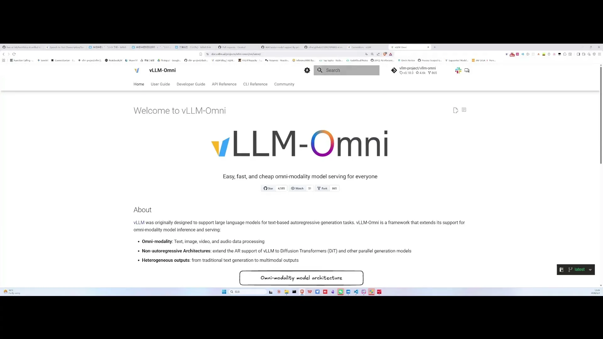 |
| 对，我觉得现在主要是 Omni 这边。因为 Omni 这边的代码，它的每次单个 PR 提交量很大。再一个问题就是在于我们的 committer 太少了。 [【跳转到 69:03】](https://www.bilibili.com/video/BV1gYL965ERP/?t=4143) | 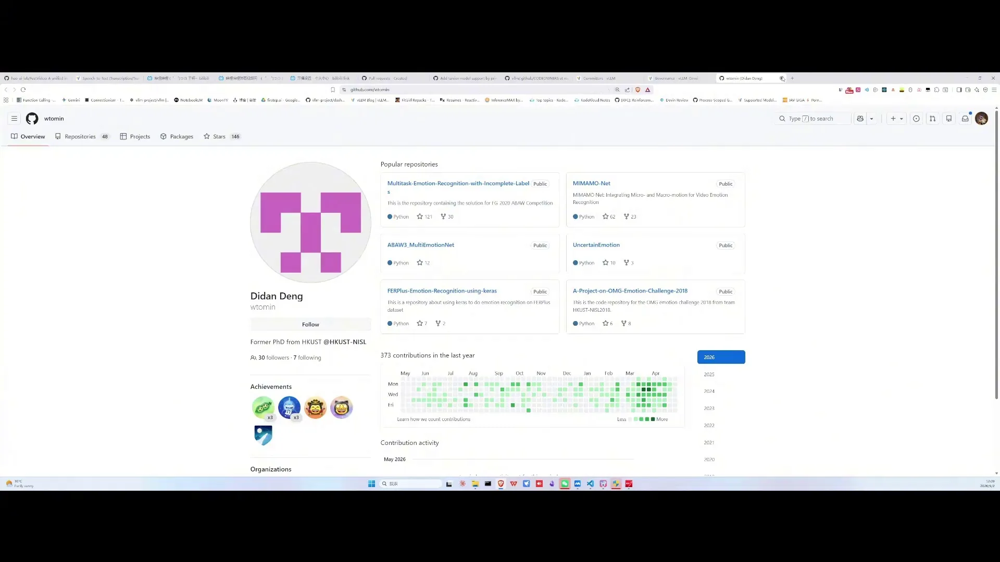 |
| 对，这真的少。这个 active committers 里面你还要减掉两个：就是姜云不在，然后子枫不在，然后剩下就这几个人。当然我们的那个顺阳是很能干的，向阳属于是我们这里最能干的了。 [【跳转到 69:28】](https://www.bilibili.com/video/BV1gYL965ERP/?t=4168) | 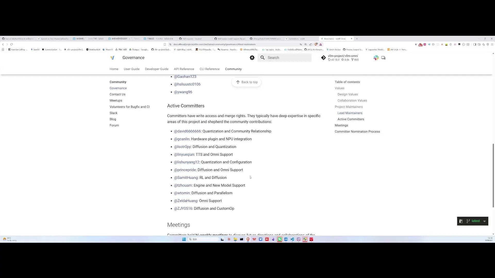 |
| 我觉得还有个问题就是在于 Omni 它的方向太多了，对吧：就是又有 world model，然后又有 diffusion，然后又有……我感觉 Omni 这边到最后肯定要比主仓还要多啊。而且它主要是在于它的这个模型结构长得没法统一，千奇百怪。 [【跳转到 69:53】](https://www.bilibili.com/video/BV1gYL965ERP/?t=4193) | 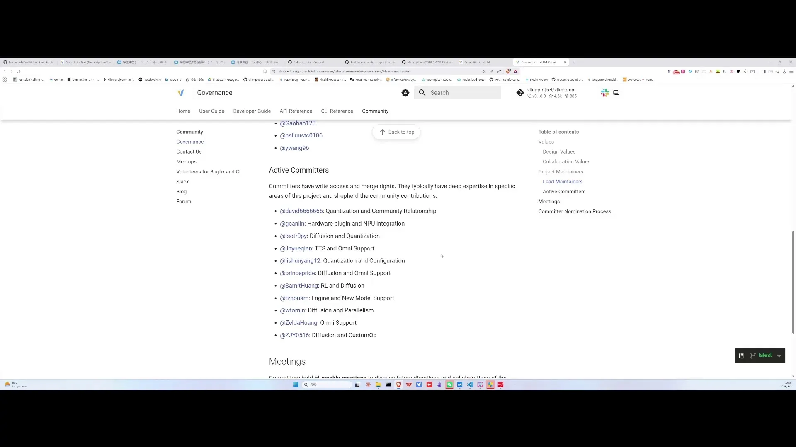 |
| 然后就导致我们在接模型的时候，实际上就会考虑到：我们是不是需要对这个框架做一些比较大的重构，让它可以支持一些新的模型的结构。但是我们做重构的时候，要考虑到性能会不会（掉），尽量不要让它掉，对吧。就导致这块的工作会变得很大。 [【跳转到 70:18】](https://www.bilibili.com/video/BV1gYL965ERP/?t=4218) |  |
| 那是 Omni 起步刚刚起步吧，后面应该会好很多。——后面我觉得会（好）。——那是。哎好，然后我看时间也不早了，那我们这直播就结束了吧。 [【跳转到 70:43】](https://www.bilibili.com/video/BV1gYL965ERP/?t=4243) | 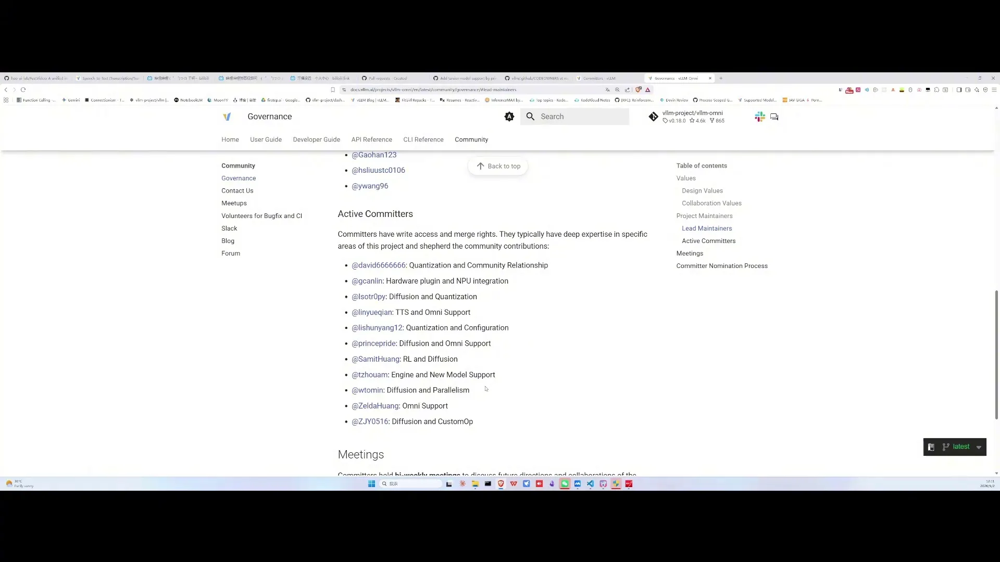 |
| 好，对，然后我这个直播也是会有回放的。然后以后我们尽量每周礼拜六都拉个人过来一起搞一下，讲一下这块代码，怎么样？——我觉得可以啊，挺好。——对，我反正 committers 里面中国人挺多。 [【跳转到 71:08】](https://www.bilibili.com/video/BV1gYL965ERP/?t=4268) | 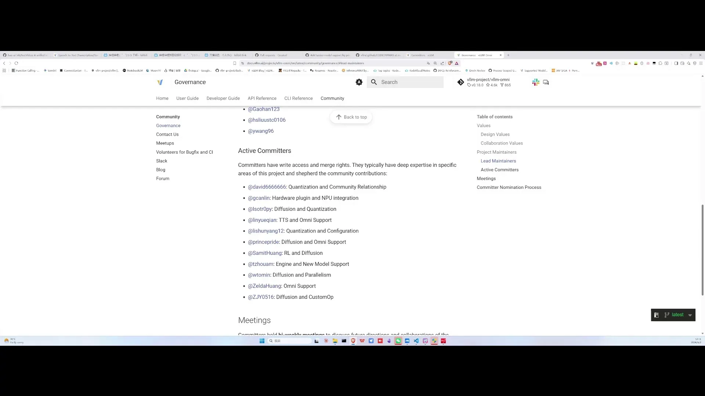 |
| 对啊对啊对啊，我觉得挺好的。不过可能有些人时间（不方便）……噢，文涛他们可能现在是半夜。哈哈，文涛等到半夜。——但是美西的话应该现在还是晚上九点。——哦对，文涛他是在波士顿那边的。——约翰他（也在）波士顿。——对。其实我们如果找文涛的话…… [【跳转到 71:33】](https://www.bilibili.com/video/BV1gYL965ERP/?t=4293) | 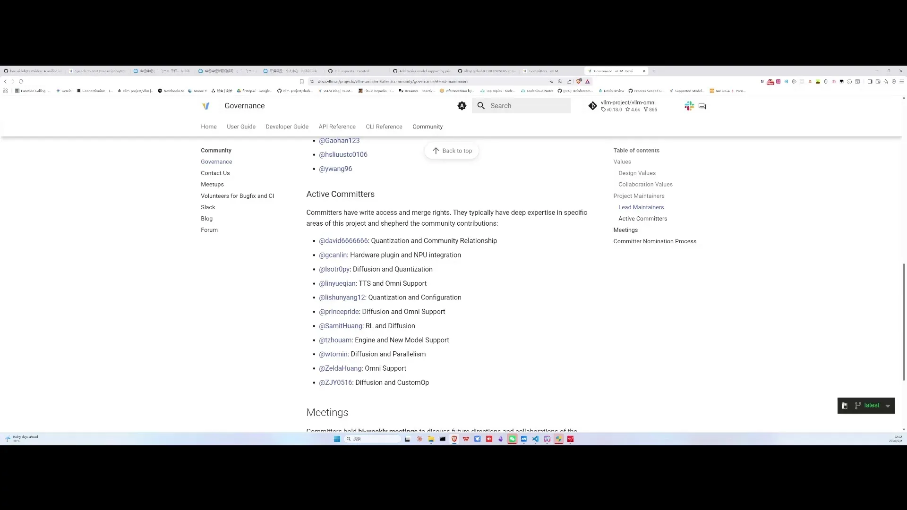 |
| 可以把时间往前提一提，比如搞到我们这边（晚上）九点钟。你可能就得九点才开播了。——九点开播？可以。——我觉得好。那我这直播间就结束了，拜拜。那我们下个礼拜六再见。——好，拜拜。 [【跳转到 71:58】](https://www.bilibili.com/video/BV1gYL965ERP/?t=4318) |  |
| （此区间无字幕） [【跳转到 72:23】](https://www.bilibili.com/video/BV1gYL965ERP/?t=4343) | 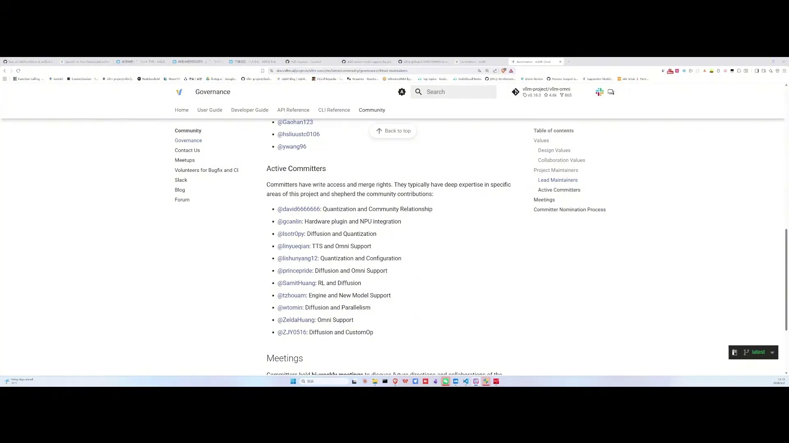 |