# vLLM小课堂（三）：一个Request的完整旅程 原始文稿（图-字幕分栏）

| 字幕文本 | 画面 |
| :--- | ---: |
| 都可以听到。好，给了吗？可以，都可以听到。嗯，那我们可以开始了。然后我们先介绍一下嘉宾吧。我要开个摄像头。——你先介绍一下。——好，那我来。我也只是一个大三的学生，最近或者之前也在 vLLM 这个社区这个仓库上做了一些贡献，成为了一个 Committer…… [【跳转到 00:00】](https://www.bilibili.com/video/BV1yrJH6pEFQ/?t=0) | 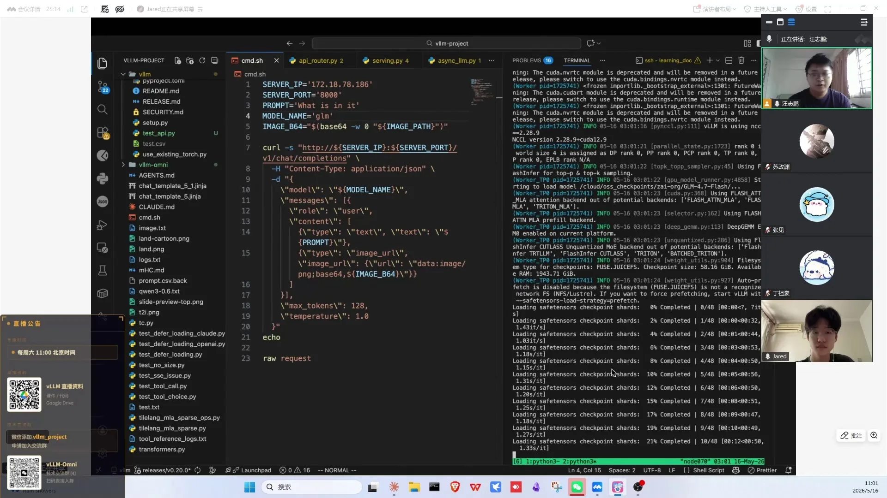 |
| 然后后来在一家国内的大模型公司做一些开源相关的工作，也会大量涉及到 vLLM、Transformers、HuggingFace 还有 vLLM-Omni 这些引擎的适配。今天讲的这个主题，也是跟从我自己的学习经验出发…… [【跳转到 00:25】](https://www.bilibili.com/video/BV1yrJH6pEFQ/?t=25) | 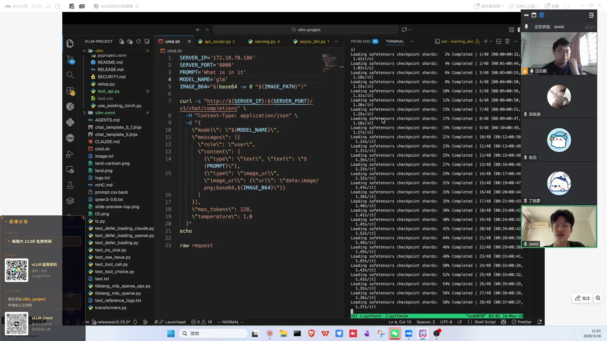 |
| 我会觉得大家聊完了之后，这一整个流程、或者说挺复杂的这些调用栈是被忽略的，或者说熟练的人会觉得这个东西是理所应当的。但是刚进来的人往往会先去看比如配置 attention 或者 continuous batching，或者是这种非常耳熟能详的、特别大的架构上的东西…… [【跳转到 00:50】](https://www.bilibili.com/video/BV1yrJH6pEFQ/?t=50) | 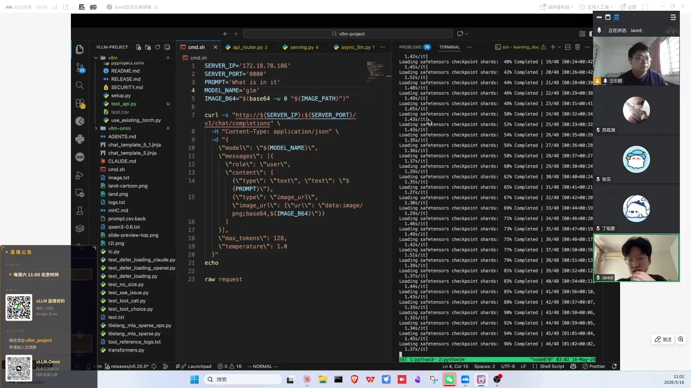 |
| 但是那些东西都已经有很多的 blog，或者你可以看论文，你还可以去看好像叫 Nano-vLLM 还是叫 Mini vLLM 的项目，你可以在那里看到很多相关的实践。但是你了解那些之后其实还不够，你还需要有一整个全局的视野，才能更好地在 vLLM 上面 debug…… [【跳转到 01:15】](https://www.bilibili.com/video/BV1yrJH6pEFQ/?t=75) | 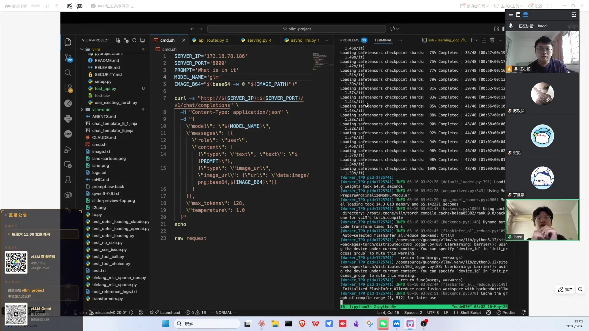 |
| 在上面开发。或者说哪怕你是让 AI 帮你写代码，你也要自己有一个全局的视野，才能更好地做到这件事情。所以我们今天这个讲课…… [【跳转到 01:40】](https://www.bilibili.com/video/BV1yrJH6pEFQ/?t=100) | 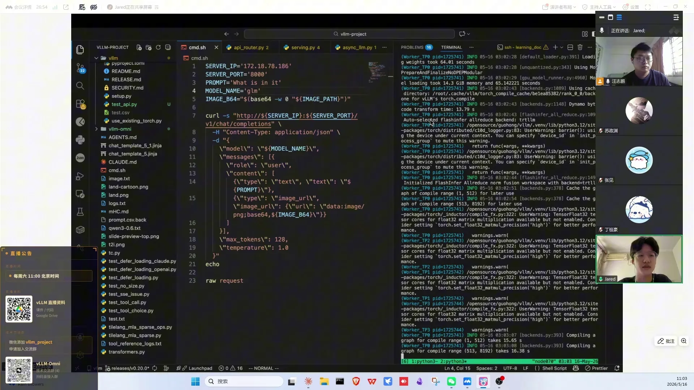 |
| 就是通过 request 这个视角…… [【跳转到 01:56】](https://www.bilibili.com/video/BV1yrJH6pEFQ/?t=116) | 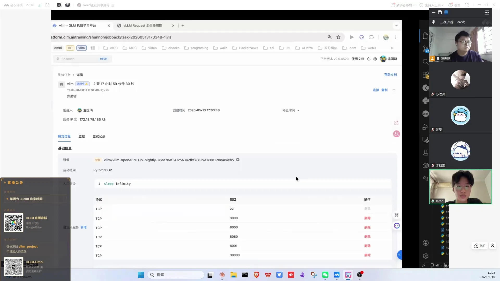 |
| 看一下 vLLM 是怎么把一个推理流程、或者说一个请求完整跑完的——就是从我们的 HTTP 请求再返回到用户的最终结果。我们就把这个东西讲一遍。然后我们的比如特别有名的 prefix caching 啊，还有 PagedAttention 相关的东西……哦稍等…… [【跳转到 02:01】](https://www.bilibili.com/video/BV1yrJH6pEFQ/?t=121) |  |
| PD 分离啊，还有 KV cache 相关的 offloading 什么的，最终都可以接在这条主干上，然后去逐渐地扩展。对，主要就是这个目的。——好，郭峰老师讲得好。其实我之前接触这玩意的话，当时是在外面做贡献去修 bug，对吧。当时修 bug 会很自然地一点点去 debug，就会从 request 的入口地方进来。我当时就会感觉非常复杂…… [【跳转到 02:26】](https://www.bilibili.com/video/BV1yrJH6pEFQ/?t=146) |  |
| 特别是我当时做的时候，是那个 vLLM 从 V0 切到 V1 的那段时间，它实际上是有两套代码的。嗯嗯。然后到了 V1 的时候，因为它会做一个前后端分离，就会导致我当时是有什么 LLMEngine 和…… [【跳转到 02:51】](https://www.bilibili.com/video/BV1yrJH6pEFQ/?t=171) |  |
| EngineCore 什么的，它有些名词甚至长得就非常相像，然后就感到了这种困惑。嗯。好，然后后面差不多从那时候到现在已经过了一年了，我就没有再怎么去 debug 整个从入口到模型这块的代码了。所以我估计现在这个代码也变化很大，对吧？我们现在用的这个代码是 0.20.0，对吧？ [【跳转到 03:16】](https://www.bilibili.com/video/BV1yrJH6pEFQ/?t=196) | 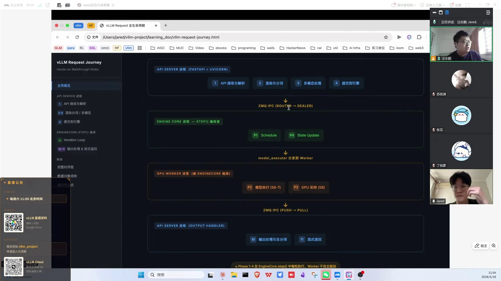 |
| 对对，我是用 0.20.0 来做的。好，然后直播间的同学如果想复现的话，也可以用 0.20.0 这个代码，对着这一次的直播来学习。好，然后郭峰老师开始你的表演。哈哈——呃是这样，后续这个 HTML（调用栈图）已经给到大家了…… [【跳转到 03:41】](https://www.bilibili.com/video/BV1yrJH6pEFQ/?t=221) |  |
| 我之前提前给一个不太懂的人讲过一遍这一整套流程，但最终的效果就是你还是会觉得这个调用栈特别深。假设我现在给大家看一下，比如这个 serving 层的调用，它可能有七八层，然后再展开里面每一步都特别的深…… [【跳转到 04:06】](https://www.bilibili.com/video/BV1yrJH6pEFQ/?t=246) |  |
| 特别的深。所以我也没有预期，或者说让大家听完一遍之后就立马全部都懂了。我建议大家最好照着这个 HTML，或者我同事还分享了一个 Markdown 文档，对着那个自己快速地走一遍，看一下每一步大概都做了些什么。今天就只是带大家走一遍这样的流程。对嗯，那我们就开始。 [【跳转到 04:31】](https://www.bilibili.com/video/BV1yrJH6pEFQ/?t=271) |  |
| 我其实不想从 vLLM 开始，我想从 Transformers 讲起。 [【跳转到 04:56】](https://www.bilibili.com/video/BV1yrJH6pEFQ/?t=296) |  |
| 你看一下一个 Transformers 最基本的 HuggingFace 概念的调用…… [【跳转到 05:03】](https://www.bilibili.com/video/BV1yrJH6pEFQ/?t=303) | 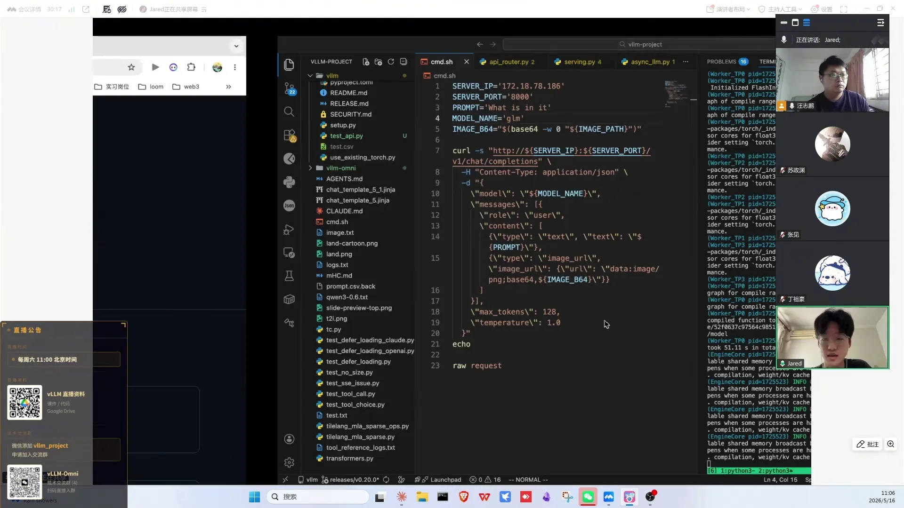 |
| 或者说一个推理是长成什么样的。我们来看，这是一个非常简单也是足够完善的一个 Transformers 的调用代码。我们会先去拿到这个模型的 tokenizer 以及这个模型，这两步就会把模型加载进来、加载到 GPU 上，然后这个服务就起来了。然后我们就准备一个 message…… [【跳转到 05:08】](https://www.bilibili.com/video/BV1yrJH6pEFQ/?t=308) | 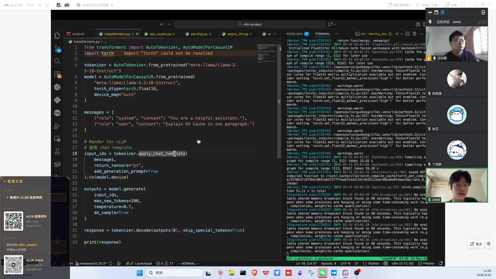 |
| 也就是我们要发给模型的那个东西。这个对话是最原始的对话，也是面向人类的这样一个对话。然后我们再把这个 message 放到 tokenizer 的 apply_chat_template……嗯，这个东西会有一点点特殊，有些时候你还能看到 tokenizer 直接处理这个 message。这是因为如果直接处理这个 message…… [【跳转到 05:33】](https://www.bilibili.com/video/BV1yrJH6pEFQ/?t=333) |  |
| 它就是把它变成 token id，就是我们知道的所谓的一个个 token。但是我们对于绝大部分对话模型——也就是我们今天要讲的最重要（的前提）——是 chat completion，就是 OpenAI chat completion 这个端点。我们现在的模型它不再是一个补全的模型。一般来说它可能是 completion，是接着你的话说：Today is a，然后它就后面接（下去）。但是预训练结束之后…… [【跳转到 05:58】](https://www.bilibili.com/video/BV1yrJH6pEFQ/?t=358) | 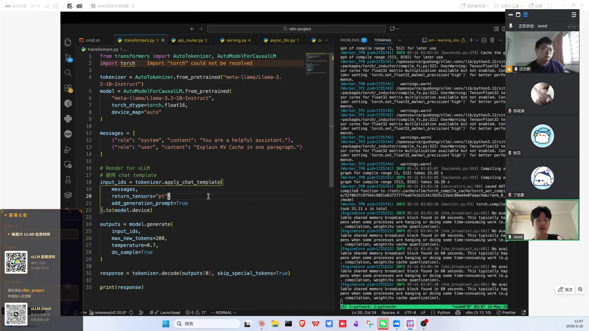 |
| 我们会做一些后训练、做 SFT，让它能具备对话的能力。同时要符合那个 chat completion 或者 chat template 的那个格式，它才能做一个对话：你给它提一个问题，它给你回答一个问题。所以这些东西都是要先 apply_chat_template，apply 完之后把它变成那种格式，我们再用 tokenizer 把它变成 token id。所以这一步其实做了两件事情…… [【跳转到 06:23】](https://www.bilibili.com/video/BV1yrJH6pEFQ/?t=383) |  |
| 一件事就是把目前这个比较原始的输入套上 chat template，apply 完之后我们再给它切成 token id。然后我们就拿到了这个 input id，去真正给到模型。模型就会把这个 token id 变成 embedding、进入 hidden space，做底层的循环、循环、循环之后，最后拿到我们最后的结果的 token id…… [【跳转到 06:48】](https://www.bilibili.com/video/BV1yrJH6pEFQ/?t=408) | 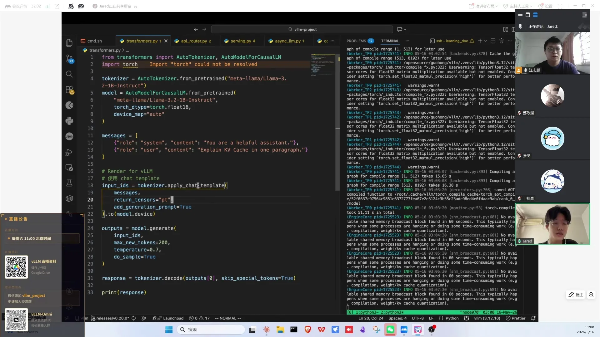 |
| 最后的结果的 token id。然后我们还得再跑一次 tokenizer 的 decode，也就是把这个 token id 变成我们人能读懂的那些文字或者类似的 string，然后才得到最终的 response。对，就是这样子。然后 vLLM 的话——比如我现在就在启动一个模型——启动的时候，它就是把这块把模型给加载进来…… [【跳转到 07:13】](https://www.bilibili.com/video/BV1yrJH6pEFQ/?t=433) | 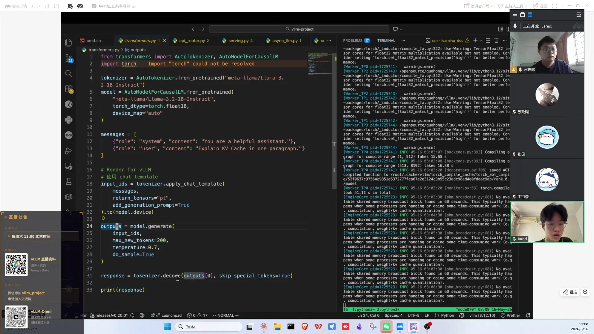 |
| 然后当然还要做一些预热。同时它也要把 vLLM 对外的一个接口 serve 起来。vLLM……它就是把这个 message——它不是一开始你启动的时候就给它的——它应该先挂起一个服务，然后你通过比如这样一个指令（curl），把这个请求…… [【跳转到 07:38】](https://www.bilibili.com/video/BV1yrJH6pEFQ/?t=458) |  |
| 然后我们的（模型）角色在这一块，模型的名字，然后我们还会指定好这个 server 的 IP 和 port。然后我们得指定好端点：V1 一般代表那个 Transformer（家族的）OpenAI 端点。我们最经常打的端点是 chat completion，就是对话的端点；把 chat 去掉那就是 completions，就是补全的端点。嗯嗯。最重要的还是这个 chat completion 端点。嗯。 [【跳转到 08:03】](https://www.bilibili.com/video/BV1yrJH6pEFQ/?t=483) | 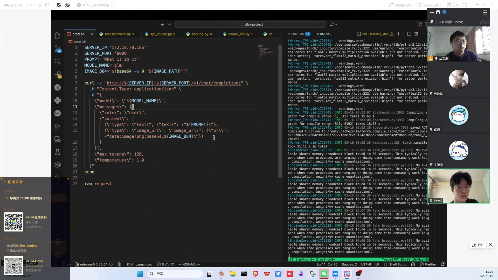 |
| 然后后面会接一些参数，这 sampling params，或者……对，应该是叫这个名字。然后对，这是 message。vLLM 处理就会把它变成一个 API 的服务，你要把这个 message 打进去它才能给你处理。进去之后我们就会简单做一些预处理：进入 engine 或者进入模型之前我们会做一个预处理。这预处理主要的目的也跟这里一样…… [【跳转到 08:28】](https://www.bilibili.com/video/BV1yrJH6pEFQ/?t=508) | 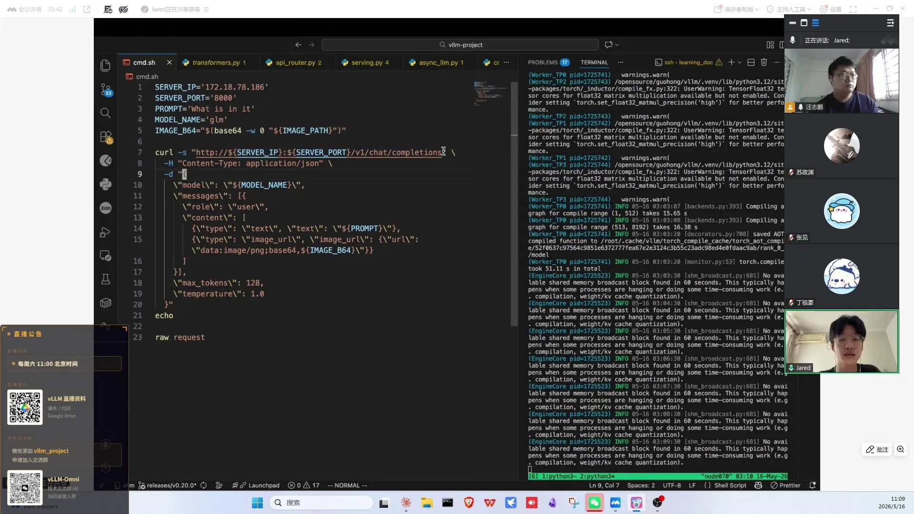 |
| 它是先 apply_chat_template，然后变成 tokenizer 的 token id，变成模型能接受的输入，我们再把它传递到模型里面，让模型做一个前向传播。结束之后我们拿到 token id，我们再给它 detokenize 一遍。嗯对，就这一整套流程其实也没有特别难，但是就是我们要看 vLLM 是怎么实现这一整套流程的…… [【跳转到 08:53】](https://www.bilibili.com/video/BV1yrJH6pEFQ/?t=533) | 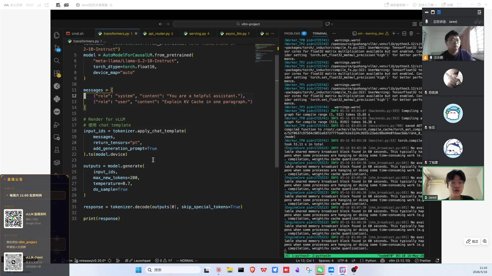 |
| 然后它的调用栈其实非常的深。然后我们就先去看一下，对吧。 [【跳转到 09:18】](https://www.bilibili.com/video/BV1yrJH6pEFQ/?t=558) | 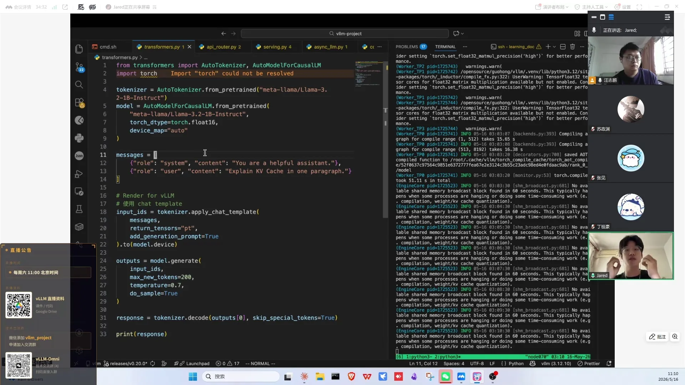 |
| 就刚刚我说的那个全局的概览：我们把 request 打到 API 这边，然后做一个渲染和分词、多模态的处理，然后我们才能提交到引擎。而引擎这一块它还有一些调度的东西；然后模型执行——模型的 forward 和采样它又是分开的，虽然说都在 GPU 上执行，但它确实是（两个阶段）要分开。然后输出来的 token 还要 update 到 scheduler 这一块…… [【跳转到 09:25】](https://www.bilibili.com/video/BV1yrJH6pEFQ/?t=565) | 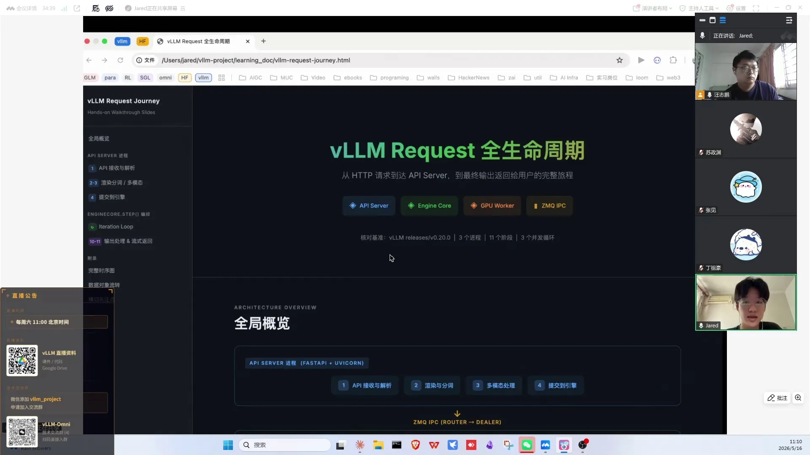 |
| 然后我们再把（结果）再推回 API 进程，再推回给用户。当然这里还有一个 tokenize/detokenize 反分词的流程。所以一整套流程跟 Transformers 其实本质上没有区别，但是我们会把它变得更复杂、更稳定、性能更高效，同时也能服务大规模的用户。对，就是做了这样一件事情。嗯 OK，我们就从 API 的进来开始…… [【跳转到 09:50】](https://www.bilibili.com/video/BV1yrJH6pEFQ/?t=590) | 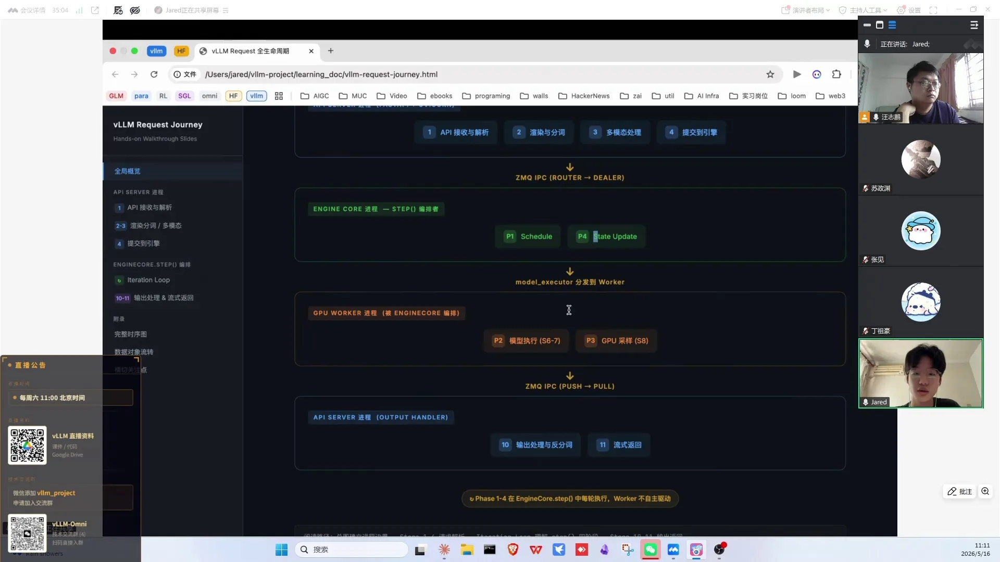 |
| 我们一点点讲。当然如果大家感兴趣的话可以稍微看一下这块，对吧——API 服务启动的调用栈。——真的好卡哦。 [【跳转到 10:15】](https://www.bilibili.com/video/BV1yrJH6pEFQ/?t=615) |  |
| 这个……这是这块，呃 API 服务的调用栈。 [【跳转到 10:22】](https://www.bilibili.com/video/BV1yrJH6pEFQ/?t=622) | 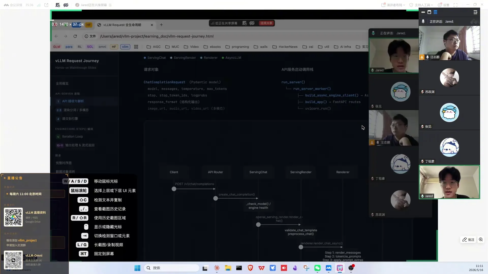 |
| （此区间无字幕） [【跳转到 10:28】](https://www.bilibili.com/video/BV1yrJH6pEFQ/?t=628) | 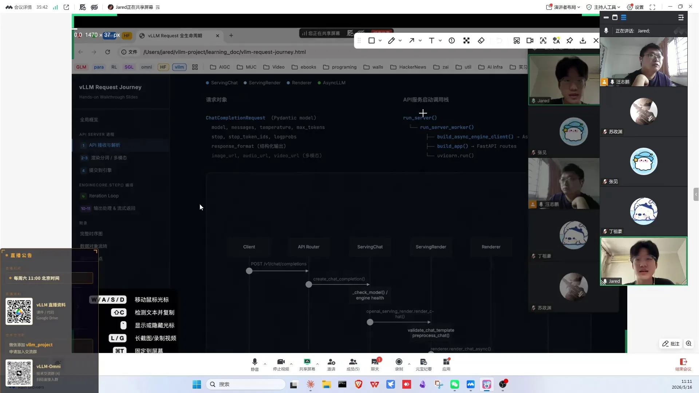 |
| 这里就是最开始你 vllm serve 的时候，它就会这样子来启动一整个（服务）。但是如果你对这个东西感兴趣你可以接着去看，今天不是重点。我们可以大概看一下：请求进来的这个阶段大概会经历这样一些流程（时序图）。我们的 client——我们就是 client 嘛——然后向这个 chat completion 这个端点去打一个请求…… [【跳转到 10:33】](https://www.bilibili.com/video/BV1yrJH6pEFQ/?t=633) |  |
| 然后这个请求会进入到一个叫 API router 的地方，这个 API router 其实就是 chat completion 这个端点的 API router。然后再把实际的运行和计算交给一个叫 OpenAIServingChat 的类。然后我们在 OpenAI serving chat 里面也有一个方法，它主要就做两件事情：一件是预处理，一件是把 request 打包好之后丢给 engine…… [【跳转到 10:58】](https://www.bilibili.com/video/BV1yrJH6pEFQ/?t=658) |  |
| 所以这两个都是 preprocess，就是一些预处理。准备好之后，对吧，我们从这块再通过 engine client generate 把这个请求丢给我们的 engine，让它去做处理。我们整个就是要大概做这样一件事情。然后我们直接来看代码。嗯。 [【跳转到 11:23】](https://www.bilibili.com/video/BV1yrJH6pEFQ/?t=683) |  |
| 我们先打开——vLLM 的代码在这一块。我们现在要找的答案就是 chat completion 的端点是在哪里暴露出去的。它就在 vLLM 的 entrypoints、OpenAI 还有 chat completion 这一块。我们先打开这个 API router。嗯，把这块隐藏一下。OK，就是这一块，是一个挺短的代码…… [【跳转到 11:47】](https://www.bilibili.com/video/BV1yrJH6pEFQ/?t=707) | 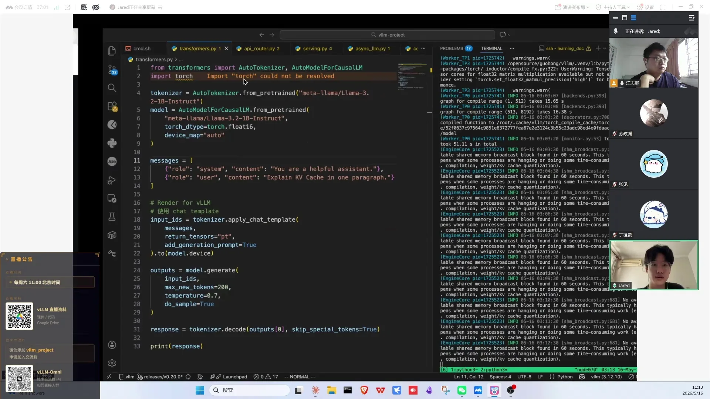 |
| 一个屏幕都可以装下。嗯，如果大家做过一些 FastAPI 相关的项目，大家知道就是通过这个装饰器我们把这个端点暴露出去。然后我们这样一个 route（路由）大概长成这样：这个 request 进来之后，它就会被 pydantic 包装成 ChatCompletionRequest 这个类…… [【跳转到 12:12】](https://www.bilibili.com/video/BV1yrJH6pEFQ/?t=732) | 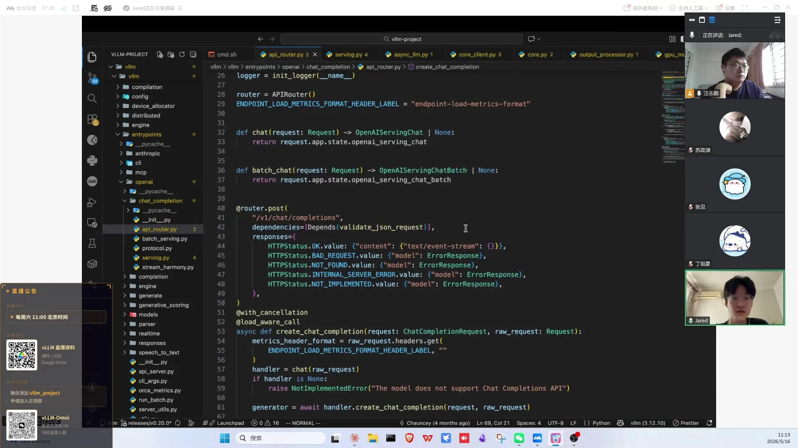 |
| 然后这个类会逐渐地往下传，传到我们这个代码这个函数。我们现在就拿到 request 之后往下拿，给到一个 handler。这个 handler 哪里来的？handler 其实就是拿到 request，拿到这个 OpenAIServingChat——其实就是这个类。嗯。 [【跳转到 12:37】](https://www.bilibili.com/video/BV1yrJH6pEFQ/?t=757) | 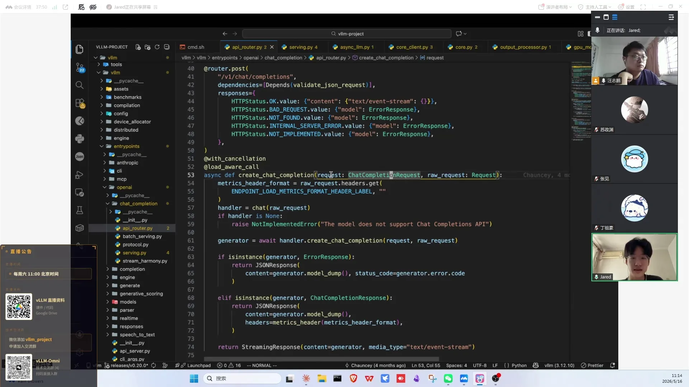 |
| OK，等会我们还接着讲。然后把这个 request 放到这个 handler 的 create_chat_completion——也就是最关键的这个方法里面。对，就这一块。传进来之后他主要做两件事情：一件事情 render_chat_completion 做预处理，做完之后还有一些其他相关的…… [【跳转到 13:02】](https://www.bilibili.com/video/BV1yrJH6pEFQ/?t=782) | 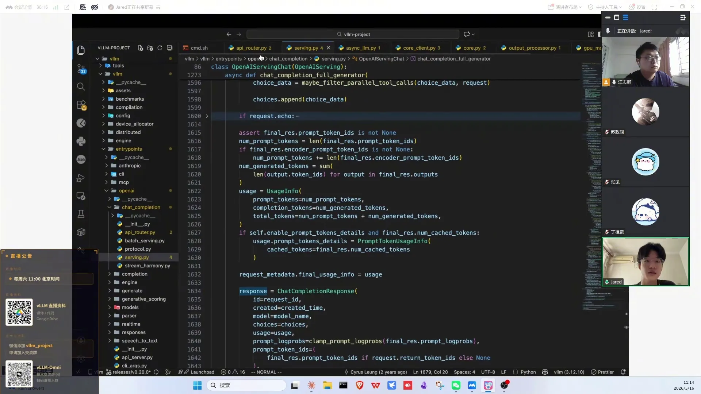 |
| 我今天不会讲，因为这里应该不是最重要的点：就是当你有一些 LoRA 的需求的时候你再来看；然后你有一些 DP rank——data parallel 相关的东西——你可以再来这里看。嗯，然后我会直接走向我们最最关键的点：比如我们拿到这个 message token、拿到 sampling params 之后，我们做完预处理，就把这个 request 一路交给 engine client generate。 [【跳转到 13:27】](https://www.bilibili.com/video/BV1yrJH6pEFQ/?t=807) | 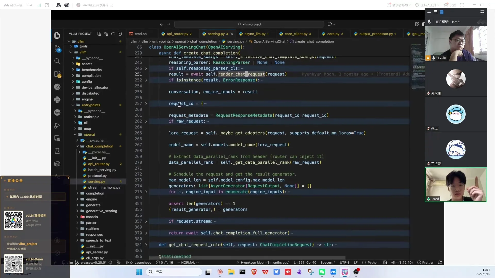 |
| 所以它就做两件事情：一件是预处理，一件把这个请求拿给 engine client。那我们就要深入到这个预处理，因为这预处理做了挺多的事情。嗯，到这一块大家应该能听懂。就是……有观众提问啊…… [【跳转到 13:52】](https://www.bilibili.com/video/BV1yrJH6pEFQ/?t=832) | 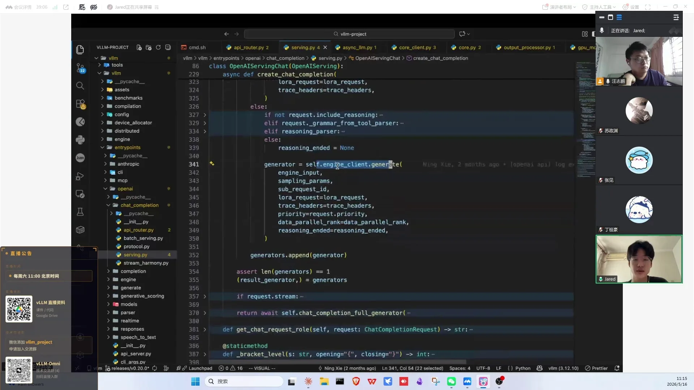 |
| 就是说 request 都一定会进入到 render 吗？ [【跳转到 14:07】](https://www.bilibili.com/video/BV1yrJH6pEFQ/?t=847) |  |
| request 都一定会（经过）这样（的流程）吗？——那目前来看就是：如果你打了 chat completion，那肯定会进入的。因为我们这条链路是这样的嘛：request 从这个端点进来，到这个方法，这个方法就会传递到 OpenAI serving chat 这一块，对吧，OpenAI serving chat 的 create_chat_completion。然后你这个 request 当然也就会进入到这个叫 render 的地方，这里就是 render 实际执行预处理的入口…… [【跳转到 14:12】](https://www.bilibili.com/video/BV1yrJH6pEFQ/?t=852) | 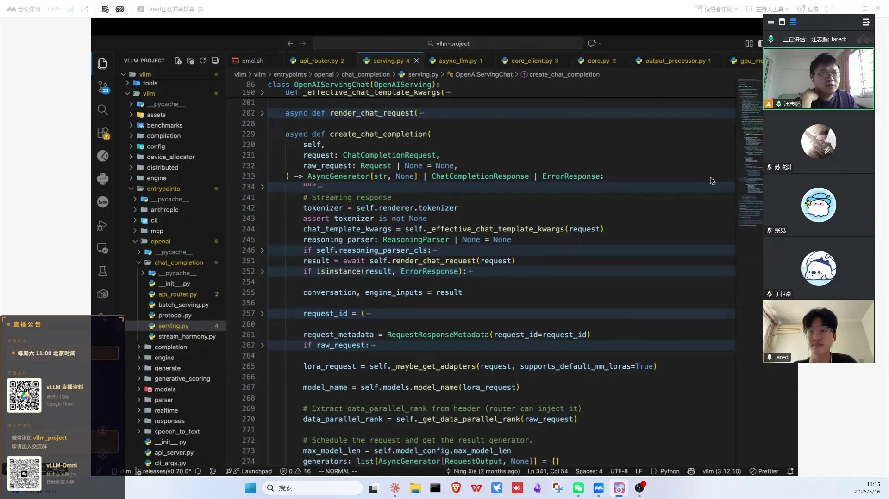 |
| 所以如果你打的是 chat completion 的端点，当然会进入到这个 render。当然其实如果你仔细看的话，你会发现在 vLLM entrypoints 的 serving 里面其实有个 render 的（服务），你是可以直接只打这个 render 的，然后你拿到一个预处理的结果，而不去跑后面的 forward 的过程。这是可以的。我们可以打开稍微看一下。对…… [【跳转到 14:37】](https://www.bilibili.com/video/BV1yrJH6pEFQ/?t=877) | 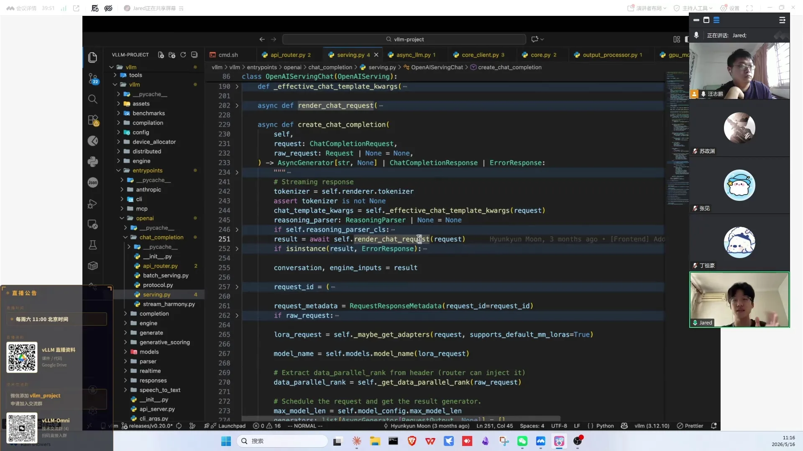 |
| 而且我记得我们的这个端点，其实也是可以不传原始文本的，可以直接传处理后的东西了，对吧？——嗯对，处理后的（输入），后面会做些检测然后跳过，它很会直接跳过这个。——真的？——嗯是的那它可能也是进来之后我们再去检测…… [【跳转到 15:02】](https://www.bilibili.com/video/BV1yrJH6pEFQ/?t=902) | 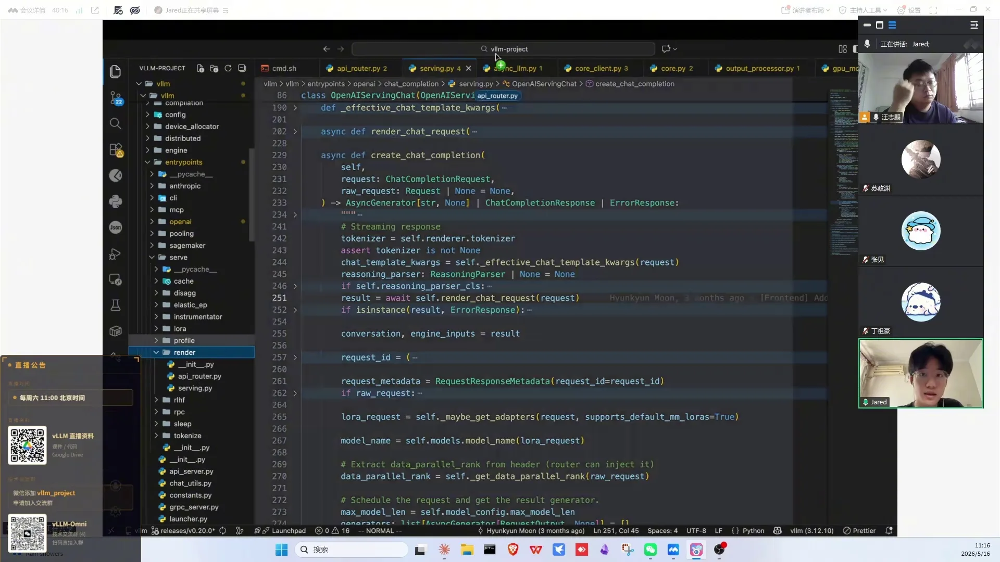 |
| OK，你有没有已经被处理过，如果被处理过我们直接返回、接着走下一步，应该是这样。然后一整个我们就讲最最常见的流程，就是我们 debug 的时候最常见到的那种流程。OK，我们接下来就开始讲预处理的阶段。嗯，它这里涉及到几个比较大的类，第一次 debug 的时候会挺痛苦的。 [【跳转到 15:27】](https://www.bilibili.com/video/BV1yrJH6pEFQ/?t=927) | 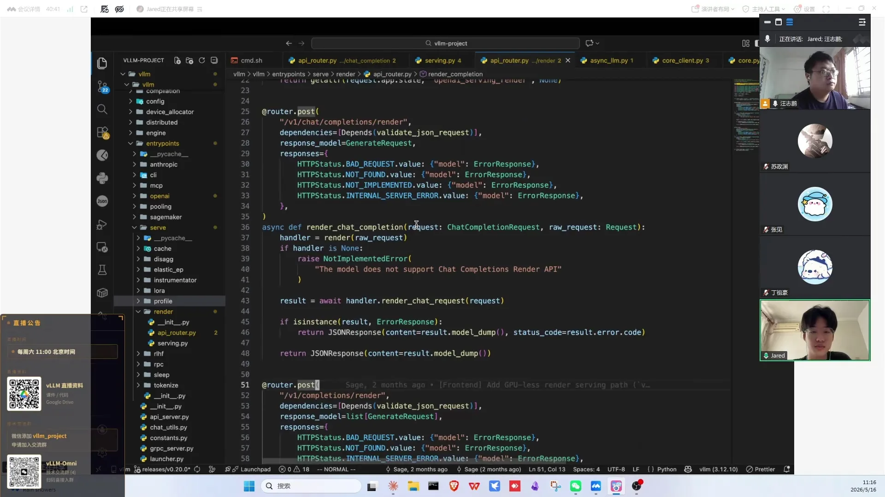 |
| 然后 OpenAIServingChat 会把实际的预处理工作外包给一个叫 OpenAIServingRender 的类。我先打开这个 OpenAI serving render，在这块。OK，serving chat 就是 chat 这个端点这样一个类。然后这个类呢，它其实也是一个对外的端口…… [【跳转到 15:52】](https://www.bilibili.com/video/BV1yrJH6pEFQ/?t=952) | 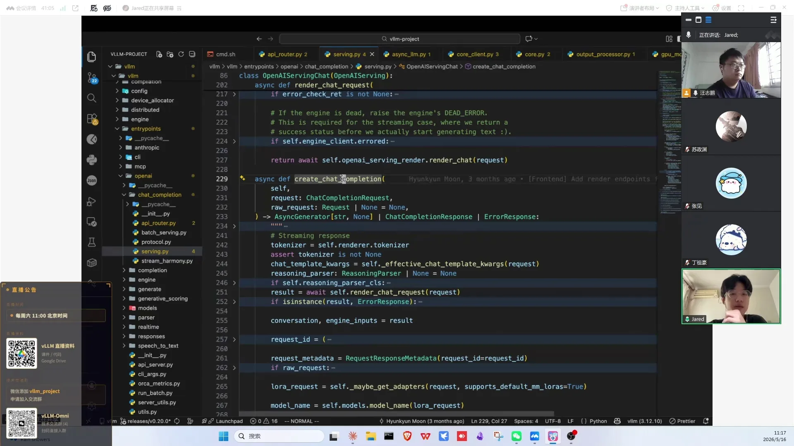 |
| 我刚刚说过，我们可以直接打这个端点，但是他会把实际的执行又外包给一个叫做 renderer 的类。是不是很复杂？就是 OpenAI serving chat 外包给 serving render，render 又会把实际的计算给到 renderer。然后 renderer 我们要涉及两个类：一个是 BaseRenderer，还有一个是 HF renderer。 [【跳转到 16:17】](https://www.bilibili.com/video/BV1yrJH6pEFQ/?t=977) | 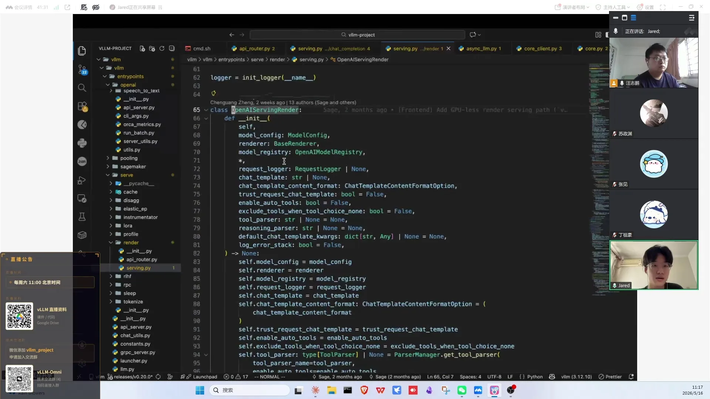 |
| 然后他们两个的职责又不太一样。我们先接着往下看，先从 OpenAI serving render 这一块开始，它就刚刚调用了这个 render chat（completion）。我们往后看。嗯，对，我们拿到 tokenizer、拿到 tool parser——如果模型有工具调用的能力，你肯定要给他配一个 tool parser，这一块是 tool parser 的一些初始化示例。 [【跳转到 16:42】](https://www.bilibili.com/video/BV1yrJH6pEFQ/?t=1002) | 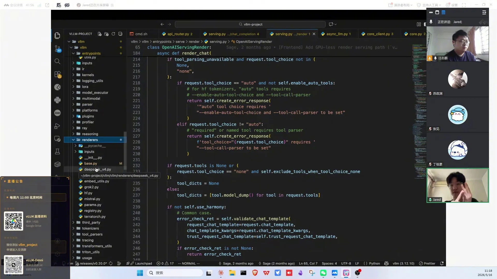 |
| 然后这段代码是：我们经常看别人代码的话，经常会出现"如果它用 harmony"——harmony 就是专门给 GPT-OSS 的处理，部分时候是没有的。有观众问：vLLM 之后要做这个 OpenAI v1 responses 这个端点吗？这个…… [【跳转到 17:07】](https://www.bilibili.com/video/BV1yrJH6pEFQ/?t=1027) | 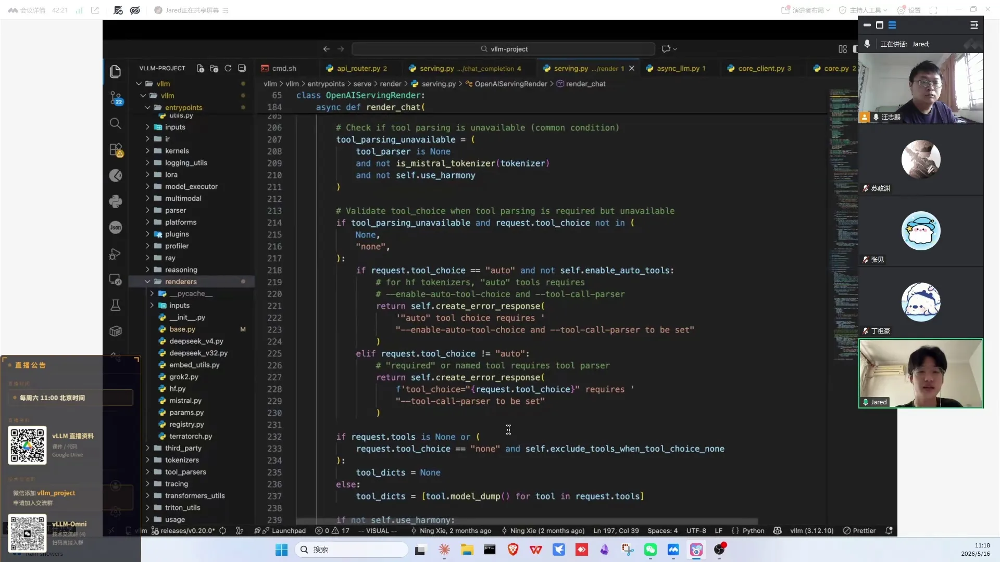 |
| 这个 harmony 其实就是对这个 responses 端点做的。嗯，是的。绝大部分时候你的模型是不需要走这条路的，除非你真的在调试 GPT-OSS，那他的情况会稍微有点复杂。然后我们今天就只讲 common（的情况）。对吧，就是进来这到这一块之后，他又会把这个 request 的东西拆出来，还有好（多东西）是吧…… [【跳转到 17:32】](https://www.bilibili.com/video/BV1yrJH6pEFQ/?t=1052) | 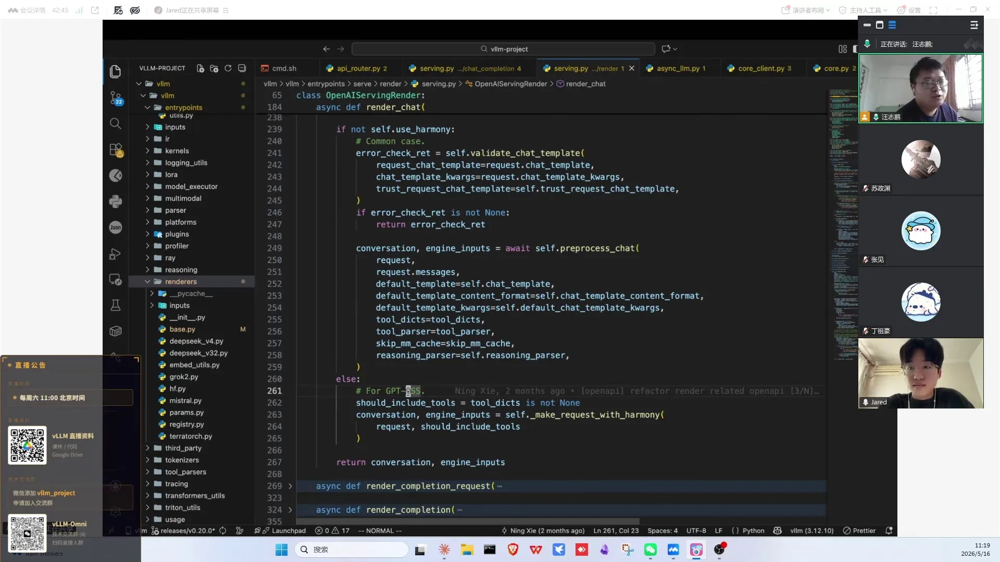 |
| 我们再给到 preprocess chat。从现在开始你会发现它又是外包给了一个叫做 renderer 的类里面。那么接下来大部分时间应该会在这一块，去看 renderer 是怎么做这个 render chat completion 这一整个预处理操作的。我们点进去看啊…… [【跳转到 17:57】](https://www.bilibili.com/video/BV1yrJH6pEFQ/?t=1077) | 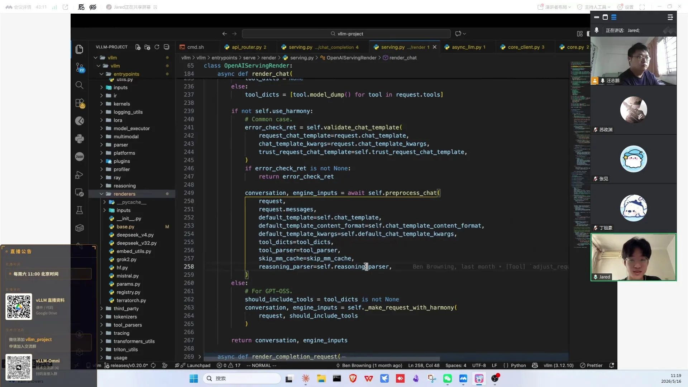 |
| 这里提到两个 renderer 的类。 [【跳转到 18:16】](https://www.bilibili.com/video/BV1yrJH6pEFQ/?t=1096) | 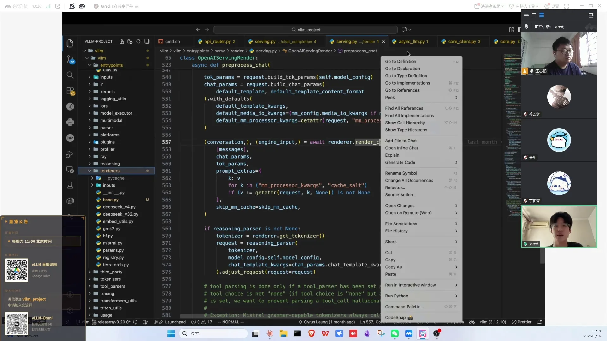 |
| 一个叫做 BaseRenderer 的类。但是这个 BaseRenderer 其实没有实现 render_chat_completion，或者说他们没有实现 apply_chat_template 这个主要的工作。所以我们还要看到一个类似 HF 的 renderer，是真正（干活的）。这两个类一般会一起看。嗯，是的。 [【跳转到 18:21】](https://www.bilibili.com/video/BV1yrJH6pEFQ/?t=1101) | 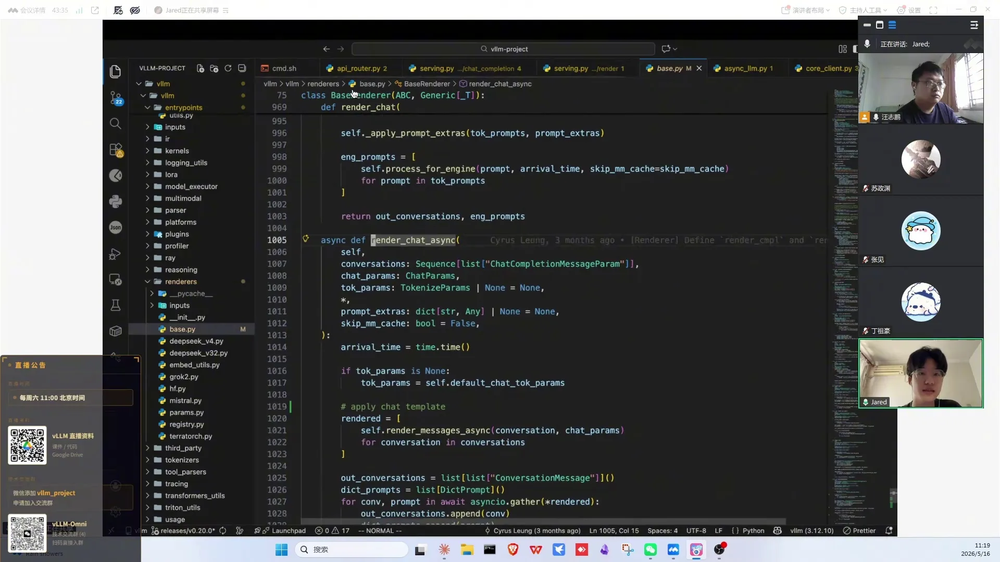 |
| 我们接着看代码之前，我还想（说）我们这两类有什么区别。——BaseRenderer 是（基类）……这一块就得给大家展开讲一讲。嗯，就在这一块吧。我们实际调用——刚才已经讲了这一块的调用栈，对吧，render chat completion。然后我们可以看到他进行了四步：第一步就是我们刚刚说的 apply_chat_template…… [【跳转到 18:46】](https://www.bilibili.com/video/BV1yrJH6pEFQ/?t=1126) | 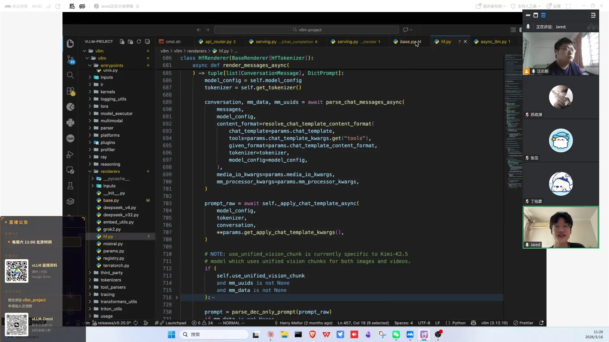 |
| 呃BRENDER是实际值啊我们队的P那个size吧这一块就得给大家这展开讲一讲嗯啊就就在这一块吧嗯我们实际调用我们刚才已经讲了这一块的调用站对吧render的charthingRenderchairthing然后我们可以看到他进行了四步第一步就是我们刚刚说的applytotemplate [【跳转到 18:52】](https://www.bilibili.com/video/BV1yrJH6pEFQ/?t=1132) |  |
| apply_chat_template 之后，我们再把拿到的结果再去跑 tokenize id，也就是这块 text to token id。之后我们再把（第三步的）……就是把一些 extra 的东西拼到那个已经 tokenized id 的一个数据类里面。然后我们再把这东西再去做一个处理：process inputs——这一块就是专门给多模态相关的东西去做处理。 [【跳转到 19:17】](https://www.bilibili.com/video/BV1yrJH6pEFQ/?t=1157) |  |
| 所以这个 BaseRenderer 他实际执行了四个任务：一个是 apply_chat_template，一个是 tokenize id，然后加上一些 extra——这个我觉得都不应该算（成）第三步——但是还有一件事情就是多模态相关的一些预处理。 [【跳转到 19:42】](https://www.bilibili.com/video/BV1yrJH6pEFQ/?t=1182) |  |
| 他实际做这四件事情。然后 HF renderer 呢，就实际执行了 apply_chat_template 这一小步。大概是这样。——嗯对，我理解。 [【跳转到 20:07】](https://www.bilibili.com/video/BV1yrJH6pEFQ/?t=1207) |  |
| 对，因为我理解我们当时做（vLLM）的话——V0 到 V1 不是做了一个重构嘛——当时最主要做的事情就是把这部分东西单独拆出来了，因为后来就做成两个进程了。这个进程是专门做一些 CPU 上的操作，然后剩下的模型那一块就主要是放在 GPU 上面去。嗯是的。 [【跳转到 20:18】](https://www.bilibili.com/video/BV1yrJH6pEFQ/?t=1218) | 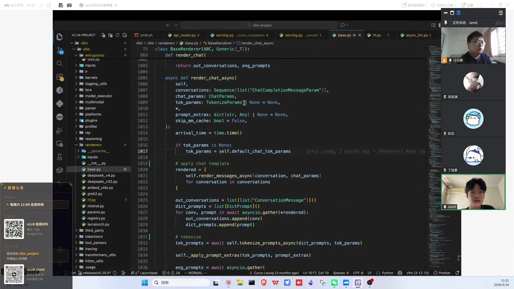 |
| 然后我们大概可以知道，如果我们的 token 特别长、或者长文本进来之后，让 tokenizer 把这一长段文本拆成一个个 id，其实也是一个相对耗时的工作；再把这个很长的东西贴到 chat template 上面，也是一个相对耗时的操作。所以一般来说我们的设计意图就是把这两块分开…… [【跳转到 20:43】](https://www.bilibili.com/video/BV1yrJH6pEFQ/?t=1243) | 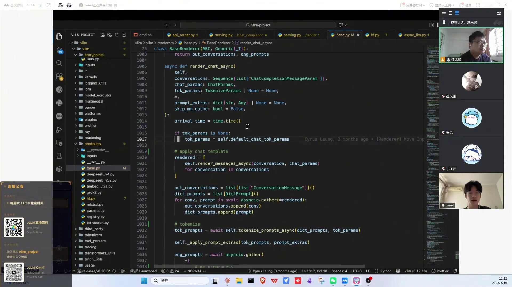 |
| 然后各自地去跑这样的 async 的操作。然后我会觉得：如果你对 apply_chat_template 这件事情本身没有实际的工作需求的话，你不一定需要了解接下来的很深的调用栈。然后 tokenize 也是——我刚刚说的这四步里面的三步都会进到很深的调用栈。你现在一遍听不懂我觉得完全没有关系…… [【跳转到 21:08】](https://www.bilibili.com/video/BV1yrJH6pEFQ/?t=1268) | 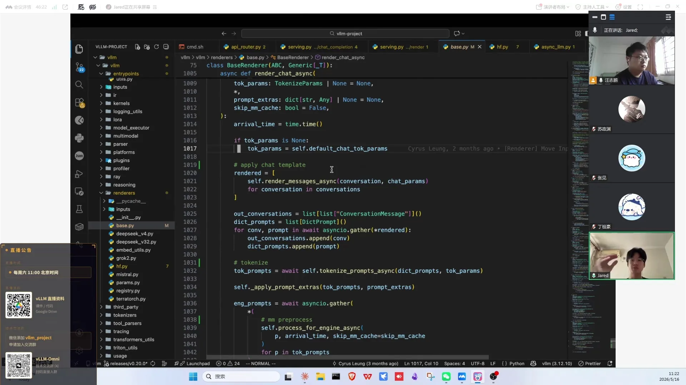 |
| 你真的到了实际有业务需求的时候，你再来深入看这块的代码。OK，我先带大家走一遍这个 apply_chat_template 会经过哪些类。你跟不上我觉得完全没有任何关系。我们就来看 render——其实就是把刚刚那个 request 放到 render message async 这个（方法），然后这个方法实际执行的是 HF renderer。我们来看一下这一块…… [【跳转到 21:33】](https://www.bilibili.com/video/BV1yrJH6pEFQ/?t=1293) | 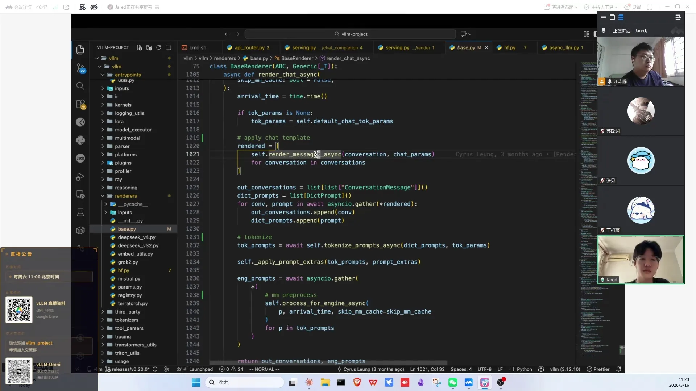 |
| 这里 render message async 首先会先把 message 拆开。我们看一下一个多模态的请求的例子长什么样子。 [【跳转到 21:58】](https://www.bilibili.com/video/BV1yrJH6pEFQ/?t=1318) | 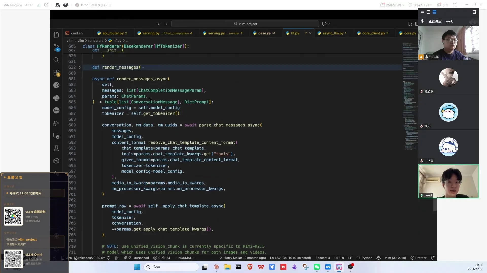 |
| 呃，可好。 [【跳转到 22:11】](https://www.bilibili.com/video/BV1yrJH6pEFQ/?t=1331) | 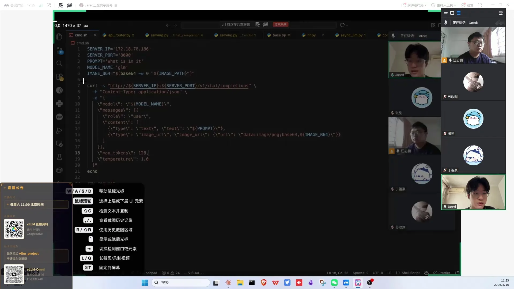 |
| 我们进来之后，对吧，这个 message 大概包含的是这样的：有你的角色，然后 content 里面可以放两个东西或者很多东西。绝大部分时候是只有一个 text：如果你是纯文本模型，你只给他一个文本；如果你是多模态模型，你往往会带上一个 image url；或者如果你是音频处理模型，你还会带上 audio url…… [【跳转到 22:16】](https://www.bilibili.com/video/BV1yrJH6pEFQ/?t=1336) |  |
| 如果你还可以有一些其他的视觉能力，你说不定还会传进来一个 video，对吧。这些都是多模态的数据。这个多模态的数据和 text 相关的东西目前都还是被放在一个叫 content 的（结构）里面。所以我们在预处理的时候，会先把这个 message 先给它拆开。这块调用栈也稍微有点深，我可以带大家快速过一遍。 [【跳转到 22:41】](https://www.bilibili.com/video/BV1yrJH6pEFQ/?t=1361) | 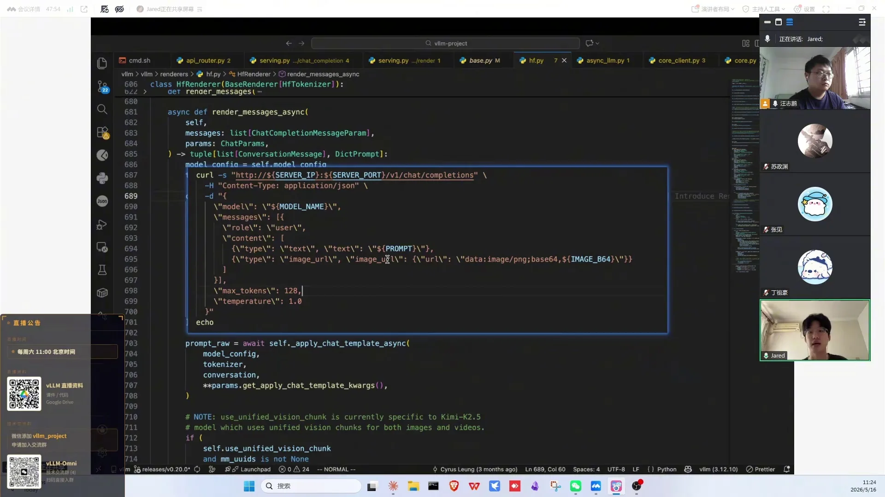 |
| 我们点进去看，parse messages 它就会传递到一个叫 parse message（单数），把这个 s 去掉了。然后同时…… [【跳转到 23:06】](https://www.bilibili.com/video/BV1yrJH6pEFQ/?t=1386) | 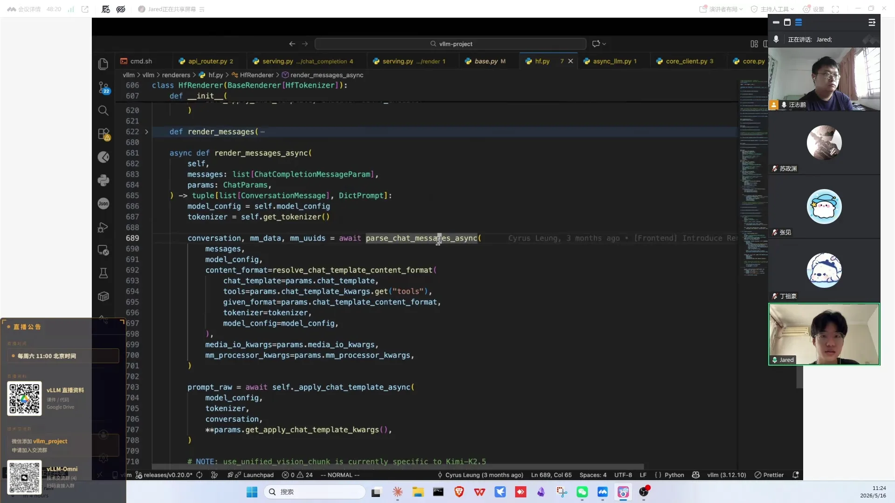 |
| 对一个 message 进行递归的调用。 [【跳转到 23:20】](https://www.bilibili.com/video/BV1yrJH6pEFQ/?t=1400) | 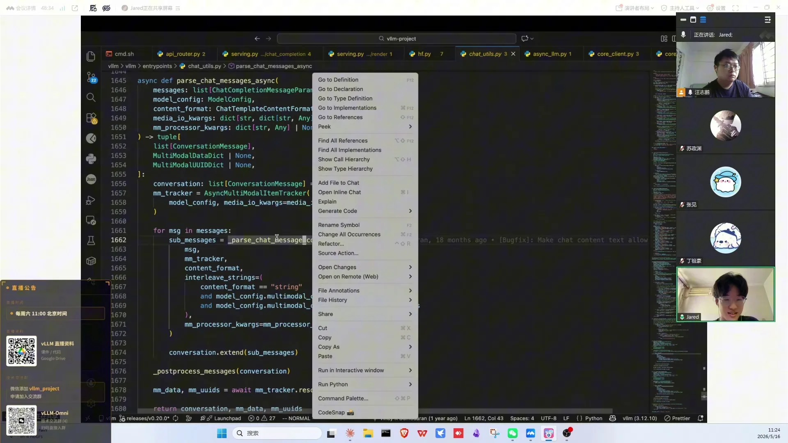 |
| 然后接下来就开始 parse……你点进去之后我们又会发现哦…… [【跳转到 23:25】](https://www.bilibili.com/video/BV1yrJH6pEFQ/?t=1405) | 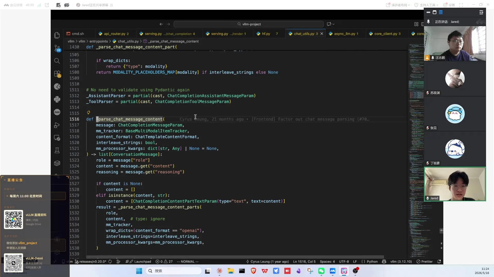 |
| parse 又开始做一个循环，把这个 s 去掉了。 [【跳转到 23:32】](https://www.bilibili.com/video/BV1yrJH6pEFQ/?t=1412) | 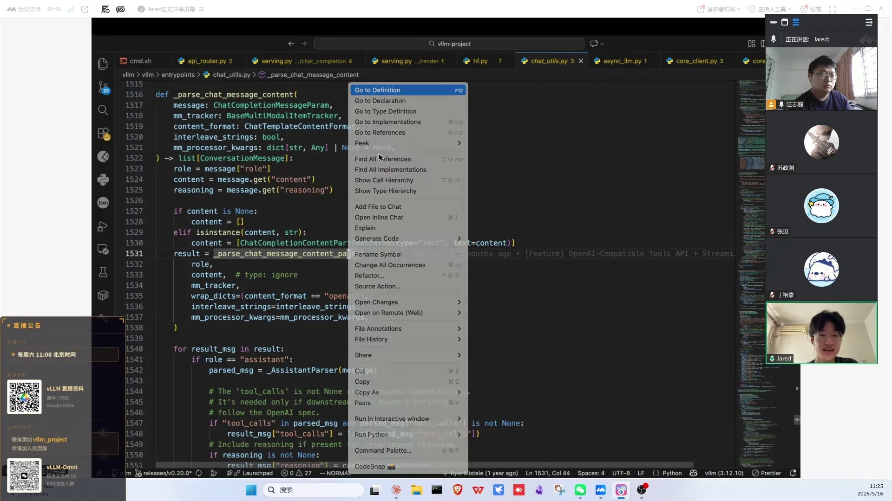 |
| 然后又实际执行一个类。然后再点进去，进来之后 OK 这里我们就已经能看到多模态相关的东西：比如你是 image，你是 PIL 进来的；你是 image url 进来的，都有可能；你可能是 image 已经做好了 embedding 进来的；然后 audio 相关的东西——多模态这里就已经有一些体现了。然后这里还有一个更深的调用…… [【跳转到 23:37】](https://www.bilibili.com/video/BV1yrJH6pEFQ/?t=1417) | 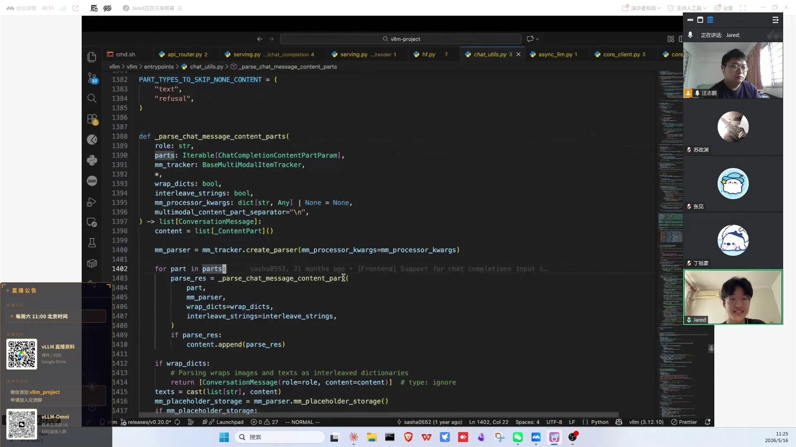 |
| 就是具体的，如果你是 image 或者 embedding 相关的东西…… [【跳转到 24:00】](https://www.bilibili.com/video/BV1yrJH6pEFQ/?t=1440) | 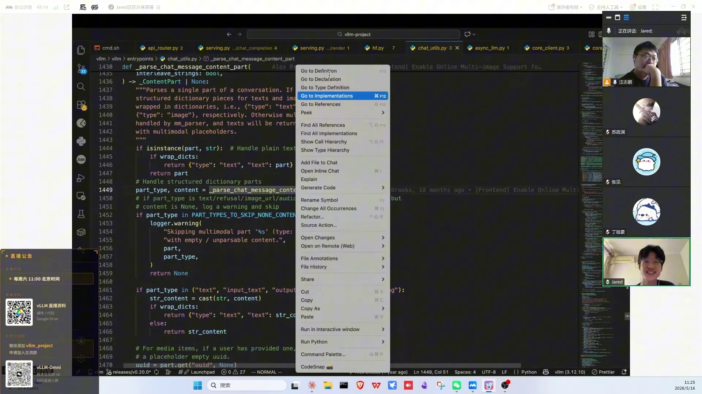 |
| 他也会在这里。对，就是这块挺深的。我觉得如果你没有涉及到相关的东西，暂时可以不用去看。然后我记得我的（笔记）里面是有大概在这一块…… [【跳转到 24:05】](https://www.bilibili.com/video/BV1yrJH6pEFQ/?t=1445) | 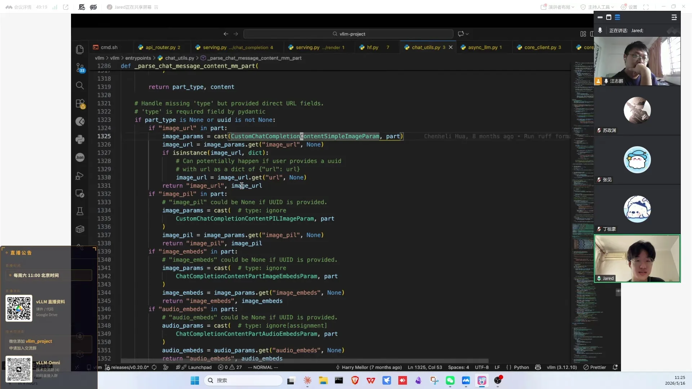 |
| （此区间无字幕） [【跳转到 24:18】](https://www.bilibili.com/video/BV1yrJH6pEFQ/?t=1458) | 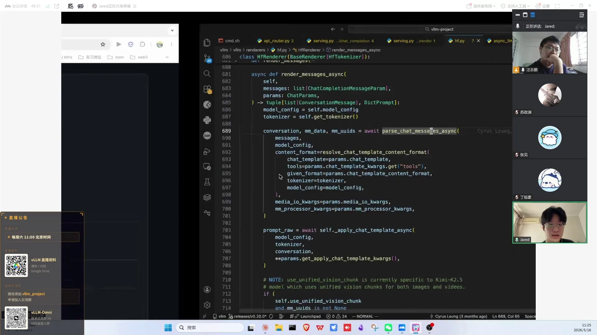 |
| 你可以对着这个 README 阅读一下这部分代码。 [【跳转到 24:23】](https://www.bilibili.com/video/BV1yrJH6pEFQ/?t=1463) | 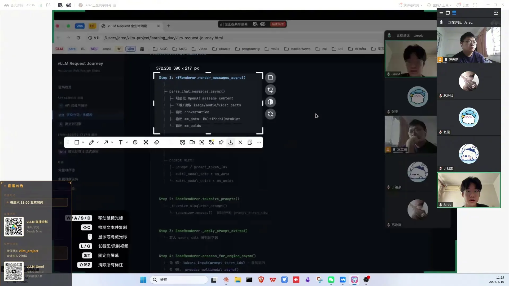 |
| 如果你要自己画出来调用栈，你会发现它可能是叠了十层，很恐怖。嗯，但也都是为了职能分离吧，我觉得这样子也是能理解的。OK，我们再往后看，下一步就是真正的 apply chat（template）。这一块我们来到 HF renderer——本质上就是为了 apply_chat_template 嘛。我们去看一下这个方法，简单看一下，它是在（vLLM）里面，稍等…… [【跳转到 24:28】](https://www.bilibili.com/video/BV1yrJH6pEFQ/?t=1468) | 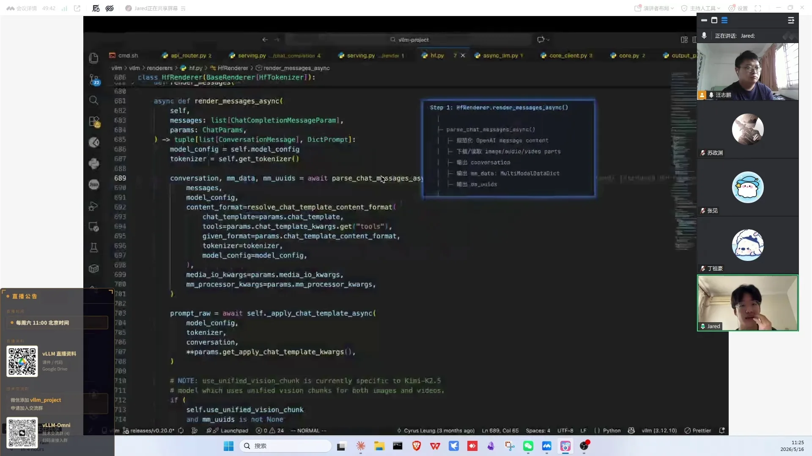 |
| 直接搜索里面对，我直接（搜）。 [【跳转到 24:53】](https://www.bilibili.com/video/BV1yrJH6pEFQ/?t=1493) | 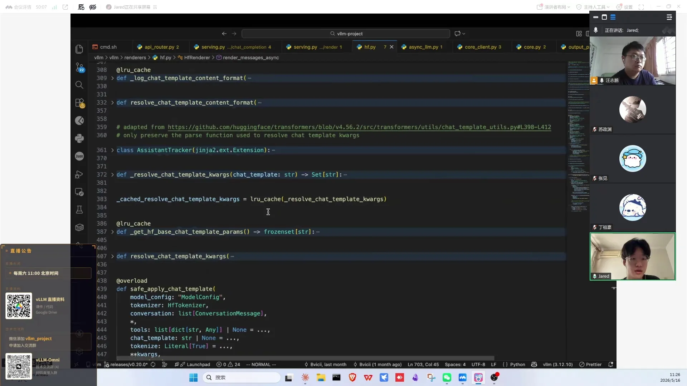 |
| 我直接搜索。OK，这个他就是把一个 sync 的 apply_chat_template 变成一个 async 的操作。 [【跳转到 25:00】](https://www.bilibili.com/video/BV1yrJH6pEFQ/?t=1500) | 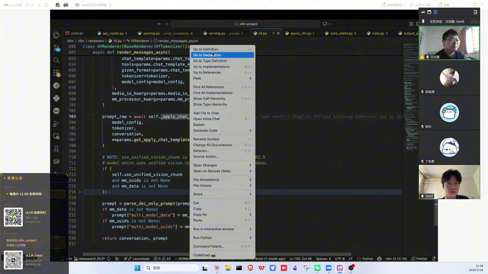 |
| 我刚刚也说过，因为这是一个会相对耗时（的操作），每一步、每一个任务他可能都会耗一定的时间，所以我们把它变成一个异步的，不让它变成一个阻塞的操作。但是实际看下这个 async apply chat template 做了什么事情。嗯嗯嗯，我记得是在这里。OK，我们会把那个 chat template（的结果）出来…… [【跳转到 25:05】](https://www.bilibili.com/video/BV1yrJH6pEFQ/?t=1505) | 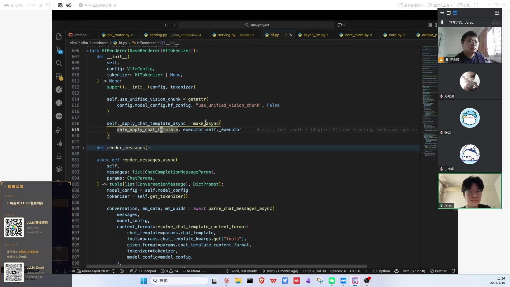 |
| 然后把它变成一个 future，最终会传递给 tokenizer 的 apply_chat_template。你看这一块其实跟…… [【跳转到 25:30】](https://www.bilibili.com/video/BV1yrJH6pEFQ/?t=1530) | 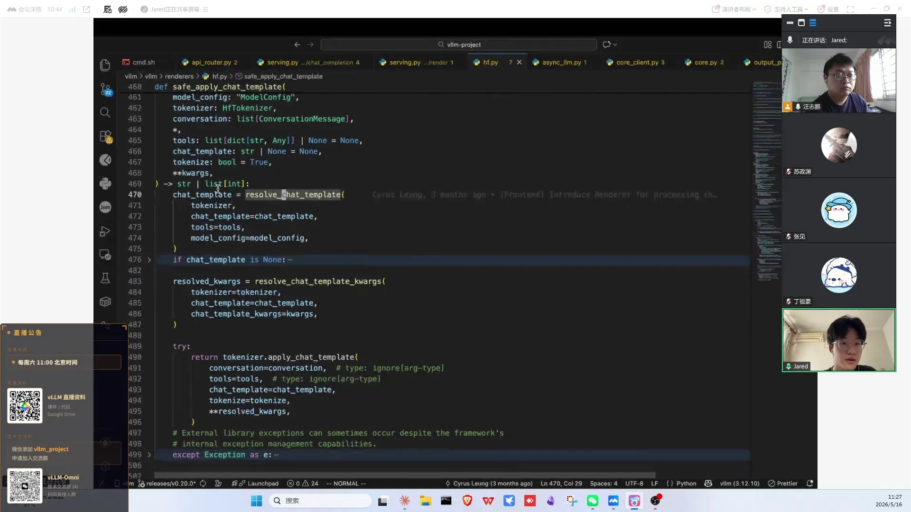 |
| Transformers 的要有一模一样的。 [【跳转到 25:40】](https://www.bilibili.com/video/BV1yrJH6pEFQ/?t=1540) | 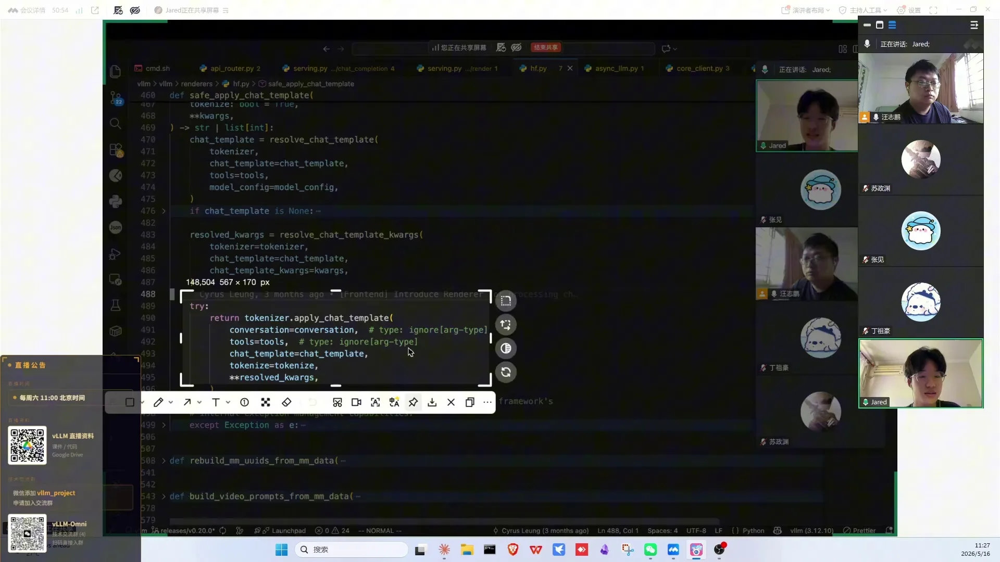 |
| 基本上一模一样。这块吧，就这样子：这里下面是 vLLM、上面是 Transformers 的调用，对吧，他们都是（一样的）。只不过在 vLLM 这一块，他会把这个（步骤）拆开——只执行了 chat template，把 tokenizer 的工作交给后面那一步，然后返回来一个已经 render 好、或者说已经 apply chat template 结束的这样一个输出。 [【跳转到 25:45】](https://www.bilibili.com/video/BV1yrJH6pEFQ/?t=1545) | 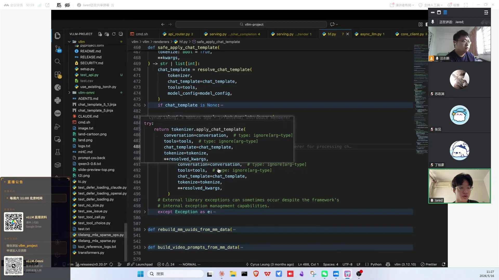 |
| OK 我们接着往后看，HF renderer 的事情就结束了。然后我们再回到 BaseRenderer。我看下，好像被我关掉了。好，直播间有观众提问了：就是说这个多模态部分和 Omni 是完全分开的吗？ [【跳转到 26:10】](https://www.bilibili.com/video/BV1yrJH6pEFQ/?t=1570) | 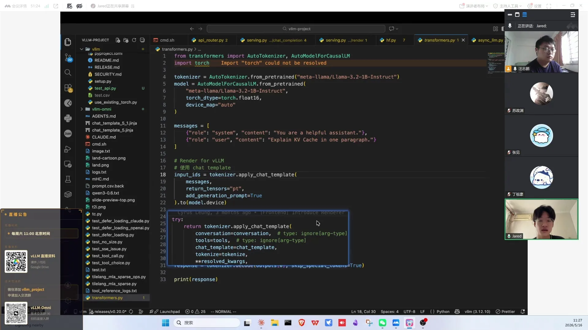 |
| 这个不是的。 [【跳转到 26:30】](https://www.bilibili.com/video/BV1yrJH6pEFQ/?t=1590) | 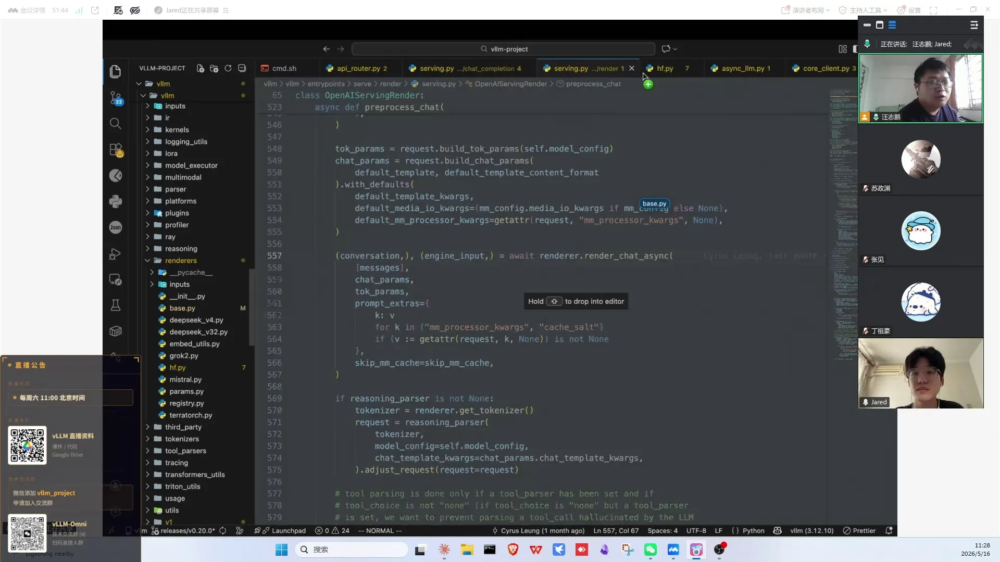 |
| Omni 里面所有的像 process 这块地方，全都是基本上来讲用的是 vLLM 这块代码，它会有一层外包。因为是这样子：Omni 的话它是分不同的（部分）的，有的是 LLM（部分），然后还有的话就属于是纯正的 diffusion 的。diffusion 那一块的话它是跟主仓这边的…… [【跳转到 26:35】](https://www.bilibili.com/video/BV1yrJH6pEFQ/?t=1595) | 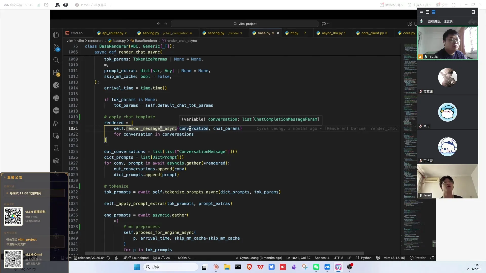 |
| 层次结构是尽可能地去一比一还原的。然后如果是纯 LLM engine 那块——比如说像千问（那种）——Omni 对，就直接是全都复用的。嗯，所以我一开始在尝试走这套流程的时候，其实是从 Omni 开始的。然后我就发现我不仅要看懂 Omni 的代码，还要过来把 vLLM 也 debug…… [【跳转到 27:00】](https://www.bilibili.com/video/BV1yrJH6pEFQ/?t=1620) | 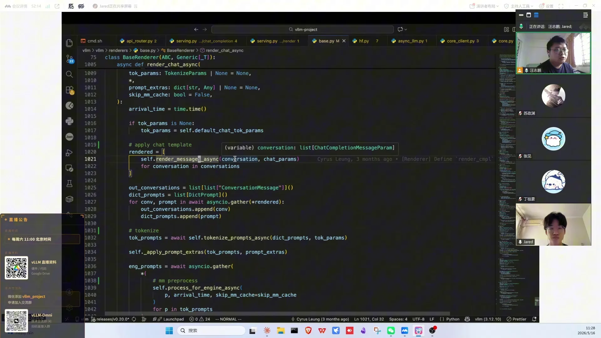 |
| 然后那个过程就学了我很久，很痛苦。然后现在我要把它总结出来之后，就发现好像也没有那么难。——OK，其实我觉得还是很复杂的。我觉得这个 processor 这块地方确实是调用栈太深了，这个东西比我一年前看的时候还要深好多好多。是的好。好，然后下一个问题就是多模态的预处理…… [【跳转到 27:25】](https://www.bilibili.com/video/BV1yrJH6pEFQ/?t=1645) | 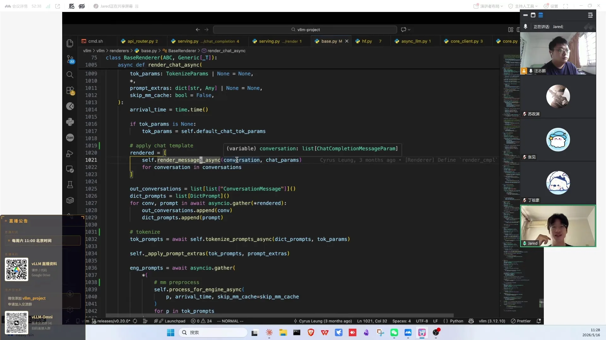 |
| 现在 PD 分离是不是拆开了？我知道 vLLM 现在主仓有 PD（分离），然后 vLLM-Omni 那边也有 PD，对吧。嗯，你有了解到主仓这边 PD 是怎么回事吗？——没有，因为我也没有做相关的工作。我觉得都是你到了这一块之后你再去了解。嗯嗯…… [【跳转到 27:50】](https://www.bilibili.com/video/BV1yrJH6pEFQ/?t=1670) | 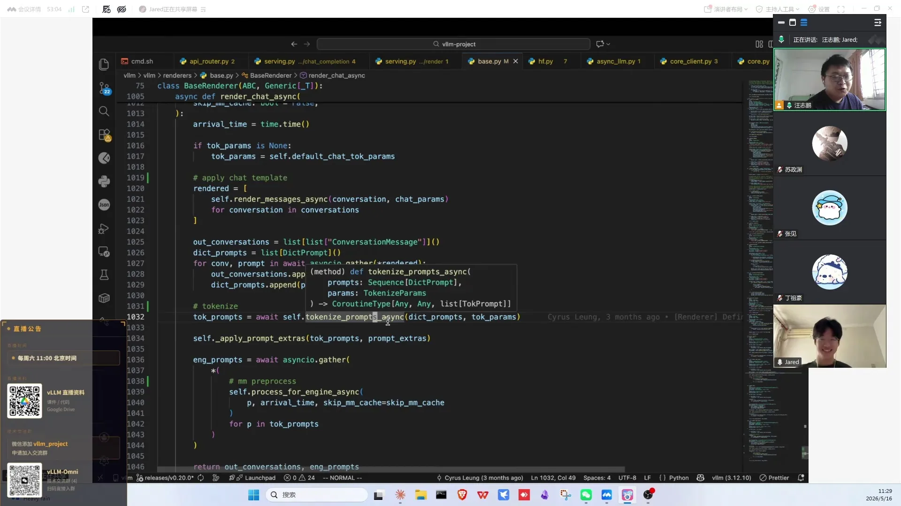 |
| 然后我们今天的主要流程就还是 OK，给大家过一遍基础的流程。如果有什么东西，大家往上面找，就是往这个主干上挂一个知识，我觉得是这样。OK，嗯，我们接下来就是进入到 tokenizer 的部分。然后这一块也是它调用得挺深的，我们快速过一遍就可以。 [【跳转到 28:15】](https://www.bilibili.com/video/BV1yrJH6pEFQ/?t=1695) | 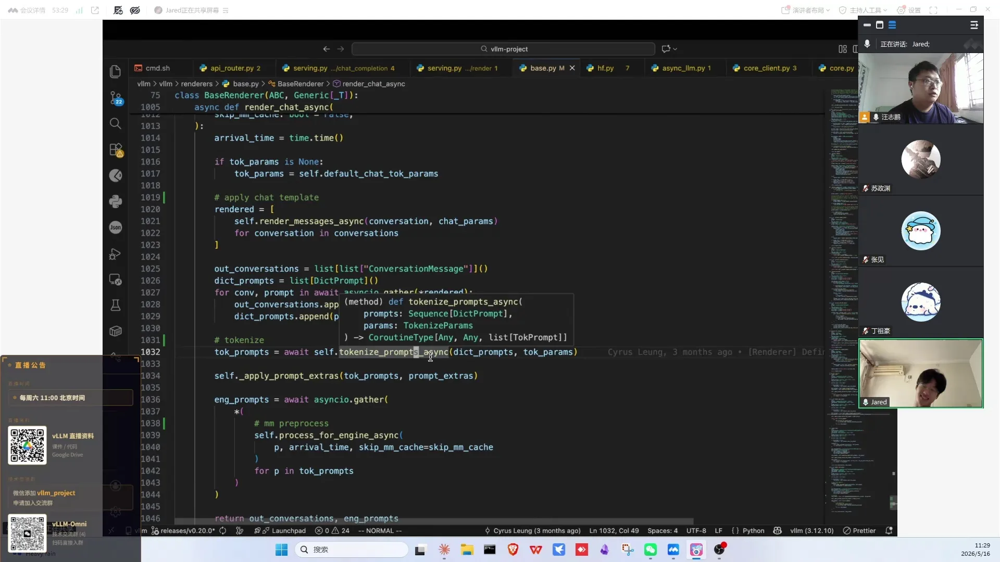 |
| Tokenize async，然后他就会把这个（复数）拆成单数——非常常见的一个动作。 [【跳转到 28:34】](https://www.bilibili.com/video/BV1yrJH6pEFQ/?t=1714) | 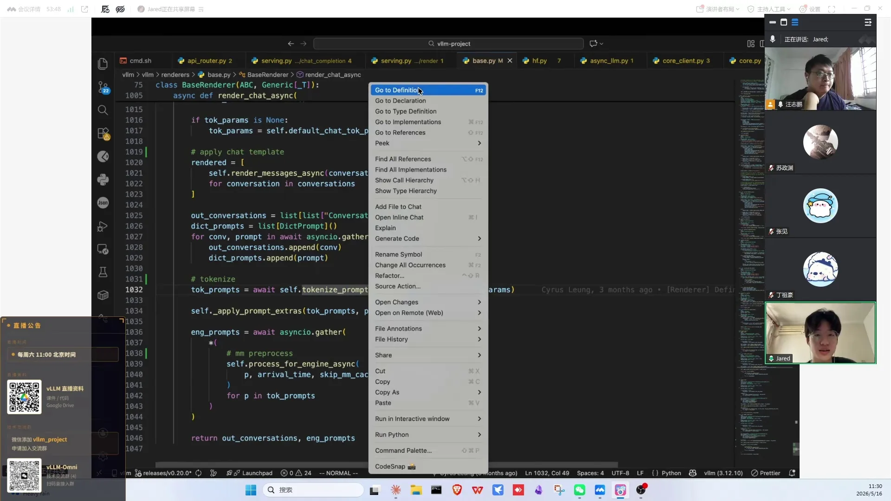 |
| 然后再进去看，它又是分成 encode 和 decode 的 pre-processing。如果你需要 encode，那他就会走这条路。大部分时候我们先讲这种只有 decode 的情况，他是走（简单的）路径。——上面有个 overlap 了但是没有关系。——嗯对，他会 pre-process…… [【跳转到 28:39】](https://www.bilibili.com/video/BV1yrJH6pEFQ/?t=1719) | 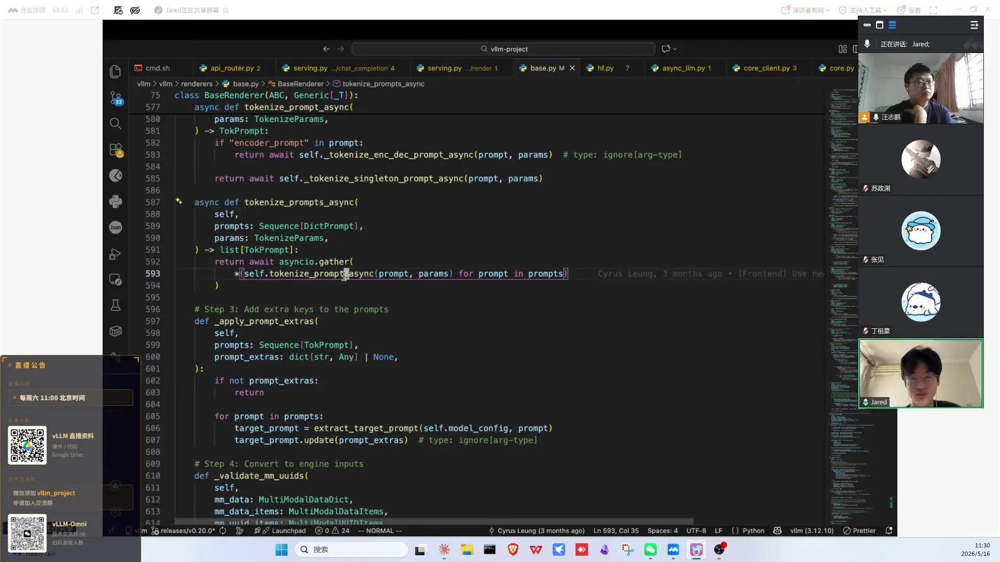 |
| 他会做一些处理，然后实际执行的话那就是这个 tokenize prompt async，对吧，它又往上升了一层。然后他就会——这里就已经快到了——去拿到我们的 token id。这个 tokenizer 其实也是 HuggingFace 里面实现的那个 tokenizer，然后执行一个 encode，我们终于拿到了 token id。他也是走了可能有四五层的抽象…… [【跳转到 29:04】](https://www.bilibili.com/video/BV1yrJH6pEFQ/?t=1744) | 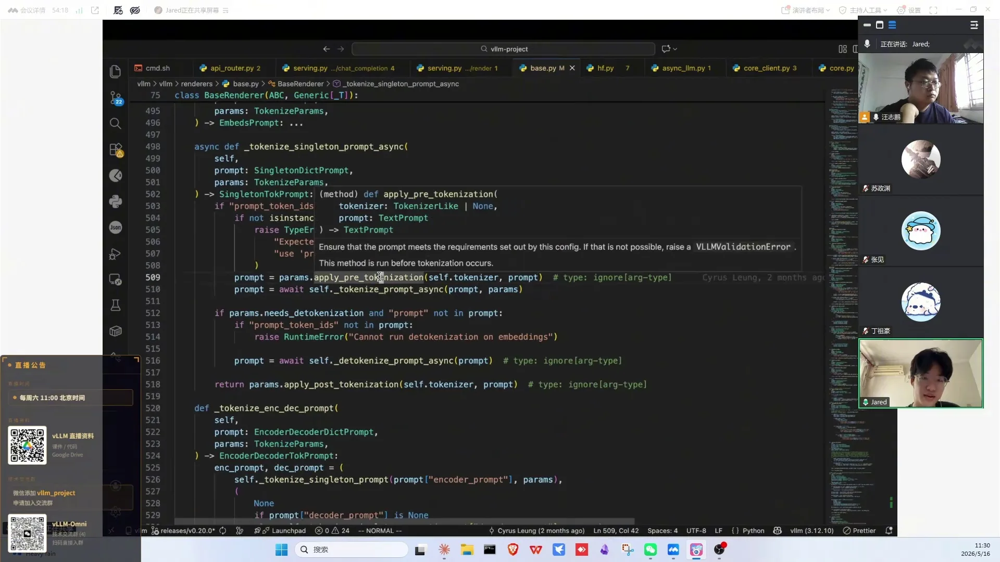 |
| 然后才来到这一块，然后我们把它放进一个叫 tokens prompt 的这个数据类里面，然后一直往回传、往回传、往回传。——诶，你那边声音有点不……听我这边吗？——嗯好，现在可以了。——我带着这个有线的嘛，所以我得拿这个（麦克风）……OK 吗？——哦现在可以，OK。 [【跳转到 29:29】](https://www.bilibili.com/video/BV1yrJH6pEFQ/?t=1769) | 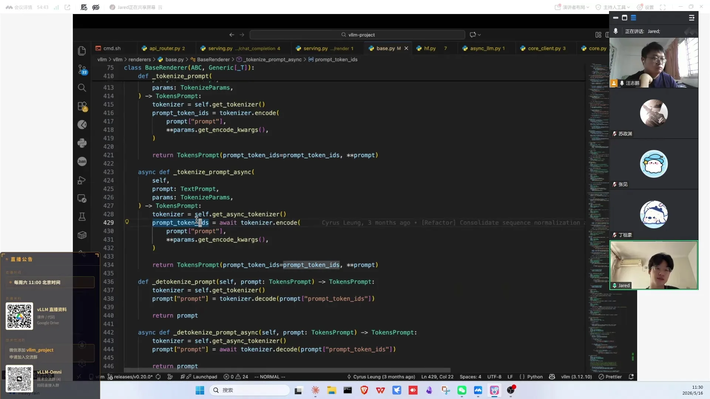 |
| 然后一直传到这里，就是已经 apply chat template、已经拿到 token id 之后的类型，然后会做一个小的操作，就是 extra 的东西会放进来。我们可以看下他 extra 都传了什么：就是这个 mm processor kwargs。当时我在上面踩过不少的坑，因为我之前在处理一个（多模态）模型的时候，他就得把他的高和宽放进这个 mm processor kwargs 里，如果没有放的话他就会处理失败，然后出来的报错就会非常的丑陋，你就根本看不懂他在干什么。然后他就得把这个额外的 keyword 放到这个 prompt 里面。 [【跳转到 29:54】](https://www.bilibili.com/video/BV1yrJH6pEFQ/?t=1794) | 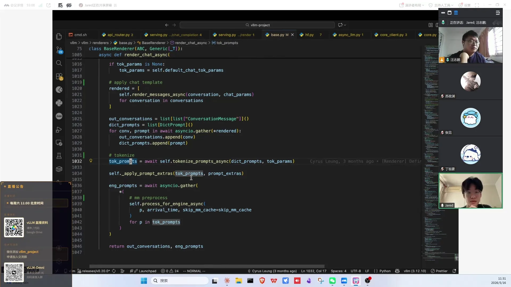 |
| 然后这一步也就是我们刚刚说的第三步。第三步我们接下来就进到第四步，就是跟多模态相关的一些预处理。我们可以点进去看一下，这一部分的调用其实挺深的。然后它还涉及到模型——这一块是真的涉及到模型了。它同时还涉及到 HuggingFace 的一些东西。我们可以点进去看一下。 [【跳转到 30:19】](https://www.bilibili.com/video/BV1yrJH6pEFQ/?t=1819) | 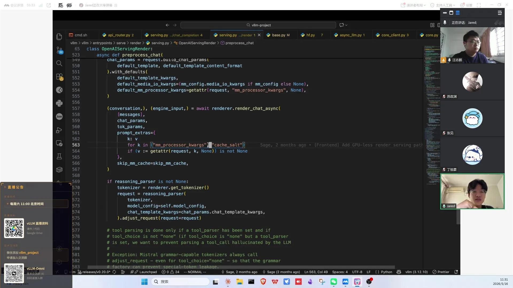 |
| 我先把那个（代码）给调出来看一下。 [【跳转到 30:44】](https://www.bilibili.com/video/BV1yrJH6pEFQ/?t=1844) | 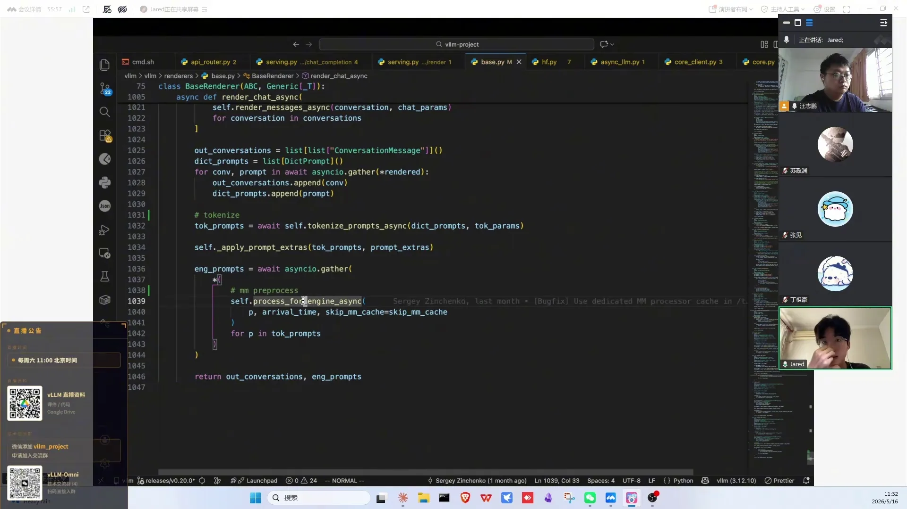 |
| （此区间无字幕） [【跳转到 30:54】](https://www.bilibili.com/video/BV1yrJH6pEFQ/?t=1854) | 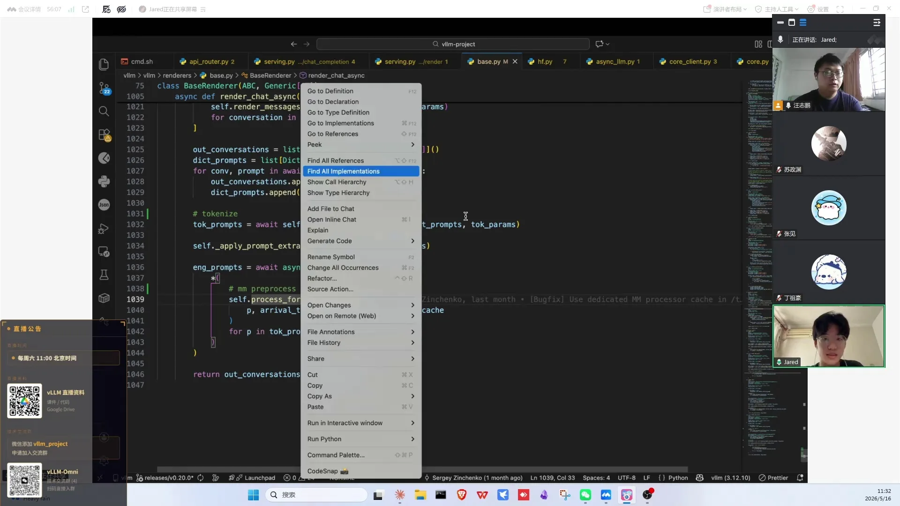 |
| （此区间无字幕） [【跳转到 30:59】](https://www.bilibili.com/video/BV1yrJH6pEFQ/?t=1859) | 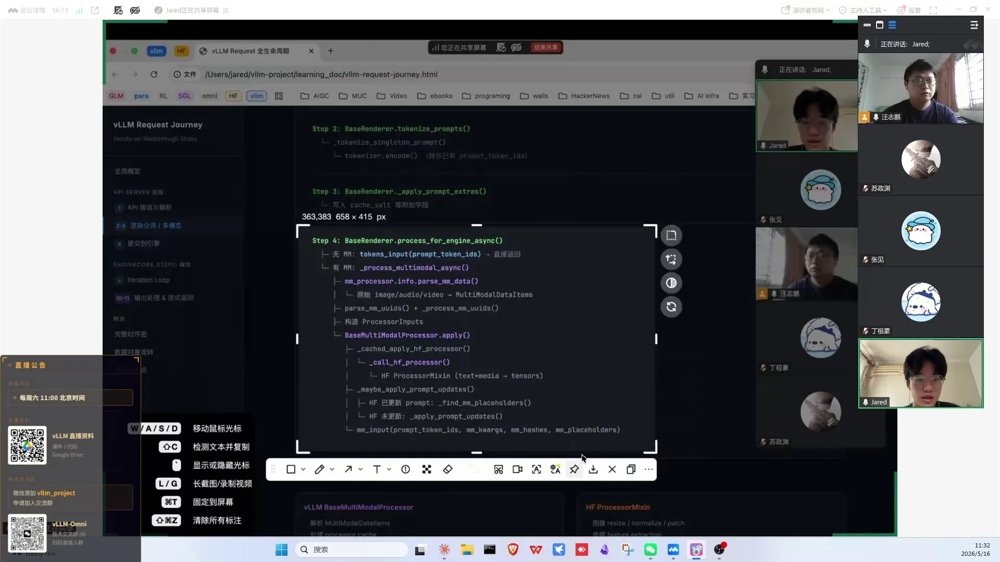 |
| Process inputs async 点进来。大部分时候我们走的是没有 encode 的——我们都是这个 decode，也就是这个（简化路径），对吧。它其实命名跟刚刚那个 tokenize 是一定程度上的对仗，让你好理解他在干什么。我们去看看这块。嗯，如果你要（已有）embedding 进来，那我就接 embedding；大部分时候是没有的，我们接 pre-tokenized 的东西。 [【跳转到 31:04】](https://www.bilibili.com/video/BV1yrJH6pEFQ/?t=1864) | 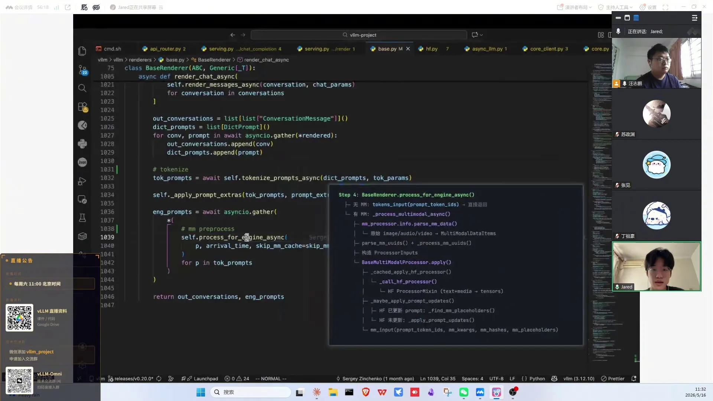 |
| 然后我们在这再去看：我们刚刚执行的一个东西叫做 parse，把我们的 content parse 出来的。然后我们会把 parse 好的多模态的数据放到 prompt 的这个地方，就是 mm data 这一块。如果我们没有 data，那我们就走 process（普通路径）；如果有，我们就…… [【跳转到 31:29】](https://www.bilibili.com/video/BV1yrJH6pEFQ/?t=1889) | 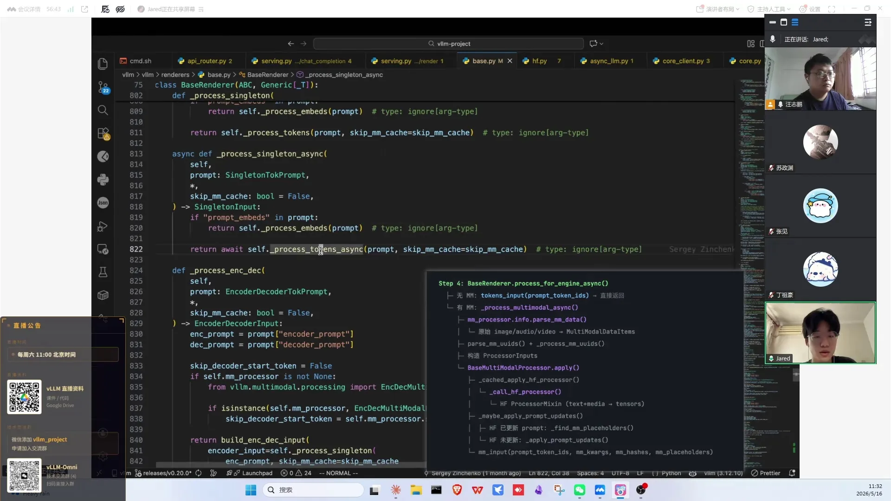 |
| 做一个包装，让它变成一个我们后续 engine 可以接受的这样一个数据类型。如果有多模态 data，那我们接着往后看，就是多模态相关的一些预处理，就从这里开始进去。从调用栈也能看到，我们接下来就是 process multi-modal async，我们接着往后看。 [【跳转到 31:54】](https://www.bilibili.com/video/BV1yrJH6pEFQ/?t=1914) | 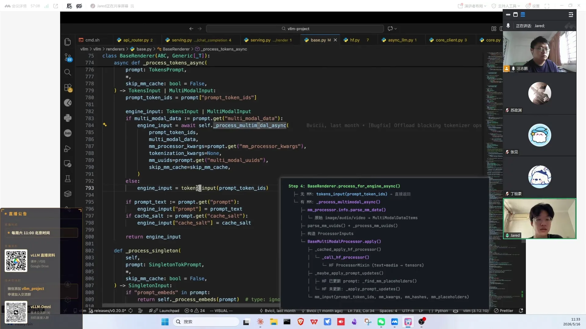 |
| 他也是把一个 process multi-modal async 把它变成一个 async 的操作。 [【跳转到 32:13】](https://www.bilibili.com/video/BV1yrJH6pEFQ/?t=1933) | 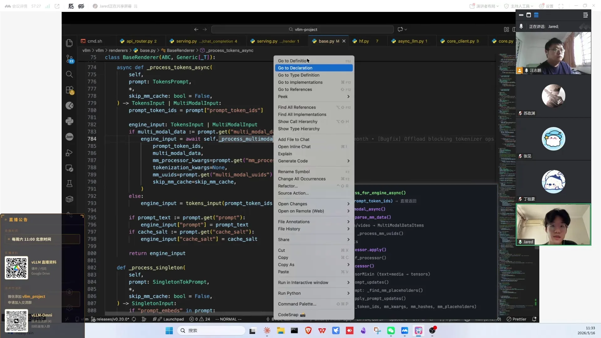 |
| 我们这边看这个 process multi-modal 调在哪里。好，在这一块。这一块其实就是我们首先会先拿到这个 mm processor。我们举一个模型的例子吧，我现在挂的……找个大家相对比较熟悉的模型吧，我们用千问的可以吗？ [【跳转到 32:18】](https://www.bilibili.com/video/BV1yrJH6pEFQ/?t=1938) | 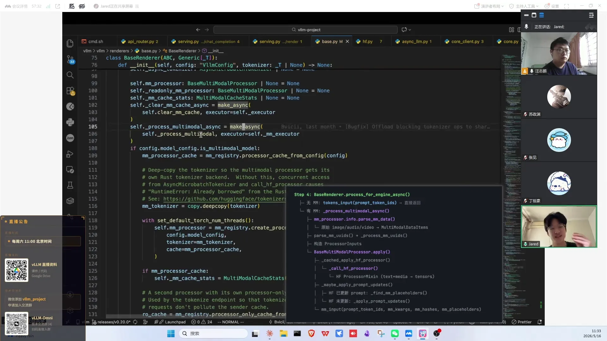 |
| 可以。OK，千问的……Qwen2.5-VL 吧。OK，可以。 [【跳转到 32:43】](https://www.bilibili.com/video/BV1yrJH6pEFQ/?t=1963) | 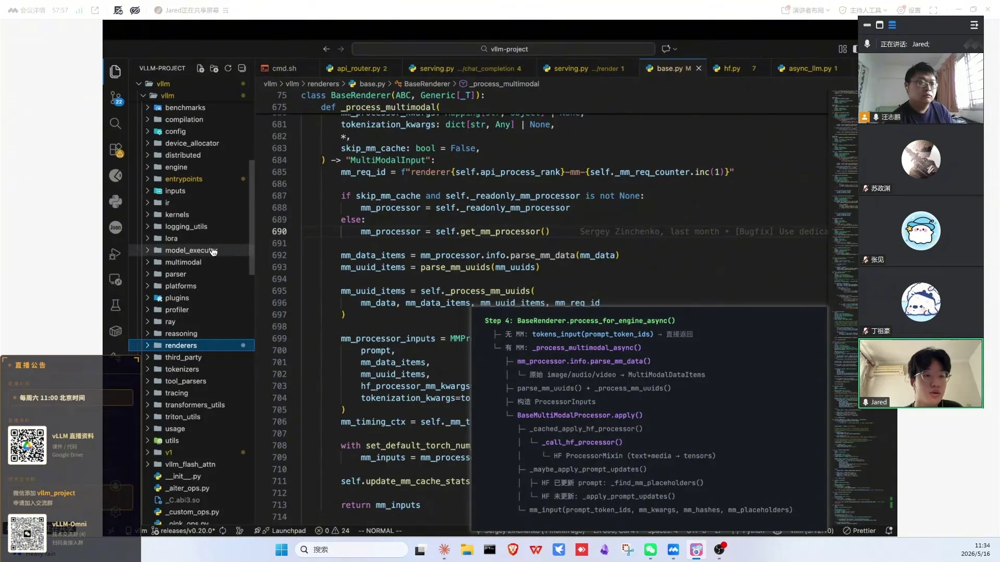 |
| 就这个，他就会把这个 processor 拿到。然后我们回到这一块，就拿了这个 mm processor，然后我们再构建好这个（模型的）input。input 好之后 OK 我们就执行一个 apply 操作，就是把这个 input 和这个 processor 做一个处理。实际处理的话，它还有可能有十几层的调用栈。 [【跳转到 33:08】](https://www.bilibili.com/video/BV1yrJH6pEFQ/?t=1988) | 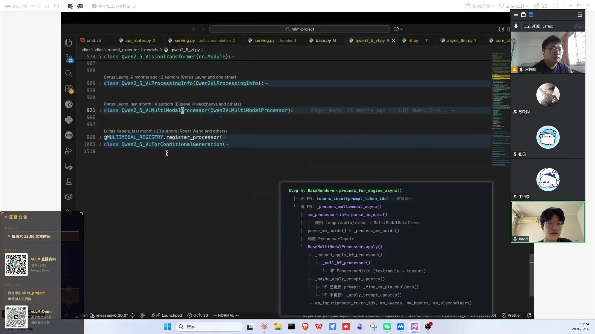 |
| 然后可以往后看一下，我们这个 apply——其实（它）不是直接来到我们的 Qwen2.5，因为这里这个类是没有实现那个 apply 这个操作的，你可以看到这个 method 里面是没有 apply。所以我们用的 apply，这里执行了几件事情：这是我们给他 cache 起来…… [【跳转到 33:33】](https://www.bilibili.com/video/BV1yrJH6pEFQ/?t=2013) | 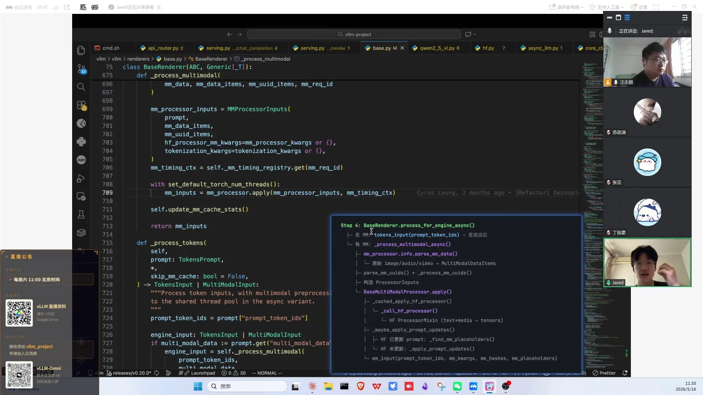 |
| 就是这块边 cache 边 apply HF processor。已经有 cache 的话，那我们就执行一个 update 的操作。这是一个性能上的考虑吧。然后我们就看没有 cache 的情况，我们就 apply HF processor。 [【跳转到 33:58】](https://www.bilibili.com/video/BV1yrJH6pEFQ/?t=2038) | 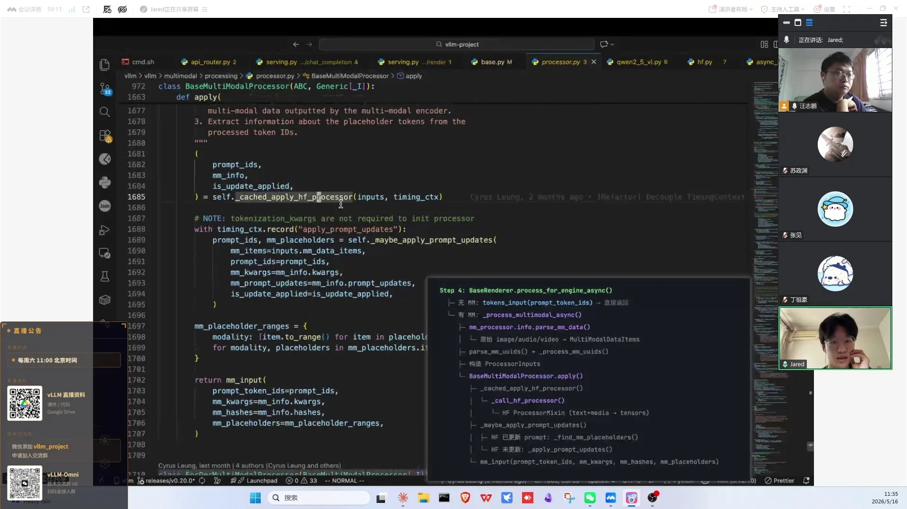 |
| 然后 apply，后面它可能还有 mm（相关）…… [【跳转到 34:15】](https://www.bilibili.com/video/BV1yrJH6pEFQ/?t=2055) | 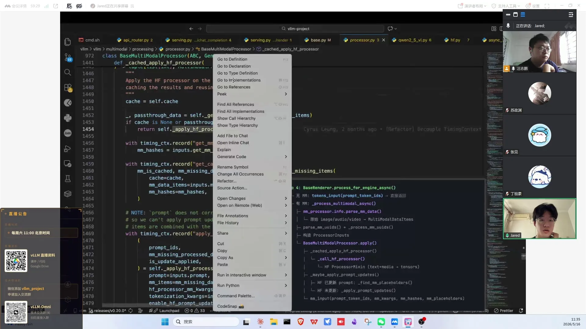 |
| 然后点击 mm 之后还分成 text 和 multimodal：还有 text only 还有 multimodal only——哇，非常的深，非常的恐怖。当时我 debug 到这一阶段的时候，我已经忘了我最开始从哪里出发的了，就经常会出现这种情况。所以我也建议大家稍微看一下这个（图），我已经总结好了这个调用栈，对着这个东西大概去看一下就可以了。 [【跳转到 34:20】](https://www.bilibili.com/video/BV1yrJH6pEFQ/?t=2060) | 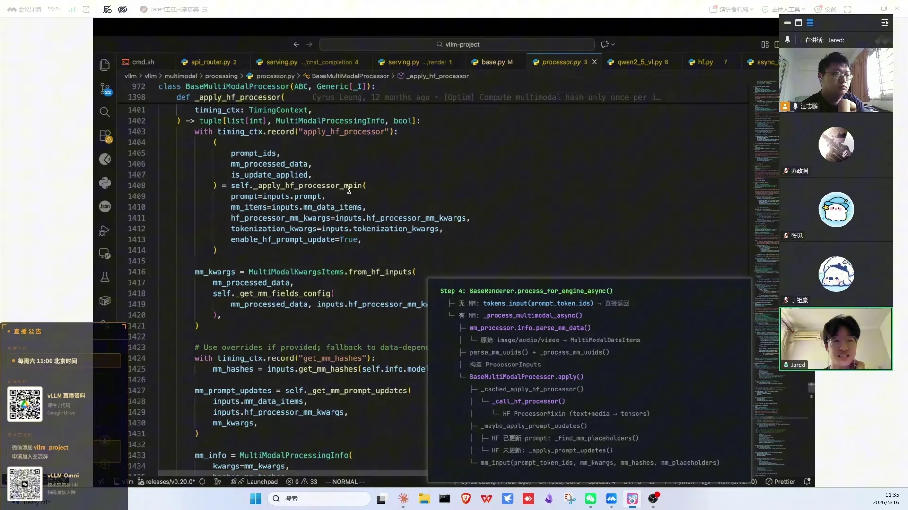 |
| 然后我们可以接着往后看。有观众问：你这个截图工具是怎么来的啊？——接着开始推销是吧。OK，这是一个开源的软件，叫 PixPin。这个应该是 Mac 上面才有的吧？——有其他的，Windows 上我也有。OK，对，它是开源的，其实都可以（用）。——您给我展示一下这个软件，它的名字叫啥？ [【跳转到 34:45】](https://www.bilibili.com/video/BV1yrJH6pEFQ/?t=2085) | 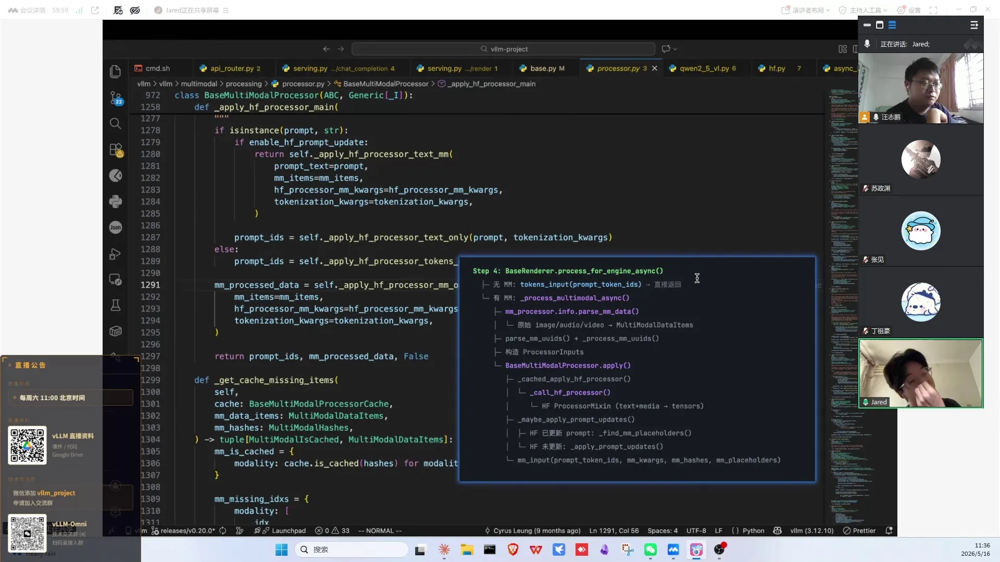 |
| 看一下，我觉得挺好看的。我觉得…… [【跳转到 35:10】](https://www.bilibili.com/video/BV1yrJH6pEFQ/?t=2110) | 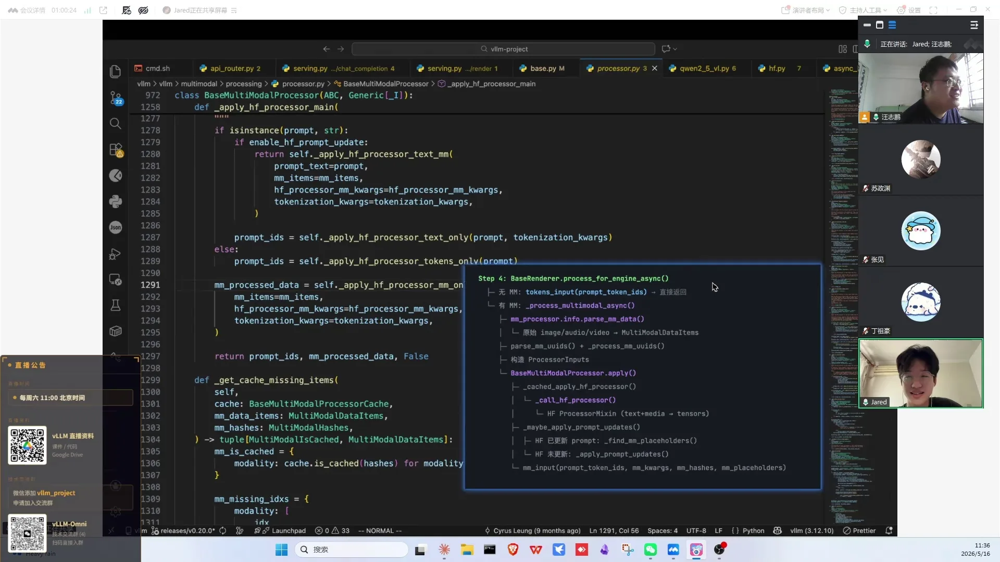 |
| Oh，PixPin。OK。好，然后还有个观众就问…… [【跳转到 35:15】](https://www.bilibili.com/video/BV1yrJH6pEFQ/?t=2115) | 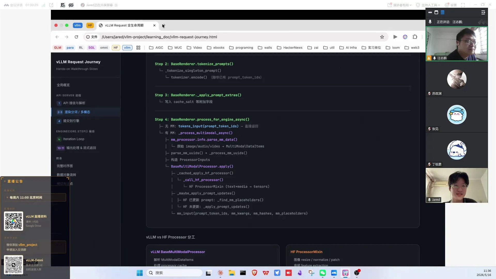 |
| （Omni 的）AR 部分？是的。然后 diffusion 那边是尽量会跟 AR 部分的整个抽象去做对齐，就是这个（推理）部分有的——比如说什么什么 engine，然后后面什么什么 execute，然后什么 scheduler——diffusion 那边也都是一一对照的这样做的。嗯 OK，我们可以再往下走一两层。 [【跳转到 35:31】](https://www.bilibili.com/video/BV1yrJH6pEFQ/?t=2131) | 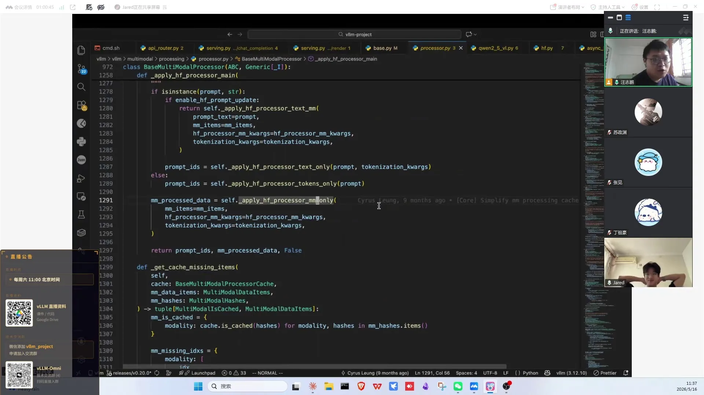 |
| 其实还有更多层啊。——我知道我知道。就是 OK，假设我们要走 text 和 mm 同时处理（的情况）…… [【跳转到 35:56】](https://www.bilibili.com/video/BV1yrJH6pEFQ/?t=2156) | 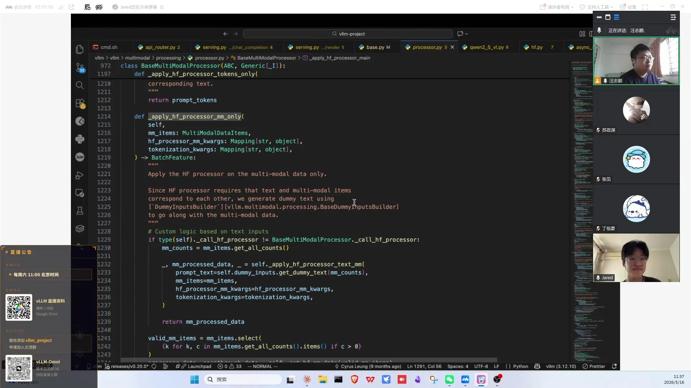 |
| 那它就会实际地去调 HF processor。 [【跳转到 36:10】](https://www.bilibili.com/video/BV1yrJH6pEFQ/?t=2170) | 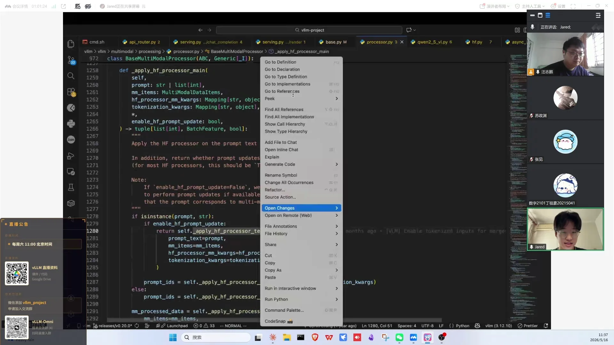 |
| HF processor 呢，他这里就实际运行到了。他开始拿到——他又给包裹了一层 get HF processor。这里就涉及到两个 processor：一个是你要在 vLLM 里面实现一个叫做 multimodal processor，这是 vLLM 里的一个类；然后 HF processor 呢，是你要在 HuggingFace 的 transformers 里面去实现一个 processor。 [【跳转到 36:15】](https://www.bilibili.com/video/BV1yrJH6pEFQ/?t=2175) | 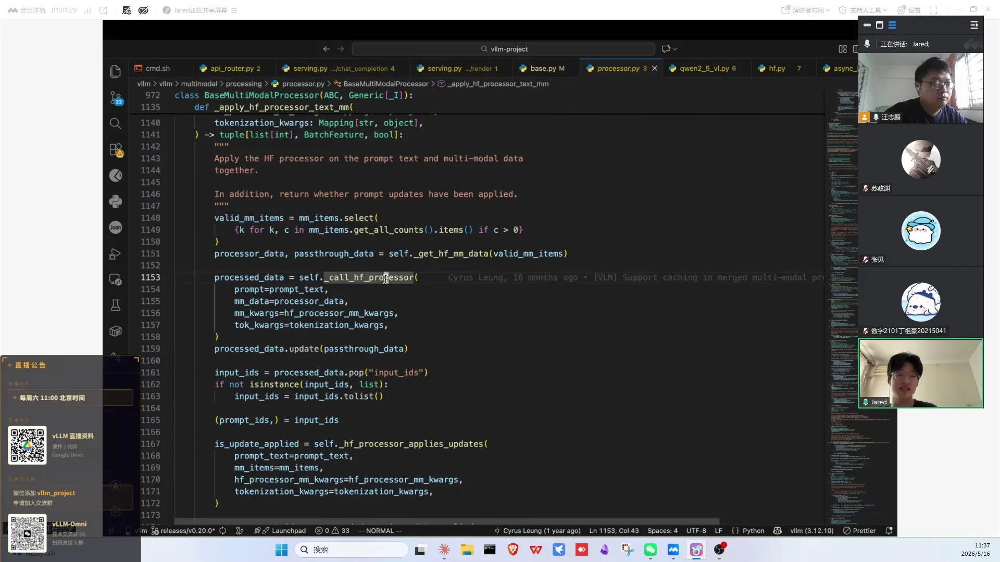 |
| 它是两个类，不太一样。然后我的 slides 里面也有简单的介绍…… [【跳转到 36:40】](https://www.bilibili.com/video/BV1yrJH6pEFQ/?t=2200) | 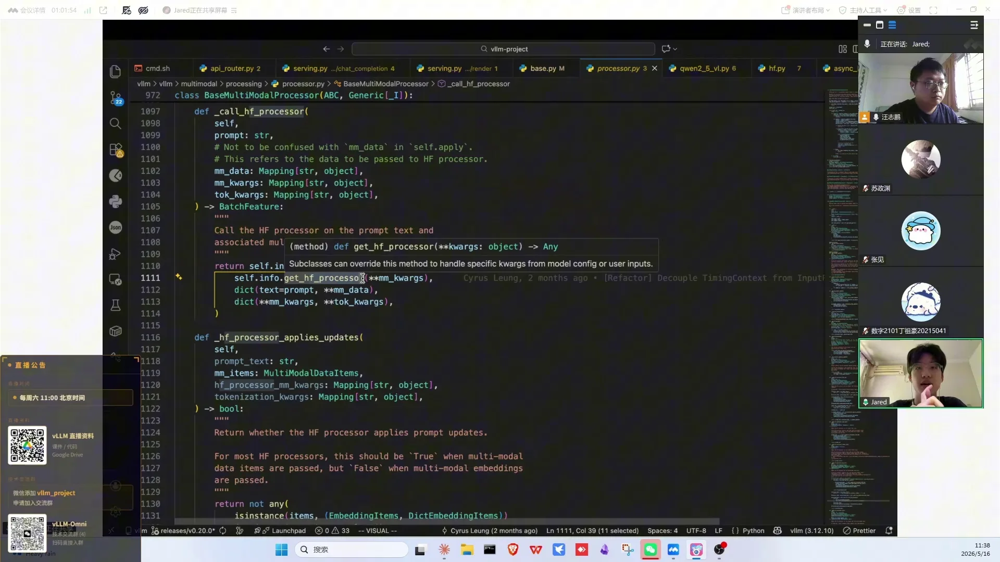 |
| 他们的分工：HF processor 是实际执行运算的那个类。如果图像进来之后，他可能就是做一些格式上的（处理）或者 resize 一下、normalize，或者更常见的操作是把它变成一个 patch，然后再输入进你的模型。如果你是音频的话，就会做一个 feature extraction——你可以理解成采样…… [【跳转到 36:45】](https://www.bilibili.com/video/BV1yrJH6pEFQ/?t=2205) |  |
| 采样完之后要做一些数学计算。如果视频的话，他可能就是假设你有 60 秒视频，他要怎么采取那个帧——这个东西也是在这 HF processor 里面去做的。这些都是模型特化的一些计算。然后 vLLM 的这个 multimodal processor 呢，其实我会觉得跟模型本身的行为就没有那么的相关了…… [【跳转到 37:10】](https://www.bilibili.com/video/BV1yrJH6pEFQ/?t=2230) |  |
| 但是有些模型还是在这一块需要着重注意的。所以我就简单讲一下它们的区别就行了。大家如果实际遇到了你的多模态模型在 processor 相关的东西里面有问题，我觉得再来看：是多模态 processor 相关的问题，还是 HF processor 你本来就实现错了——可以有这样一个意识。 [【跳转到 37:35】](https://www.bilibili.com/video/BV1yrJH6pEFQ/?t=2255) |  |
| 然后如果你现在没有这个需求，这一部分听得很懵我觉得是非常正常的，哪怕你走一遍都可能有点懵。这部分代码我接触的时候就是你在实现模型的时候，你发现跑不通嘛，对吧。然后你就直接打断点，打到你的模型实现的地方，然后你可以看到你的这个模型它的调用栈、他这部分函数，然后你就会看到你的 render 部分…… [【跳转到 38:00】](https://www.bilibili.com/video/BV1yrJH6pEFQ/?t=2280) |  |
| 然后你就一点点往上追溯，看一下到底什么地方导致的：比如说调用出错了，或是你的实现跟它外部需要的东西不一样，就行了。——对是的，我觉得是这样子的，这个东西挺吃经验的。但是我把这块总结出来之后，至少我自己有一套这样的概念之后，我大概知道我该去哪里找了。之前 debug 的时候真的会很痛苦。 [【跳转到 38:25】](https://www.bilibili.com/video/BV1yrJH6pEFQ/?t=2305) | 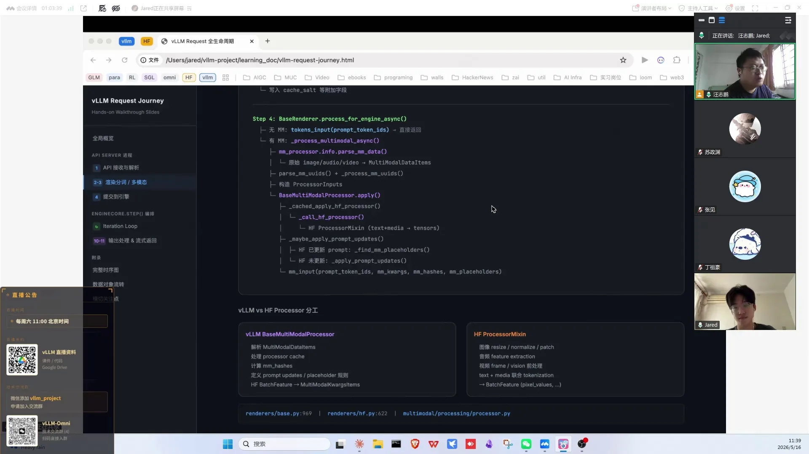 |
| 然后 OK 我们接着往后走。其实到这一块之后，我们看看它是怎么返回的吧。 [【跳转到 38:50】](https://www.bilibili.com/video/BV1yrJH6pEFQ/?t=2330) |  |
| 自从在这处理完了之后，我们一路会返回到 Base 这块。 [【跳转到 38:56】](https://www.bilibili.com/video/BV1yrJH6pEFQ/?t=2336) | 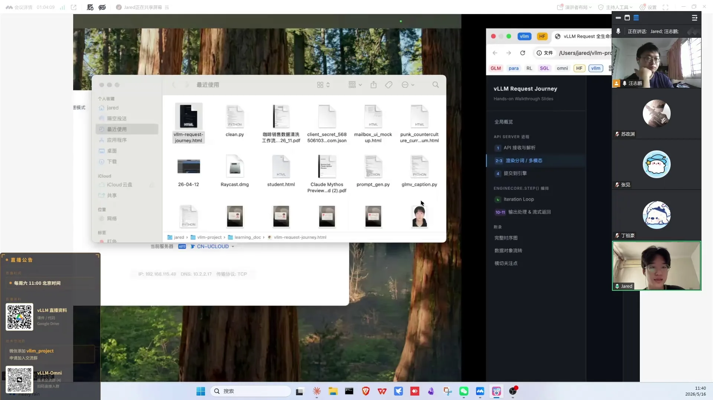 |
| 最终他会——我们还记得吗？刚刚从这里 process inputs async 这里结束之后，我们就只实现了三个事情：一个是 apply chat template 让它符合那个格式，然后 tokenize 变成一个 token id，然后如果你还有一些多模态相关的处理，我们先去做好这种处理…… [【跳转到 39:01】](https://www.bilibili.com/video/BV1yrJH6pEFQ/?t=2341) | 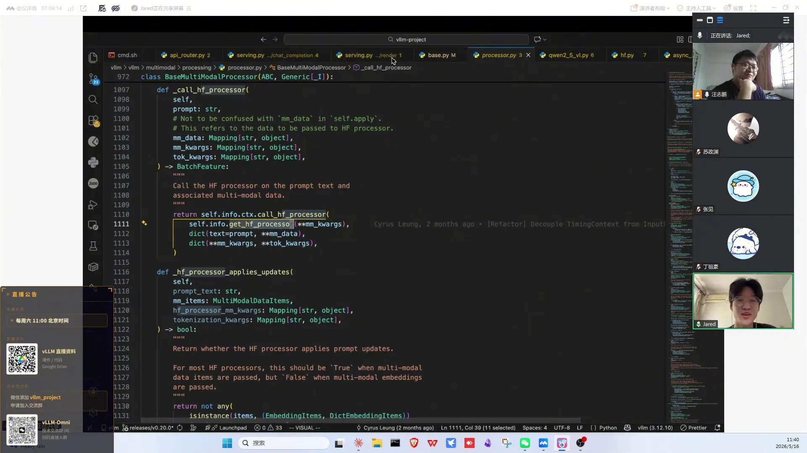 |
| 就是在这块。OK，我们这里结束之后，我们会一路往回返回。这个 engine prompt 和之前的 conversation 他也会收集一下，然后保持。——我们回到 render——回到 serving render 这块，对吧，然后就变成一个个 engine input，还有这个 conversation。那么再往回走，就是如果你有 tool parser…… [【跳转到 39:26】](https://www.bilibili.com/video/BV1yrJH6pEFQ/?t=2366) | 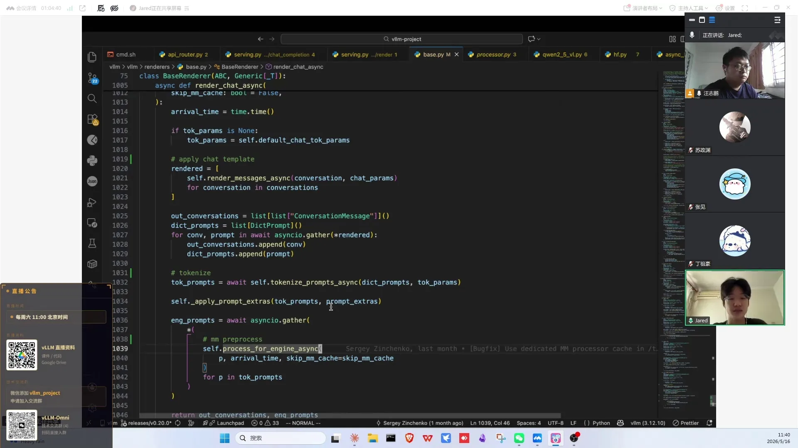 |
| 还有 reasoning parser——也就是你有工具调用的能力、你有 reasoning 的能力——他会再对你已经 tokenize 好的东西大概做一个小调整，大概是这样。目前我就先不讲了：如果你的 tool parser 或者你的 reasoning parser 出现了问题，你可以来这里稍微看一眼。嗯，我们接着往回返回，它会一直返回到 OpenAI serving chat。 [【跳转到 39:51】](https://www.bilibili.com/video/BV1yrJH6pEFQ/?t=2391) | 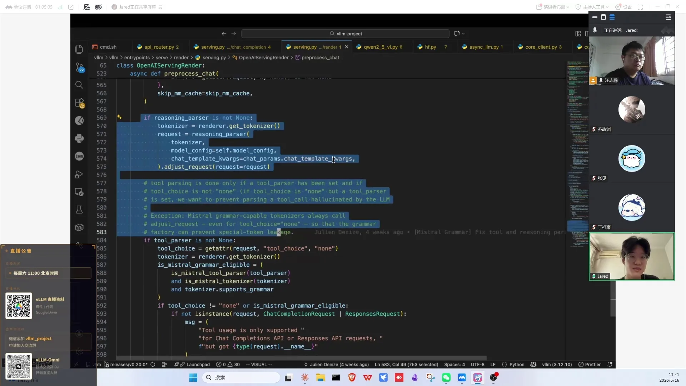 |
| 有观众问一个问题：processor 中有时会调用 HF 的库是什么样的流程？——一般就是我刚刚走过一遍那个流程。——对，其实一般来讲，我们会默认地使用（HuggingFace 的）那个 processor。然后很多模型我们会自己去覆盖它 HF 的 processor…… [【跳转到 40:16】](https://www.bilibili.com/video/BV1yrJH6pEFQ/?t=2416) | 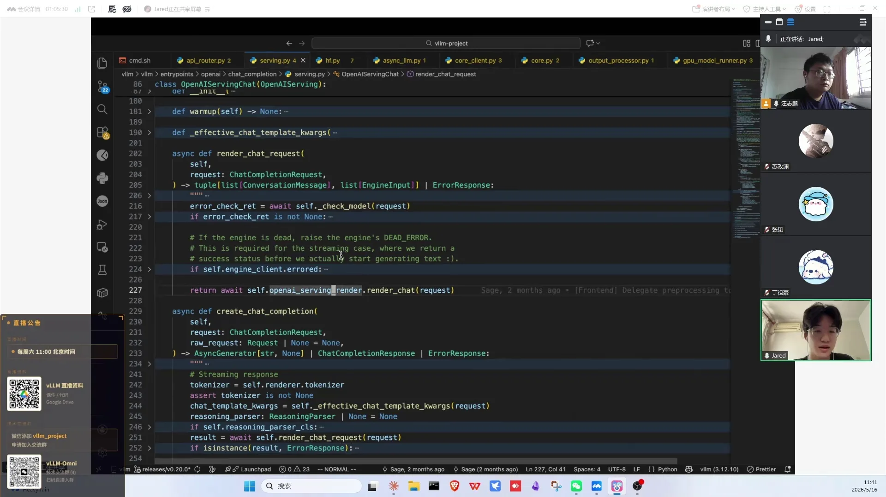 |
| 那么这时候就不去（用）HuggingFace（默认）的，直接用模型自带的。我觉得这个（processor）是通过一些方式注册进去的，好像是 init 还有 config，这样注册进去。——对，他从 config 里面拿的。——然后还有个观众问：这个文档是怎么写的？这个文档你是说这个 HTML 还是（Markdown）文档？ [【跳转到 40:41】](https://www.bilibili.com/video/BV1yrJH6pEFQ/?t=2441) | 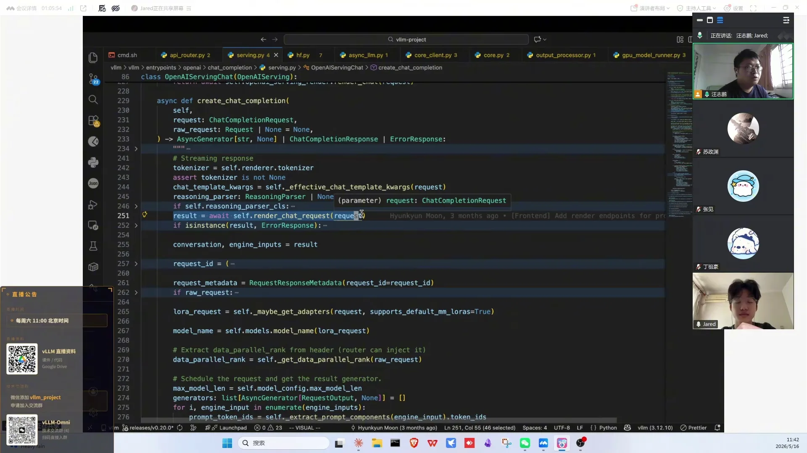 |
| 这个 HTML。——我是先做了一个 Markdown 文件。Markdown 文件是我自己先手写的一部分，然后我让 AI 帮我补充细节，一直调整到一个我觉得阅读起来比较舒服的状态。之后我再把这个 Markdown 文件给到 Claude Code，让他做一个 HTML 的展示格式，然后我在这上面又改了…… [【跳转到 41:04】](https://www.bilibili.com/video/BV1yrJH6pEFQ/?t=2464) | 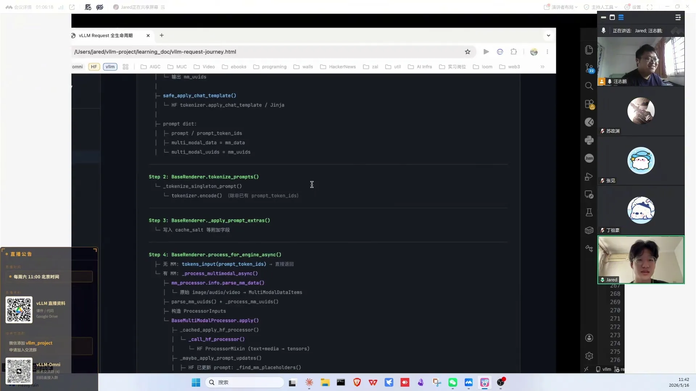 |
| 改了一两天，就改成现在这样子。——可以看出这个文档是用了很多心思的。这个文档我也已经上传到了我们的共享文件夹上，后面有同学需要资料的话就直接上面下载就行，我们就 Google Drive 上面直接下载。——其实我还有几个专题，说实话我还有几个（笔记），都是 HTML（格式的）。后面如果有兴趣可以接着讲…… [【跳转到 41:29】](https://www.bilibili.com/video/BV1yrJH6pEFQ/?t=2489) | 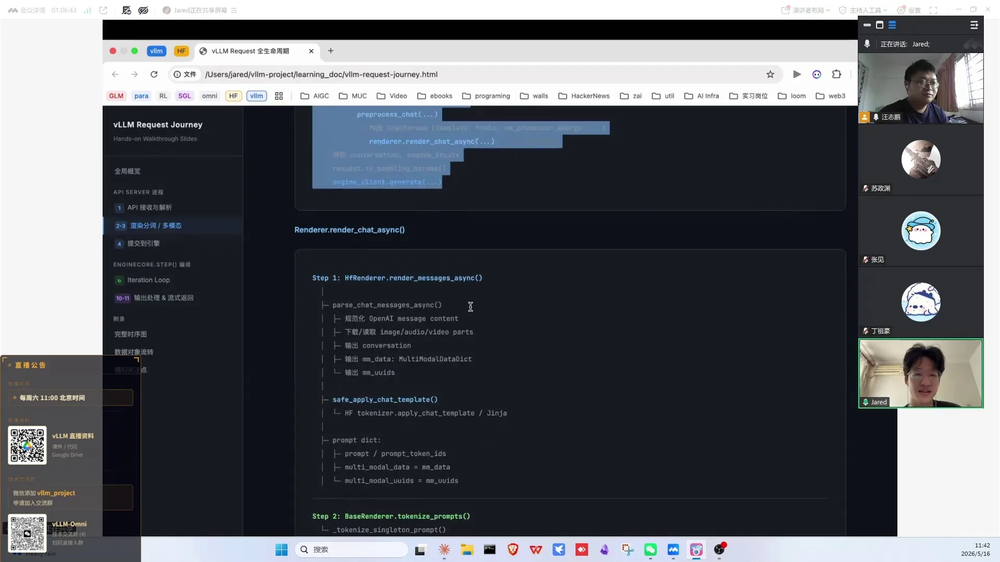 |
| 但是如果不讲的话我应该会把它开源出去，因为那些都是我自己的学习笔记。弄成 HTML 只是为了更好的展示。——玩得太好了。我们这边就需要像你这样把之前学习的心得分享出来的同学。——也算是吧，就是给大家传递一下，让（大家）学习更快一点…… [【跳转到 41:54】](https://www.bilibili.com/video/BV1yrJH6pEFQ/?t=2514) | 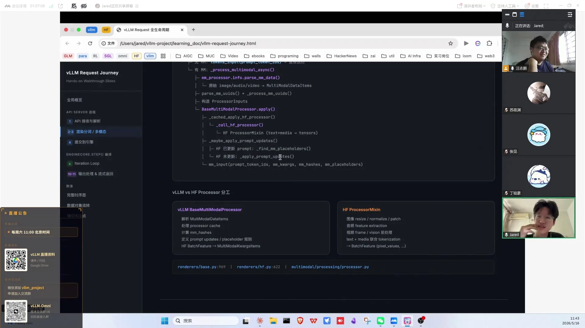 |
| 然后在 vLLM 里提更高质量的 PR 吧。不然我看大家维护者现在已经很头疼：非常多 AI 提交的（PR），质量……好的 PR 量可能还是那些，但是整体批量增加了，这是挺痛苦的事情。我每天看着那个 PR 的增加，看着也很头疼，因为我时不时地要关注跟 GLM 相关的东西的 PR 或者 issue，所以嗯是的…… [【跳转到 42:19】](https://www.bilibili.com/video/BV1yrJH6pEFQ/?t=2539) |  |
| 就是大家整体自身能力的提升，也能让你更好的用 AI。我也用 AI 写代码，但是我觉得还是跟自身能力有一定关系的，跟你自己对这个东西的理解有挺大关系的。——对，我现在每天邮件里面基本新增几百封邮件，完全看不过来。——你们这些核心维护者更是这样。 [【跳转到 42:44】](https://www.bilibili.com/video/BV1yrJH6pEFQ/?t=2564) |  |
| 然后我（虽然）只是时不时关注一下，都会觉得很恐怖。OK，我们这个往后走。我们刚预处理结束之后，下一步其实就是从我们的 API server 阶段进入到 engine 阶段。engine 阶段这一块涉及到更多（的类）——它不是调用栈的深，而是包装了好几个类，两三四个类放在这一块…… [【跳转到 43:09】](https://www.bilibili.com/video/BV1yrJH6pEFQ/?t=2589) |  |
| 让你去看他们之间的数据流转。因为 V1 重构之后就是把它变成了三个进程，这三个进程之间你要看他们怎样传递数据、怎样不互相阻塞，大概这样。所以这一块读起来你会觉得：怎么又有 engine client，又有 engine core，又有 engine core client——有三四个类放在一起，其实是一个…… [【跳转到 43:34】](https://www.bilibili.com/video/BV1yrJH6pEFQ/?t=2614) |  |
| 我一开始读的时候也是挺痛苦的事情。——嗯对。然后我们就…… [【跳转到 43:59】](https://www.bilibili.com/video/BV1yrJH6pEFQ/?t=2639) |  |
| 先看 slides 吧。——先看代码。 [【跳转到 44:07】](https://www.bilibili.com/video/BV1yrJH6pEFQ/?t=2647) | 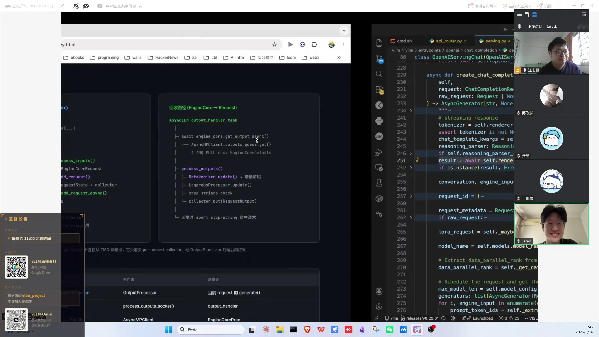 |
| 然后嗯对 OK，我们现在看提交路径。 [【跳转到 44:12】](https://www.bilibili.com/video/BV1yrJH6pEFQ/?t=2652) | 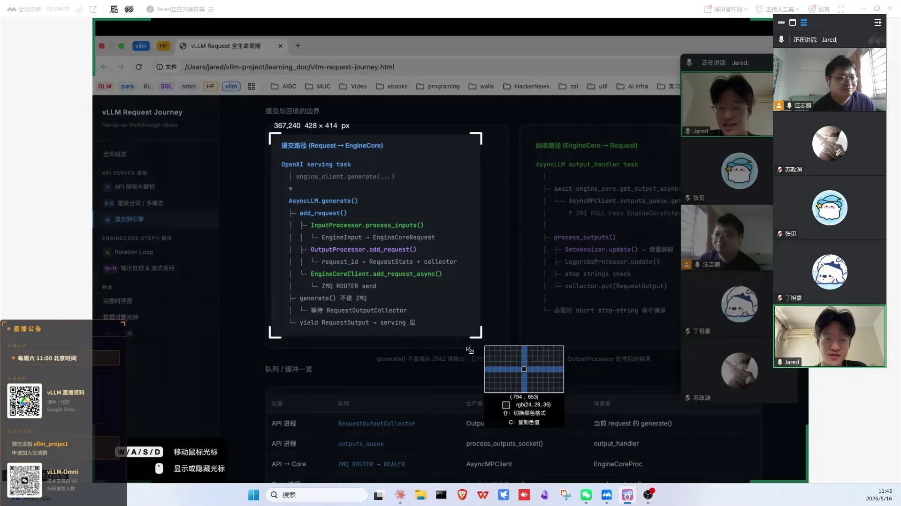 |
| 我们拿到了啊…… [【跳转到 44:17】](https://www.bilibili.com/video/BV1yrJH6pEFQ/?t=2657) |  |
| 这个 render 结果，我们给它拆成——我还记得他是返回一个 prompt（token）、一个 conversation 和 engine input。然后我们对 engine input 做一些操作，简单做一些处理，拿到 sampling params——就是你在 sampling 的时候会用的东西。有些时候你可能还要传 penalty（参数），但是这东西并不常见，所以我们就先给它添加（默认值）。我们最终就会来到这块：把你的 engine input、sampling params 还有一些其他东西全部丢到这个 client generate…… [【跳转到 44:22】](https://www.bilibili.com/video/BV1yrJH6pEFQ/?t=2662) | 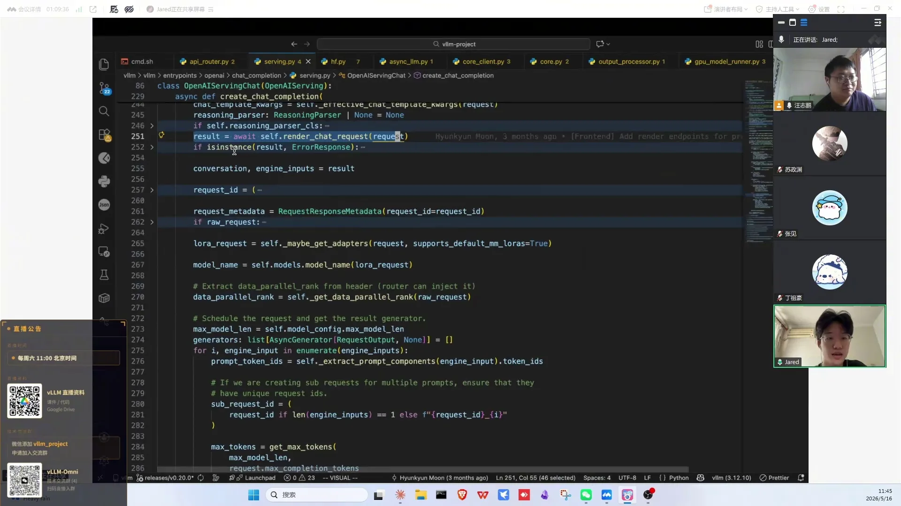 |
| 通过这个接口把这个 request 丢给 engine，然后拿到一个 generator。嗯对，我们就走这里。深入……我先不看代码里面深入，我先来看一下这一块。 [【跳转到 44:47】](https://www.bilibili.com/video/BV1yrJH6pEFQ/?t=2687) | 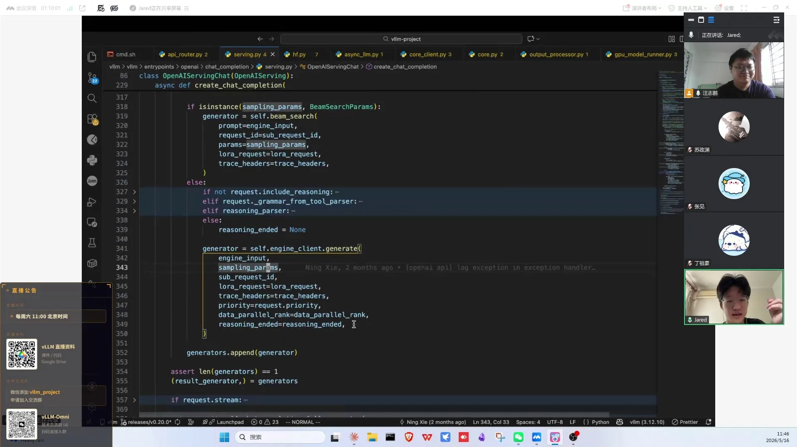 |
| 这个 engine client 实际执行的类叫做 sync（实现）。然后他执行一个 generate，generate 里面它就会调用自己——这是一个非常简单的 method，只会调用一个 add request。这个 add request 里面实际执行了三个操作：一个是 input processor，还有一个 output processor，还有一个 engine core client，是吧。现在又开始出现了另一个 client…… [【跳转到 45:01】](https://www.bilibili.com/video/BV1yrJH6pEFQ/?t=2701) | 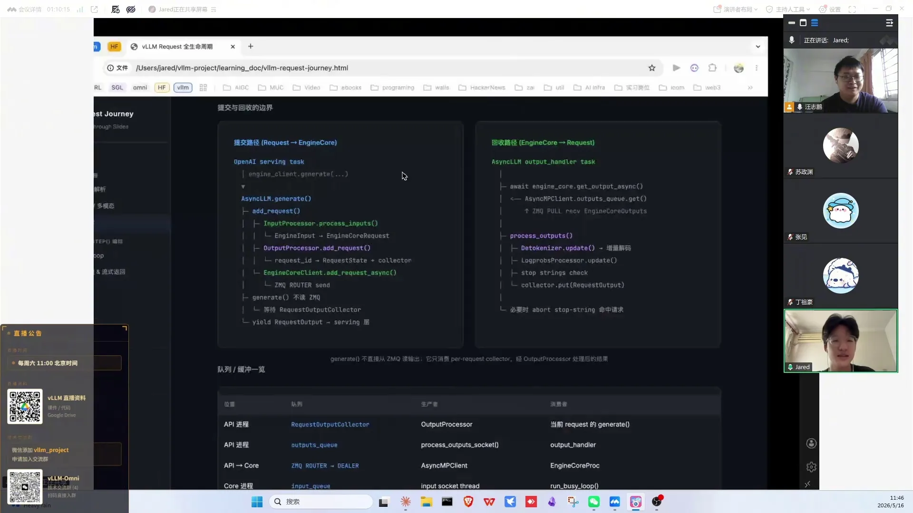 |
| 开始痛苦了。嗯是这样的：这里有一个 engine client，你可以理解成它是一个跟 API 层交互的 client。然后 engine core client 呢，是连接 engine client 和 engine core 的中间的一个东西。engine core 是我们实际执行那个比较复杂的计算逻辑的类，但是我们还需要一个类来帮他处理好…… [【跳转到 45:26】](https://www.bilibili.com/video/BV1yrJH6pEFQ/?t=2726) | 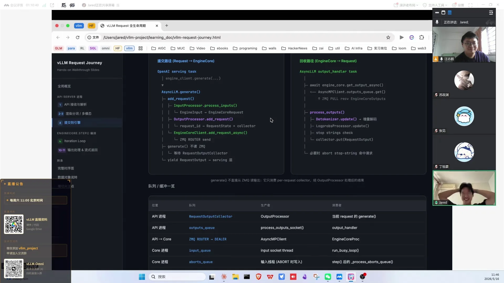 |
| 这些对外的通信，那这个就是 engine core client 干的事情。所以实际握手的是 engine client 和 engine core client，实际执行 forward 还有 schedule 相关的东西是在 engine core 里面。所以大家就先脑子里大概有这样三个类。然后实际运行我们接着往后看。 [【跳转到 45:51】](https://www.bilibili.com/video/BV1yrJH6pEFQ/?t=2751) |  |
| 我们先来看 engine client 这边做了什么操作。他就调用了两个东西，一个是 input processor，还有一个是 output processor。input processor 就是把这个 engine input 变成一个 engine core 的 request——也就是把它从一个 engine client 接受的输入，转化成 engine core 接受的一个输入，就是从一个输入转到另一个输入…… [【跳转到 46:16】](https://www.bilibili.com/video/BV1yrJH6pEFQ/?t=2776) |  |
| 简单其实就是一些格式上的转换，主要还是格式上的转换。然后我们还要告诉……不，output processor：我现在新增了一个 request，正在马上要处理了。我自己的理解是这样的：我们现在有三条流水线。第一条流水线是我们 HTTP 进来之后来到了 engine client 这一块；第二条就是实际处理的，也就 engine core 那块，跑很多很重的计算。然后我们还要告诉第三条流水线…… [【跳转到 46:41】](https://www.bilibili.com/video/BV1yrJH6pEFQ/?t=2801) |  |
| 也就是 output processor 的这一块：我现在把一个东西丢给第二条流水线了，然后你（第三条流水线）要在那等着它的结果出来。因为我们知道 LLM 的结果是一个 token 一个（出的），你也要让第三条流水线在那等着——在那设一个人等着第二条流水线马上要（出结果）了，我们就给他拿过来、拿过来，大概这样子。所以这个 add request 其实本身就是在告诉第三条流水线：我现在有一个 request 进来了…… [【跳转到 47:06】](https://www.bilibili.com/video/BV1yrJH6pEFQ/?t=2826) |  |
| 你在那等着吧，大概是这样。下一步就是 engine client 的 add request async。这里我们就是通过 ZMQ 真正从第一条流水线丢到第二条流水线上，就是把这个 request 通过 ZMQ 这个跨 process 的通信传到那块。 [【跳转到 47:31】](https://www.bilibili.com/video/BV1yrJH6pEFQ/?t=2851) |  |
| 对，我们就先去看下代码吧，大概看下代码。 [【跳转到 47:56】](https://www.bilibili.com/video/BV1yrJH6pEFQ/?t=2876) |  |
| 这东西其实用的是非常多的。这一点其实会读的比较多。 [【跳转到 48:01】](https://www.bilibili.com/video/BV1yrJH6pEFQ/?t=2881) | 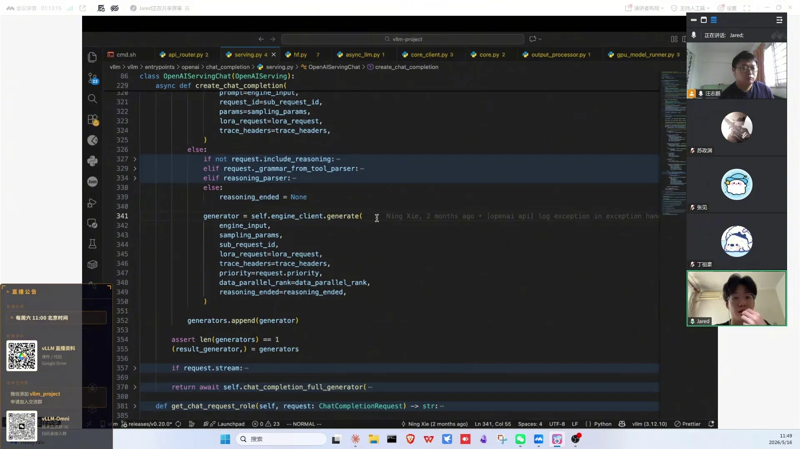 |
| 前面的一些模型，特别是一些多模态模型，可能会涉及的比较多。 [【跳转到 48:06】](https://www.bilibili.com/video/BV1yrJH6pEFQ/?t=2886) | 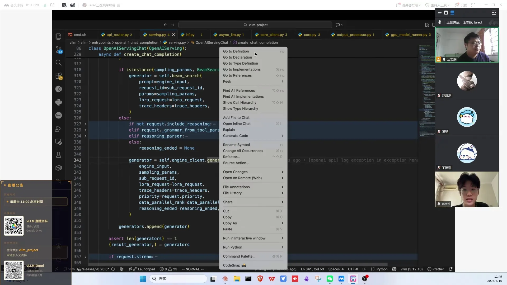 |
| 但是其他绝大部分模型都会涉及到这一块——从这里开始到 engine core 这一块。嗯，我们往下翻。接下来就是会进入到我们的 vLLM 的 V1 的文件夹里面。我们主要看三个文件夹：一个是 engine，一个是 core，还有一个就是 worker 这一块。 [【跳转到 48:11】](https://www.bilibili.com/video/BV1yrJH6pEFQ/?t=2891) | 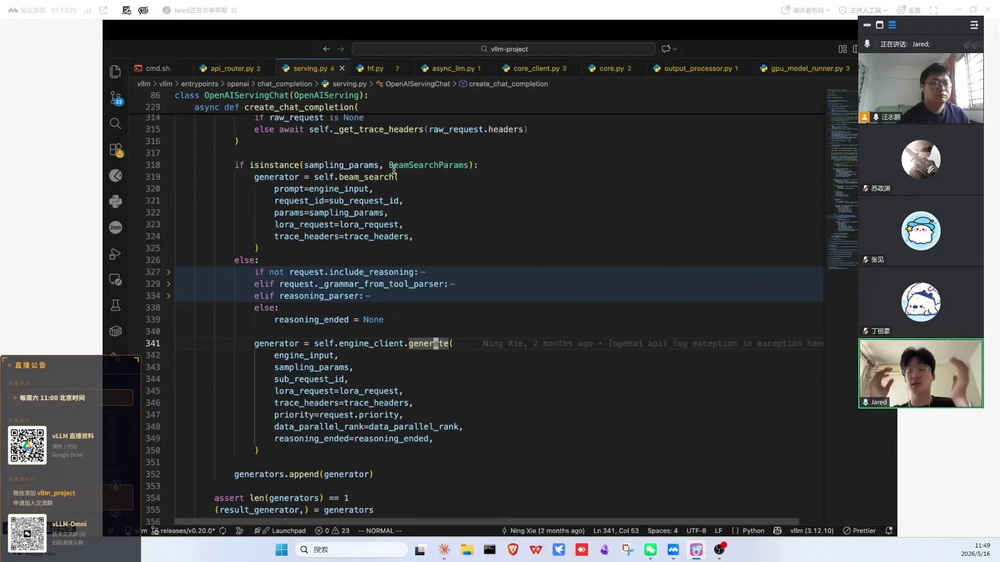 |
| 我们这个 engine client generate 他其实本上就是（sync 实现）在这里。我们把其他的东西先删一删。OK，就是这个类，他继承了一个叫 engine client 的类。所以你在理解之前，我会觉得还是带上我刚刚讲的那个三个层次：engine client、engine core client 还有 engine core…… [【跳转到 48:36】](https://www.bilibili.com/video/BV1yrJH6pEFQ/?t=2916) | 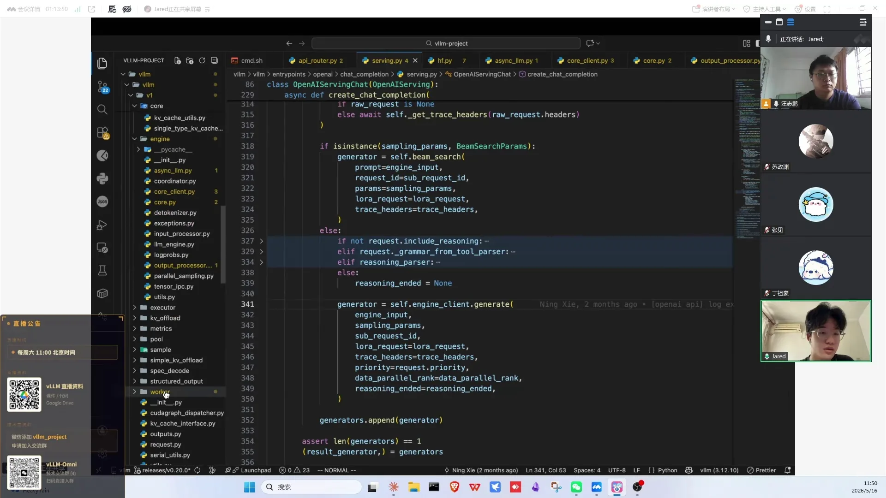 |
| 这样才会理解。然后他实际执行的名字叫做 sync（实现），然后我们会执行一个叫做 generate 的 method。对吧，刚刚那个 generate 的 method。这全部大概都收起来。在 generate 这一块你会发现它其实挺简单的，一个 try（异常处理）是很常见的（写法）。他实际的事情就是我们先去 request output…… [【跳转到 49:01】](https://www.bilibili.com/video/BV1yrJH6pEFQ/?t=2941) | 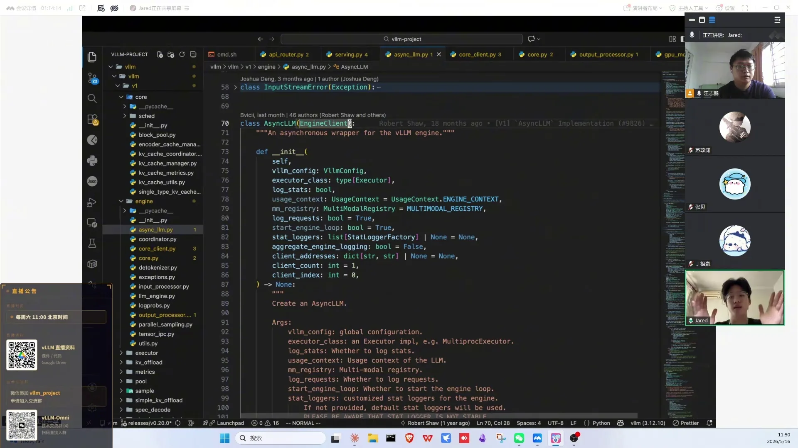 |
| 就是我刚刚说的：你在计算，到底谁——你要让一个人在那等着，你可以就理解成这个 client 就是那个在等请求的人。然后我们再把这个 prompt 加到这个 add request。我把（代码）贴过来吧…… [【跳转到 49:26】](https://www.bilibili.com/video/BV1yrJH6pEFQ/?t=2966) | 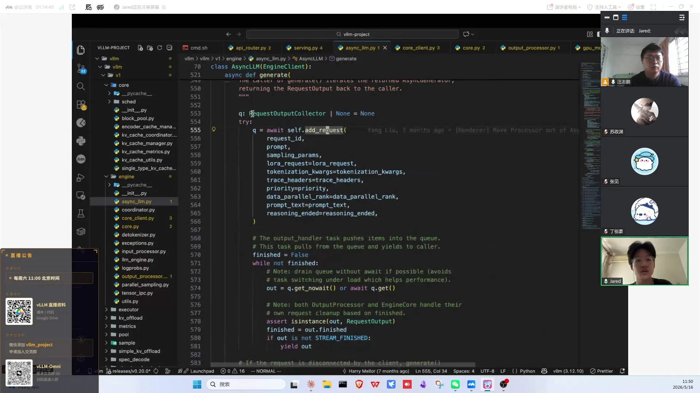 |
| 好，add request 进来之后…… [【跳转到 49:41】](https://www.bilibili.com/video/BV1yrJH6pEFQ/?t=2981) | 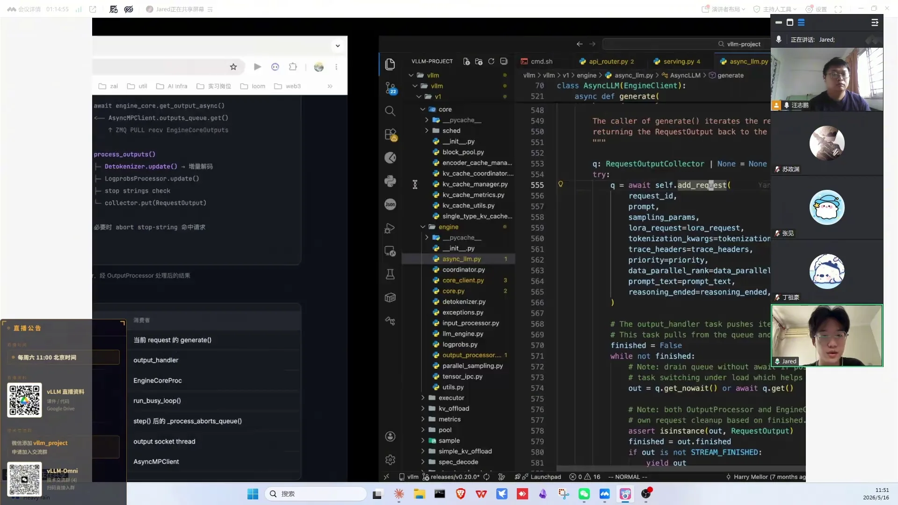 |
| 他就会…… [【跳转到 49:46】](https://www.bilibili.com/video/BV1yrJH6pEFQ/?t=2986) | 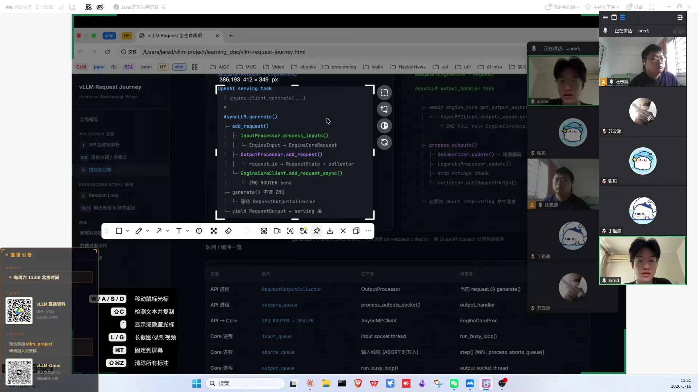 |
| 在这里，request 会做一个 input processor 的 process input。对，就是这块，我刚才说的他实际执行的就是把 engine input 变成 engine core request。然后多模态相关东西可能也会在这里做一些处理：Omni 那边就是有一个叫做 Omni input processor 的东西，好像是有这个东西的…… [【跳转到 49:51】](https://www.bilibili.com/video/BV1yrJH6pEFQ/?t=2991) | 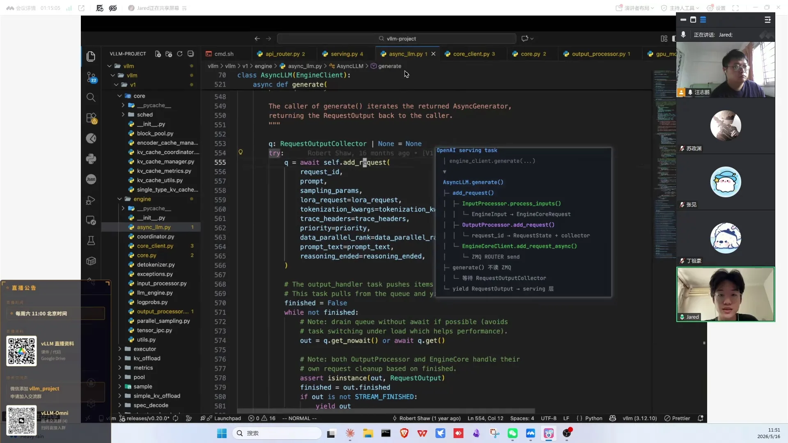 |
| 我有点忘了，应该是吧，反正类似的东西。然后他就会把它变成一个 engine core request，就变成这个东西。然后这个 engine core request 他就会注册到 output processor 里面，就是这一块。——啊那我问下，这有两个 return、两个 add request，唯一的区别就是这个 n 参数它是等于一？绝大部分时候是……嗯是等于一的。 [【跳转到 50:16】](https://www.bilibili.com/video/BV1yrJH6pEFQ/?t=3016) | 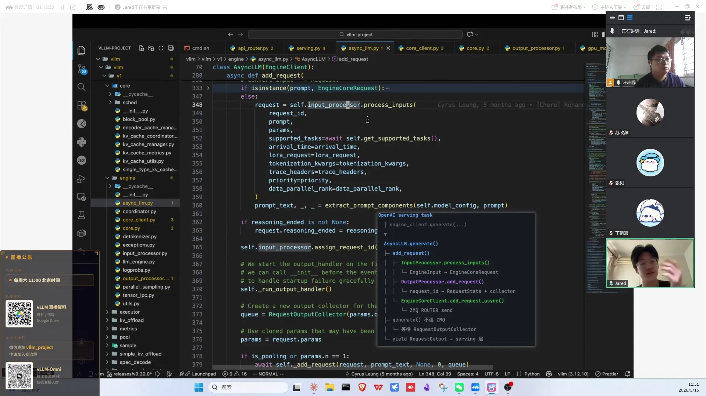 |
| 这个 n 指的是你一个 prompt 进来之后你需要得到多少个输出。所以 n 大于一的情况应该是那种强化学习的阶段，就是你要训练的话，你要让他一次（生成）多少条，是在这里调整吗？——我不太清楚这一块。——哦对 OK，就是这个…… [【跳转到 50:41】](https://www.bilibili.com/video/BV1yrJH6pEFQ/?t=3041) | 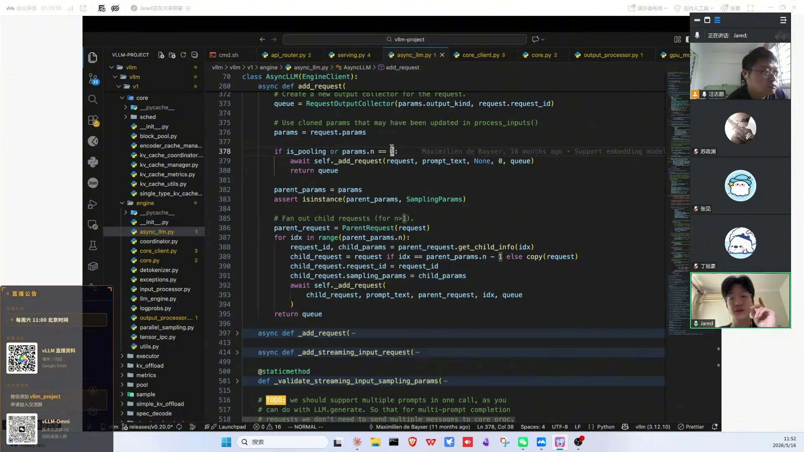 |
| 其实训练应该会有多条 rollout 嘛，对强化学习，他是有个 group 嘛，然后这个 group 你是需要去调整你的 sampling 的策略的，对吧，他就会造成有多个的输出派生。——虽然我们那个强化学习这块代码是有一些重构的。——OK，对，所以我们自己读的话…… [【跳转到 51:06】](https://www.bilibili.com/video/BV1yrJH6pEFQ/?t=3066) | 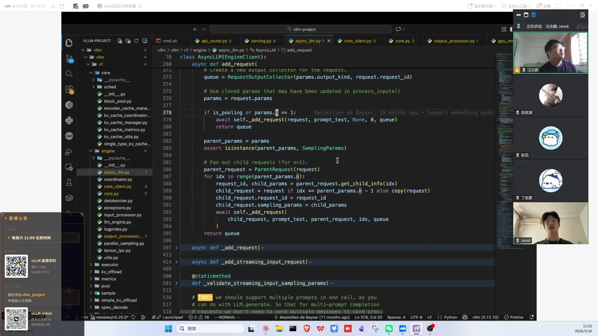 |
| 只需要读这个 n 等于一的时候就可以。——我理解的话这个前端改这个 n 的话应该不会影响到强化学习的，因为强化学习主要还是在推理这一块，他可能是因为你的采样策略不同的话就会有很多条（输出）什么的。OK，我看一下……这个是什么，是十个月之前（的提交）…… [【跳转到 51:31】](https://www.bilibili.com/video/BV1yrJH6pEFQ/?t=3091) |  |
| 他这里不是有个注释吗，support embedding model——这个 pooling 他其实做的是 pooling 相关的东西，我们这里不会涉及。——哦对，我觉得这个改动就是跟（版本）有关系：因为 embedding model 最开始是不在 V1 版本支持的，是后面才做进来的。——对嗯，那我们自己读的时候…… [【跳转到 51:56】](https://www.bilibili.com/video/BV1yrJH6pEFQ/?t=3116) | 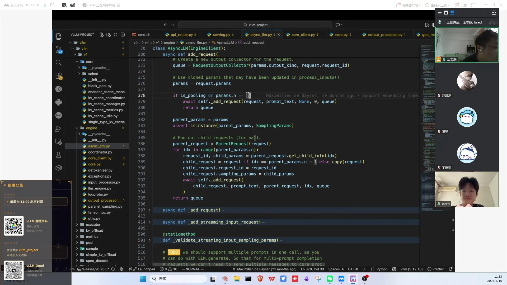 |
| 只需要看这个 n 等于一的时候，默认的时候 n 也等于一。我们再把它做一个 add request。 [【跳转到 52:21】](https://www.bilibili.com/video/BV1yrJH6pEFQ/?t=3141) | 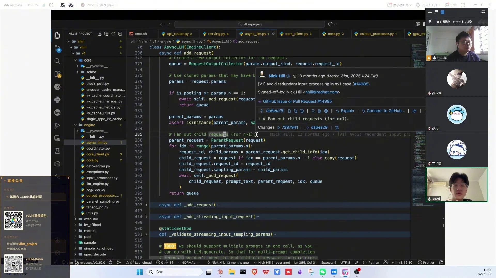 |
| 往后看其实就在这下面。他会做两件事情：一个是我刚刚说的 output（processor）…… [【跳转到 52:28】](https://www.bilibili.com/video/BV1yrJH6pEFQ/?t=3148) | 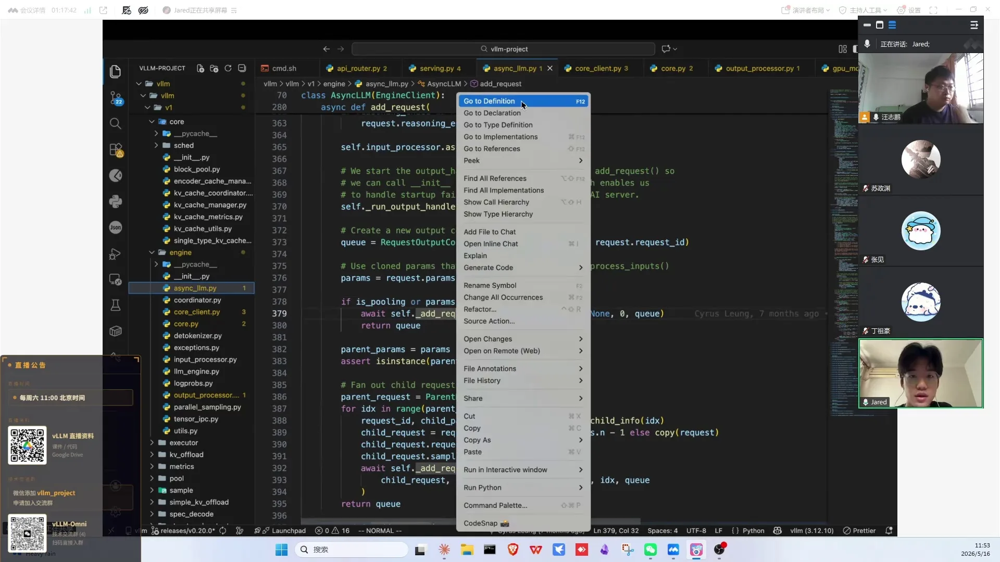 |
| 告诉他我现在有这个 request；然后 engine core 实际执行一下，把这个 request 发送到 core 里面——其实这个叫 engine core…… [【跳转到 52:33】](https://www.bilibili.com/video/BV1yrJH6pEFQ/?t=3153) | 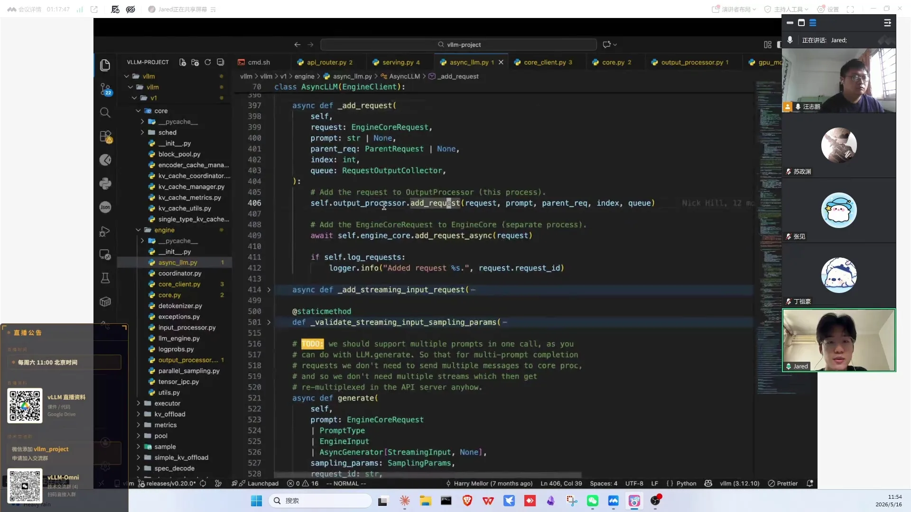 |
| 但其实它实际是 engine core client 类。在这块，对，他是 engine core client。 [【跳转到 52:42】](https://www.bilibili.com/video/BV1yrJH6pEFQ/?t=3162) | 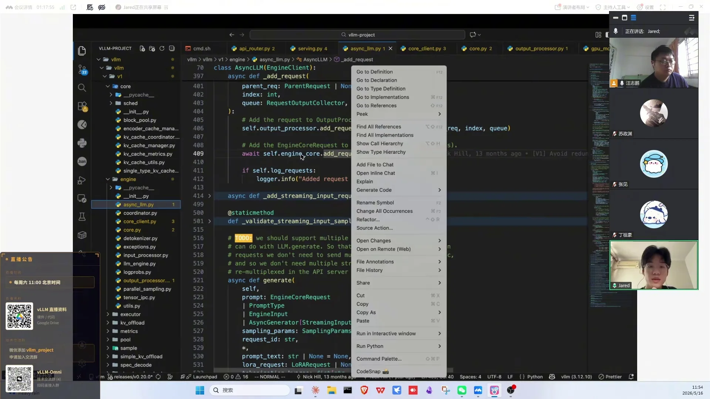 |
| 他这个名字也叫 core client。然后这里就会有一些比较复杂的 ZMQ 相关的通信的方法。这里他进来之后是 send input async，他会调用这个 send input message，实际会执行这样一个 ZMQ 的（消息）传递，就这一块。如果你对通信相关的东西感兴趣…… [【跳转到 52:48】](https://www.bilibili.com/video/BV1yrJH6pEFQ/?t=3168) | 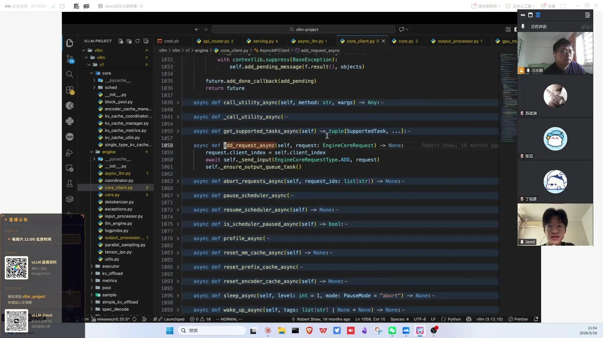 |
| 说不定会在这里看到很多的代码或者 ZMQ 相关的东西。OK，就是最终发完之后他就会来到这一块。这里 engine core process，然后我们去看看，它有个叫做 run busy loop 的东西，就在这里。我觉得到这一块我们可以先简单回去（总结）。 [【跳转到 53:13】](https://www.bilibili.com/video/BV1yrJH6pEFQ/?t=3193) | 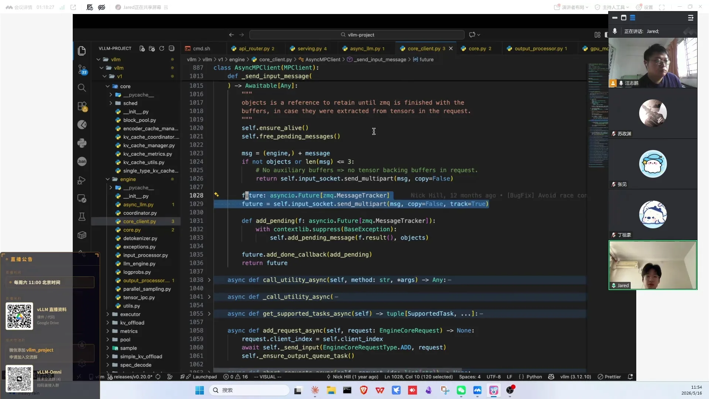 |
| 这边总结一下吧，就是我们刚刚说的…… [【跳转到 53:38】](https://www.bilibili.com/video/BV1yrJH6pEFQ/?t=3218) | 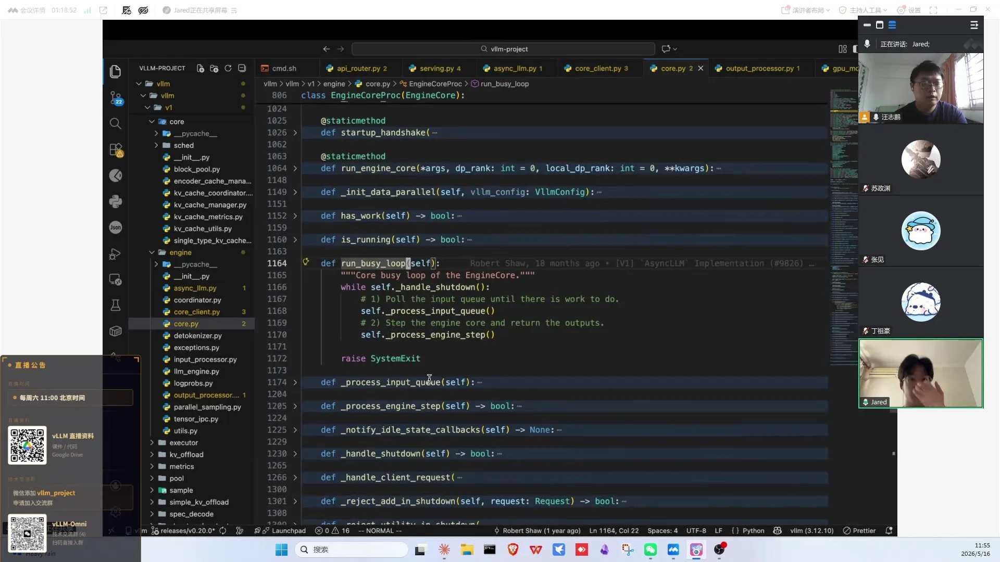 |
| 我们从 OpenAI serving chat 这一块通过这个 engine client generate 进来之后，我们就做一个 add request，做三件事情：一个是 input processor，把它变成一个 engine core 能接受的输入；然后在 output processor 里面注册一下——OK 我有这样这样一个 request；然后我们再通过 engine core client 把这个 request 丢给 engine core。也就是说 engine（core）有一个负责通信的类…… [【跳转到 53:43】](https://www.bilibili.com/video/BV1yrJH6pEFQ/?t=3223) |  |
| 提交给 engine core client，然后它会实际执行这个网络请求。然后我们往后看，这里还有几个类：每个 request 都要执行这个循环，engine core 有个 busy loop，然后 output handler 的话它就会在外面等着你的（结果）出来，后续会讲到这一块的循环。然后我们就进入了特别关键、也是最影响性能或者说 vLLM 最特殊的相关的东西…… [【跳转到 54:08】](https://www.bilibili.com/video/BV1yrJH6pEFQ/?t=3248) | 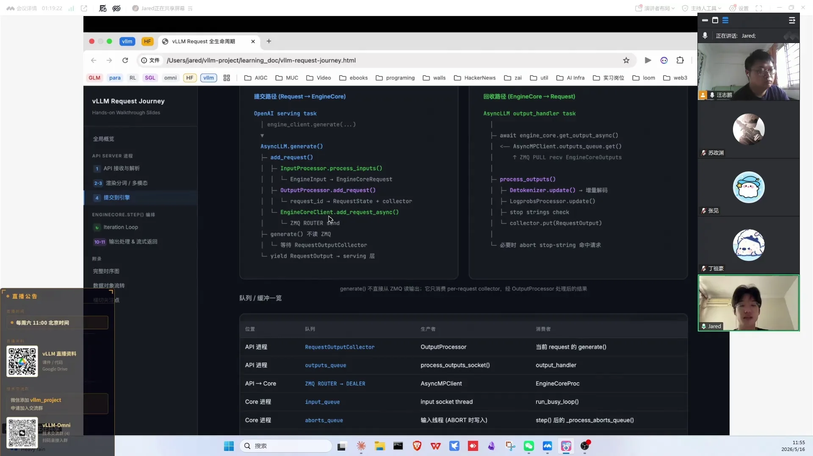 |
| 就是这个（主循环）他是怎么做的。我们先看这一块吧。他肯定就是最终会执行一个叫 step 操作：先 schedule，就是拿到你的 request 之后先做一个调度，然后肯定是 FCFS（先来先服务）啊或者其他更复杂的调度策略，一般也都是在这一个接口里面进去。你可以看到很多的代码，非常的深入…… [【跳转到 54:33】](https://www.bilibili.com/video/BV1yrJH6pEFQ/?t=3273) |  |
| 然后今天我不会讲得特别深入这一块。然后调度完之后，我们再把调度的结果给到 execute model——这里就是实际模型执行一次 forward 的过程。这一块也有非常多的代码，非常深入，性能优化的相关的东西也在这一块。往往如果你模型实现错误了，你很可能在 vllm serve 启动的过程中，一直走、走、走到这块 execute model 相关的东西，他就会告诉你你从这块开始有很多的报错…… [【跳转到 54:58】](https://www.bilibili.com/video/BV1yrJH6pEFQ/?t=3298) |  |
| 然后他就告诉你大概哪里报错，往往都是这个 execute model 这一块。execute model 结束之后还会返回这个（结果），然后通过这个 sampler——采样其实也在 GPU 进行，execution 也在 GPU 进行，然后他们把它变成一个异步的、分开的操作。对，这是一个刻意而为的事情。然后我们在拿到采样结束之后…… [【跳转到 55:23】](https://www.bilibili.com/video/BV1yrJH6pEFQ/?t=3323) |  |
| 拿这个 token 我们就会做一个 state 的 update——其实就是 scheduler 在执行 update from output。然后它会执行几件事情：跟 KV cache 相关的东西；也要检查这个 loop 结束了没有；同时要把这个 token 传递到 output processor 那边等着的那个 queue 上面。 [【跳转到 55:48】](https://www.bilibili.com/video/BV1yrJH6pEFQ/?t=3348) |  |
| 我们可以稍微看一下这个图，我刚才也讲过一遍：engine core 会调用一个 scheduler，然后 scheduler 去跑这些调度的策略。调度策略之后他把结果返回回来到 engine core 这一块，然后他再调用 execute model——实际模型这个 GPU runner 就会去执行这样一个 model forward 的操作。model forward 差不多结束之后，他会暂存到一个（数据类）里面…… [【跳转到 56:13】](https://www.bilibili.com/video/BV1yrJH6pEFQ/?t=3373) |  |
| 放进一个数据类里面，然后返回一个 future。然后我们再通过这个 sampler 把这个 logits 给他 sample 出来一个 token。然后这个 token 会返回——通过 engine core 返回到我们的 output processor 那边等着的 output queue 那边。嗯，然后直播间有人问一些问题啊：就是在 DP 的情况下…… [【跳转到 56:38】](https://www.bilibili.com/video/BV1yrJH6pEFQ/?t=3398) |  |
| 涉及到多卡多机（场景）的时候，engine 是如何接受请求的？在 DP 的情况下……如果——我记得我看我这有个东西，我看看有没有涉及到这个，但是这里好像没有。就是我这里稍微讨论一下 DP 和 PP 的情况下…… [【跳转到 57:03】](https://www.bilibili.com/video/BV1yrJH6pEFQ/?t=3423) |  |
| 就是它在不同的并行情况下他会有不同的 engine core 的数量，然后 engine core 的数量应该是跟 engine core client 是相同的。TP 的话就 TP 啊；DP 的话 OK，DP 它是有 N 多个 engine core 的，而且也是有多个 engine core client——我记得是有多少个（core）就有多少个 client。然后这块说实话我不是很了解，我觉得可以进去看一下。 [【跳转到 57:28】](https://www.bilibili.com/video/BV1yrJH6pEFQ/?t=3448) |  |
| 我反正大概在半年前的时候，我当时知道的是：如果你用 DP 的话，其实像那个 semantic router 这种东西他可能就不会生效。因为 DP 的话它有多个 core，就相当于我们每个（DP 副本）会有一个自己的 KV cache 的一个东西，对吧…… [【跳转到 57:53】](https://www.bilibili.com/video/BV1yrJH6pEFQ/?t=3473) |  |
| 但是这个基本上来讲，semantic router 的话它是针对你不同的服务来生效的，它并不是针对你这个 DP0 来生效的。之前反正我记得是有这个问题的，OK，就是两边可能互相结合的不是很紧密。然后这还有个问题估计就很难答了：vLLM 部署大模型到 K8S 上…… [【跳转到 58:18】](https://www.bilibili.com/video/BV1yrJH6pEFQ/?t=3498) |  |
| 有 Dynamo 那种（调度）吗？你知道什么是（那个）吗？——我不知道诶，那是什么？嘿嘿。——这个云原生这块东西我们都不是很了解的。然后我们今天直播的主题是面向新人…… [【跳转到 58:43】](https://www.bilibili.com/video/BV1yrJH6pEFQ/?t=3523) |  |
| 给大家梳理一遍这个流程。非常深入的内容我觉得可以后面请一些大佬来讲一讲，比较懂这一块的。嗯 OK，嗯我们刚刚是听到的音频内录（吗）？——没有了没有了。我们接着讲。这是 infinite loop。OK，其实这个 engine core process…… [【跳转到 59:08】](https://www.bilibili.com/video/BV1yrJH6pEFQ/?t=3548) | 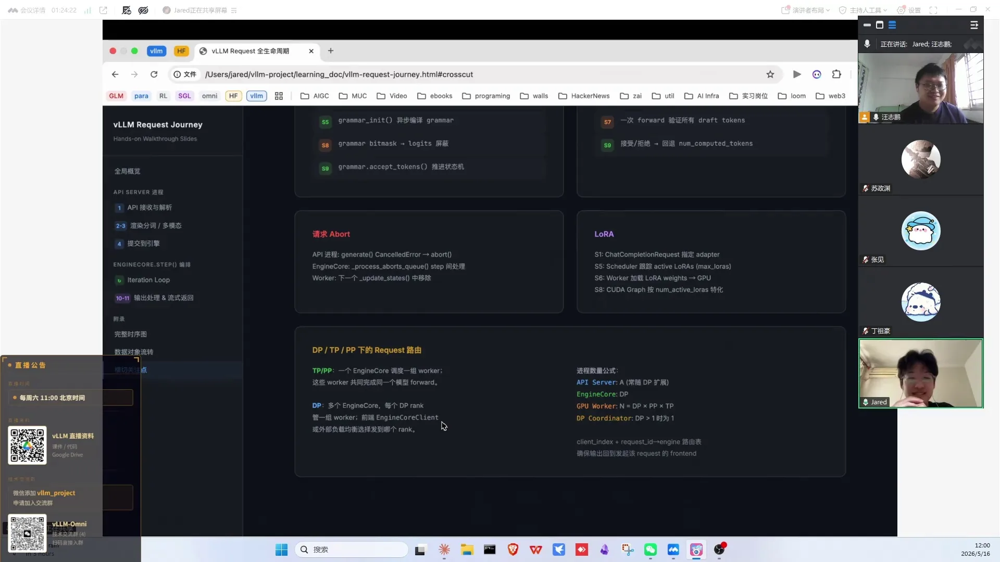 |
| 然后一直在跑一个 loop，做两件事情。 [【跳转到 59:33】](https://www.bilibili.com/video/BV1yrJH6pEFQ/?t=3573) | 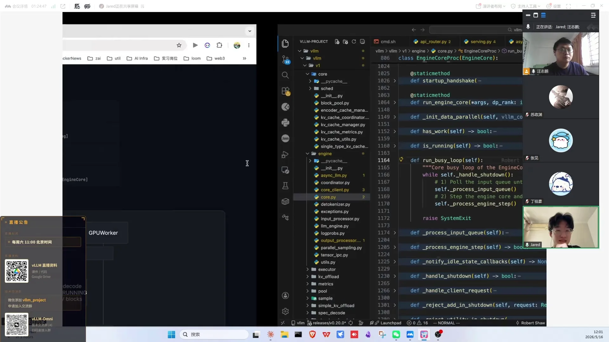 |
| 一件事就是从 ZMQ 那个 input queue 里面去拿到有没有新的 request 进来，对吧。它是两个 loop。这个时候如果你现在没有在（计算）——底层没有在计算的话，那它就会一直 block 在这里等待，有没有新的 input 进来。如果他是 empty 又怎么样怎么样…… [【跳转到 59:38】](https://www.bilibili.com/video/BV1yrJH6pEFQ/?t=3578) | 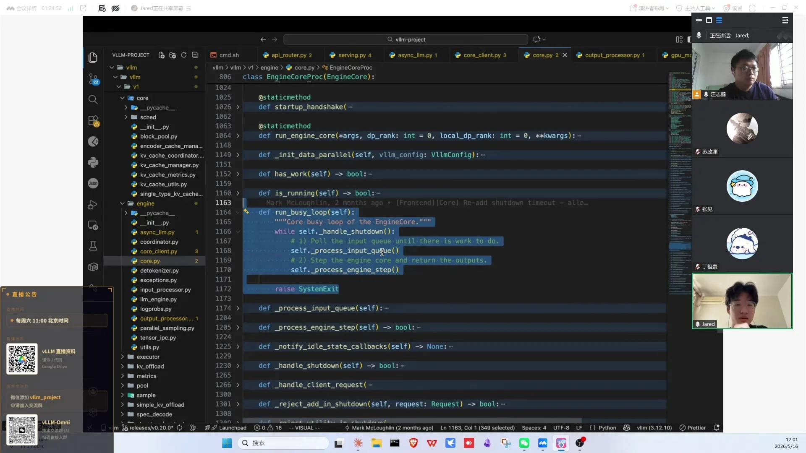 |
| 然后如果他不 empty 的话，那他就把那个 request 拿进来。如果你已经在处理一些 request，然后你有第二个 request 进来，他就走过这个 loop。其实最终都是 get，对吧，get_nowait 或者 get。然后拿到这个 request 之后我们再去做个 handle client request。我们往后看一下 handle client request，嗯，前面我刚没讲…… [【跳转到 60:03】](https://www.bilibili.com/video/BV1yrJH6pEFQ/?t=3603) | 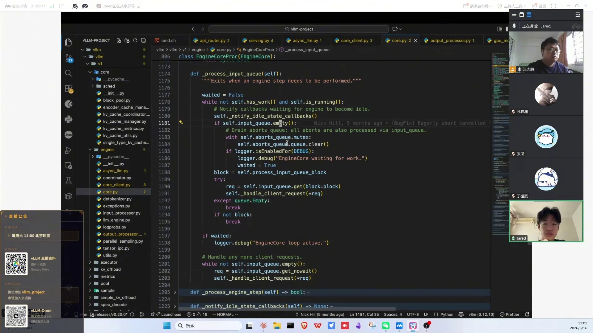 |
| 就是这块还有这块，它就是 ZMQ 相关的东西啊，一般都是直接带上一个 add（前缀）。因为他是这个 add，所以我们会继续把这个 request 加到请求队列里面——就是加到 engine core 自己的一个 queue 里面。 [【跳转到 60:28】](https://www.bilibili.com/video/BV1yrJH6pEFQ/?t=3628) | 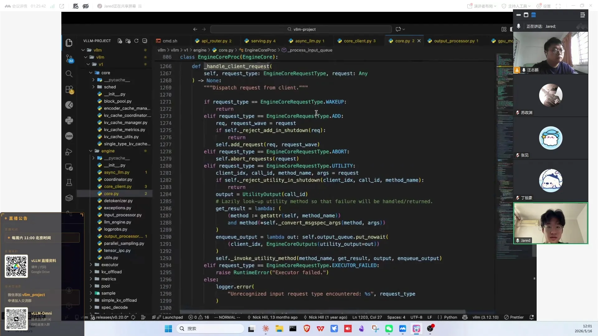 |
| 不对啊，对唉，engine core 自己的 queue 其实是通过 scheduler 来维护的。所以我们点进去看一下，这个他在 engine core 这个类里面。 [【跳转到 60:42】](https://www.bilibili.com/video/BV1yrJH6pEFQ/?t=3642) | 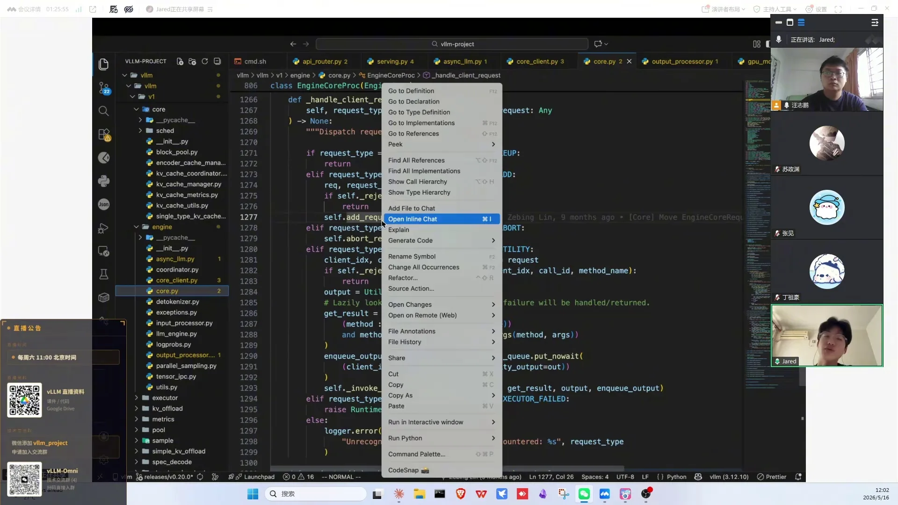 |
| 然后你可以看他其实做了一些准备、做了一些校验之后，在 scheduler 这一块——真正在底层管理这一个个 request 的是 scheduler。这里我们也能看到很有名的 PagedAttention 啊、或者说 prefix caching 相关的东西，都会在这一块做预先的分配。 [【跳转到 60:51】](https://www.bilibili.com/video/BV1yrJH6pEFQ/?t=3651) | 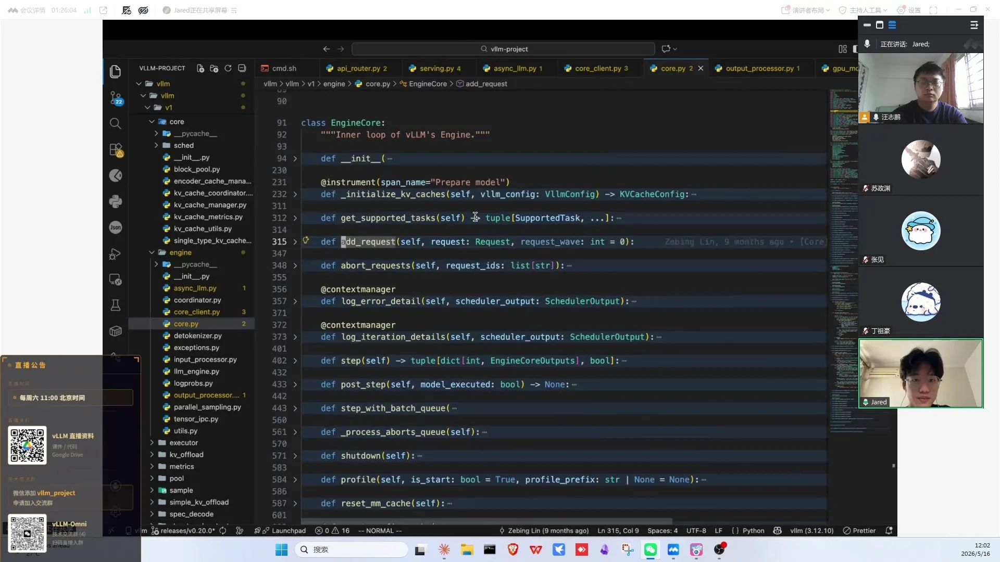 |
| 然后这个 add request，下还要去讲这块我觉得……（时间）已经有点（紧了）。对对。嗯，我们这个 scheduler 他其实会维护这样一个 queue，就在这里：requests 在这里，给他标上不同的（状态）。他可能在 waiting，可能在 running，可能在（还）叫 resume 或者相关的东西。这块我们就不讲得太深。然后我们回到（busy loop）这一块…… [【跳转到 61:16】](https://www.bilibili.com/video/BV1yrJH6pEFQ/?t=3676) | 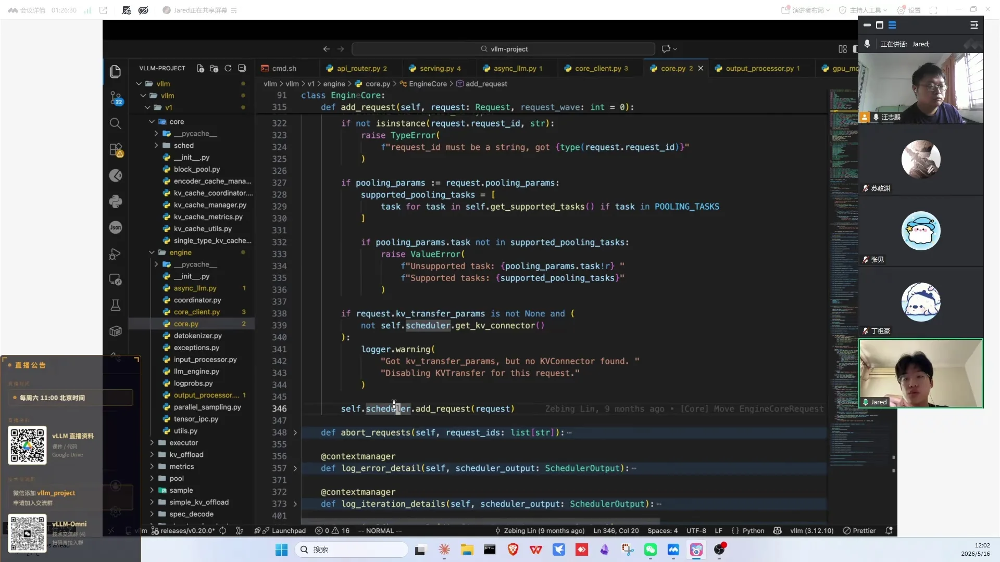 |
| 我们回到 busy loop 这一块。我们刚刚讲了怎么处理从那个 input queue 里面拿到一个 request，然后给他放到底层的 scheduler 这一块。然后我们再看 scheduler 实际怎么工作的，就是这个 engine step。 [【跳转到 61:41】](https://www.bilibili.com/video/BV1yrJH6pEFQ/?t=3701) | 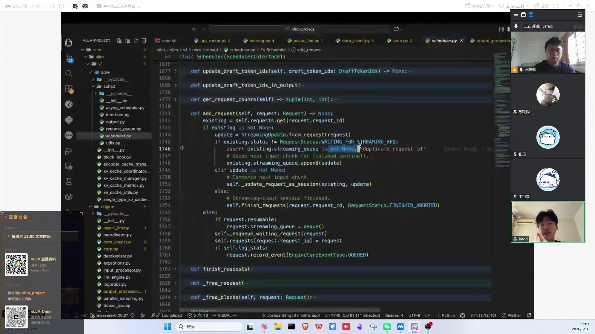 |
| OK 我们点进来看一下，这里也很简单，其实就是跑一个 step function。这个 step function 就会稍微复杂一点点，我们去看一下 step function 里面是什么。——哇塞——function 是我们的（重点），在这里。OK，大部分时候我们直接走的是一个 step…… [【跳转到 62:06】](https://www.bilibili.com/video/BV1yrJH6pEFQ/?t=3726) | 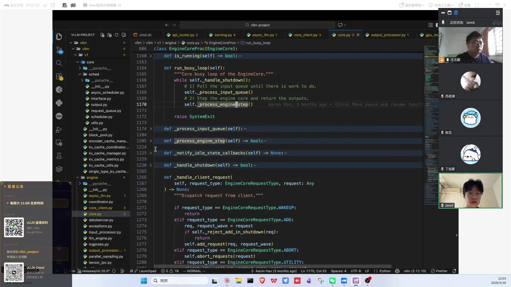 |
| 如果你开启了 async scheduling 进来之后他可能会走 step with async scheduling，但是大部分时候我们应该不会走那条路，我们直接看这个 step 这条路就可以。好，（代码）在这里。OK 这是一个非常关键的类，几乎所有的循环也都是在这一块完成——跑一遍 forward 的话一般也都在这一块。然后我们先跑的是 scheduler，跑一个 schedule，然后返回一个 scheduler output…… [【跳转到 62:31】](https://www.bilibili.com/video/BV1yrJH6pEFQ/?t=3751) | 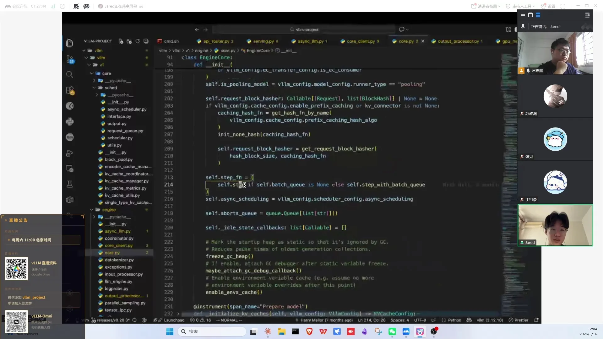 |
| 然后把这个 scheduler output 给到 execute model，模型实际的去执行一次 forward。结束之后返回一个 future。然后这里拿到（结果）之后……我们再把 scheduler output——也就这个 scheduler 里面拿到这个（结果）——去给他做个 sample token。sample 完之后我们会拿到模型的 output，其实这里面主要是一个已经 sample 出来的一个 token 或者多个 token…… [【跳转到 62:56】](https://www.bilibili.com/video/BV1yrJH6pEFQ/?t=3776) | 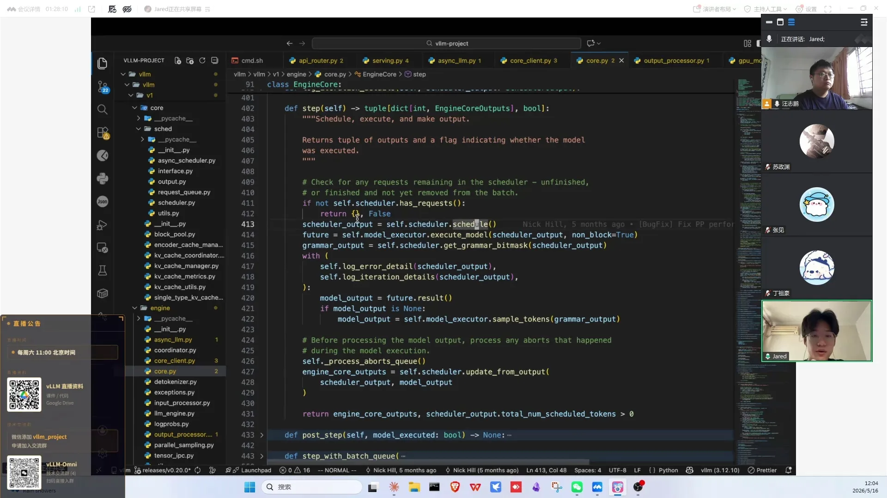 |
| 因为里面如果你涉及到 MTP 的话他可能有多个 token 在里面。所以我们再根据这个东西，scheduler 就 update 一下：我这个请求结束没有？如果没有的话，就接着还在 scheduler 那个 queue 里面；如果结束了，我们就把这个东西弄出去，然后那个 KV cache 可能要释放一下，大概这样。嗯，然后我们最终还是要把这个 engine core（的 output）给 return 出去…… [【跳转到 63:21】](https://www.bilibili.com/video/BV1yrJH6pEFQ/?t=3801) | 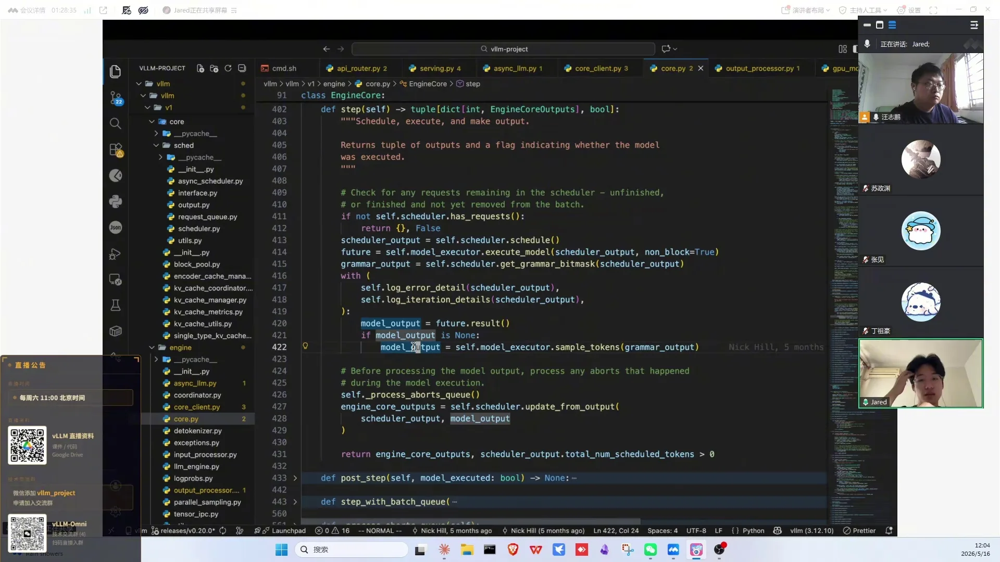 |
| return 出去就会有那个 output processor 在那等着。但是我们先不讲返回的情况，我们稍微深入一点点 scheduler 和 execute model 的大概的流程。我们先回到这个 slides 这边来。 [【跳转到 63:46】](https://www.bilibili.com/video/BV1yrJH6pEFQ/?t=3826) | 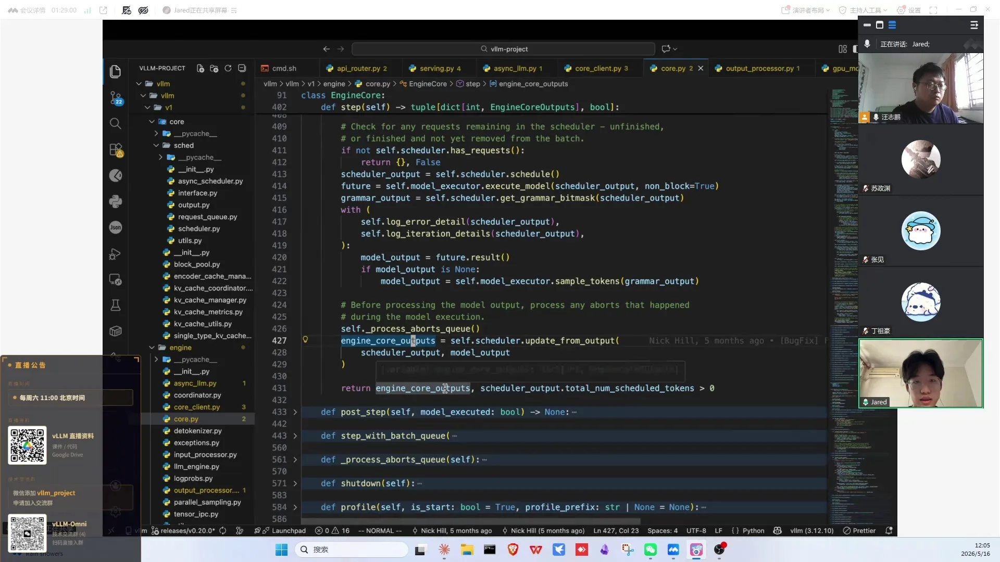 |
| 这条流程我们刚刚已经讲过一两遍了。OK，实际 execute model 的其实这个 GPU worker、GPU model runner——应该是 GPU model runner 在那 execute model。嗯嗯，往后看一下 scheduler 大概做了什么事情，我就不去看源码了：他会先调度 running，但是如果你一个纯粹新的（请求）进来，它应该是在 waiting 这一块。然后我们去计算（prefix caching 命中）…… [【跳转到 64:01】](https://www.bilibili.com/video/BV1yrJH6pEFQ/?t=3841) |  |
| 然后再给他分配 KV cache block，然后把他放到 running 这一块，最终就可以返回这个 scheduler output。然后这个 scheduler output 就会给到 model execution，对吧——给他 model execution 去执行。然后 GPU model runner 他 execute model 的时候是这样的：先去 update 他的 state，然后准备好他实际的这个 input…… [【跳转到 64:26】](https://www.bilibili.com/video/BV1yrJH6pEFQ/?t=3866) |  |
| 然后还有一些 propose（draft token）——这是子枫昨天强调过的。 [【跳转到 64:51】](https://www.bilibili.com/video/BV1yrJH6pEFQ/?t=3891) |  |
| 就是这个 propose 是面向于你有没有（相应）处理。假设我们就以一个 Qwen-VL 的这样一种情况：你有一个 image 进来之后，你可能是先被 patch 成一个个小的 patches，然后你对那个 patch 要做一些——应该算是 video tower 或者说 vision tower…… [【跳转到 64:56】](https://www.bilibili.com/video/BV1yrJH6pEFQ/?t=3896) | 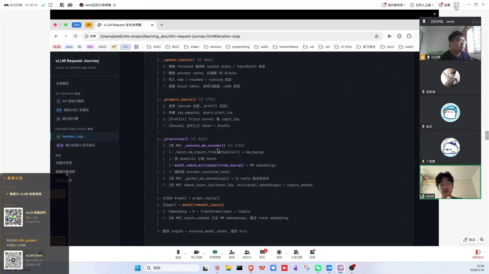 |
| 跑一层那个处理，拿到你的 features 以及那个 embedding，然后再把这个 embedding 放到整个语言模型的主干去做一个处理。所以多模态目前（的实现）应该都是这样的…… [【跳转到 65:21】](https://www.bilibili.com/video/BV1yrJH6pEFQ/?t=3921) |  |
| 就是你先对你的多模态的输入做一个处理，处理完之后把它变成一个 embedding，然后那个 embedding 是跟语言文本模型的 embedding 的语义是对齐的，然后他才能在文本模型上做这样一个 forward。forward 完之后再输出一个结果，大概是这样子。所以这个 propose 主要就是如果你有……嗯对…… [【跳转到 65:46】](https://www.bilibili.com/video/BV1yrJH6pEFQ/?t=3946) |  |
| 如果是 PD 分离的话应该也是跟这一块有关，因为这个东西你也可以理解成把一个 image 或者把一个 audio encoder encode 成一个语言模型也能接受的 embedding。这一块如果你实际去读相关代码的话应该能看到。然后这一块应该还涉及到一些多模态 cache 相关的东西…… [【跳转到 66:11】](https://www.bilibili.com/video/BV1yrJH6pEFQ/?t=3971) |  |
| 我记得我们多模态这一块其实是需要有两套 cache 的：一个就属于是纯 image 的这块 cache。image cache 的话他是可以拿到这个 encoder 的 output，是吧。然后还有一个 cache 的话就是我们还是有 KV cache。KV cache 的话就相当于是你拿的是那个 KV cache manager 里面的——通过（视觉编码）模型处理之后的这一块的 cache。 [【跳转到 66:36】](https://www.bilibili.com/video/BV1yrJH6pEFQ/?t=3996) |  |
| 叫 cache，是的。然后对……为什么这块多模态的代码 processor 这块有点多呢，也是因为他一开始需要做一些 dummy data 的填充，然后这样的话去做这个 profile。做完 profile 的话他可以估算出模型在最大的负载的情况下…… [【跳转到 67:01】](https://www.bilibili.com/video/BV1yrJH6pEFQ/?t=4021) |  |
| 它有多少的内存（可用），大概对对。然后剩下来的话他会把剩下来的东西再用来去做 KV cache 的一个管理，就分给这个 KV cache 与 attention（这些）。好，然后我们开始就有问题了，有同学要问了。好第一个问题是：vLLM 一个 vLLM 实例是什么意思？ [【跳转到 67:26】](https://www.bilibili.com/video/BV1yrJH6pEFQ/?t=4046) | 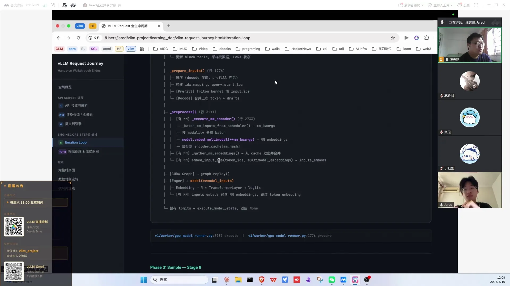 |
| DP=2 是意味着有两个 vLLM 实例吗？EP=2 嘛——这个不是的。我们 DP 的话他只会和 EP 同时存在，对吧。然后 DP 一般来讲，我们做一个 MoE 模型的部署的时候，一般来讲比如说我们会开 TP=8 然后 DP=2…… [【跳转到 67:51】](https://www.bilibili.com/video/BV1yrJH6pEFQ/?t=4071) | 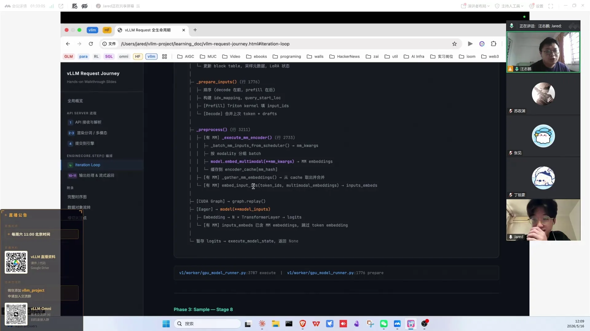 |
| 然后 EP 一般就会等于 16。这个时候我们会把他的 MoE 模型部署在（很多）卡上面，但是他的 attention 这部分就相当于会有两个副本：一个副本就是分部署在八张卡，另一个副本就会部署在另外一个八张卡。这就意味着为什么会有 DP=2，但是这个（情况下）我们实际上还是一个 vLLM 的实例…… [【跳转到 68:16】](https://www.bilibili.com/video/BV1yrJH6pEFQ/?t=4096) |  |
| 就不是两个多个 vLLM 的实例——相当于是我完全做纯水平扩展：就是我有多少（卡），然后把它复制成多少份，这样子做的。——嗯对。然后下一个问题：一个 engine core 是意味着一个完整的模型吗？——嗯嗯嗯，不是的。 [【跳转到 68:41】](https://www.bilibili.com/video/BV1yrJH6pEFQ/?t=4121) | 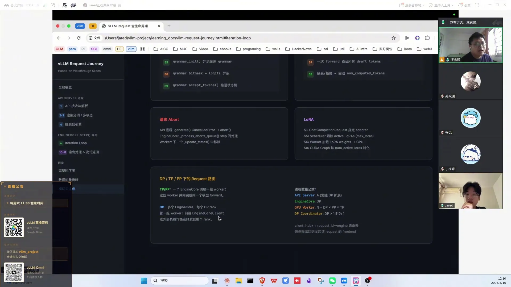 |
| 其实只是相当于是对于模型的运行部分的一个抽象，对吧。这都取决于你在用什么 parallel（并行），我觉得还挺复杂的。嗯，取决于你在用什么并行策略吧。——嗯对 OK。还有下面一个问题：他说 engine core 和 worker 的数量是多少是怎么决定的？ [【跳转到 69:06】](https://www.bilibili.com/video/BV1yrJH6pEFQ/?t=4146) |  |
| 嗯，那 GPU worker 的话，那就是这里有个计算公式：就是 DP 乘以 PP（再）乘以 TP。其实我觉得大概是你有几个 GPU，大概就会有多少个 GPU worker，是这样算吗？——对对对。嗯，然后这些 worker 其实是被管在 engine core 这个调度里面，然后这个 engine core 是取决于你的一些并行策略了…… [【跳转到 69:31】](https://www.bilibili.com/video/BV1yrJH6pEFQ/?t=4171) |  |
| 如果你是 DP 的话，那你 engine core 会逐渐增加，应该是吧，就是 DP 有两块可以处理的，应该是这样。——OK，嗯我这我理解的话就是我们这个 worker 部分——worker 里面是 runner 嘛——worker 他主要做的事情就是去处理他这个…… [【跳转到 69:56】](https://www.bilibili.com/video/BV1yrJH6pEFQ/?t=4196) |  |
| rank 它属于在哪一组。这个 rank 组的话就是按照你的 DP/PP/TP 的这个策略，算出来他是哪一组。那么他就会指挥他自己的 runner 去执行：比如说加载某某一部分权重，然后去跟其他的一些 rank 怎么样去做配合，是这样做的。OK，就是我这里也稍微写了一点点这个 worker 和 model runner 还有 model 这样一个三层架构…… [【跳转到 70:21】](https://www.bilibili.com/video/BV1yrJH6pEFQ/?t=4221) | 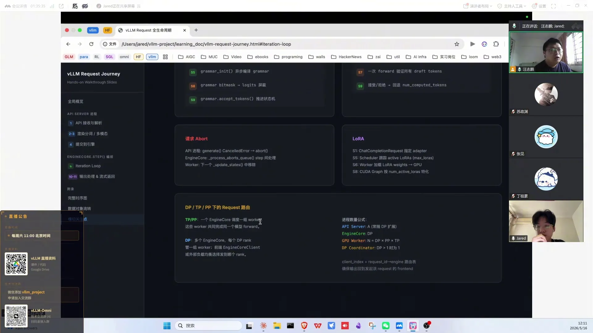 |
| 然后 model 就是——我大部分时候其实在做 model 相关的东西，就是把一个模型适配到特定引擎上，我们会花很多时间在这个 model 上。新模型出来往往也都是先做这一块。然后 worker 的话其实就是跟 GPU 绑定，他会拥有一个 GPU model runner，去实际的执行这样一个计算的操作。大概是这样。嗯…… [【跳转到 70:46】](https://www.bilibili.com/video/BV1yrJH6pEFQ/?t=4246) | 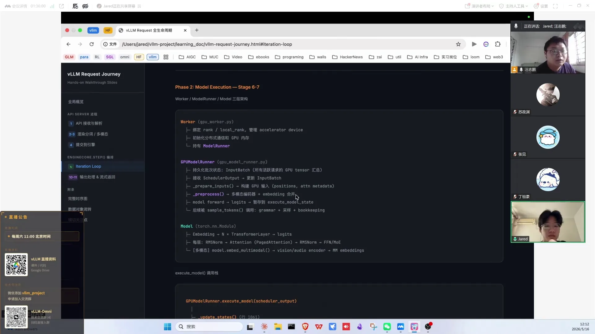 |
| 大家有兴趣可以自己看一下。然后后面有好多问题……OK——我再随便说两句：我觉得 execute model 这一块讲完之后，后面的就是这个 sampling，有兴趣的可以自己稍微看一下。然后后面就是一点点返回。如果大家感兴趣——这里我还画了一个图——就是从 GPU worker 这一块一直回到我们 client…… [【跳转到 71:11】](https://www.bilibili.com/video/BV1yrJH6pEFQ/?t=4271) |  |
| 就这个图，大家有空也可以看一下，我等会应该会简单地过一遍。其实我们整个流程基本上都走完了，该涉及到的地方都已经涉及过一遍了。你自己想深入到哪一块我觉得可以自己去看，大概也就是这样。OK 嗯好。然后有个问题，他就说 HTML…… [【跳转到 71:36】](https://www.bilibili.com/video/BV1yrJH6pEFQ/?t=4296) | 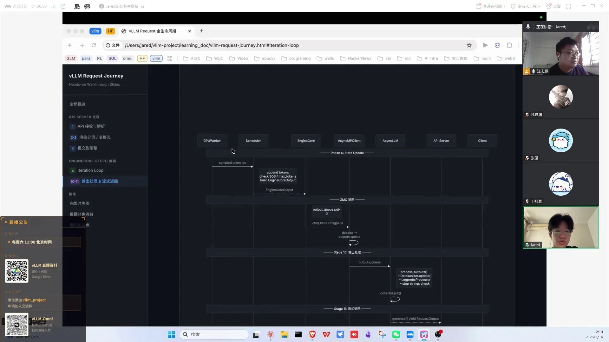 |
| 就是这个 PPT 和我们那个（之前）分享的不一样。——哦是的，我这个稍微改了一版，然后我当时那个新版没有发给你。OK 我后续会再更新一版，或者现在也要更也可以。——或者说你们是下载后发现（差异）再更新吧。——等会更新，OK 没问题，稍微有点不一样。这是……然后一个 vLLM instance…… [【跳转到 72:01】](https://www.bilibili.com/video/BV1yrJH6pEFQ/?t=4321) |  |
| 跨机是 K8S 那个 deployment 那种吗？——呃我对 K8S 的……我理解的话就是一般来讲 K8S 就是你起一个 pod，对吧，然后你里面可能会有很多个 node，是这样子的，对吧——然后这个 node 的话……一个 pod…… [【跳转到 72:19】](https://www.bilibili.com/video/BV1yrJH6pEFQ/?t=4339) | 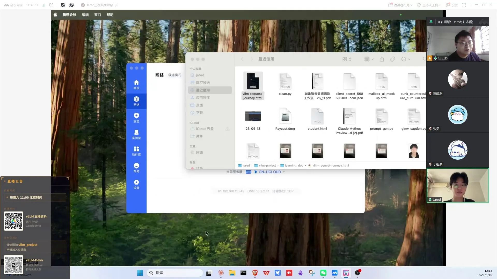 |
| 跨级是K8S那个deployment那种吗呃我对K8S的我呃我我理解的话就是一般来讲话就是K8S品就是你起一个pod对吧然后你里面可能会有很多个node是这样子的对吧然后这个node的话就是他一个破的话 [【跳转到 72:24】](https://www.bilibili.com/video/BV1yrJH6pEFQ/?t=4344) |  |
| 就应该对应的是一个（vLLM）的部署实例。然后你可能会用很多个 pod 去做它的水平扩展，是吧。但你也可以就是一个 pod 就只有一个 node，这一个 node 就是像你只在一台机器上面去部署（一个）vLLM。 [【跳转到 72:49】](https://www.bilibili.com/video/BV1yrJH6pEFQ/?t=4369) |  |
| 我觉得这个东西涉及到大规模部署。然后我说实话没有到这一步，我做的都还是对 vLLM 本身（引擎）这一块，我也只是懂一点点。就是我们没有管理这么多卡的经验。——对，然后这个部署 GLM-5.1 跨机只能自己弄两个 deployment 吗？ [【跳转到 73:14】](https://www.bilibili.com/video/BV1yrJH6pEFQ/?t=4394) | 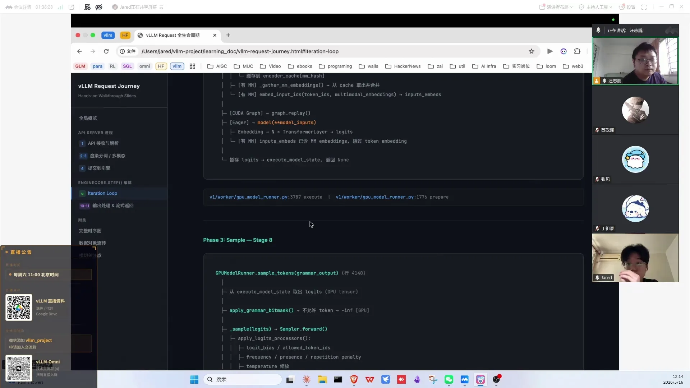 |
| 呃这个应该不是的。跨机部署的话我们一般来讲就是你拉两台机器，然后两台机器你用 Ray 把它连起来，后面部署就跟单机部署一样，就相当于你在两台机器上面要启动两个脚本。因为你用 Ray 连起来之后，你一个脚本就相当于作为 head 的，另一个就相当于一个 master…… [【跳转到 73:39】](https://www.bilibili.com/video/BV1yrJH6pEFQ/?t=4419) | 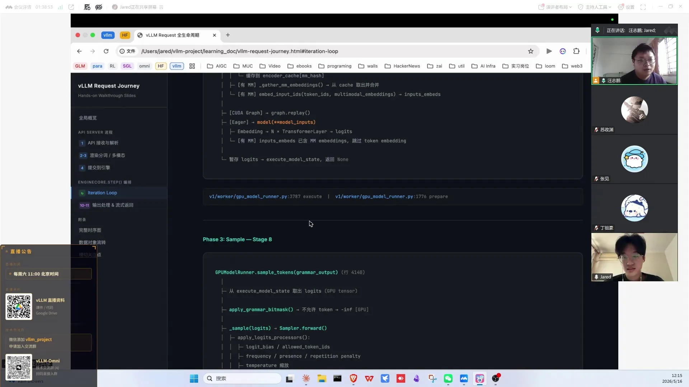 |
| 一个 worker，对吧。然后你实际上起的策略是一样的。整个调度上面的话，比如说你开的是 TP=8 然后 DP=2 的话，他自己会知道我哪一部分的权重应该怎样去进行切割、怎样去分。然后 EP=16 的话，我的那些 expert 就会把它放到 16 张卡上去。 [【跳转到 74:04】](https://www.bilibili.com/video/BV1yrJH6pEFQ/?t=4444) |  |
| 嗯是的。OK 还有吗？这里刚刚稍微漏了一点点，就是 K8s 相关的。然后这个跨机部署的话，我觉得可以在 vLLM 的 recipe 上面找到，就是怎样去做跨机部署。——然后我听他们说就是（那个项目）的话这块做的是很好的，你不需要去了解很复杂的（东西）：他们把整个的部署策略全都有开源的 recipe，你可以直接下载下来，把他的那个 yaml 文件提交上去就行了。 [【跳转到 74:29】](https://www.bilibili.com/video/BV1yrJH6pEFQ/?t=4469) | 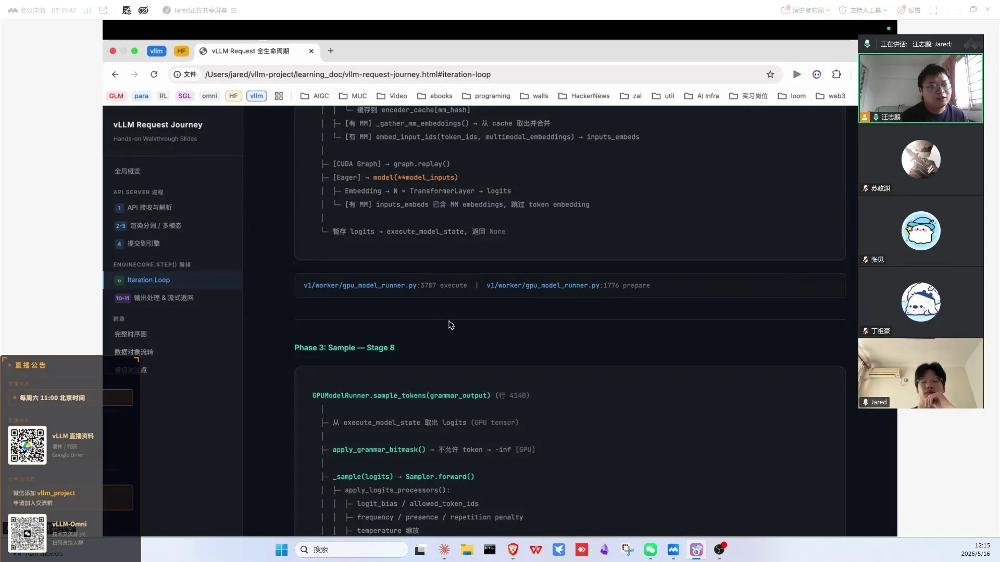 |
| 嗯嗯。——然后是草帽维护的那个社区吗？——对对对，就是他们有一个云原生的（项目），把 vLLM 作为一个（推理）引擎…… [【跳转到 74:54】](https://www.bilibili.com/video/BV1yrJH6pEFQ/?t=4494) | 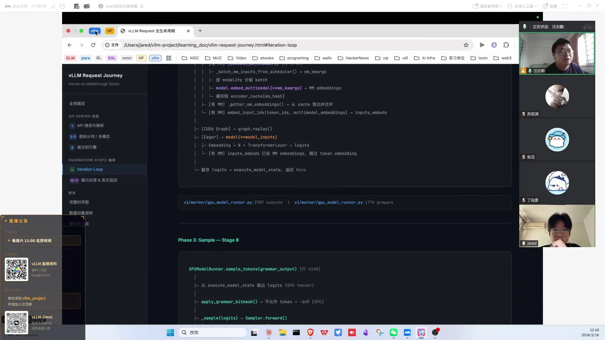 |
| 然后下一个问题就是说请问单卡…… [【跳转到 75:16】](https://www.bilibili.com/video/BV1yrJH6pEFQ/?t=4516) | 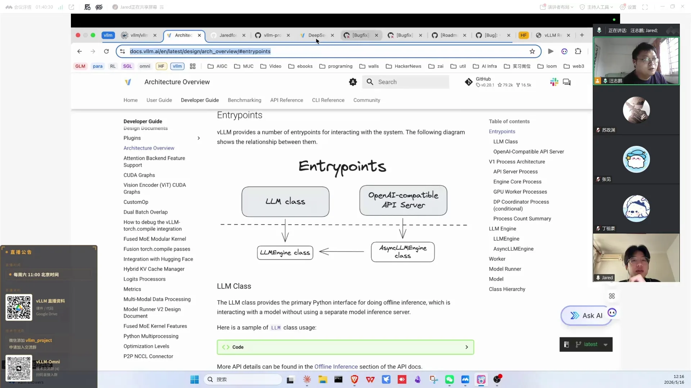 |
| 但是分 stage 情况是有几个 worker？单卡分（多个）stage，那就（问的是）Omni 这一块的东西了。这个就是这样的：Omni 的话它分 stage 的话就相当于是分成了——比如说如果是两个 stage 的话就有两个 engine。一个（stage）的话那它一般来讲肯定就只有一个 worker，对吧。比如说你千问 3（Qwen3-）Omni…… [【跳转到 75:23】](https://www.bilibili.com/video/BV1yrJH6pEFQ/?t=4523) |  |
| 它是有一个 thinker、一个 talker 和一个 Code2Wav，对吧。实际上它就会分成三个 stage，每个 stage 之间是完全分隔的。那我一个 stage 的话应该就只会有一个 engine，一个 engine 的话就只有一个 worker。三个 stage 的话就应该是有三个 engine，三个 engine 里面三个 engine core、三个 worker。 [【跳转到 75:48】](https://www.bilibili.com/video/BV1yrJH6pEFQ/?t=4548) | 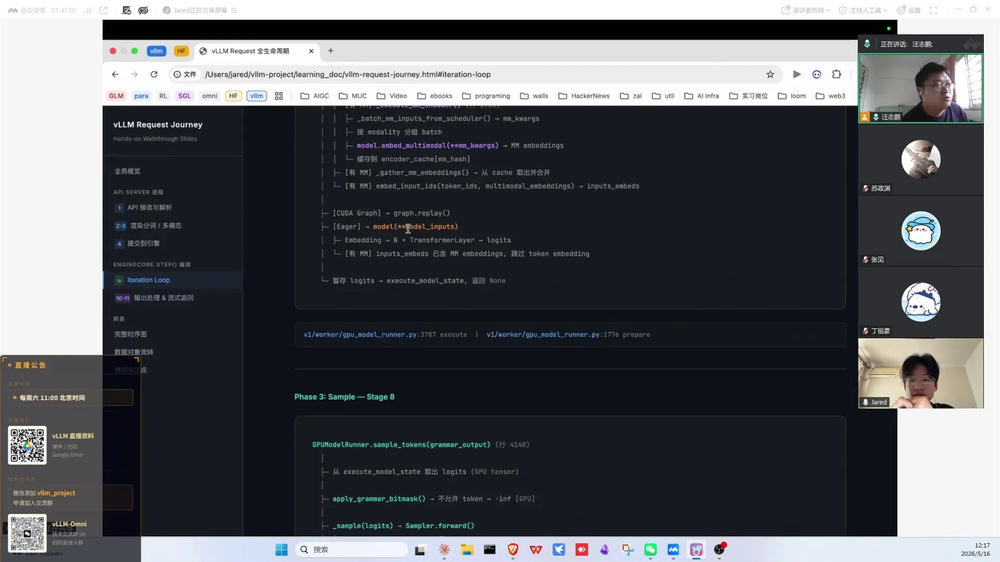 |
| 这就是……然后他说默认情况下一个 DP 有一个 engine core，然后就是有一个 API server——对，这个是对的，一一对应。然后（TP）是跟 DP 一起……然后还有后面问题是：DeepSeek 模型只开 DP 是不是也需要按 layer 做非常多次的同步…… [【跳转到 76:13】](https://www.bilibili.com/video/BV1yrJH6pEFQ/?t=4573) |  |
| 这样会有长尾问题吗？但是（推理的）模型是没有 DP 这种说法，对吧？——对啊，其实 DP 的意思不就是……就是你部署多少个（副本）吗，直接水平扩展。——对，直接水平扩展了，这个东西跟那个（同步）就没关系了。DP 这个东西的话…… [【跳转到 76:38】](https://www.bilibili.com/video/BV1yrJH6pEFQ/?t=4598) |  |
| 其实它是训练里面存在的一个术语。因为我们做训练的时候一般来讲，先把 TP 开满开到八，然后后面就开 DP。然后 PP 的话它和 SP 会存在一个界限：你会发现因为 PP 的整个部署后会存在一个 bubble（流水线气泡），bubble 到一个程度之后，实际上你会发现开 SP 的维度之后…… [【跳转到 77:03】](https://www.bilibili.com/video/BV1yrJH6pEFQ/?t=4623) |  |
| 可能会比单纯去扩展 PP 要好。然后你这时候开完之后，你看你的卡还可以——你现在的部署策略还可以分多少份，那么你再对 DP 的维度去进行扩展。然后 DP 的话因为你这个 loss 的计算——所有的 DP 他需要参与（计算的），所以他就不是纯水平扩展，因为他需要去算 loss…… [【跳转到 77:28】](https://www.bilibili.com/video/BV1yrJH6pEFQ/?t=4648) |  |
| 这也是为什么训练时候会有 DP 了，推理时候只在有 EP 的情况下才会有 DP。好，然后又是问自己怎么能够去单步调试调用栈。——这个的话我后面会专门做一个视频，就是讲怎样去部署这个环境，然后怎样去 debug，对吧。 [【跳转到 77:53】](https://www.bilibili.com/video/BV1yrJH6pEFQ/?t=4673) |  |
| 而且我觉得拿那个千问 0.6B 这种小模型，在自己的电脑上完全可以跑一整遍这个流程，只要你有一个小小的 GPU 就可以，或者甚至 CPU 上你可以（跑）。——对对。然后这个 K8S 相关的东西我们都答不了就不答了，这个我不是很懂。——不懂。对。然后可以讲一下模型和模型之间…… [【跳转到 78:18】](https://www.bilibili.com/video/BV1yrJH6pEFQ/?t=4698) | 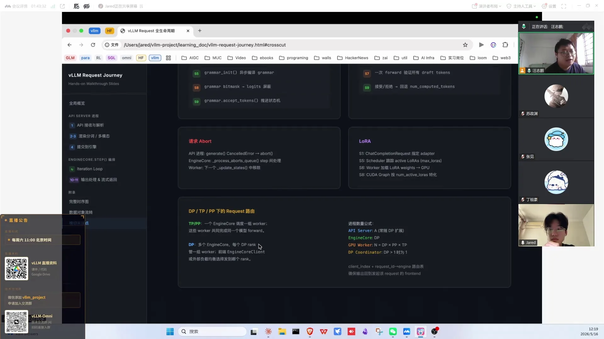 |
| 在 6~8 步骤上有什么不同吗？比如各自需要实现 step 之类的。——什么 6~8 步？什么是 6~8 步啊？这个东西我也不不是很理解。好，然后底下这个观众就说这个 dense model 一般都是开 TP 的。 [【跳转到 78:43】](https://www.bilibili.com/video/BV1yrJH6pEFQ/?t=4723) |  |
| 是的，dense model 的话一般来讲都是开 TP 的。因为我们现在来看，现在常见的 dense model 其实都是比较小的。然后如果你序列长情况下，你可能还需要去开 SP，这样子。——就是 agent serving 那种情况，对。对，而且他这个还有这种说法：其实 vLLM 里面这个东西应该不能叫 SP，vLLM 的专业术语叫 CP。 [【跳转到 79:08】](https://www.bilibili.com/video/BV1yrJH6pEFQ/?t=4748) |  |
| 因为 context parallel 里面的 SP 他做的是把 attention 那个地方的 all-reduce 改了——就是改成了 reduce-scatter 和 all-gather，把它拆开了。但是这个 SP 仅限于做那个 MoE 跨机的时候——这个就是拆这个通讯的策略是有效的…… [【跳转到 79:33】](https://www.bilibili.com/video/BV1yrJH6pEFQ/?t=4773) |  |
| （其他场景）想想就不是很有效。好，然后如果支持一个模型，需要具体实现这几个步骤里面的哪个环节？——如果你是要具体实现模型的话，其实这些步骤里面你都不需要去做，因为这东西是框架里面有的。你想实现这个模型的话…… [【跳转到 79:58】](https://www.bilibili.com/video/BV1yrJH6pEFQ/?t=4798) |  |
| 你只用在那个 models 目录里面——对对对，点开一个 models，然后 models 里面你可以看你要实现这个模型跟哪个模型相像，你就可以照着他那个依葫芦画瓢去改就行了。——对嗯嗯。然后如果是我做负载均衡的话…… [【跳转到 80:23】](https://www.bilibili.com/video/BV1yrJH6pEFQ/?t=4823) | 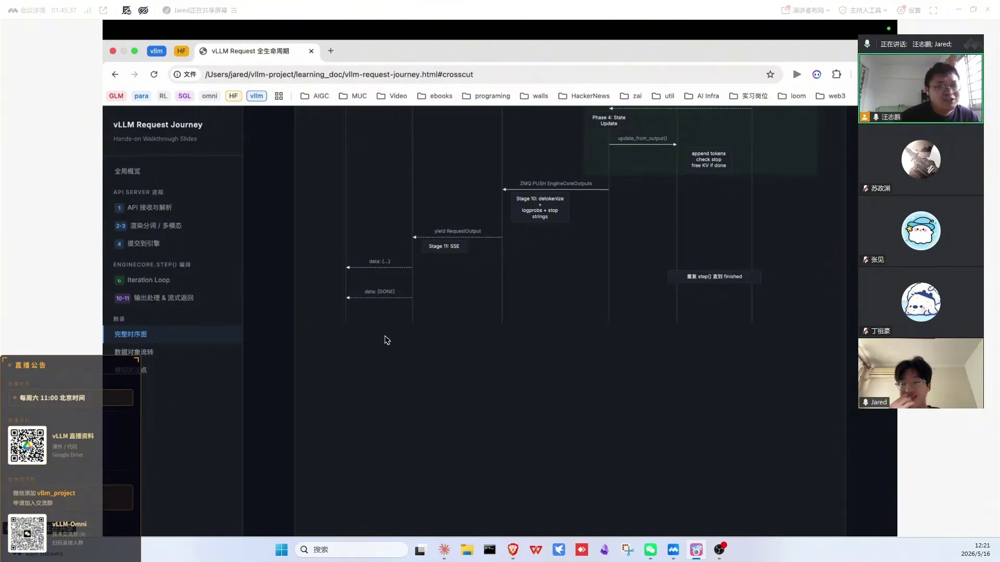 |
| 这一块地方首先一般来讲是有那种 semantic router 这种东西的。semantic router 的话就是他会按照你的机器的负载、你的 prefix cache（命中）、还有像你是不是同一个 session 的请求，然后去做的这个。——OK。然后关于 debug 这一块的话…… [【跳转到 80:48】](https://www.bilibili.com/video/BV1yrJH6pEFQ/?t=4848) |  |
| 我们后面会出一个专门教程，教你怎样做 vLLM 的 debug。嗯嗯，然后这个就是一些前置的知识：你大概知道分成几个部件，然后哪个部件大概负责些什么，你有什么问题的话你应该先去看哪里，大概是这样一个。我觉得把它理解成一个地图上的东西，不会特别详细，然后你要自己去探索你自己感兴趣的那一块…… [【跳转到 81:13】](https://www.bilibili.com/video/BV1yrJH6pEFQ/?t=4873) |  |
| 你探索哪一块。但是有这个完整的图之后就会有的放矢一点。然后还有个问题啊：就是说 SP 和 CP 的区别是什么啊？——这个问题其实是一个非常大的问题，因为他这个东西首先是训练里面存在这个 SP 和 CP 的，而且训练里面这个东西非常复杂…… [【跳转到 81:38】](https://www.bilibili.com/video/BV1yrJH6pEFQ/?t=4898) | 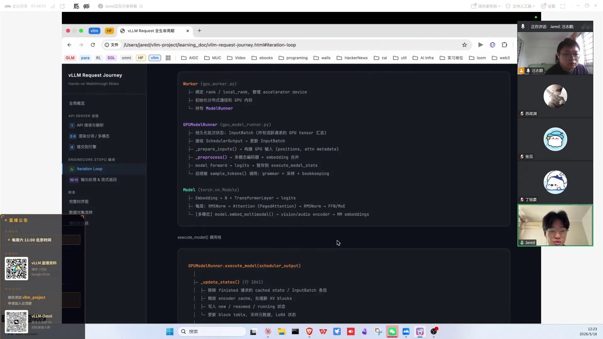 |
| 因为它是分 Megatron 和那个 DeepSpeed，它是有两套去实现的。然后因为我们这个专题主要是讲推理的。推理这一块的话其实它也是分 vLLM 和这个 vLLM-Omni。vLLM 里面的话它的 SP 就仅仅是对他的通讯做了一个改动，就是他的通讯算子做了改动。然后外面的话它的 CP 其实是…… [【跳转到 82:03】](https://www.bilibili.com/video/BV1yrJH6pEFQ/?t=4923) |  |
| 我们一般就是我们所常规理解的这个（训练里的）SP。CP 的话它分为 PCP 和 DCP，然后 CP 才是正儿八经地对序列上面进行一个（切分）。然后在 vLLM-Omni 的话，因为他主要是一些那种（生成）任务，（生成）任务里面的话它就是分成这个 Ulysses parallel 和那个 ring attention…… [【跳转到 82:28】](https://www.bilibili.com/video/BV1yrJH6pEFQ/?t=4948) | 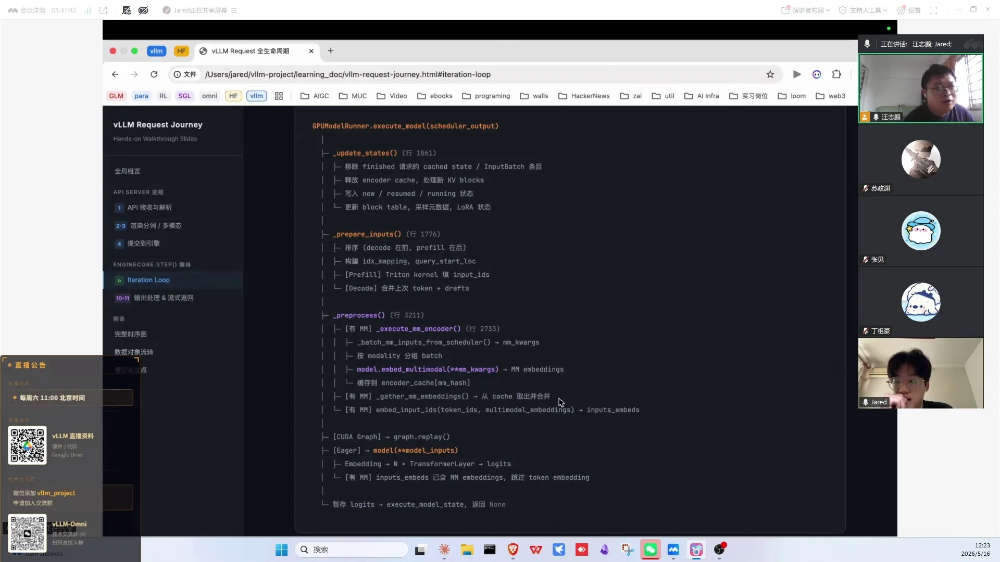 |
| 然后两个一起用的话就是 USP，他的基本上并行都是在 attention 地方做的并行。然后这块地方的话，这个东西如果要讲清楚的话可能几个小时讲不完，因为这块地方的概念特别专业，涉及到很多的（东西）：算你的这个通讯……通讯算子…… [【跳转到 82:53】](https://www.bilibili.com/video/BV1yrJH6pEFQ/?t=4973) |  |
| 然后你这个计算是怎么做的，包括你的这个通讯量，这东西就很复杂，这一块是的。嗯好，然后对，就是如果你在想做模型贡献的话，其实你只需要在 model 里面去写就行了，其他所有东西都通用的。——哦哦，speculative decoding 的话可以应用在哪些场景？ [【跳转到 83:18】](https://www.bilibili.com/video/BV1yrJH6pEFQ/?t=4998) |  |
| 这个 speculative decoding 话就是基本上就是应开尽开、加速。因为他属于是非常少的在推理加速的这个里面：首先它对于资源的额外消耗非常的小，其次的话他可以做到这种无损的加速。嗯，而且他加速效果也是比较可观的。——对对，然后有开三就开四推三…… [【跳转到 83:43】](https://www.bilibili.com/video/BV1yrJH6pEFQ/?t=5023) | 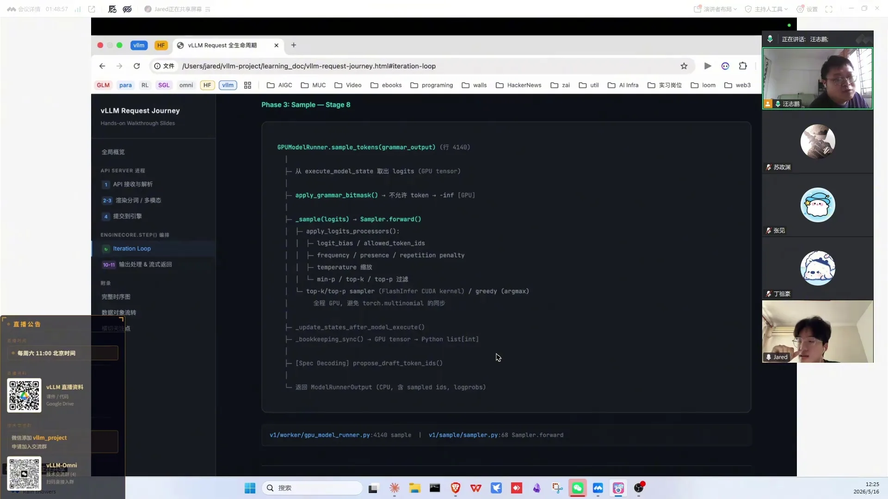 |
| 或者他那个猜中率一般都能到 2.2 到 2.7 以上，就是那个加速真的可以到接近三倍。真的很快，真的。——对。哎，然后这个 speculative decoding 的弊端，我觉得可能只在训练时候可能会出现一些很麻烦的事情。因为训练里面做这个 RL 的 rollout 的时候…… [【跳转到 84:08】](https://www.bilibili.com/video/BV1yrJH6pEFQ/?t=5048) |  |
| 他这块地方一般是会开 speculative decoding 的，但是你的这个权重会发生偏移。所以说你这个 speculative decoding 实际上还需要再套一层 SFT 去做，对他做训练。要不然的话你这个 acceptance 在训练后期会变成一个负收益。然后这就导致他的 infra 变得非常复杂。如果是纯推理的话，这个 speculative decoding 是应开尽开，你们可以去跑一些那种脚本…… [【跳转到 84:33】](https://www.bilibili.com/video/BV1yrJH6pEFQ/?t=5073) |  |
| 然后去测一下在什么样配置下面效果最好，对吧，然后把默认无脑开上就行了。——那这个东西取决于你的硬件，有些时候开一（层）好，有些时候开三好，就是取决于你的硬件。我觉得你可以简单测一下。——对，因为因为现在我觉得还好…… [【跳转到 84:58】](https://www.bilibili.com/video/BV1yrJH6pEFQ/?t=5098) |  |
| 现在的话因为我们（V3/R1 这些）都是原生做 MTP 的。然后以前的话就是会有部署两个模型，对吧，一大一小。当时这一块的话其实非常难做的，因为 vLLM 他的部署策略实际上是要求每个模型他的 GPU utilization 在每个卡上得是一样的，对吧…… [【跳转到 85:23】](https://www.bilibili.com/video/BV1yrJH6pEFQ/?t=5123) |  |
| 然后你的小模型的话实际上是不能够采用跟大模型一样的部署策略。至少是小模型的话，其实你可能就比如我大模型在八张卡上部署，我小模型的话他可能在一张卡上部署就够了。那么我小模型我可能会默认就直接占了一个 10% 的 GPU（资源），然后我大模型占个 80%…… [【跳转到 85:48】](https://www.bilibili.com/video/BV1yrJH6pEFQ/?t=5148) |  |
| 那么我在一张卡部署（小模型），剩下七张卡我可能想（跑别的东西），因为我这个部署的（占用）导致其他的 10% 的空间全都浪费掉了。——是这样，对对是的。——然后后续会考虑专门讲一下并行策略吗？就是推理和训练（的）。这个东西可能会有，如果我们讲的话可能会分很多很多期讲…… [【跳转到 86:13】](https://www.bilibili.com/video/BV1yrJH6pEFQ/?t=5173) |  |
| 特别训练和推理这一块的话其实差别还是很大的。因为我们推理的话一般来讲是不会去开 PP 的，但是训练的话这一块是必开 PP 的。而且训练这块就是 PP 很复杂，因为 PP 里面它涉及到这个 backward，对吧。然后 backward 的话他那个（梯度）是可以拆开的嘛，就导致我们是需要去填…… [【跳转到 86:38】](https://www.bilibili.com/video/BV1yrJH6pEFQ/?t=5198) |  |
| 他那个流水线里面的 bubble，整个东西就会变得很复杂。然后训练的话现代化就是不管是预训练还是那个 RL 的话，基本上都是很大的工程。——好，然后投机解码在多机并行情况下有什么需要注意的问题？——投机解码这块我是没有参与过开发的，我基本上只是用过。 [【跳转到 87:03】](https://www.bilibili.com/video/BV1yrJH6pEFQ/?t=5223) |  |
| 我只用过。用过的话反正我建议就是单机内——对，开开就好了。——我们那 OCR 都有 MTP，很神奇吧，我找了一个模型。——是的。——这个东西真的属于是算是我们这行业（近年）很伟大的发明了。——对，我也觉得非常伟大。 [【跳转到 87:28】](https://www.bilibili.com/video/BV1yrJH6pEFQ/?t=5248) | 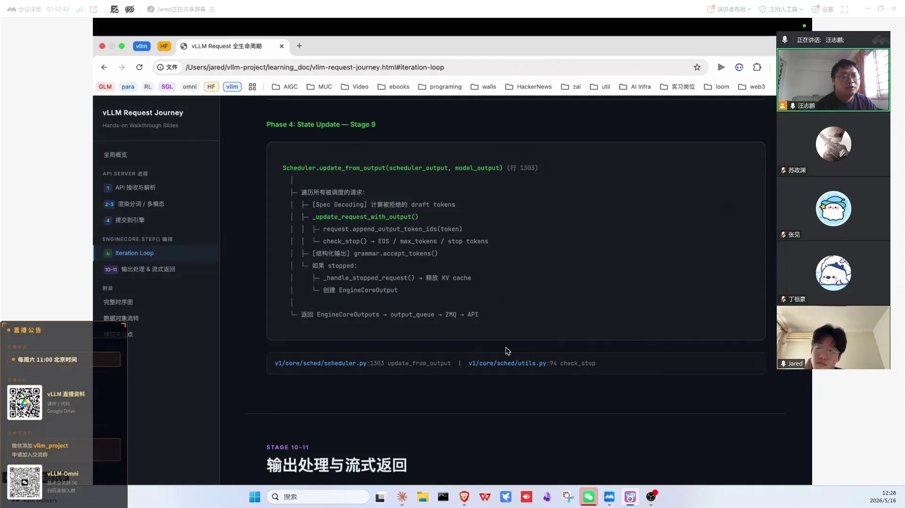 |
| OK 好。然后只有 decode 的阶段才开 speculative decoding。——是的，这个（投机解码）只在 decode 的时候是存在的。我之前也想过：就是 prefill 第一次他是不会猜（得很好）的，实际是不会的。而 prefill 我们只做一次 forward 的，decode 的核心是在于用一根小的…… [【跳转到 87:53】](https://www.bilibili.com/video/BV1yrJH6pEFQ/?t=5273) |  |
| 就是比如说我一次可以进行好多字、好多（个）解码，然后我用那个模型相当于对这个解码进行验证，对吧。我 decode——但 prefill 只有一次，对吧，我一个请求只有一次 prefill。所以说它其实只在 decode 里生效的。——嗯对，然后 MTP 也是一种自带的投机（加速）策略。——是的。 [【跳转到 88:18】](https://www.bilibili.com/video/BV1yrJH6pEFQ/?t=5298) |  |
| 然后 vLLM 会考虑对多硬件后端做更多抽象吗？——其实现在 vLLM 对于多硬件后端抽象了，已经做得很好。现在至少所有后端硬件的话，它都是类似于 plugin 的形式放进去的。——是的，然后我觉得后端要想支持更多硬件的话…… [【跳转到 88:43】](https://www.bilibili.com/video/BV1yrJH6pEFQ/?t=5323) |  |
| 核心还是在于硬件厂商他能不能够做出更多的、做更好的 kernel 进去。因为我们跨到不同硬件的话，它实际上跑模型的话它的精度上是有区别的。那么这些厂商他就需要去做更多 kernel，然后去控制好这个精度。否则的话这个模型可能就是在 vLLM 这里基本上属于没有办法去使用的。 [【跳转到 89:08】](https://www.bilibili.com/video/BV1yrJH6pEFQ/?t=5348) |  |
| 这也需要硬件厂商跟我们多沟通，然后把这个（精度）管理好。——哦，我刚刚有个问题，刚刚好有个误区吧。或者说就假设你看 MTP 的话，其实 prefill 的时候他也会猜三个，但他没有验证——是这样，可是他只跑一次，但是他会猜三个但是他没有验证。所以 prefill 那个，他会把那个猜出来的——假设你做 PD 分离，P 的那个部分…… [【跳转到 89:33】](https://www.bilibili.com/video/BV1yrJH6pEFQ/?t=5373) |  |
| 你开的 MTP，他会猜三个，但是（这些）都会丢给 decode 那个阶段去做一个验证，因为他需要下一次的 forward 来验证嘛。大概是这样。嗯 OK 好。然后他说当前国产模型做（vLLM 适配）的这个（上游）版本一变动，同步很累。——对，因为我们现在的话就是因为我没有做过这个…… [【跳转到 89:58】](https://www.bilibili.com/video/BV1yrJH6pEFQ/?t=5398) |  |
| 多硬件的这种东西，但是我们做过很多比如去跟 vLLM（上游）那些版本做一些 rebase 的东西。我们在前端的话会观察到，比如说前端是有一些改动的话，那我们 rebase 的话也会变得很麻烦。然后现在有很多时候用 AI 去 rebase，rebase 完之后再去跑整套的 CI。我觉得后面基本上所有的开发应该都是以 CI 作为驱动的…… [【跳转到 90:23】](https://www.bilibili.com/video/BV1yrJH6pEFQ/?t=5423) |  |
| 因为现代化就……对，一个是这个 rebase 的时候可能会变得很（麻烦），就是你不知道这个代码到底是不是有其他代码会失效；还有就是现在这个 vibe coding 的话很有可能会把其他地方给改动，所以把 CI 做好的话我觉得……然后后面的话就是每次做一些同步的话，大家尽量依靠 AI…… [【跳转到 90:48】](https://www.bilibili.com/video/BV1yrJH6pEFQ/?t=5448) | 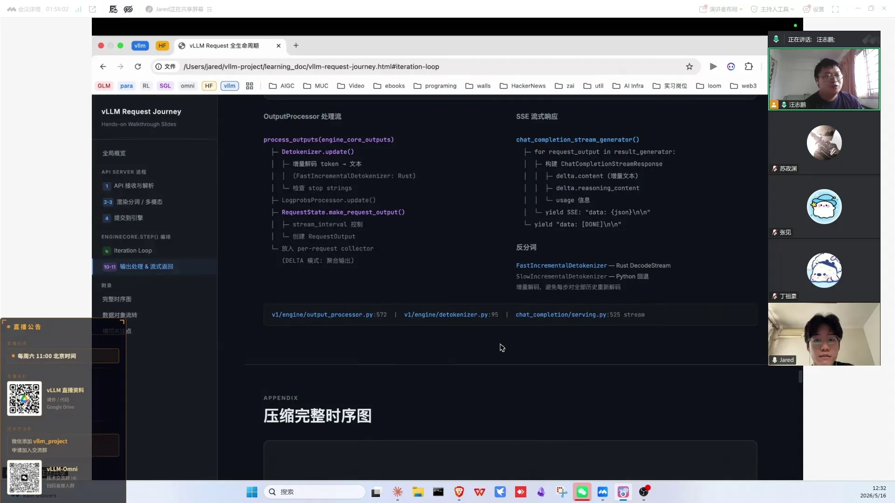 |
| 就这样子。——哦然后对，底下他也说了这个 prefill 也是可以开的。然后他说这个 PD 分离里面 prefill 是开 MTP 的。——是的。——哦，然后请问多轮对话中上一轮的记忆是怎么拼到下一轮请求的？ [【跳转到 91:13】](https://www.bilibili.com/video/BV1yrJH6pEFQ/?t=5473) |  |
| 这个不是 vLLM 的事情，是你在调用的时候怎么管理你的这个对话的东西。一般来讲是这样，因为最开始比如说你开始去学一些那种 agent 相关的，其实这东西是你自己有个 context 的管理…… [【跳转到 91:38】](https://www.bilibili.com/video/BV1yrJH6pEFQ/?t=5498) |  |
| 对对，你要把它拼接到这一块。 [【跳转到 91:52】](https://www.bilibili.com/video/BV1yrJH6pEFQ/?t=5512) | 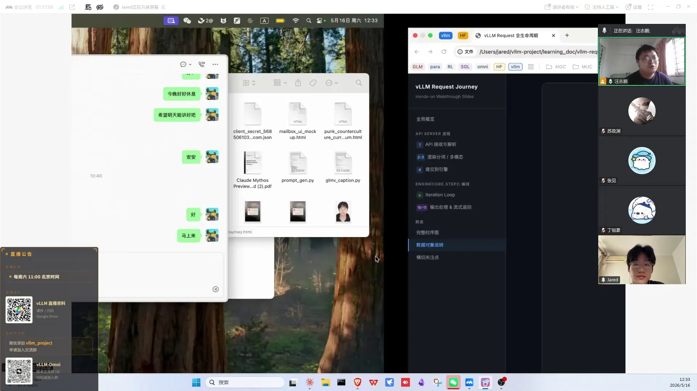 |
| 可以大概理解成这样：我这个 message 是单个 message，但是你要给它拼接到一起——就是你把上次的问题、上次的输出，然后再拼一个你这次的问题，就一直一直这样拼上去的。然后我可以稍微看一下那个 chat template 这一块。刚刚我就是拼了两个东西，对吧。你也可以在这里再扩展。好的，开玩笑。就这块你可以在后面再扩展上来…… [【跳转到 91:57】](https://www.bilibili.com/video/BV1yrJH6pEFQ/?t=5517) | 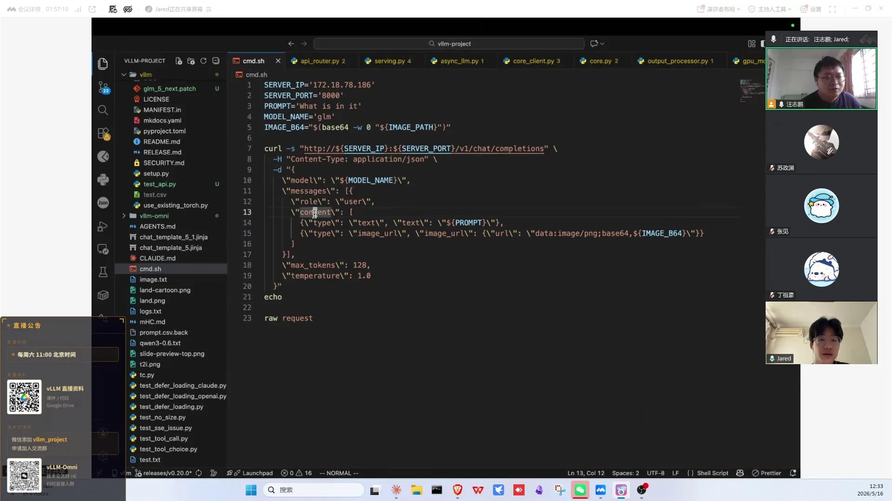 |
| 比如这里 user 的（输入）大概是什么样，对吧，这里就是模型的回答大概是什么样。然后你可以再接一个你的问题，大概是这样，就是你接一个你的 user（消息）巴拉巴拉巴拉。然后这样拼起来就是这个对话的管理。 [【跳转到 92:22】](https://www.bilibili.com/video/BV1yrJH6pEFQ/?t=5542) | 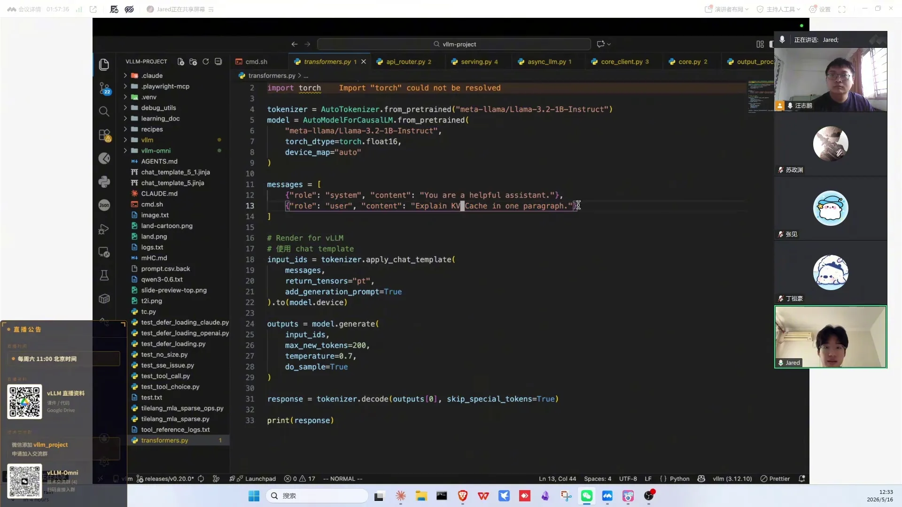 |
| 不是 vLLM 的管理，是你自己这一层的管理，大概是这样。——对，然后我们 prefix cache 的话相当于会拿这些 token 然后去构成一个——相当于一个 chunk，他会类似构成一个哈希值，然后要用这个 hash 值去匹配，看一下可以用多少的（前缀）…… [【跳转到 92:47】](https://www.bilibili.com/video/BV1yrJH6pEFQ/?t=5567) | 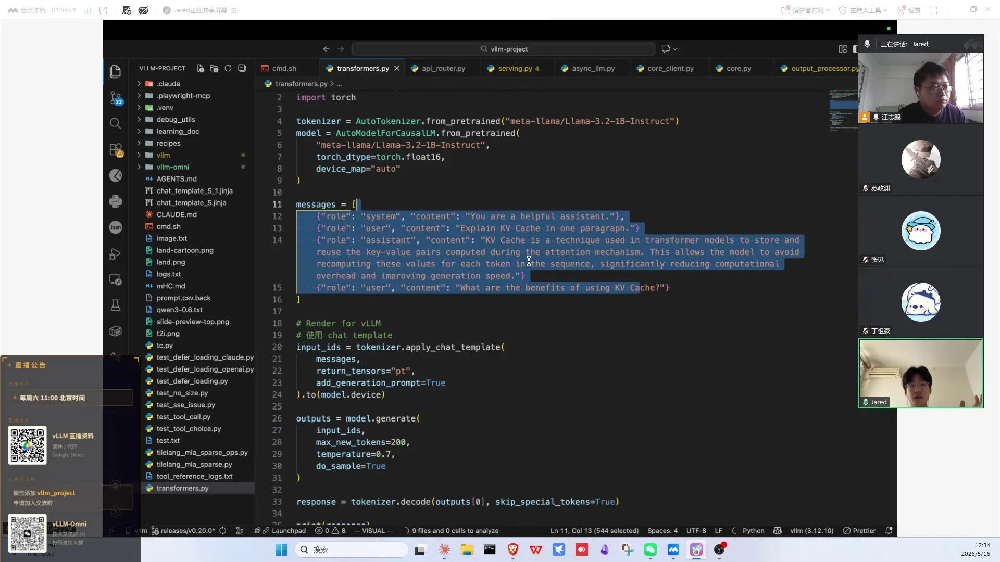 |
| attention 的这个 KV 直接来做复用，是这样子。好，然后还有就是说高并发情况下开 MTP 容易导致计算限制，有（遇到过吗）？——我没有遇到过。诶是什么意思，这个东西我也不是很了解，我觉得我没有遇到（过）那么高（并发）。你自己遇到这种 bug 你再自己去修调整。 [【跳转到 93:12】](https://www.bilibili.com/video/BV1yrJH6pEFQ/?t=5592) | 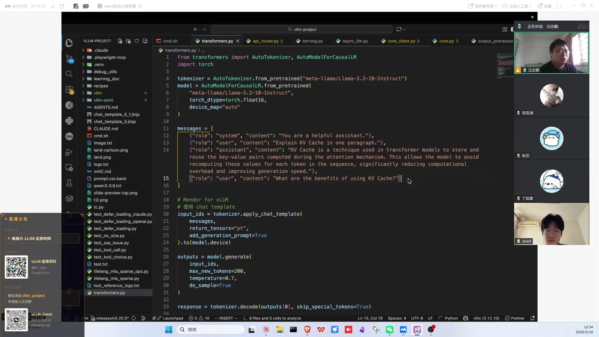 |
| 我们没有这种服务经验的。——高并发需要验证的太多，容易阻塞请求。——嗯嗯，如果是高并发的话，我觉得还是多做一些水平扩展可能会好一些。——嗯嗯，因为我感觉的话就是那个一个 instance…… [【跳转到 93:37】](https://www.bilibili.com/video/BV1yrJH6pEFQ/?t=5617) | 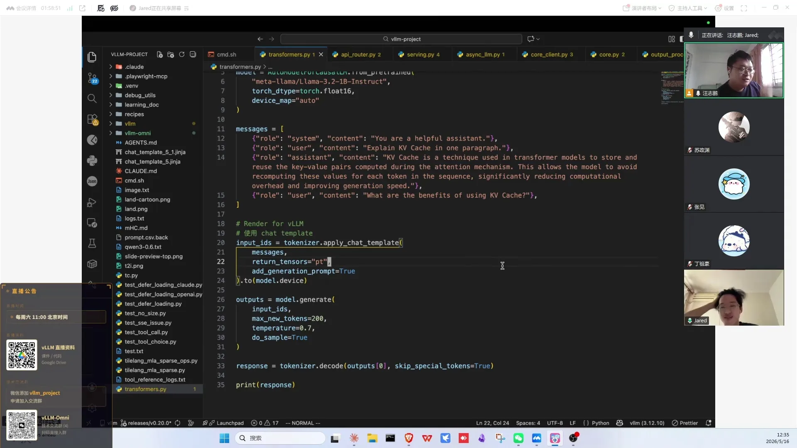 |
| 他没有办法去支撑太高的（并发）。是的，你可能还得做 load balancer，然后外面再来一层统一的接收入口，之后 load balancer（分发）出去。——然后一个 vLLM 实例只有对应一个 API server 是吗？——开 DP 应该不是的吧，就是取决于你怎么认识这个 vLLM 实例。我们这个 vLLM 实例后面有太多东西了，你是指 engine core…… [【跳转到 94:02】](https://www.bilibili.com/video/BV1yrJH6pEFQ/?t=5642) | 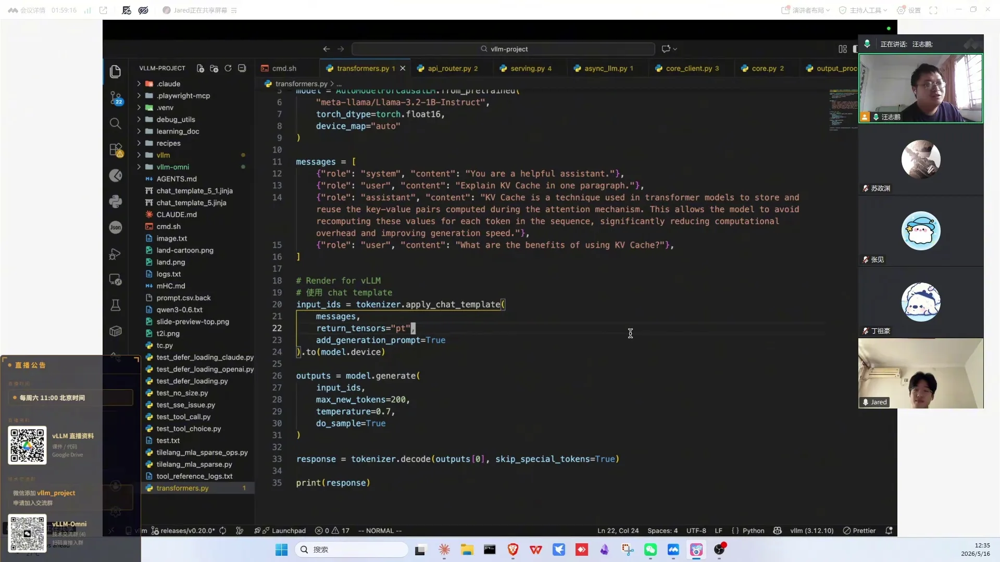 |
| 有一个还是指 engine client 有一个，还是巴拉巴拉，就是你取决于你怎么认识这个 vLLM 实例。——嗯嗯，但是如果你开 DP 的话其实就不是——就是有 DP=2 那 API server 它也能有二（个）？——对，差不多。——但我其实刚刚稍微漏了一些…… [【跳转到 94:27】](https://www.bilibili.com/video/BV1yrJH6pEFQ/?t=5667) | 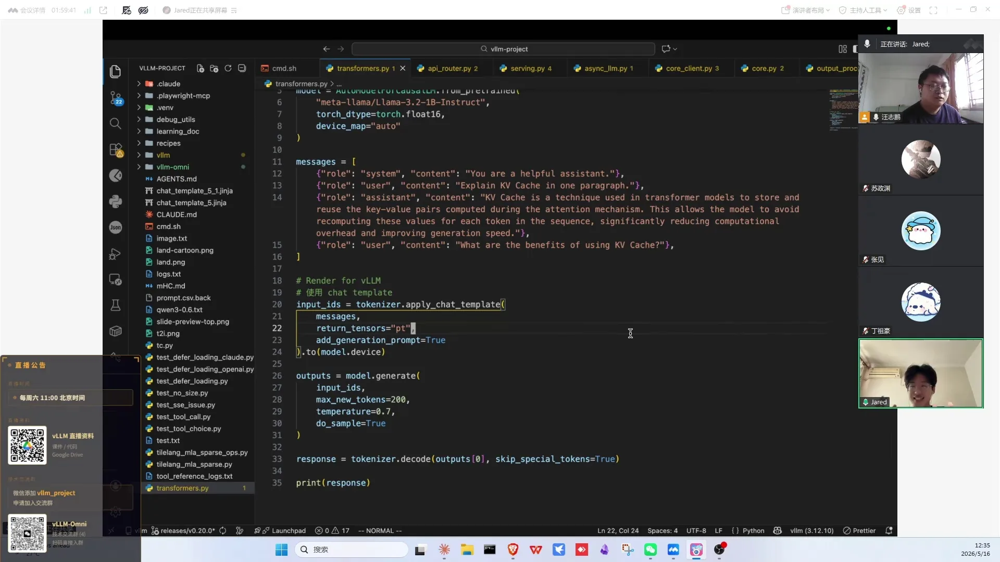 |
| 没讲处理输出还有 detokenize 那个相关。我觉得对，可以接着讲，简单讲一讲，也不多了。嗯，刚刚是说到 sampler 这块。我们刚刚这块就是多模态相关的，你要把 input 变成一个 embedding 嘛，然后才进入到这一块。这一块就是语言模型比较通用的这种 forward 的过程。然后如果你开了投机解码的话，它就会直接填充一些东西…… [【跳转到 94:47】](https://www.bilibili.com/video/BV1yrJH6pEFQ/?t=5687) |  |
| 然后 replay 那个过程，如果没有开的话，那就是（正常）的形态，直接跑那种比较原始的往前走。然后计算完之后他就会把计算好的那个 logits 直接存到这个里面。一般是这样：你 model 这一块出来的输出是一个 hidden states，是最后一层的 hidden states，然后你还要做一个小的步骤…… [【跳转到 95:12】](https://www.bilibili.com/video/BV1yrJH6pEFQ/?t=5712) |  |
| 就 execute model 这一块，他在这个 forward 完之后他会做一个 compute logits，然后把那个走一个 softmax，变成一个 logits，然后把这 logits 存到这个 execute model state 这一块。存进去之后，scheduler 会稍微处理一下，拿到一个 sampler output…… [【跳转到 95:37】](https://www.bilibili.com/video/BV1yrJH6pEFQ/?t=5737) |  |
| 他就不只是 engine core——不只是这个 model（输出）。OK，然后拿到这个东西之后，我们再拿给 GPU 去处理，去处理这样一个 sampling 的过程：就 apply sampler、softmax、argmax，然后实际执行 sampler 的 forward。OK 这里也是 GPU 参与的，然后这一块也会有点消耗性能。大概是这样，就是（通过日志）可以看…… [【跳转到 96:02】](https://www.bilibili.com/video/BV1yrJH6pEFQ/?t=5762) |  |
| 可能就是你在（服务）启动的时候你稍微关注一下那个日志，它是有写的：OK 你这个 sample 是哪个 backend 在做，大概率时候都是 FlashInfer 在做。OK，然后 sample 完之后它会输出一个 token 出来。然后这个 token——也就是这个 model output 和 scheduler output 会一起放到这个 scheduler 的 update from output 里面，然后他就计算你这个请求有没有结束…… [【跳转到 96:27】](https://www.bilibili.com/video/BV1yrJH6pEFQ/?t=5787) | 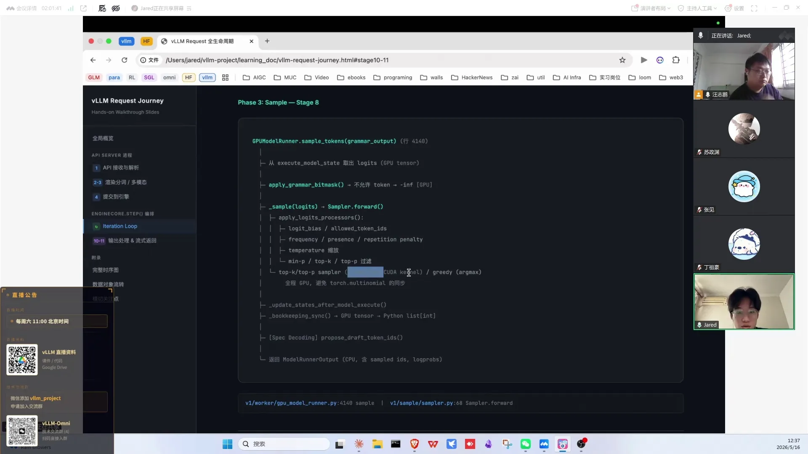 |
| 如果你这个 speculative decoding 的话，那他还会把那些被拒绝掉的东西——就计算下那个被拒绝掉的东西，再给它丢掉，把被接受的塞回去，然后我们接着再往后算。然后这里也会返回一个 engine core output，然后这个 engine core output 后面的话就会通过还是那个 step 那一块…… [【跳转到 96:52】](https://www.bilibili.com/video/BV1yrJH6pEFQ/?t=5812) |  |
| 他会把这个（output）放到 output queue 里面。那 output queue 会接着通过 ZMQ 这个通讯给他传回到我们的 API 层。然后 API 层这一块，它会再做一个 detokenization 的动作，就是把我们拿到的 token id detokenize 变成一个我们能看到的（文本）。大概是这一块。然后这一整块的流程已经出现在这里了：就是我们的 GPU worker sample token…… [【跳转到 97:17】](https://www.bilibili.com/video/BV1yrJH6pEFQ/?t=5837) |  |
| 结束之后，我们就 scheduler 会稍微处理一下，把这个变成 engine core output。然后 engine core 这一块它会通过这个 output queue 给他推回到——还记得这个吗，这是 engine core client。这个 engine core client 它再会传到这一块，就是 engine client，这里就会对他的 output 做一个 process。 [【跳转到 97:42】](https://www.bilibili.com/video/BV1yrJH6pEFQ/?t=5862) |  |
| 这里有几个步骤：一个步骤是我们刚刚说的 detokenize，就是把 id 变成我们能看懂的 strings；然后 logprobs 就是取决于你在调用的时候你有没有向他要一个 logprobs。如果有的话他会给你一个 logprobs，就是看他的那个概率分布，这个一般是你 debug 的时候用的。然后拿到了结果之后…… [【跳转到 98:07】](https://www.bilibili.com/video/BV1yrJH6pEFQ/?t=5887) |  |
| 我们再会通过这个 generate output 出去。然后这一块我觉得可以直接从这一块开始看，就 engine client 这里。嗯，我们翻看代码。 [【跳转到 98:32】](https://www.bilibili.com/video/BV1yrJH6pEFQ/?t=5912) |  |
| （代码）在这里，有一个（output handler）。 [【跳转到 98:42】](https://www.bilibili.com/video/BV1yrJH6pEFQ/?t=5922) | 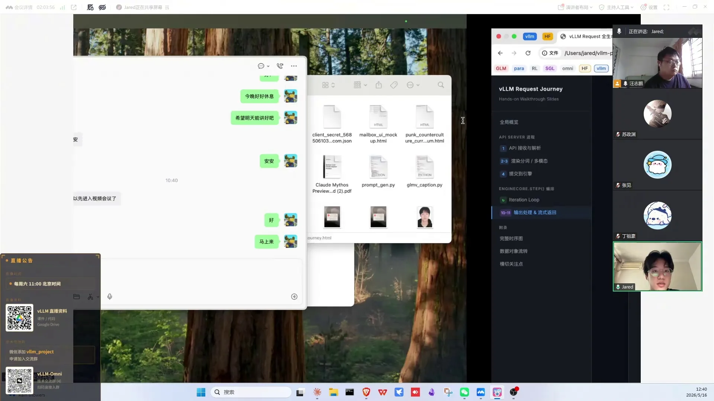 |
| 他也有（对应）……呃呃，下面在这里，叫 run output handler。它其实就是在那个 output queue 里面——看到没有，这是 output processor。你把那个 output queue 里面拿到这个 output——在（engine client）里面是拿到这个 output。这个 output 的话…… [【跳转到 98:47】](https://www.bilibili.com/video/BV1yrJH6pEFQ/?t=5927) | 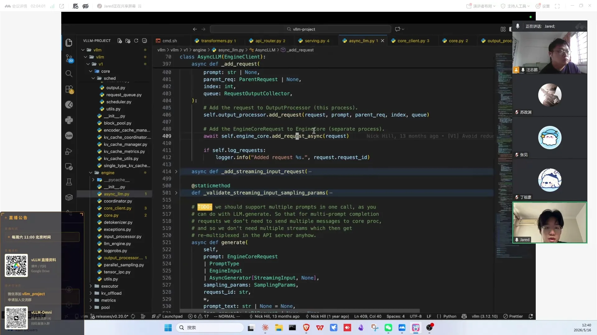 |
| 他会做一些简单的处理，然后在 output processor 里面去 process output。然后我们点进去看。 [【跳转到 99:12】](https://www.bilibili.com/video/BV1yrJH6pEFQ/?t=5952) | 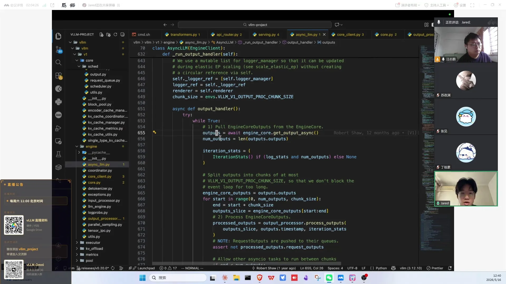 |
| 点进去看，然后我们就来到了 output processor 这个类里面。这个类其实做一件比较简单的事情…… [【跳转到 99:18】](https://www.bilibili.com/video/BV1yrJH6pEFQ/?t=5958) | 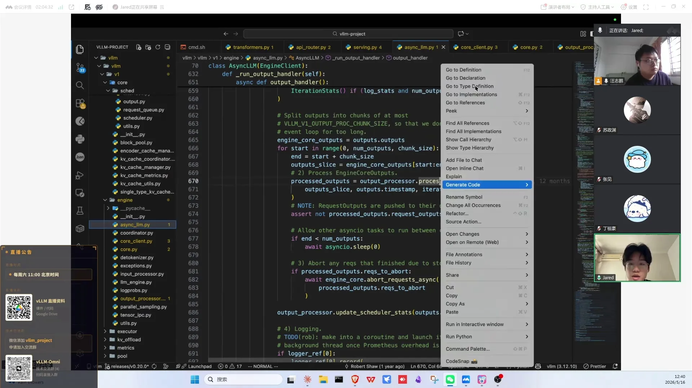 |
| 就是 update states from output。然后呢，新的 token id，然后我们放到（解码器）这里去，然后做一个 update，拿到这个 string。然后如果你需要（logprobs）的话，那他就会拿到这个 logprobs 放到这里面，然后组装一个 request output，最后给他传出来。 [【跳转到 99:23】](https://www.bilibili.com/video/BV1yrJH6pEFQ/?t=5963) | 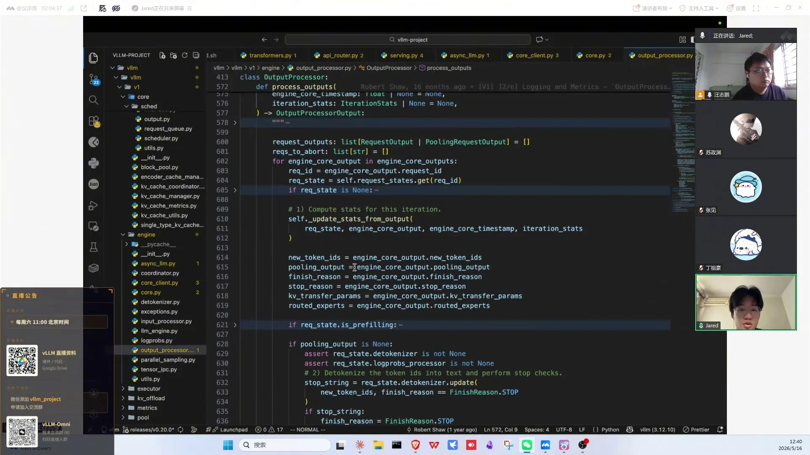 |
| 所以传出来你就会拿到这个 request output——这里面就已经是可能有了 logprobs：如果你需要他返回的话他就有 logprobs；如果没有的话那可能里面只有一些已经 detokenize 好的那些东西。然后我们就给他放回去，接着往回传。传到这个 output processor——这个 scheduler states 啊这些，感兴趣的会再看这些细节。 [【跳转到 99:48】](https://www.bilibili.com/video/BV1yrJH6pEFQ/?t=5988) | 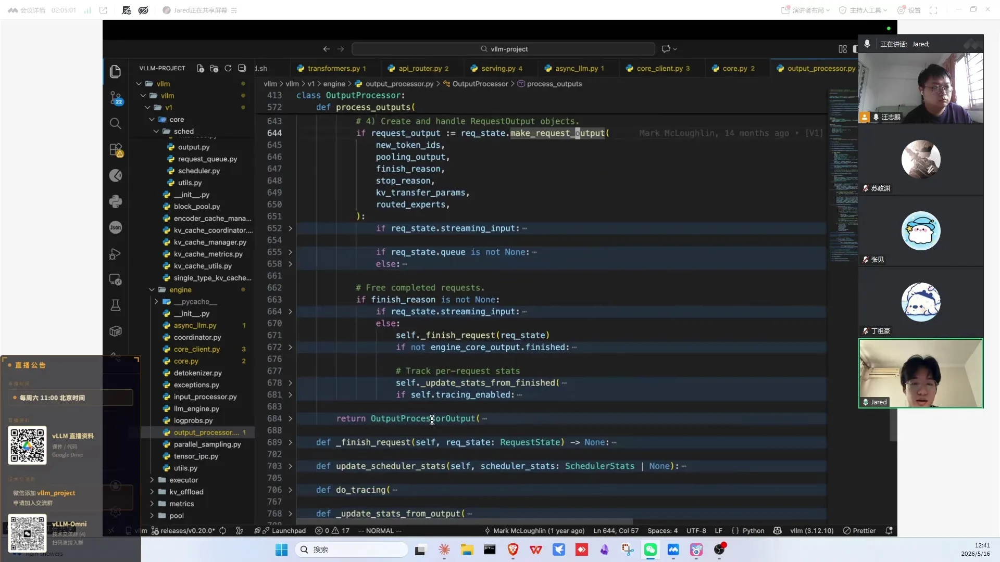 |
| 然后他就会来到这块。我们 generate——还记得吗，一开始我们是把这个 add request（发出后），这里有个 request output collector，就是他在这等着有没有结果出来。然后他就在这一直等，这个 for loop——他有这个 while loop 一直在等，然后就能拿到这个 output。只要这个 output 他不是 finished，他就会一直 yield 出来。 [【跳转到 100:13】](https://www.bilibili.com/video/BV1yrJH6pEFQ/?t=6013) | 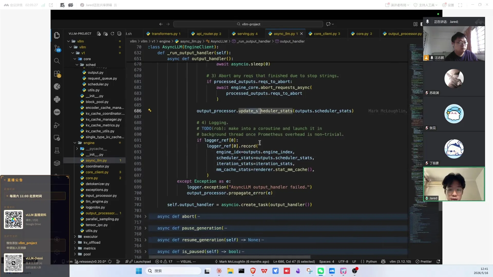 |
| 我们回过头来看一下它 yield 在哪里。这块因为他是——一开始我们（调）generate，他会返回一个 generator。这个 generate 其实是一个挺 Python 本身的概念，对吧，就是 yield 和 generate 放在一起。然后我们再把这个 generator 放到两个模式里面。如果——我的这个（请求）是没有指定 stream 等于 true…… [【跳转到 100:38】](https://www.bilibili.com/video/BV1yrJH6pEFQ/?t=6038) | 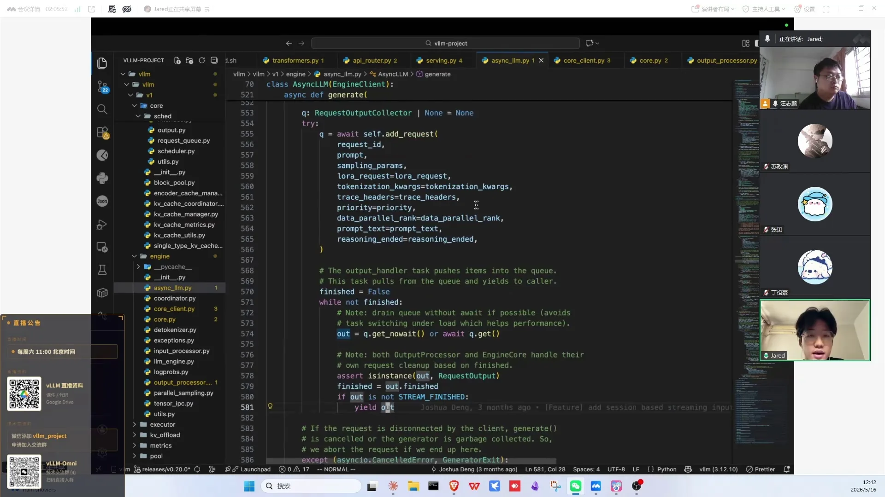 |
| 那它最终会返回一个 JSON，一个很完整的 JSON：就是他完全跑完之后他再出一个 JSON。如果你是 stream true 的话，你能看到他是一个 SSE 的那种一直往外推。我可以试着给大家打一下…… [【跳转到 101:03】](https://www.bilibili.com/video/BV1yrJH6pEFQ/?t=6063) | 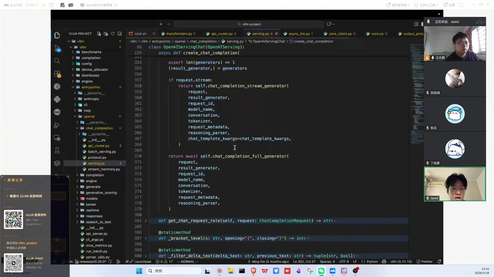 |
| 这个请求，因为我刚刚已经部署起来的一个服务。——哦哦哦不对，那是没有，没有这个东西。——OK，可以，可以试一下，我还没验证过，应该能打通。 [【跳转到 101:23】](https://www.bilibili.com/video/BV1yrJH6pEFQ/?t=6083) | 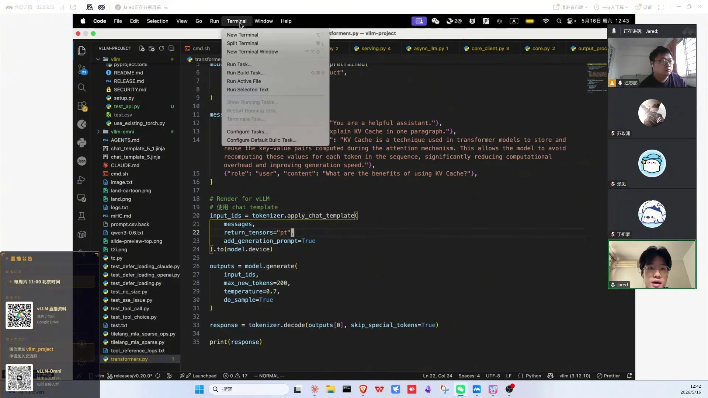 |
| （curl）应该可以打。 [【跳转到 101:38】](https://www.bilibili.com/video/BV1yrJH6pEFQ/?t=6098) | 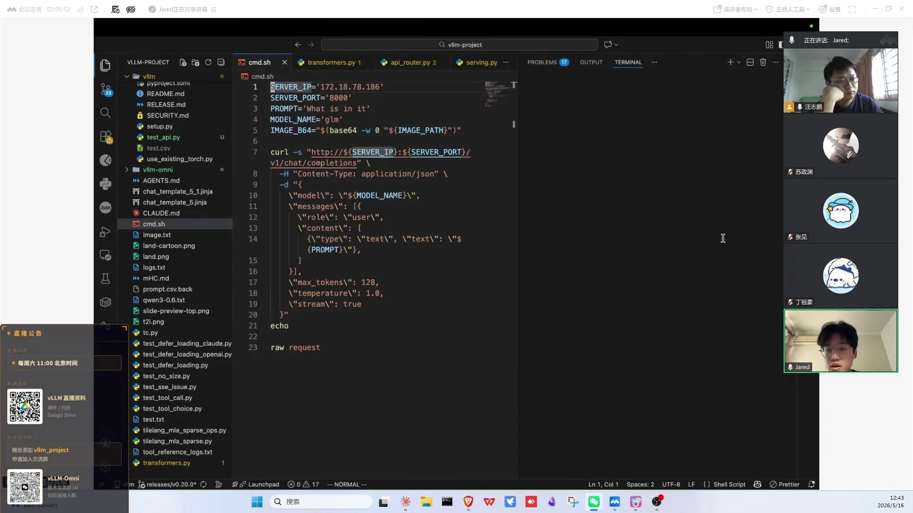 |
| 没问题。没打通，没事的。就是等一下啊，我看哪里出错了——我现场 debug 吗？算了我不讲了。就是他就会一直返回出来一个 stream 的形式。然后我刚刚忘记调试好了，调试好的话我是可以直接打的。我们回——好，在这里…… [【跳转到 102:03】](https://www.bilibili.com/video/BV1yrJH6pEFQ/?t=6123) | 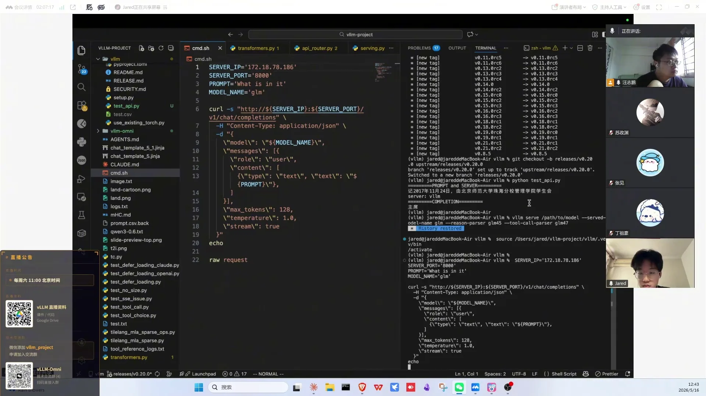 |
| 就是这取决于你要不要 stream，对吧。他那个 generator 会放进这个，要么放在这个 chat completion stream generator，要么是放在（普通的）chat completion generator。我们去看最简单的一个格式。嗯嗯，打开看，他会先执行一个 for loop，一直等到所有的模型的处理都结束之后…… [【跳转到 102:28】](https://www.bilibili.com/video/BV1yrJH6pEFQ/?t=6148) | 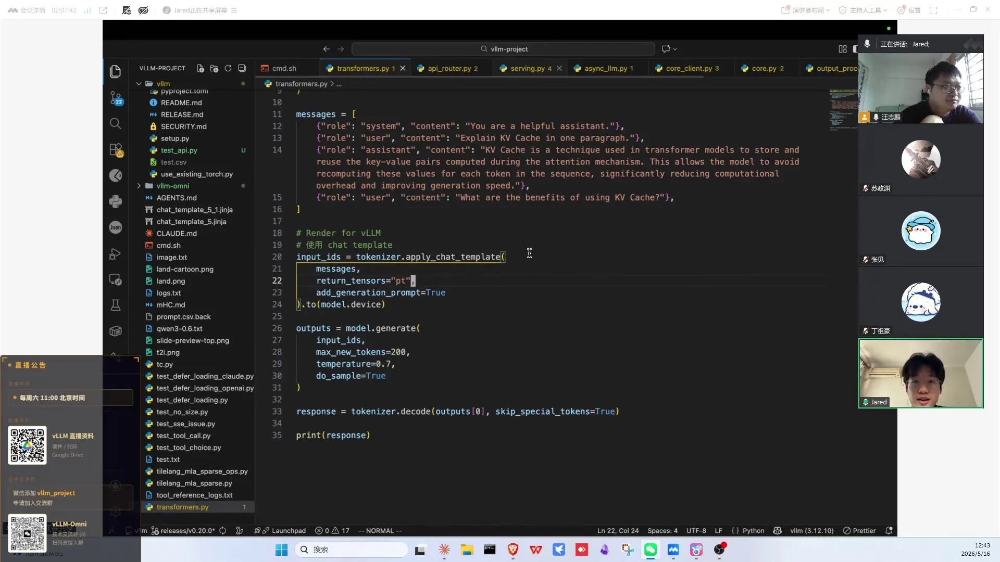 |
| 我们拿到一个完整的输出，然后那个完整的输出就在这个 final result 里面。然后拿到这个 output，这个 output 后面我们就会做一些比较特殊的处理：如果你里面有 reasoning 的内容，我们就把它拿出来放到 reasoning 那一块；如果你有 tool（调用）相关的东西，我们再把那个 tool 提取出来，再放到 tools 那一块，那个就会帮你去调用那些工具。 [【跳转到 102:53】](https://www.bilibili.com/video/BV1yrJH6pEFQ/?t=6173) | 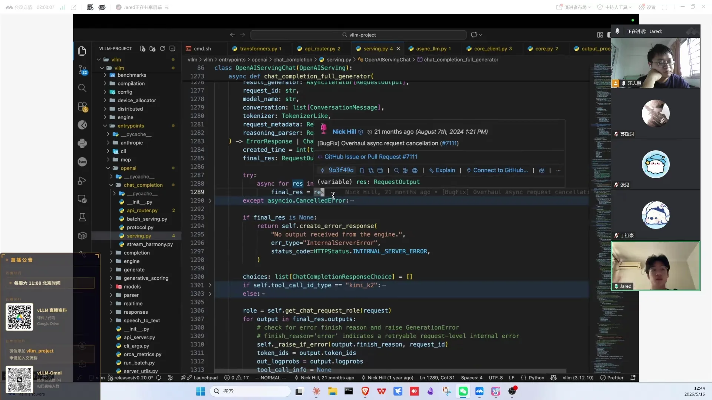 |
| 然后比如这块啊，这就是 tool parser 相关的东西。然后这里有 tool choice（参数），其实很复杂：大部分时候 tool choice 是等于 auto；有些时候 tool choice 等于 none，那就是不准调用——不准调用工具，我虽然给了你工具你不准调用。然后如果 tool choice 还等于 named function，就是你指定让模型去调用某个 function，也有这种情况。还有一种情况就是……叫 required，对…… [【跳转到 103:18】](https://www.bilibili.com/video/BV1yrJH6pEFQ/?t=6198) | 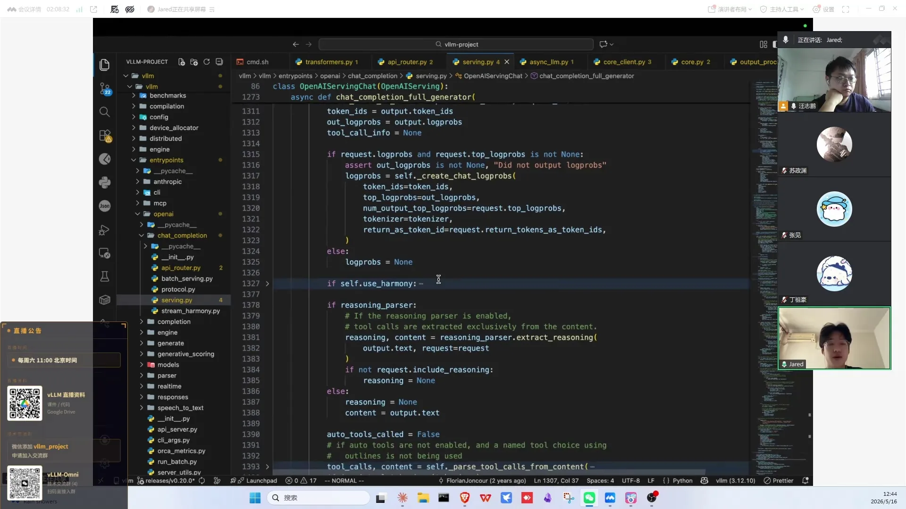 |
| 就这个 tool choice：tool choice 等于 required 的时候，就是你必须调用工具，但是他没有说指定哪个工具。OK，然后我们就以这种非 required 的形式，把这些 content 以及 reasoning 的（内容）还有 tool 相关的东西放到这个 chat message 里面。然后这个 message 就会存到一个叫 choice 的数据类里面…… [【跳转到 103:43】](https://www.bilibili.com/video/BV1yrJH6pEFQ/?t=6223) | 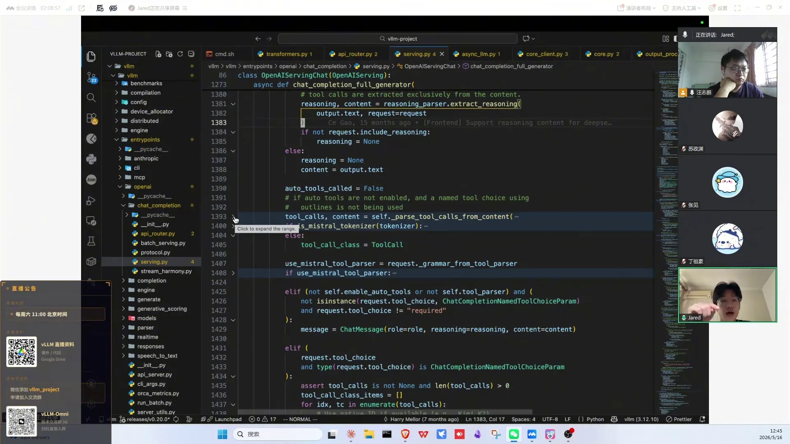 |
| 数据类里面，在这 OK，chat completion response choice。然后他就把这个 message 存进去。然后 tool（调用）的话如果有，那就是在这一块他也会放上去。然后这个 choice 他又会放到 response 这个最终的 JSON 格式里面，给他放到这个（choice）里面。然后你有一些 model name 啊…… [【跳转到 104:08】](https://www.bilibili.com/video/BV1yrJH6pEFQ/?t=6248) | 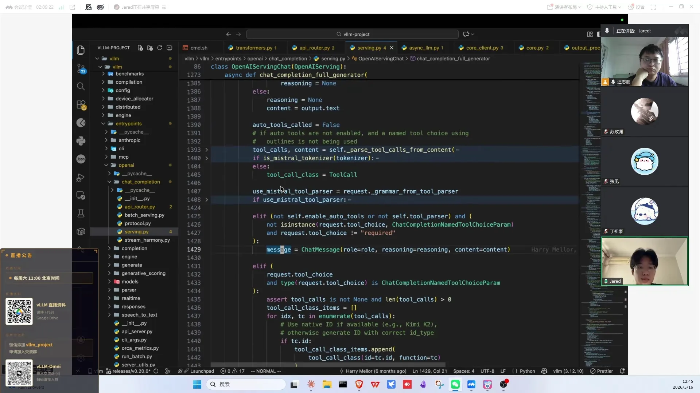 |
| 还有一些其他的数据。如果你有 logprobs 的话那就把那个 logprobs 也展示出来；然后他有什么 token id 他也可以给你展示出来，如果你需要的话他会给你展示出来。然后最终 response 回去。还记得这个端点吗？chat completion 端点：如果你不是 stream，那么你就拿到这个 JSON，返回这样一个 JSON 回到你的用户手里。大概是这样。然后 stream 的方式稍微（复杂）一点…… [【跳转到 104:33】](https://www.bilibili.com/video/BV1yrJH6pEFQ/?t=6273) | 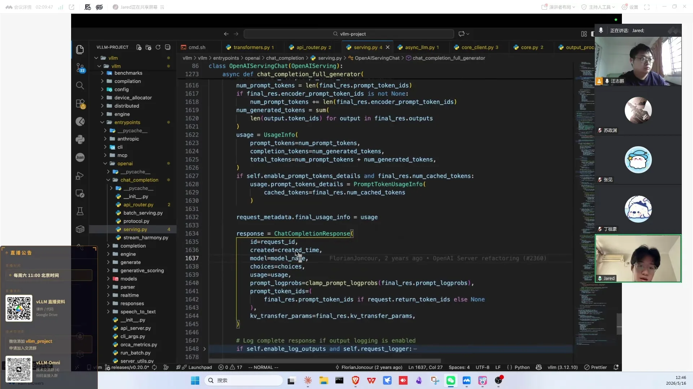 |
| 他每次是一个一个往外出。然后你在这个过程中还要给他处理好 reasoning 啊、还有 tool 相关的东西。如果大家对这块代码感兴趣的话也可以看，它的基本流程也是跟（非 stream 的）generate 差不多的，因为它本质上还是做了几件事情嘛：如果你有 reasoning 相关的东西，你把 reasoning 拿出来；如果你有 tool 相关的东西，你把 tool 拿出来…… [【跳转到 104:58】](https://www.bilibili.com/video/BV1yrJH6pEFQ/?t=6298) | 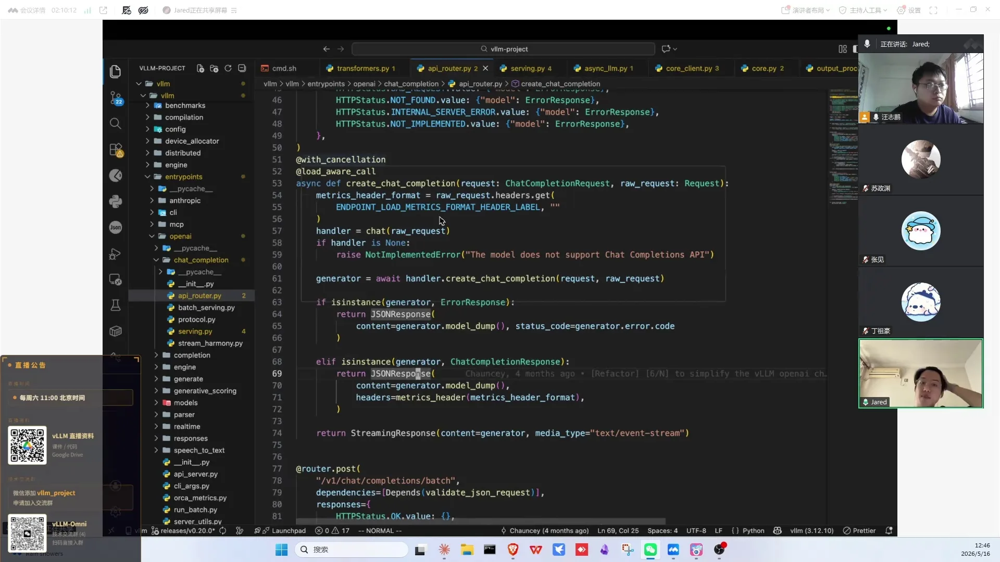 |
| 只不过他是在一个数据流里面去做这样一件事情。OK，然后也没有了。你看 Kimi K2 有些特殊的相关东西，他会放在这里。大部分时候是不会出现这种情况的：就是对你的架构进行 hack，来实现模型的某一些特殊需求，这种算是没那么规范的一种操作。但是没办法，GPT-OSS…… [【跳转到 105:23】](https://www.bilibili.com/video/BV1yrJH6pEFQ/?t=6323) | 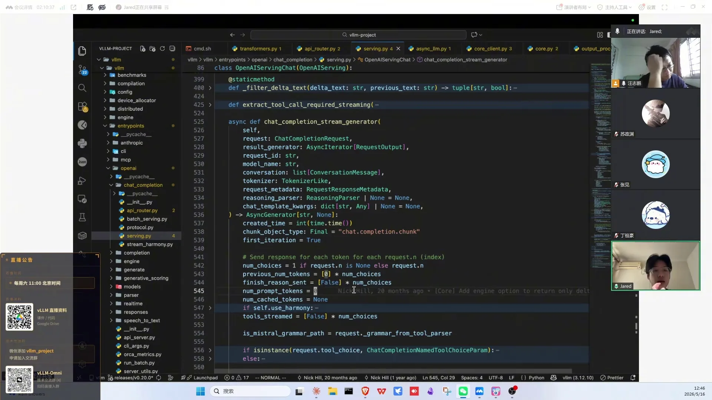 |
| 还有 Kimi K2，还有其他（特殊模型）相关的东西，他们都会相对特殊一点。我们没办法把他规范到一个统一的架构里面、放到一个统一的抽象里面，那我们就只能在架构层去 hack：如果 output 里那个（模型）id 是 Kimi K2 的话，我们就做一些特殊的处理。我们阅读的时候，大部分时候是可以跳过这种针对模型的比较特殊的处理的…… [【跳转到 105:48】](https://www.bilibili.com/video/BV1yrJH6pEFQ/?t=6348) | 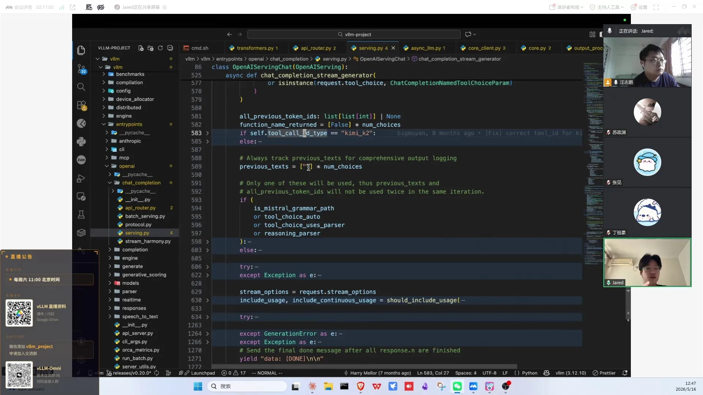 |
| 然后去看一下最通用的情况。你看这里，这里也是，（特殊模型）相关的东西他会做一些调整。一般来说我们的模型——自己的模型——是不会涉及到这种东西的。OK 嗯，然后基本都讲完了，就是一整套流程。大家如果感兴趣、想看更完整的流程…… [【跳转到 106:13】](https://www.bilibili.com/video/BV1yrJH6pEFQ/?t=6373) | 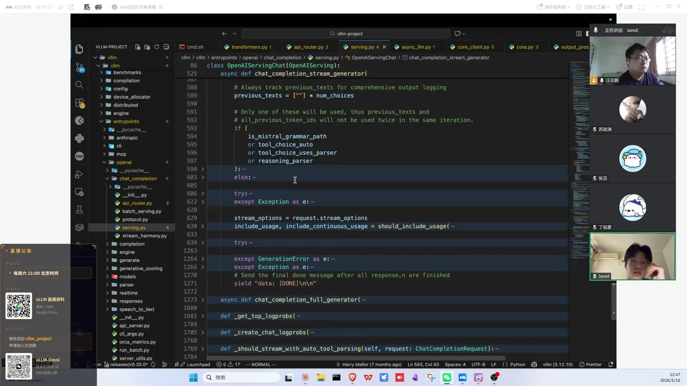 |
| 大家可以看下这个时序图：从 sample 完 token，然后到 scheduler，然后 engine core，然后 engine core client，然后 engine client，再继续到 API server，然后到我们自己手上，大概是这样，就通过 SSE 这个 data 一直传、传、传。大概是讲完了，结束。好，直播间有什么观众想提问的吗？嗯嗯，等会啊。 [【跳转到 106:34】](https://www.bilibili.com/video/BV1yrJH6pEFQ/?t=6394) |  |
| 那我随便说几句吧。我会觉得我做完这个 HTML、分享完这个 Markdown 之后，我自己在这讲的重要性其实不大：你自己看一遍、自己跟着代码去走一遍，那个效果会好很多。然后其他的就自己看吧。我觉得这个 HTML 对着看应该还是挺好读的…… [【跳转到 106:59】](https://www.bilibili.com/video/BV1yrJH6pEFQ/?t=6419) |  |
| 我自己也验证了好几次，大部分内容是正确的，至少在 v0.20.0 这个版本上是正确的。其他版本也有更新什么之类的，我就先暂时不管了。如果有长期需求的话，我觉得可以把这个放出去，然后去做几版…… [【跳转到 107:24】](https://www.bilibili.com/video/BV1yrJH6pEFQ/?t=6444) | 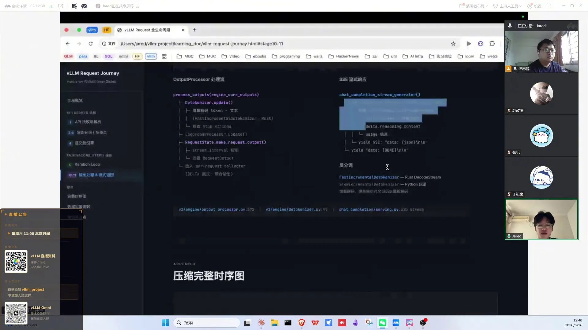 |
| 去做更新：每次有 release 的话，我们看一下这个全生命周期有没有变。然后我们还可以拓展出去，比如拓展出另一个 HTML：讲一下 CUDA graph、讲一下配置 attention、讲一下 continuous batching。我觉得这些东西都值得额外的两三个小时去做。但是现在已经有挺多的 blog，你可以看文档或者看看论文…… [【跳转到 107:49】](https://www.bilibili.com/video/BV1yrJH6pEFQ/?t=6469) | 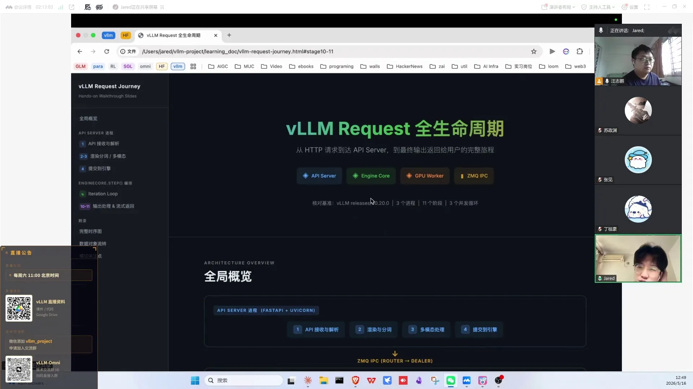 |
| 把这些比较有名的概念都已经可以走一遍了。所以我就没有把时间花在那些很有名的地方，而是把这些被认为是很基础的东西给大家串一遍，就是这样。——其实 API 这块地方（某位同事）应该做的比较多，对吧。——嗯，他展示（相关）这一块……哦，我们什么时候把（那）再搞（一期）？——对。 [【跳转到 108:14】](https://www.bilibili.com/video/BV1yrJH6pEFQ/?t=6494) |  |
| 那他就讲一下这是为什么要设置、为什么要改抽象那么的深。嗯嗯，我真的很好奇啊，他这个感觉比之前一年前看的又复杂了好多。——对啊，他真的抽象太深了，太恐怖了。——对啊。好，然后有问题啊：这是用 CPU 推理吗？——不是的，这个 vLLM 是用 GPU…… [【跳转到 108:39】](https://www.bilibili.com/video/BV1yrJH6pEFQ/?t=6519) |  |
| 它主要是用 GPU 的，然后他的 processor 这块用的是 CPU，是的。——对对对。但是很可能底层就是比如那个 sampling 那一块，他也还是用 GPU 的：sampling 的话都是用 FlashInfer 来做的。——嗯是的。然后我虽然说今天讲的确实基本都在 CPU（侧），但是我希望大家有这样一个概念嘛…… [【跳转到 109:04】](https://www.bilibili.com/video/BV1yrJH6pEFQ/?t=6544) | 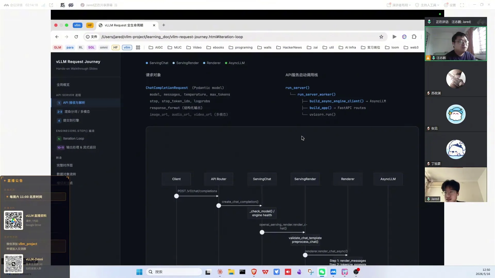 |
| 有这样一个流程，就是有相关的东西的时候，你不要看到晕头转向的，这样就会比较好。哪怕你看到调用栈上（晕了），你回过来看一下我的 HTML 或者看一下我的 Markdown 文档，看看我是怎么给他做这个辨析的，应该会比纯粹的（自己啃）好——喂喂，你们没声音了——喂喂…… [【跳转到 109:29】](https://www.bilibili.com/video/BV1yrJH6pEFQ/?t=6569) |  |
| OK，我补充一下。debug 这一块的话，我之前是因为当时 vLLM（引擎）从 V0 切到 V1，所以他的 bug 是非常多的。当时我为了修 bug，所以我对这块 debug 的就比较多了。你们如果想 debug、了解这东西的话，最好也是这样：带着问题去做…… [【跳转到 109:54】](https://www.bilibili.com/video/BV1yrJH6pEFQ/?t=6594) | 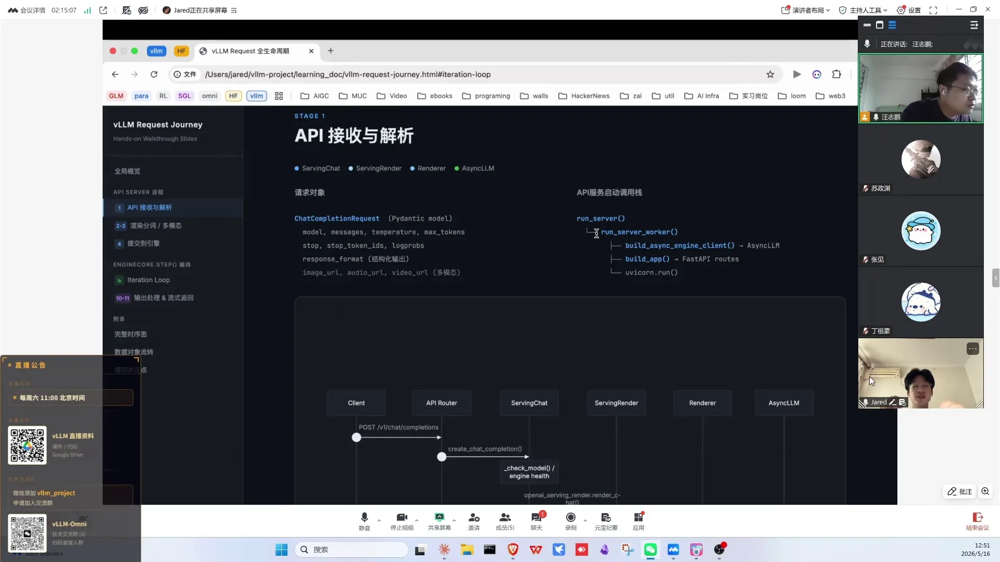 |
| 这样的话相对而言你对于整个框架理解会更深刻。——哎你看他掉线了。好，然后并行部署策略相关的…… [【跳转到 110:19】](https://www.bilibili.com/video/BV1yrJH6pEFQ/?t=6619) | 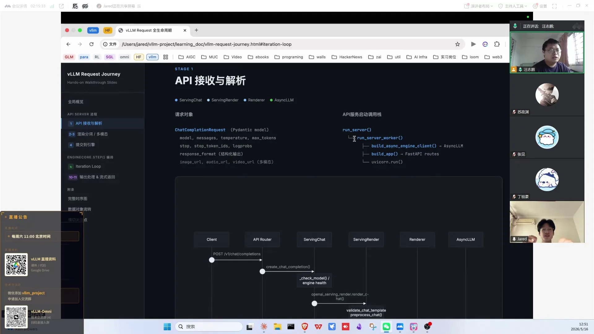 |
| 诶你回来了吗？——那卡。OK 哈哈哈。——我也回来了，OK OK。然后回答下问题吧——（直播间）微信：主播可以安排并行部署策略相关的专题吗？感觉很多人都缺这方面的知识经验。——其实这块地方我也不是很了解的…… [【跳转到 110:39】](https://www.bilibili.com/video/BV1yrJH6pEFQ/?t=6639) | 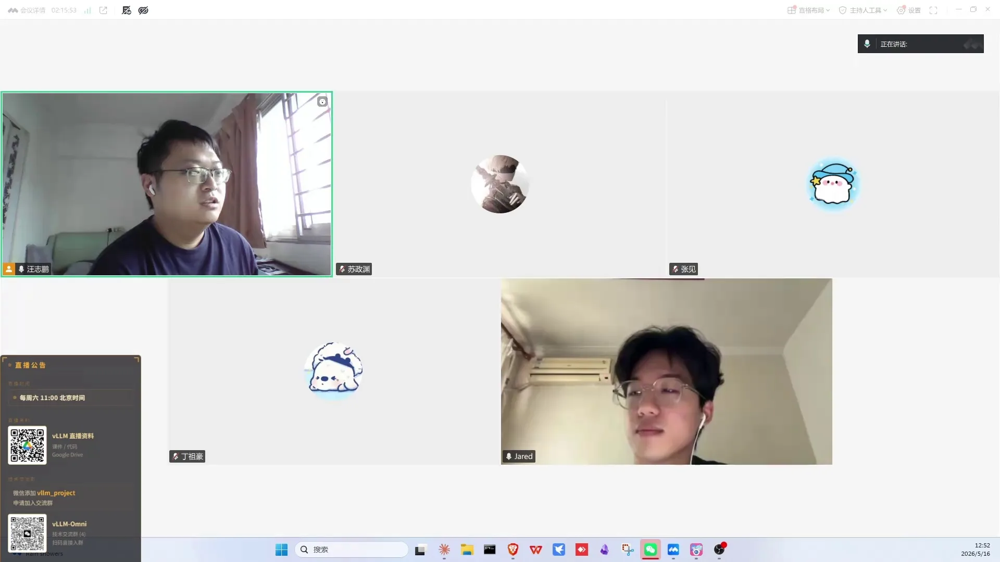 |
| 很多地方就是一些经验上的问题。然后我觉得因为这个并行策略的话，其实它跟你的 workload 和（模型）有很多关系，还有一句就是看模型里面它有些东西是不是支持的。比如说我们知道在 workload 就是 concurrency 比较大的时候可能 PD 分离会好一些，但他有的模型可能就 PD 分离实现的很有问题…… [【跳转到 111:04】](https://www.bilibili.com/video/BV1yrJH6pEFQ/?t=6664) | 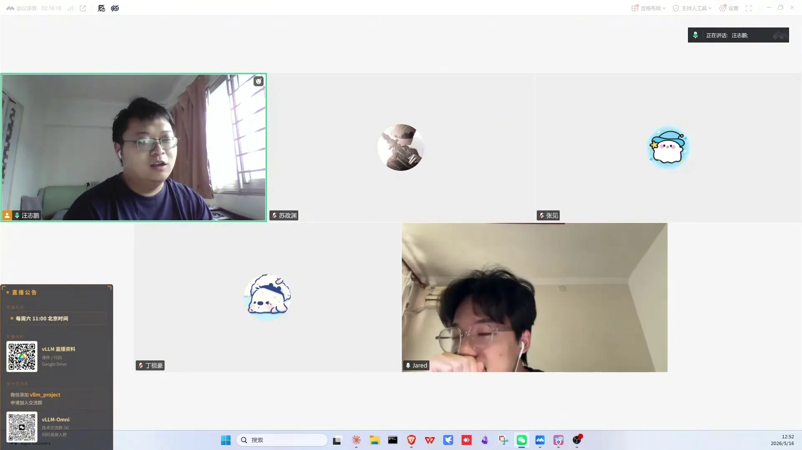 |
| 有 bug，对吧，那我们就没办法去做。——哦然后这个时序图应该就是 AI 做的吧？——啊是的。但是我觉得是这样：我是先做 Markdown，我现在 Markdown 里面把这个时序图已经梳理好了…… [【跳转到 111:29】](https://www.bilibili.com/video/BV1yrJH6pEFQ/?t=6689) | 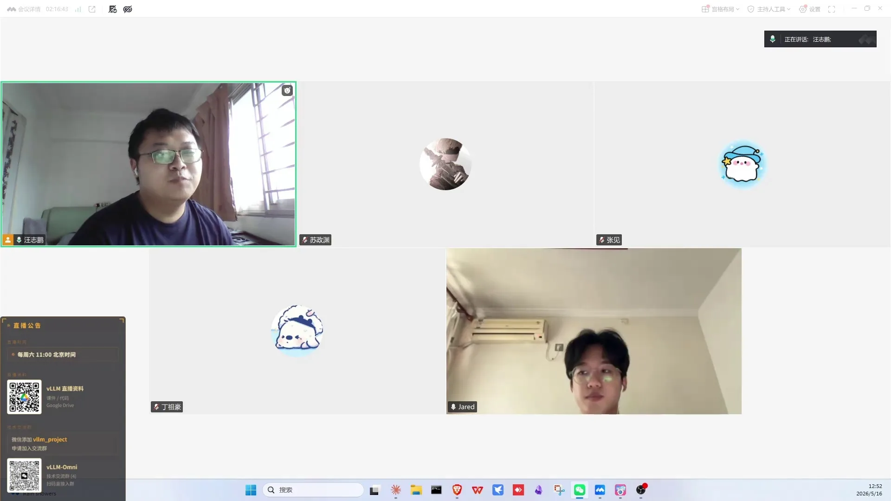 |
| 之后我再去给它变成 HTML 的格式。然后其实我这时序图很多东西我都改了好几版，因为（AI）有点偷懒，或者说他的认知是错的——你得自己去手动地给他调一下：OK 他这个调用栈是错的，或者说他这个格式可能是错的，大概是这样。——嗯好，然后（之后）我们会专门做一期视频，就是讲比如说如果你没有 GPU…… [【跳转到 111:54】](https://www.bilibili.com/video/BV1yrJH6pEFQ/?t=6714) | 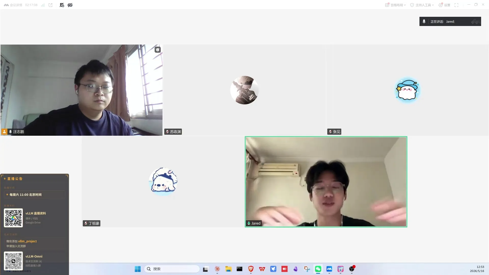 |
| 因为很多人我知道是用 Mac——我也用，我一般也用 Mac。就是：怎样的去租显卡，然后怎样的去在这个租赁显卡的平台去搭好一整套的部署环境，对吧，然后你再怎样的去写这个（调试用的）脚本，对吧，然后后面的话再去 debug 这个东西。 [【跳转到 112:19】](https://www.bilibili.com/video/BV1yrJH6pEFQ/?t=6739) | 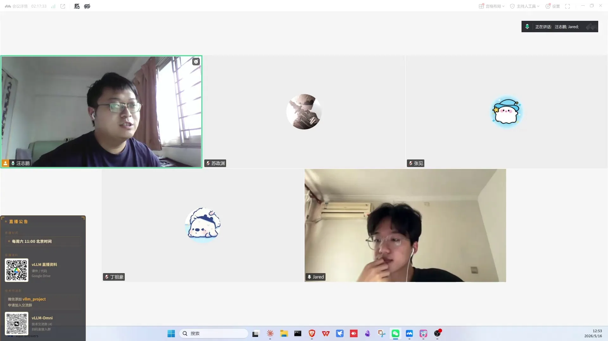 |
| 我觉得我们是需要做一期的。我现在的默认（假设）就是：看我们直播的都是想给 vLLM 做贡献的，那我们就给你补充一些基础知识，让大家更好的做贡献、效率更高、提出更好的 PR，然后一起推动我们的社区的成长。大概是这样。其实我们这个 vLLM study group 这个群最开始的时候就是一个新加坡的线下群…… [【跳转到 112:44】](https://www.bilibili.com/video/BV1yrJH6pEFQ/?t=6764) |  |
| 然后当时（线下聚）的时候，我有几个学生，当时他们想找实习找工作，他们其实当时比较缺乏开发这块的经验。所以我当时第一天见他们的时候就教他们，比如说怎样子去写这个 debug 的（脚本），然后怎样的去 debug。我当时最开始教他的 debug 就是 debug Transformers，因为 Transformers 比 vLLM 这块要简单很多…… [【跳转到 113:09】](https://www.bilibili.com/video/BV1yrJH6pEFQ/?t=6789) | 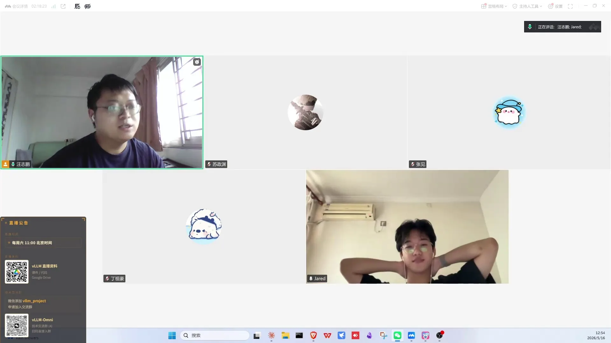 |
| 对对对，但是你能把基本流程跑一遍，会建立一个基本的概念：整个模型的推理的流程就跑遍了，然后你至少不会看到 vLLM 的时候完全一脸懵逼，不知道这在干什么。是的是的。——对，其实这个事情也就是去年 12 月份的时候发生的：12 月份的时候我带他们…… [【跳转到 113:34】](https://www.bilibili.com/video/BV1yrJH6pEFQ/?t=6814) | 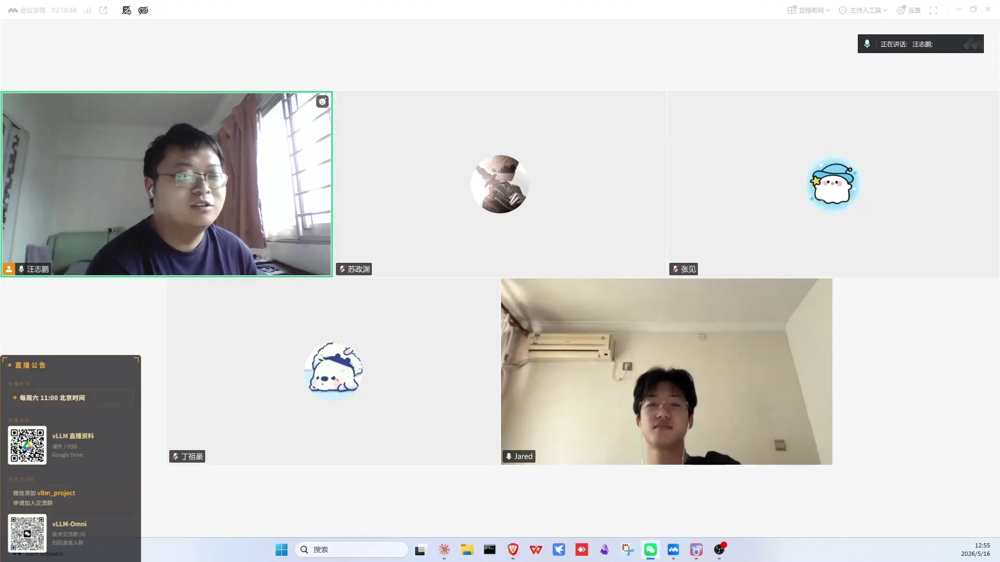 |
| 然后现在他们都找到了非常不错的实习，是的。——嗯强大啊。OK OK 差不多了，我好饿啊，该吃饭了。然后好，我们再回答一个问题，再回答个问题就结束了。OK——啊，然后 Mac 是有 vLLM 这个（包），（pip）能安装，但是感觉没有 GPU。——哦对的。然后我建议的话就是：如果你是想转行…… [【跳转到 113:59】](https://www.bilibili.com/video/BV1yrJH6pEFQ/?t=6839) |  |
| 或者是在这行里面比如说找工作的话，我强烈建议你无论如何必须得有 GPU 来跑。因为没有哪个正规的公司他会说我用 Mac 去做推理，是不可能的。你可以在 Mac 上开发，但你不能在 Mac 上做推理。对对对。你有可能可以去——比如有些国内公司它可能会用昇腾卡，那你可以去租昇腾卡来学习…… [【跳转到 114:24】](https://www.bilibili.com/video/BV1yrJH6pEFQ/?t=6864) | 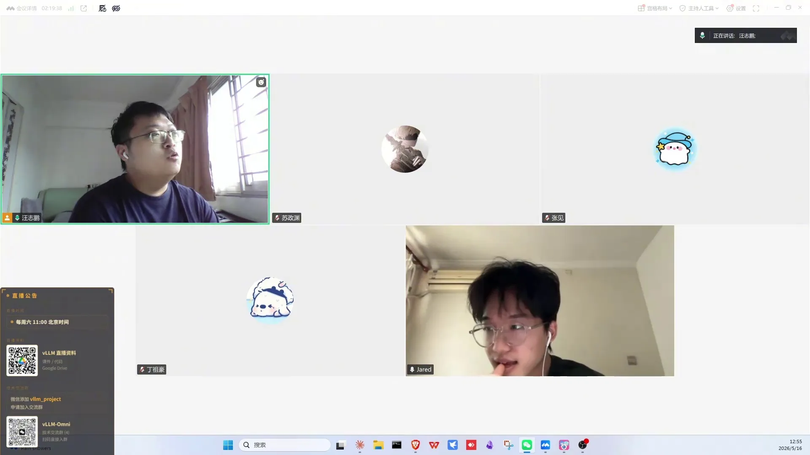 |
| 但是 Mac 这个地方是真的不太可能靠这玩意去找工作的，是的。除非你做的是 Ollama 相关的——但 Ollama 做的（模型）都非常小，而且这种公司可能他融资都会很困难，大厂也不可能去（只用）Ollama。所以不需要去考虑 Mac 了。好…… [【跳转到 114:49】](https://www.bilibili.com/video/BV1yrJH6pEFQ/?t=6889) | 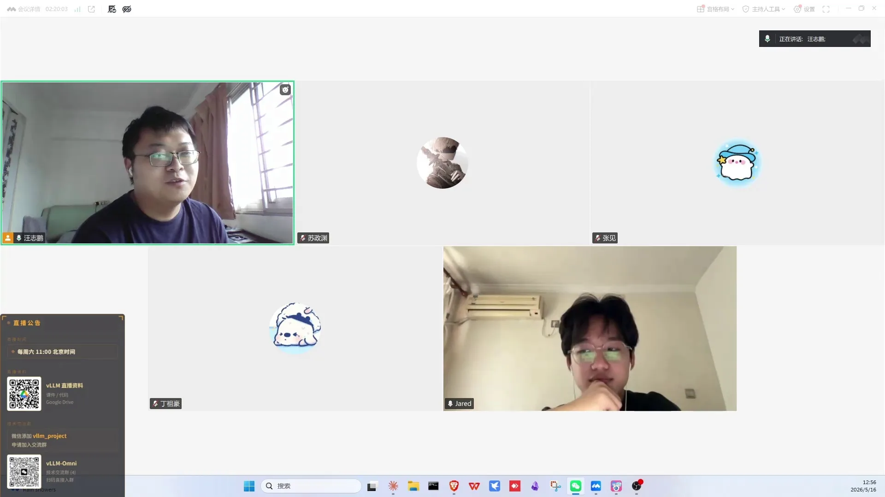 |
| 那我们就直播结束了，拜拜拜拜拜拜拜拜。辛苦了辛苦了辛苦了，拜拜。 [【跳转到 115:14】](https://www.bilibili.com/video/BV1yrJH6pEFQ/?t=6914) |  |