# vLLM小课堂（四）：PCP与DCP详解 原始文稿（图-字幕分栏）

| 字幕文本 | 画面 |
| :--- | ---: |
| 好，然后我们就开始，乔老师可以开始正式讲了。——哎好的好的。那我接下来介绍一下我们现在 vLLM 的 DCP 和 PCP 这两个特性。首先让我们总体看一下序列并行这个特性，包括它为什么分成 PCP 和 DCP 两部分，分别是做什么的。 [【跳转到 00:00】](https://www.bilibili.com/video/BV1W1L96KEf5/?t=0) | 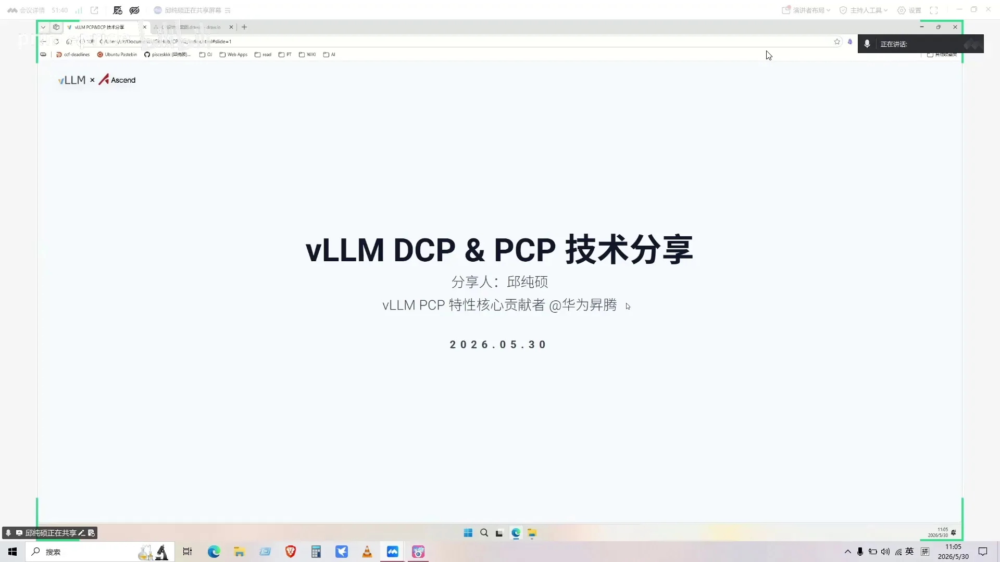 |
| 其实就是简短来说：PCP 就是 prefill 阶段的序列并行，主要做的是——在我现在可以看这个总览图里边——我输入的这个 QKV 这个序列会在 prefill 阶段把它切成多个 chunk 或者多个块，分别给到不同的 PCP rank，主要是对 prefill 阶段的输入序列…… [【跳转到 00:25】](https://www.bilibili.com/video/BV1W1L96KEf5/?t=25) | 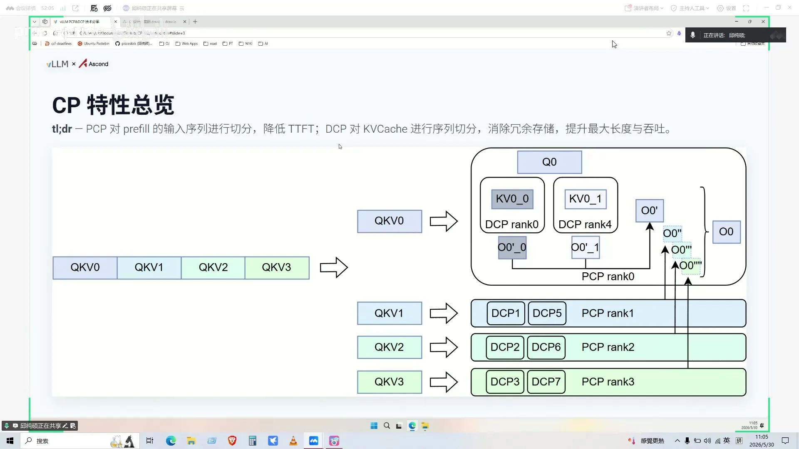 |
| 做序列切分。然后 DCP 呢，主要是对 decode 阶段，它其实主要是对 KV cache 做切分。对，就是可以看后面这里：会把 KV 在存到 KV cache 的时候，再根据 DCP 的 rank 去切到各个卡上。这个可以消除我们的冗余存储…… [【跳转到 00:50】](https://www.bilibili.com/video/BV1W1L96KEf5/?t=50) | 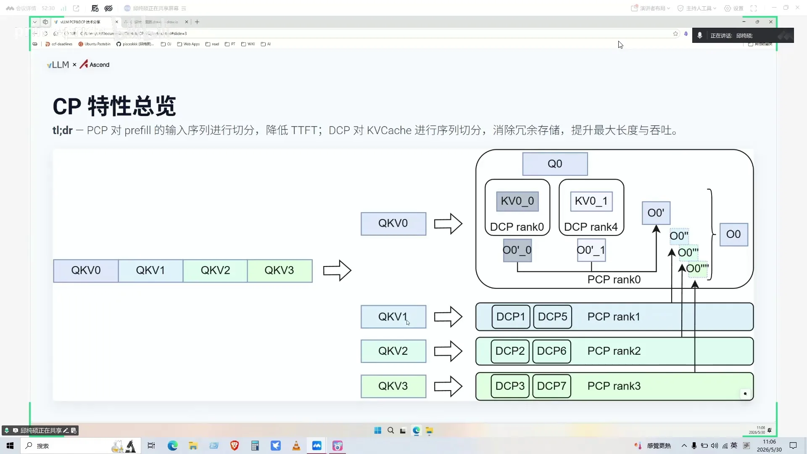 |
| 提升我们 KV cache 的利用率，同时也能提升整个推理系统可以支撑的最大长度和整体的吞吐。嗯，然后下面我先介绍一下 DCP 这个特性。DCP 这边，vLLM 是月之暗面的老师最开始贡献进来的，后续我在他的基础上做了一些…… [【跳转到 01:15】](https://www.bilibili.com/video/BV1W1L96KEf5/?t=75) | 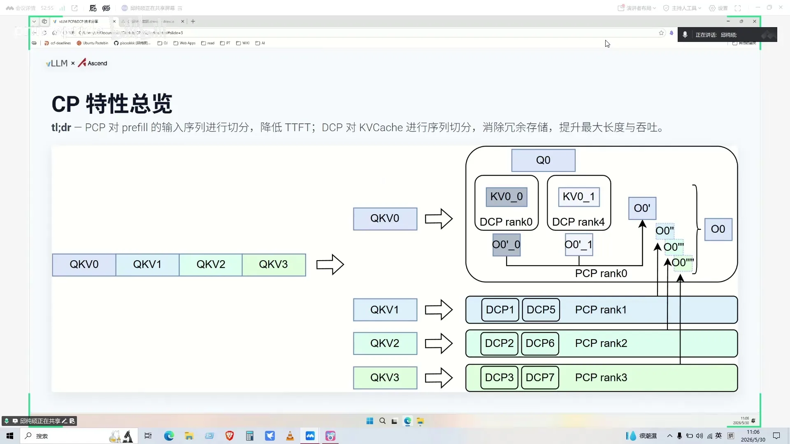 |
| 其他后端的适配，包括后续的一些维护。首先因为 DCP 它主要是对 KV cache 切分，其实它在纯 prefill 阶段——就是不考虑 chunked prefill 的时候——对 prefill 阶段的推理过程是没有影响的。它唯一改变的就是我们拿这个 KV 去存：拿 slot mapping——拿到 slot mapping…… [【跳转到 01:40】](https://www.bilibili.com/video/BV1W1L96KEf5/?t=100) | 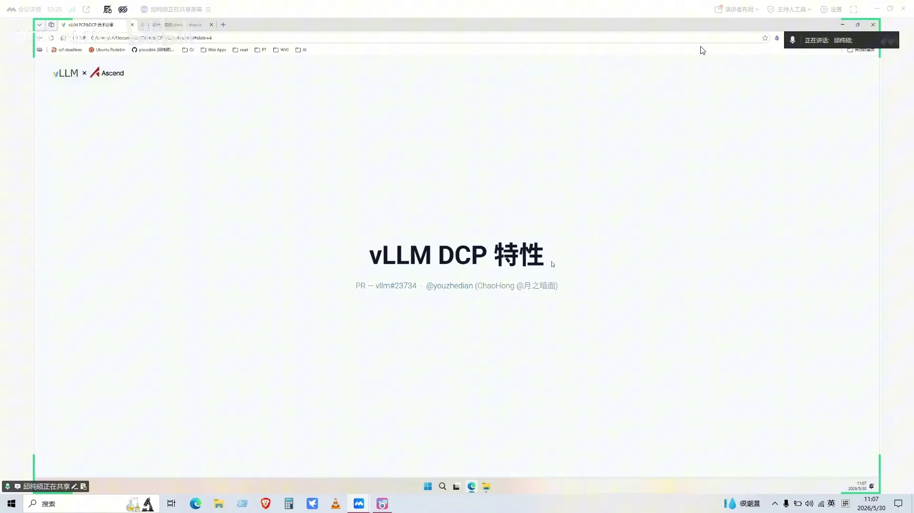 |
| 去存 KV cache 的这个过程。我们 DCP 这个特性会对 slot mapping 包括 block table 这些东西多做一些修改，让它能够——可以看到原本这个序列，假设它是由……包括后面所有的这些框图里边，这里表示的横向就是 embedding 的维度，或者说 head 的维度，然后竖向的就是序列的维度…… [【跳转到 02:05】](https://www.bilibili.com/video/BV1W1L96KEf5/?t=125) | 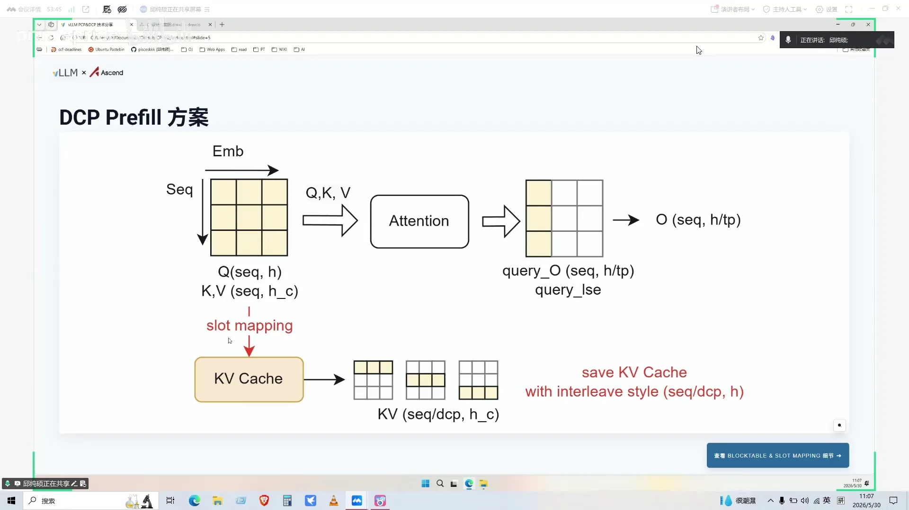 |
| 然后可以看到我们这个 3×3 的序列，请求进来之后会根据 DCP 的维度从序列上把它切分，然后存到不同的卡——不同的卡的 KV cache 上。然后这里就可以详细讲一下我们在 DCP 这个场景下是怎么存 KV cache 的。后面这里我是画了一个草稿…… [【跳转到 02:30】](https://www.bilibili.com/video/BV1W1L96KEf5/?t=150) |  |
| 一个动图可以看一下。就是我们首先在 vLLM 本身的 block table 来看的话，在每个 rank 上其实都是维护了一个镜像的 block table。因为这个 block table 是根据 token 的粒度去做映射的嘛…… [【跳转到 02:55】](https://www.bilibili.com/video/BV1W1L96KEf5/?t=175) | 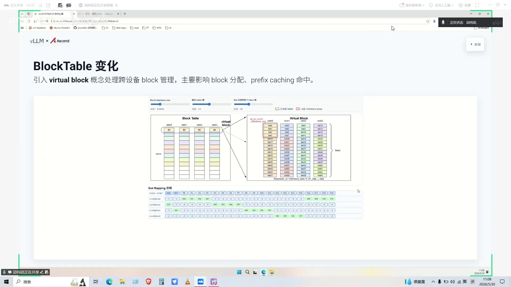 |
| 然后在没有 DCP 的时候——这个 block table，也不考虑像后来的那些 hybrid 的 KV cache 的话——我们在每张卡上其实这个 block table 就是镜像关系的。但是因为我们现在引入了 DCP，它会在不同的卡上去存不同的 token。所以为了方便管理，我们这里就引入了一个 virtual block 的概念…… [【跳转到 03:20】](https://www.bilibili.com/video/BV1W1L96KEf5/?t=200) | 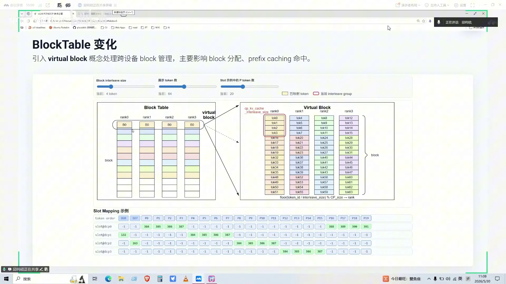 |
| 我们会把同一个 DCP 组、或者同一个 CP 组里的这个 block 合成一个 virtual block，然后对应的它的 block size 也会对应地扩张。这样的话再根据上下文长度、或者根据请求序列的长度去分配 block 的时候，就可以准确分配我们本张卡上所使用的实际 block…… [【跳转到 03:45】](https://www.bilibili.com/video/BV1W1L96KEf5/?t=225) |  |
| 然后同时对应的在做 prefix caching 命中的时候也可以起到相同的作用，让它更精准地命中我们整个 virtual block 里面的前缀。然后我们在构建出来这个 virtual block 之后……我这里先要做一个最开始的一个方案…… [【跳转到 04:10】](https://www.bilibili.com/video/BV1W1L96KEf5/?t=250) | 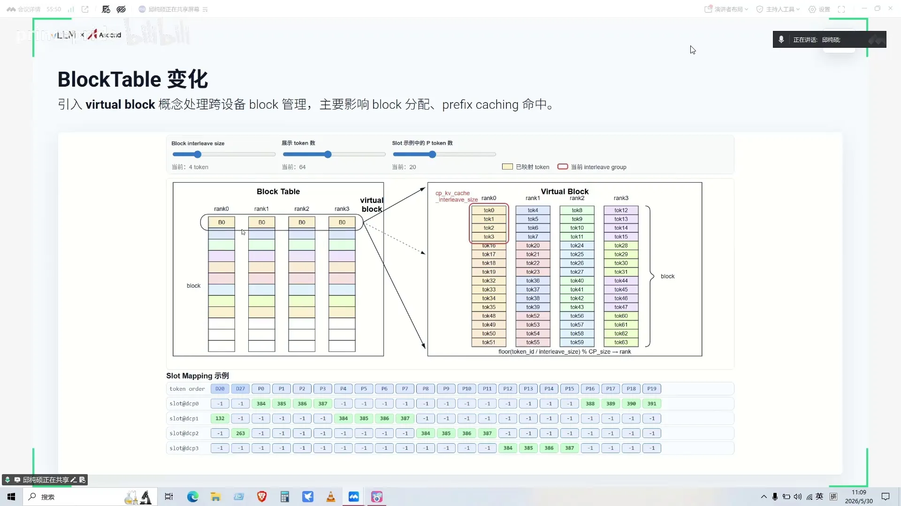 |
| 我们最开始的时候，不同的 token 在多卡之间的存储，我们是按 token 去轮询的：就像这里画的 token 0 存在零卡第一个位置，然后 token 1、2、3 依次往后排，然后 4、5、6 这样排。这是我们最开始以每个 token 为最小颗粒度…… [【跳转到 04:35】](https://www.bilibili.com/video/BV1W1L96KEf5/?t=275) | 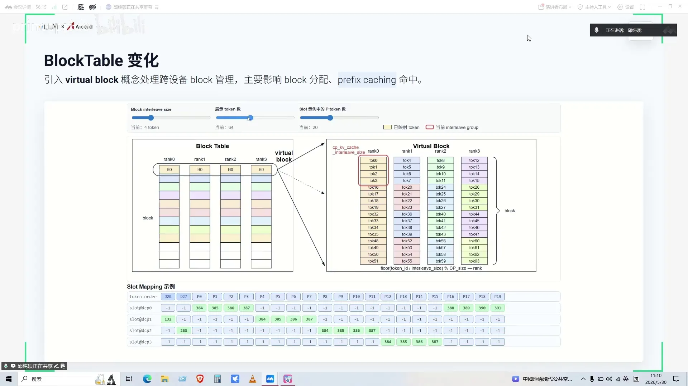 |
| 去存 KV cache。这个主要是实现起来会比较方便——其实取它的各种下标之类的，取个模就能算出来。但是这有一个问题：在 PD 分离场景下，因为 PD 分离是整个一个 block、一个 block 去传输的嘛。如果我举个例子：token 数比较少，比如我们有 16 个 token，block size 也是 16——其实理论上来说我们可以把这 16 个 token 都放到同一个卡上的…… [【跳转到 05:00】](https://www.bilibili.com/video/BV1W1L96KEf5/?t=300) | 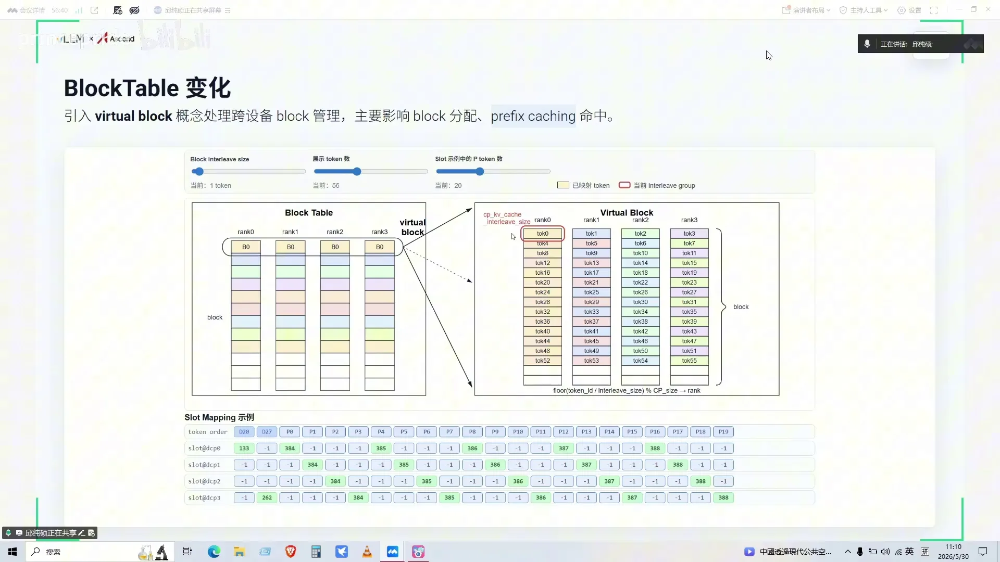 |
| 但是因为 DCP 的这个轮询方案，它就会分布在四个 block 上。那这样的话就会增加我们 PD 分离的通信成本，相对有一些浪费的情况。 [【跳转到 05:25】](https://www.bilibili.com/video/BV1W1L96KEf5/?t=325) | 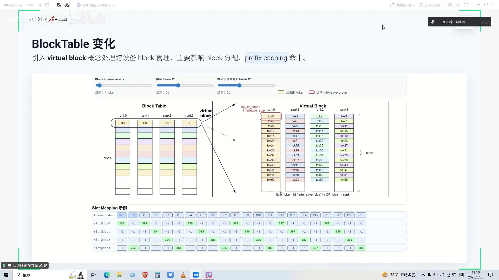 |
| 所以我们在后续也引入了这个 CP KV cache interleave size 的概念，主要是给 PD 分离的时候用的：当我们开 PD 分离的时候，我们倾向于把这个 interleave size 设置成 block size，这样的话就可以尽可能充分利用…… [【跳转到 05:50】](https://www.bilibili.com/video/BV1W1L96KEf5/?t=350) |  |
| 前面（那些）token 所在的 block 的空间，然后后面这些空的 block 我们就可以不需要传输了，我们只需要传输这一个有 token 的 block 就行。这是我们在 block table 分配上的一个好方案。然后我们这里就……改变了这个 token 在 block 上的分布之后…… [【跳转到 06:15】](https://www.bilibili.com/video/BV1W1L96KEf5/?t=375) |  |
| 其实我们对应的也需要改一下 slot mapping 的映射列表，因为我们后续在后端存 KV cache 的时候用的就是这个东西。这里从下面这个图也能看出来，我们主要的一个做法就是：根据他这个位置…… [【跳转到 06:40】](https://www.bilibili.com/video/BV1W1L96KEf5/?t=400) | 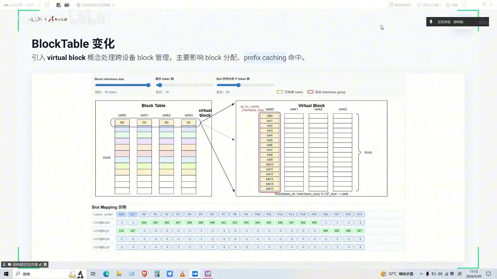 |
| 先算出它原来的位置之后，根据 interleave size 还有 CP size 去取模。如果它是在本张卡上，就会把对应的它在本张卡上这个 block 里边的位置给放进去；如果它不在本张卡上，就会把它置成一（个无效值）。这里也可以看一下…… [【跳转到 07:05】](https://www.bilibili.com/video/BV1W1L96KEf5/?t=425) | 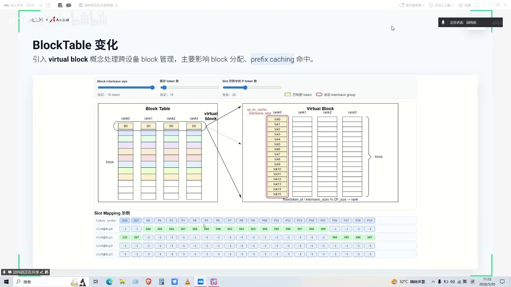 |
| 不同的 interleave size 的情况下的存储情况。可以看到前面这两个是两个 decode 的 token，分别是 20 号和 27 号，它会根据这个值去算它们分别在 113 号和 262 号，各自会分布在 DCP0 和 DCP3…… [【跳转到 07:30】](https://www.bilibili.com/video/BV1W1L96KEf5/?t=450) | 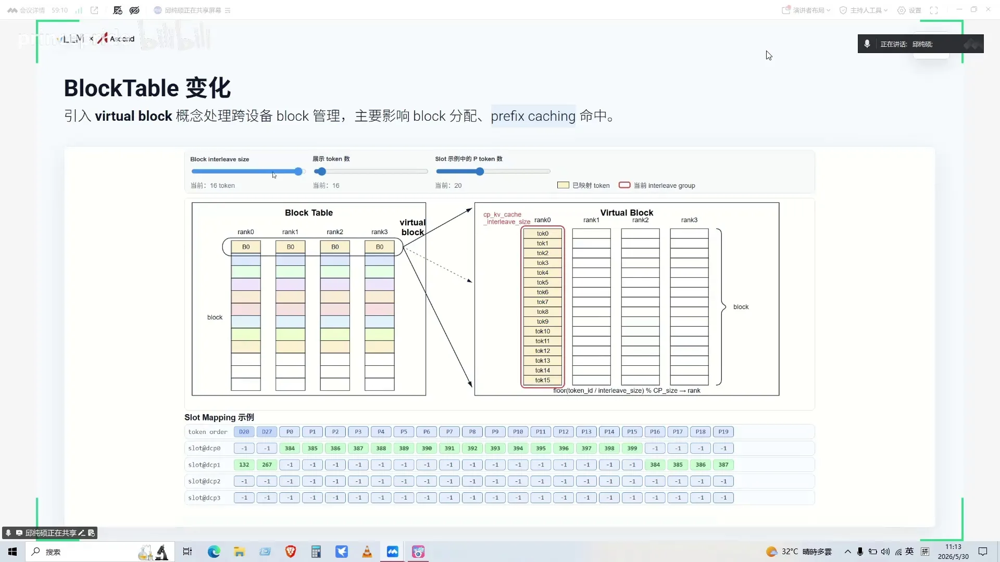 |
| 这两张卡上。然后在 prefill 阶段的话，像我刚才把 interleave size 设成一的话，那它就是在同一个位置上会分别存在不同卡上，好之后再存下一个位置：P4 会存在零卡的下一个位置上，然后 P5 是存在一卡的下一个位置上…… [【跳转到 07:55】](https://www.bilibili.com/video/BV1W1L96KEf5/?t=475) | 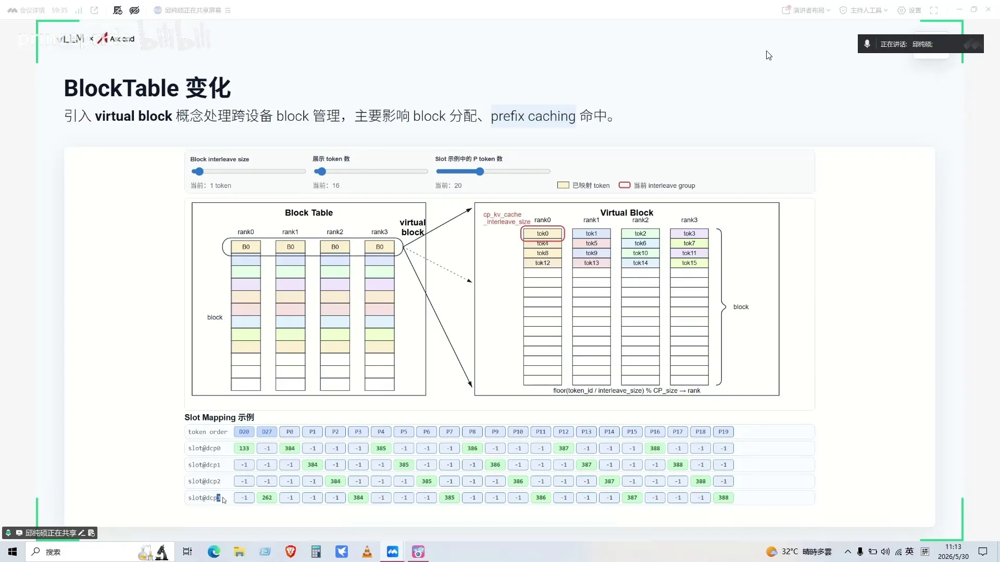 |
| 然后这样依次往后排，这就是我们 block table 或者说 KV cache 的一个分布情况。其实单纯的 prefill 阶段主要的修改就是我们这个 slot mapping 会在 block table 那个文件里做一些修改，对整体的 prefill 流程其实是没有影响的：他整个就是拿完整的当前 Q、K、V 去做计算，跟 KV cache 也没什么关系。长 prefill 的方案我后面再讲，放在 decode 的后面讲。现在可以看一下我们 decode 的方案。因为我们对 KV cache 做了切分之后，在 decode 的过程中，我们当前卡的这个 Q 其实是…… [【跳转到 08:20】](https://www.bilibili.com/video/BV1W1L96KEf5/?t=500) | 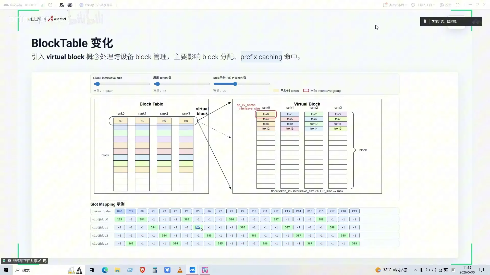 |
| 没有办法看到全部的 KV cache 的，所以会对 decode 的流程有两处比较大的修改。首先我们先考虑 GQA 的这一个模型后端。这里顺便说一下：我们整个 DCP 还是有一个限制，就是会要求 DCP size 乘以 KV head 数小于等于 TP size。因为我们 DCP 引入的最基本的立足点，就是当我们 KV head 要小于 TP head…… [【跳转到 08:45】](https://www.bilibili.com/video/BV1W1L96KEf5/?t=525) | 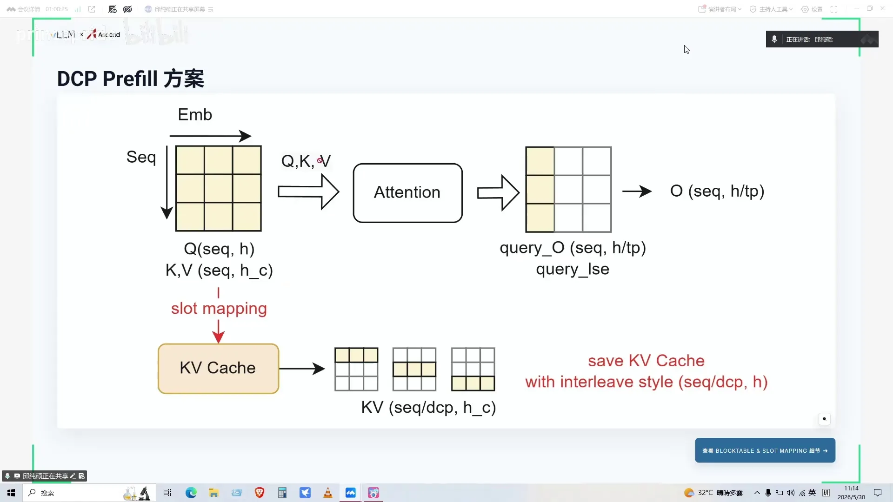 |
| 没有办法看到全部的kvcash的然后所以就是会对抵扣的这个流程有有两处比较大的修改然后首先是第一个就是啊呃首先我们先考虑GQA的这一个啊模型后端因为呃是对这里还可以呃 [【跳转到 09:10】](https://www.bilibili.com/video/BV1W1L96KEf5/?t=550) | 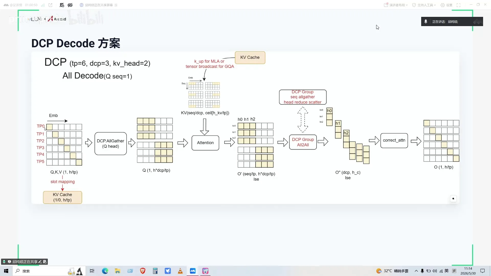 |
| 像在 GQA 里边我们通常 KV head 可能在 2、4、8 这几个值上。一旦 TP size 大于这个值之后就会有冗余的存储——会有不同的卡存相同的 KV cache。然后在 MLA 的后端里边会更严重，因为它会对 KV cache 做压缩，他 KV 其实在所有的卡上都是冗余的。 [【跳转到 09:35】](https://www.bilibili.com/video/BV1W1L96KEf5/?t=575) |  |
| 所以这也是我们 DCP 引入的一个核心立足点。这里我是以 GQA 为例去讲的，因为 MLA 其实说实话 KV head 可以理解为等于一——至少在（MLA 的）KV cache 里 KV head 等于一——所以就不单独列出来了。在 GQA 这个场景下，首先我们在整个流程中…… [【跳转到 10:00】](https://www.bilibili.com/video/BV1W1L96KEf5/?t=600) |  |
| 第一步是会有一个 DCP 的 all-gather。这个 all-gather 会对 Q 这个输入序列在 head 的维度做 all-gather。为什么要引入呢？可以看后面这个我们 KV cache 的分布：还是因为我们现在这个并行组是 TP=6、DCP=3，然后设置的模型 KV head 假设是 2。我们在存 KV cache 的时候会发现：前面这三张卡上它们有相同的 KV head，但是序列会有切分——它们在同一个 DCP 组里；后面这个是在另一个 DCP 组里，也是在序列维度做好了切分…… [【跳转到 10:25】](https://www.bilibili.com/video/BV1W1L96KEf5/?t=625) |  |
| 第一步是会有一个DCP的ORGA然后这个奥GAA是会对PU这个输入序列在head的维度所有ORGA额这个gather为什么要引入呢因为我们可以看后面这一个我们kvcash的分布我们QVTSH它额首先还是因为我们现在这个并行组是TP6 [【跳转到 10:50】](https://www.bilibili.com/video/BV1W1L96KEf5/?t=650) |  |
| 然后 head 是共享了后面这一半段的 TP 的 head。但我们的 Q 因为 Q 一般 head 比较大嘛，它会切完整的 TP——TP=6 的话，像图里画的，每一个 TP 卡上它会把 head 完全切成原来的 TP 分之一。这就有一个问题：我当前的 Q…… [【跳转到 11:15】](https://www.bilibili.com/video/BV1W1L96KEf5/?t=675) |  |
| 他虽然 head 和 KV head 是对应上的，但是他只能读到一部分的 KV。而如果我想拿到其他部分的 KV 的信息的话，就需要让其他的卡也拿到这个 Q 的这部分 head 信息。所以这里就会做一个：在 DCP 组里让 Q head 保持和 KV head 是一致的…… [【跳转到 11:40】](https://www.bilibili.com/video/BV1W1L96KEf5/?t=700) | 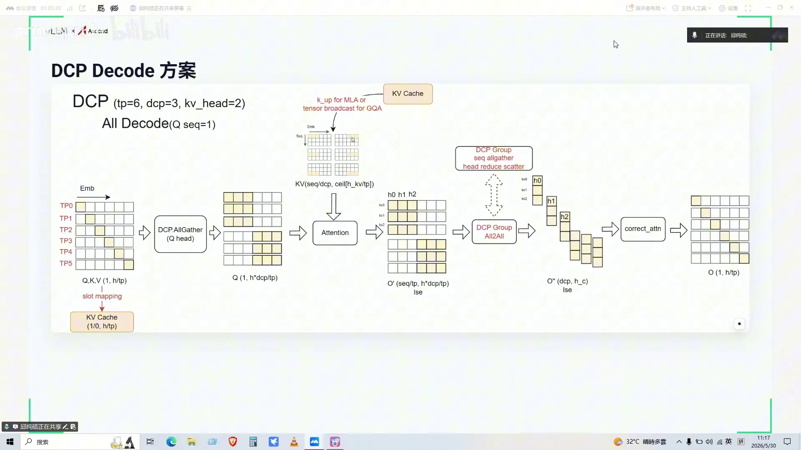 |
| 然后做一个 DCP 的 all-gather 之后，会让他的 head 切分逻辑和 KV head 的切分逻辑是一样的。然后经过这一次正常的 attention——这一次 attention 还是一个正常的 attention，只是他会返回一个 LSE，就是我们 online softmax 的中间状态。然后这一次 attention…… [【跳转到 12:05】](https://www.bilibili.com/video/BV1W1L96KEf5/?t=725) |  |
| 会把我们对应的每一个 Q head 和部分 KV 序列的信息给计算出来。然后现在每张卡上——像前面三张卡它是有 H0、H1、H2 这三个头的——但是卡上他只跟 KV0 这部分序列做了 attention，他没有 KV1、KV2 的信息。 [【跳转到 12:30】](https://www.bilibili.com/video/BV1W1L96KEf5/?t=750) | 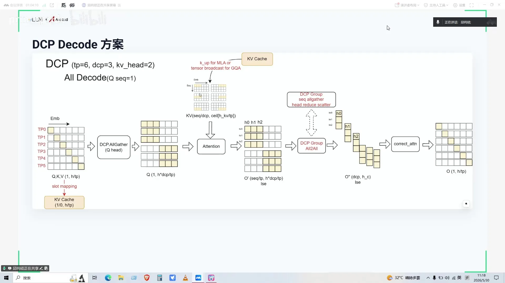 |
| 所以我们后面又引入了一次 all-to-all 通信。这个 all-to-all 其实可以把它理解为一次类似转置的操作：像后面图里画的，TP0 这张卡上他的 head 就只剩下了 H0 这个 head，然后他的 KV 的信息就会把 KV0、KV1、KV2 的信息全部聚合过来…… [【跳转到 12:55】](https://www.bilibili.com/video/BV1W1L96KEf5/?t=775) |  |
| 然后这样的话他就是让 head 又恢复到了我们正常的 TP 切分，序列信息又拿到了完整的序列信息。其实这个 all-to-all 也是我们最近在（上游）才加上去的。在这之前它是分成了两次通信：先会做一次序列维度的 all-gather…… [【跳转到 13:20】](https://www.bilibili.com/video/BV1W1L96KEf5/?t=800) |  |
| 然后之后再做头维度的 reduce-scatter，其实是和 all-to-all 等价的一个操作。对，然后这里经过一次 all-to-all 之后，他就是拿到完整信息，然后再去做那个 correct attention——或者说根据 LSE 去对 output 做更新的这个操作。更新完之后…… [【跳转到 13:45】](https://www.bilibili.com/video/BV1W1L96KEf5/?t=825) |  |
| 我们整个这个维度又恢复到了和我们输入的 Q 相同的维度：他只保留当前卡上的 Q head，但是他的 output 所包含的 KV cache 的信息就已经经过前面的这些操作，是完整的 KV cache 的信息了。这个就是整个 decode 阶段的流程。 [【跳转到 14:10】](https://www.bilibili.com/video/BV1W1L96KEf5/?t=850) |  |
| 主要引入的几个操作是最开始的这个 DCP 在 Q head 上的 all-gather，以及后面这次对结果的 all-to-all 通信，以及最终结果的更新。引入这几个操作，我们整个 decode 在后端的流程…… [【跳转到 14:35】](https://www.bilibili.com/video/BV1W1L96KEf5/?t=875) |  |
| 就是这样的。接下来讲完 decode 的，我再回过头来讲我们的 prefill——不是 prefill，是长 chunked prefill 的方案。因为回过头来就会发现 chunked prefill 会和 decode 的流程是比较接近的：它虽然 Q 的序列…… [【跳转到 15:00】](https://www.bilibili.com/video/BV1W1L96KEf5/?t=900) |  |
| 不是单个 token 而是一个 sequence，但是因为我们本身 DCP 也不会动这个 Q 的序列，所以相当于 Q（K V）本身也是完整的，但是这个 KV cache 是不完整的。这样的话其实整个流程会和我们前面 decode 阶段的流程比较接近。当然实际上实现的时候我们是有两套方案的，这个就是怎么说呢…… [【跳转到 15:25】](https://www.bilibili.com/video/BV1W1L96KEf5/?t=925) | 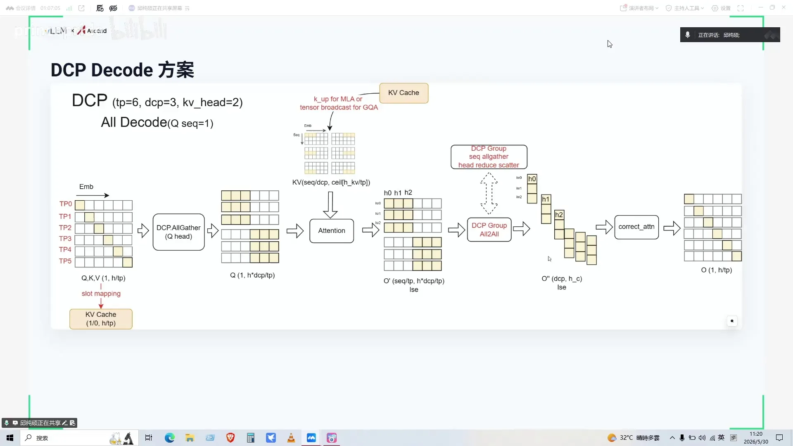 |
| 不是一是一个sequence但是因为我们本身DCP也不会动这个Q的序列所以相当于QQV本身也是完整的但是这个kvcash是不完整的然后这样的话其实整个流程会和我们前面的这个额抵扣的阶段的流程是比较接近的呃但当然实际上实现的时候我们是有两套方案的这个呃就是怎么说呢 [【跳转到 15:50】](https://www.bilibili.com/video/BV1W1L96KEf5/?t=950) |  |
| 这个也是当时根据后端实际的实现情况去做的一些更改。像我们在 GQA 的这个路径下，我们的流程就是完全和 decode 一致的：对 Q 先做一次 DCP 组内的 all-gather，然后做 KV cache 的 update，之后再应用这个 all-to-all（或者 all-gather 加 reduce-scatter）操作去更新，更新到这个上下文信息之后，再去和我们这个完整正常的部分 Q 做一次长 prefill 的更新。这样我们 output 就是完整的信息了…… [【跳转到 16:15】](https://www.bilibili.com/video/BV1W1L96KEf5/?t=975) | 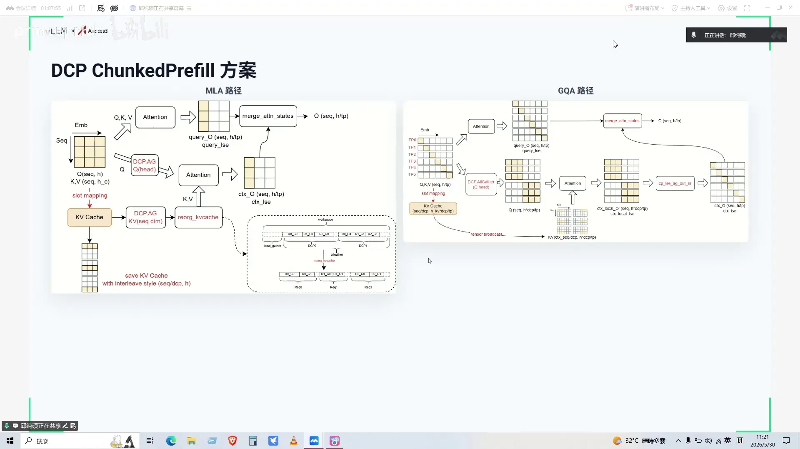 |
| 既包含当前这一次的 KV，又包含历史 KV cache 的信息，这个就是跟 decode 的流程比较接近。然后 MLA 这边，也是（月之暗面的）老师最开始实现的一套方案，其实跟我们现在的有一点差异。我想想…… [【跳转到 16:40】](https://www.bilibili.com/video/BV1W1L96KEf5/?t=1000) | 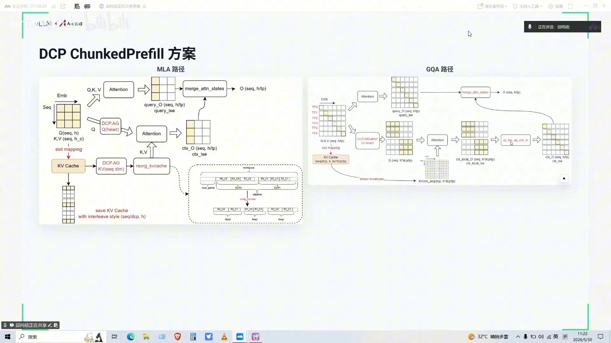 |
| 这个图好像当时画的有点不对：应该是没有这一个 DCP 在 head 上的 all-gather 的，但是当时画的时候有点失误，大家忽略掉这一次 all-gather。就是在 MLA 这边…… [【跳转到 17:05】](https://www.bilibili.com/video/BV1W1L96KEf5/?t=1025) | 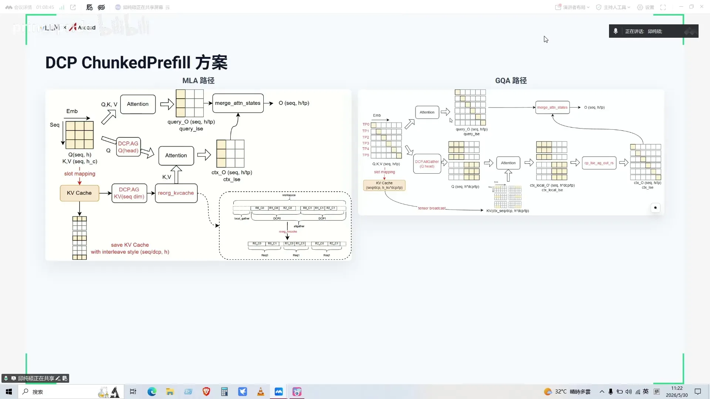 |
| 我们其实并不是对 Q 做什么操作，实际上是把我们拆分掉的 KV cache 又重新聚集回来。就相当于虽然存储的时候我们 KV cache 是分散的，但是实际计算的时候我们又把存在各个卡上的 KV cache 给聚合回来了…… [【跳转到 17:30】](https://www.bilibili.com/video/BV1W1L96KEf5/?t=1050) | 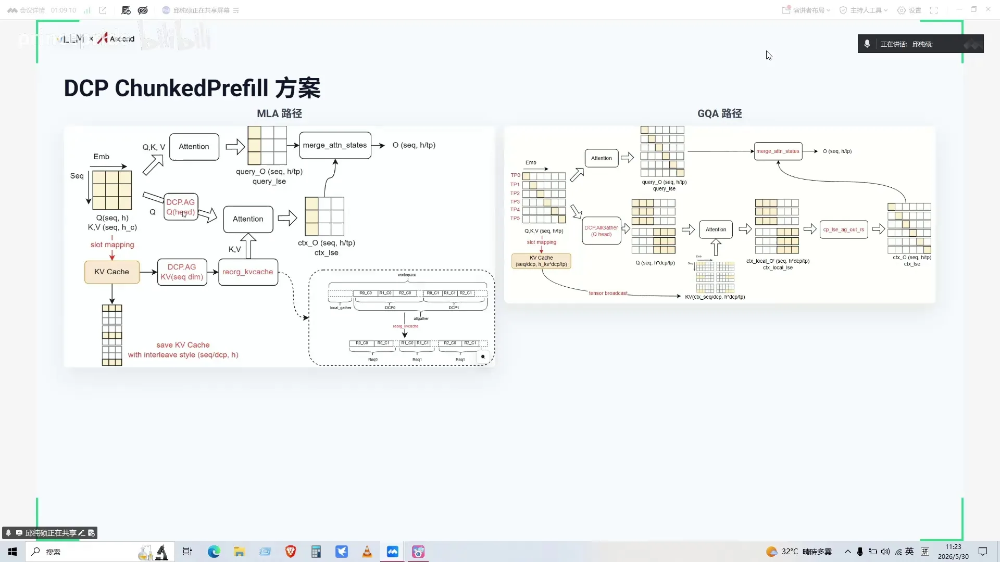 |
| 是这么一个流程。然后具体操作过程：因为我们本身在 MLA 里，做长 prefill 的时候是有一套操作的：有一个 workspace 不断地从 KV cache 里面取一部分 KV，然后去和当前的 Q 做计算。这样可以避免我们一次计算…… [【跳转到 17:55】](https://www.bilibili.com/video/BV1W1L96KEf5/?t=1075) | 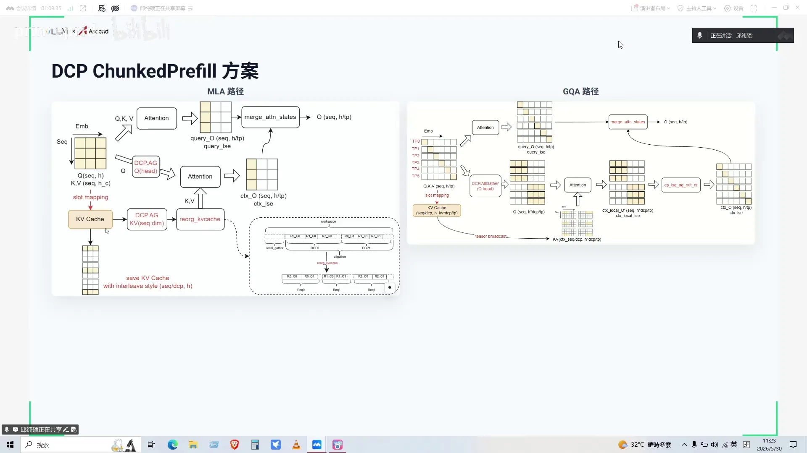 |
| 跟太长的上下文做计算导致激活值比较大、避免峰值显存的问题。然后我们在 DCP 这里也顺便顺着这一个 workspace 的逻辑去做了。我看一下——这个图可以放大。对，放大。就是我们会还是正常地…… [【跳转到 18:20】](https://www.bilibili.com/video/BV1W1L96KEf5/?t=1100) | 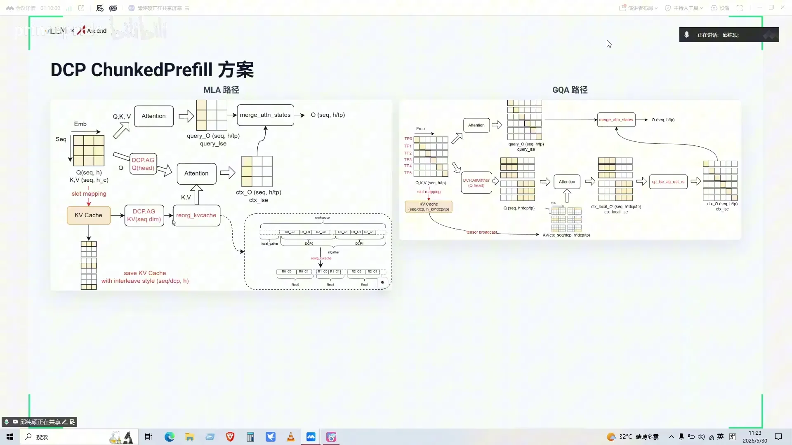 |
| 不断地取这一个 local 的 KV cache，之后我们会把 local 的 KV cache 给 all-gather 过来，拿到每一张卡上对应位置的这一部分 KV cache。就是这里图画的：DCP0、DCP1，然后包括后续 DCP 的 KV cache。这里面画的就是请求零的 DCP 第（一）块，然后这个是请求一在 DCP 一上的第一块…… [【跳转到 18:45】](https://www.bilibili.com/video/BV1W1L96KEf5/?t=1125) | 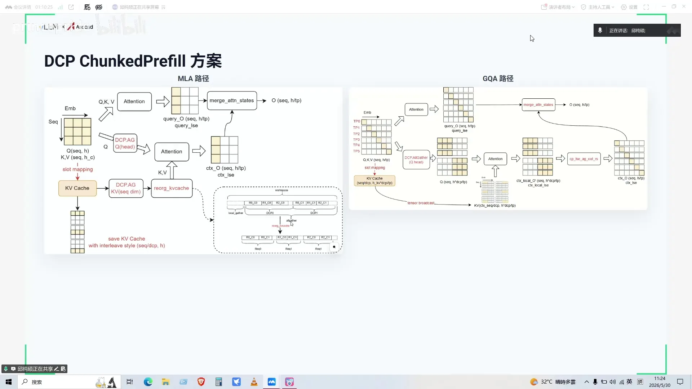 |
| 后面是请求零的在 DCP2 上的第二块，中间也是对应了我们请求一、请求二的各自的分块。然后我们把各个卡上的这一部分 KV cache 拿到之后，会引入一个 reorg KV cache 的操作。这个我理解整个在 MLA 这个流程里边，从代码上是相对比较难阅读的一个部分…… [【跳转到 19:10】](https://www.bilibili.com/video/BV1W1L96KEf5/?t=1150) | 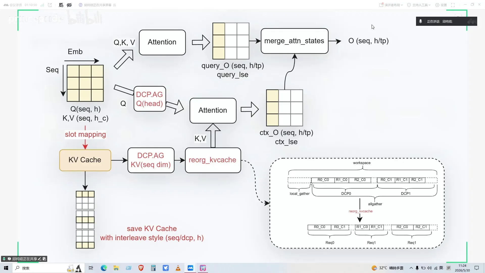 |
| 这个部分其实做的事情就是：我们 all-gather 之后不同请求的 KV cache 是交错存储的，reorg KV cache 做的就是把交错存储的 KV cache 聚合在一起，让它重新变成连续存储的——就是从上面这个形状变成下面这种…… [【跳转到 19:35】](https://www.bilibili.com/video/BV1W1L96KEf5/?t=1175) | 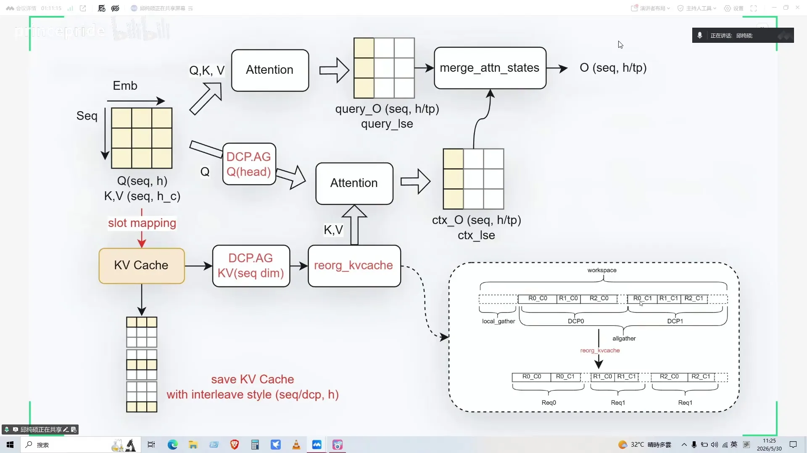 |
| 请求零的第零块、请求零的第一块、请求零的第二块，然后后面这些各个部分。同时除了重新（排列）之外，他第二个操作——顺便做的——会把……从比较早的那个图也能看到，同一个（DCP 组里）不同卡上存的 KV cache 长度是可能不一样的。本身我们算子这一块也不太支持 KV cache 这种 tensor 格式里在 KV 中间插入一些空的 pad，所以这里会顺便把中间插的这些 pad 去掉，做一个（去）pad 的操作，让它变成一个紧密的连续存储的 tensor 格式。 [【跳转到 20:00】](https://www.bilibili.com/video/BV1W1L96KEf5/?t=1200) | 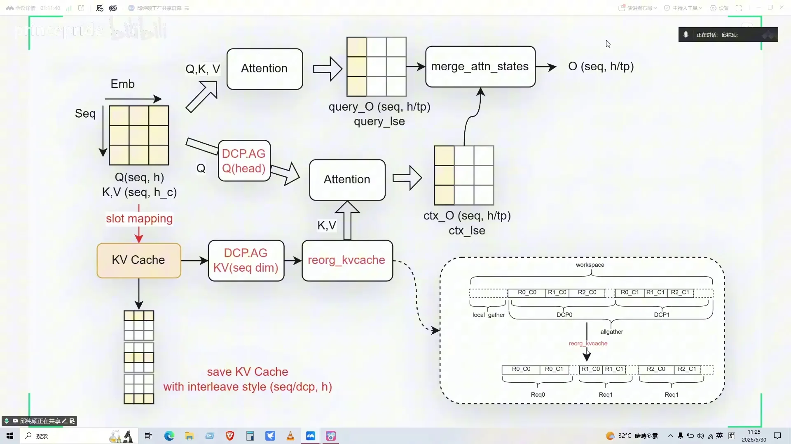 |
| 然后拿到这种格式之后，其实就可以直接跟本卡自己的 Q 去做 attention 的计算。然后这样通过一轮轮的迭代，就可以迭代出我们所有上下文部分的 output 和对应的 LSE，再做一个最终的和当前 Q 的更新就可以了。这样就能拿到我们 MLA 里面完整的 attention output 结果。大概就是在 MLA 里面的一个流程。 [【跳转到 20:25】](https://www.bilibili.com/video/BV1W1L96KEf5/?t=1225) | 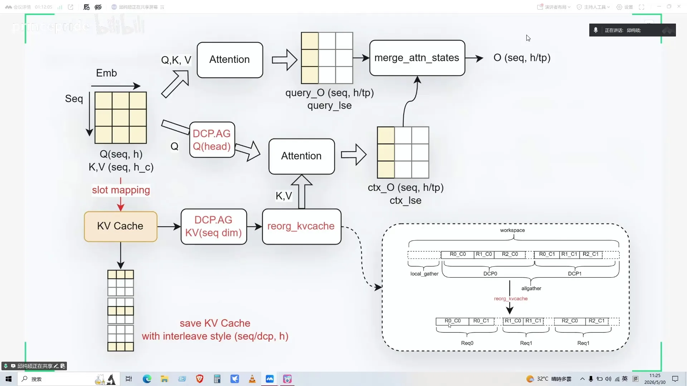 |
| 他这个思路就是只在存储上做 KV 的分块，在计算上还是保持一个全量 KV cache 计算的。然后 GQA 的话其实就是和 decode 阶段比较接近了：我们不论是存储还是计算都是做了 KV cache 上的（切分）的。这是我们整个 DCP 的一个方案：包括前面的 prefill 阶段怎么去存这个 KV cache…… [【跳转到 20:50】](https://www.bilibili.com/video/BV1W1L96KEf5/?t=1250) |  |
| 包括我们 decode 的阶段怎么做到和各个卡上的 KV 做分块计算，然后再聚合更新。然后包括后面这个长 chunked prefill 可能在 MLA 路径和 GQA 路径是分了两套方案去实现的，是有所差异的。这是我们现在 DCP 在 vLLM 这个仓上的实现。目前的话 DCP 应该已经支持了…… [【跳转到 21:15】](https://www.bilibili.com/video/BV1W1L96KEf5/?t=1275) |  |
| 最（基本）一些相对普通的、没有特殊结构的模型，就像 Qwen3、DeepSeek 3.1 这些。但是像 3.2、包括 DeepSeek-V4、或者说 Qwen3.5 这种混合线性（注意力）模型，目前还没有完全支持…… [【跳转到 21:40】](https://www.bilibili.com/video/BV1W1L96KEf5/?t=1300) | 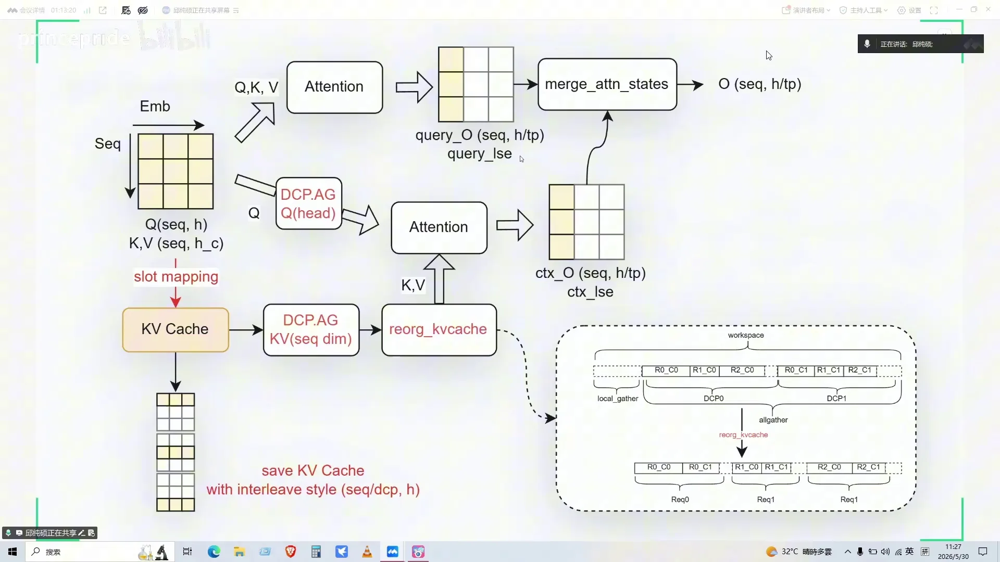 |
| 就是有一些相关的 PR 但是还没合入到主线里面。大家可以后续期待一下，有兴趣的也可以一起来给我们做一些贡献。好，我们回答一下直播间的一些问题。OK，有人问：DCP 主要是为了省 KV cache、降低不同卡中的显存占用吗？ [【跳转到 22:05】](https://www.bilibili.com/video/BV1W1L96KEf5/?t=1325) | 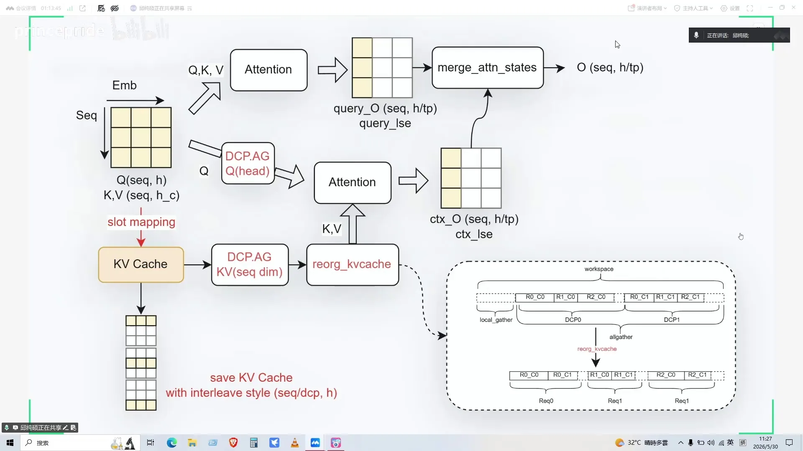 |
| 我刚刚有点没听清——DCP 主要是为了省 KV cache、降低不同卡中显存占用嘛？其实可以从两个方面去说：一方面确实可以，如果我们固定每请求的上下文长度…… [【跳转到 22:30】](https://www.bilibili.com/video/BV1W1L96KEf5/?t=1350) | 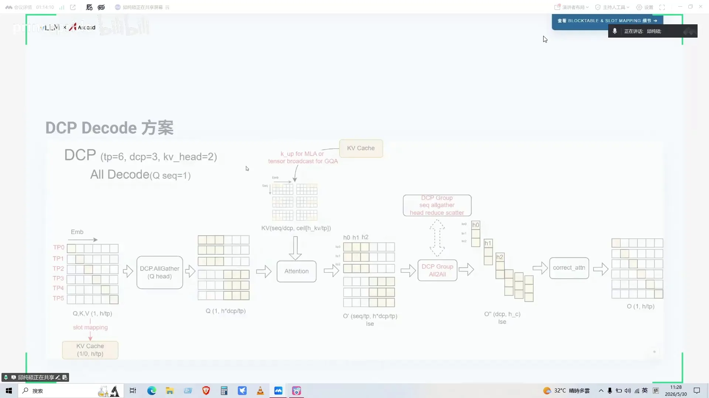 |
| 最一些就是相对普通的就是没有特殊结构的模型就像前文三然后啊desk3.1这些然但是像3.2包括DPC和V4或者说前文3.5这种混合线模型目的啊目前还没有完全支持 [【跳转到 22:55】](https://www.bilibili.com/video/BV1W1L96KEf5/?t=1375) | 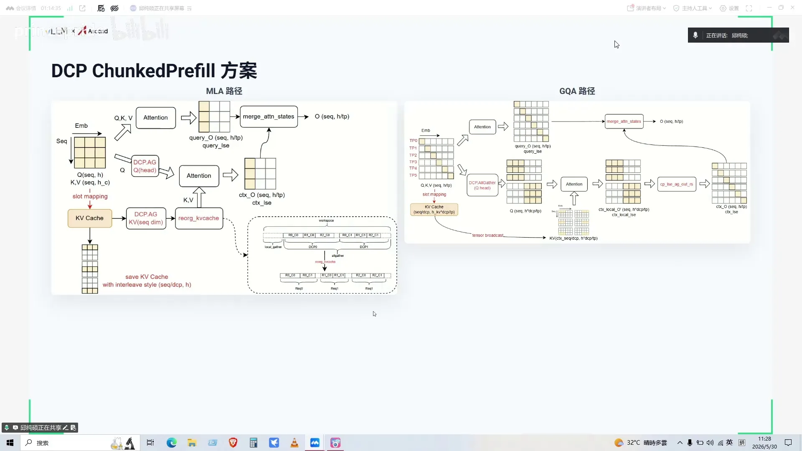 |
| 就是是有一些相关的pr的但是还没合入到主线里面对然后可以大家也可以后续期待一下包括啊有兴趣的也可以一起来给我们做一些贡献好我们回答一下的直播间那些后喂呃我们回答一下直播间的一些问题OK哦好就是呃有人问嗯DCP主要是为了省kvcash降低不同卡中的VRAM的占用的 [【跳转到 23:20】](https://www.bilibili.com/video/BV1W1L96KEf5/?t=1400) | 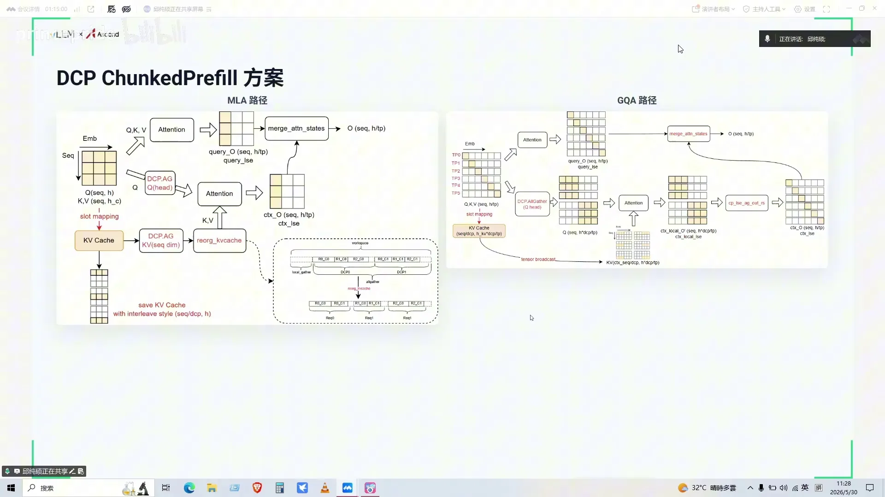 |
| 额我刚刚刚刚有点没听清啊就是呃DCP它主要是为了省kacatch然后降低不同卡中为ram的占用嘛其实呃我怎么只可以从两个方面去说他一方面确实可以就是如果我们固定每请求的上下文长度 [【跳转到 23:45】](https://www.bilibili.com/video/BV1W1L96KEf5/?t=1425) |  |
| 然后固定请求的数量的话，它确实可以让你的（单卡显存占用）调得更低，来满足这个需求。或者从另一个方面说：在我们 GPU 显存占用固定的时候，我们可以存更多的 KV cache。存更多的 KV cache…… [【跳转到 24:10】](https://www.bilibili.com/video/BV1W1L96KEf5/?t=1450) | 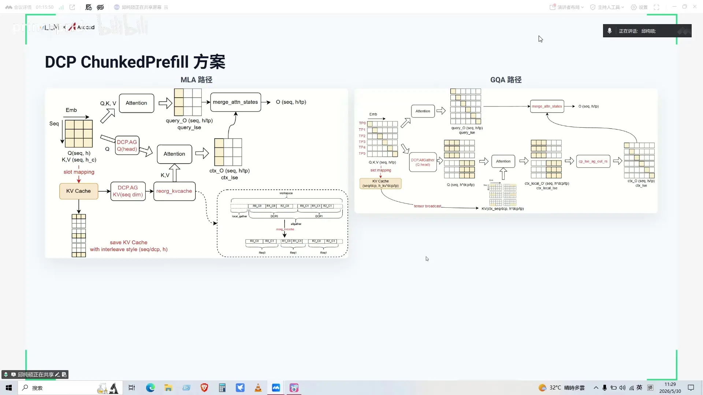 |
| 所以其实确实可以让我们在更有限的资源下去推更长的序列。嗯，但是这样的话是不是也会造成额外的通信开销？——是这样的，我们目前 DCP 在 decode 阶段 TPOT 的实测发现——我应该是有一张图有一个表的——确实我们目前实测下来在短序列情况下 TPOT 是会有劣化的。一般来说当序列长度超过 128K 的时候，我们才会有一些 TPOT 上的收益。如果序列长度比较短的话…… [【跳转到 24:35】](https://www.bilibili.com/video/BV1W1L96KEf5/?t=1475) | 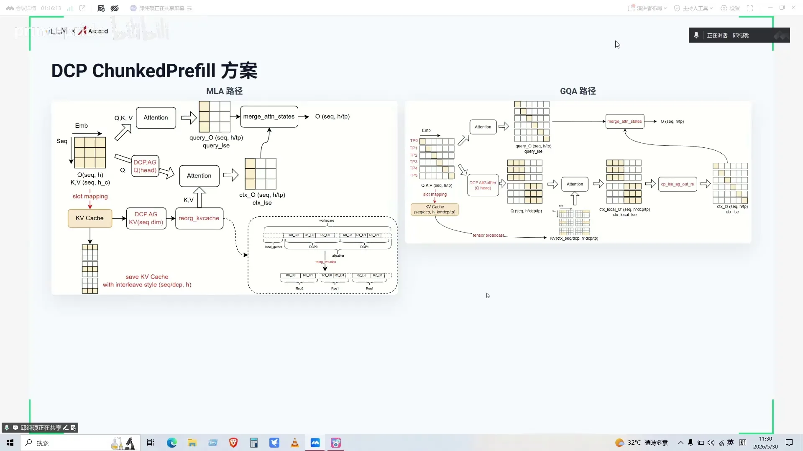 |
| 其实还是不是特别建议去开这个 DCP 的，因为确实会导致 TPOT 的劣化。——对。好，然后直播间观众问：什么叫做 correct attention？ [【跳转到 25:00】](https://www.bilibili.com/video/BV1W1L96KEf5/?t=1500) | 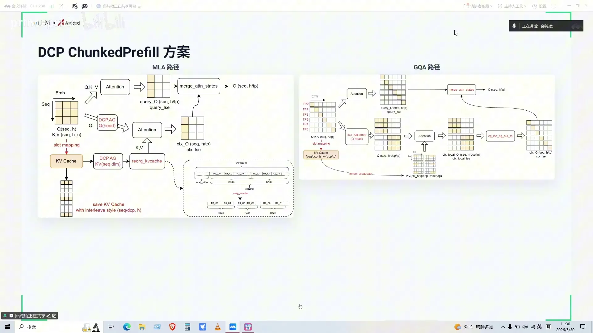 |
| 呃其实还是不是特别建议去开这个TCP的因为确实会导致TPOT的劣化对好然后还有直播间观众问什么叫做correctattention [【跳转到 25:25】](https://www.bilibili.com/video/BV1W1L96KEf5/?t=1525) | 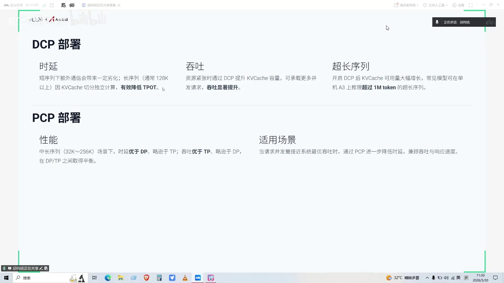 |
| 就是你的那个（分块）…… [【跳转到 25:41】](https://www.bilibili.com/video/BV1W1L96KEf5/?t=1541) | 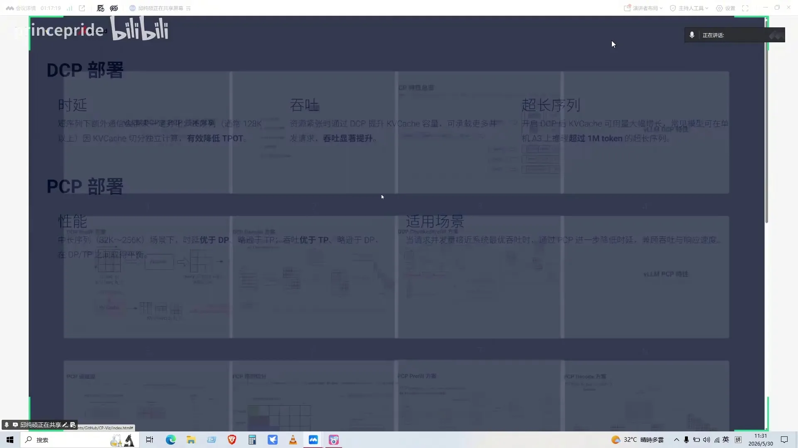 |
| 这个其实是……对，就是这个 correct attention…… [【跳转到 25:46】](https://www.bilibili.com/video/BV1W1L96KEf5/?t=1546) | 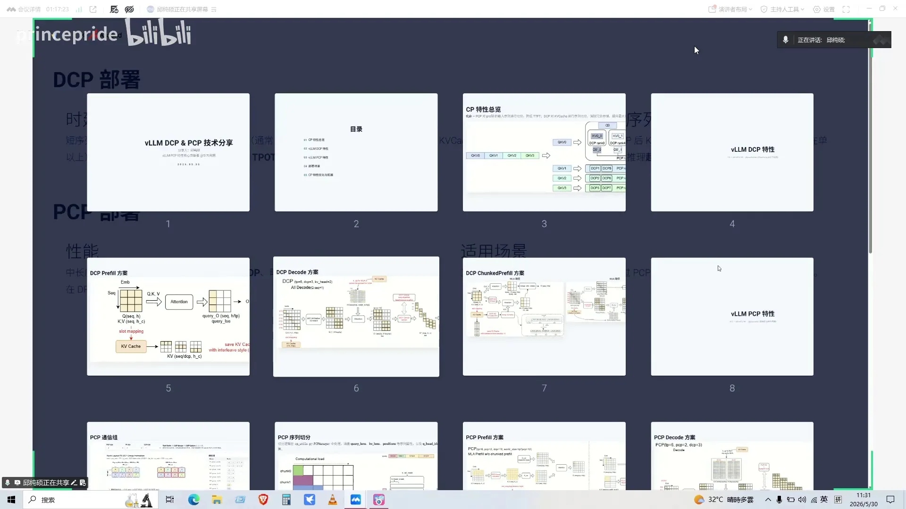 |
| 这个是 online softmax 的那个：分块计算 online softmax，然后最终包括记录中间的 LSE 的值，最终通过一次更新的操作把分块计算的结果变成全局的结果。对，这个感兴趣的可以再去看一下。 [【跳转到 25:51】](https://www.bilibili.com/video/BV1W1L96KEf5/?t=1551) |  |
| 然后还有人问：DCP 不是叫 decode CP 吗？为啥还跟 prefill 有关系？可以看一下哦…… [【跳转到 26:16】](https://www.bilibili.com/video/BV1W1L96KEf5/?t=1576) |  |
| 为啥还跟PREFAIL有关系可以看一下哦 [【跳转到 26:21】](https://www.bilibili.com/video/BV1W1L96KEf5/?t=1581) | 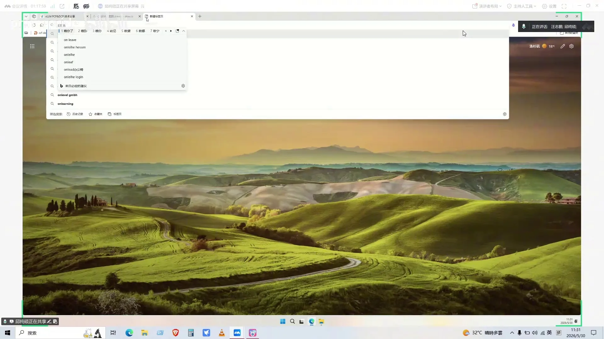 |
| 对，刚才那个问题的话可以看这个。它跟 prefill 有关系是因为：其实它跟单纯 prefill 的计算流程是没有关系的，它主要是影响我们 prefill 阶段存 KV cache。它影响的主要是 chunked prefill 这个流程。或者其实我觉得 decode 的 CP 也不是特别的精准…… [【跳转到 26:26】](https://www.bilibili.com/video/BV1W1L96KEf5/?t=1586) | 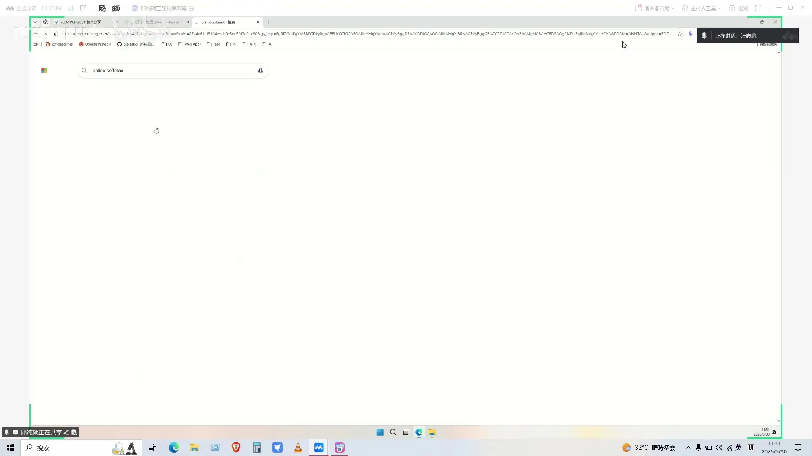 |
| 它更多的应该叫 KV cache 的 CP。如果把它叫做 KV cache 的 CP 我觉得就比较好理解了。因为在长 prefill 阶段其实我们也是要用到 KV cache 这部分的，所以对应的我们 DCP——或者更清晰一点叫 KV cache 的 CP——确实也会参与到 prefill 或者长 prefill 的过程。 [【跳转到 26:51】](https://www.bilibili.com/video/BV1W1L96KEf5/?t=1611) | 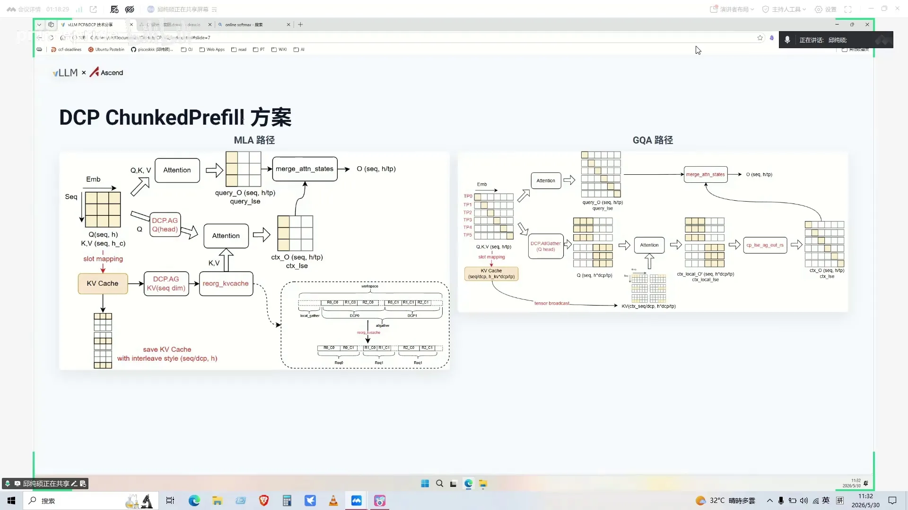 |
| 好，然后什么情况下应该开 DCP 呢？因为我们官方的推荐配置版本都是开 TP、EP 和 DP。我觉得主要还是看我们序列长度。其实也是像后面说的，如果你想在资源比较有限的情况下…… [【跳转到 27:16】](https://www.bilibili.com/video/BV1W1L96KEf5/?t=1636) | 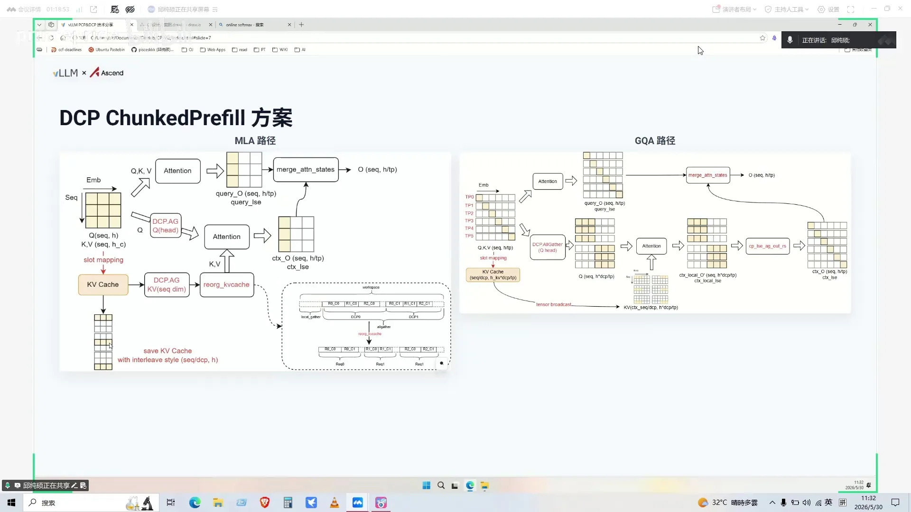 |
| 推比较长的序列…… [【跳转到 27:41】](https://www.bilibili.com/video/BV1W1L96KEf5/?t=1661) | 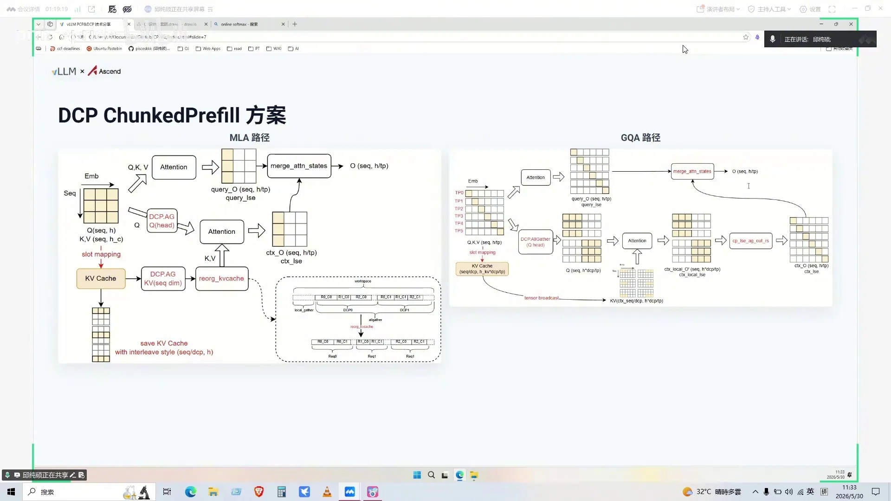 |
| 是可以把这个 DCP（打开）——还是看我们是看重 TPOT 的这个推理时延…… [【跳转到 27:46】](https://www.bilibili.com/video/BV1W1L96KEf5/?t=1666) | 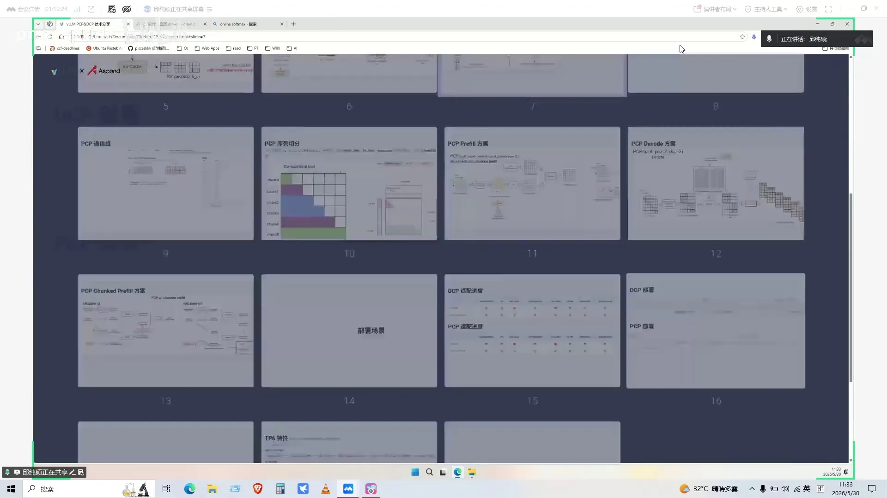 |
| 还是说更看重推理序列长度的能力。有一些例子：在一些比较有限的资源下，像我们昇腾的在 Atlas A3 上；然后 vLLM 的话我记得有一个人说的是…… [【跳转到 27:51】](https://www.bilibili.com/video/BV1W1L96KEf5/?t=1671) | 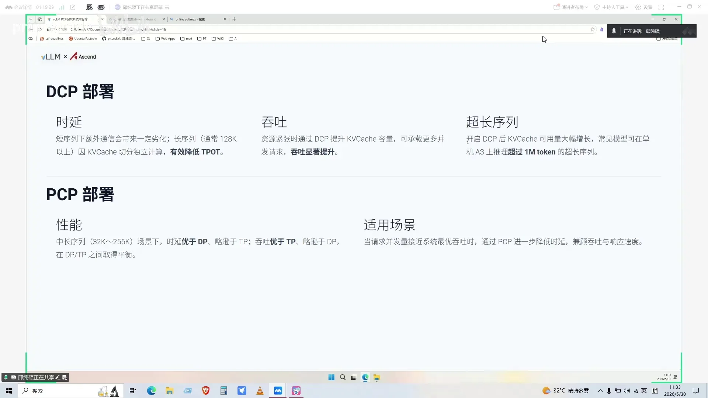 |
| 在单机也是只有八卡的情况下，反正开了 DCP 之后可以让整个序列的推理长度能到 1M——但这是单序列的推理。如果你序列也比较短的话，它可以（服务）更多的（并发），然后包括它可以同时让你的 KV cache 存储的更多…… [【跳转到 28:16】](https://www.bilibili.com/video/BV1W1L96KEf5/?t=1696) | 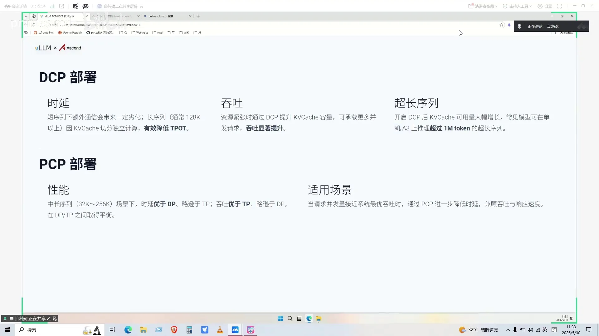 |
| 然后这样的话你的 prefix cache 命中也会更好。所以这个其实我觉得更多的是一个取舍：到底是我们更希望在一个低时延的场景下去部署服务，还是说希望我们吞吐或者能服务的序列长度更长。——OK，单机 A3 是指的是华为那个产品对吧？——对这个单机 Atlas A3，我这里是说的华为的 910C。然后在 GPU 上的话我记得 H200 八卡机上好像是有人去测过，也测过这个 1M 的序列也是能推出来的。OK。——然后这个 Qwen3.5 现在不支持是因为目前不支持这个 hybrid attention 吗？ [【跳转到 28:41】](https://www.bilibili.com/video/BV1W1L96KEf5/?t=1721) |  |
| 对的，这个是暂时主线不支持。可以看到其实已经有 PR 做了这个适配了…… [【跳转到 29:06】](https://www.bilibili.com/video/BV1W1L96KEf5/?t=1746) | 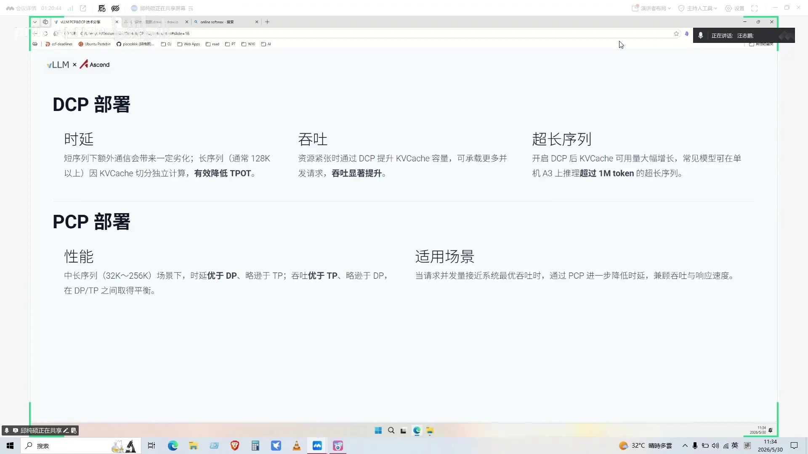 |
| 但是还没有合入到我们主线上。如果大家感兴趣的话，可以去找一下那个对应的 PR，他已经做好这部分的适配了：在 Qwen3.5 上我们的 DCP 其实也只是在他的 full attention 或者 GQA 的那（些层）做 DCP 的分块存储、KV cache 分块存储，然后在 linear attention 上…… [【跳转到 29:31】](https://www.bilibili.com/video/BV1W1L96KEf5/?t=1771) |  |
| 因为他本身只存一个 sliding window，所以不会去处理这部分。大家如果想试的话可以去找一下那个 PR 尝试一下。——然后有人问：这个 DCP 是不是跟 SGLang 里面的 DP attention 目标类似？——我理解上来的话，我感觉两边都是差不多的，对吧。你有了解 SGLang 那边的 DP attention 吗？ [【跳转到 29:41】](https://www.bilibili.com/video/BV1W1L96KEf5/?t=1781) | 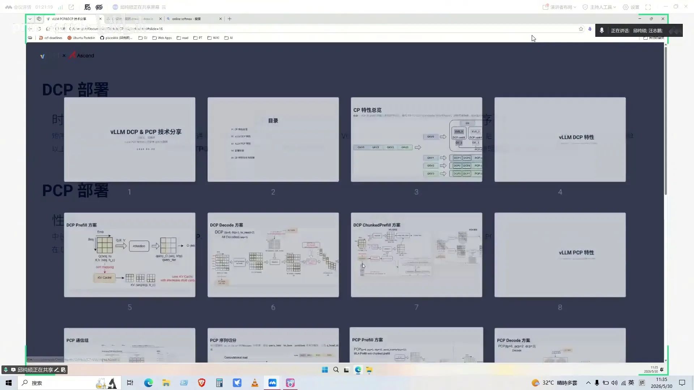 |
| 但是还没有额还没有合入到我们主线上然后但是啊如果大家感兴趣的话可以去找一下那个对应的那个PR他已经做好这部分的适配了就是在呃请问3.5上我们的DCP其实也是只是在他的forattention或者GKA的那个后做DCP的这个分块存储KV开始分块存储然后再线性和tension上 [【跳转到 29:46】](https://www.bilibili.com/video/BV1W1L96KEf5/?t=1786) | 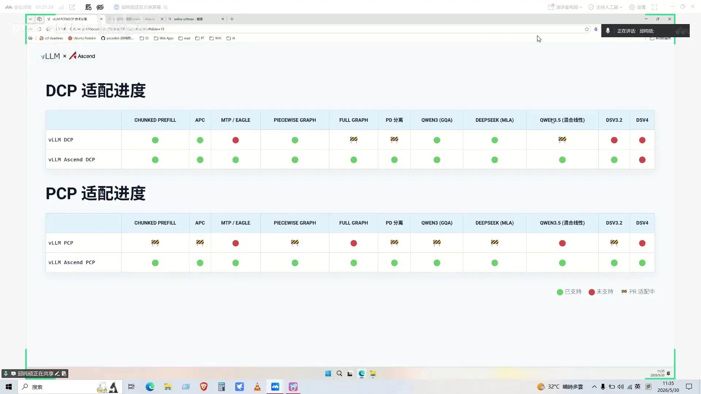 |
| 因为它本身只存一个slidingwindow所以不会去处理这部分对然后可以大家如果想试的话可以去找一下那个pr去尝试一下然后有人问这个DCP是不是跟S级浪里面的DP的tension目标类似我理解上来的话应该我感觉两边都是差不多的对吧你有了解S知道那边的DP和喷泉吗 [【跳转到 30:11】](https://www.bilibili.com/video/BV1W1L96KEf5/?t=1811) | 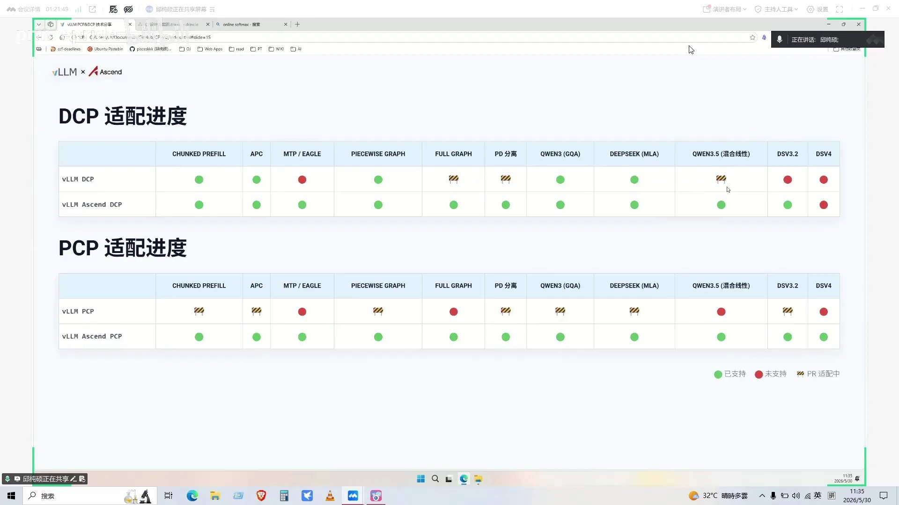 |
| 这块我好像确实了解不太多。他其实我感觉跟我们这个东西差不多，也是相当于把那个 KV cache 拆开存在不同的卡上，然后去防止多余的存储。——哦是的，那应该确实比较接近。嗯，然后还有人问…… [【跳转到 30:36】](https://www.bilibili.com/video/BV1W1L96KEf5/?t=1836) | 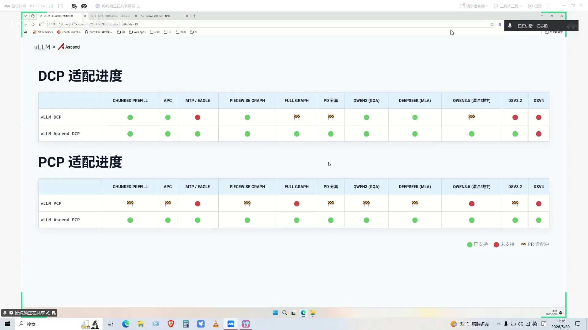 |
| 可以分析一下 DCP 性能收益来源吗？ [【跳转到 31:01】](https://www.bilibili.com/video/BV1W1L96KEf5/?t=1861) | 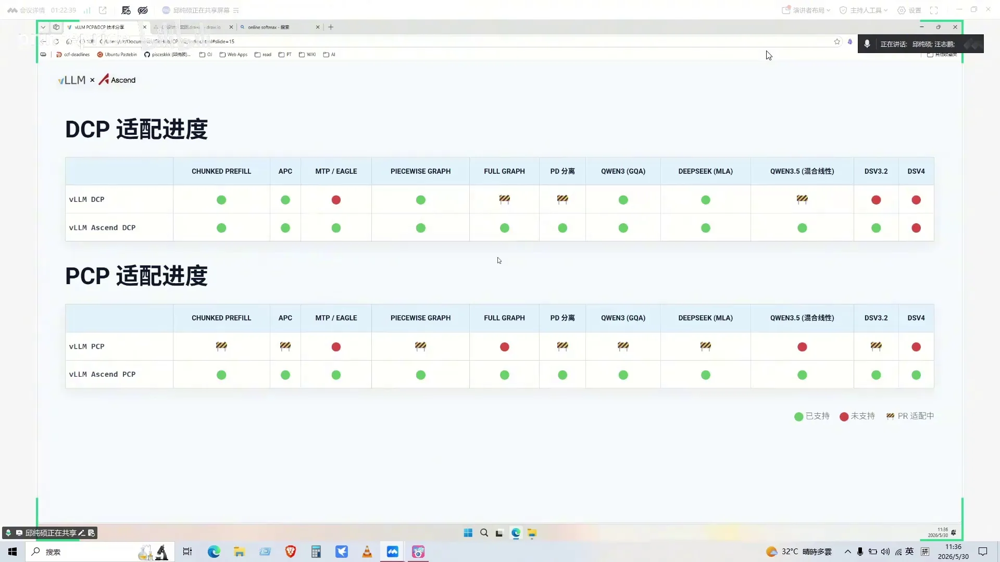 |
| 是说 TPOT 的这个收益来源，还是吞吐的？——嗯嗯，可以这里多讲一下。——对，首先这个短序列的劣化这个其实很清晰，因为它确实引入了额外的通信，还有额外的一些更新的操作，序列短的时候（开销占比大）。然后长序列下之所以有收益，我理解可能有两个原因：一个是本身每张卡上去算——只包含自己的这部分 KV cache 的时候，他的计算量应该是会有降低的。哎我稍等我想想——虽然理论计算量好像应该是一样的，但是可能就是不同的算子在 KV cache 不断增加的情况下…… [【跳转到 31:11】](https://www.bilibili.com/video/BV1W1L96KEf5/?t=1871) | 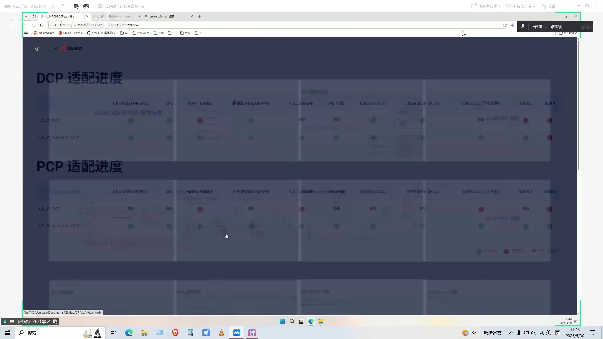 |
| 还是说通透的嗯嗯可以这里多讲一下嗯对就是首先这个短序列的列化这个其实很很很清晰因为它确实引入了额外的通信然后还有额外的啊一些更新的操作序列短的时候是有变化的然后长序列下啊之所以有收益我理解可能是有两个原因一个是呃本身每张卡上去算这个呃 [【跳转到 31:16】](https://www.bilibili.com/video/BV1W1L96KEf5/?t=1876) | 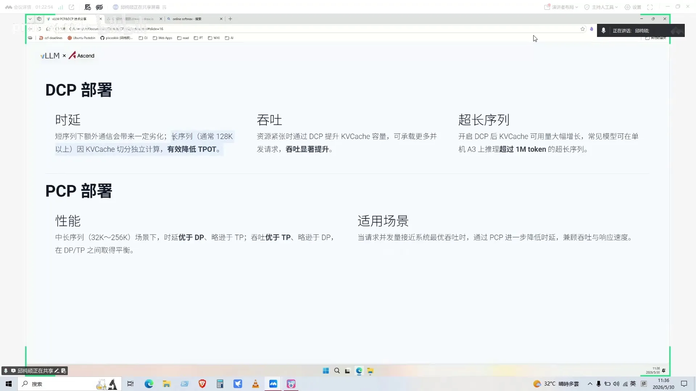 |
| kvcat去去算只包含自己的这部分kvcatch的时候他的计算量应该是会有降低的哎我稍等我想想哦虽然理论计算量好像应该是一样的但是可能就是不同的算子对呃在KV开始不断增加的情况下 [【跳转到 31:41】](https://www.bilibili.com/video/BV1W1L96KEf5/?t=1901) | 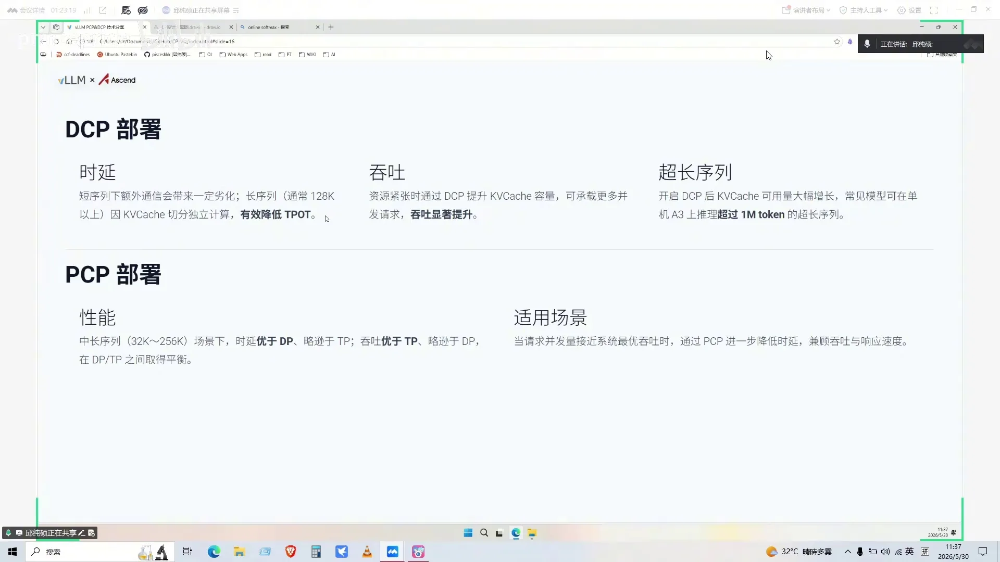 |
| 他的实际计算——理论计算量和实际的计算性能并不一定是正比线性关系的。所以在长序列下可能会有些劣化，然后我们让它在更短的序列去做计算的话相对会有些收益，可能这些收益会把我们额外通信带来的开销掩盖掉，所以在长序列下会有相应的收益。 [【跳转到 32:06】](https://www.bilibili.com/video/BV1W1L96KEf5/?t=1926) |  |
| 然后吞吐的话，我理解：因为他本身时延是（劣化）的，所以单纯来看时延上他吞吐应该不会增加。但他带来的好处是可以提高本身的并发量，并发量上去之后是一定程度上可以提高本身吞吐的。然后后面这个（收益）在长序列比较明显，所以大概是这几方面的来源。——因为我感觉所有的序列并行都会存在这个问题：他的收益主要都是体现在超长序列上面。——哦是的，其实对。 [【跳转到 32:31】](https://www.bilibili.com/video/BV1W1L96KEf5/?t=1951) |  |
| 本身吞吐的对然后后面这个插入序列值比较细比较明显所以这大概是这几方面的来源对因为我额因为我感觉啊所有的序列并情它都会存在这个问题就他的收益主要都是体现在超长序列上面哦是的其实嗯对 [【跳转到 32:56】](https://www.bilibili.com/video/BV1W1L96KEf5/?t=1976) | 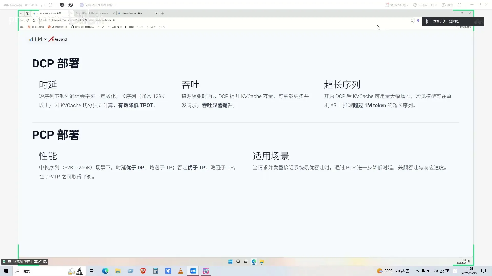 |
| 然后又有同学问了：DCP chunked prefill 方案的这个 GQA 路径为啥最上面有一条计算路径？——上面这一条就是本身的那个 attention…… [【跳转到 33:21】](https://www.bilibili.com/video/BV1W1L96KEf5/?t=2001) | 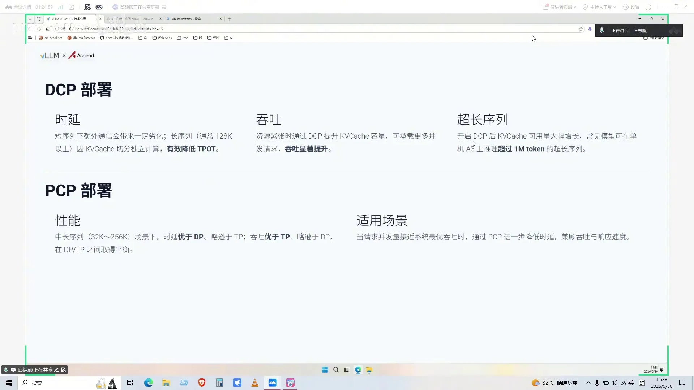 |
| 就是他这个输入的 QKV 的…… [【跳转到 33:37】](https://www.bilibili.com/video/BV1W1L96KEf5/?t=2017) | 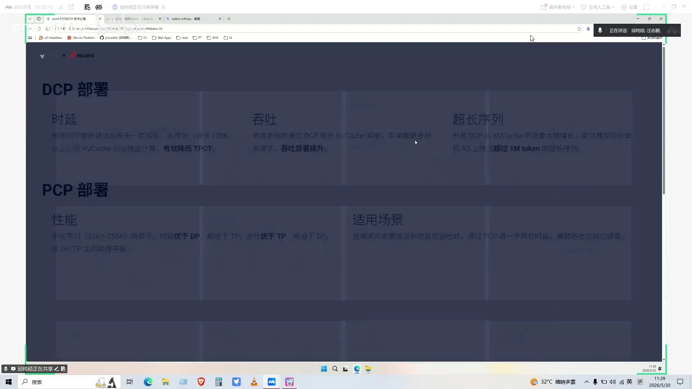 |
| attention 的计算路径。呃是这样的——我想一下怎么讲——这个也并不是每一个后端都这样实现的。我画的这个应该是 FlashInfer 的后端。因为 FlashInfer——我们可以想象这么一个场景：如果我们把这一部分…… [【跳转到 33:42】](https://www.bilibili.com/video/BV1W1L96KEf5/?t=2022) | 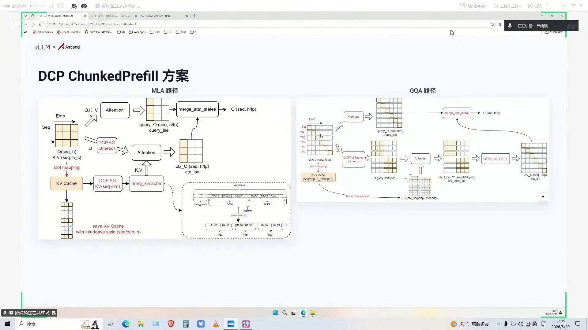 |
| 当前正在计算的 KV 也存在 KV cache 里，然后他的 mask……我想想，我看看后面有没有图——这个图好像不太能说明问题：他的 mask 会是一个阶梯形的 mask，它不是标准的下三角或者梯形的 mask。因为我们这部分 KV cache 是每个 token 按 token 去轮询存的，那就有可能……我想想我能不能画一下——这应该有画图的功能……你这腾讯会议是…… [【跳转到 34:07】](https://www.bilibili.com/video/BV1W1L96KEf5/?t=2047) | 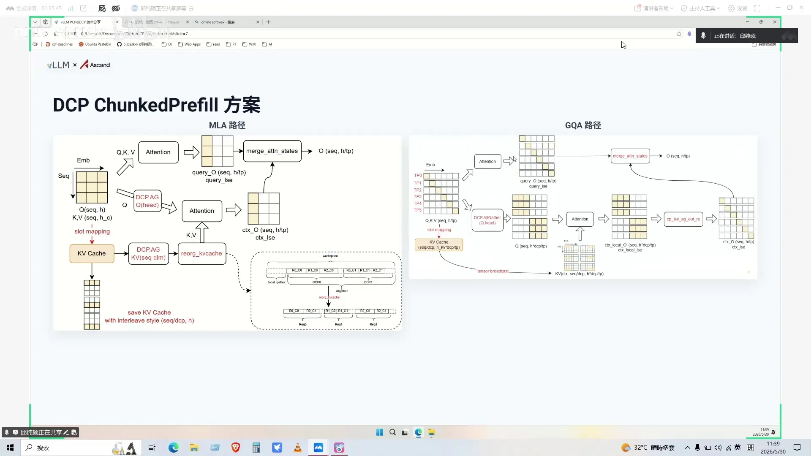 |
| 啊这样画一下可以。就我们 Q 是一个完整的序列，但是 KV——比如 Q 是 0、1、2、3…… [【跳转到 34:32】](https://www.bilibili.com/video/BV1W1L96KEf5/?t=2072) | 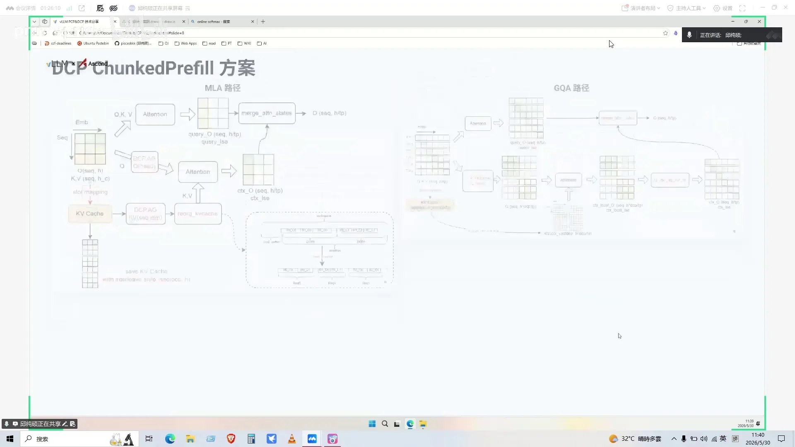 |
| 那如果我的 KV 存在本张卡上可能只存了 0 和 2，那它的 mask 其实是长这样的。 [【跳转到 34:57】](https://www.bilibili.com/video/BV1W1L96KEf5/?t=2097) | 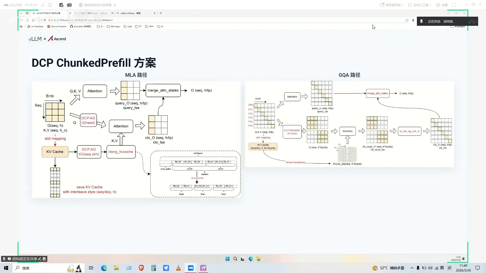 |
| 哦，这个好像应该再长一点。然后他这个 mask 是比较怪异的：可以看到他是两个阶梯、两个阶梯这样往下增长。 [【跳转到 35:13】](https://www.bilibili.com/video/BV1W1L96KEf5/?t=2113) | 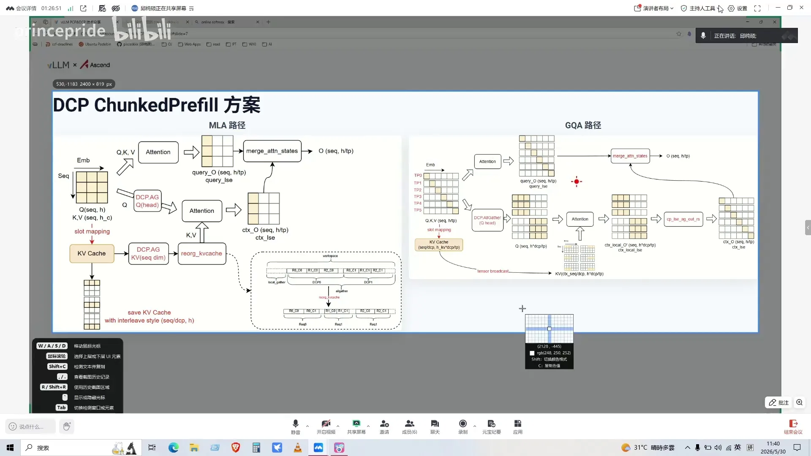 |
| 然后他这个 mask 是比较怪异的，可以看到他是两个阶梯、两个阶梯这样往下增长。 [【跳转到 35:38】](https://www.bilibili.com/video/BV1W1L96KEf5/?t=2138) | 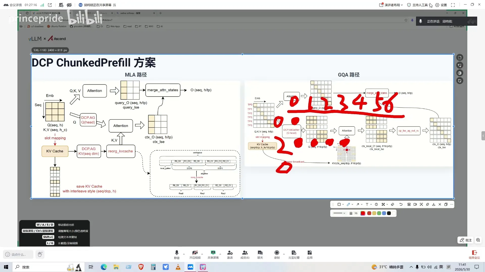 |
| 然后这个应该是基本填满了。对，然后其实现在 FlashInfer 这个后端…… [【跳转到 36:03】](https://www.bilibili.com/video/BV1W1L96KEf5/?t=2163) | 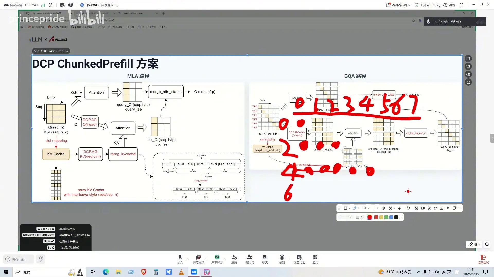 |
| 暂时是不支持这种（带阶梯 mask 的）attention 的。所以我们就需要把当前的 KV 和 Q 去做一次正常的完整的计算，然后之后对于上下文的部分再用下边这条路径去计算。然后我记得在 FlashAttention 这一个后端的话，它其实在后端里边支持了我们去传入 KV cache 的 interleave size 来构造这种异构的 mask。所以 FlashAttention 实际上就只有下面这一条路径了：它相当于存完当前的 KV cache 之后，就直接拿 Q 跟（聚合来的）KV cache 做一次带着这种 mask 的 attention。 [【跳转到 36:15】](https://www.bilibili.com/video/BV1W1L96KEf5/?t=2175) | 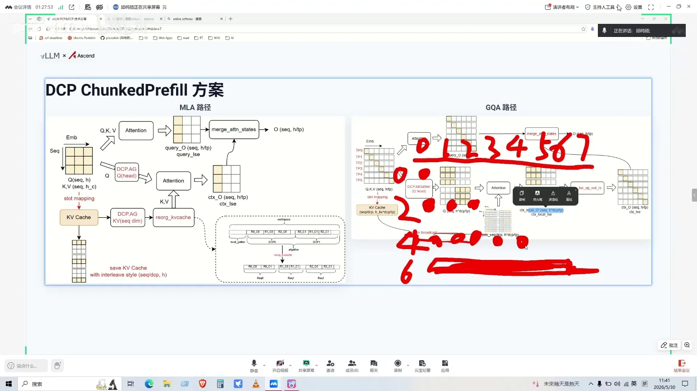 |
| kvcash的这个intlevelsize来构造这种异构的mask然后所以啊flashattention实际上就只有下面这一条路径了就它相当于啊存完当前的kvcatch之后呃就是会去啊直接拿Q然后跟呃大点卡的可以开始做一次这种带着egomask的attention [【跳转到 36:40】](https://www.bilibili.com/video/BV1W1L96KEf5/?t=2200) | 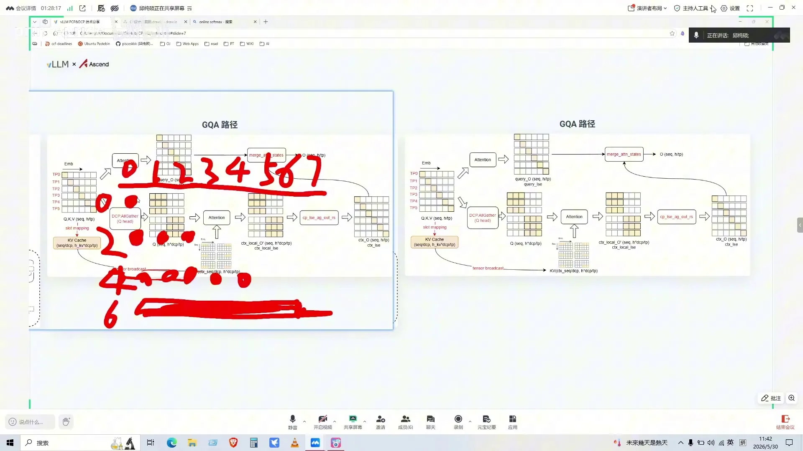 |
| 对，大概是这么一个逻辑。好，那我们可以继续讲 PCP 了。——好的。——对，接下来我讲一下 PCP 这个方案。PCP 这个事也是我在去年大概下半年的时候向 vLLM 社区提交了 RFC，之后也提交了相关的几个 PR 去做适配。但是目前应该是已经把框架在 vLLM 上跑起来了，后端暂时 PR 还没有合进去。 [【跳转到 37:05】](https://www.bilibili.com/video/BV1W1L96KEf5/?t=2225) | 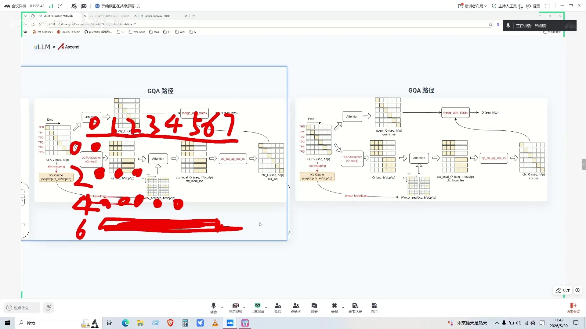 |
| 首先我们来看一下——在 DCP 里我们整个……哦好像（图）没画全。在 DCP 的时候，我们 DCP 的通信组是复用了 TP 的通信组，他是 TP 通信组一个子集。然后 PCP 的话它会引入一个额外的通信组，因为他是和 DP、PP、TP 并列的一个东西，它也会增加我们整个所使用的卡的数量…… [【跳转到 37:30】](https://www.bilibili.com/video/BV1W1L96KEf5/?t=2250) | 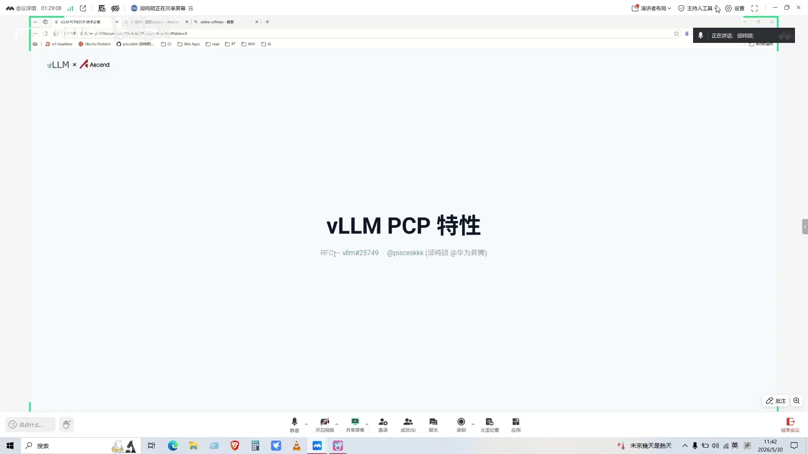 |
| 这里先画了一个简单的。因为 PCP 本身还是会和 DCP 有一些交互的，所以这里先假设 DCP=1，单纯看我们引入 PCP 之后：PCP 他应该是在比 TP 更早的一级去划分——先划分成 PCP0 和 PCP1，然后去获取不同的序列的（分块）…… [【跳转到 37:55】](https://www.bilibili.com/video/BV1W1L96KEf5/?t=2275) | 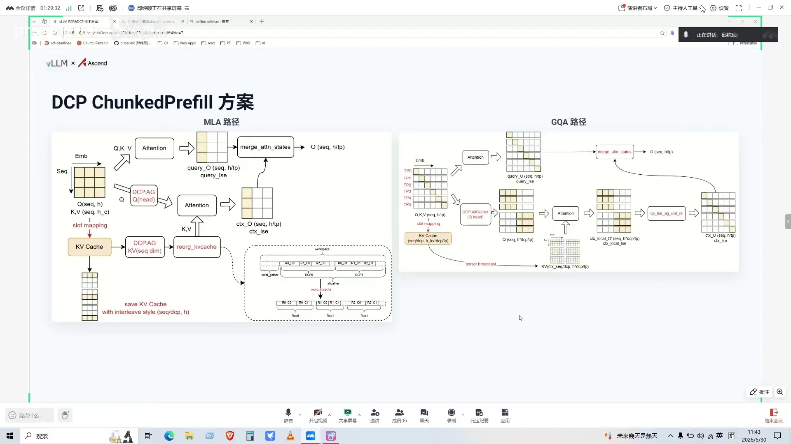 |
| 然后之后在这个里边再去划分 TP，来做 TP head 的切分。PCP 本身自己是不会去控制 KV cache 的交错存储的。这两个目前在我们 vLLM 的方案上是希望能把这两个（维度）解耦开。然后当我们在这个基础上引入 DCP 之后…… [【跳转到 38:20】](https://www.bilibili.com/video/BV1W1L96KEf5/?t=2300) | 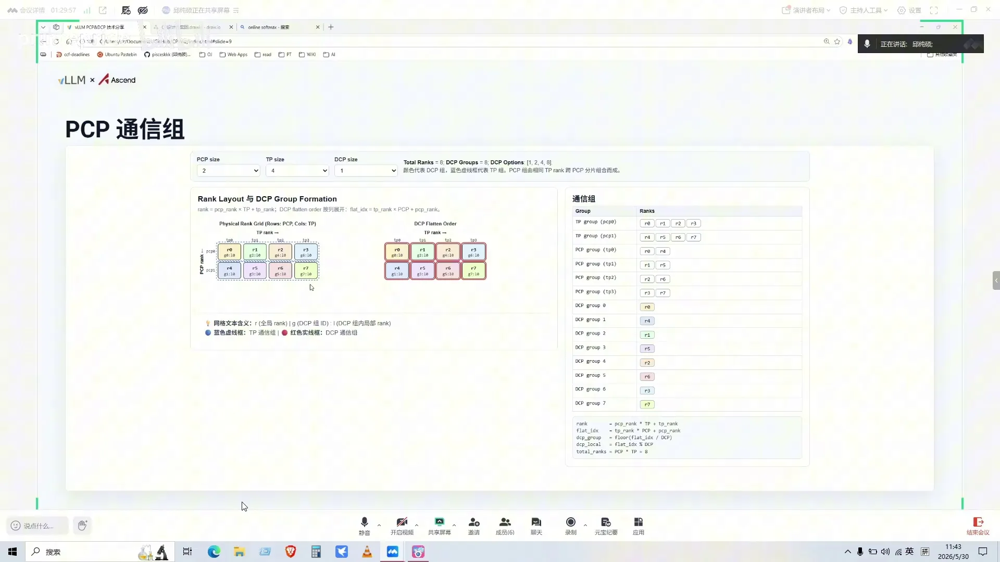 |
| DCP 的取值一般有三个可取的值：一个就是（等于）一，不开 DCP；然后一个是（等于）PCP size——就是只在 PCP 的这个组里去开 DCP。——好，诶看到我们这个颜色的变化，因为在我们开了 DCP（=2）之后…… [【跳转到 38:45】](https://www.bilibili.com/video/BV1W1L96KEf5/?t=2325) | 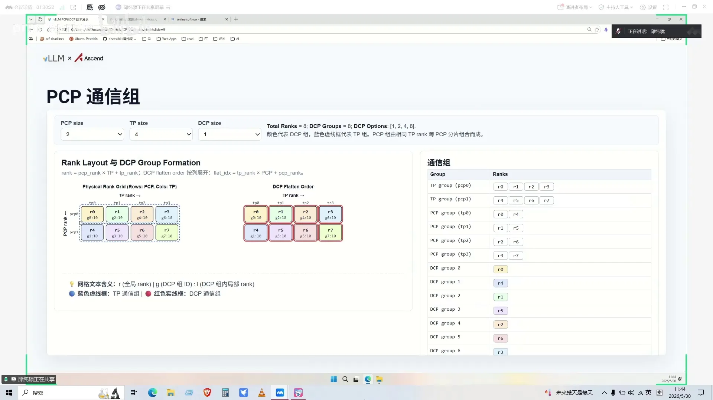 |
| 其实他的通信组是和 PCP 保持一致的：它会在我们相同的 head（组）、对应的不同的 PCP rank 上去控制 KV cache 的切分。我们还是优先在 PCP 组里去做这个 KV cache 的序列切分。然后第二个这是第二个阶梯，然后第三个阶梯…… [【跳转到 39:10】](https://www.bilibili.com/video/BV1W1L96KEf5/?t=2350) | 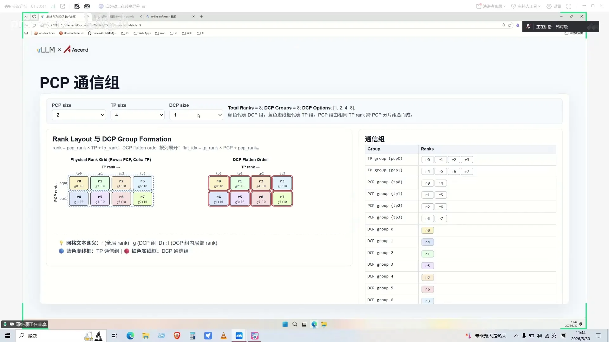 |
| 其实它的通信组是和PCP保持一致的就是它会在我们相同的head然后这个对应的不同的BCP上去啊控制kvcash的切分就我们还是优先在PCP组里去做这个啊kvcash的序列切分然后第二个这是第二个阶梯然后第三个阶梯啊 [【跳转到 39:35】](https://www.bilibili.com/video/BV1W1L96KEf5/?t=2375) | 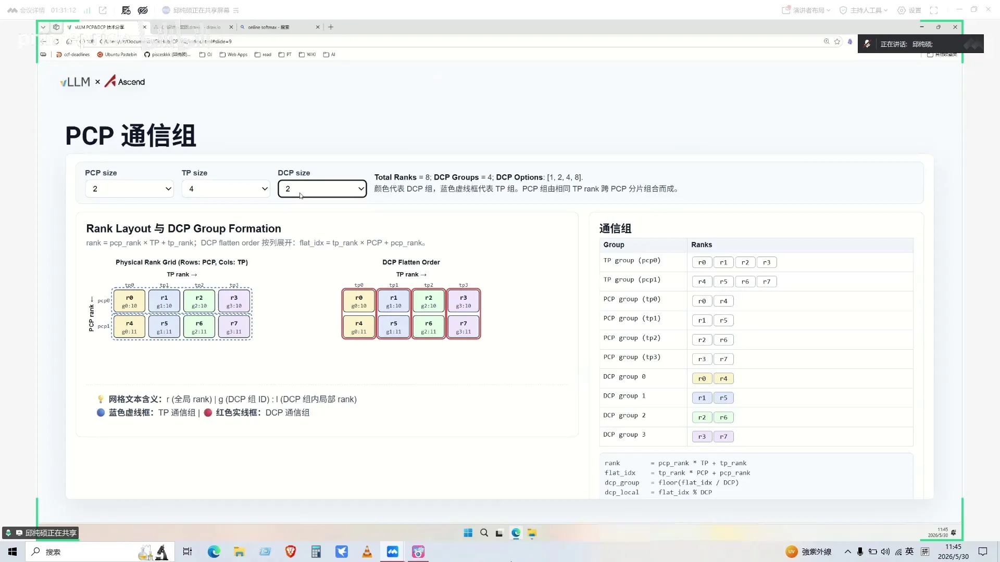 |
| 这个（第三种取值）一般来说是不太建议开的，会有点复杂。最终的一个最大的 size 应该是他等于 PCP size 乘以 TP size。在这种情况下他会在我们 TP 组内也做这一个 KV cache 的切分——相当于是既在 PCP 内做 KV cache 的序列切分，又在 TP 内做序列的切分。当然这个只是对 MLA 来说，因为我们可以让 DCP 完整覆盖整个 TP size。中间的这个（值）是我给 GQA 这一种后端去设置的，因为也是像我们前面说的，我们在 GQA 里边…… [【跳转到 40:00】](https://www.bilibili.com/video/BV1W1L96KEf5/?t=2400) | 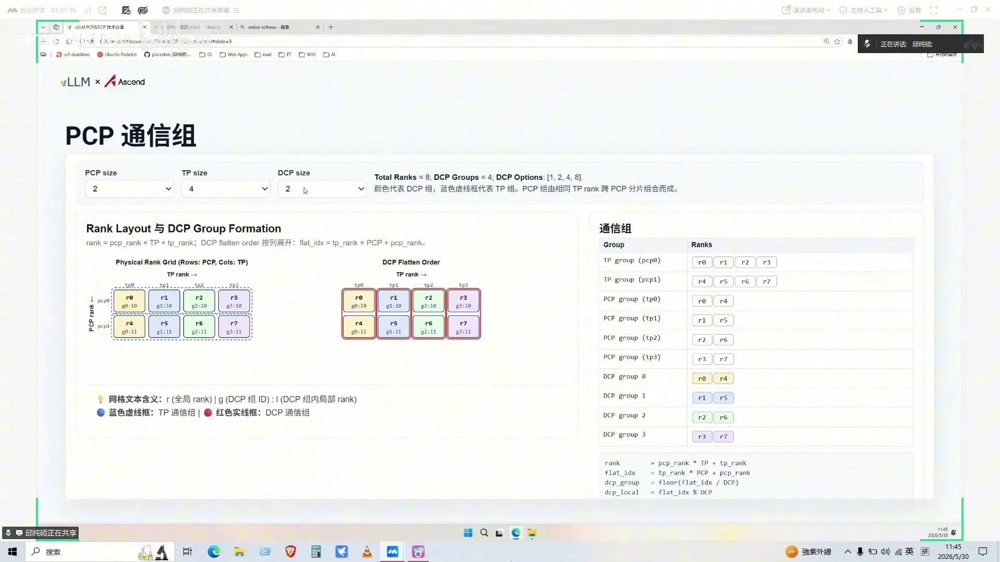 |
| 如果 TP=4 然后 KV head=2 的话，本身 DCP size 就最大开到 2。所以在我们有 PCP 的基础上再开 DCP，也只能让他开到 PCP size 乘以 TP size 除以 KV head 的这个数，就是这里写的是 2。或者我可以改一个：如果让 TP size 等于 8…… [【跳转到 40:25】](https://www.bilibili.com/video/BV1W1L96KEf5/?t=2425) | 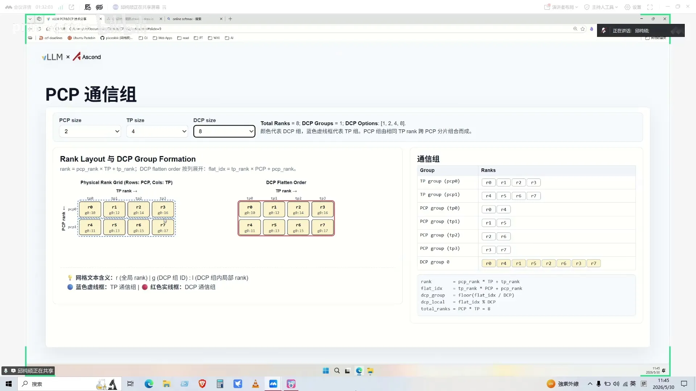 |
| 那我对应的这里应该是 DCP size 最大等于 8——就是 KV head 等于 2 的情况下，本身在 TP 里边的这个 DCP 只能开到 4，是这么一个方案。然后这样的话在 KV cache 看来，因为 KV head 等于 2，TP0 到 TP3 它所持有的 KV head 是相同的…… [【跳转到 40:50】](https://www.bilibili.com/video/BV1W1L96KEf5/?t=2450) | 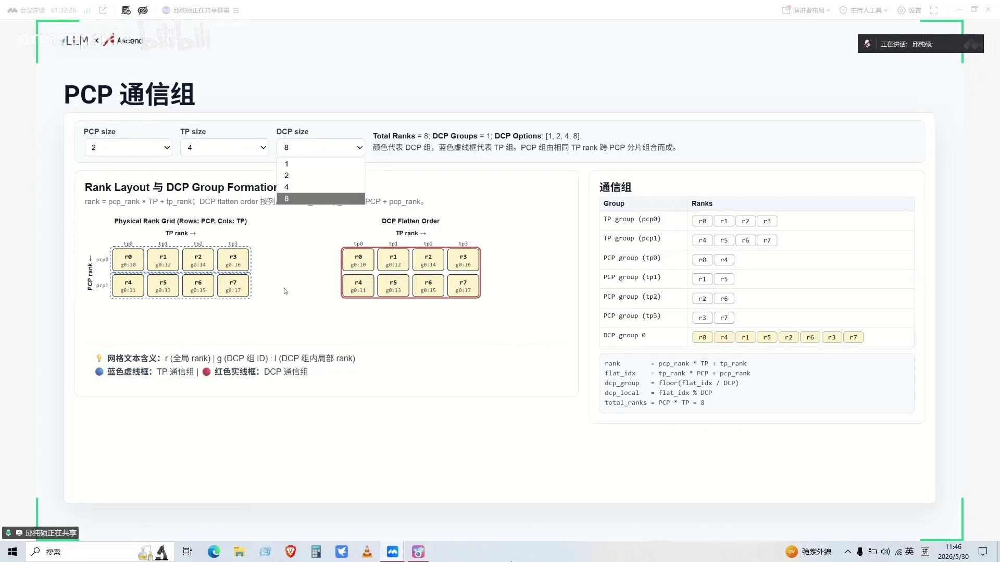 |
| 然后 TP4 到 TP7 他持有的 KV head 是相同的。好，那我们只会在持有相同 KV cache head 的组内去做 DCP 的切分，那也就是这里的（那个组）。这是整个 PCP 通讯组引入之后，会导致我们 PCP、TP 和 DCP 的通信组有些差异。——对，然后讲完这一个通讯组之后，接下来让我们去看一下 PCP 的整个逻辑。PCP 首先一个比较大的…… [【跳转到 41:15】](https://www.bilibili.com/video/BV1W1L96KEf5/?t=2475) | 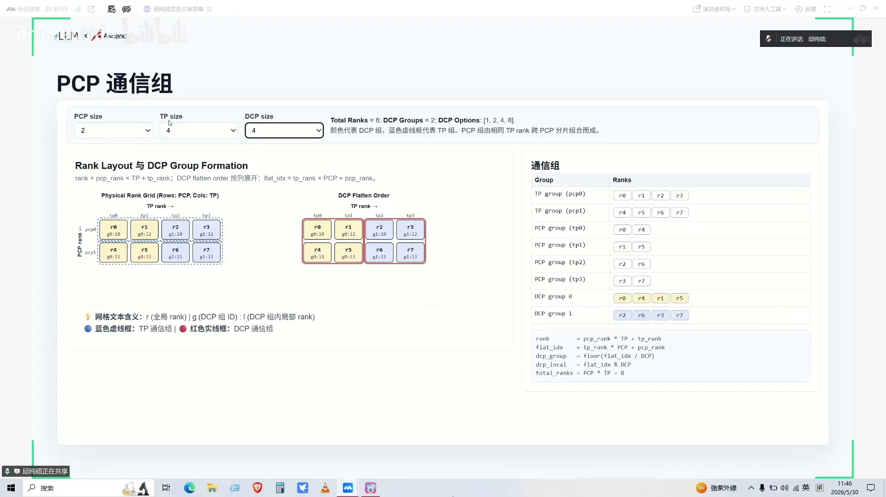 |
| 和 DCP 不一样的点，就是我们 PCP 会对输入的这个 Q 或者 QKV、hidden states 这个序列做序列切分。这样就会导致我们整个输入到 attention 的很多 metadata 的信息全部都发生了变化：包括我们的 query、cu_seq_lens、positions，包括各种东西都会有差异。 [【跳转到 41:40】](https://www.bilibili.com/video/BV1W1L96KEf5/?t=2500) | 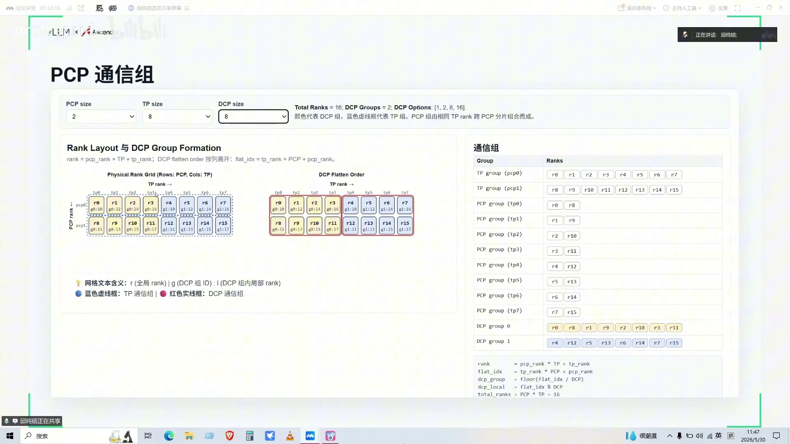 |
| 那么首先讲一下我们是怎么去做这个 Q 的序列切分的。众所周知我们在 prefill 阶段的 attention 是带了一个 mask 的——下三角的。然后这里我们为了保证负载均衡，这个序列有两种比较经典的负载均衡的切割方式…… [【跳转到 42:05】](https://www.bilibili.com/video/BV1W1L96KEf5/?t=2525) | 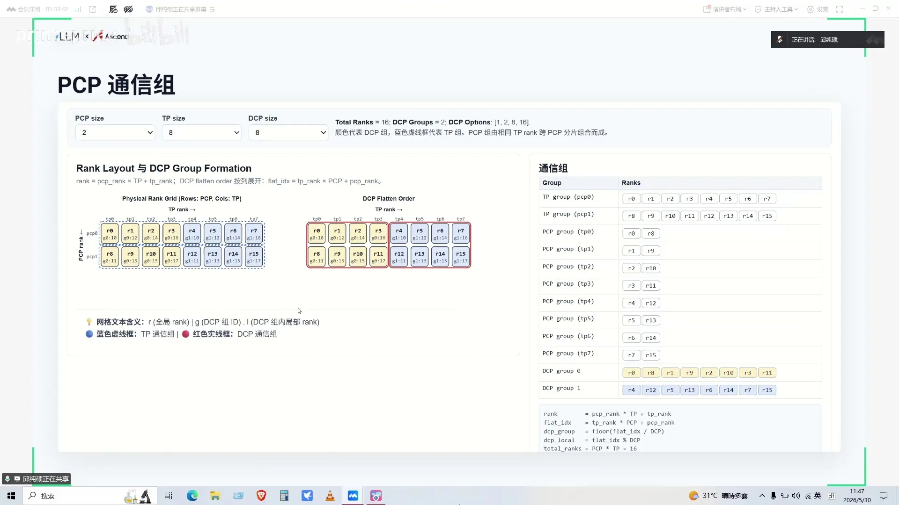 |
| 和DCP的不一样的点就是我们PCP会对输入的这个啊Q或者QQV海灯states这个序列做序列切分然后这样的话就会导致我们整个输入到attention的很多mattdata的信息全部都发生了变化啊包括我们的quencecbancepositions包括啊各种东西都会有差异 [【跳转到 42:17】](https://www.bilibili.com/video/BV1W1L96KEf5/?t=2537) | 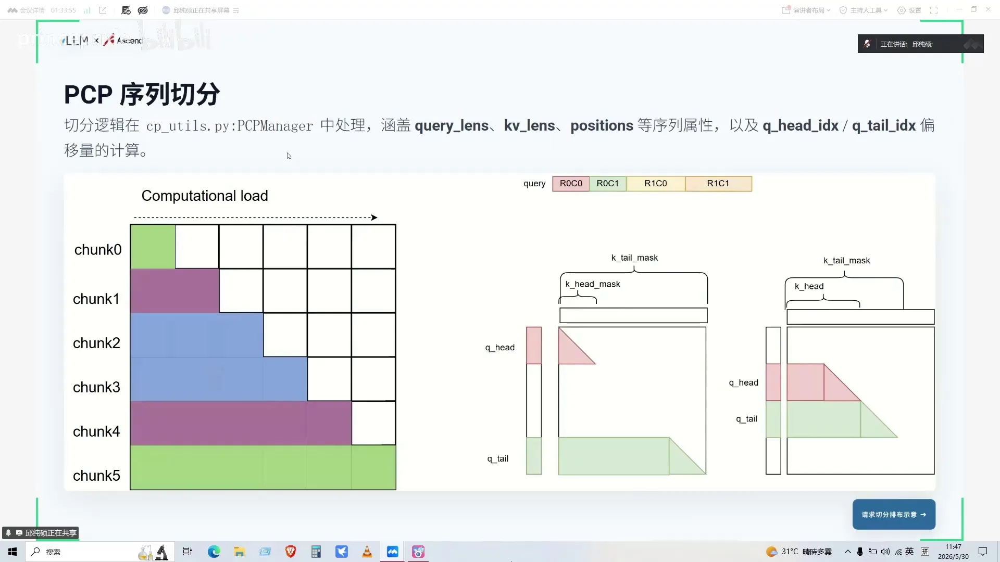 |
| 一种方式就是像刚才讲的 DCP 从 KV cache（那样），是按 token 去轮询的方式；然后另一种方式就是我现在图上画的这种，也是我们 PCP 现在采用的方案：做一个 zigzag（或者说 dual chunk swap）——我一般喜欢叫它首尾拼接的方式。 [【跳转到 42:42】](https://www.bilibili.com/video/BV1W1L96KEf5/?t=2562) | 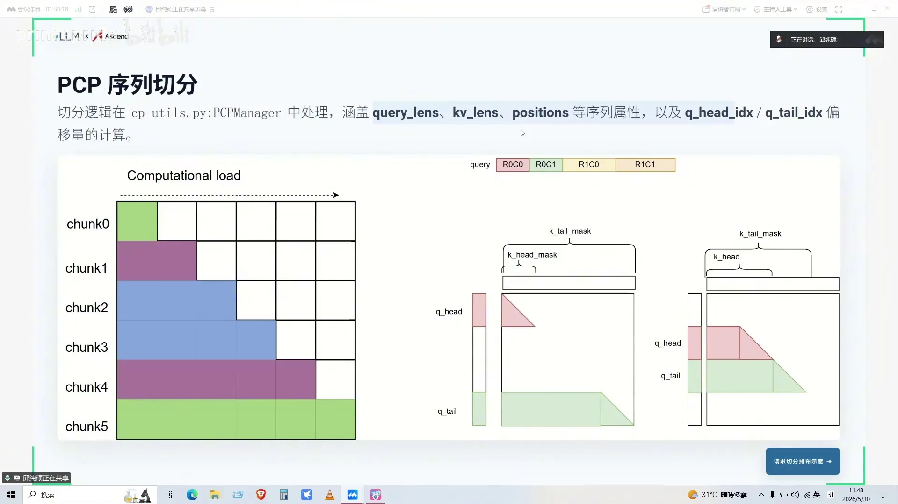 |
| 就是我这里把它分成——这里举的例子是 PCP=3——会把它拆成六块、拆成六个 chunk。然后 chunk 0 和 chunk 5 会分布在一起，放在同一张卡上；chunk 1 和 chunk 4 放在同一张卡上；chunk 2、3 放在同一张卡上。这样可以保证我们在带着 mask 去做计算的时候，这个 attention 是一个负载均衡的…… [【跳转到 43:07】](https://www.bilibili.com/video/BV1W1L96KEf5/?t=2587) |  |
| 在各个 PCP rank 上他的负载是均衡的。然后这样的话我们来看一下在这种方案下整个 PCP 上这个 token 的拆分情况是怎么样。这里举了……假设我们是有两条请求…… [【跳转到 43:32】](https://www.bilibili.com/video/BV1W1L96KEf5/?t=2612) |  |
| 然后在 PCP=2 的条件下——PCP=2 的情况下，我们首先会把整个 token 数全部 pad 到两倍的 PCP size 上，也就是 pad 到 4（的倍数），这样能保证我们切分之后每个 chunk 的块是大小一样。这里我们两个请求…… [【跳转到 43:57】](https://www.bilibili.com/video/BV1W1L96KEf5/?t=2637) |  |
| 其实都 pad 到了 8。这里 pad 到 8 之后可以看到，我们就正常在尾部做 pad。然后之后对他进行一个首尾拆分的拼接之后，rank0 上的这两个请求分别是占有了（第一条请求的）第 0 个 token、第 1 个 token，以及后面的这两个 pad。然后 PCP1 上的话他拿到的是第二个 token、第三个 token、第四个 token 以及倒数第三个 pad…… [【跳转到 44:22】](https://www.bilibili.com/video/BV1W1L96KEf5/?t=2662) | 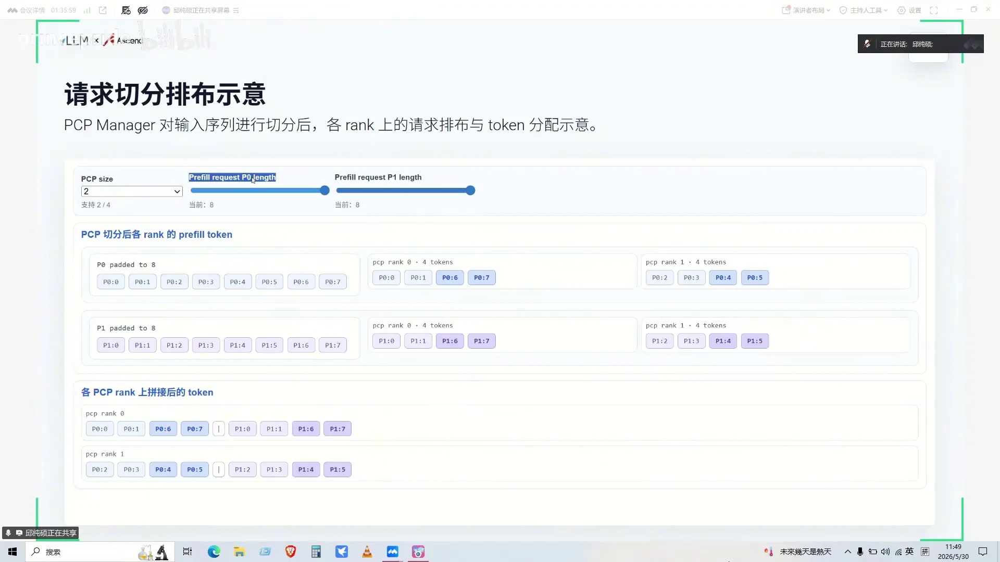 |
| 然后对应的下面我们第二个请求他在不同卡的分布也是对应的首尾拼接拼在一起。最终形成在每个 rank 上的 token 的排布就会变成这样：第零条请求的 0、1，然后两个 pad；然后第一条请求的（对应 token）和一个 pad…… [【跳转到 44:47】](https://www.bilibili.com/video/BV1W1L96KEf5/?t=2687) | 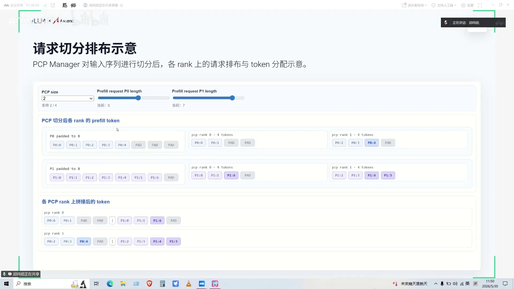 |
| 然后第二个 rank 上的话他就是 2、3、4，然后（另一条请求的）2、3、4、5。对，然后会变成这样的分布。然后经过这样的一通操作之后，首先影响最大的肯定是我们每张卡上持有的那个 positions——就是用来算我们各种 cos、sin 的…… [【跳转到 45:12】](https://www.bilibili.com/video/BV1W1L96KEf5/?t=2712) | 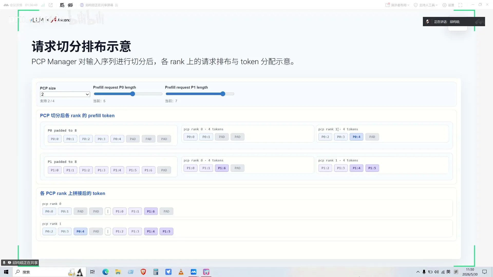 |
| 然后包括后面的一些操作，它会对应地根据我们这个 token 的切分方式，从原本的可能就直接一路递增的这种形式，变成对应的首尾拼接的这个样子。然后除此之外，我们的整个 Q length 也是会折半…… [【跳转到 45:37】](https://www.bilibili.com/video/BV1W1L96KEf5/?t=2737) |  |
| 然后 KV length 的话会相对复杂一点。KV length 的变化可以看后面这张图：因为我们做了这个首尾拼接之后，他的 KV length 是会根据不同的块去有差异的。这里讲的 Q head 和 Q tail 是指我同一张卡上的（开头）的这个 chunk 和尾巴的这个 chunk，这两块 chunk…… [【跳转到 46:02】](https://www.bilibili.com/video/BV1W1L96KEf5/?t=2762) |  |
| 在我们 PCP 切分之后，他的 KV length 其实对应的是——可能前面的这半段还是正常的，就是跟 Q 一样的。然后……怎么说，哦好像这个 KV length 其实也是…… [【跳转到 46:23】](https://www.bilibili.com/video/BV1W1L96KEf5/?t=2783) |  |
| 哦不对，是这个 Q length 实际上是直接（折）半的，然后 KV length 说的是他的这个历史的 KV 长度——历史的这个 KV 长度就需要也做类似这种（折半）重新拼接的操作。当然如果是直接从我们原本的 Q length 上去做拼接的话…… [【跳转到 46:48】](https://www.bilibili.com/video/BV1W1L96KEf5/?t=2808) | 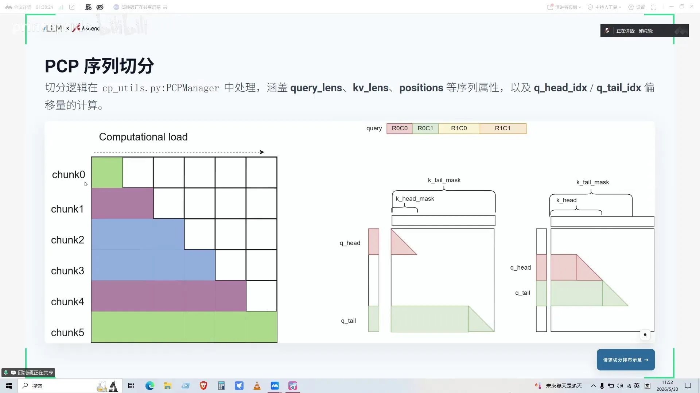 |
| 是这样拼接的。然后它实际的值的分布就是我（现在）画的这种：就是头部的相对短一点，然后尾部的会更长一点，包括不在当前卡上的这部分 KV length。然后 position 刚才说过。然后这个东西——为什么我们会引入一个 Q head index 和 Q tail index 呢…… [【跳转到 47:13】](https://www.bilibili.com/video/BV1W1L96KEf5/?t=2833) | 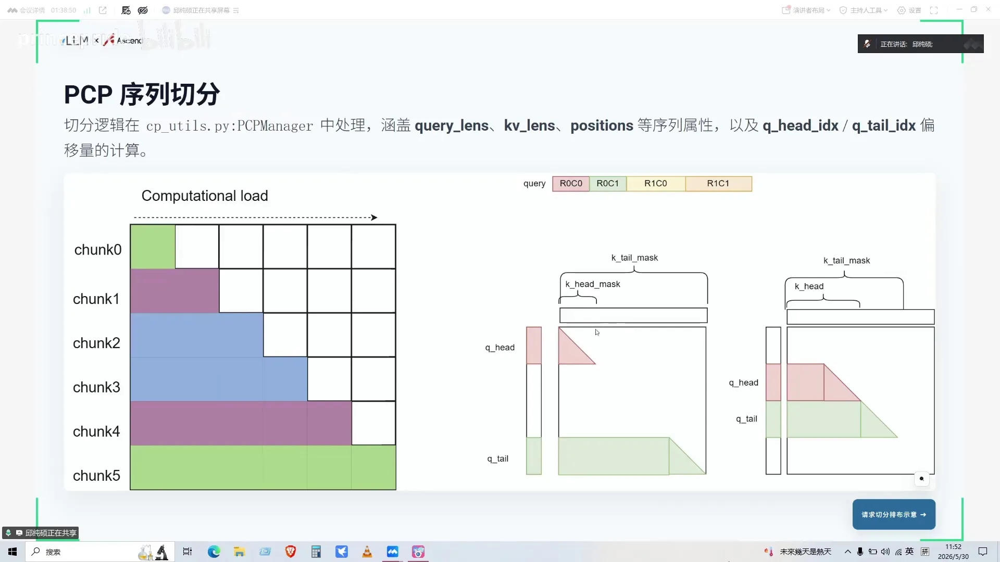 |
| 是这样拼接的。然后它实际的值的分布就是我（现在）画的这种：就是头部的相对短一点，然后尾部的会更长一点，包括不在当前卡上的这部分 KV length。然后 position 刚才说过。然后这个东西——为什么我们会引入一个 Q head index 和 Q tail index 呢…… [【跳转到 47:38】](https://www.bilibili.com/video/BV1W1L96KEf5/?t=2858) | 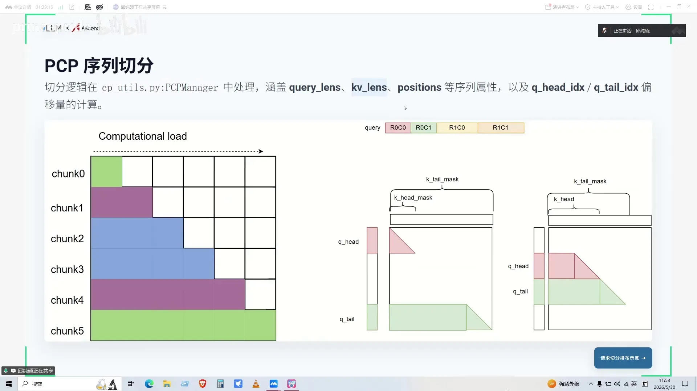 |
| 又回到我们之前说的这个阶梯形 mask 的问题上了。因为可以看到，我们如果正常地这条序列按照——请求零的头 chunk、请求零的尾 chunk、请求一的头 chunk、请求一的尾 chunk——输进去的话，那他的 KV cache 做 attention 的时候，这个 mask 的形状就是一个三角形…… [【跳转到 48:03】](https://www.bilibili.com/video/BV1W1L96KEf5/?t=2883) | 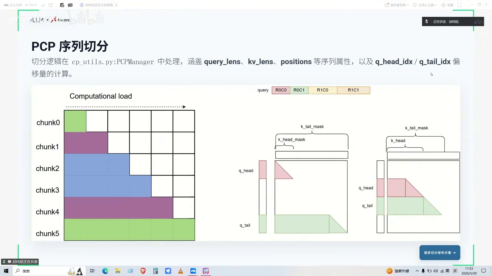 |
| 加一个比较长的梯形。当然可能最后一个 rank 他会相对比较规整一点，还是一个正常的梯形。但是前面的所有的 mask 他就是一个比较短的梯形和一个长的梯形拼在一起。这个目前在我们 attention 后端也是大多数都不支持的。所以我们就需要把头部（的 chunk）全部选出来…… [【跳转到 48:28】](https://www.bilibili.com/video/BV1W1L96KEf5/?t=2908) |  |
| 然后去做一个只对头（chunk）和 KV 做一次计算，然后只拿出尾 chunk 去跟 KV 做一次计算，所以会把它拆成两次 attention 去做计算。这也是我们 PCP 对 attention 计算的一个比较大的影响，所以这里我们会对应地求一些下标的东西。 [【跳转到 48:53】](https://www.bilibili.com/video/BV1W1L96KEf5/?t=2933) |  |
| 然后来看一下我们整体的方案吧。 [【跳转到 49:18】](https://www.bilibili.com/video/BV1W1L96KEf5/?t=2958) | 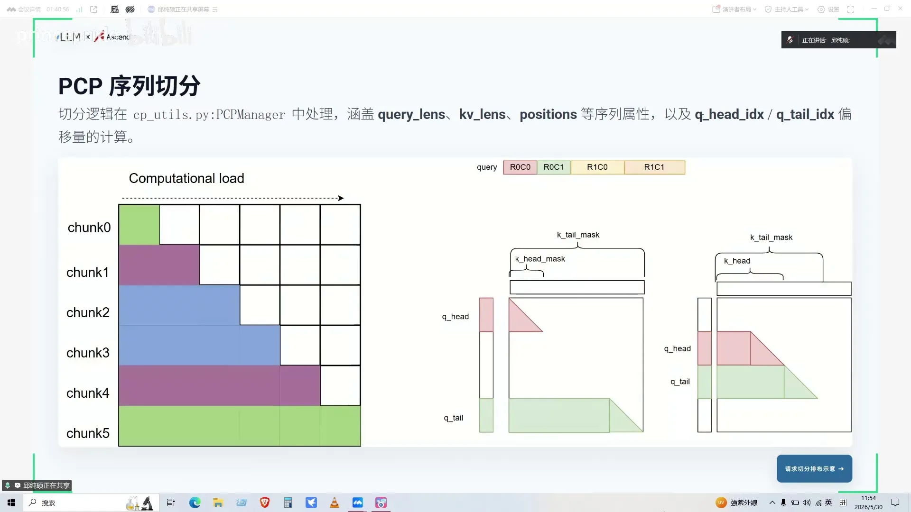 |
| 就整体我们对后端的影响。对 attention 后端的影响，因为前面讲的这个相当于是…… [【跳转到 49:24】](https://www.bilibili.com/video/BV1W1L96KEf5/?t=2964) | 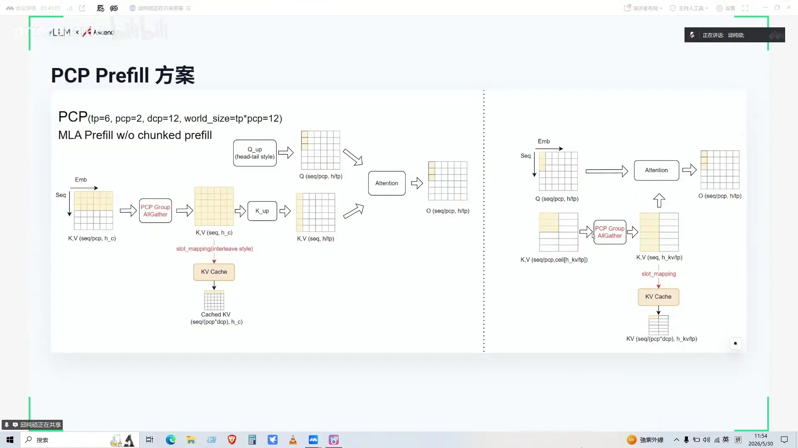 |
| 这些很多东西会在 model runner——或者说我们是在跟 model runner 同目录下我们单独去搞了一个（目录），里面会放一个 CP manager 来管理我们这些东西的计算。但是他最终会在 model runner 这个模块里面去把这些东西算完。然后算完之后到了我们 attention 后端…… [【跳转到 49:33】](https://www.bilibili.com/video/BV1W1L96KEf5/?t=2973) | 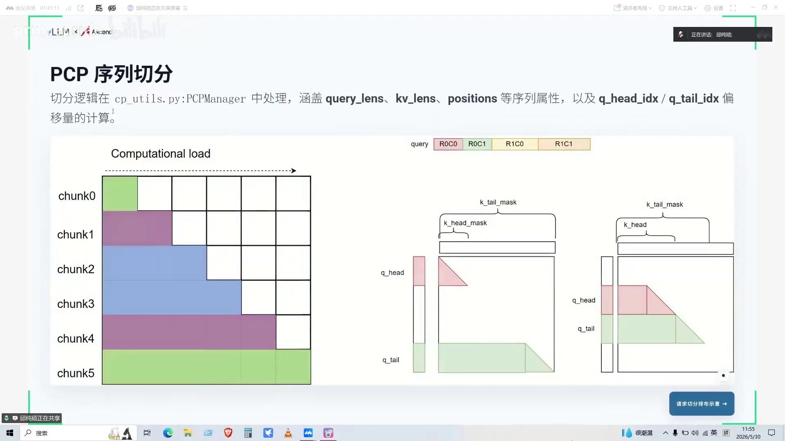 |
| 我们 attention 后端的可以还是一样的。我们先看一下 prefill——没有 chunk 过的 prefill，就是单纯的 prefill 的方案。这个方案其实官方文档里面也有说过：一般来说有两种实现方案。 [【跳转到 49:53】](https://www.bilibili.com/video/BV1W1L96KEf5/?t=2993) | 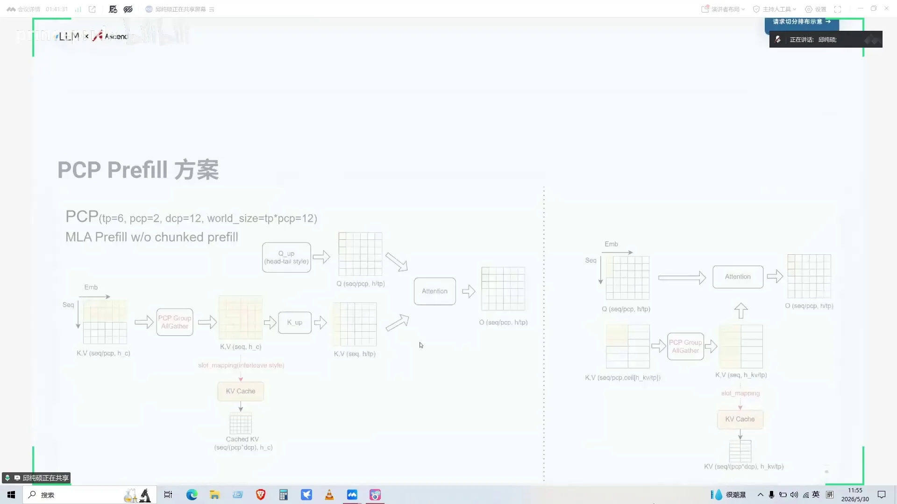 |
| 现在大多数学术界的论文一般用的是 ring attention：每块 Q 和自己持有的这个 KV 做一次 attention，然后不断地通过 point-to-point 的通信去把切分后的 KV 做传递，传递到当前卡上，然后用 Q 去跟各个 KV 块去做计算…… [【跳转到 50:18】](https://www.bilibili.com/video/BV1W1L96KEf5/?t=3018) | 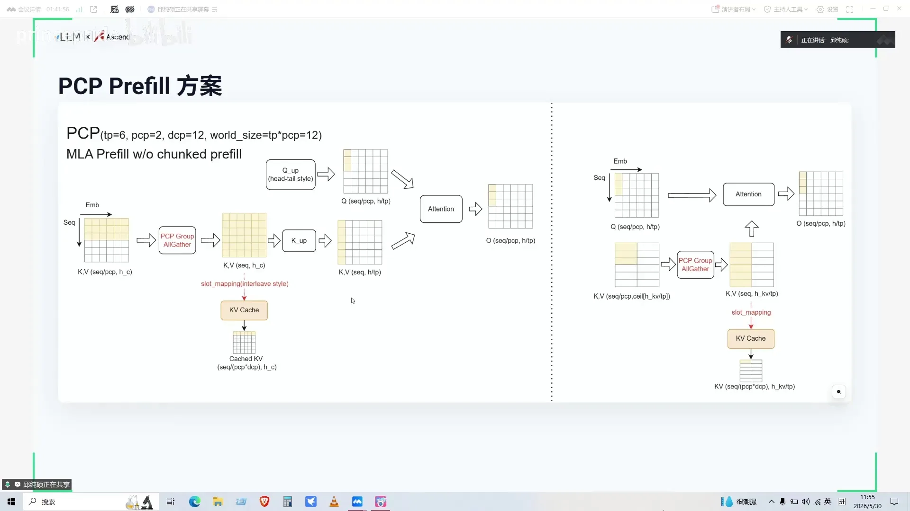 |
| 然后拿到 attention 不断地更新。这是学术界大多数的方案。但是这种方案实际落地的话，无论是实现上还是调试上，包括对整个后端的影响都相对比较大，所以我们暂时还没有采用这种方案。这种方案目前我们也在做一些（实验）来验证它的性能。 [【跳转到 50:43】](https://www.bilibili.com/video/BV1W1L96KEf5/?t=3043) | 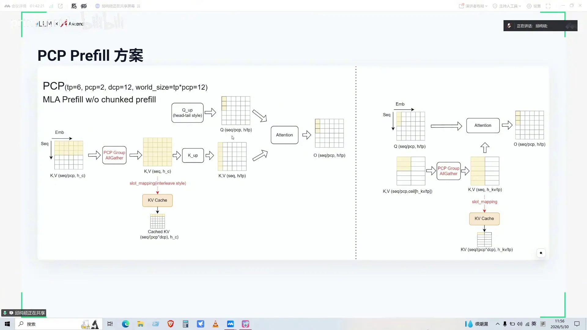 |
| 我们现在实现的方案——或者说已经提交了一些 PR 的方案——都是直接做 KV cache 的 all-gather。相当于我们 Q 还是保持序列上的切分，像这个图里画的上面这个 Q：序列是有被 PCP 切过的，然后 head 也是正常被 TP 切的。 [【跳转到 51:08】](https://www.bilibili.com/video/BV1W1L96KEf5/?t=3068) | 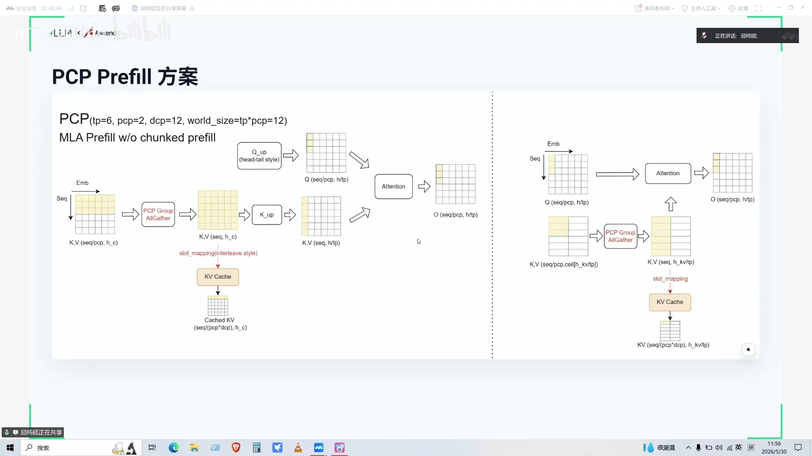 |
| 但是我们 KV 这里做完（处理）之后，会再做一个 PCP group 的 all-gather，把序列这个维度全部 all-gather 过来。这样相当于我们是持有了全量 KV。同时除了我们不需要做 ring 去分块做 attention 以外，我们在存 KV cache 也有一个好处：可以一把直接根据算好的 slot mapping 做一次 KV cache 的存储，把 KV cache 存进去。 [【跳转到 51:33】](https://www.bilibili.com/video/BV1W1L96KEf5/?t=3093) |  |
| 然后同样做计算，我们这里用到了我们前面说的：Q head 和 Q tail 各自做一次 attention 的计算，只要分两次做计算就行。算完这两次计算，因为本身 KV 也是全量的，也不需要引入什么 online softmax 更新…… [【跳转到 51:58】](https://www.bilibili.com/video/BV1W1L96KEf5/?t=3118) | 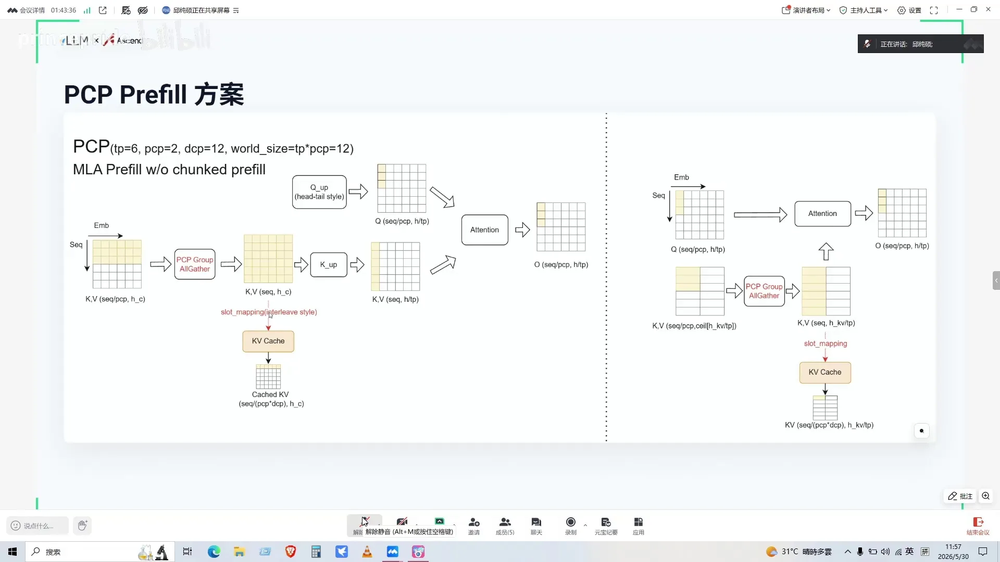 |
| 然后就能直接拿到完整的当前卡上所持有的这部分 output。包括后面这一个也是一样的：我们采用 all-gather 的方案的话其实相对比较简洁一点，就是只要额外引入一次 PCP group 的 all-gather 就行。这是我们 PCP 目前做的 all-gather 的方案。 [【跳转到 52:23】](https://www.bilibili.com/video/BV1W1L96KEf5/?t=3143) | 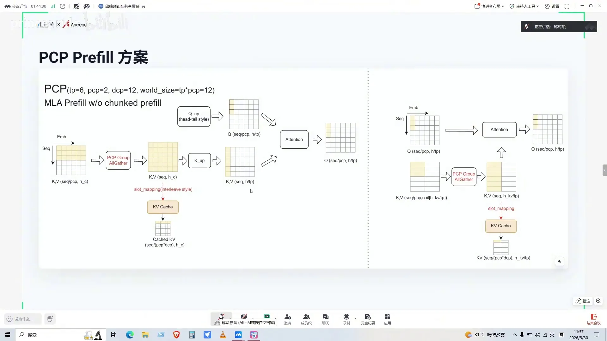 |
| 然后 PCP 对 decode 的影响其实理论上来说确实也不会有影响，因为他唯一的影响就是会导致我们 DCP 的这个 group 变大。目前用社区想要推进的这种 PCP、DCP（分离）结构的方案的话，PCP 对 decode 阶段完全没影响，他只要让这个 DCP 的 group 等价地放大就可以…… [【跳转到 52:48】](https://www.bilibili.com/video/BV1W1L96KEf5/?t=3168) | 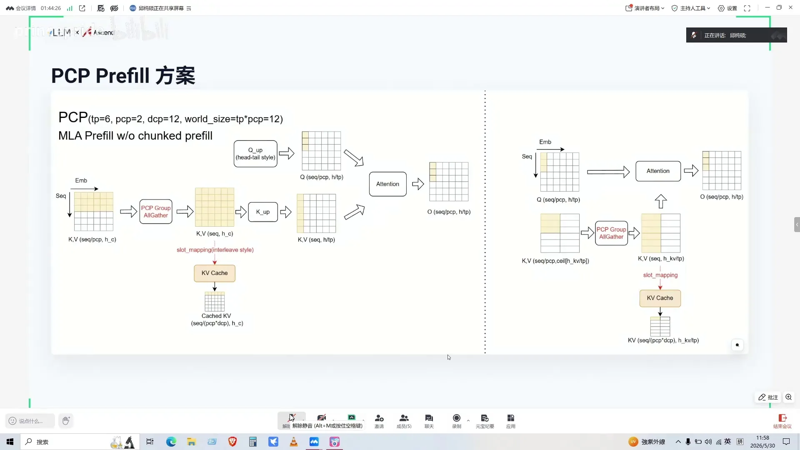 |
| 但是实际上还是会有一些影响。还记得前面 DCP 说过：原本我们会做一个 DCP group 在 Q 的 head 维度上做 all-gather。那我们引入了 PCP 之后，其实就不需要在完整的 DCP group 上做 all-gather 了…… [【跳转到 53:13】](https://www.bilibili.com/video/BV1W1L96KEf5/?t=3193) | 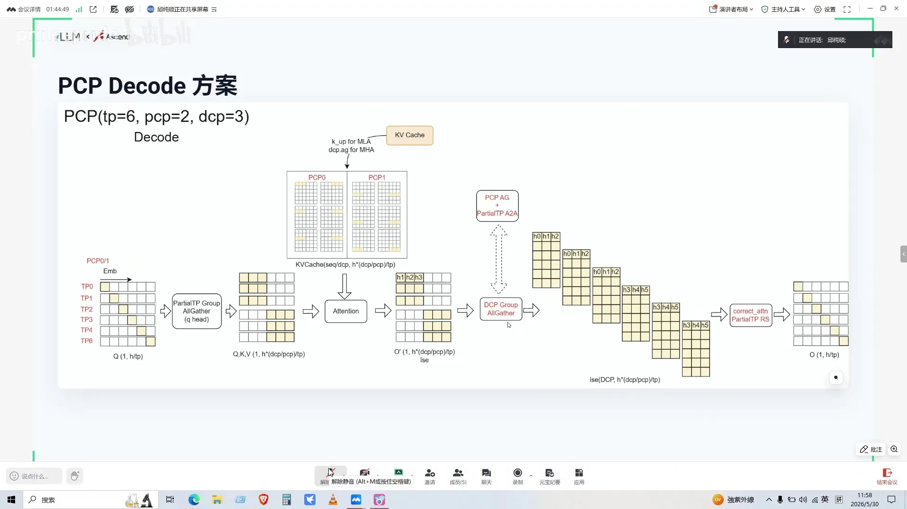 |
| 因为这个 DCP group 里面会包含 PCP 的 group，也会包含一部分 TP 的 group。如果我们还是在完整的 DCP group 上 all-gather 的话，那他会把 PCP 的那部分（冗余）也一起 all-gather 过来，这是有冗余的。所以这个通信组就会被替换成一个可以理解为 DCP 和 TP 的交集的部分的 all-gather…… [【跳转到 53:38】](https://www.bilibili.com/video/BV1W1L96KEf5/?t=3218) | 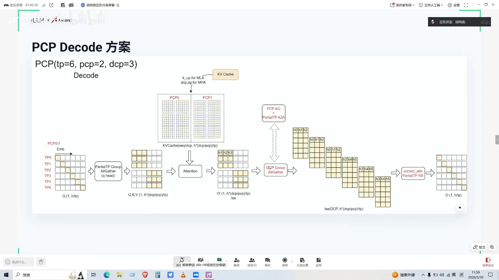 |
| 就只要在 DCP 与 TP 重合的部分，把这部分对应地 all-gather 过来，就可以保证我们每张卡上都持有了所对应的需要的这个 Q 的 head。然后之后后面的流程就基本是一样的了。——对…… [【跳转到 54:03】](https://www.bilibili.com/video/BV1W1L96KEf5/?t=3243) | 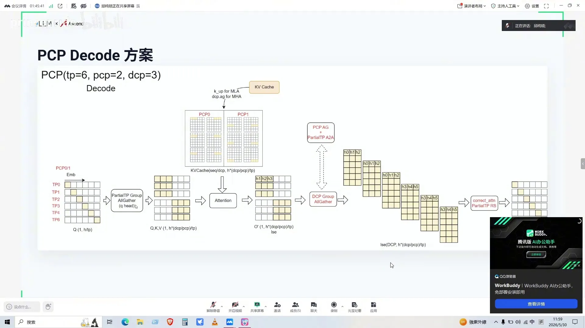 |
| 当然对应的我们这个 all-to-all 也需要改成对应 TP 组的这部分 TP 的 all-to-all。或者如果用 DCP 组的话其实就是正常一次 all-to-all。但是后面的这个 reduce-scatter 重新切分 TP head 也是要对应地替换到局部的那个 TP group 里面。 [【跳转到 54:28】](https://www.bilibili.com/video/BV1W1L96KEf5/?t=3268) | 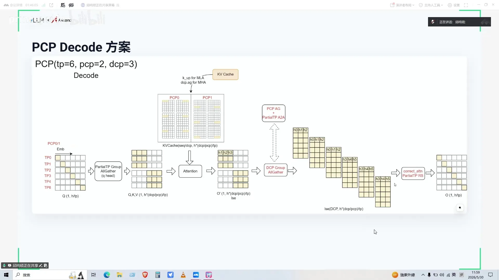 |
| 对，这是 PCP 对 decode 流程的一个影响。所以其实可以看到他并没有直接参与到 decode 的过程中。然后讲完这个最基础的 prefill 和 decode 的方案，让我们回过来再去看长 prefill。因为其实我们就可以发现长 prefill 所面临的问题就相对比较严峻了：我们在 DCP 里面…… [【跳转到 54:53】](https://www.bilibili.com/video/BV1W1L96KEf5/?t=3293) | 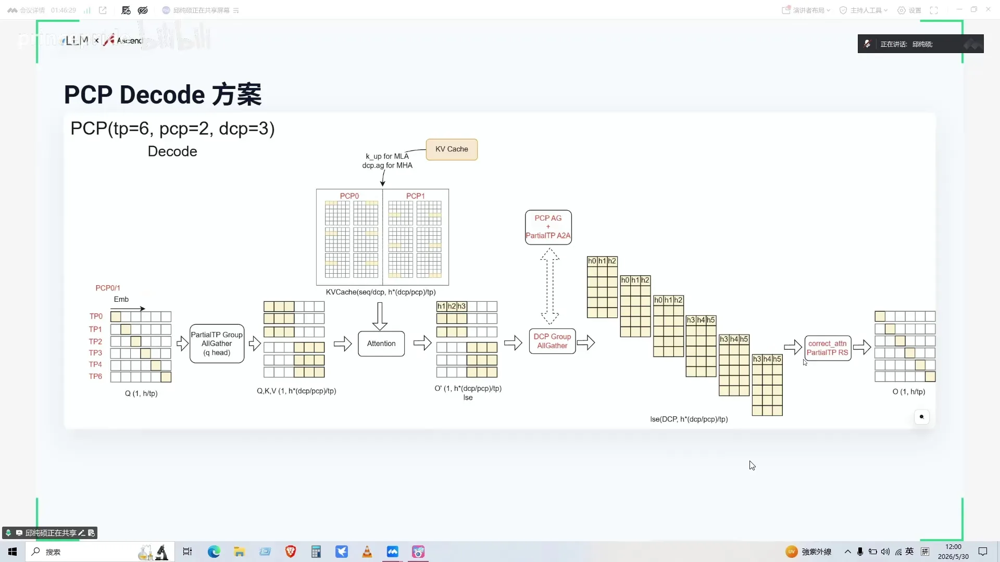 |
| 我们还是能保证 Q 持有的是全部的序列的信息。但现在我们在 PCP 里面就会发现我们的 Q 序列是不完整的，然后 KV cache 的序列也是不完整的。那么我们其实一共有三种方案的：最基础的、或者说一般学术界来说肯定是用这个所谓的 ring attention 的方案…… [【跳转到 55:18】](https://www.bilibili.com/video/BV1W1L96KEf5/?t=3318) | 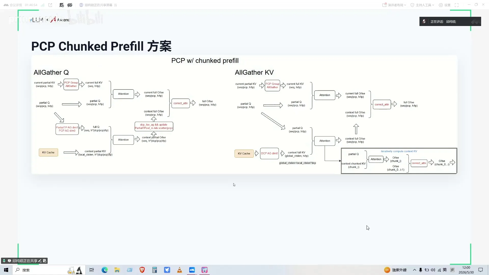 |
| 但是因为他这个也是同样问题：实现成本相对比较高，所以我们目前也没有直接去做。然后退回来我们就会发现做 all-gather 方案的话——我们 PCP 里面是有两套方案的：一套是我们去 all-gather Q，让 Q 的这个序列维度把它 all-gather 过来，这样的话…… [【跳转到 55:43】](https://www.bilibili.com/video/BV1W1L96KEf5/?t=3343) | 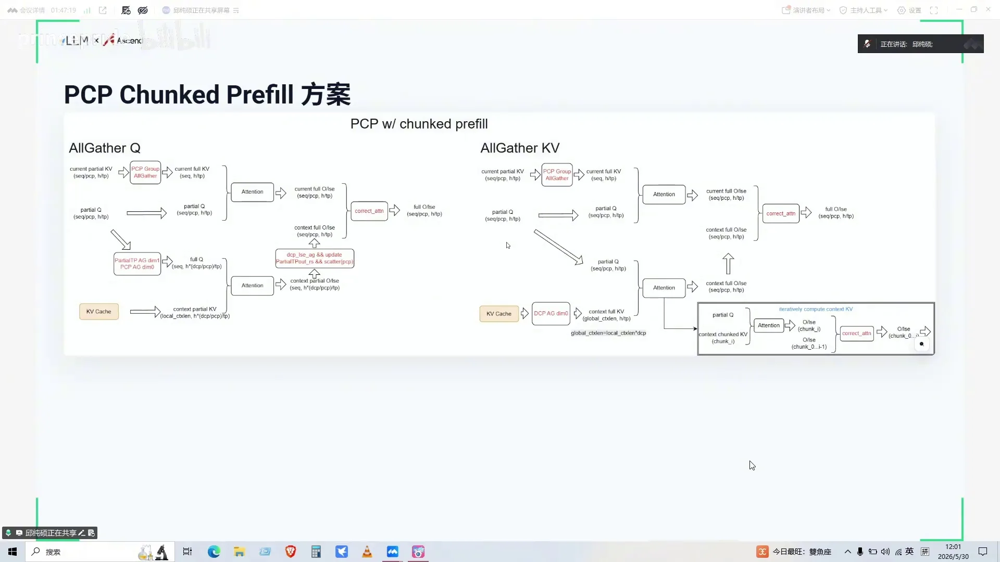 |
| 我们就可以让这个 chunked prefill 的方案回退到 DCP 的长 prefill 方案。因为 DCP 和 PCP 在长 prefill 上唯一的差异就是他的 Q 有没有序列切分。一旦我们把这个 Q 的序列切分给 all-gather 过来之后，他的方案就和 DCP 一样了。然后另一个方案就是我们去 all-gather KV cache…… [【跳转到 56:08】](https://www.bilibili.com/video/BV1W1L96KEf5/?t=3368) | 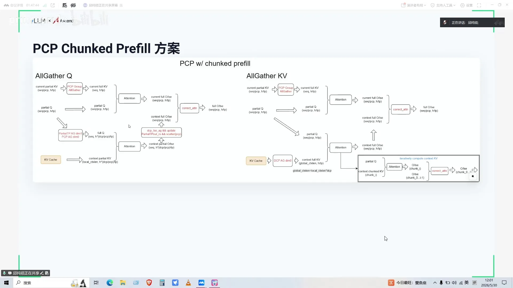 |
| 然后这个也是同样的，其实我们也是在 MLA 里面选取了这个 all-gather KV cache 的方案。因为我们一旦 all-gather KV cache 了，那他其实就退回到了 PCP 的 prefill 流程——因为我们现在 Q 虽然是局部的，但是 KV 是全量的。然后这个是目前我们在 vllm-ascend 上已经做好了这套方案，后续也会跟着我们的 PR 一起推到 vLLM 上。 [【跳转到 56:33】](https://www.bilibili.com/video/BV1W1L96KEf5/?t=3393) | 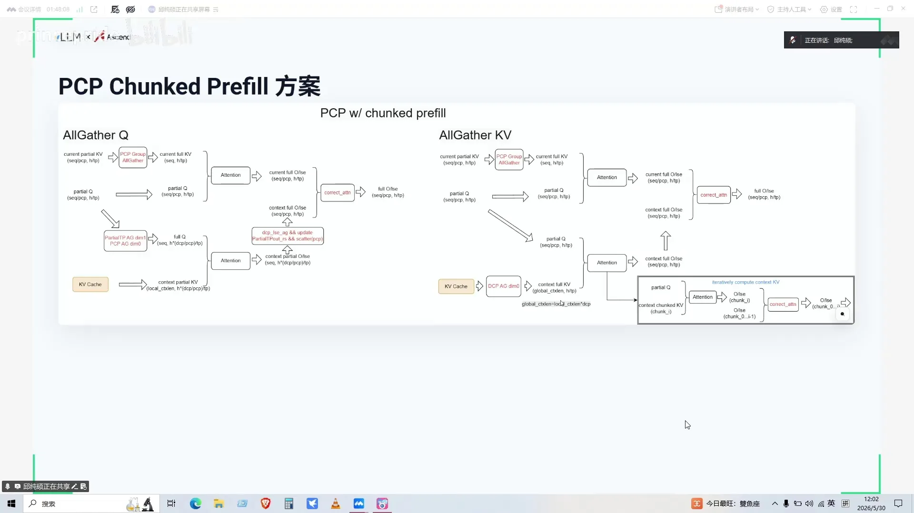 |
| 我们可以把这个图放大看一下。嗯嗯没错。我们可以详细打开来看一下这个方案。all-gather Q 的话其实就是在这里额外加了一个 PCP…… [【跳转到 56:58】](https://www.bilibili.com/video/BV1W1L96KEf5/?t=3418) | 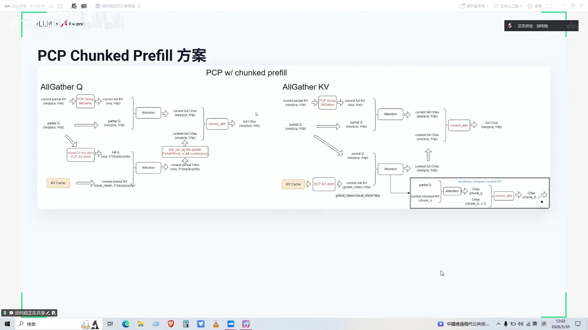 |
| 在（序列）维度的 all-gather，然后之后的流程就和 decode 的流程完全一样了：我们拿到了全量的 Q，然后和当前部分的 KV cache 做计算，算完之后在 DCP 组里去做 DCP 的通信，通信完之后就相当于我们把全量的 KV cache 也 all-gather…… [【跳转到 57:23】](https://www.bilibili.com/video/BV1W1L96KEf5/?t=3443) | 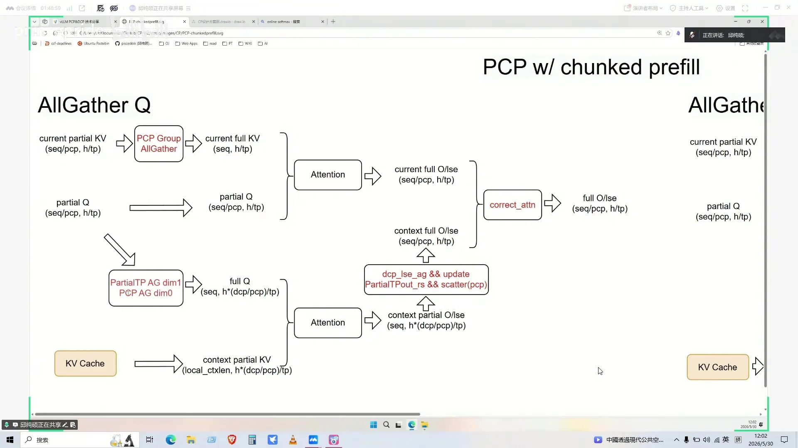 |
| 也拿到了，就是相当于拿到了全部上下文的 KV cache 的信息。然后之后再和我们原本的这个 QKV 计算的结果去做一次聚合，就拿到了当前 Q 和当前 KV 以及完整上下文 KV 的信息。这是 all-gather Q 的方案。然后 all-gather KV 的这个方案呢…… [【跳转到 57:48】](https://www.bilibili.com/video/BV1W1L96KEf5/?t=3468) | 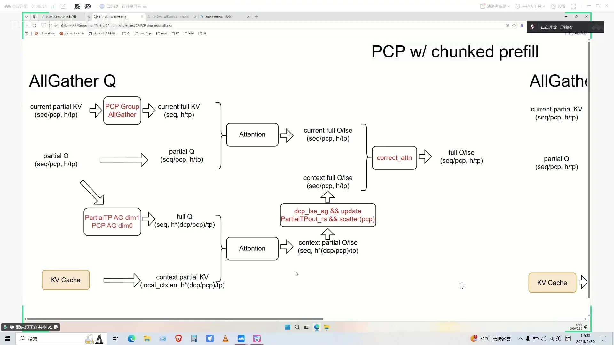 |
| 其实就是和我们 DCP 的那个方案下面这部分完全一样了：虽然 Q 尽管它不是全量的，但是无所谓了，因为我们有全量 KV cache，我们就不太 care 这部分了。这样的话我们也是同样的借用了原本 MLA 里面的那个 workspace、包括（DCP）的那一套逻辑，就直接在 DCP 组里去做这个 Q 的 all-gather…… [【跳转到 58:13】](https://www.bilibili.com/video/BV1W1L96KEf5/?t=3493) | 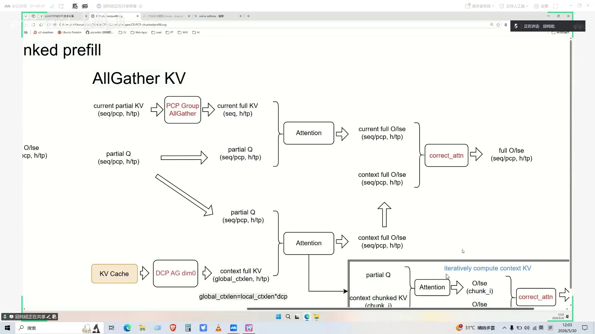 |
| 然后之后做 KV cache 的 all-gather，当前的 Q 做计算，然后同样的在后端和当前 KV 的结果去做一次更新，就拿到了全量的输出结果。对，这就是我们 PCP 在长 prefill 部分的一个方案。然后目前来说分成这两个方案其实也是各有优劣…… [【跳转到 58:38】](https://www.bilibili.com/video/BV1W1L96KEf5/?t=3518) | 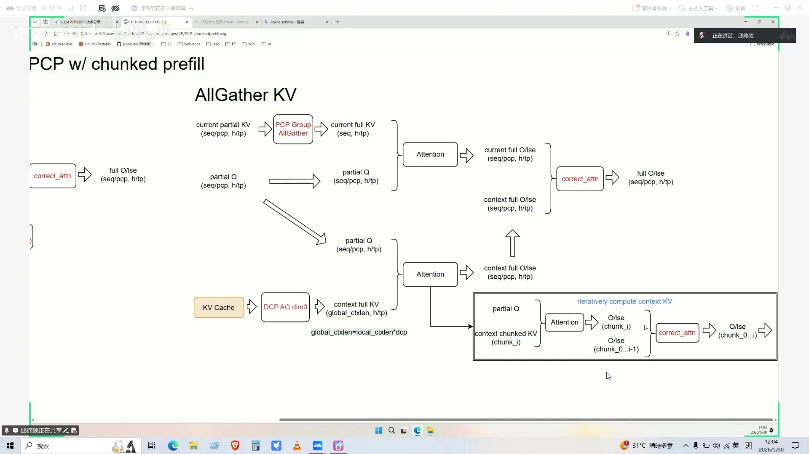 |
| 可以看到当我们 chunk——就是当前的 Q 开的比较大，就是 chunked prefill 的那个 max prefill tokens，如果 batch token 比较大的话，我们当前的 Q 其实会比较长的。然后但是 Q 的 head……哦 Q 是比较长的，但我们 KV 呢，因为本身 KV 是切过这个头的…… [【跳转到 59:03】](https://www.bilibili.com/video/BV1W1L96KEf5/?t=3543) | 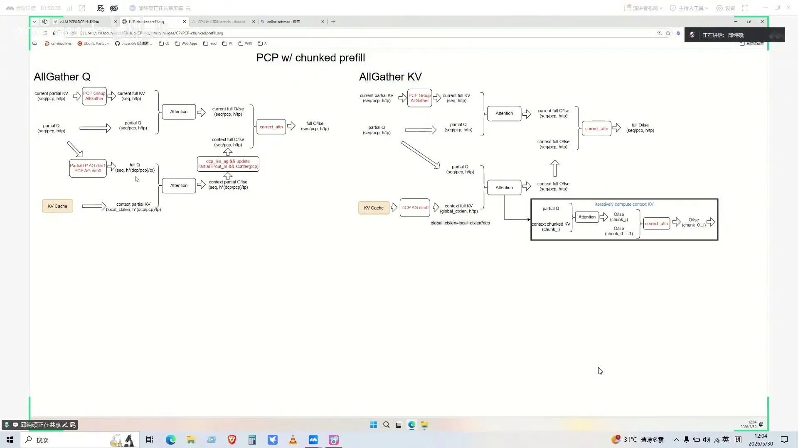 |
| 所以有的时候上下文比较短的时候，这个短的上下文加切过头（的 KV）是会比我们一个 chunk 的这个 Q 要短的。就这里边其实就是通信量包括计算量上也是有一定的 tradeoff 的。 [【跳转到 59:28】](https://www.bilibili.com/video/BV1W1L96KEf5/?t=3568) | 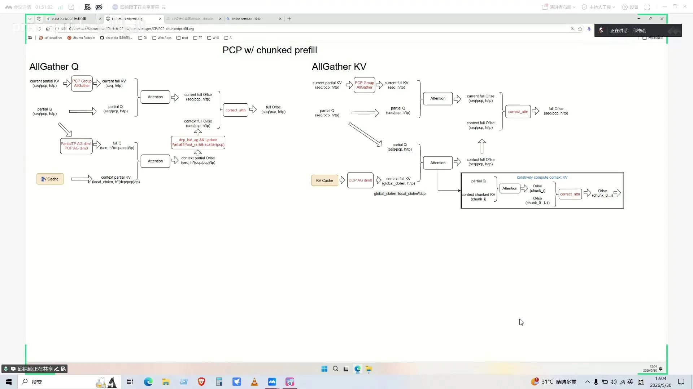 |
| 就在不同的情况下他们其实也各有优劣：在长上下文或者长的当前的 chunk 等等不同场景下其实都各自有一定的优势。而且另外因为本身 Q 的这个 head 一般来说有 128 或者更长，然后即使切过 TP 它也会比较大，也会显著大于我们 KV cache 压缩过的、或者说已经被完全切过的这个（KV）。所以其实这两个方案孰优孰劣是一个在不同场景下相对比较复杂的讨论…… [【跳转到 59:53】](https://www.bilibili.com/video/BV1W1L96KEf5/?t=3593) | 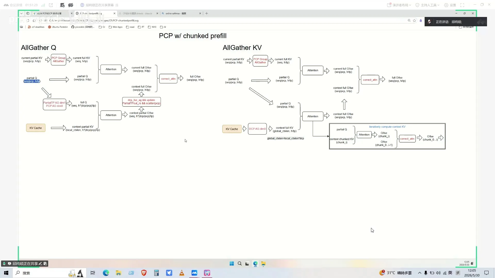 |
| 所以其实我们目前也是暂时是两套方案都在并行做的，后面可能也会做一些具体场景（测试），看一下他们的收益各自怎么样，然后会做一些取舍。当然这就扯远了…… [【跳转到 60:18】](https://www.bilibili.com/video/BV1W1L96KEf5/?t=3618) | 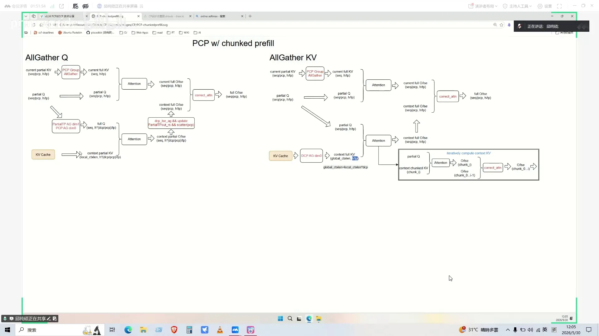 |
| 其实从方案上来说目前主要是这两套方案。哦对，其实这样讲完的话，我们整个 PCP 在一些比较基础的特性——长 prefill 这些特性上的适配大概就是这样的。然后可能还有一些更复杂的：PD 分离的适配、用 TP 的适配，其实我们也已经有对应的（成熟）方案了…… [【跳转到 60:43】](https://www.bilibili.com/video/BV1W1L96KEf5/?t=3643) | 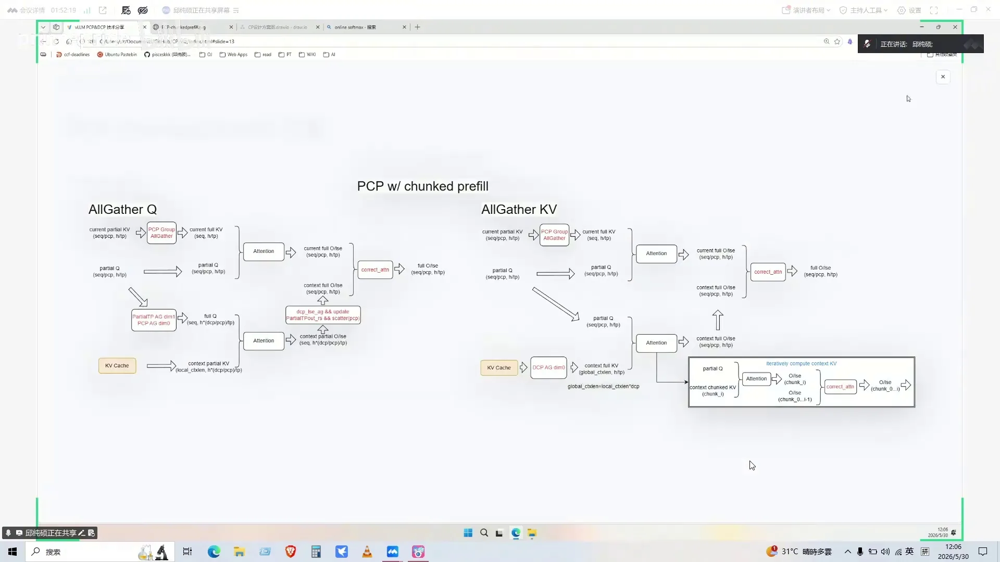 |
| 但是可能讲起来时间比较长，所以也没有放到这个里边。好，有同学问：梯形的这个 attention 的计算是怎么算的？是拆开算 flash attention，还是 vLLM 有（内置的）方法？——梯形的这个 attention 其实大多数后端都是…… [【跳转到 61:08】](https://www.bilibili.com/video/BV1W1L96KEf5/?t=3668) | 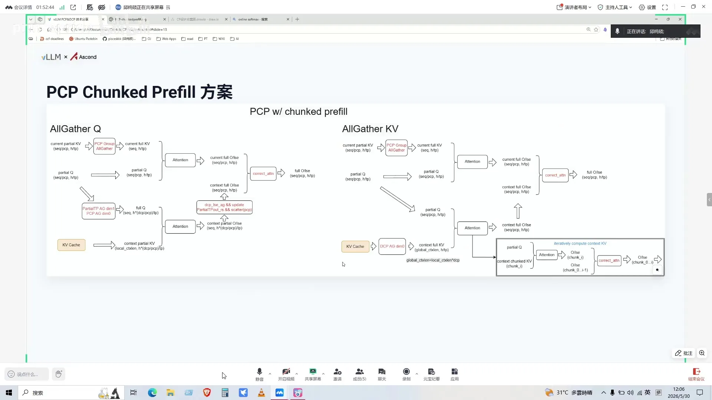 |
| 单纯的这种梯形的 attention 都是支持的。因为一般来说算子默认情况下：如果我的 Q 比 KV 短的话，默认这个 Q 就是会（对齐）到 KV 的最后这一部分。然后如果我同时开了那个带 mask 的——那个叫 causal 的那个选项的话…… [【跳转到 61:33】](https://www.bilibili.com/video/BV1W1L96KEf5/?t=3693) | 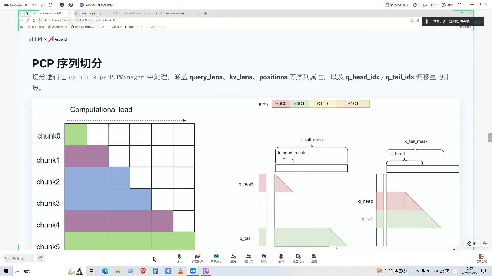 |
| 他会把最后这一段去做一个梯形的 mask，就是他会自动把这个 Q 和你给的 KV 的末端去对齐，来做这个梯形 mask。这个是大多数（算子）都支持的。——对好好。然后还有人问：PCP 和 DCP 以及 TP 和 EP——EP 的 rank 是只等于 TP 吗？还是某几个相乘？ [【跳转到 61:58】](https://www.bilibili.com/video/BV1W1L96KEf5/?t=3718) | 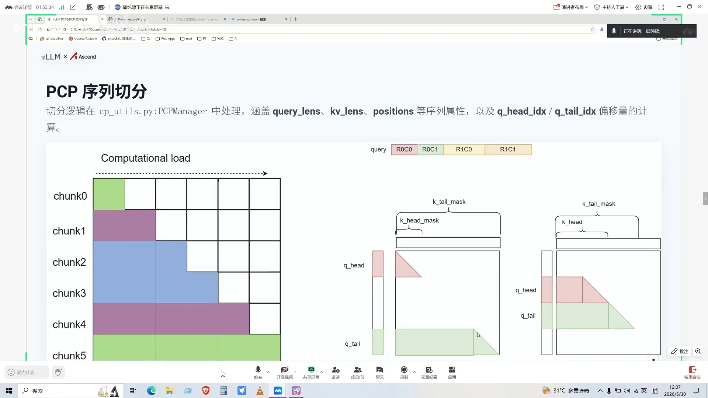 |
| 我觉得这个问题可能是（要看实现）：SGLang 那边 TP 跟 vLLM 这边 TP 它不是一个意思。SGLang 里面的话一般 TP 就等于 EP 了，但是 vLLM 这边的话它是一个层级关系。——是的，vLLM 这边它最终的 EP 应该是等于 DP size…… [【跳转到 62:23】](https://www.bilibili.com/video/BV1W1L96KEf5/?t=3743) |  |
| 乘以 PCP size 再乘以 TP size，就是 EP 是可以跨着 DP 和 PP 和 PCP 去组 EP 的。——哦，算了，我理解应该是这样的，因为可能我理解更多的是 vllm-ascend 上，至少是这样的。——对对是的是的。 [【跳转到 62:48】](https://www.bilibili.com/video/BV1W1L96KEf5/?t=3768) | 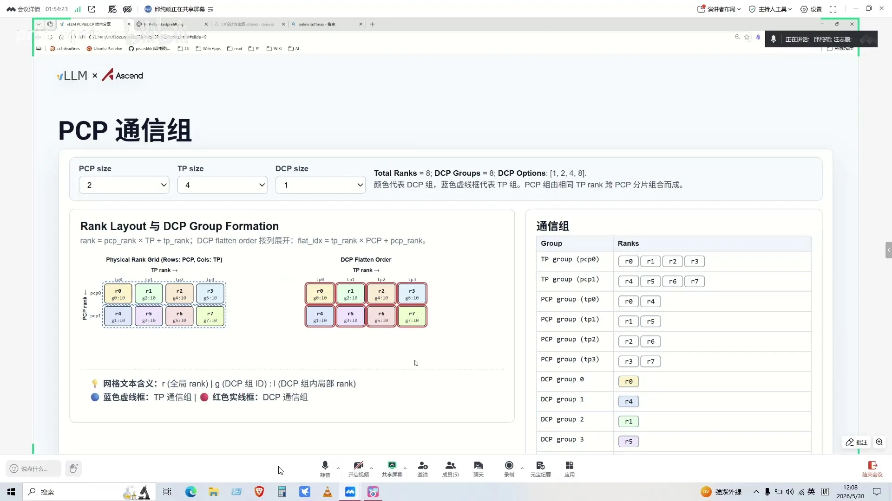 |
| 所以我们 DCP 里边也是可以去切那个 MoE 部分的专家的，去做专家并行的。——好，我们继续吧。——好，那我看一下后面…… [【跳转到 63:13】](https://www.bilibili.com/video/BV1W1L96KEf5/?t=3793) | 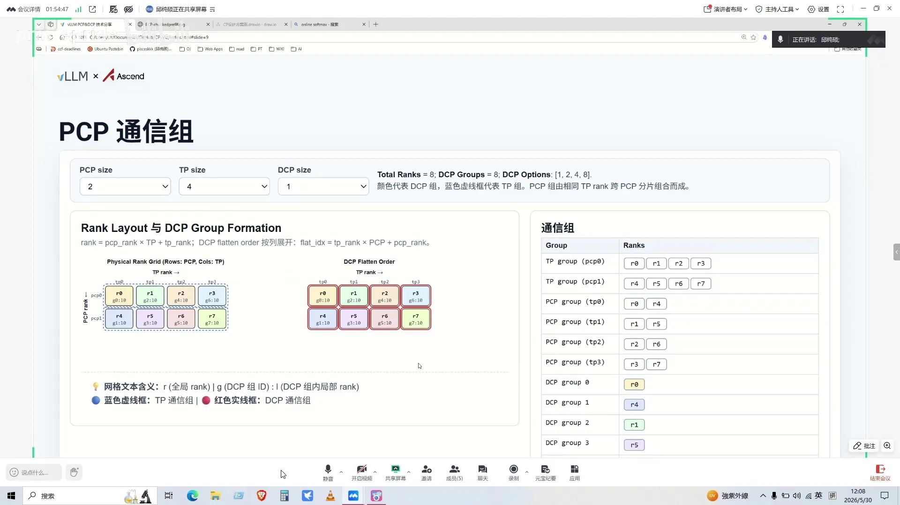 |
| 后面这里其实也看过，就是目前的支持情况…… [【跳转到 63:32】](https://www.bilibili.com/video/BV1W1L96KEf5/?t=3812) | 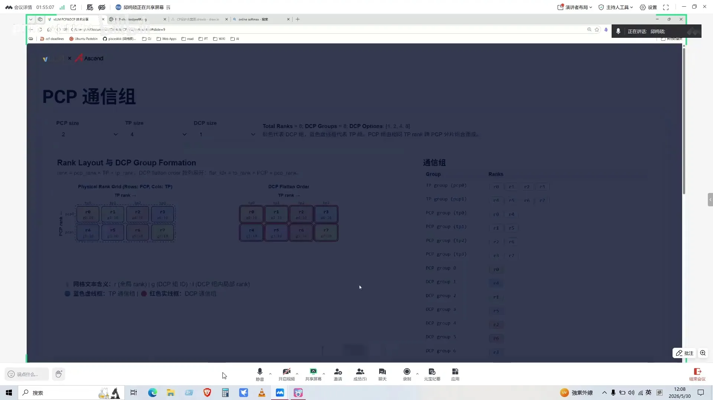 |
| 目前我统计到的在 vLLM 上 DCP 这些基础特性都支持了，但是 MTP——就是投机推理的话——应该还没有很完善的支持。然后 FA（flash attention）或者 CUDA graph 这个的话也已经有 PR 了，我也提了一些相关的 PR 把对应的后端支持上了，但是暂时还没合入。包括 PD 分离这个…… [【跳转到 63:37】](https://www.bilibili.com/video/BV1W1L96KEf5/?t=3817) | 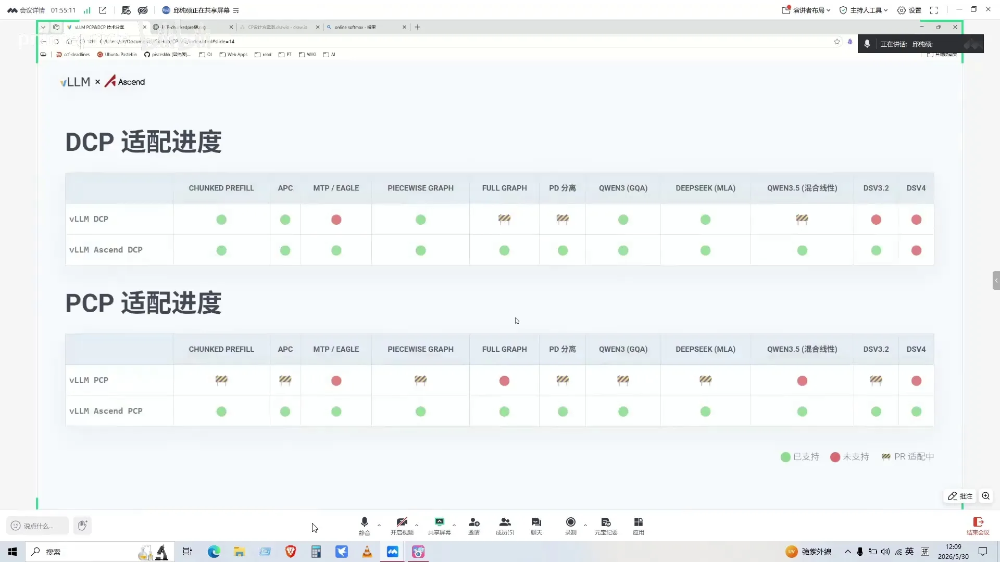 |
| 我最近上个月也提了个 PR，目前也在（review）中，等待合入。然后像刚才说的这个 Qwen3.5 的其实也已经有这个东西了。然后 DeepSeek 3.2 的（混合）框架和 DS V4 暂时都还没有支持。因为 3.2 其实昨天也在群里有讨论过：像我们在 vllm-ascend 上也已经支持了…… [【跳转到 64:02】](https://www.bilibili.com/video/BV1W1L96KEf5/?t=3842) | 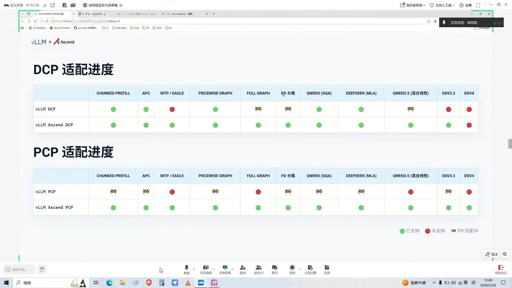 |
| 就是是可以做的，但是可能会有一些负载不均衡、或者例如一些额外通信等等的这种问题。所以最终有没有收益的话也还需要再去看一下。然后要不要在我们 vLLM 这边同步去适配上，但是具体有没有收益这个还不是很好确定。 [【跳转到 64:27】](https://www.bilibili.com/video/BV1W1L96KEf5/?t=3867) | 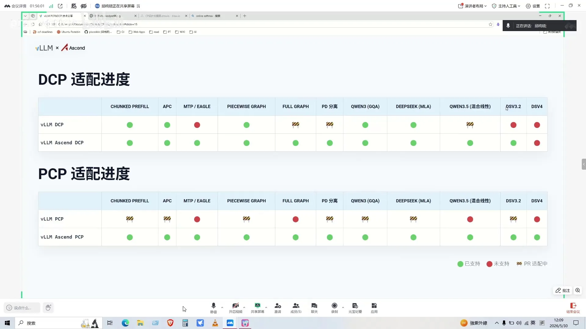 |
| 然后 DeepSeek V4 的 KV cache 这个——主要还是因为压缩这些东西会比较复杂，就不是很确定（MLA kernel）那边支不支持我们给一些局部的 KV 去做这种东西。所以其实都还没有支持。然后目前 PCP 的适配的话，vllm-ascend 这边其实所有的特性基本都已经（开发）好了…… [【跳转到 64:52】](https://www.bilibili.com/video/BV1W1L96KEf5/?t=3892) |  |
| 但是 PCP 在 vLLM 这边的话还是在推进过程中。当然这些长 prefill、prefix cache 基础特性肯定是会跟着我们后端的 PR 一起去适配好的。目前后端在普通的 GQA 和 MLA 上我们也都是有对应的适配的。当然其他这几个特性…… [【跳转到 65:17】](https://www.bilibili.com/video/BV1W1L96KEf5/?t=3917) |  |
| 暂时还没有做的特别完善，也没有提对应的 PR。然后我们目前就是——PCP 这个刚才也已经有详细的讨论过他的时延、吞吐，包括什么场景下去用。PCP 这个因为我们很早就在 vllm-ascend 上去做了…… [【跳转到 65:42】](https://www.bilibili.com/video/BV1W1L96KEf5/?t=3942) | 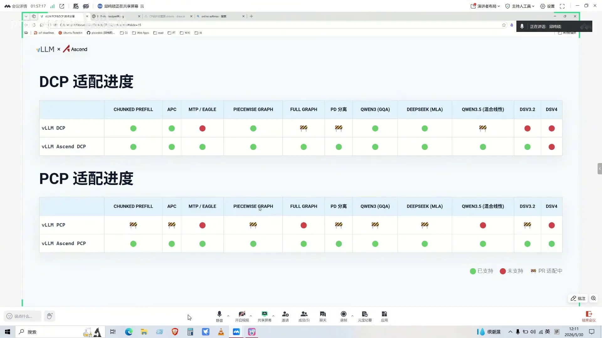 |
| 也是做了很多验证，有实际的（负载）去测试过。他的主要收益点是一个中长序列下——大概 32K 到 256K 的这个场景下，他的收益会有比较好的（表现）。但是他其实也是位于 DP 和 TP 之间的…… [【跳转到 66:07】](https://www.bilibili.com/video/BV1W1L96KEf5/?t=3967) |  |
| 一个并行策略：他的时延肯定是要比 DP 要好的，而且他的负载均衡也要比我们没有 DP LB 的——或者说即使加了 DP LB，他的负载均衡在变长序列下也会要更好一点。但是其实他的时延还是比不过 TP 的。 [【跳转到 66:32】](https://www.bilibili.com/video/BV1W1L96KEf5/?t=3992) |  |
| 然后在吞吐上的话其实就是反过来了：他比 TP 要好，但是其实比 DP 还要差一点。因为即使我们时延要比 DP 好，但是实际上也打不过——完全打不过。就是怎么说呢：比如我们开 DP=2，那我们 PCP=2 也是没有办法让时延低于 DP 的一半的…… [【跳转到 66:57】](https://www.bilibili.com/video/BV1W1L96KEf5/?t=4017) |  |
| 因为只有我们时延低于 DP 的一半，才有可能在（吞吐）上比 DP 好。所以现在 PCP 就是处于一个在 DP 和 TP 之间的均衡状态，所以他的部署场景相对要窄一点。通常来说当我们的并发量已经和系统的吞吐比较接近——或者显著的并发已经比我们吞吐要高很多了、导致我们（处理）不过来的情况下，这个时候可以通过 PCP 来进一步降低这个时延…… [【跳转到 67:22】](https://www.bilibili.com/video/BV1W1L96KEf5/?t=4042) |  |
| 这样可以兼顾吞吐和响应速度之间的均衡。大概现在 PCP 是这样的一个状况。当然这里之所以提到 256K，是因为我们发现 PCP 的一个理论收益点——相对于 TP 来说——我们在前面的一些方案图里也能看到：PCP 的理论计算量是和 TP 一样的。那么他的收益点主要一个是他的通信量要比 TP 小；然后第二个点是他的峰值（显存）——激活…… [【跳转到 67:47】](https://www.bilibili.com/video/BV1W1L96KEf5/?t=4067) |  |
| 激活值应该是要比 TP 要少一点的。然后在这个情况下，当我们的序列长度非常长的时候，其实这个时候计算就已经是占主要的大头了，那这个时候通信所能带来的那一点优势就不一定能发挥出来。所以在超长序列的场景下，TP 加 DCP 加长 prefill…… [【跳转到 68:12】](https://www.bilibili.com/video/BV1W1L96KEf5/?t=4092) | 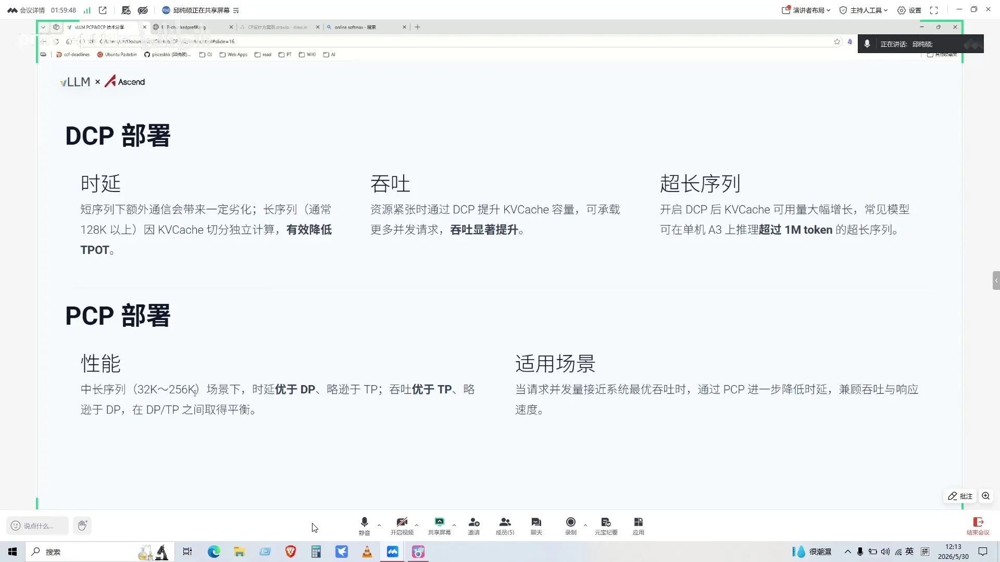 |
| 反而是一个目前我们看到的比较优的——目前已经支持的特性里面比较优的一个方案。当然我们后面在长序列这边也做了一些在 PP 上的优化，也在社区里提了 RFC。后面我们在 vllm-ascend 上落地有比较好的效果的话…… [【跳转到 68:37】](https://www.bilibili.com/video/BV1W1L96KEf5/?t=4117) | 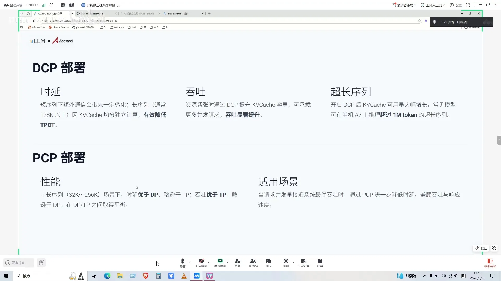 |
| 也会拿着我们的收益点去把它推进到 vLLM 上。当然这里就是一些其他方案了，这里就不详细展开了。所以目前 PCP 的情况大概是这样的。有同学问：attention 用 PCP，对于 MoE 结构的话我们采用什么并行的（方法）？——好…… [【跳转到 69:02】](https://www.bilibili.com/video/BV1W1L96KEf5/?t=4142) |  |
| 这个 MoE 的话我觉得就是：如果你是单机的话，然后你的并发请求比较少的话就用 TP 嘛，对吧。然后如果你是多机的话，那么就直接用 EP 了。——是的。——其实这个 PCP 应该本身不会影响 TP 怎么选、PCP 不会影响 EP 怎么选，对…… [【跳转到 69:27】](https://www.bilibili.com/video/BV1W1L96KEf5/?t=4167) |  |
| PCP 和 DCP 特性都是只作用在 attention 的，对是的。他几乎不会影响 EP 上的（并行）怎么选，就是 MoE 部分。所以这个完全是看本身 EP 怎么配，后面就可以怎么配，不需要专门去调这个 EP。——好，继续。——哦…… [【跳转到 69:52】](https://www.bilibili.com/video/BV1W1L96KEf5/?t=4192) | 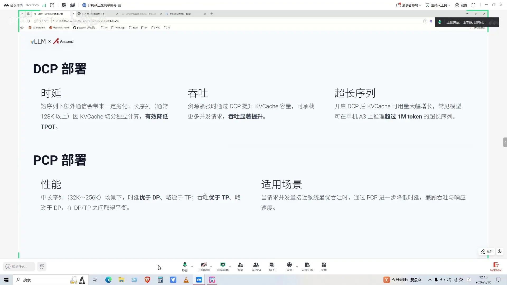 |
| 好，如果没有其他问题，那我后面可以继续说一下。因为我们在 CP——不论是 DCP 和 PCP，其实可以看到都是在一些场景下有劣化，或者性能上没有（那么）理想的。所以我们在 CP 特性上也继续进一步深耕，做了一些特性的优化，包括一些拓展方案…… [【跳转到 70:17】](https://www.bilibili.com/video/BV1W1L96KEf5/?t=4217) | 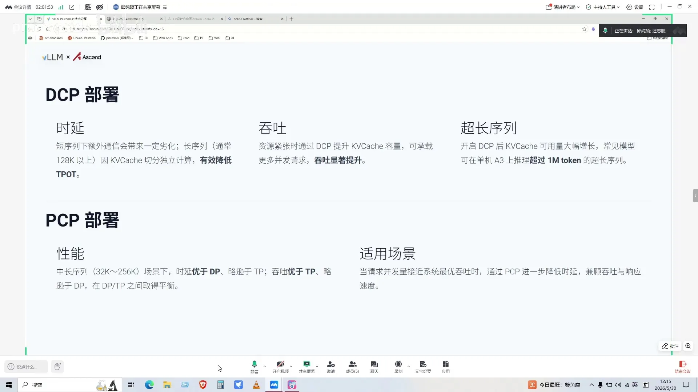 |
| 这里可以讲一些目前比较成熟的几个方案。一个是叫 TPA，或者说叫 tensor parallel sparse attention——这是英伟达的一位同事提供的，目前在 vLLM 上有对应的 RFC，也有 PR，但是还暂时没有合进去。那么这个点是来做什么呢？就是在我们标准的 TP 和 DCP 路径下…… [【跳转到 70:42】](https://www.bilibili.com/video/BV1W1L96KEf5/?t=4242) |  |
| 我们可以发现 DCP 额外引入了至少两次通信吧。但实际上前面这一次 DCP 的 all-gather 通信，他是在 head 的维度的。在 head 维度有什么问题呢？就是 head 维度我们大多数的通信算子可能需要先做一些 transform、transpose，把这个维度放到最开始，然后之后再做 all-gather 的…… [【跳转到 71:07】](https://www.bilibili.com/video/BV1W1L96KEf5/?t=4267) | 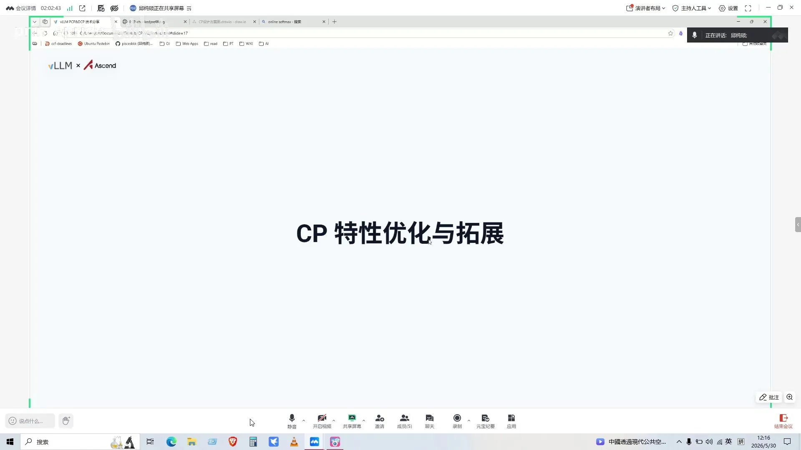 |
| 我们可以发现DCP引入了一次额外引入了两至少两次通信吧然但实际上前面这一次DCP的ORGA通信他是在had的维度的在had的维度有什么意什么问题呢就是在害的维度我们大多数的通信分子可能需要先做一些transform呃Transpose把这个维度放到最开始然后之后再做all开的 [【跳转到 71:32】](https://www.bilibili.com/video/BV1W1L96KEf5/?t=4292) |  |
| 然后之后做通信，再做各种操作。反正即使不做这个 transpose，你为了让他连续也是需要做一个让他连续的操作，也会引入更多额外的（算子）。这个虽然只是一次通信，但其实带来的开销还是蛮大的。然后就考虑到我们本身 DCP…… [【跳转到 71:57】](https://www.bilibili.com/video/BV1W1L96KEf5/?t=4317) | 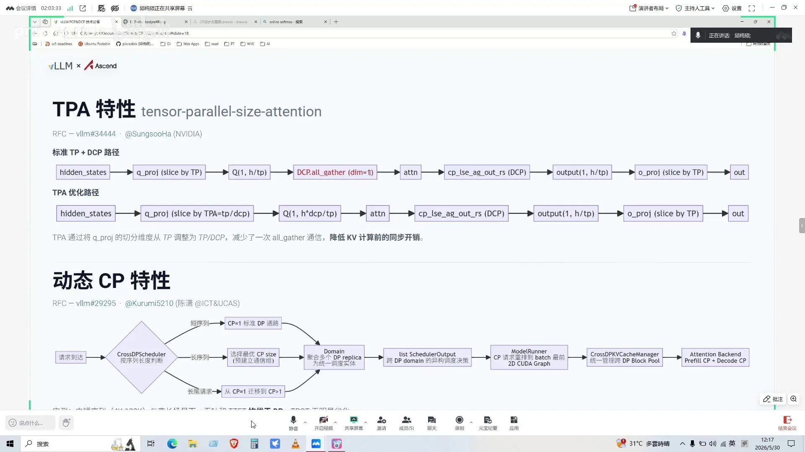 |
| 他主要还是在 decode 的阶段嘛。decode 阶段他本身是访存（受限）的，他的计算相对来说就不是瓶颈。那么我可以引入一个额外的特性：我们会把 Q 的 projection 把他的 TP 切分给消除掉，让他不再需要 DCP 组内（head 维）的通信…… [【跳转到 72:22】](https://www.bilibili.com/video/BV1W1L96KEf5/?t=4342) | 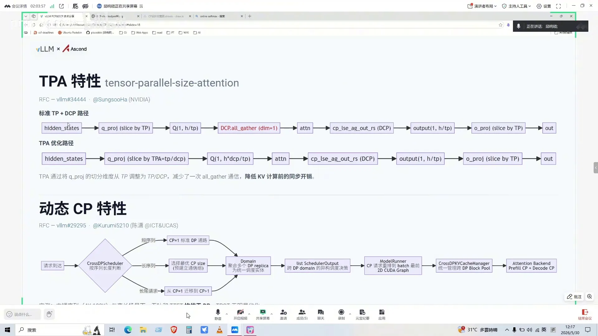 |
| 然后这样的话我们经过这一次 Q 的 projection 之后，拿到的就是直接 all-gather 之后的这个 TP 完整的 size。那我们对应就少做了一次通信，少做了很多开销。虽然代价是引入了更多的一些计算，但是我理解其实在 decode 阶段这一个计算量反而是可以接受的。然后对应的我们可以让我们的 TPOT 的…… [【跳转到 72:47】](https://www.bilibili.com/video/BV1W1L96KEf5/?t=4367) |  |
| 这个收益更加明显，或者说让他（劣）化更加少。然后这是一个 TPA 的特性，可以后续关注一下看他什么时候合进去。大家也可以在开 DCP 的时候去尝试调整一下这个特性。然后另外一个特性是针对 PCP 的——那也不仅针对 PCP…… [【跳转到 73:12】](https://www.bilibili.com/video/BV1W1L96KEf5/?t=4392) | 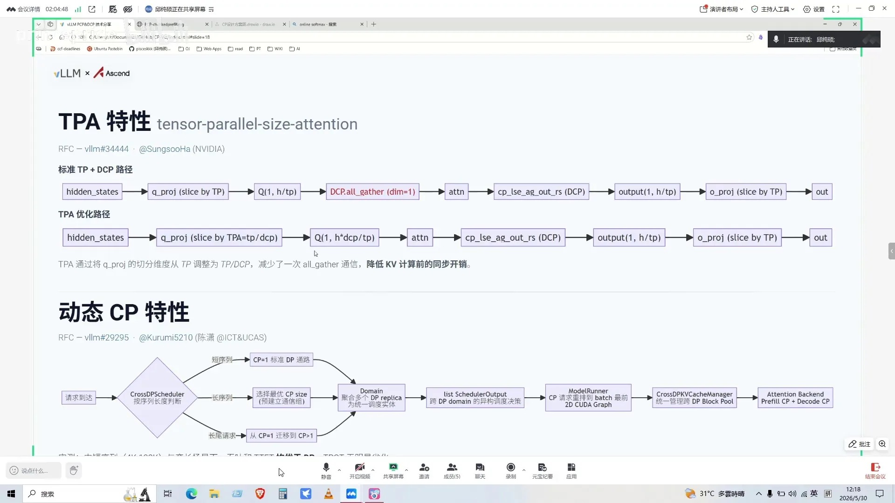 |
| 也会对 DCP 有对应的这个特性，就是动态 CP。这个是因为像刚才我们说的，在短序列场景下其实不论是 PCP 还是 DCP，他都是有劣化的。这个劣化主要尤其是相对于 DP 来说，他在短序列场景下也会有劣化。主要就是因为我们为了切 TP、切 PCP、切 CP 而引入了很多额外的通信…… [【跳转到 73:37】](https://www.bilibili.com/video/BV1W1L96KEf5/?t=4417) |  |
| 然后这些通信其实就完全没有什么收益，也会把我们计算的一些收益给吃掉。所以这里我们引入了一个动态 CP 的特性。这个核心的出发点就是在 DP 和 CP 之间可以动态地去切换…… [【跳转到 74:02】](https://www.bilibili.com/video/BV1W1L96KEf5/?t=4442) |  |
| 甚至在不同的 CP size 之间也可以做切换。我们这个主要是在整个并行组、包括后面 attention 也会做一些修改。但主要的是在调度侧和通信组这里做的调整：我们会对调度策略做一些调整，让短的序列去走 CP=1 的标准的 DP 通路…… [【跳转到 74:27】](https://www.bilibili.com/video/BV1W1L96KEf5/?t=4467) | 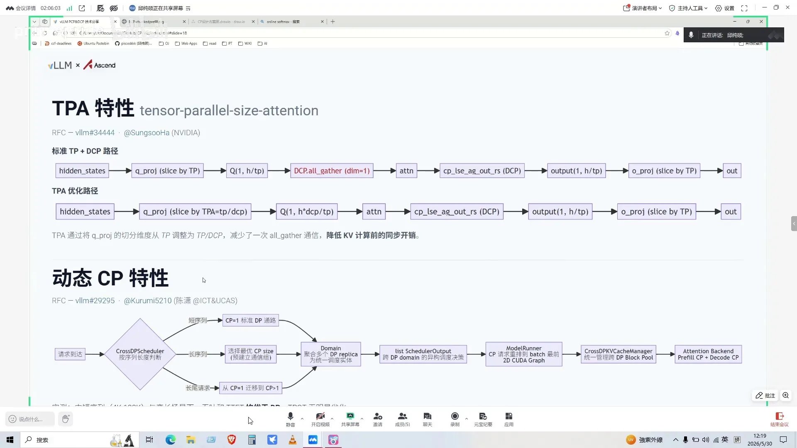 |
| 这样可以避免 CP 引入额外的通信或者劣化。然后长序列可以让他去选一些我们提前设置好的 CP size。然后对于长尾请求——一直在做 decode、或者一直在做长 prefill 的——也可以从 CP=1 的标准 DP 通路切到 CP 大于一的通路，做一个不同通信策略之间的切换。然后目前这个东西实测下来，让我们 CP 的这个优势序列区间…… [【跳转到 74:52】](https://www.bilibili.com/video/BV1W1L96KEf5/?t=4492) | 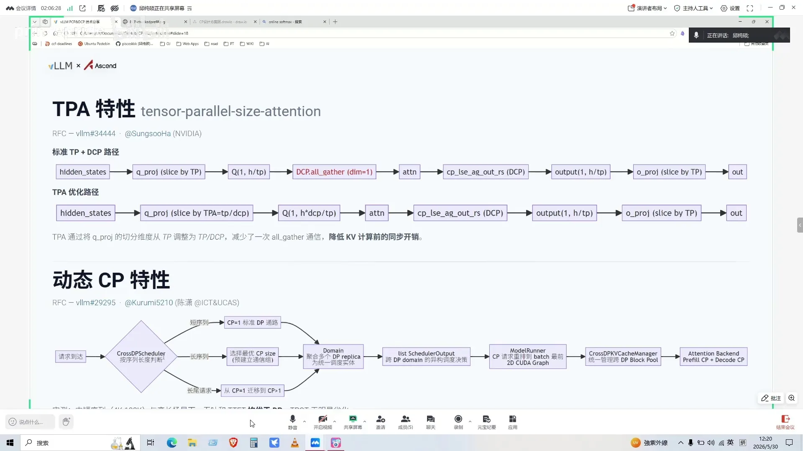 |
| 从 32K 进一步降到 4K，然后同时在变长序列下也会有更好的表现。这样对应的吞吐和 TTFT 啦什么的都会比 DP 更好。然后对应的我们在 TPOT 阶段也没有引入额外的劣化，就可以让我们的 CP 特性的适用范围更大。 [【跳转到 75:17】](https://www.bilibili.com/video/BV1W1L96KEf5/?t=4517) | 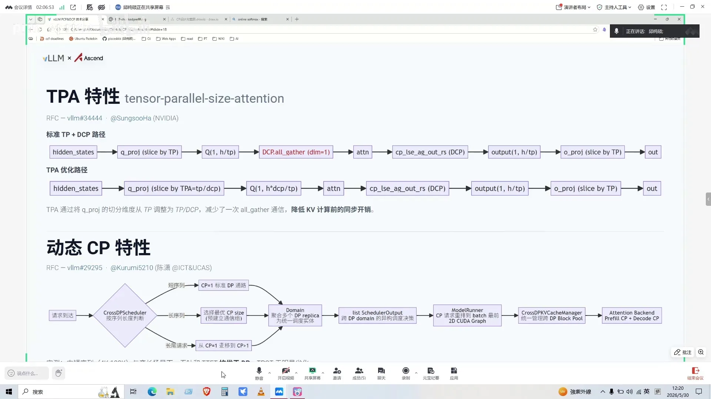 |
| 对，这是我们目前也是在做的几个特性，后续也会对应地推到 vLLM 主社区，目前也都已经有 RFC 了。大家有兴趣的话也可以去看一下。好，当然因为我这边其实还是跟进了很多长序列特性，除了我们现在这个 CP 相关的一些特性…… [【跳转到 75:42】](https://www.bilibili.com/video/BV1W1L96KEf5/?t=4542) | 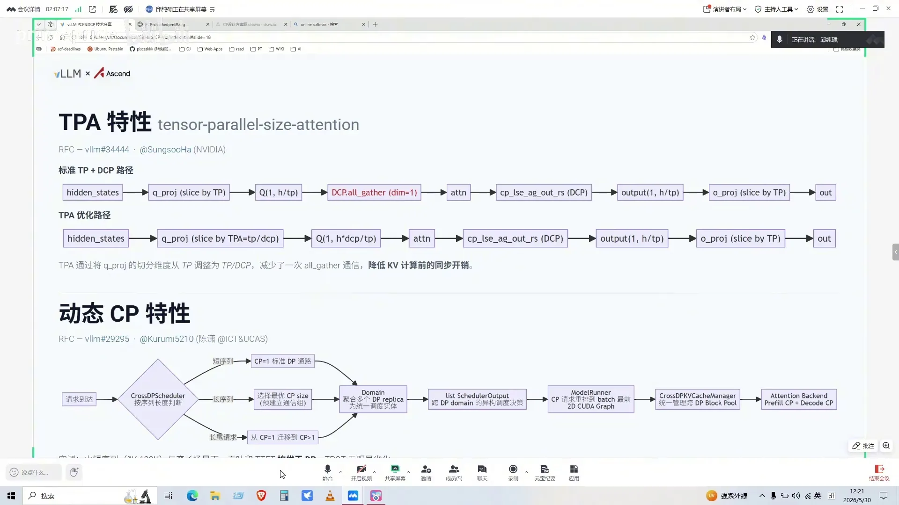 |
| 我目前也在推像叫 CPP 的、动态 chunk（或者说动态 context）的流水线并行。大概是这么一些东西，就是可以让我们流水线在超长序列的情况下表现得更好，包括在变长序列场景下表现也可以更好。 [【跳转到 76:07】](https://www.bilibili.com/video/BV1W1L96KEf5/?t=4567) | 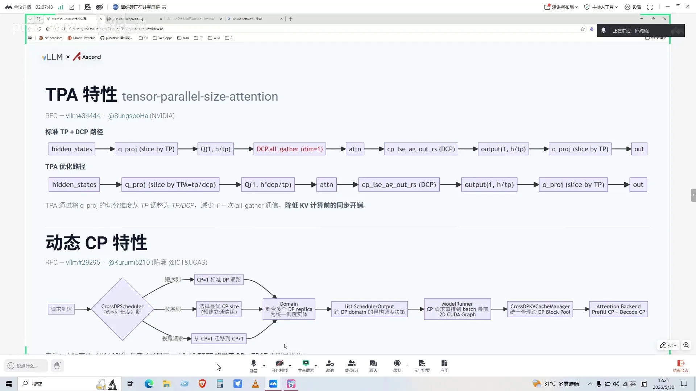 |
| 目前我们测试下来接近 1M 了。大家也知道之前 1M 这个场景是不太多的，因为大多数模型都不支持嘛。那 DeepSeek V4 支持之后，1M 这些场景也会逐渐地被纳入到我们部署的考量范围内。然后也会有一些基于其他并行组的优化…… [【跳转到 76:32】](https://www.bilibili.com/video/BV1W1L96KEf5/?t=4592) | 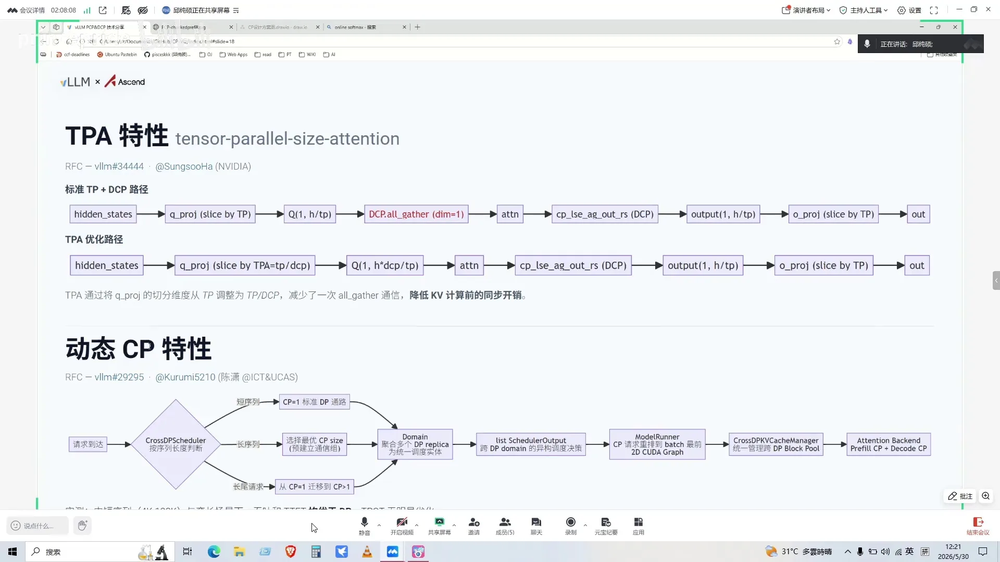 |
| 大家也可以继续关注一下。这些在我们 vLLM 的 RFC 里面都可以找到。目前我关于 CP 的这些介绍就是这些。后面看大家还有没有什么其他的问题或者可以讨论的东西。——好，直播间有同学有什么问题吗？——然后还有就是因为今天我这个直播设备确实不是很好…… [【跳转到 76:57】](https://www.bilibili.com/video/BV1W1L96KEf5/?t=4617) | 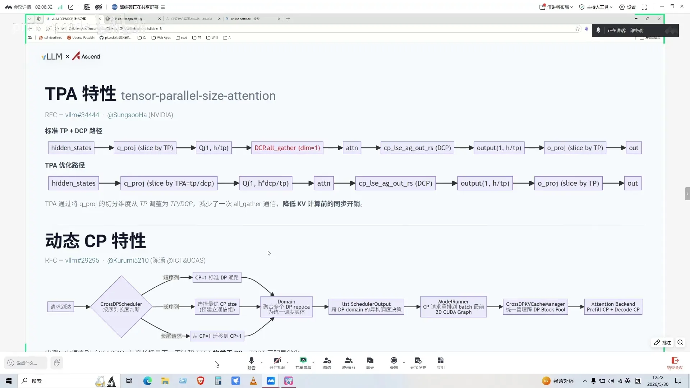 |
| 所以大家看直播的时候可能会有点卡，到时候我会把回放放出来。如果想看完整（内容）的话可以多看一下回放。——是的。——包括我们不论是 CP 的 RFC 还是我们在 vLLM 的 slack 里面是有对应的频道的。大家如果后续看完回放也还有问题的话…… [【跳转到 77:22】](https://www.bilibili.com/video/BV1W1L96KEf5/?t=4642) | 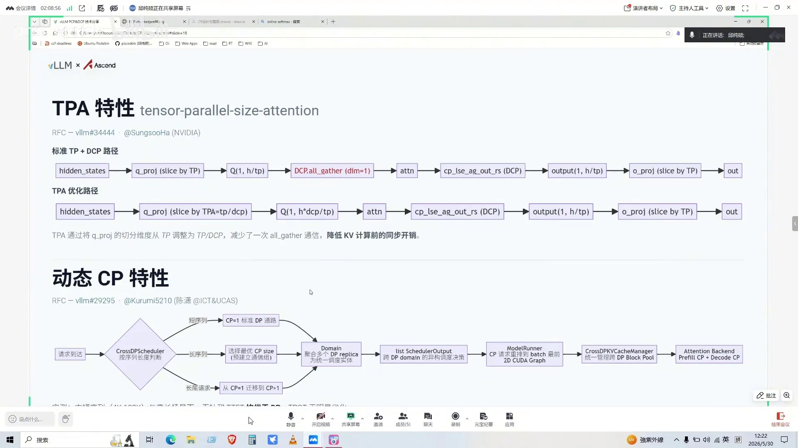 |
| 也可以到对应的 RFC 或者 slack 的频道里面去交流，这些我都是在里面有持续关注的。——对，可以看一下现在直播间里有没有什么问题。——我感觉今天这个题目其实是挺硬核的。——这个确实，因为本身这个方案…… [【跳转到 77:47】](https://www.bilibili.com/video/BV1W1L96KEf5/?t=4667) | 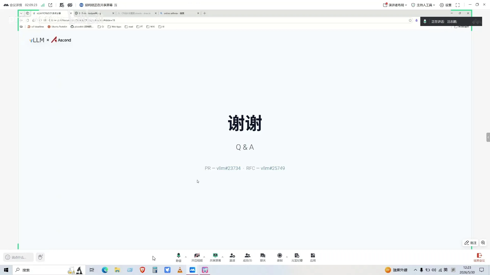 |
| 我们其实 PCP 这个方案还是相对比较复杂的，然后他的实测场景又相对比较窄，所以我们在这方面做了很多各种方面的优化。——好好好，还是希望这个东西最后能有一个比较好的落地场景的。——对，然后包括其实这个目前这个方案的…… [【跳转到 78:12】](https://www.bilibili.com/video/BV1W1L96KEf5/?t=4692) | 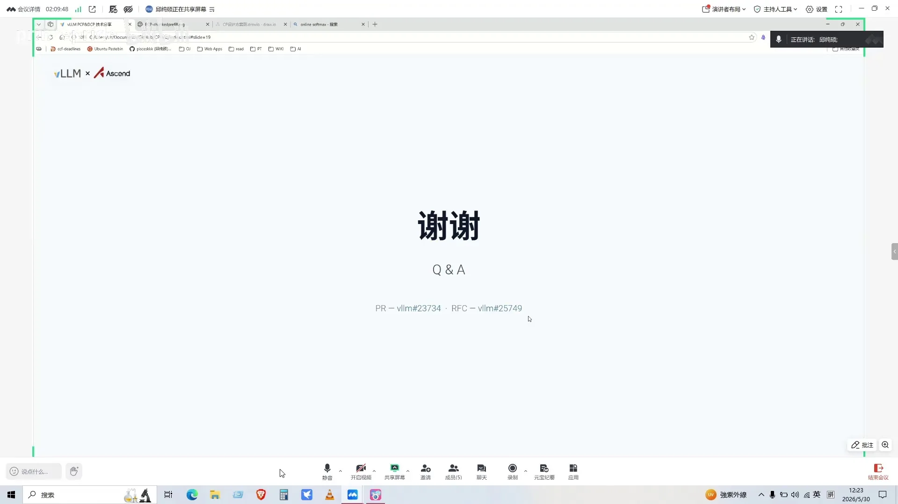 |
| 这些细节也都在我对应的那一个 GitHub 仓库里面，大家可以找到。——对，我感觉现在因为特性越来越多了，这样可能会导致整个主仓代码变得……比如说新来的人就会变得非常难以理解，对吧。——哦是这样的，其实嗯…… [【跳转到 78:37】](https://www.bilibili.com/video/BV1W1L96KEf5/?t=4717) | 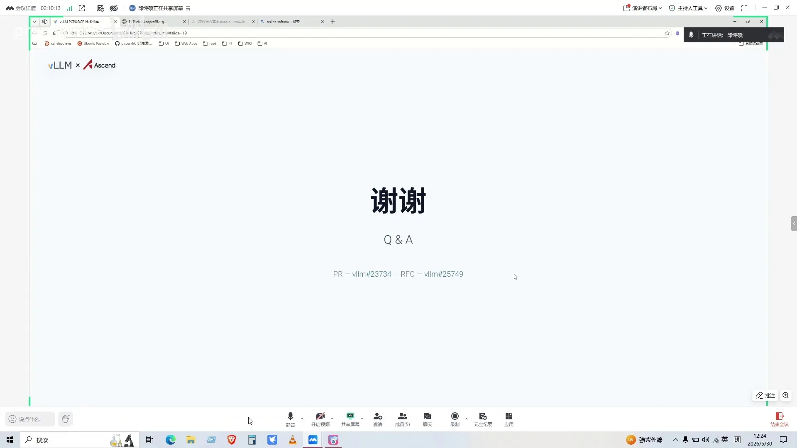 |
| 像我刚才列的这个特性适配图…… [【跳转到 79:02】](https://www.bilibili.com/video/BV1W1L96KEf5/?t=4742) | 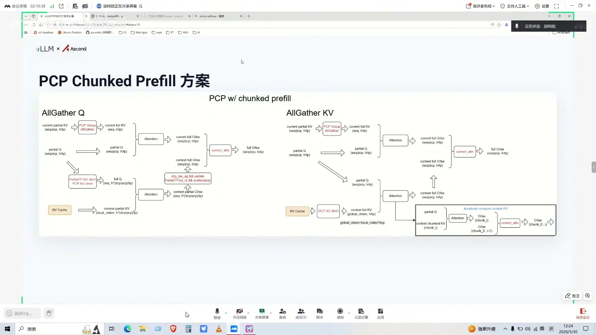 |
| 这个其实还只是一小部分比较常见的特性…… [【跳转到 79:27】](https://www.bilibili.com/video/BV1W1L96KEf5/?t=4767) | 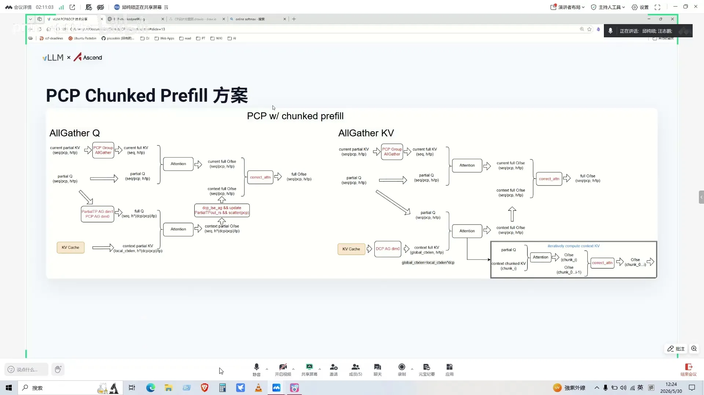 |
| 这个其实还只是一小部分比较常见的特性 [【跳转到 79:33】](https://www.bilibili.com/video/BV1W1L96KEf5/?t=4773) | 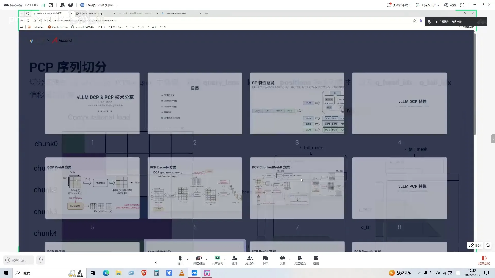 |
| 还有很多更边缘的一些优化特性，真的要理解起来、理解他们的相互关系，难度都是蛮大的。——其实不仅 vLLM，我们 vllm-ascend 目前也有类似问题，需要有一些比较详细的方案讲解，这样对新入手两个社区的新人会更友好。——对…… [【跳转到 79:38】](https://www.bilibili.com/video/BV1W1L96KEf5/?t=4778) |  |
| 这个东西我反正在去年这个时候是完全没听过的，差不多是去年下半年的时候有知道这个 DCP 和 PCP，当时我还看了一下相关的一些（文章）。——对对是的，因为 DCP 第一个 PR 是去年 9 月初的时候合入的。对…… [【跳转到 80:03】](https://www.bilibili.com/video/BV1W1L96KEf5/?t=4803) | 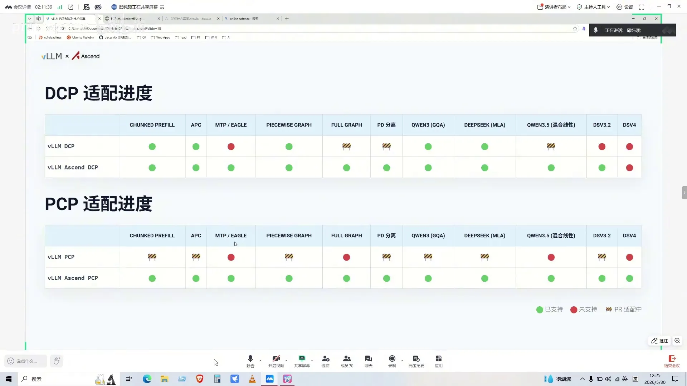 |
| 然后 PCP 的 RFC 也是 9 月底的时候。当时好几个（人提）：我们这边提过几个，蚂蚁的一些同学提过，Meta 的同学也有提过，当时在社区讨论比较多。然后在 11 月份的时候，先把我们 DCP 的基础功能给支持进去了…… [【跳转到 80:28】](https://www.bilibili.com/video/BV1W1L96KEf5/?t=4828) |  |
| 这确实主要是集中在去年下半年。——对，我觉得我们后面整个主仓对一些特性（的支持），是需要好好想一想：怎样子可以让这代码对于后面的新人更容易理解，同时也可以去支持一些比较好的特性。 [【跳转到 80:53】](https://www.bilibili.com/video/BV1W1L96KEf5/?t=4853) | 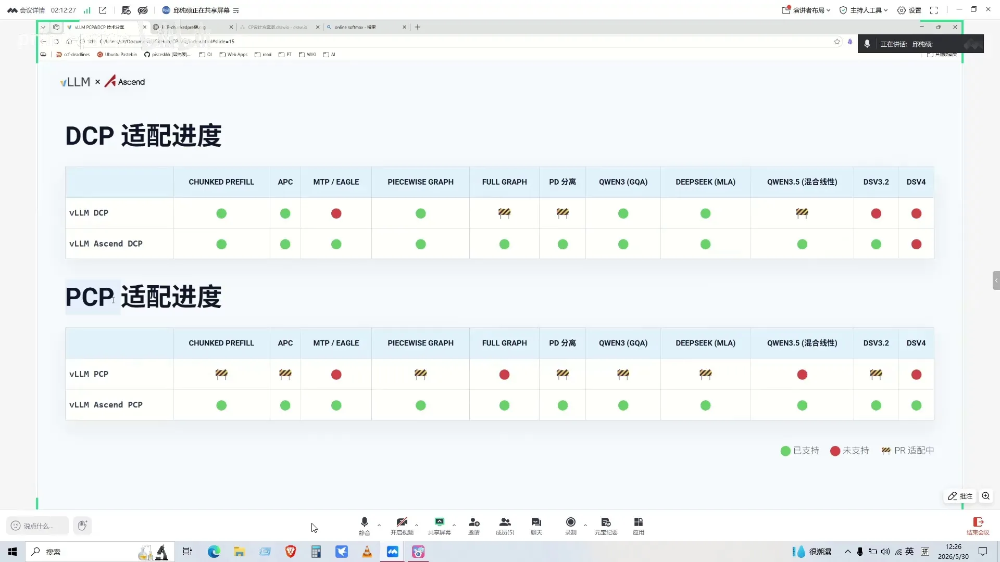 |
| 对，其实现在主仓也感觉他们在往模块化的思路上走嘛，像 model runner 的话其实就已经把模块化做的比较好了。包括我们 PCP 其实在最开始适配的时候也是有考虑的…… [【跳转到 81:18】](https://www.bilibili.com/video/BV1W1L96KEf5/?t=4878) | 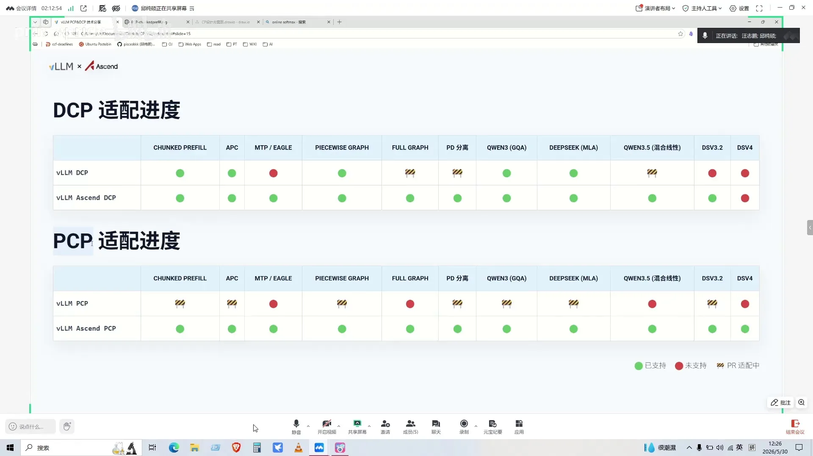 |
| 因为可以看到我们最开始……哦我这（图）是不是没有放大…… [【跳转到 81:31】](https://www.bilibili.com/video/BV1W1L96KEf5/?t=4891) | 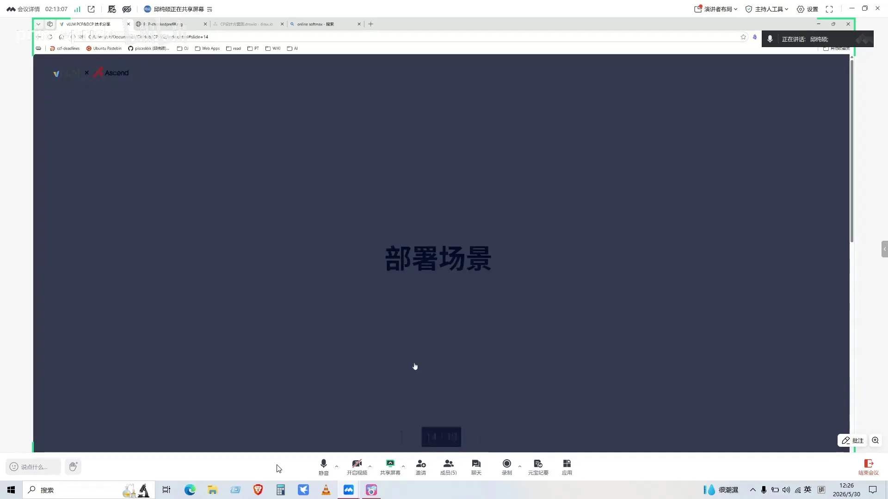 |
| 最开始我们就单纯对 model runner 这部分的修改就蛮多的，对各种 metadata 啊。所以我们最开始就已经把它尽量抽离出来了：让它在主流程中只能看到一个接口，不影响大家入门去看整个 vLLM 仓库。如果具体想要了解这个东西的话…… [【跳转到 81:36】](https://www.bilibili.com/video/BV1W1L96KEf5/?t=4896) | 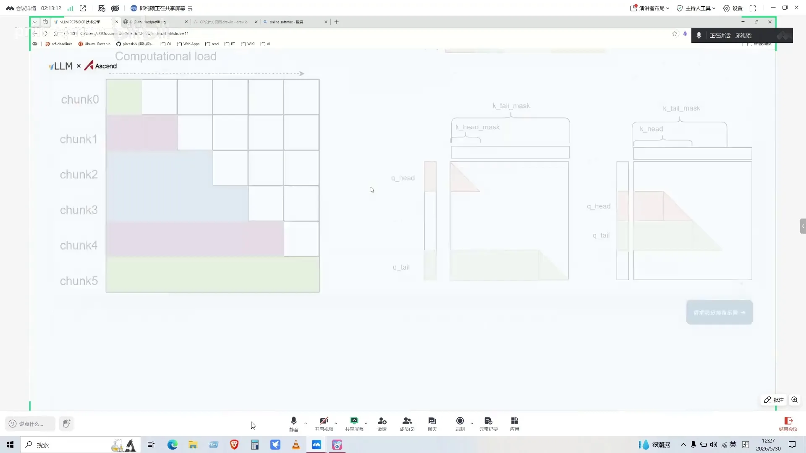 |
| 也有一个比较统一管理的位置可以去找到相关的代码，然后去针对性的阅读。——是的，我感觉后面其实很多特性还是需要把这种隔离做的更好一点。尤其是一些相对比较 high level 的特性——它不是基础特性——隔离做好其实还是比较关键的。 [【跳转到 82:01】](https://www.bilibili.com/video/BV1W1L96KEf5/?t=4921) |  |
| 对，我觉得很多特性他可能只在一些比较特殊的场景下有收益。那我觉得其实更关键是在于我们要把这个 recipe 给做好。——哦是吗？ [【跳转到 82:26】](https://www.bilibili.com/video/BV1W1L96KEf5/?t=4946) | 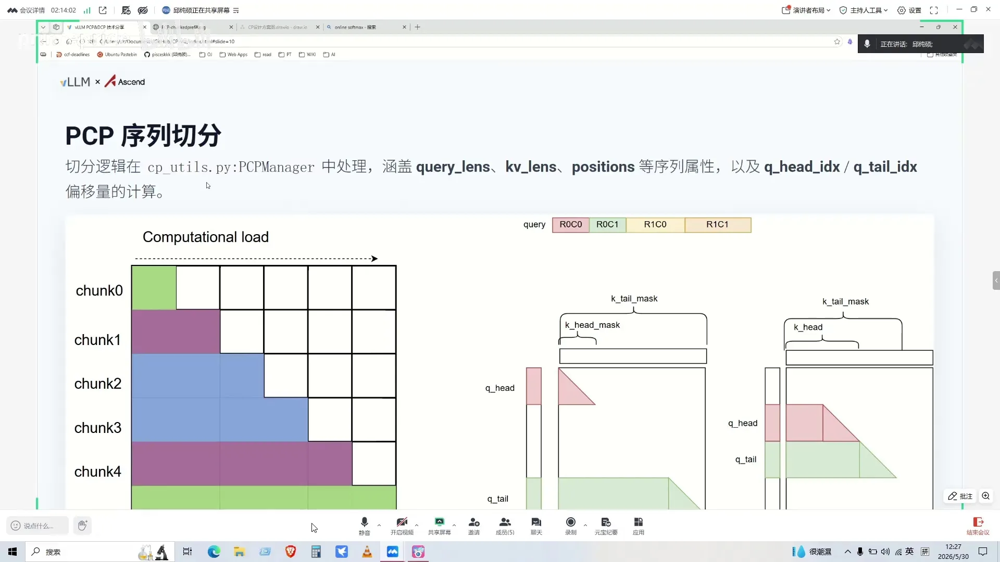 |
| 我觉得后面我们可能也需要专门搞一期，专门讲应该在什么样的场景下采用什么样的部署策略。——哦对，这种最佳的部署场景。——我不太确定 vLLM 的（文档），我理解文档里应该会有一些经典典型场景的部署（建议）…… [【跳转到 82:38】](https://www.bilibili.com/video/BV1W1L96KEf5/?t=4958) | 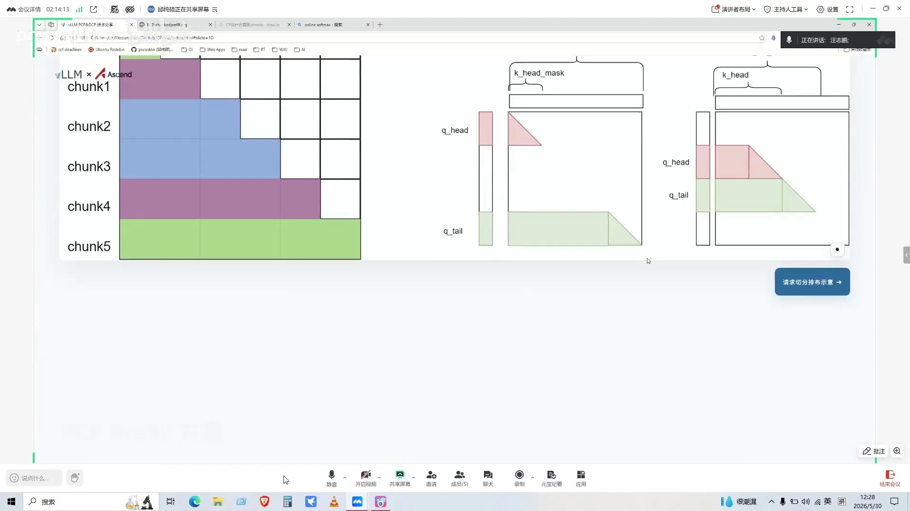 |
| 这个有很大的问题：我们的 recipe 其实做的非常的宽泛。他可能一个很典型的模型只给你提供一个部署策略，这部署策略可能开的特性会比较多。但是他没有说：比如我如果真的是想追求 TTFT，那么我应该（怎么调）；然后如果我是专门（追求）这个 input（吞吐）…… [【跳转到 83:03】](https://www.bilibili.com/video/BV1W1L96KEf5/?t=4983) | 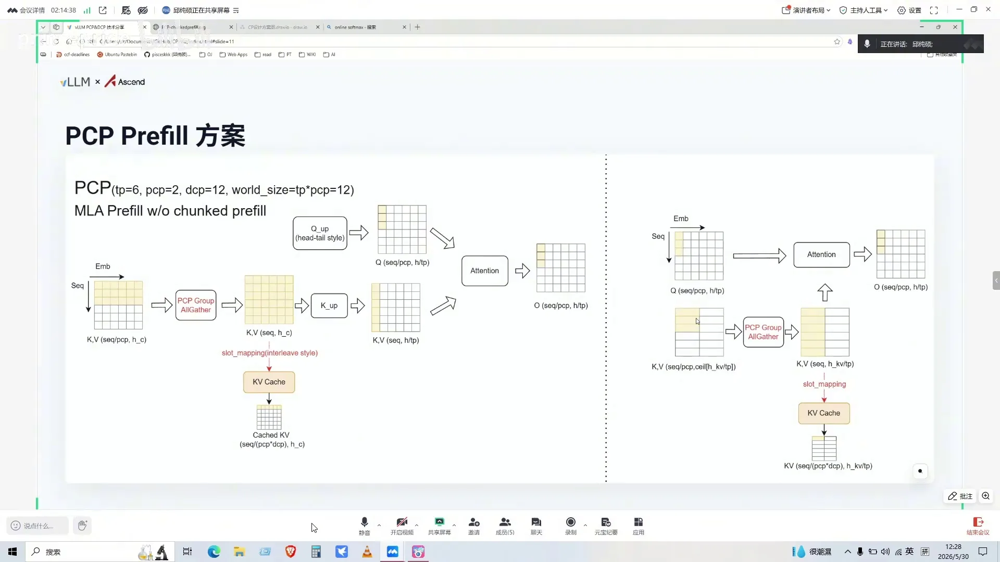 |
| 那我应该怎么样去改（这些）参数。这东西其实我觉得是用户会更关心一些：应该每个特性都会告诉他他是对哪部分有提升、哪部分有劣化，这样也方便用户自己去调整。——是的，对。好，然后有同学问一个问题：PCP 的长度能超过模型本身的 context 吗？ [【跳转到 83:28】](https://www.bilibili.com/video/BV1W1L96KEf5/?t=5008) |  |
| 这个我觉得如果单纯是为了能推——单纯看他有没有能力推理的话，是肯定可以的。就是像……我们之前其实……哎我找到（那个），应该也说过…… [【跳转到 83:53】](https://www.bilibili.com/video/BV1W1L96KEf5/?t=5033) | 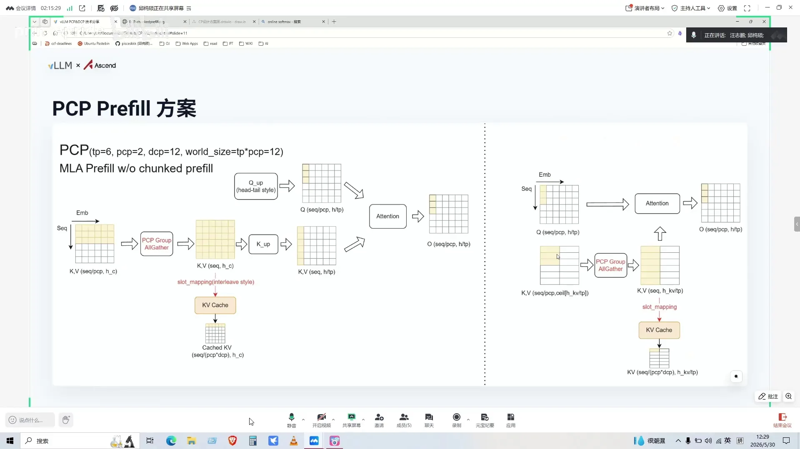 |
| 也因为我们很早早期就测试过…… [【跳转到 84:13】](https://www.bilibili.com/video/BV1W1L96KEf5/?t=5053) | 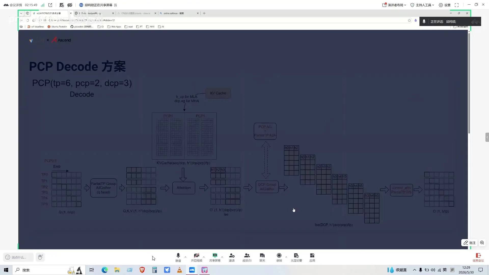 |
| 在 DCP、PCP 下我们都能推 1M 的长序列。但是其实大家也知道…… [【跳转到 84:18】](https://www.bilibili.com/video/BV1W1L96KEf5/?t=5058) | 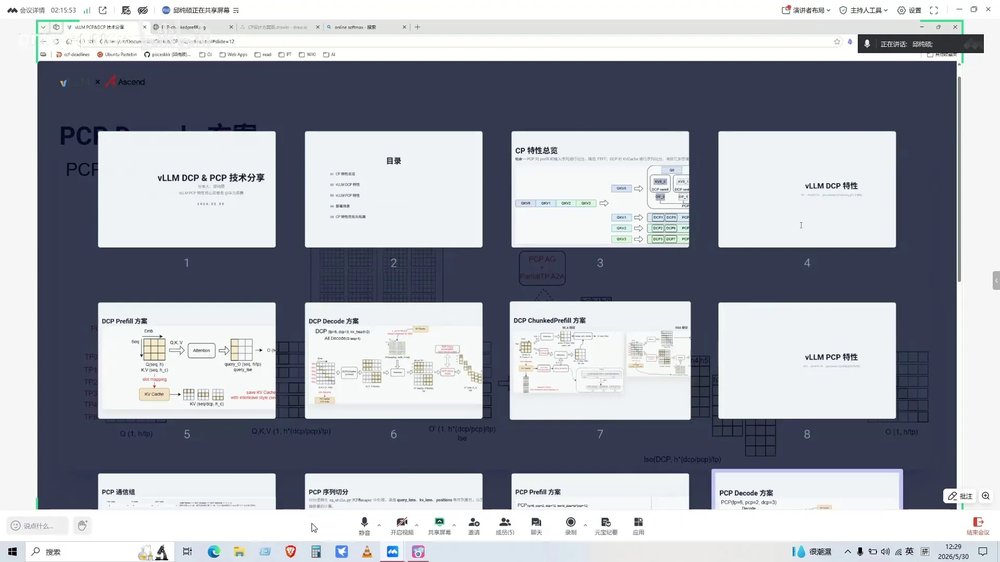 |
| 在 DeepSeek V4 出来之前，也没有模型真正的上下文支持到这个长度的序列，所以当时也只是一些实验性的场景。但是你说推了超过他的 context 之后他的模型能力——肯定是有所下降的。是这样的：本身模型能力能不能达到是一方面，然后我们引擎开了这几个特性之后，推理能力肯定是能达到的。——对，很好。然后直播间还有同学有问题吗？我们再等 2 分钟。——哦对，直播间里也说可以在论坛里面维护一个部署场景的…… [【跳转到 84:23】](https://www.bilibili.com/video/BV1W1L96KEf5/?t=5063) | 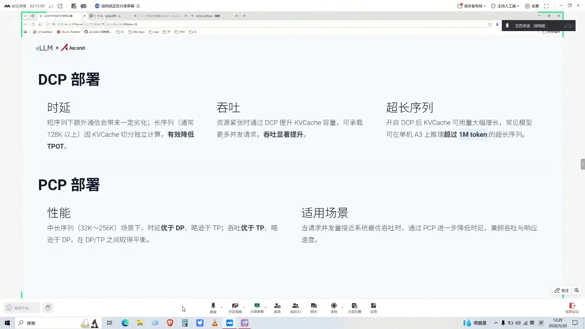 |
| 最佳适配（的帖子），群策群力。现在这部分信息很分散。——是的，现在这部分信息非常分散。我感觉大家其实大概知道什么样参数会有什么样的……对于模型性能上有什么样的变化，但是有些（特殊参数）…… [【跳转到 84:48】](https://www.bilibili.com/video/BV1W1L96KEf5/?t=5088) |  |
| 我们可能一些人也是不知道的。然后还有一个就是需要一部分这种东西汇总，让很多新来的人才能够大概知道这些参数是什么东西。因为我觉得理解这些参数的话，对本身这个框架开发也会有更多的帮助。比如说我觉得这东西很大程度上…… [【跳转到 85:13】](https://www.bilibili.com/video/BV1W1L96KEf5/?t=5113) |  |
| 你可以比较深刻理解计算和通讯他们之间的一些关系，对吧。对，这种特性的一个总览表还是有必要的，可维护。——然后有人问：普通的 GSM8K 测完之后还需要测啥？——这应该是（问）benchmark 的问题。 [【跳转到 85:38】](https://www.bilibili.com/video/BV1W1L96KEf5/?t=5138) |  |
| 我理解一般来说大多数情况都是只会测一下 GSM8K。然后像如果有一些针对长序列啦或者怎么着的，还有像 GPQA 这种也有一些比较经典的可以去测一下。——对…… [【跳转到 86:03】](https://www.bilibili.com/video/BV1W1L96KEf5/?t=5163) | 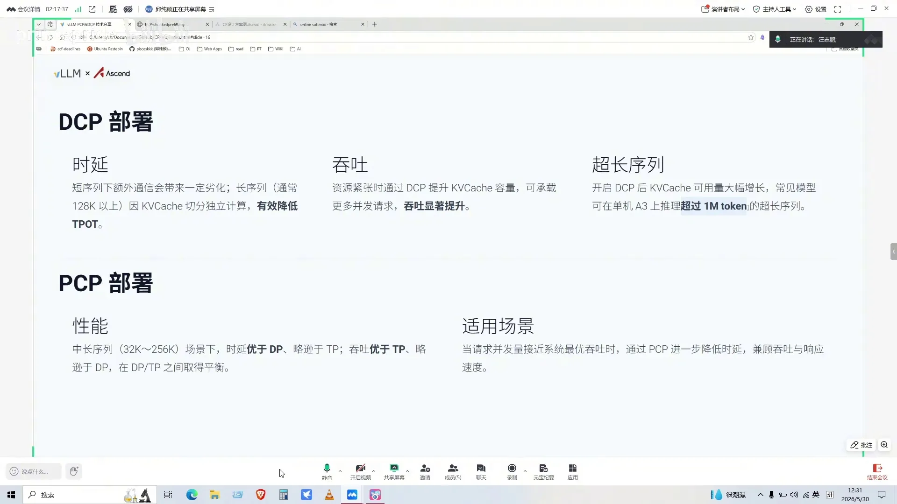 |
| 但我感觉至少以目前像 CI、vLLM 的一些看护用例啦，包括合入一些特性的时候，大多数还是只关注 GSM8K，因为这个能比较快速地看出来有没有效果。哎但当然其实还有——这个就说到我在开发过程中遇到一些问题…… [【跳转到 86:28】](https://www.bilibili.com/video/BV1W1L96KEf5/?t=5188) | 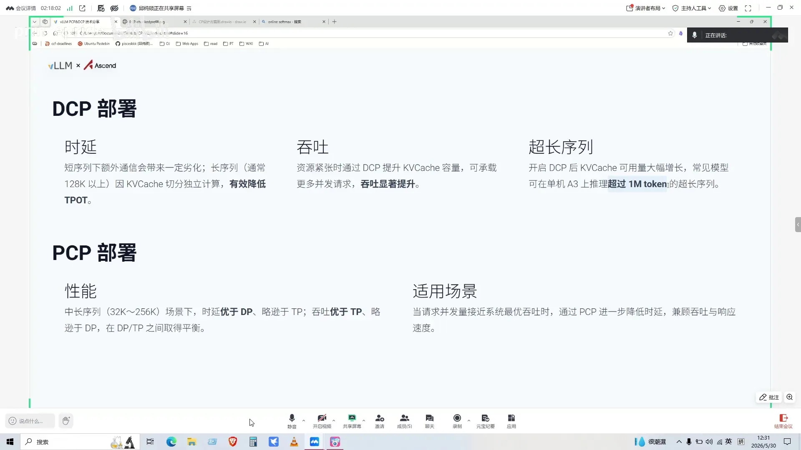 |
| 像我们在开发 DCP、PCP 过程中跟 chunked prefill 适配——可以看到我们适配方案还蛮复杂的。当时有的时候适配好长 prefill 之后，可能单纯跑一轮那个 GSM8K，他能触发的长 prefill 数量就比较少。所以我们一般做针对某些特性适配的时候…… [【跳转到 86:53】](https://www.bilibili.com/video/BV1W1L96KEf5/?t=5213) | 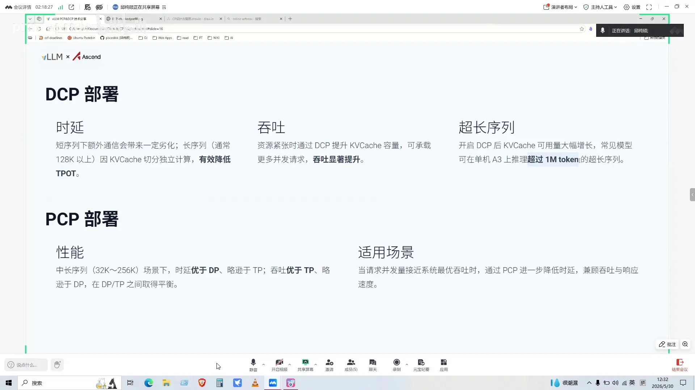 |
| 会加一些额外的开关，让他总是能尽量每个请求都能触发对应的特性，这样会更容易看出问题来。像 chunked prefill 在 vLLM 里边有个 long prefill token threshold 那样的一个参数，让每个请求都能切 chunk。有一些这样的开关在测 benchmark 的时候可以针对性地去打开…… [【跳转到 87:18】](https://www.bilibili.com/video/BV1W1L96KEf5/?t=5238) | 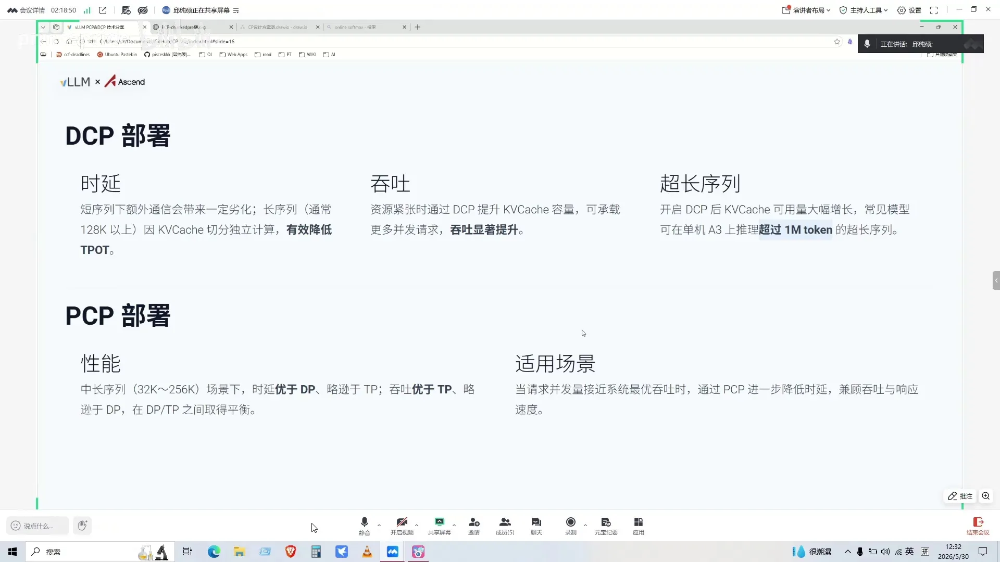 |
| 做一些针对性的测试。——然后我理解这个 DCP 和 PCP 主要也是针对这种自回归模型，对吧？——什么模型？刚没听清。——就是这种自回归模型。——我应该是因为这种序列并行的话…… [【跳转到 87:43】](https://www.bilibili.com/video/BV1W1L96KEf5/?t=5263) | 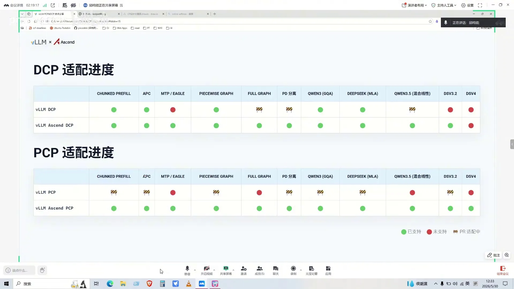 |
| 像那种（生成任务）——对，diffusion 模式里面他是有专门的用 Ulysses 这东西的。——哦，多模态这块我确实目前了解的不太多。我感觉 CP 单纯直接用上去的话应该不太行，应该我理解会有其他一些方面的…… [【跳转到 88:08】](https://www.bilibili.com/video/BV1W1L96KEf5/?t=5288) | 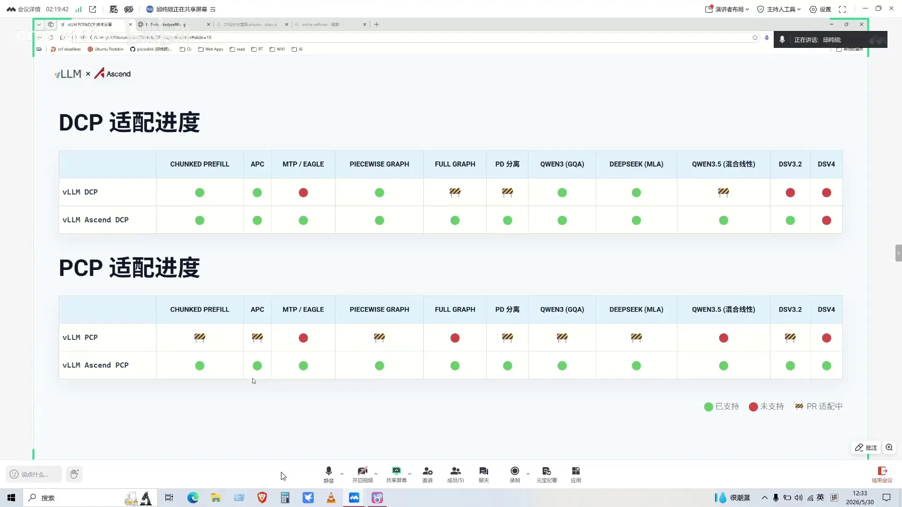 |
| 在序列或者说 sequence 维度做优化的方案。目前至少现在这套方案应该在那种模型上效果不会很好。——对，好，那我觉得我们这个直播就可以结束了。——嗯好呀可以…… [【跳转到 88:33】](https://www.bilibili.com/video/BV1W1L96KEf5/?t=5313) | 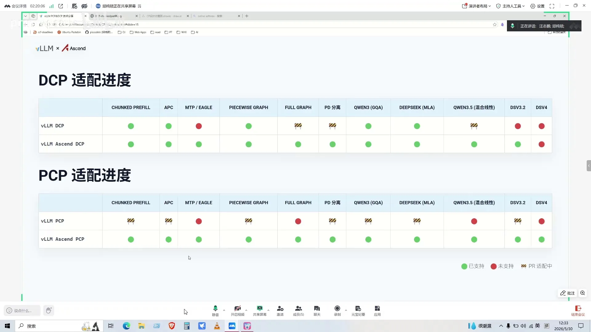 |
| 在序列或者说sequence维度做优化的方案目前至少现在这套方案应该在哪种模型上效果不会很好对好那我觉得我们这个直播就可以结束了嗯好呀可以 [【跳转到 88:58】](https://www.bilibili.com/video/BV1W1L96KEf5/?t=5338) |  |
| 后面反正也有回放，都有对应的交流的渠道，大家可以看。对，大家可以后面去看回放。然后我后面会把我们这个学习群的二群给创建出来，把二维码发出来，大家可以扫这个二维码加入我们的群。 [【跳转到 89:23】](https://www.bilibili.com/video/BV1W1L96KEf5/?t=5363) | 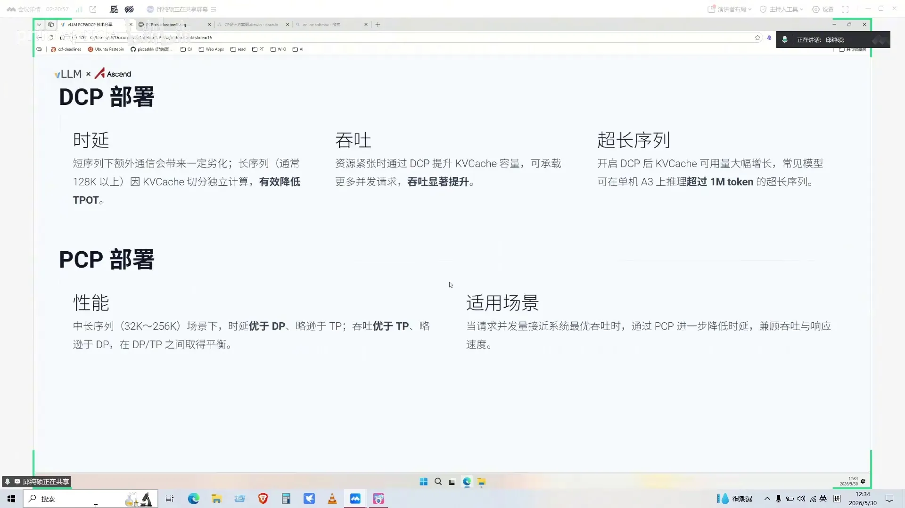 |
| （此区间无字幕） [【跳转到 89:48】](https://www.bilibili.com/video/BV1W1L96KEf5/?t=5388) | 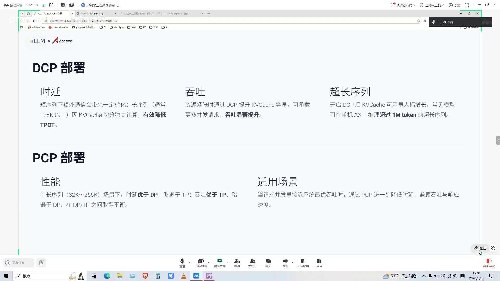 |