# vLLM小课堂（五）：Rust前端重构 原始文稿（图-字幕分栏）

| 字幕文本 | 画面 |
| :--- | ---: |
| 我们准备开始。好，首先请紫棋先介绍一下吧。这一次新来的嘉宾是紫棋，之前（嘉宾）做过介绍——讲过一个请求的整个流程的那种。然后我们这一次是新嘉宾紫棋。 [【跳转到 00:00】](https://www.bilibili.com/video/BV19fJJ6AE6W/?t=0) | 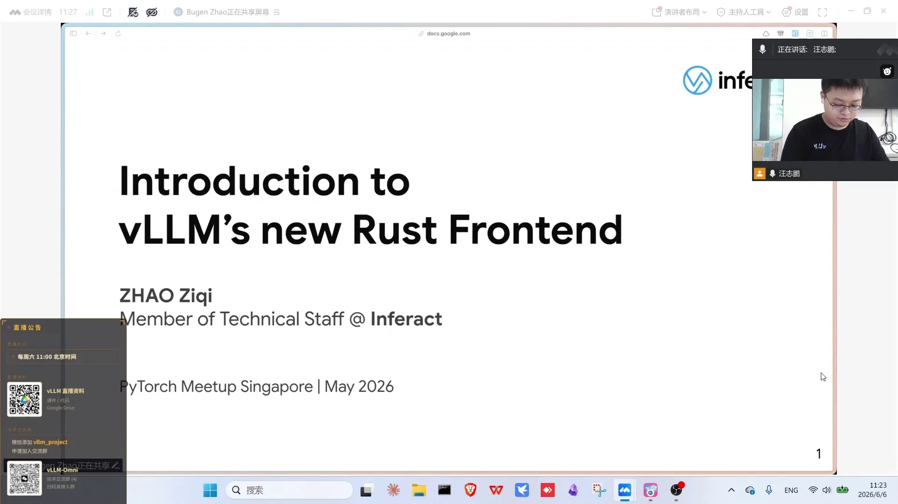 |
| 最后我们先请紫棋介绍一下。紫棋刚刚可能有点杂音。——对对对，大家好，我是赵紫棋。 [【跳转到 00:25】](https://www.bilibili.com/video/BV19fJJ6AE6W/?t=25) | 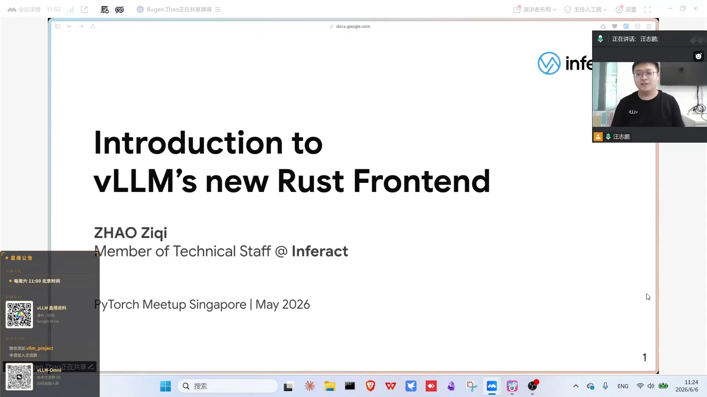 |
| 然后我现在是 INFX 的一名两年（工龄）的工程师。INFX 就是 vLLM 背后的一家公司，可以大家这么认为。它也是由 vLLM 的最初几位作者（创办的）。现在一方面负责从…… [【跳转到 00:50】](https://www.bilibili.com/video/BV19fJJ6AE6W/?t=50) | 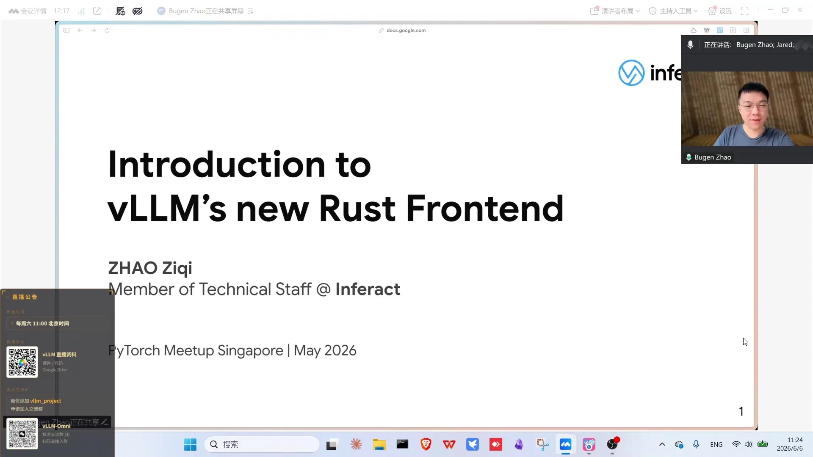 |
| 一家公司的角度去推进 vLLM 这个开源社区的演进；另一方面我们也在想持续把 vLLM 打造成一个更好用、更可靠的（推理引擎）。OK，那我就直接开始了，我们今天的…… [【跳转到 01:15】](https://www.bilibili.com/video/BV19fJJ6AE6W/?t=75) | 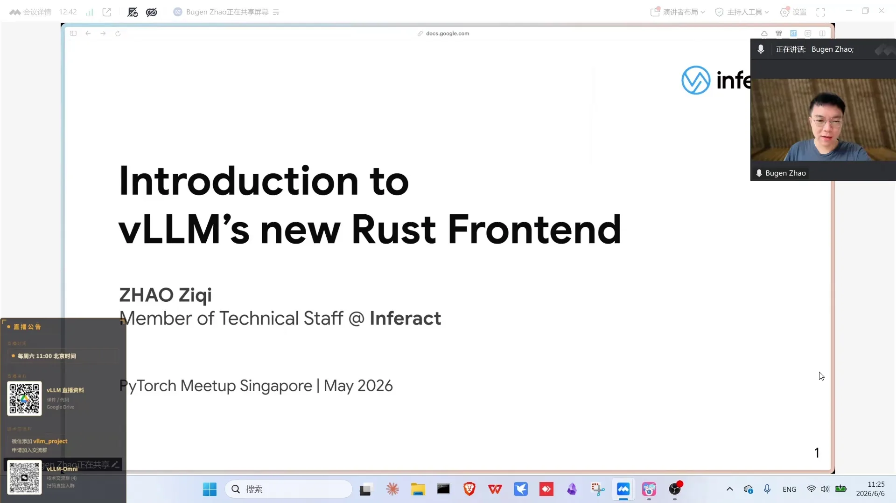 |
| 第一个 topic 就是给大家介绍一下 vLLM 最新的一个 Rust frontend 的一些工作。当然这个是之前在 PyTorch 的一个 meetup 上（讲过）的，比如说像这一页它介绍 vLLM，我觉得可以直接略过，因为我想在座的大家可能都…… [【跳转到 01:40】](https://www.bilibili.com/video/BV19fJJ6AE6W/?t=100) | 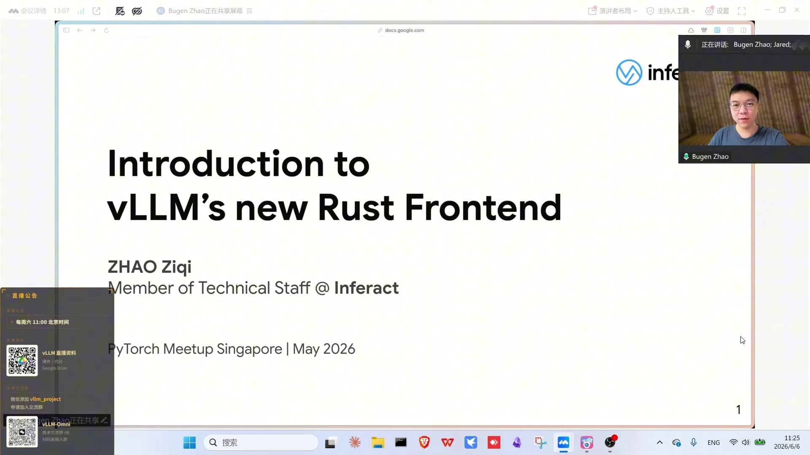 |
| 非常熟悉 vLLM 的介绍。然后 INFX 刚刚我也给大家介绍过了，反正它就是背后的一家公司。作为 Rust frontend 这个工作也是在 INFX 内部开始的。当时我们想看一看：能不能把现在用 Python 写的这个 API server 这一层——随着它现在…… [【跳转到 02:05】](https://www.bilibili.com/video/BV19fJJ6AE6W/?t=125) | 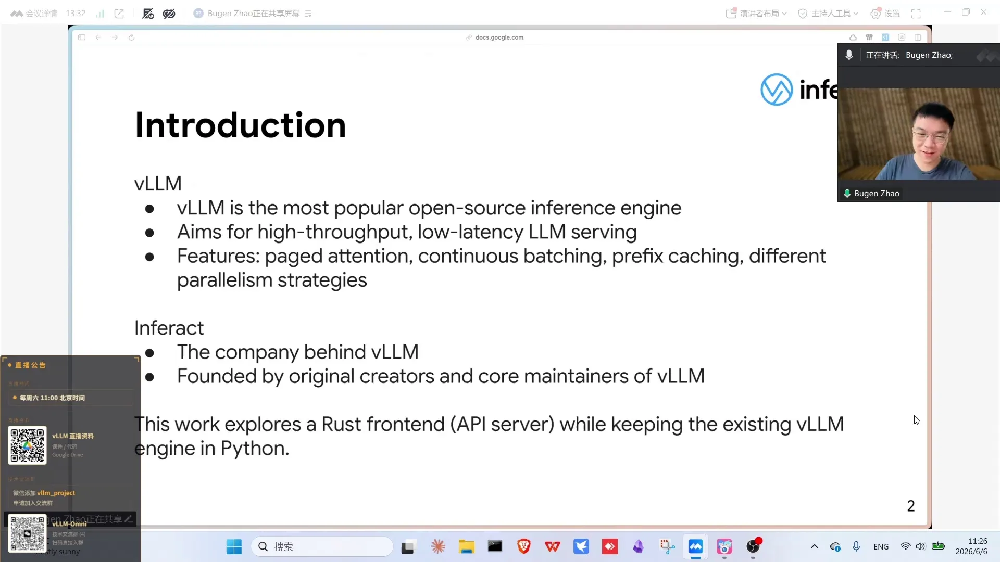 |
| 比较 CPU intensive——我们看能不能把它用一种更高性能的语言去替换掉，比如说像 Rust 一样，但依然保留着现在 Python 那边的 vLLM engine。所以我们可以先开始，简单过一下 vLLM 整体的 serving stack 架构。 [【跳转到 02:30】](https://www.bilibili.com/video/BV19fJJ6AE6W/?t=150) |  |
| 那么在 vLLM 的一个部署中，其实用户会和这个 API server 去打交道，也就是我们这里所说的 frontend。它会暴露一些 HTTP 的 endpoint，一般来讲最常用的就是 OpenAI compatible 的这种 HTTP endpoint，也就是所谓的 completions API…… [【跳转到 02:55】](https://www.bilibili.com/video/BV19fJJ6AE6W/?t=175) |  |
| 还有 chat completions API。然后用户会直接向这些 endpoint 发请求——或者是你的 agent，或者是你直接通过 chatbot。frontend 会负责把这些结构化的、还有历史对话的这种请求，转成一个更底层的、更原始的…… [【跳转到 03:20】](https://www.bilibili.com/video/BV19fJJ6AE6W/?t=200) |  |
| 给 engine 里面的 request，这就是我们这里讲的所谓的 EngineCoreRequest。那么 frontend 会和 engine core 以及 engine core 背后的 GPU worker，通过一个 ZMQ 消息队列——或者一种类似于 RPC 的机制——来进行通讯。这个 ZMQ 它是一个内部的一个、大家认为比较天然的一个界限…… [【跳转到 03:45】](https://www.bilibili.com/video/BV19fJJ6AE6W/?t=225) |  |
| 对，然后 engine 呢则会进一步负责把发过来的这个更底层的请求去管理：比如说分配它需要访问的 KV cache，然后去真正地执行模型的前向，以及最后把模型生成的 token…… [【跳转到 04:10】](https://www.bilibili.com/video/BV19fJJ6AE6W/?t=250) | 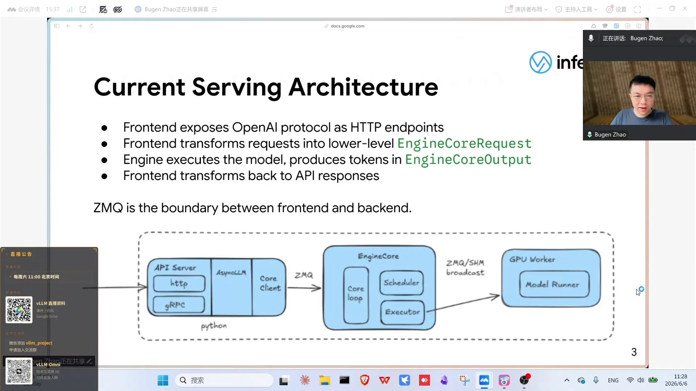 |
| 再返回给前端，通过 EngineCoreOutput 这么一个结构来做。因此在此之后，frontend 收到了 EngineCoreOutput 之后，它又会进一步把 EngineCoreOutput 重新转回一个结构化的 response 送给这个 API server 这一层，然后它就会返回给用户…… [【跳转到 04:35】](https://www.bilibili.com/video/BV19fJJ6AE6W/?t=275) | 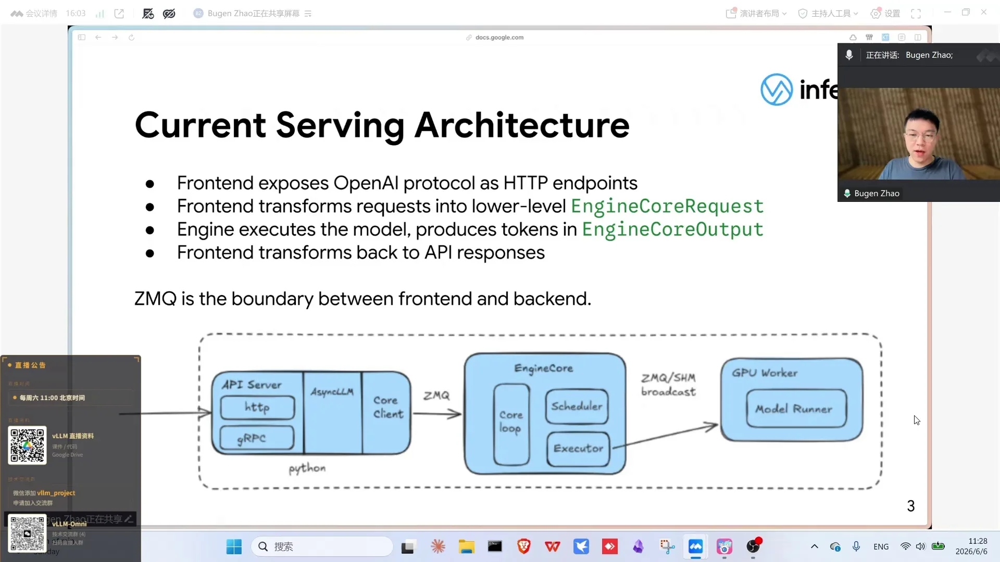 |
| 这样就完成了一次 chat completions API 调用的全部流程。所以大家可以看到这里面有一个比较关键的点：我们这里有一个 ZMQ 的 boundary——这么一个界线，它区分开了我们所说的 frontend 以及后面的 engine，就是那些跑到 GPU 上面的…… [【跳转到 05:00】](https://www.bilibili.com/video/BV19fJJ6AE6W/?t=300) | 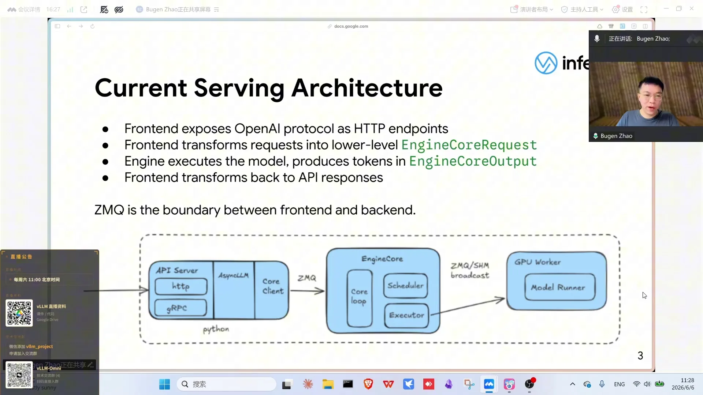 |
| 一些工作。这里就会导致一个结果：我们可以把整个系统分成前端、后端这么两块。所以如果我们想要替换掉现在的 Python 的 frontend 的话，我们也只需要把这张图中现在 Python 的这一部分替换为 Rust 实现的…… [【跳转到 05:25】](https://www.bilibili.com/video/BV19fJJ6AE6W/?t=325) |  |
| 一个新的 frontend 就可以了。这时候呢，后面后端的 engine 或者 GPU（worker）依然用原始的 Python vLLM engine，是不会受到任何影响的。这样我们这个工作的 scope 就变得比较清晰。那么刚刚说了一些，下面我给大家讲一下 frontend 大概都做些什么事情。frontend 很多人会觉得它只是一个很简单的…… [【跳转到 05:50】](https://www.bilibili.com/video/BV19fJJ6AE6W/?t=350) |  |
| HTTP server，把用户的 HTTP 请求…… [【跳转到 06:15】](https://www.bilibili.com/video/BV19fJJ6AE6W/?t=375) | 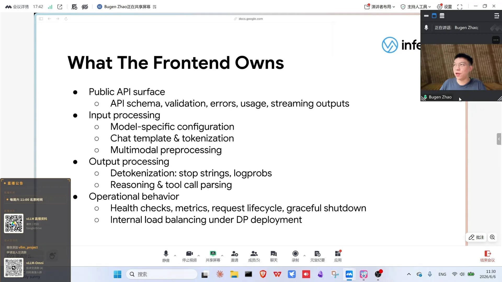 |
| 转换成 engine 那边的一个请求，做一个非常薄的转换。但实际上随着现在的 workload 越来越复杂、以及大家对 agent 的应用场景逐渐深入，大家会发现其实 frontend 做的事情远不止于此，对吧。首先第一点就是它依然需要有这个 API（层的工作）：比如你要定义这个 API 的 schema…… [【跳转到 06:20】](https://www.bilibili.com/video/BV19fJJ6AE6W/?t=380) |  |
| 然后做相关的 validation，然后你要去提供 error handling，提供（各种响应格式），包括怎么流式地把 engine 过来的 token stream 转换成 SSE——这些东西都是要在 API 这一层做的。然后接下来就是…… [【跳转到 06:45】](https://www.bilibili.com/video/BV19fJJ6AE6W/?t=405) | 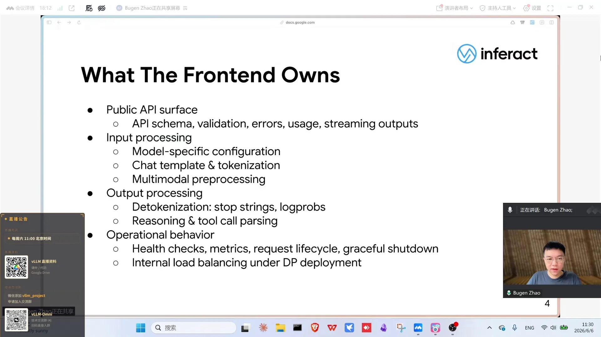 |
| 所谓的 input processing。比如说有一个 chat request 发给我们的前端，它就需要首先去处理不同 model 特定的这些 configuration 或者 option 这种东西。比如说每个 model 可能有不同的参数，最典型的可能是…… [【跳转到 07:10】](https://www.bilibili.com/video/BV19fJJ6AE6W/?t=430) |  |
| 比如 thinking 的开关，或者说是 reasoning effort 这种东西，在每一个模型是不一样的，对吧。然后处理完了之后，它要把它套到这个模型的 chat template 里边去，也就是把一个结构化的聊天记录变成一个扁平的 string，能够作为 engine 的输入。 [【跳转到 07:35】](https://www.bilibili.com/video/BV19fJJ6AE6W/?t=455) |  |
| 对吧。然后进一步我们要把这个 string tokenize 成一个 engine 能够读懂的 row token。除此之外还会有，比如现在的多模态模型的一些图片的处理，以及根据模型的需求要做的一些预处理，这些都会在 frontend 的 input processing 里。后来就是 output processing…… [【跳转到 08:00】](https://www.bilibili.com/video/BV19fJJ6AE6W/?t=480) |  |
| engine 里边如果生成了 response 之后，它的格式是 row token——就是一个个的 token，还不是可读的，对吧。所以 frontend 需要增量地 detokenize，把它们重新变回字符或者 string 这种格式，而且要增量去做——因为大家平常用网页聊天都知道，它是一个字一个字蹦出来的。 [【跳转到 08:25】](https://www.bilibili.com/video/BV19fJJ6AE6W/?t=505) |  |
| 对吧。然后做一些额外的东西：比如说 stop string、比如说 logprobs，然后更关键的一点是，从模型的原始输出中提取出哪些部分是模型的推理（内容）、哪些部分是模型想要做一个真正的 tool call。每一个模型它的 tool call 的 syntax 都不太一样，所以不同的模型都需要走不同的 tool call parser…… [【跳转到 08:50】](https://www.bilibili.com/video/BV19fJJ6AE6W/?t=530) |  |
| 把它从原始的输出中提取出来真正想要做的 tool call，然后结构化地传给 response。那么最后还有一些 operational 的东西：比如 health check、监控 metrics、整个 request 的 lifecycle 处理…… [【跳转到 09:15】](https://www.bilibili.com/video/BV19fJJ6AE6W/?t=555) |  |
| 比如你突然 cancel 这个请求，前端需要负责把请求的 abort 传递给 engine 那边。然后还有 graceful shutdown；以及如果有 DP 的部署，前端还需要负责在不同的 DP rank 之间做一个简单的 load balancing 路由。所以可以看到前端不只是一个…… [【跳转到 09:40】](https://www.bilibili.com/video/BV19fJJ6AE6W/?t=580) | 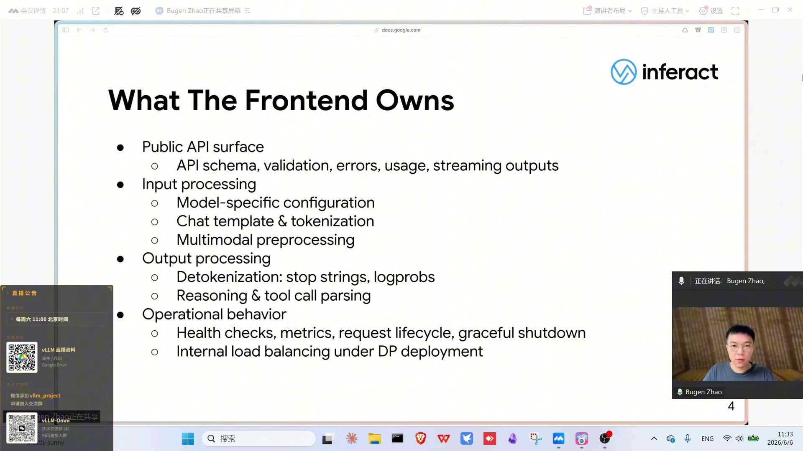 |
| 它可能最开始就是一个非常 trivial 的 API layer，但现在做的事情其实越来越多了。它一边越来越复杂，并且明显呈现出一种（趋势）：如果需要处理高并发的请求，它很容易成为 CPU 上的瓶颈。这就引出了我们要做 Rust frontend 这件事的一个动机。 [【跳转到 10:05】](https://www.bilibili.com/video/BV19fJJ6AE6W/?t=605) | 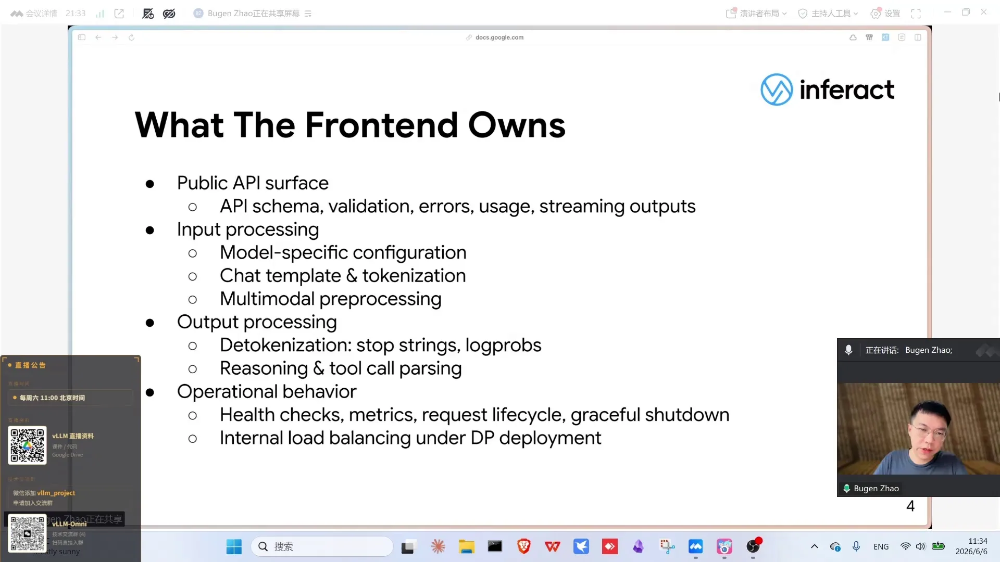 |
| 所以第一个动机毫无疑问就是性能。大家想到 Rust 的第一反应肯定就是性能。尤其是考虑到 vLLM 以及各种硬件厂商，他们在 GPU 上做的工作是实打实的，一直在迭代提升。所以 GPU 那边——engine 那边…… [【跳转到 10:30】](https://www.bilibili.com/video/BV19fJJ6AE6W/?t=630) |  |
| 大家可以发现现在的速度是越来越快了：token 之间的 TPOT 实际上 latency 都会越来越低，对吧，能够支持的吞吐也越来越高。因此大家会发现，可能 frontend 这边用 Python 写的——尤其是 Python 单线程模型下——它的 CPU 的（开销）…… [【跳转到 10:55】](https://www.bilibili.com/video/BV19fJJ6AE6W/?t=655) |  |
| CPU overhead 反而可能会变得越来越明显，尤其是我们前面说的 frontend 在做越来越多的工作。首先 Python 本身就有一些固有的限制：比如 GIL 这个全局解释器锁，它就会导致你做并发和并行比较别扭…… [【跳转到 11:20】](https://www.bilibili.com/video/BV19fJJ6AE6W/?t=680) | 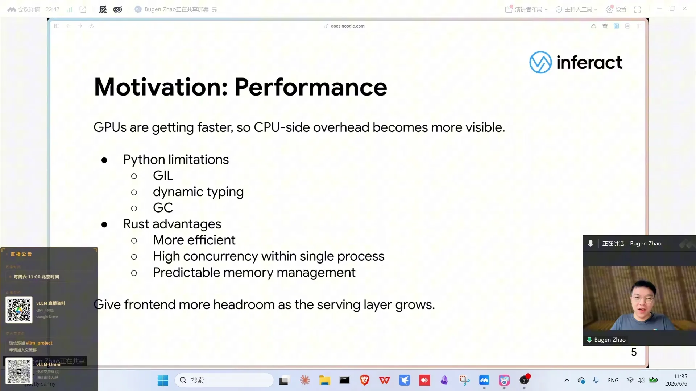 |
| 然后运行时这些（动态）类型可能也会有一些代价。比如可以看到 Python 的 frontend 这边在尽可能避免在 Python 那边写大量的 loop、写非常高频的 for loop，因为这个东西在 Python 这边性能有先天的劣势。 [【跳转到 11:45】](https://www.bilibili.com/video/BV19fJJ6AE6W/?t=705) |  |
| 以及它会有 GC memory management 这些事情，也会导致整体延迟表现——在高频（调用）下变得不太可控，尤其是尾延迟这样子就不太可控。但另一方面在 Rust 这边，Rust 就完全在这几方面都是优势了，对吧。首先它没有 GIL，也没有 GC，也不…… [【跳转到 12:10】](https://www.bilibili.com/video/BV19fJJ6AE6W/?t=730) | 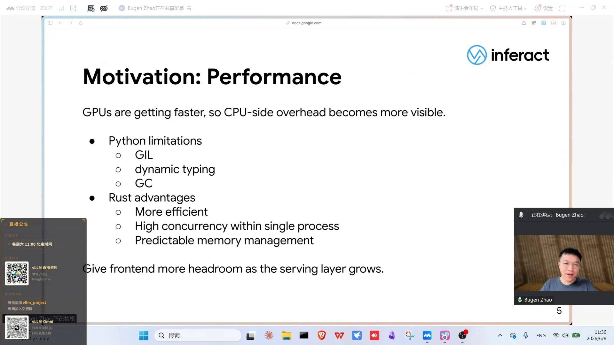 |
| 也不需要做什么 multiprocessing 才可以 scale out，它直接可以比如说在一个进程内实现很高的并发。也就是说我们更不容易遇到一些性能瓶颈吧。当然我这里并不是说在任何现有的 workload 下…… [【跳转到 12:35】](https://www.bilibili.com/video/BV19fJJ6AE6W/?t=755) |  |
| 你都会发现 frontend 成为了瓶颈——问题还暂时没有那么严重。但是我们也是想说：随着未来 GPU 可能越来越快，以及 vLLM 会更加趋向大规模部署，frontend 这边承载更高的并发，那么它很有可能会首先成为一个瓶颈。所以我们提前做这个工作…… [【跳转到 13:00】](https://www.bilibili.com/video/BV19fJJ6AE6W/?t=780) |  |
| 把它换成用 Rust 的重写，也有一部分是相当于未雨绸缪的感觉吧——给 frontend 更多的 headroom。对，这是第一个 motivation，是 performance。下一个就是复杂度这样的事情。这个 Python frontend 也是在社区里成长出来的…… [【跳转到 13:25】](https://www.bilibili.com/video/BV19fJJ6AE6W/?t=805) |  |
| 因为一开始我相信它——我们追溯很早之前，OpenAI compatible 的这个（协议）endpoint 还没有这些标准（的时候），它当然还是有别的形状。所以这个东西是随着社区逐渐成长出来的。它同时积累很多 feature，同时也积累了不少的复杂度。有一部分复杂度我们认为应该是必要的，比如一些关键的…… [【跳转到 13:50】](https://www.bilibili.com/video/BV19fJJ6AE6W/?t=830) |  |
| 比如 vLLM 的一个关键特点就是它能够支持很多很多模型。所以在 frontend 这边不可能是为了某一个模型去做一些 ad-hoc 的特化，它必须要有一些抽象，能够更方便地维护不同模型的代码，让整个（前端）实现变得比较干净…… [【跳转到 14:15】](https://www.bilibili.com/video/BV19fJJ6AE6W/?t=855) | 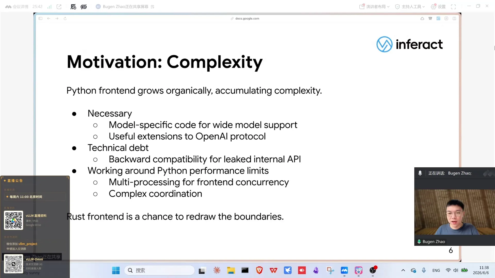 |
| 像这种抽象、这些复杂度我们认为都是必要的。以及有一些是对 OpenAI protocol 的一些扩展：其实大家用 vLLM 不仅仅只是用来做 serving、做对话、做 agent，可能还有各种不同的别的使用场景——可能有离线的场景、RL 的场景。那么这些 endpoint 上暴露出来的…… [【跳转到 14:40】](https://www.bilibili.com/video/BV19fJJ6AE6W/?t=880) |  |
| 可能会暴露出更多原始的信息。我们会有这样一些相比 OpenAI 官方 API 的扩展，这些扩展我们认为在 vLLM 中是必要的东西。除此之外也有一些东西我们认为应该是一种技术债。比如 Python 的 frontend 它其实不仅仅是用来做 serving…… [【跳转到 15:05】](https://www.bilibili.com/video/BV19fJJ6AE6W/?t=905) |  |
| 它一开始或者说现在依然可以直接被当做一个 Python 的 module import 进来，然后直接去调用它的一些 API，把它当做一个 library 去用。但是这个在演进的过程中出现了一些问题：比如有一些我们本来设计为内部的、不保证稳定性的 API，它在某一次重构的时候…… [【跳转到 15:30】](https://www.bilibili.com/video/BV19fJJ6AE6W/?t=930) |  |
| 一不小心暴露出来了，然后就变得很尴尬，开始被人们依赖了。被人们依赖了之后这个东西就有（兼容）包袱，你就不可以随便去动它，所以会积累不少的技术债。除此之外还有一些不同的问题，这边就不赘述。那么最后还有一个很关键的复杂度，就是为了 workaround Python 那边的一些性能限制…… [【跳转到 15:55】](https://www.bilibili.com/video/BV19fJJ6AE6W/?t=955) |  |
| 比如我们前面讲到因为 Python 有 GIL，所以在 Python frontend 这边其实大家很早就发现：一个 Python frontend 进程能承载的并发其实已经不是很高了，甚至可能在一些现实场景你能撞到它的瓶颈。因此大家为了解决这个问题，就在 Python 那边引入了 multiprocessing 机制…… [【跳转到 16:20】](https://www.bilibili.com/video/BV19fJJ6AE6W/?t=980) | 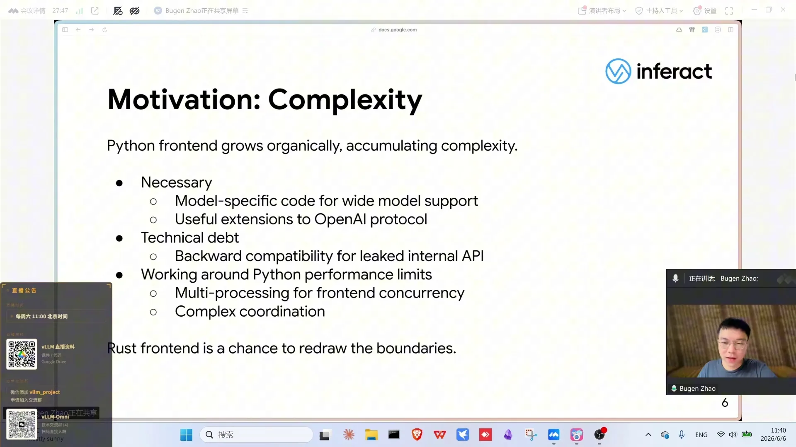 |
| 下面我们就可以把 frontend scale out 成多个进程来实现它的 concurrency。但这一下子就会导致出现一系列的问题：比如前后端的通讯，或者 DP 那边还有叫做 coordinator 的东西——它们的通讯（原来）只假设只有一个 frontend。你必须在这个进程模型设计的时候…… [【跳转到 16:45】](https://www.bilibili.com/video/BV19fJJ6AE6W/?t=1005) |  |
| 假设同时可以存在多个 frontend。所以本来可能是一对多、1-to-n 的这种通讯方式，现在立刻变成一种 m 对 n 的通讯方式。然后你就必须去想各种 coordination 怎么搞、各种 race condition 该怎么处理、process management 该怎么做，这种事情就会导致多了很多额外的复杂度。所以这三方面复杂度也是让我们去想…… [【跳转到 17:10】](https://www.bilibili.com/video/BV19fJJ6AE6W/?t=1030) |  |
| 做 Rust frontend，也是重新思考一下这个新的架构应该怎么设计、以及这个界线应该怎么划分。所以我们做 Rust frontend 肯定不是原封不动地直接把 Python（代码）翻译过来。我们实际上是参照目前的…… [【跳转到 17:35】](https://www.bilibili.com/video/BV19fJJ6AE6W/?t=1055) |  |
| frontend 的各种现有 boundary，重新想想它的架构应该怎么设计，然后想办法把它搞得更加可维护一些，去解决一些历史上的复杂度。——我之前其实一直也很好奇，因为我们如果是做跨机（部署）的话…… [【跳转到 18:00】](https://www.bilibili.com/video/BV19fJJ6AE6W/?t=1080) | 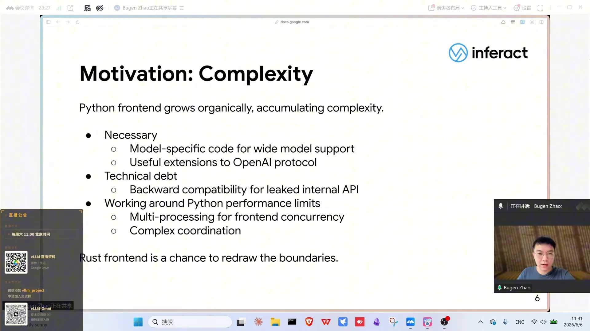 |
| 就是你开了（多个节点），然后两个不同节点上面——相当于我觉得这个场景或者是用在这个 input processor，做一些请求，然后我请求可能会有一些 input 处理之后的（结果），然后就是你跨机情况下…… [【跳转到 18:25】](https://www.bilibili.com/video/BV19fJJ6AE6W/?t=1105) | 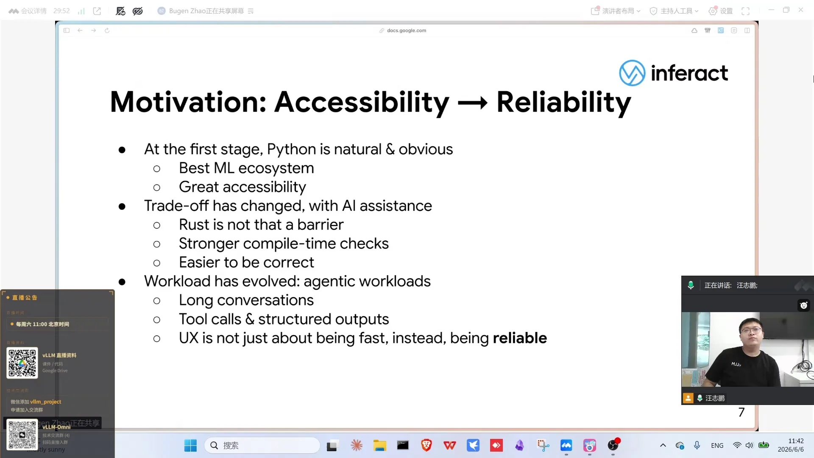 |
| 你这个 frontend 和你后面 engine core 它到底是什么处理方法？其实没有什么区别。就是我们前面讲的 frontend 和 engine core 中间是 ZMQ：这个东西如果它是本机的话它就是一个 IPC；如果它是分布式的话它下面就是一个 TCP。所以它其实是可以跑在不同的——你说跨机器的这种形式下…… [【跳转到 18:50】](https://www.bilibili.com/video/BV19fJJ6AE6W/?t=1130) | 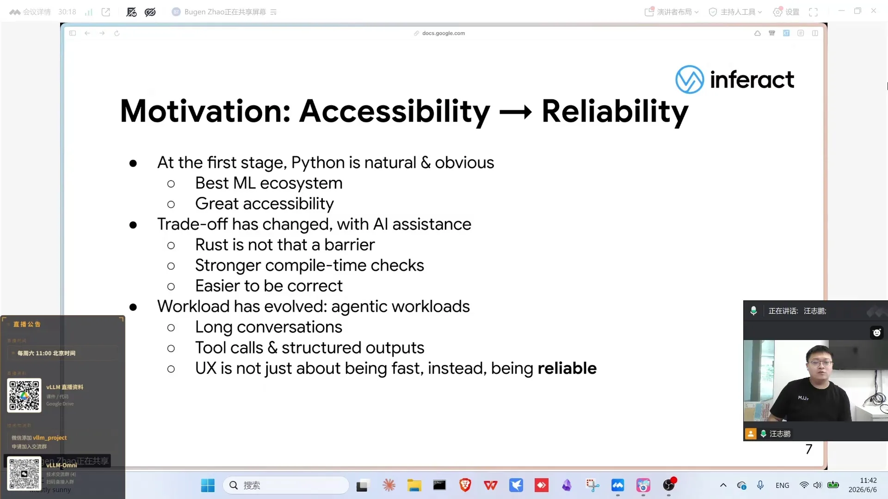 |
| 它也是可以共享一个 frontend。我们目前 Python frontend 也是可以支持这样的部署方式的：可能你在一台机器上起一个纯 frontend，然后在另一台机器上起一个正常的 vLLM，在另一台机器上起一个 headless 的 vLLM——它就不会起 frontend，就只会有 engine。然后你在那边指定好…… [【跳转到 19:15】](https://www.bilibili.com/video/BV19fJJ6AE6W/?t=1155) | 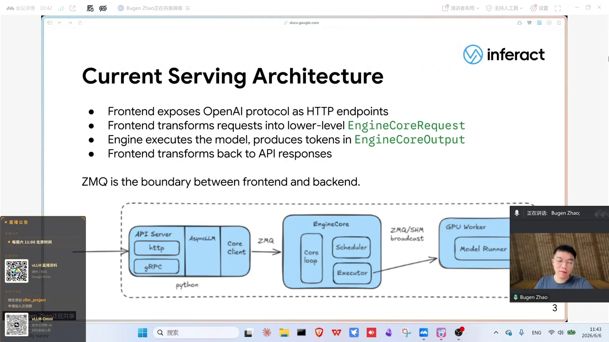 |
| 它想要连接的 frontend 地址，它就可以和比如第一台机器的 frontend 建立通讯。所以这么来看，两台机器——一台机器上起（frontend），还有一台机器（起 engine）——所以它可能不止两个 DP rank，可能多个 DP rank 都可以被这一个 frontend 使用。相当于我第一台机器上的这个（frontend），请求直接转发到另一个机器上剩余的 DP rank 上面，是吗？——对…… [【跳转到 19:40】](https://www.bilibili.com/video/BV19fJJ6AE6W/?t=1180) | 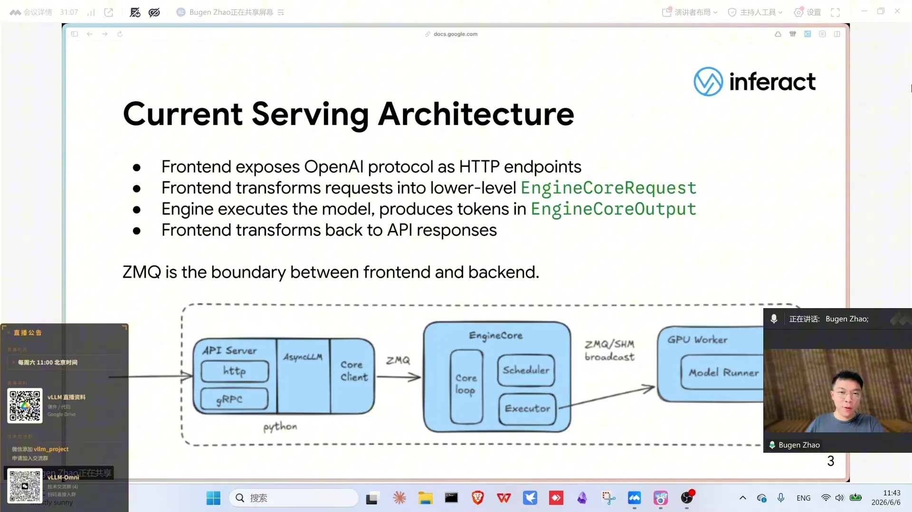 |
| 因为我知道我现在要说的是：它有那个——一个 entrypoint 是可以只做这个 input 的 process（前端预处理），然后还有的是你可以把处理后的、比如 input ids 直接发送到（engine）里面去，那么它相当于就不需要去…… [【跳转到 20:05】](https://www.bilibili.com/video/BV19fJJ6AE6W/?t=1205) |  |
| 怎么走 input 的 preprocess，直接就可以（对接）engine core 了。——没太听清，有点回声。——就是有两个 entrypoint：一个是可以只做 input 的处理，就是我可以通过这个 entrypoint 处理之后，再转上这个 input id…… [【跳转到 20:30】](https://www.bilibili.com/video/BV19fJJ6AE6W/?t=1230) | 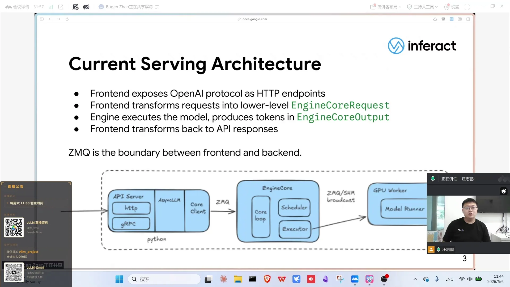 |
| 对吧。然后还有一个就是我可以直接传 input id，然后就可以对接。——对，对。这个应该是 Python frontend 现在在做的一个重构，就叫做 disaggregating everything：它把前端的一些职责也区分开。然后以后还会有专门的（组件）用来做 input processing 的…… [【跳转到 20:55】](https://www.bilibili.com/video/BV19fJJ6AE6W/?t=1255) |  |
| 一种部署方式，这种可能都是存在的。对，但是确实就比较灵活了：就会有多种 endpoint，你可以让 frontend 去处理（也可以不上）。你还可以在上层去做很多东西：比如 PD 分离的话，你可能至少不太希望一个请求被 frontend 处理两次，对吧？你可能会想要处理一次，然后复用这个 row token…… [【跳转到 21:20】](https://www.bilibili.com/video/BV19fJJ6AE6W/?t=1280) | 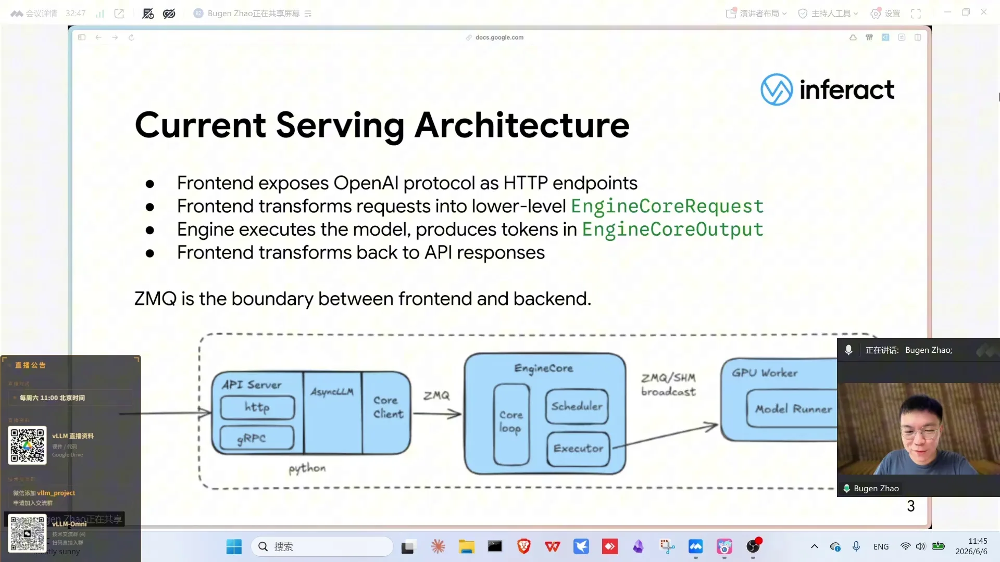 |
| 然后去打两个 prefill 和 decode 的请求，这种情况就可以用这种（方式）来做。而且我们之前就讨论过一个问题：相当于你的 frontend 和你的 engine core 这方面是分离的形式，但是我们其实是希望同一个请求…… [【跳转到 21:45】](https://www.bilibili.com/video/BV19fJJ6AE6W/?t=1305) | 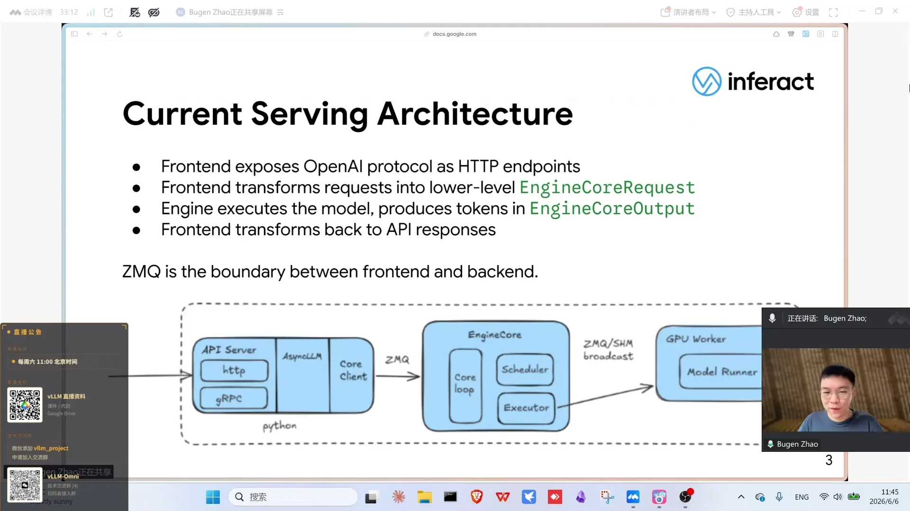 |
| 就是它由 frontend 生成的这个 input ids，其实可以之后直接（复用）——因为这样我们就不需要再通过 IPC 去传它这个东西。对，是。然后直播间有同学问…… [【跳转到 22:10】](https://www.bilibili.com/video/BV19fJJ6AE6W/?t=1330) | 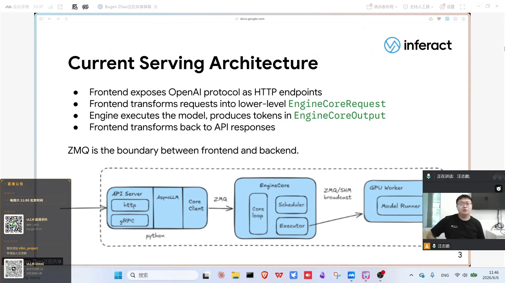 |
| 就是说 vLLM 现在除了 frontend 有（Rust 化的）计划，还有什么（模块）有类似的问题？我觉得这是个好问题。——我看一下直播间（消息）。没有太听清说什么，我这边（回声）有点大。——对，其他类似模块也有人会在想…… [【跳转到 22:35】](https://www.bilibili.com/video/BV19fJJ6AE6W/?t=1355) |  |
| 就是 engine core 本身。因为还是图里（那样）对吧：engine core 它只是做 schedule 和 execute，就是做一些调度以及 KV cache 的管理这种事情，它并不直接去参与 GPU 那边的工作。所以 engine core 大家现在以后也可能会在想这个东西…… [【跳转到 23:00】](https://www.bilibili.com/video/BV19fJJ6AE6W/?t=1380) | 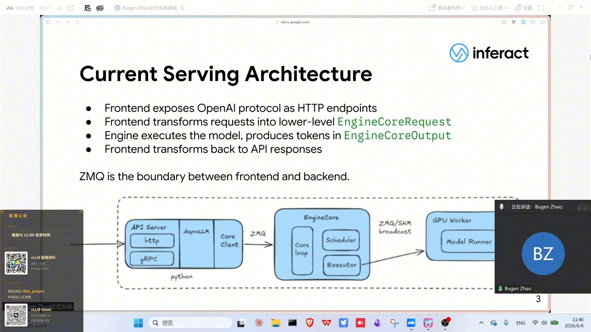 |
| 会不会可能需要用一个更高性能的语言去做？因为至少像之前的话，可能 scheduler 本身是同步的：schedule 完了之后再执行、再 schedule 再执行这样子的。大家其实已经遇到一些性能瓶颈了，所以我们后来有这个异步的 scheduler：就是在下一次…… [【跳转到 23:25】](https://www.bilibili.com/video/BV19fJJ6AE6W/?t=1405) |  |
| 在当前 GPU 那边还没有返回的时候，就已经预先去做一些下一次 schedule 的工作。像这种东西其实都可以感受到，它是在想到尽可能去利用 engine core 上的这些 CPU，对吧。所以可以看到它肯定也是因为 Python 的性能有一些瓶颈在那边，才会想这样搞。所以这个东西可能以后也是有…… [【跳转到 23:50】](https://www.bilibili.com/video/BV19fJJ6AE6W/?t=1430) |  |
| 有用高性能（语言）去重构的一个需求。——我之前做 scheduler，做异步这一块的时候我还发现过（一个问题）：因为异步的 scheduler 我记得需要预先去填充一段占位的 token 来占住它已经（调度的）空间，然后后面需要再把这个（占位 token）做处理……去算它实际输出了多少 token。当时我觉得好像有一个 bug 就是关于这个东西：它依赖的这个 API 是用同步的方式去处理的。——还有就是说我觉得像（其他部分）的话，它也可能有这个瓶颈，对吧，就是这个 CPU 上的。 [【跳转到 24:15】](https://www.bilibili.com/video/BV19fJJ6AE6W/?t=1455) |  |
| （接上）好，继续吧。 [【跳转到 24:40】](https://www.bilibili.com/video/BV19fJJ6AE6W/?t=1480) | 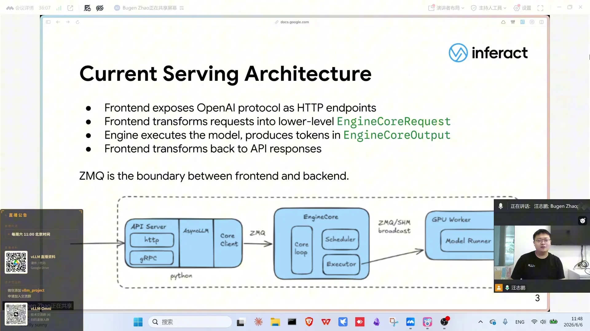 |
| OK，对，继续。下一个还是还在 motivation，最后一个 motivation 就是我们想从 accessibility 到 reliability 的一个变化。就是说一开始是非常直观的：用 Python 去做 vLLM。因为…… [【跳转到 25:05】](https://www.bilibili.com/video/BV19fJJ6AE6W/?t=1505) |  |
| 因为要（衔接的）学习的生态、AI 的生态都是 Python，所以也非常直观、非常自然就用 Python 去做了 frontend 的这些东西。而且在很长的时间内 vLLM 社区也是希望坚持用 Python 这个语言，因为这个语言对大家来讲门槛肯定是最低的…… [【跳转到 25:30】](https://www.bilibili.com/video/BV19fJJ6AE6W/?t=1530) |  |
| 所以它的 accessibility 可以是最好的。因此我也觉得这个非常关键：让 vLLM 现在成长为这么大、如此规模的一个开源社区、开源生态。但是我们现在可以看到这个情况现在发生了一些变化，我觉得很关键的一点就是 AI 的 agentic coding…… [【跳转到 25:55】](https://www.bilibili.com/video/BV19fJJ6AE6W/?t=1555) |  |
| 就这个事情，对吧。所以 Rust 语言在原来大家看来可能是一个学习门槛非常高（的语言），可能是阻碍大家做 contributions 的一个障碍。但是现在已经远远不是当年那个状态了：如果你只是想做一些简单的 bug fix 或者是做一个 feature，其实用 AI agent（写）Rust 已经非常好用了。 [【跳转到 26:20】](https://www.bilibili.com/video/BV19fJJ6AE6W/?t=1580) |  |
| 而且同时因为 Rust 的编译器非常严格，所以它自然通过编译时的检查就可以避免很多很多之前 Python 中你可能靠 linter、靠各种 type hint 都没办法静态查出的、非常 trivial 的一些 bug。这种问题在 Rust 这边可能是不存在的，对吧。然后以及我们 frontend 那边越来越复杂了…… [【跳转到 26:45】](https://www.bilibili.com/video/BV19fJJ6AE6W/?t=1605) |  |
| 然后这个 community 变得更大，以及大家现在可能更习惯于用 AI agent 去做贡献了。其实如果能够在编译期或者在非常早的时期就能发现一些问题，这件事情反而是变得非常有帮助。和原来正好是相反的：原先大家可能想到这个东西（学习）门槛…… [【跳转到 27:10】](https://www.bilibili.com/video/BV19fJJ6AE6W/?t=1630) | 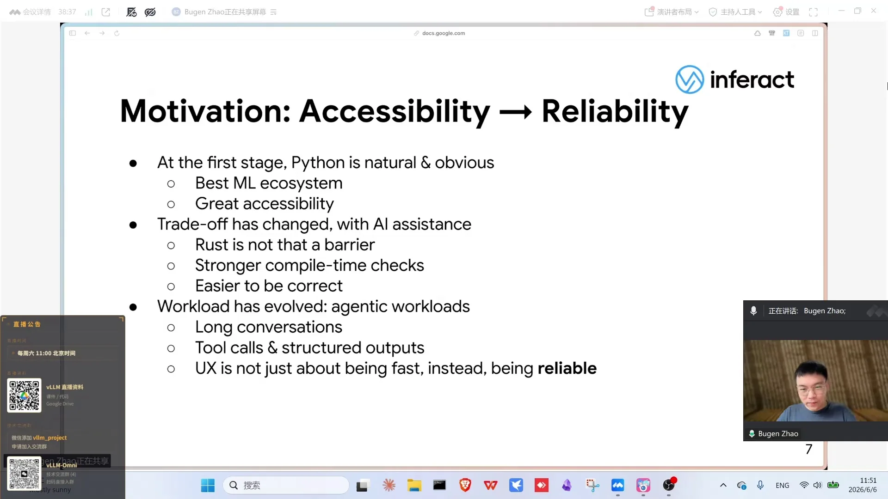 |
| 但是现在既然大家都有这么强大的工具了，反而贡献的人很多了，我们可能会觉得反而让正确性的门槛稍微高一些才可能会更好一些。然后除此之外，最后就是 workload 本身也会变化。就像我们前面提到的：现在大家用 LLM 绝对不仅仅是做 chatbot，对吧…… [【跳转到 27:35】](https://www.bilibili.com/video/BV19fJJ6AE6W/?t=1655) |  |
| 大家肯定更多是想把它用在 agent 的场景。Agent 场景的话，它就不是（像）VQA 那种场景——你回复错了就错了——它必须要有很长的（生命周期）：它必须要能够运行很长一段时间不出任何问题，它的各种 tool call、各种 reasoning、各种 structured output 都不能出现问题。因为一旦出现问题，你就打断了 agent loop 本身…… [【跳转到 28:00】](https://www.bilibili.com/video/BV19fJJ6AE6W/?t=1680) | 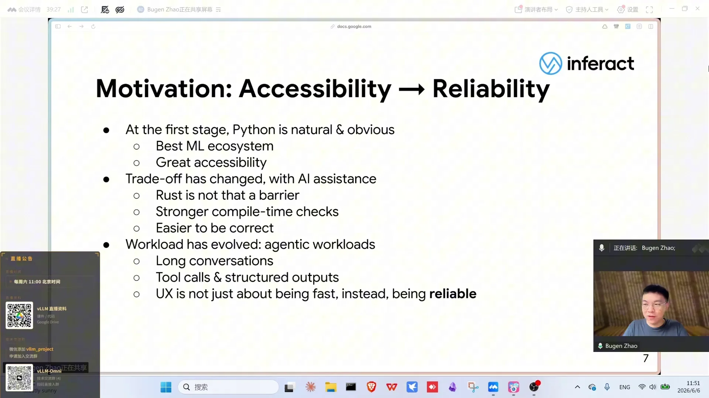 |
| 所以我们会觉得一个 vLLM 的好的 user experience，不只是（模型）那边很快，更多的是 frontend 这边也不能掉链子，frontend 这边也要变得非常可靠。所以这也让我们觉得：如果是 Python 这种语言，因为它的动态类型…… [【跳转到 28:25】](https://www.bilibili.com/video/BV19fJJ6AE6W/?t=1705) |  |
| 这些事情导致的它的一些非常 trivial 的 bug 没办法避免的话，其实我们觉得会非常遗憾。因此这里我们也会觉得这个（重心）应该更多地放在前端的正确性上，才能保持端到端的体验。对，所以这个 motivation 讲完了，我们现在就可以看一下 Rust frontend 的一些 design…… [【跳转到 28:50】](https://www.bilibili.com/video/BV19fJJ6AE6W/?t=1730) |  |
| 那么第一个想分享的 design 就是它是一个 layered 的结构，层级的一个结构。比如这幅图中大概描述了现在 Rust frontend 的几个模块分层叠起来的。最下面这个——我们先不说最下面这个 tokenizer…… [【跳转到 29:15】](https://www.bilibili.com/video/BV19fJJ6AE6W/?t=1755) |  |
| 就是上面这个 stack 中最下面这个是 engine core client。engine core client 就是负责和 engine 里面通讯的一些东西：比如 ZMQ 的 transport，它整个流程比如握手、后续的发请求、收回复的流程；以及 message pack protocol——因为它跟 engine 的进程是通过 message pack 的方式去沟通…… [【跳转到 29:40】](https://www.bilibili.com/video/BV19fJJ6AE6W/?t=1780) | 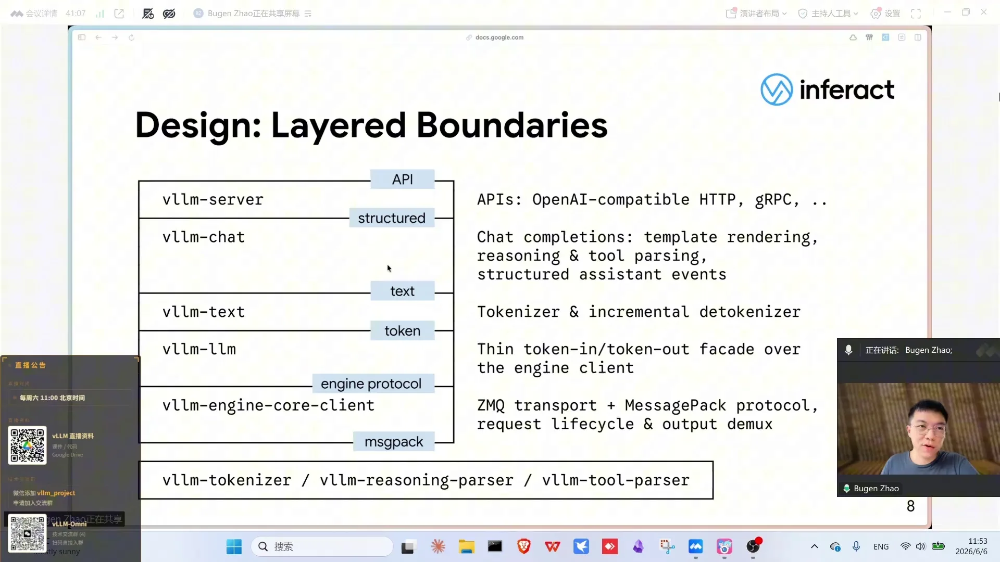 |
| 所以这里它的 encode/decode 逻辑，以及我们刚刚说的请求的整个 lifecycle，以及它的输出的——把 engine 里面 batch 在很多请求的输出对应、demultiplex 到不同的每个单独的 request 上。那么在此之上我们有一个叫 LLM（的层），这个其实就非常像 Python 那边的 LLM 或者 AsyncLLM 那一层…… [【跳转到 30:05】](https://www.bilibili.com/video/BV19fJJ6AE6W/?t=1805) |  |
| 对，它其实就是一个非常薄的一层。它去把 engine core 那边的一些原始的、和编码直接相关直接绑定好的那些结构藏起来，换成那种更加 Rust native 的结构…… [【跳转到 30:30】](https://www.bilibili.com/video/BV19fJJ6AE6W/?t=1830) | 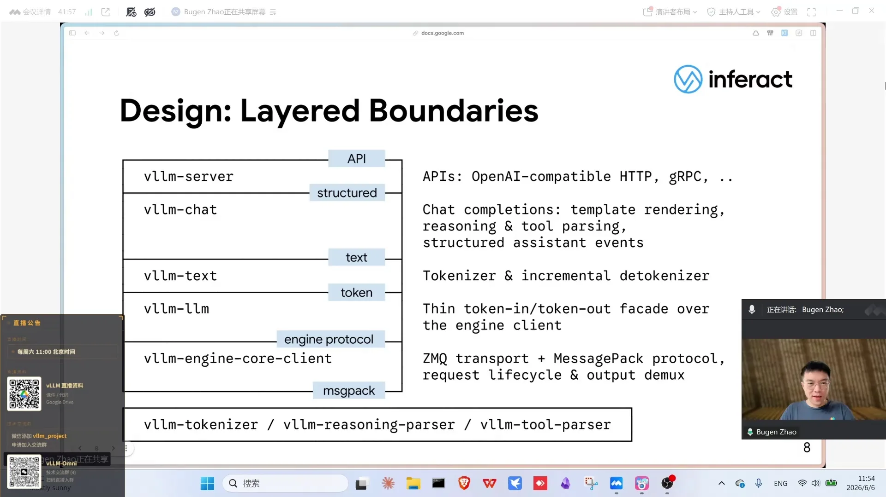 |
| 然后暴露一个结构给上层去用。所以这个东西其实某种程度上也可以被当作一种 vLLM engine library 去用。事实上我们也做一些工作：因为很多人会用 Dynamo 或者其他的东西去做生产中的部署，我们也可以让 Dynamo 直接通过 LLM 这一层去（接入）…… [【跳转到 30:55】](https://www.bilibili.com/video/BV19fJJ6AE6W/?t=1855) | 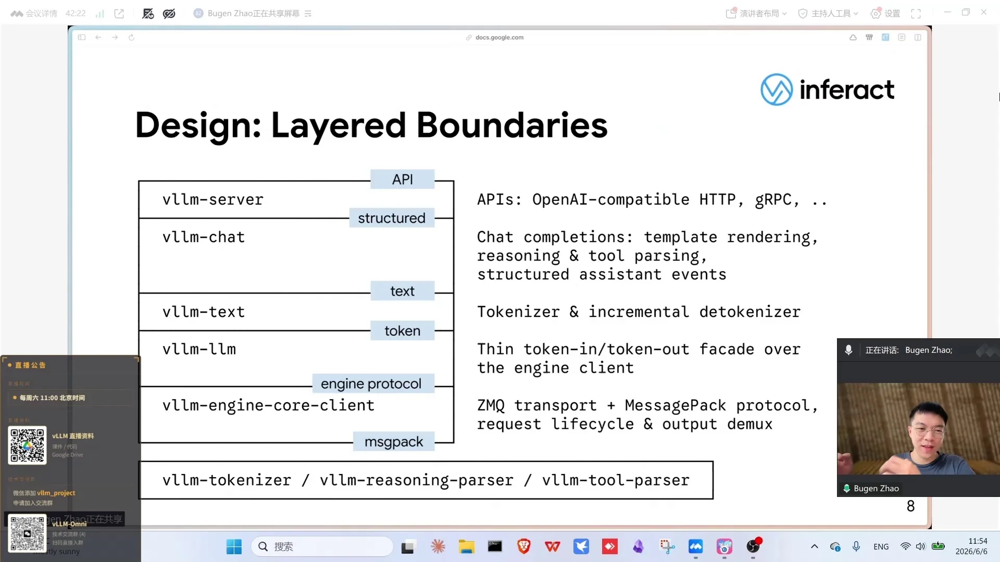 |
| 用 Rust 的方式去接入 engine core。所以它其实也就避免了整个链路上的 Python 开销。然后在此之上还有这个 text 层——text layer 顾名思义就是做一些 text 相关的功能：比如它做 tokenization、detokenization、stop string 等等。然后它的接口…… [【跳转到 31:20】](https://www.bilibili.com/video/BV19fJJ6AE6W/?t=1880) | 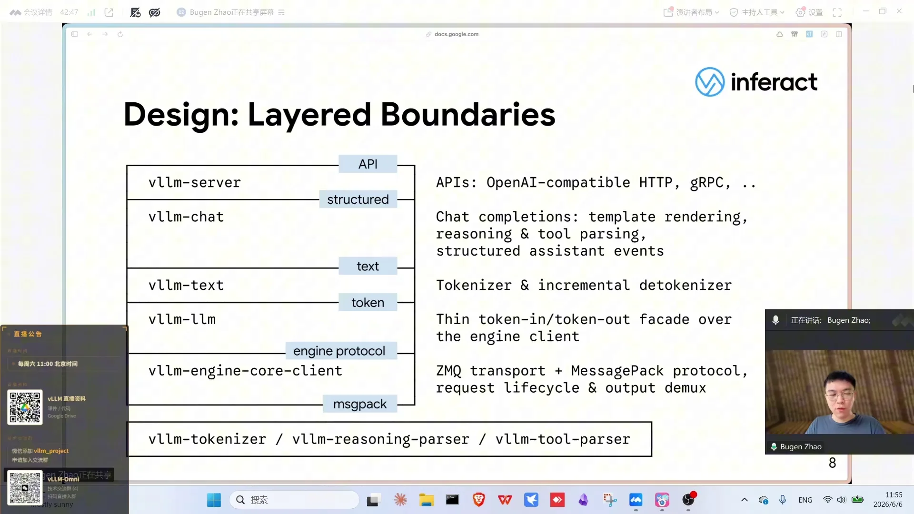 |
| 它（处理）的数据的接口就直接是 text 的：你可以传 text 进来，然后你也会获得 text。然后在此之上就是这个 chat。chat 的话它就会做一些更加复杂的、更加逼近我们 chat completion 的结构化的（处理）：它需要去做 chat template、去做 reasoning parsing，然后去做把下面那个 text 的输出…… [【跳转到 31:45】](https://www.bilibili.com/video/BV19fJJ6AE6W/?t=1905) | 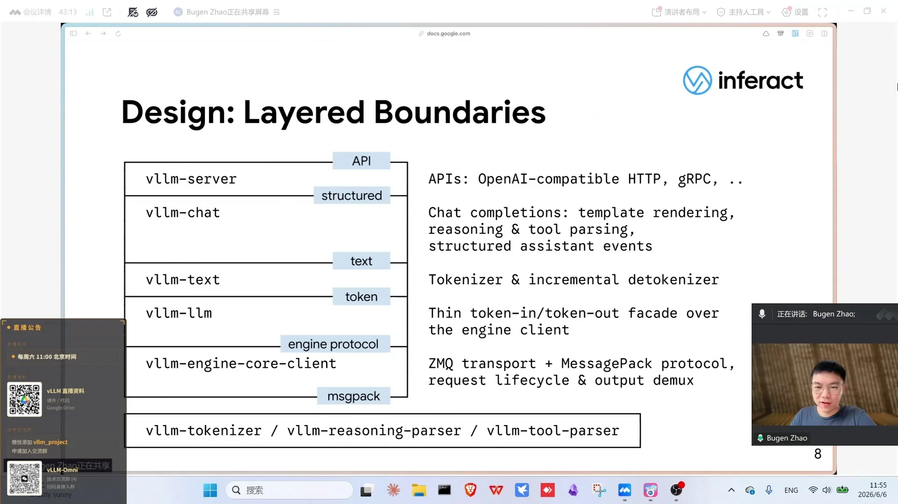 |
| 转换为一个 structured assistant 的一个格式，所以它对外暴露的接口就是一个 structured 的接口：你传进去的就是 conversation，然后得到的就是一个新的 assistant 输出的一个流。那么最上面一层就是一个 server，也就是 user facing 那边…… [【跳转到 32:10】](https://www.bilibili.com/video/BV19fJJ6AE6W/?t=1930) | 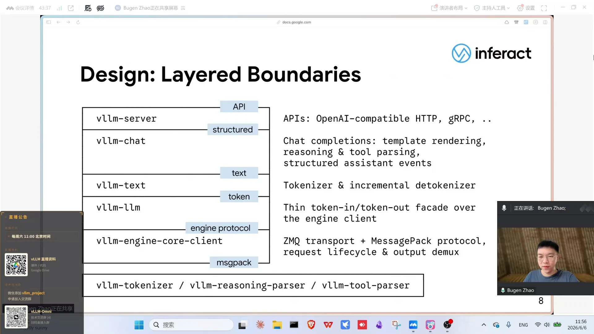 |
| 比如它就负责暴露 OpenAI compatible 的 HTTP endpoint，还有一些 gRPC——vLLM 自己的 gRPC endpoint。还有就是可能因为现在还没有完全做完，所以以后 Anthropic 的 messages 什么的也都会接在这一层。它都是最上面一层的，但是它下面都是对着我们内部的一个统一的 structured 表示…… [【跳转到 32:35】](https://www.bilibili.com/video/BV19fJJ6AE6W/?t=1955) | 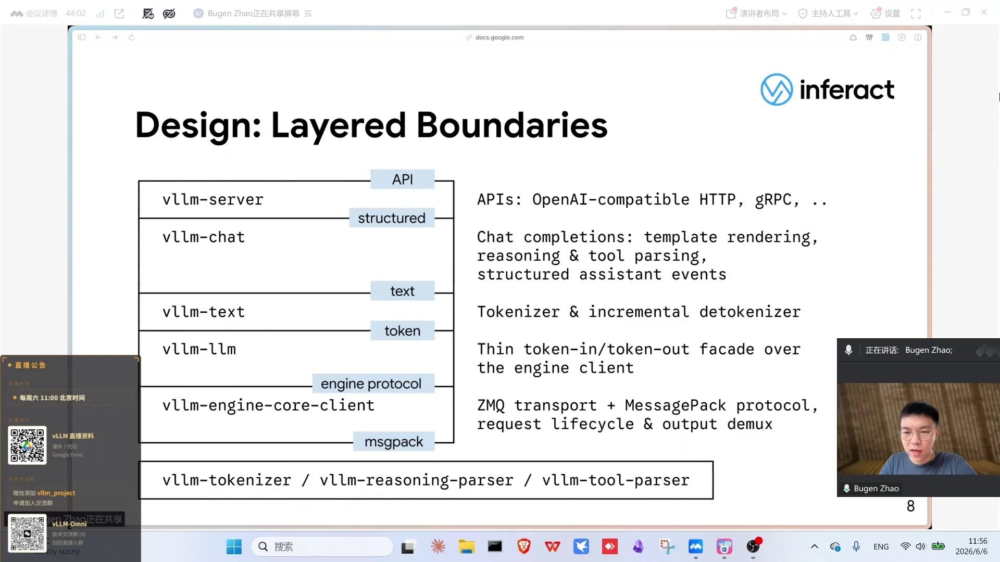 |
| 也就是这个 chat 层暴露出来的这个表示。所以我们可以看到上面这些蓝色的——不好意思——就是我们所说的每一层。大家可以看到都在讲不同的语言：从最下面和 engine 里面讲的 message pack，一直到上面（各层）的 structured（表示），一直到后面的 HTTP API…… [【跳转到 33:00】](https://www.bilibili.com/video/BV19fJJ6AE6W/?t=1980) | 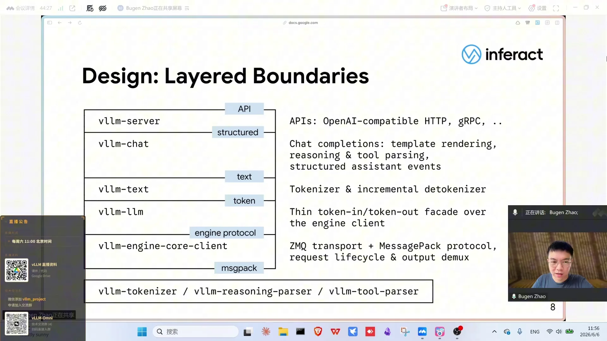 |
| 所以每一层都会有一个非常清晰的界限。因此我们并不会去把、比如说把各种 preprocessing 的调用都放在 OpenAI 的 handler 里面去做，而是一层一层地在下面都做好，上层只负责做一个简单的 mapping 就 OK 了。然后不同的 endpoint——你想要支持 Anthropic、想要支持 OpenAI 的 responses API——其实也都不需要（重写），绝大多数代码都可以复用，因为都是直接调用它底层的一些东西，只需要做一个简单的 mapping 就可以。 [【跳转到 33:25】](https://www.bilibili.com/video/BV19fJJ6AE6W/?t=2005) |  |
| 然后除此之外还有一个关键点，就是我们有一个设计原则：在整个链路上，我们不希望感知到现在究竟在 serve 哪个模型，甚至不希望加任何的特判——比如如果是 GPT-OSS 应该怎么（办）、如果是 Kimi K2 这里应该怎么办，我们不想加入任何的特判。因此在整个主链路上全部是通过——你可以认为是一些 type-erased 的结构，或者是一种通过 interface 的方式去接每一个模型的 model-specific 实现…… [【跳转到 33:50】](https://www.bilibili.com/video/BV19fJJ6AE6W/?t=2030) | 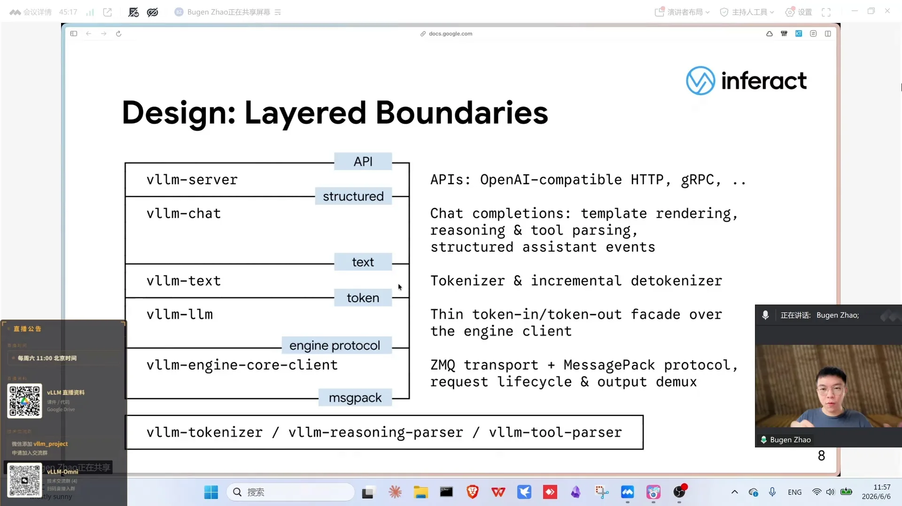 |
| 而不（会让）任何 model 相关的东西散落在主链路。具体的那些实现就会放在我们最下面写的这三个单独的模块里：就是 tokenizer、tool parser、reasoning parser 目前拆出的这些东西。以及 multimodal 的话，我们现在也是属于一个 work in progress，再去重新设计这些东西应该怎么搞…… [【跳转到 34:15】](https://www.bilibili.com/video/BV19fJJ6AE6W/?t=2055) |  |
| OK，我上次分享了一下 Python 端的前端的东西，我就会觉得这个调用栈真的是非常的恐怖：都在 render chat（completion），然后往下一翻就是调用栈，每一块每一块都是调用栈，超级恐怖，当时处理了很久我才看到。但是我现在看这个 Rust，好像确实会干净很多…… [【跳转到 34:40】](https://www.bilibili.com/video/BV19fJJ6AE6W/?t=2080) | 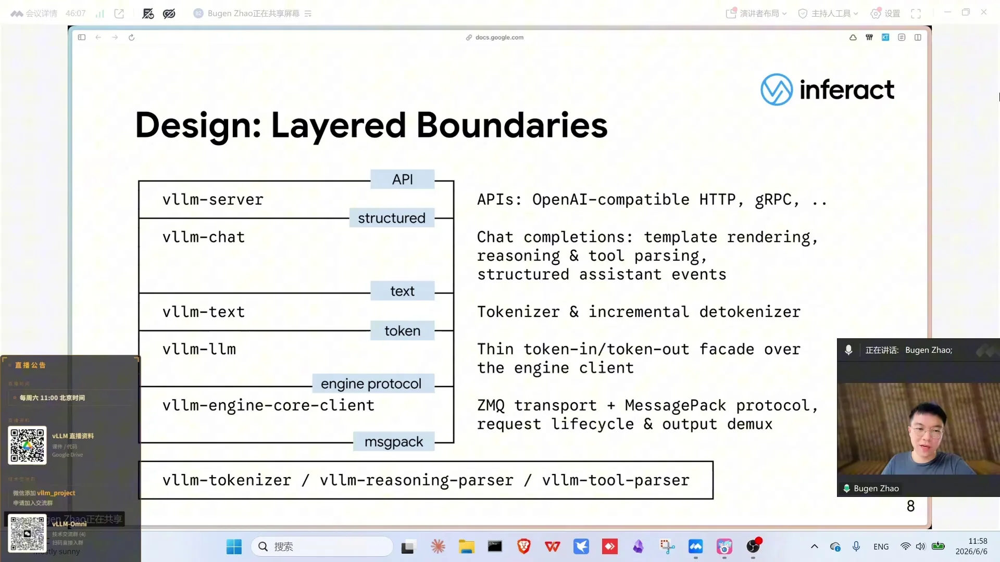 |
| OK,我上次分享了一下Python端的前端的东西我就是会觉得这个Diom站真的是非常的恐怖都在RenderChessing,然后往下一翻就是Diom站,每一块每一块都是Diom站超级恐怖,当时处理了很久我才看到但是我现在看这个Rust,好像确实会干净很多 [【跳转到 35:05】](https://www.bilibili.com/video/BV19fJJ6AE6W/?t=2105) |  |
| 每一次你都很清楚它在干什么，这是一个非常好的事情。然后当时也能看到很多，比如你是 GPT-OSS 或者你是 Mistral，或者（是）Kimi K2，可能它的 tool parser 好像有点不一样，就在做了非常多的 hack，看的真的会很累。然后现在看着很干净、很舒服，我觉得很厉害。然后还有一个点就是我现在很好奇…… [【跳转到 35:30】](https://www.bilibili.com/video/BV19fJJ6AE6W/?t=2130) | 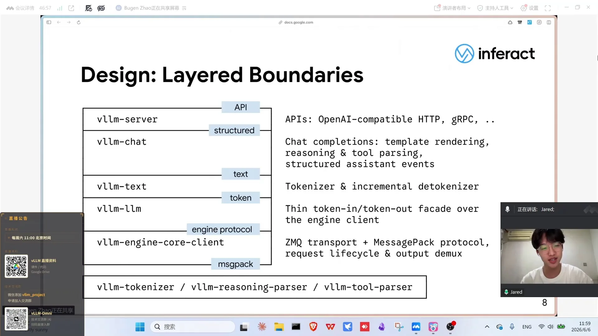 |
| 因为最近我搞了一个多模态相关的模型，我们就是在 video heavy 的那种（链）路上，还有很明显的传统视频那种编解码的那一块，其实是一个挺大的瓶颈。然后还有一个点就是 HF processor 它也是一个挺固定的：大概有些模型是 1.5 秒，有些模型是特别稳定的 2 秒，就得花在那里——每一个 request 它都要花 2 秒在那里…… [【跳转到 35:55】](https://www.bilibili.com/video/BV19fJJ6AE6W/?t=2155) | 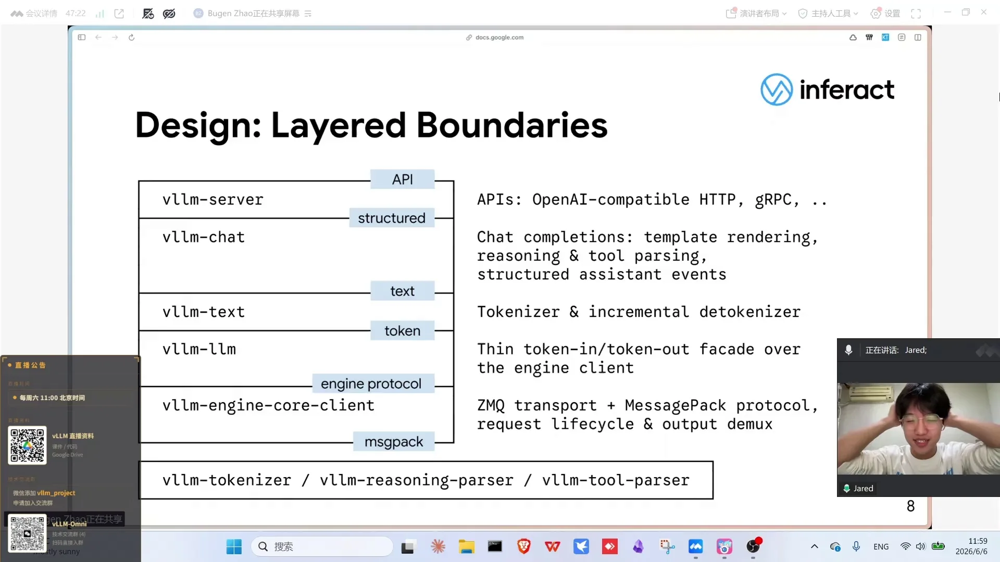 |
| 就是一个挺让人难接受的事情。我就是不是很清楚：frontend 这边会尝试把 HF processor 那一块给它丢掉、然后自己重新写一遍吗？或者至少那一块还是调 HuggingFace processor 那一块？就是我想问一下。——我觉得这里 Rust 有一个优势、也有劣势：就是它没有 transformers、没有 HuggingFace 一些 Python 那边现有的生态，所以就完全没有（现成的）。 [【跳转到 36:20】](https://www.bilibili.com/video/BV19fJJ6AE6W/?t=2180) | 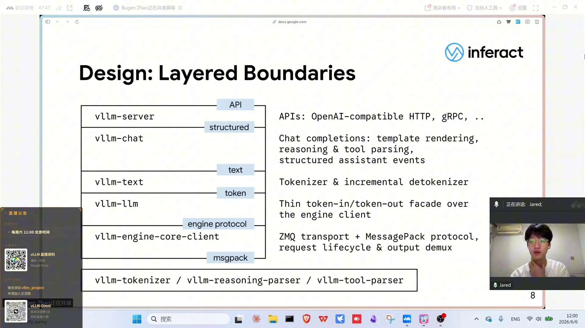 |
| 可能（用 Python 写）什么的还比较简单，然后大家都会。因为 Python 那边也已经在想用高性能的语言去做 tokenizer——Python 那边实际上有很多 tokenizer，它底下实际上是 Rust 的（实现）。所以最终导致一个特点就是 Rust 也有很多 tokenizer 可以用，这个（倒是）挺好。 [【跳转到 36:45】](https://www.bilibili.com/video/BV19fJJ6AE6W/?t=2205) |  |
| 但是至于比如说 multimodal，之前我找了一圈，感觉 Rust 这边没有一个什么东西可以直接调过去的。然后我们肯定也不想说是真的有 FFI 直接又调回 Python 那边的代码去做这些东西。所以这里我觉得这是一个劣势：就是这个生态不太成熟。当然也有一个优势，就是让我们没有什么可依赖的，你只能…… [【跳转到 37:10】](https://www.bilibili.com/video/BV19fJJ6AE6W/?t=2230) |  |
| 没有什么可顾虑的，对，就直接把（HF processor）丢掉，你只能从头开始去做。而且再加上其实 multimodal 这边——我今天分享的这些东西没有太涉及 multimodal，因为这个东西在当时还没有，multimodal 也是刚开始做，以及 Rust 这边确实是不太成熟，因此我们这边还是在看要怎么搞 multimodal 相关的东西。尤其是考虑到每一个模型——其实我像跟 Roger 他们也都交流过…… [【跳转到 37:35】](https://www.bilibili.com/video/BV19fJJ6AE6W/?t=2255) |  |
| 他们反馈就是其实会发现在 Python 那边目前的 multimodal 逻辑有点过于复杂：为了复用一些东西搞出太多的抽象。但事实上可能不同模型的 multimodal 的东西，它其实没有太多东西是真的可以复用的。反而是现在 AI（助手）很强、写代码很快…… [【跳转到 38:00】](https://www.bilibili.com/video/BV19fJJ6AE6W/?t=2280) | 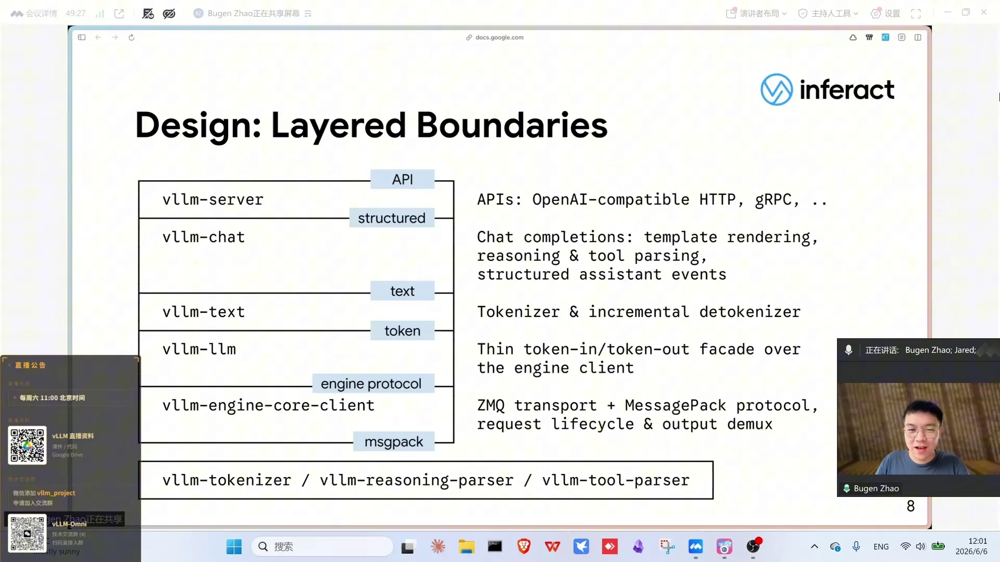 |
| 可能你把每一个模型当做一个黑盒，你去重写一遍，你甚至就不关心、不去太关心它的代码怎么复用、怎么抽象，反而可能会是更好的那种方式。对这个东西可能也是感觉可以去再讨论讨论，然后再去决策（架构上）的一些东西。 [【跳转到 38:25】](https://www.bilibili.com/video/BV19fJJ6AE6W/?t=2305) |  |
| 挺好的，正好也是让大家找个方向可以一起来贡献。——对，是的，是的。我也想说可以继续。我也想说：顺着前面一个方向，不一定就（全靠）AI 写，已经超出了人类的（掌控）了。——翻篇了。——然后还有，我了解到好像现在大家会慢慢考虑对 transformers 的依赖会直接减少…… [【跳转到 38:50】](https://www.bilibili.com/video/BV19fJJ6AE6W/?t=2330) | 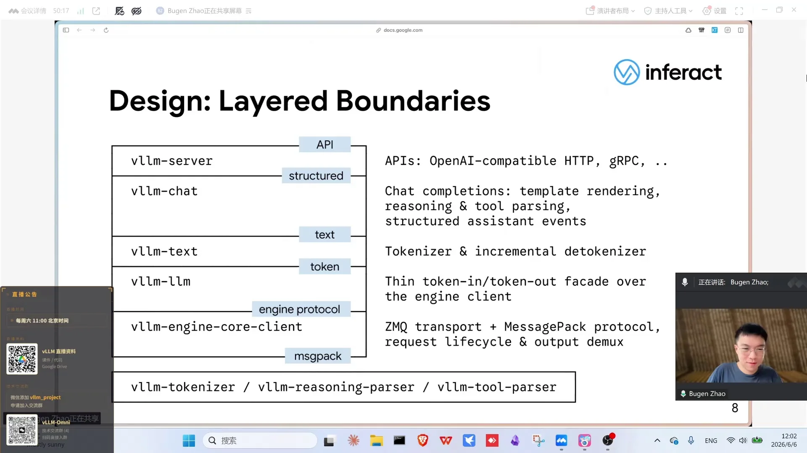 |
| 我知道 vLLM 好像是有这个（规划的）。我现在看的话，就是觉得大部分的语言模型——纯语言模型——config 那一段是会用 HuggingFace 的实现。但甚至有一些人会在（替代）transformers 下面重新写一个一模一样的 configuration 的文件，然后直接拿来用…… [【跳转到 39:15】](https://www.bilibili.com/video/BV19fJJ6AE6W/?t=2355) | 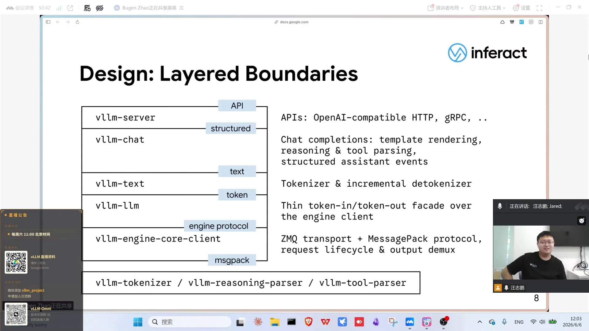 |
| 那这样完全就可以抛开 HuggingFace 的依赖。或者我们在模型的原文件里面——HuggingFace 直接下载下来那个模型文件里面——用 trust remote code，然后这样子的方式去跳过 transformers 那边的一些（影响）。然后（最近）我们也还遇到了一些比较奇怪的 bug…… [【跳转到 39:40】](https://www.bilibili.com/video/BV19fJJ6AE6W/?t=2380) | 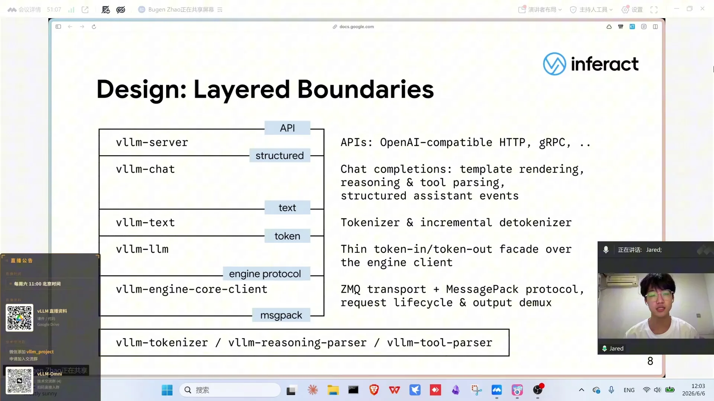 |
| HuggingFace 那边有一个 config 莫名其妙的（改动），导致我们的模型根本就跑不了，还得去查这个 bug。改了、跑了很久，发现是 HuggingFace 4.53 到 4.54 之间，他们引入了一个很奇怪的 config（处理），导致我们的 attention backend 根本就选不了，直接跑错、报错，就很（尴尬）。然后现在（版本）都快到（下一版）了，我们才发现是一个 4.54 的 bug，才给他修掉，可能要等他们下一个版本发布之后，那个（行为）才是稳定的。所以是一个挺痛苦的事情。——对，而且很多多模态模型都没有 HuggingFace 的实现，那意味着我们基本上（多模态这条线）是没办法考虑去依赖 HuggingFace 的（实现）…… [【跳转到 40:05】](https://www.bilibili.com/video/BV19fJJ6AE6W/?t=2405) | 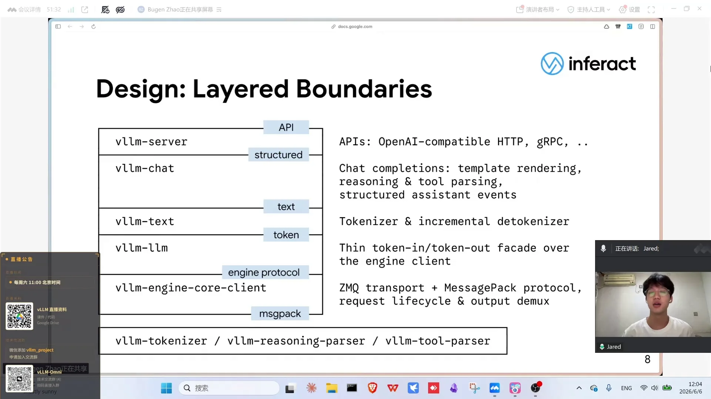 |
| （接上）是的，是的。然后下面（说）remote code，对吧。如果如果有 python code 在 HuggingFace 文件里面，用 Rust 做 frontend，你也不可能把它动态加载进来、跑里面的 python code。所以说很多情况下就和 Python 那边搞的兼容方式就不太一样…… [【跳转到 40:30】](https://www.bilibili.com/video/BV19fJJ6AE6W/?t=2430) | 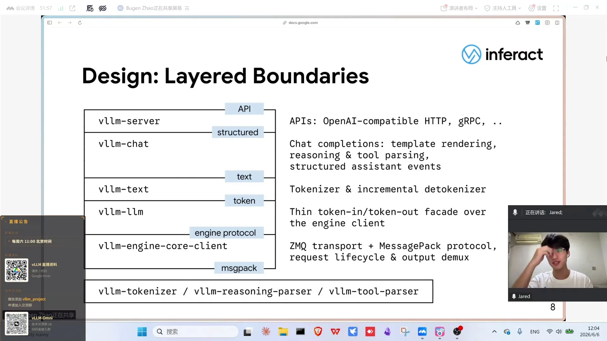 |
| 你可能需要完整地去重写整个 pre-processing 的路径，这样子。——对，而且我知道友商那边他们是可以直接把 HuggingFace 全部（甩掉）的。因为 HuggingFace 我们发现有的 tokenizer 整个写的全是错的。但是我们好像在那种多模态 tokenizer，对吧，还是会强力依赖 HuggingFace 的这种 tokenizer 吧？ [【跳转到 40:55】](https://www.bilibili.com/video/BV19fJJ6AE6W/?t=2455) | 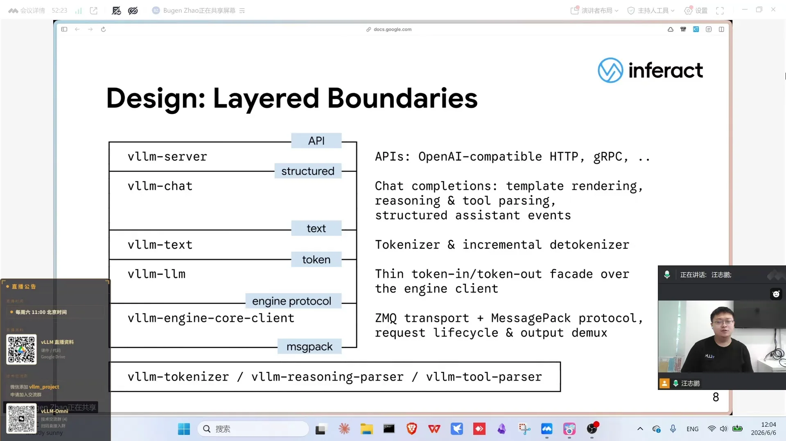 |
| 对，对，对，所以至少我现在看 frontend 这边不会依赖特别多的 HuggingFace 代码，大多数就是 frontend 需要的那些多模态 tokenizer 什么的，它基本上还是比较稳定…… [【跳转到 41:20】](https://www.bilibili.com/video/BV19fJJ6AE6W/?t=2480) | 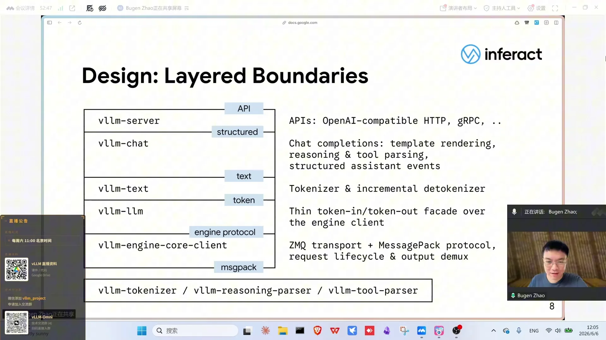 |
| 比较特定的那几个字段，它的形状也都是比较固定，各家也没有说是太多地去 overwrite 它，所以它整体来讲还是比较好复用。可能到（推理）那边、或者到 multiprocessor 那边可能又不太一样，但是这个就一步一步来了。——你这块跟 frontend（团队）聊的多么？——什么？——我是说做 frontend 这块的（进展）。我们刚才 frontend 也聊了这么多，你感觉之前它这块做的（怎么样）呢？——对对对，但是 Rust frontend 因为一开始是内部做的，所以也就没有（对外），（开源）合到主仓也是可能两周前的事情。OK，那我就继续。——对，然后下一个 design…… [【跳转到 41:45】](https://www.bilibili.com/video/BV19fJJ6AE6W/?t=2505) | 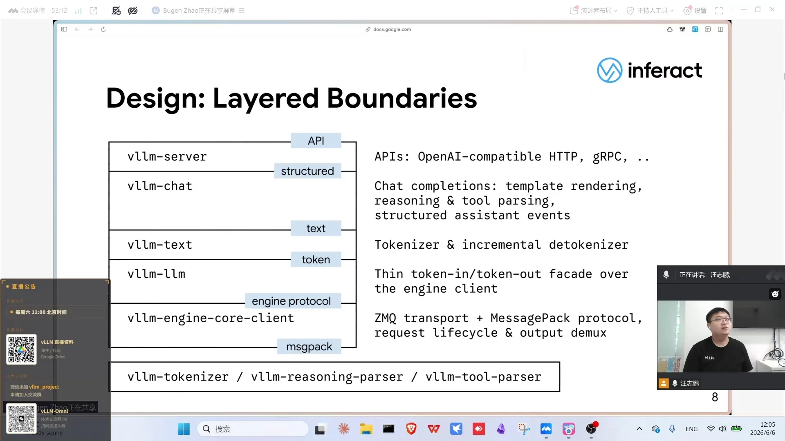 |
| （接上） [【跳转到 42:10】](https://www.bilibili.com/video/BV19fJJ6AE6W/?t=2530) |  |
| （接上） [【跳转到 42:35】](https://www.bilibili.com/video/BV19fJJ6AE6W/?t=2555) | 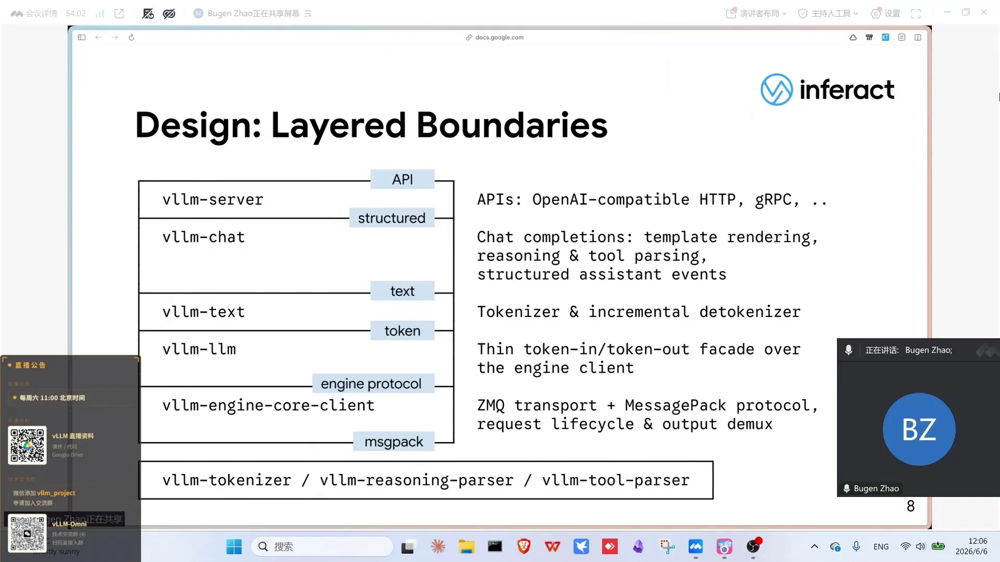 |
| 想要 highlight 的就是说这个叫做 stream native pipeline。在新的 Rust frontend 的设计中，我们把 streaming 或者说是 incremental 这种事情当做一个一等公民去考虑…… [【跳转到 43:00】](https://www.bilibili.com/video/BV19fJJ6AE6W/?t=2580) |  |
| 而不是说是单独的一条 path 去支持它。因为我觉得这个东西——我们都觉得非常自然，对吧：engine 那边它就是按 token 增量地产出来的，不是一次性给一个全量。所以我们如果说要 focus 在 serving 整个路径上…… [【跳转到 43:25】](https://www.bilibili.com/video/BV19fJJ6AE6W/?t=2605) |  |
| 我们应该天然地就是在每一层去思考：当上一层额外吐出一个新的事件的时候，我这一层应该怎么处理，然后我这一层什么时候吐出下一个事件。所以整个链路上其实都是这样去思考的，每一层最后就变成了一种 stream 上的 transformation：把每一层不同的抽象——比如把 engine core（的输出）…… [【跳转到 43:50】](https://www.bilibili.com/video/BV19fJJ6AE6W/?t=2630) | 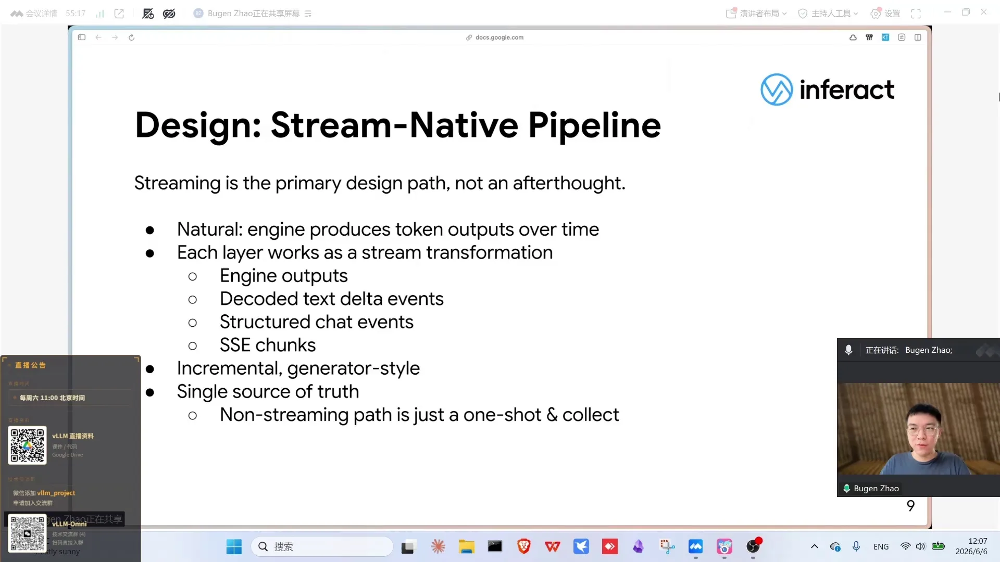 |
| transform 成 token，transform 成 text，它都是在（处理）那个 delta 去做。所以每一层它本身就会是一种 stream 的 transformation。比如说 engine client 它会返回一个 engine output 的流，然后 text layer 就会把每一个 engine output transform 成一个 decoded text，变成一个文本。然后 chat layer 就会把那个文本又变成一个…… [【跳转到 44:15】](https://www.bilibili.com/video/BV19fJJ6AE6W/?t=2655) |  |
| 结构化的一个——我们叫 chat event。然后最终那个 serving layer 就会非常简单地把每一个 chat event 转换为它那个 API 所想要的那个 HTTP response——比如 SSE 那个形状，或者是最后的那个 JSON response。这样，所以每一层它都是这样一种 transformation…… [【跳转到 44:40】](https://www.bilibili.com/video/BV19fJJ6AE6W/?t=2680) | 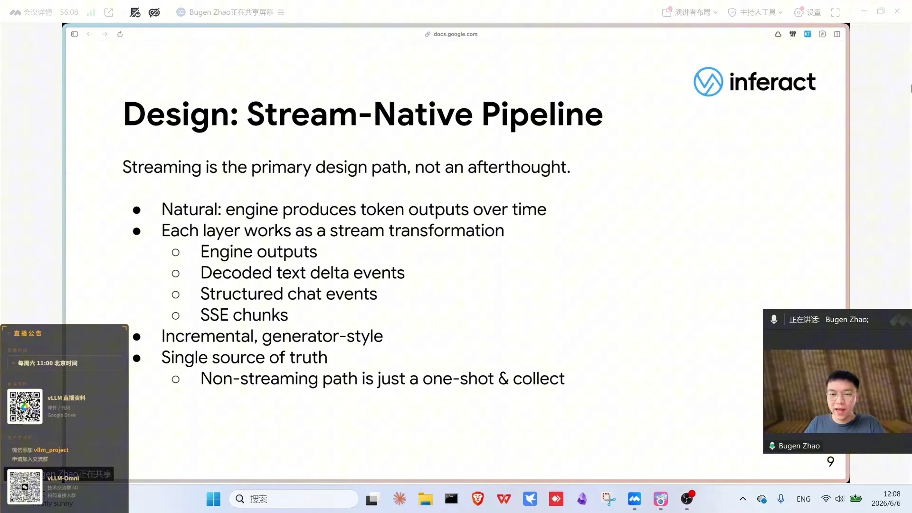 |
| 然后每一层它都是增量 incremental 的，毕竟它是一种 generator 方式去写的：比如说 send and receive，然后处理，然后发现自己的状态机累积到一定程度，然后 yield 出去，然后如此这样的一个循环。因此它就非常自然地就可以在每一层中去追踪一些状态，也就可以追踪什么时候…… [【跳转到 45:05】](https://www.bilibili.com/video/BV19fJJ6AE6W/?t=2705) |  |
| 比如说一个事件可以被安全地发下去之类的，而不需要去手动维护一些比较复杂的状态机、做一些状态机之间的状态迁移。然后另外一个 stream native 的设计优势，就是我们特地（强调）Rust frontend streaming enforced 的一个特点：我们希望 streaming 的路径…… [【跳转到 45:30】](https://www.bilibili.com/video/BV19fJJ6AE6W/?t=2730) |  |
| 作为这个 single source of truth。也就是我们根本就没有一个单独的 non-streaming 的路径，或者我们不必要有一个单独的 non-streaming 路径。我们所有的 non-streaming 路径当下的实现不都只是一个 one-shot？比如你想做一个 non-streaming 的 chat completion，那我们就是一把把所有的 engine 生成的 token…… [【跳转到 45:55】](https://www.bilibili.com/video/BV19fJJ6AE6W/?t=2755) |  |
| 全部都（喂）到我们刚刚所说的整个增量的流里面去，然后它里面自然会用（规则处理），自然就会去处理不同的事件，然后最终我们再把所有的事件聚合起来，就得到最终的结果。所以我们完全复用的是同一套路径，而没有说是一个单独的…… [【跳转到 46:20】](https://www.bilibili.com/video/BV19fJJ6AE6W/?t=2780) | 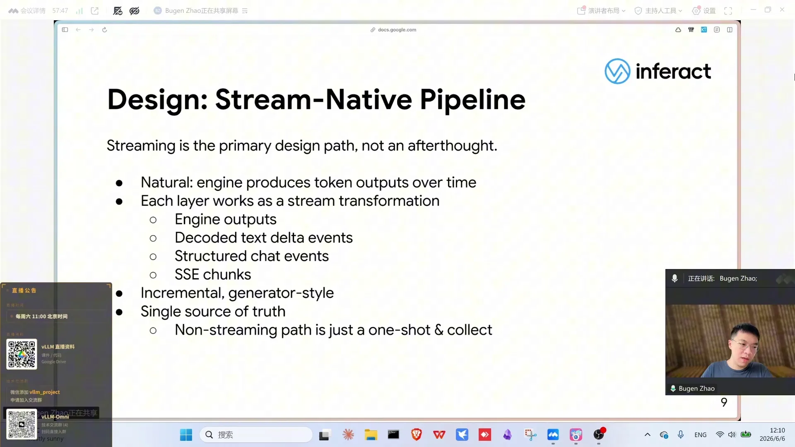 |
| 比如说一套 incremental 的一套 non-streaming 的两套单独路径去维护。因为我们会发现在 Python 那边其实有很多分岔，是关于 streaming 或者 non-streaming 的：尤其是 tool parser、reasoning parser 那边可以看到，两边的做法——你稍微读一下源码就会发现…… [【跳转到 46:45】](https://www.bilibili.com/video/BV19fJJ6AE6W/?t=2805) |  |
| 它会有一些 hack：两边的处理是不一样的。因为在 streaming 的情况下，你在下一个事件没有来之前你是不知道下一个事件的状态的，所以你可能很多时候需要保守地去处理。但是在 non-streaming 的情况下你是拥有整个上帝视角的，你可以看到整个输入长什么样，所以你又可以做一些不同的处理。这就会导致两个路径的结果就不一样。这并不意味着说 non-streaming 永远是对的…… [【跳转到 47:10】](https://www.bilibili.com/video/BV19fJJ6AE6W/?t=2830) | 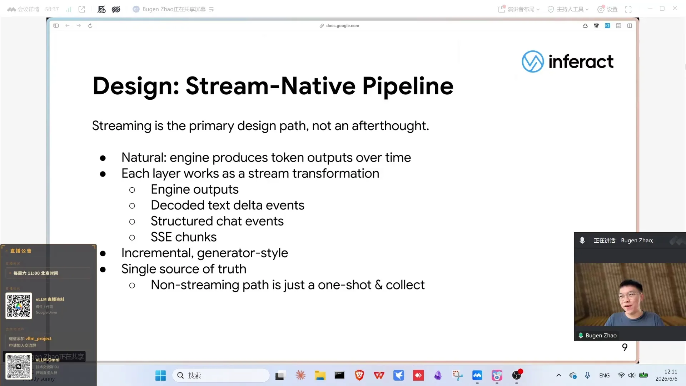 |
| 甚至 non-streaming 有时候它会变得过于贪婪，然后导致它就做错了或者之类的，反正会有更多各种不同的 mismatch。但是如果我们在 Rust（frontend）中，我们的想法是做一个 stream native 的 pipeline：一开始就把 stream processing 作为一个一等公民的话，我们所有的 non-streaming 都是去复用这个路径，自然就天然地避免了…… [【跳转到 47:35】](https://www.bilibili.com/video/BV19fJJ6AE6W/?t=2855) |  |
| 这种不匹配的问题。对，然后其实 tool parser 就是我下面想讲的：tool parser 其实就是一个非常好的、关于我上面讲的 stream native pipeline 的一个例子。比如这里贴了一个简单的 DeepSeek V4 的 tool call 格式——其实大家可以看到，不同模型的 tool call 格式都不太一样…… [【跳转到 48:00】](https://www.bilibili.com/video/BV19fJJ6AE6W/?t=2880) |  |
| 而且尤其是早期大家都会用 JSON 的形态，但是现在大家渐渐多了 XML 的形态。然后 XML 又可能不一样：有的可能是扁平的，有的可能是递归的之类。反正每一个 tool parser、每一个模型的 tool syntax 都不太一样，所以 tool parser 一直是前端里比较关键的一环，对吧。然后在 Python 那边呢…… [【跳转到 48:25】](https://www.bilibili.com/video/BV19fJJ6AE6W/?t=2905) |  |
| 大家可以看到现在的 tool parser 的实现，其实我只能说非常的……就是搞了一堆正则，然后搞了一堆 ad-hoc 的字符串处理，然后搞了一堆手写的状态机。每一个 tool parser 有各自的一套东西，几乎很少有什么东西复用。 [【跳转到 48:50】](https://www.bilibili.com/video/BV19fJJ6AE6W/?t=2930) | 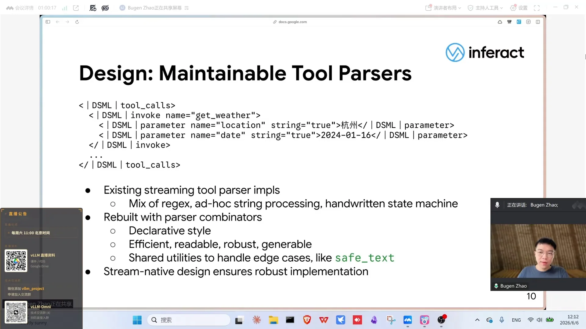 |
| 所以这会导致大量的 hack 出现。而且除了 hack 以外，我觉得更大的一个点是：大家会发现这个 tool parser 的 bug 仿佛是修不完的。大家可以看一下（GitHub）上，每一天——issue 里——绝对有这么几个，都是关于某个模型的某个 tool parser 用某种 hack 没有（生效）…… [【跳转到 49:15】](https://www.bilibili.com/video/BV19fJJ6AE6W/?t=2955) | 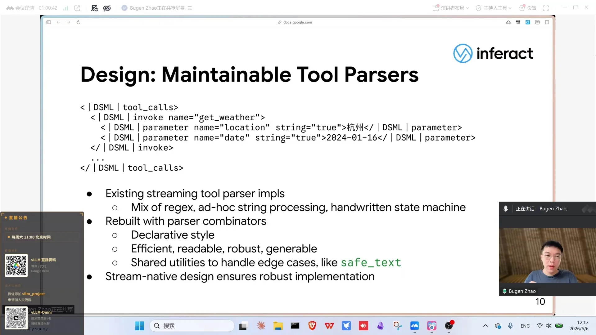 |
| 然后去做了一个 patch。但是你实际点进去看，你会发现它这里所谓的 hack，并不是因为模型指令遵循不好、生成了一个不合法的 syntax，而是模型真的（输出）了一个 syntax，只不过因为种种原因导致这个正常的 syntax 并没有被 frontend 的 tool parser 正确处理掉…… [【跳转到 49:40】](https://www.bilibili.com/video/BV19fJJ6AE6W/?t=2980) | 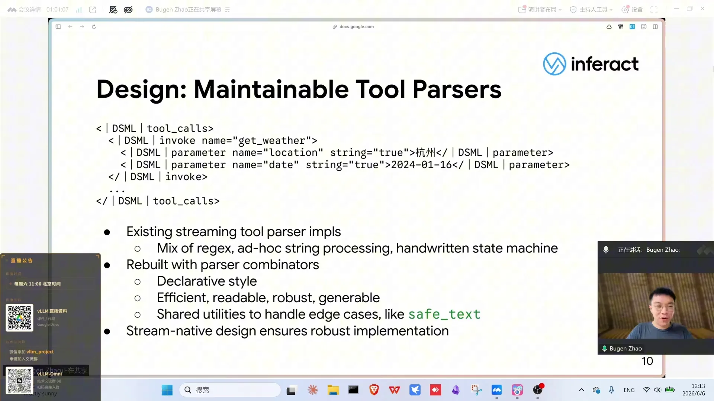 |
| 所以它修的这些 hack 实际上是 frontend 的 tool parser 的一个 bug 的 hack，而并不是真正提升模型 robustness 的一件事情。所以我们在做 Rust frontend 的时候，就完全摒弃了比如说 1 比 1 翻译每一个 tool parser 这种方式…… [【跳转到 50:05】](https://www.bilibili.com/video/BV19fJJ6AE6W/?t=3005) |  |
| 而是我们整个全部重构了一下 tool parser 相关的东西。我们做了一个很关键的事情：用 parser combinator 这种库去重新做了 tool parser。也就是说我们不再去手写这种字符串处理——也不可能——我们也坚决不会去用正则去 match 各种东西去提取或者之类的…… [【跳转到 50:30】](https://www.bilibili.com/video/BV19fJJ6AE6W/?t=3030) |  |
| 而且我们真正地去用 parser combinator 声明式地描述这个 tool parser 的、它的 tool 的真实 syntax，然后利用 parser combinator 自带的 incremental 能力、自带的一些 incremental 的 primitive，来构造出不同模型的 tool parser…… [【跳转到 50:55】](https://www.bilibili.com/video/BV19fJJ6AE6W/?t=3055) |  |
| 所以最后我们的结果就是：它的代码是声明式的，所以好读懂——你几乎只是在描述这个 tool syntax 长什么样。然后它生成（的代码）也非常高效，因为你相当于是在代码中写死这个形状应该怎么样，而不是通过一个正则、还要在代码运行时去编译——编译到不同的正则状态机——就完全不需要这种额外带来开销的东西，对吧。 [【跳转到 51:20】](https://www.bilibili.com/video/BV19fJJ6AE6W/?t=3080) |  |
| 这样的额外开销。然后还有个关键点，其实我觉得它非常的 generalizable：一旦我们用这种方式写了几 个 tool parser 之后，你会发现用 AI 去写一个新的 tool parser 就变得非常容易，因为它整个（范式）非常清晰，就是描述它。然后所有值得共享的…… [【跳转到 51:45】](https://www.bilibili.com/video/BV19fJJ6AE6W/?t=3105) |  |
| shared utility 我们也都提炼出来了。比如说有一个很关键的就是（缓冲逻辑）：比如现在模型把这里的 DSML tool call 的 start token——如果模型吐了一个（形如）尖括号 DSML（的开头），这是一个 token。那你会发现这个 token…… [【跳转到 52:10】](https://www.bilibili.com/video/BV19fJJ6AE6W/?t=3130) | 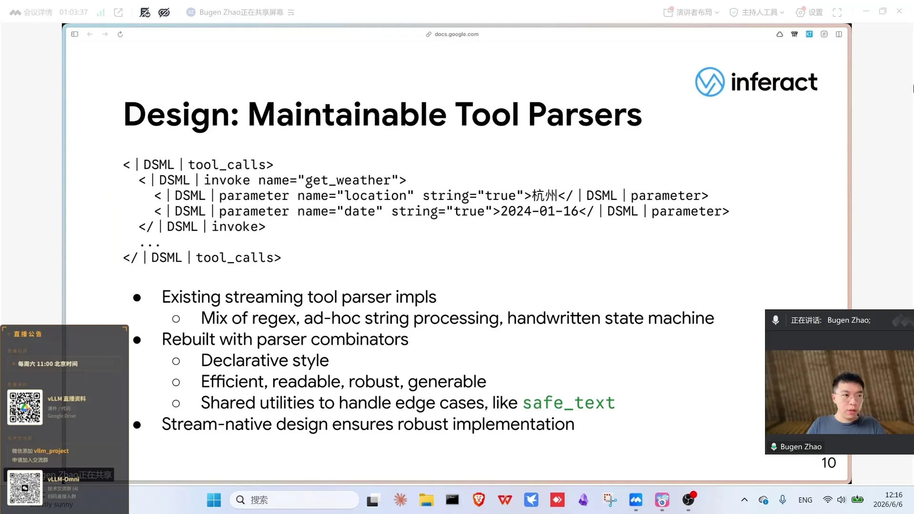 |
| 你在 tool（流式解析）中是需要暂时把它拦截住的，你不能往下发，因为你不确定它是否是一个 special mark 的前缀。因此你必须要等接下来的 token——模型又产生一些 token，然后你确信了这个东西到底是不是 special mark，至少你才可以去做决定：要不要把它下发下去…… [【跳转到 52:35】](https://www.bilibili.com/video/BV19fJJ6AE6W/?t=3155) |  |
| 还是说内部转换为进入 parse tool call 的一个状态。所以这种 pattern 会在每一个 streaming 的 tool parser 都存在。因此我们也就提出了一些 shared utility。你一旦有了这些东西之后，你用 AI 去写一个新的 tool parser 其实变得非常容易，而且几乎都是一把过。我只能说几乎都是一把过。然后每次写完了之后…… [【跳转到 53:00】](https://www.bilibili.com/video/BV19fJJ6AE6W/?t=3180) | 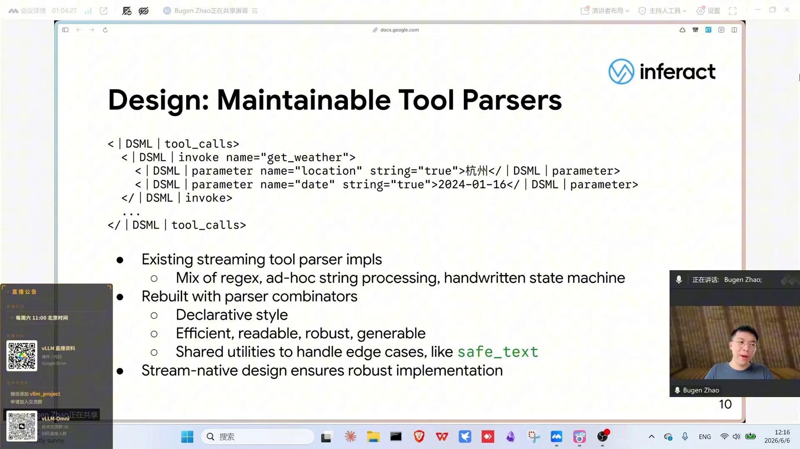 |
| 你可以把上游以及不同的（框架）或者 SGLang 那边各种覆盖了很多 edge case 的（测试用例）都拉过来，几乎都是一把过。因为没有理由会做错，因为我们是在非常严格地描述这个模型的 tool syntax。所以尤其是再加上我们刚刚讲的用了 stream native（design）…… [【跳转到 53:25】](https://www.bilibili.com/video/BV19fJJ6AE6W/?t=3205) |  |
| 所以我们也没有一个所谓全量 tool parse 的路径——全量 tool parse 也就是挨个 token 喂到这个增量的 pipeline 里面，让它自己在里面做状态机、做迭代等等。这个性能其实是没有什么区别的，因为它（跑）得快。然后最终那个结果可以发现：双方得到的那个结果一定是完全一致的…… [【跳转到 53:50】](https://www.bilibili.com/video/BV19fJJ6AE6W/?t=3230) |  |
| 不会有任何的（不）匹配这样的事情出现。对，然后最后想给大家讲一个点：这是一个 drop-in 的替换。因为我们前面讲了 frontend 和 engine 里面有这个界限——非常清晰，就是这个 ZMQ。所以我们可以天然地把 ZMQ 前面这个进程…… [【跳转到 54:15】](https://www.bilibili.com/video/BV19fJJ6AE6W/?t=3255) |  |
| 换成 Rust 重写的新的 frontend，而后面的东西保持不变。然后再加上 pipeline 那边——因为它有启动多个 API server 的需求——所以它启动 API server 的时候，天然支持通过一个（外部）进程的方式去管理。如果你要 multiple API server，你可能会有多个进程…… [【跳转到 54:40】](https://www.bilibili.com/video/BV19fJJ6AE6W/?t=3280) |  |
| 那么这时候我们就可以把我们的 Rust 进程伪装成一个需要管理的 API server，所以天然就集成进了整个 Python 的 entrypoint，以及后面 engine 的 ZMQ——天然就塞到 ZMQ 一个位置里面。因此我们现在的设计就是：你只需要开一个 VLLM_USE_RUST_FRONTEND 这样的环境变量，你开了之后它就会…… [【跳转到 55:05】](https://www.bilibili.com/video/BV19fJJ6AE6W/?t=3305) | 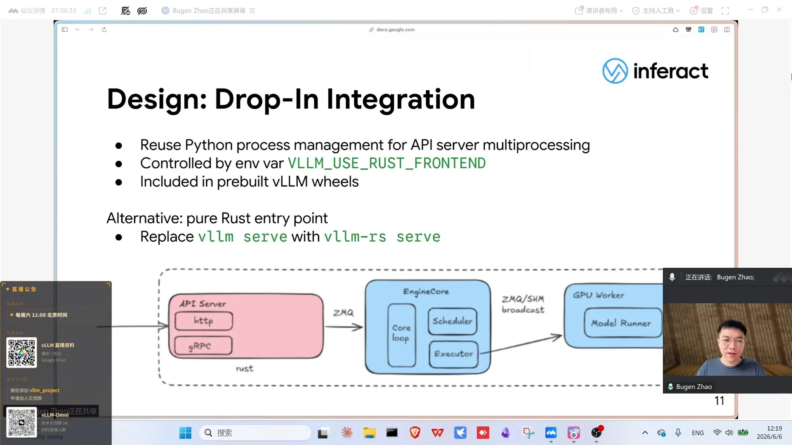 |
| （用 Rust frontend）而不是用 API server，然后接下来所有东西都是一样的。而且在我们比如 nightly 的 release 或者（官方）的 image 里边，我们也都会打包好一个 Rust binary。所以如果你直接从一个 release 或者直接从一个镜像跑 vLLM 的话，也不需要做任何额外配置，对吧，直接把这个…… [【跳转到 55:30】](https://www.bilibili.com/video/BV19fJJ6AE6W/?t=3330) |  |
| 然后那边打开就可以跑 Rust frontend。但是我们还有一个额外的 alternative：我们还提供了一个纯 Rust 的 entrypoint。我们刚刚讲的只是你还是要用 Python 的方式去启动 vLLM，只是它在里边去 spawn 一个 Rust frontend。但是我们也提供了一种纯 Rust 的 entrypoint…… [【跳转到 55:55】](https://www.bilibili.com/video/BV19fJJ6AE6W/?t=3355) |  |
| 就是你可以直接把你的 vLLM server 替换为（纯 Rust 的启动方式），然后它就会直接 launch——Rust frontend 会自己去负责启一个 engine core 和它同行。所以整个启动链路上就不存在任何的 Python。然后整体的那个…… [【跳转到 56:20】](https://www.bilibili.com/video/BV19fJJ6AE6W/?t=3380) | 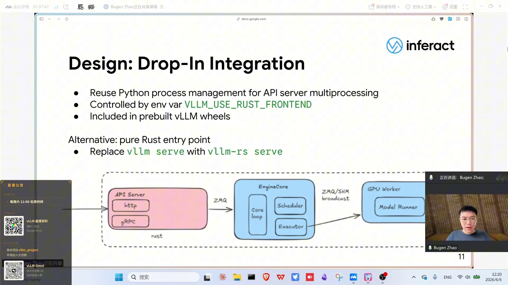 |
| 这个 process 的结构上就非常简单：就是 Rust frontend 和纯 Python 的 engine——就这两种进程。当然你也可以起 DP 的副本，各种的。启动的时候一些参数，我们也都是尽量做到和 Python 那边 compatible。除了一些 Python 特定的…… [【跳转到 56:45】](https://www.bilibili.com/video/BV19fJJ6AE6W/?t=3405) |  |
| 比如说配置那个 HTTP server、Python 的 uvicorn 这些东西，当然就不适用于纯 Rust 这边，那些就不太支持。其他的话都是可以做到无缝的替换。然后长期来讲我们可能会考虑以后真的把 entrypoint 变成 Rust 的一个 entrypoint。因为我们认为它肯定可以某种程度上加速整个…… [【跳转到 57:10】](https://www.bilibili.com/video/BV19fJJ6AE6W/?t=3430) |  |
| 模型的 startup 过程。对，然后后面就是一些 benchmark 的结果了。这边 benchmark 就是跑了两个——这个 slides 上有两个比较有代表性的 workload。它们的…… [【跳转到 57:35】](https://www.bilibili.com/video/BV19fJJ6AE6W/?t=3455) |  |
| （测试）就是用了一个非常小的模型——千问 3 0.6B——然后在 GB200 GPU 上有四张卡。然后我们把 concurrency 调得比较高。所以第一个 workload 是我们想要测这个 decode 的或者是（输出）的性能。可以看到——好吧，差距并不是很大…… [【跳转到 58:00】](https://www.bilibili.com/video/BV19fJJ6AE6W/?t=3480) | 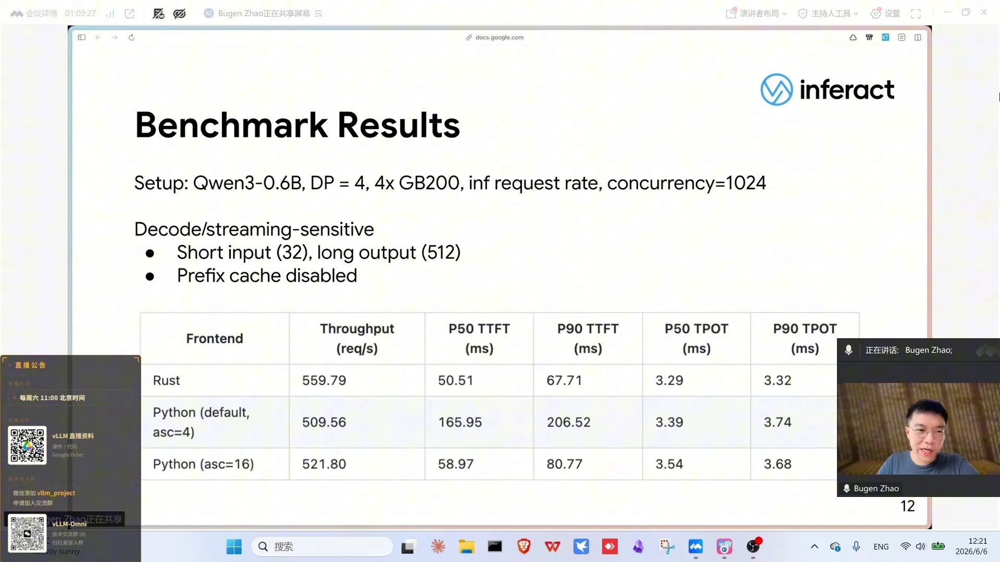 |
| 但是你可以看到 Python 那边你需要开四个 API server，才可以达到可能（一半）的性能；开 16 个你才能达到（更接近）的性能。但是与此同时你可以看到它的 latency 上——和 Rust 这边还是有一些性能区别的，对吧。 [【跳转到 58:25】](https://www.bilibili.com/video/BV19fJJ6AE6W/?t=3505) | 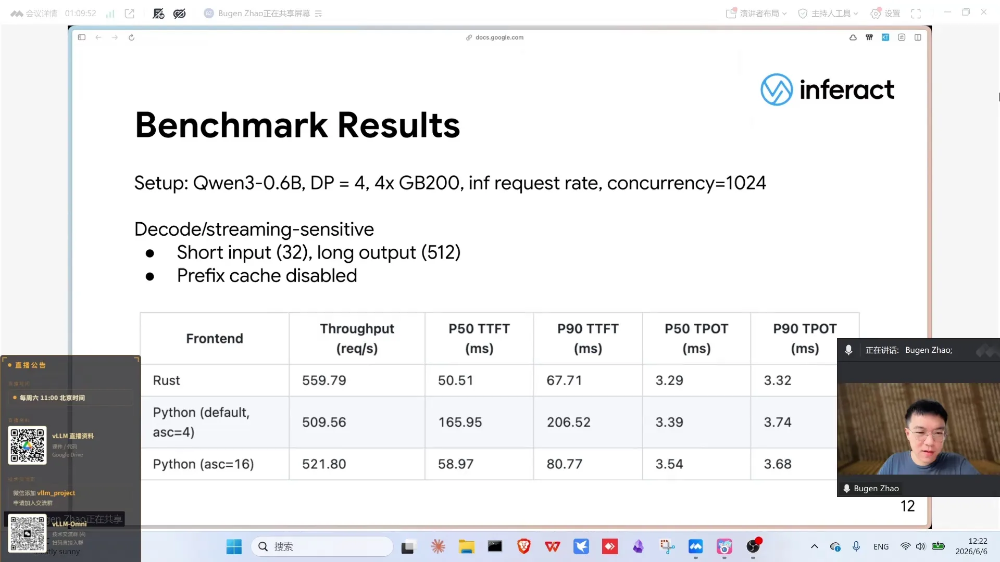 |
| 第二个就是我们做了一个 benchmark，就是做这个 pre-process heavy：用了非常长的 input、一个非常短的 output。我们就是想测它的比如说 tokenize、它的 template rendering、它的 HTTP 的各种（开销）如何。然后可以看到如果你只起一个 Python 的 API server 的话，这个 throughput 只能达到 Rust 的…… [【跳转到 58:50】](https://www.bilibili.com/video/BV19fJJ6AE6W/?t=3530) | 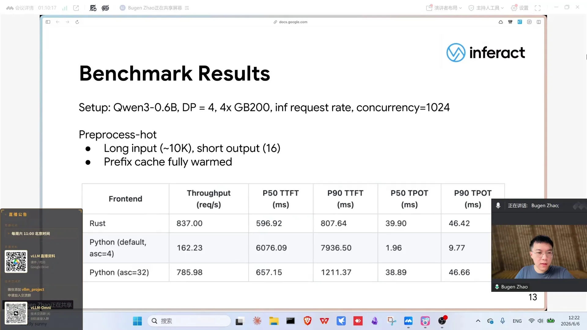 |
| 可能五分之一这样的事情。然后 latency 也（会）爆炸，对吧——因为基本上都在排队。这样子你可能要起到 32 个进程才可以达到和 Rust 的一个进程差不多（的性能），但是它的 latency 表现依然是更差一些。对，然后除此之外呢，其实可以给大家看一个…… [【跳转到 59:15】](https://www.bilibili.com/video/BV19fJJ6AE6W/?t=3555) |  |
| 就是（下面）这么一个（图）…… [【跳转到 59:40】](https://www.bilibili.com/video/BV19fJJ6AE6W/?t=3580) | 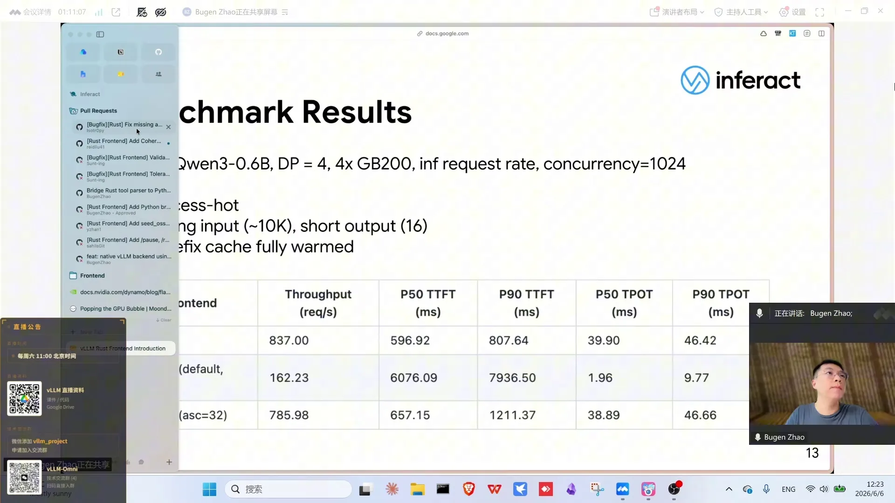 |
| 就是我们后来为了进一步地想去压榨这个 frontend 的性能，我们去搞了一个东西叫做 mock engine。它是用 Rust 写的，然后它什么事都不做：它就是收到请求，然后 batch，然后吐出——它根本不跑 GPU，它就随机地吐不同的 token 而已。但是我们就想把它当做一个对 frontend 做压测的一个工具吧。 [【跳转到 59:45】](https://www.bilibili.com/video/BV19fJJ6AE6W/?t=3585) | 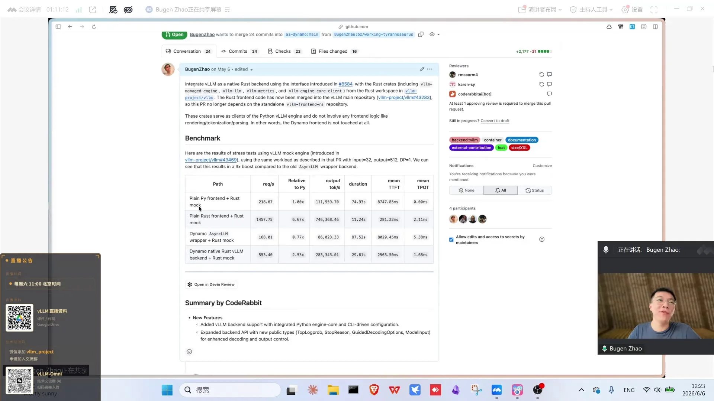 |
| 然后就可以看到我们也用类似于刚刚讲的 workload 去测了一下，在同样的配置上去测了一下，压榨一下纯 frontend 的这个 CPU 性能的区别。可以看到如果你用 Python frontend 的话，大概得到是两百多（请求每秒），但如果你用 Rust 的 frontend，你可以达到一千四百，对吧。 [【跳转到 60:10】](https://www.bilibili.com/video/BV19fJJ6AE6W/?t=3610) |  |
| 以及这个——我们还测了比如说像 Dynamo，是一个类似于 Rust 的 frontend 吧。但是他做完了一些处理之后，依然要 delegate 到 Python 这边的 engine 去工作。因此可以看到他的性能其实甚至还比不上纯 Python 方案。因为我认为这个瓶颈可能已经出现在 engine（侧）这边了。然后以及就是我们可能未来考虑把 Rust 这边的…… [【跳转到 60:35】](https://www.bilibili.com/video/BV19fJJ6AE6W/?t=3635) |  |
| engine core client 接入 Dynamo 之后，这样 Dynamo 的整个链路上除了 vLLM engine 以外就是 Rust（了），也不需要有 Python（frontend）。那么可以看到他的性能就立刻变得好了很多，已经打败了原始的 Python 方案。但是依然是没有办法和纯 Rust 的方案去比拼。我怀疑这边至少因为中间少了一个 RPC 这样子。以及一些可能我们在 Rust 的方案做的时候…… [【跳转到 61:00】](https://www.bilibili.com/video/BV19fJJ6AE6W/?t=3660) | 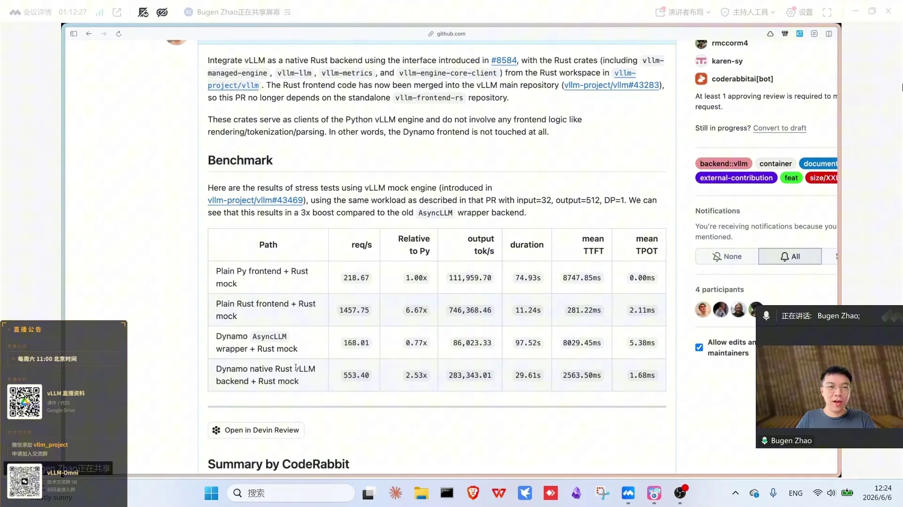 |
| 也做了一些不少的性能优化，也解决了不少的性能问题吧，可能这也是差距的来源。对…… [【跳转到 61:25】](https://www.bilibili.com/video/BV19fJJ6AE6W/?t=3685) | 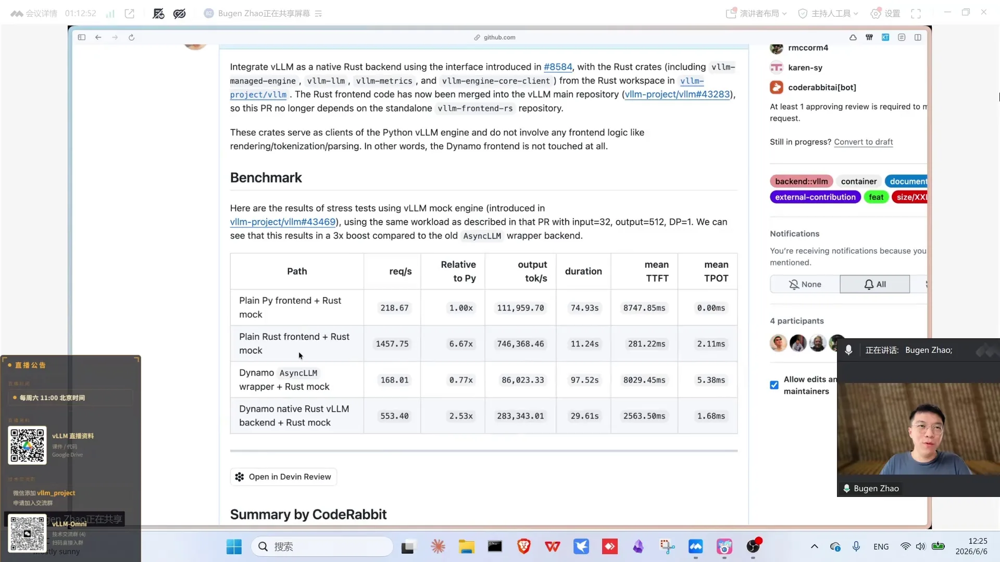 |
| 然后就是简单说一下未来的方向吧。 [【跳转到 61:37】](https://www.bilibili.com/video/BV19fJJ6AE6W/?t=3697) | 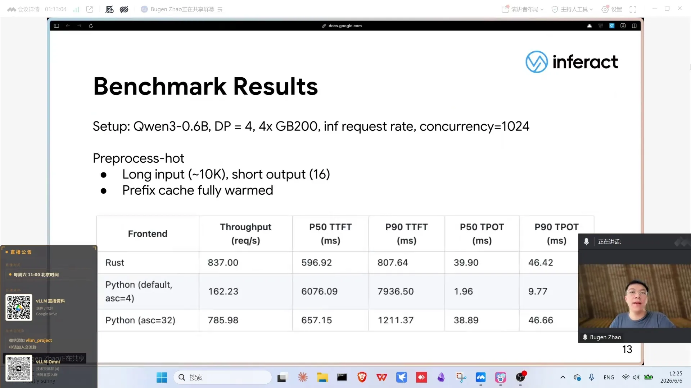 |
| 对，第一个方向——第一件事情很简单：就是要把 feature 做得更多一些，让它大概在生产环境中用起来。它现在已经支持了很多 feature，就像我们上面这里列出的一些东西：有些关键的模型、它的 multimodal 整个链路都是能够跑通的。但是它依然还差很多、还差一些 feature 吧…… [【跳转到 61:42】](https://www.bilibili.com/video/BV19fJJ6AE6W/?t=3702) | 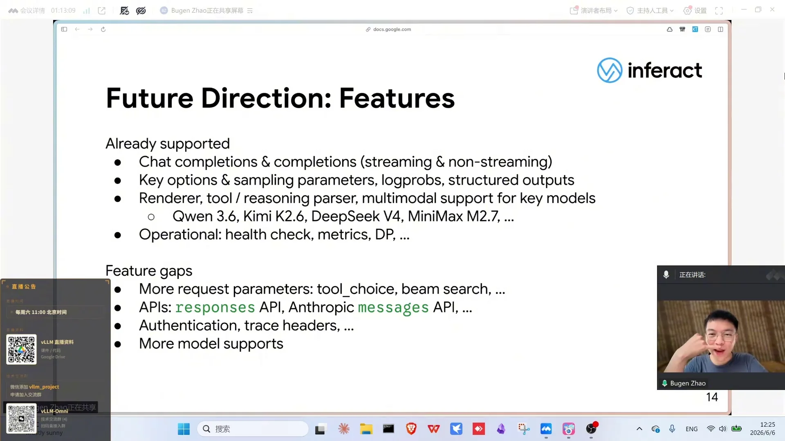 |
| 比如说更多的一些（参数）、比如说 tool choice、比如说 n（>1）或者说 beam search 这些东西，但是都还没有支持。因为还有不少的 API endpoint 也没有支持：现在基本上可以说只有 OpenAI endpoint 的 chat completion endpoint 这样子。然后还有一些在生产中可能会比较有用的东西，比如说…… [【跳转到 62:07】](https://www.bilibili.com/video/BV19fJJ6AE6W/?t=3727) |  |
| （metrics）等等，也都没有支持。但其实都已经——因为我们已经开源了，所以其实已经有 PR 要做这些事情。对，然后当然更多的就是随着新模型发布，我们也希望能够在 Rust 这边也能够做到一个 day-zero 的 support。甚至说我们可能逐渐地把这些重心转移到 Rust frontend 那边，然后 Python 那边可能只是更多…… [【跳转到 62:32】](https://www.bilibili.com/video/BV19fJJ6AE6W/?t=3752) |  |
| 我们会选择使用（调用）、或者 FFI call 的 Rust 方式，去把里面一些关键组件给支持掉，这样子。然后下一个、最后一个想说的 future direction 就是 gateway 或者是（路由）的方向。就是大家现在在生产环境中真正部署 vLLM 的话…… [【跳转到 62:57】](https://www.bilibili.com/video/BV19fJJ6AE6W/?t=3777) | 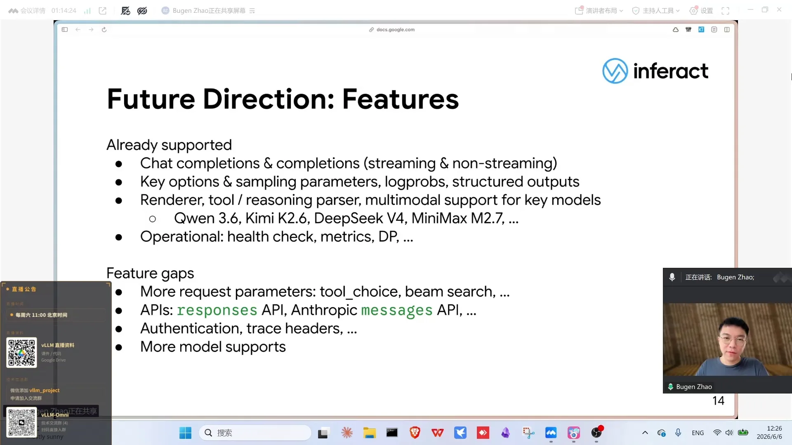 |
| 其实很少有人会直接去跑 vLLM——大概率会在 vLLM 前面加一层新的 gateway 或者 router 这样的一个角色，对吧。它一般会处理比如说更大规模的（节点）之间的路由、然后 load balance，然后像 PD disaggregation、比如 KV aware 的 routing 等等这些事情…… [【跳转到 63:22】](https://www.bilibili.com/video/BV19fJJ6AE6W/?t=3802) |  |
| 然后这个东西——而且很多人会发现，因为他们大概率是用一些高性能语言去写的，这些 gateway/router 他们甚至会逐渐地吞噬一些（周边的功能），比如说 tokenize、chat template 等等。他们最终只会把 vLLM 当作一个 engine——token in、token out 的 engine 去用。这可能是大家现在 production deployment 比较普遍的趋势吧。 [【跳转到 63:47】](https://www.bilibili.com/video/BV19fJJ6AE6W/?t=3827) |  |
| 虽然 vLLM 自身也会有个 vLLM router 这样一个项目，但是它目前来讲功能还是比较受限的：无论是性能上来讲、还是它的维护的状态…… [【跳转到 64:12】](https://www.bilibili.com/video/BV19fJJ6AE6W/?t=3852) | 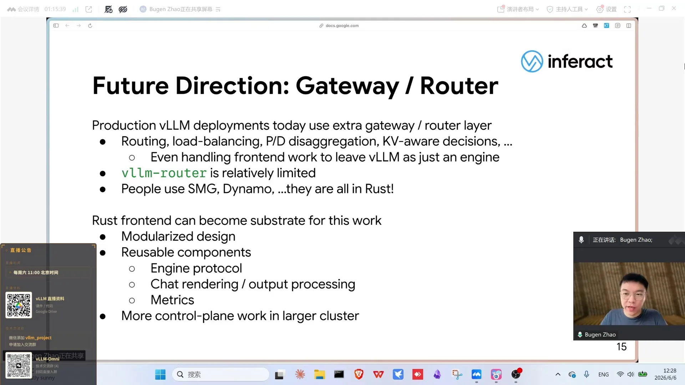 |
| 还是说它的 feature 上来讲，它都表现不太好。大家可能会更多的（倾向）去用 SGLang 或者 Dynamo 这种项目去做。那么所以说我们做 Rust frontend 其实还有一个非常关键的考量：就是我们做的这些组件——即使 Rust frontend 的组件——最终也可以非常轻松地被拿来当作一个类似于这种（网关/路由）的组件。因为我们前面提到我们的整个设计是比较模块化的，每一层的职责都比较清晰：像 tool parser、reasoning parser 也都是单独的一个 crate。所以它可以被（打包）上轻松地用来做这个 Rust frontend 或者 gateway 的一些组件…… [【跳转到 64:37】](https://www.bilibili.com/video/BV19fJJ6AE6W/?t=3877) |  |
| （接上） [【跳转到 65:02】](https://www.bilibili.com/video/BV19fJJ6AE6W/?t=3902) |  |
| 以及因为它用 Rust frontend 写的，所以它自然天然的性能就比较高。因此可以设想：如果你可以把这些组件最终用在一个很大规模集群的 gateway 组件上，它也可以承担更多 control plane 的一些工作。所以我们可以实现更好的一个垂直整合的能力…… [【跳转到 65:27】](https://www.bilibili.com/video/BV19fJJ6AE6W/?t=3927) |  |
| 而使得你可以在 vLLM 自身、vLLM 社区生态系统中的一些组件，就能够达到一个为 vLLM（定制）的非常好的 production deployment，而不需要去主要用别的 gateway 等等——那样可能体验会不太那么无缝一点。 [【跳转到 65:52】](https://www.bilibili.com/video/BV19fJJ6AE6W/?t=3952) |  |
| 自己的话维护也会更方便一些。因为我们公司之前就用（别的 gateway），你发现它性能上有问题了，然后你跟它联系，真的是可能两三个月它才能把这个（问题）修完、更新出来。——对对。——然后像我们有时候做一些模型的 day-zero 适配吧…… [【跳转到 66:17】](https://www.bilibili.com/video/BV19fJJ6AE6W/?t=3977) |  |
| 就是你会发现现在如果你只做 vLLM 那一侧的可能都不太够。很多时候你不仅要在（发布时）能够在 vLLM 上跑通——有时候还有在生产上跑的。生产上我们又没办法用 vLLM 的 frontend…… [【跳转到 66:42】](https://www.bilibili.com/video/BV19fJJ6AE6W/?t=4002) |  |
| 因为基本上都是在用 Dynamo 的一些 frontend 之类的。因此的话，很多公司需要做两遍，而且那边的接口形状、那边的一些设计你还是不可控，所以反正也是造成一定的复杂度。——对，所以今天分享就差不多了。简单 recap 一下：Rust frontend 不是说重写了 vLLM 整个，只是替换了 Python frontend——用 Rust 写的一个新 frontend。然后它的目标也不仅是说只是因为 Rust 比 Python 快，更多的还是有一个更加可维护的架构，然后给 CPU 这边留出更多可扩展的空间…… [【跳转到 67:07】](https://www.bilibili.com/video/BV19fJJ6AE6W/?t=4027) |  |
| 以及在 agent workload 下它能够提供更好的（可靠性）。这样。对，然后在上次分享的时候，vLLM Rust frontend 还在一个（内部）的 repo。但是很快——这两周过去——它现在已经在主仓里面了。大家应该也能看到，现在可能有几十个 PR…… [【跳转到 67:32】](https://www.bilibili.com/video/BV19fJJ6AE6W/?t=4052) |  |
| 以及就是在一种agentworkload的下它能够提供更好的一个证据这样然后对然后这个在上次分享的时候这个VMRustFronten还在一个infrared下面的repo但是很快它现在这两路过去它现在已经在主仓里面然后大家也可以应该也能看到现在可能有几十个PR [【跳转到 67:57】](https://www.bilibili.com/video/BV19fJJ6AE6W/?t=4077) |  |
| 然后每天也都会有几个 PR 关于 Rust frontend 的合并进去。所以最新的那个 release 应该是 0.22 吧——0.22 已经把 Rust frontend 的第一个版本带进去了。大家如果有兴趣的话可以去试一试，然后可以去看一看我们还 post 的一个关于 feature parity 的 Rust frontend roadmap…… [【跳转到 68:22】](https://www.bilibili.com/video/BV19fJJ6AE6W/?t=4102) |  |
| 上面有很多东西都还没有做，也是欢迎社区来贡献上面一些缺的 feature。大家如果在使用中发生什么问题，欢迎来反馈，或者自己去贡献修复，都是非常好。所以我今天就分享到这里。——直播间有同学问：Rust 会不会整合到（语义路由）这个方向？ [【跳转到 68:47】](https://www.bilibili.com/video/BV19fJJ6AE6W/?t=4127) | 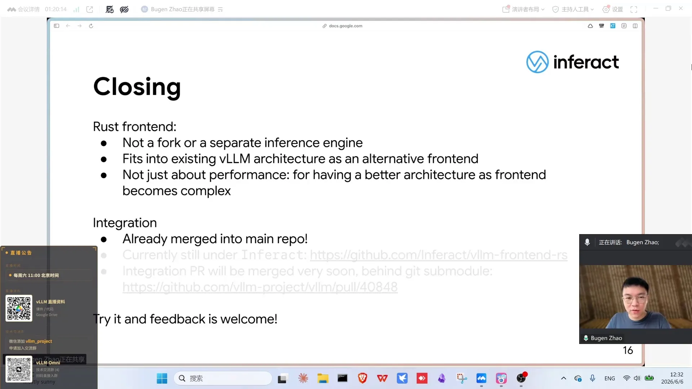 |
| 这个应该是不会的。就是这个 roadmap 会不会整合到（语义路由）这个方向的情况？我倾向于是觉得不会的。因为我们还是希望……我们还是希望像现在一样，你如果在单机上部署的话…… [【跳转到 69:12】](https://www.bilibili.com/video/BV19fJJ6AE6W/?t=4152) | 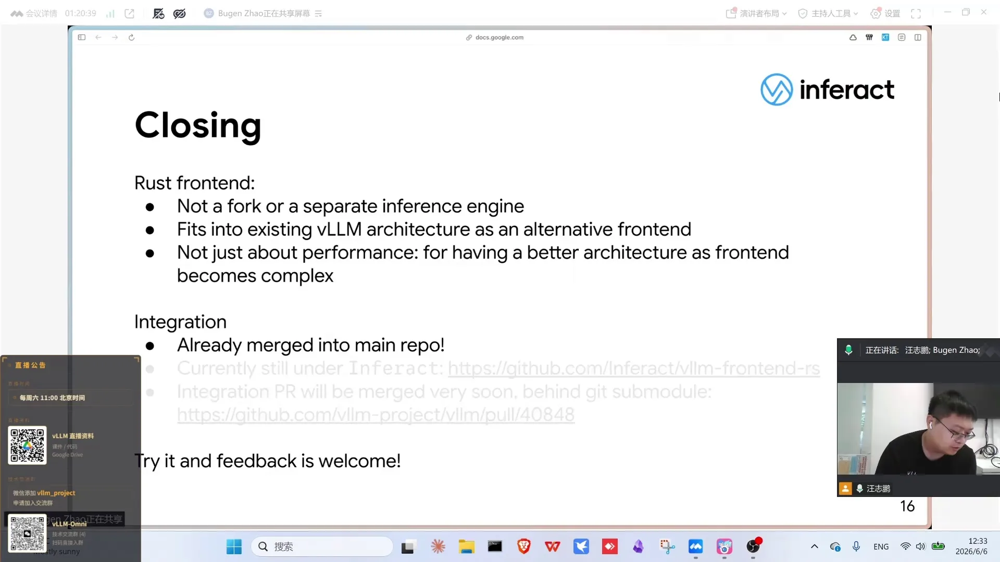 |
| 它应该是比较轻量的、比较纯粹的东西。我们不希望这个东西只为生产大规模部署设计，导致你本机跑变得很复杂，我们不希望这样。所以我觉得大概率像 router 或者 gateway 这种东西，它可能还是一个单独的组件，它可能也不会在主仓里边去。但是它天然会复用主仓中的代码，因此维护起来会非常方便…… [【跳转到 69:37】](https://www.bilibili.com/video/BV19fJJ6AE6W/?t=4177) | 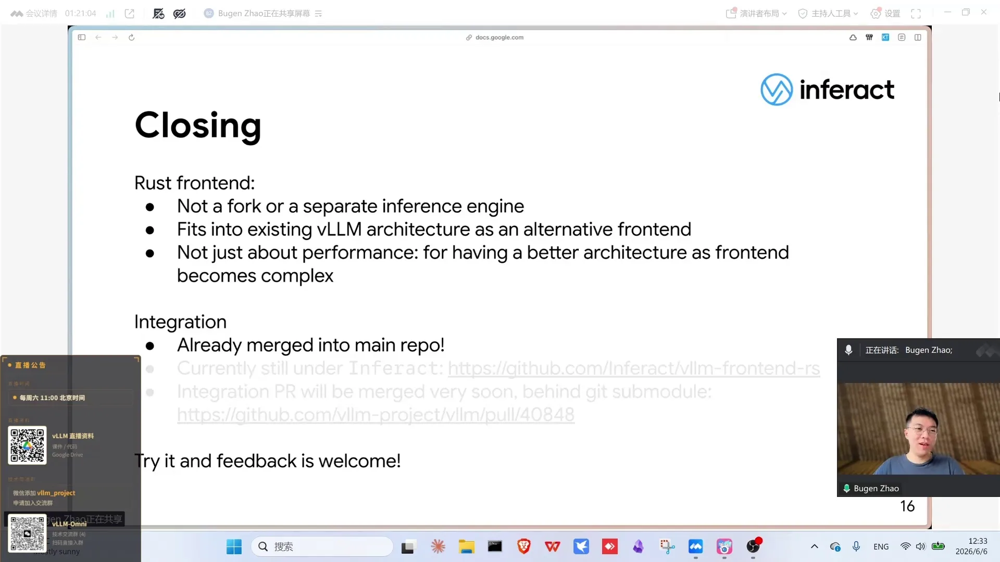 |
| 但它并不会和 frontend 成为一（体）的东西。而且我觉得可能这个 router 的话，可能我们会设想那种同时部署好多个模型、不同模型有不同的（调度）方案——这个东西本身就不太适合放到（单个）模型（的 frontend 里）。是的，因为这个东西天然就应该像是一个单独的、更上层的 layer 去搞的一件事情…… [【跳转到 70:02】](https://www.bilibili.com/video/BV19fJJ6AE6W/?t=4202) |  |
| 对，不太希望直接去混到现在功能比较纯粹的（frontend）里面。好，直播间同学还有什么（其他）问题想问的？——哎，当时为什么没有考虑到在 semantic router 里…… [【跳转到 70:27】](https://www.bilibili.com/video/BV19fJJ6AE6W/?t=4227) |  |
| 去增加这个（语义路由）的这种功能吗？——这个我感觉……我感觉（耦合）不要那么（深）。我感觉这个功能它其实非常适合放到 semantic router 里去…… [【跳转到 70:52】](https://www.bilibili.com/video/BV19fJJ6AE6W/?t=4252) | 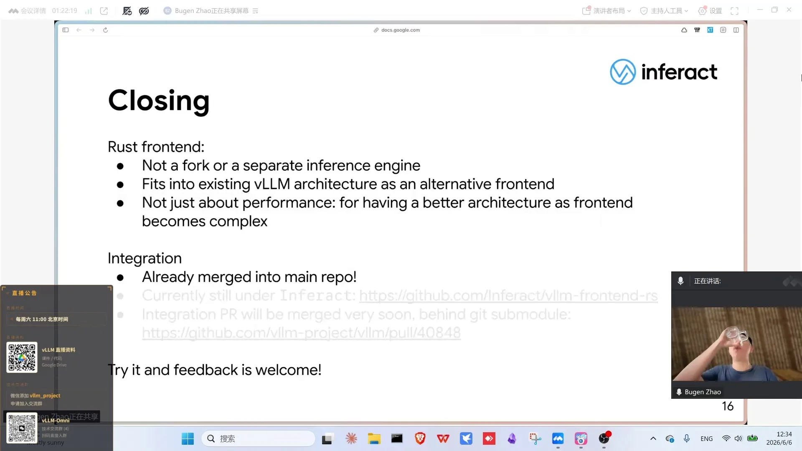 |
| 但是（定位上）——你把 semantic router 放前面，它更多还是（模型选择）那一块吧。我的感觉是这样：它可能更靠前一点——（模型间）路由是在这一块，semantic router 是在这一块——它是不同模型之间选，而不是同一个模型…… [【跳转到 71:17】](https://www.bilibili.com/video/BV19fJJ6AE6W/?t=4277) | 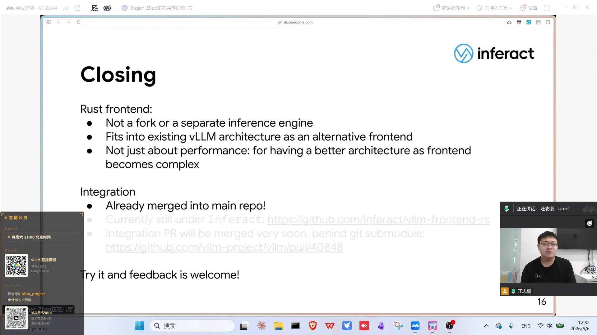 |
| （多副本）的分。然后你再去路由，那你这个（重心）还是不太一样。因为我感觉比如说我们如果是做 PD 的话，那么我们可能同时会有（P 和 D），然后也会（需要）一些（路由）的功能，那 semantic router 可以实现这一块的功能。然后我们在这个 PD 里面的话…… [【跳转到 71:42】](https://www.bilibili.com/video/BV19fJJ6AE6W/?t=4302) | 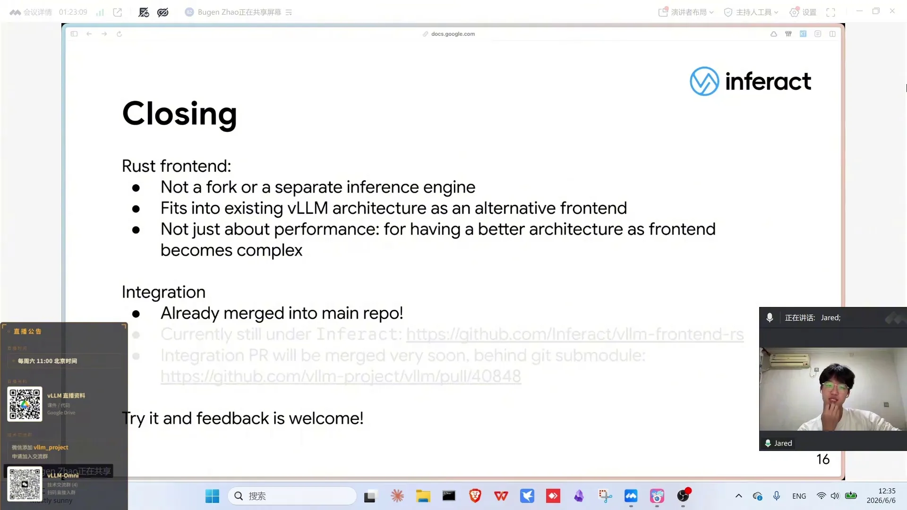 |
| 我们还会（部署）很多个（副本），然后这就（涉及）一个负载均衡的问题。那可能这个就是跟（语义路由）更相关一些。是的，但是我不是很清楚——我接下来可能也会再回去看一下那个 semantic router V0.3 的发布，然后问一下…… [【跳转到 72:07】](https://www.bilibili.com/video/BV19fJJ6AE6W/?t=4327) | 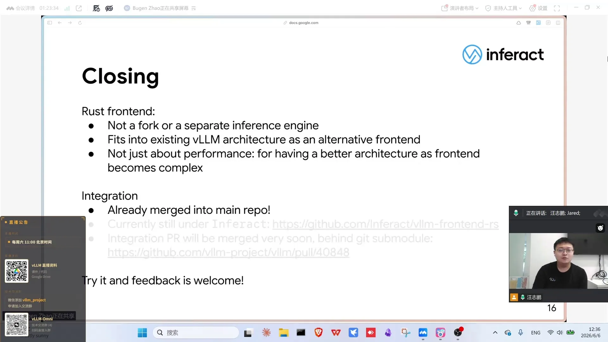 |
| 看看后面他们会选择用什么方式去做这个项目。因为我感觉好像（那）一块没有特别多可以做；反而把它放到（另一）块好像还是有很多东西可以做。我觉得两个如果耦合可以更紧密一些的话，可能对我们去维护这种项目也会更方便一些。——（时间）不多了，很好，那我们就结束吧。 [【跳转到 72:32】](https://www.bilibili.com/video/BV19fJJ6AE6W/?t=4352) |  |
| 会更方便一些或者是的不多了很好那我们就结束吧 [【跳转到 72:57】](https://www.bilibili.com/video/BV19fJJ6AE6W/?t=4377) | 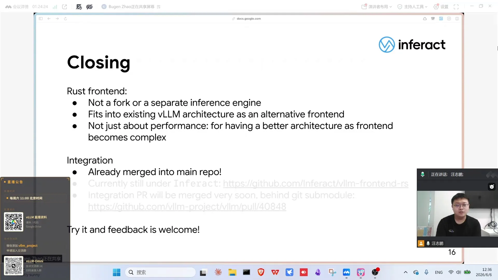 |