# vLLM小课堂（六）：昇腾部署GLM5指南 原始文稿（图-字幕分栏）

| 字幕文本 | 画面 |
| :--- | ---: |
| 今天我们很高兴请到了来自华为昇腾的张阳老师。张阳老师你可以先做个自我介绍吧。——大家好，我是张阳，来自华为昇腾。我主要是做 GLM 在 vLLM 昇腾上的优化这一块。今天会给大家分享一下 GLM-5.1 在 vLLM 昇腾上的一些优化实践。 [【跳转到 00:00】](https://www.bilibili.com/video/BV1eoJJ6eEUv/?t=0) | 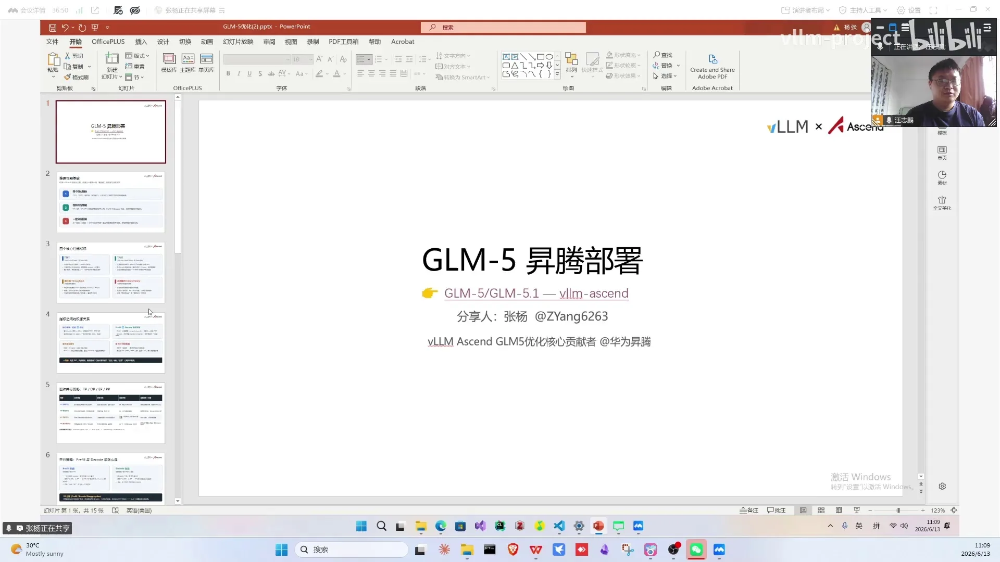 |
| 好，非常欢迎张阳老师。然后我们从这一期直播开始，就在 vLLM 的官方频道上面去做直播了。没有点关注的同学记得点一下关注。 [【跳转到 00:25】](https://www.bilibili.com/video/BV1eoJJ6eEUv/?t=25) | 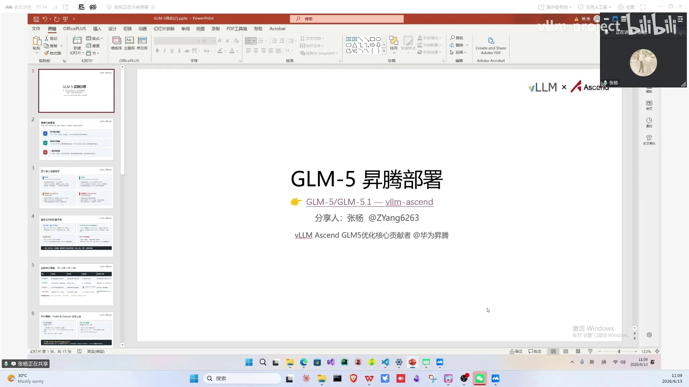 |
| 如果能够分享一下现在这个直播就更好了，这样可以让更多人看到。好，然后张阳老师开始吧。我们是有录播的，对。然后我也会把之前我自己频道上做的一些直播录像都搬到这个频道上来。 [【跳转到 00:50】](https://www.bilibili.com/video/BV1eoJJ6eEUv/?t=50) |  |
| 哈喽，张阳老师开始了。——然后开始了。首先我先讲一下一些推理优化的技术知识。 [【跳转到 01:05】](https://www.bilibili.com/video/BV1eoJJ6eEUv/?t=65) | 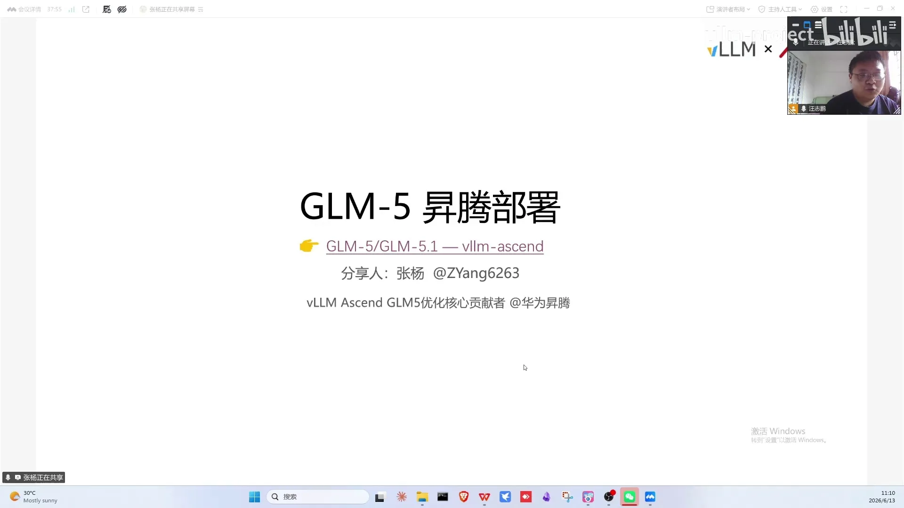 |
| 我们先看一下衡量一个模型性能的主要指标：TTFT、TPOT、总吞吐、并发能力。然后还会介绍一下有几种并行策略：TP、PP、DP、EP 这些。 [【跳转到 01:25】](https://www.bilibili.com/video/BV1eoJJ6eEUv/?t=85) | 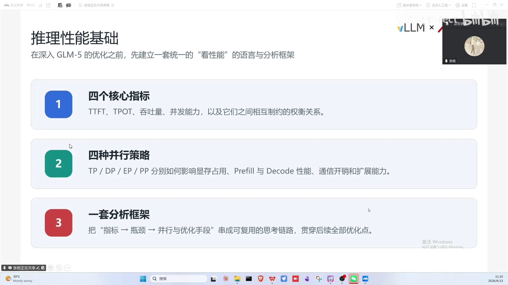 |
| 然后还就是我会介绍一下，模型性能优化有一个整体的分析方向：说一下我们怎么从开始到结束，把模型的性能优化到最优。 [【跳转到 01:50】](https://www.bilibili.com/video/BV1eoJJ6eEUv/?t=110) | 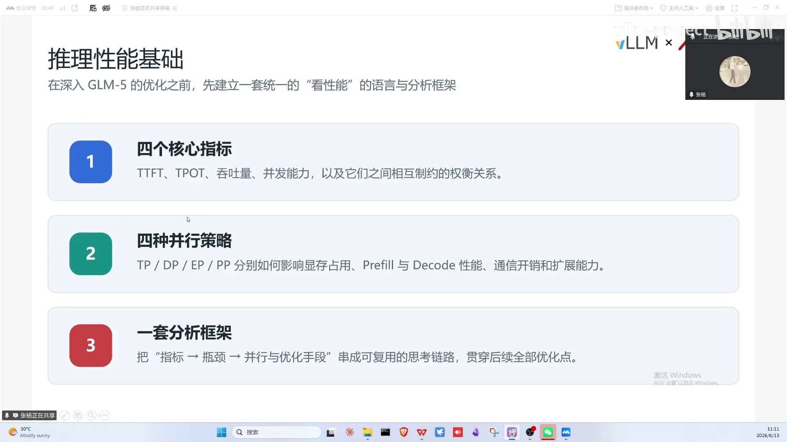 |
| 首先介绍一下核心的性能指标。TTFT 的话，就是主要针对——最有（代表性）的一个指标——我们请求从它进入生成、到生成第一个 token 的一个时间。这个时间跟我们的并发量、还有输入长度有很大关系…… [【跳转到 02:15】](https://www.bilibili.com/video/BV1eoJJ6eEUv/?t=135) |  |
| 如果输入的长度越长的话，TTFT 相应也会变得更高。然后 TPOT 是：我们相邻两个——在输出的时候——相邻两个 token 之间的一个时延。它主要是 decode 的一个指标：就是我们 decode 每生成一个 token…… [【跳转到 02:40】](https://www.bilibili.com/video/BV1eoJJ6eEUv/?t=160) | 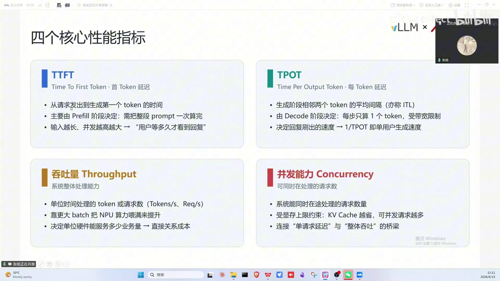 |
| 它决定我们 decode 生成 token 的速度。然后吞吐量的话，它其实有很多种：比如总吞吐量、还有输出吞吐量——我们通常说的吞吐量就是我们输出的吞吐量…… [【跳转到 03:05】](https://www.bilibili.com/video/BV1eoJJ6eEUv/?t=185) |  |
| 因为 TPS 就是单位时间内（模型）生成的 token 的速度。这个吞吐量如果想要更高，通常的方法就是打高并发。但高并发也不是越高越好…… [【跳转到 03:30】](https://www.bilibili.com/video/BV1eoJJ6eEUv/?t=210) |  |
| 考虑到（有些业务）对 TTFT 的 SLO（特别敏感），对并发会比较敏感：可能打高并发总体吞吐量会提升，但是对 TTFT 的影响会比较大。——对。然后说到并发，还有并发能力…… [【跳转到 03:55】](https://www.bilibili.com/video/BV1eoJJ6eEUv/?t=235) | 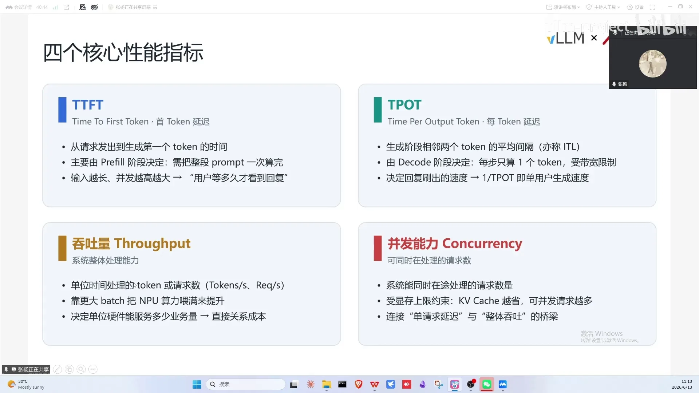 |
| 这四个指标之间我们要相互进行一个权衡，不能说为了某一个指标的提升，去（牺牲）掉其他的指标。在实际的模型部署过程中…… [【跳转到 04:20】](https://www.bilibili.com/video/BV1eoJJ6eEUv/?t=260) | 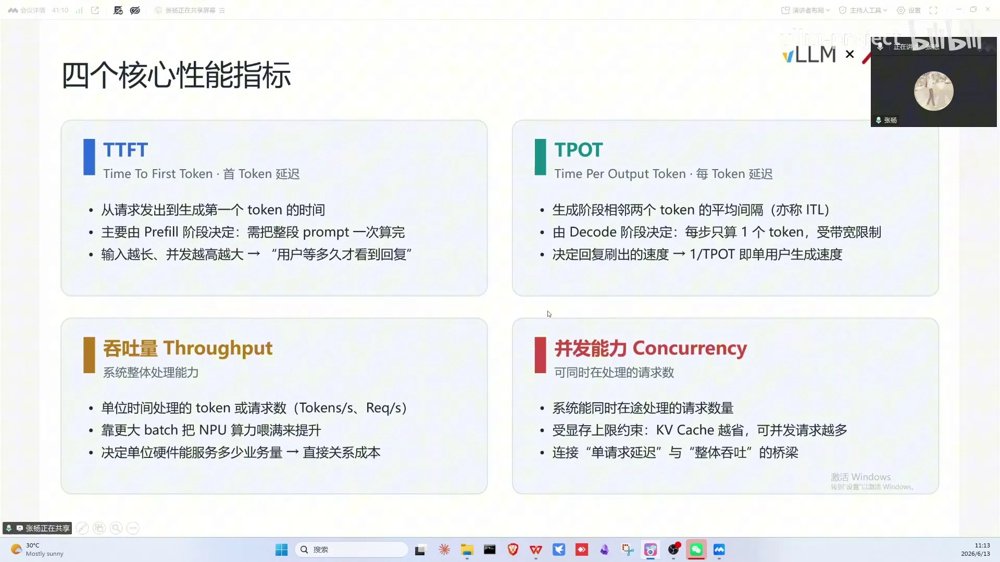 |
| 要去权衡这四个指标，当然也要根据我们具体的需求来定。比如我们可能就想要一个比较低的 TTFT，对吞吐或者对 TPOT 都不太敏感，就想要首 token 时间很短，那其实就可以针对性地做一些（优化）、做一些特性的配置调整…… [【跳转到 04:45】](https://www.bilibili.com/video/BV1eoJJ6eEUv/?t=285) | 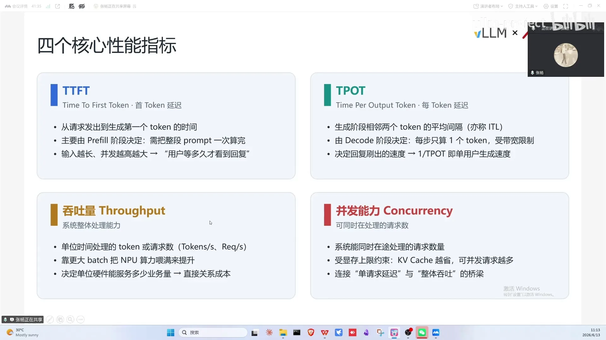 |
| 都可以。TPOT 也是：比如就是那种想要低时延、token 之间的时间很短（的场景），我们也可以针对性地做一些调整。然后就是它们之间相互权衡的…… [【跳转到 05:10】](https://www.bilibili.com/video/BV1eoJJ6eEUv/?t=310) |  |
| 这里其实刚已经讲到了：这四个指标就是因为显存、计算、通信这些互相平衡吧。——对，我想补充一下的…… [【跳转到 05:32】](https://www.bilibili.com/video/BV1eoJJ6eEUv/?t=332) | 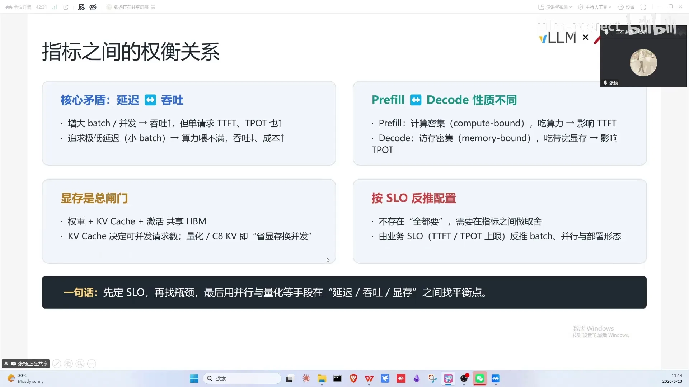 |
| 然后下面讲一下总的一个（并行）特点。 [【跳转到 05:57】](https://www.bilibili.com/video/BV1eoJJ6eEUv/?t=357) |  |
| 这个对模型部署是比较关键的。首先是 TP，就是一个张量并行：加一个张量并行，可以切分——我打到（多）张卡——这样可以将我们的权重或者激活分担到每张卡上去做计算…… [【跳转到 06:02】](https://www.bilibili.com/video/BV1eoJJ6eEUv/?t=362) |  |
| 能够解决单卡的（显存）压力。这种切分最后可以通过（通信）从每张卡上把最终的结果汇聚到一起。就是增加了……充分利用我们的资源。 [【跳转到 06:27】](https://www.bilibili.com/video/BV1eoJJ6eEUv/?t=387) | 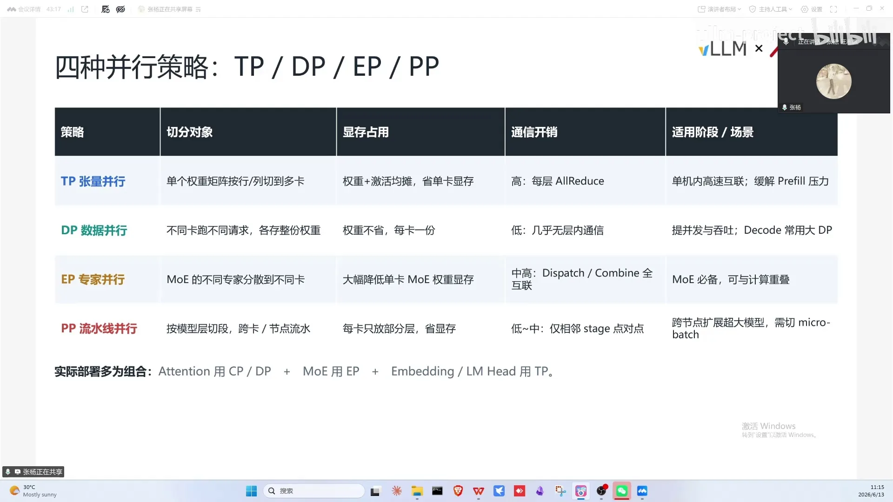 |
| 然后 DP 呢，就是我们每个（DP 副本）上——它就是数据并行——每个 DP 副本上我们都会保存一份完整的一个权重，DP 之间是不会相互影响的。在我们资源充足的情况下，我们可以通过多 DP 去提高…… [【跳转到 06:52】](https://www.bilibili.com/video/BV1eoJJ6eEUv/?t=412) | 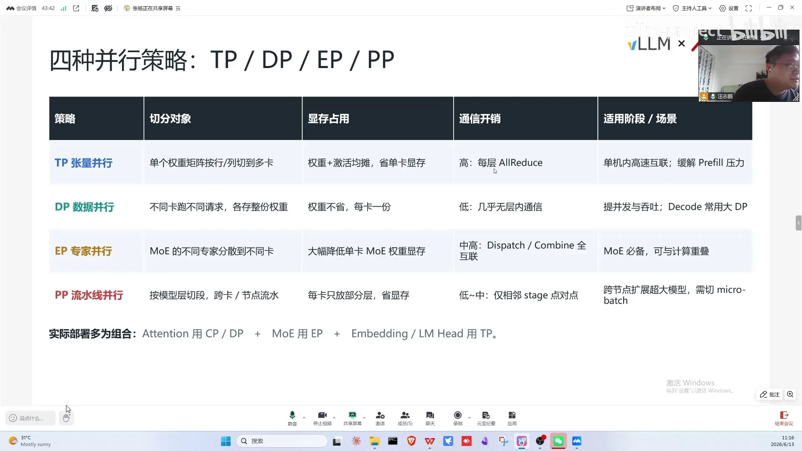 |
| 提升我们的吞吐。然后 EP 的话就是我们一个专家并行。在 vLLM 昇腾当中，EP 的一个数量通常就是 DP 乘以 TP。它这里一批是不会去切分的——专家不会切分，主要是去分散——将专家分散到不同的卡上面…… [【跳转到 07:17】](https://www.bilibili.com/video/BV1eoJJ6eEUv/?t=437) |  |
| 将专家分散到不同的卡上面。——诶，张老师，你可以听到我说话吗？——能听到我说话，对吧。——好，刚才有同学问 SLO 是什么，我看已经有观众给出回答了：就是 service level objective。 [【跳转到 07:42】](https://www.bilibili.com/video/BV1eoJJ6eEUv/?t=462) |  |
| 这（个）其实就是你的公司里面一般（会定）的，它会有些像——能听到吗？——能听到。——我刚刚没声音是吧？——不，刚才你有声音，但是我们说话你好像听不到。——哦，哦，对，没有一点问题。——这个 SLO 就是很多公司可能会有些像 P90、P99 这样的指标：比如 100 条请求里…… [【跳转到 08:07】](https://www.bilibili.com/video/BV1eoJJ6eEUv/?t=487) | 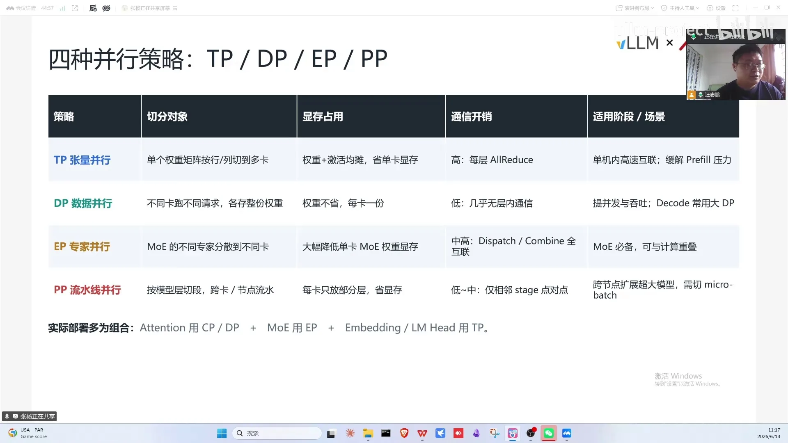 |
| 比如要求 100 条请求里 99 条可以达到多长时间收到响应，这个东西就是 P99。然后 P99 就是对于（最慢的）那些请求（的时延要求）。比如我们可能会关注某（类硬件）上的耗时，或者关注 TTFT 这一块的耗时。就这样。然后还有——为什么推理（要分两阶段）…… [【跳转到 08:32】](https://www.bilibili.com/video/BV1eoJJ6eEUv/?t=512) |  |
| 推理这一块为什么会分成 prefill 和 decode？原因就是因为它会存在 KV cache 的问题。这也是为什么之前很多同学会认为推理任务似乎比训练任务要简单很多。但实际上因为推理非常在乎用户体验，我们就需要衡量更多对用户感知上会关注的指标。这也是为什么我们要在吞吐和时延上面去做一些相应的取舍。 [【跳转到 08:57】](https://www.bilibili.com/video/BV1eoJJ6eEUv/?t=537) |  |
| 对。然后有同学问是不是因为自回归的基本属性——对，其实我觉得最核心还是在于：我们在做 decode 的时候，每个 token 是可以直接用前面的 KV cache 来进行计算的。 [【跳转到 09:12】](https://www.bilibili.com/video/BV1eoJJ6eEUv/?t=552) |  |
| 我们原本的话，计算长度——在 prefill 阶段——其实是跟序列长度平方成正比。 [【跳转到 09:37】](https://www.bilibili.com/video/BV1eoJJ6eEUv/?t=577) | 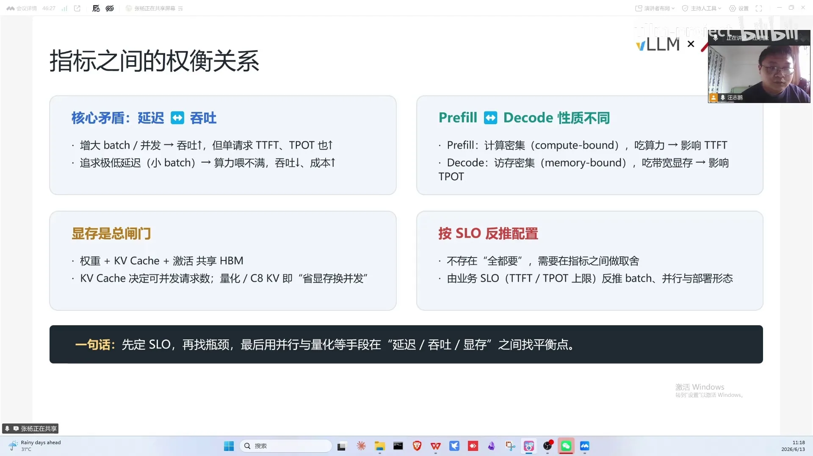 |
| 但是到了 decode 阶段，实际上只有 Q 是跟序列长度相关的。KV 的话只需要新 token 来进行计算，实际上跟序列长度只是正比的关系。它就会从计算密集型任务转变成一种访存密集型任务。这也是 prefill（和 decode）讲的（区别）。 [【跳转到 10:02】](https://www.bilibili.com/video/BV1eoJJ6eEUv/?t=602) |  |
| 好，我们可以继续了，张老师。——好，好。——刚刚我讲到这里有声音吗？是没有声音吗？ [【跳转到 10:27】](https://www.bilibili.com/video/BV1eoJJ6eEUv/?t=627) | 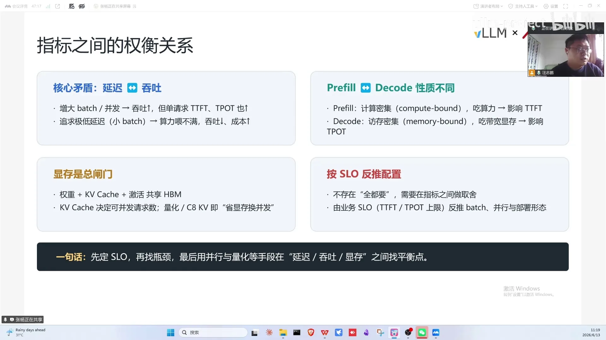 |
| 刚才是有声音的，主要是我们刚才说话好像听不到。——不好意思，没有确认问题。——刚刚是讲到 EP 并行了。主要是 EP 的数量就是 DP 乘以 TP，然后 EP（的 expert）是分散（部署）的…… [【跳转到 10:37】](https://www.bilibili.com/video/BV1eoJJ6eEUv/?t=637) |  |
| 然后分担到每张卡上，通过（通信），这样可以降低我们单卡的 MoE 部分（权重）的大小。 [【跳转到 11:02】](https://www.bilibili.com/video/BV1eoJJ6eEUv/?t=662) |  |
| 它主要就是通信的成本比较高：如果 TP 一加大，通信会占用比较久的时间。但是这些通信（开销）当前是可以跟我们的计算进行 overlap 的，可以隐藏掉这一部分开销。 [【跳转到 11:27】](https://www.bilibili.com/video/BV1eoJJ6eEUv/?t=687) | 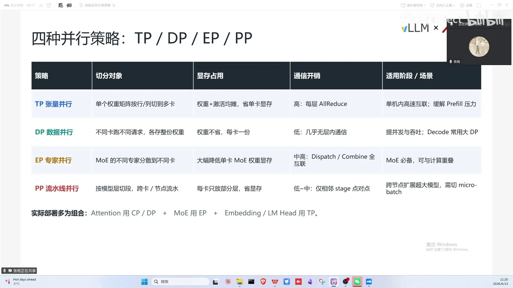 |
| 然后 PP 的话，PP 在 GLM 部署当中用到的不太多，但是在一些场景下还是能用到：它是按模型一层一层地进行切分，能在每张卡上放模型的一部分层，能够支持部署一些比较大的模型。 [【跳转到 11:52】](https://www.bilibili.com/video/BV1eoJJ6eEUv/?t=712) |  |
| 然后张老师你看有什么吗？——嗯，有声音有声音。——哎，我有个小问题：现在是不是用 PP 部署模型的情况非常少？原因是因为现在的显存都比较大，是吗？ [【跳转到 12:17】](https://www.bilibili.com/video/BV1eoJJ6eEUv/?t=737) |  |
| 对对，显存压力可能会比较大。比如我们在（大显存机器上）可能部署（就够用）……在 Atlas A3 的时候，用这种 PP 可能会比较好。但是我实际中没有怎么（用过），这些方面不敢做出评价。 [【跳转到 12:42】](https://www.bilibili.com/video/BV1eoJJ6eEUv/?t=762) |  |
| （接上） [【跳转到 13:07】](https://www.bilibili.com/video/BV1eoJJ6eEUv/?t=787) |  |
| 因为我个人感觉，PP 在训练里面全都是用来做跨机（部署）的，推理这一块基本上也都是为跨机（服务）的。因为如果你是单机的话，在 vLLM 里一般会把 TP 给开满，对吧。然后在 MoE 这个架构里面，如果你是跨机的话——我在 attention 这一块用 DP 加 TP 的组合…… [【跳转到 13:32】](https://www.bilibili.com/video/BV1eoJJ6eEUv/?t=812) |  |
| 然后 expert 这一块就直接（用）专家并行，对吧？因为专家并行实际上不涉及到（权重切分的）通信——只在进入专家和结束专家的时候，有 dispatch 和 combine 这两个通信，是吧？所以我们就完全没有必要去用 PP 了，可以直接使用 TP 加 DP 加 EP 来解决跨机的问题。 [【跳转到 13:57】](https://www.bilibili.com/video/BV1eoJJ6eEUv/?t=837) |  |
| 对，说是这种思路。我们现在比较多的还是 PD 分离这种形式的跨机：在一个节点上部署 P，然后另一个节点上部署 D。现在主要是这种形态非常常见。 [【跳转到 14:22】](https://www.bilibili.com/video/BV1eoJJ6eEUv/?t=862) |  |
| 然后有观众问：attention 用 CP，那么（整个）模型用 CP 在常见场景下有什么好处吗？就是……模型用 CP 有什么好处吗？ [【跳转到 14:47】](https://www.bilibili.com/video/BV1eoJJ6eEUv/?t=887) |  |
| CP 主要是面向超长序列的：它通过将（序列）切成多个（块），在超长序列场景下会比较有优势。因为 CP 其实也分所谓的 PCP 和 DCP，我们之前有一期直播是专门介绍 PCP 和 DCP 的…… [【跳转到 15:12】](https://www.bilibili.com/video/BV1eoJJ6eEUv/?t=912) |  |
| 然后我后面会把那一期直播搬运到这个官方频道上来，那一期讲这一块讲得非常非常详细。有兴趣的同学到时候可以看一下那一期直播的录像。 [【跳转到 15:37】](https://www.bilibili.com/video/BV1eoJJ6eEUv/?t=937) |  |
| 对，CP 先说一下：因为在（昇腾）vLLM 上面，现在 CP——DCP 和 PCP 可能还没有充分使用，因为前段时间还处于开发阶段。所以现在针对 GLM5 的 CP 可能主要是（还没用）PCP 的…… [【跳转到 16:02】](https://www.bilibili.com/video/BV1eoJJ6eEUv/?t=962) | 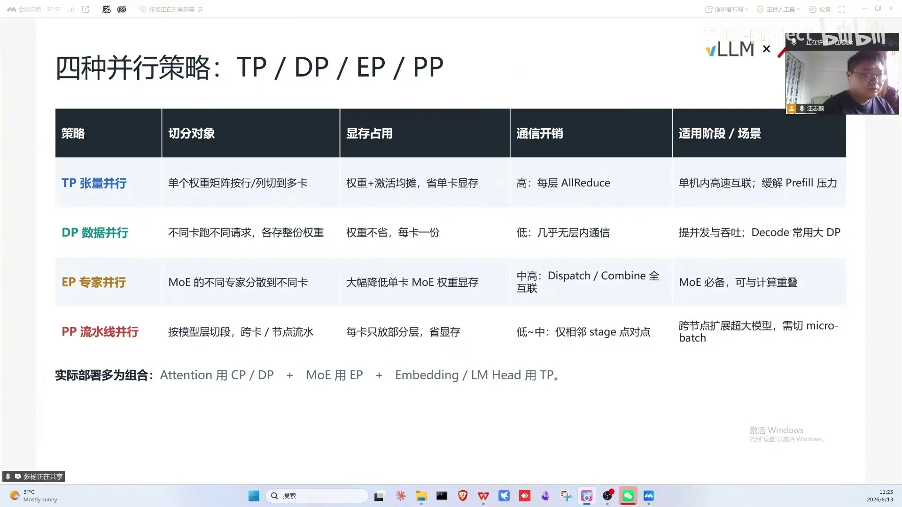 |
| 然后针对（当前支持）的一个 CP。之后 GLM 的部署也会等 PCP、DCP 开发完（成熟）之后再去使用。对，其实因为上一次直播的时候就专门讲过，DCP 其实更准确的应该叫做 KV CP，对吧？ [【跳转到 16:27】](https://www.bilibili.com/video/BV1eoJJ6eEUv/?t=987) |  |
| 对，它是直接 KV CP 的。是的。它其实跟 PCP 这块，两者并不是完全意义上的（一一）对应关系，两边优化的方式也是不同的。——对，我后面讲到优化用到 CP 的话，主要是面向（序列）切分的。 [【跳转到 16:52】](https://www.bilibili.com/video/BV1eoJJ6eEUv/?t=1012) |  |
| 好，那我们继续吧。 [【跳转到 17:17】](https://www.bilibili.com/video/BV1eoJJ6eEUv/?t=1037) |  |
| 有个同学问：这些并行方案的实现跟 GPU 有什么区别吗？——这里是不区分 GPU 或者（昇腾的）NPU 的。本质上这种并行切分都是一样的。对。 [【跳转到 17:26】](https://www.bilibili.com/video/BV1eoJJ6eEUv/?t=1046) | 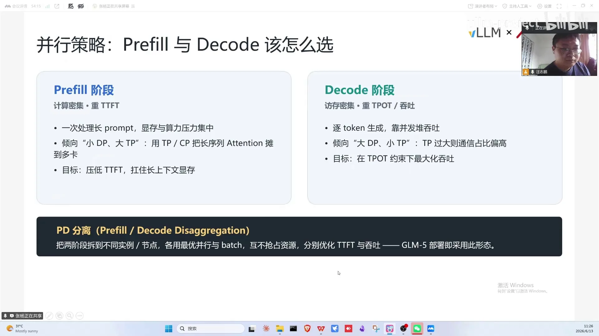 |
| （此区间无字幕） [【跳转到 17:47】](https://www.bilibili.com/video/BV1eoJJ6eEUv/?t=1067) |  |
| 然后我接下来继续讲。这里可能主要面向我们 PD（分离）的场景：就是 prefill 和 decode 的（部署）策略。 [【跳转到 17:53】](https://www.bilibili.com/video/BV1eoJJ6eEUv/?t=1073) |  |
| 我觉得怎么选？prefill 因为它是计算密集的，特别在高并发、长序列的情况下，计算压力会很大，还有显存压力——特别是 cache 命中率不高的情况下…… [【跳转到 18:18】](https://www.bilibili.com/video/BV1eoJJ6eEUv/?t=1098) |  |
| 我们部署就会倾向于选择 TP 数比较大的（配置），把长序列计算出来的 KV cache 分摊到多张卡上，缓解显存压力…… [【跳转到 18:43】](https://www.bilibili.com/video/BV1eoJJ6eEUv/?t=1123) |  |
| 然后针对 decode 的，因为它主要是访存（密集）为主，计算量比较小，显存压力也比较小…… [【跳转到 19:08】](https://www.bilibili.com/video/BV1eoJJ6eEUv/?t=1148) |  |
| 我们可以通过增大 DP 的数量、适当减小 TP 数量来部署，这样可以减小我们的 TPOT。 [【跳转到 19:33】](https://www.bilibili.com/video/BV1eoJJ6eEUv/?t=1173) |  |
| 我觉得有必要介绍一下什么叫 PD 分离吧。——是，PD 分离。常见的部署形态是 PD 混布：将 prefill 和 decode 在一个（实例）当中混合在一起…… [【跳转到 19:58】](https://www.bilibili.com/video/BV1eoJJ6eEUv/?t=1198) |  |
| 就是一个实例当中会（处理）各种请求，包括 prefill 的请求和 decode 的请求混合在一起。这样 PD 混布在一些小模型、（低负载）的情况下可能没有什么（问题）…… [【跳转到 20:23】](https://www.bilibili.com/video/BV1eoJJ6eEUv/?t=1223) |  |
| 但是在一些模型比较大的情况下，由于 prefill 和 decode 在同一个实例，而 vLLM 现在是优先 prefill，prefill 时间会比较久…… [【跳转到 20:48】](https://www.bilibili.com/video/BV1eoJJ6eEUv/?t=1248) |  |
| 那时候 decode 就会存在等待 prefill 的情况，会对 decode 的时延——就是 TPOT——造成较大的影响。通过 PD 分离，我们可以将 prefill 和 decode 在两个阶段分开…… [【跳转到 21:13】](https://www.bilibili.com/video/BV1eoJJ6eEUv/?t=1273) | 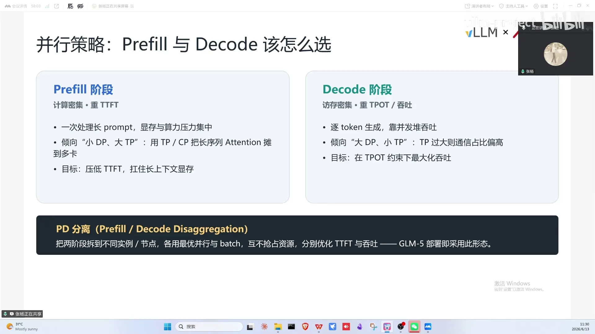 |
| 就是我们可以在一个（节点）上只让它做 prefill 推理，然后在另外一个（节点）上让它做 decode。这样 prefill 和 decode 的时间是相互不影响的，也会更加灵活…… [【跳转到 21:38】](https://www.bilibili.com/video/BV1eoJJ6eEUv/?t=1298) |  |
| 比如我们 prefill 的性能——TTFT——不太好，我们可以增加 prefill 的算力资源去缓解 prefill 的压力，decode 就不用动。这样会更加灵活…… [【跳转到 22:03】](https://www.bilibili.com/video/BV1eoJJ6eEUv/?t=1323) |  |
| 这是 PD 混布做不到的。然后刚才问并行方案跟 GPU（区别）的同学问：通信上会不会不一样，就是不同厂商的卡。——对对对，并行会涉及到一些通信算子：all-reduce、all-gather、all-to-all 这些通信算子。 [【跳转到 22:28】](https://www.bilibili.com/video/BV1eoJJ6eEUv/?t=1348) |  |
| （此区间无字幕） [【跳转到 22:53】](https://www.bilibili.com/video/BV1eoJJ6eEUv/?t=1373) | 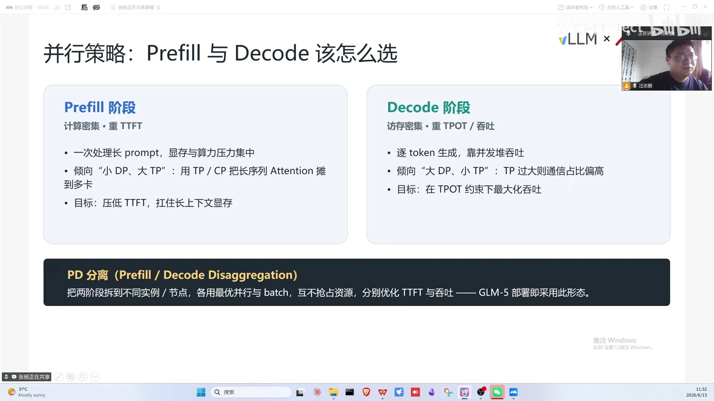 |
| 这些通信算子在不同的硬件设备上实现逻辑是不一样的：底层的算子——比如 GPU 上可能是（CUDA）实现的通信算子；在 NPU 上，通信算子就是我们（昇腾）实现的通信算子。对。 [【跳转到 22:58】](https://www.bilibili.com/video/BV1eoJJ6eEUv/?t=1378) |  |
| 但是我理解它表现的行为也是一样的：只是算子不一样，本质上是一样的。——因为你 all-reduce 做的还是 all-reduce 该做的，对吧？——是的，是的，都是一样的。 [【跳转到 23:23】](https://www.bilibili.com/video/BV1eoJJ6eEUv/?t=1403) |  |
| 对，行为应该是一样的？——对，就是说算子实现不一样，因为两套不同的硬件嘛。 [【跳转到 23:48】](https://www.bilibili.com/video/BV1eoJJ6eEUv/?t=1428) | 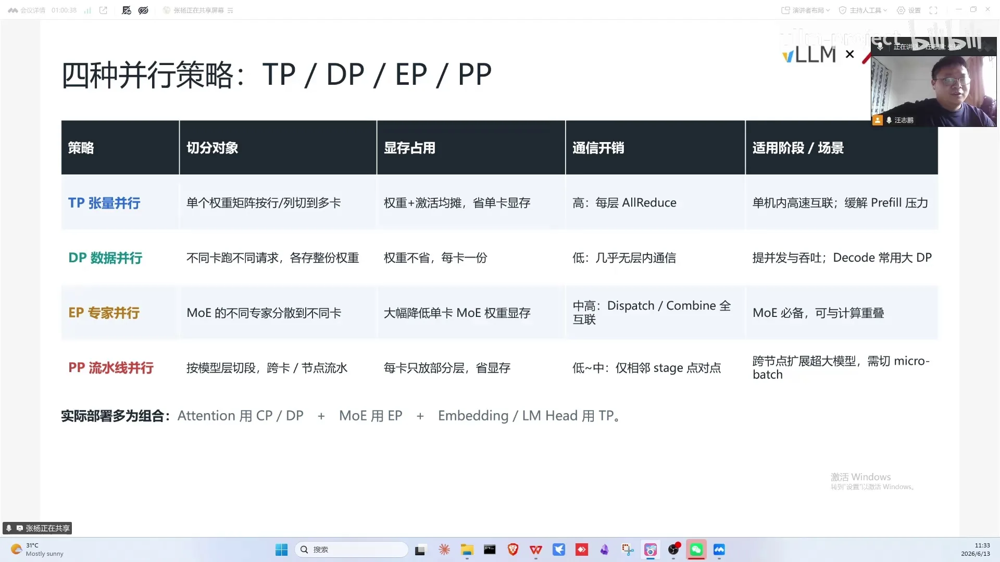 |
| 然后关于 GLM5 用华为卡部署的我们等一会儿再讲，等一会儿会有（专门的）内容，到时候还有问题的话我们会集中去回答。好，然后张老师请继续。——好，那我接着讲。 [【跳转到 24:00】](https://www.bilibili.com/video/BV1eoJJ6eEUv/?t=1440) |  |
| 然后我简单介绍一下我们怎么去优化一个模型的性能，可以从哪几个部分走整个流程。我们拿到一个模型，首先会去分析这个模型的结构：比如这个模型支持的上下文长度、MoE 的结构（参数），以及这个模型比较适用于哪些场景。然后我们会针对它比较适用的场景…… [【跳转到 24:18】](https://www.bilibili.com/video/BV1eoJJ6eEUv/?t=1458) |  |
| 去制定一些优化的目标。后面优化主要就是针对这些制定的目标去完成。做优化首先会先跑（通）模型，简单地说…… [【跳转到 24:43】](https://www.bilibili.com/video/BV1eoJJ6eEUv/?t=1483) | 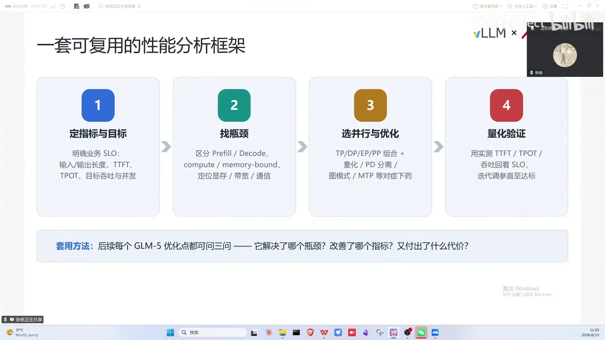 |
| （此区间无字幕） [【跳转到 25:08】](https://www.bilibili.com/video/BV1eoJJ6eEUv/?t=1508) |  |
| 我们先看一下它的现状，与我们的目标有所差距。然后再通过 profiling 的形式——因为一开始可能比目标还有一定差距——我们要针对性地找到有哪些瓶颈导致了这些差距。 [【跳转到 25:33】](https://www.bilibili.com/video/BV1eoJJ6eEUv/?t=1533) |  |
| 可以通过现有的现状，采取 profiling，分析（耗时分布），再看这些到底是哪部分的瓶颈导致的差距。 [【跳转到 25:58】](https://www.bilibili.com/video/BV1eoJJ6eEUv/?t=1558) |  |
| 然后针对这些瓶颈找到针对性的优化点：比如调整我们的（并行）切分点，针对模型结构找到比较适配的加速（特性），或者通过一些融合算子…… [【跳转到 26:23】](https://www.bilibili.com/video/BV1eoJJ6eEUv/?t=1583) |  |
| 还有一些优化算子的策略去加速。完成这些优化之后，就可以去做验证。 [【跳转到 26:48】](https://www.bilibili.com/video/BV1eoJJ6eEUv/?t=1608) |  |
| 这些性能在（算子）适配的时候基本上都会去做验证。比较重要的一点是去做精度的验证：因为接入这些特性算子可能会存在精度问题，所以要保证精度。 [【跳转到 27:13】](https://www.bilibili.com/video/BV1eoJJ6eEUv/?t=1633) |  |
| （此区间无字幕） [【跳转到 27:38】](https://www.bilibili.com/video/BV1eoJJ6eEUv/?t=1658) |  |
| 适配完之后，呈现精度是最重要的。要先保证精度，然后再去（优化性能）。 [【跳转到 27:43】](https://www.bilibili.com/video/BV1eoJJ6eEUv/?t=1663) | 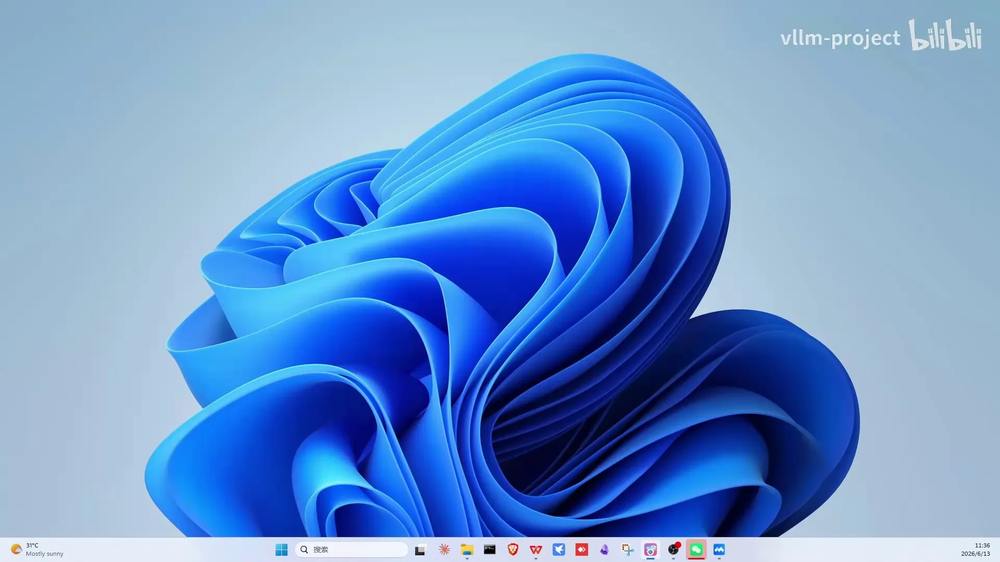 |
| 有同学问：算子开（某些）custom ops 有用吗？还是得根据业务自己写？——有用的。现在默认的都是（官方的）custom ops，里面会有一些（配套）算子，开启后会有加速。 [【跳转到 27:48】](https://www.bilibili.com/video/BV1eoJJ6eEUv/?t=1668) |  |
| 这个东西基本上就是用（现成的）：（社区）现在基本也是看一些开源的，或者找一些（有能力的伙伴）帮我们做算子上的支持。 [【跳转到 28:13】](https://www.bilibili.com/video/BV1eoJJ6eEUv/?t=1693) |  |
| 大多数情况下用这些算子就已经足够了。然后"一般加多少"是什么意思？ [【跳转到 28:38】](https://www.bilibili.com/video/BV1eoJJ6eEUv/?t=1718) | 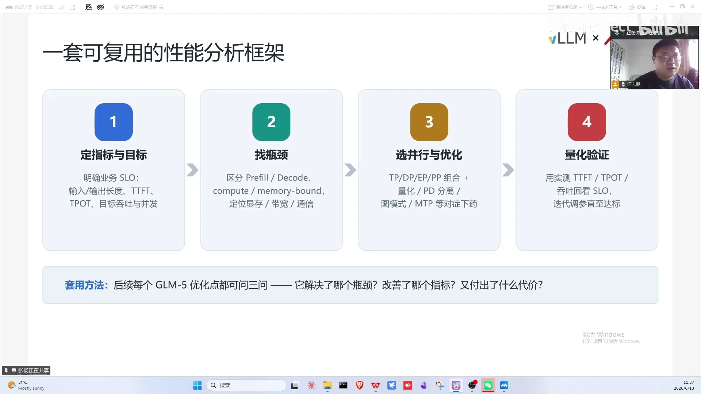 |
| 直播间一个同学问：算子（选项）下面的一般加多少。它应该指的是加速的效果。加速效果跟实际的一些（模型/配置）是有关系的。 [【跳转到 29:03】](https://www.bilibili.com/video/BV1eoJJ6eEUv/?t=1743) | 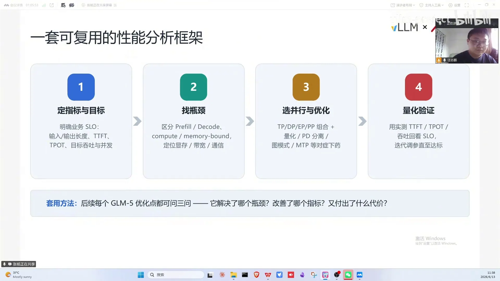 |
| 这个算子实际上怎么触发，就是 kernel 跟你的矩阵形状有关系：矩阵形状不同的话，可能就会直接路由到不同的 kernel 上去了。——对对，现在算子针对不同的 shape，优化程度也不一样。 [【跳转到 29:28】](https://www.bilibili.com/video/BV1eoJJ6eEUv/?t=1768) | 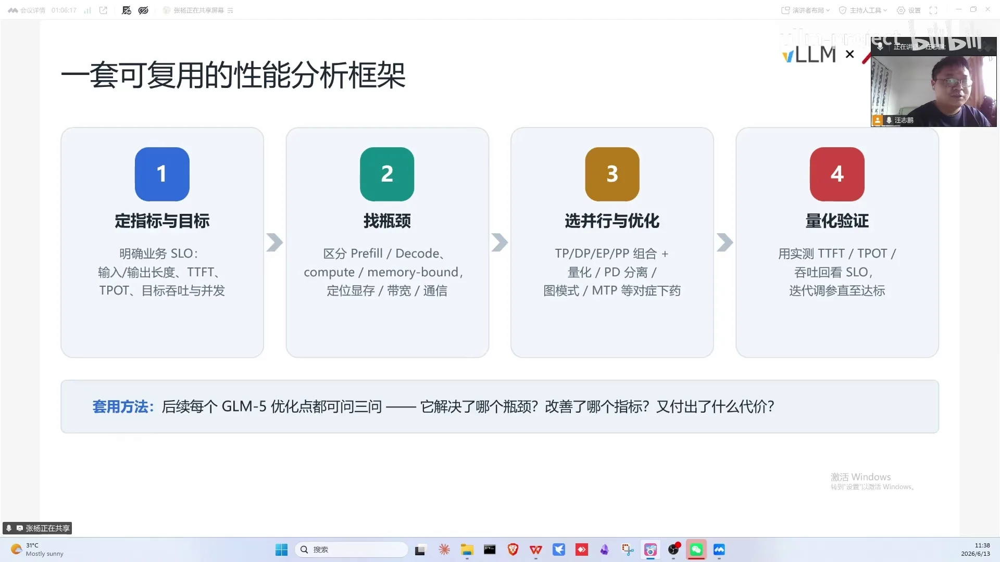 |
| 包括像这些（选项），一般来讲开它是有优化的，但具体优化多少，需要根据你自己的场景试一下，看能优化多少。——是的。有些算子（收益）可能越大，对对对。 [【跳转到 29:53】](https://www.bilibili.com/video/BV1eoJJ6eEUv/?t=1793) |  |
| 对，而且我觉得其实可以针对（部署）做一些特定的并行（策略）和优化。这东西对你的 TTFT 的影响可能会甚至比算子还大一些。 [【跳转到 30:18】](https://www.bilibili.com/video/BV1eoJJ6eEUv/?t=1818) |  |
| 然后我们继续吧。讲完这个之后，首先我会介绍 GLM5 在（昇腾）上有一个整个部署的流程。我先简单讲一下，会对着我们 vLLM 社区上的一个文档来讲。大家有兴趣也可以去翻一翻。 [【跳转到 30:43】](https://www.bilibili.com/video/BV1eoJJ6eEUv/?t=1843) |  |
| （此区间无字幕） [【跳转到 30:54】](https://www.bilibili.com/video/BV1eoJJ6eEUv/?t=1854) | 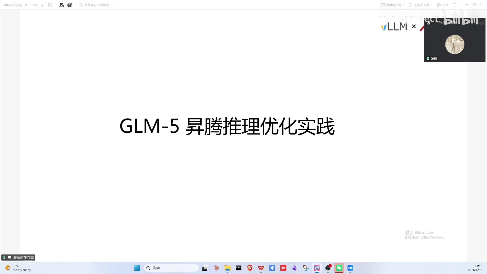 |
| （此区间无字幕） [【跳转到 30:59】](https://www.bilibili.com/video/BV1eoJJ6eEUv/?t=1859) | 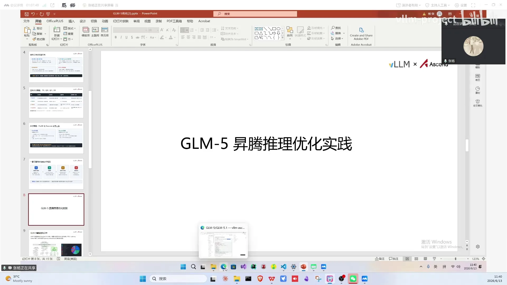 |
| 这个文档是针对 GLM5 的部署的，包括 GLM5.1——因为它们结构是一样的，所以不做区分。 [【跳转到 31:04】](https://www.bilibili.com/video/BV1eoJJ6eEUv/?t=1864) | 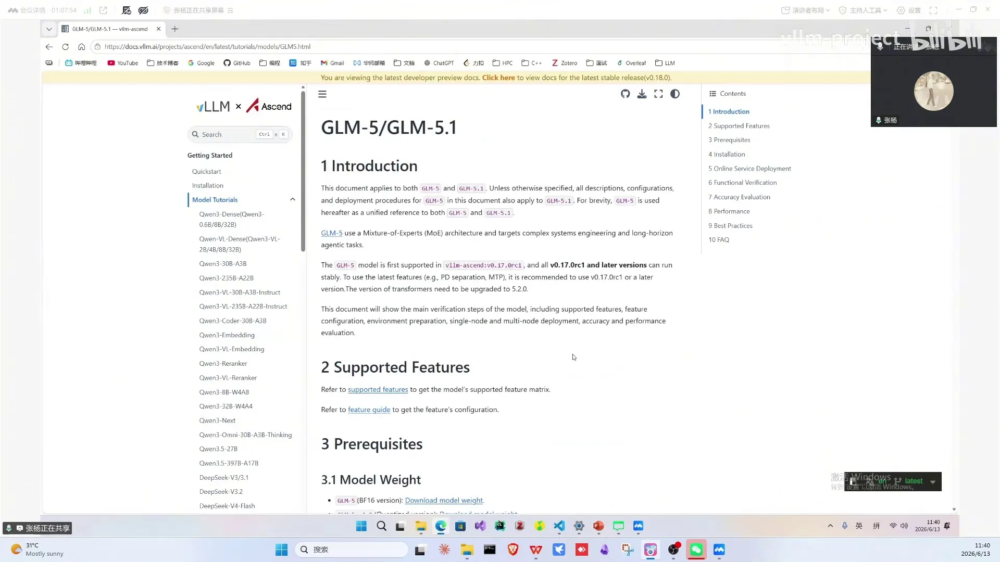 |
| 首先就是权重获取。当前 GLM5 在（昇腾）上有三种（精度）形态：一个是（BF16）原始精度，比较（常用）；还有 W4A8 的（量化）、W8A8 的（量化）。这几种都是支持的。具体选择哪种量化方式：W8A8 在资源比较（充足）的情况下——因为现在的（芯片）对 W8A8 的支持会更好…… [【跳转到 31:29】](https://www.bilibili.com/video/BV1eoJJ6eEUv/?t=1889) | 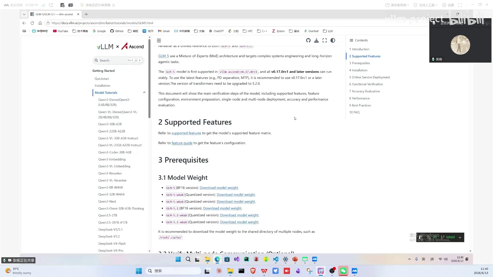 |
| 所以资源比较充足、显存压力不大的情况下，选用 W8A8 会更好。W4A8 在资源比较（紧张）的情况——这可能就是 Atlas A3 单机（放不下 BF16 的情况）。选 W8A8 可能面临的显存压力也比较大。 [【跳转到 31:54】](https://www.bilibili.com/video/BV1eoJJ6eEUv/?t=1914) |  |
| 所以我们可以选用 W4A8 的这种部署形态。说完权重获取——这些权重都可以在 ModelScope（魔搭）上面下载到。 [【跳转到 32:19】](https://www.bilibili.com/video/BV1eoJJ6eEUv/?t=1939) | 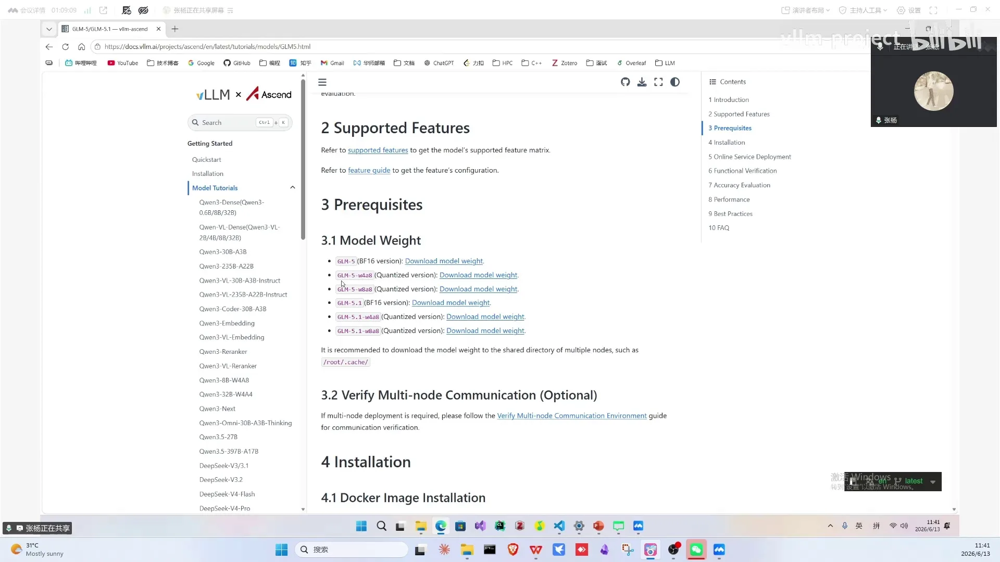 |
| 然后说一下 vLLM（昇腾）的安装。这里比较推荐直接获取我们发布的镜像。因为要在裸机上自己安装的话，需要安装较多的依赖，包括 CANN、驱动，安装起来会比较复杂。 [【跳转到 32:44】](https://www.bilibili.com/video/BV1eoJJ6eEUv/?t=1964) | 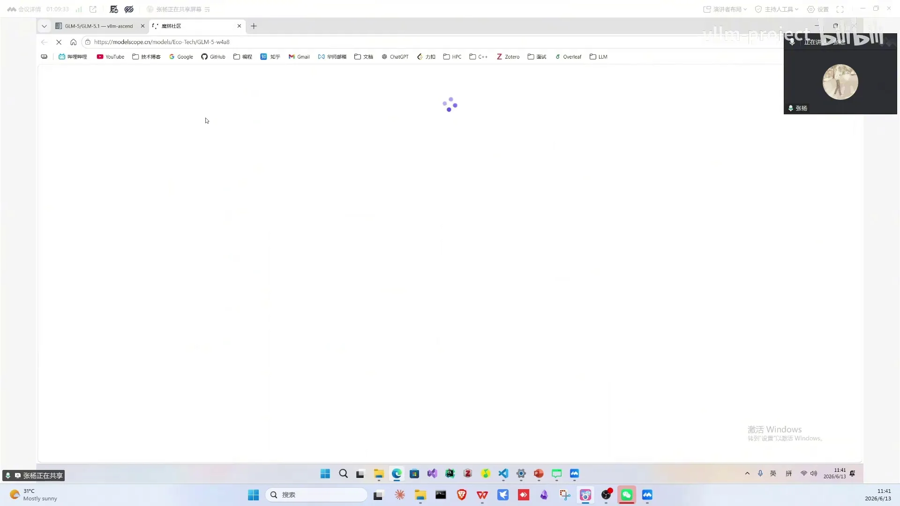 |
| 我们可以直接用这里发布的镜像。每个版本都会有对应的镜像，包括每日的构建镜像，可以根据自己的需求获取。 [【跳转到 33:09】](https://www.bilibili.com/video/BV1eoJJ6eEUv/?t=1989) | 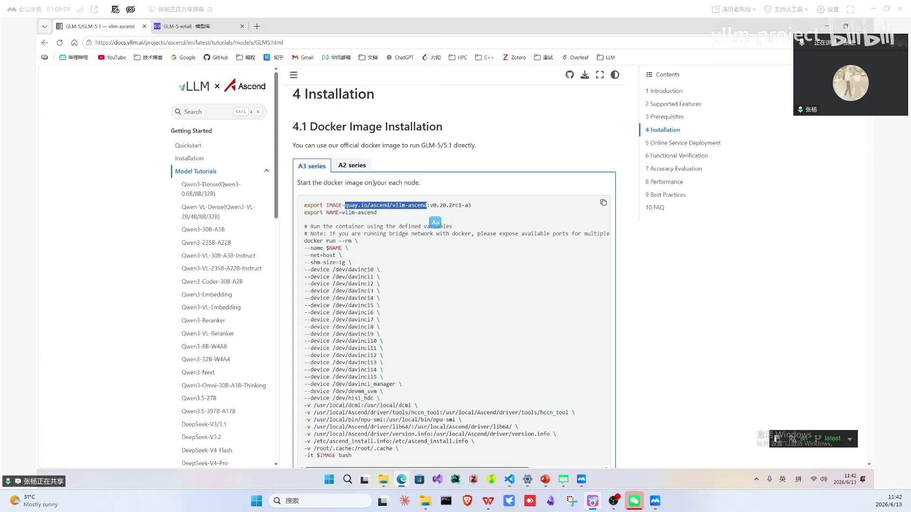 |
| （此区间无字幕） [【跳转到 33:30】](https://www.bilibili.com/video/BV1eoJJ6eEUv/?t=2010) | 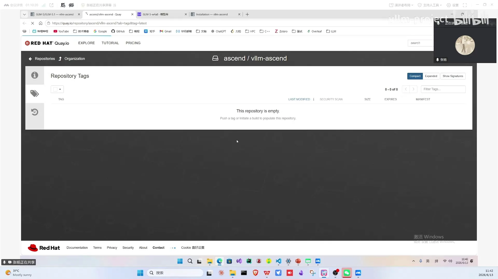 |
| 下面就主要讲一下 GLM5 的几种典型部署形态。首先是单机 PD 混布的一个部署形态。 [【跳转到 33:35】](https://www.bilibili.com/video/BV1eoJJ6eEUv/?t=2015) | 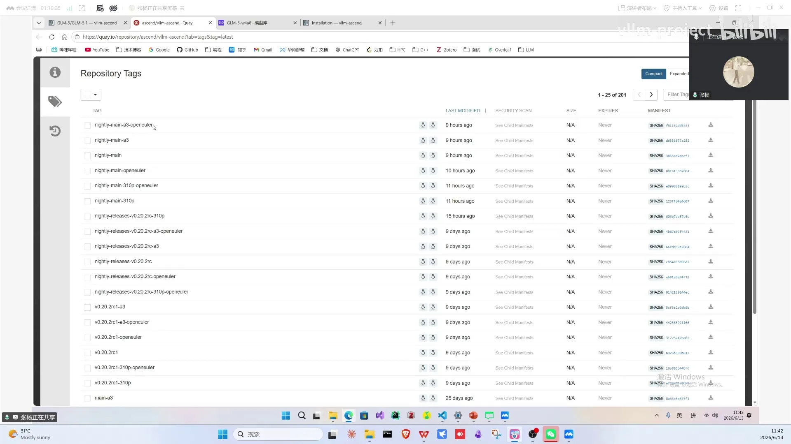 |
| 这里的单机，比如 A3 的话，它就是（8 卡）的形态，总共显存大小是 1024G。对，这里会比较推荐我们用 W8A8 的权重。 [【跳转到 34:00】](https://www.bilibili.com/video/BV1eoJJ6eEUv/?t=2040) | 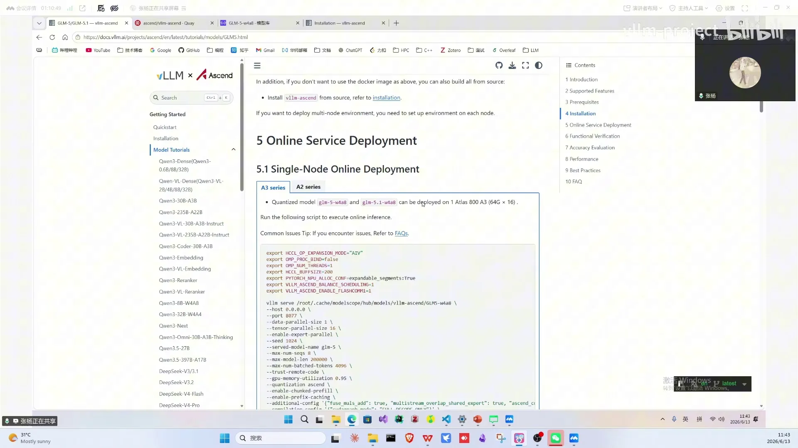 |
| 因为 W8A8 在单机上就可以做到 GLM 最大的一个 200K（上下文）的部署。如果用 BF16 的话，可能就比较勉强了，达不到 200K 的（上下文）。因为 BF16 的权重比较大，在显存比较少的（机器）上是不推荐的。 [【跳转到 34:25】](https://www.bilibili.com/video/BV1eoJJ6eEUv/?t=2065) | 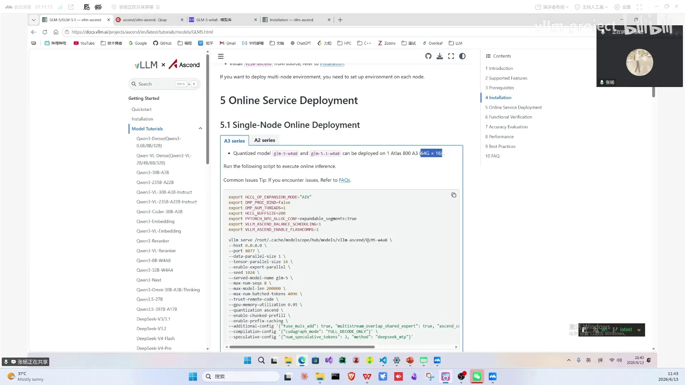 |
| 包括 A2 的部署也是可以的。A2 与 A3 简单区别就是它们的显存大小不一样：A2 跟 A3 比显存会少一半。 [【跳转到 34:50】](https://www.bilibili.com/video/BV1eoJJ6eEUv/?t=2090) | 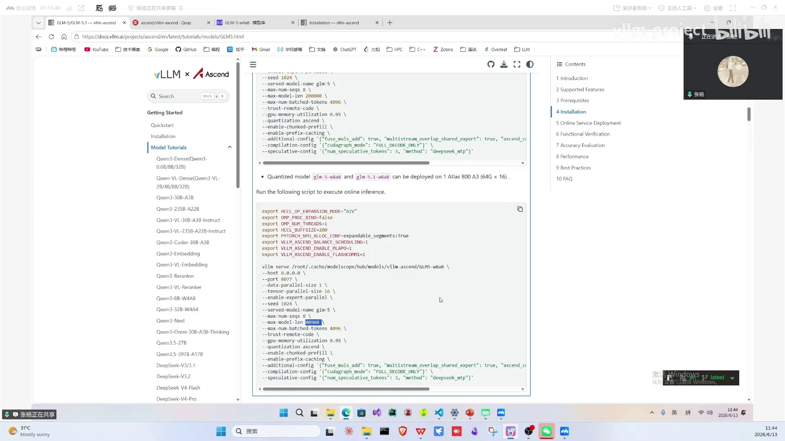 |
| 这里就可能要涉及到一些并行策略的调整：DP、TP 要去做相应调整。但是这些特性叠加、算子方面都是没什么区别的。包括下面还有多节点的 PD 混布部署。这里举的例子是双机 PD 混布，就是在（华为云）的 Atlas A3 上…… [【跳转到 35:15】](https://www.bilibili.com/video/BV1eoJJ6eEUv/?t=2115) | 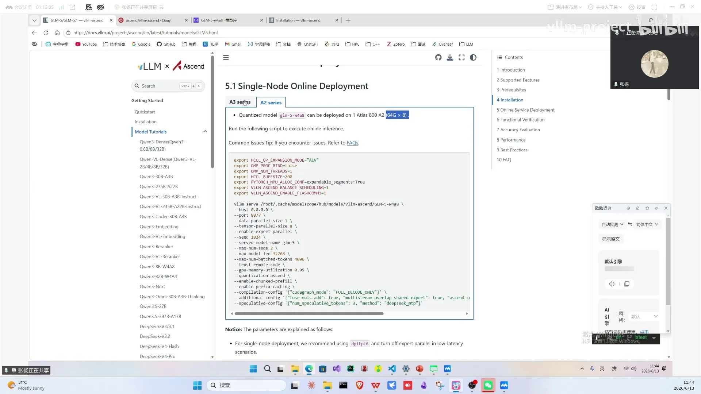 |
| 去部署我们 PD 混布的形态、部署我们的模型。包括下面的还有 PD 分离的一个部署形态。 [【跳转到 35:40】](https://www.bilibili.com/video/BV1eoJJ6eEUv/?t=2140) | 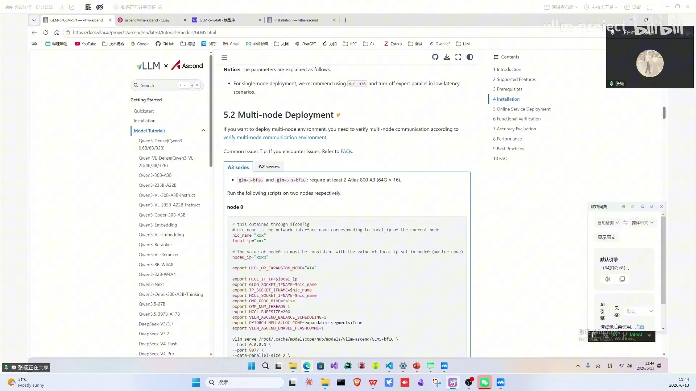 |
| 这也是我们现在在资源比较充足的情况下最推荐使用的一种方式。这种方式部署起来会比较麻烦一点，因为步骤会比较多，但是性能也会相对比较好。 [【跳转到 36:05】](https://www.bilibili.com/video/BV1eoJJ6eEUv/?t=2165) | 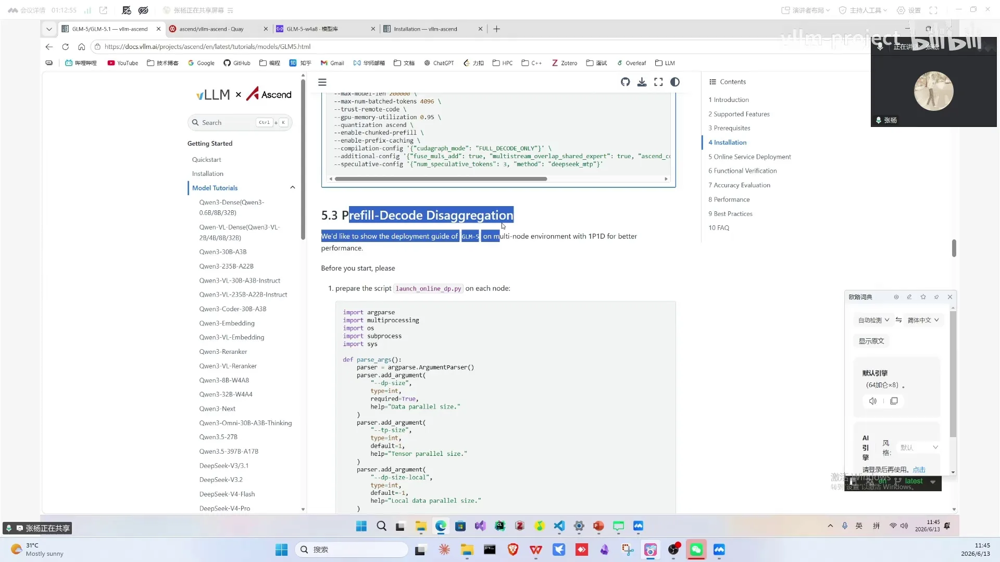 |
| 这里首先就要准备一个启动的脚本。它会有一个脚本：针对 prefill 和 decode 有不同的配置。现在 prefill 和 decode 在某些特性（开关）上是有些区别的。 [【跳转到 36:30】](https://www.bilibili.com/video/BV1eoJJ6eEUv/?t=2190) | 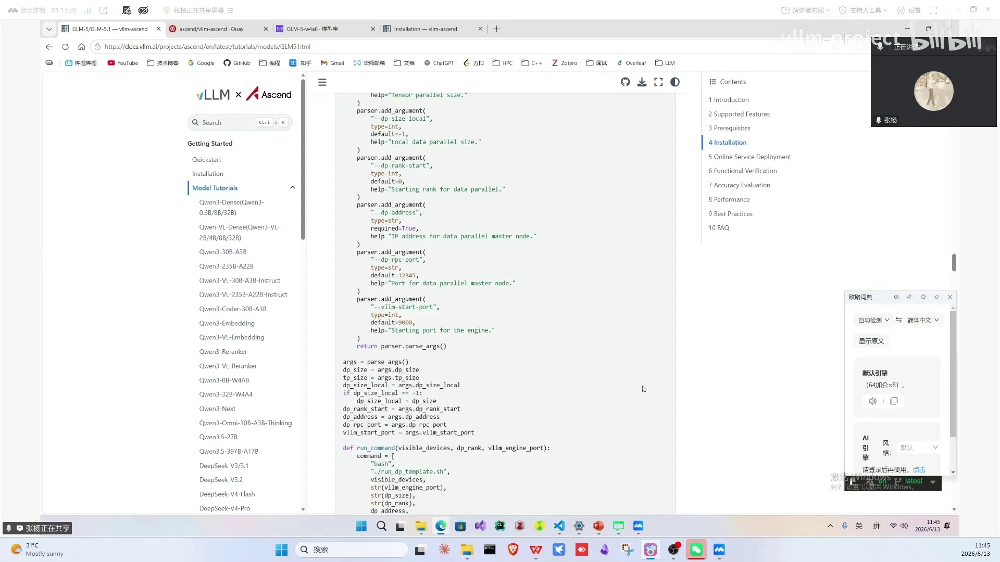 |
| 比如 prefill 我们会去开启它的 DP，还有一些算子。decode 开启的算子就会有很多配置，因为它面对的场景不一样，算子在实际部署当中也会有些区别。 [【跳转到 36:55】](https://www.bilibili.com/video/BV1eoJJ6eEUv/?t=2215) | 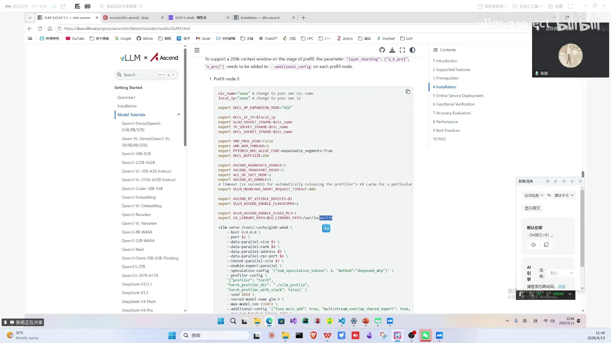 |
| 这里针对每个节点会给一套具体的配置。这里总共有六个节点：P 有两个节点，就是两台 A3；D 有四个节点。 [【跳转到 37:20】](https://www.bilibili.com/video/BV1eoJJ6eEUv/?t=2240) | 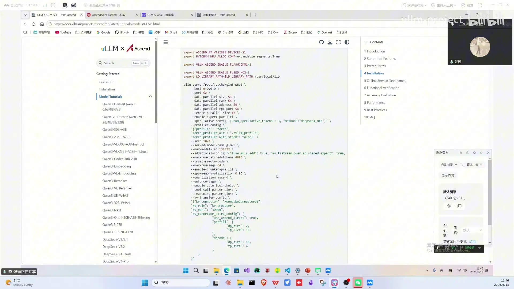 |
| 做完这些配置后，可以在每个节点上启动我们的服务。然后通过一个（主）节点将各个节点做一个连接，它最后会提供端口，我们就可以提供这样的服务。 [【跳转到 37:45】](https://www.bilibili.com/video/BV1eoJJ6eEUv/?t=2265) | 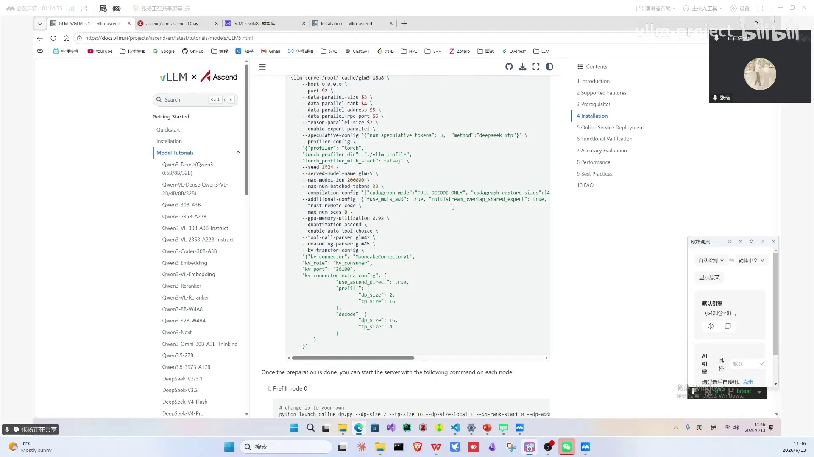 |
| 我想说：我看好多地方做 PD 分离都是 P2、然后 D4。这个组合是确定的、是最佳的吗？——不是，要根据具体的场景。P2、D4 可能针对（某些）场景……首先我们的…… [【跳转到 38:10】](https://www.bilibili.com/video/BV1eoJJ6eEUv/?t=2290) | 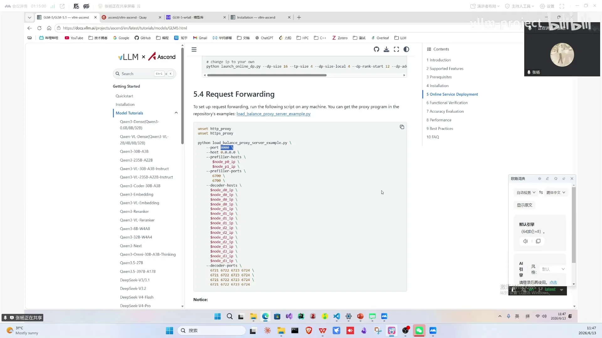 |
| 面向我们的场景：比如 64K，然后 cache 命中率比较高——比如你达到 80%、90%——那 prefill 的压力比较小，我们可以适当减小 prefill 的资源。为了打高吞吐，我们可以给 decode 多分配资源。这样的话…… [【跳转到 38:35】](https://www.bilibili.com/video/BV1eoJJ6eEUv/?t=2315) | 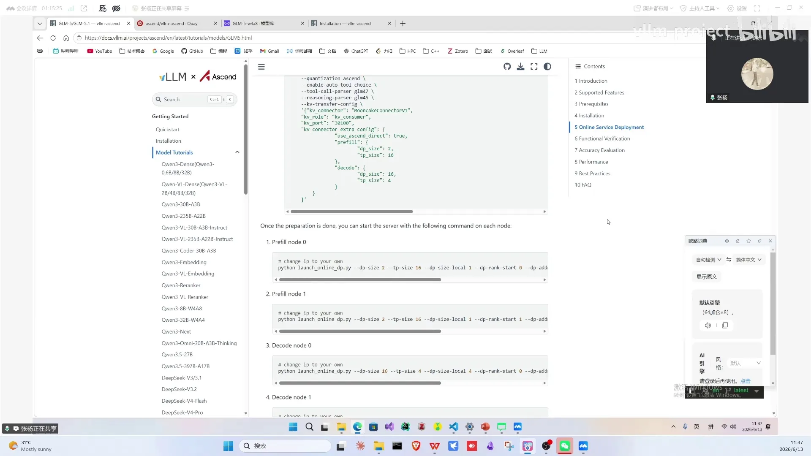 |
| 在 cache 命中率比较高的情况下，我们可以做到比较好的吞吐。——然后我再问一下：P2、D4 和两个 P1、D2 有什么区别？——两个 P1 的话，它的显存压力比较大…… [【跳转到 39:00】](https://www.bilibili.com/video/BV1eoJJ6eEUv/?t=2340) | 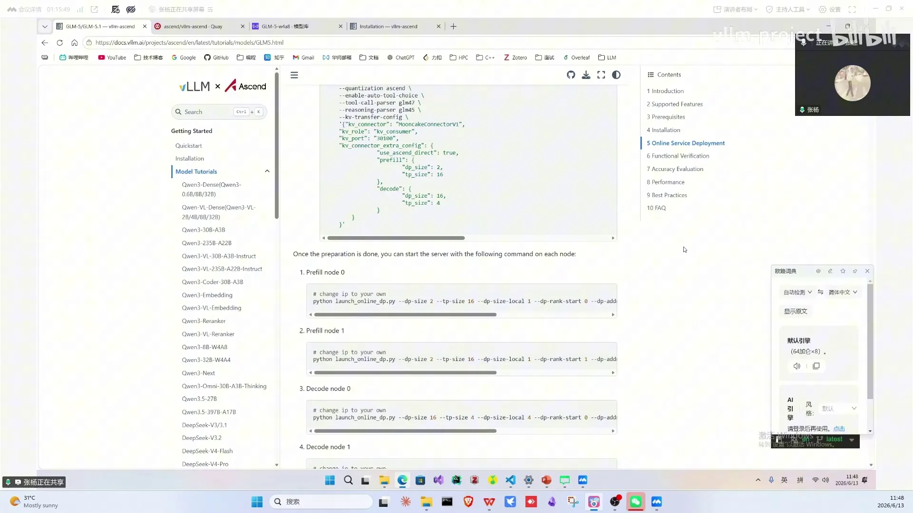 |
| 因为两个 P1 的话，每个 P 上都要存完整的权重，包括 MoE 的（不能切的）权重，全部都要放在一个节点上，所以压力比较大。——哦——所以 P2 其实指的就是一个模型切分部署在两个 node 上面，不是说部署两个 P 副本，对。——对，对，对。 [【跳转到 39:25】](https://www.bilibili.com/video/BV1eoJJ6eEUv/?t=2365) | 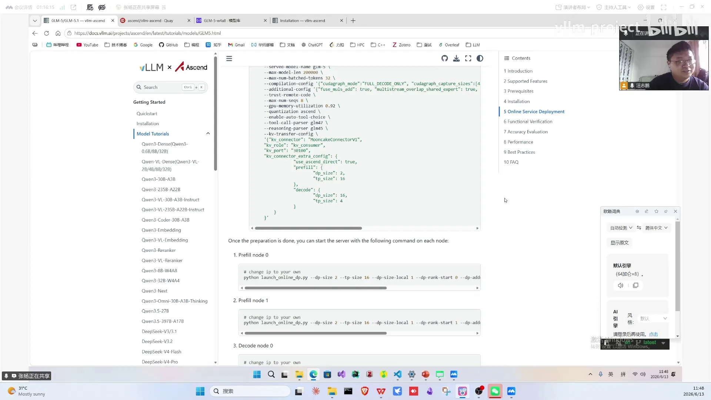 |
| 那 D4 的意思也就是说，我是把一个模型部署在四个 node 上面，对吗？——对，对。 [【跳转到 39:50】](https://www.bilibili.com/video/BV1eoJJ6eEUv/?t=2390) |  |
| 当然也可以：比如 D 有四个节点，我们可以将 D 分成两个实例，每个实例就是两个（节点），每个实例就像一个 DP 副本，它都有一个完整权重。也可以有这种部署。包括 P 也是：P 有四个节点，也可以分成两个 P（实例），每个 P 都有一个完整的权重。 [【跳转到 40:15】](https://www.bilibili.com/video/BV1eoJJ6eEUv/?t=2415) | 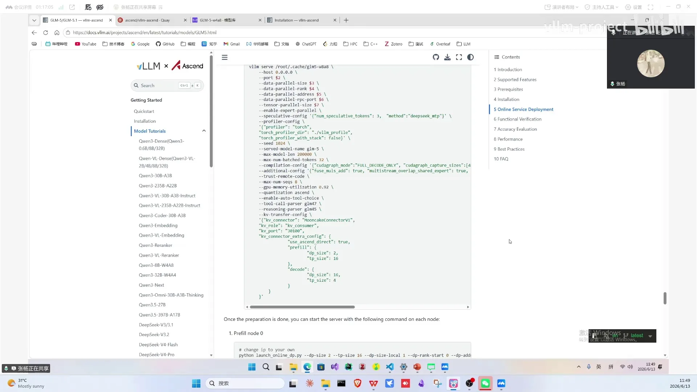 |
| 哦 OK，学到了学到了。好，请继续吧。——对，前面讲了一下 GLM 在生产部署的一个流程…… [【跳转到 40:40】](https://www.bilibili.com/video/BV1eoJJ6eEUv/?t=2440) | 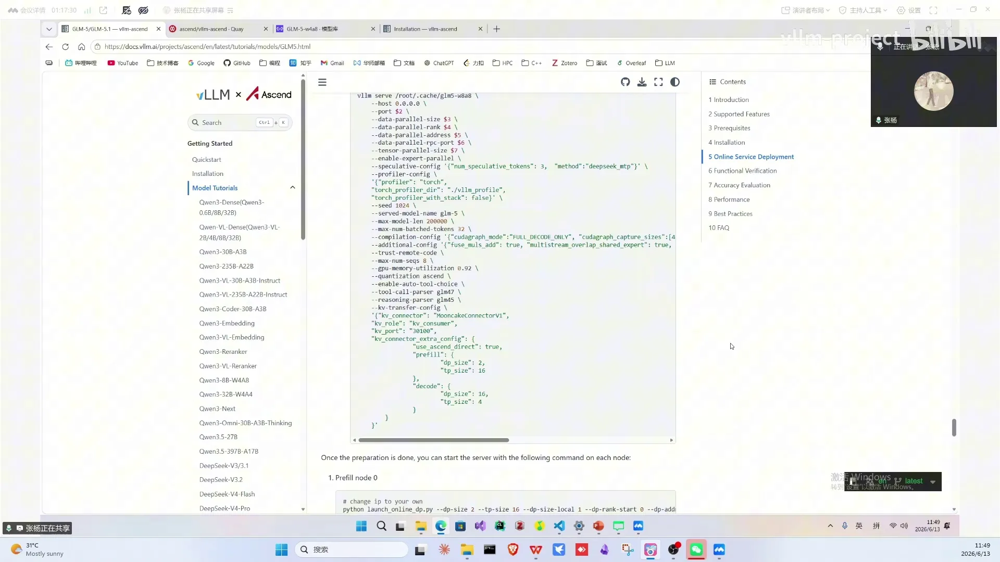 |
| 接下来我会介绍 GLM 在生产上性能优化的一个实际实践过程。首先我们看一下 GLM 的模型结构。GLM 模型它的整体结构跟 DeepSeek V3 是比较类似的…… [【跳转到 40:55】](https://www.bilibili.com/video/BV1eoJJ6eEUv/?t=2455) | 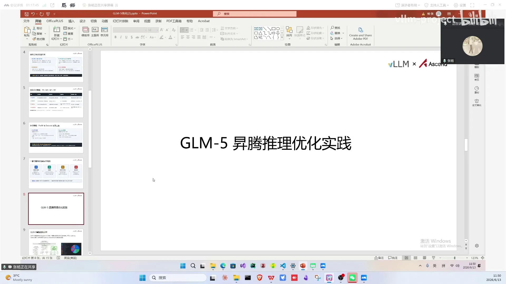 |
| （此区间无字幕） [【跳转到 41:19】](https://www.bilibili.com/video/BV1eoJJ6eEUv/?t=2479) |  |
| 它的一个核心特点就是采用了一个 DSA 的（稀疏注意力）结构，然后引入了 LightIndexer 这个模块。主要特点呢也是这个 LightIndexer…… [【跳转到 41:24】](https://www.bilibili.com/video/BV1eoJJ6eEUv/?t=2484) |  |
| 它帮助模型在长上下文场景下做更高效的检索和 token 的筛选，减少注意力的计算量。但是由于 LightIndexer 引入的（开销）——在这种长上下文下，如果序列比较长，它的耗时会成为数量级的一个增加…… [【跳转到 41:49】](https://www.bilibili.com/video/BV1eoJJ6eEUv/?t=2509) |  |
| 所以可以看到在这种长上下文、比如 128K 这种特别长的情况下，这些（算子）会成为主要的瓶颈。可以看到右下角这张图：这是我们采集的各个算子在整网中的耗时占比…… [【跳转到 42:14】](https://www.bilibili.com/video/BV1eoJJ6eEUv/?t=2534) |  |
| 看到 128K 的情况下，这个算子有一个整网占比超过 25%，这已经非常高了。而且这已经是经过每 8K（做一次）量化的优化过的情况下。如果不做这种（每 8K 量化）优化的话…… [【跳转到 42:39】](https://www.bilibili.com/video/BV1eoJJ6eEUv/?t=2559) | 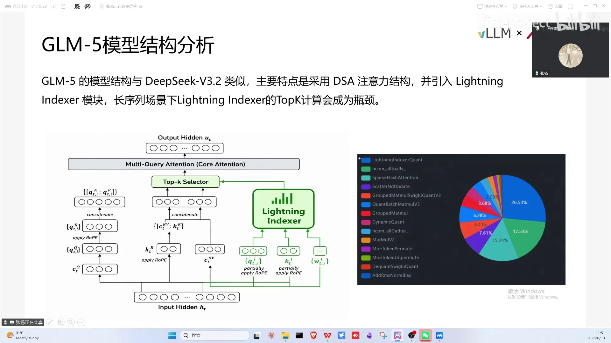 |
| 这个 light indexer 算子的占比会达到比较夸张的 50%-60%。所以这个算子的整个瓶颈都非常大。后续讲的这些并行切分以及算子的优化，也主要会针对优化这个结构来展开。 [【跳转到 43:04】](https://www.bilibili.com/video/BV1eoJJ6eEUv/?t=2584) |  |
| 接下来讲一下我们这里的一个（部署）切分，主要是面向 PD 分离的。 [【跳转到 43:29】](https://www.bilibili.com/video/BV1eoJJ6eEUv/?t=2609) |  |
| 首先讲一下 prefill 的（部署）切分。因为 PD 分离前面讲过会比较灵活，可以针对性地对 prefill 和 decode 做优化。比如我们发现 TTFT 比较大，可以通过给 P 节点增加算力资源的方式去缓解这种现象。 [【跳转到 43:39】](https://www.bilibili.com/video/BV1eoJJ6eEUv/?t=2619) | 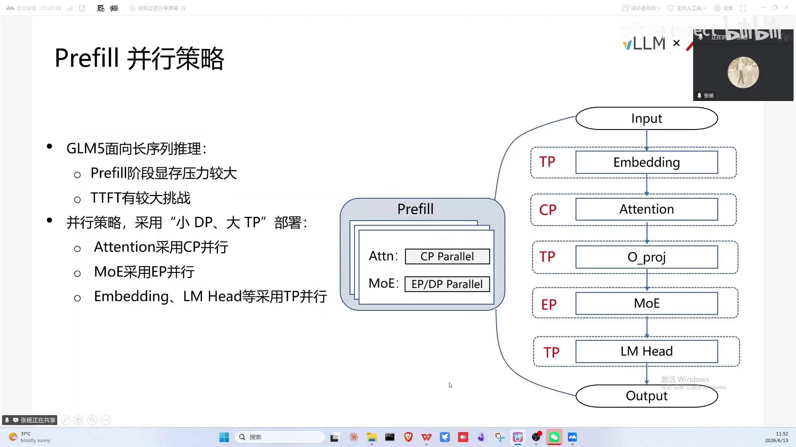 |
| 在资源充足的情况下，我们会更推荐用 PD 分离去部署 GLM。接下来我就讲一下…… [【跳转到 44:04】](https://www.bilibili.com/video/BV1eoJJ6eEUv/?t=2644) | 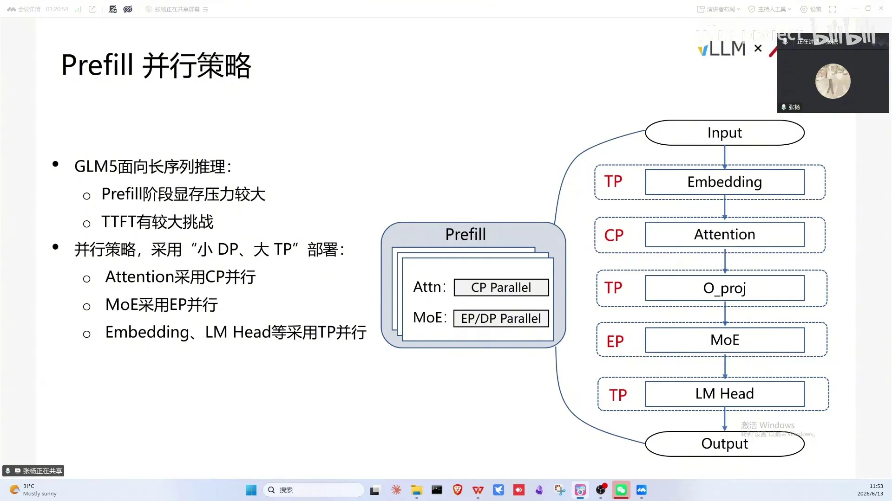 |
| GLM 面向长序列场景的时候，prefill 这边需要一次性输入大量的输入 token。因为 GLM 主要是面向长序列场景的，在一些（长文本）场景会比较有优势。这些场景输入会比较长。当一次性输入大量 token 的时候，显存的压力就会比较大…… [【跳转到 44:29】](https://www.bilibili.com/video/BV1eoJJ6eEUv/?t=2669) | 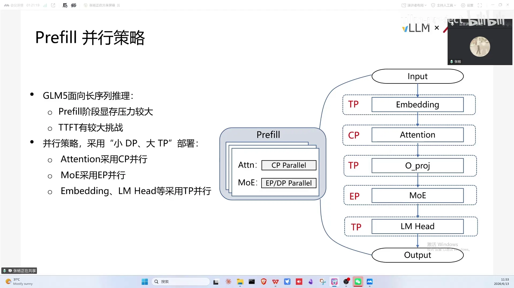 |
| 然后 TTFT 也会面临比较大的挑战。针对这个特点，prefill 这边更适合采用这种小 DP、大 TP 的部署方式：可以减少 DP 副本的数量，增加单个请求内部（计算）的数据规模。 [【跳转到 44:54】](https://www.bilibili.com/video/BV1eoJJ6eEUv/?t=2694) |  |
| 具体来看我们在各个模块采用的并行策略，它是一个 TP、CP 和 DP、EP 相互结合的方式。在 embedding 和 MHA（部分）…… [【跳转到 45:19】](https://www.bilibili.com/video/BV1eoJJ6eEUv/?t=2719) |  |
| 我们采用 TP 的并行，把主要计算——matmul 计算——用 TP 切分到不同的卡上。到（长序列部分）就会采用 CP 并行：通过（块状）切分的形式将长序列通过 CP 切分，然后将每部分的（计算）分散到我们的 TP 上。 [【跳转到 45:44】](https://www.bilibili.com/video/BV1eoJJ6eEUv/?t=2744) |  |
| 这样可以优化长序列的计算过程。同时 CP 还有一些通信计算（overlap），可以掩盖掉一部分通信的开销。 [【跳转到 46:09】](https://www.bilibili.com/video/BV1eoJJ6eEUv/?t=2769) |  |
| 然后 MoE 部分采用的就是 EP 并行，这个就比较熟悉了。然后 decode 呢——decode 和 prefill 有很大不同。decode 因为每次主要只生成少量的 token，它的单步计算量会相对比较小。 [【跳转到 46:34】](https://www.bilibili.com/video/BV1eoJJ6eEUv/?t=2794) |  |
| 它对并发能力和 TPOT 会更加敏感。所以 decode 阶段更适合采用这种大 DP、小 TP 的部署方式，因为它的显存压力会比较小。这种 PD 分离的部署方式下，KV cache——比如 prefill 算出来的 KV cache（先存在 P 节点）…… [【跳转到 46:59】](https://www.bilibili.com/video/BV1eoJJ6eEUv/?t=2819) |  |
| 等到 decode 需要使用的时候，才会从（P）节点通过通信传输过来。所以 decode 的显存压力会比较小。 [【跳转到 47:24】](https://www.bilibili.com/video/BV1eoJJ6eEUv/?t=2844) | 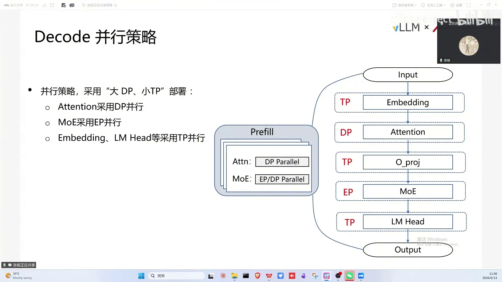 |
| 我们可以减小 TP，减小通信的开销，此时可以拿到更好的 TPOT 和吞吐。 [【跳转到 47:49】](https://www.bilibili.com/video/BV1eoJJ6eEUv/?t=2869) | 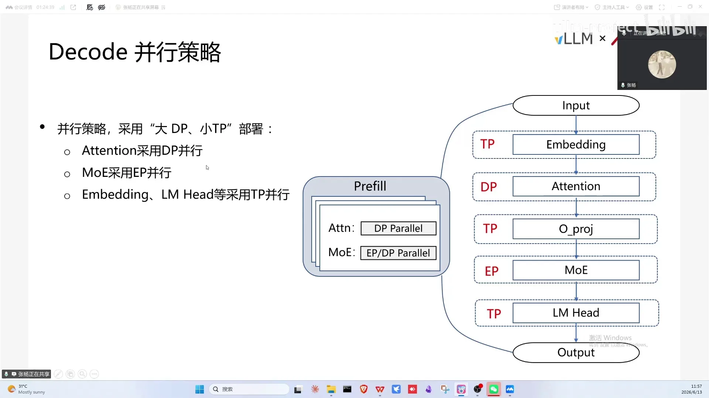 |
| 然后对于 decode 的不同部分——除了 embedding 部分其实其他部分都是一样的。decode 阶段此时就没有 CP 并行了。当然后面会上 DCP，也会去支持 CP。当前它有一个能力就是要去做 DP 的并行。 [【跳转到 48:14】](https://www.bilibili.com/video/BV1eoJJ6eEUv/?t=2894) | 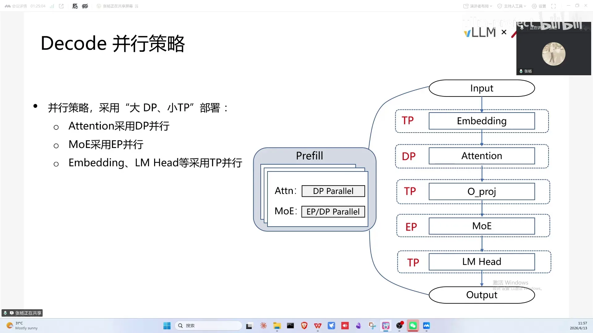 |
| 简单来说：prefill 更关注长序列计算和显存压力，decode 会更关注高并发和单步的生成效率。所以两阶段的并行策略需要做区别的设计。 [【跳转到 48:39】](https://www.bilibili.com/video/BV1eoJJ6eEUv/?t=2919) |  |
| （此区间无字幕） [【跳转到 49:04】](https://www.bilibili.com/video/BV1eoJJ6eEUv/?t=2944) | 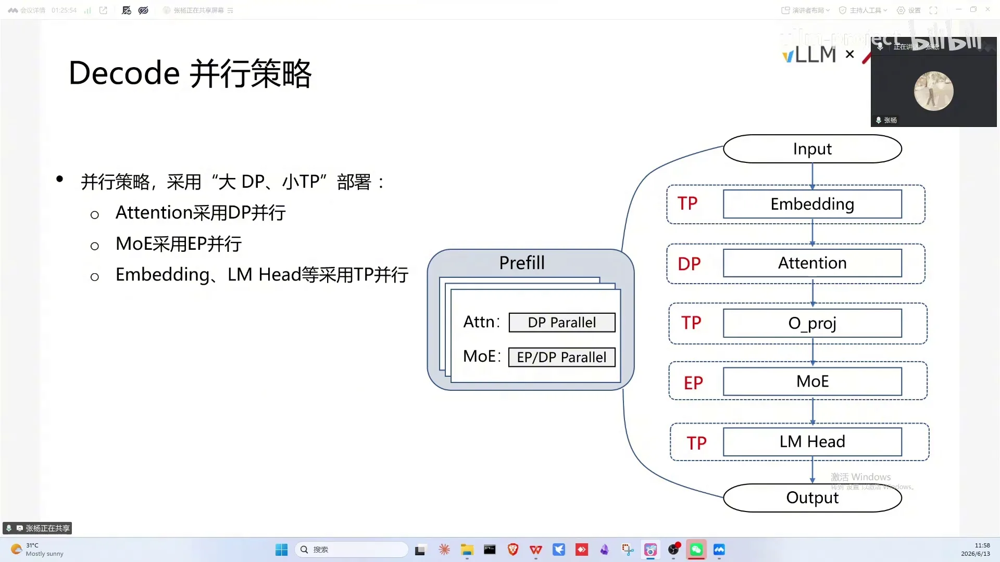 |
| 接下来讲一下 GLM5 在当前（昇腾）设备上的量化策略。量化的核心作用就是通过降低显存——降低权重、激活或者 KV cache 的（存储）精度——减少显存占用和访存开销，进而提升模型的部署规模和推理性能。 [【跳转到 49:11】](https://www.bilibili.com/video/BV1eoJJ6eEUv/?t=2951) |  |
| 当前 GLM5 在 NPU 上主要支持 W8A8 和 W4A8 两种量化方式。这里的 W 代表权重，A 就是激活（精度）。可以看到从这个（表格来看）：BF16 的权重占用为 1500 个 G…… [【跳转到 49:36】](https://www.bilibili.com/video/BV1eoJJ6eEUv/?t=2976) |  |
| 通过 W8A8 做了（权重量化），可以压缩到 400 多个 G；W4A8 会更小，可以压缩到 400 个 G 以内。我们可以根据资源情况选择量化方式。有的使用者可能比较担心量化会带来精度损失，坚定（选择）BF16 的原始精度去部署。 [【跳转到 50:01】](https://www.bilibili.com/video/BV1eoJJ6eEUv/?t=3001) |  |
| 但是这样的话就需要更多的资源。 [【跳转到 50:26】](https://www.bilibili.com/video/BV1eoJJ6eEUv/?t=3026) | 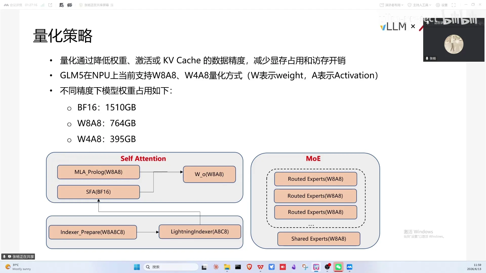 |
| 如果想在 NPU 上把 BF16 权重跑起来，可能需要 4 台（机器）的资源规模去做 BF16 部署，才能让它在长序列上下文场景下比较好地运行起来。 [【跳转到 50:51】](https://www.bilibili.com/video/BV1eoJJ6eEUv/?t=3051) |  |
| 这是我们刚才讲的模型结构的一个量化方式。MoE 采用的就是 W8A8，然后主要看这里：light indexer 的（量化）这一块。 [【跳转到 51:16】](https://www.bilibili.com/video/BV1eoJJ6eEUv/?t=3076) |  |
| light indexer 当前支持我们的 KV cache 量化的方式，这样可以缓解 KV cache 的压力。然后接下来，有同学问：910B 8 卡上推荐使用 TP16 吗？ [【跳转到 51:41】](https://www.bilibili.com/video/BV1eoJJ6eEUv/?t=3101) |  |
| （此区间无字幕） [【跳转到 52:06】](https://www.bilibili.com/video/BV1eoJJ6eEUv/?t=3126) |  |
| 910B 8 卡不能 TP16，最多 TP8。因为它的硬件限制：每台机上最多 8 张卡，只能支持到 TP8，不能支持 TP16。 [【跳转到 52:13】](https://www.bilibili.com/video/BV1eoJJ6eEUv/?t=3133) | 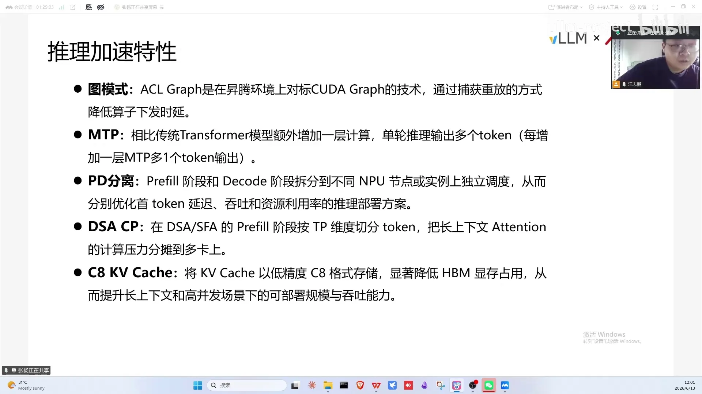 |
| 然后还有，TP 是不能超过节点的卡数的，这个其实是这样子的。 [【跳转到 52:20】](https://www.bilibili.com/video/BV1eoJJ6eEUv/?t=3140) | 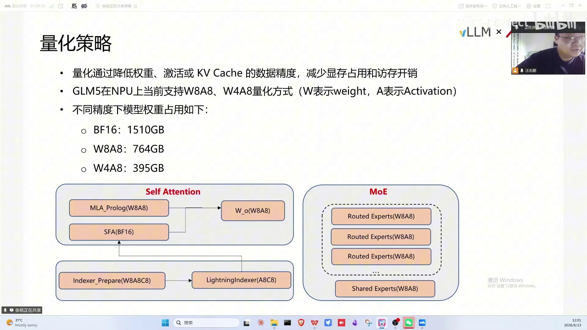 |
| 还有个同学问：关注 TTFT 的话是不是优先选用 FP8 推理？INT8 量化对（这些指标）有加速吗？——有加速。它的加速主要通过两方面。首先它能减少显存占用。减少显存占用非常关键：如果我们显存压力大…… [【跳转到 52:45】](https://www.bilibili.com/video/BV1eoJJ6eEUv/?t=3165) | 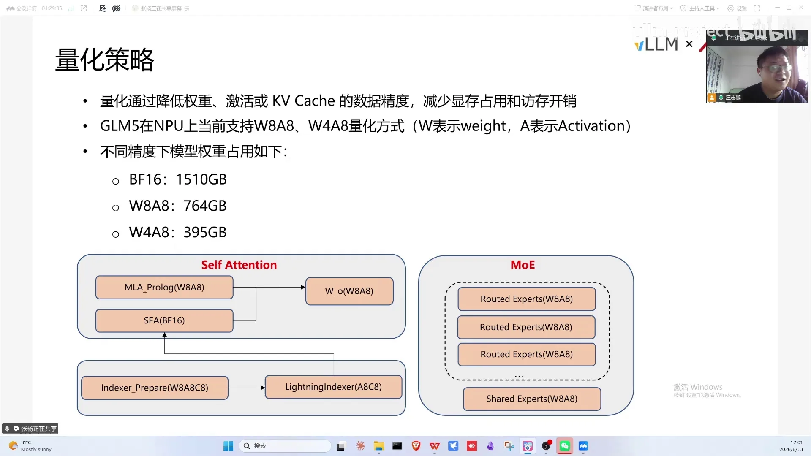 |
| 显存压力大（时）给 KV cache 的空间就比较小。当我们打高并发、（长序列）场景请求的时候，可能 KV cache 就会不够用…… [【跳转到 53:10】](https://www.bilibili.com/video/BV1eoJJ6eEUv/?t=3190) |  |
| 此时就会触发重计算：重新计算我们没有缓存的那些 KV cache，对 prefill 的影响非常大，因为 TTFT 已经耗得非常明显。我们通过量化的方式缓解显存压力，让 KV cache 比较充足、不存在重计算的情况，对 TTFT 有很大帮助。然后第二个就是算子：很多算子…… [【跳转到 53:35】](https://www.bilibili.com/video/BV1eoJJ6eEUv/?t=3215) |  |
| 算子在整个量化的（指令/矩阵）形式下，相比 BF16 会有比较大的优化。对 TTFT…… [【跳转到 54:00】](https://www.bilibili.com/video/BV1eoJJ6eEUv/?t=3240) | 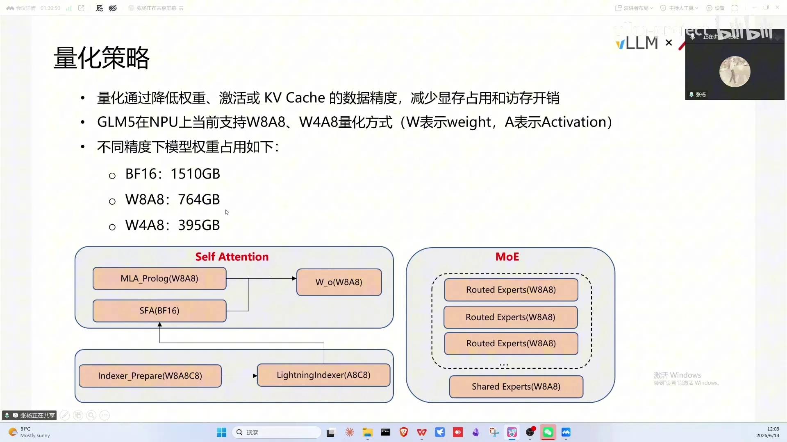 |
| 可能反映到 TTFT 上也是有（收益）的。——好，请继续。——然后下面简单讲一下我们部署过程中会用到的一些特性。 [【跳转到 54:25】](https://www.bilibili.com/video/BV1eoJJ6eEUv/?t=3265) |  |
| 这些特性我不会展开来讲，因为每个特性要讲的话可能都要很久才能讲清楚。我只是把这些比较重要的需要提的特性罗列出来。 [【跳转到 54:40】](https://www.bilibili.com/video/BV1eoJJ6eEUv/?t=3280) | 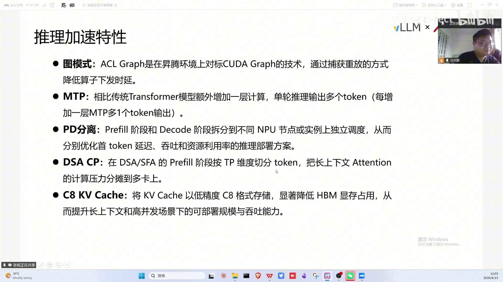 |
| 首先就是在 NPU 上，我们的（对应技术）是 ACL Graph，它是对标 CUDA Graph 的技术。这种技术对推理加速非常关键：它可以提前捕获到我们的算子的（执行序列）…… [【跳转到 55:05】](https://www.bilibili.com/video/BV1eoJJ6eEUv/?t=3305) |  |
| 通过把这些算子做捕获，可以在推理过程中避免（承担）算子从 CPU 下发到 NPU 这两段耗时。如果没有这种（图模式），它的耗时可能会比本身（执行）还要久。 [【跳转到 55:30】](https://www.bilibili.com/video/BV1eoJJ6eEUv/?t=3330) | 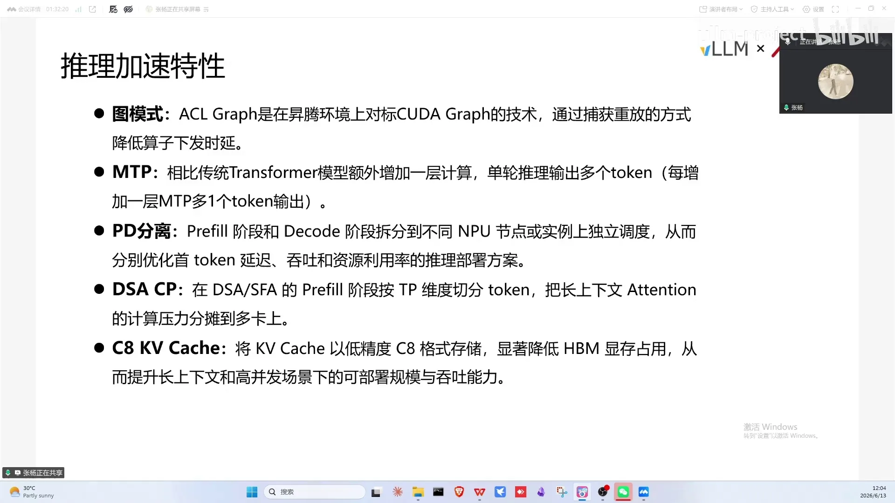 |
| 所以（图模式）的话，加入（图）之后我们这个 TPOT（等指标）都有明显的优化，总体的吞吐也会（有提升）。然后第二个就是 MTP。MTP 相比传统的（单 token）预测，会额外增加一个（投机）层，可以让当前推理输出多个 token。 [【跳转到 55:55】](https://www.bilibili.com/video/BV1eoJJ6eEUv/?t=3355) |  |
| 比如 GLM 比较有特点的就是 MTP（步长）为 3：它在每一步除了推理本身的一个 token 之外，会额外推测 3 个（token）。 [【跳转到 56:20】](https://www.bilibili.com/video/BV1eoJJ6eEUv/?t=3380) | 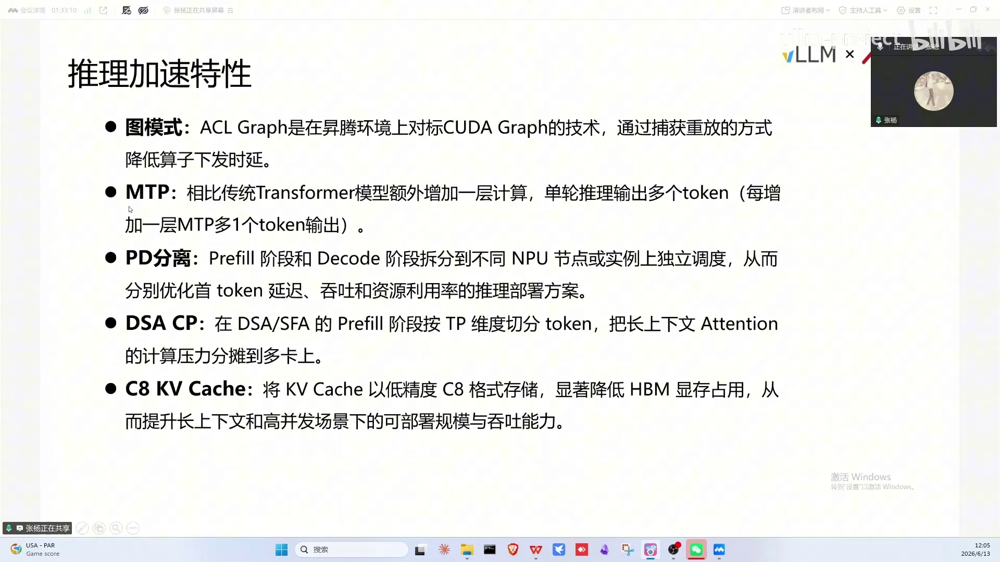 |
| 当然 MTP 的大小设置不是越大越好，因为 MTP 也会引入一层额外（投机层）的计算。随着 MTP 越大——它有接受率（acceptance rate）的概念——MTP 越大接受率会越低…… [【跳转到 56:45】](https://www.bilibili.com/video/BV1eoJJ6eEUv/?t=3405) |  |
| 比如（步长）到 4 的接受率可能到 20%、30%；（步长）5 的话可能 10% 这种接受率。此时我们多推了这些 token，因为接受率比较低…… [【跳转到 57:10】](https://www.bilibili.com/video/BV1eoJJ6eEUv/?t=3430) | 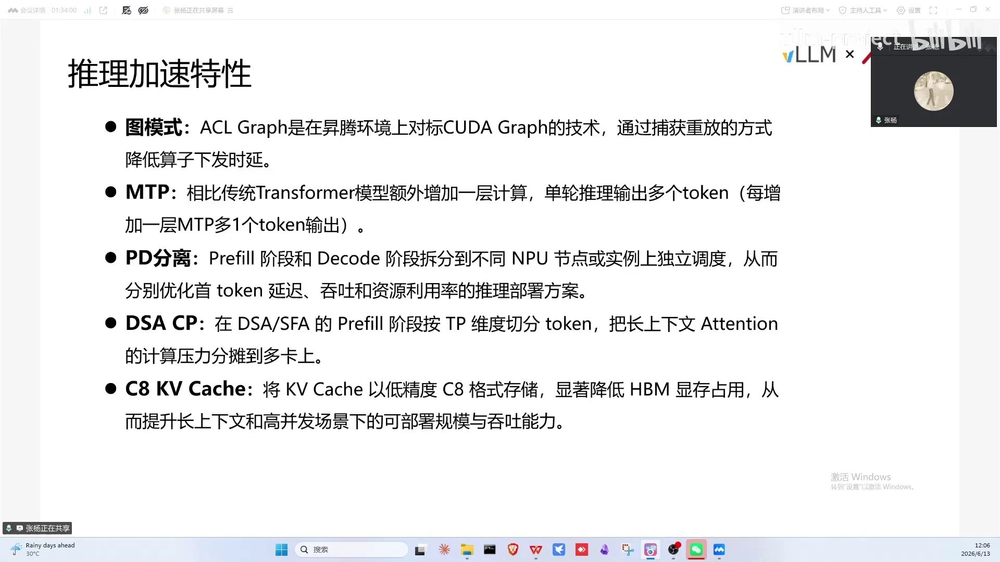 |
| 就抵不过我们额外增加这一层计算的开销——额外增加这一层计算的开销比较高，性价比就不高。所以 MTP 的大小要设置一个合理的数字。 [【跳转到 57:35】](https://www.bilibili.com/video/BV1eoJJ6eEUv/?t=3455) |  |
| 然后就是 PD 分离，刚刚已经详细讲过了：prefill 和 decode 切分到不同的节点上。然后就是刚刚讲到的这种 CP——现在命名是 DSA CP，它主要是针对这种 DSA（稀疏注意力）在 prefill 的（部分）按 CP 维度去切分 token 的。 [【跳转到 58:00】](https://www.bilibili.com/video/BV1eoJJ6eEUv/?t=3480) | 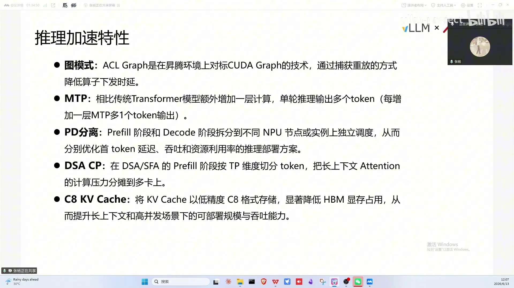 |
| 还有刚刚提到的这种 KV cache 量化，就是将 KV cache 以量化为 INT8 的形式（存储），可以显著降低 KV cache 的占用，提高长上下文、高并发场景下的（部署）规模和并发能力。 [【跳转到 58:25】](https://www.bilibili.com/video/BV1eoJJ6eEUv/?t=3505) |  |
| 然后有同学问：量化的时候是不是要精细融合 Quant 和 Dequant？必须要（捆绑）开放？Quant 和 Dequant（一起）开放？ [【跳转到 58:50】](https://www.bilibili.com/video/BV1eoJJ6eEUv/?t=3530) |  |
| 我没太了解什么意思。这个同学能再详细讲一下吗？我觉得他可能指的就是：比如 W4A8 这种场景，对吧？我们的权重是比如 4 比特（存储）的，然后计算实际上是 8 比特。如果我们去做一些算子（融合）的时候，这一块是怎么做的？ [【跳转到 59:15】](https://www.bilibili.com/video/BV1eoJJ6eEUv/?t=3555) |  |
| 算子（融合）的话，会有一个从 INT4（转成）INT8 的过程，然后它就会跟 INT8 的（融合）逻辑是一样的。 [【跳转到 59:40】](https://www.bilibili.com/video/BV1eoJJ6eEUv/?t=3580) | 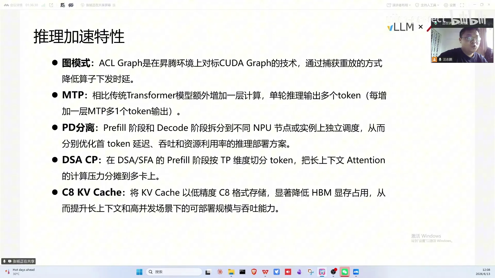 |
| 他是说是不是要把 Dequant 和 Linear（算）融合在一起，避免单独 dequant 带来的耗时？——对对，现在这种有很多（融合）算子：就是把 Quant 和 matmul（融合在一起）。我们现在用的这些算子都是融合在一起的，就是这种 Quant 和 matmul 融合的算子。 [【跳转到 60:05】](https://www.bilibili.com/video/BV1eoJJ6eEUv/?t=3605) | 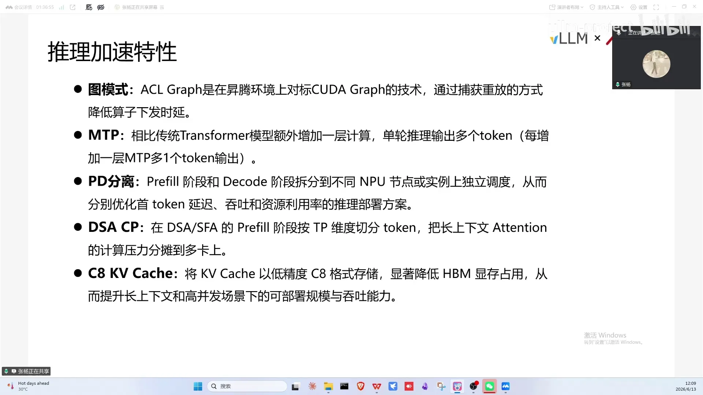 |
| 基本上都是使用这种，不会单独地去调用这种 quant 或者 dequant 的算子。好，然后还有同学问：为啥 DSA 的 CP 是按照 TP 切分的？ [【跳转到 60:30】](https://www.bilibili.com/video/BV1eoJJ6eEUv/?t=3630) |  |
| 因为这种 CP——我们通过将（token）切块，切到每个 TP 上去完整计算。这个 TP 本身（分到）的这些（块）——相比于我们将所有 token 按照序列（长度）维度去切分——在这种（indexer/attention）阶段，它的优化会比较明显…… [【跳转到 60:55】](https://www.bilibili.com/video/BV1eoJJ6eEUv/?t=3655) |  |
| 因为（这个阶段）很多计算都是与 token 数强相关的：token 数越大，（计算）成本就会越高。如果我们通过将（token 块）分到每个 TP 上——TP 去单独计算这些 token 块——这个 token 数就相当于变相减少了嘛，对，那些依赖 token 数量强相关的计算…… [【跳转到 61:20】](https://www.bilibili.com/video/BV1eoJJ6eEUv/?t=3680) | 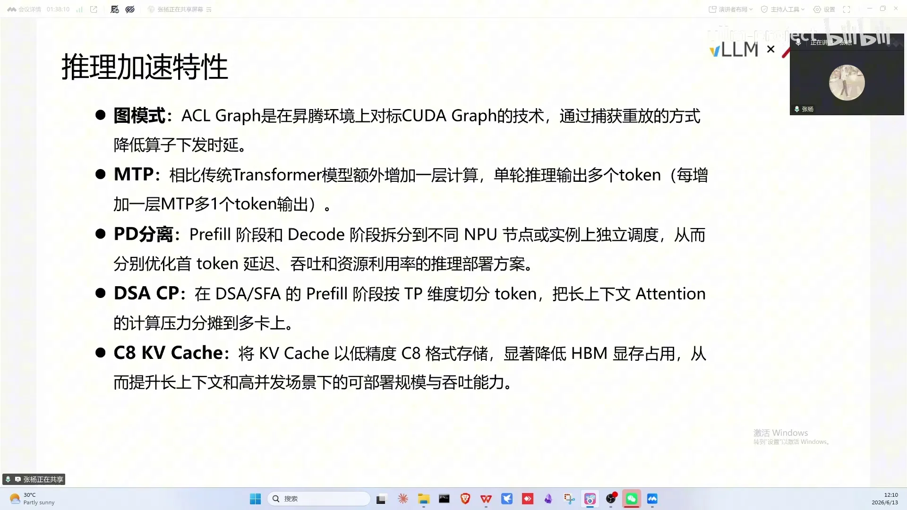 |
| （接上） [【跳转到 61:45】](https://www.bilibili.com/video/BV1eoJJ6eEUv/?t=3705) |  |
| 也会得到比较大的优化。对。——我理解它的代码是不是 CP 的通信组就直接绑的是 TP 的通信组？——对，对。 [【跳转到 62:10】](https://www.bilibili.com/video/BV1eoJJ6eEUv/?t=3730) |  |
| （接上） [【跳转到 62:35】](https://www.bilibili.com/video/BV1eoJJ6eEUv/?t=3755) |  |
| 我觉得这可能是最直观的原因。因为这个 CP 主要是切（序列）到 CP（组），我觉得其他 CP 应该也是这样做的吧。——是，对。——然后还有：这个 KV cache 量化一定是指的 INT8 吗？就是 KV cache 的量化。我记得上面有个指标，好像有个选项是 FP8 KV cache，是吧？ [【跳转到 63:00】](https://www.bilibili.com/video/BV1eoJJ6eEUv/?t=3780) | 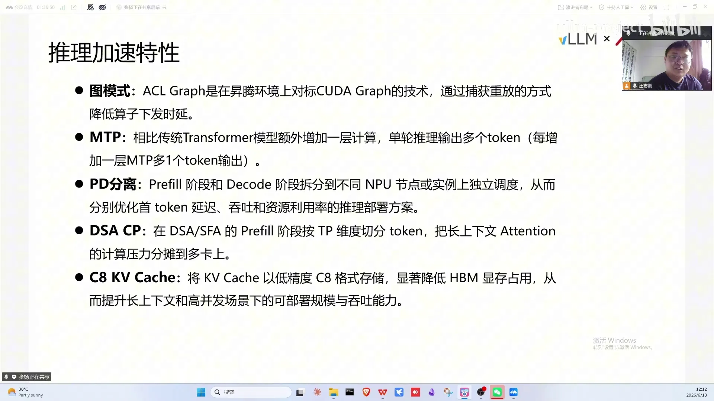 |
| 对，可以是 FP8。但是当前昇腾的 910B、910C 只支持 INT8。所以这个 KV（量化）就是 INT8 的。后面 950 的话会去支持 FP8，然后（我们）也要做相应的调整。 [【跳转到 63:25】](https://www.bilibili.com/video/BV1eoJJ6eEUv/?t=3805) | 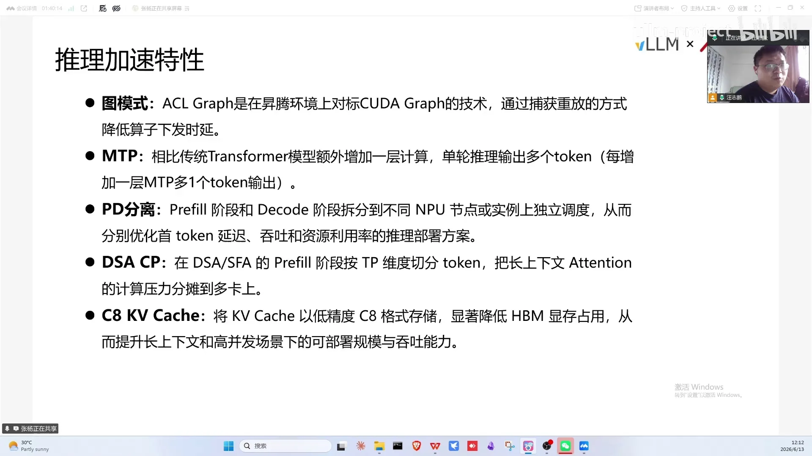 |
| 然后还有同学问：SFA 是什么，说一下？——SFA 是 sparse flash attention，就是那种稀疏的 flash attention。嗯。——然后还有问：DSA CP 就是前面提到的 attention 用 CP 吗？ [【跳转到 63:50】](https://www.bilibili.com/video/BV1eoJJ6eEUv/?t=3830) |  |
| 对了，对了。它就是专门针对 attention 做的 CP。这个功能也比较（受限阶段）：因为现在 vLLM 的 DCP、CP 已经开发得差不多了，后面我们会用 DCP、CP 去替代现在这个 DSA CP。 [【跳转到 64:15】](https://www.bilibili.com/video/BV1eoJJ6eEUv/?t=3855) |  |
| 好，然后我们继续吧。下面介绍两个比较重要的（融合）算子。一个 MLA prologue，它是将 MLA 或者 SFA 的前处理计算全部融合成一个算子。 [【跳转到 64:40】](https://www.bilibili.com/video/BV1eoJJ6eEUv/?t=3880) |  |
| 这个算子名字就叫 MLA prologue。这样前处理就当一个算子（调用），这个算子是比较重要的一个算子。 [【跳转到 65:05】](https://www.bilibili.com/video/BV1eoJJ6eEUv/?t=3905) |  |
| 然后下面这个算子是 MC2，这个算子也是一个比较大的融合算子，对比较重要的 MoE 的场景。本质上它是一个通信和算子做了一个融合。 [【跳转到 65:30】](https://www.bilibili.com/video/BV1eoJJ6eEUv/?t=3930) |  |
| 它把我们的 token 的分发、（专家）FFN 计算、还有结果的重排合并到一起。传统 MoE（流程）：dispatch 开始，然后（门控），然后激活量化，然后 combine…… [【跳转到 65:55】](https://www.bilibili.com/video/BV1eoJJ6eEUv/?t=3955) | 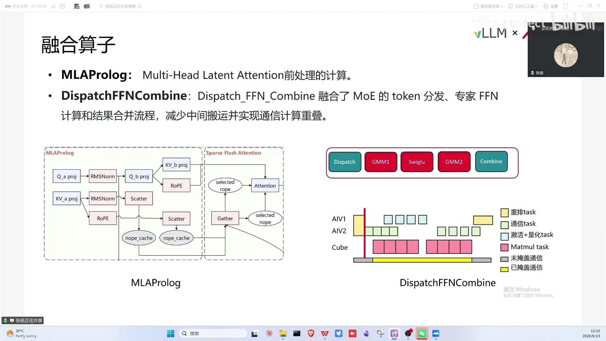 |
| 这些步骤之间会有比较多的中间搬运，或者通信（等待）。通过这个算子可以减少这种中间的数据搬运，然后从（图）上看到，还可以实现通信和计算的重叠。（以前）的过程是一个串行的过程：先通信，然后计算，然后再通信。 [【跳转到 66:20】](https://www.bilibili.com/video/BV1eoJJ6eEUv/?t=3980) |  |
| 然后以后我们可以通过（token）重排和融合，通信可以更好地和计算做重叠，提升计算部分的整体执行效率。 [【跳转到 66:45】](https://www.bilibili.com/video/BV1eoJJ6eEUv/?t=4005) |  |
| 当然还有其他的融合算子，我这里主要说的是比较重要的。然后有同学问：dispatch 和 combine 是 all-gather 和 reduce-scatter 吗？——这个不是的。dispatch 可能就跟那个分发（有点像）…… [【跳转到 67:10】](https://www.bilibili.com/video/BV1eoJJ6eEUv/?t=4030) |  |
| 对，因为 MoE 用不到（那些）。MoE 模型里面：如果从单 rank 来看，就是一个 token 发到对应的几个 expert 上面；如果有多个 rank 的话，实际上每个 rank 要把它自己的 token 发到不同的一些 expert 上面。 [【跳转到 67:35】](https://www.bilibili.com/video/BV1eoJJ6eEUv/?t=4055) |  |
| 那么从单 rank 就是 dispatch，多 rank 一起来看就是 all-to-all 了。发完之后还要再把它回收起来、发回原来的 rank 上去，这个就是 combine 的操作。主要就是这么个过程。 [【跳转到 68:00】](https://www.bilibili.com/video/BV1eoJJ6eEUv/?t=4080) | 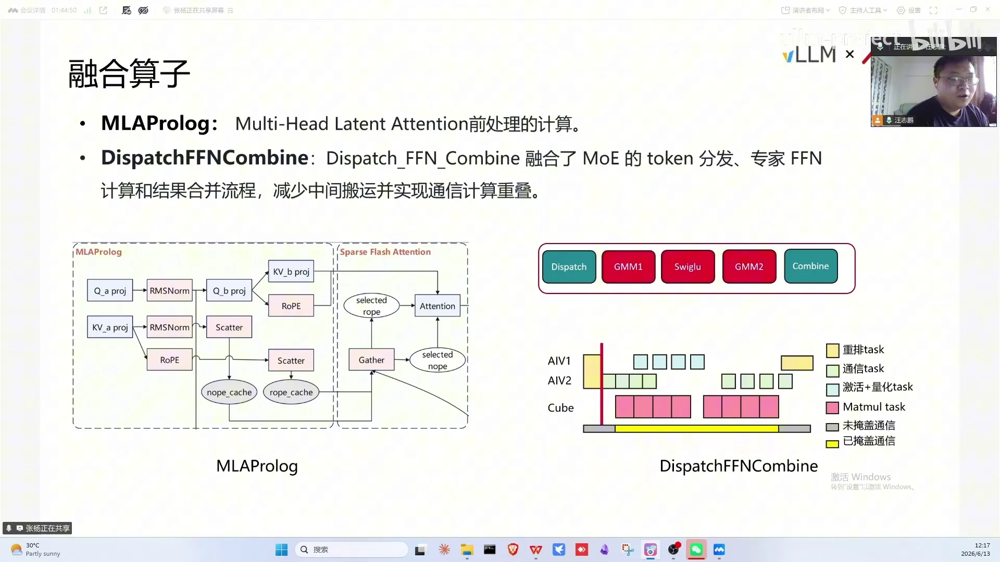 |
| 但是这之中因为（设计上）有一些计算（在里面），可以去做一些掩盖——一边算一边通信。——对。然后有同学问：all-to-all 跨 GPU——一个 GPU 绑定一个进程，那这个融合算子还跨进程吗？——对，融合算子跨进程。 [【跳转到 68:25】](https://www.bilibili.com/video/BV1eoJJ6eEUv/?t=4105) |  |
| （问）什么意思？就是比如说 all-to-all 这个操作是跨了 GPU 的，对吧？一个 GPU 绑定一个进程，这个融合算子它跨进程吗？——嗯，这样理解是（算）跨进程的，对。 [【跳转到 68:50】](https://www.bilibili.com/video/BV1eoJJ6eEUv/?t=4130) | 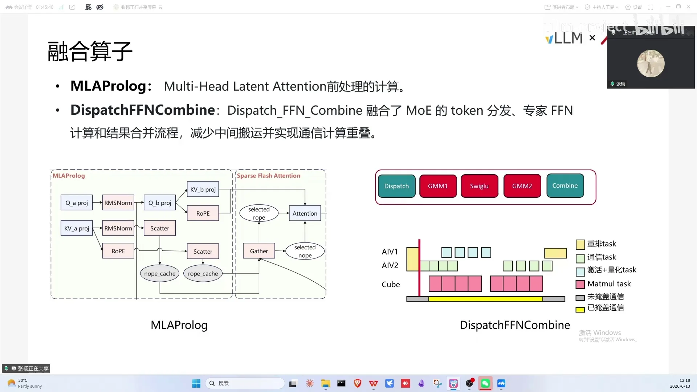 |
| 然后现在可以跨 GPU 吗？——跨 GPU 都可以。——对。然后还有就是这里跟 vLLM 的区别：vLLM 这里是不是用的是 DeepEP？——DeepEP 我理解它就是一个 all-to-all 的（通信库），就是做 all-to-all 通信的一个（库）。而这个是通信和算子在一起的，对吧？——对对。 [【跳转到 69:15】](https://www.bilibili.com/video/BV1eoJJ6eEUv/?t=4155) |  |
| DeepEP 应该主要是做 all-to-all 这一块（通信），是吧？——对对。GPU（的话我）可能不是那么了解。如果是专门只做通信的话，可能它跟这里是不太一样的，因为这里是包括通信也包括计算的。 [【跳转到 69:40】](https://www.bilibili.com/video/BV1eoJJ6eEUv/?t=4180) | 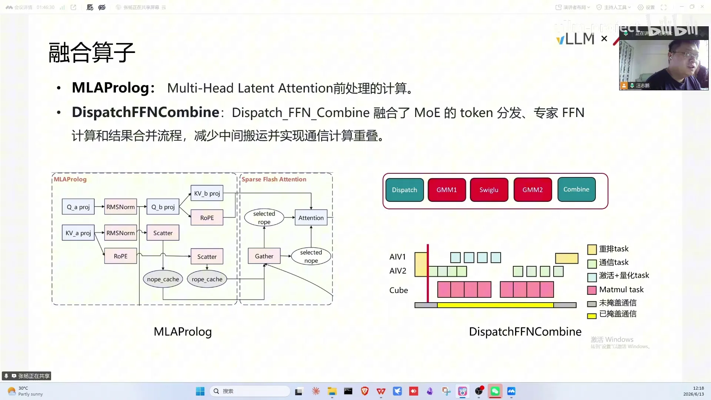 |
| 然后还有问：右上角图这个 AIV、AIC 是什么？ [【跳转到 70:05】](https://www.bilibili.com/video/BV1eoJJ6eEUv/?t=4205) | 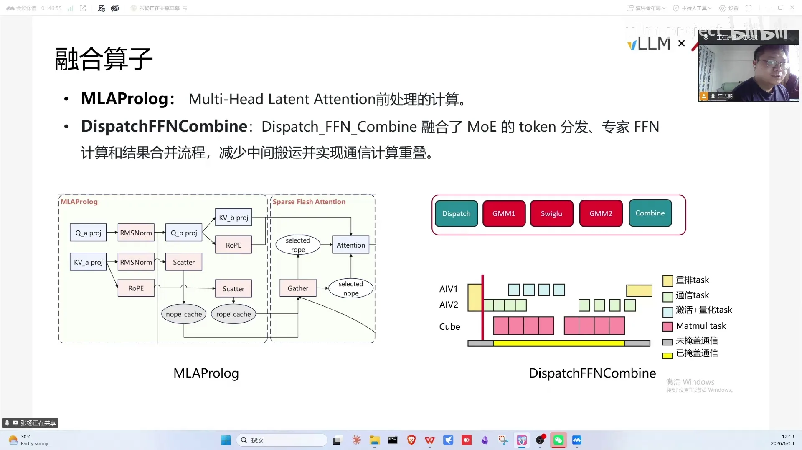 |
| 嗯，右上图是什么？这个（AIC）就是 NPU 上做矩阵（计算）的核。对。所以（AIC）是做计算的，AIV 是面向（向量/通信）的，可以简单这么理解。——哦，就像是我去抓它的 profile，会看到两条线：有的线专门做通信，有的线专门做计算。 [【跳转到 70:30】](https://www.bilibili.com/video/BV1eoJJ6eEUv/?t=4230) |  |
| 对对对。好，那我们继续吧。——有个同学问：目前昇腾卡价格是什么样子的？你们昇腾卡怎么卖的？——这个我不想聊，可能要找（销售）问一下。 [【跳转到 70:55】](https://www.bilibili.com/video/BV1eoJJ6eEUv/?t=4255) | 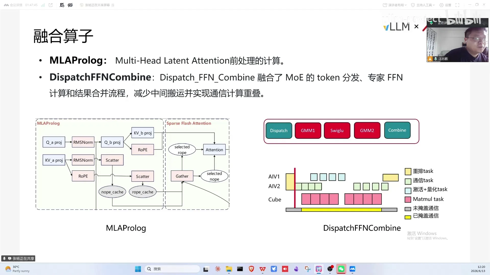 |
| 对，我觉得国产卡因为以后国产替代是一个趋势嘛。还有国产卡一般不会像 NVIDIA 那边卡卖得那么贵，对吧，国产的东西还是以性价比为主的。我们现在比如 A3 相对于 GPU 是有一定性价比的：我们会做性能对比，按照那种卡（的采购）成本还有性能去做对比，相比 GPU 是有性价比的。 [【跳转到 71:20】](https://www.bilibili.com/video/BV1eoJJ6eEUv/?t=4280) | 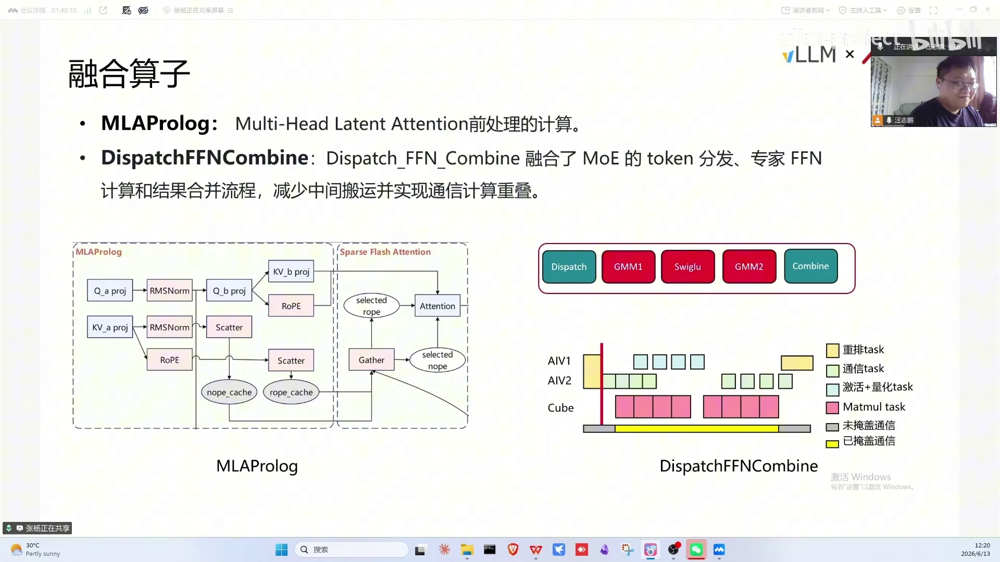 |
| 然后其实我还有个小问题：如果有同学想给 vLLM 昇腾这个项目提 PR，你有什么好建议吗？ [【跳转到 71:45】](https://www.bilibili.com/video/BV1eoJJ6eEUv/?t=4305) |  |
| 现在提 PR 的话，如果是个人开发者确实比较（困难）。因为现在跑的这种 A3 卡——就是 910B、910C——可能是整机（租赁）的形式，价格也比较昂贵。 [【跳转到 72:10】](https://www.bilibili.com/video/BV1eoJJ6eEUv/?t=4330) | 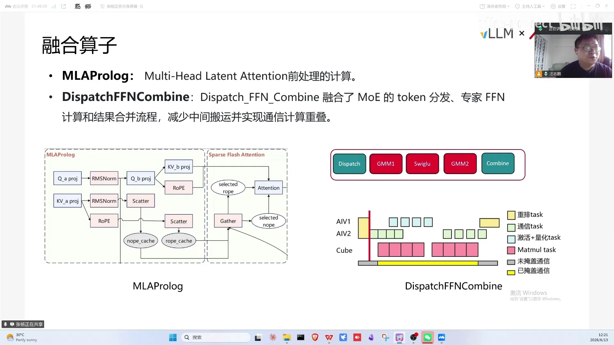 |
| 但是现在有一些低端的设备，它自己那种单卡的形式可以（承担），包括一些开发板可以（买到），这种单卡的成本就会比较低。比如我们现在有这种（310P）这种低端设备。如果想做一些（模型）上面（的事），vLLM 昇腾，也就是在上面去部署。 [【跳转到 72:35】](https://www.bilibili.com/video/BV1eoJJ6eEUv/?t=4355) |  |
| 然后还有同学就是想知道在网上能够租到这个 NPU 卡吗？ [【跳转到 73:00】](https://www.bilibili.com/video/BV1eoJJ6eEUv/?t=4380) | 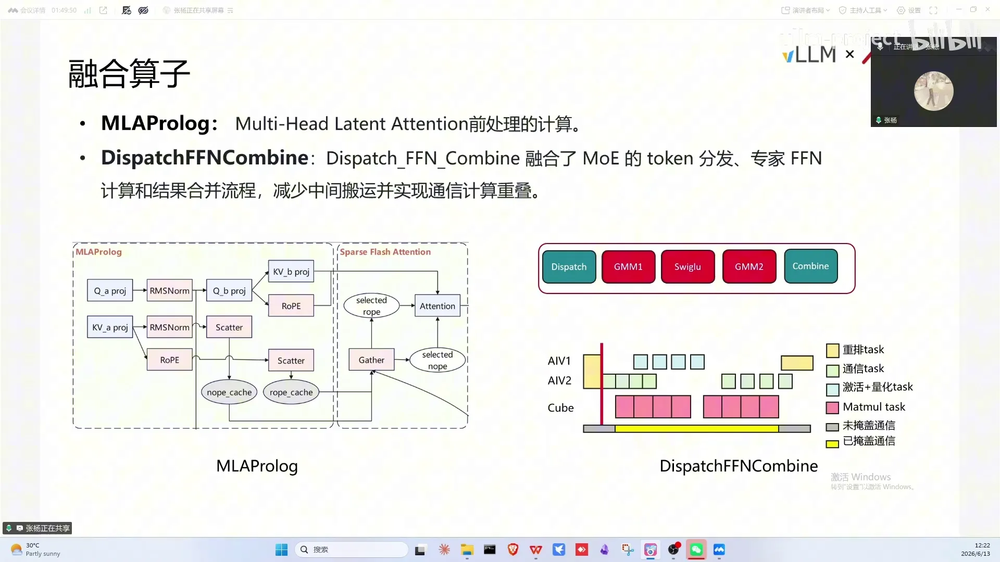 |
| 可以吧，华为云应该是可以租到的，肯定可以租到。我记得一些三方的云服务商现在也有这种昇腾卡了，也可以租到。然后我觉得聊一聊：一般玩家如果你做的不是 NVIDIA 卡的话…… [【跳转到 73:25】](https://www.bilibili.com/video/BV1eoJJ6eEUv/?t=4405) |  |
| 其实我觉得像这种社区会有个很关键（需要）的功能：比如我们需要专门跟 NVIDIA 那边做对比，看他们有什么我们没什么、他们有什么算子我们没什么算子。这一块其实也是一个很好的（贡献）机会。哪怕你只是做一些（简单）的对比的话…… [【跳转到 73:50】](https://www.bilibili.com/video/BV1eoJJ6eEUv/?t=4430) |  |
| 你可以帮助华为团队更好地去发现他们（模型支持上）可以优化的空间。好，然后我们继续吧。 [【跳转到 74:15】](https://www.bilibili.com/video/BV1eoJJ6eEUv/?t=4455) |  |
| 接下来我就罗列一些我们现在各个场景下跑到这种生产设备上的性能数据，可以简单看一下。这里有一个（部署形态）是 PD（分离），整个设备是 A3 设备的（集群）…… [【跳转到 74:39】](https://www.bilibili.com/video/BV1eoJJ6eEUv/?t=4479) |  |
| 单台的话是 8 卡 16 die、（约）964G 显存的规模。然后（这是）面向（线上）场景的设备（配置），可以（验证）性能也可以验证精度。 [【跳转到 75:04】](https://www.bilibili.com/video/BV1eoJJ6eEUv/?t=4504) | 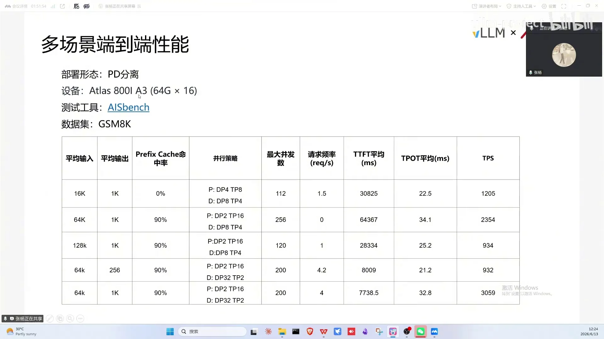 |
| 这里的场景主要是面向一些线上（推理）的场景，所以这几个大多数用例的 prefix cache 命中率都是给到 99%。这几个数据只是我挑了几个…… [【跳转到 75:29】](https://www.bilibili.com/video/BV1eoJJ6eEUv/?t=4529) | 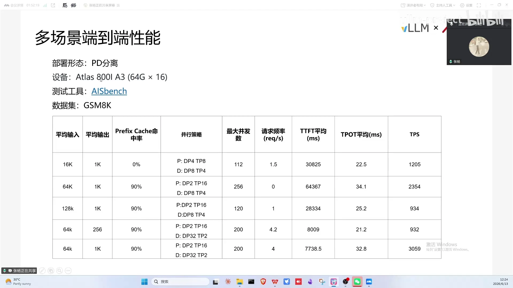 |
| 具体的数据会比较多，主要是想跟大家看一下我们不同并发、还有请求频率、还有序列长度，对我们的 TTFT 和 TPOT 到底是怎么影响的。然后看第二个数据这个 64K 的…… [【跳转到 75:54】](https://www.bilibili.com/video/BV1eoJJ6eEUv/?t=4554) |  |
| 它配置命中率 90%、并发给的比较高，给到 256。然后它的请求频率为 0。频率为 0 什么意思呢？就是这 256 个请求同一时间全部发给 prefill 节点，其实 prefill（节点）压力会非常大…… [【跳转到 76:19】](https://www.bilibili.com/video/BV1eoJJ6eEUv/?t=4579) |  |
| 因为它要同时处理 256 个请求。所以可以看到它的 TTFT 在这里就变得非常大，达到 60 多秒。所以这其实是一个不太合理的方式。但是如果你的需求就是只看吞吐…… [【跳转到 76:44】](https://www.bilibili.com/video/BV1eoJJ6eEUv/?t=4604) | 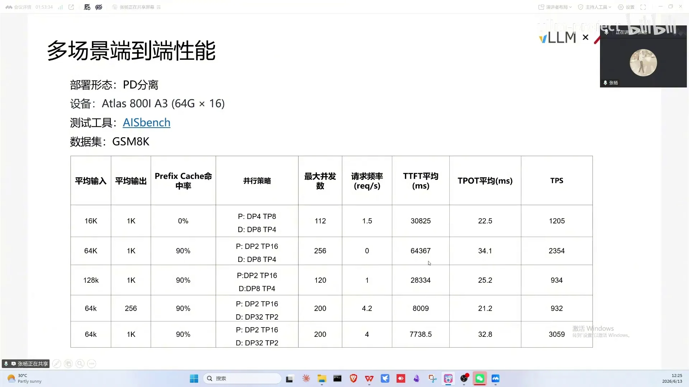 |
| 就是输出吞吐 TPS。如果想把 TPS 达到最高、不太关注 TTFT，我们就可以这样做：让请求一下子全部发过来…… [【跳转到 77:09】](https://www.bilibili.com/video/BV1eoJJ6eEUv/?t=4629) |  |
| 我们的吞吐可以达到最高值。然后下面看一下这个 108K：108K 的输入，它的部署形态和上面这一行 60K 都一样，是一个（PD 分离）的部署形态，就是 P2、D2——就 2 台 A3…… [【跳转到 77:34】](https://www.bilibili.com/video/BV1eoJJ6eEUv/?t=4654) |  |
| P 的话就是我前面讲的采用小 DP、大 TP 的部署形态：给到 DP2、TP16。然后 D 采用大 DP、小 TP，部署形态 DP8、TP4。就是这么一种部署形态。我这里给的（并发）不变的话，（压力）会非常高…… [【跳转到 77:59】](https://www.bilibili.com/video/BV1eoJJ6eEUv/?t=4679) |  |
| 那我在这里通过调整请求频率：频率稍微调一下，每秒只发一条请求。这样请求按照每秒一条到达 P 节点，此时 P 节点面临的…… [【跳转到 78:24】](https://www.bilibili.com/video/BV1eoJJ6eEUv/?t=4704) | 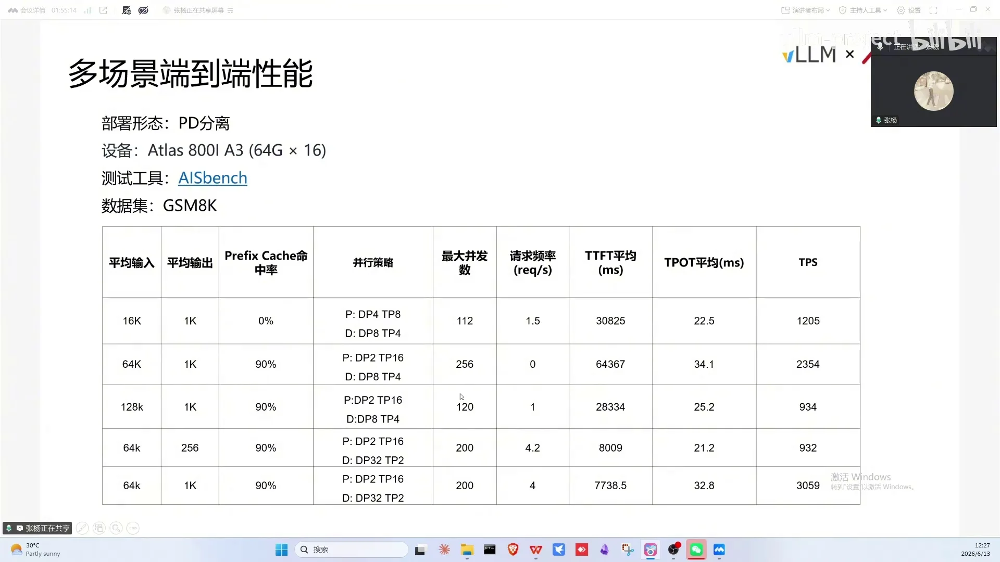 |
| P 节点面临的压力就会比较小。可以看到在 108K 的情况下，它比上面这个 TTFT 还是要小很多。但是这样的话，整体的吞吐相比一次性发过来要稍微低一点。然后最下面这两个就是文档上的那种…… [【跳转到 78:49】](https://www.bilibili.com/video/BV1eoJJ6eEUv/?t=4729) |  |
| 社区文档上的部署形态：P 给到（两台），D 给到四（节点）。这个部署形态就是针对前面说的 cache 命中能力比较高的情况，此时 prefill 压力会比较小…… [【跳转到 79:14】](https://www.bilibili.com/video/BV1eoJJ6eEUv/?t=4754) |  |
| 然后如果我们想要打更高的并发，可以增加 D 节点的资源：D 节点给到 DP32。此时…… [【跳转到 79:39】](https://www.bilibili.com/video/BV1eoJJ6eEUv/?t=4779) |  |
| 这样的话通过调整请求频率，我们可以（提升）吞吐，最终的整体吞吐有比较好的效果。对。然后有同学问：（某）benchmark 里好像数据集比较少…… [【跳转到 80:04】](https://www.bilibili.com/video/BV1eoJJ6eEUv/?t=4804) |  |
| 你们测 GLM5 的时候该有的数据集都有吗？——确实现在没有。因为现在（开源）数据集比较多，这个工具可能没有（跟进），没有把各种数据集都支持上。我们测试的时候主要是挑了几个数据集，比如我们常见的…… [【跳转到 80:29】](https://www.bilibili.com/video/BV1eoJJ6eEUv/?t=4829) | 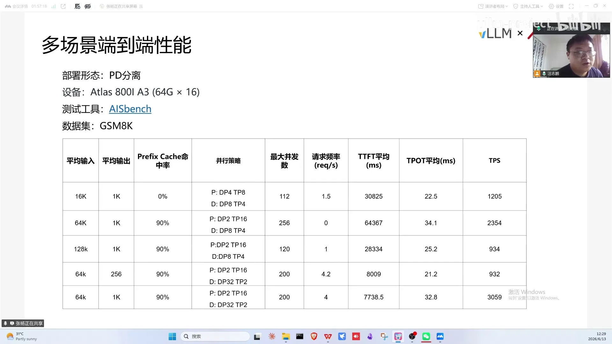 |
| GPQA、AIME 数据集。然后最主要的是（官方）那边评测 GLM 的时候，因为模型是面向 agent 场景嘛，他们发布的 agent 数据集测得会比较多。我们主要是补测了整个 SWE-bench 数据集，还有（另一个）——这两个面向编码 agent 的数据集也做了补测。跟官方的分数是一致的。 [【跳转到 80:54】](https://www.bilibili.com/video/BV1eoJJ6eEUv/?t=4854) |  |
| （接上） [【跳转到 81:19】](https://www.bilibili.com/video/BV1eoJJ6eEUv/?t=4879) | 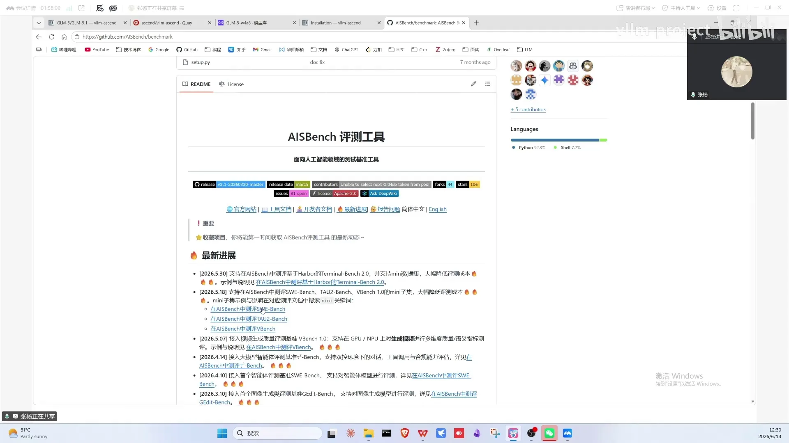 |
| 现在我们的量化（方案）已经有了——W8A8+C8，但是权重还没有开放出去。因为这个功能是最近刚做完，可能还没来得及把权重放进去。——OK。——然后还有同学问：TPS 是平均每张卡 decode 的 token 每秒数量吗？——这个是总的、所有的。 [【跳转到 81:44】](https://www.bilibili.com/video/BV1eoJJ6eEUv/?t=4904) | 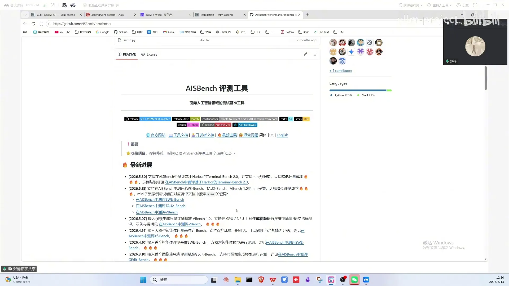 |
| 然后还有同学问：这里是几个 A3 节点啊？——我们可以通过 T 和 D 的配置去看：这里的 die 代表一个 die，因为 A3 是一卡双 die，8 卡，一整个机器就是 8 卡 16 die。一个 D 就是一个 die。 [【跳转到 82:09】](https://www.bilibili.com/video/BV1eoJJ6eEUv/?t=4929) | 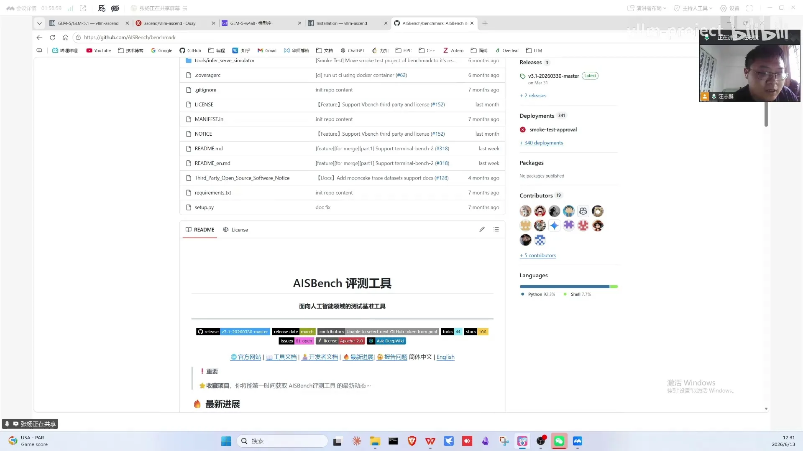 |
| 然后我们 DP 的（配置）乘起来，总的需要的 die 数量——一台 A3 有 16 die，16 die 的话就是两台 A3，我们可以算一下。D 侧也是一样的。 [【跳转到 82:34】](https://www.bilibili.com/video/BV1eoJJ6eEUv/?t=4954) | 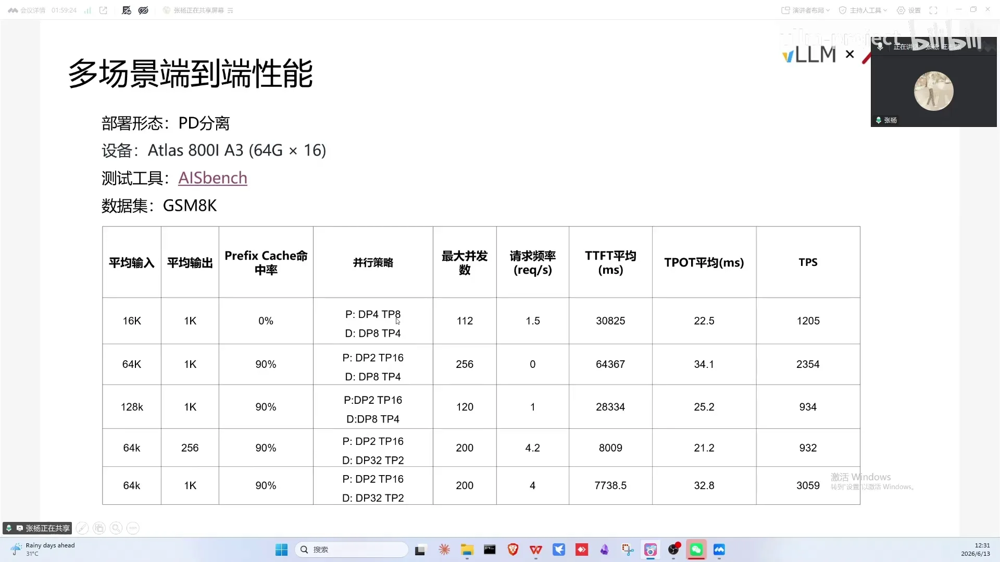 |
| 所以这里 P 就是两台机器（32 die），然后 D 也是（相应）两台机器。下面这个 D 是 64 die，就需要四台 A3 去部署。 [【跳转到 82:59】](https://www.bilibili.com/video/BV1eoJJ6eEUv/?t=4979) |  |
| 好，那我们继续吧。我这边就差不多结束了。好，有什么问题吗？——随便讲，很好，今天还是学到不少东西的。直播间的同学有什么问题需要问的吗？我们再等两三分钟。——有同学问：不同的最大输出长度会对准确率有影响吗？ [【跳转到 83:24】](https://www.bilibili.com/video/BV1eoJJ6eEUv/?t=5004) | 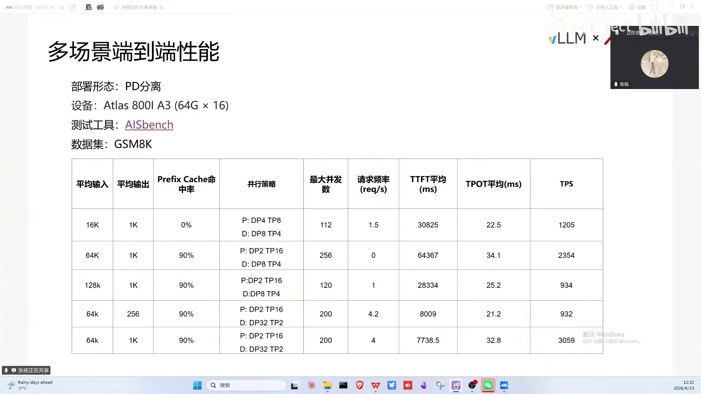 |
| 超过（128K）、这种 200K 的确实会发现模型推理的时候会出现一些幻觉，可能会有一些准确度的影响。我觉得这可能是模型本身（的问题），应该不是推理引擎的问题。 [【跳转到 83:49】](https://www.bilibili.com/video/BV1eoJJ6eEUv/?t=5029) | 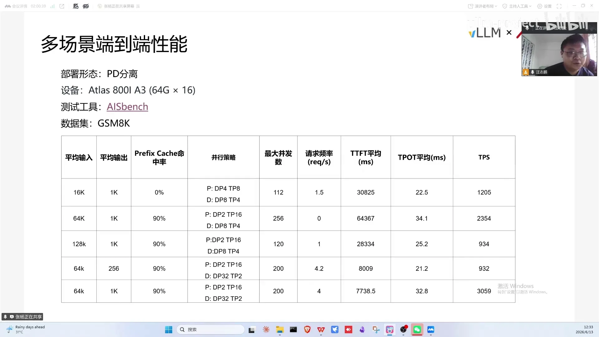 |
| 对，不是推理引擎的问题。然后还有同学问：这个就是那个 384 超节点吗？——哪个超节点？384 超节点，什么是 384 超节点？——对，我们现在这种形态都是通过超节点的，节点之间都是通过超节点的形式（连接的）。 [【跳转到 84:14】](https://www.bilibili.com/video/BV1eoJJ6eEUv/?t=5054) | 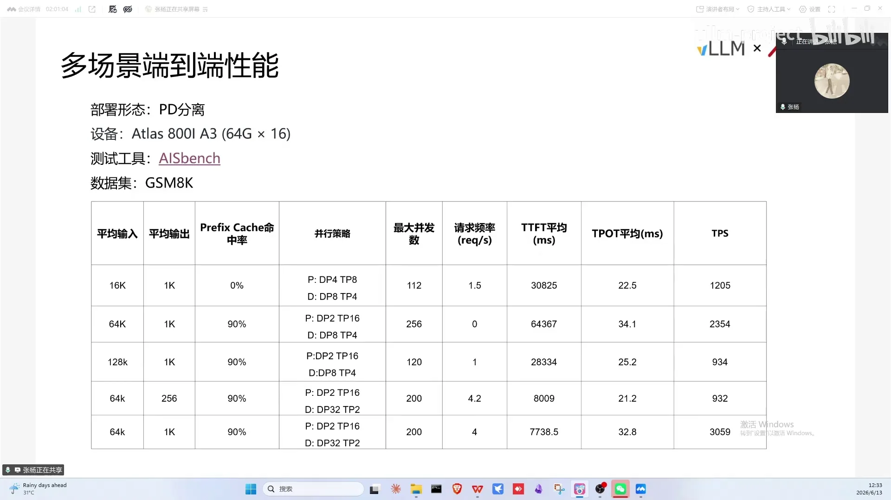 |
| 但是实际当中我们没有用到这种 384 超节点，因为它的规模比较大。可能是我们用几十台节点接在一起组成超节点。它（384）只是说规模不同，它的通信域什么的都比较大。 [【跳转到 84:39】](https://www.bilibili.com/video/BV1eoJJ6eEUv/?t=5079) | 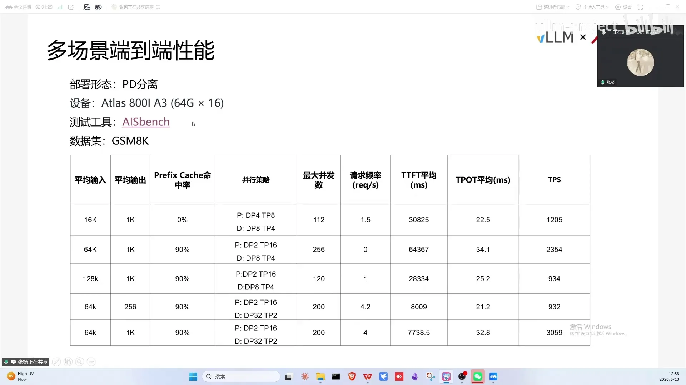 |
| 还有同学问：910B、910C 差距大吗？它们的差别主要是带宽的差别。910C 的带宽会更高，通信方面也会更强一点。 [【跳转到 85:04】](https://www.bilibili.com/video/BV1eoJJ6eEUv/?t=5104) |  |
| 还有就是它们显存的区别。A3 可以简单理解为两个 die 叠加在一起：一张卡是 128G，128G 就是两个 die，所以显存也更大一点。 [【跳转到 85:29】](https://www.bilibili.com/video/BV1eoJJ6eEUv/?t=5129) | 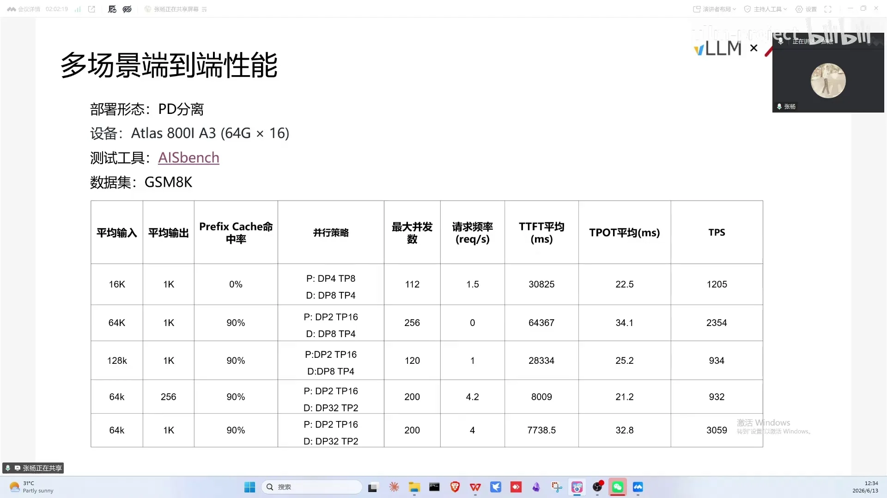 |
| 还有就是算力：A3 这种（单）die 之间——一张卡的话算力没有太大区别，主要是带宽的一些差异。 [【跳转到 85:54】](https://www.bilibili.com/video/BV1eoJJ6eEUv/?t=5154) |  |
| 有同学问：混合部署推荐开 CP 吗？应该只是 P（开）？——推荐，推荐。如果是 PD 混布的话，如果也是长序列场景，也是比较推荐开 CP 的。 [【跳转到 86:19】](https://www.bilibili.com/video/BV1eoJJ6eEUv/?t=5179) |  |
| 应该主要是 P 开 CP，D 也开吗？——D（侧）我们现在加了（开关）：D 这一侧它不会去走这个 CP，就算开的话也不会走。——好。然后对于大的 MoE 模型，384 超节点的性价比比 16 卡的性价比更高吗？ [【跳转到 86:44】](https://www.bilibili.com/video/BV1eoJJ6eEUv/?t=5204) |  |
| 比 16 卡，会。目前看特别是 PD 分离的情况下：你给的资源节点越多，总体平均到单卡的吞吐表现会更好。 [【跳转到 87:09】](https://www.bilibili.com/video/BV1eoJJ6eEUv/?t=5229) |  |
| 比如我们之前测过这种（多）节点、甚至（更多）节点（的配置），吞吐也都会更好。比资源比较少的，比如双机 16 卡，会更好。——然后还有人说想问 prefix caching，它的 cache 是怎么存的？存在哪才能命中率达 90%？——你们用的是哪种 cache？——对。（prefix cache）就存在 KV cache（里）。 [【跳转到 87:34】](https://www.bilibili.com/video/BV1eoJJ6eEUv/?t=5254) |  |
| 一般来讲，prefix cache 的命中率跟场景有很大关系：coding 这种任务命中率会非常高。 [【跳转到 87:59】](https://www.bilibili.com/video/BV1eoJJ6eEUv/?t=5279) |  |
| 对，很多可以达到 95% 的，我见过很多（这种场景）。一般来讲，做 prefix cache offloading——把它 offload 到内存——就够了，不需要再 offload 到磁盘上。 [【跳转到 88:24】](https://www.bilibili.com/video/BV1eoJJ6eEUv/?t=5304) | 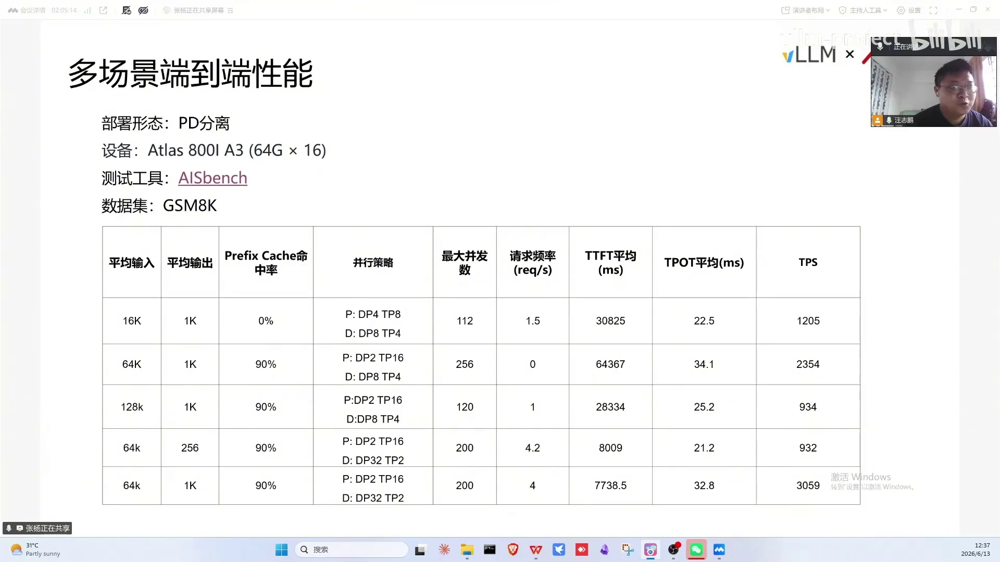 |
| 这个 prefix cache offloading 现在这个技术也正在做，最近也会上，prefix cache（相关）优化也是很快的。——对，因为我之前也跟一些朋友聊过：大家会觉得如果你的场景需要把 cache offload 到磁盘上，说明你存的这个东西实在太多了。 [【跳转到 88:49】](https://www.bilibili.com/video/BV1eoJJ6eEUv/?t=5329) | 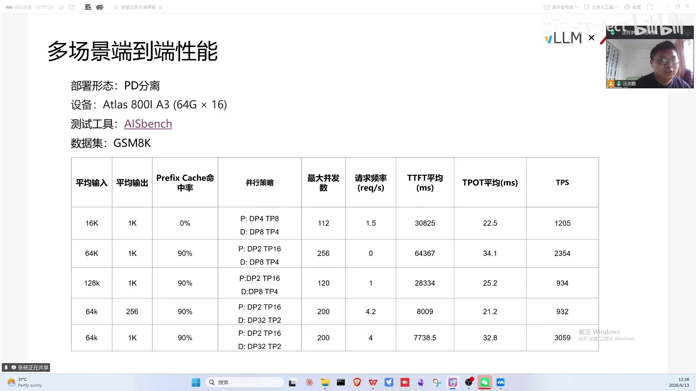 |
| 那么会造成一个问题：磁盘的开销会非常大。因为你把（缓存）都存到磁盘上，得保存很多很多历史数据的缓存，全都放在一起了，实际上要搞得很大的磁盘去存。而且我们认为缓存往往是在同一个 session 里更容易命中，对吧。你可能存了好多好多天的数据，这时候想在磁盘上命中…… [【跳转到 89:14】](https://www.bilibili.com/video/BV1eoJJ6eEUv/?t=5354) |  |
| 其实这个命中率在磁盘上是比较低的。其次，为了一个低概率命中，你需要花很多额外资源去存一堆可能一辈子用不上的 cache…… [【跳转到 89:39】](https://www.bilibili.com/video/BV1eoJJ6eEUv/?t=5379) |  |
| 所以我觉得现在来讲，把它 offload 到内存已经是足够的。——对对。然后有人问：TPOT 能够做到 25 毫秒吗？ [【跳转到 90:04】](https://www.bilibili.com/video/BV1eoJJ6eEUv/?t=5404) | 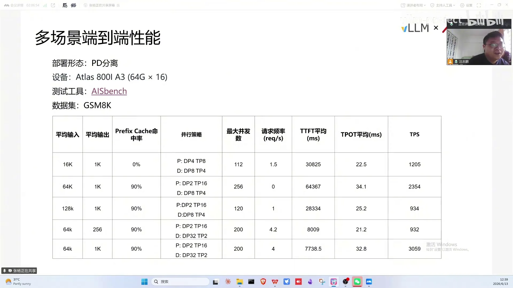 |
| 不（是都能）做到，对。这个基本都是 25 毫秒（量级）。这个跟你的并发有关系：如果（并发）大，TPOT 就会高一点；如果通过减小并发，可以减少 TPOT。——对。然后还有同学问：LMCache 和 Mooncake 做 KV（offload）在 GLM5 上面，选用哪个更好？LMCache 是什么？ [【跳转到 90:29】](https://www.bilibili.com/video/BV1eoJJ6eEUv/?t=5429) |  |
| 当前，这个其实我也不太了解。它主要是面向提高 cache 命中率的。我们在实际开发中接触的不是太多，但我们实际（场景）用的还是（自带的）KV offload？ [【跳转到 90:54】](https://www.bilibili.com/video/BV1eoJJ6eEUv/?t=5454) |  |
| KV offload，OK。——对，因为我感觉一些落地方案里面用 Mooncake 挺多的。然后现在 vLLM 的话，主要也是会把 Mooncake 作为（支持的）KV offloader 之一。 [【跳转到 91:19】](https://www.bilibili.com/video/BV1eoJJ6eEUv/?t=5479) |  |
| 对，我们现在（的）PD（分离）……（KV cache）可以单独做一次直播吗？——可以了。其实上一次我们做 PCP 和 DCP 特性的时候，当时 DCP 特性是月之暗面那边同学做的…… [【跳转到 91:44】](https://www.bilibili.com/video/BV1eoJJ6eEUv/?t=5504) |  |
| 是吧。当时其实我是想邀请他来讲 DCP，但是他听说要搞直播就（婉拒了）：只是做了 PR 就没有来说。我到时候月之暗面这块再想办法找其他同学来搞。——然后还有：vLLM（昇腾）啥时候做分享？vLLM（昇腾）的话我们会尽快安排的…… [【跳转到 92:09】](https://www.bilibili.com/video/BV1eoJJ6eEUv/?t=5529) | 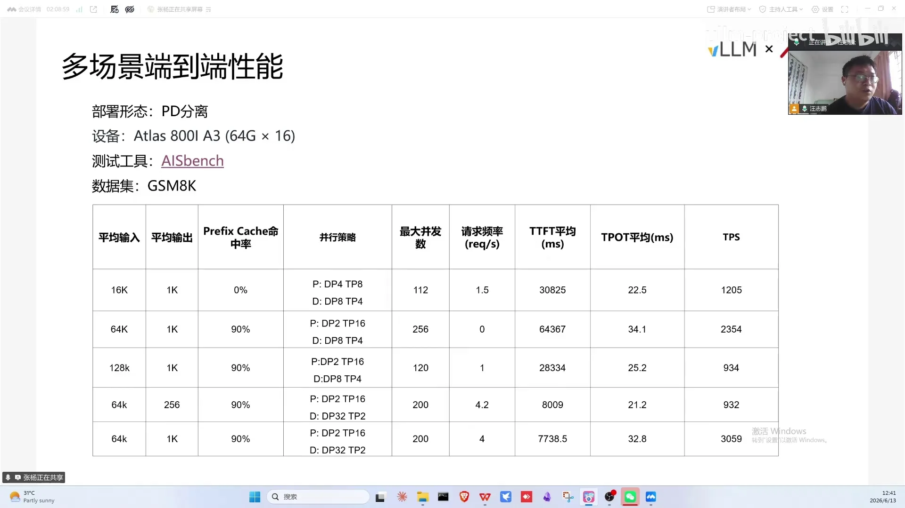 |
| 但是现在 vLLM（昇腾）有一些特性我们还在做，所以可能需要过一段时间，把这些特性做好之后我们会更好地做一些宣传。好，然后还有同学有什么其他的疑问吗？我们再等两分钟。——现在华为这个昇腾社区里面来的社区同学多吗？——我没看，张老师。 [【跳转到 92:34】](https://www.bilibili.com/video/BV1eoJJ6eEUv/?t=5554) |  |
| 我们再等两分钟。——现在华为这个昇腾社区里面来的社区同学多吗？——我没看，张老师。 [【跳转到 92:59】](https://www.bilibili.com/video/BV1eoJJ6eEUv/?t=5579) |  |
| OK。然后有同学问：平常工作中（需要）用（昇腾）写 kernel 吗？必须吗？——不是必须的。因为现在这种算子有专门的团队去做，是（按）需求（提）的。如果在实际推理过程中…… [【跳转到 93:24】](https://www.bilibili.com/video/BV1eoJJ6eEUv/?t=5604) | 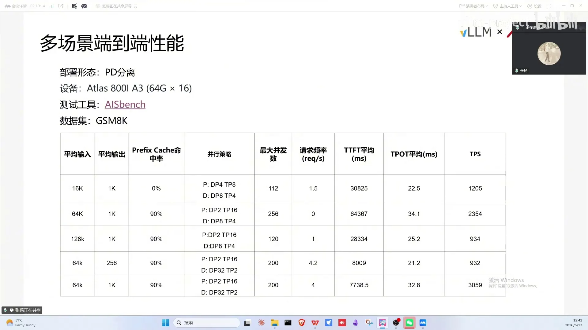 |
| 这些算子都是已经提供好的。主要我们（做）的是推理（框架层）。因为我感觉在 vLLM 里面 vLLM 开发者很多、核心开发者有很多，其实大家基本上没有几个人是写算子的。因为首先我们自己写的话写不过一些厂商，对吧，是完全写不过的。 [【跳转到 93:49】](https://www.bilibili.com/video/BV1eoJJ6eEUv/?t=5629) |  |
| 然后一般包括很多（其他框架），大家也是会把一些算子需求提给对应的厂商，让他们帮忙实现。所以自己写的算子的话，通用性会有问题，因为各种（场景）不可能面面俱到。——而且我感觉框架层面可以做的（工作）是非常非常多的。——嗯嗯对，把框架层面做好的话相当于……因为我觉得整个模型推理这块分几层嘛：一个是（芯片）这一层，然后是框架层，最后是算子层。你做哪个方向的话，把这个方向做好，其实你对整个行业来讲就已经做了很大贡献，我们不需要把每个东西…… [【跳转到 94:14】](https://www.bilibili.com/video/BV1eoJJ6eEUv/?t=5654) |  |
| （接上） [【跳转到 94:39】](https://www.bilibili.com/video/BV1eoJJ6eEUv/?t=5679) |  |
| 都搞清楚。包括你在框架层的其实也分很多模块，你把自己这个模块搞清楚就行了。因为现在这个推理（栈）太复杂了，不可能都搞清楚，太复杂了。好，然后有同学问：这个大 DP 最大测试到多少（机器）呢？——现在最大测试到 12（台）。——12 台机器？——12×16 是吗？——对对。——OK 那非常大。然后还有同学问：一个专家一张卡吗？ [【跳转到 95:04】](https://www.bilibili.com/video/BV1eoJJ6eEUv/?t=5704) |  |
| 最大我这边有测试到 12（台机器）。——12 台机器？那就是 12×16 是吗？——对对。——OK 那非常大。然后还有同学问：一个专家一张卡吗？——这个是这样子：专家并行首先看有多少专家…… [【跳转到 95:29】](https://www.bilibili.com/video/BV1eoJJ6eEUv/?t=5729) |  |
| 并行的话就是看你的 EP 的 rank 是多少。一般来讲正常应该就是用总的专家数量去除以你的 rank 数。但是有的时候你会发现有的专家用得多、有的用得少，实际上整个专家的分配是可以手动去调的：让用得少的专家多放一些在一台（机器）上面…… [【跳转到 95:54】](https://www.bilibili.com/video/BV1eoJJ6eEUv/?t=5754) |  |
| 比如用得多的专家（少）放几个，用得少的专家（多）放——比如十几个用得少的专家放一台机器，这样子。——对，这是（典型的做法）。 [【跳转到 96:19】](https://www.bilibili.com/video/BV1eoJJ6eEUv/?t=5779) |  |
| 然后还有（问）：四台机器互联走什么线？有（类似）NVLink 这样的东西吗？——我没太理解，就是比如我几台机器的连接是用什么东西连的？ [【跳转到 96:44】](https://www.bilibili.com/video/BV1eoJJ6eEUv/?t=5804) | 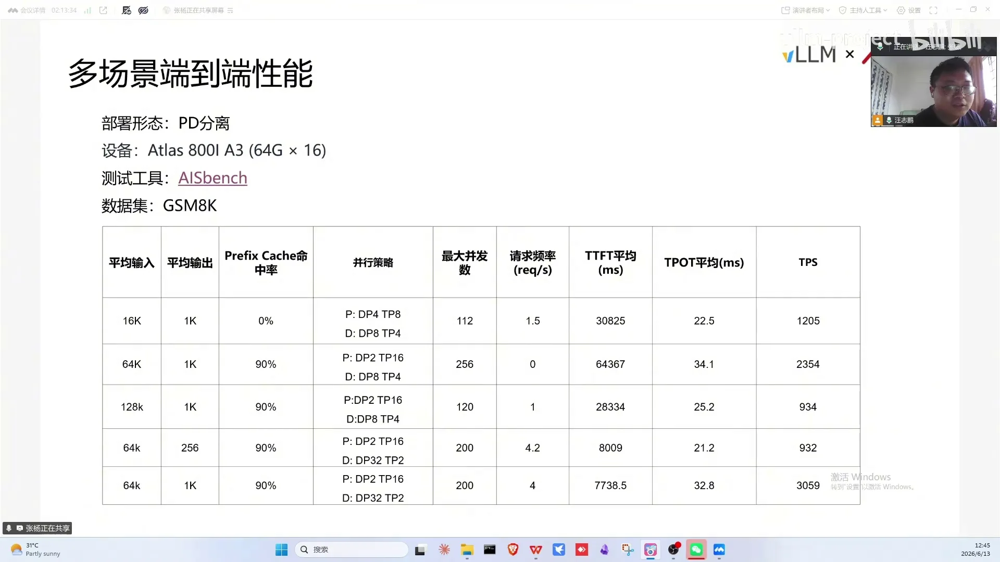 |
| 哦，这个具体我可能还不太清楚。只知道我们现在有这个超节点，而且现在这种（互联）还有 RoCE 这种（方案）。——对，感兴趣可以自己去查一下。——这个好像有些（细节）不太（方便说）。 [【跳转到 97:09】](https://www.bilibili.com/video/BV1eoJJ6eEUv/?t=5829) |  |
| 我感觉基本上每个厂商都会去对标那（NVIDIA）那边嘛，会有对应的一些硬件去支持跨机的互联。——对，我们现在（超节点）这种跨机互联做得都是比较好的。——（是）什么超节点？——对。然后这个直播我们会有录像，之后就会放出来。这个录像我要稍微先剪一下再放出来。 [【跳转到 97:34】](https://www.bilibili.com/video/BV1eoJJ6eEUv/?t=5854) |  |
| 然后还有同学问：A3 是不是（就是 910C）？——不一定啊。我现在主推的就是（超节点），这种互联是（跨节点的），还有其他（形态）。 [【跳转到 97:59】](https://www.bilibili.com/video/BV1eoJJ6eEUv/?t=5879) | 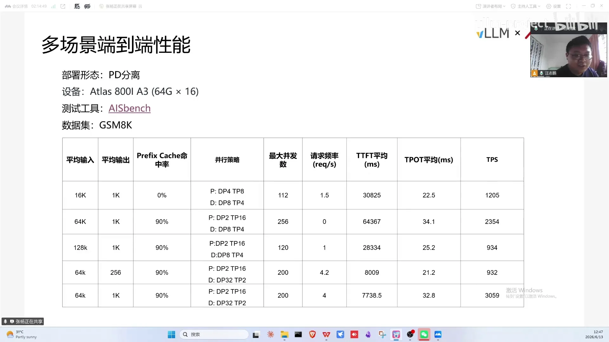 |
| 就是类似这种达到（NVLink）这种多卡多机之间互联的。——好，我觉得再没有什么问题了，那我们今天直播就到此结束了。然后非常感谢张阳老师的分享。我们下一期的同一时间就是星期六的上午十一点钟…… [【跳转到 98:24】](https://www.bilibili.com/video/BV1eoJJ6eEUv/?t=5904) | 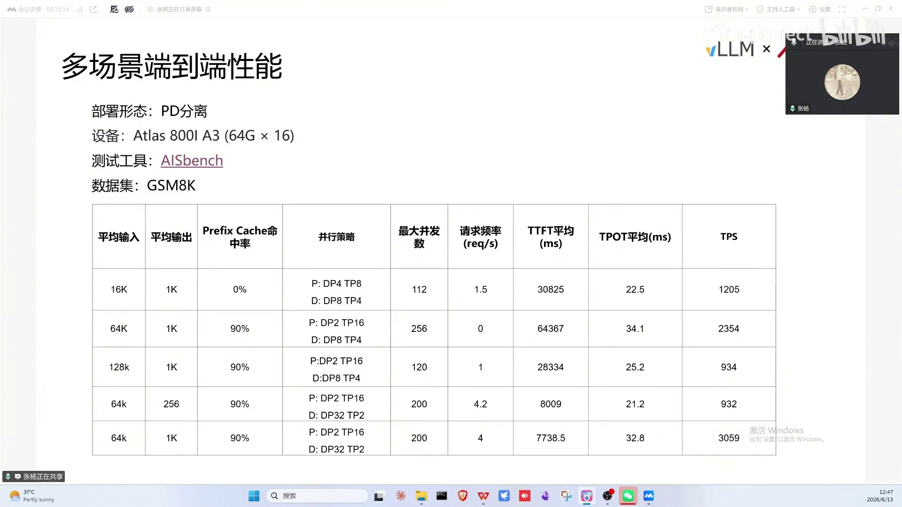 |
| 我们会进行那个 vLLM 的官方直播，好吧。我们依旧会分享一些 vLLM 相关的技术和特性，以及 vLLM 社区里面一些新的 PR 或者其他一些特性。感兴趣的同学希望可以给直播点点关注。之后我也会把这一次直播的录像上传到这个频道…… [【跳转到 98:49】](https://www.bilibili.com/video/BV1eoJJ6eEUv/?t=5929) |  |
| 然后带大家敬请期待。好，然后我们今天直播就结束了。 [【跳转到 99:14】](https://www.bilibili.com/video/BV1eoJJ6eEUv/?t=5954) | 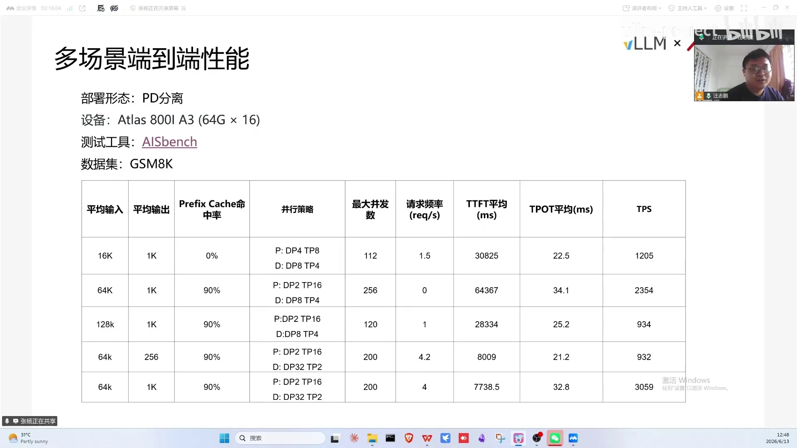 |
| 好，再见拜拜。 [【跳转到 99:20】](https://www.bilibili.com/video/BV1eoJJ6eEUv/?t=5960) |  |
| （此区间无字幕） [【跳转到 99:25】](https://www.bilibili.com/video/BV1eoJJ6eEUv/?t=5965) | 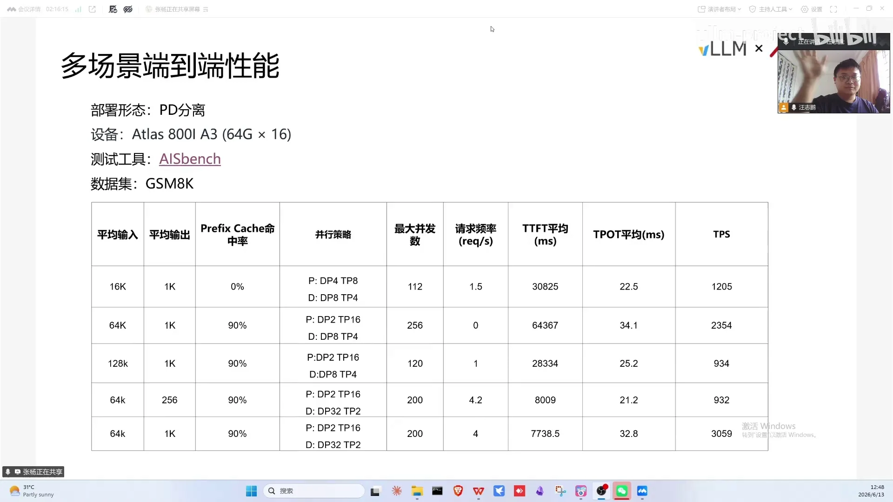 |