# vLLM小课堂（七）：Auto Round加速LLM/VLM低比特量化部署 原始文稿（图-字幕分栏）

| 字幕文本 | 画面 |
| :--- | ---: |
| 我们时间差不多了，那我们今天的直播就正式开始了。今天我们很荣幸请到了刘毅老师，他是 vLLM 和 vLLM-Omni 里面 AutoRound 这个特性的一个核心贡献者。我们先请刘毅老师简单做一下自我介绍吧。——OK 好，谢谢志鹏老师。我叫刘毅，然后…… [【跳转到 00:00】](https://www.bilibili.com/video/BV1etjE69Efx/?t=0) | 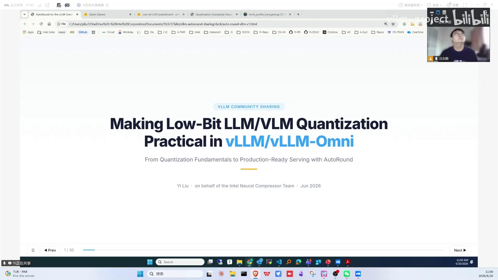 |
| 一直在英特尔做量化相关的（工作）。今天也是志鹏老师邀请，我代表我们英特尔 neural compress team 来介绍一下我们的一个算法，叫做 AutoRound，以及它在 vLLM 和 vLLM-Omni 里面相关的一些使用方法和一些 benchmark。 [【跳转到 00:25】](https://www.bilibili.com/video/BV1etjE69Efx/?t=25) | 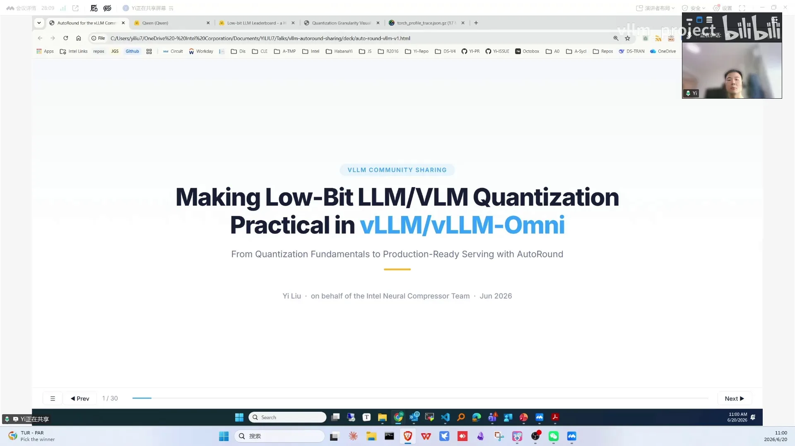 |
| 好，非常欢迎我们的刘毅老师，那我们的直播就开始了。——OK，嗯，我今天的话主要分这么几个部分：第一个是介绍一些量化相关的基础知识…… [【跳转到 00:50】](https://www.bilibili.com/video/BV1etjE69Efx/?t=50) | 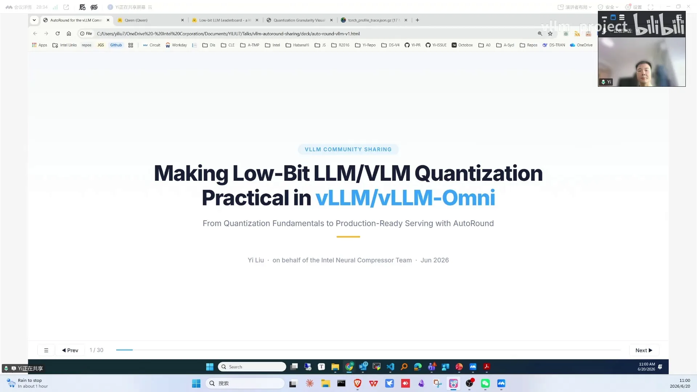 |
| 然后第二部分是这个 AutoRound 这个算法它是怎么工作的、以及我们怎么来使用它。第三部分是在 vLLM 和 vLLM-Omni 里面实际量化一个模型、部署一个模型的具体步骤，以及相关的一些性能和精度的一些（数据）…… [【跳转到 01:15】](https://www.bilibili.com/video/BV1etjE69Efx/?t=75) | 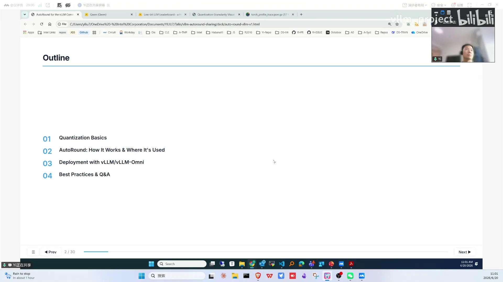 |
| 第四部分是一些我们经验的分享以及答疑。先开始第一部分：量化的基础知识。我们讲量化的时候，实际上是在做一个从高精度数据类型映射到低精度数据类型的过程。比如这个图里面…… [【跳转到 01:40】](https://www.bilibili.com/video/BV1etjE69Efx/?t=100) |  |
| 上面大家可以认为是一个浮点数，它能表示更多的值；下面比如说是一个 int 类型，它能表示的值更少。我们要做的就是从浮点数映射到 int 类型。在这个过程中我们需要做这么几步：第一个就是我们需要有一个 scaling…… [【跳转到 02:05】](https://www.bilibili.com/video/BV1etjE69Efx/?t=125) | 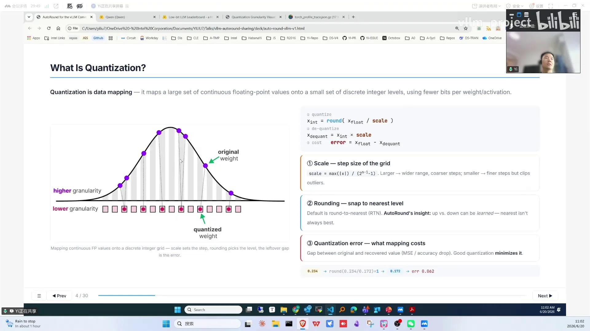 |
| 一般它的计算方式是求整个 tensor 的最大值，除以低精度所能表示的最大值，来算出这样子的 mapping 的缩放值。然后第二步就是 rounding：我们拿到一个（浮点）值…… [【跳转到 02:30】](https://www.bilibili.com/video/BV1etjE69Efx/?t=150) |  |
| 把这个 float 值除完最大值、除完这个 scale 之后，要能在低精度表示，就需要 round 到低精度所能表示的一个值。这两步会引入量化的误差。量化（调优）在做的事情，就是…… [【跳转到 02:55】](https://www.bilibili.com/video/BV1etjE69Efx/?t=175) |  |
| 尽可能减小这个误差。然后我们可以对比一下——从一个基础的维度来考虑量化：因为量化的 scheme、量化的组合非常多嘛，我希望从一个（分层的）维度…… [【跳转到 03:20】](https://www.bilibili.com/video/BV1etjE69Efx/?t=200) | 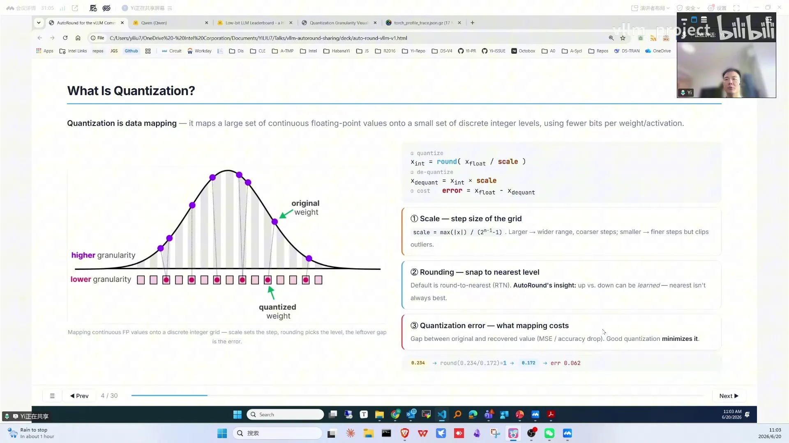 |
| 从下往上：首先是编码。比如我们现在有了 4 个比特，可以把它编码成 int4，也可以编码成 FP4。然后再往上是比特的位宽：比如我们有了 32 个比特…… [【跳转到 03:45】](https://www.bilibili.com/video/BV1etjE69Efx/?t=225) |  |
| 如果是 int4 的话它就有 8 个值，如果是 INT8 的话它就有 4 个值，如果是 FP8 的话它就有两个值。这是在 32 比特的情况下可以分配不同的位宽。再往上是元素分组：比如一个 weight 是一个 tensor…… [【跳转到 04:10】](https://www.bilibili.com/video/BV1etjE69Efx/?t=250) |  |
| 那么这个 tensor 我们可以把不同个数的元素 group 起来，不同的 group 大小可以求一个对应的 scale。举个例子，就是说…… [【跳转到 04:35】](https://www.bilibili.com/video/BV1etjE69Efx/?t=275) |  |
| 稍等一下，比如我们有这样子的一个…… [【跳转到 05:00】](https://www.bilibili.com/video/BV1etjE69Efx/?t=300) |  |
| 16×64 这样子的一个大的 tensor。如果我们做 per-tensor 的量化，就是整个这 1024 个元素共用一个 scale。如果想更细的维度，可以做 per-row（每一行有一个 scale）；再进一步可以 per-group：每 32 个元素有一个 scale，group size 也是一个可调的参数…… [【跳转到 05:05】](https://www.bilibili.com/video/BV1etjE69Efx/?t=305) |  |
| 后面 DeepSeek 其实介绍了一个 per-block 的概念，也是比较（主流的用法了）：比如是一个 16×16 的 block…… [【跳转到 05:30】](https://www.bilibili.com/video/BV1etjE69Efx/?t=330) | 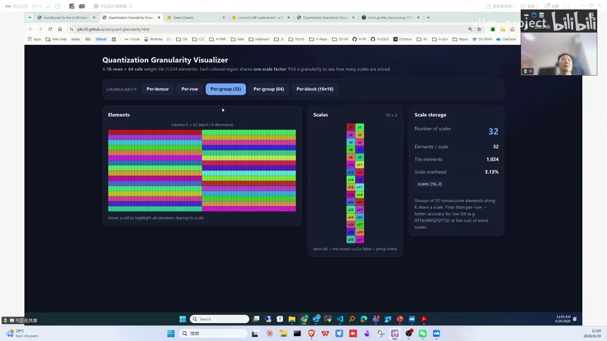 |
| 然后有了这三个维度之后…… [【跳转到 05:55】](https://www.bilibili.com/video/BV1etjE69Efx/?t=355) | 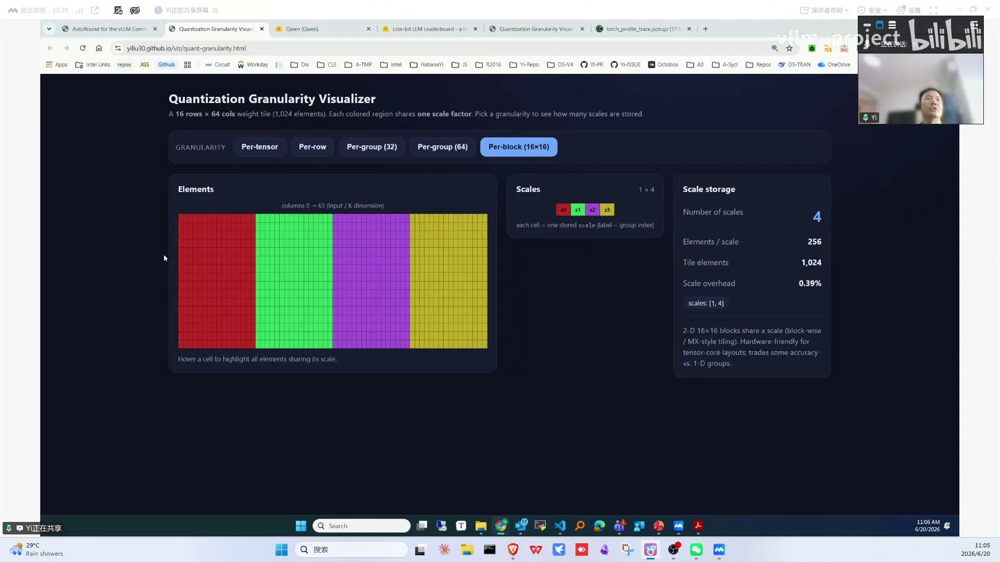 |
| 它们的组合我们就可以拿到 FP8、MXFP4、MXFP8 这样子的不同数据类型。有了 tensor 再往上可以到 module 层面：比如一个 linear，它有 weight 和 activation，两者也可以做不同的量化…… [【跳转到 06:00】](https://www.bilibili.com/video/BV1etjE69Efx/?t=360) | 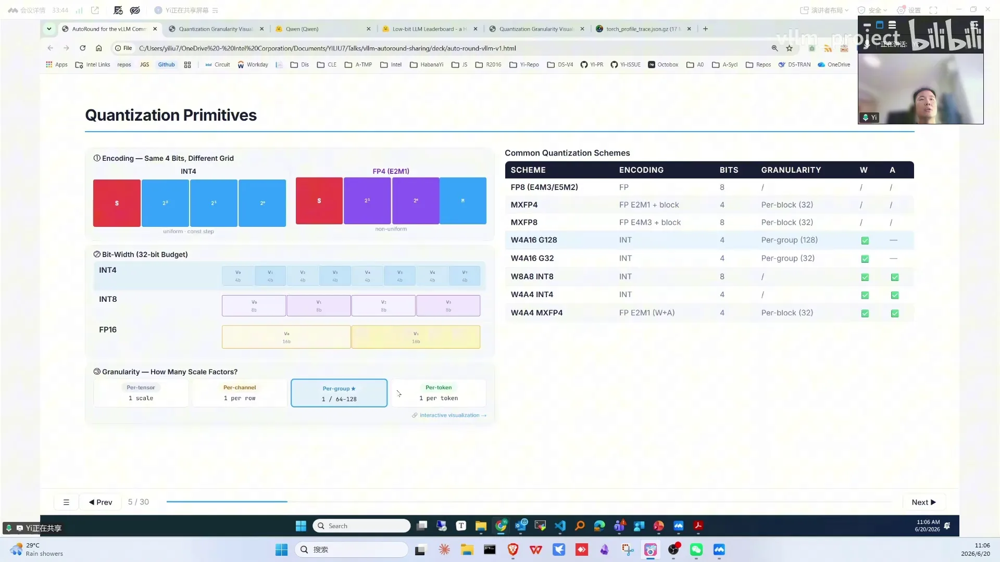 |
| 就有了比如 W4A16 和 W4A8 这样子的数据类型。再往上到 model 层级，不同的层又可以有不同的精度，就有了混合精度的设置。 [【跳转到 06:25】](https://www.bilibili.com/video/BV1etjE69Efx/?t=385) |  |
| 这边我主要是想说：从底往上有多个维度、各种组合，导致了现在各种各样的精度 recipe。 [【跳转到 06:50】](https://www.bilibili.com/video/BV1etjE69Efx/?t=410) | 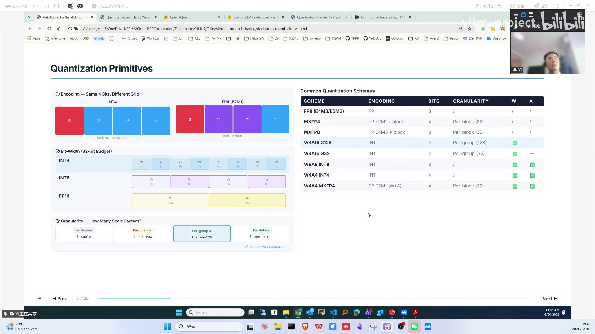 |
| 然后我们在做的事情，实际上是怎么拿到这个 scale，让它产生的量化误差最小。常见有两种方式：PTQ 和 QAT。可以从这么几个角度来考虑这两种方法…… [【跳转到 07:06】](https://www.bilibili.com/video/BV1etjE69Efx/?t=426) | 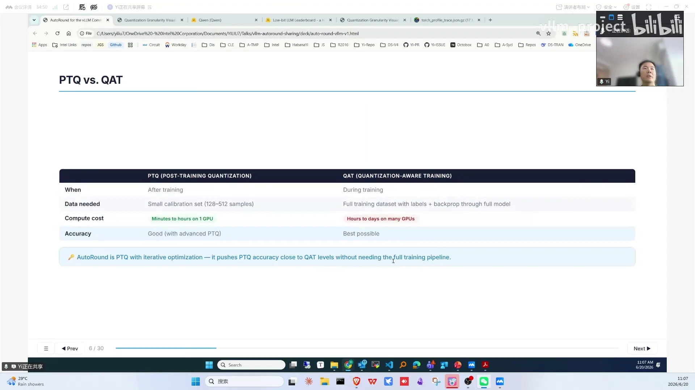 |
| 第一个：PTQ 一般是模型已经完成训练了——训练时是高精度的——我们把它量化成低精度来做推理。QAT 一般是在 training 的时候就引入，让模型以低精度的状态去学习它需要学的知识。然后所需的数据：校准数据 PTQ 相对比较少，QAT 相对要多。PTQ 所需的计算量也比较少。精度的话一般…… [【跳转到 07:31】](https://www.bilibili.com/video/BV1etjE69Efx/?t=451) | 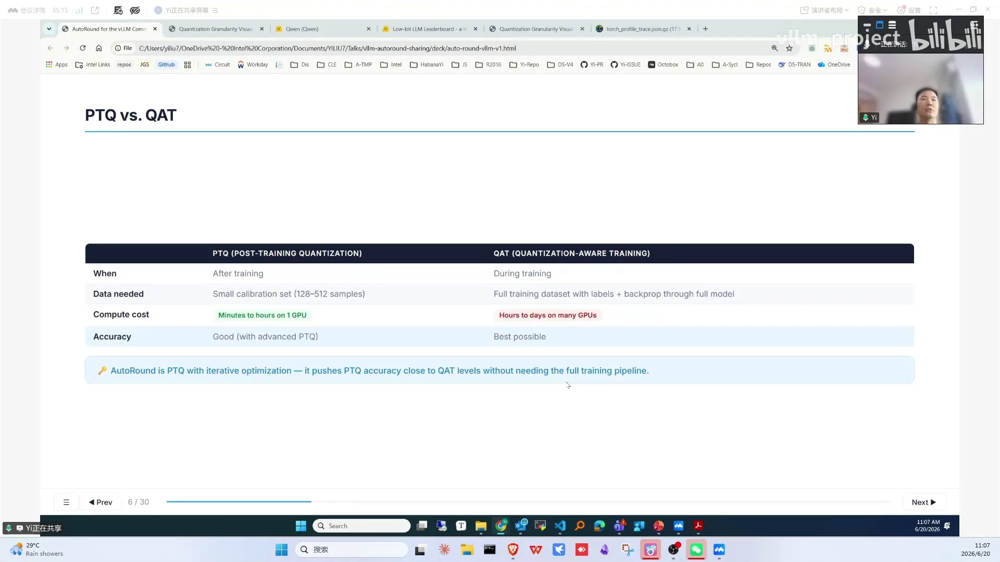 |
| （接上） [【跳转到 07:56】](https://www.bilibili.com/video/BV1etjE69Efx/?t=476) |  |
| 可能 QAT 会相对好一点吧。但是 PTQ 其实也能达到一个我觉得可接受的范围。AutoRound 其实是 PTQ 的一种，它引入了一些 QAT 相关的优化手段，后面我会介绍具体细节。 [【跳转到 08:21】](https://www.bilibili.com/video/BV1etjE69Efx/?t=501) | 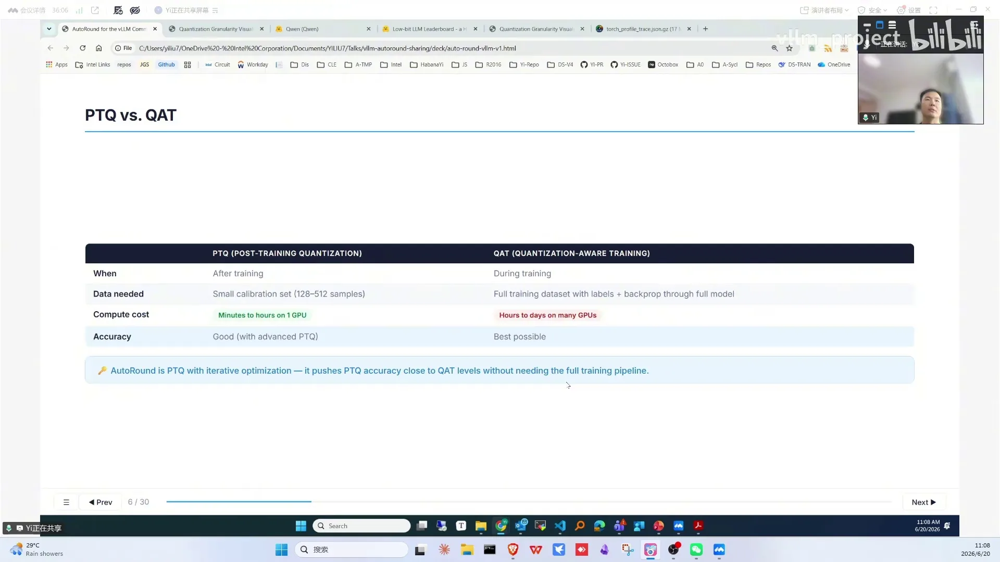 |
| 我们讲为什么要在 LLM 或者 vLLM 的推理里引入量化呢？可以从这么几个角度考虑。第一个是硬件的发展：硬件现在从 FP16 到 FP8 到 FP4…… [【跳转到 08:46】](https://www.bilibili.com/video/BV1etjE69Efx/?t=526) | 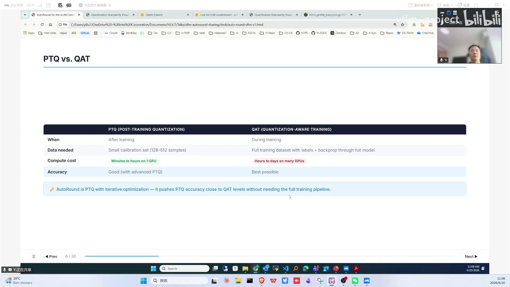 |
| 每一次迭代，硬件的计算能力 TFLOPS 都是成倍增加的。在这样的前提下，我们（部署）model 的时候可以从两个角度考虑。第一个就是模型的尺寸在不断增加…… [【跳转到 09:11】](https://www.bilibili.com/video/BV1etjE69Efx/?t=551) | 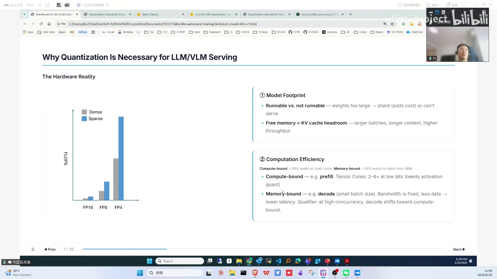 |
| 模型尺寸不断增加，而 GPU 的 memory 大小——有了卡之后就是固定的。那么模型的大小就决定了这个模型在一张卡上…… [【跳转到 09:36】](https://www.bilibili.com/video/BV1etjE69Efx/?t=576) |  |
| 能不能运行起来。比如 DeepSeek 671B，在八张 H100 上，如果是 BF16 的 weight 就太大了，没办法跑起来；而 DeepSeek 原生是 FP8 的，它就可以跑起来。所以第一步是能跑和不能跑的区别。 [【跳转到 10:01】](https://www.bilibili.com/video/BV1etjE69Efx/?t=601) | 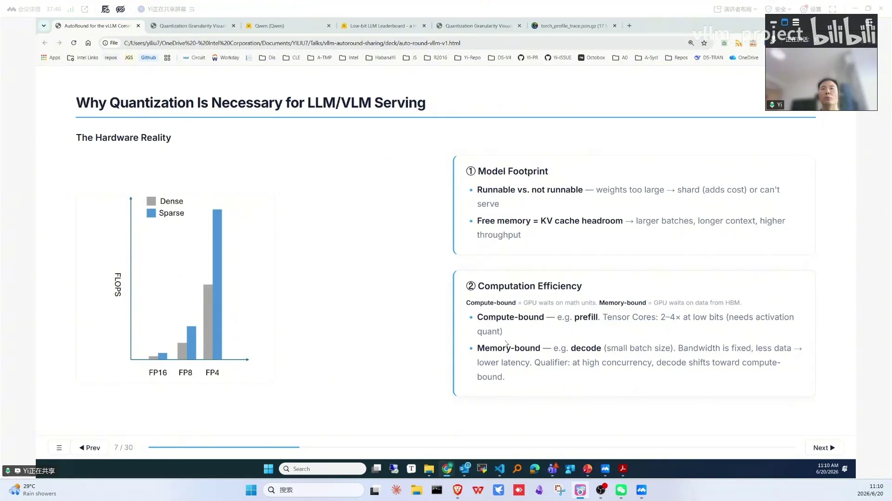 |
| 在能跑的前提下，量化减小了 model size，就可以有更多的 free memory。这个 free memory 可以进一步提高 KV cache 的大小…… [【跳转到 10:26】](https://www.bilibili.com/video/BV1etjE69Efx/?t=626) |  |
| 有了更多 KV cache，就可以做更多的事情：比如更大的 batch size、更长的 context length。第二个角度：在能跑的前提下，量化还可以影响计算的效率。分两种情况考虑…… [【跳转到 10:51】](https://www.bilibili.com/video/BV1etjE69Efx/?t=651) |  |
| 第一个是 compute bound。用低精度的话，低精度的 tensor core 一般会有两到四倍更强的算力，在 compute bound 的情况下可以提高推理速度。在 memory bound 的情况下，卡的 bandwidth 是固定的…… [【跳转到 11:16】](https://www.bilibili.com/video/BV1etjE69Efx/?t=676) | 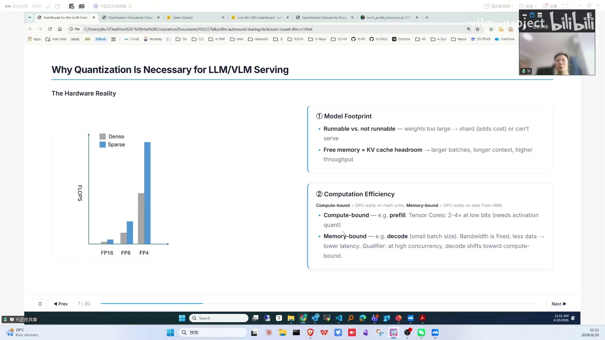 |
| 量化完之后每次推理需要搬运的 memory 更少，意味着可以有更低的 latency。这是 AutoRound（的背景介绍）。看大家有什么问题吗？——有同学问：向主仓提交低比特量化的算法应该找谁 review？还有需要贴什么测试内容？ [【跳转到 11:41】](https://www.bilibili.com/video/BV1etjE69Efx/?t=701) | 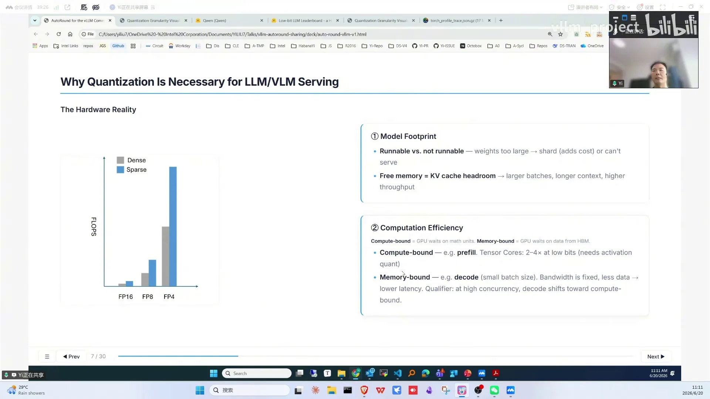 |
| 在主仓的话应该主要可以找 Robert，还有 Red Hat 那边的两位同学，他们是做主仓量化引入的。 [【跳转到 12:06】](https://www.bilibili.com/video/BV1etjE69Efx/?t=726) | 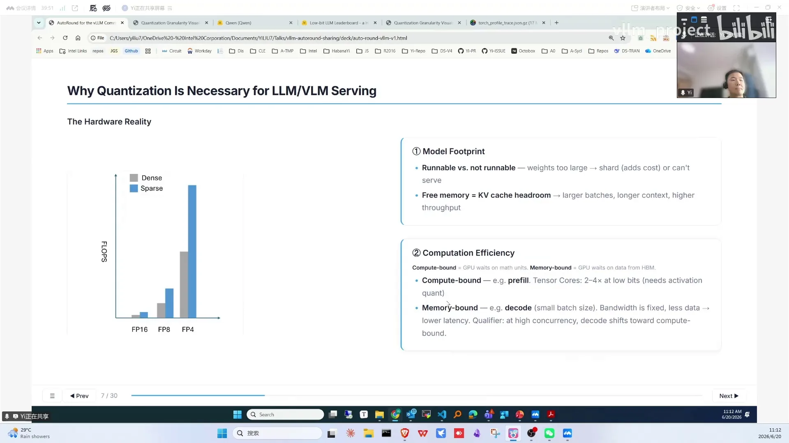 |
| 如果是在 vLLM-Omni 的话可以找李顺阳（他们）。贴什么测试内容这块我不太清楚。刘毅老师你知道吗？——如果提交量化这块的 feature，我觉得最重要的就是精度和性能吧。精度应该是最基础的…… [【跳转到 12:31】](https://www.bilibili.com/video/BV1etjE69Efx/?t=751) | 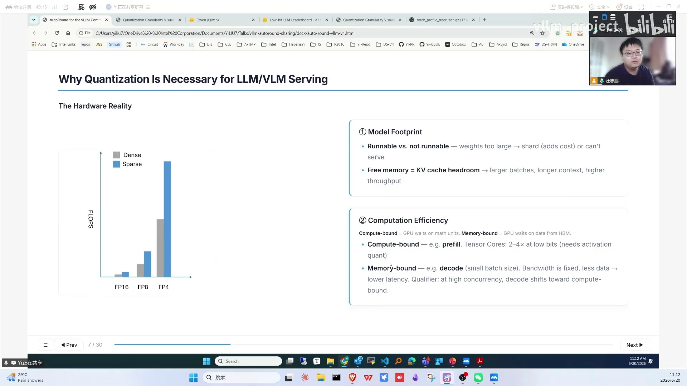 |
| 你量化完之后，或者说你加了 FP8 的 KV cache 量化，要证明你对精度的影响足够小、在可接受的范围内。——对，基本上我们所有性能相关的 feature 提交都需要提交 benchmark…… [【跳转到 12:56】](https://www.bilibili.com/video/BV1etjE69Efx/?t=776) |  |
| 看你的吞吐或者 TTFT 这些带来的提升是什么范围的提升。——好。还有同学问：老师用 AutoRound 适配过多大模型？ [【跳转到 13:21】](https://www.bilibili.com/video/BV1etjE69Efx/?t=801) | 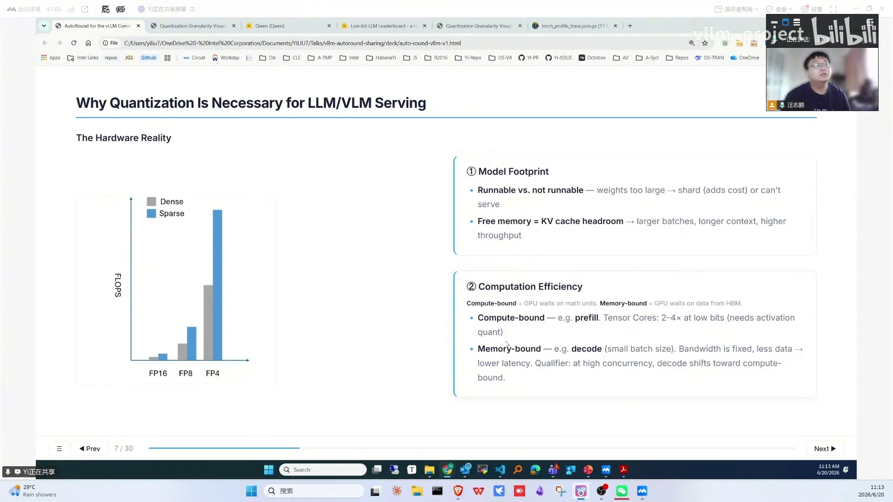 |
| 最大的……其实 DeepSeek 这些比较主流的大模型我们都有量化过：比如 DeepSeek，MiniMax 应该也有出过。反正比较主流的我们都有（覆盖）。跟模型大小的关系的话…… [【跳转到 13:46】](https://www.bilibili.com/video/BV1etjE69Efx/?t=826) | 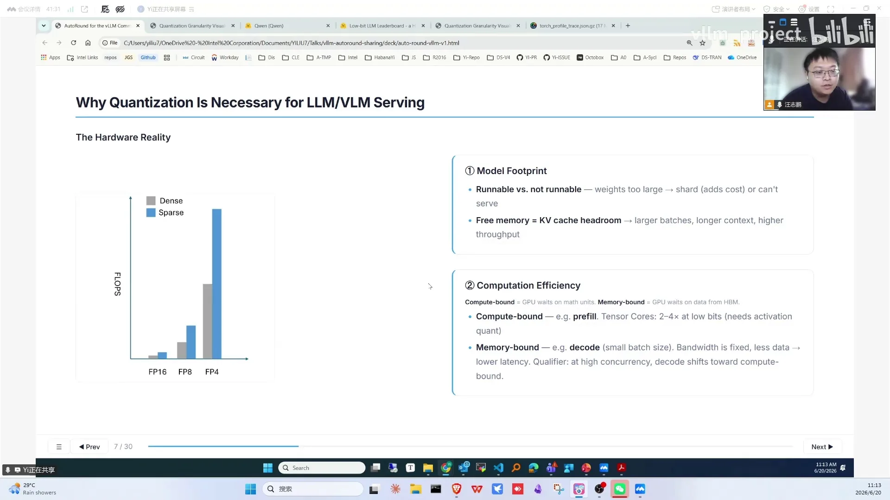 |
| 后面我会介绍：我们并不需要一个 600B 的模型就准备 600B（对应）的 memory 才能把它量化完，后面会介绍具体细节我们怎么来做。——好，那我们继续介绍吧。关于 AutoRound 的具体问题等介绍完再去回答。好吧。 [【跳转到 14:11】](https://www.bilibili.com/video/BV1etjE69Efx/?t=851) | 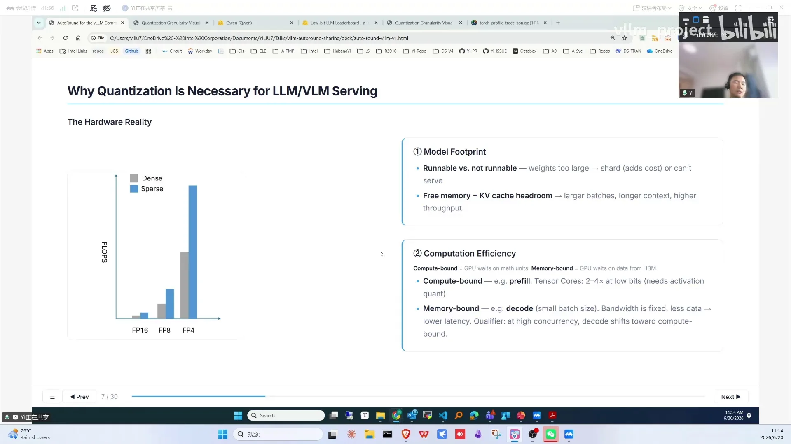 |
| 我这边顺便提一下量化在 vLLM 里、整个架构里的位置。vLLM 比较复杂，包含前端的 API serving、scheduler、model runner 这些。量化相对在 model 之下、layer 这一层来做事情…… [【跳转到 14:36】](https://www.bilibili.com/video/BV1etjE69Efx/?t=876) | 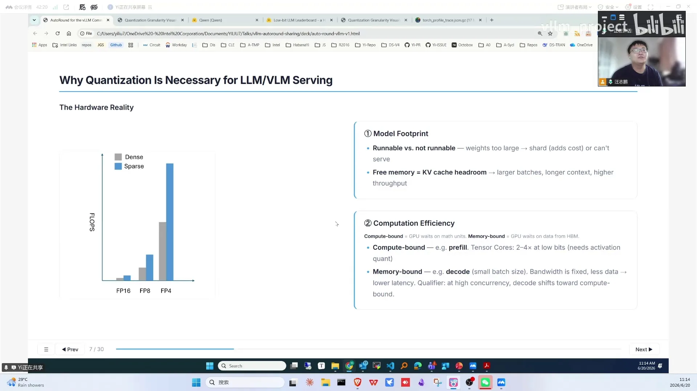 |
| 它是在 layer 这一层 dispatch 到不同的量化 kernel。比如左边一个具体的例子：量化了一个 W4A8 的层——量化了的 projection 层，它会逐步走到 forward 里面找到 quant method…… [【跳转到 15:01】](https://www.bilibili.com/video/BV1etjE69Efx/?t=901) |  |
| quant method 的话，根据你量化的比如说是 W4A16，它会走到 W4A16 linear scheme，再往下走到 Marlin 的 kernel。对，就是整个架构的 flow。 [【跳转到 15:26】](https://www.bilibili.com/video/BV1etjE69Efx/?t=926) |  |
| 然后下面我就介绍 AutoRound 是怎么工作的、我们怎么使用它。在介绍之前我想大概说一下：量化在解决什么问题、它难在哪里。 [【跳转到 15:51】](https://www.bilibili.com/video/BV1etjE69Efx/?t=951) | 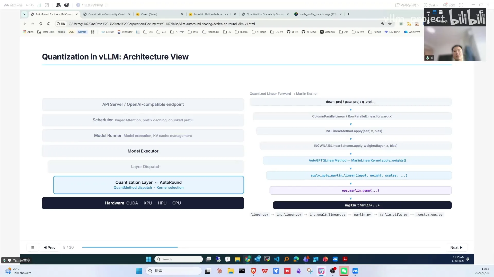 |
| 第一点：不管是 weight 还是 activation，数据的分布都是不均匀的，会有一些 outlier（异常值）。比如大部分位置都是 0.1 左右，突然有一个很大的比如 8 这样子的值…… [【跳转到 16:16】](https://www.bilibili.com/video/BV1etjE69Efx/?t=976) |  |
| 如果要把这个 8 考虑进去的话，0.1、0.2 附近的值都会被 round 到 0，这部分表示的信息就消失了。它有两个误差：第一个是 rounding 的误差——比如表示成整数时 3.3 round 得到 3，就有 0.3 的误差…… [【跳转到 16:41】](https://www.bilibili.com/video/BV1etjE69Efx/?t=1001) | 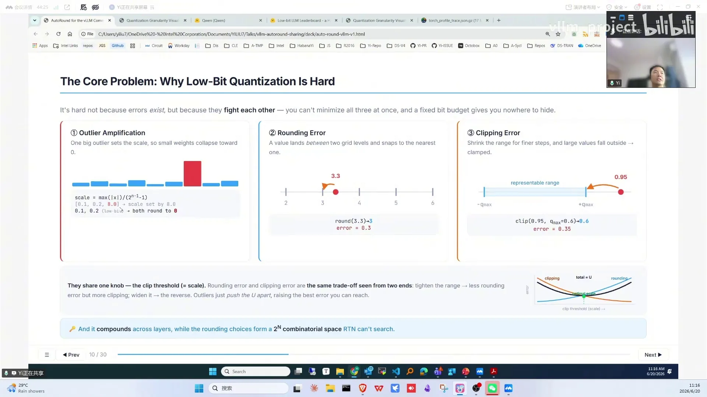 |
| 然后 clip：比如 activation 在做 calibration 的时候，我们认为这个 tensor 的最大值是 0.6，但在新推理时根据不同的 input 突然来了一个 0.95，我们要把 0.95…… [【跳转到 17:06】](https://www.bilibili.com/video/BV1etjE69Efx/?t=1026) | 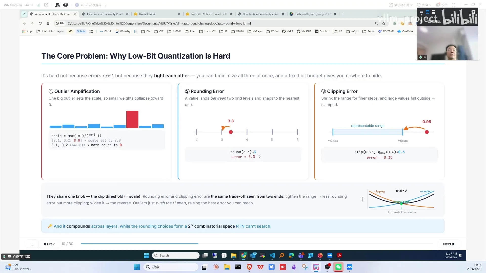 |
| clip 到 0.6，这时就有一个 clip 的误差。这两个误差都可以由 scale 推导出来。如果 scale 逐步增大，clip error 会逐步减小；但对应的 rounding error 会增加——因为 scale 越大，两个数之间的 step 更大，rounding 误差就会增加。所以我们做的事情是在这两者之间取平衡。这是一个 mental model，不是具体的数据结论，给大家一个印象…… [【跳转到 17:31】](https://www.bilibili.com/video/BV1etjE69Efx/?t=1051) |  |
| 那么不同呃它能表示两个数之间的这个step就更大了那么我们相对应的这个rounding的这个误差额就会增加然后所以我们在做的事情就是在这两个呃之间来取一个平衡呃对啊这个这个是一个嗯mentalmodel啊就不是不是一个具体的这样子的一个呃 [【跳转到 17:56】](https://www.bilibili.com/video/BV1etjE69Efx/?t=1076) | 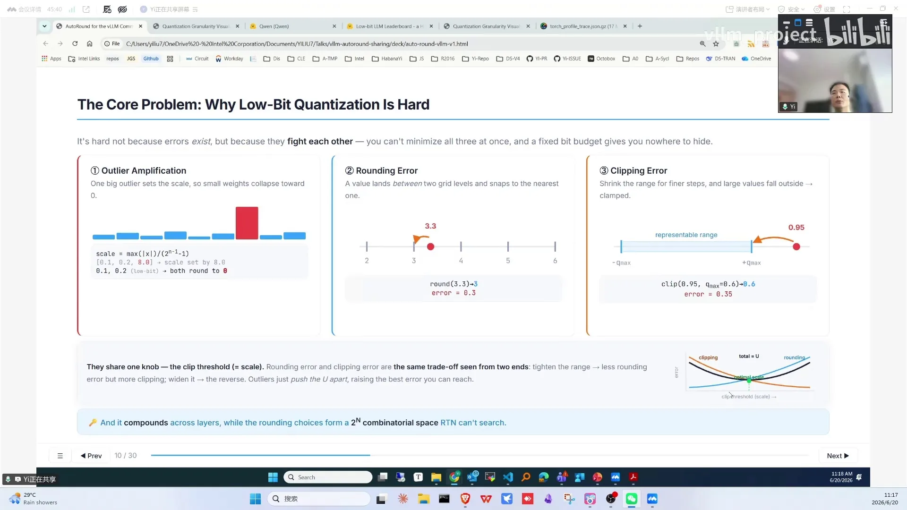 |
| 那么 AutoRound 是怎么解决这个问题的？刚才介绍了 rounding 误差和 clip 误差。对于 rounding：它到底是往上 round 还是往下 round？这实际上是一个需要调优的过程。 [【跳转到 18:21】](https://www.bilibili.com/video/BV1etjE69Efx/?t=1101) | 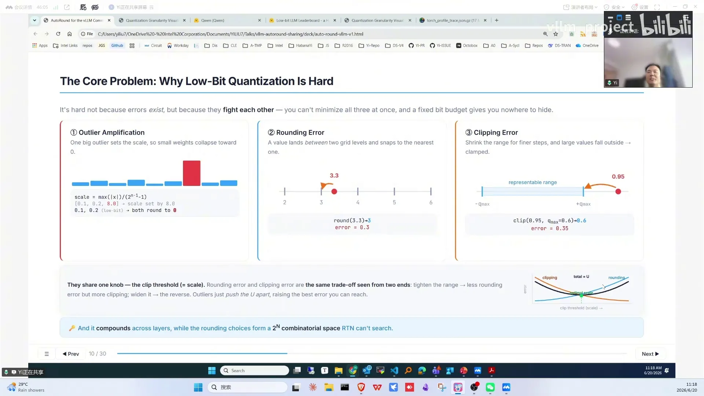 |
| 然后 clip 的 range：像 activation 我们不知道它最大的值是多少。也不是说…… [【跳转到 18:46】](https://www.bilibili.com/video/BV1etjE69Efx/?t=1126) |  |
| 还有 outlier 到底要抛掉多少，也是需要整体考虑的问题。AutoRound 把这两个参数作为可 tuning 的参数…… [【跳转到 19:11】](https://www.bilibili.com/video/BV1etjE69Efx/?t=1151) | 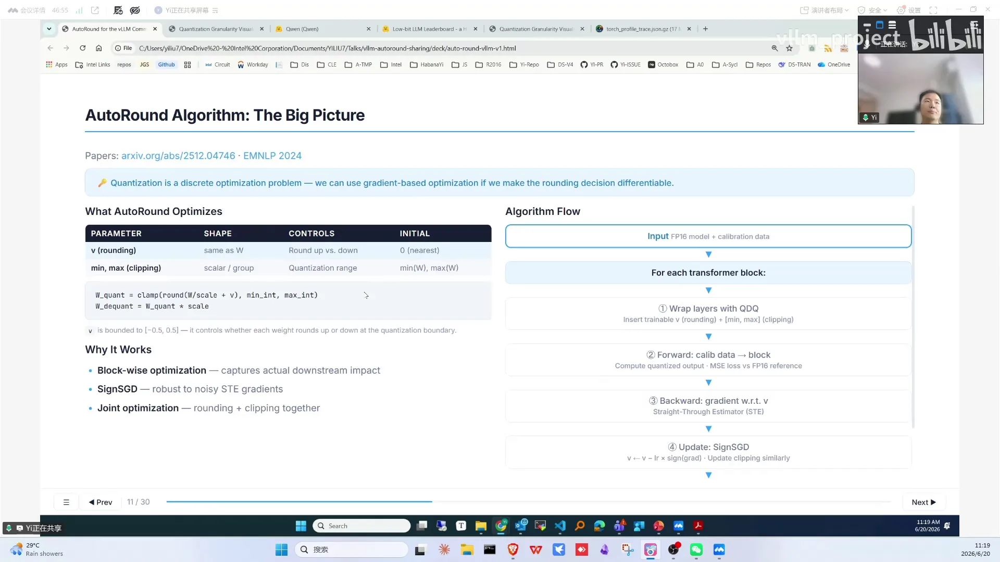 |
| 结合 block-wise 的优化来一起优化这两个可 tuning 的参数。具体过程：transformer 有很多 decoding block，比如 DeepSeek 有 61 个 decoding block。我们在一个 decoding block 上做优化…… [【跳转到 19:36】](https://www.bilibili.com/video/BV1etjE69Efx/?t=1176) |  |
| 比如拿到第一层的 decoding block，它包含 attention 和 FFN。第一步先把这个 layer wrap 成 QDQ 的形式，在里面插入这两个可变的参数，做一次 forward，收集的是 BF16 的…… [【跳转到 20:01】](https://www.bilibili.com/video/BV1etjE69Efx/?t=1201) | 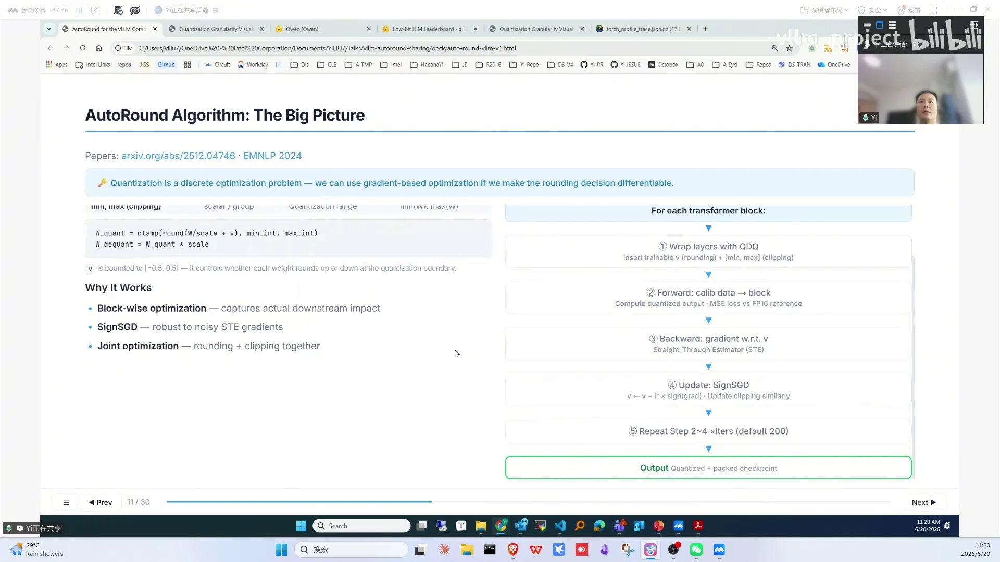 |
| output 作为基准值。然后再做一次 QDQ 的 forward，计算 BF16 reference 和 QDQ output 之间的 MSE，做梯度回传来更新这两个可调的参数…… [【跳转到 20:26】](https://www.bilibili.com/video/BV1etjE69Efx/?t=1226) |  |
| 重复 200 次——200 是一个超参数。这边想单独强调一下：我们在优化器里…… [【跳转到 20:51】](https://www.bilibili.com/video/BV1etjE69Efx/?t=1251) | 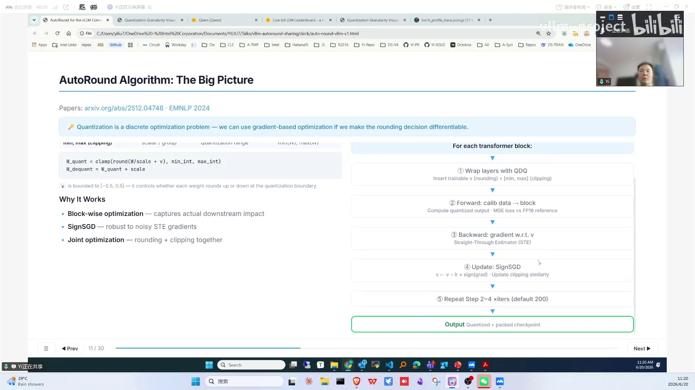 |
| 实际用的是 signSGD：更新的时候，更新的 delta 实际上是 learning rate 乘以梯度的正号或负号，并没有乘真正的梯度值。因为我们在优化的是 round up 或 round down——在做…… [【跳转到 21:16】](https://www.bilibili.com/video/BV1etjE69Efx/?t=1276) |  |
| 这样的优化。我们发现 signSGD 在这种情况下已经足够了，也相对比较稳定。基于这个，我们最近公开了一篇 SignRound V2：刚才讲的是某一个 layer 的情况…… [【跳转到 21:41】](https://www.bilibili.com/video/BV1etjE69Efx/?t=1301) | 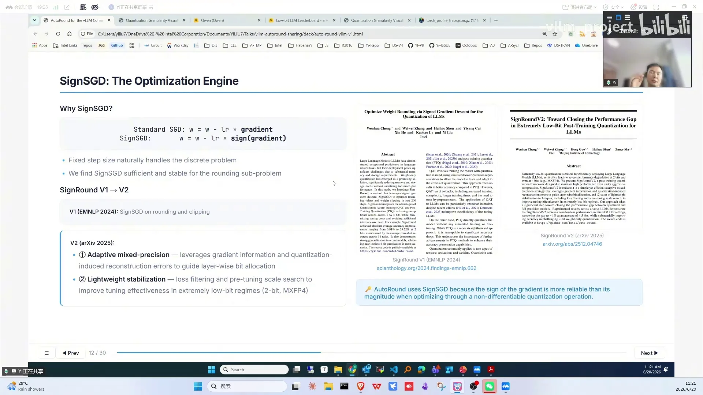 |
| V2 是在做 mixed precision：给不同层分配不同的位宽，主要面向极低比特，比如 2 比特和 MXFP4。大家有兴趣可以看这两篇 paper。我大概说一下…… [【跳转到 22:06】](https://www.bilibili.com/video/BV1etjE69Efx/?t=1326) |  |
| 可以简单对比一下 AutoRound 和 AWQ、GPTQ 的 insight。GPTQ 是说：我知道量化有误差，做的事情是补偿这个误差。AWQ 是说：weight 里面有一些关键的值，对最终量化精度有比较大的影响，把这些值保护起来，达到减小量化误差的目的…… [【跳转到 22:30】](https://www.bilibili.com/video/BV1etjE69Efx/?t=1350) | 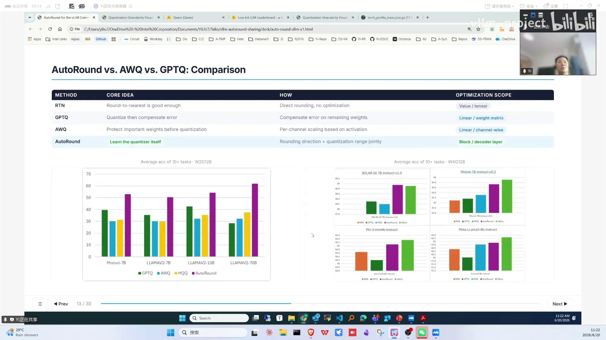 |
| （接上） [【跳转到 22:55】](https://www.bilibili.com/video/BV1etjE69Efx/?t=1375) | 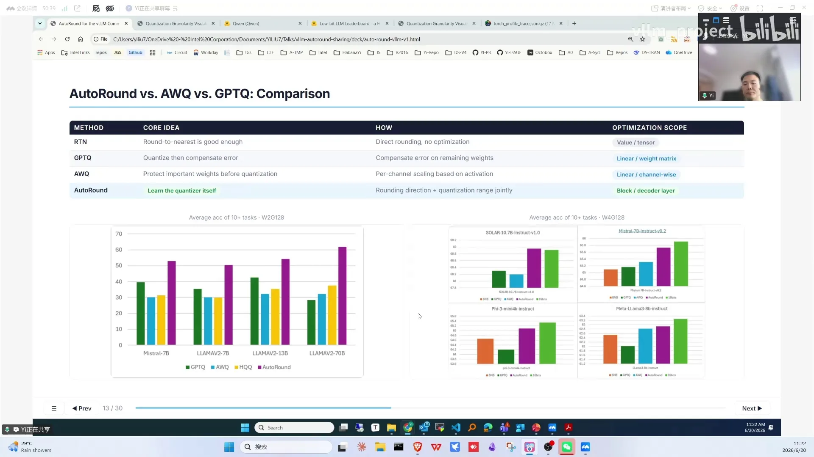 |
| 它也是基于 activation 来判断哪些 weight 比较关键。GPTQ 和 AWQ 都是在 layer 这一层——比如有一个 linear，在 linear 这一层做校准。 [【跳转到 23:20】](https://www.bilibili.com/video/BV1etjE69Efx/?t=1400) | 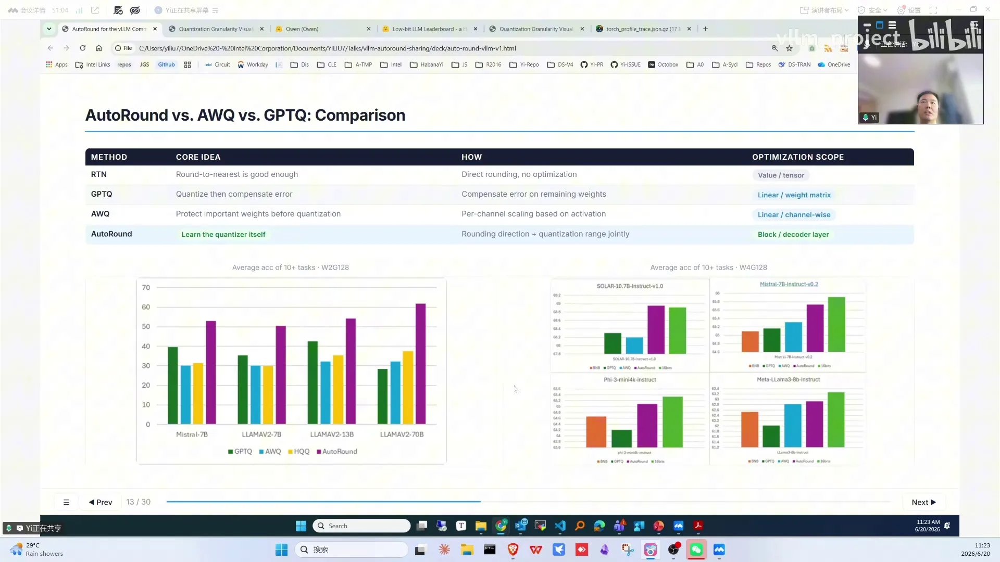 |
| 然后 AutoRound 是在 block 层级做校准。下面也是我们的一些精度数据：可以看到在比较低比特、比如 W2 的情况下，AutoRound 的优势还是比较明显的。然后我介绍一个 AutoRound 里面的 QDQ 工程上的设计…… [【跳转到 23:45】](https://www.bilibili.com/video/BV1etjE69Efx/?t=1425) | 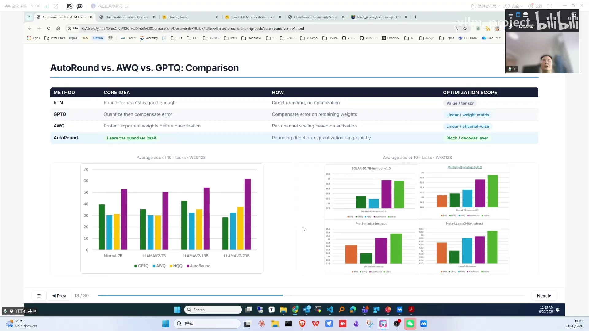 |
| QDQ——之前有同学问到相关问题：QDQ 是什么、为什么要用 QDQ？如果我们做一个低比特的 kernel，是把 activation——比如 W4A8，把 activation 和 weight 都量化到低比特，放到低比特 kernel 里，走低比特硬件指令来达到加速的目的。 [【跳转到 24:07】](https://www.bilibili.com/video/BV1etjE69Efx/?t=1447) |  |
| 但是当我们在探索新的数据类型、或者想探索新算法的时候，硬件还不支持这个数据类型，怎么来模拟量化误差呢？ [【跳转到 24:32】](https://www.bilibili.com/video/BV1etjE69Efx/?t=1472) | 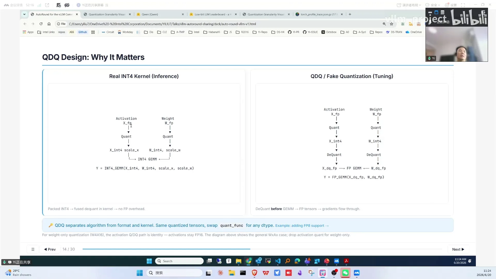 |
| 这时候用的就是 QDQ 的方式：同样输入高精度的 activation 和 weight，用的也是高精度的 GEMM。不同的是在里面引入 quant 和 dequant 两个操作，在这两个操作里可以模拟…… [【跳转到 24:57】](https://www.bilibili.com/video/BV1etjE69Efx/?t=1497) | 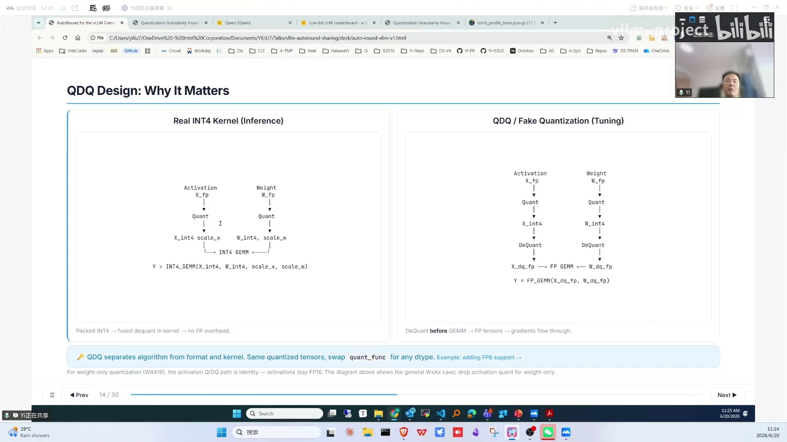 |
| 如果我们用低精度的 kernel，它对精度的影响到底是什么？AutoRound 支持各种各样的数据类型，都是通过 QDQ 的形式。右边是一个 QDQ 的例子…… [【跳转到 25:22】](https://www.bilibili.com/video/BV1etjE69Efx/?t=1522) | 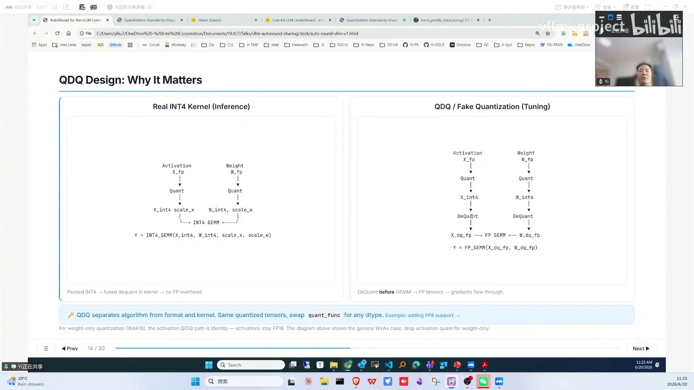 |
| 如果大家想探索新的数据类型，很简单：只要实现一个 tensor 层级的 QDQ function，把它注册进来，就可以实验各种不同量化 scheme 对精度的影响。 [【跳转到 25:47】](https://www.bilibili.com/video/BV1etjE69Efx/?t=1547) | 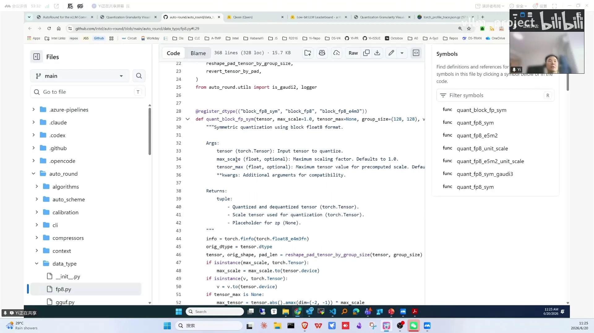 |
| 目前 AutoRound 支持了…… [【跳转到 26:08】](https://www.bilibili.com/video/BV1etjE69Efx/?t=1568) |  |
| model 的话支持大部分 popular 的 LLM model 以及部分 diffusion model。量化 scheme 得益于 QDQ 的 design，大部分 scheme 都支持。也支持 layer-wise 自动搜索量化 recipe，或者手动指定 mixed precision 的 recipe。module type 支持 linear、MoE、KV cache、attention。量化过程可以在英特尔 GPU、CUDA、英特尔 HPU、CPU 上做。量化完的模型支持导出各种格式…… [【跳转到 26:13】](https://www.bilibili.com/video/BV1etjE69Efx/?t=1573) | 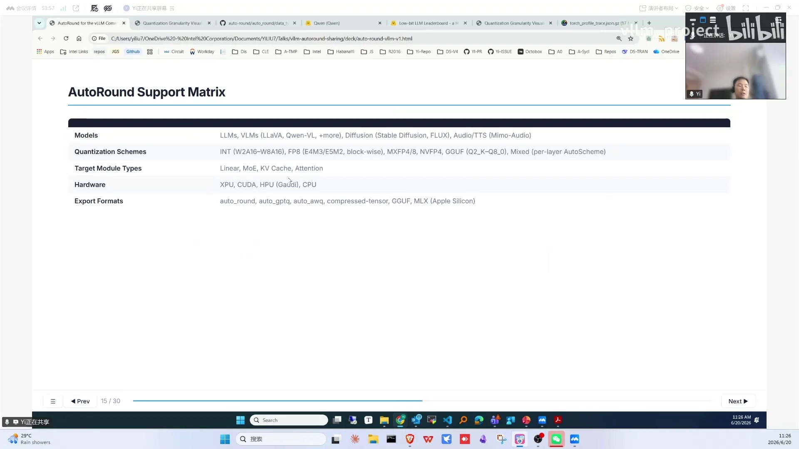 |
| （接上） [【跳转到 26:38】](https://www.bilibili.com/video/BV1etjE69Efx/?t=1598) | 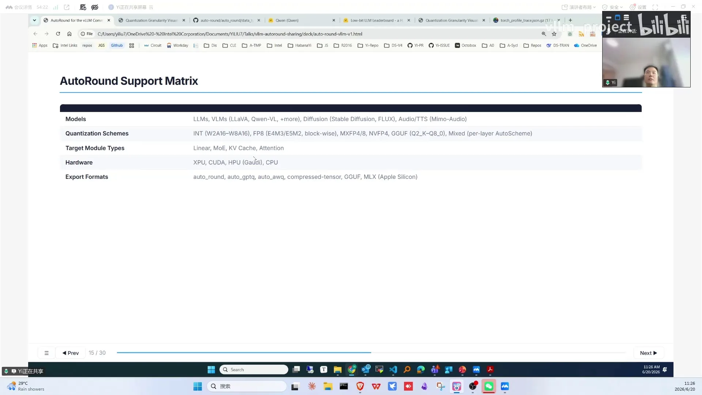 |
| 比如 autoGPTQ、autoAWQ、compressed-tensors。这样你可以用 AutoRound 的量化模型部署到不同的 serving framework 上。 [【跳转到 27:03】](https://www.bilibili.com/video/BV1etjE69Efx/?t=1623) | 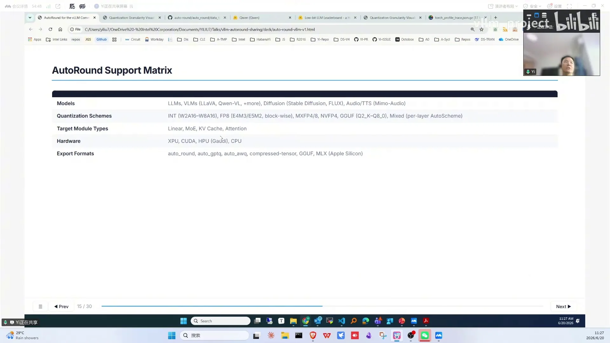 |
| 同时 AutoRound 不仅仅是一个精度相关的算法…… [【跳转到 27:26】](https://www.bilibili.com/video/BV1etjE69Efx/?t=1646) | 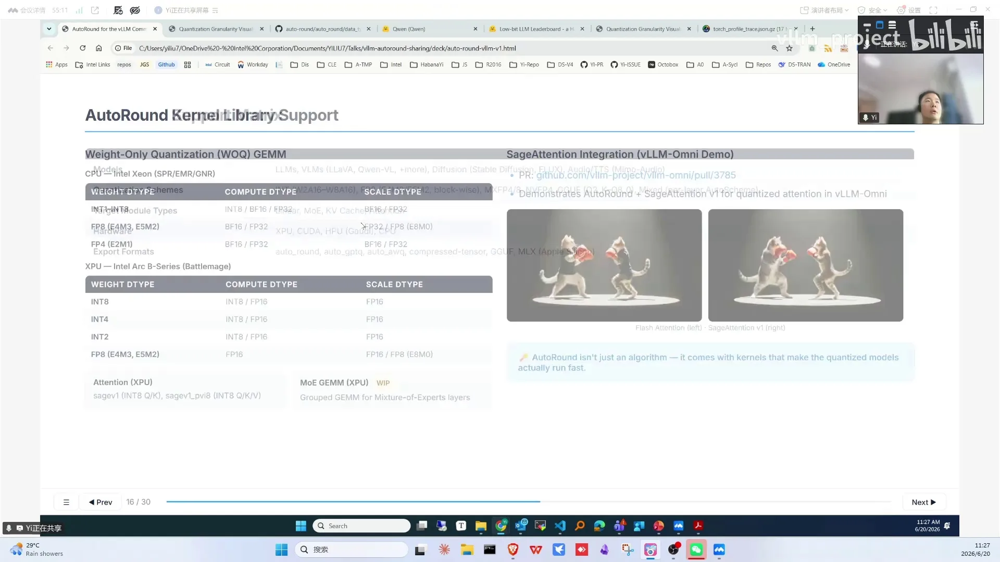 |
| 我们还探索、提供了一些低比特 kernel——在英特尔产品上做了优化的低比特 kernel。比如 WOQ 的 GEMM：在 CPU 上支持 INT1 到 8 所有的 WOQ GEMM…… [【跳转到 27:31】](https://www.bilibili.com/video/BV1etjE69Efx/?t=1651) | 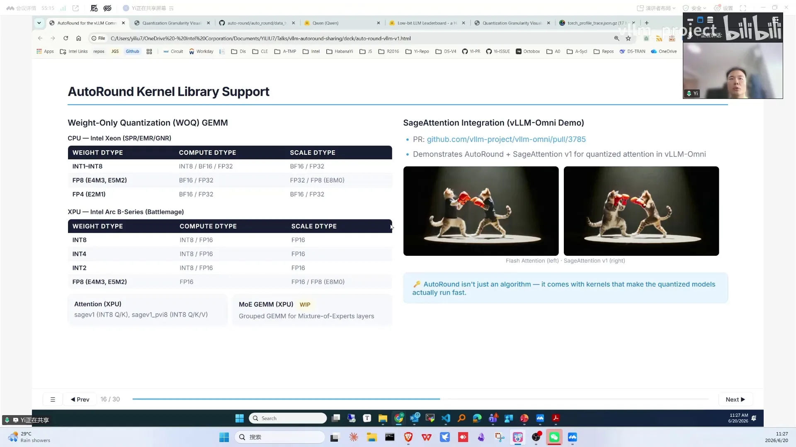 |
| FP8 以及 FP4。在英特尔的 XPU 上，我们做了 2 比特、4 比特和 8 比特的 WOQ GEMM。最近因为我们在做 video 相关的 model，也加上了低比特 attention 的实现…… [【跳转到 27:56】](https://www.bilibili.com/video/BV1etjE69Efx/?t=1676) | 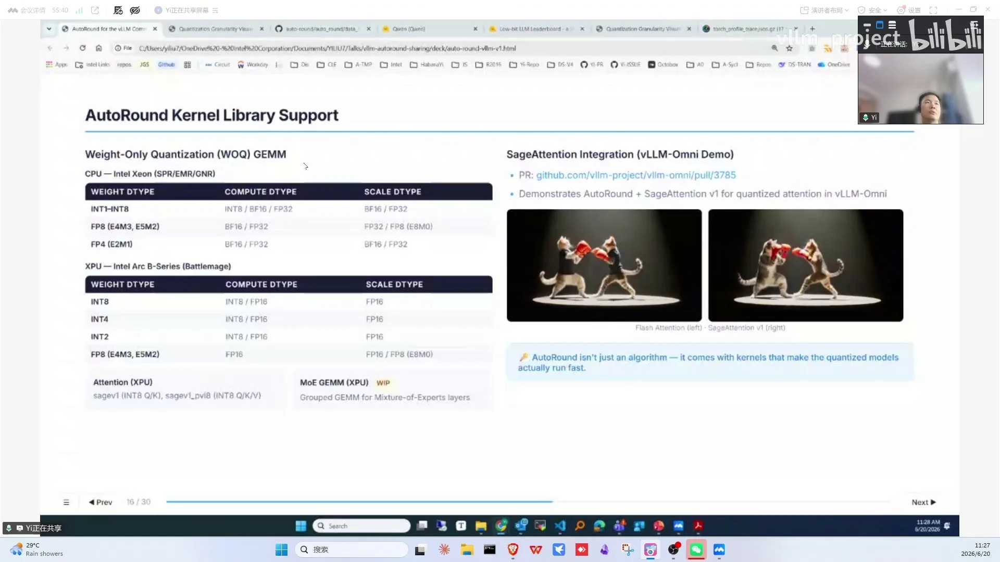 |
| 这边是我们的一个例子：它已经被整合到 vLLM-Omni 里来了。只要用这个（低比特）attention 的 backend，在英特尔的 B60 或 B70 上就可以 run。 [【跳转到 28:21】](https://www.bilibili.com/video/BV1etjE69Efx/?t=1701) |  |
| AutoRound 其实已经被整合到了…… [【跳转到 28:46】](https://www.bilibili.com/video/BV1etjE69Efx/?t=1726) | 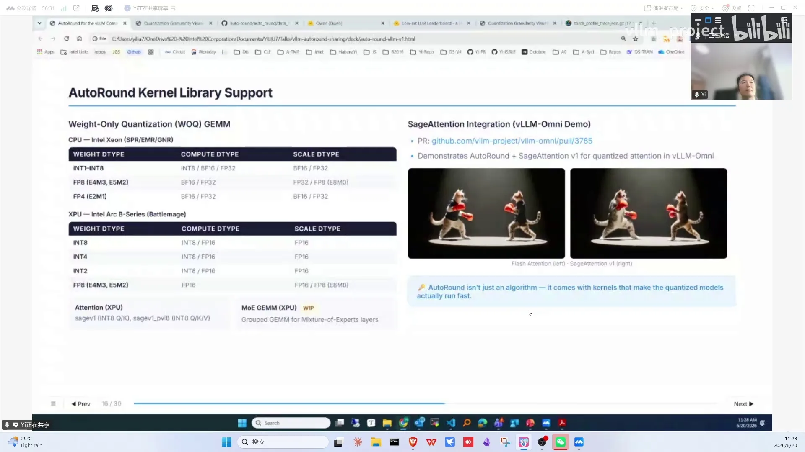 |
| 被整合到了大部分比较 popular 的 framework 里：比如 transformers——是 transformers 里的 quant method 之一；也被整合到了 neural compressor 和 torchao。 [【跳转到 28:51】](https://www.bilibili.com/video/BV1etjE69Efx/?t=1731) |  |
| 在这两个库里它是作为多种算法中的一种。vLLM 和 vLLM-Omni 也支持 load 我们量化好的模型。我们还做了很多…… [【跳转到 29:16】](https://www.bilibili.com/video/BV1etjE69Efx/?t=1756) | 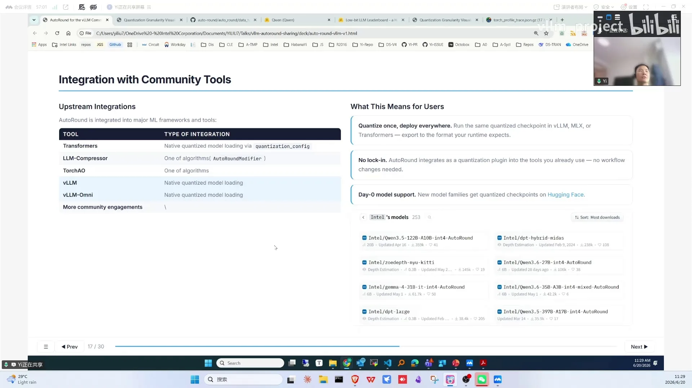 |
| 对新模型做 day-zero 的支持：我们会把它量化好然后上传到 HuggingFace 上，大家有需要可以去拿。因为现在新出的 model 越来越多、越来越快，每个 model 可能各有特点…… [【跳转到 29:41】](https://www.bilibili.com/video/BV1etjE69Efx/?t=1781) | 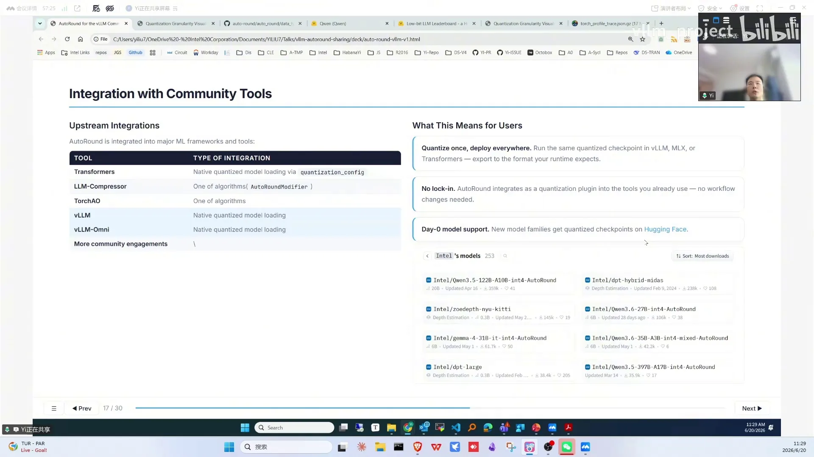 |
| 我们怎么快速把 model 量化出来，让精度和性能都达到要求；以及怎么让更多人把量化工具用起来。我们组还做了 low-bit leaderboard 这样的工作：它是一个 agent-driven 的工具——用户提交一个模型之后选择对应的量化（配置），我们在后台给它量化好，让用户可以下载这个模型。 [【跳转到 30:06】](https://www.bilibili.com/video/BV1etjE69Efx/?t=1806) | 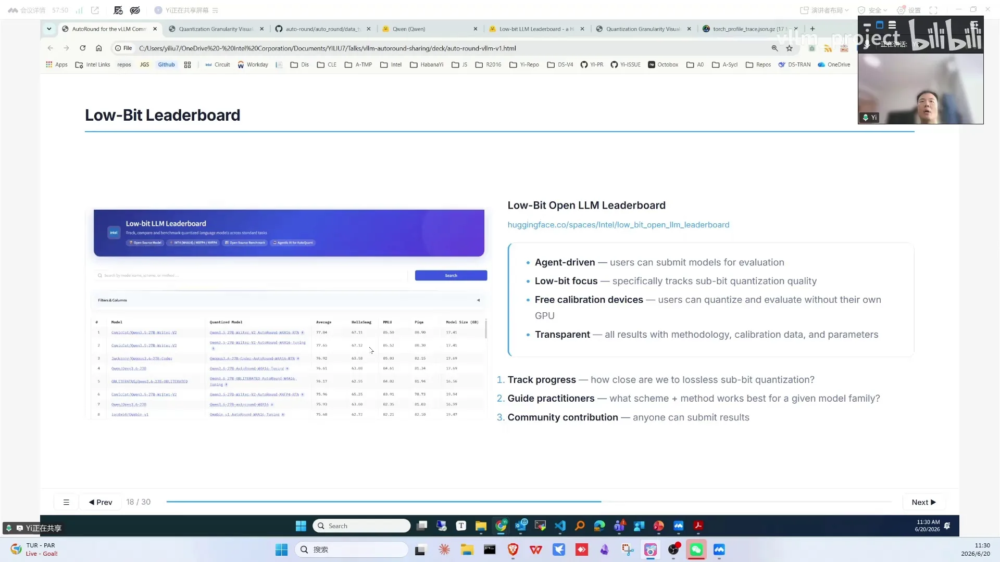 |
| （接上） [【跳转到 30:31】](https://www.bilibili.com/video/BV1etjE69Efx/?t=1831) | 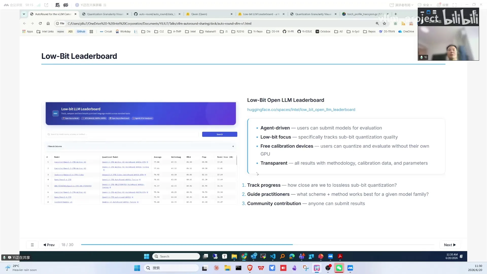 |
| （演示） [【跳转到 30:56】](https://www.bilibili.com/video/BV1etjE69Efx/?t=1856) | 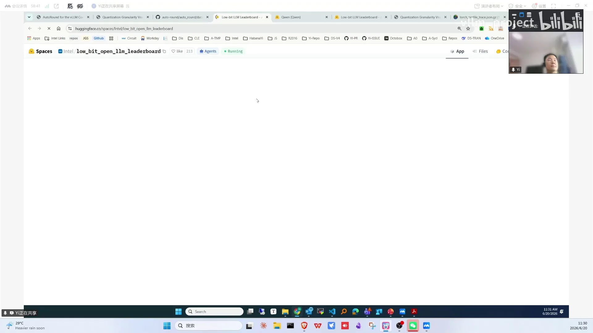 |
| 大家可以看到这边有很多我们已经在这个平台上…… [【跳转到 31:03】](https://www.bilibili.com/video/BV1etjE69Efx/?t=1863) | 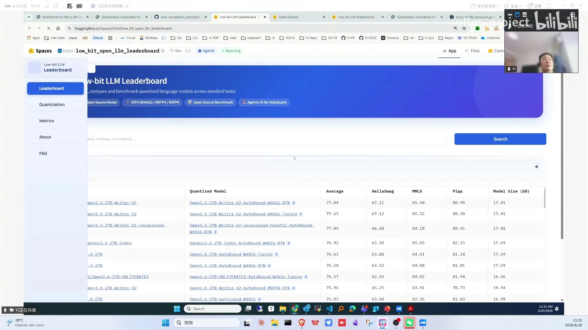 |
| 我们自己或者用户提交的这些模型。我们可以提交一个来尝试一下。 [【跳转到 31:08】](https://www.bilibili.com/video/BV1etjE69Efx/?t=1868) | 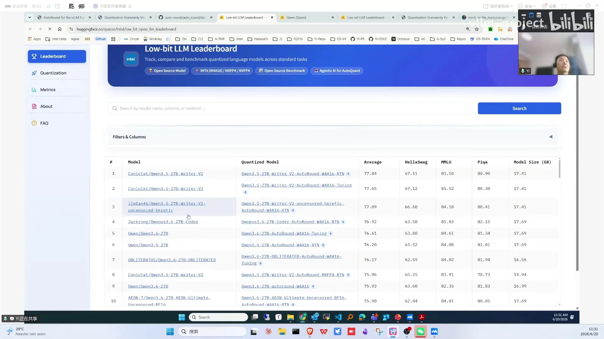 |
| 它比较简单：只要把 HuggingFace 上这个 model 的名字给它贴过来。 [【跳转到 31:18】](https://www.bilibili.com/video/BV1etjE69Efx/?t=1878) |  |
| 哦在这里。它是自动量化的。 [【跳转到 31:31】](https://www.bilibili.com/video/BV1etjE69Efx/?t=1891) | 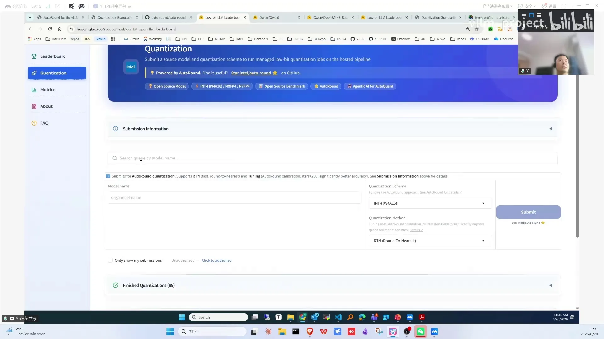 |
| 然后做 benchmark，对吗？然后直接上去？——对对的。 [【跳转到 31:38】](https://www.bilibili.com/video/BV1etjE69Efx/?t=1898) | 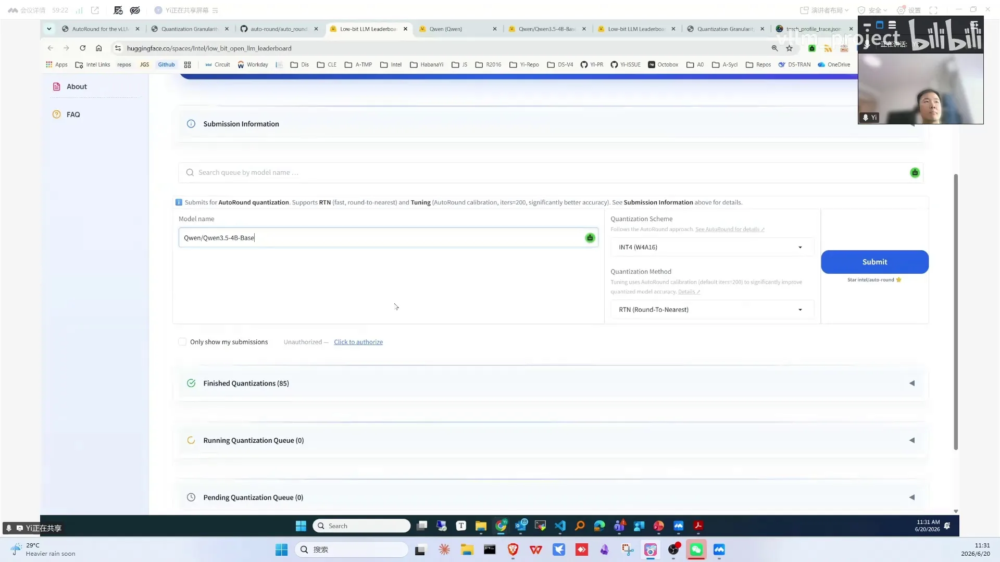 |
| 我们会自动量化，然后给出几个数据集的精度结果，但暂时不会出 performance 的结果。——那很方便。 [【跳转到 31:43】](https://www.bilibili.com/video/BV1etjE69Efx/?t=1903) | 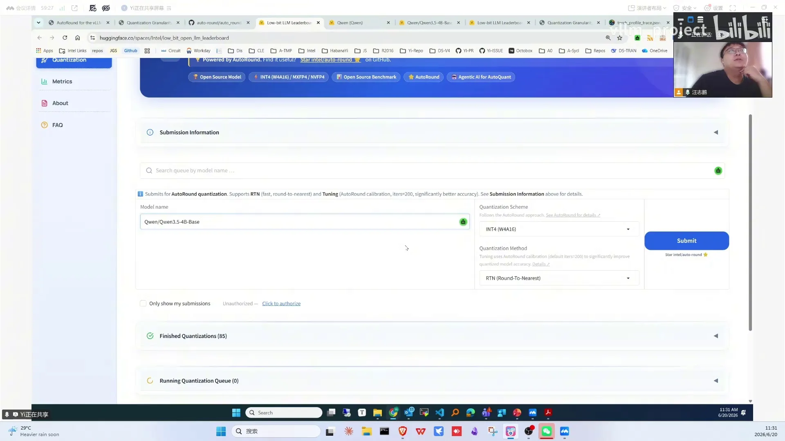 |
| 在这里可以选不同的量化 method，点提交就可以了。 [【跳转到 32:01】](https://www.bilibili.com/video/BV1etjE69Efx/?t=1921) | 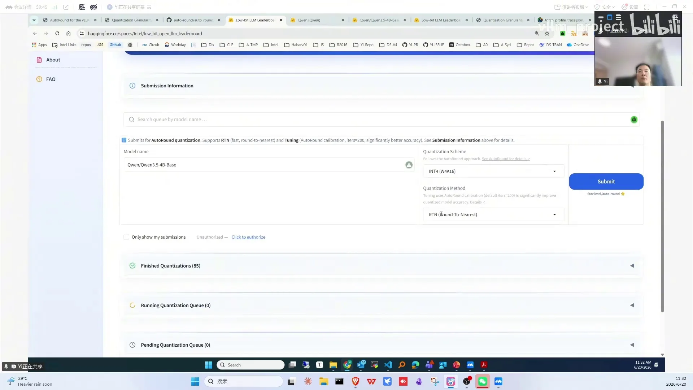 |
| （此区间无字幕） [【跳转到 32:09】](https://www.bilibili.com/video/BV1etjE69Efx/?t=1929) | 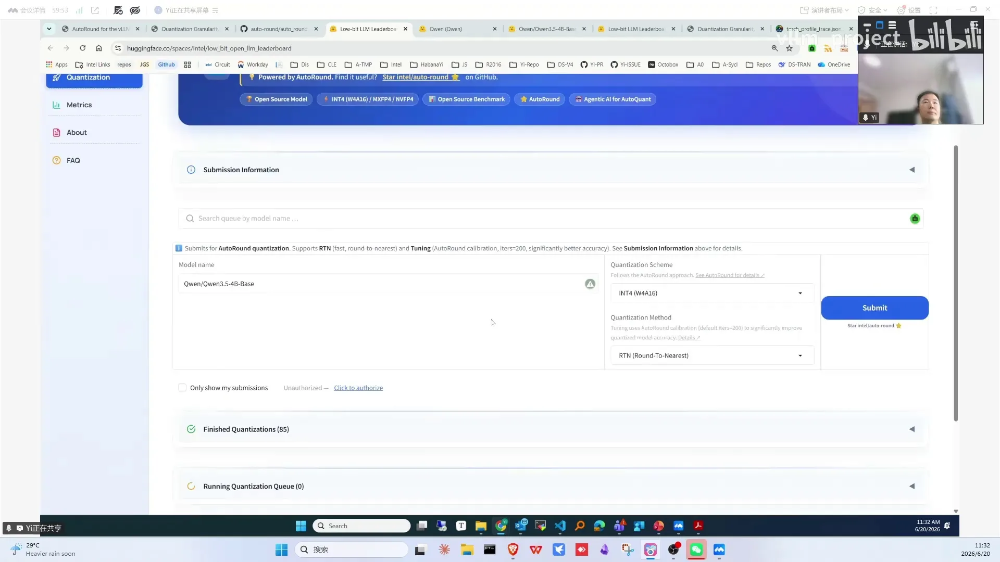 |
| （此区间无字幕） [【跳转到 32:14】](https://www.bilibili.com/video/BV1etjE69Efx/?t=1934) | 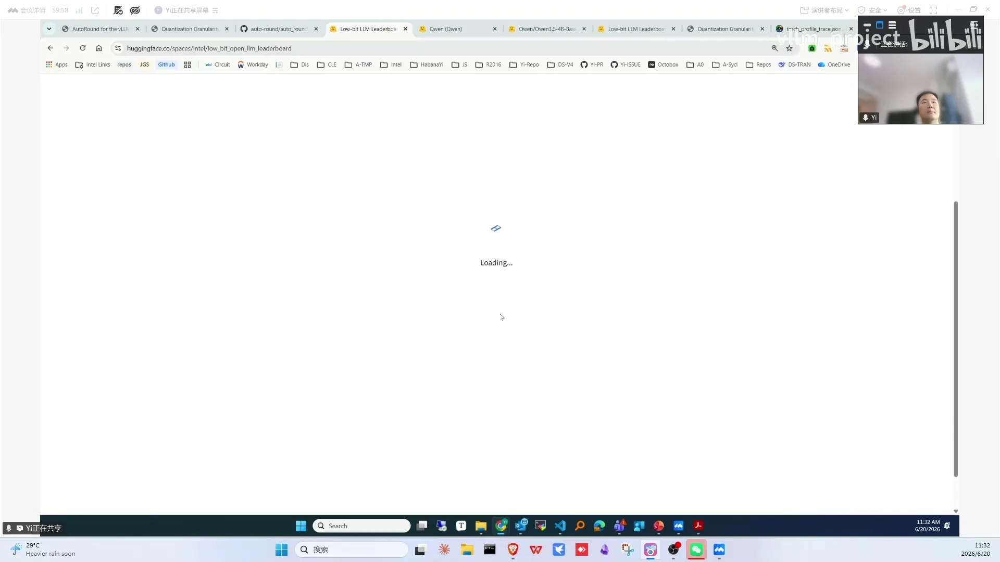 |
| （此区间无字幕） [【跳转到 32:20】](https://www.bilibili.com/video/BV1etjE69Efx/?t=1940) | 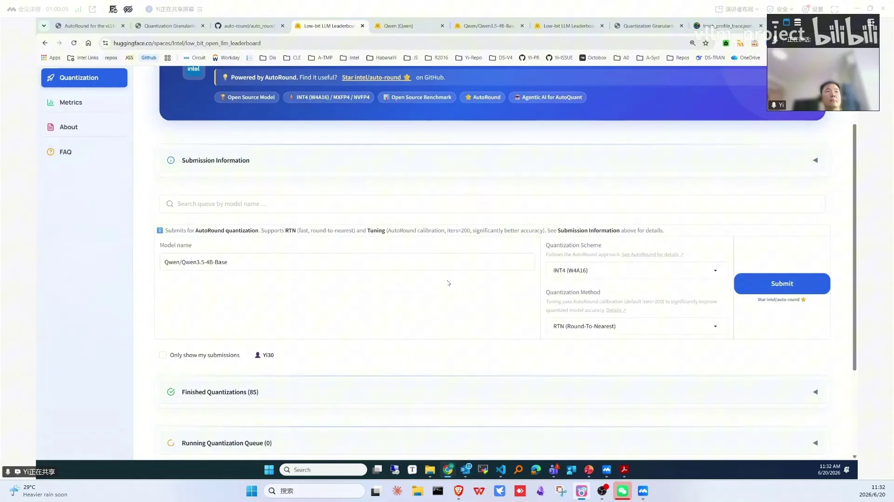 |
| 是任何用户都能直接提交对吗？——在这个时候后台就开始工作了：检测这个模型能不能正常量化出来。如果量化失败的话…… [【跳转到 32:25】](https://www.bilibili.com/video/BV1etjE69Efx/?t=1945) | 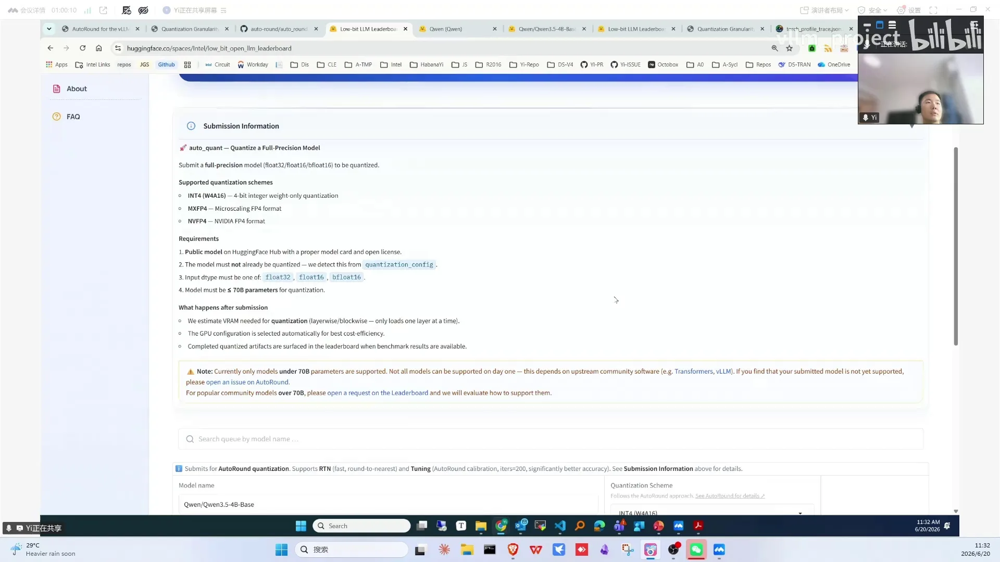 |
| 比如有很多模型结构的变化、或者版本升级等各种各样的错误，我们会有一个 agent 在里面尝试解决这些问题，把模型量化出来。——我们先放这吧，待会看能不能在结束之前量化出来。 [【跳转到 32:50】](https://www.bilibili.com/video/BV1etjE69Efx/?t=1970) | 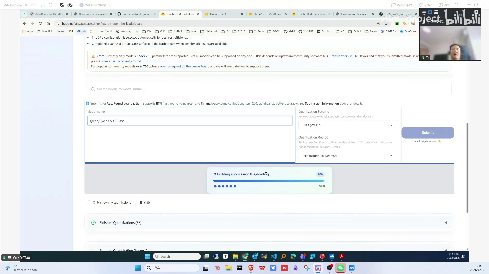 |
| （预计）三小时。好，我们可以先回答一下直播间的问题了。 [【跳转到 33:15】](https://www.bilibili.com/video/BV1etjE69Efx/?t=1995) | 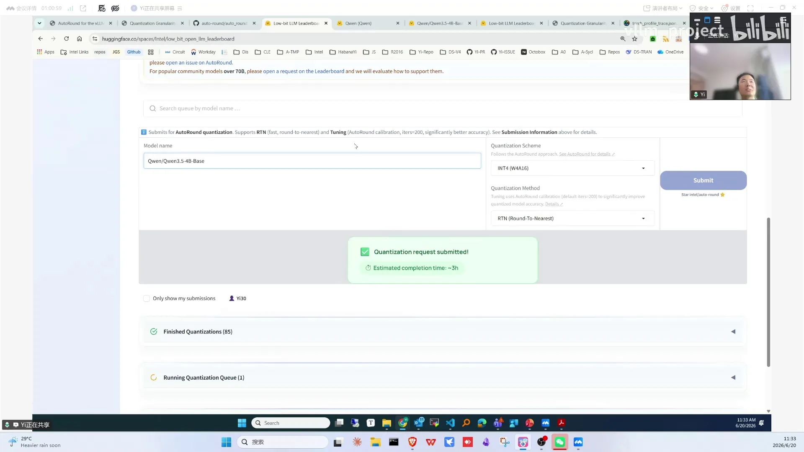 |
| 有同学问这个和英伟达的 modelopt……上面主要是讲 AutoRound 怎么工作，以及它整合到了哪些工具里。好，我们回答一下社区的问题：有同学问这个和英伟达的 modelopt 是不是一个类型的？ [【跳转到 33:20】](https://www.bilibili.com/video/BV1etjE69Efx/?t=2000) | 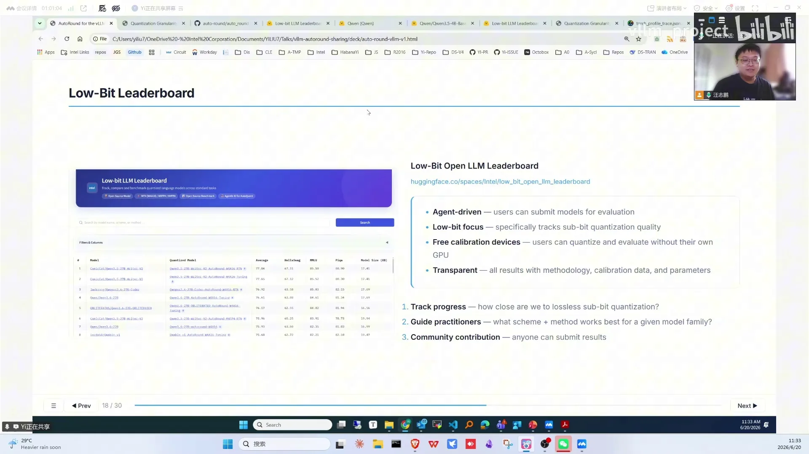 |
| 刘老师你能听到我说话吗？我们继续，还是要先回答一下问题。——喂，刘毅老师能听到我说话吗？——能听到。——好像我 mute 了，不好意思。 [【跳转到 33:45】](https://www.bilibili.com/video/BV1etjE69Efx/?t=2025) | 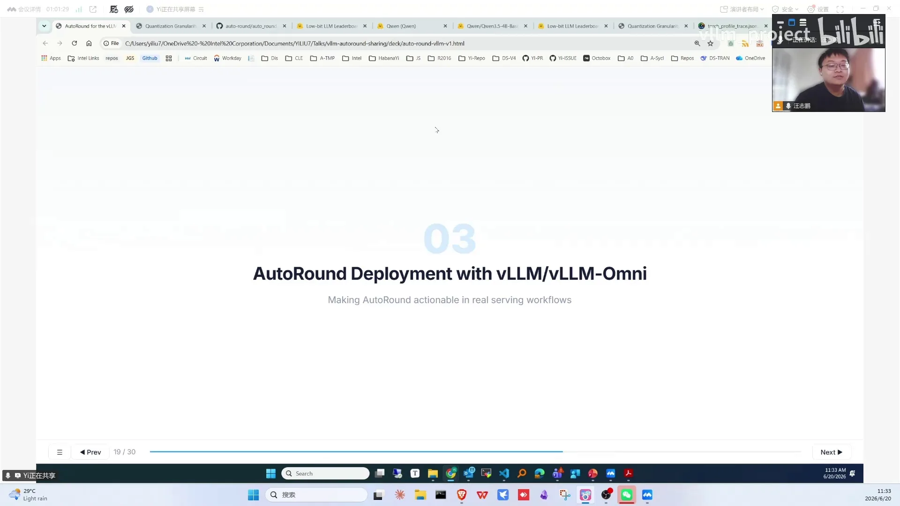 |
| 有同学问：这个和英伟达的 modelopt 是不是一个类型的？——这是一个好问题。它们都属于量化工具，都是将高精度模型量化成低精度模型。但我们支持的 feature 或者说 scope 有一些不同。——嗯好。——然后有同学问怎么给 vLLM-Omni 做贡献？这点我可以讲一下：首先 vLLM-Omni 里会有一些 good first issue，你可以按照喜好选择合适的 feature…… [【跳转到 34:10】](https://www.bilibili.com/video/BV1etjE69Efx/?t=2050) |  |
| Feature或者说就是这个scope的话也是有一些不同的对嗯好好然后有同学问怎么给VM欧米I去做贡献呃这个这点的话我其实我可以讲一下子就是呃首先不知道某民里面吗它会有一些goodfirstissu然后你可以按照你的喜好来选择合适的feature [【跳转到 34:35】](https://www.bilibili.com/video/BV1etjE69Efx/?t=2075) |  |
| 做一些贡献。我非常建议你可以先尝试使用 vLLM-Omni，部署一些小的模型，看它的 recipe 能否跑通。一方面可以帮你知道 vLLM-Omni 到底支持哪些功能…… [【跳转到 35:00】](https://www.bilibili.com/video/BV1etjE69Efx/?t=2100) | 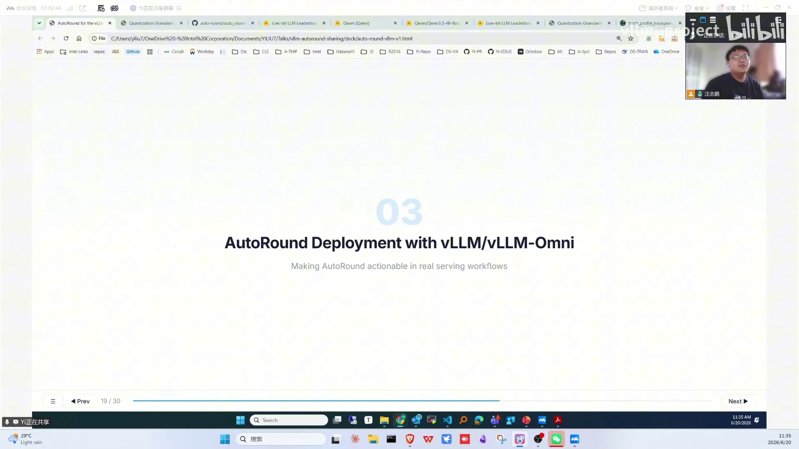 |
| 其次非常容易在 recipe 里发现一些 bug：可能一些参数你以为支持但实际上真不支持，那么你可以很容易提出 good first issue。做过一段时间之后，你可以专注于做你很感兴趣的模块。比如 vLLM-Omni 现在主打的是世界模型，你可以参与到世界模型的贡献…… [【跳转到 35:25】](https://www.bilibili.com/video/BV1etjE69Efx/?t=2125) |  |
| 然后还有就是做双工的、原生双工模型这个特性，也属于现在着重支持的，这一块也可以做贡献。还有比较传统的生图生视频的模型。还有因为 vLLM-Omni 主打是 multistage 的 model，它在通信、传输上有很多优化空间，框架上也会有改进空间。这些东西都可以在你积累了一些（经验）之后做特定方向的贡献。 [【跳转到 35:50】](https://www.bilibili.com/video/BV1etjE69Efx/?t=2150) | 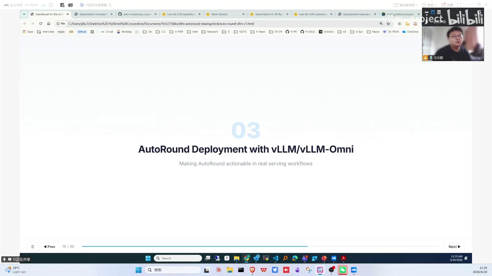 |
| （接上） [【跳转到 36:15】](https://www.bilibili.com/video/BV1etjE69Efx/?t=2175) | 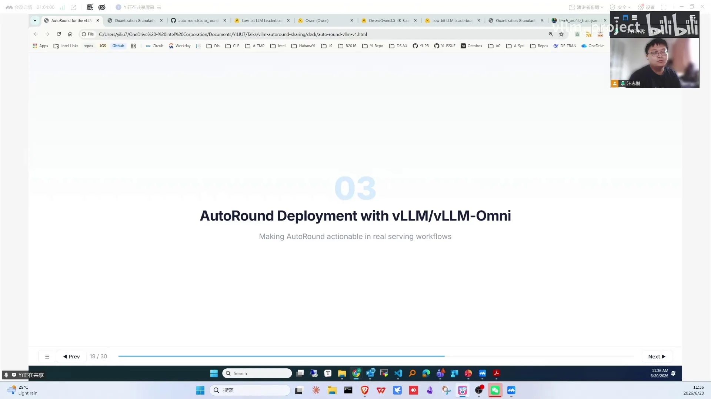 |
| 然后有同学问：训练的时候会训崩吗？有没有什么小 trick？——我经验来讲，训练这玩意其实比较容易训崩。特别我主要做 RL 后训练这一块：有时候可能是你的框架本身就写得有问题，这种情况比较早期就可以发现…… [【跳转到 36:40】](https://www.bilibili.com/video/BV1etjE69Efx/?t=2200) | 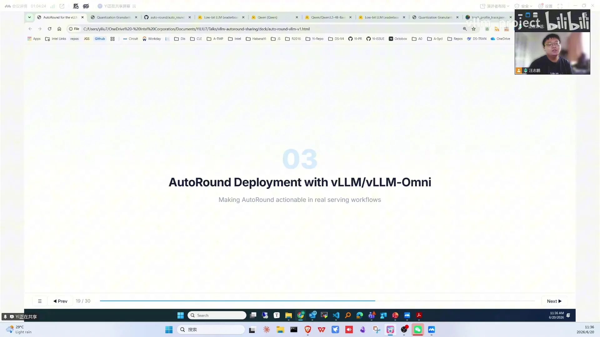 |
| 还有些情况：比如训练的时候 reward 在往上升，你的（各项指标）看着比较正常，但到一个时间段之后忽然发现（指标）往下掉，然后 loss 一下子变得很快…… [【跳转到 37:05】](https://www.bilibili.com/video/BV1etjE69Efx/?t=2225) | 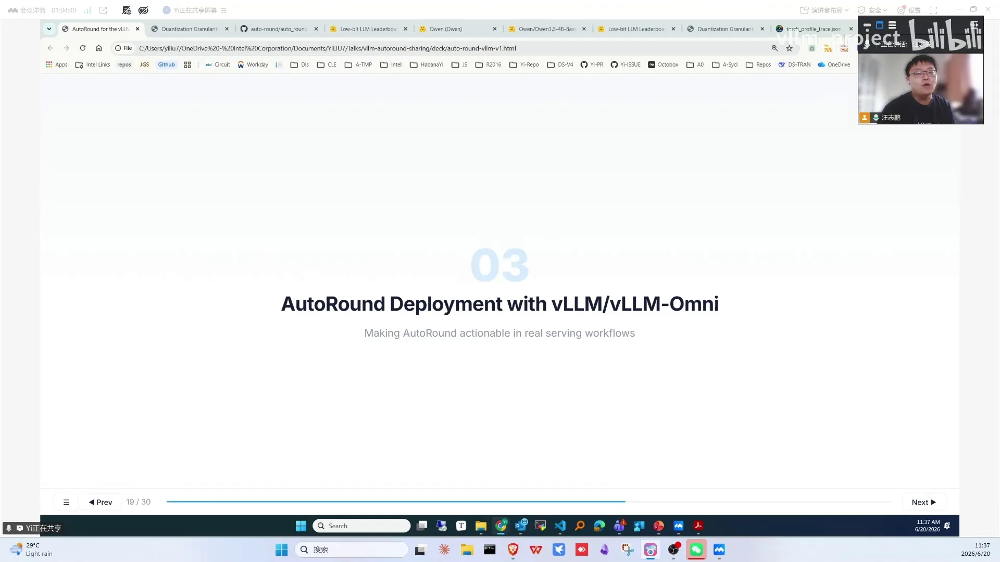 |
| 这个情况下一般来讲说明你的模型（训崩）了。这时候你可能需要看一下数据是不是出现了问题——跟之前的训练数据偏差比较大。再一个你可能需要灵活调整 learning rate。RL 这一块 learning rate 一般大家都设得很小，但即使设得很小，RL 任务还是比较脆弱、非常容易（崩），需要自己去调整。 [【跳转到 37:30】](https://www.bilibili.com/video/BV1etjE69Efx/?t=2250) |  |
| 然后还有个问题：请问 AutoRound 是 QAT 吗？刘老师可以回答一下吗？——OK，其实 AutoRound 应该算是 PTQ，但是它用到了 QAT 的一些思路：比如梯度回传、train 的思路。它是一个比较轻量的方法：需要的数据集可能只要 512 个 samples 或者 128 个 samples。因为我们做的事情是尽量让量化完的模型和原始模型保持一致…… [【跳转到 37:55】](https://www.bilibili.com/video/BV1etjE69Efx/?t=2275) |  |
| 比如说呃梯度回传啊然后以及呃train的这样子的一些思路吧他是一个嗯比较呃轻量的这样子的一个方法就是我们呃所需要的数据集的话比如说呃我们可能只要呃512个呃呃sampless然后或者128个SAMPS呃然后呃因为我们这个时候在呃做的事情的话 [【跳转到 38:20】](https://www.bilibili.com/video/BV1etjE69Efx/?t=2300) | 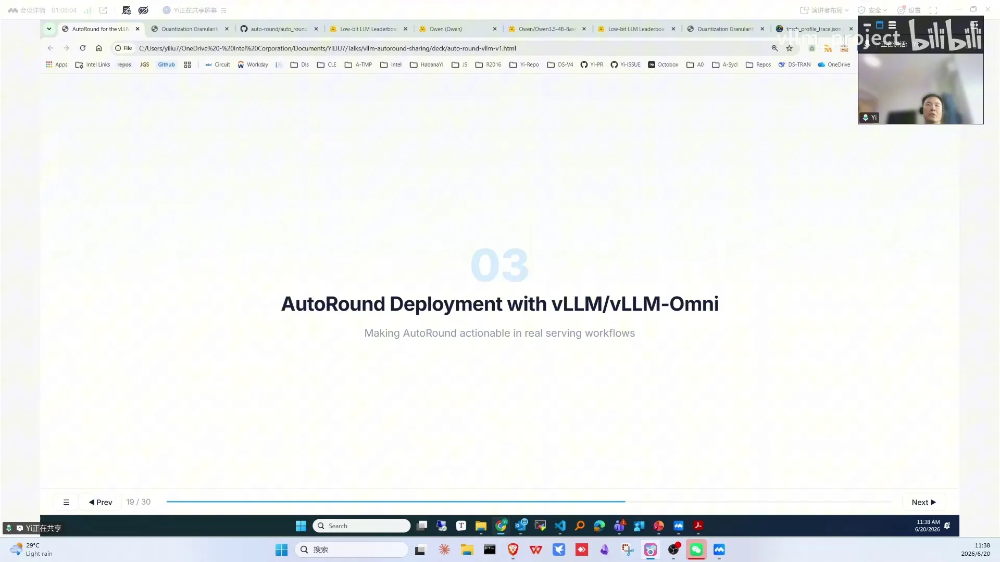 |
| 我们在搜索、调的参数也就是这个 scale，没有特别多的操作，没有对整个 weight 动很大（改动）的那种操作。——嗯好。 [【跳转到 38:45】](https://www.bilibili.com/video/BV1etjE69Efx/?t=2325) |  |
| 然后还有：QDQ 是做伪量化吗？——对，就是在做伪量化，在模拟。然后还有就是 DeepSeek V4 的支持咋样？——我们已经支持了。大家可以在刚才提到的（页面），我们会把量化完的模型上传到我们的 HuggingFace（空间）里。大家看第一个就是…… [【跳转到 39:10】](https://www.bilibili.com/video/BV1etjE69Efx/?t=2350) | 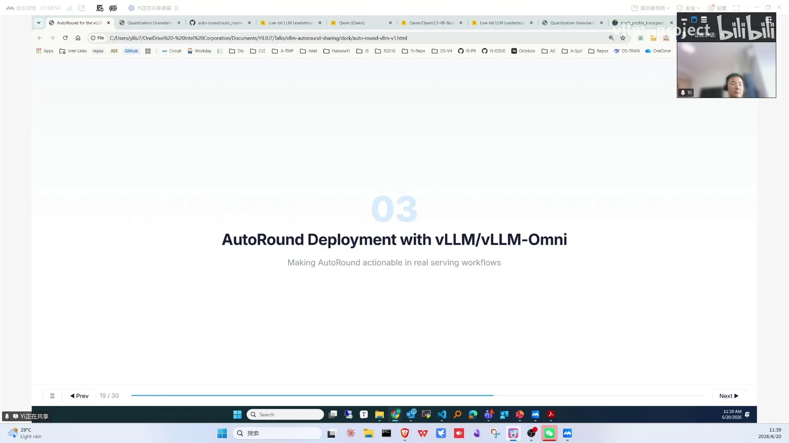 |
| （接上） [【跳转到 39:35】](https://www.bilibili.com/video/BV1etjE69Efx/?t=2375) | 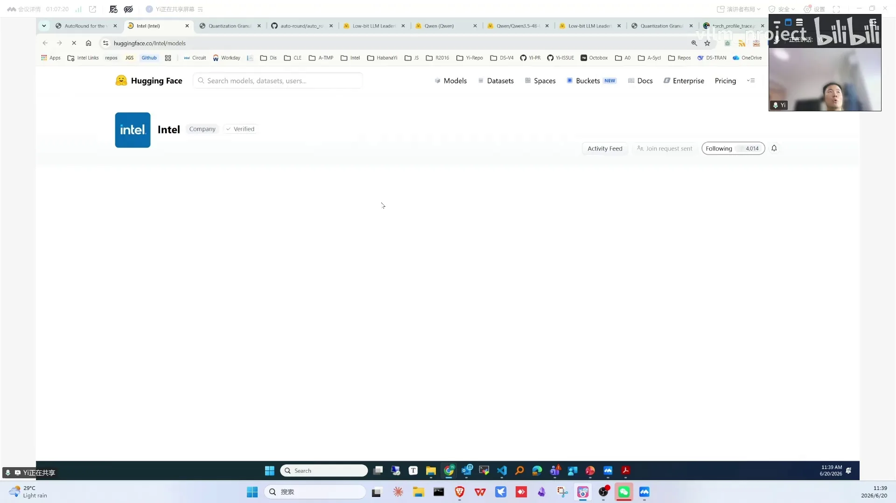 |
| 然后还有同学问 vLLM-Omni 和 vLLM 是什么关系？——vLLM-Omni 相当于会用很多 vLLM 现在的代码：有的直接复用，有的通过继承方式——比如 vLLM 的 engine、scheduler 需要做些改动，在上面做新 feature。vLLM 本身主打（输入侧），vLLM-Omni 主打（生成）输出。因为今年开始不管是世界模型还是（视频）模型都变得非常火，vLLM-Omni 就是要弥补 vLLM 没办法支持（视频）模型还有 Omni 模型的问题…… [【跳转到 40:00】](https://www.bilibili.com/video/BV1etjE69Efx/?t=2400) | 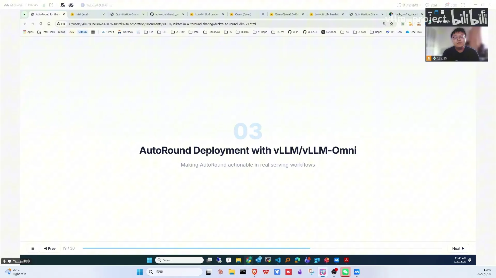 |
| vLLM-Omni 会主打做这些特殊模型的支持，也包括生图生视频这种模型。——有人问 AutoRound 在 SGLang 中被支持了吗？——也是支持的，我们量化的模型也可以在那边加载。 [【跳转到 40:25】](https://www.bilibili.com/video/BV1etjE69Efx/?t=2425) | 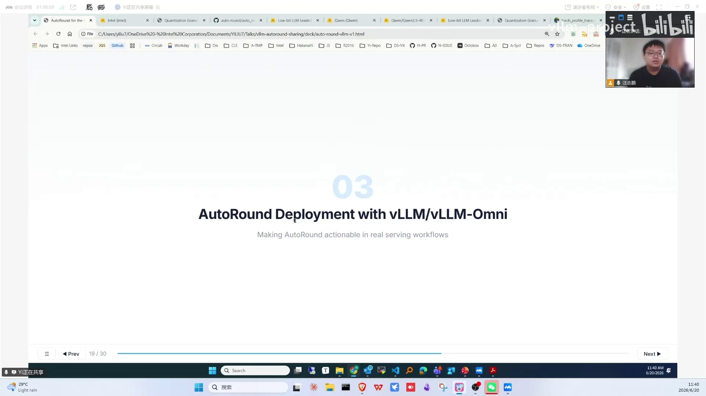 |
| OK。因为两个框架现在很多方面大家都（差不多）。——然后 XPU 和 CUDA 能用同一份 AutoRound 以后的权重吗？——可以的。我们量化出来的 checkpoint 和 device 无关：不同的 device 只要对应 kernel 支持，都可以 share 同一份 checkpoint。——然后有人问：只能是 text model 吗？video 或者 image 行吗？——也可以。我们有一个支持的列表，大家可以去（看）。 [【跳转到 40:50】](https://www.bilibili.com/video/BV1etjE69Efx/?t=2450) | 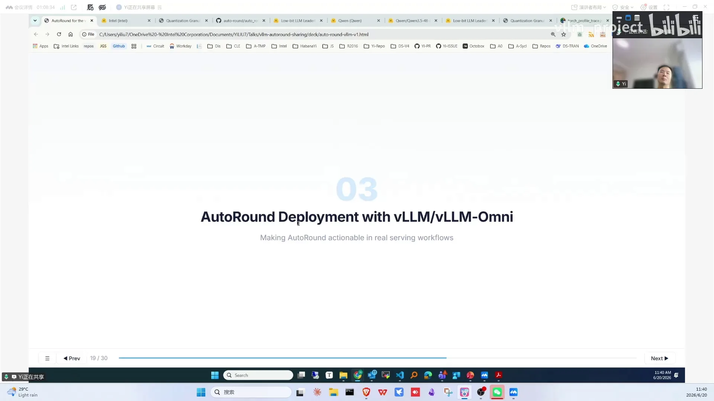 |
| （接上） [【跳转到 41:15】](https://www.bilibili.com/video/BV1etjE69Efx/?t=2475) | 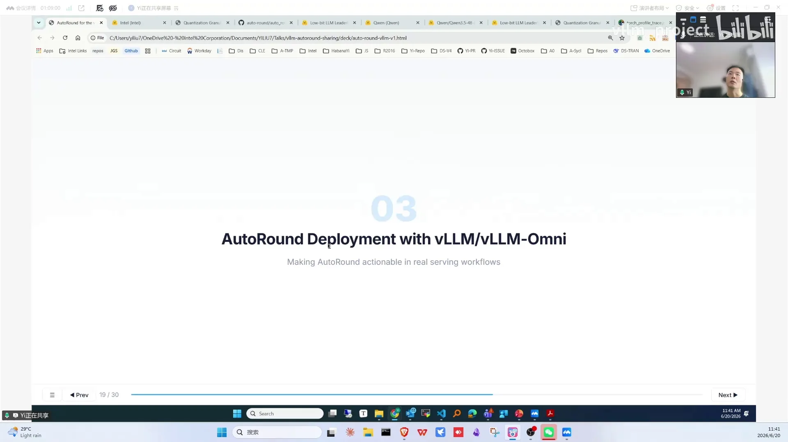 |
| 他应该主要是在问 diffusion 相关的 model，对吧？这个是支持的，因为刚才演示里就是一个视频的模型。——然后有同学问：刚才这个模型的量化然后做对比的这个东西需要申请权限吗？——不需要…… [【跳转到 41:40】](https://www.bilibili.com/video/BV1etjE69Efx/?t=2500) | 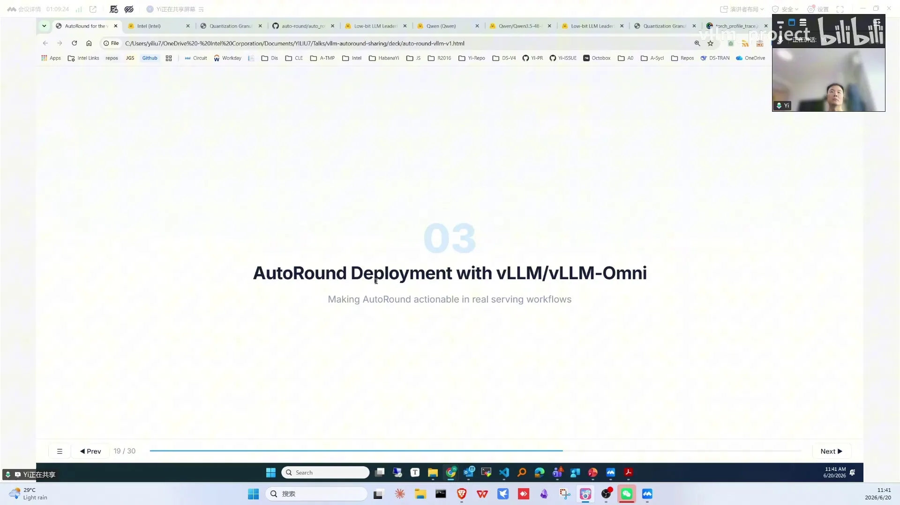 |
| 只要有一个 HuggingFace 的账号就可以提交对应的模型。——哦。 [【跳转到 42:05】](https://www.bilibili.com/video/BV1etjE69Efx/?t=2525) | 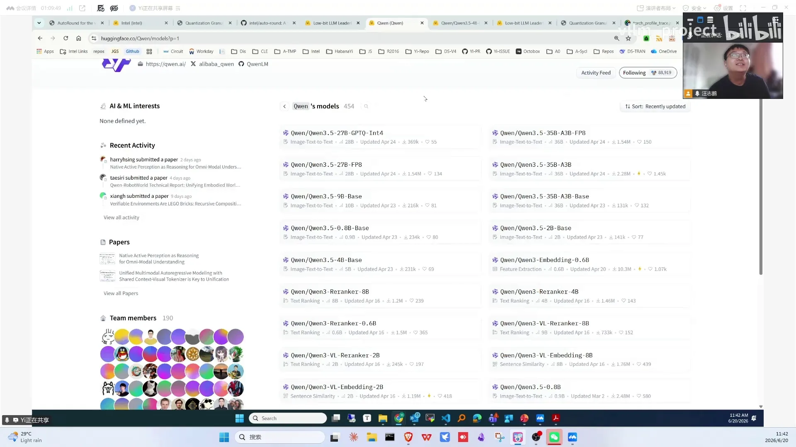 |
| 然后有同学说我正在弄（某模型的）…… [【跳转到 42:10】](https://www.bilibili.com/video/BV1etjE69Efx/?t=2530) | 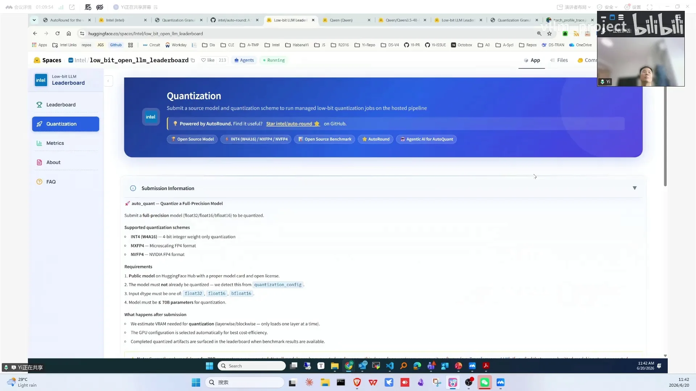 |
| 那个 FP4 KV cache 量化，但是效果很随机。——这可能要……他是在用 AutoRound 弄吗？我觉得可能不是，对吧。 [【跳转到 42:15】](https://www.bilibili.com/video/BV1etjE69Efx/?t=2535) | 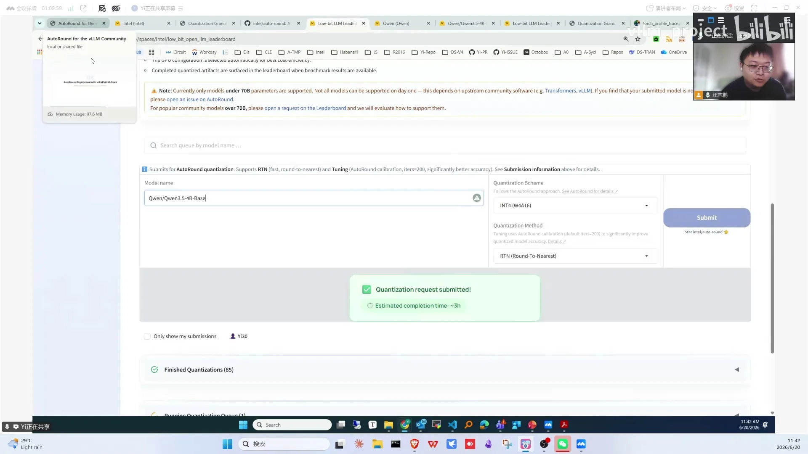 |
| 应该就是 FP4 了。这个东西……——AutoRound 其实是支持 MXFP4 的量化的，如果有必要的话可以试一下。——OK。——好，然后 QAT 和 QAD 有什么区别？ [【跳转到 42:40】](https://www.bilibili.com/video/BV1etjE69Efx/?t=2560) | 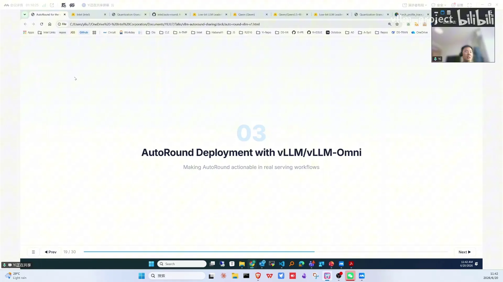 |
| 不好意思，我不太了解 QAD。好像底下有同学说 QAT 是（适应）误差，QAD 是 teacher-student 的 post-training。——OK，这个在量化这一块的情况…… [【跳转到 43:05】](https://www.bilibili.com/video/BV1etjE69Efx/?t=2585) | 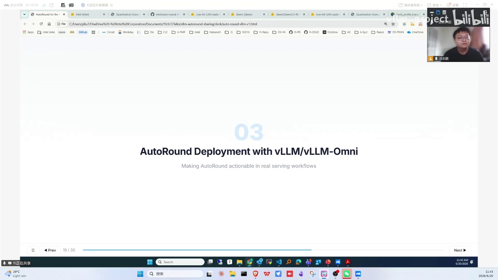 |
| 其实我也是不太懂，刘老师比较专业一些。——好。然后看：目前仓库提供的量化是（只）支持 W4A16 吗？其他量化格式 FP4 的支持力度如何？——可以分两个方面：第一个是拿到量化的 checkpoint；第二部分是在 serving framework 那边把推理做起来。在 AutoRound 这边我们支持导出各种各样的 scheme：W4A8、W4A16、W8A8，各种都支持…… [【跳转到 43:30】](https://www.bilibili.com/video/BV1etjE69Efx/?t=2610) | 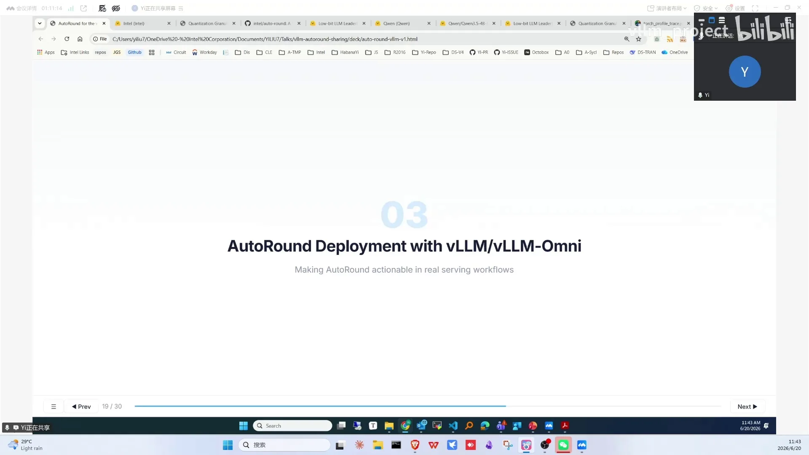 |
| （接上） [【跳转到 43:55】](https://www.bilibili.com/video/BV1etjE69Efx/?t=2635) | 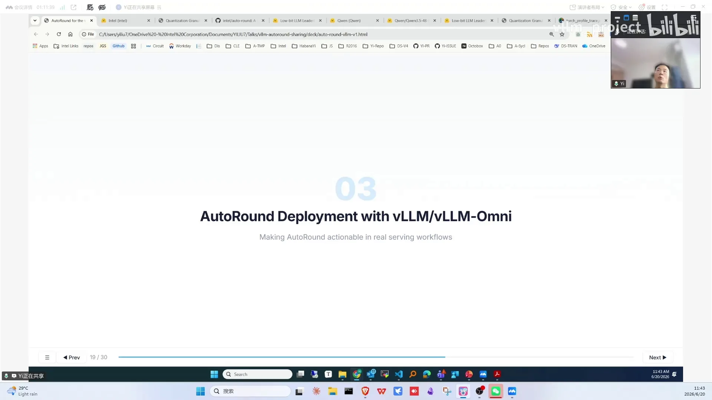 |
| 然后在 vLLM 那边目前支持 W4A8，在 vLLM-Omni 里我们支持 MXFP8，后面近期会把 MXFP4 和 MXFP8 加上（在 vLLM 这边）。——OK。——然后国产芯片有支持吗？ [【跳转到 44:20】](https://www.bilibili.com/video/BV1etjE69Efx/?t=2660) | 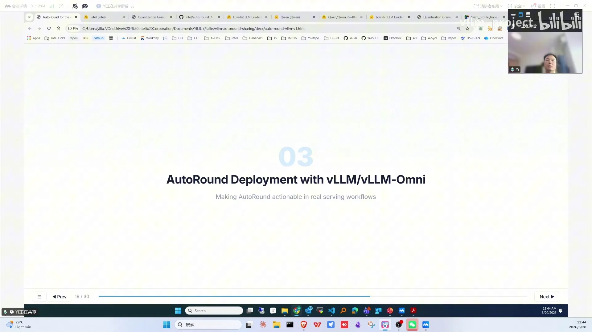 |
| 国产芯片的话分量化和推理。量化的话，华为好像之前有把相关的算法（集成）到他们的量化工具里去，我后面可以找一下那个仓库的链接。推理这一侧的话，如果有国产芯片厂商有兴趣——因为我们出的 checkpoint 和 device 不绑定——他们可以自己去接入。 [【跳转到 44:45】](https://www.bilibili.com/video/BV1etjE69Efx/?t=2685) |  |
| （接上） [【跳转到 45:10】](https://www.bilibili.com/video/BV1etjE69Efx/?t=2710) |  |
| （接上） [【跳转到 45:35】](https://www.bilibili.com/video/BV1etjE69Efx/?t=2735) | 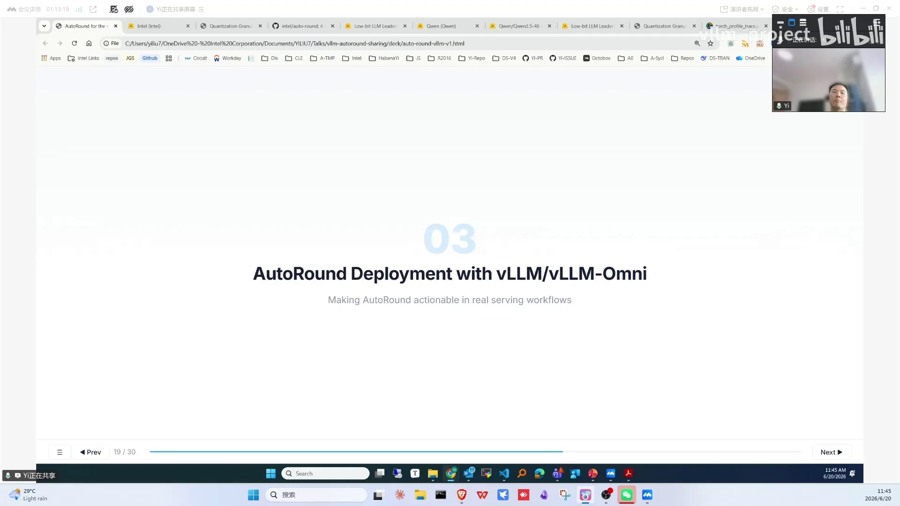 |
| 然后有同学问：低比特能后训练吗？还有 1 比特能后训练吗？——这个同学能不能把问题说得再详细一点。好，我们先看下一个问题：FP8 量化后的模型一定比 FP16/BF16 性能更好吗？——要看你用的芯片：首先你用的 GPU 支不支持 FP8…… [【跳转到 46:00】](https://www.bilibili.com/video/BV1etjE69Efx/?t=2760) | 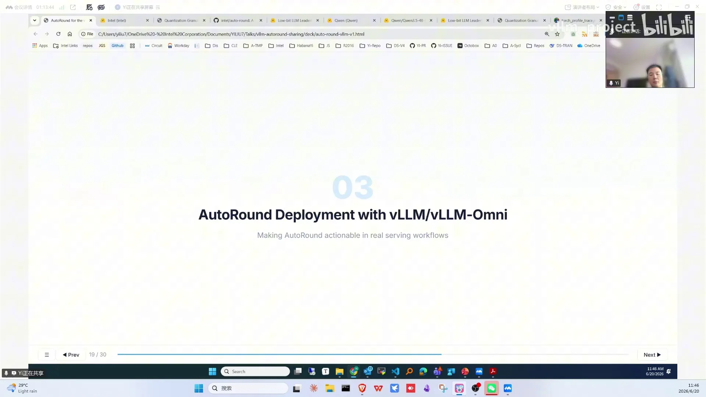 |
| 支持的情况下大部分情况推理性能是会更好的。FP8 的精度相对来说也比较有保证。——OK 好。 [【跳转到 46:25】](https://www.bilibili.com/video/BV1etjE69Efx/?t=2785) |  |
| 老师是不是前面提到 AutoRound 不需要足够的显存来存完整的权重就可以量化？——对的。待会我们有一个 AutoRound 量化的 profiling，可以结合给大家详细看一下。我们先继续讲解吧。 [【跳转到 46:50】](https://www.bilibili.com/video/BV1etjE69Efx/?t=2810) | 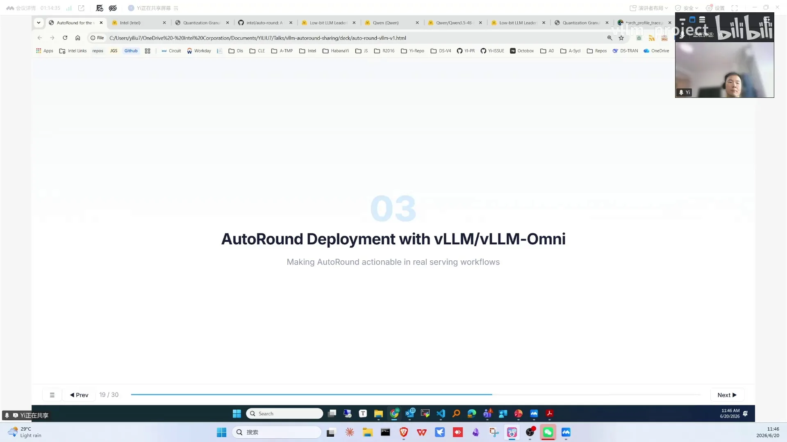 |
| OK，具体想量化一个模型，流程是这样：可以认为是一个迭代的过程——拿到高精度模型，在 AutoRound 里做量化拿到 checkpoint，在 vLLM 或 vLLM-Omni 里做 inference，测精度和性能。精度不达标或者 performance 想尝试其他量化 scheme，就回到 AutoRound 做迭代。这边是一个具体的例子：比如用 AutoRound 量化千问…… [【跳转到 47:15】](https://www.bilibili.com/video/BV1etjE69Efx/?t=2835) |  |
| （接上） [【跳转到 47:40】](https://www.bilibili.com/video/BV1etjE69Efx/?t=2860) | 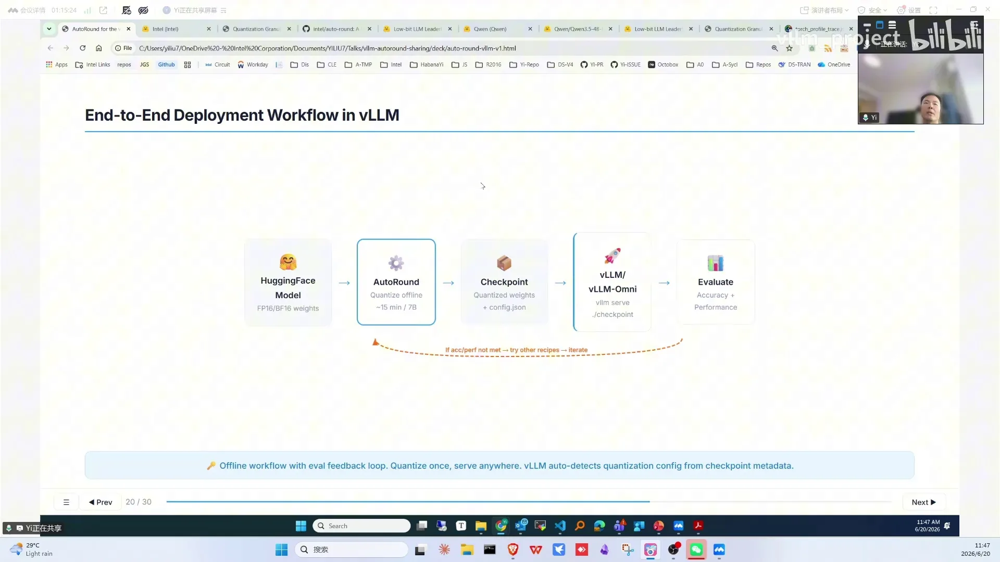 |
| 32B 的模型。安装 AutoRound——AutoRound 也支持像 vLLM 那样 command line 的形式：直接指定 model name、scheme（比如 W8A16、W4A16）、导出 format 就可以了。推理的时候，加载和 BF16 模型一样的命令。考虑到量化完的模型 weight 需要的空间已经减少，相应地调整显存相关的参数。这边带大家过一下 AutoRound 量化的（流程）…… [【跳转到 48:05】](https://www.bilibili.com/video/BV1etjE69Efx/?t=2885) | 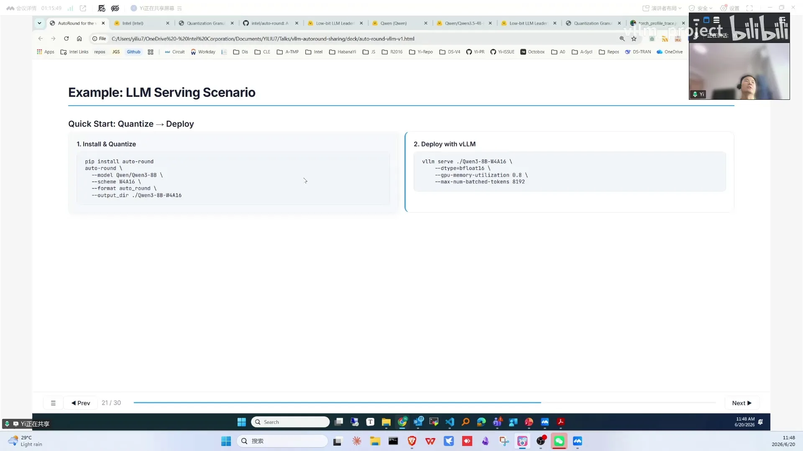 |
| （接上） [【跳转到 48:30】](https://www.bilibili.com/video/BV1etjE69Efx/?t=2910) | 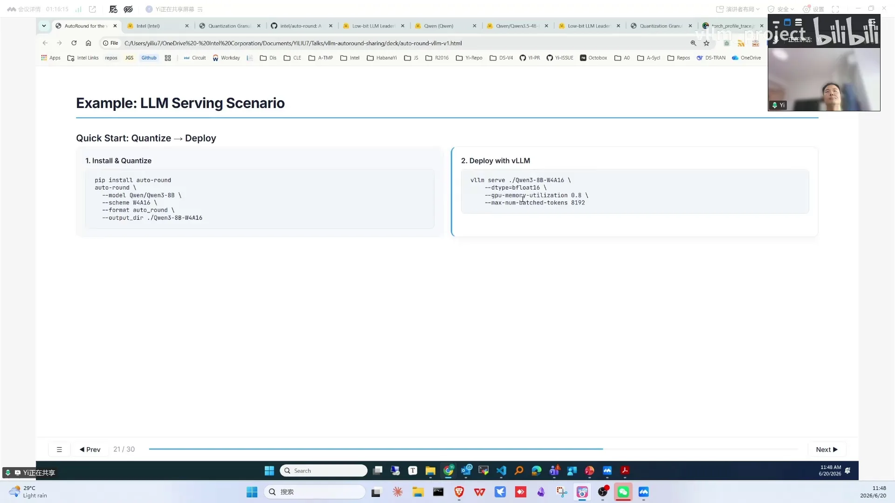 |
| AutoRound 量化的一个大致流程…… [【跳转到 48:54】](https://www.bilibili.com/video/BV1etjE69Efx/?t=2934) | 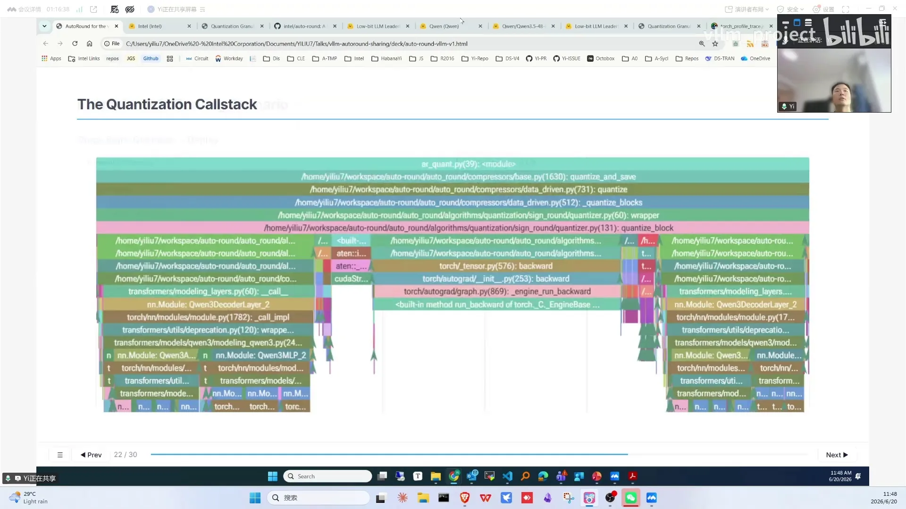 |
| （此区间无字幕） [【跳转到 49:02】](https://www.bilibili.com/video/BV1etjE69Efx/?t=2942) | 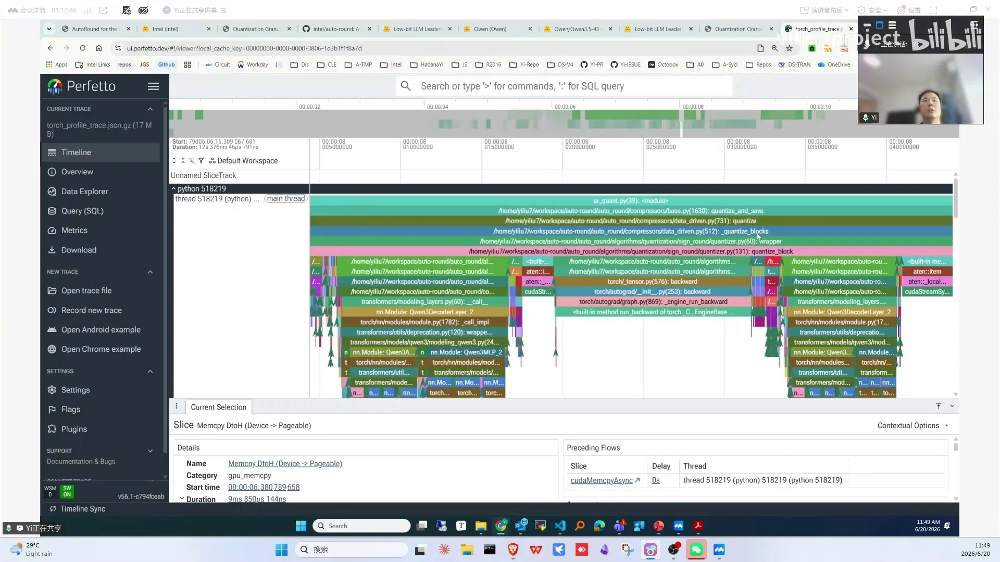 |
| （此区间无字幕） [【跳转到 49:10】](https://www.bilibili.com/video/BV1etjE69Efx/?t=2950) | 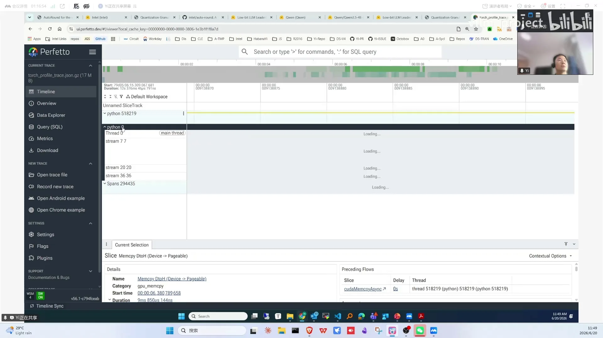 |
| （此区间无字幕） [【跳转到 49:15】](https://www.bilibili.com/video/BV1etjE69Efx/?t=2955) | 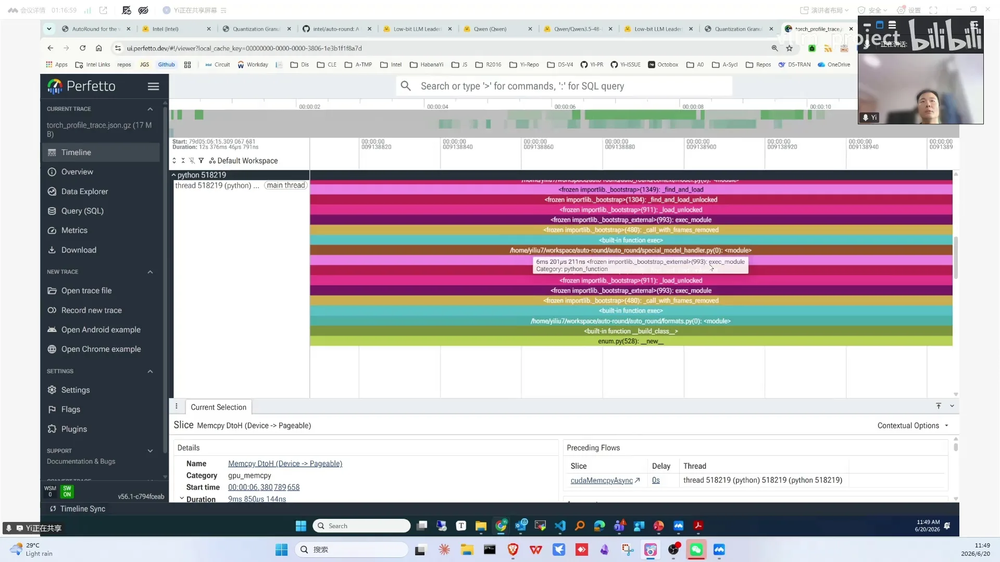 |
| （此区间无字幕） [【跳转到 49:20】](https://www.bilibili.com/video/BV1etjE69Efx/?t=2960) | 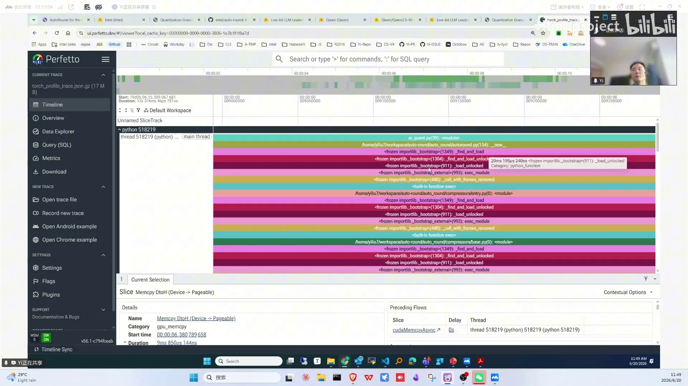 |
| （此区间无字幕） [【跳转到 49:28】](https://www.bilibili.com/video/BV1etjE69Efx/?t=2968) | 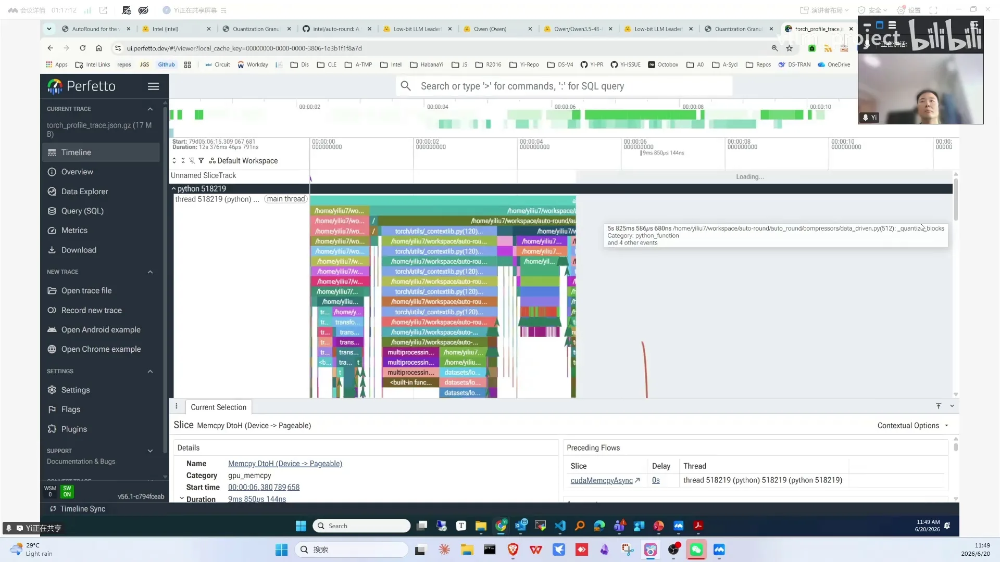 |
| 所有真正的入口是 quantize 这个函数。quantize 里面会调到 quantize_blocks 的函数，在里面遍历 decoding block。我们来看…… [【跳转到 49:35】](https://www.bilibili.com/video/BV1etjE69Efx/?t=2975) | 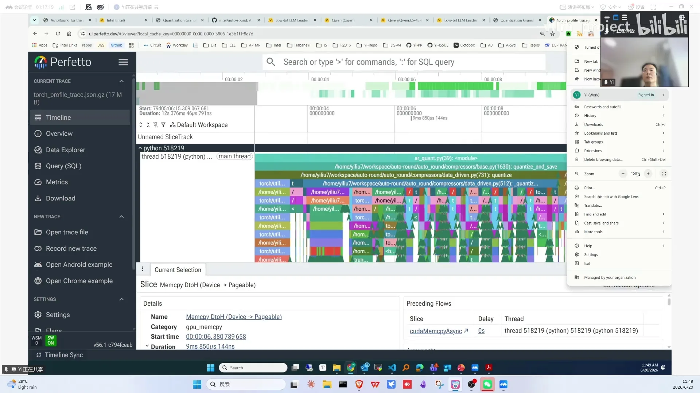 |
| 比如第一个这个 block…… [【跳转到 50:00】](https://www.bilibili.com/video/BV1etjE69Efx/?t=3000) | 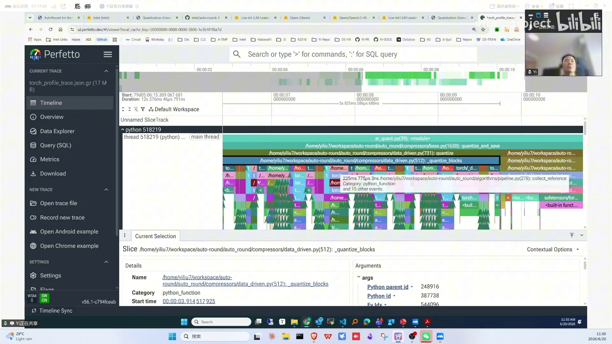 |
| 我们就针对逐个的 decoding block 来做量化。量化之前所有的 weight 是放在 CPU 上的…… [【跳转到 50:13】](https://www.bilibili.com/video/BV1etjE69Efx/?t=3013) | 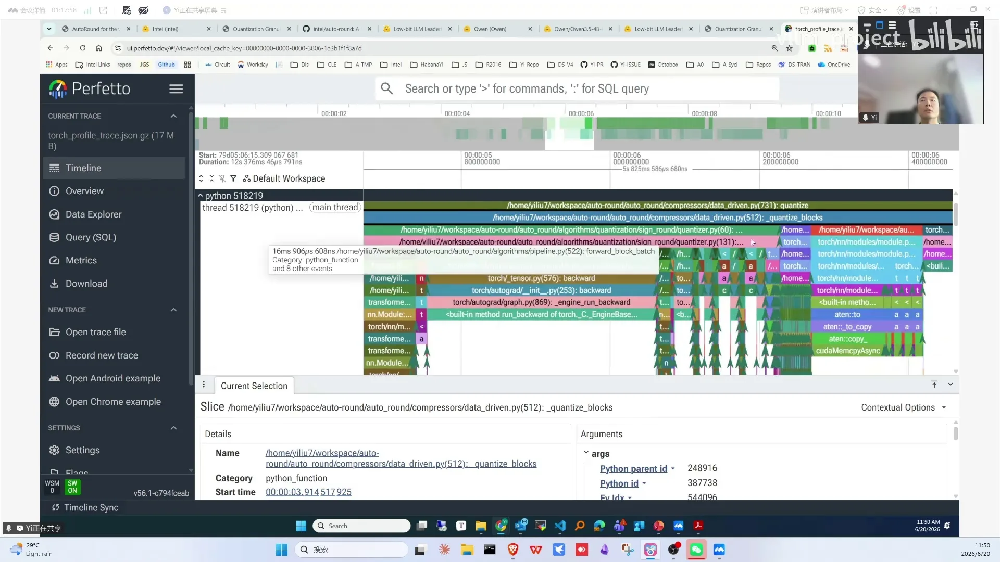 |
| 因为我们其实并不需要把整个 model load 起来——CPU 的 DRAM 都不需要放整个 model。我们只需要在量化这个 decoding block 之前，比如 DeepSeek…… [【跳转到 50:38】](https://www.bilibili.com/video/BV1etjE69Efx/?t=3038) | 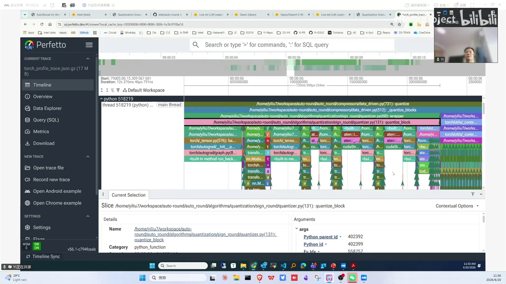 |
| 它有 61 层，每一层大概 10GB 左右。量化这个 decoding block 的时候，把这个 block 加载到 GPU 的 VRAM 里。第一步在这边插 QDQ 的 layer，第二步做一次 forward，收集 QDQ 的 output…… [【跳转到 51:03】](https://www.bilibili.com/video/BV1etjE69Efx/?t=3063) |  |
| 拿到 output 之后算 MSE loss，接着做梯度回传，更新对应的 scale。这样迭代…… [【跳转到 51:28】](https://www.bilibili.com/video/BV1etjE69Efx/?t=3088) | 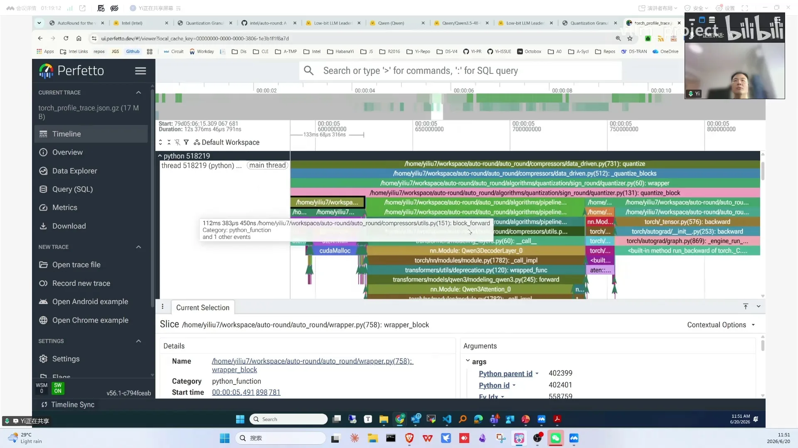 |
| 迭代比如 200 次。这边是一个只迭代了 5 次的案例。把这一个量化完之后，可以把这个 decoding layer offload 到 DRAM 上…… [【跳转到 51:53】](https://www.bilibili.com/video/BV1etjE69Efx/?t=3113) | 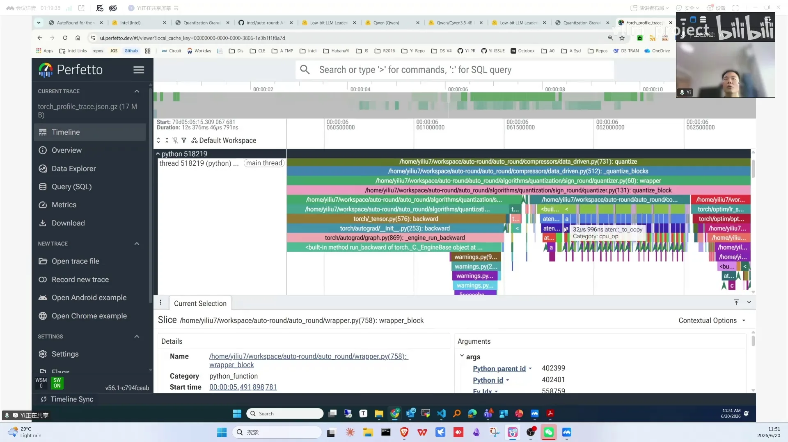 |
| 然后再加载下一层的 decoding layer。所以我们并不需要 600B 的 memory 来量化一个 600B（参数）的模型。——OK。 [【跳转到 52:18】](https://www.bilibili.com/video/BV1etjE69Efx/?t=3138) | 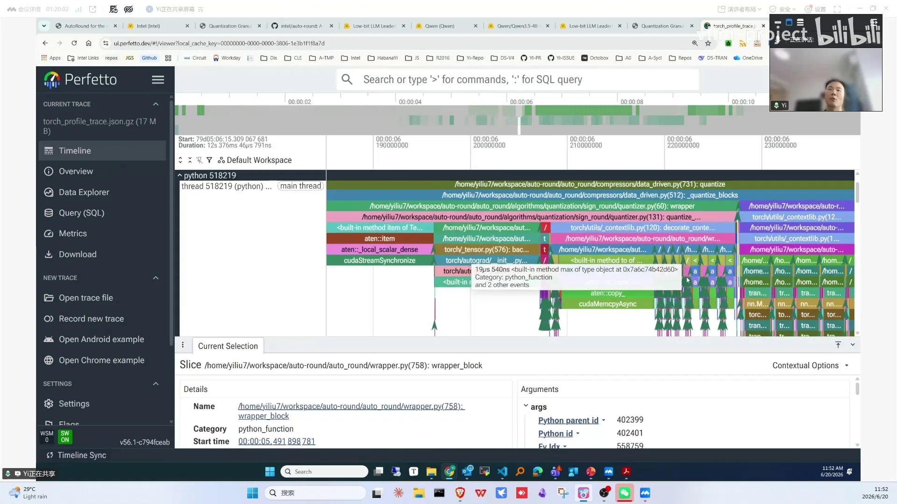 |
| 这是 AutoRound 里的流程。 [【跳转到 52:43】](https://www.bilibili.com/video/BV1etjE69Efx/?t=3163) | 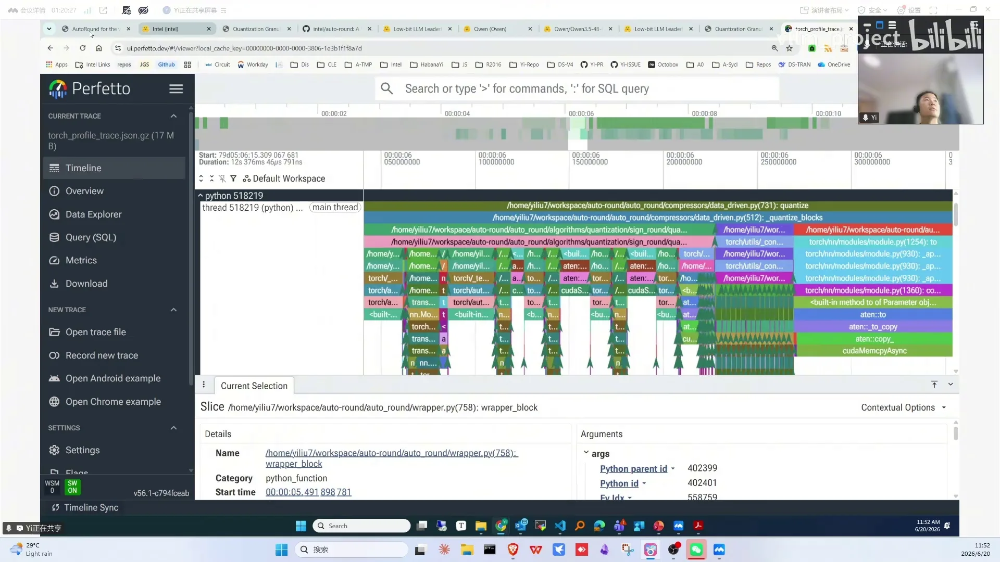 |
| 然后再介绍一个我们量化…… [【跳转到 52:48】](https://www.bilibili.com/video/BV1etjE69Efx/?t=3168) | 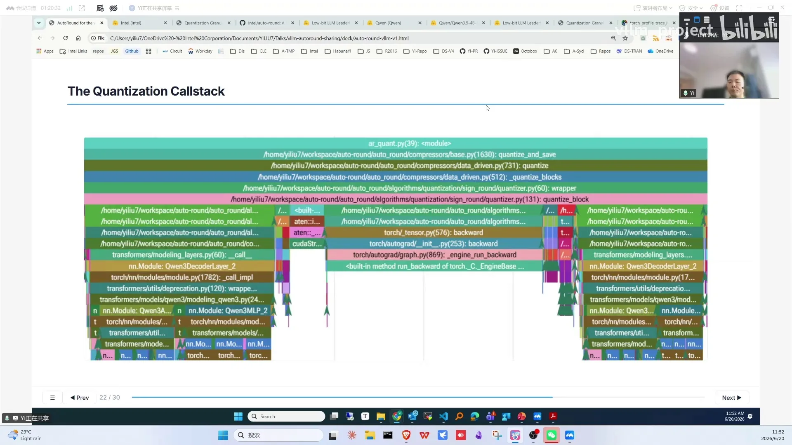 |
| diffusion model 的案例。它和 LLM 基本上也是类似的，做完之后也是会得到一个 checkpoint。 [【跳转到 52:53】](https://www.bilibili.com/video/BV1etjE69Efx/?t=3173) | 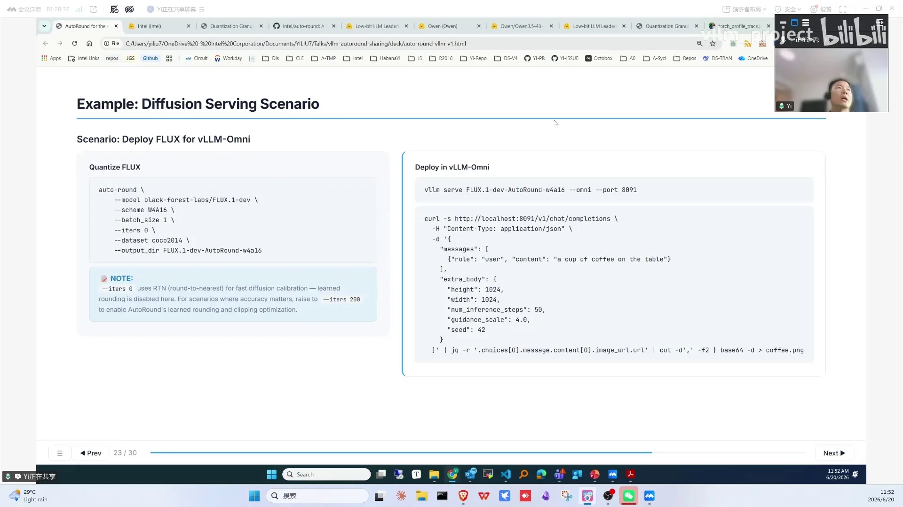 |
| 大家可以看一下我们量化完的 W4A8 的精度。因为 W4A8 还是比较好弄的，精度比较有保证。对于 Wan2.2 这个模型，我们的精度和 BF16 基本相当，有一些甚至可能还比它稍好一点。 [【跳转到 53:10】](https://www.bilibili.com/video/BV1etjE69Efx/?t=3190) |  |
| 对 image to video 也是，在它的（指标）上比较不错。还有一个…… [【跳转到 53:35】](https://www.bilibili.com/video/BV1etjE69Efx/?t=3215) | 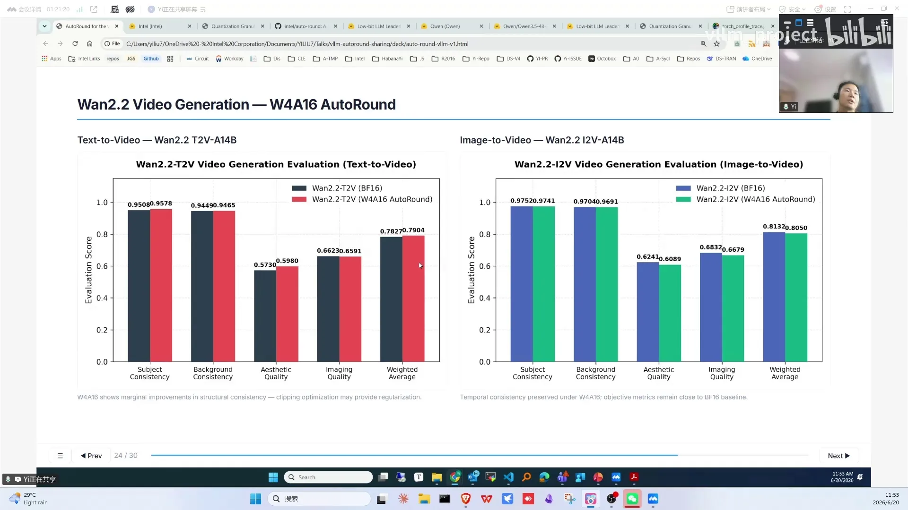 |
| 因为我们有一个 case：量化完之后在英特尔 B60 上——这个模型 transformer 的部分是 23GB，而 B60 的 memory size 只有 24GB。如果不开 CPU offloading，加上其他各种组件，需要四卡才能把 model 运行起来。但如果把它量化成 4 比特，weight 只有 7GB，单卡就可以推理起来。 [【跳转到 53:46】](https://www.bilibili.com/video/BV1etjE69Efx/?t=3226) |  |
| 因为我们机器配备了四卡，有了剩余的 memory，可以开（一些优化）。加上（它）之后，在不同的分辨率下可以拿到 1.5 到 1.6 倍的性能收益。这是一个比较典型的通过量化拿到性能收益的案例。 [【跳转到 54:11】](https://www.bilibili.com/video/BV1etjE69Efx/?t=3251) |  |
| （接上） [【跳转到 54:36】](https://www.bilibili.com/video/BV1etjE69Efx/?t=3276) | 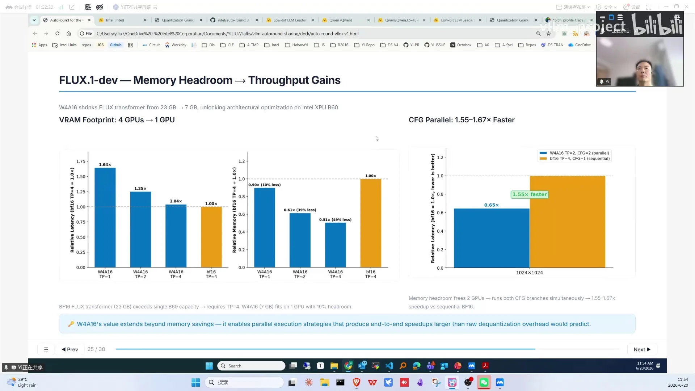 |
| 这样的一个收益的案例。 [【跳转到 55:01】](https://www.bilibili.com/video/BV1etjE69Efx/?t=3301) |  |
| OK，后面是一些经验之谈：这么多量化 scheme 怎么选择？第一步就是看你的 device 支持哪些低比特数据类型…… [【跳转到 55:08】](https://www.bilibili.com/video/BV1etjE69Efx/?t=3308) | 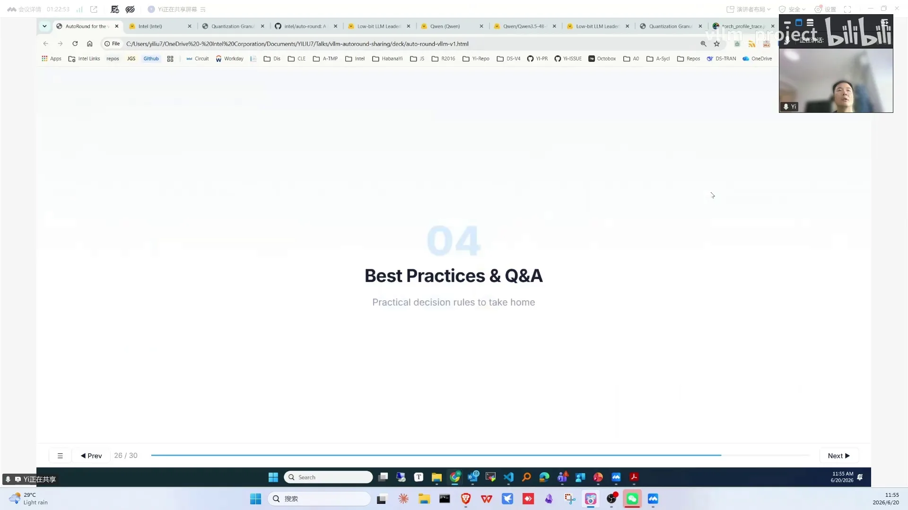 |
| 比如英特尔的 B60、B70 支持 INT4；（英伟达的话）支持 FP8；我们即将 launch 的（新一代）GPU 会支持 MXFP4 和 MXFP8。在这个前提下选择对应的 dtype，进一步考虑…… [【跳转到 55:33】](https://www.bilibili.com/video/BV1etjE69Efx/?t=3333) | 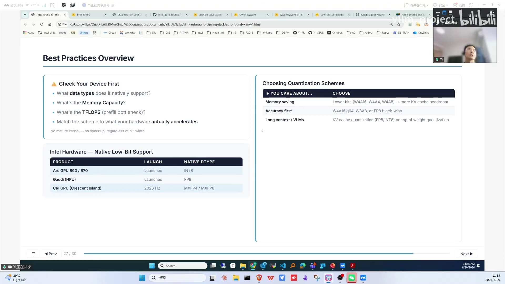 |
| 当然我们要在保证精度的前提下尽可能减小 model size。比如 W4A16/W4A8 比较稳妥，W4A4 比较激进——可以权衡选择…… [【跳转到 55:58】](https://www.bilibili.com/video/BV1etjE69Efx/?t=3358) | 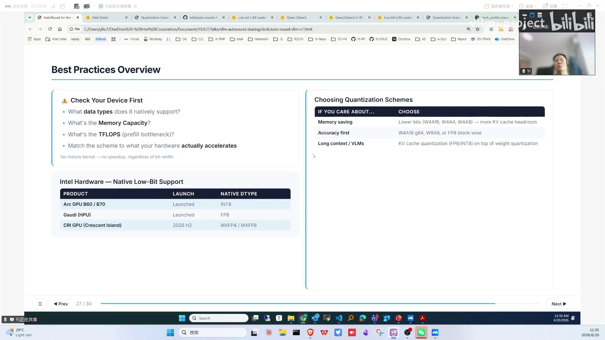 |
| 包括现在新出的模型比如 DeepSeek，它的 MoE 部分也用了 4 比特，activation 用的 8 比特。但这种情况下最终做 inference 时还是只能用 8 比特的硬件指令；想利用 4 比特硬件指令的性能，还是要做 W4A8…… [【跳转到 56:23】](https://www.bilibili.com/video/BV1etjE69Efx/?t=3383) |  |
| 再一个是在这两个基础上叠加 KV cache 的量化，在长文本的情况下尤其重要——把 KV cache 量化成 INT8 甚至更激进的。但这有赖于 kernel 的支持。 [【跳转到 56:48】](https://www.bilibili.com/video/BV1etjE69Efx/?t=3408) |  |
| 然后量化完之后精度可能有损失，AutoRound 提供很多超参数来调整精度。常见的几个：第一个是 iteration；再一个是用多少 calibration samples 来迭代。iteration 越多、calibration samples 越多、序列（长度）越长，意味着 calibration 过程所需时间越长。但如果给它足够多的 calibration samples 和更多 iteration…… [【跳转到 57:13】](https://www.bilibili.com/video/BV1etjE69Efx/?t=3433) |  |
| 可以让它更适应低精度的情况，精度在大部分情况下相对比较好。当然也要实测来看。我们这边也提供一些…… [【跳转到 57:38】](https://www.bilibili.com/video/BV1etjE69Efx/?t=3458) | 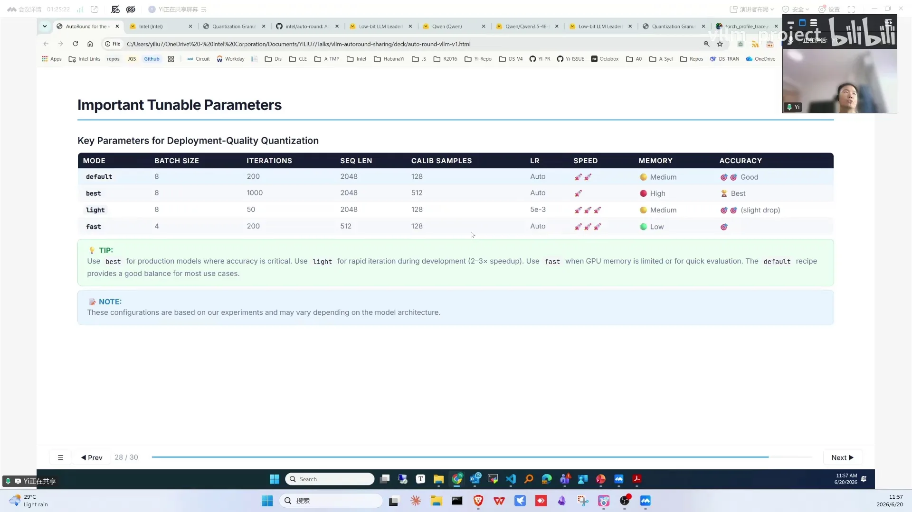 |
| （接上） [【跳转到 58:03】](https://www.bilibili.com/video/BV1etjE69Efx/?t=3483) | 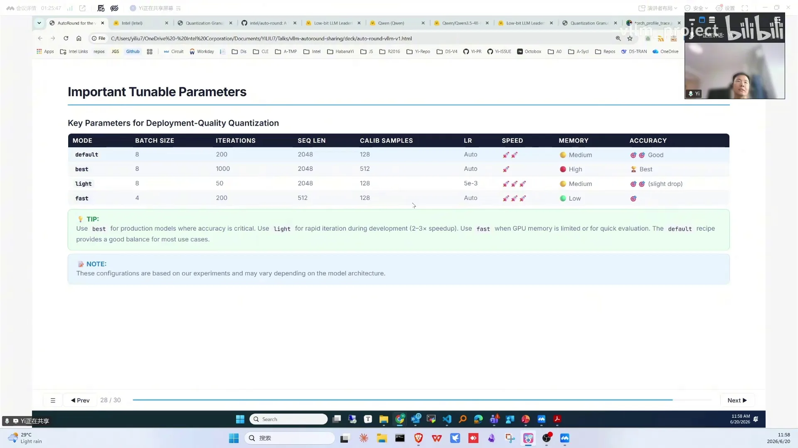 |
| 默认的配置：我们根据之前的经验调好的一些 config，大概定义成 default、best、light、fast。相当于做选择题一样试不同的 config。这里想强调一点…… [【跳转到 58:28】](https://www.bilibili.com/video/BV1etjE69Efx/?t=3508) | 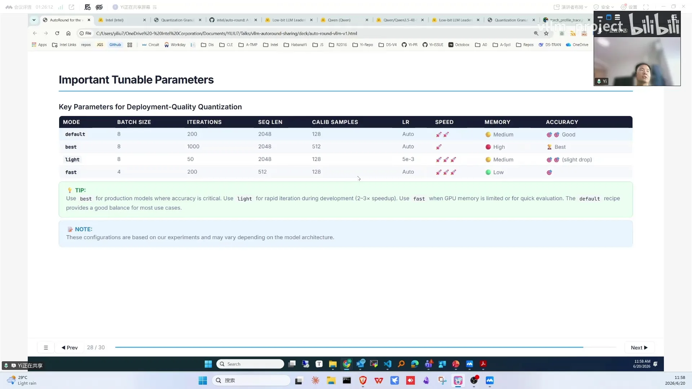 |
| 它是一次性的开销：量化完之后，选 best 量化时间可能多一点，但只要拿到 checkpoint，不会影响后续 inference 的速度。然后总结一下正在做的以及后面准备做的工作…… [【跳转到 58:53】](https://www.bilibili.com/video/BV1etjE69Efx/?t=3533) | 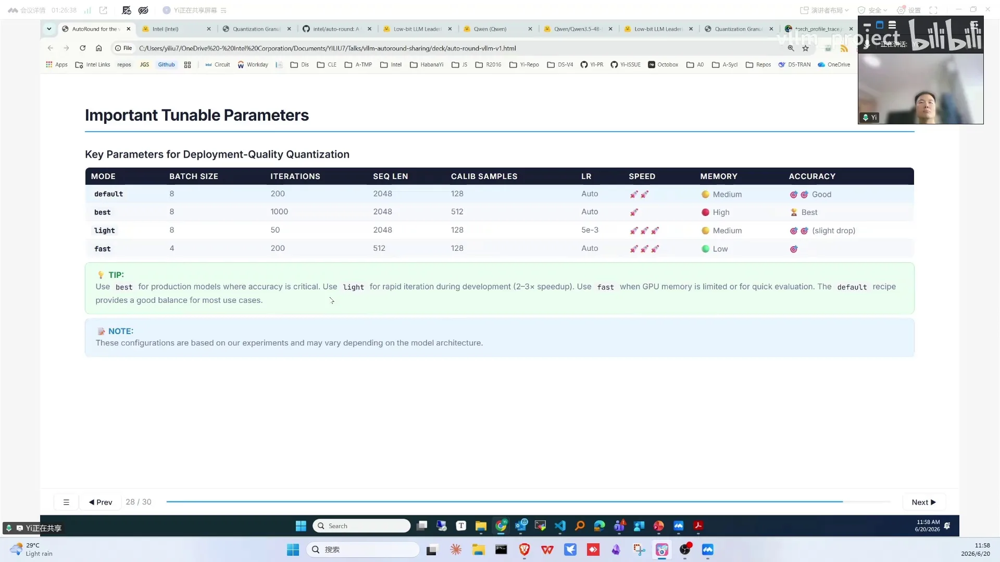 |
| 首先从量化角度，我们最近也在做 rotation，为了解决 outlier 的数据分布问题。最近还做了很大的架构 refactor，refactor 完之后会支持不同算法做 mix：比如 mix AWQ 和 AutoRound。我们也在做一些 SVD 量化和极低比特、2 比特的探索…… [【跳转到 59:18】](https://www.bilibili.com/video/BV1etjE69Efx/?t=3558) |  |
| kernel 方面，我们最近在拓展 vLLM 和 vLLM-Omni 里的量化 scheme 支持…… [【跳转到 59:43】](https://www.bilibili.com/video/BV1etjE69Efx/?t=3583) | 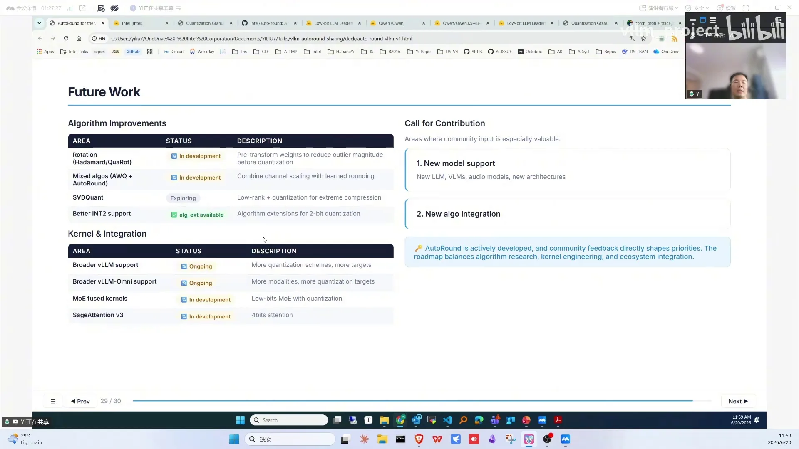 |
| 后面 MXFP4 和 MXFP8、linear/MoE 这些都是下一步的重点。同时（低比特）attention V3 是 4 比特比较激进的 attention 量化，也是我们正在开发探索的方向。同时 AutoRound 是非常 open 的状态：有任何问题可以去 GitHub 上提 issue，我们非常欢迎…… [【跳转到 60:08】](https://www.bilibili.com/video/BV1etjE69Efx/?t=3608) |  |
| （接上） [【跳转到 60:33】](https://www.bilibili.com/video/BV1etjE69Efx/?t=3633) | 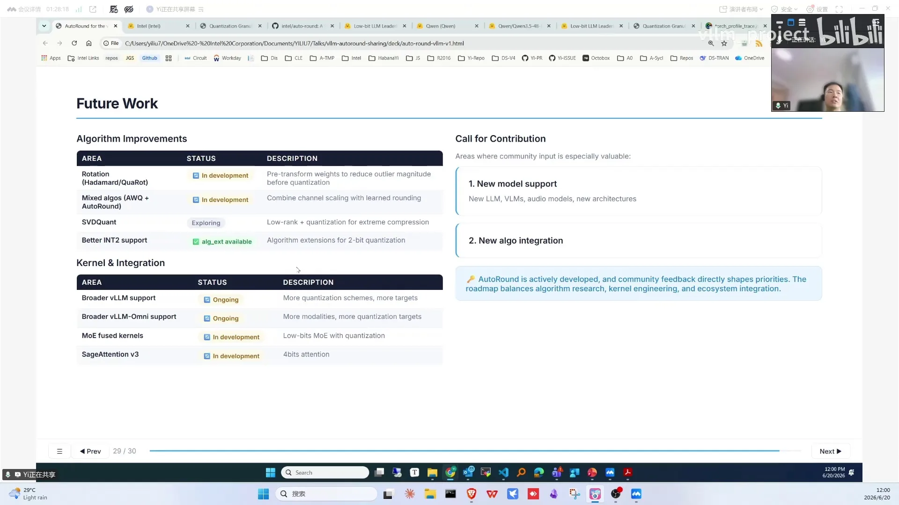 |
| 希望学习量化相关的同学，想尝试一些基础 feature 的，也可以来做：比如新加一个模型、新加一个算法，我们非常欢迎。如果大家觉得社区目前比较（需要），我们也会适当调整 roadmap。——对好。——老师顺便展示一下 AutoRound 这个仓库在哪吧。——OK，大家可以扫这个二维码…… [【跳转到 60:58】](https://www.bilibili.com/video/BV1etjE69Efx/?t=3658) |  |
| （接上） [【跳转到 61:23】](https://www.bilibili.com/video/BV1etjE69Efx/?t=3683) | 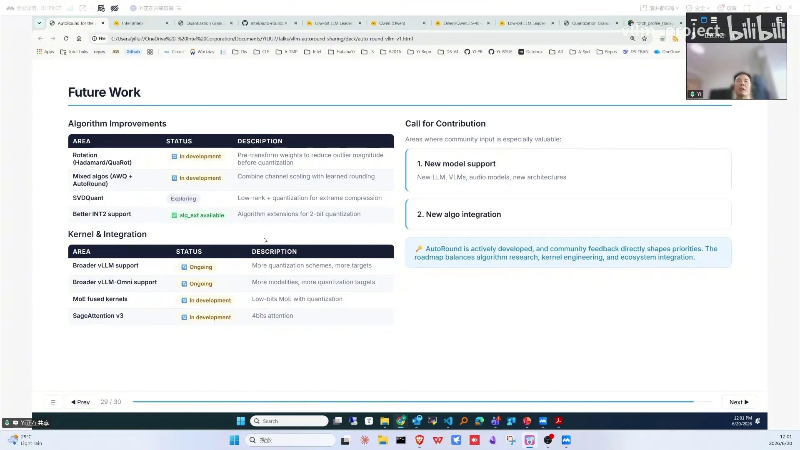 |
| 可以去 AutoRound 的仓库里。大家如果觉得有用可以给个赞——给这个仓库 star，也可以 fork 一下，这对我们做开源真的很重要。——对对对。 [【跳转到 61:36】](https://www.bilibili.com/video/BV1etjE69Efx/?t=3696) | 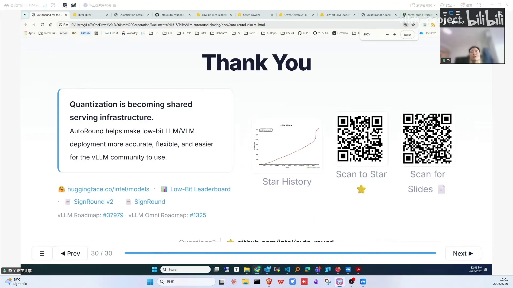 |
| 最近我们组很多人投在这个仓库上，也有一波小高潮。——我看还有同学问到资料：资料我都放在了 branch 上，大家可以直接去下载，把这个码也可以跳转到刚才那个链接。——好 OK，那我们再回答一些提问。 [【跳转到 62:01】](https://www.bilibili.com/video/BV1etjE69Efx/?t=3721) | 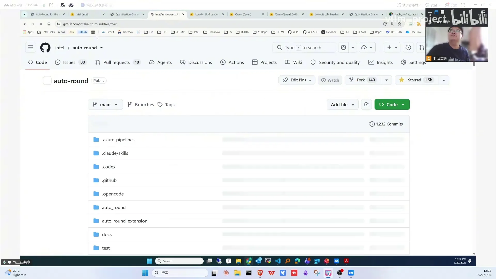 |
| （接上） [【跳转到 62:26】](https://www.bilibili.com/video/BV1etjE69Efx/?t=3746) | 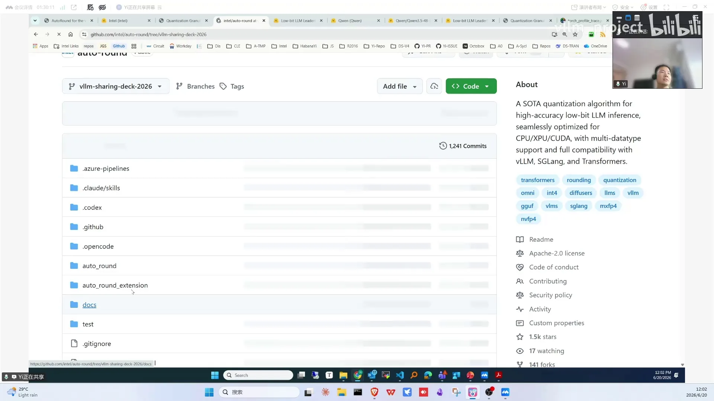 |
| 老师有没有 DeepSeek V4 的部署资料可以提供一下？——部署资料的话，我们有一个（讨论帖），大家可以看一下。——我们就需要这种带货能力很强的嘉宾。 [【跳转到 62:51】](https://www.bilibili.com/video/BV1etjE69Efx/?t=3771) | 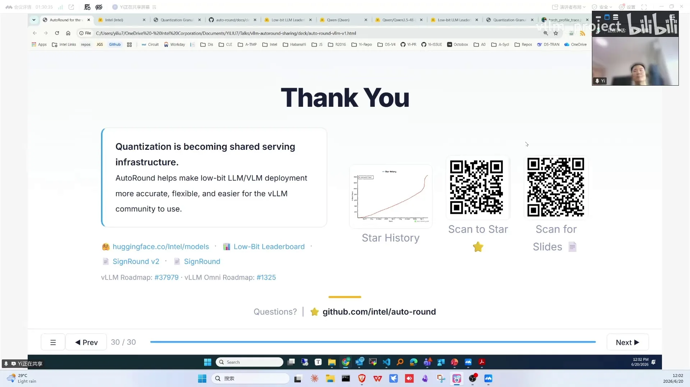 |
| 都已经合进去了，这是量化的支持。vLLM 那边也有一些相应的调整，我来找一下…… [【跳转到 63:16】](https://www.bilibili.com/video/BV1etjE69Efx/?t=3796) | 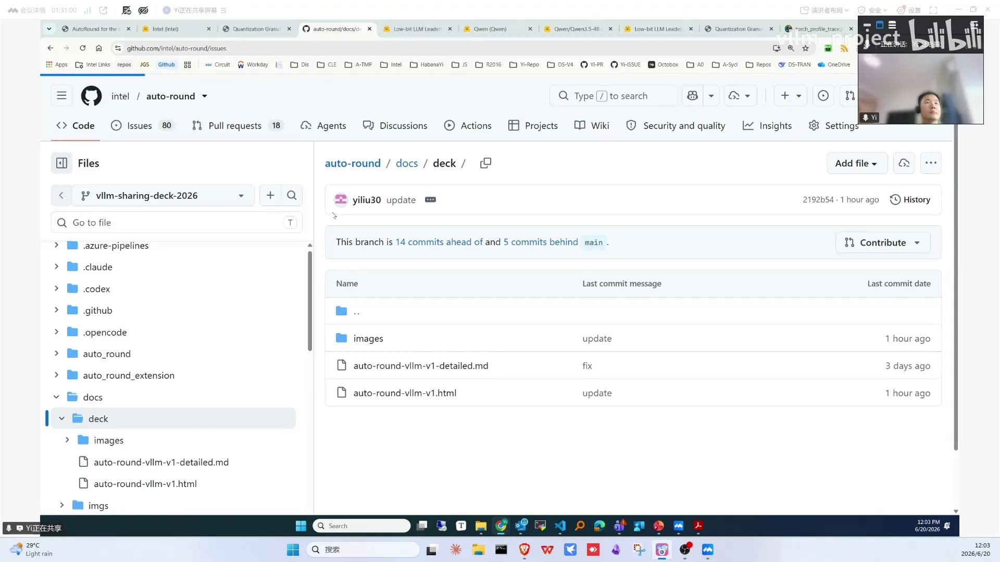 |
| （接上） [【跳转到 63:41】](https://www.bilibili.com/video/BV1etjE69Efx/?t=3821) | 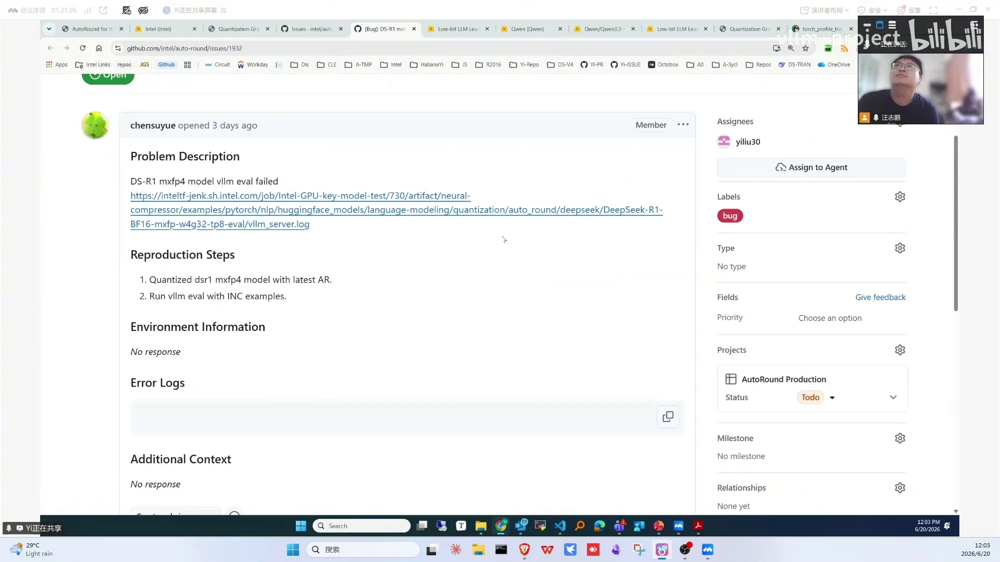 |
| AutoRound 里的 DeepSeek V4 的 PR 主要是做什么的？——因为（V4）模型的架构有很大的变化，为了适应新架构，AutoRound 需要做相应的调整来适配新的模型架构。这也是为什么 leaderboard 里会有 agent 的概念：我们希望让 agent 自动适配这些不同的新架构。——可以看到这个 PR 的具体内容吗？——OK 可以看一下，改的也不是很多…… [【跳转到 64:06】](https://www.bilibili.com/video/BV1etjE69Efx/?t=3846) | 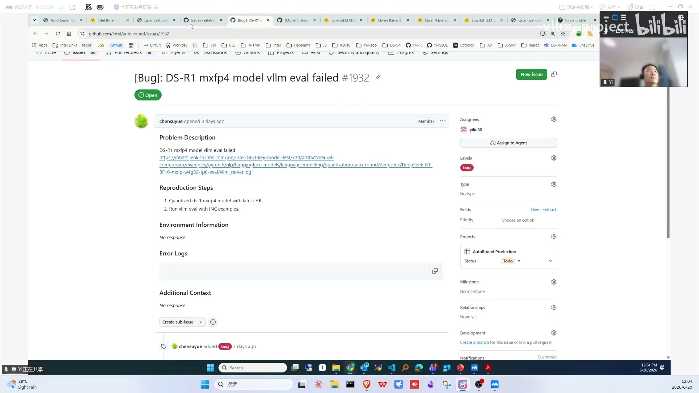 |
| （接上） [【跳转到 64:31】](https://www.bilibili.com/video/BV1etjE69Efx/?t=3871) | 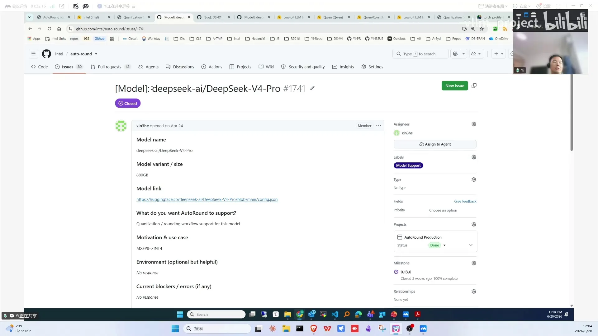 |
| 我看主要就是改了这几个文件。对的。就是我们有一个新的量化模式…… [【跳转到 64:56】](https://www.bilibili.com/video/BV1etjE69Efx/?t=3896) | 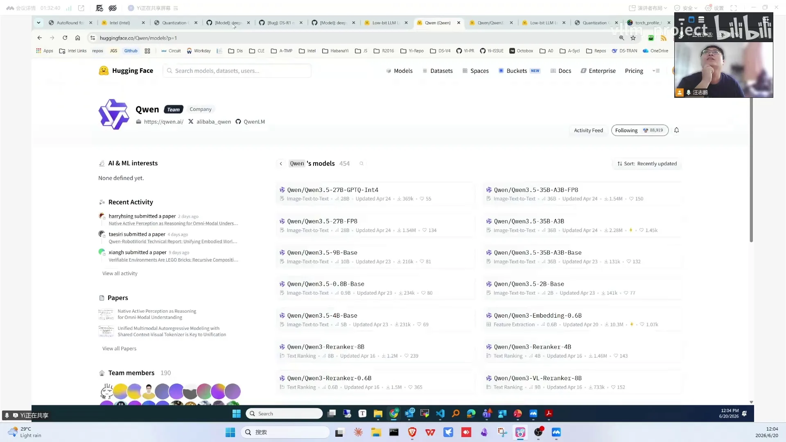 |
| （接上） [【跳转到 65:21】](https://www.bilibili.com/video/BV1etjE69Efx/?t=3921) | 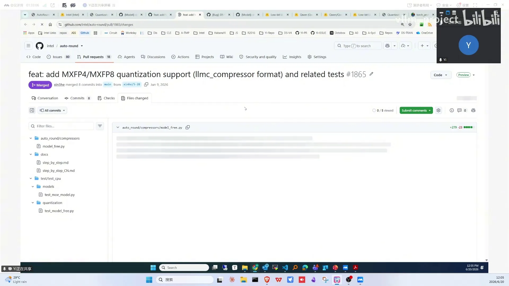 |
| 我们称为 model free：量化的时候正常来讲需要知道模型的架构，根据里面的比如 linear、MoE 做转换，把模型量化成我们想要的比特。model free 就是我们拿到 checkpoint 的 tensor，把想要量化的 weight 转化——比如 DeepSeek 它原始的 attention 是 FP8 的…… [【跳转到 65:46】](https://www.bilibili.com/video/BV1etjE69Efx/?t=3946) | 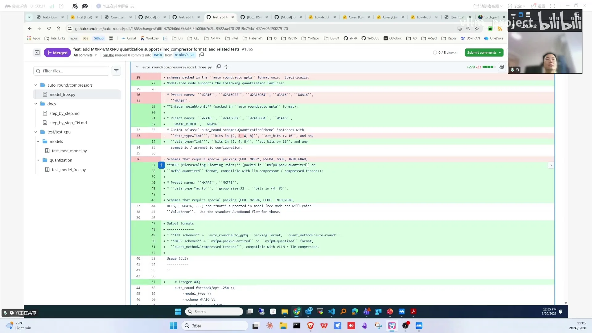 |
| （接上） [【跳转到 66:11】](https://www.bilibili.com/video/BV1etjE69Efx/?t=3971) | 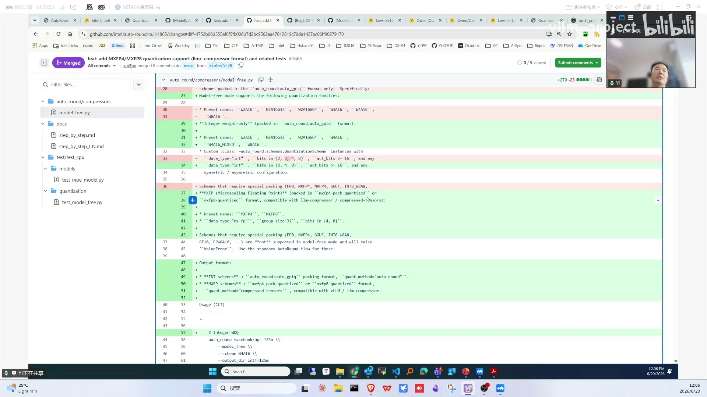 |
| 我们可以把这部分转化成 FP4 的操作。——这个我可以…… [【跳转到 66:36】](https://www.bilibili.com/video/BV1etjE69Efx/?t=3996) | 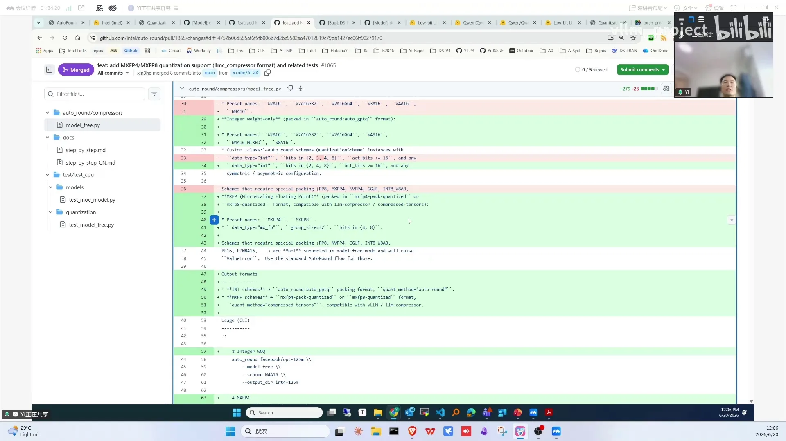 |
| 大家可以搜一下，或者我待会贴出来也可以。我们这边应该…… [【跳转到 67:01】](https://www.bilibili.com/video/BV1etjE69Efx/?t=4021) | 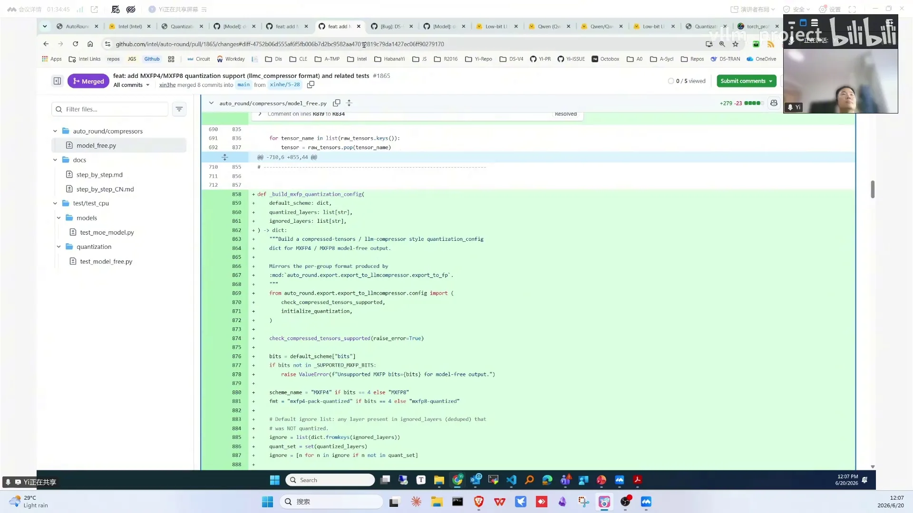 |
| （此区间无字幕） [【跳转到 67:24】](https://www.bilibili.com/video/BV1etjE69Efx/?t=4044) | 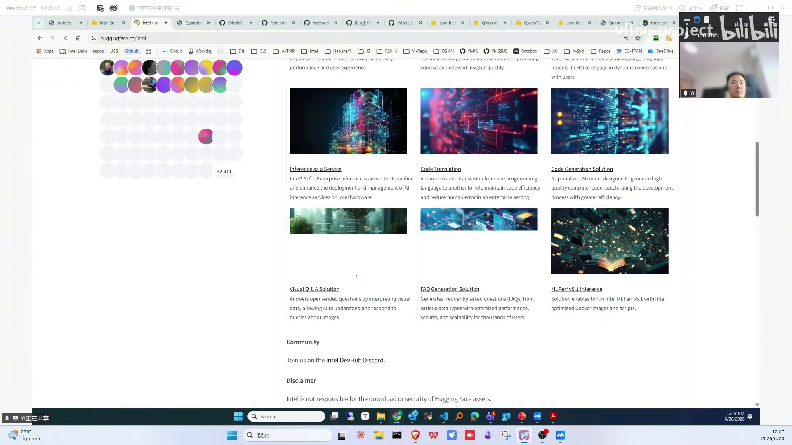 |
| （此区间无字幕） [【跳转到 67:29】](https://www.bilibili.com/video/BV1etjE69Efx/?t=4049) | 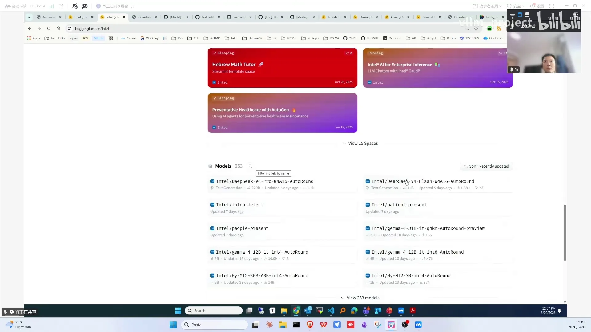 |
| 这边大家可以看一下这个 PR：刚才是在讲 AutoRound 那边的改动…… [【跳转到 67:34】](https://www.bilibili.com/video/BV1etjE69Efx/?t=4054) | 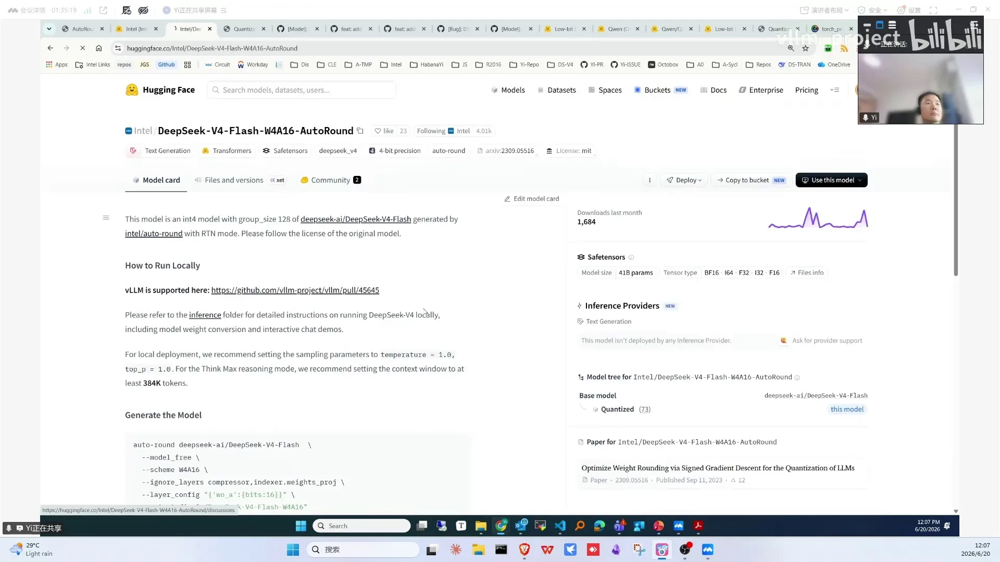 |
| 这边是 vLLM（DeepSeek）这边的改动。这几个 PR 我后面上传直播回放的时候会贴到底下评论里。——好的好的。 [【跳转到 67:59】](https://www.bilibili.com/video/BV1etjE69Efx/?t=4079) | 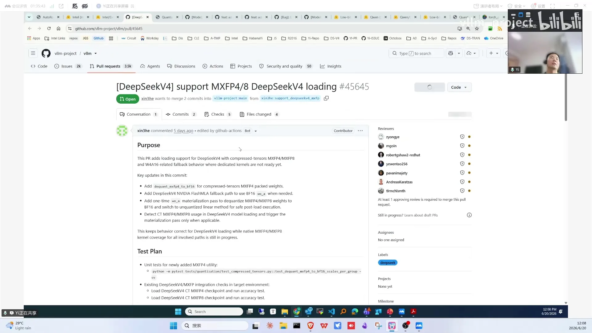 |
| 有同学问：V2 量化完有些效果很差，就是想提 issue？——我看一下这个问题。可以再说一下这个问题吗？可能是（SignRound）V2 量化完有些效果很差…… [【跳转到 68:24】](https://www.bilibili.com/video/BV1etjE69Efx/?t=4104) | 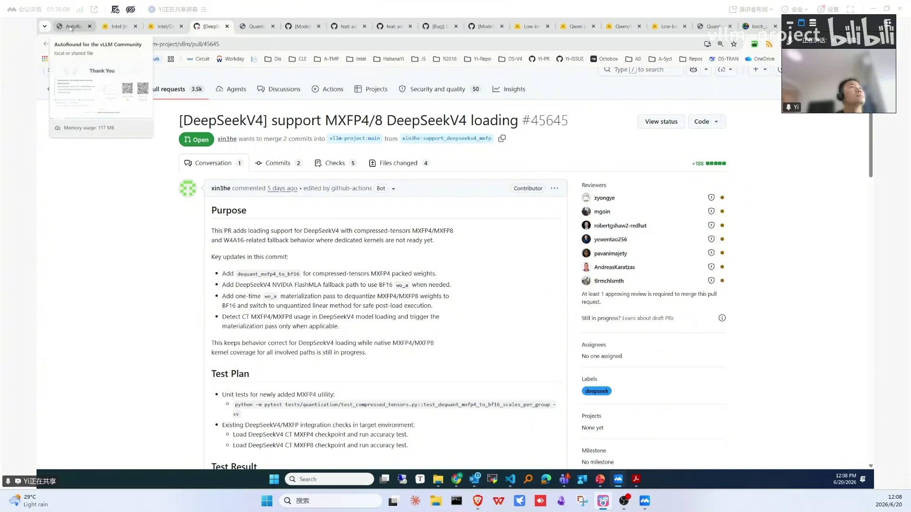 |
| ——大家可以直接在 GitHub 上提供复现步骤，我们会非常高效地看这些问题。——对对。然后还有（观众）投喂了（礼物），非常感谢。 [【跳转到 68:49】](https://www.bilibili.com/video/BV1etjE69Efx/?t=4129) | 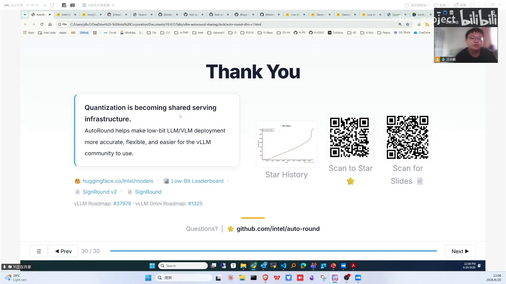 |
| 然后英特尔这个 AutoRound 也可以提交 PR 吗？——可以提交 PR。不管什么仓库，提 PR 之前最好先关联一个 issue：说你发现什么问题、社区里有什么人已经发现了问题，你的 PR 是为了解决这个问题的。如果是特性提交，需要先写一个 RFC，讲清楚问题是什么、怎么设计系统、怎么解决。RFC 可能需要多放几天，等社区的人找你去讨论…… [【跳转到 69:14】](https://www.bilibili.com/video/BV1etjE69Efx/?t=4154) |  |
| （接上） [【跳转到 69:39】](https://www.bilibili.com/video/BV1etjE69Efx/?t=4179) | 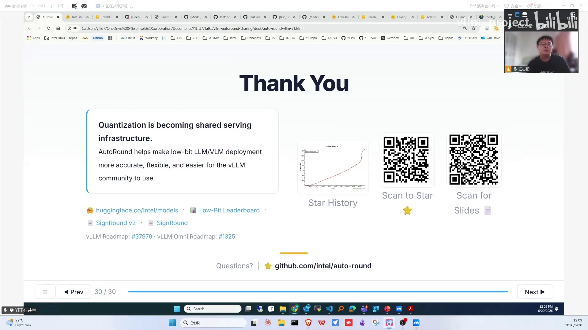 |
| 然后后面才可以提交 PR。这是我的一些小建议。——好。刘老师你说。——对，我想补充一下志鹏老师刚才说的两点：AutoRound 非常愿意帮助刚接触量化的新人。想做一些基础（贡献）的，AutoRound 里我会主动帮大家做 onboarding 这样的工作。——那更好了。因为 vLLM 这边大家没什么精力做 onboarding…… [【跳转到 70:04】](https://www.bilibili.com/video/BV1etjE69Efx/?t=4204) |  |
| （接上） [【跳转到 70:29】](https://www.bilibili.com/video/BV1etjE69Efx/?t=4229) | 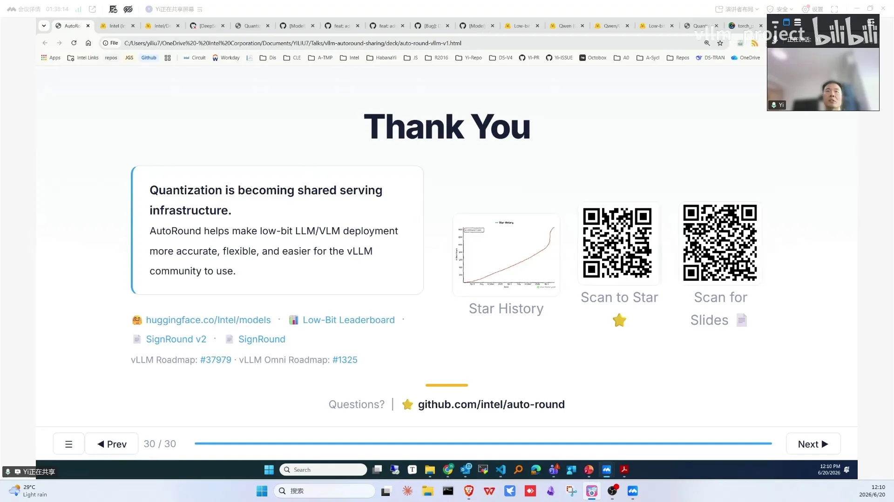 |
| 真的是初期开发者可能会存在很长一段时间要去适应、学习，最关键是你可能需要费很多努力去取得大家的信任。——嗯嗯，主要是 vLLM 和 vLLM-Omni 的维护开发任务比较繁重。——对对。有人主动带你是非常好的机会，特别是参与到非常有影响力的项目中。 [【跳转到 70:54】](https://www.bilibili.com/video/BV1etjE69Efx/?t=4254) | 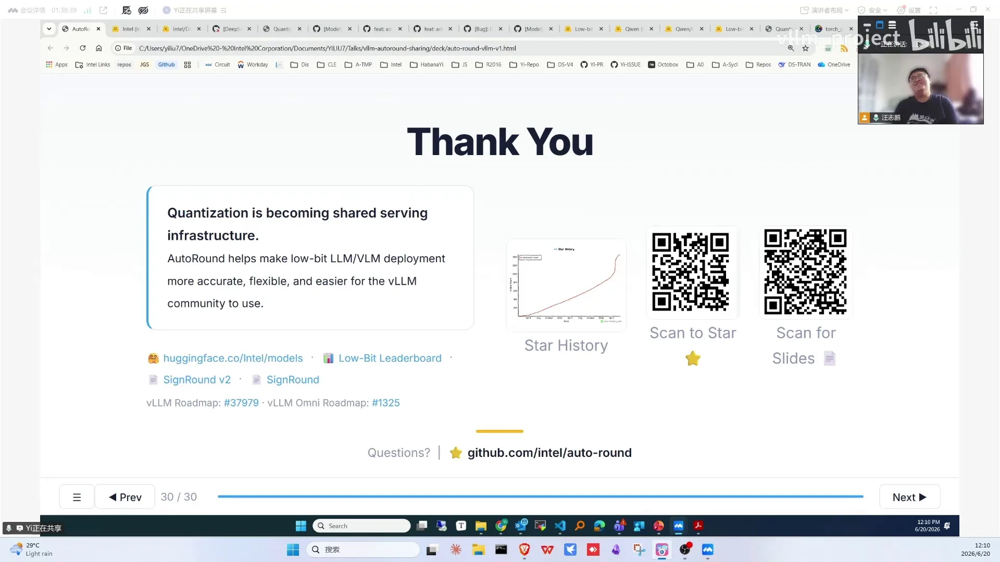 |
| （接上） [【跳转到 71:19】](https://www.bilibili.com/video/BV1etjE69Efx/?t=4279) | 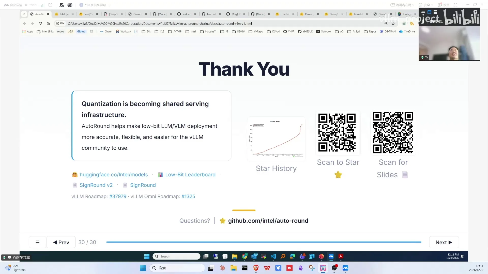 |
| 有同学问：听起来在同样的量化下 AutoRound 会比 GPTQ/AWQ 量化时间更长一些？——对，肯定的。我想补充：这要看你选择怎么样的配置…… [【跳转到 71:44】](https://www.bilibili.com/video/BV1etjE69Efx/?t=4304) | 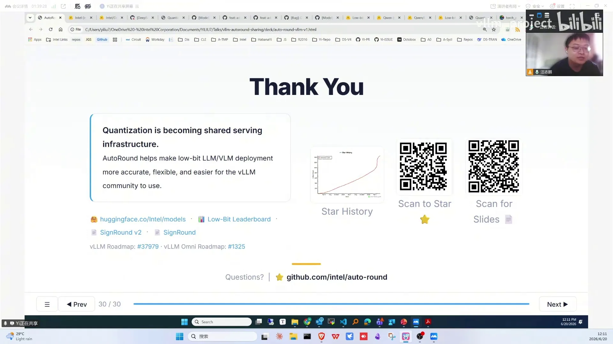 |
| 可以选择不同的 iteration 数量。我们 paper 里也有详细的量化 effort 时长的比较，大家可以看具体数据。——我感觉 iteration 次数越多，量化效果就会越好，对吧？因为量化出的模型大小、运行时都一样，与其这样不如尽量让 iteration 多跑几遍。——大部分情况是这样，可能有些要 case by case 看。——OK。 [【跳转到 71:56】](https://www.bilibili.com/video/BV1etjE69Efx/?t=4316) | 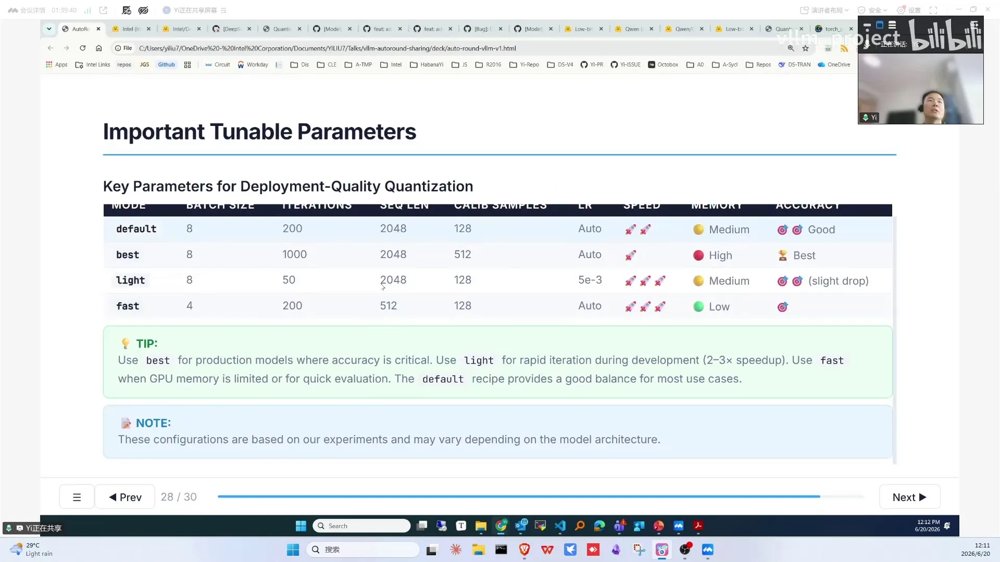 |
| （接上） [【跳转到 72:17】](https://www.bilibili.com/video/BV1etjE69Efx/?t=4337) | 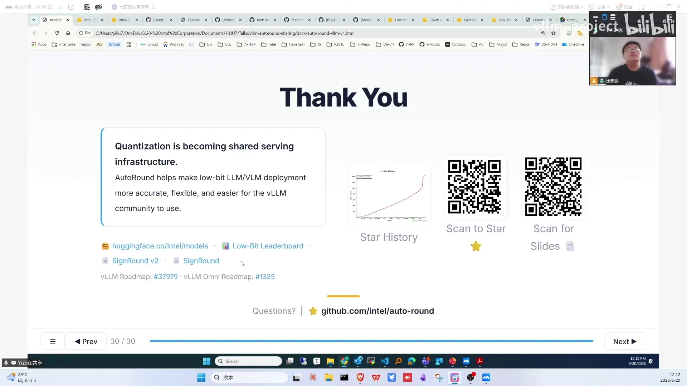 |
| 然后为啥要 AWQ 和 AutoRound 的混合模式？——因为 AutoRound 和 AWQ 是从不同角度解决量化误差问题的。融合的话，我们希望把两个方式的（优点）放到一起，看整体的效果。——对。 [【跳转到 72:42】](https://www.bilibili.com/video/BV1etjE69Efx/?t=4362) |  |
| （接上） [【跳转到 73:07】](https://www.bilibili.com/video/BV1etjE69Efx/?t=4387) | 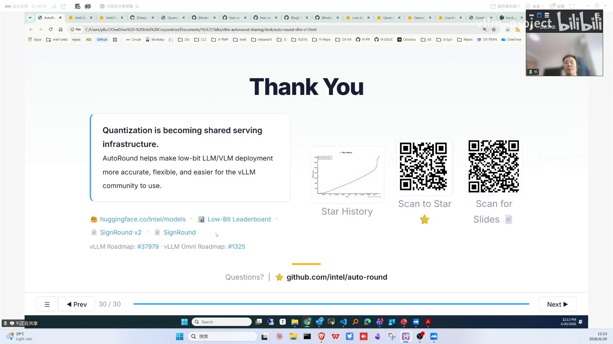 |
| 然后有同学问：AutoRound 量化的模型可以在 NVIDIA 和 AMD 上用吗？——应该可以。——可以的。——然后 DeepSeek V4 本身就是 MXFP4 的，AutoRound 这里量化成 W4A16 主要是针对什么场景呢？ [【跳转到 73:32】](https://www.bilibili.com/video/BV1etjE69Efx/?t=4412) | 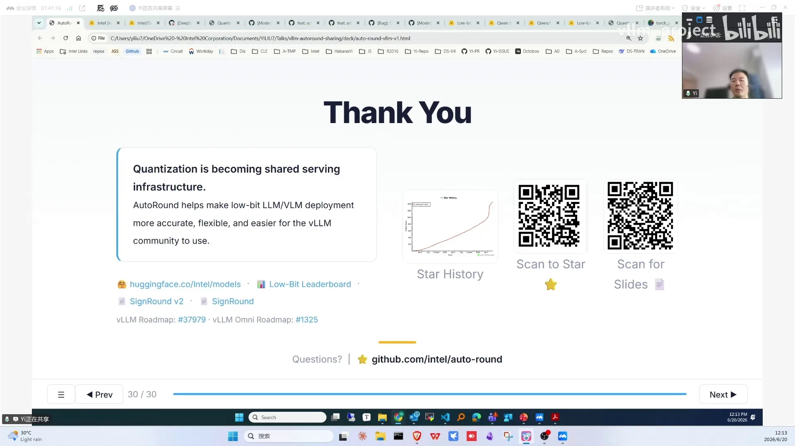 |
| 最典型的场景：比如 A100 不支持 MXFP4，但它支持 W4A16 的 kernel。——OK。——好，直播又有新的问题：AutoRound 在更低精度下效果怎么样？ [【跳转到 73:57】](https://www.bilibili.com/video/BV1etjE69Efx/?t=4437) | 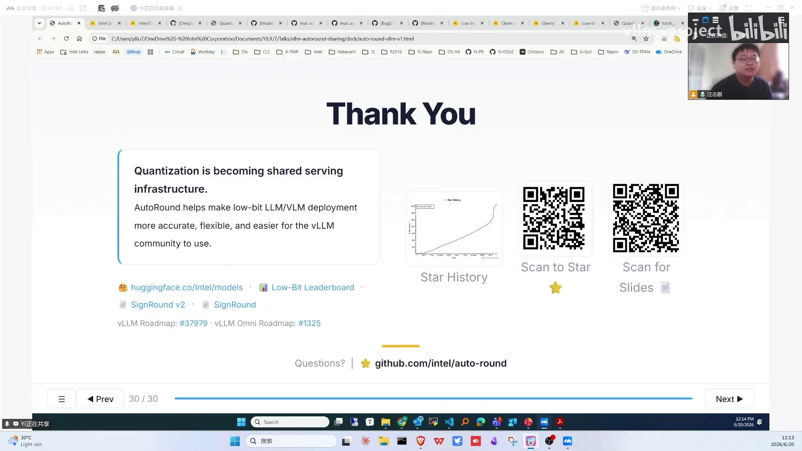 |
| 这个更低精度指的是什么？——哦我理解应该是 2 比特吧。 [【跳转到 74:22】](https://www.bilibili.com/video/BV1etjE69Efx/?t=4462) | 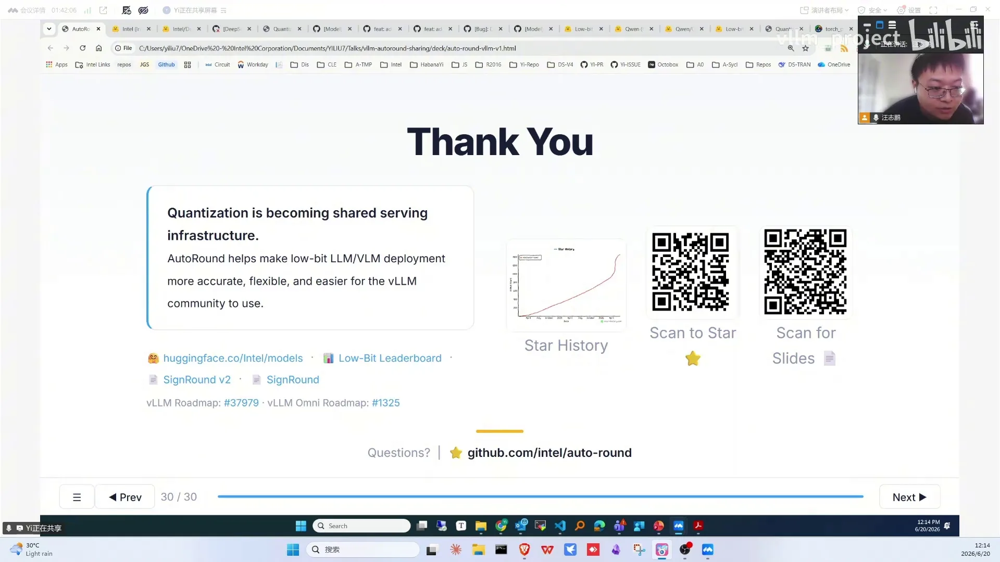 |
| 我们 SignRound V2 这篇 paper 就是做这个的…… [【跳转到 74:33】](https://www.bilibili.com/video/BV1etjE69Efx/?t=4473) | 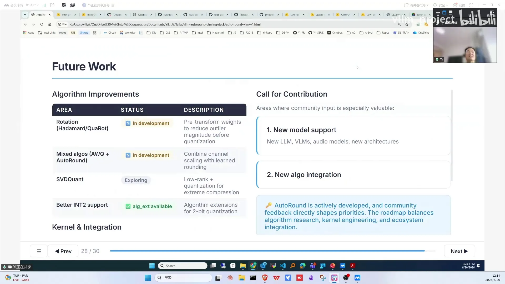 |
| 大家可以看一下，里面有非常详细的数据结果。 [【跳转到 74:41】](https://www.bilibili.com/video/BV1etjE69Efx/?t=4481) | 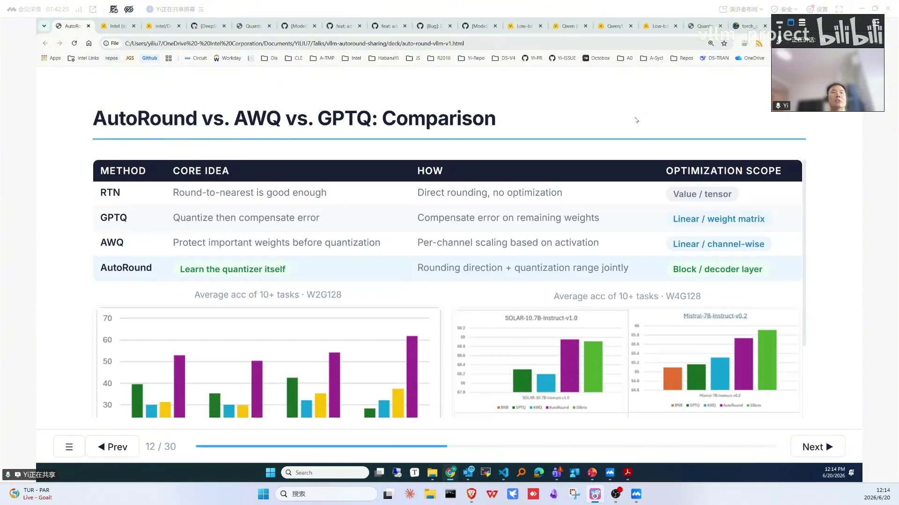 |
| 链接我也放在（资料）里了。这些东西后面都放到直播回放的评论区置顶。——好，直播间大家还有没有什么新的问题？ [【跳转到 74:46】](https://www.bilibili.com/video/BV1etjE69Efx/?t=4486) | 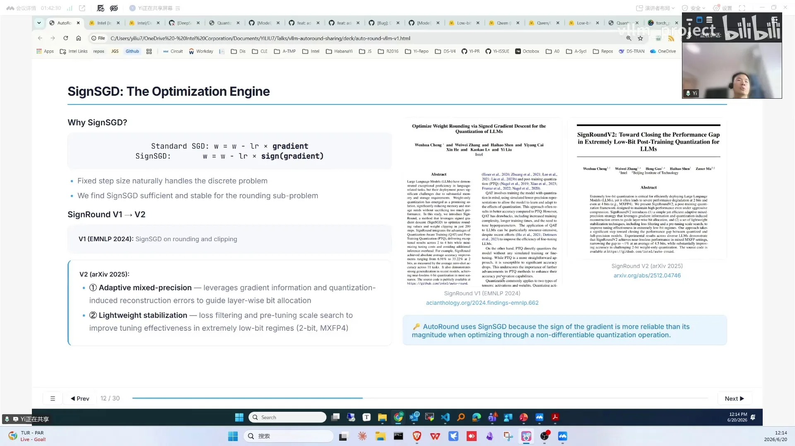 |
| 如果没有什么问题的话，今天直播就要准备结束了。没点关注的同学一定要点个关注…… [【跳转到 75:11】](https://www.bilibili.com/video/BV1etjE69Efx/?t=4511) | 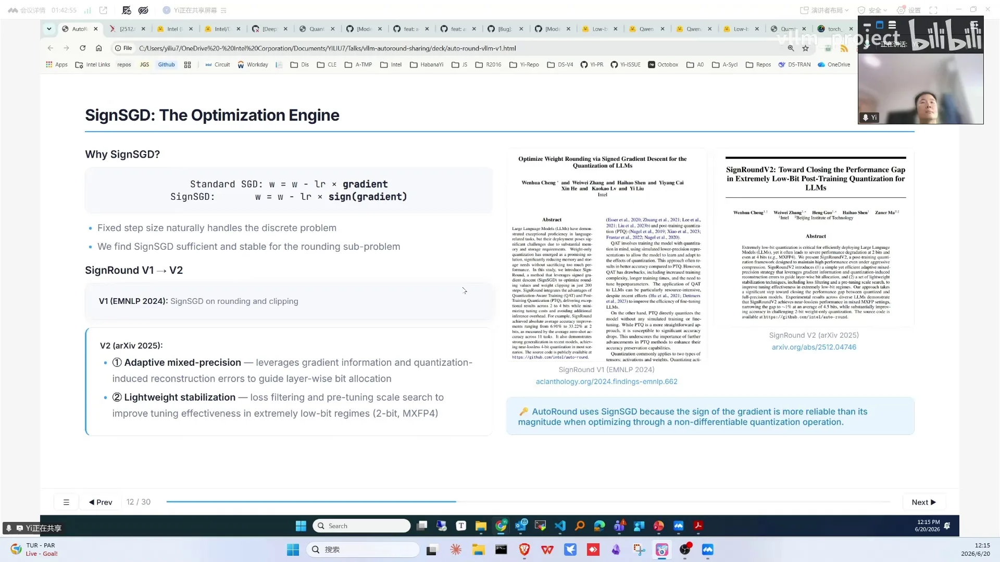 |
| 你也可以分享这一期直播。直播结束之后我会上传直播回放，也会在评论区置顶分享这一期直播的 PPT 和相关链接。请大家收藏关注点赞、订阅我们频道。我们频道每个礼拜六上午 11 点钟…… [【跳转到 75:36】](https://www.bilibili.com/video/BV1etjE69Efx/?t=4536) | 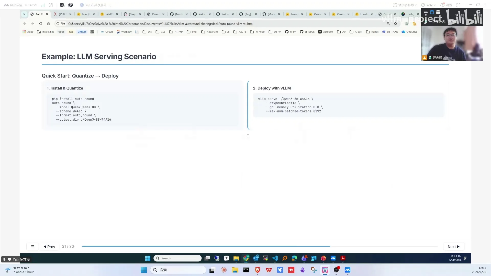 |
| 都会分享 vLLM 相关的一些技术或者仓库里其他相关内容。那么今天的直播就到此结束了，感谢大家的收看。——OK 好，谢谢大家拜拜。——拜拜拜拜。 [【跳转到 76:01】](https://www.bilibili.com/video/BV1etjE69Efx/?t=4561) | 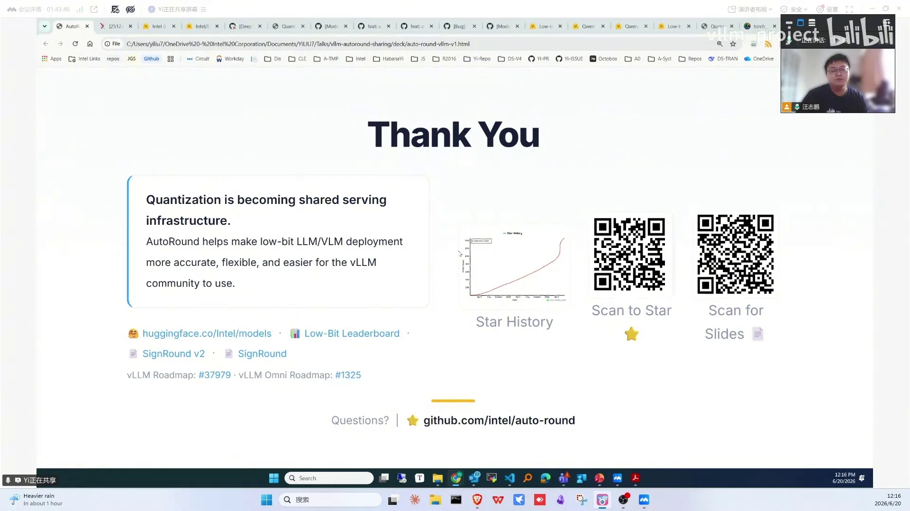 |
| （此区间无字幕） [【跳转到 76:26】](https://www.bilibili.com/video/BV1etjE69Efx/?t=4586) | 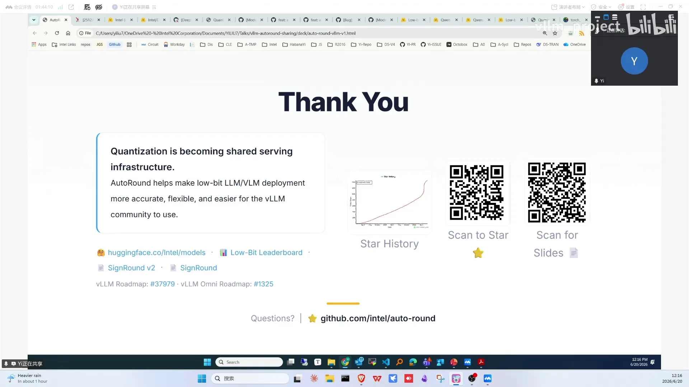 |