# vLLM小课堂（八）：veRL-Omni，为vLLM-Omni打造的RL框架 原始文稿（图-字幕分栏）

| 字幕文本 | 画面 |
| :--- | ---: |
| 今天我们直播的主题主要是讲 veRL-Omni。嘉宾可以先大概介绍一下自己。——hello 大家好，我是黄永强，现在在华为香港研究所。我们组主要做多模态的推理和多模态的 RL，主要的项目一个是 vLLM-Omni，还有 veRL-Omni 这两个大的开源仓库。——对。 [【跳转到 00:00】](https://www.bilibili.com/video/BV1qd7n6TEZk/?t=0) | 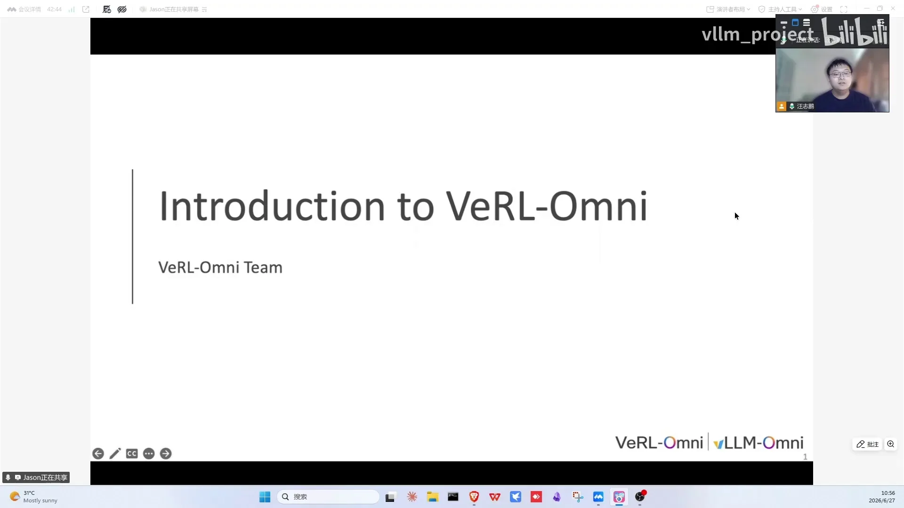 |
| 要不我就直接开始讲吧。——对，好，开始开始，计时很好。——先说一下背景：veRL-Omni 是基于 veRL 和 vLLM-Omni 去构建的。前期它是在 veRL 上面只是支持 diffusion RL…… [【跳转到 00:25】](https://www.bilibili.com/video/BV1qd7n6TEZk/?t=25) | 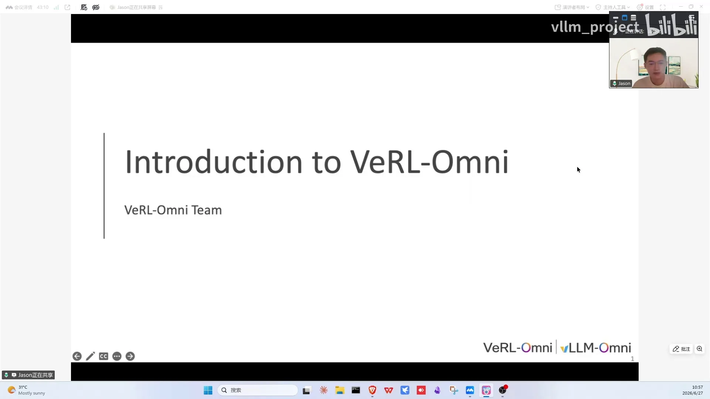 |
| 但是后来觉得这样对主仓的影响（比较大），还有就是动态生成这块 RL 本身迭代比较快，又要在主仓上做 CI 和 PR review、合入的话整体迭代会比较慢。所以后面我们就重新做了 veRL-Omni 这个独立的仓库。我们这边的目标其实是做一个高性能…… [【跳转到 00:50】](https://www.bilibili.com/video/BV1qd7n6TEZk/?t=50) | 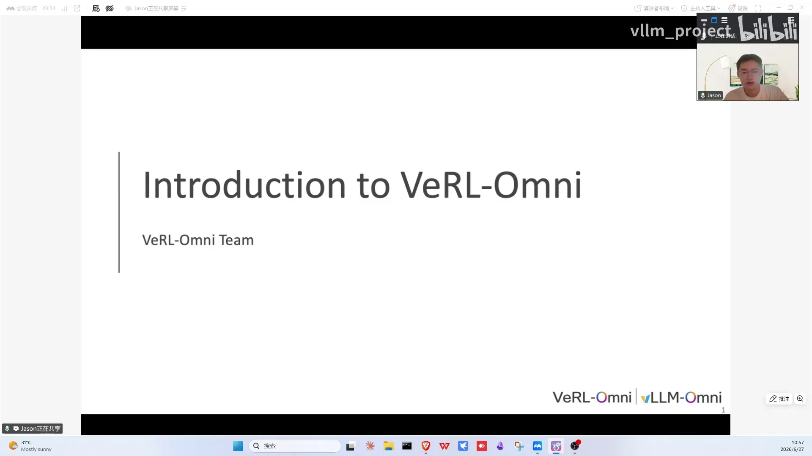 |
| 兼顾易用性和训练稳定性，以及性能的一个多模态生成（和理解）统一的一个 RL 训练框架。主要针对的是 diffusion 类模型和 Omni 类模型。——对，这个是整体的 veRL（-Omni）架构的一个简略表示：training system 主要由 veRL 做主要框架…… [【跳转到 01:15】](https://www.bilibili.com/video/BV1qd7n6TEZk/?t=75) | 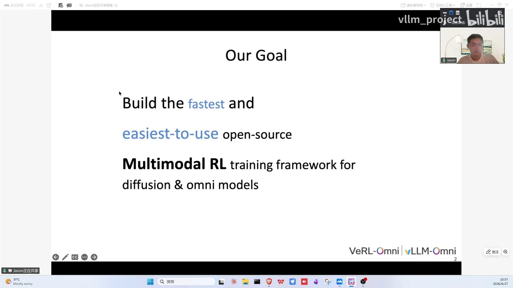 |
| 加上 vLLM-Omni 去做 rollout engine。一般来说强化学习的过程，第一步是先对所有的一些 query 做多组的 rollouts。这里多模态 rollout 我们是用 vLLM 去做，生成图像、音频或者视频…… [【跳转到 01:40】](https://www.bilibili.com/video/BV1qd7n6TEZk/?t=100) |  |
| 再加上中间的 trajectory 之后，再给到 reward engine 去打分。这个 reward engine 可能是一个 VLM 的 server 或者其他的 HTTP server，用做（评估）或者其他小模型的打分。然后再通过传输（transport）或者 gRPC 将 trajectory 以及 reward 传给 actor engine 去做后面的策略更新…… [【跳转到 02:05】](https://www.bilibili.com/video/BV1qd7n6TEZk/?t=125) | 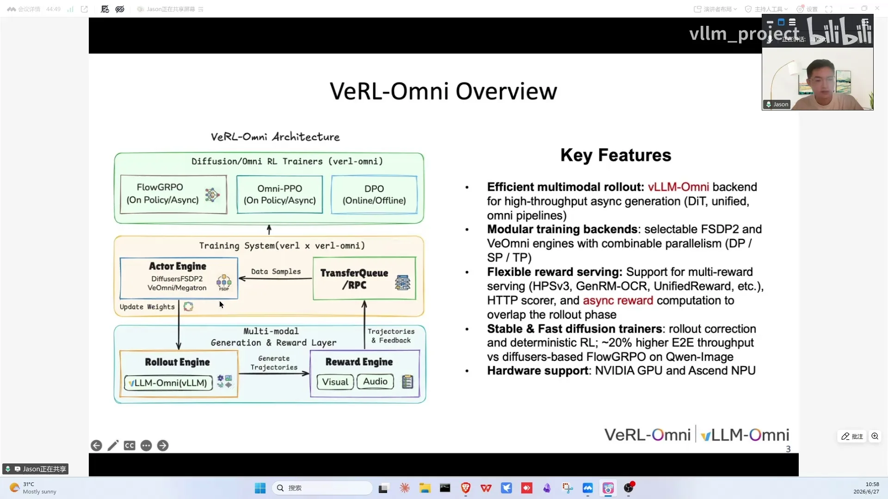 |
| 最后再做 update：把更新后的权重同步到 rollout engine，这样就完成了一个大的 loop。在上面这一层是我们现在支持的一些 trainers，主要是针对不同的应用场景和训练算法：包括针对扩散生成场景的 FlowGRPO 这一类算法的 trainer…… [【跳转到 02:30】](https://www.bilibili.com/video/BV1qd7n6TEZk/?t=150) |  |
| 除了 FlowGRPO 还有它的变种，像 MixGRPO、FlowDPO。然后因为我们也支持像 Qwen3-Omni 这一类偏向于 AR 生成的模型，所以对应也有 PPO 的 trainer。第三类是 DPO，做偏好对齐的 trainer。然后右边这边是我们现在的一些主要性能优化特性：包括多模态的 rollout——因为我们本身也有 vLLM-Omni contributors，所以会针对 diffusion 场景跟 vLLM 一起做比较深度的优化。还有 trainer 的 backend…… [【跳转到 02:55】](https://www.bilibili.com/video/BV1qd7n6TEZk/?t=175) |  |
| trainer backend 目前支持切换 diffusers 跟 vLLM-Omni 两种：一种是针对要求推理的计算图、或者 diffusion 的 scheduler 尽量跟 diffusers 保持一致的场景；另一个是 vLLM-Omni 比较偏向大规模训练场景。并行方面目前 DP、USP 和 TP 都是支持的，或者支持它们混合的并行 mesh。reward 方面，model-based 和 function-based 的 reward 都支持…… [【跳转到 03:20】](https://www.bilibili.com/video/BV1qd7n6TEZk/?t=200) | 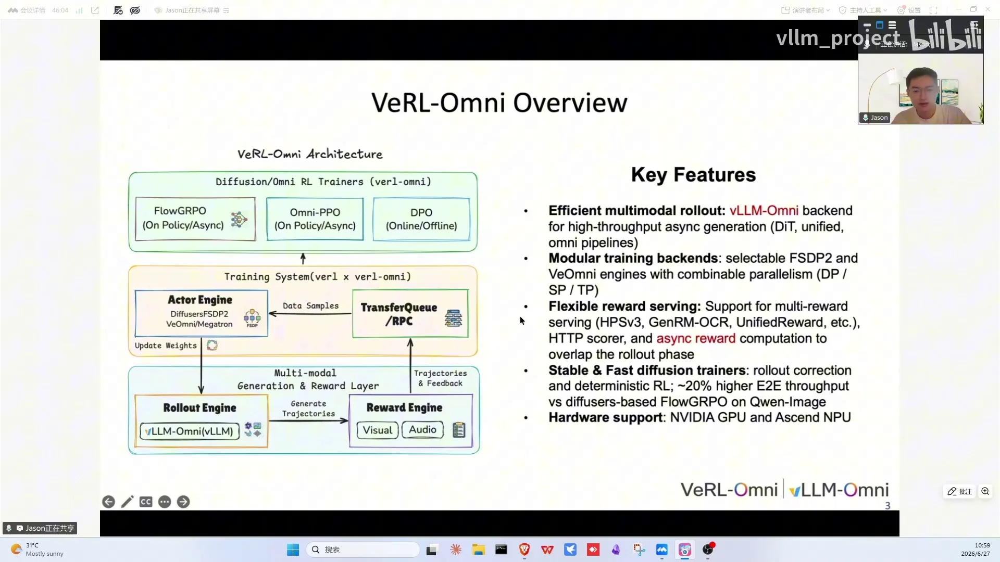 |
| 像刚才说到的 VLM 模型，比如 Qwen2.5-VL，或者 OCR 的、CLIP 的，还有（其他）reward 模型，以及它们的组合。……以及整体的性能效果：我们现在端到端的性能会比 diffusers 的 FlowGRPO 原仓库的 baseline 要快 20% 左右的整体吞吐，这是在 Qwen-Image 上做了一个端到端的测试。硬件方面…… [【跳转到 03:45】](https://www.bilibili.com/video/BV1qd7n6TEZk/?t=225) |  |
| 我们现在支持英伟达的 GPU 以及昇腾的 NPU。这个是整体的模型支持情况：主要支持三大类模型。一类是 diffusion generative models，像生图生视频的这类扩散模型；以及统一理解和生成的模型，目前主要就是 BAGEL…… [【跳转到 04:10】](https://www.bilibili.com/video/BV1qd7n6TEZk/?t=250) | 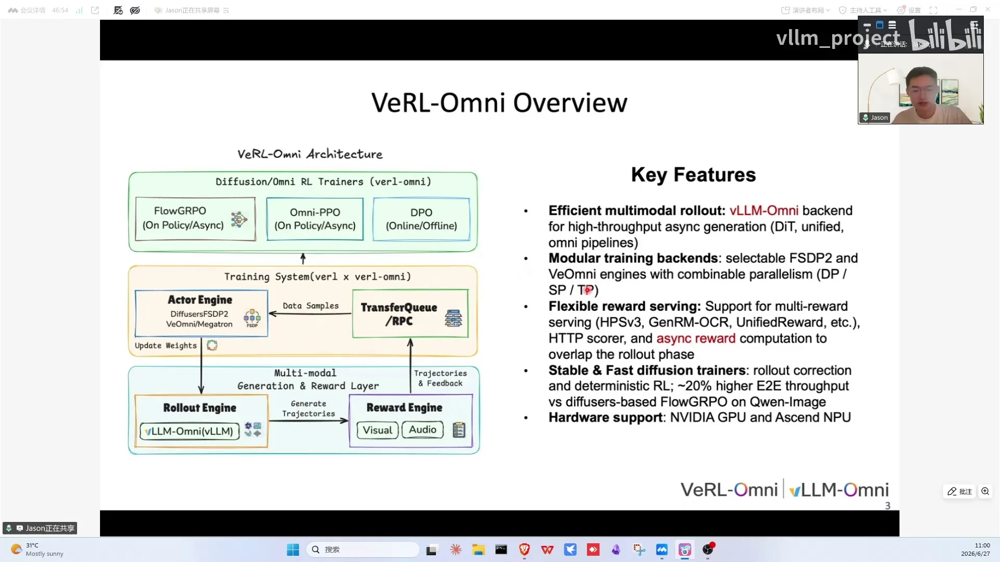 |
| 还有第三类就是像 Qwen3-Omni 这种多模态输入、输出文本和音频结果的这类模型。算法的话（种类）也比较多，超过六种，包括 DPO 的、FlowGRPO 的，还有 GSPO 的这类。这个是整体的一个性能优势…… [【跳转到 04:35】](https://www.bilibili.com/video/BV1qd7n6TEZk/?t=275) |  |
| 我们可以做到在训练 FlowGRPO 时收敛比较稳定，同时性能相比原算法实现有比较明显的提升。这些提升得益于：异步的 reward 部署去掩盖 rollout 的计算时间；还有跟 vLLM 一起做的 state-wise continuous batching；以及跳过部分 logprob 重计算用的 raw correction；还有 FA3 的（算子）kernel，以及 FSDP2 的 training backend。 [【跳转到 05:00】](https://www.bilibili.com/video/BV1qd7n6TEZk/?t=300) | 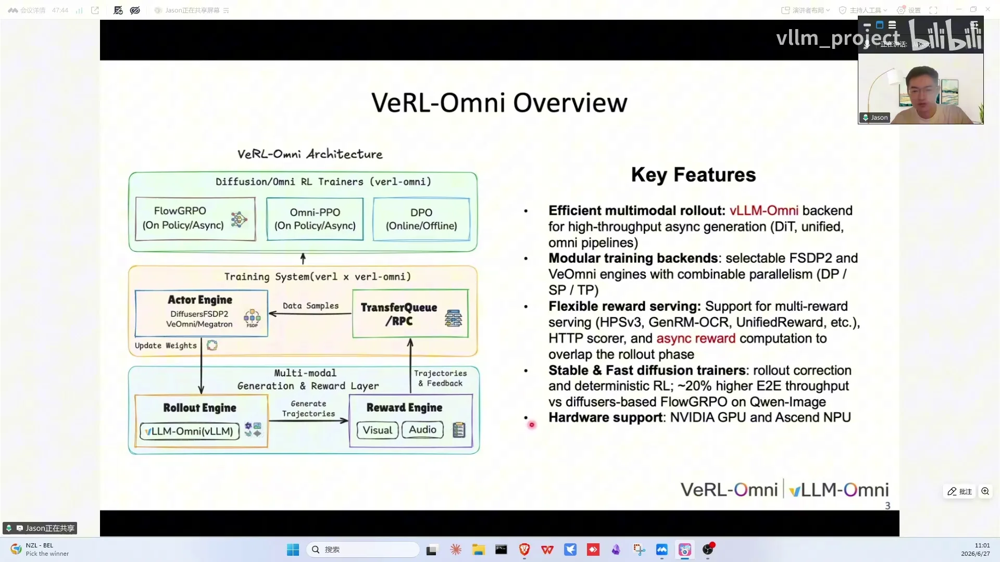 |
| 这个是我们目前为止主要的 contributors，也是非常感谢社区大家提的意见、comments 以及代码 PR…… [【跳转到 05:25】](https://www.bilibili.com/video/BV1qd7n6TEZk/?t=325) | 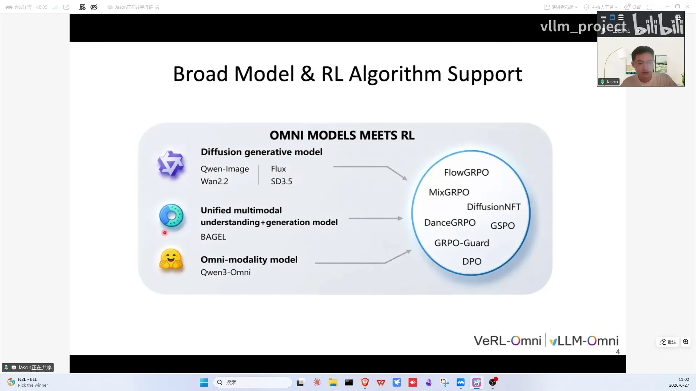 |
| 包括志鹏还有郑渊、天安这些华为之外的很多同学都在做这个事情，对不对？——对。——然后后面第二部分我想介绍一下整个框架和系统的设计。这个介绍的是现在多模态生成模型主要的三类：一类是 omni 模型，像 Qwen-Omni，是 AR 加扩散混合架构的…… [【跳转到 05:50】](https://www.bilibili.com/video/BV1qd7n6TEZk/?t=350) | 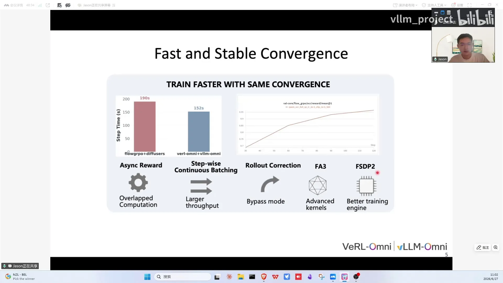 |
| 第二类是目前支持最多的 Diffusion/DiT 类模型：包括现在主流的音频、视频、图像生成模型都是基于这类架构。它主要包括文本、图像的 encoder 做 conditional embedding，然后中间根据 conditions 对 noise latent 做多步去噪，最后对去噪的 latent 做 VAE 的 decoding，映射到 RGB 的 pixel space，得到对应的图像或视频。第三类就是像 BAGEL 这种既可以理解也可以生成的模型：一般有两个 transformer——understanding expert 和 generation expert，中间通过 KV 把 understanding 的 embedding 当做 condition 给到 generation expert。 [【跳转到 06:15】](https://www.bilibili.com/video/BV1qd7n6TEZk/?t=375) |  |
| 这个是我们从 LLM 的 RL 怎么迁移到多模态生成 RL 的 workflow。整体流程跟 LLM RL 的主要区别在于 reward 计算：一般 LLM 里主要对文本是否正确做判定，或者用文本评估模型打分，一般 IO 比较轻。但 diffusion RL 前面一步需要对同一个 prompt 生成一组图像，reward 需要对图像打分…… [【跳转到 06:40】](https://www.bilibili.com/video/BV1qd7n6TEZk/?t=400) | 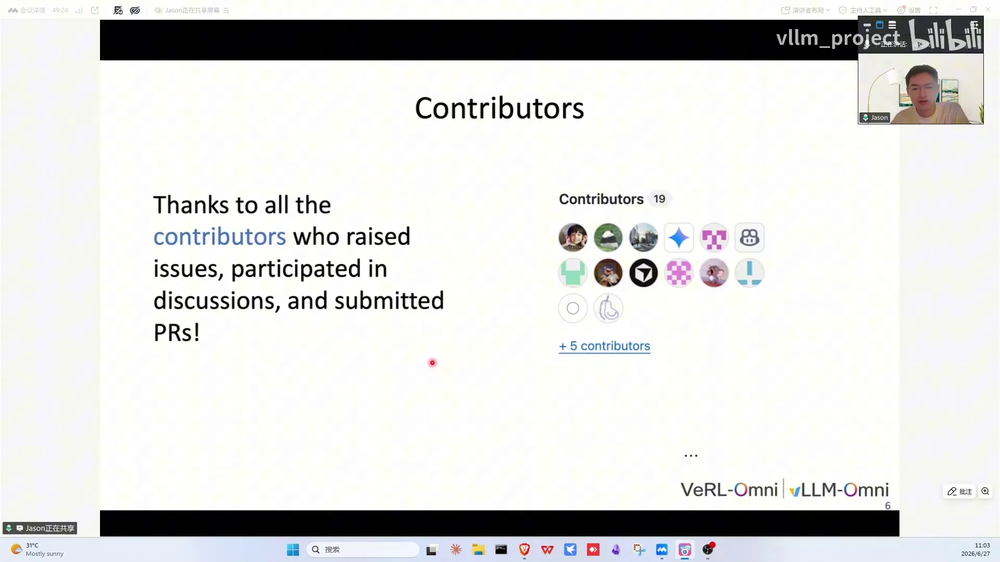 |
| 对图像进行评估是比较主观的事情，一般很难用规则描述。所以一般会用 VLM 模型直接问：你觉得这个图像的美学程度如何？或者它的语义跟我输入的 prompt 的匹配程度如何？由模型给出概率打分…… [【跳转到 07:05】](https://www.bilibili.com/video/BV1qd7n6TEZk/?t=425) | 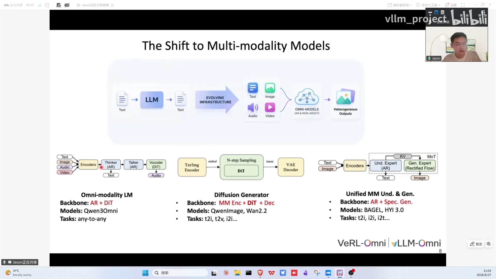 |
| 或者通过人类偏好的预训练模型——像 CLIP 或者 OCR 识别模型——对文本渲染准确性打分。后面流程就是根据 reward 和前面的 trajectory 去算优势，算完再去更新当前的策略，这就是整体的训练 loop。 [【跳转到 07:30】](https://www.bilibili.com/video/BV1qd7n6TEZk/?t=450) |  |
| ——诶，我有个小问题：纯文本模型不是可以通过 top-k、top-p 这种东西让输出多样化嘛？那多模态图像生成模型，应该怎样让它的图像生成多样化？ [【跳转到 07:55】](https://www.bilibili.com/video/BV1qd7n6TEZk/?t=475) |  |
| （图像生成的）多样化，如果是原论文的描述，它是通过 ODE 的 scheduler 去引入随机性——因为它一开始的时候只有一个 ODE 的 scheduler。 [【跳转到 08:20】](https://www.bilibili.com/video/BV1qd7n6TEZk/?t=500) | 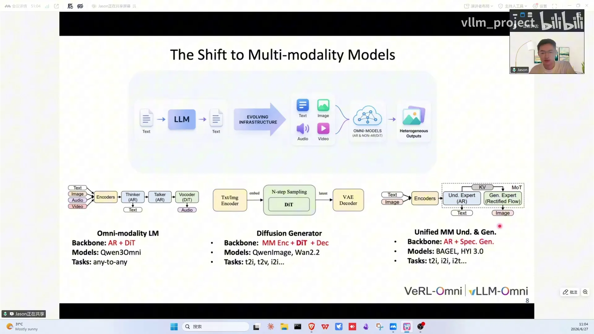 |
| 像 DDIM 之类的。然后它是通过把 ODE 变成 SDE，相当于在每一步去噪的时候注入一些高斯噪声，使得上一步到下一步的这个 latent 的去噪过程变得随机…… [【跳转到 08:45】](https://www.bilibili.com/video/BV1qd7n6TEZk/?t=525) |  |
| 而且它这个转移过程有一个类似高斯的正态分布，只是中间那个 mean 跟原来 ODE 的比较接近。——哦然后对，如果是（图像的）风格多样性的话，那可能我…… [【跳转到 09:10】](https://www.bilibili.com/video/BV1qd7n6TEZk/?t=550) |  |
| （prompt）匹配程度如何等等之类的问题，再由模型给出一个概率打分；或者是通过一些人类偏好的预训练模型——像 CLIP 或者一些 OCR 的识别模型——对它的文本渲染准确性进行打分。然后在后面的流程就是根据 reward 和前面的 trajectory 去算（优势）…… [【跳转到 09:35】](https://www.bilibili.com/video/BV1qd7n6TEZk/?t=575) |  |
| 算完（优势）之后就去更新当前的一个策略，这个就是整体的训练 loop。——诶，我有个小问题：比如说我们的纯文本模型，不是可以通过 top-k、top-p 这种东西来让它的输出多样化嘛？ [【跳转到 10:00】](https://www.bilibili.com/video/BV1qd7n6TEZk/?t=600) |  |
| 那我们的多模态图像生成模型，应该怎样可以让它的图像生成多样化？（图像生成的）多样化，如果是原论文的描述，它是通过 ODE 的 scheduler 去引入这个随机性——因为它一开始的时候是只有一个 SDE scheduler？哦不，sorry 说错了，一开始只有一个 ODE 的 scheduler…… [【跳转到 10:25】](https://www.bilibili.com/video/BV1qd7n6TEZk/?t=625) | 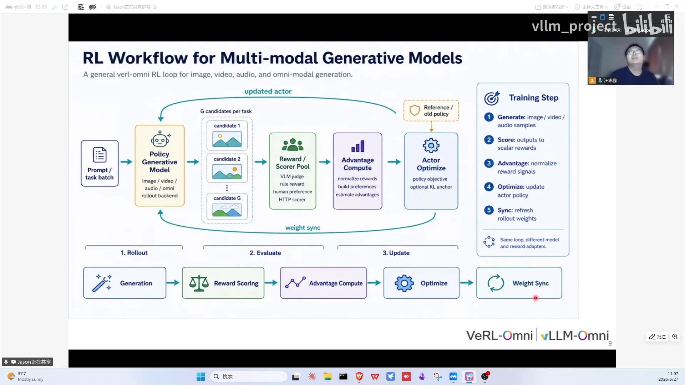 |
| 像 DDIM 之类的。然后它是通过把 ODE 变成 SDE，相当于在每一步去噪的时候注入一些高斯噪声，使得上一步到下一步的这个 latent 的去噪过程变得随机…… [【跳转到 10:50】](https://www.bilibili.com/video/BV1qd7n6TEZk/?t=650) | 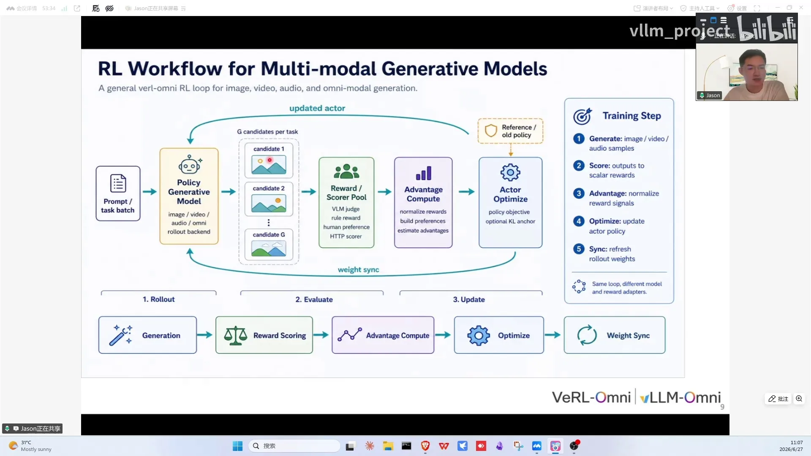 |
| 而且它这个转移过程有一个类似高斯的正态分布，只是中间那个 mean 跟原来 ODE 的比较接近。——哦对，然后如果是（图像的）风格多样性的话，那可能我…… [【跳转到 11:15】](https://www.bilibili.com/video/BV1qd7n6TEZk/?t=675) | 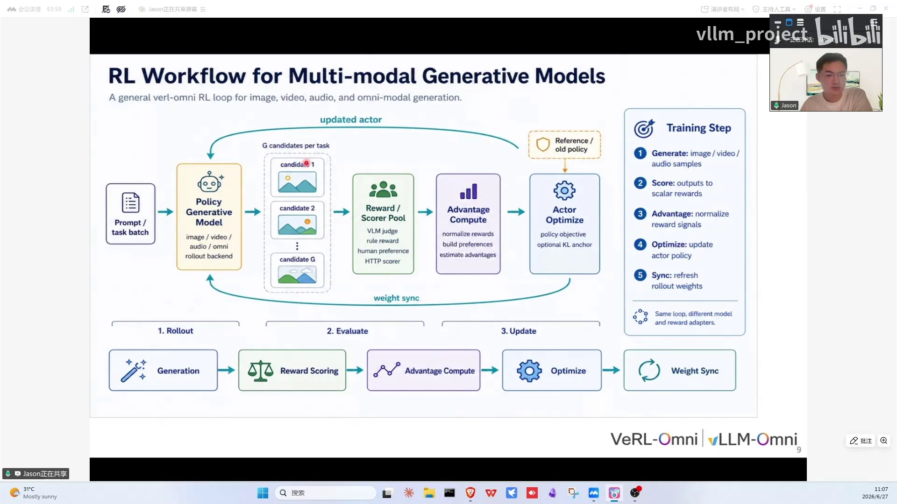 |
| 我觉得可能在 prompt 的设定方面可以做一些调整，不要贴得太死。其实 prompt 也可以通过改写形式让它的输出更加多样化，对吗？——对，我觉得是可以的。——然后直播间有同学问：图像生成模型的 RL 业务需求是什么？什么公司会需要这个功能？——我觉得现在基本上就……哦你说吧。 [【跳转到 11:40】](https://www.bilibili.com/video/BV1qd7n6TEZk/?t=700) |  |
| 没事，志鹏你先说。——我是说因为好像现在基本上所有图像生成都会有这个步骤。因为 RL 其实跟文本生成是一样的嘛：它会让模型通过探索多样性的方式，找到最有可能接近我们所需要答案的路径…… [【跳转到 12:05】](https://www.bilibili.com/video/BV1qd7n6TEZk/?t=725) | 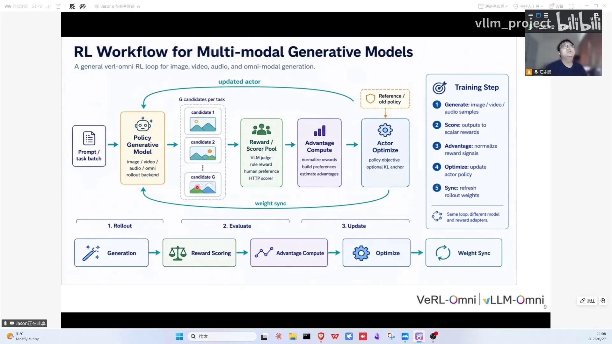 |
| 某一种程度上它相当于是强化对于人类所期望的结果的路径探索，对吧。在图像生成上如果你期望它有非常好的真实感、文字生成，其实都需要考虑 RL。 [【跳转到 12:30】](https://www.bilibili.com/video/BV1qd7n6TEZk/?t=750) |  |
| 是，就像 Qwen-Image 它最后一个阶段也是用 FlowGRPO 去训的嘛。还有最近的混元 image，它后训练阶段应该用了至少三个 RL 算法：像（某算法）、FlowGRPO、MixGRPO，还有应该是叫 GSPO 的一个算法…… [【跳转到 12:55】](https://www.bilibili.com/video/BV1qd7n6TEZk/?t=775) |  |
| 还有他们内部的一个——我忘了具体名字了——他们自己推的一个 RL 算法。宽松一点来说，后面的 DPO、online DPO 也可以算作 RL 算法，做人类偏好对齐。然后像志鹏刚才说的：做 SFT 毕竟主要是拟合训练数据的分布，并不会直接对齐人类的偏好…… [【跳转到 13:20】](https://www.bilibili.com/video/BV1qd7n6TEZk/?t=800) | 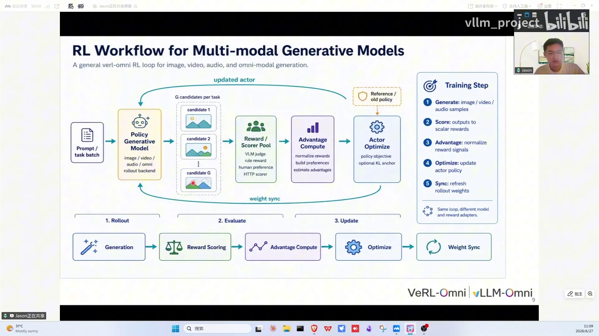 |
| 引入 RL 之后可以直接根据用户需求场景：比如对文本渲染需求大——生成 PPT 这类任务——就可以直接设定一个 OCR reward 去增强模型这块的能力。对嗯对。 [【跳转到 13:45】](https://www.bilibili.com/video/BV1qd7n6TEZk/?t=825) |  |
| 然后这里其实也介绍了 LLM RL 跟 diffusion RL 的主要区别。 [【跳转到 14:10】](https://www.bilibili.com/video/BV1qd7n6TEZk/?t=850) |  |
| 一个是 rollout：LLM 的输出一般是序列、不可预测的、变长的；但 diffusion RL 因为基于多步去噪，一般输入的 latent 大小确定之后，输出的 latent 跟输入基本一样，输出的长度可以预测、可以提前知道。这对负载分配来说可以做得更准确一些。另外一块就是刚才提到的 reward 的 IO 和负载的差异也很不一样…… [【跳转到 14:15】](https://www.bilibili.com/video/BV1qd7n6TEZk/?t=855) | 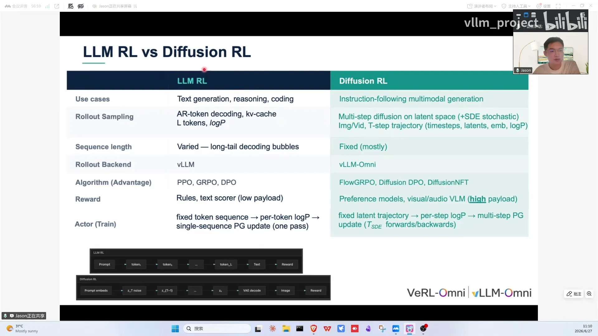 |
| （接上） [【跳转到 14:40】](https://www.bilibili.com/video/BV1qd7n6TEZk/?t=880) |  |
| diffusion RL 会涉及到一些 VLM 模型的推理部署，还有偏好模型的部署。另外从算法维度：LLM 是 next token prediction 的过程，每一个马尔可夫链可以认为是自回归的 token 生成过程；但 diffusion 的马尔可夫链变成了一个多步去噪的过程——从 z_T 这个全噪声到 z_0 这个干净的 latent，中间有随机的状态转移。 [【跳转到 15:05】](https://www.bilibili.com/video/BV1qd7n6TEZk/?t=905) | 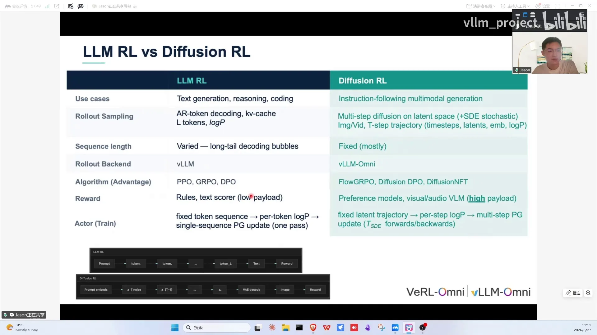 |
| 所以在算 loss 维度：LLM 算的是 per token 的 logprob；diffusion 算的是 per denoised step 的 logprob。因为生成的时候如果不经过蒸馏，一般可能需要 50 步或 30 步左右做推理。训练的时候如果用这么多步，时间消耗太大，一般会只截取一部分步数进行训练…… [【跳转到 15:30】](https://www.bilibili.com/video/BV1qd7n6TEZk/?t=930) |  |
| 这个是由（截断）SDE 决定的，或者叫 SDE window size：比如拿前两步去做 SDE 的随机 sampling，后面都用 ODE 的确定的采样过程，这样算 loss 的时候就只需要算前两步的反向。 [【跳转到 15:55】](https://www.bilibili.com/video/BV1qd7n6TEZk/?t=955) |  |
| （接上） [【跳转到 16:20】](https://www.bilibili.com/video/BV1qd7n6TEZk/?t=980) | 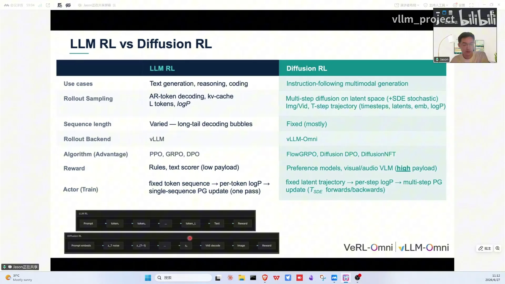 |
| 做 SDE 的这个 step 是不是必须得是连续的？——对，一般是。目前的算法都是连续的。——然后有同学问：vLLM-Omni 支持 TTS 的模型吗？——没有…… [【跳转到 16:45】](https://www.bilibili.com/video/BV1qd7n6TEZk/?t=1005) |  |
| 但我们有写到 Q3 的 roadmap 里面。感兴趣的同学可以参与一下，因为 TTS 模型相对都比较小，如果想把它整个跑通的话——比如再带上 reward，其实整个训练成本很低，对吧。而且我们这里的系统设计也有一个 reward serving 的 engine：如果 TTS 也需要用 model-based reward，我觉得可以比较快支持起来。——那我们这个 reward 的（服务）…… [【跳转到 17:10】](https://www.bilibili.com/video/BV1qd7n6TEZk/?t=1030) |  |
| （接上） [【跳转到 17:35】](https://www.bilibili.com/video/BV1qd7n6TEZk/?t=1055) | 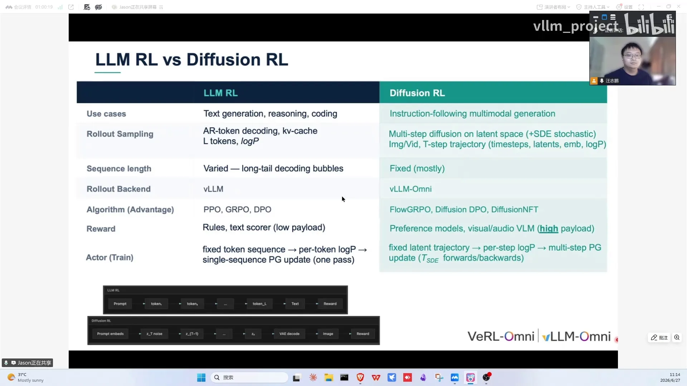 |
| 它能支持调外部的 API 吗？ [【跳转到 17:49】](https://www.bilibili.com/video/BV1qd7n6TEZk/?t=1069) | 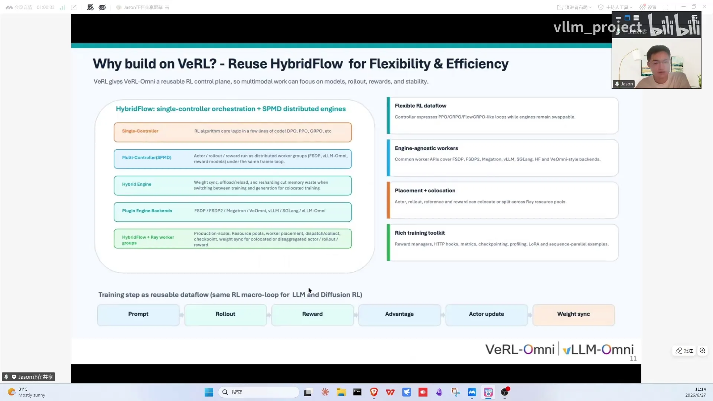 |
| 可以，通过 HTTP server 是可以调 API 的。对对。那么其实 TTS 模型跑 RL 成本会更低，如果你没有机器的话。 [【跳转到 17:54】](https://www.bilibili.com/video/BV1qd7n6TEZk/?t=1074) |  |
| OK，简单说一下为什么要基于 veRL 去做这个事情：主要是为了复用 veRL 本身的分布式 RL 训练框架的已有能力，包括它的 hybrid flow 的框架设计，可以兼顾算法实现的灵活性。通过 single controller 去维护整个大的训练的主 loop…… [【跳转到 18:09】](https://www.bilibili.com/video/BV1qd7n6TEZk/?t=1089) | 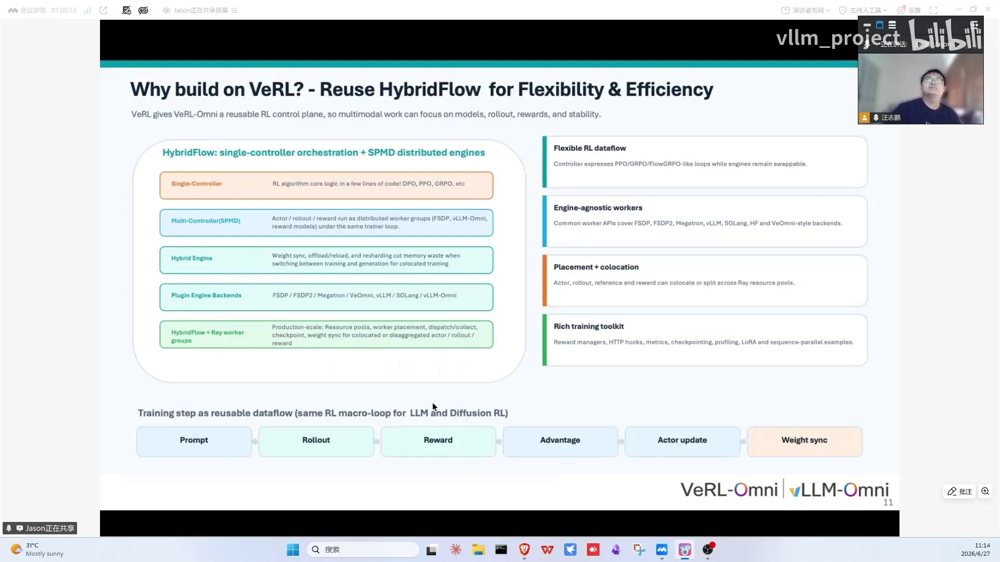 |
| 然后再通过（各 worker 的）controller 去做每一个模块——rollout、reward 这些模块——的单独实现和优化，以及它们的负载分布、并行策略的复用，还有权重同步能力的复用。这个是 diffusion RL 在 veRL-Omni 上面实现的比较细的框架：左边是 single controller 在 FlowGRPO 算法上的实现，包括四大步：generate、evaluate、actor update，还有 weight synchronization。右边是三个大的 engine…… [【跳转到 18:34】](https://www.bilibili.com/video/BV1qd7n6TEZk/?t=1114) |  |
| （接上） [【跳转到 18:59】](https://www.bilibili.com/video/BV1qd7n6TEZk/?t=1139) |  |
| 一个是 rollout engine，主要基于 vLLM-Omni 去做；第二个是 reward engine；第三个是 actor engine。rollout 跟 actor 在这个框图里是共卡的。中间的权重同步是通过（共享内存）的 IPC 进行传输。中间的 reward 支持两种模式：一种是同步的 serving，等 rollout 整个 training batch 推理完之后再算 reward；或者异步——在 reward 计算过程中，每推理、每生成一个 sample 的 trajectory…… [【跳转到 19:24】](https://www.bilibili.com/video/BV1qd7n6TEZk/?t=1164) |  |
| （接下一段） [【跳转到 19:49】](https://www.bilibili.com/video/BV1qd7n6TEZk/?t=1189) |  |
| 就开始流式地算 reward。这个就是简略的框图，这里不多做介绍，因为跟开头的框图比较接近。最后第三部分说一下我们现在集成的一些优化特性：一个是灵活的 training backend 支持…… [【跳转到 20:14】](https://www.bilibili.com/video/BV1qd7n6TEZk/?t=1214) |  |
| 包括刚才提到的 diffusers 的 training backend 和 vLLM-Omni 的 training backend。vLLM-Omni 这个 backend 支持的模型也挺多：包括视频生成、图像生成，以及 Qwen3-Omni。diffusers 的 training backend 可以原生支持 diffusers 库里的大部分模型…… [【跳转到 20:39】](https://www.bilibili.com/video/BV1qd7n6TEZk/?t=1239) | 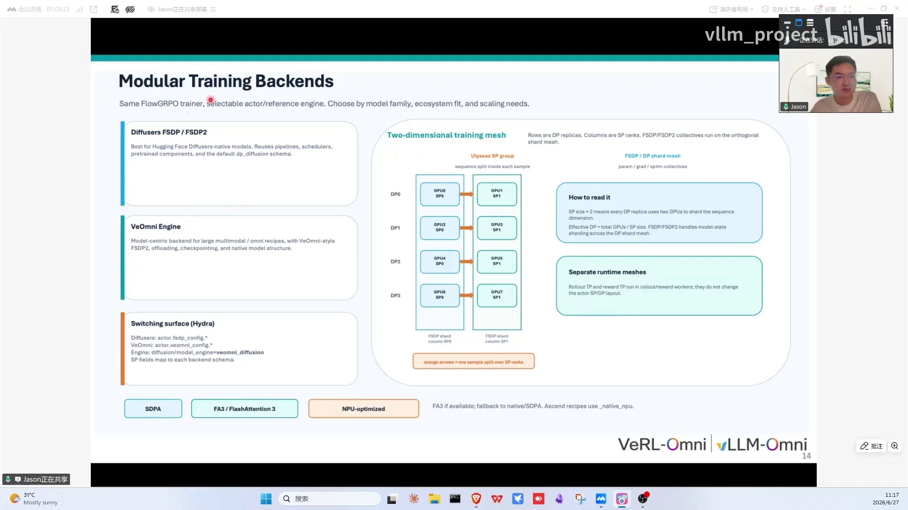 |
| 它们的并行 mesh 目前主要支持序列并行和 DP，以及它们的混合。这两个也是我们验证比较多的。第二块优化是关于多模态 rollout 的优化，主要是两部分：一个是我们针对 diffusion 这个 query 的 rollout 做了一些优化…… [【跳转到 21:04】](https://www.bilibili.com/video/BV1qd7n6TEZk/?t=1264) |  |
| 跟 LLM 的 request 的区别就是我们会设定一个 prompt id。因为刚才提到在 diffusion RL 里输出的 latent 序列长度是一样的，所以没有长尾气泡的问题。可以把相同 prompt 的 request 放到同一张卡上，去掉一些 padding 的计算，减少 overhead。所以我们是在原来的路由算法基础上加了一个 prompt id，做路由时的前缀检索。 [【跳转到 21:29】](https://www.bilibili.com/video/BV1qd7n6TEZk/?t=1289) | 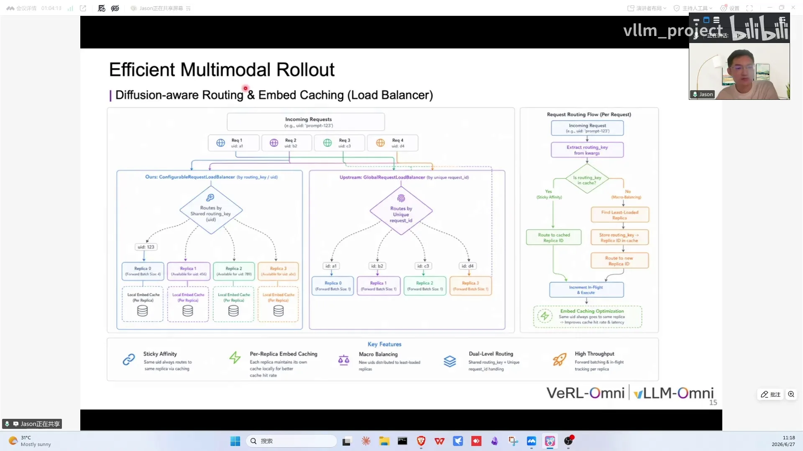 |
| （接上） [【跳转到 21:54】](https://www.bilibili.com/video/BV1qd7n6TEZk/?t=1314) |  |
| 第二块就是刚才提到的 state-wise 的 continuous batching：针对多步去噪场景，根据去噪步的维度，把不同 request——如果它们的输出 latent 一样——就组到一起…… [【跳转到 22:19】](https://www.bilibili.com/video/BV1qd7n6TEZk/?t=1339) | 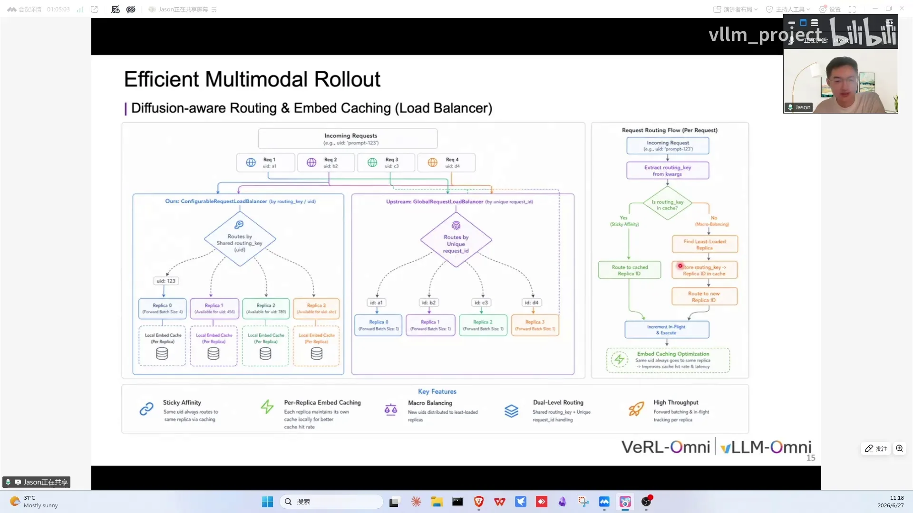 |
| 整体对 rollout 的吞吐提升大概有 20% 左右。 [【跳转到 22:44】](https://www.bilibili.com/video/BV1qd7n6TEZk/?t=1364) | 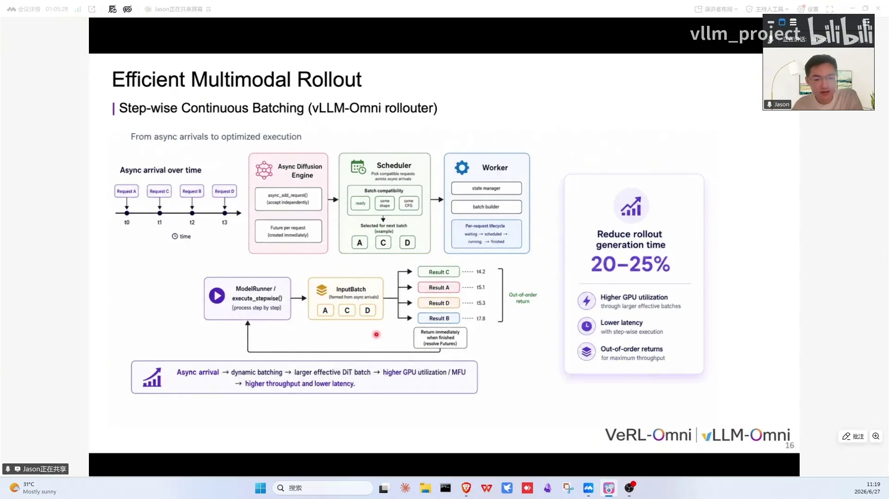 |
| 另外一个优化点是 raw correction：我们做（FlowGRPO）的时候一般有三路的 logprob——分别对应 rollout 用旧权重生成的旧策略的 logprob；第二个是用旧权重但用 trainer 侧的计算图算出来的 logprob；第三块是用（trainer 的）计算图但权重更新后算出来的 current logprob。这三块每一步的计算都涉及多步去噪，计算比较大。我们的优化是省掉中间那个 old logprob 的计算…… [【跳转到 22:49】](https://www.bilibili.com/video/BV1qd7n6TEZk/?t=1369) |  |
| 这这个啊engine就是用TRATRAINER这一侧的计算图算出来这个LOPRO那第三块就是呃还是用china的一个计算图但是我的权重更新了算出来的currentblockpro然后这这三块problem每一每一步的计算都涉及到多部去照所以它的这个计算是比较大的然后这里我们的优化是啊去省掉中间这个OO的计算 [【跳转到 23:14】](https://www.bilibili.com/video/BV1qd7n6TEZk/?t=1394) |  |
| 直接拿 rollout 的计算图以及旧权重得到的 logprob 当做现在 old logprob 的估计。这里肯定会由于 rollout 的计算图跟 training 计算图的差异有一些 drift，解决方法是通过 rejection sampling 把 drift 比较大的 sample 过滤掉。这里是具体的计算方式…… [【跳转到 23:39】](https://www.bilibili.com/video/BV1qd7n6TEZk/?t=1419) |  |
| （接上） [【跳转到 24:04】](https://www.bilibili.com/video/BV1qd7n6TEZk/?t=1444) | 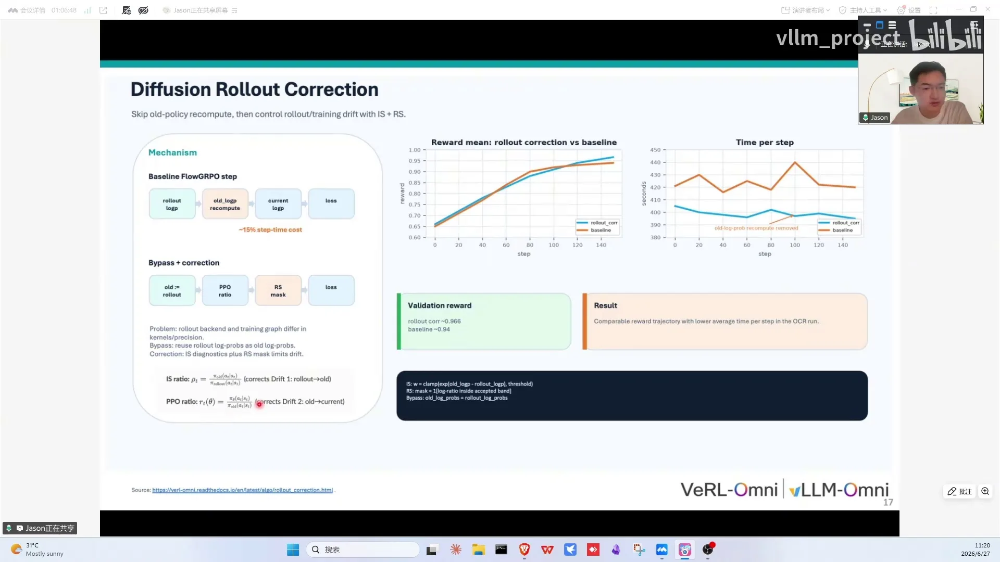 |
| 我们会算（当前策略）跟（旧策略）的比值，看这个 ratio 是否大于设定的阈值。如果超过了就把这部分 sample 丢掉，再做整体训练。用这个 raw correction 之后…… [【跳转到 24:10】](https://www.bilibili.com/video/BV1qd7n6TEZk/?t=1450) |  |
| 性能可以看到时间消耗的变化：从大概 420 秒每步减少到 400 秒左右，同时整体的 reward 收敛并没有很大的影响。 [【跳转到 24:35】](https://www.bilibili.com/video/BV1qd7n6TEZk/?t=1475) |  |
| 最后 reward 这块的优化主要是做了 async reward 的设计：如果不做这个优化，纯同步的 reward 计算必须等所有的 sample rollout 计算完之后再算 reward，然后再做 actor trainer 的 training 做策略更新。引入 async reward 后…… [【跳转到 24:52】](https://www.bilibili.com/video/BV1qd7n6TEZk/?t=1492) | 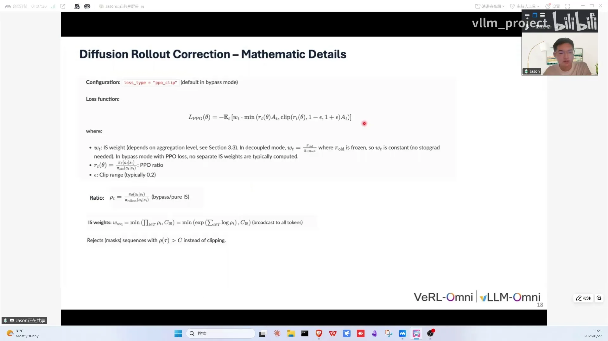 |
| 每算完一个 rollout sample 就可以把它丢给 reward serving engine 去算这个 sample 对应的 reward。如果不是 sample 而是 microbatch，就把 microbatch 对应的生成的图像、对应的 trajectory 给到 reward engine 去算 reward。——对好。 [【跳转到 25:17】](https://www.bilibili.com/video/BV1qd7n6TEZk/?t=1517) | 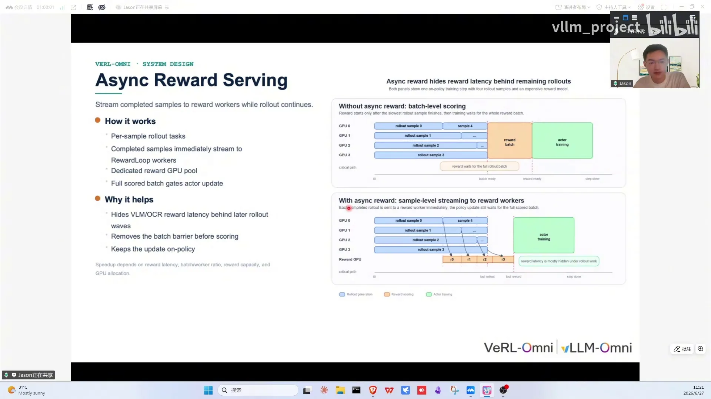 |
| 有同学问：一个模型可以同时挂几个 rollout 的（引擎）给不同的业务用吗？——一个模型挂几个 vLLM engine 是可以的，具体要拉多少个 rollout engine 可以通过 config 设置。——对，像刚才这里的例子…… [【跳转到 25:42】](https://www.bilibili.com/video/BV1qd7n6TEZk/?t=1542) | 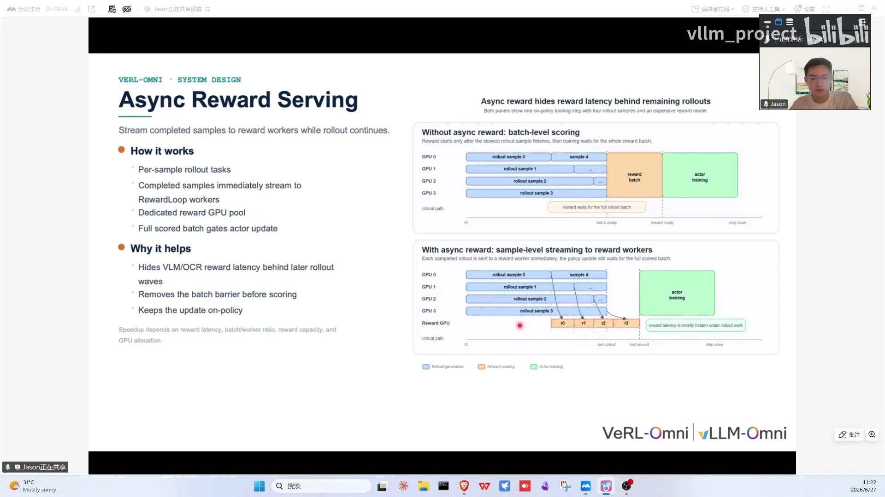 |
| 比如我有八卡，如果模型没有很大——像 Qwen-Image 80GB——可以一张卡放一个模型。——他问的是 LoRA adapter，我觉得他可能指的是同时训练多个 LoRA。——哦明白，他可能像（某框架）那样：可以同时有一个 LoRA manager，训练的时候同时训练多个 LoRA。——目前我们还没有做这块的支持。但我记得确实 vLLM 那边有同学提到过这个需求，我们可以写到 Q3 里面去做。——对对对，我觉得这个需求可能主要是数据中心，专门把 RL 做成一个 SaaS 服务…… [【跳转到 26:07】](https://www.bilibili.com/video/BV1qd7n6TEZk/?t=1567) | 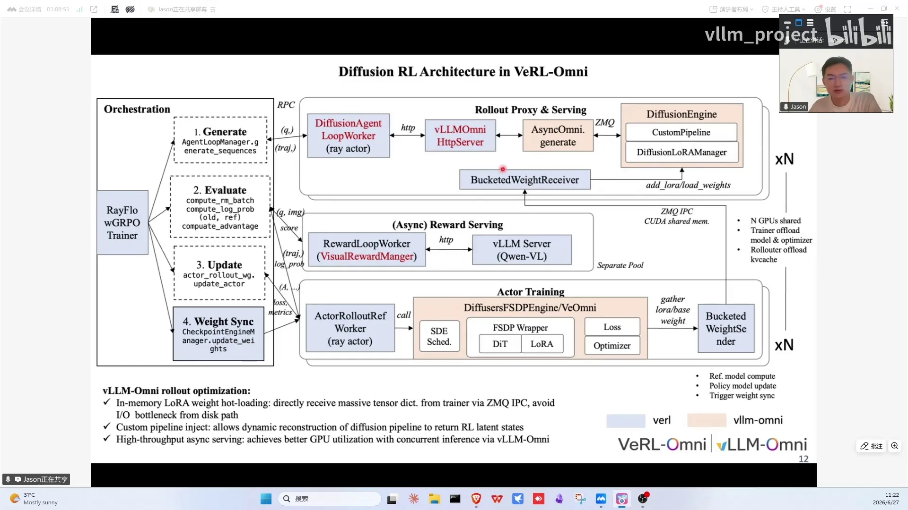 |
| （接上） [【跳转到 26:32】](https://www.bilibili.com/video/BV1qd7n6TEZk/?t=1592) | 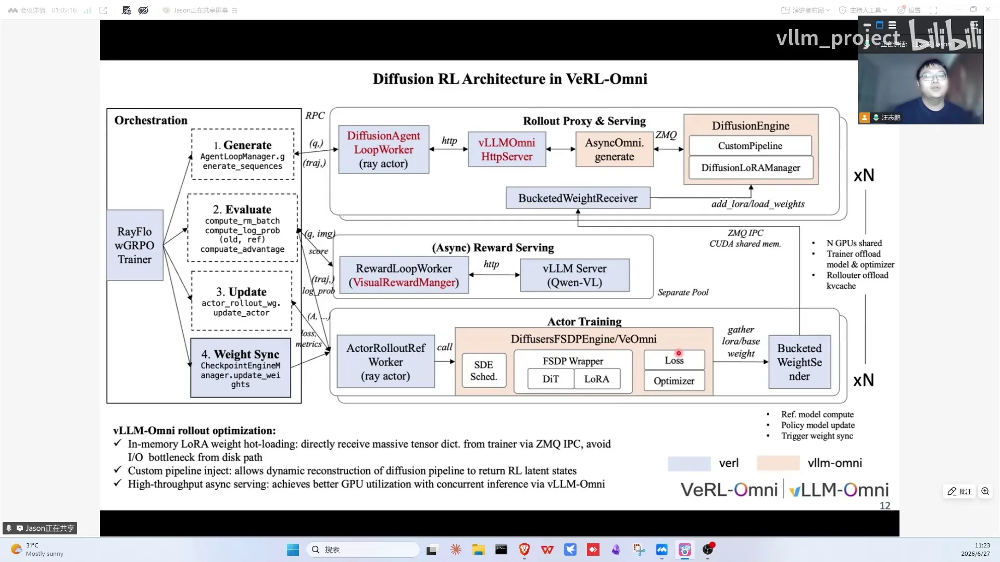 |
| 然后他可能就需要同时训练几个 LoRA。OK。——然后还有同学问 FlashAttention4 现在支持吗？——还不支持，因为需要 trainer 跟 rollout 一起支持。——哦（问）那边现在支持吗？ [【跳转到 26:57】](https://www.bilibili.com/video/BV1qd7n6TEZk/?t=1617) | 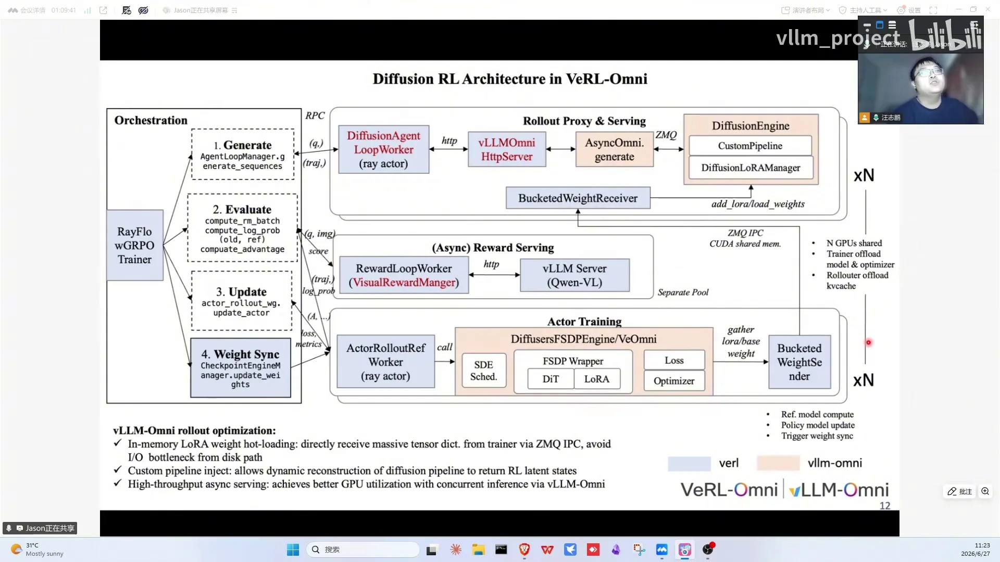 |
| （接上） [【跳转到 27:07】](https://www.bilibili.com/video/BV1qd7n6TEZk/?t=1627) | 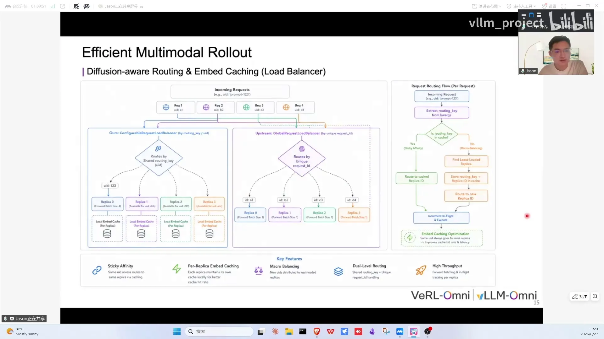 |
| 那边现在支持吗？石峰知道吗？——我不太清楚。——OK 这个得是（昇腾的）特性。 [【跳转到 27:22】](https://www.bilibili.com/video/BV1qd7n6TEZk/?t=1642) | 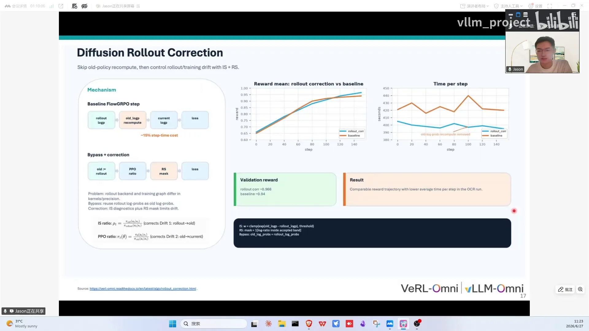 |
| 现在应该就是国内可能用（这类卡）还比较少。OK。 [【跳转到 27:32】](https://www.bilibili.com/video/BV1qd7n6TEZk/?t=1652) | 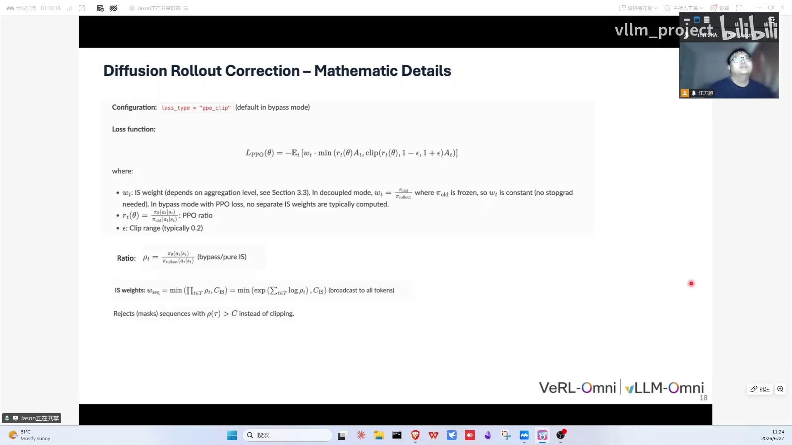 |
| 行，那我接着往下。这个是我们在多机相对比较中规模的场景的验证：用 64 卡去跑 FlowGRPO 的训练，用了 vLLM-Omni 和 FSDP 两种 engine，收敛结果都比较接近。性能上来说 vLLM-Omni 会有 2% 的性能优势。——对。 [【跳转到 27:40】](https://www.bilibili.com/video/BV1qd7n6TEZk/?t=1660) | 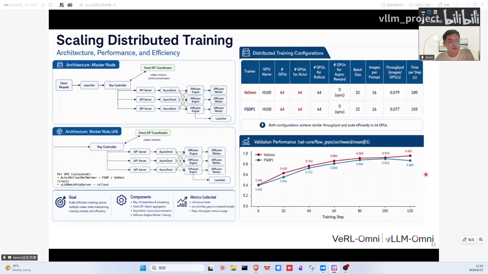 |
| 然后这块是 NPU 上的支持：基本上大部分模型和主要的特性都能够支持。我们也会针对昇腾硬件本身的一些优势，像 hyper parallel（超节点），对 model engine 进行优化，这是计划会做的。然后后面主要是看一下整体的训练效果…… [【跳转到 28:05】](https://www.bilibili.com/video/BV1qd7n6TEZk/?t=1685) |  |
| （接上） [【跳转到 28:10】](https://www.bilibili.com/video/BV1qd7n6TEZk/?t=1690) |  |
| 就是结合目前主流的 diffusion RL 以及像 Qwen3-Omni 这类的模型，看整体的训练效果。 [【跳转到 28:34】](https://www.bilibili.com/video/BV1qd7n6TEZk/?t=1714) | 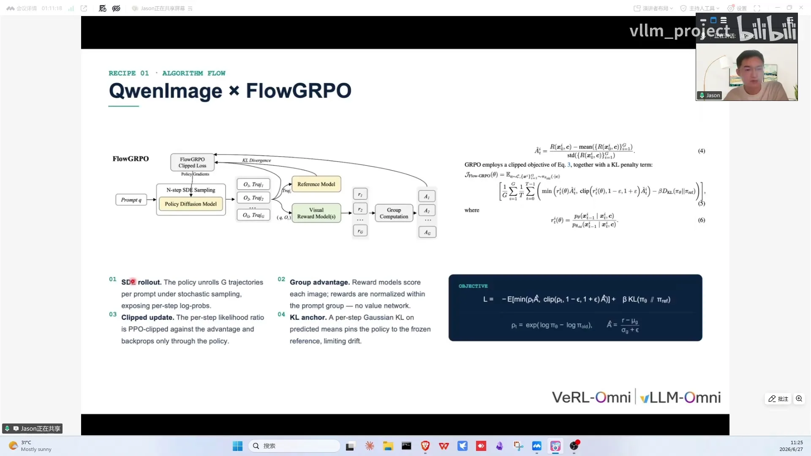 |
| 这个是我们在 Qwen-Image 上用 OCR reward 训练的效果：reward model 用 Qwen3-VL 对图片里的文本进行打分。可以看到训了 120 步之后，文本明显会比一开始渲染得更清晰，整体图像的美观度也没有发生劣化。 [【跳转到 28:43】](https://www.bilibili.com/video/BV1qd7n6TEZk/?t=1723) |  |
| 这个是（validation set）reward 的收敛情况，也比较平稳。具体的结果可以点开 wandb 去看：我们支持快速浏览每一个 optimization step 对应的图像生成质量，可以直观判断收敛的训练效果。 [【跳转到 29:08】](https://www.bilibili.com/video/BV1qd7n6TEZk/?t=1748) |  |
| 以及除了 validation reward，还有像 CLIP score、zero std 这类常用的做 RL 训练收敛诊断的指标。然后后面还有 DiffusionNFT 的算法支持：它的训练收敛速度会比 FlowGRPO 快挺多。可以看到 FlowGRPO 在 60 步左右…… [【跳转到 29:33】](https://www.bilibili.com/video/BV1qd7n6TEZk/?t=1773) |  |
| （接上） [【跳转到 29:49】](https://www.bilibili.com/video/BV1qd7n6TEZk/?t=1789) |  |
| reward 是在 0.8 到 0.9 之间，但如果是 DiffusionNFT 的话到 60 步（就能更快）。所以做算法选择时对收敛速度要求比较高的话，可以先尝试一下 DiffusionNFT。它的算法思路跟 DDPO 是比较相似的：通过一个旧的策略模型…… [【跳转到 29:58】](https://www.bilibili.com/video/BV1qd7n6TEZk/?t=1798) | 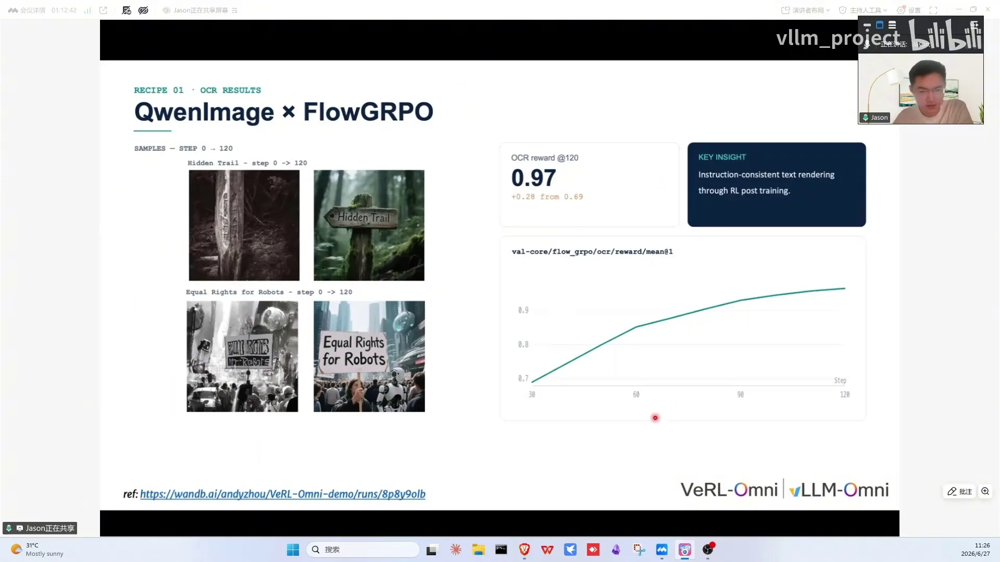 |
| （接上） [【跳转到 30:05】](https://www.bilibili.com/video/BV1qd7n6TEZk/?t=1805) | 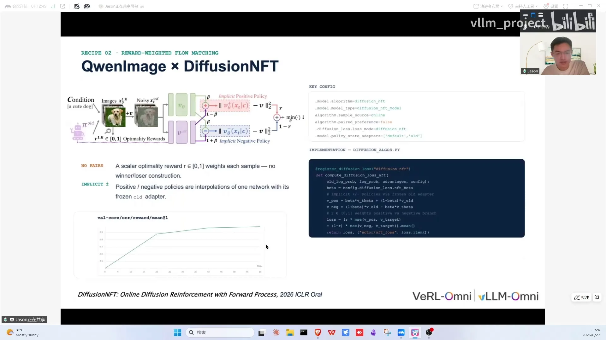 |
| 跟当前的策略模型做加权求和，得到一组代理的 positive policy 跟一个代理的 negative policy，通过 beta 控制这个差距有多大。再通过 reward 判断这个 sample 到底有多好——positive 的 policy 到底有多积极多好。 [【跳转到 30:30】](https://www.bilibili.com/video/BV1qd7n6TEZk/?t=1830) |  |
| 这个是整体的代码配置和算法实现，配置起来比较简单：只需要设定 model algorithm，以及对应的 sample source 换成 online——因为这个算法思路跟 DDPO 比较类似，DDPO 分为 online 和 offline，所以这里借用了 DPO 的同一个字段。模型设置是通过…… [【跳转到 30:55】](https://www.bilibili.com/video/BV1qd7n6TEZk/?t=1855) |  |
| model path 设定对应要训的基模。 [【跳转到 31:20】](https://www.bilibili.com/video/BV1qd7n6TEZk/?t=1880) |  |
| （接上） [【跳转到 31:34】](https://www.bilibili.com/video/BV1qd7n6TEZk/?t=1894) | 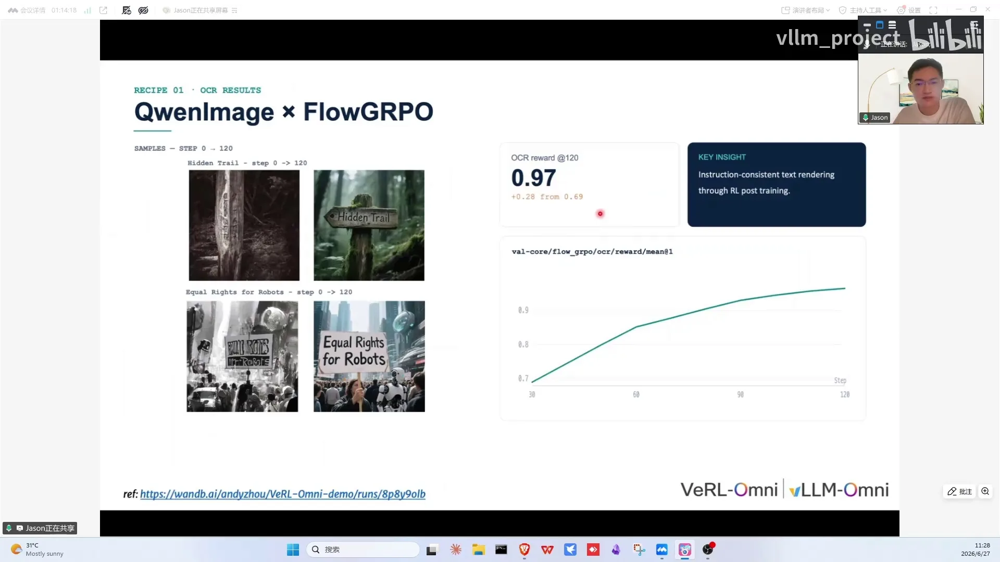 |
| 然后 reward 模型的设置通过 reward model 的 model path 去设定 Qwen3-VL 这个 reward 模型。 [【跳转到 31:39】](https://www.bilibili.com/video/BV1qd7n6TEZk/?t=1899) | 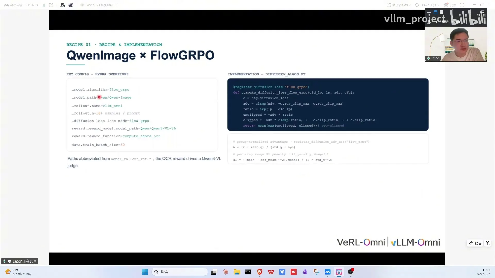 |
| 然后后面这个就是 DPO 的训练效果：基本上收敛也是比较稳定的…… [【跳转到 31:51】](https://www.bilibili.com/video/BV1qd7n6TEZk/?t=1911) | 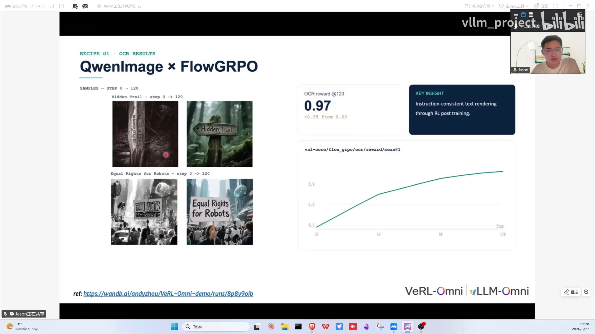 |
| 训练效果也是比较符合预期。这里的 trainer type 需要改成 direct preference，其他的……这个算法具体的细节这里就不多做介绍了。然后这块主要是对…… [【跳转到 31:56】](https://www.bilibili.com/video/BV1qd7n6TEZk/?t=1916) | 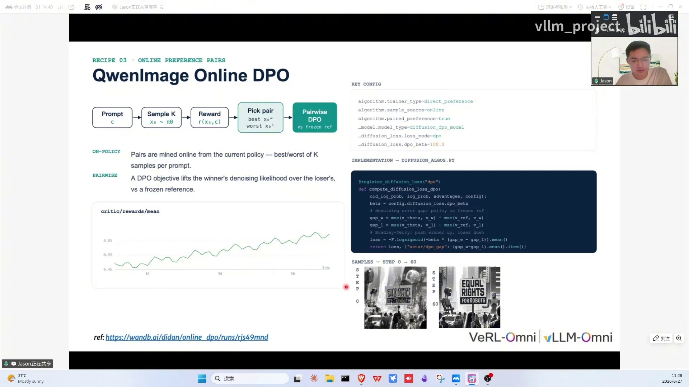 |
| 请问像 Omni 这类 AR+DiT 模型的支持：这里我们主要做了 thinker 的训练，它的收敛相对来说没有那么明显。因为 Qwen3-Omni 这个基模在数学上能力就比较强，我们这里用的验证数据集也是一个数学数据集，所以整体收敛趋势比较平缓一些。配置方面需要配置的字段：包括 model stage——训 thinker 就直接写成 thinker；worker type 把 diffusion 改成 AR。具体设置可以看我们 readme 文档的详细介绍。 [【跳转到 32:16】](https://www.bilibili.com/video/BV1qd7n6TEZk/?t=1936) |  |
| （接上） [【跳转到 32:41】](https://www.bilibili.com/video/BV1qd7n6TEZk/?t=1961) |  |
| 这个是 BAGEL 的训练效果。因为 BAGEL 这个模型并不是 diffusers 的，所以这里也介绍了如何支持一个非 diffusers 仓库的模型：主要需要适配它的 dataset adaptor、training adaptor 以及 rollout 的 adaptor。然后这个是整体的收敛情况…… [【跳转到 33:06】](https://www.bilibili.com/video/BV1qd7n6TEZk/?t=1986) |  |
| （接上） [【跳转到 33:12】](https://www.bilibili.com/video/BV1qd7n6TEZk/?t=1992) | 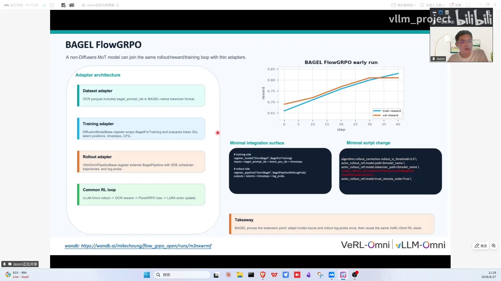 |
| validation 的 reward 在差不多 30 步左右就达到比较平稳的效果。但说实话 BAGEL 这个模型的训练会比 FlowGRPO 要更难调一些。——有同学问：现在对国产卡（的支持）情况如何？ [【跳转到 33:37】](https://www.bilibili.com/video/BV1qd7n6TEZk/?t=2017) | 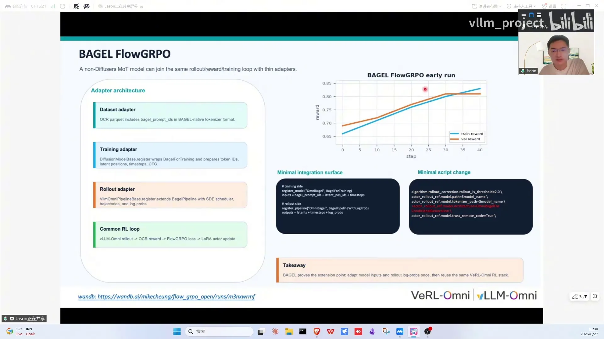 |
| 没听清什么卡。——国产卡、国产卡，就是昇腾的支持。 [【跳转到 34:02】](https://www.bilibili.com/video/BV1qd7n6TEZk/?t=2042) | 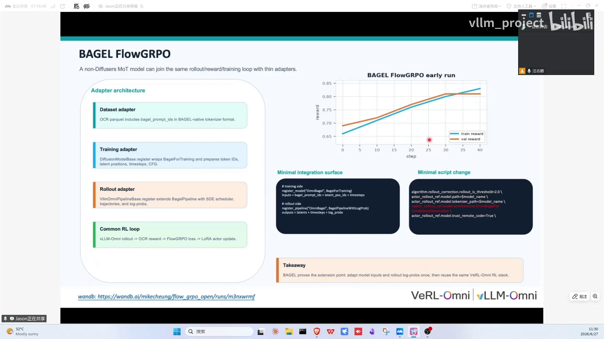 |
| 对，刚才其实已经讲过了：主要对华为的昇腾卡的支持程度，其实跟 GPU 基本上可以做到——我觉得应该可以做到 day0 或者 week level 的支持吧。比如我们这边支持了 BAGEL 之后，基本上 NPU 在一周内也能支持到 BAGEL 的训练，对应的加速特性也基本上能支持到。 [【跳转到 34:10】](https://www.bilibili.com/video/BV1qd7n6TEZk/?t=2050) | 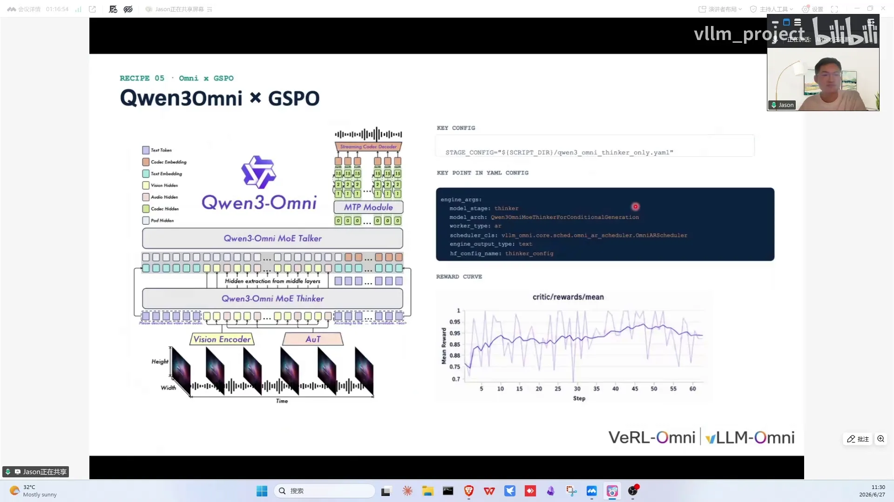 |
| （接上） [【跳转到 34:15】](https://www.bilibili.com/video/BV1qd7n6TEZk/?t=2055) | 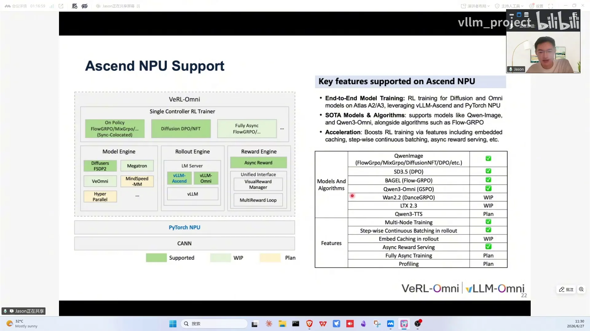 |
| 然后最后就是 Q3 roadmap：主要是针对训练的稳定性，希望去做 deterministic 的 RL，让 reward curve 做到 bit-wise 的对齐——就是两次重复的实验（结果一致）。这对 research 来说应该还是比较有帮助的。 [【跳转到 34:40】](https://www.bilibili.com/video/BV1qd7n6TEZk/?t=2080) | 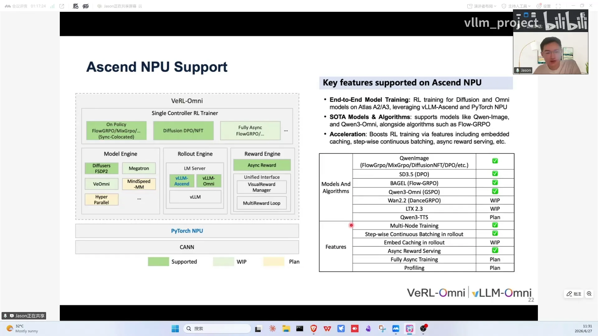 |
| 另外就是 trainer engine 跟 rollout engine 这边的数值一致性也希望做进一步提升；算法和模型的支持这一块会持续扩充；整体训练效率上会再考虑更大规模的并行训练，还有针对 Qwen3-Omni 做一个全异步的流程实现，这样对整体训练吞吐应该会有比较明显的提升。以及代码的 CI 质量方面，我们会加入一些标准的（回归）测试，保证新特性合入时不影响已有模型的收敛质量。也会继续做国产算力卡还有其他硬件的支持。 [【跳转到 35:05】](https://www.bilibili.com/video/BV1qd7n6TEZk/?t=2105) |  |
| （接上） [【跳转到 35:30】](https://www.bilibili.com/video/BV1qd7n6TEZk/?t=2130) | 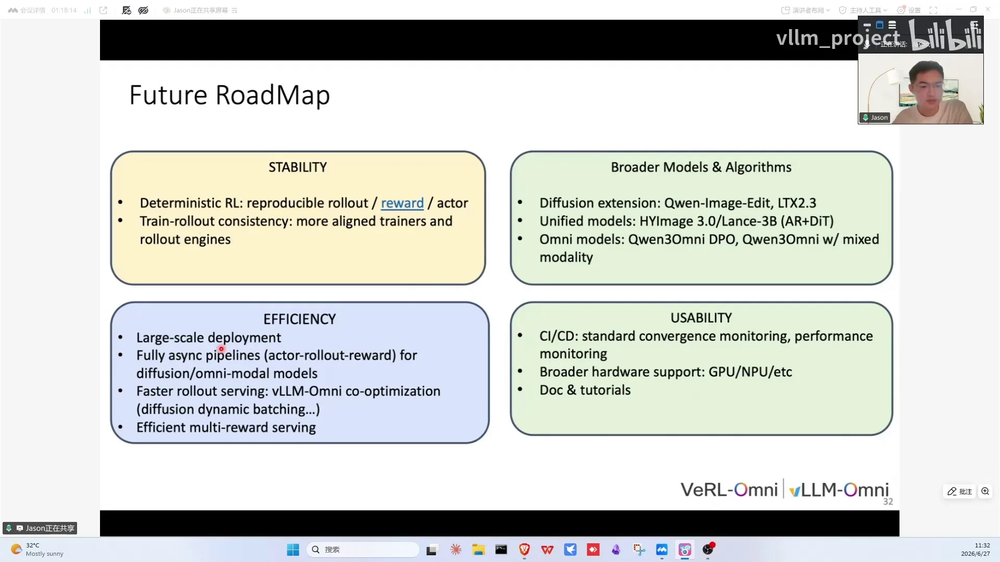 |
| 主要是这些内容。 [【跳转到 35:55】](https://www.bilibili.com/video/BV1qd7n6TEZk/?t=2155) | 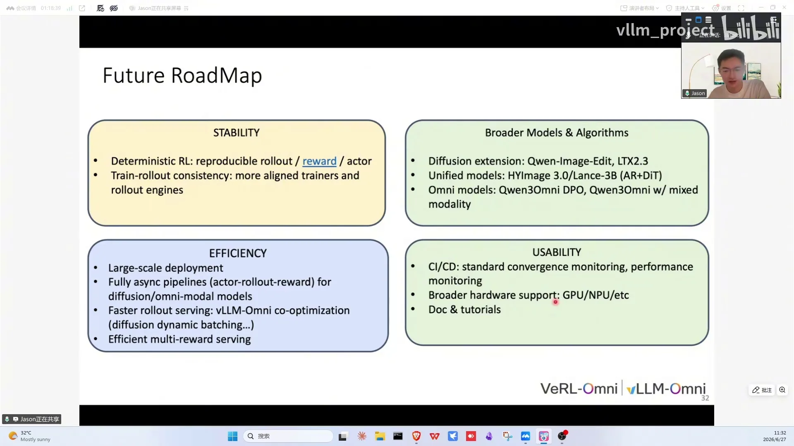 |
| 最后如果大家有兴趣，可以扫码加入我们的开发者微信群，或者关注我们的代码（仓库）点一下 star。这个微信的 QR code 可能过期了，因为它不是企业微信群。想加的话可以进到 GitHub 仓库，主页上面有每周更新的 QR code，扫一下就可以。主要就是这些内容。 [【跳转到 36:00】](https://www.bilibili.com/video/BV1qd7n6TEZk/?t=2160) |  |
| （接上） [【跳转到 36:25】](https://www.bilibili.com/video/BV1qd7n6TEZk/?t=2185) | 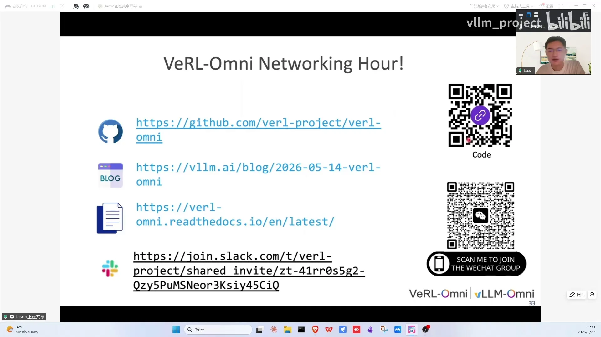 |
| 谢谢大家。然后大家有没有什么问题？还有就是没点关注的同学记得点关注，每周会更新…… [【跳转到 36:33】](https://www.bilibili.com/video/BV1qd7n6TEZk/?t=2193) | 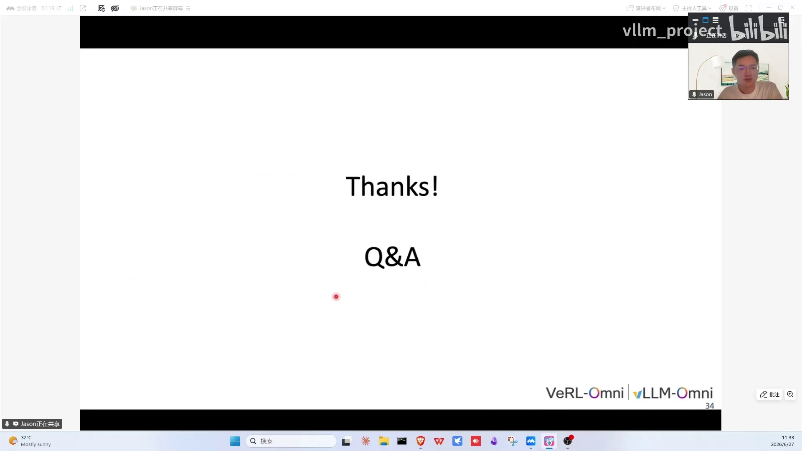 |
| 会做一些直播，关于 vLLM 相关的。我可以做一个预告：未来几周应该都是跟 RL 相关的内容。——好，那我这边有点事情要不先（下）。那我们非常感谢永强老师今天的分享。——好，谢谢志鹏的邀请，谢谢大家。 [【跳转到 36:43】](https://www.bilibili.com/video/BV1qd7n6TEZk/?t=2203) | 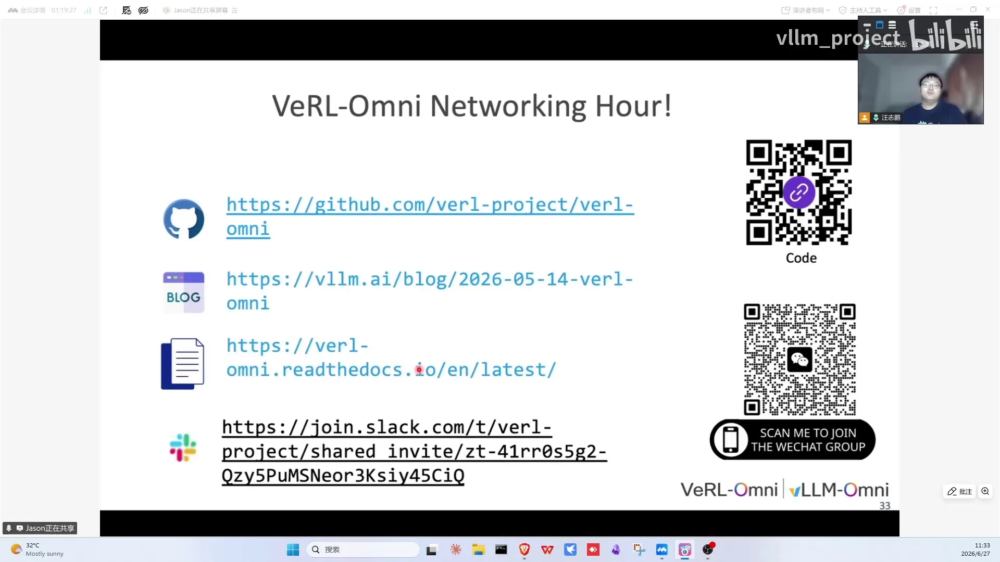 |
| （此区间无字幕） [【跳转到 37:08】](https://www.bilibili.com/video/BV1qd7n6TEZk/?t=2228) | 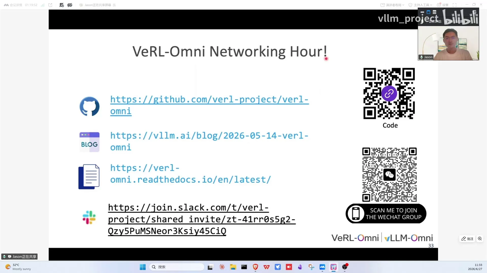 |