# vLLM小课堂（九）：当vLLM遇见slime 原始文稿（图-字幕分栏）

| 字幕文本 | 画面 |
| :--- | ---: |
| 感谢志鹏的邀请。我是来自 slime 团队的申望，今天简单分享一下我们最近做的一个新的 RL 框架——slime，以及讲一下它在 vLLM 生态里面的位置是怎么样的。 [【跳转到 00:00】](https://www.bilibili.com/video/BV1LGMP6FEQa/?t=0) | 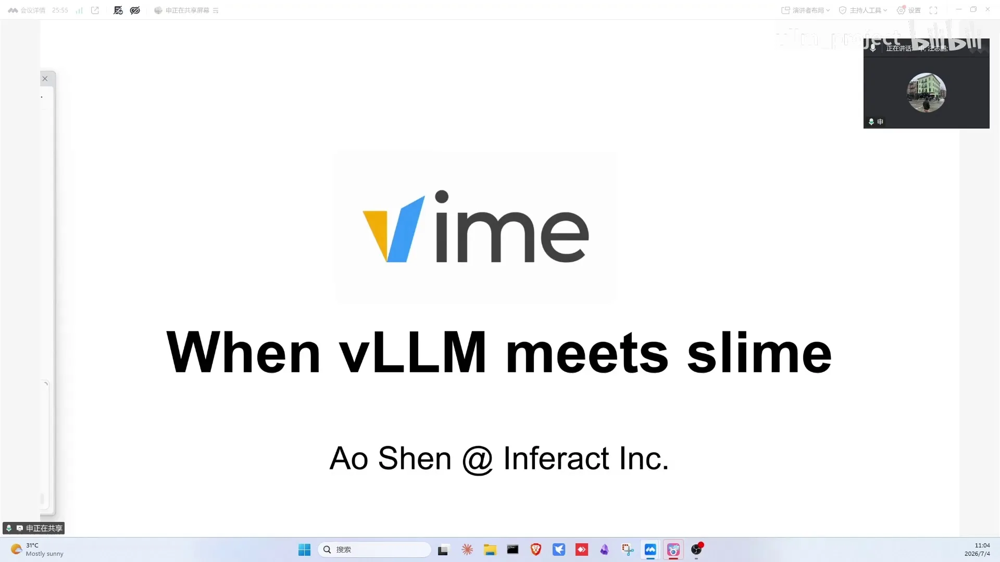 |
| 大家能看到吗？我现在是（直播）……能看到。OK。首先在 LLM 时代，ChatGPT 爆发之后，RLHF 领域的一个重要里程碑项目就是 OpenRLHF：它奠定了现在 RL 框架的一个技术形态…… [【跳转到 00:23】](https://www.bilibili.com/video/BV1LGMP6FEQa/?t=23) |  |
| 这么几个特点：首先包括用 Ray 来做资源的协调，以及用（当时）一种比较成熟的推理引擎来做推理加速，还有将训练引擎和推理引擎结合在一起，从而完成整个后训练的流程。在 24 年的时候，我看到一些团队已经意识到…… [【跳转到 00:48】](https://www.bilibili.com/video/BV1LGMP6FEQa/?t=48) |  |
| 或在社区当中反馈：在整个 RL 的训练过程中，推理的时间或 rollout 的时间可能是非常显著的瓶颈——生成所占用的时间占到了一半以上。这个成为 RL（优化）里的一个重点…… [【跳转到 01:13】](https://www.bilibili.com/video/BV1LGMP6FEQa/?t=73) | 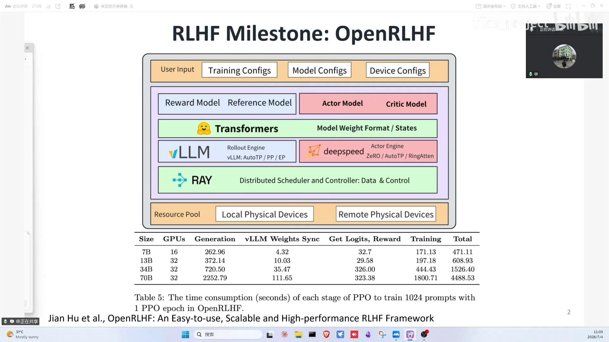 |
| 解决了这个参数同步的问题之后，训推分离式的 RL 就比较成熟了。24 年底 veRL 横空出世，可以说是带着所谓的 single controller 架构以及训推共卡的这种（全新）训练方式，展现出了不错的强化学习性能，并且刚好赶上了 DeepSeek-R1…… [【跳转到 01:35】](https://www.bilibili.com/video/BV1LGMP6FEQa/?t=95) | 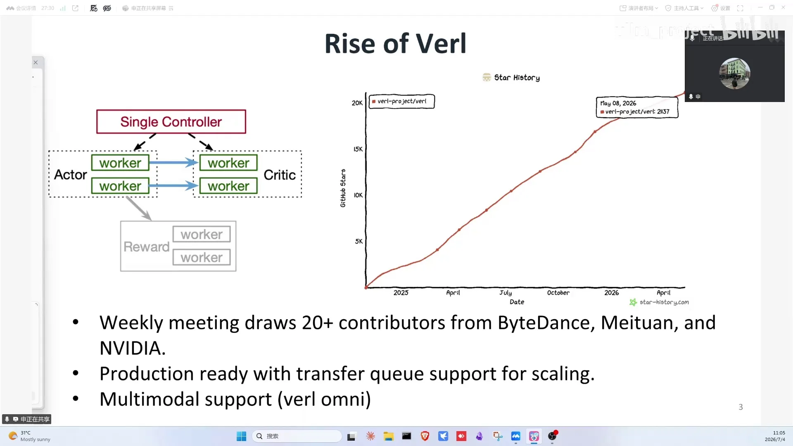 |
| 也迎来了迅猛的发展。目前来讲 star 数量是 20 多 K，据我所知应该是（RL 框架里）star 最多的一个框架。平常的周会一般会有 20 多个贡献者参加，大概来自字节内部包括美团…… [【跳转到 02:00】](https://www.bilibili.com/video/BV1LGMP6FEQa/?t=120) | 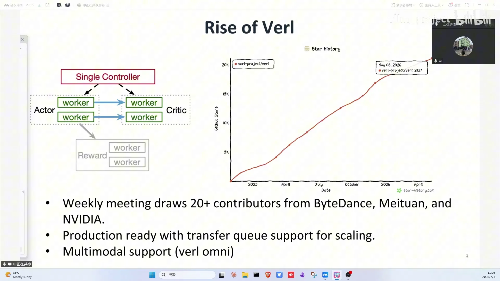 |
| 还有 NVIDIA 的这些同学。甚至上周百岩老哥在周会里分享 Megatron（相关内容）的时候有 100 多个人参加。它也是非常 production ready 的：比如说有一些 transport 的支持，以及一些（新特性）的支持…… [【跳转到 02:25】](https://www.bilibili.com/video/BV1LGMP6FEQa/?t=145) | 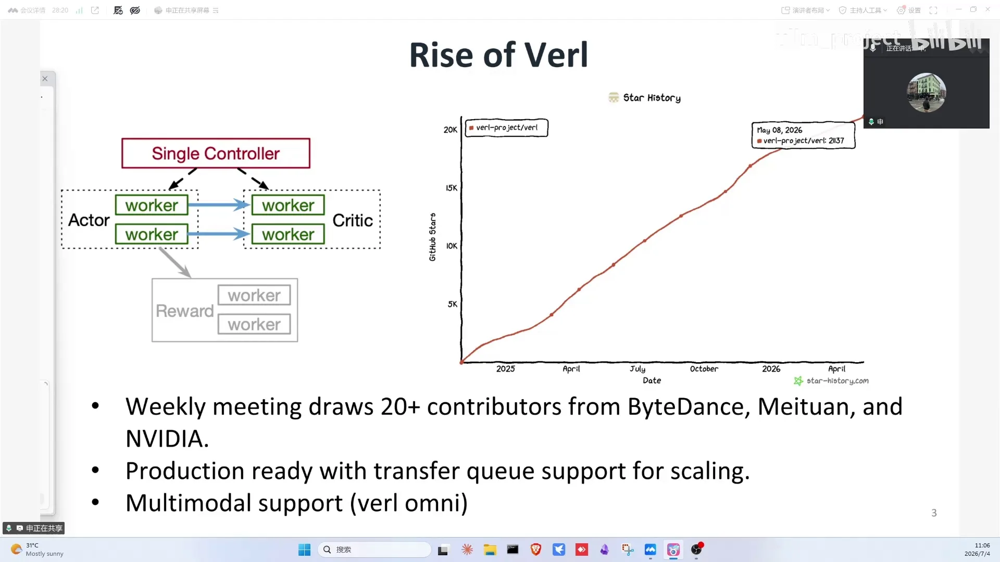 |
| 我们有专门的 veRL-Omni 这个 fork，是基于 vLLM-Omni 去做的。目前来讲 veRL 也是对 vLLM 来说最重要的一个 RL 框架，veRL 也是 by default 用 vLLM。——有同学问哪里可以听到这个 veRL weekly meeting？ [【跳转到 02:50】](https://www.bilibili.com/video/BV1LGMP6FEQa/?t=170) | 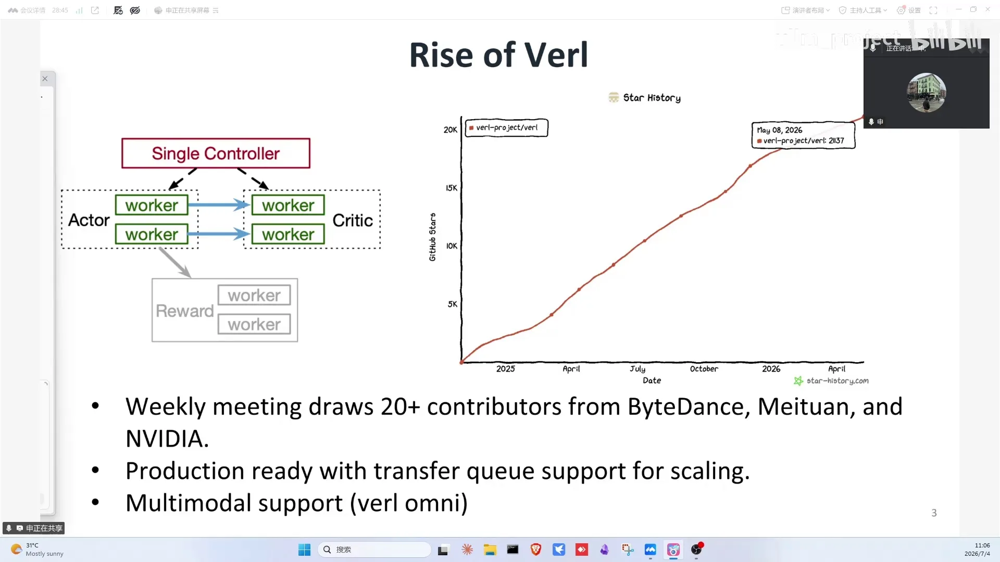 |
| 可以…… [【跳转到 03:07】](https://www.bilibili.com/video/BV1LGMP6FEQa/?t=187) | 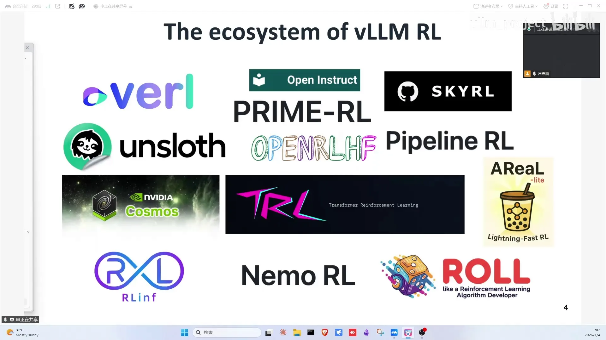 |
| 这个的话待会可以发一下，还是现在就发一下？——都 OK，待会发吧。现在你可以指个路。——OK，其实主要是得先加入 veRL 的一个微信——不，一个飞书群，飞书群里会有直播的…… [【跳转到 03:12】](https://www.bilibili.com/video/BV1LGMP6FEQa/?t=192) | 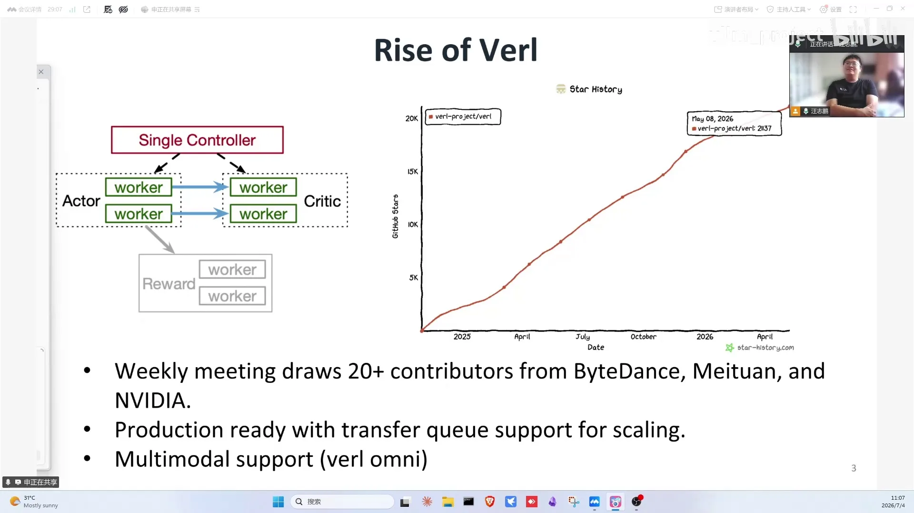 |
| 不是，是会议的预告。一般来讲是每周四——我记得每周四上午 11 点，我们会有一个例行的周会，大家会讲一下自己负责的这一块内容、最近一周的进展，这么一个流程。而且顺道提一下，申望其实也是 veRL 的（贡献者）…… [【跳转到 03:37】](https://www.bilibili.com/video/BV1LGMP6FEQa/?t=217) |  |
| 所以申望算得上是 RL 领域的一个专家了。——哈哈客气客气。——高……对。 [【跳转到 04:02】](https://www.bilibili.com/video/BV1LGMP6FEQa/?t=242) | 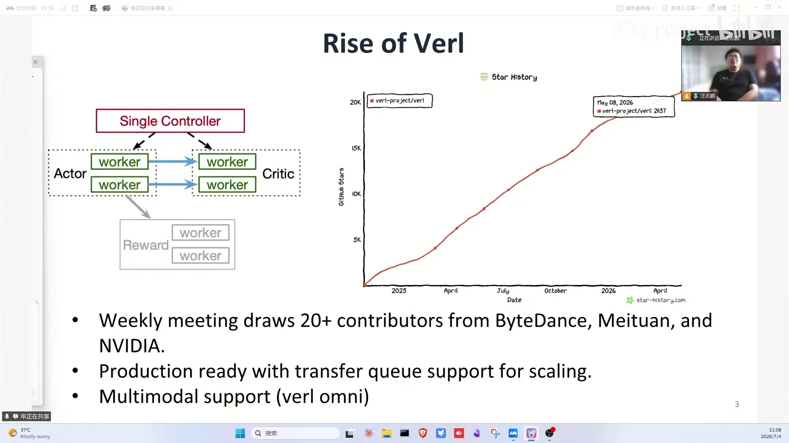 |
| 然后基于这两个框架为主，就构成了我们 RL 生态整体的一个现状。包括像一些国外的框架，还有（其他）…… [【跳转到 04:13】](https://www.bilibili.com/video/BV1LGMP6FEQa/?t=253) |  |
| 以及阿里的 ROLL 等等等等。 [【跳转到 04:38】](https://www.bilibili.com/video/BV1LGMP6FEQa/?t=278) | 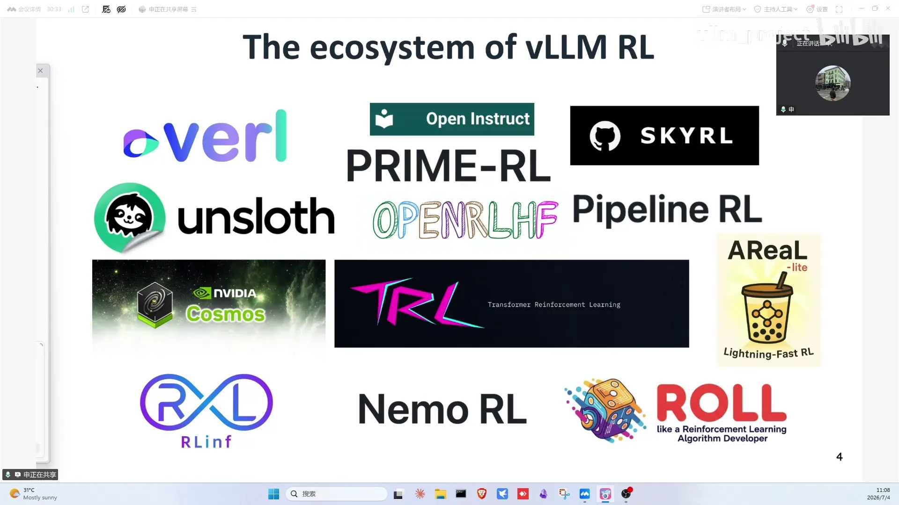 |
| veRL 确实几乎什么都支持：各种后端——训练后端、推理后端，各种算法以及各种模态，还有一个生产级规模验证。平常的需求一般来自字节内部，所以它对比较成熟的（团队）来说是一个不错的项目。但是代价是：它的代码相比 OpenRLHF 从大概 1 万行左右，将近翻了一个数量级，现在大概有 10 万行的规模。它需要支持更多特性，所以会做出一些（工程上的）trade-off…… [【跳转到 04:45】](https://www.bilibili.com/video/BV1LGMP6FEQa/?t=285) |  |
| （接上） [【跳转到 05:10】](https://www.bilibili.com/video/BV1LGMP6FEQa/?t=310) |  |
| 它增加了一些抽象层级。然而有一些团队可能需要不一样的东西：并不需要 RL 框架本身有非常多的功能，只是需要它好改、简单，以及 AI 友好——上下文比较精简、封装少。所以就会有一个（需求的）错位。这时候就有……我知道字节里面有些业务团队用的是 veRL，对吧？训练豆包的时候用的是主分支还是有个特殊分支？ [【跳转到 05:35】](https://www.bilibili.com/video/BV1LGMP6FEQa/?t=335) |  |
| 训练豆包我理解不是用（veRL）的…… [【跳转到 06:00】](https://www.bilibili.com/video/BV1LGMP6FEQa/?t=360) | 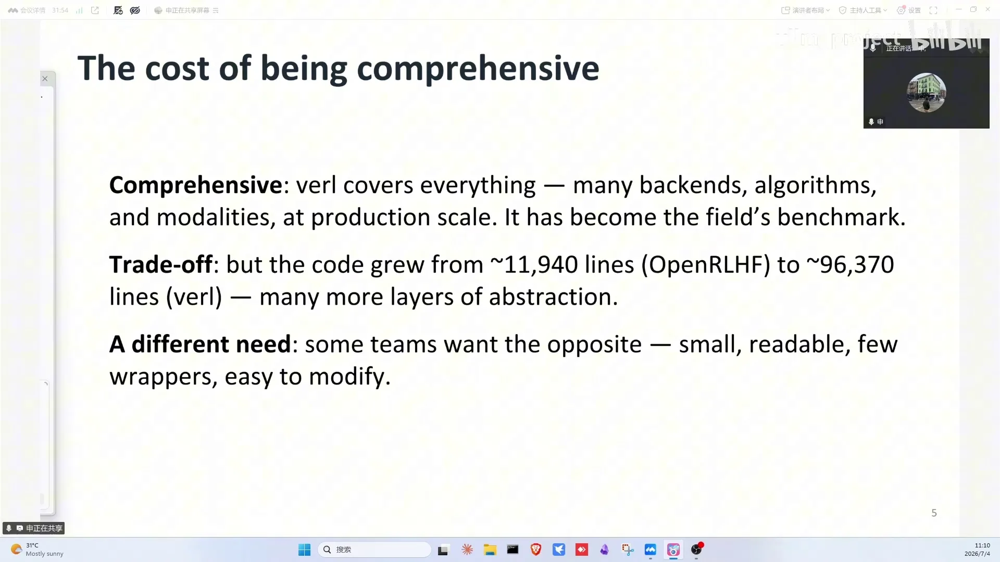 |
| 他们自己还有另外一套。——哦，还有另外一套 OK。那么相当于有专门一个团队只做 veRL 这块开发，公司里可能有些部门会用，但最主要的模型训练不是用这个。——是的是的。——主要的活还是：首先 veRL 本身是（字节）Seed 的团队…… [【跳转到 06:25】](https://www.bilibili.com/video/BV1LGMP6FEQa/?t=385) |  |
| 就是 veRL 背后字节的这一部分。平常的主要需求也是从内部去挖掘的。而且我理解它内部如果想迭代快的话，也没办法用代码这么庞大的一个项目…… [【跳转到 06:50】](https://www.bilibili.com/video/BV1LGMP6FEQa/?t=410) | 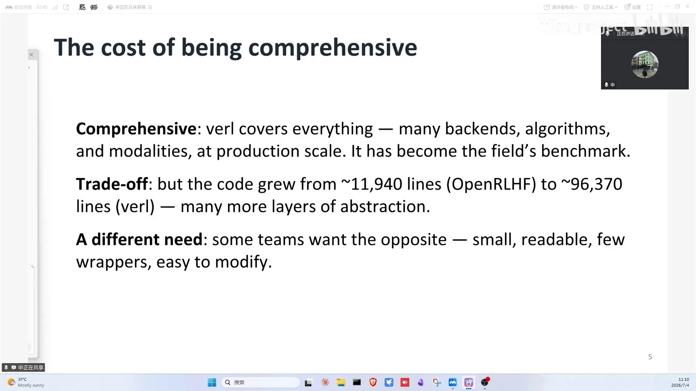 |
| 这个我觉得确实也是一个原因、一个问题。但反正开源有开源的做法：他们目前还是更加服务开源，包括一些内部需求…… [【跳转到 07:15】](https://www.bilibili.com/video/BV1LGMP6FEQa/?t=435) | 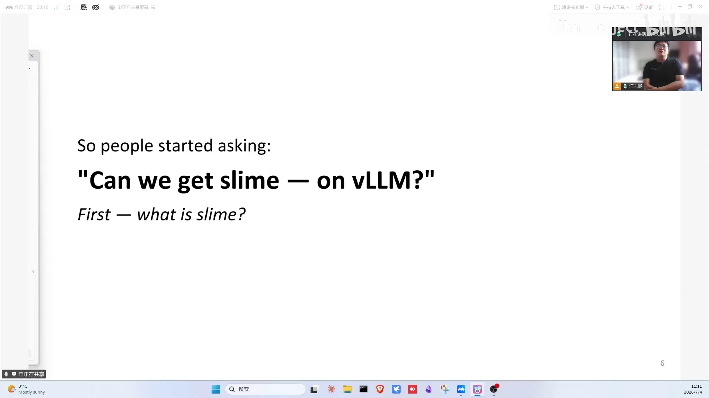 |
| 但可能并不是最核心的那部分。veRL 团队有的资源，相对来说肯定跟豆包（团队）不是一个数量级的。是的，这个确实是这样。因为我也感觉 veRL 代码实在太多了。如果因为训练引擎和推理引擎…… [【跳转到 07:40】](https://www.bilibili.com/video/BV1LGMP6FEQa/?t=460) | 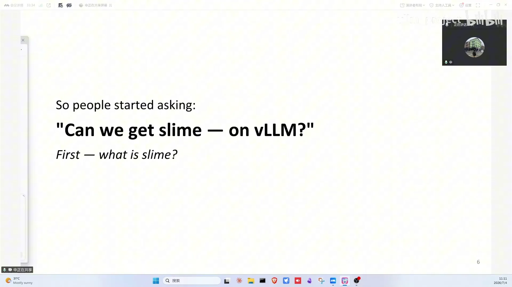 |
| 其实用户的需求差别挺大的：推理引擎的话，很多用户只关心 token in、token out；但训练引擎的话，绝大多数用户都是比较懂这个行业的，需要可以快速改你的框架。但如果代码多——特别是兼容了很多后端的话——就会导致代码非常难改。一个简单的例子就是我去维护你这个框架…… [【跳转到 08:05】](https://www.bilibili.com/video/BV1LGMP6FEQa/?t=485) | 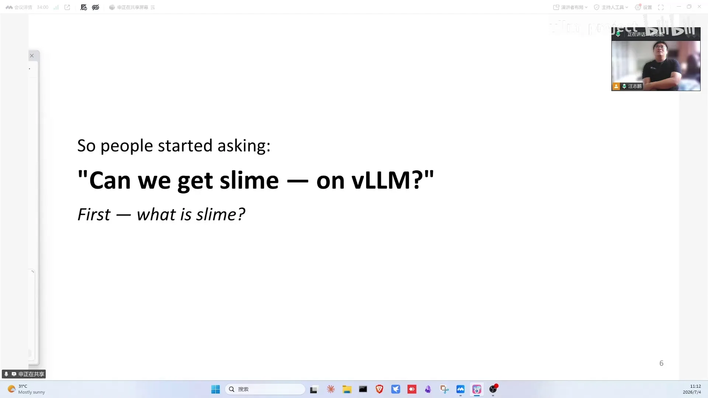 |
| 我肯定要（对接）你的这套 CI。我随便改一点，可能 CI 就跑不通。那么就导致我维护这套系统和一套 CI，都可能花费比代码少的框架多几倍的时间，直接导致系统迭代速度非常慢。——对，这也是（说）有这么多 backend 的话…… [【跳转到 08:30】](https://www.bilibili.com/video/BV1LGMP6FEQa/?t=510) | 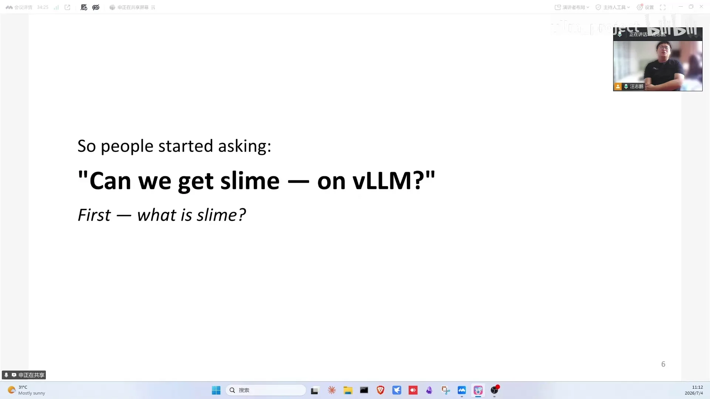 |
| 可能也会有更多人进来开发。反正目前来讲 veRL 的 PR 作者来源比较广泛，各个公司都有。最近一段时间从数量级来说，也比另外两个非常不错的（框架）应该有更多一倍的情况。 [【跳转到 08:55】](https://www.bilibili.com/video/BV1LGMP6FEQa/?t=535) | 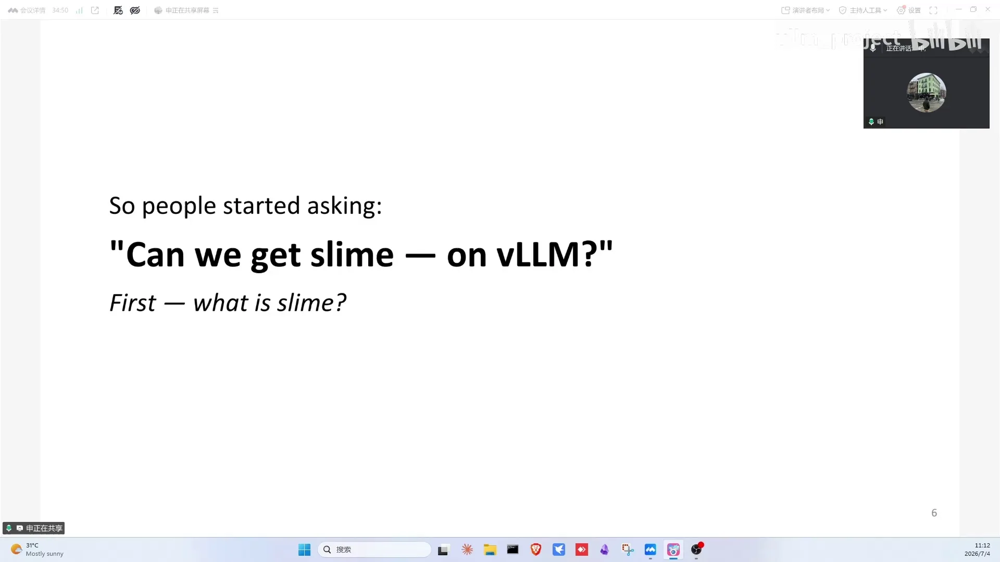 |
| 只是有一个（问题）……陈老师还有直播间的同学可以帮忙分享一下。直播间可以吗？——好，我们继续。所以社区包括像（我们）的同学就会收到一些反馈：能不能在这个 framework 上跑我们自己的（fork）——这么简洁优雅的框架我们能不能使用？ [【跳转到 09:20】](https://www.bilibili.com/video/BV1LGMP6FEQa/?t=560) | 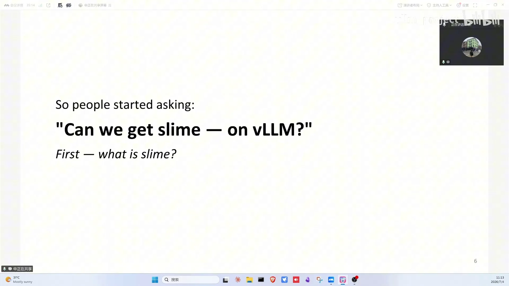 |
| 首先大概讲一下 slime 是什么。slime 是一个非常简单优雅的框架，非常干净的代码库，复杂度比较低…… [【跳转到 09:45】](https://www.bilibili.com/video/BV1LGMP6FEQa/?t=585) |  |
| 只有一个推理和训练引擎，没有那么多封装层，比较简单、容易上手。它也提供了大量灵活性：很多 research 需要的组件都是可以自定义的。比如说像 reward（相关）的…… [【跳转到 10:10】](https://www.bilibili.com/video/BV1LGMP6FEQa/?t=610) | 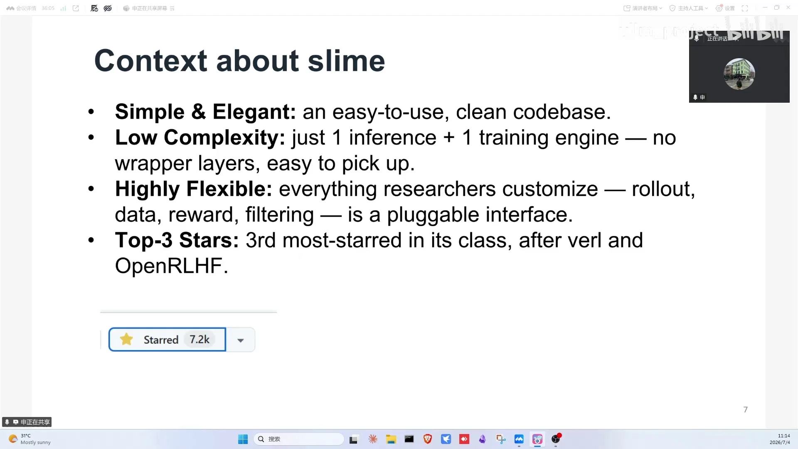 |
| 整个 loop 对吧。包括数据的排布、reward 设计，以及 rollout 数据生成之后我们可能需要做 filter——我们想要某些高质量的数据被训练，而不是所有数据都（送去）训练——这些都可以说是一个（可定制的）接口。同时它也是非常受欢迎…… [【跳转到 10:35】](https://www.bilibili.com/video/BV1LGMP6FEQa/?t=635) |  |
| 据我所知，它是 veRL 以及 OpenRLHF 之后最受欢迎的 RL 框架。而且这个框架诞生时间其实是最晚的：好像去年 5 月份才开始做，7 月份才开源。——是的是的是的。 [【跳转到 11:00】](https://www.bilibili.com/video/BV1LGMP6FEQa/?t=660) | 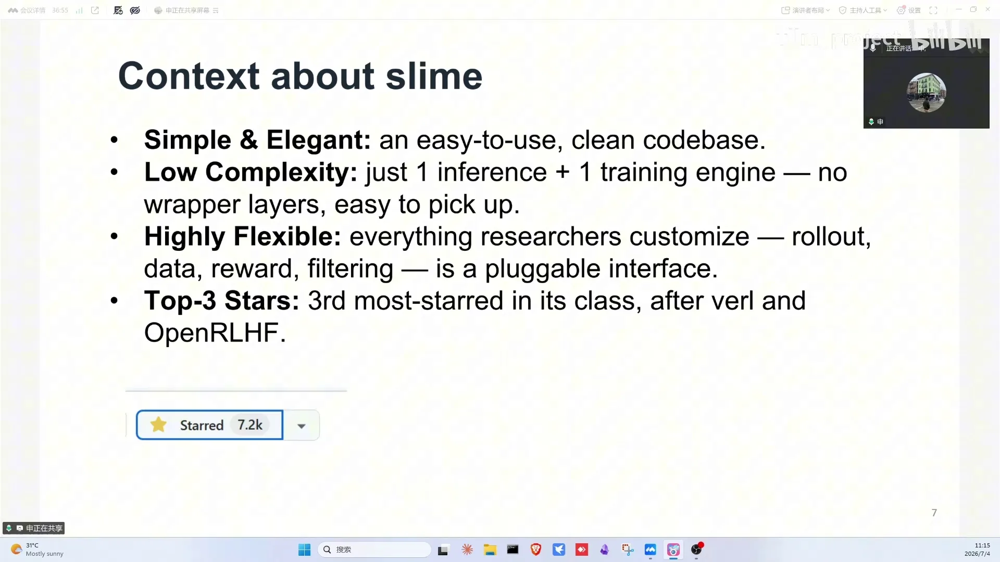 |
| 这边讲一个基本背景知识…… [【跳转到 11:25】](https://www.bilibili.com/video/BV1LGMP6FEQa/?t=685) | 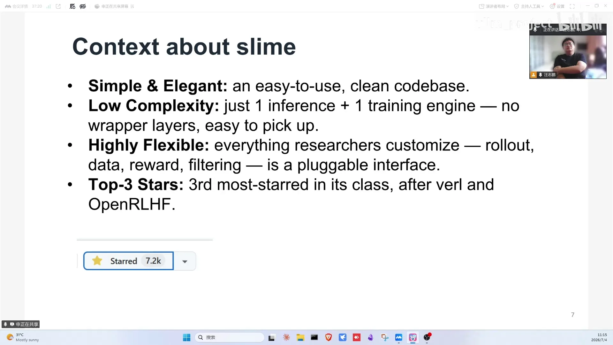 |
| 就是我们平常在 RL 框架当中把推理后端进行实现的话，基本上有两种方案。第一种是 in-process（进程内）：基于 Ray 用 internal API 直接调用 vLLM 的一些封装层…… [【跳转到 11:30】](https://www.bilibili.com/video/BV1LGMP6FEQa/?t=690) |  |
| 好处就是你可以直接拿到所有可以拿的东西：比如 logprobs、还有（重计算相关）这些东西，不需要一个 HTTP 的 endpoint 去暴露或实现。它的坏处是可能会和推理后端有比较强的代码层面耦合，相对比较有（侵入）性一点，甚至可能在跨（版本）的时候会有一些维护的负担。 [【跳转到 11:55】](https://www.bilibili.com/video/BV1LGMP6FEQa/?t=715) |  |
| 另外一种相反的是基于 server 以及 HTTP 的方式去启动推理引擎：还是用 Ray，但 Ray 在里面的角色只是一个比较浅的 wrapper。比如像 slime 这样，它只去拿到 server 子进程的句柄，主进程并不去持有 vLLM server 这种各种信息。这个好处就是说…… [【跳转到 12:20】](https://www.bilibili.com/video/BV1LGMP6FEQa/?t=740) | 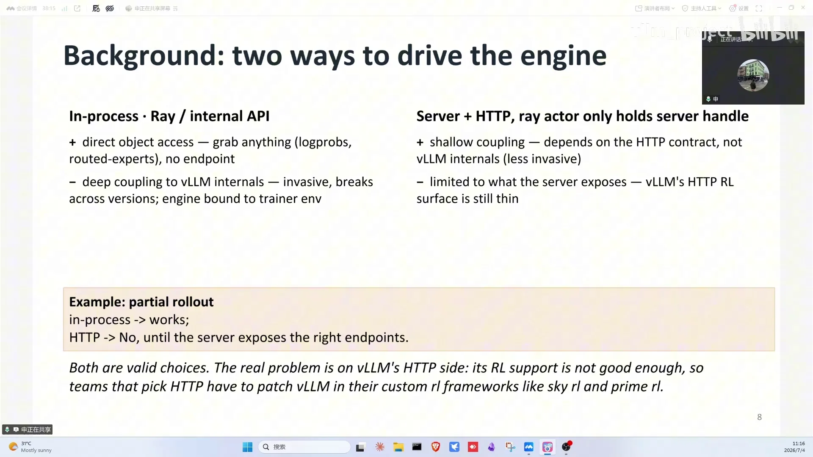 |
| （接上） [【跳转到 12:45】](https://www.bilibili.com/video/BV1LGMP6FEQa/?t=765) |  |
| 我们的耦合性相对来说就更少了：完全依靠 HTTP 的 endpoint，而不是 internal 的 API，更加干净简洁一点。但它的坏处是需要 server 本身暴露出来你需要的这些 endpoint。举个例子，比如 partial rollout…… [【跳转到 13:10】](https://www.bilibili.com/video/BV1LGMP6FEQa/?t=790) |  |
| 这是一个非常重要的算法，对吧。在 vLLM 作为后端的时候，很多框架使用 in-process（第一种方式）的时候是没有问题的…… [【跳转到 13:35】](https://www.bilibili.com/video/BV1LGMP6FEQa/?t=815) |  |
| 但是如果用 HTTP 这种方式的话，直到最近一段时间它才真正支持，所以还不是很成熟。这两种都是合理的设计，但目前 vLLM 这块在 RL 的 HTTP 支持并不是特别的（完善）。 [【跳转到 14:00】](https://www.bilibili.com/video/BV1LGMP6FEQa/?t=840) |  |
| 所以很多通过这种设计去选择 vLLM 后端来 rollout 的团队，就可能需要做一些 monkey patch。比如像 SkyRL、（其他）还有 PRIME-RL 这些团队。 [【跳转到 14:25】](https://www.bilibili.com/video/BV1LGMP6FEQa/?t=865) |  |
| 上一页 PPT 其实我一直有个问题：像 internal API 的话，我感觉这种设计更适合单后端，对吧？反而 HTTP 的更适合多后端的。——我觉得反正你得包装一层嘛，两种都是互有优劣吧。 [【跳转到 14:50】](https://www.bilibili.com/video/BV1LGMP6FEQa/?t=890) | 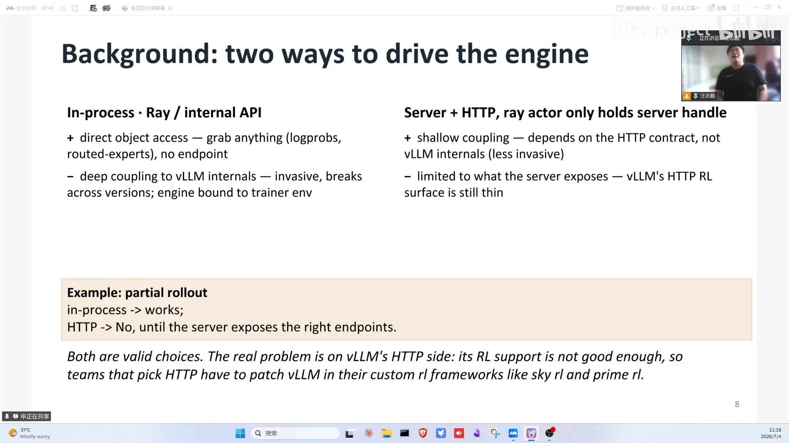 |
| 对，我说如果从框架设计上来讲，internal API 如果想支持多后端做推理引擎，需要做很多层的抽象，反而导致这种设计更适合只有一个后端推理引擎的框架。HTTP 的话因为你是要求（推理）引擎必须有这些接口，相反你其实不需要管推理引擎内部怎么实现。反正只是我个人对框架上的一些看法。——了解。 [【跳转到 15:15】](https://www.bilibili.com/video/BV1LGMP6FEQa/?t=915) | 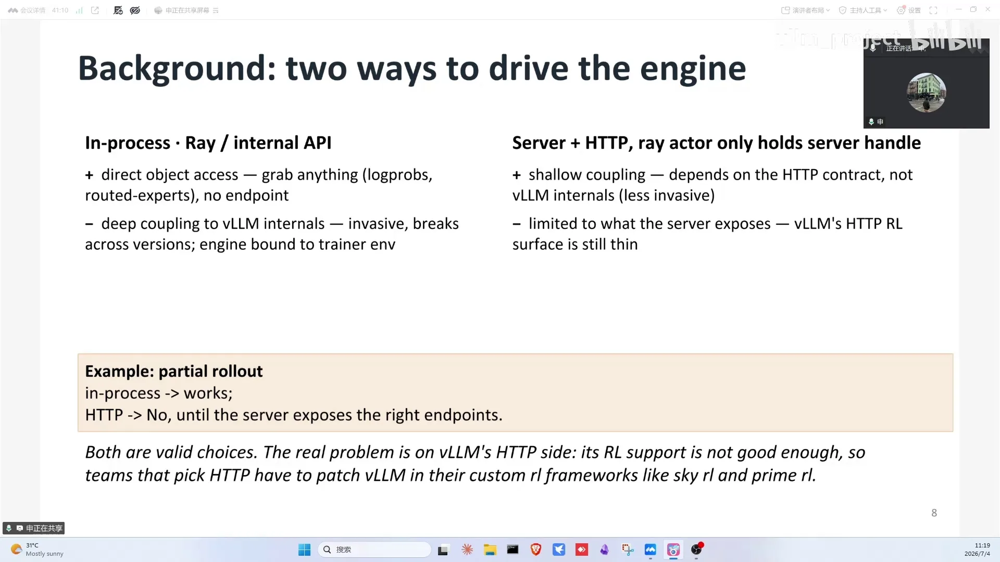 |
| 那么相反的话你其实不需要管这些推理型它内部怎么实现的反正只是我个人对于这个框架上的一些看法对了解 [【跳转到 15:40】](https://www.bilibili.com/video/BV1LGMP6FEQa/?t=940) | 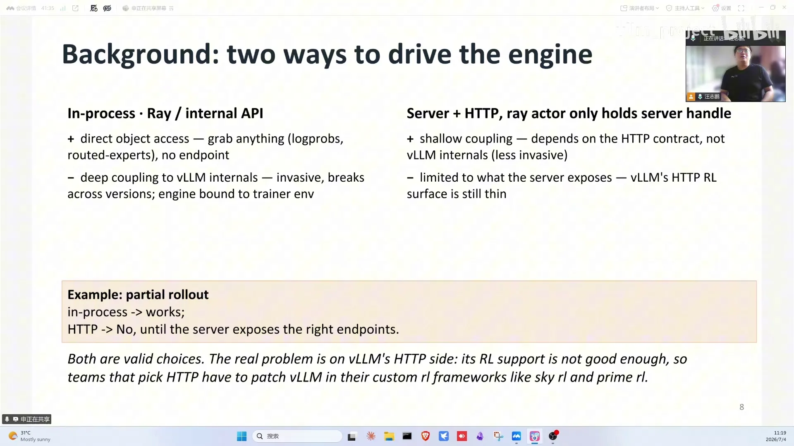 |
| 所以基本上这就是我们做这个（slime +）vLLM（集成）的初衷。首先有直播间同学问：这里的长尾效应指的是啥？ [【跳转到 15:54】](https://www.bilibili.com/video/BV1LGMP6FEQa/?t=954) | 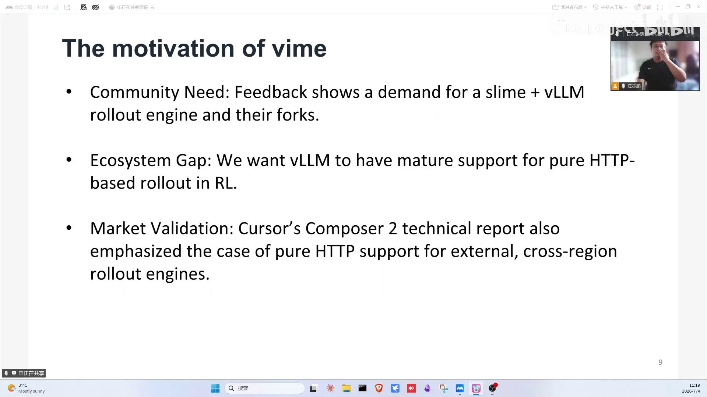 |
| 为什么两种方式不一样？指的是我们在 rollout 的时候——它更像一种离线推理的方式：同一时间有比如 32 条请求被送到了推理引擎中…… [【跳转到 16:02】](https://www.bilibili.com/video/BV1LGMP6FEQa/?t=962) | 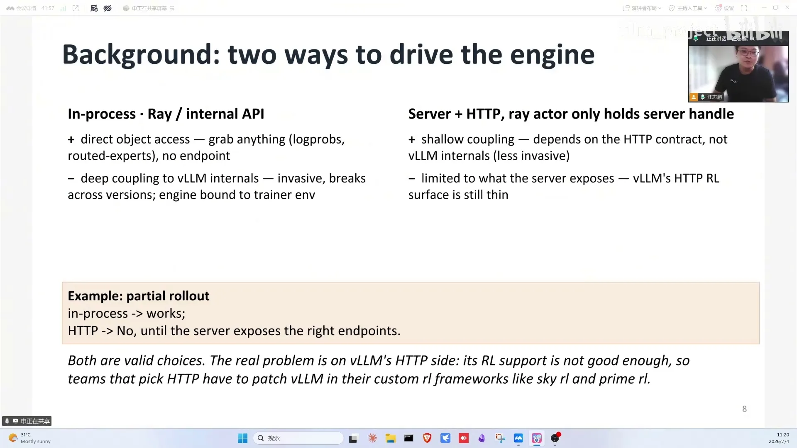 |
| 必然就有跑得快跑得慢的，对吧。问题是必须等所有请求都跑完了才能进行下一步。这种情况下，慢的请求就成了瓶颈：快的、已经完成的请求需要等待还没完成的请求，才能同时进入下一步去训练。 [【跳转到 16:27】](https://www.bilibili.com/video/BV1LGMP6FEQa/?t=987) | 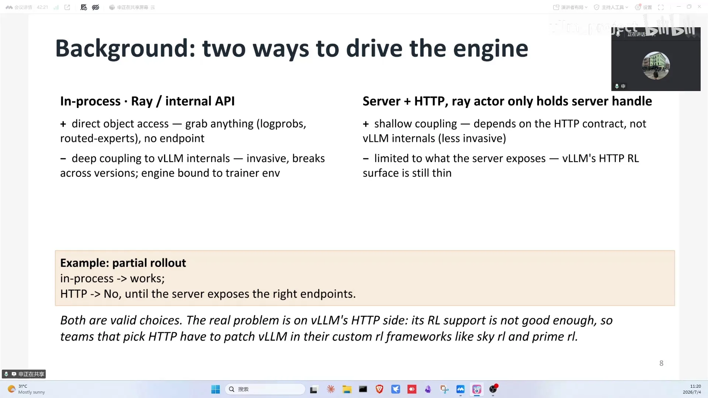 |
| 所以这时候就会有一个长尾问题：少部分的——比如 P99 latency 的这些请求——会非常影响整体效果，成为短板，像木桶原理一样。 [【跳转到 16:52】](https://www.bilibili.com/video/BV1LGMP6FEQa/?t=1012) |  |
| 一般怎么解决？核心思路有好几种方式。比如可以做算法和 system 上的 co-design：在算法上做一些取舍，可以不保证完全是 on-policy…… [【跳转到 17:17】](https://www.bilibili.com/video/BV1LGMP6FEQa/?t=1037) | 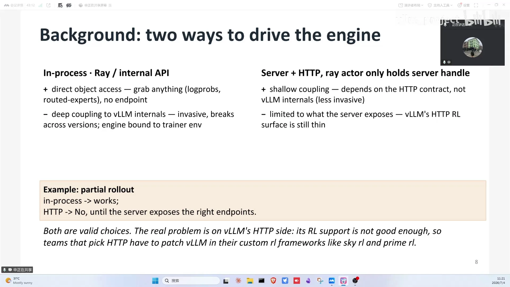 |
| 可以做一些 off-policy（松弛）。以及如果纯从 system 角度看，也可以想办法优化那一个比较长的请求：比如通过 PD 分离的方式，包括通过 MTP 去专门加速……这些方案都可以。我看之前好像训练侧也可以对这块有相应的改动。 [【跳转到 17:42】](https://www.bilibili.com/video/BV1LGMP6FEQa/?t=1062) | 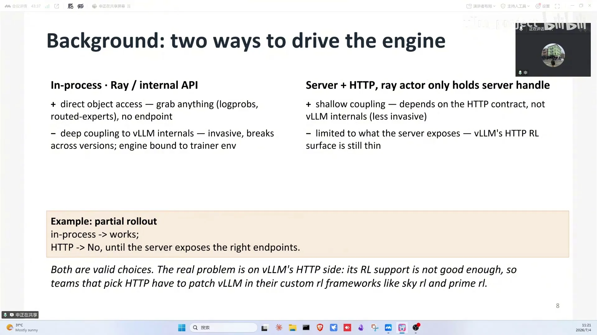 |
| （接上） [【跳转到 18:07】](https://www.bilibili.com/video/BV1LGMP6FEQa/?t=1087) |  |
| 因为我之前看子琳那个博客——0.3 版本他好像也专门提了：trainer 这一块其实也有对长尾问题的一些改动，大家可以看一下。子琳就是 slime 的一个主要作者，他知乎上写的东西挺好的。 [【跳转到 18:32】](https://www.bilibili.com/video/BV1LGMP6FEQa/?t=1112) | 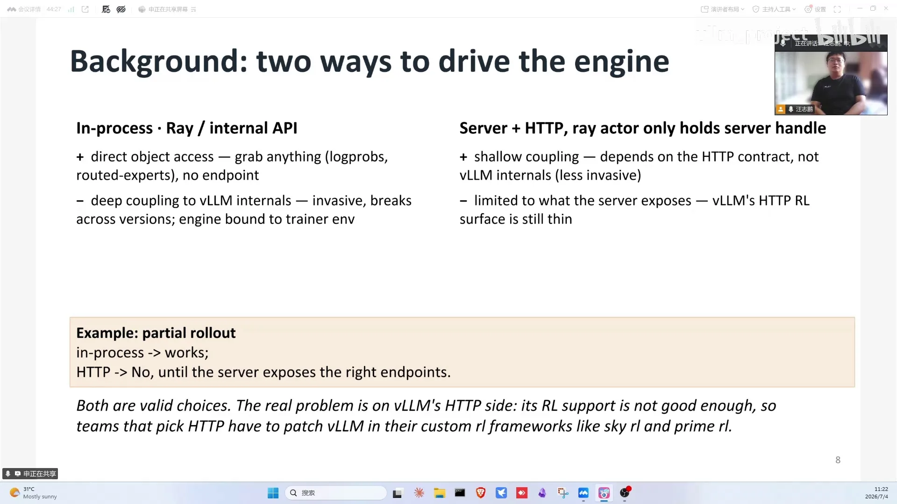 |
| 他知乎上面写的东西挺好的。好，然后可以讲讲 RL 的 PD 分离和推理 PD 分离有啥区别？——应该没有区别吧，我觉得没有什么区别。——对。因为你想我们都可以把整个推理服务用 HTTP 请求打通…… [【跳转到 18:57】](https://www.bilibili.com/video/BV1LGMP6FEQa/?t=1137) | 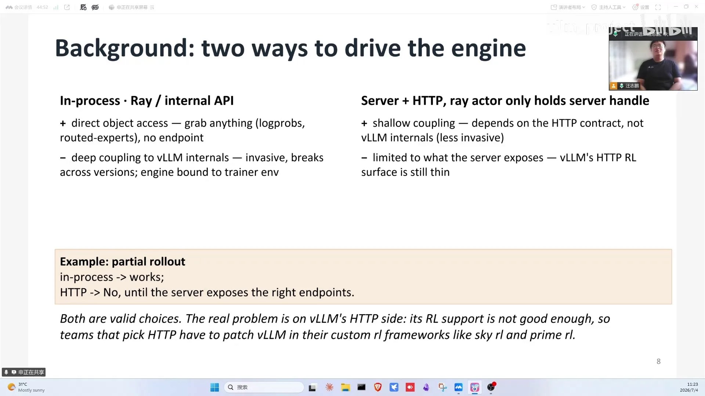 |
| 实际上我们更不需要管它里面具体怎么实现的，所以表现形式是完全一致的。我们可以直接把 rollout 通过一个单独的 server 端点、一个 serving 服务的端点来接入，就像一个普通的 serving 实例一样…… [【跳转到 19:22】](https://www.bilibili.com/video/BV1LGMP6FEQa/?t=1162) |  |
| 没有任何区别。——OK。这基本上就是我们做（这个集成）的 motivation。首先社区确实有需求：很多人想要 slime 加上他们自定义（后端）的这么一个组合。其次是生态上一个空缺吧…… [【跳转到 19:47】](https://www.bilibili.com/video/BV1LGMP6FEQa/?t=1187) |  |
| 我们希望补上在 RL 上对这种纯 HTTP rollout 更成熟的支持。另外比如一些（前沿）工作：像 Cursor 这个公司，它的技术报告里提到他们的卡数量不足，所以只把自己的卡用来做训练…… [【跳转到 20:12】](https://www.bilibili.com/video/BV1LGMP6FEQa/?t=1212) |  |
| 而推理服务就找比如说 Fireworks AI 这种其他的云厂商来提供——也就是像刚才说的端点形式：所有请求都只能通过 HTTP 的方式访问，包括普通推理以及控制面的，比如权重同步等等的请求…… [【跳转到 20:37】](https://www.bilibili.com/video/BV1LGMP6FEQa/?t=1237) |  |
| 这样你的推理集群可能并不在训练集群旁边，甚至可能跨区域、跨大洲。这种方式也是一个适合 HTTP 的场景。当然如果用 Ray 的话也可以这么做，但外面要包一层，会增加封装的复杂度。 [【跳转到 21:02】](https://www.bilibili.com/video/BV1LGMP6FEQa/?t=1262) |  |
| 然后有同学问：投机解码和 RL 结合有什么加速吗？——投机解码在 small batch 的时候会有一些收益：当我们这个 verification 的开销远小于正常推理开销的时候，就会产生收益。RL 的话，它的某些场景和投机解码对应的场景是一致的…… [【跳转到 21:27】](https://www.bilibili.com/video/BV1LGMP6FEQa/?t=1287) |  |
| （接上） [【跳转到 21:52】](https://www.bilibili.com/video/BV1LGMP6FEQa/?t=1312) |  |
| 也就是 small batch、追求低时延的时候——刚才说的有长尾的这种情况。如果做 on-policy 的话，推理过程可以分为两个阶段：第一阶段每个 serving engine 都被很多请求打满…… [【跳转到 22:17】](https://www.bilibili.com/video/BV1LGMP6FEQa/?t=1337) |  |
| 这时我们想优化的是高吞吐场景。但随着很多请求慢慢结束，阶段转换成第二阶段：要优化低时延。这时候像 PD 分离以及 MTP 就可以针对这种低时延、小 batch 的场景做有效加速，从而解决整个长尾问题。——其实我感觉哪怕不是小 batch，MTP 的加速效果也挺明显的。——就是看你怎么理解这个"小"…… [【跳转到 22:42】](https://www.bilibili.com/video/BV1LGMP6FEQa/?t=1362) |  |
| （接上） [【跳转到 23:07】](https://www.bilibili.com/video/BV1LGMP6FEQa/?t=1387) |  |
| 反正总体来讲，small batch 的时候肯定是相对有收益，相对大一点的 batch（收益会小）。——对。好，然后有同学问：目前哪个 RL 框架对 diffusion LM 后续能有支持？那我必须得推荐我们的 veRL-Omni 了。上一期直播也是请的 vLLM-Omni 的同学来讲这个框架，对吧。如果特别感兴趣的话…… [【跳转到 23:32】](https://www.bilibili.com/video/BV1LGMP6FEQa/?t=1412) | 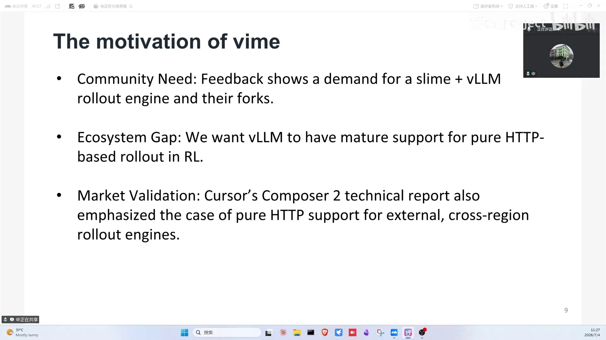 |
| 你可以翻一下我们上期直播的录像，已经上传到这个频道了。而且不管 veRL-Omni 还是 veRL，社区上都非常缺人干活。如果你有计算资源的话，可以考虑进来做一些贡献。嗯嗯好。 [【跳转到 23:57】](https://www.bilibili.com/video/BV1LGMP6FEQa/?t=1437) |  |
| 还有同学问：啥时候把 vLLM-Omni 也纳入 RL 生态？——现在 veRL-Omni 主要支持的 RL（引擎）就是 vLLM-Omni，后面 slime 可能也可以做一些这方面的考虑。——是的，我们目前走一步看一步，看社区有没有什么新的需求…… [【跳转到 24:22】](https://www.bilibili.com/video/BV1LGMP6FEQa/?t=1462) |  |
| 去进行一些讨论。——然后（问）veRL-Omni：可以选择 vLLM-Omni（做训练）吗？我印象中（FSDP）主要是纯训练框架，不是 RL 框架？——veRL-Omni 的计划里面是支持 vLLM-Omni 的…… [【跳转到 24:47】](https://www.bilibili.com/video/BV1LGMP6FEQa/?t=1487) |  |
| 但是我们现在应该是不支持的。现在做训练主要用的是 FSDP；像 Qwen3-Omni 这种模型我们用的是 Megatron-LM，因为 Megatron 支持 Qwen3-Omni 来做训练。不过后面肯定会支持的。 [【跳转到 25:12】](https://www.bilibili.com/video/BV1LGMP6FEQa/?t=1512) | 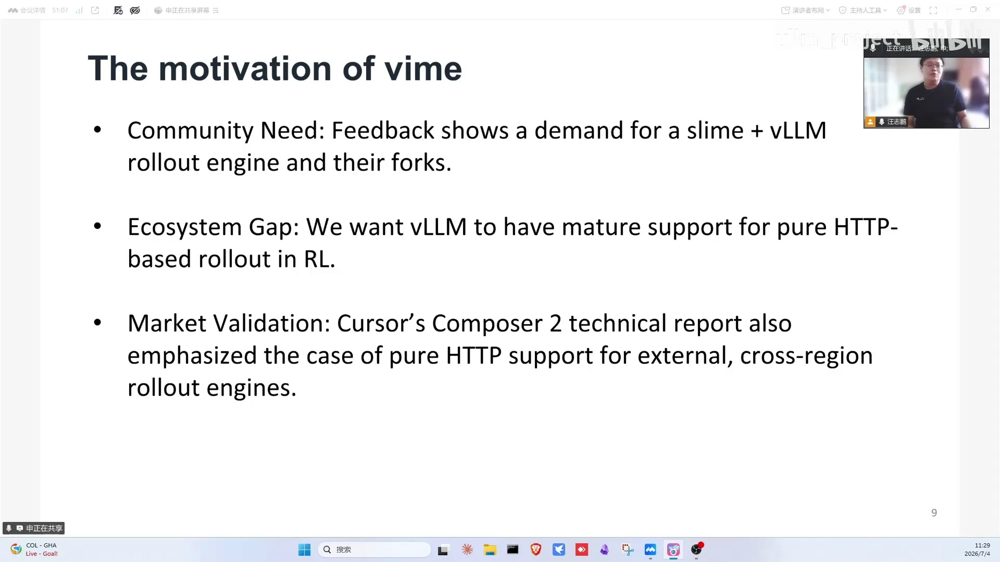 |
| 然后 rollout 的部分能不能一边提供在线推理服务，同时收集训练数据？这是什么意思？——是去做一些可观测性的，比如训练、推理的 metrics 的收集？您指的是这个意思？——这位同学能再写一下 rollout 的部分…… [【跳转到 25:37】](https://www.bilibili.com/video/BV1LGMP6FEQa/?t=1537) |  |
| 能不能一边提供在线（服务）同时收集训练数据，具体指什么？——现在 trajectory 的保存一般来说都是可以保存的，这非常重要：方便我们 debug，或者去看某一个轨迹是否产生了一些像 reward 的 spike，这些数据都会保存。 [【跳转到 26:02】](https://www.bilibili.com/video/BV1LGMP6FEQa/?t=1562) | 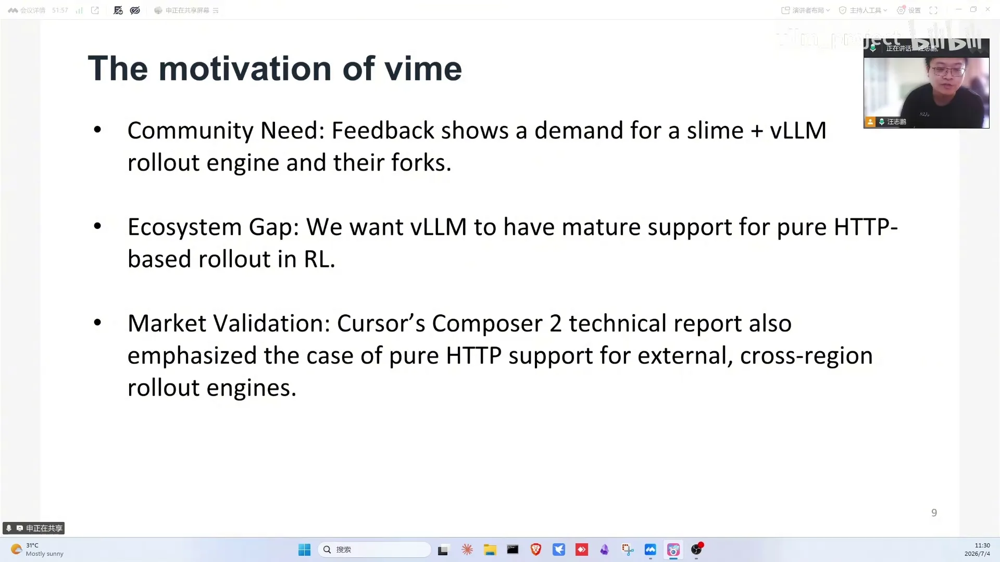 |
| 就是数据本身——如果是一些推理性能相关的 metrics，一般通过 Prometheus 收集，（监控）里面都是可以看的。——这位同学意思是指：我部署了一个 rollout 的 server，这个 server 一边既可以提供在线服务…… [【跳转到 26:27】](https://www.bilibili.com/video/BV1LGMP6FEQa/?t=1587) |  |
| 另一方面也可以接受 RL 框架的请求来做 RL 的 rollout——这个当然是没问题的，把它当做一个 endpoint 就行。只要能正确产生推理的数据（就）不是问题。 [【跳转到 26:52】](https://www.bilibili.com/video/BV1LGMP6FEQa/?t=1612) | 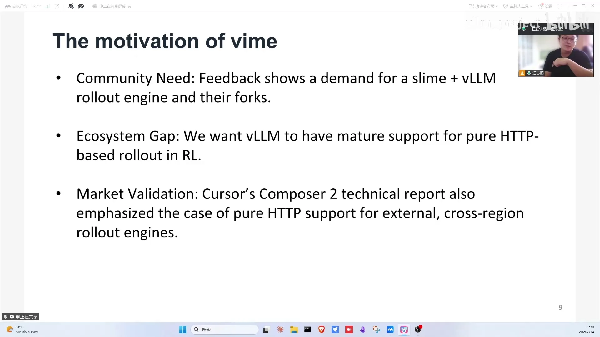 |
| 但是我们在（在线）推理的时候和训练的时候还是会有一些不一样：比如配置的参数。因为我们在 RL 的时候需要支持上下文转换的过程，对吧。如果你推理的服务…… [【跳转到 27:17】](https://www.bilibili.com/video/BV1LGMP6FEQa/?t=1637) |  |
| 正常来说它是不会停机的，对不对？但是我们训练的话，rollout 的权重可能是每隔一段时间需要被更新，这种情况可能会影响到你这个所谓的 serving 服务，这是一点。第二点就是我们在 rollout 的时候…… [【跳转到 27:42】](https://www.bilibili.com/video/BV1LGMP6FEQa/?t=1662) | 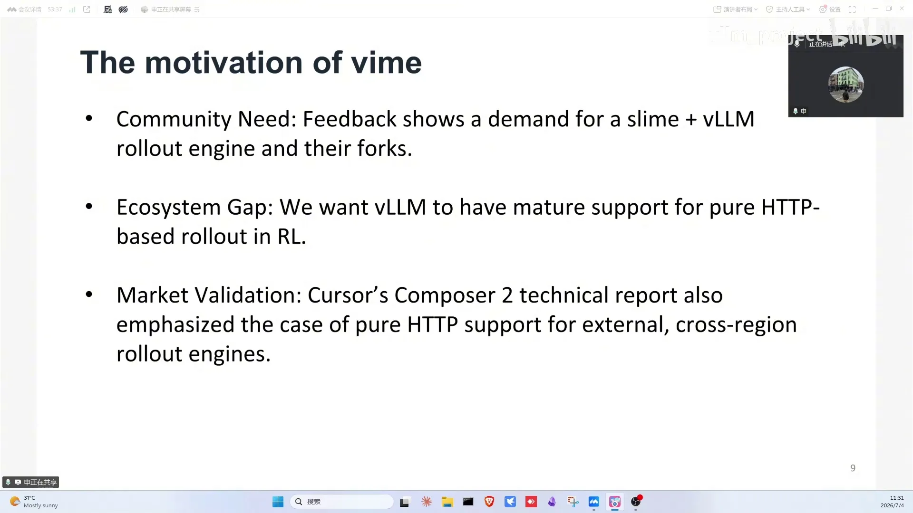 |
| 可能需要做一些（pre）render 和 derender 的支持，也就是前处理和后处理：推理可以理解为有前处理、中间的推理、还有后处理，前处理和后处理过程是非常重要的。在线推理的时候你根本不需要管它——测 serving 的时候根本不需要管；但训练的时候你可能需要把它单独抽出来，这也会有些不一样。但这可能并不影响把（serving）和 rollout 共存的想法。——我理解训练的时候应该还主要是传 token id，对吧？不是传原本的字符串。 [【跳转到 28:07】](https://www.bilibili.com/video/BV1LGMP6FEQa/?t=1687) | 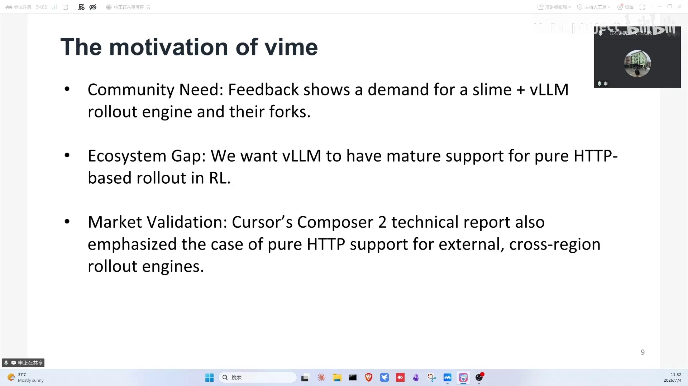 |
| （接上） [【跳转到 28:32】](https://www.bilibili.com/video/BV1LGMP6FEQa/?t=1712) |  |
| 对对对，跟（prompt）也会不太一样。其实（上游）现在 vLLM 把它拆开了：有一个专门的（render）endpoint，还有一个可以只传 token id 进行推理的端点，这也是为了 RL 框架做服务的。 [【跳转到 28:57】](https://www.bilibili.com/video/BV1LGMP6FEQa/?t=1737) | 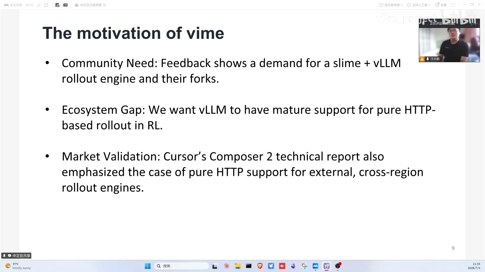 |
| 这一方面是为了 RL 框架做服务，另一方面也是把整个前端做得更加解耦，以应对高并发时代的挑战。因为（前端）主要在 CPU 上做，不希望成为（真正的）瓶颈。对…… [【跳转到 29:22】](https://www.bilibili.com/video/BV1LGMP6FEQa/?t=1762) | 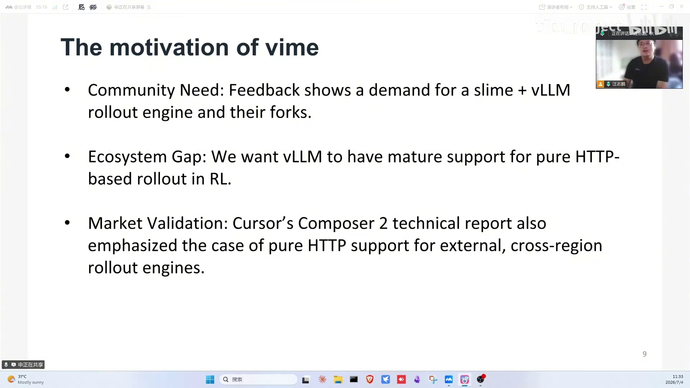 |
| 我其实觉得最主要的问题还是在于权重同步的问题。权重同步会导致你如果拿这种（共卡）服务给在线用户用会非常苦恼。——可能会是一个问题。因为权重同步之后，其实可以选择：要么把 decode 的一半 token 直接丢掉，重新用新的策略去算…… [【跳转到 29:47】](https://www.bilibili.com/video/BV1LGMP6FEQa/?t=1787) | 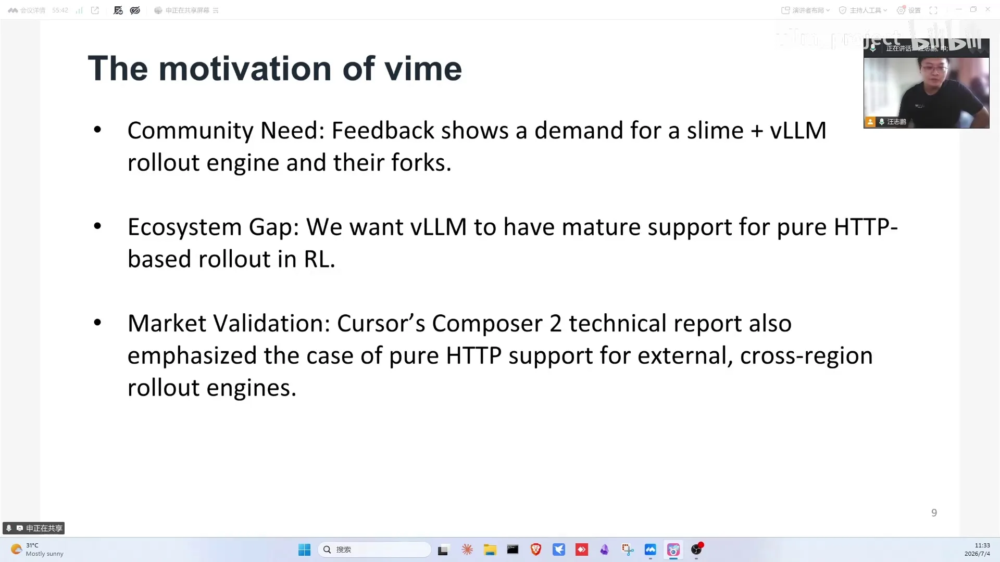 |
| 也可以选择直接在新权重上面继续 decode。如果选择直接丢掉，会导致用户的（输出）——我甚至还得去回滚他已经反馈的这些结果，就变得非常麻烦。但这可能是一个问题。所以…… [【跳转到 30:12】](https://www.bilibili.com/video/BV1LGMP6FEQa/?t=1812) |  |
| 我觉得还是最好不要把在线服务和训练同时一起搞，这可能线上会有一些挑战。——好，我们继续。所以（支持的硬件）：slime 加 vLLM 目前支持的比如像 MoE 的 GB 系列、Blackwell 以及 Hopper 系列，同时大力支持华为的昇腾还有 AMD。 [【跳转到 30:37】](https://www.bilibili.com/video/BV1LGMP6FEQa/?t=1837) |  |
| （接上） [【跳转到 31:02】](https://www.bilibili.com/video/BV1LGMP6FEQa/?t=1862) | 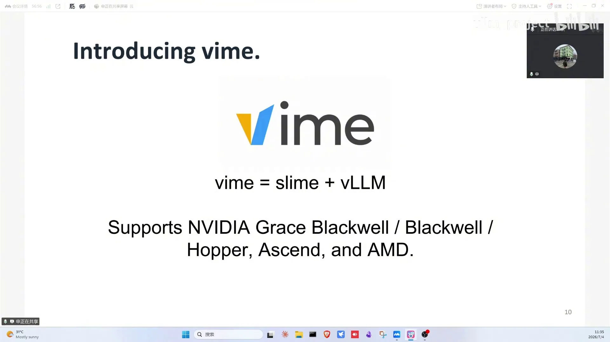 |
| 其实维护一个 fork 挺难的。slime 目前仍处于 fork 发展的早期阶段，主要还是要靠上游喂饭吃——靠上游的特性。其实现在（vLLM）在推理端新增的东西不是很频繁：如果不考虑一些（新硬件的）cache，最近一个月跟（推理）不相关的 PR 可能就 10% 到 15% 这样，主要还是训练和算法这一块的改动。 [【跳转到 31:14】](https://www.bilibili.com/video/BV1LGMP6FEQa/?t=1874) |  |
| 为了在上游能用的东西我们也能用上，同时结合我们人手并不是很多的现状，我们现在的策略主要是尽可能复用上游。我们的复用策略的话…… [【跳转到 31:39】](https://www.bilibili.com/video/BV1LGMP6FEQa/?t=1899) |  |
| 主要就是保持我们接口一致，以及大概每两周会同步一次上游。slime 是个 fork，但是上游一直在更新，也是非常火热的框架——虽然没有像 veRL 更新得这么频繁。要持续同步（上游）的话，其实有很多机械繁琐的过程…… [【跳转到 32:04】](https://www.bilibili.com/video/BV1LGMP6FEQa/?t=1924) |  |
| 而且很容易可能就跑偏了。那我们如何把它尽可能自动化、AI 化一点呢？ [【跳转到 32:29】](https://www.bilibili.com/video/BV1LGMP6FEQa/?t=1949) | 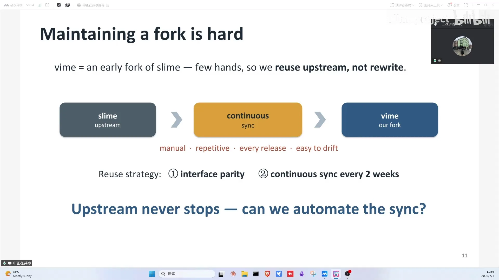 |
| 我们这边首先参考了 Cursor 相关的一些内容：Cursor 自己维护一个（上游项目）的 fork——他们是大概七十亿估值的一个 agent 公司——他们用 agent 把维护 fork 的过程自动化。其实关键的概念就是 control theory（控制论）…… [【跳转到 32:45】](https://www.bilibili.com/video/BV1LGMP6FEQa/?t=1965) | 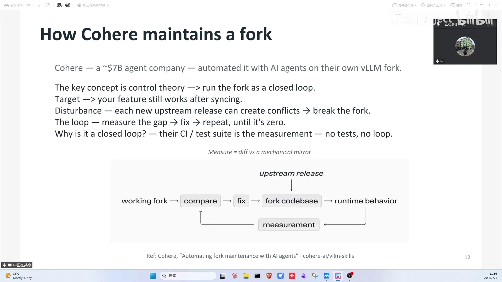 |
| 他们把维护 fork 的过程形成了一个闭环。闭环的意思就是一个带反馈的、可以自动纠偏的工作流程。举个例子：比如你有一个目标——你想要房间里的温度是 25 度…… [【跳转到 33:10】](https://www.bilibili.com/video/BV1LGMP6FEQa/?t=1990) |  |
| 你可能在空调里设的是 25 度。这时如果你有一个温度计，就可以测量现在房间是多少度。拿测量值和 25 度一比较，差多少就是误差，对吧。你可以进一步通过遥控器决定是继续制冷还是停掉制冷。循环这个迭代过程，最终肯定可以达到 25 度。这个测量、比对、纠正的过程其实就是闭环了。反过来说开环是没有反馈的：如果没有温度计，就算设定 25 度，你也不知道实际上是否达到目标，靠体感可能有点困难。所以关键是…… [【跳转到 33:35】](https://www.bilibili.com/video/BV1LGMP6FEQa/?t=2015) |  |
| （接上） [【跳转到 34:00】](https://www.bilibili.com/video/BV1LGMP6FEQa/?t=2040) |  |
| 要有一个测量和衡量的标准。没有测试以及衡量标准的话，就没有所谓的闭环了。Cursor 的目标就是每次同步之后它的功能还能正常工作。这里面会有干扰：每一次上游 merge 一个新 PR，要合入到你的 fork 里，都可能带来一些破坏——它会把你的 fork 给 break。（测试）环境就是去测量这个差距，然后修复直到差距为零。为什么说它是闭环呢？他们的 CI 以及测试——包括精度和 perf——这些都是测量的手段…… [【跳转到 34:25】](https://www.bilibili.com/video/BV1LGMP6FEQa/?t=2065) |  |
| （接上） [【跳转到 34:50】](https://www.bilibili.com/video/BV1LGMP6FEQa/?t=2090) | 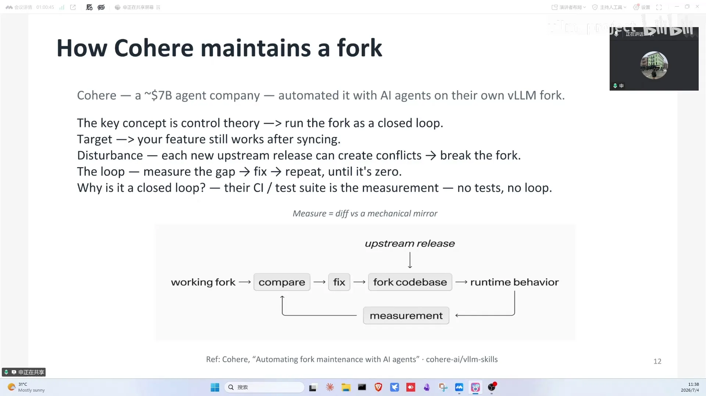 |
| 从测量结果出发，agent 就可以有比较确定性的反馈：有任何问题他就可以去二分——比如代码的二分、镜像的二分等等——直到最终完成目标：把 CI 和测试全部 pass。 [【跳转到 35:15】](https://www.bilibili.com/video/BV1LGMP6FEQa/?t=2115) |  |
| 有同学问：agent 后面用的模型是啥你知道吗？——这个我还真不知道，估计就是（某个模型）。——其实这块我很有经验：veRL-Omni 也需要一直跟 vLLM 做 rebase。我们现在用的是 DeepSeek V4，因为这个模型最便宜，性能也非常好。我们做一次大版本的 rebase 大概也就花 100 人民币，基本上 CI 绝大多数都能过，只有极少数一两个过不了，再手动修一下就行了。——可以可以，可以参考一下。 [【跳转到 35:40】](https://www.bilibili.com/video/BV1LGMP6FEQa/?t=2140) |  |
| （接上） [【跳转到 36:05】](https://www.bilibili.com/video/BV1LGMP6FEQa/?t=2165) |  |
| 因为我们其实也试过很多其他的模型。现在 DeepSeek V4 是我们见到的最便宜而且效果基本上最好的模型。——OK OK。——你可以考虑一下 GLM-5.2。我们之前申请过 GLM5 的 API，但是后来号被封了。 [【跳转到 36:30】](https://www.bilibili.com/video/BV1LGMP6FEQa/?t=2190) |  |
| 但是后来号被封了。——（因为）他感觉你是在做 AI infra 的，怀疑你是在爬数据，直接把你号给封了。我们那个同学好像还充了几千块钱，然后号就被封了。——要牢记。OK。 [【跳转到 36:55】](https://www.bilibili.com/video/BV1LGMP6FEQa/?t=2215) | 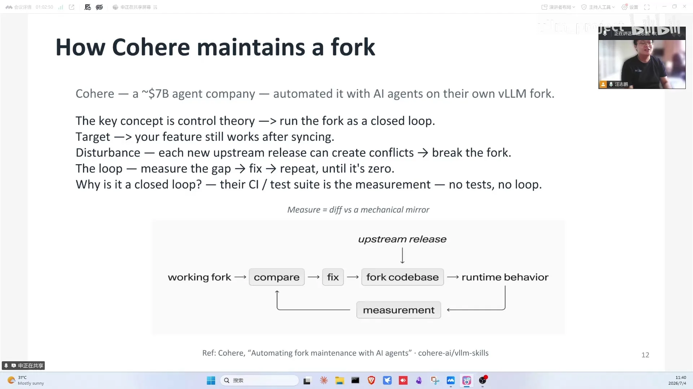 |
| 其实我们参考的就是 Cursor 的实践：维护 fork 也是用同样的闭环。不同的地方是：Cursor（的 fork）……其实就是 slime 在 rollout engine 上做了一个比较系统性的替换，其中大部分还是比较 mechanical 的改动…… [【跳转到 37:20】](https://www.bilibili.com/video/BV1LGMP6FEQa/?t=2240) | 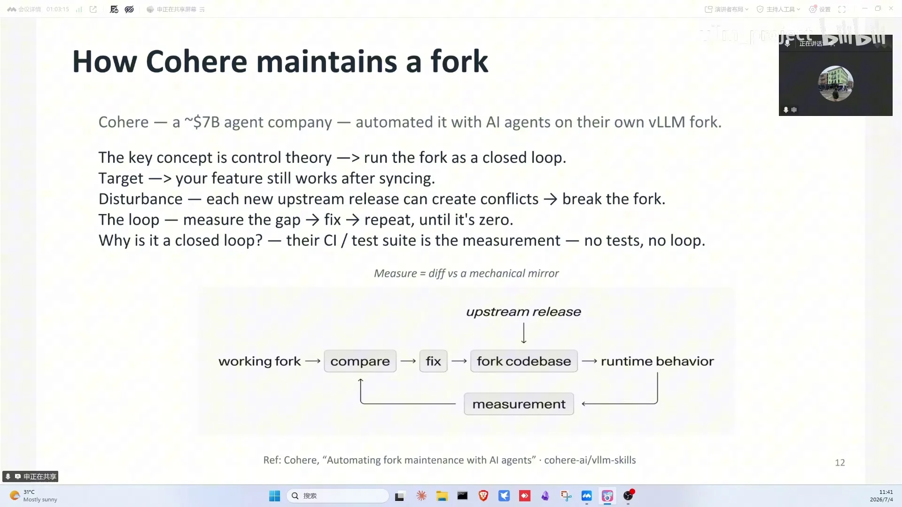 |
| 少部分地方是这种引擎的重写——相对比较大的改动。但是总体的接口和代码规模都保持一致。为此我们帮 agent 建立知识库：首先是一张翻译表——很多参数、相对比较简单的东西，通过翻译表来做（原框架）到 vLLM 的参数映射；稍微复杂一点的，通过一个历史表：人为验证一些历史上的大改动为什么存在，帮 agent 回顾。 [【跳转到 37:45】](https://www.bilibili.com/video/BV1LGMP6FEQa/?t=2265) | 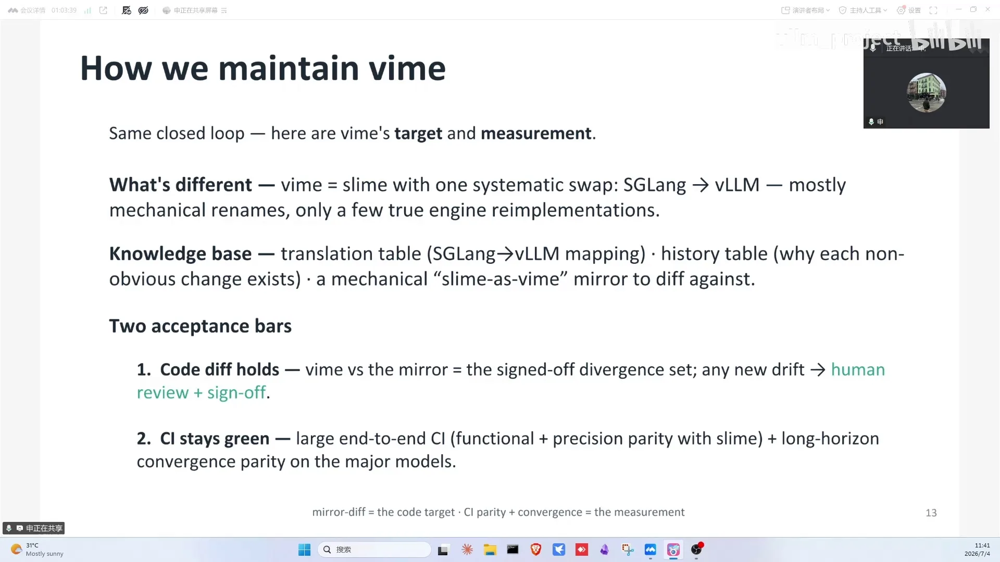 |
| （接上） [【跳转到 38:10】](https://www.bilibili.com/video/BV1LGMP6FEQa/?t=2290) | 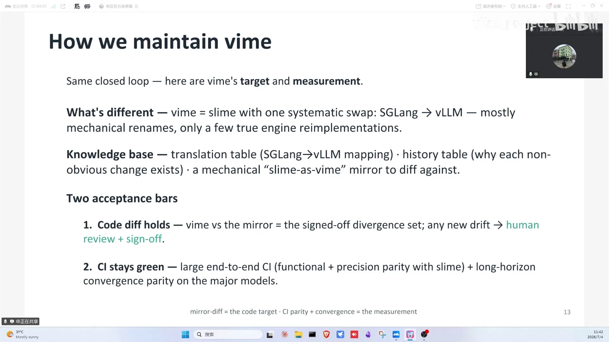 |
| 我们闭环的测量方式：第一是代码层面——代码的 diff 要和新 PR merge 之前尽可能一致。如果有一些新的偏移，比如像（新增）文件之类，可能需要人工确认。第二是实验层面：我们所有的（训练）CI 要一直是绿的，包括端到端的功能以及精度上的对齐。同时我们还…… [【跳转到 38:35】](https://www.bilibili.com/video/BV1LGMP6FEQa/?t=2315) | 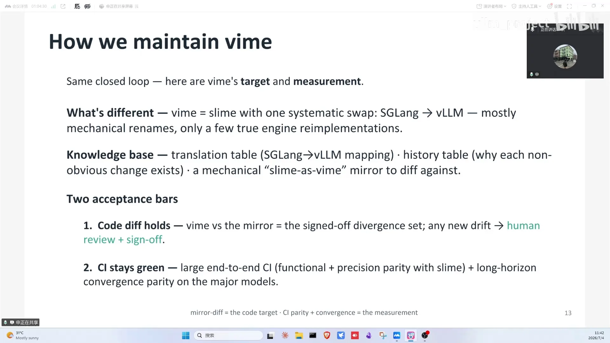 |
| 做一些长期的（训练）实验：比如我们在一些主要的模型上和（原版）保持一致。这里举了两个例子：一个是 dense 的 Qwen3-4B 模型，以及 Qwen3-30B 的 MoE 模型。比如训练的 reward，以及 logprobs 这两个指标上都保持了一致。这是 4B 的图，这两个是 Qwen3-30B（MoE）的…… [【跳转到 39:00】](https://www.bilibili.com/video/BV1LGMP6FEQa/?t=2340) | 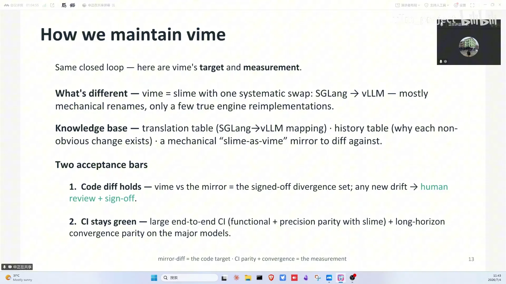 |
| （接上） [【跳转到 39:25】](https://www.bilibili.com/video/BV1LGMP6FEQa/?t=2365) |  |
| 上面是（原版）下面是 slime，我还没有试过这个功能，很好。——哦对，其实我看第二个图 rollout reward 上升趋势也不是很明显，对吧？——对，但还是有的。 [【跳转到 39:50】](https://www.bilibili.com/video/BV1LGMP6FEQa/?t=2390) | 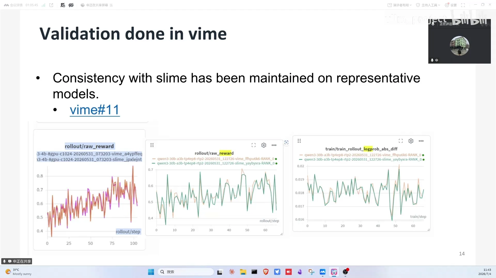 |
| 我觉得其实只要保持一致就行了，从这个层面上来说。（对比原版）应该有个十几个点（提升），我觉得还是可以的。（某指标）17 个点。然后我们也尝试跑通了 GB300 上 GLM-5.2 的训练：rollout 的配置是 EP8、TP8，使用 MTP，八个 vLLM instance；训练这边是 PP4 加一系列并行配置。现在讲一下 ongoing work…… [【跳转到 40:15】](https://www.bilibili.com/video/BV1LGMP6FEQa/?t=2415) | 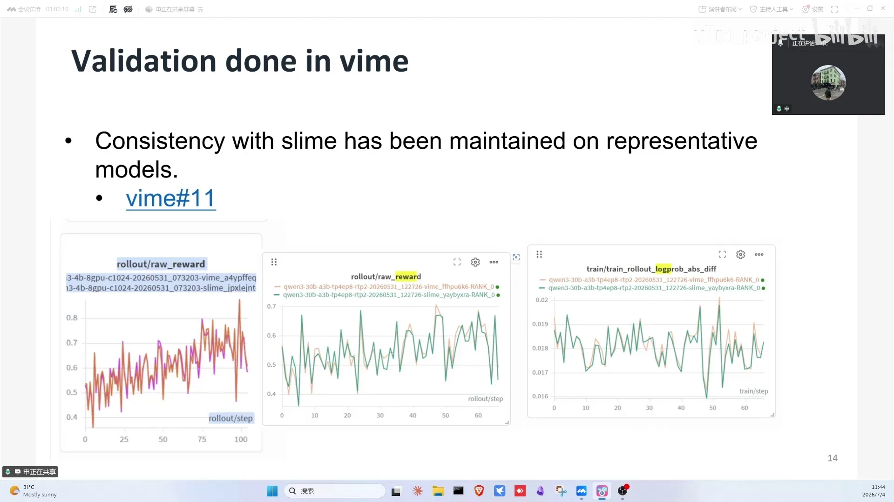 |
| （接上） [【跳转到 40:40】](https://www.bilibili.com/video/BV1LGMP6FEQa/?t=2440) | 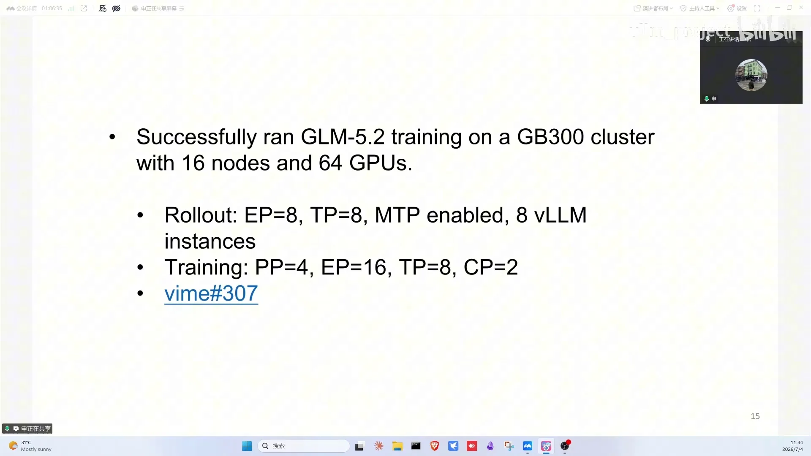 |
| 现在想做的事情是让框架更好的可用性。我们的理解是提供更长的上下文以及多模态支持，这可能也意味着更大规模的 RL 训练。要 scaling 的话——什么在阻碍 scaling 呢？有个背景知识：在 RL 里要做长上下文、AR 模型以及 MoE 模型训练，很多时候要从 rollout 集群往训练集群搬很多数据：比如多模态数据像 pixel values，还有（重计算）的 extra indices…… [【跳转到 41:05】](https://www.bilibili.com/video/BV1LGMP6FEQa/?t=2465) | 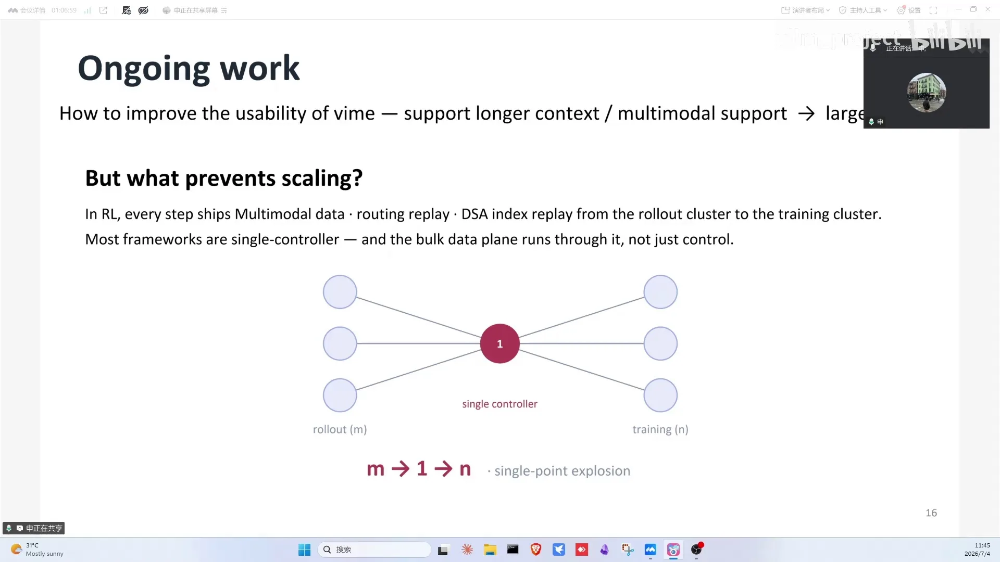 |
| （接上） [【跳转到 41:30】](https://www.bilibili.com/video/BV1LGMP6FEQa/?t=2490) |  |
| 还有（各类）index。为了 training/inference 的一致性，需要进行数据搬运。搬运的过程目前可以从下面这个图理解：现在有个所谓的 single controller…… [【跳转到 41:55】](https://www.bilibili.com/video/BV1LGMP6FEQa/?t=2515) | 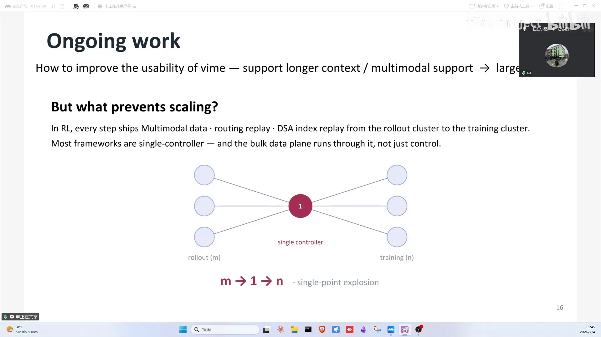 |
| 这里可以准备各个不同的机器，single controller 往往在 0 号机器或者头节点上。我们可能要先从推理的各个节点把数据聚合到 0 号节点，然后再分发到训练的各个节点。这个过程可能会导致 head 节点的 CPU 爆炸：聚合这么多数据 CPU 可能撑不住。甚至序列化的开销也非常大，可能会产生所谓的 single point（瓶颈）这样的问题。 [【跳转到 42:20】](https://www.bilibili.com/video/BV1LGMP6FEQa/?t=2540) | 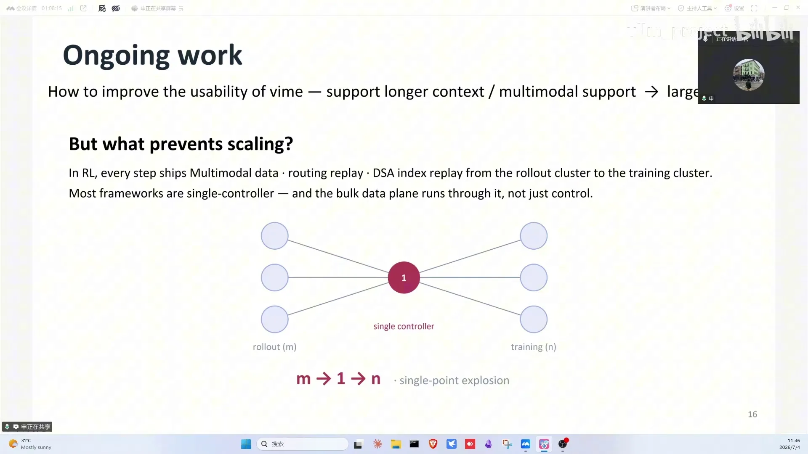 |
| （接上） [【跳转到 42:45】](https://www.bilibili.com/video/BV1LGMP6FEQa/?t=2565) | 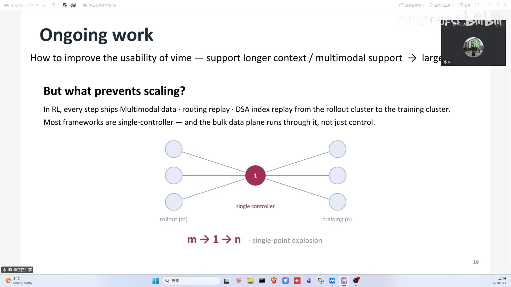 |
| 我们的 fix 方案是把数据面和控制面尽可能分离——这也是非常自然的想法：把大数据直接从生产方送到消费方，data path 上没有任何多余的、不必要的开销，没有必要多绕几跳。 [【跳转到 43:10】](https://www.bilibili.com/video/BV1LGMP6FEQa/?t=2590) |  |
| 大概就是这个意思：不经过所谓的 single controller。single controller 可以去做一些 metadata 的管理，实际的大数据走数据面。短期我们通过 Mooncake store 以及（传输组件）作为后端来搭建数据面，跳过 Ray 的一些比较大的开销：比如它的序列化、GPU 到 CPU 的搬运。虽然他们最近也出了（新）方案，我们都可以尝试，（Ray）也在做类似的集成。所以现在 slime 是采用这种方案，实际可以测一测。 [【跳转到 43:35】](https://www.bilibili.com/video/BV1LGMP6FEQa/?t=2615) |  |
| （接上） [【跳转到 44:00】](https://www.bilibili.com/video/BV1LGMP6FEQa/?t=2640) | 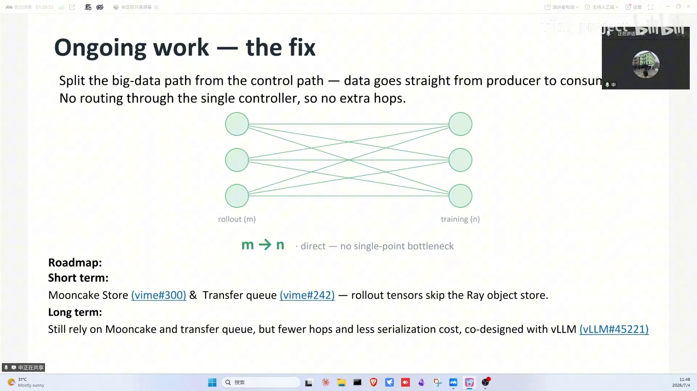 |
| 长期来说我们可能会跟（他们）做一些 co-design，把 Mooncake 更深入地结合到 vLLM 后端里。目的是获得更优的开销、更少的序列化开销。——嗯对，大概就是这样。——OK。然后我也做一个预告：下个星期直播会讲 KV connector，邀请的嘉宾来自 Mooncake 和 LMCache。 [【跳转到 44:25】](https://www.bilibili.com/video/BV1LGMP6FEQa/?t=2665) |  |
| （接上） [【跳转到 44:50】](https://www.bilibili.com/video/BV1LGMP6FEQa/?t=2690) |  |
| 一个是 Mooncake 的（同学），还有 LMCache 的（同学），很多人应该很熟悉。——好，我们继续。今天我准备的就是这些东西。——OK，那直播间同学有没有什么问题想问的呀？ [【跳转到 45:15】](https://www.bilibili.com/video/BV1LGMP6FEQa/?t=2715) |  |
| 机会很难得呀。——vLLM 是否支持（训练）code agent 呢？——这个是支持的：只要 slime 支持（的框架）就支持，我们也跑过相关的实验…… [【跳转到 45:40】](https://www.bilibili.com/video/BV1LGMP6FEQa/?t=2740) | 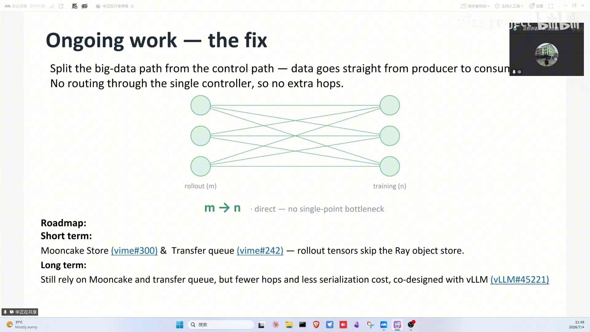 |
| 基于这个，包括我们的云服务平台是（某厂商）提供的远程 CPU 沙盒。具体实践当中，把我们自己的（环境）下载、包括版本上传到沙盒里，然后通过 Anthropic 或者 Claude 这个 gateway 提供背后的推理服务。这就完成了一个黑盒的方案。我觉得也可以解释一下什么是黑盒和白盒。 [【跳转到 46:05】](https://www.bilibili.com/video/BV1LGMP6FEQa/?t=2765) |  |
| （接上） [【跳转到 46:30】](https://www.bilibili.com/video/BV1LGMP6FEQa/?t=2790) |  |
| 我们为了让 agent 训练和实际生产上用的 agent 环境完全一致，会想要在训练当中也让 agent 去使用一些 harness，比如像 Claude Code、Codex 这种 real-world 的 harness。但是（闭源）的话可理解为所谓黑盒：比如实践中我们只会 run 一个命令——像"Code，你帮我做一个什么什么事"——对吧。我们就很难在里面自定义我们想要的 system prompt，包括整个工作流是怎么样的…… [【跳转到 46:55】](https://www.bilibili.com/video/BV1LGMP6FEQa/?t=2815) |  |
| （接上） [【跳转到 47:20】](https://www.bilibili.com/video/BV1LGMP6FEQa/?t=2840) |  |
| 我们只能通过外部的命令给它输入，但内部它是怎么做的你可能比较难知道。以及它的这些 tools——它的 bash（执行）等这些工具手段——你都很难修改。但是白盒的话…… [【跳转到 47:45】](https://www.bilibili.com/video/BV1LGMP6FEQa/?t=2865) | 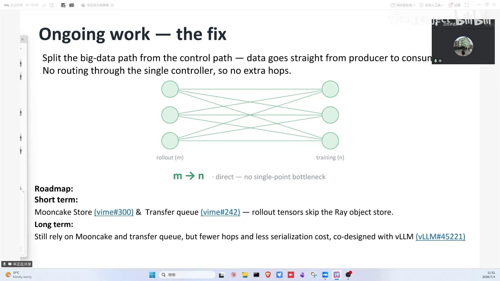 |
| 白盒就是从研究者角度去探索更前沿的东西：不只是 coding agent 这种场景，比如像 desktop 的 GUI、browser 这些场景，甚至比如说像具身 AI、真机训练。那 Claude Code 这种 harness…… [【跳转到 48:10】](https://www.bilibili.com/video/BV1LGMP6FEQa/?t=2890) |  |
| 它提供的工具集可能就不太能够满足了。比如像截图、鼠标点击这些 GUI 的东西，（闭源 API）可能就没有办法支持。为了解决这些比较 diverse 的、advance 的任务，我们需要更大的灵活性来 fully customize：自定义 system prompt 以及工作流——第一步干什么第二步干什么，以及我们能使用什么样的工具。 [【跳转到 48:35】](https://www.bilibili.com/video/BV1LGMP6FEQa/?t=2915) |  |
| 有这么一个 perception（感知）、决策、执行的过程，可能会形成一个 loop，一般就叫 agent loop。这个 agent loop 完全可以被你自己定义：第一步调用推理、第二步调用什么工具、最多多少轮——这些都可以自定义。这就是所谓白盒的状态，它对你的可观测性以及数据收集会更加友好。 [【跳转到 49:00】](https://www.bilibili.com/video/BV1LGMP6FEQa/?t=2940) | 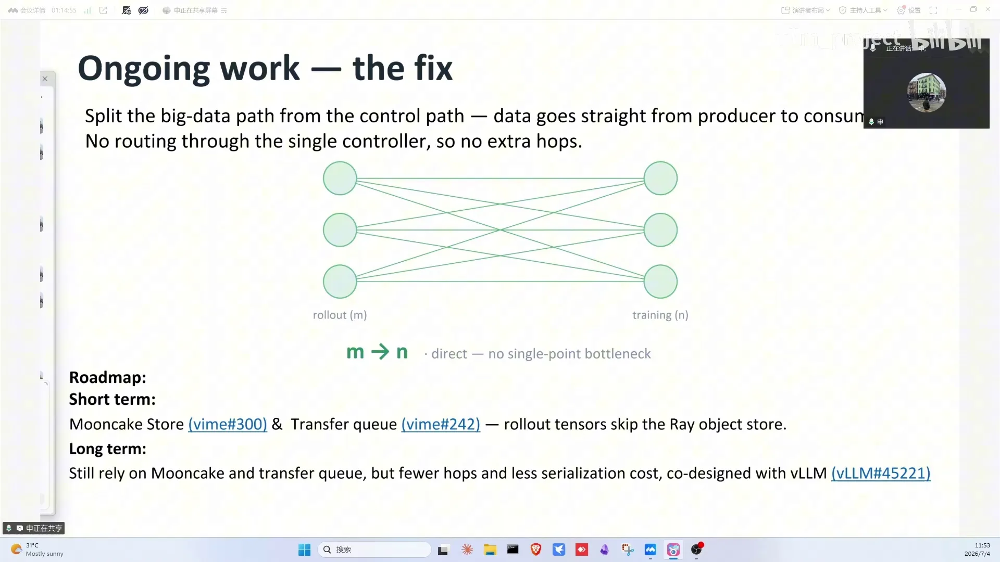 |
| （接上） [【跳转到 49:25】](https://www.bilibili.com/video/BV1LGMP6FEQa/?t=2965) | 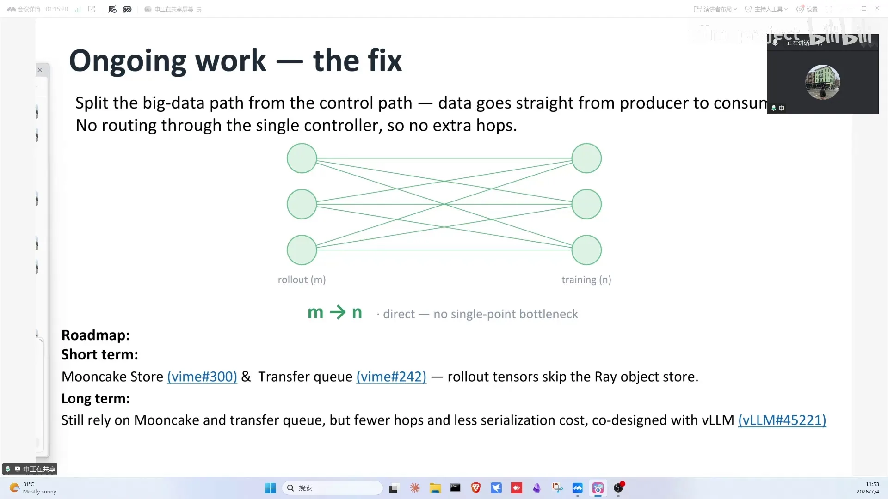 |
| 比如你要去访问一个 webpage，可能超时了。如果你用黑盒训练，这个超时信息可能很难通过 gateway 获得；能用白盒的话就更方便获得一些可观测性。 [【跳转到 49:50】](https://www.bilibili.com/video/BV1LGMP6FEQa/?t=2990) |  |
| 好，然后有同学问：单轮 token id 对齐和多轮（对话）漂移的问题，和 slime 的解决方案一样吗？——这个没有任何区别，其实这些都是最基本的。对。——好。如果做 rollout 的 AR/DiT 分离部署，工作量主要在打通 vLLM 和（Omni）？ [【跳转到 50:15】](https://www.bilibili.com/video/BV1LGMP6FEQa/?t=3015) |  |
| 这个东西我可以讲一下：现在 vLLM 的核心其实在于 HTTP server-based 的一种架构。如果我们想让框架支持 vLLM-Omni——首先最需要做的事情就是让 vLLM-Omni 能够支持 HTTP 请求…… [【跳转到 50:40】](https://www.bilibili.com/video/BV1LGMP6FEQa/?t=3040) | 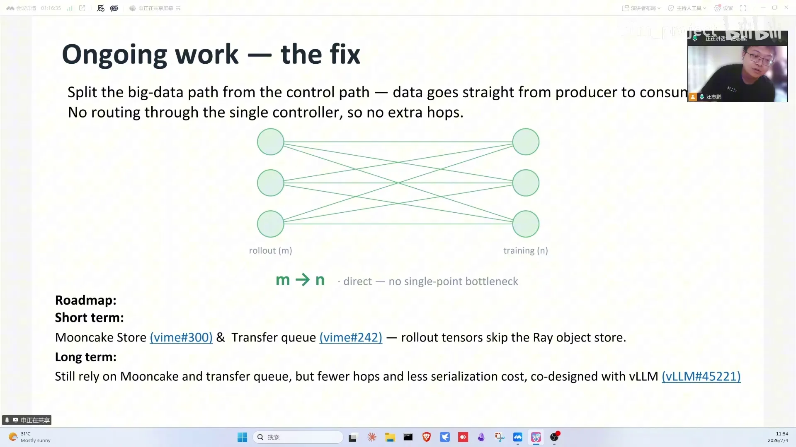 |
| 来支持权重同步。权重同步这块其实有好多个请求需要实现。然后后面还需要考虑：让它支持（自定义）output，能够通过 HTTP 的形式正常把训练时的 trajectory 传出来。如果是做分布式部署的话…… [【跳转到 51:05】](https://www.bilibili.com/video/BV1LGMP6FEQa/?t=3065) |  |
| 其实我们可以参考：它会有一个 router 的 manager group，可以支持多种类型的 rollout 部署，里面也支持像 PD 分离形式的部署。我们只需要复用这一套接口…… [【跳转到 51:30】](https://www.bilibili.com/video/BV1LGMP6FEQa/?t=3090) |  |
| 主要是去实现这个 AR/DiT 形式的部署就行了。对，包括 PD 也是这么做的。——这个特性是不是也是从 0.3 开始才有的？——之前就有。——因为我之前看子琳那个博客，他专门讲 0.3 的…… [【跳转到 51:55】](https://www.bilibili.com/video/BV1LGMP6FEQa/?t=3115) |  |
| 之前就有。——OK，那我理解应该主要是混合的部署可能是 0.3 有了？——之前我理解有一点，他可能是把之前的东西也都放到 0.3 那个博客里去说了。——应该是可能在 0.2.4 之后…… [【跳转到 52:20】](https://www.bilibili.com/video/BV1LGMP6FEQa/?t=3140) | 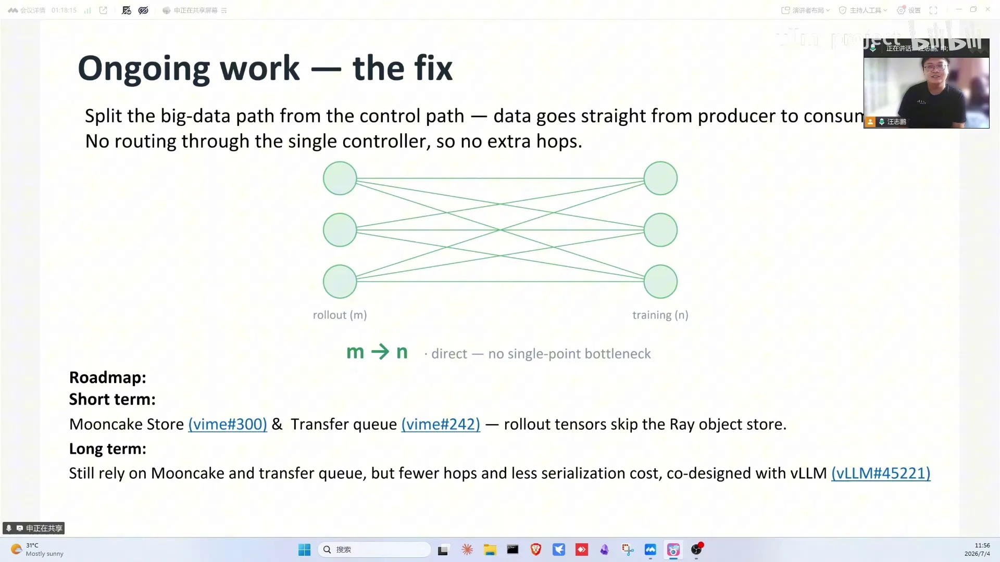 |
| 对对对，我们是从那个版本开始改。——OK，因为我主要看它代码是从（0.3）版本开始看的，所以我不知道之前有没有。不过我专门看了一下它那个 rollout 那块的 wrapper 怎么写的。——好，直播间还有同学有什么问题吗？ [【跳转到 52:45】](https://www.bilibili.com/video/BV1LGMP6FEQa/?t=3165) |  |
| 有同学问：有适合新手的 case 吗？想试一试。——我们的 case 主要考虑到大部分同学的（资源）相对来说比较保守…… [【跳转到 53:10】](https://www.bilibili.com/video/BV1LGMP6FEQa/?t=3190) | 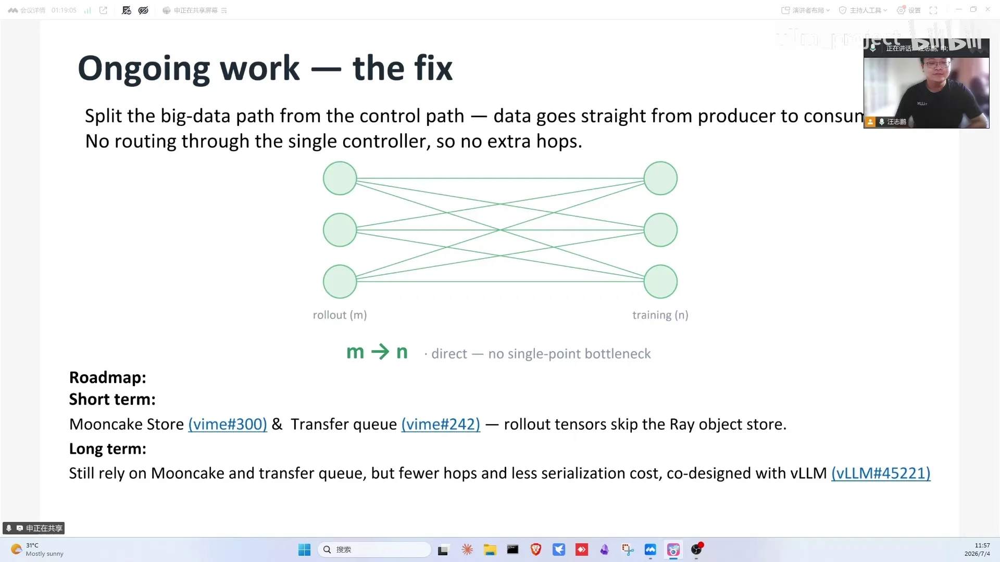 |
| 但又比较有代表性：比如 Qwen3-4B，以及（某）16B-A3B。更大一点的话 30B-A3B 可能单机八卡可以满足。——我觉得其实也是看计算资源够不够。如果计算资源够的话…… [【跳转到 53:35】](https://www.bilibili.com/video/BV1LGMP6FEQa/?t=3215) |  |
| 后面我是想投入一些精力做一个新的分支，主要做多模态这一块。如果同学资源确实很够的话可以一起参与开发。因为一方面我们需要在（slime）里面做一层…… [【跳转到 54:00】](https://www.bilibili.com/video/BV1LGMP6FEQa/?t=3240) | 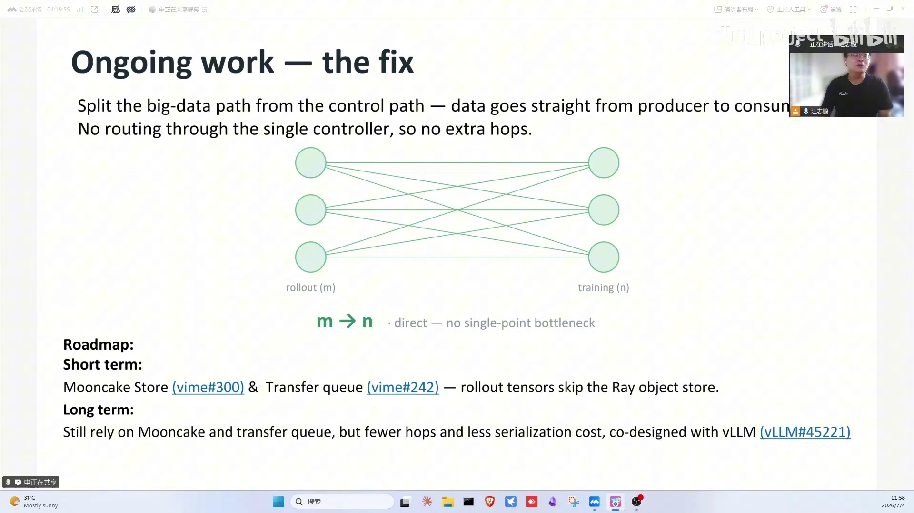 |
| 类似于现在这个 rollout 里的：要添加一个专门对 vLLM-Omni 做适配的（层）。还有（引擎）里面应该会要加很多新的接口，要不然现在完全没办法用纯 HTTP 形式来做后训练。——OK。反正（多模态）这一次我不觉得有什么问题，我们完善了一波之后。——对对对。以及只有 encoder 这一块的模型，其实我觉得都没有什么问题，就能做挺好。——其实之前我们有一个（学生团队）…… [【跳转到 54:25】](https://www.bilibili.com/video/BV1LGMP6FEQa/?t=3265) |  |
| （接上） [【跳转到 54:50】](https://www.bilibili.com/video/BV1LGMP6FEQa/?t=3290) |  |
| 提的那个 PR 现在合进去了吗？——那个还 OK。其实（传输）这一块有很多种方法去传。如果资源很足的话……因为我们主要做跨机传输：一个（方案）是 NCCL，一个是（另）一种，还有一些混合的（同步）传输。这些都需要具体试一试，比一下性能是不是真的像想象中那么好。 [【跳转到 55:15】](https://www.bilibili.com/video/BV1LGMP6FEQa/?t=3315) |  |
| （接上） [【跳转到 55:40】](https://www.bilibili.com/video/BV1LGMP6FEQa/?t=3340) | 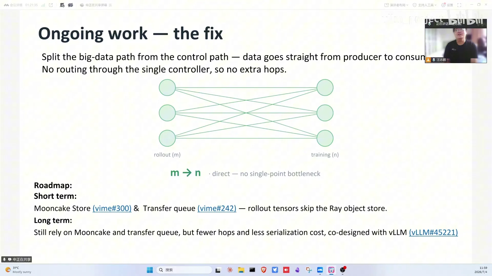 |
| 然后有同学问：veRL 和 slime 最主要的差异在哪？框架性能会更好吗？——我觉得他们的生态位不太一样。slime 目前立足于跟（veRL）对齐，比较轻量、简洁、好改。在比较主要的 LLM 场景下两者的性能应该是没有任何差别的。 [【跳转到 56:05】](https://www.bilibili.com/video/BV1LGMP6FEQa/?t=3365) | 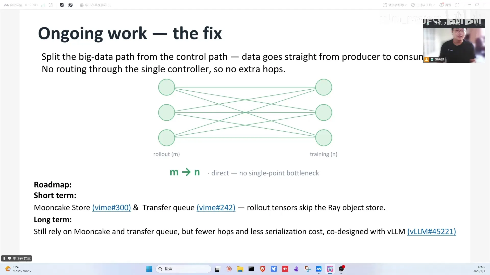 |
| 但是比如说像（多模态）的话，veRL 由于有（传输组件）的支持，它在数据面上的表现肯定是更加优异的。——嗯嗯，因为 veRL 那边毕竟开发时间很长了，支持的特性会多很多，对吧。但代价就是代码变得极其复杂，特别是它为了支持多后端的话…… [【跳转到 56:30】](https://www.bilibili.com/video/BV1LGMP6FEQa/?t=3390) |  |
| 必然会导致它做很多抽象。——是是是。我觉得如果你很懂这块、不希望直接用开箱即用的——想开箱即用的话，veRL 肯定是最好的选择；如果想在上面做改动、适配一些新算法的话，可能 slime 会更加适合。 [【跳转到 56:55】](https://www.bilibili.com/video/BV1LGMP6FEQa/?t=3415) | 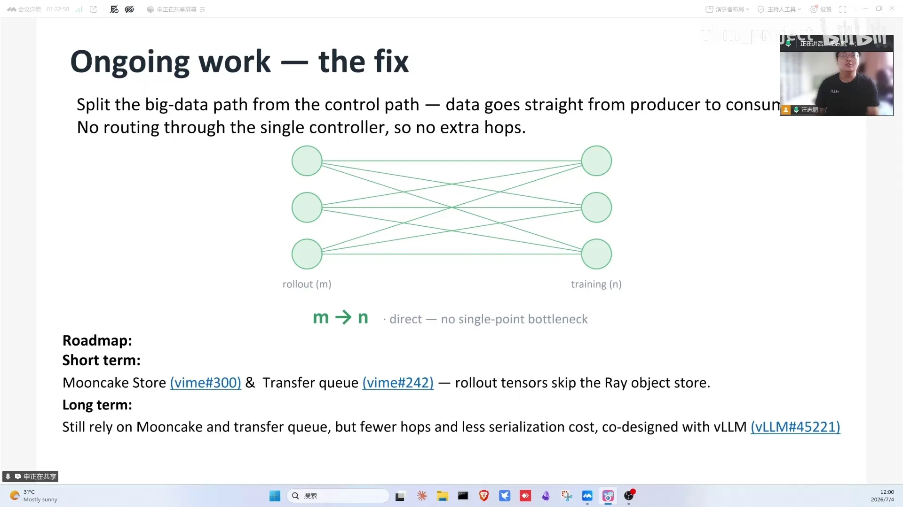 |
| 然后有同学问：训推一致的（数值）表现怎么样？——数值一致性可以看到刚才跟（原版）有一个对比，其实（偏差）是很低的。现在一般是通过像 logprob（对比）来判断训练和推理的情况如何…… [【跳转到 57:20】](https://www.bilibili.com/video/BV1LGMP6FEQa/?t=3440) |  |
| 作为非常成熟的一个（推理）框架，这方面肯定没有什么问题。如果想追求更加确定性的、甚至 bitwise 相同的表现，我推荐看一下我们和 Meta（TorchTitan）一起做的那个 blog。 [【跳转到 57:45】](https://www.bilibili.com/video/BV1LGMP6FEQa/?t=3465) |  |
| 我们在那个框架中完成了推理和训练完全一致的 zero drift 表现。但势必会带来一些性能上的（劣化）：一些比较激进的优化可能做不了。——诶，怎样做到完全的一致性？ [【跳转到 58:10】](https://www.bilibili.com/video/BV1LGMP6FEQa/?t=3490) |  |
| 算子肯定要一样的，完全用一套算子是吧。——嗯哦那好。因为我听说之前不做训推（分离）——现在都是用两个引擎了，以前只有一个引擎的时候…… [【跳转到 58:35】](https://www.bilibili.com/video/BV1LGMP6FEQa/?t=3515) |  |
| 大家就是想办法在一个引擎上做推理上的改动，这样是百分之百可以做到训推一致性的：让训练引擎在行为上有些接口可以做推理任务。现在其实 Megatron 也在做这么个事情。——对，其实 Megatron…… [【跳转到 59:00】](https://www.bilibili.com/video/BV1LGMP6FEQa/?t=3540) | 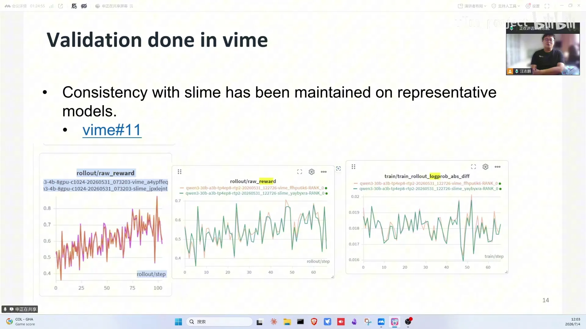 |
| 然后有同学问：RL 的策略和打分模型是怎么定下来的？reward SLO 和打分模型怎么定下来的？——我觉得这个非常 task-specific。简单的题目可以是确定性的（设计）：比如填表格——填了多少个就给多少分，填正确的除以总的表格个数就是分数。更复杂的东西可能就需要一个 model 帮你打分。 [【跳转到 59:25】](https://www.bilibili.com/video/BV1LGMP6FEQa/?t=3565) | 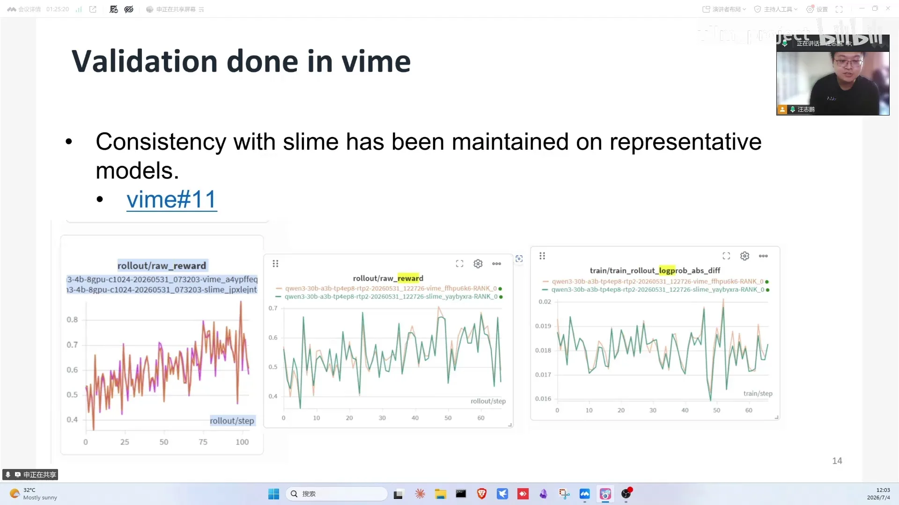 |
| （接上） [【跳转到 59:50】](https://www.bilibili.com/video/BV1LGMP6FEQa/?t=3590) |  |
| 我反正感觉，我们做框架这一块更主要关心的是能不能跑通、指标上有没有上升趋势。具体什么样的东西更好，得训练同学去试。我们继承了 slime 的特性：给算法同学提供了比较大的灵活性，一些关键的算法模块都可以自定义。而且侵入性不需要很大，这个是非常重要的。 [【跳转到 60:15】](https://www.bilibili.com/video/BV1LGMP6FEQa/?t=3615) |  |
| （接上） [【跳转到 60:40】](https://www.bilibili.com/video/BV1LGMP6FEQa/?t=3640) | 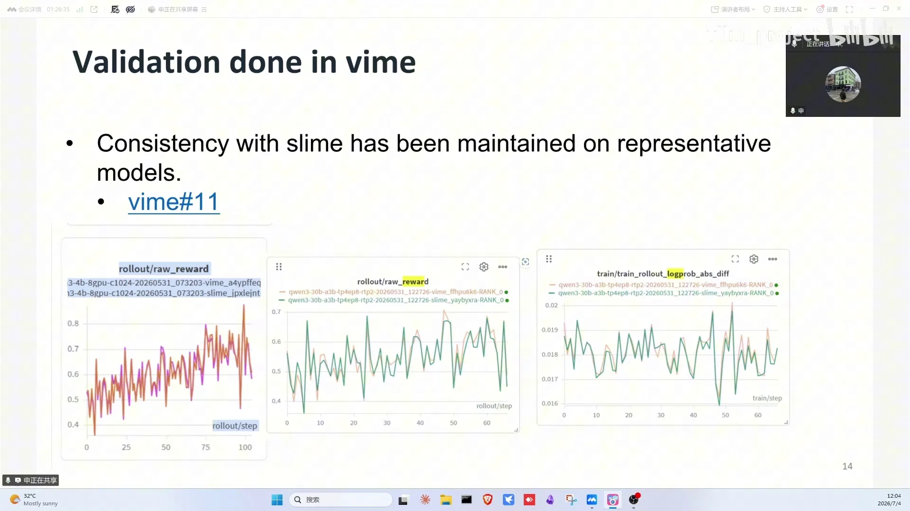 |
| 好，还有没有什么问题？如果没有问题的话，请还在现场的同学点个关注。我们每周六都会有相关的直播。后面我也会把直播录像上传，同时上传这一次直播的 PPT，大家也可以把它推荐给自己的亲朋好友。我这边发一下 slime 的群链接吧。 [【跳转到 61:05】](https://www.bilibili.com/video/BV1LGMP6FEQa/?t=3665) |  |
| 对，你可以发一下。——有同学问：哪些推理常用的优化，考虑到训推一致训练不能用？——我觉得主要就是（部分）算子。kernel 可能是一个点…… [【跳转到 61:30】](https://www.bilibili.com/video/BV1LGMP6FEQa/?t=3690) | 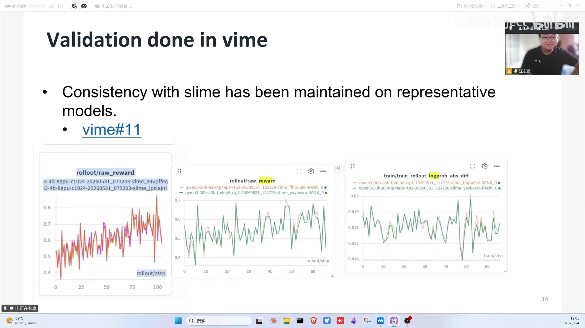 |
| 因为（非确定性）kernel 应该是主要导致训推不一致的，对吧。——对。还有一些（操作）可能会产生不一致：比如像 index、像（采样）这些。当然现在也有很多所谓的 deterministic 的 kernel…… [【跳转到 61:55】](https://www.bilibili.com/video/BV1LGMP6FEQa/?t=3715) | 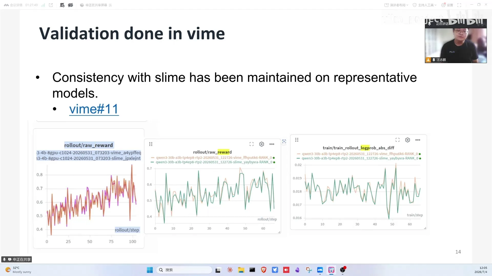 |
| 比如 deterministic 的（采样）kernel，用来帮助像 DeepSeek V4 的训练更加稳定。——当然如果你一个比较优秀的框架的话，本身应该不太需要通过 deterministic 的 kernel 去强制（输出）一致：它本身就应该一致。——嗯对。 [【跳转到 62:20】](https://www.bilibili.com/video/BV1LGMP6FEQa/?t=3740) | 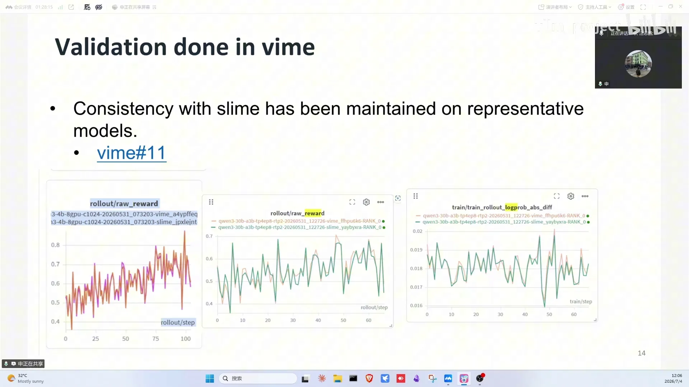 |
| 哪怕不一致的话，也可以用（重算）这些手段去做补救，对吧。——对，一般来说共识就是：你不会默认去开这些东西，直到你产生了问题才去进行补救，而不是一开始就把补救的东西上到训练里，因为它可能会对性能产生一些影响。 [【跳转到 62:45】](https://www.bilibili.com/video/BV1LGMP6FEQa/?t=3765) |  |
| 好，那我们今天的直播就到此结束。没点关注的同学点个关注，下一周同一时间还会继续做新的直播…… [【跳转到 63:10】](https://www.bilibili.com/video/BV1LGMP6FEQa/?t=3790) |  |
| 下一期直播主要是讲 KV connector 的。感兴趣的可以下周 11 点钟来我们直播间听一下。 [【跳转到 63:35】](https://www.bilibili.com/video/BV1LGMP6FEQa/?t=3815) | 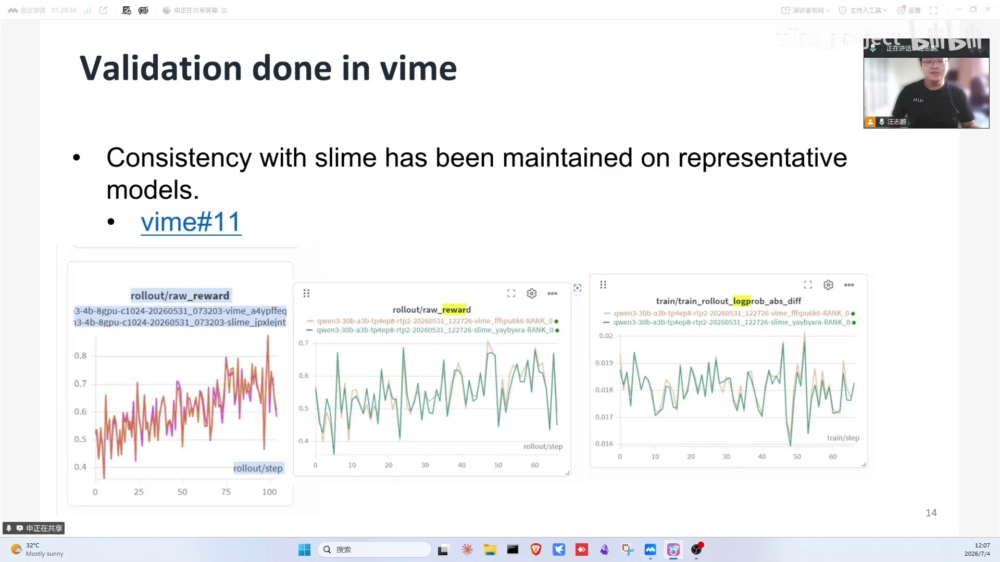 |
| 好拜拜，谢谢谢谢。 [【跳转到 63:44】](https://www.bilibili.com/video/BV1LGMP6FEQa/?t=3824) | 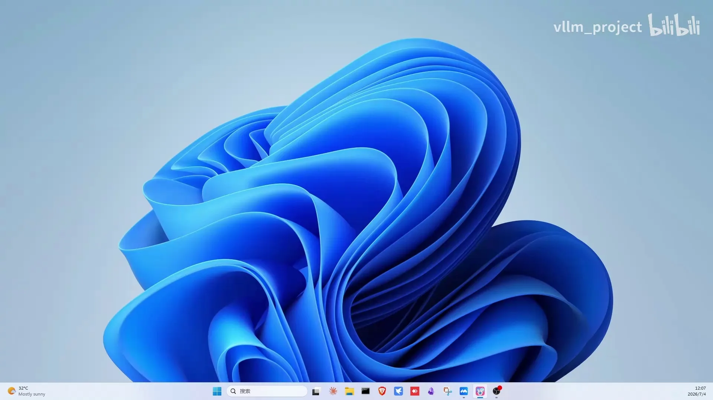 |
| 嗯拜拜。 [【跳转到 63:49】](https://www.bilibili.com/video/BV1LGMP6FEQa/?t=3829) | 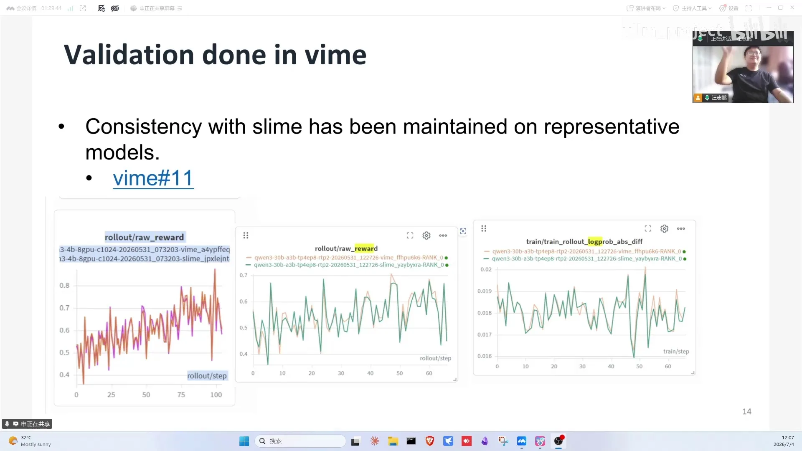 |