# vLLM小课堂（十一）：让长序列 MoE RL训练更好调 原始文稿（图-字幕分栏）

| 字幕文本 | 画面 |
| :--- | ---: |
| 也是感谢汪老师的邀请。我是 NVIDIA Megatron 的工程师，我在 RL 社区做了挺多工作，本职工作是做 Megatron 的开发优化——哈哈有点嘴瓢。我在 rollout 这个强化学习框架里…… [【跳转到 00:00】](https://www.bilibili.com/video/BV1WLKw6aEDq/?t=0) | 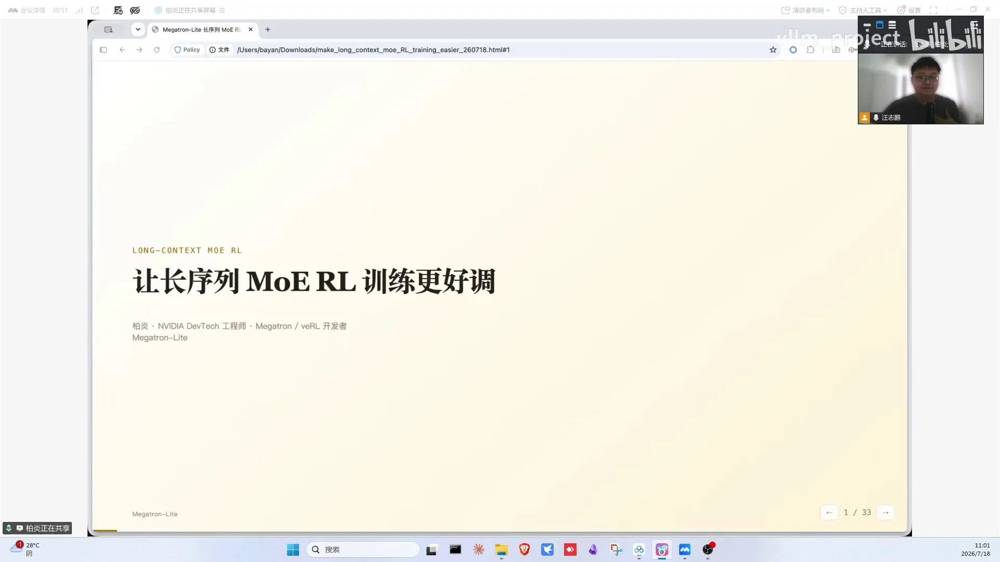 |
| 做了挺多关于 Megatron 的相关工作，包括 Megatron bridge，以及它最后演进出来的 Megatron-Light 也是我最先发起的。这里借 vLLM 这个技术分享会的机会跟大家做一些交流…… [【跳转到 00:25】](https://www.bilibili.com/video/BV1WLKw6aEDq/?t=25) |  |
| 分享一些我在长序列 MoE 模型做 RL 优化的一些心得、技巧，还有一些技术发现。——非常欢迎白岩老师，我们开始。——好，今天的分享主要分四个部分…… [【跳转到 00:50】](https://www.bilibili.com/video/BV1WLKw6aEDq/?t=50) |  |
| 第一部分讲这个问题：长序列的 MoE 强化学习为什么比较难调；然后我们借用一个真实的优化路径，把它从一个比较高的 baseline 做到一个比较（不错）的水平；然后是反思一下优化的流程…… [【跳转到 01:15】](https://www.bilibili.com/video/BV1WLKw6aEDq/?t=75) | 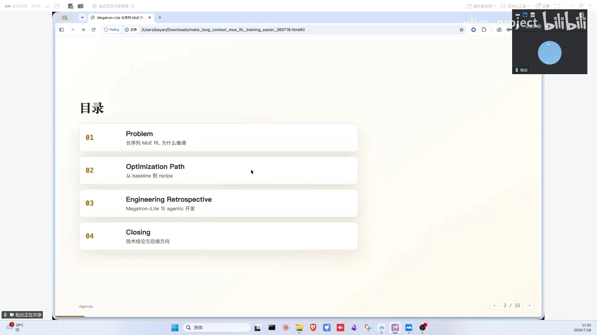 |
| 我们怎么让优化流程变得更高效、更 efficient。也是借机宣传我在做的 Megatron-Light 这个工作。第四部分是收尾。每个部分之间会开放一些问答环节。——第一个部分就是讲长序列的 MoE RL…… [【跳转到 01:40】](https://www.bilibili.com/video/BV1WLKw6aEDq/?t=100) | 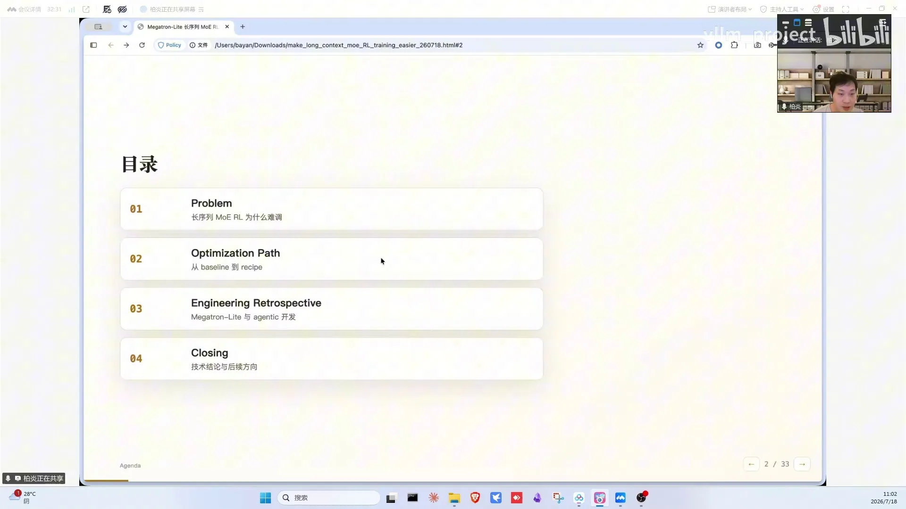 |
| 为什么难：它难就难在比较耦合。首先讲强化学习跟 pretrain 有哪些典型不同：pretrain 我们会追求大规模、稳定、长时间吞吐——一般几千张卡、上万张卡甚至几万张卡…… [【跳转到 02:05】](https://www.bilibili.com/video/BV1WLKw6aEDq/?t=125) | 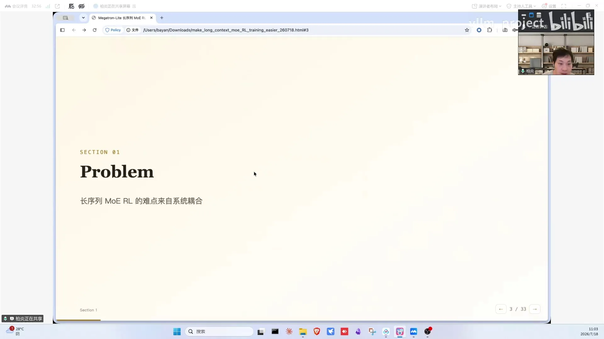 |
| 要长时间跑一个月甚至更久，它的核心目标就是把吞吐跑满。强化学习相比之下有很大不同：我们首先不会有特别多的卡拿来做训练；而且如果有那么多卡，我们会尽量分成不同的组…… [【跳转到 02:30】](https://www.bilibili.com/video/BV1WLKw6aEDq/?t=150) | 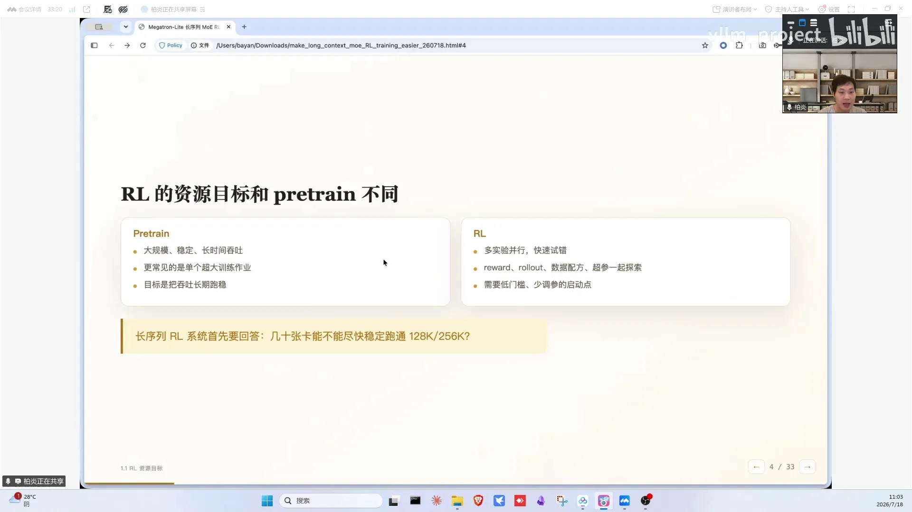 |
| 让我们多做几组不同的实验。做实验时通常先拿小模型开始，把自己的算法、自己的 infra 打磨好，打磨好了之后才会加大资源量。这就导致强化学习始终是资源受限的情况：不管你是 30B、300B 还是 1T、2T 的模型…… [【跳转到 02:55】](https://www.bilibili.com/video/BV1WLKw6aEDq/?t=175) |  |
| 都会用尽可能少的卡数来实现实验。因为强化学习本身对算力的要求并不像 pretrain 那么高，它的解空间主要是各种 reward、rollout、各种数据配方超参，所以需要尽可能多地尝试…… [【跳转到 03:20】](https://www.bilibili.com/video/BV1WLKw6aEDq/?t=200) | 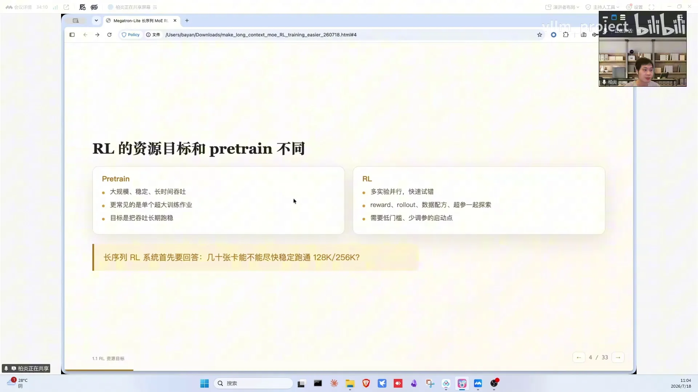 |
| 所以长序列强化学习的系统难点就是：我们能不能用尽可能少的卡数跑通更长的序列。我做这个 slides 时主流还是讲 12K、128K、256K，但现在大家用 coding agent 都习惯 1M 的上下文，以后甚至会超过 1M…… [【跳转到 03:45】](https://www.bilibili.com/video/BV1WLKw6aEDq/?t=225) | 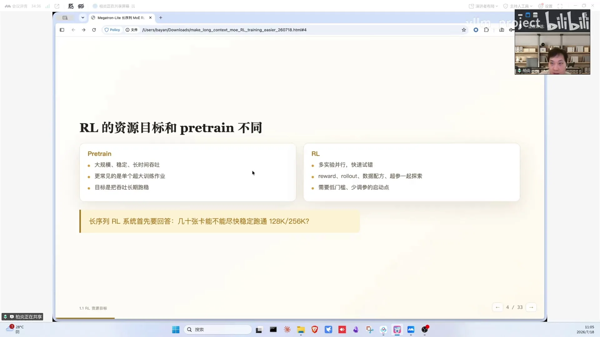 |
| 而 pretrain 一般主流去年还是 4K 的序列长度——4K 还是比较短的，现在长一点也就 16K、64K。一方面它资源多、一方面序列短，所以 pretrain 的工作负载跟强化学习有很大不同。 [【跳转到 04:10】](https://www.bilibili.com/video/BV1WLKw6aEDq/?t=250) | 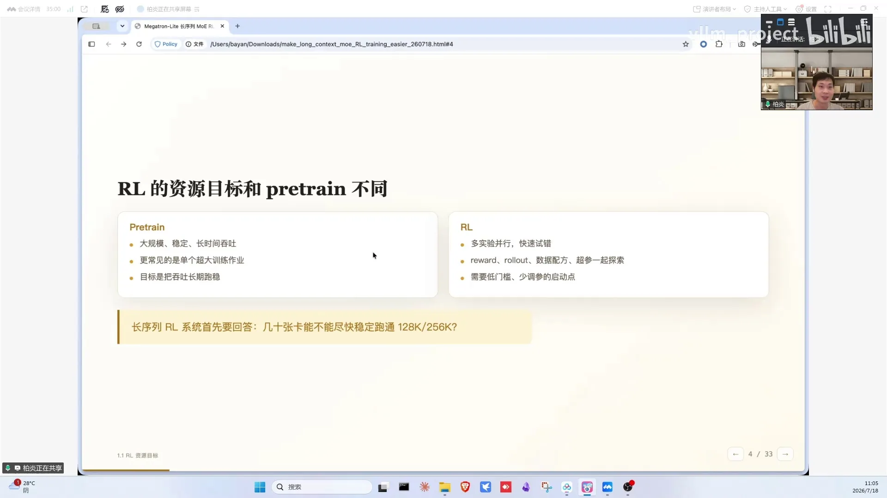 |
| 今天分享主要基于一个 case，一个比较真实的 case，借助优化这个 case 的过程把整个系统的瓶颈逐步击破。这里用的是 Qwen3.5-35B 的模型…… [【跳转到 04:35】](https://www.bilibili.com/video/BV1WLKw6aEDq/?t=275) | 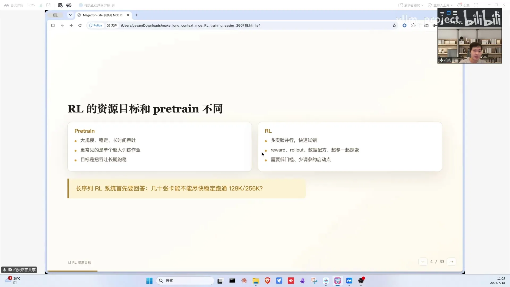 |
| 32 张 H100 的卡，最大序列长度 128K。说到难调，就得讲我们有什么可调的：在 Megatron 里一般是它的 5D 并行——DP、PP（pipeline parallel）、TP（tensor parallel）、EP（expert parallel）、CP（context parallel）…… [【跳转到 05:00】](https://www.bilibili.com/video/BV1WLKw6aEDq/?t=300) |  |
| DP 是拿来凑数的。它们之间会互相牵制，后面有一个图展开讲它们之间的牵制关系。除了并行调度之外，我们还会设置重算——因为显存比较紧张…… [【跳转到 05:25】](https://www.bilibili.com/video/BV1WLKw6aEDq/?t=325) | 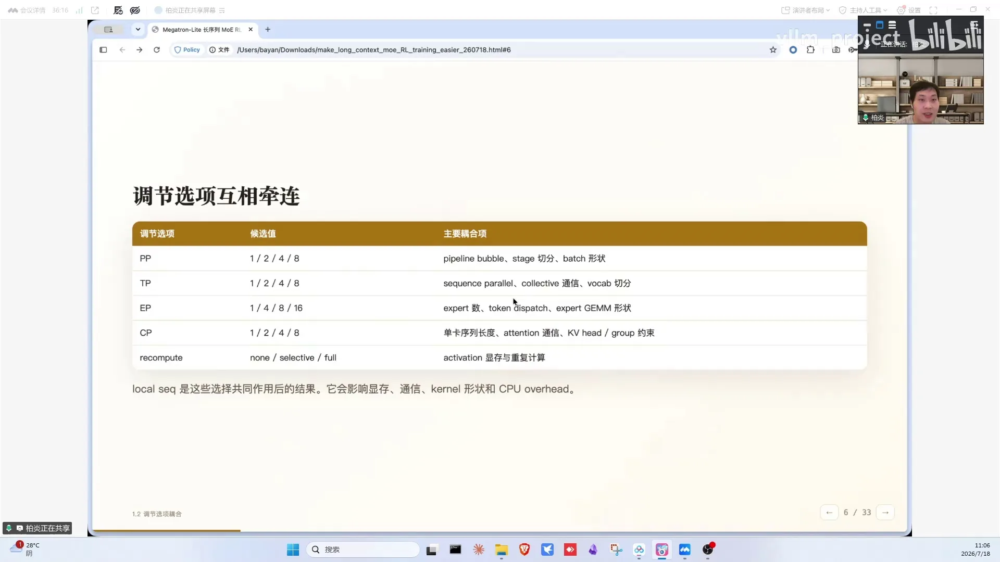 |
| 我们需要把 activation 尽可能减少占用的显存。这个图是调训练时比较关注的图：横轴是实际上作用在 GPU 上的一些关键维度…… [【跳转到 05:50】](https://www.bilibili.com/video/BV1WLKw6aEDq/?t=350) | 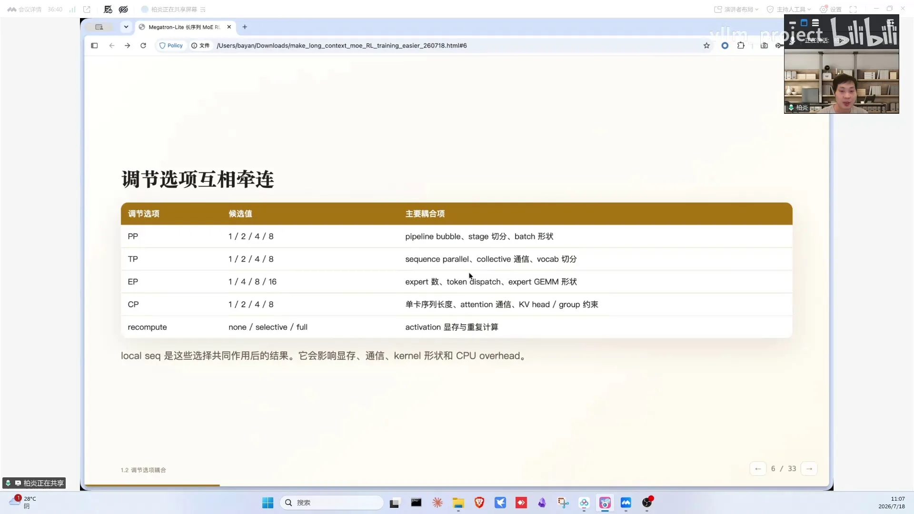 |
| 纵轴是我们可以调节的旋钮（knob）。横轴展开讲：分成了静态显存、动态显存，合并起来就是显存——显存超了就会 OOM。然后有 kernel 的 overhead…… [【跳转到 06:15】](https://www.bilibili.com/video/BV1WLKw6aEDq/?t=375) |  |
| 通信的暴露，还有 CPU 的 overhead。kernel overhead 就是说你的 kernel 效率不够高就有 overhead；或者一个典型情况：你通过 PP 把维度切得非常细碎…… [【跳转到 06:40】](https://www.bilibili.com/video/BV1WLKw6aEDq/?t=400) |  |
| 一般我们知道矩阵乘法是 M、N、K，K 是中间维度。如果你把 K 切得特别小，kernel overhead 就会比较大。通信暴露就是说你的关键路径上有不可被掩盖的通信…… [【跳转到 07:05】](https://www.bilibili.com/video/BV1WLKw6aEDq/?t=425) |  |
| CPU overhead 就是说 GPU 算得很快，但 CPU 在发射 kernel 的过程中比较慢，就会出现显卡等 CPU 的情况。然后讲这几个关键选项怎么互相牵制。首先要明确：我们开各种并行…… [【跳转到 07:30】](https://www.bilibili.com/video/BV1WLKw6aEDq/?t=450) |  |
| 主要是因为不开就会 OOM 跑不了，是不得已而开的。但尽管不得已而开，怎么开、开哪个是有讲究的。假如先是第一个 pipeline parallel：开了它能降低静态显存——比如开 PP=2…… [【跳转到 07:55】](https://www.bilibili.com/video/BV1WLKw6aEDq/?t=475) |  |
| 比如你把这个模型横向切成两个 chunk：第一个 chunk 在第一张卡上、第二个 chunk 在第二张卡上。显然它能降低静态显存，但不能降低动态显存——这个比较反直觉，其实也很好理解。因为做流水线并行时…… [【跳转到 08:20】](https://www.bilibili.com/video/BV1WLKw6aEDq/?t=500) | 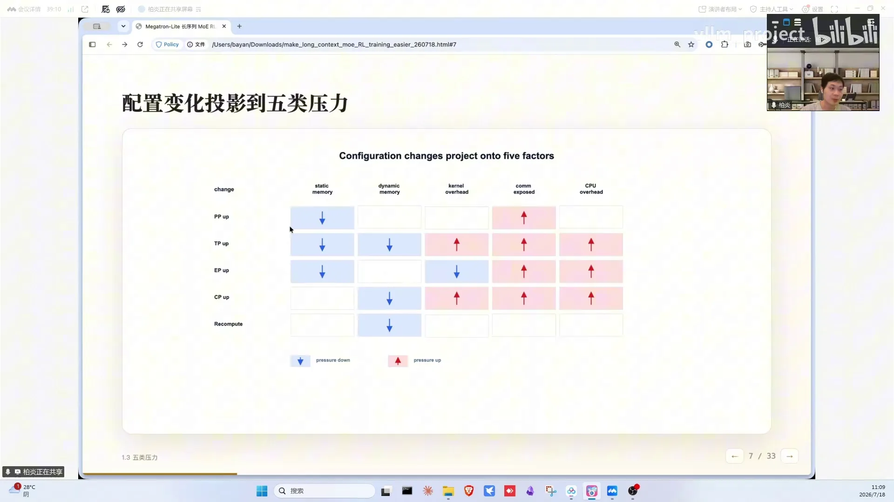 |
| 我们会做一些 bubble 的优化：一般会用 1F1B 的策略。1F1B 要求前面的 chunk 多 feed 几组数据 Microbatch，所以它会把 rank 0…… [【跳转到 08:45】](https://www.bilibili.com/video/BV1WLKw6aEDq/?t=525) |  |
| 实际上压力最大的那个 pipeline——虽然它降低了模型尺寸：比如开了 PP2，第一个 chunk 就变成一半的模型。但它其实需要做两份 microbatch，所以它的动态显存…… [【跳转到 09:10】](https://www.bilibili.com/video/BV1WLKw6aEDq/?t=550) |  |
| 又回来了。同理开 PP8，rank 0 其实需要缓存八份这个 chunk 的 activation。所以动态显存其实不能降低。然后它对 kernel overhead 没有影响。显然它会带来通信暴露——也就是 PP bubble。然后 CPU overhead 几乎没有，略过。 [【跳转到 09:35】](https://www.bilibili.com/video/BV1WLKw6aEDq/?t=575) |  |
| TP 是大家比较常用、可能最早用的一个并行。它降低显存很彻底：开 TP2、TP4，显存就降到 1/2、1/4。这里的 TP 在 Megatron 里指 TP 跟 SP 结合，它又能降静态又能降动态。代价也比较大：刚才讲的会把矩阵乘法的 M、N、K 的 K 切薄，所以 kernel overhead 会上涨…… [【跳转到 10:00】](https://www.bilibili.com/video/BV1WLKw6aEDq/?t=600) |  |
| （接上） [【跳转到 10:25】](https://www.bilibili.com/video/BV1WLKw6aEDq/?t=625) | 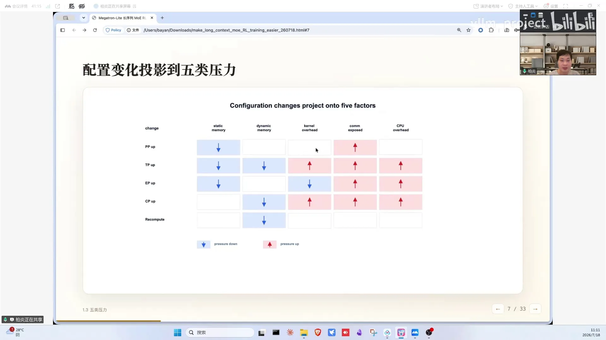 |
| 通信显然会有暴露，也会导致 CPU overhead。CPU overhead 跟 kernel overhead 也有点相关：矩阵计算效率低了，CPU 暴露出来就多了。然后是 expert parallel：EP 能降低静态显存…… [【跳转到 10:50】](https://www.bilibili.com/video/BV1WLKw6aEDq/?t=650) |  |
| 但它对动态显存也是毫无帮助。而且 EP 开大了之后，因为 expert 会有不均衡，反而会导致动态显存有一定的上升。比如我们开 EP8，每个 rank 上拥有的 expert 就变成了…… [【跳转到 11:15】](https://www.bilibili.com/video/BV1WLKw6aEDq/?t=675) |  |
| 原本总 expert 的 1/8。计算时 group GEMM 需要的访存量其实更少了，kernel efficiency 也会上升，所以 kernel overhead 会下降。然后它会有 all-to-all 的通信暴露，操作过程也会有 CPU overhead。对…… [【跳转到 11:40】](https://www.bilibili.com/video/BV1WLKw6aEDq/?t=700) | 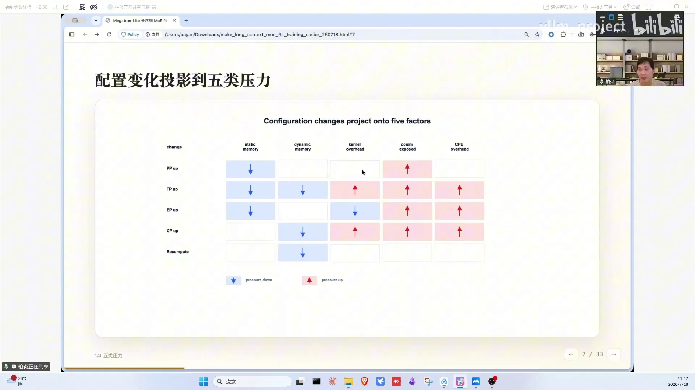 |
| 然后是 CP。CP 相当于把 DP 换成了 CP——单纯地切序列。它对静态显存毫无帮助，但能降低动态显存。与此同时它带来一些额外的 kernel 通信、计算，也会有额外的 CPU overhead。对…… [【跳转到 12:05】](https://www.bilibili.com/video/BV1WLKw6aEDq/?t=725) |  |
| 然后是 recompute：单纯降低静态显存。这里没列出来：做重算肯定有额外的计算量——开完全重算基本上多 30%。——其实我想补充一下…… [【跳转到 12:30】](https://www.bilibili.com/video/BV1WLKw6aEDq/?t=750) |  |
| 我当时因为看到了这张图，就决定一定要请你来我们这边讲。这个图可以说是我目前看到总结得最好的图了。直播间有同学如果在准备面试，如果你能把这张图给面试官讲清楚，面试基本就稳了。 [【跳转到 12:55】](https://www.bilibili.com/video/BV1WLKw6aEDq/?t=775) | 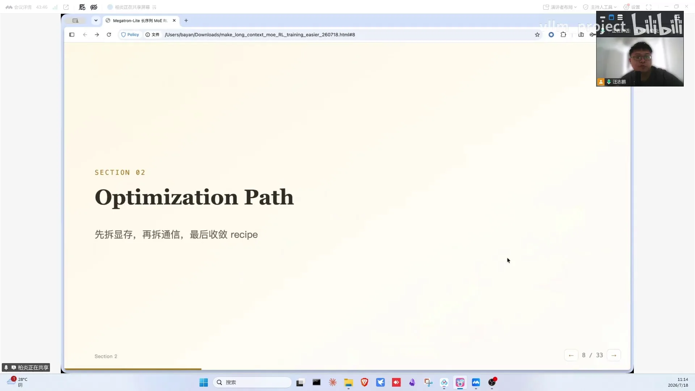 |
| 确实我面试候选人的时候也基本上会问类似的问题，哈哈。如果大家准备面试，一定要把这张图截下来，好好想清楚里面到底怎么变的，也可以跟朋友讲讲这张图什么意思…… [【跳转到 13:20】](https://www.bilibili.com/video/BV1WLKw6aEDq/?t=800) | 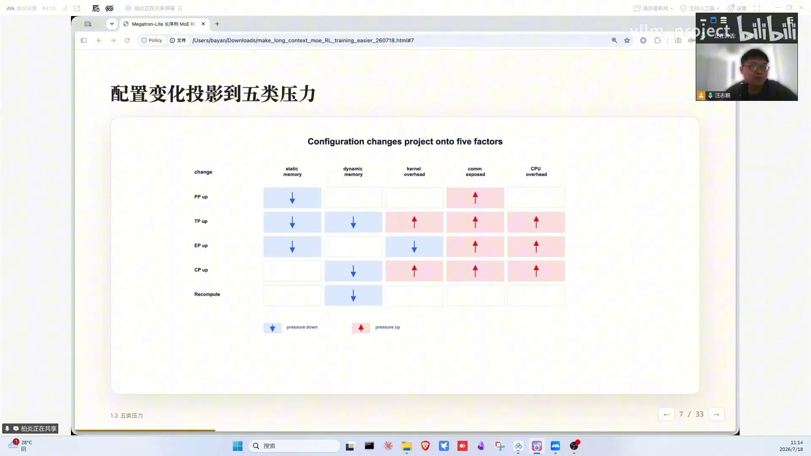 |
| 当然也可以分享我们的直播间，我们直播间会一直输出这样的干货。——好，我们继续。——第一个问题"为什么难调"已经讲完了，有要问答的吗？还是说继续？——看一下聊天，有人吗？哦没有人，好，我们继续。——那讲我们怎么做优化，从两个方向来做…… [【跳转到 13:45】](https://www.bilibili.com/video/BV1WLKw6aEDq/?t=825) | 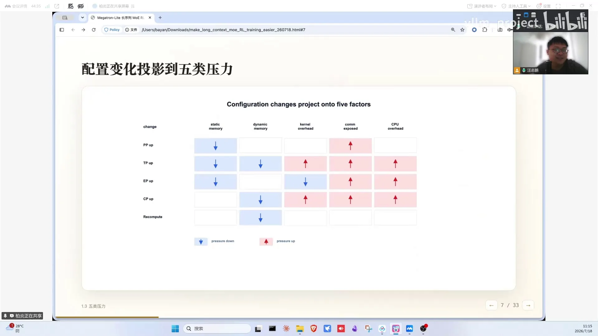 |
| 好我们继续吧好的这里第一个问问题就讲他为什么难调 [【跳转到 13:51】](https://www.bilibili.com/video/BV1WLKw6aEDq/?t=831) | 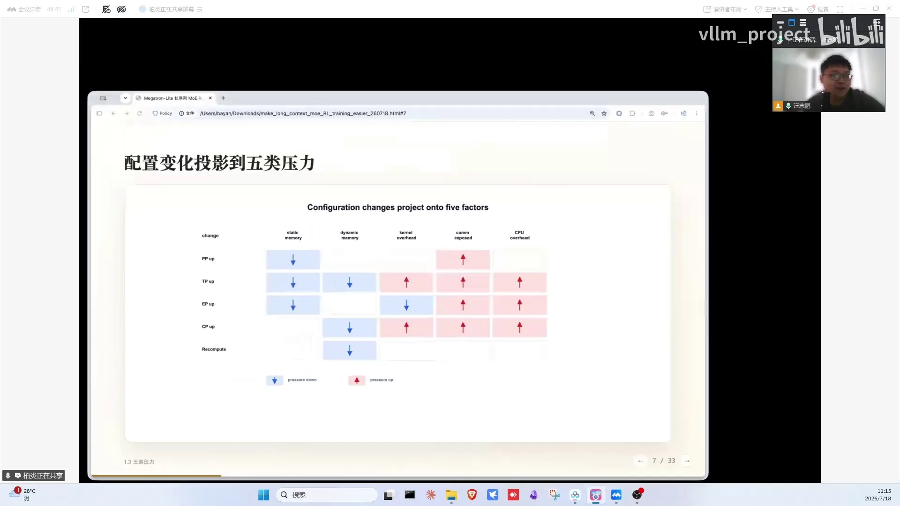 |
| （接上） [【跳转到 13:56】](https://www.bilibili.com/video/BV1WLKw6aEDq/?t=836) |  |
| 首先我们会建立一个 Megatron 5D 并行的 baseline。这个 baseline 也没那么容易建立：我给它分成两组维度——一组是 PP×EP，主要降低静态显存；TP×CP 主要降低动态显存。有这样的一个二维的表…… [【跳转到 14:21】](https://www.bilibili.com/video/BV1WLKw6aEDq/?t=861) | 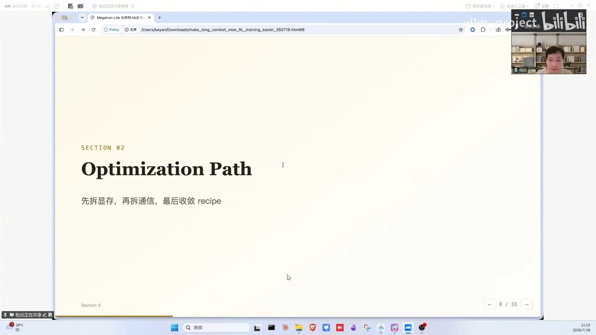 |
| EP 通常考虑的是要不要跨机：不跨机就是 EP8，跨机就是 EP16。TP×CP 其实没什么好说的：因为 Qwen3.5 这个模型的 KV head 是 2，所以一开始如果不做 replicate 的话…… [【跳转到 14:46】](https://www.bilibili.com/video/BV1WLKw6aEDq/?t=886) |  |
| TP 只能开到 2，剩下的只能开 CP。虽然通过 replicate 头能实现更大的 TP，但这里为了方便不考虑那个情况，先考虑 TP 只能开到 2，剩下都给 CP。这个图怎么理解呢…… [【跳转到 15:11】](https://www.bilibili.com/video/BV1WLKw6aEDq/?t=911) |  |
| 右下角是（显存）拉满的情况：往右边对长序列更友好，往下边对更大的模型、静态显存更友好。我们需要尽可能在左上角找到一个比较好的、能跑（不 OOM）的配置。经过一番搜索调整，我们找到 EP8、PP4、TP1、CP8 是一个不错的比较高的点位。H100 每张卡（算力）是 127 TFLOPS…… [【跳转到 15:36】](https://www.bilibili.com/video/BV1WLKw6aEDq/?t=936) |  |
| （接上） [【跳转到 16:01】](https://www.bilibili.com/video/BV1WLKw6aEDq/?t=961) | 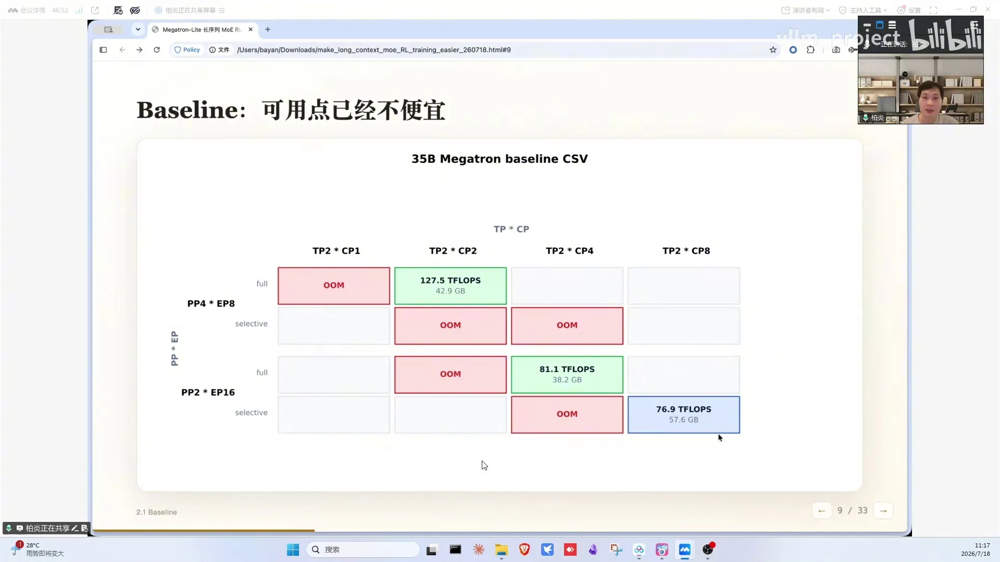 |
| 它的 peak memory 是 43G。与此对应，把 TP 开得更大之后，就没办法开到 TP×CP=4 的程度，只能开到 8 的程度…… [【跳转到 16:26】](https://www.bilibili.com/video/BV1WLKw6aEDq/?t=986) |  |
| 这时单卡计算密度就会低一些，导致它的 TFLOPS 是 81。更下面就更低了，先不讨论。从显存优化的角度，我们要对超长序列实现不 OOM 的训练…… [【跳转到 16:51】](https://www.bilibili.com/video/BV1WLKw6aEDq/?t=1011) |  |
| 一般会有两个路径，主要根据要不要重算。直播间有同学问这个图上的 full 和 selective 是什么意思？——OK，full 和 selective 指的是重算的力度：拿完全重算作为 baseline…… [【跳转到 17:16】](https://www.bilibili.com/video/BV1WLKw6aEDq/?t=1036) | 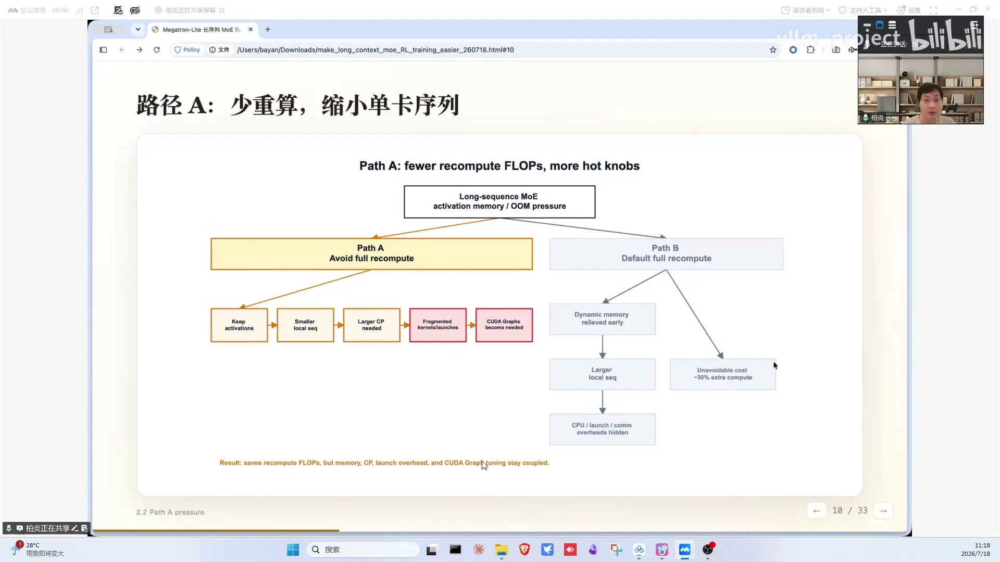 |
| 后面其实大部分都是用完全重算。完全重算就是每做完一层的计算就把 activation drop 掉。与此对应 selective 是选择性重算，只把高性价比的东西做重算。具体这里指的就是做 core attention 的重算和 MoE activation（重算）。 [【跳转到 17:41】](https://www.bilibili.com/video/BV1WLKw6aEDq/?t=1061) | 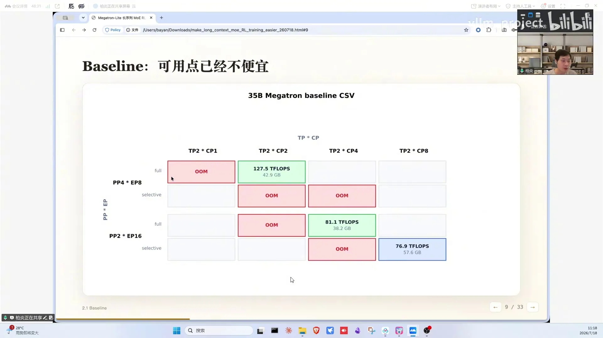 |
| 这个其实涉及到 Megatron 的显存的理解。我之前有一个 blog 比较详细地介绍了 Megatron 的…… [【跳转到 18:06】](https://www.bilibili.com/video/BV1WLKw6aEDq/?t=1086) | 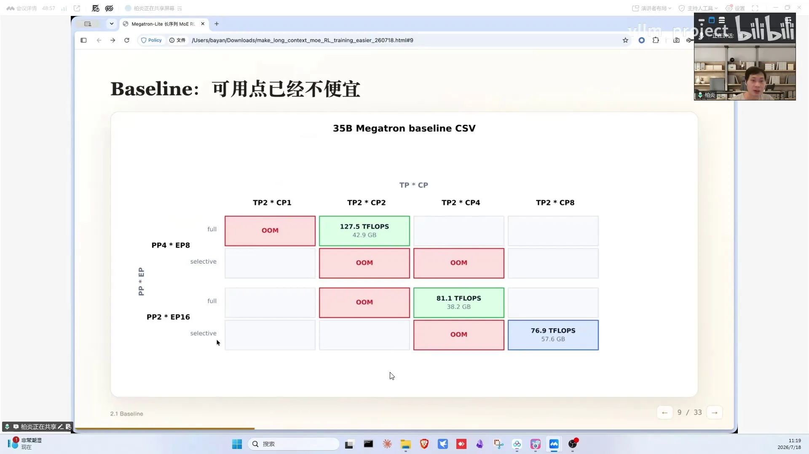 |
| 显存（管理）。 [【跳转到 18:31】](https://www.bilibili.com/video/BV1WLKw6aEDq/?t=1111) | 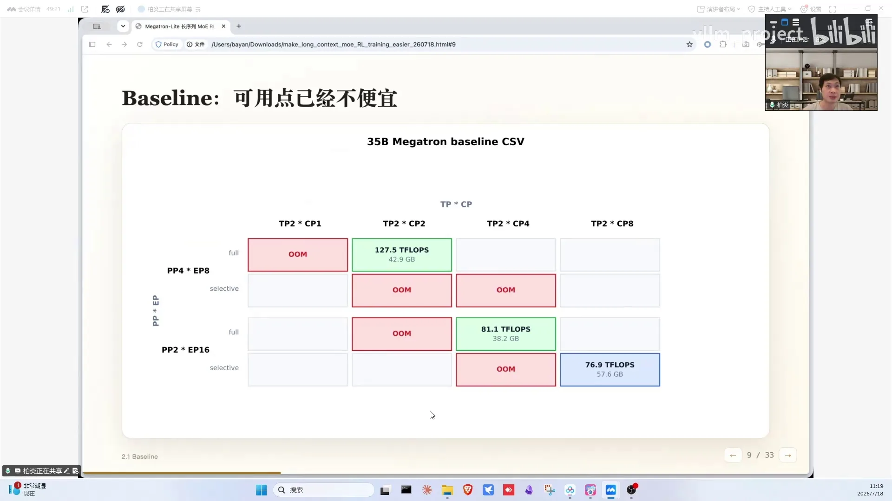 |
| 欢迎有兴趣了解的同学去看一下。 [【跳转到 18:36】](https://www.bilibili.com/video/BV1WLKw6aEDq/?t=1116) | 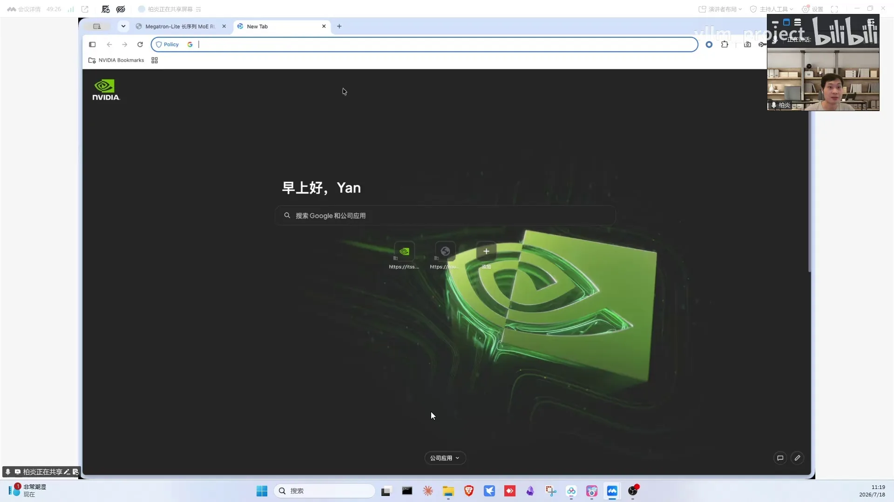 |
| 这个 blog 这里就不做更多赘述了。 [【跳转到 18:41】](https://www.bilibili.com/video/BV1WLKw6aEDq/?t=1121) | 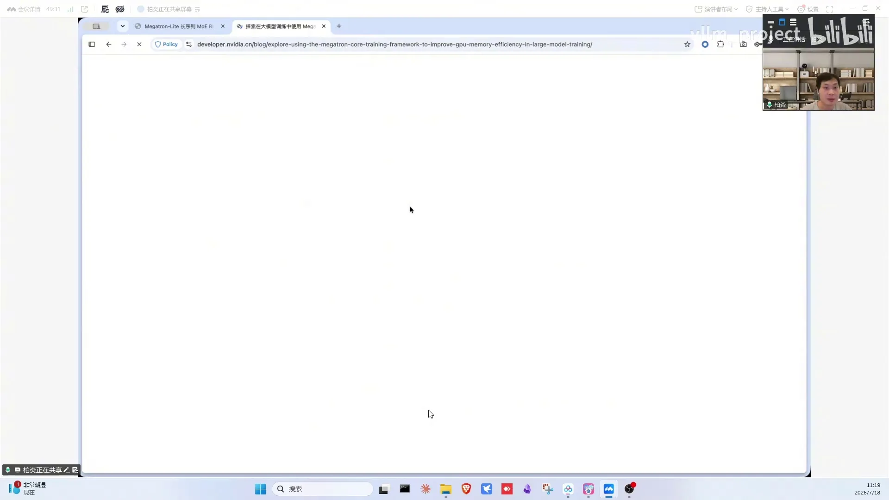 |
| 可以把这个发到我们的（群里）。 [【跳转到 18:46】](https://www.bilibili.com/video/BV1WLKw6aEDq/?t=1126) | 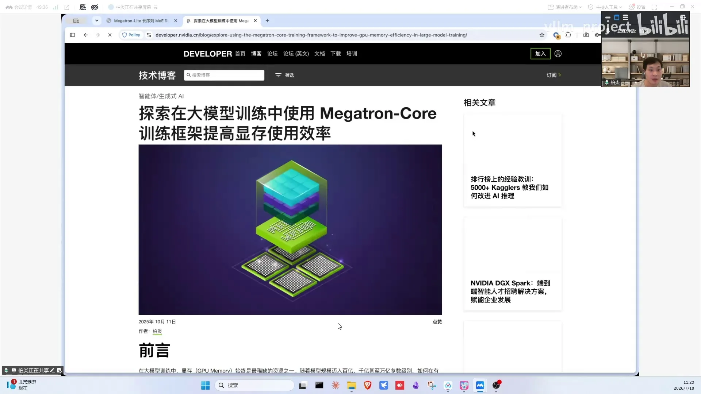 |
| 我发了。 [【跳转到 18:51】](https://www.bilibili.com/video/BV1WLKw6aEDq/?t=1131) | 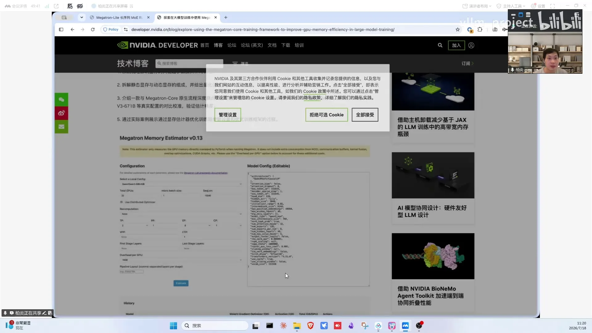 |
| 好的行，回答那个问题：full 就是完全重算…… [【跳转到 18:56】](https://www.bilibili.com/video/BV1WLKw6aEDq/?t=1136) | 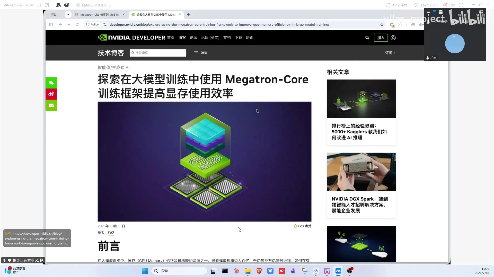 |
| selective 就是部分重算。行，我们继续。根据要不要做重算，会有两条优化路径。一条是我们大多数在英伟达的同事对 pretrain 做的优化：尽量避免重算。想避免重算，显而易见要保留 activation。保留 activation 要不然 offload——offload 当然也是一条路，但它也容易 OOM，这里先不讨论——然后我们需要保留更少的 local sequence length…… [【跳转到 19:01】](https://www.bilibili.com/video/BV1WLKw6aEDq/?t=1141) | 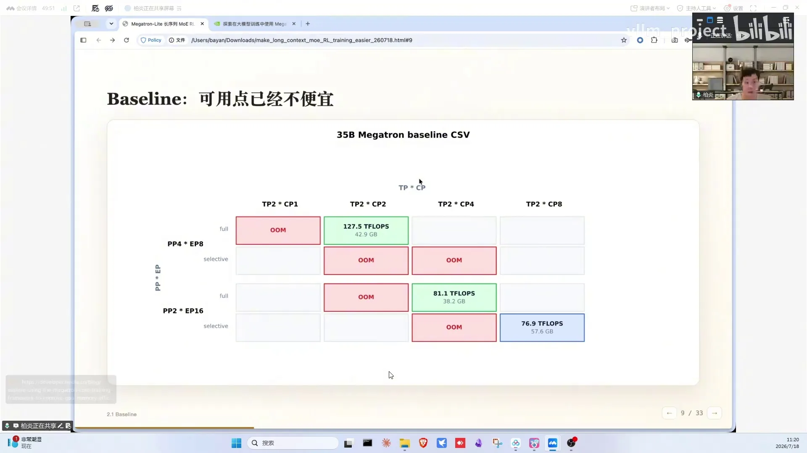 |
| （接上） [【跳转到 19:26】](https://www.bilibili.com/video/BV1WLKw6aEDq/?t=1166) |  |
| local seq length 就是总序列长度除以 TP 再除以 CP，就是单卡的序列长度。想保持比较低的 local sequence length 就需要开比较大的 CP。开大 CP 之后，CP 还是 TP 都会导致 kernel 效率下降…… [【跳转到 19:51】](https://www.bilibili.com/video/BV1WLKw6aEDq/?t=1191) | 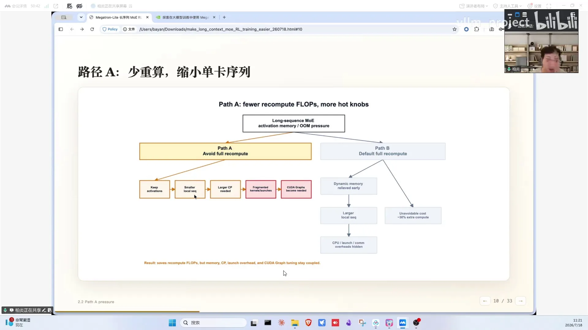 |
| 以及 CPU overhead 比较大：大部分时间 CPU 很快但要等数据、等 CPU launch。这时 CUDA Graph 会是比较必要的技术：它主要把训练的 GPU 调度给它…… [【跳转到 20:16】](https://www.bilibili.com/video/BV1WLKw6aEDq/?t=1216) | 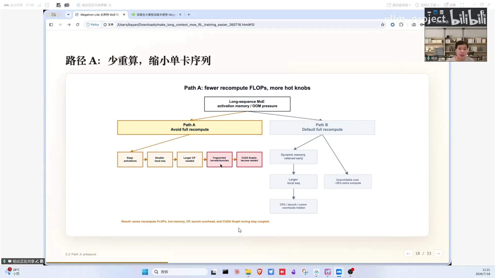 |
| 做一个记录，之后回放 CUDA graph 来减少 CPU overhead。这是大部分同事在做的一条路径，但这条路径还需要一些工作。最近也有一些工作放出来，大家可以关注 Megatron 的 CUDA graph。这里想着重介绍的是另一条路径…… [【跳转到 20:41】](https://www.bilibili.com/video/BV1WLKw6aEDq/?t=1241) | 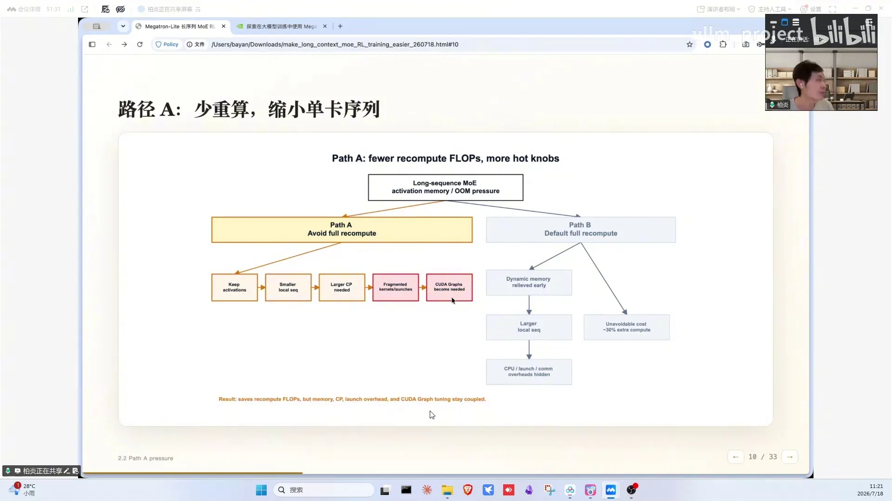 |
| 接受完全重算。接受完全重算后，动态显存一下子空间就大了：可以调高 local sequence length——本地序列长度。这样 CPU overhead 也会降低、kernel overhead 也会降低、通信 overhead 也会降低。代价就是不可避免的多 30% 计算。现在主流在强化学习里的实践也都是这条路径。两条路径都会投资，这里主要介绍第二条路径。 [【跳转到 21:06】](https://www.bilibili.com/video/BV1WLKw6aEDq/?t=1266) | 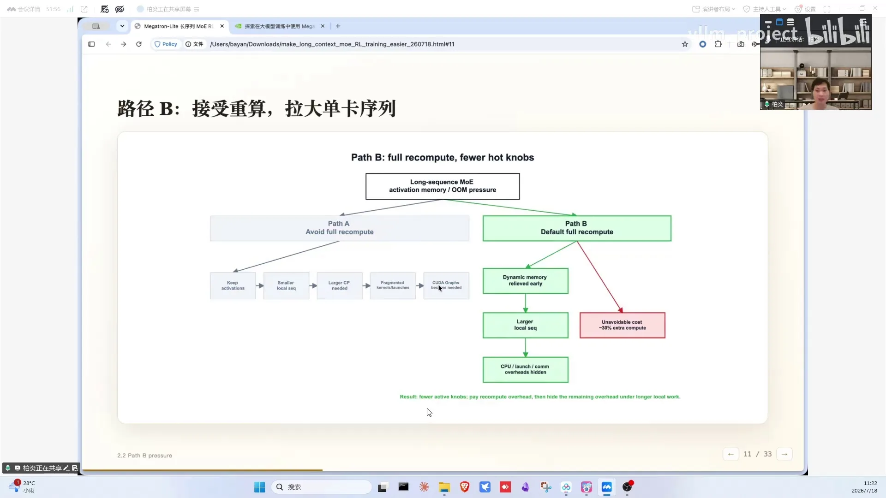 |
| （接上） [【跳转到 21:31】](https://www.bilibili.com/video/BV1WLKw6aEDq/?t=1291) |  |
| 直播间有同学问：Megatron-LM、auto model 和 Megatron-Light 之间的关系和区别？——Megatron-LM 是英伟达的正式产品；Megatron-Light 是我们在 Megatron 里做的一个 agentic 的实验，在 Megatron dev 分支下的 experimental/light 文件夹里…… [【跳转到 21:56】](https://www.bilibili.com/video/BV1WLKw6aEDq/?t=1316) | 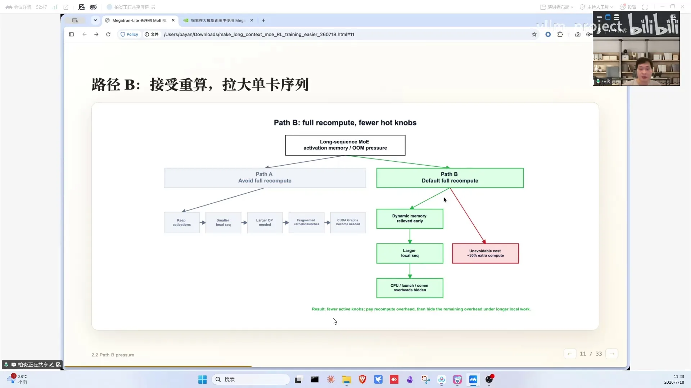 |
| （接上） [【跳转到 22:01】](https://www.bilibili.com/video/BV1WLKw6aEDq/?t=1321) | 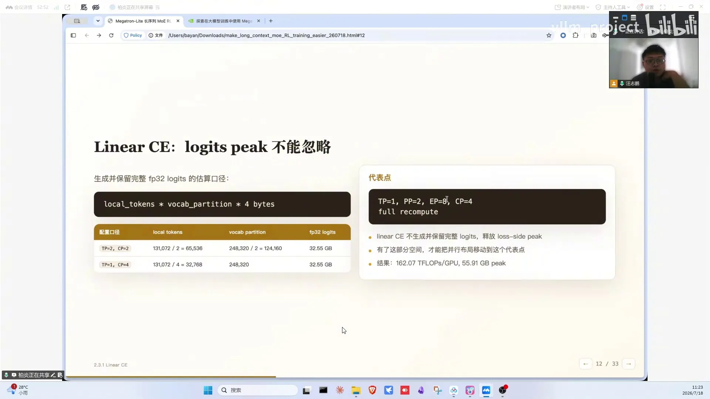 |
| 我们是探索怎么用 agent 来把训练做好、把训练框架做好。auto model 是英伟达的另一个训练产品：基于 HuggingFace 原生的 model 做一些优化。是这样的关系。如果我们想选一个训练框架应该怎么选？对性能要求极致，首先推荐 Megatron…… [【跳转到 22:26】](https://www.bilibili.com/video/BV1WLKw6aEDq/?t=1346) |  |
| （接上） [【跳转到 22:51】](https://www.bilibili.com/video/BV1WLKw6aEDq/?t=1371) |  |
| 它会比较难一些。如果想开箱即用获得 reasonable 的性能，auto model 也是很合适的框架。我继续。——首先发现有一个比较大的显存大头：最后一层的 logits 会带来 peak memory，在序列非常长的时候很难忽略掉。具体来说每张卡上的 logits 计算是 local tokens——即 local seq length 乘 vocabulary（分区大小）…… [【跳转到 23:16】](https://www.bilibili.com/video/BV1WLKw6aEDq/?t=1396) |  |
| （接上） [【跳转到 23:41】](https://www.bilibili.com/video/BV1WLKw6aEDq/?t=1421) | 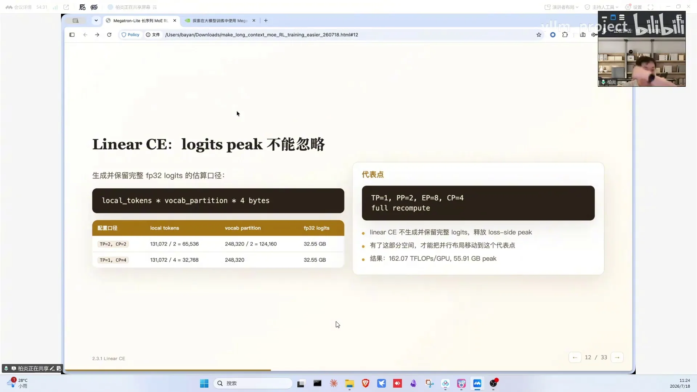 |
| 不考虑 TP 的话 TP 跟 CP 可以互相转化，所以考虑 CP 就好了：它是一个比较大的 vocab size，4 字节（存储）。对应 128K 的序列长度…… [【跳转到 24:06】](https://www.bilibili.com/video/BV1WLKw6aEDq/?t=1446) |  |
| 开了 CP4 的话就会有 32G 的 logits。想想 H100 一共才 80G，最后要 instantiate 一个这么大的显存 tensor，很容易 OOM。 [【跳转到 24:31】](https://www.bilibili.com/video/BV1WLKw6aEDq/?t=1471) |  |
| 与对应的就是我们有一个 kernel 叫 linear cross entropy：logits 其实只是为了计算后面的 logprobs，那就把它 fuse 起来，不产生 logits 直接产生 logprobs，就能完全避免这个大的显存。 [【跳转到 24:56】](https://www.bilibili.com/video/BV1WLKw6aEDq/?t=1496) |  |
| 这个（融合算子）出现在 GPU 上当然也有代价：融合算子在反向时会多一些计算。但 overall 它是利大于弊的过程，所以把它打开。打开之后显存有更多空间。这时…… [【跳转到 25:21】](https://www.bilibili.com/video/BV1WLKw6aEDq/?t=1521) |  |
| 刚才的 baseline 是 PP4（配合 CP8），现在能变成 PP2 也不 OOM。并且把 TFLOPS 从 127 打到了 162。然后考虑到 Megatron 的 distributed optimizer…… [【跳转到 25:46】](https://www.bilibili.com/video/BV1WLKw6aEDq/?t=1546) |  |
| 它其实是一个 ZeRO-1 的 optimizer，它的位置是有冗余的。我这里实现了用 FSDP 把冗余消除掉，FSDP 其实就是干这个的。与此同时 5D 并行该怎么样还是怎么样…… [【跳转到 26:08】](https://www.bilibili.com/video/BV1WLKw6aEDq/?t=1568) | 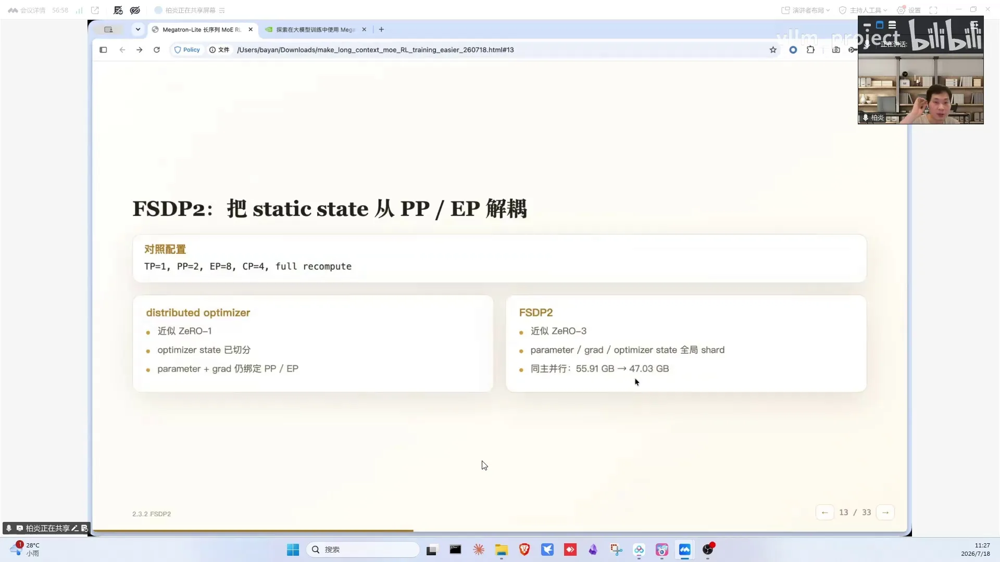 |
| ZeRO-1 变成了 ZeRO-3。所以在相同配置下，我的 peak memory 从 55GB 降到了 47GB。——对。然后有了 FSDP…… [【跳转到 26:33】](https://www.bilibili.com/video/BV1WLKw6aEDq/?t=1593) |  |
| 如果用 FSDP 作为它的 optimizer，这几个并行的调节会有更清晰的划分。因为之前 PP 跟 EP 既负担了计算效率、也负担了静态显存降低，功能比较多。现在 PP 和 EP 都（不用了）…… [【跳转到 26:58】](https://www.bilibili.com/video/BV1WLKw6aEDq/?t=1618) | 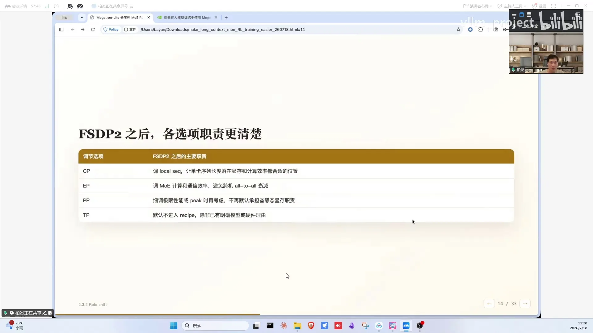 |
| 就把静态显存降低的压力都 offload 到 FSDP DP 上面了。也就是说你不管开什么样的 PP、什么样的 EP，它都是 zero redundant——完全没冗余的一种情况了。 [【跳转到 27:23】](https://www.bilibili.com/video/BV1WLKw6aEDq/?t=1643) |  |
| 那我们设置 EP 的时候只需要考虑通信拓扑：通常 EP8 就是比较好的设置。然后 pipeline parallel 就是希望引入一些 PP bubble，带来的好处是每一次计算的时候会把模型分成…… [【跳转到 27:48】](https://www.bilibili.com/video/BV1WLKw6aEDq/?t=1668) | 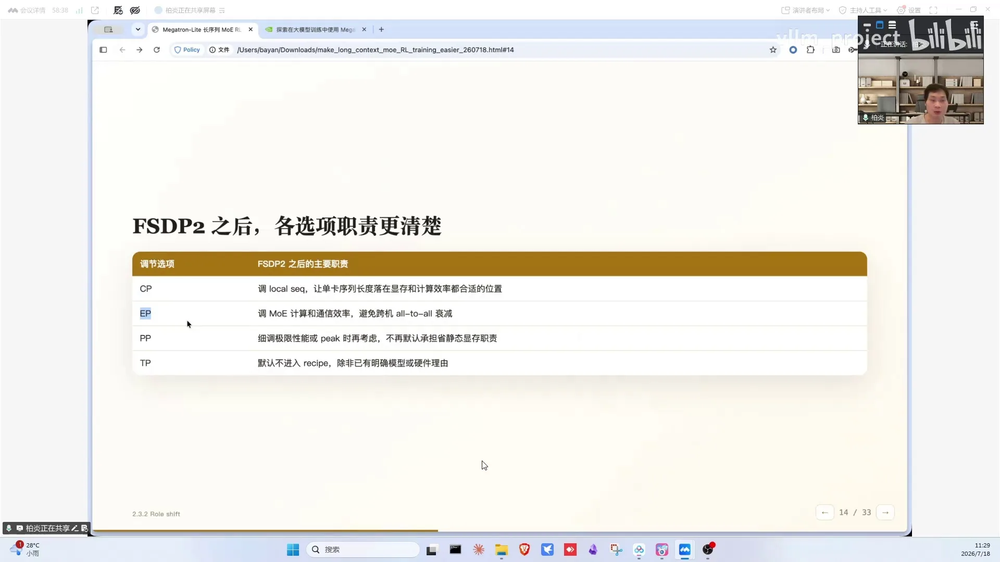 |
| 其实 DP 是一个比较好的划分方式：它能把问题的规模缩小。比如 1024 张卡训一个比较大的模型，开 PP2 实际上等价于 512 张卡训一个模型。模型跟模型之间会有一些数据依赖…… [【跳转到 28:13】](https://www.bilibili.com/video/BV1WLKw6aEDq/?t=1693) |  |
| 这就是 PP bubble。然后 EP 的降低静态显存的职责也被 FSDP DP 接管了。其实未来 TP 是一个比较不推荐的（并行）配置了：它切了 M、N、K 的 K 维之后还会导致一些精度对不齐…… [【跳转到 28:38】](https://www.bilibili.com/video/BV1WLKw6aEDq/?t=1718) | 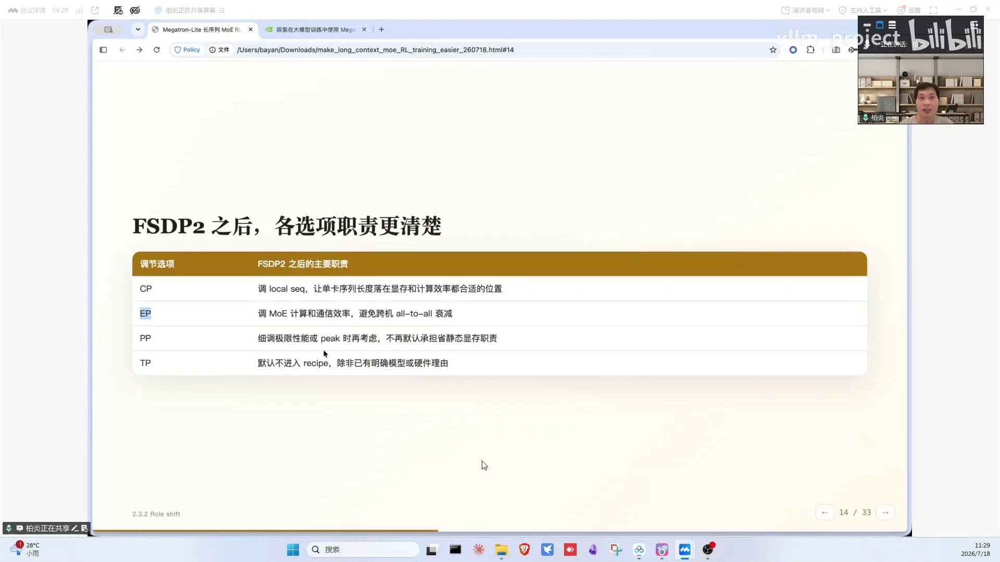 |
| tensor parallel 的性价比就会比较低了。CP 之前切序列长度之后还是切序列长度，没什么变化。这里讲一下有了 FSDP 跟 5D 并行结合之后的一些效应。之前写训练配置时…… [【跳转到 29:03】](https://www.bilibili.com/video/BV1WLKw6aEDq/?t=1743) | 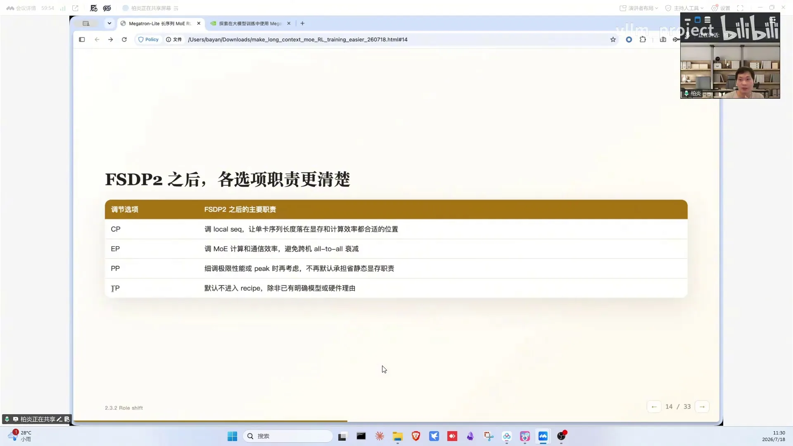 |
| 我一般来讲先把 TP 开满开到 8，然后往里面填 PP，PP 填充之后 PP 和 CP 互相调，让它能放下，最后再填 DP。EP 等于 CP×TP×PP…… [【跳转到 29:28】](https://www.bilibili.com/video/BV1WLKw6aEDq/?t=1768) | 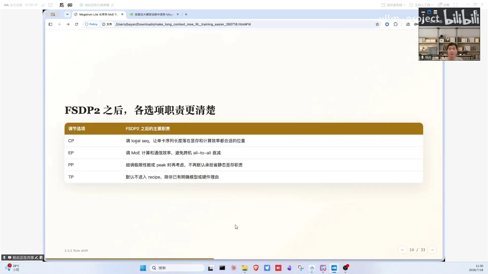 |
| 但听你这么一讲，好像我们是开 FSDP，然后开 CP，看情况开 PP，EP 就等于 CP×PP，我们就直接不开 TP？——对，TP 之后大多数情况下没有用武之地…… [【跳转到 29:53】](https://www.bilibili.com/video/BV1WLKw6aEDq/?t=1793) | 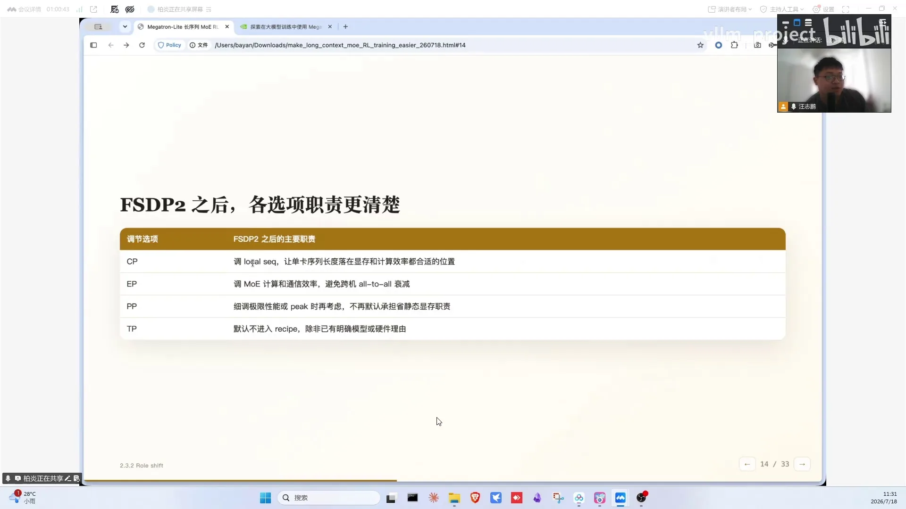 |
| 可以不用开 TP。后面 summarize 还会讲到。我感觉主要是因为有 FSDP 的原因导致 TP 的价值降低了。——是的是的。——我想问的是这个东西…… [【跳转到 30:18】](https://www.bilibili.com/video/BV1WLKw6aEDq/?t=1818) | 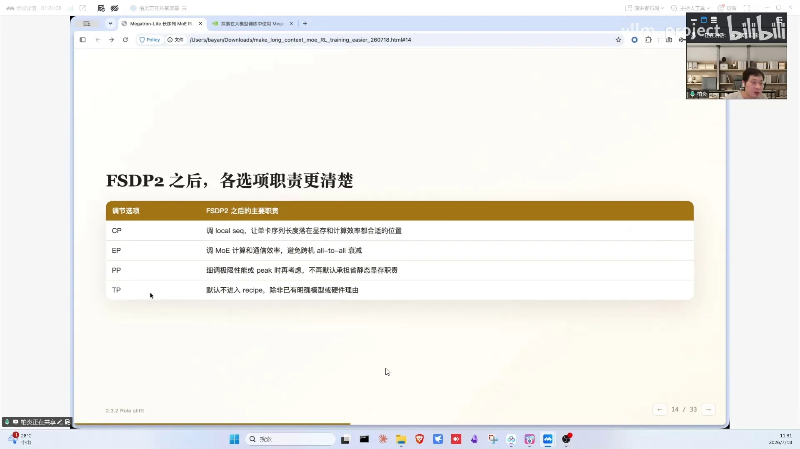 |
| 它对大集群也适用吗？比如我开发的（场景）就不用 TP？之前做 pretrain 几千卡几万卡的时候，为了防止 FSDP 通信域特别大，可能会用一项技术叫 HSDP…… [【跳转到 30:43】](https://www.bilibili.com/video/BV1WLKw6aEDq/?t=1843) |  |
| 就是它不是完全上来就（全分片）：还是把 replicate 做回来。比如 1024 张卡开 HSDP2，其实是有两倍的冗余，但带来的好处是 FSDP 的通信降低了。 [【跳转到 31:08】](https://www.bilibili.com/video/BV1WLKw6aEDq/?t=1868) |  |
| 对，具体你那个问题：是的，这个结论对更大的集群也成立。——好。直播间有同学问：开 PP 之后未掩盖的通信时长占比太大，可能是哪些原因造成的？——是 PP 就是 bubble 这块问题吧…… [【跳转到 31:33】](https://www.bilibili.com/video/BV1WLKw6aEDq/?t=1893) |  |
| （接上） [【跳转到 31:58】](https://www.bilibili.com/video/BV1WLKw6aEDq/?t=1918) |  |
| 它首先 bubble 是无法完全消除的：只能说 microbatch 数量比较多的情况下 bubble 占比会比较小。如果发现 bubble 比较多，要考虑是不是你的（负载不均衡）——这个我在 veRL 里也做了一些负载均衡的工作——或者你的 microbatch 数量是不是太少了。假如开 PP8 但 microbatch 数量才 8，那 bubble rate 就是接近 50%：每做一次计算都带来相同比例的 bubble…… [【跳转到 32:23】](https://www.bilibili.com/video/BV1WLKw6aEDq/?t=1943) |  |
| 那你的计算效率就在打五折。这个我建议感兴趣的同学看一下（研究者）对 ZeRO bubble 的研究。一般来讲我们会开 PP，有时也会开 VPP（virtual pipeline parallel），然后调整 layout——layer 在卡里怎么分配。激活值和输出结果的激活值…… [【跳转到 32:48】](https://www.bilibili.com/video/BV1WLKw6aEDq/?t=1968) |  |
| （接上） [【跳转到 33:13】](https://www.bilibili.com/video/BV1WLKw6aEDq/?t=1993) | 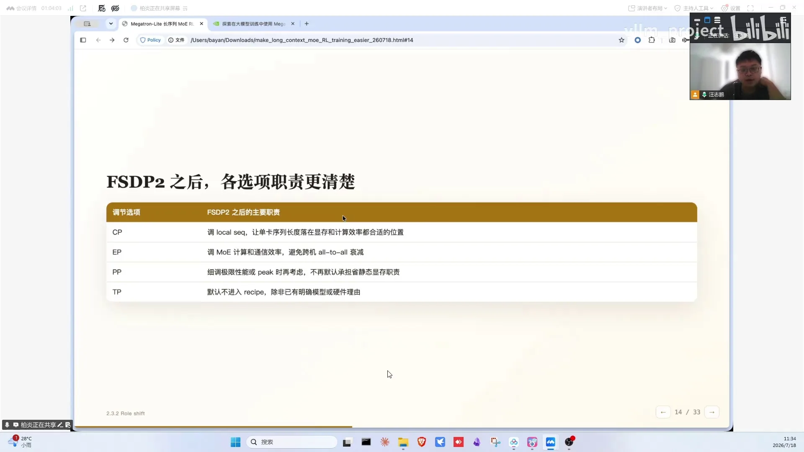 |
| 其实两个（激活值）可以分开算反向传播的梯度。但这个地方想消除 bubble 的话，必然会造成显存上的浪费：想让计算一直存在，必然造成显存浪费。所以 PP bubble 不能无限往上压，基本上是这样。——对。 [【跳转到 33:38】](https://www.bilibili.com/video/BV1WLKw6aEDq/?t=2018) |  |
| 但 PP 如果叠加了完全重算，其实 PP 就是一个六边形战士了：只要能接受重算，它对显存降低是非常大的。实际上这两种 bubble 都是通过牺牲显存占用让所有卡尽量一起跑起来…… [【跳转到 34:03】](https://www.bilibili.com/video/BV1WLKw6aEDq/?t=2043) | 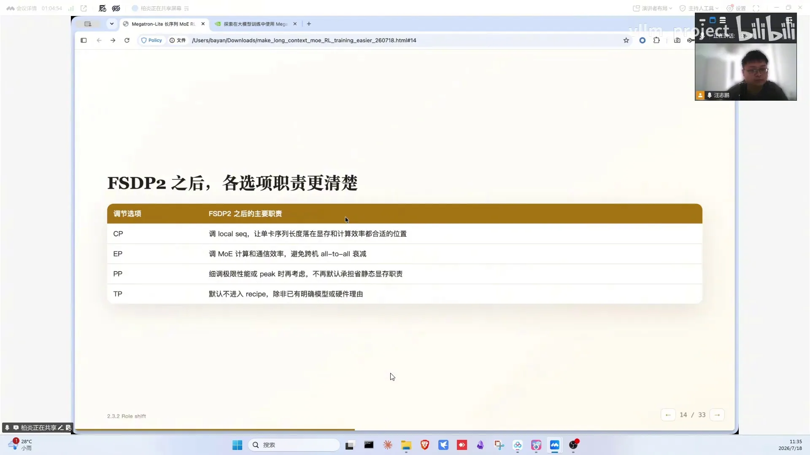 |
| 这种方式在 dense 模型时代比较流行。MoE 时代由于 MoE 带来了更多（显存压力），所以 MoE 时代用这些优化的不多，但非常鼓励大家尝试。Megatron 里现在主流的还是…… [【跳转到 34:28】](https://www.bilibili.com/video/BV1WLKw6aEDq/?t=2068) | 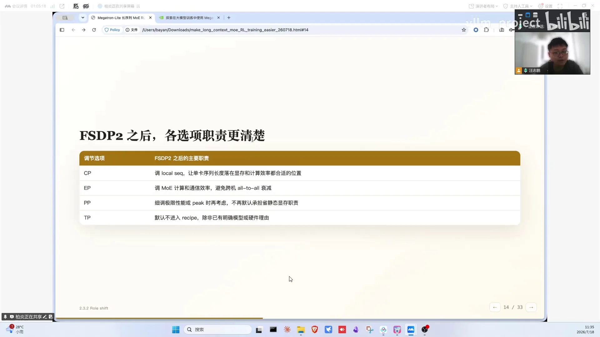 |
| 开 VPP 它是 interleaved 的 1F1B；不开 VPP 就是普通的 1F1B。直播间同学提了 dualpipe：DeepSeek 出来之后做了一个（通信）改进嘛，这个工作是万兴义他们做的。——对。 [【跳转到 34:53】](https://www.bilibili.com/video/BV1WLKw6aEDq/?t=2093) |  |
| 然后有同学问 FSDP 是序列越长越划算吗？——序列越长越划算：相同的通信量，序列越长计算量越大…… [【跳转到 35:18】](https://www.bilibili.com/video/BV1WLKw6aEDq/?t=2118) |  |
| 能掩盖掉的东西就越多。嗯好。然后 CP 用的是 flash attention 的思路吗还是 Ulysses？——Megatron 有好几种实现，可以看代码。可以通过设置：我记得有 point-to-point，还有 all-gather（all-to-all）…… [【跳转到 35:43】](https://www.bilibili.com/video/BV1WLKw6aEDq/?t=2143) | 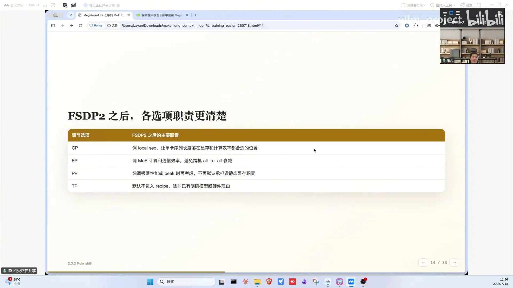 |
| 对对对对。反正如果这几种都支持肯定是 all-to-all，对吧。如果是 ring 的 flash attention 就应该是 point-to-point 形式做的。这都可以在 Megatron 里设置。但我用过没仔细看那块代码怎么写的…… [【跳转到 36:08】](https://www.bilibili.com/video/BV1WLKw6aEDq/?t=2168) |  |
| 基本上就两种吧这个 CP 实现。但现在涌现出了很多新的 attention：包括 MLA、CSA、GDN，它们都会有不同的 CP 实现…… [【跳转到 36:33】](https://www.bilibili.com/video/BV1WLKw6aEDq/?t=2193) |  |
| 所以早期的经验在现在新的 linear attention、sparse attention 时代会有一些变化。——如果是新的 attention，Megatron 里已经实现好了吗？——我们在持续支持：包括 DeepSeek V4 的 attention 的 CP…… [【跳转到 36:58】](https://www.bilibili.com/video/BV1WLKw6aEDq/?t=2218) |  |
| 现在已经有了。GDN 的 CP 也优化了：早期有一个能用的版本，现在优化了好用的版本，还在持续优化。嗯 OK。——如果 CP 要做 all-to-all，前面那个切头是必须要复制的吧？ [【跳转到 37:23】](https://www.bilibili.com/video/BV1WLKw6aEDq/?t=2243) | 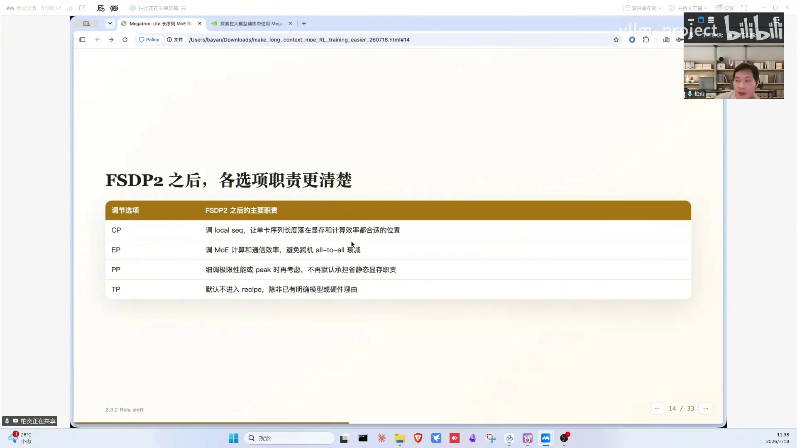 |
| 这个细节我不太清楚。训练这一块跟推理可能有区别：推理这块一般可以切也可以不切…… [【跳转到 37:48】](https://www.bilibili.com/video/BV1WLKw6aEDq/?t=2268) | 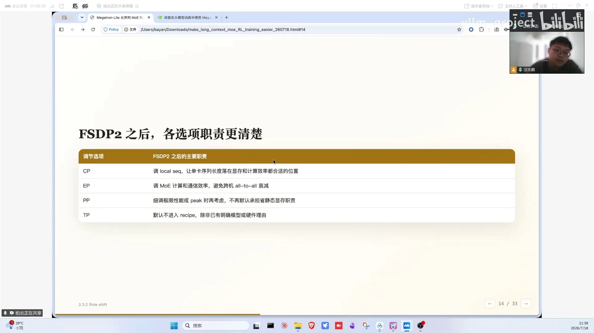 |
| 切头的话通信会增加；不切头的话显存占多，但整个通信量会变少。训练引擎里一般来说是靠别的切分来降低（显存）…… [【跳转到 38:13】](https://www.bilibili.com/video/BV1WLKw6aEDq/?t=2293) |  |
| 这指的是静态显存还是动态显存？——静态显存。这里提到的（切头）一般指的是动态显存。——动态的话就靠 CP 本身：每个卡上放不同序列的数据，CP 本身就是降低这个的。 [【跳转到 38:38】](https://www.bilibili.com/video/BV1WLKw6aEDq/?t=2318) | 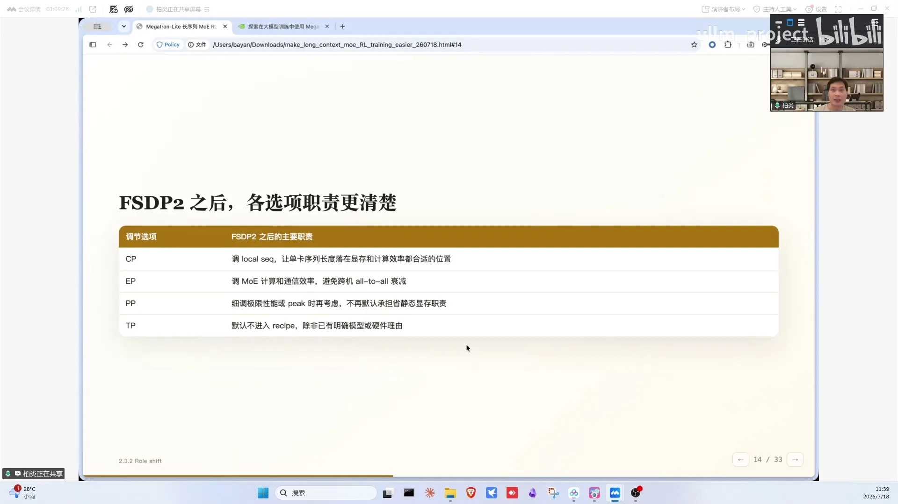 |
| 如果 replicate 那不就白降低了吗？它只是在计算的时候做通信把它拿回来，算完之后立马送回去，保证尽可能多的时间是零冗余状态。一般做 CP 会切头，但有的…… [【跳转到 39:03】](https://www.bilibili.com/video/BV1WLKw6aEDq/?t=2343) |  |
| 可能觉得想减少通信开销就不切了。——行，问答之后可以再来，今天可能讲不完。——是的是的。刚才讲 FSDP2 主要是可以把 FSDP 跟 Megatron 的 5D 并行结合起来，它们完全不冲突、解耦，叠加之后 5D 并行的调节更清晰易懂。除了显存线——刚才讲了 linear cross entropy 和并行——通信线也有一些优化：这里提到一个叫 chunk 的 EP overlap…… [【跳转到 39:28】](https://www.bilibili.com/video/BV1WLKw6aEDq/?t=2368) |  |
| （接上） [【跳转到 39:53】](https://www.bilibili.com/video/BV1WLKw6aEDq/?t=2393) | 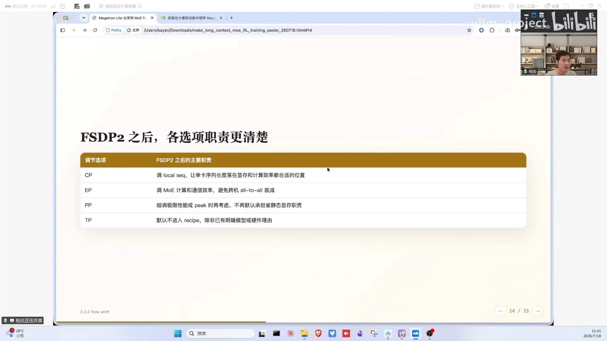 |
| EP 本身会先做 all-to-all 通信：把激活路由到对应的卡上，在那边做 group GEMM，然后再 all-to-all 回来。这是典型的 EP 流程。开完全重算时，不可避免 all-to-all 事件会暴露；不开完全重算时…… [【跳转到 40:18】](https://www.bilibili.com/video/BV1WLKw6aEDq/?t=2418) |  |
| Megatron 里有一个优化叫 1F1B overlap，作用原理跟刚才提到的 dualpipe 比较像：利用不同 microbatch 之间的计算和 all-to-all 做掩盖。但我们开了完全重算，1F1B overlap 没办法打开…… [【跳转到 40:43】](https://www.bilibili.com/video/BV1WLKw6aEDq/?t=2443) | 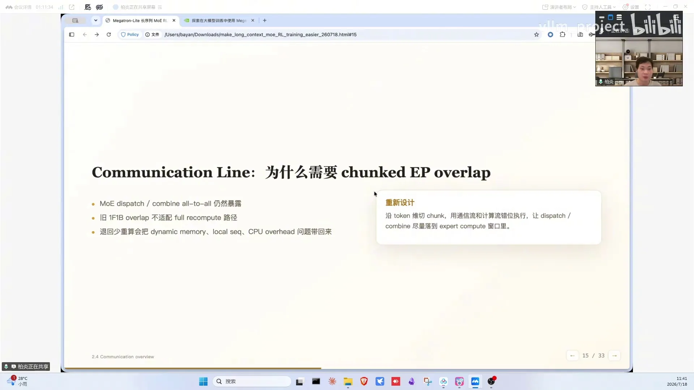 |
| 通信时间就永远暴露出去。这里提到一个点：因为序列长度比较大，可以把序列分 chunk——第一个 chunk 跟第二个 chunk 的计算通信可以做到掩盖。是一个比较巧妙的思想，其实（MoE）kernel 也是这样的优化原理…… [【跳转到 41:08】](https://www.bilibili.com/video/BV1WLKw6aEDq/?t=2468) | 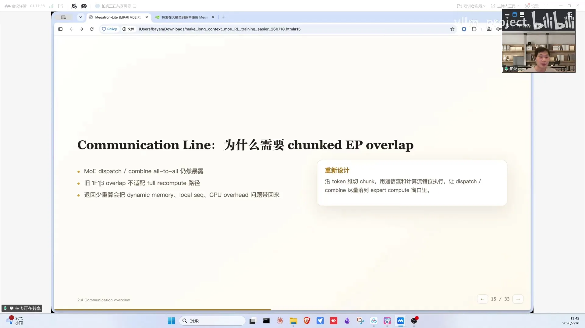 |
| 所以这个 chunk 的 EP overlap 如果把它写成一个 kernel，就是（Megatron 的）kernel for training——这里讨论 training。如果不做 chunk…… [【跳转到 41:33】](https://www.bilibili.com/video/BV1WLKw6aEDq/?t=2493) | 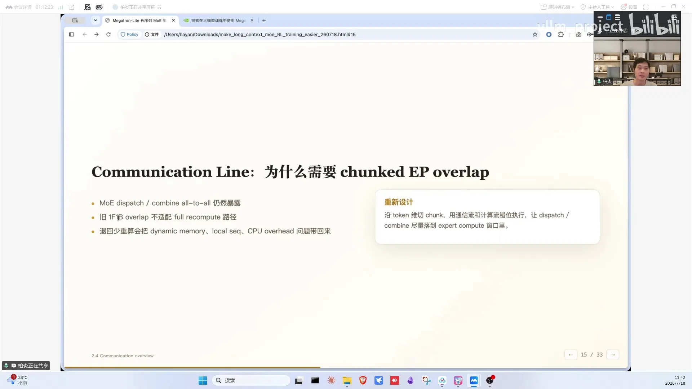 |
| 它就是一个基本的情况：dispatch、combine 是两个 all-to-all，中间计算。我们切 chunk 就是两个 chunk。这里是一个 forward 的图。 [【跳转到 41:48】](https://www.bilibili.com/video/BV1WLKw6aEDq/?t=2508) | 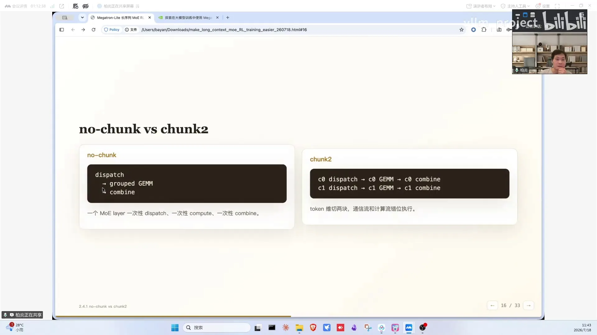 |
| 其实我做了一个 POC 的实现，也用 Nsight Systems 做了打点，把关键打点拿出来：baseline 是 dispatch、group GEMM、combine。分成 chunk 之后，chunk 0 的计算可以跟 chunk 1 的通信叠加起来，实现叠加。一层的 forward 耗时从 10ms 降低到了 7.8ms。 [【跳转到 42:04】](https://www.bilibili.com/video/BV1WLKw6aEDq/?t=2524) | 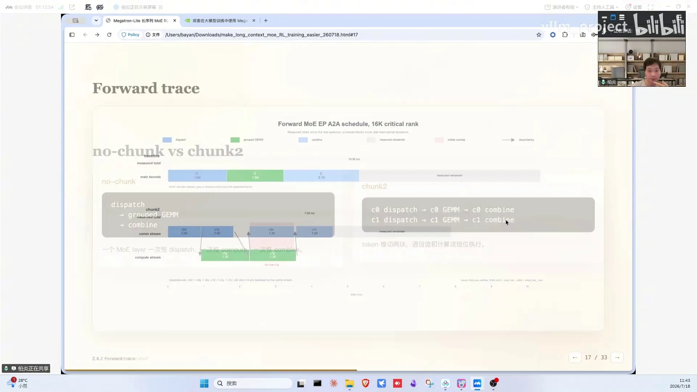 |
| backward 会更复杂一些：分成 data grad 和 weight grad。data grad 是数据的梯度，weight grad 是权重的梯度。数据的 grad 可以做到 overlap 并行…… [【跳转到 42:29】](https://www.bilibili.com/video/BV1WLKw6aEDq/?t=2549) | 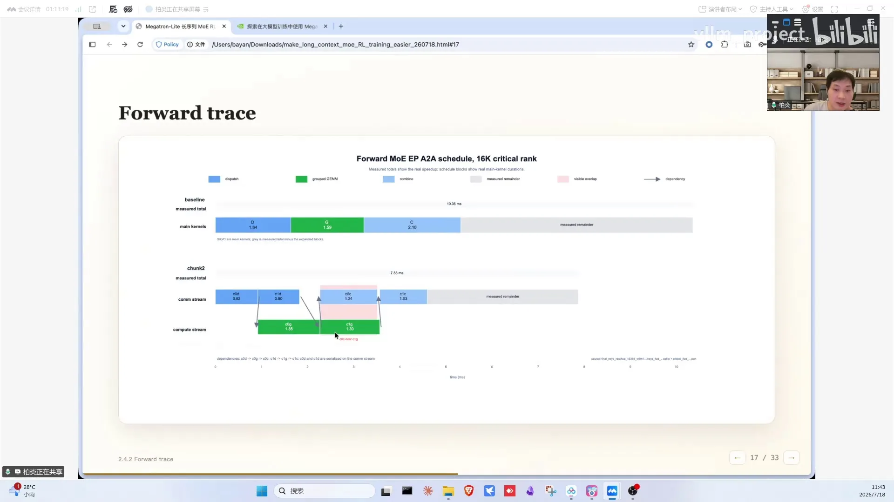 |
| 但 weight grad 是全局需要的，必须积累到最后：data grad 算完之后 weight grad 才能做计算。相比 forward 是更复杂的并行图。总之还是要分 chunk…… [【跳转到 42:54】](https://www.bilibili.com/video/BV1WLKw6aEDq/?t=2574) |  |
| 把不同 chunk 之间的计算和通信做掩盖。考虑到完全重算：做完全重算时是先 forward 再 backward，把 forward 和 backward fuse 在一起，能减少之前额外不必要的通信。具体来说做重算的 forward 时…… [【跳转到 43:19】](https://www.bilibili.com/video/BV1WLKw6aEDq/?t=2599) | 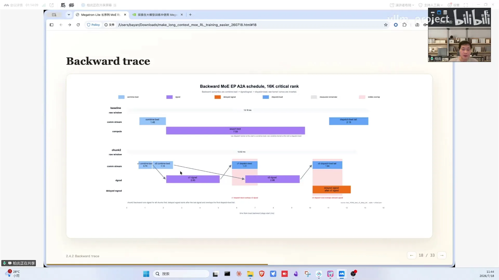 |
| 它是先 dispatch 再 combine，combine 其实可以直接扔掉，并且 overlap 可以做到更细致。这是针对完全重算情况下的 fused backward。它还能降低 peak memory…… [【跳转到 43:44】](https://www.bilibili.com/video/BV1WLKw6aEDq/?t=2624) | 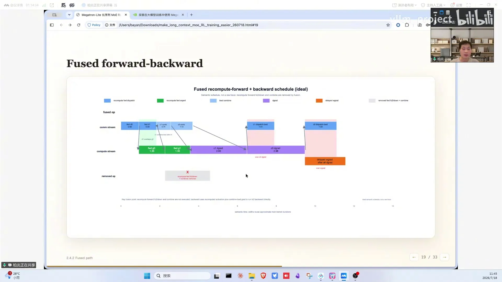 |
| 分了 chunk，peak memory 就变成 chunk 的 peak memory：每个 chunk 算完就丢弃。这条黑线是 baseline——完全不做优化的 MoE 一层的 peak memory。横轴是 4K、8K、16K、32K、64K 序列长度，纵轴是 memory。可以看到…… [【跳转到 44:09】](https://www.bilibili.com/video/BV1WLKw6aEDq/?t=2649) | 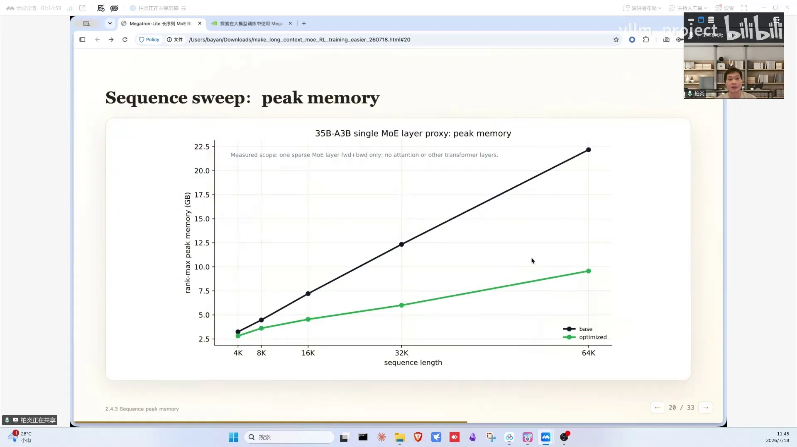 |
| 如果是 16K，一层其实就占了 7-8GB 显存；如果是 64K，就 20 多 GB，非常多。分了 chunk 之后是绿色的线，比较典型的降低，也是线性的。对…… [【跳转到 44:34】](https://www.bilibili.com/video/BV1WLKw6aEDq/?t=2674) | 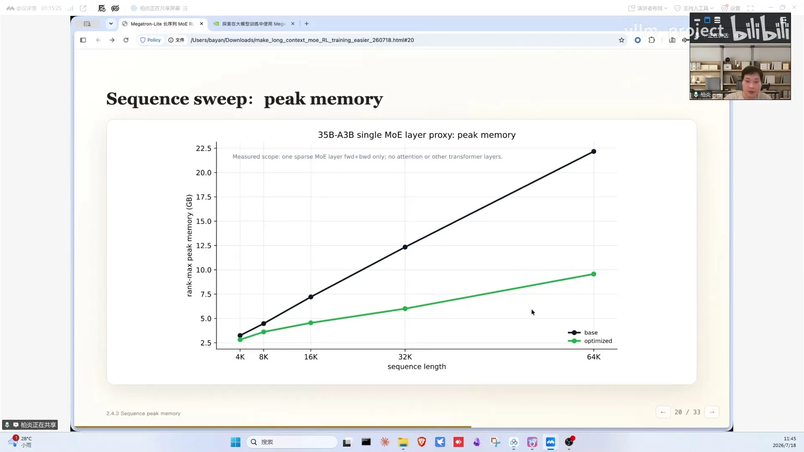 |
| 还有一个 speedup，有加速，取决于序列长度：local sequence length——除以 CP 之后不考虑 DP——序列越大加速占比越高。很好理解：分 chunk 本身要带来一些 overhead…… [【跳转到 44:59】](https://www.bilibili.com/video/BV1WLKw6aEDq/?t=2699) |  |
| 把它们合体起来就是 Megatron baseline 127。打开 linear cross entropy，显存有了更多空间，可以把 pipeline parallel 降低…… [【跳转到 45:24】](https://www.bilibili.com/video/BV1WLKw6aEDq/?t=2724) | 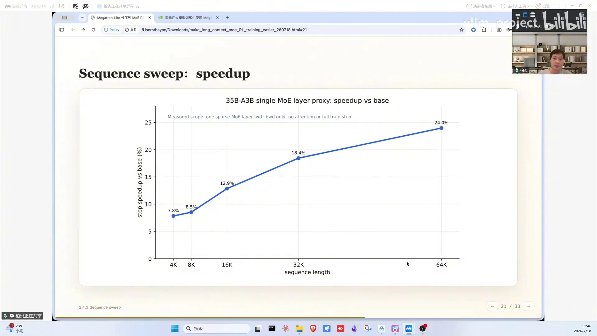 |
| 从 PP4 降到 PP2，TFLOPS 到了 162。然后把 optimizer 从 distributed optimizer 换成 FSDP——因为训练比较长，FSDP 的通信时间基本没有暴露，是完全有性价比的设置…… [【跳转到 45:49】](https://www.bilibili.com/video/BV1WLKw6aEDq/?t=2749) |  |
| 从 162 到 163 附近其实是波动：计算没有提升但显存显著下降。显存下降了就可以继续做文章：把 PP2 降到 PP1，这时就来到了 180，peak memory 是 60GB，还没超 H100 的 80GB。 [【跳转到 46:14】](https://www.bilibili.com/video/BV1WLKw6aEDq/?t=2774) | 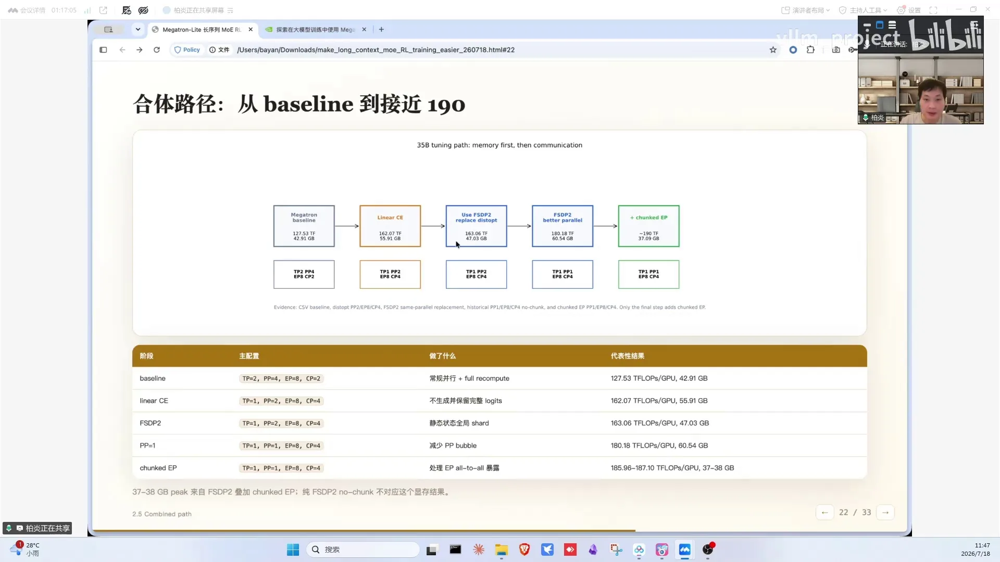 |
| 这时再叠加 chunk EP，就到了 190 TFLOPS 附近，peak memory 降低到 37。这时可以再引入更多 local sequence length：有了更多显存就可以叠加更多优化。但这个 chunk EP 本身是之前做的 POC…… [【跳转到 46:39】](https://www.bilibili.com/video/BV1WLKw6aEDq/?t=2799) |  |
| 后面我会持续把它做到 Megatron 里去。现在大家可能还没办法 access 到比较好的程度，但至少到现在为止大家是可以使用的。然后回顾一下 recipe：调节并行——之前大家都有自己的方法论…… [【跳转到 47:04】](https://www.bilibili.com/video/BV1WLKw6aEDq/?t=2824) | 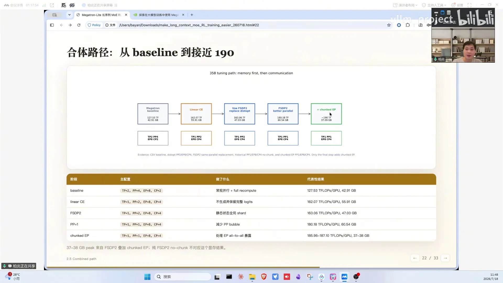 |
| 先调这个再调那个，降低到了：我们把静态显存和动态显存解耦。静态显存全都交给 FSDP，动态显存全都交给 CP。EP 只负责 MoE 这个阶段…… [【跳转到 47:29】](https://www.bilibili.com/video/BV1WLKw6aEDq/?t=2849) |  |
| 要不要用通信来换计算效率。PP 能带来更多上限：PP 本质上是一个降低问题规模的工具——1024 张卡开 PP8，相当于变成 8 个模型…… [【跳转到 47:54】](https://www.bilibili.com/video/BV1WLKw6aEDq/?t=2874) | 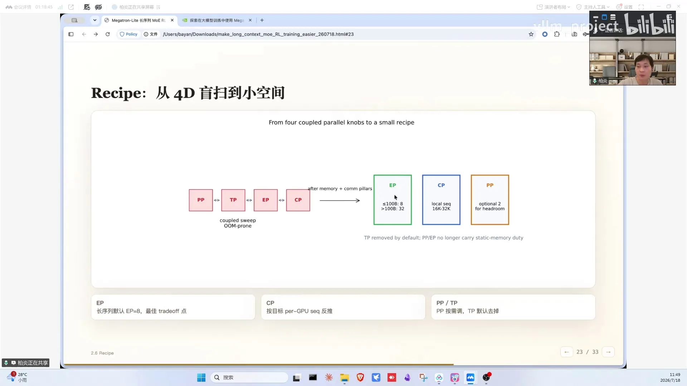 |
| 每个模型 128 张卡，是降低问题规模的切分。当然它有代价：PP bubble。长序列时的 takeaway：默认开 EP8 就行了，也不用开更大的 EP——EP8 基本是当前的最佳点。 [【跳转到 48:19】](https://www.bilibili.com/video/BV1WLKw6aEDq/?t=2899) |  |
| CP 取决于 local seq length：总序列 128K，CP2 local seq 64K，CP4 local 32K，以此类推。TP 通常就不需要了。PP 在比较大的模型的时候…… [【跳转到 48:44】](https://www.bilibili.com/video/BV1WLKw6aEDq/?t=2924) |  |
| 比较大的模型时推荐开一些小小的 PP。后面会分享 DeepSeek V4 的强化学习 recipe，就是这样的实践。——有同学问：为什么开了 PP 之后会降低 MFU？——其实不一定，看情况。嗯对。 [【跳转到 49:09】](https://www.bilibili.com/video/BV1WLKw6aEDq/?t=2949) |  |
| 时间不多了，我先把后面的过一遍，再做最后的问答，可以吗？好。第三部分回顾整个优化过程，同时给 Megatron-Light 打个广告：刚刚做的这些优化都是在 Megatron-Light 上做的…… [【跳转到 49:34】](https://www.bilibili.com/video/BV1WLKw6aEDq/?t=2974) | 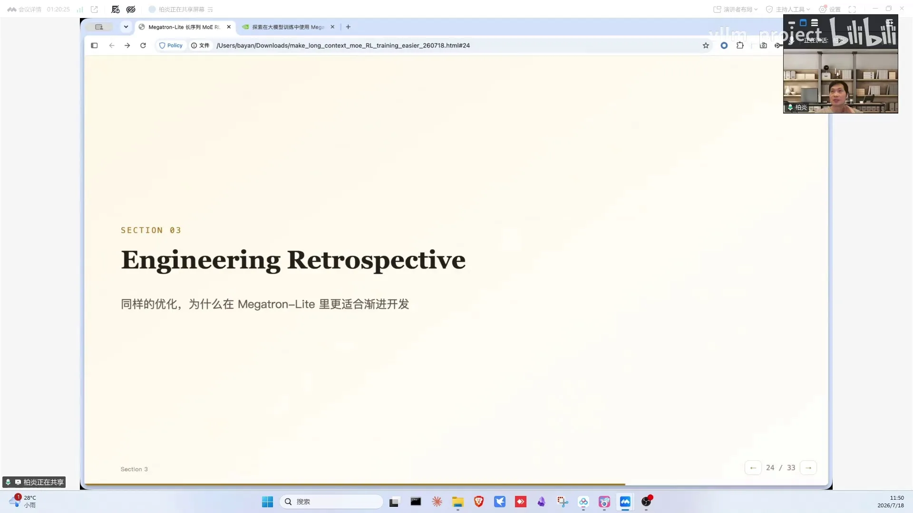 |
| engine core 上其实也能做这些优化，只不过更麻烦。对 Megatron 熟悉的用户知道：Megatron 比较复杂、难改。Megatron-Light 就是为了针对这样的情况，在 AI 时代让编排更加轻量化…… [【跳转到 49:59】](https://www.bilibili.com/video/BV1WLKw6aEDq/?t=2999) | 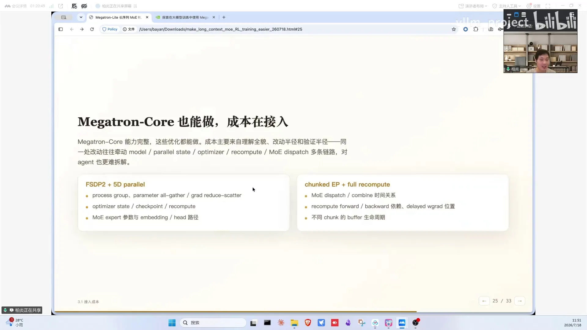 |
| 让改动变得更简单。包括 FSDP2 跟 5D 并行的结合、chunk 的 EP 加完全重算——这些都是 engine core 上也可以做的优化，只不过会让它更复杂难懂。Megatron-Light 保持了 Megatron 的性能…… [【跳转到 50:24】](https://www.bilibili.com/video/BV1WLKw6aEDq/?t=3024) | 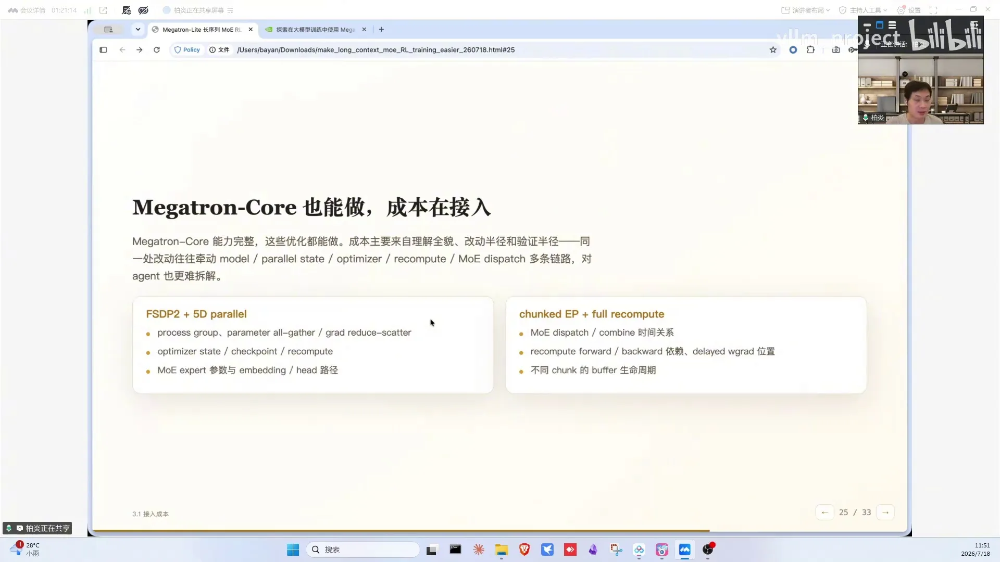 |
| 以及 Megatron 的精度，但切换了组织的形式：kernel 还是用的 Megatron 的 kernel。它有三层的抽象：一层是 primitive——可替换的原子能力：TP/CP/PP、MoE 这些都是 primitive。把这些可组装的 primitive 组装成对应的 model…… [【跳转到 50:49】](https://www.bilibili.com/video/BV1WLKw6aEDq/?t=3049) | 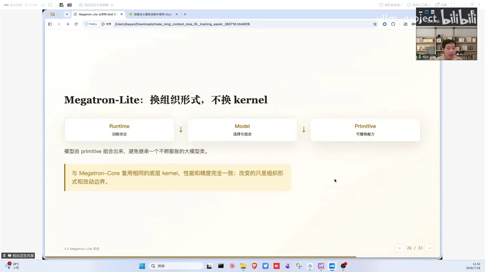 |
| 就是 model 层。还有一个 runtime：相当于 training loop，但它是 agentic 的 training loop。我也做了它跟强化学习框架的结合，它也是一个 tinker-like 的 API。刚才提到的优化在 Megatron-Light 框架里对应三个 primitive…… [【跳转到 51:14】](https://www.bilibili.com/video/BV1WLKw6aEDq/?t=3074) |  |
| linear cross entropy、FSDP2——它作为一个 optimizer，chunk 的 EP——把整个 EP 的模块或 MoE 的模块替换成 chunk EP 模块。这三个优化都是可替换可验证的：你之前的代码就是参考…… [【跳转到 51:39】](https://www.bilibili.com/video/BV1WLKw6aEDq/?t=3099) | 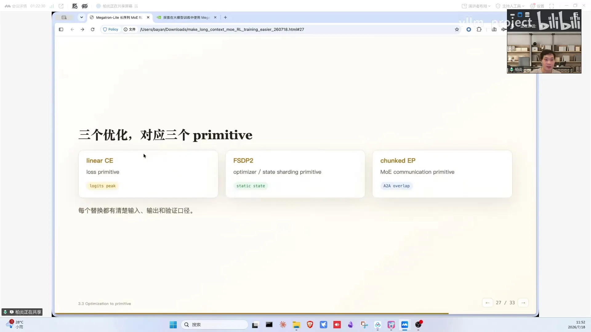 |
| 它还提供 agent tools、一套 skill 体系，大部分工作让 agent 来做。我相信在座大家已经很少有人在用古法编程了。流程是先让 agent 读 skill、确定改动边界…… [【跳转到 52:04】](https://www.bilibili.com/video/BV1WLKw6aEDq/?t=3124) |  |
| 根据已有代码做对照验证，把你改动的模块替换原本的模块，组装成新的东西。之后的训练框架开发就会变成这样的流程。这些优化都会持续 upstream 到 Megatron dev 分支，Megatron main 分支也在尝试往里做。——对。然后又提到刚才的优化、三层 primitive。顺便打个广告：我做了一个 DeepSeek V4 的强化学习 recipe…… [【跳转到 52:29】](https://www.bilibili.com/video/BV1WLKw6aEDq/?t=3149) |  |
| （接上） [【跳转到 52:54】](https://www.bilibili.com/video/BV1WLKw6aEDq/?t=3174) |  |
| 它也是支持 CP 的：可以支持 128K、256K 这种比较长序列的强化学习，应该是 Megatron 的 DeepSeek V4 CP 的首发。现在已经可以用了。 [【跳转到 53:19】](https://www.bilibili.com/video/BV1WLKw6aEDq/?t=3199) |  |
| 哇感谢白岩老师。白岩老师可以顺便指下路：这个项目到底在哪里？——好，它其实是在 Megatron…… [【跳转到 53:44】](https://www.bilibili.com/video/BV1WLKw6aEDq/?t=3224) | 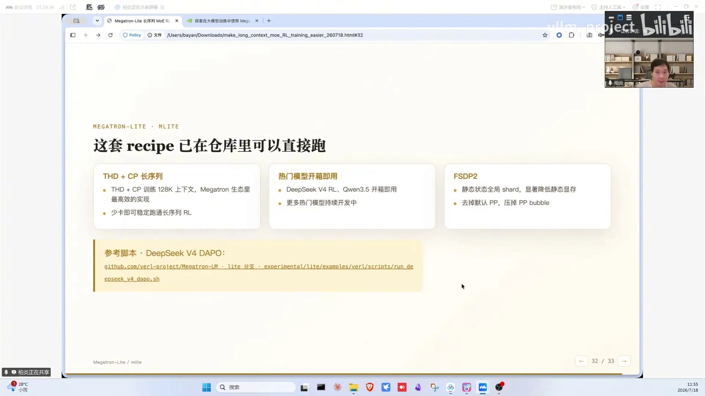 |
| 现在的 upstream 是在 Megatron 的 dev branch。 [【跳转到 53:59】](https://www.bilibili.com/video/BV1WLKw6aEDq/?t=3239) |  |
| 刚才提到的 DeepSeek V4 强化学习的 recipe 目前在这个路径下，但已经提到 Megatron 的 dev 分支上了，很快也会出现在 Megatron main 分支上。——那么我想跑 DeepSeek V4 DAPO 需要多少张卡呢？——Hopper 100 的话最少 88 张卡就行。但通常大家会用 2 的整数次幂：128 张卡。跑的序列长度是多少呢…… [【跳转到 54:04】](https://www.bilibili.com/video/BV1WLKw6aEDq/?t=3244) | 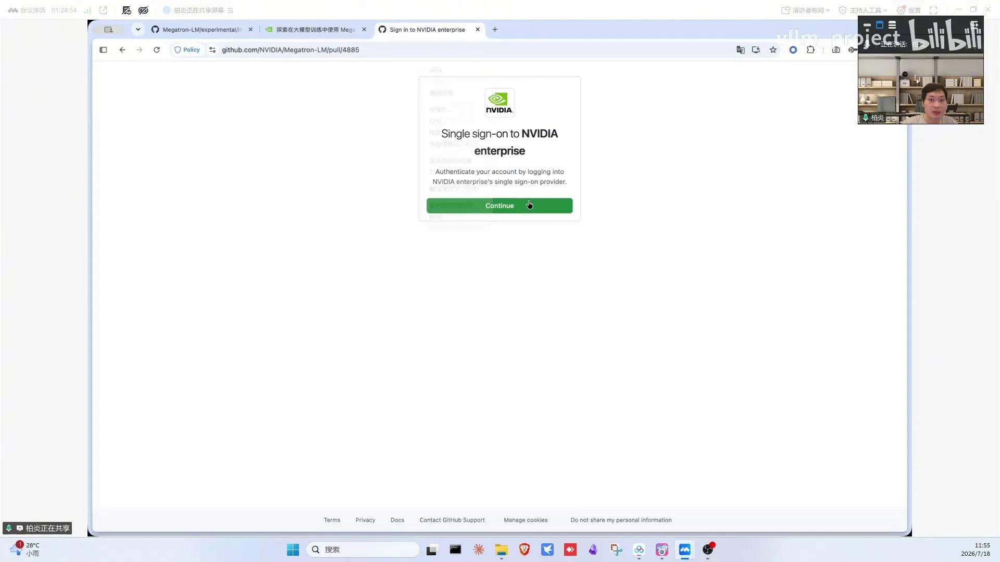 |
| （接上） [【跳转到 54:29】](https://www.bilibili.com/video/BV1WLKw6aEDq/?t=3269) | 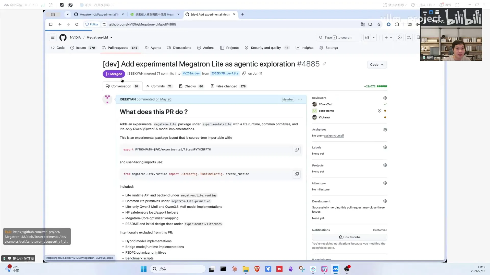 |
| 128K 吗？——128K 可以跑：开比较大的 CP 就行了。就是用 CP 控制长序列、PP 开一个比较小的值。之前如果用 Megatron 加 distributed optimizer，就需要开比较大的 PP 加比较大的 EP…… [【跳转到 54:54】](https://www.bilibili.com/video/BV1WLKw6aEDq/?t=3294) | 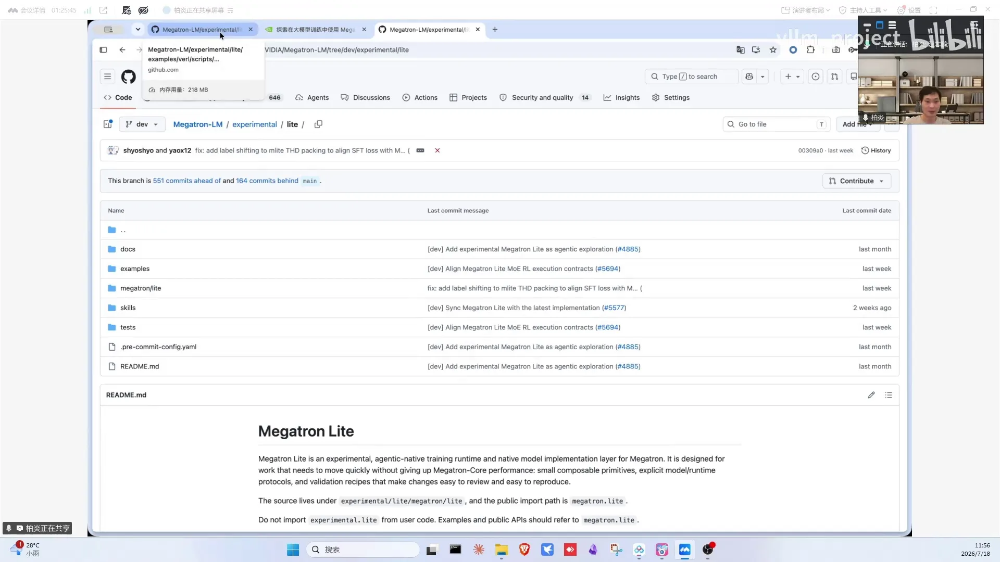 |
| 需要保证 PP×EP 基本等于卡数。但现在用 FSDP2 作为 optimizer 就不需要这样的假设了。——有同学问 Megatron core 现在支持 FSDP2 吗？——Megatron core 实现了一个弱化的版本…… [【跳转到 55:19】](https://www.bilibili.com/video/BV1WLKw6aEDq/?t=3319) | 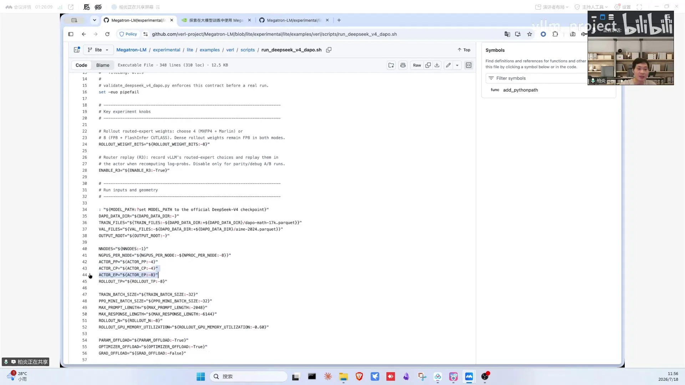 |
| Megatron core 的 FSDP 不支持跟 pipeline parallel 结合。Megatron 里有一个叫 Megatron FSDP，它是 FSDP2 的上位替代，性能严格优于 FSDP2…… [【跳转到 55:44】](https://www.bilibili.com/video/BV1WLKw6aEDq/?t=3344) | 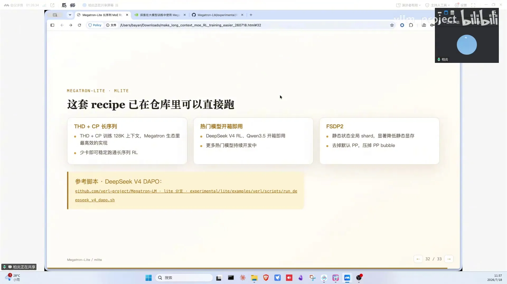 |
| 但现在还在开发中。我的 Megatron-Light 之后也会接入 Megatron FSDP 作为 FSDP2 的上位替代。——那如果有 Megatron FSDP 的话可以跟 PP 一起用了吗？——Megatron core 里的 Megatron FSDP 目前也不支持 pipeline parallel。 [【跳转到 56:09】](https://www.bilibili.com/video/BV1WLKw6aEDq/?t=3369) |  |
| 这其实也是因为 Megatron 本身比较复杂，结合会比较困难。我这边之所以能结合，是因为做了相当于重构的工作：把整个 optimizer 做成一个 primitive，把耦合降到最低。——Optimizer：像这里（600 行），它有一个 FSDP，有个 distributed optimizer——distributed optimizer 实际上直接 import Megatron 自己的。——非常感谢白岩老师的分享。 [【跳转到 56:34】](https://www.bilibili.com/video/BV1WLKw6aEDq/?t=3394) | 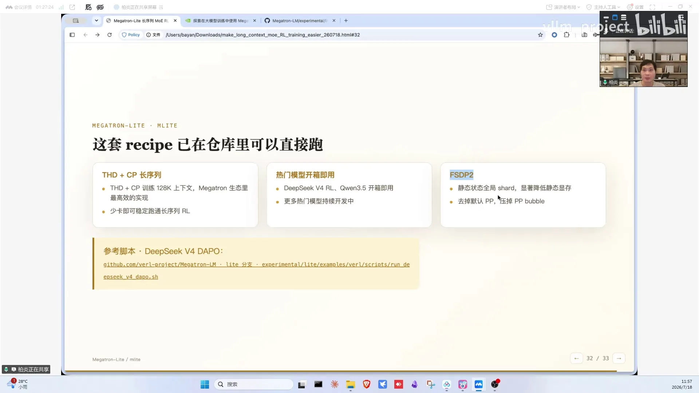 |
| （接上） [【跳转到 56:59】](https://www.bilibili.com/video/BV1WLKw6aEDq/?t=3419) | 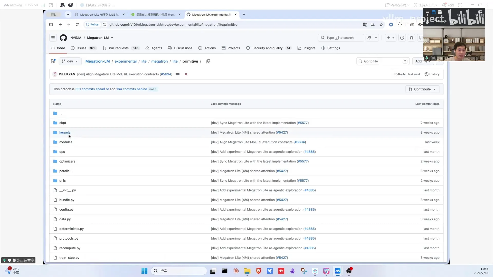 |
| 直播间的同学有没有其他问题想问的？——刚才说 PP 不一定会降低 MFU，具体是什么原因造成的？ [【跳转到 57:24】](https://www.bilibili.com/video/BV1WLKw6aEDq/?t=3444) |  |
| 大多数时候能不开并行就不开。假如你本来是个 7B、30B 的模型，不开 PP 就能跑就没必要开 PP。开 PP 一般就是不开跑不了了、不得不开。其实不光 PP，其他各种并行都是这样：CP 如果不并行能跑…… [【跳转到 57:49】](https://www.bilibili.com/video/BV1WLKw6aEDq/?t=3469) |  |
| 开了 CP 效率肯定也在降低，对吧。所以最好只有（小模型）能开 DP 跑通就行。所有并行都是能不开就不开。嗯好。然后有同学问：light 后面会持续维护吗？——是，目前是一个在维护的状态…… [【跳转到 58:14】](https://www.bilibili.com/video/BV1WLKw6aEDq/?t=3494) |  |
| 我们也有越来越多的早期用户在尝试使用，它会维护、打磨得更好，加入 Megatron 的 main 分支，作为 Megatron 在 agentic 时代的一个探索性项目。——对。 [【跳转到 58:39】](https://www.bilibili.com/video/BV1WLKw6aEDq/?t=3519) | 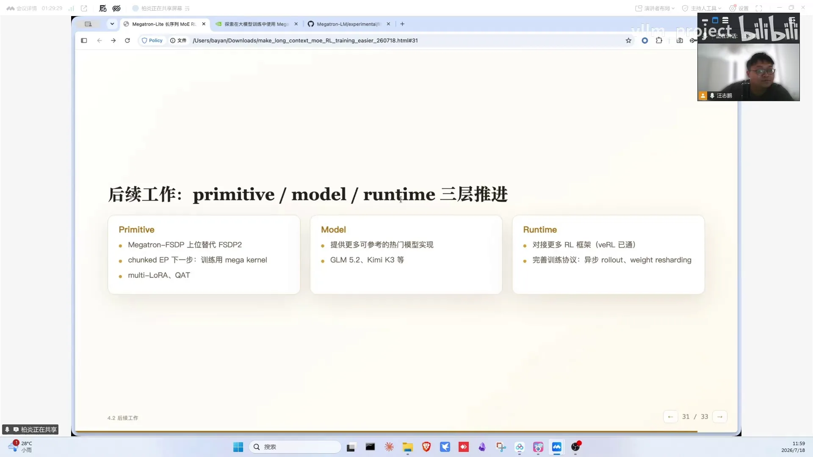 |
| 方便透露一下你们团队现在有多少人吗？——指哪个团队？——现在有三四个同事在参与，后面会有更多同事…… [【跳转到 59:04】](https://www.bilibili.com/video/BV1WLKw6aEDq/?t=3544) | 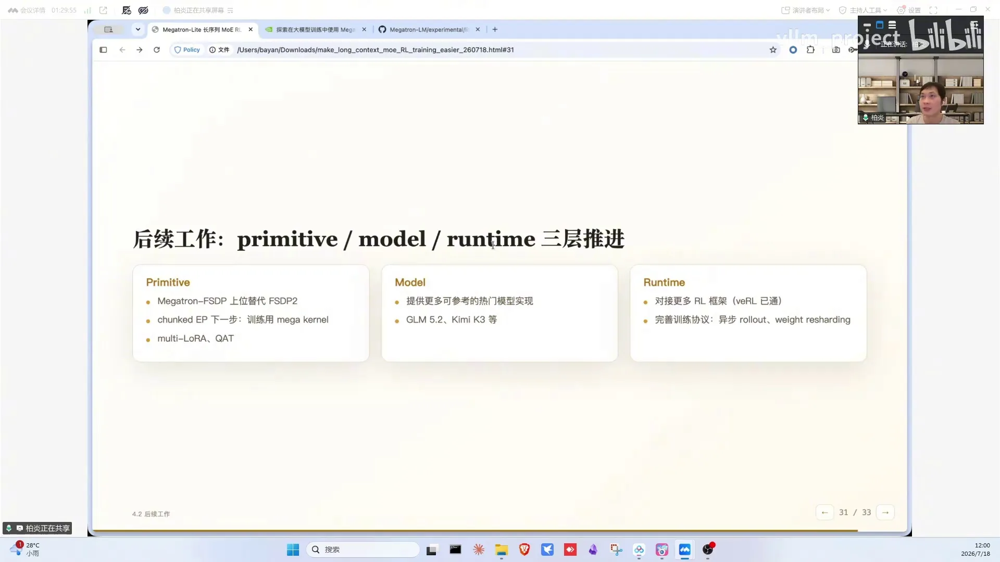 |
| 取决于它的 adoption 情况：假如更多用户 adoption，我们也会逐渐往这个方向投入更多人力，大概是这样的过程。所以大家也可以尝试用起来，发现有什么问题可以提 PR。 [【跳转到 59:29】](https://www.bilibili.com/video/BV1WLKw6aEDq/?t=3569) |  |
| 对对对是的。直播间好多同学问：Megatron-Light 有 Q3 的 roadmap 吗？——我做了在 veRL 里的联合 roadmap。Megatron-Light 自己的 roadmap 我暂时还没有，但我会下来把它提上去…… [【跳转到 59:54】](https://www.bilibili.com/video/BV1WLKw6aEDq/?t=3594) | 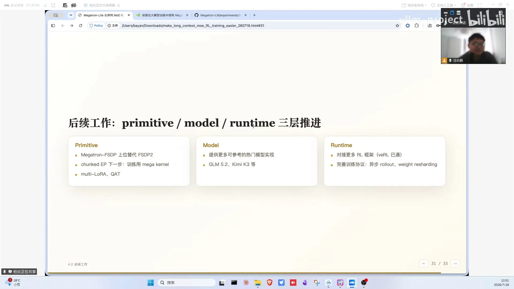 |
| 好，我找找。然后有同学问：为什么 TP 和 CP 会增加 CPU 的 overhead？——TP 和 CP 因为要做复杂的 shape 切换，有 if/else 判断…… [【跳转到 60:19】](https://www.bilibili.com/video/BV1WLKw6aEDq/?t=3619) | 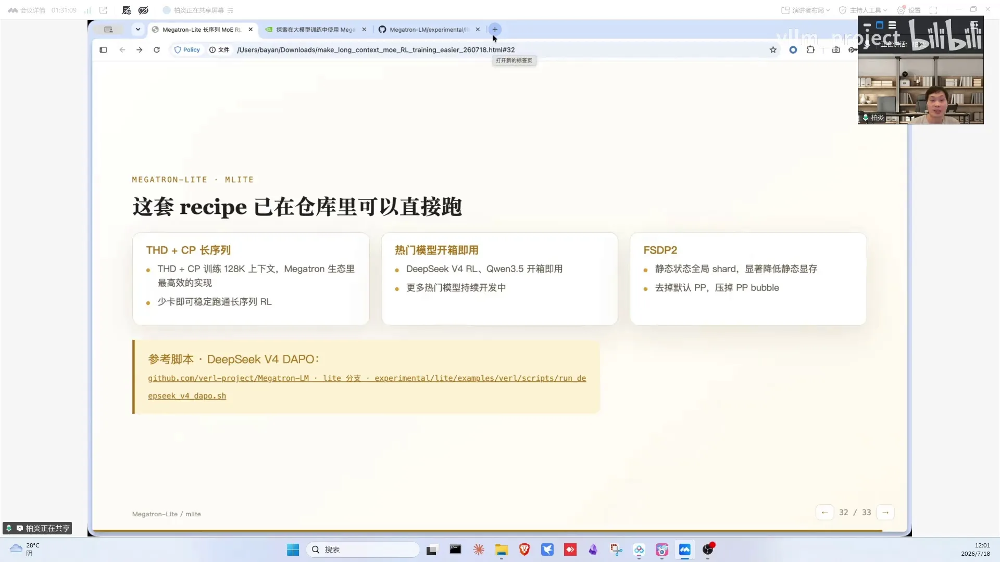 |
| 还有一些 concat 之类的操作，这些操作本身都要额外花 CPU。而且开了 TP 和 CP 会导致计算密度降得更低：计算密度低，相对来说 CPU 就需要更快…… [【跳转到 60:44】](https://www.bilibili.com/video/BV1WLKw6aEDq/?t=3644) | 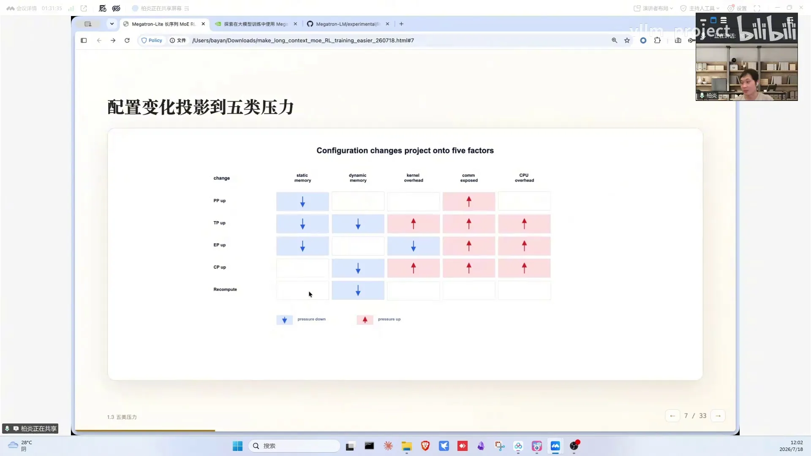 |
| 才能保持不被暴露。比如你开 TP2，计算耗时降低了；TP 开得比较大时计算耗时降低了很多，等 CPU 总有掩盖不住的时候。实际观察中 TP 和 CP 很容易带来暴露…… [【跳转到 61:09】](https://www.bilibili.com/video/BV1WLKw6aEDq/?t=3669) |  |
| 尤其在强化学习这种可变序列训练的情况下更容易暴露：可变序列本身需要额外的各种判断——打包、解包等等。然后有同学问《AI system performance engineer》这本书有看过吗？——这本书我没有看，不好意思。我也没看过。 [【跳转到 61:34】](https://www.bilibili.com/video/BV1WLKw6aEDq/?t=3694) |  |
| 然后有同学说：训练框架现在太多了，易用性很重要。——是的。因为我对 Megatron 做强化学习相关的工作比较深入，了解了很多弊病，所以才做 Megatron-Light 这样的尝试。现在的 Megatron bridge 前身也是我发起的…… [【跳转到 61:59】](https://www.bilibili.com/video/BV1WLKw6aEDq/?t=3719) |  |
| 嗯是的我也是啊因为我也是对MCTRON做做强化学习相关的工作做的比较深入了然后也是了了解了他的很很很多这个弊病所以才做METRONLIGHT这样的一个尝试的因为啊现在的这个麦麦克风bridge其实它的前身AMBRIDGE然后也是我来这个发起的 [【跳转到 62:24】](https://www.bilibili.com/video/BV1WLKw6aEDq/?t=3744) | 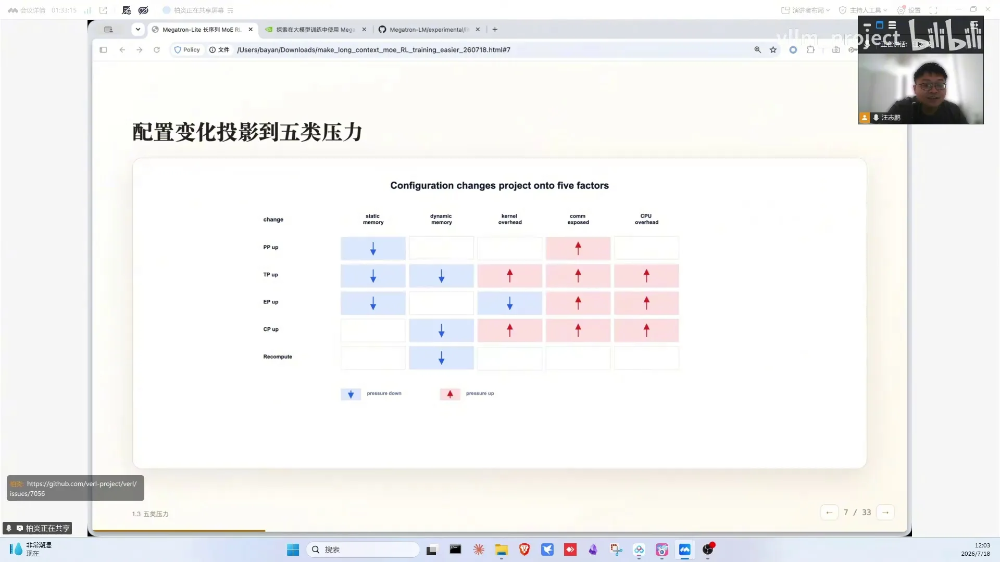 |
| 我在给强化学习框架接入 Megatron 的过程中发现哪些可以优化的点，做了优化。然后有同学问：请教下为什么并行能不开就不开？训练的性能不能靠并行加速吗？ [【跳转到 62:49】](https://www.bilibili.com/video/BV1WLKw6aEDq/?t=3769) |  |
| 你这里指的是这四个并行？ [【跳转到 63:13】](https://www.bilibili.com/video/BV1WLKw6aEDq/?t=3793) | 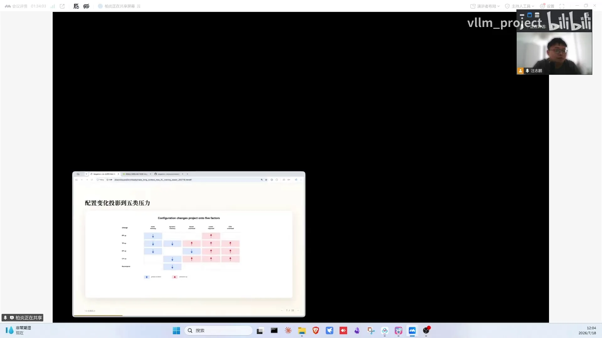 |
| 能不开就不开：四个并行都不开时你是有 DP 的。至少在训练里 DP 严格优于其他并行——在我见过的所有 case 都成立。我不能保证百分百成立…… [【跳转到 63:18】](https://www.bilibili.com/video/BV1WLKw6aEDq/?t=3798) |  |
| 但它是这样的：除非特别不均衡——一个 DP 要处理 100K 数据、另一个 DP 处理 1K 数据，那肯定要开并行变得均衡。但如果 DP 均衡的话，DP 是严格优于其他并行的。不是说能不开就不开…… [【跳转到 63:43】](https://www.bilibili.com/video/BV1WLKw6aEDq/?t=3823) |  |
| 就是 DP 优于其他并行。然后在在线强化学习训练 agent 的场景中推荐使用 veRL 还是 ms-swift？——看你的个人需求，我不做推荐。——嗯。然后有同学问：Megatron-Light 的性能和 Megatron 差距大吗？好像很多特性更轻量级了。 [【跳转到 64:08】](https://www.bilibili.com/video/BV1WLKw6aEDq/?t=3848) |  |
| 性能是一致的：至少对强化学习来说这些关键的（组件）都有。它只是切换了组织形式…… [【跳转到 64:33】](https://www.bilibili.com/video/BV1WLKw6aEDq/?t=3873) | 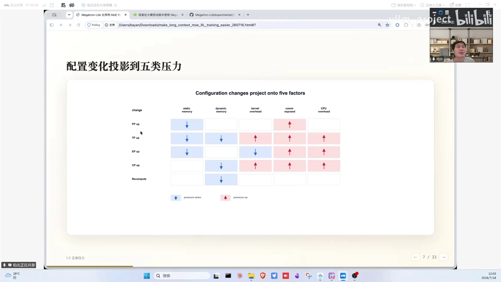 |
| kernel 还是一样，精度速度都一致。而且由于做了轻量化，减少了很多不必要的 CPU 判断——原来的 Megatron 会有很多 if/else 来支持所有（过时的）场景，所以有一些 CPU overhead。Megatron-Light 在这种情况下会比 Megatron core 更快一些。——对对。我也在持续做各种优化：chunk EP overlap 目前有一个 POC 在 Megatron-Light 上，Megatron core 暂时还没有。实际最终影响它效果的是各种优化。其实我也觉得做框架要经常把老功能删掉。——是的。 [【跳转到 64:58】](https://www.bilibili.com/video/BV1WLKw6aEDq/?t=3898) |  |
| （接上） [【跳转到 65:23】](https://www.bilibili.com/video/BV1WLKw6aEDq/?t=3923) | 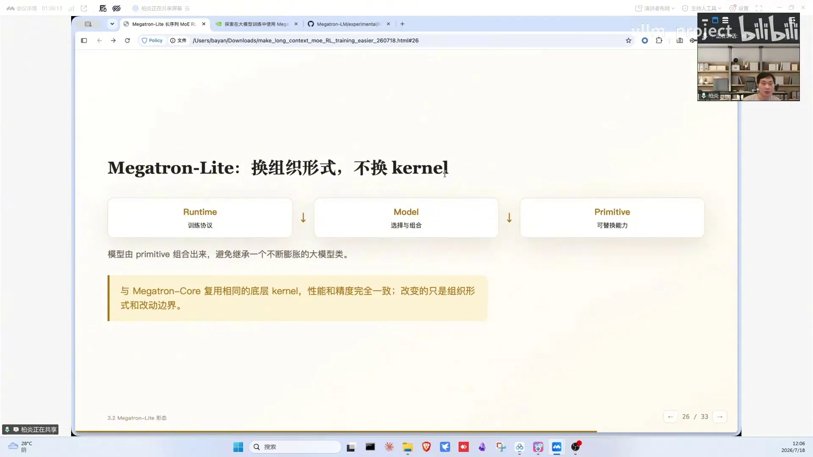 |
| 很多东西你可以明显感到后面不可能再需要了：代码多看的人不好学、改也不好改，CI 又要浪费很多资源跑没用的 CI。——是的。一个典型例子：我给强化学习框架支持 Megatron 时，发现 Megatron 的 BERT 还有一堆测试在跑——BERT 已经是老古董了，还有一波代码判断它。vLLM 以前也支持 Bert 这些模型，去年全部删掉了。确实需要定期重构不然就（成负担）了。——然后强化学习用卡不多，所以 trainer 的选择会更优先选易二次开发的吗？ [【跳转到 65:48】](https://www.bilibili.com/video/BV1WLKw6aEDq/?t=3948) | 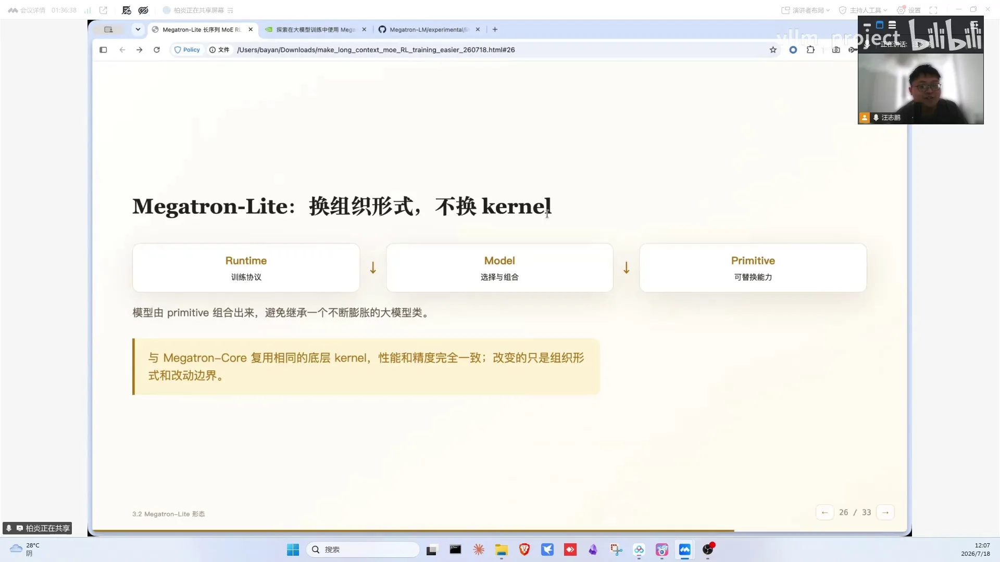 |
| （接上） [【跳转到 66:13】](https://www.bilibili.com/video/BV1WLKw6aEDq/?t=3973) |  |
| 这个得看你怎么理解"用卡不多"：其实是我们有了更多卡会倾向于做更多组实验。但如果这个实验本身效率比较低，我们还是希望效率能提高…… [【跳转到 66:38】](https://www.bilibili.com/video/BV1WLKw6aEDq/?t=3998) |  |
| 大家知道现在做 agentic 的 RL，大部分时间其实在 rollout 上。但不是说训练就完全不需要优化了：因为大家都会用异步来做调度，异步的情况下需要保证两边的吞吐量大致相等。当然可以调节卡的配比…… [【跳转到 67:03】](https://www.bilibili.com/video/BV1WLKw6aEDq/?t=4023) |  |
| 如果两边的速度差很多，异步就变得没有意义。我觉得单步异步就已经算是极限了：弄全异步会导致训练非常没效率——得保证吞吐一致，只要吞吐不一致一定会有 bubble…… [【跳转到 67:28】](https://www.bilibili.com/video/BV1WLKw6aEDq/?t=4048) |  |
| 要不然就是 rollout 等 train，要不就是 train 等 rollout。好，然后想看看训练的 backward 的 overlap 跟推理差别挺大的，可以指下路吗？——推荐学习 Megatron…… [【跳转到 67:53】](https://www.bilibili.com/video/BV1WLKw6aEDq/?t=4073) |  |
| Megatron 代码虽然复杂，但里面的各种优化还是比较权威的：配置里有各种 overlap。比如你找一个 all-to-all overlap…… [【跳转到 68:18】](https://www.bilibili.com/video/BV1WLKw6aEDq/?t=4098) | 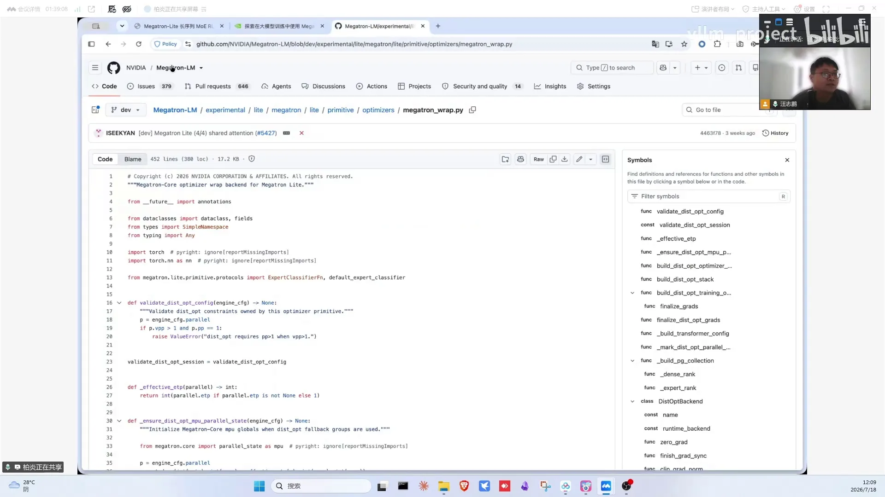 |
| 还有 MoE 的 expert overlap。这里是一个目录，你叫 agent 看（代码）就能列出有哪些 overlap，然后问每个的原理怎么实现，我觉得这是挺好的方式。训练这一块…… [【跳转到 68:43】](https://www.bilibili.com/video/BV1WLKw6aEDq/?t=4123) | 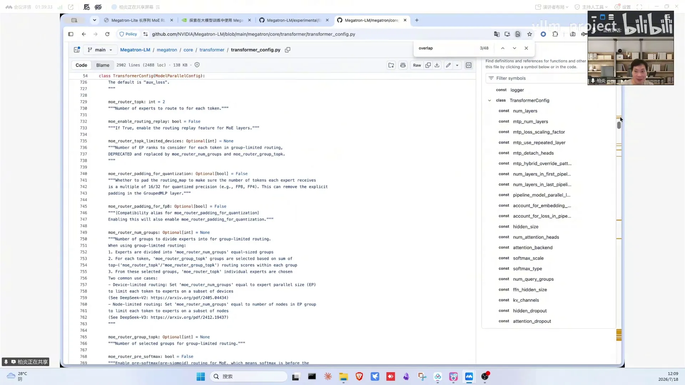 |
| overlap 其实很多地方跟推理的思路完全一样：比如计算和通信做 overlap，肯定会对计算做 chunk 的切分，通过一遍算一遍传的形式来做。比较特殊的可能是 backward 的时候…… [【跳转到 69:08】](https://www.bilibili.com/video/BV1WLKw6aEDq/?t=4148) | 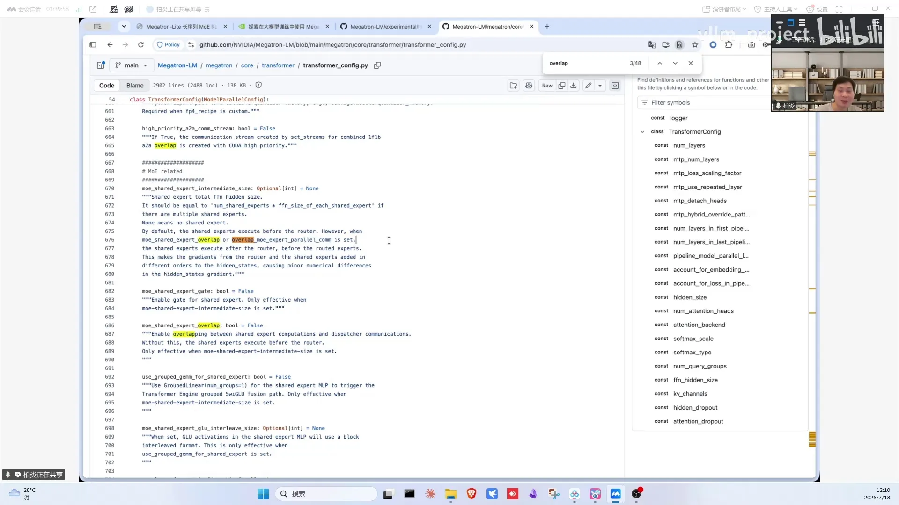 |
| 比如参数上的梯度，weight grad 放在卡上，其他往前面层传，这里可以分开算。我觉得这个影响可能主要在 PP 上，我这么理解对吗？——其实不管是训练还是推理，GPU 加速这部分原理是一样的…… [【跳转到 69:33】](https://www.bilibili.com/video/BV1WLKw6aEDq/?t=4173) | 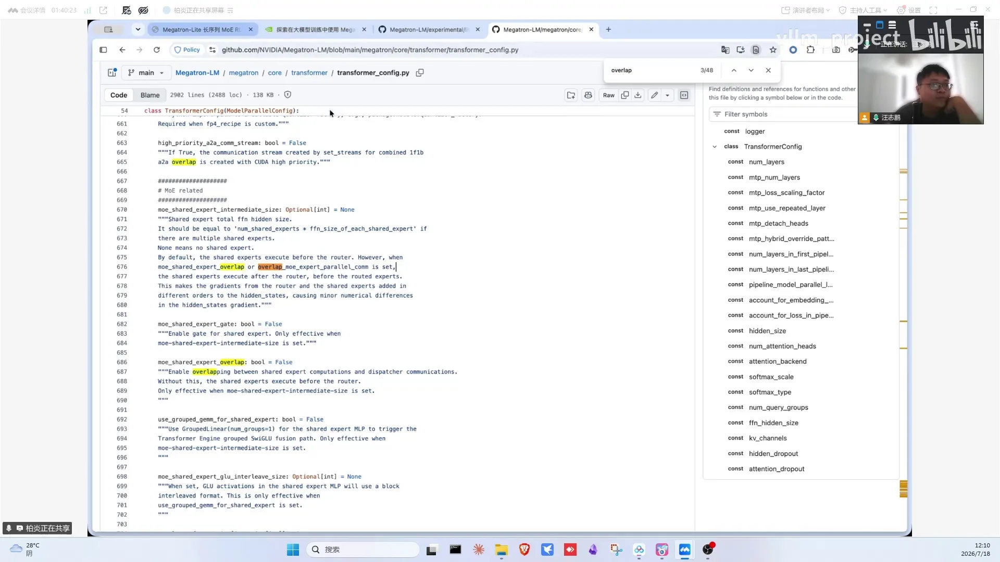 |
| 没有特别不同。训练需要考虑 backward，推理一般不用考虑。针对 backward 训练会有额外需求：更多 activation 要保存下来…… [【跳转到 69:58】](https://www.bilibili.com/video/BV1WLKw6aEDq/?t=4198) | 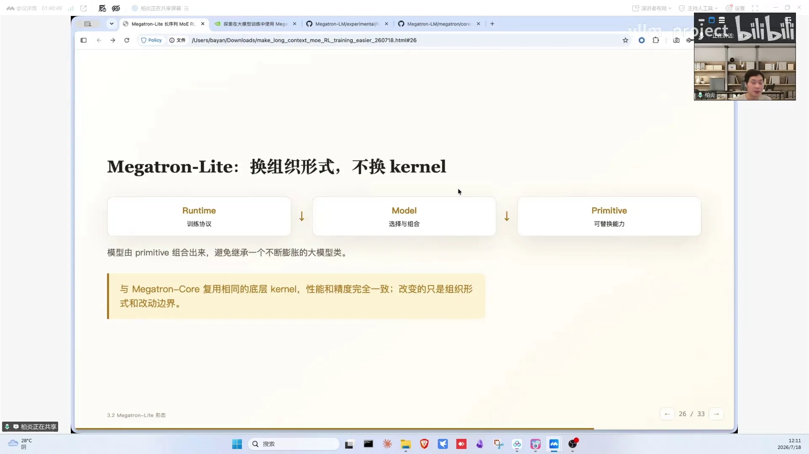 |
| 有同学问：Megatron 这种库怎么学习？直接看源代码吗？——直接问 AI：把代码给 AI，有问题直接问，最好让 AI 给你指路——代码大概在什么地方。看不懂代码也没关系，让 AI 讲这代码哪部分大概实现什么功能。我觉得这样可以对。 [【跳转到 70:23】](https://www.bilibili.com/video/BV1WLKw6aEDq/?t=4223) |  |
| 现在问 AI 是最快的。正好 Megatron-Light 在 Megatron main 分支上也有一个 readme，有兴趣可以看。想最快速学习 Megatron 的话，推荐使用 Megatron-Light，直接问 agent Megatron-Light 里的这些 component…… [【跳转到 70:48】](https://www.bilibili.com/video/BV1WLKw6aEDq/?t=4248) | 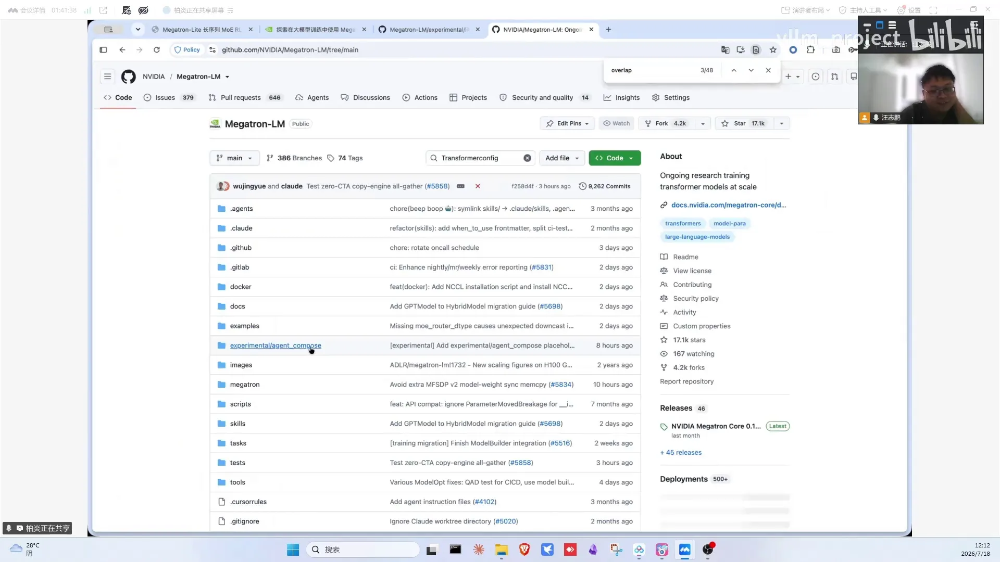 |
| 因为它已经是我对 Megatron 做了一遍蒸馏的，可以更简单学习。我也非常建议大家研究这个项目：Megatron 里可能还有很多 BERT 时代的代码，我们已经不需要管了，就好好研究新仓库，学习大模型规模的新特性。——然后有同学问：当前为了 RL 训练推理一致性做了哪些优化呢？ [【跳转到 71:13】](https://www.bilibili.com/video/BV1WLKw6aEDq/?t=4273) | 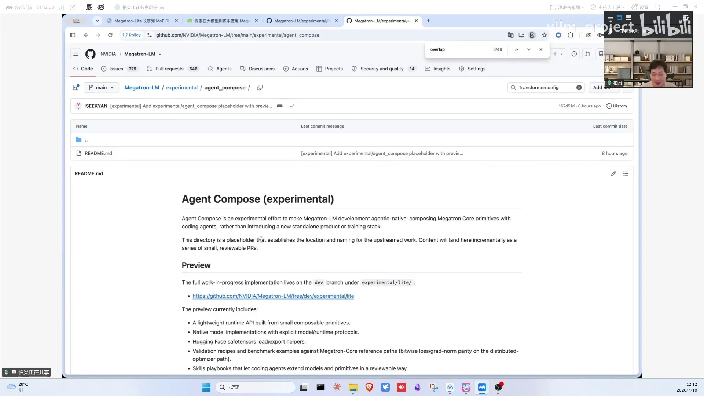 |
| 现在比较主流的一个是 QAT，然后 rollout replay（重放）…… [【跳转到 71:38】](https://www.bilibili.com/video/BV1WLKw6aEDq/?t=4298) | 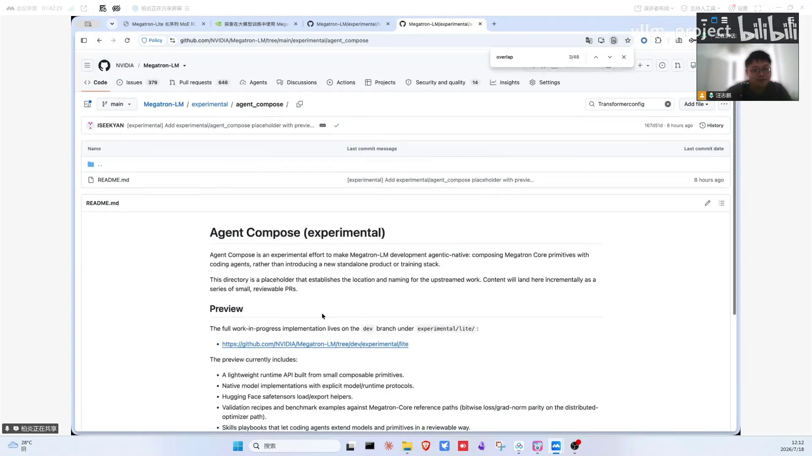 |
| 可以把一些 kernel 做替换，换成 batch-invariant kernel。我理解应该都有挺多开源工作在做。——白老师说的前两个是什么？——QAT 是 quantization aware training…… [【跳转到 72:03】](https://www.bilibili.com/video/BV1WLKw6aEDq/?t=4323) | 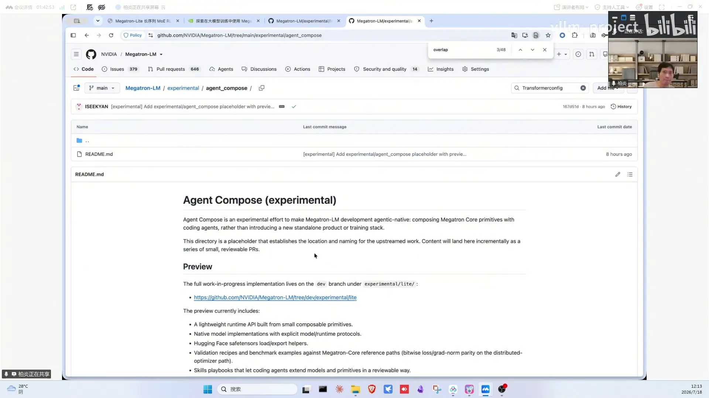 |
| 作用原理：比如 rollout 的时候用的是 4 比特、训练的时候是 16 比特，那就在训练的时候先给它量化成 4 比特、再反量化回来。这个一般被称为 fake quant（假量化），但精度确实来到了 4 比特的精度…… [【跳转到 72:28】](https://www.bilibili.com/video/BV1WLKw6aEDq/?t=4348) | 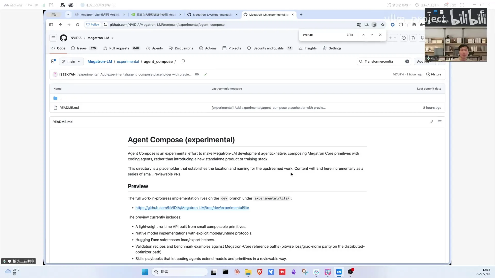 |
| 大致原理是这样。QAT 现在比较主流的也会用来训低精度。——如果说都是 BF16 那（一致性）就得深入到 kernel 级了。——感谢白岩老师的分享。 [【跳转到 72:53】](https://www.bilibili.com/video/BV1WLKw6aEDq/?t=4373) |  |
| 今天的直播差不多时间到了。没点关注的同学记得点个关注，每个礼拜六都会有相关的技术分享活动。 [【跳转到 73:18】](https://www.bilibili.com/video/BV1WLKw6aEDq/?t=4398) | 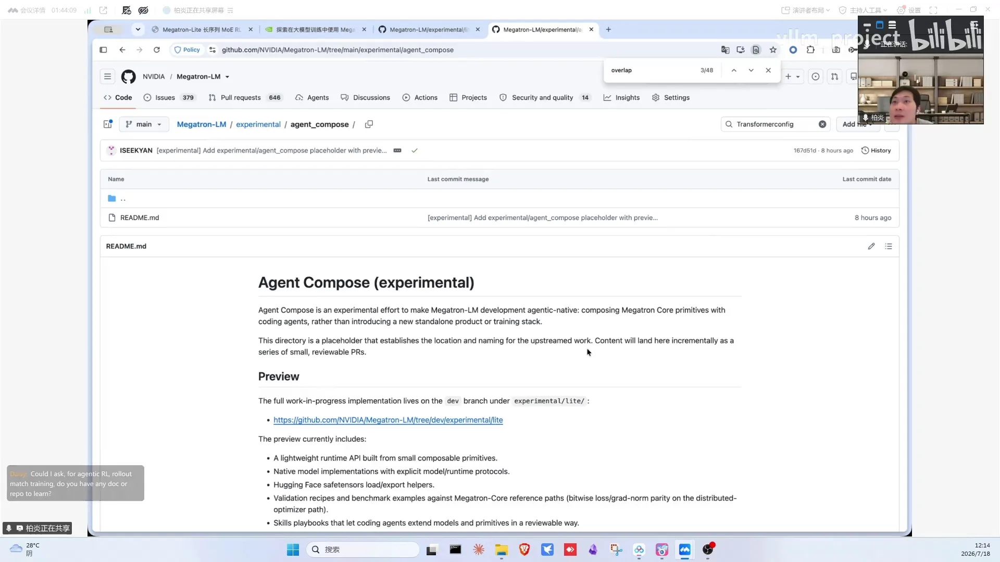 |
| （此区间无字幕） [【跳转到 73:26】](https://www.bilibili.com/video/BV1WLKw6aEDq/?t=4406) |  |