# vLLM小课堂（十二）：DSpark，当下最强投机解码详解 原始文稿（图-字幕分栏）

| 字幕文本 | 画面 |
| :--- | ---: |
| 那我开始了，我们直接开始吧。——好的好的。——今天我自我介绍一下：我叫赵山嘉文，如果大家想在（社区）里找到我，可以找 HELENZO 这个名字。我是 Red Hat 的 machine learning engineer，是我们 vLLM 生态系统里 speculators 这个库的 Maintainer…… [【跳转到 00:00】](https://www.bilibili.com/video/BV18E3u63EdR/?t=0) | 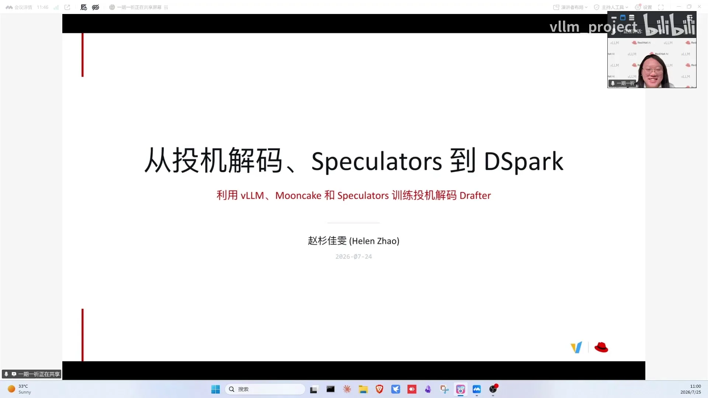 |
| 今天主要给大家分享一些投机推理的原理、我们的 speculators 库，然后到最近新推出的算法 DSpark，还有我们如何利用 veRL、Mooncake connector 和 speculators 来训练一些投机解码的 drafter…… [【跳转到 00:25】](https://www.bilibili.com/video/BV18E3u63EdR/?t=25) | 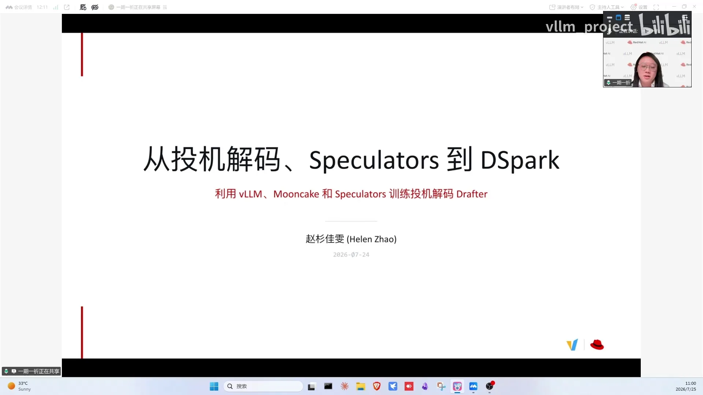 |
| 本次分享由浅到深：先介绍投机解码的原理，对训练框架做一个简单的梳理，之后介绍 DSpark 究竟怎么工作，再稍微浅显地讲一些…… [【跳转到 00:50】](https://www.bilibili.com/video/BV18E3u63EdR/?t=50) | 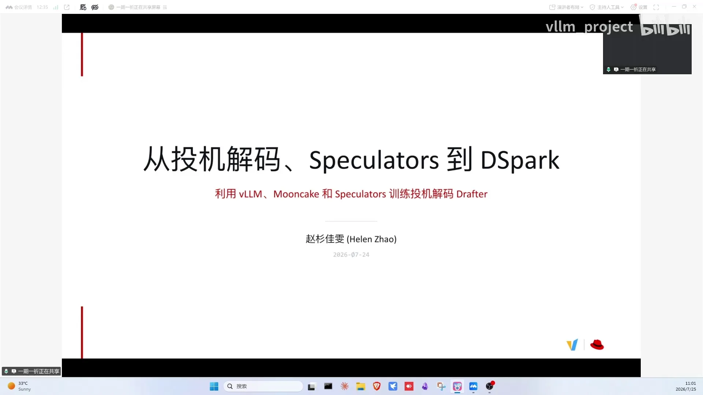 |
| 集群规模训练怎么提取隐藏状态 hidden states，以及为什么要使用 KV connector。首先投机解码到底是什么？对于不太了解的同学，有一个比较好理解的例子：比如我们使用 Anthropic 的 coding agent 这样的服务…… [【跳转到 01:15】](https://www.bilibili.com/video/BV18E3u63EdR/?t=75) | 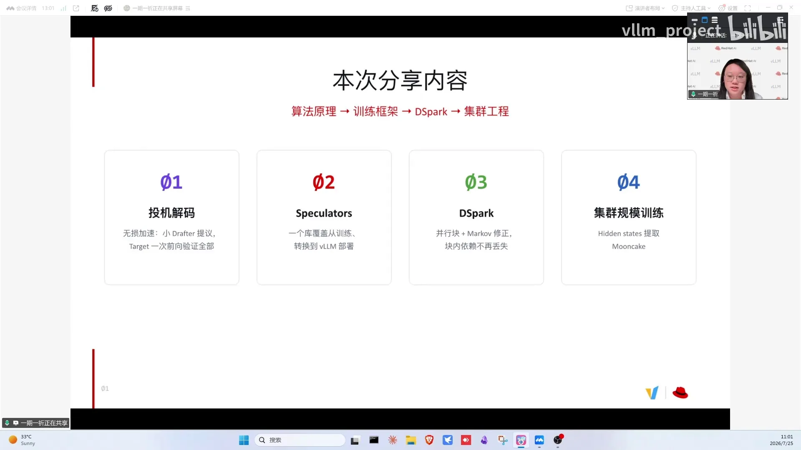 |
| 有些简单的场景它会调用简单一点的模型比如 Sonnet，复杂一点的问题才会调用更强大的模型。投机解码就是把这个想法运用到极致：现在的大模型越做越大，从几个 billion 参数到现在 trillion 级别的模型…… [【跳转到 01:40】](https://www.bilibili.com/video/BV18E3u63EdR/?t=100) | 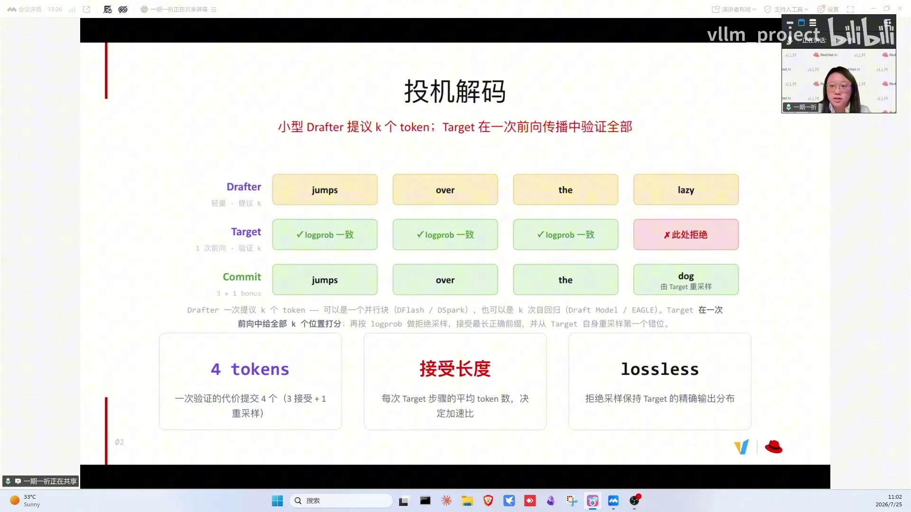 |
| 对于一个非常大的模型，我们给它训练一个特别特别小的模型。大部分时候用小模型进行大部分计算、提出一些 token；只有在特别困难的情况下…… [【跳转到 02:05】](https://www.bilibili.com/video/BV18E3u63EdR/?t=125) |  |
| 去跑大模型，用大模型来验证小模型的草稿。这样就可以省掉一些时间，让部署快起来。具体怎么工作呢？比如经典的一个像 EAGLE-3 这样的小模型，它一般来说就是一个非常小的 transformer 一层。这个小模型能够提议 token、打草稿：像 EAGLE-3 一般提议 3 个或 5 个；新一点的模型像 DFlash、DSpark 一般可以提 8~16 个。提议方式不一样…… [【跳转到 02:30】](https://www.bilibili.com/video/BV18E3u63EdR/?t=150) |  |
| 一种是这个小模型也是自回归的：小模型自己跑三次前向、生成三个 token。另外像 DFlash 或者 DSpark，就是一次生成 8~16 个 token，只跑一次前向，不做自回归——连小模型的多次前向都省略掉…… [【跳转到 02:55】](https://www.bilibili.com/video/BV18E3u63EdR/?t=175) |  |
| 跟自回归的小模型相比它就更快。然后一并把这 8~16 个 token 交给大模型，由大模型来验收。我们的例子就是小模型提了四个 token：Jumps the lazy…… [【跳转到 03:20】](https://www.bilibili.com/video/BV18E3u63EdR/?t=200) | 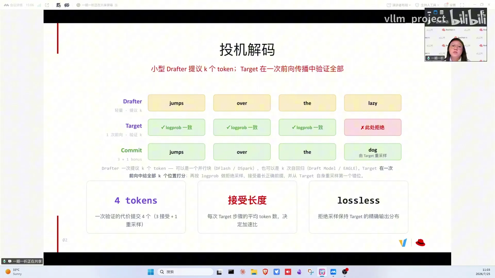 |
| target 模型一次同时收到这四个 token，只需要跑一次前向就可以把它们全部验证掉。验证的时候因为它给自己也跑了一次前向，所以它能够产生一个免费的 token…… [【跳转到 03:45】](https://www.bilibili.com/video/BV18E3u63EdR/?t=225) | 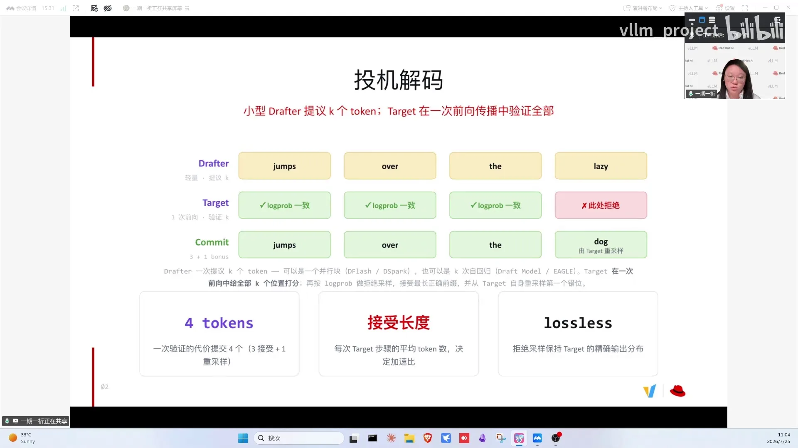 |
| 这个 token 是免费的。那它什么时候决定接受、什么时候不接受？一个比较好理解的解释：target 大模型觉得"我对这个 token 比较自信，甚至比你（小模型）更自信"，就会把它接受…… [【跳转到 04:10】](https://www.bilibili.com/video/BV18E3u63EdR/?t=250) |  |
| 像 lazy 这个 token，你虽然提出了，但我对这个 token 并不满意：我算出来的 log probability 并没有你的 log probability 这么自信。实际采用没有这么简单，但可以这样浅显理解…… [【跳转到 04:35】](https://www.bilibili.com/video/BV18E3u63EdR/?t=275) |  |
| （接上） [【跳转到 05:00】](https://www.bilibili.com/video/BV18E3u63EdR/?t=300) |  |
| 投机解码为什么好？因为它完全是无损的：大模型拒绝的过程中能够保持 target 的输出和你单独 serve 这个 target 大模型完全一样…… [【跳转到 05:25】](https://www.bilibili.com/video/BV18E3u63EdR/?t=325) |  |
| 完全没有任何损失。和其他模型优化传统方式——比如 quantization 量化或 sparsification 稀疏化——相比，它没有任何损失，只是单纯加速。——有什么问题吗？——直播间都在问 PPT 会跟回放一起（发）。——没有什么问题，我们继续。 [【跳转到 05:50】](https://www.bilibili.com/video/BV18E3u63EdR/?t=350) |  |
| 可以可以。不过我有一个小问题：这个（并行草稿模型）我听你这么说，它也是这种（并行预测）形式进行推理对吧？它是……我是善于（问）这种双向注意力、一次推理很多个 token 的——它不是做自回归的？ [【跳转到 06:15】](https://www.bilibili.com/video/BV18E3u63EdR/?t=375) | 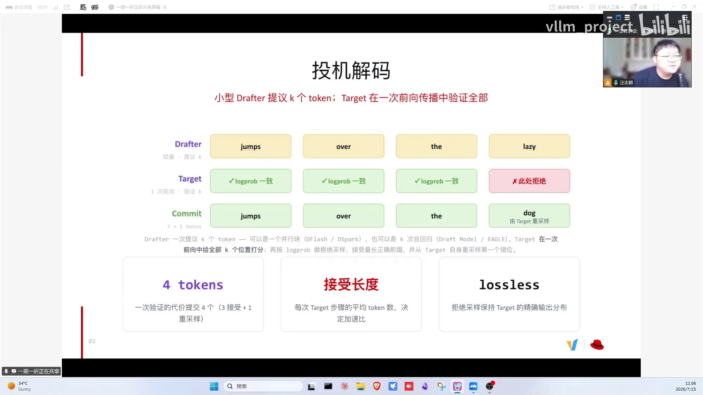 |
| 它倒不是注意力（双向）的问题：它这个注意力还是 causal 的。它就是使用一个（特殊的）sampling——因为要不然的话（组合空间）blowup 很快嘛。我们可以之后单独解释…… [【跳转到 06:40】](https://www.bilibili.com/video/BV18E3u63EdR/?t=400) | 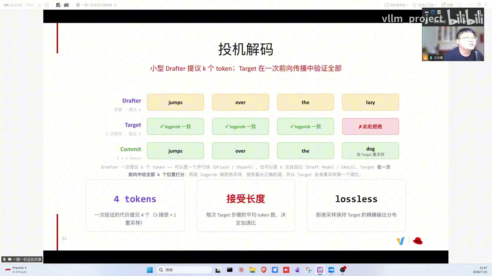 |
| 因为我知道 EAGLE 我不太清楚（那款模型）长什么样。——它和 EAGLE 长得差不多：主要就是训练过程中有一个 memory saving 的 technique。它有一个 mask token 来代替（前文）——因为它现在是并行预测了…… [【跳转到 07:05】](https://www.bilibili.com/video/BV18E3u63EdR/?t=425) |  |
| 没有前面一个 token 的信息，就用一个 mask token 来代替。另外有一个 mask hidden states：训练这个 masked hidden states，让它来代替本来可以得到的自回归 hidden state 的信息。——哦，直播间…… [【跳转到 07:30】](https://www.bilibili.com/video/BV18E3u63EdR/?t=450) |  |
| 直播间有同学开始问问题了：drafter 给到 target 的 logprobs 它的 shape 是什么样子的？——要根据不一样的模型，shape 不太一样。你看训练和 inference 的时候，一般有的时候会截取一些…… [【跳转到 07:55】](https://www.bilibili.com/video/BV18E3u63EdR/?t=475) |  |
| 前面就是比较自信的。因为它也不大。我们有时还会做 token embedding 的 reduce：实际上 drafter 不需要掌握那么多艰深的词汇…… [【跳转到 08:20】](https://www.bilibili.com/video/BV18E3u63EdR/?t=500) | 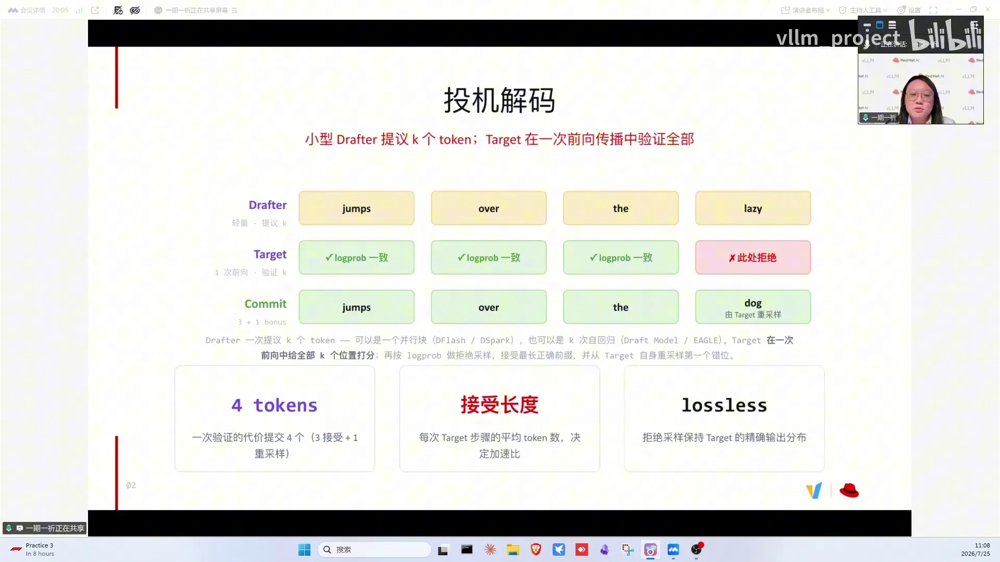 |
| 它的词汇量不需要那么大，只需要把最常用的词汇掌握就可以了。那我继续讲吧。这里可以看到有几个专有名词之后会用到，在这里介绍一下…… [【跳转到 08:45】](https://www.bilibili.com/video/BV18E3u63EdR/?t=525) |  |
| 我们现在接受的 jumps over the dog 这四个 token 就是我们的平均接受长度。接受长度越长——比如四个 token 本来大模型需要跑四次前向才能产生，现在只跑了一次前向…… [【跳转到 09:10】](https://www.bilibili.com/video/BV18E3u63EdR/?t=550) | 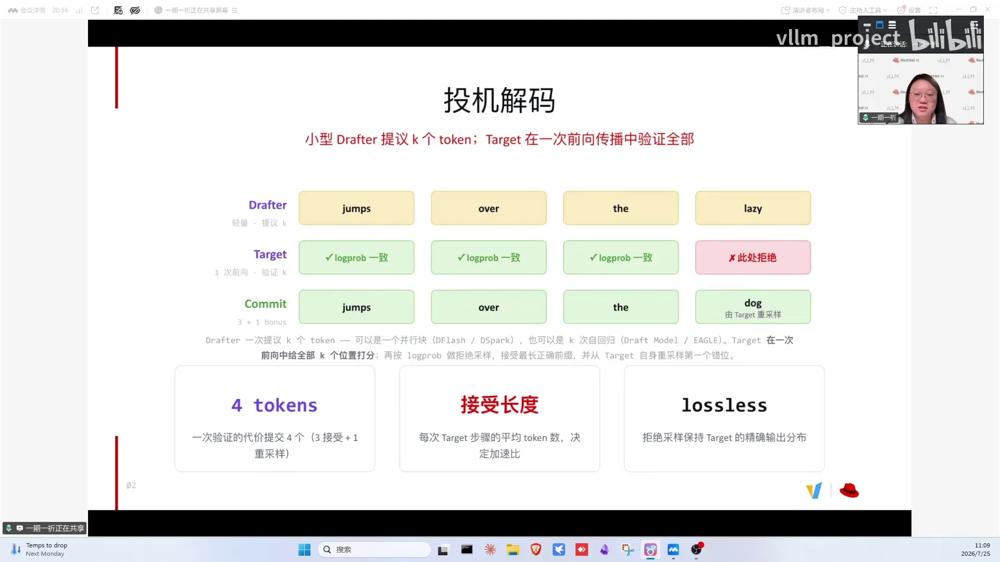 |
| 就产生了四个 token，等于省掉了三次前向的计算和时间，还有 offloading 的开销。我们观测到的加速就非常可观：接受程度越高，观测到的加速就越明显。每一个位置被接受的概率…… [【跳转到 09:35】](https://www.bilibili.com/video/BV18E3u63EdR/?t=575) |  |
| 我们叫接受率 acceptance rate。每一个位置的接受率越高，接受长度就越长；接受长度越长，观测到的加速就越明显。所以我们希望草稿模型的接受长度越长越好…… [【跳转到 10:00】](https://www.bilibili.com/video/BV18E3u63EdR/?t=600) | 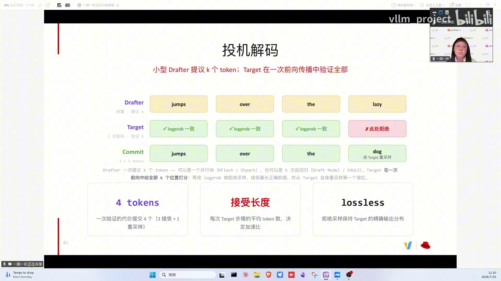 |
| 接受率越高越好：说明你的小模型开始学会像大模型一样思考了，说出来的话和大模型差不多，这样就能起到加速作用。这里想强调一点：最开始投机推理的想法是…… [【跳转到 10:25】](https://www.bilibili.com/video/BV18E3u63EdR/?t=625) |  |
| 可不可以用一个 Qwen 的小模型给一个 Qwen 的大模型来加速？这两个模型的输入都是自然语言输入：比如用户说 Hello, how are you，小模型输出 I'm fine thank you，这些 token 再拿到大模型里去验证…… [【跳转到 10:50】](https://www.bilibili.com/video/BV18E3u63EdR/?t=650) |  |
| 但是实践中我们发现这样的加速不太明显。但从 EAGLE-3 这个算法开始，它不再把自然语言的 token 作为 draft 小模型的输入：它发现把大模型 prefill 的时候…… [【跳转到 11:15】](https://www.bilibili.com/video/BV18E3u63EdR/?t=675) |  |
| 隐藏状态作为输入。大模型看到 Hello how are you，跑一次前向做 prefill，产生这么多 hidden states；我们从前、中、后各取几层作为 draft 模型的输入。然后我们发现这样的话…… [【跳转到 11:40】](https://www.bilibili.com/video/BV18E3u63EdR/?t=700) |  |
| draft 模型等于可以窥探到 target 大模型一些思考的过程，它生成的 token 质量就会比较高，输出和大模型比较的时候就比较相似，接受率就比较高…… [【跳转到 12:05】](https://www.bilibili.com/video/BV18E3u63EdR/?t=725) | 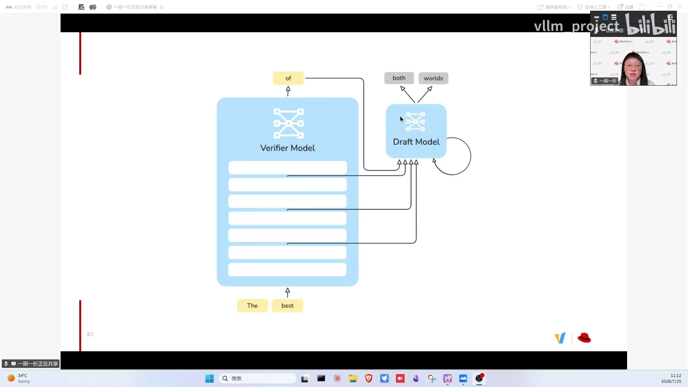 |
| 接受长度就比较长，加速就比较明显。所以训练时需要大量的 hidden states 作为训练数据，帮助小的 draft 模型学到大模型的思考过程。像 EAGLE-3 是单层的，新的 DFlash、DSpark…… [【跳转到 12:30】](https://www.bilibili.com/video/BV18E3u63EdR/?t=750) |  |
| 结构是 3~5 层的。但小模型虽然可能有几层，仍然和大模型相比小很多。两个模型体型相差越大，我们看到的加速就越明显。 [【跳转到 12:55】](https://www.bilibili.com/video/BV18E3u63EdR/?t=775) |  |
| speculators 是什么？speculators 这个库是从训练 draft 模型——比如我想用一个（团队）训练的 DFlash 模型…… [【跳转到 13:20】](https://www.bilibili.com/video/BV18E3u63EdR/?t=800) | 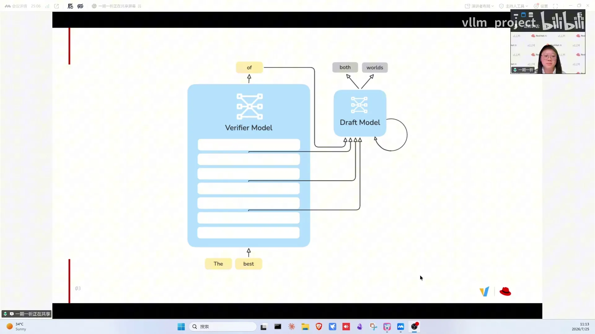 |
| 我想把它转换一下，用我自己的 production、我自己服务部署环境的数据给它做一个微调 fine-tune。我们也支持这个转换、微调，然后再到部署上…… [【跳转到 13:45】](https://www.bilibili.com/video/BV18E3u63EdR/?t=825) |  |
| 我们保证所有 speculators 训练的模型可以直接在 vLLM 里部署。看这个命令就只是一条：直接 vllm serve 你训练好的模型。刚才讲训练时需要提取很多 hidden states，speculators 支持在线——一边生成 hidden states 一边训练…… [【跳转到 14:10】](https://www.bilibili.com/video/BV18E3u63EdR/?t=850) |  |
| 或者 offline：离线先生成所有需要的 hidden states 然后再训练；或者混合：生成一部分、一边训练一边生成。非常灵活的一个库。我们也支持 MoE 混合专家、vision language 视觉语言模型的训练。为了训练…… [【跳转到 14:35】](https://www.bilibili.com/video/BV18E3u63EdR/?t=875) |  |
| （接上） [【跳转到 15:00】](https://www.bilibili.com/video/BV18E3u63EdR/?t=900) | 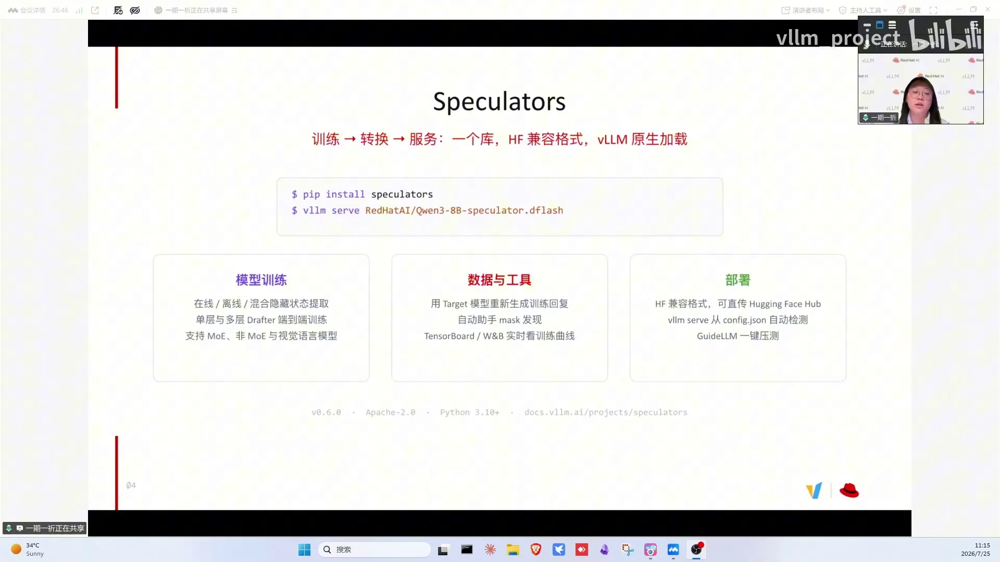 |
| 也设计落地了很多工具。比如支持用 target 模型重新生成训练回复。为什么这点很重要：如果你想给 Qwen 训练一个 draft 模型，但你用 ChatGPT 的数据或（公开）数据集去训练，它就不能学会像 Qwen 一样说话…… [【跳转到 15:25】](https://www.bilibili.com/video/BV18E3u63EdR/?t=925) | 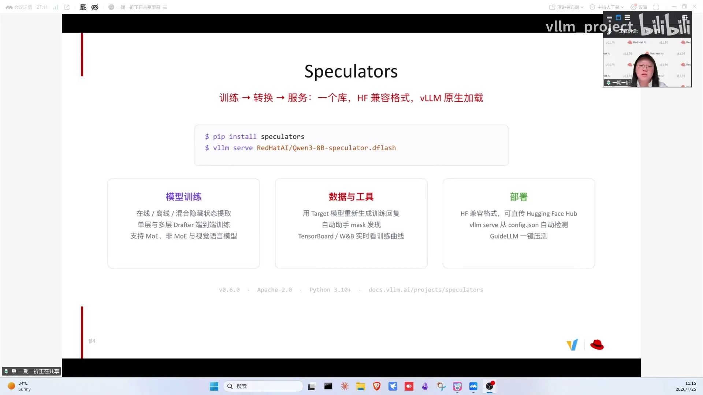 |
| 这样的 draft 模型也许能产生有意义的 token，但不能特别好地给 Qwen 加速：因为它跟 Qwen 说话的方式不一样，没有跟 Qwen 学。所以大部分我们的模型（的数据）都重新生成…… [【跳转到 15:50】](https://www.bilibili.com/video/BV18E3u63EdR/?t=950) |  |
| 这样的 draft 模型时，都需要用 target 模型重新生成它自己特有的训练回复。还有一点：训练时只想训练大模型产生的这些 token，用户给的 prompt 不需要训练。我们一般会计算一个 loss mask。怎么适配不一样的 chat template 也做了很多努力：现在 speculators 里可以自动适配这些 template。训练过程中有 TensorBoard、wandb 这些工具，能实时看到训练曲线…… [【跳转到 16:15】](https://www.bilibili.com/video/BV18E3u63EdR/?t=975) |  |
| （接上） [【跳转到 16:40】](https://www.bilibili.com/video/BV18E3u63EdR/?t=1000) | 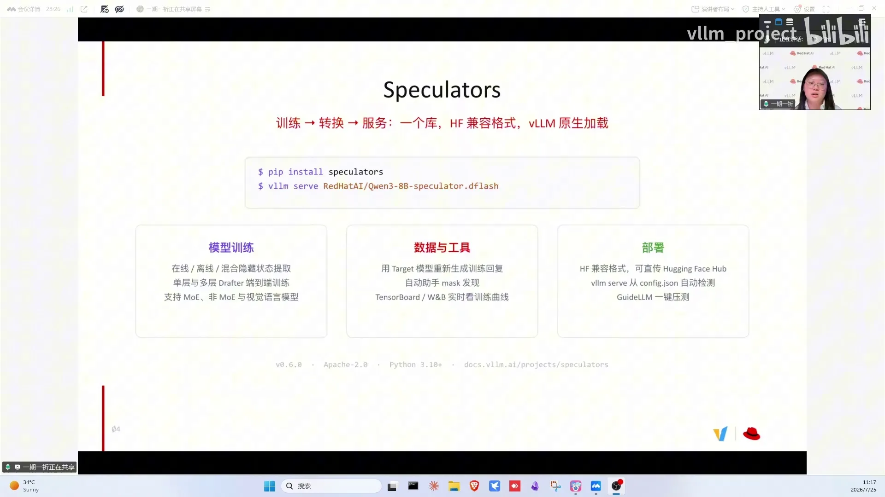 |
| 如果模型训练到某个阶段已经过拟合了，可以很直观看到，马上停下来，不用继续浪费 GPU 算力。部署：所有训练的模型可以一键在 vLLM 里一个命令部署。接下来简单介绍投机推理支持的算法、它们有什么不一样。——刚才那页 PPT 我有个小问题：speculators 有和一些 RL 框架做集成吗？ [【跳转到 17:05】](https://www.bilibili.com/video/BV18E3u63EdR/?t=1025) | 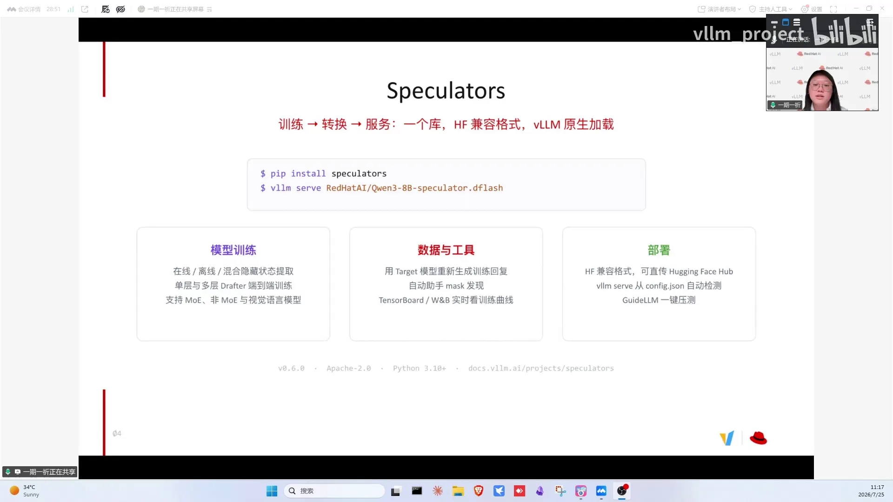 |
| （接上） [【跳转到 17:30】](https://www.bilibili.com/video/BV18E3u63EdR/?t=1050) | 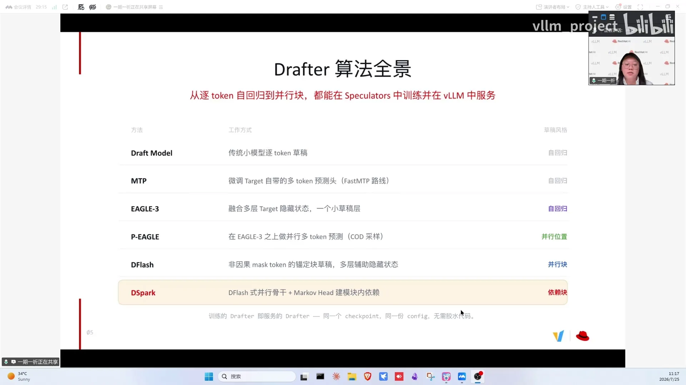 |
| 目前没有。但我觉得未来可能会和 RL 做一些集成：因为现在 RL 做 rollout 一般会默认开一些投机解码。开投机解码的话，必然在训练时导致 draft model 的权重跟训练权重发生偏移，对吧。实际上必须训模型的时候一起训 draft model，两个一起训练效果会比较好、接受率也会比较高…… [【跳转到 17:55】](https://www.bilibili.com/video/BV18E3u63EdR/?t=1075) | 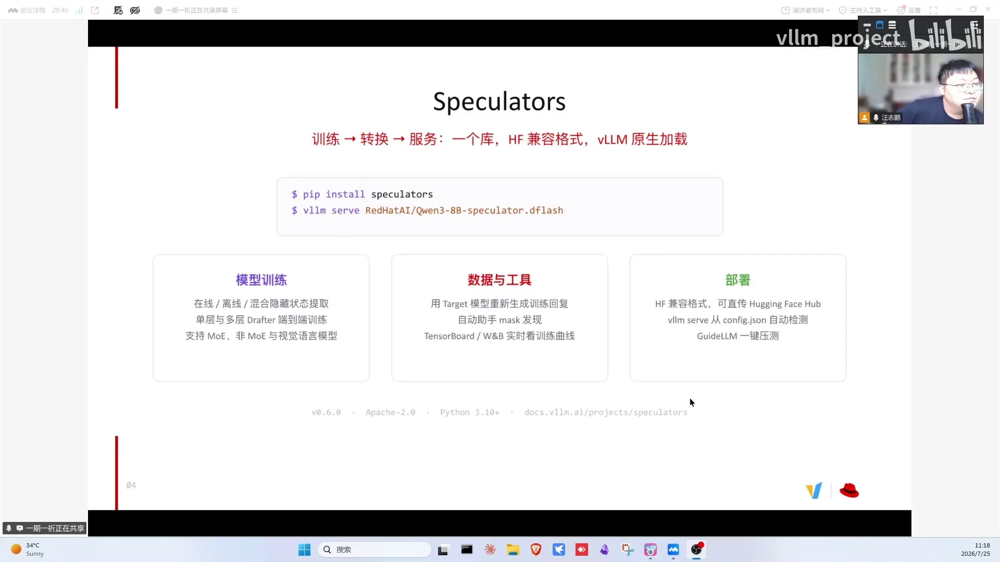 |
| （接上） [【跳转到 18:20】](https://www.bilibili.com/video/BV18E3u63EdR/?t=1100) | 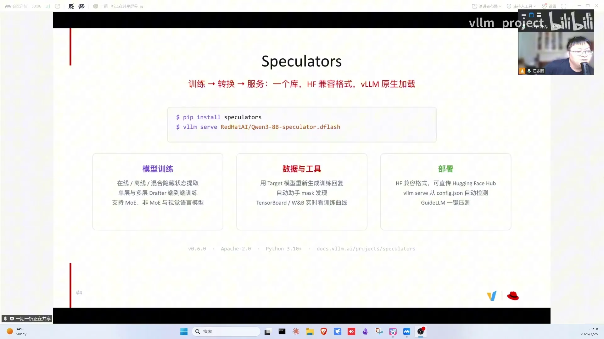 |
| 所以那些 model provider 自己训练的 draft 模型会比较有优势：因为两个是一起训练的。——其实可以考虑跟 vLLM 生态里的 RL 框架进行一些合作。——是的是的，很有道理，我回去马上跟组里打报告。 [【跳转到 18:45】](https://www.bilibili.com/video/BV18E3u63EdR/?t=1125) |  |
| 然后之前讲的传统方式——用一个小模型大模型加速——比较过时了，效果也不是很好，而且它不需要额外的训练，我们是不支持的。像 EAGLE-3 是我们最成熟、最经典的算法：把大模型的隐藏状态作为输入，一般是一个 transformer 的层，自回归地打草稿。然后（那款并行变体）刚才简单讲了：它的 architecture 和 EAGLE-3 是一样的…… [【跳转到 19:10】](https://www.bilibili.com/video/BV18E3u63EdR/?t=1150) | 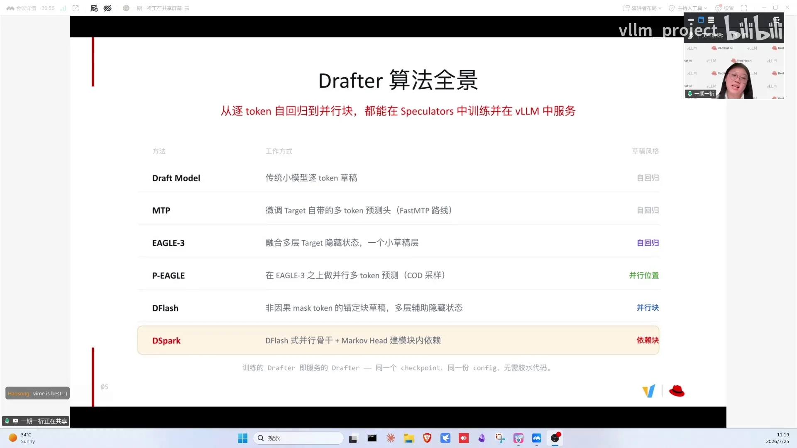 |
| 在一个（EAGLE-3）的基础上做多个 token 的预测，通过用 mask hidden states 和 mask id…… [【跳转到 19:35】](https://www.bilibili.com/video/BV18E3u63EdR/?t=1175) |  |
| 但它是并行的，还有（特殊）sampling 的 memory saving technique。和 EAGLE-3 相比它预测更快，某些情况下我们发现它的加速和 DFlash 实际上差不多。然后 DFlash 是不一样的：像刚才讲的，它用一个像 diffusion 一样的 layer，在 anchor position 定一个锚点，做快的草稿预测。所以它也是并行的，和自回归的模型相比快很多。像 MTP 就是很多模型提供商发布模型时自己会带一个 MTP 的头…… [【跳转到 20:00】](https://www.bilibili.com/video/BV18E3u63EdR/?t=1200) | 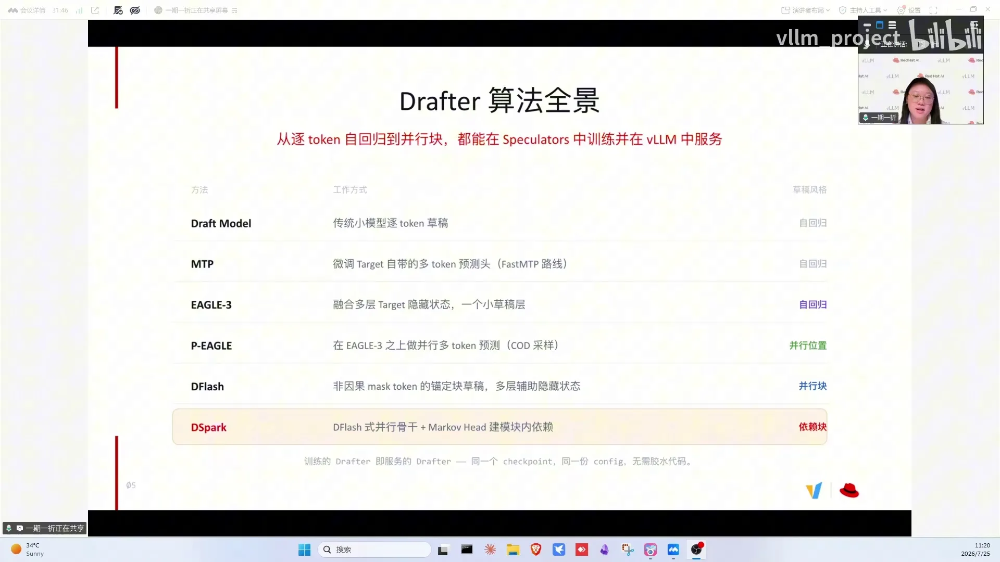 |
| （接上） [【跳转到 20:25】](https://www.bilibili.com/video/BV18E3u63EdR/?t=1225) | 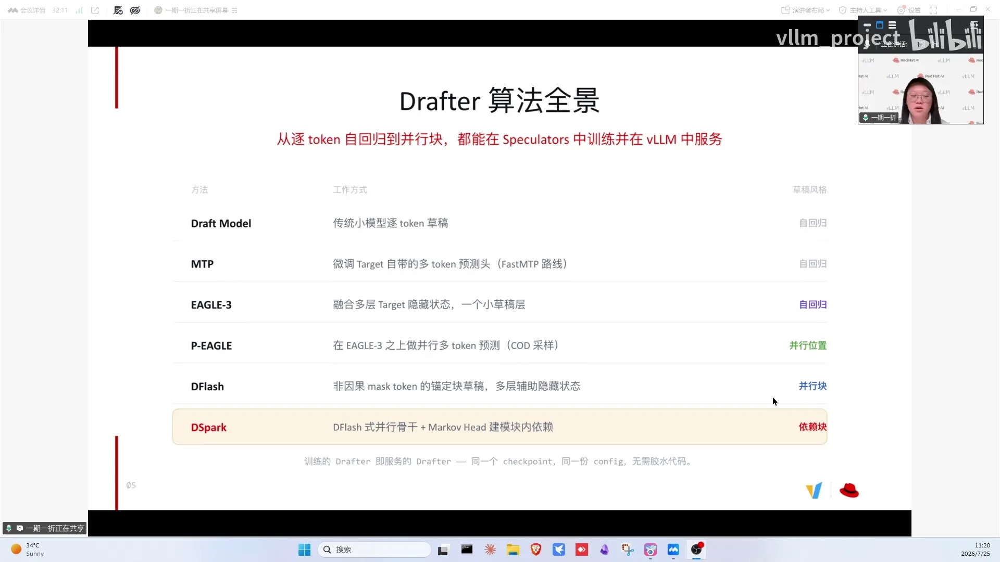 |
| 很多模型本身已经具备多 token 预测的能力，但它仍然是自回归的：draft 打草稿时是一个 token 一个 token 来的，相比并行预测会慢一点。然后 DSpark 后面会着重介绍它为什么特别好、为什么大家都在说它：既有并行打草稿的速度，又有自回归的精确度，两全其美，带来的加速非常可观。 [【跳转到 20:50】](https://www.bilibili.com/video/BV18E3u63EdR/?t=1250) | 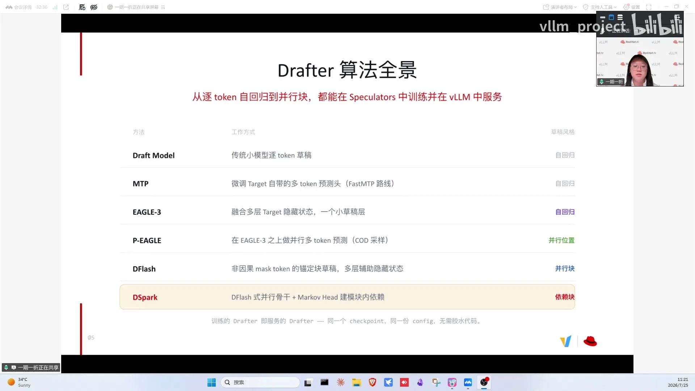 |
| （接上） [【跳转到 21:15】](https://www.bilibili.com/video/BV18E3u63EdR/?t=1275) |  |
| 接下来我还想提一下 Red Hat AI：我们自己训练了 28 个不一样的 draft model。大部分是 EAGLE-3——最成熟、vLLM 支持最稳定；还有七个不一样的 DFlash 模型、一个 DSpark（其实有很多 DSpark 正在训练，我们会逐步持续发布）；还有一个（并行）模型。我们会持续不断发布新模型…… [【跳转到 21:40】](https://www.bilibili.com/video/BV18E3u63EdR/?t=1300) | 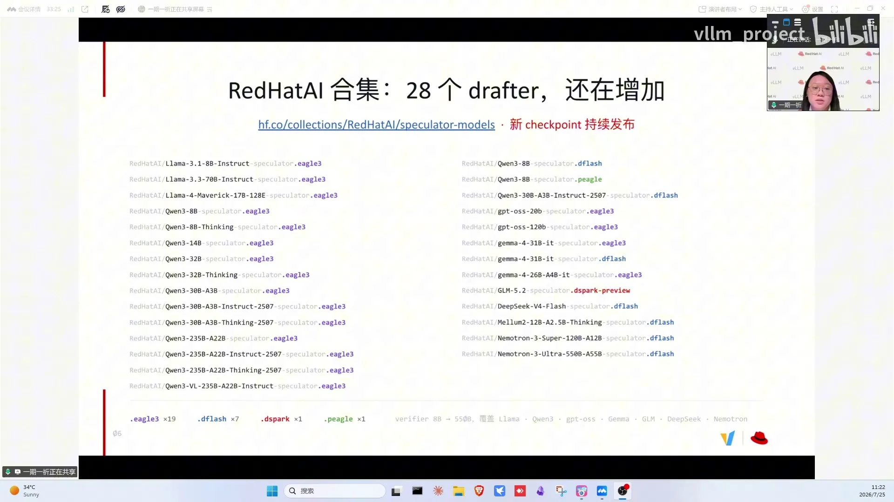 |
| （接上） [【跳转到 22:05】](https://www.bilibili.com/video/BV18E3u63EdR/?t=1325) | 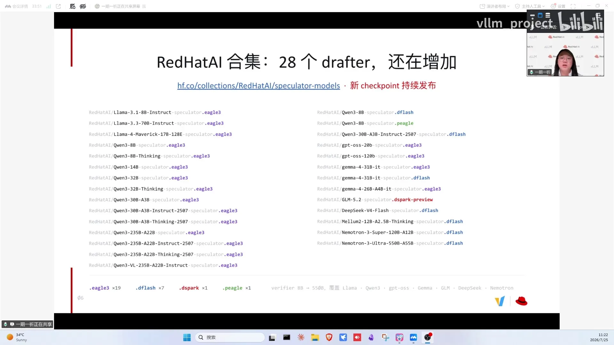 |
| 欢迎大家试一试这些模型，让我们知道哪里可能有短板、哪里加速明显。那么在 speculators 上如何训练一个真正的 drafter？只需要三条命令。有几个不同的脚本：首先是数据的脚本——prepare data…… [【跳转到 22:30】](https://www.bilibili.com/video/BV18E3u63EdR/?t=1350) | 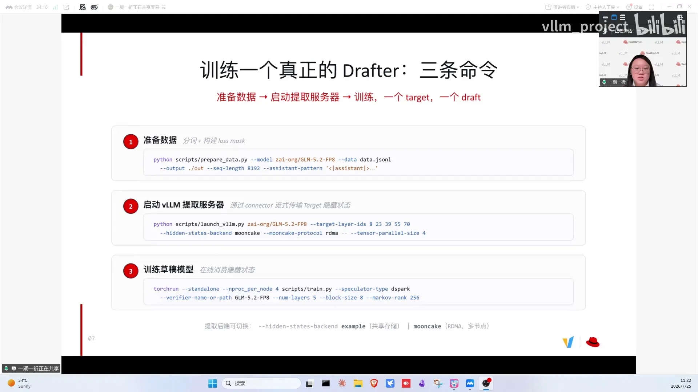 |
| 可以计算刚才提到的 loss mask、apply chat template，把所有自然语言的训练数据转化成 token id，变成 training 可以 consume 的状态。还有一个脚本启动 vLLM 的 hidden states 提取服务器。因为这些都是 vLLM 原生 native 的…… [【跳转到 22:55】](https://www.bilibili.com/video/BV18E3u63EdR/?t=1375) | 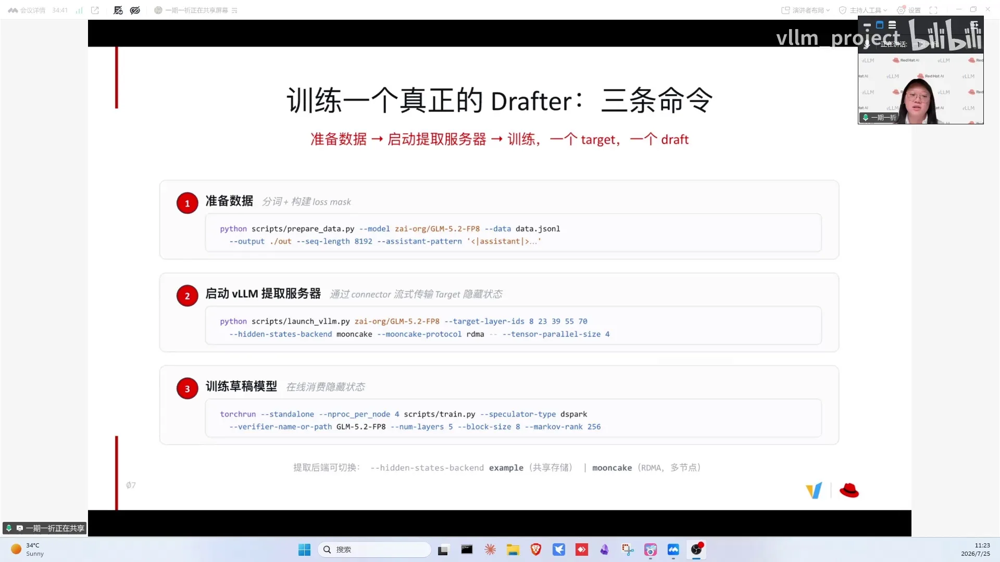 |
| 我们能得到 vLLM 本身的一些加速，相比用 transformers 训练会比较快。最后是 train 训练草稿模型。这些命令看起来有点复杂，但我们有很多 tutorial 帮助理解，之后也会加一些 Claude skill…… [【跳转到 23:20】](https://www.bilibili.com/video/BV18E3u63EdR/?t=1400) | 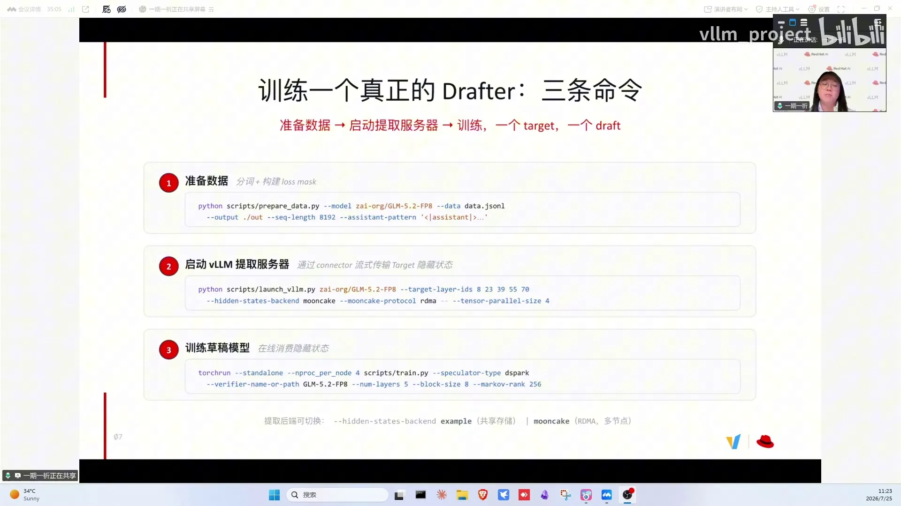 |
| 这样 Claude 在阅读我们的库时能直接得到这些 context，不用再去找、摸索每一个参数是什么意思。直播间有同学问像 Medusa 头这种投机解法…… [【跳转到 23:45】](https://www.bilibili.com/video/BV18E3u63EdR/?t=1425) |  |
| 是不是现在已经用的不多了？——它相对来说是比较过时的一个算法了，带来的加速和 EAGLE-3 相比都有差距，所以我们不选择支持它了。这块发展得非常迅速…… [【跳转到 24:10】](https://www.bilibili.com/video/BV18E3u63EdR/?t=1450) | 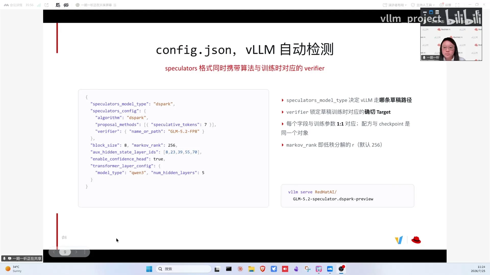 |
| 经常像之前 Domino 也是刚出来——它的想法和 DSpark 也差不多。但我们最近做了一些实验发现它不如 DSpark，那我们就选择不支持了：现在训练一个 Domino 不如训练一个 DSpark 好。——然后有观众问…… [【跳转到 24:35】](https://www.bilibili.com/video/BV18E3u63EdR/?t=1475) | 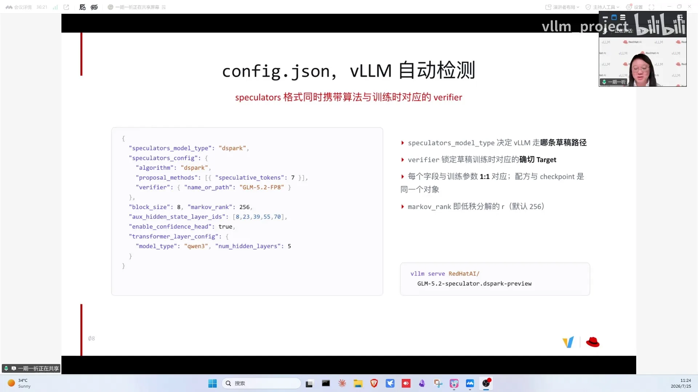 |
| 野生开发者想训练一个自己的 draft model，数据从哪里找呢？——我们训练时基本上是用 Magpie 和 UltraChat 这两个数据集。DeepSeek 的模型用的是（他们的）数据集，在 HuggingFace 上可以找到…… [【跳转到 25:00】](https://www.bilibili.com/video/BV18E3u63EdR/?t=1500) | 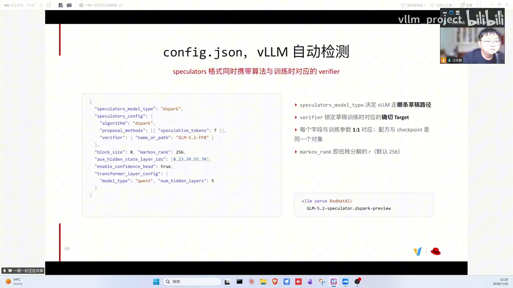 |
| 我们也支持刚才讲的 target 模型的 response regeneration——这两个数据集都是原生支持的。如果你有自己的…… [【跳转到 25:25】](https://www.bilibili.com/video/BV18E3u63EdR/?t=1525) | 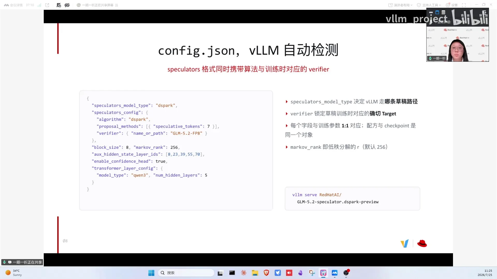 |
| 生态里 production 有一些数据的话，也可以在一个模型的基础上微调 fine-tune，这样就不需要特别多的数据。我们也有和公司合作…… [【跳转到 25:50】](https://www.bilibili.com/video/BV18E3u63EdR/?t=1550) |  |
| 发现它能够得到比较好的效果：在某一个领域里面进行 fine-tune。好理解吧。——我也觉得，因为 drafter 相对权重占比都比较小。你希望模型表现什么行为，就拿对应的数据来训练，可能会让它接受率更高一些。 [【跳转到 26:15】](https://www.bilibili.com/video/BV18E3u63EdR/?t=1575) |  |
| 尤其你的应用场景比较单一的话，可以针对性训练，加速会非常可观。——其实我还有个问题：投机解码发展得非常快，最开始还有用 n-gram 这些东西来做推荐嘛，现在基本上没人用了。你们对于仓库里很老的（算法）的代码，有直接删掉吗？ [【跳转到 26:40】](https://www.bilibili.com/video/BV18E3u63EdR/?t=1600) | 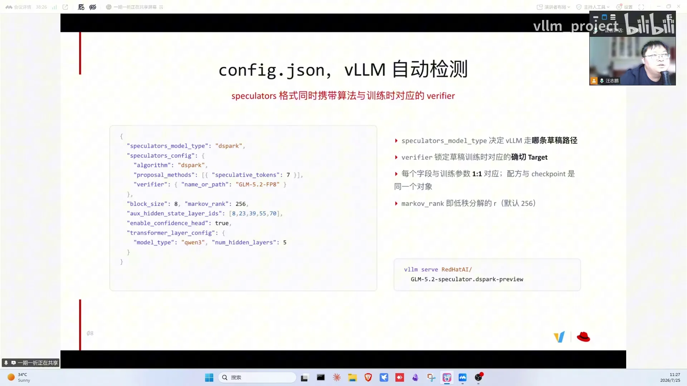 |
| （接上） [【跳转到 27:05】](https://www.bilibili.com/video/BV18E3u63EdR/?t=1625) |  |
| 我们发现新的投机解码算法出来之后，会给旧的算法进行优化。像我们发现之前 EAGLE-3 使用的是 Llama 的 layers 作为 draft 模型，DFlash 出来的时候，（发现）Qwen3 的 layers 比 Llama layer 效果好…… [【跳转到 27:30】](https://www.bilibili.com/video/BV18E3u63EdR/?t=1650) | 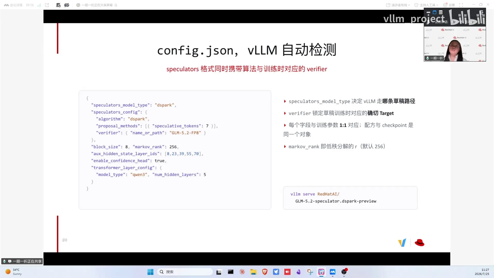 |
| 我们现在支持训练一个 Qwen3 的 EAGLE-3 draft 模型。Domino 出来的时候我们发现它增加了 markov chain、confidence head，给 DFlash 带来非常可观的优化…… [【跳转到 27:55】](https://www.bilibili.com/video/BV18E3u63EdR/?t=1675) | 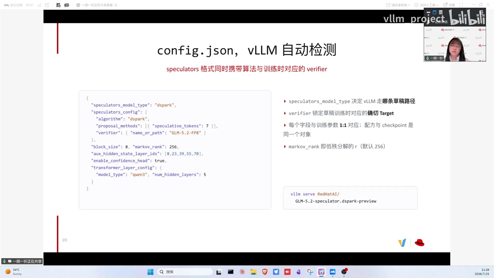 |
| 这些东西不仅适用于 DFlash，也可以应用到 EAGLE-3 甚至其他（算法）上去。这个库我们一直做实验、实践：发现新的算法给旧算法也进行了优化，一直在比较、做各种 ablation 实验，看哪种方法最成熟最好。——我问这个问题是因为记得去年上半年（vLLM）对投机解码支持都不是很好。当时比较主流的还是大小模型，对吧。小模型的配置跟大模型完全不同，一般会布在同样的设备上…… [【跳转到 28:20】](https://www.bilibili.com/video/BV18E3u63EdR/?t=1700) | 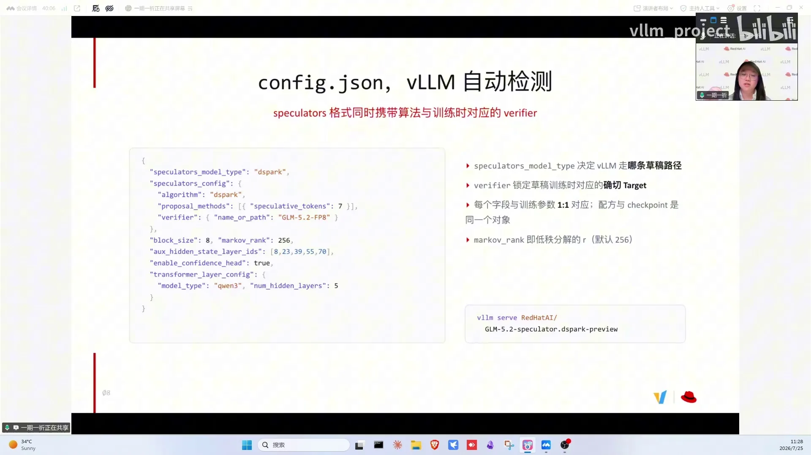 |
| （接上） [【跳转到 28:45】](https://www.bilibili.com/video/BV18E3u63EdR/?t=1725) |  |
| 你会导致有的设备部署了小模型、有的设备布不了小模型，自然造成很多 GPU 利用率的浪费。——对对对对。我现在没怎么看这块代码，想知道像这种情况，是不是可以考虑把部署大小模型的投机解码直接把最后一部分代码移除？反正现在也没人用了。我不知道 vLLM 有没有完全把那块移除掉，但我们这些算法…… [【跳转到 29:10】](https://www.bilibili.com/video/BV18E3u63EdR/?t=1750) | 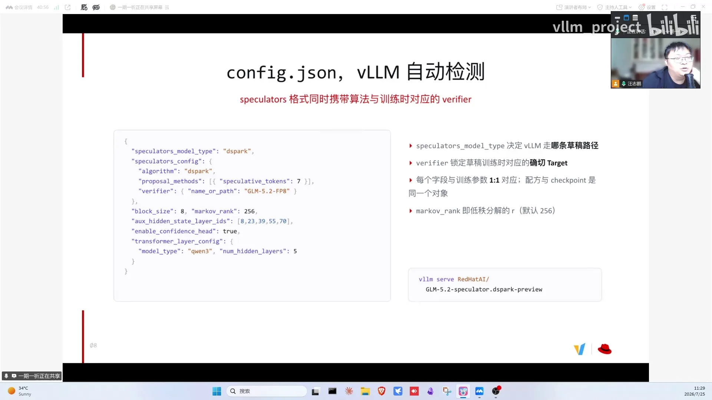 |
| （接上） [【跳转到 29:35】](https://www.bilibili.com/video/BV18E3u63EdR/?t=1775) | 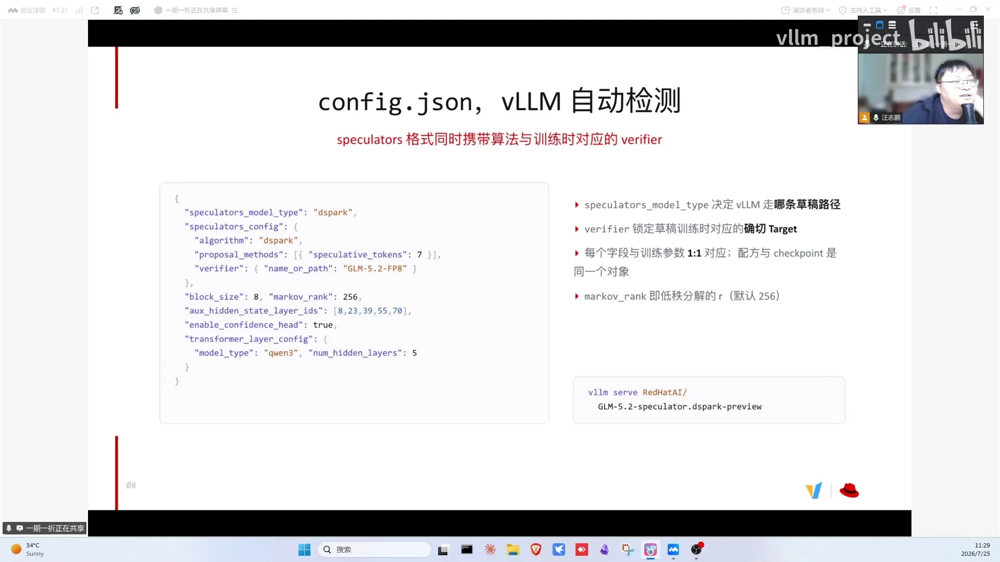 |
| 在 vLLM 上面全部都有支持。我们每天都有在跑一些测试，确保环境成熟稳定。大家发现什么问题欢迎 report，我们会马上在 vLLM 里进行 hotfix。 [【跳转到 30:00】](https://www.bilibili.com/video/BV18E3u63EdR/?t=1800) | 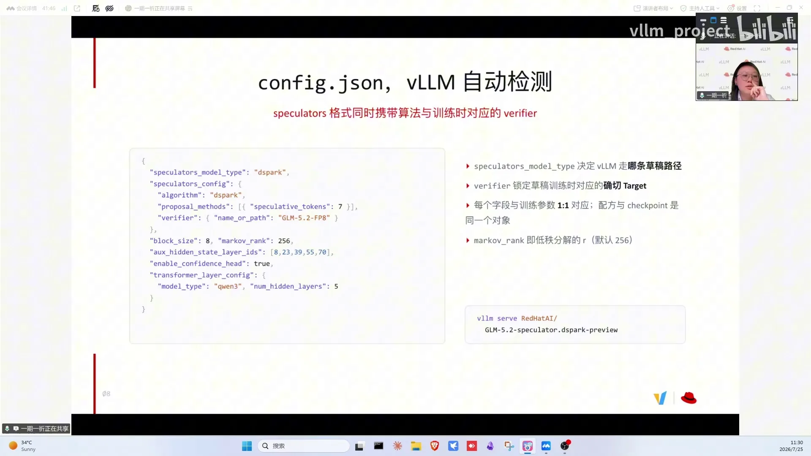 |
| 回到 PPT。直播间还有同学问：加速百分比多少算训得比较好？或者加速的上限大概是多少倍？——好问题。我们一般观测到 3~5 倍是比较正常的。论文里也有说 6~8 倍的，我是没有观测到，但也不能说是假的：可能在本身没太优化过的推理引擎上会得到更 dramatic 的加速…… [【跳转到 30:25】](https://www.bilibili.com/video/BV18E3u63EdR/?t=1825) | 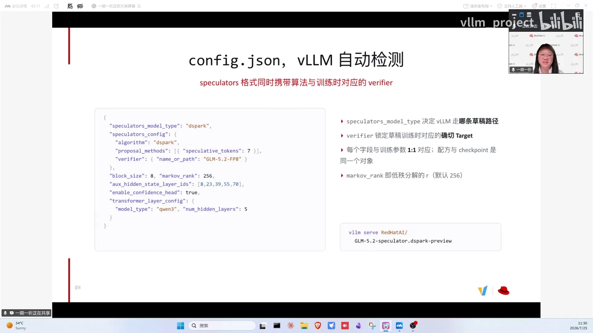 |
| （接上） [【跳转到 30:50】](https://www.bilibili.com/video/BV18E3u63EdR/?t=1850) |  |
| 但像 vLLM 我们一直用 vLLM 测试，发现 3~5 倍甚至六倍是正常的区间。然后投机推理有一个限制：本质是用多一些算力换速度。在引擎本身很繁忙、compute bound——很多 request、算力本身不够的时候…… [【跳转到 31:15】](https://www.bilibili.com/video/BV18E3u63EdR/?t=1875) |  |
| 然后那在嗯投机推理它有一个这个限制是因为它本质是我用多一些的算力去换取一个速度那么在你本身就是这个引擎很繁忙就是support这个computerband的时候就是你很多很多request你你这个算本身算力就不够了 [【跳转到 31:40】](https://www.bilibili.com/video/BV18E3u63EdR/?t=1900) | 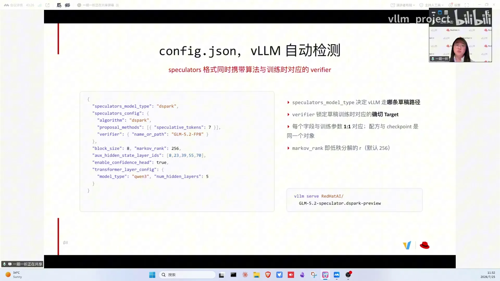 |
| 你还要用算力换就换不来速度。这个场景下我们不建议把投机推理大开。vLLM 现在也支持：request 请求很多时直接把投机推理关掉，确保模型不花额外的 compute。——而且我觉得 3~5 倍也跟具体算法有关。——对，EAGLE 和 MTP 时代不可能做到 3~5 倍这么夸张…… [【跳转到 32:05】](https://www.bilibili.com/video/BV18E3u63EdR/?t=1925) |  |
| EAGLE 每次也只能打三个（草稿），acceptance length 一般在 2 点几、3 左右，可能就是两倍，甚至有时 2 点几、1 点几倍都有。但现在 DFlash、DSpark 越来越强大…… [【跳转到 32:30】](https://www.bilibili.com/video/BV18E3u63EdR/?t=1950) |  |
| 小模型也不是自回归了，一次预测达到 16 个 token，acceptance length 可以做到很长。——有人问：提升接受率有什么 trick 吗？——有一些：训练时让模型打 16 个草稿，但推理引擎上使用时只让它打 8 个草稿，我们观测到 acceptance 会比较高一点。 [【跳转到 32:55】](https://www.bilibili.com/video/BV18E3u63EdR/?t=1975) | 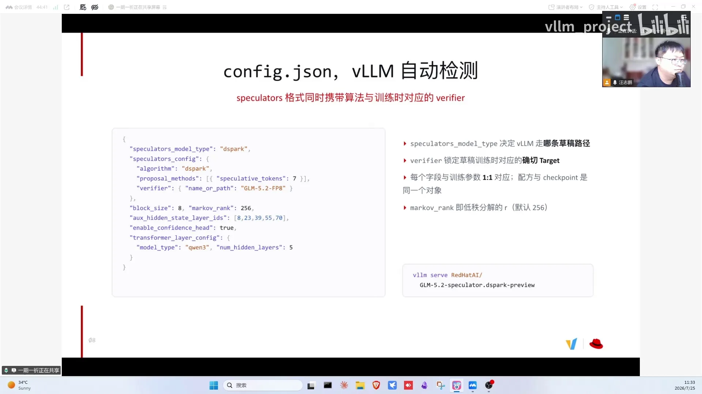 |
| （接上） [【跳转到 33:20】](https://www.bilibili.com/video/BV18E3u63EdR/?t=2000) | 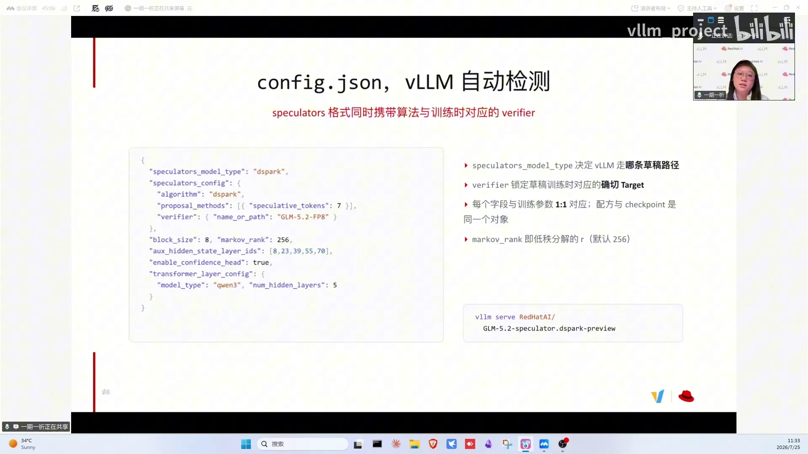 |
| 推测得越少接受率自然越高，对对对。——然后还有个问题：3~5 倍是在 GLM5.2 上测出来的吗？——我刚刚测了接受长度，也是我们正在训练的一个模型。今天测的接受长度在不同领域数据上表现是 3~5 左右，但还没测具体的…… [【跳转到 33:45】](https://www.bilibili.com/video/BV18E3u63EdR/?t=2025) | 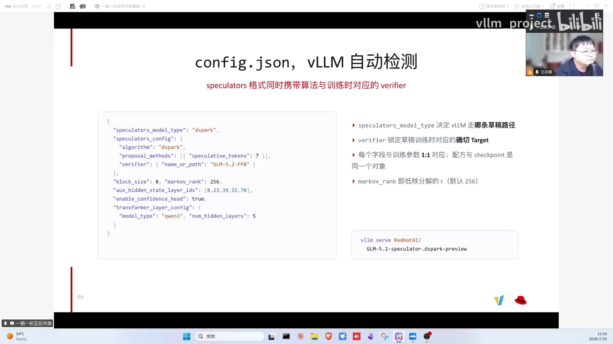 |
| 嗯对就是你结你这个推测推测越傻话那你自然这个接受率就会越高了对对对对对然后额头机解码哦等一下我看一下呃还有个问题就是3~5倍是是在gm5.2上面测出来的吗加加5.2呃 [【跳转到 34:10】](https://www.bilibili.com/video/BV18E3u63EdR/?t=2050) |  |
| （接上） [【跳转到 34:35】](https://www.bilibili.com/video/BV18E3u63EdR/?t=2075) | 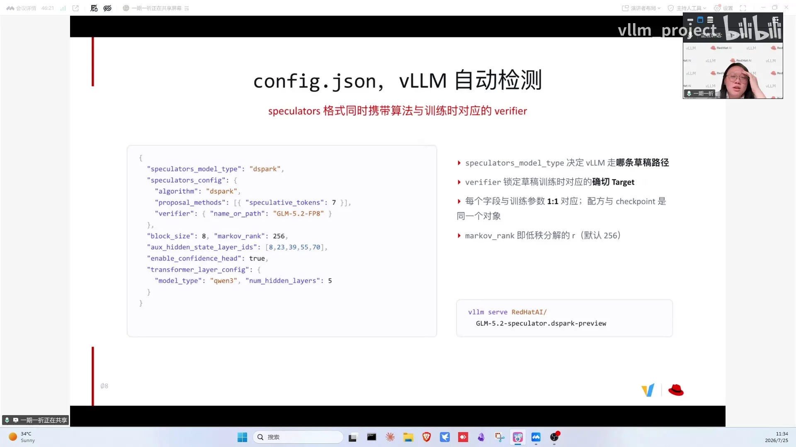 |
| 感兴趣的话可以试一试这个模型。我们正在训练当中：模型越大训练时间越长，我们在尝试使用 100 万（条）的数据——比平时训练的数据大很多，比较慢一点。然后还有同学问：投机解码和 LoRA 是如何兼容的？——这是 vLLM 那边的，但不是我做的，只知道在 vLLM 里能兼容了，细节我不太清楚…… [【跳转到 35:00】](https://www.bilibili.com/video/BV18E3u63EdR/?t=2100) | 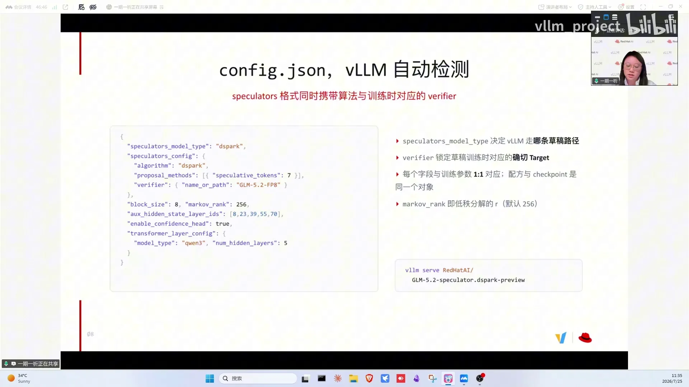 |
| （接上） [【跳转到 35:25】](https://www.bilibili.com/video/BV18E3u63EdR/?t=2125) |  |
| 感兴趣的话下次可以请 vLLM 的同事来介绍。——好问题，这更偏向工程上的问题。我也很好奇，可以后面找（同事）来介绍。——因为我主要是做训练这边的。——那我们回到 PPT。每个模型我们会存一个 config 到 JSON file…… [【跳转到 35:50】](https://www.bilibili.com/video/BV18E3u63EdR/?t=2150) |  |
| （接上） [【跳转到 36:15】](https://www.bilibili.com/video/BV18E3u63EdR/?t=2175) |  |
| vLLM 可以从这个 config JSON 里自动检测我们用的是 DSpark 这个算法、hidden states 取哪几层、transformer layer 用的是 Qwen3 还是 Llama、模型是三层一层五层——vLLM 自动检测到。部署时只需要一条命令直接部署。今天讲这个重要的 DSpark 的解码到底怎么 work…… [【跳转到 36:40】](https://www.bilibili.com/video/BV18E3u63EdR/?t=2200) | 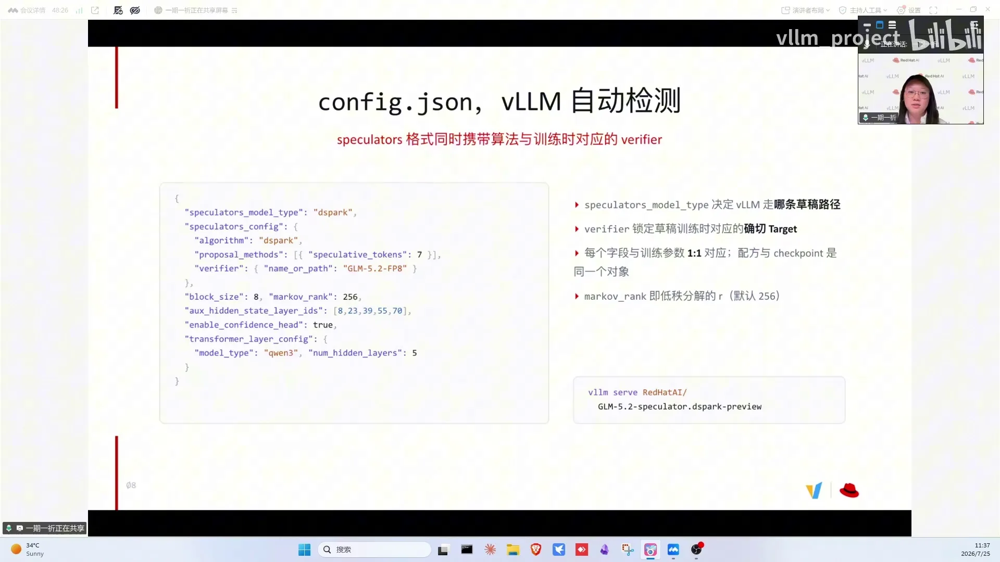 |
| （接上） [【跳转到 37:05】](https://www.bilibili.com/video/BV18E3u63EdR/?t=2225) | 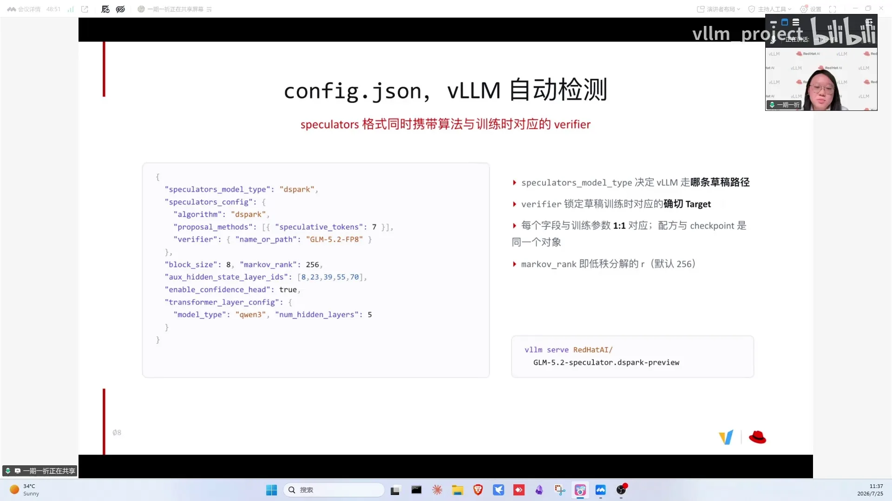 |
| 为什么我们说 DSpark 和其他算法比较强大：首先它和 DFlash 一样用 diffusion 的并行骨干——一次前向可以产出 8~16 个 token。这些 token 是并行产出的、同时产出的，所以没有前面位置 token 的信息。这会产生什么情况？比如你说 thank you，我既可以回复 No problem 也可以回复 Of course…… [【跳转到 37:30】](https://www.bilibili.com/video/BV18E3u63EdR/?t=2250) |  |
| （接上） [【跳转到 37:55】](https://www.bilibili.com/video/BV18E3u63EdR/?t=2275) |  |
| 自回归模型第一个 token 预测了 of，第二个 token 一定会预测 course，因为我知道 of course 是相关的短语。但并行预测时第一个 token of course、No problem 都有可能：我可能预测了 of，第二个 token 既可能预测 problem 又可能预测 course。如果我预测成 problem，短语就变成了 of problem，输出就变成胡言乱语了…… [【跳转到 38:20】](https://www.bilibili.com/video/BV18E3u63EdR/?t=2300) | 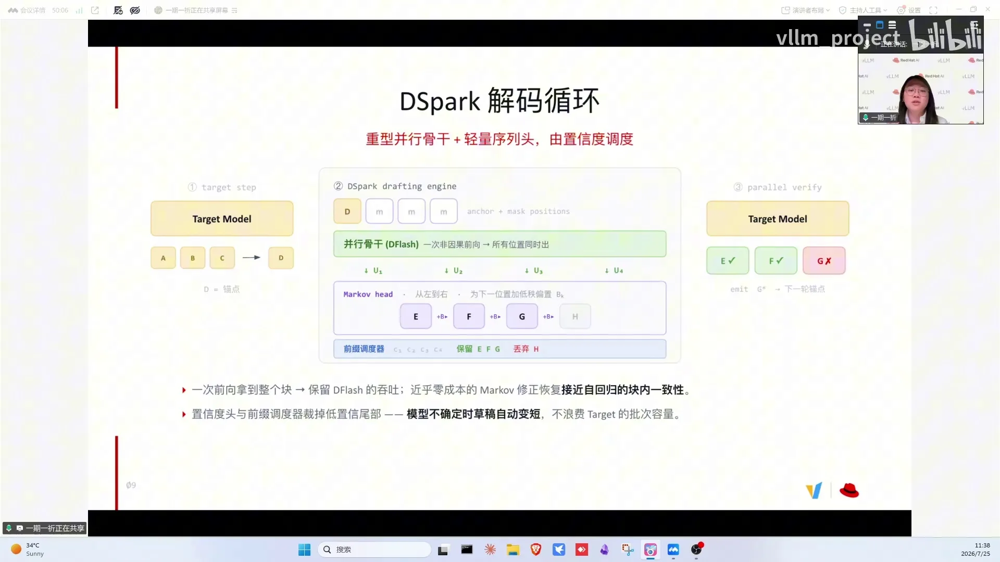 |
| （接上） [【跳转到 38:45】](https://www.bilibili.com/video/BV18E3u63EdR/?t=2325) | 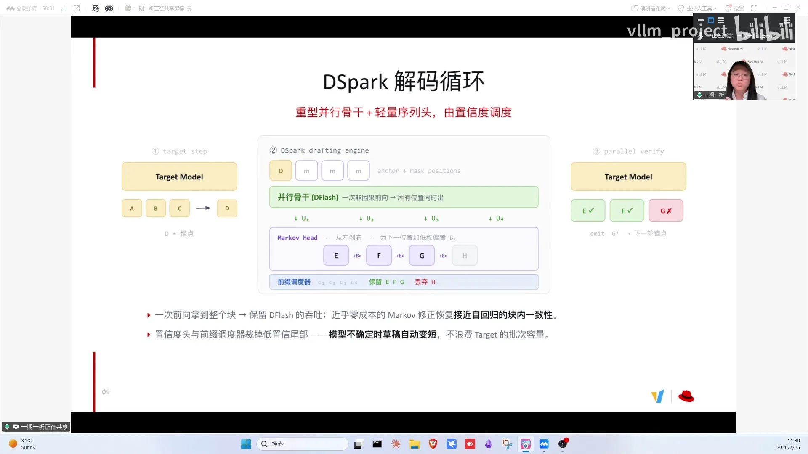 |
| 质量没有自回归时高。DSpark 的解法是：在 DFlash 已经输出这 8~16 个位置的 log probability distribution 时，给它加一个 Markov head，让模型学到 token 和 token 之间的关系，但又不要太笨重。这个 Markov head 是一个轻量级的、相当于 affinity matrix：它能学到 token 接下来接哪一个 token…… [【跳转到 39:10】](https://www.bilibili.com/video/BV18E3u63EdR/?t=2350) |  |
| （接上） [【跳转到 39:35】](https://www.bilibili.com/video/BV18E3u63EdR/?t=2375) |  |
| 如果我第一个 token 是这个，那我下一个 token 是它。——（老师）你那边声音能听到吗？——可以听到。——那么它就是从左到右修正了精确度，所以它又快、预测 token 又好。它不仅仅做这些：在这个基础上还加了一个置信度头 confidence head——输出时不仅输出这些 token，还同时说出我对预测这个 token 有多自信…… [【跳转到 40:00】](https://www.bilibili.com/video/BV18E3u63EdR/?t=2400) | 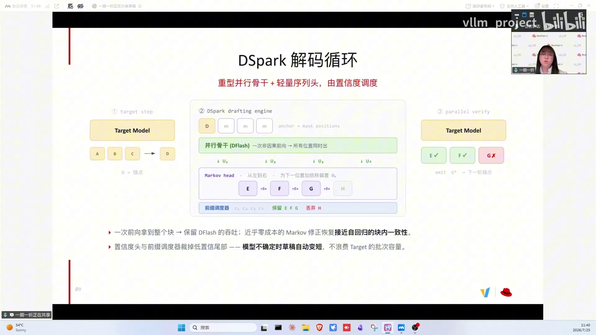 |
| （接上） [【跳转到 40:25】](https://www.bilibili.com/video/BV18E3u63EdR/?t=2425) | 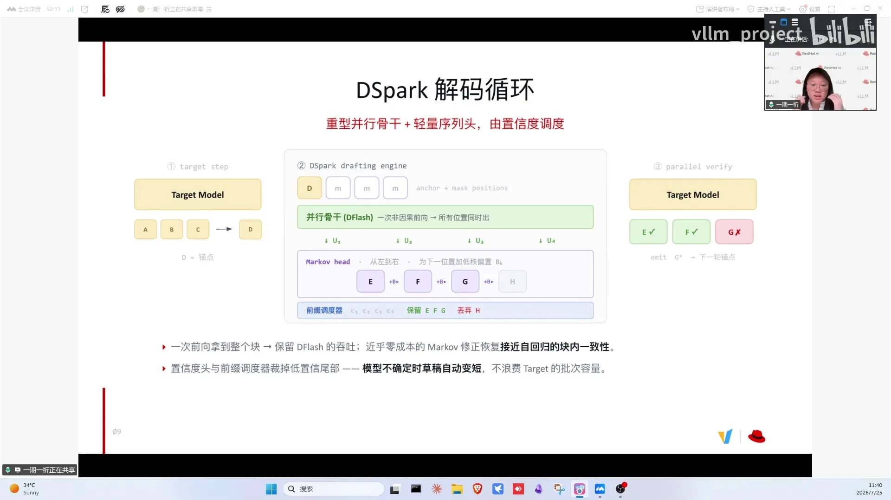 |
| 如果我对某些 token 本身不自信，索性不把它提交到 target 模型里去，进一步为 target 减轻工作量，省掉不必要的计算。论文里 DeepSeek 发现：相比 EAGLE-3，DSpark 可以达到 30% 的加速提升；对 DFlash 有 18% 的提升。而增加 Markov 头带来的延迟开销只有 0.22% 到 1.3%…… [【跳转到 40:50】](https://www.bilibili.com/video/BV18E3u63EdR/?t=2450) |  |
| （接上） [【跳转到 41:15】](https://www.bilibili.com/video/BV18E3u63EdR/?t=2475) | 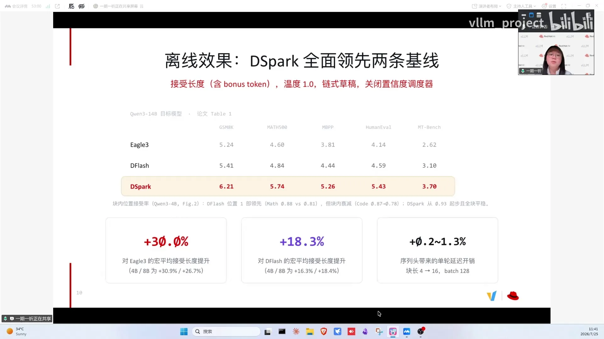 |
| 付出 0.2 到 1.3 个百分点的代价，得到 18%、30% 的加速，优化比较显著。接下来简单讲一下 vLLM 的 model runner。vLLM 不仅仅是为了部署投机解码模型，但这个优化在投机解码上可以观测到：基本上是接近零气泡的。GPU 上草稿模型提出草稿、target 模型前向…… [【跳转到 41:40】](https://www.bilibili.com/video/BV18E3u63EdR/?t=2500) | 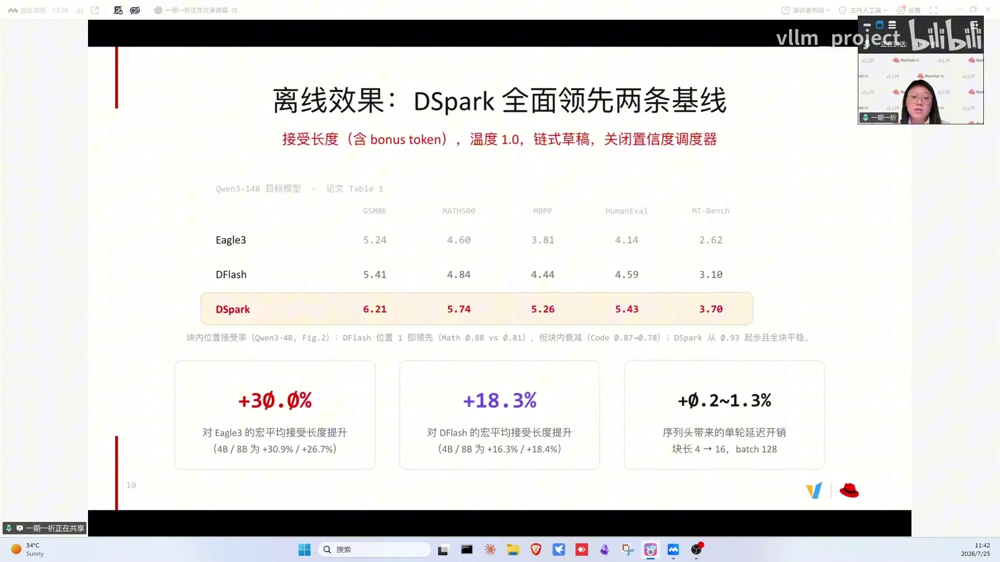 |
| （接上） [【跳转到 42:05】](https://www.bilibili.com/video/BV18E3u63EdR/?t=2525) |  |
| prefill 然后 verify 确认时，CPU 上的调度 schedule 就已经开始准备下一步甚至下下步，保证 GPU 上基本没有空闲，最大限度用上所有算力。 [【跳转到 42:30】](https://www.bilibili.com/video/BV18E3u63EdR/?t=2550) | 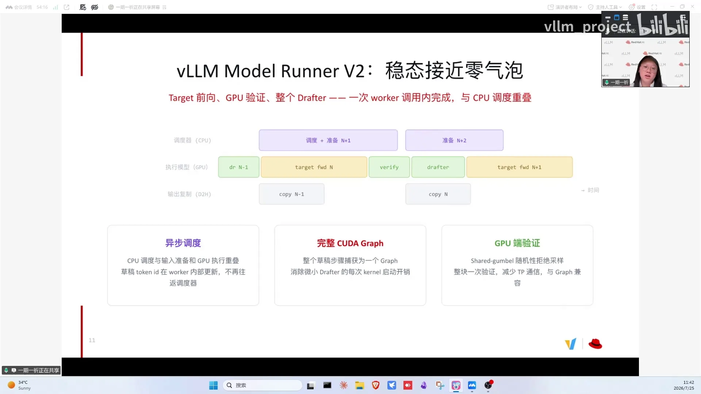 |
| 我们刚讲过隐藏状态非常重要，hidden states 的提取完全是 vLLM 原生的。刚才简单讲了离线和在线两种方式，这是工程上的问题。——有什么问题吗？——有同学有问题：加速有多少来自（半）自回归解码、有多少来自自适应的 verify length？ [【跳转到 42:55】](https://www.bilibili.com/video/BV18E3u63EdR/?t=2575) | 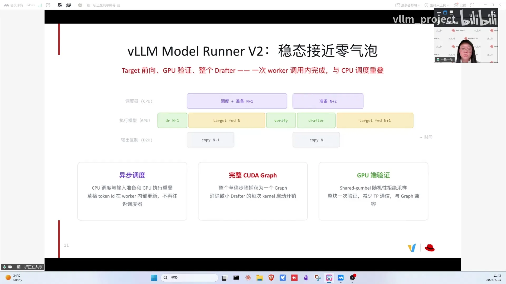 |
| （接上） [【跳转到 43:20】](https://www.bilibili.com/video/BV18E3u63EdR/?t=2600) | 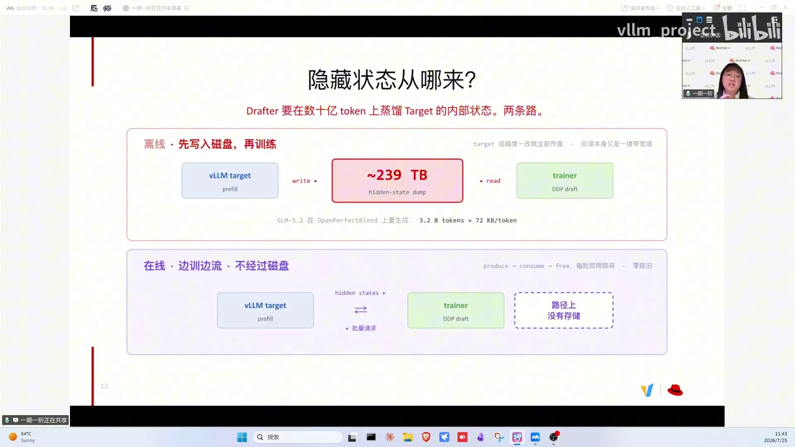 |
| 你能重复一下最后那个部分吗？——加速有多少来自半自回归解码、有多少来自自适应 verify length？——好问题…… [【跳转到 43:45】](https://www.bilibili.com/video/BV18E3u63EdR/?t=2625) | 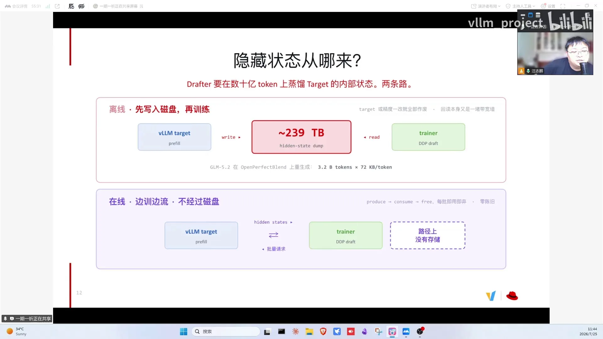 |
| vLLM 上我们已经支持了 dynamic 的投机解码——动态投机解码。现在的情况是部署时用户要说：比如 request 请求数量在 1~5 之间我打 8 个草稿，在 5~30 之间打 5 个草稿；如果超过比如 30 或 50 个请求，我就不开投机解码、把它关掉。但这需要用户自己输入。现在 vLLM 对 DSpark 来说我们先支持了 Markov chain…… [【跳转到 44:10】](https://www.bilibili.com/video/BV18E3u63EdR/?t=2650) | 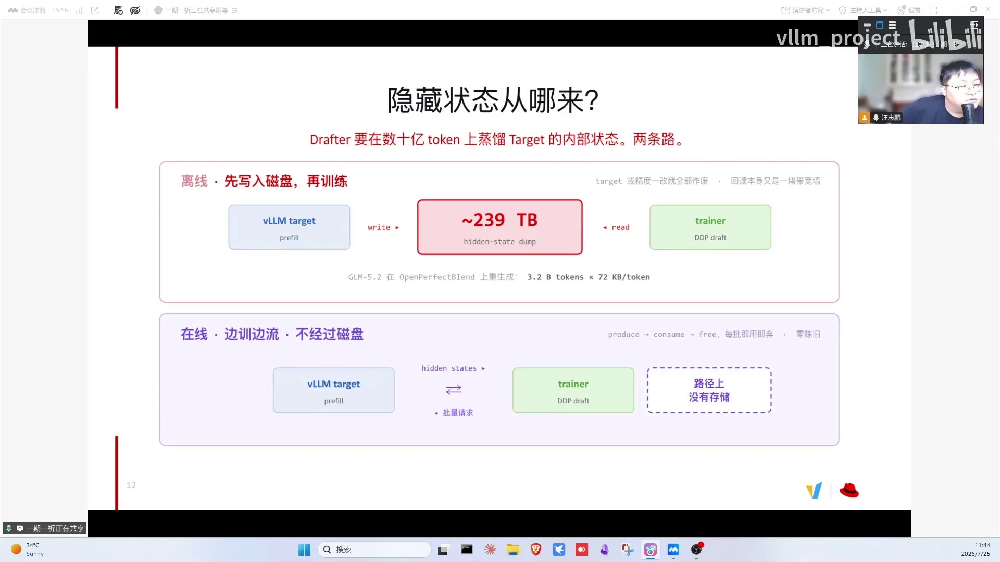 |
| （接上） [【跳转到 44:35】](https://www.bilibili.com/video/BV18E3u63EdR/?t=2675) |  |
| （接上） [【跳转到 45:00】](https://www.bilibili.com/video/BV18E3u63EdR/?t=2700) |  |
| 但 confidence head（置信度头）目前还没有在 vLLM 上完全支持，所以论文里置信度头的数据是论文里来的。——好。 [【跳转到 45:25】](https://www.bilibili.com/video/BV18E3u63EdR/?t=2725) |  |
| 接下来还是要做更多的 ablation research 才能看到 Markov chain 的加速（分布）。但好的一点是这两个是分开的 mechanism，互相不影响：可以加起来，也可以只 apply 一个。在 speculators 上我们支持两个都训练，只是 vLLM 上暂时还没有 confidence head 的 inference 支持…… [【跳转到 45:50】](https://www.bilibili.com/video/BV18E3u63EdR/?t=2750) | 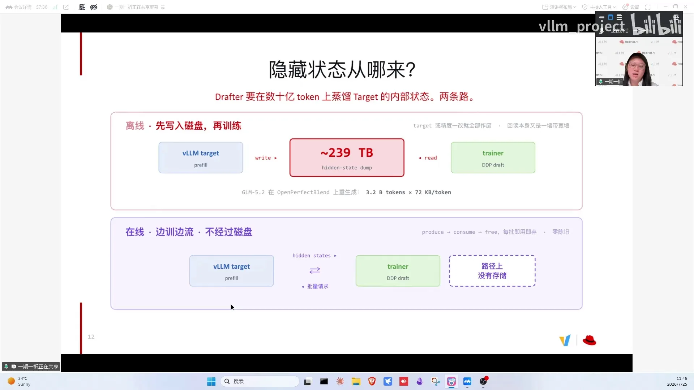 |
| （接上） [【跳转到 46:15】](https://www.bilibili.com/video/BV18E3u63EdR/?t=2775) |  |
| 已经在 work on it，是正在进行中的工作。感兴趣的话之后可以把 PR branch 分享给大家，可以尝鲜抢先使用。——非常感谢。——那我继续吧。提取 hidden states：一种是先写入磁盘再训练——用 vLLM 的 target 模型跑很多 prefill 得到 hidden states。但有一个问题：这些 hidden states 很大…… [【跳转到 46:40】](https://www.bilibili.com/video/BV18E3u63EdR/?t=2800) | 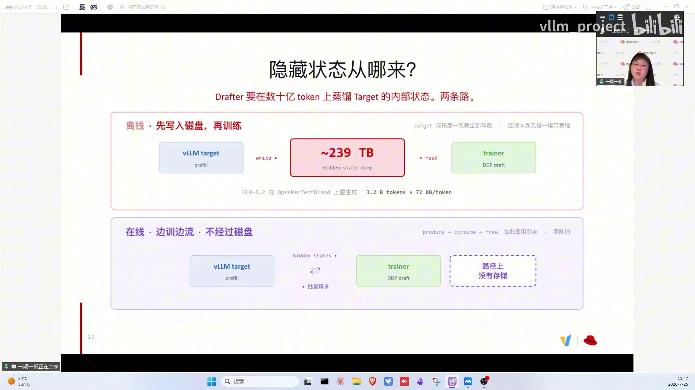 |
| （接上） [【跳转到 47:05】](https://www.bilibili.com/video/BV18E3u63EdR/?t=2825) |  |
| 尤其对于很大的模型，像 GLM5.2 的话重新生成需要占 200 多 TB 的（存储）。生产环境中很少有这个条件。更好的训练方式我们比较推荐在线训练：离线写入磁盘的 hidden state 也没办法再次使用…… [【跳转到 47:30】](https://www.bilibili.com/video/BV18E3u63EdR/?t=2850) | 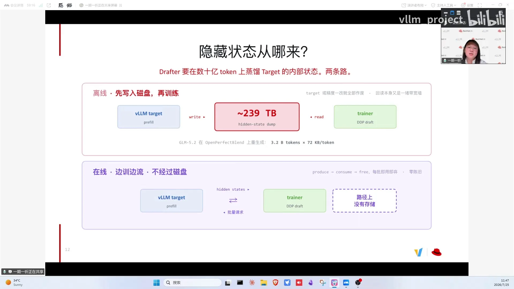 |
| 因为它是针对这一个模型的，不可能再用它训练其他的模型。等于为了一次（训练）占了 200 多 TB 的（存储）。 [【跳转到 47:55】](https://www.bilibili.com/video/BV18E3u63EdR/?t=2875) |  |
| 很不划算。所以一般来说推荐在线训练：一边（推理）部署一边产生 hidden states。trainer 会给 vLLM 的 endpoint 发送一个批量的请求…… [【跳转到 48:20】](https://www.bilibili.com/video/BV18E3u63EdR/?t=2900) |  |
| 回复时把 hidden states 提取过来。路径上没有存储，用掉之后就删除，也不会占内存，比较方便。那我们目前是怎么样把 hidden states 提取出来的？我们没有新写一套提取的通路…… [【跳转到 48:45】](https://www.bilibili.com/video/BV18E3u63EdR/?t=2925) | 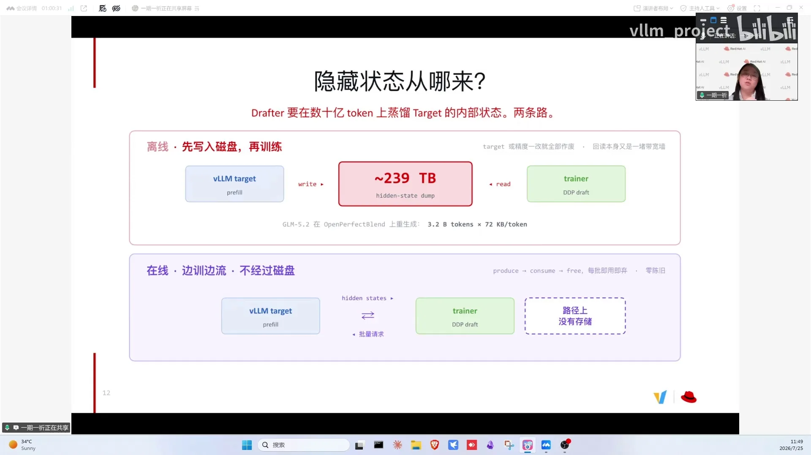 |
| 我们使用了 vLLM 本身已经有的 KV connector：在 target 前向时抽出 hidden states——比如第 8 层、23 层、39 层、50 层、70 层的这些 hidden states，把它伪装成 KV cache 装进 KV cache 槽位里，不需要 reshape，然后用 KV connector 把它送到训练器那边去。它的 tensor size 维度是 token length、layer、hidden size…… [【跳转到 49:10】](https://www.bilibili.com/video/BV18E3u63EdR/?t=2950) |  |
| （接上） [【跳转到 49:35】](https://www.bilibili.com/video/BV18E3u63EdR/?t=2975) |  |
| 我们就把 hidden size 命名成 num heads 和 head size，可以直接严丝合缝地嵌进 KV cache 的槽位里，不用另外写一个通路。为什么现在想用 Mooncake connector？有一点…… [【跳转到 50:00】](https://www.bilibili.com/video/BV18E3u63EdR/?t=3000) | 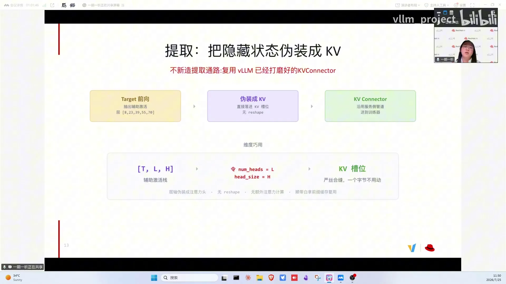 |
| （vLLM 原生）的 KV connector 要求 trainer 部分和 hidden states extractor 这部分在同一个 node、同一台机器上，因为需要两个互相沟通、共享一部分内存…… [【跳转到 50:25】](https://www.bilibili.com/video/BV18E3u63EdR/?t=3025) | 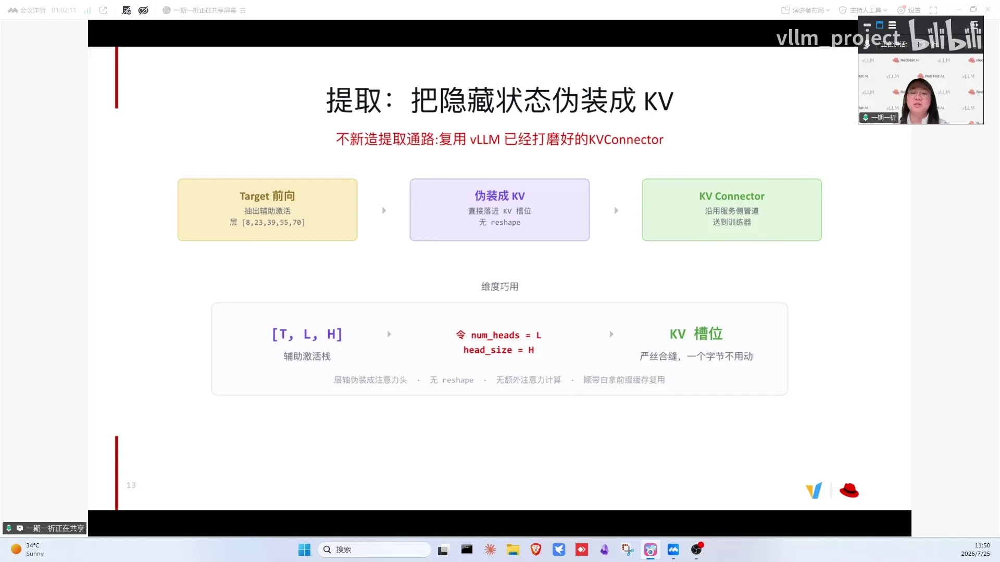 |
| （接上） [【跳转到 50:50】](https://www.bilibili.com/video/BV18E3u63EdR/?t=3050) | 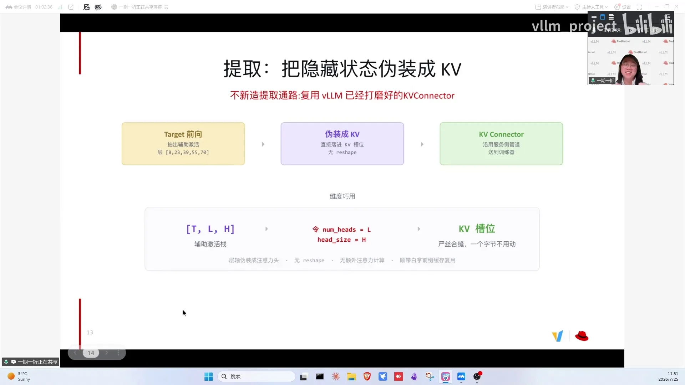 |
| 这样 trainer 才可以读到 target 写的东西。因为有很多 async 的 concurrency，还有给每一个 hidden states 文件加一个 file lock：trainer 读的时候看有没有 lock，没有 lock 再读取——还要解决读写冲突。 [【跳转到 51:15】](https://www.bilibili.com/video/BV18E3u63EdR/?t=3075) | 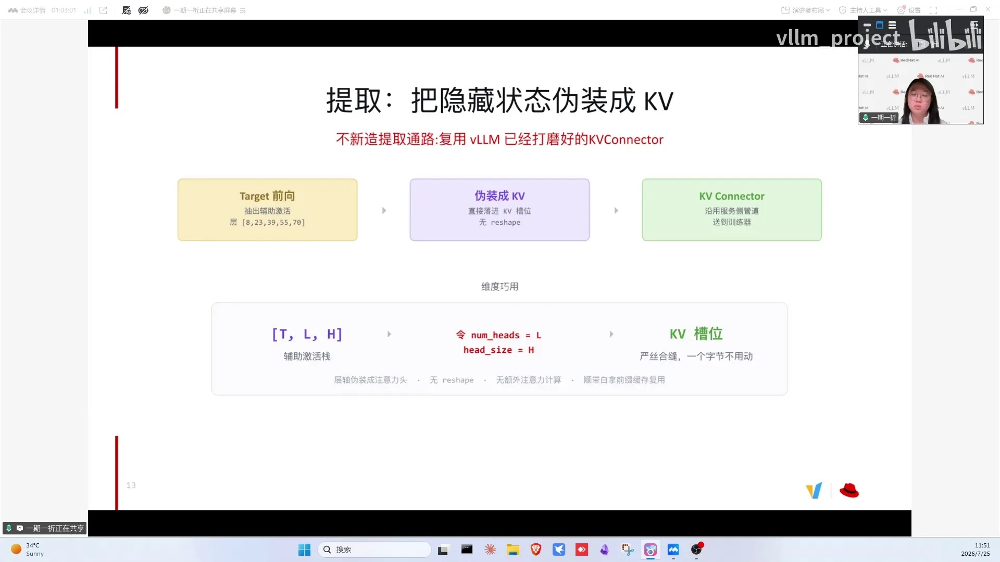 |
| 实际上我们希望 connector 可以进行跨节点的训练。现在很多模型越来越大了，甚至一个 node 都部署不下，更不要说在一个 node 上既要部署 vLLM 的 target 模型又要训练小的 draft 模型…… [【跳转到 51:40】](https://www.bilibili.com/video/BV18E3u63EdR/?t=3100) | 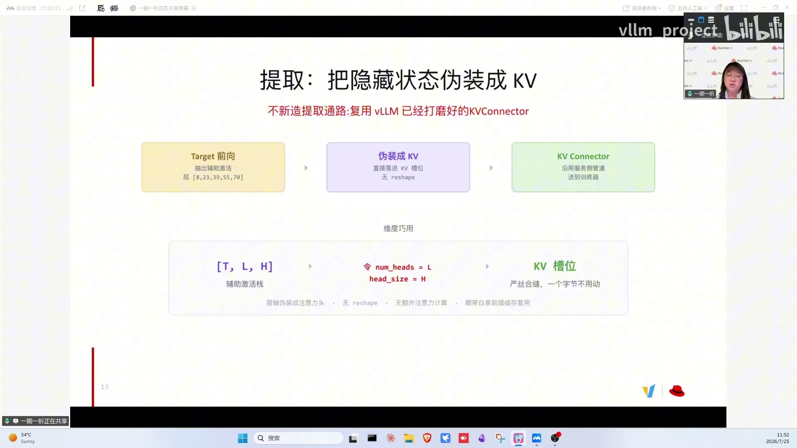 |
| 一个 node 现在根本就不够用了。所以我们希望 speculators 上能够支持跨节点的训练，而且不假设有共享的文件系统。我们希望 hidden states 的生产和 trainer 训练的消费相对分开：生产者不需要知道谁来消费、什么时候消费，只管把 hidden states 产生出来放在一个地方，不关心调度的问题…… [【跳转到 52:05】](https://www.bilibili.com/video/BV18E3u63EdR/?t=3125) | 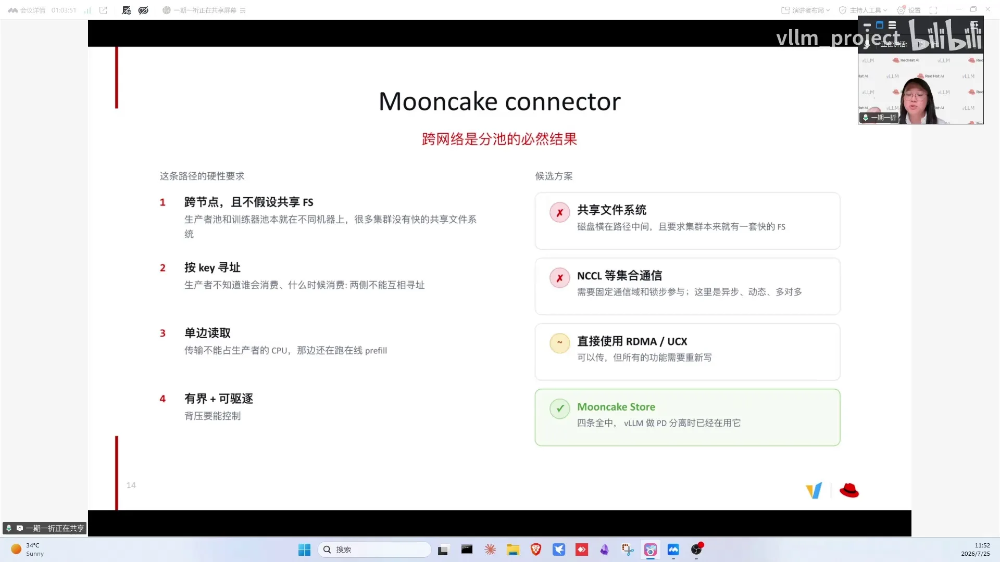 |
| （接上） [【跳转到 52:30】](https://www.bilibili.com/video/BV18E3u63EdR/?t=3150) |  |
| trainer 这边相对压力比较小，可以在训练的消费者这边关心调度的问题、决定怎么读取。我们也希望生成是有界的、可驱逐的：如果出现某种情况——比如一个 trainer 的 GPU 掉线了或者（坏了），生产速度大于消费速度，我们就不要一直继续生产了。之前训练时也遇到过磁盘写不下：训练这边已经不在工作了，生产还在一直生产，这个情况就很危险…… [【跳转到 52:55】](https://www.bilibili.com/video/BV18E3u63EdR/?t=3175) | 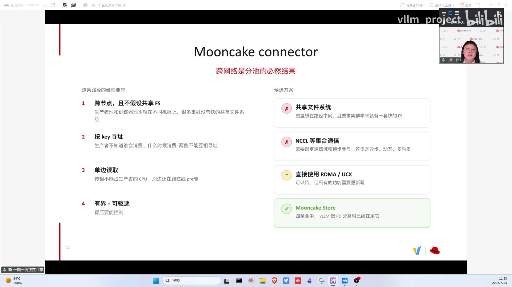 |
| （接上） [【跳转到 53:20】](https://www.bilibili.com/video/BV18E3u63EdR/?t=3200) | 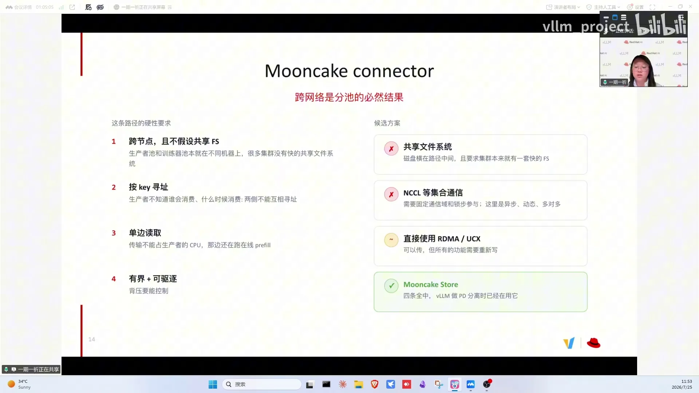 |
| （接上） [【跳转到 53:45】](https://www.bilibili.com/video/BV18E3u63EdR/?t=3225) |  |
| 我们希望它是有界的。还有一些比如文件已经存在 10 分钟、30 分钟，很明显没有被及时清理掉，我们也希望可以直接把它驱逐掉，保证 storage 内存的健康。那我们发现之前用的原生的系统好像稍微有点不太够用了，所以现在准备使用 Mooncake connector…… [【跳转到 54:10】](https://www.bilibili.com/video/BV18E3u63EdR/?t=3250) | 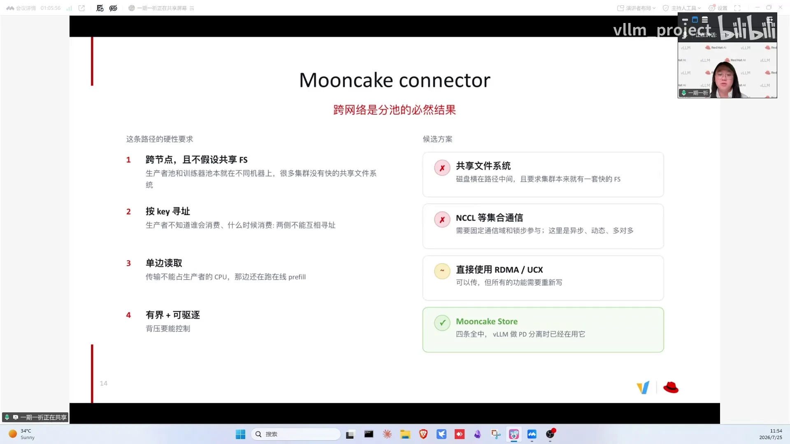 |
| 它既不需要我们有共享的文件系统，又有有界、可驱逐、单边读取的能力，而且不需要我们很多 engineering power 来重新把这些功能写一遍。我们最近有一个 PR：在 speculators 上加一个 Mooncake connector…… [【跳转到 54:35】](https://www.bilibili.com/video/BV18E3u63EdR/?t=3275) |  |
| 所以现在在 speculators 上就可以做到支持跨节点的训练，可以为像 Kimi K3 这样很大的模型训练一个 draft 模型，进一步拓宽支持的模型家族和选择。我今天其实…… [【跳转到 55:00】](https://www.bilibili.com/video/BV18E3u63EdR/?t=3300) | 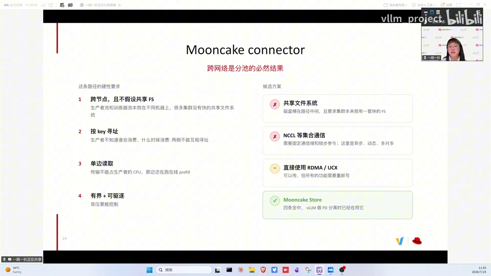 |
| 我也想打个广告：我们的第十期节目当时专门介绍了 KV connector，请到了 LMCache 的逸华和 Mooncake 的嘉豪老师。直播间的同学感兴趣可以看那一期的回放，那期讲得挺好的。——直播间有同学问训练的时候…… [【跳转到 55:25】](https://www.bilibili.com/video/BV18E3u63EdR/?t=3325) | 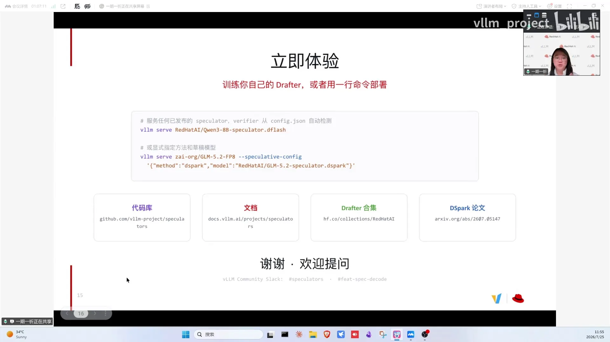 |
| 生产者和消费者开相同的切分 head 的并行方式可以直接 point-to-point 传对吗？——应该是可以的。我觉得可能也是看 Mooncake connector 具体怎么实现。——嗯对。 [【跳转到 55:50】](https://www.bilibili.com/video/BV18E3u63EdR/?t=3350) | 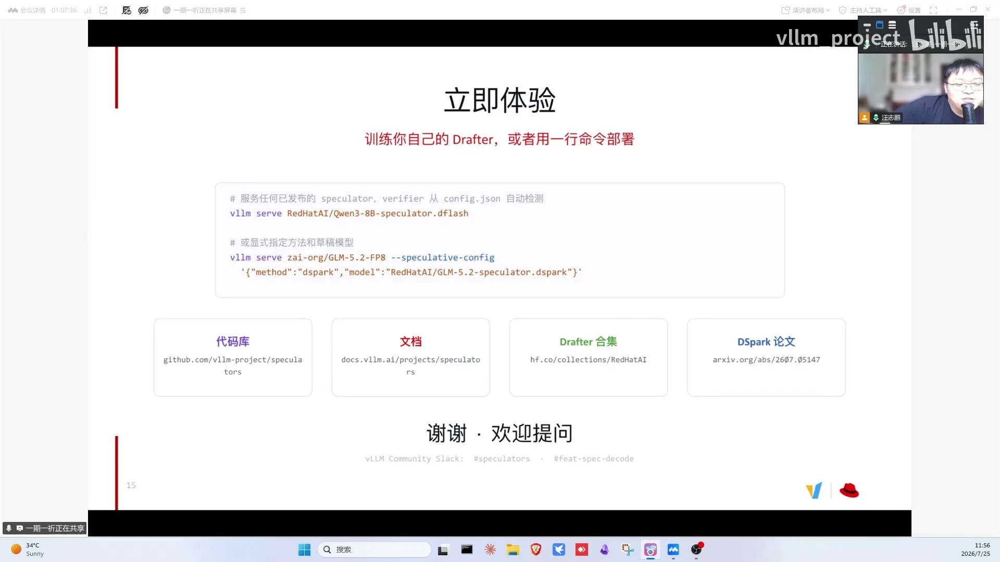 |
| 因为我虽然没做过这块训练，但做过一些强化学习的后训练：传输方式在权重传输这一块有很多种传输后端——有 point-to-point 的传法，也有一些其他传法比如 all-gather、broadcast…… [【跳转到 56:15】](https://www.bilibili.com/video/BV18E3u63EdR/?t=3375) | 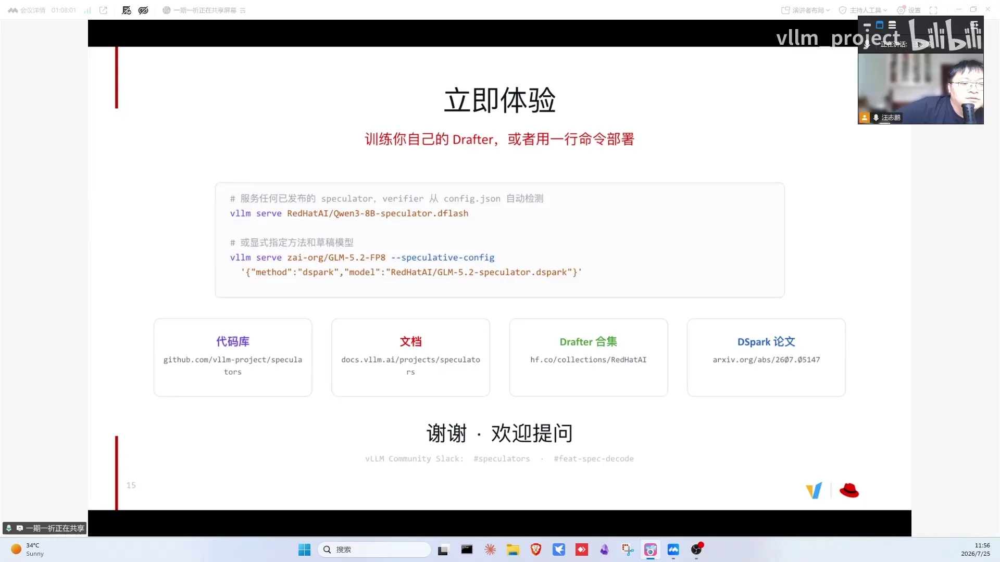 |
| 还有一些混合的传输方式。因为很多时候训练里——因为我们相当于把 hidden states 拆成了类似 KV cache 的格式去传，对吧？对对对。那么理论上来讲…… [【跳转到 56:40】](https://www.bilibili.com/video/BV18E3u63EdR/?t=3400) | 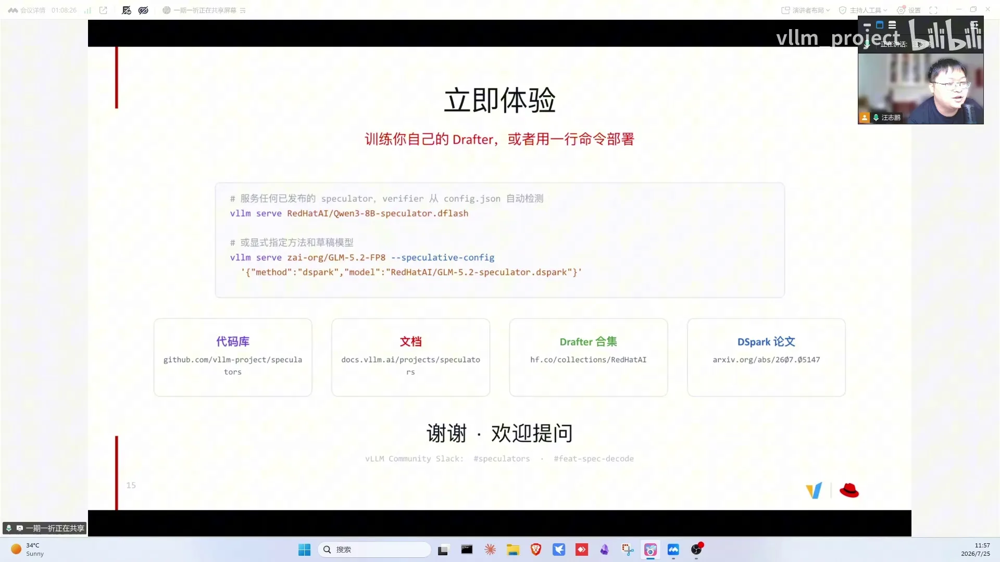 |
| 我们对于比如头怎么切应该不是那么敏感：不管怎么切，最后反正传的是 hidden states，最后还是要还原回去的。实际上怎么切不是特别重要。——对，因为它对 shape 没有那么敏感。——对。 [【跳转到 57:05】](https://www.bilibili.com/video/BV18E3u63EdR/?t=3425) | 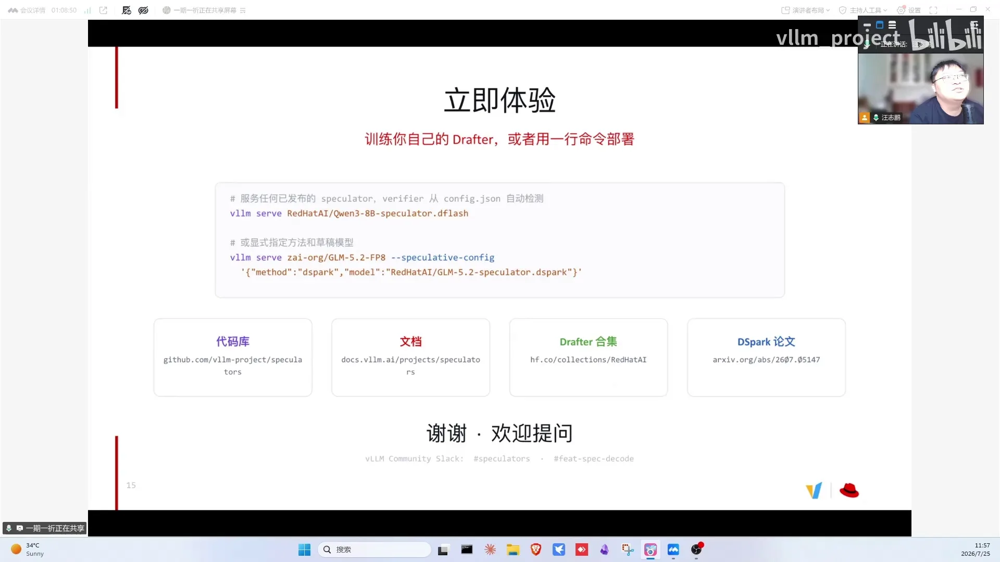 |
| 这位同学又说我理解复用 hidden states 应该跟 PD 分离没啥区别。——对，就是你 prefill 完 decode 的时候，因为你也是传 hidden states，对对对对。是的。 [【跳转到 57:30】](https://www.bilibili.com/video/BV18E3u63EdR/?t=3450) |  |
| 最后不过我想：训练的时候一般都会有 DP 这种维度嘛。实际上传到训练的 group 里之后，肯定得要么做 broadcast，要么每个里面专门单独传一份。每个单独传的话可能会让中间通信的负载比较高。这个 PR 我到时候也可以分享给大家，大家可以试一试，或者有更好的实现方式也欢迎和我们讨论。 [【跳转到 57:55】](https://www.bilibili.com/video/BV18E3u63EdR/?t=3475) | 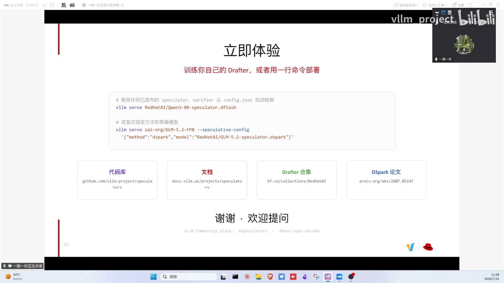 |
| 要么的话我就是每个里面去专门去单独去传一份对吧就每个单独传的话我觉得可能会让我们中间通信里面的负载会比较高对嗯这个这个pr我到时候也可以分享给大家嗯然后大家可以试一试或者有什么更好的这个呃实现的方式也欢迎大家和我们讨论 [【跳转到 58:20】](https://www.bilibili.com/video/BV18E3u63EdR/?t=3500) |  |
| 然后有同学问：训练也支持 PD 分离吗？——训练不太需要。一般来讲……有的时候会用，不过我确实没有用过：你的 rollout 如果特别长的话…… [【跳转到 58:45】](https://www.bilibili.com/video/BV18E3u63EdR/?t=3525) |  |
| 那你可能会需要做 PD 分离。我觉得这个场景跟我们 RL 里做 rollout 有些像的地方：需要让模型采样一个很长的序列。实际上我们训练时对于 target 大模型是不需要 decode 的部分的…… [【跳转到 59:10】](https://www.bilibili.com/video/BV18E3u63EdR/?t=3550) | 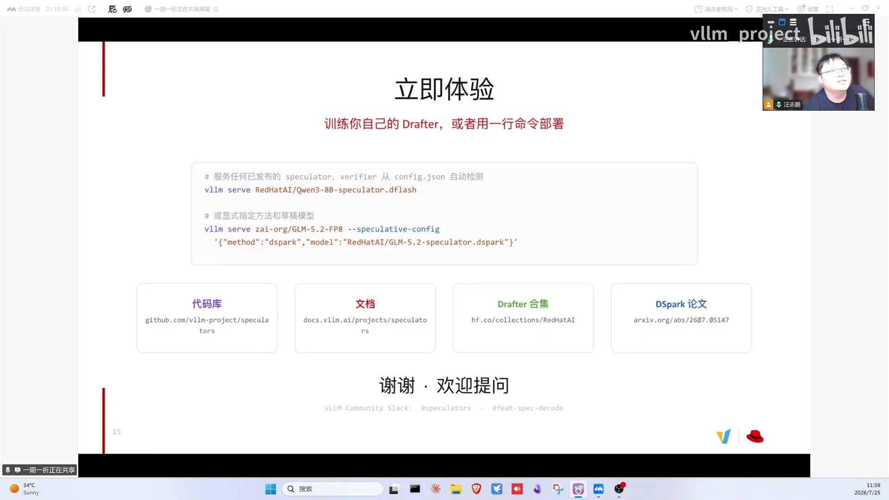 |
| 我们只需要 prefill 这个部分。——因为我只要 hidden states，decode 就让它 decode 一个 token 就之后再说，我们根本不需要（完整 decode）。因为我们学的是它的 logprobs 这些东西，对吗？——对，我们学的是 hidden states 作为输入…… [【跳转到 59:35】](https://www.bilibili.com/video/BV18E3u63EdR/?t=3575) |  |
| 所以 decode 我们不需要，主要就学了 prefill，不需要让它完整输出所有东西。——那么其实你这个整个方法还是类似于 SFT，对吧？——我不太了解 SFT，我理解应该是这样子的。 [【跳转到 60:00】](https://www.bilibili.com/video/BV18E3u63EdR/?t=3600) | 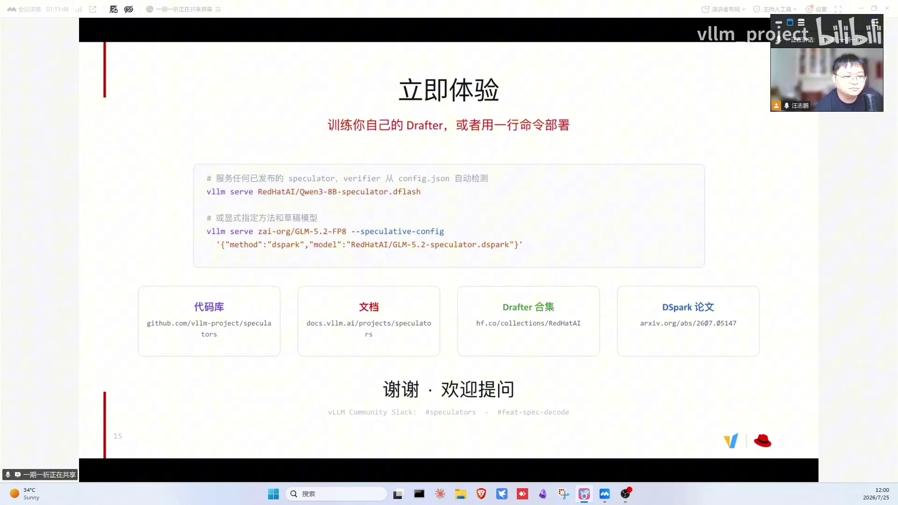 |
| 对好。然后还是有同学有问题：哪些 vLLM 的优化技术不能和投机解码同时开启？——目前为止没有遇到过（不兼容的）。 [【跳转到 60:25】](https://www.bilibili.com/video/BV18E3u63EdR/?t=3625) |  |
| vLLM 有 recipe，部署的时候可以看一下：enable 投机解码有投机解码的 recipe，可以看有没有和其他不兼容的。——然后怎么部署投机解码是最优化的方案？——我们内部也在希望多学习一些 vLLM runtime 推理的内容，这样我们也可以更好地给大家提供 recipe…… [【跳转到 60:50】](https://www.bilibili.com/video/BV18E3u63EdR/?t=3650) |  |
| （接上） [【跳转到 61:15】](https://www.bilibili.com/video/BV18E3u63EdR/?t=3675) |  |
| 争取给大家发布最优化的部署方案。——我理解的话投机解码主要是在 decode 的时候使用的。那么比如做 prefill 相关的东西可能就跟它不太兼容…… [【跳转到 61:40】](https://www.bilibili.com/video/BV18E3u63EdR/?t=3700) |  |
| 因为它不加速 prefill，只加速 decode。好，我们继续吧。今天就准备了这么多内容…… [【跳转到 62:05】](https://www.bilibili.com/video/BV18E3u63EdR/?t=3725) | 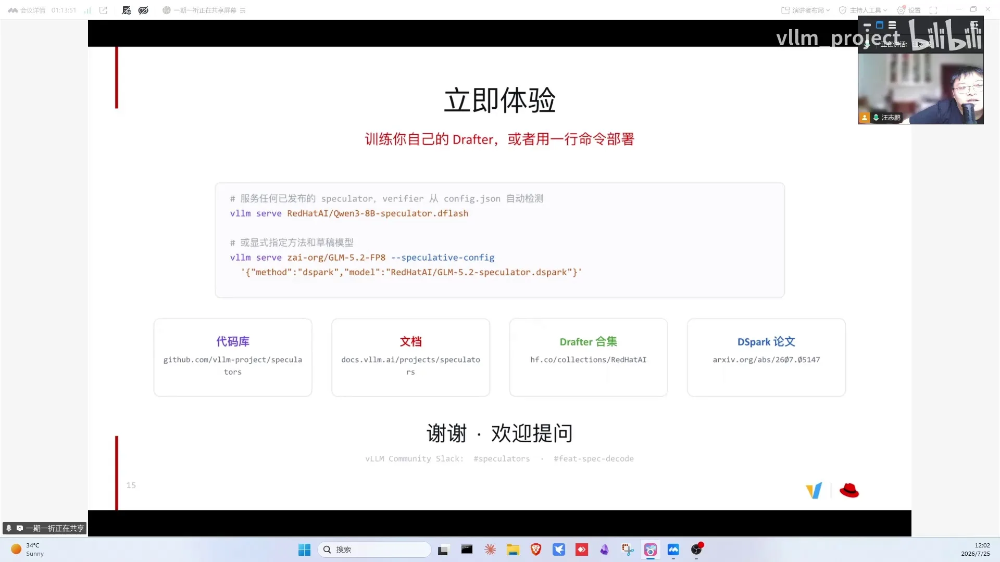 |
| 希望大家体验一下我们的库。如果觉得有帮助能给我们一个 star，这对我们来说非常重要。vLLM project 下面所有项目大家都可以习惯性地给每个项目点个 star。——对对对对。 [【跳转到 62:30】](https://www.bilibili.com/video/BV18E3u63EdR/?t=3750) |  |
| 这个星星对我们来说就是我们的本钱、我们的指路明星。而且投机解码这个东西现在应该所有场景都在用了：它真的太好用了。因为它完全没有损失，有损失的情况下把它关掉就好了，基本上是稳赚不赔的优化方式。好呀，我在微信群里把我有的链接都发出去了，还有我的 vLLM slack 的联系方式和微信的联系方式。欢迎大家…… [【跳转到 62:55】](https://www.bilibili.com/video/BV18E3u63EdR/?t=3775) | 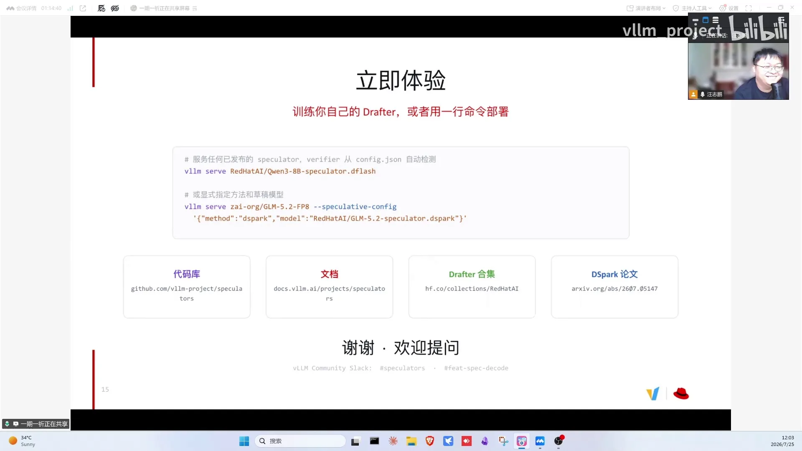 |
| （接上） [【跳转到 63:20】](https://www.bilibili.com/video/BV18E3u63EdR/?t=3800) | 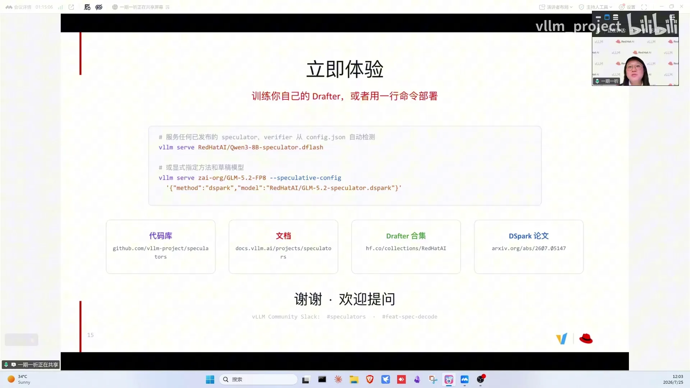 |
| 来微信或者 slack 上找我。——诶我还有个问题：野生开发者自己训练了一个模型，能够贡献到你们的 HuggingFace 仓库吗？——可以呀，如果是用 speculators 来训练的话当然更好了，那不就是相当于给我们免费的 GPU 吗？哈哈哈哈。 [【跳转到 63:45】](https://www.bilibili.com/video/BV18E3u63EdR/?t=3825) |  |
| 好，直播间的同学还有没有什么问题要问的？今天直播…… [【跳转到 64:10】](https://www.bilibili.com/video/BV18E3u63EdR/?t=3850) | 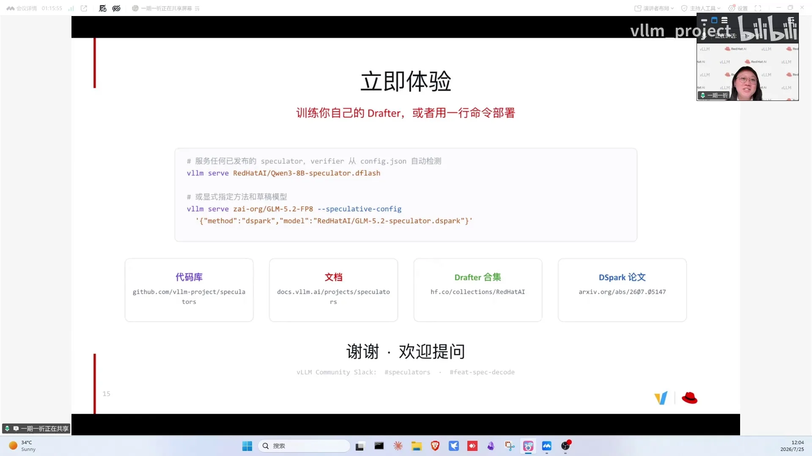 |
| 有同学问：数据集一般准备多少合适？——好问题。我们一般准备 500K，就是 50 万条数据。——然后最近也在试验用那个（更大的数据集）…… [【跳转到 64:35】](https://www.bilibili.com/video/BV18E3u63EdR/?t=3875) |  |
| 那个是 100 万。之前我们只是支持每一个对话一轮的数据，现在支持很多轮的数据了。——我还有个问题：做投机解码模型训练时，可以从现成的模型上继续做投机解码模型的后训练吗？——可以。——那这样数据就可以少一些呢？——是这样子的。我们也有听说用户用几万条来微调…… [【跳转到 65:00】](https://www.bilibili.com/video/BV18E3u63EdR/?t=3900) | 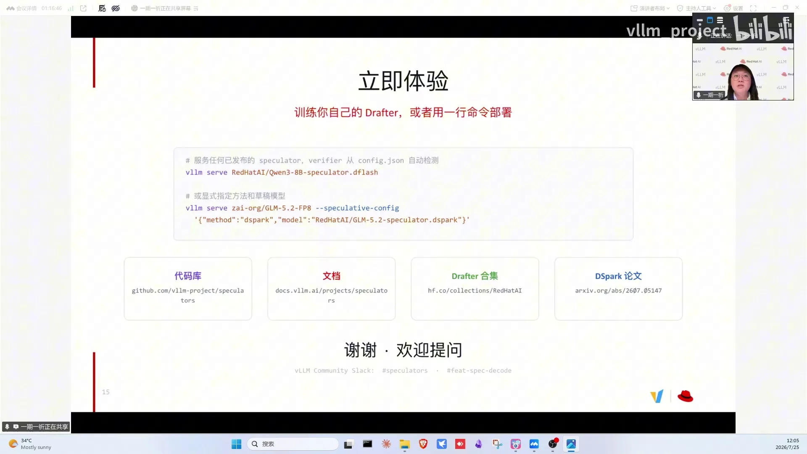 |
| （接上） [【跳转到 65:25】](https://www.bilibili.com/video/BV18E3u63EdR/?t=3925) | 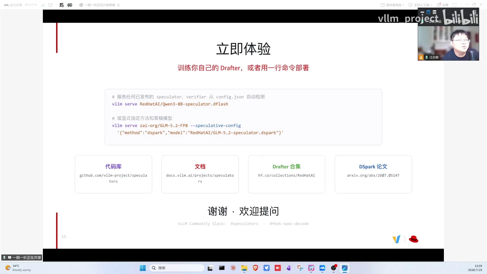 |
| 在他们自己的 production environment 数据上能够得到比较好的加速、针对他们自己的优化。speculators 上也是支持的…… [【跳转到 65:50】](https://www.bilibili.com/video/BV18E3u63EdR/?t=3950) |  |
| 你可以用 from_pretrained 这个 flag load 一个已经训练好的、比如 DFlash 的 draft 模型，再在自己的数据上微调。还有一点：所有的 DFlash 模型都可以非常容易地转换成 DSpark 模型。只要你有 DFlash 模型，可以很容易把它变成 DSpark 模型。这也是一种优化方式。 [【跳转到 66:15】](https://www.bilibili.com/video/BV18E3u63EdR/?t=3975) | 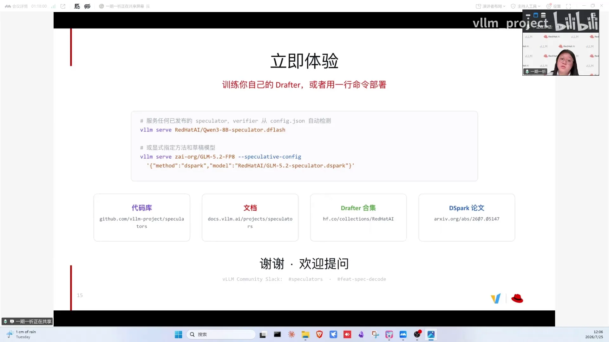 |
| 然后有同学问：多模态模型怎么训练呢？我们支持图像数据。我知道有用户在使用我们的库来进行（图像）模型的训练。但我们自己还没有时间做相关研究，如果大家感兴趣可以告诉我们…… [【跳转到 66:40】](https://www.bilibili.com/video/BV18E3u63EdR/?t=4000) | 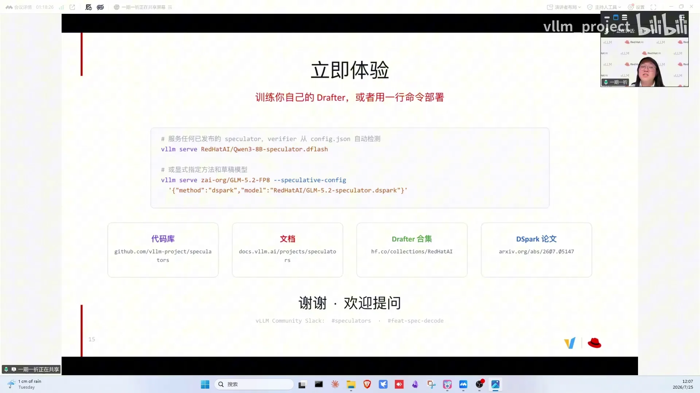 |
| （接上） [【跳转到 67:05】](https://www.bilibili.com/video/BV18E3u63EdR/?t=4025) | 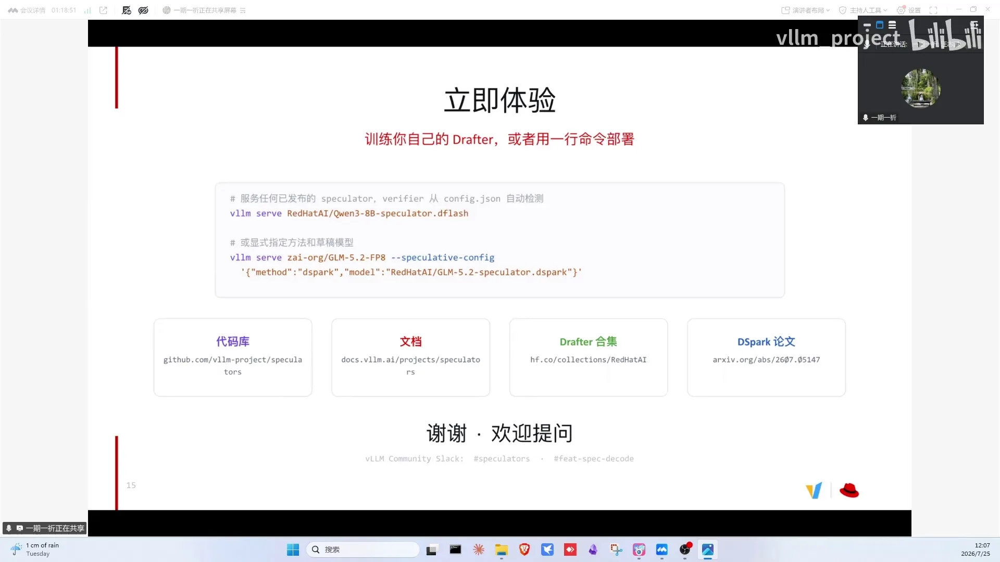 |
| 有什么需要改进的地方、有哪些好的数据集需要支持的。——我理解多模态数据的话，图像那一块肯定是不可能用来做模型的预测了，对吧？——对对对，因为我们只能加速文字的部分。 [【跳转到 67:30】](https://www.bilibili.com/video/BV18E3u63EdR/?t=4050) | 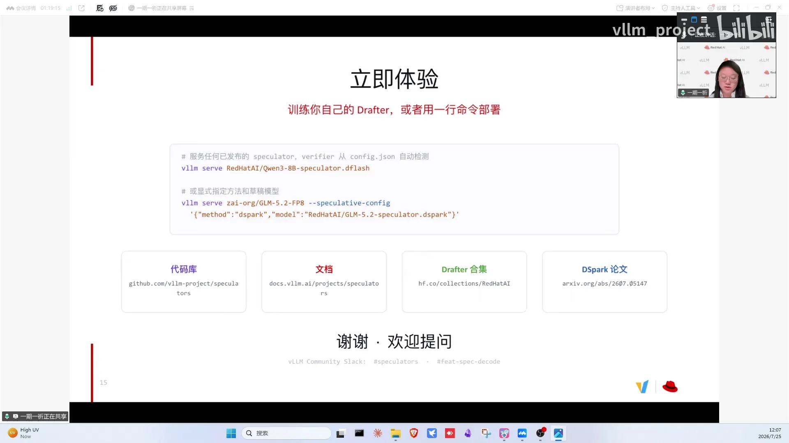 |
| 然后有同学问 RL 一般会考虑投机解码吗？——RL 一般那种都会开的。然后 max token 如果训练的时候设置小了比如 2048，要重新训练吗？——好问题…… [【跳转到 67:55】](https://www.bilibili.com/video/BV18E3u63EdR/?t=4075) | 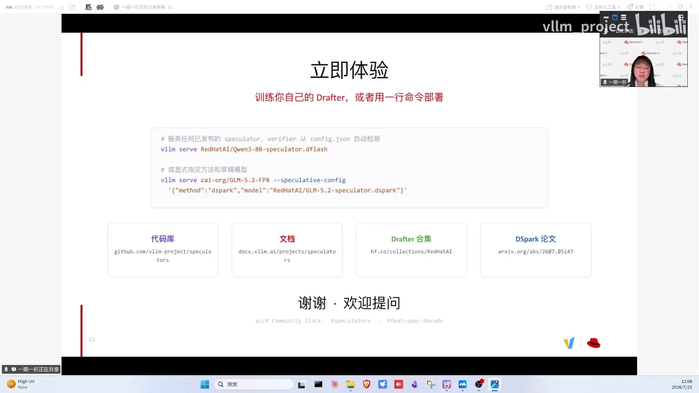 |
| 之前我们发现训练时 max model length 开到多少，inference 时超过这个长度，performance 就会有比较明显的退化。我们现在…… [【跳转到 68:20】](https://www.bilibili.com/video/BV18E3u63EdR/?t=4100) | 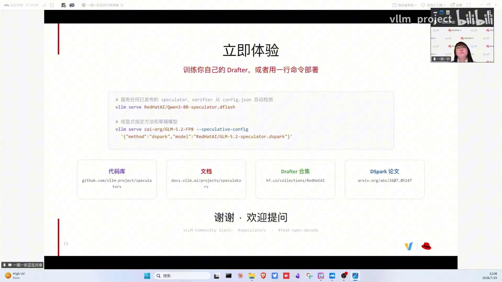 |
| 现在给他加了一个 sliding window attention 的优化。我们发现加了这个优化之后，训练的模型 max model length 可以稍微短一点，inference 的时候用几万 context 的话…… [【跳转到 68:45】](https://www.bilibili.com/video/BV18E3u63EdR/?t=4125) | 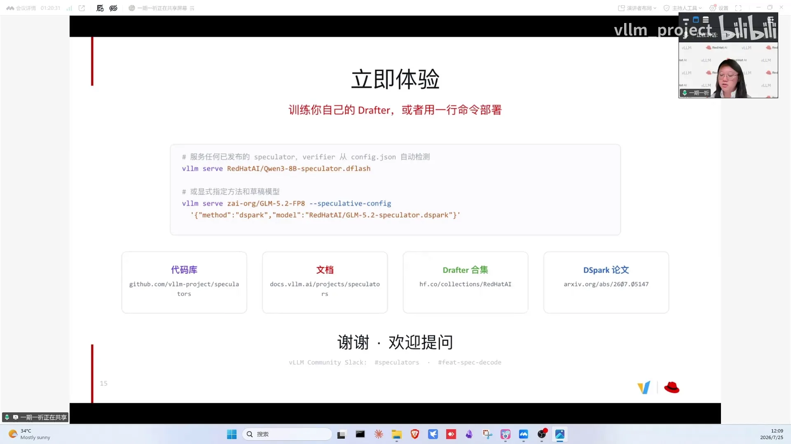 |
| regression 就不会非常明显，甚至可以持平。我们也在做特别长的 long context 训练时的优化：如果你想用（很长的），希望未来训练的时候也可以支持。 [【跳转到 69:10】](https://www.bilibili.com/video/BV18E3u63EdR/?t=4150) | 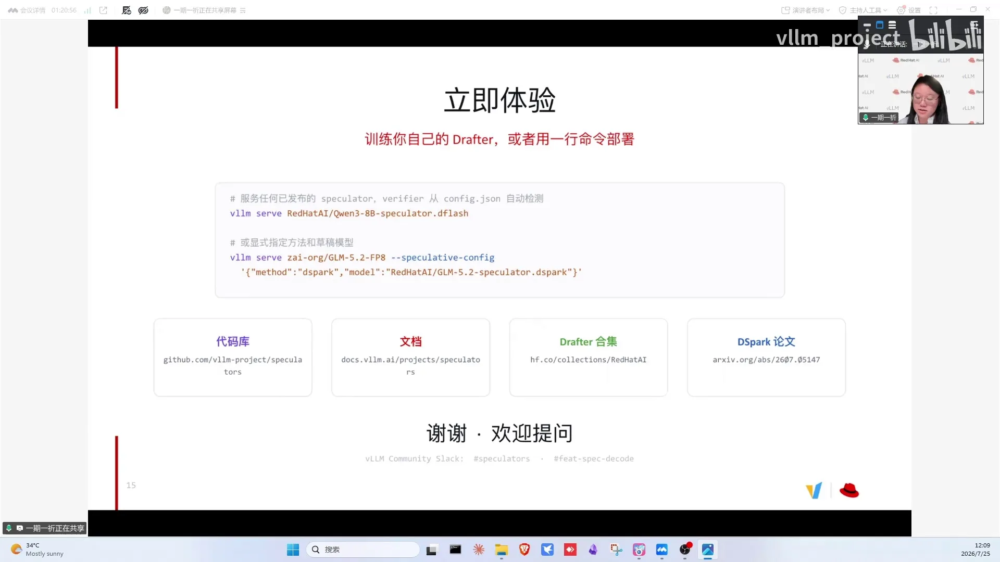 |
| 然后有同学问：diffusion LM 可以用投机解码吗？——没必要吧。首先大家正儿八经落地的话用（diffusion）模式很少：感觉表现不是特别理想。因为刚才说了（并行）的问题——并行会有精确度不够的问题，很难解决。 [【跳转到 69:35】](https://www.bilibili.com/video/BV18E3u63EdR/?t=4175) | 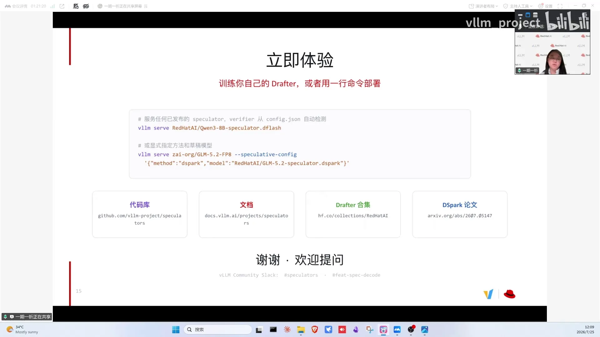 |
| （接上） [【跳转到 70:00】](https://www.bilibili.com/video/BV18E3u63EdR/?t=4200) | 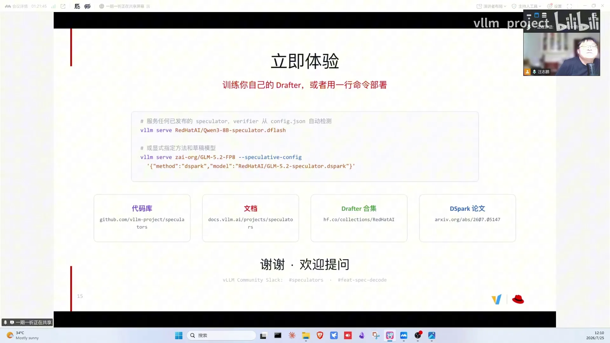 |
| 其实我在（diffusion LM）刚出时还研究了一下这个模型：在我看来 Markov head 这个改进类似于回归传统（自回归）的方式。因为以前（diffusion LM）不是一口气解码 16 个 token…… [【跳转到 70:25】](https://www.bilibili.com/video/BV18E3u63EdR/?t=4225) |  |
| 可能是 1024 个 token 里每次解码两到三个，每次都是输出概率最大的两个，所以当时其实有先后顺序的。只是转成了（投机解码）方式后大家就不做先后顺序了，每次解码 8~16 个…… [【跳转到 70:50】](https://www.bilibili.com/video/BV18E3u63EdR/?t=4250) | 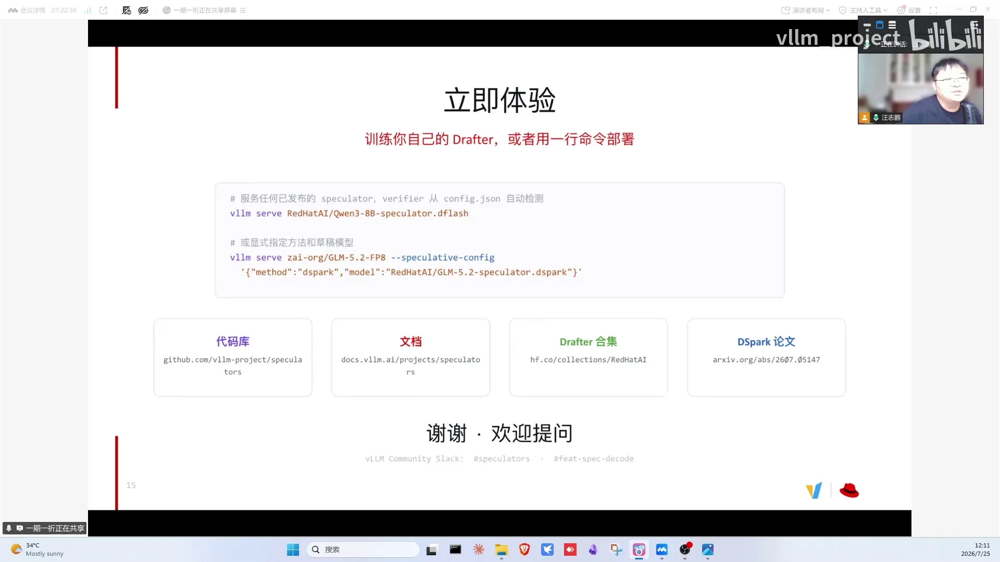 |
| 这时就出现了一口气全部生成所有 token，导致模型能力弱了很多。最开始做这个方向时大家都发现了这个问题。——实际上硬要加应该也是可以加的，但感觉没有必要。 [【跳转到 71:15】](https://www.bilibili.com/video/BV18E3u63EdR/?t=4275) |  |
| 我反正想象不了这个东西加上（投机解码）是个怎么样的推理方法，不知道有没有意义。而且现在也没有做（diffusion LM）专门的推理引擎，应该只能用 transformers 来做。——vLLM 是支持像（某些）diffusion 的…… [【跳转到 71:40】](https://www.bilibili.com/video/BV18E3u63EdR/?t=4300) | 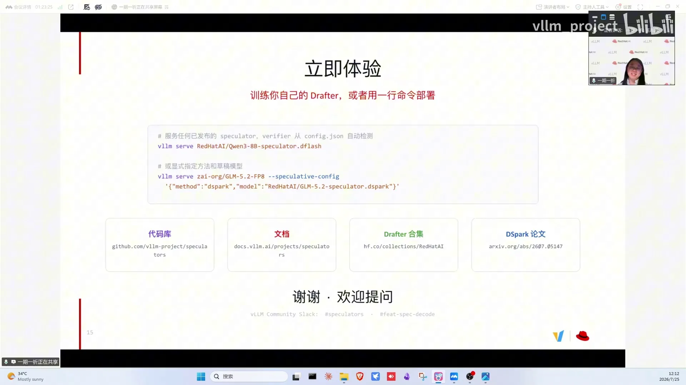 |
| 实际上 vLLM 里面的（diffusion）支持很多就是用 DFlash 来做的。我们有一期 veRL 的 office hour，有个同事来讲这个究竟怎么实现。感兴趣的话我可以发到群里。——可以发群里，我们研究一下。 [【跳转到 72:05】](https://www.bilibili.com/video/BV18E3u63EdR/?t=4325) |  |
| 好好。那么非常感谢嘉文老师今天的分享。——没有没有，跟大家共同学习。今天的直播我们就到此结束了，感谢…… [【跳转到 72:30】](https://www.bilibili.com/video/BV18E3u63EdR/?t=4350) | 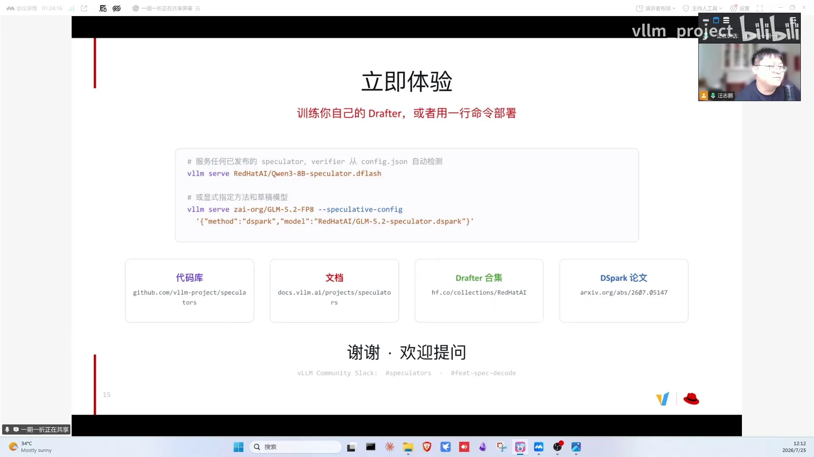 |
| （此区间无字幕） [【跳转到 72:55】](https://www.bilibili.com/video/BV18E3u63EdR/?t=4375) | 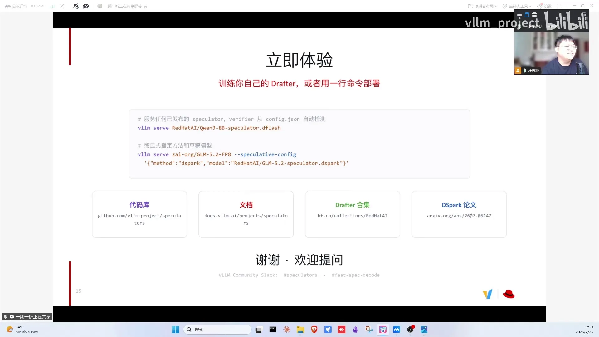 |