# vLLM day-0 Kimi K3支持：探索智能新前沿的推理边界 原始文稿（图-字幕分栏）

| 字幕文本 | 画面 |
| :--- | ---: |
| 那我们今天的直播就正式开始了。我和永夜现在都在 INFX，都在维护 vLLM。这次 K3 的 day0 支持就是由我和永夜主要来做的，当然还有我们公司很多其他小伙伴一起来做。今天就来介绍一下 vLLM 到底是如何…… [【跳转到 00:00】](https://www.bilibili.com/video/BV11z3m63ECo/?t=0) | 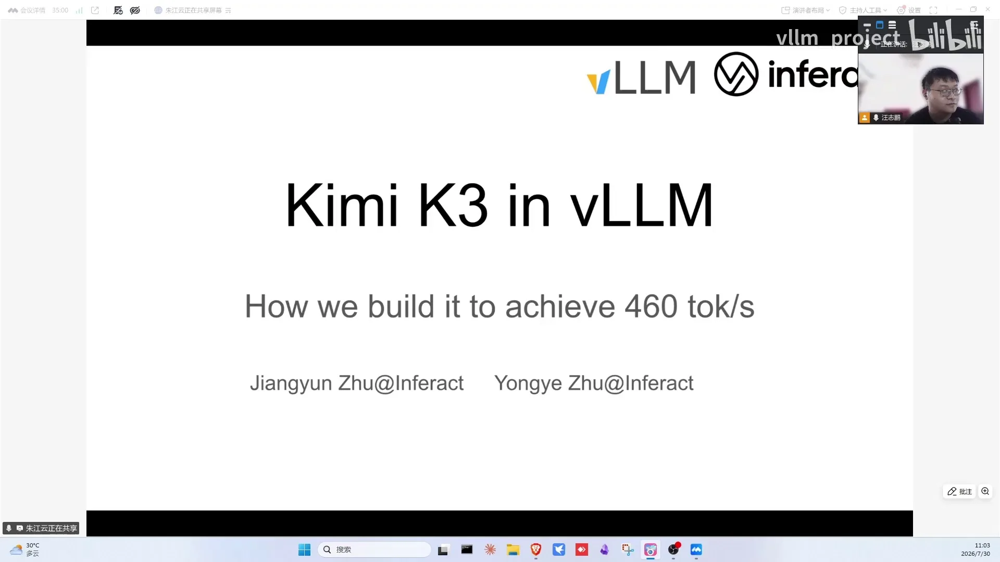 |
| 支持 K3 并且达到一个非常好的性能的。首先我们看一下 K3 的大概架构图——这个架构图是从 K3 的博客里拿过来的。可以看到相比于前代（K2 以及之前预览的 Kimi Linear）创新还是有一些的：attention 由 K2 的 MLA…… [【跳转到 00:25】](https://www.bilibili.com/video/BV11z3m63ECo/?t=25) |  |
| 变成了 MLA 加上 KDA，并且在 MLA 上也做了一些小修改。另一个比较重要的模块 MoE 里也做了创新，引入了 latent MoE 的设计：下面这个是 KDA，上面是 latent MoE，用红框框起来…… [【跳转到 00:50】](https://www.bilibili.com/video/BV11z3m63ECo/?t=50) | 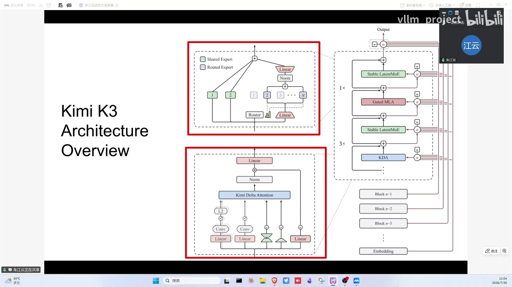 |
| 让我们看一下跟前代具体的对比。首先 K3 相比 K2 参数量大了很多：层数由原来 61 层变为现在 93 层，参数量翻倍了，激活的参数量也大大增加，上下文长度也变得更长…… [【跳转到 01:15】](https://www.bilibili.com/video/BV11z3m63ECo/?t=75) |  |
| 这也得益于它使用了 hybrid attention 的架构：现在有 KDA 和 MLA 两种了。并且这次 K3 也原生支持了多模态输入。然后我们看 day0 时候的性能：我们重点优化了现在大家比较看重的…… [【跳转到 01:40】](https://www.bilibili.com/video/BV11z3m63ECo/?t=100) | 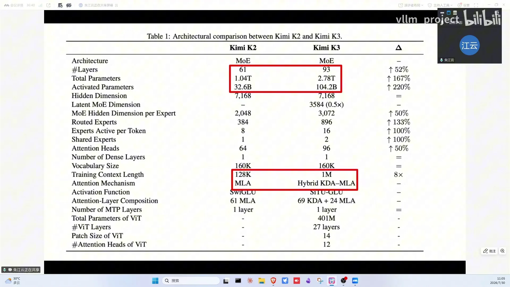 |
| （decode）场景里的性能。TP1 的时候 batch 等于 1 可以跑到 110 多 TPS；看了 spec decoding 以后——我们带头训练了一个 DSpark——现在可以到 410；在更大 scale 的时候比如 TP16 可以达到 464 TPS…… [【跳转到 02:05】](https://www.bilibili.com/video/BV11z3m63ECo/?t=125) | 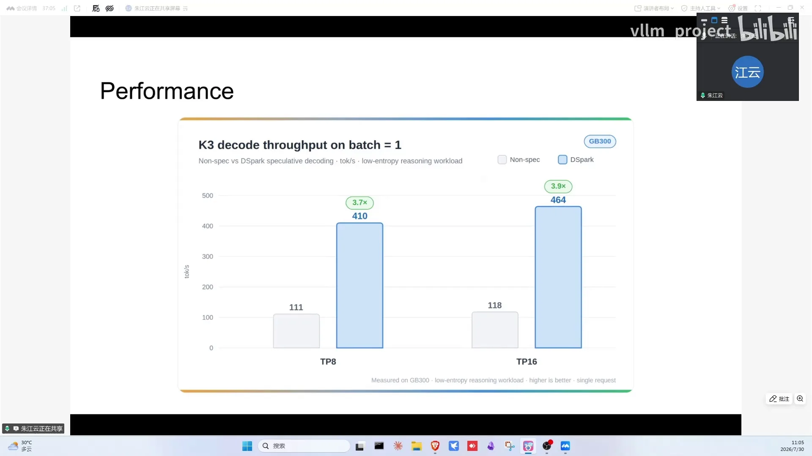 |
| 现在来比较细节地看一些模块的具体设计。比如 K3 的 latent MoE：左边是一个正常的 MoE 过程——先有 hidden states 经过 router 做分发…… [【跳转到 02:30】](https://www.bilibili.com/video/BV11z3m63ECo/?t=150) |  |
| 经过 all-to-all 分发给不同的 expert，再把不同 expert 的计算 all-to-all 聚合起来。但这样 MoE 一直的问题就是通信量比较大。latent MoE 的做法是：我先在 hidden states 输入的时候对它做一次降维…… [【跳转到 02:55】](https://www.bilibili.com/video/BV11z3m63ECo/?t=175) | 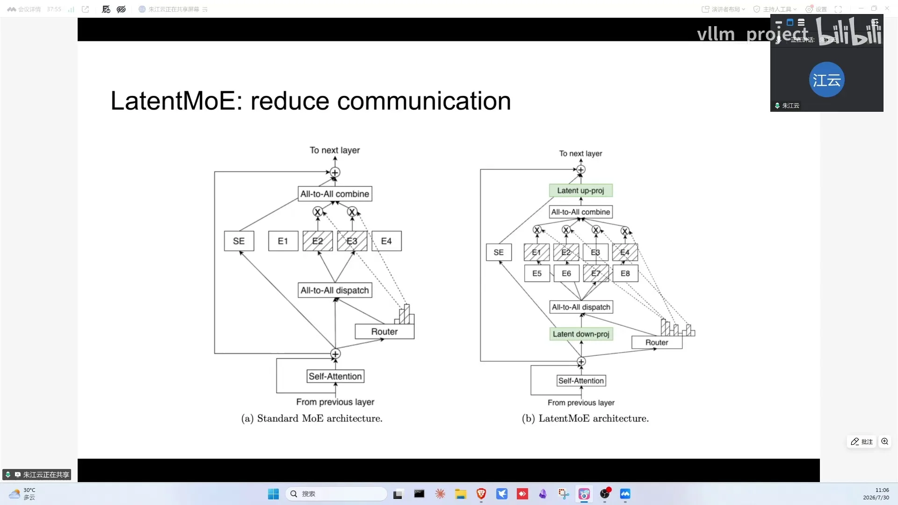 |
| 比如从原来的 512 降到 256，数据量就会变少，相应的计算量和通信量都会降低。它采用的做法是在入口处加一个降维的操作、在出口处加一个升维的操作，就变得和原来一样。直播间有同学在问 DSpark 的权重在哪…… [【跳转到 03:20】](https://www.bilibili.com/video/BV11z3m63ECo/?t=200) | 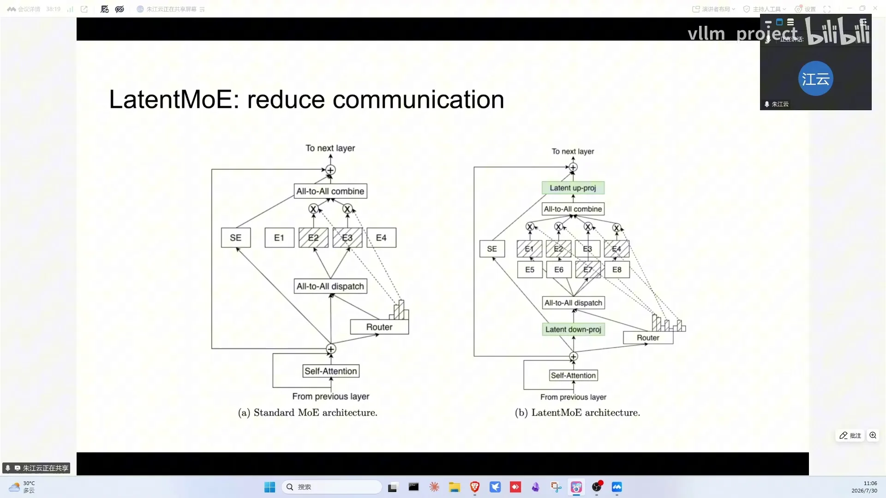 |
| 可以指个路吗？——可以在 HuggingFace 上搜（我们的组织名），下面就会看到我们开源的 DSpark 权重。可以看我们 day0 支持的 blog，里面有 DSpark 的链接。我后面也会讲 DSpark 的相关信息。——还有同学问为什么需要训 DSpark，不是有原生的 MTP 吗？ [【跳转到 03:45】](https://www.bilibili.com/video/BV11z3m63ECo/?t=225) |  |
| MTP 其实没有开放：就是开源的模型里其实没有 MTP。——哦对。我昨天其实扫了一下代码，好像你们对 KDA 整个做了一次重构？——也不能说是重构吧，我们只是把 KDA 一些相关的定义以及文件…… [【跳转到 04:10】](https://www.bilibili.com/video/BV11z3m63ECo/?t=250) | 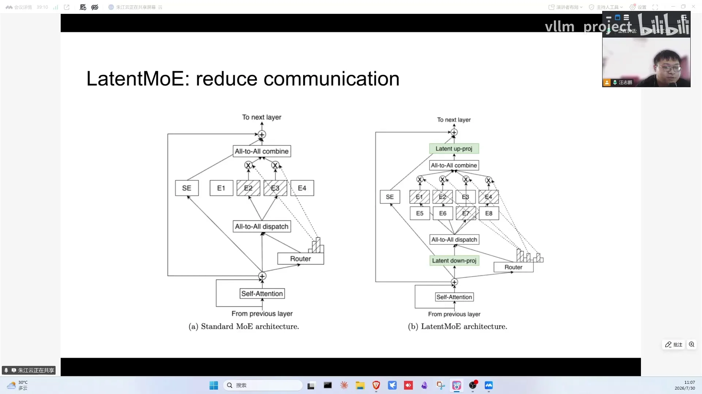 |
| 都放在了 K3 特定的文件夹里，这样方便我们对它做比较激进的优化，而不会影响其他模型。——哦好。还有人问降维和不降维有对比的收益吗？——这个看 K3 技术报告，是模型这样设计的。而且我记得（latent MoE）主要是 NVIDIA 他们之前出的一个论文…… [【跳转到 04:35】](https://www.bilibili.com/video/BV11z3m63ECo/?t=275) | 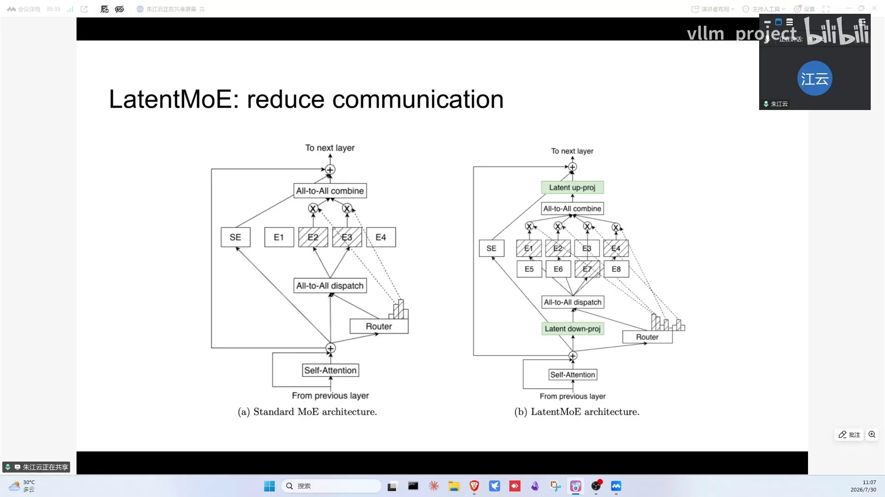 |
| 对。而且我记得你们对于 shared expert 因为是 shared memory（共享的），没有做降维，只有普通的 expert 做了降维。所以我记得你们还做了一个 all-reduce，对吧？——因为加了一些 linear 的操作以后…… [【跳转到 05:00】](https://www.bilibili.com/video/BV11z3m63ECo/?t=300) | 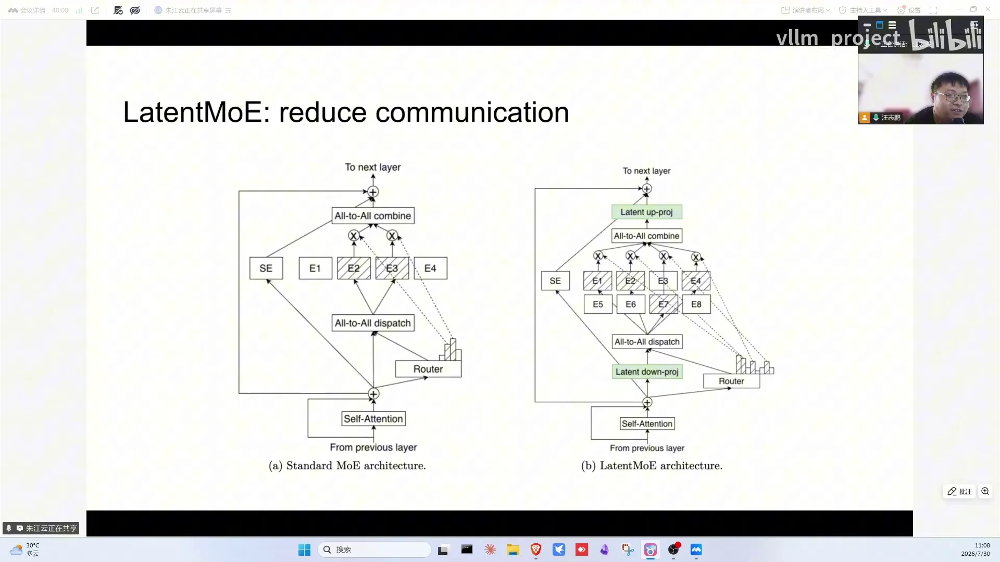 |
| 比如在 TP 的时候有一个问题：它会增加一些 all-reduce 的通信，所以需要想办法把它和其他计算掩盖或者做一些融合之类的。——这个后面永夜会来讲。——好，那我们继续。然后 K3 里比较重大的创新是用了 Kimi Delta Attention——KDA…… [【跳转到 05:25】](https://www.bilibili.com/video/BV11z3m63ECo/?t=325) |  |
| KDA 是在 Kimi Linear 那篇论文里提出的。我这张图截的是 Kimi Linear 论文，它的计算公式就是图上这个公式。可以看到它的核心 idea 是：我维护一个 S 状态，每次有新的 token 进来时更新我的状态…… [【跳转到 05:50】](https://www.bilibili.com/video/BV11z3m63ECo/?t=350) |  |
| 更新的办法是：先对上一步的状态 S(t-1) 做一个衰减，衰减是两部分，还会根据当前 token 的 K 做对应的衰减，然后加上当前 token 的 K 和 V，最后 attention 的输出就是 S(t) 乘 q(t)。这个很像之前 full attention 里 QKV 的运算。这个我没有讲得特别高屋建瓴…… [【跳转到 06:15】](https://www.bilibili.com/video/BV11z3m63ECo/?t=375) |  |
| 所以我在这里放了一个 Moonshot 大佬的博客链接，里面讲得非常好：讲了很多 KDA 背后的数学，以及整个 linear attention 背后的故事和演进。大家有兴趣可以去看他的博客链接。 [【跳转到 06:40】](https://www.bilibili.com/video/BV11z3m63ECo/?t=400) | 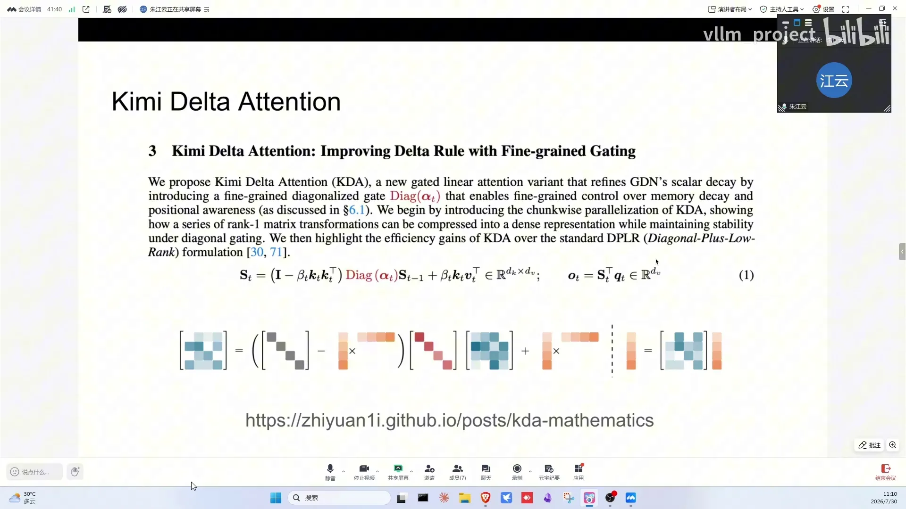 |
| 然后我们这边重点讲一下 linear attention 或者说 KDA 对 inference 的设计造成了哪些问题、挑战以及我们如何解决。首先它的特点是维护的是 S 状态，而不是之前 full attention 的 KV cache。它的计算流程大概是：比如这个序列是"where is a ... popular inference engine"…… [【跳转到 07:05】](https://www.bilibili.com/video/BV11z3m63ECo/?t=425) | 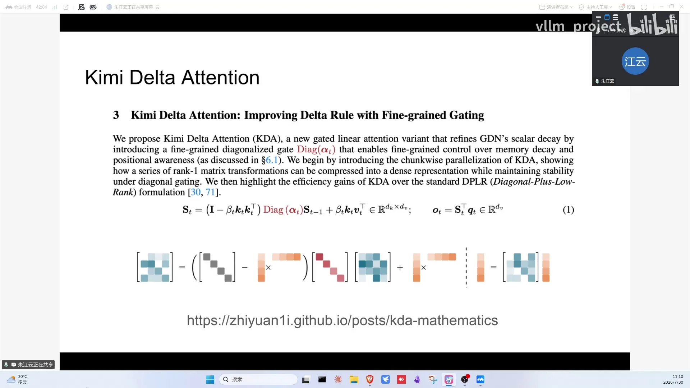 |
| 它的计算流程是说：我（逐 token）进，输出 is，这个时候前面 token 对应的状态已经被 inplace 复写掉了。每次 forward 的流程都是复写上一步的状态…… [【跳转到 07:30】](https://www.bilibili.com/video/BV11z3m63ECo/?t=450) | 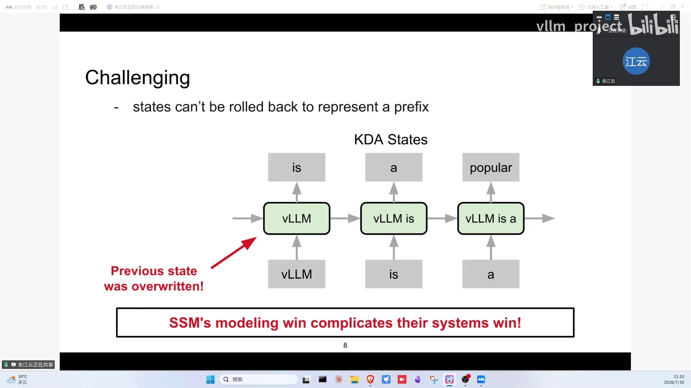 |
| 这个听起来很美好：因为它不用再维护随序列长度增加的 KV cache，可以很大程度上缓解 KV cache 压力、HBM 的压力。同时它的计算复杂度也比 full attention 要小。但它这种设计会给推理设计带来非常多的挑战。其中一个挑战是它打破了 vLLM 的假设——vLLM 之前假设…… [【跳转到 07:55】](https://www.bilibili.com/video/BV11z3m63ECo/?t=475) | 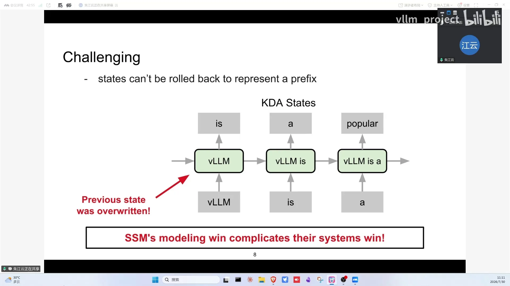 |
| 这个 KV cache 总是随序列长度连续增长并且是 append-only 的——前面已有的 KV cache 不会被后面的 token 修改。所以这就给 vLLM 原来的 memory management、prefix cache 带来了很多挑战。 [【跳转到 08:20】](https://www.bilibili.com/video/BV11z3m63ECo/?t=500) | 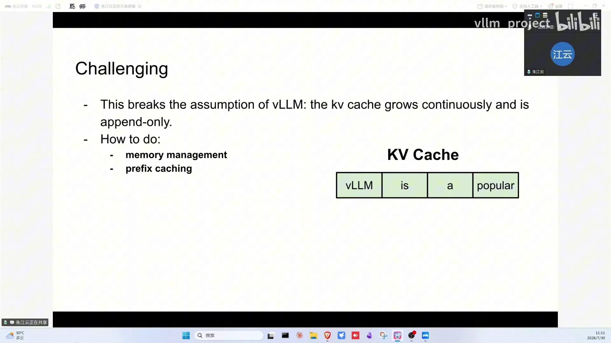 |
| 第一个问题：我们要如何管理这两种截然不同的 cache？论文中采用的做法是用同样的 tensor 映射到不同的语义上：申请的永远都是同样的 tensor，但在上层可以把它们解释成不同的状态。比如同一块（内存），左边可以解释成 KV cache…… [【跳转到 08:45】](https://www.bilibili.com/video/BV11z3m63ECo/?t=525) | 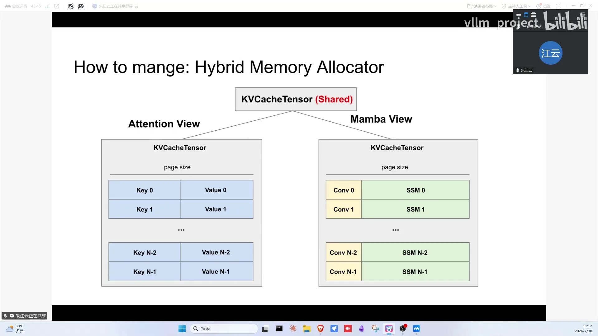 |
| 也可以把右边解释成 Mamba 或者 KDA 的这种状态。这样实现了统一的分配，又可以让上层自由映射语义。这就是 vLLM 中的 hybrid memory allocator 做的事情。 [【跳转到 09:10】](https://www.bilibili.com/video/BV11z3m63ECo/?t=550) |  |
| 具体这个分配出来的 tensor 如何定义大小、如何映射给不同种类的 attention——它采取了非常简单的办法：用最小公倍数。可以想象比如这里有很多种 KV cache：分配 1KB、2KB、3KB，就直接分配 6KB，这样所有 cache 种类都可以比较完美地放进 allocator 分配出来的最小粒度 tensor。比如对 MLA 来说…… [【跳转到 09:35】](https://www.bilibili.com/video/BV11z3m63ECo/?t=575) | 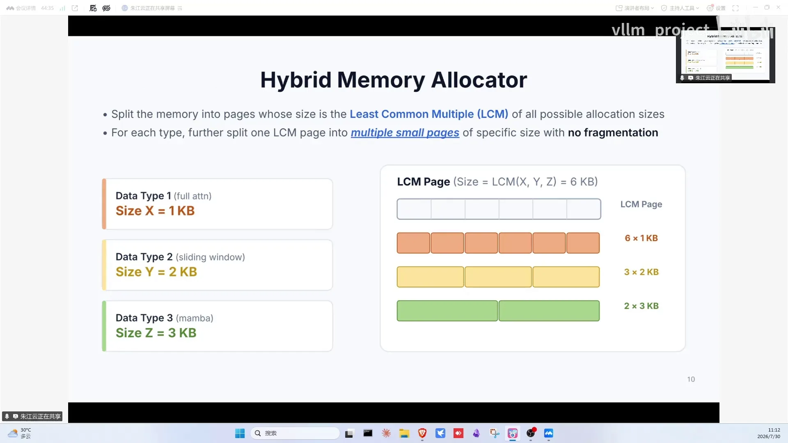 |
| 一个物理上分配出来的 page 会实际放两个逻辑上的 page；同样对 sliding window 来说会放三个；对 full attention 来说会放一个。实际中怎么做：一般来说 Mamba state 都比 attention 的 KV cache 大非常多，所以我们把 attention 的 page 不断向上扩容…… [【跳转到 10:00】](https://www.bilibili.com/video/BV11z3m63ECo/?t=600) | 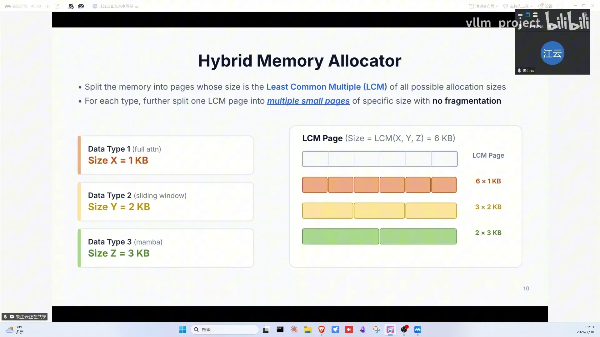 |
| 扩容一倍两倍三倍若干倍以后，发现 attention 的 page 比 Mamba state 要大一些了——让它刚好大于 Mamba 的 size。这时如果有一些冗余就加一些小的 padding，可能会浪费比如 12% 的内存，但给管理带来非常多便利…… [【跳转到 10:25】](https://www.bilibili.com/video/BV11z3m63ECo/?t=625) |  |
| 这样只需要一个统一的 allocator，对应让这些 allocator 被不同的 cache manager 管理，上层的（hybrid）coordinator 管理不同的 manager…… [【跳转到 10:50】](https://www.bilibili.com/video/BV11z3m63ECo/?t=650) |  |
| 就可以做到统一的管理和分配。比如现在 vLLM 中有 full attention manager、Mamba manager、sliding window manager 等等。对 K3 模型来说，它使用的是 hybrid KV cache coordinator，这个 coordinator 会管理下面的两种…… [【跳转到 11:15】](https://www.bilibili.com/video/BV11z3m63ECo/?t=675) | 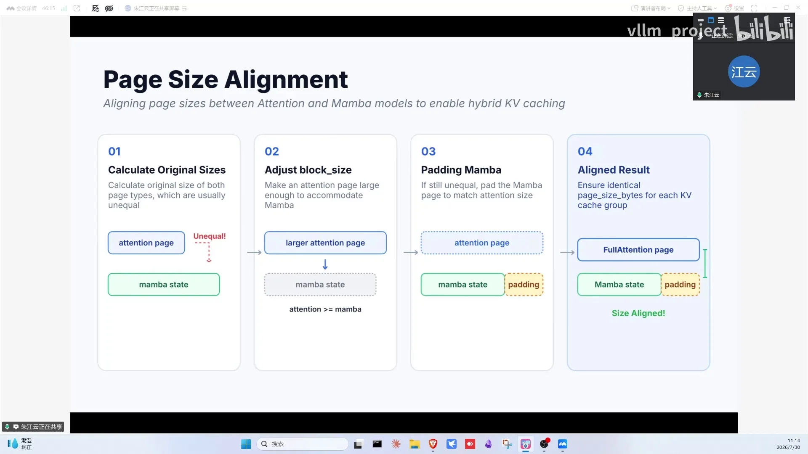 |
| KV cache manager。这些 KV cache manager 都实现了一些方法。比如对于 prefix cache 来说，需要管理一个 request 到底可以命中多少 token——这和 attention 的语义相关，所以放到（各）cache manager 来做…… [【跳转到 11:40】](https://www.bilibili.com/video/BV11z3m63ECo/?t=700) | 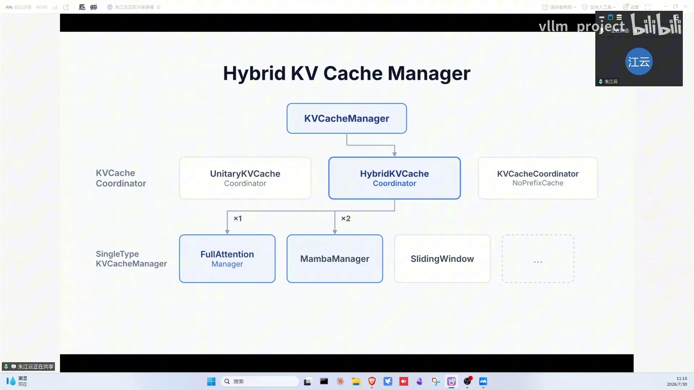 |
| （接上） [【跳转到 12:05】](https://www.bilibili.com/video/BV11z3m63ECo/?t=725) |  |
| 所有的 manager 都向上汇报：比如我这次可以命中多少 token，经过 coordinator 把最小的命中范围给出来——这就是所有 manager 共识的可以命中的 token。除此以外它们还要负责不同 block 的生命周期管理、怎么 free 这些问题…… [【跳转到 12:30】](https://www.bilibili.com/video/BV11z3m63ECo/?t=750) | 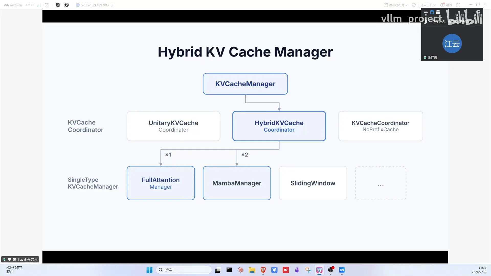 |
| KV cache manager 把所有内部信息统筹后返回给 scheduler，scheduler 就知道这次可以调度多少请求、不至于 OOM、memory 压力有多大。——我感觉这块地方有点像插件化的思想？——对是的：当有新的 attention 种类进来，只需要加一个 manager，在 coordinator 中做对应的逻辑管理就可以。 [【跳转到 12:55】](https://www.bilibili.com/video/BV11z3m63ECo/?t=775) | 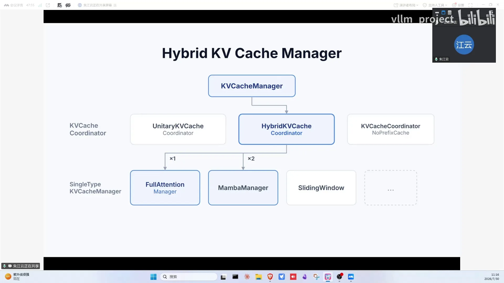 |
| ——直播间问了一个很好的问题：Mamba 这种状态更新的模型也能和自回归模型一样复用 KV cache 吗？——当然可以复用，只要你把它存起来就可以了。回到刚才那张图：当然可以复用它的状态，只要把每一个绿色方块的状态都存下来，命中哪一个就取哪一个。这是最（直接）的做法。但这种做法有一个问题：Mamba state 比 KV cache 一般大非常多，可能有几百倍的大小…… [【跳转到 13:20】](https://www.bilibili.com/video/BV11z3m63ECo/?t=800) | 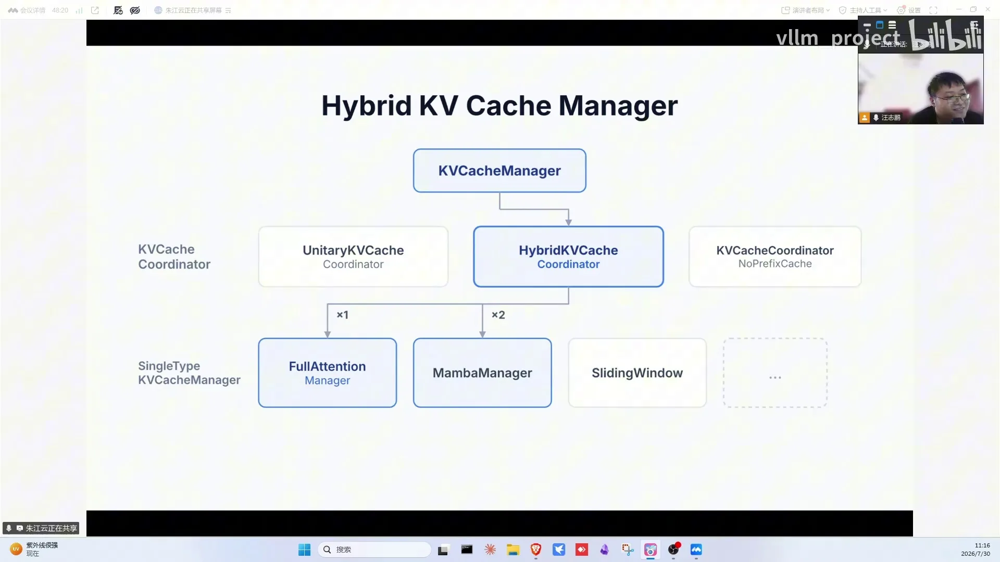 |
| 如果真把它都存下来，对 memory 的压力会非常大。——其实我觉得更简单的说法是：我们其实存一个快照，每隔多少个 token 存一个。——对。因为我之前也做过相关开发…… [【跳转到 13:45】](https://www.bilibili.com/video/BV11z3m63ECo/?t=825) | 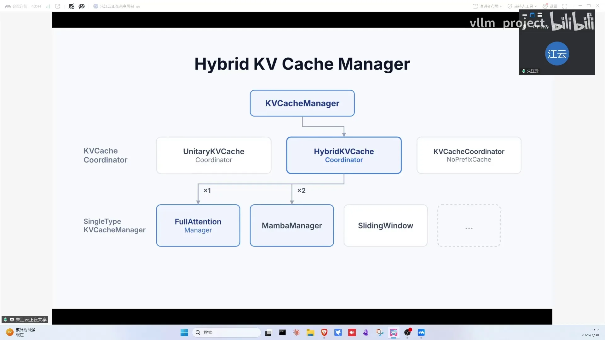 |
| 我感觉它和传统自回归的方式还有一个比较大的区别：它不会一口气操作一个 block、把 block 做完再做下一个 block；它实际要过一段时间才把所有东西存到一个 block 里。实际上跟自回归相比存在一个类似异步的 step 差距。我感觉这是重要的一个性质。 [【跳转到 14:10】](https://www.bilibili.com/video/BV11z3m63ECo/?t=850) | 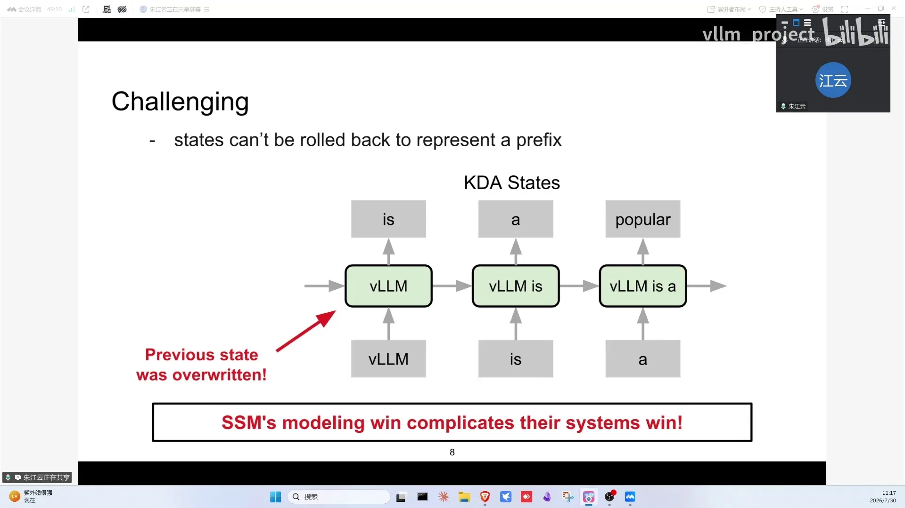 |
| （接上） [【跳转到 14:35】](https://www.bilibili.com/video/BV11z3m63ECo/?t=875) | 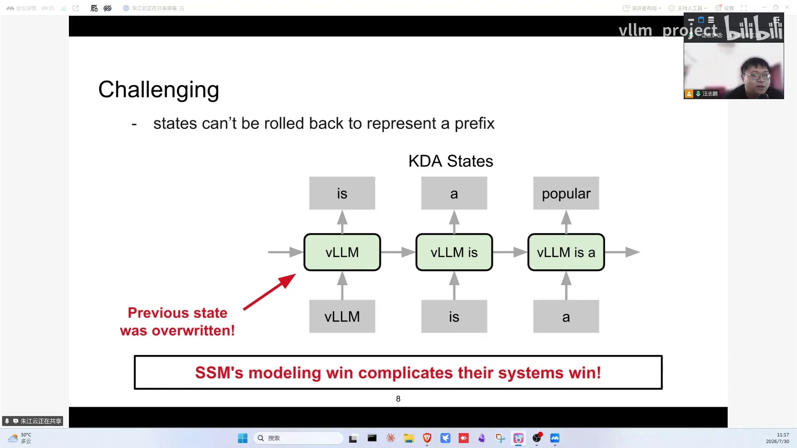 |
| 它的特点是：KV cache 很容易被 rollback——任意的序列想要命中，只需要往前查找就可以，因为总是可以随意查到之前的历史状态。但 Mamba 并不可以，或者 KDA 并不可以…… [【跳转到 15:00】](https://www.bilibili.com/video/BV11z3m63ECo/?t=900) | 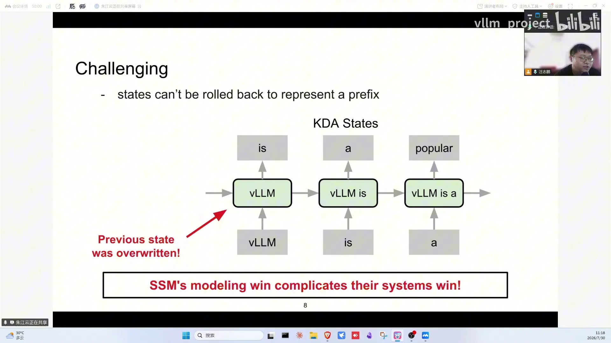 |
| 另一个问题就是缓存 KDA 的状态比缓存 KV cache 代价高非常多。主要是这两个问题。——有同学问：投机里丢弃最后一个 block 的机制在 hybrid 模型上会导致 cache miss 吗？——不好意思没太听懂，能再重复一下吗？——投机里丢弃最后一个 block 的机制在这种 hybrid 模型里会导致 cache 不命中吗？——丢弃最后一个 block 这个问题是真实存在的…… [【跳转到 15:25】](https://www.bilibili.com/video/BV11z3m63ECo/?t=925) | 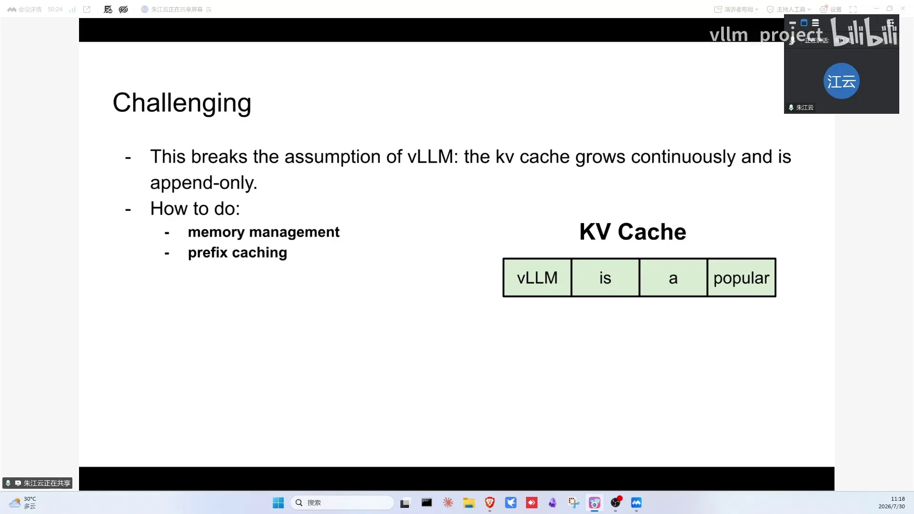 |
| 在HAYER模型上会导致开西miss嘛不好意思我没有太听懂这个问题你能再重复一下吗呃就是投机里面丢弃最后一个block的这个机制在这种hyper模型里面它会导致这个K系不命中吗就是丢弃最后一个block这个问题是真实存在的 [【跳转到 15:38】](https://www.bilibili.com/video/BV11z3m63ECo/?t=938) |  |
| 然后会有一些……在 Mamba 里、在 hybrid 模型里也是同样的设计：总是丢弃最后一个 block。但有一点不同：这里丢弃的最后一个 block 是对齐后的 block——在纯 full attention 模型里可能只丢弃最后一个真实的 block，但在现在的设计里…… [【跳转到 16:03】](https://www.bilibili.com/video/BV11z3m63ECo/?t=963) | 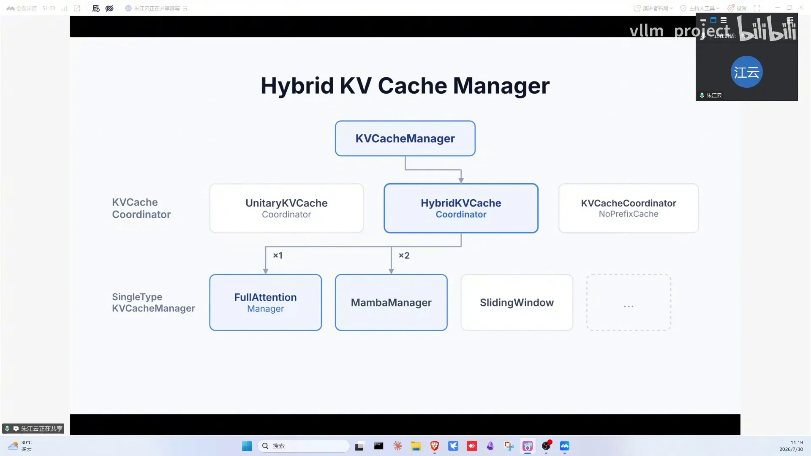 |
| 会丢弃 align 以后的 block，也就是会多丢几个 block。哇，直播间的同学还是很懂：问的问题水平都很高。——这是现在设计的一个小缺陷，我们也在努力解决：因为丢的太多会让 cache 命中下降。感兴趣的同学也可以…… [【跳转到 16:28】](https://www.bilibili.com/video/BV11z3m63ECo/?t=988) |  |
| 给 vLLM 做这块的贡献，我感觉这块还挺重要的。好，讲完了如何管理，下面讲 prefix cache 命中怎么做。其实有两个问题要回答。第一个：我怎么缓存下我的状态？因为不同于 KV cache…… [【跳转到 16:53】](https://www.bilibili.com/video/BV11z3m63ECo/?t=1013) |  |
| Mamba 每一个状态都会更新掉：每一步都会更新掉上一步的状态。所以我们需要一个办法把想要保存的状态拷贝走，并且这个方法还不能很大地影响 model 里面的函数或别的代码。我们采用的方法是利用现代推理引擎都会有的技术：chunked prefill——把一个 prompt 切成若干个 chunk 放进推理引擎里做 forward…… [【跳转到 17:18】](https://www.bilibili.com/video/BV11z3m63ECo/?t=1038) |  |
| （接上） [【跳转到 17:43】](https://www.bilibili.com/video/BV11z3m63ECo/?t=1063) |  |
| 对于 Mamba 来说，只需要保证可以在 block 边界把 prompt chunk 放进推理机里，推理结束以后把状态拷贝出来——这样就可以天然保存住 block 边界处的状态…… [【跳转到 18:08】](https://www.bilibili.com/video/BV11z3m63ECo/?t=1088) |  |
| 而不会影响其他任何地方：不需要对 kernel 做修改、不需要对模型代码做修改。同时它也能在内存压力和 cache 命中上做很好的权衡。不知道有没有给大家讲清楚？——直播间的观众听懂了吗？ [【跳转到 18:33】](https://www.bilibili.com/video/BV11z3m63ECo/?t=1113) |  |
| 简单来说：你不能在任意地方切 chunk——不能在任意地方都想要缓存。我们这里的做法是在 block 边界的地方缓存。——这个 block 边界我理解就是两种 attention 对齐的那个东西，对对对对。 [【跳转到 18:58】](https://www.bilibili.com/video/BV11z3m63ECo/?t=1138) |  |
| 如果观众反应没听懂：vLLM 中的 prefix cache 是以 block 为单位的，一个 block 就算一个哈希。这时我们想让 full attention 和 Mamba 都命中的话，就需要让 Mamba 在 block 的结尾处存有一个状态…… [【跳转到 19:23】](https://www.bilibili.com/video/BV11z3m63ECo/?t=1163) | 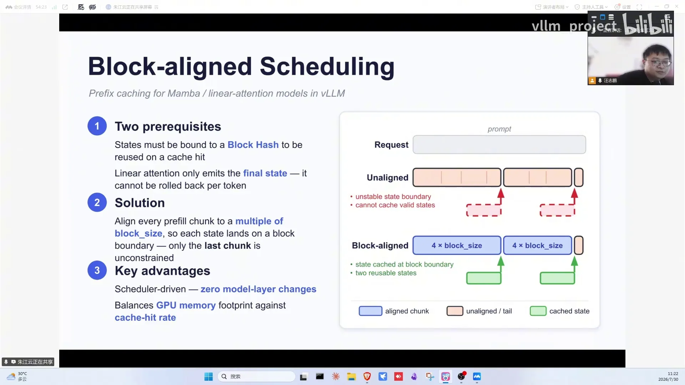 |
| 所以这就说明我们不能在任意一个地方把 state cache 下来：需要在 full attention 的 block 边缘把 state cache 下来，这样下一次做哈希的时候就可以命中。 [【跳转到 19:48】](https://www.bilibili.com/video/BV11z3m63ECo/?t=1188) |  |
| 怎么达到这个目标？我们利用了推理引擎里都存在的技术叫 chunked prefill：只需要在 block 边界对齐的时候把它切开，在 model forward 结束以后把状态拷贝出来存下来。——我说一下我的理解：我们不是先对齐 attention 的开始嘛，那么自然会有一个 block 应该有多少 token 的 block cache…… [【跳转到 20:13】](https://www.bilibili.com/video/BV11z3m63ECo/?t=1213) |  |
| 实际上这个多少 token 也应该对应的是我 Mamba 的 cache 或者 KDA 的 cache 所对应的序列长度。每到了这个序列的时候又会去存一个 KDA 的快照。我不知道这样的理解对不对？——对，好。我来说就是：我们希望 Mamba 存状态的地方和 full attention 存的状态的 block 边界是对齐的。Mamba 的一个 block…… [【跳转到 20:38】](https://www.bilibili.com/video/BV11z3m63ECo/?t=1238) |  |
| 其实对应的是一个 token 的状态；但 full attention 的一个 block 对应的是一个序列的状态。好，然后来回答直播间的提问，已经积累很多了。有同学说：他用英伟达的 B300 在单并发下 throughput 只有几十，是什么原因？ [【跳转到 21:03】](https://www.bilibili.com/video/BV11z3m63ECo/?t=1263) | 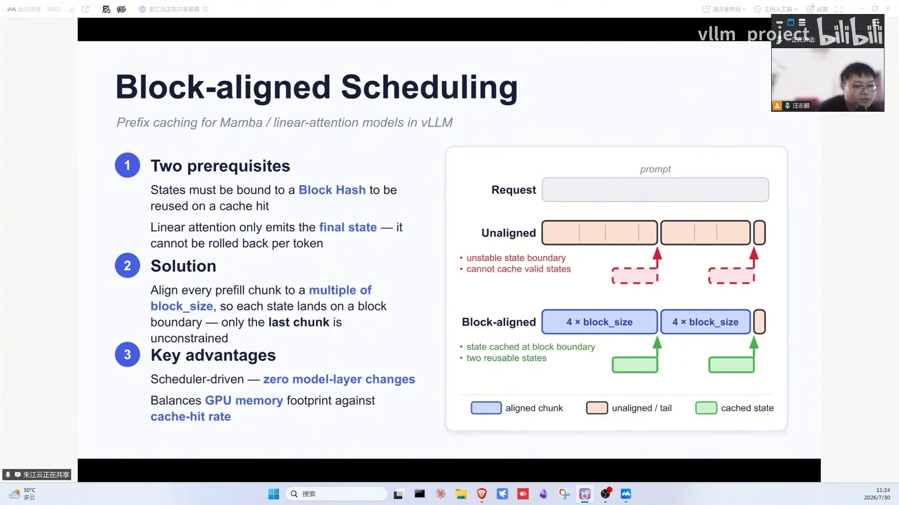 |
| 他其实对应的是一个token的状态嗯但是fortension的一个block对应的是一个序列的状态好然后我来回呃我们来回答一下这个直播间的提问现在已经积累很多了呃有同学又说他用巴卡的B300然后在单并发下好像他的这个throughput只有几十是什么原因呃 [【跳转到 21:28】](https://www.bilibili.com/video/BV11z3m63ECo/?t=1288) |  |
| 你可以去看我们的 recipe。blog 里一开始提到的性能都是用 recipe 里的命令可以复现的。首先必须得开 DSpark，对吧。还有可以看之前的图：不开 DSpark 都有 100 多。你这个应该是在 GB300 上测的？GB300 和 B300 应该是类似…… [【跳转到 21:53】](https://www.bilibili.com/video/BV11z3m63ECo/?t=1313) |  |
| 因为 GB300 跨机之间也有个特殊的硬件做 NVLink 的东西，B300 我猜应该也是 NVLink 互联。这个我觉得后面也要再看一下：我觉得应该是可以复现出来的。根据我们的经验，如果你没有复现，就说明你没有完全按照 recipe 上面的环境变量、具体参数设置。 [【跳转到 22:18】](https://www.bilibili.com/video/BV11z3m63ECo/?t=1338) | 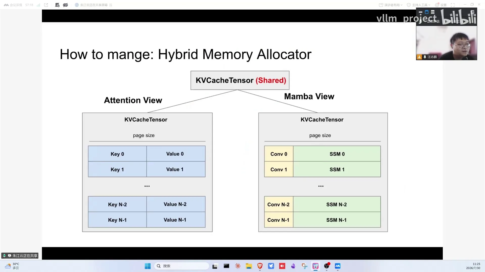 |
| （接上） [【跳转到 22:43】](https://www.bilibili.com/video/BV11z3m63ECo/?t=1363) | 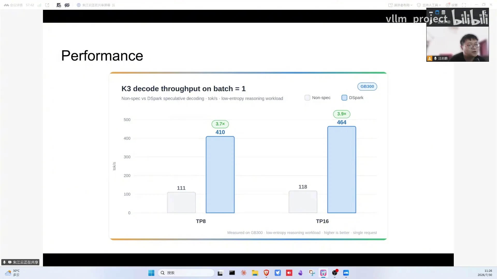 |
| 我这里可以稍微补充一下：我们自己测出来 B300 因为 GPU 频率跟 GB300 不太一样，所以测出来会稍微慢一点点。——是硬件问题？因为 NVLink 的通信带宽应该都差不多。——然后有同学说：我记得 token 数量不满足一个 block 的话会被丢弃、不存到 KV 里？——是的，没问题。因为不满足一个 block 反正还要继续 decode，decode 的时候满足一个 block 的时候就把它存下来。——然后有同学说：所以 Mamba 的 cache 粒度是绑定 chunk size 的，对吗？ [【跳转到 23:04】](https://www.bilibili.com/video/BV11z3m63ECo/?t=1384) | 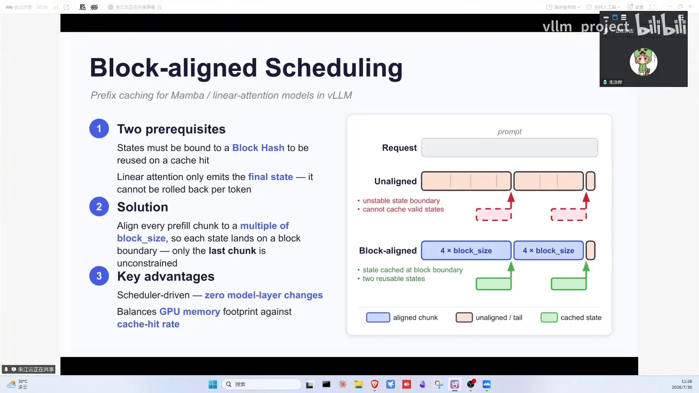 |
| （接上） [【跳转到 23:29】](https://www.bilibili.com/video/BV11z3m63ECo/?t=1409) | 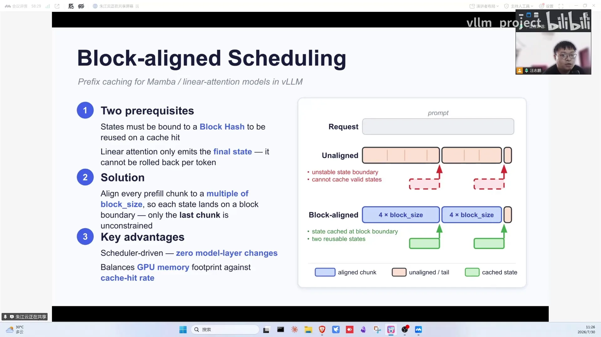 |
| 对是的。我们会保证 chunk 的粒度永远是 block 的整数倍，当然最后一个 chunk 除外。——在超长序列下比如输入 128K，是不是 block size 越大越好？——我觉得不是的。 [【跳转到 23:54】](https://www.bilibili.com/video/BV11z3m63ECo/?t=1434) |  |
| 是因为我们存 block size 的原因是为了更好的命中，对吧。如果不考虑命中，越大意味着存的越少，可能确实更好；但考虑命中的话其实不是 block size 越大越好。——不考虑命中的话我觉得甚至都不需要 block size 这种东西：用完直接丢了就行了。 [【跳转到 24:19】](https://www.bilibili.com/video/BV11z3m63ECo/?t=1459) |  |
| 好，然后这个收益怎么样？感觉主要是多了一个 block cache 的收益：可以解决 prefix cache 命中的情况。比如作文、对话、整理的场景里都有非常多的 cache 命中；不命中的话重算开销比较高。好…… [【跳转到 24:44】](https://www.bilibili.com/video/BV11z3m63ECo/?t=1484) | 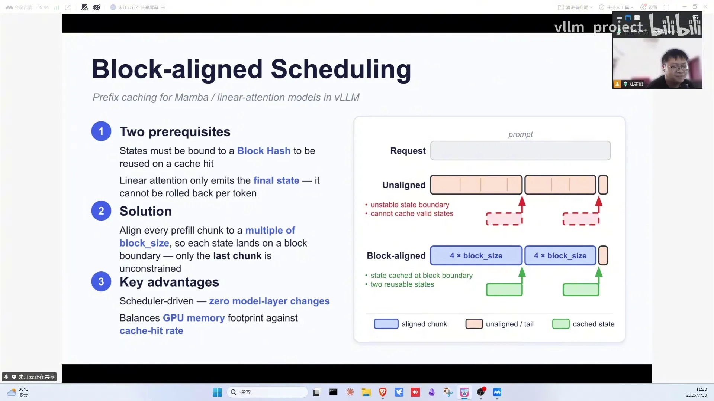 |
| 这次直播的 slides 后面会跟回放一起上传。直播间的观众反映希望（嘉宾）继续往下讲，那我们就先不打断思路了。好。我们解决了第一个问题——怎么用一个巧妙的办法、不修改模型也不修改很多其他东西把状态 cache 下来。下一个问题要思考 cache 的策略…… [【跳转到 25:09】](https://www.bilibili.com/video/BV11z3m63ECo/?t=1509) |  |
| 前面提到的设计有个缺点：cache 永远是以 block 为粒度的。对一般模型、之前的模型可能还好，一个 block size 可能只有几百个 token；但对 K3 来说…… [【跳转到 25:34】](https://www.bilibili.com/video/BV11z3m63ECo/?t=1534) | 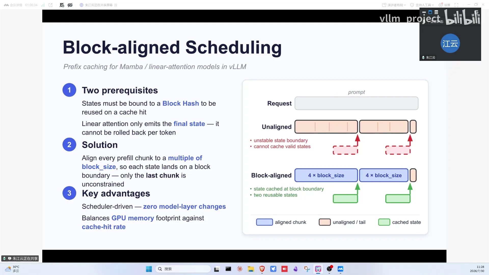 |
| 情况变得不一样：因为 MLA 本身压缩了 KV cache，而 KDA 的 state 又很大，比率非常悬殊。所以我们被迫——像蓝色方框所说——把 attention block 扩大很多倍，变成一个逻辑上的 block 和 state 做对齐…… [【跳转到 25:59】](https://www.bilibili.com/video/BV11z3m63ECo/?t=1559) | 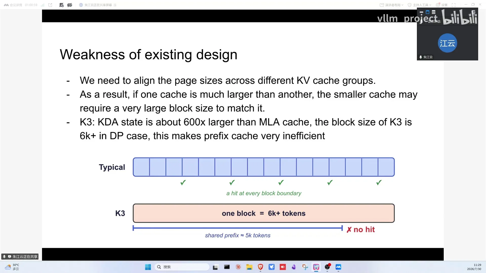 |
| 这就导致 cache 命中的粒度非常粗。举个例子：K3 开 DP 的情况下，vLLM 中 block size 会达到 6000 多。这就导致每 6000 个 token 才能命中一个 cache，需要频繁重算，效率不理想。 [【跳转到 26:24】](https://www.bilibili.com/video/BV11z3m63ECo/?t=1584) | 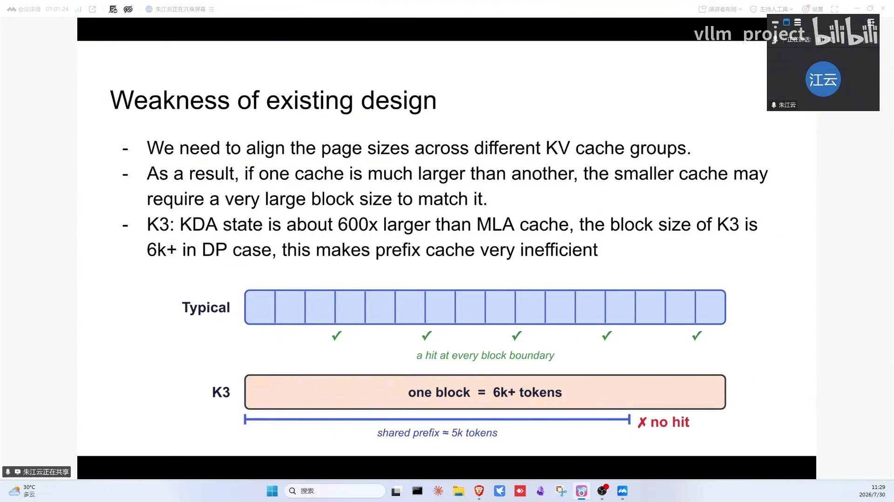 |
| 举一个比较极端的例子：哪怕共享前缀有 5000 个 token，因为没达到一个 block 的粒度，你还是要重算。好，怎么解决？就要重新思考 cache 状态的目的到底是什么、到底有哪些重用的机会和场景。这里举了两个例子：很多输入都会有 system prompt 加上用户的请求；在多轮对话场景会把上一轮的对话历史回传。所以真正有价值的 cache 只有两个地方：一个是 system prompt…… [【跳转到 26:49】](https://www.bilibili.com/video/BV11z3m63ECo/?t=1609) |  |
| （接上） [【跳转到 27:14】](https://www.bilibili.com/video/BV11z3m63ECo/?t=1634) | 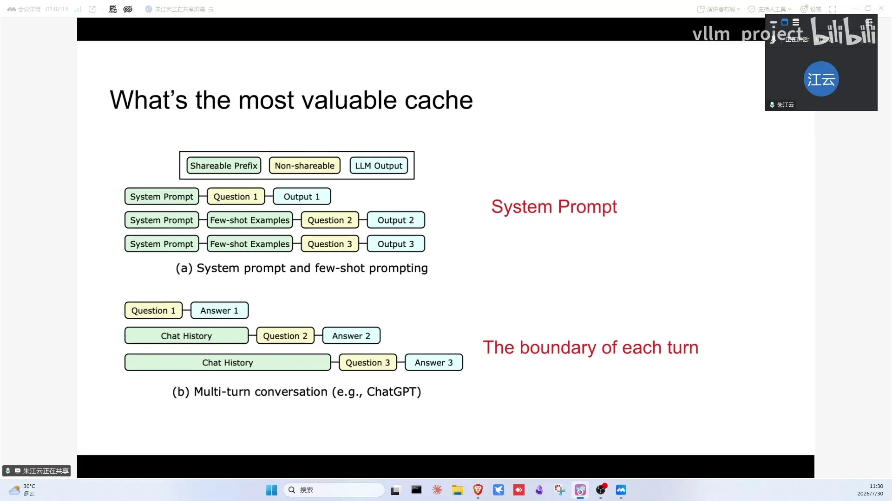 |
| 一个是每一轮对话的（边界）。只要想办法把这两个东西存下来，在 real world usage 里可以很大增加 cache 命中、减少缓存压力。 [【跳转到 27:39】](https://www.bilibili.com/video/BV11z3m63ECo/?t=1659) |  |
| 我们的做法：解耦 cache hit 的粒度——把 block size 和 cache hit 这两个事情解耦开。因为原来 state cache hit 依赖于一个 block 的 hash。具体做法有一个叫 partial cache hit 的设计，在 PR 45702 下面。一开始由 Moonshot 提出，我们来做集成到 vLLM 的框架里。这也就是 K3 公众号里提到的 vLLM 中 prefix cache 的新设计。它的做法：先看原来的场景——假如我的 block size 是 6，算到了 H；但我下一次新增了 X、Y 两个 token。虽然我上一次算过 G、H 了…… [【跳转到 27:56】](https://www.bilibili.com/video/BV11z3m63ECo/?t=1676) |  |
| （接上） [【跳转到 28:21】](https://www.bilibili.com/video/BV11z3m63ECo/?t=1701) | 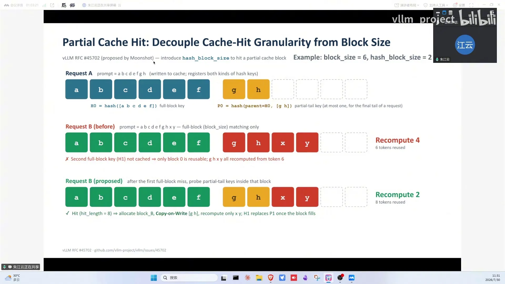 |
| 但因为新增了 token，我还是要重算整个多余的 block。举一个极端场景：共享前缀有 5000 个 token，重算 5000 个 token 开销还是比较高的。所以我们引入一个新的粒度来对最后一个多余的 block 做 cache。在新的设计下可以 cache 住 G、H 这些 block 多余的黄色的 token。当下一个请求到来时…… [【跳转到 28:46】](https://www.bilibili.com/video/BV11z3m63ECo/?t=1726) |  |
| （接上） [【跳转到 29:11】](https://www.bilibili.com/video/BV11z3m63ECo/?t=1751) |  |
| 可以直接利用这个（已缓存的）state，不用重新计算。当然为了防止下一次继续被命中，我们会把 G、H 先拷贝到另一个 block 里，再对原来的（块）做原地更新。好，这个已经端到端支持了…… [【跳转到 29:36】](https://www.bilibili.com/video/BV11z3m63ECo/?t=1776) |  |
| 非常欢迎大家试用、提反馈。它应该能非常明显——尤其在 K3 这个模型下面——提升 cache hit。我应该给大家讲明白了吧？直播间观众听懂了吗？有没有什么问题？ [【跳转到 30:01】](https://www.bilibili.com/video/BV11z3m63ECo/?t=1801) |  |
| （接上） [【跳转到 30:23】](https://www.bilibili.com/video/BV11z3m63ECo/?t=1823) |  |
| 可以回答一下其他一些平台的提问。观众还是反应没听懂：对于原来的设计来说整个红色的 token 都要重算，因为 cache hit 的粒度绑定 block size 的粒度，我们没有办法缓存一个没有被填满的 block…… [【跳转到 30:28】](https://www.bilibili.com/video/BV11z3m63ECo/?t=1828) | 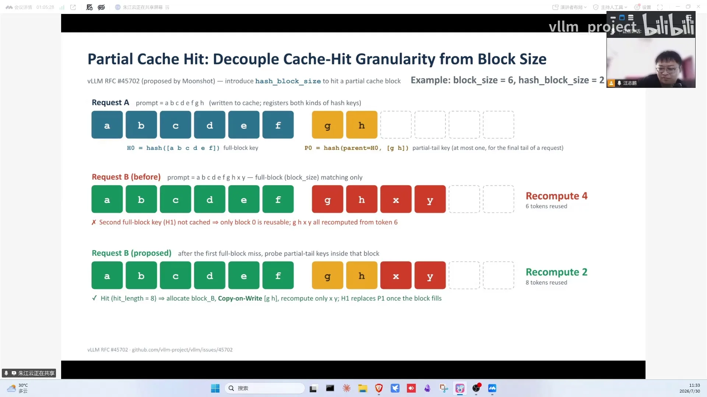 |
| 现在我们引入了一个新设计：可以缓存没有被填满的 block——缓存黄色的这部分。当下一次红色的 token 进来时，就可以利用缓存的黄色 token 避免一些重算。 [【跳转到 30:53】](https://www.bilibili.com/video/BV11z3m63ECo/?t=1853) |  |
| 有同学问：怎么知道正好是 G、H 这个边界被计算过的？是逐个对比哈希吗？——我们是用 hash block size 来做哈希。但为了避免（误命中）放大问题…… [【跳转到 31:18】](https://www.bilibili.com/video/BV11z3m63ECo/?t=1878) |  |
| 比如我们对前面一个 block 对 A、B 做哈希，对 C、D 做哈希，对 E、F 做哈希。因为每个 hash block 的哈希都和前面的 block 相邻，所以整个前面的青色 block 都可以被最后两个 token 的哈希唯一确定。 [【跳转到 31:43】](https://www.bilibili.com/video/BV11z3m63ECo/?t=1903) |  |
| 所以对原来的 full block 来说我还是用了这么多哈希，只不过在这些哈希后面加上了 partial 的 hash。当新的请求进来时，只需要把请求按 block 截断、最后算这些哈希，就可以发现 G、H 是原来算过的，就可以命中。 [【跳转到 32:08】](https://www.bilibili.com/video/BV11z3m63ECo/?t=1928) | 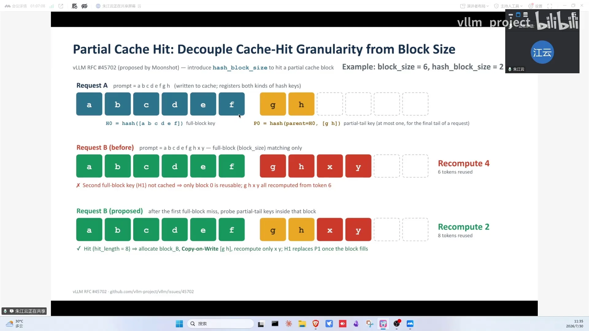 |
| 然后如何选择 partial cache 的粒度大小？需要根据实际负载调：肯定是比较小的粒度…… [【跳转到 32:33】](https://www.bilibili.com/video/BV11z3m63ECo/?t=1953) |  |
| 小粒度会带来更多的缓存复用，但也会增加内存压力，所以是需要调的参数。一般来讲这种东西都需要不停试：负载变化一点，参数可能就要从头换一遍。然后新设计的粒度保存更小粒度的…… [【跳转到 32:58】](https://www.bilibili.com/video/BV11z3m63ECo/?t=1978) |  |
| 算过的 token 而不是直接丢弃吗？——对的。然后有问这样的设计收益大概是多少？——我之前在 Qwen3-30B 上做过一些性能评测：命中时大概有 1 点几倍的 TTFT 提升。 [【跳转到 33:23】](https://www.bilibili.com/video/BV11z3m63ECo/?t=2003) |  |
| 大家可以去看 RFC 以及对应的 PR，PR 里有具体的性能数据。RFC 编号是 45702，感兴趣可以看一下，也可以让 AI 帮你扫一下这个 RFC。 [【跳转到 33:48】](https://www.bilibili.com/video/BV11z3m63ECo/?t=2028) |  |
| 还有同学问：开 DSpark 的时候是不是 block 内每个偏移都要临时存一份 KDA state？——是的，现在的设计是每个投机出来的 token 都需要存一个 state。因为 state 没办法像 full attention 一样轻松 rollback，所以要把每个都存下来。——然后为什么现在 block size 会高达 6000？是哪里限制的？ [【跳转到 34:13】](https://www.bilibili.com/video/BV11z3m63ECo/?t=2053) | 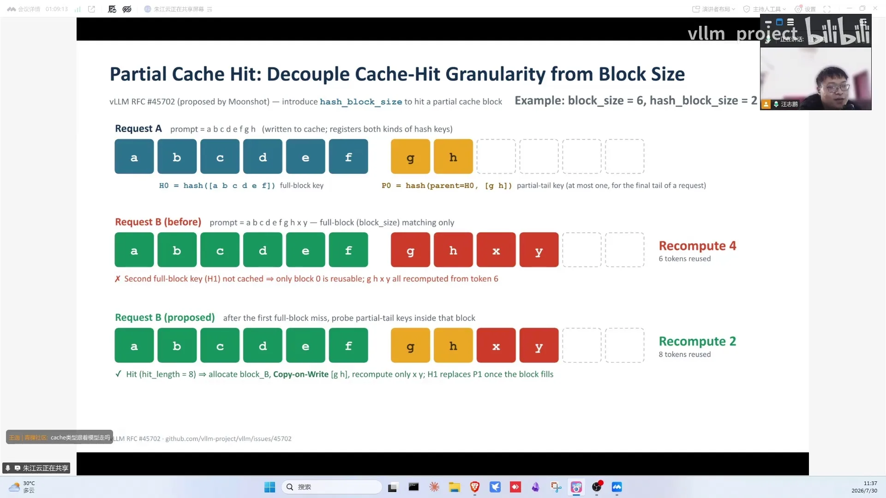 |
| 因为我们要把 attention page 向上对齐到 KDA 的 size。MLA 是压缩 KV cache 的设计，所以 full attention block 的 page size 特别小，KDA 又很大，往上对齐要很多倍，这样 block size 就变成 6000 多。 [【跳转到 34:38】](https://www.bilibili.com/video/BV11z3m63ECo/?t=2078) | 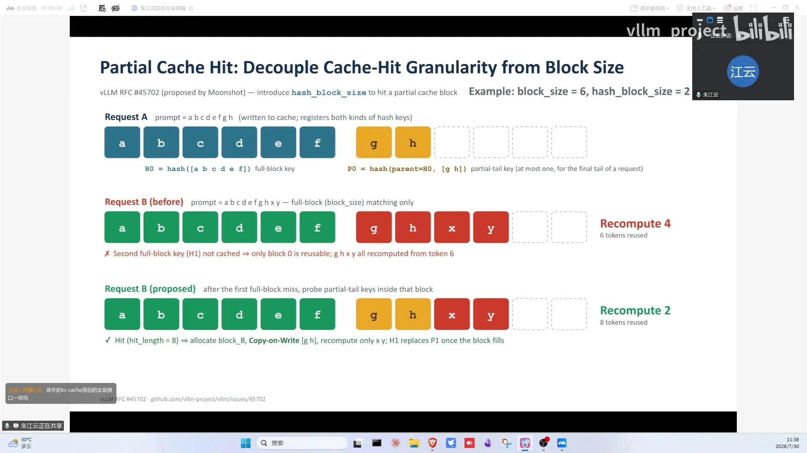 |
| 有同学说：能详细讲一下缓存黄色部分是怎么实现的吗？——只需要在 KV cache manager 那部分增加对没有对齐 block 的缓存能力就可以了，不是特别复杂。这一步也可以用 AI 扫一下看怎么实现。 [【跳转到 35:03】](https://www.bilibili.com/video/BV11z3m63ECo/?t=2103) | 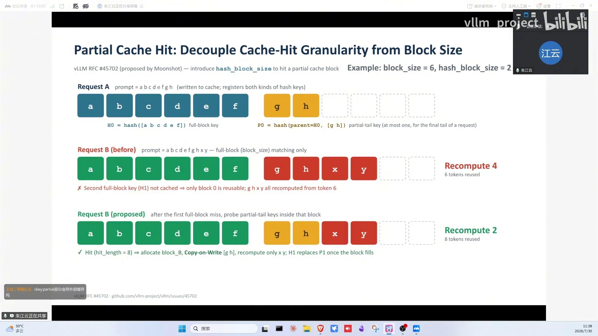 |
| 这个只需要你在QQ开始manager那部分增加一些呃对就是对没有对齐block的一些缓存的能力就可以了这个其实不是特别复杂对我觉得这一步的话也可以去用AI扫一下子然后看一下是怎么实现的 [【跳转到 35:28】](https://www.bilibili.com/video/BV11z3m63ECo/?t=2128) |  |
| 好，那我们继续下一步。——我们继续吧，问题有点多。 [【跳转到 35:53】](https://www.bilibili.com/video/BV11z3m63ECo/?t=2153) | 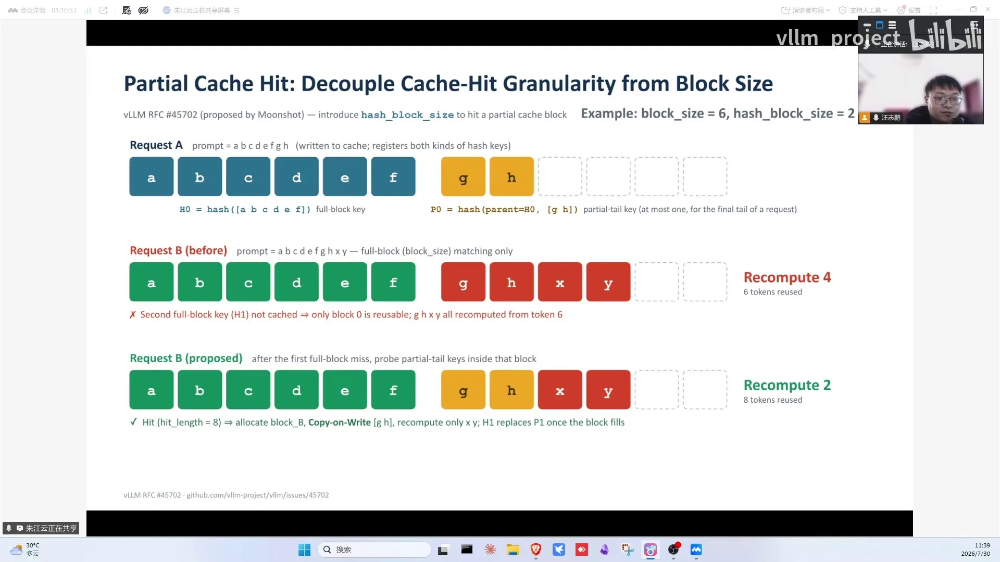 |
| 问题有点多，等讲到后面我们一起来回答，好吧。前面讲的是如何解决多轮对话的命中问题，这个解决的是 system prompt 如何命中。这里面用了一个小巧思：怎么检测 system prompt？想法很简单：当下一个请求到来时，我发现 MLA 命中了但 KDA 没有命中——这说明灰色部分有缓存价值。可以看这个动画，做得非常不错：当第二个请求到来时…… [【跳转到 35:59】](https://www.bilibili.com/video/BV11z3m63ECo/?t=2159) | 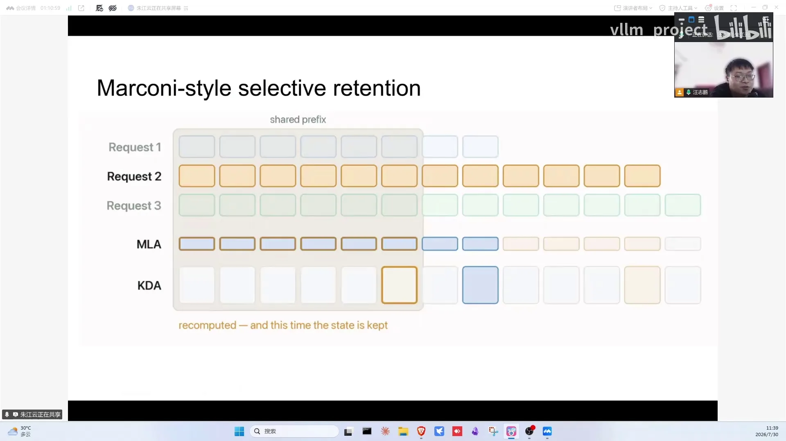 |
| （接上） [【跳转到 36:24】](https://www.bilibili.com/video/BV11z3m63ECo/?t=2184) | 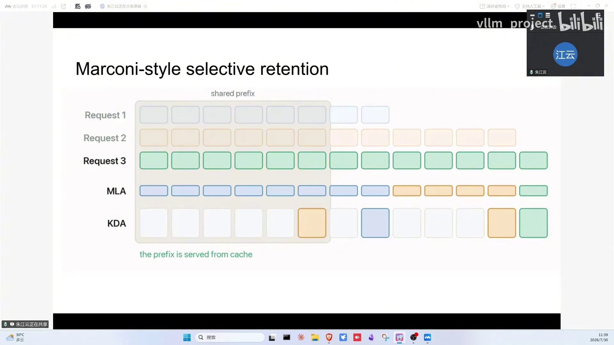 |
| MLA 这部分可以复用，但 KDA 并不可以复用，说明这个地方有缓存价值。所以我们就在 scheduler 里把这个部分再切一下：在原来的 align mode 的 chunk 切分下，我可能一次 forward 了八份，其中第六份的边界是 system prompt，这时没能力把它存下来。但第二次命中时我就知道这里有缓存价值，就在 scheduler 切分时只切六份，把这个状态 cache 下来。 [【跳转到 36:49】](https://www.bilibili.com/video/BV11z3m63ECo/?t=2209) | 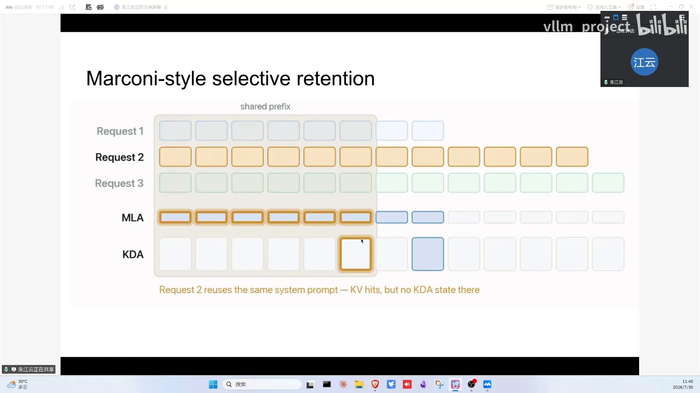 |
| （接上） [【跳转到 37:14】](https://www.bilibili.com/video/BV11z3m63ECo/?t=2234) |  |
| 当然还有一些其他问题不展开：full attention 和 Mamba 共用一个物理 tensor，因为要 padding 等操作，可能会有一些 NaN 的问题。所以现在导致复用之前需要先清零这个 block，但清零这个 GPU 操作和 RDMA 的写操作会有并发问题，需要精巧的设计才能解决。——刚才那个 slide 是不是相当于第六份和第八份都被存起来了这个 KDA 的 cache？ [【跳转到 37:39】](https://www.bilibili.com/video/BV11z3m63ECo/?t=2259) | 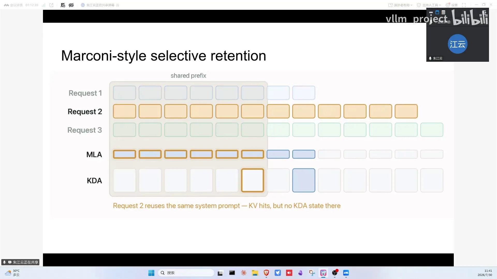 |
| 然后我们（团队）也做了 DSpark 的支持。这是我们 DSpark 模型的名称，感兴趣的同学可以试用，blog 和 recipe 里有具体使用教程。DSpark 是 DeepSeek 开源的一个新的投机解码范式：它用了（并行）方式做 draft model，同时引入了一个线性的依赖，使得能够提升接受率…… [【跳转到 38:04】](https://www.bilibili.com/video/BV11z3m63ECo/?t=2284) | 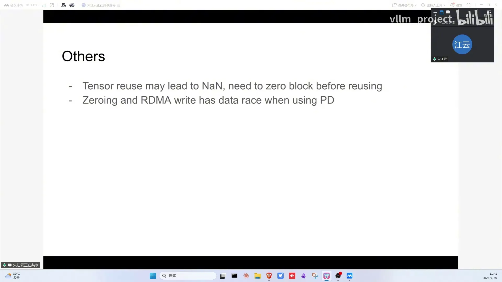 |
| 我们也打广告：上一期直播专门介绍了 DSpark，是 Red Hat 的 HELEN 同学来给我们介绍的，感兴趣的同学可以看上一期直播。——好，（嘉宾）继续。 [【跳转到 38:29】](https://www.bilibili.com/video/BV11z3m63ECo/?t=2309) | 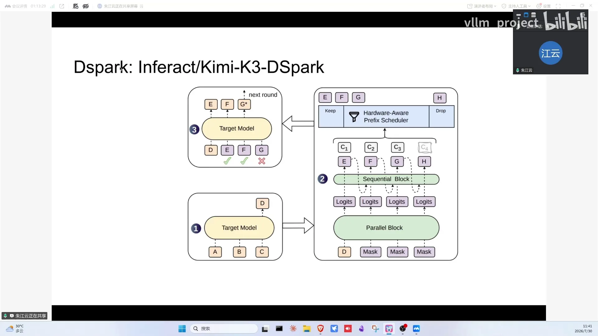 |
| 我们带头的时候也训了 DSpark，加速上非常 promising：用了 DSpark 以后可以加速将近四倍。非常欢迎大家试用。 [【跳转到 38:54】](https://www.bilibili.com/video/BV11z3m63ECo/?t=2334) |  |
| 我们怎么训练？用了 speculators 的框架，把 training 和 inference 放在不同的机器上，hidden states 通过 Mooncake 来传。具体细节可以看（代码）实现。前面提到的这些性能不全来自调度——主要来自永夜同学做的一些 kernel 以及其他同学的 kernel 相关优化，才能使得性能达到这么好。 [【跳转到 39:19】](https://www.bilibili.com/video/BV11z3m63ECo/?t=2359) |  |
| （接上） [【跳转到 39:44】](https://www.bilibili.com/video/BV11z3m63ECo/?t=2384) | 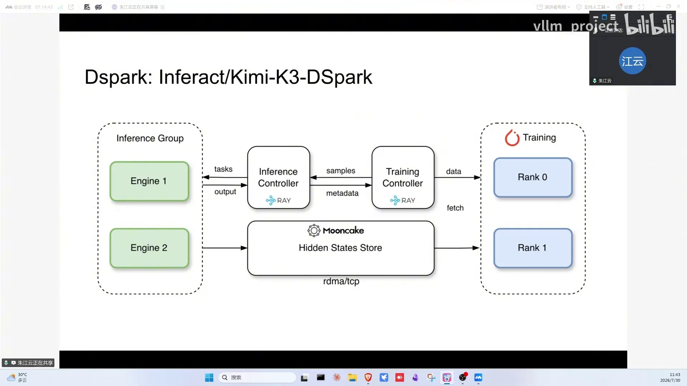 |
| 接下来请永夜给我们介绍 kernel 到底做了哪些优化。——OK OK 谢谢嘉文。我们这次的 kernel 优化其实是…… [【跳转到 40:09】](https://www.bilibili.com/video/BV11z3m63ECo/?t=2409) |  |
| 永夜你来共享屏幕。 [【跳转到 40:23】](https://www.bilibili.com/video/BV11z3m63ECo/?t=2423) |  |
| 可以看到对不对？对对对对，那我继续了。kernel 的优化主要针对小并发的情况：比如 agent 的使用场景，就是越快越好嘛。针对小并发情况做了比较多的优化…… [【跳转到 40:39】](https://www.bilibili.com/video/BV11z3m63ECo/?t=2439) | 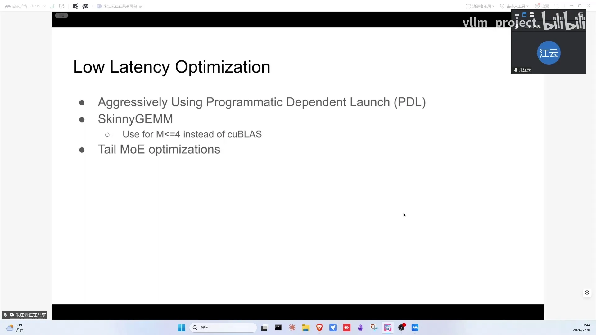 |
| 首先我们非常激进地使用了 PDL 这个 feature，后面也会讲。第二个是在小并发场景下把矩阵乘法换成了我们自己写的比较特化一点的（算子），并没有使用英伟达那些矩阵库里面的算法。第三个是针对 latent MoE 做了一些特殊优化，之后还会仔细讲。 [【跳转到 41:04】](https://www.bilibili.com/video/BV11z3m63ECo/?t=2464) |  |
| （接上） [【跳转到 41:29】](https://www.bilibili.com/video/BV11z3m63ECo/?t=2489) |  |
| 下一页。 [【跳转到 41:54】](https://www.bilibili.com/video/BV11z3m63ECo/?t=2514) | 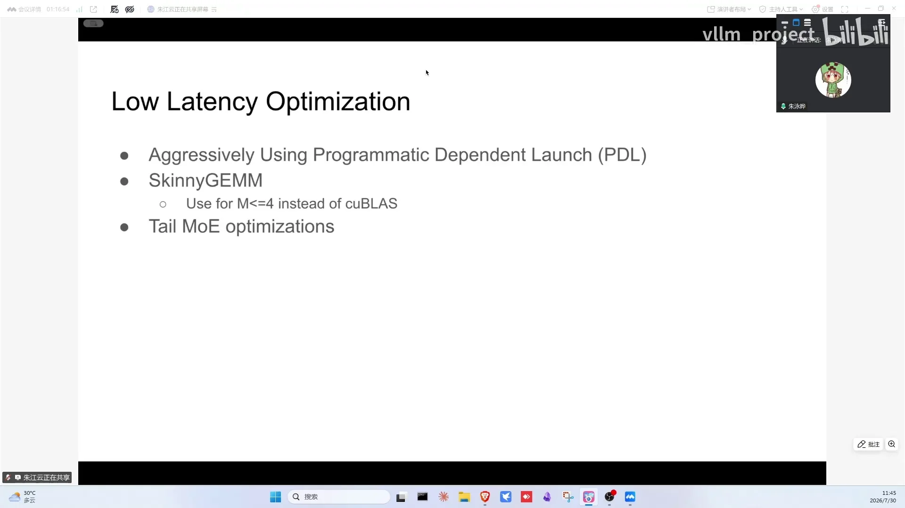 |
| 这里主要介绍一下 PDL 这个 feature，是英伟达提出来的：顺序启动两个 kernel 时，如果没有开 PDL，第一个 kernel 跟第二个 kernel 是顺序启动的——看右边这幅图…… [【跳转到 42:00】](https://www.bilibili.com/video/BV11z3m63ECo/?t=2520) |  |
| 并发比较小的时候 kernel 启动时会浪费很多资源。PDL 做的事情是：在第一个 kernel 结束之前就可以启动第二个 kernel…… [【跳转到 42:25】](https://www.bilibili.com/video/BV11z3m63ECo/?t=2545) |  |
| 启动第二个 kernel 时可以做一些不相关的工作：比如写 CUDA 的朋友都知道，需要算一些 index——这个 token 要去哪里读、读第几个 token——这种事情可以在第一个 kernel 的数据…… [【跳转到 42:50】](https://www.bilibili.com/video/BV11z3m63ECo/?t=2570) |  |
| 被写入之前就做完。写完之后再做一次同步，第二个 kernel 就可以完全看到第一个 kernel 写在 global memory 里的数据了。 [【跳转到 43:15】](https://www.bilibili.com/video/BV11z3m63ECo/?t=2595) |  |
| 我们使用出来对这个效率提升非常大：相当于把 GPU 能打满的都打满。可以下页。 [【跳转到 43:40】](https://www.bilibili.com/video/BV11z3m63ECo/?t=2620) | 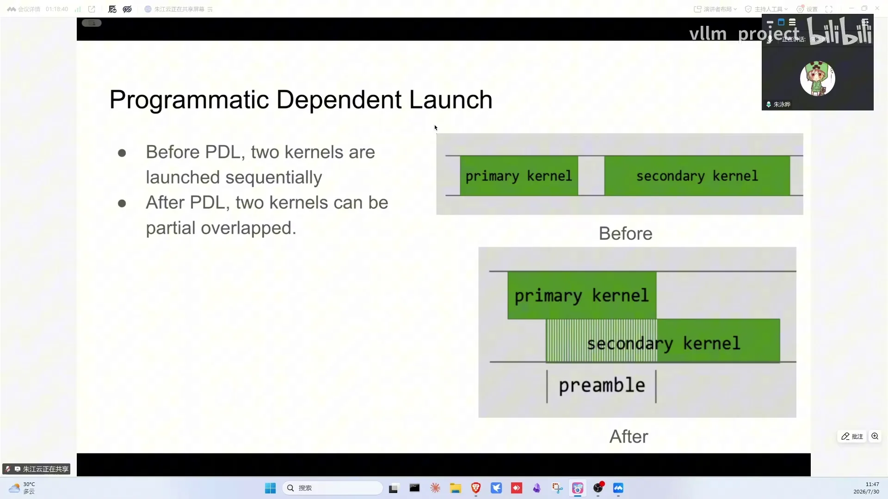 |
| 第二个是针对 latent MoE 方面的优化。能不能放第二页再去看 latent MoE 是怎么算的？这图好小。——你说要放到哪里？ [【跳转到 43:59】](https://www.bilibili.com/video/BV11z3m63ECo/?t=2639) | 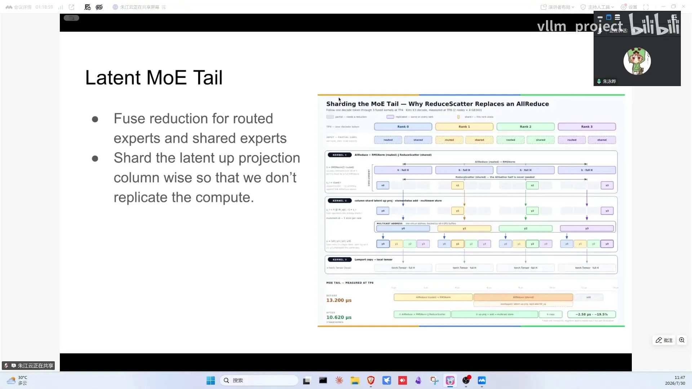 |
| 第二页已经没有了。不是，我说从头开始第二页。 [【跳转到 44:24】](https://www.bilibili.com/video/BV11z3m63ECo/?t=2664) | 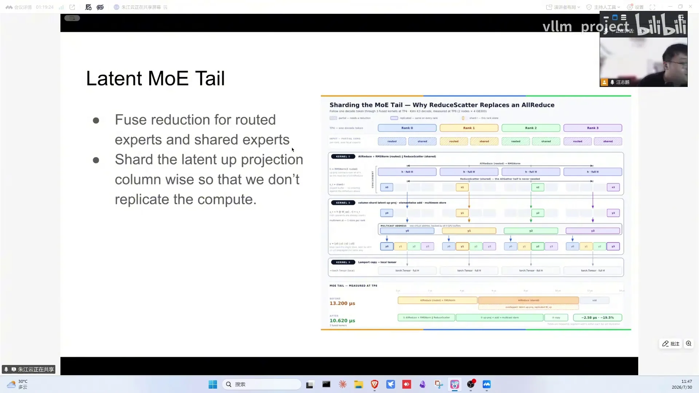 |
| OK OK。 [【跳转到 44:34】](https://www.bilibili.com/video/BV11z3m63ECo/?t=2674) | 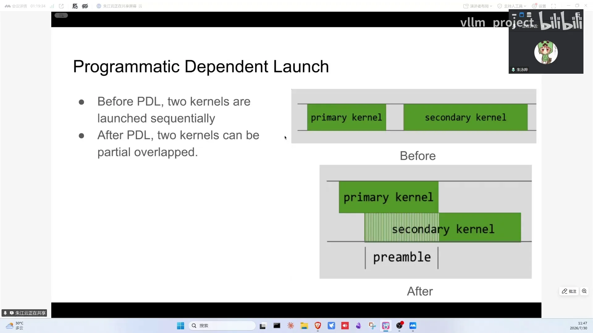 |
| 对，这是第三页。上一页——对，latent MoE 的算法：最上面红色的盒子——每个 token 的 hidden state 进来后先做 shared expert 的（计算），shared expert 跟 routed expert 会一起做。routed expert 像刚才跟嘉文说的一样，先经过一个 latent down projection 降维，降到比原来小的维度，然后做跟原来 MoE 一样的算法…… [【跳转到 44:39】](https://www.bilibili.com/video/BV11z3m63ECo/?t=2679) |  |
| （接上） [【跳转到 45:04】](https://www.bilibili.com/video/BV11z3m63ECo/?t=2704) | 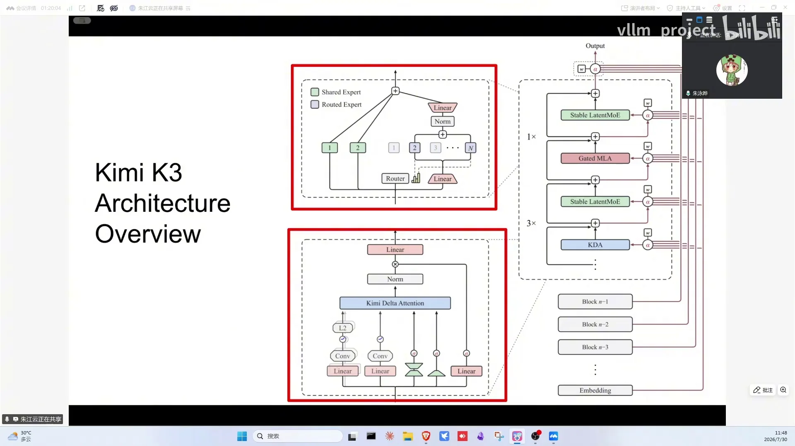 |
| 做完之后通过加权相加，还会做一次 RMSNorm，做完 RMSNorm 才去做升维的操作。但共享专家是不做升维降维操作的。在实际优化的过程中…… [【跳转到 45:29】](https://www.bilibili.com/video/BV11z3m63ECo/?t=2729) | 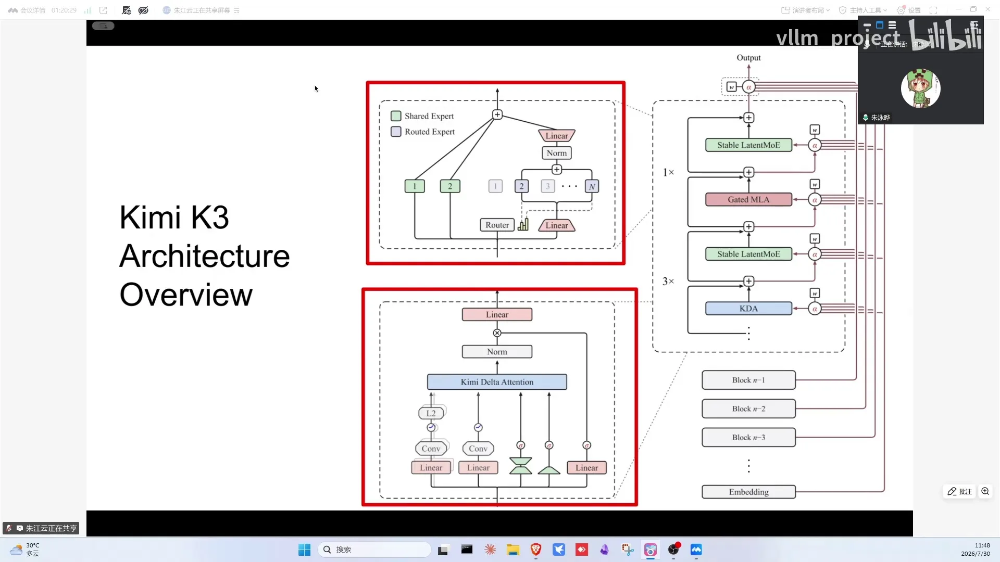 |
| 如果我们需要做 tensor parallel，就要在共享专家跟 routed expert 都做一次 all-reduce，对吧。 [【跳转到 45:54】](https://www.bilibili.com/video/BV11z3m63ECo/?t=2754) | 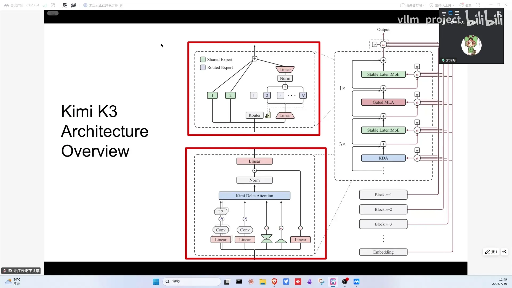 |
| 这个在 prefill 的时候非常不友好：首先需要做两次 kernel launch；其次做 all-reduce 时，因为每个 token 的大小比较小，NVLink 的带宽根本打不满。 [【跳转到 46:19】](https://www.bilibili.com/video/BV11z3m63ECo/?t=2779) | 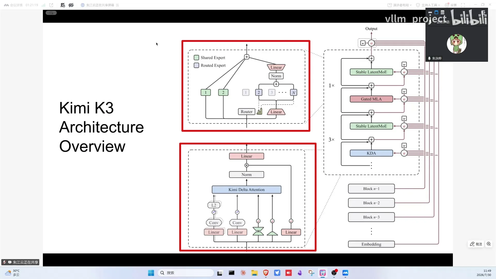 |
| 打不满的话对整体性能影响比较大。——嘉文可以（把图）放大，如果图比较小的话。——这个图其实比较大。——哦哦对对对对。 [【跳转到 46:44】](https://www.bilibili.com/video/BV11z3m63ECo/?t=2804) | 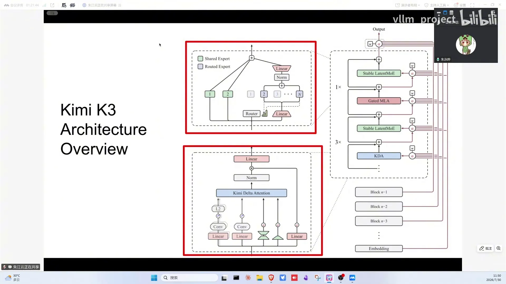 |
| 这个图就是我们刚说的：做共享专家跟 routed expert 的时候——OK 这个应该是 TP 的情况，这个是 EP 的情况。 [【跳转到 47:09】](https://www.bilibili.com/video/BV11z3m63ECo/?t=2829) | 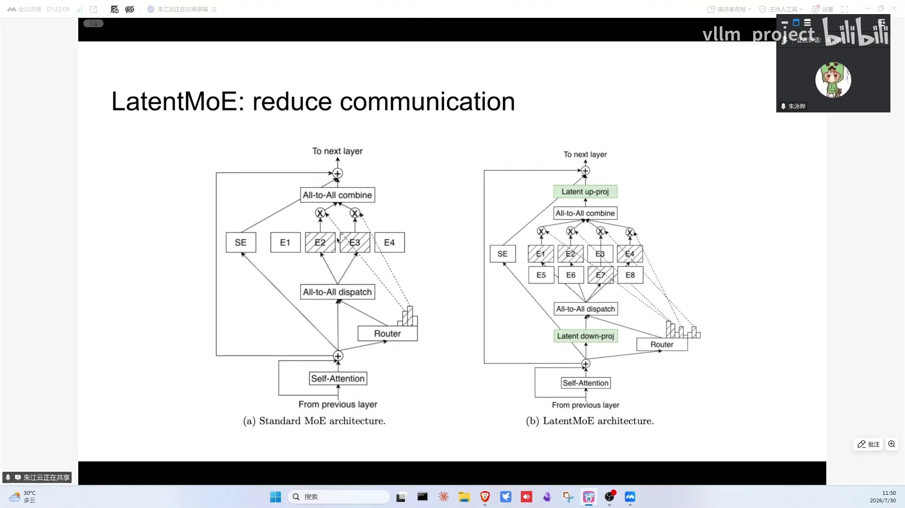 |
| 要不把最后面那个图放大仔细讲解？——我把那个图放大放到了最后。 [【跳转到 47:34】](https://www.bilibili.com/video/BV11z3m63ECo/?t=2854) | 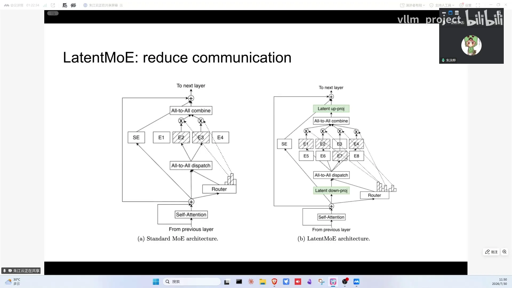 |
| 对对对对对。 [【跳转到 47:51】](https://www.bilibili.com/video/BV11z3m63ECo/?t=2871) | 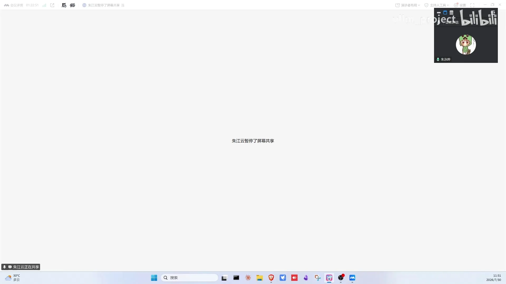 |
| 这个图比较大，可以慢慢讲。 [【跳转到 48:02】](https://www.bilibili.com/video/BV11z3m63ECo/?t=2882) | 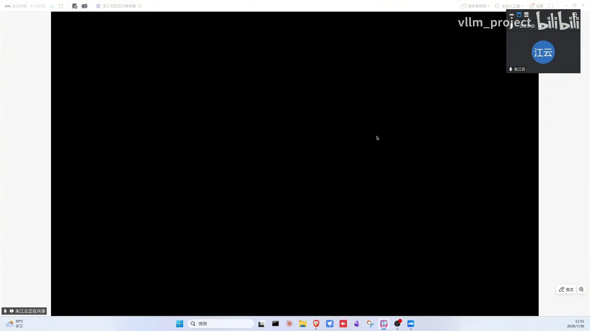 |
| 最开始的时候做（小）并发肯定要用 tensor parallel：这样每张卡的计算量比较低。做 tensor parallel 时整个 MoE 做完最后的结果在最上面是 rank 1…… [【跳转到 48:07】](https://www.bilibili.com/video/BV11z3m63ECo/?t=2887) | 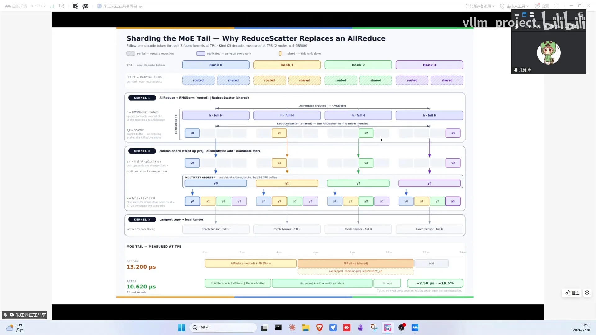 |
| rank2、rank3 的时候每个 GPU 都会有一份 routed expert 的部分数据，还有共享专家的部分数据。原来做的是把两次的部分数据拿来一起加起来，再做剩下的计算。 [【跳转到 48:32】](https://www.bilibili.com/video/BV11z3m63ECo/?t=2912) |  |
| 优化过程中我们发现：把 shared expert 做完 all-reduce 之后，后面的 GEMM——升维的那个矩阵计算——每个 GPU 做的都是相同的计算，比较浪费。我们想的是：能不能让每个 GPU 只算一小块，最后再用一次通信把计算结果收集起来。要做这种…… [【跳转到 48:57】](https://www.bilibili.com/video/BV11z3m63ECo/?t=2937) |  |
| （接上） [【跳转到 49:22】](https://www.bilibili.com/video/BV11z3m63ECo/?t=2962) |  |
| 这样的话 routed expert 的 all-reduce 其实不可避免：因为之后还会做一次归一化——norm 是非线性计算，没办法分开算、最后再用加法或乘法表达。所以我们第一个 kernel 就是把 routed expert 通过 all-reduce 相加，再拿来做 RMSNorm。但共享专家最后的作用就是升维之后把每个数据相加就可以，不需要用 all-reduce 做运算…… [【跳转到 49:47】](https://www.bilibili.com/video/BV11z3m63ECo/?t=2987) | 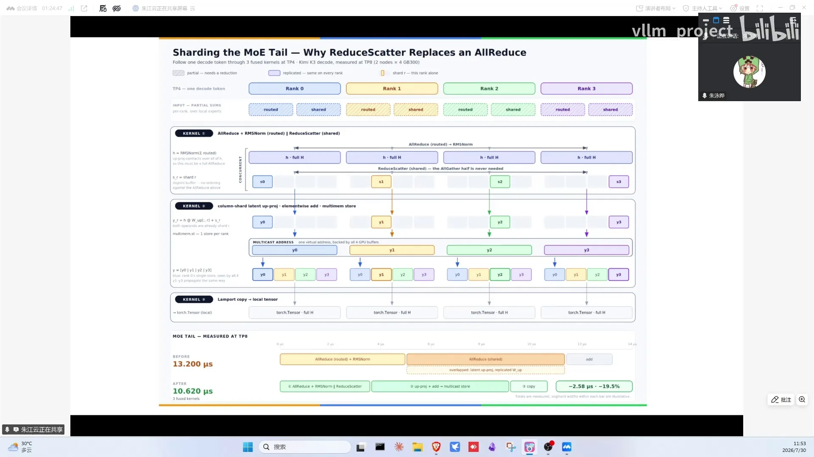 |
| （接上） [【跳转到 50:12】](https://www.bilibili.com/video/BV11z3m63ECo/?t=3012) |  |
| 我们用的是 reduce-scatter：每个 rank 还是切开的。切开之后每个 GPU 拿的是不同部分的完整数据。这个有点绕：本来拿的是每个位置的部分数据，做一次通信后每个 GPU 拿到完整的数据但是不同的位置。 [【跳转到 50:37】](https://www.bilibili.com/video/BV11z3m63ECo/?t=3037) |  |
| （接上） [【跳转到 51:02】](https://www.bilibili.com/video/BV11z3m63ECo/?t=3062) | 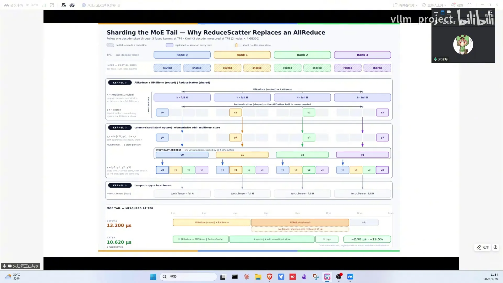 |
| 有了不同位置上的数据之后，再 launch 另一个 kernel：把矩阵按列切分，最后算完的数据也是一部分的完整数据…… [【跳转到 51:27】](https://www.bilibili.com/video/BV11z3m63ECo/?t=3087) |  |
| 再把这部分完整数据跟共享专家同一部分的数据做相加。最后每个 GPU 上有一个不同部分的完整数据。有了这个数据后再做一次集合通信，让所有 GPU 上都有全部完整的数据。不知道解释得清不清楚。最后优化下来这一块大概有 20%~30% 左右的提升。 [【跳转到 51:52】](https://www.bilibili.com/video/BV11z3m63ECo/?t=3112) |  |
| （接上） [【跳转到 52:17】](https://www.bilibili.com/video/BV11z3m63ECo/?t=3137) |  |
| 在端到端小并发的场景下提升速度非常大。——永夜你可以讲一下大概有多少提升吗？不同优化的 breakdown？——OK。 [【跳转到 52:42】](https://www.bilibili.com/video/BV11z3m63ECo/?t=3162) | 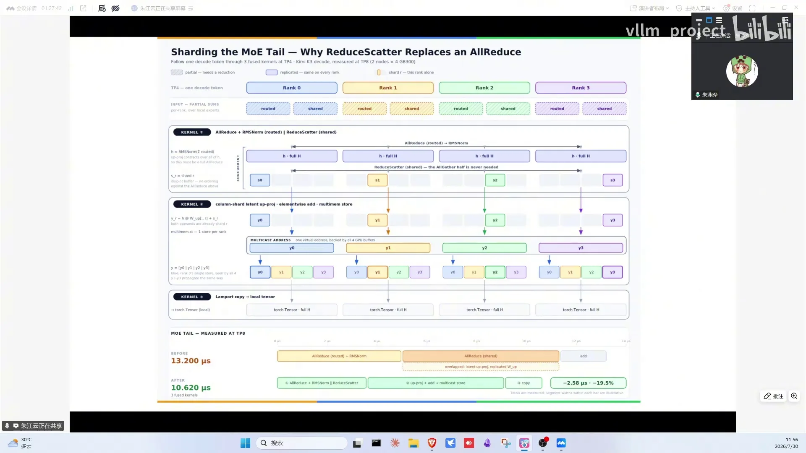 |
| 这里其实还优化了非常非常多，提几个重点的讲。上面那个 PDL 加起来应该有 3% 到 4%。MoE 部分比较大，应该有 9% 到 10% 左右。中间自己写的针对小并发的矩阵乘，大概加速 7% 到 8% 左右。 [【跳转到 53:07】](https://www.bilibili.com/video/BV11z3m63ECo/?t=3187) |  |
| （接上） [【跳转到 53:32】](https://www.bilibili.com/video/BV11z3m63ECo/?t=3212) |  |
| 我们可以开始进入答疑环节了，先回答（社区）的疑问。 [【跳转到 53:57】](https://www.bilibili.com/video/BV11z3m63ECo/?t=3237) |  |
| 等等等一下：因为我们两个人准备时间有限，没有覆盖到非常多的内容。其实还做了很多其他工作：比如 KDA 的 kernel；prefill 时发现的 CPU overhead（优化）；也针对 decode 推理做了很详细的优化。因为篇幅原因没办法在这里放出来，大家感兴趣可以看 blog，用 AI 解释——AI 是非常好的老师。 [【跳转到 54:04】](https://www.bilibili.com/video/BV11z3m63ECo/?t=3244) | 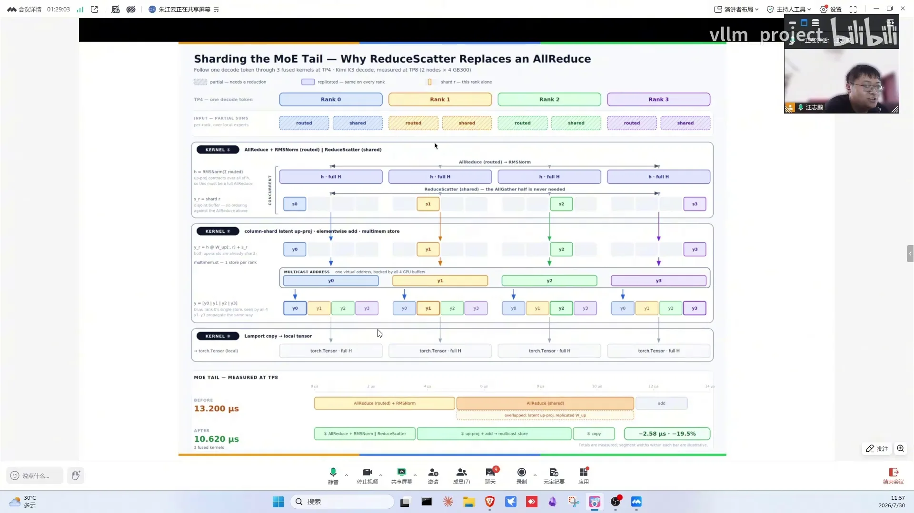 |
| （接上） [【跳转到 54:10】](https://www.bilibili.com/video/BV11z3m63ECo/?t=3250) |  |
| 我做 slides 的时候参考了 latent MoE 论文的图、MLA 论文的画法。在此一并感谢 Moonshot 开源 K3 这么强大的模型，以及 flash-linear-attention 维护的同学。——对对。我们这个 PR 编号是 5 万，幸运地抢到了一个靓号：第 5 万个 PR。我一般 review PR 会直接让 AI 帮忙扫一下 PR 的 branch，讲一下到底做了什么改动、分成几类。你会发现这些类基本包含今天直播里的大多数内容。可能还有一些直播没涉及的内容，感兴趣可以好好研究这个 PR、去 review 它。底下还有一些新的 issue、test，感兴趣都可以贡献。 [【跳转到 54:35】](https://www.bilibili.com/video/BV11z3m63ECo/?t=3275) |  |
| （接上） [【跳转到 55:00】](https://www.bilibili.com/video/BV11z3m63ECo/?t=3300) |  |
| （接上） [【跳转到 55:25】](https://www.bilibili.com/video/BV11z3m63ECo/?t=3325) | 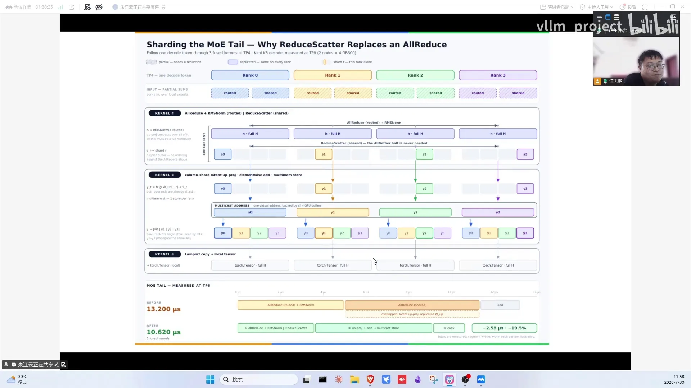 |
| 现在先进行（社区）的答疑。 [【跳转到 55:50】](https://www.bilibili.com/video/BV11z3m63ECo/?t=3350) |  |
| 答疑在聊天框右边。 [【跳转到 55:58】](https://www.bilibili.com/video/BV11z3m63ECo/?t=3358) | 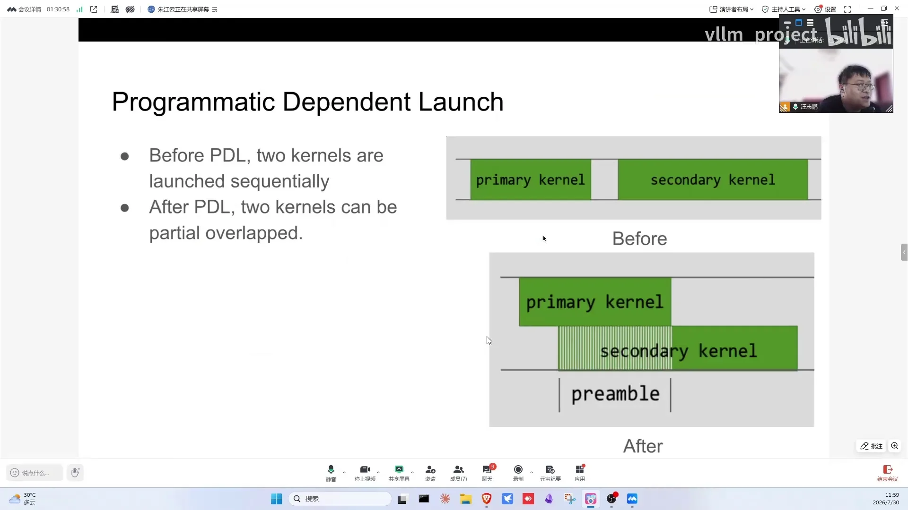 |
| （此区间无字幕） [【跳转到 56:03】](https://www.bilibili.com/video/BV11z3m63ECo/?t=3363) | 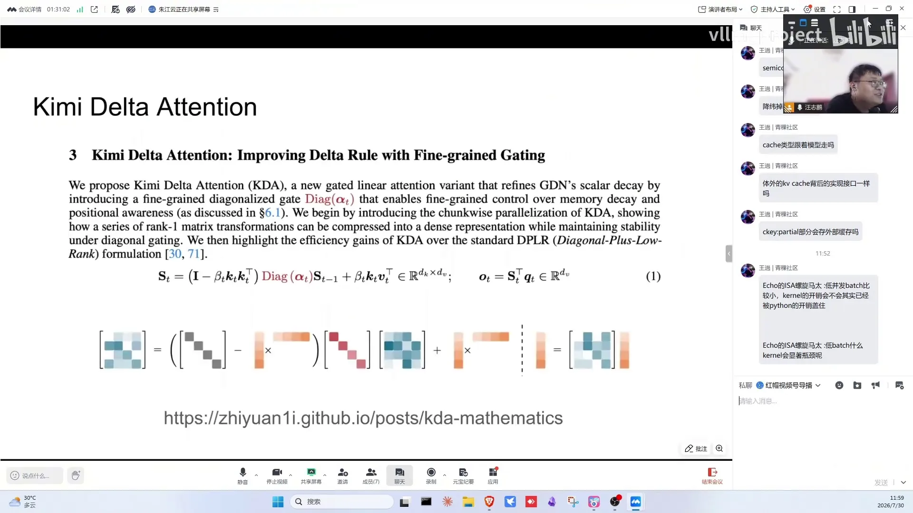 |
| （社区）有同学问：相当于快照的数量等于 block 的数量？——并不是。看这个图比较好：对 Mamba 的快照来说，以四个 block 为一个力度的话，只缓存最后一个 block，前 3 个 block 都（不存）——因为你缓存哪一个 block 的 state 就必须在对应的位置切开…… [【跳转到 56:08】](https://www.bilibili.com/video/BV11z3m63ECo/?t=3368) | 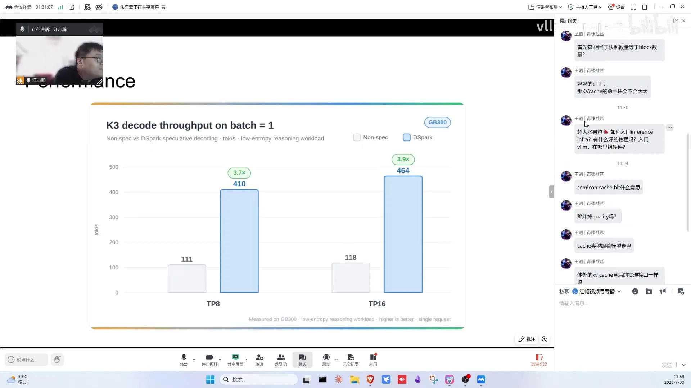 |
| 我们来还是看还是看这个图比较好啊比如说这个图里面对于呃mama的快照来说呃我们是以比如说这这个是以四个block为一个力度的那我们就只我们只缓存其实是最后一个block然后前3block都是N就是因为你缓存哪一个block的state你就必须在对应的位置切开 [【跳转到 56:19】](https://www.bilibili.com/video/BV11z3m63ECo/?t=3379) | 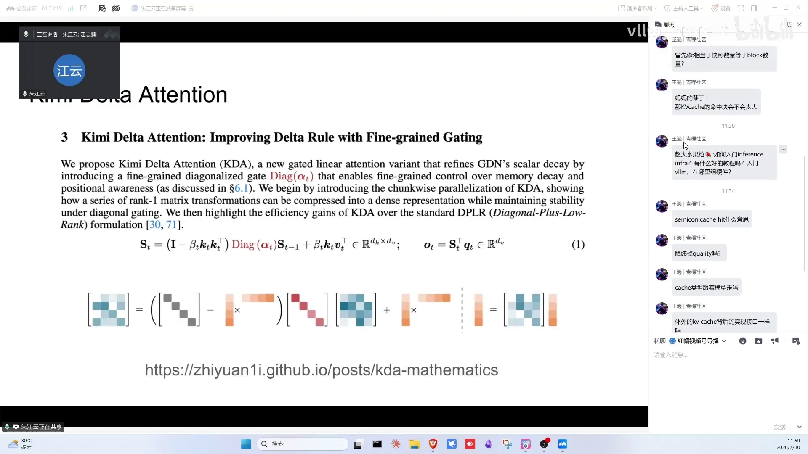 |
| 不可能把四个都切开切成四次 forward，不太高效。我们这里的做法是一次 forward 四个 block size 的 token，只在最后一个 block 存（状态），前面都是（不存）。对。也有人说 cache 命中粒度会不会太大了？——是太大了，所以我们有 partial cache hit 的新设计…… [【跳转到 56:44】](https://www.bilibili.com/video/BV11z3m63ECo/?t=3404) | 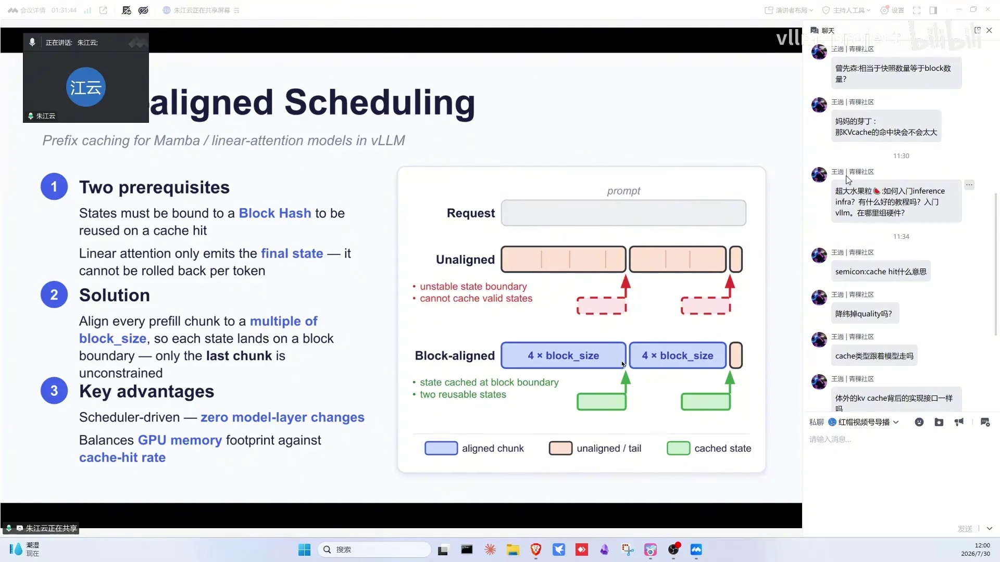 |
| 只不过现在要手动打开。感兴趣可以看这个 RFC 和对应 PR 的实现，里面有具体的用法。然后有同学问如何入门 inference infra、有什么好的教程？入门 vLLM 在哪里租硬件？——非常好的问题：入门 vLLM 的 inference infra，一定要订阅 vLLM project 的 B 站官方频道，每周都有 vLLM 技术分享。最好参加直播，有问题直接在直播间问老师。在哪里租硬件——很多网上平台可以租，不涉及打广告…… [【跳转到 57:09】](https://www.bilibili.com/video/BV11z3m63ECo/?t=3429) | 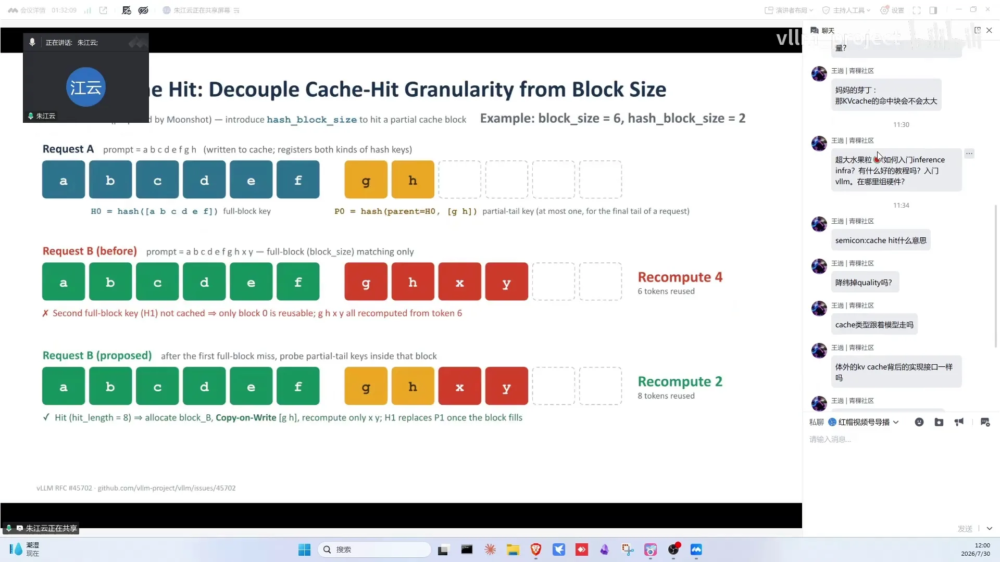 |
| （接上） [【跳转到 57:34】](https://www.bilibili.com/video/BV11z3m63ECo/?t=3454) |  |
| 国内可以租（魔搭社区）他们的平台。还有可以去网上搜月球大叔最近的一次直播：那次我是嘉宾，讲了我怎么入门 AI infra、怎样给 vLLM 做贡献的整个过程，可以参考我的来时路。——下一个问题：cache hit 是什么意思？ [【跳转到 57:59】](https://www.bilibili.com/video/BV11z3m63ECo/?t=3479) |  |
| 就是我们算完之前的 token 会把 KV 存下来，避免下一次重算，可以这么讲吗？——对。这属于推理里比较常见的优化技术：推理整个东西就是围绕 cache 缓存命中来做的。——然后有同学问：降维会掉 quality 吗？ [【跳转到 58:24】](https://www.bilibili.com/video/BV11z3m63ECo/?t=3504) |  |
| （接上） [【跳转到 58:49】](https://www.bilibili.com/video/BV11z3m63ECo/?t=3529) |  |
| （接上） [【跳转到 59:14】](https://www.bilibili.com/video/BV11z3m63ECo/?t=3554) | 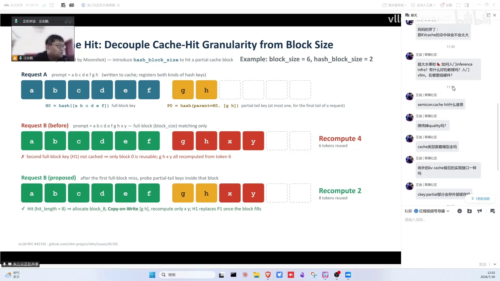 |
| 可以去看 K3 的技术报告，也可以看 latent MoE 这篇论文，里面应该会有相关的介绍：降维之后有什么影响。——好。然后 cache 的类型是跟着模型走的吗？——对，这个是肯定的。——然后还有同学问：KV cache 背后的实现接口是一样的吗？——没太懂，我也没看懂。 [【跳转到 59:30】](https://www.bilibili.com/video/BV11z3m63ECo/?t=3570) | 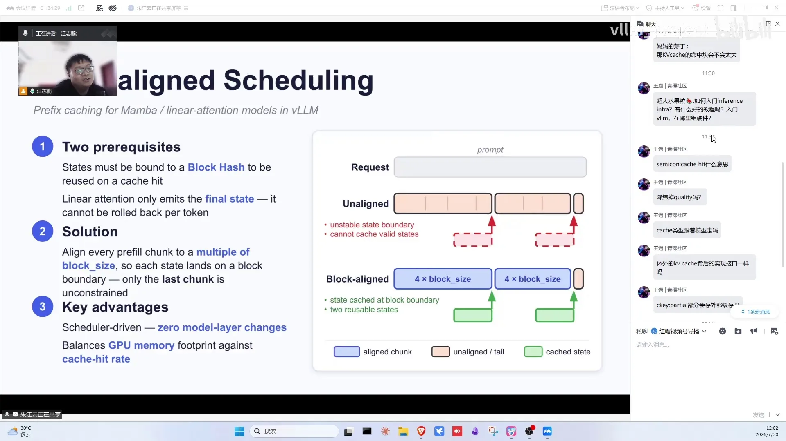 |
| （接上） [【跳转到 59:49】](https://www.bilibili.com/video/BV11z3m63ECo/?t=3589) | 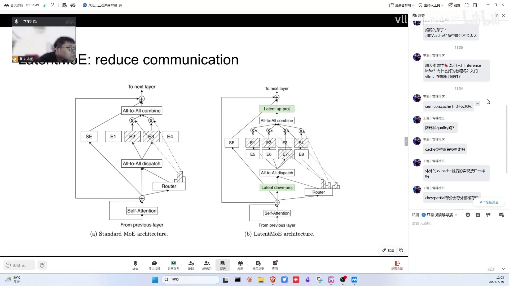 |
| 有同学问：低并发下 batch 比较小，kernel 的开销会不会已经被 Python 的开销盖住了？低 batch 的时候 kernel 会有什么显著的瓶颈呢？——这是给永夜的问题。——我首先补充一点：现在各个推理框架都开始引入 async scheduler，可以最大程度让下一步的调度开销掩盖在上一步的 model forward 里。所以 Python overhead 会有一些，但不如大家刻板印象中那么多。我们这次的 recipe 里也用了新的 rust frontend：把 HTTP server 端的东西用 rust 重写了，性能应该也会更好。——（永夜）可以补充更多 kernel 相关细节。——我觉得 Python 端开销小主要是因为低并发时开了 CUDA graph：开了之后 CPU 开销非常小，不需要 CPU 跟上 GPU 的速度。比如 CPU 调一个 API 就可以 launch 几十个几百个 kernel。——那 decode 的时候什么 kernel 会是显著瓶颈呢？ [【跳转到 60:14】](https://www.bilibili.com/video/BV11z3m63ECo/?t=3614) | 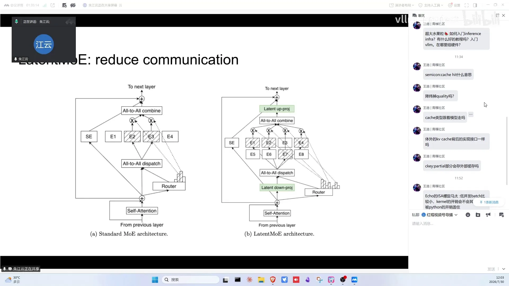 |
| （接上） [【跳转到 60:39】](https://www.bilibili.com/video/BV11z3m63ECo/?t=3639) | 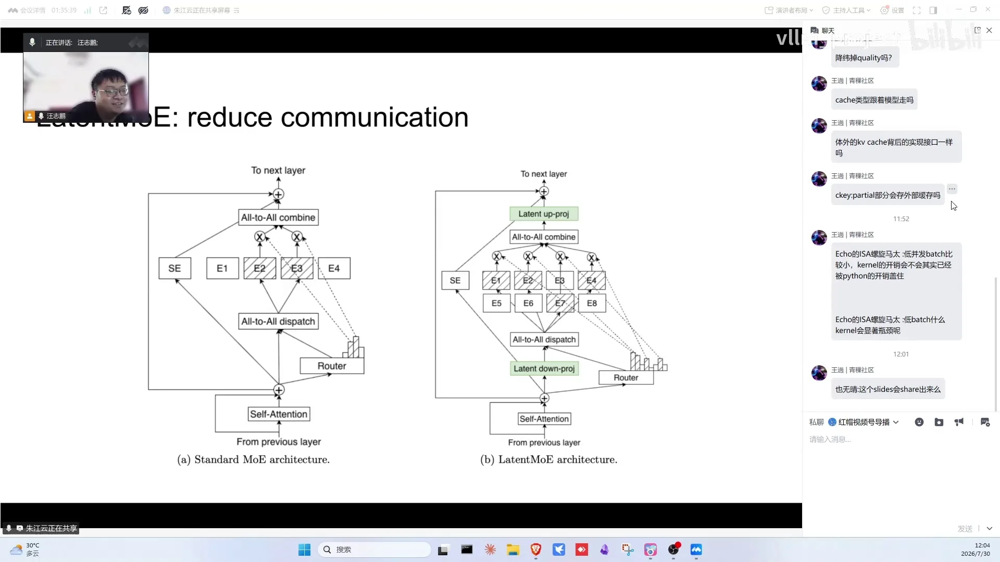 |
| （接上） [【跳转到 61:04】](https://www.bilibili.com/video/BV11z3m63ECo/?t=3664) | 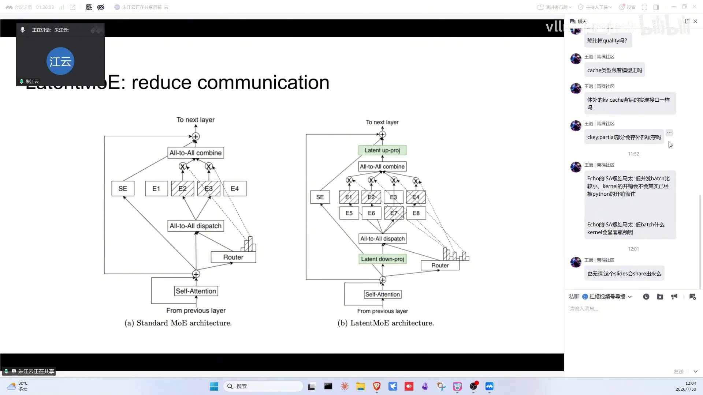 |
| （接上） [【跳转到 61:29】](https://www.bilibili.com/video/BV11z3m63ECo/?t=3689) | 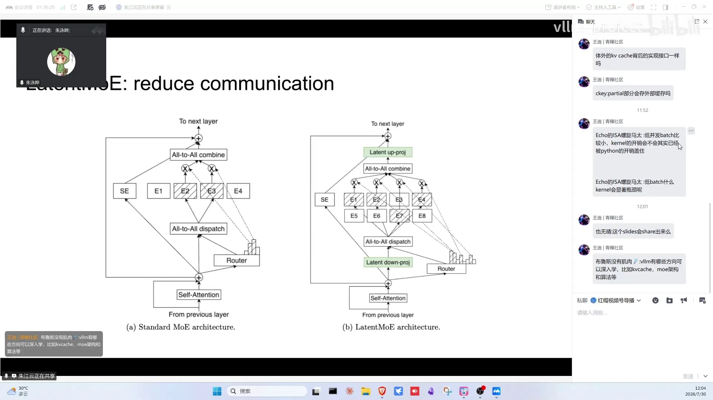 |
| 我觉得还是这幅图：做 MoE 的时候 MoE 就是显著瓶颈。因为 MoE 需要做矩阵乘法，显存开销非常大：大概 1.5T 的模型有一半或 60% 的权重都在 MoE 上。整个大概 100B 的模型，每个 token 走一步大概要算 100B 参数，其中一大部分也都在 MoE 里。——对。然后我也打过广告：vLLM 的 rust 重构有一期直播，由 rust 重构的主要负责人子棋来给我们讲的，感兴趣的观众可以看回放。 [【跳转到 61:54】](https://www.bilibili.com/video/BV11z3m63ECo/?t=3714) | 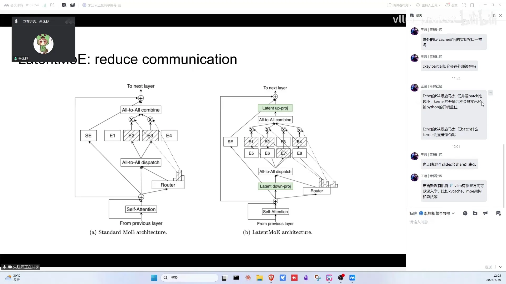 |
| （接上） [【跳转到 62:19】](https://www.bilibili.com/video/BV11z3m63ECo/?t=3739) | 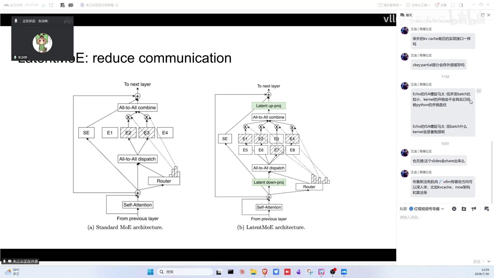 |
| 有同学问 slides 会分享出来吗？——是的，会跟直播回放一起分享。还有同学问：vLLM 有哪些方向可以深入学？比如 KV cache、MoE 架构和算法等，有什么建议？ [【跳转到 62:44】](https://www.bilibili.com/video/BV11z3m63ECo/?t=3764) | 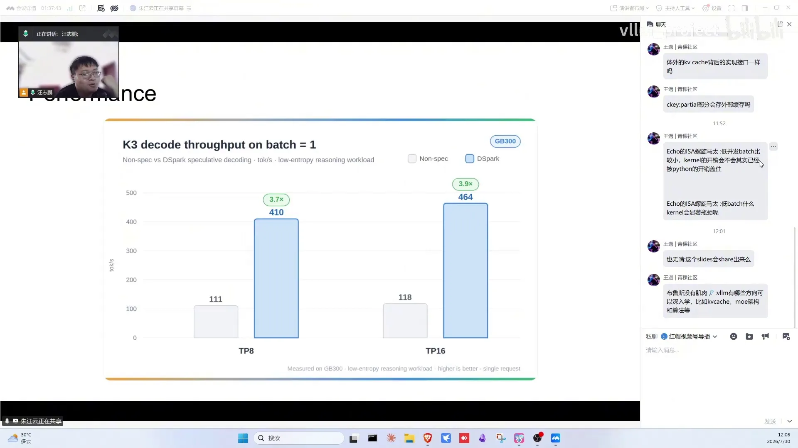 |
| 看自己的兴趣：刚入门一般从修 bug 开始，修到后面会对某些方向感兴趣。我个人感觉到了 KV cache 这个层面，属于框架比较核心的部分，需要积累更多经验才能做。其实上手做就可以了：如果觉得 vLLM 这种框架比较复杂，社区里也有 Nano-vLLM 这种框架。想了解什么 feature 或核心功能，就自己实现一下，现在 AI 是最好的老师…… [【跳转到 63:09】](https://www.bilibili.com/video/BV11z3m63ECo/?t=3789) |  |
| （接上） [【跳转到 63:34】](https://www.bilibili.com/video/BV11z3m63ECo/?t=3814) | 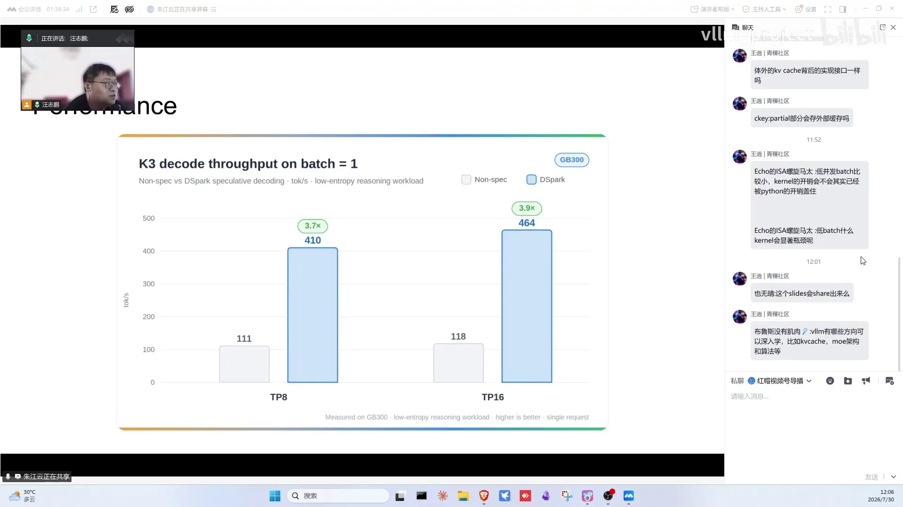 |
| （接上） [【跳转到 63:59】](https://www.bilibili.com/video/BV11z3m63ECo/?t=3839) | 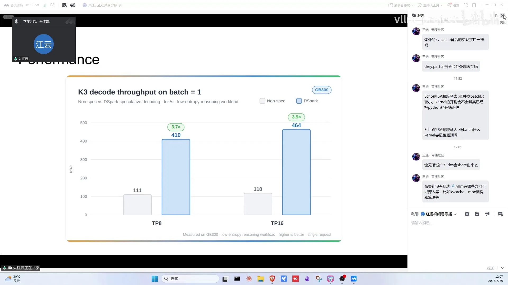 |
| 真的动手做一遍就大概能理解它在做什么、为什么这么设计、设计不好会怎么样。而且我记得嘉文做 vLLM 的贡献应该也就一年多时间，对吧？现在已经是我们社区的扛把子了。所以很大程度上看你内驱力：感兴趣的话一定可以学到很多东西，每天会有新想法去尝试学习，不懂就去问，成长会非常快。好，然后（社区）的问题回答完之后再来回答（另一个）社区的问题。 [【跳转到 64:06】](https://www.bilibili.com/video/BV11z3m63ECo/?t=3846) | 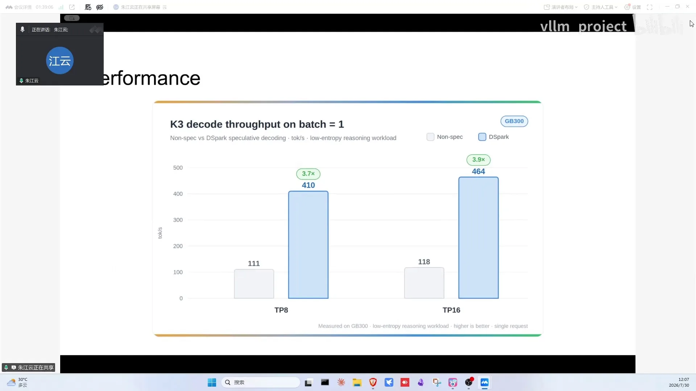 |
| （接上） [【跳转到 64:31】](https://www.bilibili.com/video/BV11z3m63ECo/?t=3871) | 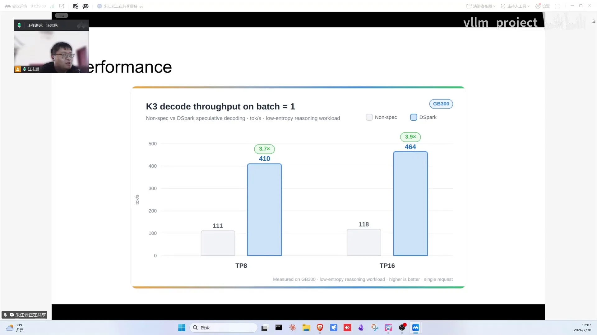 |
| 有同学问这个能部署在 H100 上吗？——我们好像跑过 16 卡（128K）。可以跑，应该可以跑。只是可能很多优化包括 kernel 没有是给 H 卡开发的，对吧。 [【跳转到 64:56】](https://www.bilibili.com/video/BV11z3m63ECo/?t=3896) |  |
| 开发的时候（有对应）。然后还有一个问题：和直接减少 block size 的区别是什么？会带来什么优势？——我猜你想问的是这里：问题就在于它不能减少——现在的设计中必须要让 attention page size 向上对齐到 Mamba 的（state）大小。 [【跳转到 65:21】](https://www.bilibili.com/video/BV11z3m63ECo/?t=3921) | 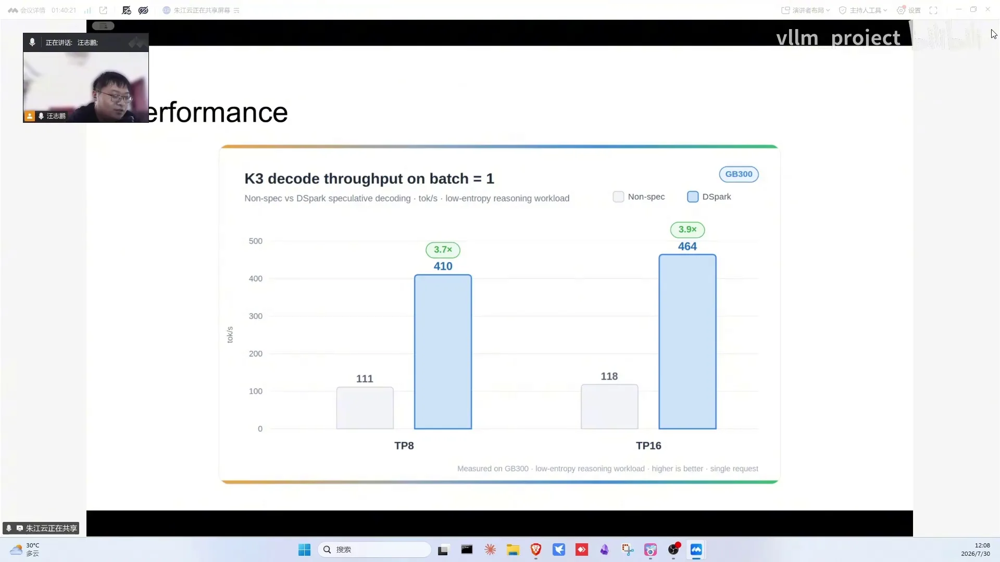 |
| 然后有同学问：是不是所有的模型都是这么处理 token 的，还是 vLLM 决定的？ [【跳转到 65:46】](https://www.bilibili.com/video/BV11z3m63ECo/?t=3946) | 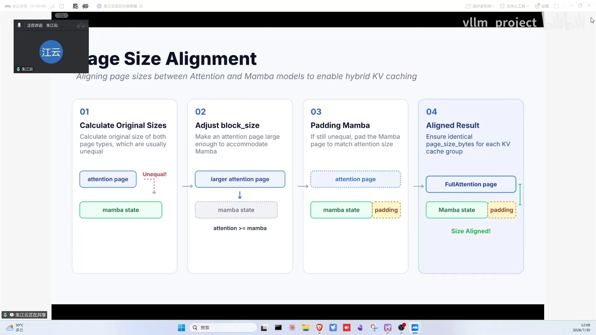 |
| 我理解他说的是哈希的命中吧：prefix cache 的命中一般是以 token 哈希为维度的。我觉得所有模型都会以 prefix 的 token 去算一个哈希然后看是否命中。 [【跳转到 66:11】](https://www.bilibili.com/video/BV11z3m63ECo/?t=3971) | 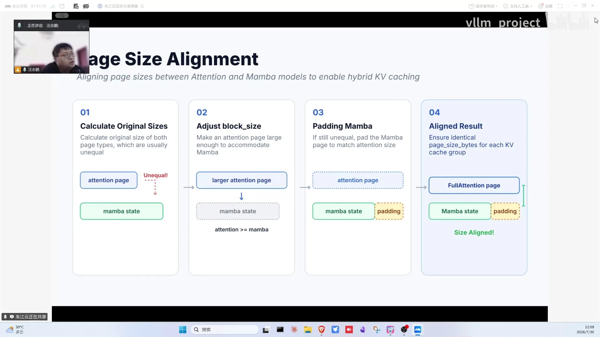 |
| 回到直播间回答观众的问题，直播间的问题非常非常多。 [【跳转到 66:36】](https://www.bilibili.com/video/BV11z3m63ECo/?t=3996) | 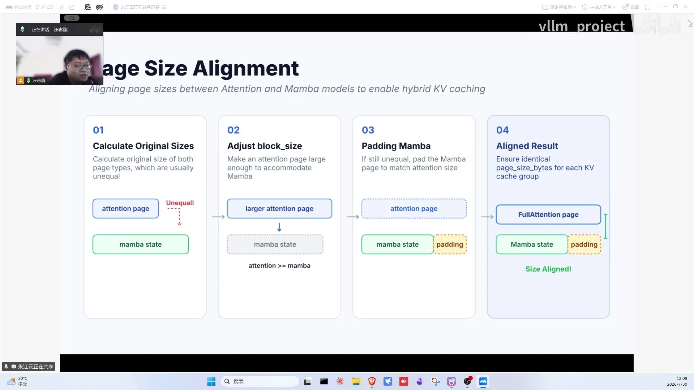 |
| 刷新一下——太夸张了，可能因为 K3 模型非常火热。我都不知道刚才回答到哪里了，看一下，从这里开始回答吧。 [【跳转到 67:01】](https://www.bilibili.com/video/BV11z3m63ECo/?t=4021) | 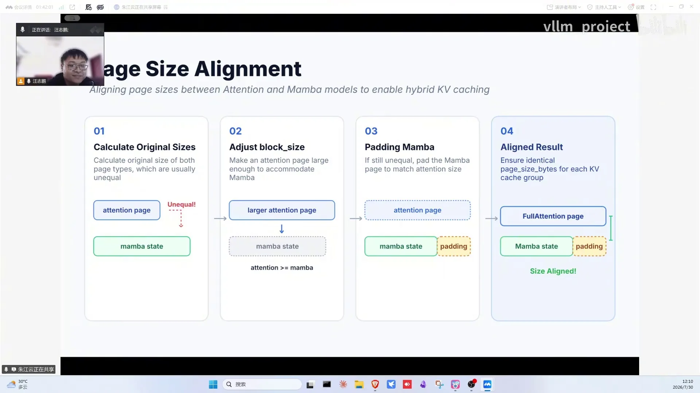 |
| 请问哈希 block size 避免重算的部分是动态的吗？——可以理解为是。不太清楚你问的动态是什么意思，但这里的设计是说…… [【跳转到 67:26】](https://www.bilibili.com/video/BV11z3m63ECo/?t=4046) | 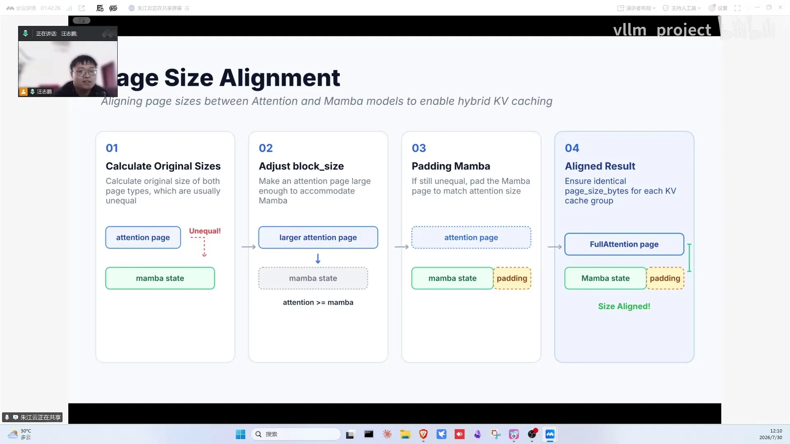 |
| 我们总是在一个 prompt 的结尾处 cache。比如有一个 prompt 前面这么多 token、后面有五个 token，我们就在第四个（block）那里开始存，因为它的最小粒度是 2。如果只有三个 token，就在 2 的地方开始存。 [【跳转到 67:40】](https://www.bilibili.com/video/BV11z3m63ECo/?t=4060) | 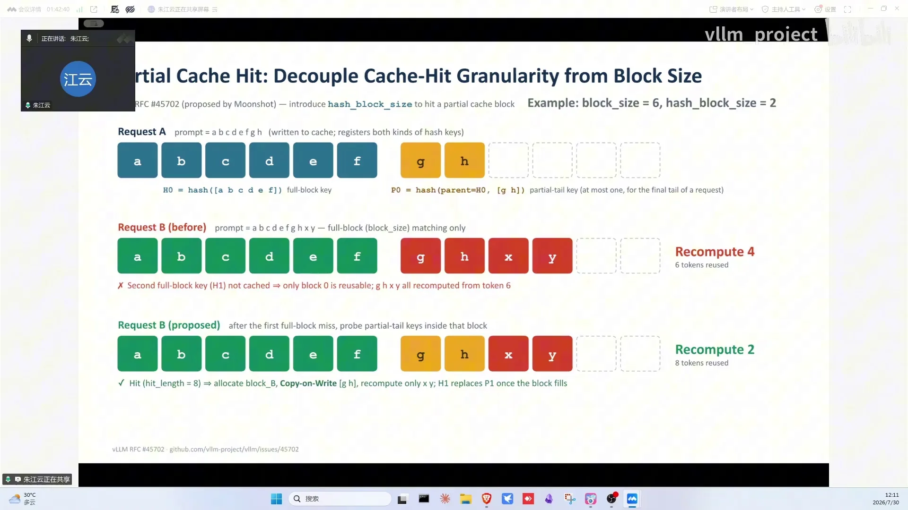 |
| 其实我也有个问题：你设置这个力度之后，存储具体怎么存的？跟原来一样吗？——你存的就是你如何管理 cache，本质问题是你如何管理一堆 tensor，管理 tensor 和有没有把它填满是两个事情。所以只要按照原来的方式管理，只是最后一个有一些 block 没有被填满就可以。因为没有填满的时候，希望命中它就需要做一些 copy：先 copy 再 write，因为 Mamba 是 inplace 更新的。——哦可以。——然后 Mamba 的 block hash 和 full attention 的计算过程一样吗？——因为算的都是 token，哈希和存什么无关。一般来讲都是看 prefix 的前缀 token 维度上做哈希。 [【跳转到 68:05】](https://www.bilibili.com/video/BV11z3m63ECo/?t=4085) | 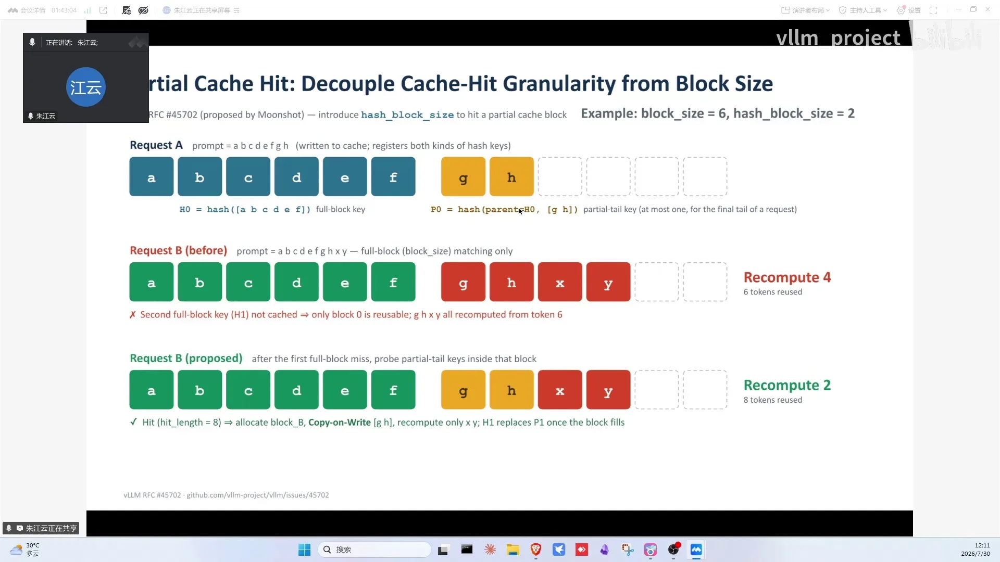 |
| （接上） [【跳转到 68:30】](https://www.bilibili.com/video/BV11z3m63ECo/?t=4110) |  |
| （接上） [【跳转到 68:55】](https://www.bilibili.com/video/BV11z3m63ECo/?t=4135) |  |
| vLLM 中 request 的哈希计算其实和下面的 memory 管理是分开的，耦合的地方在于：计算哈希的粒度之前和 block size 是耦合的。然后有同学说：输入很长的话计算哈希是不是也很慢？——这个在 vLLM 之前就已经有过实践，换了一些哈希算法，现在 overhead 应该比较小。还有这个问题跟我刚才很像：存储的 block size 变了吗？还是按照原来存的？新的短的…… [【跳转到 69:20】](https://www.bilibili.com/video/BV11z3m63ECo/?t=4160) | 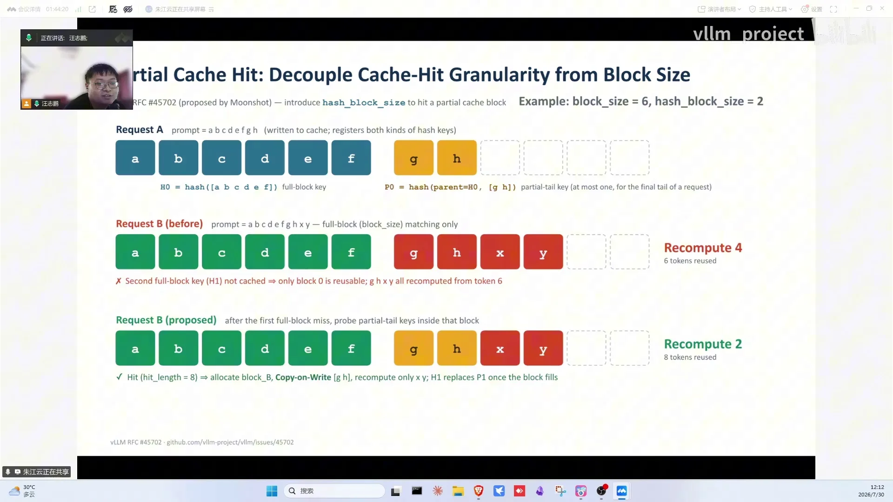 |
| （接上） [【跳转到 69:45】](https://www.bilibili.com/video/BV11z3m63ECo/?t=4185) | 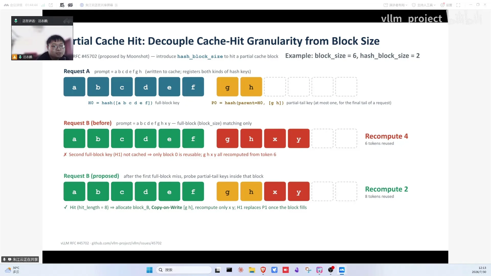 |
| 现在短了这段怎么存？刚才讲了：partial 或者 full 其实只是你如何解释这段 tensor，物理上仍然是那块连续内存区域。怎么存和怎么管理是两个事情。相当于我们会给一些 block 打上一个 tag：这个还没被填满，下次用的时候注意一下。——对，这也是我想补充的：有 partial cache 之后，相当于 block 有了一个特殊标签——标记这个 block 没有被填满。一个 block 里会有很多这种标签吗？——可以这么理解。好，收益的话应该看场景：如果每次都是短输出那收益应该很大。收益当然是看场景。 [【跳转到 70:10】](https://www.bilibili.com/video/BV11z3m63ECo/?t=4210) |  |
| （接上） [【跳转到 70:35】](https://www.bilibili.com/video/BV11z3m63ECo/?t=4235) |  |
| （接上） [【跳转到 71:00】](https://www.bilibili.com/video/BV11z3m63ECo/?t=4260) | 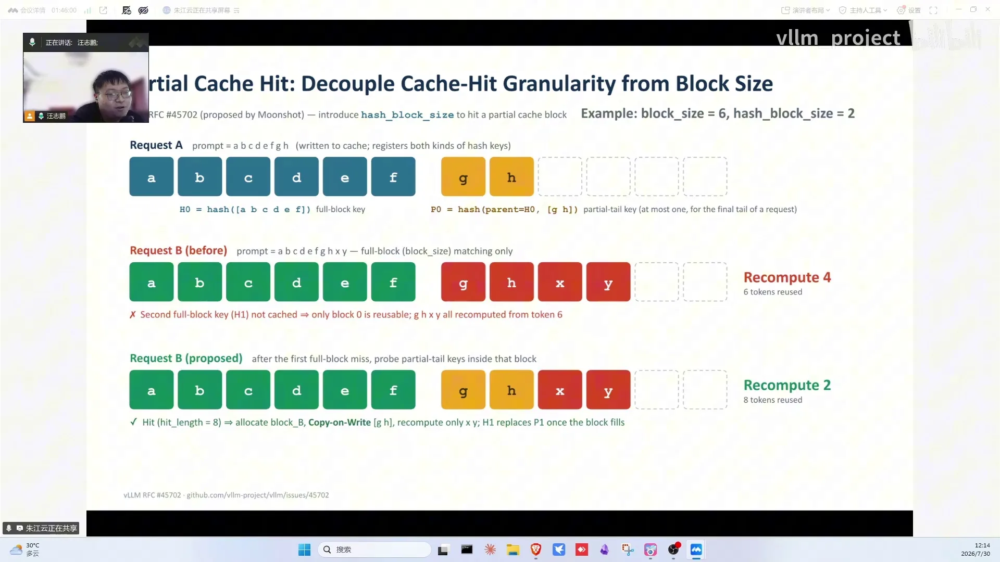 |
| prefix block 和实际 block 大小解耦后，实际运行中有自适应机制吗？——现在应该没有。——有同学问：插入 PDL 的位置怎么确认？反复测试的结果对吗？——啥意思你再说一遍。——插入 PDL 的位置怎么确定？——永夜可以回答：插入 PDL 的话，比如上一个 kernel 的输出…… [【跳转到 71:25】](https://www.bilibili.com/video/BV11z3m63ECo/?t=4285) | 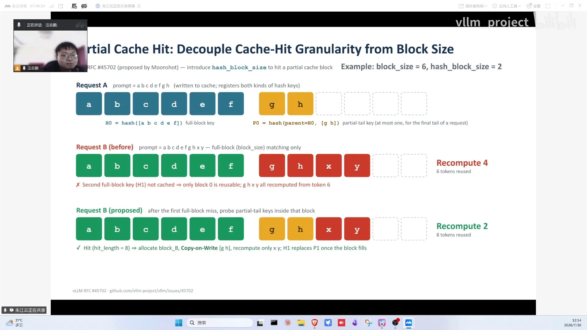 |
| （接上） [【跳转到 71:50】](https://www.bilibili.com/video/BV11z3m63ECo/?t=4310) |  |
| 跟你现在这段 kernel 的输入有依赖性的话，就在本身 kernel 读取依赖数据之前插入 PDL 就可以了。——这么做正确性可以保证，但性能方面可能需要测一下：因为插入 PDL 后有一部分 kernel 运行跟前一部分 kernel 重叠，如果计算资源比较少…… [【跳转到 72:15】](https://www.bilibili.com/video/BV11z3m63ECo/?t=4335) | 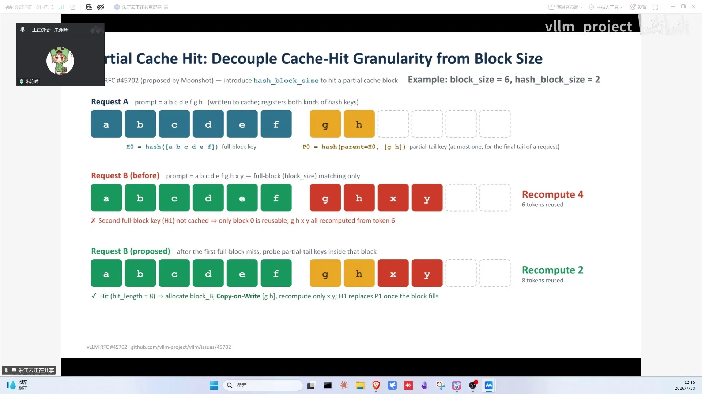 |
| （接上） [【跳转到 72:40】](https://www.bilibili.com/video/BV11z3m63ECo/?t=4360) | 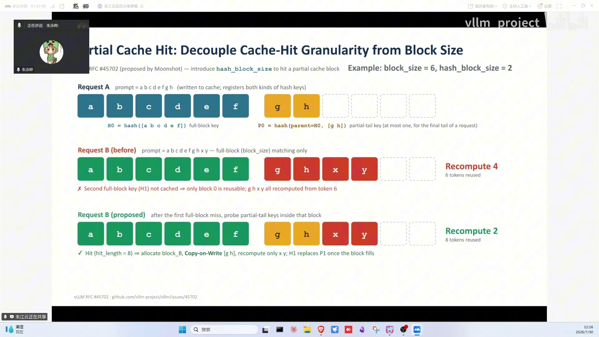 |
| 重叠可能会把前一个 kernel 的速度降低，两个加起来可能速度会降。正确性的话只要在读取依赖数据之前插入就行，性能的话具体问题具体分析。好…… [【跳转到 73:05】](https://www.bilibili.com/video/BV11z3m63ECo/?t=4385) |  |
| 有同学问：index 是不是在 kernel 内计算的？——对，是在 kernel 内计算。但这些 index 本身不依赖于你需要读取的数据：比如我自己是哪一个 thread block…… [【跳转到 73:30】](https://www.bilibili.com/video/BV11z3m63ECo/?t=4410) |  |
| 我是哪一个 thread、应该去读哪些位置的数据——这些可以提前算出来。做 PDL 时后面一个 kernel launch 上去时，可以先把数据全都算出来，再去读实际的上一个 kernel 的输出。不知道有没有回答这个问题。 [【跳转到 73:55】](https://www.bilibili.com/video/BV11z3m63ECo/?t=4435) |  |
| （接上） [【跳转到 74:20】](https://www.bilibili.com/video/BV11z3m63ECo/?t=4460) | 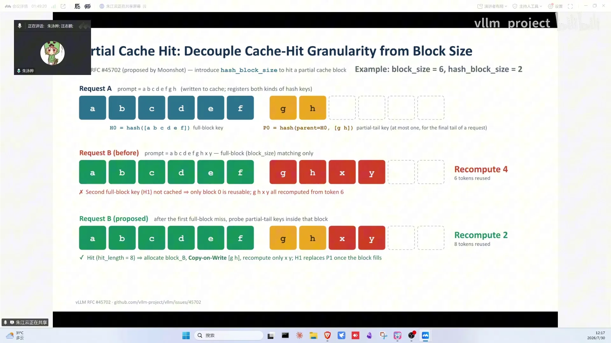 |
| （接上） [【跳转到 74:25】](https://www.bilibili.com/video/BV11z3m63ECo/?t=4465) | 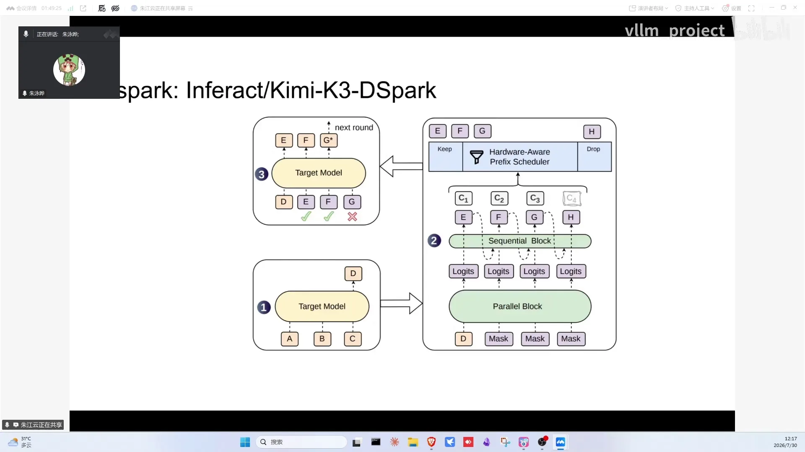 |
| overlap 掉没有数据依赖的，做一次同步再继续执行有依赖的，就这个意思。对对对。然后有同学问：K3 实现图像视频多模态理解时，与 K2.5 两者适配层面有啥核心差异？——这次 VIT 应该和之前的没有什么区别。我扫了下代码，有一点改动，但代码逻辑上没有很大变化。感兴趣可以用 AI 扫一下这块代码。 [【跳转到 74:30】](https://www.bilibili.com/video/BV11z3m63ECo/?t=4470) | 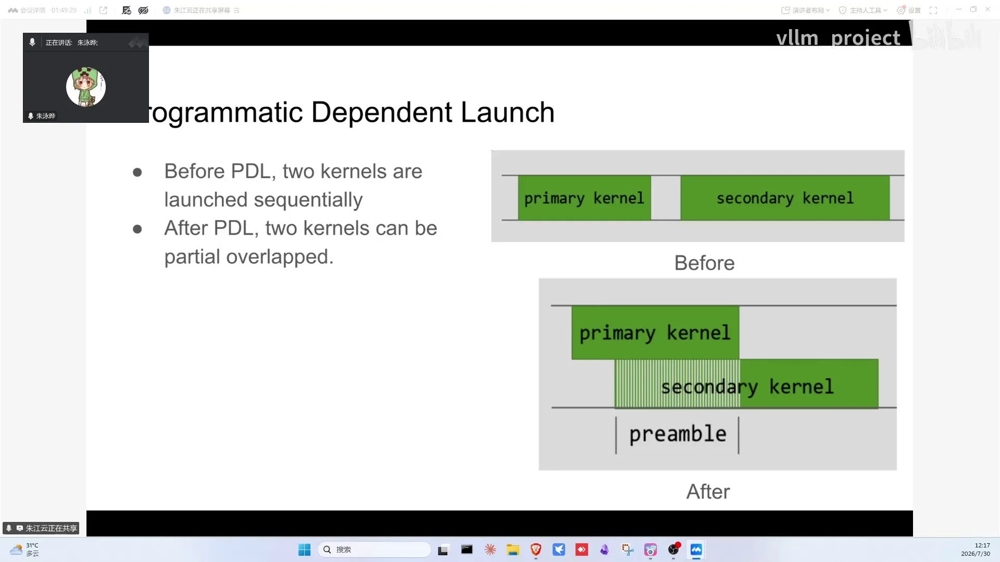 |
| （接上） [【跳转到 74:55】](https://www.bilibili.com/video/BV11z3m63ECo/?t=4495) | 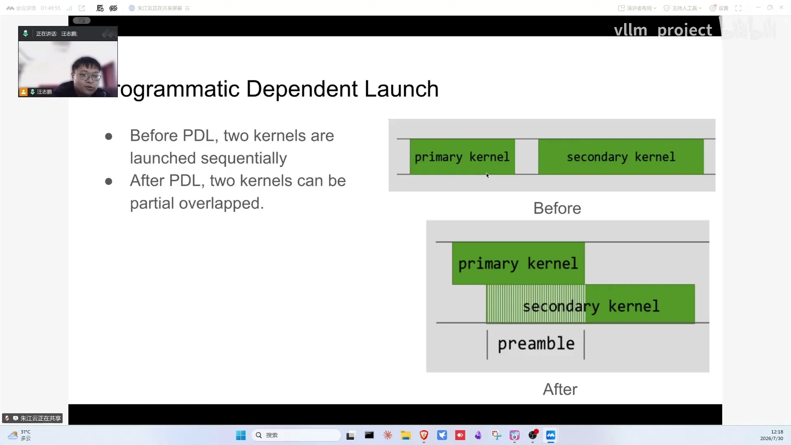 |
| 我记得还是有一点改动的，不过没仔细看。然后有同学问：我记得原本的 MoE 也有 down projection 和 up projection，这个和 latent 有什么区别吗？——可以放个图。第一张图…… [【跳转到 75:20】](https://www.bilibili.com/video/BV11z3m63ECo/?t=4520) | 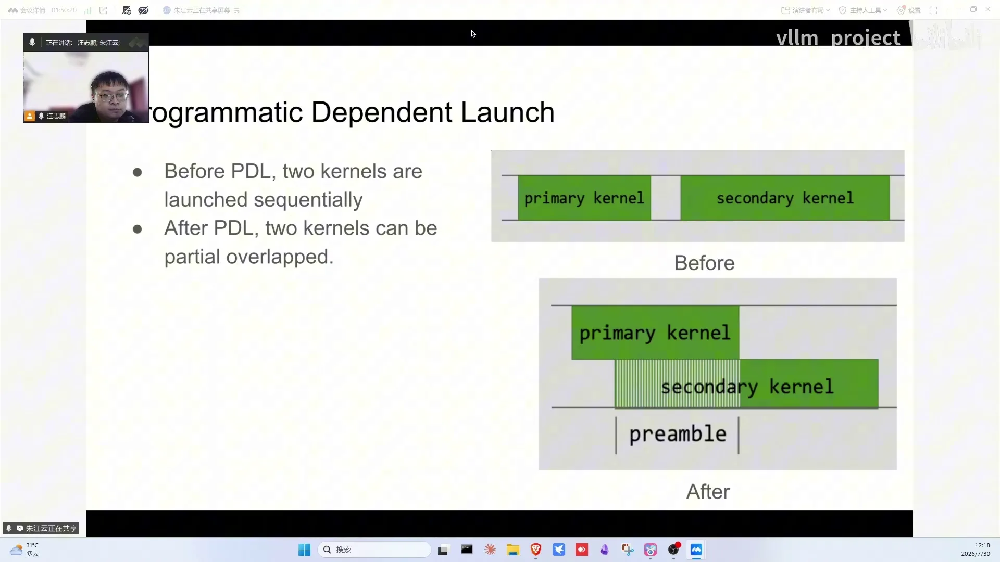 |
| 这个 latent 的 up/down projection 是包在外面的；MoE 本身的 up/down projection 就是里面的 expert——里面这个 expert 包含一个 up 和一个 down。里面的 up/down 是中间状态的维度。外面这个 latent 降的是 hidden state 的维度，所以两边维度不一样…… [【跳转到 75:41】](https://www.bilibili.com/video/BV11z3m63ECo/?t=4541) | 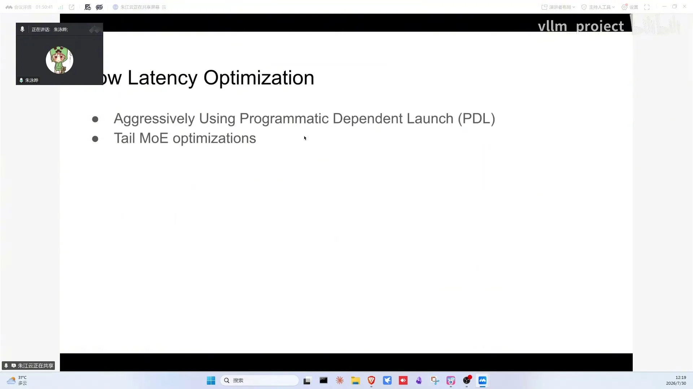 |
| （接上） [【跳转到 76:06】](https://www.bilibili.com/video/BV11z3m63ECo/?t=4566) | 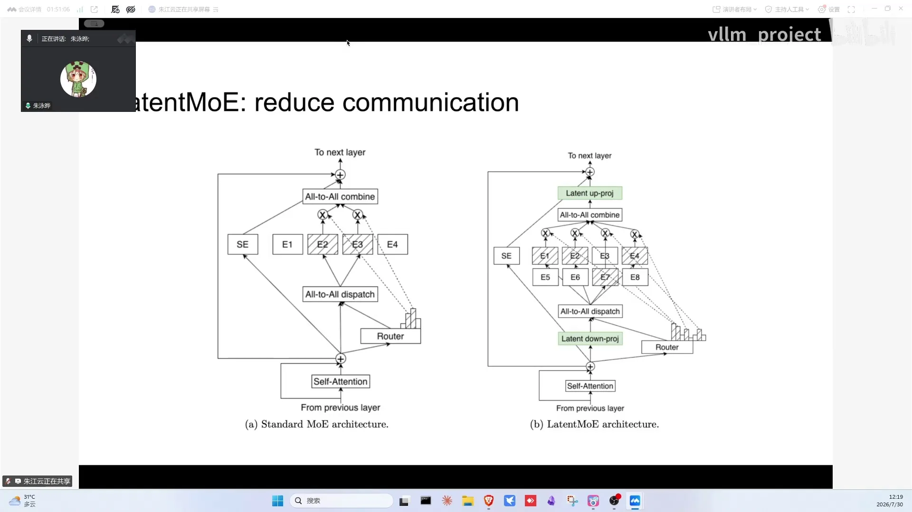 |
| 这样做的好处是减小计算量和通信：通信时刚开始需要把大维度的数据传来传去，降维之后每个 token 传的数据就小很多。计算量也是：维度小了，矩阵乘的运算量就小。——有同学问：这里 reduce-scatter 在多并发好像不管用了吧？比如用户数大于 8。——我觉得 reduce-scatter 这个想法没有问题…… [【跳转到 76:31】](https://www.bilibili.com/video/BV11z3m63ECo/?t=4591) | 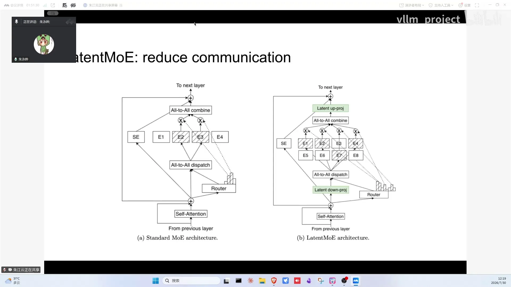 |
| （接上） [【跳转到 76:56】](https://www.bilibili.com/video/BV11z3m63ECo/?t=4616) |  |
| 主要做的是把 latent 的 up projection 本来重复计算的部分省掉：每个 GPU 重复计算相同的矩阵值。用了 reduce-scatter 优化后，每个 rank 只算它必要的数据。对于 scatter 本身，看算法：数据量小有数据量小的算法，数据量大有数据量大的算法。——有同学问：如果不整除会有 padding 吗？——不整除是矩阵乘的维度不整除，会有（处理）。但现在面对的大部分维度至少 8 是可以整除的。——博客地址可以直接搜（vllm blog）…… [【跳转到 77:21】](https://www.bilibili.com/video/BV11z3m63ECo/?t=4641) | 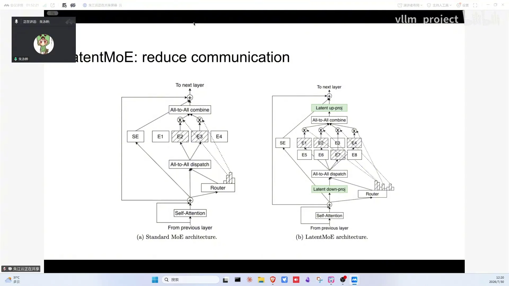 |
| （接上） [【跳转到 77:46】](https://www.bilibili.com/video/BV11z3m63ECo/?t=4666) | 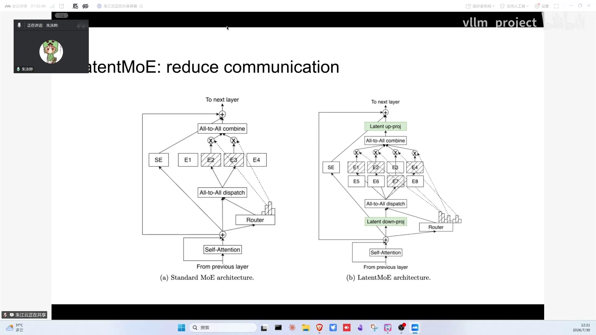 |
| （接上） [【跳转到 78:11】](https://www.bilibili.com/video/BV11z3m63ECo/?t=4691) |  |
| 搜索就可以看到 K3 基本是最上面的两条博客。有同学问：H 系列的卡能用到上述的什么算子优化？——上述讲的 H 卡应该都可以用，因为我们没有用什么 B 卡特有的 feature。——然后 H 卡的话…… [【跳转到 78:36】](https://www.bilibili.com/video/BV11z3m63ECo/?t=4716) | 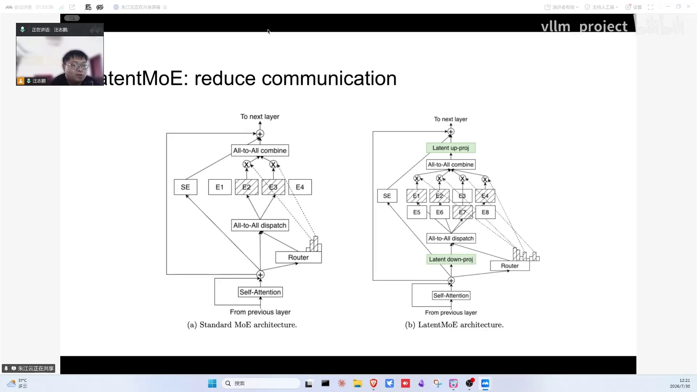 |
| （此区间无字幕） [【跳转到 79:01】](https://www.bilibili.com/video/BV11z3m63ECo/?t=4741) | 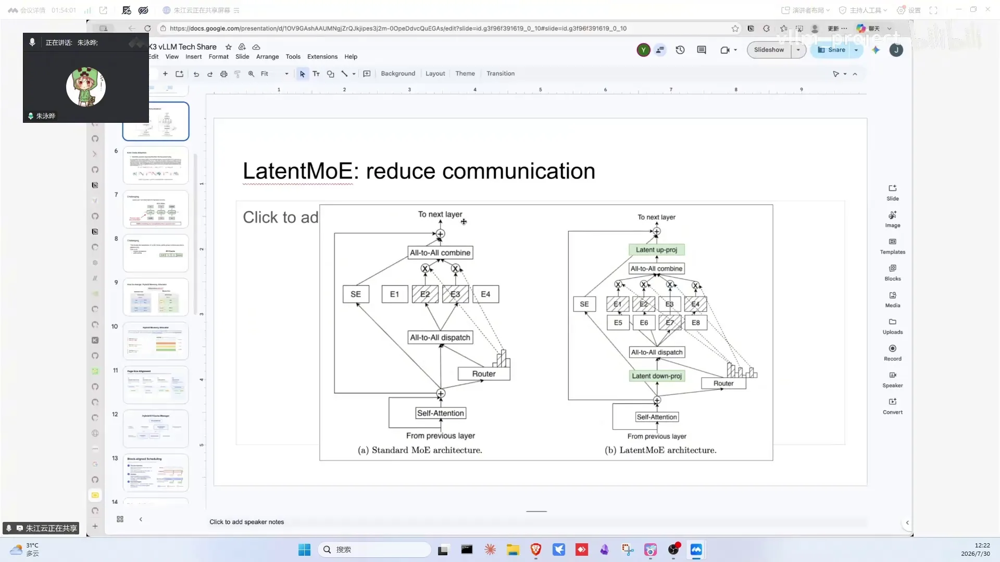 |
| （此区间无字幕） [【跳转到 79:06】](https://www.bilibili.com/video/BV11z3m63ECo/?t=4746) | 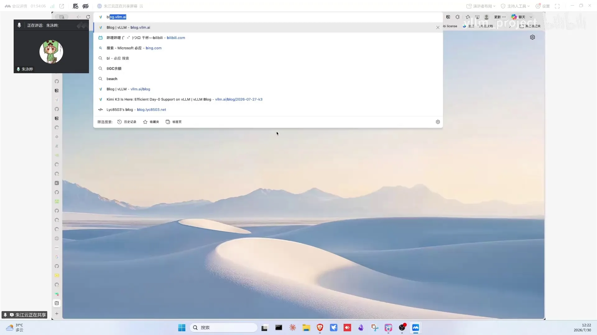 |
| 大家可以搜索 vllm.ai/blog，可以看到我们的博客，整体质量都挺高的。感兴趣可以收藏起来，有更新就看一下。 [【跳转到 79:11】](https://www.bilibili.com/video/BV11z3m63ECo/?t=4751) | 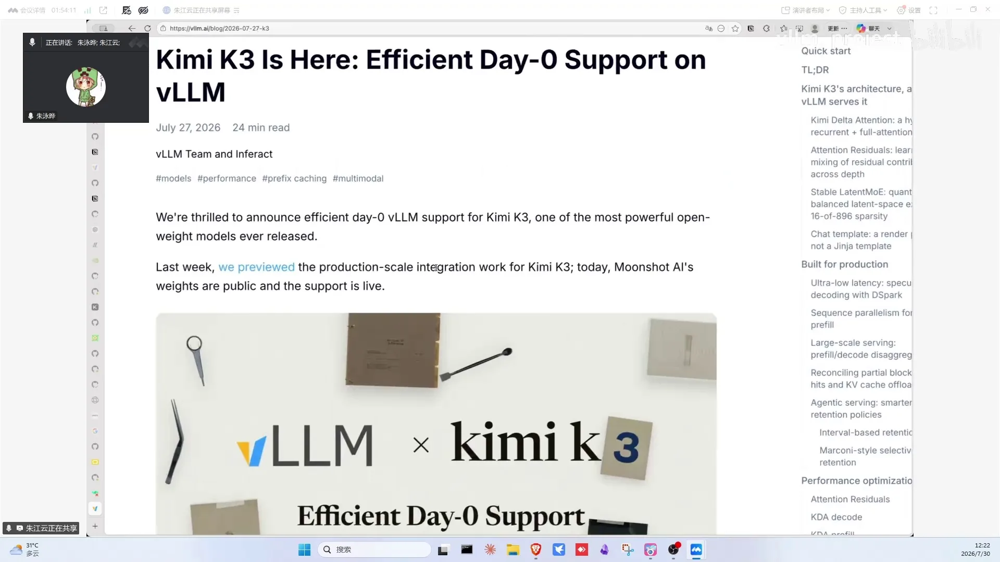 |
| （接上） [【跳转到 79:16】](https://www.bilibili.com/video/BV11z3m63ECo/?t=4756) | 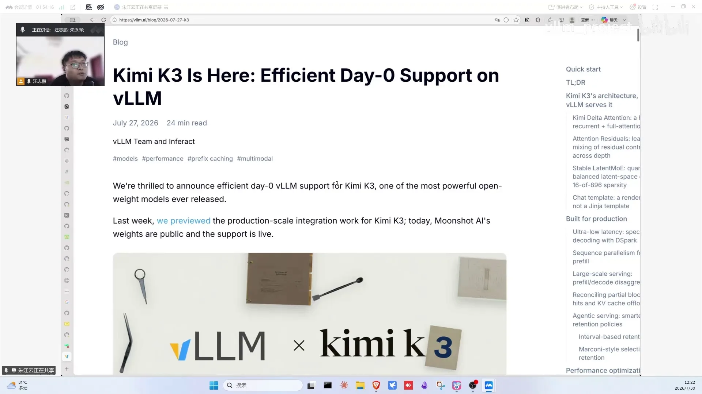 |
| 有同学问：K3 的 DSpark…… [【跳转到 79:29】](https://www.bilibili.com/video/BV11z3m63ECo/?t=4769) | 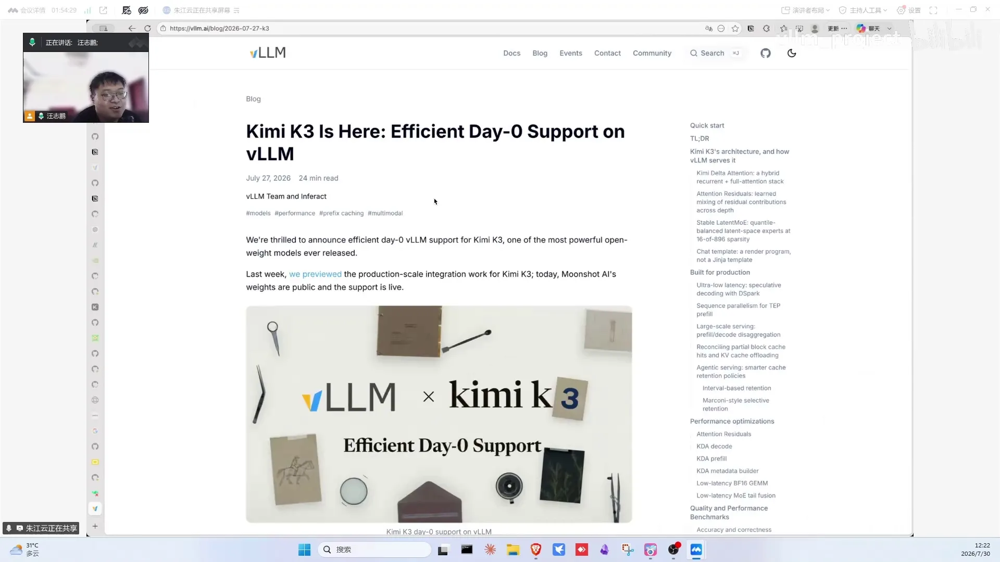 |
| 有针对视频的加速吗？——我理解是视频的理解吧？——视频没有：开源的 K3 没有视频。——开源版没有？或者我有点忘了：vLLM 是支持把视频切片成图片喂进去的，我有点忘了。——对。这是我们 recipe 的地址。这点我也想说：所有的视频理解都是把视频抽帧做成连续的图像理解，因为视频没办法直接编码…… [【跳转到 79:36】](https://www.bilibili.com/video/BV11z3m63ECo/?t=4776) | 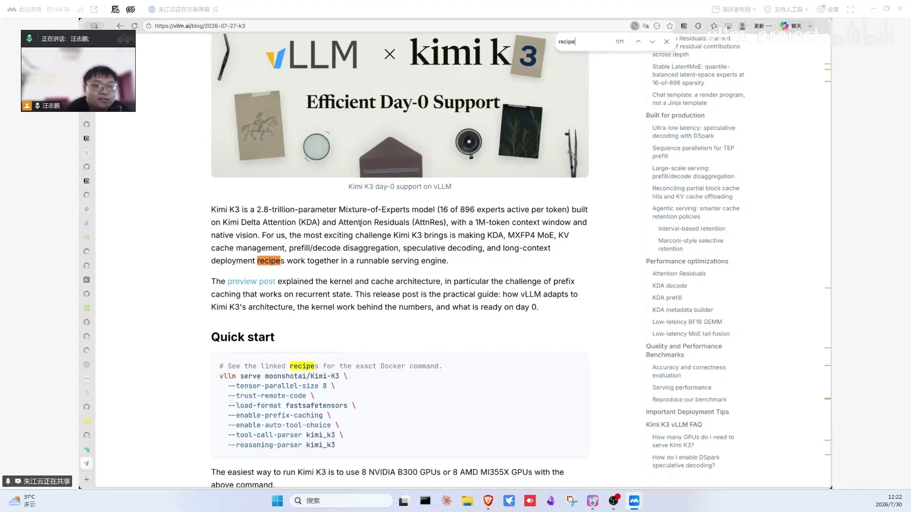 |
| （接上） [【跳转到 79:46】](https://www.bilibili.com/video/BV11z3m63ECo/?t=4786) | 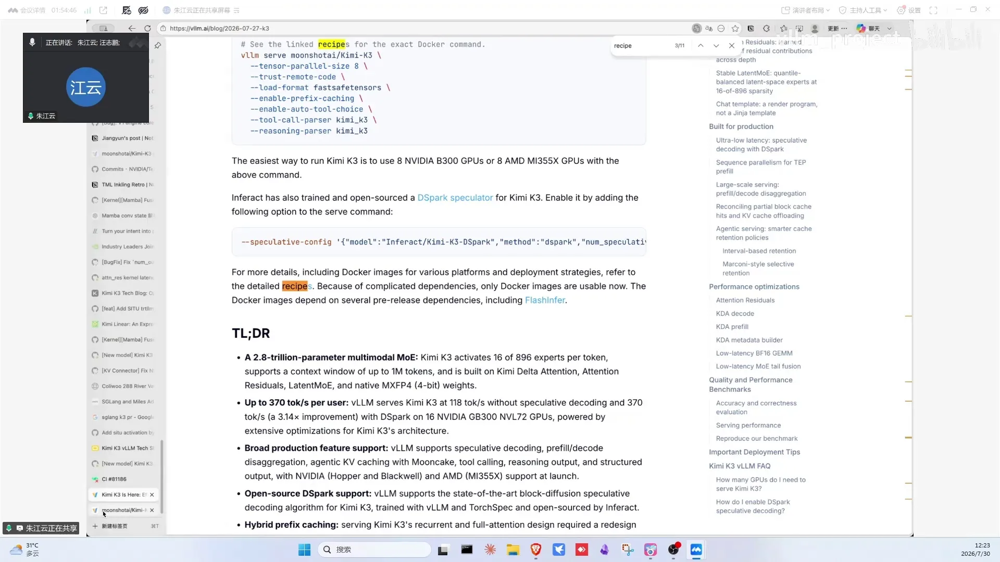 |
| 还有：不管做什么理解，主要都是在 prefill 阶段操作。prefill 阶段 DSpark 是没有办法生效的：DSpark 都是做 decode 的收益。然后推销一下我们的 recipe 网站，做得非常好：可以选不同的硬件——GB300、B300 都验证过（绿色的表示已验证）。有不同需求，比如做 TP 就选 TP；做 DP 就选 DP+EP；想用我们训出来的 DSpark 就选上 spec decoding，它就会告诉你加这些参数。所有其他模型都这样，提供非常多可配置的交互选项。——这些网站地址都会在直播回放里贴出来。——有同学问：vLLM 新 feature 上线如何保证一致性？ [【跳转到 80:11】](https://www.bilibili.com/video/BV11z3m63ECo/?t=4811) | 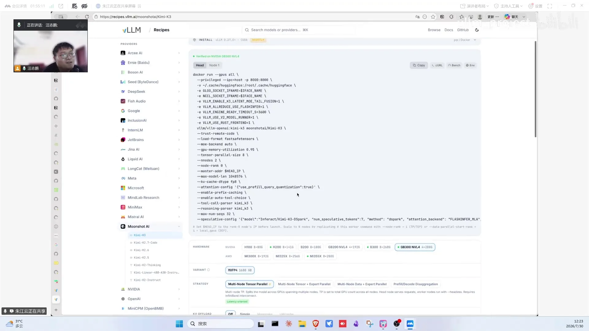 |
| （接上） [【跳转到 80:36】](https://www.bilibili.com/video/BV11z3m63ECo/?t=4836) | 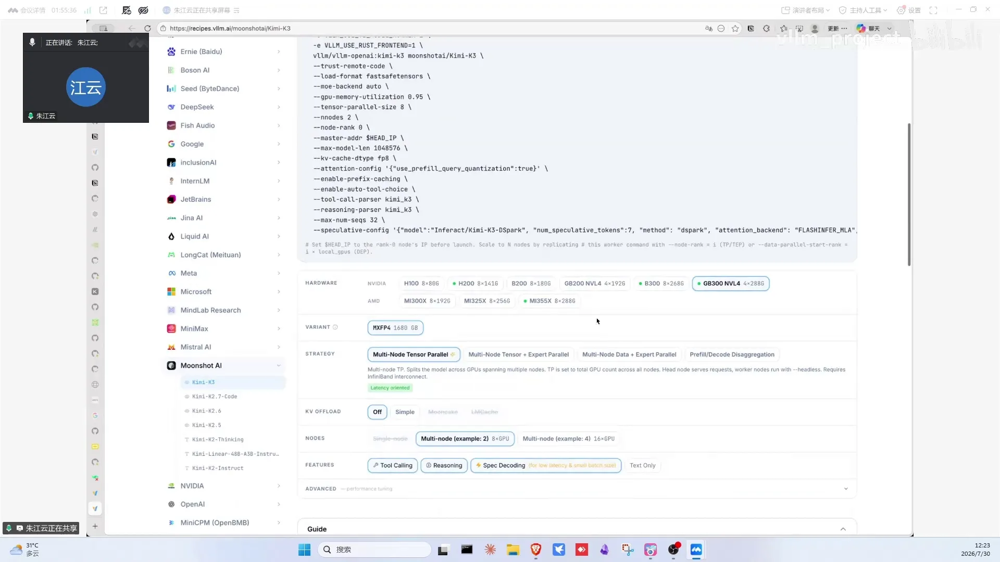 |
| （接上） [【跳转到 81:01】](https://www.bilibili.com/video/BV11z3m63ECo/?t=4861) | 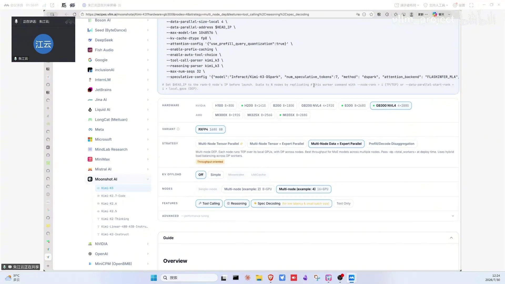 |
| 这是什么意思？我也没理解。然后有同学问：请问现在（镜像）是指能 build 好的 docker 吗？——是的。因为我们还有一些依赖问题：比如依赖 FlashInfer 的修改还没有完全 ready。但这两天应该就可以，把 PR 合进去之后…… [【跳转到 81:26】](https://www.bilibili.com/video/BV11z3m63ECo/?t=4886) | 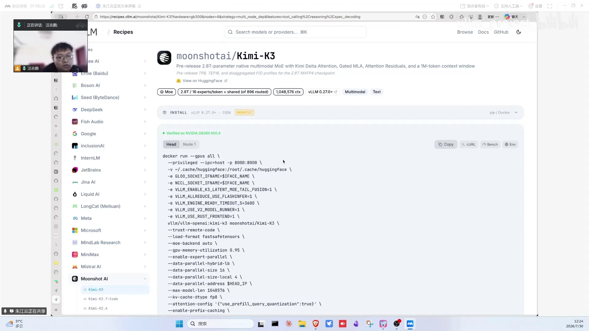 |
| 可以给大家提供一个新的 image 或者 nightly 版本。——有问：推理 MoE 都是走 TP 吗不走 EP？——具体情况具体讨论：需要小并发快速就走 TP…… [【跳转到 81:51】](https://www.bilibili.com/video/BV11z3m63ECo/?t=4911) | 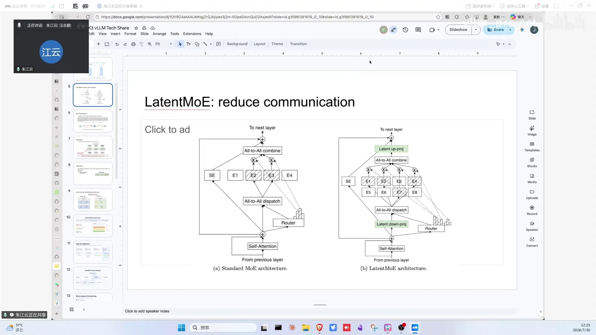 |
| 要走中并发或大并发就走 EP。对。——有同学问：能够 build vLLM from source 吗？现在依赖比较复杂，做的话可以做但安装起来比较复杂。问的是哪个 commit…… [【跳转到 82:13】](https://www.bilibili.com/video/BV11z3m63ECo/?t=4933) | 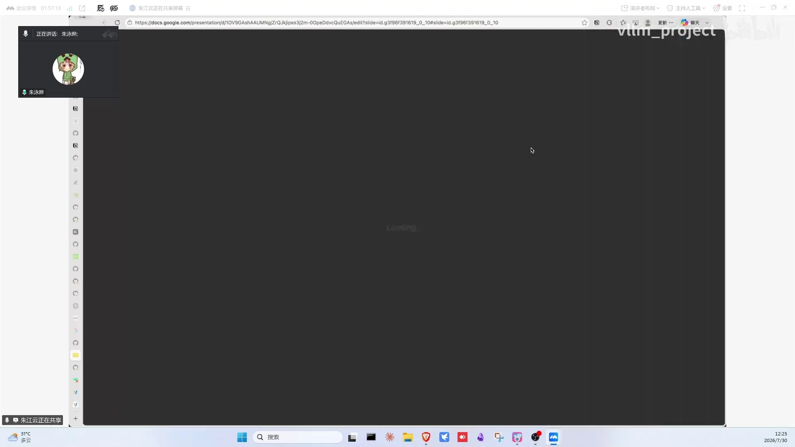 |
| （接上） [【跳转到 82:18】](https://www.bilibili.com/video/BV11z3m63ECo/?t=4938) |  |
| 现在主要的瓶颈是依赖一个 FlashInfer 的 PR，有些已合并有些还没有，总之没办法比较丝滑地运行，所以我们提供镜像。——问的是哪个 commit？——5 万这个 commit，数字很好找，直接搜就可以搜到。 [【跳转到 82:43】](https://www.bilibili.com/video/BV11z3m63ECo/?t=4963) |  |
| 在 B300 多并发情况下解码总吞吐量最高能达到多少？——好像还真没测过。我想想：总并发我觉得 8000 至少，每个 GPU 至少 1000 吧。——对。 [【跳转到 83:08】](https://www.bilibili.com/video/BV11z3m63ECo/?t=4988) | 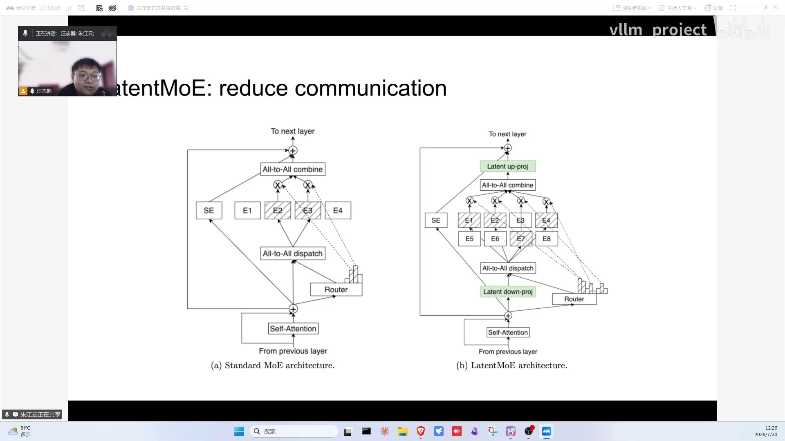 |
| 测了之后可以把结果贴出来。然后"有限的吞吐加超贵的 B300 这个服务真的能回本吗？"——我觉得…… [【跳转到 83:33】](https://www.bilibili.com/video/BV11z3m63ECo/?t=5013) |  |
| 我们做这些东西并不是为了上线服务必须：主要是探索我们到底能跑多快。这些优化不是针对这个模型做的，别的模型有类似情况也可以直接复用或学习做类似优化。 [【跳转到 83:58】](https://www.bilibili.com/video/BV11z3m63ECo/?t=5038) |  |
| 能不能回本是月之暗面同学需要考虑的问题，他们肯定会针对自己的场景做更细致的优化。vLLM 很大程度上是给大家打个样。如果公司想靠部署这个回本，可能需要请很多专业的 infra 工程师做针对模型的特定场景优化。——有同学问：DSpark 什么时候会启用呢？随着 batch 增加加速效果会掉得明显吗？——从原理上说肯定，具体阈值需要根据自己的机器和负载测。这个也是 DSpark 的接受率…… [【跳转到 84:23】](https://www.bilibili.com/video/BV11z3m63ECo/?t=5063) |  |
| （接上） [【跳转到 84:48】](https://www.bilibili.com/video/BV11z3m63ECo/?t=5088) |  |
| 随着不同的数据集也有变化。上一期直播专门讲了 DSpark：batch 变大时 draft 的 token 数量也需要相应减少。海伦老师专门讲了阈值，有经验公式，可以看上期直播。 [【跳转到 85:13】](https://www.bilibili.com/video/BV11z3m63ECo/?t=5113) | 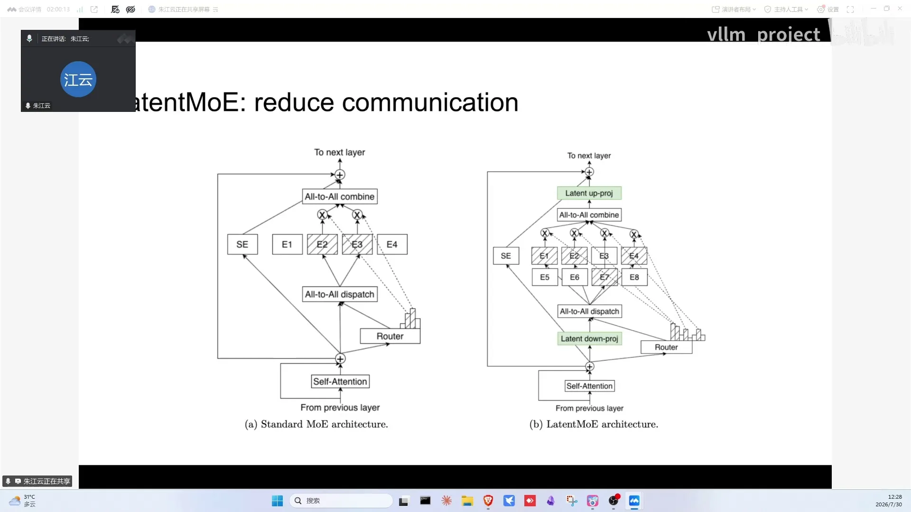 |
| 有同学问：刚提到小 batch 下有一个矩阵乘的算子优化，已经合入 vLLM 了吗？——跟 PR 5 万一起合。OK，那个 kernel 应该已经合了。——对对。 [【跳转到 85:38】](https://www.bilibili.com/video/BV11z3m63ECo/?t=5138) | 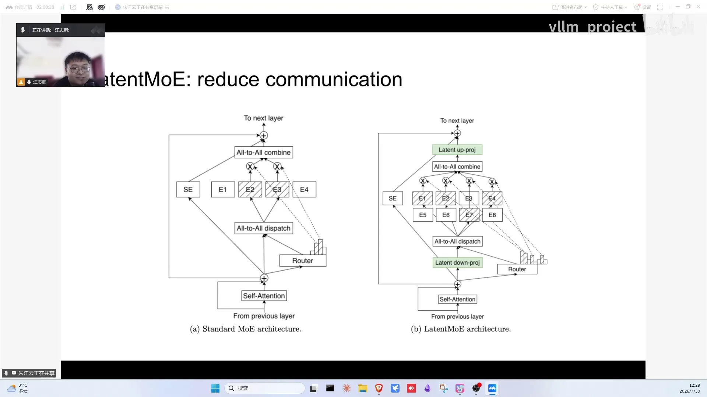 |
| 有同学问：小并发是指 batch 比较小还是 batch×sequence length 比较小？——batch 比较小。——OK。然后部署的时候 PP/EP/TP 如何选择才能达到最优的单样本吞吐？——我觉得指的应该是 latency：比如很多用户时，对某一个用户来讲用户体验最好。那 OK，一句话说还是具体问题具体分析。比如针对 K3，模型非常大：每个 GPU 跑两三个 request，跑着跑着 KV cache 可能就满了。这时主要压力还是在 KV cache：尽量保证存权重不需要重复存，用 TP 会好很多。 [【跳转到 86:03】](https://www.bilibili.com/video/BV11z3m63ECo/?t=5163) | 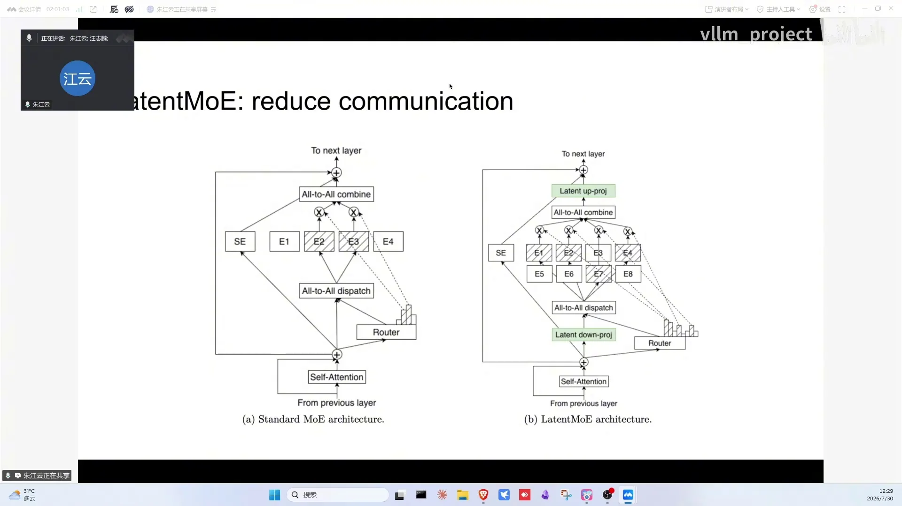 |
| ppepeTP如何选择才能达到最优的单样本batch吞吐单样本batch吞吐是什么意思单GPU吗呃我觉得应该哦我觉得他这个应该指的是这个latency吧对吧就是比如说我有很多用户的话 [【跳转到 86:28】](https://www.bilibili.com/video/BV11z3m63ECo/?t=5188) | 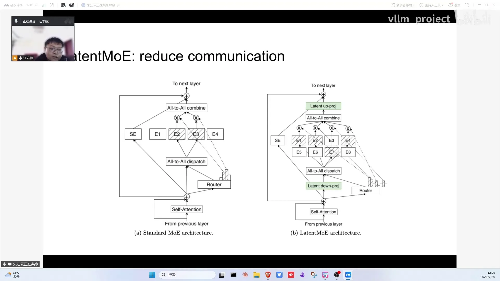 |
| （接上） [【跳转到 86:53】](https://www.bilibili.com/video/BV11z3m63ECo/?t=5213) |  |
| （接上） [【跳转到 87:18】](https://www.bilibili.com/video/BV11z3m63ECo/?t=5238) | 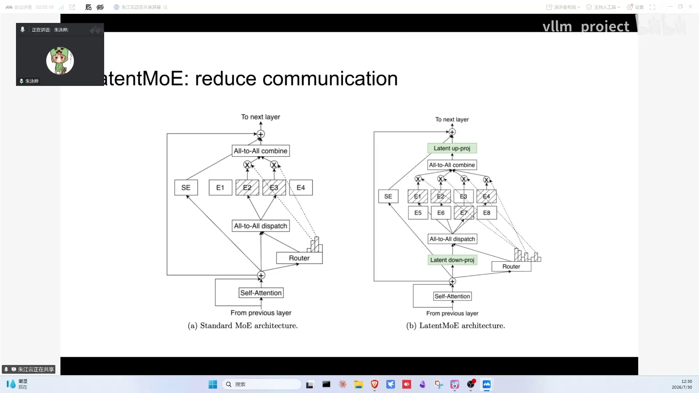 |
| 如果 GPU 数量上去了、吞吐稍微涨一点，TP 本身可能就没有那么有吸引力：卡多了做集合通信的通信量会大很多，这时可能要用 EP 之类的优化减少通信量。——然后其实还有另一个：我们还做了 DCP 的支持。K3 都是 MLA，跑 TP 时每个 rank 都得重复存 KV cache；有 DCP 支持之后可以不重复存，也可以增加并发。 [【跳转到 87:43】](https://www.bilibili.com/video/BV11z3m63ECo/?t=5263) |  |
| （接上） [【跳转到 88:08】](https://www.bilibili.com/video/BV11z3m63ECo/?t=5288) | 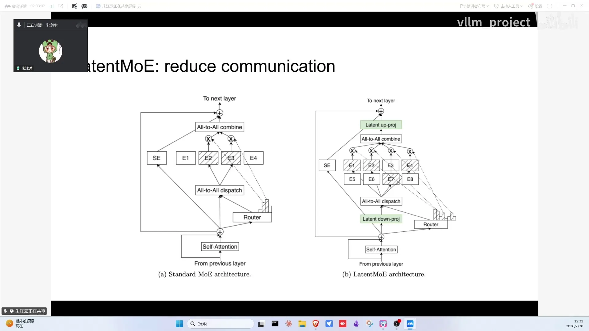 |
| （接上） [【跳转到 88:33】](https://www.bilibili.com/video/BV11z3m63ECo/?t=5313) |  |
| 有同学问：单并发 110 token 每秒，在 1M 序列情况下会衰减到多少？——还没测这么长的。但我觉得可能不会减太多：只有跑 MLA 的时候会慢很多，这个模型大部分四分之三是 KDA，KDA 做 decode 应该非常快，不会根据序列大小影响速度。有同学说根据 recipe 对 GLM5.2 开的 DSpark，结果发现单并发性能不如 MTP？——不知道用的是什么版本训出来的。理论上讲 spec decode 一般会比 MTP 快一些，肯定还是看测试集：写代码输出好预测，写作文输出不好预测，差异很大。 [【跳转到 88:58】](https://www.bilibili.com/video/BV11z3m63ECo/?t=5338) |  |
| （接上） [【跳转到 89:23】](https://www.bilibili.com/video/BV11z3m63ECo/?t=5363) | 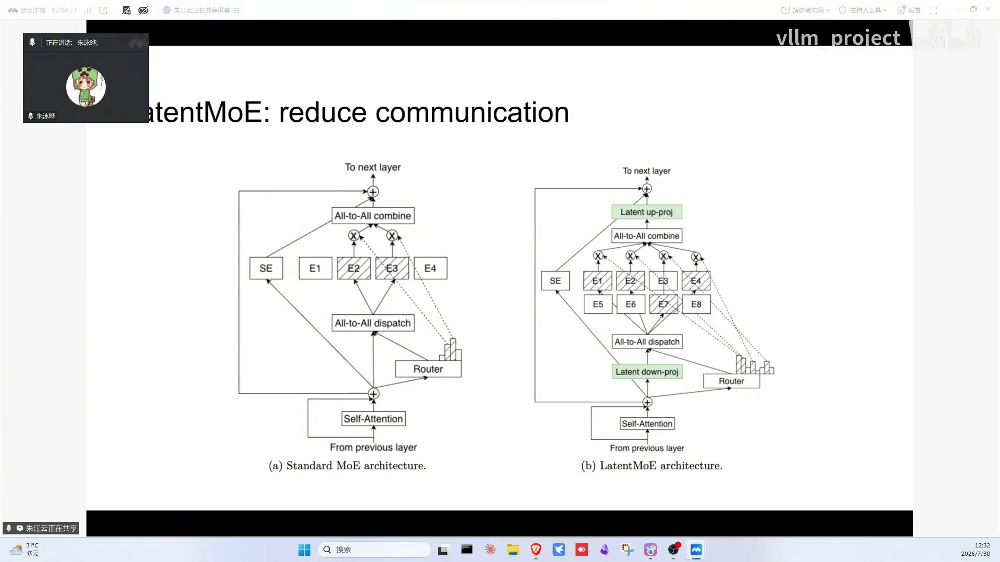 |
| （接上） [【跳转到 89:48】](https://www.bilibili.com/video/BV11z3m63ECo/?t=5388) | 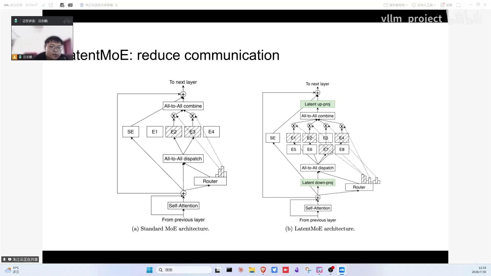 |
| （接上） [【跳转到 90:13】](https://www.bilibili.com/video/BV11z3m63ECo/?t=5413) | 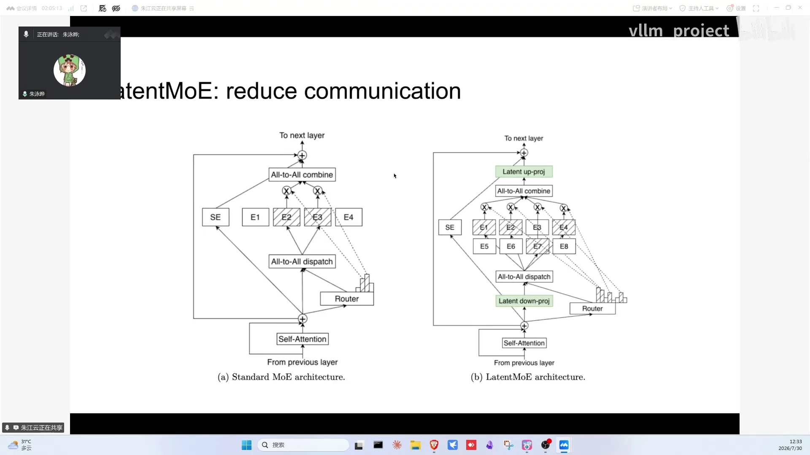 |
| 回答最后一个问题。——千问三 Omni 我试了加 DSpark 和 MTP 一起开，GLM5.2 也许可以？——这两个可以一起开吗？ [【跳转到 90:28】](https://www.bilibili.com/video/BV11z3m63ECo/?t=5428) | 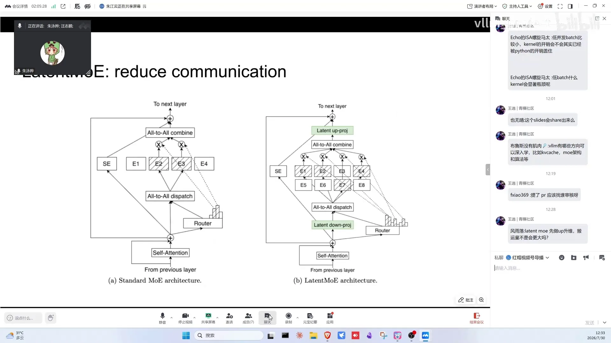 |
| （此区间无字幕） [【跳转到 90:53】](https://www.bilibili.com/video/BV11z3m63ECo/?t=5453) | 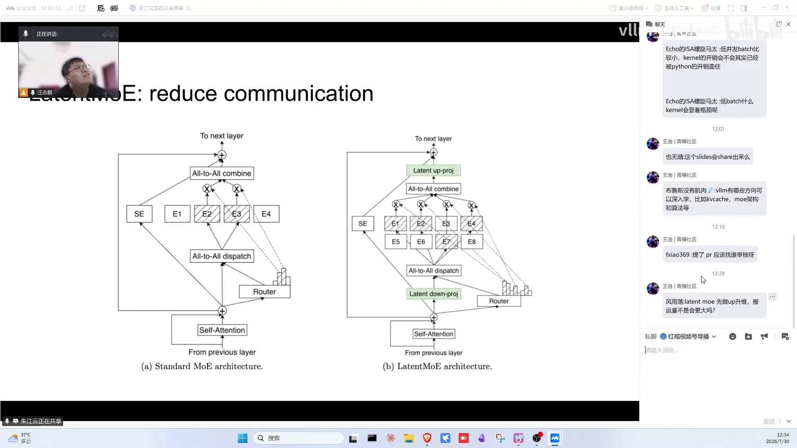 |
| 这一点我觉得很（值得期待）吧。这个地方大家可以去尝试，我也没有试过，应该要改一下代码。我看今天也差不多了，非常感谢永夜老师和嘉文老师来我们直播间做的分享。K3 模型确实是一个划时代意义的模型：可以算是第二个 DeepSeek 时刻。非常感谢（月之暗面）团队的开源，也感谢 vLLM 社区对这个模型做的 day0 支持。我们每周六——但这周六没有——后面每周六也会有 vLLM 相关的技术分享，感兴趣的同学给我们频道点个关注…… [【跳转到 90:58】](https://www.bilibili.com/video/BV11z3m63ECo/?t=5458) | 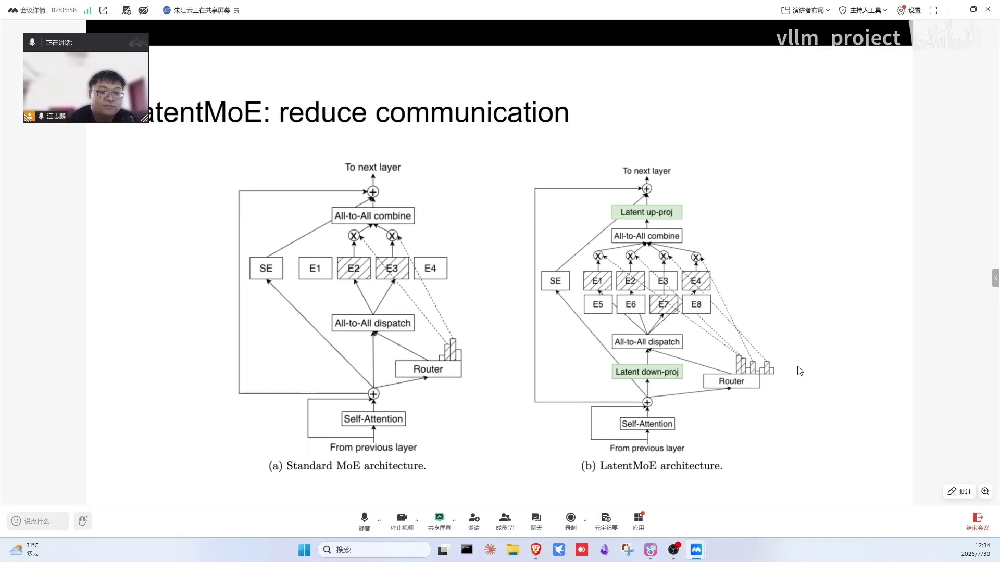 |
| 这个地方我觉得大家可以去尝试一下子因为这个地方我其实我也没有去试过这块应该要改改改一下代码的好然后呃我看今天谁也差不多了非常感谢永夜老师和姜云老师来我们直播间做的分享然后这个K3模型确实是一个 [【跳转到 91:04】](https://www.bilibili.com/video/BV11z3m63ECo/?t=5464) | 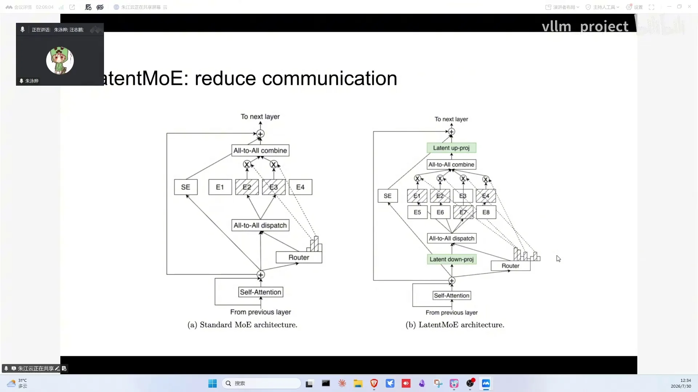 |
| （接上） [【跳转到 91:29】](https://www.bilibili.com/video/BV11z3m63ECo/?t=5489) | 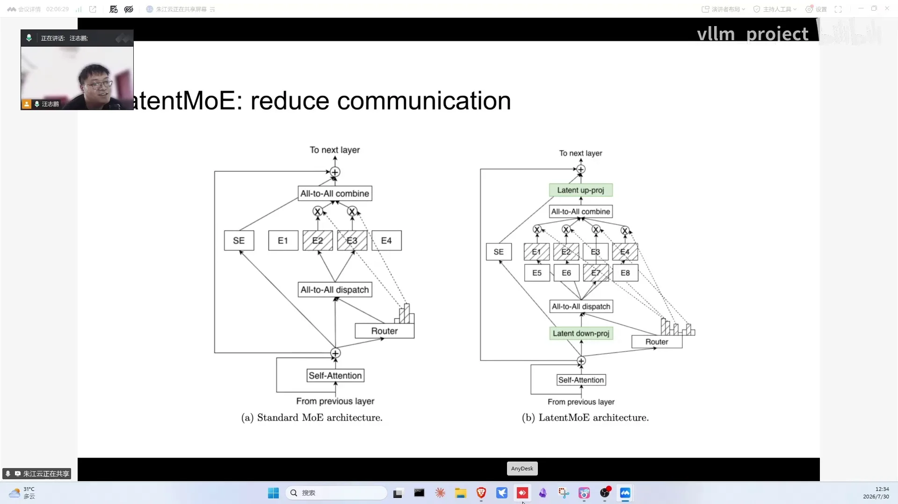 |
| 下周六同一时间 11 点钟还会有新的技术分享。今天直播就到此结束了。感谢各位参加，感谢志鹏老师邀请，感谢大家的捧场，也感谢团队其他同学做出的贡献。好，拜拜拜拜。 [【跳转到 91:54】](https://www.bilibili.com/video/BV11z3m63ECo/?t=5514) | 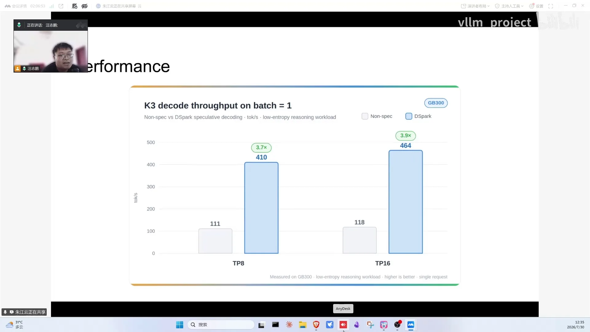 |
| 那我们拜拜拜拜拜拜。 [【跳转到 92:19】](https://www.bilibili.com/video/BV11z3m63ECo/?t=5539) |  |
| （此区间无字幕） [【跳转到 92:29】](https://www.bilibili.com/video/BV11z3m63ECo/?t=5549) | 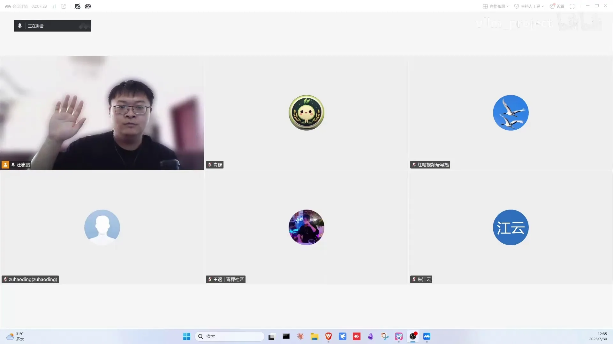 |