# vLLM-Omni day-0 MiniMax H3支持：探索最强视频生成模型推理的极限 原始文稿（图-字幕分栏）

| 字幕文本 | 画面 |
| :--- | ---: |
| 也可以好，可以。那我们现在看今天（的主题）。我先简单介绍一下：今天的嘉宾子枫也是我们第一期的嘉宾，他现在在 INFX 的工作也是这一次 MiniMax H3 的主要支持贡献者。今天很荣幸邀请到子枫…… [【跳转到 00:00】](https://www.bilibili.com/video/BV1xmuT6dE1M/?t=0) | 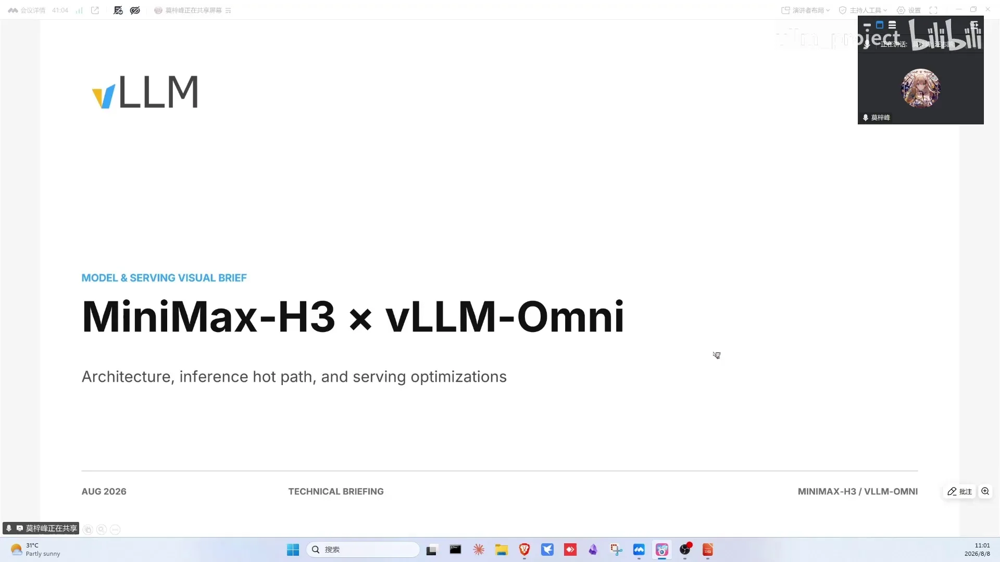 |
| 来给我们介绍这个模型。——不是主要供（大家）玩吧，你们优化都是社区的人做的，我只是拉了个草稿过来。——都差不多吧。反正我当时说不要，他能跑通就完事了，要跑得快肯定还是靠（社区）。因为我们时间比较紧张…… [【跳转到 00:25】](https://www.bilibili.com/video/BV1xmuT6dE1M/?t=25) | 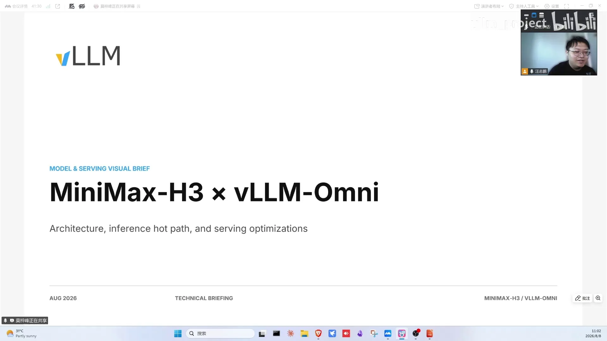 |
| 做 day0 支持时主要目标是为了跑通。过去不到一周时间里我们也做了很多优化，性能比 day0 时有了显著提升，今天直播也会讲这块。现在介绍 H3 的架构…… [【跳转到 00:50】](https://www.bilibili.com/video/BV1xmuT6dE1M/?t=50) | 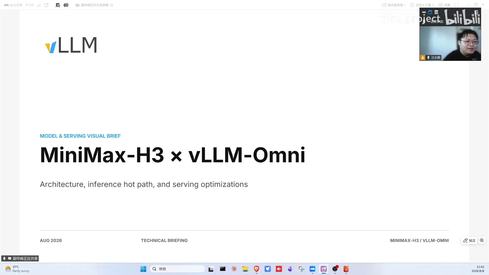 |
| 熟悉音视频生成的同学知道，一般音视频生成分成两个（部分）：一个给视频生成用、一个用来生成 audio。MiniMax H3 有个很大的特点：下面这块它的 audio DiT 是不区分的——音频跟视频的 DiT，音频合成跟视频（生成）共享一个 diffusion 部分。它的 encoder 是一个 Qwen3-VL…… [【跳转到 01:10】](https://www.bilibili.com/video/BV1xmuT6dE1M/?t=70) |  |
| 把文本塞进去以后，视频的 token 跟 audio 的 token 直接拼接塞进去。经过去噪过程以后，分别输出到两种 VAE 里，生成一个完整的视频和音频轨道。以前的（方案）肯定分成两个部分嘛，但 H3 有个特点：看它的模型仓库…… [【跳转到 01:35】](https://www.bilibili.com/video/BV1xmuT6dE1M/?t=95) | 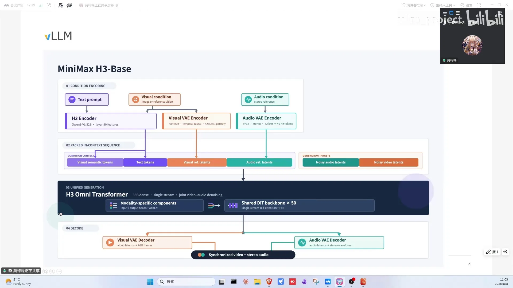 |
| 它有两套权重，区别是分别对应不同任务——平时的模型是两套权重对应不同模态，这次是对应两个不同的任务：像文本生成（视频）音频这样子。——里面没有声音了？——没有声音，我微信（说）不清楚…… [【跳转到 02:00】](https://www.bilibili.com/video/BV1xmuT6dE1M/?t=120) | 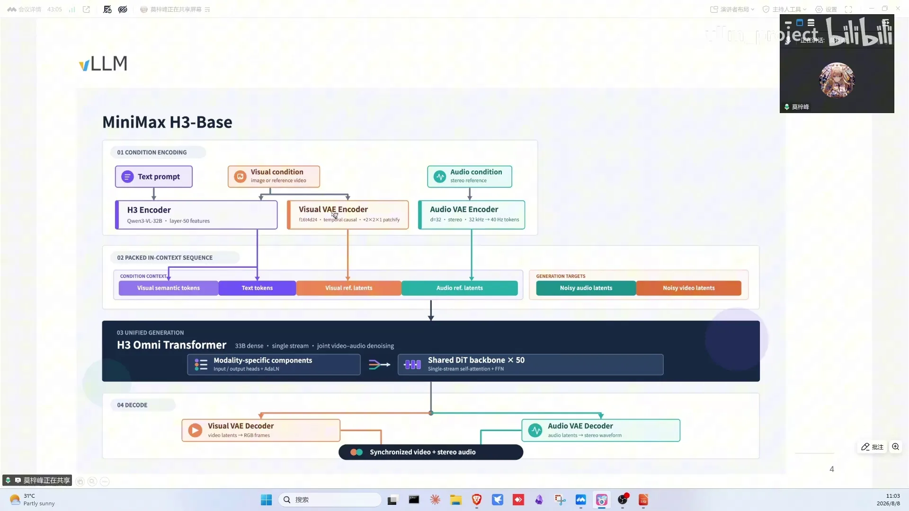 |
| 不懂的就是：t2v 这个权重用来生成（文生）视频，还有前后帧插中间；ref2v 的话是参考视频续写，它的 DiT 换成了另一个 DiT，用来做你输入一个参考视频、继续补充…… [【跳转到 02:25】](https://www.bilibili.com/video/BV1xmuT6dE1M/?t=145) |  |
| 就是它分别对应着不同任务也就是说平平时的模型是两套权重对应的不同模态这这回是对应的两个不同的任务像文本生成音频吗这样子哎里面没有声音了没有声音我听见我微信小子点不清楚 [【跳转到 02:30】](https://www.bilibili.com/video/BV1xmuT6dE1M/?t=150) | 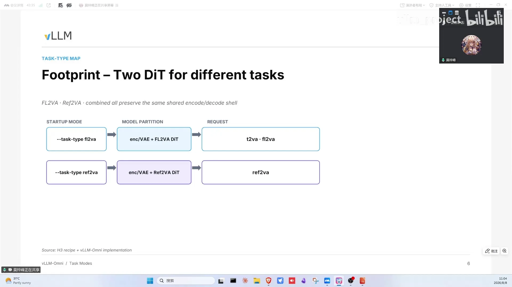 |
| 有点像图片生成里的 image editing，但其实很取巧：这两套权重虽然 DiT 不同，但 encoder 和 VAE 完全一致。当时一个新的想法是：能不能把两套任务全部塞到一个（推理）API 里…… [【跳转到 02:55】](https://www.bilibili.com/video/BV1xmuT6dE1M/?t=175) | 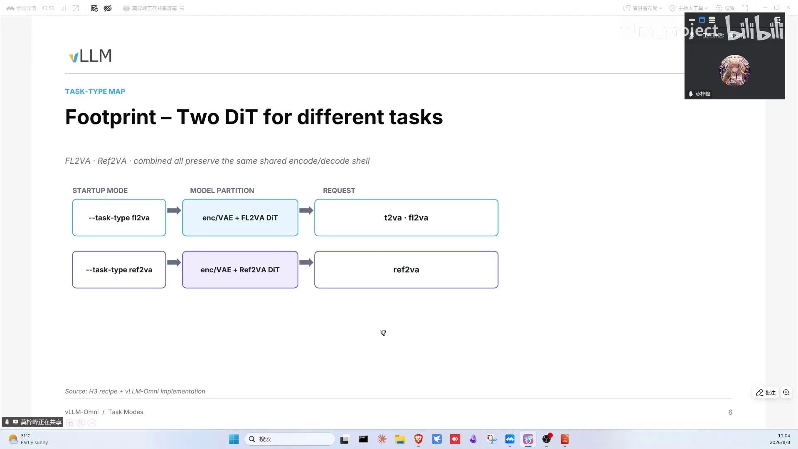 |
| 在发请求的时候指定我这个请求是（哪个任务）。目标确定了，我们也知道只有 DiT 不同，一个很简单的想法就是直接做路由：根据请求路由到不同的 DiT 里…… [【跳转到 03:20】](https://www.bilibili.com/video/BV1xmuT6dE1M/?t=200) | 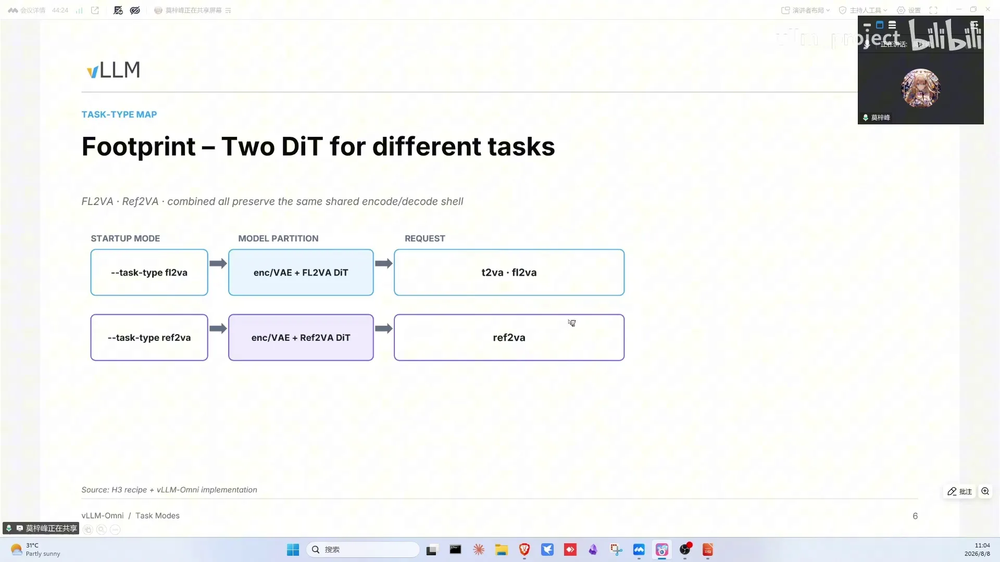 |
| 这就是 PR 5720 里的实现。这个其实不算 day0：day0 时只能加载本地下载好的单一任务权重，这是后面做的。PR 5720 实现：如果传进去的请求是 t2v 或（文生视频音频）的话，直接路由到对应的 DiT 里…… [【跳转到 03:45】](https://www.bilibili.com/video/BV1xmuT6dE1M/?t=225) |  |
| 如果是 ref2v 的话就路由过去。这部分他们（的组件）……这一部分的话他们的（文本编码）跟 VAE 共享在一个进程里，我只要起几个 Omni 服务就行了。当然如果考虑（分开部署）的话，两边要分别进行计算…… [【跳转到 04:10】](https://www.bilibili.com/video/BV1xmuT6dE1M/?t=250) |  |
| 但这个问题不大。（举一个例子）因为我知道有些跑视频生成的同学比较（极限），用的卡显存比较有限，可能只想跑其中一种任务不想跑其他任务…… [【跳转到 04:35】](https://www.bilibili.com/video/BV1xmuT6dE1M/?t=275) | 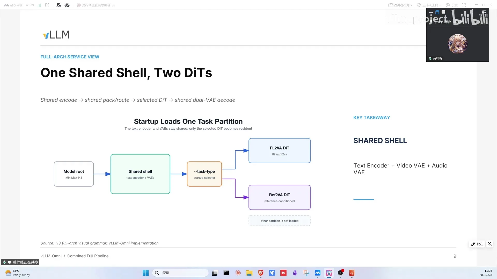 |
| 所以我当时增加了一个参数：保证只启动其中一个 DiT。如果我要（另一种）不需要的话就可以（关掉）。ref2v 同理也可以单独启动。默认的话肯定是两个 DiT 一起启。看我们启动脚本的话…… [【跳转到 05:00】](https://www.bilibili.com/video/BV1xmuT6dE1M/?t=300) | 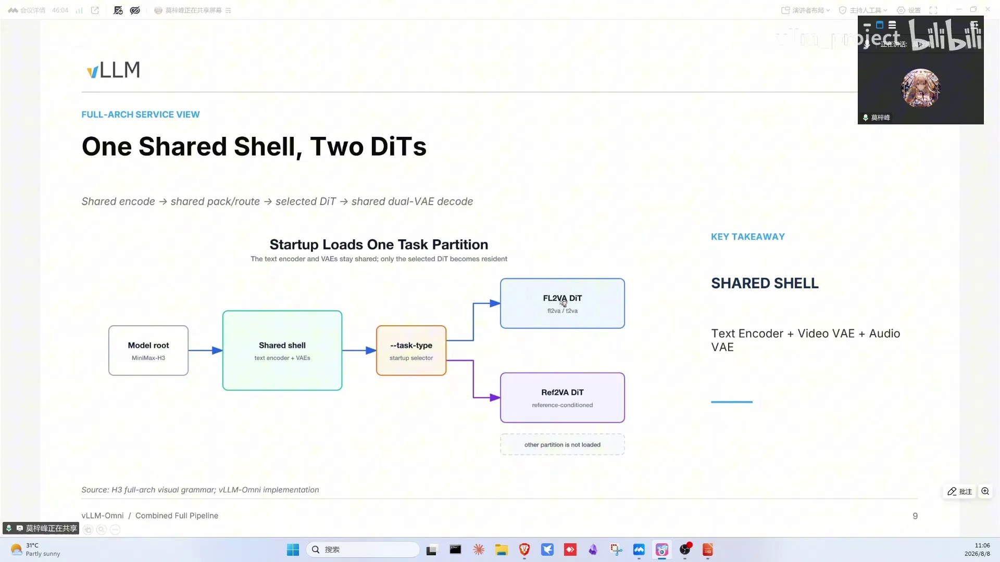 |
| 看样子还是很复杂，我们有没有 recipe 方便大家直接参考？——（有）我记得之前（发布）了吧，把标准的请求都列出来了。可以在 vLLM 里直接搜 recipe，就可以看到 MiniMax H3。直播间的同学如果对新模型感兴趣想部署的话…… [【跳转到 05:25】](https://www.bilibili.com/video/BV1xmuT6dE1M/?t=325) | 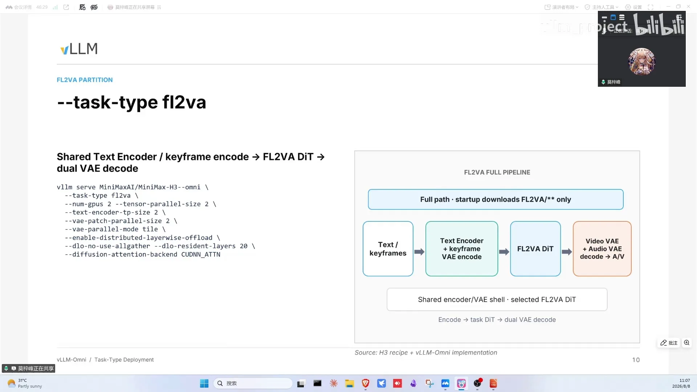 |
| 可以直接去（找）这个模型怎么部署。我们会陆续完善 recipe 的完成程度，因为现在 recipe 还有很多改进空间：这个模型（配置）太多了，而且需要对各种其他硬件的支持也有更多补充。 [【跳转到 05:50】](https://www.bilibili.com/video/BV1xmuT6dE1M/?t=350) | 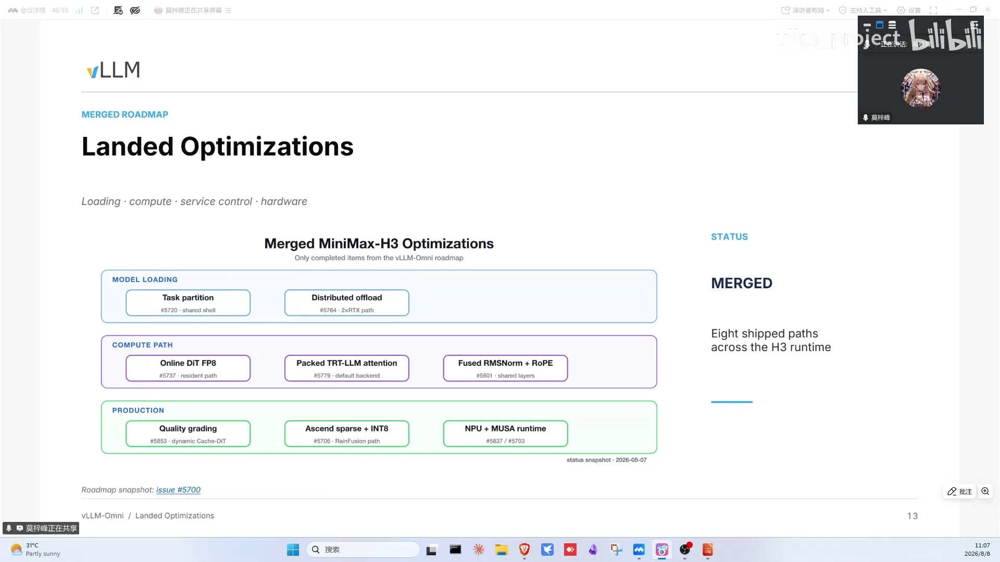 |
| （接上） [【跳转到 06:15】](https://www.bilibili.com/video/BV1xmuT6dE1M/?t=375) | 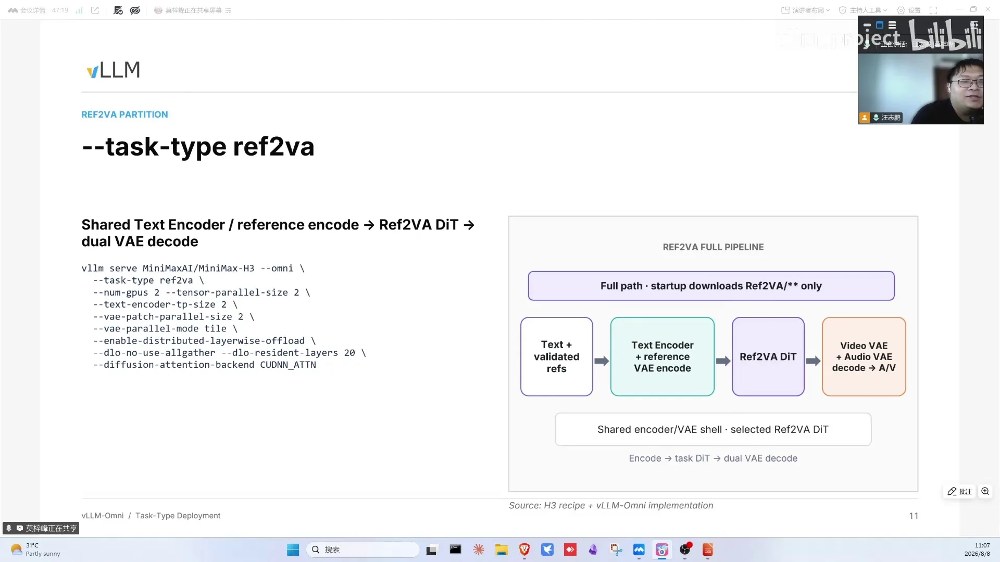 |
| day0 以后我们也做了一系列优化，这部分我可能讲得比较粗（有更合适的同学讲）。目前来说：首先 PR 5720 分任务路由肯定做了；CPU offloading 验证过可以跑、已经合入了。还有 DiT 的（权重）在线量化也做了；text encoder 的 INT8 看到好像有同学在做——就是昨天晚上还是今天早上合作的…… [【跳转到 06:40】](https://www.bilibili.com/video/BV1xmuT6dE1M/?t=400) | 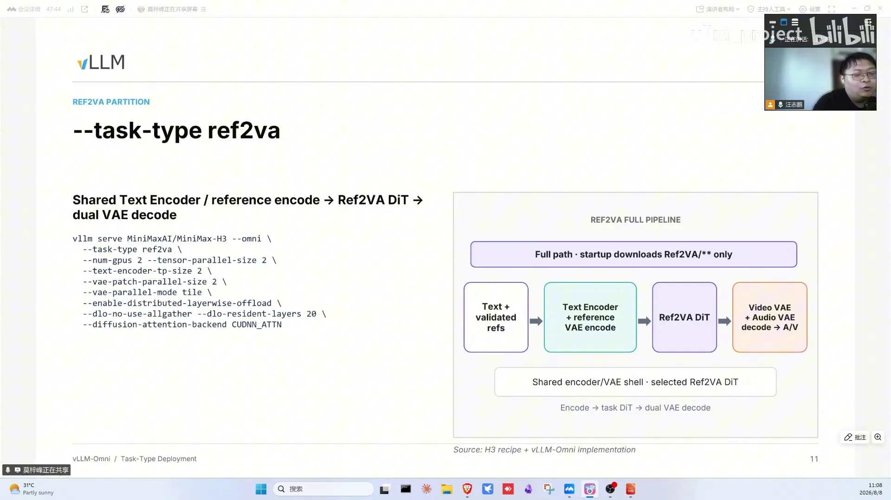 |
| （接上） [【跳转到 07:05】](https://www.bilibili.com/video/BV1xmuT6dE1M/?t=425) |  |
| 这个模型比较特殊在于它的 text encoder 和 DiT 两个权重都非常大，所以天然适合分 stage 的部署。这也是为什么我们没有像友商把图像生成模型放到 vLLM 里，而是放到 vLLM-Omni：我们观察到视频生成模型的 text encoder 部分变得很重，这种模型肯定是分 stage…… [【跳转到 07:30】](https://www.bilibili.com/video/BV1xmuT6dE1M/?t=450) | 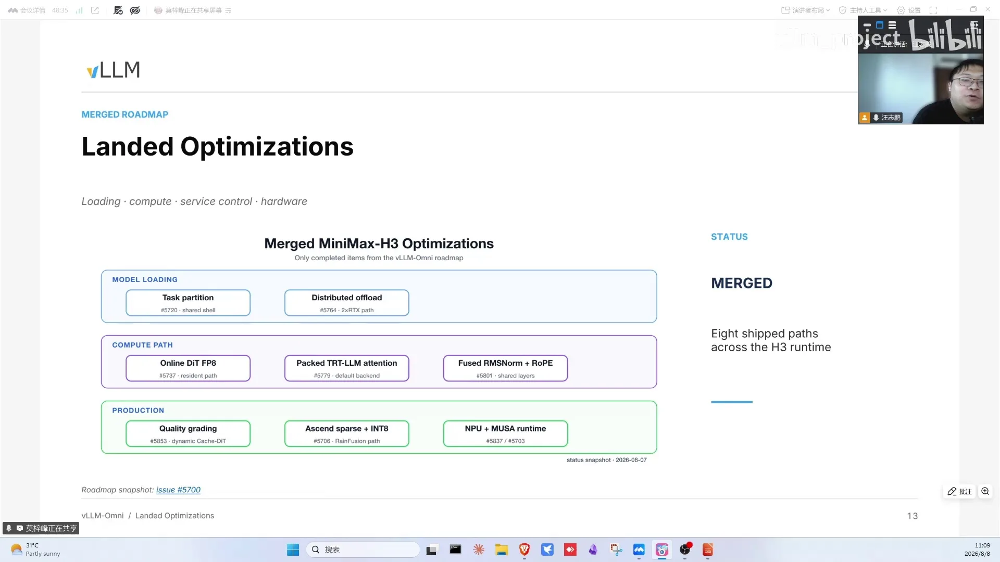 |
| 那么我们自然就不能够直接用（单体的做法），后面会尽可能让这种模型实现分离部署。分离部署最大的好处：首先不同 stage 的模组对量化精度敏感性不同；还有计算任务完全不同，导致部署策略天差地别——这就是为什么必须做分离部署。然后（推理引擎）这边可以选择的（attention backend）现在也成为默认的了…… [【跳转到 07:55】](https://www.bilibili.com/video/BV1xmuT6dE1M/?t=475) |  |
| （接上） [【跳转到 08:20】](https://www.bilibili.com/video/BV1xmuT6dE1M/?t=500) | 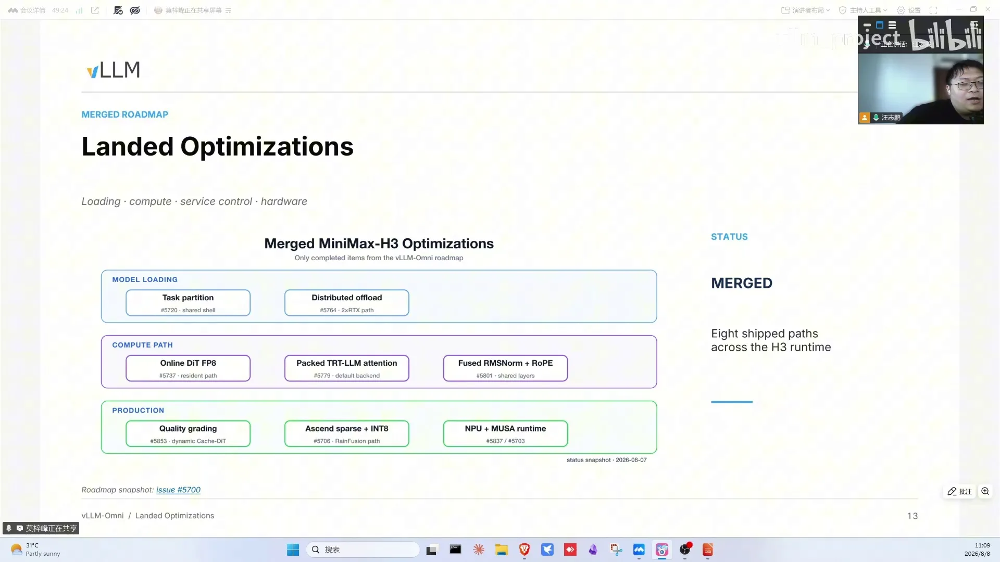 |
| 然后 FA4 在（新卡）上也可以跑，我们验证过，但两个速度差别不算大。量化这块本身是（同事）在管的，还有算子融合——很多（算子）vLLM 上游已经写好了，直接往里塞一种就行。（变体）DiT 看到好像也有人跑完验证了。——对，而且应该马上在 INFX 的 HuggingFace 仓库里也会上这个模型的几个量化版本…… [【跳转到 08:45】](https://www.bilibili.com/video/BV1xmuT6dE1M/?t=525) | 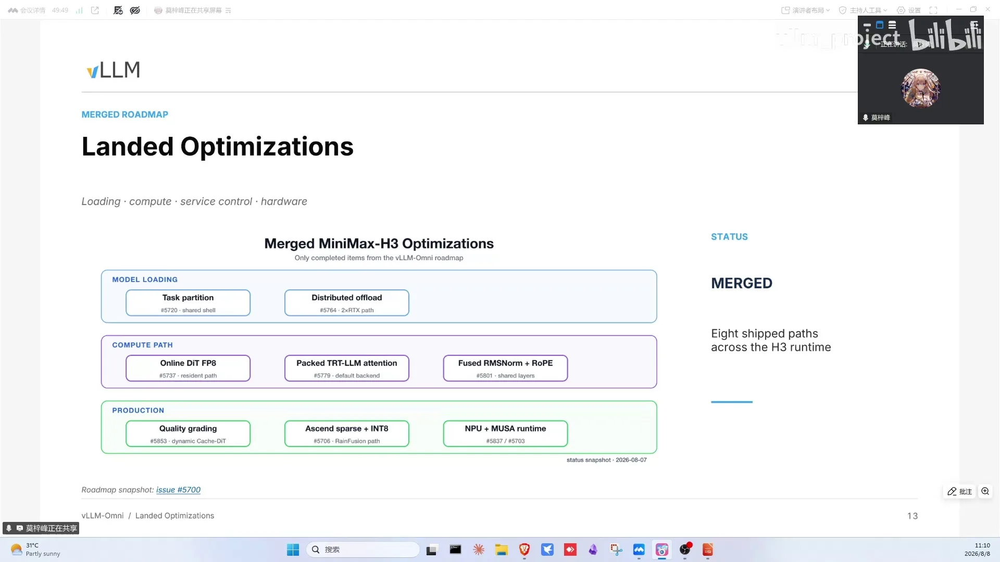 |
| （接上） [【跳转到 09:10】](https://www.bilibili.com/video/BV1xmuT6dE1M/?t=550) |  |
| 其他硬件平台像昇腾也能跑通，生成还支持 INT8 量化。——我最喜欢（整点）啥…… [【跳转到 09:35】](https://www.bilibili.com/video/BV1xmuT6dE1M/?t=575) |  |
| 要不志鹏把他那个（页面）给大家展示一下。 [【跳转到 10:00】](https://www.bilibili.com/video/BV1xmuT6dE1M/?t=600) | 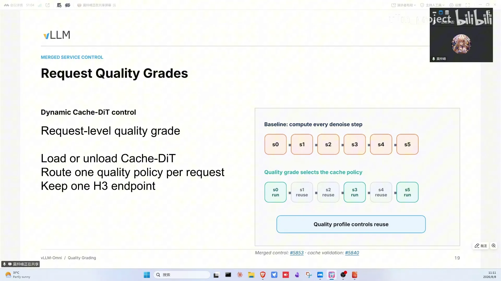 |
| 剩下还在做的。那直接开 GitHub 上的（PR）吧。 [【跳转到 10:05】](https://www.bilibili.com/video/BV1xmuT6dE1M/?t=605) | 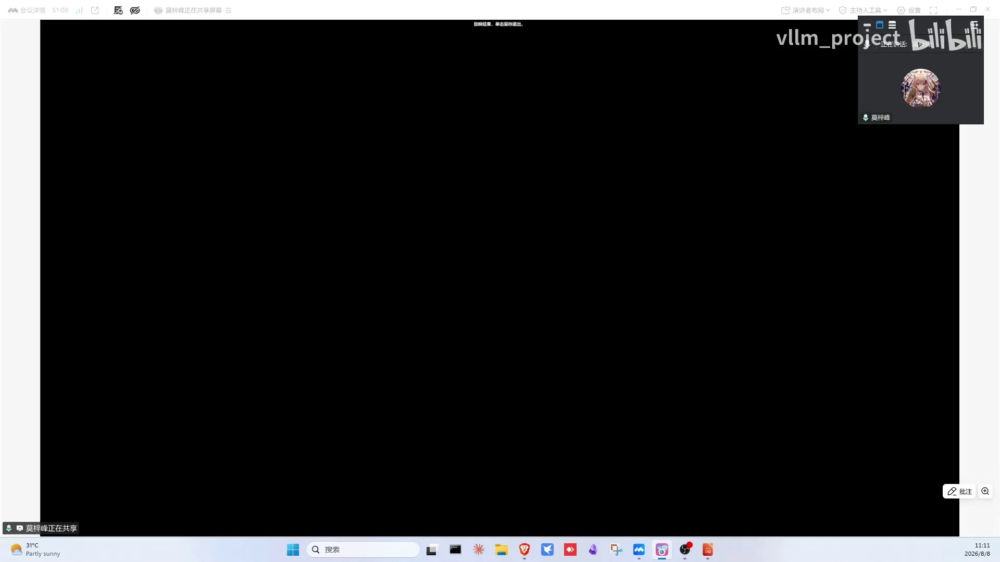 |
| 要不你们来（操作）。 [【跳转到 10:10】](https://www.bilibili.com/video/BV1xmuT6dE1M/?t=610) | 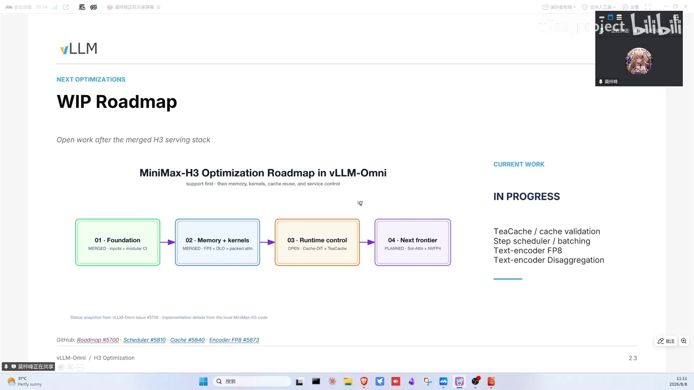 |
| 你可能比我还熟。 [【跳转到 10:15】](https://www.bilibili.com/video/BV1xmuT6dE1M/?t=615) | 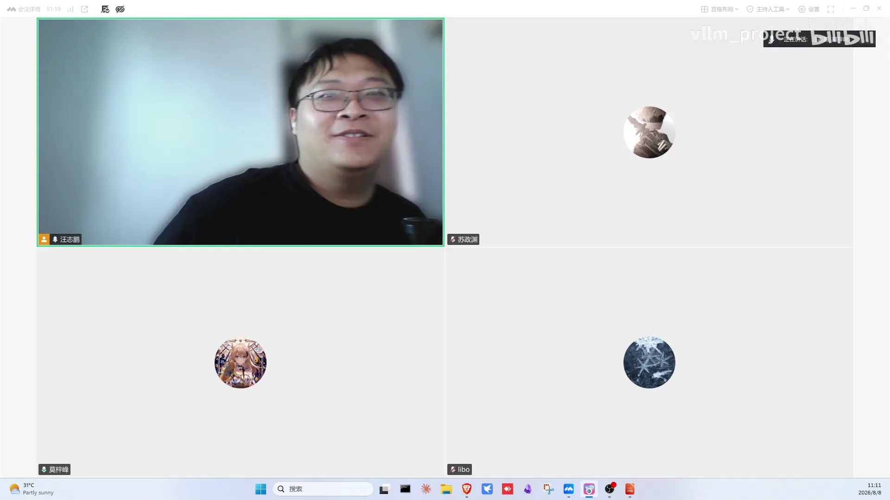 |
| （此区间无字幕） [【跳转到 10:20】](https://www.bilibili.com/video/BV1xmuT6dE1M/?t=620) | 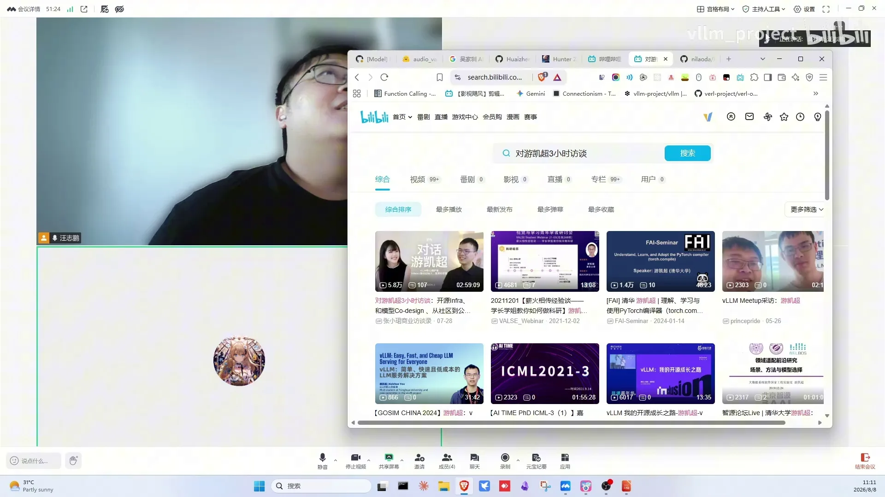 |
| （此区间无字幕） [【跳转到 10:25】](https://www.bilibili.com/video/BV1xmuT6dE1M/?t=625) | 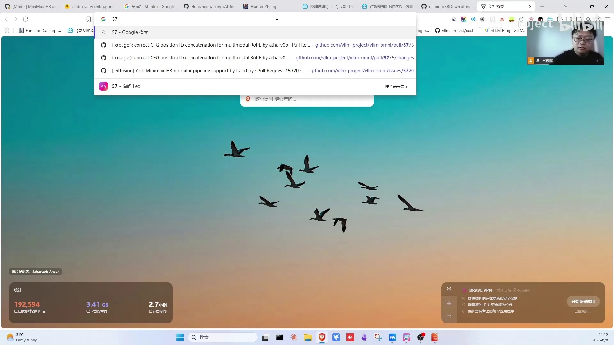 |
| OK，这个是我们现在正在进行的，直播间大家应该可以看到我的屏幕…… [【跳转到 10:30】](https://www.bilibili.com/video/BV1xmuT6dE1M/?t=630) | 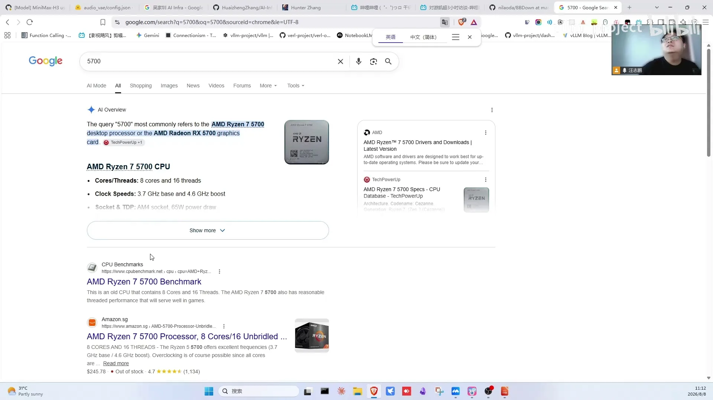 |
| 我想一下。 [【跳转到 10:51】](https://www.bilibili.com/video/BV1xmuT6dE1M/?t=651) | 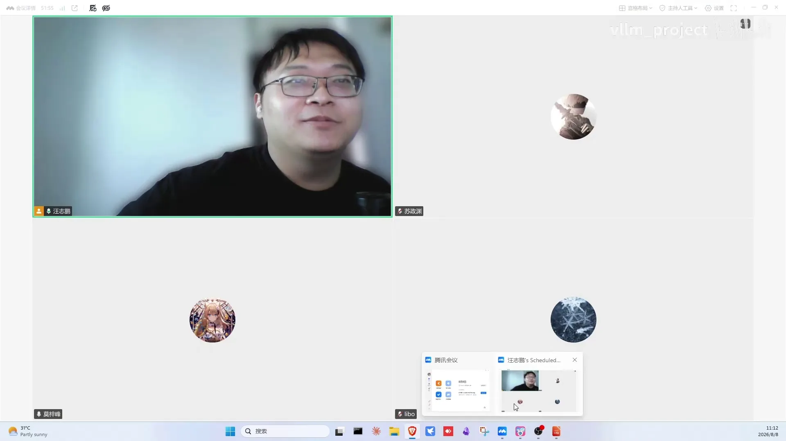 |
| 好，这个就是我们的（任务）list，也就是我们现在正在做的一些计划。我现在主要做的是 diffusion 的 continuous batching——这个（PR）正在做，包括这两个：主要做的事情是我们在进行（去噪）的时候，不同 request 的 step 可以组成一个 batch…… [【跳转到 10:58】](https://www.bilibili.com/video/BV1xmuT6dE1M/?t=658) |  |
| 也就是我们现在正在做的一些计划然后我现在主要做的是这个diffusion的controlsbing就是5810这个医学啊对就这个这个是我现在正在做的包括这两个然后这两个主要做的事情就是我们在进行这个uhdno这DE位置的时候我们的不同的requeststp可以进行组成一个batch [【跳转到 11:03】](https://www.bilibili.com/video/BV1xmuT6dE1M/?t=663) | 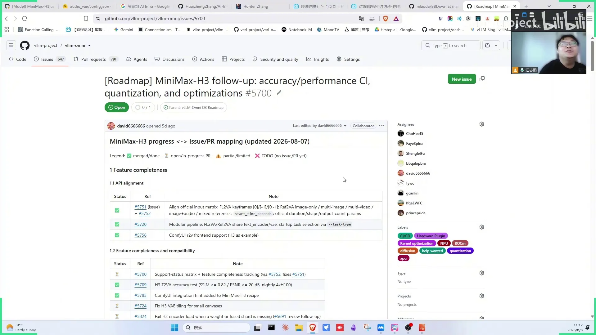 |
| 这样整个 diffusion 模型的推理方式就变成了类似 AR 模型的方式：不同（步数）的 request 不需要等全部跑完再进行下一（步），可以 request 不同 step 之间组成 batch，进行重叠式的推理。 [【跳转到 11:28】](https://www.bilibili.com/video/BV1xmuT6dE1M/?t=688) |  |
| 理论上来讲这种方式在计算资源极其强大时——我们不会走民用级显卡，用云平台工业级计算卡部署——会有收益。我现在测是在 H100 上测的，暂时没观察到收益，后面用 B300 测应该会有。这个特性的前提是尽可能把 USP 开大一些：USP 可以减少激活值占用、减少每张卡的计算消耗，这样组 batch 更不容易（在计算瓶颈时组 batch）导致特性没收益。——上面还有我们做的很多特性…… [【跳转到 11:53】](https://www.bilibili.com/video/BV1xmuT6dE1M/?t=713) | 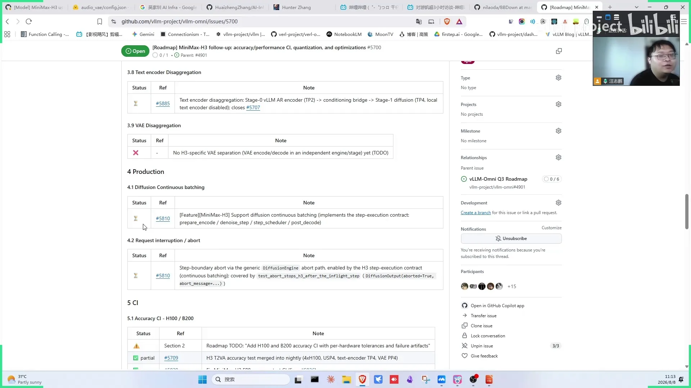 |
| （接上） [【跳转到 12:18】](https://www.bilibili.com/video/BV1xmuT6dE1M/?t=738) |  |
| 整个（PR）主要是（同事）在管：我下班之后回来做开发。最近支持比较多的：一个是（CB）；第二个（特性）支持之后可能会引入一些 bug：比如跟 DP 一起时可能导致 DP 的 request 发生冲突、没办法正常运行；也可能有其他——它可能会跟其他并行技术没法正交，可能是代码问题也可能是特性本身问题。感兴趣的同学可以测一下：开了（CB）后尝试开其他并行策略看能否正常运行。同时我们还需要确保它在单卡时能自动退化成 layer-wise offload…… [【跳转到 12:43】](https://www.bilibili.com/video/BV1xmuT6dE1M/?t=763) | 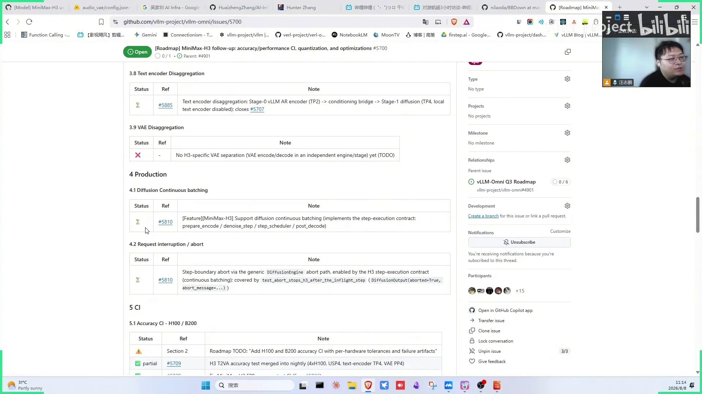 |
| （接上） [【跳转到 13:08】](https://www.bilibili.com/video/BV1xmuT6dE1M/?t=788) | 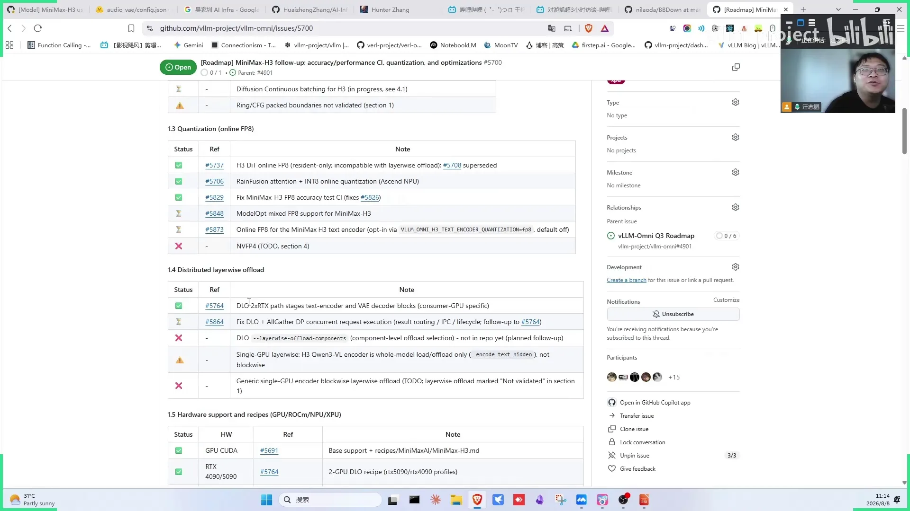 |
| （接上） [【跳转到 13:33】](https://www.bilibili.com/video/BV1xmuT6dE1M/?t=813) |  |
| 如果大家资源有限，也可以尝试单卡开（DLO），看显存卸载情况是否符合预期。志鹏能听到我说话吗？——能听到。——我刚在微信群里给你转了个链接，是之前（同事）写的一个 blog：这可能是我们后面强推的一个特性…… [【跳转到 13:58】](https://www.bilibili.com/video/BV1xmuT6dE1M/?t=838) | 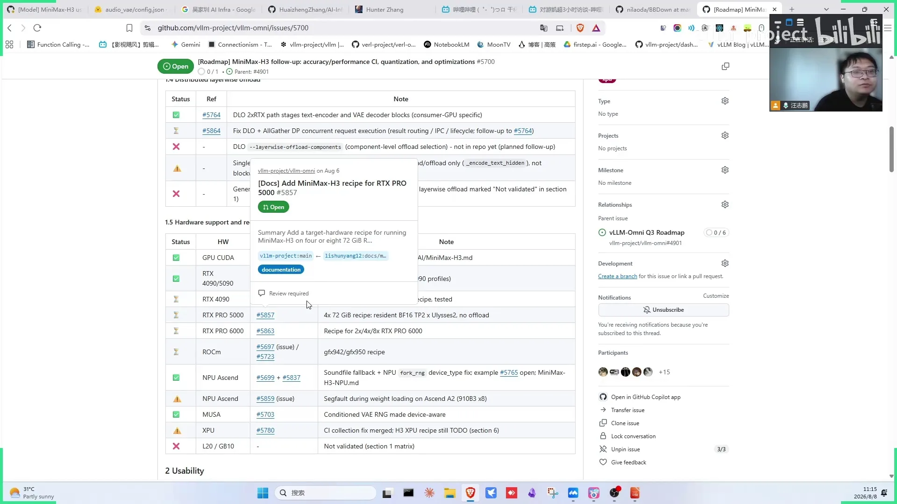 |
| （接上） [【跳转到 14:23】](https://www.bilibili.com/video/BV1xmuT6dE1M/?t=863) | 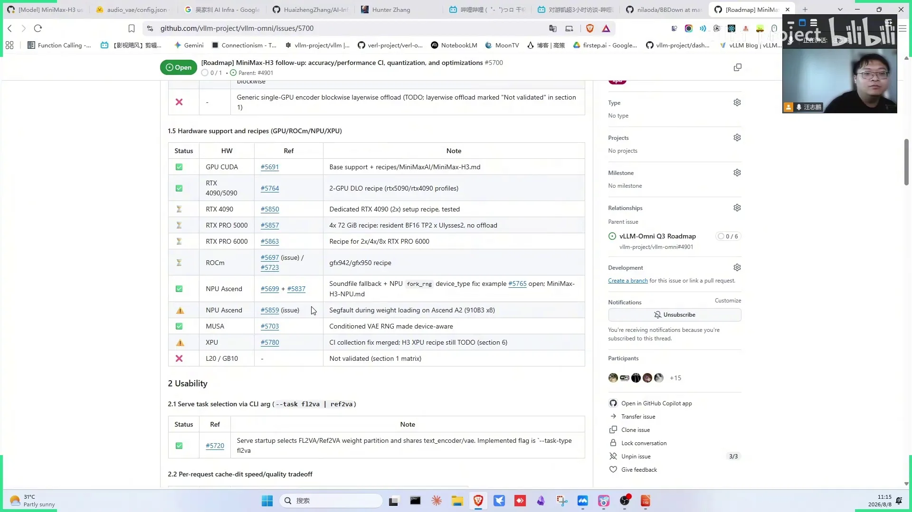 |
| 这个（DLO）的好处分几种类型：host 内存我们希望用起来；对一些有 NVLink 的高端卡，把通信也用起来。理论上后侧如果有 1.5TB 到 2TB 的 DRAM，基本可以做到 500B 的模型比较好地 serve，对 HBM 的需求会降低很多。——下面有一个 GIF…… [【跳转到 14:48】](https://www.bilibili.com/video/BV1xmuT6dE1M/?t=888) | 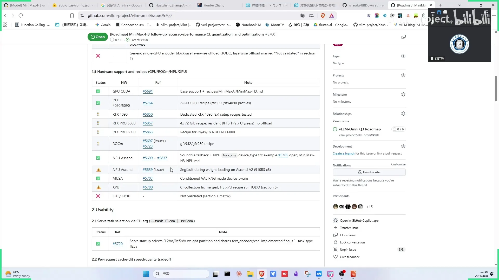 |
| 可以形象看一下：核心有三条流。第一条是计算的流；第二条是 host 到 device 的流，因为要去取权重；第三条流是真正计算时依赖一个 all-gather——每张卡只拿一部分权重，算完就丢掉。这也是为什么我们对 HBM 内存需求没那么高。当然如果只有 PCIE 的话可能就不走 all-gather…… [【跳转到 15:13】](https://www.bilibili.com/video/BV1xmuT6dE1M/?t=913) | 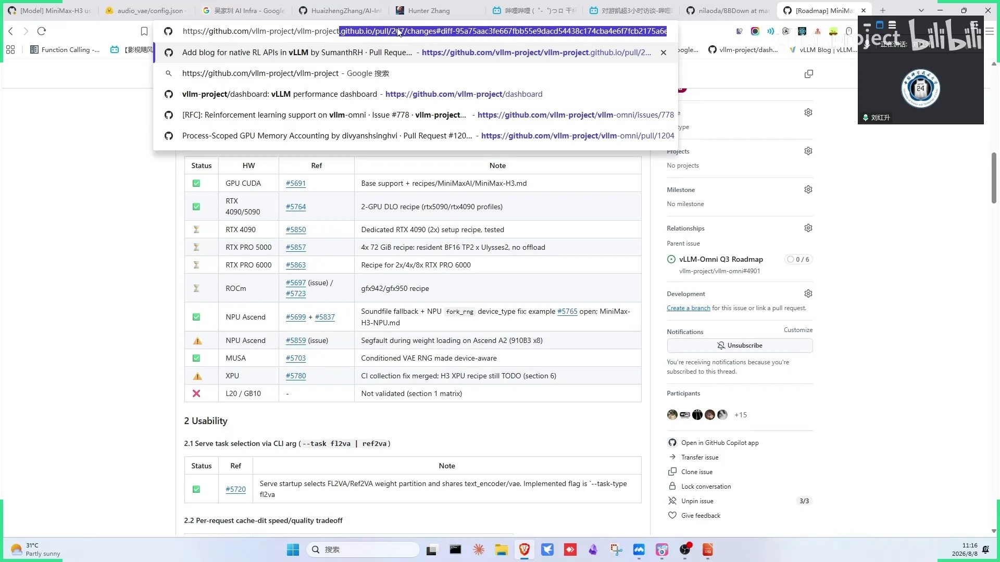 |
| （接上） [【跳转到 15:38】](https://www.bilibili.com/video/BV1xmuT6dE1M/?t=938) | 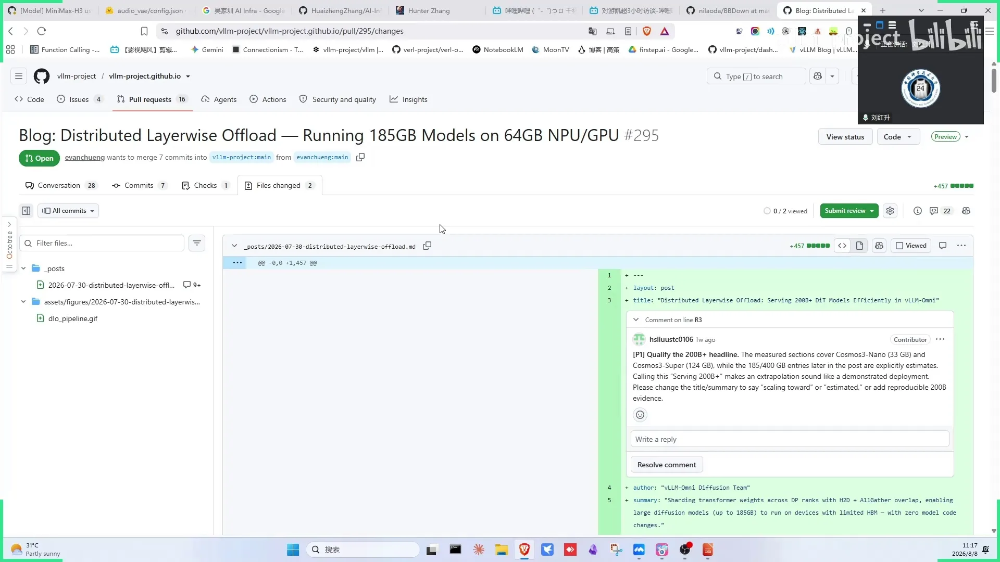 |
| （接上） [【跳转到 16:03】](https://www.bilibili.com/video/BV1xmuT6dE1M/?t=963) |  |
| 因为你会掩盖不住。直播间有同学问 DLO 是什么？其实就是 distributed layer-wise offload：以前做 offload 都没做到分布式。之前有两个维度：第一个叫 CPU offload，是比较大模块的——比如 encoder、transformer 这种级别，比较粗；后面又做了 layer-wise offload——按层做：encoder 里有很多层、DiT 里也有很多层，核心还是 DiT，一层一层做。这样确实会把内存留给 activation memory，长序列时在消费级显卡里也能做。——这边这块做得比较好…… [【跳转到 16:28】](https://www.bilibili.com/video/BV1xmuT6dE1M/?t=988) |  |
| （接上） [【跳转到 16:53】](https://www.bilibili.com/video/BV1xmuT6dE1M/?t=1013) |  |
| （接上） [【跳转到 17:18】](https://www.bilibili.com/video/BV1xmuT6dE1M/?t=1038) | 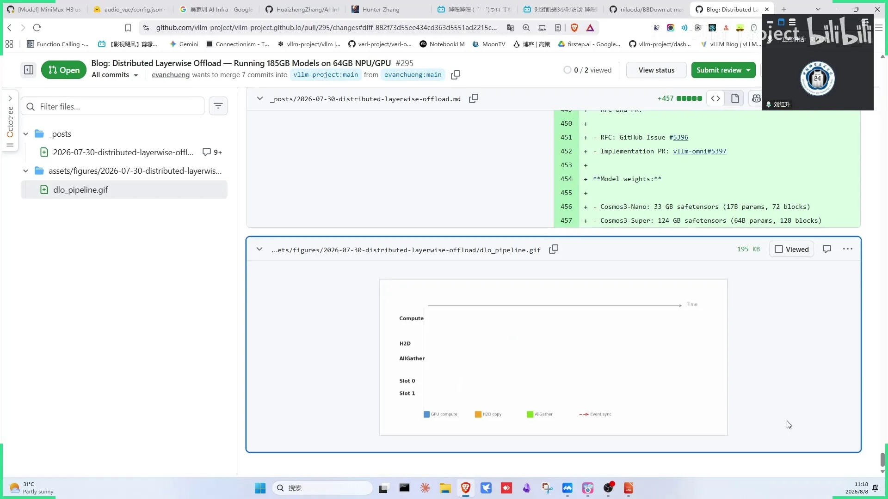 |
| 你刚才针对的是单卡场景：多卡场景我们希望每个 device 都能做 offload。但要解决一个问题：host 侧要共享一块内存做权重缓存，因为每张卡都要朝同一块地址取。之前单卡的话，后侧要存好几份 copy，host 主机内存压力比较大。现在相当于八张卡只卸一份内存，但可以开八个 DP。——这就是 offload 的区别。——然后我们应该等 MiniMax 联调：今天跟顺阳把一些小 bug 修一修，下周一发一个版本 26.1，以 DLO 为基础把 MiniMax 第一个支持。——后面会发 blog：其实（之前）已经有 blog 了，只是不太成熟…… [【跳转到 17:43】](https://www.bilibili.com/video/BV1xmuT6dE1M/?t=1063) |  |
| （接上） [【跳转到 18:08】](https://www.bilibili.com/video/BV1xmuT6dE1M/?t=1088) | 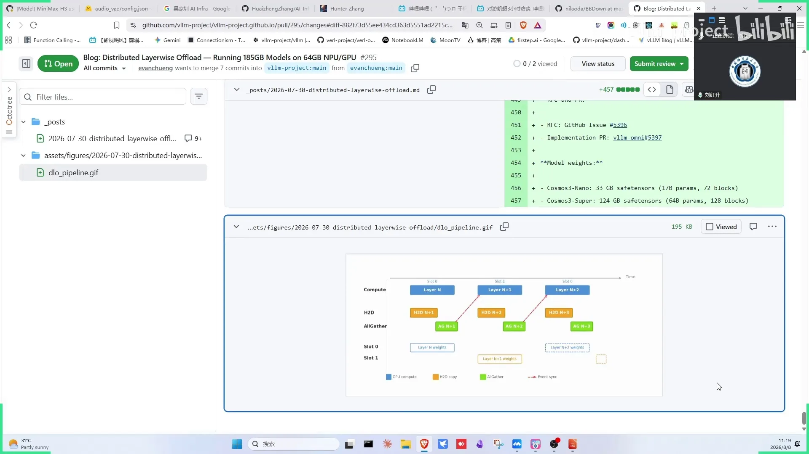 |
| （接上） [【跳转到 18:33】](https://www.bilibili.com/video/BV1xmuT6dE1M/?t=1113) |  |
| 之前是拿 Cosmos 验证的，现在来了新模型，在新模型上再验一把。我的理解：DLO 主要是针对显存不足的情况；如果你显存本身非常大，其实不需要开 DLO。——如果你都是 GB300 或 B300…… [【跳转到 18:58】](https://www.bilibili.com/video/BV1xmuT6dE1M/?t=1138) |  |
| 我建议更有用的特性其实是志鹏做的 continuous batching。以前我们说 DiT 都是 compute bound，但实际发现在高端卡上达不到 compute bound，这时再把 batch 打大、把 MFU 做大，可能是更 prefer 的场景。对对对。——有同学问：这等价于 llama.cpp 的 GPU layers 参数吗？——我理解 llama.cpp 那个可能是单（机）的。就像我说的第二个版本：CPU layer offload 没做到分布式，我不太清楚细节…… [【跳转到 19:23】](https://www.bilibili.com/video/BV1xmuT6dE1M/?t=1163) |  |
| （接上） [【跳转到 19:48】](https://www.bilibili.com/video/BV1xmuT6dE1M/?t=1188) | 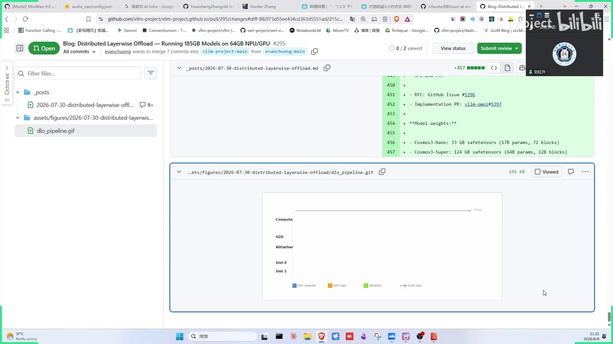 |
| 是这样的，我不清楚 llama.cpp 的细节，但 llama.cpp 肯定有这个功能：它本身就是给消费级显卡做的，这特性本身也更偏消费级显卡。但可能没做到分布式。我们做（分布式）希望中间的 all-gather 强依赖通信时延：如果走 PCIE 侧…… [【跳转到 20:13】](https://www.bilibili.com/video/BV1xmuT6dE1M/?t=1213) |  |
| 大概率掩盖不住，掩盖不住会导致计算有很多空隙。——我理解它应该没做到分布式，我可以再 check 一下。而且之前（同事）在做的时候是单机这个特性：上去就发现计算速度太快之后，开（CPU offload）纯粹是负收益——因为传输速度比计算速度慢很多…… [【跳转到 20:38】](https://www.bilibili.com/video/BV1xmuT6dE1M/?t=1238) |  |
| 所以后面这个特性应该可以跟 continuous batching 叠加：本质上 compute 那条流的时间会被拉大一点，通信倒不会增加很多——通信时间很多是有个初始的延迟时间基础，往上再加一点，只要带宽没跑满，时间不会增加很多。——我理解如果部署时发现需要开 TP…… [【跳转到 21:03】](https://www.bilibili.com/video/BV1xmuT6dE1M/?t=1263) | 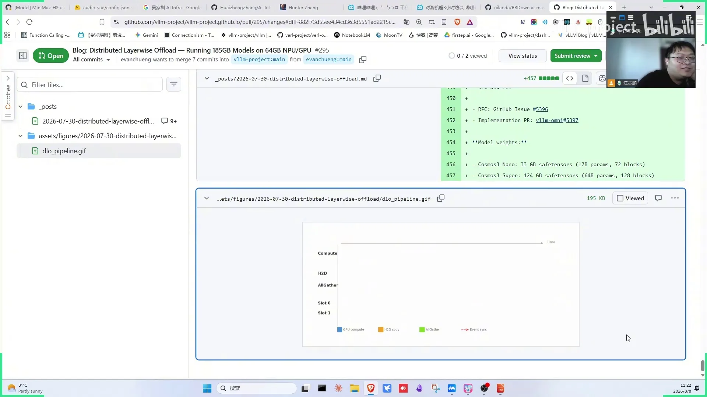 |
| 可以尝试开 DLO 加 TP。后面会有详细文档和 blog 教大家怎么用：DLO 适用场景也比较多，最简单退化到一张卡的场景就是以前的 CPU layer-wise offload。——志鹏你记一下，DLO 是个新特性大家可能比较感兴趣。其实我觉得更适合（永夜）来讲…… [【跳转到 21:28】](https://www.bilibili.com/video/BV1xmuT6dE1M/?t=1288) | 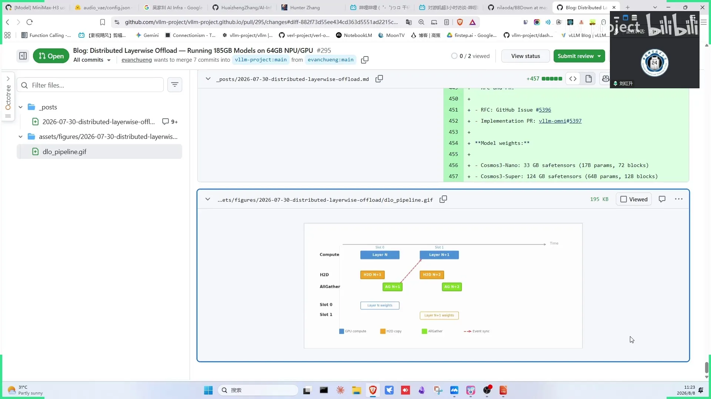 |
| （接上） [【跳转到 21:53】](https://www.bilibili.com/video/BV1xmuT6dE1M/?t=1313) | 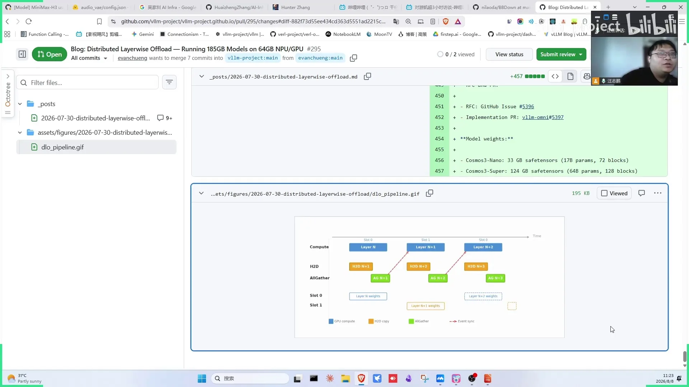 |
| DLO 是新特性，大家可能比较感兴趣。其实我觉得更适合（永夜）来讲…… [【跳转到 22:18】](https://www.bilibili.com/video/BV1xmuT6dE1M/?t=1338) |  |
| （下次）把他拉来一起讲。那我们直接答观众提问吧：观众有没有对这个模型有什么问题的？ [【跳转到 22:43】](https://www.bilibili.com/video/BV1xmuT6dE1M/?t=1363) | 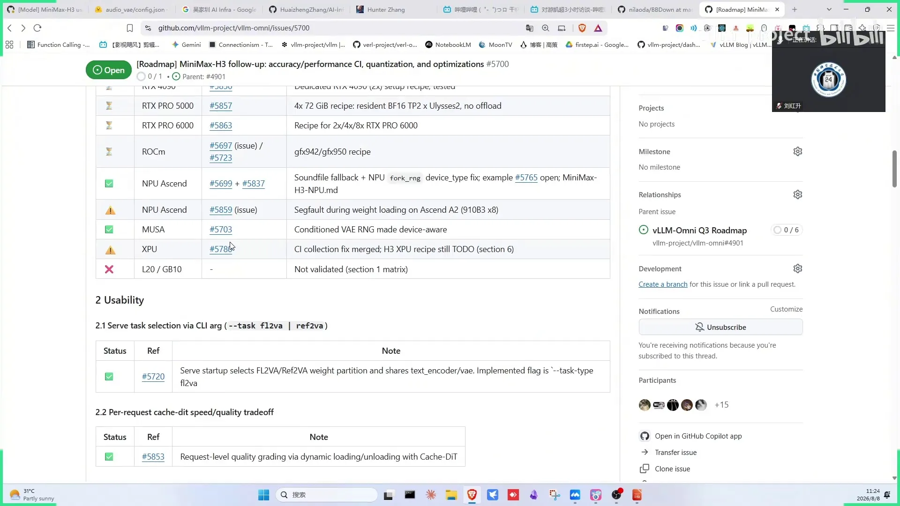 |
| 有时间、有资源的话可以尝试一下；哪怕不尝试我们做的，尝试一下 CPU offload 那块做的也可以。总体来讲我感觉这个模型算是现在开源最强的（文生）视频音频模型。而且我看到（社区）那边最近出了很多加速方法，几个特性都可以用上：比如算子融合…… [【跳转到 23:08】](https://www.bilibili.com/video/BV1xmuT6dE1M/?t=1388) | 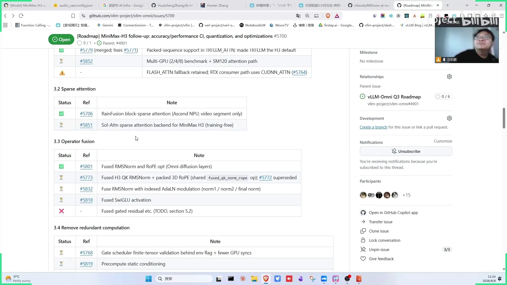 |
| （接上） [【跳转到 23:33】](https://www.bilibili.com/video/BV1xmuT6dE1M/?t=1413) | 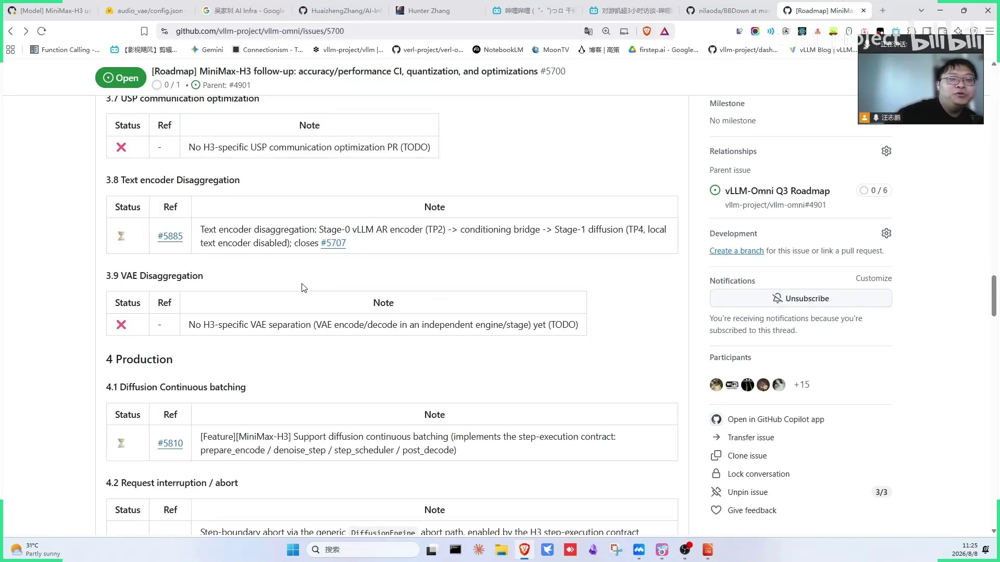 |
| 还有 sparse attention 的特性，算子融合也有很多社区可以做的。我记得写第一版（支持）时很多地方还用原生（实现）；现在同事说提了很多（优化）PR，我看到有个人接了一堆算子——我以为是个机器人，后面一看是活人。他们主要是从自己平台上搬过来的，之前就做完这些。 [【跳转到 23:58】](https://www.bilibili.com/video/BV1xmuT6dE1M/?t=1438) | 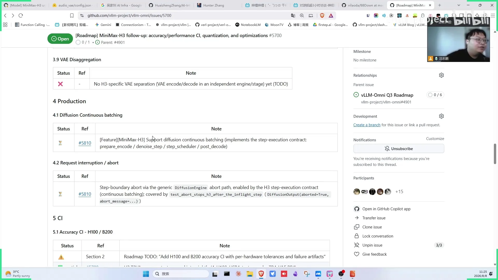 |
| （接上） [【跳转到 24:23】](https://www.bilibili.com/video/BV1xmuT6dE1M/?t=1463) | 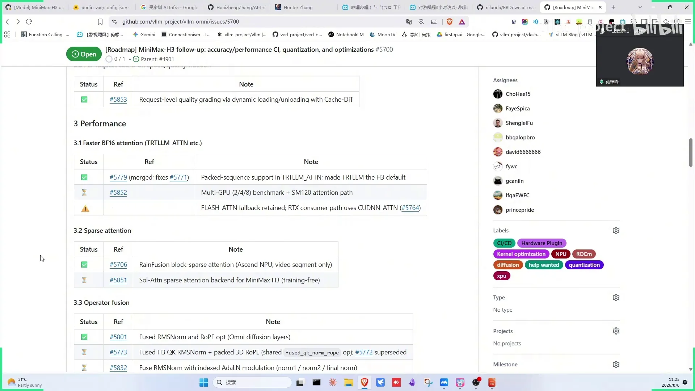 |
| 对了还有一个：如果大家手里有卡，帮我们写一写 recipe、多测一测。这个模型任务应该有三个或四个，特性也很多。具体什么样的卡…… [【跳转到 24:48】](https://www.bilibili.com/video/BV1xmuT6dE1M/?t=1488) | 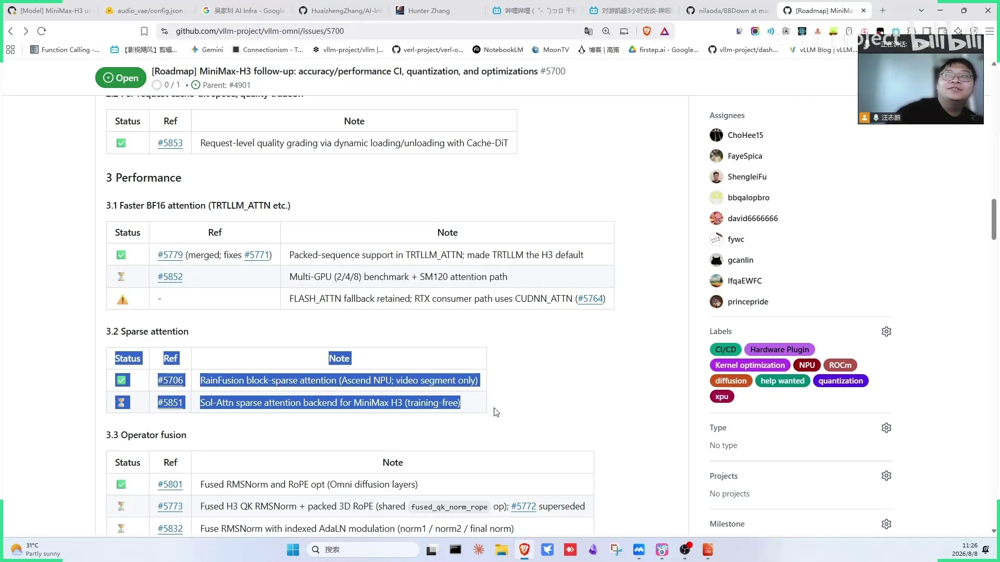 |
| 比如（有些社区）有很多 24G 的卡单卡就可以跑，理论上 Omni 应该也可以跑，只是我们手里没有那么多各种消费级显卡——比如 4090、5090，甚至有同学拿 GB10 跑。这些东西我们手里没有那么多卡…… [【跳转到 25:13】](https://www.bilibili.com/video/BV1xmuT6dE1M/?t=1513) | 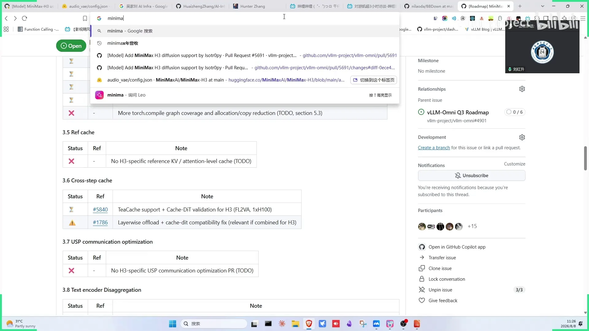 |
| 各种型号的卡，包括 L20 这些。大家有的话可以多跑跑、给我们提 recipe：看能跑哪几种任务——reference to video、t2v、text to video（音频）等。这些请求都一样，主要看下面有一些参数需要调：比如 DLO 的 resident layers、用不用 gather。因为我们没有那么多卡测不了太多…… [【跳转到 25:38】](https://www.bilibili.com/video/BV1xmuT6dE1M/?t=1538) |  |
| （接上） [【跳转到 26:03】](https://www.bilibili.com/video/BV1xmuT6dE1M/?t=1563) | 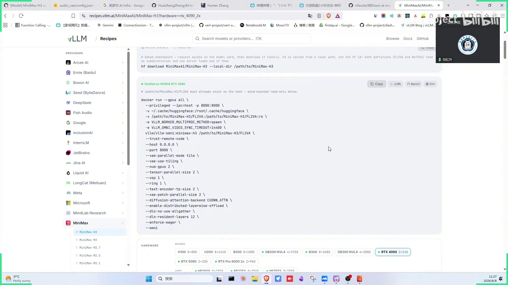 |
| recipe 是 vLLM 官方的，vLLM-Omni 上也有一个 recipe，大家可以直接提 PR：我们会看一下，合的会比较快。——在哪个地方？——这里直接往里面加就行。具体位置在 models 下面…… [【跳转到 26:28】](https://www.bilibili.com/video/BV1xmuT6dE1M/?t=1588) | 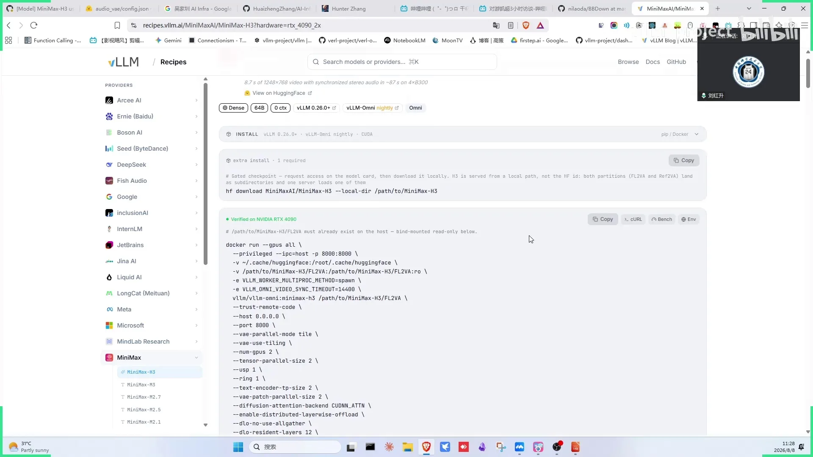 |
| 有个 models，下面有个 minimax（AI），下面是个（配置 yaml）。它现在是配置 yaml 的形式。用 AI 跑一下让它顺手刷一下就行。——对对对对，是的。 [【跳转到 26:53】](https://www.bilibili.com/video/BV1xmuT6dE1M/?t=1613) | 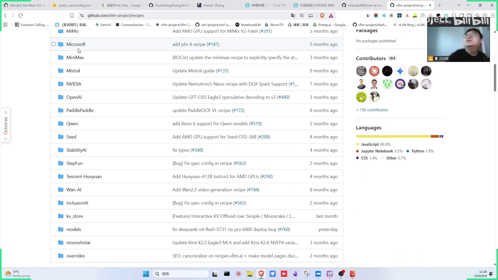 |
| 大家感兴趣可以去（PR）5720 里找有没有可以（贡献）的：跑的时候会发现一些 bug，特别是很多特性一起开时很可能出现冲突——这些都是给项目做贡献的机会。 [【跳转到 27:18】](https://www.bilibili.com/video/BV1xmuT6dE1M/?t=1638) | 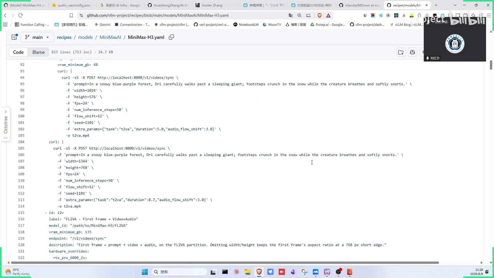 |
| 为啥都喜欢周末干活？——因为周一到周五要上班嘛。为什么工作日要上班？我们做（开源）真的是纯粹为爱发电。 [【跳转到 27:43】](https://www.bilibili.com/video/BV1xmuT6dE1M/?t=1663) | 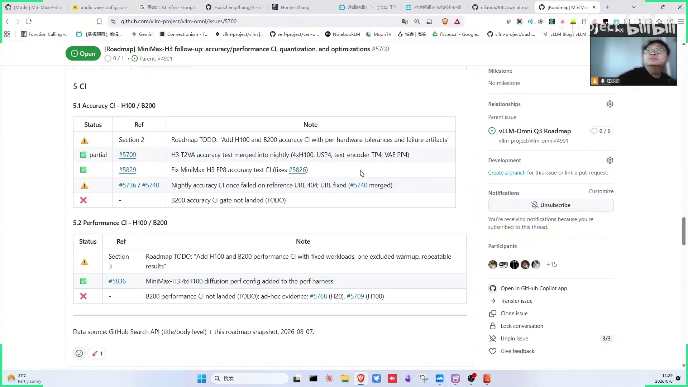 |
| 你知道我基本上每个礼拜六礼拜天所有时间都在干活：再多看一眼这些东西。每个礼拜六礼拜天都在看大家的代码，太多了。这个直播和发展都是因为这个原因…… [【跳转到 28:08】](https://www.bilibili.com/video/BV1xmuT6dE1M/?t=1688) | 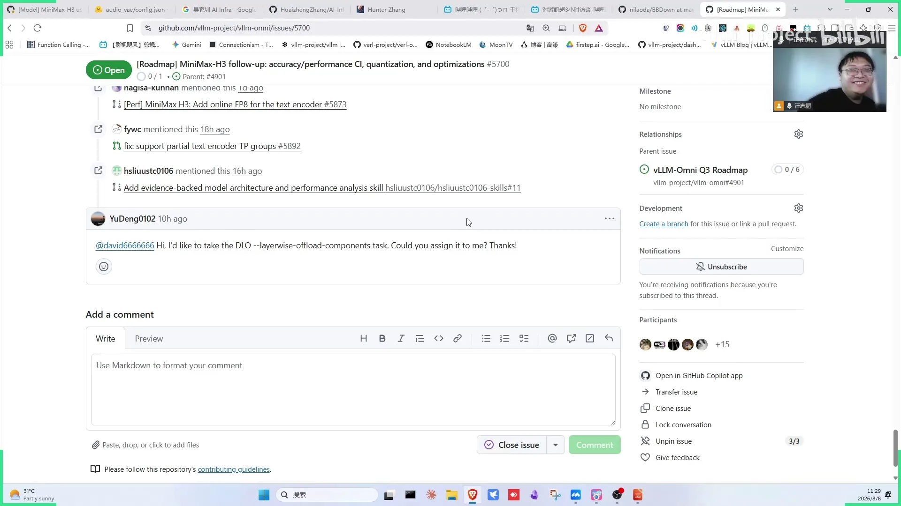 |
| 只有周末有时间。——cache DIT 能介绍一下吗？——我们之前有一个 PPT 讲投机解码，可以直接点到我们的 docs 里去。docs 里有 feature design，里面有 cache DIT…… [【跳转到 28:33】](https://www.bilibili.com/video/BV1xmuT6dE1M/?t=1713) | 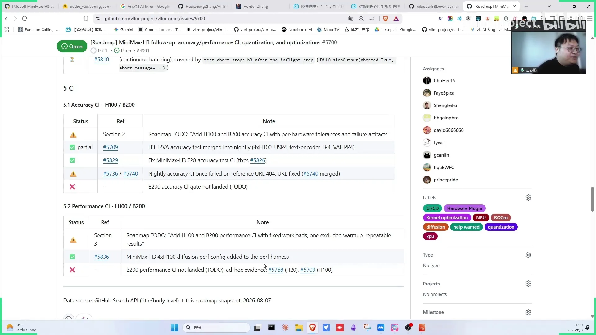 |
| 可以直接点到 vLLM-Omni 的 docs。也可以看看我之前月球大叔那期直播，专门对比了开启（cache）DiT 和不开。——搜 developer guide…… [【跳转到 28:58】](https://www.bilibili.com/video/BV1xmuT6dE1M/?t=1738) | 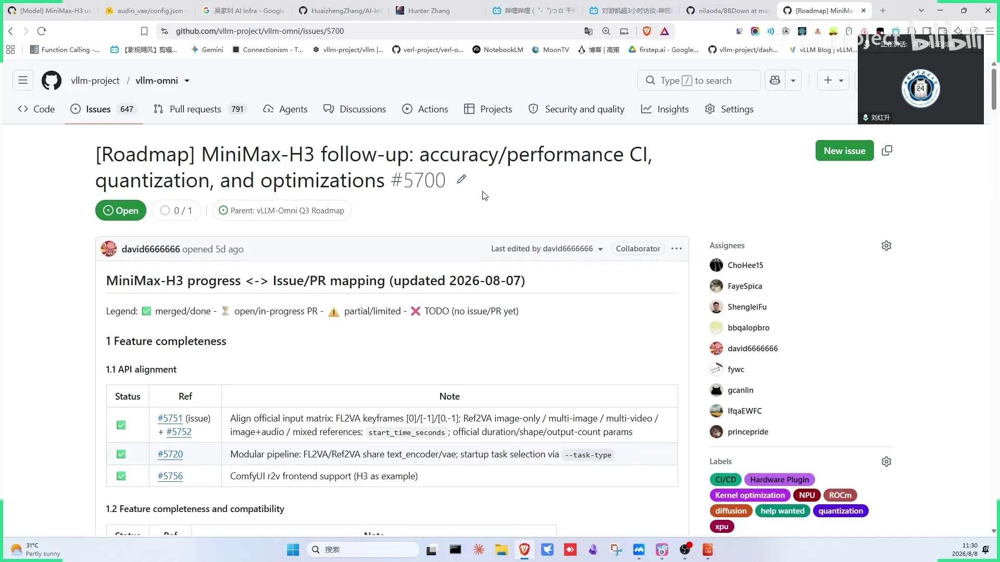 |
| （接上） [【跳转到 29:18】](https://www.bilibili.com/video/BV1xmuT6dE1M/?t=1758) | 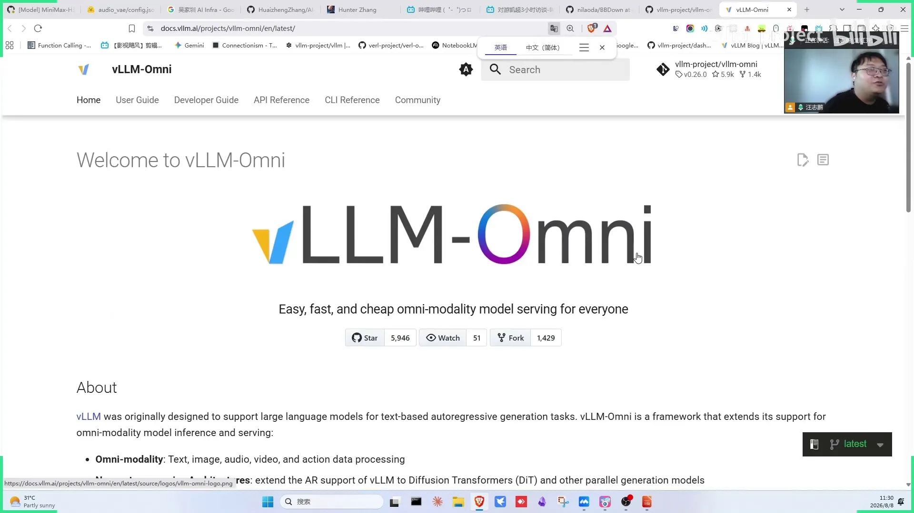 |
| （此区间无字幕） [【跳转到 29:26】](https://www.bilibili.com/video/BV1xmuT6dE1M/?t=1766) | 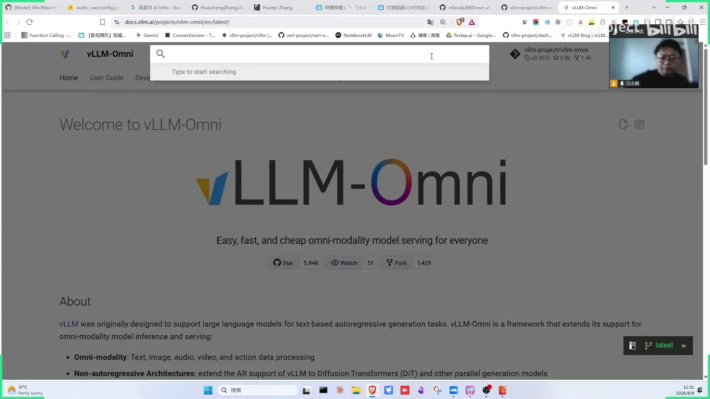 |
| （此区间无字幕） [【跳转到 29:31】](https://www.bilibili.com/video/BV1xmuT6dE1M/?t=1771) | 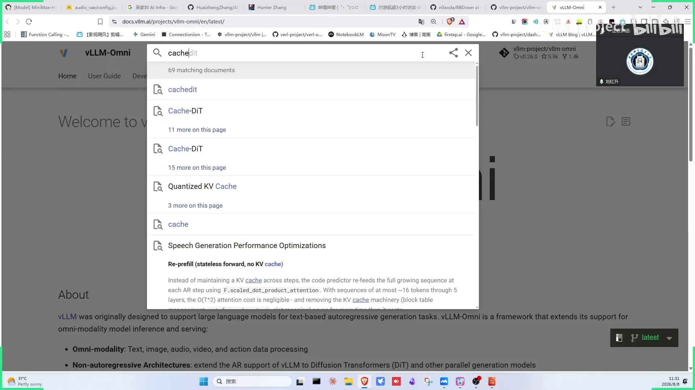 |
| 观众可能更想知道什么是 cache DIT。——应该去看那个（项目）。那是唯品会的一个仓库，名字叫什么来着——好像叫（某名字）。 [【跳转到 29:36】](https://www.bilibili.com/video/BV1xmuT6dE1M/?t=1776) | 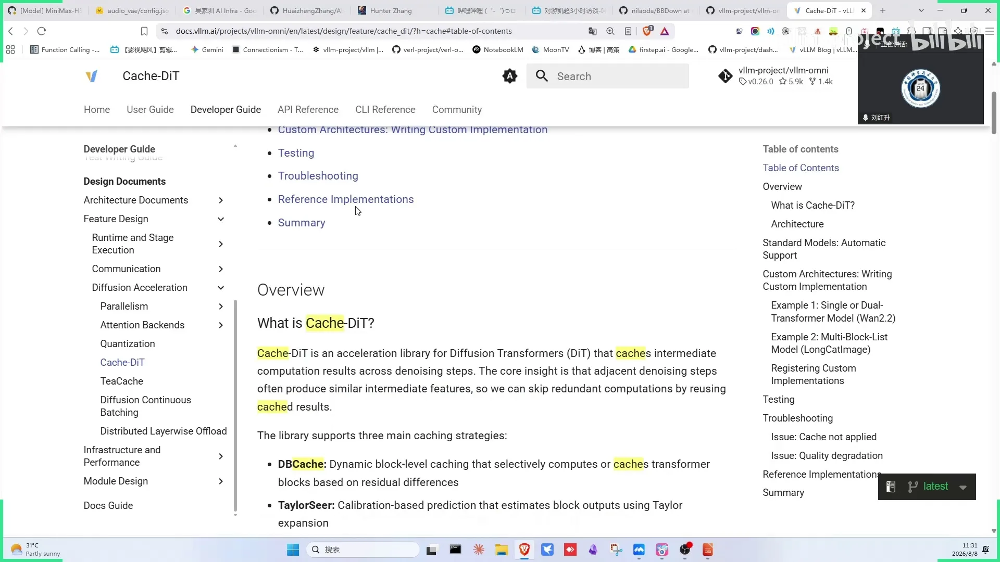 |
| （接上） [【跳转到 29:50】](https://www.bilibili.com/video/BV1xmuT6dE1M/?t=1790) | 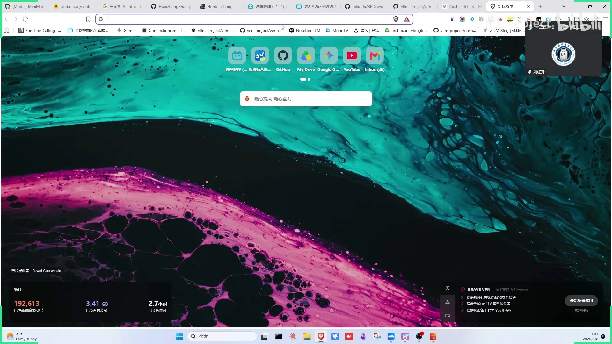 |
| 对，就是这个：是唯品会做的一个仓库，大家感兴趣可以去研究学习。它的基本原理是中间可以跳一些 step 里面的 layer。它跟（另一个）属于两个维度：（另一个）是跳 step，它只是跳里面的 layer。layer 是通过算相似度：如果之前 step 里的输入输出和这个向量类似，就直接把之前的结果加到里面，免去这层的计算。基本就是这个原理…… [【跳转到 29:59】](https://www.bilibili.com/video/BV1xmuT6dE1M/?t=1799) | 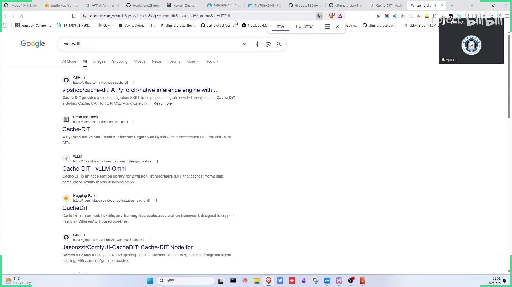 |
| （接上） [【跳转到 30:19】](https://www.bilibili.com/video/BV1xmuT6dE1M/?t=1819) | 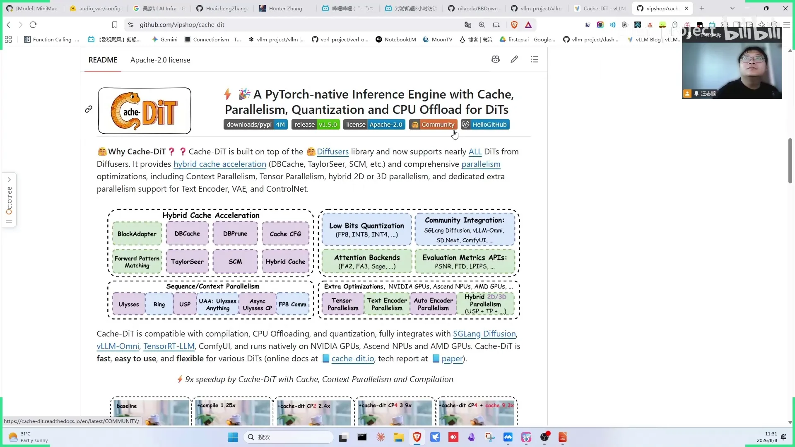 |
| （接上） [【跳转到 30:44】](https://www.bilibili.com/video/BV1xmuT6dE1M/?t=1844) | 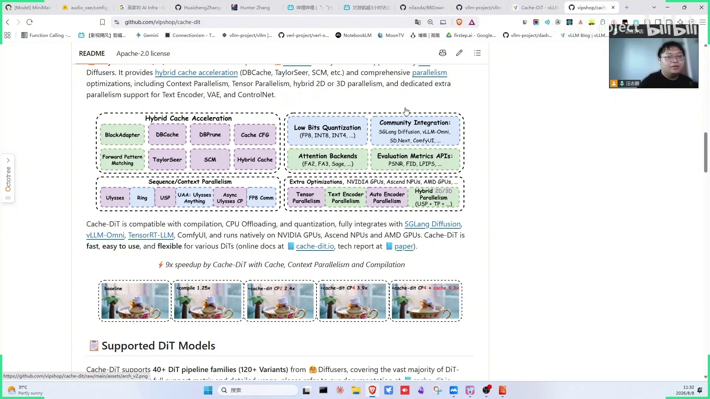 |
| 也可以看我们仓库里关于它的介绍，不过仓库里介绍主要是对代码的。想了解具体原理还是得看它的 paper。——这个仓里有好几种（投机/缓存）算法，应该会把后面很多方法都兼容进来。但我这个仓也很长时间没看了。 [【跳转到 31:02】](https://www.bilibili.com/video/BV1xmuT6dE1M/?t=1862) | 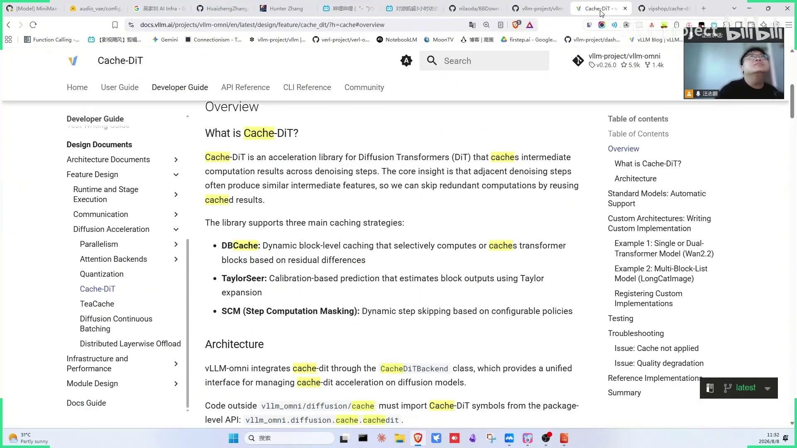 |
| 如果想了解具体原理的话其实还是得看他的这个paper [【跳转到 31:13】](https://www.bilibili.com/video/BV1xmuT6dE1M/?t=1873) | 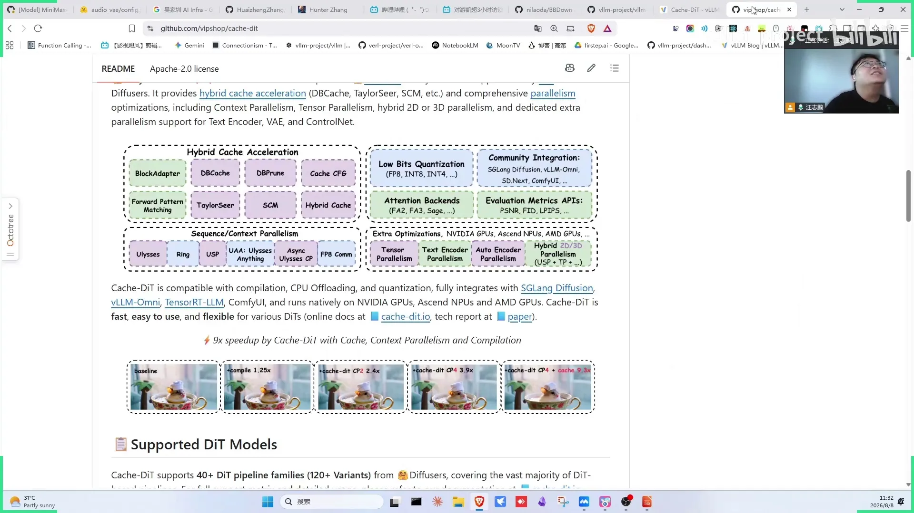 |
| （接上） [【跳转到 31:20】](https://www.bilibili.com/video/BV1xmuT6dE1M/?t=1880) | 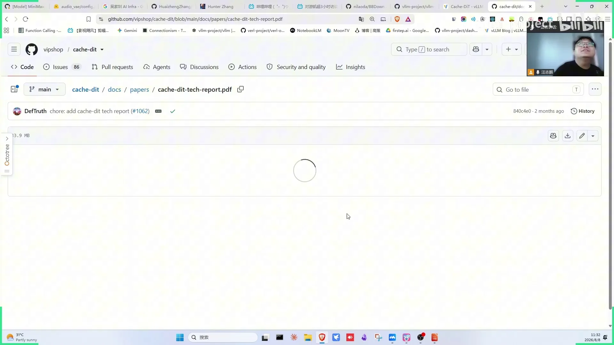 |
| （接上） [【跳转到 31:33】](https://www.bilibili.com/video/BV1xmuT6dE1M/?t=1893) |  |
| （此区间无字幕） [【跳转到 31:41】](https://www.bilibili.com/video/BV1xmuT6dE1M/?t=1901) | 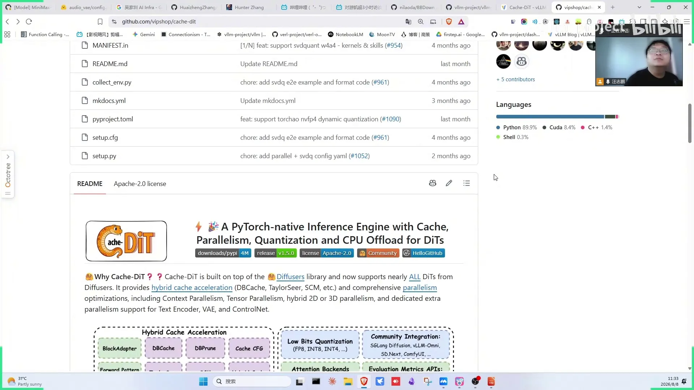 |
| （此区间无字幕） [【跳转到 31:47】](https://www.bilibili.com/video/BV1xmuT6dE1M/?t=1907) | 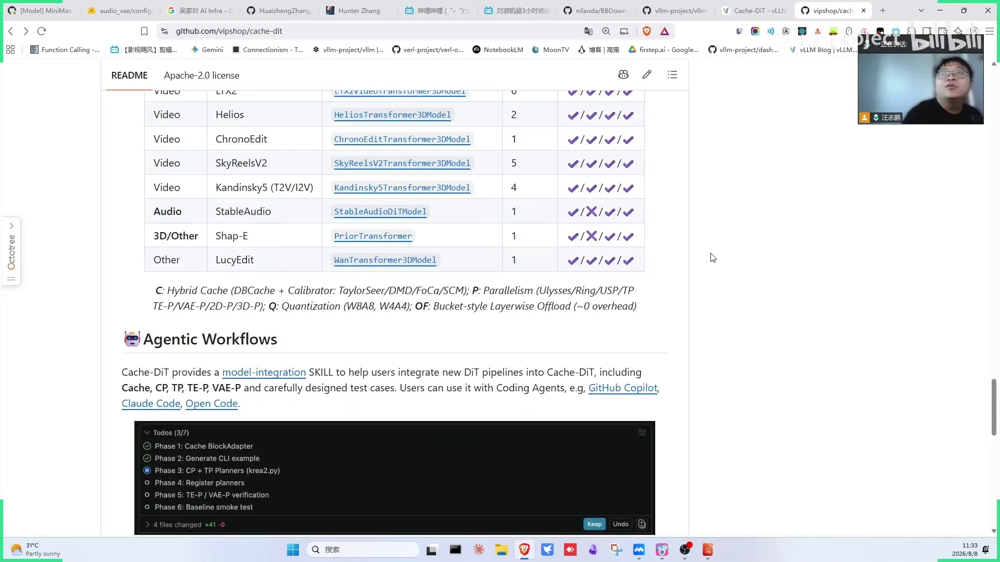 |
| 直播间的同学还有什么问题吗？如果没有什么问题，这一次直播可能就要结束了。——既然大家没什么问题，大家可以继续关注 PR 5720，有兴趣测试代码，赶个大早…… [【跳转到 31:52】](https://www.bilibili.com/video/BV1xmuT6dE1M/?t=1912) | 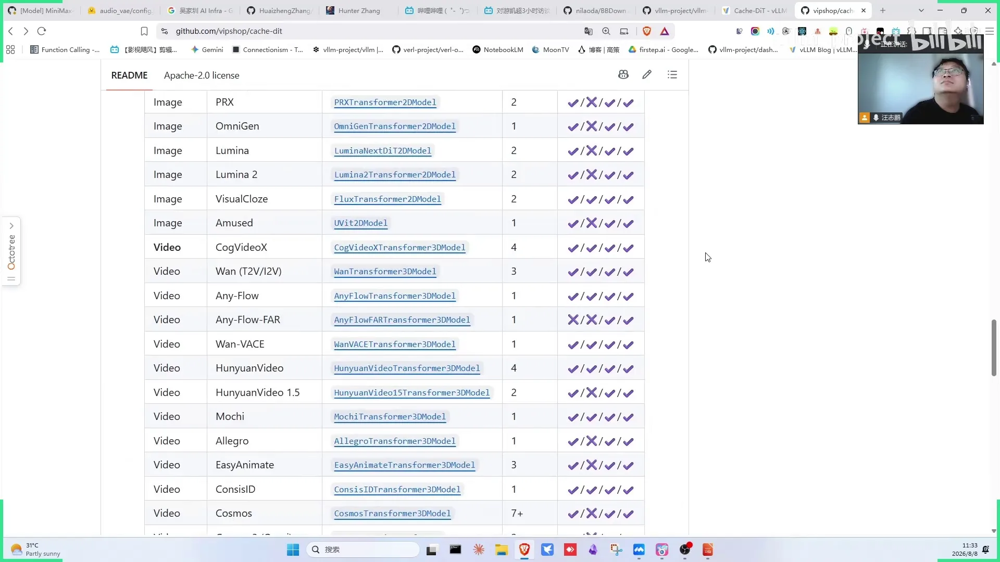 |
| （接上） [【跳转到 32:17】](https://www.bilibili.com/video/BV1xmuT6dE1M/?t=1937) |  |
| 这一期的直播回放和 PPT 后面也会上传，对应的 PPT 和回放会做一个整理版的 blog。没时间完整看直播的可以直接看博客。之前所有的直播回放都上传到 B 站了，从第六期开始直播整理出来的博客也都上传到了 GitHub 仓库。 [【跳转到 32:42】](https://www.bilibili.com/video/BV1xmuT6dE1M/?t=1962) | 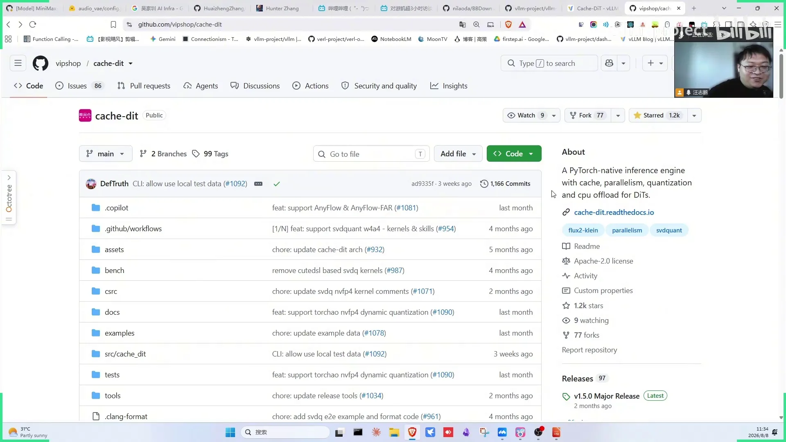 |
| （接上） [【跳转到 33:07】](https://www.bilibili.com/video/BV1xmuT6dE1M/?t=1987) | 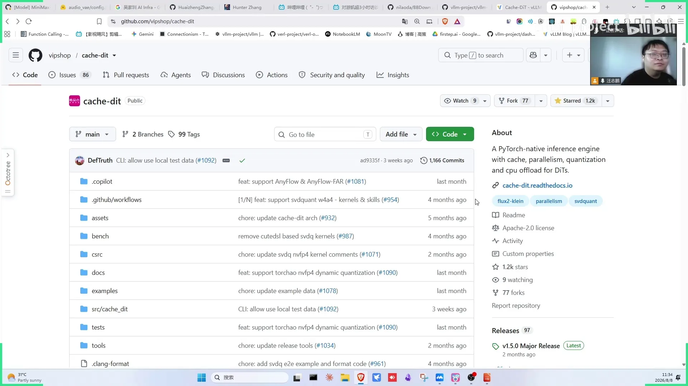 |
| 今天的直播到此结束，非常感谢子枫的参加，也感谢（社区）——大家基本上都是周末为爱发电来参加直播活动。对直播频道感兴趣的话希望点个关注，每次直播的回放可以来个一键三连。每个礼拜六上午 11 点钟都会做 AI infra 和 vLLM 社区相关的技术分享。非常感谢大家参与，拜拜拜拜。 [【跳转到 33:32】](https://www.bilibili.com/video/BV1xmuT6dE1M/?t=2012) | 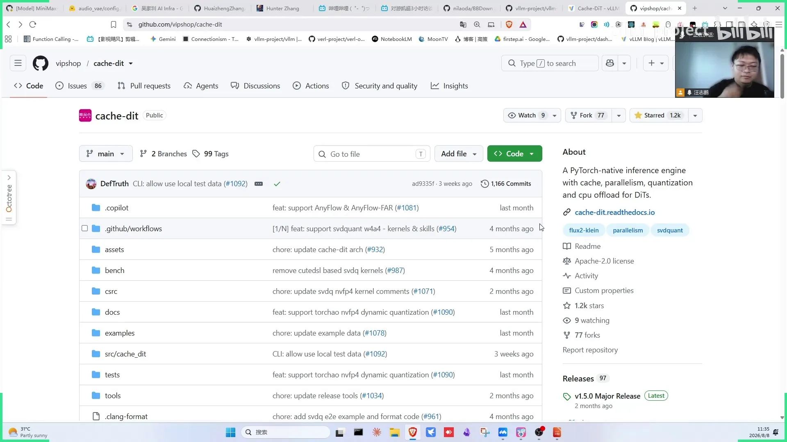 |
| （接上） [【跳转到 33:57】](https://www.bilibili.com/video/BV1xmuT6dE1M/?t=2037) |  |
| （此区间无字幕） [【跳转到 34:22】](https://www.bilibili.com/video/BV1xmuT6dE1M/?t=2062) | 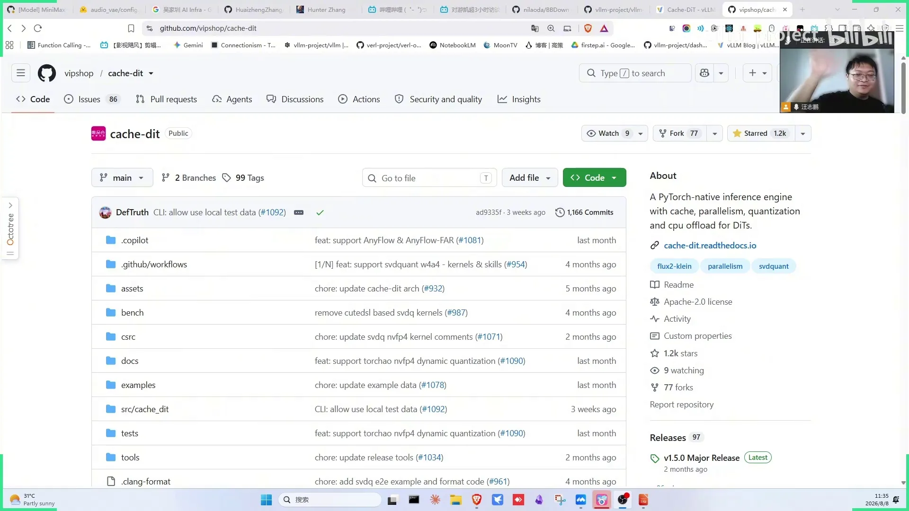 |