# vLLM小课堂（十五）：将系统效率推向极致，Attention FFN分离详解 原始文稿（图-字幕分栏）

| 字幕文本 | 画面 |
| :--- | ---: |
| 大家好，我是姜成珠（音），我是华为。我还带了一个小伙伴。——小伦你介绍一下自己。——大家好，我叫蒲秀昆，也是华为。——我叫张鑫，来自 UCSD（圣地亚哥），我的导师是张浩，我是第一年的学生。 [【跳转到 00:00】](https://www.bilibili.com/video/BV14Jgg6iEhN/?t=0) | 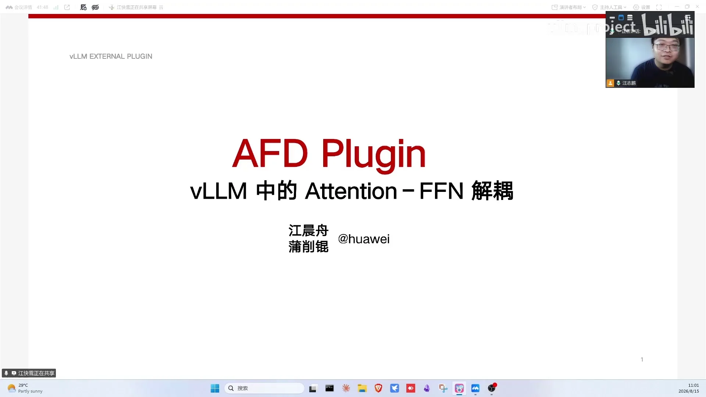 |
| 张浩老师带了很多很有名的学生，给整个 AI infra 界做出了很多卓越的贡献。太厉害了，我得努力。而且大家熟知的 PD 分离也是来自张浩老师的实验室。 [【跳转到 00:25】](https://www.bilibili.com/video/BV14Jgg6iEhN/?t=25) | 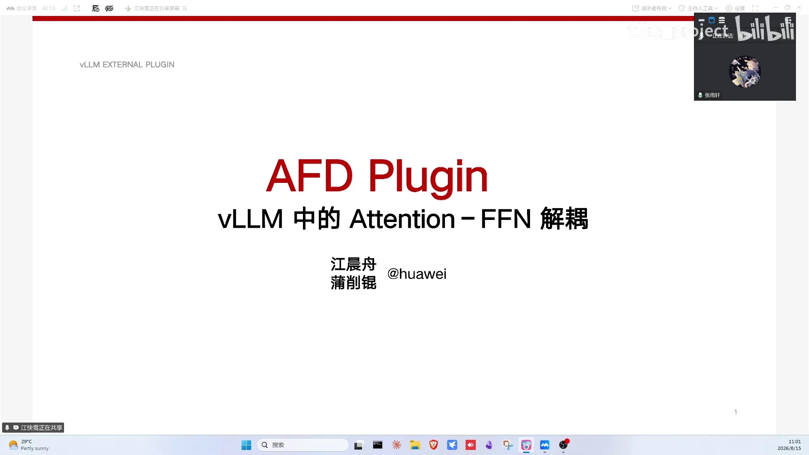 |
| 是我们同事（做的）。好，今天的分享正式开始。我先介绍一下我们这个仓库的来源动机：这个仓库是一个外部插件…… [【跳转到 00:50】](https://www.bilibili.com/video/BV14Jgg6iEhN/?t=50) | 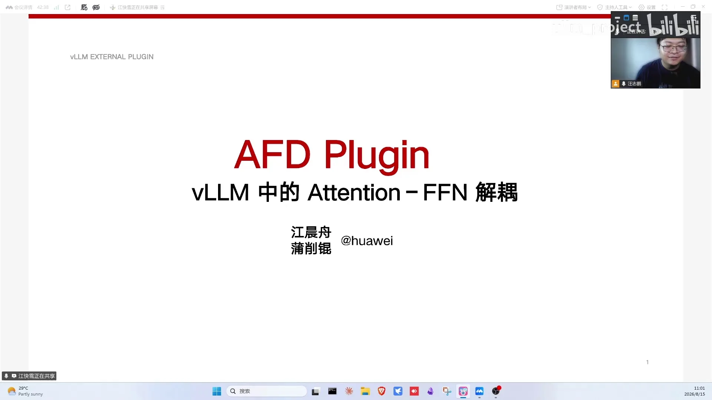 |
| 里面主要做一些关于 Attention-FFN 分离（AFD）的工作。大家可以在 vLLM project 下面看到这个仓库，大概 20 天前开出来的。它现在还是比较早期的实验性质的插件，我们还在努力做新东西上去…… [【跳转到 01:15】](https://www.bilibili.com/video/BV14Jgg6iEhN/?t=75) | 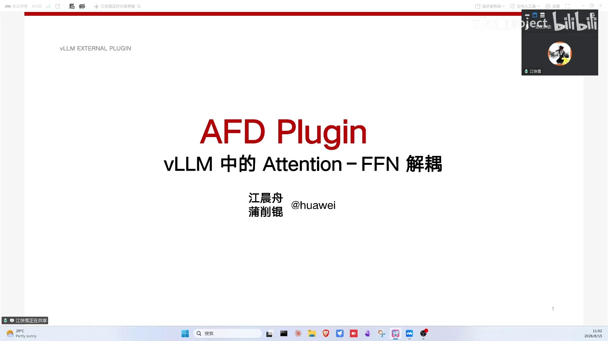 |
| 包括模型适配、性能的事情，以及收益场景的 case 探索。当前大家对它还处于摸索阶段，工业界落地情况大家也很好奇。我们这个仓库主要做的是…… [【跳转到 01:40】](https://www.bilibili.com/video/BV14Jgg6iEhN/?t=100) | 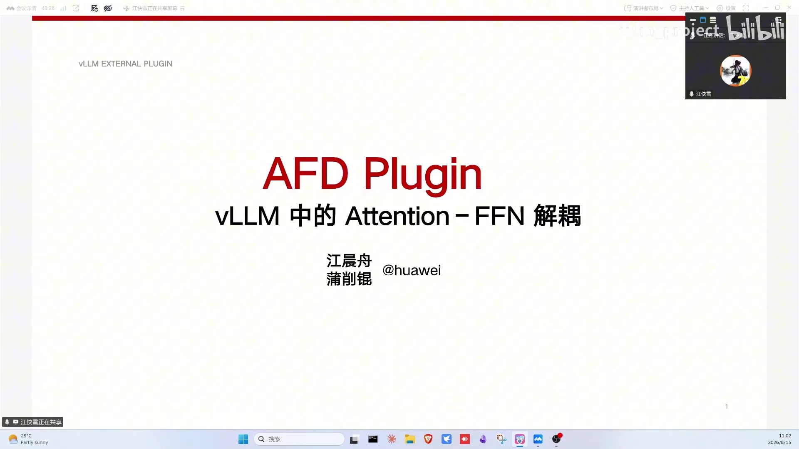 |
| （国产/昇腾）硬件方面的；GPU 方面我们做一个 demo 性质，没有太关注性能。这部分欢迎社区同学一起参与，cover GPU 相关或其他硬件 backend 的事情。——两位老师可以先介绍一下什么叫 AFD 吗？——我后面会讲。 [【跳转到 02:05】](https://www.bilibili.com/video/BV14Jgg6iEhN/?t=125) |  |
| 我讲一下：当初最早是（有人）提出来的时候，发现 attention 这一部分和 MoE 这一部分的计算特性差异比较大。attention 部分访存量以及计算特性对访存要求比较高：除了读取自身 attention 的权重之外，大的权重读取其实是读取历史信息…… [【跳转到 02:30】](https://www.bilibili.com/video/BV14Jgg6iEhN/?t=150) |  |
| 比如 KV cache——DS V4 的话要读取压缩的 KV cache；线性注意力的话要读取自己线性（注意力）的 memory 模块。这部分访存量和计算量会随序列长度增长，所以整体计算强度比较稳定…… [【跳转到 02:53】](https://www.bilibili.com/video/BV14Jgg6iEhN/?t=173) |  |
| 但 MoE 这部分主要是矩阵运算，访存量比较固定——就是专家的权重。可以看到当前默认（合布）的情况下…… [【跳转到 03:18】](https://www.bilibili.com/video/BV14Jgg6iEhN/?t=198) | 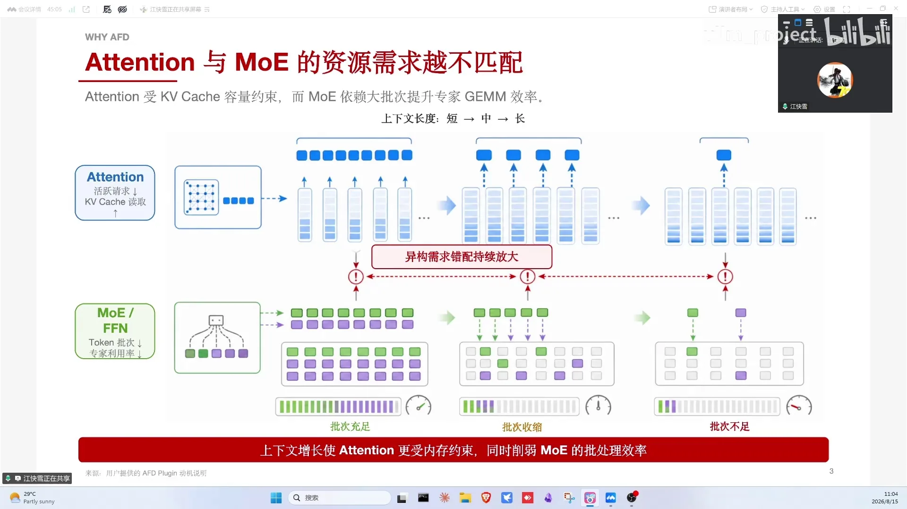 |
| decode 阶段下 FFN 的利用率是不足的。直观理解：假设不断把 batch size 打大，KV cache 部分时间的增加会随 batch size 增长线性相关；但 FFN 阶段在某个区间——batch size 较小到一定情况下——还是访存 bound 的…… [【跳转到 03:43】](https://www.bilibili.com/video/BV14Jgg6iEhN/?t=223) | 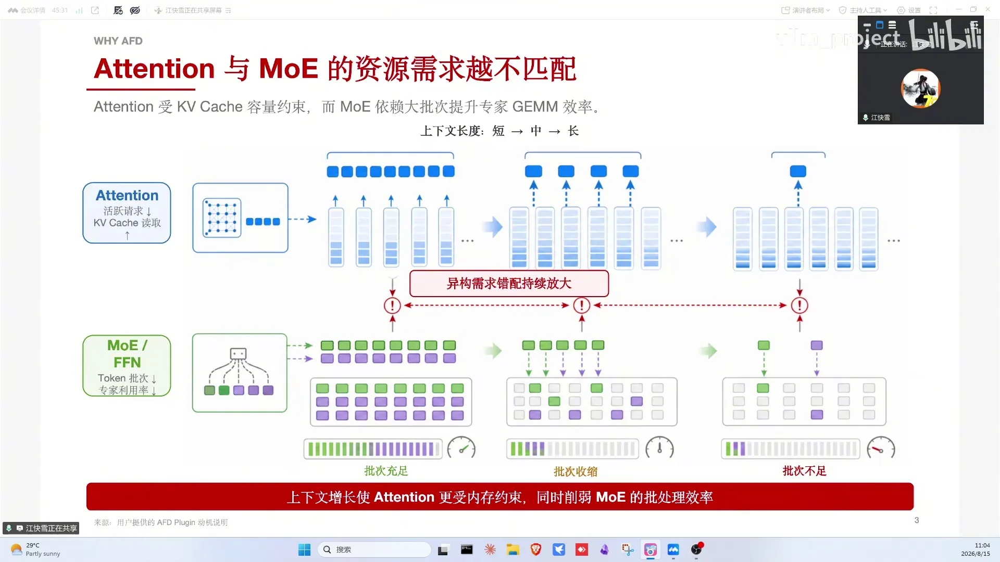 |
| 也就是说这部分大量被 HBM 带宽限制而不是算力限制，有很大一部分算力没用起来。 [【跳转到 04:08】](https://www.bilibili.com/video/BV14Jgg6iEhN/?t=248) |  |
| 这张图可以看到：短序列时单卡 KV cache 容量有限，上下文较短的话并发可以打比较大，这部分利用率还行；但上下文越来越长，能并发的数量越来越少…… [【跳转到 04:33】](https://www.bilibili.com/video/BV14Jgg6iEhN/?t=273) | 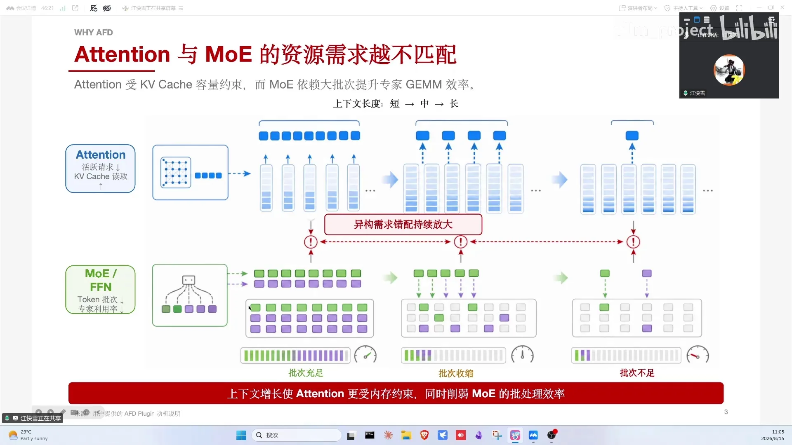 |
| 包括（长序列）时 batch size 也不会很大。这导致 FFN 这部分大多数时间基本就是访存时间：访了那么多专家权重，但计算没算多少，计算资源有点浪费。那么我们做这个（分离）就可以把 attention 和 FFN…… [【跳转到 04:58】](https://www.bilibili.com/video/BV14Jgg6iEhN/?t=298) |  |
| （接上） [【跳转到 05:23】](https://www.bilibili.com/video/BV14Jgg6iEhN/?t=323) | 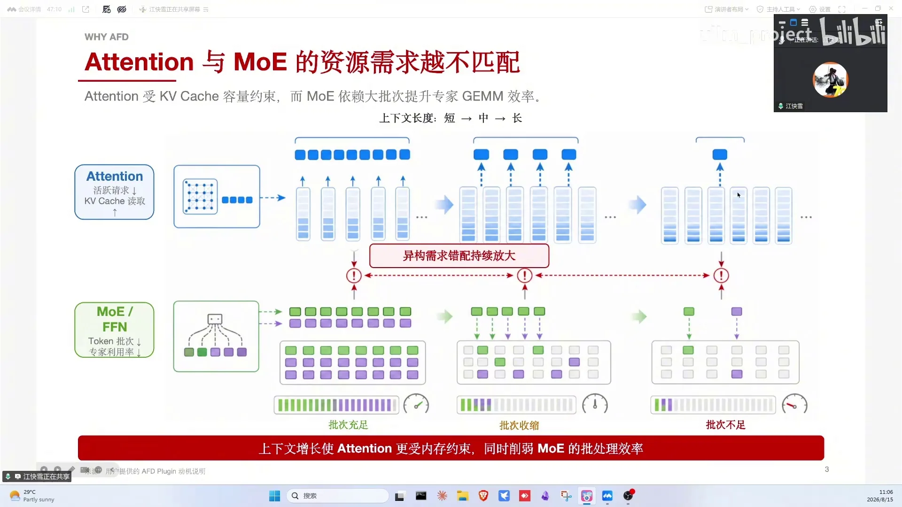 |
| 进行（解耦）。可以把当前 A 和 F 合并的情况——大批量情况下看作 A 比 F 多的情况——解耦开后就可以做独立配比：比如让 attention 的卡数变多一点，让 FFN 的计算利用率上去，降低一定成本。 [【跳转到 05:48】](https://www.bilibili.com/video/BV14Jgg6iEhN/?t=348) |  |
| （接上） [【跳转到 05:57】](https://www.bilibili.com/video/BV14Jgg6iEhN/?t=357) |  |
| 此外还可以探索异构部署形态：两个部分计算特性不同，可以通过异构部署提升性能，或者用便宜的卡做成本上的（优化）…… [【跳转到 06:19】](https://www.bilibili.com/video/BV14Jgg6iEhN/?t=379) |  |
| 此外分离之后可以做一些异步的手段：现在大 EP 情况下，attention 算完之后专家路由以及 dispatch/combine 阶段还是会有同步屏障，可能有宽慢卡现象…… [【跳转到 06:32】](https://www.bilibili.com/video/BV14Jgg6iEhN/?t=392) |  |
| 因為這兩個部分的這個計算資源還是計算特性還是不同的可以通過一些依國部署的形態要么就是能夠提升一徑的性能要么就是我可以用一些便宜的卡去做一個成本上的相遞 [【跳转到 06:37】](https://www.bilibili.com/video/BV14Jgg6iEhN/?t=397) |  |
| 分离之后可以去掉全局 EP 的同步屏障。这有点类似：几个月前老黄在 GTC 大会上发布了 Rubin 的卡和（Rubin CPX），让 CPX 卡去算 FFN——我们推测它首先是异构的，其次应该能做成异步…… [【跳转到 06:53】](https://www.bilibili.com/video/BV14Jgg6iEhN/?t=413) | 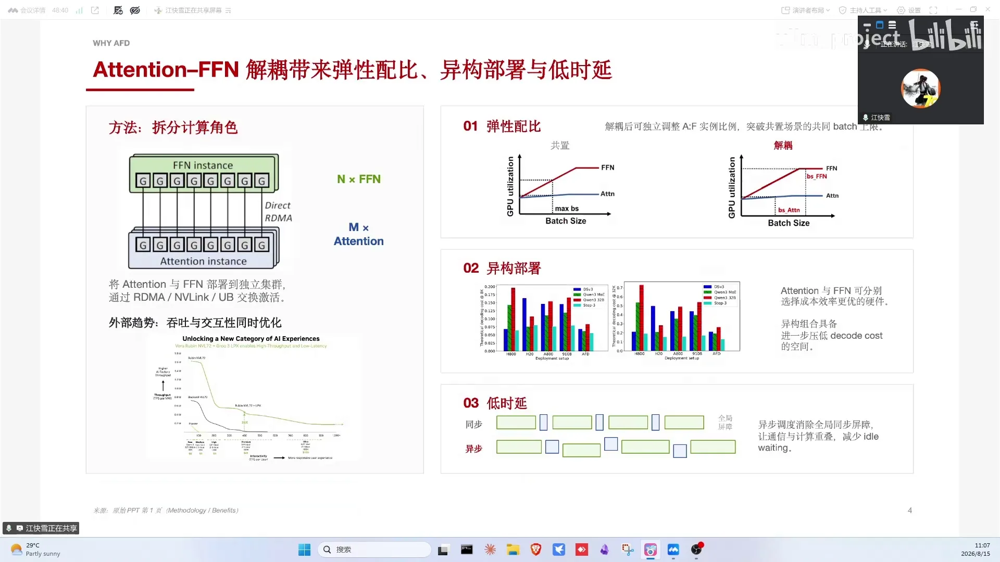 |
| （接上） [【跳转到 07:18】](https://www.bilibili.com/video/BV14Jgg6iEhN/?t=438) |  |
| 我们猜测它的方案应该是异步的。那么…… [【跳转到 07:43】](https://www.bilibili.com/video/BV14Jgg6iEhN/?t=463) |  |
| （Rubin CPX）的带宽相当高，比现在的 B 系列高好多倍：它为 FFN 服务，能做到 dispatch/combine，把原来 HBM 上的访存带宽放大，降低 FFN 的计算时间。 [【跳转到 08:08】](https://www.bilibili.com/video/BV14Jgg6iEhN/?t=488) | 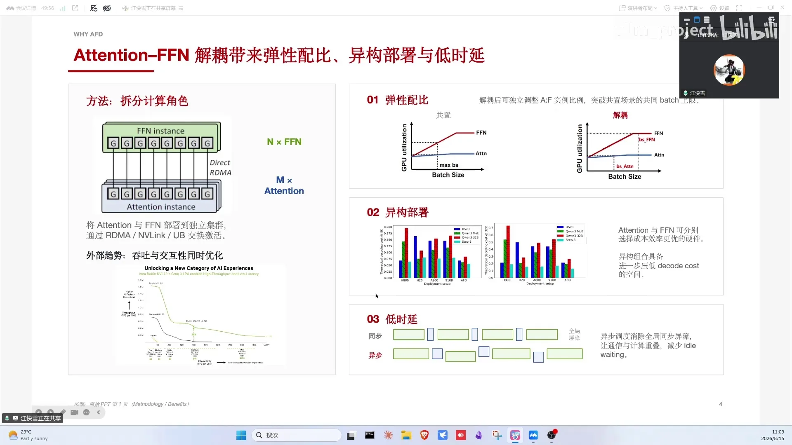 |
| 直播间有同学问：为什么小 batch 会浪费算力？——因为容量有限：sequence length 大的话 batch 就小，那么在 MoE 这块地方计算效率不会很高。就这个意思：它有一个甜点区域…… [【跳转到 08:33】](https://www.bilibili.com/video/BV14Jgg6iEhN/?t=513) |  |
| （接上） [【跳转到 08:44】](https://www.bilibili.com/video/BV14Jgg6iEhN/?t=524) | 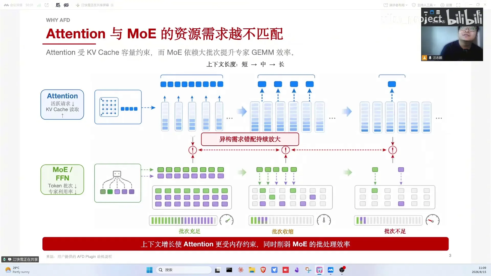 |
| 比较直观的理解：可能我算一个 batch 的时间和算 60 个 batch 的时间是一样的（总体耗时来看）。然后有同学问：Dense 的（bound）跟 MoE 的 bound 有什么不同吗？怎么分析？ [【跳转到 09:09】](https://www.bilibili.com/video/BV14Jgg6iEhN/?t=549) | 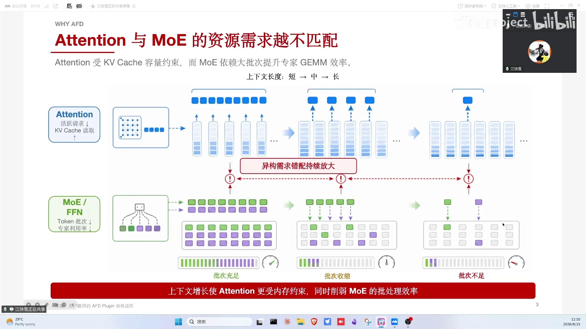 |
| 可以实际测试：MoE 相当于更稀疏，相当于 bound 的（临界）变小。我们没怎么在 Dense 上试验过——Dense 可能也有类似情况，但效果没有 MoE 那么好。 [【跳转到 09:34】](https://www.bilibili.com/video/BV14Jgg6iEhN/?t=574) | 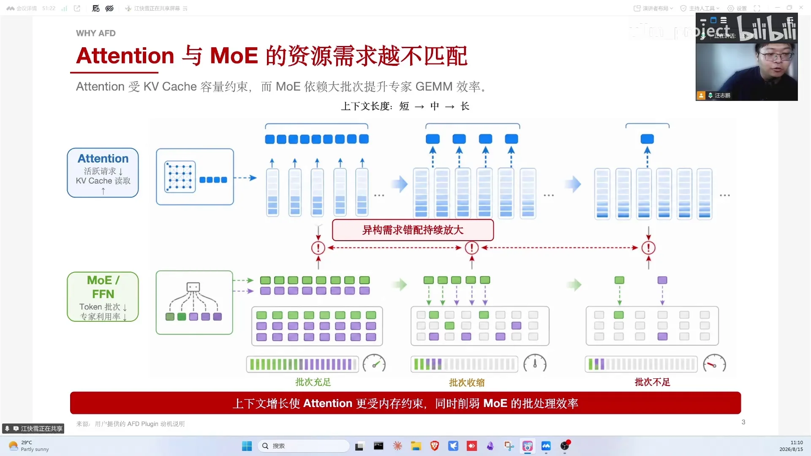 |
| 好，继续。这是我们的插件，依赖 vLLM 之前做的插件系统 general plugins，我们做了一个 plugin。 [【跳转到 09:59】](https://www.bilibili.com/video/BV14Jgg6iEhN/?t=599) | 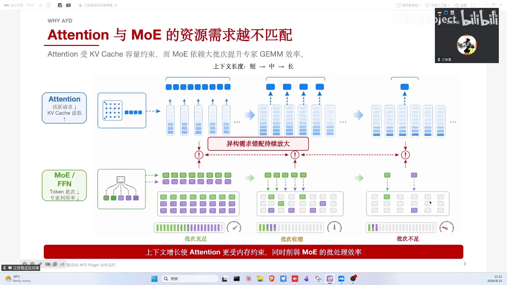 |
| 现在社区中有好多仓库也是通过这个方式接入的。我们这个主要覆盖 GPU 和（昇腾）NPU。 [【跳转到 10:10】](https://www.bilibili.com/video/BV14Jgg6iEhN/?t=610) | 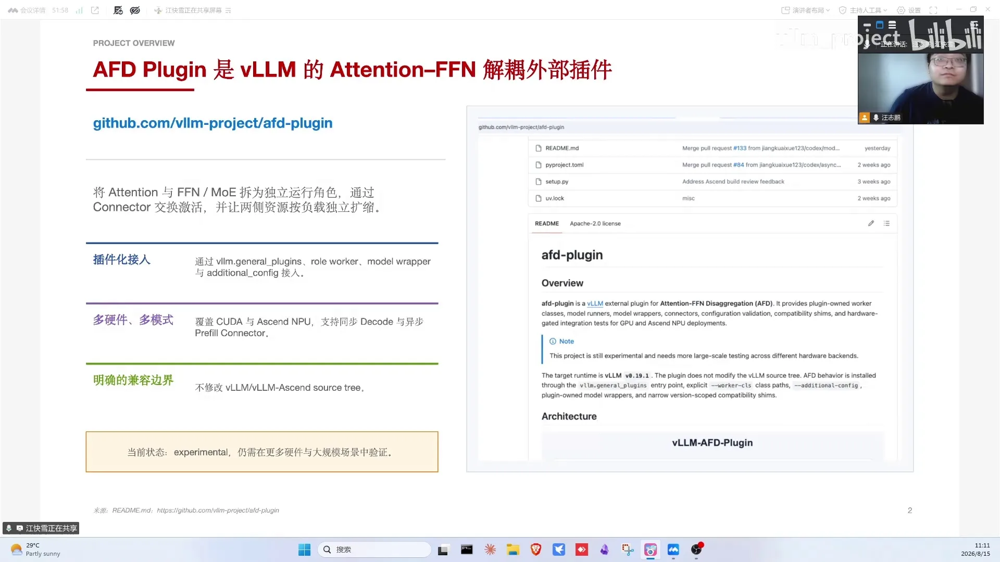 |
| NPU 后面会讲实践上的性能探索；GPU 是初步实现，感兴趣的同学可以参与开发。主要基于 decode 阶段，还有一个是异步的 prefill 阶段。异步 prefill 的动机和刚才讲的不同——是大家聊得比较多的动机…… [【跳转到 10:35】](https://www.bilibili.com/video/BV14Jgg6iEhN/?t=635) | 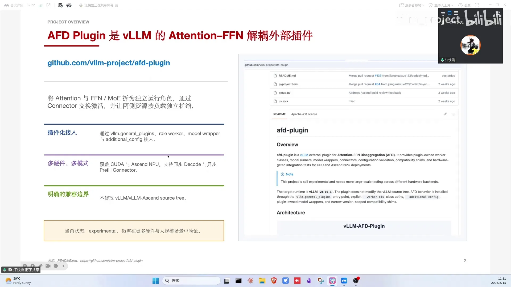 |
| （此区间无字幕） [【跳转到 11:00】](https://www.bilibili.com/video/BV14Jgg6iEhN/?t=660) | 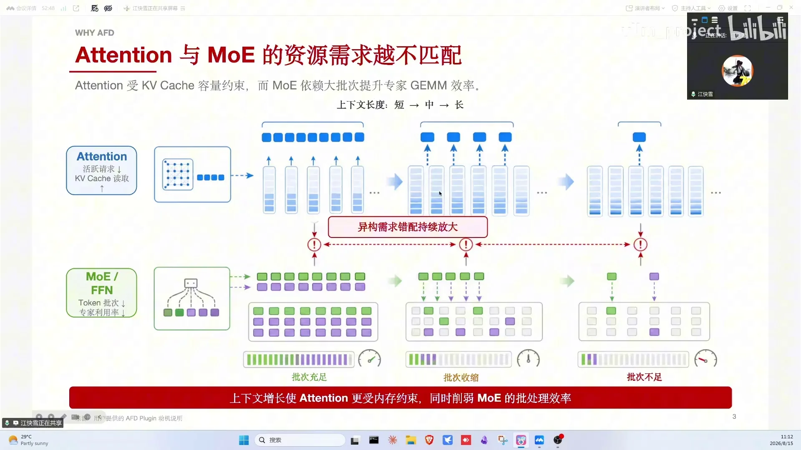 |
| 当前还是早期 experimental 性质。整个项目架构大概几块：把 attention 和 FFN 解耦开，新增两个角色——attention 角色和 FFN 角色。FFN 角色更像一个服务层：没有 KV cache，不用 care KV cache，也不用 care scheduler 的调度…… [【跳转到 11:08】](https://www.bilibili.com/video/BV14Jgg6iEhN/?t=668) |  |
| 更多是被动接收 attention 传过来的 hidden state 或路由信息的被动调用方。attention 部分基本复用 vLLM 的部分：engine core、scheduler、KV cache 等都继承下来。 [【跳转到 11:33】](https://www.bilibili.com/video/BV14Jgg6iEhN/?t=693) |  |
| 通过 vLLM 现有的 worker class 可以指定自己的 worker 类，所以我们做了两个 worker：attention worker 和 FFN worker，每个 worker 里拥有自己的 model runner，跟原来的逻辑类似。 [【跳转到 11:58】](https://www.bilibili.com/video/BV14Jgg6iEhN/?t=718) |  |
| attention 的 model runner 继承了 GPU model runner，现在还在 V1，最近开始搞 V2 版本，都开放了。 [【跳转到 12:23】](https://www.bilibili.com/video/BV14Jgg6iEhN/?t=743) |  |
| 直播间有同学问：AFD 分离现在有什么问题没解决？——model runner 从 V1 切到 V2 就是一个很好的（切入点）。如果想做贡献有什么好方向？包括 roadmap 分享。 [【跳转到 12:48】](https://www.bilibili.com/video/BV14Jgg6iEhN/?t=768) |  |
| 好，我先回答。先讲 GPU 侧现状：model runner V2 有一个同学已经在 GPU 上做了（原型）。FFN 侧会简单一点：一个 model runner，有一个循环不断接收和发送，中间是计算，通过 connector 控制…… [【跳转到 13:13】](https://www.bilibili.com/video/BV14Jgg6iEhN/?t=793) | 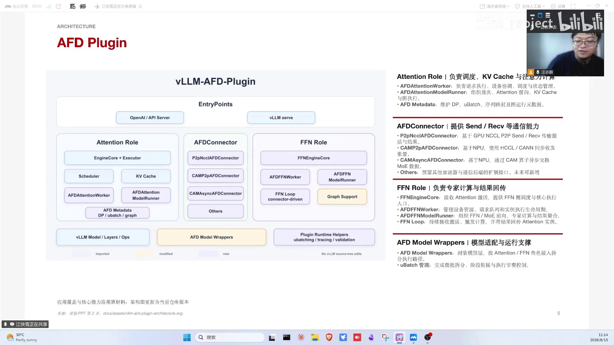 |
| （此区间无字幕） [【跳转到 13:38】](https://www.bilibili.com/video/BV14Jgg6iEhN/?t=818) |  |
| GPU 做的是比较简单的 P2P；（昇腾）上主要也做了 P2P，还有一个给 prefill 做的异步，后面都会讲。两个逻辑类似。此外在 decode 的（角色）上我们也支持 prefill-only / decode-only 的（模式）…… [【跳转到 14:03】](https://www.bilibili.com/video/BV14Jgg6iEhN/?t=843) | 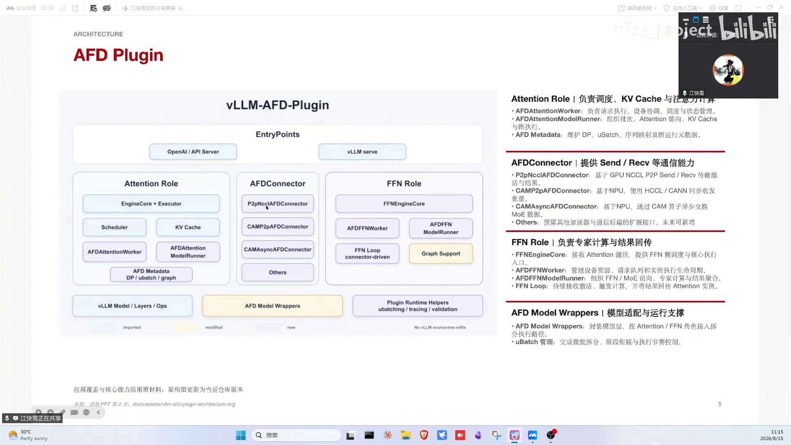 |
| （接上） [【跳转到 14:28】](https://www.bilibili.com/video/BV14Jgg6iEhN/?t=868) |  |
| 模型部分需要做些改动，所以我们有自己的模型（分支）：现在自己做了 DeepSeek V2/V3.2 的适配，最近正在支持 DeepSeek V4。最近有几个小伙伴在帮做 Qwen3 和 Qwen3.5 的。回到刚才的问题：想做贡献的话，一是模型侧——模型适配了之后可以用（A/F）的 connector 测一些收益；二是对当前的 connector 做性能优化，或者新增自己的通信 backend…… [【跳转到 14:53】](https://www.bilibili.com/video/BV14Jgg6iEhN/?t=893) |  |
| 我比较欢迎大家新增通信 backend。后面另一位嘉宾——类似 FastAFD 那种，他们对 GPU 这块研究更深。我们也有想法把那一套集成到我们这边来…… [【跳转到 15:18】](https://www.bilibili.com/video/BV14Jgg6iEhN/?t=918) |  |
| 大家等会可以仔细听宇宣老师的 FastAFD 分享：他对 GPU 自己的研究比我深入很多。我这边更多提供 vLLM 上的框架接入以及（昇腾）生产上的实验情况。 [【跳转到 15:43】](https://www.bilibili.com/video/BV14Jgg6iEhN/?t=943) |  |
| 我不知道这样说我有没有回答刚才的问题——我觉得回答得很好。（仓库展示）结束的时候给大家看一下也行，或者我讲完的时候看。整体大概是这样：我的一个请求进来之后…… [【跳转到 16:08】](https://www.bilibili.com/video/BV14Jgg6iEhN/?t=968) |  |
| 大家比较熟悉：经过（引擎）、scheduler、KV cache 管理等，然后通过 worker class——不会跑现有的 GPU worker 类，会跑我们的（worker）——进入我们的 model runner，后面会切到 V2。模型跑的是我们对原有模型的包装和（拆分）的 model 实现…… [【跳转到 16:33】](https://www.bilibili.com/video/BV14Jgg6iEhN/?t=993) |  |
| 这也是刚才的问题：希望看看大家有没有好方向。当前我们对模型仓库的改动还是有一点，对未来版本升级和维护会有一定…… [【跳转到 16:58】](https://www.bilibili.com/video/BV14Jgg6iEhN/?t=1018) |  |
| 维护难度会略有增加。我最近持续在做的事情：减少对（上游模型仓库）的修改，也提了一些方案。有兴趣进入开发的同学，比较好的切入点是可以跟我讨论怎么减少 patch 的影响，还有模型仓库的（过渡）…… [【跳转到 17:23】](https://www.bilibili.com/video/BV14Jgg6iEhN/?t=1043) | 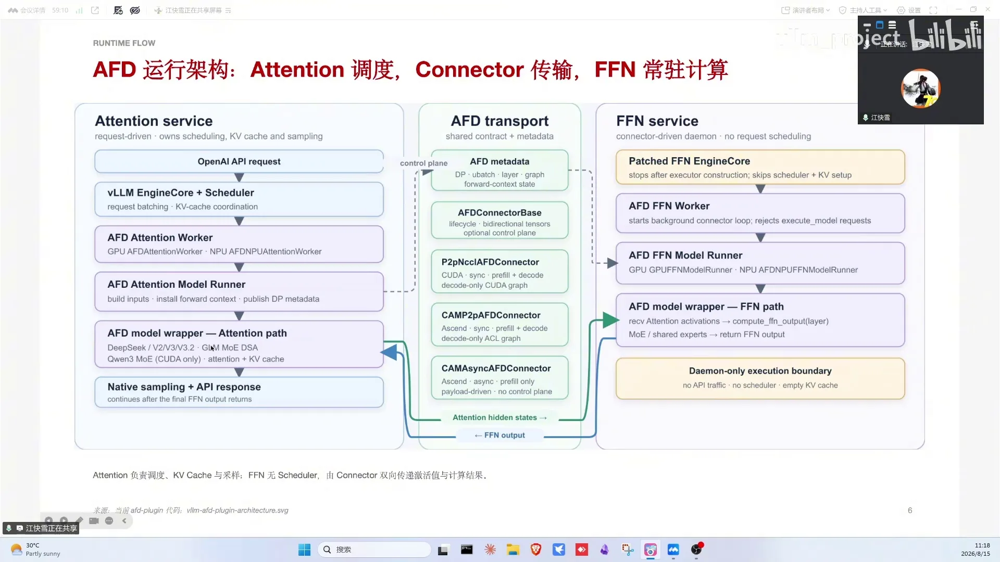 |
| 避免一些 AFD 带来的修改，最好能被所有模型（runner）使用。接下来输出什么没有变化。FFN 也会（被）启动——经过我们的改造：现在的做法还比较暴力…… [【跳转到 17:48】](https://www.bilibili.com/video/BV14Jgg6iEhN/?t=1068) |  |
| 把（引擎）里处理 scheduler 和 KV cache 的地方跳过——因为 FFN 不需要这些。后面希望 FFN 这边尽量和 vLLM 结合，形成自己的一套方式，后续维护能节省不少成本：不受 vLLM 主线更新的影响。这也是一个方向，都还没做。中间通过 worker 里有一些调度系统的动作：比如 all-gather 算完之后发送到这边，由这边执行。如果是 P2P 可能还会执行 gate、dispatch/combine、FFN 的计算…… [【跳转到 18:13】](https://www.bilibili.com/video/BV14Jgg6iEhN/?t=1093) |  |
| 这个模型到底在哪部分切分其实也是比较好的（话题）：不一定像我这样，针对不同模型可能有定制化的更好性能探索。 [【跳转到 18:38】](https://www.bilibili.com/video/BV14Jgg6iEhN/?t=1118) | 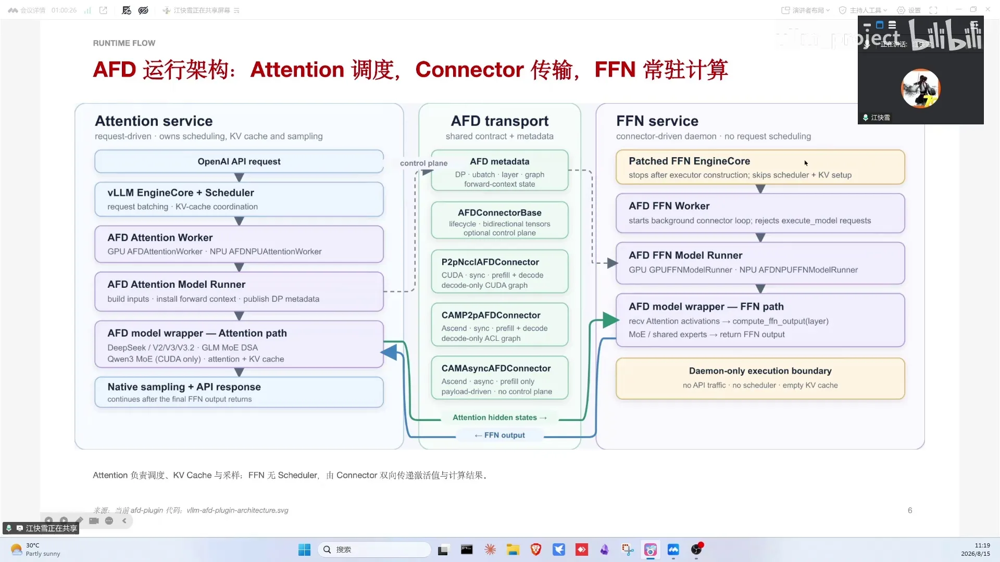 |
| 这边扫完之后再把 FFN 的结果传回去。中间有一个 transform 层，主要由 ConnectorBase 抽象了公共接口：send attention output / receive attention output，反过来是 send FFN output / receive（FFN）output…… [【跳转到 19:03】](https://www.bilibili.com/video/BV14Jgg6iEhN/?t=1143) |  |
| （接上） [【跳转到 19:28】](https://www.bilibili.com/video/BV14Jgg6iEhN/?t=1168) |  |
| 这些 connector 通过一个公共的抽象——这个做法在 vLLM 里常见：像 KV connector 或者 EP 的（通信）connector 都这么玩。这里介绍一下…… [【跳转到 19:53】](https://www.bilibili.com/video/BV14Jgg6iEhN/?t=1193) | 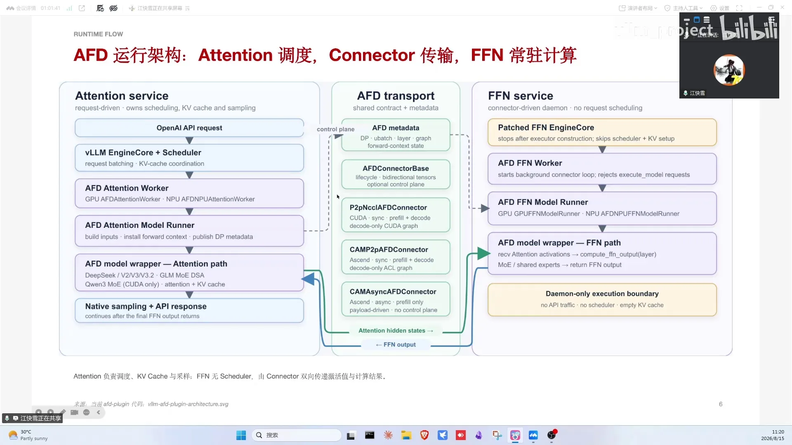 |
| 我们（昇腾）上的 connector P2P 的流程：在 full graph 情况下，把一个 batch 切分成两个 ubatch。ubatch 是之前上游社区（团队）搞的基础设施，我们听从建议没有重新造轮子。切分成两个 microbatch 的原因：不切分就是串行——整个 batch 算完发给 FFN…… [【跳转到 20:18】](https://www.bilibili.com/video/BV14Jgg6iEhN/?t=1218) |  |
| （接上） [【跳转到 20:43】](https://www.bilibili.com/video/BV14Jgg6iEhN/?t=1243) | 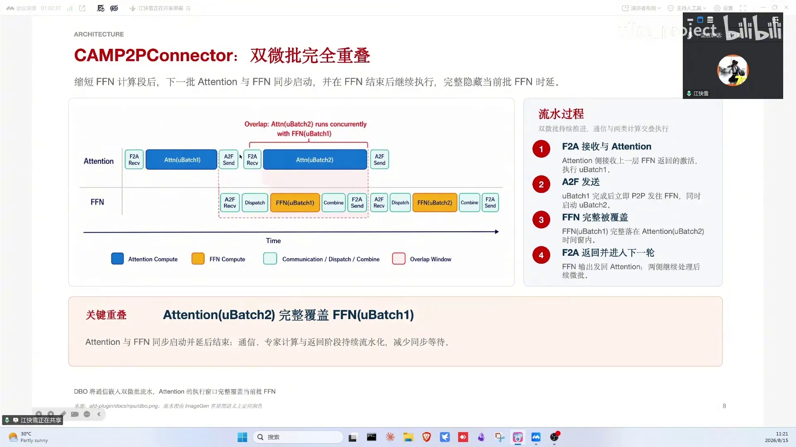 |
| FFN 算完发给 attention，中间互相在等。为了让资源利用率提高、中间不产生大量气泡、更好流水，有这么一套（流水线）。attention 算完之后会有一个（发送）对 attention 的结果进行发送…… [【跳转到 21:08】](https://www.bilibili.com/video/BV14Jgg6iEhN/?t=1268) |  |
| 发送到 FFN，FFN 执行（gate/dispatch）、FFN、combine——可以是分散的也可以是 MegaKernel 的形式。算完回去之后，计算过程中 attention 的第二个 microbatch 也在计算，正好形成交叉流水…… [【跳转到 21:33】](https://www.bilibili.com/video/BV14Jgg6iEhN/?t=1293) | 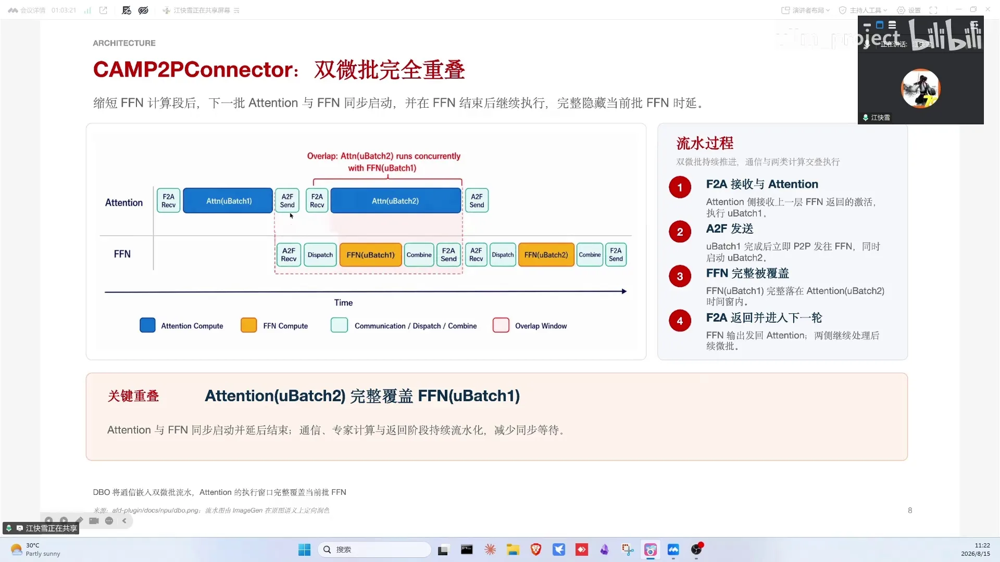 |
| 大概是（P2P）的逻辑。可以通过（调整）attention 的配比去做。刚才还提到 prefill（异步）：prefill 异步在（昇腾）上的实践跟最开始讲的动机不太一样…… [【跳转到 21:58】](https://www.bilibili.com/video/BV14Jgg6iEhN/?t=1318) |  |
| 它不是 FFN 利用率的问题，而是我们关注到一个现象：比如（昇腾）上可能有多 DP 的部署——DP4（GB）8 或 DP4（GB）4 每种部署方式。在不同 DP 情况下，当前大 EP 的同步方案下，每个调度的卡的序列长度或 token 数可能不一样，导致 attention 计算时长在每个 DP 上不一样…… [【跳转到 22:23】](https://www.bilibili.com/video/BV14Jgg6iEhN/?t=1343) |  |
| （接上） [【跳转到 22:48】](https://www.bilibili.com/video/BV14Jgg6iEhN/?t=1368) |  |
| 假设 DP（某 rank）调度到的请求比较多或 token 数比较大，另一个是短请求或 cache 命中高的请求——参加计算不需要那么长时间。但 all-to-all 需要同步屏障，所以有大量空耗。做异步是目前能想到的直观方式…… [【跳转到 23:13】](https://www.bilibili.com/video/BV14Jgg6iEhN/?t=1393) |  |
| 得分离：分离后 attention 部分中间是独立的。流水方式：原来要等（慢的）卡，现在直接发过来让对应的（卡）去算，算完再发回来，减少每一步由于同步 EP 造成的空等…… [【跳转到 23:38】](https://www.bilibili.com/video/BV14Jgg6iEhN/?t=1418) |  |
| 主要是实现了另外一个（同事）实现的一个高性能（算子）：异步的 dispatch send attention = dispatch send 和 combine receive；FFN 侧是 dispatch receive 和 combine send。大概是这么一个异步。 [【跳转到 24:03】](https://www.bilibili.com/video/BV14Jgg6iEhN/?t=1443) | 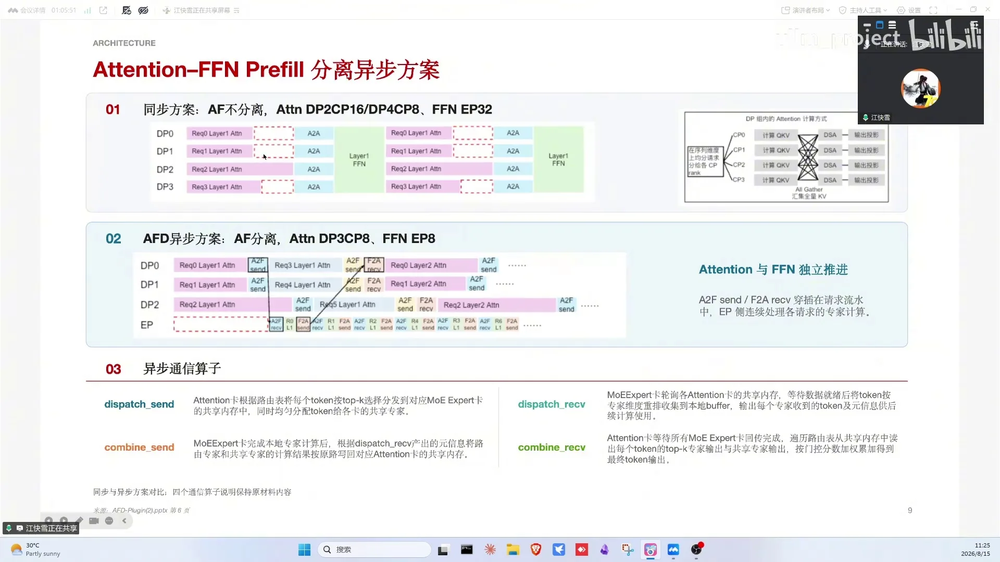 |
| 可以先回到前页一起。今天有同学问 ubatch 怎么切分？可以看上游的 DPBO——上游的 dual batch，它有个逻辑…… [【跳转到 24:28】](https://www.bilibili.com/video/BV14Jgg6iEhN/?t=1468) | 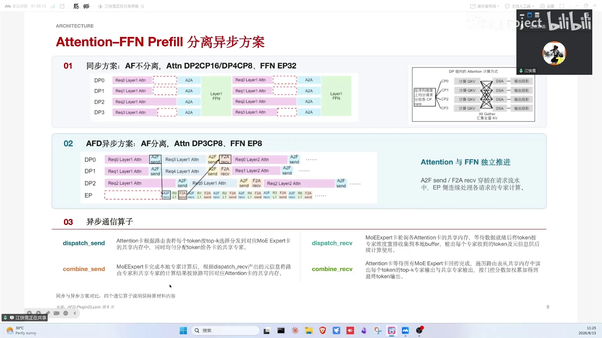 |
| 有一个阈值可以通过命令行设置：比如 decode 的（阈值）——名字我忘了。当 decode 的 token 数或请求数超过一定阈值时，就会对它做切分。 [【跳转到 24:53】](https://www.bilibili.com/video/BV14Jgg6iEhN/?t=1493) |  |
| DPBO 的实现比较复杂，一时讲不清楚。大概是去年 Lucas Wilkinson 他们在 vLLM 上实现的：用了多线程，让 ubatch 的切分跟模型实现结合，同时支持 CUDA graph 捕获。主要跟他们的实现有关。思路应该也来自训练侧。感兴趣的同学可以直接（问 AI）：把代码拿下来…… [【跳转到 25:18】](https://www.bilibili.com/video/BV14Jgg6iEhN/?t=1518) |  |
| （接上） [【跳转到 25:43】](https://www.bilibili.com/video/BV14Jgg6iEhN/?t=1543) |  |
| 问 DPBO 是怎么回事、ubatch 怎么实现的。他们的 DPBO 是给大 batch 的：希望在通信的时候做另一个 batch 的计算，因为通信和计算的资源相对隔离…… [【跳转到 26:08】](https://www.bilibili.com/video/BV14Jgg6iEhN/?t=1568) | 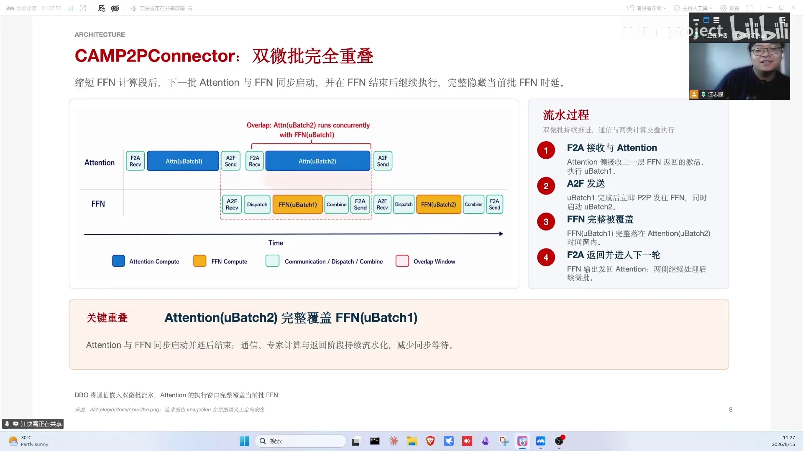 |
| 这样两部分资源都能同时运行。这是 DPBO batch。vLLM 官网有一个 develop 文档讲了大批量下 DPBO 是怎样的流水，感兴趣可以搜一下。 [【跳转到 26:33】](https://www.bilibili.com/video/BV14Jgg6iEhN/?t=1593) |  |
| vLLM 的 develop（文档）——我之前没看过，不知道官网上有没有设计文档。有一个。感兴趣的同学可以去 vLLM 的 DPBO（文档）看一下：想给 vLLM 做贡献一定要先看，里面会告诉你怎么安装、配套的（设置）…… [【跳转到 26:58】](https://www.bilibili.com/video/BV14Jgg6iEhN/?t=1618) |  |
| 比如（sign-off），里面很多技术细节当时怎么设计出来的都会有。好，我们继续。这是一个我们的用法：用了 vllm serve 的命令…… [【跳转到 27:23】](https://www.bilibili.com/video/BV14Jgg6iEhN/?t=1643) | 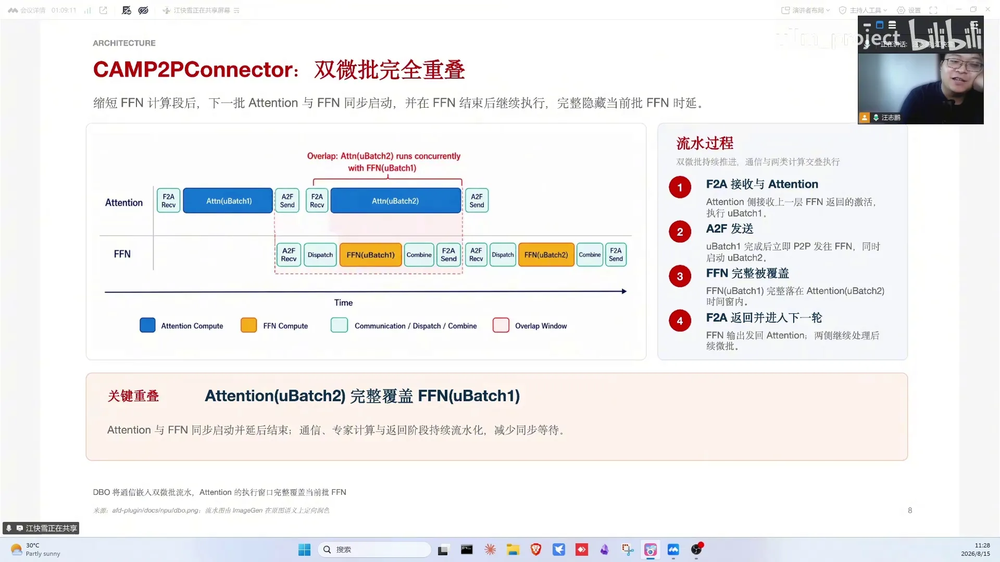 |
| AFD 的开关通过 advanced config 做：通过 role 指定 attention 角色，通过 FFN 指定 FFN 角色，还可以自己指定 connector。有点像 KV connector，只不过 KV 或 EP connector 有自己的命令行。我们也是外部插件所以用 advanced config。如果有机会合入主仓的话这部分再看。 [【跳转到 27:48】](https://www.bilibili.com/video/BV14Jgg6iEhN/?t=1668) | 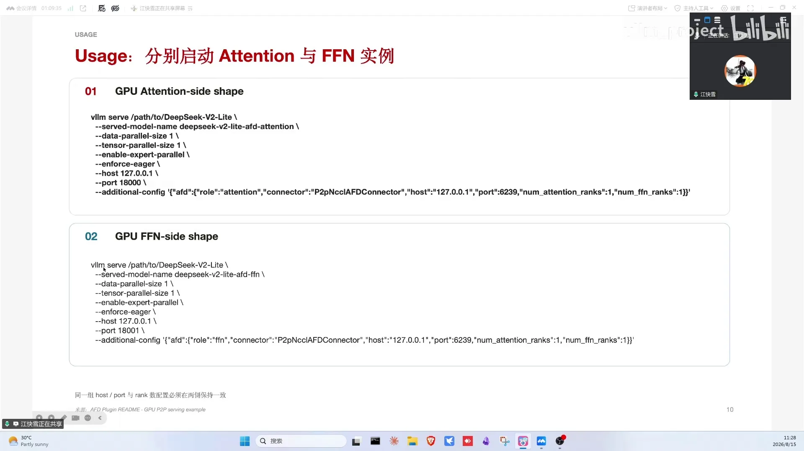 |
| （接上） [【跳转到 28:13】](https://www.bilibili.com/video/BV14Jgg6iEhN/?t=1693) | 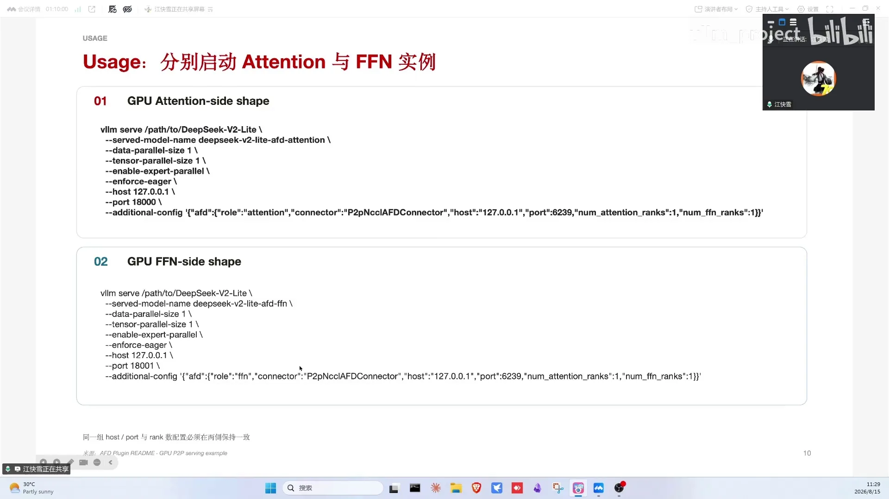 |
| 这是（昇腾）上针对 P2P decode 的情况。实验：当前还是最开始开源时 V0.19 版本的实验。测的是 DeepSeek V3.2，在昇腾 910C 上。序列长度定长（16K）…… [【跳转到 28:34】](https://www.bilibili.com/video/BV14Jgg6iEhN/?t=1714) | 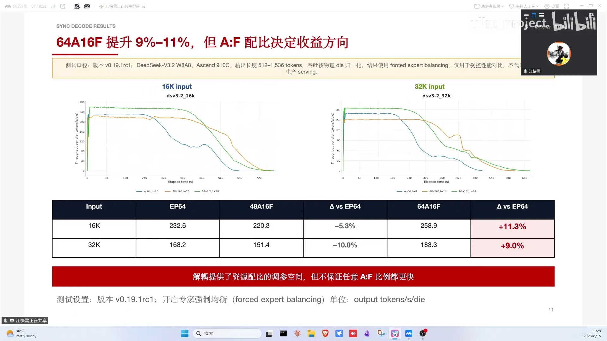 |
| 机器是 EP64。这张图看前面稳态的部分（满并发在跑），后面滑下来是请求跑完了吞吐往下滑。提高比例之后单卡吞吐有一定提升，提升还有空间：卡不够没办法测更高比例。后面 FastAFD 同学讲他们测过更极端的比例，极端比例下单卡分数还能更好提升。收益来源…… [【跳转到 28:59】](https://www.bilibili.com/video/BV14Jgg6iEhN/?t=1739) | 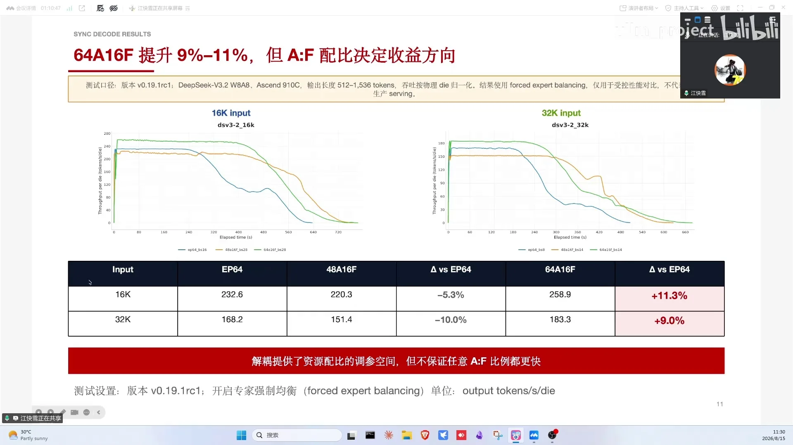 |
| （接上） [【跳转到 29:24】](https://www.bilibili.com/video/BV14Jgg6iEhN/?t=1764) |  |
| 主要来源：（昇腾）的 KV cache 容量更高了。因为可以把权重分开加载：attention 侧只有 attention 的权重，更多权重放到 FFN。提高 attention 的卡数比例…… [【跳转到 29:49】](https://www.bilibili.com/video/BV14Jgg6iEhN/?t=1789) |  |
| 能提高平均每卡 KV cache 容量，batch size 能打更大。同时只要 FFN 还在最前面讲的利用率甜点区域之内，就能继续提高吞吐。有些限制：跑的是 benchmark，专家是均衡的…… [【跳转到 30:14】](https://www.bilibili.com/video/BV14Jgg6iEhN/?t=1814) | 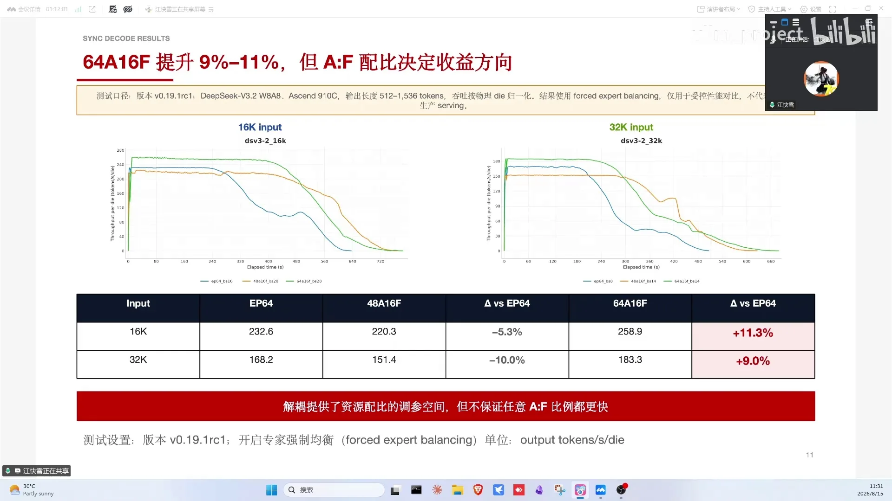 |
| （单卡专家数）其实和 EP64 里的（每卡专家数）保持一致：可以看成是 256 比 64 的等比例缩小版。 [【跳转到 30:39】](https://www.bilibili.com/video/BV14Jgg6iEhN/?t=1839) |  |
| 异步的话用了（昇腾）connector 做，对比的也是 DeepSeek V3.2、昇腾 910C。对比是（合布）DP4 CP8；AFD 是 attention DP3 CP8……FFN 是 EP8 的…… [【跳转到 30:59】](https://www.bilibili.com/video/BV14Jgg6iEhN/?t=1859) | 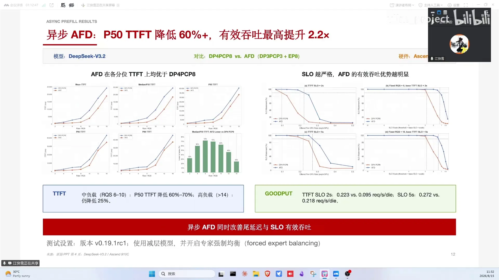 |
| 部署数比是 3 比 1。用一个真实线上数据集跑了一下：不平衡的情况下，TTFT 以及 SLO 的达成率都有提升。 [【跳转到 31:24】](https://www.bilibili.com/video/BV14Jgg6iEhN/?t=1884) |  |
| 下一步：刚才讲了很多可以做的（地方）。还有 model runner 与 vLLM 更多模型适配，以及最近比较火的 DeepSeek V4、（Qwen3.5）也希望在这个项目上看看…… [【跳转到 31:48】](https://www.bilibili.com/video/BV14Jgg6iEhN/?t=1908) |  |
| 它的收益情况把收益情况分析清楚。如果有收益的话我们会同步发布可复现的 recipe（博客）。GPU 上可能也会吸引大家参与 connector 的开发，或者刚才说的（patch）削减工作。 [【跳转到 32:06】](https://www.bilibili.com/video/BV14Jgg6iEhN/?t=1926) |  |
| （接上） [【跳转到 32:11】](https://www.bilibili.com/video/BV14Jgg6iEhN/?t=1931) |  |
| 这是我们的群，还有一个项目主页。非常需要（大家）：把二维码挂出来，感兴趣赶快扫一下。PPT 后面会放出来。 [【跳转到 32:30】](https://www.bilibili.com/video/BV14Jgg6iEhN/?t=1950) |  |
| 项目主页上也有二维码。老师也可以再分享一下你们的 roadmap 吗？ [【跳转到 32:55】](https://www.bilibili.com/video/BV14Jgg6iEhN/?t=1975) |  |
| （此区间无字幕） [【跳转到 33:09】](https://www.bilibili.com/video/BV14Jgg6iEhN/?t=1989) | 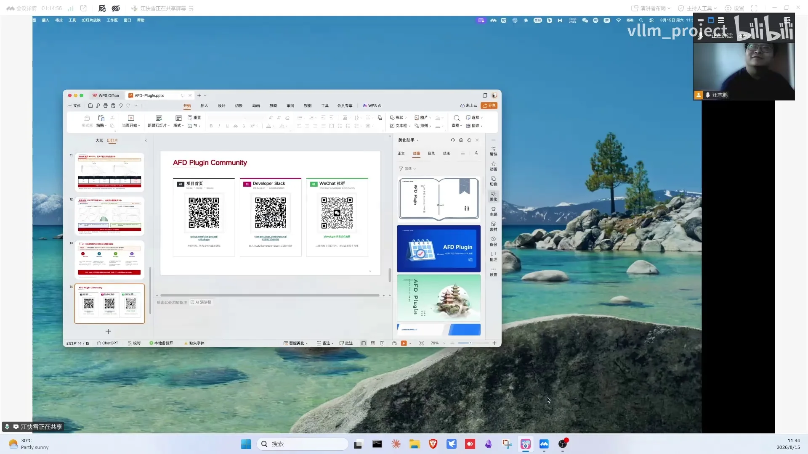 |
| （此区间无字幕） [【跳转到 33:14】](https://www.bilibili.com/video/BV14Jgg6iEhN/?t=1994) | 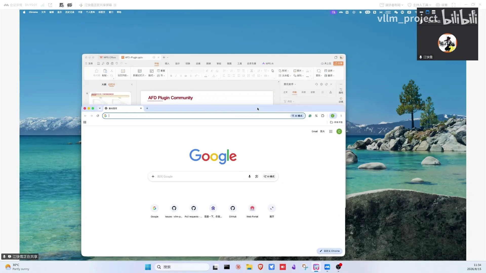 |
| 比如 roadmap 其中一点：兼容性、CI/CD、版本发布。现在已经做了一部分：CI 在 GPU 上已经有比较初步的，昨天刚支持。升级策略的话…… [【跳转到 33:19】](https://www.bilibili.com/video/BV14Jgg6iEhN/?t=1999) | 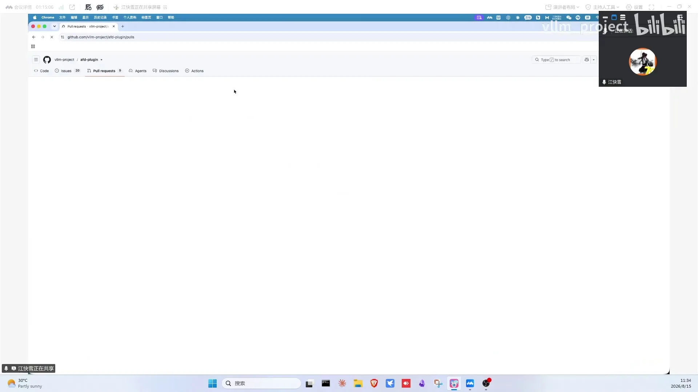 |
| 还在实验性所以升级不会特别频繁：大概一个月升一次。升级的 skill 什么的上周准备了一下：之前基于（旧版本）开发了挺长时间，然后集中升级了一次。还有模型的支持。除了这些以外…… [【跳转到 33:44】](https://www.bilibili.com/video/BV14Jgg6iEhN/?t=2024) | 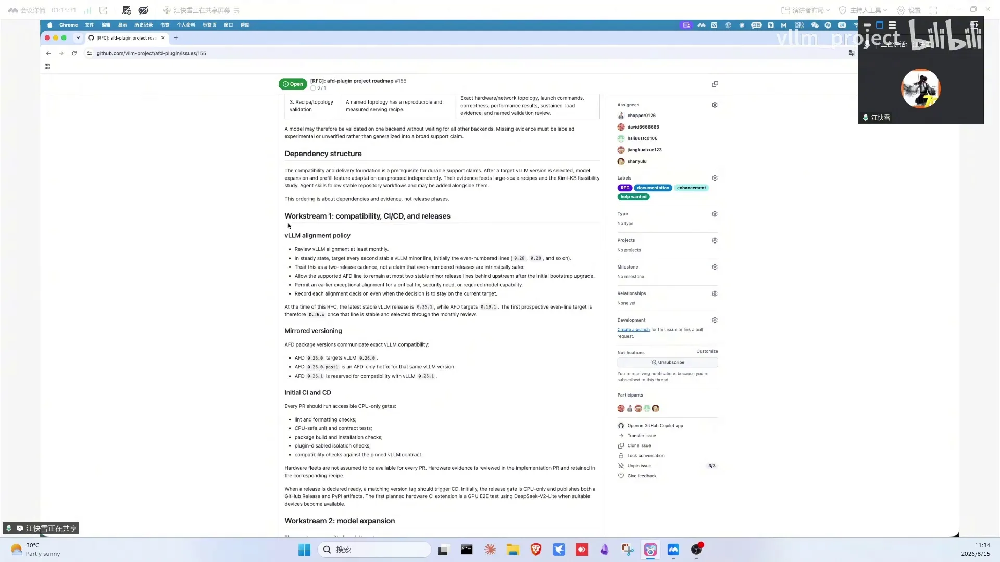 |
| 其实还有一些别的比较适合的可以做：包括其他硬件 backend——AMD 什么的其他硬件我们也欢迎。我们会看护，但更多希望社区同学去做。然后新建在我们自己的主线工作…… [【跳转到 34:09】](https://www.bilibili.com/video/BV14Jgg6iEhN/?t=2049) | 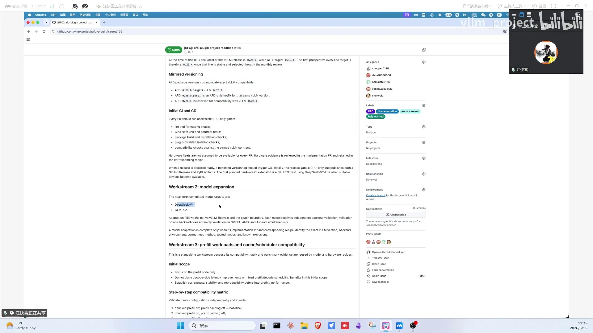 |
| 主要就是探索有些异步的（方案），看能不能寻找工业场景落地。——像 AMD、其他硬件，这里有一个社区同学：项目发布以后他有兴趣，说他对（某个）现成的 backend 有支持的想法…… [【跳转到 34:34】](https://www.bilibili.com/video/BV14Jgg6iEhN/?t=2074) | 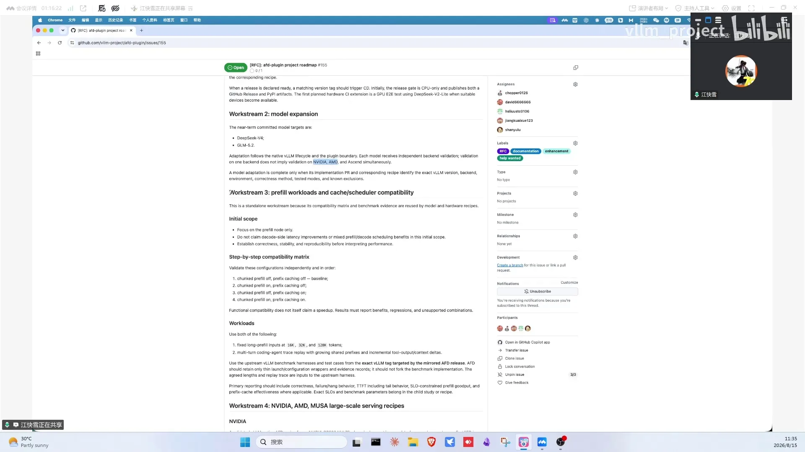 |
| 还有一些没列在 roadmap 上但已经形成 RFC 的，感兴趣可以去 repo 里看：比如我想削减对模型侵入式的修改——我设计了一个；还有 model runner（的 V2）；现在还有一招：在做异步的 GPU 的 connector…… [【跳转到 34:59】](https://www.bilibili.com/video/BV14Jgg6iEhN/?t=2099) | 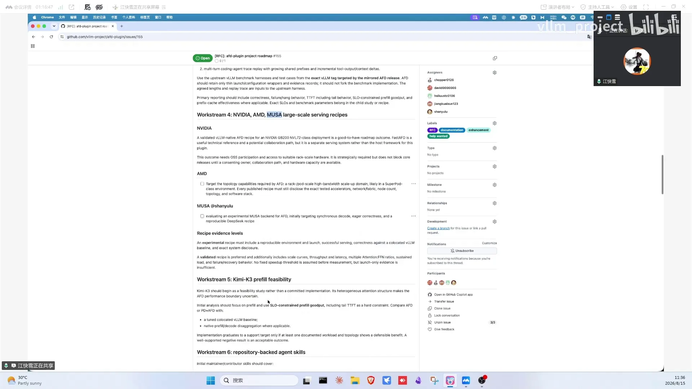 |
| 大概就是这么一个情况。社区小伙伴有自己的想法可以往上提。直播间有同学问：现在是怎样解决负载不均的问题？——负载不均是指专家负载不均还是请求负载不均？我也想问一下。 [【跳转到 35:24】](https://www.bilibili.com/video/BV14Jgg6iEhN/?t=2124) | 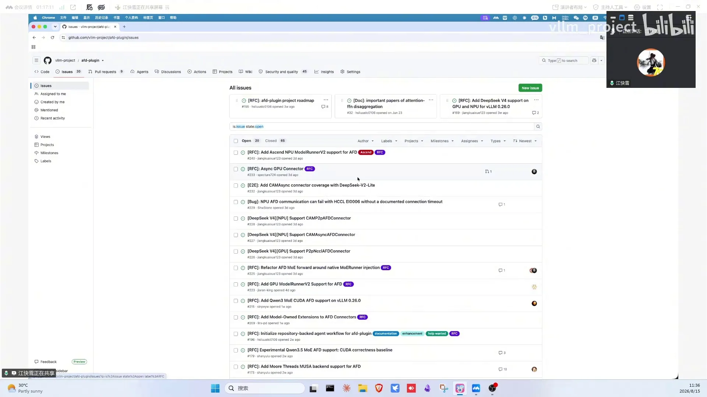 |
| 直播间的这位同学如果还在可以把问题再问详细一点。——真的是专家负载不均。AFD 并没有去解决这个问题：要么就是辅助 EPLB 去做，我们还没有实验 AFD 叠加 EPLB 的现象…… [【跳转到 35:49】](https://www.bilibili.com/video/BV14Jgg6iEhN/?t=2149) |  |
| 但之前我们有个想法：因为权重分离了，FFN 这块的 MoE 权重的 HBM 占用可能会小一点；同时 FFN 的卡空闲资源不参与（attention）…… [【跳转到 36:14】](https://www.bilibili.com/video/BV14Jgg6iEhN/?t=2174) |  |
| FFN 卡剩余的 HBM 不会参与 KV cache 这类。是不是可以在上面部署冗余专家（副本）？冗余专家能更好地减少（不均衡）：以前的 EPLB 可能涉及大量权重在卡之间的搬移…… [【跳转到 36:39】](https://www.bilibili.com/video/BV14Jgg6iEhN/?t=2199) | 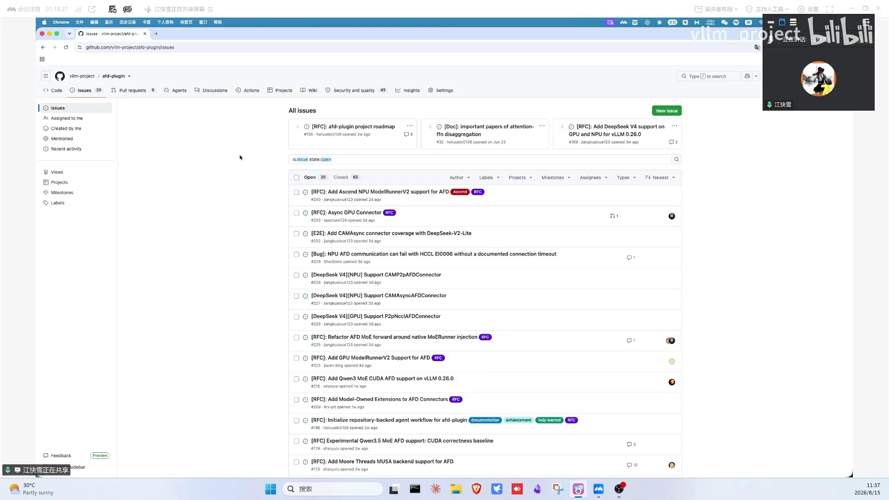 |
| 是不是可以部署更多副本，EPLB 的开销能够更小一点？这是我以前（设想过）的，但没经过实际验证。其实我一直有个问题：我们在（vLLM）里部署的时候，一开始会类似跑个 profile 算出 KV cache 的大小…… [【跳转到 37:04】](https://www.bilibili.com/video/BV14Jgg6iEhN/?t=2224) | 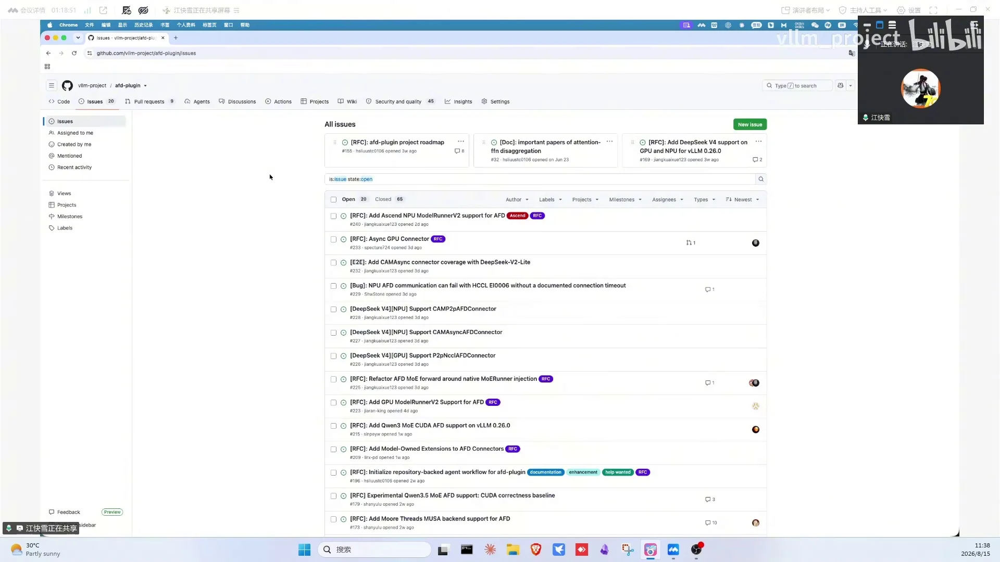 |
| 做成（分离）之后 profile 是怎么跑的？——profile 没有变化：还是 attention 发起，FFN 接收 profile 发过来的 hidden state，没有任何区别。profile 能够检测到 attention 卡上的剩余显存——剩余多嘛。只不过区别在于（attention 的）空闲容量大很多：基本可以卸载 90% 以上的 KV cache 到 FFN（侧）。同时 A 比 F 的比例一般 A 要大于 F：可能都是 3 比 1、4 比 1，甚至更高…… [【跳转到 37:29】](https://www.bilibili.com/video/BV14Jgg6iEhN/?t=2249) | 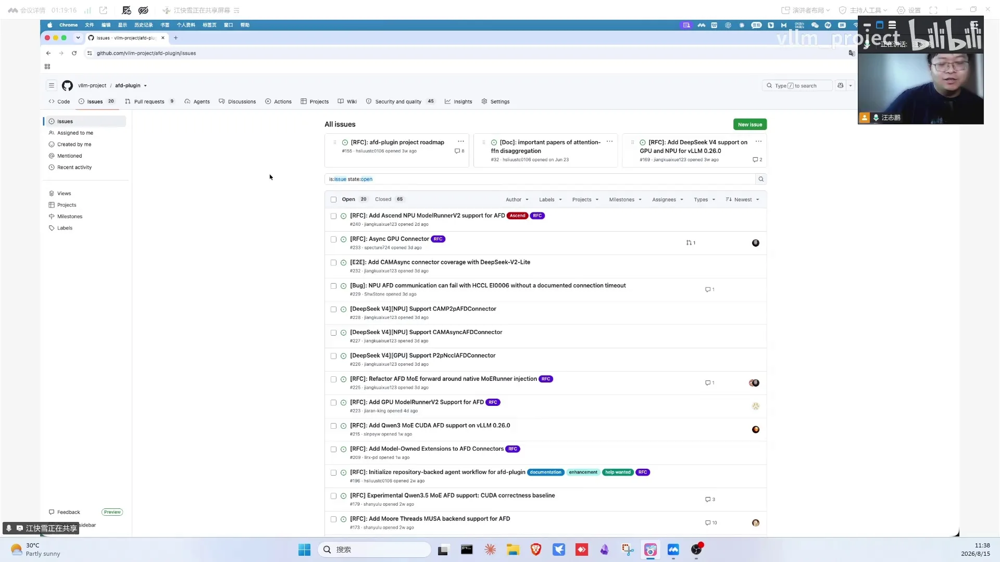 |
| （接上） [【跳转到 37:54】](https://www.bilibili.com/video/BV14Jgg6iEhN/?t=2274) | 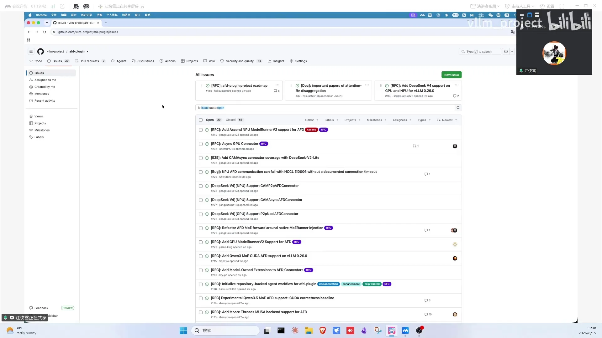 |
| 这样下来，整套推理系统实例的平均每卡空闲 HBM 是受益的。——有同学问：AFD 能够在纯 PCIE 机器上做吗？——应该也是可以的，但通信上要搞一些掩盖，相比较（高速互联）就要更好地做掩盖。我们当前流水没做那么多掩盖的原因是超节点…… [【跳转到 38:19】](https://www.bilibili.com/video/BV14Jgg6iEhN/?t=2299) |  |
| （接上） [【跳转到 38:44】](https://www.bilibili.com/video/BV14Jgg6iEhN/?t=2324) | 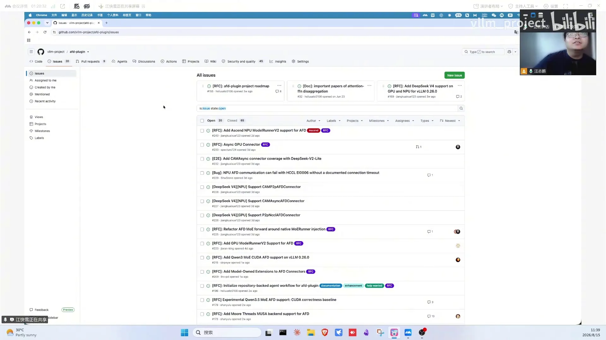 |
| （此区间无字幕） [【跳转到 39:03】](https://www.bilibili.com/video/BV14Jgg6iEhN/?t=2343) | 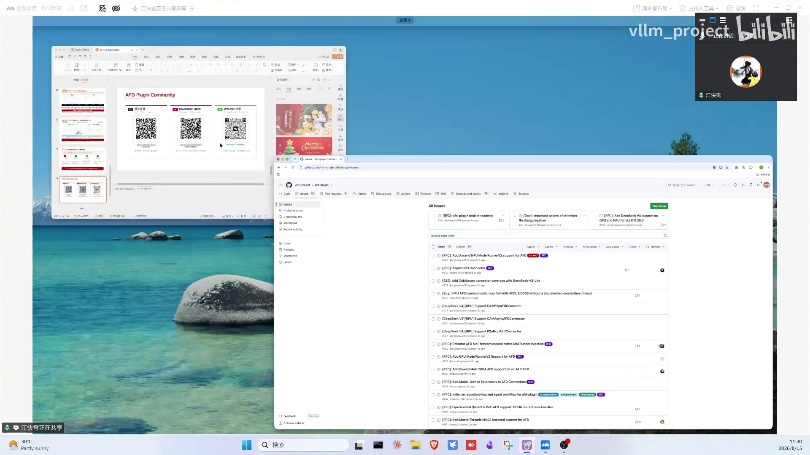 |
| 我们这个超节点开销非常少，所以就没做掩盖。 [【跳转到 39:08】](https://www.bilibili.com/video/BV14Jgg6iEhN/?t=2348) | 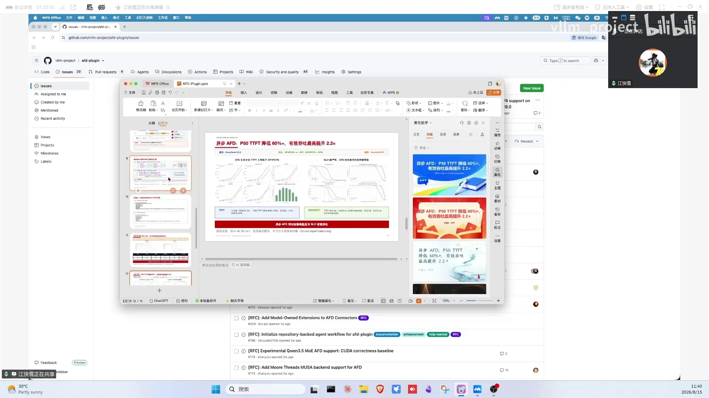 |
| 一开始看这个方案时我们也想：中间这个通信如果没有（超节点低时延）不是很好掩盖。大家可能听说过阶跃的工作吗？他们不是在超节点上做的，是用 CPU（DRAM）做的——多层次 CPU，就要做多流掩盖…… [【跳转到 39:13】](https://www.bilibili.com/video/BV14Jgg6iEhN/?t=2353) | 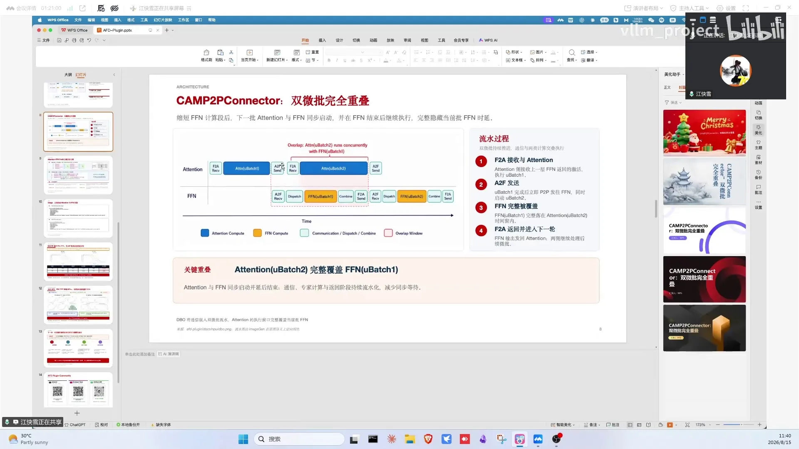 |
| 用 CPU 有个好处：不占用任何 GPU 资源，不会影响 GPU 算力。但我上次问过他们，好像他们 CPU 的传输性能还是（有瓶颈）？具体原因我只听说了一下，因为我也去阶跃拜访过…… [【跳转到 39:38】](https://www.bilibili.com/video/BV14Jgg6iEhN/?t=2378) | 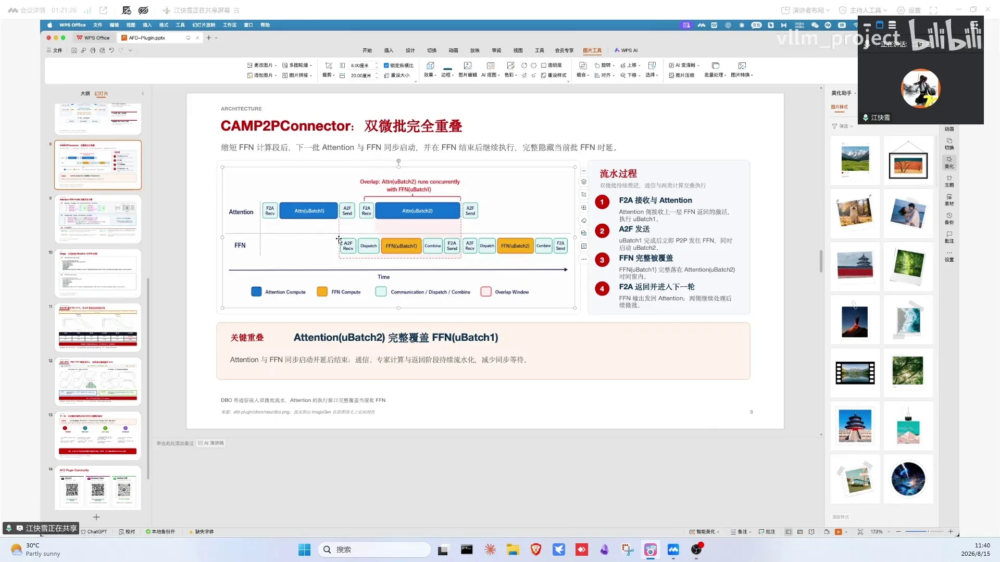 |
| 当时是这么回答的。所以你也让 CPU 买你们的超节点吗？——应该有吧，这个我没太深究。然后有同学问：AFD 分离如何解决 F 节点排队导致的 TPOT 劣化问题？ [【跳转到 40:03】](https://www.bilibili.com/video/BV14Jgg6iEhN/?t=2403) | 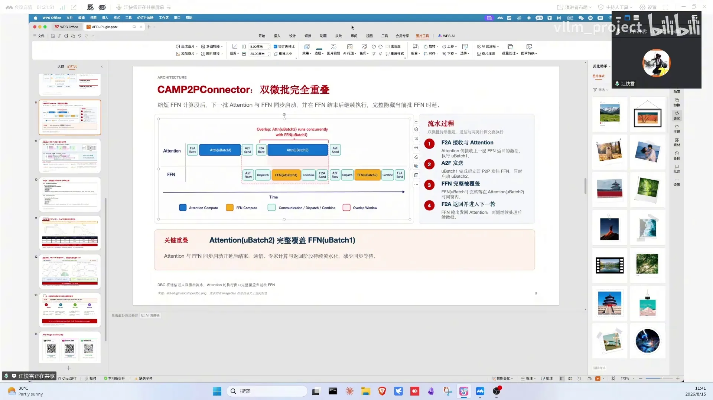 |
| F 节点排队是什么意思？没听明白。如果是 TPOT 的话，当前会有所劣化：毕竟增加了中间的通信开销。想让两侧配平…… [【跳转到 40:28】](https://www.bilibili.com/video/BV14Jgg6iEhN/?t=2428) | 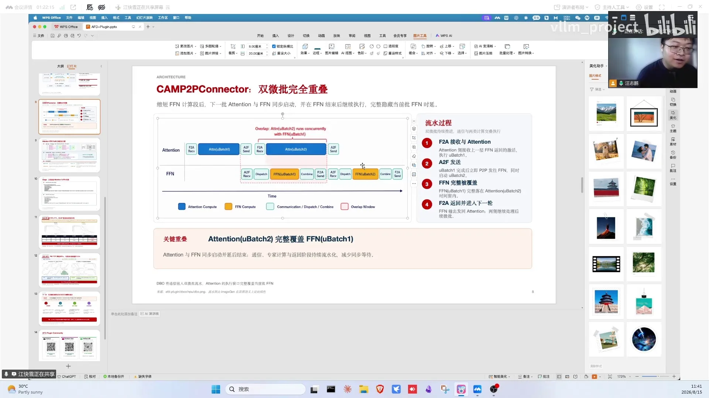 |
| 当前配置下差不多能配平：两侧大概差不多跑完，没有明显气泡。但中间还是有一些传输开销…… [【跳转到 40:53】](https://www.bilibili.com/video/BV14Jgg6iEhN/?t=2453) |  |
| （此区间无字幕） [【跳转到 40:58】](https://www.bilibili.com/video/BV14Jgg6iEhN/?t=2458) | 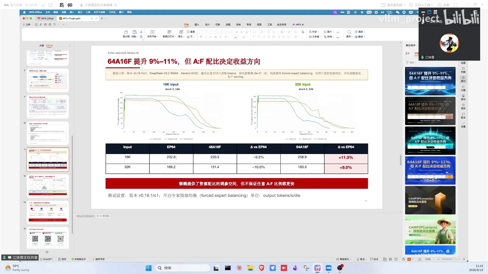 |
| 累积下来每层还是有 1% 的劣化。还有一个问题：一定是两个 batch——长的部分乘以二。假设原来合布部署下一长一短，相当于在 FFN 侧会把长的情况暴露出来，这时肯定要调配比，尽量让资源利用率吃满，吞吐（收益）会更明显…… [【跳转到 41:03】](https://www.bilibili.com/video/BV14Jgg6iEhN/?t=2463) |  |
| 相当于用一个小的实验劣化去换取更高的单卡吞吐，成本上能有更好的性价比。 [【跳转到 41:28】](https://www.bilibili.com/video/BV14Jgg6iEhN/?t=2488) | 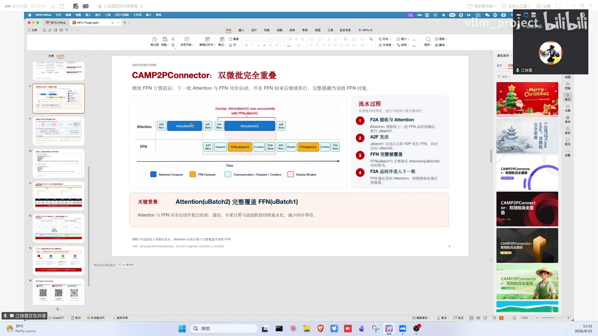 |
| 后面 FastAFD 的同学也会讲：他们应该也注意过这个问题，可以让他们在 GPU 的场景上解答。我估计刚才那个同学问的是这个。然后有同学问：AFD 可以叠加 PD 分离吗？——显然可以…… [【跳转到 41:53】](https://www.bilibili.com/video/BV14Jgg6iEhN/?t=2513) | 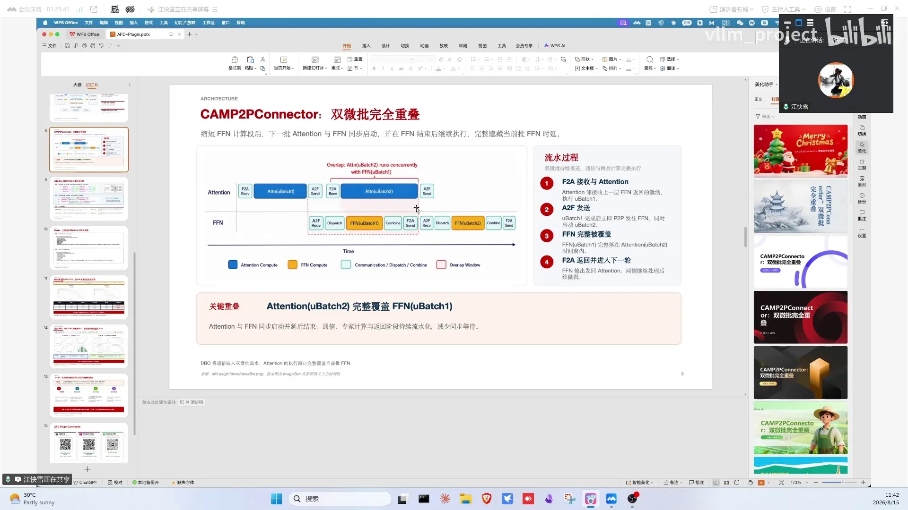 |
| 我们刚才分享时也是把它分成 P 的情况和 D 的情况，因为本身就可以分。这个同学也补充（问）CB 的抖动会不会很大——确实会有些抖动。 [【跳转到 42:18】](https://www.bilibili.com/video/BV14Jgg6iEhN/?t=2538) | 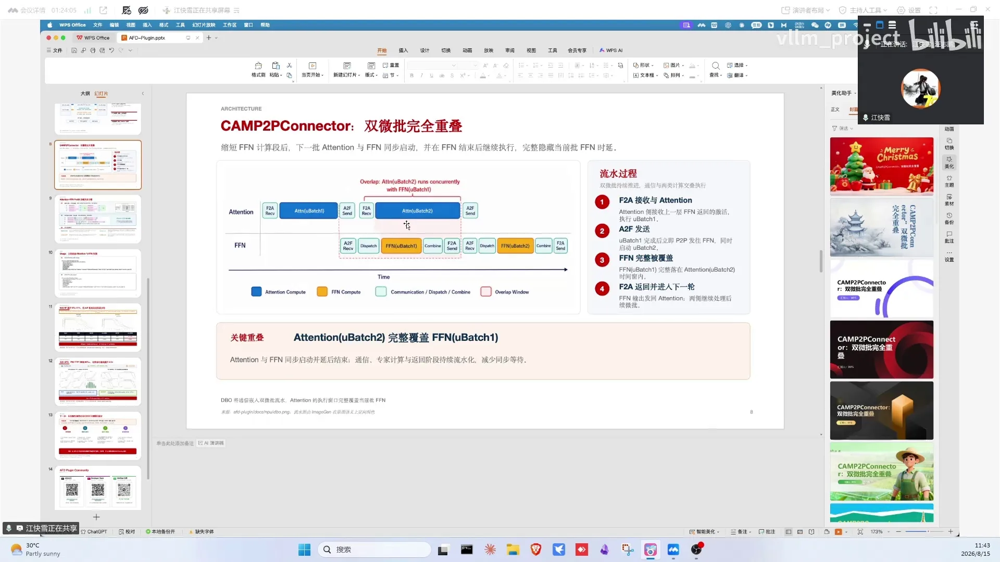 |
| 好，非常感谢（前面老师的分享）。接下来有请宇宣老师分享 FastAFD 的工作。 [【跳转到 42:43】](https://www.bilibili.com/video/BV14Jgg6iEhN/?t=2563) | 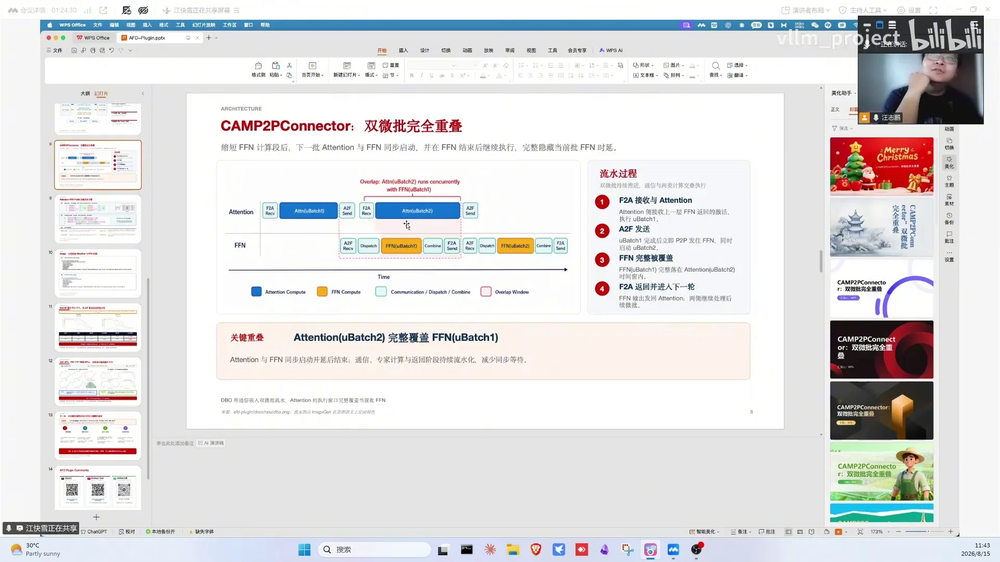 |
| 现在主持人要（操作），我们有腾讯会议（共享）屏幕的权限…… [【跳转到 42:54】](https://www.bilibili.com/video/BV14Jgg6iEhN/?t=2574) | 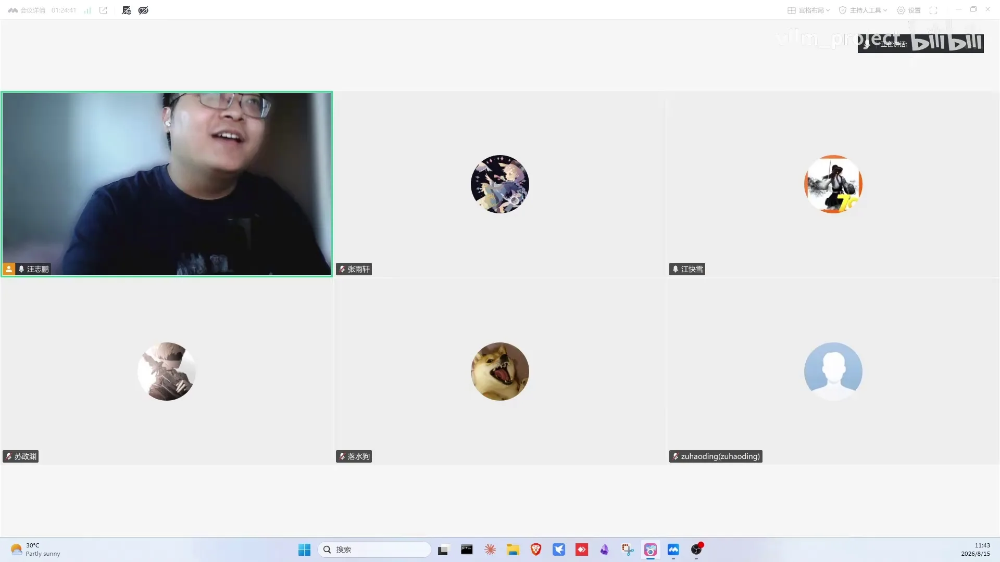 |
| 我可能要退出再进来，因为要给腾讯会议权限，重进一次。——好。直播间有同学说：超节点一般人（玩不起）？国内超节点一般什么价格？ [【跳转到 43:19】](https://www.bilibili.com/video/BV14Jgg6iEhN/?t=2599) | 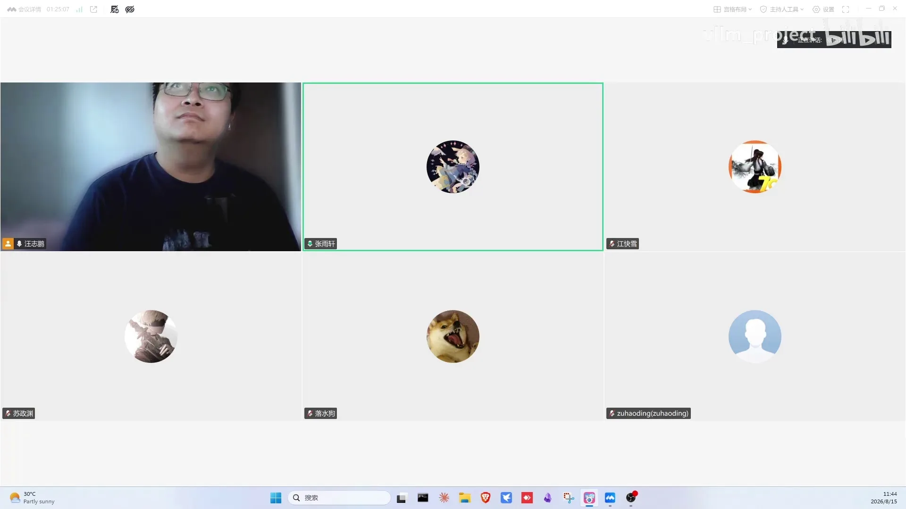 |
| 现在市面上比较多的是 910C 的 CloudMatrix 384：多少钱？一个亿吧。确实有点贵。 [【跳转到 43:44】](https://www.bilibili.com/video/BV14Jgg6iEhN/?t=2624) | 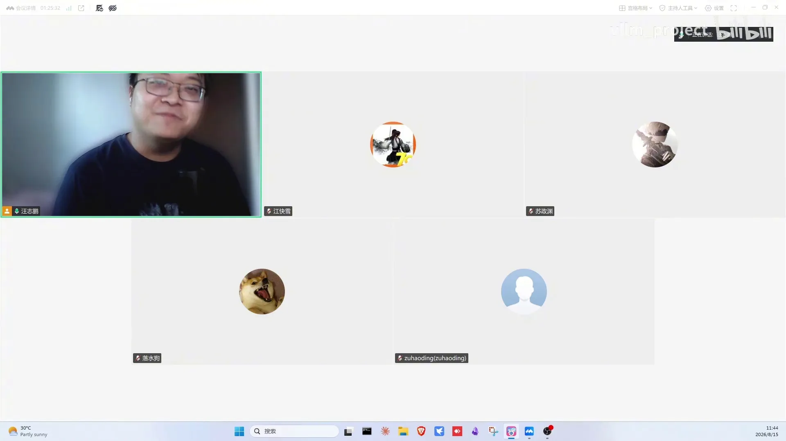 |
| 但我之前听说有的公司：跑类似（长视频）的模型，或者长视频生成那种不 care 时延的，想把一些便宜的卡用起来，也在异构上玩了。——暴殄天物？这样能够把便宜卡用起来，降低整个公司成本，也是一个应用方向。好。有请宇宣老师分享 FastAFD 的工作。我看宇宣老师用的是 GB200 NVL72。 [【跳转到 44:09】](https://www.bilibili.com/video/BV14Jgg6iEhN/?t=2649) | 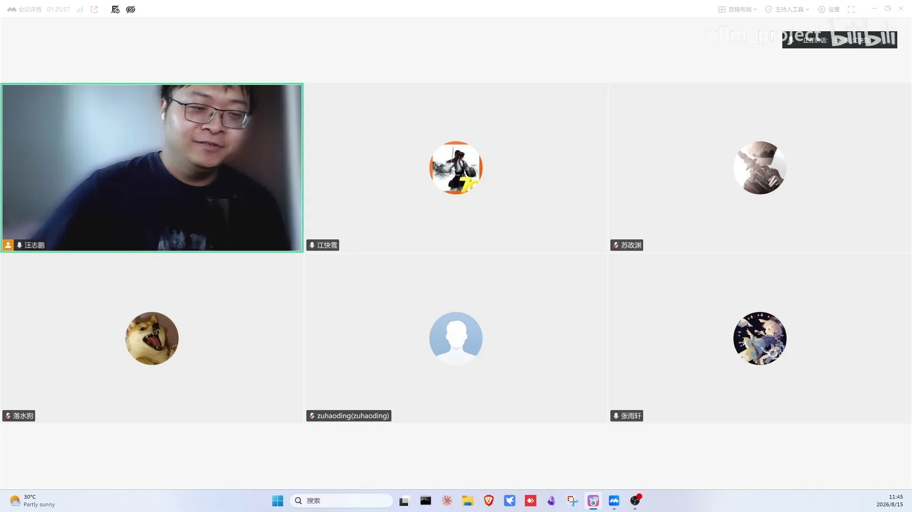 |
| （接上） [【跳转到 44:23】](https://www.bilibili.com/video/BV14Jgg6iEhN/?t=2663) | 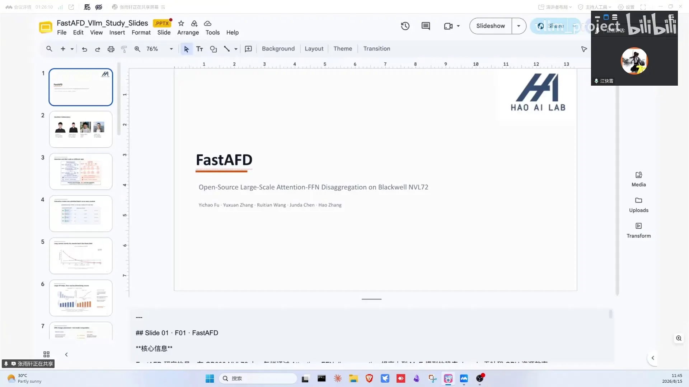 |
| 宇宣老师，好像我们听不到你声音…… [【跳转到 44:48】](https://www.bilibili.com/video/BV14Jgg6iEhN/?t=2688) | 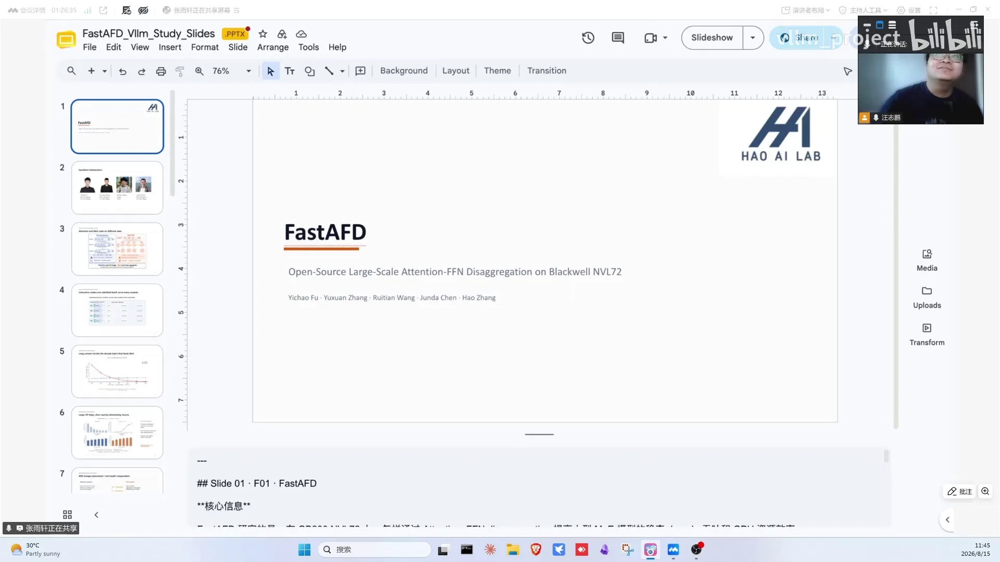 |
| （此区间无字幕） [【跳转到 45:13】](https://www.bilibili.com/video/BV14Jgg6iEhN/?t=2713) | 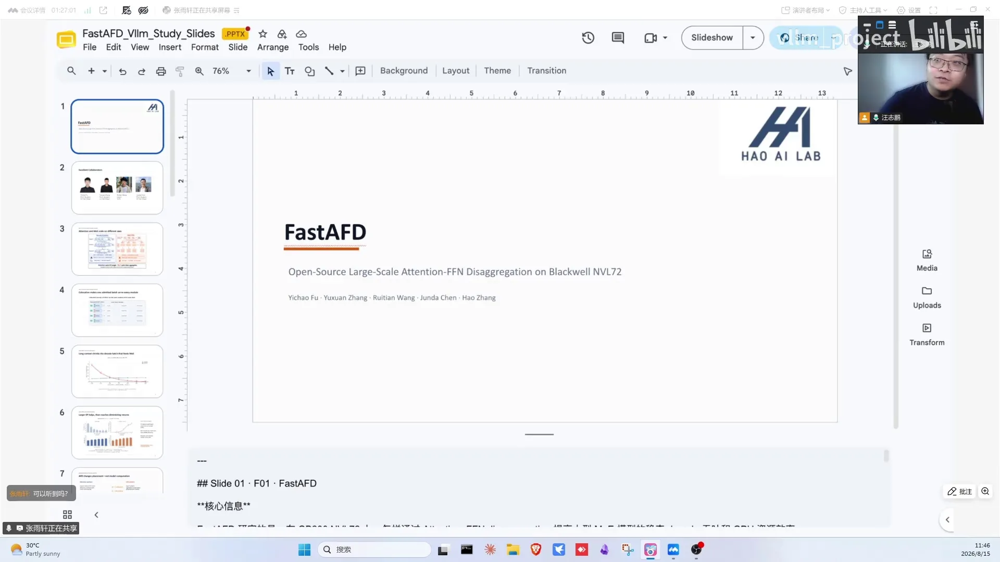 |
| 直播间有同学问：后续会有视频录播吗？——会有的。关注我们频道，每个星期六上午都有直播。直播完会把这期 PPT 和录像上传到频道…… [【跳转到 45:22】](https://www.bilibili.com/video/BV14Jgg6iEhN/?t=2722) | 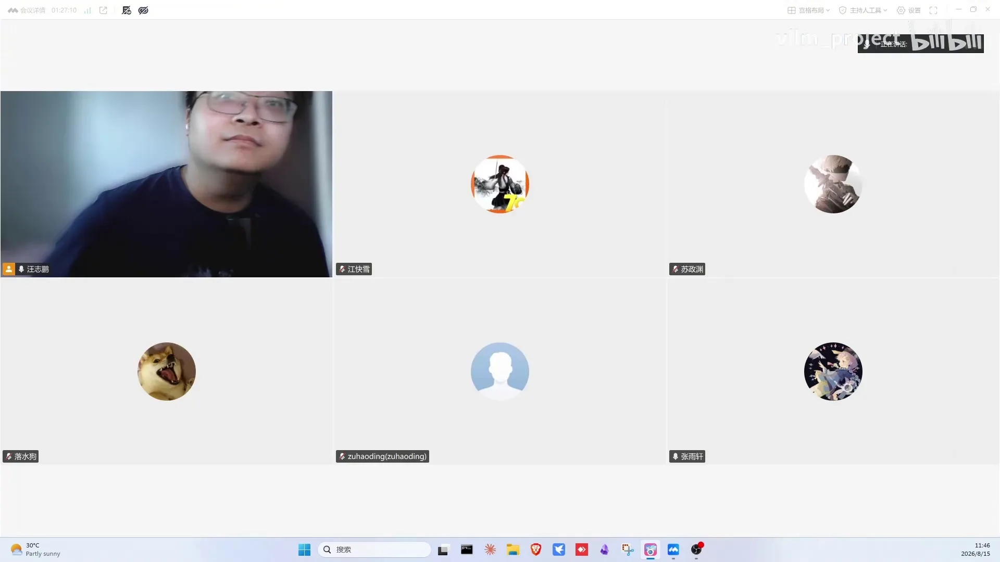 |
| （此区间无字幕） [【跳转到 45:47】](https://www.bilibili.com/video/BV14Jgg6iEhN/?t=2747) |  |
| 可以点开了吗？——现在可以了，刚才麦克风有点问题。我们所有的直播录像都在（合集）里，大家可以在合集里分段查看。好，开始宇宣老师的分享。 [【跳转到 45:52】](https://www.bilibili.com/video/BV14Jgg6iEhN/?t=2752) | 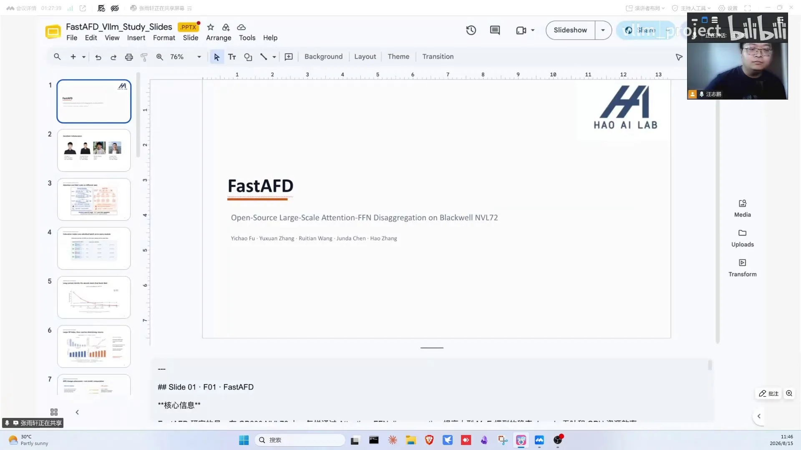 |
| 好的，感谢（主持）的邀请。我们这边主要补充说明 GPU 上 AFD 的实现：我们在 GB200 NVL72 Rack 上实现了 AFD。总体上最后测出来 TPOT 有 30% 到 40% 的（改善）。 [【跳转到 46:12】](https://www.bilibili.com/video/BV14Jgg6iEhN/?t=2772) | 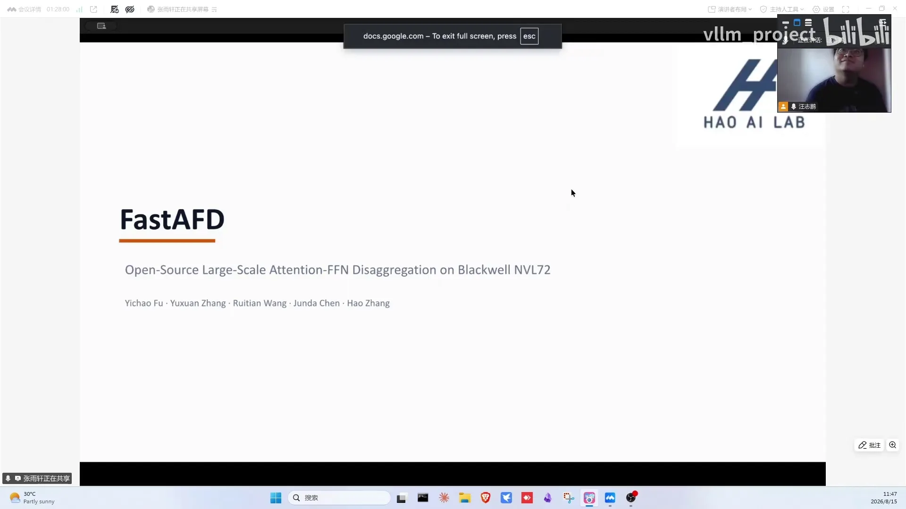 |
| 我们也会解释收益从哪里来。简单介绍一下我的 collaborators…… [【跳转到 46:37】](https://www.bilibili.com/video/BV14Jgg6iEhN/?t=2797) | 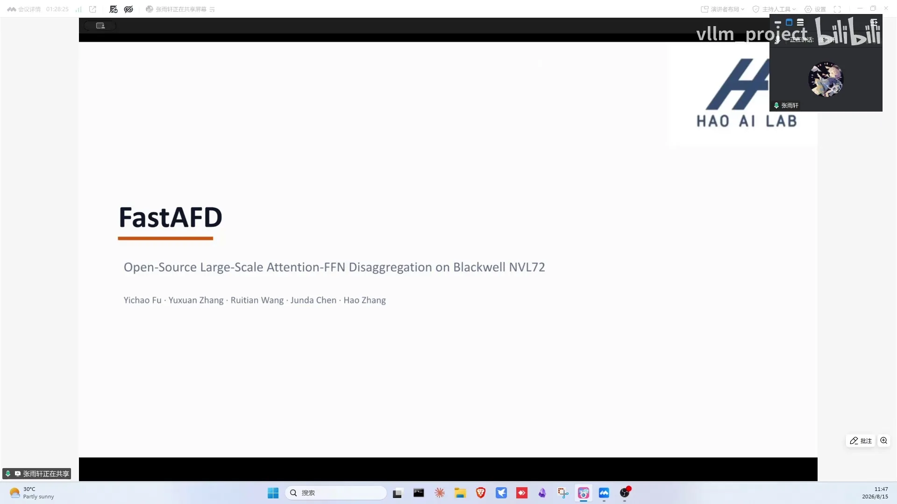 |
| 他们来自（合作团队）；还有一位来自上海交通大学的 intern 王瑞天。感谢他们对项目的贡献。 [【跳转到 46:47】](https://www.bilibili.com/video/BV14Jgg6iEhN/?t=2807) | 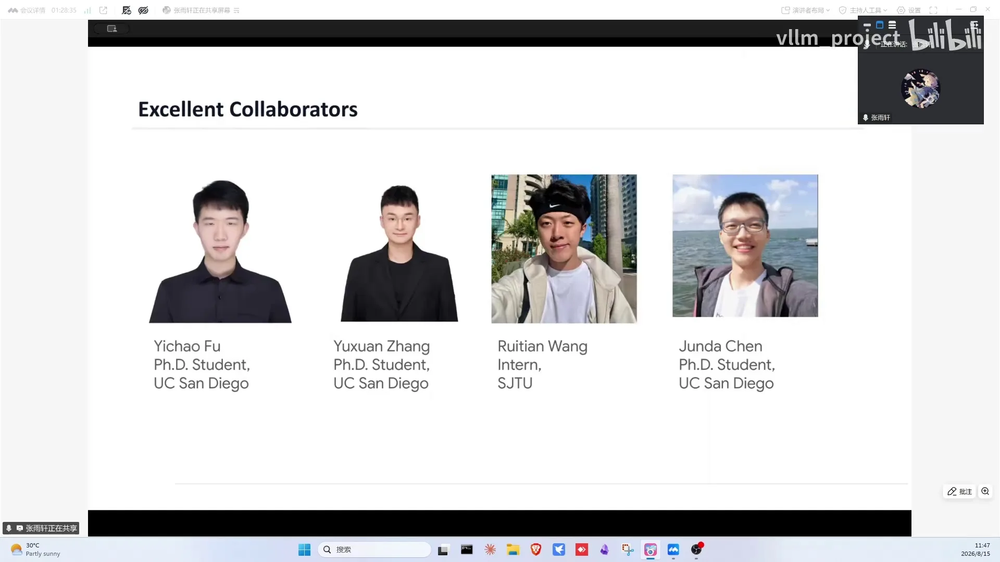 |
| 简单介绍 AFD 的概念：上一位老师已经讲得很清楚，我简单补充。为什么用 AFD：attention 和 MoE 的 scaling 是两个维度——attention 是（读）KV cache，本质跟 context length 和 batch size 相关…… [【跳转到 47:07】](https://www.bilibili.com/video/BV14Jgg6iEhN/?t=2827) | 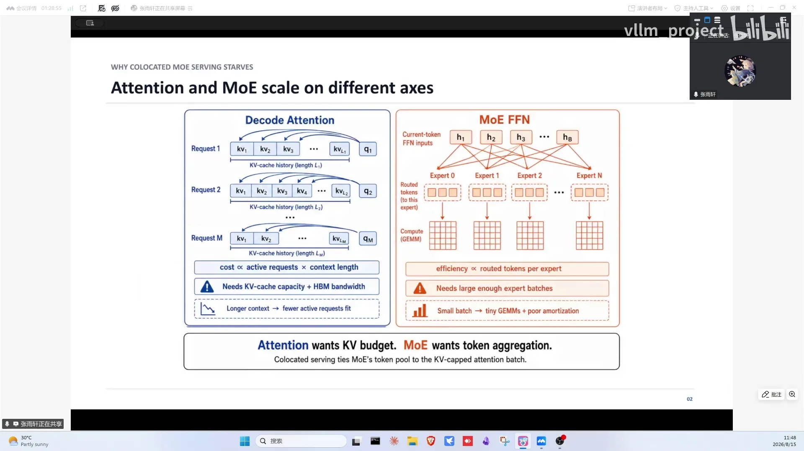 |
| Long context 下 batch size 变小；FFN 只跟 batch size 相关。合布（colocated）的 serving 系统里两者 batch size 绑定在一起：attention 因 long context batch 变小，FFN 的 batch 也变小，整体 FFN 利用率像上一位老师说的会降低。AFD 通过不同的配比…… [【跳转到 47:32】](https://www.bilibili.com/video/BV14Jgg6iEhN/?t=2852) | 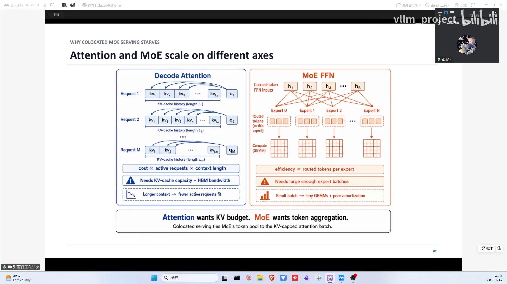 |
| 有更多 attention worker 带给 FFN 更大的 batch size，提升 MoE FFN 的利用率。这是现在正常 colocated serving system 的示意图：attention 和 MoE 同卡时…… [【跳转到 47:57】](https://www.bilibili.com/video/BV14Jgg6iEhN/?t=2877) |  |
| 它们的 batch size 是固定的：先走 attention、再走 router、然后算 MoE。source/destination node 一样，batch size 相互绑定，导致 long context 情况下利用率不平等。 [【跳转到 48:22】](https://www.bilibili.com/video/BV14Jgg6iEhN/?t=2902) | 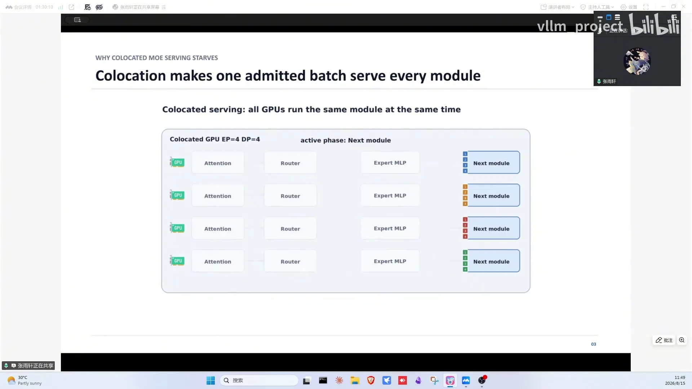 |
| 这是一个简单的 profiling：在固定 cache capacity 下增加不同的 context 长度，红线是 MoE FFN 的 utilization。long context 下 batch size 减小，整体 utilization 会明显降低。这是我们不想看到的。 [【跳转到 48:47】](https://www.bilibili.com/video/BV14Jgg6iEhN/?t=2927) | 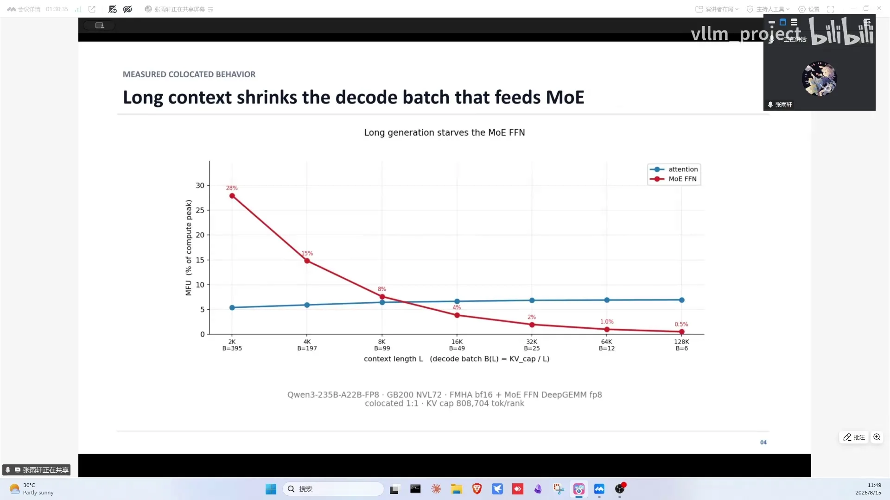 |
| attention 这边根据 cache capacity 相关，整体是 memory bandwidth bound 状态、利用率较平稳。如果不做 AFD 分离，可以增大 EP…… [【跳转到 49:12】](https://www.bilibili.com/video/BV14Jgg6iEhN/?t=2952) | 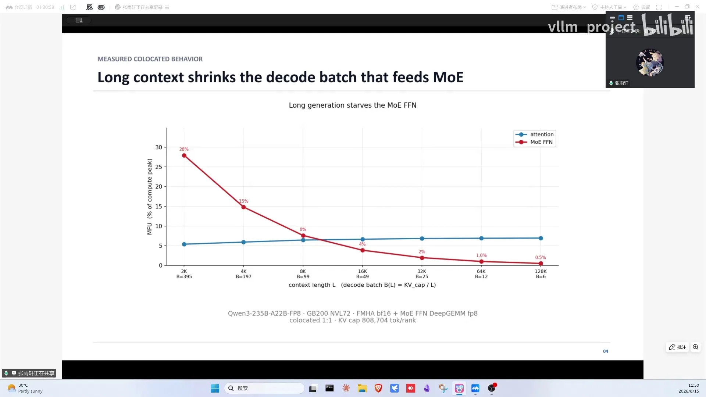 |
| 增大 batch size 提高 MoE FFN 利用率：增大 EP 你的 IO 会变小、整体 arithmetic intensity 变高，MoE FFN 利用率提高。但这个方法有甜点区…… [【跳转到 49:37】](https://www.bilibili.com/video/BV14Jgg6iEhN/?t=2977) |  |
| 第一张图是 MoE FFN 在不同 EP 下的 latency：通过 DeepGEMM——DeepSeek 的 MoE GEMM 库测出来的。EP 从 2 开到 128，收益递减；到 EP 甜点 16 时…… [【跳转到 50:02】](https://www.bilibili.com/video/BV14Jgg6iEhN/?t=3002) |  |
| 已经达到了 EP 带来收益的顶点。做 MoE 有两层通信：dispatch 和 combine，也是（成本）。所以到 EP 甜点后再往上 scale EP 收益不大。AFD 更像是相辅相成的提升方式…… [【跳转到 50:27】](https://www.bilibili.com/video/BV14Jgg6iEhN/?t=3027) |  |
| 保证小 IO 的同时通过增加 batch size 提高它的 compute workload，整体 MoE 效率进一步提升，latency 收益更大。这说明 AFD 的本质：把 attention 和 FFN 分成两部分资源放置…… [【跳转到 50:52】](https://www.bilibili.com/video/BV14Jgg6iEhN/?t=3052) | 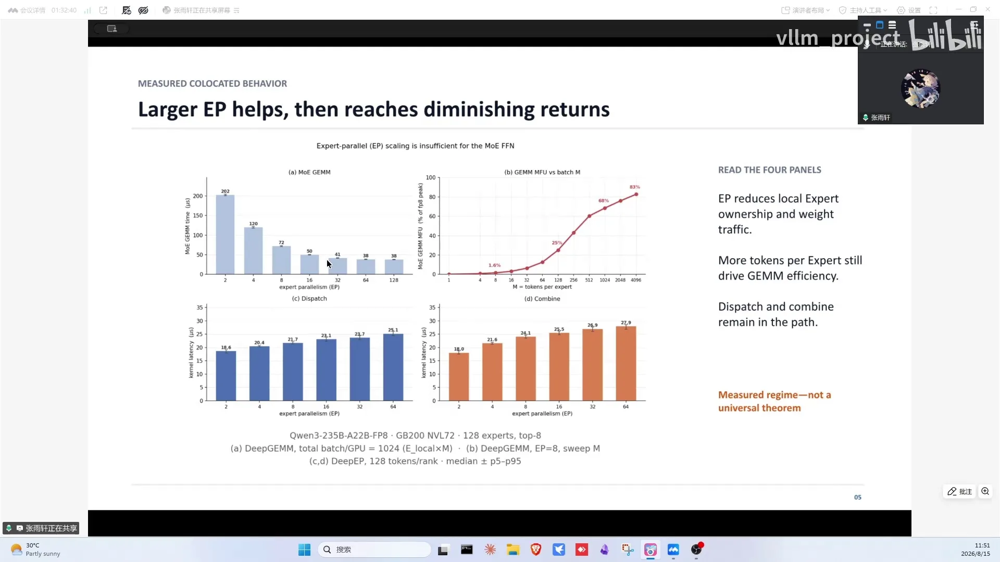 |
| 它不会打破整个模型的计算语义：依然从 attention worker 走 dispatch 把 token 送到 expert 上计算，最后 combine 到一起…… [【跳转到 51:17】](https://www.bilibili.com/video/BV14Jgg6iEhN/?t=3077) | 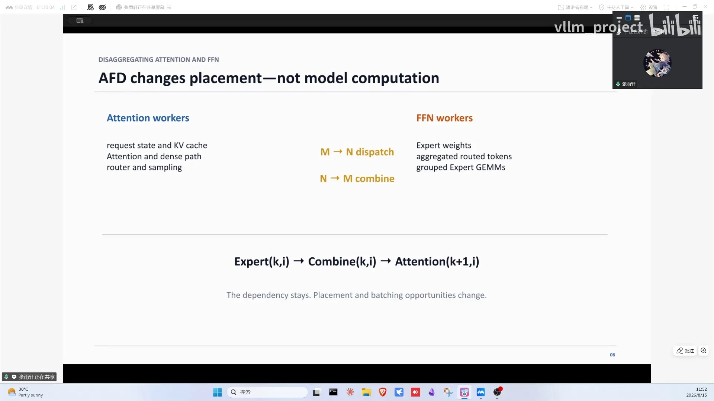 |
| 再到下一层 layer。整个 workflow 没有任何变化，唯一变化是把 attention 和 FFN 分成两部分资源放置。然后简单做了一个 profiling：目的是预测多大的（配比）下 AFD 带来的收益。收益衡量标准是 MoE FFN 的（算力）利用率。最底下灰线是没有任何配比（正常 serving system）时：FFN 利用率随（context 增长）…… [【跳转到 51:42】](https://www.bilibili.com/video/BV14Jgg6iEhN/?t=3102) | 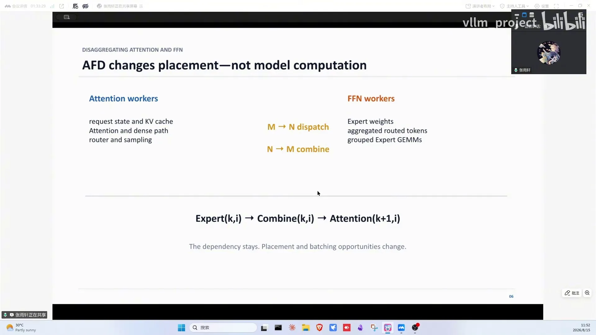 |
| （接上） [【跳转到 52:07】](https://www.bilibili.com/video/BV14Jgg6iEhN/?t=3127) | 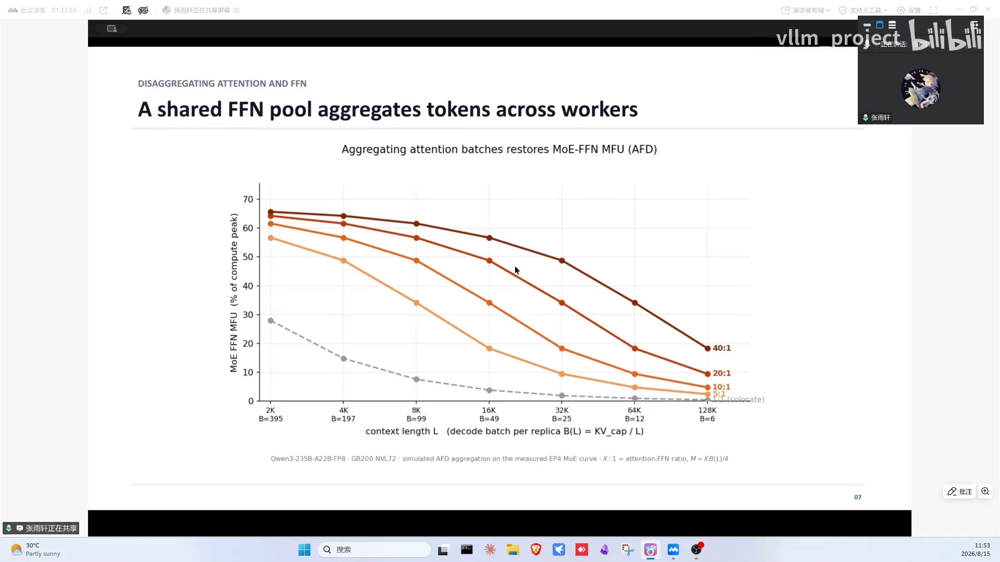 |
| 如果我们有配比、配比越高，整体 MoE FFN 利用率曲线往上走，整体利用率变高。这就是 AFD 的本质。一个 GIF visualize：左边有三个 attention worker，每个有自己的 batch size…… [【跳转到 52:32】](https://www.bilibili.com/video/BV14Jgg6iEhN/?t=3152) |  |
| 可以把三个的 batch size 合并成一个大的 batch size 扔给一个 MoE server，从而在保证 attention server 更多 KV cache capacity 的条件下，同时让 MoE 的 batch size 增大——两方面的 scaling 同时做了。 [【跳转到 52:57】](https://www.bilibili.com/video/BV14Jgg6iEhN/?t=3177) | 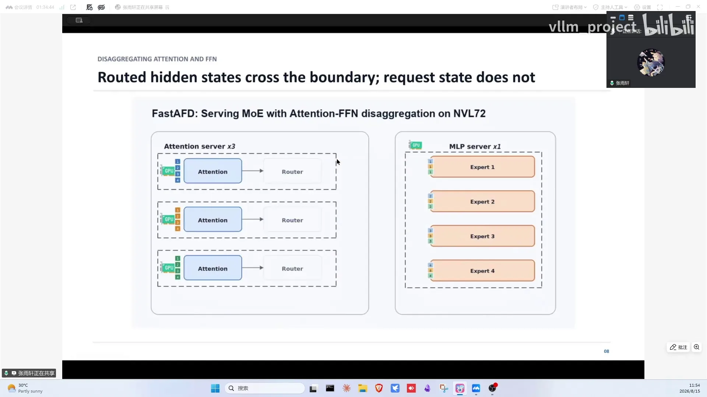 |
| 值得提的是我们用的是 GB200 NVL72：涉及跟（前面老师）讨论的通信问题——GB200 rack 里跨（节点）也走 NVLink，没记错双向带宽 1800GB/s，很快。整体来说…… [【跳转到 53:22】](https://www.bilibili.com/video/BV14Jgg6iEhN/?t=3202) | 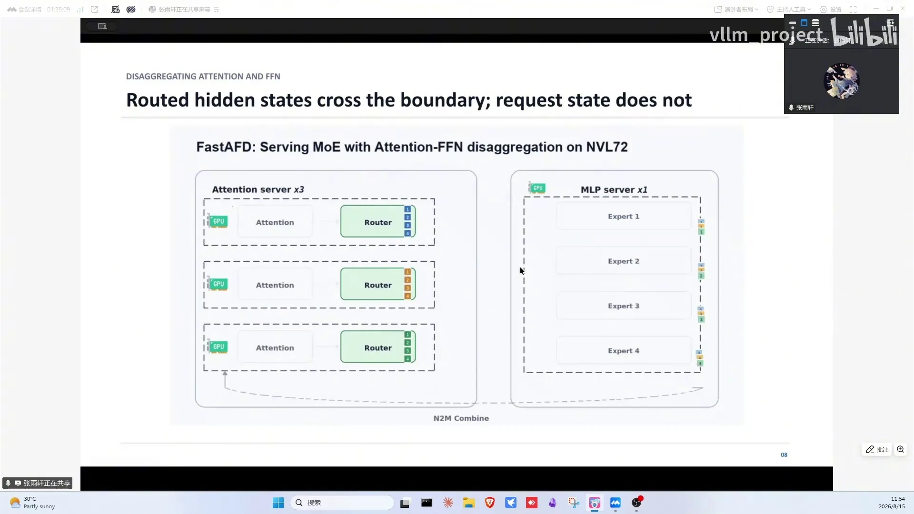 |
| 这会让我们更好地 hide 住通信。我们还对通信做了一些提升，导致我们整个 AFD 的 TPOT 会比正常的单（节点）合布 server 还要快一些。这里有一个 concept：macro batch overlapping…… [【跳转到 53:47】](https://www.bilibili.com/video/BV14Jgg6iEhN/?t=3227) |  |
| AFD 把两部分分离后，模型计算语义不变：还是先 attention 再 FFN。但如果 sequential 一层层走是低效的：相当于跟正常 colocated serving 没区别，还用了两倍的卡…… [【跳转到 54:12】](https://www.bilibili.com/video/BV14Jgg6iEhN/?t=3252) |  |
| 概念是做了 overlapping：有两个 macro batch，去 overlap attention 和 FFN 两部分的时间…… [【跳转到 54:37】](https://www.bilibili.com/video/BV14Jgg6iEhN/?t=3277) |  |
| 算 macro batch 2 的 attention 时，FFN 在算 macro batch 1 的（FFN），同时通过 overlap 把中间跨（节点）的通信 hide 掉。理想状态下整体时间等于 attention 时间和 FFN 时间的最大值…… [【跳转到 55:02】](https://www.bilibili.com/video/BV14Jgg6iEhN/?t=3302) |  |
| 最理想情况下 AFD 的 TPOT decode 时间就是一个 attention 的时间。想满足条件首先像上个老师说的需要做配比：attention 的时间和 expert 的时间相等…… [【跳转到 55:27】](https://www.bilibili.com/video/BV14Jgg6iEhN/?t=3327) |  |
| 这样互相 overlap 在一起。越相等收益越大：原本 FFN 时间太长的话 colocated 需要相加的时间；overlap 在一起相当于减少了 expert 的时间…… [【跳转到 55:52】](https://www.bilibili.com/video/BV14Jgg6iEhN/?t=3352) |  |
| 整体收益非常大。——直播间有同学问：一般怎么算 MFU？——正常有 profile 出来的时间，然后把它和理论时间（对比）…… [【跳转到 56:17】](https://www.bilibili.com/video/BV14Jgg6iEhN/?t=3377) |  |
| MFU 是实际跑的 FLOPS：拿 profile 出来的时间、理论 forward 的 compute total model FLOPS，除以你显卡的 peak FLOPS，就可以算出 MFU。 [【跳转到 56:42】](https://www.bilibili.com/video/BV14Jgg6iEhN/?t=3402) |  |
| MFU 定义就是你实际跑的 FLOPS 除以 peak FLOPS。有同学问单个请求怎么算 MFU？——单个请求也能算，没有什么区别：看单位时间里做多少计算，除以 GPU 理论最大 FLOPS。——哦是另一个问题。有一个问题…… [【跳转到 57:07】](https://www.bilibili.com/video/BV14Jgg6iEhN/?t=3427) |  |
| （接上） [【跳转到 57:32】](https://www.bilibili.com/video/BV14Jgg6iEhN/?t=3452) |  |
| 单请求下的 TPOT 会有受益吗？不是说整体 TPOT。坦白来说我觉得不可能有受益：看图可以知道——为了把流水性填满，中间会有交错（位移）…… [【跳转到 57:57】](https://www.bilibili.com/video/BV14Jgg6iEhN/?t=3477) |  |
| 单请求的话 FFN 那边天然不可能把利用率提升上去。本质上大家都是希望通过（流水）形式略微减少 TPOT。AFD 的主要目标是提升 per GPU 的吞吐。好，我们继续。这部分讲实现 AFD 在 GPU 上踩的坑…… [【跳转到 58:22】](https://www.bilibili.com/video/BV14Jgg6iEhN/?t=3502) | 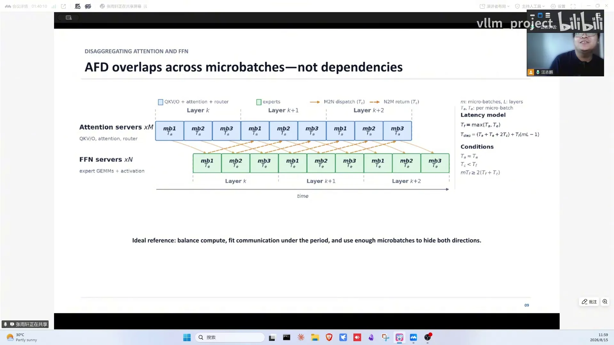 |
| 首先有跨（节点）的通信：即使用了 NVLink 还是很昂贵。来源于从 router 到 expert、从 expert combine 回下一层 layer 的通信。我们采用了 DeepSeek V4 的一个（融合）kernel——很厉害的 kernel，借鉴过来，通过（重叠）hide 通信和计算，把整体 FFN 侧的速度变快…… [【跳转到 58:47】](https://www.bilibili.com/video/BV14Jgg6iEhN/?t=3527) |  |
| （接上） [【跳转到 59:12】](https://www.bilibili.com/video/BV14Jgg6iEhN/?t=3552) | 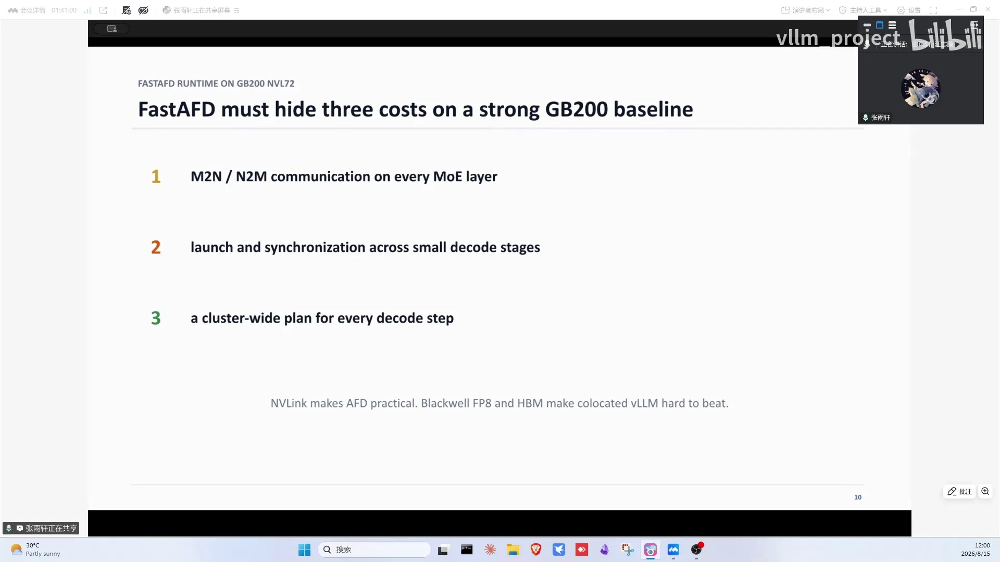 |
| 好处是 FFN server 的时间变小，整体更好 hide：整个时间就是一个 attention 的时间，不需要考虑通信会不会 expose 更多时间。 [【跳转到 59:37】](https://www.bilibili.com/video/BV14Jgg6iEhN/?t=3577) | 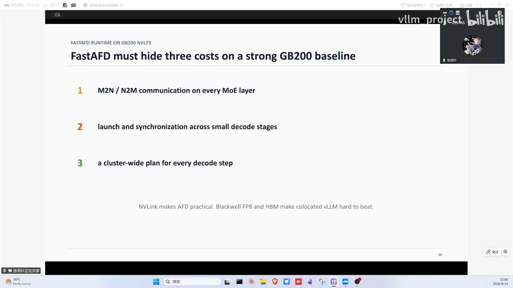 |
| 另外一个 launch 和 synchronization：要考虑 microbatch 的 schedule，会有非常 fragile 很小的 kernel——每个 decode step 中间有很多很小的 kernel，这是我们不想要的。我们采用了（vLLM 的）async scheduling 方法：decode 的同时做下一个 decode step 的 schedule，把中间的 gap 弥补了很大。 [【跳转到 60:02】](https://www.bilibili.com/video/BV14Jgg6iEhN/?t=3602) |  |
| 最后整体用 Nsight Systems 把前两者加在一起，得到比较好的 planning。对每个 decode step 用 Nsight 展示实际 profiling 结果：基本没什么 bubble。像 MoE kernel 正常存在三部分：两个通信、一个整体计算…… [【跳转到 60:27】](https://www.bilibili.com/video/BV14Jgg6iEhN/?t=3627) | 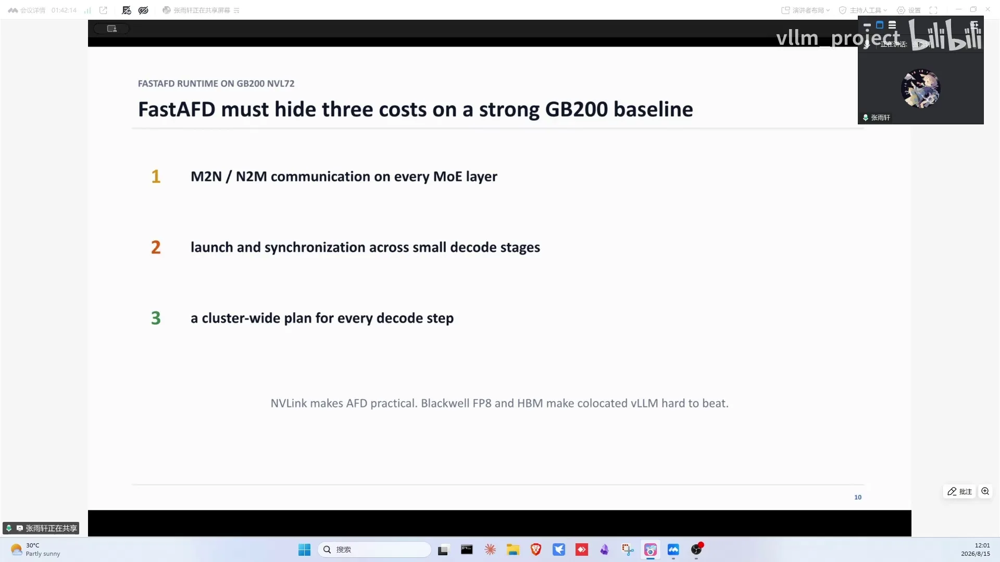 |
| （接上） [【跳转到 60:52】](https://www.bilibili.com/video/BV14Jgg6iEhN/?t=3652) | 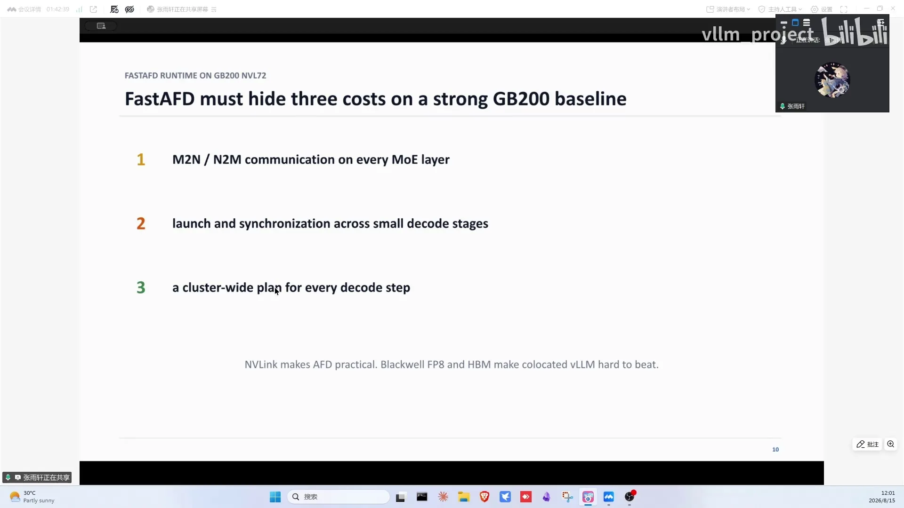 |
| 它帮助我们把整个 FFN server 的时间变少，更好做 micro batch overlapping。然后是 CPU 的部分：做 decode step 时 pre-schedule 下一个 decode step，让每个 step 之间的 bubble 变小。最后跑出的 Nsight：每一个小分段是一个 decode step，没做优化时中间的分段非常大，现在优化得很好。stream 下面有一排灰色没展开：表示两个 stream——两个 microbatch overlap 得非常好…… [【跳转到 61:17】](https://www.bilibili.com/video/BV14Jgg6iEhN/?t=3677) | 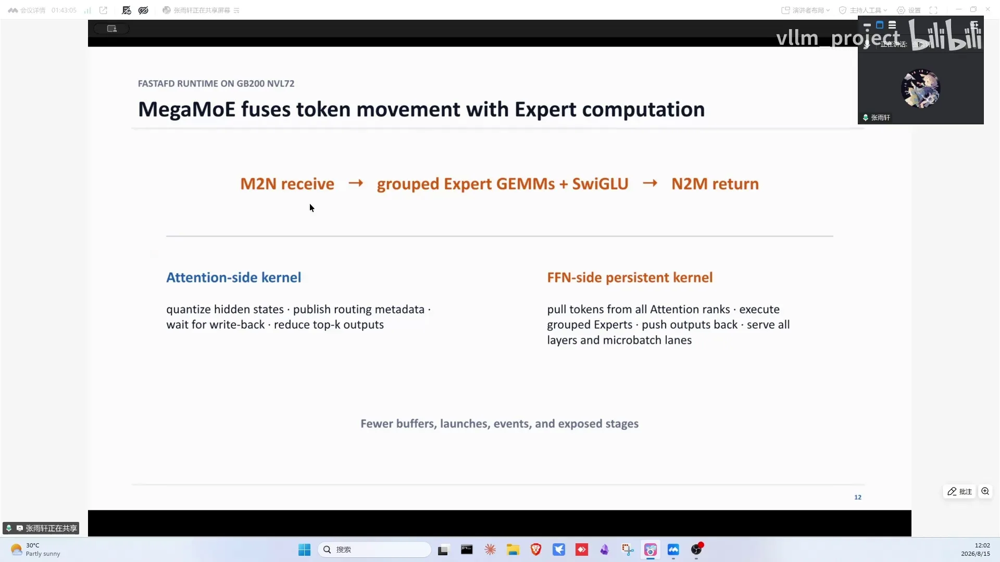 |
| （接上） [【跳转到 61:42】](https://www.bilibili.com/video/BV14Jgg6iEhN/?t=3702) | 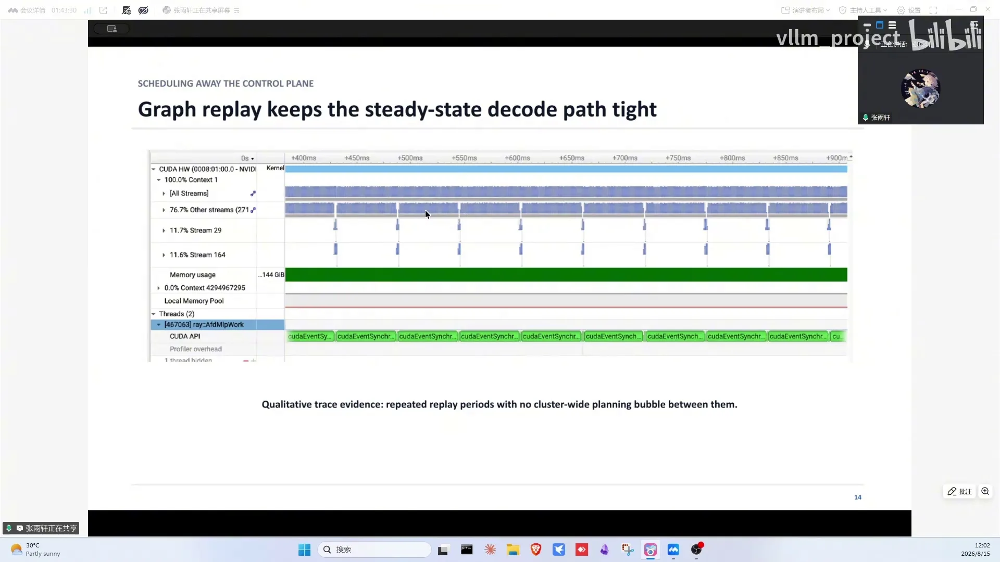 |
| 上面是一个 microbatch 的 stream，下面灰色的是另一个 microbatch 的 stream 计算，overlap 得比较好，中间没有 gap。最后结果：做了 Qwen3-235B 以及 MiniMax M2.5——也是 200 多 B 的 MoE 模型。 [【跳转到 62:07】](https://www.bilibili.com/video/BV14Jgg6iEhN/?t=3727) |  |
| 固定长度 8K 和 16K，调配比看 performance。vLLM 侧统一采用 DP4、EP4 作为 baseline；AFD 的 FFN 侧也是 EP4 结构。最后计算 per GPU 的吞吐。注意 prefill 部分没做，只做了 steady decode 状态下的 decode 吞吐。对比 colocated baseline 有比较好的收益：大概 1.3 到 1.4 倍左右。收益来源于更大的 batch size…… [【跳转到 62:32】](https://www.bilibili.com/video/BV14Jgg6iEhN/?t=3752) | 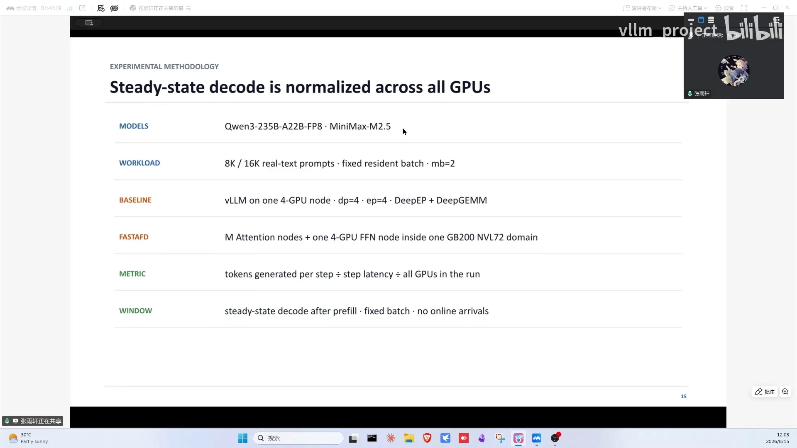 |
| （接上） [【跳转到 62:57】](https://www.bilibili.com/video/BV14Jgg6iEhN/?t=3777) | 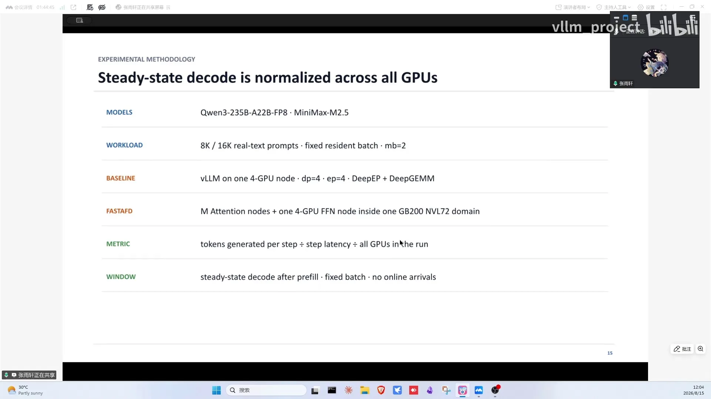 |
| 同时 TPOT 没什么变化，还是 attention 的时间。配比也调了：NVL72（场景）下最大配比是 17 比 1。MiniMax 的情况下收益非常大：有 45% 的收益。——对比较正常的 colocated per GPU 吞吐。——说到 colocated，直播间有同学问：能不能做 AFD 的 CPU offload 实现 colocated？——你重复一下这个问题？ [【跳转到 63:22】](https://www.bilibili.com/video/BV14Jgg6iEhN/?t=3802) |  |
| （接上） [【跳转到 63:47】](https://www.bilibili.com/video/BV14Jgg6iEhN/?t=3827) |  |
| （接上） [【跳转到 63:55】](https://www.bilibili.com/video/BV14Jgg6iEhN/?t=3835) | 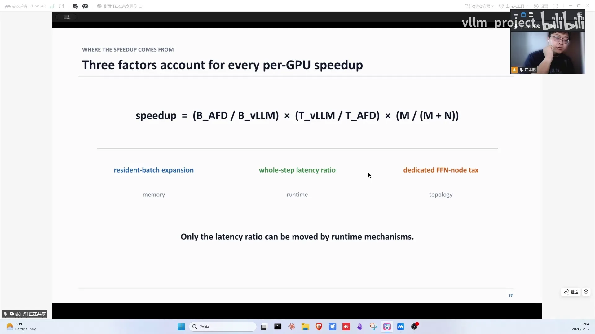 |
| 什么意思？——我理解 colocated 里能不能也实现 AFD，通过 CPU offload 实现？——我想想，你 CPU offload 是为了 offload 什么？ [【跳转到 64:08】](https://www.bilibili.com/video/BV14Jgg6iEhN/?t=3848) | 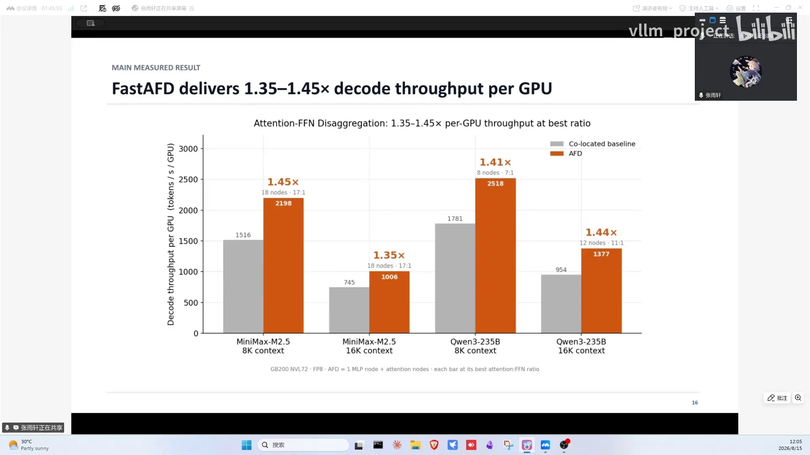 |
| 我理解应该是通过 CPU 这个（中转）传我的 hidden state。模型比较小的话在一个（节点）上做 AFD。我理解他说的可能是把 MoE 的计算放到 CPU 去算，是这个意思？ [【跳转到 64:33】](https://www.bilibili.com/video/BV14Jgg6iEhN/?t=3873) |  |
| 我也见过工作玩这个的，会很快吗？感觉会很慢吧？——我也觉得，但还真见过有人这么玩。我理解的话：我们是两个进程吧——一个 attention、一个 FFN，中间的 CPU 直接（在）机器上传，是这个意思吗？ [【跳转到 64:58】](https://www.bilibili.com/video/BV14Jgg6iEhN/?t=3898) |  |
| 所以 CPU 先相当于把 GPU attention 的 hidden state 传到 CPU 上，然后 CPU 再传回 FFN 的 GPU。但这样会很慢：是 CPU 到 GPU 的带宽，现在全是 GPU 到 GPU 的带宽。 [【跳转到 65:23】](https://www.bilibili.com/video/BV14Jgg6iEhN/?t=3923) | 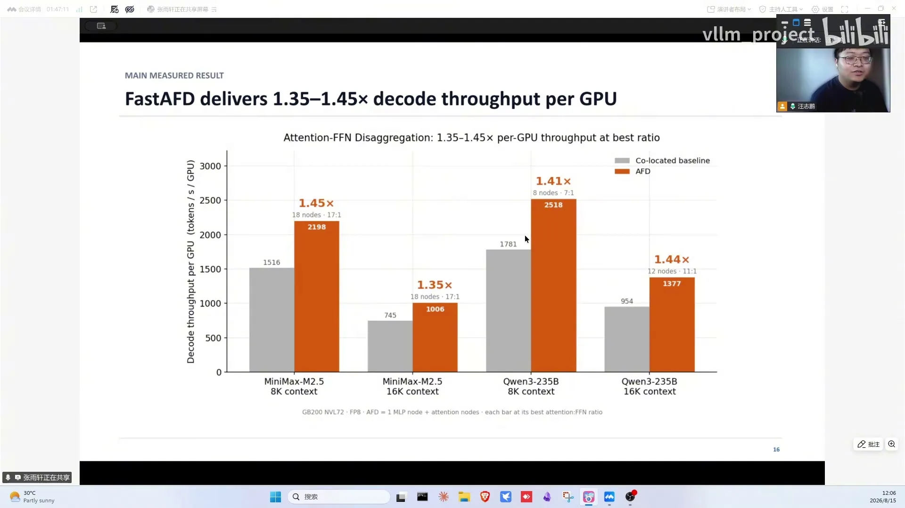 |
| 它会对我们的 latency 有很大的要求：如果通信时间太长，就像公式一样…… [【跳转到 65:48】](https://www.bilibili.com/video/BV14Jgg6iEhN/?t=3948) |  |
| 理想情况下我们想要 attention 时间大于等于 expert 时间才能 overlap。如果通信时间太长——现在把通信全包在 expert 侧——你这边通信时间太长，整个就不会被 attention overlap 掉了。 [【跳转到 65:59】](https://www.bilibili.com/video/BV14Jgg6iEhN/?t=3959) | 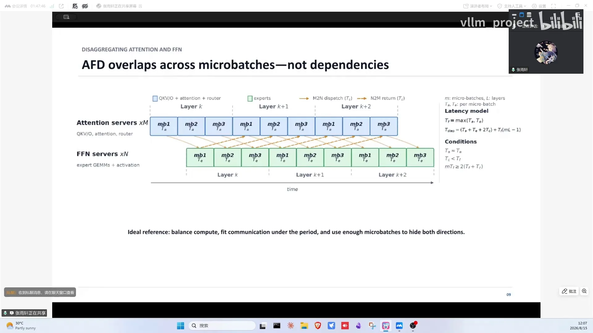 |
| 单机的话直接用 NVLink 就行。我理解这个同学主要想问能不能单机做 AFD——比如一张卡部署 FFN、（七张）卡部署 attention，用 NVLink 传。 [【跳转到 66:24】](https://www.bilibili.com/video/BV14Jgg6iEhN/?t=3984) |  |
| 一个（节点）8 张卡：一个卡布 F，七个卡布 A，有通信，用 NVLink 传。——我理解这个通信应该是这个意思。好，再回答其他问题：目前 AFD 分离的调度怎么做的？——刚才说得比较明显…… [【跳转到 66:49】](https://www.bilibili.com/video/BV14Jgg6iEhN/?t=4009) |  |
| 比较 high level：做 decode step 时会准备下一个 decode step 的 metadata 以及怎么传。这里最大的调度是（通信）——正常 MoE 有两个通信：dispatch、combine，是比较常规的 all-to-all。因为 AFD 分离导致 attention 和 MoE 的比例不一样，通信会有点（异构）……调度会比较有影响，microbatch 之间的管理也会有影响。 [【跳转到 67:14】](https://www.bilibili.com/video/BV14Jgg6iEhN/?t=4034) | 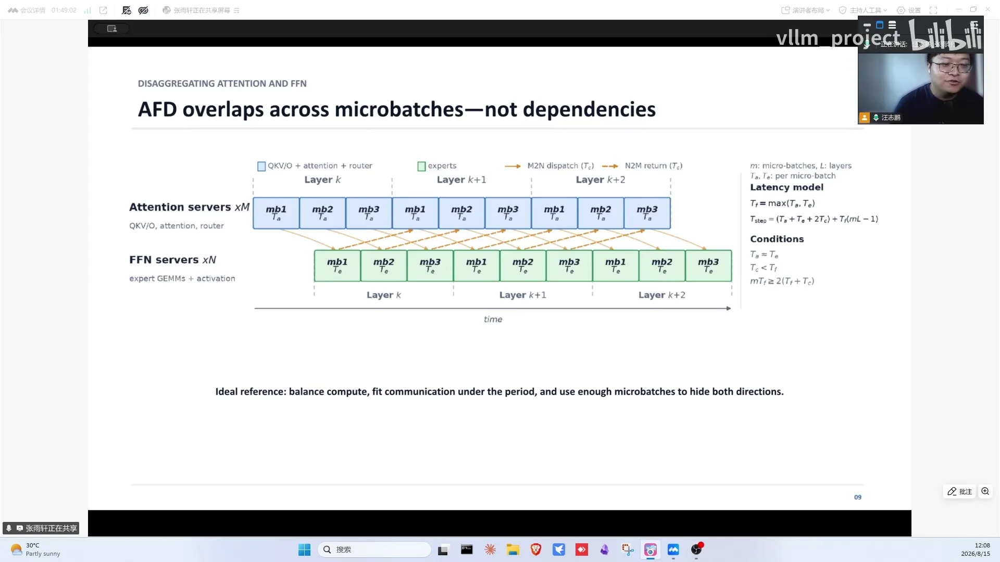 |
| 下一个问题：新的请求到 FFN 以后，最多等一个 layer 的时间还是等一个 token 的时间？ [【跳转到 67:39】](https://www.bilibili.com/video/BV14Jgg6iEhN/?t=4059) | 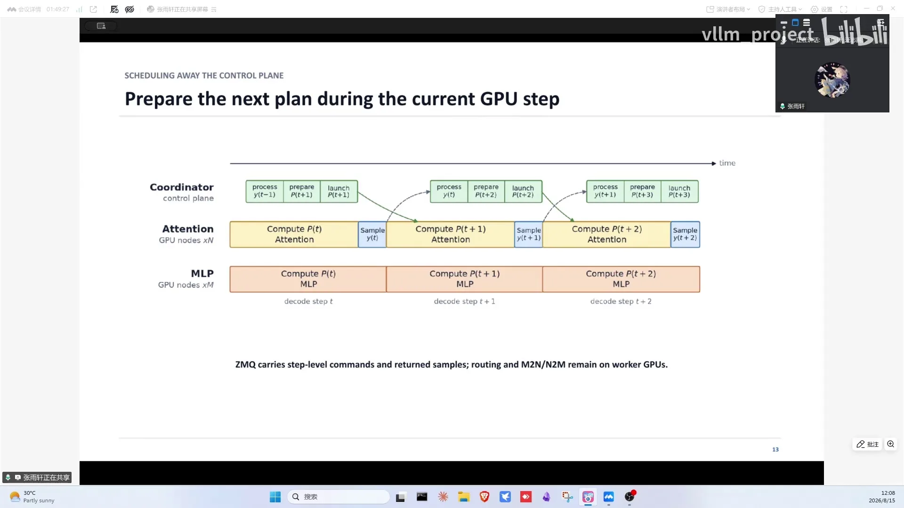 |
| 一个请求到 FFN——我想想，可能无法用一个请求来考虑：一批新的 decode，比如 64 的 batch size 进来。整个模型有一个公式：理想稳态时只有 attention 的时间…… [【跳转到 68:04】](https://www.bilibili.com/video/BV14Jgg6iEhN/?t=4084) | 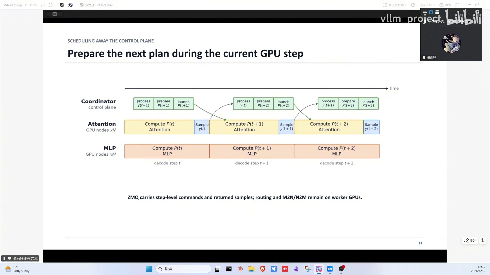 |
| 但在最开始和最尾端有一定的小 overhead：需要正好等一个 attention microbatch 和一个 MoE microbatch、同时等两次通信，但只会存在第一层 layer，剩下就是稳态的 attention overlap 时间。 [【跳转到 68:29】](https://www.bilibili.com/video/BV14Jgg6iEhN/?t=4109) |  |
| 下一个同学问：下一个 decode 阶段的（预调度）指的是什么？ [【跳转到 68:54】](https://www.bilibili.com/video/BV14Jgg6iEhN/?t=4134) | 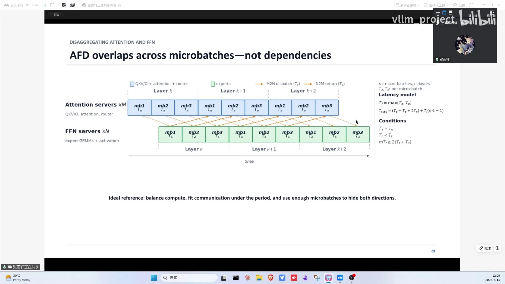 |
| 正常 decode 是 token by token 的：token 会回到 CPU 做调度，再做下一步。async scheduling 做得比较聪明的地方：给下一个 step 的（调度）在 CPU 上有了位置，这时 token 不需要回 CPU 重新调度，可以直接接着做下一个 decode step，就省了这个 overhead。我们稍微 refactor 了（vLLM）的做法。 [【跳转到 69:19】](https://www.bilibili.com/video/BV14Jgg6iEhN/?t=4159) | 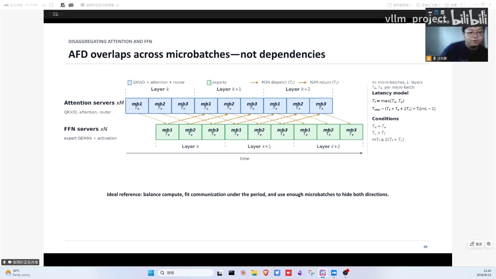 |
| （接上） [【跳转到 69:44】](https://www.bilibili.com/video/BV14Jgg6iEhN/?t=4184) |  |
| 有同学说：MoE 权重占模型的绝大部分，FFN（侧）首先也得考虑（显存）够不够。这个是回答刚才（那个问题的）。这个问题是针对单机的吗？——应该针对所有情况。 [【跳转到 70:09】](https://www.bilibili.com/video/BV14Jgg6iEhN/?t=4209) |  |
| 如果只用一个机器放的话有可能放不下：这跟 EP 是（互相影响）的状态，得找到比较好的 EP。EP 开大了肯定不能用单卡来搞…… [【跳转到 70:34】](https://www.bilibili.com/video/BV14Jgg6iEhN/?t=4234) |  |
| 得多卡才能搞 EP。所以 FFN 那边只要装得下、并且是比较好的 EP 数字就好。单卡确实可能有一定影响。好，继续。这三个 factor 是后面发现的：通过 vLLM 简单的 profiling 就能知道 AFD 对应的收益。 [【跳转到 70:59】](https://www.bilibili.com/video/BV14Jgg6iEhN/?t=4259) |  |
| （此区间无字幕） [【跳转到 71:24】](https://www.bilibili.com/video/BV14Jgg6iEhN/?t=4284) |  |
| （此区间无字幕） [【跳转到 71:29】](https://www.bilibili.com/video/BV14Jgg6iEhN/?t=4289) |  |
| speedup 来自 AFD 比正常 colocated vLLM 有更大的 batch size：因为权重全部放到 FFN 侧 worker，FFN 的 worker 是少数的。所以有更多空间开更大的 batch size——这是很大的收益来源。 [【跳转到 71:34】](https://www.bilibili.com/video/BV14Jgg6iEhN/?t=4294) |  |
| 另一个是 latency，即 decode time：如果 overlap 做得好，就单纯是一个 attention 的时间，跟 vLLM 没什么区别，甚至快一点点。唯一值得担心的就是配比：总资源的配比。AFD 把 expert 放到 FFN worker，FFN worker 不做任何 attention（计算），相当于（它的 KV cache）废掉了…… [【跳转到 71:59】](https://www.bilibili.com/video/BV14Jgg6iEhN/?t=4319) | 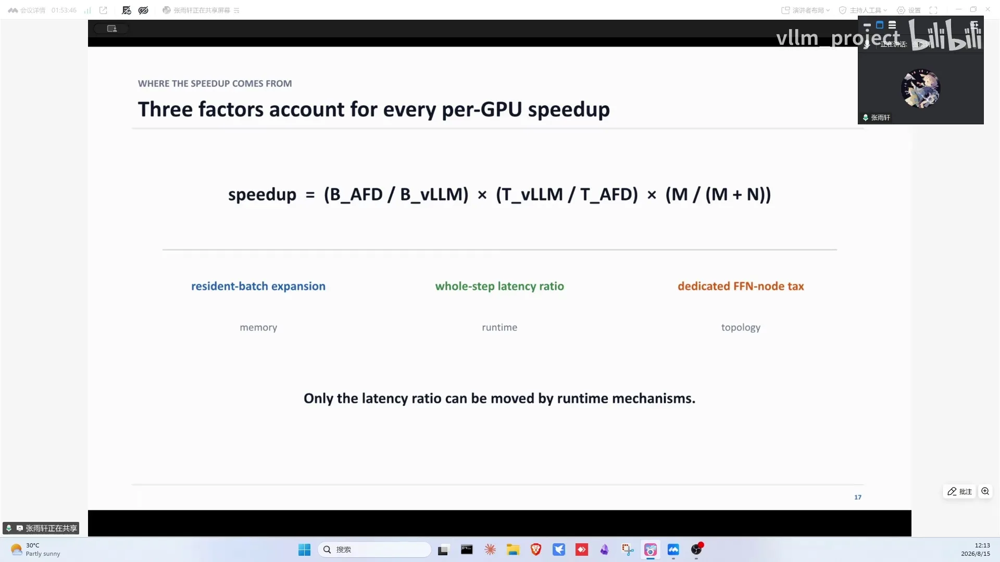 |
| 算（总吞吐）时需要把这个（废掉的）worker 考虑进来…… [【跳转到 72:24】](https://www.bilibili.com/video/BV14Jgg6iEhN/?t=4344) | 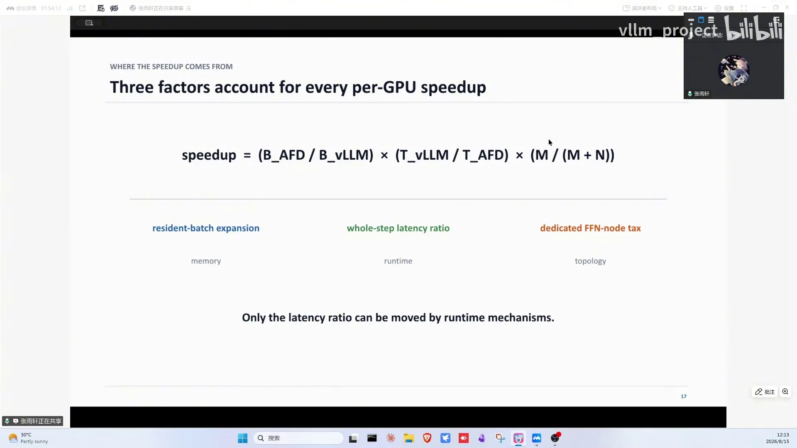 |
| 所以整体来说，只有当比例调得很大，FFN 侧废掉的（KV）可以忽略不计。整体收益可以通过 vLLM（profile）三个大概的收益时间，以及 batch size 最大能打多少、配比最高能到什么样子，得出大概的 speedup——相对于正常 colocated 的 setting。值得提的是考虑到 TPOT 的时间：像（前面老师）说的，两个 macrobatch 时整个时间就是（取 max）…… [【跳转到 72:49】](https://www.bilibili.com/video/BV14Jgg6iEhN/?t=4369) | 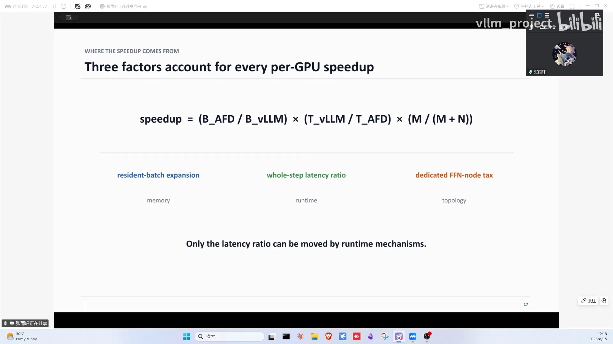 |
| （接上） [【跳转到 73:14】](https://www.bilibili.com/video/BV14Jgg6iEhN/?t=4394) | 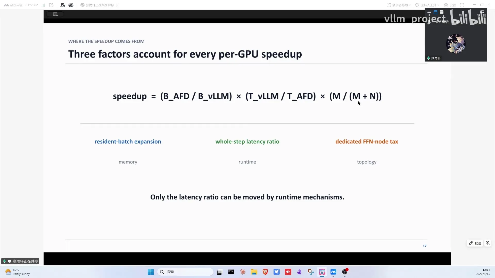 |
| 实际做完这个工作后发现关系没有想象的完全是两倍。首先 attention 里因为开的 batch size 会很大，batch size 主要取决于 HBM bandwidth bound：来源大概在 AFD 能开多大…… [【跳转到 73:39】](https://www.bilibili.com/video/BV14Jgg6iEhN/?t=4419) |  |
| attention 这个时间有多长。但 attention worker 这边还保留了一些 MoE 的运算——非常小，跟 macrobatch 数量更相关。所以两个 macrobatch 时确实是两倍，但 attention 这边的时间…… [【跳转到 74:04】](https://www.bilibili.com/video/BV14Jgg6iEhN/?t=4444) | 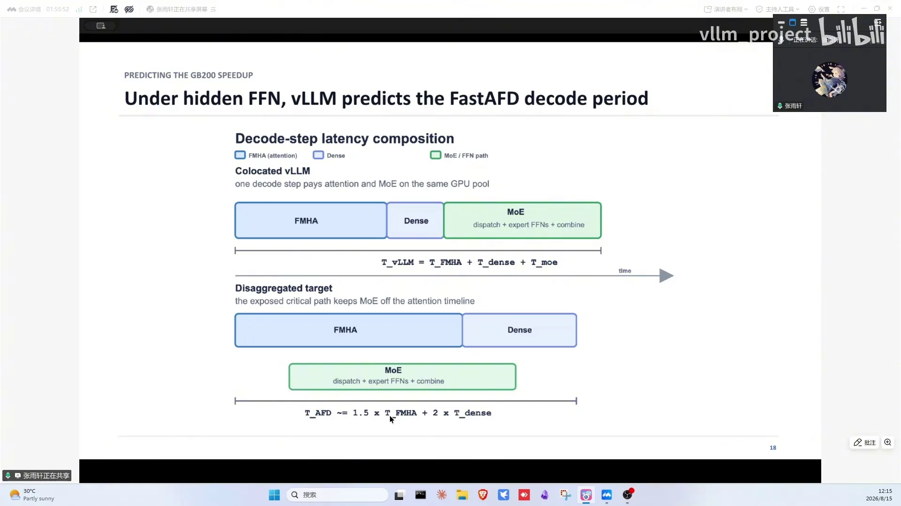 |
| 跟 batch size 大小更相关。通过这个（公式）可以用 vLLM 的 decode latency 预测 AFD 的 decode latency，最后推出所有的 speedup——从 vLLM profiling 得出 AFD 的 speedup。最后一个实验…… [【跳转到 74:29】](https://www.bilibili.com/video/BV14Jgg6iEhN/?t=4469) | 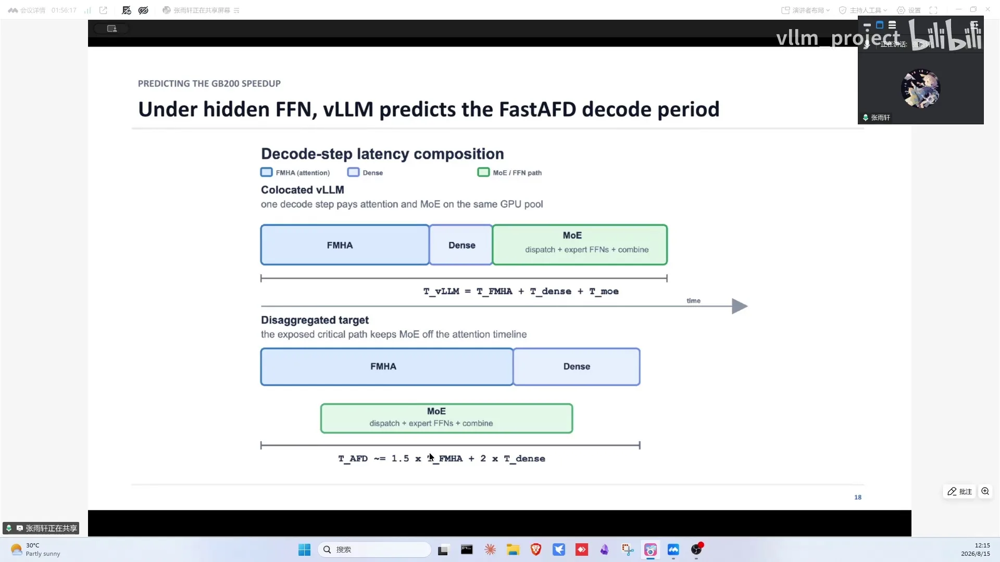 |
| 预估数值和实验数值差距不大：大概 2.2% 的差距，是很准的（公式）。值得提的是放到 hybrid（注意力）形态下这件事应该不一样：公式可能会改变很多。然后配比下的 profiling result：这是 model dependent 的…… [【跳转到 74:54】](https://www.bilibili.com/video/BV14Jgg6iEhN/?t=4494) | 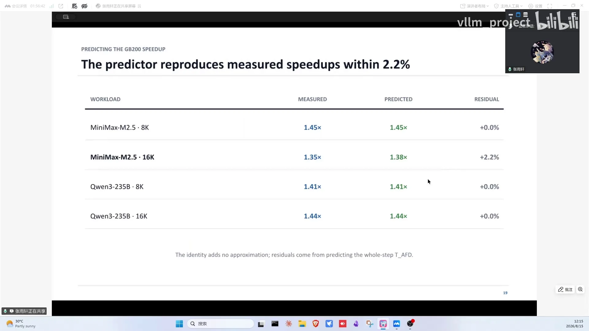 |
| MiniMax 整体的 AFD 比例 scaling 收益一直在 1.45 和 1.35 左右；但 Qwen3（-235B）时逐渐 scale up attention worker，收益变小了。主要原因是刚才看到的 overlapping hide 不住 expert（时间）：可能从 memory bandwidth bound 变成了 compute bound。继续增加 attention 比例（收益）线性下降。但我们一样觉得 AFD 能 work 的原因…… [【跳转到 75:19】](https://www.bilibili.com/video/BV14Jgg6iEhN/?t=4519) |  |
| （接上） [【跳转到 75:44】](https://www.bilibili.com/video/BV14Jgg6iEhN/?t=4544) | 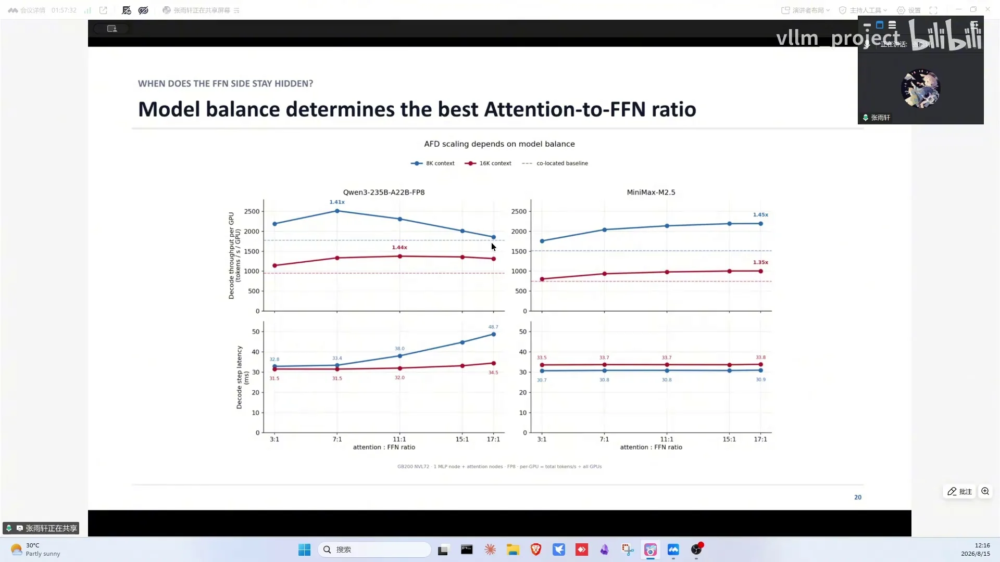 |
| 像（前面老师）说的：NVIDIA 有（Rubin CPX），Google 的 TPU 把 SRAM 加大两倍。如果 FFN 变得更快，对应的配比可以调得更高，收益上限也会更高。最后是实验的（细节）…… [【跳转到 76:09】](https://www.bilibili.com/video/BV14Jgg6iEhN/?t=4569) | 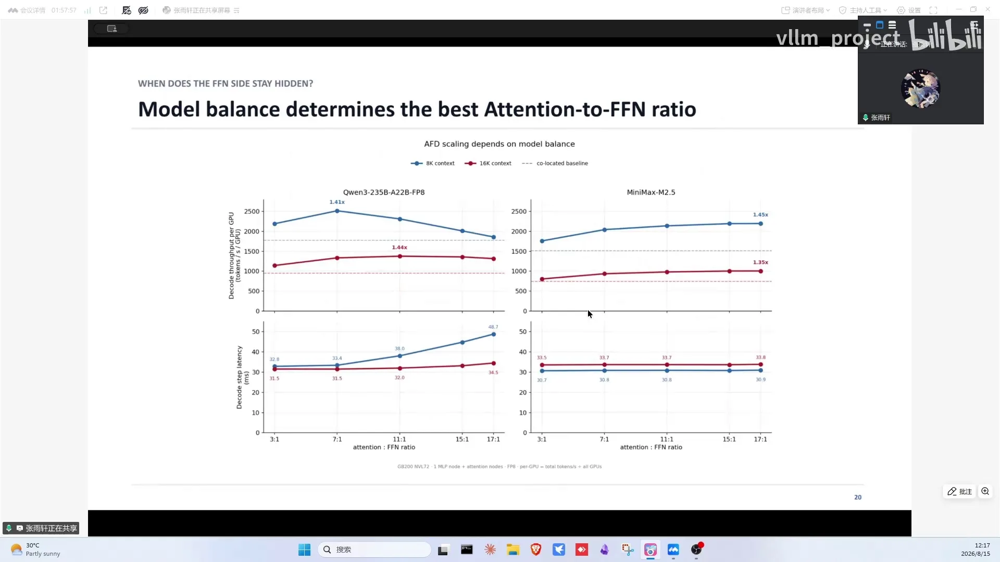 |
| 主要是一个 microbatch 的数量：microbatch 开得更大通信 hide 会更好。但像刚才的（公式）：microbatch 开得更大，对应的 overhead 也会更大——可能会有 3 倍或 4 倍的 attention 侧 MoE 时间…… [【跳转到 76:34】](https://www.bilibili.com/video/BV14Jgg6iEhN/?t=4594) |  |
| 所以会带来（权衡）。我们找到甜点：2 个 microbatch 是最优状态。右边是当时做的 schedule：decode 时 GPU decode、CPU 做下一步 schedule。不做这一步 schedule 会增加 9.8 毫秒，是我们不想要的。这部分是关于（micro batch）…… [【跳转到 76:59】](https://www.bilibili.com/video/BV14Jgg6iEhN/?t=4619) | 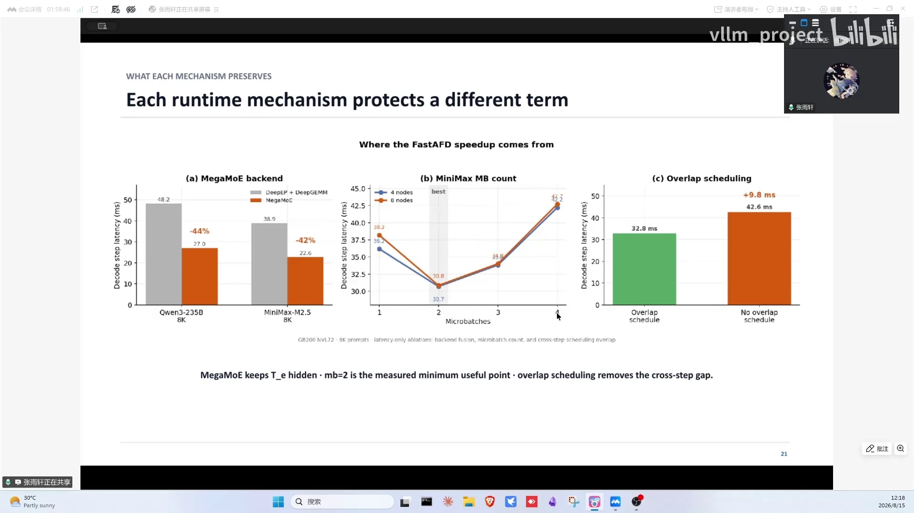 |
| （这三件事）让 AFD 可以在 GB300、GB200 得到比较好的（收益）和吞吐表现。总结：AFD 主要是针对 long context、增加 expert 的 batch size、提高 MoE FFN 利用率的工作…… [【跳转到 77:24】](https://www.bilibili.com/video/BV14Jgg6iEhN/?t=4644) |  |
| 结果：通过一些优化让 FFN 能很好地被 attention hide 住，整体有更大的 batch size、更好的吞吐，整体提升在 1.3 到 1.4 倍之间。这是现在工作的阶段性结果。我们依然在思考 hybrid attention 情况下会有什么不同的发现，还在研究中。——非常感谢宇宣老师。 [【跳转到 77:49】](https://www.bilibili.com/video/BV14Jgg6iEhN/?t=4669) |  |
| （接上） [【跳转到 78:14】](https://www.bilibili.com/video/BV14Jgg6iEhN/?t=4694) | 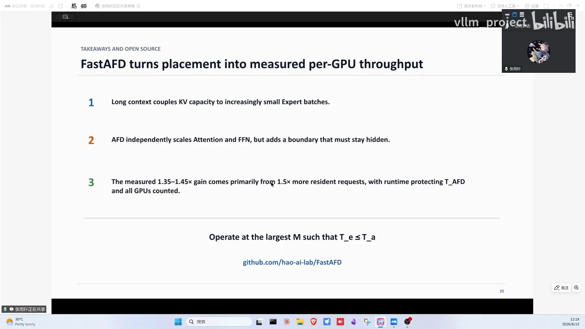 |
| 实验室的二维码也介绍一下：我们实验室的（群），经常在上面透露很多有趣的实验和 result，比较 active。这个 lab 应该算全球最顶级的 AI lab 之一，感兴趣的可以关注一下。——也可以介绍一下想去你们实验室做实验或者申请 PhD 怎么搞、有什么要求？ [【跳转到 78:25】](https://www.bilibili.com/video/BV14Jgg6iEhN/?t=4705) | 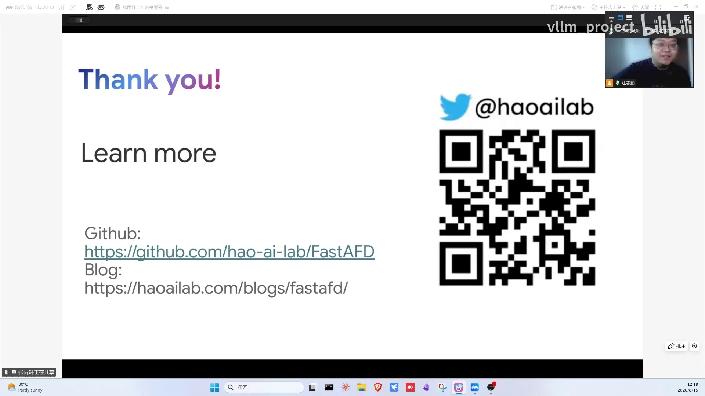 |
| （接上） [【跳转到 78:50】](https://www.bilibili.com/video/BV14Jgg6iEhN/?t=4730) | 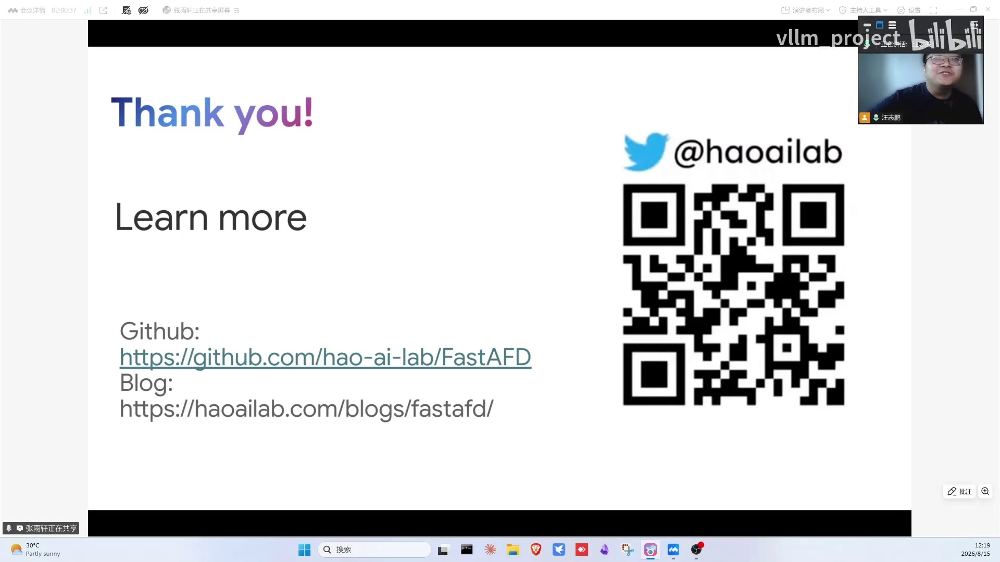 |
| 按照我们教授的标准：有一个很重要的点——要证明你是比较好的（研究者）：来之前就已经有一些独立思考、能解决相对在这个阶段比较困难的问题，这是一个基本的指标。实验室很欢迎 intern 而且（待遇）都还不错：可以接触到顶级卡和顶（级研究者）。想读 PhD 的话最好提前加入 lab…… [【跳转到 79:15】](https://www.bilibili.com/video/BV14Jgg6iEhN/?t=4755) | 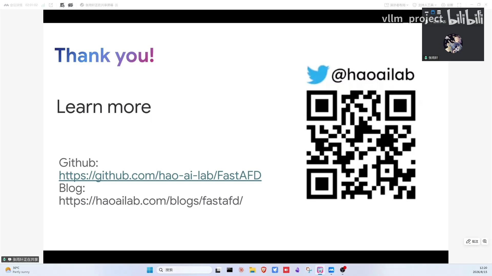 |
| 做一些相关工作，老师能从中看到相关点就会愿意（录取）。所以做开源真的是很好的机会：可以先接触到这些人。老师对开源看得比较重，做开源也容易（出彩）。 [【跳转到 79:40】](https://www.bilibili.com/video/BV14Jgg6iEhN/?t=4780) | 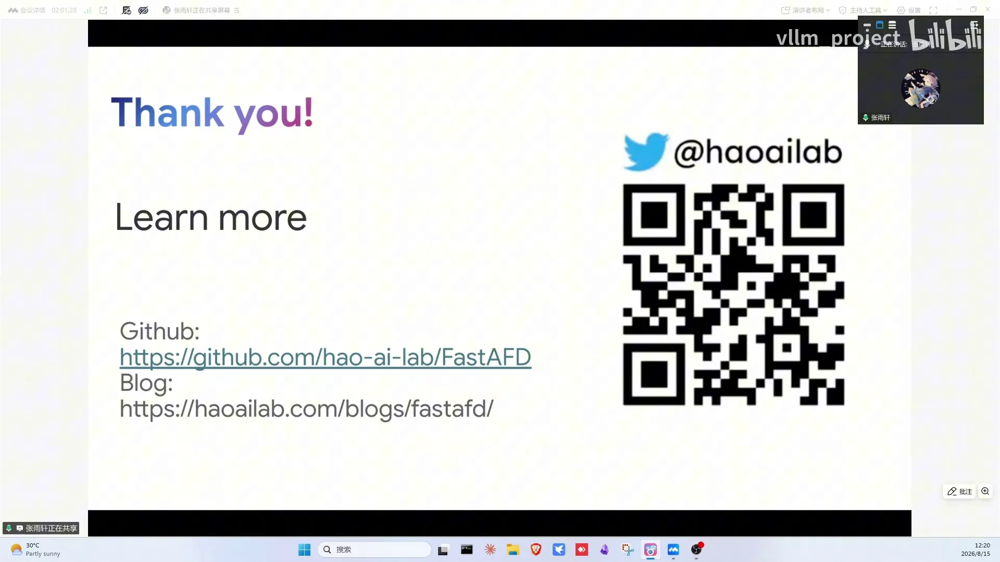 |
| 欢迎大家来（实验室）。先回答观众提问："AFD 对 KV cache 在（单卡）HBM 中的占比大概提了多少？"——1.5 倍。现在是 1.5 倍的（容量）…… [【跳转到 80:05】](https://www.bilibili.com/video/BV14Jgg6iEhN/?t=4805) |  |
| 大了 1.5 倍——其实就是把（冗余）去掉。但最近发现收益可能远超这个：hybrid（注意力）下面 batch 会打得更满。最近跟上一位老师讨论，下一个（场景的）收益可能会更大。——下一个问题：KV cache 有 attention 的（结构差异）需要支持，打算如何支持？ [【跳转到 80:23】](https://www.bilibili.com/video/BV14Jgg6iEhN/?t=4823) | 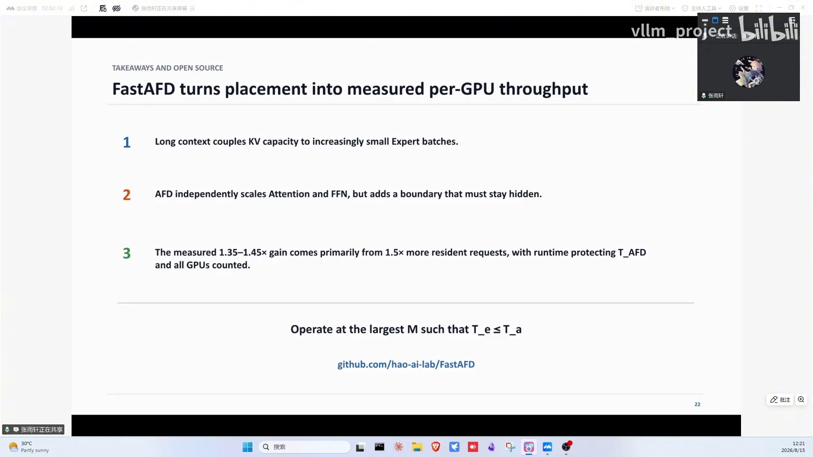 |
| 坦白说我已经写了一版 Qwen3.5 的——Qwen3.5 是（某种）hybrid，感觉跟 KV cache 有点类似。初步 profiling 结果我觉得还挺好。我们现在依然在支持更多的模型…… [【跳转到 80:48】](https://www.bilibili.com/video/BV14Jgg6iEhN/?t=4848) | 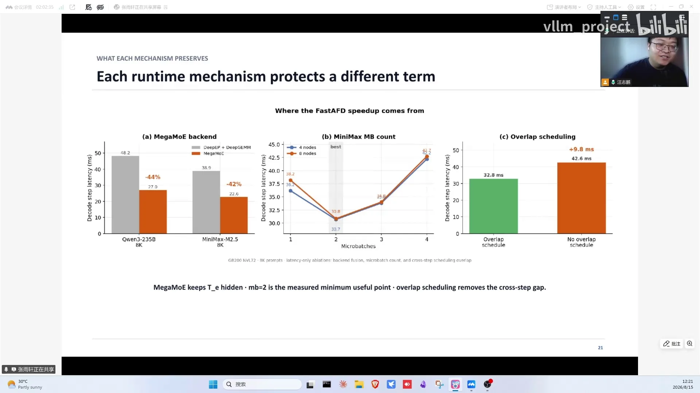 |
| 看它们不同的（结构）有什么 performance，依然在 research。还有同学问：刚才这个（公式）原理可以再讲一讲吗？——第一个 factor 相当于 AFD：没有了权重占用，大部分权重放在固定的地方，可以打出更大的 batch size（相比 vLLM）…… [【跳转到 81:13】](https://www.bilibili.com/video/BV14Jgg6iEhN/?t=4873) |  |
| 第二个是 decode latency 的比例：vLLM 的 decode latency 是 attention（时间）…… [【跳转到 81:38】](https://www.bilibili.com/video/BV14Jgg6iEhN/?t=4898) |  |
| （vLLM 时间）除了 dense 还有 router、MoE projection 那部分传到 MoE 的时间——这是正常 vLLM 的时间。在 AFD 里回到这张图：首先是 overlapping 状态，有两部分——上面是 attention 加 router 加（输出）projection 时间，下面只是 MoE 的时间…… [【跳转到 82:03】](https://www.bilibili.com/video/BV14Jgg6iEhN/?t=4923) | 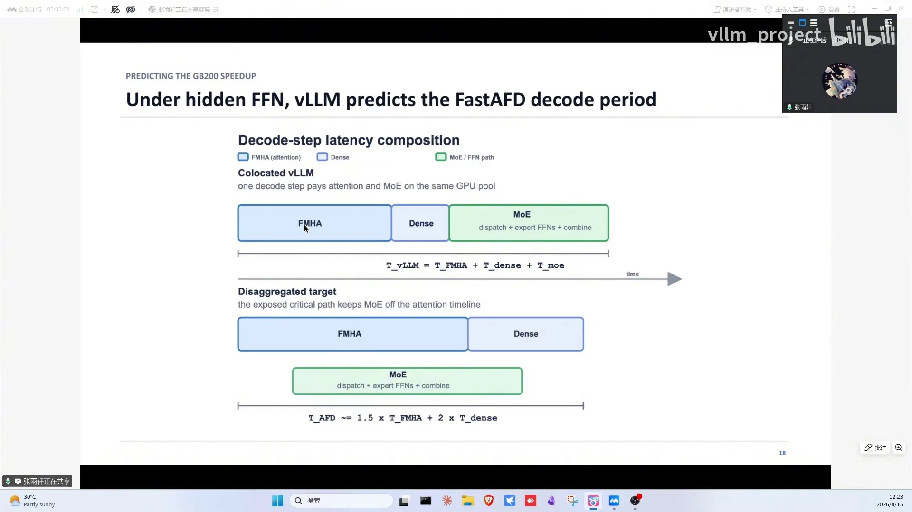 |
| 回到这张图：这部分是 MoE，这部分是 attention worker。因为是两个 macrobatch，相当于（计算）浪费了两次——给整体时间增加两倍。但 attention 虽然也浪费两次，浪费时间跟它的因素不是这么重要…… [【跳转到 82:28】](https://www.bilibili.com/video/BV14Jgg6iEhN/?t=4948) |  |
| 它最重要影响 latency 的因素是 batch size 变大：batch size 增加到 1.5 倍，所以整体 attention 的时间是 1.5 倍 vLLM 的时间。这是第二个因素。第三个因素是卡：M 代表 vLLM 用的卡，N 代表 FFN 用的卡，M 是 attention worker 用的卡。attention worker 的卡其实（有所）浪费——这是调度的浪费，没办法，肯定会牺牲一些。好，直播间又有新的观众提问：提到 MoE balance 解决 FFN 时间的问题…… [【跳转到 82:53】](https://www.bilibili.com/video/BV14Jgg6iEhN/?t=4973) | 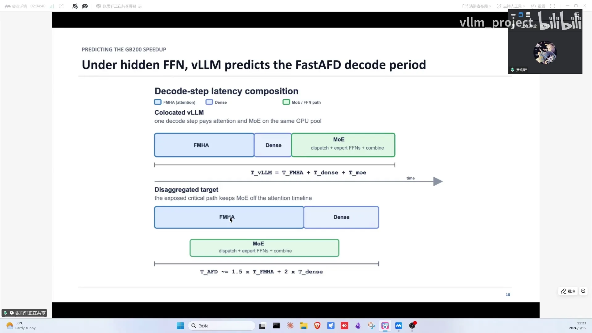 |
| （接上） [【跳转到 83:18】](https://www.bilibili.com/video/BV14Jgg6iEhN/?t=4998) | 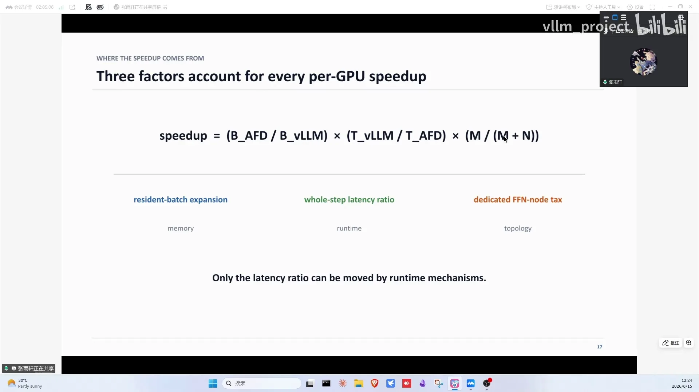 |
| 有试过（那个）吗？——我其实一直想试但没有时间。它在 KV 的通信上听说挺快的，如果我没记错。——我今天第一次听到，回去学习学习。 [【跳转到 83:43】](https://www.bilibili.com/video/BV14Jgg6iEhN/?t=5023) | 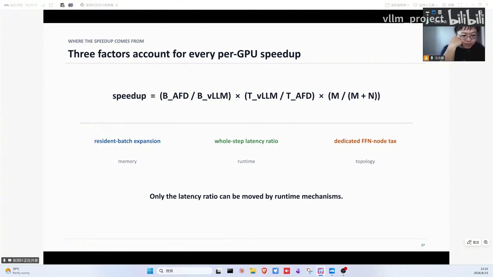 |
| （接上） [【跳转到 83:57】](https://www.bilibili.com/video/BV14Jgg6iEhN/?t=5037) |  |
| 好像是 Kimi 的新的一个（工作）。确实想试试而且想尝试集成，感觉很有希望，欢迎大家（合作）。大家如果想来做 intern 甚至读 PhD，一定要多做开源…… [【跳转到 84:12】](https://www.bilibili.com/video/BV14Jgg6iEhN/?t=5052) | 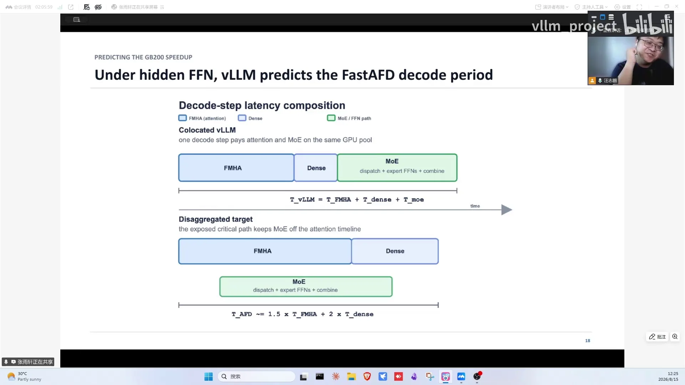 |
| 多了解这些 AFD 项目的动态，尽量多来合作，哪怕混眼熟也可以，对后面做 intern 或者读 PhD 有更多机会。——好，又有同学问：FastAFD 这个 idea 怎么来的？——这个不算新：主要来自 ByteDance 的一篇文章 MegaScale-Infer…… [【跳转到 84:37】](https://www.bilibili.com/video/BV14Jgg6iEhN/?t=5077) | 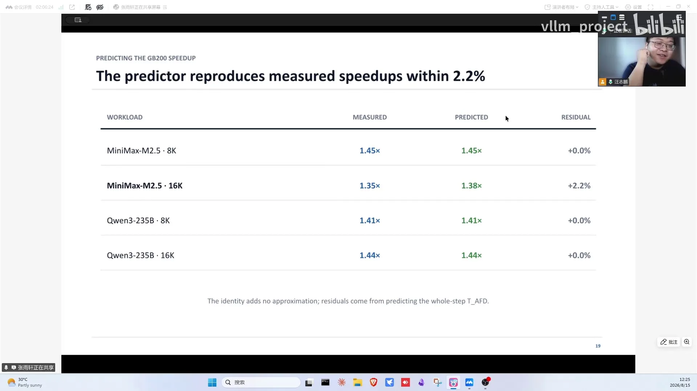 |
| 然后尽量的多来合作哪怕是烘眼熟我觉得也可以对后面做Integra或者是深片区D有更多的机会是的好,然后又有同学问这个Buzz的FD这个ID是怎么来的这个ID其实不算是新的因为它其实主要是来自于一篇Biden所做的一篇文章叫MegaScaleInfer [【跳转到 84:42】](https://www.bilibili.com/video/BV14Jgg6iEhN/?t=5082) | 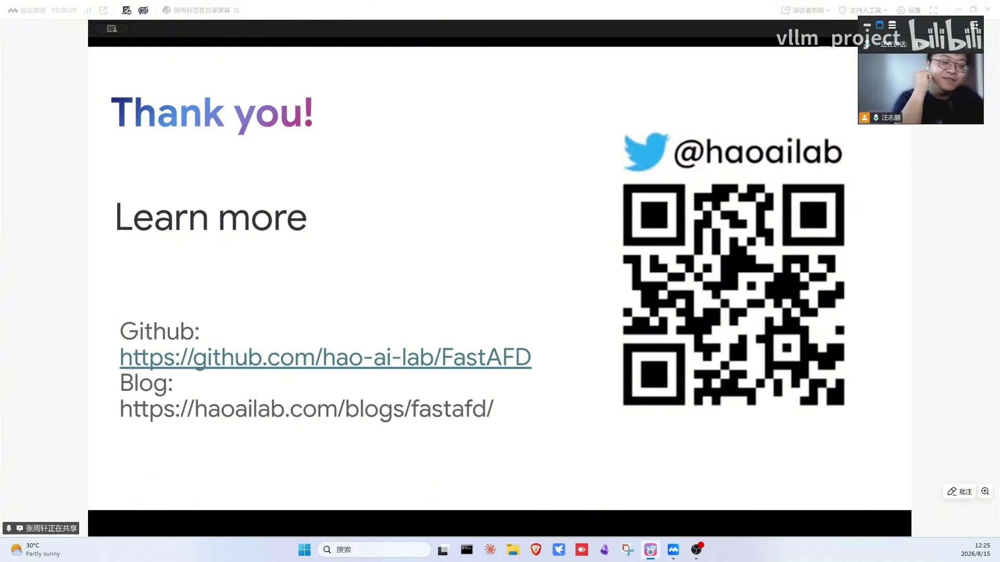 |
| 最开始提出 AFD 分离。本质因为 attention 和 FFN 的 scaling 不一样：需求不同——一个是 KV cache，一个是 batch size，而 KV cache 取决于 context length 和 batch size。long context 情况下 batch 变小 FFN 吃亏，相当于分离开做不同的 scaling 去满足 workload 的 scaling 条件。这个 work 最初来自 ByteDance 的 MegaScale-Infer…… [【跳转到 85:07】](https://www.bilibili.com/video/BV14Jgg6iEhN/?t=5107) | 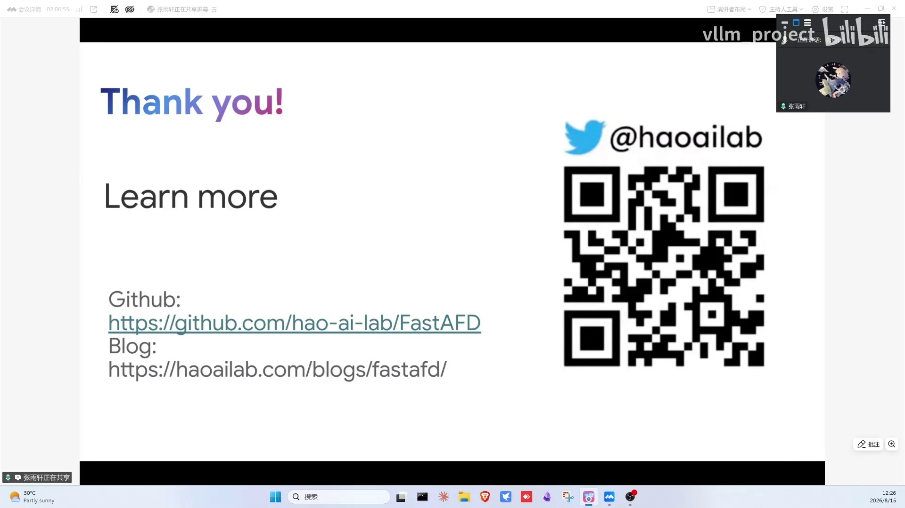 |
| 其实是不一样的就是它需求不对的一个是因为KVcash一个是因为BatchSize而KVcash又取决于LunkerType和BatchSize所以在LunkerType的情况下BatchSize变小FFN就会很吃亏然后相当于我们把它分离开做不同的scaling去满足他们这个workload的一个scaling条件但这个work本身最开始是来自于自己的MegaScaleInfer [【跳转到 85:14】](https://www.bilibili.com/video/BV14Jgg6iEhN/?t=5114) | 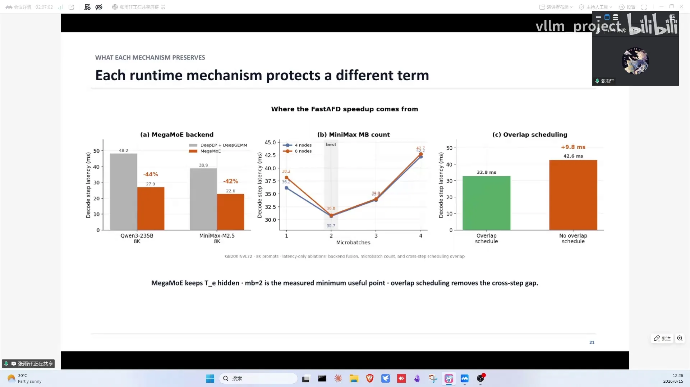 |
| 他们没有开源，呵呵。——效果我也不知道好不好。不过我觉得你们已经做得很好了：时间应该跟你们差不多。——有同学问：能不能用（CUDA）compact 做单机 AFD 加异步的 all-gather？ [【跳转到 85:39】](https://www.bilibili.com/video/BV14Jgg6iEhN/?t=5139) |  |
| 我其实也想说，但还没有（试过）。单机最好的解法就是把 SM 的时间分开：两部分 SM——一部分做 FFN、一部分做（attention/KV cache）。可能可以…… [【跳转到 86:04】](https://www.bilibili.com/video/BV14Jgg6iEhN/?t=5164) | 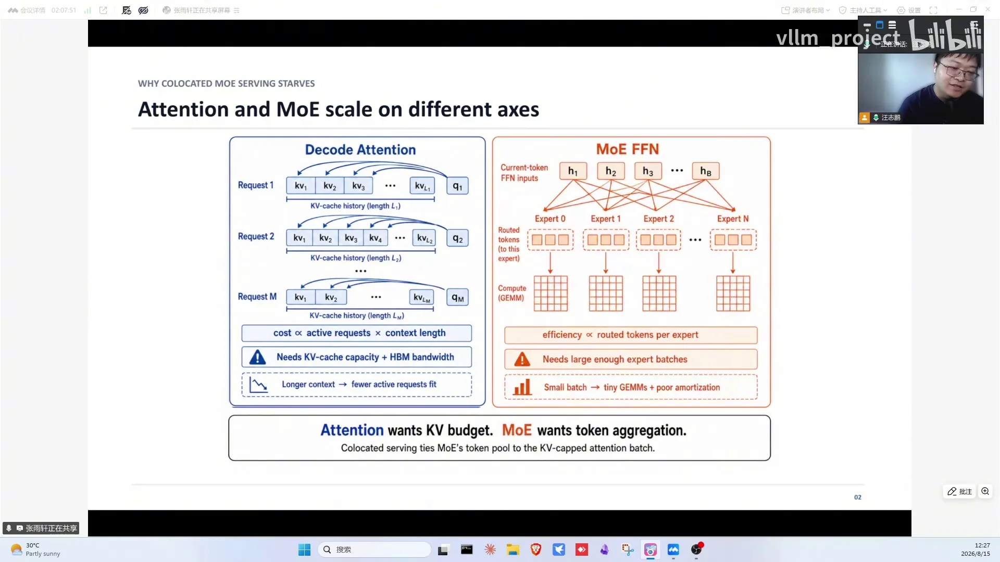 |
| 但你无法解决 batch size 的问题：这个好像以前我们写过类似的但不是非常好写。而且记得（CUDA 的）greedy 好像分 strand 不太好管理，可能还是得走 MPI 做两个 process 才好处理。但这个点子值得试一试，可能没有想象这么好写而已。 [【跳转到 86:29】](https://www.bilibili.com/video/BV14Jgg6iEhN/?t=5189) |  |
| 而且单机的话还是受显存限制：比例……肯定会有——不可能像多机一样跑配比。这位同学可以试一试，说不定可以跟（大厂）建立一些连接。——是的，我们对（各种）disaggregation 都非常感兴趣。 [【跳转到 86:54】](https://www.bilibili.com/video/BV14Jgg6iEhN/?t=5214) |  |
| 直播间还有什么问题吗？如果没有，这期直播就要结束了。感兴趣的同学一定要给频道点个关注，后面会把这期直播和资料放到 B 站上…… [【跳转到 87:19】](https://www.bilibili.com/video/BV14Jgg6iEhN/?t=5239) |  |
| 看到直播回放之后…… [【跳转到 87:44】](https://www.bilibili.com/video/BV14Jgg6iEhN/?t=5264) |  |
| 一定要记得一键三连。我们的直播就到此结束。 [【跳转到 87:49】](https://www.bilibili.com/video/BV14Jgg6iEhN/?t=5269) | 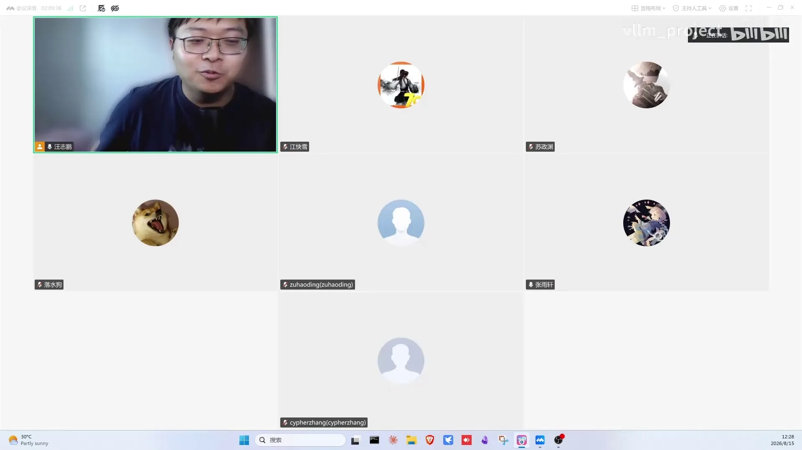 |
| 非常感谢两位老师的分享，下周同一时间会来做新的技术分享。 [【跳转到 87:59】](https://www.bilibili.com/video/BV14Jgg6iEhN/?t=5279) | 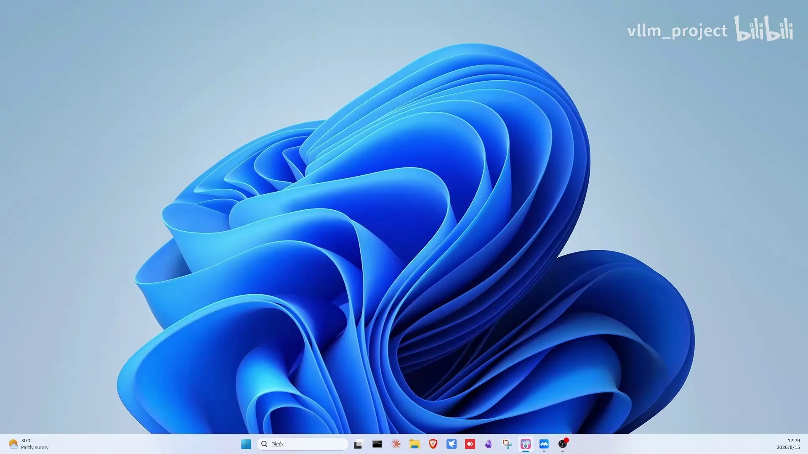 |
| （此区间无字幕） [【跳转到 88:04】](https://www.bilibili.com/video/BV14Jgg6iEhN/?t=5284) | 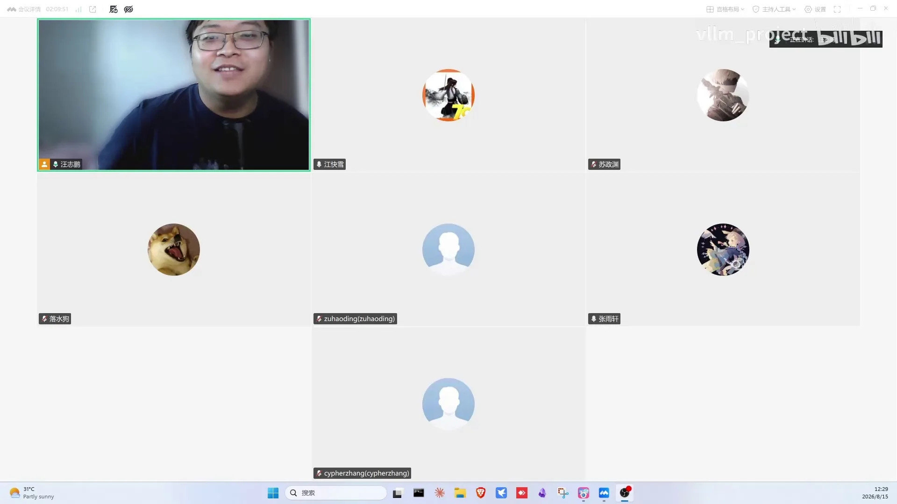 |