# vLLM小课堂（十六）：Diffusion模型也能continuous batching？！vLLM-Omni中的Diffusion CB详解 原始文稿（图-字幕分栏）

| 字幕文本 | 画面 |
| :--- | ---: |
| 那我们今天的直播分享就要开始了。开下摄像头，今天的直播分享就可以开始了。几位老师可以先介绍一下自己。——大家好，我叫傅挺，github id 是 simontwo，来自华为。今天是跟社区的两位同学一起分享跟 diffusion 批处理相关的一些工作。谢谢。 [【跳转到 00:00】](https://www.bilibili.com/video/BV189816ZE9C/?t=0) | 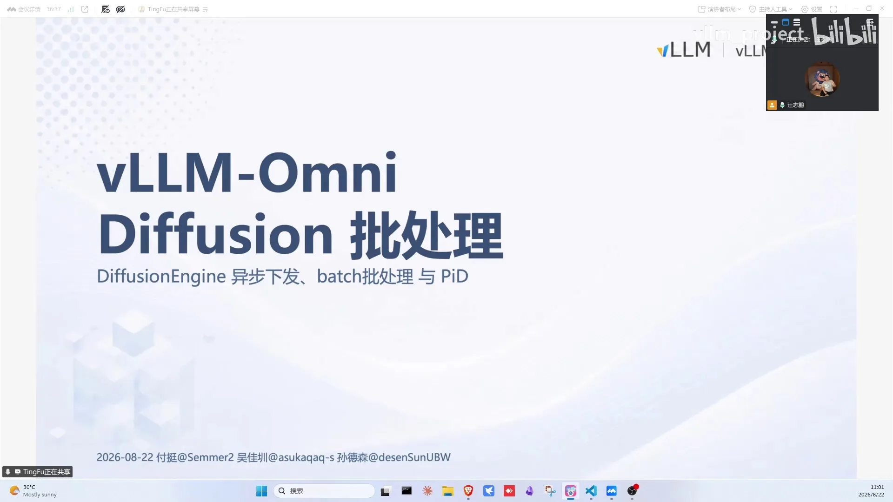 |
| 大家好，我是孙德森，现在在滑铁卢大学读博，之前在 Meta 做过实习。今天有幸跟大佬们一起分享——我更多是从学术的角度出发，看待 diffusion 批处理的一些问题。——大家好，我也叫吴家政，DL id 是（某），现在在字节实习，在厦门读书…… [【跳转到 00:25】](https://www.bilibili.com/video/BV189816ZE9C/?t=25) | 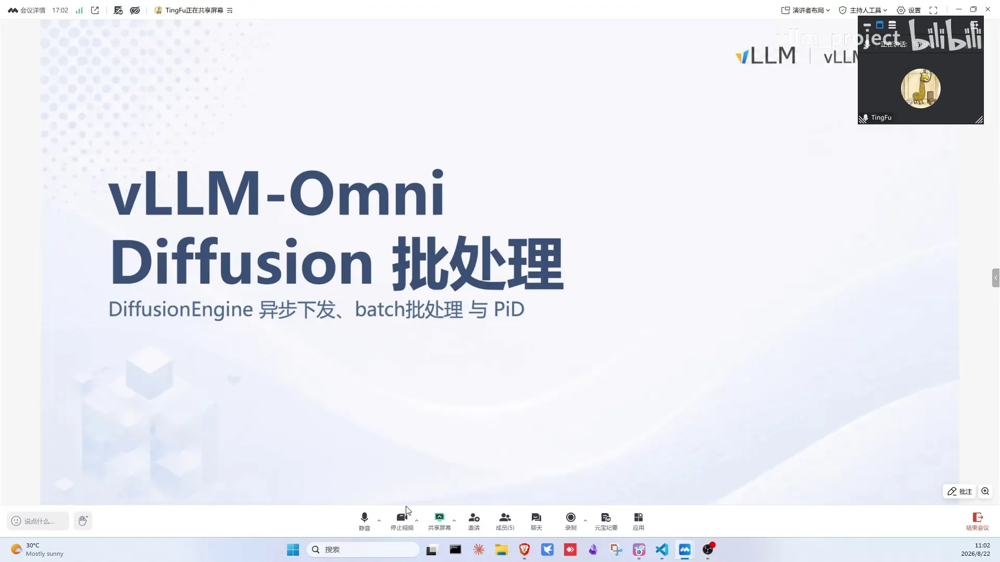 |
| 家政老师实习的组算是我们这个行业做视频生成最好的组了。——我是（来自做模型 serving 部署的公司）……其实已经很接近了：主要做一些模型的 serving 部署。你们公司的这块业务需求应该是全球最大的。好，那我们就开始今天的分享。 [【跳转到 00:50】](https://www.bilibili.com/video/BV189816ZE9C/?t=50) |  |
| 然后主要的话呃我这DLID是阿斯卡QQ然后我现在是在字节实习然后在厦门读书对然后家政老师是在C档次实习的算是我们这个行业做视频相成做最好的这个组了 [【跳转到 01:15】](https://www.bilibili.com/video/BV189816ZE9C/?t=75) |  |
| 哦我是西藏和mars业务不是不是西藏和嗯对呃以其实也已经很接近因为主要就是做一些这个模型的service这个部署这一块因为他们这就你们公司的这一块的业务需求应该是全球最大的好那我们就开始今天的分享 [【跳转到 01:40】](https://www.bilibili.com/video/BV189816ZE9C/?t=100) | 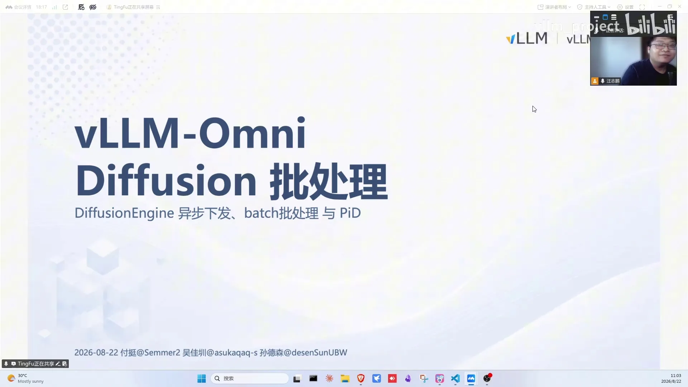 |
| 好的，我这边就先开始。今天的（内容）：第一，在（组）batch 之前有一个异步请求的下发——主要是一些工程上的准备工作；第二部分引入（CB）的一些原理；第三部分是异构组 batch 的方法；第四部分是组完 batch 之后的一些性能分析；还有一个额外的部分 PD 的部分。OK 我这边就先开始…… [【跳转到 02:05】](https://www.bilibili.com/video/BV189816ZE9C/?t=125) | 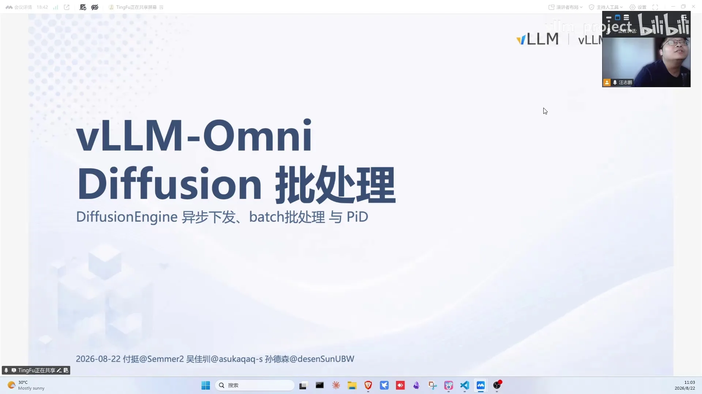 |
| （接上） [【跳转到 02:30】](https://www.bilibili.com/video/BV189816ZE9C/?t=150) | 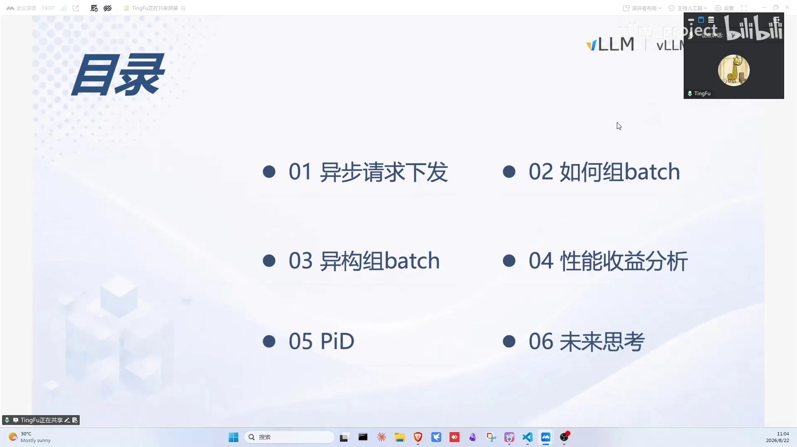 |
| 之前看到 vLLM 的 B 站账号发布过一些别的直播内容，跟我们这个请求下发相关的：请求下发是由 FastAPI 拉起的服务，接收请求做解析等；在上层的 stage 之间会有不同的请求入队，由底下的不同 stage——比如 AR 的 stage、diffusion stage——去处理对应的请求…… [【跳转到 02:55】](https://www.bilibili.com/video/BV189816ZE9C/?t=175) | 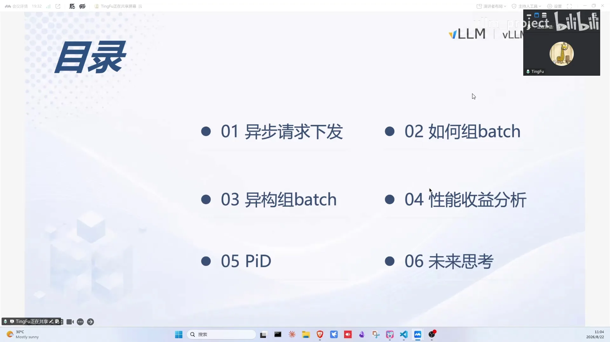 |
| 在（异步化）之前，我们的请求到 diffusion stage 时，其实是以 request 为粒度、同步地把请求下发到后端的 worker 的 pipeline 上。这样我们就没有办法一次性处理多个请求，后面的组 batch、批处理也就无从谈起。所以第一步需要把 diffusion engine 这层的请求下发改造成异步的…… [【跳转到 03:20】](https://www.bilibili.com/video/BV189816ZE9C/?t=200) | 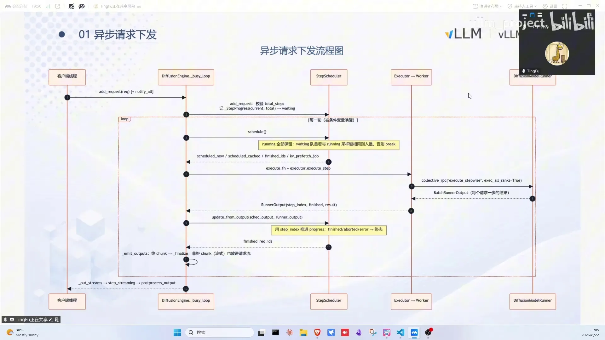 |
| 由之前以请求为粒度，改造成以一次降噪步为粒度来处理。这里能看到：一开始进来的客户端线程——上层请求解析、请求下发的 stage 线程…… [【跳转到 03:45】](https://www.bilibili.com/video/BV189816ZE9C/?t=225) | 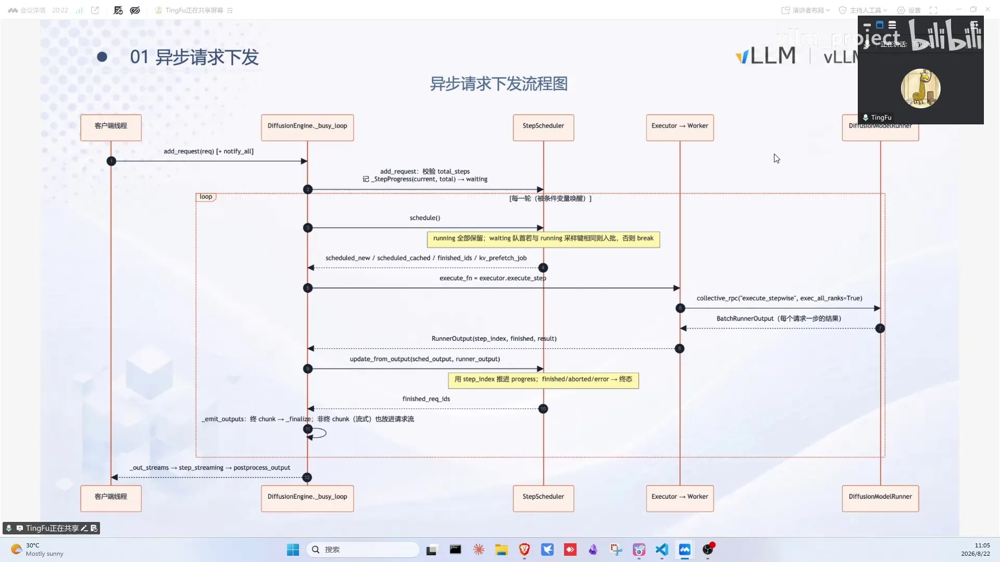 |
| 它会把请求发送到 diffusion engine 这一层。之前是处理完之后 diffusion engine 再返回给上一层；现在经过工程化改造之后，能够异步地将请求先放到 steps scheduler 这个类里边，它里面会有 running、waiting 这些（队列）…… [【跳转到 04:10】](https://www.bilibili.com/video/BV189816ZE9C/?t=250) |  |
| 由这个 scheduler 类做一些非常简单的调度工作：把当前符合条件的请求 batch 到一起，作为同样一批 request，下发给下面的（组件）做批处理的准备工作，然后再下发到后端，在 tensor 维度、请求的数据维度拼接起来，做组 batch 的准备。 [【跳转到 04:35】](https://www.bilibili.com/video/BV189816ZE9C/?t=275) | 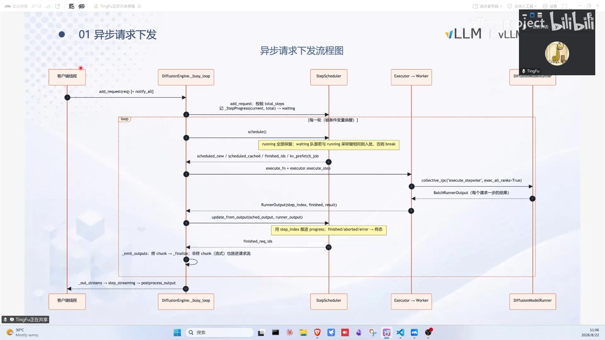 |
| 这是一个流程图的示意，主要就是中间这一层。这个地方是一个循环的过程：每次下发完一个请求之后，会以一个降噪步的时间为粒度返回给上层去做判断。这样你可以在每一个降噪步的中间去推（入）新的请求…… [【跳转到 05:00】](https://www.bilibili.com/video/BV189816ZE9C/?t=300) | 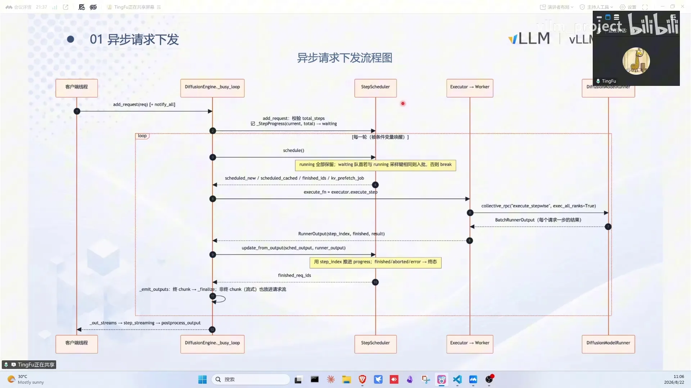 |
| 亦或者终止某些请求，亦或者将已经推理完的请求直接返回。接下来看一下具体的实现过程。最左边这段是 stage 部分——跟框架上层接壤的…… [【跳转到 05:25】](https://www.bilibili.com/video/BV189816ZE9C/?t=325) | 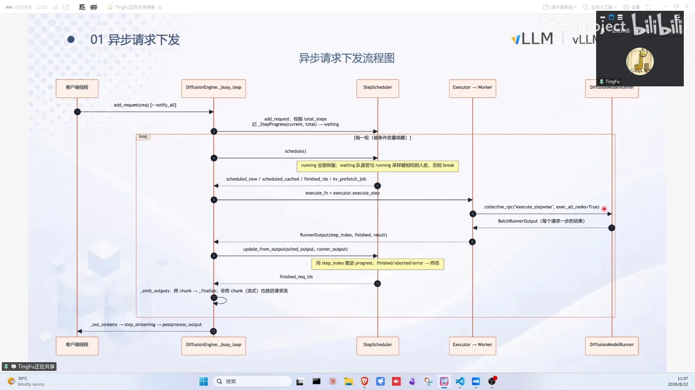 |
| 把请求下发到下面之后，由中间的 diffusion engine 这一层来做处理。engine 在初始化的时候有一些自己相关的变量，主要是为刚才说的异步处理做准备：包括一些（共享）的锁…… [【跳转到 05:50】](https://www.bilibili.com/video/BV189816ZE9C/?t=350) | 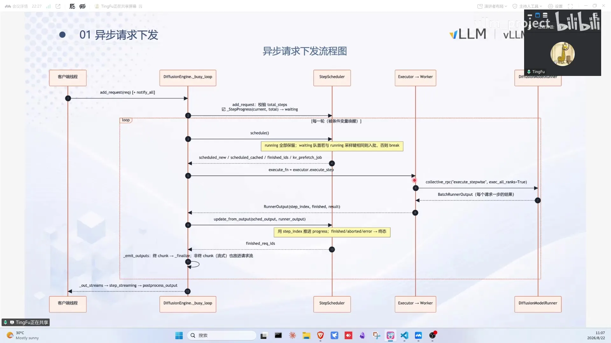 |
| 初始化完成之后就可以开始接收请求了。第一次接收到请求会进入 check and start background（loop）这个函数：主要是一些队列的读写过程准备的异步变量的初始化…… [【跳转到 06:15】](https://www.bilibili.com/video/BV189816ZE9C/?t=375) |  |
| 之后它就会将请求以 add request 函数添加到我们的 scheduler 里——右边这一部分。这个过程我们只做请求的添加跟请求的等待（get output stream），它并不会等待请求处理完：这个地方就是生产者单纯做请求添加以及等待的过程…… [【跳转到 06:40】](https://www.bilibili.com/video/BV189816ZE9C/?t=400) | 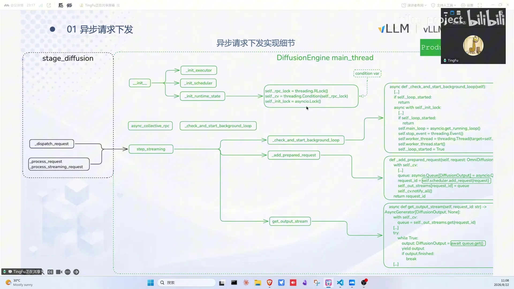 |
| （接上） [【跳转到 07:05】](https://www.bilibili.com/video/BV189816ZE9C/?t=425) |  |
| 请求添加完了之后会有一个 cb loop 的线程：它主要做的事情是从队列中循环判断——这里看到的 schedule——循环判断是否有能够进行调度的请求。如果有的话就送到后端的执行侧去做推理了；如果没有的话就在这里循环地读取，所以它叫 cb loop。但这里为了防止 CPU 资源浪费，有一个 wait 和唤醒的机制——这里有一个小 trick。 [【跳转到 07:30】](https://www.bilibili.com/video/BV189816ZE9C/?t=450) | 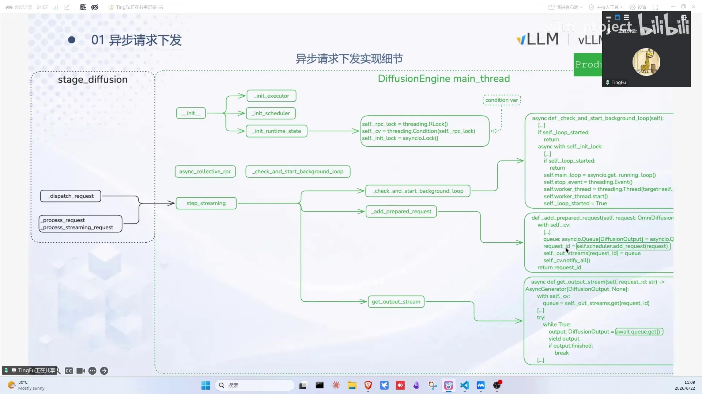 |
| 这个是否有能够进行这个调度的请求如果有的话就把他送到后后端的这个啊执行执行测去做推理了然后如果没有的话就在这里循环的去去去读取所以它叫bcloop啊但是这里为了防止CPU资源浪费嘛所以有一个呃weight和唤醒的机制这里有一个小的trick对嗯 [【跳转到 07:55】](https://www.bilibili.com/video/BV189816ZE9C/?t=475) | 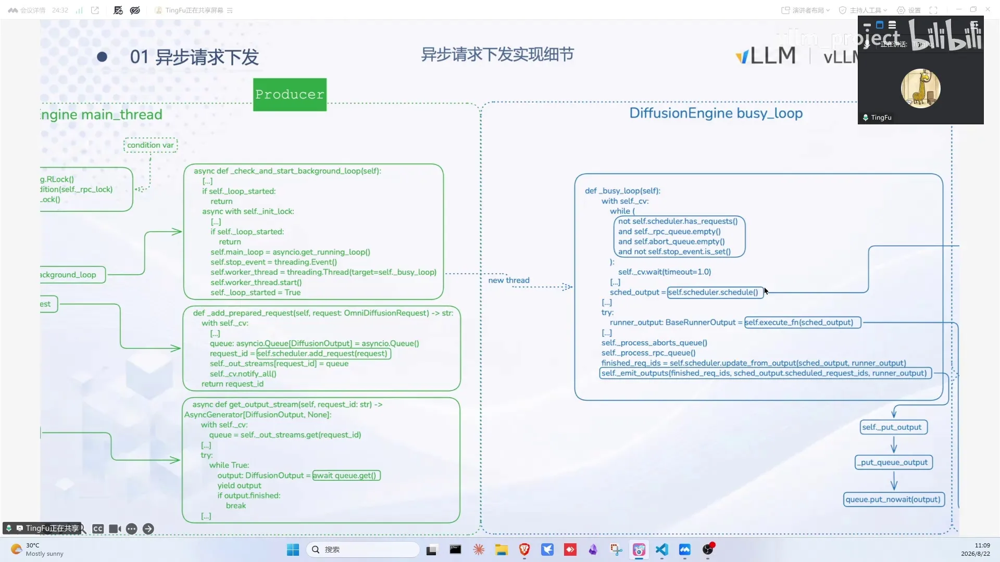 |
| 消费者跟底层的调度层以及实际的推理层做交互。调用 schedule 时会在 scheduler 内部判断：当前是否还有空闲资源可以做调度，以及当前等待的请求队列中的数据能否跟已在跑的请求…… [【跳转到 08:20】](https://www.bilibili.com/video/BV189816ZE9C/?t=500) | 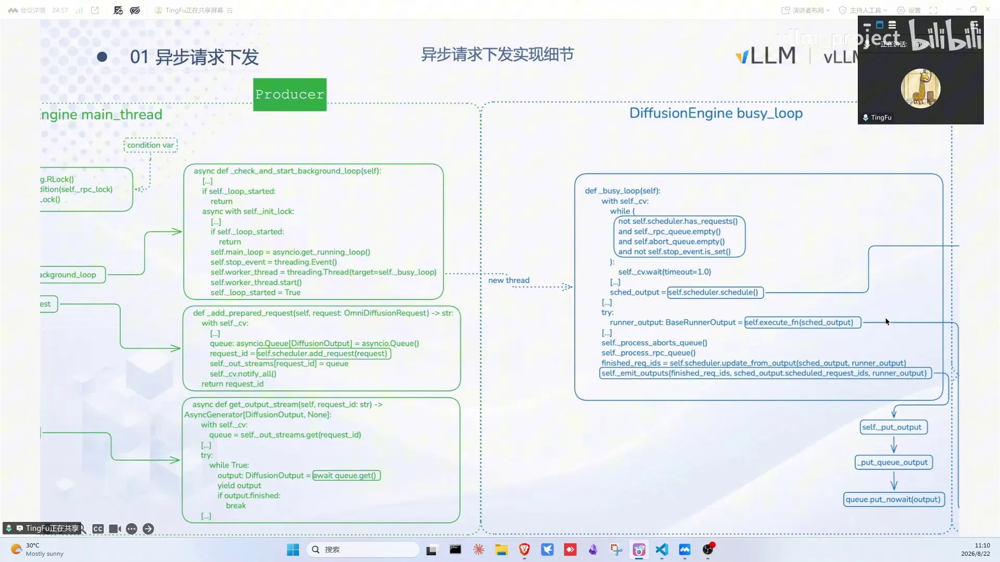 |
| 组成一个 batch。可以的话就把它们统一放入 cache 的 request 里返回上去。底层的 emit output 函数会逐层调用队列，判断当前队列是否已经推理完…… [【跳转到 08:45】](https://www.bilibili.com/video/BV189816ZE9C/?t=525) |  |
| 中间的 execute function 是跟底层 pipeline 层接壤的：调用实际的模型侧去做推理。OK，异步下发这边就这么多。关于如何组 batch 的细节由家政来说。——可以帮我共享（屏幕）…… [【跳转到 09:10】](https://www.bilibili.com/video/BV189816ZE9C/?t=550) | 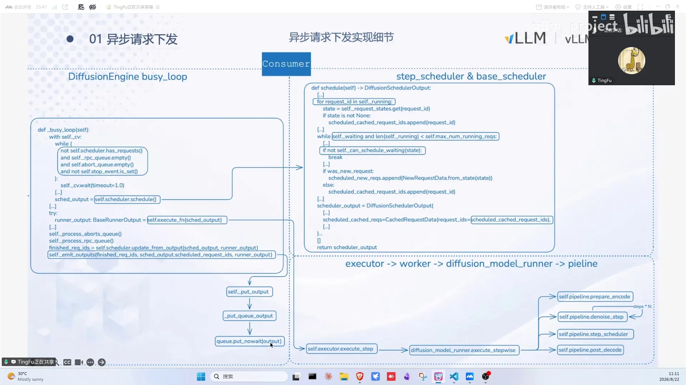 |
| 暂时这台电脑没有（共享），可以帮我（共享）是吧。 [【跳转到 09:35】](https://www.bilibili.com/video/BV189816ZE9C/?t=575) | 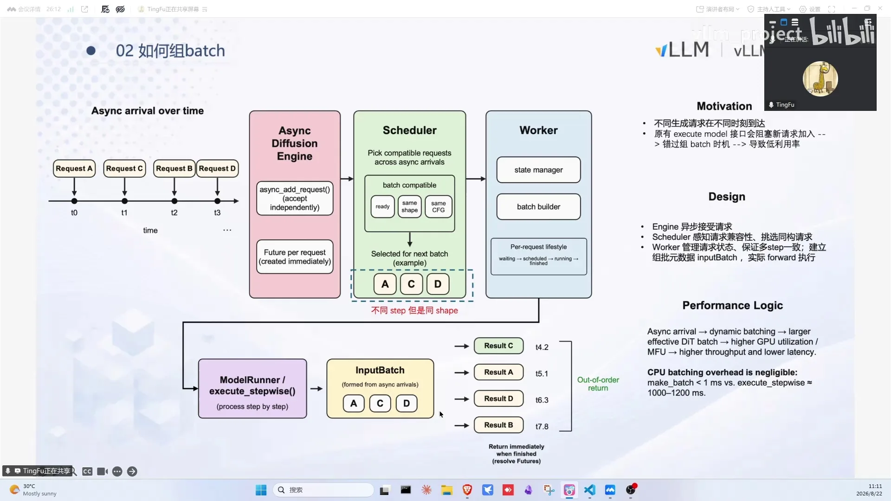 |
| 好的，你要翻页跟我说。 [【跳转到 09:40】](https://www.bilibili.com/video/BV189816ZE9C/?t=580) | 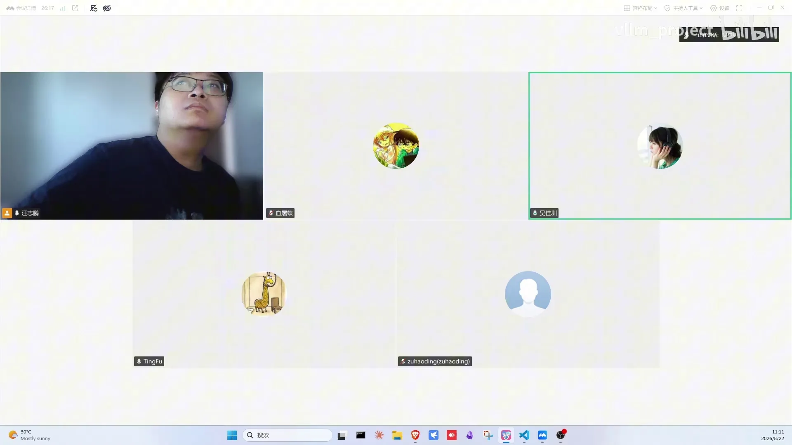 |
| 好的，这里就是异步…… [【跳转到 09:45】](https://www.bilibili.com/video/BV189816ZE9C/?t=585) |  |
| 请求是一步到达的嘛。刚才（傅挺）也介绍了 diffusion engine 可以异步增加新请求，然后维护一个 future：每个请求会立即被创建，在 engine 这边 wait 结果的返回。我们这里主要介绍 scheduler 和 worker 侧…… [【跳转到 09:50】](https://www.bilibili.com/video/BV189816ZE9C/?t=590) |  |
| scheduler 会从这一批请求的队列里找哪些可以组 batch——主要因为一开始实现的是同分辨率的组 batch，还有一些（其他）考虑。所以这里会判断一下这批请求有哪些可以组（batch）…… [【跳转到 10:15】](https://www.bilibili.com/video/BV189816ZE9C/?t=615) | 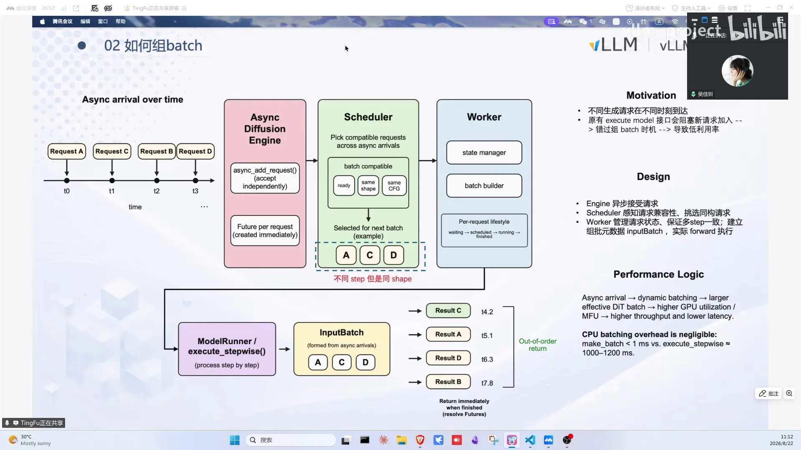 |
| 挑出这批请求放到 scheduler output，给 worker 做 batch 的 metadata 准备。相当于 scheduler 做的是挑选哪些能组 batch，发给 worker 的通常就表示这一批请求一定能组。 [【跳转到 10:40】](https://www.bilibili.com/video/BV189816ZE9C/?t=640) |  |
| worker 来做一些元数据处理。step manager 是之前实现的 step 粒度执行的组件：按 step 粒度执行、存 step 粒度的请求信息。然后 batch（builder）用来计算这个 batch 的 metadata：比如一些（循环）也好、cfg 的 embedding、还有 input 的 embedding…… [【跳转到 11:05】](https://www.bilibili.com/video/BV189816ZE9C/?t=665) | 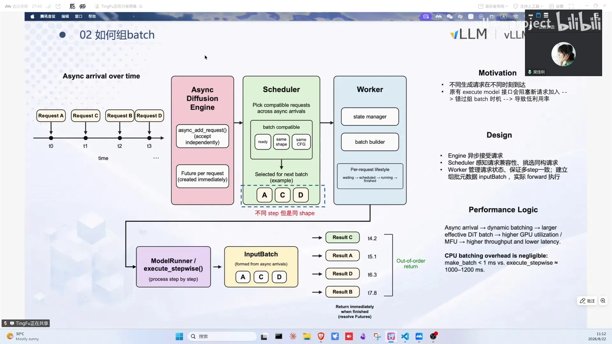 |
| （接上） [【跳转到 11:30】](https://www.bilibili.com/video/BV189816ZE9C/?t=690) | 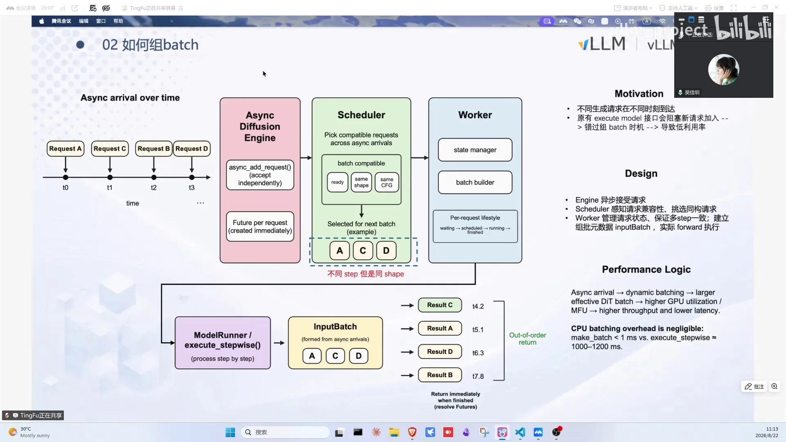 |
| 主要的考虑是优化原本请求粒度执行导致的阻塞问题：不同生成请求在不同时刻到达，原本会有阻塞问题、错过组 batch 的时机导致低利用率。这里的设计是把执行拆成 step 粒度，在每个 step 检查是否能组 batch，提高整体的组 batch 空间来提高利用率。 [【跳转到 11:55】](https://www.bilibili.com/video/BV189816ZE9C/?t=715) | 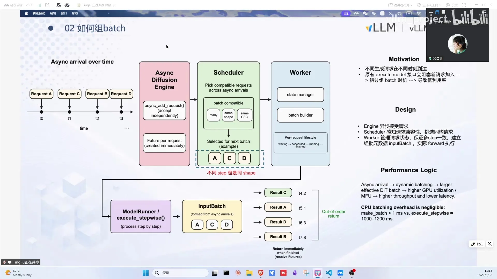 |
| （接上） [【跳转到 12:20】](https://www.bilibili.com/video/BV189816ZE9C/?t=740) |  |
| model runner 有一个（简单）接口做 step 粒度的执行。input batch 提供了一个抽象：对这批 batch 的请求计算元数据，最后返回——哪个先算完、所有 step 都算完就可以返回给 engine。这里会考虑 input batch 带来的额外开销：主要是一些 CPU 计算的开销，目前跑（基准）下来小于一毫秒，跟 GPU 计算时间比还比较小，暂时引入的开销比较小。 [【跳转到 12:45】](https://www.bilibili.com/video/BV189816ZE9C/?t=765) | 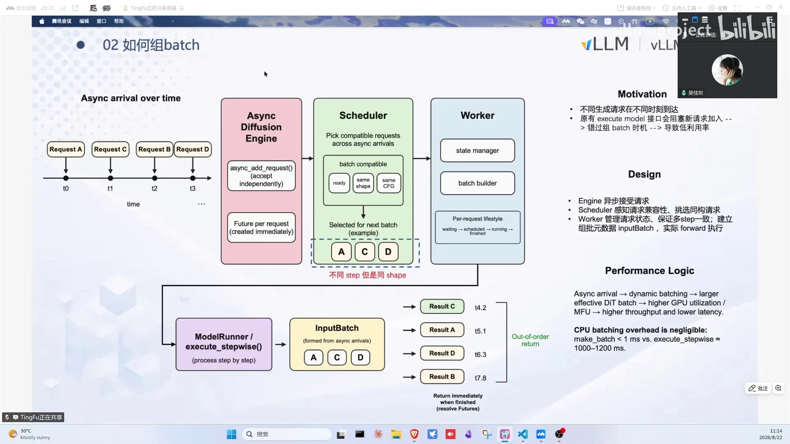 |
| 可以翻页吗？ [【跳转到 13:10】](https://www.bilibili.com/video/BV189816ZE9C/?t=790) |  |
| 现在还没有做 encoder 和 decoder 分离嘛，会有一些额外的空泡：encoder 和 decoder 部分 GPU 利用率不足，会给 batch 带来空泡。而且一个 step 会考虑在这个 step 内做 encoder 和 decoder 的执行…… [【跳转到 13:16】](https://www.bilibili.com/video/BV189816ZE9C/?t=796) | 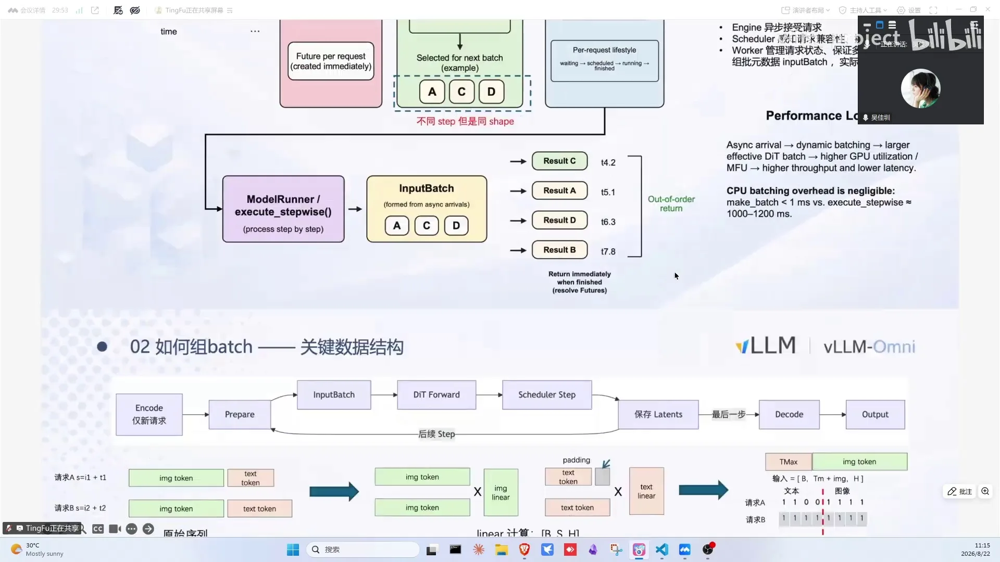 |
| 大概链路：最上面是 encoder 对（新来的）请求做 encoder，然后统一 prepare 元数据，再做 input batch 的准备，然后走 DiT 的 forward，最后给每个请求单独做 scheduler 的 step 步进、增加它的步数还有 scheduler 的递进。咳咳…… [【跳转到 13:41】](https://www.bilibili.com/video/BV189816ZE9C/?t=821) | 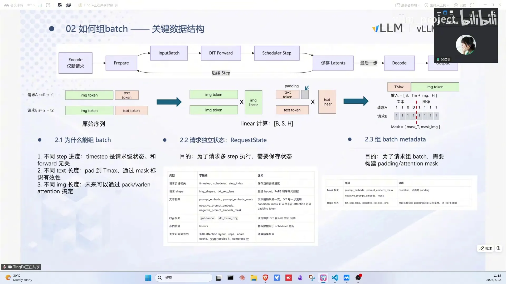 |
| 保存这个 latent 是为了方便后续 step 使用。保存 latent 完之后，如果当前有到达最后一步的请求，会做一个（VAE）decode 得到 output。组 batch 主要是考虑不同 step 进度的请求：timestamp 是请求级的状态，跟 DiT forward 无关，DiT forward 就可以把不同请求组在一起提高利用率。当前考虑…… [【跳转到 14:06】](https://www.bilibili.com/video/BV189816ZE9C/?t=846) |  |
| （接上） [【跳转到 14:31】](https://www.bilibili.com/video/BV189816ZE9C/?t=871) | 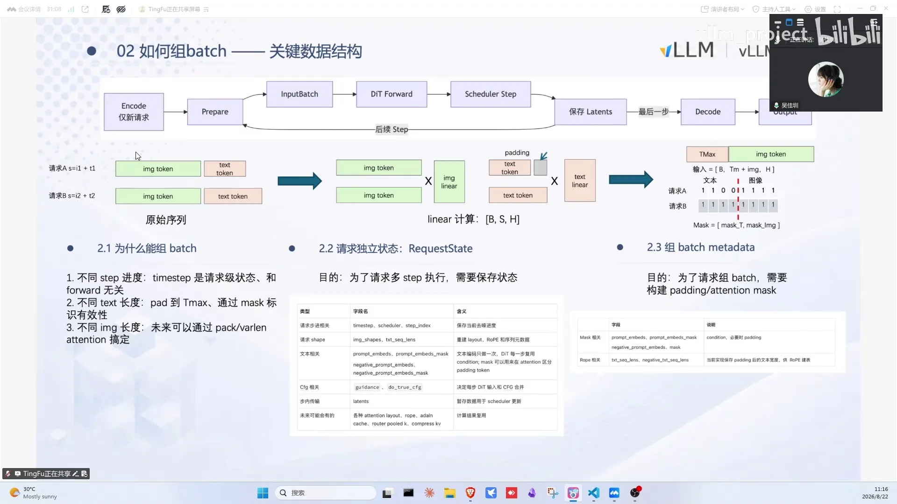 |
| 主要是文生视频场景：不同 text 长度通过 padding 解决、通过 mask 标识有效性；image 长度都是固定的（同分辨率）。长序列的话假如是请求 A 和请求 B…… [【跳转到 14:56】](https://www.bilibili.com/video/BV189816ZE9C/?t=896) |  |
| （双流模型）计算的时候——比如 Qwen（VL）image 是双流模型：image 的 token 不用走（padding），直接组成一个 batch 的 tensor 跟（权重）做矩阵乘；text token 会走 padding…… [【跳转到 15:21】](https://www.bilibili.com/video/BV189816ZE9C/?t=921) |  |
| 再走一个矩阵层。attention 的时候 input batch 会算一个 mask 出来：标识 text embedding 的这些 text 的 mask，保证 attention 的一致性。attention 时是 padding…… [【跳转到 15:46】](https://www.bilibili.com/video/BV189816ZE9C/?t=946) |  |
| 不是 padding，是拼接成一个 1D 的序列。未来可以通过（量化）或者 VAE 的技术解决不同 text 长度、不同 image 长度的更好组 batch 做法。这里介绍一下 request state…… [【跳转到 16:11】](https://www.bilibili.com/video/BV189816ZE9C/?t=971) |  |
| 主要是为了请求多 step 执行需要保存这些状态。比较相关的：prompt embedding、prompt mask、scheduler 的一些信号、scheduler 参数；后面为了防止多步的重复计算，还有 attention mask 或 attention metadata…… [【跳转到 16:36】](https://www.bilibili.com/video/BV189816ZE9C/?t=996) | 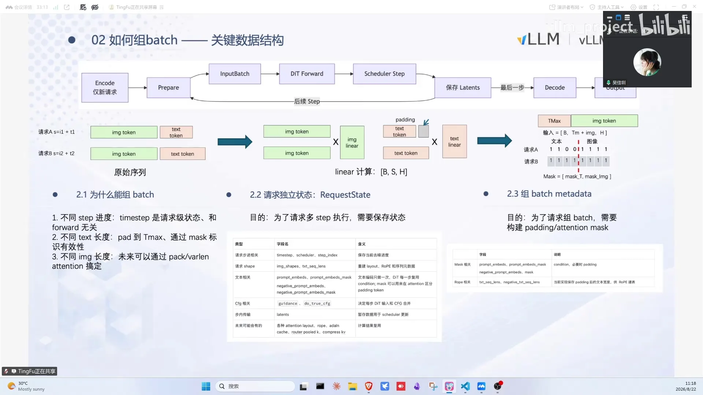 |
| 一些相关的东西，或者 KV cache、还有一些 MoE 或者稀疏 attention 的参数——会有预处理计算结果复用的逻辑，列在下面。组 batch metadata 比较有用的就是 mask 相关的 metadata…… [【跳转到 17:01】](https://www.bilibili.com/video/BV189816ZE9C/?t=1021) | 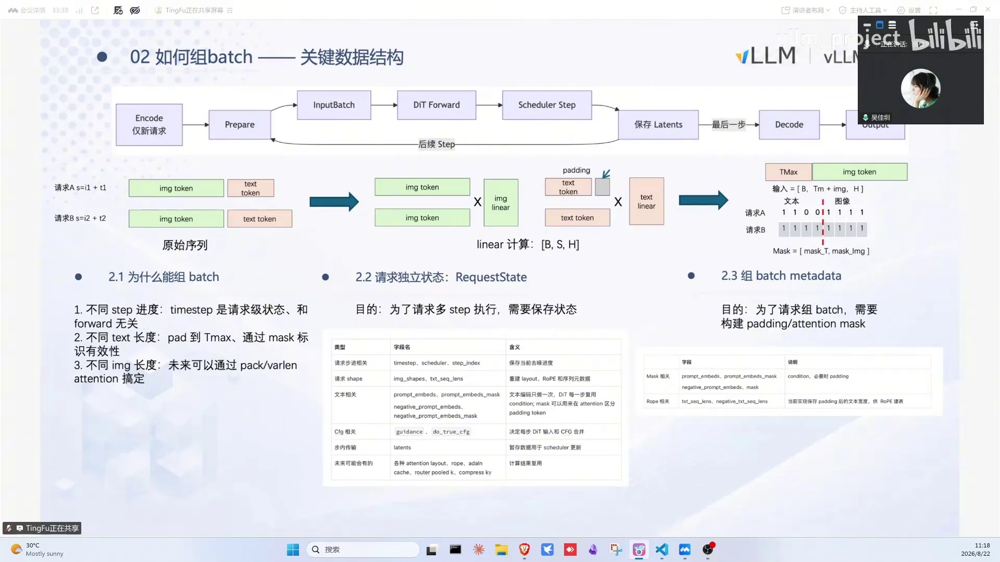 |
| 还有一些 loop 相关的 metadata——loop 当前在 input batch 里计算出来，保存在 input batch 里给 forward 用，方便后面不同请求来读。翻下一页吧。 [【跳转到 17:26】](https://www.bilibili.com/video/BV189816ZE9C/?t=1046) |  |
| 这好像不是我写的。那我这套大概完成没？有没有覆盖不到的内容吗？——没有，你应该都讲完了。——那我介绍大概就这样。下面看傅挺来介绍实验效果吧。——在此之前可能需要那位同学先介绍一下异步组 batch 的内容…… [【跳转到 17:51】](https://www.bilibili.com/video/BV189816ZE9C/?t=1071) | 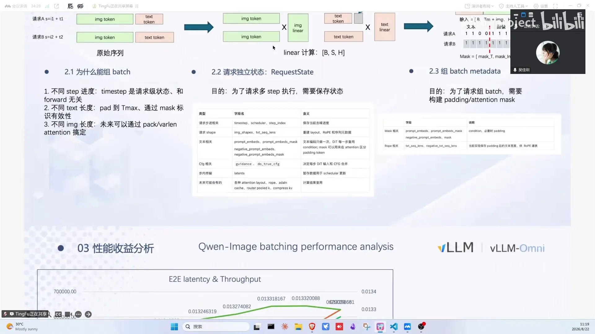 |
| 对对对，那我这边先停止（共享）…… [【跳转到 18:16】](https://www.bilibili.com/video/BV189816ZE9C/?t=1096) | 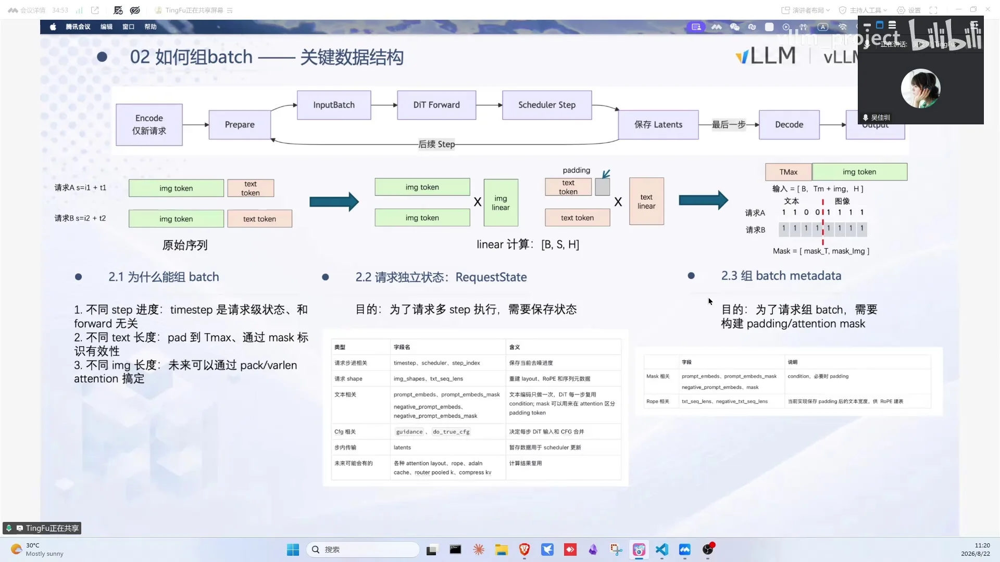 |
| （此区间无字幕） [【跳转到 18:28】](https://www.bilibili.com/video/BV189816ZE9C/?t=1108) | 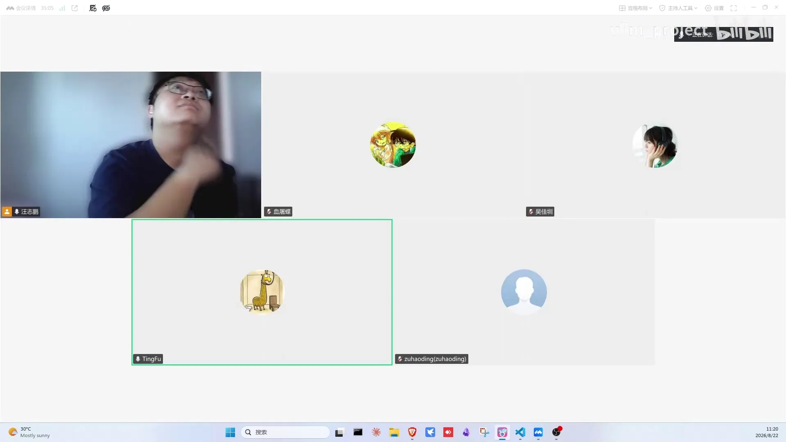 |
| （此区间无字幕） [【跳转到 18:34】](https://www.bilibili.com/video/BV189816ZE9C/?t=1114) |  |
| 我这边讲的主要是一篇关于混合分辨率组 batch 的文章。像后面会讲到的（级联）：先用小分辨率生成、之后再用大分辨率（细化），cascade 的方式生成高精度分辨率；正常请求时也会有不同分辨率的请求过来。这种时候 vLLM-Omni 之前的做法是通过 padding：把请求 B 768×768 先 padding 成 1024×1024…… [【跳转到 18:39】](https://www.bilibili.com/video/BV189816ZE9C/?t=1119) |  |
| （接上） [【跳转到 19:04】](https://www.bilibili.com/video/BV189816ZE9C/?t=1144) |  |
| 再和请求 A 组到一起执行——这会有资源浪费。因为目前它是一个 batch，shape 没办法匹配…… [【跳转到 19:29】](https://www.bilibili.com/video/BV189816ZE9C/?t=1169) | 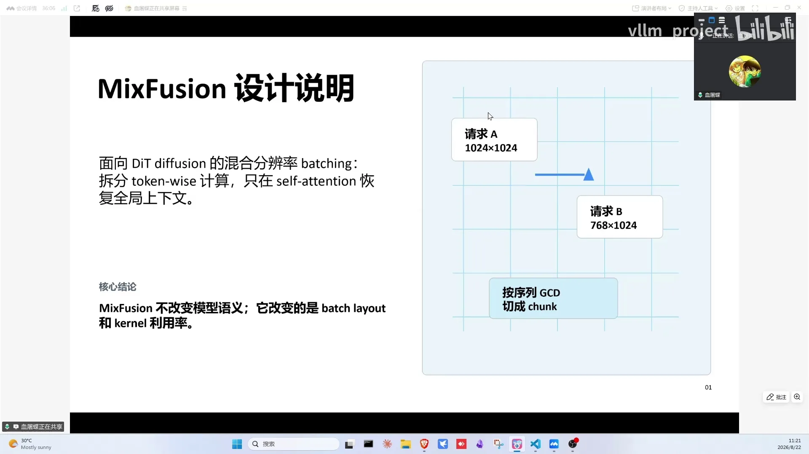 |
| 只能序列化地执行。考虑到这种问题，想要把它们 pad 到同一个程度，更简单的方法是把它们切分成等长的 patch 或者叫 chunk，通过等长 chunk 可以一起去组队…… [【跳转到 19:54】](https://www.bilibili.com/video/BV189816ZE9C/?t=1194) | 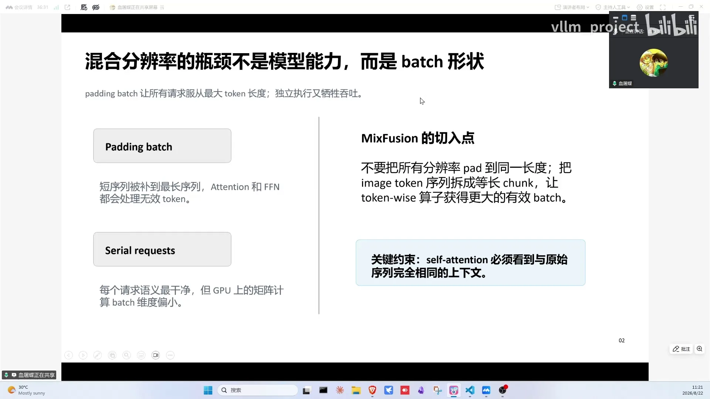 |
| 比如这里有三个请求，因为 shape 不同只能顺序执行；但把每个请求都分成（等大的）patch，在降噪过程中单独处理每一个 patch，最后生成图片时把对应的 patch 合并起来，组成一张高精度的图片。——直播间有同学问…… [【跳转到 20:19】](https://www.bilibili.com/video/BV189816ZE9C/?t=1219) | 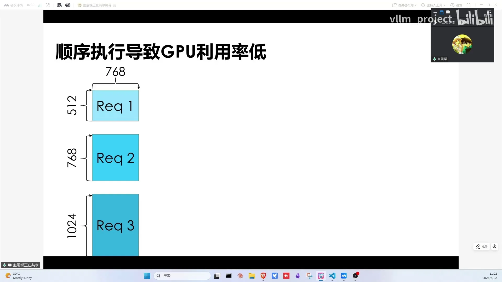 |
| （接上） [【跳转到 20:44】](https://www.bilibili.com/video/BV189816ZE9C/?t=1244) | 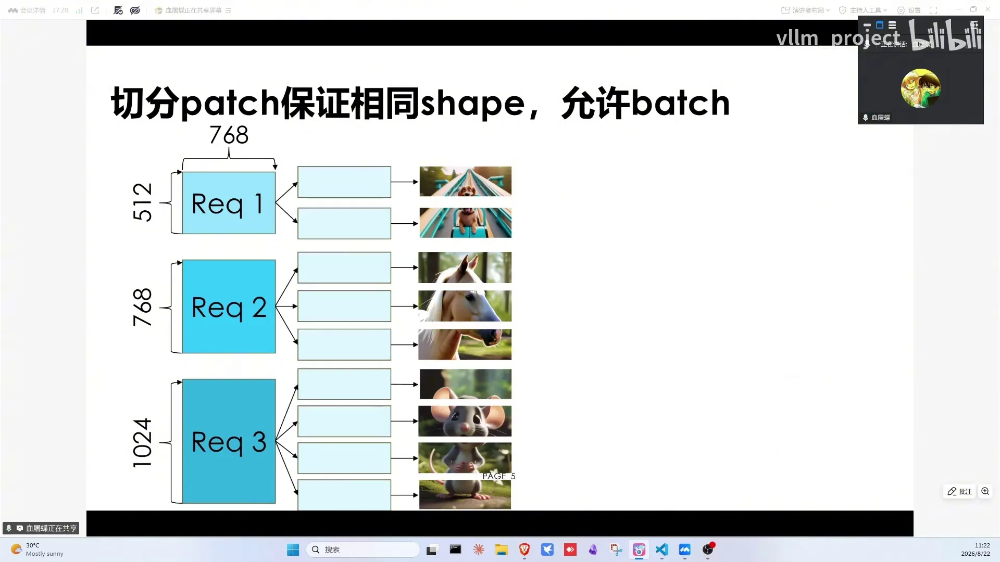 |
| 跨请求组 batch 的话各自的（状态）会带来显存压力吗？——首先 diffusion 不存在 KV cache，等会解释：之前的 diffusion 模型都没有 KV cache；但现在有生成理解统一的模型，比如混元 image，它们也会有 KV cache。这方面社区还在 work：最近社区里有很多混元 image KV 配置管理的 PR，后面会让这部分 work 起来。——还有同学问 VAE decode 是串行吗？ [【跳转到 20:56】](https://www.bilibili.com/video/BV189816ZE9C/?t=1256) | 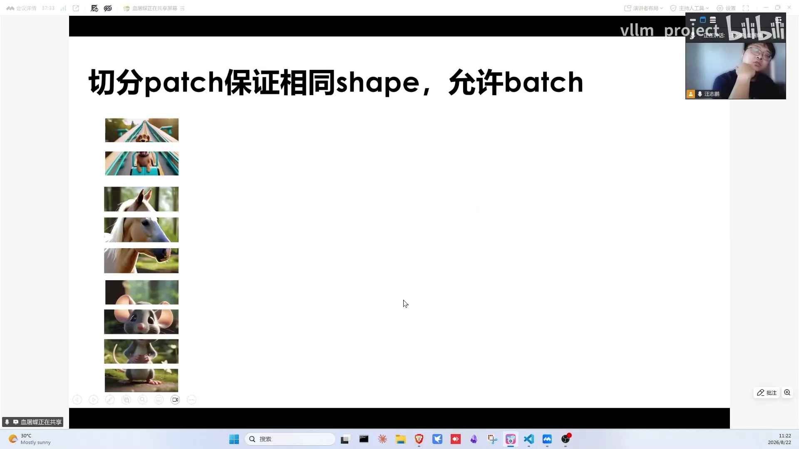 |
| （接上） [【跳转到 21:21】](https://www.bilibili.com/video/BV189816ZE9C/?t=1281) | 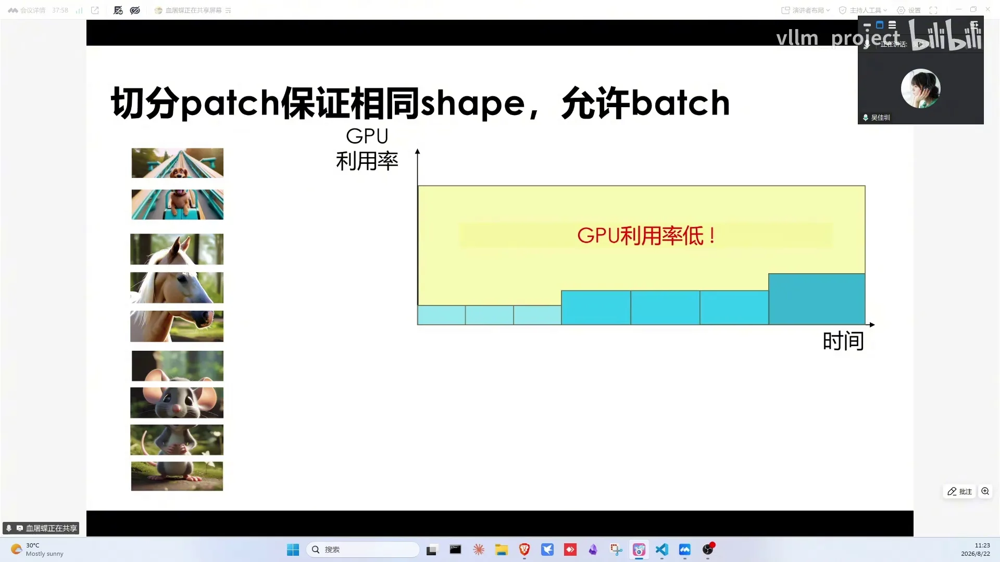 |
| VAE decode 目前还是串行的，后面会分离出来。VAE decode 本身是 memory bound 的东西，组 batch 收益比较小；text encoder 后面分离出去会复用 AR 那边的接口，可以做组 batch。 [【跳转到 21:46】](https://www.bilibili.com/video/BV189816ZE9C/?t=1306) |  |
| 继续分享。可以通过先分成 chunk 再组 batch 的方式，让同时运行的算子更多、充分打满 GPU 利用率。 [【跳转到 22:11】](https://www.bilibili.com/video/BV189816ZE9C/?t=1331) |  |
| 最后对 diffusion 的 DiT block 的算子做（分类）：看分成 chunk 之后哪些算子完全不影响精度、直接执行；哪些需要和相同（窗口）里的 chunk 交互计算——需要长上下文的信息。 [【跳转到 22:32】](https://www.bilibili.com/video/BV189816ZE9C/?t=1352) | 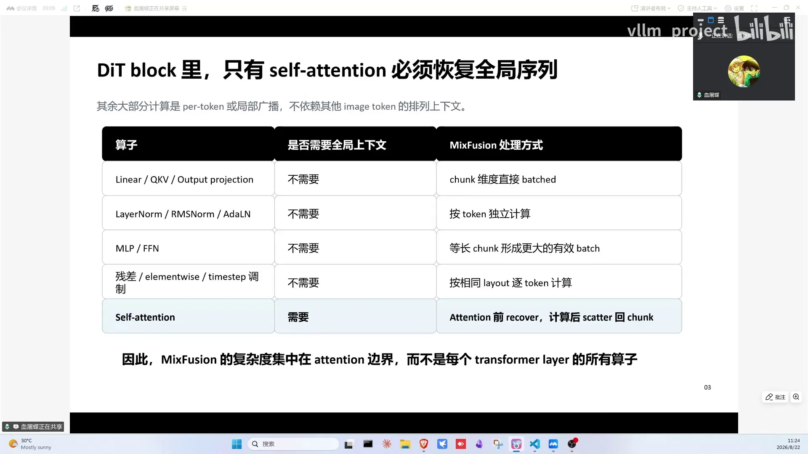 |
| 通过整理分析发现：整个 DiT block 里只有 self attention 需要和其他窗口交互；其他 linear 线性组合、elementwise、normalization 这些算子本质上都是 token 自己对自己做 projection 或者对自己的残差做一些（变换）…… [【跳转到 22:57】](https://www.bilibili.com/video/BV189816ZE9C/?t=1377) |  |
| 无论切分多细的粒度，都和正常执行完全相同的逻辑。所以把 image 切换成 chunk 的话，只需要在 self attention 这一步做特殊处理…… [【跳转到 23:22】](https://www.bilibili.com/video/BV189816ZE9C/?t=1402) |  |
| 就可以保证精度不变的情况下把它们拼接成一个 batch。——这里的做法相对比较难用：通过 profile 的结果——attention 没考虑 sparse 的情况是 N 方复杂度，其他 linear 都是 N 复杂度。对于这种情况…… [【跳转到 23:47】](https://www.bilibili.com/video/BV189816ZE9C/?t=1427) |  |
| （接上） [【跳转到 23:57】](https://www.bilibili.com/video/BV189816ZE9C/?t=1437) |  |
| attention 相对来说单个请求对 GPU 的占用更高，因此很难应付：在 attention 前面把它恢复成一个完整的请求，attention 之后再去进行恢复（操作）。看下——对，这页…… [【跳转到 24:22】](https://www.bilibili.com/video/BV189816ZE9C/?t=1462) | 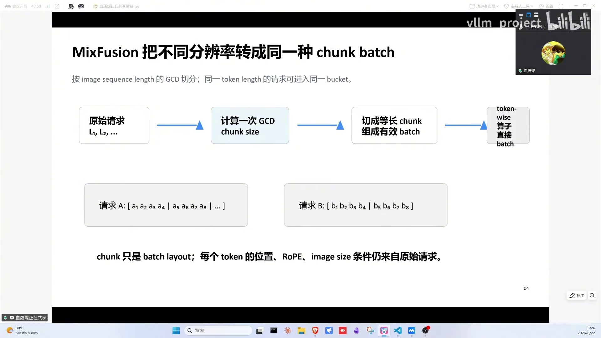 |
| 这一页讲的是 chunk size 的选择：对所有请求的长和宽计算一次最大公因数，按最大公因数来切分 chunk。比如 4 个 token 是一个 chunk…… [【跳转到 24:47】](https://www.bilibili.com/video/BV189816ZE9C/?t=1487) | 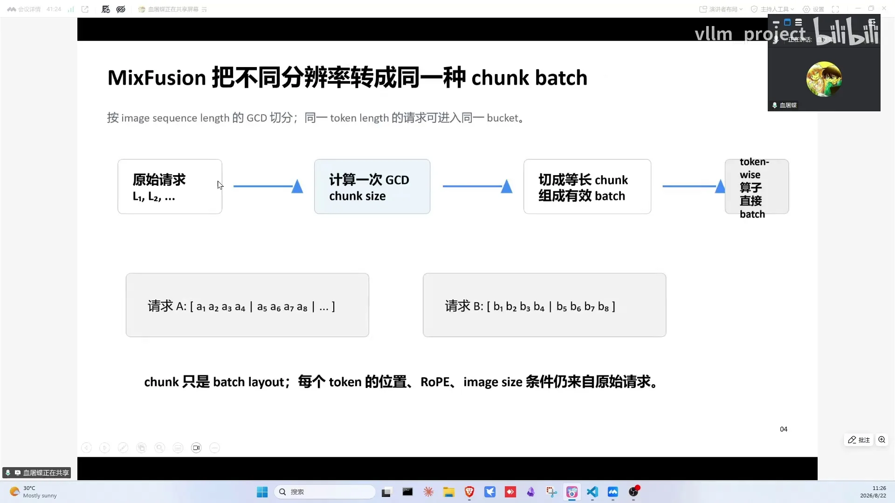 |
| 这样切。把 4 个 token 作为一个小 image，把这些小 image 拼接在一起之后，self attention 可以按分辨率去（恢复）：比如三个请求——前两个请求分辨率相同…… [【跳转到 25:12】](https://www.bilibili.com/video/BV189816ZE9C/?t=1512) |  |
| 第三个请求分辨率和前两个不同。这时可以先把前两个请求的 Q、K、V 拼接在一起去执行；第三个请求单独执行。这是我在论文里的做法：比较简单，性能下降不会特别明显。性能提升主要通过其他 linear、RMSNorm 等组成更大的 batch 来获得。这是我的具体做法。但同时最近 flash attention 提供了一个 varlen 功能——我这个工作做得比较早，23、24 年做的…… [【跳转到 25:37】](https://www.bilibili.com/video/BV189816ZE9C/?t=1537) | 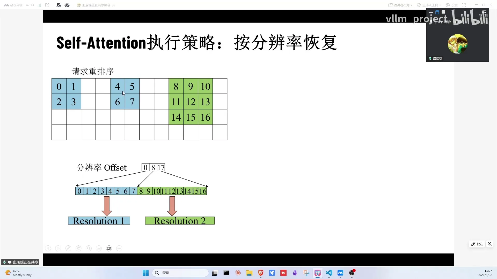 |
| （接上） [【跳转到 26:02】](https://www.bilibili.com/video/BV189816ZE9C/?t=1562) | 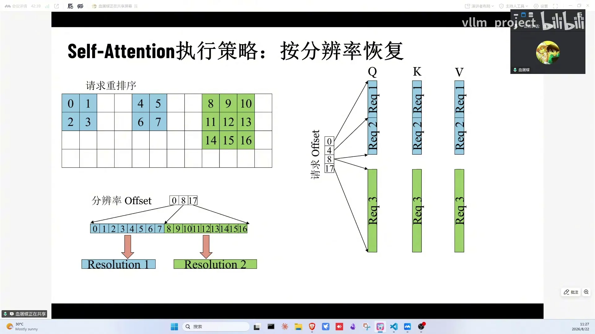 |
| 最近 flash attention 提供 varlen：可以在 self attention 时通过传递 varlen 的（信息）确定它们的 Q、K、V 具体要和哪些 token 交互计算，通过这种方法避免 gather 和 scatter 的操作…… [【跳转到 26:27】](https://www.bilibili.com/video/BV189816ZE9C/?t=1587) |  |
| 所以收益来源主要是其他算子在 batch 执行。 [【跳转到 26:52】](https://www.bilibili.com/video/BV189816ZE9C/?t=1612) | 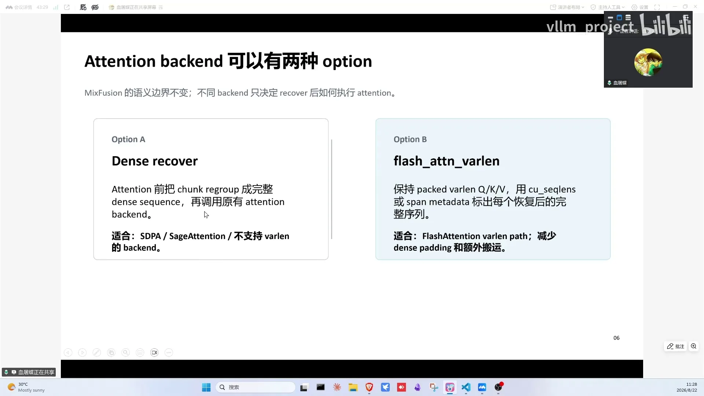 |
| 所以说就额收益来源主要是其他其他算子的在呃在摆摆ch那执行我的话 [【跳转到 26:57】](https://www.bilibili.com/video/BV189816ZE9C/?t=1617) | 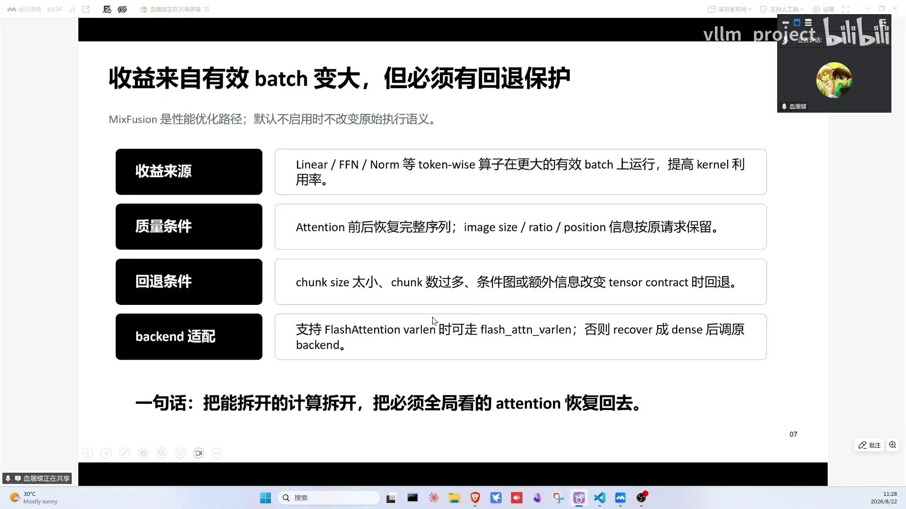 |
| 这个是我论文里的一些收益：当时用的是 SDXL 和 SD3（系列）做的实验。patch 越大获得收益越高，尤其对 DiT 模型来说。 [【跳转到 27:05】](https://www.bilibili.com/video/BV189816ZE9C/?t=1625) | 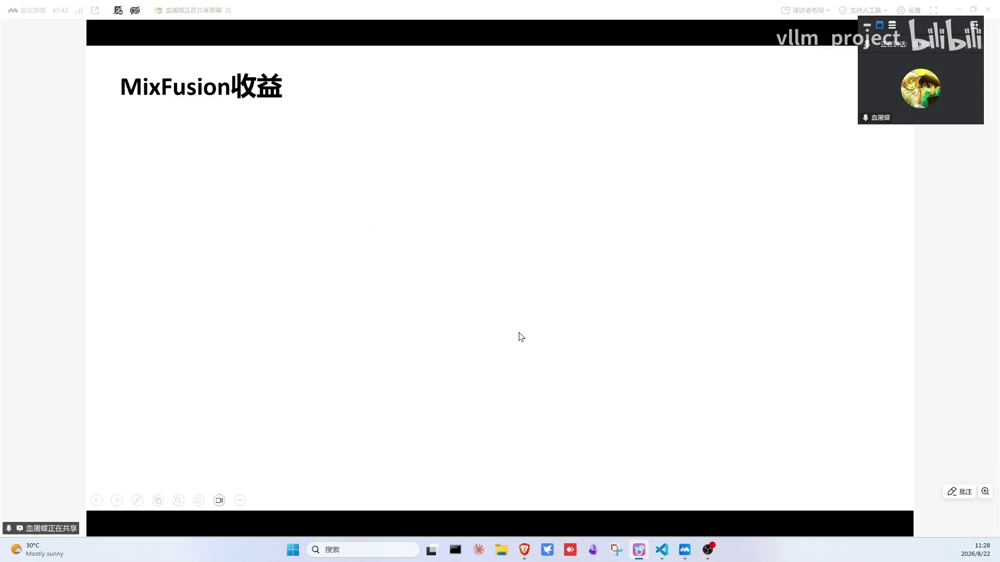 |
| （接上） [【跳转到 27:30】](https://www.bilibili.com/video/BV189816ZE9C/?t=1650) | 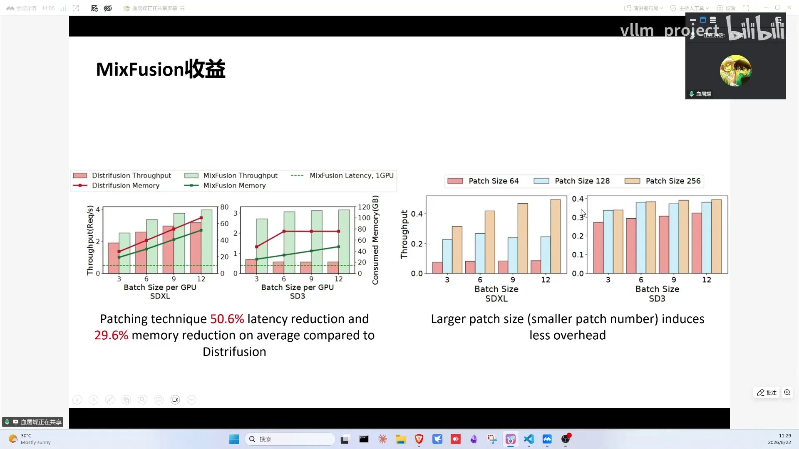 |
| 直播间有同学问了一个非常好的问题：一般 diffusion 模型是 compute bound，对吧。那么组 batch 的收益来源于什么呢？——收益来源主要是 T2V 场景。这个可以（展开）：我接下来准备了这部分场景，或者有一页可能的工业界应用场景…… [【跳转到 27:37】](https://www.bilibili.com/video/BV189816ZE9C/?t=1657) | 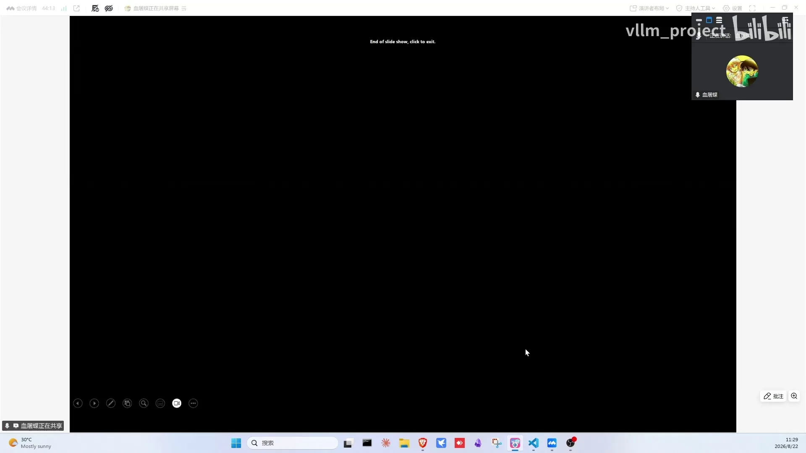 |
| （接上） [【跳转到 27:42】](https://www.bilibili.com/video/BV189816ZE9C/?t=1662) | 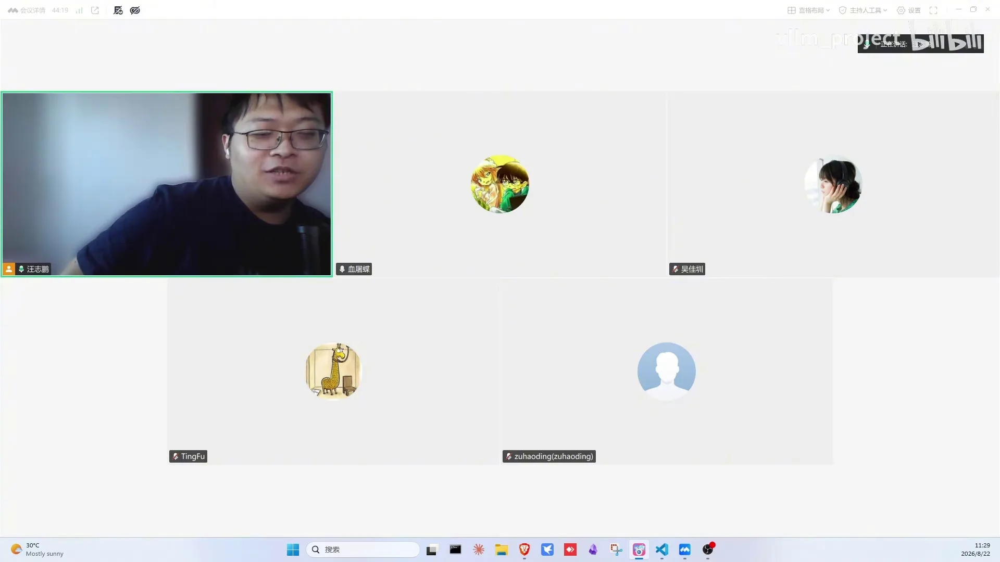 |
| 刚刚直播间同学问到关于计算（bound）的事情，确实这样。第一步支持 CB 特性的是 Qwen-Image 模型。特性支持之后进行了性能分析：在典型的 1024×1024 图片分辨率生成情况下…… [【跳转到 28:07】](https://www.bilibili.com/video/BV189816ZE9C/?t=1687) | 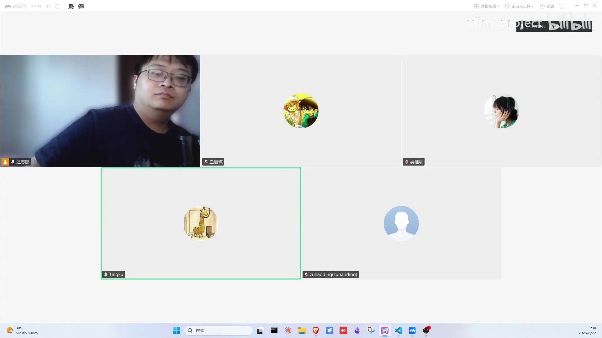 |
| 啊刚刚就是有直播间同学问到这个关于呃计算bug的这个事情确实是这样的啊我们就是第一第一步支持这个呃就BC特性呢是我们的这个纤维EMAGE的这个模型呃然后我们在它特性支持了之后呢就呃进行了相关的这个性能的分析啊首先在我们典型的这种呃1024×1024的这种图片分辨率生成的情况下啊 [【跳转到 28:12】](https://www.bilibili.com/video/BV189816ZE9C/?t=1692) |  |
| 用（昇腾）单卡的机器做性能分析：看橙色这条斜线基本是线性增长——因为没开 batch，每个请求时间线性增长。开了组 batch 特性是绿色斜线…… [【跳转到 28:37】](https://www.bilibili.com/video/BV189816ZE9C/?t=1717) |  |
| 增长的曲线放缓了，但依然是正比关系。可以得出：组 batch 特性在 1024×1024 分辨率下性能提升不高。把请求时间取倒数作为吞吐来看：横着的橙色线（不开组 batch）是直线，吞吐不会有变化；开了组 batch 后吞吐在 batch size=1 到 2 时有轻微上升——从 0.0127 到 0.0131，微乎其微，基本吞吐会有一些改善但很少；之后基本是波动的范围，可以认为是误差范围。 [【跳转到 29:02】](https://www.bilibili.com/video/BV189816ZE9C/?t=1742) | 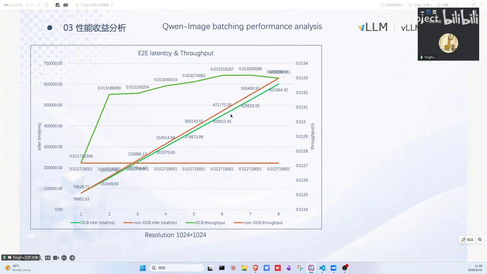 |
| （接上） [【跳转到 29:27】](https://www.bilibili.com/video/BV189816ZE9C/?t=1767) | 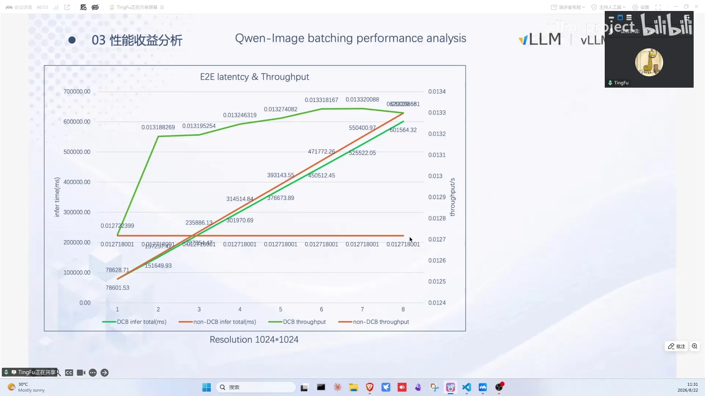 |
| 1024×1024 下收益不行。考虑到它确实是 compute bound 的场景，如果把生成图片分辨率减少，性能提升是不是就比较明显？所以做了 512×512：橙色斜线不开组 batch，绿色斜线开了——明显斜率下降很多。设为吞吐来看：随着 batch size 从 1~8，小分辨率生成在开了组 batch 的情况下吞吐稳步上升——从 0.1151 到 BS=8 可以达到 0.2 左右，提升接近一半、可能 45% 左右。这是小分辨率下测得的情况。为了知道具体哪些地方带来收益…… [【跳转到 29:52】](https://www.bilibili.com/video/BV189816ZE9C/?t=1792) |  |
| （接上） [【跳转到 30:17】](https://www.bilibili.com/video/BV189816ZE9C/?t=1817) |  |
| （接上） [【跳转到 30:42】](https://www.bilibili.com/video/BV189816ZE9C/?t=1842) | 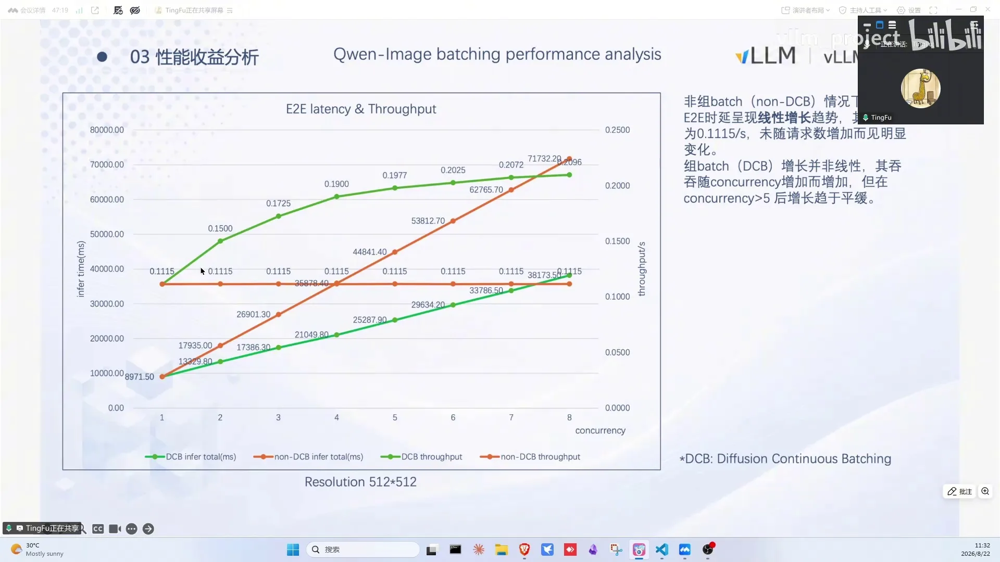 |
| 把相关的 profiling 做了统计分析。第一个表：吞吐确实随 batch size 增大明显增大。第二个：算子下发时间上做了 top 算子的统计：不开组 batch 时算子下发时间会明显上升——这几根斜线；开了组 batch 后算子下发时间基本是稳定的直线，不会有明显增长。也就是说第一部分算子下发就能带来比较大的收益。在 BS=8 的场景下…… [【跳转到 31:07】](https://www.bilibili.com/video/BV189816ZE9C/?t=1867) |  |
| （接上） [【跳转到 31:12】](https://www.bilibili.com/video/BV189816ZE9C/?t=1872) |  |
| （接上） [【跳转到 31:37】](https://www.bilibili.com/video/BV189816ZE9C/?t=1897) |  |
| 本来是 72 秒，开了之后下降到 38 秒，减少了 34 秒。这 34 秒里有 34% 的时间来自算子下发节省——节省了 11 秒，这是第一部分。第二部分：组 batch 就是为了提高算力利用率。但如果 shape 本身比较大，算力利用率本来就打得比较满；小（分辨率）情况下（MFU）才会比较低。小（分辨率）下的 profiling 也验证了：典型的三个占比最高的算子分别是（attention）matmul、matmul 和 FA 算子…… [【跳转到 32:02】](https://www.bilibili.com/video/BV189816ZE9C/?t=1922) |  |
| （接上） [【跳转到 32:27】](https://www.bilibili.com/video/BV189816ZE9C/?t=1947) |  |
| 收益也会比较明显。FA 算子也有收益，只不过相对前两者没那么大。大概是这么一个统计结果。性能分析大概这样：提升组 batch（规模）能在小（分辨率）情况下一方面降低算子下发开销、另一方面降低算子本身的计算耗时——跟传统大语言模型里的收益情况一样。好，直播间已经有很多问题了。有同学说：我在 Omni 上尝试了 padding，但额外开销比组 batch 还大。 [【跳转到 32:52】](https://www.bilibili.com/video/BV189816ZE9C/?t=1972) |  |
| （接上） [【跳转到 33:17】](https://www.bilibili.com/video/BV189816ZE9C/?t=1997) |  |
| （接上） [【跳转到 33:42】](https://www.bilibili.com/video/BV189816ZE9C/?t=2022) |  |
| 主要是在 CPU 上的开销吧：组 batch 之后需要有一个决定请求（进出）的机制。还有一部分原因：社区有 issue 说组 batch 时 flash attention 的接口不一定有（另一套）attention 接口快——有两套接口，组 batch 时会有一些奇怪的算子内数据准备问题；开 padding 那套接口就没有（这些问题）。可以看社区相关 issue。——OK。还有同学说：T2V 场景的 linear 占比比较低，收益是不是也很低？——T2V 是 text to video 吗？对。 [【跳转到 34:07】](https://www.bilibili.com/video/BV189816ZE9C/?t=2047) | 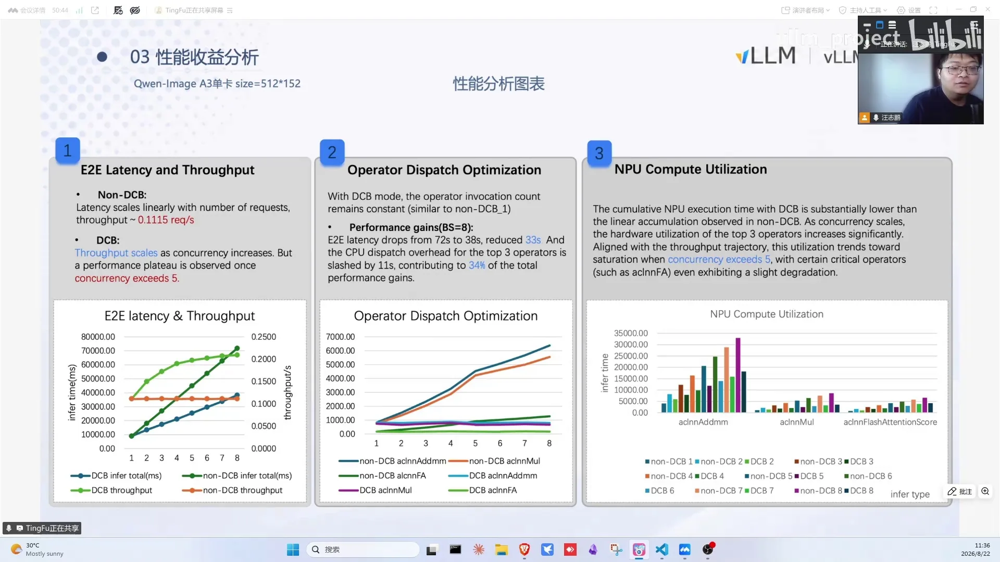 |
| （接上） [【跳转到 34:32】](https://www.bilibili.com/video/BV189816ZE9C/?t=2072) | 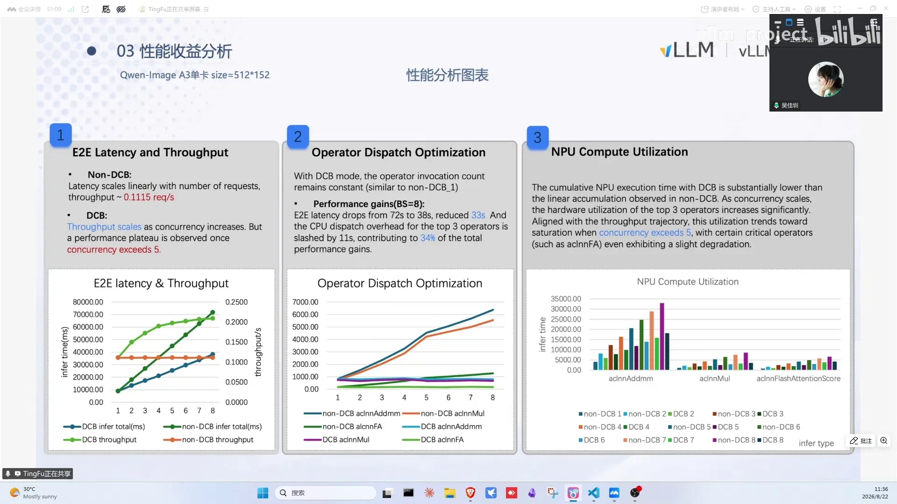 |
| 因为 video 生成本身的（序列）会比较大，涉及的计算量比较大。但我们现在还没支持 T2V 的模型。当然可以分析：现在很多 T2V 也不是一次性生成的，有的有流式生成、分 chunk 生成的情况，需要逐模型分析。确实如果 attention 占比最大、linear 层占比非常小、本身计算量又大的话，收益可能就没有这么可观了…… [【跳转到 34:57】](https://www.bilibili.com/video/BV189816ZE9C/?t=2097) | 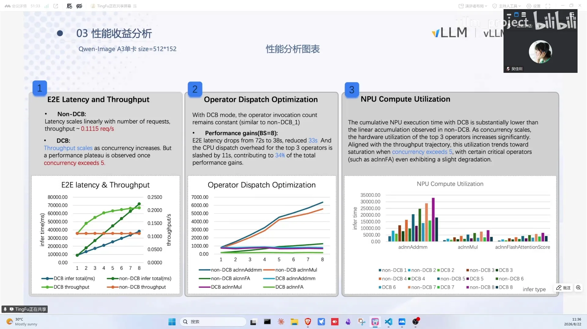 |
| （接上） [【跳转到 35:22】](https://www.bilibili.com/video/BV189816ZE9C/?t=2122) | 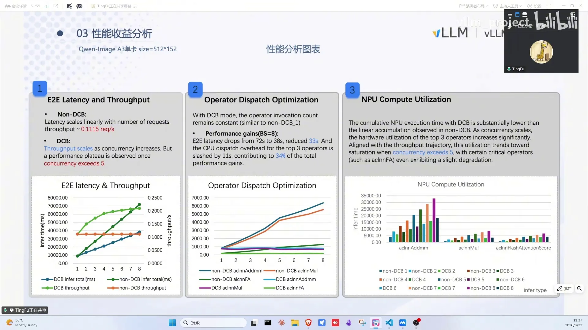 |
| 之前也测过：另一个同学（支持）组 batch 的模型，那个模型本身就比较大，正常分辨率生成时甚至有轻微的性能劣化，只有小分辨率生成时性能才有略微提升。针对 T2V 场景，正常生成情况下可能没有这么高的性能提升，甚至出现轻微性能劣化也是正常的。 [【跳转到 35:47】](https://www.bilibili.com/video/BV189816ZE9C/?t=2147) |  |
| （接上） [【跳转到 36:12】](https://www.bilibili.com/video/BV189816ZE9C/?t=2172) |  |
| 您的图是用什么卡跑的？GPU 利用率高吗？——可以的。测试用的（模型）比较小，用的是（昇腾）A3 的卡：A3 单（芯），上面的一个核在跑。大概配置：算力（约）1628T，内存 64G。大概这么一个硬件情况。部署上去 BS=1~8 分别测 1024 和 512 分辨率的端到端，以及采集 profiling 统计算子耗时。大概这么测的。——有同学问：不同 request 在 diffusion step 间隔之间穿插是一个好的优化方向吗？ [【跳转到 36:37】](https://www.bilibili.com/video/BV189816ZE9C/?t=2197) | 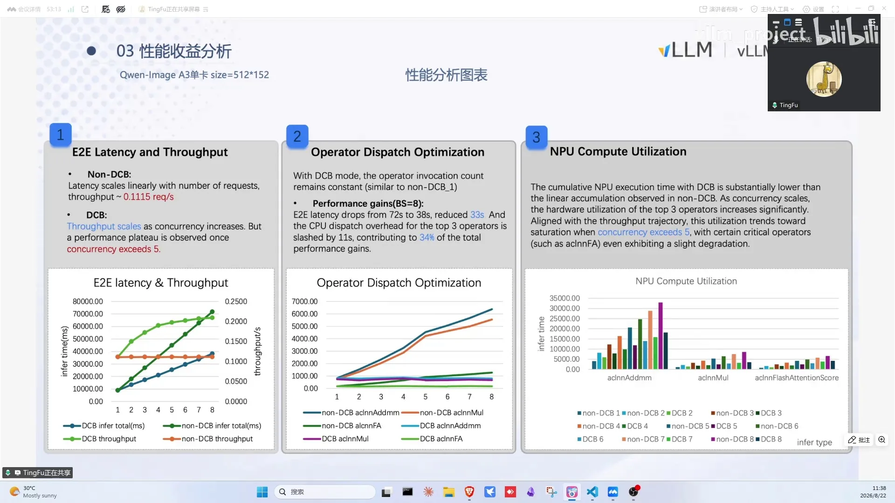 |
| （接上） [【跳转到 37:02】](https://www.bilibili.com/video/BV189816ZE9C/?t=2222) | 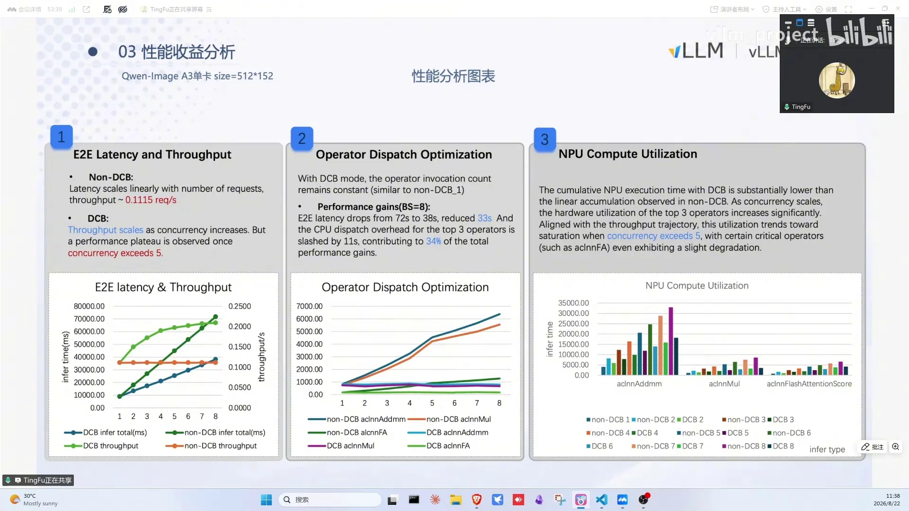 |
| 一方面需要在不同的 step 之间添加新请求、判断是不是要 schedule 进来组 batch；另一方面还跟我们支持的另一个特性有关——家政他们实现的中断请求：之前以 request 为返回粒度，只能推理完一个请求再结束，每个 diffusion 请求耗时都很长，没办法做到中断。所以我们第一个设计中间 step 结果返回去跟别的请求组 batch；另一方面中间结果返回也能接收框架的中断消息…… [【跳转到 37:27】](https://www.bilibili.com/video/BV189816ZE9C/?t=2247) | 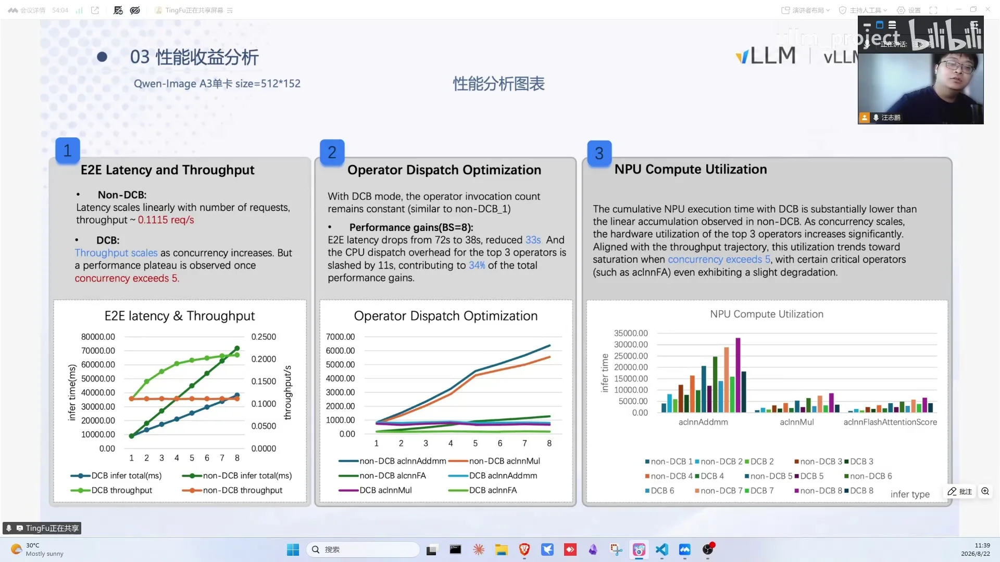 |
| （接上） [【跳转到 37:52】](https://www.bilibili.com/video/BV189816ZE9C/?t=2272) | 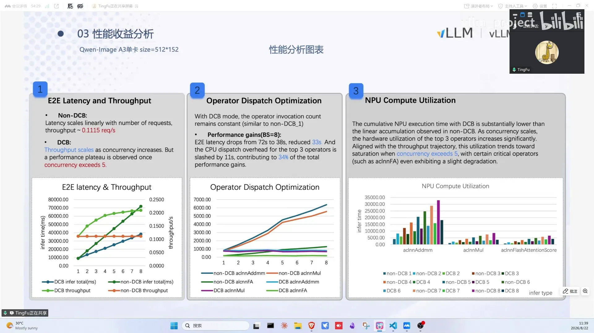 |
| 把某些中断的请求从请求队列里剔除掉。这是两个目的。性能上虽然 step 之间有一些操作，但对性能影响比较小：像家政提到的可能是毫秒级的影响。——因为做（音）视频生成，GPU 上的操作时间很长，CPU 耗时在整个 flow 里占比不大。没错。然后有同学问来晚了有回放吗？——每周直播都有回放，PPT 会上传到回放底下的评论区。大家给频道点关注，后续可以看之前每期直播的回放。——我看一下后面是不是还有几页。——对，还有几页没讲完。继续分享，我加快速度…… [【跳转到 38:17】](https://www.bilibili.com/video/BV189816ZE9C/?t=2297) |  |
| （接上） [【跳转到 38:42】](https://www.bilibili.com/video/BV189816ZE9C/?t=2322) | 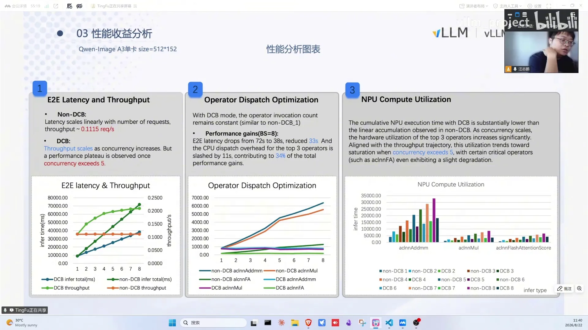 |
| （接上） [【跳转到 39:07】](https://www.bilibili.com/video/BV189816ZE9C/?t=2347) | 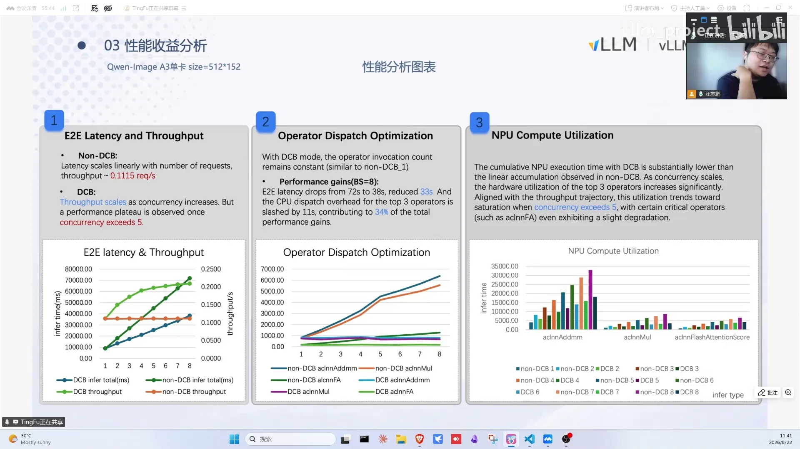 |
| 刚才提到性能在小（分辨率）下收益高，那是不是就没法生成高清图片了呢？其实是有一个另外的方向：所谓（像素空间）diffusion。典型 diffusion 模型结构：输入 encode 进来、进入 latent 空间降噪、decode 出去。这个方向替代的就是最后 decode 的模块。典型场景：输入经过多步降噪…… [【跳转到 39:32】](https://www.bilibili.com/video/BV189816ZE9C/?t=2372) |  |
| （接上） [【跳转到 39:37】](https://www.bilibili.com/video/BV189816ZE9C/?t=2377) | 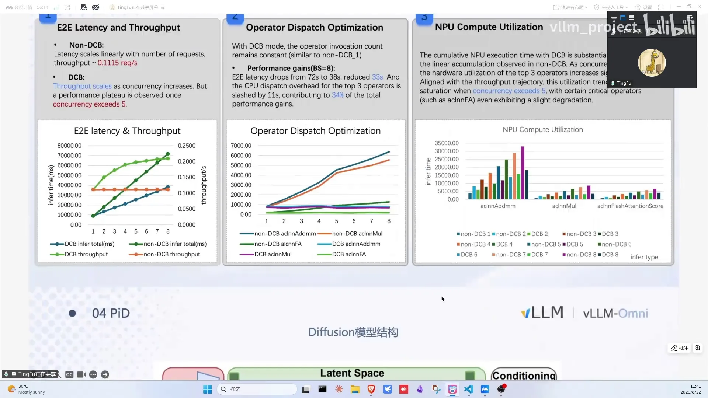 |
| （接上） [【跳转到 39:42】](https://www.bilibili.com/video/BV189816ZE9C/?t=2382) |  |
| 然后输出。PID 替换了 VAE decode 的结果，甚至可以不用等到最后一步：latent 在 N-2、N-4、N-6 这几步的结果就可以送入 PID 处理，生成高清图片。这是 PID 的一个角色。 [【跳转到 40:07】](https://www.bilibili.com/video/BV189816ZE9C/?t=2407) | 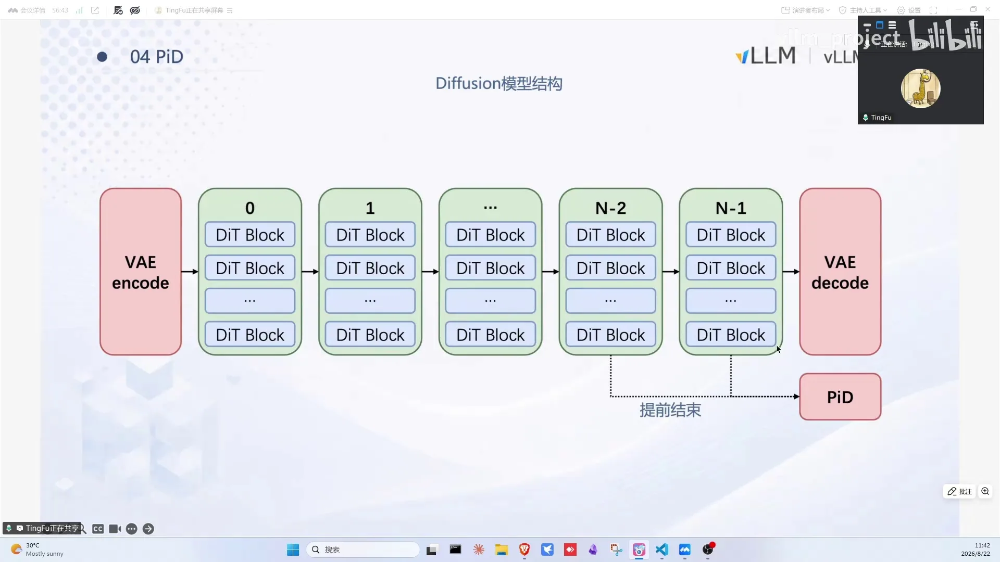 |
| 它的具体结构：PID 除了收到主模型的 latent 之外，还需要文本输入，还需要自己准备一个目标分辨率的噪声图像。比如性能好的是 512×512，它的噪声图像一般是 4 倍或 8 倍的 upscale：从 512 直接到目标分辨率 2048×2048。它有三个主要输入。latent 来自主模型——可能是降噪完的 latent，也可能是中间步的 latent…… [【跳转到 40:32】](https://www.bilibili.com/video/BV189816ZE9C/?t=2432) | 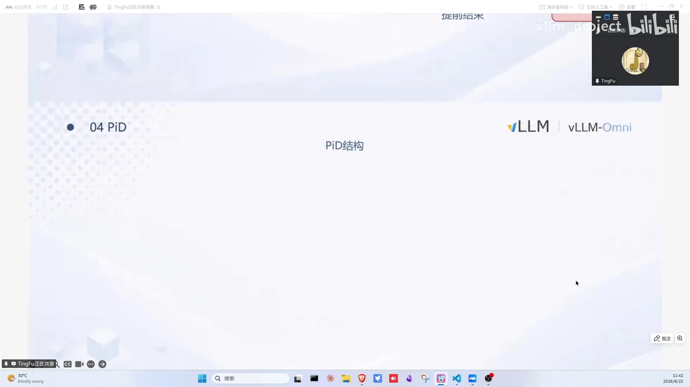 |
| （接上） [【跳转到 40:57】](https://www.bilibili.com/video/BV189816ZE9C/?t=2457) |  |
| 经过条件适配器——可以当做一个翻译器——输入到 pixel DiT 的主干。它会自己生成一个纯噪声的目标分辨率图像也输入主干，还有文本的 embedding 也输入主干。三个主要输入，生成目标分辨率上的高分辨率图片。 [【跳转到 41:22】](https://www.bilibili.com/video/BV189816ZE9C/?t=2482) |  |
| 主干输入之后跟主要 diffusion 模型一样：使用交叉注意力机制，在目标分辨率上生成跟参考 latent 内容和结构一模一样的图片。不同的是它是小分辨率生成大分辨率，会有细节上的重绘——因为输入的小分辨率图像没有这些细节内容…… [【跳转到 41:42】](https://www.bilibili.com/video/BV189816ZE9C/?t=2502) | 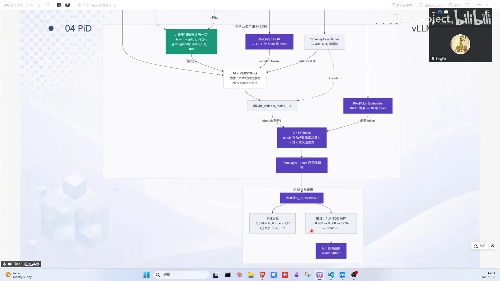 |
| 文本的 embedding 主要做细节的控制。可以直接看（效果）。——我想问：现在用什么工具可以更方便地训练 PID 模型？ [【跳转到 42:07】](https://www.bilibili.com/video/BV189816ZE9C/?t=2527) | 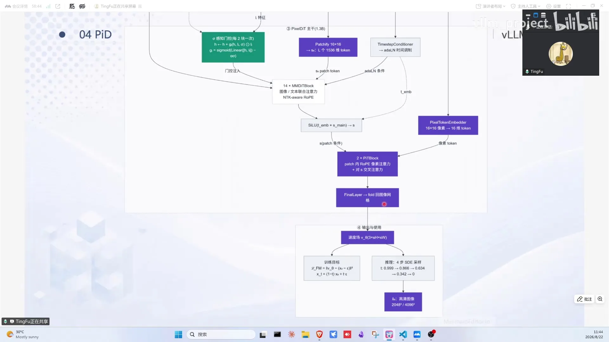 |
| PID 的条件适配器是翻译的角色，帮助 PID 读懂主模型来的 latent。条件适配器跟模型强相关，有点像大语言模型里投机解码的 draft 模型。条件适配器翻译之后——主干跟主模型不相关：条件适配器负责把 latent 翻译成主干能识别的特征表达，主干根据文本 embedding 在目标噪声图像上生成高清图片。主干的作用就是以小图特征输入生成大图目标…… [【跳转到 42:26】](https://www.bilibili.com/video/BV189816ZE9C/?t=2546) | 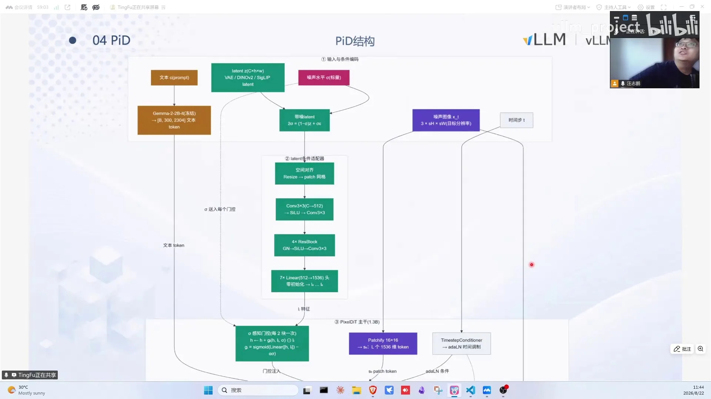 |
| （接上） [【跳转到 42:51】](https://www.bilibili.com/video/BV189816ZE9C/?t=2571) | 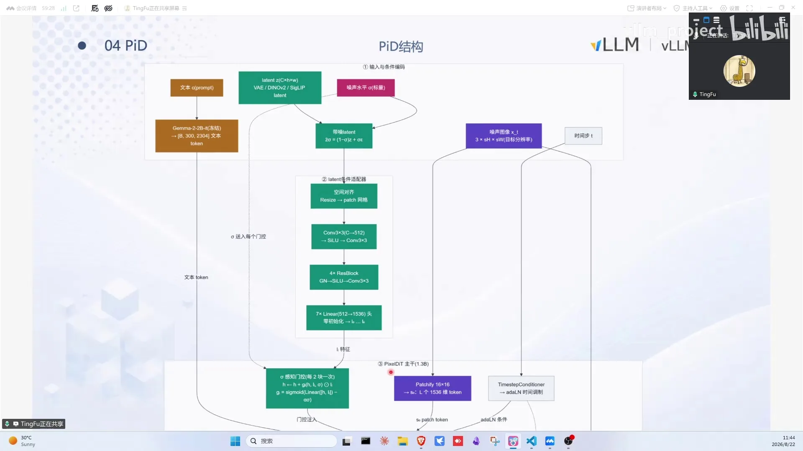 |
| 以小生大——可以理解为它是超分模型的 diffusion 版本。要训练的话最主要训练的就是条件适配器这部分。训练相关后面贴了论文，感兴趣的同学可以研究，这部分我们确实没有涉足。好，继续。——好的。 [【跳转到 43:16】](https://www.bilibili.com/video/BV189816ZE9C/?t=2596) | 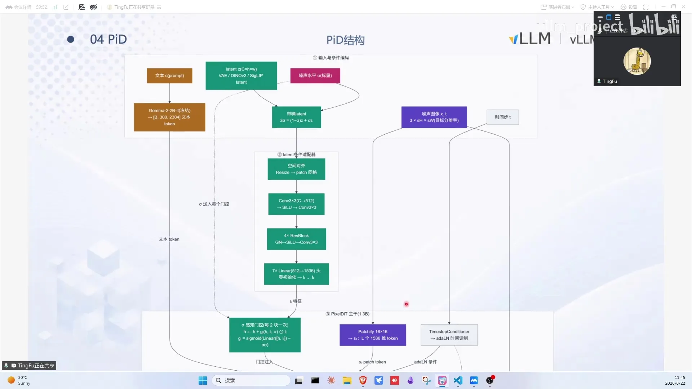 |
| PID 的性能收益可以简单看一下…… [【跳转到 43:41】](https://www.bilibili.com/video/BV189816ZE9C/?t=2621) | 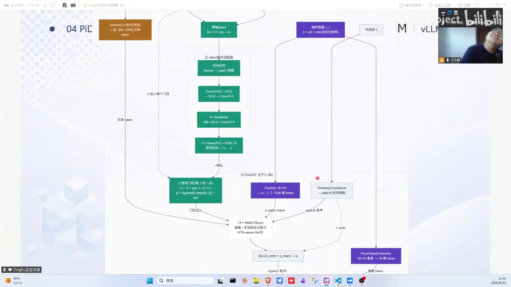 |
| 最左上角的表格是显存占用：VAE decode 显存占用比较高。以 2048 图片生成为例，换成 PID 之后能节省 16G 到 11G——大概只有 5GB 左右显存；从（VAE）到 PID 又可以节省大概 3G 左右…… [【跳转到 43:46】](https://www.bilibili.com/video/BV189816ZE9C/?t=2626) | 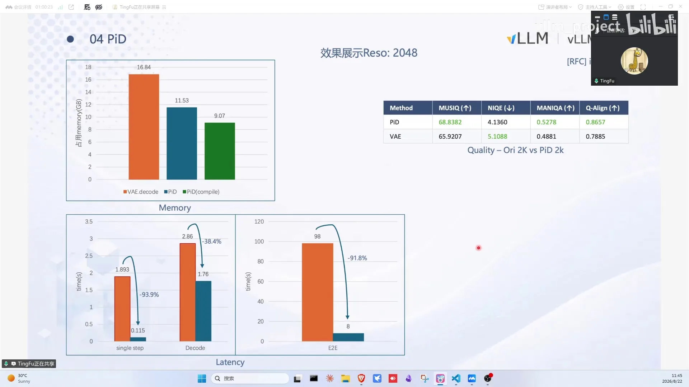 |
| 另一方面：生成的 2048 图片在 PID 下输入只有 512，所以在 latent 上单图片的 step——单请求的单降噪步——基本只有原来的 1/8。大概有 90% 多的时延降低…… [【跳转到 44:11】](https://www.bilibili.com/video/BV189816ZE9C/?t=2651) | 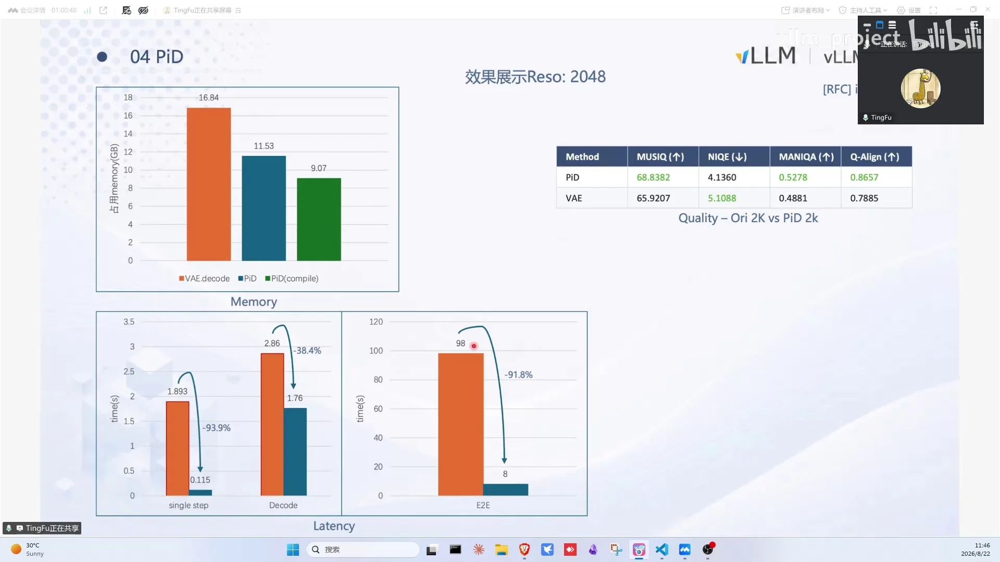 |
| decode 阶段因为不是传统 VAE decode，PID 里有个小的 diffusion 模块，性能有下降但没那么多：大概下降 38%。总性能收益：单（卡）做 2048 分辨率生成能有 90% 多的（提升）。非常可观。但大家也知道这么大的性能提升…… [【跳转到 44:36】](https://www.bilibili.com/video/BV189816ZE9C/?t=2676) |  |
| 肯定做的不是无损的。我们在质量上做了可量化的评估：PID 跟 VAE 的生成结果，至少论文中提到的几个指标实测下来确实跟论文所说——两者互有胜负。不从相似性上、单从图片质量上来说…… [【跳转到 45:01】](https://www.bilibili.com/video/BV189816ZE9C/?t=2701) |  |
| 二者不分伯仲。接下来看具体生成效果…… [【跳转到 45:26】](https://www.bilibili.com/video/BV189816ZE9C/?t=2726) |  |
| 这两张图片一个使用原生 VAE decode 生成…… [【跳转到 45:35】](https://www.bilibili.com/video/BV189816ZE9C/?t=2735) | 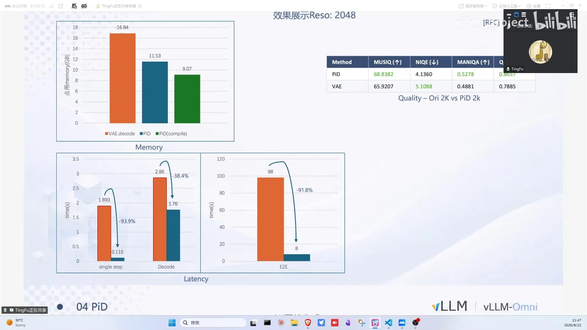 |
| 一个替换 decode 为 PID 生成。大家凭感觉觉得哪边更好？——左边更好。——可能千人千面，但我得告诉你左边是 PID 生成的。还有一些其他对比…… [【跳转到 45:40】](https://www.bilibili.com/video/BV189816ZE9C/?t=2740) | 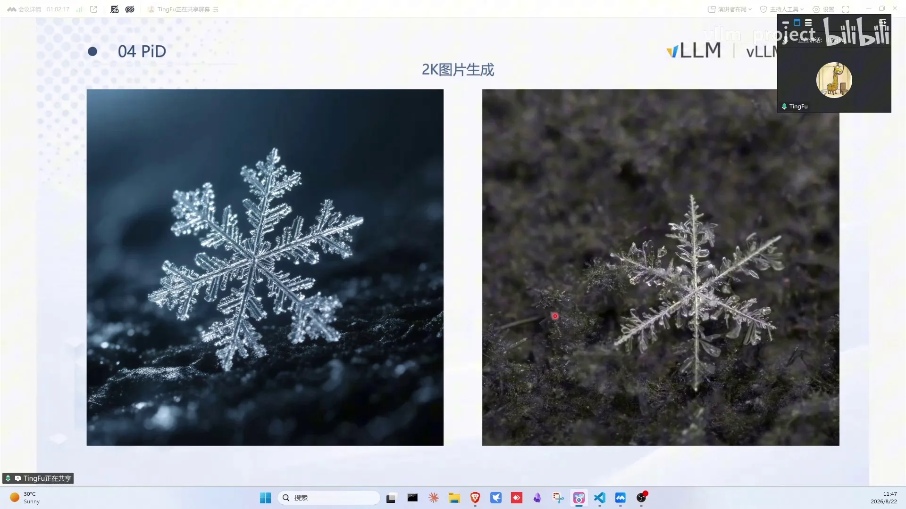 |
| 更多的对比不是特意选的，随意挑了几个：海滩场景第一张更真实、第二张更讨喜，但第二张连接处处理得不好；狗狗的图片第一张虚化效果、质感更好，第二张更阳光、有点过曝像手机拍的。其他都类似：不能说第二张绝对比第一张好…… [【跳转到 46:03】](https://www.bilibili.com/video/BV189816ZE9C/?t=2763) | 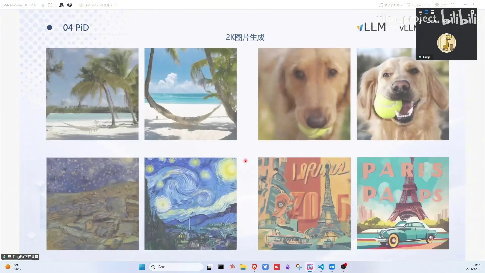 |
| （接上） [【跳转到 46:08】](https://www.bilibili.com/video/BV189816ZE9C/?t=2768) |  |
| 也不能说第一张绝对比第二张真实，各有千秋，有人可能偏向第二张。摆的第一张都是原始 VAE decode、第二张是 PID 生成。原始 decoder 生成的也不是所有都好：比如最后一个，至少这个字生成的就没有什么意义…… [【跳转到 46:33】](https://www.bilibili.com/video/BV189816ZE9C/?t=2793) | 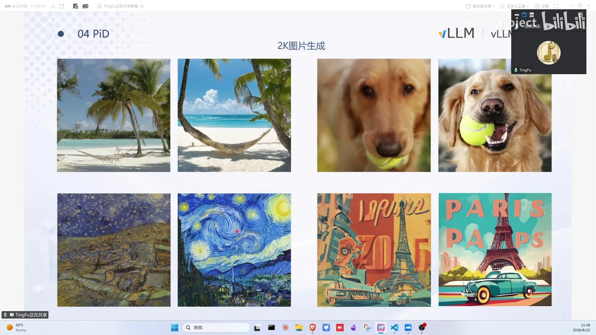 |
| 这跟模型本身的能力也有关系。大概就是效果上的展示。——有同学说这个得看 CLIP…… [【跳转到 46:58】](https://www.bilibili.com/video/BV189816ZE9C/?t=2818) |  |
| 然后有同学说就是这个得看克里普 [【跳转到 47:07】](https://www.bilibili.com/video/BV189816ZE9C/?t=2827) |  |
| CLIP 应该是做 text embedding 的吧？——对，是的。 [【跳转到 47:12】](https://www.bilibili.com/video/BV189816ZE9C/?t=2832) |  |
| 我们主要就是替换 VAE decode 这块。2048 的 PID 生成是从 512 过来的，跟主模型的训练数据集、训练目标分辨率也有关系：现在很多生图生视频的模型虽然号称支持多分辨率，但其实还是会有推荐分辨率。超过（或低于）它的分辨率生成时，数据集可能覆盖不全、CLIP 表现可能没那么好，会出现表现不是最佳的情况，也有这方面的原因。——有同学问：连续批处理已经支持了吗？可以在（某模型）上用吗？它是 flow 模型。 [【跳转到 47:17】](https://www.bilibili.com/video/BV189816ZE9C/?t=2837) |  |
| （接上） [【跳转到 47:42】](https://www.bilibili.com/video/BV189816ZE9C/?t=2862) |  |
| 我们马上会对它做比较集中的优化。它现在 flow 部分不支持：请求多的话（flow）部分完全串行。后面会让它也可以组 continuous batching。是个流式模型吗…… [【跳转到 48:07】](https://www.bilibili.com/video/BV189816ZE9C/?t=2887) | 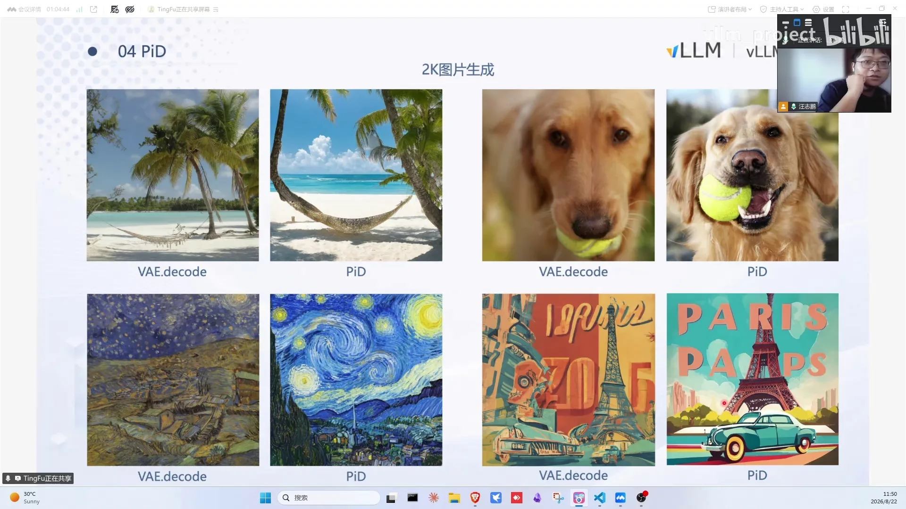 |
| 不是，它是个 TTS 模型，后面部分是 flow。但现在 flow 不支持组 batch。OK 我继续。 [【跳转到 48:32】](https://www.bilibili.com/video/BV189816ZE9C/?t=2912) |  |
| 简单说一下刚刚提到的论文：大家感兴趣可以自己阅读，里面也提到了训练方法。主要有三个方面的应用场景。一个是显存受限的硬件推理：有些卡显存不是很高，原来 VAE decode 显存占比较高…… [【跳转到 48:51】](https://www.bilibili.com/video/BV189816ZE9C/?t=2931) | 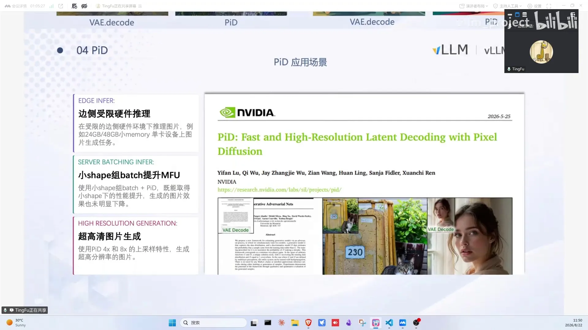 |
| 可以在这些设备上运行高分辨率生成。第二个是（前面）提到的：小（分辨率）情况下组 batch 收益会比较高，可以用小分辨率组 batch，在 PID 阶段再生成回大分辨率图片。第三个是可以做到原始主模型不支持的分辨率生成：有的生图模型原生最高支持 2K 或 4K，你愿意的话可以在上面再做 PID 的四倍或八倍上采样。这是三个主要应用场景。然后接下来是我们写的一个…… [【跳转到 49:16】](https://www.bilibili.com/video/BV189816ZE9C/?t=2956) |  |
| （接上） [【跳转到 49:41】](https://www.bilibili.com/video/BV189816ZE9C/?t=2981) | 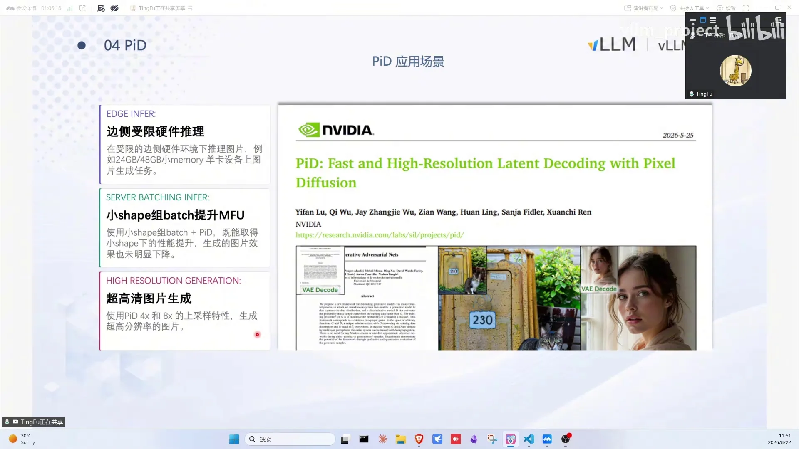 |
| 一个可能未来的思考：一个是组 batch 叠加 PID 的收益场景；第二个是家政说的，未来或许可以在几个主要的分辨率部署在不同的实例上，以实例为粒度进行请求的调度。第三个是 offload 的优化…… [【跳转到 49:57】](https://www.bilibili.com/video/BV189816ZE9C/?t=2997) |  |
| 因为生成模型每一步每一层的时间都比较长，在 offloading 上收益比较可观。或许 offload 加组 batch 可以完全掩盖（数据搬运）的开销。这是接下来可能会主要的一些场景。 [【跳转到 50:22】](https://www.bilibili.com/video/BV189816ZE9C/?t=3022) | 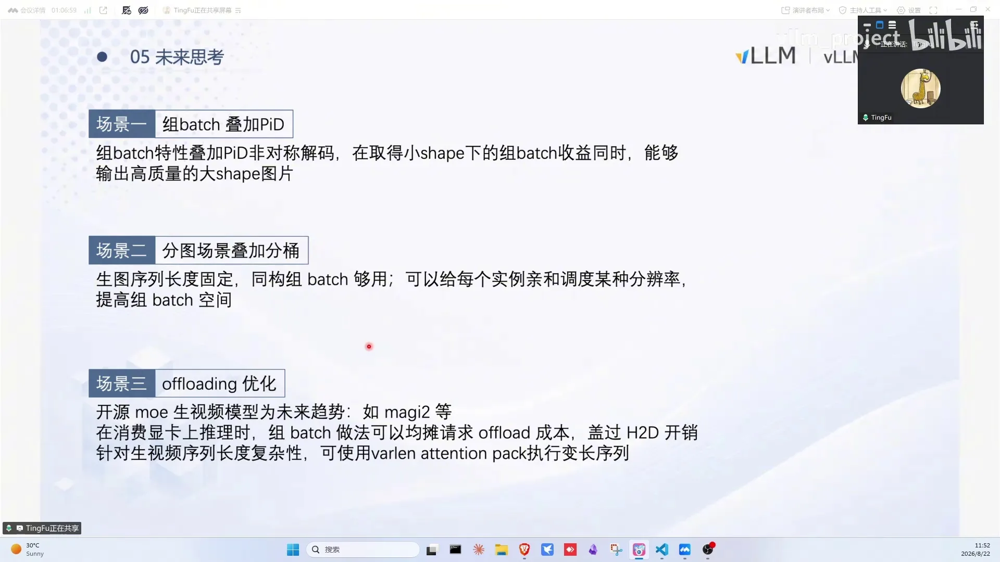 |
| 内容就这么多。对上面的一些问题来做一些解释吧。 [【跳转到 50:44】](https://www.bilibili.com/video/BV189816ZE9C/?t=3044) | 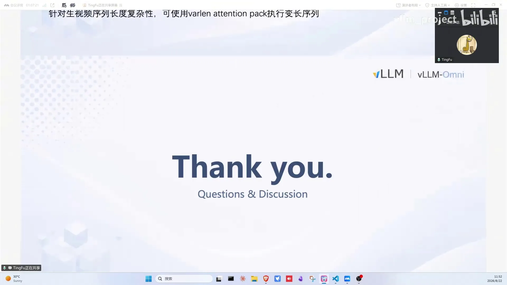 |
| 组 batch 可以在一些（小）模型或者 padding 的小模型来提升吞吐。第二个是现在的同分辨率组 batch 场景在很多场景已经能用了：比如生图场景，通常部署给客户用的都是几个固定分辨率，可以亲和性调度，提高 T2I 下的利用率。而且还有一些 RL rollout 场景用的卡比较好，1K 的图片在 H200 上可以打到 batch size 8 或 16…… [【跳转到 50:52】](https://www.bilibili.com/video/BV189816ZE9C/?t=3052) | 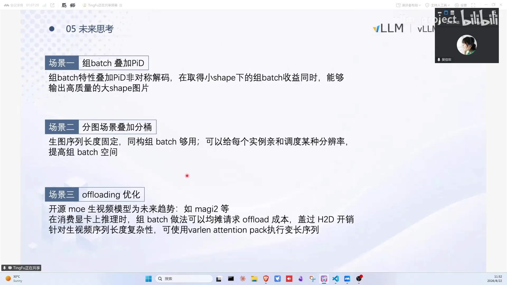 |
| 社区有支持——有个（PR）可以看一下。第三个是因为现在（有些）模型开源了，在消费级显卡肯定要 offloading。消费级显卡 5090 有（FP4），计算会非常快，这时可以通过在小（分辨率）下…… [【跳转到 51:17】](https://www.bilibili.com/video/BV189816ZE9C/?t=3077) | 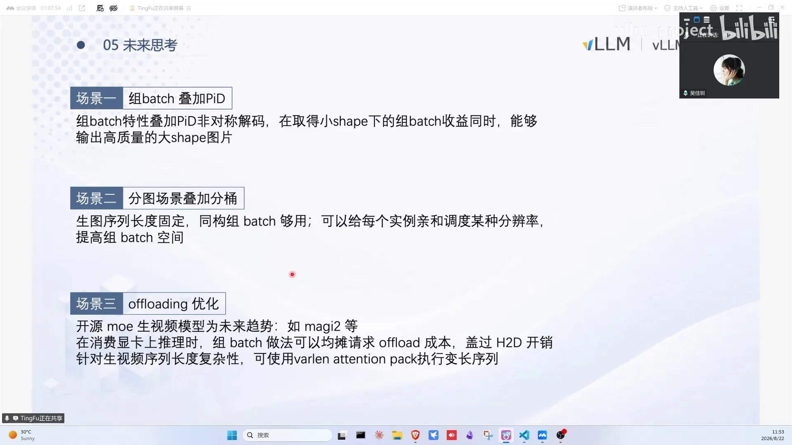 |
| 比如 480P 的情况可以通过组 batch 做一定的优化来掩盖 offload 的开销。而且（FP4）这种情况很多用户也会用：比如 MiniMax H3 这种模型通常一开始要生成 2K 视频…… [【跳转到 51:42】](https://www.bilibili.com/video/BV189816ZE9C/?t=3102) | 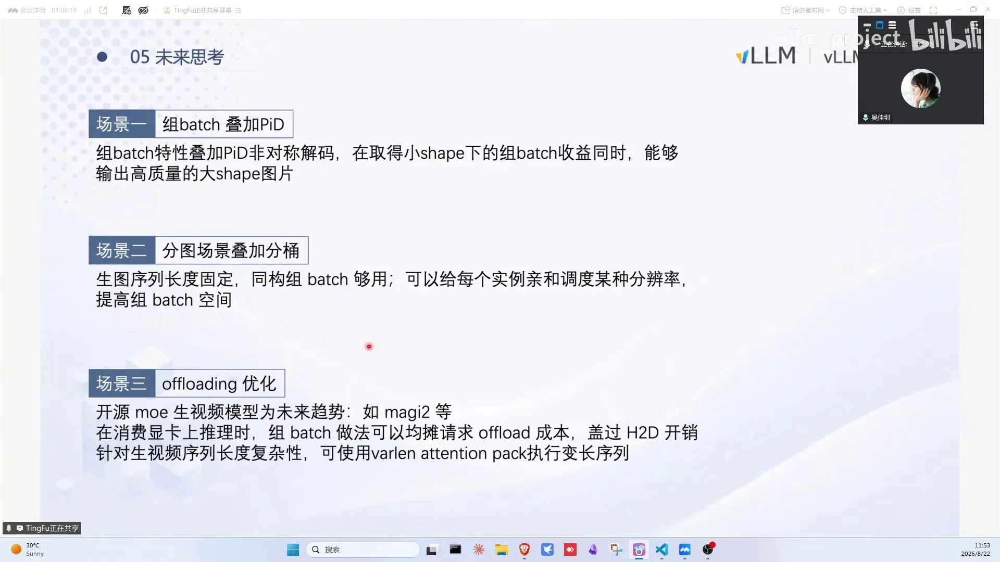 |
| 2K 视频是前面先跑 720P 的视频，然后把 latent 传给 2K 视频再跑剩下几个 step。这样很多会有低分辨率的场景可以支持组 batch 来提高整体系统吞吐量。 [【跳转到 52:07】](https://www.bilibili.com/video/BV189816ZE9C/?t=3127) | 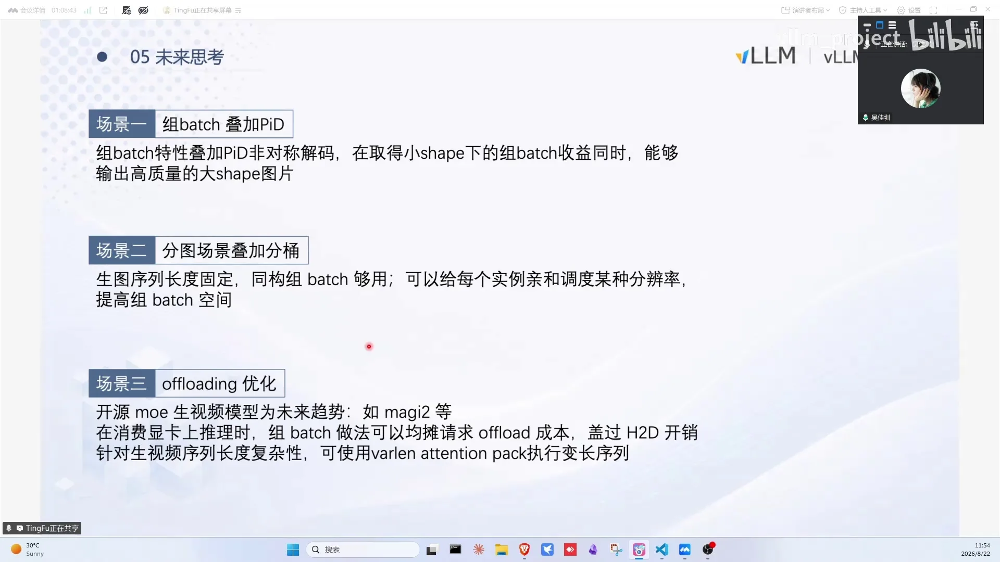 |
| （接上） [【跳转到 52:32】](https://www.bilibili.com/video/BV189816ZE9C/?t=3152) | 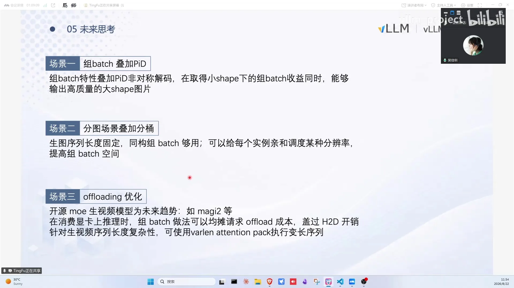 |
| 回答直播间观众提问。有同学问：为啥 TTS 的 flow 模型不能直接用上这个 continuous batching？——可以用的，但看你是否实现了。如果框架支持的话，用框架里的 API 就能做；但你有可能用的不是框架里的 API…… [【跳转到 52:57】](https://www.bilibili.com/video/BV189816ZE9C/?t=3177) |  |
| 直接包进去了一个没有用它的 scheduler 去调度你的 step，那自然就不能支持。——然后有同学问 PID 模型有多大，看起来也可以做并行。" [【跳转到 53:22】](https://www.bilibili.com/video/BV189816ZE9C/?t=3202) | 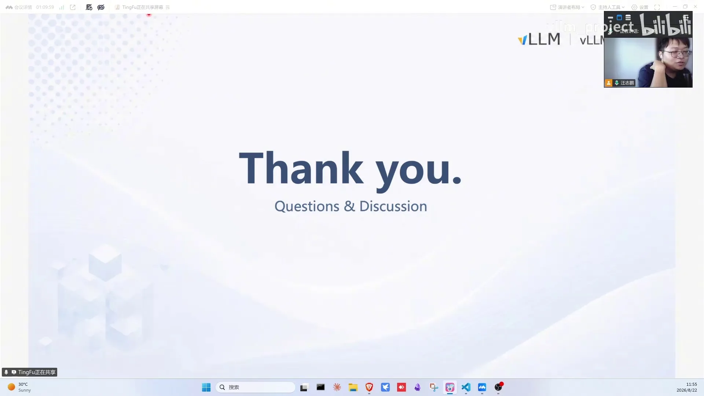 |
| PID 模型其实很小…… [【跳转到 53:43】](https://www.bilibili.com/video/BV189816ZE9C/?t=3223) | 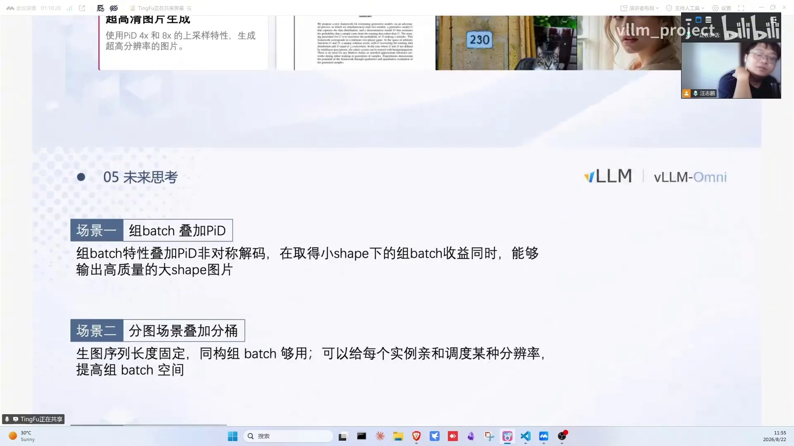 |
| 可能（主干）模型加上文本模型…… [【跳转到 53:48】](https://www.bilibili.com/video/BV189816ZE9C/?t=3228) | 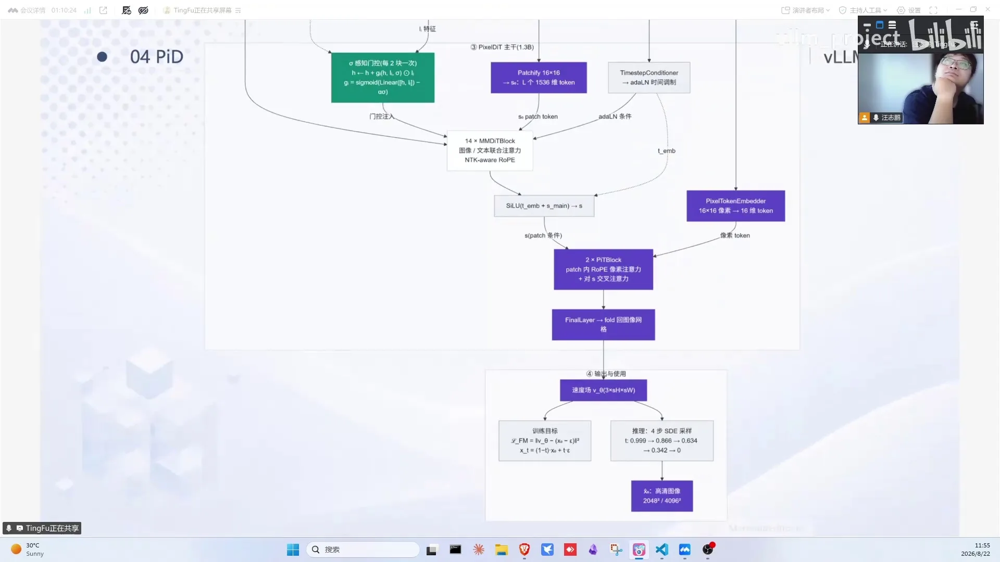 |
| 加起来可能 3B 不到，是一个很小的模型。关于它的组 batch：不确定是否有收益——因为它是目标分辨率下去做降噪，不是在 latent 空间做降噪。如果在这里组 batch 的话显存可能会爆炸…… [【跳转到 53:53】](https://www.bilibili.com/video/BV189816ZE9C/?t=3233) |  |
| 这个还需要评估。——还有问 PID 能够生成视频吗？——这是一个方向。因为模型（比较新）…… [【跳转到 54:18】](https://www.bilibili.com/video/BV189816ZE9C/?t=3258) |  |
| 是（某公司）先在 5 月份提出来的，还是比较新的模型。现在视频生成模型里有类似的行为…… [【跳转到 54:32】](https://www.bilibili.com/video/BV189816ZE9C/?t=3272) | 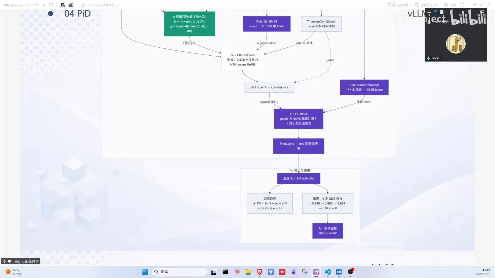 |
| 包括刚才家政也说到：原来在 latent 层面降噪是小分辨率的，在视频生成模型里就内置了类似（小到大分辨率）的扩散步。所以能不能支持首先要看能不能迁移过去，另一个是看视频生成模型里是否已有类似组件在承担这样的工作。 [【跳转到 54:37】](https://www.bilibili.com/video/BV189816ZE9C/?t=3277) | 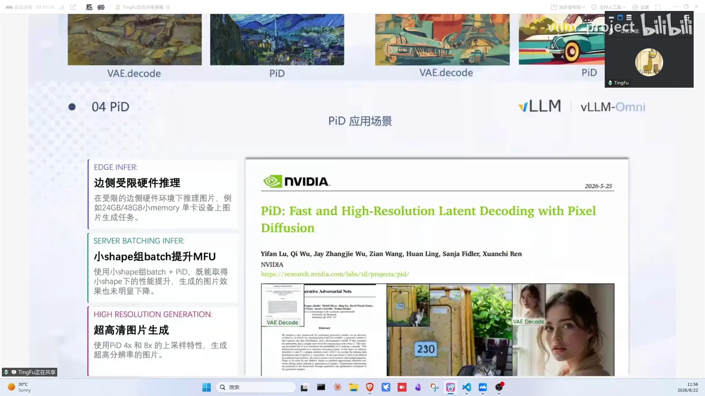 |
| 包括刚刚家政也说到嘛他可能原先在license这个层面去做降噪的时候就是小分辨率的它是在呃他们的这个视频生成模型里面就内置了类似的板块在做这种小分辨率到放大分辨率的这种扩散步的步骤所以呃是不是能够支持呢首先要看这个是不是能够迁移过去再一个就是看是不是在呃视频生成模型里面已经有类似的组件在承担这样的工作 [【跳转到 54:42】](https://www.bilibili.com/video/BV189816ZE9C/?t=3282) |  |
| 还有同学问：对于 TTS 模型如果做连续批处理，对首包的响应时间应该怎么保证？——首先肯定得用这个（调度），然后 flow 是组 batch 还是（其他）方式…… [【跳转到 55:07】](https://www.bilibili.com/video/BV189816ZE9C/?t=3307) |  |
| 开（CB）之后对整体延时的提升已经是比较好的了，肯定会比单请求的时间降低一些。其实之前我也在想 TTS 的 flow 怎么组 batch…… [【跳转到 55:32】](https://www.bilibili.com/video/BV189816ZE9C/?t=3332) |  |
| 因为 TTS 的 decode 传过来的东西长度非常不固定。但如果开了 chunk（切分）之后，chunk 之间的长度基本可以保证一致，可能只需要尾部序列做一些 padding。这样来看其实比较适合做组 batch…… [【跳转到 55:57】](https://www.bilibili.com/video/BV189816ZE9C/?t=3357) |  |
| 而不是水平扩展去做 vLLM attention 那块的计算。我是这么想的，不知道你们怎么看。——好。还有同学问 PID 能支持生成视频吗？我认为后面应该会支持…… [【跳转到 56:22】](https://www.bilibili.com/video/BV189816ZE9C/?t=3382) |  |
| 又有同学问：和 vLLM 已有组 batch 的区别是不是只有 encoder 和 decoder 阶段处理？——这个特性可以跟 vLLM 一起用：很多模型分多个 stage，自回归模型走自回归的 continuous batching…… [【跳转到 56:47】](https://www.bilibili.com/video/BV189816ZE9C/?t=3407) |  |
| 后面接 flow 的话就可以走 diffusion continuous batching——两个不同类型模型的 CB。DiT 的处理和 vLLM 的应该差不多，其实不是很一样：DiT 是不同 request…… [【跳转到 57:12】](https://www.bilibili.com/video/BV189816ZE9C/?t=3432) | 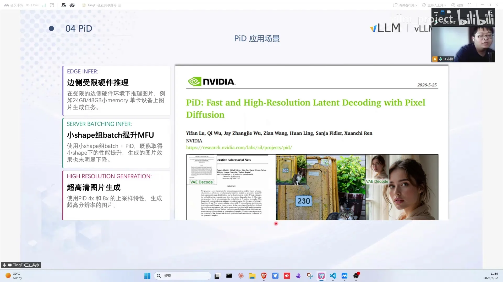 |
| step 之间组的；vLLM 里是 token 级的调度——有优先级，优先把 decode 放进去、再把 prefill 放进去，凑成一个 batch 计算，走一次 forward。——还有同学问异构组 batch…… [【跳转到 57:37】](https://www.bilibili.com/video/BV189816ZE9C/?t=3457) |  |
| 是不是在同构基础上加 padding 实现的？——肯定不是 padding。类似于 vLLM 的（机制）：V0 到 V1 很多改成按序列来做…… [【跳转到 58:02】](https://www.bilibili.com/video/BV189816ZE9C/?t=3482) |  |
| 按 token 来做调度。padding 后面肯定也会修改掉：有可能（新版本）flash attention 会比传统的慢 10%，会考虑同分辨率时是否启用这个接口…… [【跳转到 58:27】](https://www.bilibili.com/video/BV189816ZE9C/?t=3507) | 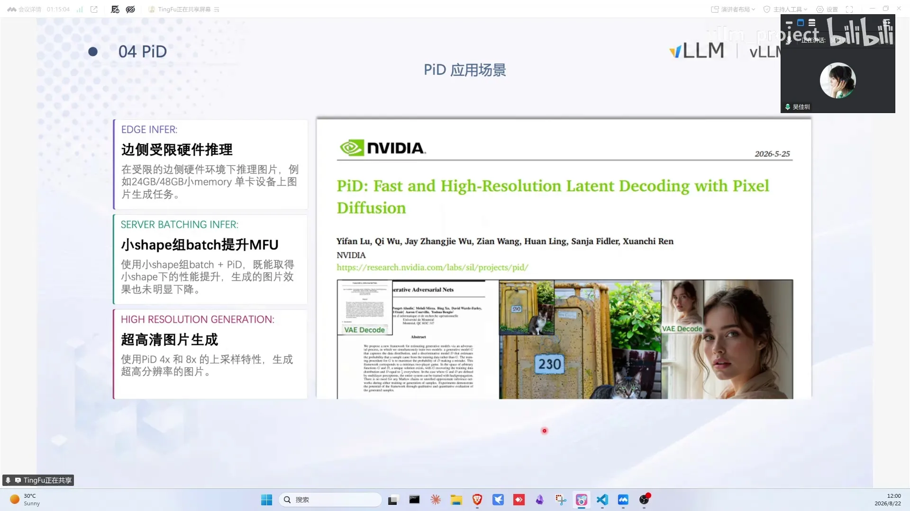 |
| 会做一些选择。线性层应该不走 padding。padding 的好处是代码比较简单；做（拼接）这种水平形式的话也有问题：位置编码要很多改动…… [【跳转到 58:52】](https://www.bilibili.com/video/BV189816ZE9C/?t=3532) |  |
| 在已有代码模型上修改，代码改动比较大、复杂度上升一个量级。如果直接 padding 垂直做 batch 的话代码会简单一些，但确实会有计算浪费…… [【跳转到 59:17】](https://www.bilibili.com/video/BV189816ZE9C/?t=3557) |  |
| 之前主要考虑生图场景，视频场景有（多分辨率）的考虑，很多是默认的。这时（拼接）确实比较有必要——序列长度变化大时（拼接）非常合理，唯一问题是工程上可能变得更复杂…… [【跳转到 59:42】](https://www.bilibili.com/video/BV189816ZE9C/?t=3582) | 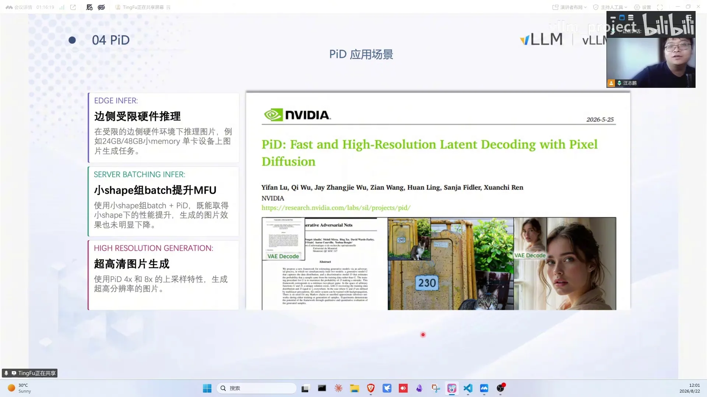 |
| 之前有个 DP 的 PR 一直没合进去因为太复杂了。做 TTS 时也考虑做（拼接），发现太复杂了。——有同学说…… [【跳转到 60:07】](https://www.bilibili.com/video/BV189816ZE9C/?t=3607) |  |
| 目前我是把（部分）的位置（编码）放到连续处理线程，然后（解码）转为 GPU。 [【跳转到 60:32】](https://www.bilibili.com/video/BV189816ZE9C/?t=3632) |  |
| （此区间无字幕） [【跳转到 60:43】](https://www.bilibili.com/video/BV189816ZE9C/?t=3643) | 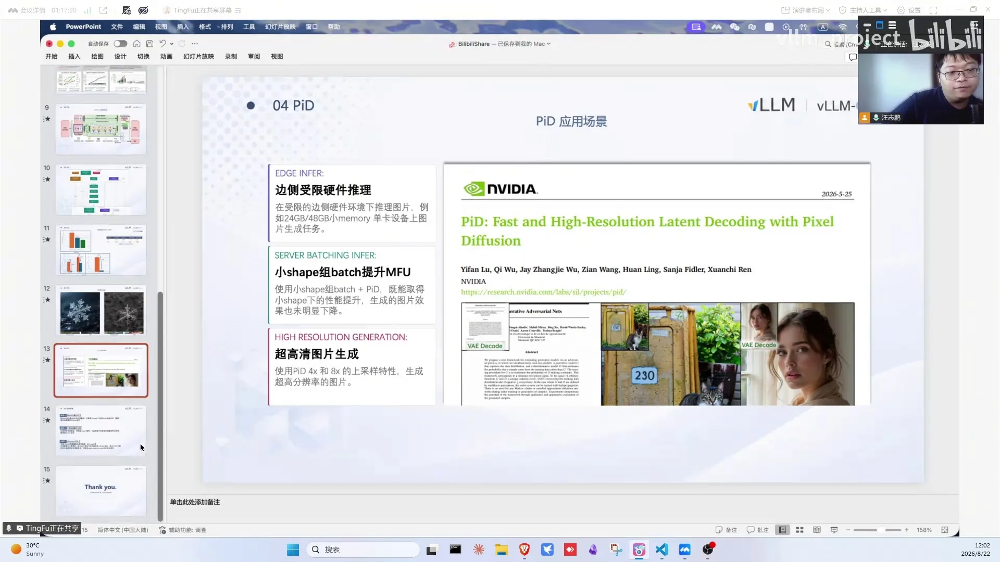 |
| 还有位同学问：异构组 batch 和同构组 batch 收益差异大吗？主要差别在哪里？——异构和同构主要的区别…… [【跳转到 60:48】](https://www.bilibili.com/video/BV189816ZE9C/?t=3648) | 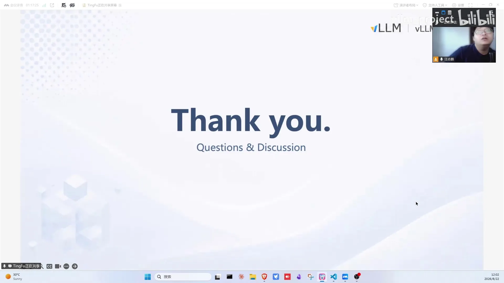 |
| 还是总共的 shape——要处理的 token 数。如果 token 数量级差不多，总差距不会特别大。包括刚讨论的 varlen：我的方法是直接切 chunk，切完之后 self attention 恢复成原来的形状…… [【跳转到 61:13】](https://www.bilibili.com/video/BV189816ZE9C/?t=3673) | 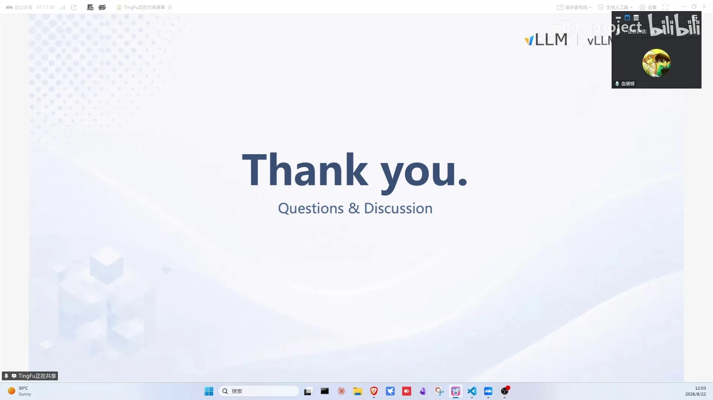 |
| 恢复的话代码量改动相对小，而且不只支持 flash attention——其他 attention 也可以恢复完直接用。最多 self attention 的 batch 收益可能稍微小一点。像傅挺讲的 attention 本身对 batch 的（收益）…… [【跳转到 61:38】](https://www.bilibili.com/video/BV189816ZE9C/?t=3698) | 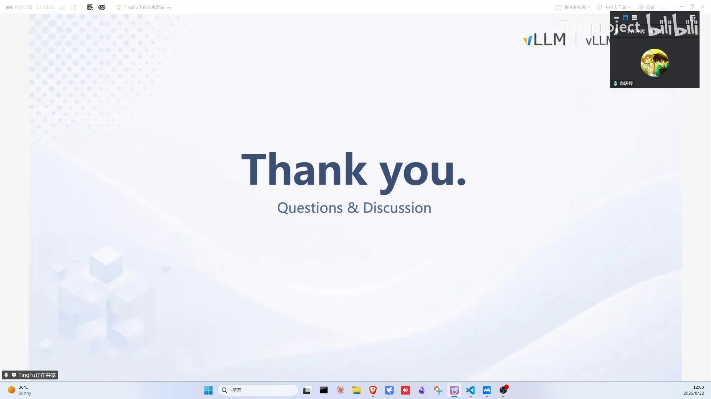 |
| 相对比较小。总体来说异构和同构本质上就是看总共处理的 token 数，异构可能有额外的开销但相对不是特别大。是的是的。——直播间同学还有什么问题吗？ [【跳转到 62:03】](https://www.bilibili.com/video/BV189816ZE9C/?t=3723) | 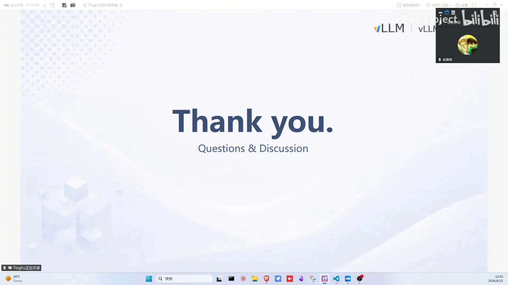 |
| 如果没有问题，非常感谢三位老师的分享。稍后会把这期直播的回放上传，大家也可以去看回放，不要忘记给回放一键三连。之前几期节目都可以回放复习，也可以分享给同学…… [【跳转到 62:28】](https://www.bilibili.com/video/BV189816ZE9C/?t=3748) | 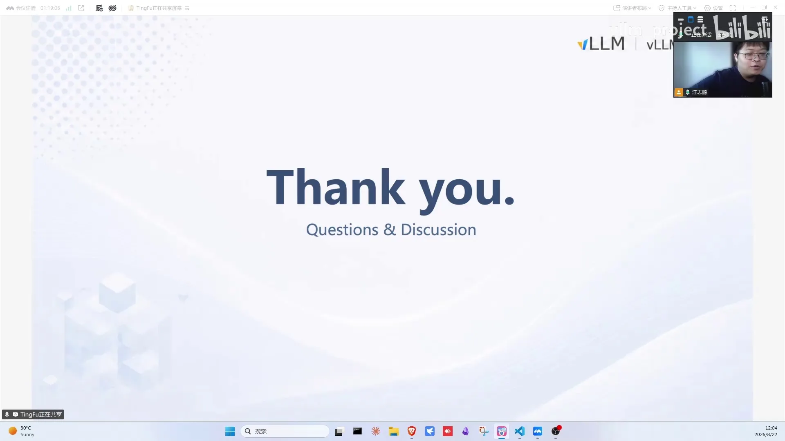 |
| 跟朋友和同事。最好每期视频都给一键三连。每周同一时间星期六上午都有相关 AI infra 的技术分享，不要忘记给频道点个关注。 [【跳转到 62:53】](https://www.bilibili.com/video/BV189816ZE9C/?t=3773) | 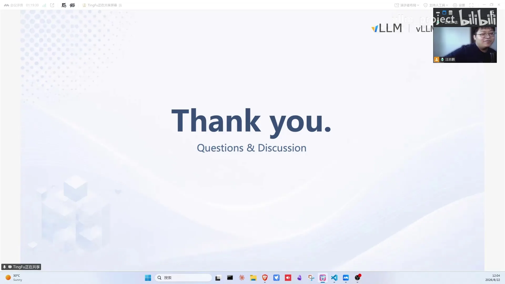 |
| （此区间无字幕） [【跳转到 63:12】](https://www.bilibili.com/video/BV189816ZE9C/?t=3792) | 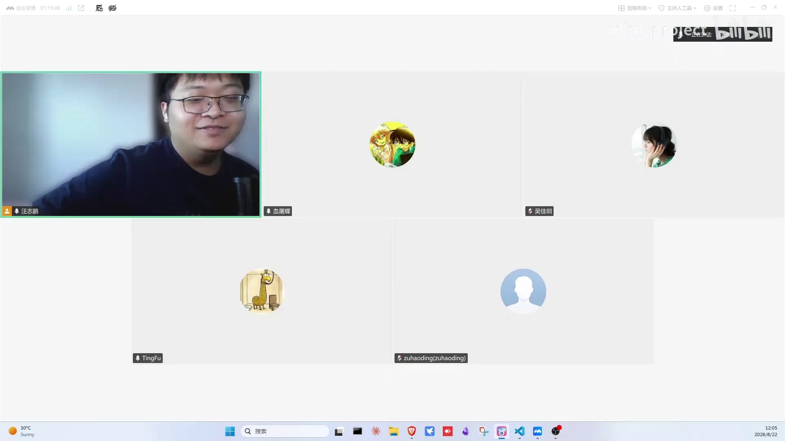 |