# vLLM小课堂（十七）：基于vLLM的Kimi K3智能体生产级推理服务 原始文稿（图-字幕分栏）

| 字幕文本 | 画面 |
| :--- | ---: |
| 我现在简单介绍一下，今天主要是介绍 K3 的生产级部署，来自 INFX 的子林（等）两位老师。——我是（嘉宾一），年初加入 INFX，主要专注于生产上的大规模部署、模型部署、模型的生产应用方面的工作。 [【跳转到 00:00】](https://www.bilibili.com/video/BV1Wv4k6YEdB/?t=0) | 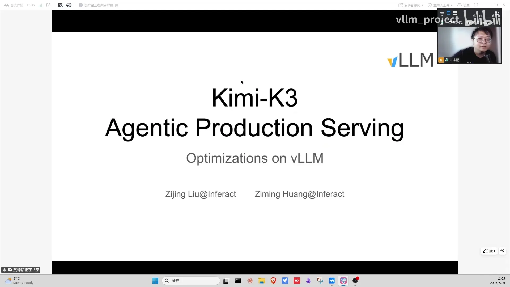 |
| 大家好，我是子林，两个月前加入 INFX。刚好加入一个月的时候我们做了 Kimi K3 在开源上的 day0 支持，从 7 月底到现在做进一步的优化，把 K3 推上生产。今天分享我们在 Kimi K3 上做的一些工作。 [【跳转到 00:25】](https://www.bilibili.com/video/BV1Wv4k6YEdB/?t=25) |  |
| （接上） [【跳转到 00:50】](https://www.bilibili.com/video/BV1Wv4k6YEdB/?t=50) |  |
| 听说子林老师特别擅长做 presentation？——可能因为 INFX 之前在 Meta 工作过好几年，被迫学习的技能：给领导们 present 工作、present roadmap。 [【跳转到 01:15】](https://www.bilibili.com/video/BV1Wv4k6YEdB/?t=75) | 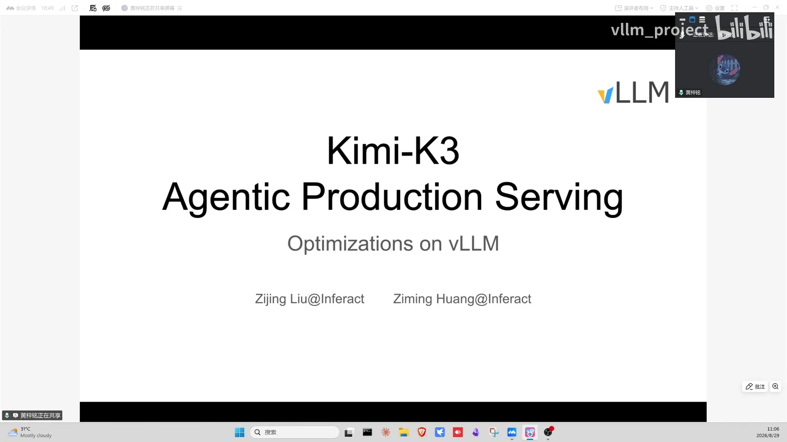 |
| 直播间同学也可以学一下怎么做好的 presentation。开始吧。先过一下 Kimi K3 的模型（架构），大部分同学应该比较熟悉了。 [【跳转到 01:40】](https://www.bilibili.com/video/BV1Wv4k6YEdB/?t=100) | 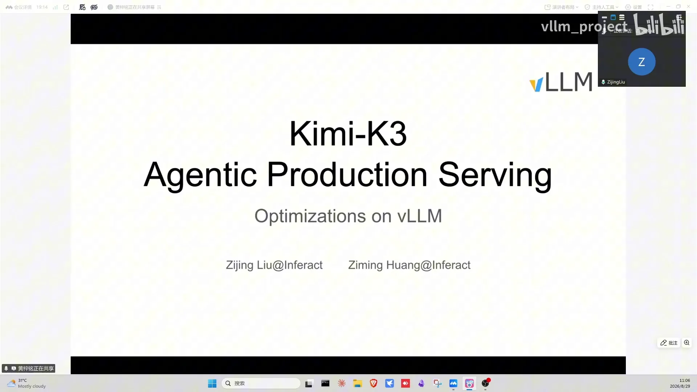 |
| K3 跟别的模型不太一样的一点：它是我们第一个在开源社区看到的超大型模型——2.8T 参数。K3 之前最大的模型接近 1T，从来没有遇到过这么大的模型，这是第一个（开源）最大的。 [【跳转到 02:05】](https://www.bilibili.com/video/BV1Wv4k6YEdB/?t=125) |  |
| MoE 部分是 MXFP4 的权重，前面的 linear projection 部分是 BF16，加起来接近 1T 多（存储）。生产上做 K3 第一个头疼的问题：怎么把这样的模型部署出去——很明显…… [【跳转到 02:30】](https://www.bilibili.com/video/BV1Wv4k6YEdB/?t=150) | 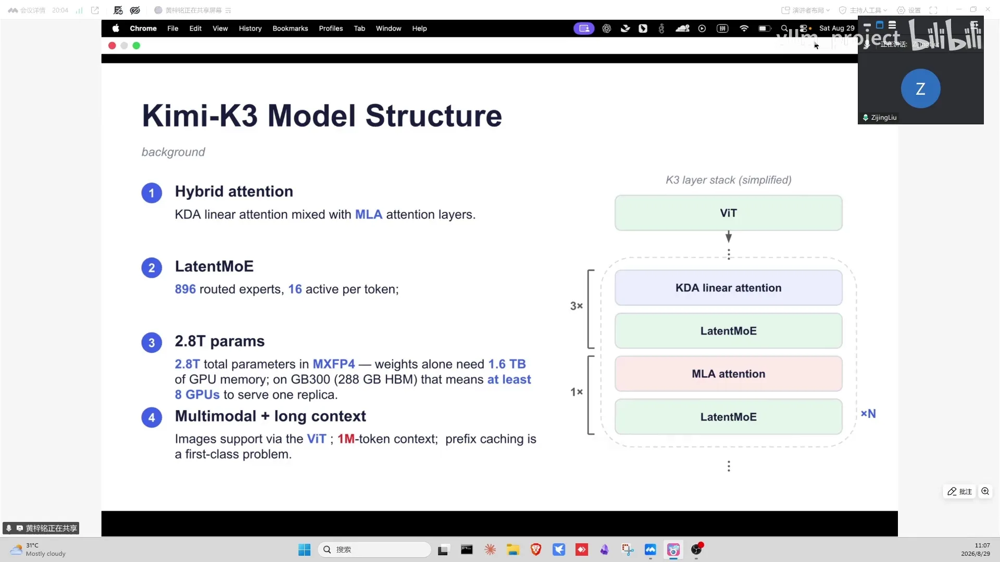 |
| 世界上没有一台机器可以 single node 把这个模型很好地吃下。这是最 surprise 的一点。除此之外模型用了 Lightning MLA——不像传统 MLA，里面做了特殊操作，kernel 层面有些（变化）。它也是 hybrid attention：从 DeepSeek 到 MiniMax，基本上都是 sparse attention 加 Mamba 加 dense attention 的混合模式…… [【跳转到 02:55】](https://www.bilibili.com/video/BV1Wv4k6YEdB/?t=175) |  |
| 现在比较常见的特性。最后 Kimi K3 也是多模态加长上下文——1M context length，同时吃很多 image…… [【跳转到 03:20】](https://www.bilibili.com/video/BV1Wv4k6YEdB/?t=200) | 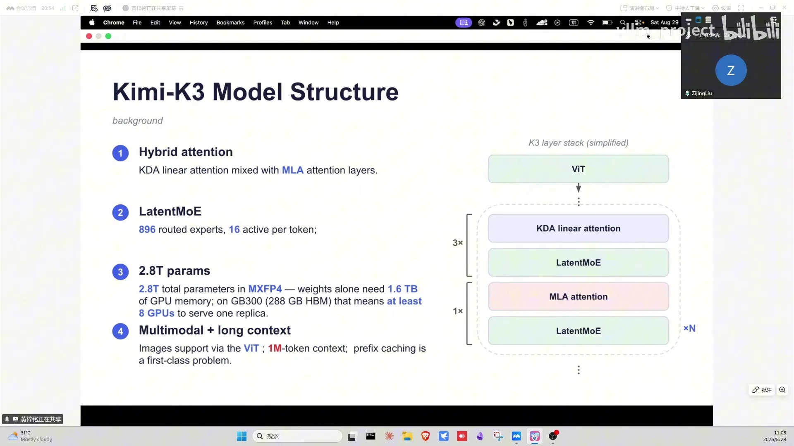 |
| 所以每个（维度）在生产上都有挑战点：不光要针对文字、chat、coding 做调整…… [【跳转到 03:38】](https://www.bilibili.com/video/BV1Wv4k6YEdB/?t=218) | 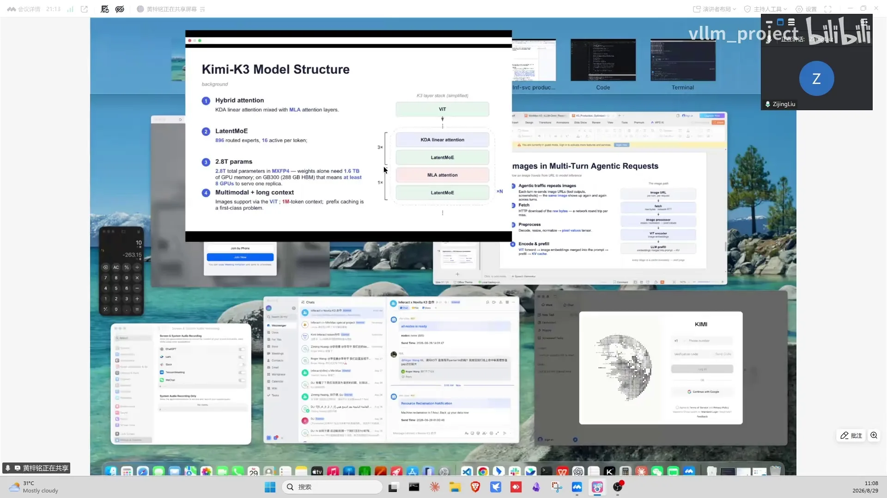 |
| 还花了很多时间针对 multimodal 做调整。——然后做生产最有挑战的部分是用户要求很高…… [【跳转到 03:43】](https://www.bilibili.com/video/BV1Wv4k6YEdB/?t=223) | 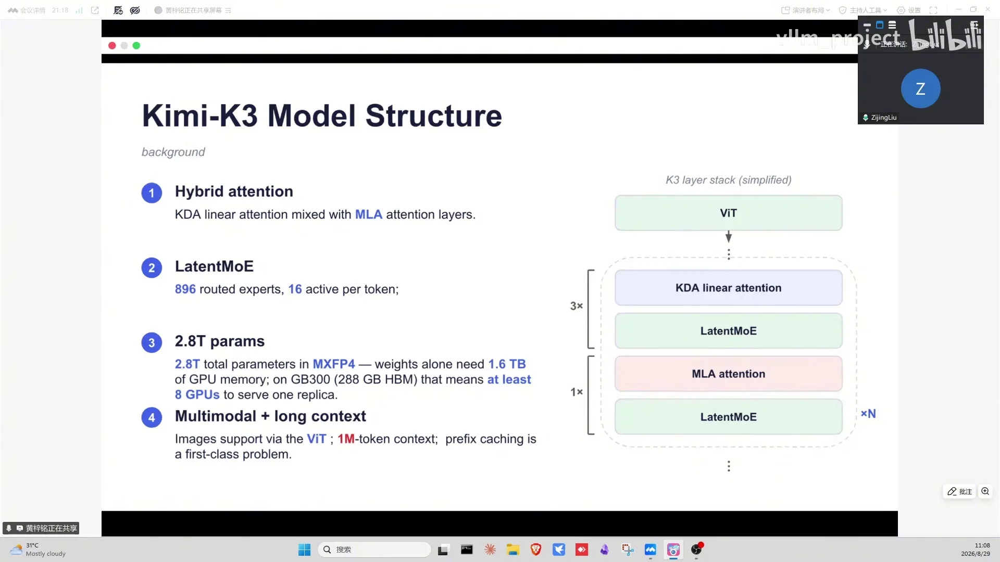 |
| 能理解，花了钱就想要最好的服务。遇到的挑战：第一 TTFT 要求有保证——不能像（某些服务）输入之后转两分钟不返回。生产上 P99 的 TTFT 作为参考…… [【跳转到 04:08】](https://www.bilibili.com/video/BV1Wv4k6YEdB/?t=248) |  |
| 基本要 10 秒以下：不管什么场景、怎么退化都要保证 TTFT 在 P99 10 秒以下。同时在相对短的 TTFT 下还要保证一定的 token per second generation（即 ITL，token 之间的间隔要小）…… [【跳转到 04:33】](https://www.bilibili.com/video/BV1Wv4k6YEdB/?t=273) |  |
| 上下文生成时中间不能卡顿：不想用户有停顿的感觉。TTST 和 TTST 要有比较高的保证。吞吐水位线在 40：每秒至少保证 40 个 token 的生成——apply 到所有用户。另外 K3 是很强的 generative model…… [【跳转到 04:58】](https://www.bilibili.com/video/BV1Wv4k6YEdB/?t=298) | 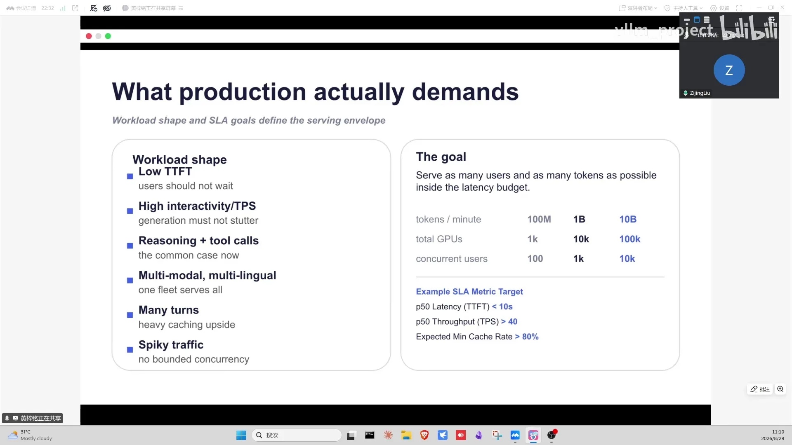 |
| 大量的 rewriting context 和 tool call context。要保证准确性：怎么保证模型生成的 tool call 能很好 follow 人类的 instruction？如果用户给了一个 customized 的 tool call parameter schema，要保证 strictly follow——DSO 很严：所有 tool call 要 100% follow…… [【跳转到 05:23】](https://www.bilibili.com/video/BV1Wv4k6YEdB/?t=323) | 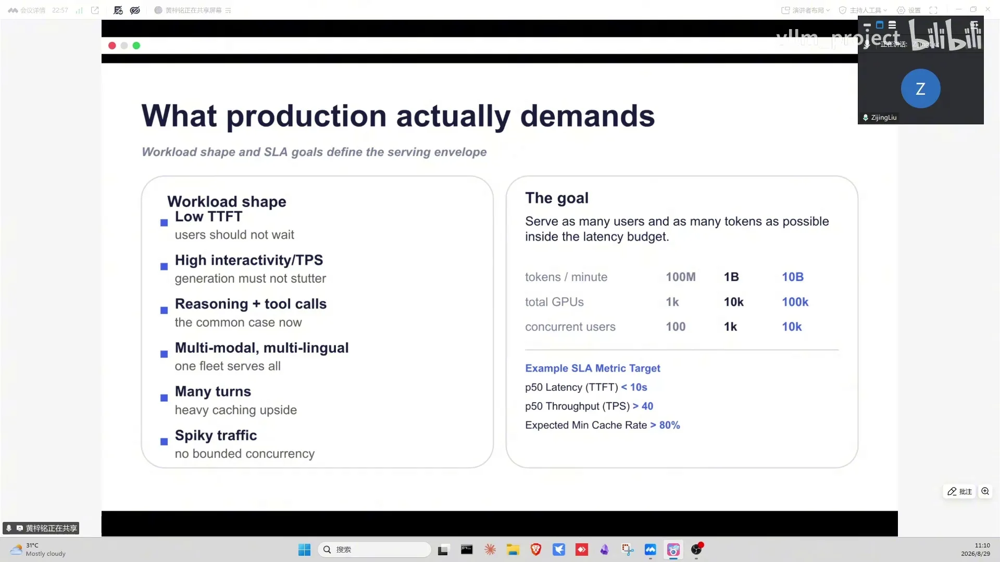 |
| 不能有任何 tool call 请求因为 format 或 schema 原因失败，要保证 100% 成功率。除此之外 multimodality 和 multilingual：K3 生产用量上有很多图片…… [【跳转到 05:48】](https://www.bilibili.com/video/BV1Wv4k6YEdB/?t=348) |  |
| 截图或各种场景一个 request 很多张图片，变成非常常见的 workload。K3 之前图片也存在但没有这么广泛使用。同时 multilingual：K3 的使用量不仅英文中文，有各种语源——对我们也是挑战。 [【跳转到 06:13】](https://www.bilibili.com/video/BV1Wv4k6YEdB/?t=373) | 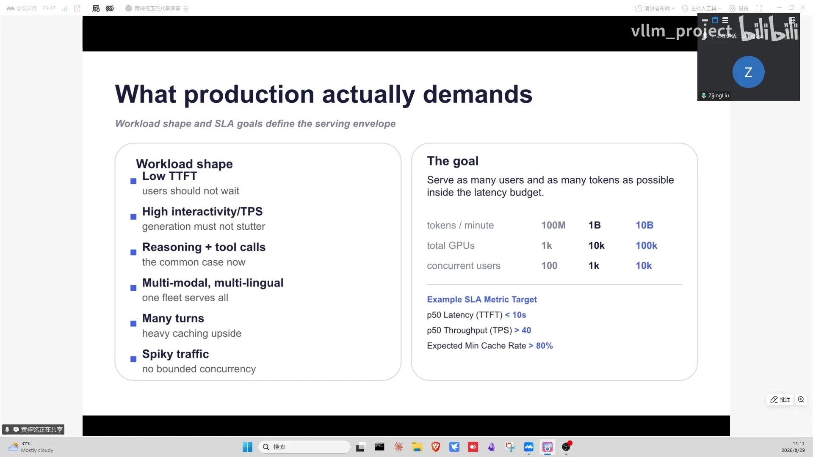 |
| 最后生产上的 K3 大部分都是多轮的：很少少于 10 轮、5 轮的简单对话，大部分是多轮对话解决复杂问题或反复迭代，轮次非常多…… [【跳转到 06:38】](https://www.bilibili.com/video/BV1Wv4k6YEdB/?t=398) |  |
| 内部看 traffic pattern 很 interesting：有明显高峰低谷。早上 10 点用量上来（大家开始工作），12 点 1 点下去（午休），下午再上来，7、8 点再下去。夜里的流量比中午少——大家休息充分，没那么强的加班。生产的挑战：怎么在浮动流量下保证系统 90% 的稳定…… [【跳转到 07:03】](https://www.bilibili.com/video/BV1Wv4k6YEdB/?t=423) | 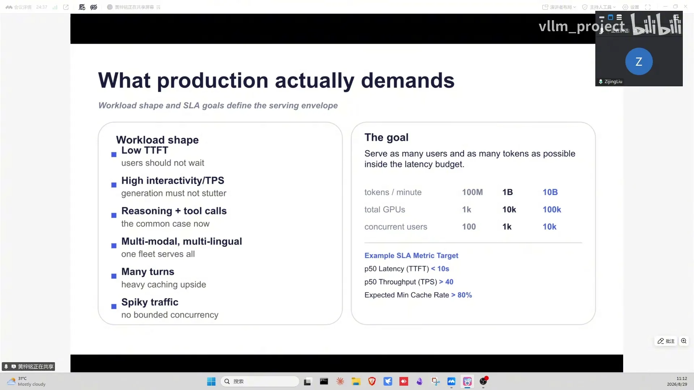 |
| 目标：在所有要求都达标的情况下服务越多的用户越好，每个用户服务的 token 越多越好。商业角度是利润来源；技术角度是 scalability——怎么让一套系统不仅 100M token/min 能用…… [【跳转到 07:28】](https://www.bilibili.com/video/BV1Wv4k6YEdB/?t=448) |  |
| 还能 scale 到 billion token 甚至 10 billion token。这是整个 K3 生产部署的出发点。——下一页讲一下 high level 的系统样子：首先是多机群 GB300 的部署…… [【跳转到 07:53】](https://www.bilibili.com/video/BV1Wv4k6YEdB/?t=473) |  |
| （接上） [【跳转到 08:18】](https://www.bilibili.com/video/BV1Wv4k6YEdB/?t=498) |  |
| 从上到下最上面是 gateway：总接入口，所有流量打到这个入口。在（gateway）…… [【跳转到 08:43】](https://www.bilibili.com/video/BV1Wv4k6YEdB/?t=523) |  |
| 做一些操作：认证、限流、导流。gateway 拿了请求再往后端可能超过 10 个 GPU 集群做流量导入：根据流量高低…… [【跳转到 09:08】](https://www.bilibili.com/video/BV1Wv4k6YEdB/?t=548) |  |
| 请求打到不同的集群里，根据 workload 判断。再往下是 vLLM router：take care 负载均衡，还要做 failover——集群里有些部署出问题时…… [【跳转到 09:33】](https://www.bilibili.com/video/BV1Wv4k6YEdB/?t=573) |  |
| router 能感知错误、把失败的请求 retry 到新的 node 上。再往下是核心部分：跟 vLLM 强相关的部署。用了 PD 分离 + dis aggregat（KV cache 的）操作…… [【跳转到 09:58】](https://www.bilibili.com/video/BV1Wv4k6YEdB/?t=598) |  |
| 那么这一块我们再接下来的一些slides里面会不会讲到麻烦下一张然后最后这边也不说最后就是讲了这些然后差不多现在到主题主题就是那我们是怎么样就是在这么多一个用户的有这么一些要求的情况下去做了各种各样的决定就是我们想分享下我们这个决定是怎么做的 [【跳转到 10:23】](https://www.bilibili.com/video/BV1Wv4k6YEdB/?t=623) |  |
| 首先是基础设施：GB300 多机群部署，总吞吐量设计要支撑生产级流量。路由层做负载均衡、failover。 [【跳转到 10:48】](https://www.bilibili.com/video/BV1Wv4k6YEdB/?t=648) |  |
| PD 分离 + KV cache 的 disaggregation。下面会详细讲每一层的实现。 [【跳转到 11:13】](https://www.bilibili.com/video/BV1Wv4k6YEdB/?t=673) | 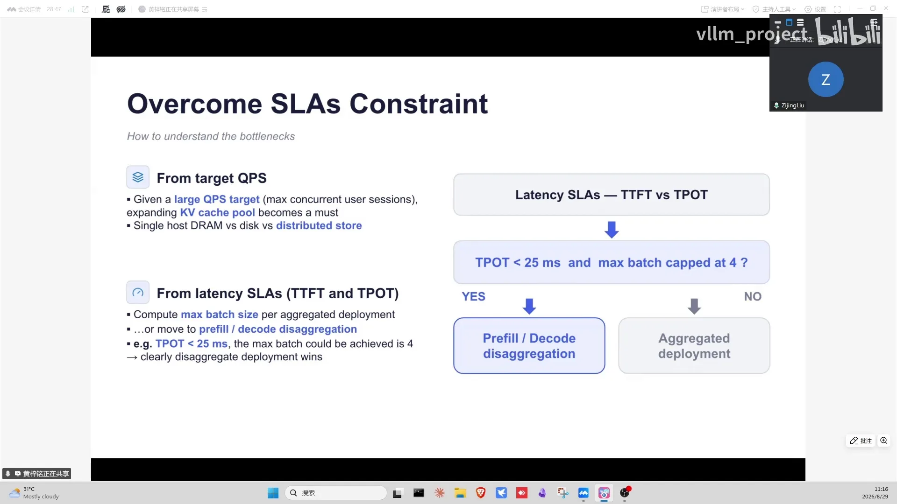 |
| （接上） [【跳转到 11:38】](https://www.bilibili.com/video/BV1Wv4k6YEdB/?t=698) |  |
| 然后 K3 的 MLA（Lightning MLA）跟传统 MLA 不同：kernel 层有特殊实现，我们在 vLLM 里做了适配。 [【跳转到 12:03】](https://www.bilibili.com/video/BV1Wv4k6YEdB/?t=723) |  |
| hybrid attention：sparse attention（KDA）+ MLA 的混合。prefix cache 需要两种 attention 的 cache manager 协调。 [【跳转到 12:28】](https://www.bilibili.com/video/BV1Wv4k6YEdB/?t=748) |  |
| latent MoE 的通信做了优化：reduce-scatter 替代 all-reduce 消除冗余计算（第 13 讲详述）。 [【跳转到 12:53】](https://www.bilibili.com/video/BV1Wv4k6YEdB/?t=773) |  |
| 多模态：K3 原生支持图片输入。生产场景大量截图请求，需要 ViT 的 batch 处理优化。 [【跳转到 13:18】](https://www.bilibili.com/video/BV1Wv4k6YEdB/?t=798) |  |
| 1M context：长上下文需要 CP、prefix cache、chunked prefill 的配合，跟 day0 支持时一样。 [【跳转到 13:43】](https://www.bilibili.com/video/BV1Wv4k6YEdB/?t=823) |  |
| 生产服务 SLA：TTFT P99 < 10s、ITL 低延迟（40 token/s）、tool call 100% schema 遵循。 [【跳转到 14:08】](https://www.bilibili.com/video/BV1Wv4k6YEdB/?t=848) |  |
| 多语言：K3 用户遍布全球，各种语源都要支持。多轮对话是主流（10+ 轮），上下文管理很重要。 [【跳转到 14:33】](https://www.bilibili.com/video/BV1Wv4k6YEdB/?t=873) | 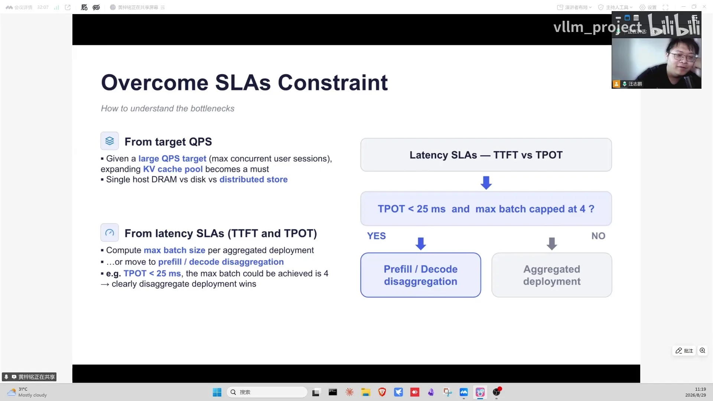 |
| traffic pattern 有明显高峰低谷，需要在浮动流量下保证系统稳定。 [【跳转到 14:58】](https://www.bilibili.com/video/BV1Wv4k6YEdB/?t=898) |  |
| 目标：所有要求达标下服务更多用户、每用户更多 token。技术核心是 scalability：100M token/min 到 billion token/min。 [【跳转到 15:23】](https://www.bilibili.com/video/BV1Wv4k6YEdB/?t=923) | 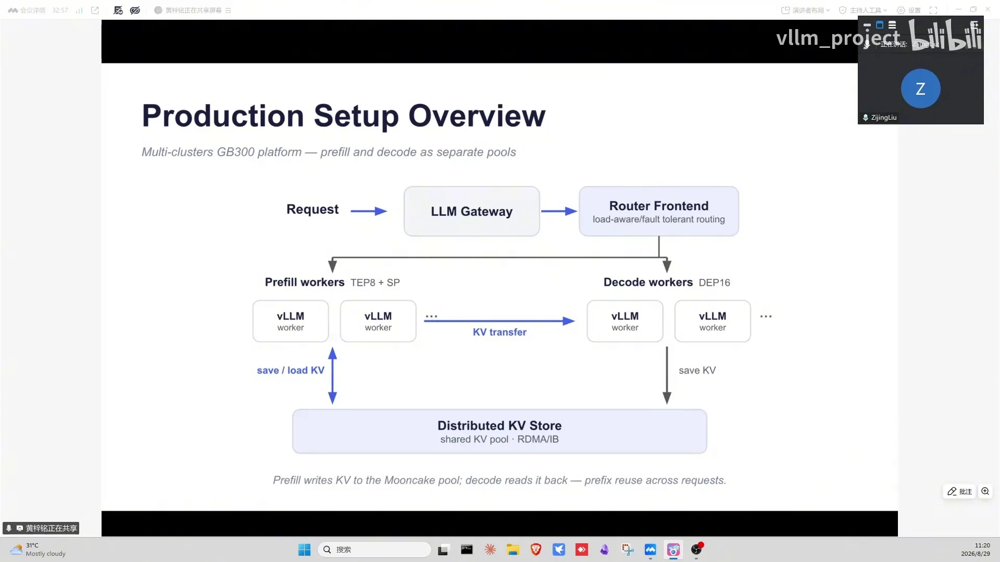 |
| 系统架构 high level：多机群 GB300 部署。最上层 gateway：统一入口、认证、限流、导流。 [【跳转到 15:48】](https://www.bilibili.com/video/BV1Wv4k6YEdB/?t=948) |  |
| gateway 按流量分发到不同 GPU 集群（10 个或 5 个），根据 workload 判断。 [【跳转到 16:13】](https://www.bilibili.com/video/BV1Wv4k6YEdB/?t=973) |  |
| vLLM router：负载均衡 + failover。集群部署出问题时 router 感知错误、把失败请求 retry 到新 node。 [【跳转到 16:38】](https://www.bilibili.com/video/BV1Wv4k6YEdB/?t=998) |  |
| 核心层：vLLM 部署，用了 PD 分离 + KV cache disaggregation。 [【跳转到 17:03】](https://www.bilibili.com/video/BV1Wv4k6YEdB/?t=1023) |  |
| PD 分离下 prefill 和 decode 分别部署在不同节点，通过 KV connector 传输。这是 vLLM V1 的原生能力。 [【跳转到 17:28】](https://www.bilibili.com/video/BV1Wv4k6YEdB/?t=1048) |  |
| K3 的 2.8T 参数在单节点放不下：必须多节点 TP，同时利用 EP 做专家并行。MXFP4 权重减小存储。 [【跳转到 17:53】](https://www.bilibili.com/video/BV1Wv4k6YEdB/?t=1073) |  |
| Lightning MLA 的 kernel 在第 13 讲详述过。hybrid attention 的 prefix cache 用 partial cache hit。 [【跳转到 18:18】](https://www.bilibili.com/video/BV1Wv4k6YEdB/?t=1098) | 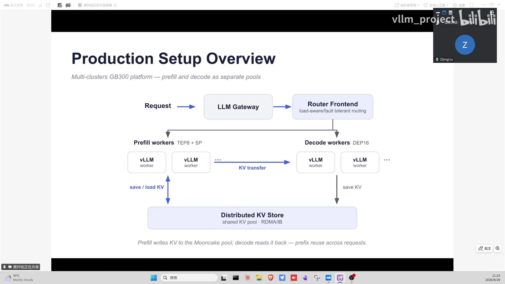 |
| 多模态：ViT 的 batch 处理，大量截图场景的图片编码优化。 [【跳转到 18:43】](https://www.bilibili.com/video/BV1Wv4k6YEdB/?t=1123) |  |
| 1M context：CP 切分长序列、chunked prefill + partial cache hit 管理状态。 [【跳转到 19:08】](https://www.bilibili.com/video/BV1Wv4k6YEdB/?t=1148) | 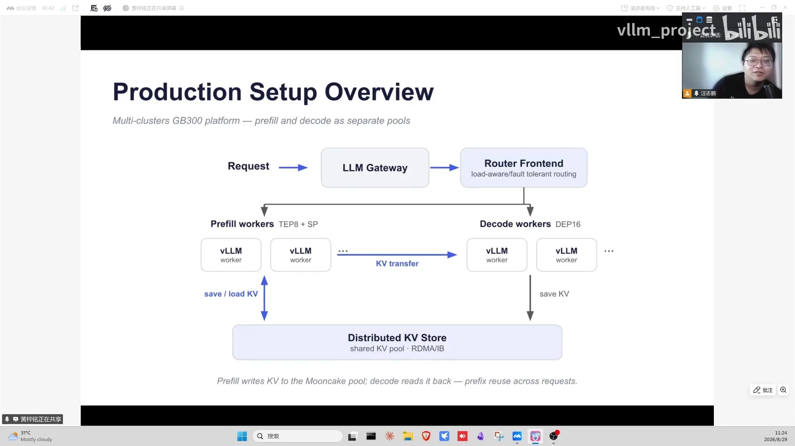 |
| 生产 SLA：TTFT P99 < 10s 要求所有场景（含 fallback）达标。 [【跳转到 19:33】](https://www.bilibili.com/video/BV1Wv4k6YEdB/?t=1173) |  |
| ITL 目标 40 token/s：decode 速度需要 CUDA graph + PDL 等 kernel 优化保证。 [【跳转到 19:58】](https://www.bilibili.com/video/BV1Wv4k6YEdB/?t=1198) |  |
| tool call 100% schema 遵循：vLLM 的 structured output + tool parser 保证。 [【跳转到 20:23】](https://www.bilibili.com/video/BV1Wv4k6YEdB/?t=1223) | 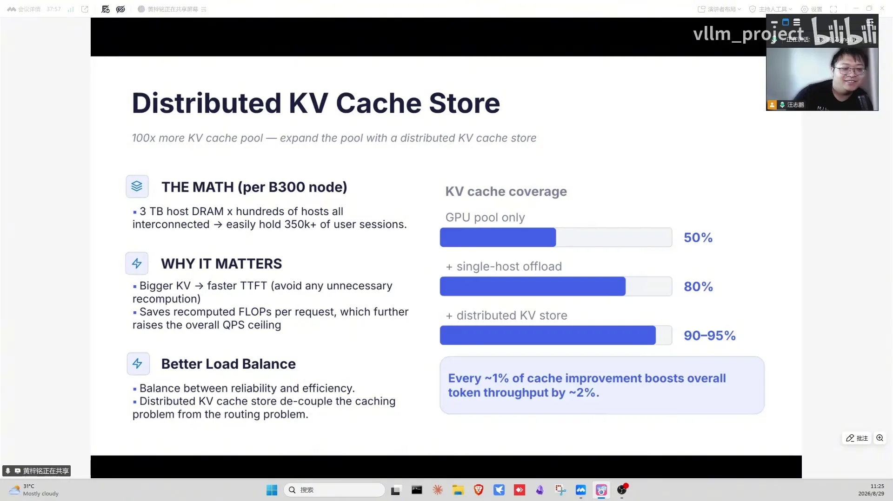 |
| 多语言多模态是 K3 区别于之前模型的重要特征，生产 workload 中图片和多语言占比显著提升。 [【跳转到 20:48】](https://www.bilibili.com/video/BV1Wv4k6YEdB/?t=1248) |  |
| 多轮对话：prefix cache 的命中率对性能至关重要，partial cache hit 在这里发挥价值。 [【跳转到 21:13】](https://www.bilibili.com/video/BV1Wv4k6YEdB/?t=1273) |  |
| traffic pattern 高峰低谷：部署要弹性伸缩，低峰释放资源给其他任务。 [【跳转到 21:38】](https://www.bilibili.com/video/BV1Wv4k6YEdB/?t=1298) |  |
| scalability：从 100M token/min 到 billion，需要多集群 + gateway + router 的全链路扩展。 [【跳转到 22:03】](https://www.bilibili.com/video/BV1Wv4k6YEdB/?t=1323) |  |
| 多机群 GB300：节点间 NVLink + 跨节点 RDMA，PD 分离的 KV 传输走 Mooncake。 [【跳转到 22:28】](https://www.bilibili.com/video/BV1Wv4k6YEdB/?t=1348) |  |
| gateway 层：认证限流导流，是生产部署的第一道门。 [【跳转到 22:53】](https://www.bilibili.com/video/BV1Wv4k6YEdB/?t=1373) | 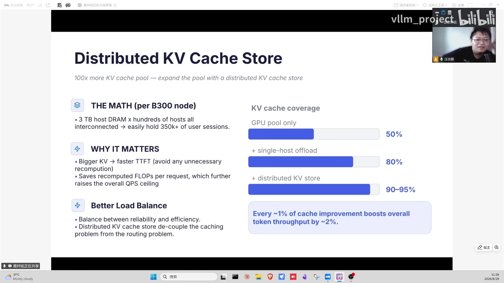 |
| vLLM router 是单独的项目，在 vLLM project 里可以找到。LMDeploy 也挺不错的。 [【跳转到 23:18】](https://www.bilibili.com/video/BV1Wv4k6YEdB/?t=1398) |  |
| LMD是指那个Kubernetesnative的BLM的这个BLMdeployment这么一个framing我觉得LMDDynamo和SMG加OME这三套下来的话其实都有各有各的特色我觉得这个你用哪个都不会错因为其实本质上的话没有非常核心的区别就是你其实基本上的功能都大大不差可能设计上 [【跳转到 23:43】](https://www.bilibili.com/video/BV1Wv4k6YEdB/?t=1423) |  |
| theimplementation上有一些区别但是设计原理上其实都是基于Kubernetes都是基于模块化也就是大家都是想的我这个是这个要非常好扩展我可以做大规模部署等等所以说我觉得怎么自己怎么哪个用起来舒服就用哪个应该是没什么问题的然后有同学说SMG最近好像把vLLM当做firstofkubernetes做的补充了不少东西 [【跳转到 24:08】](https://www.bilibili.com/video/BV1Wv4k6YEdB/?t=1448) |  |
| 是吗对的我们其实跟SMG从今年年初开始的合作还是有的就是SMG现在也不也是从Azureland这么一个社区里可能单独放出来了当到一个他自己的这么一个像是在尝试围护自己这么一个社区然后我们觉得就是所有这些前端fromandgateway其实都希望他们有很好的VM的支持 [【跳转到 24:33】](https://www.bilibili.com/video/BV1Wv4k6YEdB/?t=1473) |  |
| 因为我们不想说你用VM你就只能用VMRouter怎么做我们希望大家能有自己的选择想用什么样的Router都可以然后我们需要保证一些Router都能很好的支持比较好然后有同学问分布式缓存附载均衡测阶用Hasie还是用CacheAware有分布式缓存的话其实这里问了一个非常好的问题 [【跳转到 24:58】](https://www.bilibili.com/video/BV1Wv4k6YEdB/?t=1498) |  |
| 也是之后我可能要讲的但是就是当我们有分布式缓存的时候这个KV有Router的Routing就不是特别重要因为你不管Request发给哪个实力它都是能从分布式的KVcache的缓存这么一个系统里拿到的说这里面可能更多的考量是我怎么样做lowbalancing就是尤其在大流量的情况这边现在流量有Spire有高有低的时候 [【跳转到 25:23】](https://www.bilibili.com/video/BV1Wv4k6YEdB/?t=1523) |  |
| 我们更多的可能是关注的是我能不能把一个请求发给它最适合做的这么一个实力考虑的可能是这个实力的KVcache的Presure这个实力上Q的Request的长度和BatchRequest的长度可能有时候还会考虑我们的GPUization或者GPUTemperature这个Route基本上在有DeterioredKVcacheStore分布式缓存的时候KV的Wear这个东西就直接被Decoupling [【跳转到 25:48】](https://www.bilibili.com/video/BV1Wv4k6YEdB/?t=1548) |  |
| 就是Routing只负责lowbalancing所有的KVcache的Hit都有DischeveredKVcacheStore来处理然后有朋友问SanhaiFS这种分布式文件系统DepthC的是不是已经广泛使用了我认为DepthC应该内部是肯定是广泛使用但是仿建传闻我也没有一手消息就是DepthC的DataCenter [【跳转到 26:13】](https://www.bilibili.com/video/BV1Wv4k6YEdB/?t=1573) |  |
| 也是自己搭的说他们的很多东西是非常强的硬件软件的一个结合然后在开源社区的话包括我自己经历过的这些公司里的做叫大规模部署SanhaiFS也好还是说每个公司自己里面DischeveredFilesStore的话很少有拿来做KVcache可能做Samsha的Backup [【跳转到 26:38】](https://www.bilibili.com/video/BV1Wv4k6YEdB/?t=1598) |  |
| Waste的BackupWaste的TransferWaste的Dischevered这些是有的但是我真的可能也是我那边的件子不够确实没有看到在生产上真的用上来除了我听说DepthC确实有用之外然后还有朋友问怎么看CassaynaCassayna其实我不是特别了解什么是Cassayna这是还我第一次听说我不知道特别是这么读的 [【跳转到 27:03】](https://www.bilibili.com/video/BV1Wv4k6YEdB/?t=1623) |  |
| KTH我还真没听说过,我也是第一次听到。然后还有同学问,什么方式分布式KV的流量和模型推理流量的和模型推理通信的流量抢代款会影响O2O的通信? [【跳转到 27:28】](https://www.bilibili.com/video/BV1Wv4k6YEdB/?t=1648) |  |
| 对的,首先O2O的通信的话,我们肯定是走NVLink的,因为在Gb300的一个这么一个机器上的话,这种所有的collective,就是我们实力以内的collective,就算你是YDP,就是跨机部署,还是单机部署,基本上这些都是走NVLink的,说这一块不会跟我们KVtransfer的流量或者分布式KVtransfer的流量去做抢代的。 [【跳转到 27:53】](https://www.bilibili.com/video/BV1Wv4k6YEdB/?t=1673) |  |
| 至于分布式KVcash的流量和我们PV的流量会不会有冲突?其实我们在身上看还好,其实还好,IV的Ban位在我们看下来的话,处处有余可以这么说。然后我自己也一个理解,为什么这是这么一个情况呢?因为现在其实你的decoading的时间会绽绝大多数,就是如果你看一个请求的N2O的时间,就总共从头到尾整个花了时间, [【跳转到 28:18】](https://www.bilibili.com/video/BV1Wv4k6YEdB/?t=1698) |  |
| 其实你大部分时间做decoading,你做500、800、1000这么一样,一个模型的输出,所以说一个request中间多数时间都在做deco,你唯一需要从preview传统式给deco,或者preview从你的分布式KVstore里面拿的时候呢,其实它在你总个集群的这个时间是相对来说是比较有限的。 [【跳转到 28:43】](https://www.bilibili.com/video/BV1Wv4k6YEdB/?t=1723) |  |
| 并且你不会说我的concurrent或者同时在向用户的上限是被narrowing网络的带宽所限制的,大部分情况下你同时能接收多少的用户是取决你有多大的KVcashpool的。所以说那个其实是早远先于你这个网络通讯变成一个暴动男的,说大部分情况下我们自己看到的话,网络通讯至少在我们看到的这么一个流量下来,它并不是一个太大一个concentration。 [【跳转到 29:08】](https://www.bilibili.com/video/BV1Wv4k6YEdB/?t=1748) |  |
| 其实我们之前有找iomecash和mokazelle同学分享过就是关于decreview的cashpool这一块的东西,然后我记得当时也有讲过就是短请求和长请求的话,那么它优先处理短请求,然后长请求它是会直接去拉这个cashpool, [【跳转到 29:33】](https://www.bilibili.com/video/BV1Wv4k6YEdB/?t=1773) |  |
| 然后到了长请求的时候,你就可以把就直接用拉过的cashpool来做后面推理,然后对,然后有同学问同学说cathina是我cano社区做的couvernet的这个原生LM, [【跳转到 29:58】](https://www.bilibili.com/video/BV1Wv4k6YEdB/?t=1798) |  |
| 我可能真的还确实从来没用过,所以说我可能也没办法这个回复这个这个问题,但是听起来还蛮有趣的,couvernet的原生LM这个其实还是这个听起来还是挺有趣的,可能之后会去了解一下。我们后面可以去看一看,然后如果有就直播间有懂这块同学可以在弹幕里面补充一下,好,那我们继续分享吧。 [【跳转到 30:23】](https://www.bilibili.com/video/BV1Wv4k6YEdB/?t=1823) |  |
| 对,其实这个这个篇章其实讲了很多我们刚同学问到的问题,其实我们我们这边做的很简单的算数就是,我们如果用b300的话这个no做做做个例子,那么一般来说一台b300它大概有三个terebites的这么一个内存,那如果当你有一百台这么样的机器的时候呢,你就大概会有300terebites,这么的一个KV cachepool,那当你有200, [【跳转到 30:48】](https://www.bilibili.com/video/BV1Wv4k6YEdB/?t=1848) |  |
| 所以继续往上翻了,所以你会发现呢,当你把所有这些cpu内存联系到一起的时候,它的这个存量是相对来说非常非常大,尤其是大部分用户的session大部分用户不是所有用户大部分用户session呢,它会在一定的时间内完成,它并不然说我一个session要存一个月,我每天过来问两个问题, [【跳转到 31:13】](https://www.bilibili.com/video/BV1Wv4k6YEdB/?t=1873) |  |
| 我每天再问两个问题,你后天再问两个问题,然后要一个月,那么我们需要一个地方要把这一个月,过去一个月的这个sessionhistory都存下来,大部分情况下不是这么回事,大部分情况下用户还是能在分钟的小时或者十小时之内就是把它这个sessioncomplete,所以说呢,你可以想象,当你有300TB或者3000TB,当你有一千台这么样的机器的时候,3000TB这么连到一起的分布式KV cachestore的时候, [【跳转到 31:38】](https://www.bilibili.com/video/BV1Wv4k6YEdB/?t=1898) |  |
| 它就能基本上把你流量你所有的concurrent的这个用户的history,这个这个历史全部都保留下来,然后这里面呢,为什么这很重要呢?其实刚刚很多同学有说,首先我KV cache很大,我就不需要做重计算了,那我当然我这个ttft就肯定相对来说短了,就是我可以直接把之前的KV cache直接拿出来复用了,俗指之外呢更重要的一点是,如果我们不用做这个重新计算,那么重新计算这些省下来的flops, [【跳转到 32:03】](https://www.bilibili.com/video/BV1Wv4k6YEdB/?t=1923) |  |
| 这些convutationpower,我们可以拿来去做新的session的介入,新的流量介入,那么你这么看的话,你整体这个这个这个部署的这个这个qps的上限就被拉高了非常非常多,所以这是KV cache,d2KV cache带来的两个好处,就是一个是你变得快了,你的latency变短了,其实呢你总量也因为变短,而拉高了。 [【跳转到 32:28】](https://www.bilibili.com/video/BV1Wv4k6YEdB/?t=1948) |  |
| 最后呢就是这个battlelowbalance,你这个负载均衡也是刚刚一个同学问到的,以前我们做负载均衡是如果你没有分布是这个qvcash多的话,你必须要考虑两个问题,同时一起考虑,第一个是我必须要考虑复杂的问题,我必须要保证这个一个流量进来之后,我必须得发给一个相对来说比较balance,比较均衡的一个实力领取, [【跳转到 32:53】](https://www.bilibili.com/video/BV1Wv4k6YEdB/?t=1973) |  |
| 但同时呢我又想把一个请求发给一个实力,如果这个实力有这个请求之前的历史,之前的KV cache,那么你很多时候就会有个很难做抉择的地方,就是当你一个实力变得非常非常好,变得非常非常的受欢迎,就是很多的这个这个用户的这个session都打过去的时候,然后当你来了新的这个session的新的request的时候,你就要说,哎,我是不是还得把这个请求发给这个实力,因为这个实力有这个请求的KV cache,但是这个实力已经接近80%,其他的可能大部分实力还在50%的水位, [【跳转到 33:18】](https://www.bilibili.com/video/BV1Wv4k6YEdB/?t=1998) |  |
| 那你就要做一个很痛苦的选择,我是发给他呢,还是不应该发给他,你发给他呢,那他就变得更不均匀了,如果你不发给他呢,你就会就会产生很多很没有必要的重新计算, [【跳转到 33:43】](https://www.bilibili.com/video/BV1Wv4k6YEdB/?t=2023) |  |
| 当你有这个分布式这个KV cachestore的时候,这个问题就是完全就是不存在了,你就直接把这个问题解决了,你的router就只用关心附载均匀的问题,所有KV cacheheating,所有KV cache或者KV cache附用的问题全部都被这个分布式的KV cachestore可以解决了,相当于你不把两个问题揉到一起了,你把两个问题分开,然后用各自的一个一个一个一个一个一个一个解决办法一个一个component去解决各自的问题, [【跳转到 34:08】](https://www.bilibili.com/video/BV1Wv4k6YEdB/?t=2048) |  |
| 那么这边有些数字我们其实也想分享一下,当我们做一些比较简单的实验就是如果我们什么都没有,我们只用GPU的HBM做KV cache大概就50%,50%的这个KV cacheheat,如果我们加了这个singlehostoffloading就是我单机的offload到DRAM上去或者加上host,大概能提高到80%,如果我们做了dcvcashstore的时候,我们就能提高大概90%到95%,已经非常接近于理论上限了,并且在这个提高的过程中我们还注意到基本上1%的这么一个cashimprovement, [【跳转到 34:33】](https://www.bilibili.com/video/BV1Wv4k6YEdB/?t=2073) |  |
| 你就能提高总体的tokenthroughput大概是2%,那么如果你当你处理一个比方说100billiontoken这么一个scale的一个集群的时候,没2%是2%就接近已经是很大,比方说我们这200million的这么一个token, [【跳转到 34:58】](https://www.bilibili.com/video/BV1Wv4k6YEdB/?t=2098) |  |
| 所以说在上一上来说的话,它其实大领域上还是相对比较大的,下一张,对,然后这里大概讲一下我们的分布是这个这个这个这个kvcashstore的一个实现方法,我们其实是用了munkake,munkake也是我非常非常个人非常非常喜欢,我们其实团队里面各个同学都是非常非常喜欢这个这个产品, [【跳转到 35:23】](https://www.bilibili.com/video/BV1Wv4k6YEdB/?t=2123) | 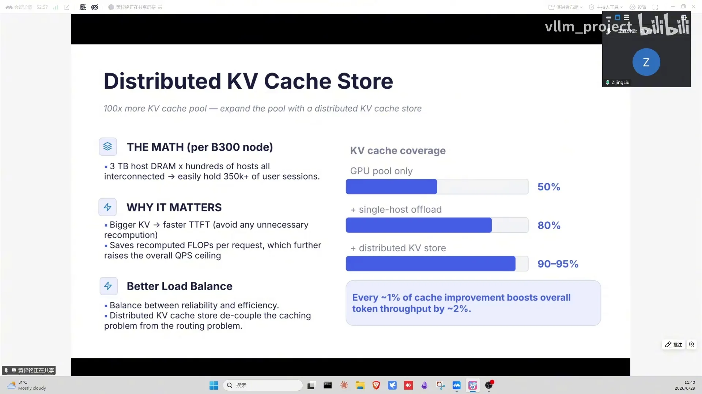 |
| 其实munkake这个是做了非常非常到位的这么一个dcvcashstore解决方案,那么基本上呢我们的部署呢可能相对来说比开源社区大家一般会用的部署会稍微在不同的地方是呢,我们的munkake会是一个单独的一个实力,那比方说我这里有我这举了个gb3100mv072这么这么一个集群就有我们这个我们这个机箱里面72张gb300的卡,那么我们的这个munkake的实力会变成72个,就是每个node每个node大概是上卡的吧一共一共应该是72除16对18个18个实力,相当于是我们本来的munkake, [【跳转到 35:48】](https://www.bilibili.com/video/BV1Wv4k6YEdB/?t=2148) |  |
| 我们把这个munkakestore这个实力和你bm的实力是分开了的,就是 [【跳转到 36:13】](https://www.bilibili.com/video/BV1Wv4k6YEdB/?t=2173) | 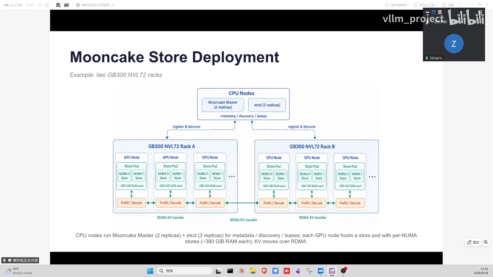 |
| MoonKStore負責把每個Node上的所有的CPU的DRAM都持進去比方說這如果裡面GP300應該沒有3TB35拿3TB的舉例這樣簡單比方說我一個Node上3TB的CPU那麼我們可能就讓這個MoonKStore吃掉2.5TB或者2.8TB的CPU分布式的KPCastor那麼剩下的可能200G或300G [【跳转到 36:38】](https://www.bilibili.com/video/BV1Wv4k6YEdB/?t=2198) |  |
| 會放給V1AM做必要的RAM上面的一些Buffering這裡面帶來一個好處就是說我們的V1AM這些實力你是可以隨便動的你是可以給它進行做一些更新或者給它做擴容或者給它做減容就DOWNSKILL、UPSTILL或者甚至有的時候你的V1AMCRASH了或者V1AM遇到問題了CRASH重啟了你的KVCache是不會損失的 [【跳转到 37:03】](https://www.bilibili.com/video/BV1Wv4k6YEdB/?t=2223) |  |
| 它不會因為你V1AMCRASH了那我相對於KVStore也CRASH了並不會有這個情況所有的KVCache都offload到它們單獨的這麼一個MoonK的實力並且這些所有的MoonK的實力都是通過RDMA、IV、IV的Fabric是連接到一起的然後它們所有的這些實力都通過MoonKMaster這麼一個控制面板就來控制它們我現在一個KVCache來了 [【跳转到 37:28】](https://www.bilibili.com/video/BV1Wv4k6YEdB/?t=2248) |  |
| 我應該放到哪個MoonKStore的實力裡面我該怎麼做Shorting我該怎麼做Lucas就是單獨放到另外一個MoonKStore這麼一個控制面板上的基本上整套了這麼一個想法就是說我希望整個KV的分布式的KVStore它應該在自己的這麼一個環境裡去跑跟我們所有的V1AM的普通的V1AM的RunningV1AMC一個Evacuum進行幾偶這樣它們之間互相不影響對方 [【跳转到 37:53】](https://www.bilibili.com/video/BV1Wv4k6YEdB/?t=2273) |  |
| 下一個麻煩對然後KVCache是非常非常重要同時也是我們剛才這個Cache的時候講的一個事情就是說我說我們這些照片其實Modality其實也是一個非常非常痛苦的事情我們發現其實有的時候你一個請求裡面可能會有大幾張照片然後裡面你也不知道是怎麼來了尤其是你在做ModityTern多輪繪畫的時候 [【跳转到 38:18】](https://www.bilibili.com/video/BV1Wv4k6YEdB/?t=2298) |  |
| 之前繪畫的歷史會不會保存下來那麼一旦它在某一輪請求裡發了50多張照片40多張照片那麼之後每一輪請求都會有這麼多張照片那麼這裡面就會涉及到一個很痛苦的問題就是我怎麼樣把這照片給它擋下來然後放到我的V1AM裡面去跑那麼這裡面就involve了非常非常多這些我們網絡上的這麼一些煉路我們拿到了這個照片的一個URL [【跳转到 38:43】](https://www.bilibili.com/video/BV1Wv4k6YEdB/?t=2323) |  |
| 我們要進行去做一個DownloadDownload下來之後我們要做Image的一些pre-processingrecessingnormalization做完之後我要放到我們的VisionEncoder裡面VIT裡面去拿到它的引擺領最後才能做RMPreview其實Image的話它相當於總非常非常多的煉路然後這裡面的話我們其實在實力上看到的話這個ImageDownloading這個部分它其實是佔TTFD非常非常大一部分 [【跳转到 39:08】](https://www.bilibili.com/video/BV1Wv4k6YEdB/?t=2348) |  |
| 然後我們可以看一下下載Download下來它佔的部分甚至差不多50%就是可以說就是說這個就因為這個圖片這個處理的煉路的問題我們基本上50%的時間都在搞這些事情剩下50%的時間你可能在跑Preview啊在做KVTransfer所以我們這邊就做了一些比較比較比較shareforward一些cashinthecell做 [【跳转到 39:33】](https://www.bilibili.com/video/BV1Wv4k6YEdB/?t=2373) | 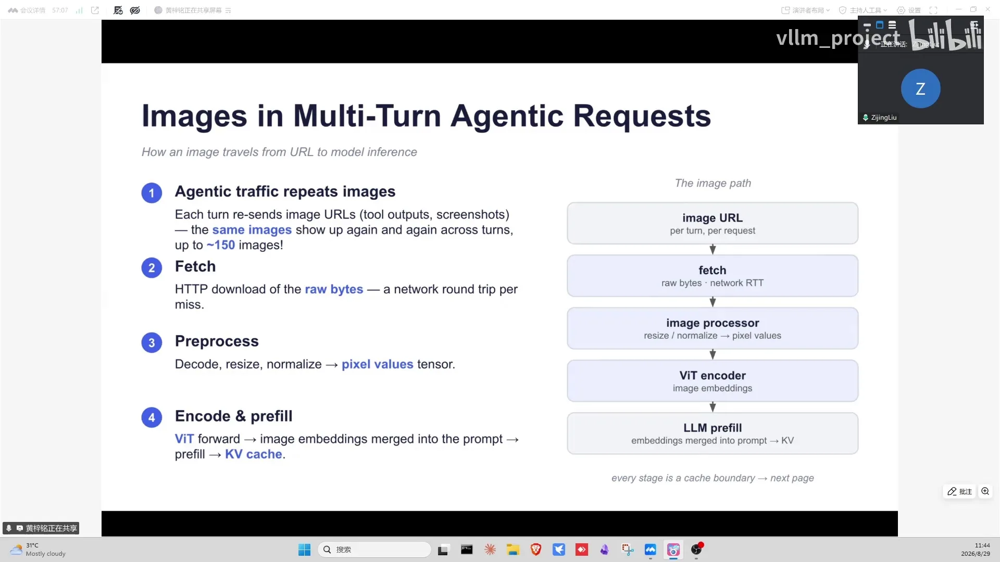 |
| 第一呢我們是Fatchcash就是說多輪後化率如果你這個50多張照片在上一個上一個請求的已經出現了那麼我已經下載過一次了當你這個下一輪的請求又來的時候同一輪對話再下一個請求又來的時候帶著上一輪請求歷史的50張照片的時候我們其實這個時候就不想再去Download因為這個Download是非常花時間的那麼我們這裡呢就是用到一個非常常見的在分布式形容裡面用到一個東西叫Redius [【跳转到 39:58】](https://www.bilibili.com/video/BV1Wv4k6YEdB/?t=2398) |  |
| 這個DissuitedRedius這麼一個Server那麼RediusServer可能我們開個500G開個兩個Tabbytes那麼我們可能設一個TenttoLeaf我們就是一個小時或者30分鐘因為圖片來說呢不會一直一直被反不使用大概就在這個時間當然被使用完了之後就再也不會出現了基本上我們拿到RediusCacheEnabled的時候我們發現所有圖片就是整個流量裡面的所有圖片95%都是有cashin的 [【跳转到 40:23】](https://www.bilibili.com/video/BV1Wv4k6YEdB/?t=2423) |  |
| 意思就是說大部分的圖片都會被反覆的附用那麼除此之外呢我們還有L2和L3的這麼一個cash比方說我們這個pre-processingofcache意思就是我圖片下載下來了那我如果做過recessingnormalization如果所有這些參數都一樣的其實我最後做完pre-processing的這麼一個圖片應該也是可以被附用的那麼這裡面可以做一個MultimalizedProcessingofCache除此之外呢再往下走的話呢就是我們EncoderCache [【跳转到 40:48】](https://www.bilibili.com/video/BV1Wv4k6YEdB/?t=2448) |  |
| 就是如果我的圖片完全一樣日出里也完全一樣那麼基本上我可以認為同樣的圖片一直跑到VIT就是我們的VisionEncoder之後出來的結果都應該是一樣的那麼其實我們可以前面的附用就可以不用管了我直接附用最後這一塊就是EncoderCache那麼這裡面就是VIT的OutputImpending當然了這塊現在還不是一個特別完善的一個解決方法現在社區上呢 [【跳转到 41:13】](https://www.bilibili.com/video/BV1Wv4k6YEdB/?t=2473) |  |
| 我們應該是我們公司的一個同學應該是有一個初步的版本出來了我們這裡面的內部呢還在在生產上做實驗我們就是希望呢再接下來的時間能把這個東西推出去當我們把1234這些所有這些cache加在一起的時候尤其是FatchCacheProcessCache加在一起的時候就像我剛剛講的我們大概省了一共大概53%的TTFT可能以前是要跑20秒現在可能直接10秒就搞定了說這一塊省的流量其實 [【跳转到 41:38】](https://www.bilibili.com/video/BV1Wv4k6YEdB/?t=2498) |  |
| 一方面省的Latency很多第二方面呢我們給我們這個網絡的就IngraseGraph也省了很多的很多的來源大概這些就是我們第一個部分大概講了很多可能從比較宏觀的一個層面講了這個K3大光幕部署上面的一些我們做了一些決定看到一些有趣的東西那麼接下來看來可能好我們我看我們直播間 [【跳转到 42:03】](https://www.bilibili.com/video/BV1Wv4k6YEdB/?t=2523) |  |
| 已經介來了很多問題了我們來回答一下問題好的好的有朋友要問構建KVPore的時候會把所有的機器都盡可能放在一個Pore嗎還是我一個Pore會設置一個上限我們的做法是盡量多然後呢而且是我可以舉個例子如果你一個機器層裡面有5000台5000台機器然後呢 [【跳转到 42:28】](https://www.bilibili.com/video/BV1Wv4k6YEdB/?t=2548) |  |
| 你可能有的部署不需要KVCacheStore有的部署需要KVCacheStore那麼如果你那個那個CPU上的D-RAM三個TireD-RAM放到那裡也是放對吧不用也是浪費那不如把它全部都連到一起你把它全部都連到一起生成一個CacheStore然後的時候你可以給所有的模型去共用它因為Munkey這裡面呢它是它並不會混用的就是你可以你在用Munkey做KVCacheStore的時候你可以給你存著KVCache [【跳转到 42:53】](https://www.bilibili.com/video/BV1Wv4k6YEdB/?t=2573) |  |
| 帶一個Preface的這麼一個T就是說你比方說我可以現在有個K3 的模型我有個M3的模型或者我K3 的模型上面有不同的版本我有個Fantrum的版本一Fantrum版本二這些所有的這些模型都可以共用一個MunkeyStore只要它們用的這個Munkey的T不一樣那麼它們這家互相的KVCache就不會被污染這麼做的好處就是呢你能把所有的資源都一起用起來 [【跳转到 43:18】](https://www.bilibili.com/video/BV1Wv4k6YEdB/?t=2598) |  |
| 你不用在乎我是不是有些東西沒用到我有些東西被用到你把所有東西都連起來那只要我有需求我就往裡放我沒需求的話那我就不往裡放就好了我們覺得這樣的一個做法是比較簡單的並且呢維護起來的話呢也相對來說容易一點然後有同學問PD分離上一下MunkeyStore和PD的話同交換機部署和跨交換機部署延遲或者吞吐區別大嗎 [【跳转到 43:43】](https://www.bilibili.com/video/BV1Wv4k6YEdB/?t=2623) |  |
| 同交換機部署的話我能理解是這個就是說我在同一個機架裡面做嗎就是我不走我不會經過我這個TopoftheRackSwitch是這個意思嗎我理解是這個意思哦對對對這裡面的話呢其實如果我們單看只有我們自己的話我們的MunkeyStore呢是做了跨交換機部署的 [【跳转到 44:08】](https://www.bilibili.com/video/BV1Wv4k6YEdB/?t=2648) |  |
| 因為我們的當然這個你的集群有關係就是你的集群是不是能有interconnectedbyIV就是我每個機架之間都是有InfiniteEvent連接的或者有Rocky連接的就是有沒有這個RDMA的這麼一個一個fabric這個網線把所有的這個集群都連到一起如果有的話呢其實跨機器的這個部署呢問題也不是特別大就是可能你那邊確實有一些延遲 [【跳转到 44:33】](https://www.bilibili.com/video/BV1Wv4k6YEdB/?t=2673) |  |
| 但是呢其實你跟其他的延遲比起來它非常維護其位我可以舉個例子就是我們KBTransfer大家可能一年前大家講KBTransfer就分PD分類的時候就會說很在乎就是說哎我這個東西不曉得快要很快但是呢你可以看我們現在這種Agenic生產部署下面我們的TTFT的要求是10秒鐘KBTransfer再慢再慢 [【跳转到 44:58】](https://www.bilibili.com/video/BV1Wv4k6YEdB/?t=2698) |  |
| 500毫秒撐死了說500毫秒在這10秒鐘的這個Budget裡面其實它的佔比是相對來說非常少的那麼你可能同機和跨機裡面可能你500毫秒撐到300毫秒或者300毫秒撐到250毫秒所以230毫秒這裡面省的這個100毫秒呢對總體的這個SLA的concentration來說呢是相對來說是有限的這個同樣的道理也可以apply到這個這個這個這個MunkeyStore上面來看 [【跳转到 45:23】](https://www.bilibili.com/video/BV1Wv4k6YEdB/?t=2723) |  |
| 對然后有重新问,就是刚才讲这个英文集的部分,这个英文集是用物发的吗?对对对对,就是你给个例子吧,我不是Frontend,我有时候需要做些Frontend的东西,那我可能就开一个CloudCode,然后我给它截了个图,我说你就照这个网站给我搞一个,我可能截了很多张图,我说这个网站这个主页这样子分页这样子,流览页这样子, [【跳转到 45:48】](https://www.bilibili.com/video/BV1Wv4k6YEdB/?t=2748) |  |
| 那么我会做这样的操作,说我现在看到的很多流量呢,也是可能是这样直径下,因为肯定有很多写Frontend的人,他们也在用K3做这些Coding相关的工作,所以说这是用户发生过来的图片,对。然后有同学问,衡量一个Note的负载是看它的Power,Request还是GPURealization? [【跳转到 46:13】](https://www.bilibili.com/video/BV1Wv4k6YEdB/?t=2773) |  |
| 我们现在,我们尝试过不少,但我们现在觉得最好用的还是GPURealization?以前可能一些做法,大家会看我这个一个Note上面,我这个Q的请求有多少,比方说我Q的请求有10个,另外Q的请求只有5个,或者我这边跑的请求10个,那边跑的请求只有5个,我可能用那个请求的数量来判断,后来我们发现在AgenticWorkflow上面,这个不是很好用, [【跳转到 46:38】](https://www.bilibili.com/video/BV1Wv4k6YEdB/?t=2798) | 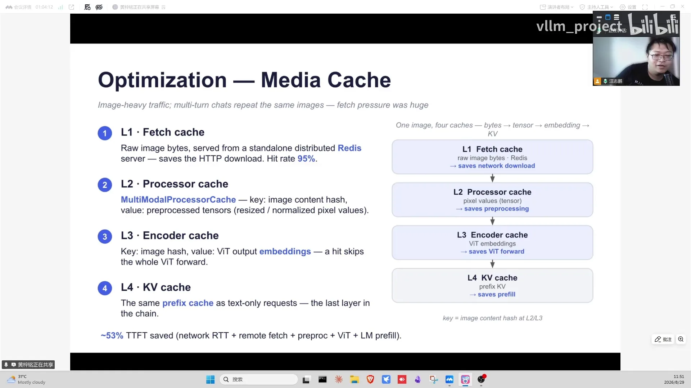 |
| 因为你Request和Request它带来的这个工作量可以差非常非常多,你可能有个Gurl面直接把一本书塞给你了,你要打满一个Million的Contact,那么有个Gurl面可能还在Hollower的,那这里面差距就是非常非常大了,所以我们尽量还是用KVcashRealization来判断这个Workflow的大小,那么目的就是说我希望整个集群里面所有的实力的KVcashRealization都上下就Minimum和Maximum尽量不要超过10%, [【跳转到 47:03】](https://www.bilibili.com/video/BV1Wv4k6YEdB/?t=2823) |  |
| 就比方说我最少最少有我Minimum的KVcashRealization在整个集群里是40%,那我希望Maximum最多最多50%,这样我能保证这个负载均匀是在一个相对比较完美的一个双倍下的。然后有同学问多准这话被开启D节点和KV写入缓存吗?我们现在并没有,我们现在的做法还是P节点读写缓存, [【跳转到 47:28】](https://www.bilibili.com/video/BV1Wv4k6YEdB/?t=2848) |  |
| 然后拿到缓存算完整个输入之后通过PDTransfer,就是KV传输这么一个做法,把他发送给D节点。当然现在也有些做的尝试是说,我D节点可以直接从MoonKStore里面去拿现有的KV缓存, [【跳转到 47:53】](https://www.bilibili.com/video/BV1Wv4k6YEdB/?t=2873) |  |
| 然后P节点就只用发送它中间插的那部分,比方说它可能过去历史有大概250K的这么一个历史,然后它又发了一个请求过来,它带了250K的请求历史加上100K的新的token,那么可能250K的历史我们D节点就直接从MoonKStore拿了,同时我们的P节点会去做Preview的运算,并且把多于100个token发给D节点。这么样做的一个好处就是你可能长一点, [【跳转到 48:18】](https://www.bilibili.com/video/BV1Wv4k6YEdB/?t=2898) |  |
| 你可能减少一点你的TTFD、你的延迟,因为你这个MoonK的传输和你这个Preview端的Computer和传输可以是同步的,但是还是那个意思,就是在我们有10秒钟的这么一个TTFDbudget的时候,你是300毫秒总传输还是200毫秒总传输,它对整体的影响还是相对有限的,并不是没有影响,只不过说影响相对有限。 [【跳转到 48:43】](https://www.bilibili.com/video/BV1Wv4k6YEdB/?t=2923) | 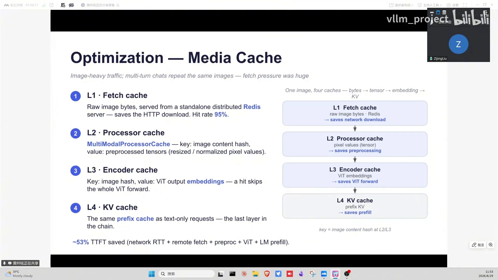 |
| 然后有同学港台说我们这一次直播刚过很多呀。哎呀,是不是讲太多不该讲了吗?我们每次直播刚过都会很多的,就是如果对我们的频道感兴趣,一定要帮我们的频道点个关注,然后后面我们上场直播回放之后,大家一定要记得一键三连。好,然后还有同学问,一个MoonK的实力一般都还多少才读的, [【跳转到 49:08】](https://www.bilibili.com/video/BV1Wv4k6YEdB/?t=2948) |  |
| 构成多大的错呀?呃,Grease吗?那你1000台B300的集群,以一个B300上3个Targetbytes,1000的话就是3000Targetbytes,我们的做法还是尽量把他们全部都连到一起,就不浪费任何一台机器上的CPU的D-RAM。嗯,然后还有同学问,为什么用三层Cache不直接CacheIncode的结果? [【跳转到 49:33】](https://www.bilibili.com/video/BV1Wv4k6YEdB/?t=2973) |  |
| 呃,是可以的,这个其实呢,它不是这个图这个L1、L2、L3呢,其实它更多的是一个我们工作的一个很自然的顺序,就是我们先做的FastCache,然后再尝试DeepDive到ProjectedCache,再往下做Incode的Cache,就是这个L1、L2、L3并不是我们一个技术上的这个分层,而是其实说我们的工作这个,这个这个前后顺序是怎么来的, [【跳转到 49:58】](https://www.bilibili.com/video/BV1Wv4k6YEdB/?t=2998) |  |
| 所以我们就保留了。当然我觉得是以后,以后是不是我们只需要Incode的Cache就好了,因为如果你图片一样的话,怎么着,我就可以复用或怎么样,你的Resize这些都一样,那我是不是都可以复用?我觉得这一块是很多可以值得讨论,值得研究的,因为图片在可能去年的时候吧,我自己看到图片根本就不是那么重要的东西,大部分时候你ToolCode啊,文字可能占了你绝大所有的流量, [【跳转到 50:23】](https://www.bilibili.com/video/BV1Wv4k6YEdB/?t=3023) |  |
| 但是就是最近可能这几个月以来,我们看到图片变成一个非常重要的一个这个请求的一部分了,以前从来没觉得他们图片会那么重要,现在突然发现,哇,所有人都在发图片,而发图片发这么多张,所以说这里面其实有很多可以值得讨论和值得研究的东西。有同学问和LMdeploy比如何?LMdeploy其实我自己没有用过说实话,然后我自己比较, [【跳转到 50:48】](https://www.bilibili.com/video/BV1Wv4k6YEdB/?t=3048) |  |
| 我像这个就是整个Coopinality这个这个架构里面做LMinferencedeploy,就是我刚刚提到那三个一个是Dynamo,一个LMD,然后还有就是SMG加OM,这三个是我相对来说,呃呃呃有有有觉得还是不错的,其他确实没有经历全部都试一遍,对对。还有同学问上层网关设法直接获取KVCash信息吧, [【跳转到 51:13】](https://www.bilibili.com/video/BV1Wv4k6YEdB/?t=3073) |  |
| 图片抓取都不在一个定程?呃上层网关没法直接获取KVCash信息吧,呃这个我不太不太明白这个问题是是什么,对但是就是我刚刚讲了这个我们这个FatchCash的话呢,它可能就是对UILO做一个SignatureChap, [【跳转到 51:38】](https://www.bilibili.com/video/BV1Wv4k6YEdB/?t=3098) |  |
| 如果SignatureMatch的话呢,我们就从这个Radius里面拿,说这个的话可能跟KVCash的关系并不太大,我不知道我这个理解这个问题对不对,嗯,哦,然后我,我然后有同学对于刚才这个呃这个呃KVCash的这个POR不是可以部署多个模型吗?然后所以我想跨模型没法KVCash席二人吧,内容结构都不选, [【跳转到 52:03】](https://www.bilibili.com/video/BV1Wv4k6YEdB/?t=3123) |  |
| 不选,一定一定不能席,一定不能选,所以说所有的这些你的部署的这些实力,它一定要带有自己专属的这么一个key,就是你可以想象你所往这个store里面存的东西呢,它是有自己的一个key的,比方说我是紫进,那我所有我的部署下面,它会带一个key叫紫进,那么紫名存呢,它可能就带个叫紫名,这个跨模型之间这个这个KVCash的共享在生产上, [【跳转到 52:28】](https://www.bilibili.com/video/BV1Wv4k6YEdB/?t=3148) |  |
| 是非常非常非常高位的一个操作,因为生产上最忌讳的就是串流,就是你一定不能让你当前的请求,赌到别人请求的KVCash,或者赌到不该赌的模型的KVCash,这个就是一个非常非常严重的生产问题了,所以我们所有做的一些所有的操作,所有的conciliation,都会把这一点放到第一位,然后请问生产上会开layerwise的模式吗? [【跳转到 52:53】](https://www.bilibili.com/video/BV1Wv4k6YEdB/?t=3173) |  |
| 生产上会开layerwise模式卸载吗?你的意思是waitoffloading吗?我们去你的layerwise模式,对对对,就是这个?这个说实话,这个waitoffloading,我只在给DPCV4Pro打benchmark的时候,语问过这个操作,因为DPC那个当时还是挺大的,然后preview那边KVCash实在不够了, [【跳转到 53:18】](https://www.bilibili.com/video/BV1Wv4k6YEdB/?t=3198) |  |
| 所以说我当时当时我做过这个操作,就是我这个每三个layeroffload一层,然后省下来KVCash,新量把basshigh打满点,但是在生产上确实没有做这个,因为生产上的话,我们经过时候,之后之后子民会讲很多conciliation,然后呢,我们其实做了很多操作,把KVCash这么一个,这个比较太的这个一个情况给它解决了,就是我们在生产上,通过一些操作,让这个KVCash并不变成一个bassonegg, [【跳转到 53:43】](https://www.bilibili.com/video/BV1Wv4k6YEdB/?t=3223) |  |
| 然后90加的命中率的话,它都破大概有多大呢?KVC和场景大概是啥样子?这个的话可能很难一个而论了,我觉得还根据你的流量和workload相关性吧,比方说说,我可以大概讲的话,比方说你多轮会画的话,多轮会画并且大概你的输出长度比方说是300到600, [【跳转到 54:08】](https://www.bilibili.com/video/BV1Wv4k6YEdB/?t=3248) |  |
| 你的输入长度,大概每轮的话2000到4000,你可能总长度是个10万到20万这么一个区间,这样子,然后并且大概20轮以上,就当你轮数越多,你的KVCash肯定是,理论KVCash上限已经是越来越高的嘛,因为你是累积上去的,但是在我刚提到这几个数字区间,我觉得90%是一个比较客观的一个数字,就是如果你遇到的情况, [【跳转到 54:33】](https://www.bilibili.com/video/BV1Wv4k6YEdB/?t=3273) |  |
| 这话二十轮往上走二三十轮往上走然后呢每轮奥铺三百到六百然后这样子然后总的这个inputlines大概十万到二十万区间我觉得百分之九十大没有图片啊我都是说的就是在没有图片情况下就重讨了一数文字我觉得90%是个比较比较客观的一个数字比较客观的一个目标吧80%的话基本上如果做生产的话基本上现在 [【跳转到 54:58】](https://www.bilibili.com/video/BV1Wv4k6YEdB/?t=3298) |  |
| 所有上线的标准基本上都是80%如果你是做这种减肥过后的话80%肯定就是你的一个叫入门的一个法则关于poo的大小的话呢这个就是可以自己算其实你比方说我刚举的例子对吧k3一个token40kb对吧40kb你大概知道我一共我要surf100qps那我就是每一秒钟有100个请求 [【跳转到 55:23】](https://www.bilibili.com/video/BV1Wv4k6YEdB/?t=3323) |  |
| 我每个请求大概他的历史有多长现在有多长就大概能算到在在任何一个给定时间内我大概需要到多少个我大概要surf多少个token那么一个token40kb你自己就算送你的kvcashto你需要多少才能保证在任何一个时间段都没有任何一个请求需要recomputation就需要重新算这个其实就是可以自己算你甚至可以告诉callcode或者告诉gbt [【跳转到 55:48】](https://www.bilibili.com/video/BV1Wv4k6YEdB/?t=3348) |  |
| 你刚说我就这个情况你帮我算一下最大要多少其实他们这几个扣电业减还是挺聪明的他不能很快给你算出来有朋友问我kx都有一个集群一线和节点那么master是否会有单点的行李有可能有的对有可能但是现在的cpu非常非常powerful而且master他是支持那个highavailability的当然他不是说他不是说我好多个节点一起一起工作 [【跳转到 56:13】](https://www.bilibili.com/video/BV1Wv4k6YEdB/?t=3373) |  |
| 就是说你一个节点挂了另外一个节点能立马踢不上来会有这样子的确实会有这个考虑但目前为止我们还没遇到可能我们的量还没大到gbt或者anthropy那个level吧就是这个暂时目前还没看到这个成为一个瓶颈同学还有朋友问图片这块在web上有相关的e-shoot或rollmine吗想看 [【跳转到 56:38】](https://www.bilibili.com/video/BV1Wv4k6YEdB/?t=3398) |  |
| 肯定是有的但是我可能一下子没法早出来我们可以之后可能跟志鹏这边看一下早下然后跟同学们分享一下我们web多么太花其实我感觉最主要还是在去年就是威临切尾一引擎的时候有个很大的一个重够对对然后那时候对对的对 [【跳转到 57:03】](https://www.bilibili.com/video/BV1Wv4k6YEdB/?t=3423) | 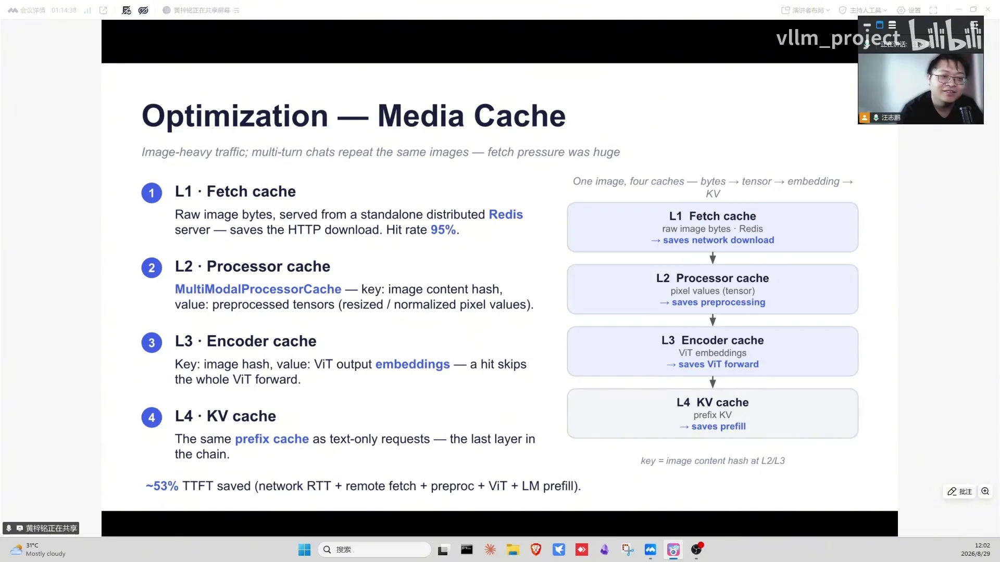 |
| 然后有同学问你们会有发模式吗他为什么发这个是什么我们没有发模式就是发什么是我的理解就是你可能有的时候你你用clawcode或gbt的时候他有发如果你有发你可能花三倍的钱但是呢你的你的速度很快可能别人的tfb10秒钟你tfb一秒钟或者别人tpods一秒钟50个token你一秒钟发mctoken [【跳转到 57:28】](https://www.bilibili.com/video/BV1Wv4k6YEdB/?t=3448) |  |
| 我们没有发smo其实这个发smo其实相对来说比较简单来做的怎么做呢很简单你把specccodedecodingenable直跑tp然后呢batsize一那你就会发现你的模型跑的飞起200token一秒钟500token一秒钟不是猛当然这个的问题是他在商业上是很麻烦很难持续的 [【跳转到 57:53】](https://www.bilibili.com/video/BV1Wv4k6YEdB/?t=3473) | 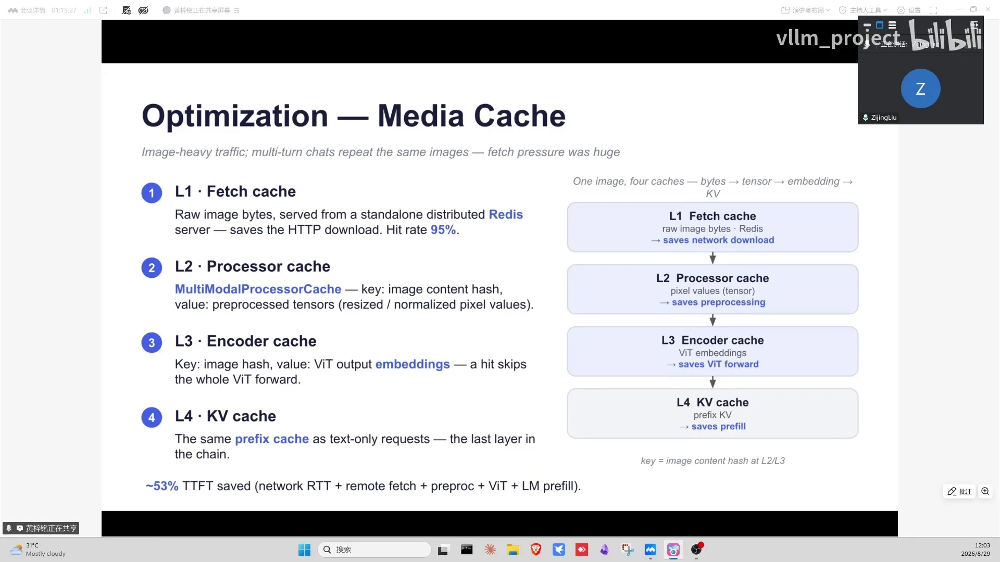 |
| 除非你能说我我也能打了500个token但我batsize很搞但目前来讲的话呢这方面的挑战是相对比较大了说大部分发smo的做法都是我batsize给你一或者batsize最多最多给你三吧不可能再往上涨了那你要去surf这个发smo的话你相当于一台机器最多只能surf三个用户那么你这个其实这个成本就很高你的收益就相对来说第一这也是为什么如果你在cloggo上靠一发smo我这个是六倍还是三倍的 [【跳转到 58:18】](https://www.bilibili.com/video/BV1Wv4k6YEdB/?t=3498) |  |
| 的价钱吧就是如果正常是一块钱你开了发smo的话就变成三块钱还是六块钱嗯好然后还有团团问这个chunksize会建议配置多大比较合适chunksize是指哪个的chunk我觉得他应该指的是这个prefixcash里面不不就是那个blocksize不不不不应该是这个chunkprofile里面的chunksize [【跳转到 58:43】](https://www.bilibili.com/video/BV1Wv4k6YEdB/?t=3523) |  |
| chunkpreview是吧我我自己最喜欢的三个数字409616378还有32726就是这四个chunk我一般觉得大部分能99%的情况都没问题了对我们默认的话是4096对吗默认是204默认是8192好像是我不太记得默认好像是8192对反正我记得不到一万 [【跳转到 59:08】](https://www.bilibili.com/video/BV1Wv4k6YEdB/?t=3548) |  |
| 默认的话对对对相对来说比较小对嗯然后有同学问我们我们没有做pd分离20个实力是否适合用mk我觉得没问题mk用不用跟你做pvpd分离其实关系不大对对那就是你说然后对对我也想说就是了这个mk的话 [【跳转到 59:33】](https://www.bilibili.com/video/BV1Wv4k6YEdB/?t=3573) |  |
| 其实跟你这个是怎么个步的方法是不一样是没有关系的你包括你多个模型也可以用一个mk好有同学澄清了这个默认的bysize改成了16384了哦是吗这一句话还这么自然这个上size好那非常感谢紫金老师的分享接下来应该是该紫明来过我们的分享了 [【跳转到 59:58】](https://www.bilibili.com/video/BV1Wv4k6YEdB/?t=3598) | 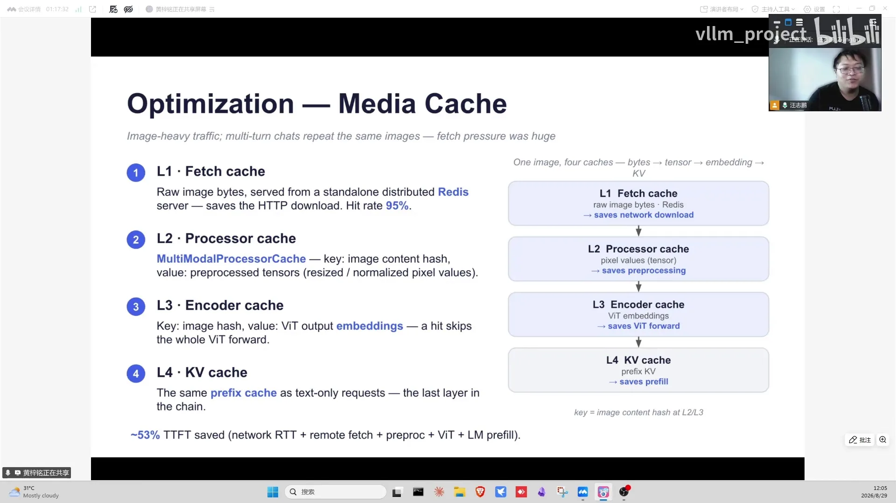 |
| 对的对的嗯好的好的刚刚紫金在这个机型层面上讲了我们的prog身上整体宏观的一些一些design跟这个这个设计然后一些mk上的一些啊一些这个一些一些方案对然后下面我就是从引擎层面上来讲因为啊刚刚紫金提到了因为我们需要满足perfume跟decode的sla然后我们整体的这个 [【跳转到 60:23】](https://www.bilibili.com/video/BV1Wv4k6YEdB/?t=3623) |  |
| 系统的一个一个目标就是在他指定的sla上我们需要达到啊比较大的一个吞吐然后因为出了通文越多我们就越赚钱所以说啊所以说我们整体的一个一个不属的方案就是引擎上的肯定是啊在在就是说在不不不不违反sla的情况下然后去啊衬涂越高越好对然后下面我就从这个perfume跟decode的 [【跳转到 60:48】](https://www.bilibili.com/video/BV1Wv4k6YEdB/?t=3648) |  |
| 分别来讲然后我们是选取了一个什么样的一个不属方案然后什么样的一个冰策略然后还有啊我们在这个生产的过程中就发现了一些现有的vom什么问题然后我们用什么方案去啊给他解决的解决的对等一下我打扰一下我打扰一下这个呃刚才指定的分项还有个问题我们收过了就是使用vomcake开始有vom感知调度和 [【跳转到 61:13】](https://www.bilibili.com/video/BV1Wv4k6YEdB/?t=3673) |  |
| 附带均衡调度他的延迟区别大吗延迟是指我这个router层面的延迟吗还是我不太确定这个我觉得我觉得可能他指的是最后的这个tft哦就就tfttft的延迟啊tftft呃是这样的其实我觉得就是可能有的时候我们 [【跳转到 61:38】](https://www.bilibili.com/video/BV1Wv4k6YEdB/?t=3698) |  |
| 我们会有点低估这个负载不均匀带来的影响其实是挺大的就是你可以想象如果你所有人都是在50%这个水源线跑的话呢其实很均匀但是但凡比方说有那么几个或者有10%在跑到80%然后有那么些在40%你就被迫你可能整个流量里面的20%都要比剩下的80%的流量要高 [【跳转到 62:03】](https://www.bilibili.com/video/BV1Wv4k6YEdB/?t=3723) |  |
| 那么他会直接影响你p90的这么一个tft那如果你这个负载不均匀最难受的情况是什么就是50%跑得很热50%跑得很凉那你基本上你的tft就属于一个怎么说就跳楼机了对吧他有时候落到上面那个区间就很高有时候落到下面那个区间就很低所以说这个这个的话其实负载不均匀带来的对我个人觉得带来对你这个延迟的影响 [【跳转到 62:28】](https://www.bilibili.com/video/BV1Wv4k6YEdB/?t=3748) |  |
| 啊是蛮大的对就是你包括你说你能10%的这么一个minimax的区别v220这个minimax的这个区别其实你能在整体的你这个这个极型的tft和tpao上都能看到有很明显区别所以我们还是得以这个负载均衡要做为主就是我觉得负载均衡对对对对有猛克其实就不需要去把这个开销为二的 [【跳转到 62:53】](https://www.bilibili.com/video/BV1Wv4k6YEdB/?t=3773) |  |
| 感知高度了对的对的对的负载均很基本上这里面最最就算我刚刚讲这里面最最最重要我们可以所有这些都很好用但我个人觉得最好用的就是他把这个routing的问题和caching的问题给极有看嗯学到了学到了好那我们还是继续死定的分析啊嗯好的好感谢子晶老师 [【跳转到 63:18】](https://www.bilibili.com/video/BV1Wv4k6YEdB/?t=3798) | 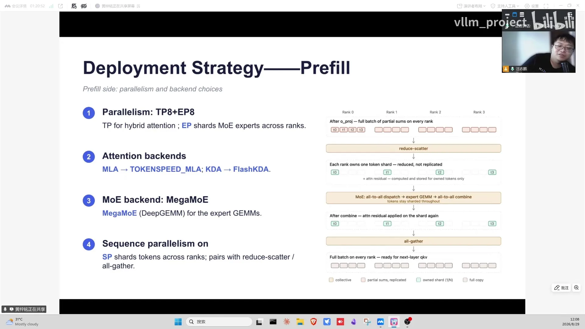 |
| 谢谢啊就是刚刚讲到就是啊我们接下来就是从profil跟default的相分别来看一下我们在引擎层面上啊选择要什么什么样的一个方案然后以及啊我们又在在这个带零的这个chimik3的技术上又发现什么问题在生产上然后做什么优化对然后首先profil的话profil的话我们的这个并行策略选择的是tp8加上1p8 [【跳转到 63:43】](https://www.bilibili.com/video/BV1Wv4k6YEdB/?t=3823) |  |
| 对因为因为Profile它其实并不是一个bond在KVcash的一个情况,因为我们现在是刚刚紫金也提到了,我们现在是有MunkeyExplore,然后其实大部分95%以上的KV都是从远达拉起的,然后我们只需要保证我们当前的这个,就是显存是足以记上我们当前的Batch的KV的容量就够了,然后以及我们还是需要去, [【跳转到 64:08】](https://www.bilibili.com/video/BV1Wv4k6YEdB/?t=3848) |  |
| 因为这个模型最长是支持一个million,然后我们至少是要支持一个million以上的这个,留这个million以上的这个KVcash的这个slave,然后在这个基础上的话,就是我们选择attention就是选择TP8,然后其实并没有选择一个wideEP的一个profile的做法,然后这里我觉得是有两点考量吧, [【跳转到 64:33】](https://www.bilibili.com/video/BV1Wv4k6YEdB/?t=3873) |  |
| 首先我们在这个生产上就是我们其实并不希望一个部署,它这个部署的这个Uni是会太大,对因为我们在这个,因为这里是有个学生,就我们觉得这个稳定性,就稳定性跟性能的一个考量,对因为假设假设你一个这个,你一个profile假设是一个16或者32, [【跳转到 64:58】](https://www.bilibili.com/video/BV1Wv4k6YEdB/?t=3898) |  |
| 32卡的一个部署,然后然后但是就如果你的一个profile因为某些原因,然后可能很多时候有些因为硬件问题,或者是引擎的问题他挂的话,就是我们希望他能够最小,最小化的这个影响,我们整体的一个我们整体系统的一个这个sla,对所以我们在这个在这个在这个在这个情况下,我们会选择一个定程的小的一个部署的一个策略, [【跳转到 65:23】](https://www.bilibili.com/video/BV1Wv4k6YEdB/?t=3923) |  |
| 对所以说,所以说在Buckard策略上来说profile的话,我们去选择TP8加EP8的一个部署,然后对attention的话,就是就是TP8其实它有一个问题就是,因为MLA它的这个KVcatch,它存的是一个那个低质的KVcatch,就是压缩过以后的然后它是没有Numbhead的维度的,所以说, [【跳转到 65:48】](https://www.bilibili.com/video/BV1Wv4k6YEdB/?t=3948) |  |
| 所以说我们在切TP8的时候,因为正常来说这个,你开了TP8以后,你的KVcatch也会也会随之减小,但是对于这个这里这个,就是对于有MLA的模型来说,就MLA那部分的KVcatch它是不会压缩的,所以说这个,所以说它这里就会有一个DuplicateKVcatch的一个情况,对但是呢我们刚刚提到,就是profile它其实我们目前并不是被放得到这个, [【跳转到 66:13】](https://www.bilibili.com/video/BV1Wv4k6YEdB/?t=3973) |  |
| 放得到这个KVcatch的,所以说,所以说对于对于attention来说我们目前是可以使用TP8,对然后对于MOE的话呢,就是我们目前是用了一个EP8的一个部署的策略,因为就是我们的target的目标是一个比较hitsruput的场景,尤其是profile,profile来说我们基本上一个batch,就刚刚有同学提到了现在muleM默认的这个, [【跳转到 66:38】](https://www.bilibili.com/video/BV1Wv4k6YEdB/?t=3998) |  |
| makenon-batchtokens已经是16k了,然后我们基本上生产上就是,就是也是差不多是这一个量级的一个batchlite,对然后你一个batch如果是达到了16k的话,它肯定是一个一个,它肯定是一个这个computerbound的一个场景,对然后在这个场景下来说,然后对于对于这种mule对于kimik3这个模型的MOE来说,它的这个MOE实际上是一个非常细数的一个状态, [【跳转到 67:03】](https://www.bilibili.com/video/BV1Wv4k6YEdB/?t=4023) |  |
| 就是它实际上有800,896个这个excess,然后对然后每个头盆击获16个,对然后在这种case下呢,就是你用tp去切这个,去切所有的excess,然后它的这个它会导致的一个问题,就是它的这个Milion的这个MOE的intermediatesize会非常小,就是一般来说就kimi,就比如说以k3举例它的这个intermediatesize是3000, [【跳转到 67:28】](https://www.bilibili.com/video/BV1Wv4k6YEdB/?t=4048) |  |
| 然后你切8的话就是差不多就是300多,然后然后那同时呢,就是你的bassside非常大,就是你的这个你的那个lumbtoken的维度非常大,然后这个计算对这个这个save来说对于对于kimi来说是非常不efficient的,所以说这个使用我们通常会使用一个EP的一个部数的方式,对然后呢对然后呢就是在这种在这种部数下面会有一个这个问题, [【跳转到 67:53】](https://www.bilibili.com/video/BV1Wv4k6YEdB/?t=4073) |  |
| 对因为我们如果是存这个tp8部数的话,通常来说我们是我们是在每一个rank上在需要需要在attention的project和这个outputproject和这个moe的部分,然后去做两艘reviews对然后分别拿到两个分别拿到权量的这个权量的这个tensor对但是因为我们现在attention是tp然后moe是ep, [【跳转到 68:18】](https://www.bilibili.com/video/BV1Wv4k6YEdB/?t=4098) |  |
| 所以说这里的话我们是如果我们在我们还是用这个存tp的这个部数,就是就是那个做两艘reviews的话,实际上moe部分它是会有非常多的这个重复的重复的计算和这个重复的重复的通信对然后我们这里的话是使用了一个sp的一个特律,就是说我们在上完这个attention的outputproject之后, [【跳转到 68:43】](https://www.bilibili.com/video/BV1Wv4k6YEdB/?t=4123) |  |
| 然后正常来说我们是需要去去做outreviews,然后然后每个每个rank拿到这个完整的分别,但这里的话我们是先去做了一次reviewsget,然后相当于是我们每一个rank只需要去只需要去拿到部分就是自己当前这个rank的这个这个numbtokens,numbtokens数量的一个一个tensor对然后然后再然后这样的话就是相当于假设我们就是利得假设我们有四个rank然后总共有总共有16个numbtokens等于16的话, [【跳转到 69:08】](https://www.bilibili.com/video/BV1Wv4k6YEdB/?t=4148) |  |
| 就是说经过这次reviewsget之后然后我们每一个rank上就是只会只有四个token的一个tensor的hiddenstates,然后再接下来接下来就是再走reviewsget然后走moe,走moe的octl的时候它就是不会有一些就是重复的一些重复的计算, [【跳转到 69:33】](https://www.bilibili.com/video/BV1Wv4k6YEdB/?t=4173) |  |
| 然后在上完moe的部分之后然后我们同时再调一次octl再把它再把它这个就是就是相当于每个rank上再拿到这个权量的一个token的一个这个hiddenstates再接下来往下计算对然后这是一点然后还有的话就是我们对于这个tensionbackhands和这个moebackhands会有一些会有一些选择的, [【跳转到 69:58】](https://www.bilibili.com/video/BV1Wv4k6YEdB/?t=4198) |  |
| 因为我们现在这个kimit3是一个hybridattention的一个,就是说它有它有这个mloe和这个kda,然后我们再选择knoe的时候呢就是就是实际上是NPCLVLM它是有非常多的这个mloe的backhands, [【跳转到 70:23】](https://www.bilibili.com/video/BV1Wv4k6YEdB/?t=4223) |  |
| 然后它会有flashing,它会有tokenspeed,然后我觉得这个backhands选择是要根据这个你的硬件然后然后还有你的这个病情策略之类的就是casebycase的去选的就是我们这里的话就是因为我们是gb300的一个,假设我们是一个gb300的一个部署吧,就硬件吧,然后在这个硬件情况下呢,就是实际上就是我们去做我们去做这个profile的一些benchmark,然后然后去做一些backhomebackbenchmark,然后选出来一些这个比较好的一个比较好的一些这个backhand,然后mloe的话,我们是选到了这个,我们是最后选择这个tokenspeed,mloe因为它在profile计算这个比较长的这个序列的情况下, [【跳转到 70:48】](https://www.bilibili.com/video/BV1Wv4k6YEdB/?t=4248) |  |
| 它会相对来说比较高效一些,然后kda的话也是就是我们是profile的选择也是比较backhand,因为就是就flashingkda这个backhand的话,它就是挺不需要的开发的专门去就是用来去做这个非常长序列的一个kda的profile的一个一个一个算子吧,对,然后这里是谭信backhands的一个情况,然后对于mloebackhand呢就是因为现在就是 [【跳转到 71:13】](https://www.bilibili.com/video/BV1Wv4k6YEdB/?t=4273) |  |
| （此区间无字幕） [【跳转到 71:38】](https://www.bilibili.com/video/BV1Wv4k6YEdB/?t=4298) |  |
| 如果大家比较这个熟悉dpv4的话,就是它在blackwell上的一个比较比较重要的一个future就是它有一个megamme就是它是会通过一个这个非常大的一个可能,然后去里面就是里面去会去fuse的一些这个就是就是通信跟d3,因为之前之前就是如果没有megamme就是我们通常是比如说使用dpvp然后在hop上就是我们通常会用dpvp去做这个去做这个otl [【跳转到 72:03】](https://www.bilibili.com/video/BV1Wv4k6YEdB/?t=4323) |  |
| 的backhand,然后就是它会有一个是做这个dispatch,然后还有就是算fee的这个gim,然后再做activation,然后再compan回去,然后在这个过程中就是就是会有这个会有一个现象就是通信跟计算它是它是这个串形在做,然后会有这个比如说你在做这个dispatch [【跳转到 72:28】](https://www.bilibili.com/video/BV1Wv4k6YEdB/?t=4348) |  |
| 开始compan通信的时候,然后它的这个它的这个计算我们的计算资源相当于是被浪费了,对,然后然后在之前的这个hop的硬件上是就是大家就是会有就是dpv它是有出了一些比如像dbo之类的一些这个overlap的方案,对,但是呢这种overlap的方案其实 [【跳转到 72:53】](https://www.bilibili.com/video/BV1Wv4k6YEdB/?t=4373) |  |
| 其实并不是特别对这个生产,尤其是对这个Hybrid的这个model其实并不是特别友好,因为它的layer之间是用的这个iTenC栏都不一样,然后你需要去做overlap的话,其实并不是非常的,就无论是从这个引擎的侵入性还是说对性能来说都不是特别友好。 [【跳转到 73:18】](https://www.bilibili.com/video/BV1Wv4k6YEdB/?t=4398) |  |
| 所以说这个,比如说这里的话,就是因为我们是主要是针对Blackwell的这个平台的话,就我们通常会使用Megamoe,对,然后它是在一个颗粽里面会去做这些这个会去做这些dispatch跟计算,然后company这些overlap,然后对,差不多这一部分,整体的一个profile的一个方案差不多是这样,然后看一下大家有什么问题吗? [【跳转到 73:43】](https://www.bilibili.com/video/BV1Wv4k6YEdB/?t=4423) |  |
| 好,没有,没有的话,有一些问题啊,就是有朋友问这个profile为啥要开sp?对,就是,就是,对,就是这里的profile的sp其实就是,就是我刚刚也提到了,因为我们现在是用tp8加ep8的这个这个这个布置的方案的,对,然后,然后对于这个,就是,就是对于tp来说,就是我们, [【跳转到 74:08】](https://www.bilibili.com/video/BV1Wv4k6YEdB/?t=4448) | 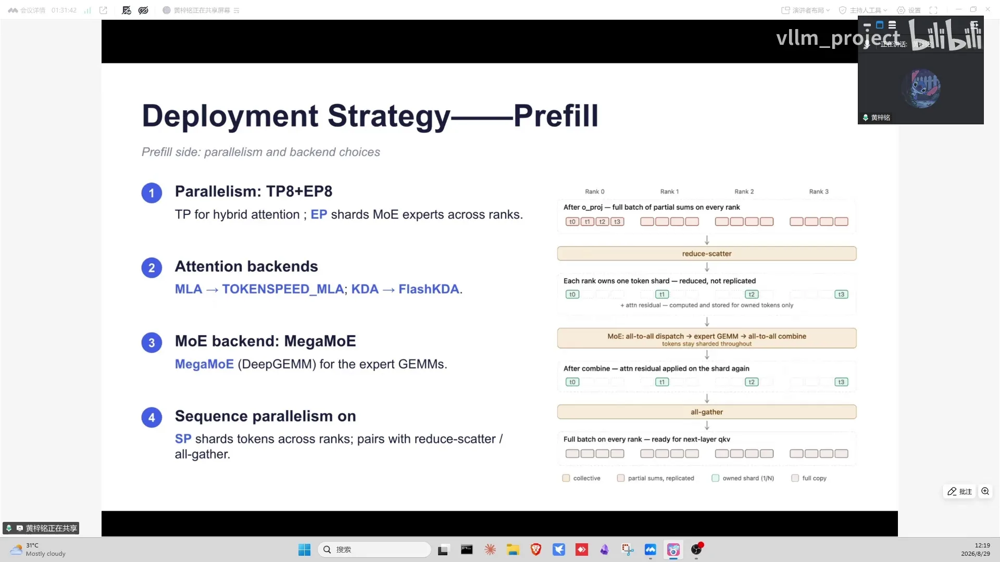 |
| 就是如果你比较熟悉这个,熟悉这里的就比较像的这个这个tp的一个情况的话,就是它是每一个rank上都会拿到一个权量的,就是在sqlnc为渡,就是或者说这个这个或者说是这个token,token为渡,它是拿到是一个权量的一个,权量的一个这个,一个token是吧,对,然后,对,但是对于,但是对于ep来说,就是,就是说,就是说,我们实际上每个rank只需要,只需要这个, [【跳转到 74:33】](https://www.bilibili.com/video/BV1Wv4k6YEdB/?t=4473) |  |
| 并不是需要权量的一个,并不是需要一个权量的一个这个token,对,你可以看到这里就是,就是如果说你是,我们是一个tp加ep的补数的话,就天然是没有这个问题的,就因为它是,因为我们这个在tp为渡上这个token是为渡,就是token就是就是就是,就是提前就已经分配好了,就是切分好了,相当于是,对,然后,但是这里tp加ep的话是,如果是你不去做,你不去,你不去在这种, [【跳转到 74:58】](https://www.bilibili.com/video/BV1Wv4k6YEdB/?t=4498) | 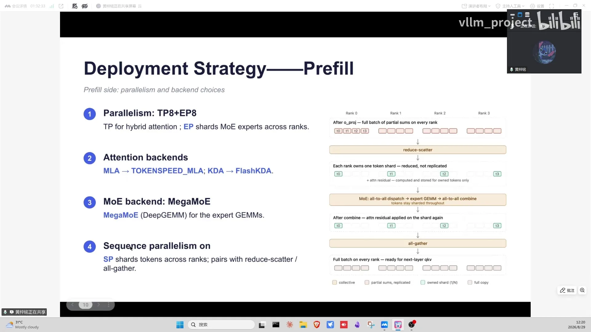 |
| 在tp后面做这个做sp的一个操作的话,它是会引入很多额外的一个计算和通信对于moe来说,对,因为tp里面标准最后是要做个orreduce的,对,对,对,然后,就比如说,在这里,这里reducegather是做reduce,对,对,对,然后我们这个,因为我,我感觉应该所有的像这种moe的模型它都是最后,就是把这个地方换成sp,是, [【跳转到 75:23】](https://www.bilibili.com/video/BV1Wv4k6YEdB/?t=4523) |  |
| 对,是的,是的,就是如果你要在moe里面做这个tp加ep的一个,啊,这种,这种方案的话,sp是必须的一个东西,对,对,就是如果你是直接用莫争的这个tp的话,其实,就像你本身做的,就是orgather,orreducegather,然后你又做一个这个token的一个beatspatch,对吧,然后我们其实sp的话就是不需要去那个搞这么多,这么多复杂的一些通信, [【跳转到 75:48】](https://www.bilibili.com/video/BV1Wv4k6YEdB/?t=4548) |  |
| （此区间无字幕） [【跳转到 76:13】](https://www.bilibili.com/video/BV1Wv4k6YEdB/?t=4573) | 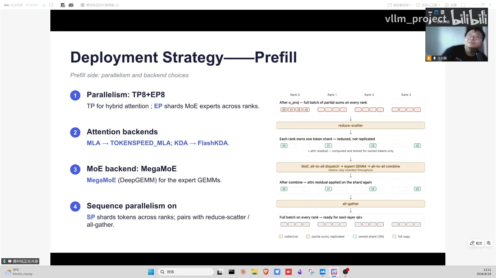 |
| 就是一个这个reducegather就行,对,而且就是这个feature是现在是莫人打开的,就是在那个,在我们在部署,我们在部署这个token的时候,在我们在vom部署的时候,实际上不需要,不需要打开任何开关,才莫人就是开,好,然后有同学问啊,就是我们需要考虑这个tp吗?嗯,对,pcc,就是,就是比如说pcc这个问题非常好,就是啊,pcc它其实更加focus的是一个非常就比较长序列的一个场景,比如说我有,啊,几百块或者,就是我们是算一个million,然后我的这个,我可以用这个,我可以用去,啊,我可以用这个多个多个,多个load或多个gpu的算力去算这个,去算这个,啊,去算这个,啊,长序列的一个场景,对,然后, [【跳转到 76:38】](https://www.bilibili.com/video/BV1Wv4k6YEdB/?t=4598) |  |
| （此区间无字幕） [【跳转到 77:03】](https://www.bilibili.com/video/BV1Wv4k6YEdB/?t=4623) |  |
| 但是,其实我们生产上的话,在绝大部分的case下,就比如说我们做起来这天的任务,其实上我们每次的增量其实并不是特别多,就大概是一个几k的量级。对,所以说在这种case下,pcp还需要考虑这种各种不同请求的,它的这个input的长度不一样,你要去怎么去分配这些, [【跳转到 77:28】](https://www.bilibili.com/video/BV1Wv4k6YEdB/?t=4648) |  |
| 怎么去结分这些请求的这个tunk,它会比较复杂,但是我觉得pcp是可以考虑的,比如说我们后面可能会做,比如说针对于每个section的第一条请求,通常它会比较长, [【跳转到 77:53】](https://www.bilibili.com/video/BV1Wv4k6YEdB/?t=4673) |  |
| 对,然后针对这些请求的话,我们可以单独的去起一个pcp的部署,对,然后在针对真正后面的这些就是几千的这个后续的一个请求,就是这个section后续的一个请求的话,我们可能就是在用当前的这个部署策略,这个可能会好一点,这个也是后面我们要做的一个方向吧。 [【跳转到 78:18】](https://www.bilibili.com/video/BV1Wv4k6YEdB/?t=4698) |  |
| 然后有同学问了,就是说这个cc想开开不了有bug,因为开了d-buzz,是d-buzz是没办法去跟pcp建容吗?对,因为现在社区的这个对社区上这个pcp的这个工作可能还不是特别的完善,就是如果有bug的话,我觉得可以提票。 [【跳转到 78:43】](https://www.bilibili.com/video/BV1Wv4k6YEdB/?t=4723) |  |
| 但是我觉得这个d-buzz应该是d-could的时候去用的呀。对,这个后面我们会讲到,实际上这个对于profit来说d-bugego其实也会影响很多,因为我们profit也会开,对这个后面我会讲到一些相关的点。好,这个gb300的机器双星,是当作一卡还是两卡来算的? [【跳转到 79:08】](https://www.bilibili.com/video/BV1Wv4k6YEdB/?t=4748) |  |
| 双星双星是双星片?双星片?ok,就是我们gb300就是说如果是envadingctr的话,就是一个node是4卡,然后我大概理解,就是式和信息的Ctr,对,就是4卡。就是我们Gb300,比如说如果是NVD-72的话,就是一个Note是4卡,然后我大概理解,应该就是按照两卡来算。 [【跳转到 79:33】](https://www.bilibili.com/video/BV1Wv4k6YEdB/?t=4773) |  |
| 比如说像一个Note是4卡,它是有两个VolaCPU,然后每个CPU上挂两个显卡槽。我不知道弹幕是不是这个理解。 [【跳转到 79:58】](https://www.bilibili.com/video/BV1Wv4k6YEdB/?t=4798) |  |
| 其实我也不是很理解,但是Gb300,一个Note是4卡的话,那你比如说开TP的话,那就是TP4嘛,是不是?对对对,是嘛。因为我其实也不是很理解。 [【跳转到 80:23】](https://www.bilibili.com/video/BV1Wv4k6YEdB/?t=4823) |  |
| 然后有同学问,开SP会不会增加通信?对,就是理论上来说,开SP的话,你相对于这个,你看你是相比于什么来说,就是你相比于TP来说,实际上,成TP来说实际上通信量应该是没有变化,对,对,因为你的Orduse也就是ReduceGalaxy加Ogadge,然后SP其实就把它拆开,然后给它拆到Moe前后去做。 [【跳转到 80:48】](https://www.bilibili.com/video/BV1Wv4k6YEdB/?t=4848) |  |
| 但是如果你相当于TP来说的话,这里通信量是会有增加的,对,因为TP的话根本就不需要去做这个,不需要这两步,这两步的就是Galaxy跟我Gadge,它只需要这个Moe部分的一个Otterware通信,对,所以是这样,就是它相比于TP来说通信量是不是? [【跳转到 81:13】](https://www.bilibili.com/video/BV1Wv4k6YEdB/?t=4873) |  |
| 好,然后TP8加EP8的ParallelRoof是怎么意识到物理GPU上的?这个问题其实我也没太干,就是TP8加EP8就是,就是其实我们只需要8卡嘛,就是两个Load的,对,然后对于TP的话就是, [【跳转到 81:38】](https://www.bilibili.com/video/BV1Wv4k6YEdB/?t=4898) |  |
| 就是8个Rank嘛,这里是8个Rank,然后每个Rank对应一个物理GPUNote的,对,然后在Apenshine部分的话就是我们去TP8去切,就首先LoadWait的时候就给它先Load全量,然后就是切个子的部分,然后Load到个子的GPUNote. [【跳转到 82:03】](https://www.bilibili.com/video/BV1Wv4k6YEdB/?t=4923) |  |
| 然后一切的话就是我们去贴这个我们就是贴这个NomeX部分比如说现在我们有896个嘛然后然后我们这个一提八的话就是相当于我们每一个GPU上持有每个每个每个路上持有呃只有一百一百十二个这个啊差不多是这么一个不知道有没有回答到这个 [【跳转到 82:28】](https://www.bilibili.com/video/BV1Wv4k6YEdB/?t=4948) |  |
| 我觉得就是这样子然后有时候问这个nvswitch本身不是会做reduce吗然后我刚才指的是这个sp做的话会有影响吗嗯对的是什么就是nvswitch本身会做reduce什么意思vswitch本身会做reduce [【跳转到 82:53】](https://www.bilibili.com/video/BV1Wv4k6YEdB/?t=4973) |  |
| 呃你这这里本身是会做reduce的这个OK我大概我大概能看到就是说他在他的意思就是说我们现在是一个跨漏的一个嗯对的一个一个就是就是就是就是一个通信嘛对然后他会经过nvswitch然后他可能会他可能会做reduce但是我觉得啊就是这个应该是一个比较common的一个啊一个一个现象嘛 [【跳转到 83:18】](https://www.bilibili.com/video/BV1Wv4k6YEdB/?t=4998) |  |
| 对然后啊就对就这里这里的话可能呃对于sp来说他应该是会是会是会去是会去走这一块的对但是如果你是啊dp的话才是不需要这不需要这的通信对好的我们继续了嗯好ok然后呃刚刚就是先整体介绍一下我们profile用的是一个什么样的 [【跳转到 83:43】](https://www.bilibili.com/video/BV1Wv4k6YEdB/?t=5023) |  |
| 啊就是说介绍我们为什么要用这样的一个布置特律然后主要是用了用了哪些这个参数对然后feature然后下面我就是来介绍一下就是我们在这个我们在profile的这个因为我们现在啊就刚刚指定所说的就profile开始是一个非常重要的feature因为对于吗对于这个adgetink这个啊对我和乐的情况下对然后他实际上是会啊对我们的profile的一个 [【跳转到 84:08】](https://www.bilibili.com/video/BV1Wv4k6YEdB/?t=5048) |  |
| 呃sroop的有非常大的影响所以说呃所以说我们是针对profilecatch这个这个命中率然后以及以及整体的这个以及当前整体的设计然后我们是做了一些啊在地理的地理上又做了一些啊优化对然后首先如果啊就是不知道大家有没有这一部分的contact就是如果去看如果大家看过这个 [【跳转到 84:33】](https://www.bilibili.com/video/BV1Wv4k6YEdB/?t=5073) |  |
| 我们kimik3.0的这个就是VLM小客航的话就是将于之前介绍一下就是我们现在啊在对于kimik3的一个catch的一个设计的一个模式然后我这里先简单的简单讲一下就是目前我们的kimik3在开始profilecatch情况下他是会摸人走一个limo的这个limo的一个 [【跳转到 84:58】](https://www.bilibili.com/video/BV1Wv4k6YEdB/?t=5098) |  |
| 一个对一个比较重要的一个feature的话就是说他会啊他会去做这个他会去在这个blocksize伪度下去做这个去做catch就是我们catch的力度是一个blocksize的伪度对然后这里的blocksize呢啊就是大概是怎么计算的就是啊其实从一开始VLM来说blocksize是非常小就是大家也可以去随意的指定这个blocksize比如说比如说blocksize64128对但是对于这个 [【跳转到 85:23】](https://www.bilibili.com/video/BV1Wv4k6YEdB/?t=5123) |  |
| kimik3之类hybridmodel来说就是我们需要去啊我们想要去统一的去管理这个啊不同的这个attention尤其是这个pda的attention跟这个mla的attention就我们需要我们想要去用同一个这个memoryport去啊去去去做这个去做那个kipcatch的management所以说这里的话我们会啊我们就不能让用户指定这个 [【跳转到 85:48】](https://www.bilibili.com/video/BV1Wv4k6YEdB/?t=5148) |  |
| 手动指定这个blocksize我们会自动去去根据当前的一个啊部署的一个情就是说啊就分布式的一个策略去算出算出一个block这个blocksize然后啊这个blocksize的意思就是啊我我完整的一个这个在当前的这个tp的策略下它的这个manbacatch的大小然后能够容纳多少个这个mla的这个 [【跳转到 86:13】](https://www.bilibili.com/video/BV1Wv4k6YEdB/?t=5173) |  |
| 这个嗯mla的这个catch的头盆是数量然后啊然后这个不同的模型是不一样的针对k3这个模型的话呢就是因为它的这个mla的这个catch实际上是比较就是大家知道它是比较小的然后kda的话相对来说就是啊会啊就是说单单就是就是从这个一个token的维度来讲的话它是一个比较大的所以说 [【跳转到 86:38】](https://www.bilibili.com/video/BV1Wv4k6YEdB/?t=5198) |  |
| 嗯这个量级的话差不多是一个啊如果说我们开了这个我们开了这个ip8的话就差不多它是一个200啊200mb的一个量级对所以说它这个blocksize就算出来会会是非常大的一个blocksize对于profil来说它可能是一个啊就是差不多是15001500的一个blocksize对然后啊 [【跳转到 87:03】](https://www.bilibili.com/video/BV1Wv4k6YEdB/?t=5223) |  |
| 但是呢我们的这个我们这个我们这个perfectcatch的这个catch的维度就是又是以blocksize为维度的对所以说这里这里就是啊这里就是会有一个问题就是啊啊这里其实上是有两个问题吧对然后啊对一个问题是一个问题是它的这个啊一个问题是我们现在假设以blocksize为这个 [【跳转到 87:28】](https://www.bilibili.com/video/BV1Wv4k6YEdB/?t=5248) |  |
| 为力度区catch的话就是我一个唱歌进来就是啊就是理想情况下我做完一次forward就可以就就就ok了就假设我们这个non-batchtoken足够的情况下对但是呢就是我们现在是需要去这个导出blocksize啊维度的这个一个就是相当于这个位置的一个啊一个这个perfectcatch [【跳转到 87:53】](https://www.bilibili.com/video/BV1Wv4k6YEdB/?t=5273) | 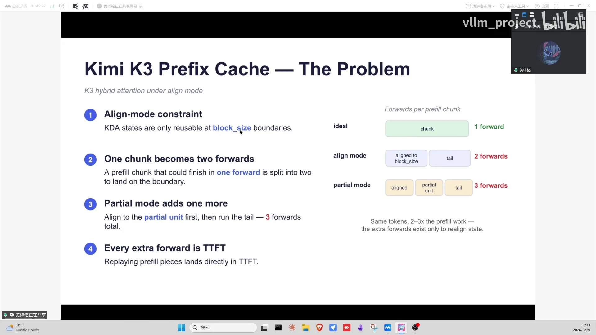 |
| 就是就是就是针对于它这个就是针对于它这个member就是kda的一个catch对然后然后但是呢我们当前这个就是说对于这个唱来说我们需要去签一个唱去做两次forward就第一次forward去啊第一次forward结尾是以这个blocksize为力度对齐的一个forward然后第二次forward的力度就是剩下的这个然后然后这样子我们就可以附用 [【跳转到 88:18】](https://www.bilibili.com/video/BV1Wv4k6YEdB/?t=5298) |  |
| 中间这个第一次forward完以后它的那个perfectcatch它的那个catch的状态上去给它存进我们的这个perfectcatch里面对然后这里是为引入一个额外的forward然后呢就是就刚提到因为我们唱size我们我们的这个blocksize现在现在是实际上是一个比较大的一个情况对然后假设我们以blocksize为力度 [【跳转到 88:43】](https://www.bilibili.com/video/BV1Wv4k6YEdB/?t=5323) |  |
| 去catch的话它可能会浪费比较多的这个token就是就比如说啊假设我们就是就比如说一个我们现在是1536的一个blocksize的话就是啊我可能我可能我可能会浪费就是最坏情况下我可能会浪费就是就是一千多个这个token然后我需要去存就算对因为我们现在catch的力度相当于太大了然后针对这个的话之前的社区 [【跳转到 89:08】](https://www.bilibili.com/video/BV1Wv4k6YEdB/?t=5348) |  |
| 就我们VLM社区是提出了一个partial的一个partialcatch的一个模式对然后它是会在这个blocksize的维度基础上然后它会再去增加一个partialunit的一个一个维度就是它会把这个啊就我们会把这个啊这个就是存这个perfizcatch的力度给它缩小到partialunit [【跳转到 89:33】](https://www.bilibili.com/video/BV1Wv4k6YEdB/?t=5373) | 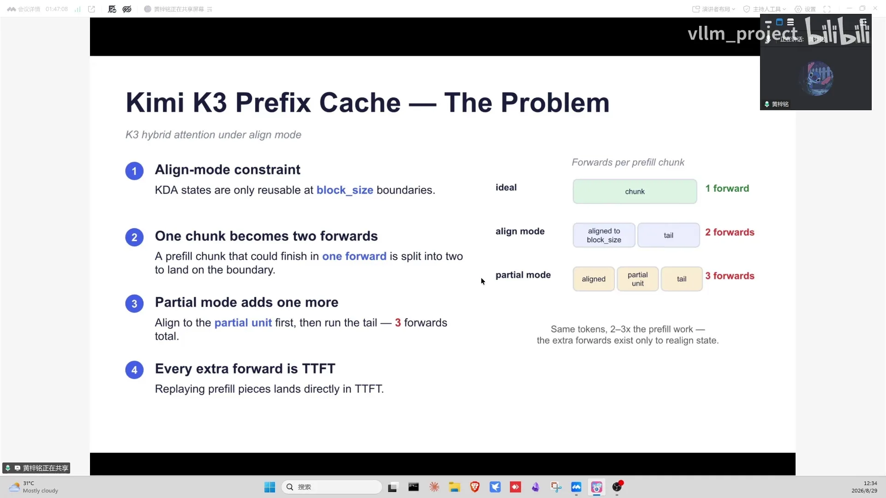 |
| 对但是这里的话又引出了额外的问题对因为它会在这个它会在alarm的基础上又多又再多一次perfizcatch而再多又再多一次这个forward对所以说现在现在就如果上一个唱歌的话是需要三个forward的就是第一次的话是我需要对齐到这个就是alarm的这个blocksize的这个位置然后第二次的话我需要对齐到这个partialunit [【跳转到 89:58】](https://www.bilibili.com/video/BV1Wv4k6YEdB/?t=5398) |  |
| 因为它可能是比alarm的更小的一个更小的一个它是比alarm会小很多的一个一个unit然后它会对齐到这个partialunit的一个位置然后第三个forward就再算这个再去算尾部的一个很再算尾部的一个剩余的token对然后在我们serving过程中就就是三次forward的然后它同时会跟其他的一些就是其他请求 [【跳转到 90:23】](https://www.bilibili.com/video/BV1Wv4k6YEdB/?t=5423) | 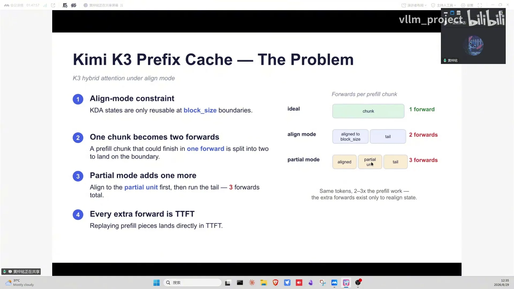 |
| 就是刚刚举的是一条单条请求的它可能会跟其他请求的一些败在一块然后就是针对这条请求tft它的这个它的这个计算的话是要加上这三个最坏情况下是要算三个完整的一个假如是一个16k的一个batch的一个forward的所以说它这个会对tft产生一个非常大的一个影响比如说最坏情况下它就会卖三倍就是 [【跳转到 90:48】](https://www.bilibili.com/video/BV1Wv4k6YEdB/?t=5448) |  |
| 就是这么一个情况对然后就是针对这个问题呢就是就是我们现在是就是提出了一个checkone的一个model的一个设计就是我们的想法还是比较简单就是我们就是想一字forward的情况下就是去就是去能够让它去导出这个导出这个对应位置的对应位置的perfectcatch [【跳转到 91:13】](https://www.bilibili.com/video/BV1Wv4k6YEdB/?t=5473) |  |
| 就无论是checkoneMode还是PreshMode我们都想去导出它位置的Presh开始然后不需要去通过多次Fold的情况下去做然后这里的话是我们需要去改两个维度首先对于Kono来说就是FreshKDA这个Kono它默认是不支持导出中间维度 [【跳转到 91:38】](https://www.bilibili.com/video/BV1Wv4k6YEdB/?t=5498) |  |
| 比如说我算16K的一个contact然后它返回来就是最后一个位置的KDA开始State然后这里的话就是我们是在FreshKDA的Kono基础上修改了一下它的Kono然后它是可以然后我们可以就是这里的话就是我们是可以在它中间的这个 [【跳转到 92:03】](https://www.bilibili.com/video/BV1Wv4k6YEdB/?t=5523) |  |
| 比如说Checkpoint的这个位置然后去导出它中间的一个KDA的一个State然后这个是一个先提的一个条件对然后做了这一个四面两个适配以后来说就是然后我们会对于每一个这个每一个请求去单独维护一个Checkpoint的Block然后去做然后去专门去做这个位置的这个Token的Token的一个 [【跳转到 92:28】](https://www.bilibili.com/video/BV1Wv4k6YEdB/?t=5548) | 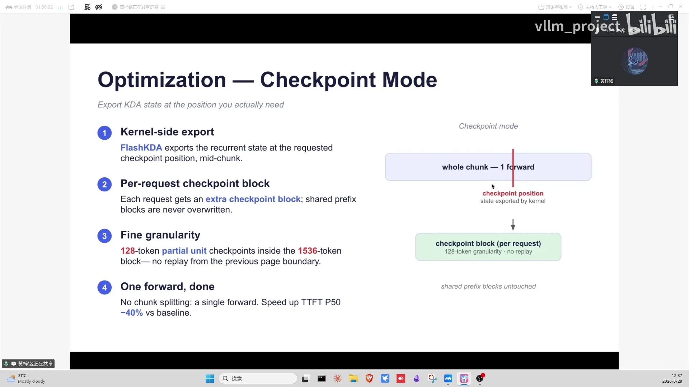 |
| 这个位置的一个PurposeCache的一个管理对然后针对这种情况呢就是我们就是可以就是可以通过一次Foreword去解决这个问题对但是但是这个目前的一个问题就是它非常的ModelSpecific就是它需要它需要去改这个FreshKDAKono [【跳转到 92:53】](https://www.bilibili.com/video/BV1Wv4k6YEdB/?t=5573) |  |
| 然后它需要去去做这种去改ModelForward的一些实现对然后目前这个Fish是应该是只支持了这个K3这个模型对然后其实上现在还有很多这个还有很多其他的这个HabitatIpenshain的模型它其实上都会有这个问题尤其是比如说像千万阿远就是这个互信我们也会有我们互信会做这个 [【跳转到 93:18】](https://www.bilibili.com/video/BV1Wv4k6YEdB/?t=5598) |  |
| 互信会把这个Fish突然到更多的模型上对然后这个最后最后结果就是说在我们在我们这个线上的这个线上的这个观察的这种它PiTi我们TTFT之后差不多能降到40%就是相比于之前的一个实现对OK大家对这一块有什么问题嗯我们可以继续 [【跳转到 93:43】](https://www.bilibili.com/video/BV1Wv4k6YEdB/?t=5623) |  |
| 继续分享好的好的OK对然后OK然后刚刚就是制平也提到就是说我们为什么要在profile上去就是假设我们用Disbug或者是用Evo3就这类这个就是就是我们为什么会要我们为什么要在profile上去去做这个去开启Disbug对因为 [【跳转到 94:08】](https://www.bilibili.com/video/BV1Wv4k6YEdB/?t=5648) | 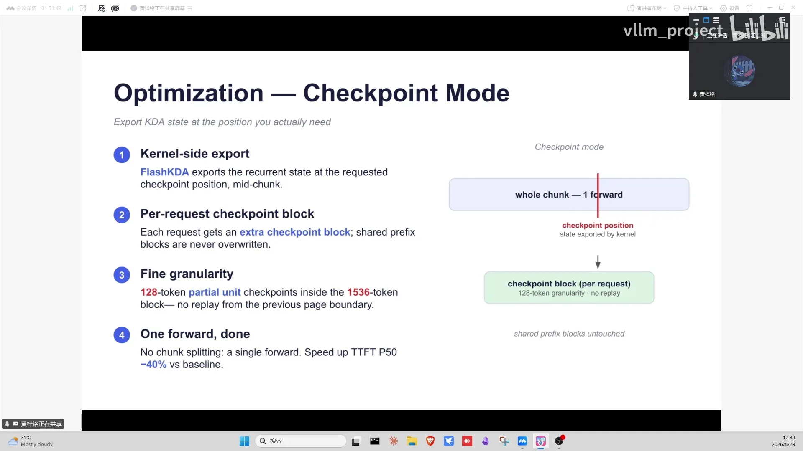 |
| 因为现在的话就是啊Disbug它本身其实你可以把它理解成是一个比较小的一个LM它有自己的KBcache然后它也需要去做forward然后它也需要去做decode对实际上对于profile来说我们在设完profile我们在设完这个呃就模型就K3这个模型的forward的时候我们也会去设完这个 [【跳转到 94:33】](https://www.bilibili.com/video/BV1Wv4k6YEdB/?t=5673) |  |
| Disbug模型或者Evo3模型的forward所以说呃然后也需要去算它的这个KBcache然后同时呢就是Evo3的就是我们我这下就用Evo3举例就是Evo3这个模型的这个呃就是forward的时候它还会依赖这个主模型的这个输出的Hidden对然后所以说我们在profile我们在profile的时候就是我们我的那个主模型去 [【跳转到 94:58】](https://www.bilibili.com/video/BV1Wv4k6YEdB/?t=5698) | 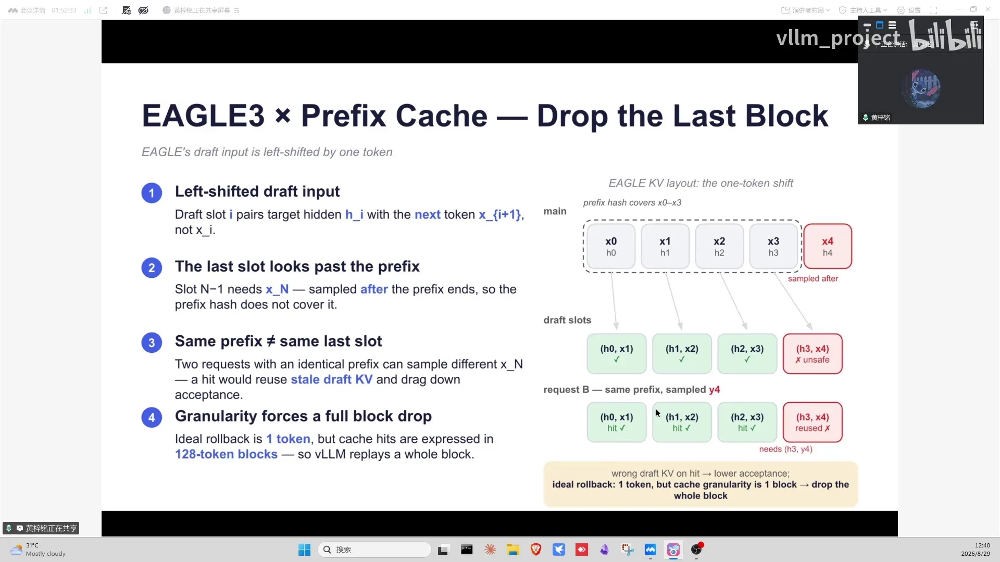 |
| 设完这个呃profile之后然后它会把它的这个输出的Hidden然后再呃再再再结合它的这个token然后再然后然后呃Evo3会意思来去设完它的profile然后设完出它的KBcache对然后就是我就回答了刚刚那个同学为什么那就是为什么为什么profileprofile上要开Disbug的一个原因对然后 [【跳转到 95:23】](https://www.bilibili.com/video/BV1Wv4k6YEdB/?t=5723) |  |
| 呃这一的话实际上就是这一的话其实实际上我们是观察到了一个问题对就是就是一个相当于是我们最开始的一个这个设计吧然后呃我就是因为我现在开启的profile之Cache情况下就是如果大家就是看过这个看过这个VOM这里这一块弹码就是大家会发现有一个有一个JobLastBlock的一个这个设计就是 [【跳转到 95:48】](https://www.bilibili.com/video/BV1Wv4k6YEdB/?t=5748) |  |
| 就是呃它会在开启profile之Cache情况下去把去把我们能啊就是它它会去把我们cache到的最后一个token的给它扔掉然后反而去开始前面这一个token对然后呃呃这里的话就是可能很就是我一开始看到这个设计也比较疑惑对因为正常来说我们就是我们就是呃 [【跳转到 96:13】](https://www.bilibili.com/video/BV1Wv4k6YEdB/?t=5773) |  |
| 我们就是实际上我们就是开始越越越越晚的位就就是就是开始越右边的位置越好嘛对就是就是它它它就扫上就变少了嘛然后呃但是呢这里的话啊我后面就是就是后面又去看了一下这里这里ego的一个设计对然后然后跟大家讲一下为什么要去vom会去这个 [【跳转到 96:38】](https://www.bilibili.com/video/BV1Wv4k6YEdB/?t=5798) |  |
| 会去把最后一个这个呃开始的这个block给它扔掉对然后呃呃是这样的就是呃我下面先举一个例子嘛就是呃就是呃其实它它的一个主要的原因是我们这个jav的token就是我们jav的model就是ego3的model它在forward的时候的一个呃一个呃一个一个这个输入它其实跟 [【跳转到 97:03】](https://www.bilibili.com/video/BV1Wv4k6YEdB/?t=5823) |  |
| 跟主模型的输入现在并不是并不是同样的输入就是假设我们现在是一个这个啊假设我们现在有对我们现在有四个token比如说x1x0x1x2x3去做这个profile对然后它去做oneprofile三口出一个x4对然后对我们jav的model的输入来说它其实它其实依赖的是就是可以在这里看到他们的 [【跳转到 97:28】](https://www.bilibili.com/video/BV1Wv4k6YEdB/?t=5848) |  |
| 他们的他们的一个输入他的一个输入的一个profile的情况是它是会输入x1这个位置然后然后的token然后再接收x1输出这个这个hiddensidex0这个hiddenside对然后然后它最后一个其实是并不是x3它其实是我们三口出来的下一个token的x4对然后它相当于整体是 [【跳转到 97:53】](https://www.bilibili.com/video/BV1Wv4k6YEdB/?t=5873) |  |
| 整体是把这个mmodel的这个整体的porn给它做移的意味对所以说对于最后一个这个token上来说就是我们同时也会去做这个就是去做jav的model的perfectcache就是我们现在主模型跟这个跟jav模型它的perfectcache都是统一的对然后在这个前面下呢对于最后一个token如果说我们命中了一个 [【跳转到 98:18】](https://www.bilibili.com/video/BV1Wv4k6YEdB/?t=5898) |  |
| x3这个位置的perfectcache对然后对jav的model它是会默认后面是这个位置是x4这个位置对但是呢对于有些挺求来说假设它后面三双pull出来的不是x它可能是x5对然后这里的话对于jav的model它相当于是使用了一个错误的会使用一个错误的这个会使用一个错误的这个kvcache对然后它的一个影响呢 [【跳转到 98:43】](https://www.bilibili.com/video/BV1Wv4k6YEdB/?t=5923) |  |
| 就是会会影响它这个jav的model后面的一个推理就是理论上来说因为你用了一个错误的kvcache就是你后面推理的这个你后面推这个decode的时候它的这个它的这个接收力肯定会受到影响的对所以说针对上面这个设计bom是默认会javlast的blogtoken的对然后但是呢 [【跳转到 99:08】](https://www.bilibili.com/video/BV1Wv4k6YEdB/?t=5948) | 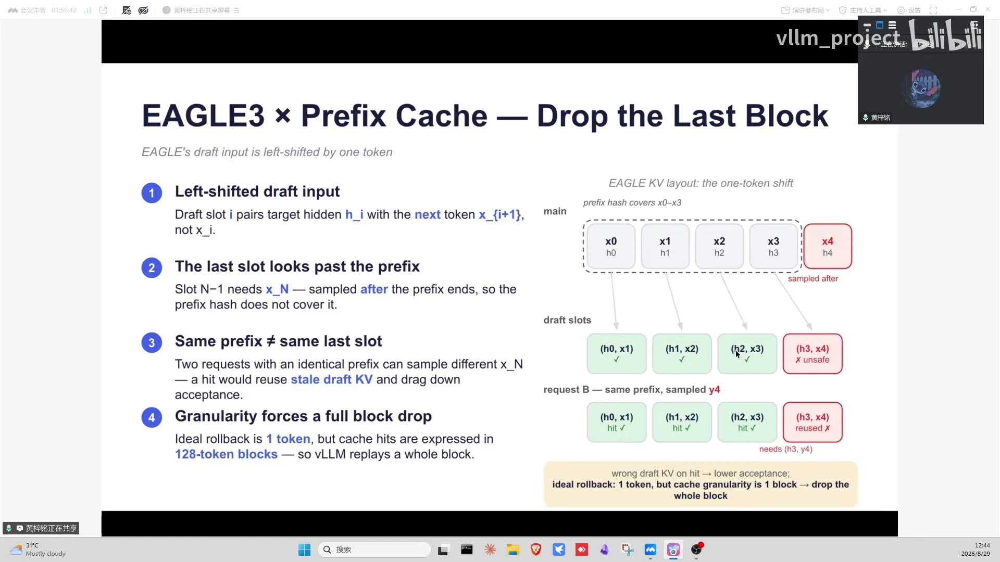 |
| 就是这个东西是是一个kvcache的情况就是它是一个touchoff我觉得就是你实际上你可以针对我们的这个workdode去决定要不要去javlast的token就是我们刚刚提到的cache是就是假设假设我们的这个我们在这个properthcache位置出现了很多分叉然后出现很多分叉这个情况下它jav的这个位置 [【跳转到 99:33】](https://www.bilibili.com/video/BV1Wv4k6YEdB/?t=5973) | 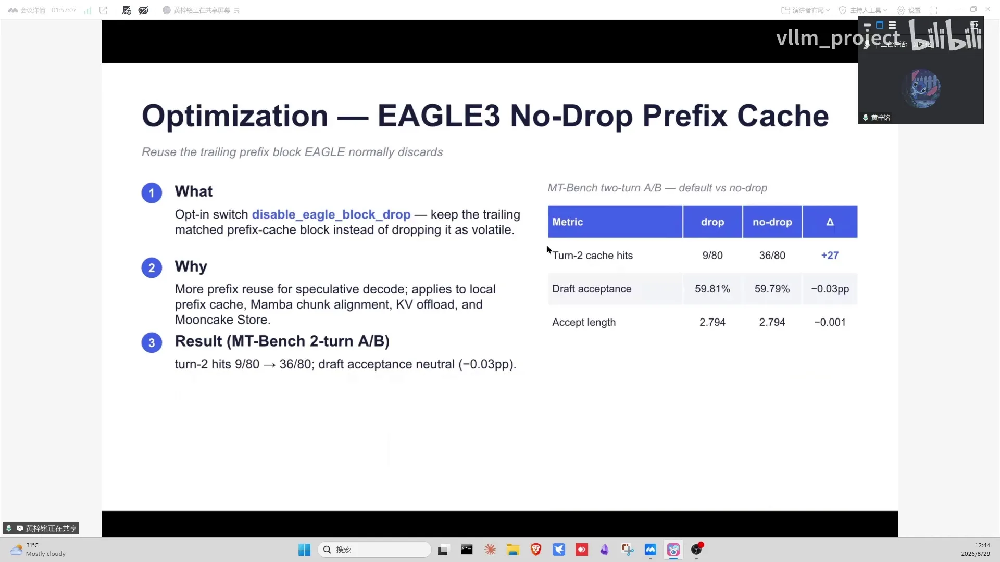 |
| 可能下一个token不一样然后它就会用不一样的一个kv但是呢对于我们这个其实实际上我们线上观察到的这种这种分叉的情况还是比较少就是说它实际上会更多的事呢就是就是这种就是我们多轮对话之间的这个就是累加就是比如说比如说在我们的比如说我们在上一轮的基础上然后有新增了那么多的token [【跳转到 99:58】](https://www.bilibili.com/video/BV1Wv4k6YEdB/?t=5998) |  |
| 然后在这种case下呢其实上它最后一个它后面的一个token其实大部分情况下是还是一样的对所以说所以说这里的话所以说这里的话就是我们我们就是针对我们线上的一个情况去做去做了一个就是就就就比较简单就是我们就不去jav它的这个就是最后一个block对然后然后对然后实际上它是它影响这个然后我们在线上 [【跳转到 100:23】](https://www.bilibili.com/video/BV1Wv4k6YEdB/?t=6023) |  |
| 我们去线上的飞机关看他的投衡的接收率的情况,包括我们会去跑一些数据节,他实际上也不会影响,在我们多轮对话的情况下,是不太会影响他的接收率的。就影响不是很小,不然很大,这里可以看到,差不多就掉了比较少一点,基本没掉点。 [【跳转到 100:48】](https://www.bilibili.com/video/BV1Wv4k6YEdB/?t=6048) |  |
| 然后这是我们这里做的一个优化。然后刚刚是介绍了一下这个profile,然后已经在deco.com的地方做了那些优化。下面我就来介绍一下,简单介绍一下deco.com的吧。 [【跳转到 101:13】](https://www.bilibili.com/video/BV1Wv4k6YEdB/?t=6073) |  |
| 因为deco.com的话,它跟profile其实不一样,我们是需要去,因为大部分的这个请求的时间都在deco.com的,然后它是需要去存它的这个,我们需要去保证我们的这个kpcash是足够跑这个对应的basssize的。 [【跳转到 101:38】](https://www.bilibili.com/video/BV1Wv4k6YEdB/?t=6098) |  |
| 对,然后这个时候呢,就是我们通常会用那个,就是我们去选择dp16加ep16的这个这个部数,因为在dp16下它的员现的这个,就是在mloa的kpcash,它是不会不会不会重复,就不会duplicate。对,然后这里就是我们想可以,我们就是对于每个rank就可以达到一个比较好的一个basssize,对,然后,然后,然后我们同时呢,就是为什么这里其实有几个候选的一个是dct8,然后还有一个是ep3sar,它他们这些就是这两个候选的一个,啊,并且说它也是不会去duplicatekpcash,对。 [【跳转到 102:03】](https://www.bilibili.com/video/BV1Wv4k6YEdB/?t=6123) |  |
| 但是这里的话,我们的一个主要的考量是,就是,我们会去banchmark算,看这个dct8,然后,啊,会,会压到多少basssize,然后通常说你的我们的ep越大,然后我们的这个通途,就dp越大,我们的这个能达到的maxbasssize就越大,对,因为,因为,因为你的这个,因为你的mloa部分被切得越,被切得越多,然后我们的kpcash容量其实就越大。 [【跳转到 102:28】](https://www.bilibili.com/video/BV1Wv4k6YEdB/?t=6148) |  |
| 对,然后这一的话,就是我们会去,我们根据我们当前的一个,啊,比较理想的,能够满足sloa的一个basssize的一个,一个数量,然后去,然后去看我们看这个dct8够不够,然后去看这个dep16够不够,或者dp3sar不够,在这种cash下,就是我们通常会去选择最小的一个部数,然后这里就是我们去选了一个dp16的, [【跳转到 102:53】](https://www.bilibili.com/video/BV1Wv4k6YEdB/?t=6173) |  |
| 因为对于dc8来说我们的这个,我们其实,就是kpcash可能是不太够的,对,然后,对,然后,对,但是对于dp3sar来说,就是我们可能,就是这个,觉得这个部数可能会觉得太大了,就是它的这个,它的,我们就是它的这个爆炸,爆炸半径会比较大,尤其是对于这个比较好的硬件来说,就是,啊,你就是,一现在这个,这个,其实这个硬件的这个,啊, [【跳转到 103:18】](https://www.bilibili.com/video/BV1Wv4k6YEdB/?t=6198) | 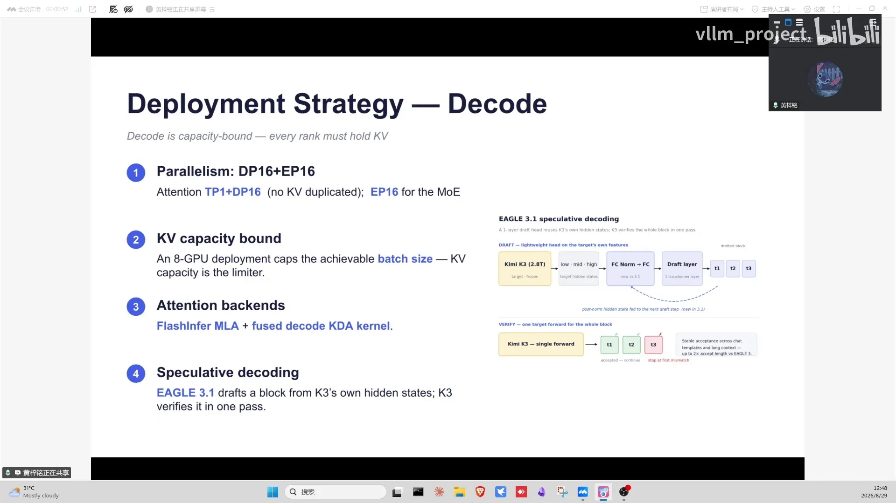 |
| 这段历史上也是在增长,就是以后也是在,在非常小的一个,一个这个gpu的一个数量下,然后也可以达到也可以设复非常非常多的一个挺求,所以说,啊,在这个cash下,就是外的一批,它对于这个,它对于我们这个系统上的这个,而稳定性其实上是会有一定的这个生害的,所以说这里,这里我们就是先续选择了一些,尤其是对于刚开始的一个部数情况,我们先选择了一个,dp16的一个设计,对,然后,啊, [【跳转到 103:43】](https://www.bilibili.com/video/BV1Wv4k6YEdB/?t=6223) | 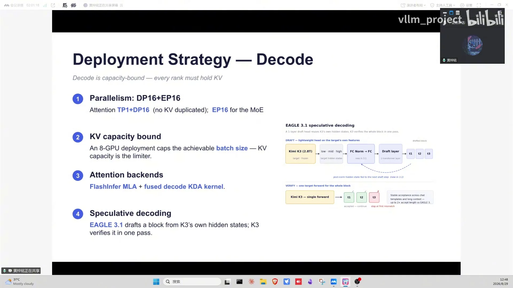 |
| （此区间无字幕） [【跳转到 104:08】](https://www.bilibili.com/video/BV1Wv4k6YEdB/?t=6248) |  |
| 然后,啊,还有提到的就是说,对于attentionbackends的话,就是,啊,我们去,我们去会跟profile去选择不一样的backends,因为他们的,因为我们现在这个,啊,对于profile来说像mra,mra,跟kda和decode的它的那个计算模式是不太一样的,对,所以说,啊,我们会去做一些benchmark去选择,去选择,啊,这个,对应性能比较好的,这个mra,对,然后这一段话,我们是选择了flashinfo的mra,然后,啊,kda,这个,这个,这个,这个,这个,这个,这个,这个,这个,这个,这个,这个,这个,这个,这个,这个,这个,这个,这个,这个,这个,这个,这个,这个,这个,这个,这个,这个,这个,这个 [【跳转到 104:33】](https://www.bilibili.com/video/BV1Wv4k6YEdB/?t=6273) |  |
| kda的可能我们是用的是一个feelbigcodekda,然后,大家感情的话给刻对工作里去,啊,去看一下,就它们的一个实现对,然后,啊,对,然后,因为刚我們提到就是说,它是,就是backdecode的,这个是天su,基本方面,啊,是,是每,是每一个,是每一个这个,啊, [【跳转到 104:58】](https://www.bilibili.com/video/BV1Wv4k6YEdB/?t=6298) |  |
| 这个服务的一个标配了,然后这里的话,我们是先去用了这个一购三的一个这个SPECDECO的一个方法,对,然后后续的话,我们可能会去,就是我们其实也有尝试过这个DISLUG,对,但是他的这个,但他在这个比较长序列的这个情况下,他的这个接收率接收率会比较一般,对,但是我们现在,啊,后面还,还可能还是还会去做,做一些更进一步优化,对,然后,这些的话,我们是先去用了这个一购三的一个这个,呃,呃,呃,呃,呃,呃,呃,呃,呃,呃,呃,呃,呃,呃,呃,呃,呃,呃,呃,呃,呃, [【跳转到 105:23】](https://www.bilibili.com/video/BV1Wv4k6YEdB/?t=6323) | 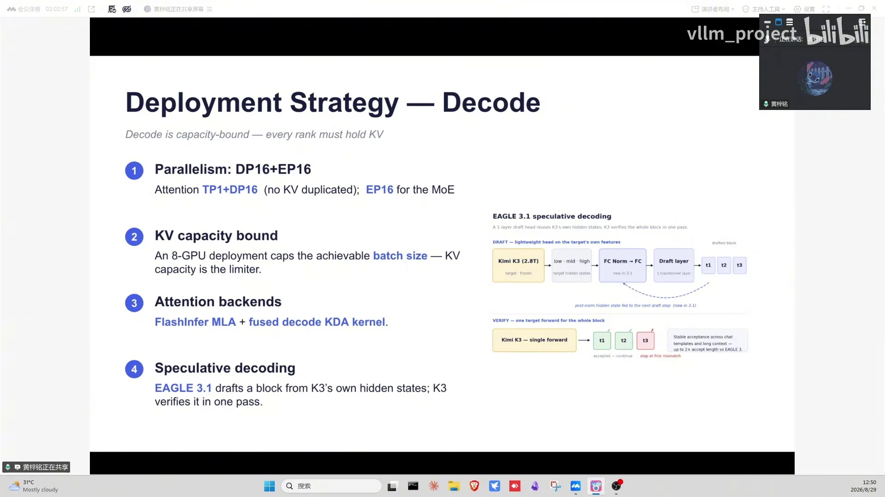 |
| 呃,呃,呃,呃,呃,呃,呃,呃,呃,呃,呃,呃,呃,呃,呃,呃,呃,呃,呃,呃,呃,呃,呃,呃,呃,呃,呃,呃,呃,呃,呃,呃,呃,呃,呃,呃,呃,呃,呃,呃,呃,呃,呃,呃,呃,呃,呃,呃,呃,呃,呃,呃,呃,呃,呃,呃,呃,呃,呃,呃,呃,呃,呃,呃,呃,呃,呃,呃,呃,呃,呃,呃,呃,呃 [【跳转到 105:48】](https://www.bilibili.com/video/BV1Wv4k6YEdB/?t=6348) |  |
| 其实我DCP8是被KVcatch给放的,而且我们通常DCP也不会去开一个很大的一个病情策略,因为它会引入一些外的通信,我们通常就是用DCP8去跑。 [【跳转到 106:13】](https://www.bilibili.com/video/BV1Wv4k6YEdB/?t=6373) |  |
| 但是对于这个,比如说你不是以PD分离的情况下来说,DCP8是一个比较合适的一个部署策略。 [【跳转到 106:38】](https://www.bilibili.com/video/BV1Wv4k6YEdB/?t=6398) |  |
| 然后对于Wirefile阶段,SSM,ZS有什么额外的处理吗?OK,这里的话就是这个问题非常好,Wirefile的话是这样,就是我们会去存每一个请求,我们会去存它non-staketoken的维度上的一个, [【跳转到 107:03】](https://www.bilibili.com/video/BV1Wv4k6YEdB/?t=6423) |  |
| 就是说我们在Wirefile的时候,就比如说我Wirefile的长度是3,它实际上会有三个候选的SSMstate,然后我们是会在SSMstateforward的时候,把这三个都存下来,然后最后去选择对应位置上的SSMstate再给它保存到KBcash里面。 [【跳转到 107:28】](https://www.bilibili.com/video/BV1Wv4k6YEdB/?t=6448) |  |
| 然后有朋友问,这个DCP是多了一个扛单的信用吗?对,是的,它是会在那个,它是会多一个attention的attention那一块会多一个。 [【跳转到 107:53】](https://www.bilibili.com/video/BV1Wv4k6YEdB/?t=6473) |  |
| Wirefile阶段的SSMstate是否可以使用replaySM?OK,对对对,这里的话就是我们后续的一个优化方向吧,对,因为我们现在其实发现了这个verified的时候,它的这个SSMstate,它是会随着这个non-staketokenscale的,就是对于这个Dispark这类方法就是我们会用一个非常大的一个,通常会用一个非常大,比如说, [【跳转到 108:18】](https://www.bilibili.com/video/BV1Wv4k6YEdB/?t=6498) |  |
| KBcash这这么一个non-staketoken,然后它的这个SSMstate我们现在会发现,它会占非常多,占非常多的这个GPU,就是占非常多的显存,对,然后后面的话,我们会考虑会许上这个SSMstate,然后可以去降低它这里的一个Memory开销。 [【跳转到 108:43】](https://www.bilibili.com/video/BV1Wv4k6YEdB/?t=6523) |  |
| 好,那我们继续吧。OK,OK,对,然后还有一点就是最后讲述就是这里,对于这个K3这个模型的话,我刚刚提到就decode它,实际上很多K的它都是会被这个KBcashMemory给放得出的,对,然后这里的话我们还,我们就是针对这个问题的话,我们相当于会去对这个attention去做一个优化, [【跳转到 109:08】](https://www.bilibili.com/video/BV1Wv4k6YEdB/?t=6548) |  |
| 因为现在这个K3这个模型它的这个attention是正常来说BF16,对,然后BF16weights,然后那个Moe部分就是MXIP4的一个weights,然后为了进一步这个解决。 [【跳转到 109:33】](https://www.bilibili.com/video/BV1Wv4k6YEdB/?t=6573) |  |
| （此区间无字幕） [【跳转到 109:58】](https://www.bilibili.com/video/BV1Wv4k6YEdB/?t=6598) |  |
| （此区间无字幕） [【跳转到 110:23】](https://www.bilibili.com/video/BV1Wv4k6YEdB/?t=6623) | 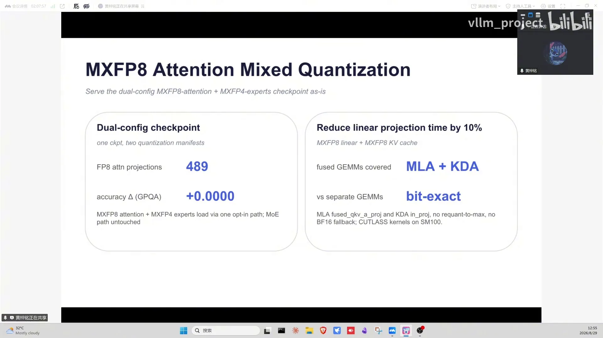 |
| （此区间无字幕） [【跳转到 110:48】](https://www.bilibili.com/video/BV1Wv4k6YEdB/?t=6648) | 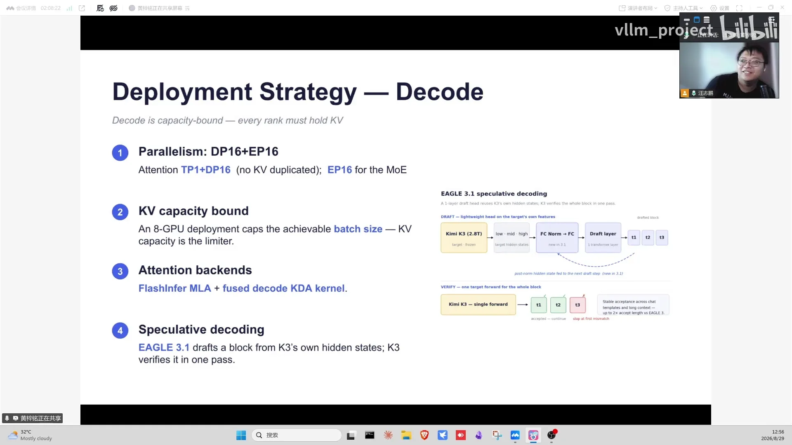 |
| （此区间无字幕） [【跳转到 111:13】](https://www.bilibili.com/video/BV1Wv4k6YEdB/?t=6673) |  |
| （此区间无字幕） [【跳转到 111:38】](https://www.bilibili.com/video/BV1Wv4k6YEdB/?t=6698) |  |
| （此区间无字幕） [【跳转到 112:03】](https://www.bilibili.com/video/BV1Wv4k6YEdB/?t=6723) | 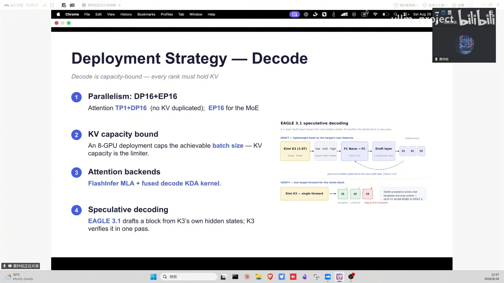 |
| （此区间无字幕） [【跳转到 112:28】](https://www.bilibili.com/video/BV1Wv4k6YEdB/?t=6748) | 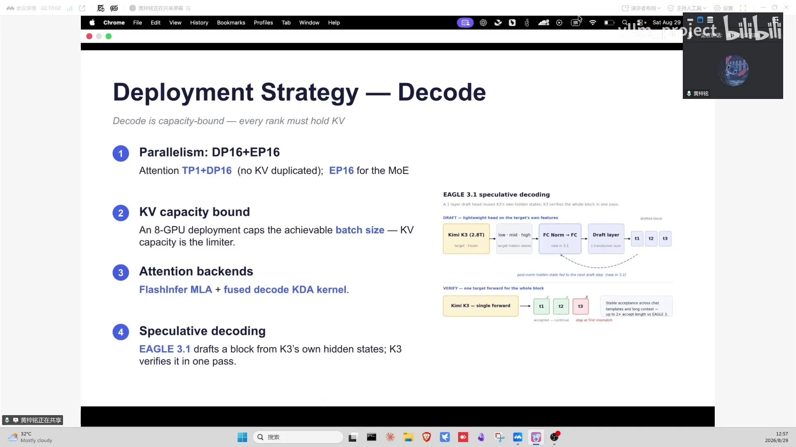 |
| （此区间无字幕） [【跳转到 112:53】](https://www.bilibili.com/video/BV1Wv4k6YEdB/?t=6773) |  |
| （此区间无字幕） [【跳转到 113:18】](https://www.bilibili.com/video/BV1Wv4k6YEdB/?t=6798) |  |
| （此区间无字幕） [【跳转到 113:43】](https://www.bilibili.com/video/BV1Wv4k6YEdB/?t=6823) | 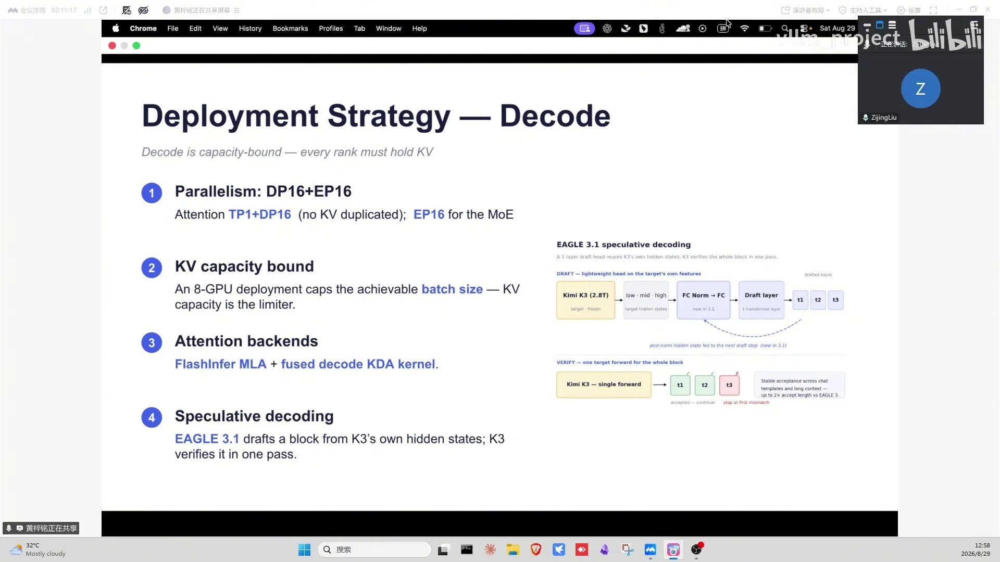 |
| （此区间无字幕） [【跳转到 114:08】](https://www.bilibili.com/video/BV1Wv4k6YEdB/?t=6848) |  |
| （此区间无字幕） [【跳转到 114:33】](https://www.bilibili.com/video/BV1Wv4k6YEdB/?t=6873) |  |
| （此区间无字幕） [【跳转到 114:58】](https://www.bilibili.com/video/BV1Wv4k6YEdB/?t=6898) | 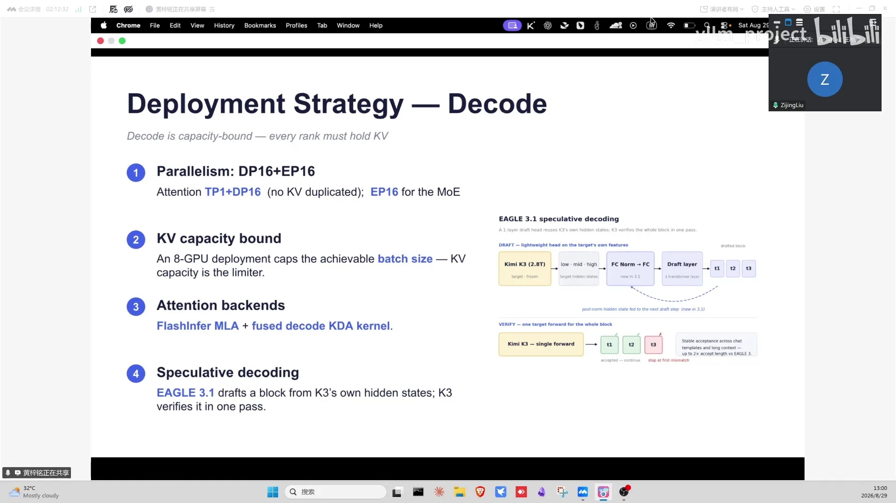 |
| （此区间无字幕） [【跳转到 115:23】](https://www.bilibili.com/video/BV1Wv4k6YEdB/?t=6923) | 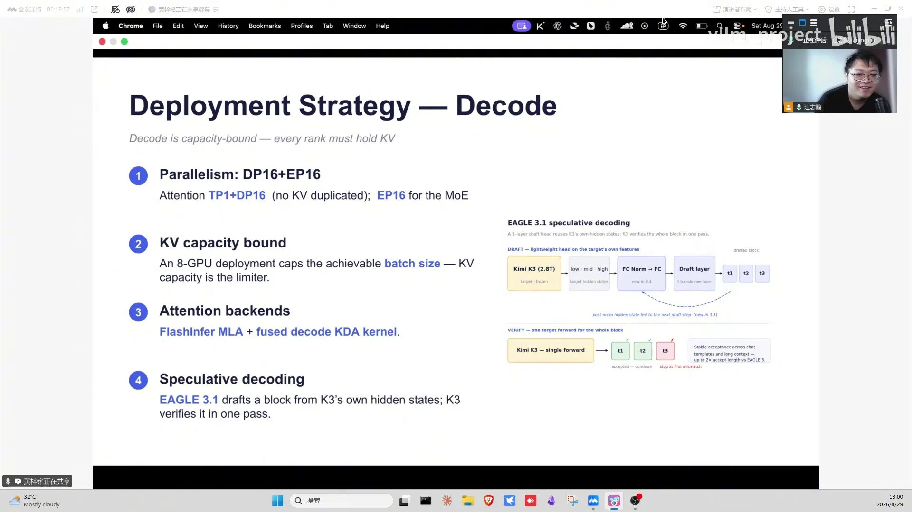 |
| （此区间无字幕） [【跳转到 115:40】](https://www.bilibili.com/video/BV1Wv4k6YEdB/?t=6940) | 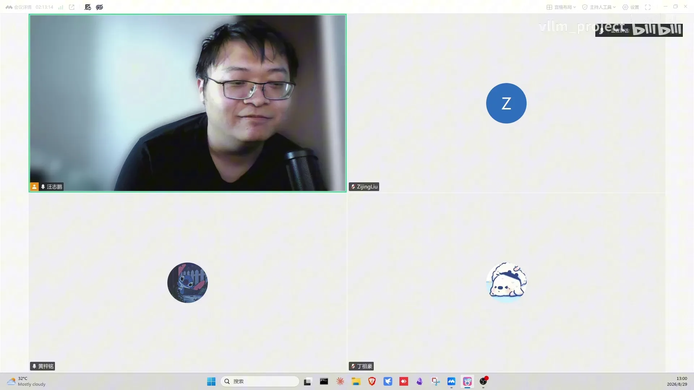 |