# vLLM小课堂（十八）：基于VeRL-Omni的MiniMax-H3 RL后训练实践 原始文稿（图-字幕分栏）

| 字幕文本 | 画面 |
| :--- | ---: |
| 好我看实验已经差不多了那我们就开始吧嗯那我先做个自我介绍嗯好郑老师先做个自我介绍好啊大家好我叫冯志勇然后我现在是呃哈尔滨工业大学的研二的学生因为鹏哥我比你小很多对然后然后我现在就是在沃尔欧米I社区就是帮忙嗯集成这些视频模型 [【跳转到 00:00】](https://www.bilibili.com/video/BV1skYQ63EPW/?t=0) | 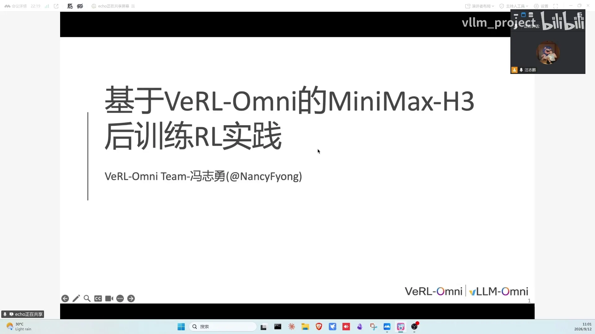 |
| 还有扩散模型还有啊Omni模型的一些介入啊然后今天讲一下就是我们嗯社区团队就是基于veRL-Omni的一个MiniMax的后训练的一个实践然后我首先讲一下我们的一个社区的一个仓库的一个目标主要是我们想建立一个啊更快然后更易于使用的一个开源的一个啊扩散模型的一个training的一个框架 [【跳转到 00:25】](https://www.bilibili.com/video/BV1skYQ63EPW/?t=25) |  |
| 然后主要为了一些diffusion模型还有Omni模型然后主要讲一下我们呃现在diffusion嗯 [【跳转到 00:50】](https://www.bilibili.com/video/BV1skYQ63EPW/?t=50) | 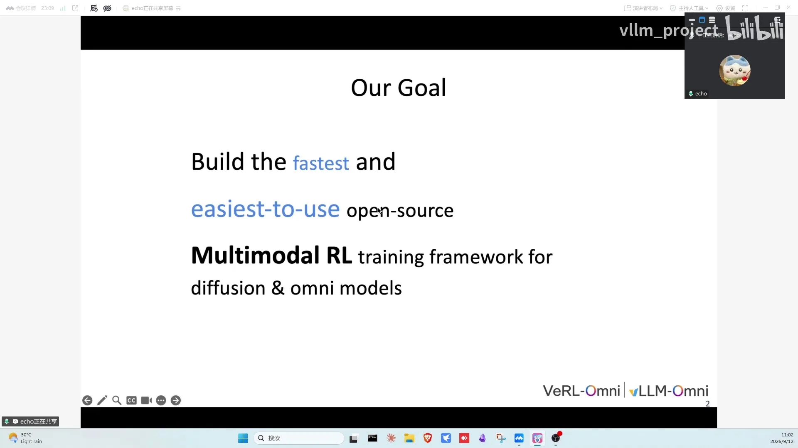 |
| RL和RLMRL的一些区别啊LM的话它主要是基于一些文本生成然后在一些recently还有高定任务上然后我们DEUTION任务的话主要是在一些多模态生成然后我们比较注重于一些他的一些啊引空间然后呃在扩散步数上面的一些timestep上面的一个啊连续的优化然后啊 [【跳转到 00:55】](https://www.bilibili.com/video/BV1skYQ63EPW/?t=55) | 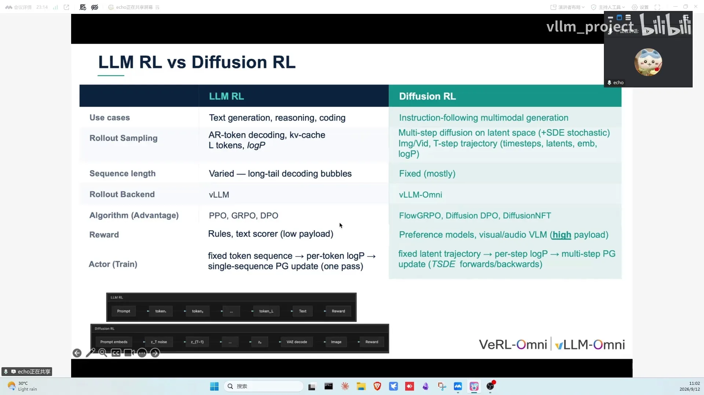 |
| 相比于LM的一个使用的一个ROOUBBACKEND的话它使用的是vLLM-Omni呃一个嗯BACKEND然后我们diffusion 的一个IO主要使用的是vLLM-Omni然后相较于LM的一些啊强化学习都是号码比如PPOGRPO还有DPO我们在整个diffusion 的一个IO里面也有相应的一个辨识就是FlowGRPO还有DiffusionDPO然后DiffusionNFT这种我们嗯然后啊接着讲一下啊 [【跳转到 01:20】](https://www.bilibili.com/video/BV1skYQ63EPW/?t=80) |  |
| 我我讲一下我们的一个框架的一个整个额排 [【跳转到 01:45】](https://www.bilibili.com/video/BV1skYQ63EPW/?t=105) |  |
| 排不烂然后我们主要分为了几个部分一个的话就是在actor这个引擎的话我们主要是使用的DIFFUSER是SFSDP2然后还有vomini然后后后续的话也会接入一个Megatron然后来啊加强它的一个吞吐然后第二个的话在嗯权重同步的话我们会把整个权重然后同步到一个rollout的一个engine啊 [【跳转到 01:50】](https://www.bilibili.com/video/BV1skYQ63EPW/?t=110) | 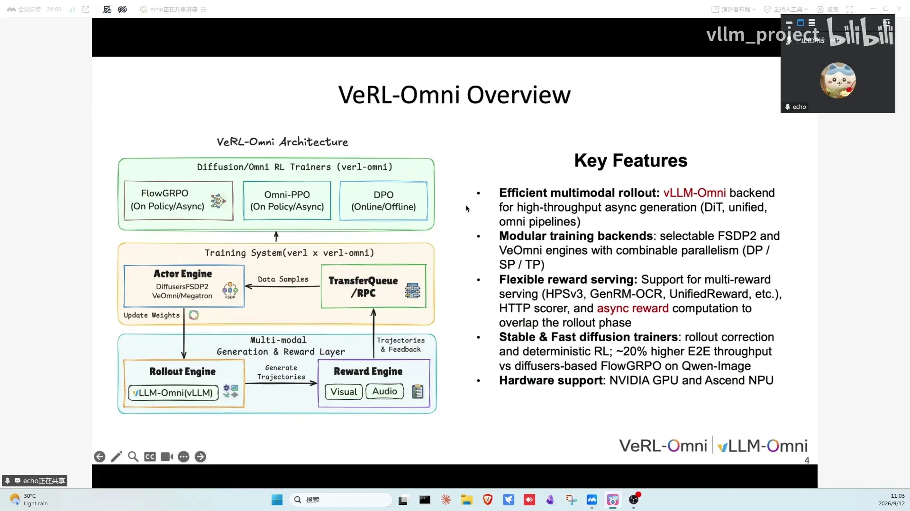 |
| 这个是我们使用的是一个vLLM-Omni然后这样可以加速它的一个router的一个速度然后得到这个router的一个呃一个视频或者是整个轨迹之后我们会嗯进入到一个reword对啊视觉的一些模态还有audio这种进行一个打分然后我们整个传输的一个呃队列的一个用的框架用的啊模块的话是主要基于transport还有RPC [【跳转到 02:15】](https://www.bilibili.com/video/BV1skYQ63EPW/?t=135) |  |
| 这两个RPC正在接入然后transport现在也在逐步的完成了90%的一个接入然后主要是加速它的一个啊数据运输哎我有个小问题啊嗯好的就是麦克tron里面现在是支持这种DEFTION模型吗MACTION这个暂时还不支持但是他有个有个凹凸model那个那个可能会就是支持但是MEXO我们可能要进行一个修 [【跳转到 02:40】](https://www.bilibili.com/video/BV1skYQ63EPW/?t=160) | 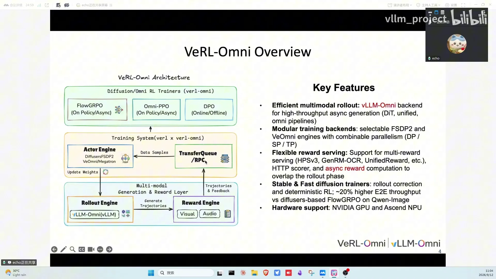 |
| 一个改改改动因为我这两天其实也翻了一下代码我看好像这个FlowGRPO就是有个V0版本还有个V1版本它这两个有什么区别啊呃您说就是在代码仓库里面的吗对对对哦就是V0的话它是直接的一个IPC和ZMQ进行的一个数据传输然后V1的话是我们全部转转成了transport的也来进行一个传输 [【跳转到 03:05】](https://www.bilibili.com/video/BV1skYQ63EPW/?t=185) | 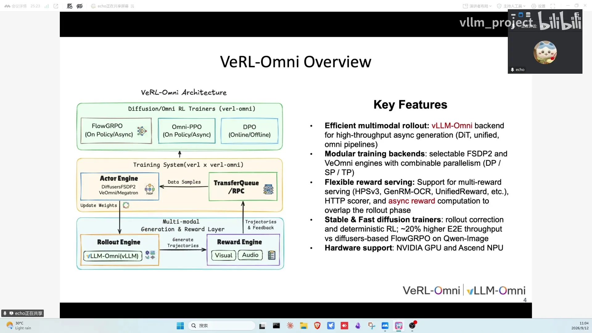 |
| 就是就是善于是做成一个异步的那个方式是吗对的对的对的哦OK哎那那这个里面就是它也是分什么单步异步和那种多步异步吗啊这个现在我们还没有完全的去那个我们现在还是供卡的形式就是还没有进行一个完全的异步进行一个啊介入嗯 [【跳转到 03:30】](https://www.bilibili.com/video/BV1skYQ63EPW/?t=210) |  |
| 哦OK是工卡对还是公卡的现在还是公卡的然后在分卡那个那里还没有完全的去验证哦可以可以好的对因为我还顺便想问这个权重同步这一块地方你们是现在怎么什么什么进度那个那供给的话就是扩大IPC了 [【跳转到 03:55】](https://www.bilibili.com/video/BV1skYQ63EPW/?t=235) |  |
| 全程同步对V0这件事全称啊V0嗯对ABC对嗯好那我们继续好的然后我们现在主要支持的一些主流收藏模型比如说啊diffusion 的模型里面的Qwen-Image还有啊image editing然后FLUX/SD3.5然后视频模型的话我们主要支持了啊现在只搜塔模型MiniMaxh3还有之前比较主流的Wan2.2LTX [【跳转到 04:20】](https://www.bilibili.com/video/BV1skYQ63EPW/?t=260) | 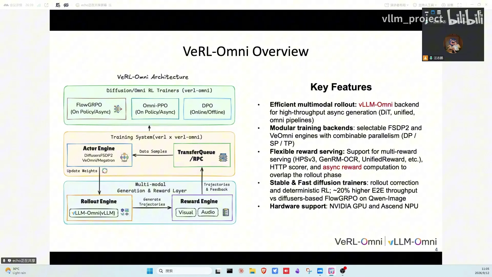 |
| 然后在深层理解统一的模型上面我们主要支持BAGEL然后Omni模型现在这已经完全支持了天文三Omni然后后续会介入MiniCPM啊O4.5这个模型然后我们主要的嗯有一些算法集集成的话就是在OBD还有呃divisionoppd这些都接入了然后IO现在主流的算法FlowGRPOmixgpo这种变式 [【跳转到 04:45】](https://www.bilibili.com/video/BV1skYQ63EPW/?t=285) |  |
| Dexgpu还有啊divisionift这种都接入对然后然后我们这次啊主要还是呃能快速接入的话还是要呃感谢vLLM-Omni的一个支持然后我们框我们框架主要也是基于vomini来进行一个啊robot快速的呃吞吐的一个BACKB然后主要讲一下VROmni [【跳转到 05:10】](https://www.bilibili.com/video/BV1skYQ63EPW/?t=310) | 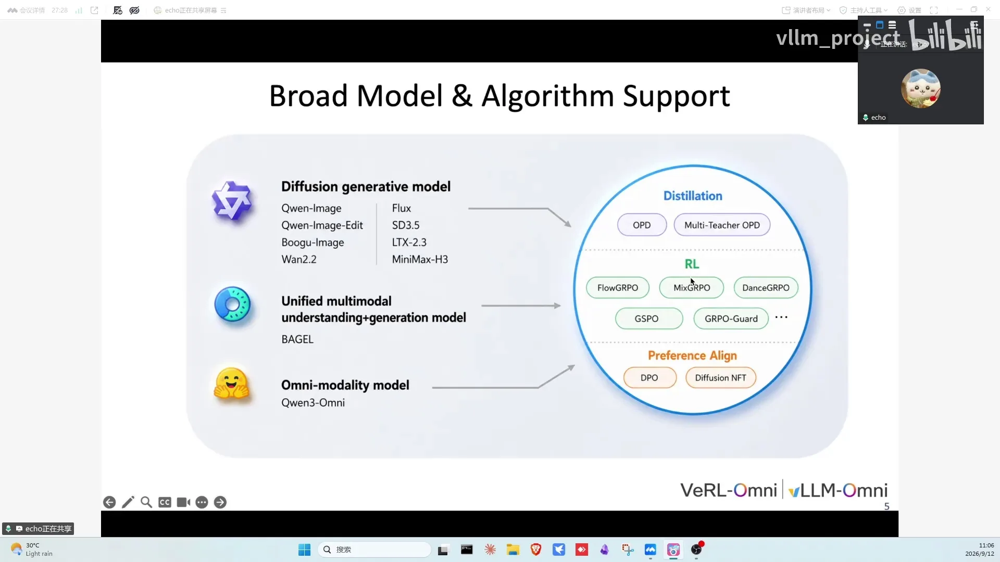 |
| 它主要支持啊Omni的一个模态AR加DIT的这个呃的一个框呃一个backbone然后还有diffusion 的一个生成然后它里面一些呃很好的特性啊比如说连续批处理还有主batchrequest这是给我们的一个RT啊加加速了很多对然后我们整体的一个endtoend的一个话就是在stablediffusion3.5上面啊 [【跳转到 05:35】](https://www.bilibili.com/video/BV1skYQ63EPW/?t=335) |  |
| 相较于现在主流的一些呃框架我们使用veRL-Omni还有vLLM-Omni是额快了百分之百分之五左右然后在整体的话我们是啊有几项特性吧一个是异步算reword然后stepwestcontinuousbing这个是主要得功于vLLM-Omni的一个啊一个优势然后还有在我们router上面也会进行一个正确性的计算然后在kernel算子上面其实主要集成了FA3 [【跳转到 06:00】](https://www.bilibili.com/video/BV1skYQ63EPW/?t=360) | 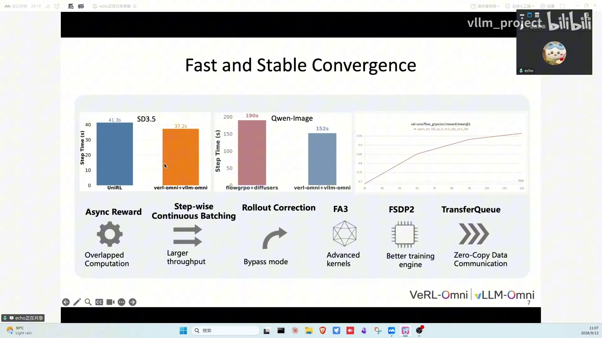 |
| 然后啊分布式上面主要是用FSDP2对 [【跳转到 06:25】](https://www.bilibili.com/video/BV1skYQ63EPW/?t=385) | 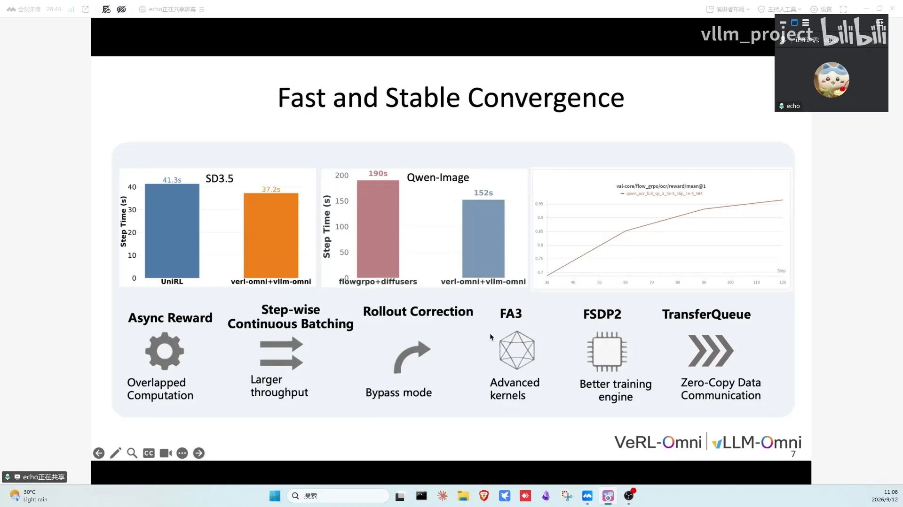 |
| 然后接下来讲一下今天的主角就是MiniMax的一个总体的一个ooverview就是它主要有三个模态吧就是一个text然后一个啊视觉的一个条件然后还有一个语音的一个条件然后文本的条件的话它是会经过一个Qwen3-VL三十三十二B的一个模型然后取它的一个第50层的一个future然后视觉模态它分为两个分支一个是经过Qwen3-VL32B [【跳转到 06:33】](https://www.bilibili.com/video/BV1skYQ63EPW/?t=393) |  |
| 然后第二个经过一个视觉的VE然后他如果有嗯参考的一个视频的话它也会经过这两个模块然后得到了他他们的一个视觉的latent那audio就专门经过一个audiovie然后嗯从32HZ然后转成40HZ的一个tokens然后它它它最后就是会经过一个组成一个pack然后在一个嗯总的一个sequence进行一个组装 [【跳转到 06:58】](https://www.bilibili.com/video/BV1skYQ63EPW/?t=418) |  |
| 然后用分别的一个tokenid去区别他们的一个模态然后在这个packetsequence里面进行一个啊Saveattention然后来进行生成自回归呃来来生成它的一个呃target然后然后第三个的话就会经过OmniTransformer它总共是有三十二三十三B的一个dance然后啊50层的一个BACKBB然后最后分别得到两个video和audio模态之后 [【跳转到 07:23】](https://www.bilibili.com/video/BV1skYQ63EPW/?t=443) |  |
| 再分别经过两个VAE的一个decoder然后这样的话就得到一个音视频的一个生成 [【跳转到 07:48】](https://www.bilibili.com/video/BV1skYQ63EPW/?t=468) | 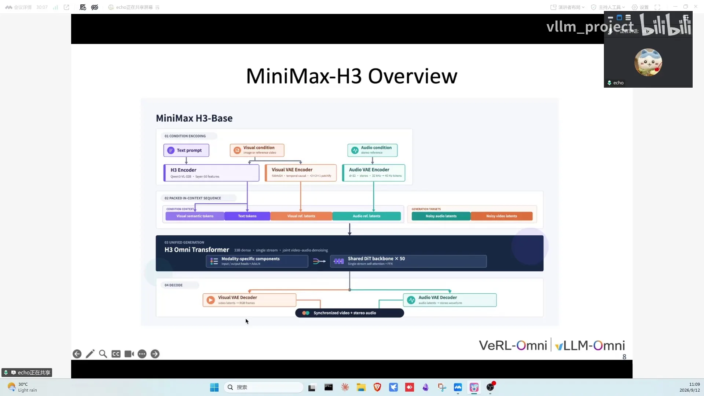 |
| 然后呃我们这次很快的接入的话主要感谢啊我们这些嗯社区的一些呃朋友贡献者然后最后感谢啊永翔哥还有迪丹姐这些麦克歌这些啊的的支持哎我有个我看我们社区不是我们弹幕里面有同学问就是这个fasth3现在能够RL吗 [【跳转到 07:56】](https://www.bilibili.com/video/BV1skYQ63EPW/?t=476) | 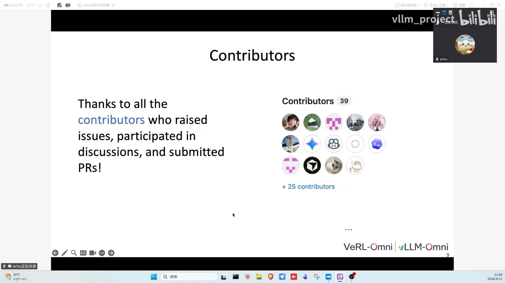 |
| fasth3是是bestvideo开源的那个吗对对对对呃这个我还我们还没有进一步尝试就是现在还是想先把这个啊原生的就是想把它就速度拉上去然后在后续看能不能就是接入这种他已经蒸馏过的模型然后来进行好爱呦嗯我理解这个蒸馏的模型 [【跳转到 08:18】](https://www.bilibili.com/video/BV1skYQ63EPW/?t=498) |  |
| 它改的权重也是他就是因为他发财圈或者是那种turbo它其实都是一些LUA模型嘛对他就相当于把他的步数就从50步然后蒸馏到了一个呃四步嘛然后这种那下一个我们去做二氧化理论上来讲话是改它就是做正楼这个LOA这块全中吗我不太清楚啊 [【跳转到 08:43】](https://www.bilibili.com/video/BV1skYQ63EPW/?t=523) | 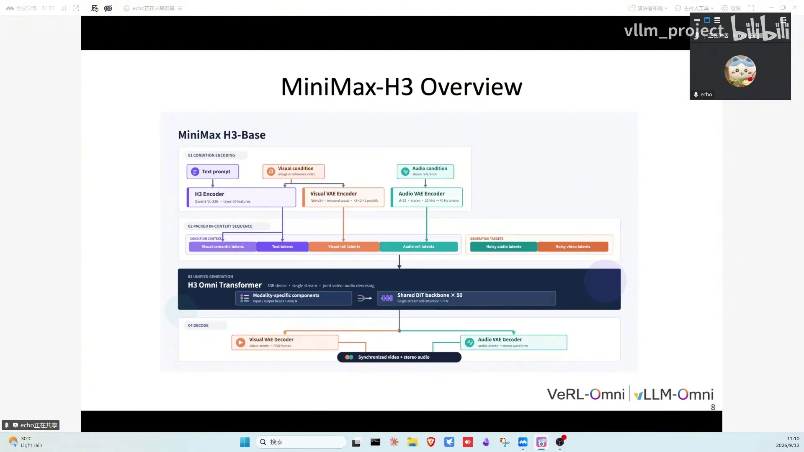 |
| 啊RL吗您住RL吗对对对额其实RL就是就是也相当于给它集成了一个RA然后然后可以让它就是改变它的一个分布嘛然后更好的啊对对对OK那可能那可能这块地还不一定能够兼容对吧对其实其实我觉得他那个蒸馏啊其实也是也是相当于算一种RL因为你是通过一个比如他比如说他的T恤模型其实相当于一个rap嘛 [【跳转到 09:08】](https://www.bilibili.com/video/BV1skYQ63EPW/?t=548) |  |
| 然后他rollout出来你全身模型去拟合它的分布其实这很像一种IO的一种思路对但是现在业界主流的做法就是你RL之后然后去接一个DMD然后部署整流这样可能就是稍微稳一点对因为我其实现在来看现在H3有个很大问题嘛就是他指令跟随上有问题对的那么如果我们既能够让它跑速度快 [【跳转到 09:33】](https://www.bilibili.com/video/BV1skYQ63EPW/?t=573) |  |
| 然后又能让它指令跟随跟的很好那么这个东西就其实非常有价值对的对的不过我觉得现在能够解决指令跟随问题就已经可以向于做出比较质量很好的那种唱片了是的是的是的嗯这个我们社区也在后续跟进那个DMD的这个我们主要是想基于我们这个RL之后的一个模型然后来做一个DMD4部的蒸馏 [【跳转到 09:58】](https://www.bilibili.com/video/BV1skYQ63EPW/?t=598) |  |
| 这样就是可能极大程度的保证了它I之后的一个效果然后还有他的一个加一丢加速它的一个部署对其实我们之前也是很想想这个研究一下这DMD但是就我不知道这个数据应该从哪里来你们是有什么比如说开源的或者是有一些那种直接去蒸的那种数据管道吗这个目前好像是没有大部没有开源了 [【跳转到 10:23】](https://www.bilibili.com/video/BV1skYQ63EPW/?t=623) |  |
| 然后我昨天跟nextov的一个团队就是他们专门做DMD的一个真嗯团队交流下他们说他们大概用了不到5万的数据然后就真出了那个五部的一个啊RORA的那个哦不四部的RA然后我觉得我们可以用RL的一个他的一个数据集就原生的数据集然后尽可能不改变它的一个分布然后去进行一个DMD [【跳转到 10:48】](https://www.bilibili.com/video/BV1skYQ63EPW/?t=648) |  |
| 因为你也是让学生模型去拟合它的一个教师模型的分布这样的话因为你RL之后你你RL1用的也是那个IO数据集嘛然后这样的话可以更大程度的不会改变它IO的一个效果其实我RL的数据集就可以大很大程度的复用到DMD上面我觉得对我之前看他们发stvideo就是因为他们当时的这个模型第一个版本V0的时候使用的是开源数据 [【跳转到 11:13】](https://www.bilibili.com/video/BV1skYQ63EPW/?t=673) |  |
| 然后他当时说他是拿6000条数据去做的这个蒸馏可能跟数据质量也有关系就是但是我我觉得吧就是可能也多样性吧就是多样性比较要多一点对然后有同学问说现在是打算先RL再DMD吗有没有考虑做DMDR之类的RL和DMD一起做的方案 [【跳转到 11:38】](https://www.bilibili.com/video/BV1skYQ63EPW/?t=698) |  |
| 你们有了解什么是DMDR吗DMDR嗯呃现在主流应该是DMD和DMD2吧是这样的DMD2是二是数字那个二是吗对对数字的二对他是说的是DMD2吗DMDR呃DMDR可能我了解的不是很多因为我们我了解 [【跳转到 12:03】](https://www.bilibili.com/video/BV1skYQ63EPW/?t=723) |  |
| 主要是现在比较主流的四个方法嘛就是DMDDMD2然后saveforcing然后catchvid种对后面两者是自回归正流我们主要社区想做一个MVP版本的话就是先做DMD的对嗯对这个我们可以这个线下后面再去看一下的这样电位点二是什么对对对就是如果说他说的那个边做蒸馏边做RL的话这个这个其实我没我们没有尝试过 [【跳转到 12:28】](https://www.bilibili.com/video/BV1skYQ63EPW/?t=748) |  |
| 然后我我我可能了解的还不够深吧就是我了解业界也没有这样的做法一般都是RO之后然后接个DMD蒸馏或者是你DMD蒸馏完之后然后直接对这个呃tb模型做一个IO哦然后有同学补充说DMDR是distribution呃Matchingdistisudeteration [【跳转到 12:53】](https://www.bilibili.com/video/BV1skYQ63EPW/?t=773) |  |
| thedeta呃thisdecision我应该这么读吧就是分那那这不就是DMD吗对啊这就DMD对啊就是对就是我们现在设计主要是想就是先RL之后然后再接个DMD然后我们就最保证最简单的版本就直接是啊一个Fakerscore模型然后再加一个student再加个teacher然后让这个啊student模型去拟合它的一个分布 [【跳转到 13:18】](https://www.bilibili.com/video/BV1skYQ63EPW/?t=798) |  |
| 去拟合教师的一个分布然后我们不需要回归损失也不需要啊干loss这是最简单的一个版本对我们主要社区想这样做看那位同学还有什么就是想法可以交流好然后有同学又问DMP的稍微补充一下哈就是他其实也可以就刚刚那个同学问他是可不可以用在那个fastweekoffasth3上面嘛 [【跳转到 13:43】](https://www.bilibili.com/video/BV1skYQ63EPW/?t=823) |  |
| 他可以把那颗那个LAURA先融到那个底膜里面然后再啊在在像这里这样做这个2L的训练其实也是可以的就然后就我刚才说的先RL然后再去做DND的蒸馏也是可以但是那块确实可能会有数据上的问题所以如果从方便角度可能先把那个呃fasth3的D的LAURA [【跳转到 14:08】](https://www.bilibili.com/video/BV1skYQ63EPW/?t=848) |  |
| 融进这个基模里面后再做2L会会方便一些对对有用翔哥说的是可行的就是然后让他rollout的时候只要就是四步就可以了哦好像也是啊这个方法对嗯但是好像我看没有大规模尝试过嗯好然后有同学问呃DMD的数据分布如果用RL的数据 [【跳转到 14:33】](https://www.bilibili.com/video/BV1skYQ63EPW/?t=873) |  |
| 感觉可能会有些问题嗯嗯这个你怎么看这个我想一下这个我觉得我觉得应该不会吧因为因为反正都是让student模型去就是你和他教室的一个分布然后你用什么数据反正你RL后面的嗯 [【跳转到 14:58】](https://www.bilibili.com/video/BV1skYQ63EPW/?t=898) |  |
| 就是也分布已经是你RL后面的效果了就是这样也不会出现什么很大的问题吧嗯就反正都是你和你那如果出问题的话我觉得是不是就是RL的效果不好嗯好好然后还有问这个千问一密集里面不是说如果用DMD做训练数据的话那么效果不会很好吗 [【跳转到 15:23】](https://www.bilibili.com/video/BV1skYQ63EPW/?t=923) |  |
| 那请问image那篇这个泰国report你们有看吗这基本上属于是我的知识盲区了千万1000万1密集额他他他他的问题是说前面image做DMD会有问题吗对就是说那个DMD是用训练数据做的话那么效果不会很好哦千位image做DMD [【跳转到 15:48】](https://www.bilibili.com/video/BV1skYQ63EPW/?t=948) |  |
| 我们现在尝试了一个我们是用的dance加PO的那个啊testtest图嗯image那个数据集去做我们做的效果还挺好的OK就是基本上可以四步然后效果跟跟那个教室的跟50步的是对齐的然后就算给他算一个定从定量的指标算PIXCOE的话其实分数也是差不多的然后对 [【跳转到 16:13】](https://www.bilibili.com/video/BV1skYQ63EPW/?t=973) |  |
| 就我不确定千户image是否用了但是加PU那个数据集啊OK就我理解的话可能他应该指的是chimi他是有个那个tagreport然后泰戈report里面说就是你做DMD的训练数据的话是尽量的就是你的数据分布不要去跟你之前去训他的时候的数分不那么像我理解的是这个意思哦OKOK对这里也是个嗯好 [【跳转到 16:38】](https://www.bilibili.com/video/BV1skYQ63EPW/?t=998) |  |
| 然后又问就是想问一下有没有做DMD的训练数据开源的计划应该是我觉得现在应该有很多做DMD的开源数据只是你没有他们做H3的那些人的开源的数据对我们现在就是我们现在只是因为呃DMD只是一个初步的阶段然后我们在做RL的时候 [【跳转到 17:03】](https://www.bilibili.com/video/BV1skYQ63EPW/?t=1023) |  |
| 我们是用的主流的RL的开源数据集deathGPU的那个整体的一个流程对因为我之前我觉得这个H3有个问题是在于法律法规的问题嘛对吧就是他有些人的话比如说我是拿那个H3直接去争出来一些数据去做一些后训练那么其实这个数据我是没办法去开源的因为他法律里面就是要求比如说有些国家是不允许去用 [【跳转到 17:28】](https://www.bilibili.com/video/BV1skYQ63EPW/?t=1048) |  |
| 他这个里面的术语做一些蒸馏的对的对的好那我们继续吧 [【跳转到 17:53】](https://www.bilibili.com/video/BV1skYQ63EPW/?t=1073) | 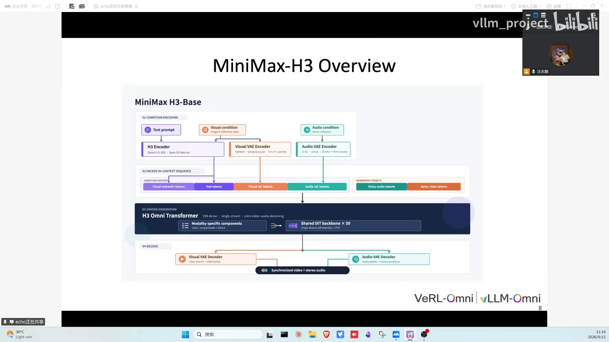 |
| 然后讲一下我们MiniMaxh3整体的一个接入的一个流程然后首先回顾一下我们的一个IO的一个整体的一个workflow就是啊首先会有个prompt然后进入到我们的一个policy的一个啊然后嗯一个生成的模型然后它主要生成了不同的一个候选集然后通过这个不同的候选集比如说一个group里面它会产生啊积个样本然后通过reward模型去给他打分 [【跳转到 18:03】](https://www.bilibili.com/video/BV1skYQ63EPW/?t=1083) | 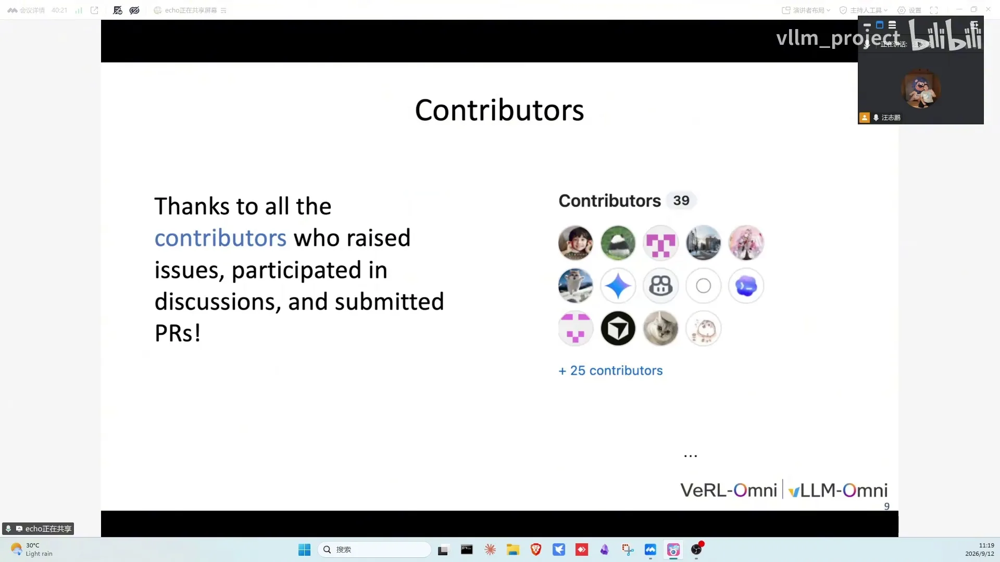 |
| 打完分之后然后经过算一个优势然后最后通过这个优势然后算loss然后回流到这个啊police的一个策略模型然后来进行一个优化这是主要的一个流程 [【跳转到 18:28】](https://www.bilibili.com/video/BV1skYQ63EPW/?t=1108) | 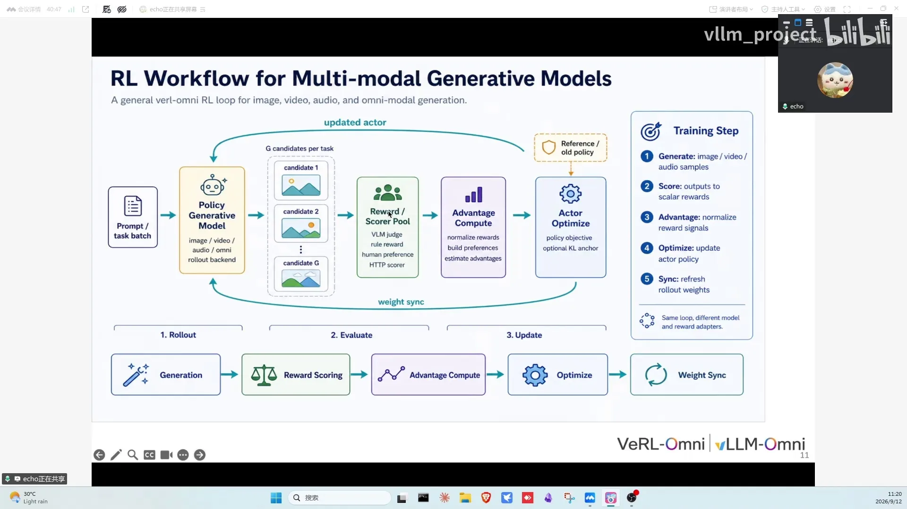 |
| 然后我们现在主要嗯当时主要第一个介入的是divisionift啊为什么接嗯首先接入diffusionIFT呢因为它相对于flow加PO的话是会额稍微好接入一点因为它其实整体的一个idea就是会稍微简单一点因为啊首先它会有一个condition然后针对这个condition在初始造成的时候进行一个加噪然后它会route出啊不同的一个image的样本 [【跳转到 18:40】](https://www.bilibili.com/video/BV1skYQ63EPW/?t=1120) |  |
| 然后它主要相较于flow加PU的话它就没有一个ODE转SD的一个流程然后直接对于这个呃干净的图像然后来反向的一个加造学习他的一个加造过程然后针对于啊reword好的样本的话是啊使用一个啊使用使用一个loss来加大它的一个嗯往这个往这个好的样本的一个分布进行一个优化 [【跳转到 19:05】](https://www.bilibili.com/video/BV1skYQ63EPW/?t=1145) |  |
| 然后如果是negative的一个样本的话就是对吧这个速度长嗯减去它的一个贝塔的这个啊西塔然后让它嗯推把坏的一个样本就分布给推远一点然后这样通过一个loss来计算这样的话其实它比较好接入因为他只需要rollout出一个干净的样本然后来对它进行一个加噪就很好的介入然后我们当时在ttoavaa上面就是可以发现它MiniMax [【跳转到 19:30】](https://www.bilibili.com/video/BV1skYQ63EPW/?t=1170) |  |
| 其实它是一个很好的一个IO的模型因为它相比于我们之前使用one啊还有LTX它展展涨点的分数就是特别特别快然后对然后这是我们选用DEUTIONAFT的一个呃主要的一个呃呃motivation吧嗯对 [【跳转到 19:55】](https://www.bilibili.com/video/BV1skYQ63EPW/?t=1195) | 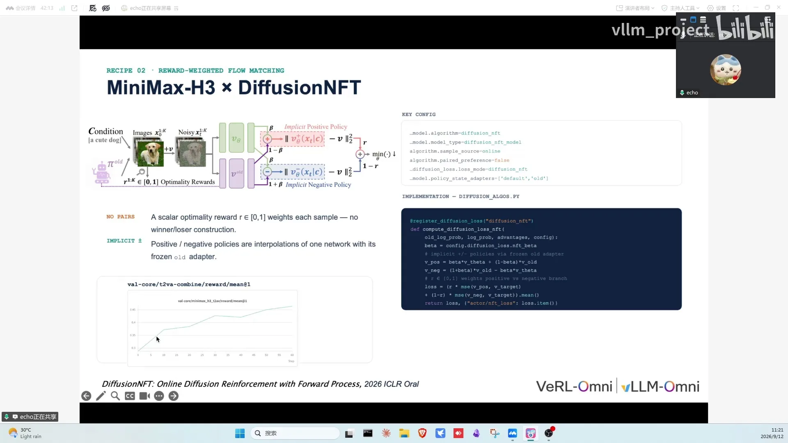 |
| 然后我看我们这个弹幕有个同学问了一个很好的问题啊 [【跳转到 20:12】](https://www.bilibili.com/video/BV1skYQ63EPW/?t=1212) |  |
| 就是STEPWISE的continuespatching在RL训练中真的用到了吗这方面啊这这方面我我可我我我因为我不是集成这一块的看就我们现在这个训练的话你bysize设的是一还是说更多的一些更大值呃这个的话因为就是在整个defers端的话它是没有一个batch维度的嘛对吧然后我们是直接自己嗯 [【跳转到 20:17】](https://www.bilibili.com/video/BV1skYQ63EPW/?t=1217) |  |
| 其实还是相当于被取赛值为一吧因为它我们去因为当时鹏哥你也说了就是他败血为一然后你加大其实没什么收益的然后我们当时为了比较快的接入然后现在还是主要针对于batch赛的唯一吧对这一点的话其实这玩意因为这东西其实它主要就是跟你的ROOU有关嘛对吧然后你看你的这个ROOU在备赛时是一的时候是conquinbang [【跳转到 20:42】](https://www.bilibili.com/video/BV1skYQ63EPW/?t=1242) |  |
| 还是这个MEMORBANG然后实际上反正我手上的这些设备算出来都是CONTROPING棒因此你会发现你哪怕把BSD打成二那么它一般耗时就会翻两倍对对那也就是说你拜塞子那个开大是没有任何收益的但是这玩意也是看设备是什么样子的而且我看好像现在就是MiniMax在呃那个VMO米里面 [【跳转到 21:07】](https://www.bilibili.com/video/BV1skYQ63EPW/?t=1267) |  |
| 它是只能支持V1对吧其实可以支持contusbatch因为我一开始想的是可能设备更好之后的话它会有收益但是设备好之后它不光计算能力变强了它的仿存带宽也变强了啊得找那种就计算能力很强但是访存带宽很弱的那么它就非常容易是变成一个memoryb [【跳转到 21:32】](https://www.bilibili.com/video/BV1skYQ63EPW/?t=1292) |  |
| Ok对然后那个呃在那个图像模型上开那个stillcontinueSPATCHING是有明确的收益的然后那块其实然后这个MiniMaxh3它的显存占用像把batch呃改从一改到其他数值肯定会比明显会比图像模型它阵容大很多然后对对哎 [【跳转到 21:57】](https://www.bilibili.com/video/BV1skYQ63EPW/?t=1317) |  |
| 我的观察就是在图像上开肯定SPATCHING或者是那个requestlevel的batching它的收益是比较明显的生成roll的时间能够减少50%左右嗯而且我听他们说好像这个Wan2.2这个模型你开这个开BH的话也是会有收益的所以忘加202它本身计算强度比较小是对oneone本身就比较小一点 [【跳转到 22:22】](https://www.bilibili.com/video/BV1skYQ63EPW/?t=1342) | 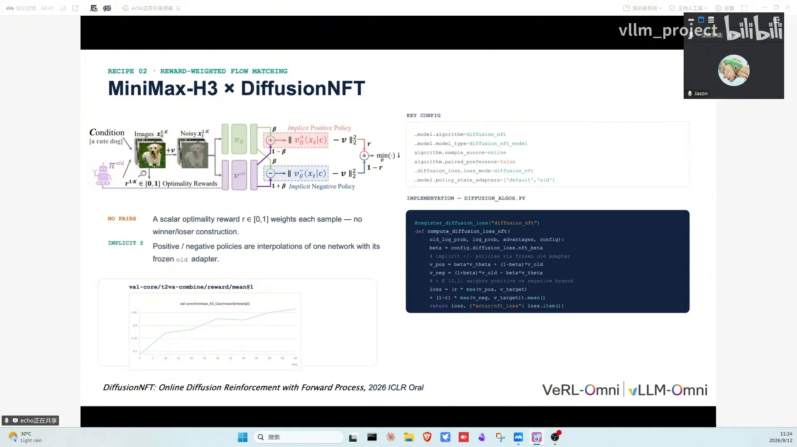 |
| 他开就是你模型越小可能开的就是他那个收益越大对然后有同学问就是为什么图片不也是completebug吗为什么会有收益哦这个东西是这样子就是它是CTRLBG还是BERBG其实你是可以通过计算算出来的就是以前就是大家的整个芯片的性能很差那么图片计算就是COMPREME棒的 [【跳转到 22:47】](https://www.bilibili.com/video/BV1skYQ63EPW/?t=1367) |  |
| 但是现在话因为大家性能都特别好了那么其实你会发现你可能同时就是计算和你仿存式都打不完对吧然后你就这时候就是CPUBB然后有时候你可能就会发现呃你的仿存打满了但是你的这个计算其实是完全没打满的这其实是现在很多图片模型的这种收益这种情况就图片来讲的话 [【跳转到 23:12】](https://www.bilibili.com/video/BV1skYQ63EPW/?t=1392) |  |
| 那个他很多程度上他就是个memoryb的情况哦我补充一下我看那个仓库里面其实现在只有千万imageocr嗯reward那个脚本它是用的STEPWISE的BING其实现在绝大多数的这个模型核算法他用的是requestlevel的batch [【跳转到 23:37】](https://www.bilibili.com/video/BV1skYQ63EPW/?t=1417) |  |
| 就是在rot方面的收益是收益会更好一点对这个也刚刚永强对刚刚永强提到那个偏英美是50%的收益那个应该是requestlevel版权对这个也很合理的因为首先这种方式实现起来是最简单的我只要把你的request分桶就行了啊然后其次就是这种生图视频的话 [【跳转到 24:02】](https://www.bilibili.com/video/BV1skYQ63EPW/?t=1442) |  |
| 就圣徒你的这个分辨率不同的话其实你是很难去组batch的虽然我们前一期不过我们前两次的直播里面有一个专门讲diffusioncontribution的然后大家有兴趣可以看一下那一期那期就是呃也是fastvideo就是张浩老师他们团队在搞一个那个就是分辨率不同我也可以去通过切窗口形式去组一个卡 [【跳转到 24:27】](https://www.bilibili.com/video/BV1skYQ63EPW/?t=1467) | 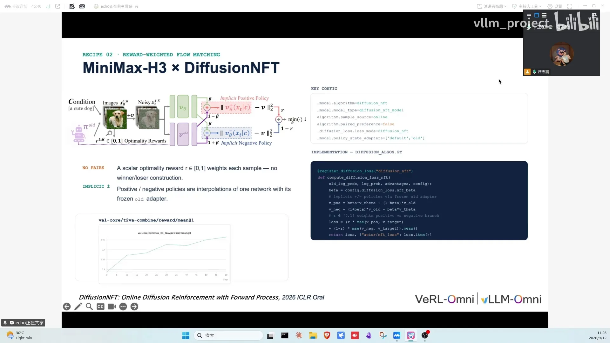 |
| continue白起那一期视频大家感兴趣可以研究一下然后有同学又问这个一米几收益50%用的是啥卡呀永翔老师可以分享一下子吗那个那个用的是呃H200H200Ok [【跳转到 24:52】](https://www.bilibili.com/video/BV1skYQ63EPW/?t=1492) |  |
| 嗯嗯是张浩老师就是这个fastvideo就包括霹雳芬迪也是他们实验室提出来的所以属于是非常做一些非常SY的工作好那我们继续吧然后讲下我们这整个一个流程吧 [【跳转到 25:17】](https://www.bilibili.com/video/BV1skYQ63EPW/?t=1517) |  |
| 就是我们当时最快接入的是一个ttov还有FXxto收尾针的一个介入然后它主要相当于就是先把文本然后prompt然后编码成一个tokenid然后把首尾帧也进行一个条件增长和固定然后呃这方面条件这方面是不参与一个FT的loss然后通过vLLM-Omni呃MiniMax啊H3来进行一个rollout然后我们outer出了一个videolatent [【跳转到 25:39】](https://www.bilibili.com/video/BV1skYQ63EPW/?t=1539) |  |
| 和一个啊audiolatent然后还有一个他的一个音频还有视频然后进行一个计算reward然后嗯计算完ROWORD之后我们会把这个latent然后来进行一个反向的一个加噪加造完之后然后这个时候我们会啊通过算一个loss然后来进行一个BACKWORD然后来联合输出然后这样啊然后这样哦我们会还会在里面加一个allorpolicy和update [【跳转到 26:04】](https://www.bilibili.com/video/BV1skYQ63EPW/?t=1564) |  |
| 就是让它每两步更新一次不让它更新的太快然后可以看下我们主要的一个效果吧就是呃在zero射手的时候我们也发现了就是鹏哥说的那个他会加很多一个配乐嗯鹏哥是这样的配乐吗诶好像没听到声音啊没声音吗可 [【跳转到 26:29】](https://www.bilibili.com/video/BV1skYQ63EPW/?t=1589) | 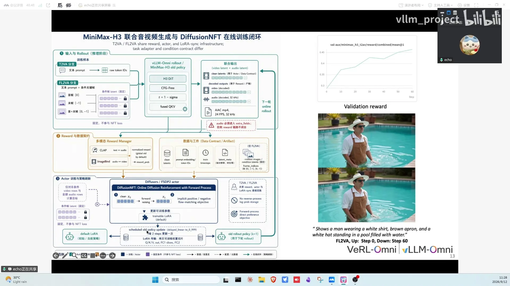 |
| （此区间无字幕） [【跳转到 26:54】](https://www.bilibili.com/video/BV1skYQ63EPW/?t=1614) | 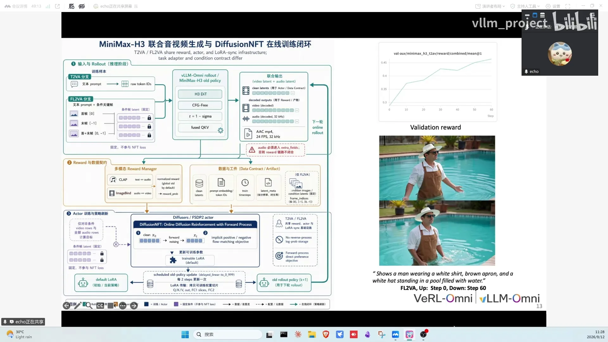 |
| 哪一个可以 [【跳转到 26:59】](https://www.bilibili.com/video/BV1skYQ63EPW/?t=1619) | 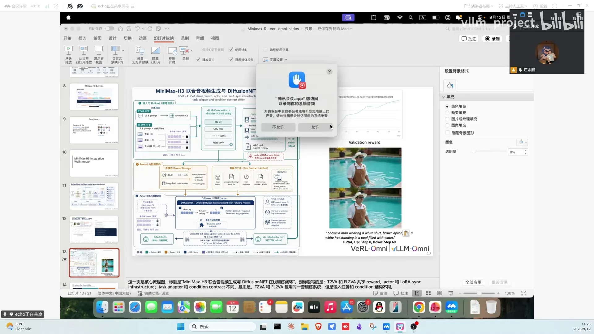 |
| 哦有声音了现在有吗对现在有对这个问题就是对这个问题就是我之前说的就是你哪怕不让他加声音他都会加声音对的对的对的然后在我们训练后我们60步的时候ReallymeetthemTheywanttobefearedcury感觉好很多嗯 [【跳转到 27:04】](https://www.bilibili.com/video/BV1skYQ63EPW/?t=1624) | 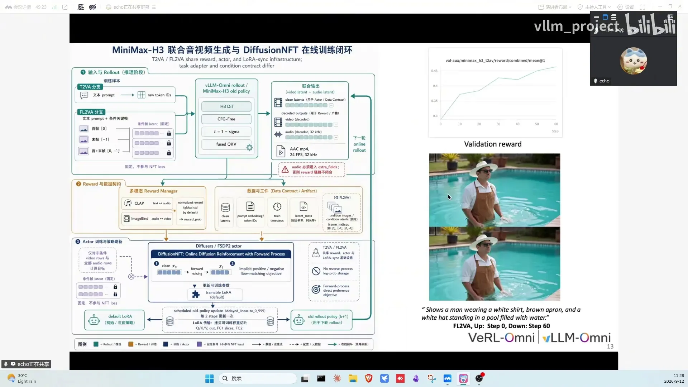 |
| 那这个确实要好很多哎这个权重现在我可以直接用吗呃我如果您需要的话我后面可以开源上面去好开到对可以的可以呃但是我我有一点要说的就是我们可能还有个局限就是因为我们用的是啊之前IO的一些呃开源数据集嘛就是DX加PO这种它其实它你可以看到他这个problem其实是很短的对就是他的一个表现力可能还不是很强 [【跳转到 27:29】](https://www.bilibili.com/video/BV1skYQ63EPW/?t=1649) |  |
| 就是对就是不知道不知道鹏哥你的场景是prom很长呢还是prom就是比较像这种描述的不是很详细的这种呃我场景prop很长但是我觉得也可以试一下子就是试一下他的发货能力吧对是我后续可以开源到上面去嗯对 [【跳转到 27:54】](https://www.bilibili.com/video/BV1skYQ63EPW/?t=1674) |  |
| 然后讲一下我们的一个主要三个问题吧第一个的话是它的一个啊运在MiniMax集成的时候他有三个要注意的一个地方一个的话就是他的一个H3诶他的H3的话就是跟传统的一个DIFFUSERS它的一个呃timestep这种啊flowmation的一个呃公式的话它其实是反的就比如说呃传统的一个defer它是在T啊 [【跳转到 28:16】](https://www.bilibili.com/video/BV1skYQ63EPW/?t=1696) |  |
| 在noset的呃哎嗯从1~0然后噪声西格玛从1~0的时候还是从噪声到一个干净的图像然后MiniMaxdit它是一个反的它在T等于零的时候它是一个干净的噪声然后在一的时候它是个呃图像对它是一个很完整的一个视频对然后第二个的话是在我们进行一个RUA和TP的时候会进行的一个啊踩的坑啊这主要的问题的话就是 [【跳转到 28:41】](https://www.bilibili.com/video/BV1skYQ63EPW/?t=1721) |  |
| DIFFUSERS的一个权重分布和vLLM-Omni的一个权重分布它其实是不一样的比如说啊在DIFFUSERS上面它呃他没有把QKV进行一个打包然后VMOMINI他为了更快他为了更快的话还会把QQV进行一个打包这个时候我们需要写一套权重同步的一个逻辑把啊wearrowout出来的一个啊他的一个权重然后跟我们defer的权重然后两者进行一个横额同步 [【跳转到 29:06】](https://www.bilibili.com/video/BV1skYQ63EPW/?t=1746) | 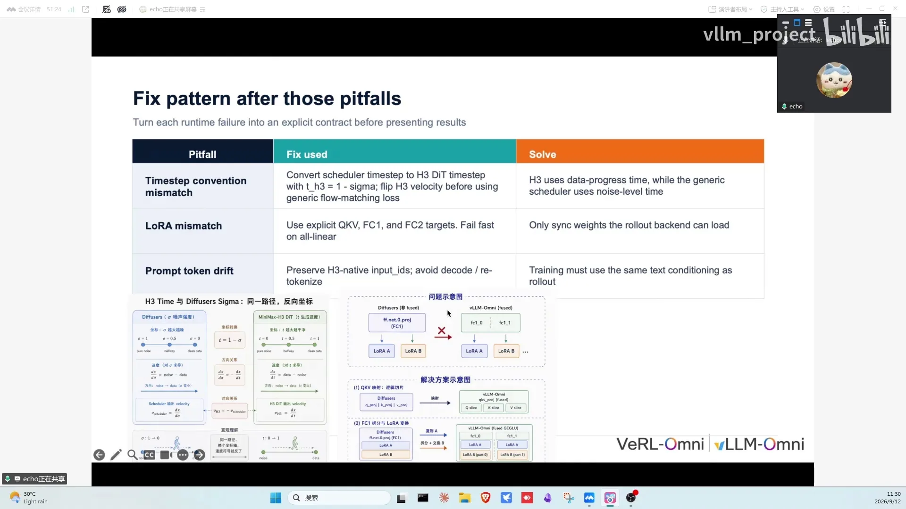 |
| 不然的话就是你整体的一个嗯LAURA权重是没有同步上去的然后还有一个问题的话就是在啊TP和RA呃双持的时候比如说他这个啊在FFC1层的话它啊这个DEVS的话它是一个完整的一个FC1然后在vmormini它是区分成了两块一个是D0块然后第一块然后然后并且它的顺序也是反过来的然后我们需要把它的一个顺序 [【跳转到 29:31】](https://www.bilibili.com/video/BV1skYQ63EPW/?t=1771) |  |
| 然后按照defer的一个啊权重分布然后给进行一个啊进行一个调整然后这样的话它你的RA和TP才能正确的一个实施然后第三个的话是一个啊tokenid吧就是因为现在嗯之前仓库的一些模型的话主要是把嗯dataset然后嗯给拿到他的inputid之后 [【跳转到 29:56】](https://www.bilibili.com/video/BV1skYQ63EPW/?t=1796) | 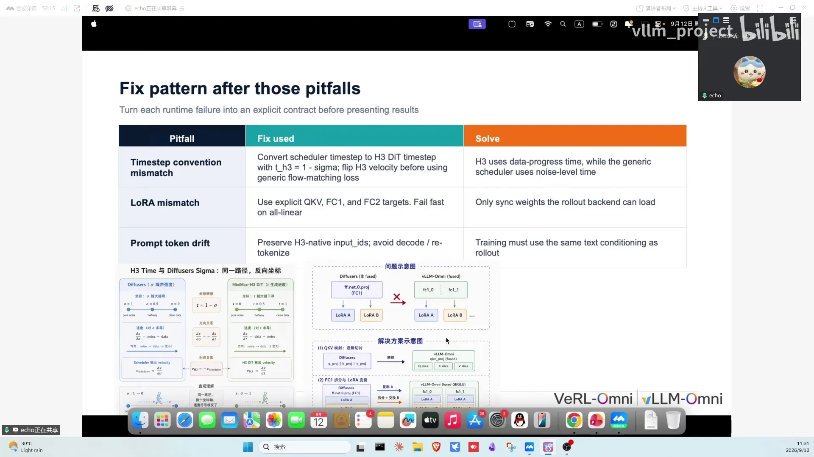 |
| 在rot端vLLM-Omni的时候它在内部再重算再tokenizer1遍然后这样就会经过一个tokennezer然后再dionether然后再decoder然后再tokenalize然后这样的话很容易造成它的一个token的一个偏移然后特别是MiniMax这种就是很多很多一个tokeni额不同的一个模态Tokenid这样的话会更容易出现一个问题我们的话就是直接把在只编码一次 [【跳转到 30:21】](https://www.bilibili.com/video/BV1skYQ63EPW/?t=1821) |  |
| 然后保存它的一个inputid然后在router时候直接使用它这样就不会造成一个tokenid的一个偏移 [【跳转到 30:46】](https://www.bilibili.com/video/BV1skYQ63EPW/?t=1846) | 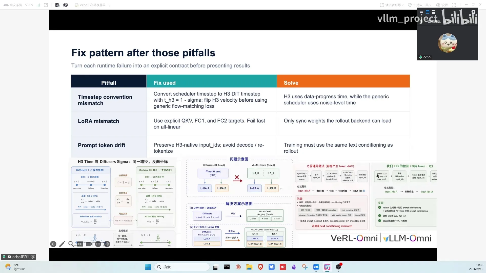 |
| 然后讲一下我们用的一个整体的一个实验的一个设置吧我们使用的一个数据的话就是之前我说的dance加PO的一个啊casesid它是一个很主流的大家用来验证RL的一个效果的一个数据集它主要包括了2万7000条的一个啊英文的一个proms然后针对于首尾帧的话我们是这嗯也像他的一个步骤一样就是先用flux1 [【跳转到 30:54】](https://www.bilibili.com/video/BV1skYQ63EPW/?t=1854) | 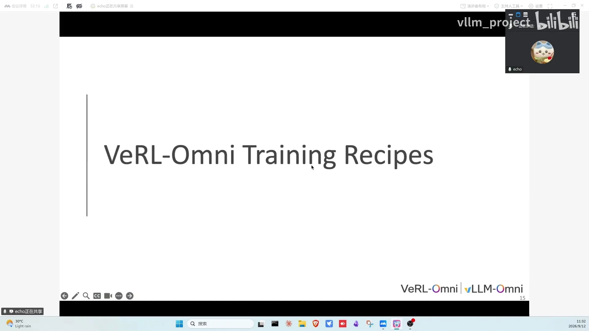 |
| 然后来针对于他的纹身图然后我们来纹身图的数据集来生成我们的一个图片然后来进行一个首尾帧的一个固定对然后我们主要啊设置了2万7000条一个啊tram然后128条的一个test然后我们ttwova的话是主要是用的啊HH100和HA200然后来进行验证我们用了TP为二然后就是在显存不够用的时候 [【跳转到 31:19】](https://www.bilibili.com/video/BV1skYQ63EPW/?t=1879) | 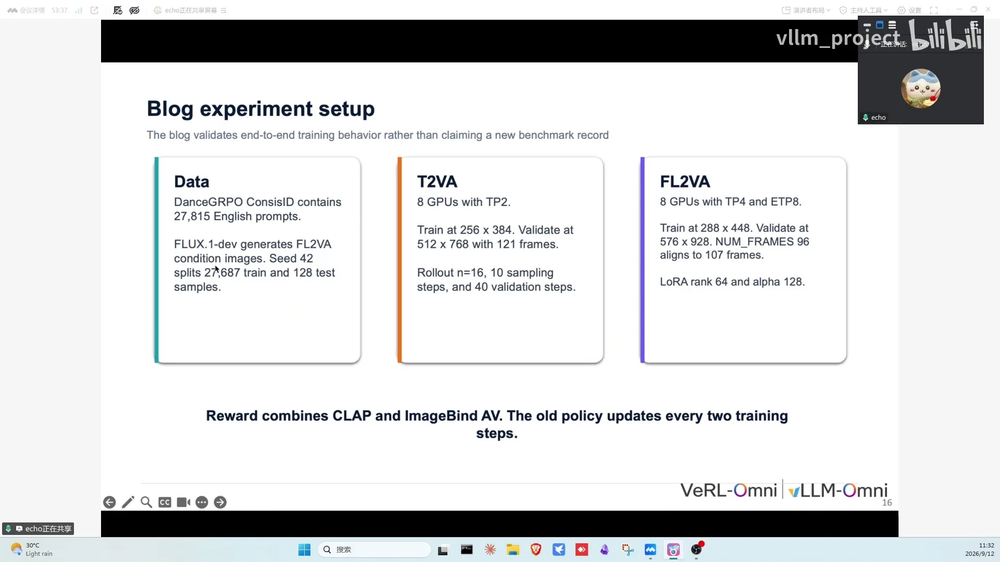 |
| 其实是可以开tb为二这种情况然后我们训练的分辨率大概是256×384然后为嗯验证的话是512×768这样子然后我们使用整个routergroup是16这个特别要说的一个点的话就是我们我们啊团队在验证的时候就是发现假如说你一个step里面最好是router的一个group里面要大一点然后你的trainbatchsize也要尽可能大于等于16 [【跳转到 31:44】](https://www.bilibili.com/video/BV1skYQ63EPW/?t=1904) | 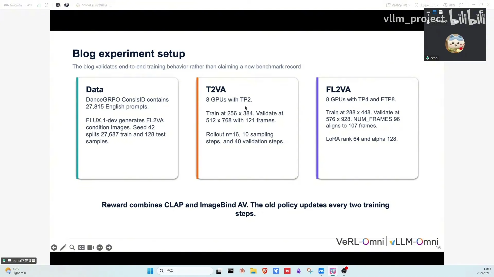 |
| 如果说你的一个batchsize很小的话其实它很快比如说在二三十步的时候就会造成一个reword下降然后这样其实导致它的一个其他方差就是会特特别小然后前进没有RL的一个必要就是我们特别推荐在一个step的时候你尽可能的把嗯一个step里面的样本就是调大一点尽可能是呃256512这种情况 [【跳转到 32:09】](https://www.bilibili.com/video/BV1skYQ63EPW/?t=1929) | 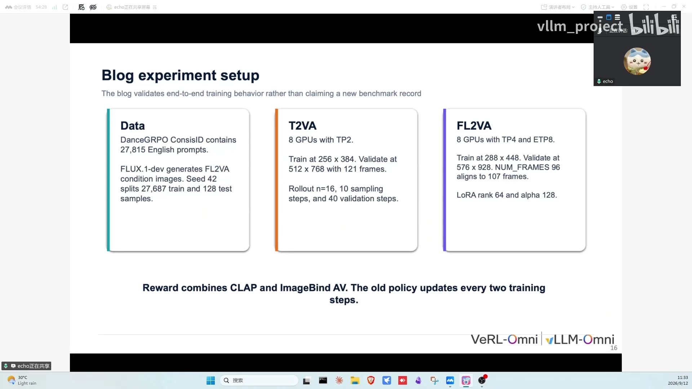 |
| 然后在F在首尾帧到VA的这个的话我们是采用了TP等于四然后EPETP为啊四啊这不好意思这个写错因为啊因为他MiniMax其实有一个有个特别重要的一个点就是它的一个文本编码器千问3VO32B其实是很大的然后如果说你是啊H100啊还有H20这种卡的话你你很难很难在呃权重同步和嗯 [【跳转到 32:34】](https://www.bilibili.com/video/BV1skYQ63EPW/?t=1954) |  |
| 那个时候就是能装得下这么多显存我们实测过它如果说假如说你不开ETP的话你投第一个rank的话其实是会超过100G的然后这样的话其实是啊对中小显存的一个卡其实是不太友好然后我们比较推荐于把ETP和TP都开成四啊或者八然后这样的话他的权重它的一个那个权重分布的话就比较均衡这样的话其实你就可以大部分在一些啊 [【跳转到 32:59】](https://www.bilibili.com/video/BV1skYQ63EPW/?t=1979) |  |
| 嗯嗯一些H20还有H100这种80G啊还有卡上面进行一个使用对好我们来回答一下子弹幕的提问啊呃有同学问这个warm和DIFFUSERS是共卡的嘛权重切换的话大概需要多长时间啊对这个是我们工卡的权重切换的话大概是十几20秒吧 [【跳转到 33:24】](https://www.bilibili.com/video/BV1skYQ63EPW/?t=2004) | 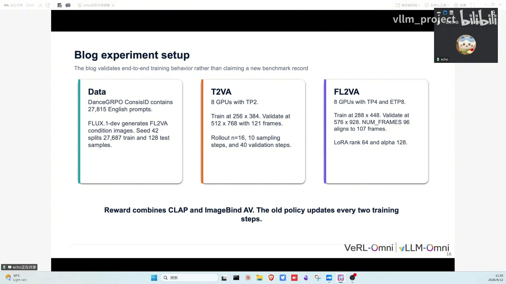 |
| 主要他的一个瓶颈其实其实我我我感觉啊MiniMax它其实是一个router很快的一个一个嗯模型其实然后我们整体的一个啊etoe一个step的话大概是五六百秒左右嗯嗯然后你by赛的话是设的多少就是整个的系统的啊整个系统的话是全badset是32然后如果我们group为16的话 [【跳转到 33:49】](https://www.bilibili.com/video/BV1skYQ63EPW/?t=2029) |  |
| 就是你一个step就是512左右了哦好然后有同学问说我在使用NFTTHH3呃TT为复线的时候发现推理出的视频存在光斑即使是step林呃这样不会吧是在就是就是在验证的时候推荐也出现官方吗是在多少个step呢 [【跳转到 34:14】](https://www.bilibili.com/video/BV1skYQ63EPW/?t=2054) |  |
| 嗯这个他没有说诶我记得好像昨天左豪也是讲过一些像跟光斑相关的问题这个这个因为我在验证ttwoVA和首尾针图VA的时候我发现他word出来就是就是他只会在六七十步就因为他在后期七呃AFT的时候因AFT主要的hiking特别特别快 [【跳转到 34:39】](https://www.bilibili.com/video/BV1skYQ63EPW/?t=2079) |  |
| 就他在嗯778778十部的时候他就会呃vidhiking然后导致他的一个啊会变暗整体的视频就会变暗然后会有光光斑的情况不知道他在多少部出现的情况在60步之前其实都是非常非常好的哦对那我觉得可能是就是要么就是可能是呃我觉得大概率是因为之前可能脚本上有些问题然后现在的话可能这个bug已经修复了是因为这位同学 [【跳转到 35:04】](https://www.bilibili.com/video/BV1skYQ63EPW/?t=2104) | 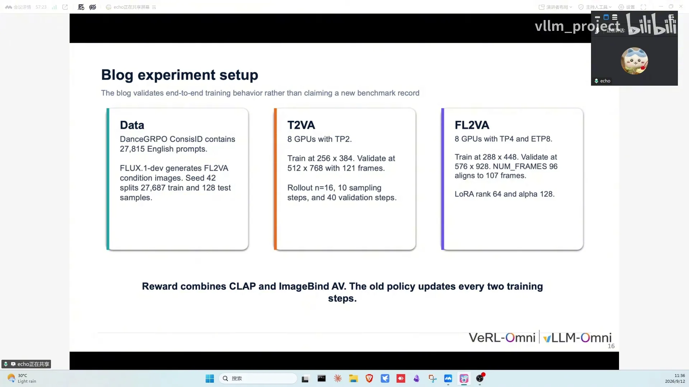 |
| 他说是从slave林那时候就已经开始有光斑了对这个step的话那说明你肯定是这个训练就出了很大的问题了对step0就导致他deoshot肯定就出问题了对好然后回头回头可以提个一水吧对回头可以提个一血说不定这个事情是真的存在的然后有同学又问这个ETP是指的EP组里开TP吗 [【跳转到 35:29】](https://www.bilibili.com/video/BV1skYQ63EPW/?t=2129) |  |
| 呃不是的这个app应该是encoder的tens那个TENSPOT对吧对对对对就是把千万3VO那个整个txtcode给进行分片因为它整体占的很大然后可能就是呃五六世纪然后普通的一个就是如果说你不上H200和BB系列的卡的话其实你很大概率是会爆显存的嗯对因为他这个确实有33MB的模型嘛 [【跳转到 35:54】](https://www.bilibili.com/video/BV1skYQ63EPW/?t=2154) |  |
| 加起来60多G那么最好还是对它进行一个分片其实我们一般来讲的话这个H3在WEMON里面的推理任务里面你去部署它它一般来讲也会默认把这个encoder开TP对对对嗯好的我们继续吧OK讲一下我们的一个futureroommate [【跳转到 36:19】](https://www.bilibili.com/video/BV1skYQ63EPW/?t=2179) | 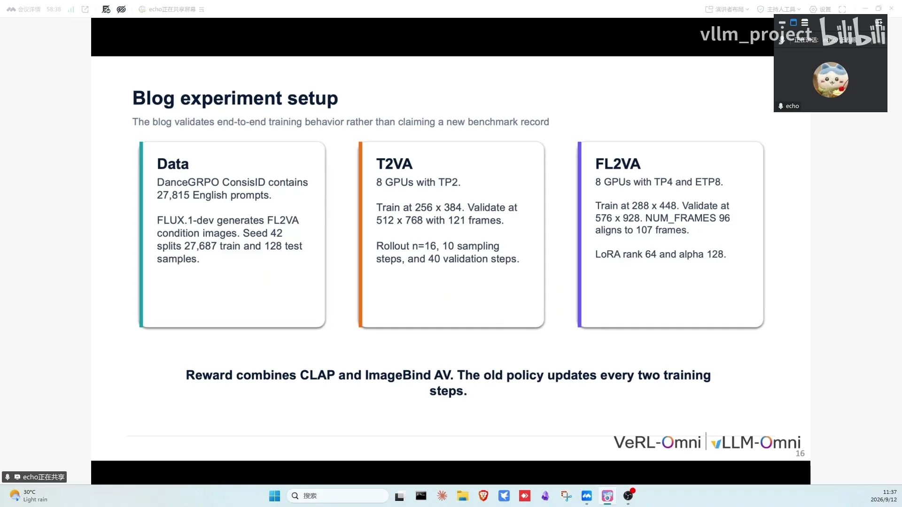 |
| 然后欢迎各位同学也加入社区进行一个贡献pr然后嗯我们现在主要在那就是稳定性方面的话我们主要是想啊把这个异步的ROOUT这个想给他快速支持然后第二个的话就是在讯推的一个一致性然后还有确定性RL的一个推理然后讲下我们然后在之后的一些models [【跳转到 36:44】](https://www.bilibili.com/video/BV1skYQ63EPW/?t=2204) | 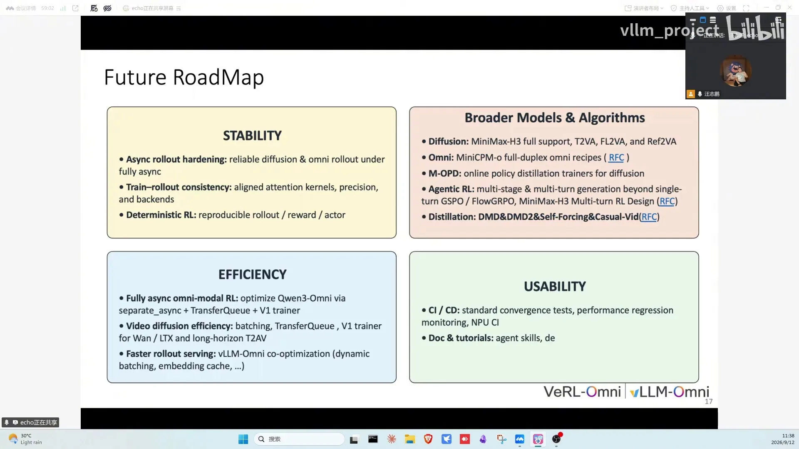 |
| 还有算法的一些集成然后我们现在主要是在diffusion模型的话我们现在只要一个P0的话是想把MiniMaxh3嗯整体的一个速度再提升上去然后给他打满然后啊第二个的话就是在OMINI模型上面来集成啊Minicpmno然后是单攻和双供我们都在想知识然后也贴个RFC然后第三个的话就是在AGENITY和IO上面 [【跳转到 37:09】](https://www.bilibili.com/video/BV1skYQ63EPW/?t=2229) |  |
| 这个这个现在也有同学在进行一个嗯做然后后面讲一下我可能要就是专我们社区的一个后续的一个MiniMax一个重点就是集成蒸馏算法就是DMD还是DMD2然后还有后续的两个cpforce还有开局VID这个自回归正流对主要讲下我们的一个ROMAP嗯其实我觉得这个agenttic这一块很重要啊 [【跳转到 37:34】](https://www.bilibili.com/video/BV1skYQ63EPW/?t=2254) | 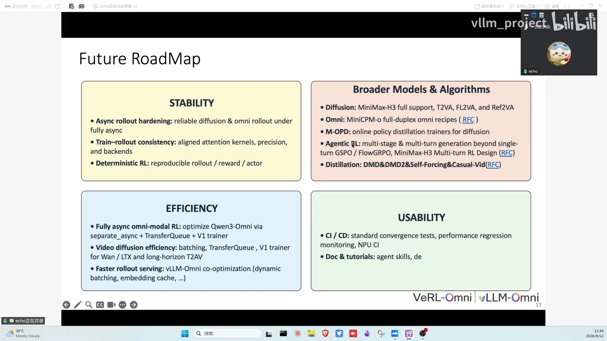 |
| 因为我现在在拿这H3做视频创作 [【跳转到 37:59】](https://www.bilibili.com/video/BV1skYQ63EPW/?t=2279) | 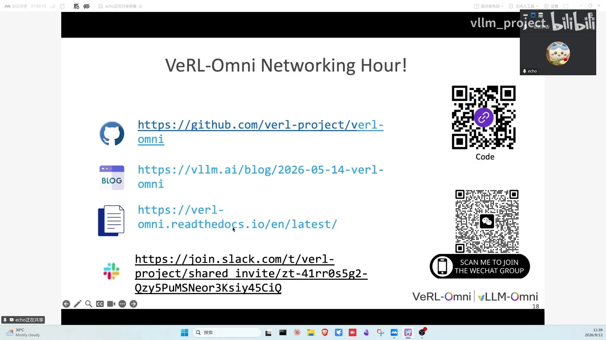 |
| 属于是就真的非常痛苦因为你得反复不停的去抽卡对吧 [【跳转到 38:04】](https://www.bilibili.com/video/BV1skYQ63EPW/?t=2284) |  |
| 然后你那个抽完之后你再去把他那个剪辑拼起来 [【跳转到 38:12】](https://www.bilibili.com/video/BV1skYQ63EPW/?t=2292) | 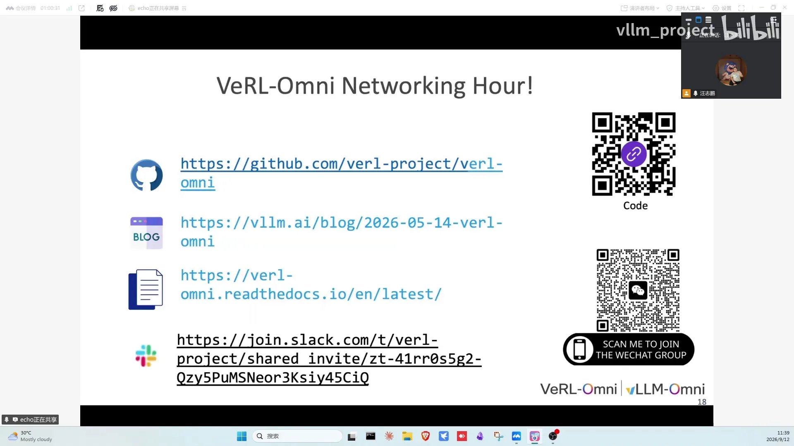 |
| 然后就发现好像这个视频这一块因为它就是它会不停的有配乐吗你可能你生成第一个视频的话你还觉得行但你把这个拼起来之后你就会发现很多违和感然后你就继续回去冲是的然后还有的话就是对然后还有的话我觉得这个H3的话我们做让他的这个指令跟随能力强之后再考虑 [【跳转到 38:17】](https://www.bilibili.com/video/BV1skYQ63EPW/?t=2297) |  |
| 好好的去做好这个stem上的正流DMT这一块那我觉得那爱H3的整个的使用实用性的话会好很多现在来看的话IH3要想做成像SDANCE这种还是有一定差距的那就基本上只能靠这个后训练去补因为因为我感觉CDX它他们内部啊 [【跳转到 38:42】](https://www.bilibili.com/video/BV1skYQ63EPW/?t=2322) |  |
| 就是我感觉他他会有两两种就是因为他他会有一个自己的AGENITY的一个系统它会嗯自动化的给制造你一个分镜的剧本然后他可以直接直接就生成出了一两个小时的一个慢剧然后第二个的话就是他步数蒸流可能他们的一个成本就会很低因为他们也会去做步数真流啊这种的形式然后占据它的成本就是对我们社区也想跟进这两个部分对对 [【跳转到 39:07】](https://www.bilibili.com/video/BV1skYQ63EPW/?t=2347) |  |
| 然后我这我们现在的话相当于是有一个比如说专门针对RH3的一些ROMAP的呃这个好像没有专门的一个rollmap就是主要放在一个大的rollmap里面然后现在AGENETICIO是有一个有一个FC然后真牛的话我也提了个FC对有欢迎感兴趣的同学都可以来参加对我觉得感兴趣的同学都可以来参加因为IH3这个模型真的属于是那个让我看到了这个 [【跳转到 39:32】](https://www.bilibili.com/video/BV1skYQ63EPW/?t=2372) |  |
| 多模态领域的希望就是之前的我说的就是多模态是纯粹学术界也非常喜欢但是工业界的话大家都很多人不感冒然后像MiniMax这种公司他都得被迫转型对但是特别是在H3开源之后你知道H3它的主仓就是hiface他的原始版本下载量有500多万 [【跳转到 39:57】](https://www.bilibili.com/video/BV1skYQ63EPW/?t=2397) |  |
| 然后那个CONFEUI版本下载量有应该可能有1800万吧对就是他哪怕是原版模型它可能都比芝浦他们公司开源的所有模型下一张都多虽然很多是个人用户来下载但是你现在其实感觉到很多做这种云服务厂商也在尝试去部署H3因为它确实效果很好而且因为它是开源的 [【跳转到 40:22】](https://www.bilibili.com/video/BV1skYQ63EPW/?t=2422) |  |
| 所以说会有无数人在上面做后续的开发对吧去制作各种各样的LUA知识然后包括这些做些那个强化训以后训练让他有更好的指令跟随然后更多的这种slap上那些那种蒸馏策措施哦对这个H3它效果会比one好很多这点的话是非常可以验证的H3的话我觉得他的能力可以达到C当时R的水平 [【跳转到 40:47】](https://www.bilibili.com/video/BV1skYQ63EPW/?t=2447) | 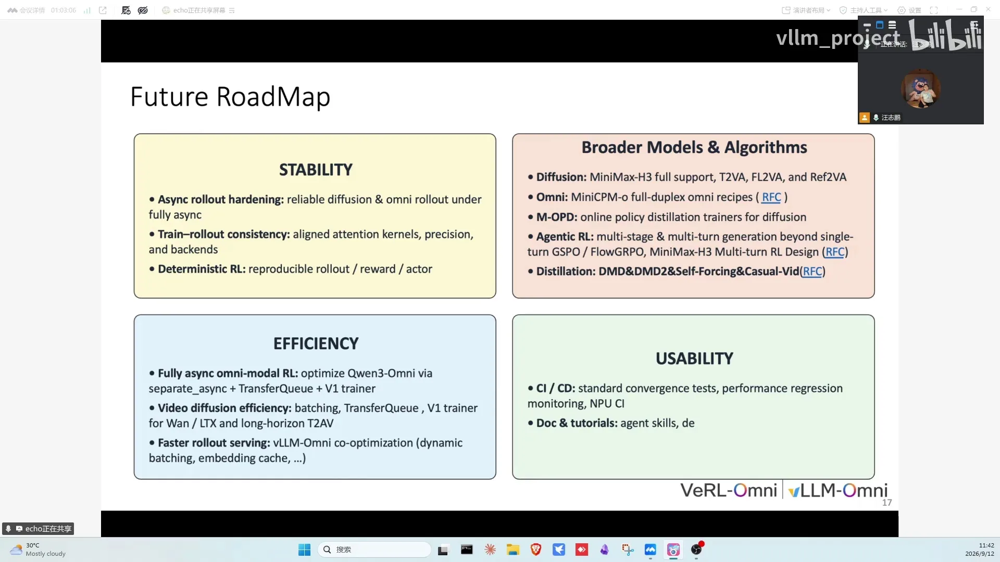 |
| 我们后续也可以提一个专门的MiniMax如果Mac然后欢迎然后让更多同学加入进来对对因为我其实是拿他们做那种saydance2.5的一些成片然后去做对他做一些分镜然后再看能不能用H3复线而且发现其实他真的可以复现个大概 [【跳转到 41:12】](https://www.bilibili.com/video/BV1skYQ63EPW/?t=2472) |  |
| 95%的水平了哎关键你要知道这对比的是CD205他这个视频好像一秒钟的价格是三块钱嗯那么你只要是对你只要是在上面在做的再稍微提高一点你就可以跟他的整个水平可以达到持平的效果了那你想你可以如果你真的部署它你可以省下多少钱 [【跳转到 41:37】](https://www.bilibili.com/video/BV1skYQ63EPW/?t=2497) |  |
| 然后我们现在万魔mini这边的话也是在尝试做更多的让H3可以更好的适配康复UI对那么后续的话就比如说如果你个人用户可能设备不好的话那我们可能给你开放出一个接口出来那么你直接在CONFU外面就用这个接口那么你就可以直接用你原来的工作流就能够灵活的去使用这个CONFE语 [【跳转到 42:02】](https://www.bilibili.com/video/BV1skYQ63EPW/?t=2522) |  |
| 就是使用这个H3而且枪打样的话速度会比你一般个人电脑比如说你拿无敌九零这种卡其速度要快很多我知道现在世界上很多5090的卡大家用的是FP4对吧那么其实你如果是用那个一些接口的话你可以用到是满血的就是这种变F16版本的这个H3 [【跳转到 42:27】](https://www.bilibili.com/video/BV1skYQ63EPW/?t=2547) | 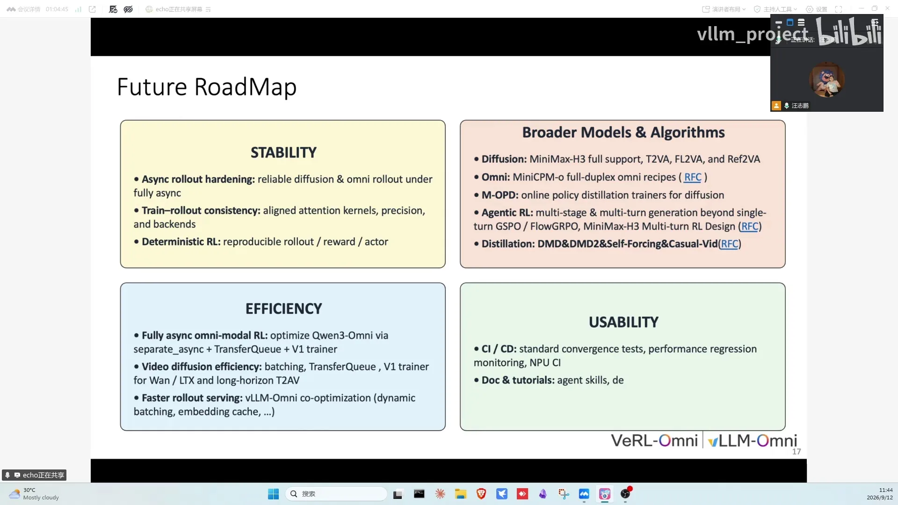 |
| 然后woromini的话消费级显卡那应该是不太可能够的这个地方的话可能还是需要有那种比如学校你有数据中心或者是你去企业里面去实习那么你就可以用沃尔沃mini然后去做一下H3的后训练了然后如果你个人电脑的话就是你发现做欧米的贡献不够你也可以考虑来这个VR模拟里面去做H3 [【跳转到 42:52】](https://www.bilibili.com/video/BV1skYQ63EPW/?t=2572) |  |
| 那些后续的知识web模拟里面他现在有很多跟H3相关的优化还需要做然后有同学说有四张A880G可以做贡献哦我觉得这个是可以够不做贡献的这个这个是完全够不贡献做贡献的就是我们我我在很多pr里面看到很多人都是两张H20就虽然跑得慢嘛 [【跳转到 43:17】](https://www.bilibili.com/video/BV1skYQ63EPW/?t=2597) |  |
| 但是他也可以去验证就是你无非跑得慢而已然后就是跑的慢没关系你跑正确就可以了对就是我们应该可以大概算出来就是我们想给他做贡献的话最低的这个显存需求对吧对就是如果如果看主要看模型有多大吧因为我们现在嗯现在主流就是如果说你要训MiniMax的话 [【跳转到 43:42】](https://www.bilibili.com/video/BV1skYQ63EPW/?t=2622) | 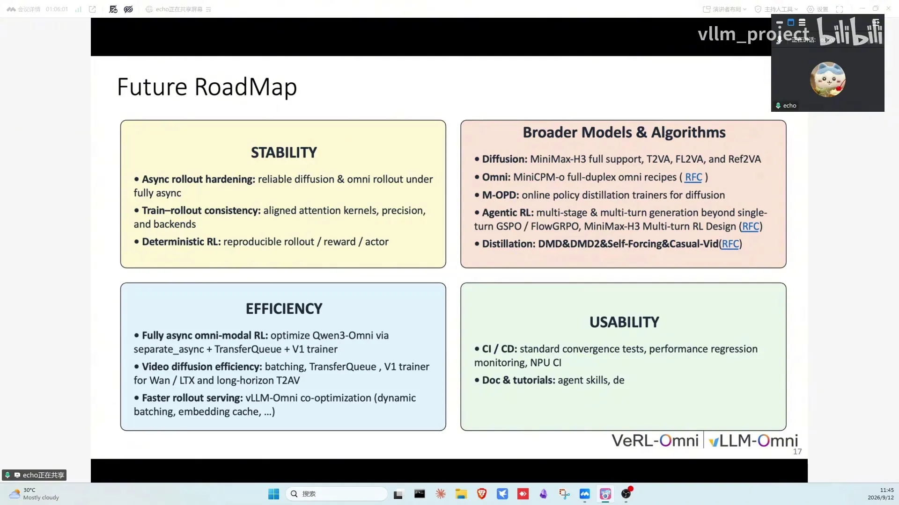 |
| 就是我推荐是80G就是80级是最好的嗯但是有个问题就是如果你80G的话你这个encoder怎么放encoder他会看到多少张卡如果如果他只有他其实四张的话就是勉强够用四八戒是足够用的其实因为你们就你训练的话可以很多做这种多啊像训练吗咱们那么其实你现在都是挂钩了 [【跳转到 44:07】](https://www.bilibili.com/video/BV1skYQ63EPW/?t=2647) |  |
| 对对那你不搞全餐的话其实你整个的显存需求跟那个模型他自己去但是做推理任务话差距不会很大对对对对然后你又是注重同期训练的话那么其实你的rollout和这个艾特是互相换这个显存的因为其实我感觉我就是仓库里面其实它对于显存优化这方面 [【跳转到 44:32】](https://www.bilibili.com/video/BV1skYQ63EPW/?t=2672) |  |
| 其实因为就是跟word一样其实支持了很多嘛比如说它offload然后CPUofload然后在robot上面有vLLM-Omni我支持我记得支持一个lilwest的一个offload对吧分逐层的一个对对对那个那个特性我觉得特别重要就是它可能帮你写了省省下很多的选择比如说我我如果开了LEWISE还有ETP等于tb等于八的时候我我每张卡我其实巅峰巅峰显存就大概40多G左右对 [【跳转到 44:57】](https://www.bilibili.com/video/BV1skYQ63EPW/?t=2697) |  |
| 然后有同学说八张80G是可以全餐的吗这个应该也不行够呛够呛这个够呛这个也不行的因为全餐化差不多就是你的这个就你你所需要显存大小大概是你原来的话差不多十倍左右对吧对 [【跳转到 45:22】](https://www.bilibili.com/video/BV1skYQ63EPW/?t=2722) |  |
| 达到十倍吧对对对那这个东西吧可能就是八张81就是不太够而且我其实不建议就是额你资源不够的话你可以不用考虑全猜你就考虑LOALOA相对而言的话你训练的这个耗时也会短很多对对其实我感觉RA的效果你其实跟全碳是保持对齐的没必要用全碳而且很多时候你全场可能训着训着他就爆了 [【跳转到 45:47】](https://www.bilibili.com/video/BV1skYQ63EPW/?t=2747) |  |
| 就是对然后有同学问这个华为的910B是可以的吗呃呃这个可以的这个是可以的因为就是这个FlowGRPO的一个集成的话就是啊华啊华为的一个一个同学就是帮帮我们做的然后他的话是我记得他当时是八张920B的话每张卡的话是60 [【跳转到 46:12】](https://www.bilibili.com/video/BV1skYQ63EPW/?t=2772) |  |
| 大概是占了60G左右就是还挺还还可以五六十G吧五五十多G对然后有同学说这个WEMOmniH3的这个ROMAP都做的差不多了上位级显卡还有优化空间吗呃其实是这样的就oneOmniH3它有很多东西是现在还没怎么做的就比如说我们之前就是所有东西都就H3里面基本上很多的工作都放在打分上了 [【跳转到 46:37】](https://www.bilibili.com/video/BV1skYQ63EPW/?t=2797) |  |
| 就导致我们基本上所有优化都是做这个ttoa的对吧那么这种raft和这个firstlast的这个真的这种话其实我们基本上没有怎么好好的去做这块地方我觉得呃应该还是有很多人去做的然后还有的话就是对于这种产品级的就比如说我们这个IH3 [【跳转到 47:02】](https://www.bilibili.com/video/BV1skYQ63EPW/?t=2822) |  |
| 跟抗非UI是怎样集成的这块地方的话现在是刚有个RFC对吧那么你最后如果真的想跟咖啡UI去继承的话其实你不光得H3你可能还需要其他些比如像是这个MiniMax的这个music3的或者些什么TTS模型做一些那种旁白的其实都是可以去做的然后我觉得还有话就是这个生产级的话你肯定需要去做更多的这种分布式的这些测试 [【跳转到 47:27】](https://www.bilibili.com/video/BV1skYQ63EPW/?t=2847) |  |
| 对吧就更多的分离策略然后去看一下子大概什么样的分离效果是可以在这种爱H3的常规的这种work克这个workload里面可以把每个MOJO的一些算力全部打满的这点我觉得都是需要有很多尝试的对然后还有话就是最近顺阳 [【跳转到 47:52】](https://www.bilibili.com/video/BV1skYQ63EPW/?t=2872) |  |
| 他给H3提了一个很大的一个rollmp就是它是针对他们那个TRT那边做的H3C优化然后把里面的很多点都搬过来了但它里面绝大多数的点我看都是些有损的优化但是我觉得如果是出于成本和效率上考虑的话其实都是可以去做加减来的你可以考虑后面不开嘛对因为最近我看英伟达那边说五秒视频 [【跳转到 48:17】](https://www.bilibili.com/video/BV1skYQ63EPW/?t=2897) |  |
| 他们只用1.6秒就可以生成了那这个速度可以说是非常夸张的而且它里面应该看样子还是带了这个参考图的对吧那这个速度就更夸张了其实我觉得吧就是因为现在其实我觉得算子啊其实它极致的优化其实其实差不多我觉得如果说就是你嗯其实可以从就是部署蒸馏蒸馏的这个角度 [【跳转到 48:42】](https://www.bilibili.com/video/BV1skYQ63EPW/?t=2922) |  |
| 其实我们这边其实也可以就是优化优化上去就比如说啊对对是的对对对蒸馏这个东西其实是非常重要的对吧特别是我觉得就是你的蒸馏话你你最后蒸出来效果跟你的这个数据分布有很大关系如果你的这个使用场景比如说比较固定你就是去拍动呃电影质感的那种视频的对 [【跳转到 49:07】](https://www.bilibili.com/video/BV1skYQ63EPW/?t=2947) |  |
| 那么其实你的数据分布你就不需要去搞那种什么动画片这种东西然后你最后蒸出来的模型效果会更加符合你的需求然后有同学问这个是关于这个warme的问题了就是目前WR欧米irollout和trainer呃之间是不是还没有真的异步起来哦 [【跳转到 49:32】](https://www.bilibili.com/video/BV1skYQ63EPW/?t=2972) |  |
| 就是router跟actor训练的时候没有异步是吧对对这方面还正在支持因为我们主要是想在那个V1上面就是真正的给他支持全异步我们现在主要是还是供卡的形式然后全权益部那个还没有进行一个验证对就全会逐步的去验证对全异步他必须得是那个E卡的推理和训练以先放在不同机器上面他才能够全异步 [【跳转到 49:57】](https://www.bilibili.com/video/BV1skYQ63EPW/?t=2997) |  |
| 我们现在还正在进行验证如果其实有兴趣的话其实你可以帮帮帮忙验证对就是如果你真正有资源的话是可以去做的最后补充一下吧对额这块其实现在就是功能上是事实但是确实没有做大规模验证就是包括diffusion 的trainer我其实也把那个呃separateathing加进来的就是分卡一步的迅退111步的 [【跳转到 50:22】](https://www.bilibili.com/video/BV1skYQ63EPW/?t=3022) |  |
| 还有那个欧米的话欧米系列的话也是支持这个分卡呃异步的但这个可能就验了一个切文森ONI的一个thinker的训练师OK的就是reward狩猎还有它的性能都是正常的但diffusion这块之前呃应该是试过前文image去做呃Ithinkiithink去年那块性能是没有什么收益的 [【跳转到 50:47】](https://www.bilibili.com/video/BV1skYQ63EPW/?t=3047) |  |
| 对对然后有同学说可以找人合作吗可以在群里找吗呃我觉得可以在群里面去讨论的然后其实最近我们也在考虑说要不要搞一个那种类似于显卡共享的对吧因为呃就比如说我有B300但是我没有米355然后有的人他有米355但是没有B300那么其实可以大家去互相借用一下子 [【跳转到 51:12】](https://www.bilibili.com/video/BV1skYQ63EPW/?t=3072) |  |
| 然后我们可以去跑很多的半身Mark包括去测一些recipe对然后有的同学的话可能是他比较缺卡那么看一下有没有社区名的好大哥可以去贡献借借着用一下子去做一些东西这个东西是我们现在正在讨论一些这个共享显卡一些方式可能感觉两个人挂共同作者就好了就pr就对 [【跳转到 51:37】](https://www.bilibili.com/video/BV1skYQ63EPW/?t=3097) |  |
| 可能我觉得到周三的时候那个乌姆Omni的组会我们可能会专门讨论一下这个事情然后感兴趣的同学可以来参加一下然后呃还有同学问就是为什么多模态需要做全异步呢这是个非常好的问题你们怎么看嗯嗯我我我先说一下吧就是动不太可能 [【跳转到 52:02】](https://www.bilibili.com/video/BV1skYQ63EPW/?t=3122) |  |
| 就刚才我说了两个类型嘛一个diffusion 的2L它那块如果是生成图像视频这种单模态的它的输出负载是比较均衡的然后输出的序列长度也也比较一致这里可能用就是用那个同步就已经差不多了就是呃它没有那个像呃LLM模型那种因为呃输出呃序列长存在一些长尾问题 [【跳转到 52:27】](https://www.bilibili.com/video/BV1skYQ63EPW/?t=3147) |  |
| 带来一些空抛然后需要从通过异步的RL去呃去去解决这些额利用率的问题但如果是像像那个前门森奥尼这种全模太模型了他的输出其实也是变长的所以这块开权益部的话也也是会有那个资资源利用率的一个提提升对但是还有另外一种情况就是他是那个HTRL [【跳转到 52:52】](https://www.bilibili.com/video/BV1skYQ63EPW/?t=3172) |  |
| 就是我的那个planner就是VRandplanner跟那个DIT的generator同时训练然后这种情况下应该也是啊开全一波应该也是有呃性能收益的对嗯对其实我刚才也就是想说这个AHTTRL场景话可能会对于前面部是有收益的就是如果我们最后做出来的东西他真的能够去自己去做视频的剪辑拼接 [【跳转到 53:17】](https://www.bilibili.com/video/BV1skYQ63EPW/?t=3197) |  |
| 这种操作的话那么其实来讲就整个H3会更表现的像一个产品那么我们怎么想做成这样呢就需要有这个AJTR去做一些这种后训练然后有同学问这个组会在哪里参加呃这个话可以去看WEMOmni的那个项目仓库 [【跳转到 53:42】](https://www.bilibili.com/video/BV1skYQ63EPW/?t=3222) |  |
| 然后它底下会有一个微信群的添加方式然后加进去之后的话你可以看到每个星期三会有个指这个组组会链接大家可以来参与一下然后你也可以去参加这个看WEM的event它是有个网站的然后这个网站里面会罗列整个VM里面所有的相关的线上的活动然后线下活动然后包括所有的仓库和模块 [【跳转到 54:07】](https://www.bilibili.com/video/BV1skYQ63EPW/?t=3247) |  |
| 他们的周会是具体什么时候然后有同学说请问MOT模型的RL是怎么做的R和DIT是分开训吗这个我觉得应该主要针对的就是BAKO这个模型了 [【跳转到 54:32】](https://www.bilibili.com/video/BV1skYQ63EPW/?t=3272) |  |
| 这个好像是这个呃这个应该是另外一个同学做的呃但据我了解到的对他他其实只训目前只训了那个呃生图那块的DIT线索吗对对对因为我们这个仓库里面现在的这些算法其实这不管是这个diffusionftt还是说这个FlowGRPO其他都是对这个DIT部分做的 [【跳转到 54:57】](https://www.bilibili.com/video/BV1skYQ63EPW/?t=3297) |  |
| 那么你AR部分的那一块的权重就直接动起来就行了对吧就是算那个textattention的那一块地方东西那我补充一下现在仓库里面有一个RFC就是讨论说嗯能够一起训练AR和DIT那么还分开各自会有不同的reward那个RC我感觉之前智勇应该也提到了一下 [【跳转到 55:22】](https://www.bilibili.com/video/BV1skYQ63EPW/?t=3322) |  |
| 可能是在这个ARGARL的范畴内就是仓库里面现在挂着那个RP可以参考一下好然后额有同学说可以联合训练AR和DIT可以联合算呃 [【跳转到 55:47】](https://www.bilibili.com/video/BV1skYQ63EPW/?t=3347) | 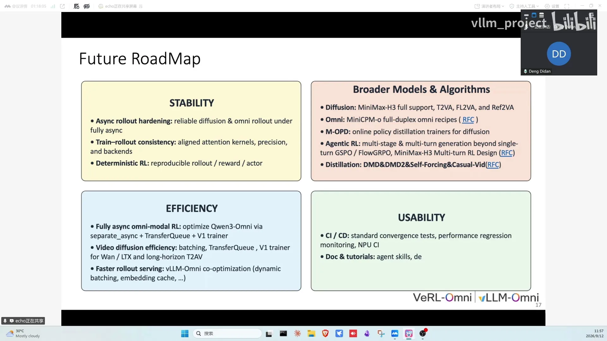 |
| ADDadvance什么这个可能要具体看那个涉及的那个算法就是AR部分的话可以算王者DIT的部分就呃也可以用flowgrpu算advantage也可以GP的部分用这种GPU之类的算法 [【跳转到 56:12】](https://www.bilibili.com/video/BV1skYQ63EPW/?t=3372) |  |
| Ok这个是可以的应该是应该是分开算的我对我记得有一个是那个duo是dugLPL那个算法吗去做这个事情对如果大家有兴趣可以看一下那个呃336那个一九就是veralonline上面的里里面有一些讨论 [【跳转到 56:37】](https://www.bilibili.com/video/BV1skYQ63EPW/?t=3397) |  |
| 就是关于这个呃就同时训这个呃AR的encoder加上一个DIT的generator的一些讨论嗯嗯336其实我觉得大家其实可以加入微信群然后就是线下讨论能更好一点 [【跳转到 57:02】](https://www.bilibili.com/video/BV1skYQ63EPW/?t=3422) |  |
| 对大家就是有问题的话直接进这个word欧米的微信群应该这O微信群也是在wordOmni这个仓库里面是这底下是有对吧对有的有的就是每周底下就会更新对那直接就加这个微信群然后有问题直接问对吧然后看一下有没有更多合作的机会好然后我看就现在直播间同学还有没有什么问题啊 [【跳转到 57:27】](https://www.bilibili.com/video/BV1skYQ63EPW/?t=3447) |  |
| 没有什么问题的话我们今天直播就到此结束了时间也不早了对然后有同学就补充了说有个unigrPOAR和DIT一起用相同的reward和IWANTAGE训练好然后直播间如果嗯好直播间如果去看一下 [【跳转到 57:52】](https://www.bilibili.com/video/BV1skYQ63EPW/?t=3472) |  |
| 对直播间的同学如果没有什么问题的话那我们今天的直播就到此结束了感谢各位的参与粉丝群二维码有吗呃古代id呃这个我想想怎么搞嗯这个东西我觉得你可以先加我们的这个呃WOROmni或者是viomini的群然后你可以看到我嘛对吧 [【跳转到 58:17】](https://www.bilibili.com/video/BV1skYQ63EPW/?t=3497) |  |
| 然后看到我之后你直接私信我我可以把你加进这个粉丝群了也不是粉丝就像于我们一个这个直播直播自习群我们是有一个这个群的然后有同学又补充问了就是说请教下怎么看待多模态的sci嗯不confusion的是spinlaw吗 [【跳转到 58:42】](https://www.bilibili.com/video/BV1skYQ63EPW/?t=3522) |  |
| 度模态的SCALLING的话是指的是diffusion模型还是说所有的整个度模态这个领域的呃他就说视频生成模型视频生成的话我我我觉得嗯按我的理解的话我觉得这个scalinglaw [【跳转到 59:07】](https://www.bilibili.com/video/BV1skYQ63EPW/?t=3547) |  |
| 其实他是在视频生成其实也是很适用的就是比如说他那个cdance就听说啊听说他不是个200多币的一个ME模型吗就是呃我觉得更多的就是看你数据的一个质量和你的一个就是嗯模型大小就是相对于相对于AR这种呃做模态来说其实还好就是更多的看你的数据质量就比如说你明白MiniMax其实你你只有一个33B的一个dance但它其实是可以达到一个cdance的一个 [【跳转到 59:32】](https://www.bilibili.com/video/BV1skYQ63EPW/?t=3572) |  |
| 95%的一个效果其实说明它这个模型模型大小其实在skinloss里面其实占比是很小的这主要看你的数据质量和你的一个训练一个手法吧我觉得对我之前其实跟有一些做research的人聊过他们觉得就是我们的每次推理的时候激活参数其实相当于某种程度上的这种智力然后你的这个呃模型的这个参数规模 [【跳转到 59:57】](https://www.bilibili.com/video/BV1skYQ63EPW/?t=3597) |  |
| 整个参数规模的话其实某种程度上相当于你的这个知识对吧或者首先说就是你每次俯卧的干的事情其实某种相当就是智力然后你的参数规模相当于你的这个知识那么流程讲话你的这个试验模型就是你的这个视影模型话你你的这个参数规模量越大那么你自然而然的话对于整个真实世界的模拟效果就越好 [【跳转到 60:22】](https://www.bilibili.com/video/BV1skYQ63EPW/?t=3622) |  |
| 这也是为什么你看H3甚至有人可以把它改成H3word对原因就是因为它的参数量已经比之前的很多开源模型要大了那么它这个时候你把它转成一个事业模型也会变得更加容易然后还有的同学然后这个同学又补充了问H3单流设计有什么优劣势 [【跳转到 60:47】](https://www.bilibili.com/video/BV1skYQ63EPW/?t=3647) |  |
| 哦我我觉得他的一个主要优势的话就是你可以在一个package里面就是进行一个saoattention这样的话会更容易的融合各种模态的一个信息然后就是他的技术报告其实也没开源然后就很多的细节其实我们就是可能等他开源技术报告小时才能就是了解一下 [【跳转到 61:12】](https://www.bilibili.com/video/BV1skYQ63EPW/?t=3672) |  |
| 其实我个人感觉他H3之所以是个单流的很大程度上是因为这块地方英法很简单吧对吧对也有这种有这种说法而且现在来看的话就是模型的结构相对而言大家都是奔着省钱去的然后你参数量不大的话其实你没有必要去做成那种ME [【跳转到 61:37】](https://www.bilibili.com/video/BV1skYQ63EPW/?t=3697) | 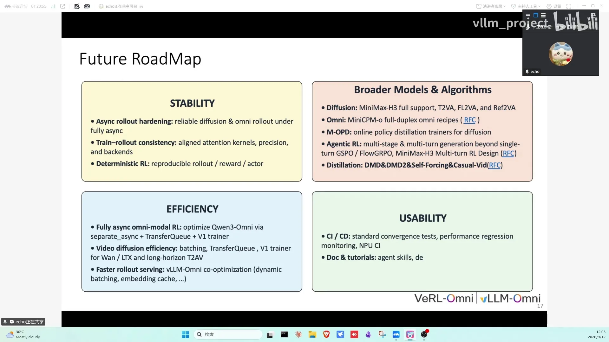 |
| MOT这种东西只有在规模很大时候话你考虑到英法我们需要省钱所以我们才会去倾向于做这样的东西我觉得这才是现在这些模型这样训练的话更主流的原因对吧就是你像就之前一直都流传说北美那边的模型公司他一般两都是用纯dancemodel [【跳转到 62:02】](https://www.bilibili.com/video/BV1skYQ63EPW/?t=3722) |  |
| 训练超大规模的代言模型但是我们国内这边的话你会发现它的整个模型架构非常的复杂原因就是因为现在来看大家对模型架构设计都是奔省强去的嗯好然后有同学问这个slice之后会分享吗这个会分享的稍后我会把这次直播的这个录像和select一起上传 [【跳转到 62:27】](https://www.bilibili.com/video/BV1skYQ63EPW/?t=3747) |  |
| 然后大家可以去我们的这个频同样这个频道去看我们之前所有的直播的回放然后所以感兴趣同学一定要给我们这个频道点个关注好然后我看今天的分享已经这时间也差不多了那我们今天的分享就到此结束了没有感点关注的同学记得点个关注然后我们下周同一时间还会继续来做AI [【跳转到 62:52】](https://www.bilibili.com/video/BV1skYQ63EPW/?t=3772) |  |
| 英法相关的一些技术分享 [【跳转到 63:17】](https://www.bilibili.com/video/BV1skYQ63EPW/?t=3797) | 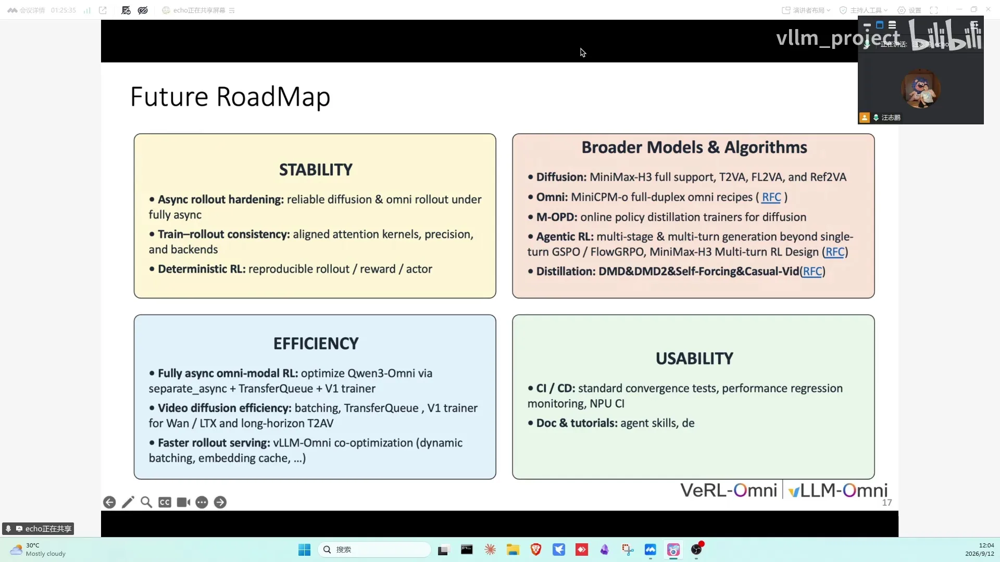 |
| 好感谢鹏哥感谢鹏哥好感谢大家的参与拜拜 [【跳转到 63:22】](https://www.bilibili.com/video/BV1skYQ63EPW/?t=3802) | 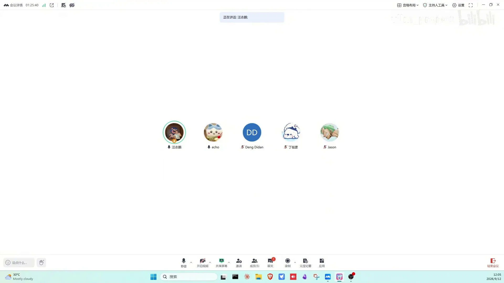 |