# 第19讲：AI Infra 新手答疑：vLLM 从入门到精通 原始文稿（图-字幕分栏）

| 字幕文本 | 画面 |
| :--- | ---: |
| （此区间无字幕） [【跳转到 00:00】](https://www.bilibili.com/video/BV1nEYv6XE15/?t=0) |  |
| 嗯嗯好，那我们就开始吧。其实这一期我在后台私信里也听到、看到很多同学问我一些比较基础的问题，我发现这些问题有很多共性，所以大概先总结了五点。等一会会议的时候如果大家还有其他问题，我们可以现场再答疑。我们先从第一个问题开始回答吧。 [【跳转到 00:05】](https://www.bilibili.com/video/BV1nEYv6XE15/?t=5) |  |
| 第一个问题：绝大多数同学想做 AI Infra，核心的一步至少是要把 vLLM 跑起来。但想跑起来时我们是没有算力的，那算力问题怎么解决？我先分享一下我之前是怎么解决的——我一般会选择去用算力租赁平台。 [【跳转到 00:30】](https://www.bilibili.com/video/BV1nEYv6XE15/?t=30) | 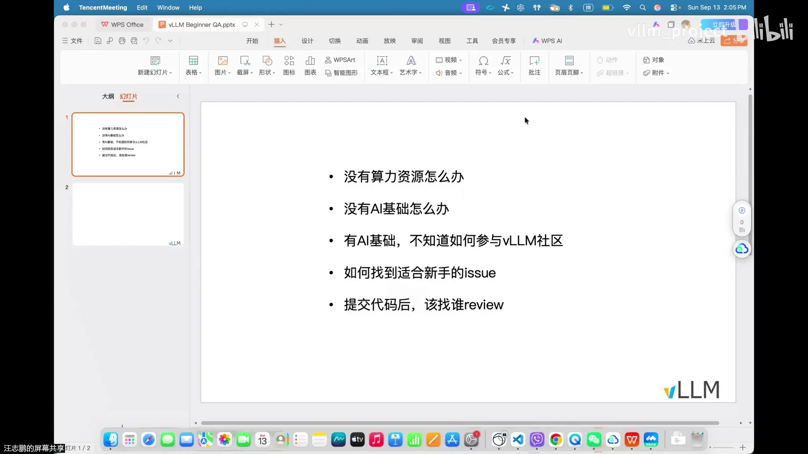 |
| 海外的话很多同学会使用 RunPod，我相信其他同学应该也有别的平台可以分享。 [【跳转到 00:55】](https://www.bilibili.com/video/BV1nEYv6XE15/?t=55) | 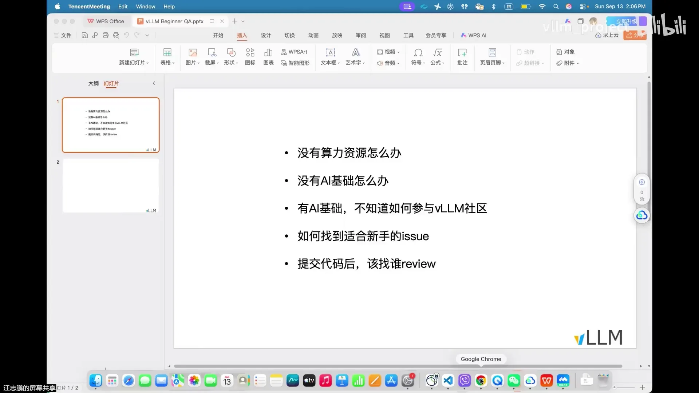 |
| 我就拿 RunPod 来举个例子：首先先去登录 RunPod。 [【跳转到 01:06】](https://www.bilibili.com/video/BV1nEYv6XE15/?t=66) | 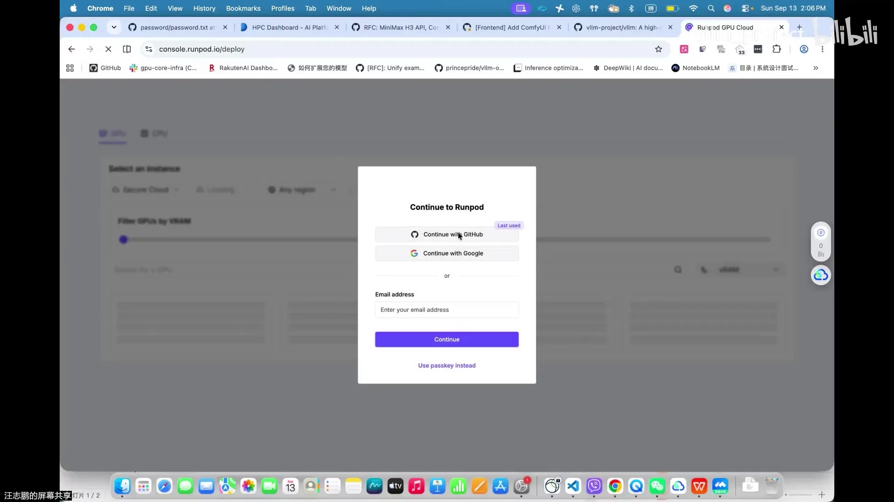 |
| 你可以看一下你的模型大概需要多少显存，然后找一个差不多够用的显卡，尽可能把成本压低。如果你不是做量化这种特殊需求的话，完全可以把成本尽量压低再去租一张显卡。 [【跳转到 01:15】](https://www.bilibili.com/video/BV1nEYv6XE15/?t=75) | 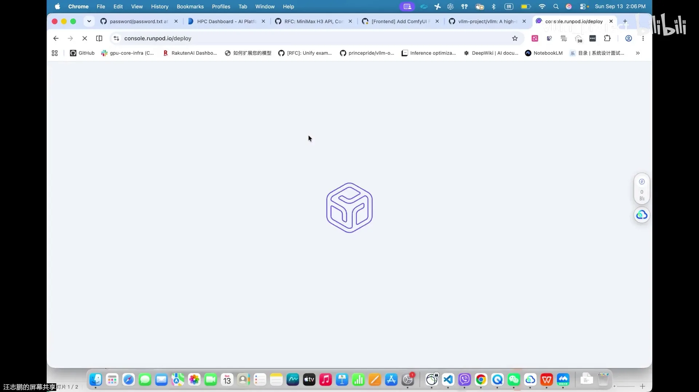 |
| 在这个平台上你可以同时租几张，可以选 1、2、3、4 台。一般如果你是要尝试完成一些并行特性，就可以租两张。还有个很关键的点：你一定要改你的镜像。怎么改呢？就是去换你的镜像文件。 [【跳转到 01:40】](https://www.bilibili.com/video/BV1nEYv6XE15/?t=100) | 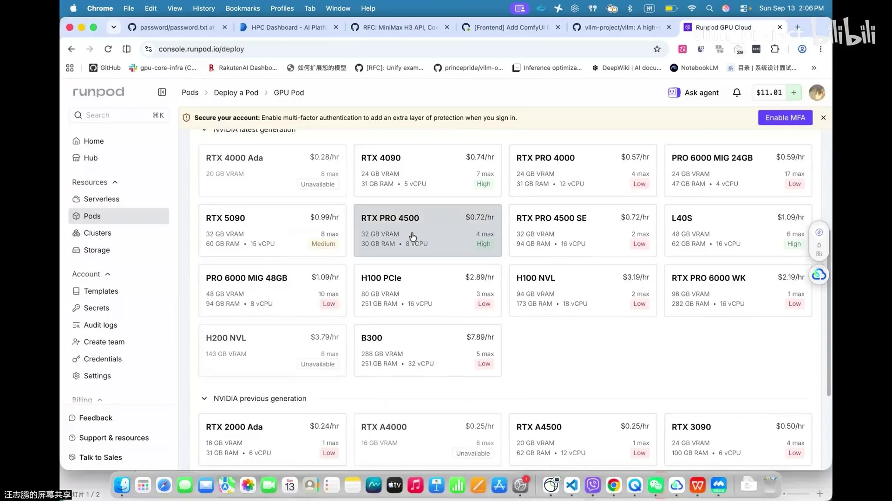 |
| 如果你做的是 vLLM-Omni 的开发，直接用 latest 这个镜像就行了。 [【跳转到 02:00】](https://www.bilibili.com/video/BV1nEYv6XE15/?t=120) | 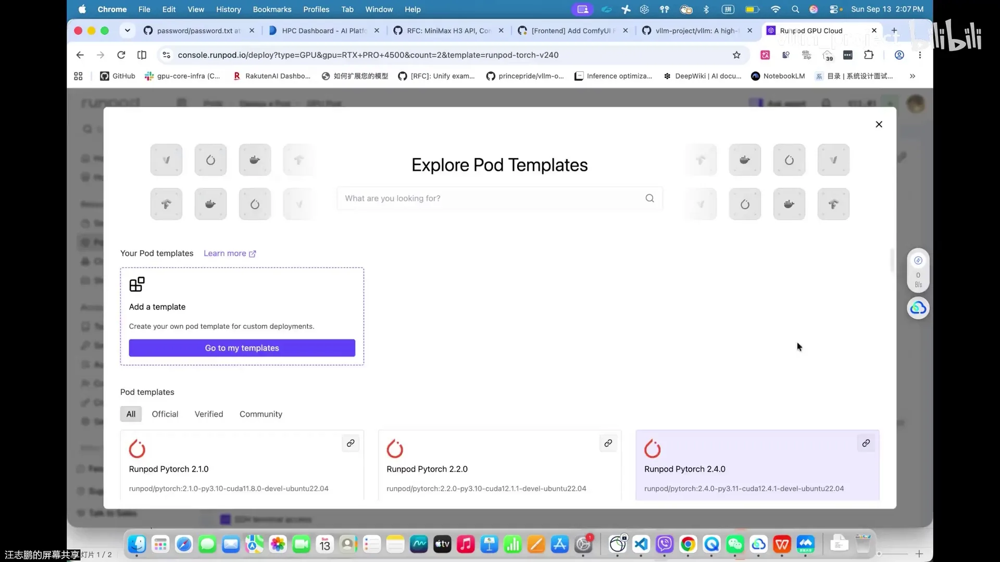 |
| 在这个镜像基础上，再用 editable（可编辑）模式做一次安装。而如果你是做 vLLM 本身的开发， [【跳转到 02:09】](https://www.bilibili.com/video/BV1nEYv6XE15/?t=129) | 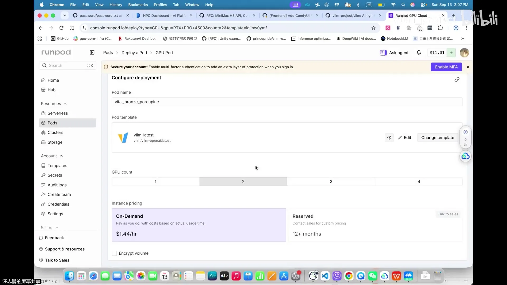 |
| 那你应该会选择用一个最新版本的 [【跳转到 02:18】](https://www.bilibili.com/video/BV1nEYv6XE15/?t=138) | 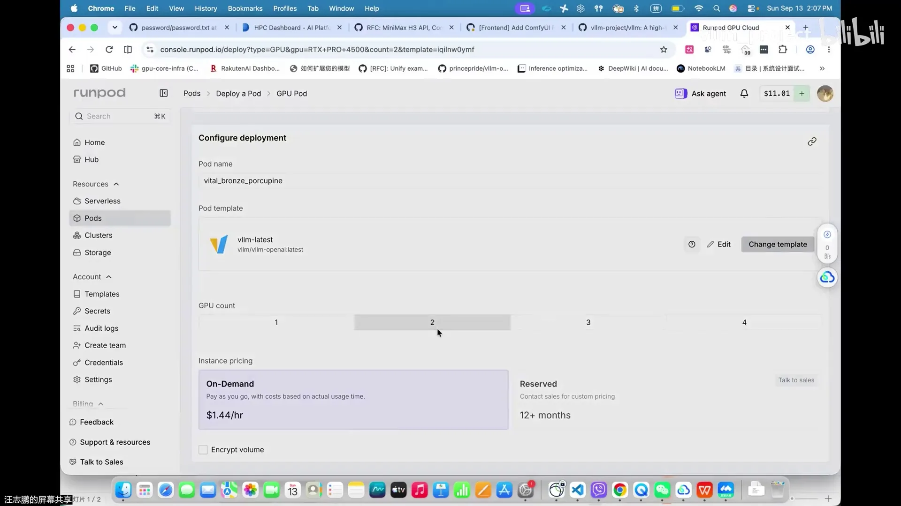 |
| PyTorch 官方镜像里的 tag。我一般会选择 2.9.0，因为现在 vLLM 是可以在 PyTorch 2.9.0 之上安装一个基础版本的 vLLM 的。在这个里面你要记得注意，你需要去选—— [【跳转到 02:23】](https://www.bilibili.com/video/BV1nEYv6XE15/?t=143) | 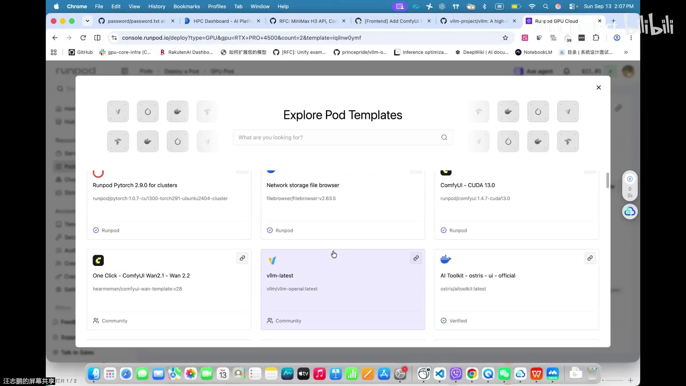 |
| 最好直接选依赖 cu130（CUDA 13.0）的版本，因为它现在也有 13.x 的 tag。——诶，没有声音吗？没有声音啊。我这边听得见呐，听得见吗？OK，那应该不是我的问题，是不是有人没把声音打开？线上是有声音的。好，有声音就行。 [【跳转到 02:43】](https://www.bilibili.com/video/BV1nEYv6XE15/?t=163) |  |
| 现在有声音就行了。还有其他听到的同学吗？有同学电脑上听不太到声音，但他的语音转文字是能出字幕的；也有同学说没有声音。刚才看官方镜像里都没有 13.x 的版本，好吧，那我们可能就只能——哦，有三.x 的 tag。OK，哦这不是的。 [【跳转到 03:08】](https://www.bilibili.com/video/BV1nEYv6XE15/?t=188) | 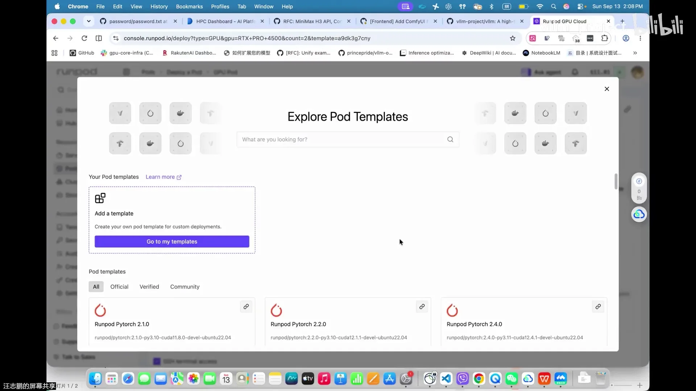 |
| 就是我们 PyTorch 的话一定得下一个比如 2.9 这种版本，然后你去装 vLLM 就装对应 2.9 版本的 vLLM，加上 CUDA 13.0——我觉得这个镜像是最好的组合。 [【跳转到 03:33】](https://www.bilibili.com/video/BV1nEYv6XE15/?t=213) | 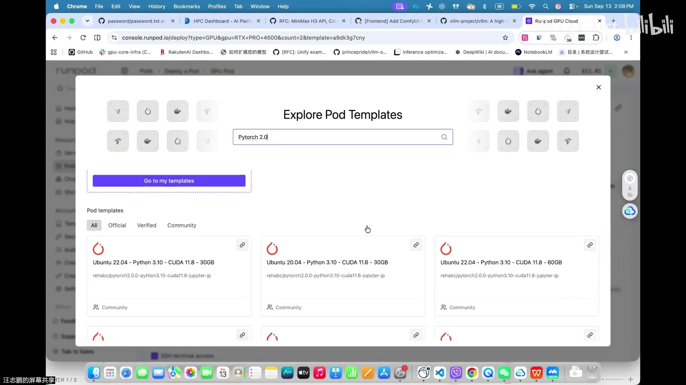 |
| 到时候比如你是做 vLLM 开发的，直接用这个镜像就行。镜像选完之后你还需要改一个配置：磁盘大小。磁盘其实分两种：一种是一直挂载一个 PVC（持久卷），另一种是你每次重新部署环境时，镜像可能会重新刷新一下。 [【跳转到 03:46】](https://www.bilibili.com/video/BV1nEYv6XE15/?t=226) | 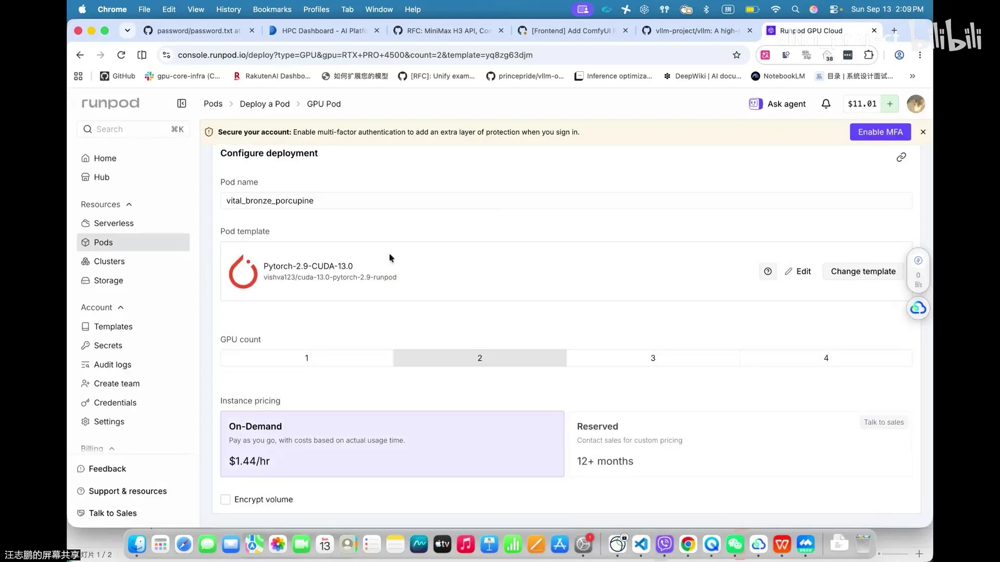 |
| 但不管选哪一种，你都需要把磁盘容量改大，因为模型下载下来要放进磁盘里。——诶，又没声音了吗？没有声音吗？喂喂，有声音吗？顺阳你能听到志鹏的声音吗？ [【跳转到 04:11】](https://www.bilibili.com/video/BV1nEYv6XE15/?t=251) | 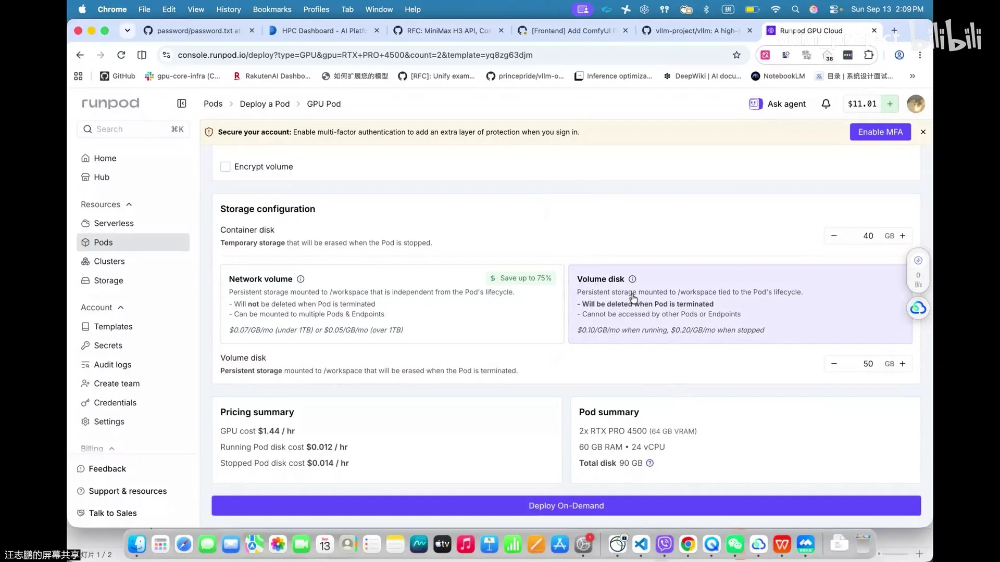 |
| 我一直都能听得见，我只能听到宋亚的声音。（志鹏：我因为没说话。现在有声音了吧？刚才志鹏在说话，你能听得见吗？）（顺阳：我这边听不到，我一直听不到志鹏的声音。） [【跳转到 04:36】](https://www.bilibili.com/video/BV1nEYv6XE15/?t=276) | 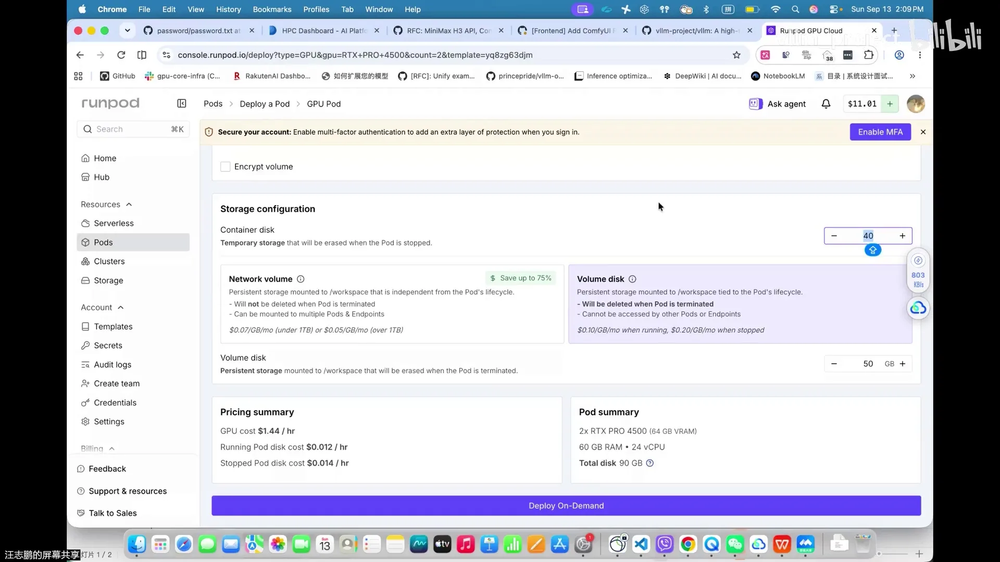 |
| 但他如果开着语音转文字的话，能看到志鹏的字幕，好神奇。那大家先将就着看字幕。——顺阳好像你是一直能听我声音对吧？嗯，一直可以听。好，然后你改完磁盘大小之后， [【跳转到 05:01】](https://www.bilibili.com/video/BV1nEYv6XE15/?t=301) | 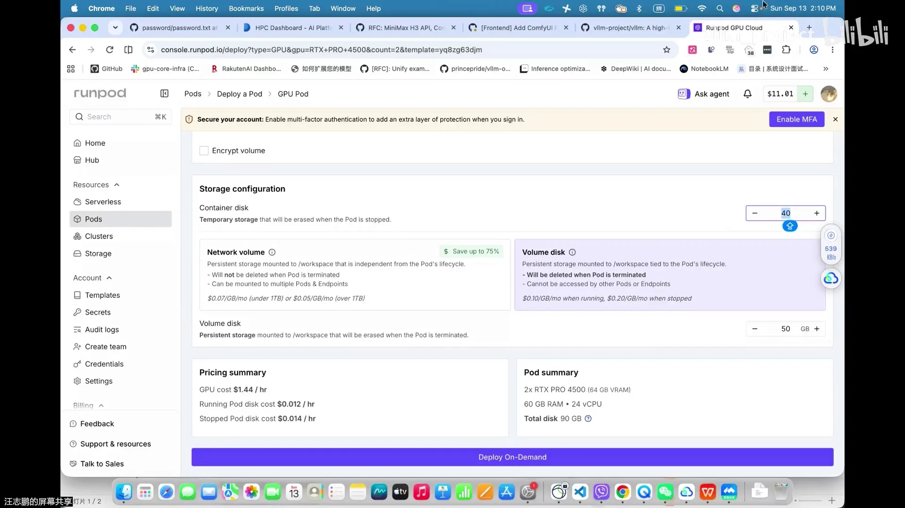 |
| 就可以去启动 RunPod 了。启动完之后我们等一下——一般来讲，我们在这种云端机器上做开发，实际上是需要通过 SSH 连接你的 VSCode 的，这里面就会有一个 SSH 连接方式，你可以直接拿去—— [【跳转到 05:26】](https://www.bilibili.com/video/BV1nEYv6XE15/?t=326) | 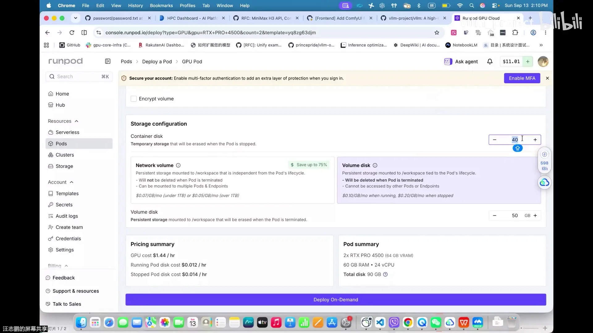 |
| 让 AI 帮你查一下这个东西怎么在 VSCode 上做配置。基本来讲它需要——还是听不见吗？我能听得见吗？我的声音能听见吗？对啊，这不很奇怪嘛，大家都能听见我的声音，他听不到你的声音。 [【跳转到 05:51】](https://www.bilibili.com/video/BV1nEYv6XE15/?t=351) | 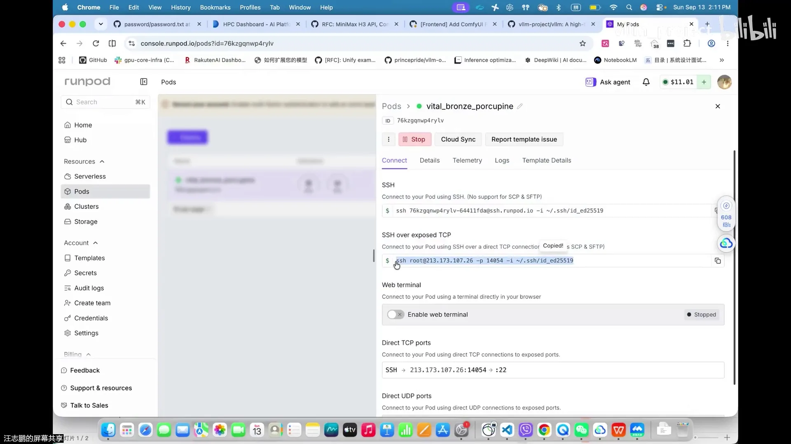 |
| 反正等会结束之后会有录像，到时候你可以在录像上看一下，周中刚讲过如何使用 RunPod 作为一个云平台来做开发，因为有些开发者并不在公司里、没有算力资源。（志鹏）：看一下—— [【跳转到 06:16】](https://www.bilibili.com/video/BV1nEYv6XE15/?t=376) | 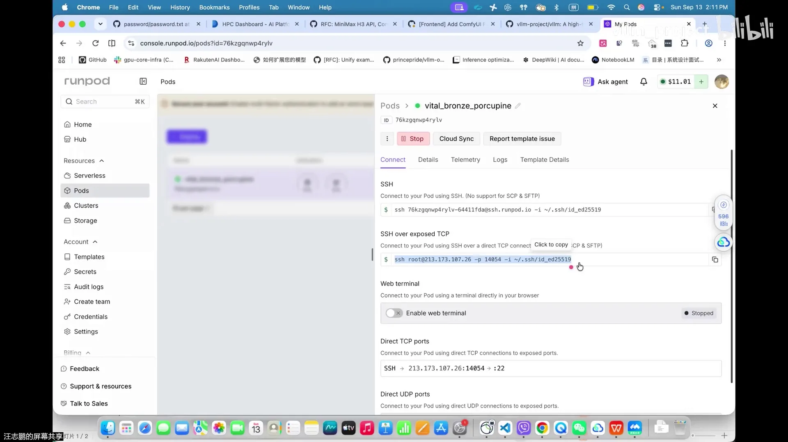 |
| 作为社区开发者，如何使用这些网上的云平台去做开发。这边首先就是根据你手头上的任务来决定使用什么类型的卡。比方说你想做 TTS [【跳转到 06:41】](https://www.bilibili.com/video/BV1nEYv6XE15/?t=401) | 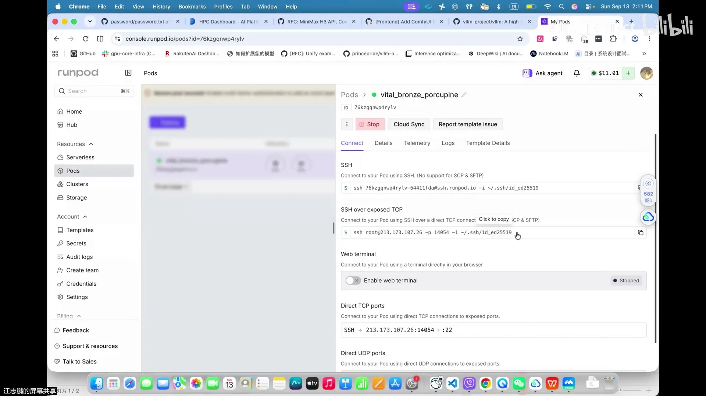 |
| 这种小型语音模型的开发，模型通常比较小，比如 1B 或者 2B 的模型，使用 4090 或者 5090 就能做开发，大概每小时—— [【跳转到 07:06】](https://www.bilibili.com/video/BV1nEYv6XE15/?t=426) | 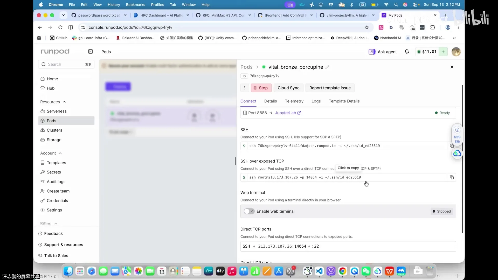 |
| 0.3~0.4 美金，也比较便宜。当然假如做视频模型开发，比方说混元 Video，或者最近开源的 MiniMax H3，对显存的要求就会比较高，你可能需要上 H 卡， [【跳转到 07:31】](https://www.bilibili.com/video/BV1nEYv6XE15/?t=451) |  |
| 甚至是 B 卡（Blackwell），像 RTX Pro 6000 这种机型就比较合适。刚才志鹏展示的基本就是整个流程：先选显卡，然后选择相应的镜像环境。 [【跳转到 07:56】](https://www.bilibili.com/video/BV1nEYv6XE15/?t=476) | 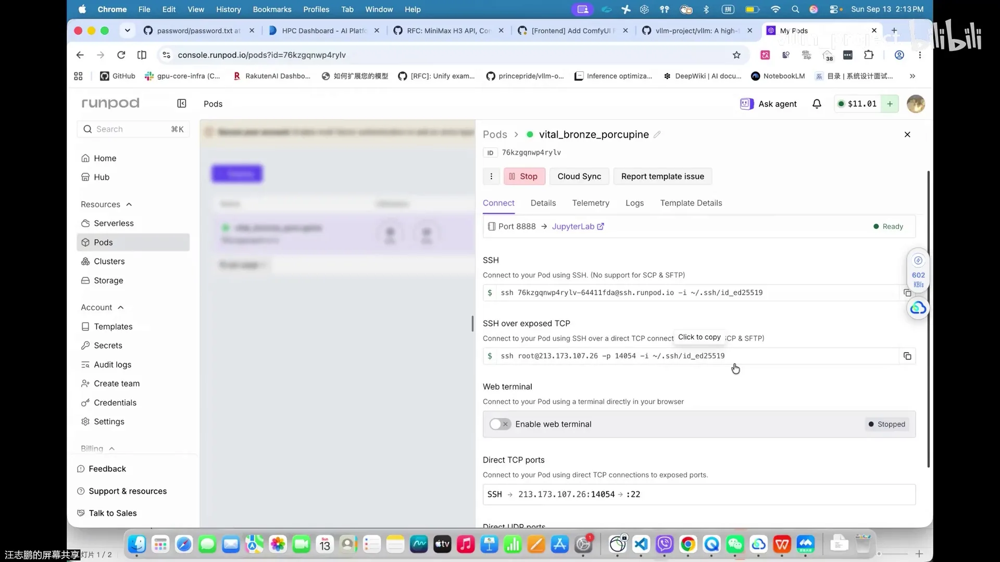 |
| 因为我们要装 PyTorch、要装 CUDA、要装 vLLM，同时还要装 vLLM-Omni，一般情况下要选合适的 image。但我还有个问题想问一下志鹏：因为 vLLM-Omni 每天会发 nightly 镜像嘛， [【跳转到 08:21】](https://www.bilibili.com/video/BV1nEYv6XE15/?t=501) |  |
| 我们可不可以直接用 nightly，其余就都省去了，等于是把 PyTorch、CUDA、vLLM 和 vLLM-Omni 都帮我弄好了？（志鹏：OK，嗯嗯，我建议来讲的话用标准版本就行了。） [【跳转到 08:46】](https://www.bilibili.com/video/BV1nEYv6XE15/?t=526) |  |
| 因为如果你是做 vLLM-Omni 的开发，其实只需要保证你的 vLLM 版本是一个比较新的最新大版本，因为 vLLM-Omni 不会不停地同步（upstream）最新的 vLLM 仓库。而如果你是做 vLLM 开发、不是做 Omni，那你其实都不需要装 vLLM，直接装一个标准版本的 PyTorch 就行了。 [【跳转到 09:11】](https://www.bilibili.com/video/BV1nEYv6XE15/?t=551) | 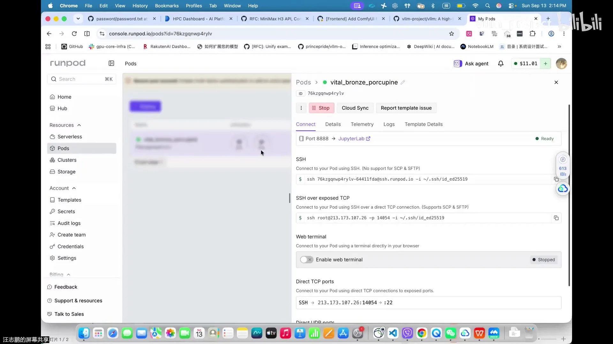 |
| PyTorch 和 CUDA 版本一定要对应，然后直接在这个基础上去装一个带预编译环境的、editable 模式的 vLLM，这样你就可以在上面做 vLLM 开发了。一般来讲，只有你是正儿八经地去使用 vLLM、比如去做生产部署的话， [【跳转到 09:36】](https://www.bilibili.com/video/BV1nEYv6XE15/?t=576) |  |
| 你可以考虑用最新版本，但也建议不要用最新版，因为最新版一般来讲都不会很稳定，你就使用标准的正式版就行，不要用 nightly 那种还在开发中的版本。——对我来说我一般就是下载 CUDA 13.0 加 PyTorch 2.9 的组合。大家到时候一定——这个环境做好之后， [【跳转到 10:01】](https://www.bilibili.com/video/BV1nEYv6XE15/?t=601) |  |
| 需要用 SSH 去连你的 VSCode，这样你的 VSCode 就可以像在本地电脑上做开发一样，访问到这些硬件，同时可以直接在上面写程序。所有东西做完之后有个很关键的点：一定一定一定要记得去 stop。 [【跳转到 10:26】](https://www.bilibili.com/video/BV1nEYv6XE15/?t=626) | 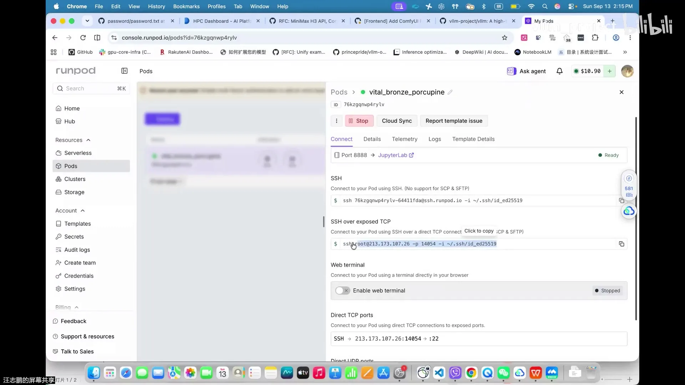 |
| 因为你看，刚才才是 11 点多，我刚才也只跑了一小会儿， [【跳转到 10:46】](https://www.bilibili.com/video/BV1nEYv6XE15/?t=646) | 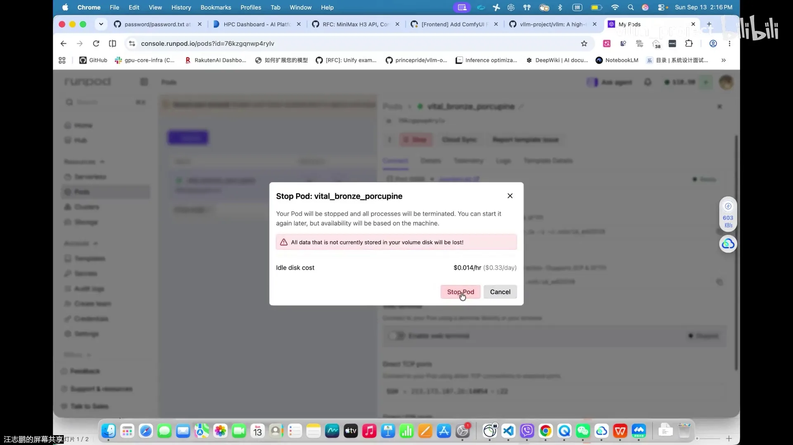 |
| 现在已经花了大约零点几美元了。这东西如果你一直挂着、又不做任何开发任务，其实开销是很高的。stop 之后还有一件事你一定要记得：按下 terminate，把整个服务给停掉。 [【跳转到 10:51】](https://www.bilibili.com/video/BV1nEYv6XE15/?t=651) | 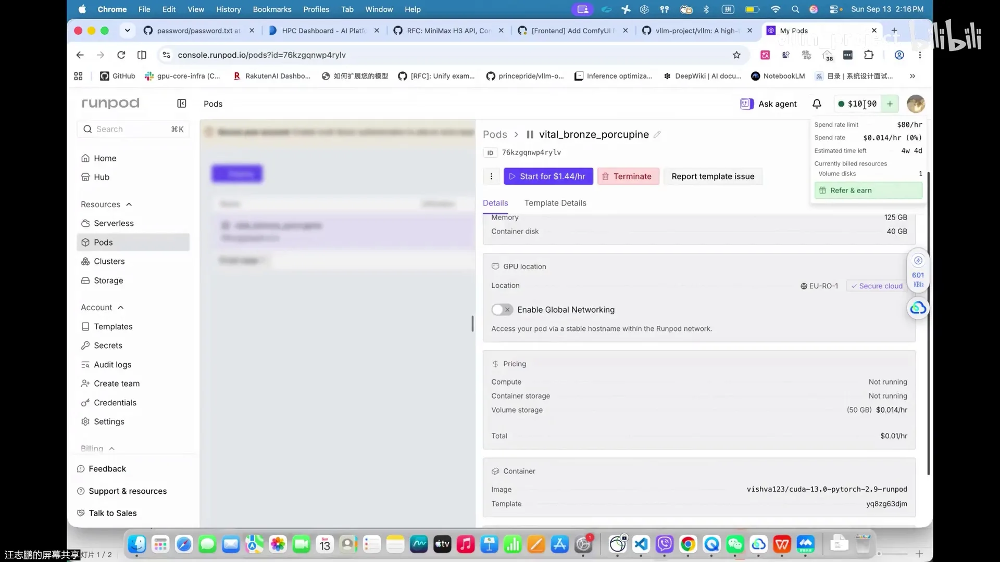 |
| 大家都会一起去算这个钱的。除了 RunPod 这个平台， [【跳转到 11:10】](https://www.bilibili.com/video/BV1nEYv6XE15/?t=670) | 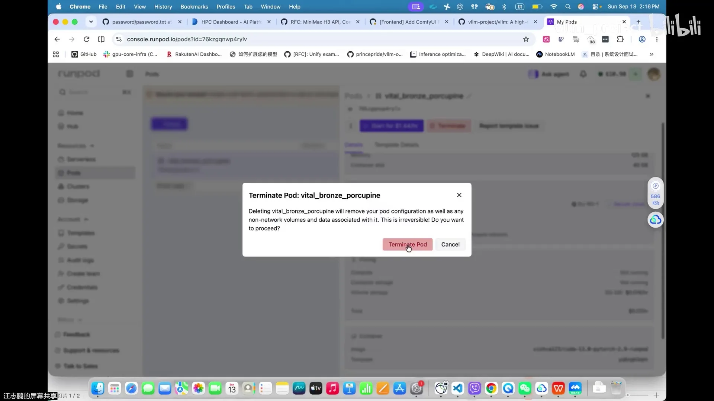 |
| 还有几个平台也是后台同学推荐过的，大家可以到时候记一下。RunPod 这个平台我之前试过，在国内是可以直接用的；其他平台我没有用过，但有同学推荐过。第二个平台应该叫 Vast.ai 吧—— [【跳转到 11:15】](https://www.bilibili.com/video/BV1nEYv6XE15/?t=675) | 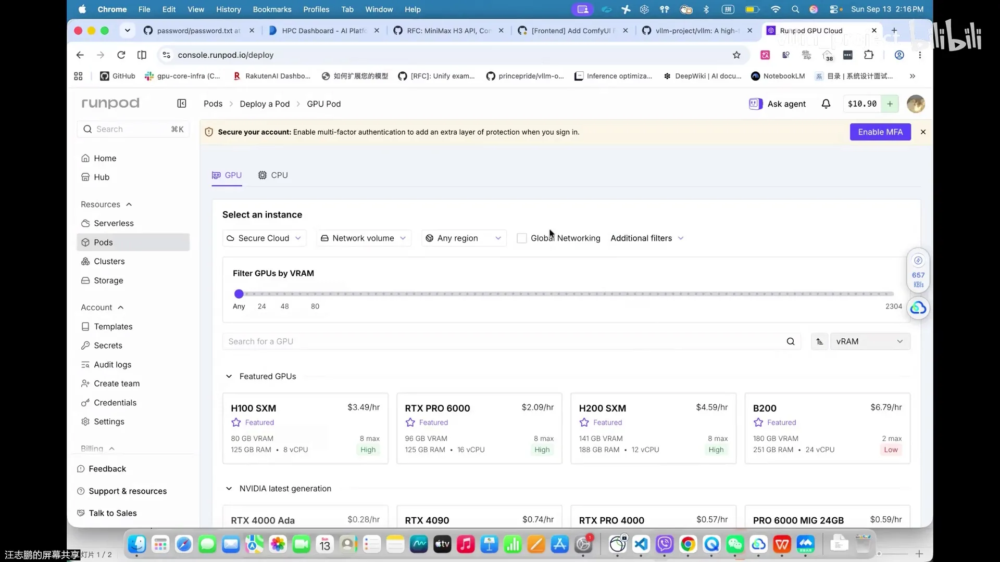 |
| 还有一个平台就是 AutoDL，AutoDL 应该可以租到昇腾卡。对，我不太确定，但应该有同学在上面租过昇腾卡。大家如果觉得 RunPod 价格太高的话，也可以尝试另外两个平台。——好像有个同学的屏幕被冻结掉了。 [【跳转到 11:40】](https://www.bilibili.com/video/BV1nEYv6XE15/?t=700) |  |
| 哎，你们看不到吗 [【跳转到 12:05】](https://www.bilibili.com/video/BV1nEYv6XE15/?t=725) |  |
| 我屏幕都切换到志鹏这个了。 [【跳转到 12:15】](https://www.bilibili.com/video/BV1nEYv6XE15/?t=735) | 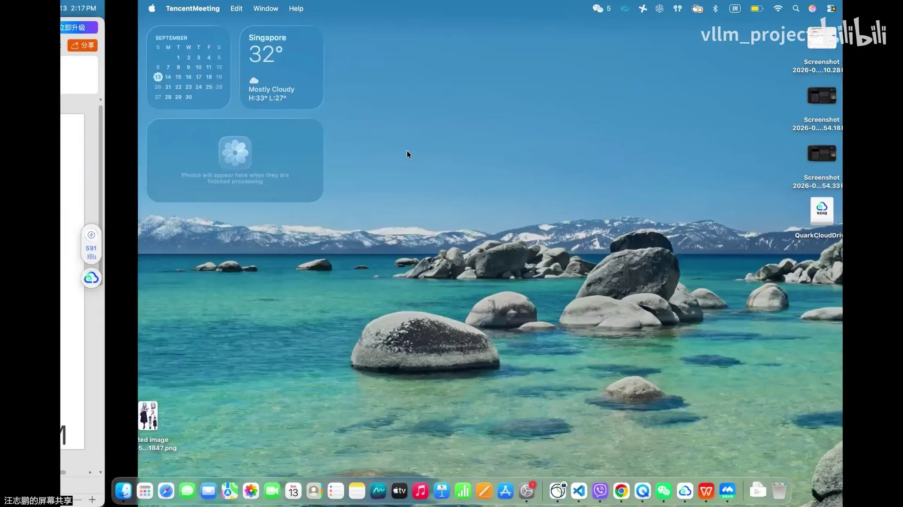 |
| 志鹏在讲这个 slides，大家能看清这个 slides 吗？所以说你做 vLLM 开发的话，其实不需要非得装一个 Linux 系统，也不需要去买一张什么 4090 的卡。——因为我们这边完全没有声音了。 [【跳转到 12:20】](https://www.bilibili.com/video/BV1nEYv6XE15/?t=740) | 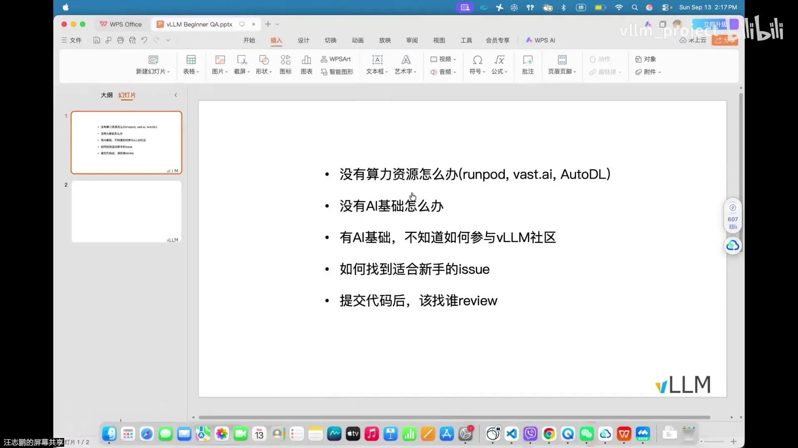 |
| 嗯，很神奇啊。不如顺阳你来讲一讲吧？（我吗？）大家都能听见武博的声音没？ [【跳转到 12:45】](https://www.bilibili.com/video/BV1nEYv6XE15/?t=765) |  |
| 可能我——哎，你让他重新进一下。就是大家听不到声音，这不是我们软件的问题，是他那边有点问题。对。 [【跳转到 13:10】](https://www.bilibili.com/video/BV1nEYv6XE15/?t=790) | 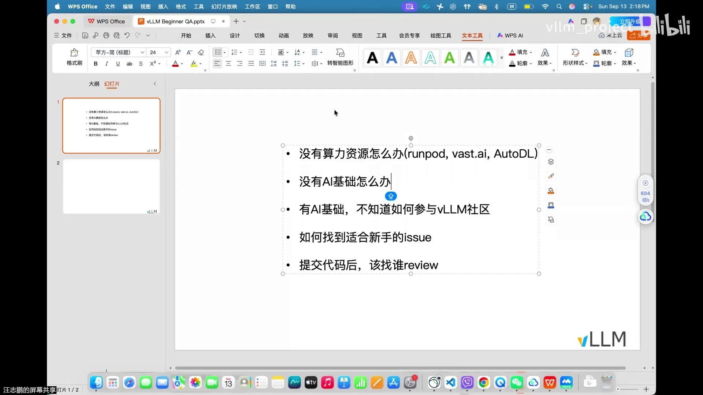 |
| 那我先退一下吧。 [【跳转到 13:26】](https://www.bilibili.com/video/BV1nEYv6XE15/?t=806) |  |
| 喂，现在能听到声音吗？B 站没声音，还是没有声音啊？ [【跳转到 13:48】](https://www.bilibili.com/video/BV1nEYv6XE15/?t=828) |  |
| 要不你换一个平台试试看？（其他平台更加没戏。我这电脑用 Zoom 和 Google Meeting 基本上都不是很能用。）哦，我试了一下，用小程序可以进。 [【跳转到 14:13】](https://www.bilibili.com/video/BV1nEYv6XE15/?t=853) | 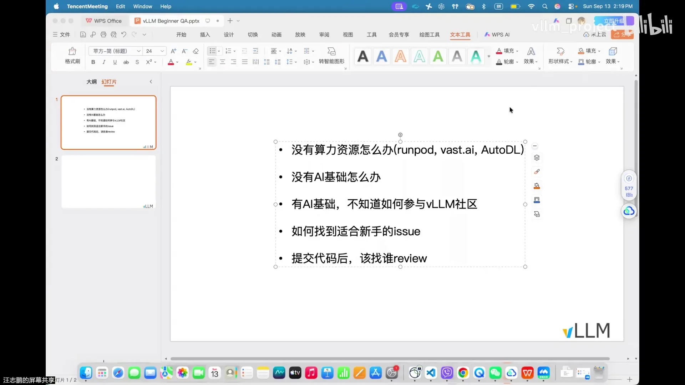 |
| 用小程序是吗？小程序是有声音的。那大家用小程序进，能听到，这个 slides 也是正常的。我也是通过这个小程序进去的。 [【跳转到 14:38】](https://www.bilibili.com/video/BV1nEYv6XE15/?t=878) | 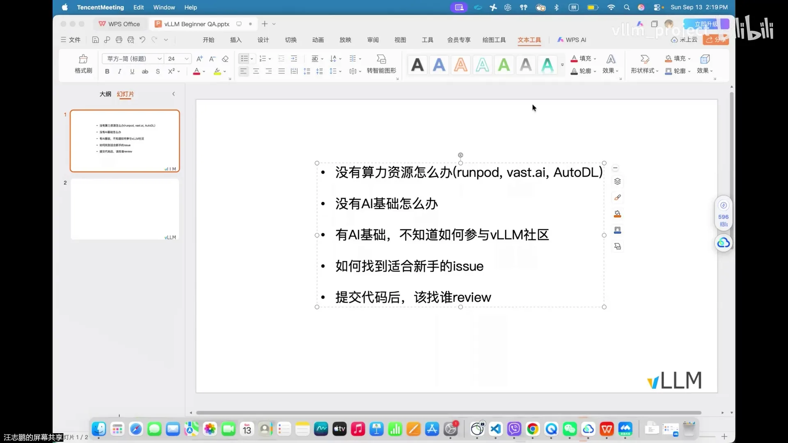 |
| （此区间无字幕） [【跳转到 15:03】](https://www.bilibili.com/video/BV1nEYv6XE15/?t=903) |  |
| 你要不从你这边继续讲吧，因为我可能——哦，那我继续讲。 [【跳转到 15:28】](https://www.bilibili.com/video/BV1nEYv6XE15/?t=928) |  |
| 大部分同学还是听得到的。好，然后第二个很多朋友问的问题：没有 AI 技术怎么办？我觉得没有 AI 基础的话可能分几个方面：有的同学可能是没有编程基础；有的可能之前学过一些机器学习之类的东西，但完全没有现在大模型相关的基础，比如他可能连 transformer 是什么都不知道； [【跳转到 15:53】](https://www.bilibili.com/video/BV1nEYv6XE15/?t=953) |  |
| 还有一方面，有人是有 transformer 基础的，之前很多人做的是模型微调工作，比如用过 HuggingFace 那一套体系、用过 PEFT 之类的一些微调，但没有 AI Infra 的基础。我可以从这几个方面来讲。 [【跳转到 16:18】](https://www.bilibili.com/video/BV1nEYv6XE15/?t=978) | 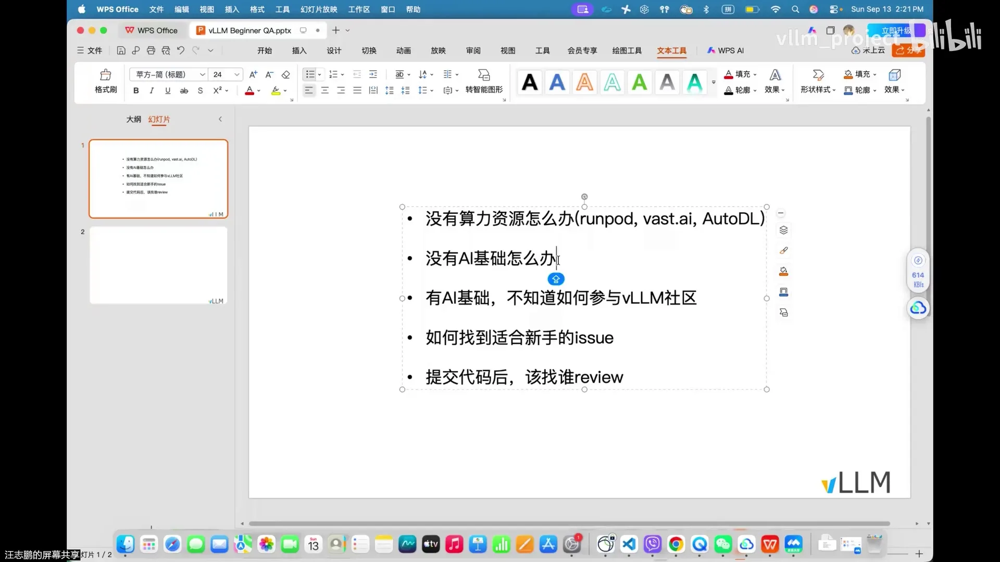 |
| 首先如果你是没有编程基础的，我非常建议你让 AI 先帮你去补一些基本的编程基础。基本的要求是你需要能看得懂代码，特别是对一些基础的 Python 代码有些熟悉。你可以考虑在学了些基础 Python 代码之后， [【跳转到 16:43】](https://www.bilibili.com/video/BV1nEYv6XE15/?t=1003) |  |
| 去刷一下力扣，刷 10~20 道题就行。基本上要掌握的是：比如你看到一个循环、一个条件判断，这些东西是怎么回事。我觉得就不管怎么样， [【跳转到 17:05】](https://www.bilibili.com/video/BV1nEYv6XE15/?t=1025) | 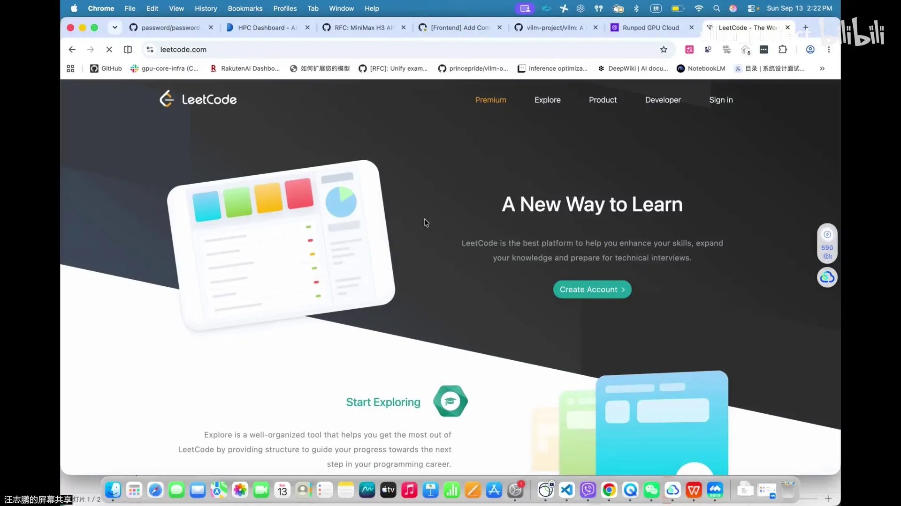 |
| 你都需要理解。Python 的话，我觉得可以看一些菜鸟教程上的东西，这些都是去补充最基本的基础知识。另外，很早之前我看过一位同学（的课程），他应该讲得还是很不错的，但我不知道他现在有没有做一些更新。 [【跳转到 17:21】](https://www.bilibili.com/video/BV1nEYv6XE15/?t=1041) | 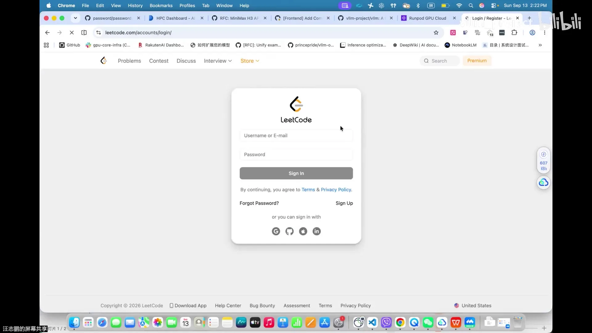 |
| 如果你要学一些 Python 基础语法，是可以在上面学的。然后后面的话就是第二个问题：属于没有 AI 基础的情况。 [【跳转到 17:46】](https://www.bilibili.com/video/BV1nEYv6XE15/?t=1066) | 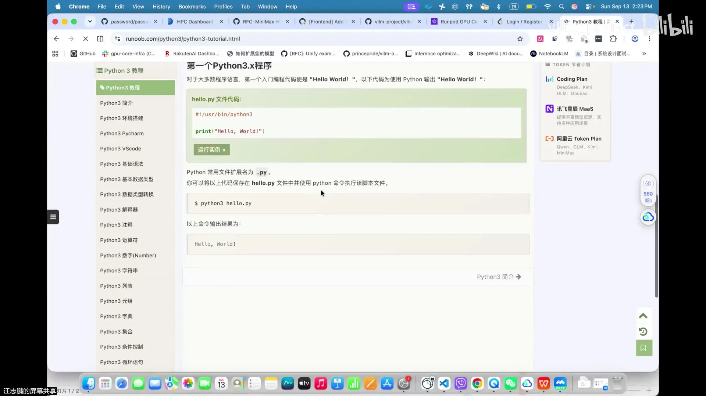 |
| 没有 AI 基础的话，我觉得那你是需要去补 PyTorch 基础。怎么补呢？ [【跳转到 18:11】](https://www.bilibili.com/video/BV1nEYv6XE15/?t=1091) |  |
| 呃，我记得 SF 他们有一个 PyTorch [【跳转到 18:19】](https://www.bilibili.com/video/BV1nEYv6XE15/?t=1099) | 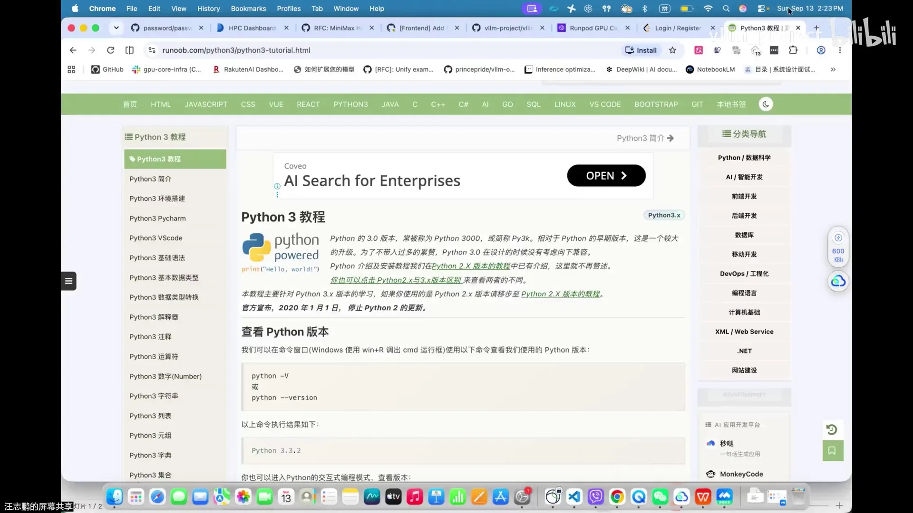 |
| 是一个速通课。嗯——哦，这个好像也不是速成的，这个 SF 好像是一个 Python 的速通课。那我可以把这个也放进去。 [【跳转到 18:24】](https://www.bilibili.com/video/BV1nEYv6XE15/?t=1104) | 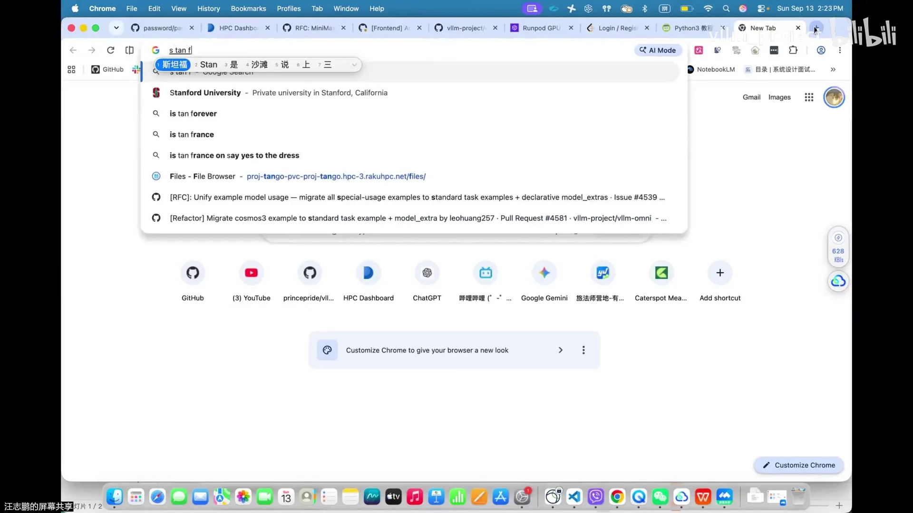 |
| 哦对，它是有一个 Python 和 NumPy 的速通课。 [【跳转到 18:46】](https://www.bilibili.com/video/BV1nEYv6XE15/?t=1126) | 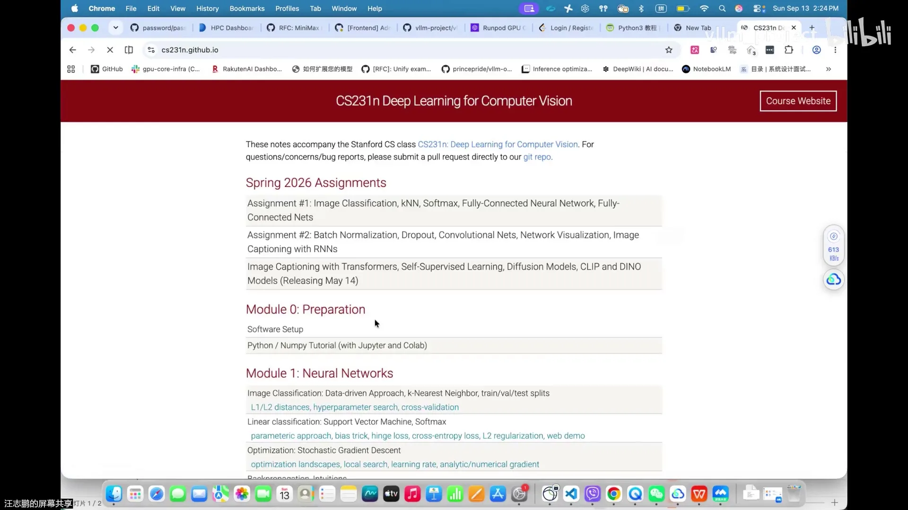 |
| （此区间无字幕） [【跳转到 18:51】](https://www.bilibili.com/video/BV1nEYv6XE15/?t=1131) | 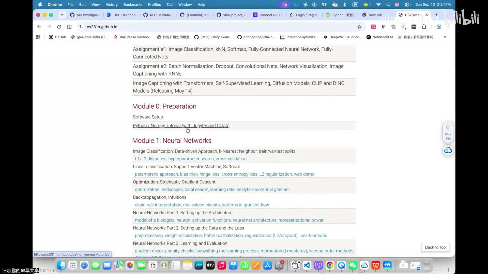 |
| 然后 NumPy 的话，它的语法会跟 PyTorch 很像，你们也可以先学一下这个课程，可以放到前面 Python 部分。 [【跳转到 18:56】](https://www.bilibili.com/video/BV1nEYv6XE15/?t=1136) | 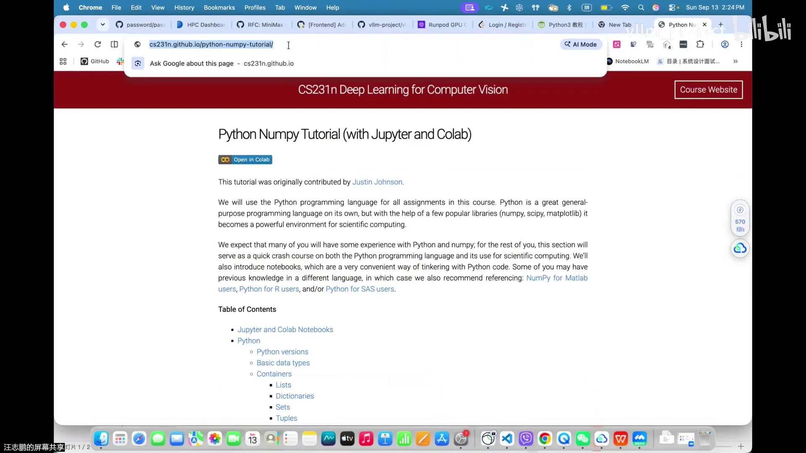 |
| AI 这部分的话，其实某种程度上你也可以去依赖 AI。首先你需要先去了解什么是 transformer。 [【跳转到 19:07】](https://www.bilibili.com/video/BV1nEYv6XE15/?t=1147) | 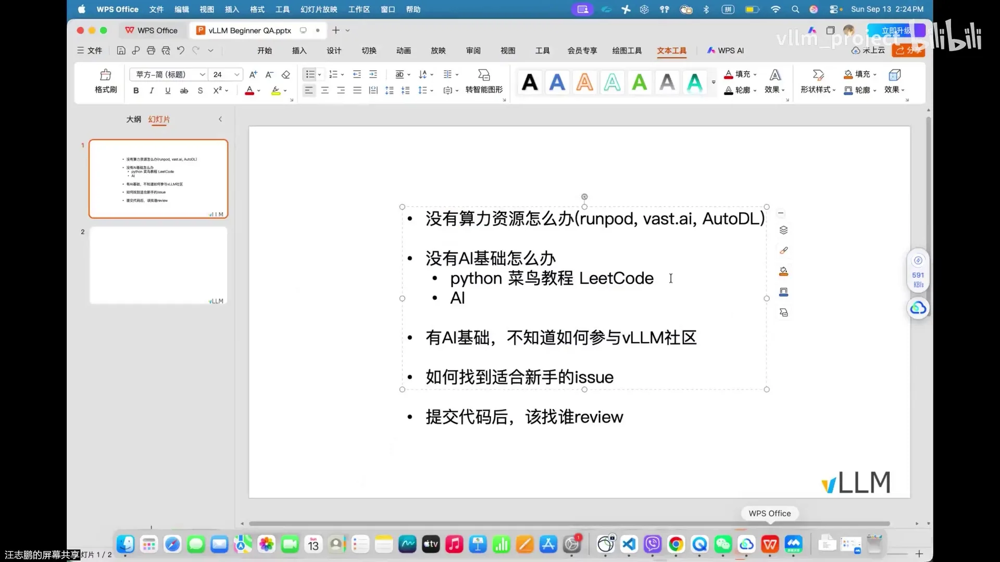 |
| 然后我们之前还有一个李沐老师， [【跳转到 19:16】](https://www.bilibili.com/video/BV1nEYv6XE15/?t=1156) | 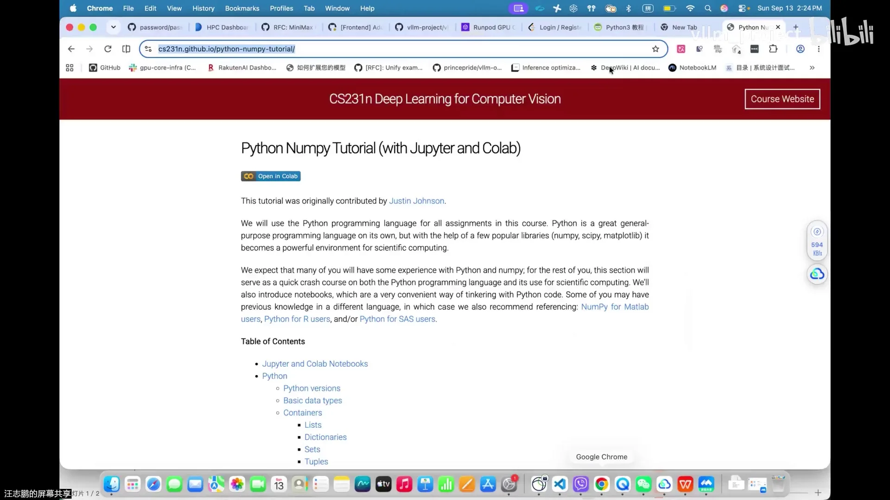 |
| 他有一个比较早期的、讲深度学习的课，课程里我记得讲了很多 PyTorch 相关的语法。我不知道有没有同学还记得他这门课叫什么名字？——《动手学深度学习》好像是吧？你直接去查他的 B 站账号， [【跳转到 19:21】](https://www.bilibili.com/video/BV1nEYv6XE15/?t=1161) | 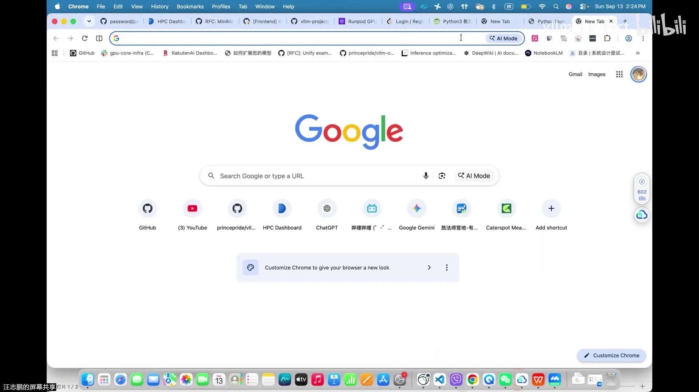 |
| B 站账号上就全都有。对，对，就是《动手学深度学习》。 [【跳转到 19:46】](https://www.bilibili.com/video/BV1nEYv6XE15/?t=1186) | 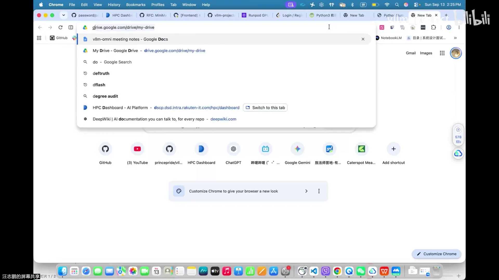 |
| （此区间无字幕） [【跳转到 19:56】](https://www.bilibili.com/video/BV1nEYv6XE15/?t=1196) |  |
| （此区间无字幕） [【跳转到 20:01】](https://www.bilibili.com/video/BV1nEYv6XE15/?t=1201) | 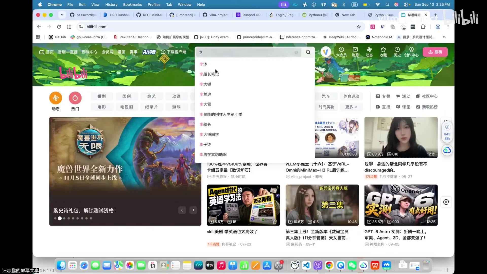 |
| 对，这应该是一个比较早期的课了。 [【跳转到 20:09】](https://www.bilibili.com/video/BV1nEYv6XE15/?t=1209) | 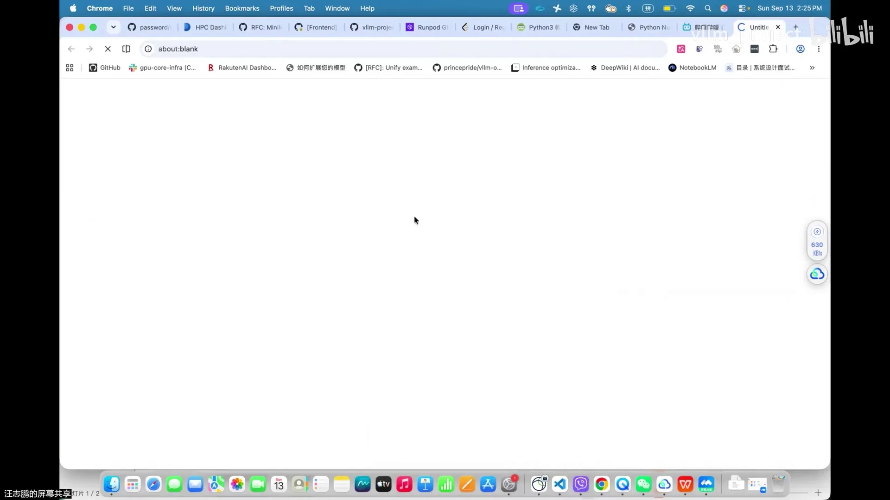 |
| 对，但它里面会有很多 PyTorch 的一些基本语法，这也属于是必须得掌握的。我觉得还是要过完基础会好一点。——诶，你们谁能在直播间发一下（课程链接）呢？ [【跳转到 20:14】](https://www.bilibili.com/video/BV1nEYv6XE15/?t=1214) | 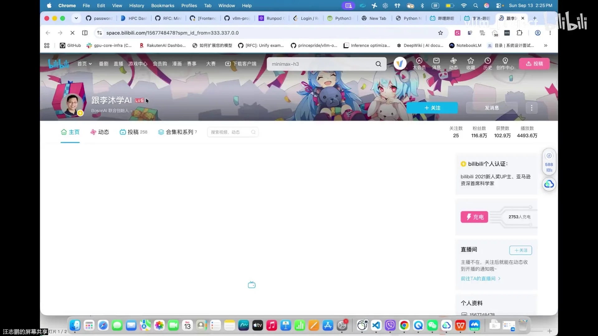 |
| 就是他那个网站的课叫什么名字？嗯，他志颖是在 CMU 还是哪里来着？ [【跳转到 20:26】](https://www.bilibili.com/video/BV1nEYv6XE15/?t=1226) | 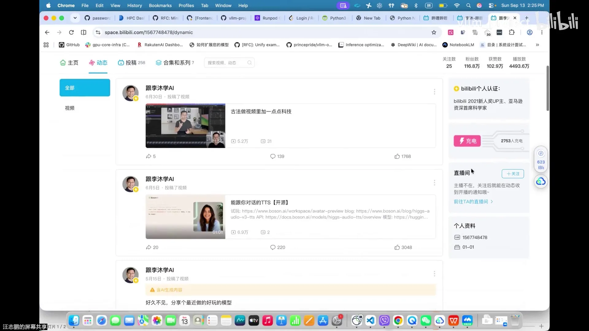 |
| 哦对对对，大家也可以看一下这个课程。 [【跳转到 20:51】](https://www.bilibili.com/video/BV1nEYv6XE15/?t=1251) | 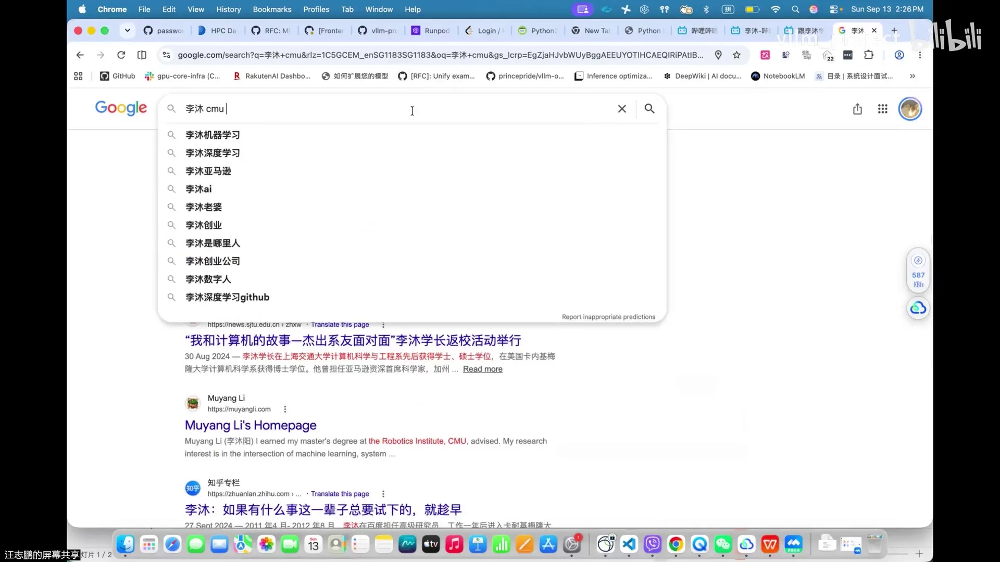 |
| 这里面我觉得大家可以重点去看它里面的一些语法知识， [【跳转到 20:58】](https://www.bilibili.com/video/BV1nEYv6XE15/?t=1258) | 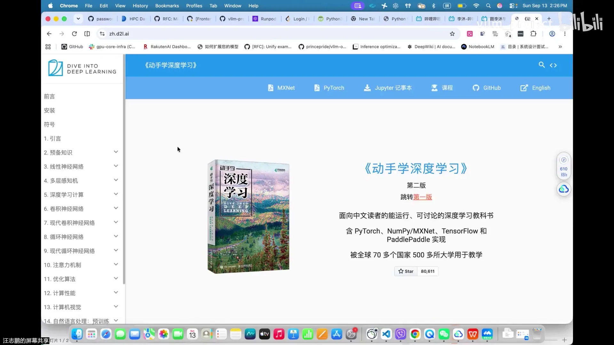 |
| 也就不需要去看其他一些东西了，因为很多东西已经完全没有用了。比如举例来说神经网络，这东西个别地方有点用，但可能只在一些比如 VAE 里面会用到；而我们现在的主干——现在的 LLM，本质还是做 transformer 的。这个课里面我认为应该也会有 Transformer 相关的章节。 [【跳转到 21:03】](https://www.bilibili.com/video/BV1nEYv6XE15/?t=1263) | 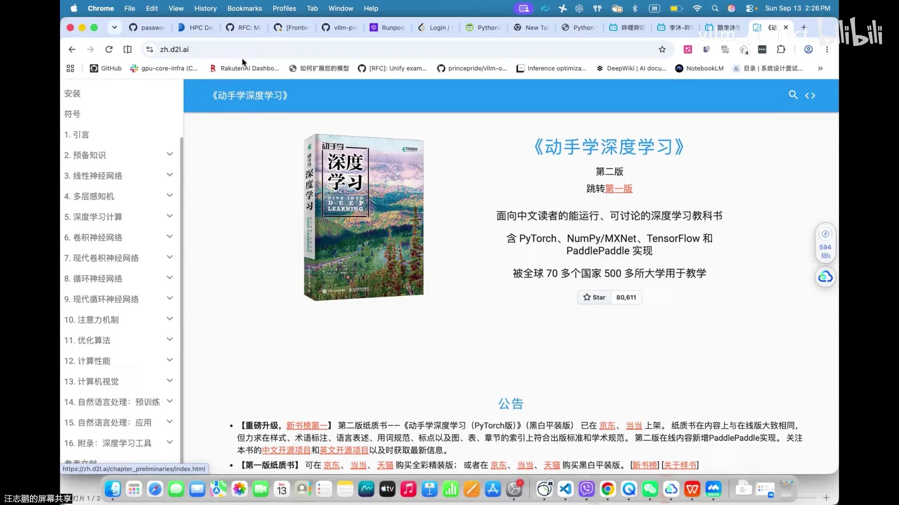 |
| 我看一下这有没有讲到注意力机制的分 P。 [【跳转到 21:24】](https://www.bilibili.com/video/BV1nEYv6XE15/?t=1284) | 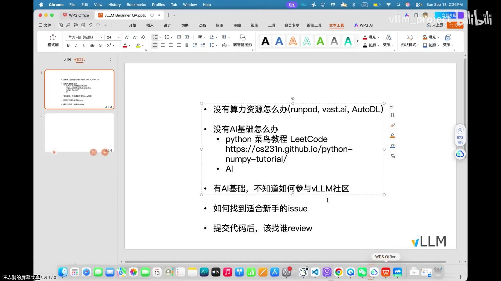 |
| 注意力机制，我觉得……对对，大家可以注意——对。 [【跳转到 21:33】](https://www.bilibili.com/video/BV1nEYv6XE15/?t=1293) |  |
| 重点是看这个，这个东西非常有用。因为现在的所有模型其实都是依托于注意力机制出来的。 [【跳转到 21:38】](https://www.bilibili.com/video/BV1nEYv6XE15/?t=1298) | 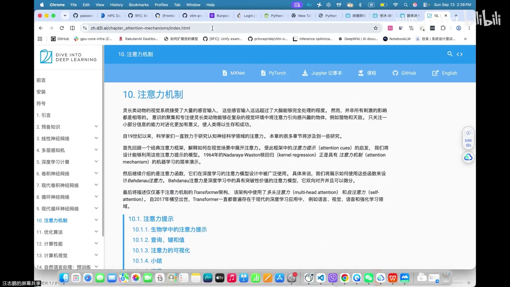 |
| 然后搭配着好好学习 QKV 这里面的基本情况。 [【跳转到 21:46】](https://www.bilibili.com/video/BV1nEYv6XE15/?t=1306) | 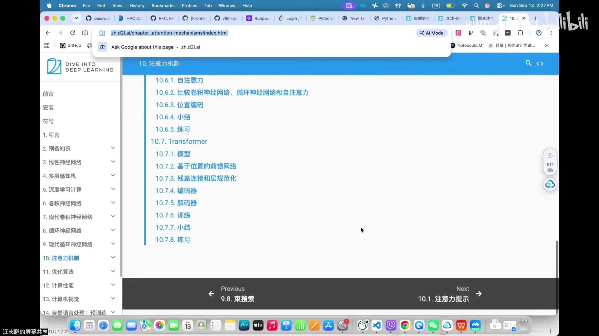 |
| 这个还有纯中文版的，对于中国用户非常友善。 [【跳转到 21:51】](https://www.bilibili.com/video/BV1nEYv6XE15/?t=1311) | 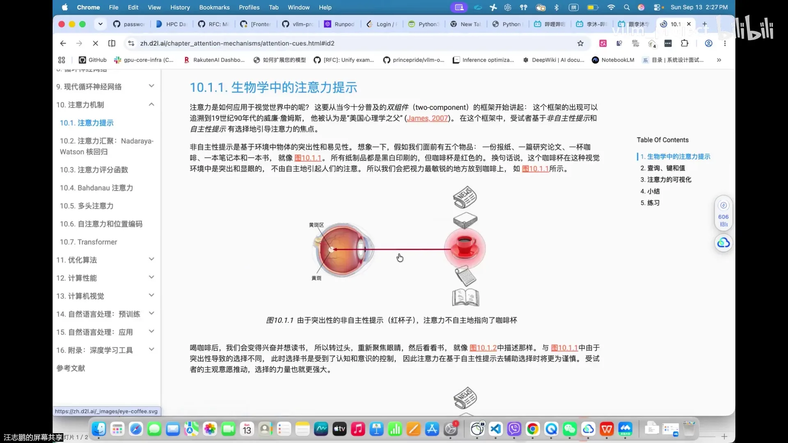 |
| （此区间无字幕） [【跳转到 21:56】](https://www.bilibili.com/video/BV1nEYv6XE15/?t=1316) | 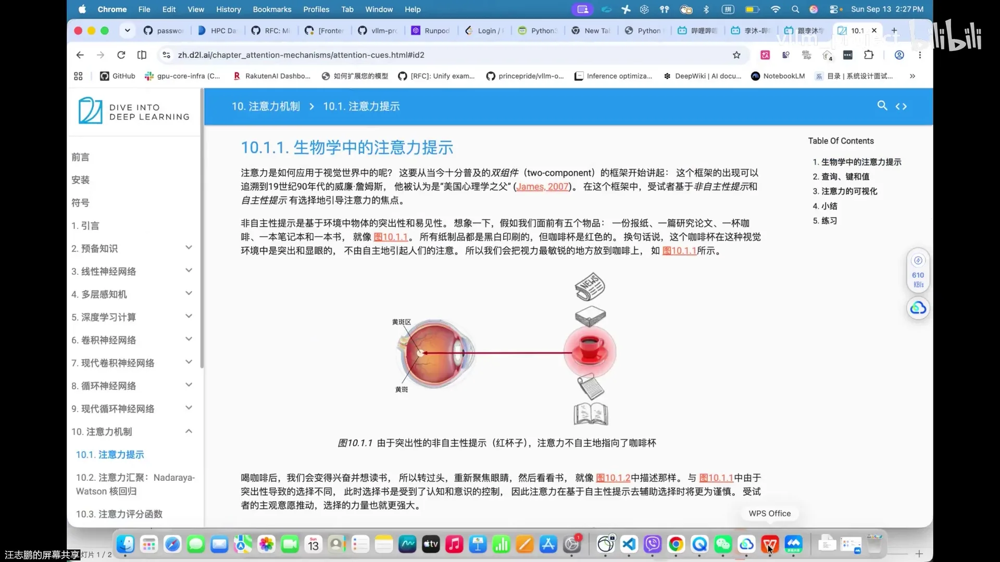 |
| 然后接下来就是我非常非常推荐的：如果你真的想了解—— [【跳转到 22:01】](https://www.bilibili.com/video/BV1nEYv6XE15/?t=1321) | 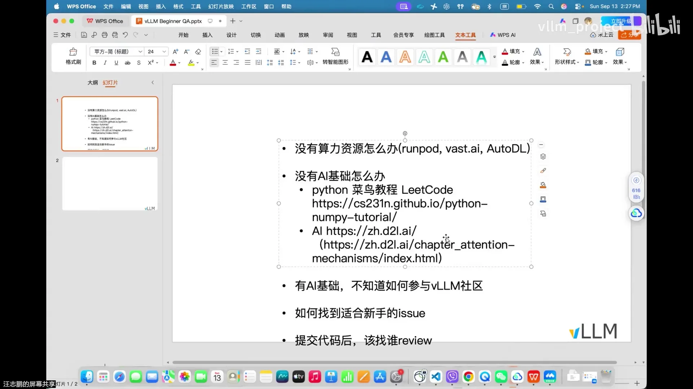 |
| 现在大模型是怎么回事，最简单的就是一定要把 HuggingFace 那套代码搞清楚。 [【跳转到 22:07】](https://www.bilibili.com/video/BV1nEYv6XE15/?t=1327) | 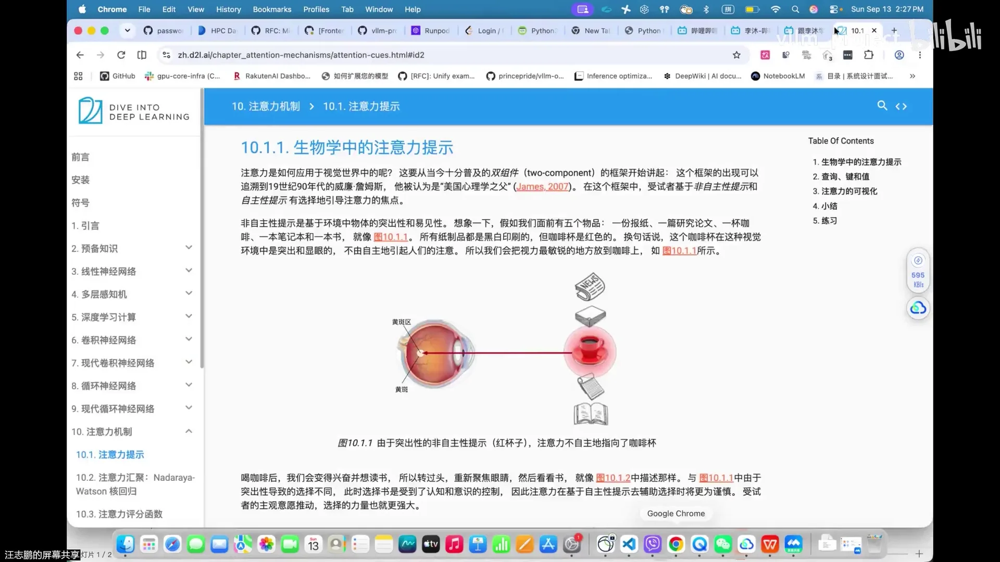 |
| 因为那套代码可以说有各种现在主流模型最简单的实现。 [【跳转到 22:12】](https://www.bilibili.com/video/BV1nEYv6XE15/?t=1332) | 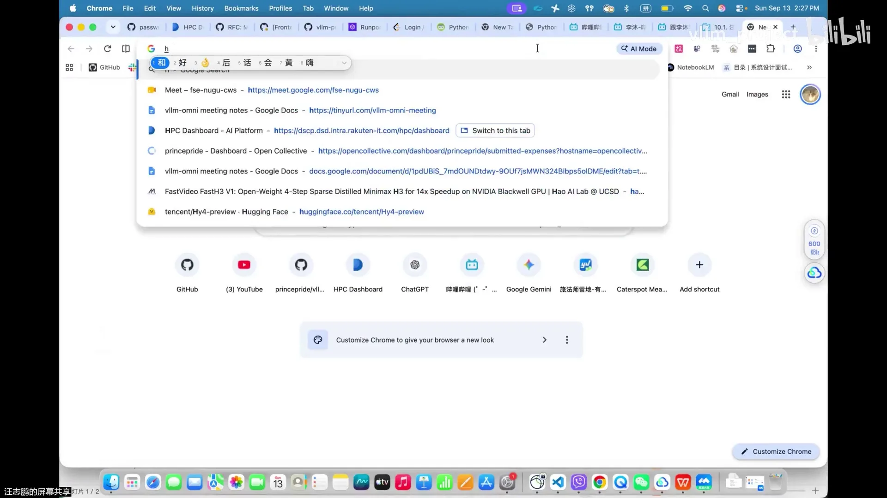 |
| 这个仓库可以说非常重要，特别适合新手。 [【跳转到 22:20】](https://www.bilibili.com/video/BV1nEYv6XE15/?t=1340) | 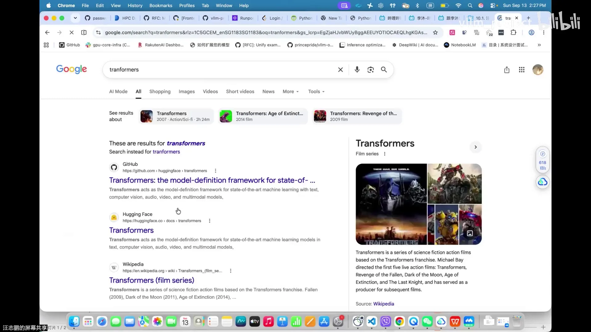 |
| 包括如果你是做 research 的话，这个仓库基本上是离不开的。它里面有非常简单的方式可以做模型的后训练，你不需要掌握非常深厚的语法知识， [【跳转到 22:25】](https://www.bilibili.com/video/BV1nEYv6XE15/?t=1345) | 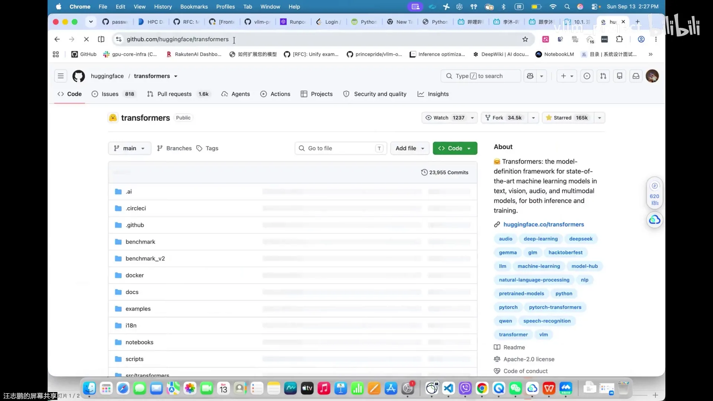 |
| 也可以去做模型的微调，还可以去了解模型架构到底长什么样。同时它框架非常简单，KV cache 都是各模型自己私有的，你不需要像 vLLM 那样要看很复杂的代码才能找到它是怎么管理 paged KV cache 的。所以这个我也是非常推荐的。 [【跳转到 22:37】](https://www.bilibili.com/video/BV1nEYv6XE15/?t=1357) | 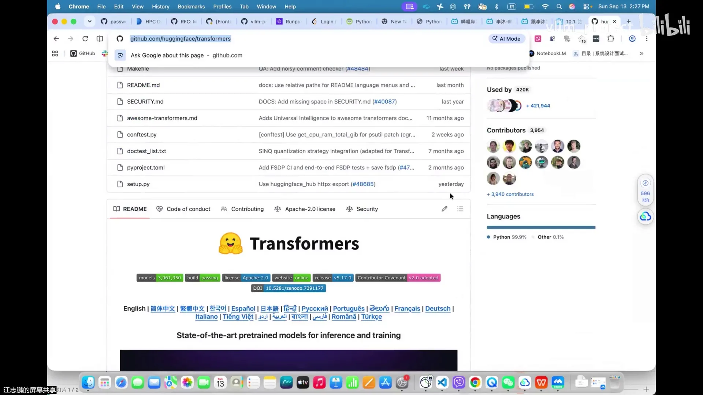 |
| 这个东西我强烈大家可以去研究一下：Qwen2 这个模型。Qwen2 属于是最基础款的 dense model，里面有现在常用的一些 RoPE，它里面的 attention 也有一些最基本的细节实现。 [【跳转到 22:58】](https://www.bilibili.com/video/BV1nEYv6XE15/?t=1378) |  |
| 这个东西在哪里看呢？我也有很长时间没翻过这代码了，看我能不能找得到。大家可以看一下这个 Qwen2 这个模型。 [【跳转到 23:23】](https://www.bilibili.com/video/BV1nEYv6XE15/?t=1403) | 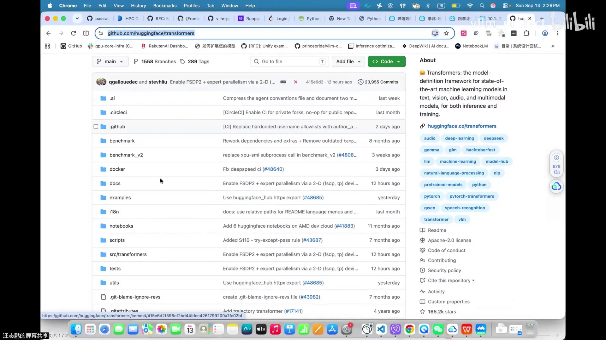 |
| 到时候你会发现有很多模型都是依托 Qwen2 去引用这个模块来做后续开发的。这个应该就是它整个模型的一个主干文件了。不过它这个里面其实稍微做了一点抽象，不会说是一个文件就能完成所有的推理工作。 [【跳转到 23:48】](https://www.bilibili.com/video/BV1nEYv6XE15/?t=1428) | 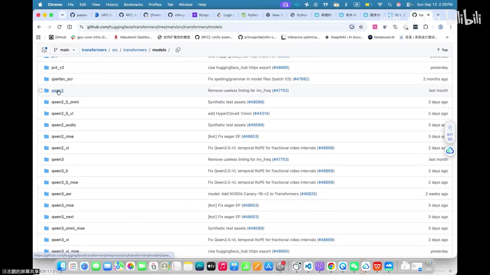 |
| 所以你们如果想看它的上层抽象，需要去找到这个类，看一下这个类里面是怎么实现的。我记得这个类会去调用这个模型，然后去跑一些服务，同时包括一些基本的预处理和一些 KV cache 相关的交互。我不太清楚它的 KV cache 是写在模型里面，还是放到那个 Generation [【跳转到 24:13】](https://www.bilibili.com/video/BV1nEYv6XE15/?t=1453) | 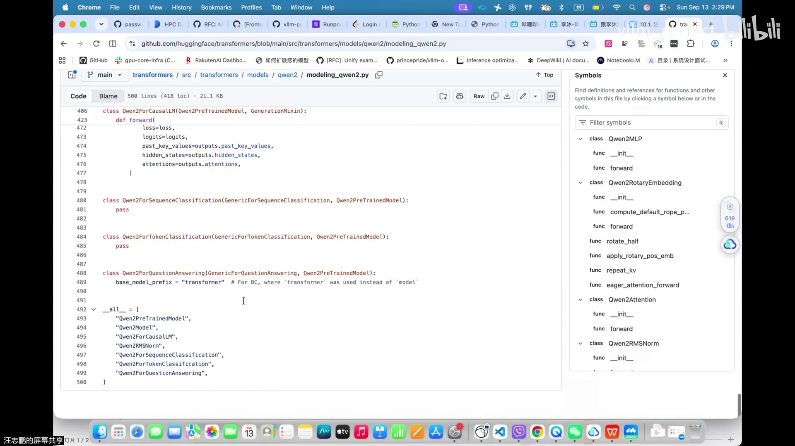 |
| Mixin 这个类里面去了。大家可以研究一下这个文件具体怎么写的。把这东西研究清楚之后，我觉得你基本的 LLM 入门这块就算搞定了。后面的话比如你要写一些 sparse model 或者 linear model，你可以在 vLLM 里去找，也可以直接回到 HuggingFace 里面看他们的实现。 [【跳转到 24:38】](https://www.bilibili.com/video/BV1nEYv6XE15/?t=1478) | 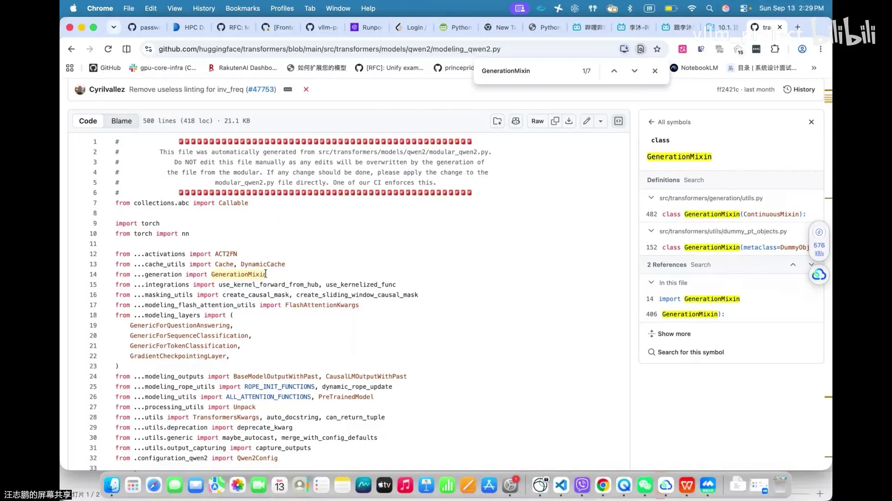 |
| 但这属于后话：你可能需要先学一段时间常规模型相关的内容，后面才可以再去研究一些新型的注意力机制。 [【跳转到 25:03】](https://www.bilibili.com/video/BV1nEYv6XE15/?t=1503) |  |
| 然后我们再到了第三类同学。第三类同学就是他可能会有 Python 基础，也有基本的 AI 基础，但比较欠缺的是可能完全没有接触过 AI Infra。在你有 AI 基础之后再去接触 AI Infra，下手研究会容易很多。一般来讲， [【跳转到 25:16】](https://www.bilibili.com/video/BV1nEYv6XE15/?t=1516) | 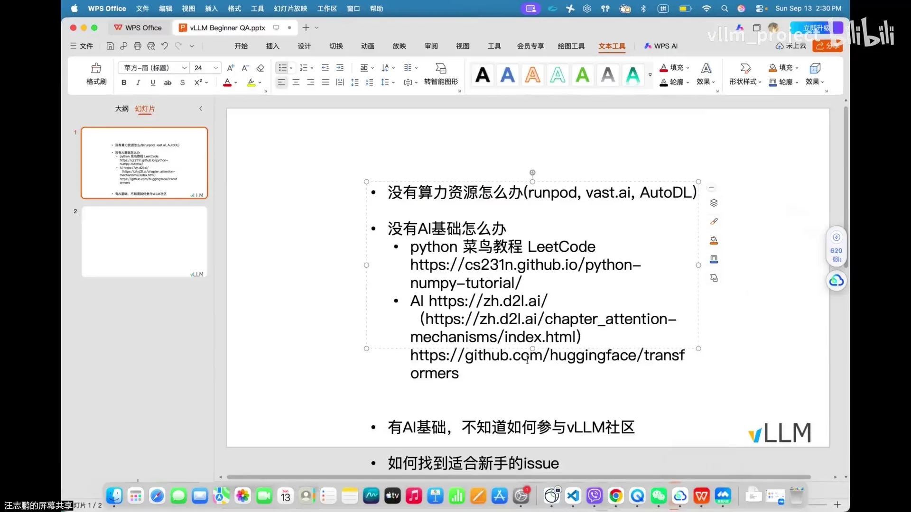 |
| AI Infra 比较核心的工作，一个是做算子，另一个可能就是做训练框架（推理框架）了。那么你可以去开始研究—— [【跳转到 25:41】](https://www.bilibili.com/video/BV1nEYv6XE15/?t=1541) | 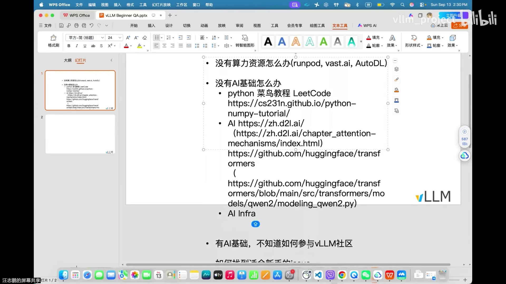 |
| 一个是 vLLM 当时最开始的那篇论文，就是 PagedAttention。但是直接看的话，你可能会看起来很痛苦， [【跳转到 25:50】](https://www.bilibili.com/video/BV1nEYv6XE15/?t=1550) | 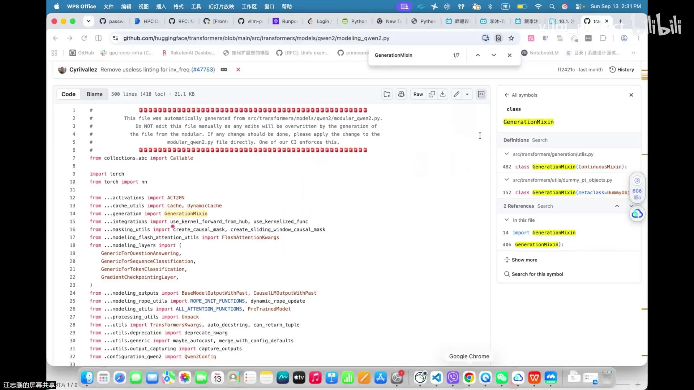 |
| 而且如果你现在去找的话，可能已经不是很能找到比如算子是怎么实现的，直观感受已经找不到了，因为它已经把算子这块移除了，现在所有特性都是 PagedAttention 的。那么你可以去看 vLLM 的一个非常早的版本，可能就是 0.1 版本的时候，当时 Woosuk 和 Zhuohan 他们实现了基础版的 vLLM。 [【跳转到 26:04】](https://www.bilibili.com/video/BV1nEYv6XE15/?t=1564) | 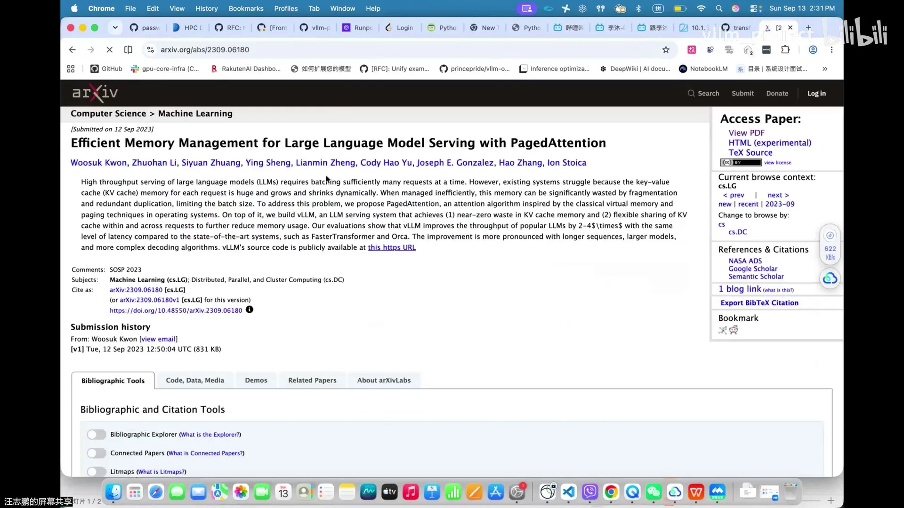 |
| 大家可以去研究一下当时的代码是怎么写的。还有一种方式就是你可以去看 nano-vllm 这个项目，这是最基本的。 [【跳转到 26:29】](https://www.bilibili.com/video/BV1nEYv6XE15/?t=1589) | 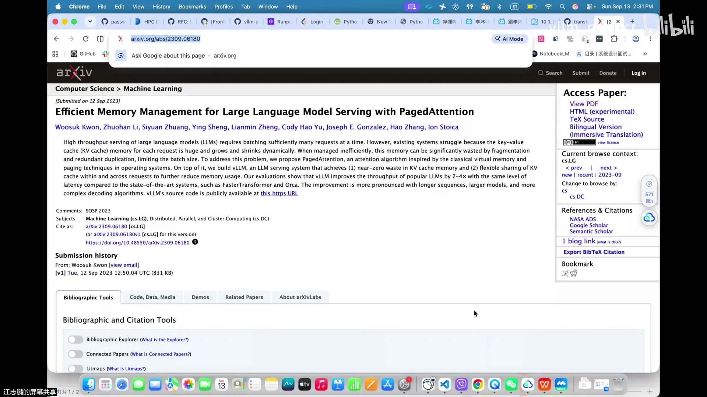 |
| 你需要去了解的东西就是 PagedAttention 是什么。（后面几句被插话盖住了，听不清。） [【跳转到 26:38】](https://www.bilibili.com/video/BV1nEYv6XE15/?t=1598) |  |
| 除了这个东西之外，AI Infra 还有很多知识：比如你需要了解投机解码、需要了解各种并行策略，对吧。然后包括算子这一块——因为我不是很懂算子，但算子这块其实里面内容很多，因为你所有的并行、包括你的计算，归根到底其实就是这些计算的算子和通用算子它们之间是怎样的运作的。 [【跳转到 27:03】](https://www.bilibili.com/video/BV1nEYv6XE15/?t=1623) | 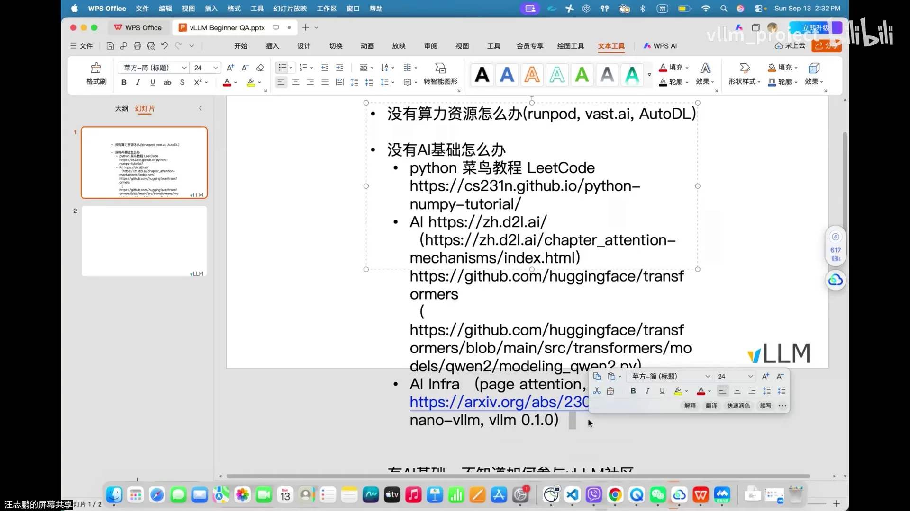 |
| 这一点的话，首先如果是单纯地从推理或者训练侧来看，大家都可以去一直关注我们的这个 [【跳转到 27:28】](https://www.bilibili.com/video/BV1nEYv6XE15/?t=1648) | 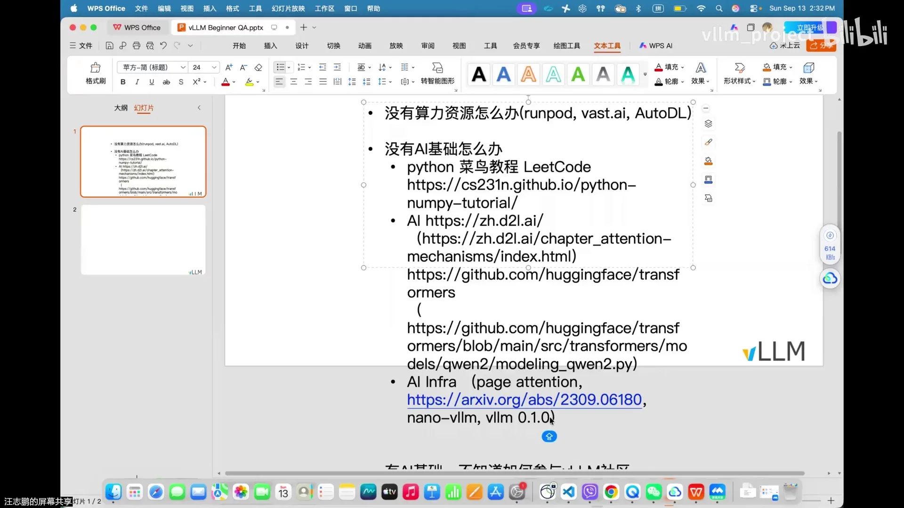 |
| 官方的 B 站账号了，就是我们这个官方平台。 [【跳转到 27:38】](https://www.bilibili.com/video/BV1nEYv6XE15/?t=1658) | 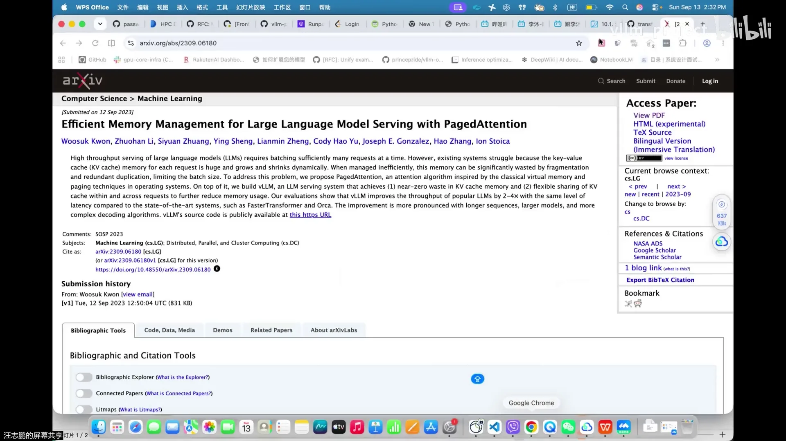 |
| 这个平台每个星期会有相关的直播，大家如果有不懂的， [【跳转到 27:43】](https://www.bilibili.com/video/BV1nEYv6XE15/?t=1663) | 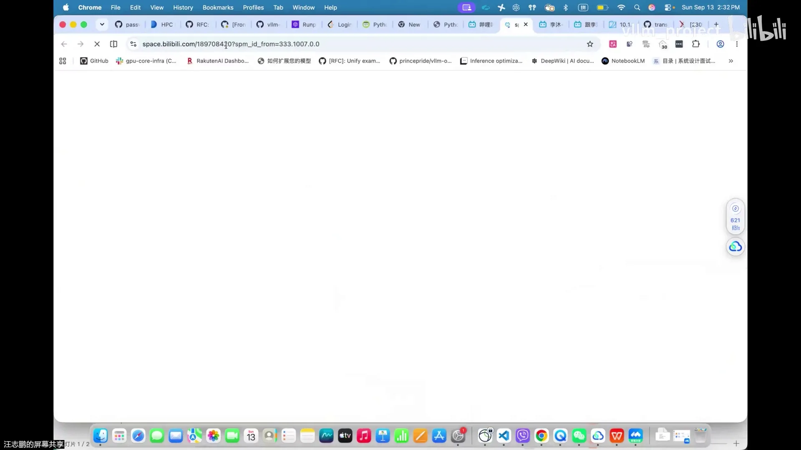 |
| 一定一定要在我们直播间提问，我们可以实时地给你答疑解惑。然后算子层面的话，我觉得顺阳可以分享一下，比如怎么学习算子这一块的。 [【跳转到 27:48】](https://www.bilibili.com/video/BV1nEYv6XE15/?t=1668) |  |
| 算子层面，首先假如要去做 CUDA 的话，需要有一定的 C++ 基础，可能跟这个写 vLLM 和这个—— [【跳转到 28:03】](https://www.bilibili.com/video/BV1nEYv6XE15/?t=1683) | 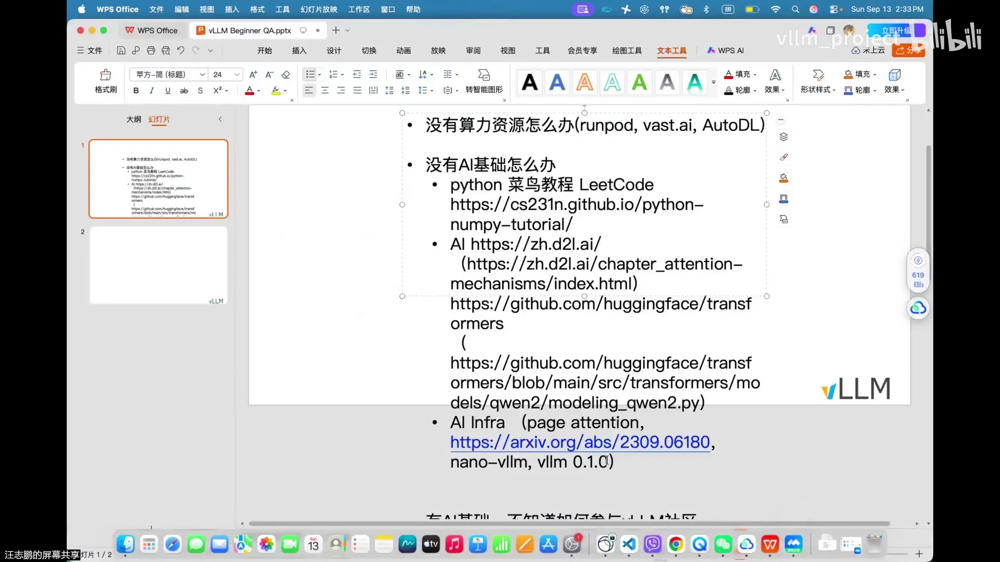 |
| 写 vLLM、写 vLLM-Omni 不一样。对，首先得会一点 C++。 [【跳转到 28:18】](https://www.bilibili.com/video/BV1nEYv6XE15/?t=1698) | 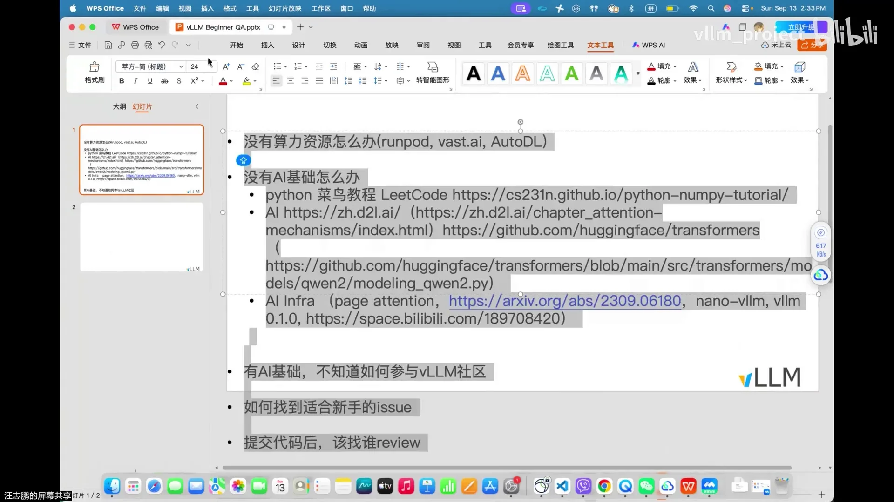 |
| 同时，对 CUDA 的话——我觉得现在 AI 写代码其实还挺厉害的，你可以用 agent 去辅助你读一些 CUDA 代码，辅助你去看一些 CUDA 相关的文档。这是学习层面。 [【跳转到 28:23】](https://www.bilibili.com/video/BV1nEYv6XE15/?t=1703) | 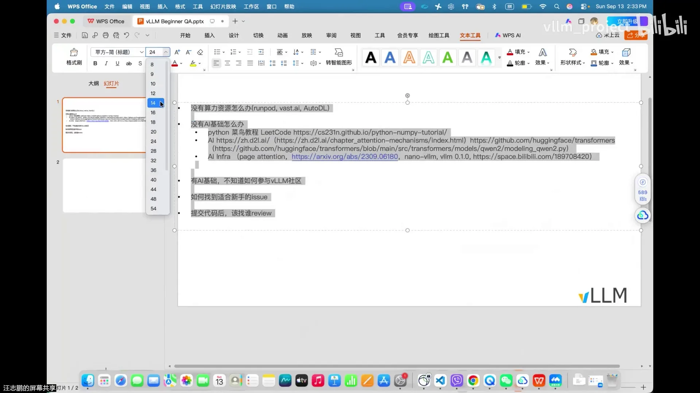 |
| 然后现在主要是 vLLM 和 vLLM-Omni 的算子，主要是基于 FlashInfer 这个后端。像英伟达（NV）的同学假如想给 vLLM 和 vLLM-Omni 做贡献，他们对于一些新型 attention 的支持啊、 [【跳转到 28:48】](https://www.bilibili.com/video/BV1nEYv6XE15/?t=1728) | 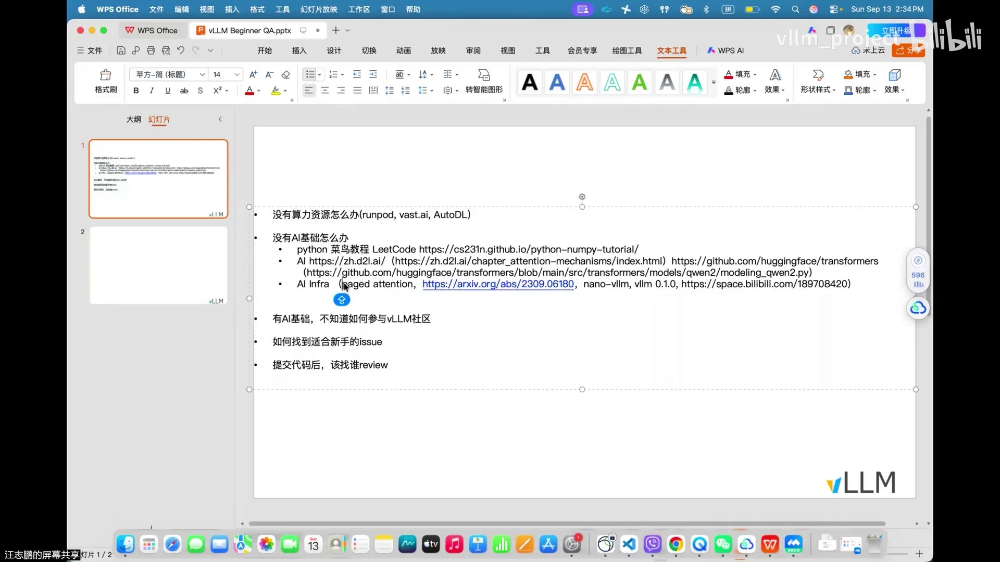 |
| 写的一些算子都会放在 FlashInfer 的后端。所以我推荐大家假如对算子感兴趣的话，可以看一下 FlashInfer 这个仓库。然后呢，想要入门算子的话， [【跳转到 29:13】](https://www.bilibili.com/video/BV1nEYv6XE15/?t=1753) |  |
| 我也推荐大家去看一下 FlashAttention。对，FlashAttention 大家是一定得好好看的。因为我现在不是很懂算子这块，但是我看了一些其他的算子的话——就比如说我们做一些那种 VAE 的一些—— [【跳转到 29:38】](https://www.bilibili.com/video/BV1nEYv6XE15/?t=1778) | 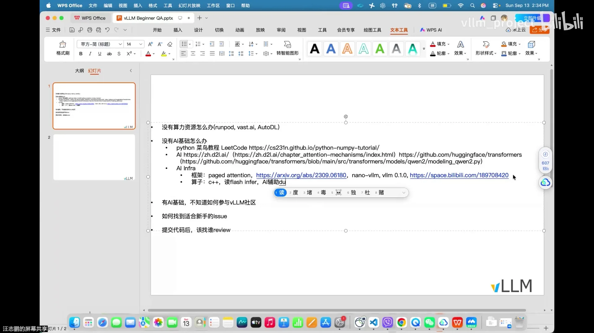 |
| 不是 VAE，应该是最后的一些，比如说我做那个 lm head（词表预测）那一块的。它的思路我个人感觉跟 FlashAttention 是很像的：比如我最后做词表上预测的话，其实可以去做一个分块的处理，也是类似于跑一个循环，然后把它给做出来。 [【跳转到 30:03】](https://www.bilibili.com/video/BV1nEYv6XE15/?t=1803) | 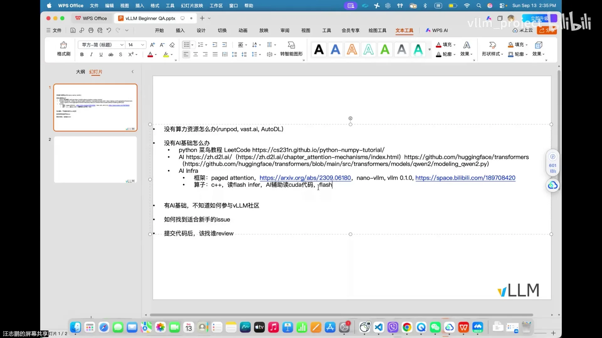 |
| 其实我觉得他的思路跟 FlashAttention 都很像。而且这也是必须得看的，这个东西在面试里也非常爱考。面试最喜欢考的一个是 FlashAttention，一个是 PagedAttention，这两个基本上属于系统领域最顶级的两篇学术成果。 [【跳转到 30:28】](https://www.bilibili.com/video/BV1nEYv6XE15/?t=1828) |  |
| 嗯，现在 FlashAttention 已经出到第四版了嘛。可以从一开始看，就是 Tri Dao 在 2021 年发表的第一篇论文。它的核心思想其实就是为了可以把—— [【跳转到 30:53】](https://www.bilibili.com/video/BV1nEYv6XE15/?t=1853) | 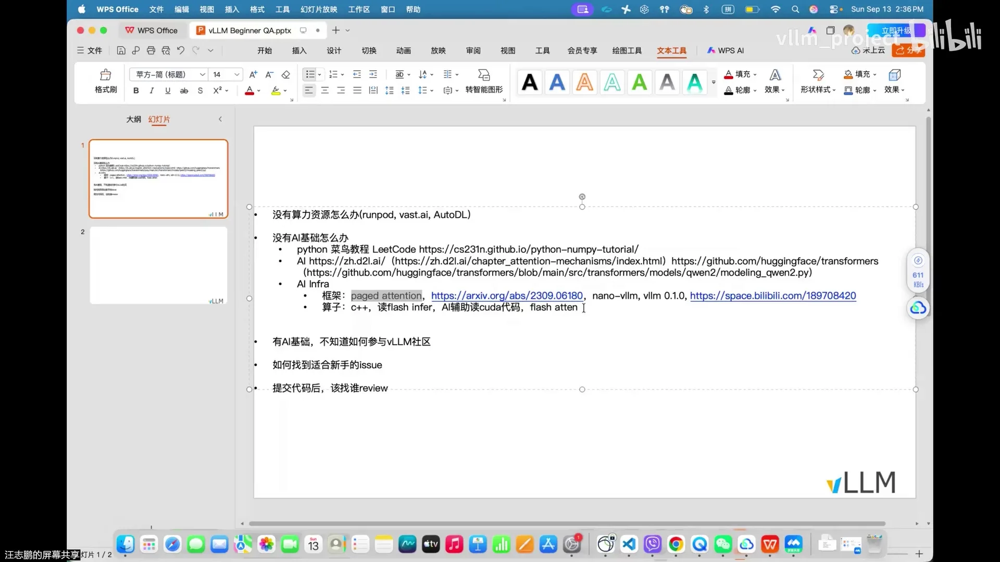 |
| 整个 attention 机制做分块处理，以减少数据搬运的一些 overhead，对，就是边传边算。好，那我们可以再到第三个问题了：就是我如果有 AI 基础， [【跳转到 31:18】](https://www.bilibili.com/video/BV1nEYv6XE15/?t=1878) |  |
| 但是我不知道怎么参与 vLLM 社区。那么首先我是非常建议大家 [【跳转到 31:43】](https://www.bilibili.com/video/BV1nEYv6XE15/?t=1903) |  |
| ——因为现在来讲，用 AI coding 的同学很多，我们是真的看到很多—— [【跳转到 31:51】](https://www.bilibili.com/video/BV1nEYv6XE15/?t=1911) |  |
| 有些人代码是完全自动提交的，所以他是完全不可能对代码负责的。这就导致我们 reviewer 的压力非常大——我们有同学比如凌晨两点钟连着 review 了十个 AI vibe coding 的 PR，晚上看完之后真的都睡不着觉了。我觉得这个事情属于是一个很大的问题。 [【跳转到 31:56】](https://www.bilibili.com/video/BV1nEYv6XE15/?t=1916) | 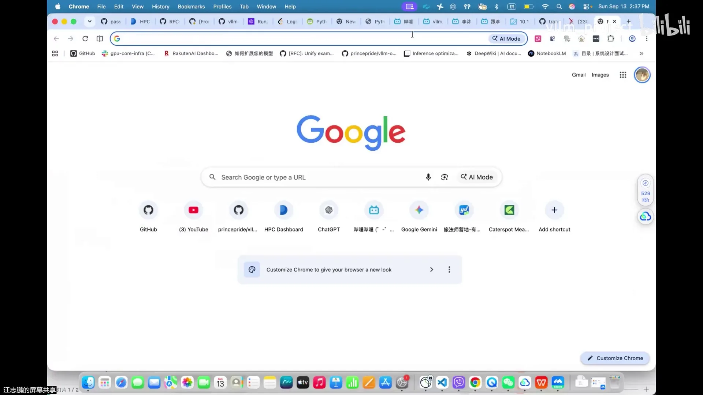 |
| 那你要怎样先参与到这个社区呢？我觉得非常重要的一点就是跟大家打成一片。首先积极参加 vLLM 的各种活动，我们有很多模块的周会。周会一般会讲：这个模块最近在做什么方向、这个模块最近有什么开发点， [【跳转到 32:21】](https://www.bilibili.com/video/BV1nEYv6XE15/?t=1941) |  |
| 这些东西大家都可以积极参与。然后你在周会里跟一些核心开发者多交流，交流之后大家觉得你是一个认真负责、对自己代码负责的人，同时你也是很想给 vLLM 社区贡献的，那么自然而然地你会知道你后面可以做什么、帮助这个模块继续更好地发展，其他 maintainer 也会敢把任务交给你。 [【跳转到 32:46】](https://www.bilibili.com/video/BV1nEYv6XE15/?t=1966) | 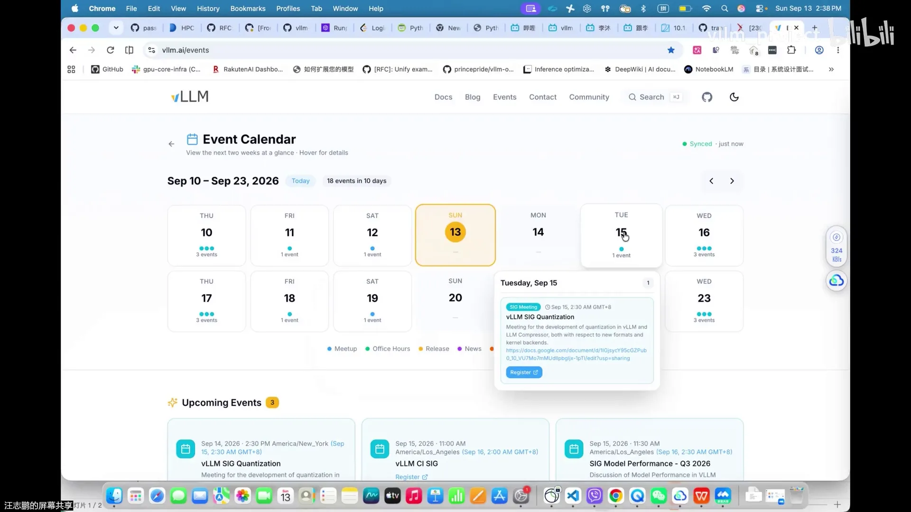 |
| 然后我们所有的活动都可以看这个网站：vllm.ai/events。这个网站上大家不光可以看到各个模块（的例会），包括我们现在每周搞的直播——你可以看到上一周直播的内容，也有下一周直播的预告，大家都可以提前 [【跳转到 33:11】](https://www.bilibili.com/video/BV1nEYv6XE15/?t=1991) | 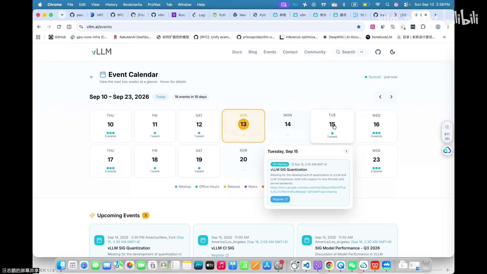 |
| 知道我们后面会讲什么东西。还有个问题在于：有些模块的例会时间可能不是很好，比如有的方向是凌晨 02:30。我觉得有些同学，比如你现在还需要读书、比较有精力，应该是可以 02:30 起来听一下这个会的。 [【跳转到 33:36】](https://www.bilibili.com/video/BV1nEYv6XE15/?t=2016) | 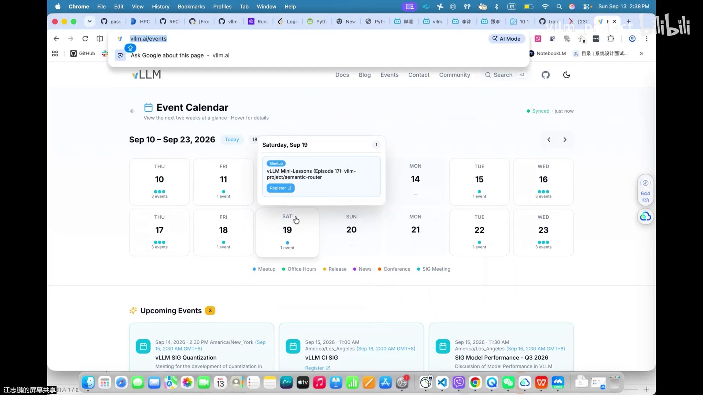 |
| 但我们也有些会议其实更贴近北京时间，比如我们每个星期三的这个——哎，这个东西我可能后面还需要去更新一下：我们周三这个 vLLM-Omni 的周会都没有人去放了。 [【跳转到 34:01】](https://www.bilibili.com/video/BV1nEYv6XE15/?t=2041) | 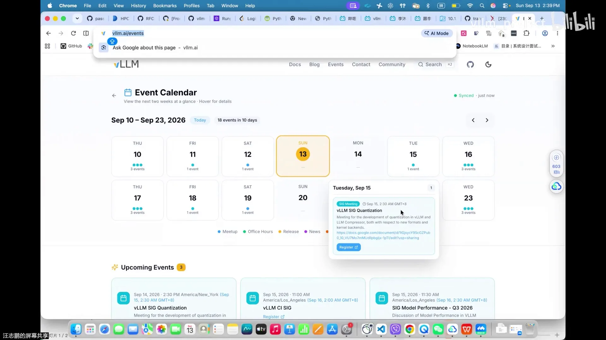 |
| 其实就是我们每周三 11:30，vLLM-Omni 会有一场例会。这个例会大概会讲五个议题或者 PR。大家假如有什么 RFC，或者说是对整个框架改动比较大的， [【跳转到 34:26】](https://www.bilibili.com/video/BV1nEYv6XE15/?t=2066) | 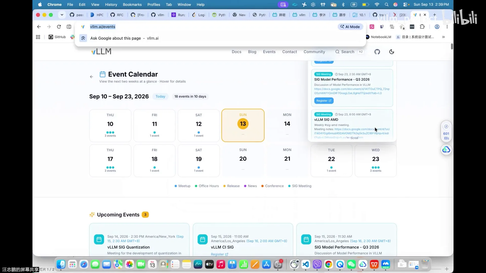 |
| 或者想提一个比较有意思的 feature，都可以去找我们社区的洪生或者高寒，他们是这个会议的主持人，找他们要到文档的修改权限，然后就可以把 issue 和 PR 贴到上面去了。 [【跳转到 34:51】](https://www.bilibili.com/video/BV1nEYv6XE15/?t=2091) | 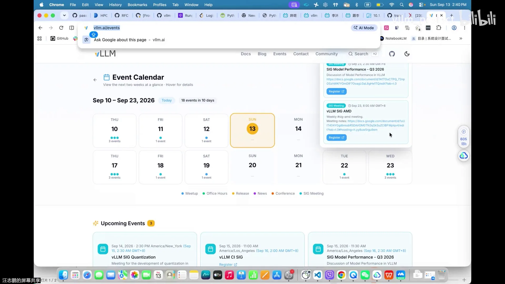 |
| 然后我看到有个 AMD 的会其实还是很不错的。如果有同学对硬件厂商很感兴趣的话，其实是可以参加这个 AMD 的会。因为硬件的几个厂商，你会发现他们人员基本上就是互相循环流动的。你去参加 AMD 这块，首先你可以非常好地进 AMD 这种公司，其次你也会比较好的—— [【跳转到 35:16】](https://www.bilibili.com/video/BV1nEYv6XE15/?t=2116) | 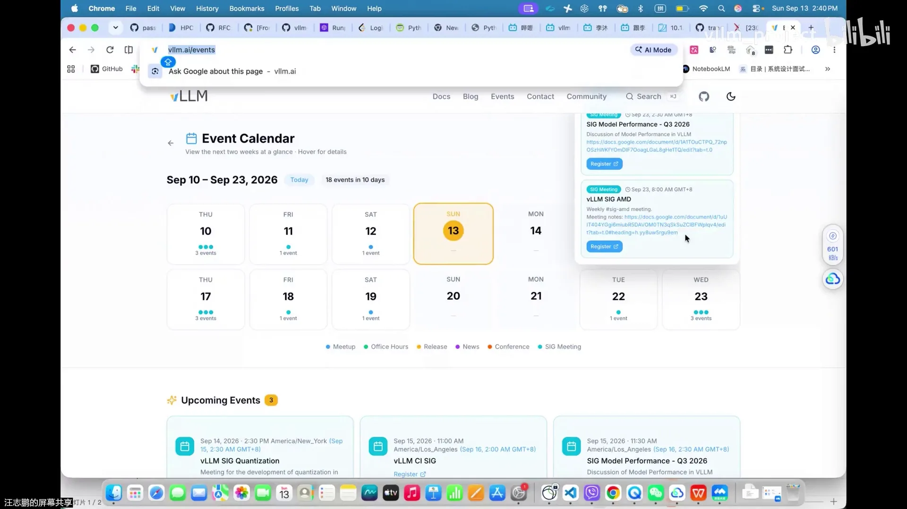 |
| 包括进华为或者英伟达都会比较容易。（顺阳声音听不到吧。）然后这个例会我觉得应该是更偏大模型系统这块的，时间看上去还是可以的，是凌晨 12 点，应该也算是一个大家可以参加的会。 [【跳转到 35:41】](https://www.bilibili.com/video/BV1nEYv6XE15/?t=2141) | 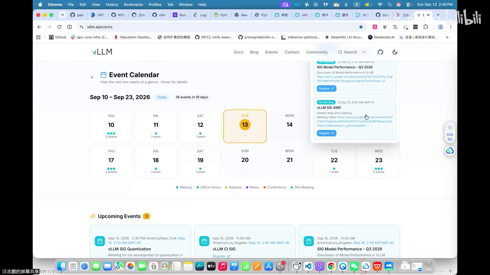 |
| 然后这个例会的话——哦，我知道这个会是什么，这个会议是英伟达（NVIDIA）他们的一个会，大家也可以参加，因为时间也还不错，是晚上十点钟的会。呃，这个也有点阴间。基本上来讲，其实我们多模态这边应该还有个双周会，我找一下这个双周会的时间。 [【跳转到 36:06】](https://www.bilibili.com/video/BV1nEYv6XE15/?t=2166) | 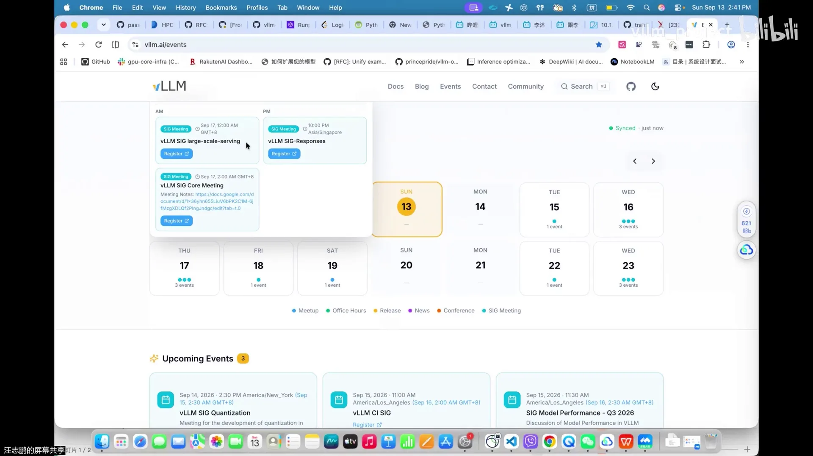 |
| 双周会没列上去？双周会已经不列了？我天哪。嗯好吧，我觉得后面我们应该好好把这个 events 页面好好维护一下，很多会都发现不在这上面，导致现在可能已经没有人知道我们多模态有个双周会这种问题了。 [【跳转到 36:31】](https://www.bilibili.com/video/BV1nEYv6XE15/?t=2191) | 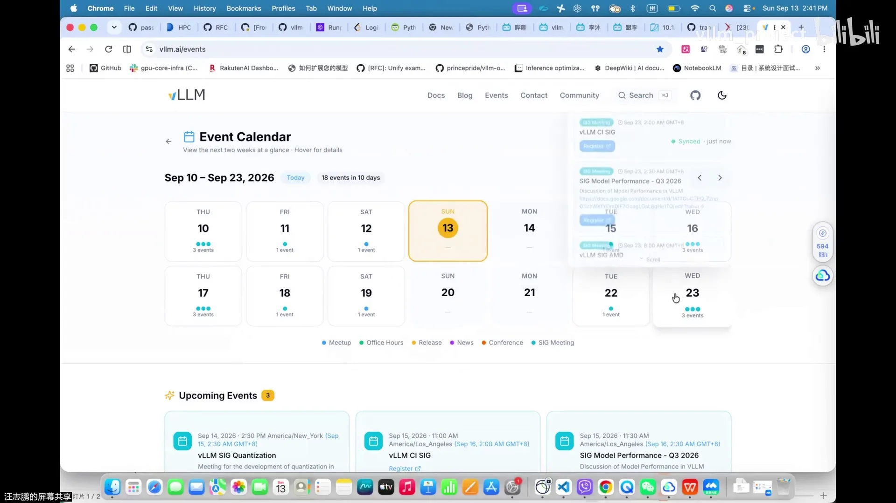 |
| 然后每个会议一般来讲都是会讨论一些 issue 和 PR 的。我理解各个模块的会应该都是差不多的，会跟进一些 PR 的进度，然后包括我们这个季度那些 issue [【跳转到 36:56】](https://www.bilibili.com/video/BV1nEYv6XE15/?t=2216) | 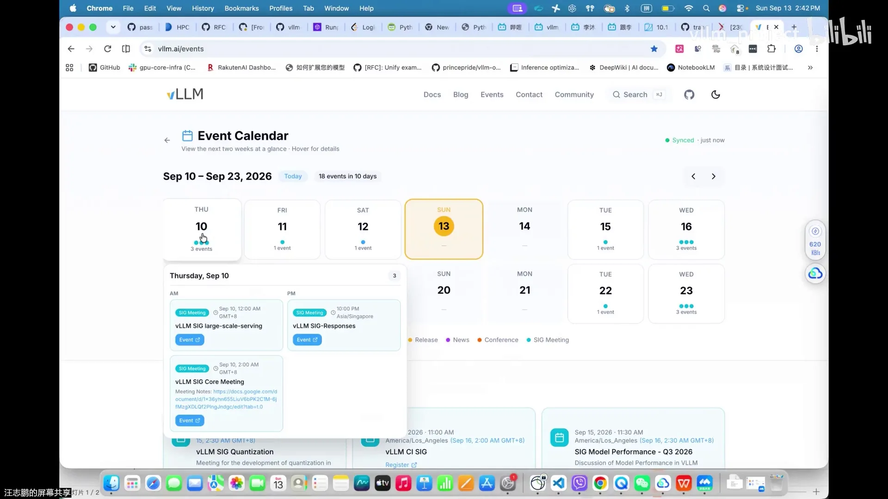 |
| 有什么还没有完成的、有些 roadmap。大家作为新加入社区的同学，非常建议大家先去看一下这些 PR 和这些 issue，然后在这些 PR 下面看他们代码怎么写的，有不懂的地方就可以在 PR 底下问问题。这其实是我们非常欢迎大家参与的方式。而且你通过这种参与方式可以在社区里刷个眼熟，当大家都认识你之后，其实你会发现你非常好 [【跳转到 37:21】](https://www.bilibili.com/video/BV1nEYv6XE15/?t=2241) | 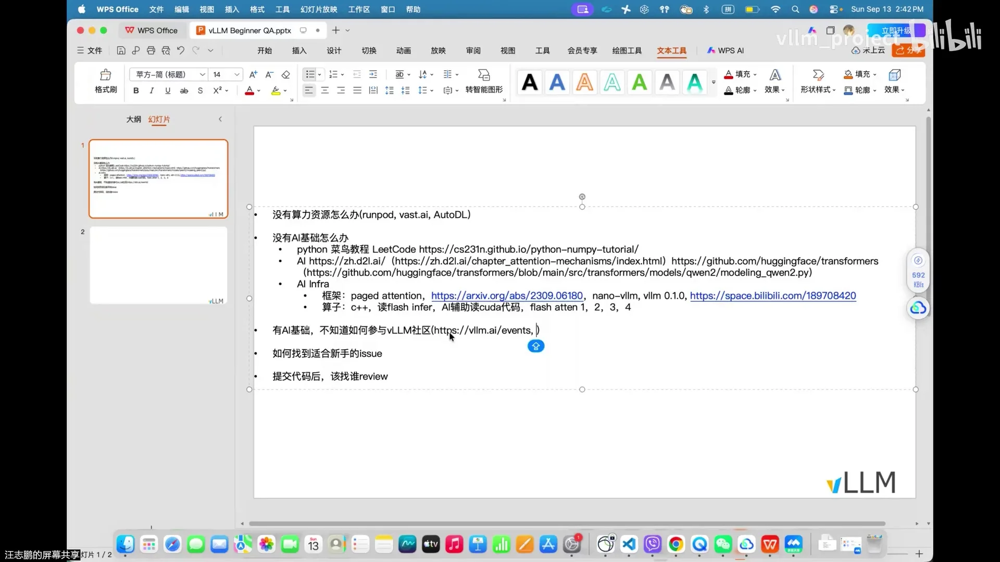 |
| 去领一些 issue、去修一些 bug，包括做一些特性开发。reviewer 在认得你之后，会非常乐意帮你看代码，同时帮你 review 代码、推进你的整个开发进度。我—— [【跳转到 37:46】](https://www.bilibili.com/video/BV1nEYv6XE15/?t=2266) | 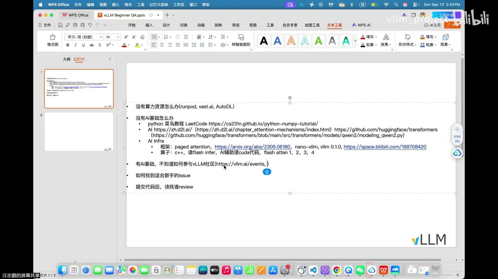 |
| 基本来讲，我认为这是一个比较好的参与到社区的方式。我不知道顺阳或者志鹏有没有什么其他的建议，就是从零开始参加我们的社区？（顺阳）对，我非常推荐就是一开始不要太急于—— [【跳转到 38:11】](https://www.bilibili.com/video/BV1nEYv6XE15/?t=2291) | 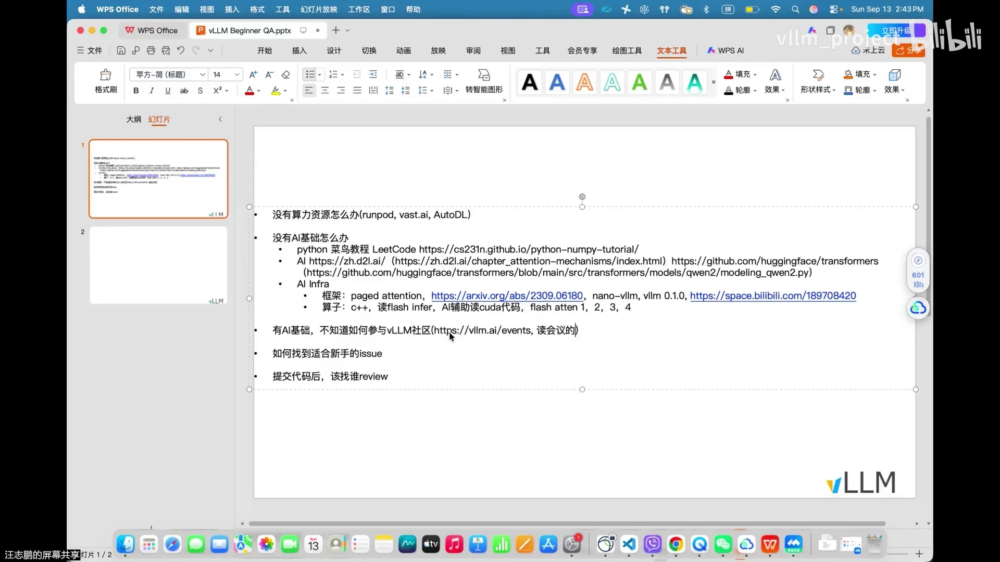 |
| 就是提交第一个 PR。你愿意从了解这个社区开始，比如参加社区的例会、看社区相关的文档，然后看一下现在社区的一些 issue、 [【跳转到 38:36】](https://www.bilibili.com/video/BV1nEYv6XE15/?t=2316) |  |
| RFC 和一些 PR 之类的。因为现在这个社区也变得越来越大，每天我看就有接近五六十个 PR，所以也非常鼓励大家能够参与到这些 PR 的一些讨论。我就是非常喜欢那些比较有活人感的—— [【跳转到 39:01】](https://www.bilibili.com/video/BV1nEYv6XE15/?t=2341) |  |
| 嗯对。然后还有很多同学会问——我们再进行第四个问题了：如何找到适合新手的 issue？在过去来讲，我们其实会非常建议大家去找一下 good first issue。 [【跳转到 39:26】](https://www.bilibili.com/video/BV1nEYv6XE15/?t=2366) |  |
| 我不知道现在这个东西有没有维护了。其实看样子现在还是有一些 good first issue，但我知道会有个问题： [【跳转到 39:51】](https://www.bilibili.com/video/BV1nEYv6XE15/?t=2391) | 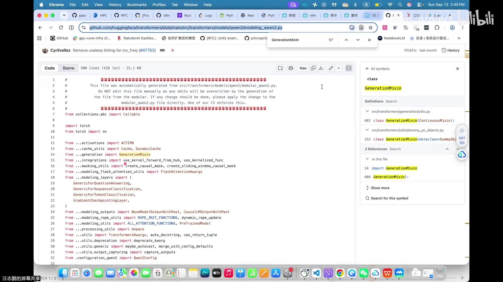 |
| 就是大家发现 good first issue 非常难抢，基本上只要一出来就没了。然后我相信在 vLLM 社区也是这种问题。对—— [【跳转到 40:16】](https://www.bilibili.com/video/BV1nEYv6XE15/?t=2416) | 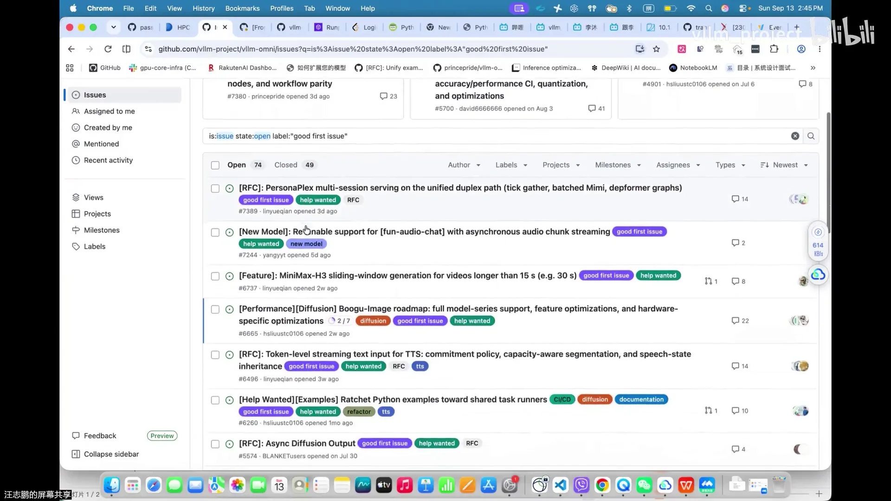 |
| 你会发现这些 good first issue 基本上旁边都直接挂好链接了，哎呀，有的已经挂了 18 个链接了，真的非常恐怖。那也就是说，如果你现在再按照常规的方式去（抢）这些 issue，已经基本抢不到了。 [【跳转到 40:41】](https://www.bilibili.com/video/BV1nEYv6XE15/?t=2441) | 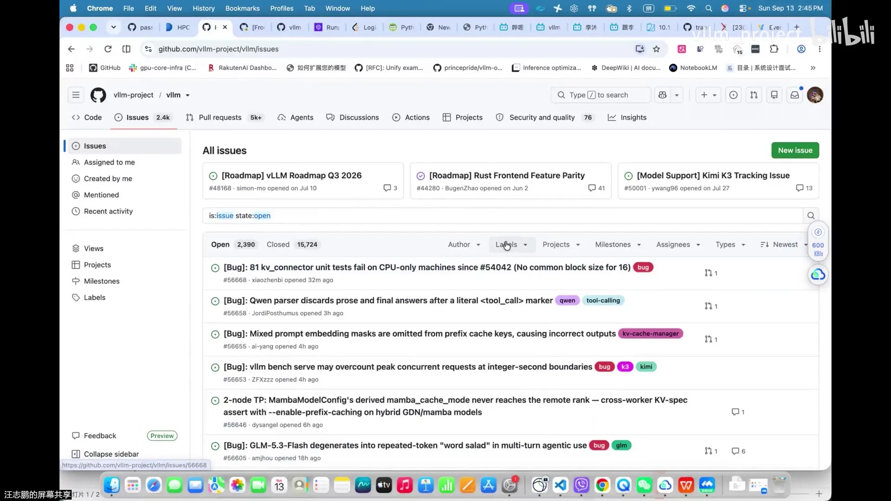 |
| 又听不见……我们还继续讲吧。但也有个很大问题在于：因为 vibe coding 太强了，AI 现在甚至都不会去看你是不是 good first issue，只要看到有新的 issue 它就会自动去抢。 [【跳转到 41:06】](https://www.bilibili.com/video/BV1nEYv6XE15/?t=2466) | 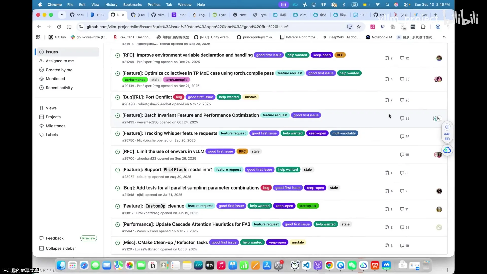 |
| 在这种情况下，我们大概率是不会去合这种代码的。但这样也会造成问题：正儿八经想给仓库做贡献的人，想去抢这种工作就已经很难了，因为可能已经有 AI 把这些工作抢完了。那么在这种情况下，就体现出我们之前推荐的路径是更加有效的给仓库提交第一次代码的路径：你先得跟这个仓库的人搞好关系， [【跳转到 41:31】](https://www.bilibili.com/video/BV1nEYv6XE15/?t=2491) | 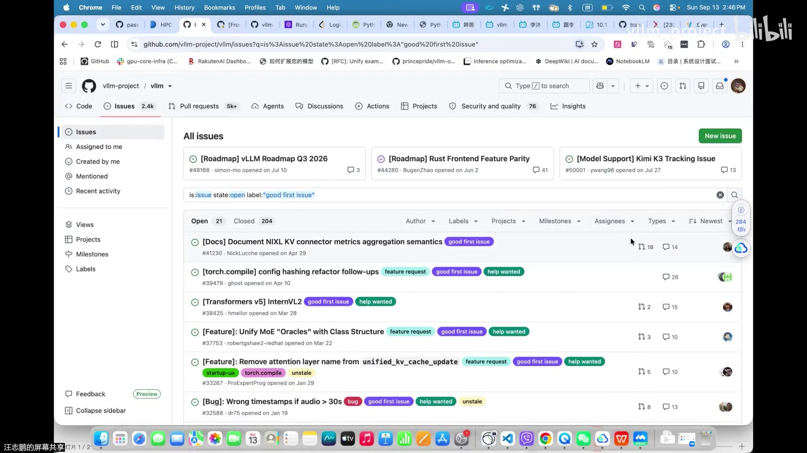 |
| 然后大家会更容易地通过认识你的方式把任务分配给你，我们也知道什么样的任务是好做的任务。——对，志鹏，我这边推荐你可以把 vLLM-Omni 或者 vLLM 的这个仓库打开看一下，你可以大概讲解一下： [【跳转到 41:56】](https://www.bilibili.com/video/BV1nEYv6XE15/?t=2516) | 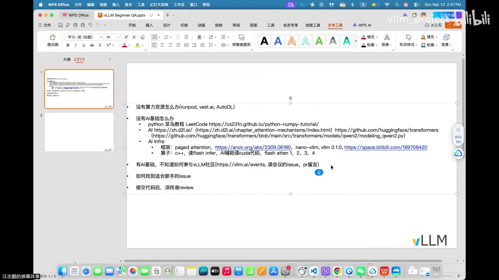 |
| 相应的模块的负责人是谁，让（新手）知道大概你想做什么模块应该跟什么人联系。其实我一般来讲会看这里面的东西：这个是我们的主仓库，大家可以看 .github 底下有 CODEOWNERS（文件）， [【跳转到 42:17】](https://www.bilibili.com/video/BV1nEYv6XE15/?t=2537) | 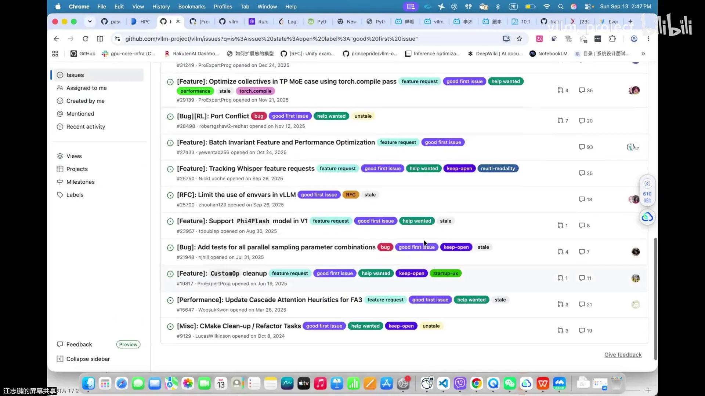 |
| CODEOWNERS 里面会标注各个模块：你的代码提交以后是谁来 review、谁负责。在这个地方你可以看到每个模块的负责人到底是谁。但我觉得我们还有其他地方可以看到模块负责人， [【跳转到 42:42】](https://www.bilibili.com/video/BV1nEYv6XE15/?t=2562) | 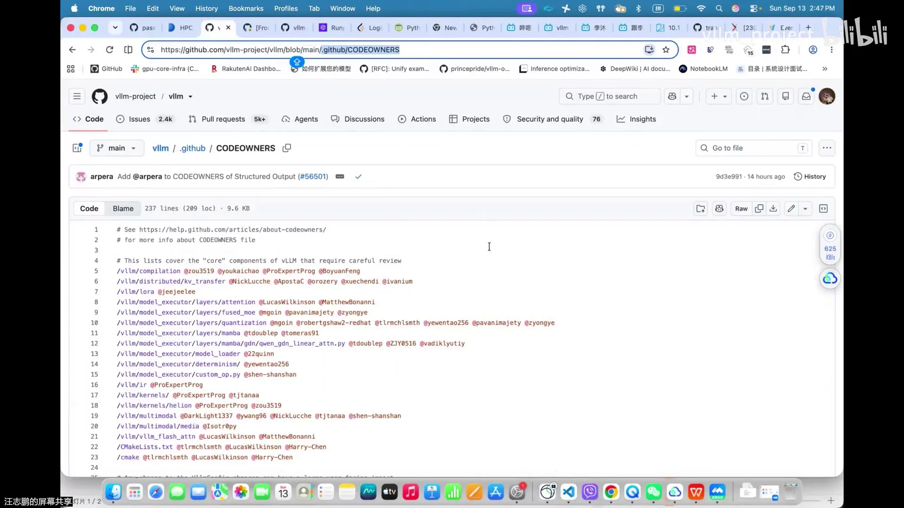 |
| 基本上来讲，其实我们这个（vLLM 中文）study group 里面基本上也包含了所有中文这边的 vLLM 核心开发者，所以他们也都有这些代码的 review 和合并合入的权限。大家如果有问题的话，也可以考虑来中文这边直接参加一下。 [【跳转到 43:07】](https://www.bilibili.com/video/BV1nEYv6XE15/?t=2587) | 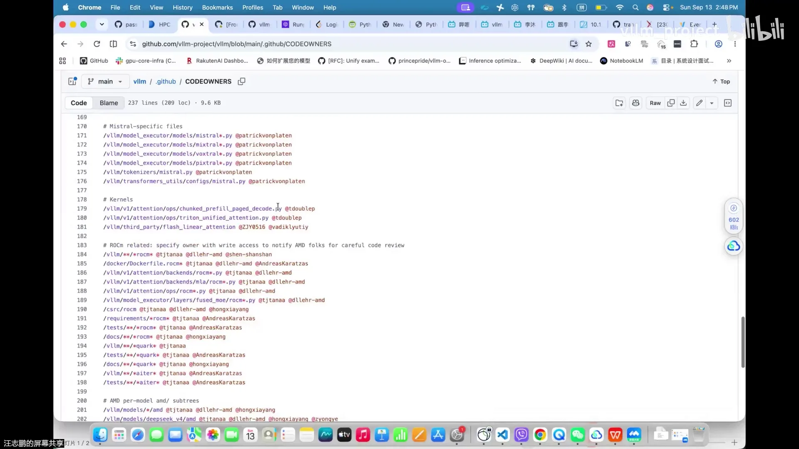 |
| 比如把你的 PR 提上来，一般来讲也会有人去 review。然后英文这边是有一个比较官方的路径的。——哦对，我们好像已经讲到了下一个议题了，就是提到代码该找谁 review 了。我们还是先把 issue 这一块——我不知道志鹏有没有什么需要补充的，就是如何去找适合新手的 issue。 [【跳转到 43:32】](https://www.bilibili.com/video/BV1nEYv6XE15/?t=2612) | 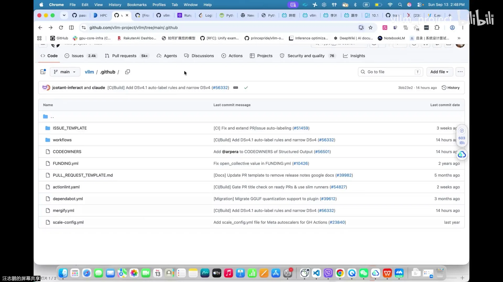 |
| 现在 good first issue 都没法抢了吧，全是 AI 全抢跑了。那就过去了。好，那对我这边做一下补充。 [【跳转到 43:57】](https://www.bilibili.com/video/BV1nEYv6XE15/?t=2637) |  |
| 大概几分钟。嗯，大致分两类吧：一类是 bug，一类是 RFC。RFC 就是提一个新的 feature；bug 就是可能在特定的环境当中测出来一个问题。首先对于 bug fix 来说，感觉是相对来说比较适合新手的。 [【跳转到 44:22】](https://www.bilibili.com/video/BV1nEYv6XE15/?t=2662) | 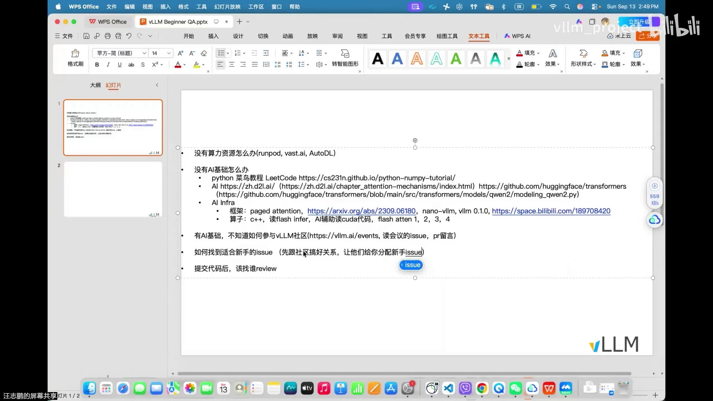 |
| 就是你肯定要先在这个 issue 底下，能够按照（issue 里的）环境去复现，然后再提供一些——你先把它复现，然后说明你大概要做哪些工作去把这个 bug fix 掉，然后让那个 maintainer [【跳转到 44:47】](https://www.bilibili.com/video/BV1nEYv6XE15/?t=2687) | 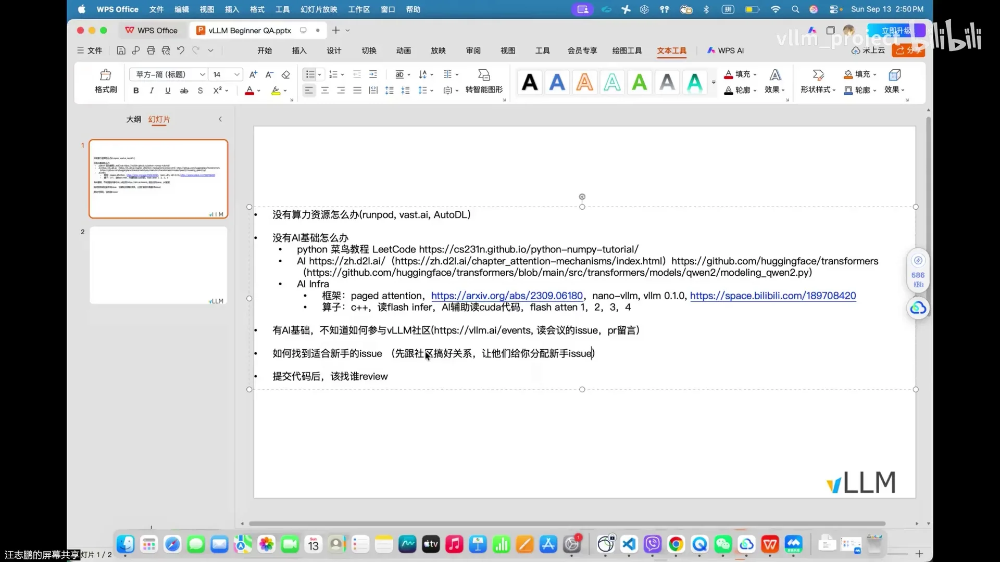 |
| 或者说这个 maintainer 把这个 issue assign 给你，然后你就可以开始去做 PR 的开发。通常这种情况下你提出来的 PR 都是会被 review 的。不过有个很大问题就在于：这种 P2 级别的 bug fix issue 太容易被抢了， [【跳转到 45:12】](https://www.bilibili.com/video/BV1nEYv6XE15/?t=2712) |  |
| 因为这也属于是 AI coding 的一个甜品区。我觉得你可能态度要好一点：你不是直接去问 maintainer 要 assign，或者说直接提个 PR——我觉得你应该先去复现， [【跳转到 45:37】](https://www.bilibili.com/video/BV1nEYv6XE15/?t=2737) |  |
| 然后在 issue 底下做一个留言——诶，这个应该是有一个交互的。对。然后我其实还有个建议：有些同学可能会自己在使用 vLLM 或者 vLLM-Omni 的时候发现 bug，这其实是一个非常好的去提 bug 的机会， [【跳转到 46:02】](https://www.bilibili.com/video/BV1nEYv6XE15/?t=2762) |  |
| 那么这种时候提 bug 是有一个技巧的：第一步你应该先去 fix 这个 bug；第二步再去提这个 issue；第三步再把你这个 fix bug 的 PR 和你这个 [【跳转到 46:27】](https://www.bilibili.com/video/BV1nEYv6XE15/?t=2787) |  |
| issue 链接关联起来。这样你就可以保证没有人去跟你抢了。还有一种思路就是：你可能看到了一个 issue，然后你是一个比较负责任的人，对吧， [【跳转到 46:52】](https://www.bilibili.com/video/BV1nEYv6XE15/?t=2812) | 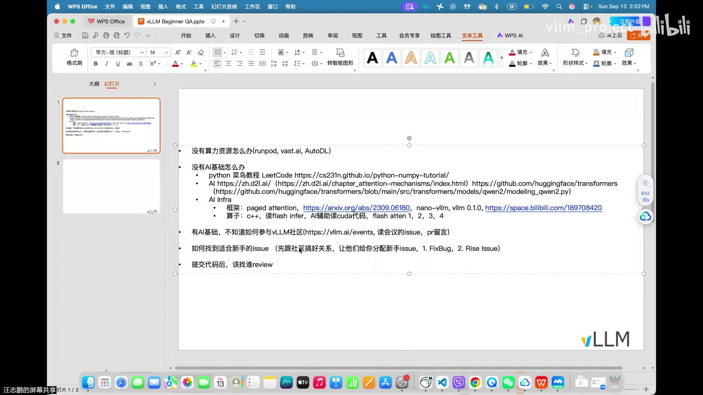 |
| 然后我们把它 assign 给你了，但是可能会有些 agent 去跟你抢这个任务。那么这时候你应该怎么做呢？你应该第一步——你应该是和——什么时候换一行（屏幕）？ [【跳转到 47:17】](https://www.bilibili.com/video/BV1nEYv6XE15/?t=2837) | 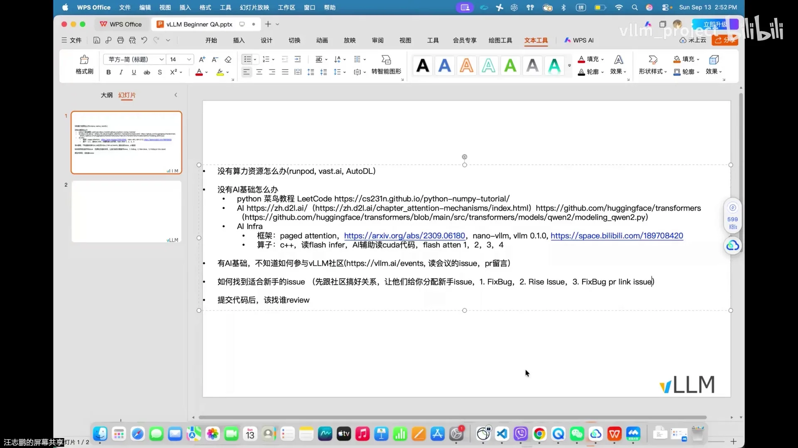 |
| 首先应该 request maintainer——哎，maintainer 怎么拼的？maintainer，对吧。——然后你这件事情你应该干嘛？还是干这件事情： [【跳转到 47:42】](https://www.bilibili.com/video/BV1nEYv6XE15/?t=2862) | 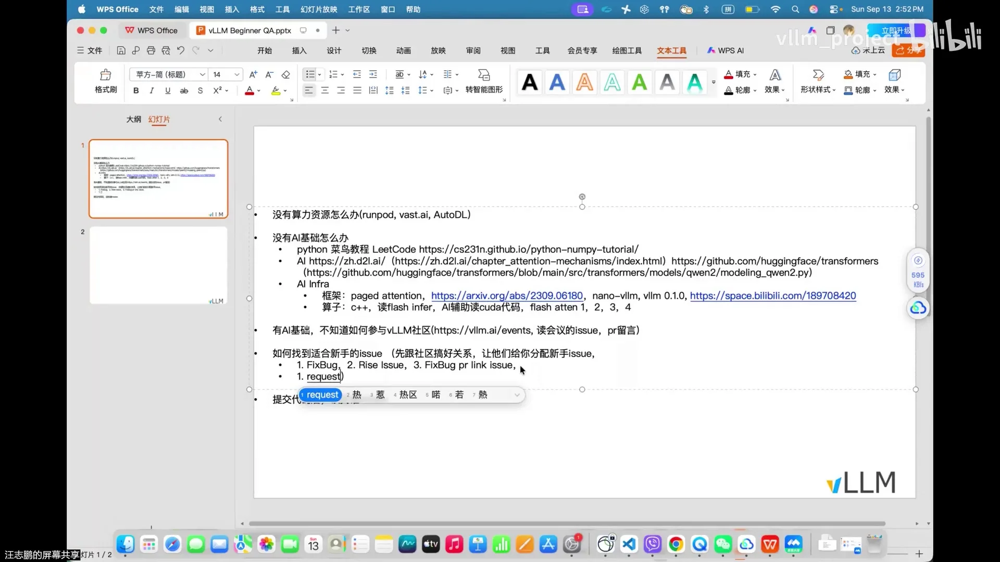 |
| 就是你应该先去给一个 draft PR，然后这个 draft PR 你要去 link 这个 task（issue），然后后面你可以再慢慢去开发，对吧。 [【跳转到 48:07】](https://www.bilibili.com/video/BV1nEYv6XE15/?t=2887) | 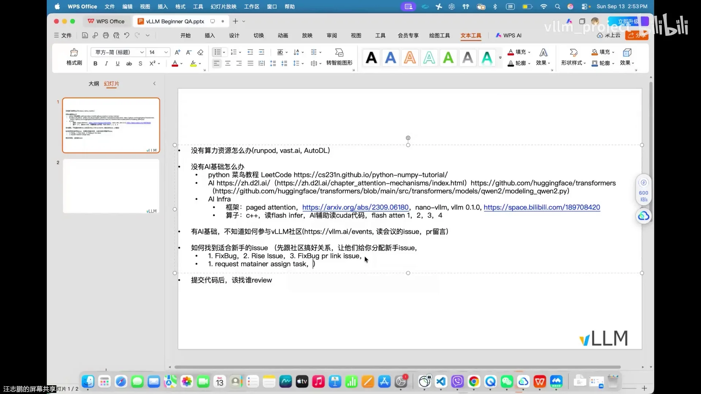 |
| 你再去 convert 成为一个正式的，比如说 ready to review 对吧，这样一个东西。这其实是我比较推荐的：你怎样去抢这个东西。但前提是得已经 maintainer 把这个 issue 分配给你了，对吧。那么你可以先直接先 draft 一个 PR 去 link 这个 issue，哪怕你这个 PR 是空的都可以，但你可能就只有—— [【跳转到 48:32】](https://www.bilibili.com/video/BV1nEYv6XE15/?t=2912) | 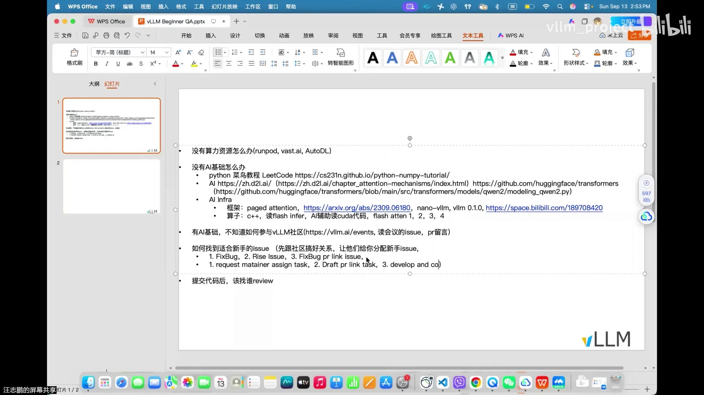 |
| 比如说加了一个空格，这样让你去 link 着它，然后他们去做。我觉得这样的话会比较好一些：先占个坑。然后我们再到了最后一个环节：就是你敲代码应该找谁去 review。一方面的话大家可以看这个 CODEOWNERS， [【跳转到 48:57】](https://www.bilibili.com/video/BV1nEYv6XE15/?t=2937) | 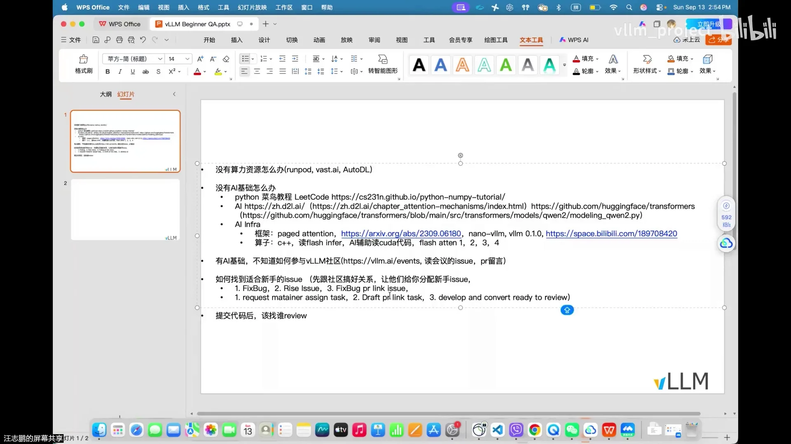 |
| 这个 CODEOWNERS 里面其实包含了所有的模块，对吧。你看这里面其实有分类了：CPU、英特尔 CPU，对吧，然后还有 MTP 相关的——这个 MTP 就是投机解码相关的一些——呃这个应该不是投机解码，这个文件感觉就是纯—— [【跳转到 49:22】](https://www.bilibili.com/video/BV1nEYv6XE15/?t=2962) |  |
| 我猜这位同学应该是说投机解码的。嗯，对，你看，这个就是投机解码相关的东西。所以你看投机解码这个模块分配给它的这个人，就会在两个地方出现：一个是 DeepSeek 的投机解码，还有一个是本身的投机解码，在仓库里面都会 link 到这个人。那么也就是说你如果是做投机解码方向的话，你就应该找这位同学。所以大家可以去研究一下这个文件， [【跳转到 49:47】](https://www.bilibili.com/video/BV1nEYv6XE15/?t=2987) | 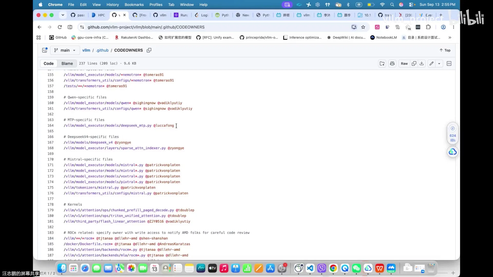 |
| 然后你就可以知道每个模块到底是谁来负责了。这是针对于 vLLM 这个仓库里面来讲的。然后如果是 vLLM-Omni 的话—— [【跳转到 50:12】](https://www.bilibili.com/video/BV1nEYv6XE15/?t=3012) | 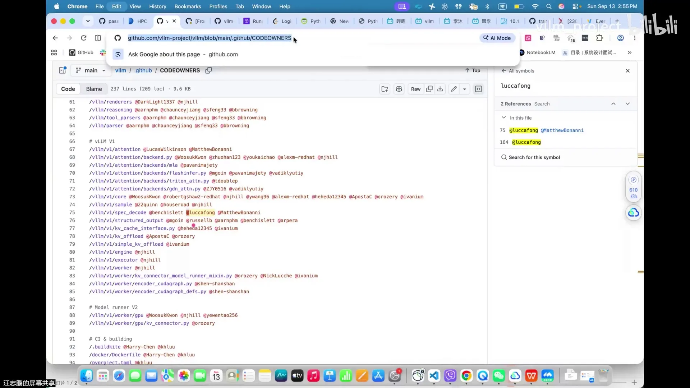 |
| 哎，那个文件放哪去了，你们知道吗？哎，志鹏你知道那个文件放哪去了吗？（在 doc 目录里面。） [【跳转到 50:37】](https://www.bilibili.com/video/BV1nEYv6XE15/?t=3037) | 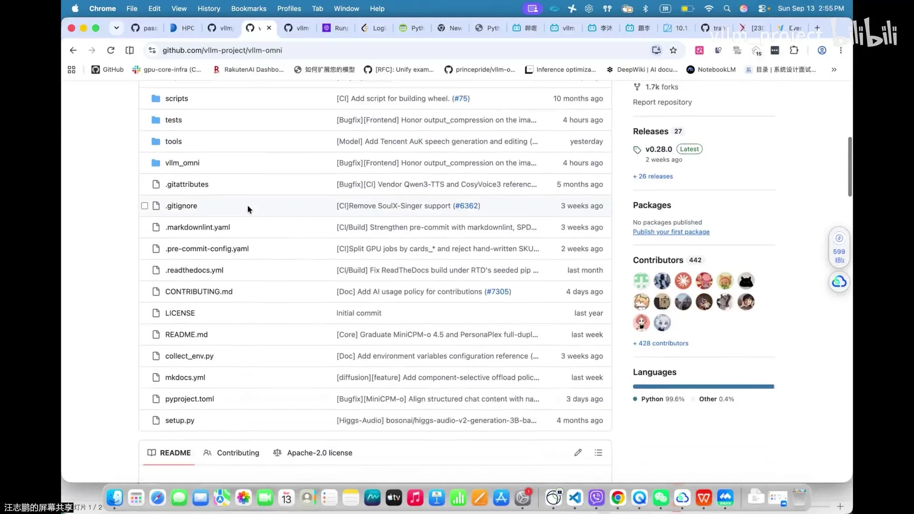 |
| 诶，我好像没看到。呃，我记得仓上有个 bot，它会自动地帮你 @ reviewer 的，我不知道这个里面有没有啊。哦，CODEOWNERS——那我觉得也可以看一下这个。对，这个—— [【跳转到 51:02】](https://www.bilibili.com/video/BV1nEYv6XE15/?t=3062) | 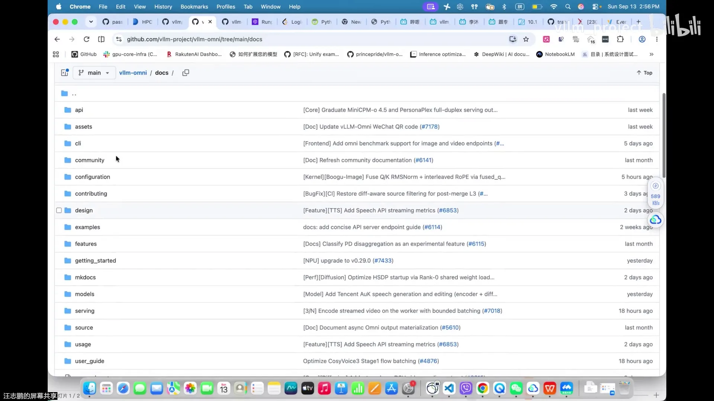 |
| 我们这个 vLLM-Omni 里面的话，大家也可以通常通过同样类似的形式去看一下这个 CODEOWNERS，也可以找到各个模块都是谁负责的。这是其中一种途径。然后还有一个途径就属于是我们官方比较推荐的：你知道谁负责的，其实你——嗯，你如果是直接在你的这个 PR 里面 @ 到的 [【跳转到 51:27】](https://www.bilibili.com/video/BV1nEYv6XE15/?t=3087) | 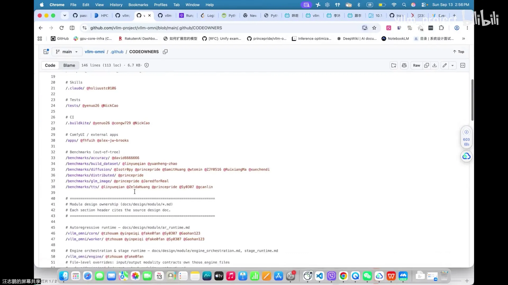 |
| 这个人——这个 @ 虽然可能会看不到，因为现在 AI 去 @（maintainer）的频率实在太高了。那么这时候你应该怎么做呢？你其实应该在 Slack 上面去 @ 人，就是（maintainer）上面都有 Slack 账号，然后你可以在上面直接找到应该去 @ 谁， [【跳转到 51:52】](https://www.bilibili.com/video/BV1nEYv6XE15/?t=3112) | 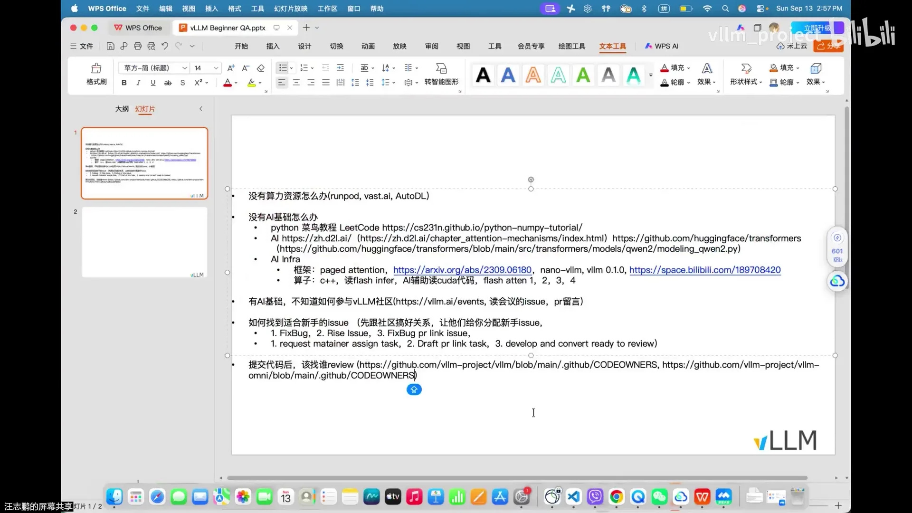 |
| 然后你让他来帮你去 review 代码。然后还有一种方法就是：如果你确定，比如说这位（maintainer）的话是一个中国人吧—— [【跳转到 52:17】](https://www.bilibili.com/video/BV1nEYv6XE15/?t=3137) | 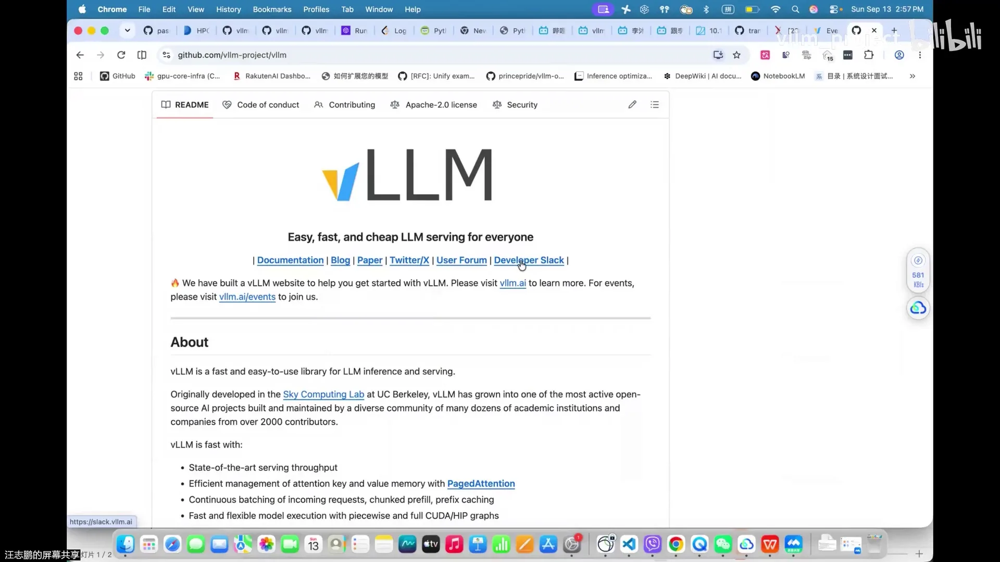 |
| 或者他是在微信群里的，那么你也可以在我们这个微信的 study group 直接去把你这个 PR 贴出来，应该也会有同学去 @（别人）帮你看的。基本上这样讲话—— [【跳转到 52:42】](https://www.bilibili.com/video/BV1nEYv6XE15/?t=3162) | 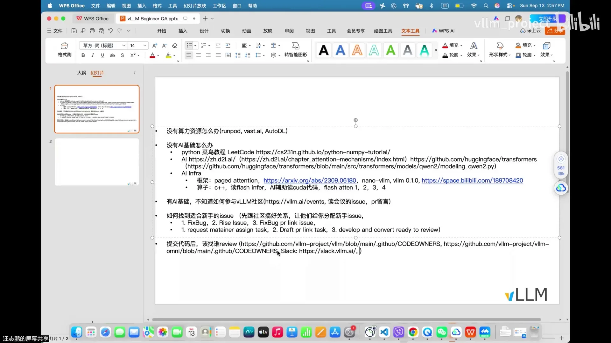 |
| 这就是我之前准备出的五个问题。我不知道有没有同学有什么其他的问题，我也可以顺便回答一下。（志鹏）vLLM-Omni 那边还有一个微信群，在主仓页面上也有一个二维码，可以在那个里面进群之后问，因为 study group 应该不是所有的 contributor 都在里面。 [【跳转到 53:07】](https://www.bilibili.com/video/BV1nEYv6XE15/?t=3187) | 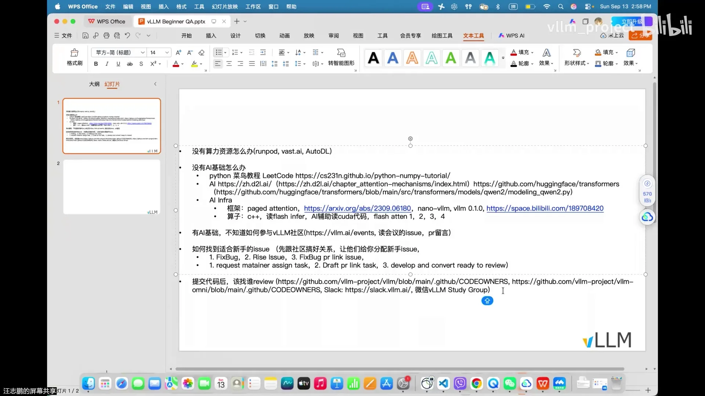 |
| OK，看一看。哦，就是那个 WeChat。 [【跳转到 53:32】](https://www.bilibili.com/video/BV1nEYv6XE15/?t=3212) | 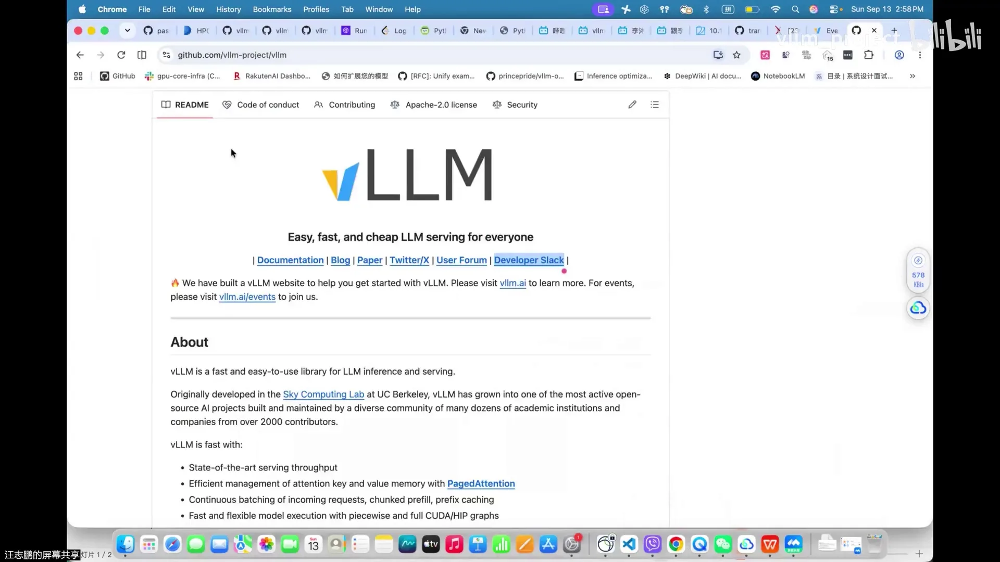 |
| OK，现在大家可以加这个群。 [【跳转到 53:57】](https://www.bilibili.com/video/BV1nEYv6XE15/?t=3237) |  |
| 就是开发者交流群七，然后这里面的话你也可以直接把问题 @ 过来。 [【跳转到 54:03】](https://www.bilibili.com/video/BV1nEYv6XE15/?t=3243) |  |
| （此区间无字幕） [【跳转到 54:08】](https://www.bilibili.com/video/BV1nEYv6XE15/?t=3248) | 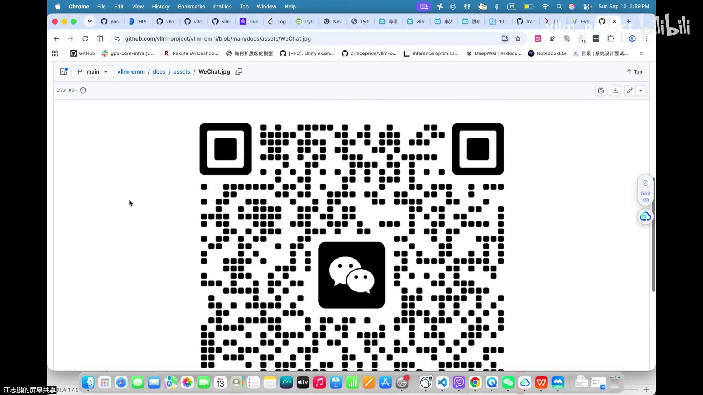 |
| 然后我们还有一个 Slack。对，然后我们每周三周会的链接到时候也会发在群里。 [【跳转到 54:13】](https://www.bilibili.com/video/BV1nEYv6XE15/?t=3253) | 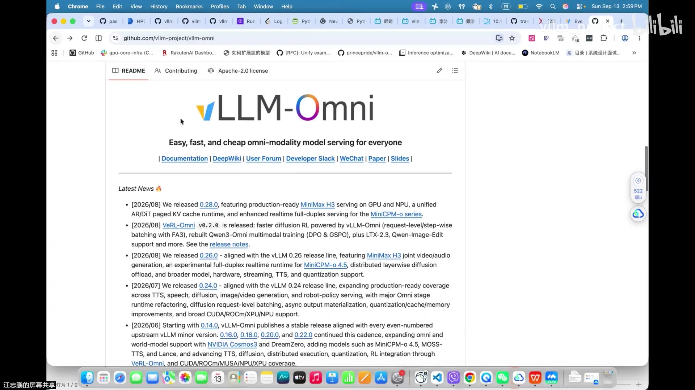 |
| 它不会放在群公告，但是每周三的时候会发出来，大家可以去那个链接上会听一下每周在讨论什么。对，就是大家想参加 vLLM 社区的话，一定一定一定要多参加这些和真人互动的机会，因为我觉得这是现在你唯一可以在纯 agent（提代码浪潮里）破局的方式， [【跳转到 54:18】](https://www.bilibili.com/video/BV1nEYv6XE15/?t=3258) | 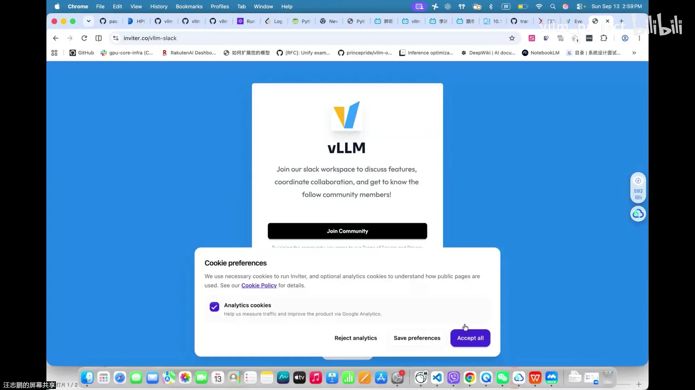 |
| 去提代码的方式。而且后面你在招聘的时候，其实很大程度上如果你认识正在 hiring 的人、或者你知道这些组到底在招什么人、这些组织里有哪些人，你想在这个行业找工作是非常容易的。但是你怎样才可以认得这些人呢？你就必须得频繁地去参加这种和人互动的活动。 [【跳转到 54:43】](https://www.bilibili.com/video/BV1nEYv6XE15/?t=3283) | 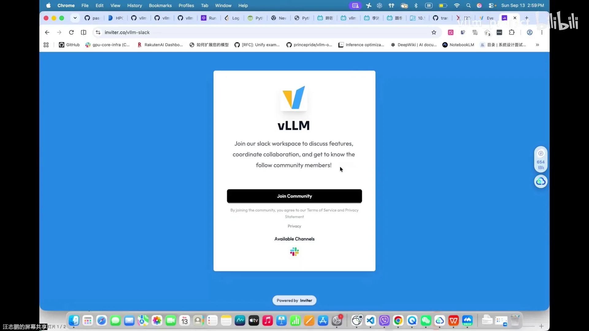 |
| 我觉得现在已经不是一个埋头写代码就可以找到好工作、或者纯靠钻研技术就可以找到好工作的时代了，大家得尽可能发挥机器没有办法代替你做的事情。对，所以大家还是得多跟我们社区同学多交流。 [【跳转到 55:08】](https://www.bilibili.com/video/BV1nEYv6XE15/?t=3308) |  |
| 然后多参加互动，多来研究代码，一起去讨论一些技术方案。嗯是的。对，我这边补充：也确实，其实在工业界，比方说像阿里、腾讯这些大公司，内部也会使用 vLLM 和 vLLM-Omni 这两个框架。 [【跳转到 55:33】](https://www.bilibili.com/video/BV1nEYv6XE15/?t=3333) |  |
| 然后你去参与这个社区的话，就等于是已经对这些代码有相当的了解，他们把你招进去之后肯定就能实现无缝衔接。我们对——我们有些同学也是深度参与到 vLLM-Omni 这个项目的， [【跳转到 55:58】](https://www.bilibili.com/video/BV1nEYv6XE15/?t=3358) |  |
| 然后本身公司内部也在使用这个框架，所以他过去就能够直接 onboard，他这个面试通过就很容易。对。然后同时呢，你说不定给社区提代码还有机会能够参与跟工业界的一些人合作的例会。 [【跳转到 56:23】](https://www.bilibili.com/video/BV1nEYv6XE15/?t=3383) |  |
| 对对。然后有同学问：框架和算子需要一起学吗？呃，这个不是，我觉得就是你可以很精通框架然后稍微了解一下算子，或者你可以很精通算子然后了解一些框架。如果是新人的话可以先 focus 在框架这一侧，不需要两个一起学。 [【跳转到 56:48】](https://www.bilibili.com/video/BV1nEYv6XE15/?t=3408) |  |
| 因为正常来讲企业里面它也是分的：会有框架的组，也会有算子的组。一般来讲框架组可能会去跟算子组提一些需求，但框架组更主要的是去优化某个特定生产环境上的一些模型。你给算子组的同学提需求， [【跳转到 57:13】](https://www.bilibili.com/video/BV1nEYv6XE15/?t=3433) | 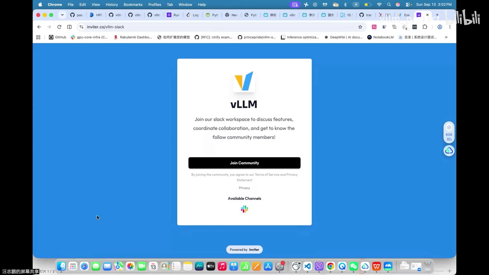 |
| 也都是提这个模型上的一些需求了。好，还有没有其他的问题？啊，如果没有的话—— [【跳转到 57:38】](https://www.bilibili.com/video/BV1nEYv6XE15/?t=3458) |  |
| 那我们今天这个分享就结束了。等会我会把这个录像和我改的这一页 PPT 直接上传的。好，那我们今天就结束了，希望大家都可以在 vLLM 和 vLLM-Omni 社区里面做更多的贡献，然后拿到一个很好的 offer，或者是对吧—— [【跳转到 58:01】](https://www.bilibili.com/video/BV1nEYv6XE15/?t=3481) | 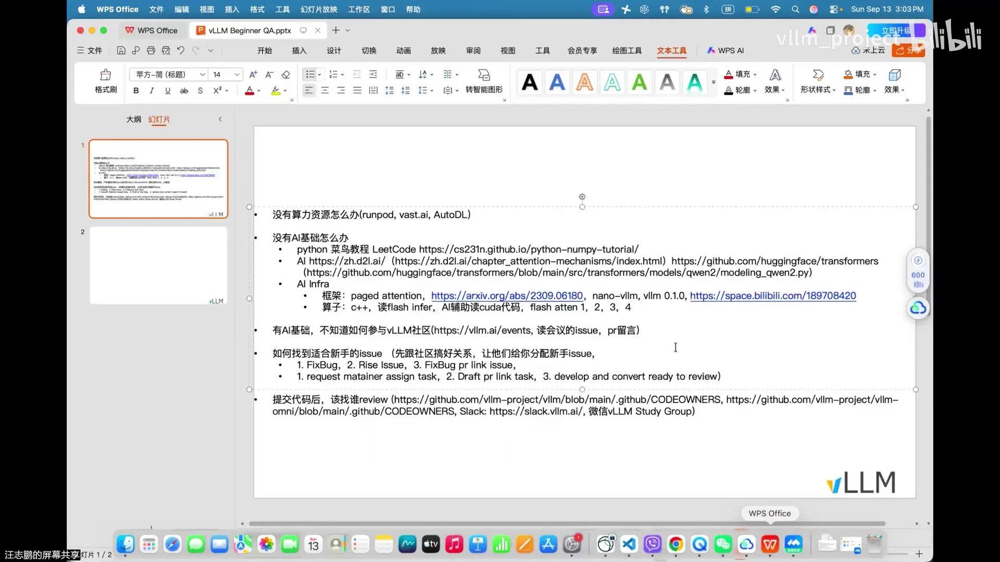 |
| 转行可以转得很顺利。然后有同学问：需要把一些算法论文也学了吗？比如之前 Llama、Kimi 等论文。呃，我个人感觉这个东西可以作为了解，因为这块论文现在非常非常多。如果你是有特定需求的话， [【跳转到 58:26】](https://www.bilibili.com/video/BV1nEYv6XE15/?t=3506) | 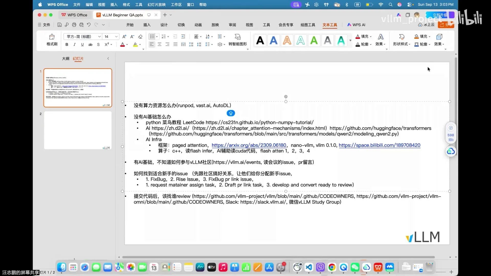 |
| 你可以把这东西好好看一看。但大多数情况下可能你是没有特定需求的，对吧。因为我们这一行的工作实在太忙了，你可能手头上的活都忙不过来，那你可能会没有很多精力去了解现在工作以外的这些内容。我在以前其实也很喜欢看论文，但现在你明显感觉到事情太多， [【跳转到 58:51】](https://www.bilibili.com/video/BV1nEYv6XE15/?t=3531) | 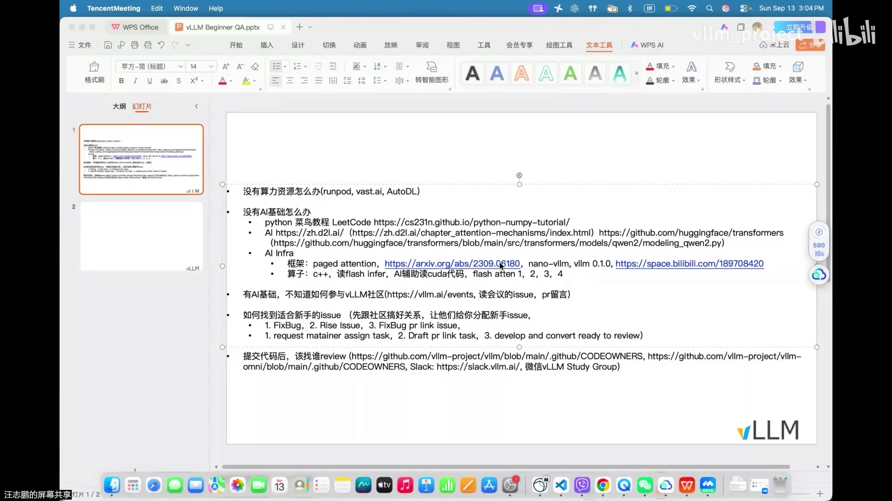 |
| 都忙不过来。大家可以做个了解吧。比如我觉得 Kimi 他们的论文是很值得去了解的。OK。然后我看到有同学说：如何快速了解 vLLM 框架？不了解架构很难去提 PR。是这样子：vLLM 这个框架其实现在已经很大了， [【跳转到 59:16】](https://www.bilibili.com/video/BV1nEYv6XE15/?t=3556) | 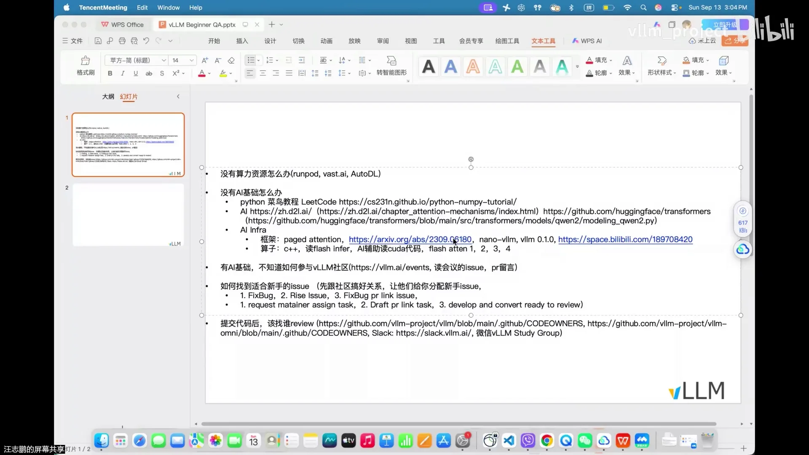 |
| 我强烈建议大家先侧重于其中一个 module，就是不要去看整个框架。整个框架的话，比如它的 scheduler、它的 KV cache manager——其实这些东西哪怕是（核心）开发者都没有几个人去碰过，可能只有像 Woosuk 这个级别的人他会经常去动这块，就是大家其实哪怕去动这块也都是做一些小修补。 [【跳转到 59:41】](https://www.bilibili.com/video/BV1nEYv6XE15/?t=3581) |  |
| 只有当你真正需要做这块开发的时候，你才需要去了解 vLLM 框架的各个模块。就现在的话你可以只侧重于某一个小的点。这个点你应该怎么看呢？你直接看一下它各个模块怎么分的，然后挑一个你自己感兴趣的方向去学就行了。然后有同学问：AI Infra 岗位有更多的需求吗？ [【跳转到 60:06】](https://www.bilibili.com/video/BV1nEYv6XE15/?t=3606) |  |
| AI Infra 岗位就我个人感觉，头部的大厂可能会看重几个方面：一方面是你有没有同类型公司的实习或工作经验；另一方面可能是看你有没有系统的顶会论文；还有的话可能就是看你有没有给头部开源软件—— [【跳转到 60:31】](https://www.bilibili.com/video/BV1nEYv6XE15/?t=3631) |  |
| 比如说过做非常有价值的贡献。我觉得这三点都属于可以让你在招聘中比较有竞争力的。所以如果有 AI Infra 的论文那么是好的；但没有这块论文的话，你可能就需要把你的（开源）这一块的贡献做得更加显著一些。就是说如果你单纯只是去修修 bug 的话—— [【跳转到 60:56】](https://www.bilibili.com/video/BV1nEYv6XE15/?t=3656) | 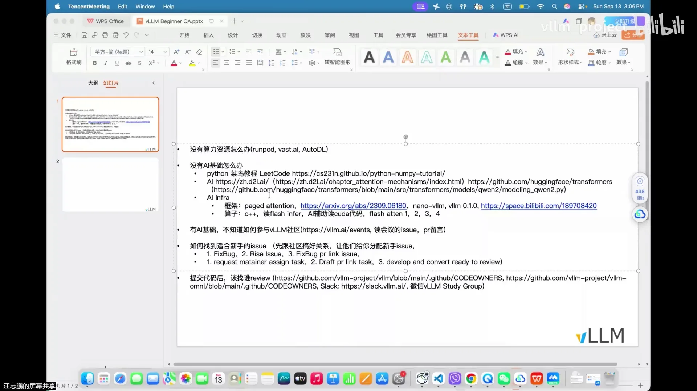 |
| 可能现在是不足以让你在 AI Infra 这块找到一个好工作的，甚至可能你连实习都会比较难找。那么其实你需要更加 focus 自己在一些比较核心的功能上的贡献。——然后有同学问：有没有介绍 vLLM 怎么用的教程？这是个太好的问题了。呃，我其实非常建议—— [【跳转到 61:21】](https://www.bilibili.com/video/BV1nEYv6XE15/?t=3681) |  |
| 因为我理解，使用 vLLM 是做推理的同学需要关注的方向。 [【跳转到 61:46】](https://www.bilibili.com/video/BV1nEYv6XE15/?t=3706) | 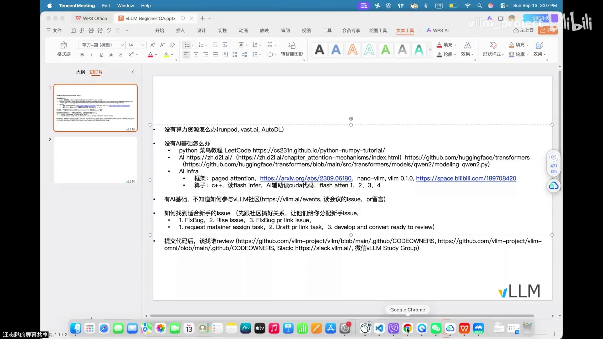 |
| 那么在这个时候我非常建议大家可以去看一下我们最近的一期视频， [【跳转到 61:51】](https://www.bilibili.com/video/BV1nEYv6XE15/?t=3711) |  |
| 就是我们这个基于 vLLM 的 Kimi K3 智能体生产级推理部署服务。因为它主要是针对集群环境去做部署的，比你可能去起个 vLLM（单机）其实更加有价值。而且你也可以去了解到我们现在非常推荐的 KV cache 的 [【跳转到 61:59】](https://www.bilibili.com/video/BV1nEYv6XE15/?t=3719) |  |
| offloading 策略其实是背后使用 Mooncake 去做的。因为我看到其实现在很多同学，比如想做 KV cache 的 offloading，可能还是用 vLLM 的原生东西。原生是支持的，但是我们更推荐生产环境的话用 Mooncake，Mooncake 也是跟 vLLM 这边有非常紧密的合作关系的。 [【跳转到 62:24】](https://www.bilibili.com/video/BV1nEYv6XE15/?t=3744) |  |
| （此区间无字幕） [【跳转到 62:49】](https://www.bilibili.com/video/BV1nEYv6XE15/?t=3769) |  |
| 哦，我这边（PPT）没有就下来了。 [【跳转到 62:54】](https://www.bilibili.com/video/BV1nEYv6XE15/?t=3774) | 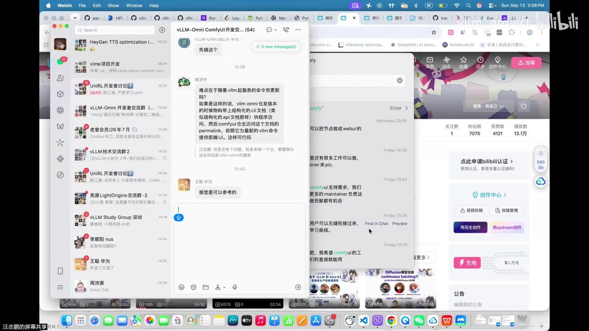 |
| 然后我看一下，不知道还有没有同学有问题需要问。那论文这块的话，其实我是非常建议大家去看一下少数头部团队（比如 Kimi、DeepSeek）的论文的。DeepSeek 的话我觉得 V3、 [【跳转到 62:59】](https://www.bilibili.com/video/BV1nEYv6XE15/?t=3779) |  |
| 然后 R1，然后 V4，包括 Kimi K3 这种的话还是很有读的价值的。但我觉得其他的一些技术报告，我觉得就没有很大读的必要了。然后系统这一块的论文，我觉得也是看社区：如果这个论文很有价值的话， [【跳转到 63:24】](https://www.bilibili.com/video/BV1nEYv6XE15/?t=3804) |  |
| 社区里面肯定会有人推荐的。然后哪怕是没有人推荐，你会忽然间发现比如一些框架里面多了一个新的功能，那么这个新的功能大概就是最近的一篇论文出来的。那么你在做这个功能或者学这个功能的时候，可以考虑回头再去看一下这篇论文。但是我并不会很推荐大家去啃 FlashAttention 的论文原文， [【跳转到 63:49】](https://www.bilibili.com/video/BV1nEYv6XE15/?t=3829) | 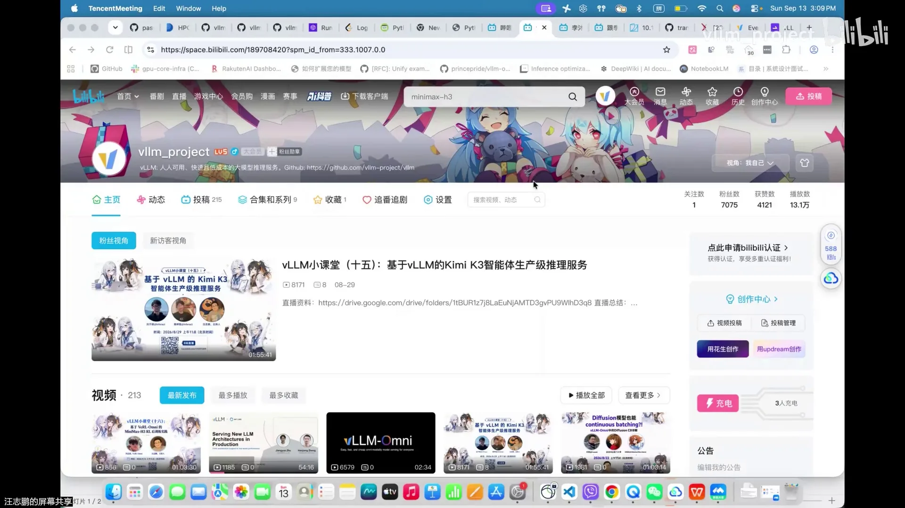 |
| 因为 FlashAttention 现在哪怕是 AI，它都可以比那个论文讲得清楚很多。那么这样的话你不如先通过 AI 把这个搞熟，然后再去研究它的代码、让 AI 帮你把这个代码搞熟，这可能会比直接读论文更有效。好，然后同学们如果没有什么问题的话—— [【跳转到 64:14】](https://www.bilibili.com/video/BV1nEYv6XE15/?t=3854) |  |
| 那我们今天的分享就结束了。好，非常感谢大家，拜拜拜拜。 [【跳转到 64:39】](https://www.bilibili.com/video/BV1nEYv6XE15/?t=3879) | 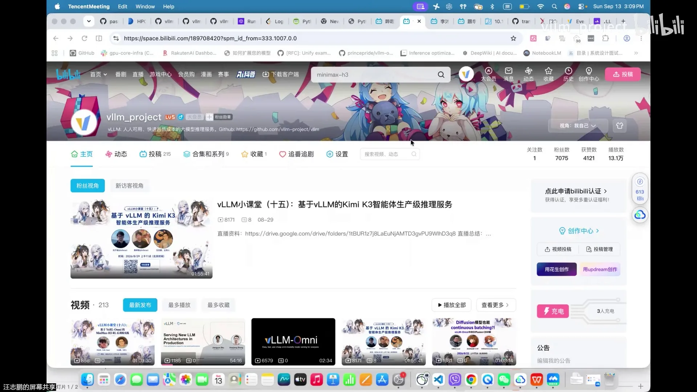 |
| （此区间无字幕） [【跳转到 64:52】](https://www.bilibili.com/video/BV1nEYv6XE15/?t=3892) |  |