# 第20讲：vLLM 语义路由器：探索多模型系统智能的边界 原始文稿（图-字幕分栏）

| 字幕文本 | 画面 |
| :--- | ---: |
| 那我这边就开始了。还有徐老师，你可以把这个 PPT 投屏吗？好来好来，可以看到吧。 [【跳转到 00:00】](https://www.bilibili.com/video/BV13Jeh68Eam/?t=0) | 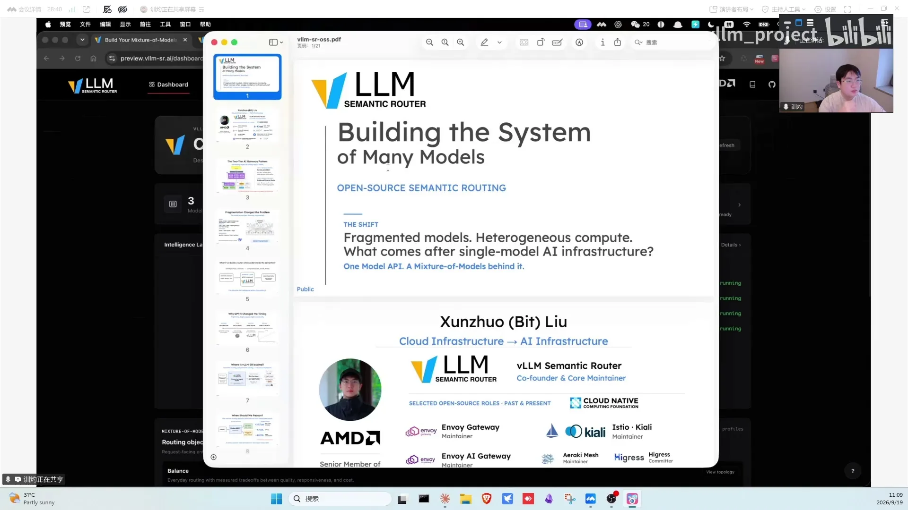 |
| 可以看到可以看到，好来好来，好谢谢。 [【跳转到 00:11】](https://www.bilibili.com/video/BV13Jeh68Eam/?t=11) | 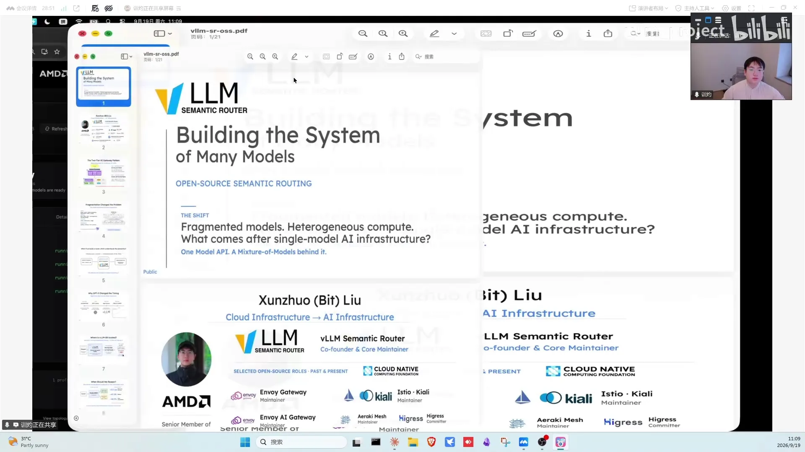 |
| 然后今天主要给大家分享的项目其实就是 Semantic Router（语义路由器），关于它的发展、未来的计划，包括它的 motivation，我希望趁这个机会跟大家交流一下。 [【跳转到 00:16】](https://www.bilibili.com/video/BV13Jeh68Eam/?t=16) | 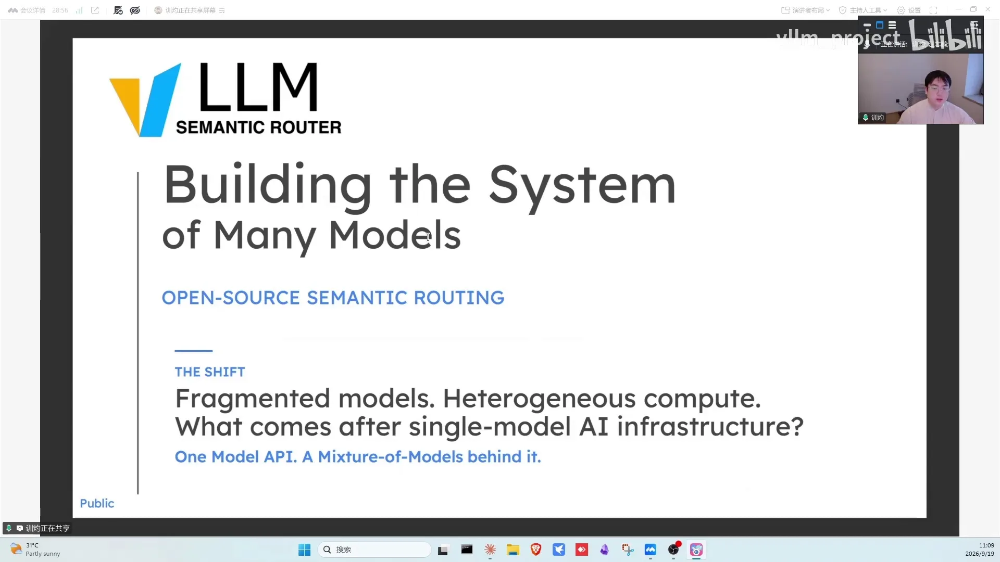 |
| 我这边的经历主要是在云（Cloud）和开源方向展开的。AI 来临之前我的 focus 主要在 Cloud 这块，做 cloud infrastructure。AI 来临之后其实大家都同样面临一个问题，就是—— [【跳转到 00:36】](https://www.bilibili.com/video/BV13Jeh68Eam/?t=36) |  |
| AI 时代以前做的事，怎么把以前的 expertise 演进到现在的 AI 场景里。我以前参与的开源项目主要是围绕 networking 的，主要是 L7 和 L4 的网络。 [【跳转到 01:01】](https://www.bilibili.com/video/BV13Jeh68Eam/?t=61) |  |
| 也维护了一些项目：比如 CNCF 下面有一个 graduated（毕业）项目叫 Envoy；他们有 API 网关项目 Envoy Gateway；AI 时代还有一个 AI Gateway，叫 Envoy AI Gateway。还有一些，包括以前如果大家了解 Cloud 的话—— [【跳转到 01:26】](https://www.bilibili.com/video/BV13Jeh68Eam/?t=86) |  |
| 也可能了解过 service mesh（服务网格）相关的项目，我都参与其中。AI 时代对我个人而言是一种探索，对我来说有点像一个 auto research 的新的旅程，因为其实—— [【跳转到 01:51】](https://www.bilibili.com/video/BV13Jeh68Eam/?t=111) |  |
| 最开始做网络，到 AI 这个时代我们要怎么样去做网络，这给我带来了一些问题。后面我会通过 Semantic Router 这个项目，分享整个的心路历程。 [【跳转到 02:16】](https://www.bilibili.com/video/BV13Jeh68Eam/?t=136) | 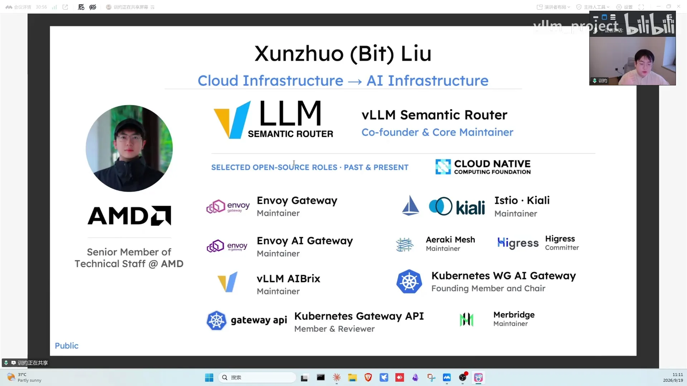 |
| 对，我记得在 DeepSeek 开源之后，不仅是国内、甚至全球的 ecosystem 都受到很大冲击或者说震撼。从那之后大家应该知道，在开源模型这块—— [【跳转到 02:35】](https://www.bilibili.com/video/BV13Jeh68Eam/?t=155) |  |
| 大家越来越多提到 Inference，Inference 和 Training 甚至在这个市场上出现了平分秋色的状态。那时候模型越来越多了，大家可能在想：模型越来越多，我们怎么把模型管理起来？以前做 networking 的人就出来了。 [【跳转到 03:00】](https://www.bilibili.com/video/BV13Jeh68Eam/?t=180) |  |
| 还有说我们以前做 API Gateway 的：API Gateway 本质上是通过聚合代理（proxy）技术——以前有 Nginx、有 OpenResty、有 Envoy——在这样的技术上面，我们把所有后端服务当成一个个个体来管理。 [【跳转到 03:25】](https://www.bilibili.com/video/BV13Jeh68Eam/?t=205) |  |
| 可以看到图里面：不管是 external provider，还是我们 self-hosted 的 GPU fleet 里面 deploy 的模型，对于 API Gateway 来说——以前 networking 延伸到现在，它的演进本质上区别主要在于后端的 workload 不一样了。 [【跳转到 03:50】](https://www.bilibili.com/video/BV13Jeh68Eam/?t=230) |  |
| 而且它需要管理的协议更加统一和标准化了。以前的 workload 就是一些 service、传统的工作负载；现在的 workload 可能变成一个 deployed model，可能是 vLLM 或者 SGLang 这样的。但在我看来，其实就是换汤不换药——对于传统的 API Gateway， [【跳转到 04:15】](https://www.bilibili.com/video/BV13Jeh68Eam/?t=255) |  |
| 就是换了一个后端的 workload 类型，然后把传统的一些手艺在新时代里稍微换一换。比如以前 rate limit 有限流，我们限流请求每分钟多少次；现在更精细化，我们要看怎么对 token level 做限流。 [【跳转到 04:40】](https://www.bilibili.com/video/BV13Jeh68Eam/?t=280) | 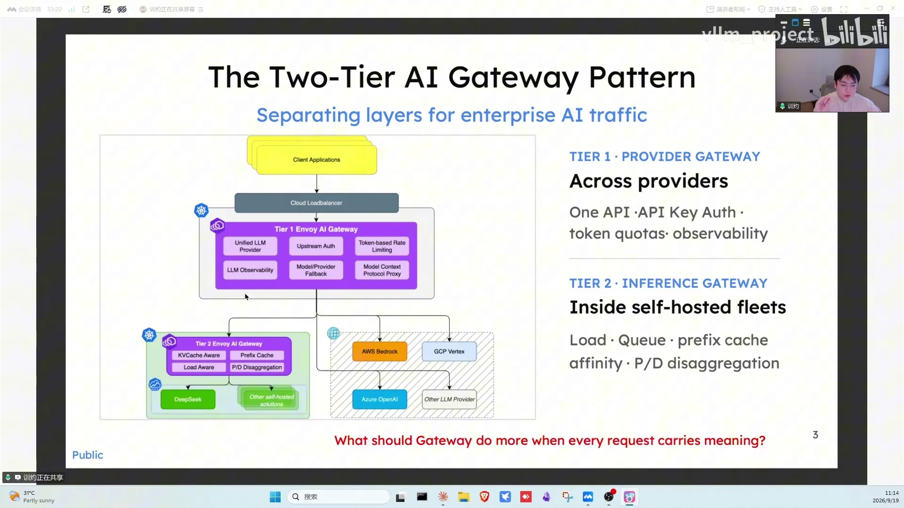 |
| 类似的一些需求。当时我们在社区里提出了一个 Two-Tier 的架构：Tier 1 就是我刚提到的 API Gateway 的演进，现在大家可能都知道 AI Gateway 或者 Router，比如类似 LiteLLM 这样的项目——这一层主要是作为 Unified APIs， [【跳转到 05:05】](https://www.bilibili.com/video/BV13Jeh68Eam/?t=305) |  |
| 把后端统一管理起来。然后 Tier 2——当时我们观察到业界的一个发展：其实一层是不够的。因为传统的调度和模型 request level 的调度，包括 worker 之间（cross workers）的调度策略和算法其实是不一样的。 [【跳转到 05:30】](https://www.bilibili.com/video/BV13Jeh68Eam/?t=330) |  |
| 所以不管是当时的 vLLM、AI Bricks 还是 Production Stack，包括 SGLang，他们也有一些 Router。我们把这一层看作 Tier 2 Gateway。Tier 2 Gateway 面临的问题和 Tier 1 非常不一样：比如我们需要感知后端 worker 的状态，需要从后端获取一些 metrics 去计算—— [【跳转到 05:55】](https://www.bilibili.com/video/BV13Jeh68Eam/?t=355) |  |
| 它的 GPU 利用率是吧、KV cache 的使用、ongoing 的 request，包括前缀在 router 这一层的 cache，做一些近似的 prefix cache affinity 的 routing；包括后面我们演进到更多精细化的调度规则，比如 PD disaggregation—— [【跳转到 06:20】](https://www.bilibili.com/video/BV13Jeh68Eam/?t=380) |  |
| 就是 PD 分离的情况下我们怎么去做 routing。所以最开始我们提出这样的架构，把整个统一入口加路由的 architecture 在社区里 release 了。整个架构看起来是比较清晰的，但在我看来当时做—— [【跳转到 06:45】](https://www.bilibili.com/video/BV13Jeh68Eam/?t=405) |  |
| 这个架构是在做 Envoy AI Gateway 的时候 introduce 给社区的。但后面我也在不断想这个问题：AI 时代 routing 的本质是什么？它的第一性原理是什么？它在这个时代里面应该承担什么样的角色？当时对我的一个问题就是说：以前其实 API—— [【跳转到 07:10】](https://www.bilibili.com/video/BV13Jeh68Eam/?t=430) | 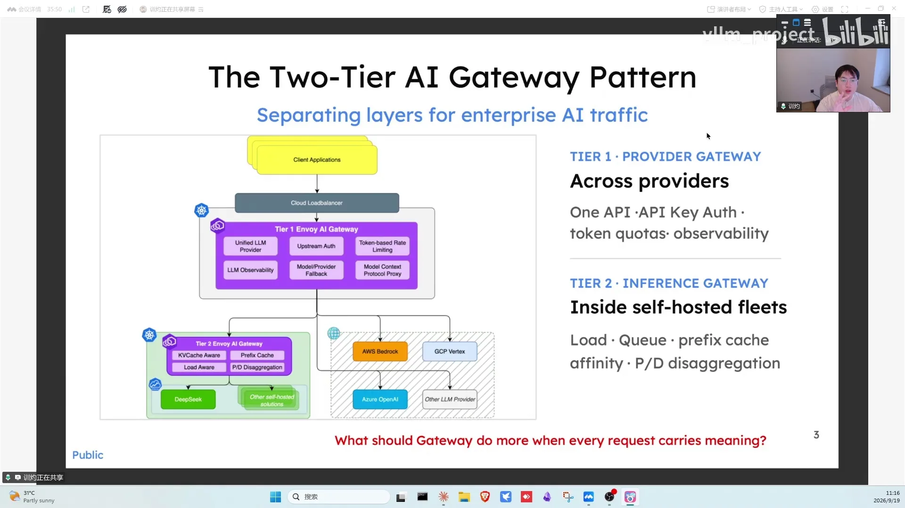 |
| 虽然这种 API 网关可以统一（unify）这些 API，但它没有统一的协议。而现在，OpenAI Compatible API 或者 Anthropic 的 Messages（协议）有统一的协议。有相对比较明确的协议之后，我们能够固定地在不同的用户的 payload 里面，通过一些 schema 去提取信息出来，这些 field 是比较稳定的。 [【跳转到 07:35】](https://www.bilibili.com/video/BV13Jeh68Eam/?t=455) |  |
| 比如我可以把当前的 query、question 提取出来，它的历史 messages、历史 context、tool use 的执行和结果，这些统一的都可以通过非常标准化的方式提取出来。拿到这些信息，其实能感觉到这些信息是富含语义（semantic）的。 [【跳转到 08:00】](https://www.bilibili.com/video/BV13Jeh68Eam/?t=480) |  |
| 对吧。在这种富含语义的情况下，routing 应该怎么做？这是当时我自己给自己提出的一个问题。最开始我们的判断是：这至少是 industry track 里面需要解决的一个问题。 [【跳转到 08:25】](https://www.bilibili.com/video/BV13Jeh68Eam/?t=505) | 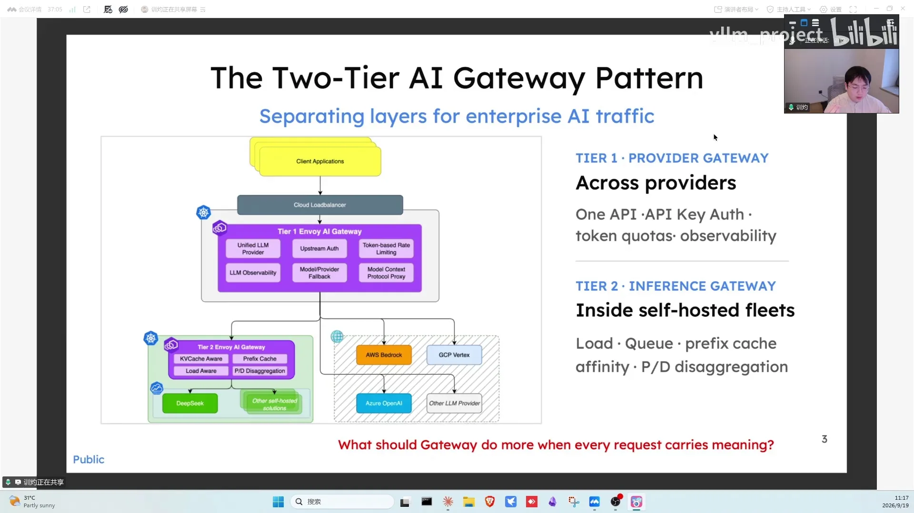 |
| 另外 academic track——学术界我记得应该是 24 年的时候提出了 RouteLLM，更偏向一个 research track 的项目。就我们当时来说也观察到一些现象。结合这个问题：可以看到模型越来越多了，是吧？ [【跳转到 08:50】](https://www.bilibili.com/video/BV13Jeh68Eam/?t=530) |  |
| 模型之间的差距（gap between models）越来越大了。以前我们最开始关注的模型厂商就几个，头部的就一两个模型，闭源模型也就那几个头部的玩家。现在可以看到：我们有开源的模型，我们有闭源的模型， [【跳转到 09:15】](https://www.bilibili.com/video/BV13Jeh68Eam/?t=555) |  |
| 然后我们有大模型、小模型，有 specialized model。这些模型之间的差异和特质也在不断变化，包括模型的 architecture、不同的 cost——这些都变成了模型之间差异化的趋势。第二个，随着模型的差异化，大家也可以看到不同的 compute， [【跳转到 09:40】](https://www.bilibili.com/video/BV13Jeh68Eam/?t=580) |  |
| 就是计算设备也变得非常 fragmented、碎片化。上一代模型可能 optimized 在某一个 hardware 上，下一代模型我们可能 optimized 在一个更 broad tier 的 compute resource 上面。不同的 hardware 和 model 之间有一些 mapping 的规则，但这是非常复杂的一张图。 [【跳转到 10:05】](https://www.bilibili.com/video/BV13Jeh68Eam/?t=605) |  |
| 就是说不同的 compute 可能适配不同的模型，然后不同的模型做了 inference optimization 之后可能也只能跑在比较 fragmented 的卡上面。所以可以看到：随着模型的碎片化，计算设备也变得非常碎片化。 [【跳转到 10:30】](https://www.bilibili.com/video/BV13Jeh68Eam/?t=630) |  |
| 跟以前的 IoT、互联网时代相比，和一些 mobile 应用类似，我们能看到另一个 fragmented 的趋势：AI 或者 artificial intelligence 这件事情，大家不只是想在云上面去做， [【跳转到 10:55】](https://www.bilibili.com/video/BV13Jeh68Eam/?t=655) |  |
| 不只是想在 datacenter 里面做，大家也想在不同的 location 把模型部署和跑起来。所以 location 也是 fragmented 的：可以部署在 cloud 上，用 API 的方式直接使用； [【跳转到 11:20】](https://www.bilibili.com/video/BV13Jeh68Eam/?t=680) |  |
| 也可以部署在自己的 on-prem 的 GPU 机房里面、datacenter 里面去用。大家也可以看到现在的一些趋势：不管是 AMD 的 AI PC，还是英伟达的 DGX Spark 这样的设备，大家也想把模型在本地跑起来。所以位置也变得非常多样， [【跳转到 11:45】](https://www.bilibili.com/video/BV13Jeh68Eam/?t=705) |  |
| 其实也引入了一些 gap 在整个生态的 map 里面，这个 ecosystem 里面会存在一些问题，后面我可以展开。第四个：其实每个人、每个开发者、企业、或者一个 domain 的 industry 去用 AI、用模型的时候， [【跳转到 12:10】](https://www.bilibili.com/video/BV13Jeh68Eam/?t=730) |  |
| 大家对模型的特质有不同的偏好。比如 frontier 的 lab 做 research：要用最强的模型，quality first / accuracy first，根本不想用比较菜的模型，然后不断地返工、或者根本拿不到结果，对吧； [【跳转到 12:35】](https://www.bilibili.com/video/BV13Jeh68Eam/?t=755) |  |
| 但某些用户可能更在意 latency，是延迟敏感的业务，latency first 的场景，不允许 latency 变得太高。还有一些用户，比如 C 端的用户，对他们来说—— [【跳转到 13:00】](https://www.bilibili.com/video/BV13Jeh68Eam/?t=780) | 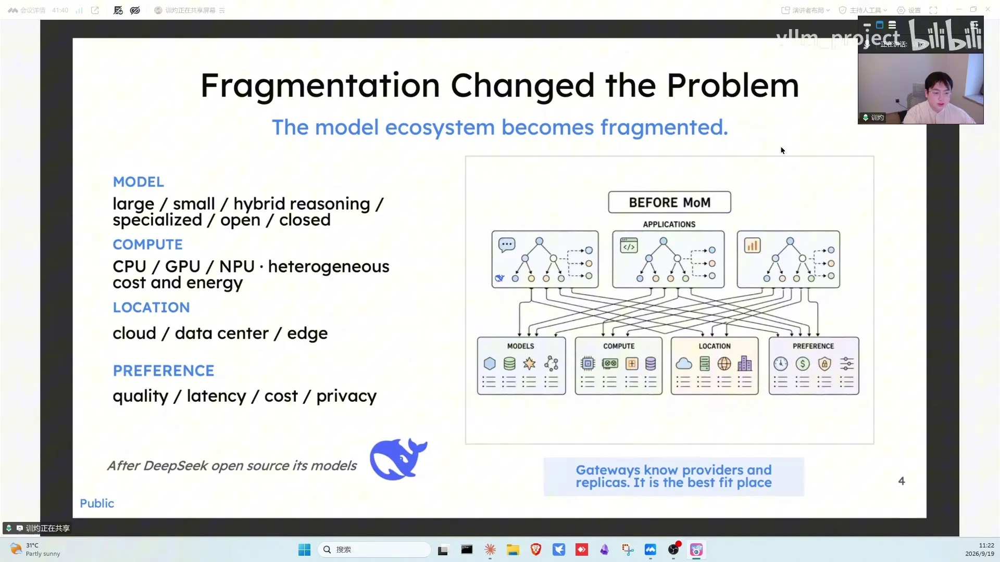 |
| accuracy 也好、latency 也好像都不在乎，就是说我在手机或电脑上跑一个 AI assistant，每个月顶多付出几十块、一百块的订阅费，不要跑了几天就没有额度了，对吧。 [【跳转到 13:25】](https://www.bilibili.com/video/BV13Jeh68Eam/?t=805) |  |
| 更在于日常场景 cost first 的模型使用。还有比如银行或者金融场景，更在意 privacy/security first 的模型使用：怎么去做更好的 guardrails，怎么防止敏感信息泄漏。 [【跳转到 13:50】](https://www.bilibili.com/video/BV13Jeh68Eam/?t=830) |  |
| 所以不同的用户有不同的 preference。综合这四个维度：model、compute、location、preference，我们当时可以看到未来这件事会越来越严重——这个复杂的关系和拼图越来越复杂。用户怎么去选择模型，未来是非常值得解决的问题。 [【跳转到 14:15】](https://www.bilibili.com/video/BV13Jeh68Eam/?t=855) |  |
| 所以我们当时认为，在网关或者说 router 这个位置去解决这个问题是非常好的，因为它 stands between the models and people——在 agent 和模型之间作为桥梁的位置， [【跳转到 14:40】](https://www.bilibili.com/video/BV13Jeh68Eam/?t=880) |  |
| 它是一个非常好的 location。好，我们回答一下直播间弹幕的问题。有同学问：Semantic Router 和 JV 的区别是什么？JV 是最近的一个新的创业公司，他们的—— [【跳转到 15:05】](https://www.bilibili.com/video/BV13Jeh68Eam/?t=905) | 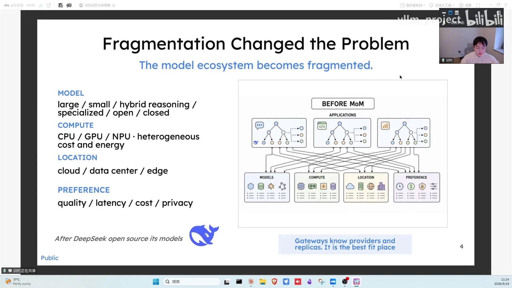 |
| co-founder 应该是当时 OpenAI 相关的一位创始人（音）。他们提出了一个 decision engine：把非结构化的数据输入到 engine 之后，可以得到一些结构化的决策。比如说你这个 prompt 是吧，它的 context，各种 decision——该怎么去决策这个 prompt。 [【跳转到 15:30】](https://www.bilibili.com/video/BV13Jeh68Eam/?t=930) | 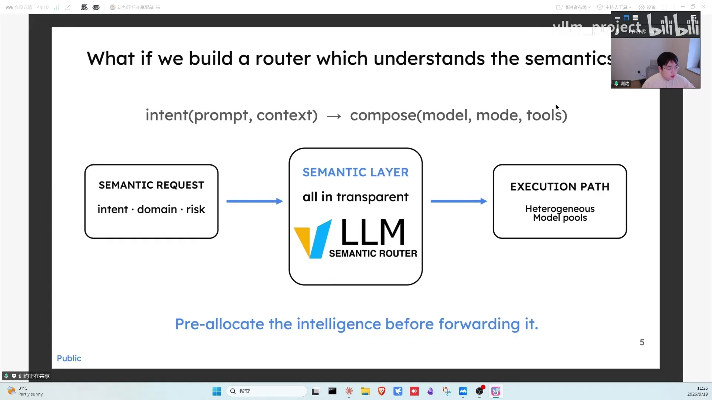 |
| 它提出了这样的一个 product。我觉得跟 Semantic Router 相比，有一部分是完全 matched 的：SR（等会我可以展开）它有一个 decision engine，其实就是把一些非结构化的数据转化成决策，然后让外层的网关去做路由决策就好。 [【跳转到 15:55】](https://www.bilibili.com/video/BV13Jeh68Eam/?t=955) | 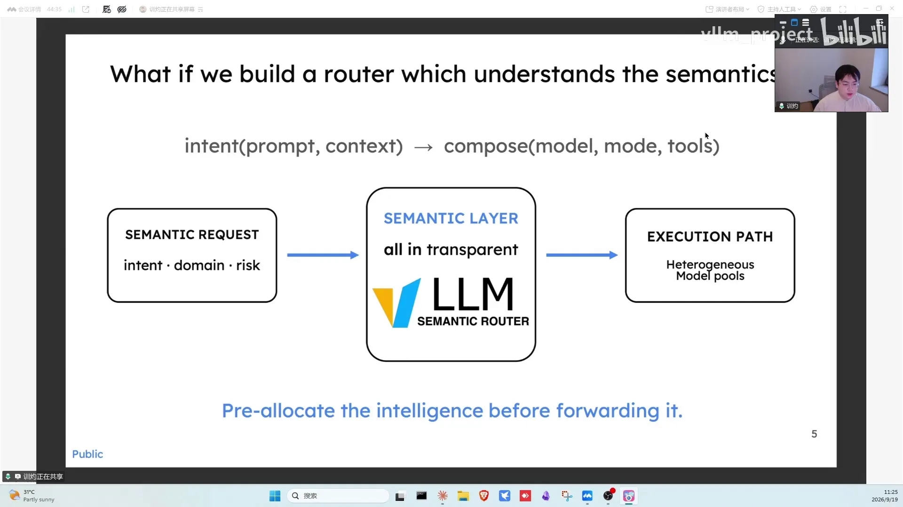 |
| 实际上这个事情和刚才 JV 提的这个优势是类似的，但大家做的方式可能不一样；我们的场景可能一样，是把它放在了路由这里，放在模型和用户、和 agent 之间。——对，其实我这段时间也关注到他们这个项目，他们现在好像连论文、技术细节都还没有公开。 [【跳转到 16:20】](https://www.bilibili.com/video/BV13Jeh68Eam/?t=980) |  |
| 我觉得首先它的这个 behind idea 是 make sense 的：我们确实在模型的整个工具调用的时候，不需要有特别长的文本说明，我只需要一些选项和一些概率，就可以做出很精准的模型调用。 [【跳转到 16:45】](https://www.bilibili.com/video/BV13Jeh68Eam/?t=1005) | 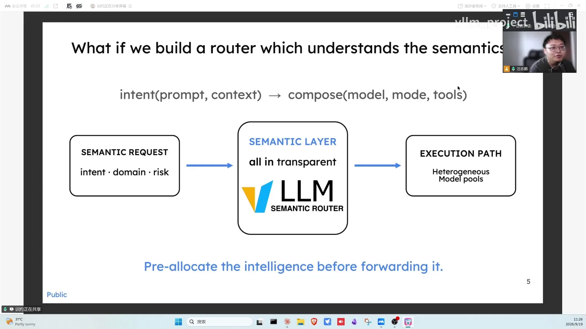 |
| 唯一的问题在于我比较好奇：它每个选项的这个比例值是怎么通过训练得到的？我觉得大概率是走的 encoder-based 的 model——很像是一个 encoder model forward 了之后得到了各种 label（之间的概率），但我可能只是猜测。 [【跳转到 17:10】](https://www.bilibili.com/video/BV13Jeh68Eam/?t=1030) | 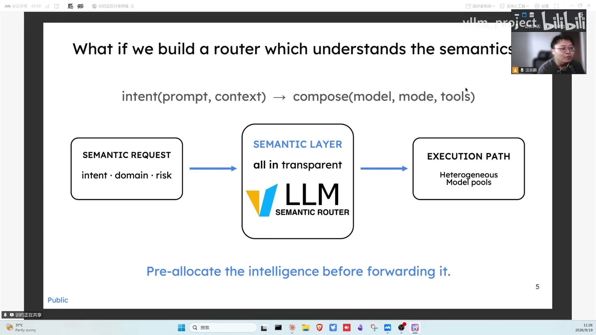 |
| 但是不一定，毕竟我离得远。可以后面再关注一下有没有开源的进展。我觉得可能是有类似的一些模型在里面做事。反正我觉得只要它敢开放 API 出来，我们就可以研究这个模型到底怎么工作的——哪怕它不开源，我们也可以把它蒸馏出来。 [【跳转到 17:35】](https://www.bilibili.com/video/BV13Jeh68Eam/?t=1055) |  |
| 对对对。然后还有同学问：最新的新一代路由模型（Villa，音）和以前用的模型有什么区别？为什么要加一道 Villa？OK，其实这个模型等会儿可以跟大家分享：我们最近把 Semantic Router 里面内部跑的一堆模型—— [【跳转到 18:00】](https://www.bilibili.com/video/BV13Jeh68Eam/?t=1080) | 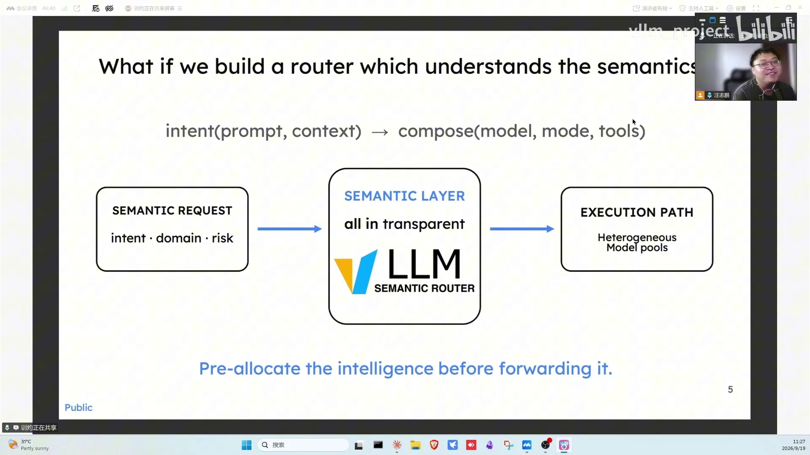 |
| 重新 training 一下。train 有几个目的：第一个我们认为，新一代路由模型是一个更系统化的——从 Omni 到 Text，包括 embedding、reranker，包括各种训练好的 classifier，包括一些 multi-model 的 embedding 模型。 [【跳转到 18:25】](https://www.bilibili.com/video/BV13Jeh68Eam/?t=1105) |  |
| 其实我们是认为把它重新 rerank，本质上提高了以前模型的 accuracy，包括它在不同 context window 下的一些稳定性。对，它相当于是对上一版 SR 内部的 encoder-based 模型做了一些升级，可以认为是一个新的迭代。然后我认为这个迭代是我们未来—— [【跳转到 18:50】](https://www.bilibili.com/video/BV13Jeh68Eam/?t=1130) | 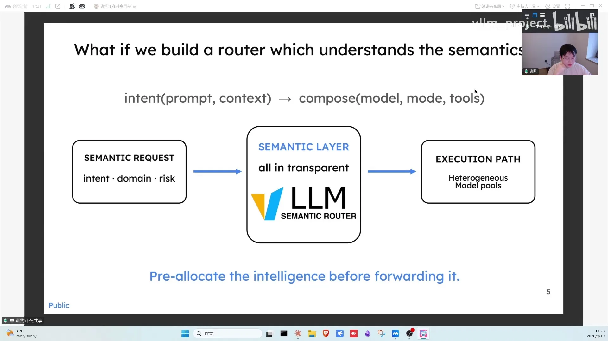 |
| 系统化发布新模型的一个起点。因为 Villa 1.0 发布之后，未来可能还会有其他 model architecture 的模型，比如 decoder-based 的、dense 或者 MoE 的。后面我们也会发一个 blog，介绍我们 Villa 的一些计划，包括可能会做一些 conductor（编排）类的模型—— [【跳转到 19:15】](https://www.bilibili.com/video/BV13Jeh68Eam/?t=1155) | 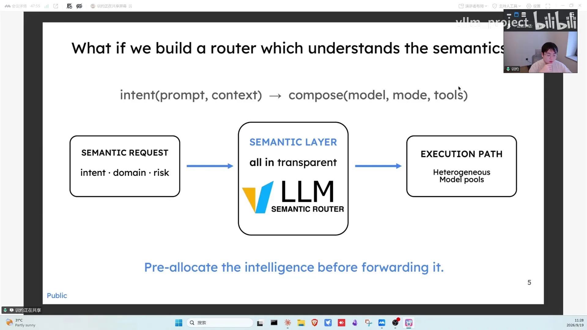 |
| 还有一些 worker model 去做一些 dynamic 的 model collaboration。但我觉得 Villa 是一个起点：就是我们来系统化地做模型这件事情。同样地，我们也是在自己 push 这个 encoder-based model architecture 的一个——怎么说呢， [【跳转到 19:40】](https://www.bilibili.com/video/BV13Jeh68Eam/?t=1180) | 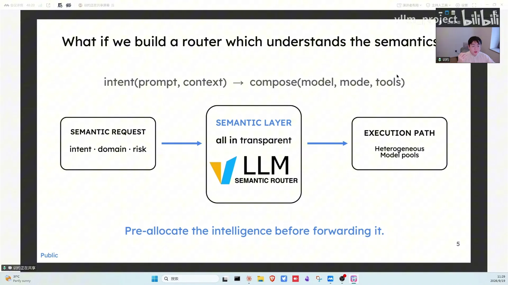 |
| 一个目标吧。因为 encoder-based model 在模型路由里面其实是非常 high efficiency、成本非常低的模型形态，所以 Villa 我们也会持续研究这个方向。——好，非常感谢训卓老师的分享，那我们就继续吧。OK，面对刚刚这个碎片化的问题， [【跳转到 20:05】](https://www.bilibili.com/video/BV13Jeh68Eam/?t=1205) | 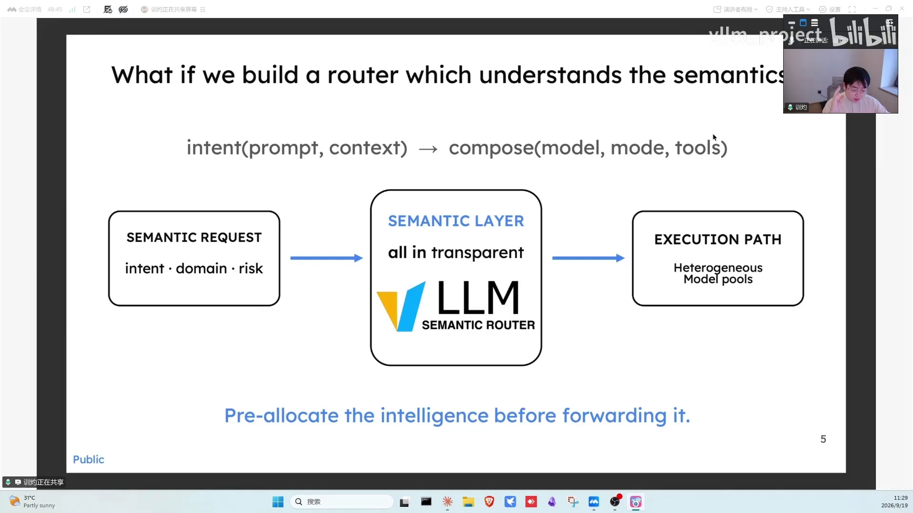 |
| 我们就在想：假如有一个在语义（semantic）角度上的 layer，能够帮用户去决策——这么多模型，模型下面可能还有更下层的不同 hardware，还有刚刚提到的一些 location 的问题——我们有一个 semantic layer to understand this query， [【跳转到 20:30】](https://www.bilibili.com/video/BV13Jeh68Eam/?t=1230) |  |
| 然后根据用户的 query 还有 context，帮它决策用什么模型、模型用什么"帽子"——比如说 reasoning on / reasoning off、reasoning effort 是怎么样的，还有它可能偏好一些 tools 是什么。我们做这样的一个 layer，帮用户在 semantic query 和 heterogeneous model pool 之间—— [【跳转到 20:55】](https://www.bilibili.com/video/BV13Jeh68Eam/?t=1255) |  |
| 做这样的一层去 dynamically orchestrate or select a model。所以我们就有了这样的一个项目，这也是我们想做 Semantic Router 的一个初衷，或者说面对问题的一个演进。我们认为 Semantic Router 适合用来解决这样的一个问题。 [【跳转到 21:20】](https://www.bilibili.com/video/BV13Jeh68Eam/?t=1280) | 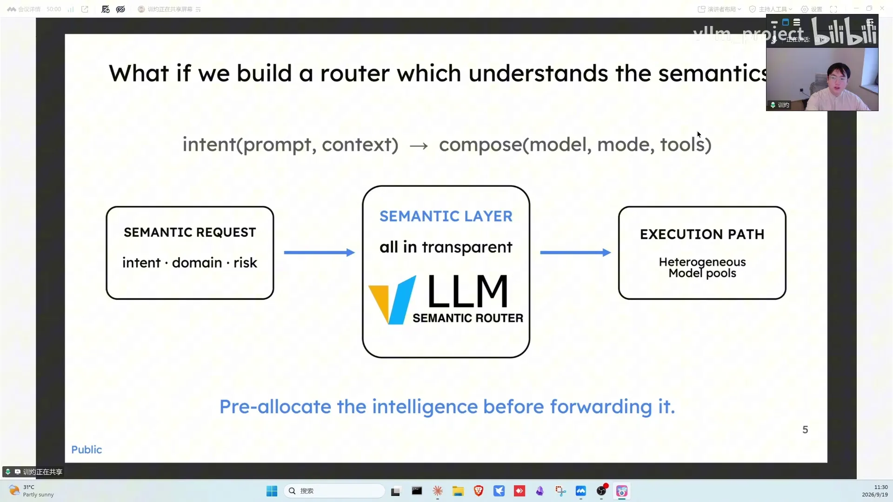 |
| 对，其实我们做 SR 也不是只有几个月——最开始不是 25 年的年初，其实 24 年的时候我们也在做。当时我们有另外一个 org，我们在做一些 PLC 的项目，其实在 24 年就开始做这些事了。到 25 年有一些比较好的 timing 之后，我们选择把它发布。 [【跳转到 21:45】](https://www.bilibili.com/video/BV13Jeh68Eam/?t=1305) |  |
| 当时其实遇到非常多问题：在 semantic routing 这个领域，industry track 里面没有什么 prototype（先例），所以要在传统的 routing component、proxy 或者 gateway 里面去支持这样的东西，阻力是很大的。当时我们也跟很多厂商聊过， [【跳转到 22:10】](https://www.bilibili.com/video/BV13Jeh68Eam/?t=1330) |  |
| 说我们 Semantic Router 能不能 integrate 到你们的产品里面去，但能接受或 understand 这个 value 的比较少。当时我们也和（高校的）俊诚教授有合作；除了我之外还有之前在 Ray Henry 的朋友，我们也一起；还有包括 IBM 的朋友。 [【跳转到 22:35】](https://www.bilibili.com/video/BV13Jeh68Eam/?t=1355) |  |
| 我们一起也在想什么时候把这个项目以什么样的方式开源出去。当时有一个比较好的时机：GPT-5 发布了，大家可能也看到 GPT-5 里面有一个新的产品形态——提供了一个 auto mode 模式。那种 auto mode 模式就是用户不用去选（模型）， [【跳转到 23:00】](https://www.bilibili.com/video/BV13Jeh68Eam/?t=1380) | 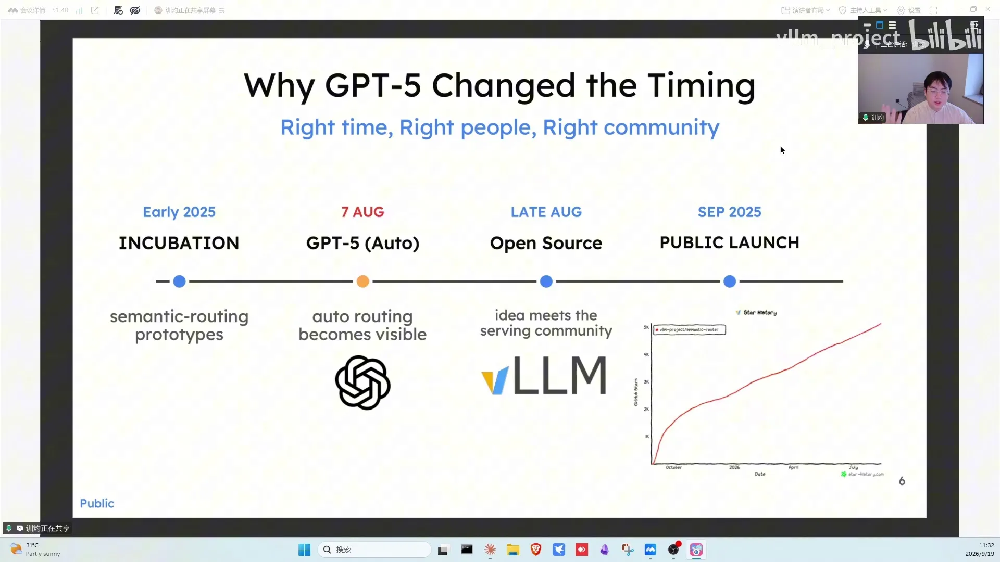 |
| 不管它是 GPT-5 什么 mini，包括 GPT-5 一些 max 之类的模型——让用户使用这个 mode 之后 dynamically 帮你去选模型。我们认为这件事情一方面也印证了我们 SR 做的这个方向。所以当时就跟 Simon 去聊这件事：看一下 vLLM 这边能不能作为这样的一个社区—— [【跳转到 23:25】](https://www.bilibili.com/video/BV13Jeh68Eam/?t=1405) |  |
| 去把（SR）发布出去。因为 vLLM 其实也是个非常活跃的社区，它有非常多的顶尖人才，我们觉得这个社区是非常好的社区。所以后面达成了一些共识之后，我们就把 SR 在去年年中的时候在 vLLM 里面发布。发布之后我们也一路去—— [【跳转到 23:50】](https://www.bilibili.com/video/BV13Jeh68Eam/?t=1430) |  |
| 不断地去（维护）这个项目，到现在也有比较好的 GitHub 上不管是 contributor 也好、更多的关注也好。这是发展的 timeline。然后这里主要是想描述一下 SR 到底在这个 stack 里面什么位置。 [【跳转到 24:15】](https://www.bilibili.com/video/BV13Jeh68Eam/?t=1455) | 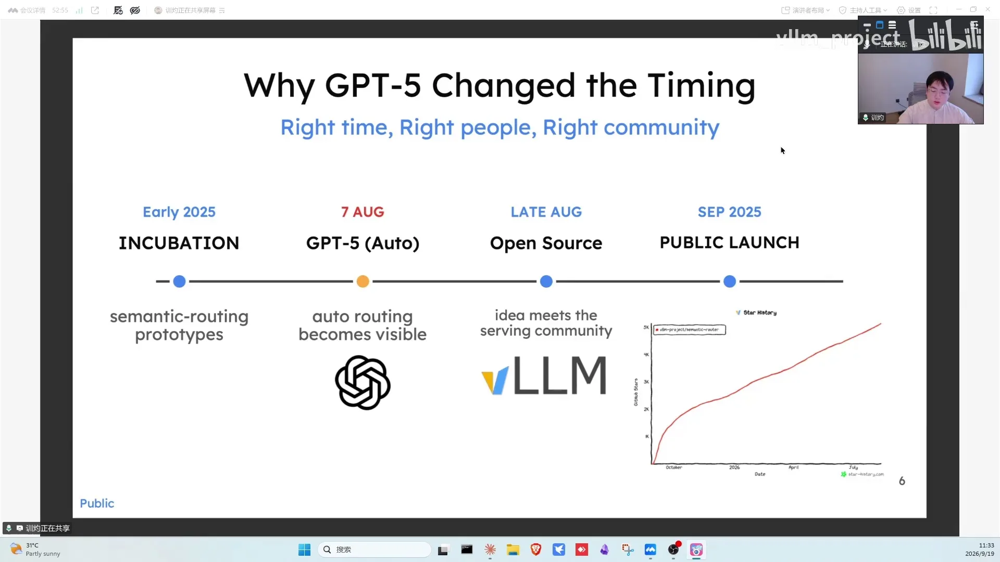 |
| SR 其实更偏向于——在这个架构图里面更偏向于在 serving 的前面、infra 的边界上。就是说一个 request 进来到 infra，首先到 Semantic Router，Semantic Router 去决策用什么模型、或者说怎么样去用模型。 [【跳转到 24:40】](https://www.bilibili.com/video/BV13Jeh68Eam/?t=1480) | 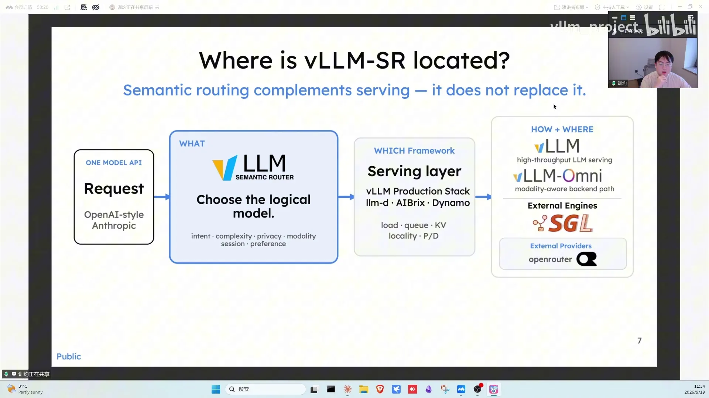 |
| 然后后面的 serving 包含了 infra 的一些 framework、后面的各种 engine，甚至可能也不是 self-hosted 的一些 external provider。所以 serving 和 Semantic Router 是一个互补的关系：serving 解决的问题是我们怎么更 high efficiency 地把模型 serve 起来， [【跳转到 25:05】](https://www.bilibili.com/video/BV13Jeh68Eam/?t=1505) |  |
| 包括配套它的一些 routing——KV 的 routing、PD 的 routing、prefix cache 的 routing。然后 Semantic Router 就在它的前面一层上去帮助用户去怎么选择模型。这是最初的架构，当然未来也会有些演进，因为未来可能会有——可以跟大家提到。 [【跳转到 25:30】](https://www.bilibili.com/video/BV13Jeh68Eam/?t=1530) | 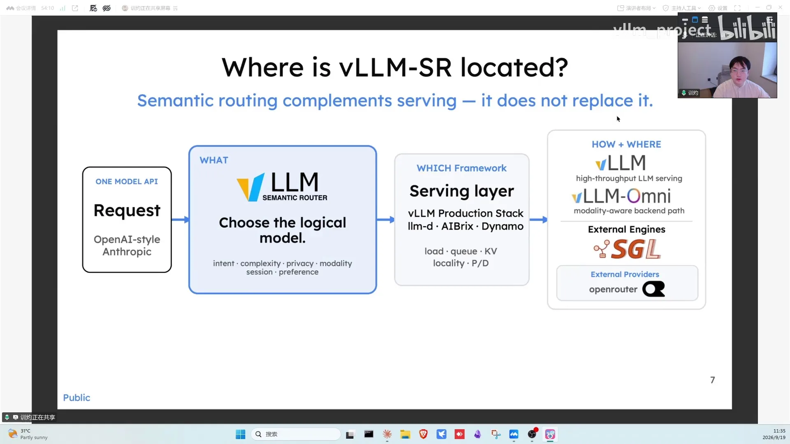 |
| 最开始我们做的 prototype：在 Semantic Router 最开始 0.1 发布之前，我们做了一个 prototype——训练一些 model、训练一些 encoder-based model，然后它在 router 里面 in-process 地跑起来，在进程里把一些 model 组合起来。这个 architecture 应该是最早的一个原型。 [【跳转到 25:55】](https://www.bilibili.com/video/BV13Jeh68Eam/?t=1555) | 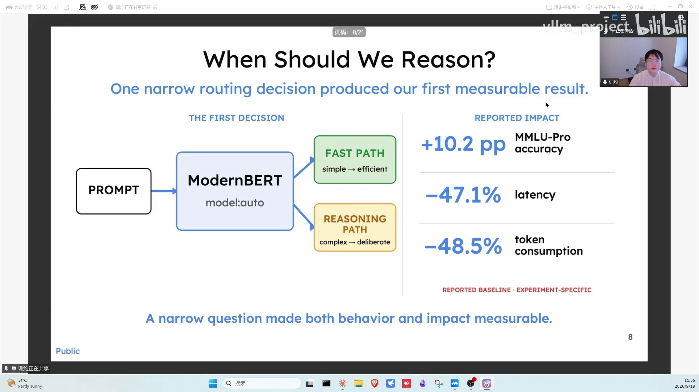 |
| 然后它能够快速地验证一些我们的想法。但现在其实这个 architecture 已经消失了。最开始就是说我们有几个模型，我记得应该有三个模型，主要是把核心的一些想法验证一下。这三个模型的分别的作用是：第一个模型它是 MMLU-pro 的一些 data—— [【跳转到 26:20】](https://www.bilibili.com/video/BV13Jeh68Eam/?t=1580) |  |
| 用来训练的一个 domain-level 的 domain classification：我这个 prompt 进来，这个 prompt 属于哪一个 domain，它主要做这样的事情——是数学的、是 coding 的、是化学的、是心理的还是哲学的。然后第二个模型我应该是也是 sentence-level 的 [【跳转到 26:45】](https://www.bilibili.com/video/BV13Jeh68Eam/?t=1605) | 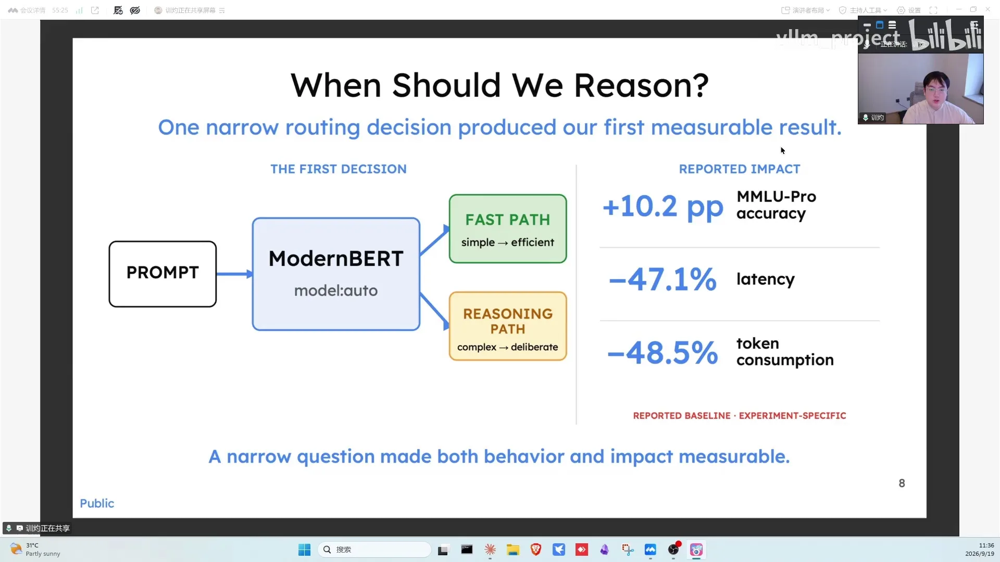 |
| 一个 encoder-based model。它主要是把 prompt 给输进来之后，它就输出了一个二分类的一个结果，能够去简单判断这个 prompt 是否有些 jailbreak，是否隐藏了一些（恶意意图）。第三个是 token-level 的 encoder-based model： [【跳转到 27:10】](https://www.bilibili.com/video/BV13Jeh68Eam/?t=1630) | 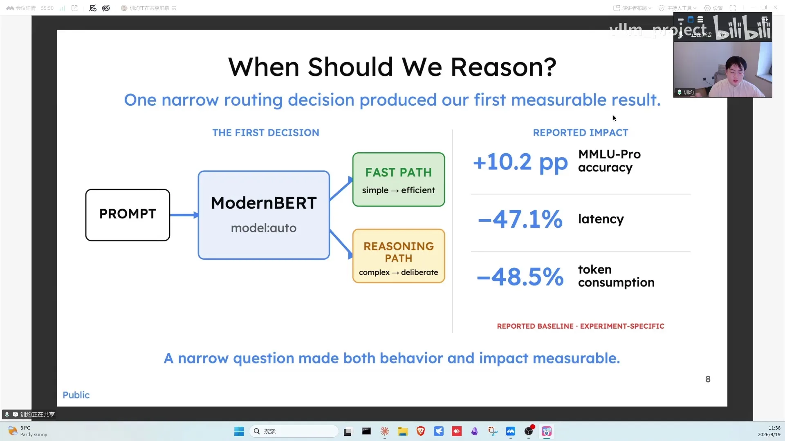 |
| 就是我这个 prompt 进来之后，这个 encoder 的 model 它是做了一些 token-level 的 classification，去检测每个 token 它属于什么敏感信息——比如说哪些是有敏感信息的 token、哪些不是，然后它包括每个 token 具体是哪一种敏感信息，比如说是 email、是个人的名字，怎么怎么样。 [【跳转到 27:35】](https://www.bilibili.com/video/BV13Jeh68Eam/?t=1655) | 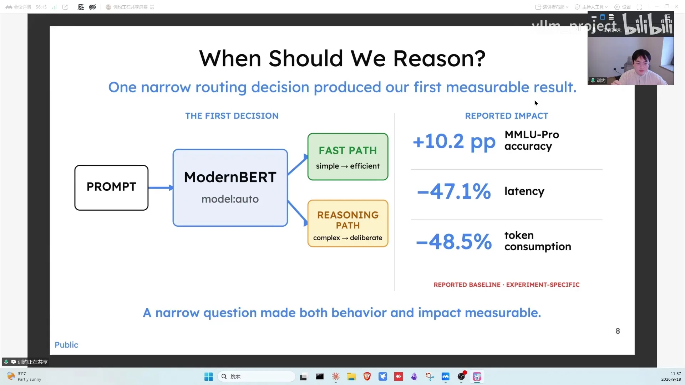 |
| 对，最开始这三个模型就搭了这个 pipeline，当时做了一个比较小的实验。这个实验里面主要是用 DeepSeek（音）的 classifier 去配了一些不同 reasoning effort、或者 reasoning model 的模型——这个模型当时应该是老的 hybrid reasoning——把一些简单的任务放在 fast pass，把一些复杂多步的任务放到 reasoning pass。 [【跳转到 28:00】](https://www.bilibili.com/video/BV13Jeh68Eam/?t=1680) | 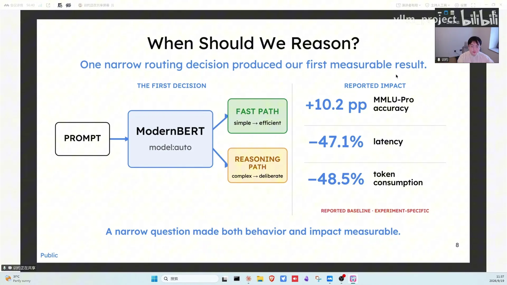 |
| 然后当时也得到一些比较好的结果，当时这篇 pipeline 我们也发到了 NeurIPS。其实在 standing pipeline 之后我们也遇到一些问题了：它的最大问题其实就是不能 scalable——这个 pipeline 最多它能接的模型非常少。 [【跳转到 28:25】](https://www.bilibili.com/video/BV13Jeh68Eam/?t=1705) |  |
| 这个 pipeline 没办法 scalable 之后，很多事做不了。比如当时我记得 HuggingFace 发布了一个产品叫 HuggingChat——也不是发布了，它应该是重新 open 了这个产品。HuggingChat 里面新出了一个模式叫做 Omni。Omni 其实就是一个相当于一个 auto 的这种 mode， [【跳转到 28:50】](https://www.bilibili.com/video/BV13Jeh68Eam/?t=1730) |  |
| 就是 mapping 是 GPT-5 这种 auto——它能够在 HuggingFace 上 dynamic 地去选模型。其实在当时我们也跟 HuggingFace 的 CEO（Clem）去聊过，是说 SR 能不能去跑到 Omni 里面。但是其实发现不能，因为我们的 standing pipeline 没办法 scalable，而 HuggingFace 上的模型也非常多。 [【跳转到 29:15】](https://www.bilibili.com/video/BV13Jeh68Eam/?t=1755) |  |
| 我们怎么重新去设计我们这样的一个 system architecture，变成了一个比较重要的问题。所以我们把核心的演进就是：把这种固定的 pipeline 变成了一个 scalable 的 multi-stage 结构化的 pipeline。这个 pipeline 最开始我们提出了—— [【跳转到 29:40】](https://www.bilibili.com/video/BV13Jeh68Eam/?t=1780) | 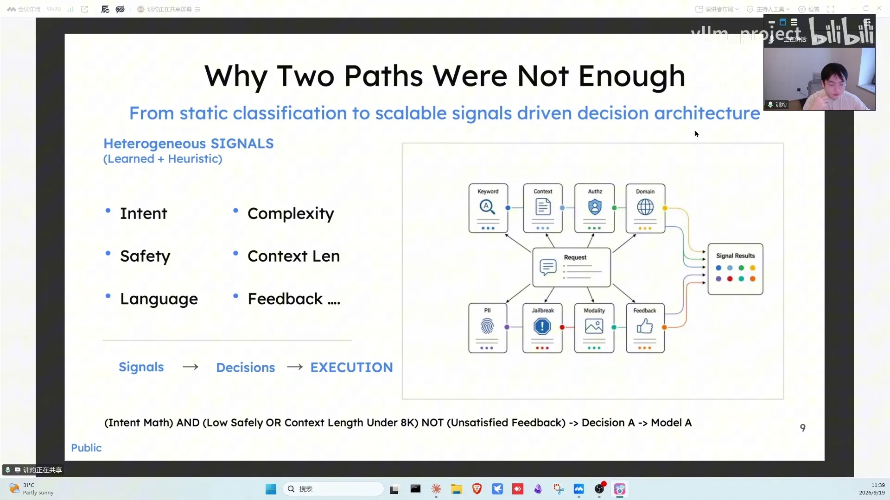 |
| 我们把这个架构叫做 Signal-Driven …… Architecture，然后我们有一篇 white paper 也发布了。当时 Microsoft 的 CEO 也给我们这个 paper 做了一些 highlight。其实我们现在做的核心的一个事情就是：我们认为我们在选择模型之前，需要先知道它是啥、它有什么特质。 [【跳转到 30:05】](https://www.bilibili.com/video/BV13Jeh68Eam/?t=1805) |  |
| 那这些特质它有 rule-based 的、它有 model-based 的、有启发式的、有学习式的。启发式的主要是一些固定或确定性的信息：这个 query 或者 context 有多长、它的 context window、这个 prompt 的 token 数大概是怎么样的、它用什么语言，包括它的一些结构化的信息。 [【跳转到 30:30】](https://www.bilibili.com/video/BV13Jeh68Eam/?t=1830) | 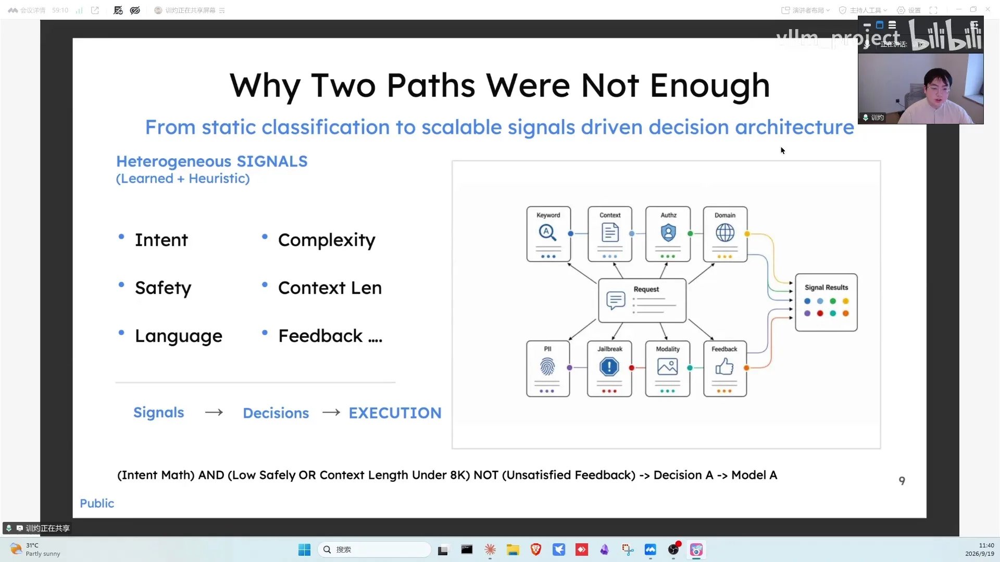 |
| 这些都是 rule-based 和固定的，它是明确的，确定性是 100%。然后还有一些 model-based 的观测的角度：刚刚提到我们最开始我们有 sentence model 是吧，我们有 intent、有 domain classifier、有 jailbreak classifier、有 PII 的 token 级 classifier。那其实最开始我们是相当于串联起来—— [【跳转到 30:55】](https://www.bilibili.com/video/BV13Jeh68Eam/?t=1855) |  |
| 比如说 domain 之后是 jailbreak，之后是 PII，之后再 domain。然后我们发现 jailbreak 之后就拒绝掉、有 PII 的就直接拒绝掉，然后再到 domain。那其实现在我们把这个事情转积了一下，变成了一个并行观测一个 prompt 的（方式）。我们认为一个 prompt 它可能既有 jailbreak 的风险， [【跳转到 31:20】](https://www.bilibili.com/video/BV13Jeh68Eam/?t=1880) | 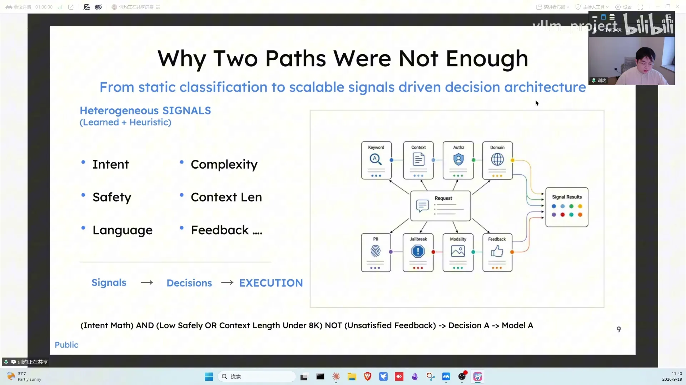 |
| 但是它同样也有 domain 的一些信息、也有一些 PII 的一些信息。所以我们把它转积成一种并行的 model-based signal 的观测，我们就把它放到同一个 signal layer。那 signal layer 总结来说就是：把学习式和启发式并行地去观测 prompt [【跳转到 31:45】](https://www.bilibili.com/video/BV13Jeh68Eam/?t=1905) |  |
| 的一些特质，然后每个输出的一个特质我们可以用映射成一个决策的一个 input。然后我们就会输入到第二个 stage，叫做 decision stage。decision stage 本质上就是把前面一步我们得到的结果，去 pre-defined 做一些 boolean strategy， [【跳转到 32:10】](https://www.bilibili.com/video/BV13Jeh68Eam/?t=1930) |  |
| 就是做一些布尔运算，我们可以去组合排列出一些比较复杂的决策。然后去做到我们能够通过更多 signal 去并行地观测 prompt——观测可以变得越来越多，这些观测越多之后，我们其实对这件事情的确定性其实会变得越来越高， [【跳转到 32:35】](https://www.bilibili.com/video/BV13Jeh68Eam/?t=1955) |  |
| 越来越像（人）做一个检查这样的操作。得到这些观测的结果之后，我们也可以去编排一些更 scalable 的决策，然后每个决策之后才是模型该怎么去 routing。得到这样的结构之后，我们的架构就变得更 scalable。我有个小问题——上一页 PPT， [【跳转到 33:00】](https://www.bilibili.com/video/BV13Jeh68Eam/?t=1980) | 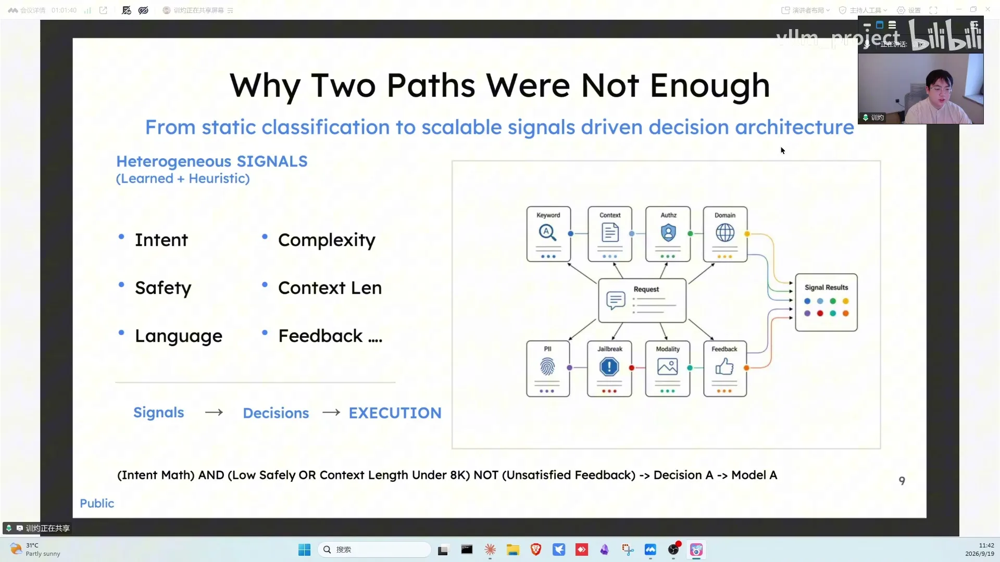 |
| 这个 decision stage 它相当于我通过我的 signal，我就可以路由到多个模型，对吗？然后多个模型去执行。是这样：signal 它相当于观测的一个 layer，它得到一些观测的结果，比如说它有什么样的语义的信息， [【跳转到 33:25】](https://www.bilibili.com/video/BV13Jeh68Eam/?t=2005) | 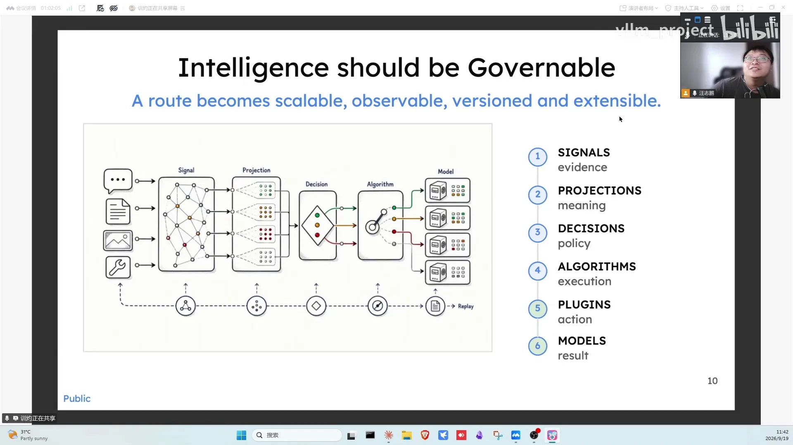 |
| 是吧。然后 decision 才是决定说我们编排好了这些 signal 之后该怎么去 routing。比如说当 query 是一个数学问题、并且没有 jailbreak、并且没有 PII 泄漏，然后我们录入到一个 decision，然后这个 decision 后面可能挂这几个模型，模型之间该怎么选。 [【跳转到 33:50】](https://www.bilibili.com/video/BV13Jeh68Eam/?t=2030) | 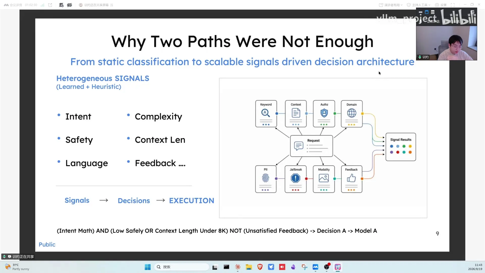 |
| 然后没有 decision。OK，我想起来之前可能是在几年前，当时做 router 的时候也有些类似的思路。对，可能场景一样吧。——然后我们可以回答一下现在直播间弹幕的问题：有同学问，现在很多 request 是多轮的或者是 agent，那么这种情况下 [【跳转到 34:15】](https://www.bilibili.com/video/BV13Jeh68Eam/?t=2055) |  |
| KV cache 复用会很重要。如果我们在同一轮对话里面，是不是就不太适合选择不同模型？因为这样的话 KV cache 的重算代价是不是太大了？——这个是个非常好的问题，有非常多人提到这个问题。其实是这样的：首先从 chat 到 agent 的场景里面，整个 routing 的算法变得更复杂了。 [【跳转到 34:40】](https://www.bilibili.com/video/BV13Jeh68Eam/?t=2080) | 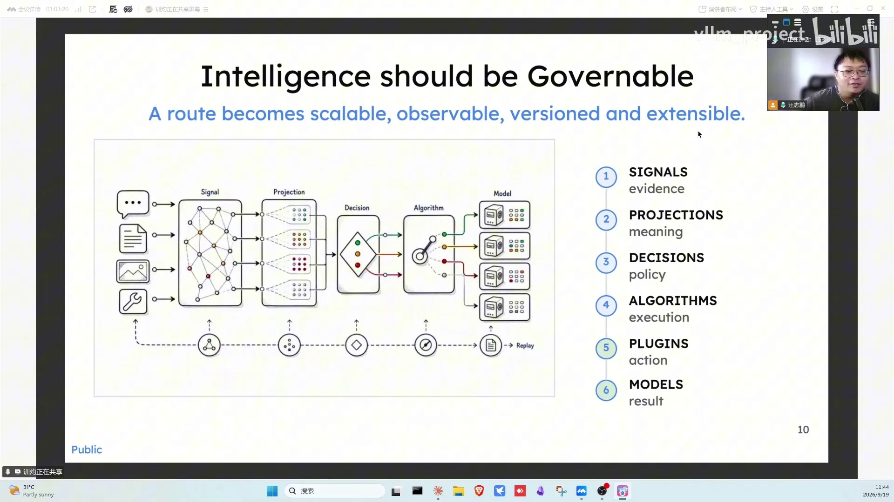 |
| 复杂的点在于说 chat 的应用本质上就是一来一回，然后大家能够得到一些结果；agent 的话它可能一个 session 就很长。在这种场景里面什么时候切模型和不切模型变得更重要。因为以前你不 reuse 也行，但是在一个 long session 里面你不 reuse， [【跳转到 35:05】](https://www.bilibili.com/video/BV13Jeh68Eam/?t=2105) |  |
| 要么 latency 也变高了，要么你完全真的是混乱的去选模型的话，其实你整体的 cost 可能还会反而暴增。所以对于用（SR）来说，我们需要去做一些 session 的 awareness——后面我会提到，现在就不展开了，我们可以在 session awareness 里面去做一些优化。但同样我觉得它也是一个 [【跳转到 35:30】](https://www.bilibili.com/video/BV13Jeh68Eam/?t=2130) |  |
| 值得去不断去优化的问题。它不仅是和 routing 相关、和 inference 相关，就包括我们 KV 怎么在相同的 model architecture 下去做 reuse、在 switch 的时候怎么去减少 prefill 的时间、能够把 KV 在不同模型之间 reuse 起来。然后第二个就是说除了 KV 的 reuse，我们还会涉及到另外一个 [【跳转到 35:55】](https://www.bilibili.com/video/BV13Jeh68Eam/?t=2155) |  |
| 和 agent 有关系的、就 multi-agent 有关系的话题：我的 agent 之间怎么去传递信息？那我们切模型的时候，假如说我们把之前的 context 完完整整地放给另外一个模型，那你准备怎么压好？我们应该再传一些 context 到第二个模型，也是个比较 Reasoner level 的问题。 [【跳转到 36:20】](https://www.bilibili.com/video/BV13Jeh68Eam/?t=2180) | 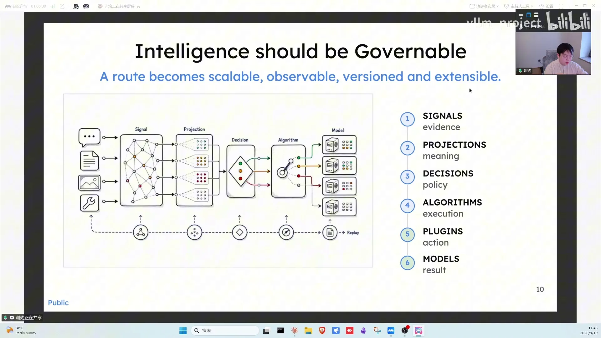 |
| 上次我会跟一个朋友在聊这个话题，我们会展开 Reasoner level 的一些合作。并且有任何东西——不同模型的 KV 是 KV reuse 吗？对，也有一些（工作），有些模型的结构有些限制。包括 LMCache，他们在应该是几年前就写了一个 paper，怎么在模型之间做 reuse。 [【跳转到 36:45】](https://www.bilibili.com/video/BV13Jeh68Eam/?t=2205) |  |
| 然后最近 vLLM 有一个 paper 怎么去做（跨模型 KV reuse），包括我们最近也在写新的 paper：我们怎么去做 reuse、什么需要 cache、什么不需要 cache，还有些限制。但本身我觉得它是一个 optimize agent routing 的一个方向之一，就是我去减少这个 model switch 的代价。 [【跳转到 37:10】](https://www.bilibili.com/video/BV13Jeh68Eam/?t=2230) |  |
| 好，可以等会分享一下相关的一些 paper，我正好研究研究。可以可以。——好，然后我们又见到老生常谈的话题了：Semantic Router 和 NVIDIA 的 Dynamo 有什么区别呀？还有很多人会问 Semantic Router 和 vLLM 的 router 有什么区别。对，刚刚提到这个架构我说—— [【跳转到 37:35】](https://www.bilibili.com/video/BV13Jeh68Eam/?t=2255) |  |
| 其实 Dynamo 或者 vLLM 的 router 或者 vLLM Production Stack——其实本质上他们就是做 inference routing，可以理解为他们是在模型内部去做 routing：比如说它有几个 worker，把它干什么 routing——它不是（选）用什么并行策略、几个 worker 之间怎么去做 routing—— [【跳转到 38:00】](https://www.bilibili.com/video/BV13Jeh68Eam/?t=2280) | 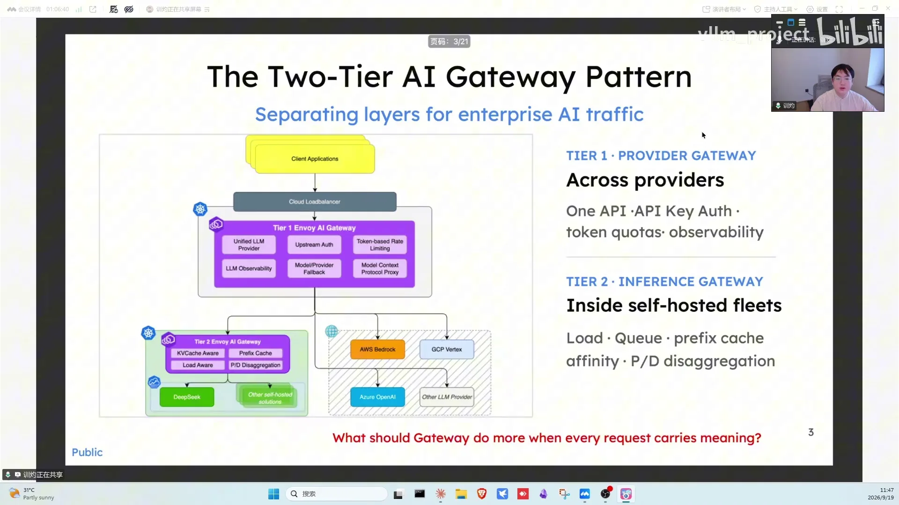 |
| 它做的是怎么去跟推理优化去 work。vLLM 的 router 和 Dynamo 就是做这件事的。那 Semantic Router 更像是在这一层——它做的不是这个事。我只能解释一下说我们在这种模型的上层：因为 Dynamo 它其实本质上 expose 的这个 endpoint 是 model level 的，它是模型内部， [【跳转到 38:25】](https://www.bilibili.com/video/BV13Jeh68Eam/?t=2305) |  |
| 然后我们在上层像是把这种 model level 的 endpoint 去管理起来，但是我们相当于只是为用户去做更智能的选择这件事情。它相当于是一个互补的关系。我觉得是比较清晰的一个架构。——对，我觉得这是个很合理的（架构）。 [【跳转到 38:50】](https://www.bilibili.com/video/BV13Jeh68Eam/?t=2330) |  |
| 然后我们还有同学问：decision stage 里这些用并行信号是怎么融合成最终决策的？这个是这样的：我觉得我们 Semantic Router 有一个比较好的点就是它是一个 interpretable 的 pipeline——它其实是一个可解释、一个 programmable 的， [【跳转到 39:07】](https://www.bilibili.com/video/BV13Jeh68Eam/?t=2347) |  |
| 就是它整个 signal 怎么去变成 decision 的过程可以是人为编写。因为其实 high level 的这种 output——比如刚刚 signal 的一些 output——它其实是比较明确的一些决策的因子。那你其实可以人为的去编排说怎么样去作为一个 decision 的布尔运算， [【跳转到 39:32】](https://www.bilibili.com/video/BV13Jeh68Eam/?t=2372) |  |
| 然后到达某一个模型，这个像人编写的。然后现在的话其实这个 signal 随着 signal 变越多，那怎么我们去编写布尔 logic——它其实就变成一个 agent-driven 的一个 output 了：就是我通过 evaluation、通过我最开始的 workload，然后去不断的去优化这个布尔 strategy， [【跳转到 39:57】](https://www.bilibili.com/video/BV13Jeh68Eam/?t=2397) |  |
| 包括怎么去剪枝、怎么去做并行化、怎么去组合这种表达。现在就变成 agent-driven 这样一个事情。——对，然后又有同学问了：GPT-5 之前是有 auto model 的，但是现在好像 GPT-5 的 auto model 已经用的不太多了？我觉得这个事情后面我可以介绍一下。 [【跳转到 40:22】](https://www.bilibili.com/video/BV13Jeh68Eam/?t=2422) | 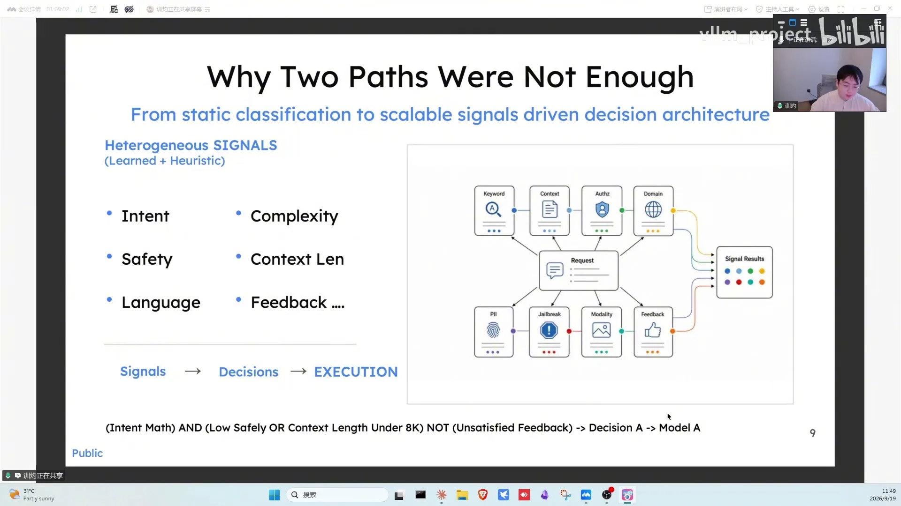 |
| 现在 industry 的发展就是：GPT 它只是把这种 auto 更隐形了。大家玩 codex 是吧——这种比较明确的工作里，比如 coding 的一些偏好，它其实模型相对来说倾向于让用户去选。然后对于像 ChatGPT 这种，其实大部分应用都是 auto 的，默认就是 auto 的。当然还有其他一些偏好， [【跳转到 40:47】](https://www.bilibili.com/video/BV13Jeh68Eam/?t=2447) |  |
| 就是变得更隐形了，让大家更 aware of this。就是一个问题：这个相当于会不会造成多收钱的情况？我觉得这个事情你说多收钱也不至于，但是有可能就是说它赚钱的空间变得更大： [【跳转到 41:12】](https://www.bilibili.com/video/BV13Jeh68Eam/?t=2472) |  |
| 也很合理——用户订阅的价格是不变的，但是它可以通过比如说很简单：可能它服务到 GPT mini 上面，然后跟它做一些查询内的这种简单的任务，它的成本的压缩的空间变得更大了，它利润当然一定程度上就增加了。对吧。然后有同学问：是不是像于这个 decision 后面 [【跳转到 41:37】](https://www.bilibili.com/video/BV13Jeh68Eam/?t=2497) |  |
| 就需要挂一个 vLLM router？我觉得这是一个比较好的 architecture，一个比较好的 reference architecture：就是两个 router 去做 collaborate，各自专注各自的问题。vLLM（router）去做比如说 KV routing，然后它暴露的就是一些 model 的 endpoint，然后 model endpoint 接入到 semantic router 后端的模型里面。 [【跳转到 42:02】](https://www.bilibili.com/video/BV13Jeh68Eam/?t=2522) | 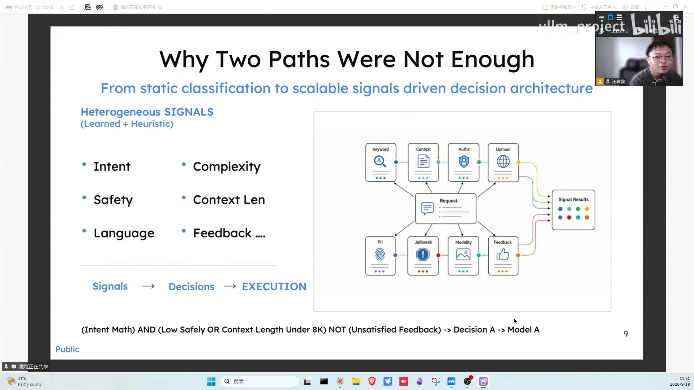 |
| 就是像 vLLM router 关注的是 router 内部的 routing，然后 semantic router 是关注 router（选）model 之间的 routing。——对。其实我就说，因为我们大概在前几期节目的时候专门讲了 K3 的生产级环境部署，然后我当时感觉整个现在 vLLM router 或者 Dynamo 做的一个很大的工作 [【跳转到 42:27】](https://www.bilibili.com/video/BV13Jeh68Eam/?t=2547) |  |
| 反而变成了"附载均衡"了：以前的话我们可能会讲智能路由，因为现在的话整个的 KV——包括 KV 的中心化管理，那么其实我最关心的就是各个设备算力有没有打满，对吧。——是的。而 semantic router 其实就是一个新的调度问题，就是因为这种 workload 比较特别， [【跳转到 42:52】](https://www.bilibili.com/video/BV13Jeh68Eam/?t=2572) | 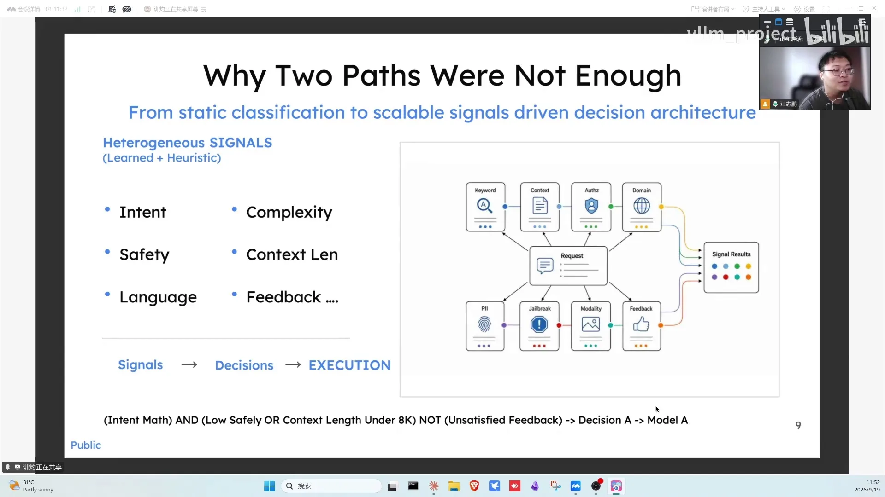 |
| 它的计算的方式和传统的 workload 不一样，它的 load balancing 的 algorithm 需要有很大的变化。以前的 load balancing 非常简单，比如 random、round-robin 之类的一些很简单 round-robin 之类的算法。但现在就不 work 了——主要是算法不 work 在这种 workload 之间。对 semantic router 的话—— [【跳转到 43:17】](https://www.bilibili.com/video/BV13Jeh68Eam/?t=2597) |  |
| 照我看来它更类似于放到（传统架构里的）K8s 这一层。那么以前我们（讲负载均衡）对它这一层是上层更上层，就是可能我们以前这一层的话更关注服务进行（服务本身），但反而 semantic router 它是更关注一些"智能路由"方向的东西。或者换句话来说吧，它关注的是 system level 的问题：就是说你这个 system 怎么去设计你的 model pool，以及你怎么去设计 [【跳转到 43:42】](https://www.bilibili.com/video/BV13Jeh68Eam/?t=2622) |  |
| system 的 design——它其实是一个端到端（N2N）的问题：routing 它和 models 必须的 codesign，包括你和你的 workload 也得去 codesign，之后你这个 system design 会变得非常 elegant，才会达到最终的效果。如果你的 model pool 和你的 routing 不做 alignment，其实这么玩我觉得它就是一个 [【跳转到 44:07】](https://www.bilibili.com/video/BV13Jeh68Eam/?t=2647) |  |
| 需要更多优化的一些事情。就是考虑混入 SR——就是最近我们也在做一些事情的时候，我们也会意识到说：要把这件事情做好，把这种 system build 出来的话，同时要考虑 routing、同时要考虑我的 model pool 该怎么去设计、同时要考虑我的 workload 应该是怎么样的。然后三者在一个端到端的 loop 里面去 [【跳转到 44:32】](https://www.bilibili.com/video/BV13Jeh68Eam/?t=2672) |  |
| 不断的优化，这个系统才会越来越好。它是一个比较复杂的一个系统性问题。因为其实你 model-level 的 inference 做好、包括你 model-work-level 之间做好，不代表说你的 system build 是一个很健康的状态，包括你怎么样去拆分你的任务，比如怎么样去 scanning 你的 request—— [【跳转到 44:57】](https://www.bilibili.com/video/BV13Jeh68Eam/?t=2697) | 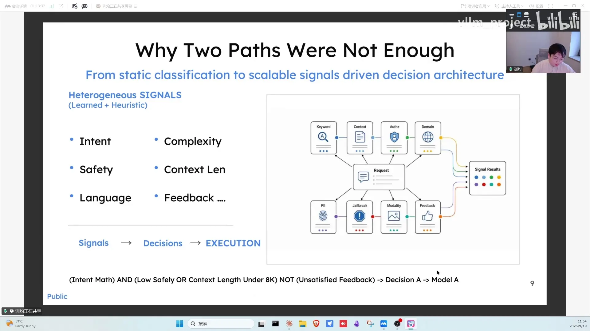 |
| 在 system-level、在模型之上这一层，它其实是个系统性的一个问题。好，然后我们再回来一个问题：刚才 decision 它相当于做了一个决策树吗？还是说它有带一些 probability？它有几种模式：它有一种 priority first， [【跳转到 45:22】](https://www.bilibili.com/video/BV13Jeh68Eam/?t=2722) | 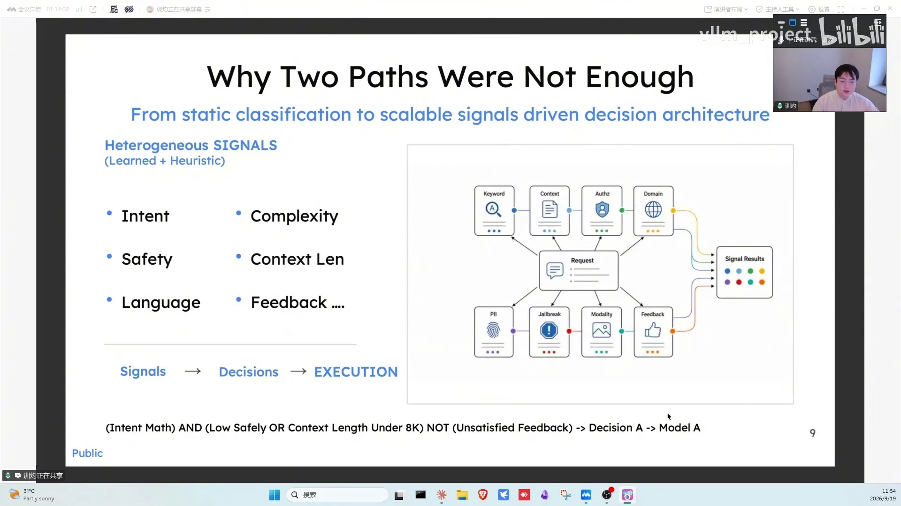 |
| 还有像那种大优先级的这种决策树，但是我们也有比如说 confidence-based：它也可以通过一些 confidence 去做一个选择。所以说它决策的时候也支持不同的这种决策的规则或者选决策的这种规则。 [【跳转到 45:47】](https://www.bilibili.com/video/BV13Jeh68Eam/?t=2747) |  |
| 那我们再回来一个问题：智能路由能力的评估现在充分吗？或者说这个技术成熟吗？——是这样的：我认为这个领域没有非常（成熟）。首先是在 routing 这个或者智能路由这个场景，它其实是有一些 evaluation 的， [【跳转到 46:12】](https://www.bilibili.com/video/BV13Jeh68Eam/?t=2772) |  |
| 有一些 lab 或者说一些 university 都可以做出来：有些小的 benchmark。包括之前和 Rice University 也去合作过，他们提出了 RouterBench。其实我能看到这种 industry 有一些 evaluation 的 benchmark 出来，但是我认为这些 benchmark [【跳转到 46:37】](https://www.bilibili.com/video/BV13Jeh68Eam/?t=2797) |  |
| 有一点怎么说呢——就是各管各的吧。有他专注的是说：你这个 router 如果 deploy 在你的本地的 AI PC，那你 privacy aware 保存得怎么样？比如他去看你这个 router 在他这个 benchmark 里面哪些不应该 serve 的、到 external provider 的一些隐私的 request 出去了、哪些本来可以在本地（处理的） [【跳转到 47:02】](https://www.bilibili.com/video/BV13Jeh68Eam/?t=2822) |  |
| 却被外发出去，类似于这样的一些 benchmark。也有像你 router 在一组 train 好的 model pool 里面——他预先算出来说哪些模型可能处理哪些 query 会更好，然后你的 router 在里面相当于是一个选择器，去看一下哪个更适合这个 query。 [【跳转到 47:27】](https://www.bilibili.com/video/BV13Jeh68Eam/?t=2847) | 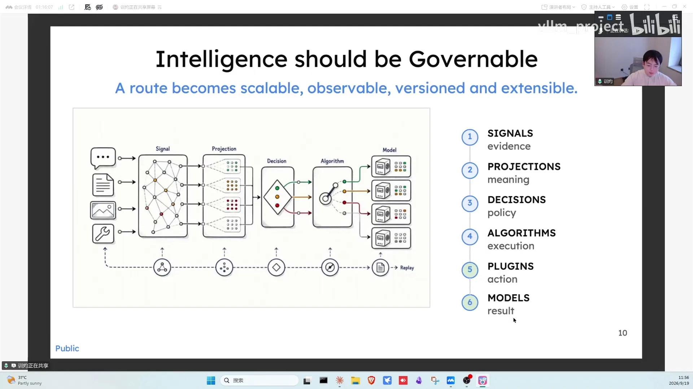 |
| 就是说这个 evaluation 这块我觉得没有非常 unified 的这种（标准）。就是说现在我们也在做一些 evaluation——我们现在也在做 SR 的 evaluation：怎么去把这种混合模型和单模型之间，考虑一些他们模型 capabilities 的指标，也考虑一些 cost 和 latency 的指标， [【跳转到 47:52】](https://www.bilibili.com/video/BV13Jeh68Eam/?t=2872) |  |
| 还有包括我们整个在 agent session 里面哪些 KV 没 reuse、哪些 KV reuse 了之后整体解决任务的一些 cost。所以我们也在做一些比较 unified 的 evaluation 的一个 work。但是我觉得这个事情还需要更多的人来做，因为我觉得 evaluation 这件事情也是比较重要的。 [【跳转到 48:17】](https://www.bilibili.com/video/BV13Jeh68Eam/?t=2897) |  |
| 好，然后就问 semantic router 支持开源贡献吗？——这肯定是支持的呀，哈哈。——对，等会训卓老师应该可以介绍一下我们的 roadmap。——好，那我们不打扰训卓老师继续的分享了。——好，这问题实在太多了。OK，然后其实刚刚讲到这个怎么去把 [【跳转到 48:42】](https://www.bilibili.com/video/BV13Jeh68Eam/?t=2922) | 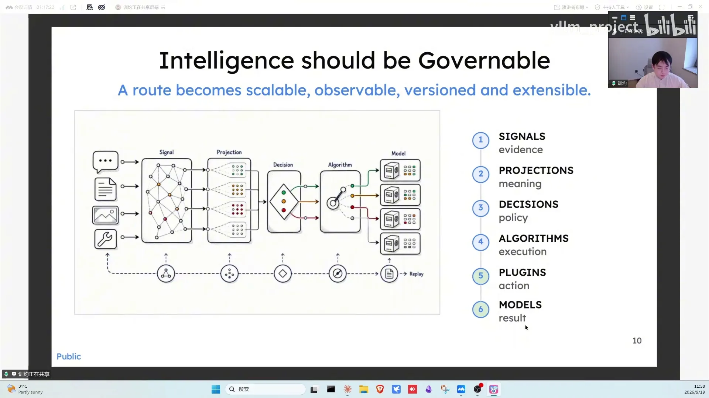 |
| 一个标准的 classification 的问题变成了一个 scalable 的问题。我们其实也做了一些演进：我们最开始的 signal-driven（架构），之后我们变成了一个 multi-stage 的架构。就刚刚提到了，就是说你这种非结构化的数据进入到这个 signal layer 里面，它其实就会得到一些结构化的 output。 [【跳转到 49:07】](https://www.bilibili.com/video/BV13Jeh68Eam/?t=2947) | 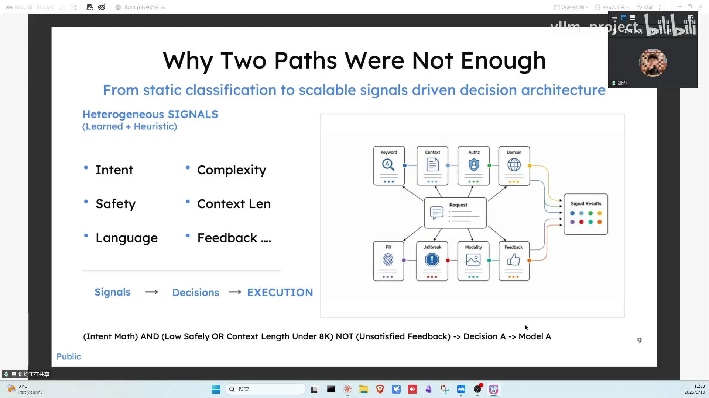 |
| 然后结构化 output 我们会发现随着 signal 变多，这个 output 也会变多。然后 output 其实有些 output 的它可能更重要——在决策里面更重要，它要分成高的权重。但以前我们的 signal layer 它没办法表达这种事情。我们 projection layer 相当于是把更高维度的一些 output 的这种结果 [【跳转到 49:32】](https://www.bilibili.com/video/BV13Jeh68Eam/?t=2972) | 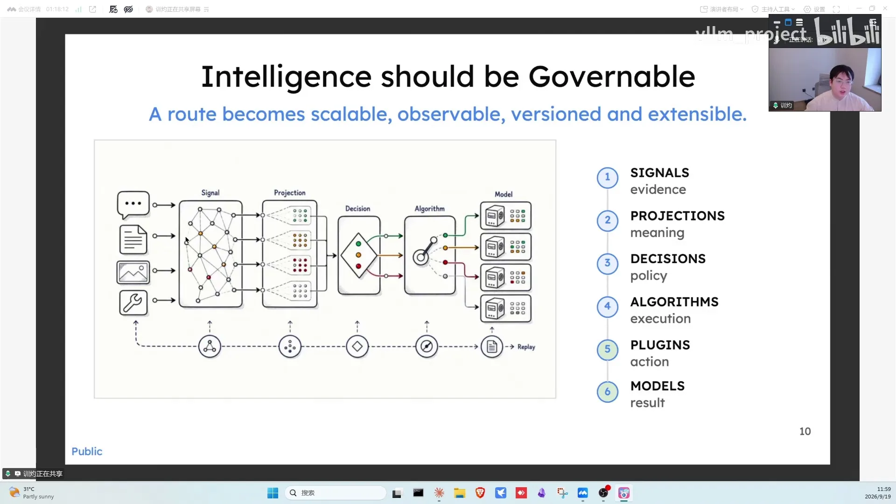 |
| 做了一轮压缩，把它压缩到一个低维度的一些决策的因子。然后这因子再输入到 decision——这种因子可以用一些权重去区分这个 signal 的 output，然后最终把这种决策因子作为 decision 的一个 input，让 decision 去编排。然后 decision 编排的复杂度也降低了，然后整个 projection layer 也把 signal 的高维的 [【跳转到 49:57】](https://www.bilibili.com/video/BV13Jeh68Eam/?t=2997) | 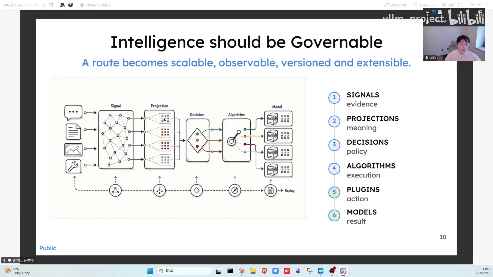 |
| 计算也做了一轮类似于压缩。然后在 decision 之后呢，其实可以看到每个 decision 也挂了多个模型。那多个模型在一个 decision 之后该怎么去 routing？那其实我们就 introduce 这个 algorithm layer。它其实就比较妙：我们认为—— [【跳转到 50:22】](https://www.bilibili.com/video/BV13Jeh68Eam/?t=3022) |  |
| 因为实际上我们看很多 research 相关的任务，其实一开始就从这开始了——algorithm 是什么？在一堆模型里面怎么学？但是我们认为这个事情真正要落地的话，或者在 production 去落地的话，它会有另外一个问题：to use which algorithm， [【跳转到 50:47】](https://www.bilibili.com/video/BV13Jeh68Eam/?t=3047) | 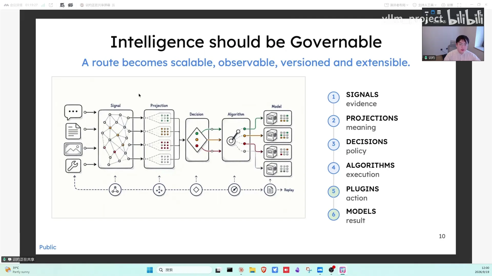 |
| 这样的问题。就是不是每个 algorithm 就适合每一种 workload 的，或者说同样的一个产品它可能有不同的 workload 的特征，那不同的 workload 特征可能会适合不同的 algorithm 的算法。所以其实我们做 adaptization 的这种 layer——前面的一些 stage 其实就是一些 pre-allocate、pre-understand this query，然后再—— [【跳转到 51:12】](https://www.bilibili.com/video/BV13Jeh68Eam/?t=3072) |  |
| 在这个 algorithm 这层就是基于 decision match，应该怎么去选什么样的算法去做（模型的）选择。比如说是 latency first 还是 quality first，后来说一些更 advanced 的一些算法，包括一些 RL-driven 的，包括这里面可以用一些 model collaboration 的算法，就变得更复杂了。那这里面就涉及到 [【跳转到 51:37】](https://www.bilibili.com/video/BV13Jeh68Eam/?t=3097) |  |
| 在什么时候去启用我一些算法。所以我们就 introduce 了 algorithm layer，然后后面才是实际的模型。然后实际上应该还有一个 layer——这个图上应该没画——还有一个 plugin 的 layer，其实也是在 decision 之后、在 decision 和这个 algorithm 之间。然后它做的事情其实是称为说：前半部分知道的是啥，然后这个部分 plugin [【跳转到 52:02】](https://www.bilibili.com/video/BV13Jeh68Eam/?t=3122) | 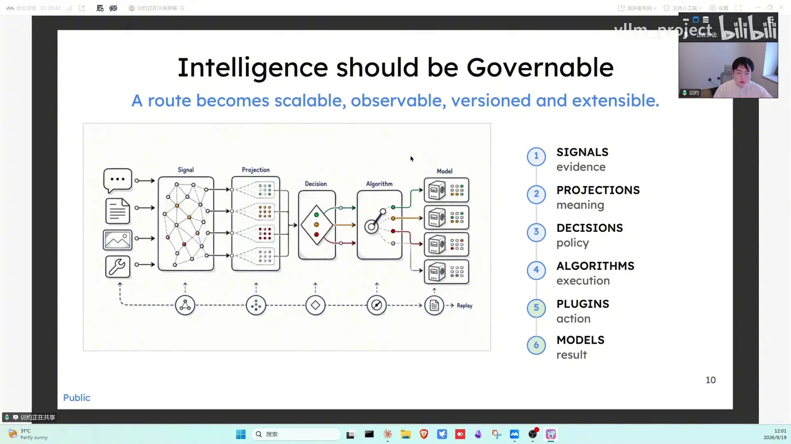 |
| 相应的是做 action。就像前半部分是 react reason，然后 plugin 是一个 action——它是面对你这个 query 实际要做什么事。比如说简单到是一个（危险的）query，其实我可以直接通过一个 block 的 plugin 直接把 request 给拒绝掉；如果我发现说你这个 query [【跳转到 52:27】](https://www.bilibili.com/video/BV13Jeh68Eam/?t=3147) |  |
| 之前的 query 有非常强的一致性或者说相似的关系，我可以启用类似 semantic cache 的 plugin，可以把相似的答案直接 response。然后这个可以后面再展开。就相对说我们 plugin layer 是在请求路径上做了一些执行的操作。对。然后整体 pipeline 其实就是像这个图，然后结合 plugin—— [【跳转到 52:52】](https://www.bilibili.com/video/BV13Jeh68Eam/?t=3172) |  |
| 是一个我们认为可以去描述非常复杂的、不管你是 Reasoner 的一些 work 的架构，都可以去 embrace 到我们这样的一个 architecture。比如说你发现比较好的一个 algorithm，我们可以落地到我们的 algorithm layer；如果你发现比较好的 signal， [【跳转到 53:17】](https://www.bilibili.com/video/BV13Jeh68Eam/?t=3197) |  |
| 我们可以把它落地到 signal layer；如果你发现比较好的一个 tuning 的方式，我们可以 integrate 到我们 agent 的这个 looping。对，它就是比较完整的一个 framework。然后这里的话其实是我们对 SR 的一个理解的一个演进吧。就是在我们看来—— [【跳转到 53:42】](https://www.bilibili.com/video/BV13Jeh68Eam/?t=3222) | 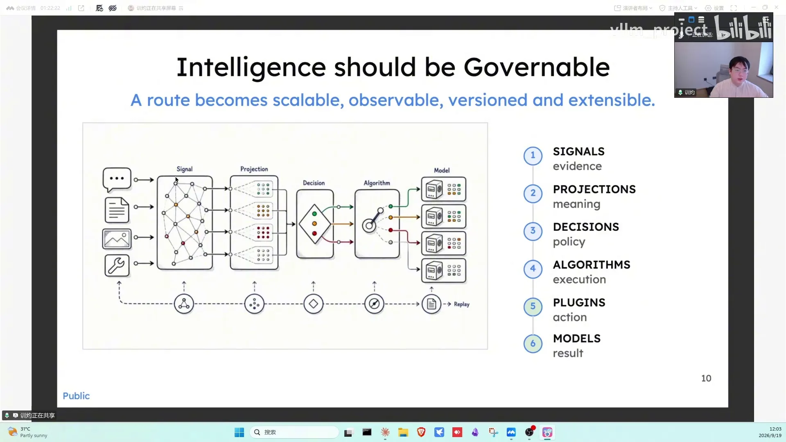 |
| 其实 select 一个模型有点像一个 one-of-N 的（问题）：你一个 query 来了，你选择一堆模型里面它就是选择一个。那 one-of-N 的这种，我们认为它其实只是一种模型选择算法，我们把它叫做 select：模型一堆来了、query 来了，一堆模型怎么去 select one of the best。 [【跳转到 54:07】](https://www.bilibili.com/video/BV13Jeh68Eam/?t=3247) | 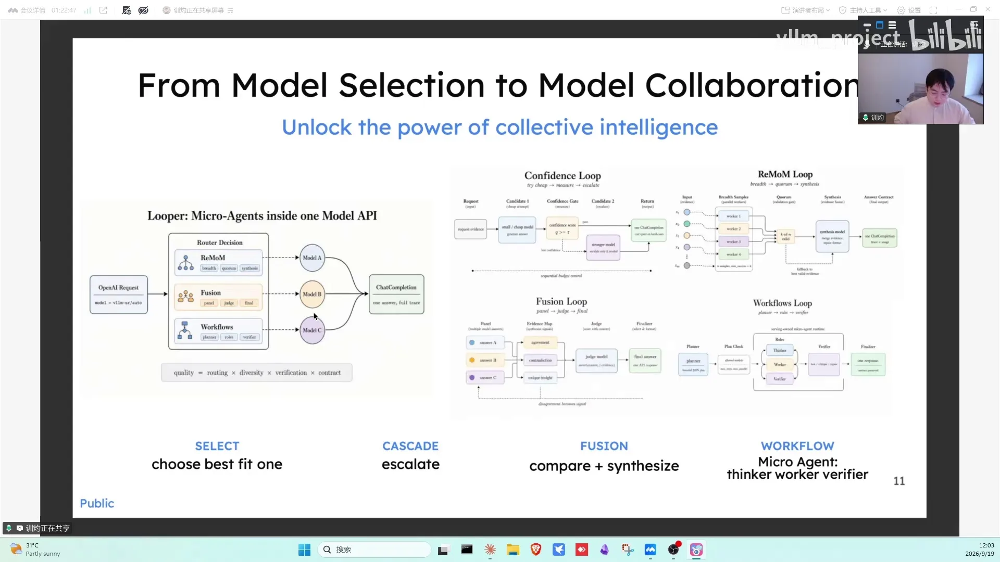 |
| 然后第二个：你 query 来了之后，其实有可能你会 dynamic 出来一些 graph——这是一个 request level 的、real time 的一个算法。比如说除了 select 我们还可以做什么？比如说我们可以做一些 cascade—— [【跳转到 54:32】](https://www.bilibili.com/video/BV13Jeh68Eam/?t=3272) | 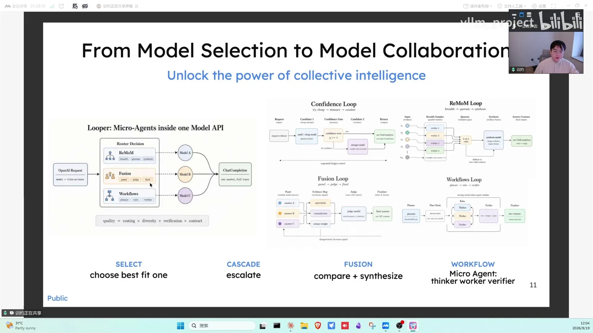 |
| 对对，就像那种我在 routing 里面，我的 decision 后面挂了模型，可能是从便宜到中等、再贵一点这样一个不断升级的模型的 candidates。Query 来之后它就不是做 select，它就是做一个 confidence rule：query 来之后，第一个它尝试的一个小模型，是吧？ [【跳转到 54:57】](https://www.bilibili.com/video/BV13Jeh68Eam/?t=3297) | 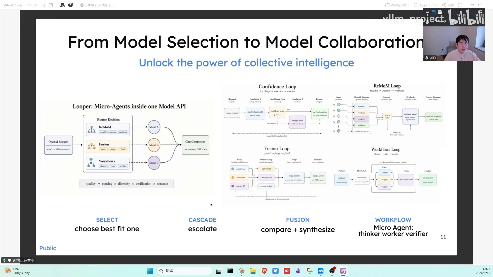 |
| 如果它的 confidence 足够高，就直接 return；如果它 confidence 还不够，那我还会继续的去升级——那些更贵的一些模型，然后逐步去解决这个问题。我们就把 cascade——除了 select 之外，cascade 也是一个比较好的算法。然后还有包括 fusion，是吧？ [【跳转到 55:22】](https://www.bilibili.com/video/BV13Jeh68Eam/?t=3322) |  |
| 同样的一个问题用不同模型去做回答，然后再去做 fuse，然后就能得到——比如包括通过一个 judge model 之后，去看这个 answer 是不是 qualify：如果不 qualify 就继续，如果 qualify 我们就得到一个更好的答案。对，我们可以通过这种 fusion 的语义去 loop 一个 graph，然后去解决一些问题。 [【跳转到 55:47】](https://www.bilibili.com/video/BV13Jeh68Eam/?t=3347) |  |
| 然后包括还有一下我们这次叫 RMoM（音）的，这个算法其实全是 Reasoning of Mixture-of-Models，就是在混合模型里面我们怎么做 reasoning。这个算法就是说我一个 query 来了之后，我有多个 worker model 去做各自的 reasoning，然后再通过一层一层的传递——比如说前一层有 8 个模型去做 reasoning， [【跳转到 56:12】](https://www.bilibili.com/video/BV13Jeh68Eam/?t=3372) | 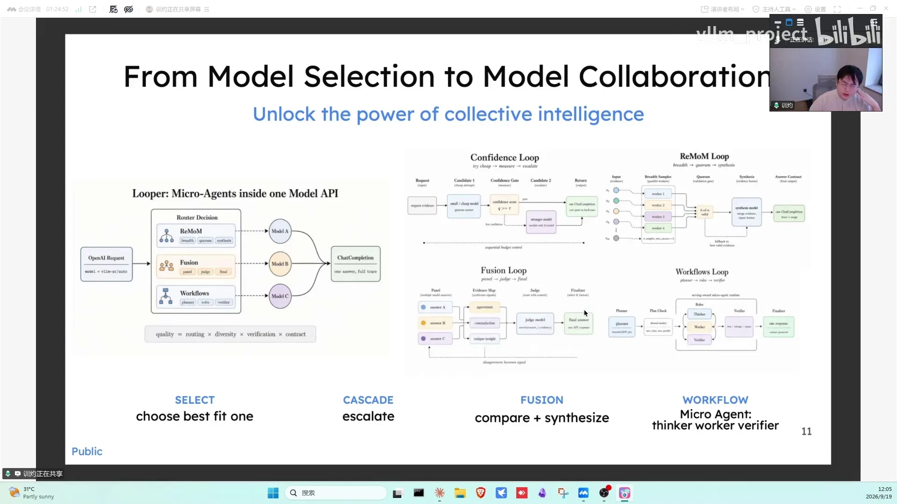 |
| 下层的 4 个模型针对上一轮的 8 个答案，每一个分别得出他认为一个更好的答案；然后再把这 4 个模型（的答案）给到后面的两个模型，要把他的答案去 reasoning 到下一个模型里面，最终得到一个答案，就类似于这样的一个（锦标赛）。还有比如说像我们提到一个 Role-based（音）这样的一个算法： [【跳转到 56:37】](https://www.bilibili.com/video/BV13Jeh68Eam/?t=3397) | 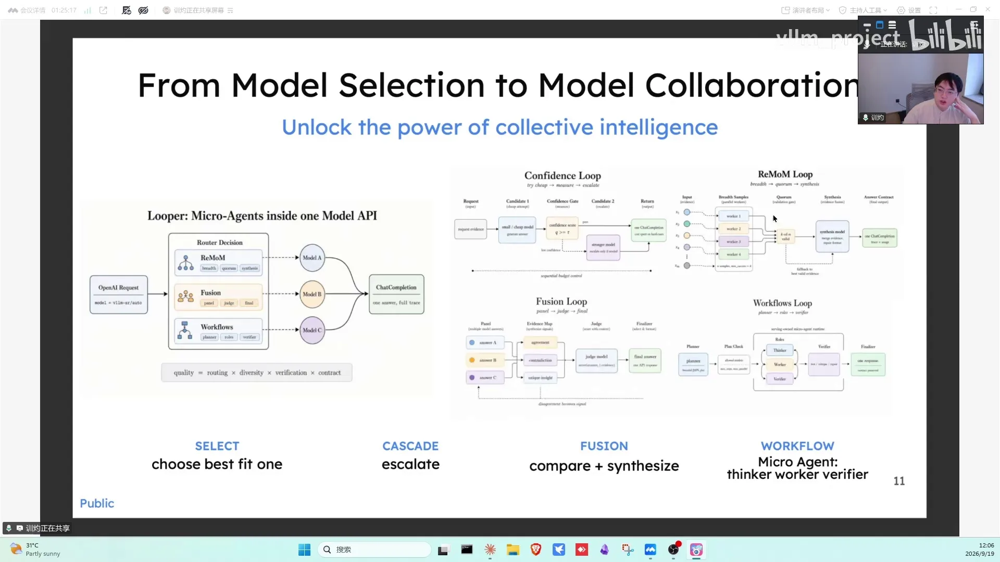 |
| 就是说我把一个 request 的模型去赋予不同的角色，然后有一个 Planner Model。假设有一个 Seeker Model——Seeker Model 它主要就像是面对这样的 query，它就拆解问题，就把这个问题拆给不同的 model 去做 real time inference，然后把这种 role 的结果—— [【跳转到 57:02】](https://www.bilibili.com/video/BV13Jeh68Eam/?t=3422) |  |
| 然后通过一个 Verify 去做一些 value，如果它合格，然后我们就合成一个更好的答案去返回；如果不合格，我们就继续这个 loop。就说这个意思：我们其实发现 model selection 其实它只是一种优化的方式，那怎么去 select、怎么去 collaborate，其实是一个更有趣的问题。 [【跳转到 57:27】](https://www.bilibili.com/video/BV13Jeh68Eam/?t=3447) |  |
| 有点像 agent collaboration，但是它是在我们这个场景里面，它就是一个 real time model collaboration。它通过一些有点像 test-time scaling 的一些算法，去把这种模型的答案变得更好；或者说通过一些更聪明的方法去 cascade——先用便宜的模型去尝试、然后逐渐升级的这样的一些算法。它都可以在我们刚刚提到的这个 algorithm layer 去做实现。 [【跳转到 57:52】](https://www.bilibili.com/video/BV13Jeh68Eam/?t=3472) |  |
| 对，之前我们做了一些实现。 [【跳转到 58:17】](https://www.bilibili.com/video/BV13Jeh68Eam/?t=3497) | 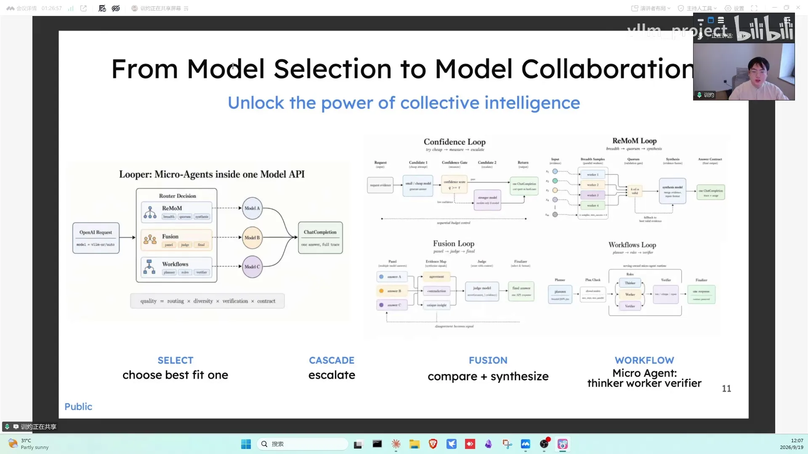 |
| 但是这些实现其实也只做了部分的实现。就是我们通过 vLLM serve 了一组模型——当时记得应该是一个小模型，然后再 mix 了一个更强的模型（音），然后我们通过刚刚提到的 Role Flow（音）算法， [【跳转到 58:22】](https://www.bilibili.com/video/BV13Jeh68Eam/?t=3502) |  |
| 去做了一个 dynamic planning，然后去让一个 request 里面有多个模型去协作， [【跳转到 58:42】](https://www.bilibili.com/video/BV13Jeh68Eam/?t=3522) | 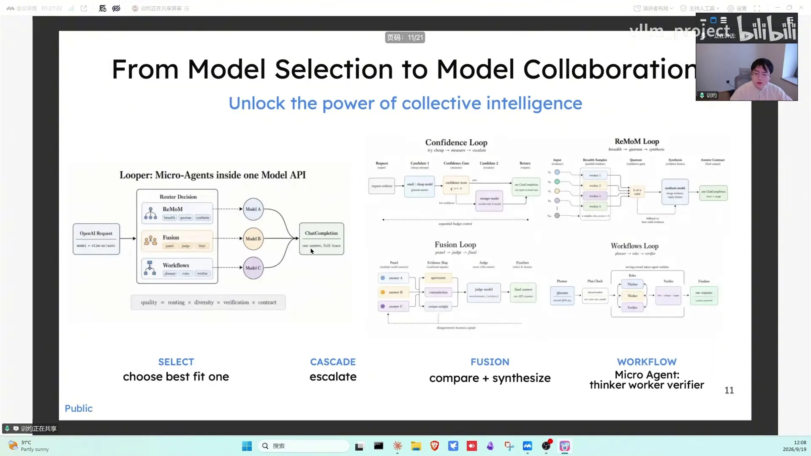 |
| 得到一个更好的答案。当时我们也得到一些比较好成绩。当然这个算法我们也在做进一步的研究，核心的研究方向就是 planner model 是一个很重要的模型：planner 它怎么去做 plan、它怎么通过一些 RL 去训练，去得知说怎么样的 plan 是更好、怎么样的 plan 是更差的， [【跳转到 58:47】](https://www.bilibili.com/video/BV13Jeh68Eam/?t=3527) | 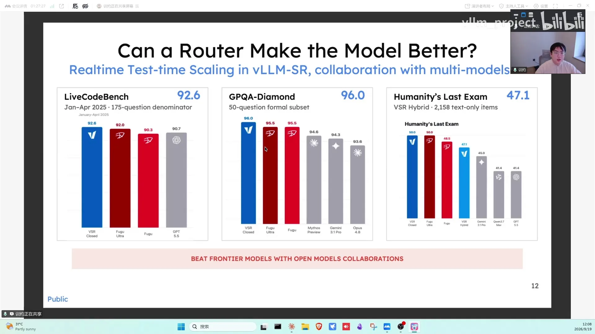 |
| 然后去优化这个成本的空间，然后去控制这个 latency。对，因为 model collaboration 它一定程度上也增加了 latency。 [【跳转到 59:12】](https://www.bilibili.com/video/BV13Jeh68Eam/?t=3552) | 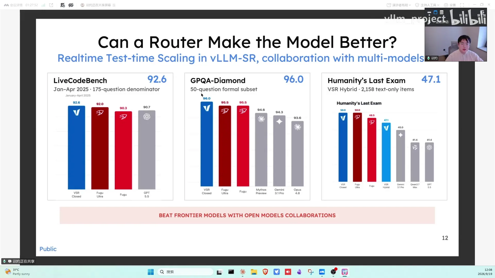 |
| 然后这个的话其实主要是——至少我觉得算是对我们 SR 项目的一个肯定吧。因为说我们开源到现在也得到比较多行业大佬的一些支持。像我们最开始我们发布 white paper 的时候， [【跳转到 59:24】](https://www.bilibili.com/video/BV13Jeh68Eam/?t=3564) | 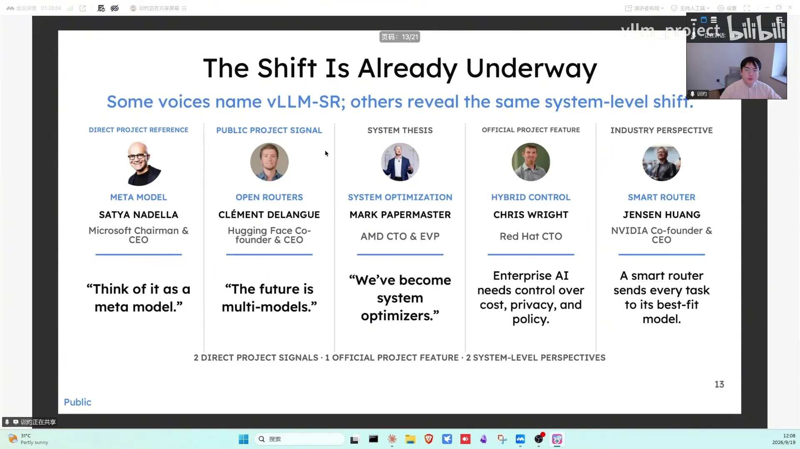 |
| Microsoft 的 CEO Satya（纳德拉）在一个大会上提到了我们的 vLLM Semantic Router——就是说他们其实想做的事情跟 Microsoft 很像：他们认为未来可能我们需要一个 Meta model 这样的一个概念，然后 meta model—— [【跳转到 59:49】](https://www.bilibili.com/video/BV13Jeh68Eam/?t=3589) | 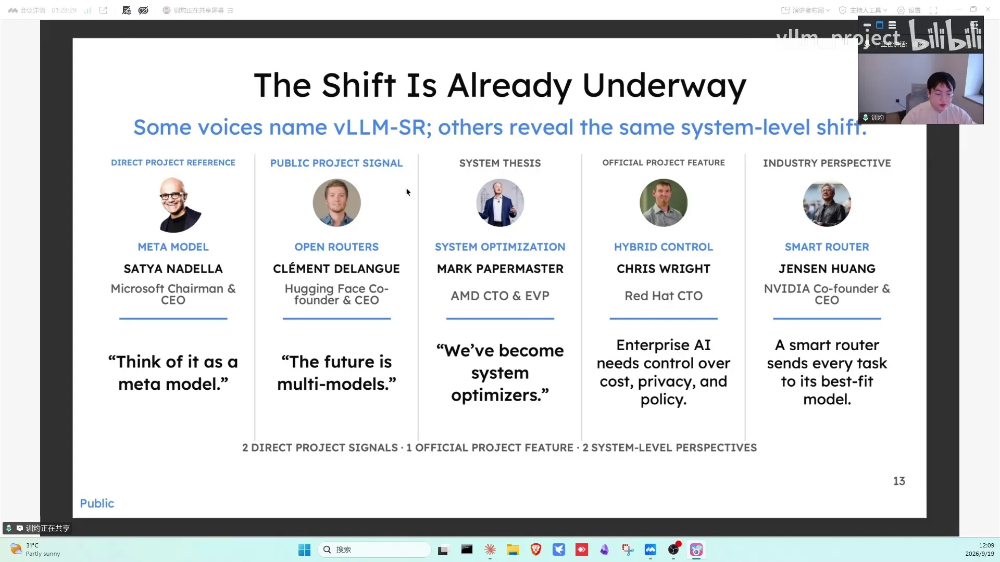 |
| 在后端的不同模型之间去做决策和选择。然后还有我们的项目——包括 HuggingFace CEO（Clem），他之前也在 X 上给我们 follow、recommend，也去推荐大家更多地参与；包括像 AMD 的 CTO，包括 Broadcom（音）的 CTO。当然 Jason 这个事情不是直接 reference 到 model—— [【跳转到 60:14】](https://www.bilibili.com/video/BV13Jeh68Eam/?t=3614) | 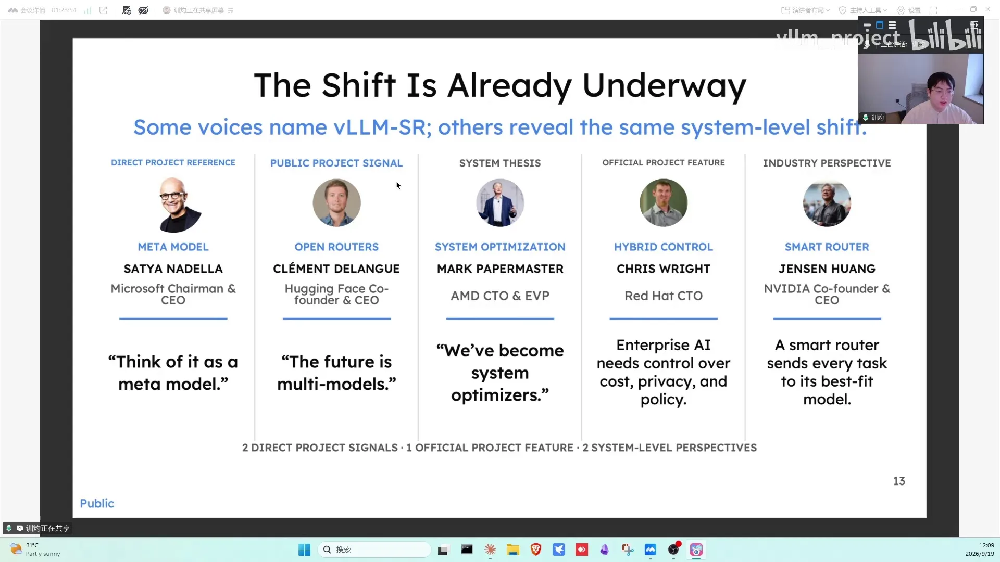 |
| 这个项目他是在一次发布会上把它提到 Semantic Router——当时的场景就是把 Semantic Router 放在一个 DGX Spark 上，然后去 dynamic 地 route 到 local model 和 external model。然后我们也做了一些合作吧。我觉得开源项目的魅力之一就是—— [【跳转到 60:39】](https://www.bilibili.com/video/BV13Jeh68Eam/?t=3639) | 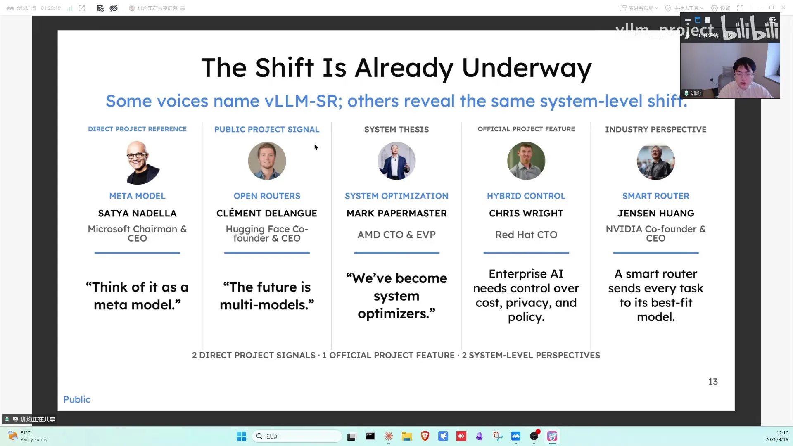 |
| 就是 diversity，对吧。（哎，这回啥？来啊——现场杂音） [【跳转到 61:04】](https://www.bilibili.com/video/BV13Jeh68Eam/?t=3664) | 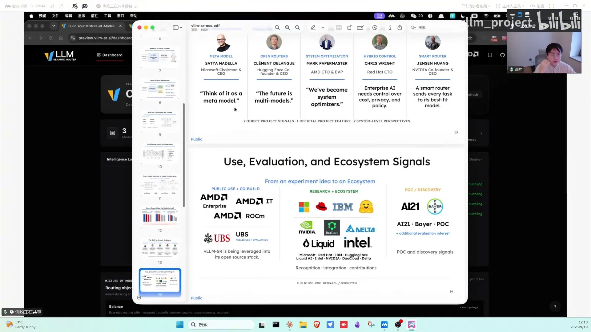 |
| OK，就是在项目发展到现在的话， [【跳转到 61:12】](https://www.bilibili.com/video/BV13Jeh68Eam/?t=3672) | 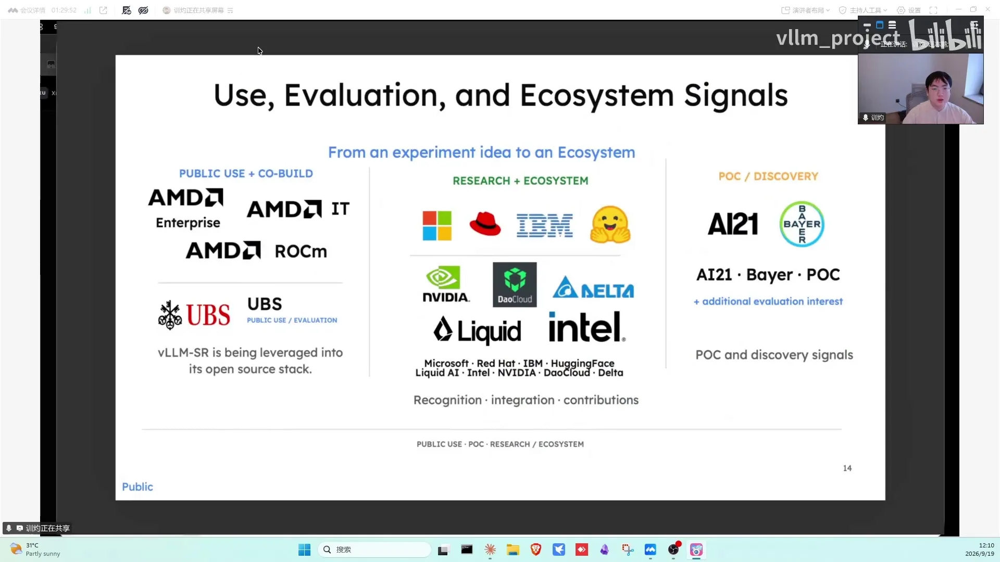 |
| 可能最开始参与到我们项目的 vendor，或者说 company 和 lab 其实比较少，但现在的话就越来越多了，是吧——国内的国外的，然后包括 adopt 的一些 product 也变得越来越多了。然后这里的话，也和一些高校在做合作：我们认为就是 routing 那件事情，它需要一个 industry track 和 academic track [【跳转到 61:17】](https://www.bilibili.com/video/BV13Jeh68Eam/?t=3677) | 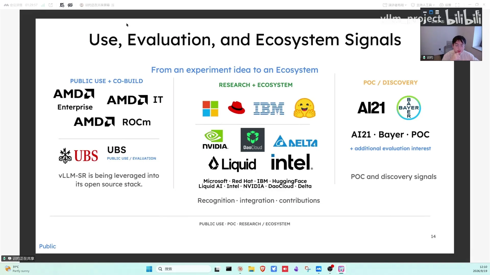 |
| 一个很好的结合：把 research 那些 paper、research 的 idea 很好地去跟着我们架构去做优化、要落地到我们项目里面；然后我们通过项目也能够得到一些真实的反馈，去优化 research 的方向和新的一些 idea。对，然后我们也希望去建立这样的一个 research loop——research 和工程的 loop。 [【跳转到 61:42】](https://www.bilibili.com/video/BV13Jeh68Eam/?t=3702) |  |
| 所以说也非常欢迎：不管是 industry track 的、也接触了一些组织的成员，或者 academic track 比如说一些 labs 或者高校，如果对 routing 比较感兴趣、有些想一起去研究的方向，都可以去做一些合作。对。 [【跳转到 62:07】](https://www.bilibili.com/video/BV13Jeh68Eam/?t=3727) | 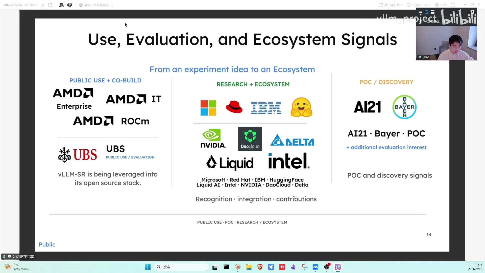 |
| 刚刚是好像有个问题是吧：你今天讲的 GPT-5 的 auto 这些事——那其实从业界的发展来看，我们可以发现尤其是近几个月，intelligent routing 或者 semantic routing 这件事变得越来越火热了，大家也慢慢意识到这个问题。或者说怎么样的—— [【跳转到 62:32】](https://www.bilibili.com/video/BV13Jeh68Eam/?t=3752) |  |
| 参与的不管是 commercial 公司还是开源的项目也变得越来越多了。比如说最近 Cursor 发布了一个 Router，它 Cursor Router 其实就做 intelligent routing 的；然后包括 Kilo 有什么 Auto Model；然后包括 Databricks，他们也发布了 smart routing——在他们应该叫 Unified Gateway 里面发布了这样一个产品去做智能的路由。 [【跳转到 62:57】](https://www.bilibili.com/video/BV13Jeh68Eam/?t=3777) | 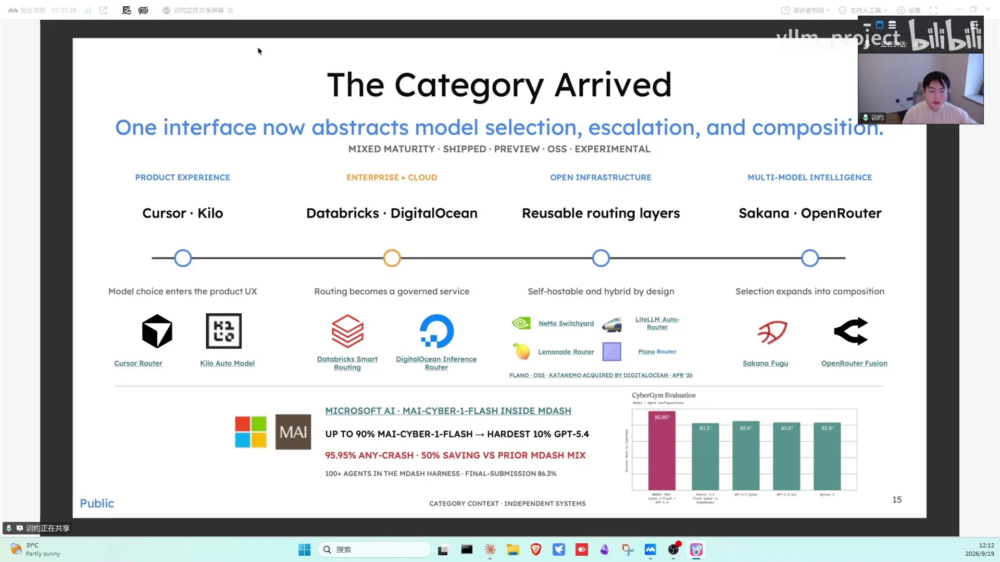 |
| 然后还有包括像（某公司）是吧——它也发布了一个 Inference Router，通过 routing 的一些 semantic 去动态地（分发）到一些 inference model 里面去。然后包括一些开源的产品也越来越多：包括最近 AMD 也发布了他们的 semantic routing 这样的项目，叫 SwitchR。 [【跳转到 63:22】](https://www.bilibili.com/video/BV13Jeh68Eam/?t=3802) |  |
| 然后后面还有比如说像 LlamaIndex 也发布了它的（模型/组件），应该是实现像 auto routing 这样的一些部分的能力吧，然后还有 Panel（音）这样的一些开源产品也越来越多。然后还有一些刚刚提到 model collaboration 这样的方向，在业界也变得越多了—— [【跳转到 63:47】](https://www.bilibili.com/video/BV13Jeh68Eam/?t=3827) |  |
| 其实这里面有几个比较典型的：还有包括像 Microsoft AI 他们提出的这个 MAI（音）这种模型，它其实就是混了它自己训练的模型，然后再结合一个（外部模型）—— [【跳转到 64:12】](https://www.bilibili.com/video/BV13Jeh68Eam/?t=3852) | 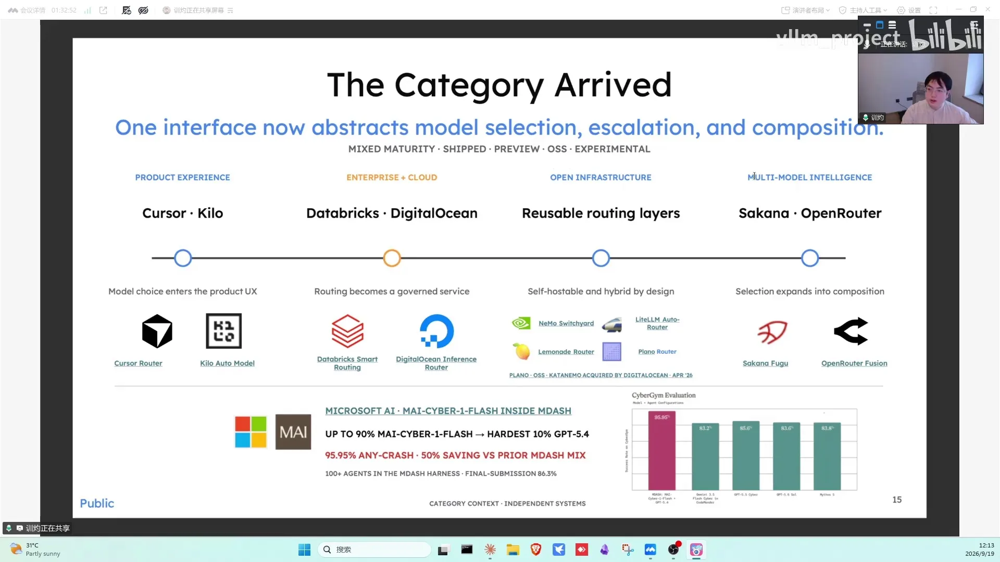 |
| 然后去在几个 benchmark 上去做一（轮评测），最后打了一个 SOTA 的这种水平。 [【跳转到 64:31】](https://www.bilibili.com/video/BV13Jeh68Eam/?t=3871) | 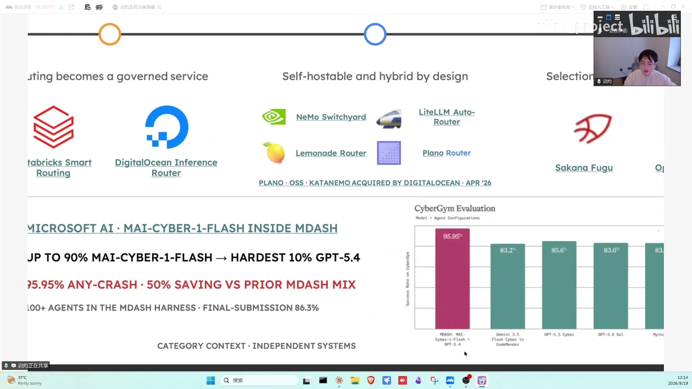 |
| 就是这种混合模型的这种模式也变得越来越多了吧，就是整个业界的关注—— [【跳转到 64:36】](https://www.bilibili.com/video/BV13Jeh68Eam/?t=3876) | 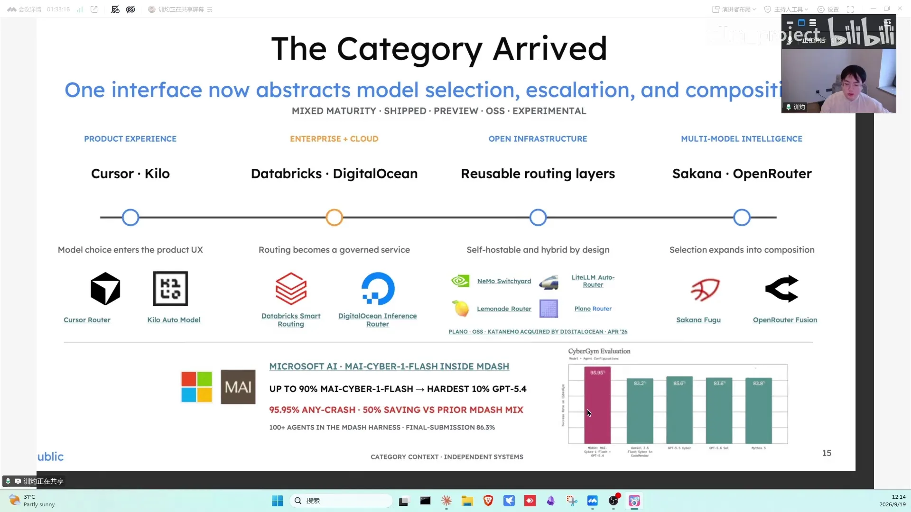 |
| 其实相比我觉得 24 年或者 25 年，我觉得变得越来越重视这个问题了。 [【跳转到 64:46】](https://www.bilibili.com/video/BV13Jeh68Eam/?t=3886) | 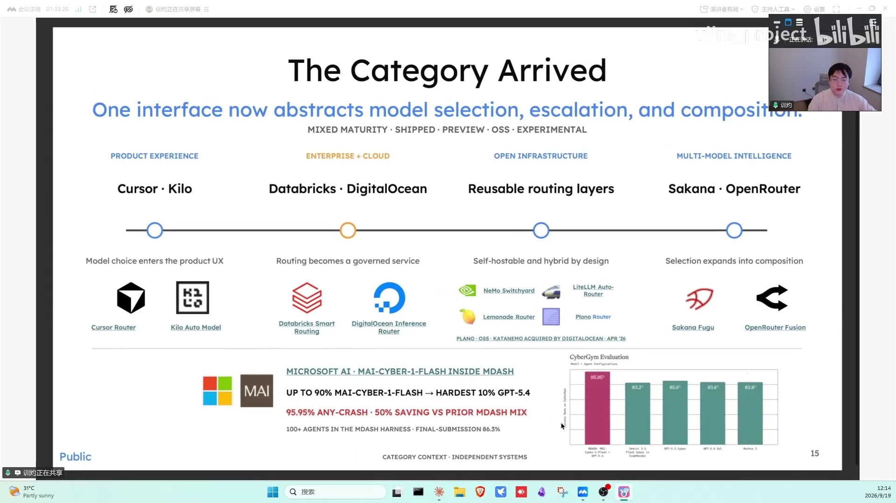 |
| OK，这个应该是刚提到的未来我们的一些方向吧。这个我理解应该是没完全更新的，但是没事，我们大概讲一下。首先我们建立了 working group 就是工作组，然后每个工作组你可以通过自己贡献成为 working group 的 member，你可以通过不断的贡献成为 working group leader。那每个 working group 建立的初衷就是—— [【跳转到 64:56】](https://www.bilibili.com/video/BV13Jeh68Eam/?t=3896) | 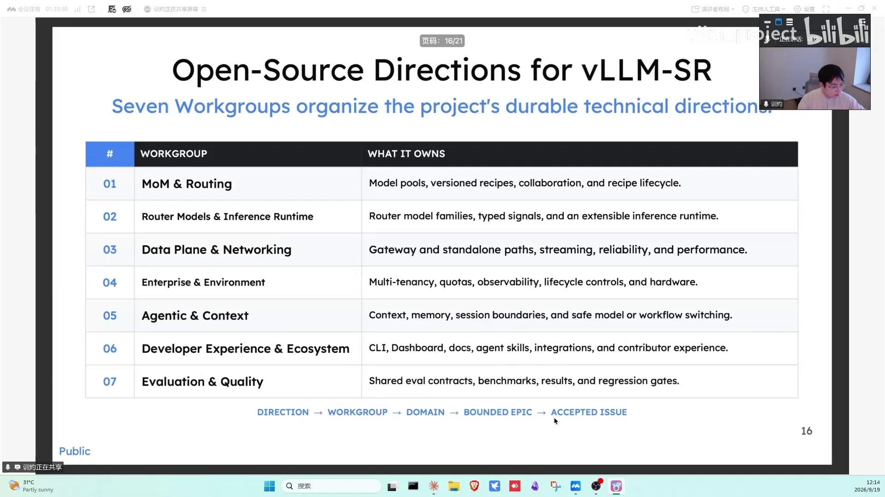 |
| 我觉得就是为了更好让大家去参与。因为其实 SR 它整个 system 有点复杂，还有不同的组件它有不同的技术上的一些要求或者你工程上的要求。所以我们设立了 7 个 working group。第一个 working group 其实就是说 MoM routing：它就做一些—— [【跳转到 65:21】](https://www.bilibili.com/video/BV13Jeh68Eam/?t=3921) | 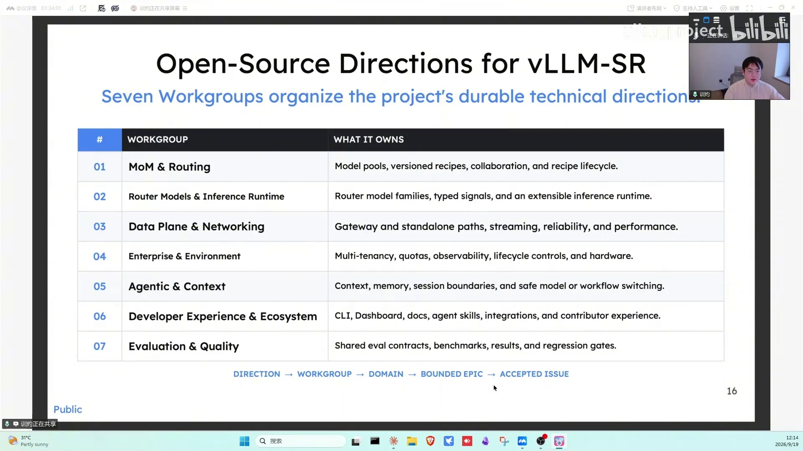 |
| 怎么说，它就做一些 research level 或者说怎么去构建 mixture model 这些事情。它里面涉及到怎么去选择你的 model pool、怎么去构建你的 routing 的算法，然后以及这两个东西。所以这个 working group 主要是做算法的这种问题。第二就是说—— [【跳转到 65:46】](https://www.bilibili.com/video/BV13Jeh68Eam/?t=3946) |  |
| 如果你比较懂 inference，是吧，你比较懂 encoder 或者说 decoder-based model 怎么去做 training、或者是怎么去做一些 RL——那我们这个 working group 主要是做：首先 clarify 一下就是 router model 其实就是说跑在 Semantic Router 内部的模型。那这种模型它有些特质是吧—— [【跳转到 66:11】](https://www.bilibili.com/video/BV13Jeh68Eam/?t=3971) | 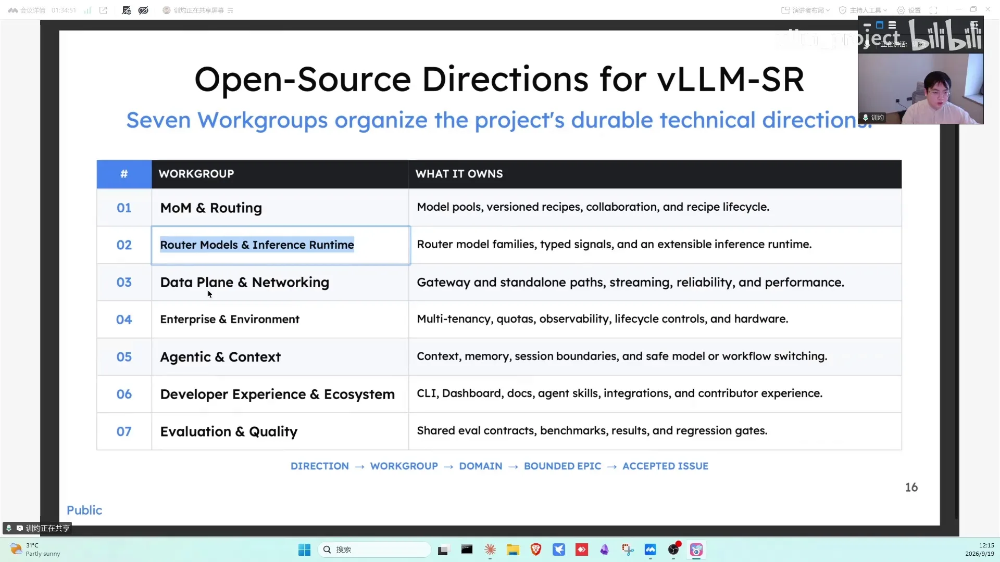 |
| 那这个模型怎么去做优化、怎么去做 inference 优化、怎么去更好地 introduce 新的模型，那这个 working group 就做这件事。那第三个就是 data plane 和 load balancing：就是如果你懂 AI 的外延（网关）的一些东西——比如说你 unified 的这种 [【跳转到 66:36】](https://www.bilibili.com/video/BV13Jeh68Eam/?t=3996) |  |
| 怎么去协议去做转换，或者对这种各种一些 schema 比较了解——比如说 OpenAI Compatible API、Messages 和一些 Response API，你比较了解一些和 routing 和 network 相关的一些技术，你可以参与到这个组。然后第四个是 deployment 和 infra： [【跳转到 67:01】](https://www.bilibili.com/video/BV13Jeh68Eam/?t=4021) | 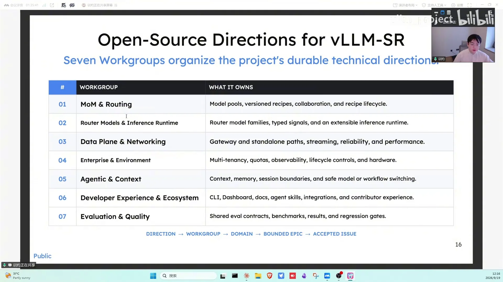 |
| 就是如果你的企业正在想去用 SR，然后有企业的一些要求——包括一些 environment support：不管是 hardware、还有 environment、还有不同的运行环境，比如说 Docker、Kubernetes 这类的，那你在这种情况下 [【跳转到 67:26】](https://www.bilibili.com/video/BV13Jeh68Eam/?t=4046) |  |
| 都可以在这个组里面去做一些事。然后第五个是 agentics——刚刚提到，这个是个比较大的一个问题。Agentics 里面主要两个大问题：一个是怎么去管理 agent（session），以及怎么去 model switch——就是你怎么什么时候 switch、什么时候不去 switch。然后在这种 agentics 的场景里面怎么去做 routing，那你可以在（这个组）里面做一些合作和一些研究， [【跳转到 67:51】](https://www.bilibili.com/video/BV13Jeh68Eam/?t=4071) |  |
| 包括刚刚提到这种 KV reuse、包括 context 怎么去做 compression 和传递、在 model switch 之间做传递之类的，都可以在这个组里面去做。然后第六个是：如果你比较会做 developer experience、你比较在意 UX，你对 UI 也是有比较好的想法， [【跳转到 68:16】](https://www.bilibili.com/video/BV13Jeh68Eam/?t=4096) | 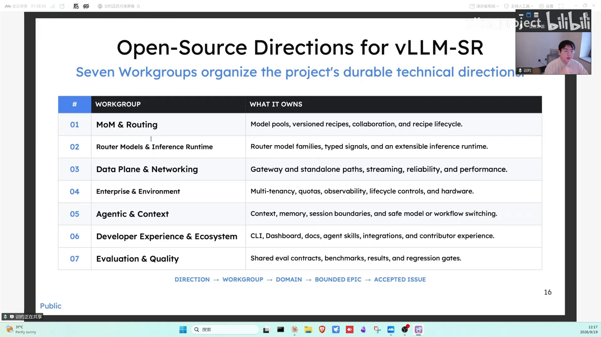 |
| 你可以在这里面去做，包括给（项目做）CLI、dashboard、官网，包括我们 helm charts 这类的，包括一些 materials——比如说你写个 blog 或者怎么样，都非常欢迎。然后第七个是：我们比较在意的是两个比较重要的点，就是你的 quality—— [【跳转到 68:41】](https://www.bilibili.com/video/BV13Jeh68Eam/?t=4121) | 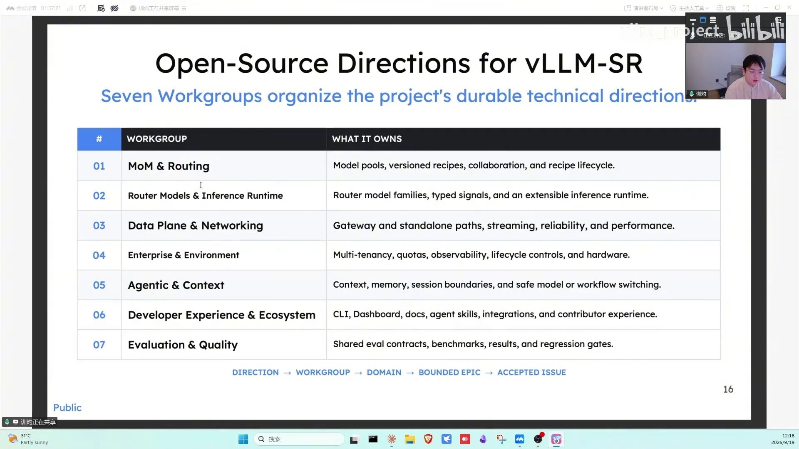 |
| 我们的不管 CI、CD，包括我们 CI 的测试，可以在 quality 这里面去做一些事。当然我也认为 quality 这个事情是比较好去 get started 的一个 task。那第二（第七）个是说我们会做一些 evaluation 的 work：就是我们怎么去 unify evaluation、去做我们自己的 benchmark、做一些 evaluation 的（工作）， [【跳转到 69:06】](https://www.bilibili.com/video/BV13Jeh68Eam/?t=4146) | 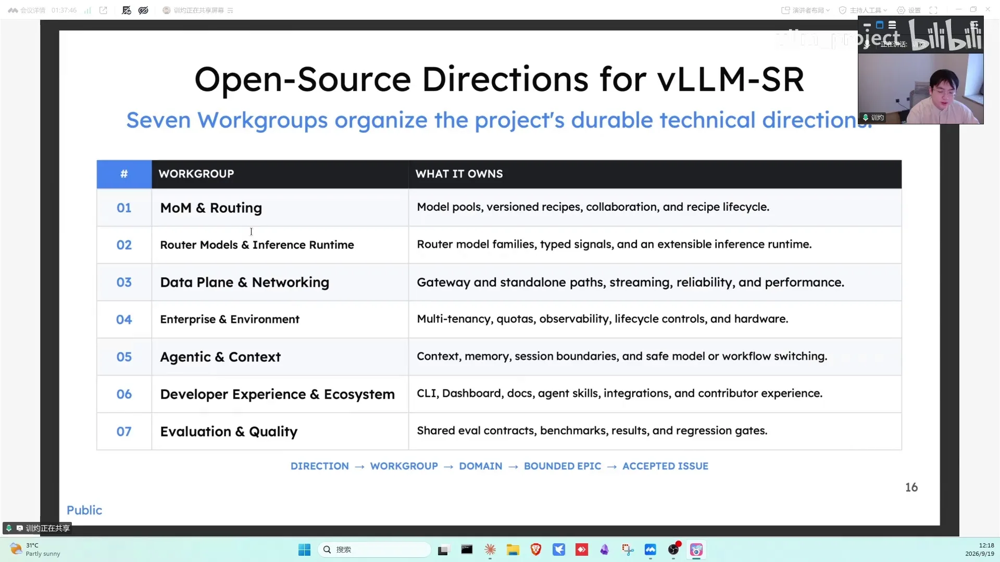 |
| 然后可以在这里面去做一些合作。 [【跳转到 69:31】](https://www.bilibili.com/video/BV13Jeh68Eam/?t=4171) |  |
| OK，然后刚刚其实反复也提到一个概念叫做 Mixture of Modules 或者模型（Mixture of Models）。我们其实提出这个概念也是和另外的概念有点关系：大家可能都知道 Mixture of Experts（MoE）。MoE 和 MoM 其实是我们认为各自解决不同的问题—— [【跳转到 69:36】](https://www.bilibili.com/video/BV13Jeh68Eam/?t=4176) | 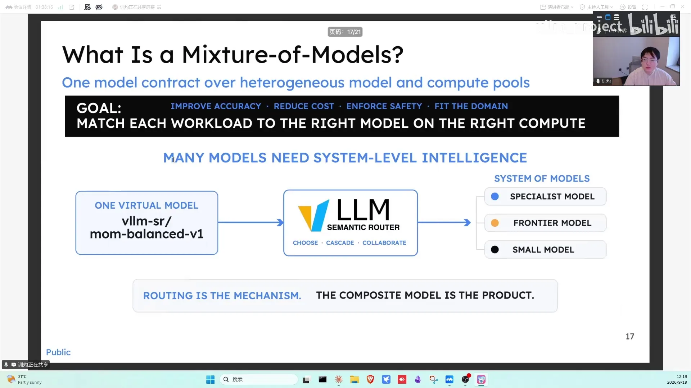 |
| 我们认为 SR 它其实构成的就是这样一个 Mixture of Models。Mixture of Models 它其实就是通过它的目标和明确的处理：我们希望让正确的、合适的 workload 路由到合适的模型、在合适的 hardware 上。它的目标能够去提升 accuracy、降低 cost，或者保证你系统的安全， [【跳转到 70:01】](https://www.bilibili.com/video/BV13Jeh68Eam/?t=4201) |  |
| 或者更合规的 domain。然后 SR 在里面处理的角色就是说：构成 Mixture of Models 需要这样的一个智能的 layer，然后它去 select 或者 cascade 或者 collaborate 这些模型。然后对外呈现的就是这种 unified model——就像说有一个（统一的）model 在这前面，用户用的就是一个（统一）model。 [【跳转到 70:26】](https://www.bilibili.com/video/BV13Jeh68Eam/?t=4226) | 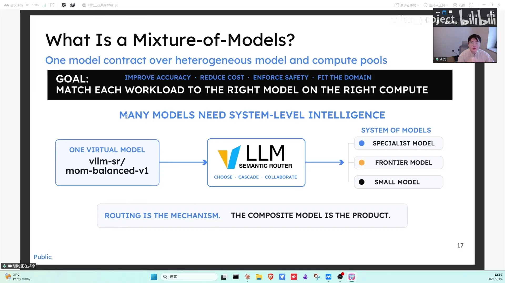 |
| 然后实际上后面是由 routing 加这种 model pool 一并去组成的。 [【跳转到 70:51】](https://www.bilibili.com/video/BV13Jeh68Eam/?t=4251) |  |
| 那这个 MoM 在不同的视角里面可能长得不太一样。比如说在用户视角——其实我觉得现在也没有纯正的用户了，所以说就是一些 agent 的视角。在 agent 的视角来说，它就是一个 model 的 provider 或者说 model 的 API：它需要用的就是把 SR 暴露的（endpoint）作为一个 model provider， [【跳转到 70:59】](https://www.bilibili.com/video/BV13Jeh68Eam/?t=4259) | 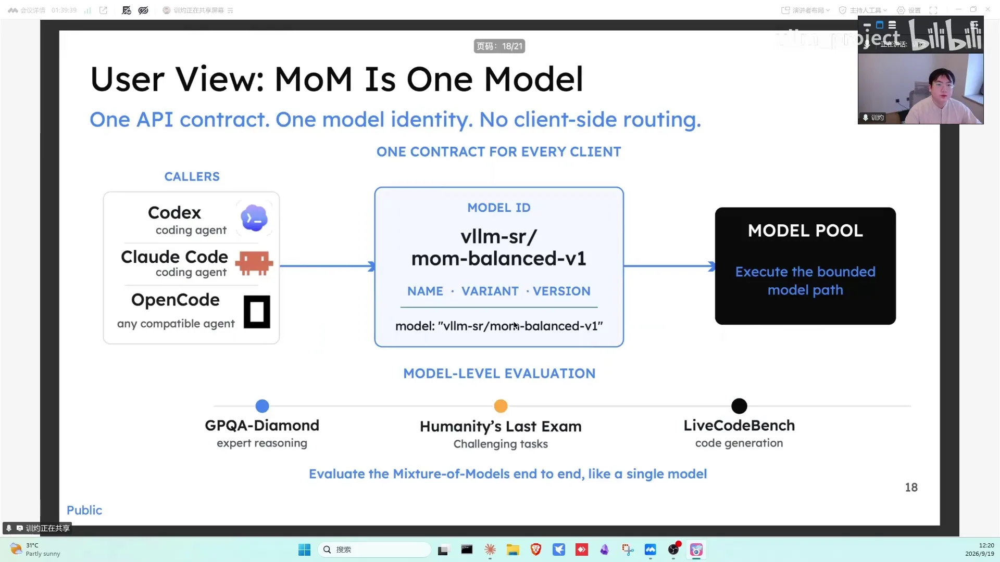 |
| integrate 到它的一些 agent harness，然后就像用模型一样用这个 SR。然后实际上 SR 暴露的就是这些 virtual model 的这些 identity，然后后面就是这个整体的 model pool。那这里其实有引出另外一个问题：如果用你的 mixture model—— [【跳转到 71:24】](https://www.bilibili.com/video/BV13Jeh68Eam/?t=4284) | 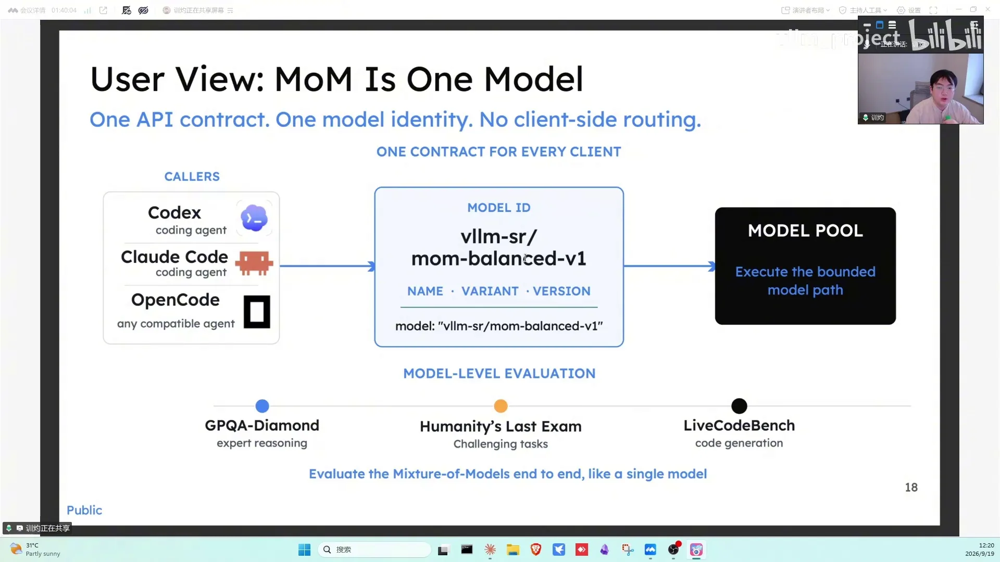 |
| 它的用户体验和单模型没区别。那要让用户更信任你这个模型的话，我们需要像单模型一样去 evaluate 模型：就比如说 single model 在那些 benchmark 上是吧，那我们就按同样的 benchmark 下面我们去看一下说这个 virtual model—— [【跳转到 71:49】](https://www.bilibili.com/video/BV13Jeh68Eam/?t=4309) |  |
| SR 的 virtual model 得到了分数，和 single model 走这些 benchmark 得到分数之间有什么差异——有没有劣化或者说一些 loss，但是又同时观测说我这个 mixture model 给整个系统得到了哪些 benefit：是端到端的 latency 还是一些 cost，是吧。对，那这就是在用户视角或者 agent 视角，model 就是一个 unified model。 [【跳转到 72:14】](https://www.bilibili.com/video/BV13Jeh68Eam/?t=4334) |  |
| 然后在系统的视角来说呢—— [【跳转到 72:39】](https://www.bilibili.com/video/BV13Jeh68Eam/?t=4359) |  |
| 其实 mixture model 其实就是 a set of models，它是一个系统模型，它是有三个部分通过 codesign 然后得到的。那这三个部分——刚刚提到说应该是三个部分：第一个就是这个 workload，第一个就是 workload， [【跳转到 72:44】](https://www.bilibili.com/video/BV13Jeh68Eam/?t=4364) |  |
| 第二个就是你的 routing recipe——就是你的 routing 的算法；第三个就是你的 routing 算法去接到的后端模型。那这三个部分——workload、routing 加 model——都通过 Semantic Router 作为 runtime 去把这些连接在一起，然后去打包成一个 codesign 的这样的一个系统模型。 [【跳转到 73:09】](https://www.bilibili.com/video/BV13Jeh68Eam/?t=4389) | 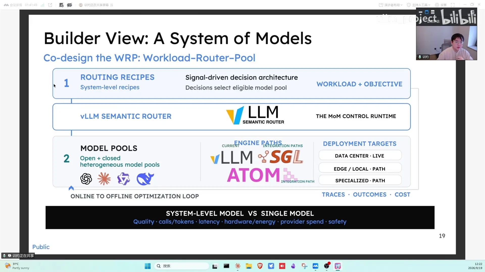 |
| 然后在这个视角里面，在 system 的一个视角里面，我们 eval 很关注的和刚刚提到的就不太一样：更关注你这个系统的一些收益——一个系统在（合规）和成本和一些包括安全上的一些收益就是得到了那些。而且好处这样说：前面那个如同像是一个黑盒的问题， [【跳转到 73:34】](https://www.bilibili.com/video/BV13Jeh68Eam/?t=4414) |  |
| 一个 black box 用起来它用的 experiment 就非常的简单。对系统来说它其实是一个 white box， [【跳转到 73:56】](https://www.bilibili.com/video/BV13Jeh68Eam/?t=4436) |  |
| 它需要去解决的、或者说去 eval 的一些 metrics 会更加的系统化。对，就是两个去看 mixture model 的一个视角。 [【跳转到 74:04】](https://www.bilibili.com/video/BV13Jeh68Eam/?t=4444) |  |
| 然后这里其实想给大家聊一下 mixture model 的一些 scenario。mixture model 刚刚提到它是有：首先它核心是 semantic router，然后它又是 routing 和 model pool 组成的。那 mixture model 部署在什么地方，其实就映射了不同的用户场景。 [【跳转到 74:17】](https://www.bilibili.com/video/BV13Jeh68Eam/?t=4457) |  |
| 比如说如果我把我的 mixture model 这个 router 部署在 edge、部署在我的端侧上，那其实它就是有点像那种包括 personal agent 的场景。那它解决的是什么问题呢？就是本地它可能有更好安全性、更有更好的一致性（隐私性），那你的 external provider 呢，它有更好的、更大一个 scale， [【跳转到 74:42】](https://www.bilibili.com/video/BV13Jeh68Eam/?t=4482) | 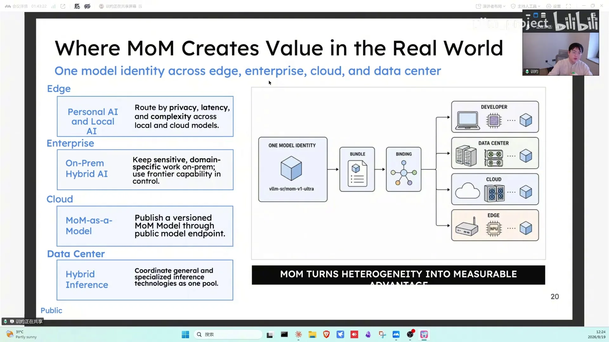 |
| 它有更强的能力。那你的 router 它连接到后边的模型——就你组成 mixture model 的 model pool 一部分就在本地、一部分就在 external——那 router 它就可以根据你的需求：比如说你认为这种 privacy 的 query 不能到外部，是吗？你就可以通过 SR 的智能决策说你哪些 query 留在本地， [【跳转到 75:07】](https://www.bilibili.com/video/BV13Jeh68Eam/?t=4507) |  |
| 哪些发到 external provider。包括如果你认为 privacy 你觉得无所谓、你更在意 cost——当然这两个可以去做 combining：你可以把简单的一些任务留在本地，把复杂的 query 通过 SR 去 forward 到 cloud model。 [【跳转到 75:32】](https://www.bilibili.com/video/BV13Jeh68Eam/?t=4532) |  |
| 对，就是 MoM 的一个场景——它可以不在端侧。然后第二个就是说它有一个更大的一个 deployment：就是说不是在 on-prem 的一个 GPU fleet 里面——就是说你企业。企业现在都遇到一个比较尴尬的问题：首先每个企业的 GPU 都不太够，是吧，你每个企业的 GPU 不太够， [【跳转到 75:57】](https://www.bilibili.com/video/BV13Jeh68Eam/?t=4557) |  |
| 那你一定程度上要采购一些外部的模型供应商，但是你又不希望你企业的一些 domain-specific knowledge 被泄漏到外部，包括一些 sensitive 的 messages 更不能让它泄漏到外部。那你就可以把这个 SR 放在中间，中间 connect 到一些 on-prem GPU models 和 cloud models。 [【跳转到 76:22】](https://www.bilibili.com/video/BV13Jeh68Eam/?t=4582) |  |
| 那你可以去做到：比如说你企业里面有一些合规化或者一些企业内部的各种要求，你把这种 query 留在本地，一些比较宽松的 query 可以发到 cloud 里面去。这些所有都是 programmable 的，可以在 SR 之上跟你的企业去做 tooling。 [【跳转到 76:47】](https://www.bilibili.com/video/BV13Jeh68Eam/?t=4607) |  |
| 刚提到整个 routing recipe 是可以 tooling 的。第三个说可能是一种新的产品形态：就是你是做 cloud 的、你是卖 token 的，是吧？你可以把 mixture model 作为一个 model 去包装，然后去做 sell——去构成一个混合模型，然后去作为一个 unified model 去暴露到模型的 API 里面， [【跳转到 77:12】](https://www.bilibili.com/video/BV13Jeh68Eam/?t=4632) |  |
| 然后让本地的 agent framework 去调用的 mixture model 作为一个模型去使用。它也是一种在 cloud 上做的 programmable，它这里面其实也存在比较大一个 business value。然后最后一个说：尤其是对 hardware 的公司来说可能比较重——它有数据中心，它有不同的 chips， [【跳转到 77:37】](https://www.bilibili.com/video/BV13Jeh68Eam/?t=4657) | 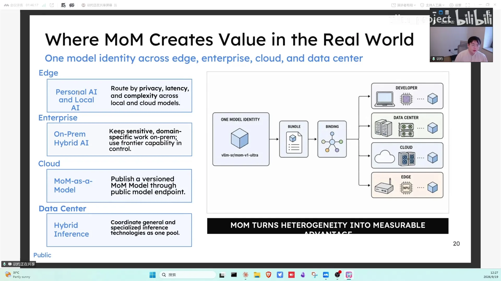 |
| 它有新卡、老卡，甚至有 specialized 的卡。比如说加拿大有个公司叫 Tenstorrent（音），就是它把 model 直接做到 chip 上——把模型考虑到 hardware 上。这种有些好处也有坏处：比如说它的模型有版本变化，它可能要去 follow；然后还好它有非常极致的—— [【跳转到 78:02】](https://www.bilibili.com/video/BV13Jeh68Eam/?t=4682) |  |
| 这种推理的 latency 的表现。其实这里提到 SR 可以作为这种不同 hardware 之间的这样的一个 routing 的一个、或者说一个 orchestrator：就是把你这个 query 放到适合的 hardware 上。比如说你比较确定的一些—— [【跳转到 78:27】](https://www.bilibili.com/video/BV13Jeh68Eam/?t=4707) |  |
| 比如说简单（常规）的一些 query，你可以把它放到 specialized 的一些 inference hardware 上；一些比较困难的 query，你可以把它 forward 到这种通用的卡里面——比如说通用的 GPU 或者通用的 model。这样的话可以做到这种 hardware routing，或者说 energy routing 也行。 [【跳转到 78:52】](https://www.bilibili.com/video/BV13Jeh68Eam/?t=4732) |  |
| 就是说可以根据你数据中心的一些指标或者说一些情况，然后去做这种智能的选择和路由。对对对。 [【跳转到 79:17】](https://www.bilibili.com/video/BV13Jeh68Eam/?t=4757) | 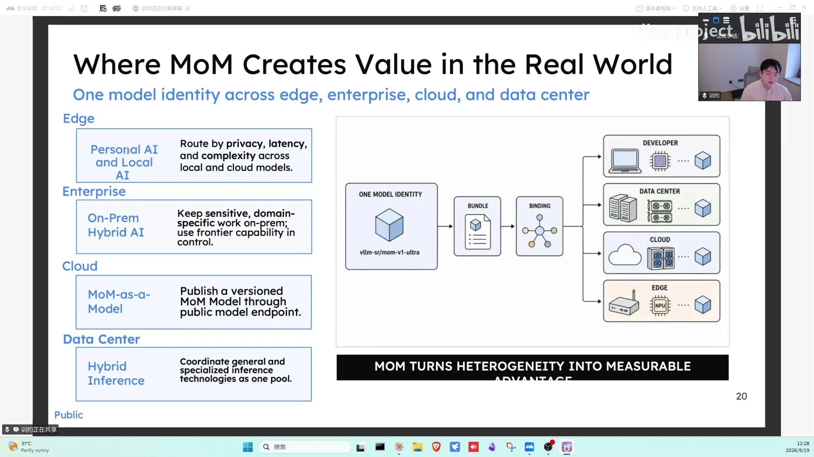 |
| 时间差不多了，最后的就是也讲不完，不过也没有非常 deep dive 一些 details，但是主要是给大家过了一下这个项目它的 motivation、它的一些发展，还有一些未来的一些方向。然后也欢迎大家去对我们这个项目做一些更多的合作，用更多人加入的形态。对。 [【跳转到 79:30】](https://www.bilibili.com/video/BV13Jeh68Eam/?t=4770) |  |
| 非常感谢训卓老师的分享。那我们再回答一下直播间的几个问题，作为我们今天直播的收尾。好，有同学问：任务数据集和人类偏好区别是很大的，感觉这些评分和实际的体验会有 gap——我看任务数据集和人类偏好区别很大。 [【跳转到 79:55】](https://www.bilibili.com/video/BV13Jeh68Eam/?t=4795) | 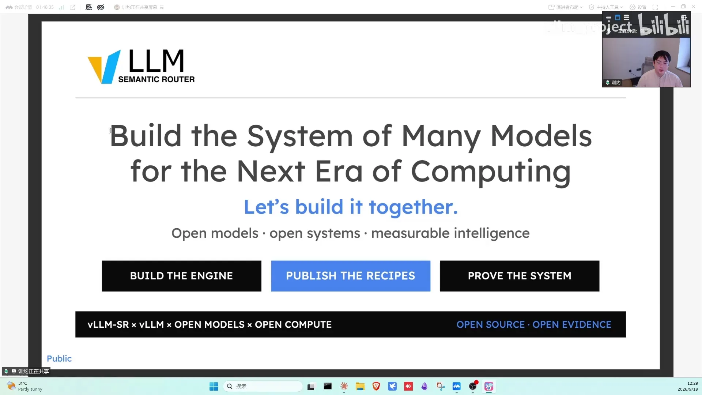 |
| 对。所以实际上这里还是回到那个问题：这里我们需要设计符合我们这个智能路由或者说这个 mixture model 的 evaluation，它可能评测的标准可能和单模型不太一样。但是刚刚我提到单模型的 eval——只是说你如果要把这种作为一个 unified model 去 publish 或者说去 sell， [【跳转到 80:20】](https://www.bilibili.com/video/BV13Jeh68Eam/?t=4820) | 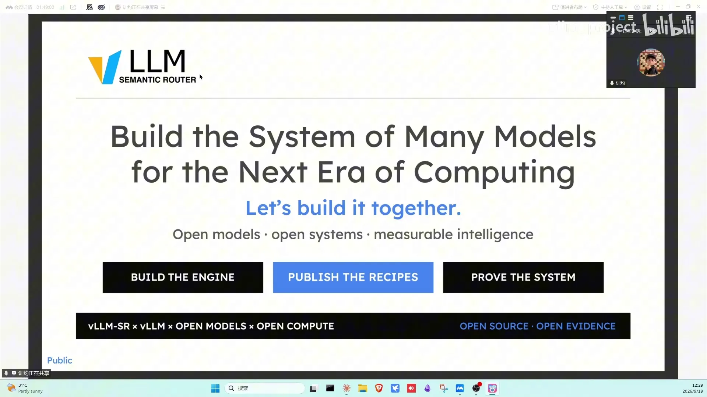 |
| 是吧，你需要去证明你跟其他模型之间有没有差异。但是如果你真的要把它作为一个 production（线上服务）这样的一个模型的话，那你评测的标准可能就（不一样）了。——然后还有同学问：有没有可能会有一个数据评估策略的自我迭代的飞轮？这个当然是一个非常好的一个方向， [【跳转到 80:45】](https://www.bilibili.com/video/BV13Jeh68Eam/?t=4845) | 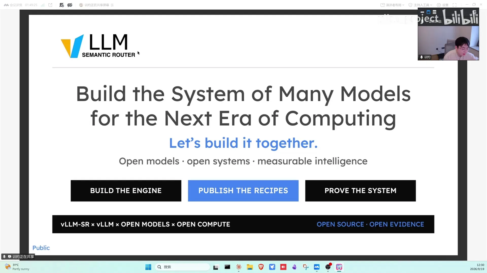 |
| 而且我觉得是一个——怎么说呢，system 需要做的事吧。举个例子吧：我觉得我们这个系统要变得越来越好，那肯定是需要不断的 online 和 offline 去做迭代的。就是你通过 online 的 data 和 result 去 tuning，在 offline 里面去做 tuning 和做优化， [【跳转到 81:10】](https://www.bilibili.com/video/BV13Jeh68Eam/?t=4870) | 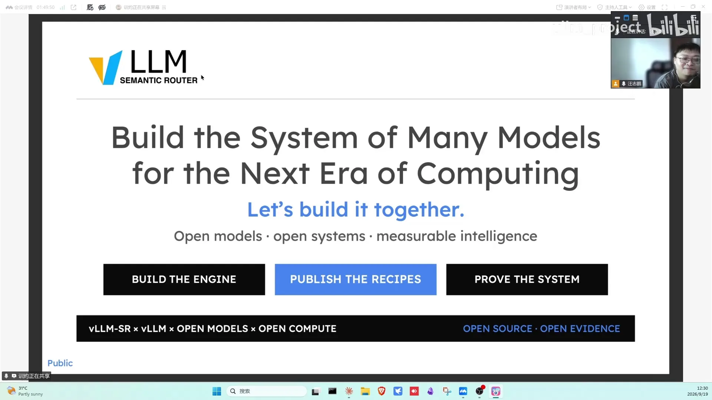 |
| 然后去看一下 online 怎么去优化。所以它实际上类似于像一个数据的 flywheel，好像一个数据飞轮。然后这个 flywheel 不仅可以优化你的 routing 的算法，也可以优化你后边的模型，然后也可以优化你整个的这样的一个 system 的一个设计。——我感觉这个背后思路其实跟 RSI（自我改进）很像的对吧。 [【跳转到 81:35】](https://www.bilibili.com/video/BV13Jeh68Eam/?t=4895) | 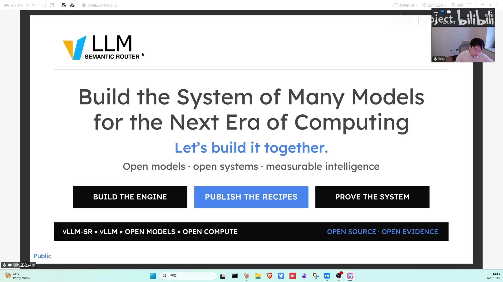 |
| 对，它实际上还是需要数据驱动去做迭代的，因为它不是一个 one shot 的事情，它是需要去不断迭代的。对。然后还有同学吐槽说：评估的话感觉会很（费劲）。这个看怎么评估吧，就是有些 evaluation 的话只是个参考也挺正常， [【跳转到 82:00】](https://www.bilibili.com/video/BV13Jeh68Eam/?t=4920) | 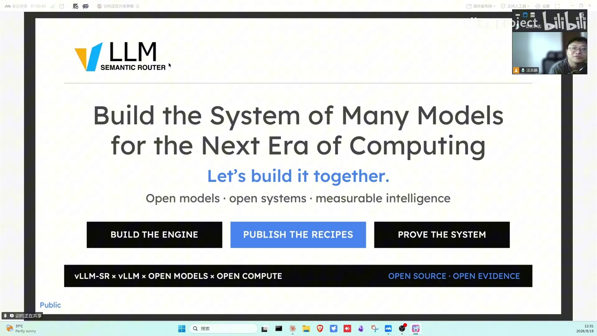 |
| 很正常，对，这个只是很正常。对，这个我觉得真的是需要有像 AMD 这样的大公司来去 sponsor，要不然的话个人去做所有的（评测）加 model 的东西其实都很困难，对吧。——是的。我们现在做的一个事情就是我们也希望去开放一些比较好的 routing 的 recipe， [【跳转到 82:25】](https://www.bilibili.com/video/BV13Jeh68Eam/?t=4945) |  |
| 就是 routing 的 recipe。我可以加载一下，我等一下—— [【跳转到 82:50】](https://www.bilibili.com/video/BV13Jeh68Eam/?t=4970) |  |
| 可以分享一下这个 GitHub 上面的 roadmap 这些东西。哦，好嘞好嘞，对，我刚想分享一下。 [【跳转到 82:56】](https://www.bilibili.com/video/BV13Jeh68Eam/?t=4976) | 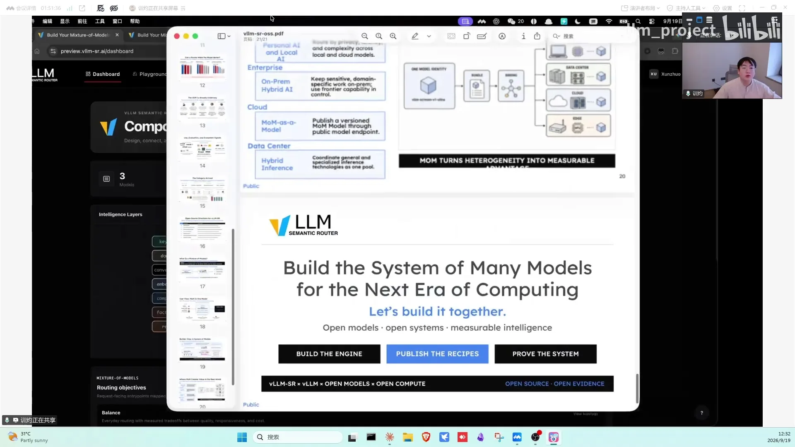 |
| 哦，好，好，想想。 [【跳转到 83:01】](https://www.bilibili.com/video/BV13Jeh68Eam/?t=4981) | 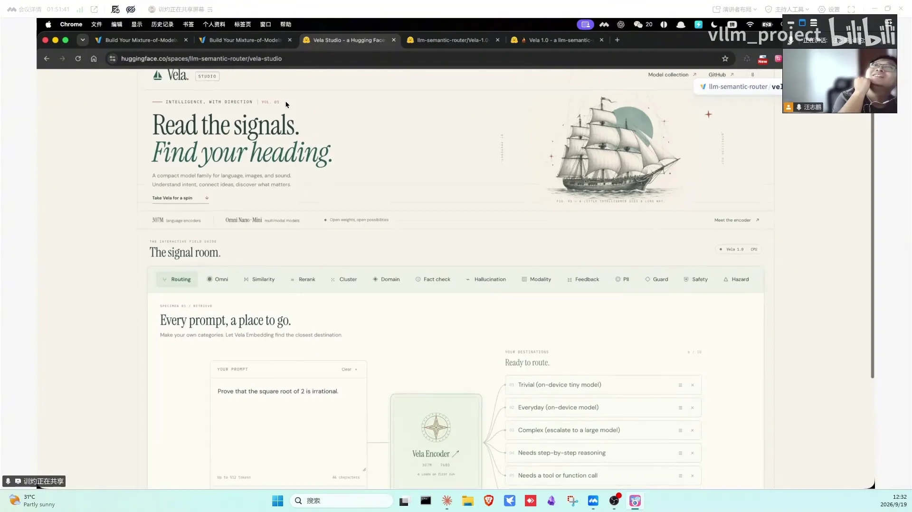 |
| （此区间无字幕） [【跳转到 83:06】](https://www.bilibili.com/video/BV13Jeh68Eam/?t=4986) | 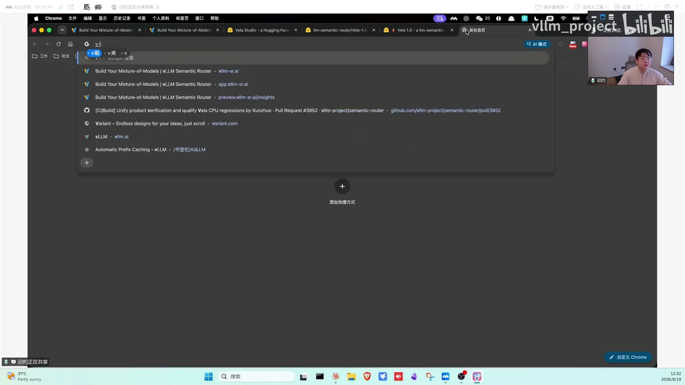 |
| 对。就是实际上我们也是在做一些 index（索引页）。我们做这个 index 的原因其实只是想我们想做一件事：就是刚提到的像 evaluation 和大家能够开箱即用的 recipe，是吧。那这个 recipe 其实对大家玩 vLLM 也知道—— [【跳转到 83:11】](https://www.bilibili.com/video/BV13Jeh68Eam/?t=4991) | 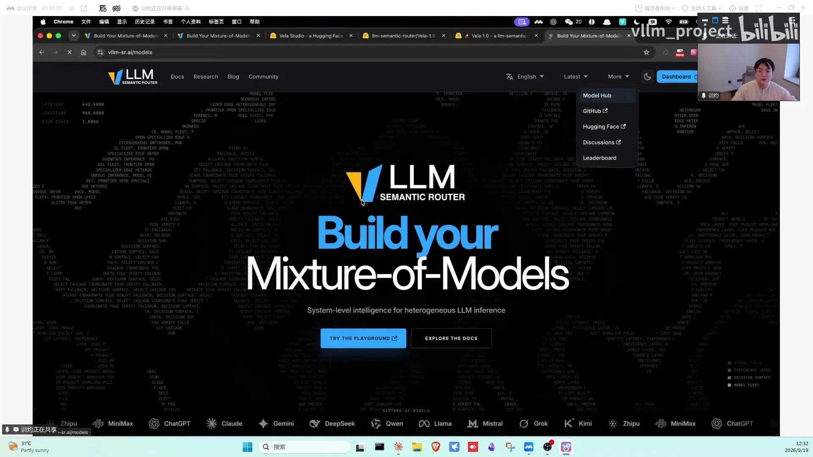 |
| recipe 就是给大家做 reference 的。比如说你 model 做了（某硬件的）support，对吧，你模型在某个 hardware 该怎么跑。但是对我们这个系统来说 recipe 就非常复杂，或者说它真的就需要一些 preference。比如说我们的 recipe——首先我们 model 分了两类：一个叫 single model，一个叫 virtual model。 [【跳转到 83:29】](https://www.bilibili.com/video/BV13Jeh68Eam/?t=5009) | 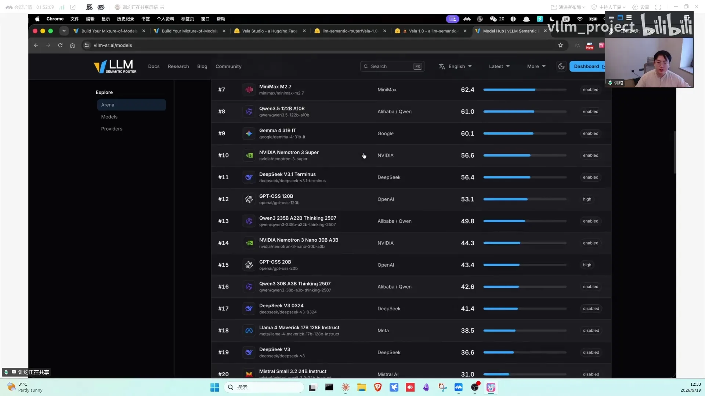 |
| 然后 virtual model 呢其实就是那些混合模型的：它里面就提到说我们后面的模型该怎么选、然后它的 recipe 该怎么去复用。本质上就说给大家做一个参考。然后我们做的 reference 就是说—— [【跳转到 83:54】](https://www.bilibili.com/video/BV13Jeh68Eam/?t=5034) | 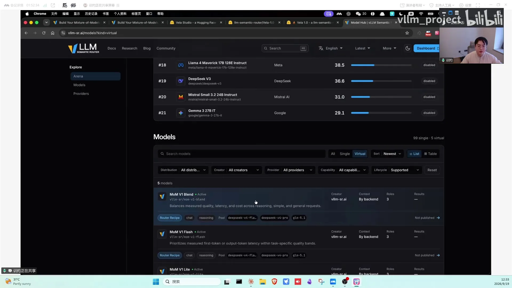 |
| 希望这些 recipe 能够去跑一些评测，能够在这些 index 上面也得到很好的成绩，但是同样能够跑出比如说在系统角度想看到那些收益：比如 cost 也好或者是 latency 也好。对，我觉得是可能这一点吧，就补充一下。好，直播间同学如果没有什么问题的话—— [【跳转到 84:19】](https://www.bilibili.com/video/BV13Jeh68Eam/?t=5059) | 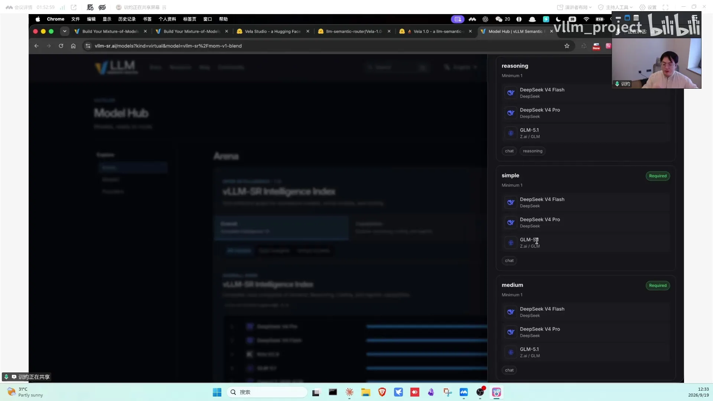 |
| 那我们今天的直播就到此结束了。没有点关注的同学记得点关注，然后我们每周六的同一时间都会有一个 AI Infra 相关的技术分享。OK，感谢。然后特别感谢训卓老师能够来到我们的直播间进行这个分享。——没有没有，很高兴跟大家做分享。好，时间也不早了， [【跳转到 84:40】](https://www.bilibili.com/video/BV13Jeh68Eam/?t=5080) | 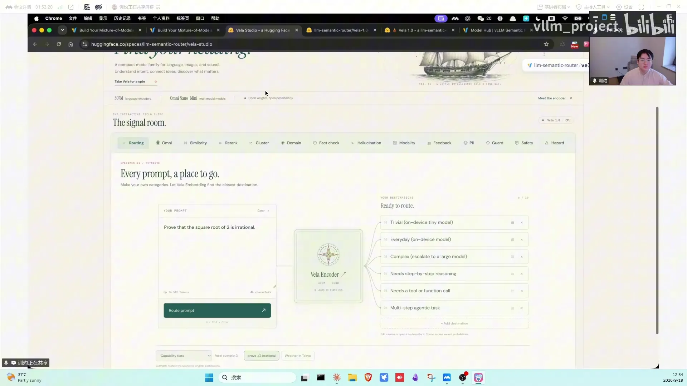 |
| 差不多吃饭点了。好，拜拜。好，大家吃饭了，大家吃饭吧，拜拜。 [【跳转到 85:05】](https://www.bilibili.com/video/BV13Jeh68Eam/?t=5105) | 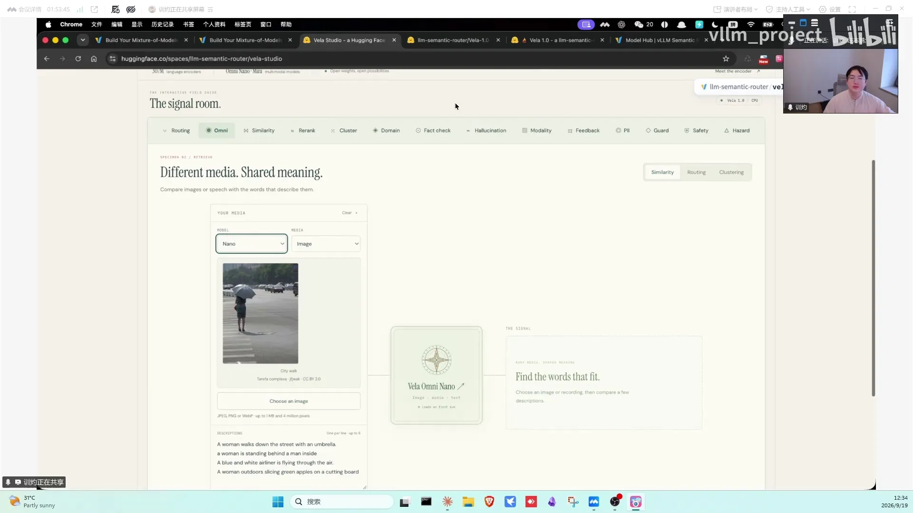 |
| （此区间无字幕） [【跳转到 85:10】](https://www.bilibili.com/video/BV13Jeh68Eam/?t=5110) | 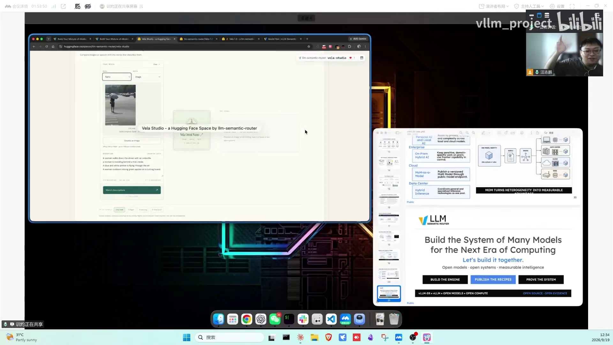 |