# 第21讲：RL-Kernel：大模型 RL 后训练中的训推一致性实践 原始文稿（图-字幕分栏）

| 字幕文本 | 画面 |
| :--- | ---: |
| 好，大家好，我是文森，是 RL-Kernel（R-Kernel）这边的核心维护者。今天很高兴收到志鹏的邀请，来参加 vLLM 社区的直播，给大家分享我们 RL-Kernel 这个项目。本次分享的主题是基于 V0.1.0 版本的大模型 RL 后训练中的训推一致性实践。 [【跳转到 00:00】](https://www.bilibili.com/video/BV1Ech96cEzW/?t=0) | 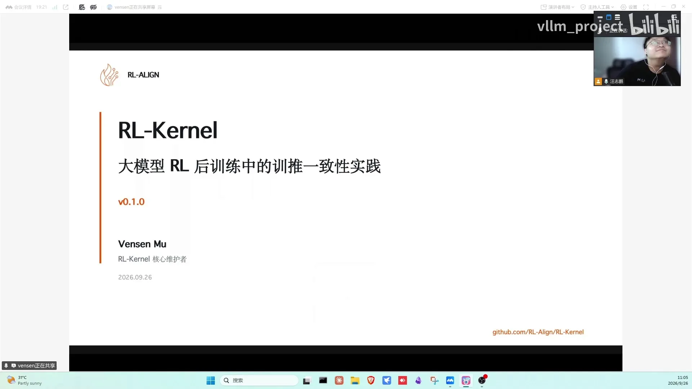 |
| OK，这是我的自我介绍，接着往下走。今天分享的内容包括：第一个，问题背景——同一个模型、同一批 token，为什么两套引擎的 logprob 仍会不同？ [【跳转到 00:25】](https://www.bilibili.com/video/BV1Ech96cEzW/?t=25) | 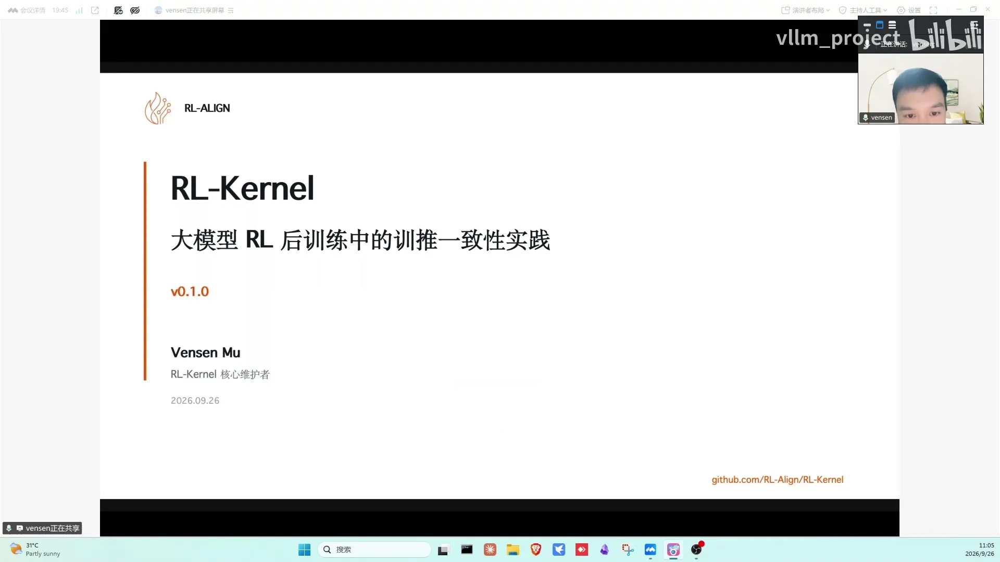 |
| 第二个，项目的定位：我们在整个后训练生态里的定位是什么？此次跟 vLLM 合作各自的职责是什么？第三个，关于 V0.1.0 这个版本：适配 CUDA 和 ROCm，并在上面跑了完整的—— [【跳转到 00:50】](https://www.bilibili.com/video/BV1Ech96cEzW/?t=50) | 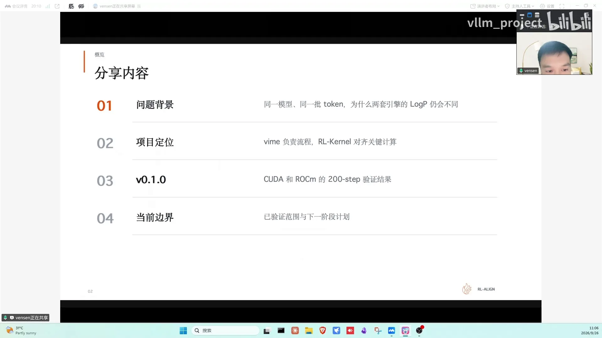 |
| 完整的 200 轮测试。第四个：在这个主题下分享一下 V0.1.0 版本覆盖的边界，包括和社区的下一步计划。——这是第三页：rollout logprob 和 training logprob。 [【跳转到 01:15】](https://www.bilibili.com/video/BV1Ech96cEzW/?t=75) |  |
| 大家可以看到这块：这是 rollout 侧、这是 training 侧。rollout logprob 和 training logprob，如果不知道的话我简单提一下：在 rollout（推理）路径下，vLLM 读取当前版本的权重，和 prompt 生成 response token， [【跳转到 01:40】](https://www.bilibili.com/video/BV1Ech96cEzW/?t=100) |  |
| 同时记录模型对这些 token 给出的概率——这个就是 rollout logprob。用简单的话解释一下：在 training 路径里，Megatron 接收这一批 response token，在更新权重之前做一次前向计算，得到 training logprob，然后后面再用它去—— [【跳转到 02:05】](https://www.bilibili.com/video/BV1Ech96cEzW/?t=125) | 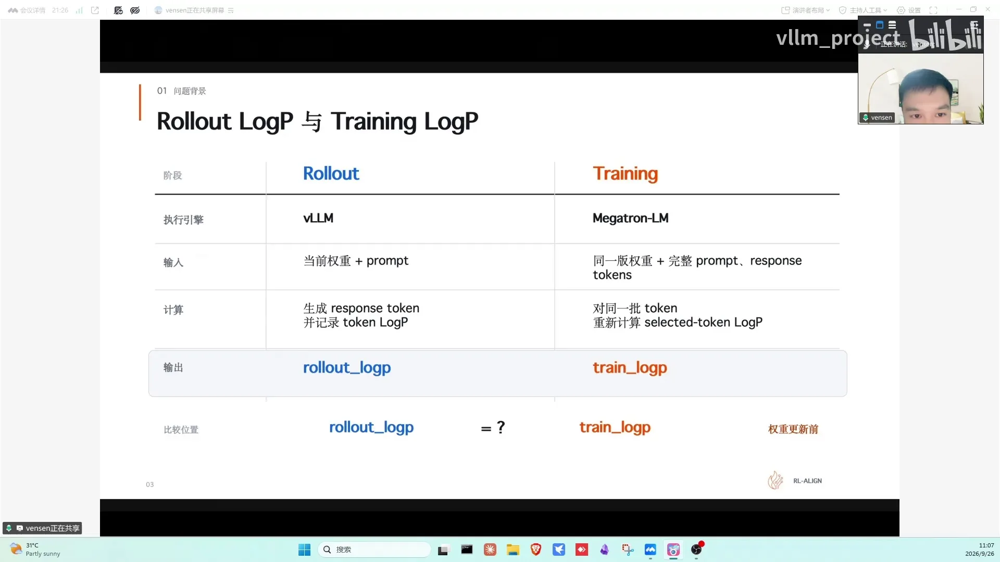 |
| 计算 loss——也就是我们经常说的得到 old logprob。虽然这两个数 rollout logprob 和 training logprob 不是来自于同一次程序执行，但它描述的其实是同一个时刻、同一个策略对同一个 token 的概率。如果权重还没有更新，两边描述的 selected token 的 [【跳转到 02:30】](https://www.bilibili.com/video/BV1Ech96cEzW/?t=150) | 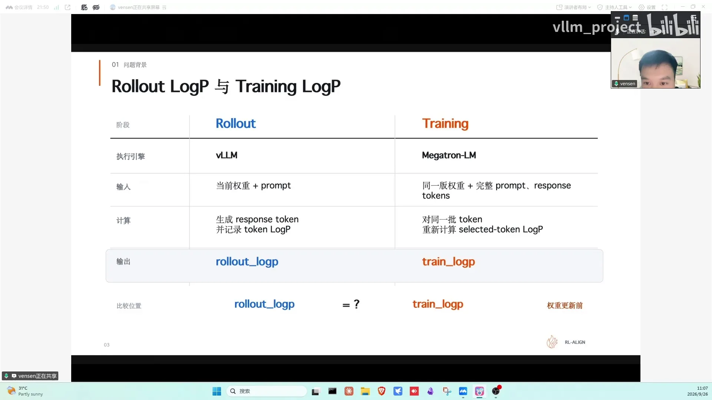 |
| logprob 应该是一致的。但在系统执行的时候，两边执行的 kernel、batch、并行布局、规约方式可能都不同——模型相同，并不等于执行路径相同。 [【跳转到 02:55】](https://www.bilibili.com/video/BV1Ech96cEzW/?t=175) | 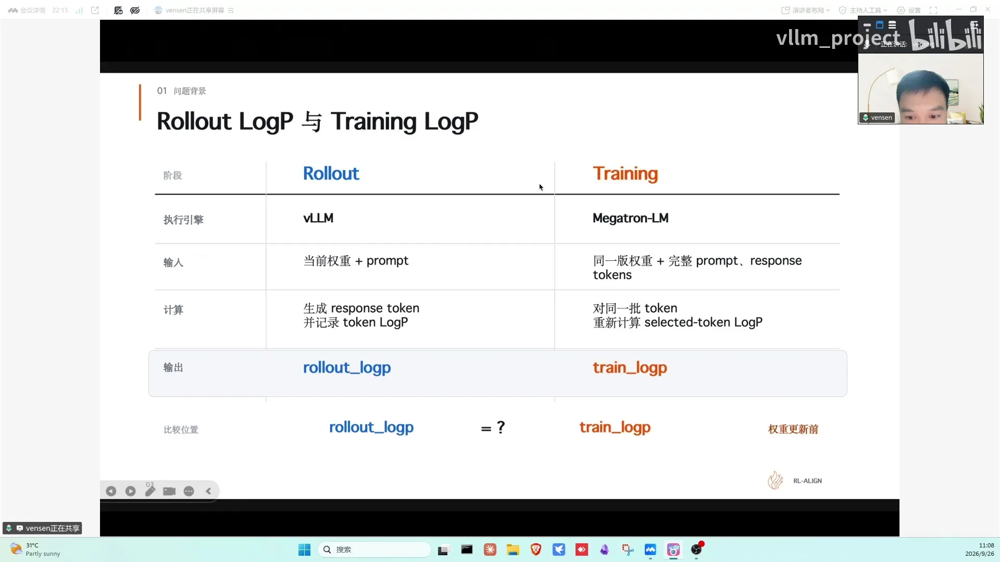 |
| 所以我们这边会对它打一个问号：到底相不相等？这是对 rollout logprob 和 training logprob 的解释。下一个：logprob 偏差会提前改变 importance ratio。importance ratio 我默认大家都知道，这是一个比较 basic 的概念。 [【跳转到 03:20】](https://www.bilibili.com/video/BV1Ech96cEzW/?t=200) | 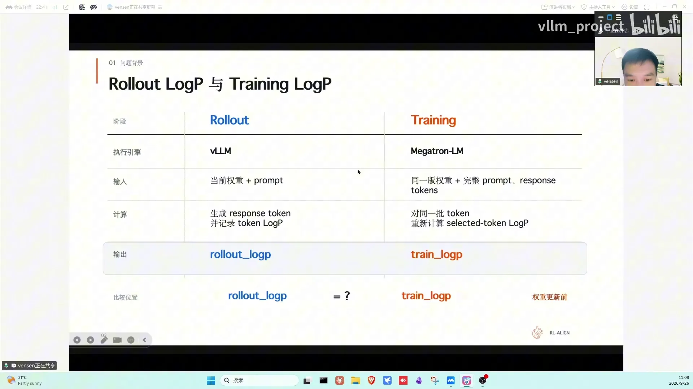 |
| 在 training 侧它是非常关键的一步：我们根据 current logprob 和 old logprob 去算出 ratio。如果 importance ratio 远离 1，可能会提前触发 clipping。就是说这块—— [【跳转到 03:45】](https://www.bilibili.com/video/BV1Ech96cEzW/?t=225) | 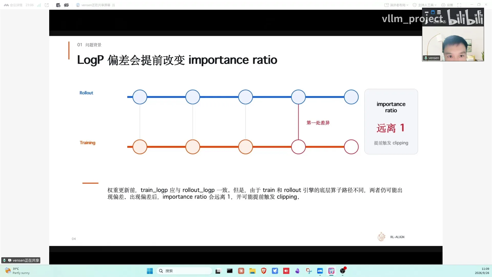 |
| （图上画了两条曲线）可能第一处的差异就导致提前触发 clipping。因为 training 和 rollout 引擎的底层算子路径不同，两者仍可能会出现偏差。这个 importance ratio 在我们同步的—— [【跳转到 04:10】](https://www.bilibili.com/video/BV1Ech96cEzW/?t=250) | 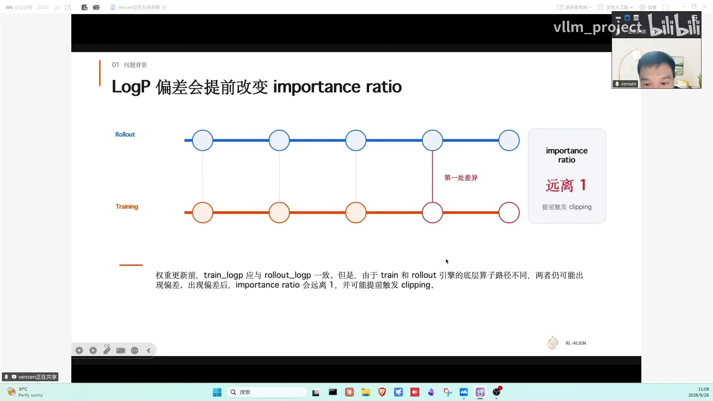 |
| 比如跑一次同步的训推的时候，这是很关键的一步。下一步是一个老生常谈的问题：浮点规约顺序会影响计算结果。我们先简单看这几个数 A B C D：假设 A—— [【跳转到 04:35】](https://www.bilibili.com/video/BV1Ech96cEzW/?t=275) |  |
| 假设 A 是 1000（一万也行，这类例子大家都看过），B 是 1，C 是 -1000，D 是 1。会看到：按蓝色这种顺序执行，最后得出来的结果其实是 1。 [【跳转到 05:00】](https://www.bilibili.com/video/BV1Ech96cEzW/?t=300) | 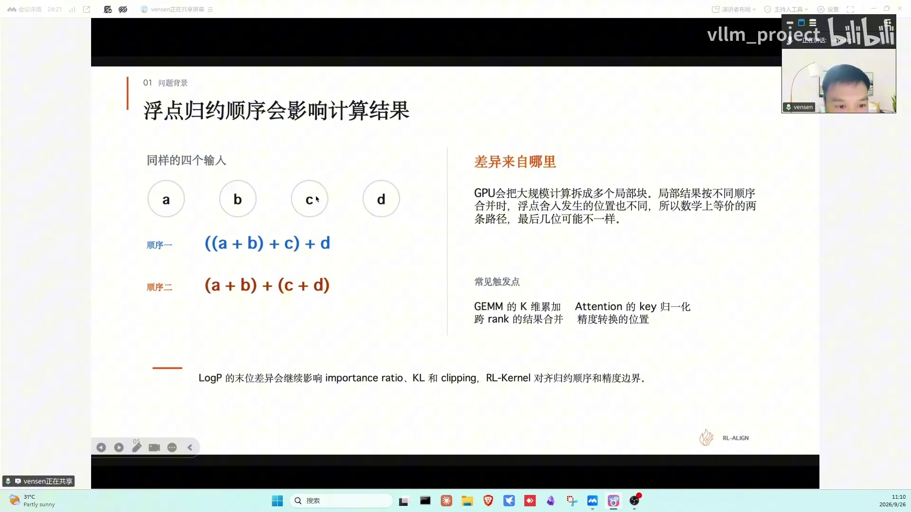 |
| 代入这些数去算结果是 1。但前提是我们刚才说的：每次加法的结果都保留三位有效数字。顺序二的话，按这个前提最后得出来的其实就是 0——因为中间会有舍入。比如 A 加 B： [【跳转到 05:25】](https://www.bilibili.com/video/BV1Ech96cEzW/?t=325) |  |
| 本来就比如说是 1000+1，舍入后是 1000；另一组是 -1000+1，本来是 -999，但舍入后又变成了 -1000。所以两个结果一相加就变成了 0。其实在 GPU 里有类似的情况： [【跳转到 05:50】](https://www.bilibili.com/video/BV1Ech96cEzW/?t=350) | 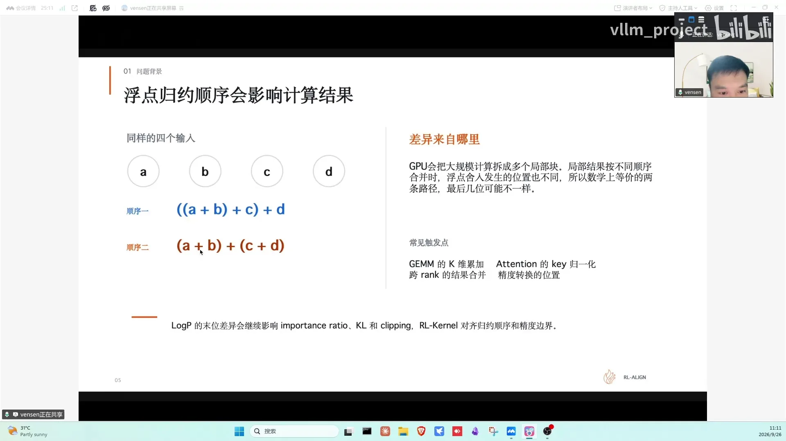 |
| 我们的矩阵乘法、attention 和跨卡的求和都需要把很多数加起来。为了并行，GPU 会拆成多个块各自计算再合并。训练和推理的 batch、shape 不同，最终可能会选中不同的 kernel 路径。 [【跳转到 06:15】](https://www.bilibili.com/video/BV1Ech96cEzW/?t=375) |  |
| 进而改变分块和合并的顺序。差异可能先出现在某个中间结果，再经过后续计算，最后传到 logprob。所以要做训推一致的话，除了同步权重，还要对齐累加顺序、计算精度， [【跳转到 06:40】](https://www.bilibili.com/video/BV1Ech96cEzW/?t=400) | 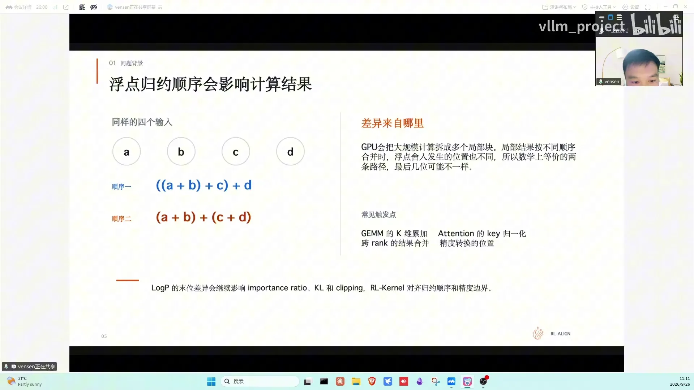 |
| 以及中间结果的舍入位置。这就是浮点规约顺序会影响计算结果的解释。我们看一下比较 logprob 前需要对齐的五项条件。 [【跳转到 07:05】](https://www.bilibili.com/video/BV1Ech96cEzW/?t=425) | 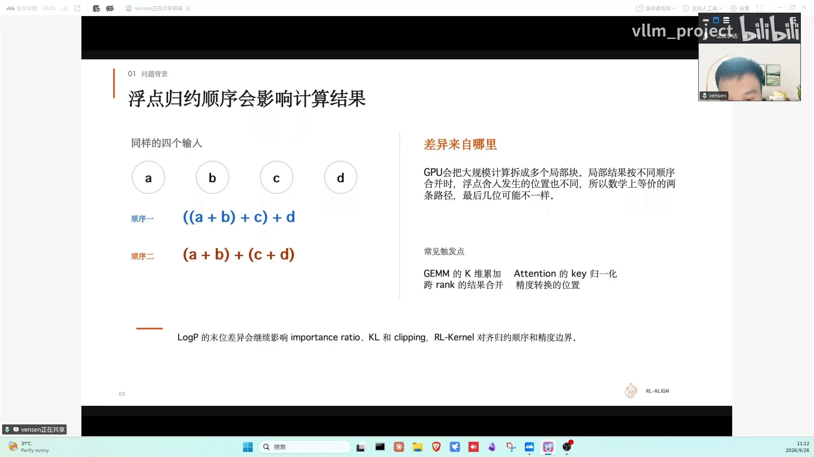 |
| 这很关键：在查具体 kernel 之前，必须先把这五项基础条件排查一遍，不然很容易排查错方向。比如在比较两个 logprob 之前，先确定两边走的是同一个（流程）。这一页从权重同步—— [【跳转到 07:30】](https://www.bilibili.com/video/BV1Ech96cEzW/?t=450) | 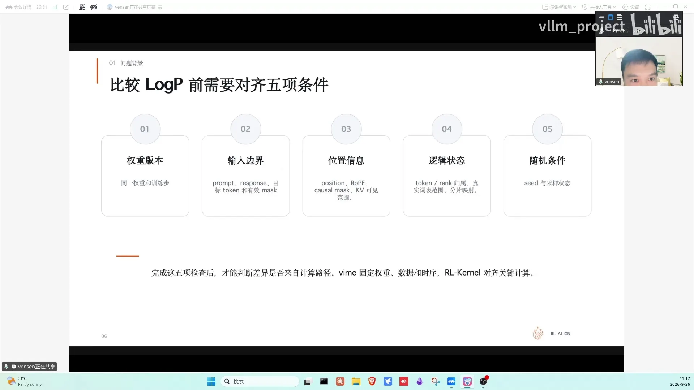 |
| 从权重同步到随机条件，这五项都是必须核对的条件。第一个是权重版本：rollout 和 training 必须对应同一个 checkpoint、同一个训练 step。第二个是输入边界—— [【跳转到 07:55】](https://www.bilibili.com/video/BV1Ech96cEzW/?t=475) | 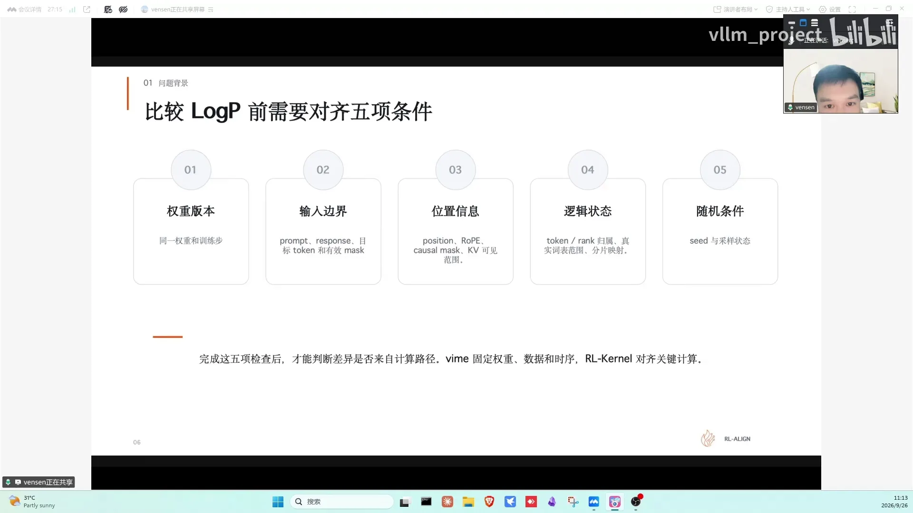 |
| 它包括的东西就像 prefix、active mask 这些。第三个是位置：包括 position id 和 attention 的 mask 等等。第四个是运行时的逻辑状态：比如 KV 的归属、token 在不同 rank 上的分布， [【跳转到 08:20】](https://www.bilibili.com/video/BV1Ech96cEzW/?t=500) | 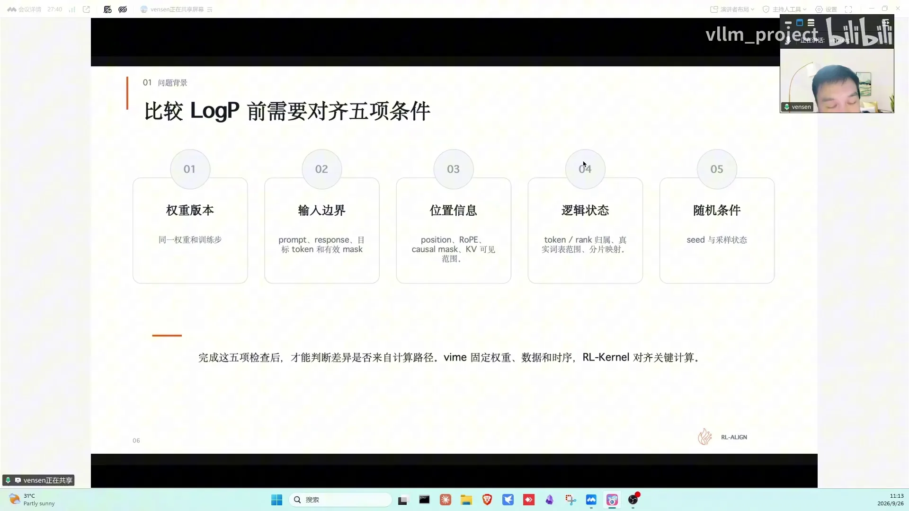 |
| 以及有效的 vocabulary 范围。第五个是随机条件：包括 seed 和采样状态（sampling state）。这些条件任何一项不同，logprob 的差异都不能直接归因于 kernel。只有这些对齐了， [【跳转到 08:45】](https://www.bilibili.com/video/BV1Ech96cEzW/?t=525) | 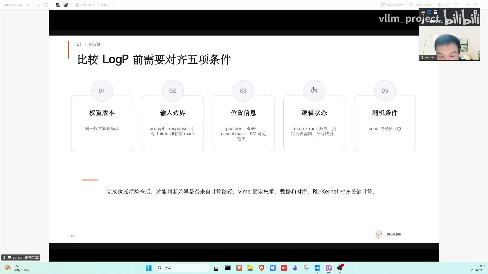 |
| 剩下的差异才可能往底层计算里去找——把这些问题都排除掉，再去排查 kernel、排查底层计算的方法。这就是这次最主要的分工：vLLM 做了什么，RL-Kernel 这边做了什么。 [【跳转到 09:10】](https://www.bilibili.com/video/BV1Ech96cEzW/?t=550) | 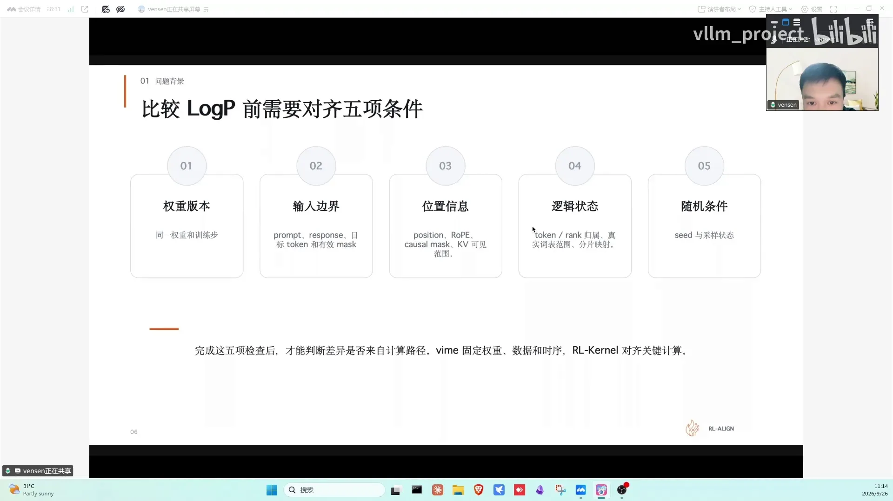 |
| 简单来说，vLLM 这边负责组织完整的 RL 生命周期：什么时候做 rollout、什么时候做 reference、什么时候训练 actor，权重更新之后又怎么同步给推理侧。它主要管时序、数据流， [【跳转到 09:35】](https://www.bilibili.com/video/BV1Ech96cEzW/?t=575) | 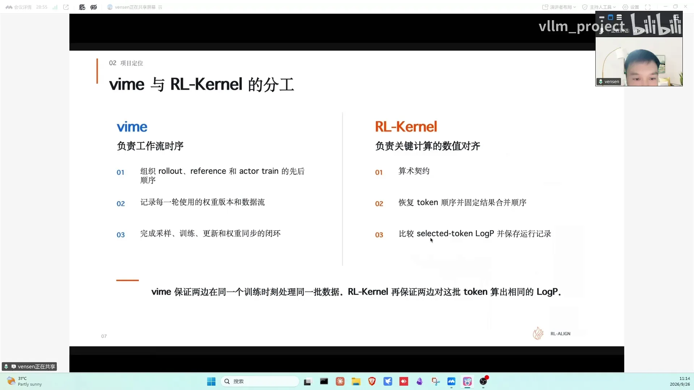 |
| 权重版本等等——上层调度这些事情。RL-Kernel 关注的是这个流程里的关键计算能不能对齐。举个例子：attention 的局部结果怎么合并、FFN 在哪一步要转精度、跨卡求和的时候先加哪一块， [【跳转到 10:00】](https://www.bilibili.com/video/BV1Ech96cEzW/?t=600) | 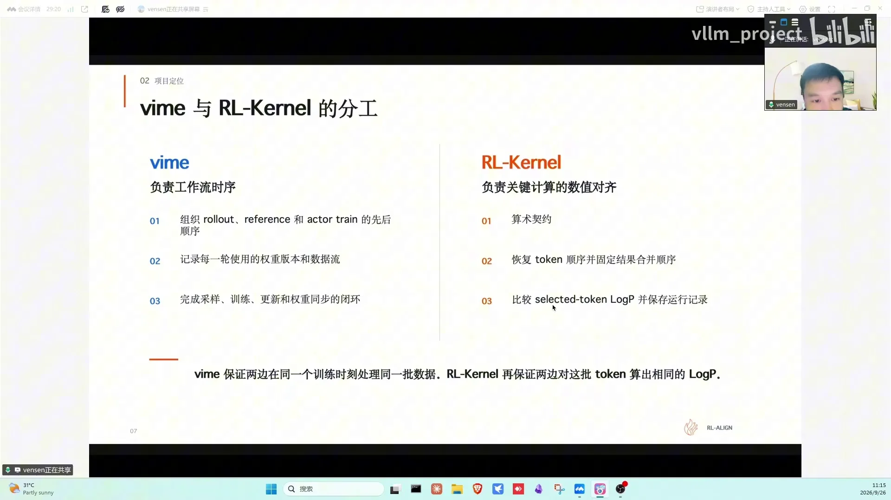 |
| 运行时有没有走到预期——因为我们有一些逻辑要走到预期才证明是 OK、路由到了我们想要的算子，这也是一项；包括最后的 logprob 怎么比较。这是 RL-Kernel 这边的职责。我们把这些计算的规则叫做数值契约：简单来说，我们会把容易产生差异的地方—— [【跳转到 10:25】](https://www.bilibili.com/video/BV1Ech96cEzW/?t=625) | 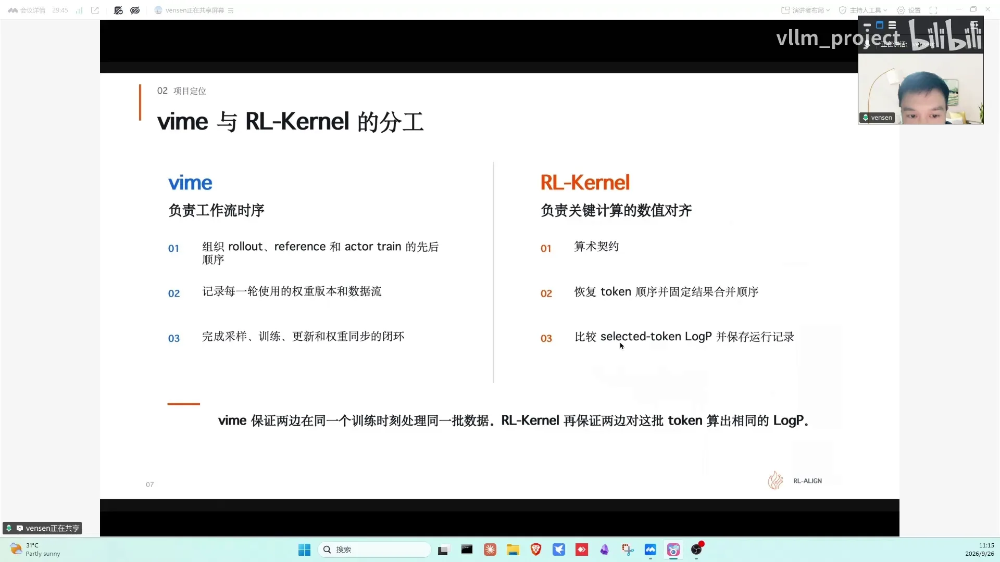 |
| 明确写下来，两边必须按照约定去执行。vLLM 保证的是两边在正确的时间里处理正确的数据；RL-Kernel 保证关键的计算按照对齐后的规则去执行。这两者是互补的关系。 [【跳转到 10:50】](https://www.bilibili.com/video/BV1Ech96cEzW/?t=650) | 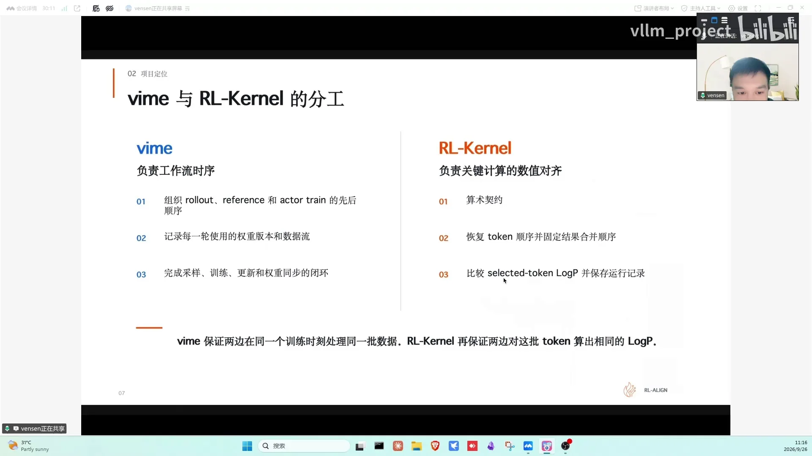 |
| 这是 RL-Kernel 的整体框架，在我们首页的 README 里也放了。从实际使用的角度来看，上层的这些都是同步—— [【跳转到 11:15】](https://www.bilibili.com/video/BV1Ech96cEzW/?t=675) | 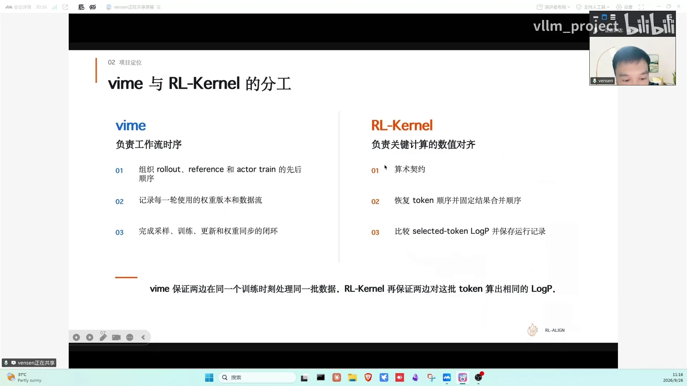 |
| 同步训推的这些框架，包括异步的、像 AReaL 这些，还有我们的 vLLM、veRL 等等——负责上层的 RL 框架：生成、训练、权重更新全部串在一起。下面就是像 vLLM 和 Megatron 这样的 rollout 和 training 的 engine。然后这个绿色区域—— [【跳转到 11:40】](https://www.bilibili.com/video/BV1Ech96cEzW/?t=700) |  |
| 绿色区域这一块就是我们的 RL-Kernel：它不接管整个训练流程/训练框架，只是在 rollout 和 training 的关键计算位置提供算子和运行时检查，包括一致性的实现。至于最下层——目前是（已验证）覆盖—— [【跳转到 12:05】](https://www.bilibili.com/video/BV1Ech96cEzW/?t=725) | 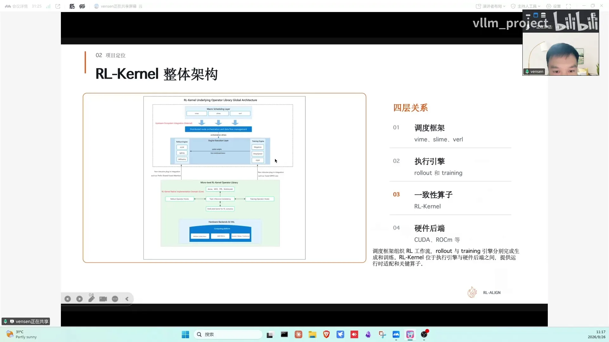 |
| 包括了 CUDA 和 ROCm。其他的框架、厂商也会按照自己的方式介入。所以这个架构的核心价值就是把问题分层：上层框架可以按照自己的调度方式去运行， [【跳转到 12:30】](https://www.bilibili.com/video/BV1Ech96cEzW/?t=750) |  |
| 执行引擎也可以保留自己的专项优化——比如 vLLM 里有很多高性能算子，也实现了一些（定制 kernel）等等，他们可以保留各自的优化。但 RL-Kernel 需要明确哪些关键的结果必须要对齐，因为最后路由跑在这里的时候—— [【跳转到 12:55】](https://www.bilibili.com/video/BV1Ech96cEzW/?t=775) | 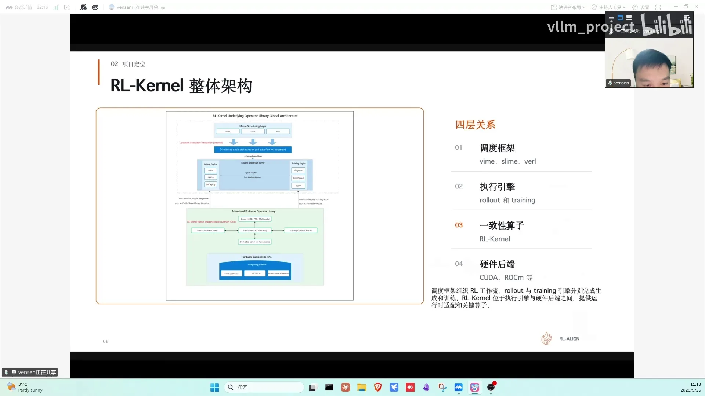 |
| 是要针对这些来进行关键的处理。——这就是刚才讲的整个架构。接下来主要跟大家分享一下单个 RL step 中的位置：因为有的人可能没太接触过同步的流程—— [【跳转到 13:20】](https://www.bilibili.com/video/BV1Ech96cEzW/?t=800) |  |
| 同步训推的流程。这个图其实非常简单，只是大概的流程。我们把刚才的架构放回到一轮完整的 RL 训练里来看：首先我（用图）跟大家串一下流程——首先 vLLM 这边会根据我们的这些 [【跳转到 13:45】](https://www.bilibili.com/video/BV1Ech96cEzW/?t=825) | 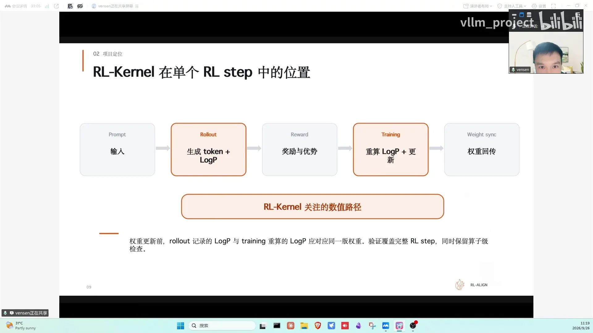 |
| prompt 来生成回答，保存 token 和生成的 rollout logprob；然后系统给回答评分，得到 reward；再把这些样本和数据打包给到训练侧。training 这块，如果按照训练侧—— [【跳转到 14:10】](https://www.bilibili.com/video/BV1Ech96cEzW/?t=850) | 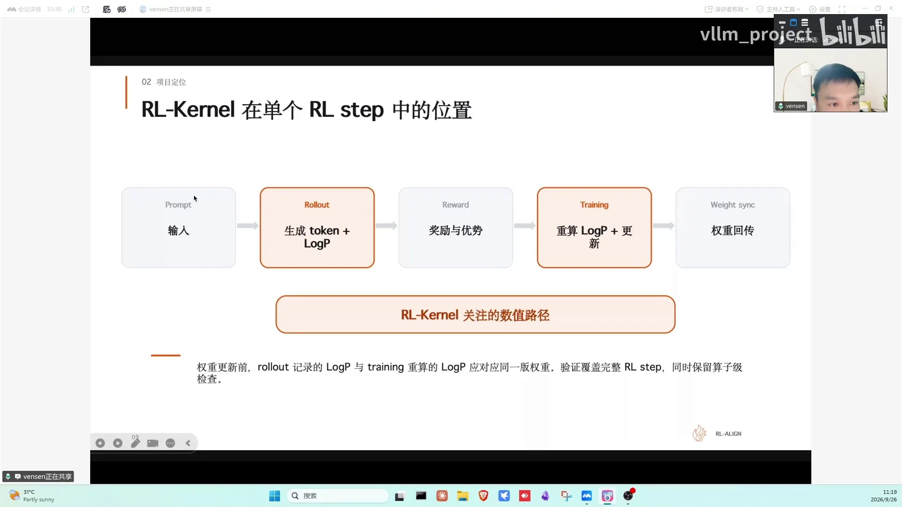 |
| 走独立重算 old logprob 的路径来说：Megatron 收到数据之后，用还没有更新的权重对原来的 prompt 和回答做一次无梯度的 forward，得到 old logprob；同时根据 reward 计算这个 advantage—— [【跳转到 14:35】](https://www.bilibili.com/video/BV1Ech96cEzW/?t=875) |  |
| advantage 告诉模型哪些回答应该被鼓励、哪些回答应该被降低概率。接下来 Megatron 会用当前的权重去做（带梯度的）forward，得到 current logprob。 [【跳转到 15:00】](https://www.bilibili.com/video/BV1Ech96cEzW/?t=900) | 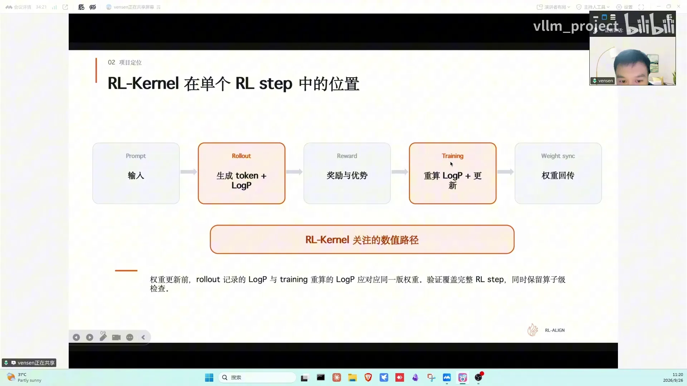 |
| current logprob 很重要：我们会用 current logprob 和 old logprob 去算 importance ratio，得到 ratio 之后结合 advantage 计算 loss，最后通过 backward 和 optimizer step 去更新模型。其实第一次计算 current 的时候—— [【跳转到 15:25】](https://www.bilibili.com/video/BV1Ech96cEzW/?t=925) | 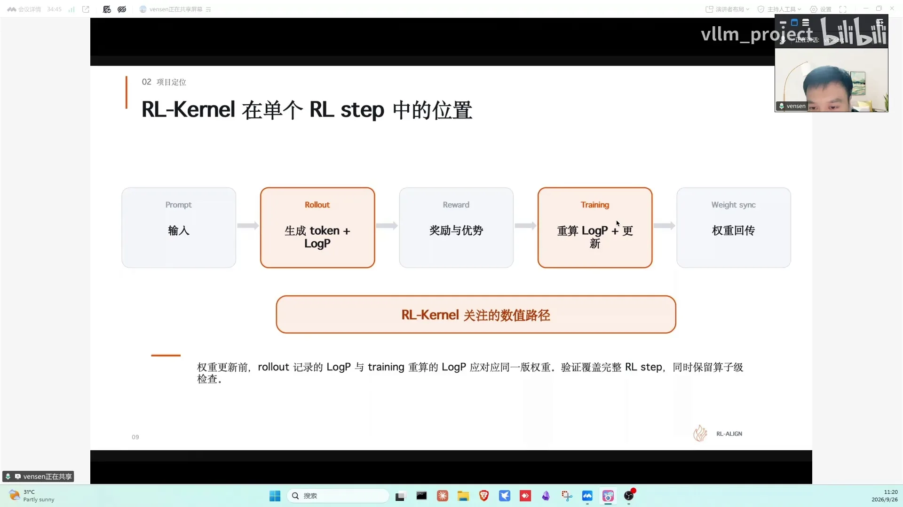 |
| 权重还没有更新，两边计算条件一致的时候，current 和 old 应该是相同或者非常接近的。后面如果继续训练这部分数据，就会用更新后的权重去重新计算 current——再跑到计算 current 那边再往下跑， [【跳转到 15:50】](https://www.bilibili.com/video/BV1Ech96cEzW/?t=950) | 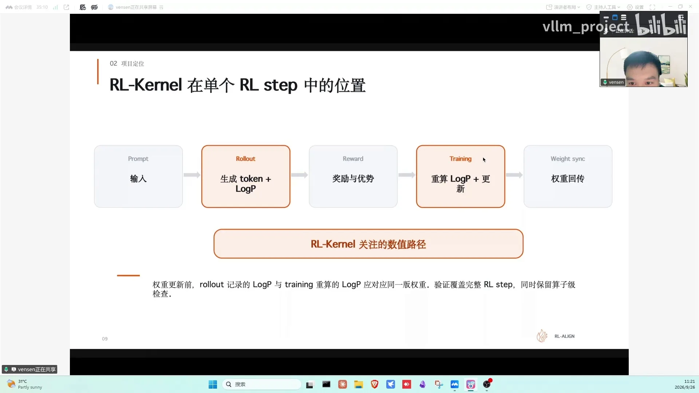 |
| 又跑 importance ratio、又计算 loss、再反向传播更新梯度——如果有继续训练的批次就会走这个流程，但会用更新后的权重重新计算 current。而 training 这边算完的 old logprob 是保持固定的。本轮训练完成后， [【跳转到 16:15】](https://www.bilibili.com/video/BV1Ech96cEzW/?t=975) |  |
| 新的权重会同步给 vLLM，再开始下一轮的生成——又经历一遍这个顺序。所以我们在下一轮继续在对应的新权重版本下去检查训推一致性。我们验证的是：一个完整循环 [【跳转到 16:40】](https://www.bilibili.com/video/BV1Ech96cEzW/?t=1000) | 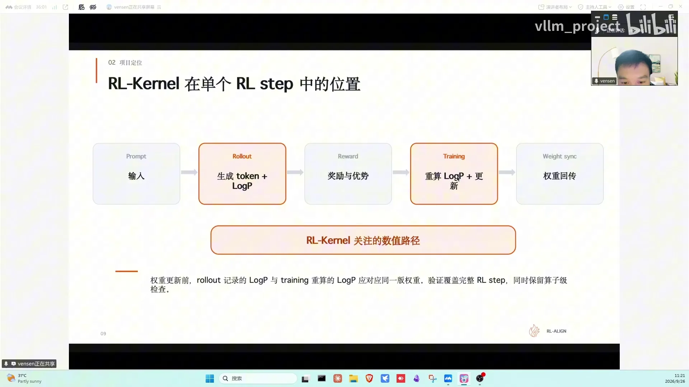 |
| 持续运行以后，每一轮的对应位置概率还能不能对得上。这是一轮跑下来大概的流程。大家可能会关心训推两侧需要对齐的计算——刚才说的更偏向 vLLM 那边（同步流程）， [【跳转到 17:05】](https://www.bilibili.com/video/BV1Ech96cEzW/?t=1025) |  |
| 这个是训推两侧需要对齐的计算，就是前面提到的数值契约。这一页把对齐拆成四类：算术的定义、token 的顺序，还有结果的合并—— [【跳转到 17:30】](https://www.bilibili.com/video/BV1Ech96cEzW/?t=1050) |  |
| 还有精度的边界。拆开来看：算术定义——简单来说就是归一化到底覆盖哪些元素、mask 在哪一步生效，selected token logprob 使用什么样的定义，归到这一类。 [【跳转到 17:55】](https://www.bilibili.com/video/BV1Ech96cEzW/?t=1075) | 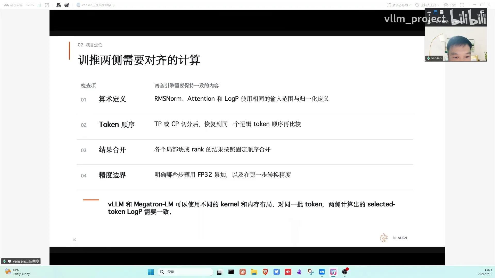 |
| token 顺序：比如开了 TP/CP，把 token 分到不同设备以后，比较之前必须恢复成相同的逻辑顺序。结果合并：通常来说一个大的结果—— [【跳转到 18:20】](https://www.bilibili.com/video/BV1Ech96cEzW/?t=1100) | 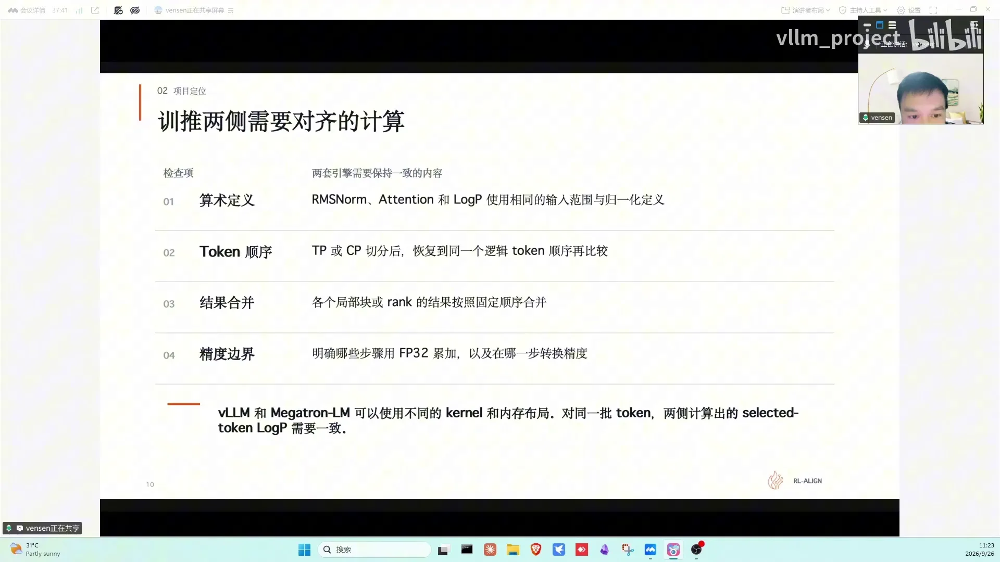 |
| 举个例子，一个大的结果来自多个局部、多个 rank。局部结果如何组合——先算这块再算那块——会影响最后的浮点值。这是结果合并。精度边界： [【跳转到 18:45】](https://www.bilibili.com/video/BV1Ech96cEzW/?t=1125) | 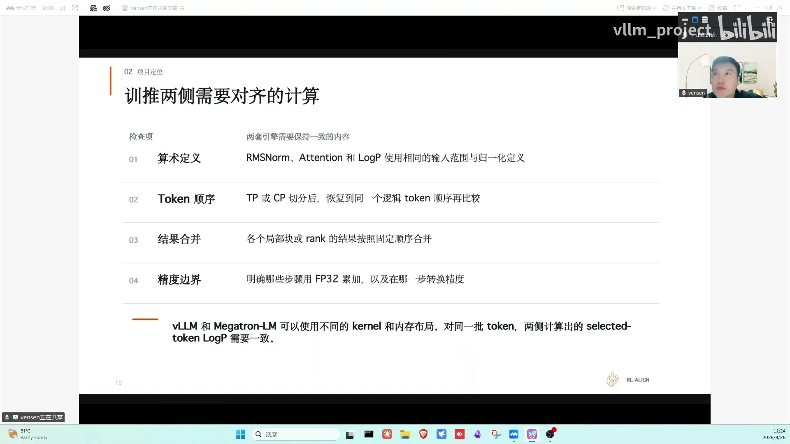 |
| 简单来说就是需要明确哪些阶段使用 FP32 累加、什么时候转回 BF16 或 FP16 等等——这是精度边界的流程。在刚刚说的对齐里，我们 V0.1.0 覆盖了五类规约—— [【跳转到 19:10】](https://www.bilibili.com/video/BV1Ech96cEzW/?t=1150) | 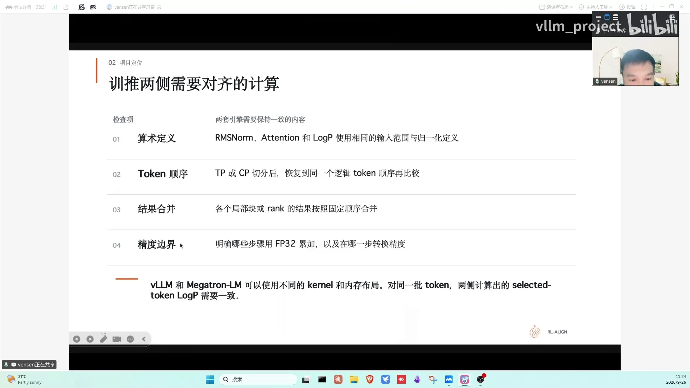 |
| 这五类规约是针对我们这次做的 model 拆出来的：比如 RMSNorm，它会沿 hidden 维度规约，也就是沿 hidden dimension 做归约。attention 这边需要在当前 token—— [【跳转到 19:35】](https://www.bilibili.com/video/BV1Ech96cEzW/?t=1175) |  |
| 能看到的 K 的范围去做 softmax。第三类是 GEMM 和 SwiGLU——它们承担我们的矩阵乘。如果你要支持别的 model，就需要根据 model 具体去拆对应里边的 kernel、对应需要拆出来的—— [【跳转到 20:00】](https://www.bilibili.com/video/BV1Ech96cEzW/?t=1200) | 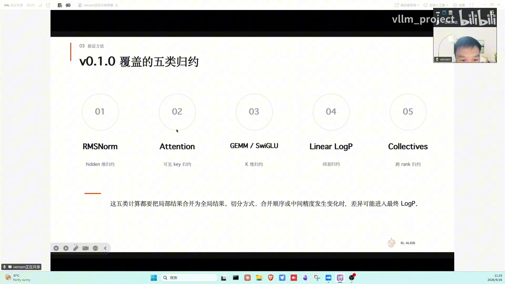 |
| 几类规约。第四个是 linear logprob（lm head）：从 vocabulary 的 logits 里得到目标 token 的概率。第五个是 collectives——非常关键重要的一部分， [【跳转到 20:25】](https://www.bilibili.com/video/BV1Ech96cEzW/?t=1225) | 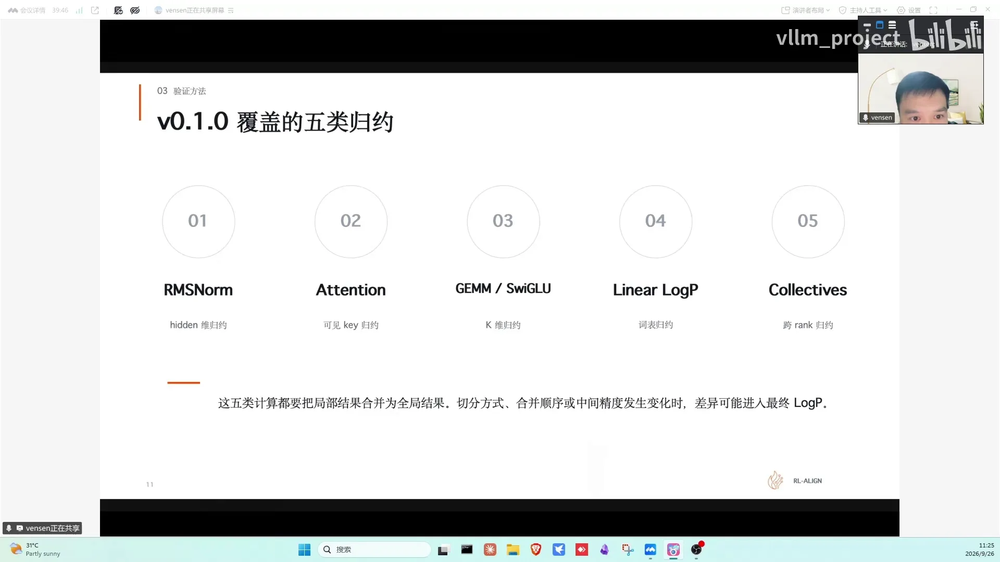 |
| 用来合并不同 rank 上的局部结果。这五类的共同点都是：先切分数据、完成局部计算，再把局部结果合起来。只要是你的分区和合并顺序—— [【跳转到 20:50】](https://www.bilibili.com/video/BV1Ech96cEzW/?t=1250) | 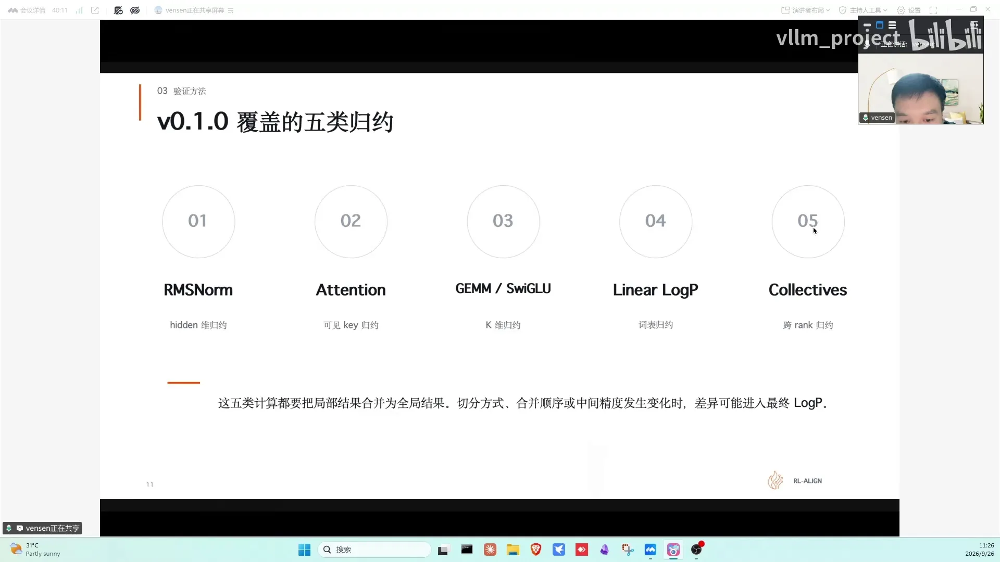 |
| 包括中间精度发生了变化，最后几位就可能不同。所以 V0.1.0 主要是要把这条影响 logprob 的完整主路径覆盖起来：沿着现在已经支持的模型逐段去检查， [【跳转到 21:15】](https://www.bilibili.com/video/BV1Ech96cEzW/?t=1275) | 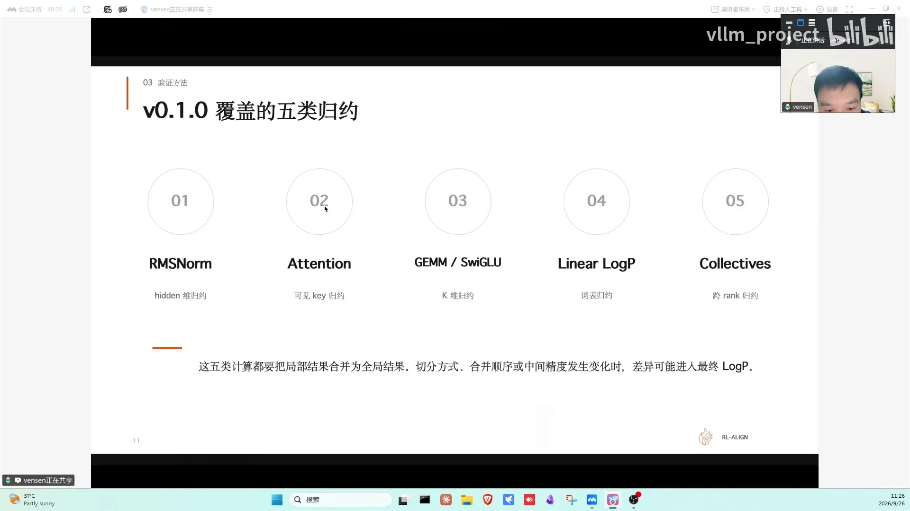 |
| 最先找到不同的地方，看它会影响后面怎么计算。切分数据、完成局部计算、把局部结果合起来，都要保证顺序性。 [【跳转到 21:40】](https://www.bilibili.com/video/BV1Ech96cEzW/?t=1300) | 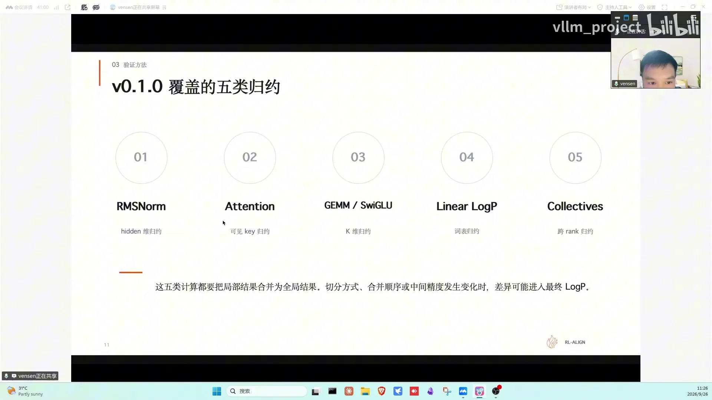 |
| 这个就是我们的维度——关键算子的维度。上面说的是五类规约，下面有对应的维度。坦白来说就是按照这个维度去整理关键的算子。比如 RMSNorm 它主要就是范围： [【跳转到 22:05】](https://www.bilibili.com/video/BV1Ech96cEzW/?t=1325) | 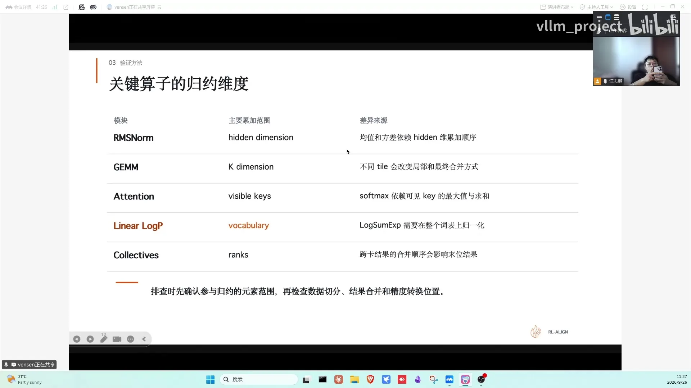 |
| 刚才也讲了 hidden dimension，大家都知道。均值和方差依赖 hidden 维的累加顺序。GEMM 的结果来自 K 维的连续累加。attention 是在可见的 K 的范围内做归约。linear logprob 是在—— [【跳转到 22:30】](https://www.bilibili.com/video/BV1Ech96cEzW/?t=1350) |  |
| 整个 vocabulary 上去计算 LSE。分布式 collective 是跨 rank 合并对应的数据。但有的时候——比如看到通信（出问题）后—— [【跳转到 22:55】](https://www.bilibili.com/video/BV1Ech96cEzW/?t=1375) |  |
| 第一次不同的时候，不能马上认定是通信出了问题——可能各张卡交给通信层的局部结果就已经不一样了。这一块还是要看对应的输入和输出，确定差异在哪。而且因为我们的 batch 大小、序列长度， [【跳转到 23:20】](https://www.bilibili.com/video/BV1Ech96cEzW/?t=1400) | 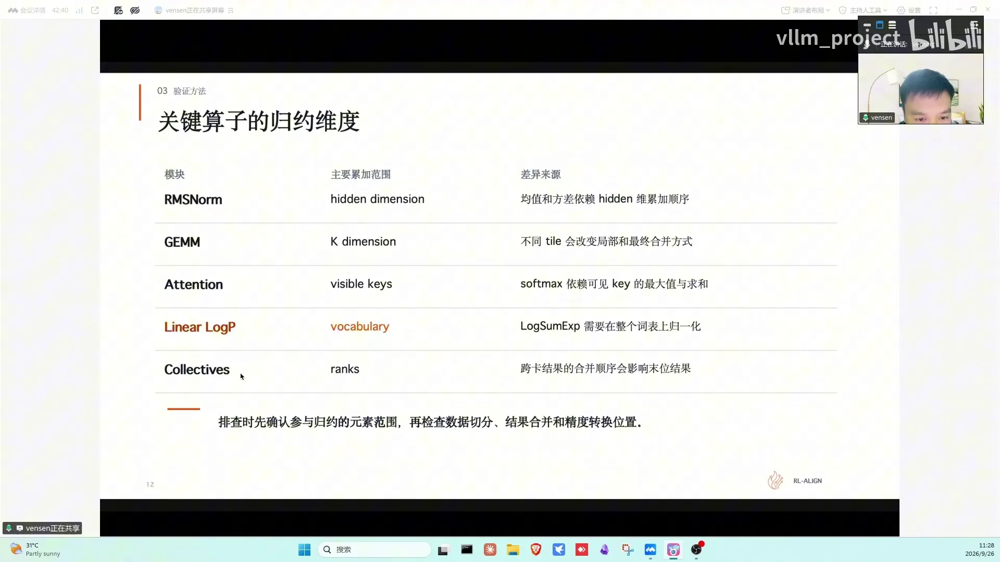 |
| 还有并行度发生变化时，系统可能会选另一条 kernel 路径——表面上只是配置变了，但实际的分块数量、局部结果、合并顺序都会跟着改变。这是关于维度的—— [【跳转到 23:45】](https://www.bilibili.com/video/BV1Ech96cEzW/?t=1425) |  |
| 一个简单的讲解。这块再说两个核心的模块：一个是 attention，一个是 linear logprob。至于 LSE——大家应该都知道：简单来说 LSE 可以理解为把一组分数转换成 [【跳转到 24:10】](https://www.bilibili.com/video/BV1Ech96cEzW/?t=1450) |  |
| 转换成概率时需要计算的归一化统计量，可以简单理解成这个。attention 这边：一个 query 会给多个 K 打分，这些分数要一起做归一化的时候， [【跳转到 24:35】](https://www.bilibili.com/video/BV1Ech96cEzW/?t=1475) | 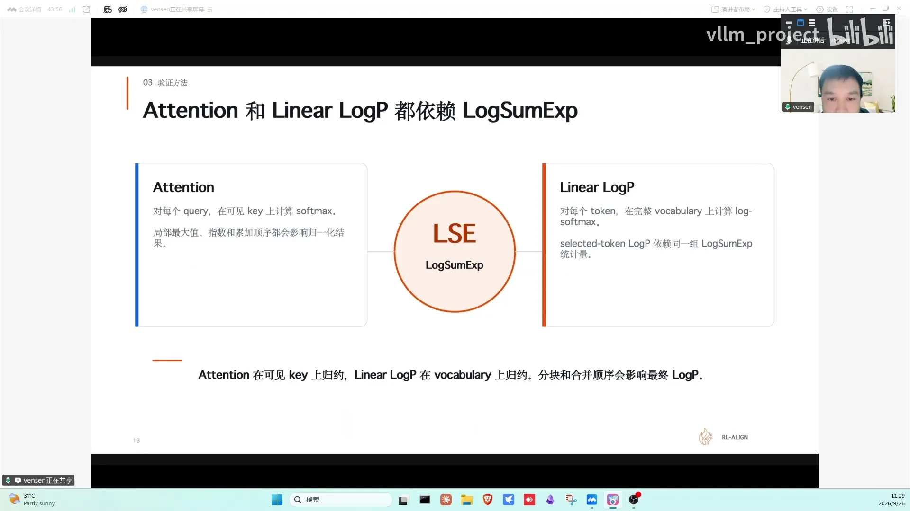 |
| 才能决定你要关注哪些位置。lm head logprob 这边是模型对整个词表打分，得到各个 token 完整的对数概率。虽然这两个模块的作用不同， [【跳转到 25:00】](https://www.bilibili.com/video/BV1Ech96cEzW/?t=1500) | 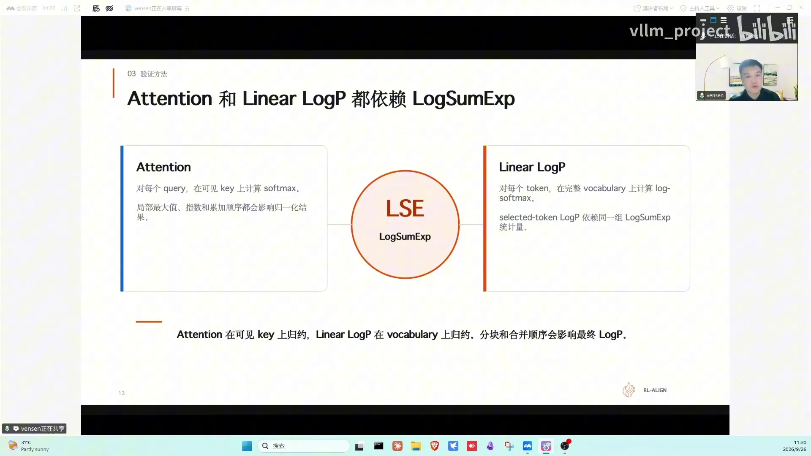 |
| 但都需要处理一组分数的统计归一——attention 看可见的 K，lm head 看词表，各自计算 LSE。假设我们只关心某个 token，也不能只检查它自己的 [【跳转到 25:25】](https://www.bilibili.com/video/BV1Ech96cEzW/?t=1525) | 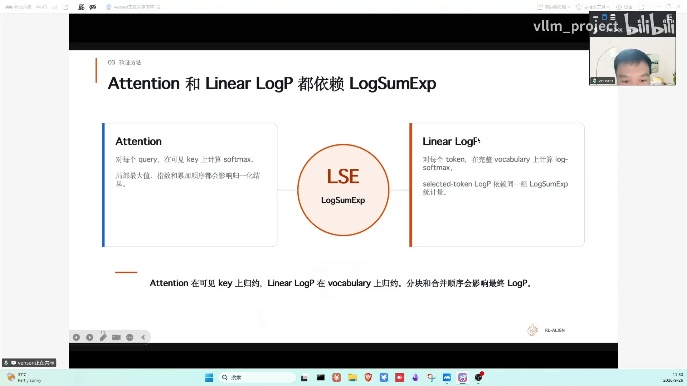 |
| 那一个分数——因为其他词表可能会影响归一化：它自己的分数如果没有变化，但其他汇总的结果变了，最终的概率可能照样改变。所以我们其实关心的是 LSE 的精度和合并顺序。 [【跳转到 25:50】](https://www.bilibili.com/video/BV1Ech96cEzW/?t=1550) |  |
| 尤其是词表和多个 K 被切成多个块、分到多个卡的时候，每块的统计量到底怎么合起来，需要有一个明确的约定。——这一页是固定 replay 后定位第一处差异。 [【跳转到 26:15】](https://www.bilibili.com/video/BV1Ech96cEzW/?t=1575) | 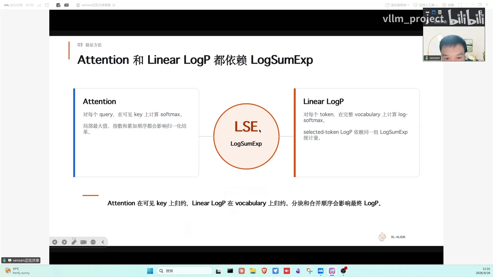 |
| 实际 debug 中：先拿一份固定的权重，把已经生成好的 token 保存好，让训练和推理都算同一份输入，然后看中间结果——比如前几层输出都一样， [【跳转到 26:40】](https://www.bilibili.com/video/BV1Ech96cEzW/?t=1600) |  |
| 到 attention 的时候开始不一样了，范围就缩小了。接着检查 attention 这一层——当输入相同、输出不同的时候，进一步检查里边的（因素），比如刚才说的精度、规约——这些都包含在（排查范围）里， [【跳转到 27:05】](https://www.bilibili.com/video/BV1Ech96cEzW/?t=1625) |  |
| 都是关键的因素，进一步检查它的精度、规约和 kernel 的选择。如果输入已经不同就往前继续找——后面的模块可能只是继承了前面的误差。所以我们会找到第一个分叉的位置。 [【跳转到 27:30】](https://www.bilibili.com/video/BV1Ech96cEzW/?t=1650) |  |
| 这比有时改很多地方都有用。意思就是：先固定输入、固定前期标准，逐层 debug 检查，找到第一个差异——跟我们平时 debug 一个完整的调度流程很相似。——哎，我有个小问题： [【跳转到 27:55】](https://www.bilibili.com/video/BV1Ech96cEzW/?t=1675) |  |
| 我们比较的时候衡量标准是误差在一个极低的范围以内，还是必须完全一致？——完全一致。OK。因为在极低的范围内不能保证后面经过多层的累加或转化之后数值不会越来越大，导致训练还是不稳定。 [【跳转到 28:20】](https://www.bilibili.com/video/BV1Ech96cEzW/?t=1700) | 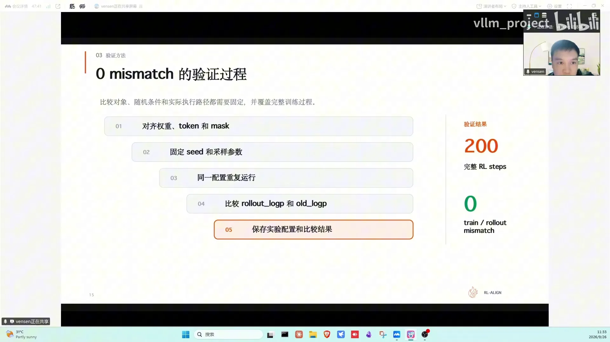 |
| 所以需要保证绝对一致性：精度、舍入边界、通信的时机等都要考虑。通信也一样——从各分块算结果到最后，都按固定的顺序累加。只有这些才能保证一致性。 [【跳转到 28:45】](https://www.bilibili.com/video/BV1Ech96cEzW/?t=1725) |  |
| 嗯对，之前做推理的时候我们也是天天要对精度。对，经常是你最后跑 benchmark 就会跟原来有一些误差；逐层对比的时候一开始误差是极低的，而且一开始几个 token—— [【跳转到 29:10】](https://www.bilibili.com/video/BV1Ech96cEzW/?t=1750) |  |
| 可能都是一样的，但后面每次 forward 都会累积一点误差，在 token 里慢慢出现分叉；最后跑完精度、跑完 lm eval 发现精度怎么掉了这么多——就是这种感觉。精度这个问题算得上是做 Infra 完全绕不开的：不管做训练还是推理，大家每天都要干这事。 [【跳转到 29:35】](https://www.bilibili.com/video/BV1Ech96cEzW/?t=1775) |  |
| 只不过有的标准稍微高一点、有的低一点，但推理里边也很高：比如像 DeepSeek V4 原本能跑到 0.99 多，如果掉到 0.8 几那是有问题的，要看看到底哪里出了问题。这就是刚才说的—— [【跳转到 30:00】](https://www.bilibili.com/video/BV1Ech96cEzW/?t=1800) | 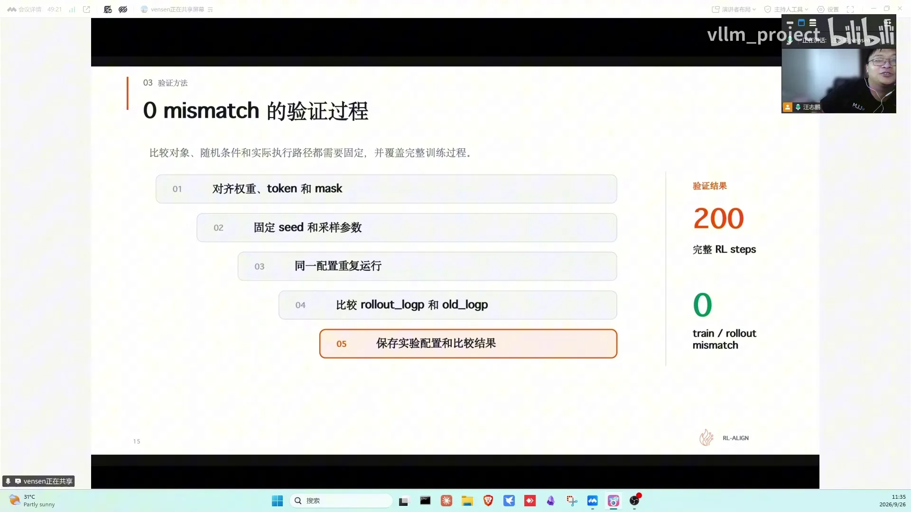 |
| 实际 debug 的过程。——对。我理解不同推理框架的精度肯定不会完全一致：每次一些厂商公布的用不同推理框架、或不同云厂商提供的推理服务，在 benchmark 上的跑分都是不一样的。——嗯对，是。 [【跳转到 30:25】](https://www.bilibili.com/video/BV1Ech96cEzW/?t=1825) |  |
| 但 vLLM 当中会有一个专门跑这些 model 的 LM Eval 标准——不管是 GLM 模型还是 DeepSeek 的模型，我们一般都参照那个来看我们的 model 的 LM eval 是不是有问题。我记得之前 batch size 不同的话其实也会影响精度—— [【跳转到 30:50】](https://www.bilibili.com/video/BV1Ech96cEzW/?t=1850) |  |
| 我不知道这种情况下一般怎么去做精度上的评估：是尽可能保障 batch size 不同输出结果完全一致，还是允许在一个误差范围内？——我们现在这边是固定流程：用后面 PPT 里固定的 batch size， [【跳转到 31:15】](https://www.bilibili.com/video/BV1Ech96cEzW/?t=1875) |  |
| 去跑这个流程。——稍等，在我们现在 RL-Kernel 这个版本里是怎么固定刚才说的那些可能影响训推不一致的因素的？比如确定精度、累加顺序、规约顺序等等， [【跳转到 31:40】](https://www.bilibili.com/video/BV1Ech96cEzW/?t=1900) | 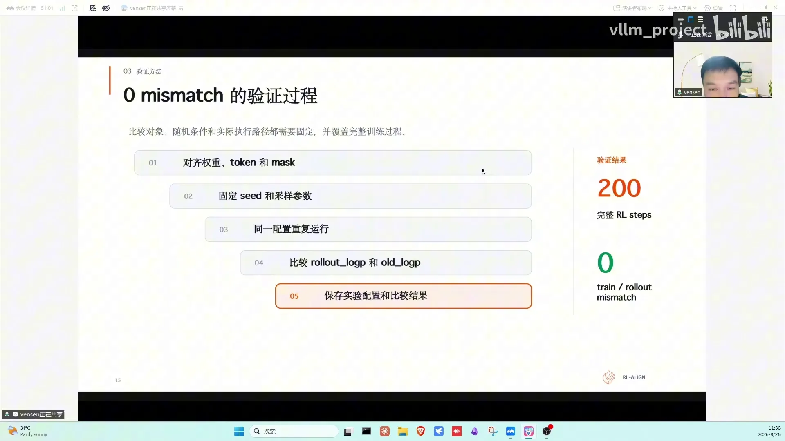 |
| 还有通信。这些东西都得保证，才能按照流程逐层找到差异。所以这跟 vLLM 那个 debug 稍微有些不一样，因为这里的因素还涉及同步训推的流程。好—— [【跳转到 32:05】](https://www.bilibili.com/video/BV1Ech96cEzW/?t=1925) |  |
| 回答直播间提问。有同学问：debug 的时候输入需要特意构造边界性的数值去测试吗？——对，要的。因为我们要测一个东西—— [【跳转到 32:30】](https://www.bilibili.com/video/BV1Ech96cEzW/?t=1950) |  |
| 肯定是要有一个对照：固定这个边界再来 debug、走整个流程。像固定 replay 定位第一处差异——就跟刚才说的锁定固定权重一样：把 token 都保存好，把这些都定好之后，按照逐层去 debug。 [【跳转到 32:55】](https://www.bilibili.com/video/BV1Ech96cEzW/?t=1975) |  |
| 就是有一个逐层探针的概念。——然后这个同学问的问题跟我刚才问的一样：现在的 vLLM 这边还持续支持新算子吗？ [【跳转到 33:20】](https://www.bilibili.com/video/BV1Ech96cEzW/?t=2000) | 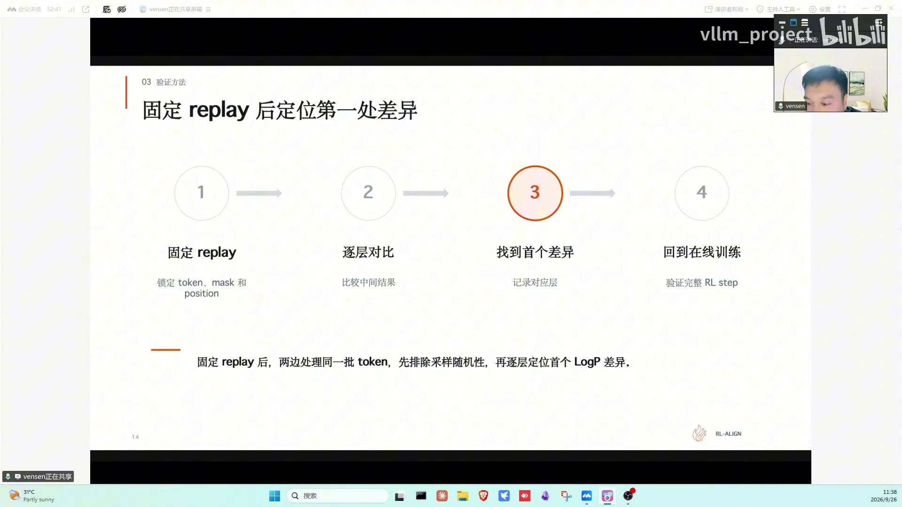 |
| 这个问题很好。vLLM 那边是这样：现在大家都在开始研究训练这块，尤其是后训练对我们越来越重要——不仅仅是 vLLM，其他的库我理解也开始开发算子这块，尤其是针对不同的型号，比如 CUDA 的卡—— [【跳转到 33:45】](https://www.bilibili.com/video/BV1Ech96cEzW/?t=2025) | 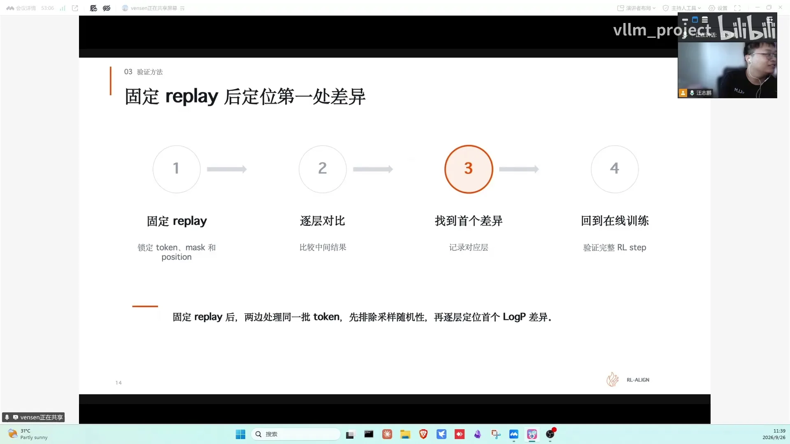 |
| 像 H 系列或者 B 系列——它们本身有自己硬件加速的技术。对 vLLM 来讲也有这方面的支持，支持新算子肯定会有。所以他们有了之后，我们这边就可以复用一些高性能算子，对吧。因为这个东西本身是一个 tradeoff： [【跳转到 34:10】](https://www.bilibili.com/video/BV1Ech96cEzW/?t=2050) | 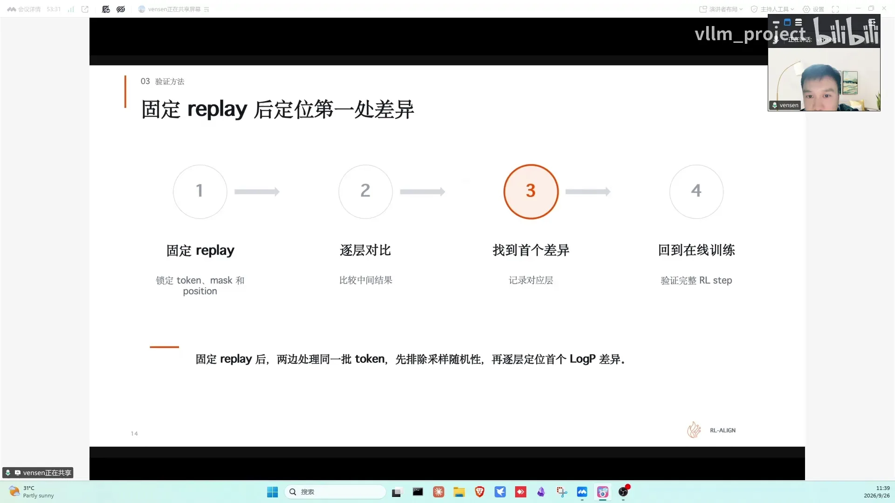 |
| 保证一致性的时候会牺牲性能；要保性能的时候，我们尽可能复用高性能算子库——比如 vLLM 里边的、FlashInfer，或者 AMD 那边对应的 AITER 算子库，他们也开始做相关实现。只有这样，我们才能在实现一致性的同时—— [【跳转到 34:35】](https://www.bilibili.com/video/BV1Ech96cEzW/?t=2075) | 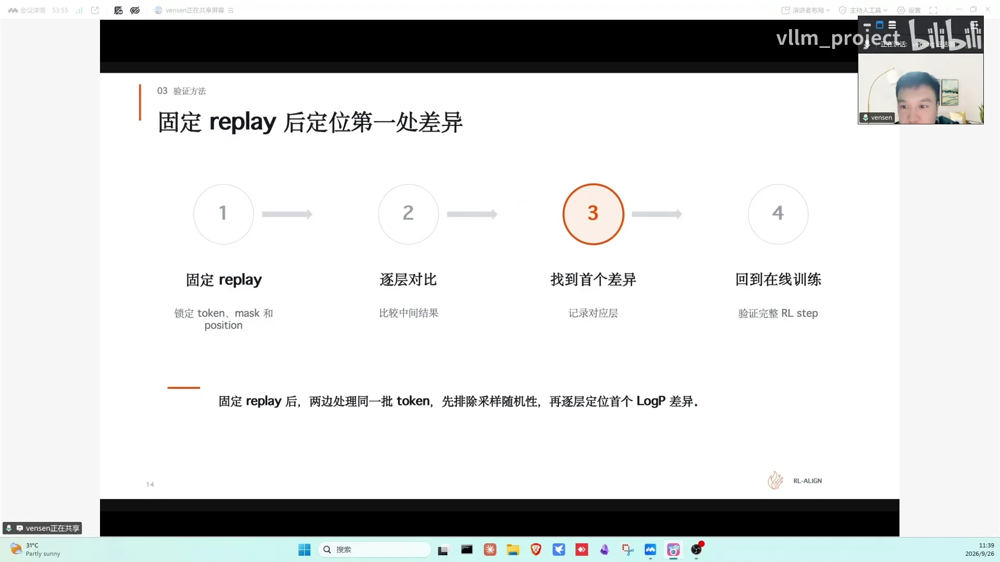 |
| 还能把性能拉起来。——我理解，因为这个问题被发现之后，基本上所有仓库都很关注这块。vLLM 应该在 Slack 里有专门的群去跟踪这块讨论，专门做这块是吧？——对，大家如果对这个话题感兴趣的话可以直接在 Slack 上搜， [【跳转到 35:00】](https://www.bilibili.com/video/BV1Ech96cEzW/?t=2100) | 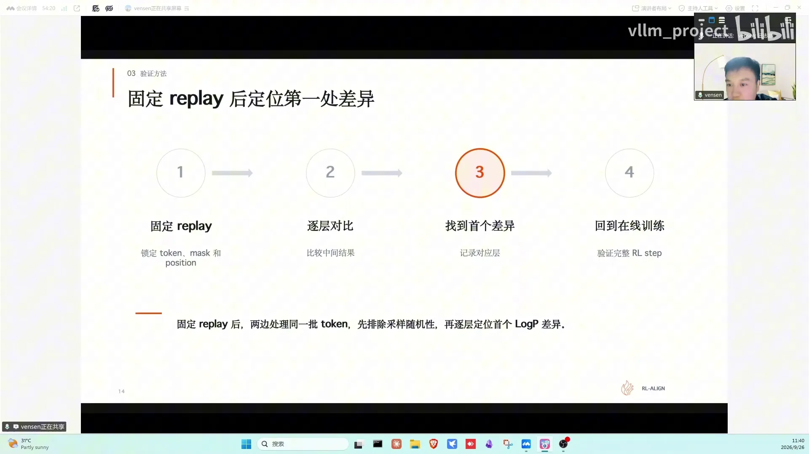 |
| 有一个 channel 专门做这个。——对，可以到时候提供 rollout 这方面的高性能算子，我们到时候有一些算子会直接复用。只有真的在算子里保证不了累加顺序或规约顺序的时候，我们才考虑自研。但我们尽可能复用高性能算子库。——然后还有个同学问：所以训推现在是要同时优化算子吗？ [【跳转到 35:25】](https://www.bilibili.com/video/BV1Ech96cEzW/?t=2125) |  |
| 对吧，同时优化算子。对。像我们的话，使用的是同一份算子——针对 attention 或者 GEMM 这些。优化的时候要看范围。我们这边想的是—— [【跳转到 35:50】](https://www.bilibili.com/video/BV1Ech96cEzW/?t=2150) | 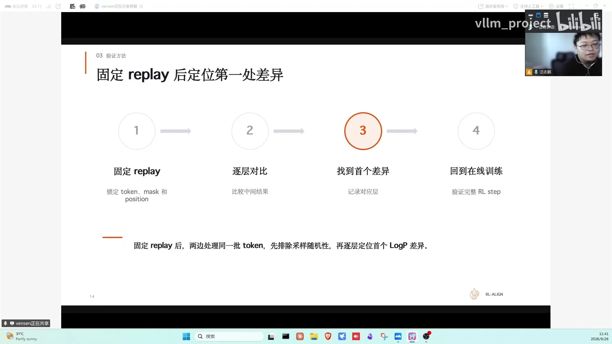 |
| 如果对 attention 或者 linear logprob 都跑到了一个算子里边，那保证训推一致性的时候，就要保证这个算子被路由过来之后——从不同的 training 和 rollout 框架进来——要走在我们的同一个路径里边；同一个路径里按固定的累加和规约顺序去做，就能保证 consistency。 [【跳转到 36:15】](https://www.bilibili.com/video/BV1Ech96cEzW/?t=2175) |  |
| 还有个小问题：我感觉就像是在训推的时候换掉了特定的、训推不一致导致的算子，对吧，这样可以保证正确的一致性。那真正部署模型的时候我们肯定又会把算子换回来——还是用框架原来的算子。那么训练的时候—— [【跳转到 36:40】](https://www.bilibili.com/video/BV1Ech96cEzW/?t=2200) |  |
| 去保障训推一致性，但这个结果可能没办法迁移到正式模型上线的时候的结果？——是这样的，我们这边算是一个整体。怎么说呢：我们不是简单替换算子。集成的时候，比如 vLLM 这边集成（RL-Kernel）对应的——里边有运行时的—— [【跳转到 37:05】](https://www.bilibili.com/video/BV1Ech96cEzW/?t=2225) |  |
| 有集成的代码、运行时的检查、对应的算子。我们是根据 model 走的：简单来说会把 model 拆出来这些对应的算子——一个 model 按照它的架构来拆。现在这个是 dense 模型，MoE 模型的话也会按照 MoE 的模块去拆。拆完之后上层还是刚才说的那个架构图。 [【跳转到 37:30】](https://www.bilibili.com/video/BV1Ech96cEzW/?t=2250) | 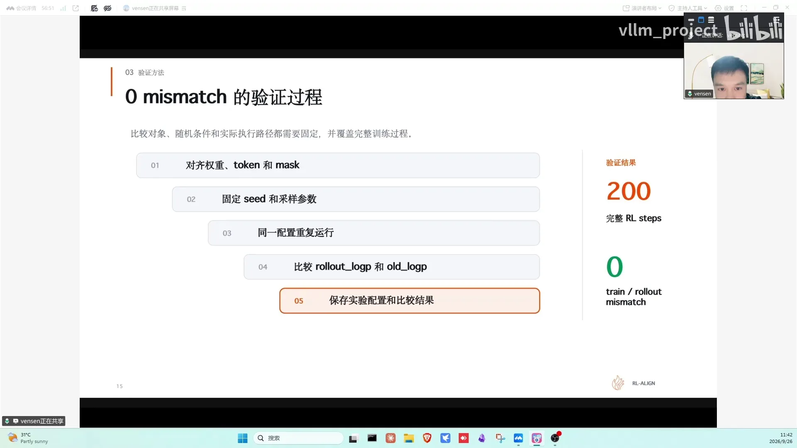 |
| 上层怎么去做我们其实不管；但如果接入到我们这边、跑在我们这个流程里边，我们这边对应的算子是一个完整的体系。部署的时候其实不需要再切换回原来的算子——因为我们会保留 consistency 路径和 fast pass 路径。 [【跳转到 37:55】](https://www.bilibili.com/video/BV1Ech96cEzW/?t=2275) | 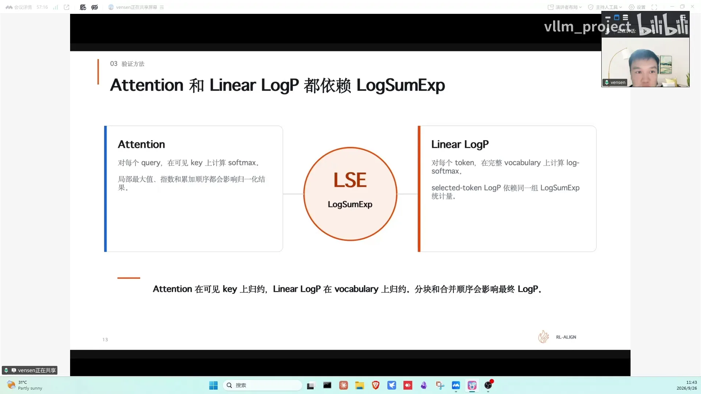 |
| 因为这里边是一个整体：针对每个 model 拆对应的 kernel，再去改 kernel、改对应的通信方式、运行时检查，包括上下游集成的代码——它是一个整体，不是过来之后只改一个 attention 就完事了。——哎，那我改完之后的话—— [【跳转到 38:20】](https://www.bilibili.com/video/BV1Ech96cEzW/?t=2300) | 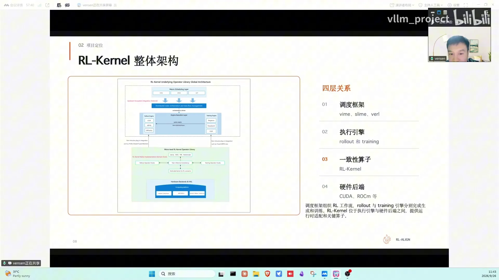 |
| 最后上线的时候你推荐用原来框架代码还是改过之后的版本代码？——好问题。就假设来说，vLLM 原生是一个 baseline。我觉得取决于用户：如果我们这边保证了 consistency（绝对一致性），同时性能如果没有比原生—— [【跳转到 38:45】](https://www.bilibili.com/video/BV1Ech96cEzW/?t=2325) | 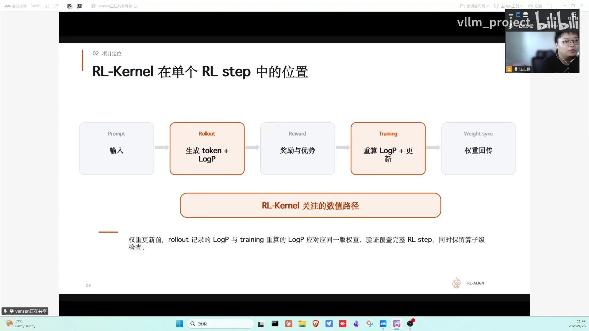 |
| 差、甚至可能比原生高，达到这种条件的话就取决于用户怎么选择——两种方式其实都可以。因为我们不是只改一个单算子，是改一个整体。——我感觉其实还是得用训练时走的那套代码路径，对吧，因为这样才可能有比较好的分数。 [【跳转到 39:10】](https://www.bilibili.com/video/BV1Ech96cEzW/?t=2350) | 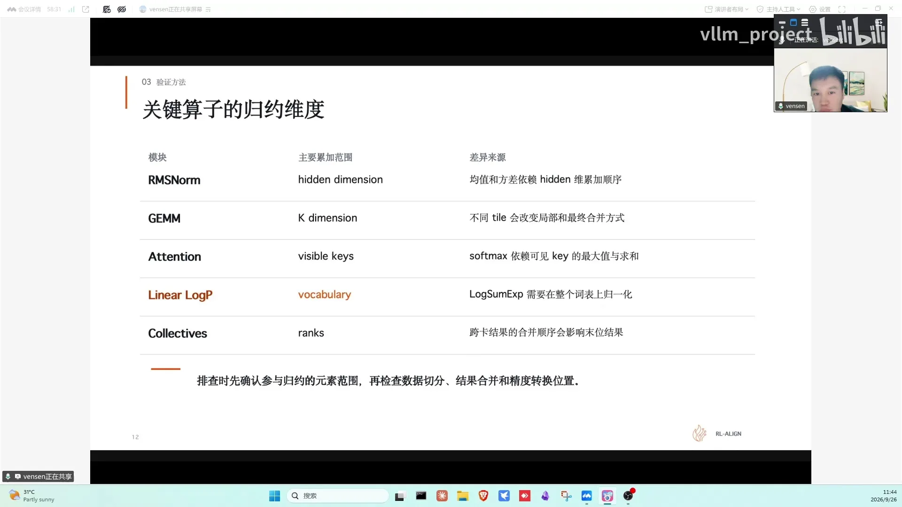 |
| 要不然上线时用原来框架的一些东西，速度上可能有一点优势，但整个 benchmark 可能跟训练时的预期就不太一样了。——我知道你意思：相当于就拿 vLLM 来讲，在 vLLM 里边接这个 model，这个 model 直接跑在 vLLM 的引擎里边。 [【跳转到 39:35】](https://www.bilibili.com/video/BV1Ech96cEzW/?t=2375) | 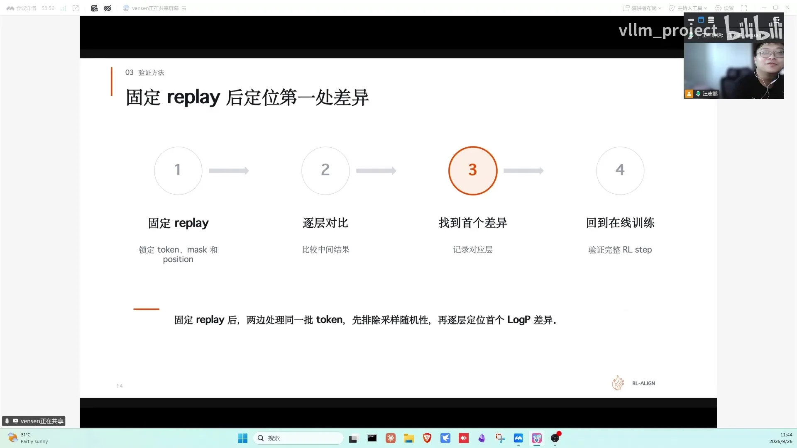 |
| 对。比如像 Megatron 这些——如果说用 vLLM 原生或者用 veRL 这些框架去跑的话，它自己已经接了 rollout 和 training 的 engine，自己可以跑对应的 accuracy 和 benchmark。对我们这边来说也是一样的，就相当于—— [【跳转到 40:00】](https://www.bilibili.com/video/BV1Ech96cEzW/?t=2400) | 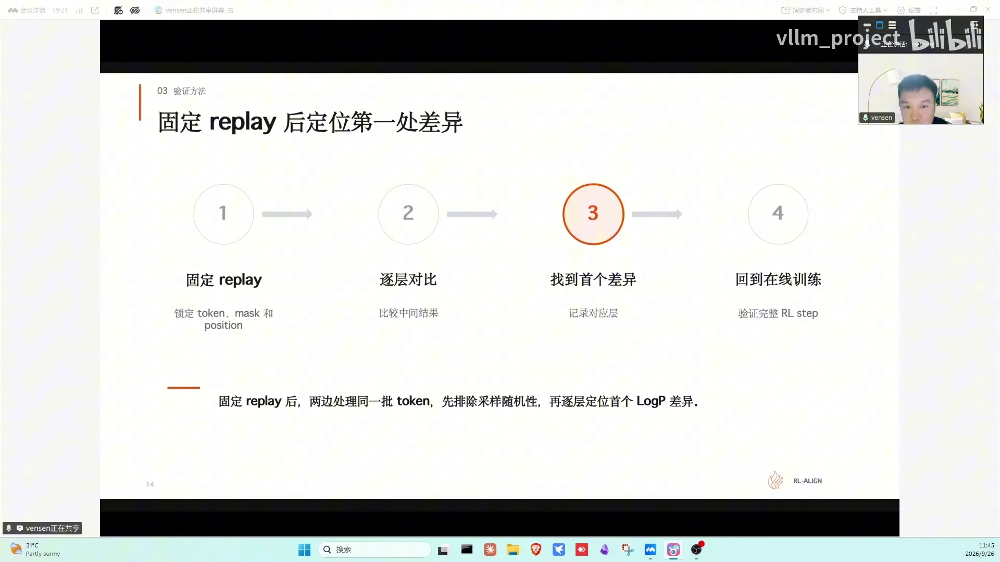 |
| 可以理解为：我们在这里边也会跑对应的 reward、一致性测试、benchmark，还有 accuracy——差不多这几种大类都会跑。跑出来数据之后就看用户那边的选择。 [【跳转到 40:25】](https://www.bilibili.com/video/BV1Ech96cEzW/?t=2425) |  |
| 还有就是我们框架支持的 model 有多少。举个例子：如果 vLLM 原生支持 Qwen3-Next、包括 DeepSeek V4 都支持，那如果我们也支持、并且跑出来了对应的 benchmark 指标，那就看用户怎么选了。用户一看：你这个框架如果我要跑—— [【跳转到 40:50】](https://www.bilibili.com/video/BV1Ech96cEzW/?t=2450) | 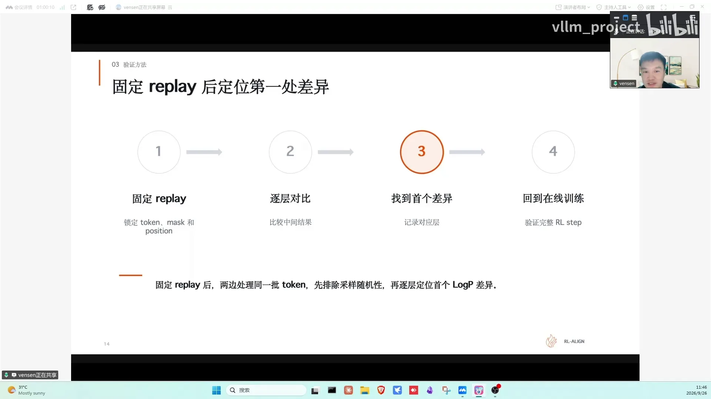 |
| 举个最简单的场景：用户想跑集群型的，如果发现我们对多机多卡的验证现在还不是特别完美，那用户肯定首选跑原生的。如果我们多机多卡、主流 model 都支持了，并且放出来了比较不错的 benchmark 和一致性数据—— [【跳转到 41:15】](https://www.bilibili.com/video/BV1Ech96cEzW/?t=2475) |  |
| reward 曲线这些指标都在上面的话，用户就会去思考需不需要用这个框架来保证他训练的稳定性。对吧。好，继续回答观众提问。有同学问：不同程度的训推不一致会造成什么样的问题？不同程度—— [【跳转到 41:40】](https://www.bilibili.com/video/BV1Ech96cEzW/?t=2500) | 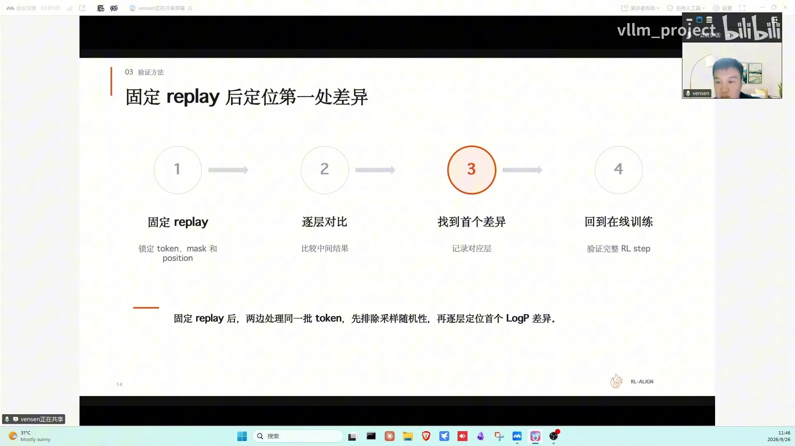 |
| 比如有的训推不一致问题不是很重，有的可能就会比较严重。——这个问题有点抽象。我理解这个程度也需要一定量的（衡量）对吧。我个人理解：如果训推不一致的问题很大，会导致训练侧和推理侧的模型表现行为完全不一致——那么你训练的那部分内容—— [【跳转到 42:05】](https://www.bilibili.com/video/BV1Ech96cEzW/?t=2525) |  |
| 需要把推理的这些 token 放到训练里面重新跑一遍，实际上会导致整个行为不一致。后面我认为这个模型应该会训崩——对，训练之后就训崩了。训崩的话，比如一些大的 batch size，也可能会导致训着—— [【跳转到 42:30】](https://www.bilibili.com/video/BV1Ech96cEzW/?t=2550) | 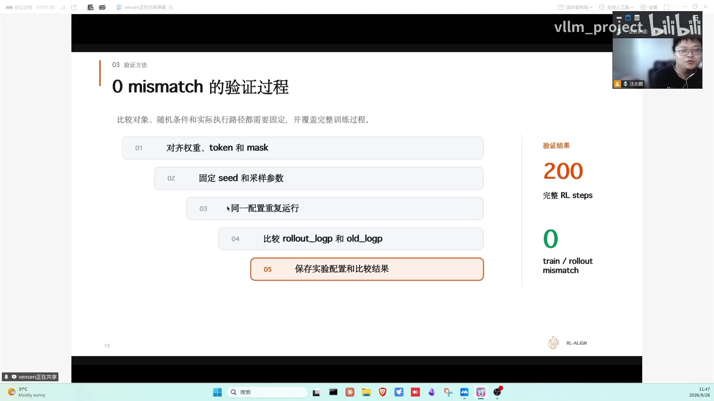 |
| 比如跑 200 轮的时候训崩、或者几百轮之后训崩。对于这种情况，我们保证的就是整体训练稳定性——最终想要的也是保证训练稳定性和对应的 reward。不同程度的话：最严重的我觉得应该就是训崩了——你训崩了 [【跳转到 42:55】](https://www.bilibili.com/video/BV1Ech96cEzW/?t=2575) |  |
| 就没法往下搞了，整个 RL 的 step 相当于废掉了，还要重跑、浪费。对。后面有同学补充：严重的话 clipping 率会很高。是的，clipping 率高，实际上就像整个系统里很多算力在空转。坦白来说最后还是 GPU 这块——因为我们的显卡对应跑的任务—— [【跳转到 43:20】](https://www.bilibili.com/video/BV1Ech96cEzW/?t=2600) | 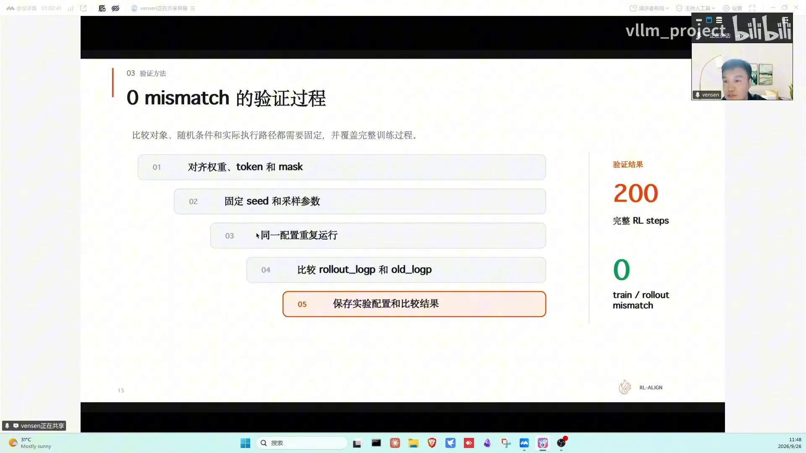 |
| 都是定好的：跑推理、跑训练然后一起。空转肯定会影响成本。然后有同学补充：因为引擎的差异，现在 RL 框架都是做重算 old logprob——重算走的是 Megatron 那边，Megatron 去做重算。 [【跳转到 43:45】](https://www.bilibili.com/video/BV1Ech96cEzW/?t=2625) | 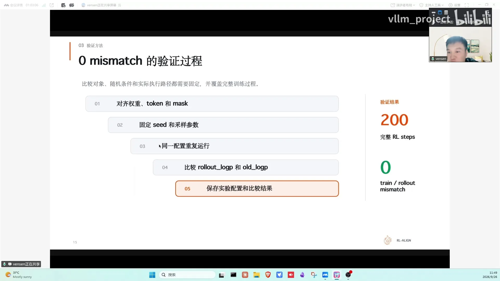 |
| 但是我还是觉得：这些 token 是推理侧做出来的，推理侧和训练侧差异太大的话，Megatron 做重算所依赖的 token 也不是模型本来应该生成的 token——本身也会存在行为上的不一致性。 [【跳转到 44:10】](https://www.bilibili.com/video/BV1Ech96cEzW/?t=2650) | 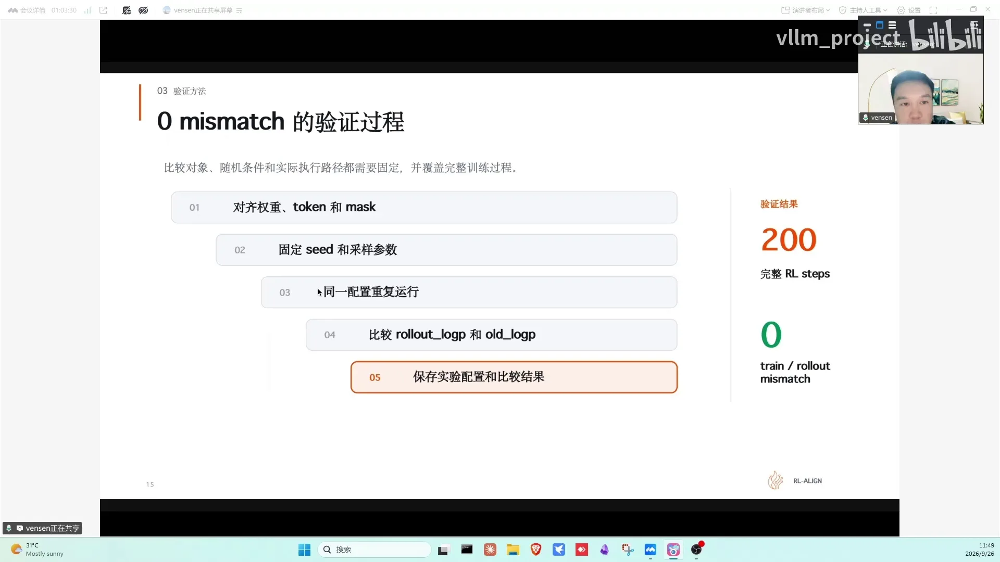 |
| 好，下一个问题：精度问题中，对于不同的卡，如果按完全一致的要求标准判断，是不是要求太高了？比如是不是有的卡可以要求精度完全一致，有的卡精度误差在允许范围内——我们框架是不是也可以考虑？ [【跳转到 44:35】](https://www.bilibili.com/video/BV1Ech96cEzW/?t=2675) |  |
| 我知道他的意思。是这样：我们现在做的是 H 卡（CUDA），下一系列是 B 卡。但确实有一些卡如果强制保证一致性的话性能会掉很多——因为跟卡上面的硬件技术、设计也有关系。 [【跳转到 45:00】](https://www.bilibili.com/video/BV1Ech96cEzW/?t=2700) | 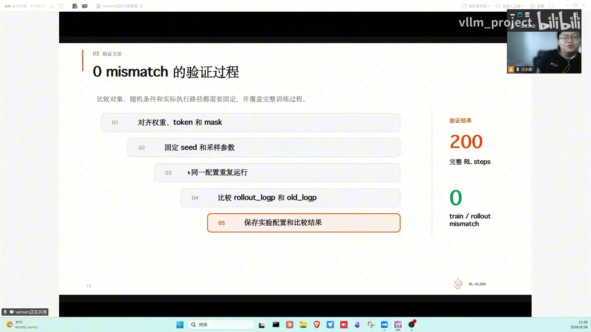 |
| 所以我们有一些地方（可以讨论）。但在整体一致性这块，我们目前先走的是保证绝对一致性；有一些路径可能会设计在容差范围内——这取决于接下来的规划。好，那社区同学如果想贡献这个项目的话—— [【跳转到 45:25】](https://www.bilibili.com/video/BV1Ech96cEzW/?t=2725) |  |
| 如果你有卡的话也是个非常好的贡献去处。B 卡不一定非得 B200/B300 这种卡——比如 5090 可以用吗？——对啊。还有像 Pro 5000、Pro 6000，我觉得 50 系的卡应该都可以用。因为 R-Kernel 这块把 model 拆开，对显存要求是很低的。 [【跳转到 45:50】](https://www.bilibili.com/video/BV1Ech96cEzW/?t=2750) | 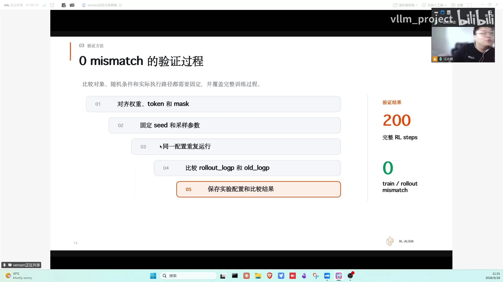 |
| 5090 这个卡——因为我们现在还没有支持 B 系列，如果有卡的话可以用。做 B 系列虽然没有 B200 这种工业卡性能那么好—— [【跳转到 46:15】](https://www.bilibili.com/video/BV1Ech96cEzW/?t=2775) |  |
| 但我觉得拆算子的时候最起码能把 B 系列的路径支持到。我们现在 H 卡已经支持了一个 model、也有对应的厂商；B 系列里边可以按照 H 卡的节奏再去做支持和适配。所以还是有很多工作要做的——这也是刷 PR 的一个好办法。 [【跳转到 46:40】](https://www.bilibili.com/video/BV1Ech96cEzW/?t=2800) | 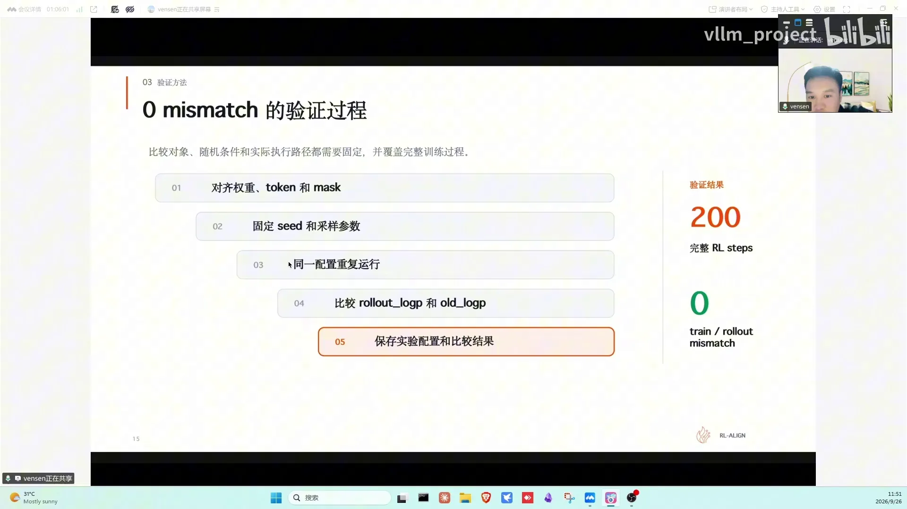 |
| 对，等一会我们也可以直接好好介绍一下怎么给这个仓库做贡献。然后同学又有问题：既然 Megatron 那边需要做重算，那为什么我们还需要推理引擎呢？直接在训练代码换算子不就行了？——训练代码换算子，我理解……等下我想想，他的意思是用 rollout logprob 吗？ [【跳转到 47:05】](https://www.bilibili.com/video/BV1Ech96cEzW/?t=2825) | 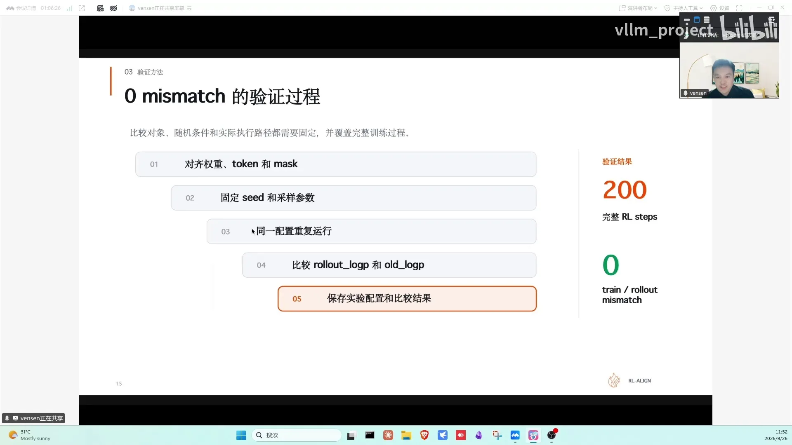 |
| 就是不要重算的。——我意思是他直接可能是把训练侧的那些算子全部替换到推理侧去，对吧。——我理解的他应该是想走 veRL 里边的那个模式，比如 use_rollout_logprob 的 true/false 模式。 [【跳转到 47:30】](https://www.bilibili.com/video/BV1Ech96cEzW/?t=2850) |  |
| 比如像刚才讲单个 RL step 的时候，是在 Megatron 里重算 old logprob；还有一种形式是直接用 rollout 侧的 logprob，不需要重算。但这两种形式跑下来其实是有一些差别的。 [【跳转到 47:55】](https://www.bilibili.com/video/BV1Ech96cEzW/?t=2875) |  |
| 好我们继续。我离近一点声音大一点。零 mismatch 的验证过程：比较对象、随机条件和实际执行的路径都需要固定，并完整覆盖整个训练过程。 [【跳转到 48:20】](https://www.bilibili.com/video/BV1Ech96cEzW/?t=2900) | 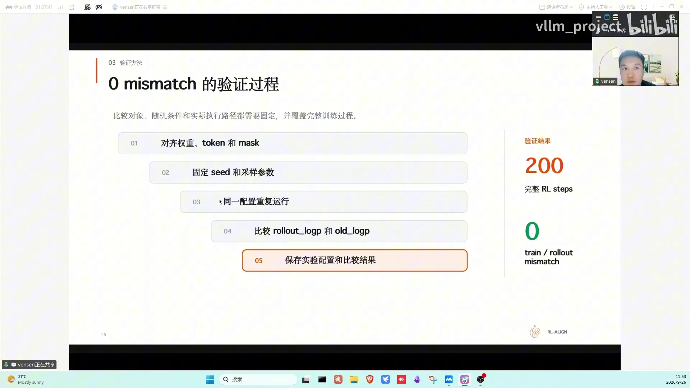 |
| 第一步：确定比较对象是一致的——权重、token、包括 mask；seed 和采样也可以归到这里边。第二步：同一配置—— [【跳转到 48:45】](https://www.bilibili.com/video/BV1Ech96cEzW/?t=2925) | 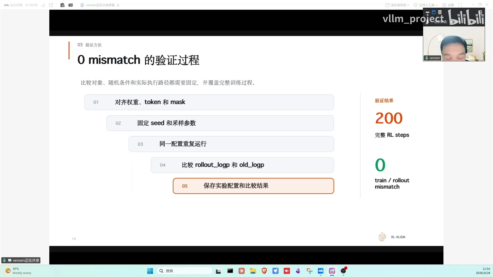 |
| 同一配置重复运行：确保问题可以稳定复现，而不是只跑一次的偶然结果——固定配置，拿来就能复现问题。第三步：对齐两侧的关键计算——比较 rollout logprob 和 old logprob。 [【跳转到 49:10】](https://www.bilibili.com/video/BV1Ech96cEzW/?t=2950) | 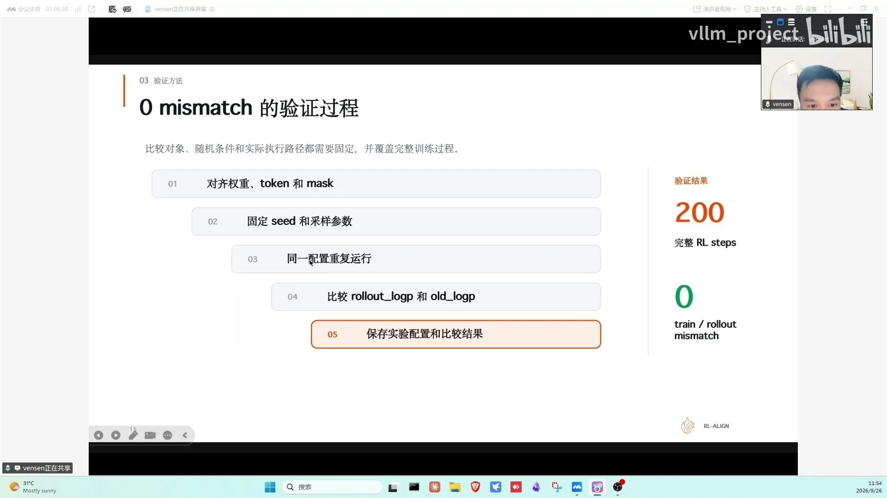 |
| 随后我们会保存实验配置、比较对应的结果。通过一个完整的 workflow——rollout、reward、training、权重同步全部走完，连续运行 200 个 step， [【跳转到 49:35】](https://www.bilibili.com/video/BV1Ech96cEzW/?t=2975) |  |
| 这个 RL step 每一步都比较、都为零。后面 PPT 有对应的 CUDA 和 ROCm 跑 200 步的曲线图，都是按照这个流程得到的——就是怎么验证零 mismatch 的验证过程。 [【跳转到 50:00】](https://www.bilibili.com/video/BV1Ech96cEzW/?t=3000) |  |
| 这是配置命令。现在这个命令在我们的 README 里的 quickstart，大家感兴趣可以去仓库看一下：里面有一个 quickstart，点进去跳到另外一个 README，有对应的命令，是我们另外一位 member 整理的。 [【跳转到 50:25】](https://www.bilibili.com/video/BV1Ech96cEzW/?t=3025) | 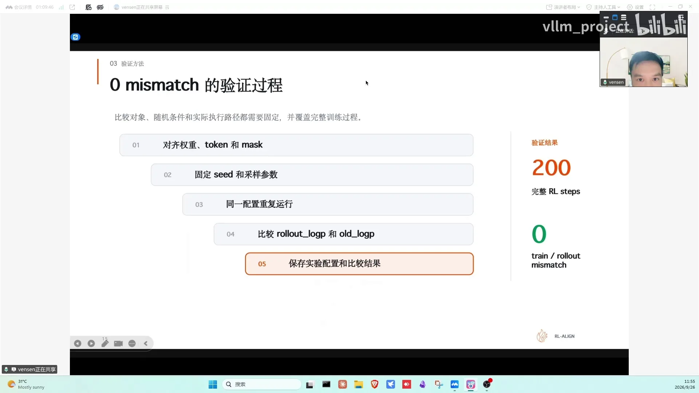 |
| 我们来看 CUDA 实验。这次跑的 dense 模型是在一台八卡 H100 上跑的，用 TP4 CP2，全局批次 128，seed 用 1234。比较的一边是 vLLM native—— [【跳转到 50:50】](https://www.bilibili.com/video/BV1Ech96cEzW/?t=3050) | 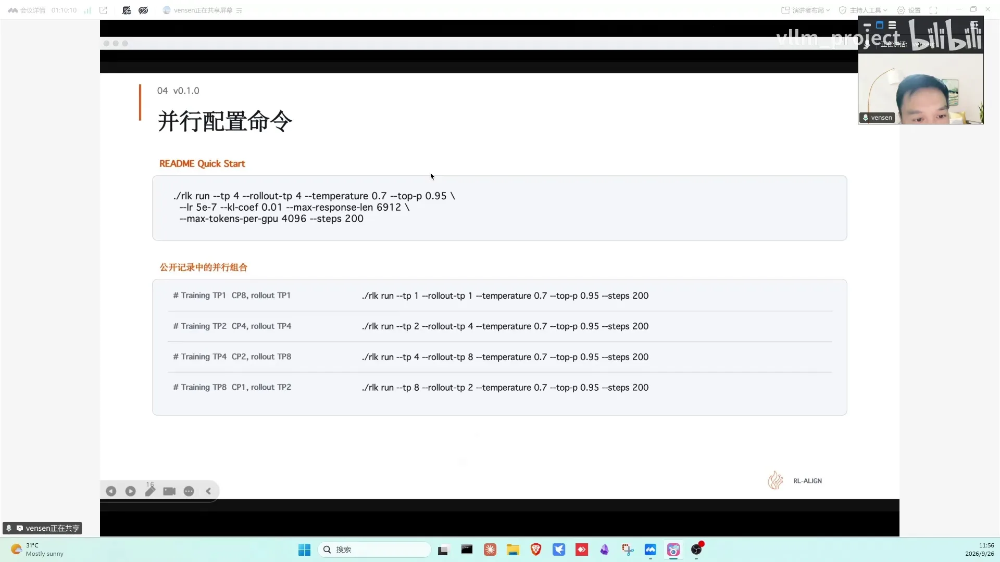 |
| vLLM 原生；另一边是 vLLM 加上 R-Kernel。两边的模型、数据、训练配置匹配，各跑 200 轮。这些参数专门罗列出来，是因为性能跟工作负载关系很大—— [【跳转到 51:15】](https://www.bilibili.com/video/BV1Ech96cEzW/?t=3075) | 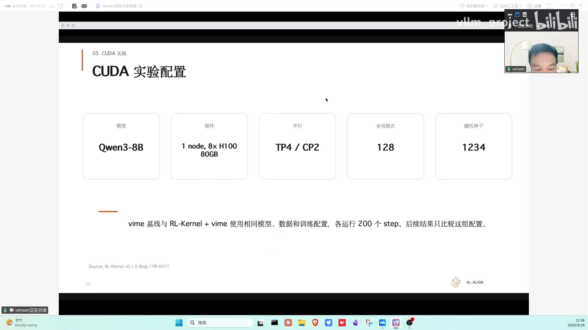 |
| 在极限负载下跑出来的和负载小一些的跑出来是不一样的，性能不一样；批次大一点、回答长一点，计算和通信占用的时间都会跟着变。所以后面讲结果会对应这些条件。我们主要检查两件事： [【跳转到 51:40】](https://www.bilibili.com/video/BV1Ech96cEzW/?t=3100) | 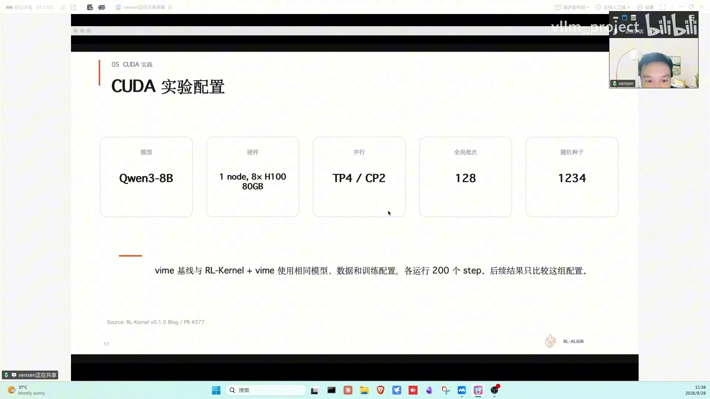 |
| 更新这么多轮（比如 200 个 step）训练概率能不能对得上，以及完整的 step time 有没有明显增加。这是 CUDA 的实验配置，也放在 README 和我们发的 blog 里—— [【跳转到 52:05】](https://www.bilibili.com/video/BV1Ech96cEzW/?t=3125) | 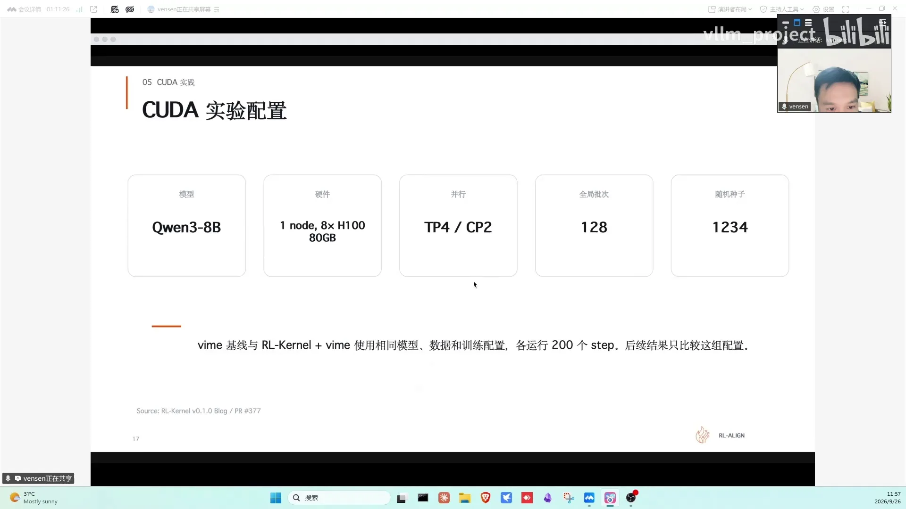 |
| 有对应的 CUDA 200 step 的图。这张图红色是 vLLM 原生，绿色是 R-Kernel 加 vLLM；横轴都是 step；左侧纵轴是 active tokens—— [【跳转到 52:30】](https://www.bilibili.com/video/BV1Ech96cEzW/?t=3150) |  |
| 也就是 active 的数量；右侧纵轴是这一轮里 logprob 的绝对差异。在 Qwen3 8B 这个 model 下——八张 H100、TP4 CP2 的配置——R-Kernel 路径 [【跳转到 52:55】](https://www.bilibili.com/video/BV1Ech96cEzW/?t=3175) | 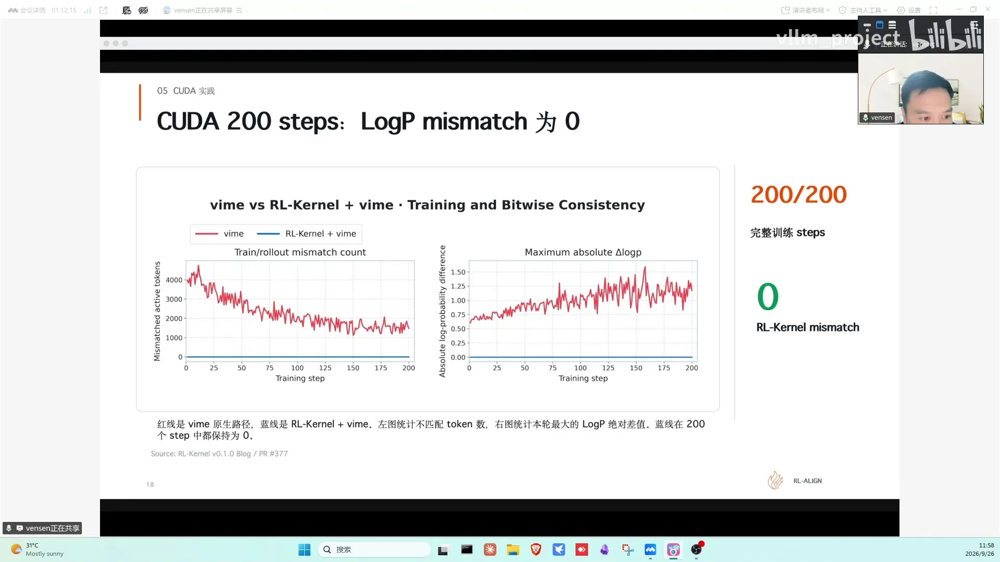 |
| 跑完了完整的 200 个 step，每一步的 logprob mismatch 都是零。这是曲线对比。这块是性能——哦，刚才那个图有同学问左图为什么一直在下降，这个图吗？ [【跳转到 53:20】](https://www.bilibili.com/video/BV1Ech96cEzW/?t=3200) |  |
| vLLM 原生当时我们跑的时候对比的用的配置其实是一样的，就是我们这边的配置。在 vLLM 原生跑的时候——嘶，这个图我想一下—— [【跳转到 53:45】](https://www.bilibili.com/video/BV1Ech96cEzW/?t=3225) | 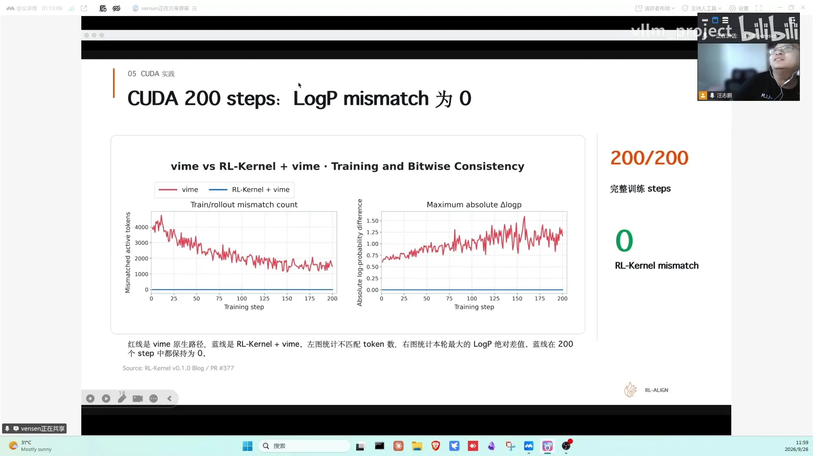 |
| 应该是跟 vLLM 那边——当时跑的应该是 main 分支吧。这个东西我觉得大家只关心它能够完全重合就行了。mismatch 的点从前面 step 是比较高的，然后下降—— [【跳转到 54:10】](https://www.bilibili.com/video/BV1Ech96cEzW/?t=3250) |  |
| 往下下降。但坦白来说，我们关心的其实是最后的两个对比：R-Kernel 加 vLLM 是不是能保证跑 200 步也是绿线的这种形式——绝对一致、误差为零。——对，我觉得核心还是底下这条线。 [【跳转到 54:35】](https://www.bilibili.com/video/BV1Ech96cEzW/?t=3275) |  |
| 这很重要。——刚才那个问题蛮好的，可以记录一下，会后再回答。——好我们继续。OK，CUDA 性能这块：这一页就是我们的性能是不低于原生路径。配置我就不讲了 [【跳转到 55:00】](https://www.bilibili.com/video/BV1Ech96cEzW/?t=3300) | 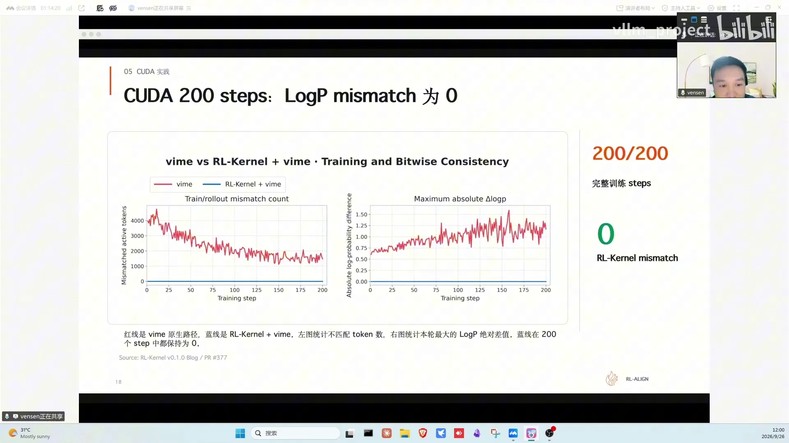 |
| 就刚才那些配置。这个结论就是：在我们现在对应的几个核心路径里，算子做了哪些事情——像我们的 GEMM、SM90。比如在我们自研的 SM90 路径里边—— [【跳转到 55:25】](https://www.bilibili.com/video/BV1Ech96cEzW/?t=3325) |  |
| 负责一个输出的 tile，沿着完整的 K 维度按照固定的顺序累加——还是我说的固定顺序、累加顺序、归约顺序，这是我们这边的处理方式。大家要做这些的话，可以看这些里边对应的每一条解释。然后 RMSNorm 的话—— [【跳转到 55:50】](https://www.bilibili.com/video/BV1Ech96cEzW/?t=3350) | 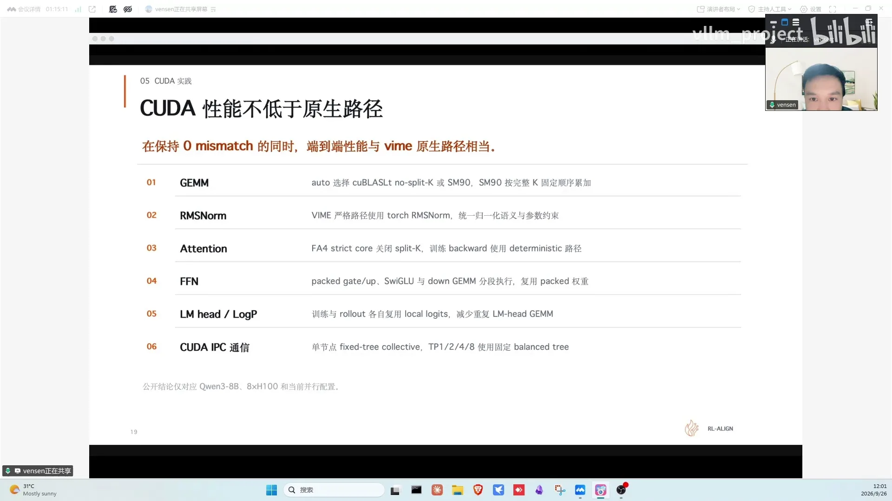 |
| 就是切换到一个 torch 的 RMSNorm，约定它对应参数的语义，避免不同实现带来的差异。attention 的话是复用了 FA4——关掉 split-k，训练的 backward 使用 deterministic 路径。然后 FFN 和 lm head—— [【跳转到 56:15】](https://www.bilibili.com/video/BV1Ech96cEzW/?t=3375) | 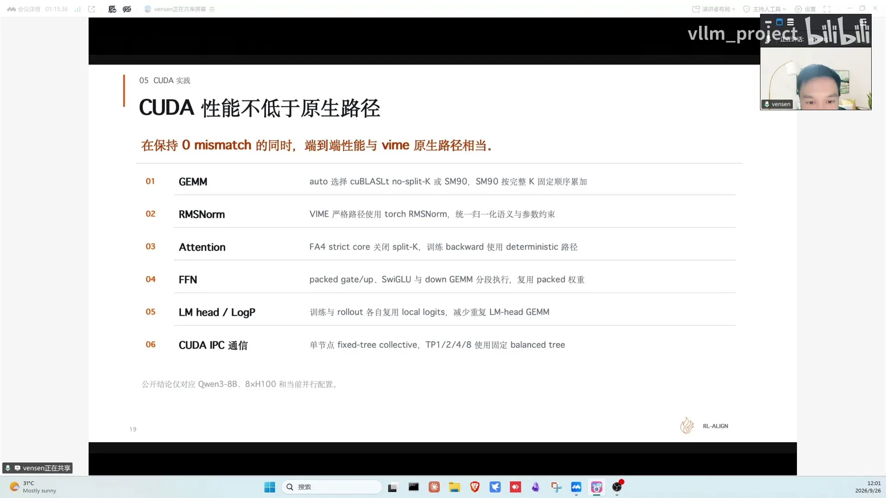 |
| 还有 logprob，都做了特定的实现。比如 linear logprob（lm head）：训练与 rollout 复用对应的 local 的 logits，减少重复的 GEMM。通信这边的话我们也使用了—— [【跳转到 56:40】](https://www.bilibili.com/video/BV1Ech96cEzW/?t=3400) | 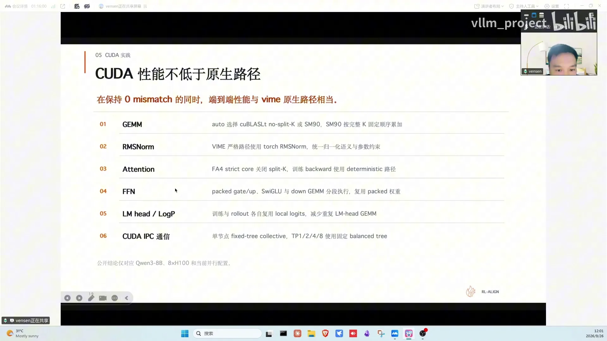 |
| 单节点对应的（使用）CUDA 的 IPC 的一个 fixed-tree 的 collective。我们的 TP1、TP2、TP4、TP8 都采用了固定的 balanced tree，固定这些数据的类型和舍入的位置。这是我们的—— [【跳转到 57:05】](https://www.bilibili.com/video/BV1Ech96cEzW/?t=3425) | 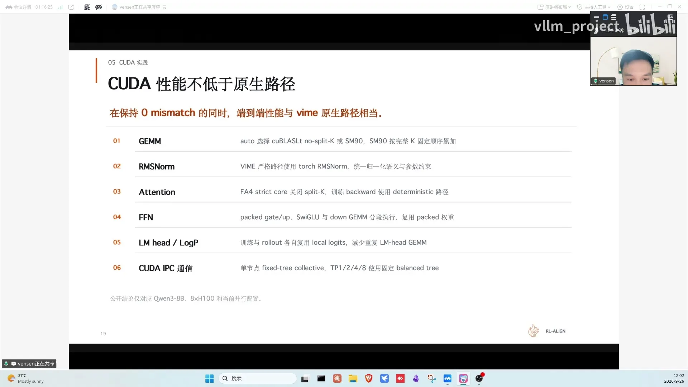 |
| 性能不低于原生路径的一个原因：在保证 0 mismatch 的同时，CUDA 这块的快速启动。如果想要跑的话，包括未来支持其他的 model，我们都会放一些快速启动的指令。第一步就不用说了嘛： [【跳转到 57:30】](https://www.bilibili.com/video/BV1Ech96cEzW/?t=3450) | 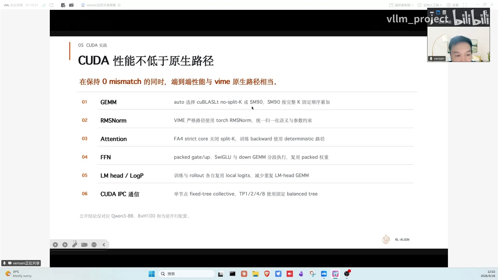 |
| 安装并指定本地的路径；第二步准备数据和 checkpoint；第三步启动 ray、检查环境；第四步运行基线与一致性路径——比如第四步：先使用一个 workspace，先去运行 vLLM native（原生路径）， [【跳转到 57:55】](https://www.bilibili.com/video/BV1Ech96cEzW/?t=3475) | 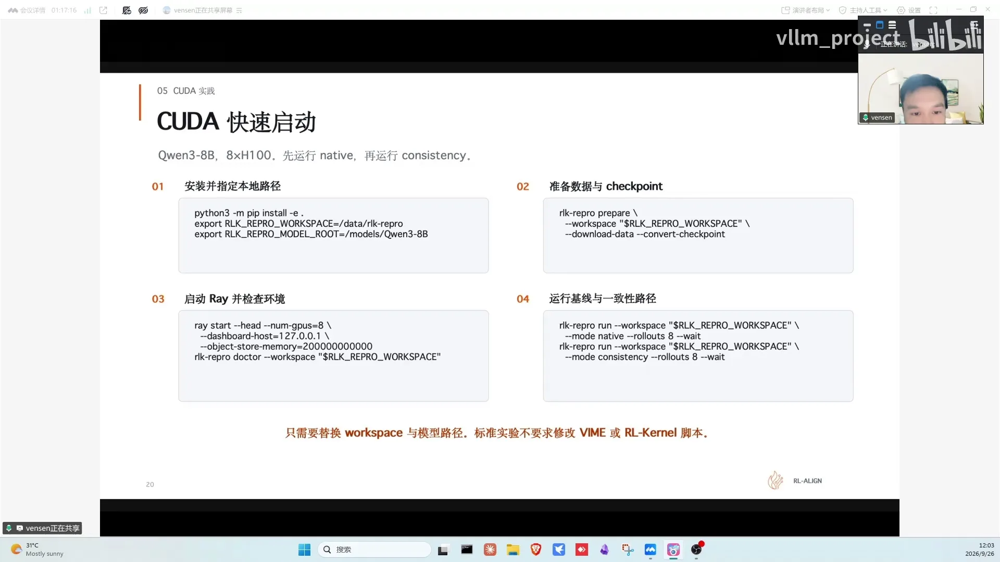 |
| 然后再运行 consistency 路径。两次运行要保证是同一份输入和环境，这样结果对比才可以直接比较。实际操作需要你自己替换一下自己的 workspace 和模型结构——模型的目录就可以了。 [【跳转到 58:20】](https://www.bilibili.com/video/BV1Ech96cEzW/?t=3500) | 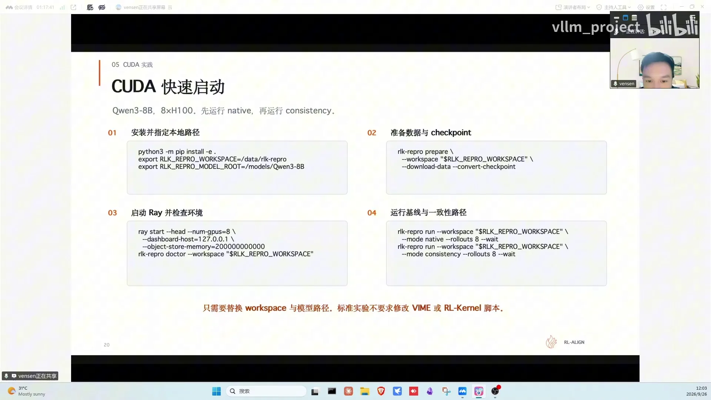 |
| 这是 ROCm。ROCm 采用的配置也是在单机上——八张 MI300X，训练使用 TP4、CP2，global batch、随机种子 1234，对比条件也一样。 [【跳转到 58:45】](https://www.bilibili.com/video/BV1Ech96cEzW/?t=3525) | 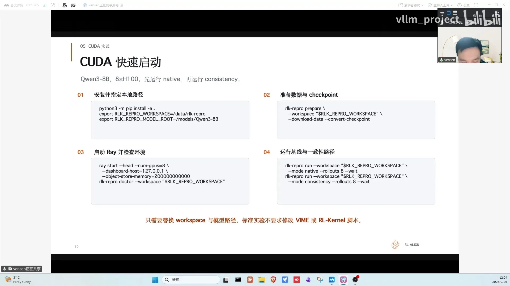 |
| vLLM 原生和 R-Kernel 加 vLLM 的比较路径。OK 往下走吧，因为跟那个一样：这边也是路径图，可以看到 vLLM 原生和 R-Kernel 的对比——R-Kernel 是在 ROCm 上。 [【跳转到 59:10】](https://www.bilibili.com/video/BV1Ech96cEzW/?t=3550) | 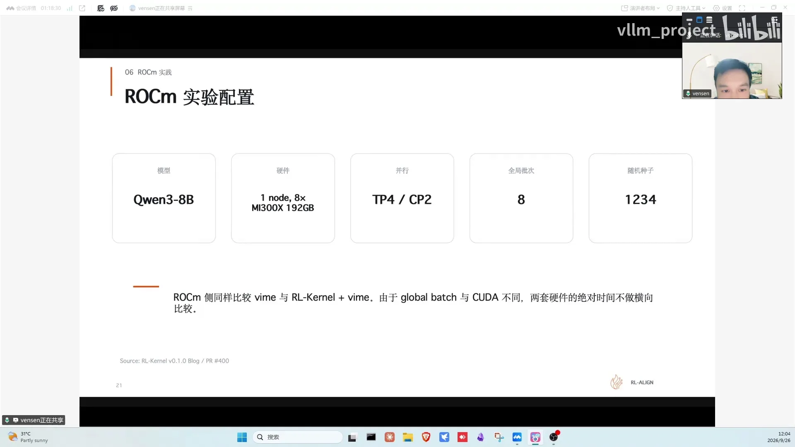 |
| 这边是在 200 步的 step 下运行的。这次试验涉及的逐元素比较蛮多——跑了所有这些元素比较之后，指定位置的比较结果全部在这 200 步完整 step 里保持为零。这个试验累计做了 900 多万次—— [【跳转到 59:35】](https://www.bilibili.com/video/BV1Ech96cEzW/?t=3575) | 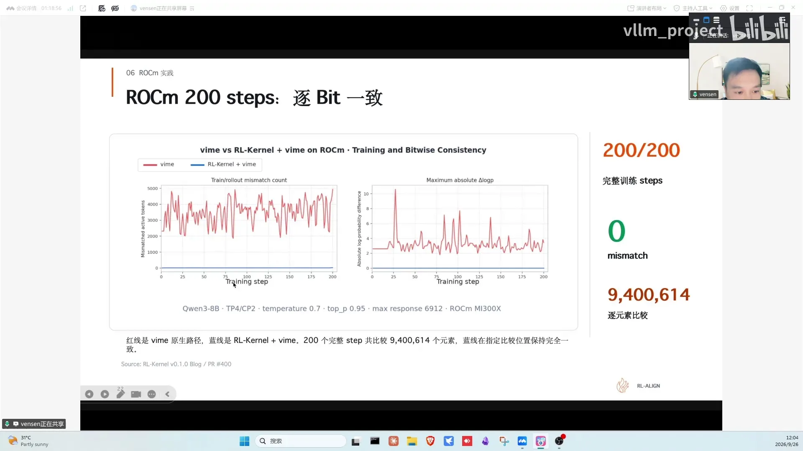 |
| 逐元素比较。指定的位置的比较结果全部都相同。这块工作验证了：在 ROCm 上做训推的路径也能保持一致。 [【跳转到 60:00】](https://www.bilibili.com/video/BV1Ech96cEzW/?t=3600) | 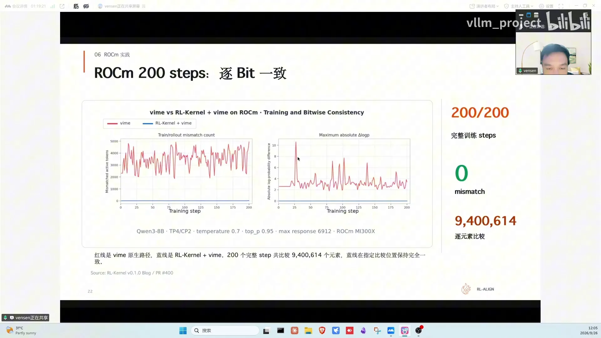 |
| 这块跟 CUDA 那块一样：ROCm 这边与原生路径的性能基本持平。这也是我们做了对应的特定优化。感兴趣的话—— [【跳转到 60:25】](https://www.bilibili.com/video/BV1Ech96cEzW/?t=3625) | 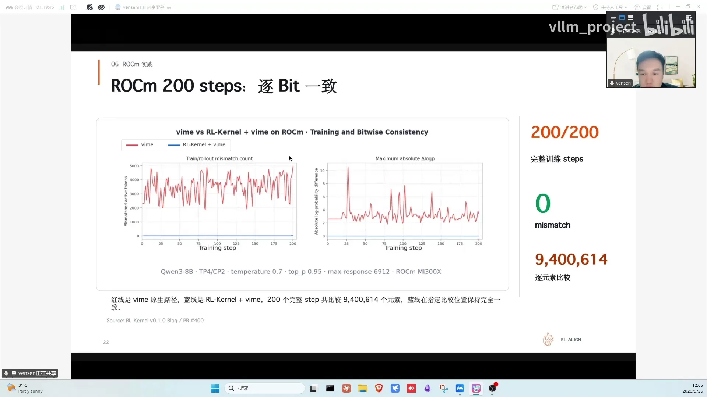 |
| 可以看一下对应的我们里边的一些 PR 之类。比如 GEMM：我们自研了那个 MFMA 的 kernel，固定累加顺序，FP32 合并后写回 BF16。attention 默认路径是由 AITER 的 CK 和 Triton 的一个—— [【跳转到 60:50】](https://www.bilibili.com/video/BV1Ech96cEzW/?t=3650) | 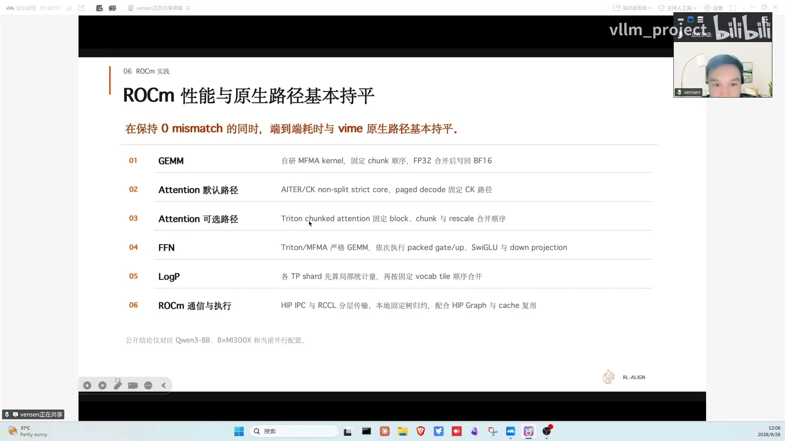 |
| 实现。也需要处理像 K 分块、固定的 CK 路径、配置的 decode 路径。FFN 的话是复用——FFN 就按照像 MFMA、grouped GEMM 这样的（算子），包括我们的—— [【跳转到 61:15】](https://www.bilibili.com/video/BV1Ech96cEzW/?t=3675) |  |
| 依次执行的……还有 SwiGLU 的 down projection 等等。logprob 这边：各 TP 的 rank 先算局部的统计量，最后再按固定的 vocabulary 顺序合并。然后通信这边：对应的 HIP 的 IPC 与 RCCL—— [【跳转到 61:40】](https://www.bilibili.com/video/BV1Ech96cEzW/?t=3700) | 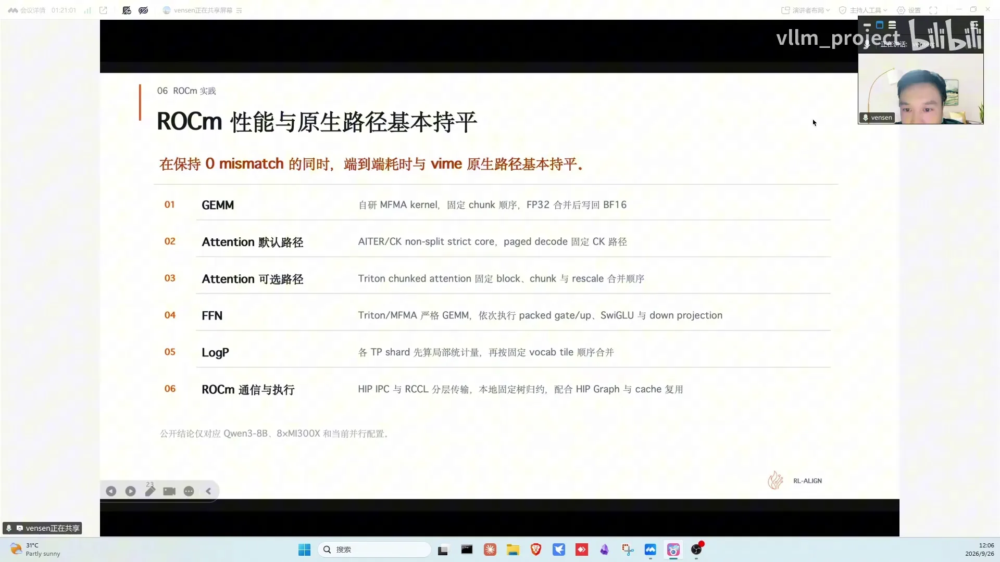 |
| RCCL 的一个分层传输：比如小 token 走 HIP 的 IPC，较大的 token 走 RCCL 负责传输；然后本地的规约，配合 HIP 的 graph 和 cache 复用。其实这些流程大家都会看到：针对关键算子做了特殊的处理。但最后的累加顺序和—— [【跳转到 62:05】](https://www.bilibili.com/video/BV1Ech96cEzW/?t=3725) | 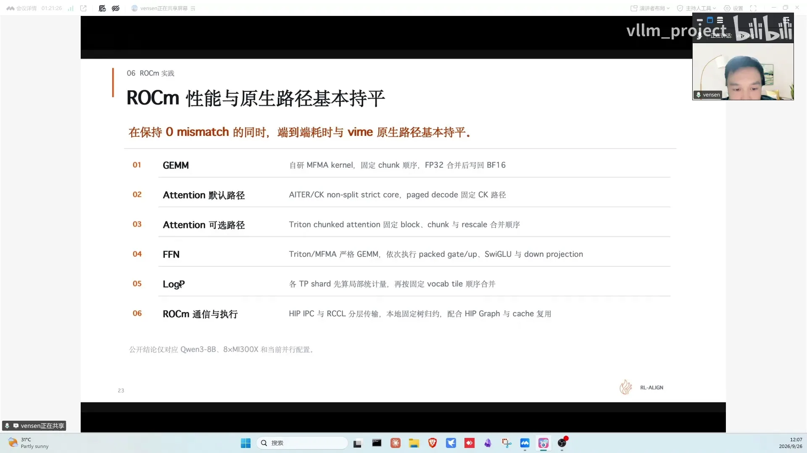 |
| 规约顺序的固定，都是按照前面说的：包括精度、舍入边界、精度计算守住边界、累加顺序、规约顺序等等，还有通信的时机——这些都是必须要保证的数值契约里的约定。 [【跳转到 62:30】](https://www.bilibili.com/video/BV1Ech96cEzW/?t=3750) |  |
| 这是 ROCm 的快速启动，跟 CUDA 稍微有一点不一样，但可以按照我们的步骤直接执行：第一步选择公开的机器 profile，执行一轮公开的配置；然后检查 200 step 的启动命令，可以按照这个去做。因为我们在 quickstart 里边—— [【跳转到 62:55】](https://www.bilibili.com/video/BV1Ech96cEzW/?t=3775) | 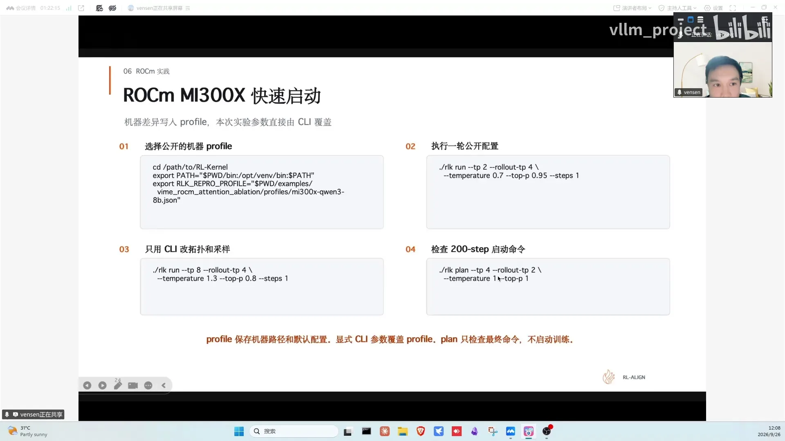 |
| 也有对应的 README，README 和（配置）放在一起，点进去可以看到详细的命令。OK，我们看 V0.1.0 做了什么、还有哪些待做。已完成的部分：在 200 个训练 step 里边，我们的 logprob mismatch 为零。 [【跳转到 63:20】](https://www.bilibili.com/video/BV1Ech96cEzW/?t=3800) | 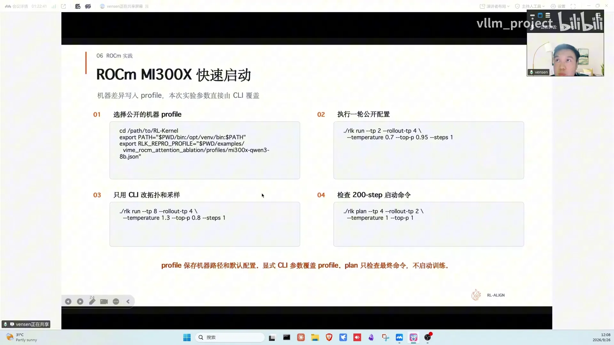 |
| CUDA 和 ROCm 双平台；选择了 vLLM 作为 baseline——以 vLLM 原生为主，对比 Megatron。下面是 Qwen3 8B dense 模型，提供单机的快速启动。这是我们 V0.1.0—— [【跳转到 63:45】](https://www.bilibili.com/video/BV1Ech96cEzW/?t=3825) | 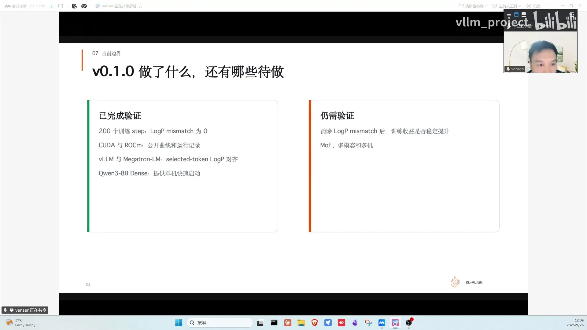 |
| 做的工作。还有哪些待做：消除 logprob mismatch 之后，训练的收益是否稳定提升——需要跑更多轮次，比如更长的训练和更多组 seed 的验证，来看 reward 的提升。 [【跳转到 64:10】](https://www.bilibili.com/video/BV1Ech96cEzW/?t=3850) | 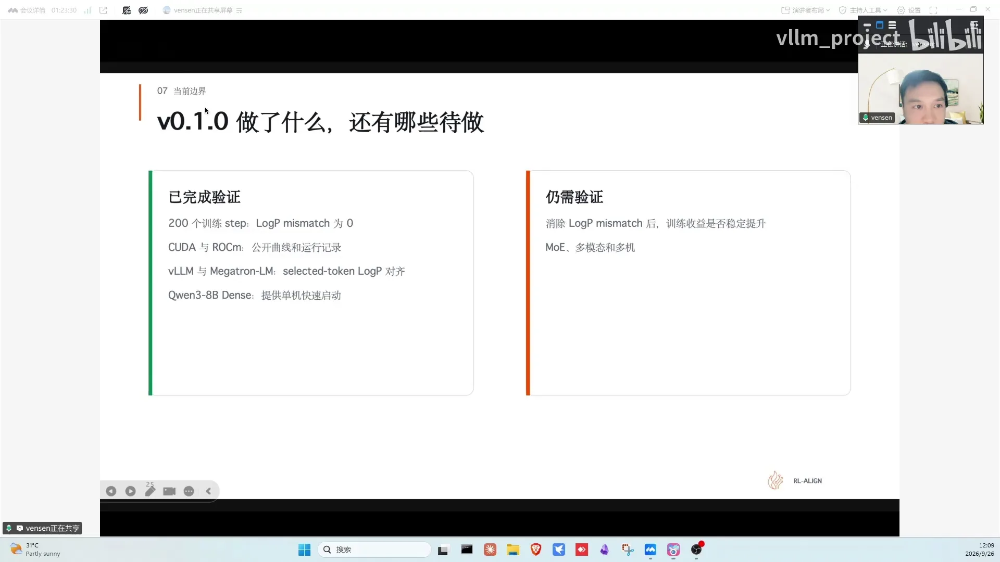 |
| 第二个：MoE 和多模态、还有多机多卡这块。MoE 的规划可以在下面看一下。然后有四个并行的线，目前 DCP（音）和 V4 在开发中——也是我们—— [【跳转到 64:35】](https://www.bilibili.com/video/BV1Ech96cEzW/?t=3875) | 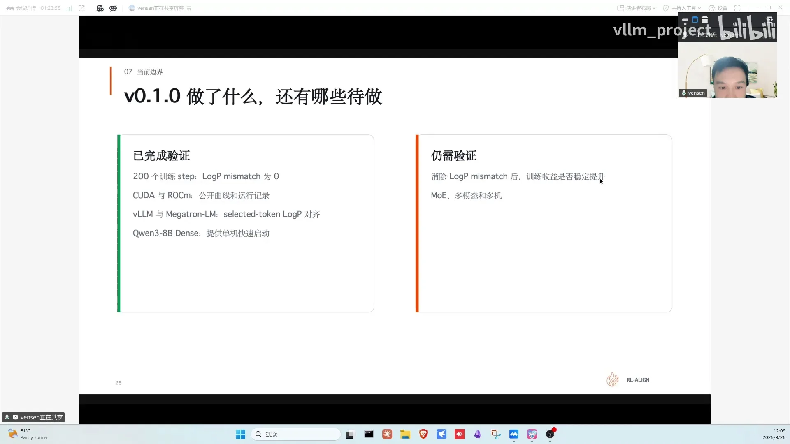 |
| 所有核心 member 都在做这个事情。然后 Qwen3-Next 和 GLM 模型我们提了对应的 RFC，现在社区有一些人已经开始认领了——尤其 GLM 这块，有社区的人牵头做模型的适配。 [【跳转到 65:00】](https://www.bilibili.com/video/BV1Ech96cEzW/?t=3900) | 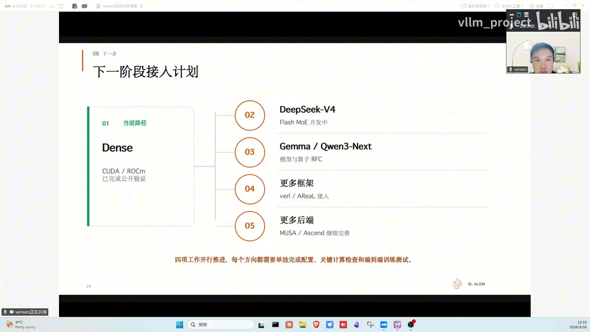 |
| 我们先保证双平台先做 CUDA 和 ROCm 这块。然后厂商这边——接下来有更多后端，像 MUSA（摩尔线程）和昇腾这块的生态，有厂商那边的人、或者专门做昇腾算子这样的人去适配他们的后端。MUSA 这边是由摩尔线程他们自己的人在做。然后更多框架的话—— [【跳转到 65:25】](https://www.bilibili.com/video/BV1Ech96cEzW/?t=3925) |  |
| 接下来我们会去对接像 veRL 和 AReaL 这样的框架——AReaL 异步的这样的框架，来支持这样的工作、来对接，跟我们上面讲的架构在生态里的定位做了一个首尾呼应。然后这些模型我记得上次志鹏跟我说—— [【跳转到 65:50】](https://www.bilibili.com/video/BV1Ech96cEzW/?t=3950) | 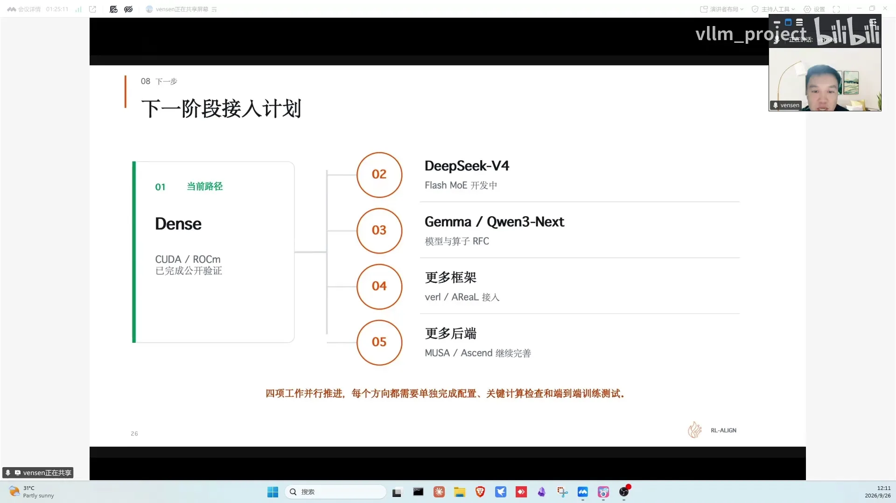 |
| 像 GLM 模型现在也用得很多，所以我们也开始提了 RFC，交给社区这边有人牵头去做——现在这个任务应该快被认领完了，对，这是同步在进行的。这四项 OK，这个就是最后的： [【跳转到 66:15】](https://www.bilibili.com/video/BV1Ech96cEzW/?t=3975) |  |
| 下一步计划、项目定位等等，包括我们这次的结果——V0.1.0 验证的结果和边界。——好，直播间的同学有没有什么问题？非常感谢今天文森给我们的分享。 [【跳转到 66:40】](https://www.bilibili.com/video/BV1Ech96cEzW/?t=4000) | 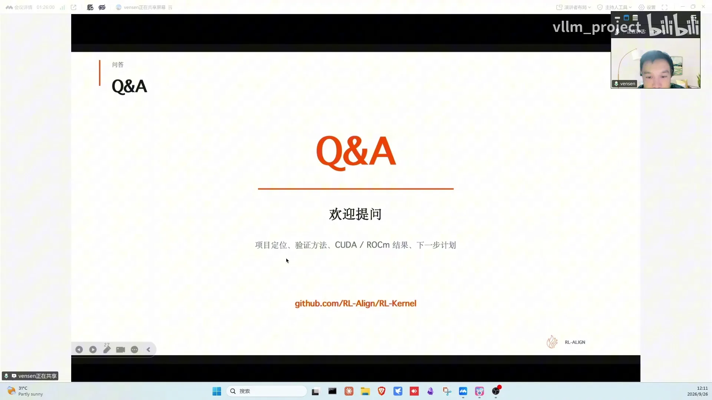 |
| 也非常感谢大家今天的时间，也感谢志鹏的邀请。——对，我觉得可以把这个仓库打开看一下，比如展示一下 roadmap 这些东西。然后我不知道现在仓库里面有没有一些 contributor document 这些——告诉指导大家应该怎样做贡献。我们正好趁这个机会好好宣传一下这个仓库。 [【跳转到 67:05】](https://www.bilibili.com/video/BV1Ech96cEzW/?t=4025) |  |
| OK，我先来打开一下——先等一下，我先找一下这个（屏幕）共享。 [【跳转到 67:30】](https://www.bilibili.com/video/BV1Ech96cEzW/?t=4050) | 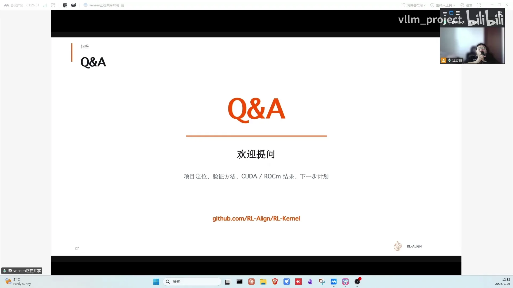 |
| 还有像二维码的话我觉得也可以直接放出来让大家扫码进群二维码失效了哦那你直接新建一个吧新建一个嗯OK我我看一下啊我先我们我们新建一下我觉得先那啥新建等一下我那个等下更新上去我现在先给大家投屏 [【跳转到 67:38】](https://www.bilibili.com/video/BV1Ech96cEzW/?t=4058) | 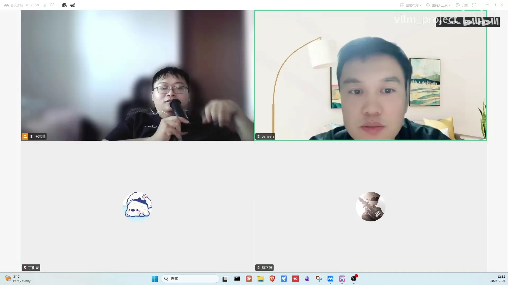 |
| 还有二维码的话我觉得也可以直接放出来让大家扫码进群。——二维码失效了。——哦，那你直接新建一个吧。OK 我看一下，我们先新建一下，等下更新上去，我现在先给大家投屏。 [【跳转到 68:03】](https://www.bilibili.com/video/BV1Ech96cEzW/?t=4083) | 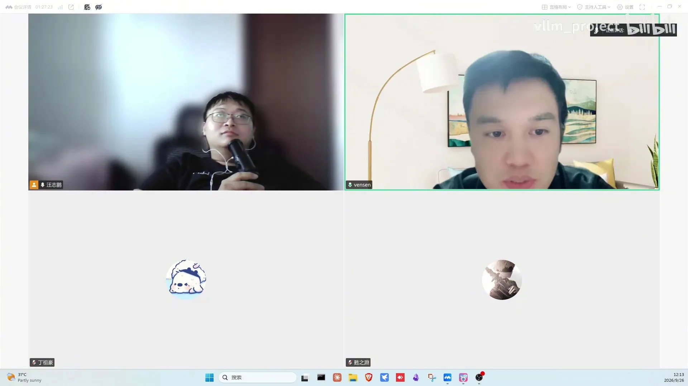 |
| 哦我们的PPT等一会是可以放出来的 [【跳转到 68:09】](https://www.bilibili.com/video/BV1Ech96cEzW/?t=4089) | 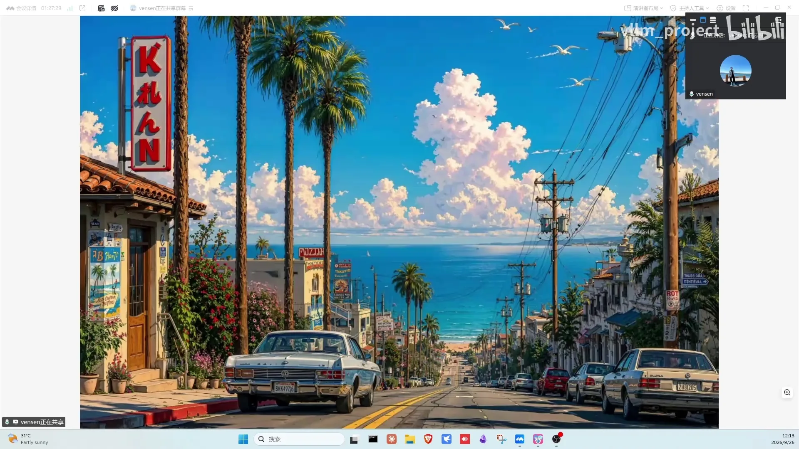 |
| 对，不能占用大家太多时间。OK，可以看到屏幕吗？ [【跳转到 68:14】](https://www.bilibili.com/video/BV1Ech96cEzW/?t=4094) | 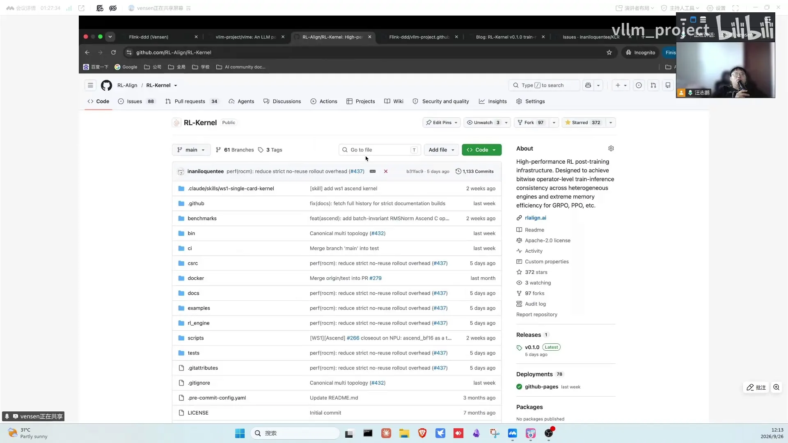 |
| 因为我们之前给 vLLM 做贡献的话基本都是靠（租）卡的。相对而言，我个人感觉如果是一些比较小的算子，你想做贡献的话是可以拿一些个人的卡去测的——比如你有 5090 这种卡，对吧。后面几个在一起的话，大家可以比如用一张完整的计算卡去做端到端的测试。 [【跳转到 68:39】](https://www.bilibili.com/video/BV1Ech96cEzW/?t=4119) | 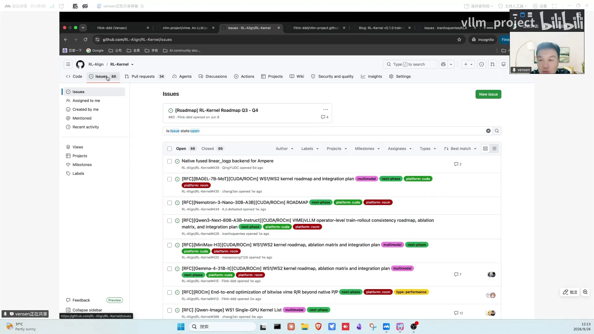 |
| 这是可以多个特性一起测的。单独开发的话一张卡我觉得就可行了：现在开发单算子在单卡上可以做，分布式的话到时候一起测——他可以先实现分布式的一些代码，如果（社区）机器真的有芯片的话，我们可以在 H 卡上帮他去测。 [【跳转到 69:04】](https://www.bilibili.com/video/BV1Ech96cEzW/?t=4144) | 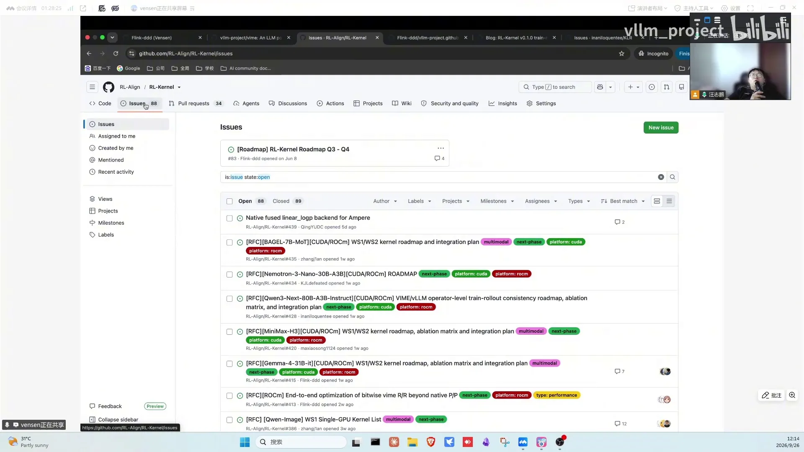 |
| 当然了他也可以（组）比如 TP2 去跑一下这块分布式的拆解。这些都比较好说，社区这边会帮忙测试。因为这个 roadmap 是之前刚创建项目的时候定的，我们现在详细的工作其实是—— [【跳转到 69:29】](https://www.bilibili.com/video/BV1Ech96cEzW/?t=4169) | 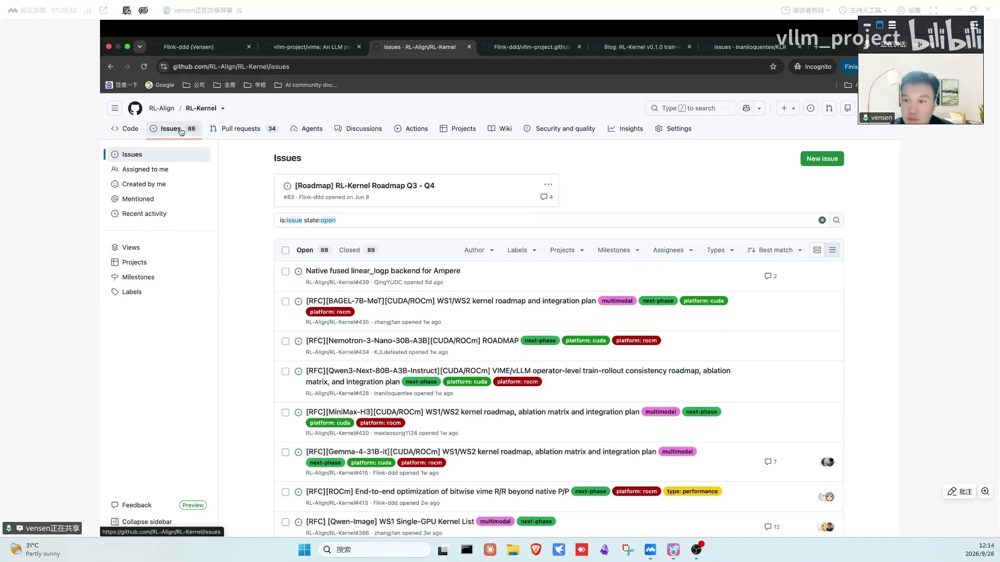 |
| 这个 roadmap 里边我们还会再做更新：现在已经完成了一个完整的 dense 模型——架构已经形成了。接下来的工作有很多待进行的，像之前罗列的很多集成、对接 vLLM、包括多模态等等。多模态这块跟外边框架还没有完全绑定上，所以我们会进一步更新。 [【跳转到 69:54】](https://www.bilibili.com/video/BV1Ech96cEzW/?t=4194) | 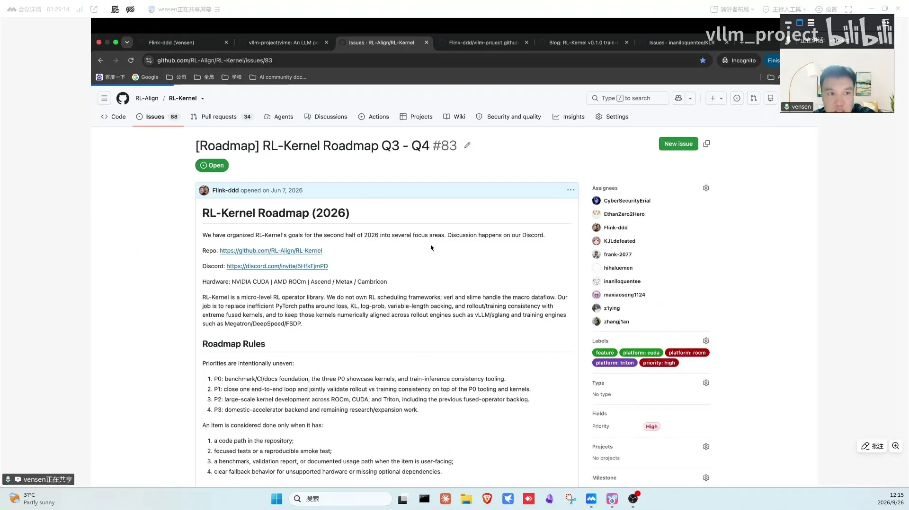 |
| 最主要的我觉得大家可以去认领这些 RFC。比如这是我们的一个 member（拆的）模型 RFC，就是跟你讲过的那个 model，这个可以认领，下面拆得还是蛮细的，你看现在就有人在认领去做。 [【跳转到 70:19】](https://www.bilibili.com/video/BV1Ech96cEzW/?t=4219) | 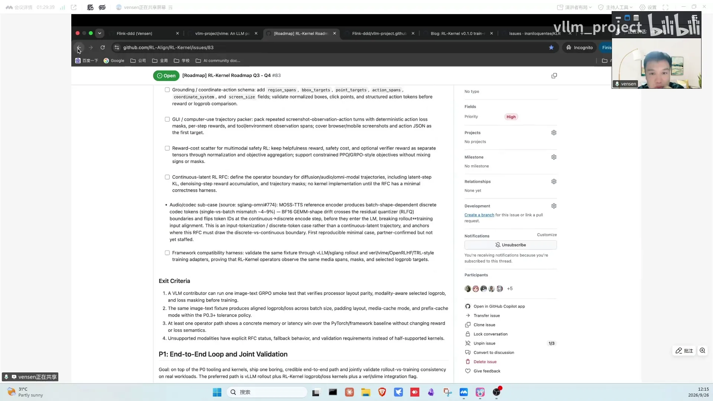 |
| 然后可以在这上面去认领：需要你去看一下对应的完整 RFC 到底想做什么，认领完之后去开发、提交 PR。我们会从一些单算子去验证，CUDA 上去验证；ROCm 平台的话如果有对应的卡可以租卡，没有的话我们这边到时候可以去做一些适配。 [【跳转到 70:44】](https://www.bilibili.com/video/BV1Ech96cEzW/?t=4244) | 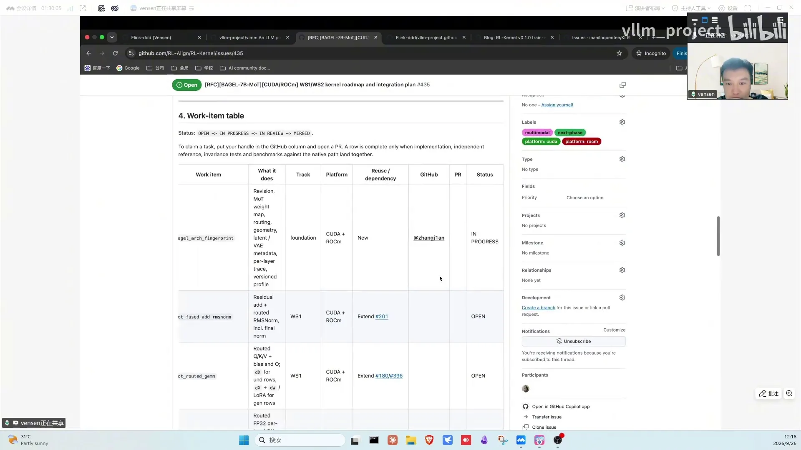 |
| 然后这个是 MiniMax H3（音）——这个 model 比较大。因为我们现在 V0.1.0 版本支持的 model 目前只有一个，所以现在并行做了好几个 model，这块其实也可以去看一下。 [【跳转到 71:09】](https://www.bilibili.com/video/BV1Ech96cEzW/?t=4269) | 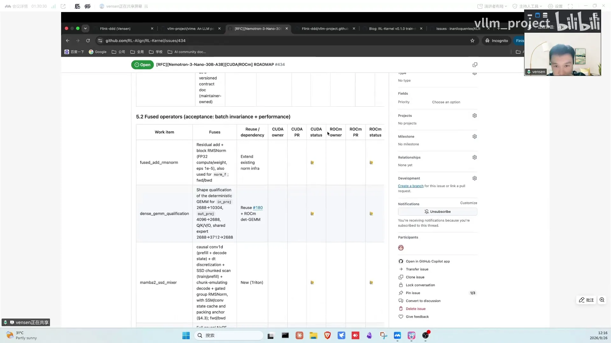 |
| 比如有感兴趣的——这块工作还非常多，因为这个模型太大了，也是可以认领的点。然后这个是 GLM 的模型，目前这个模型应该快被认领完了。还有一点、还有这些不算特别多的，这个也可以认领——这是我们专门拆出来的几个 model。 [【跳转到 71:34】](https://www.bilibili.com/video/BV1Ech96cEzW/?t=4294) | 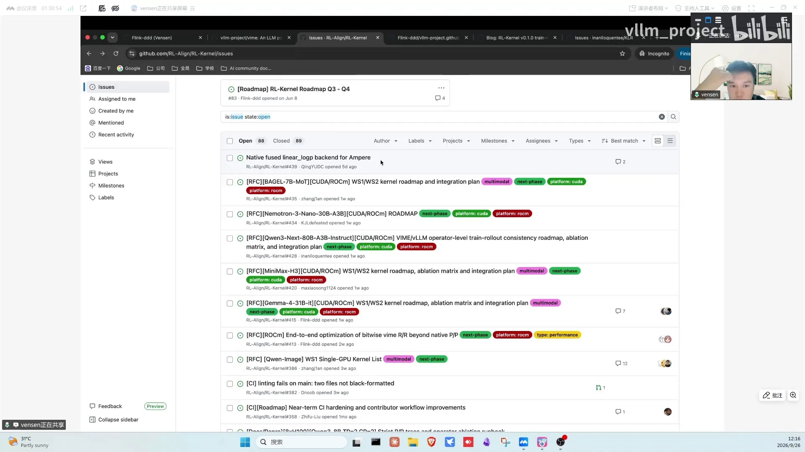 |
| 然后交给社区那边去做的。还有我们之前（同学）拆的这个 Qwen-Image，应该是快拆完、快领完了，因为这里边认领的人蛮多。 [【跳转到 71:59】](https://www.bilibili.com/video/BV1Ech96cEzW/?t=4319) | 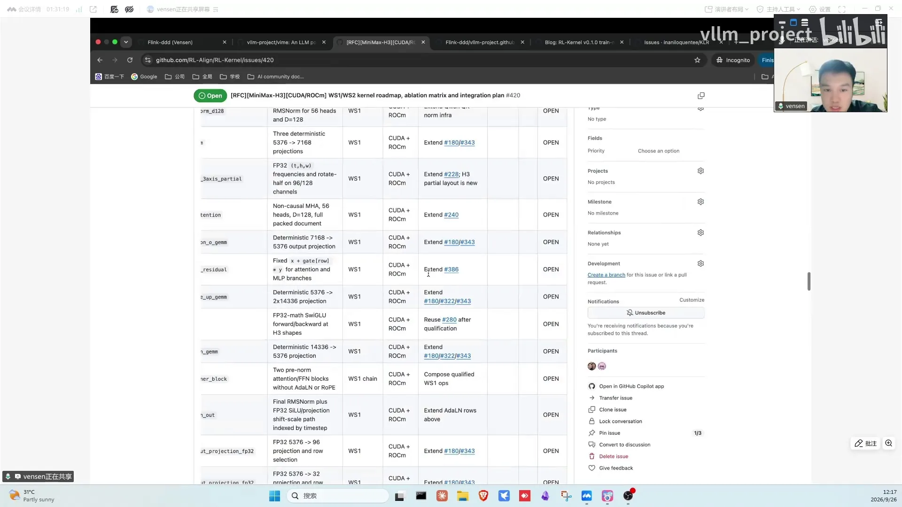 |
| OK，差不多这就是目前我们放出来的。然后我们的 documentation 的工作—— [【跳转到 72:24】](https://www.bilibili.com/video/BV1Ech96cEzW/?t=4344) | 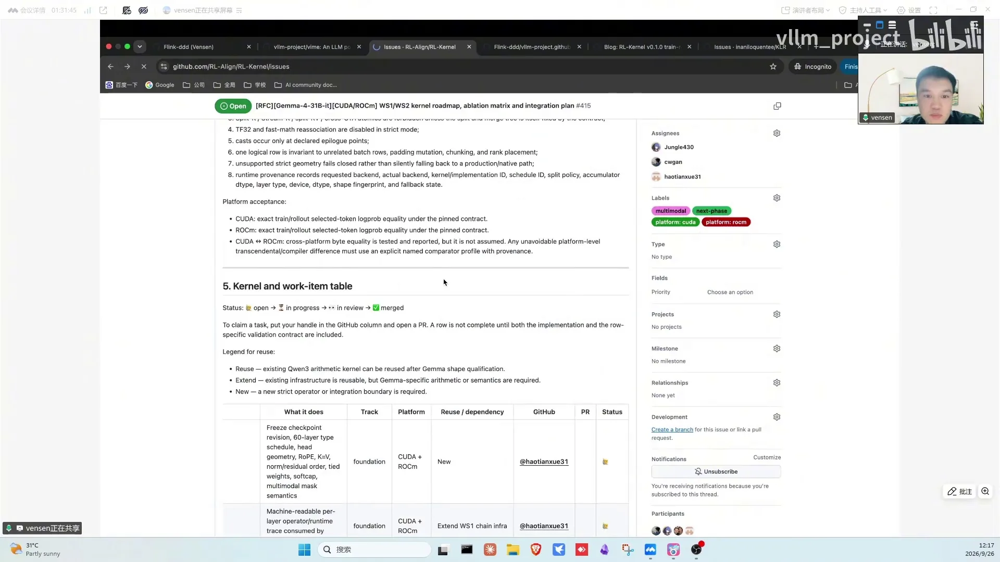 |
| 确实有一些 documentation 的工作需要做。但做 documentation 的时候首先得看一下项目目前的结构、现在支持哪些东西不支持哪些东西，然后根据 documentation 去提：比如你发现我们的命令跑的时候有一些问题，如果真的是 bug 的话可以提。当然了我们也会把一些 documentation 的工作放出来。 [【跳转到 72:35】](https://www.bilibili.com/video/BV1Ech96cEzW/?t=4355) | 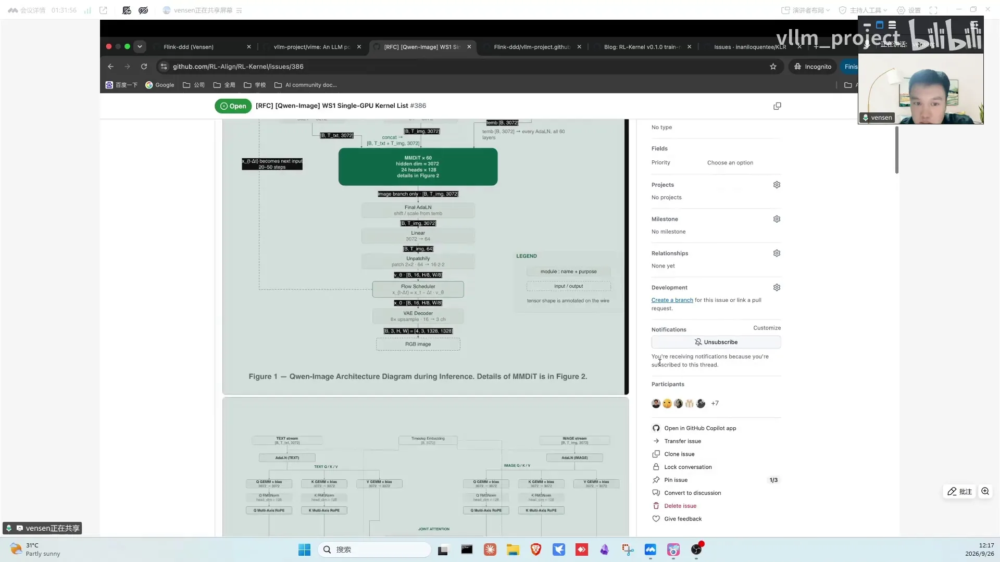 |
| 我们会去建一些可以直接认领的 documentation 的工作——就是 good first issue 这种 issue，让大家方便看：进来之后优化里边对应的一些细节。包括这些模块里有哪些存在问题的，都可以提对应的 issue 去改。 [【跳转到 72:44】](https://www.bilibili.com/video/BV1Ech96cEzW/?t=4364) | 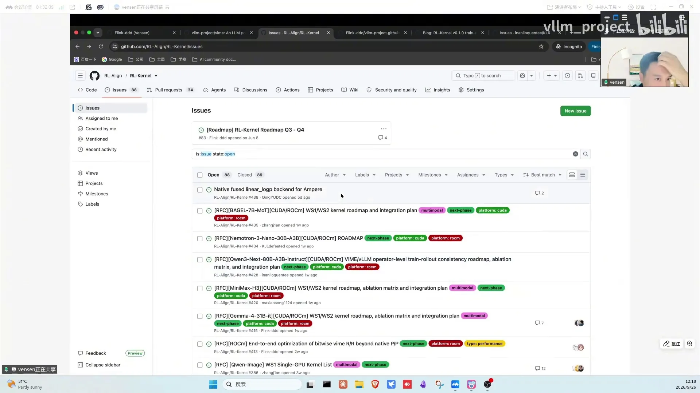 |
| 至于我们这边——OK，对，这些就是对应的：可以加入 Slack，还有关注 LinkedIn（音），还有我们的微信这块——目前这个二维码失效了，但是我们会更新一下，等一下我们会更新。然后如果进不了群的—— [【跳转到 73:09】](https://www.bilibili.com/video/BV1Ech96cEzW/?t=4389) | 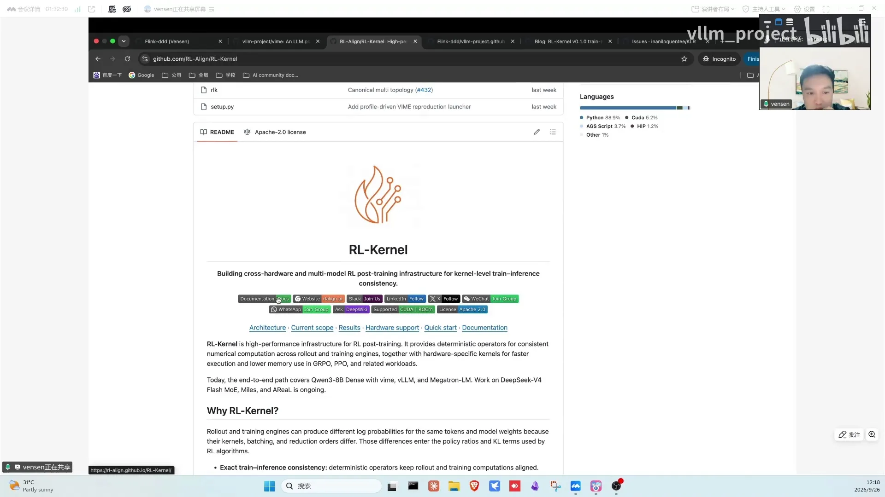 |
| 可以加我们这些 member 的微信，他们会把你直接拉到群里。也要告诉一下你们想做哪块——简单说一下背景，比如你做过 CUDA 算子、做过通信、做过其他的——方便我们到时候有一些工作分配给你。比如我们知道现在 RFC 里有哪些工作—— [【跳转到 73:34】](https://www.bilibili.com/video/BV1Ech96cEzW/?t=4414) | 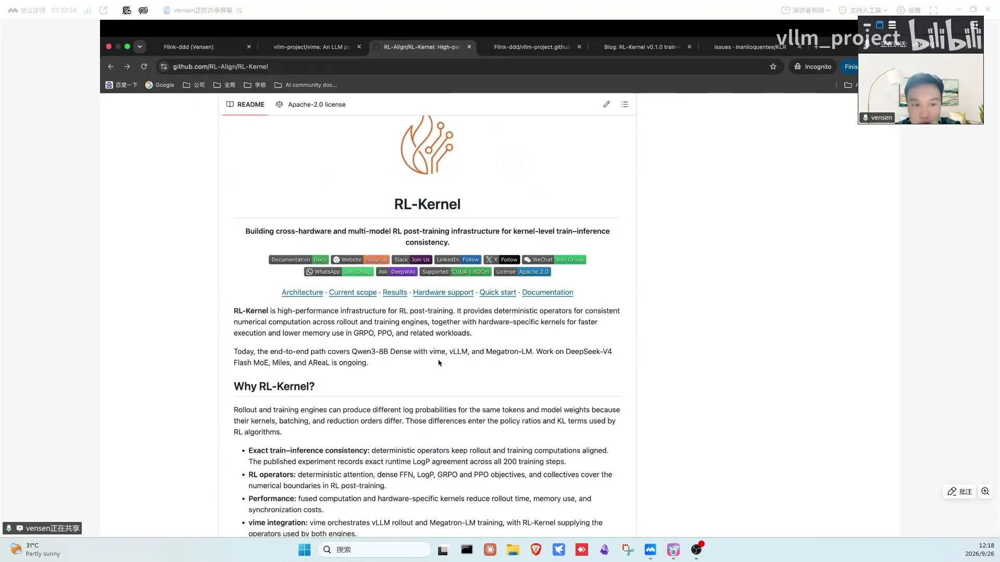 |
| 这些工作可能需要对应的人，可以帮你找到合适的位置——加微信之后告诉一下我们你之前的背景。——我觉得大家如果没有点关注也要给这个项目点个关注，对吧，然后可以直接 fork 一份到自己这里，好好研究一下。 [【跳转到 73:59】](https://www.bilibili.com/video/BV1Ech96cEzW/?t=4439) | 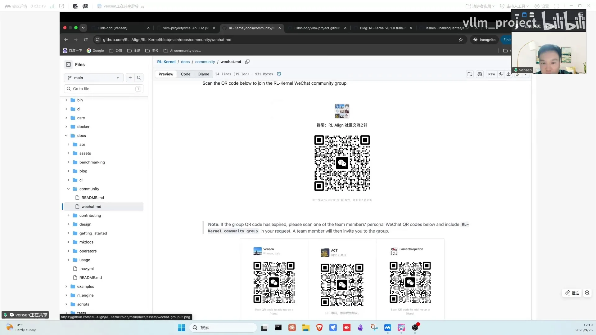 |
| 因为我们这里边还有一些 benchmark 的工作、CI 测试的工作都可以做——像我们现在第一版赶完进度之后这块还需要完善，所以有蛮多工作，社区的人可以多多参与进来，给社区点点关注。然后强化学习方向的话基本上算是现在最热门的方向，如果大家想转行—— [【跳转到 74:24】](https://www.bilibili.com/video/BV1Ech96cEzW/?t=4464) | 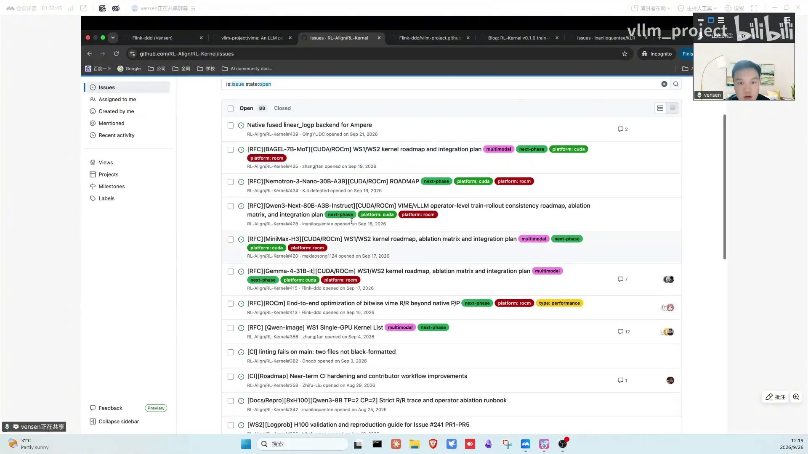 |
| 或者想找工作的话可以好好参与一下这个项目，应该非常有助于你后面投实习还是找正式工作。后训练、kernel 这些，尤其是跟上层框架 vLLM 这些有对接，也会跟 vLLM 这边有一些高性能算子的复用这些工作。 [【跳转到 74:49】](https://www.bilibili.com/video/BV1Ech96cEzW/?t=4489) | 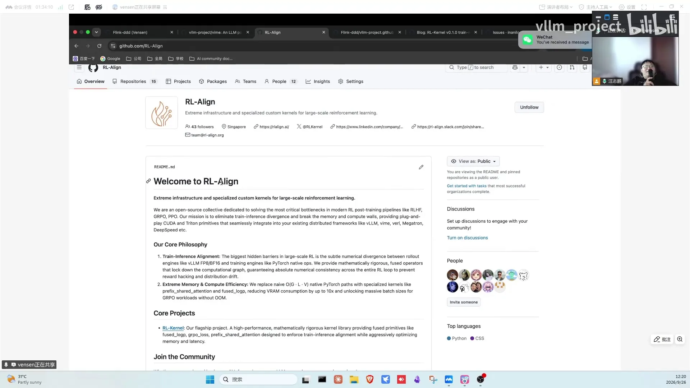 |
| 反正工作还是蛮多的。好，很感谢今天文森给我们分享，我看时间也差不多了，我们今天的直播就到此结束。 [【跳转到 75:14】](https://www.bilibili.com/video/BV1Ech96cEzW/?t=4514) | 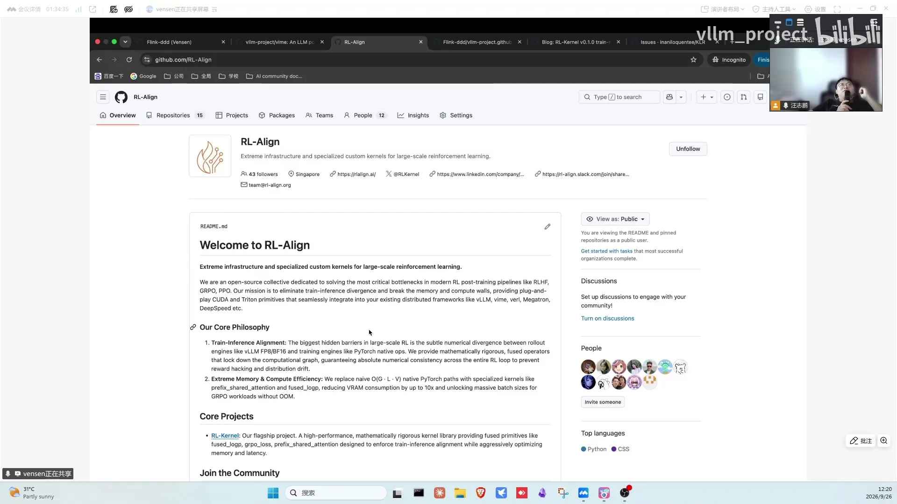 |
| 好，感谢志鹏这次的邀请来参加 vLLM 这个直播。因为我们后面也会多跟 vLLM 直播互动，带来一些新的特性；像我们其他的一些 member 到时候也参加一下这个活动。好，感谢大家的参与，我们今天的直播就到此结束了，拜拜拜拜。 [【跳转到 75:39】](https://www.bilibili.com/video/BV1Ech96cEzW/?t=4539) | 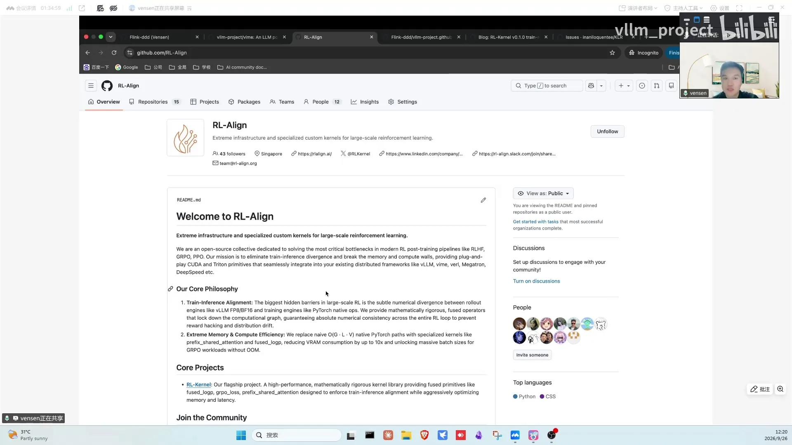 |
| 谢谢大家，拜拜。 [【跳转到 75:51】](https://www.bilibili.com/video/BV1Ech96cEzW/?t=4551) | 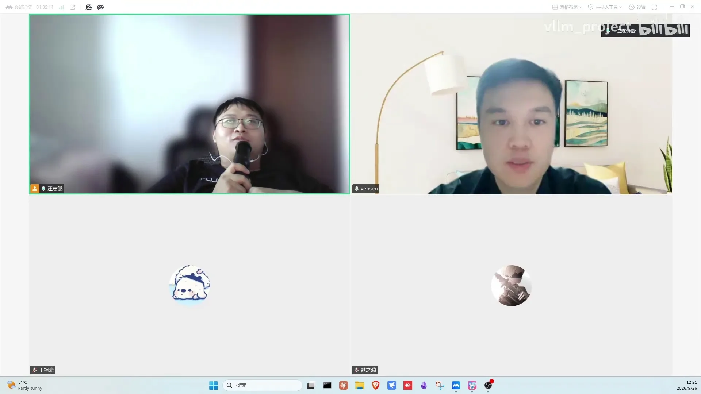 |
| 谢谢大家，拜拜。 [【跳转到 76:16】](https://www.bilibili.com/video/BV1Ech96cEzW/?t=4576) | 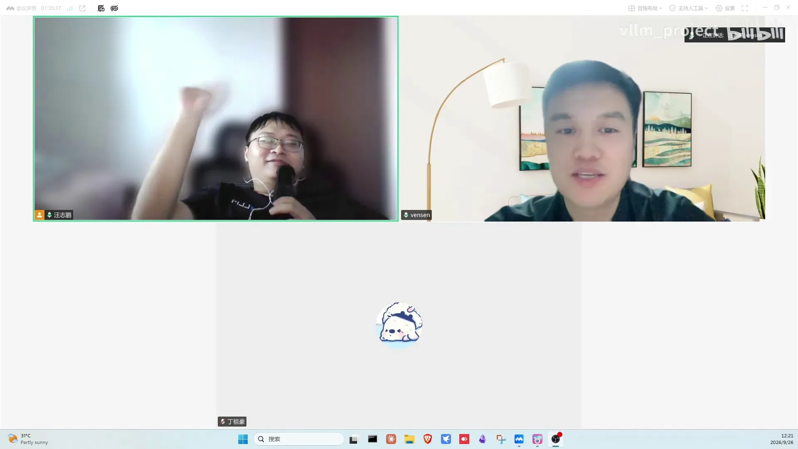 |