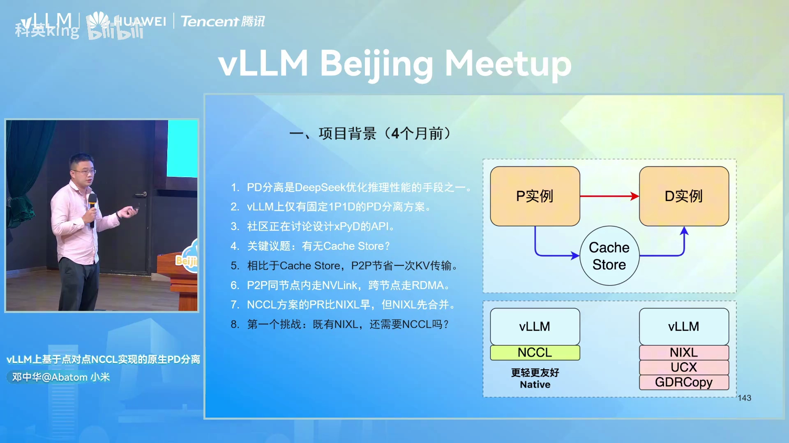
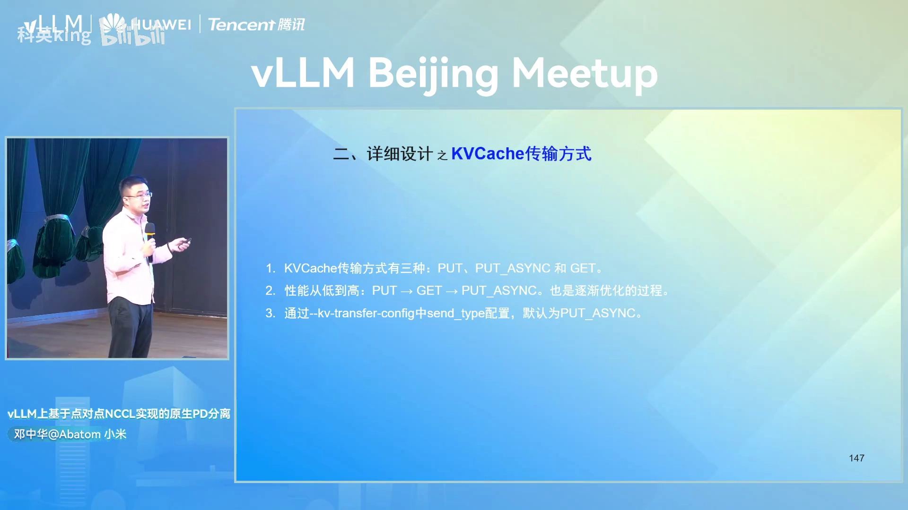
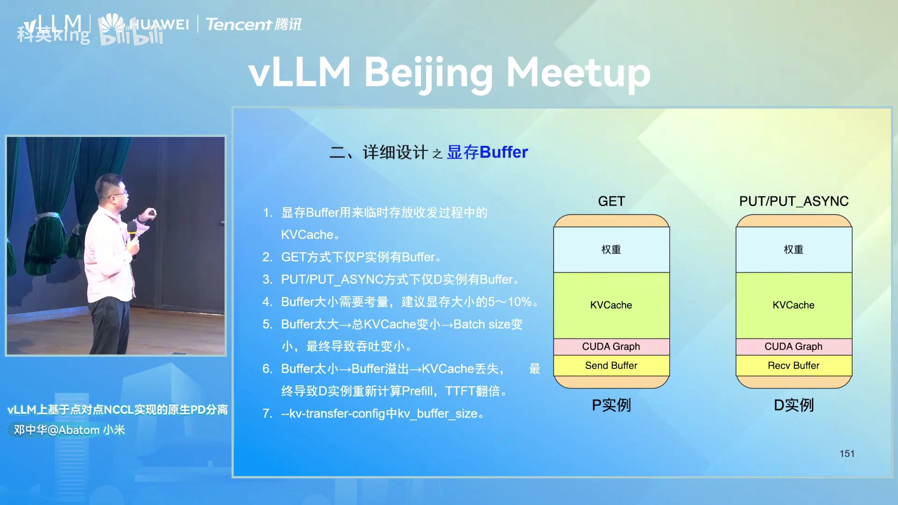
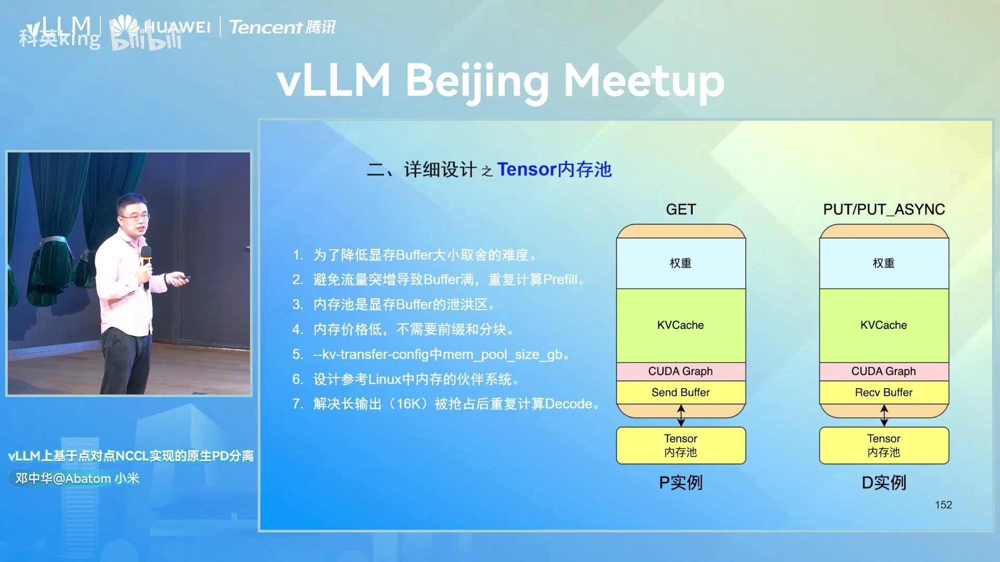
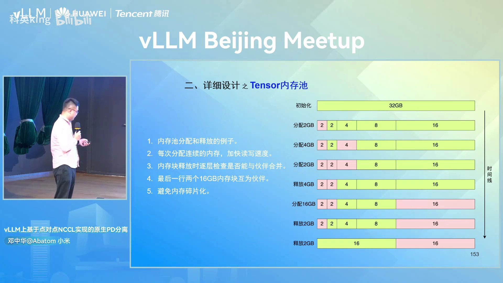
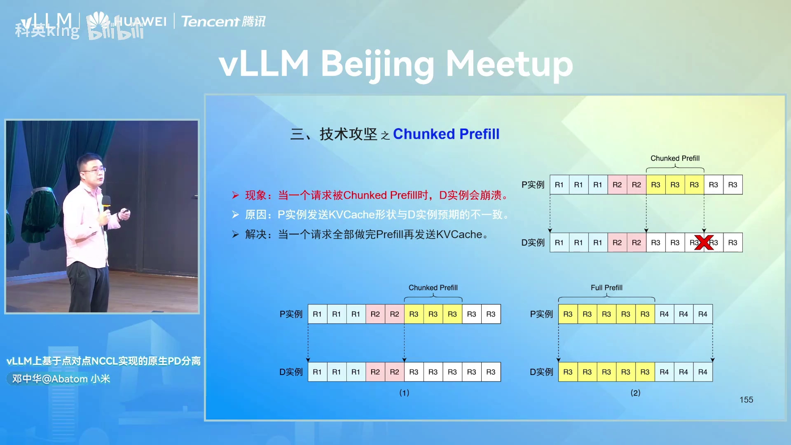
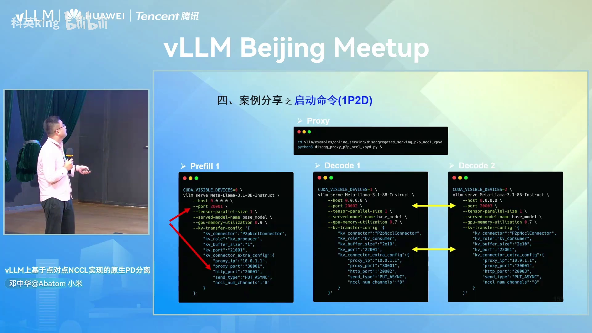
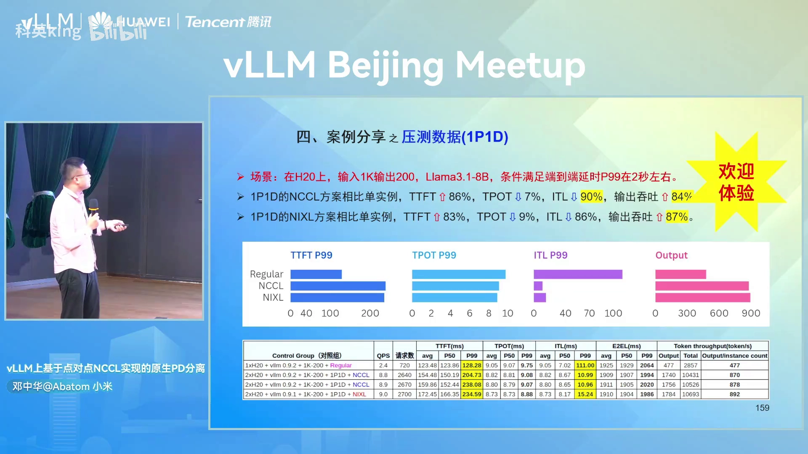

# vLLM 上基于点对点 NCCL 实现的原生 PD 分离

> 本文整理自小米 AI Infra 工程师**邓中华**在 **vLLM Beijing Meetup（2025.8.2）** 的分享。
> 对应 PR：vLLM **#18232**，已合入 **vLLM 0.9.2**，直接安装 vLLM 即可使用。
> [原视频](https://www.bilibili.com/video/BV1FwvTzZEfM/)

## 本讲要解决的核心问题（SCQA）

**背景**：大模型推理分两个阶段——**Prefill（预填充）** 一次性把整段输入算完、生成第一个 token，**Decode（解码）** 再逐个 token 往下生成。业界（如 DeepSeek）把这两个阶段拆到不同实例上跑，也就是 **PD 分离**，用来提升推理性能。vLLM 里早有 PD 分离，也有 NVIDIA 的 **NIXL** 这类 KV Cache 传输库。

**冲突**：四个月前，vLLM 上只有**固定 1P1D** 的分离方案，不支持可变的 xPyD；社区在讨论是否引入 Cache Store。作者想做的点对点（P2P）方案里，NCCL 版 PR 提交得比 NIXL 早，但 NIXL 先合并进了 vLLM。更关键的是，NIXL 依赖 GDRCopy、UCX 等一堆第三方库，环境很重。

**疑问**：既然已经有 NIXL 了，为什么还要用 **NCCL** 再做一套？点对点传输具体怎么实现，又会踩到哪些坑？

**回答（中心思想）**：作者用 vLLM 自带的 NCCL 实现了点对点 PD 分离（PR #18232），**不需要任何第三方库**，装了 vLLM 就能用；用 **ZMQ 传控制流、NCCL 传数据流**，设计了 **PUT / GET / PUT_ASYNC** 三种 KV Cache 传输方式，并用**显存 Buffer + Tensor 内存池**兜底。最终在长输入、短输出场景下，输出吞吐比单实例提升 84%，效果与 NIXL 方案基本持平但更轻量。

分享分五部分：**项目背景 → 详细设计 → 技术攻坚 → 案例分享 → 后续计划**（[【跳转到 00:50】](https://www.bilibili.com/video/BV1FwvTzZEfM/?t=50)）。

---

## 一、为什么要做 P2P NCCL：解决 NIXL 太重的问题

PD 分离的核心问题之一是：**P 实例算完的 KV Cache 怎么交给 D 实例**。当时社区里有两条路线：

- **Cache Store 路线**：P 先把 KV Cache 写到一个集中的 Cache Store，D 再从 Cache Store 拉取。多了一次中转。
- **点对点（P2P）路线**：P 直接把 KV Cache 发给 D，**省掉一次 KV 传输**。同节点内走 **NVLink**，跨节点走 **RDMA**（[【跳转到 01:40】](https://www.bilibili.com/video/BV1FwvTzZEfM/?t=100)）。

作者投的是 P2P，因为链路更短。这里先解释两个名词：

- **KV Cache**：大模型每算一个 token 都会产生 Key/Value 中间结果，把它们缓存下来，后续 token 就不必重算，是推理加速的关键。
- **NVLink / RDMA**：NVLink 是同一台机器内 GPU 之间的高速互联；RDMA 是跨机器网络里绕过 CPU 直接读写内存的技术。两者都是为了让 KV Cache 传得快。


**第一个挑战：既然有 NIXL 了，为什么还要 NCCL？**（[【跳转到 02:30】](https://www.bilibili.com/video/BV1FwvTzZEfM/?t=150)）

答案是**部署成本**。NIXL 是"重型"方案：它需要安装 `GDRCopy`、`UCX`、`NIXL` 等一系列第三方库，没装过的人光配环境就得折腾小半天。而 NCCL 方案直接复用 vLLM 自带的 NCCL，**只要装了 vLLM 就能跑**，更轻、更原生、更友好。这就是这套方案的核心卖点。

---

## 二、整体流程：一个请求怎么走完 P → D

先看端到端流程（[【跳转到 03:20】](https://www.bilibili.com/video/BV1FwvTzZEfM/?t=200)）：

1. 客户端向 **Proxy** 发起请求（`/v1/completions`）。
2. Proxy **轮询选择一个 1P1D**，把请求的 `max_tokens` 改为 **1**，发给选中的 P 实例。
3. Proxy 再把**原始请求**转发给 D 实例。
4. P 实例做完 Prefill 后，把 KV Cache 发给 D 实例。
5. D 实例把 KV Cache 存到本地显存 Buffer。
6. D 实例处理请求时从 Buffer 拿到 KV Cache，**跳过 Prefill，直接 Decode**。
7. D 实例处理完 Decode 后把结果返回给 Proxy。
8. Proxy 把结果返回给客户端。

要点：**对单个请求来说是 1P1D，但对整个系统来说是 P/D 分离的**——每个请求只在一个 P 上 Prefill、在一个 D 上 Decode。图里是 2P2D、TP=2 的拓扑，每个 rank 上都挂着 `KVCache` 和 `send/recv buffer`。



### 2.1 Toy Proxy：一个"玩具"调度器

作者实现了一个简单的 **Toy Proxy**（[【跳转到 04:48】](https://www.bilibili.com/video/BV1FwvTzZEfM/?t=288)），定位是 demo / 玩具，方便做实验、压测和功能验证。它有四个能力：

1. **服务发现**：维护一个字典 `{HTTP_ADDR → ZMQ_ADDR}`。P / D 实例周期性上报自己的地址，超时未上报就被摘掉，实现**动态摘除**。
2. **动态扩缩容**：增加或删除 P / D 实例，不需要重启整个系统。
3. **路由策略**：目前是**轮询**；因为是压测场景，输入输出长度固定，轮询已经负载均衡，生产环境后续要换成真正的负载均衡（要考虑输入长度）。
4. **生成请求 ID**：参考 NVIDIA **Dynamo** 的设计，把 P 的 ZMQ 地址、D 的 ZMQ 地址和一个 **UUID** 拼在一起，相当于**在请求进系统前就把 1P1D 写死**。

请求 ID 长这样：

```
cmpl-___prefill_addr_10.0.1.2:21001___decode_addr_10.0.1.3:22001_93923d63113b4b338973f24d19d4bf11-0
```


---

## 三、ZMQ + NCCL：控制流与数据流各司其职

KV Cache 的传输依赖两个库，分工明确（[【跳转到 07:01】](https://www.bilibili.com/video/BV1FwvTzZEfM/?t=421)）：

- **ZMQ（ZeroMQ）负责控制流**：P 和 D 之间要先**握手**（"我要给你发消息、要传 KV Cache 了"），以及告诉对方这个 tensor 的**形状和数据类型**。
- **NCCL 负责数据流**：建立**点对点 NCCL 通信组**，真正收发 tensor（KV Cache 数据）。

简单理解：ZMQ 负责"打电话约定好要寄什么包裹、包裹多大"，NCCL 负责"真正把包裹搬过去"。


---

## 四、三种 KV Cache 传输方式：PUT、GET、PUT_ASYNC

作者设计了三种传输方式，性能由低到高：**PUT → GET → PUT_ASYNC**，这是逐渐优化的过程（[【跳转到 07:51】](https://www.bilibili.com/video/BV1FwvTzZEfM/?t=471)）。通过 `--kv-transfer-config` 里的 `send_type` 配置，**默认是 PUT_ASYNC**。



### 4.1 PUT：P 同步推给 D

P 解析 request id 拿到 D 的 ZMQ 地址，做完 Prefill 后**主动把 KV Cache 推给 D**（[【跳转到 08:41】](https://www.bilibili.com/video/BV1FwvTzZEfM/?t=521)）。特点是 **P 的主线程是阻塞的**（同步发送），D 用单独线程接收，所以性能差一些。

保留它的原因：有用户反馈用 **AMD 卡**时，PUT_ASYNC 在 batch size 大时会 hang 住，改用 PUT 就正常。作者暂时保留 PUT 作为规避手段，后续再做系统分析（NVIDIA 卡目前没问题）。

### 4.2 GET：D 主动向 P 拉取

反过来，**D 主动去 P 拉取 KV Cache**（[【跳转到 09:56】](https://www.bilibili.com/video/BV1FwvTzZEfM/?t=596)）。P 做完 Prefill 后先把 KV Cache 存到本地显存 Buffer，D 解析到 P 的 ZMQ 地址后去拉取，P 再用单独的发送线程发送。性能比 PUT 好一些。

### 4.3 PUT_ASYNC：P 异步推给 D（默认）

这是当前默认方式（[【跳转到 10:46】](https://www.bilibili.com/video/BV1FwvTzZEfM/?t=646)）：P 解析到 D 的 ZMQ 地址后，把 KV Cache 丢给**自己的发送线程**异步发送，不阻塞主线程；D 也有**单独的接收线程**，不影响自己的推理。**收发全异步**，所以性能比前两种都更好。


---

## 五、显存 Buffer 与 Tensor 内存池：给 KV Cache 留个"泄洪区"

### 5.1 显存 Buffer：大小是个取舍

NCCL 方案确实需要一个 **Buffer** 来临时存放收发过程中的 KV Cache（[【跳转到 11:36】](https://www.bilibili.com/video/BV1FwvTzZEfM/?t=696)）。它的归属和传输方式有关：

- **GET 方式**：只有 P 实例有 **Send Buffer**。
- **PUT / PUT_ASYNC 方式**：只有 D 实例有 **Recv Buffer**。

Buffer 大小需要权衡（建议占**显存总量的 5%～10%**，经验值）：

- **太大**：显存被 Buffer 占走，留给 KV Cache 的空间变小 → batch size 变小 → **吞吐下降**。
- **太小**：Buffer 溢出导致 **KV Cache 丢失**，D 实例只能重新计算 Prefill，**TTFT 翻倍**（串行算两遍）。

可通过 `--kv-transfer-config` 里的 `kv_buffer_size` 配置。



### 5.2 Tensor 内存池：Buffer 的"泄洪区"

为了降低 Buffer 大小的取舍难度、应对流量突增（瞬间来一波流量可能把 Buffer 撑爆），作者设计了 **Tensor 内存池**（[【跳转到 13:16】](https://www.bilibili.com/video/BV1FwvTzZEfM/?t=796)）：

- 建在 **CPU 内存**上（便宜，不需要分块，直接存，重复也无所谓），默认 **32GB**，通过 `mem_pool_size_gb` 配置。
- **设计参考 Linux 的内存伙伴系统（buddy system）**。
- 还能顺带解决**长输出被抢占**的问题：输入 1K、输出 16K 时，vLLM 日志里常出现大量**被抢占（preemption）**记录——算到 15K 被抢占后要重新计算。若把这部分 KV Cache **卸载到内存池**，恢复时再加载回来，比重新算 15K 快得多。

内存池用**伙伴系统**管理，示例（32GB 起步）[【跳转到 15:21】](https://www.bilibili.com/video/BV1FwvTzZEfM/?t=921)：

- 分配时尽量给**连续内存**，加快读写；
- 释放时**逐层与"伙伴"合并**：释放 2G 后若伙伴也空闲就合并成 4G，若 4G 的伙伴也空闲就继续合并成 8G、16G；若伙伴非空则停止合并；
- 这样能**避免内存碎片化**。




---

## 六、NCCL 组布局与第二个挑战

以一个 **1P2D、每个实例 TP=2** 为例（[【跳转到 16:11】](https://www.bilibili.com/video/BV1FwvTzZEfM/?t=971)），一共会建立 **7 个 NCCL 组**：

- **3 个实例内 TP 组**：每个实例内部 2 张卡组成一个 TP 通信组（1 个 P + 2 个 D，共 3 个）；
- **4 个点对点 NCCL 组**：P 的每张卡分别和 D1、D2 的对应卡两两配对（P0-D1、P0-D2、P1-D1、P1-D2），共 4 个。



**第二个挑战**：NCCL 组本身**带显存开销**，因此**不适合超大规模的 PD 分离**。每个 NCCL 组占用的显存跟 **channel 数** 强相关：

- 实验里创建第一个 NCCL 组约占 **557MB**（不同卡、不同 NCCL 版本会有差异）；
- `NCCL_MAX_NCHANNELS=2` → 约 16MB；`=8` → 约 52MB；`=16` → 约 100MB。

作者一度担心 PR 合不了（[【跳转到 17:01】](https://www.bilibili.com/video/BV1FwvTzZEfM/?t=1021)），后来 vLLM 维护者 **Kaichao** 说：**支持不了大规模，就先把小规模的 PD 分离做好**。于是作者先把小规模 PD 跑通合入，再逐步优化。

---

## 七、技术攻坚：三个真实问题

### 7.1 Chunked Prefill 会导致 D 实例崩溃

**现象**：请求被 **Chunked Prefill**（把长输入切成多个 chunk 分批 Prefill）时，D 实例会崩溃（[【跳转到 18:16】](https://www.bilibili.com/video/BV1FwvTzZEfM/?t=1096)）。

**原因**：P 实例发送的 KV Cache **形状**和 D 实例预期的**不一致**。图中 R3 被切成多块，P 先把已算好的 3 个块发给了 D，但 D 期望的是完整的 5 个块，形状不匹配就崩了。

**解决**：**等一个请求全部算完 Prefill 再发送 KV Cache**——R3 的前 3 块先存本地，等后 2 块算完，合起来一起发给 D 实例。



### 7.2 性能优化（PR #20906）

从 CPU 和 GPU 两个方向优化（[【跳转到 19:31】](https://www.bilibili.com/video/BV1FwvTzZEfM/?t=1171)）：

- **CPU 方向**：把 P 实例**提取 KV Cache** 的操作从主线程**移到发送线程**，减轻主线程负载，让它专心做 Prefill，从而**降低 TTFT**。
- **GPU 方向**：**把 NCCL channel 数从 16 降到 8**。一张卡的 SM（流式多处理器）数量固定，NCCL 通信算子占用 SM 多了就会和推理算子抢资源、可能导致串行；减少 channel 能**降低 ncclSend 占用的 SM**，促进通信与计算重叠，进而**降低 TTFT**。实测 channel=16 和 channel=8 差别不大。

压测对照（2×H20 + vLLM 0.9.2 + 1K 输入/200 输出 + 1P1D + NCCL）：

- **优化前**：目标是 8.8 QPS，此时 TTFT P99 达 **289.85ms**，性能已撑不住；
- **优化后**：同样 8.8 QPS，TTFT P99 降到 **204.73ms**；QPS 还能提到 **8.9**，且 TTFT 比优化前的 8.8 QPS 还要好。


### 7.3 偶现乱码（PR #20263）：两个 Stream 不在同一条上

**现象**：一边压测一边 `curl` 单次请求，偶尔返回乱码 `"!!!!!!"`（[【跳转到 21:16】](https://www.bilibili.com/video/BV1FwvTzZEfM/?t=1276)）。

**排查过程**（作者一步步缩小范围）：

1. 检查 P 发送的 KV 数量与 D 接收的是否一致 → 一致；
2. 检查 ZMQ 消息与 NCCL 消息是否乱序 → 没有；
3. 确认 P 发的数据和 D 收的数据不一致；
4. **先排查驱动版本与 CUDA 版本是否匹配**（作者被坑过好几次的经验）→ 驱动没问题；
5. 最后**看代码**：发现申请接收 KV Cache 的临时显存 `torch.empty` 操作在**默认 stream**，而 `ncclRecv` 在 **receive stream**，两者不在同一个 stream，导致 GPU 行为**不可预测**。

**解决**：把两者放到**同一个 receive stream** 下（`with torch.cuda.stream(self.recv_stream):`），乱码消失。


> 经验：排查问题时**先排除驱动版本与 CUDA 版本是否匹配**，再深入代码。`stream`（CUDA 流）是 GPU 上按顺序执行的队列，不同 stream 的操作执行顺序不确定，混用会出问题。

---

## 八、案例分享：怎么启动、效果如何

### 8.1 启动一个 1P2D

启动脚本在 `vllm/examples/online_serving/disaggregated_serving_p2p_nccl_xpyd/`（[【跳转到 23:51】](https://www.bilibili.com/video/BV1FwvTzZEfM/?t=1431)）：

- **Proxy**：`python3 disagg_proxy_p2p_nccl_xpyd.py &`
- **P 实例**：`kv_role="kv_producer"`（生产者）；
- **D 实例**：`kv_role="kv_consumer"`（消费者）。

关键配置（`--kv-transfer-config`）：`kv_connector="P2pNcclConnector"`、`kv_role`、`kv_buffer_size`、`kv_port`，以及 `kv_connector_extra_config` 里的 `proxy_ip`、`proxy_port`、`http_port`、`send_type`、`nccl_num_channels`。

**扩容要点**：图里红色箭头提示 `kv_port` 和 `http_port` 要保持一致；黄色箭头提示**再加一个 D 实例时，只要改成对应的地址/端口即可**，扩容很方便。



### 8.2 压测数据与收益

场景：**H20**、输入 **1K**、输出 **200**、模型 **Llama-3.1-8B**，满足 P99 端到端延时在 **2 秒**左右（[【跳转到 24:58】](https://www.bilibili.com/video/BV1FwvTzZEfM/?t=1498)）。

- **1P1D 的 NCCL 方案 vs 单实例**：TTFT ↑86%，TPOT ↓7%，ITL ↓90%，输出吞吐 ↑84%。
- **1P1D 的 NIXL 方案 vs 单实例**：TTFT ↑83%，TPOT ↓9%，ITL ↓86%，输出吞吐 ↑87%。

结论：**PD 分离对长输入、短输出场景提升非常明显**；作者也实测过输出长的场景，收益不大。前面几位老师分享的多是 **2P1D / 3P1D** 这样"多 P 少 D"的场景——本质是**输入越长需要越多 P，输出越长需要越多 D**，两者有个比例。作者的 NCCL 方案与 NIXL 方案**大差不差**，但**不需要装那些库**。



> 名词补充：**TTFT**（Time To First Token，首 token 延时）衡量用户等待多久看到第一个字；**TPOT**（Time Per Output Token）是每个输出 token 的平均耗时；**ITL**（Inter-Token Latency）是相邻 token 之间的间隔。

---

## 九、后续计划

作者列了四条后续方向（[【跳转到 26:43】](https://www.bilibili.com/video/BV1FwvTzZEfM/?t=1603)）：

1. **继续对标 NIXL**，进一步优化 NCCL 方案性能，力争超过它；
2. **支持 P/D 实例崩溃自动摘除**——作者曾提交相关 PR 但先关了，因为**故障摘除比扩容难得多**（要考虑的异常场景太多），等性能优化好后再重新做；
3. **支持 EP、PP 和非对称 TP 等并行策略**——目前只支持对称 TP；
4. **抽象 XCCL，支持更多集合通信库**，如 **UCCL、oneCCL**。作者已联系 UCCL 作者，对方乐意配合；UCCL 方案甚至可能**省掉额外申请的显存 Buffer**。


---

## 小结

- **做了什么**：用 vLLM 自带 NCCL 实现了点对点 PD 分离（PR #18232，已进入 vLLM 0.9.2），**零第三方依赖**，装了 vLLM 就能用。
- **为什么做**：NIXL 虽先合并，但要装 GDRCopy/UCX 等库，部署太重；P2P 又比 Cache Store 少一次 KV 传输。
- **怎么实现**：Proxy 轮询选 1P1D 并写死请求 ID；**ZMQ 传控制流、NCCL 传数据流**；三种传输方式 PUT/GET/PUT_ASYNC（默认 PUT_ASYNC，性能最好）。
- **显存管理**：显存 Buffer（建议占显存 5%～10%）+ Tensor 内存池（CPU 内存，默认 32GB，参考 Linux 伙伴系统，兼治长输出被抢占）。
- **NCCL 组布局**：1P2D、TP=2 共 7 个组；NCCL 组带显存，**不适合超大规模**，先把小规模做好。
- **三个硬核问题的解法**：Chunked Prefill 要**算完整个 Prefill 再发**；性能优化**把 KV 提取移到发送线程 + channel 16→8**；乱码根因是**临时显存与 ncclRecv 不在同一 stream**，放进同一 receive stream 解决。
- **效果**：H20 + Llama-3.1-8B + 1K/200 场景，NCCL 方案输出吞吐 **+84%**、ITL **−90%**，与 NIXL 相当但更轻。

## 关键术语速查

| 术语 | 一句话解释 |
| --- | --- |
| PD 分离 | 把 Prefill（预填充）和 Decode（解码）放到不同实例上执行 |
| Prefill / Decode | Prefill 一次算完整段输入、生成首 token；Decode 逐 token 生成后续内容 |
| KV Cache | 缓存每层注意力算出的 Key/Value，避免重复计算 |
| 1P1D / xPyD | 1 个 Prefill 实例配 1 个 Decode 实例；xPyD 指任意可变配比 |
| NCCL | NVIDIA 集合通信库，这里用来建立点对点通信组、传输 KV Cache |
| NIXL | NVIDIA 的推理传输库，功能类似但依赖 GDRCopy/UCX，较重 |
| ZMQ | ZeroMQ，这里负责 P/D 之间的握手与张量元信息（控制流） |
| NVLink / RDMA | 同节点 GPU 高速互联 / 跨节点绕过 CPU 直接读写内存 |
| PUT / GET / PUT_ASYNC | KV Cache 的推、拉、异步推三种传输方式 |
| 显存 Buffer | 临时存放收发中 KV Cache 的显存，太大挤占 KV Cache，太小会丢失重算 |
| Tensor 内存池 | CPU 上的"泄洪区"，参考 Linux 伙伴系统，兜住突增流量与长输出抢占 |
| TTFT / TPOT / ITL | 首 token 延时 / 每 token 平均耗时 / 相邻 token 间隔 |
| Chunked Prefill | 把长输入切成多块分批 Prefill，需整体算完再发 KV Cache |
| CUDA Stream | GPU 上的顺序执行队列，不同 stream 顺序不确定，混用易出错 |
| 伙伴系统 | 内存分配算法，释放时与相邻"伙伴"逐层合并，减少碎片 |
| TP / EP / PP | 张量并行 / 专家并行 / 流水线并行（当前方案仅支持对称 TP） |
