# vLLM上基于点对点NCCL实现的原生PD分离 原始文稿（图-字幕分栏）

| 字幕文本 | 画面 |
| :--- | ---: |
| 大家好，我来自小米，是一名 AI Infra 工程师，专注于大模型推理优化工作。近一年我主要在 vLLM 上提交了十几个 PR，其中最大的一个 PR 就是本次分享的主题——vLLM 上基于点对点 NCCL 实现的原生 PD 分离。 [【跳转到 00:00】](https://www.bilibili.com/video/BV1FwvTzZEfM/?t=0) |  |
| 这个 PR 是 #18232，已经在 vLLM 0.9.2 上合入了，直接安装 vLLM 就可以使用。我发现今天大家都在讲 PD 分离，感觉成了一个 PD 分离大会。本次分享有五个大的方向：主要介绍我做这件事的项目背景， [【跳转到 00:25】](https://www.bilibili.com/video/BV1FwvTzZEfM/?t=25) | 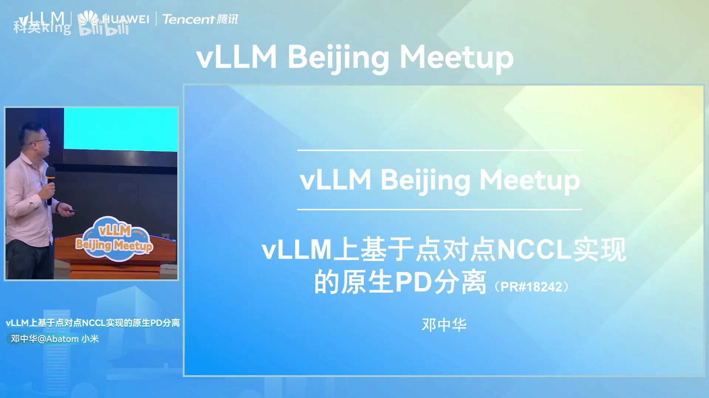 |
| 我讲得比较细，详细设计都会讲；还有我遇到了哪些问题、如何解决；以及怎么部署、怎么使用、效果是什么样的；第五个是后续的规划。项目背景方面，PD 分离是 DeepSeek 优化推理性能的重要手段之一。 [【跳转到 00:50】](https://www.bilibili.com/video/BV1FwvTzZEfM/?t=50) | 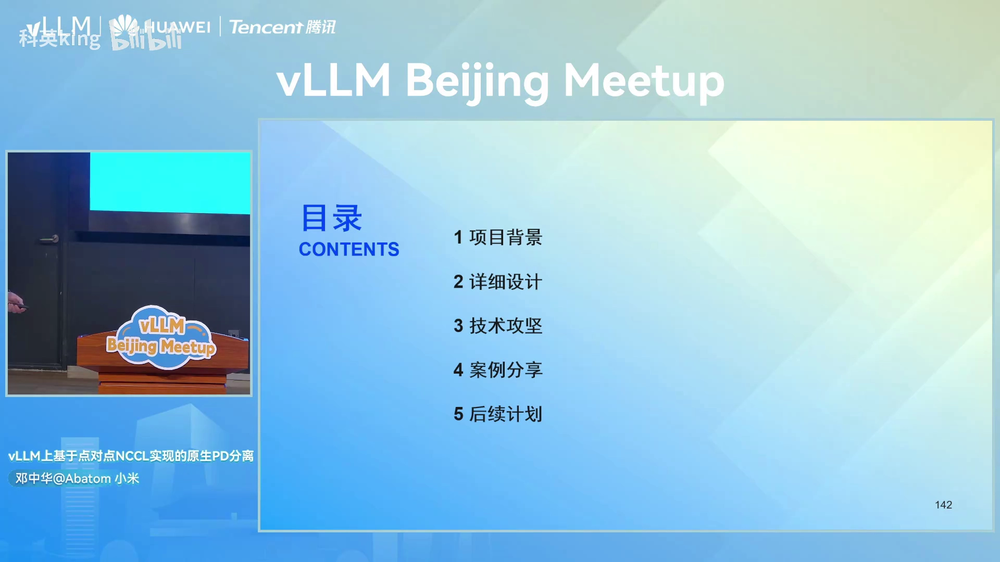 |
| 四个月前，vLLM 上还只有固定 1P1D 的 PD 分离方案，还不支持可变的 xPyD；社区当时正在讨论如何设计 xPyD 的接口，其中有一个关键议题： [【跳转到 01:15】](https://www.bilibili.com/video/BV1FwvTzZEfM/?t=75) | 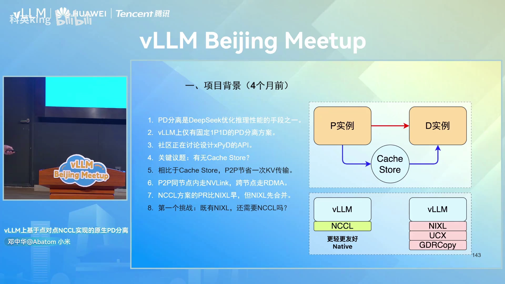 |
| 就是是否需要引入 Cache Store。当时社区投票决定了要有 Cache Store 这个方案，但我其实想做一个不太一样的，就是点对点（P2P）的方案，我投的票也是点对点。相比于 Cache Store 方案——如上图所示，红色箭头是 P 实例 [【跳转到 01:40】](https://www.bilibili.com/video/BV1FwvTzZEfM/?t=100) | 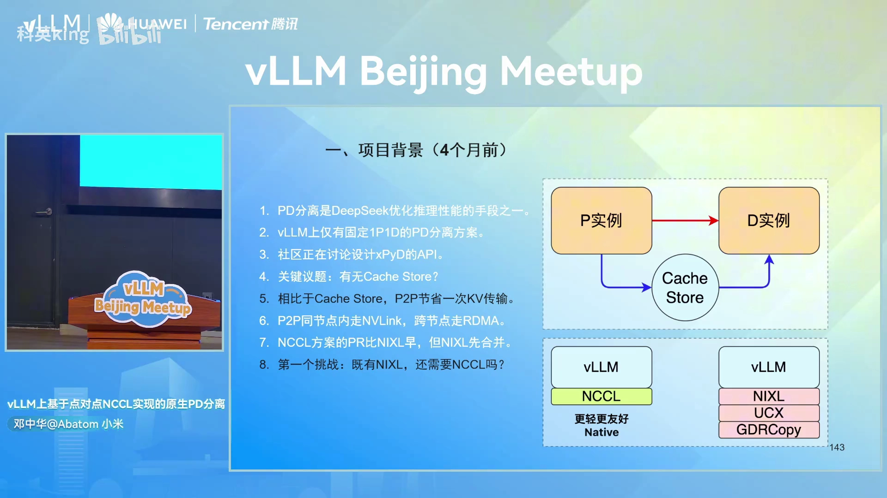 |
| 直接发给 D 实例，是点对点的；而 Cache Store 方案是 P 实例把 KV Cache 传输给 Cache Store，然后 D 实例再去拉取。点对点这种方案在同节点内走 NVLink，跨节点走 RDMA。我这个 NCCL 方案呢， [【跳转到 02:05】](https://www.bilibili.com/video/BV1FwvTzZEfM/?t=125) | 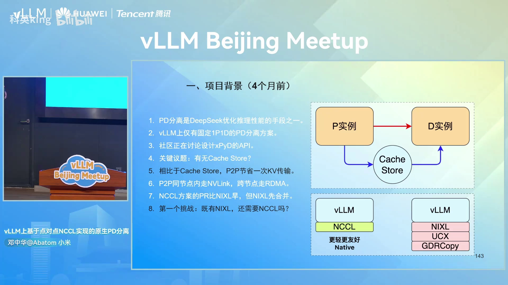 |
| 比 NIXL 要早一些，但 NIXL 比我先合并、集成到 vLLM 里。于是我面临的第一个挑战就是：既然已经有 NIXL 了，为什么还要有 NCCL 方案？当然答案是需要的，如下图所示，NIXL 是比较重的， [【跳转到 02:30】](https://www.bilibili.com/video/BV1FwvTzZEfM/?t=150) |  |
| 它需要安装第三方库，比如 GDRCopy、UCX，还有 NIXL 本身——你要是没装过，估计得折腾小半天才能把环境装好。而我的方案不需要安装其他第三方库，只要你装了 vLLM 就可以直接使用我的方案， [【跳转到 02:55】](https://www.bilibili.com/video/BV1FwvTzZEfM/?t=175) | 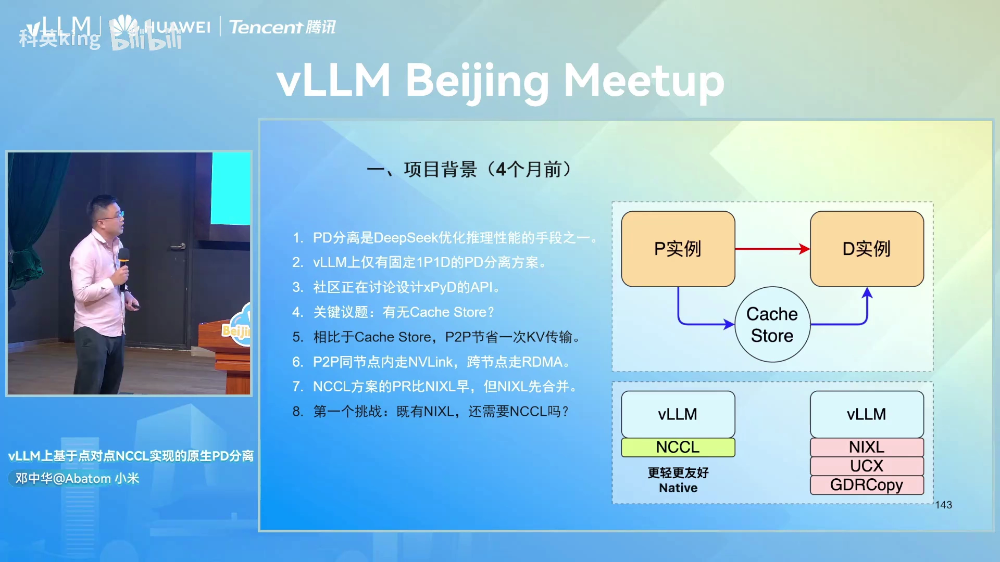 |
| 更轻、更友好，也是原生的方案。第二部分是详细设计，我掰得比较细。我先介绍整体流程：客户端先向 Proxy 发起请求，Proxy 会选择一个 1P1D——一个请求只会在一个 P 上做 Prefill， [【跳转到 03:20】](https://www.bilibili.com/video/BV1FwvTzZEfM/?t=200) |  |
| 在一个 D 上做 Decode。也就是对单个请求来说它就是 1P1D，但对整个系统来讲它是 P/D 分离的。然后 Proxy 会把原请求当中的 max_tokens 置为 1，把它发给它选择的 P 实例；然后 Proxy 会将 [【跳转到 03:45】](https://www.bilibili.com/video/BV1FwvTzZEfM/?t=225) | 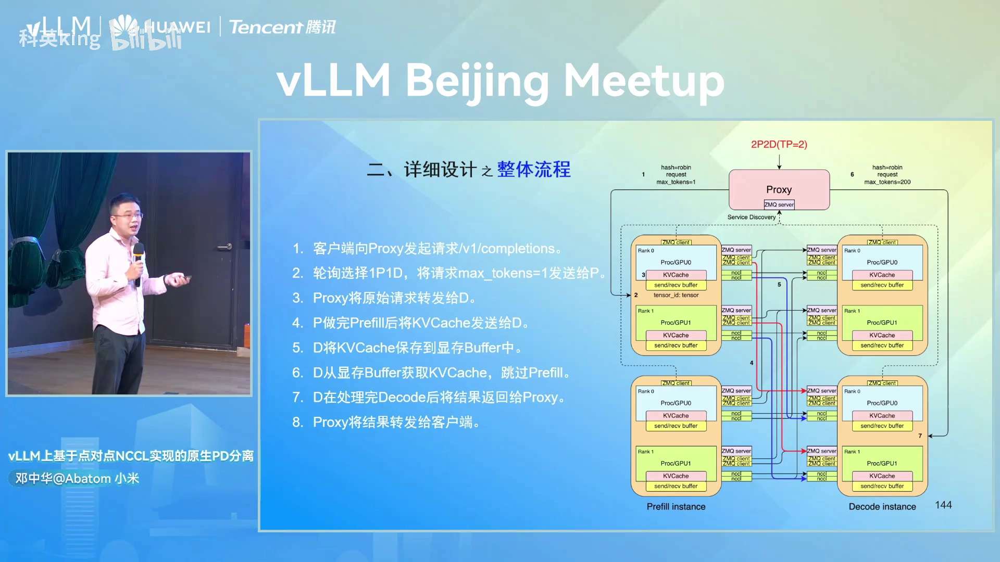 |
| 随后立马把这个请求原封不动地打给 D 实例。P 实例做完 Prefill 之后，把 KV Cache 传输给 D 实例；D 实例把接收到的 KV Cache 保存到本地。当它主线程要去做 Decode 时，请求进来先做 Prefill，发现本地有这个 KV Cache，就跳过 Prefill 阶段，直接做 Decode。 [【跳转到 04:10】](https://www.bilibili.com/video/BV1FwvTzZEfM/?t=250) | 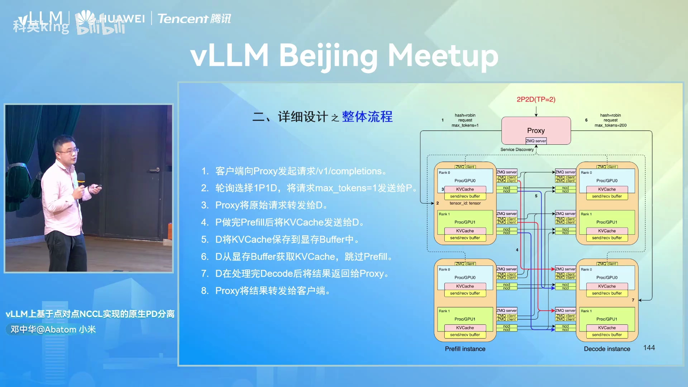 |
| Decode 做完之后，它会把结果返回给 Proxy，最后 Proxy 把结果返回给客户端。这就是大致的整体流程。 [【跳转到 04:35】](https://www.bilibili.com/video/BV1FwvTzZEfM/?t=275) | 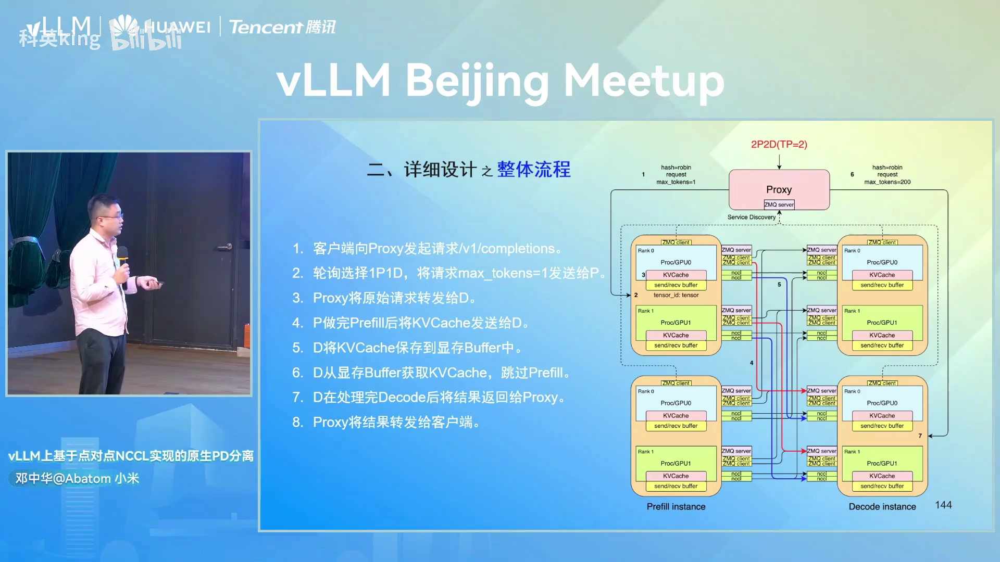 |
| 然后我实现了一个简单的 Proxy，它就像一个 demo 或者玩具 Proxy，很简单，方便我做实验、做压测、做功能验证。这个 Proxy 目前有服务发现的能力：它是个很简单的 webserver，P 实例和 D 实例会周期性上报自己的 [【跳转到 04:48】](https://www.bilibili.com/video/BV1FwvTzZEfM/?t=288) |  |
| http 地址和 ZMQ 地址。http 地址就是原来 vLLM 实例的 web 接口地址。Proxy 上维护一个字典（键值对），如果超时没有上报，Proxy 就会把你摘掉，相当于实现了动态摘除。 [【跳转到 05:13】](https://www.bilibili.com/video/BV1FwvTzZEfM/?t=313) | 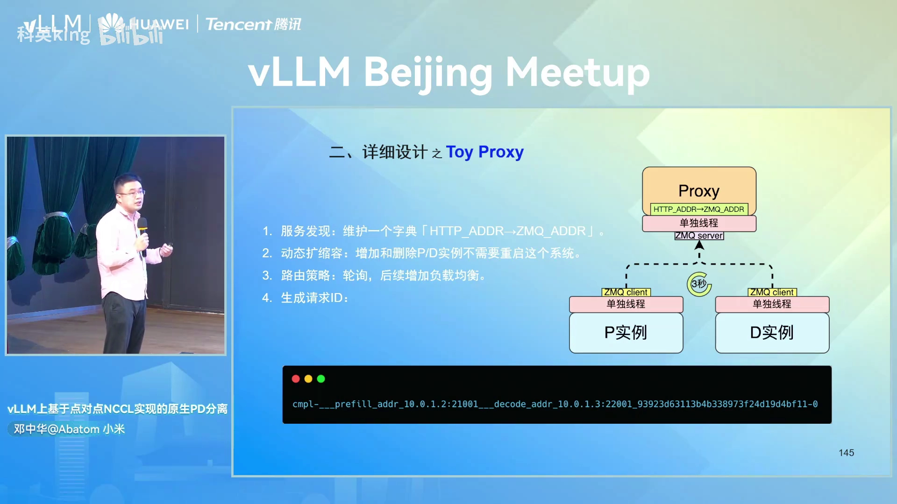 |
| 同时也可以随意扩容：你加一个 P 实例或 D 实例，上报给 Proxy 后，Proxy 的字典里就有你的地址了，我就可以随机或轮询选择，也可以根据动态负载策略来选择你。目前这个 Proxy 只有轮询策略。为什么先做轮询呢？因为我压测的时候输入 [【跳转到 05:38】](https://www.bilibili.com/video/BV1FwvTzZEfM/?t=338) | 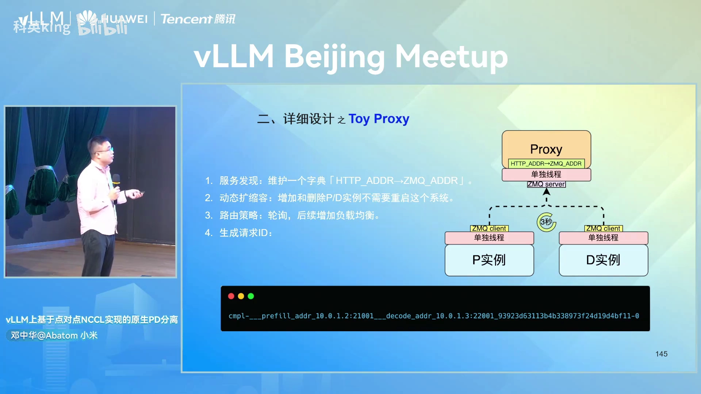 |
| 长度和输出长度是固定的，这种情况下轮询对压测场景来说负载是均衡的。后续如果要步入生产环境，肯定要实现真实的负载均衡，因为要考虑输入长度。还有一个最重要的功能，就是生成请求 ID。 [【跳转到 06:03】](https://www.bilibili.com/video/BV1FwvTzZEfM/?t=363) | 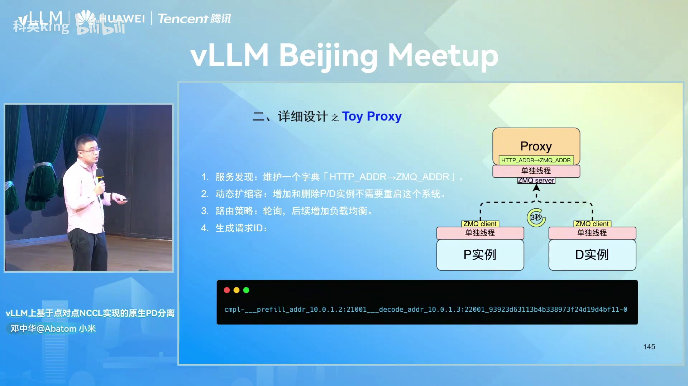 |
| 这个请求 ID 参考的是 Dynamo 的设计，里面包含了 P 实例的 ZMQ 地址还有 D 实例的 ZMQ 地址。说白了就是我先选好 1P1D，对这个请求来讲已经写死好了你就发给这个 P、发给那个 D。此外还有一个 UUID， [【跳转到 06:28】](https://www.bilibili.com/video/BV1FwvTzZEfM/?t=388) |  |
| 用来唯一标识一个请求。 [【跳转到 06:53】](https://www.bilibili.com/video/BV1FwvTzZEfM/?t=413) |  |
| 第二个是我使用 ZMQ 协议还有 NCCL。ZMQ 负责传输控制流：P 和 D 之间首先要建立握手——我要给你发消息、要给你传 KV Cache，肯定要先握手；还有我要发给你的这个 tensor，也就是 KV Cache 的形状 [【跳转到 07:01】](https://www.bilibili.com/video/BV1FwvTzZEfM/?t=421) | 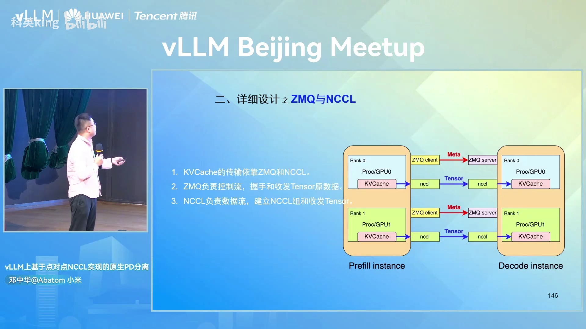 |
| 和它的数据类型。NCCL 则负责真实的数据传输：它负责建立一个点对点的 NCCL 通信组，还负责收发 tensor——就是真实的 KV Cache 数据。这里我设计了三种传输方式，这也是我逐渐优化的过程。 [【跳转到 07:26】](https://www.bilibili.com/video/BV1FwvTzZEfM/?t=446) | 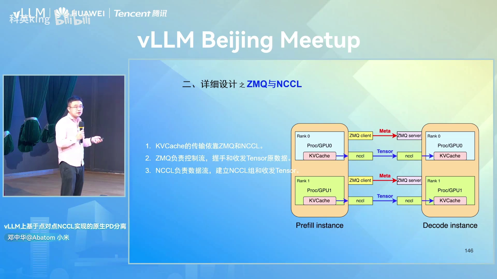 |
| 最开始我设计的是 PUT 方式，也就是推的方式；后来我又设计了一个 GET 方式，也就是拉取的方式；第二种方式是 GET，D 去 P 拉取 KV Cache；第三种方式是 P 实例异步发给 D 实例。这是一个性能逐渐变好的过程。 [【跳转到 07:51】](https://www.bilibili.com/video/BV1FwvTzZEfM/?t=471) |  |
| 我也把它们保留下来了，后面会介绍每一种传输方式的应用场景，可以通过 --kv-transfer-config 里的 send_type 来配置。目前性能最好的是 PUT_ASYNC，也就是异步的推。接下来我分别介绍每一种传输方式，首先是 PUT 方式。 [【跳转到 08:16】](https://www.bilibili.com/video/BV1FwvTzZEfM/?t=496) | 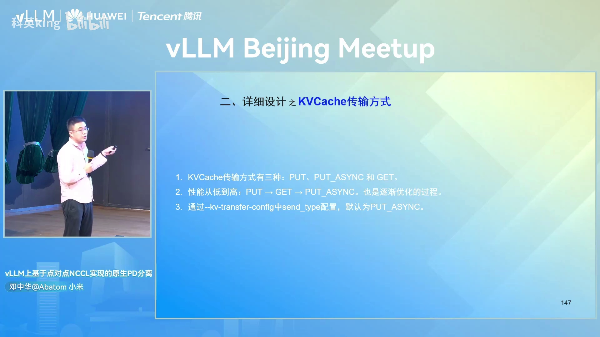 |
| P 实例先解析前面代码框里边那个 request id，它里面包含了 P 和 D 的地址，P 会从这个 request id 当中获取 D 实例的 ZMQ 地址。P 实例做完 Prefill 之后，会将自己的 KV Cache 主动推给 D 实例。 [【跳转到 08:41】](https://www.bilibili.com/video/BV1FwvTzZEfM/?t=521) | 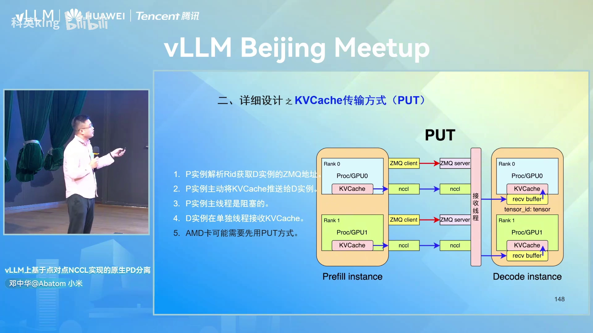 |
| P 实例这里是在主线程里同步去发给 D 实例的，而 D 实例是起了一个单独的线程来接收 KV Cache，所以这种性能可能会差一些。近期我也收到了反馈，知乎上有给我留言，其他 hub 也给我留言， [【跳转到 09:06】](https://www.bilibili.com/video/BV1FwvTzZEfM/?t=546) | 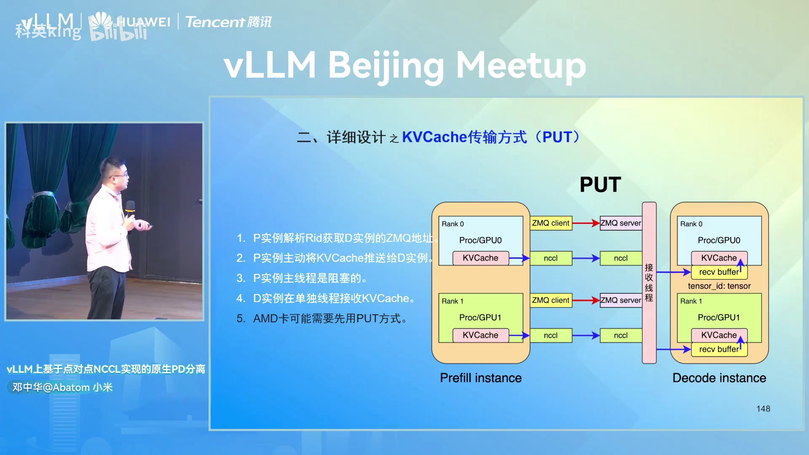 |
| 有用户使用的是 AMD 卡，发现有时候会 hang 住——batch size 大了会 hang 住。但用户使用默认的 PUT_ASYNC 方式，改用 PUT 就没有这个问题。所以这也是我暂时先保留 PUT 的原因，这个 hang 住的问题我后面再去做系统的分析和优化。AMD 卡上有这个问题，NVIDIA 卡目前没什么问题。 [【跳转到 09:31】](https://www.bilibili.com/video/BV1FwvTzZEfM/?t=571) | 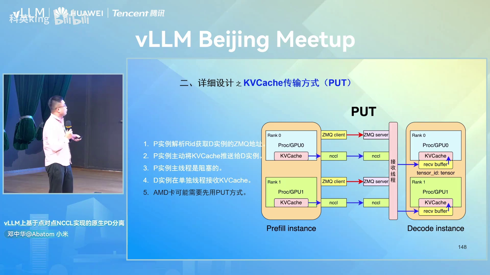 |
| 没有 hang 住的问题。第二种方式是刚才说的拉取方式，D 实例主动去 P 实例拉取 KV Cache。P 实例在做完 Prefill 之后把 KV Cache 保存到本地的一个显存 buffer 当中，然后 D 实例去解析 P 实例的 [【跳转到 09:56】](https://www.bilibili.com/video/BV1FwvTzZEfM/?t=596) | 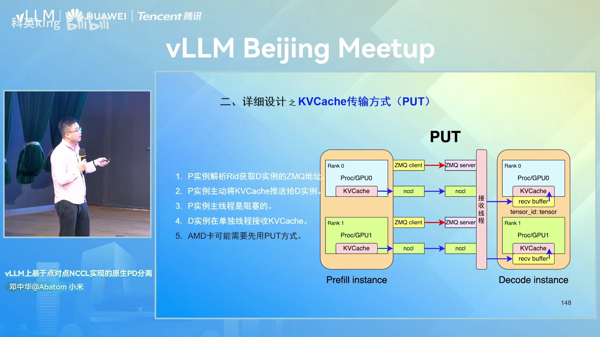 |
| ZMQ 地址，然后去 P 实例拉取这个 KV Cache。P 实例这里会把 KV Cache 通过一个单独的发送线程发送给 D 实例。这种方案比 PUT 方式能好一些。第三种方案就是异步推送方式， [【跳转到 10:21】](https://www.bilibili.com/video/BV1FwvTzZEfM/?t=621) | 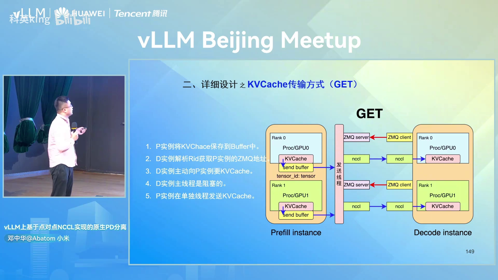 |
| 这也是我现在这个方案默认的发送方式。首先 P 实例解析 D 实例的 ZMQ 地址，然后把 KV Cache 丢给它自己的一个发送线程，由发送线程异步地把 KV Cache 发送给 D 实例。 [【跳转到 10:46】](https://www.bilibili.com/video/BV1FwvTzZEfM/?t=646) | 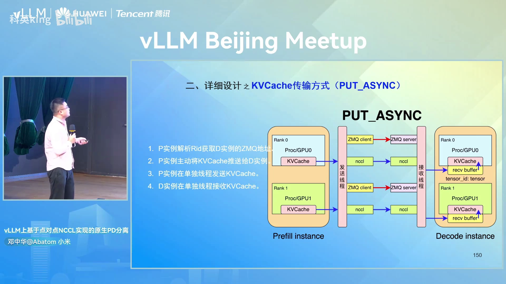 |
| D 实例这边有一个单独的接收线程，我不影响自己的推理过程，是在单独的接收线程来接收 P 实例发过来的 KV Cache。所以收发是完全异步的，性能比前两种好一些。前面老师也都提到过， [【跳转到 11:11】](https://www.bilibili.com/video/BV1FwvTzZEfM/?t=671) | 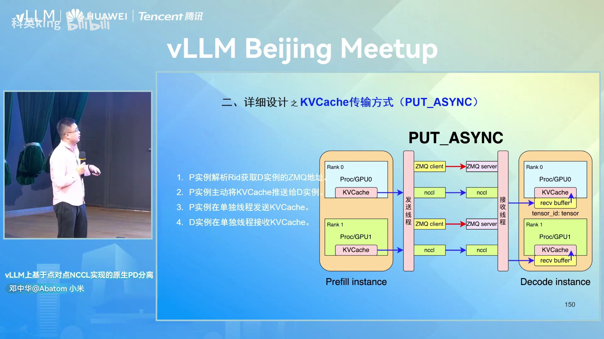 |
| 这个（NCCL）方案确实需要一个 buffer 存在，这个 buffer 其实就是用来临时存放发送和接收过程中的 KV Cache。GET 方式下只有 P 实例有那个单独的 buffer，而 PUT 推送、异步推、同步推 [【跳转到 11:36】](https://www.bilibili.com/video/BV1FwvTzZEfM/?t=696) | 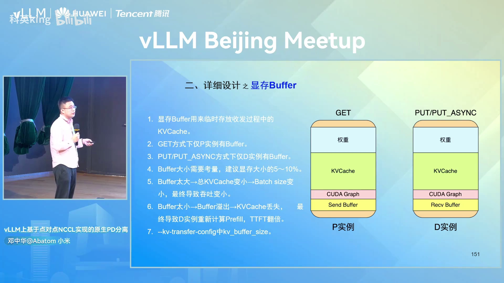 |
| 只有 D 实例有 buffer。这个 buffer 的大小是需要考量的，我的建议是占显卡总显存的 5% 到 10% 左右，这也是个经验值，具体要通过真实场景去调，看哪种更适合你自己的业务。 [【跳转到 12:01】](https://www.bilibili.com/video/BV1FwvTzZEfM/?t=721) |  |
| 如果 buffer 太大，那么总显存里给 KV Cache 的部分就会变小——因为权重不动，KV Cache、CUDA Graph 还有发送 buffer 会各占一定比例。buffer 变大了，本地推理用的 KV Cache 就会变小，进而影响 batch size，影响吞吐，前面老师也提到过。 [【跳转到 12:26】](https://www.bilibili.com/video/BV1FwvTzZEfM/?t=746) |  |
| 如果 buffer 太小，比如 P 实例发给 D 实例的 KV Cache 在 D 本地 buffer 放不下，就会造成 KV Cache 丢失；一旦发生丢失，D 实例就得重新计算 Prefill，这时候它的 TTFT 就会翻倍，因为它要串行地计算两遍。也可以通过 [【跳转到 12:51】](https://www.bilibili.com/video/BV1FwvTzZEfM/?t=771) | 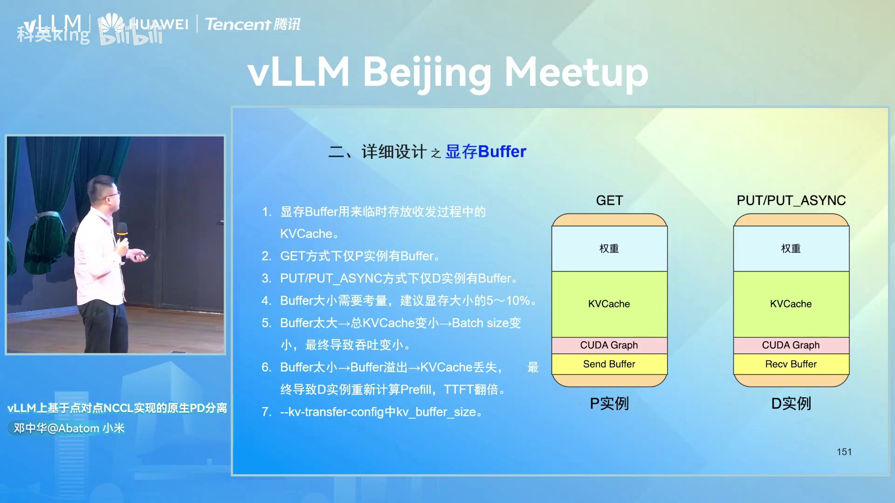 |
| 配置来设置这个显存 buffer。为了降低显存 buffer 取舍的难度，也为了应对流量突增——业务场景可能瞬间来一波流量，这时显存 buffer 可能就装不下、造成溢出， [【跳转到 13:16】](https://www.bilibili.com/video/BV1FwvTzZEfM/?t=796) | 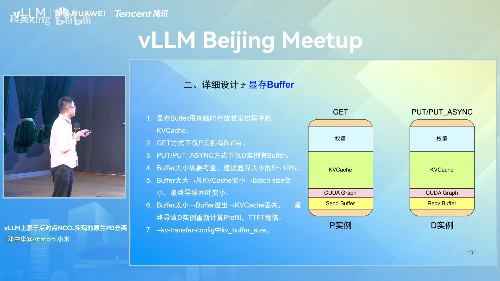 |
| 我设计了 Tensor 内存池。这个内存池是在 CPU 内存上，因为 CPU 内存比较便宜，也不需要分块，直接存就好了，重复就重复了。也可以通过配置来改变内存池的大小， [【跳转到 13:41】](https://www.bilibili.com/video/BV1FwvTzZEfM/?t=821) |  |
| 目前默认值是 32GB。因为服务器上基本上都是 TB 级别的显存，所以大胆往大设置也没问题。这个内存池的设计我参考了 Linux 的内存伙伴系统，后面我会举个例子讲它的工作原理。之前我也跟西蒙聊过，我说这个东西可以用来 [【跳转到 14:06】](https://www.bilibili.com/video/BV1FwvTzZEfM/?t=846) | 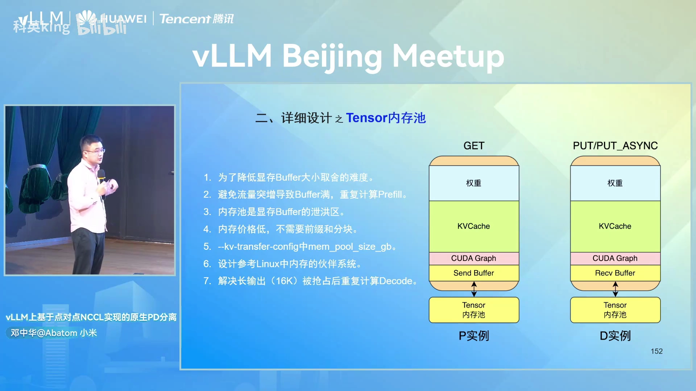 |
| 解决长输出当中的问题。比如说输入 1K、输出 16K，你会在 vLLM 日志中发现大量出现被抢占的日志。被抢占就是：我算到 15K 了，你给我抢占了，那我现在又要重新计算， [【跳转到 14:31】](https://www.bilibili.com/video/BV1FwvTzZEfM/?t=871) | 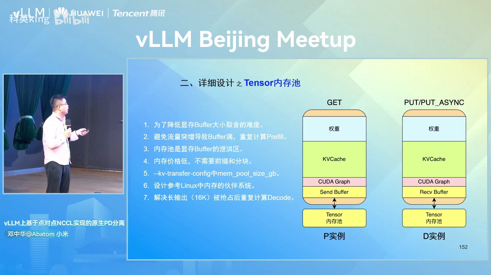 |
| 那如果我把（被抢占的 KV Cache）卸载到 Tensor 内存池里面去，等它恢复的时候再加载回来，这个过程肯定比重新计算 15K 要快得多。右边这个图是我简单画的一个内存池示例：初始化的时候是 32GB，然后我分配了 2G、4G。 [【跳转到 14:56】](https://www.bilibili.com/video/BV1FwvTzZEfM/?t=896) |  |
| 这样操作下来，目的是让我每次分配内存块都分配连续的内存，这样可以加快读写速度。还有就是当我释放的时候，我会判断我的伙伴是否是空的。比如最后倒数第二行释放 2G 的时候， [【跳转到 15:21】](https://www.bilibili.com/video/BV1FwvTzZEfM/?t=921) | 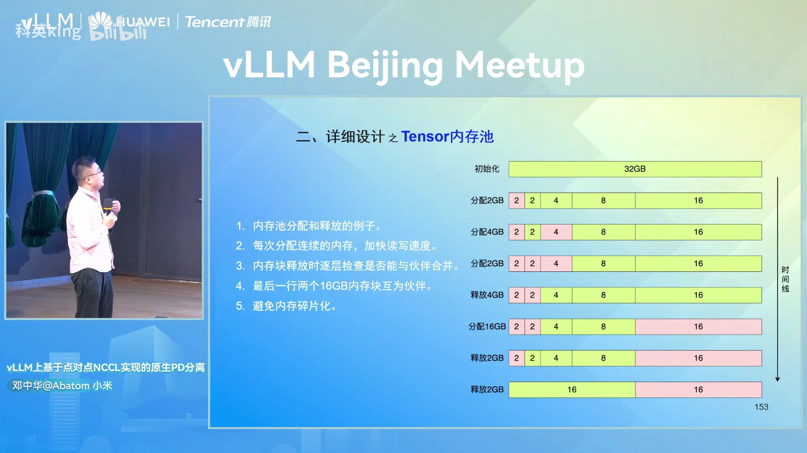 |
| 我会判断我的伙伴那块 2G 的内存块是不是空的，如果空的话就合并；合并成 4G 之后，如果 4G 的伙伴还是空的，就继续合并成 8G、16G。因为后面分配了 16G，它的伙伴就不是空的了，所以不能再合并。这样就避免了内存碎片化。 [【跳转到 15:46】](https://www.bilibili.com/video/BV1FwvTzZEfM/?t=946) | 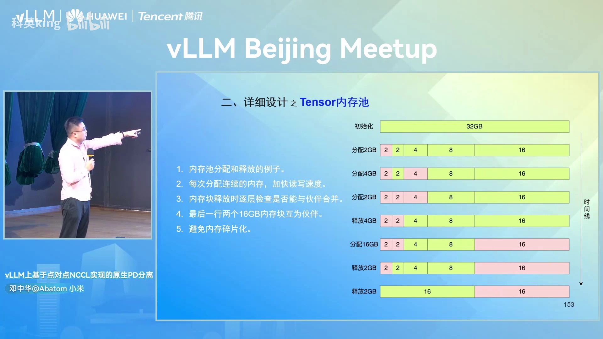 |
| 然后介绍一下 NCCL 组的布局。右边图举的是一个 1P2D 的例子，每一个实例的 TP 都等于 2。图中一共有 7 个 NCCL 组，其中 3 个是每个实例内部两个 TP（TP=2）组成的 NCCL 组，还有 4 个点对点的 NCCL 组， [【跳转到 16:11】](https://www.bilibili.com/video/BV1FwvTzZEfM/?t=971) |  |
| 比如 P 的 0 号卡和 D1 的 0 号卡组成一个 NCCL 组。然后就迎来了第二个挑战，这也是 Kaichao 提的：NCCL 组本身是带显存的。当时我也犯愁了，这到底该怎么搞？后来我也请教了 Kaichao，这个 PR 到底该怎么往下推进。 [【跳转到 16:36】](https://www.bilibili.com/video/BV1FwvTzZEfM/?t=996) |  |
| 我还担心这个 PR 合不了，那前面不就前功尽弃了嘛，我很担心。后来 Kaichao 说：既然支持不了大规模的 PD 分离，那把小的 PD 分离做好也是可以的。然后我信心就来了，也做了一个实验：创建第一个 NCCL 组的时候， [【跳转到 17:01】](https://www.bilibili.com/video/BV1FwvTzZEfM/?t=1021) |  |
| 它大概占 557MB。（这不是说一定就是 557MB，跟不同的卡、不同的 NCCL 版本都有关系，只不过在我的场景下它占 557MB。）每增加一个 NCCL 组，增加的大小是不一定的，直接跟 channel 数量有关系。 [【跳转到 17:26】](https://www.bilibili.com/video/BV1FwvTzZEfM/?t=1046) | 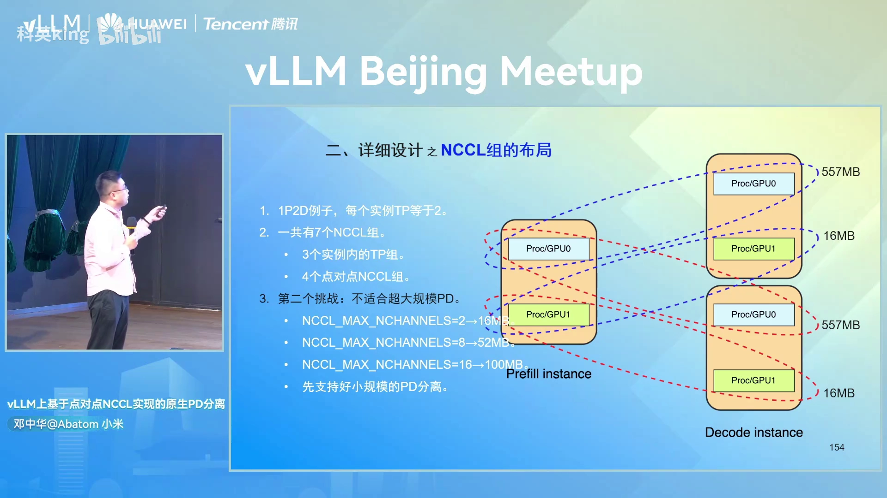 |
| channel 数等于 2 增加的就小一些，等于 8 就大一些，等于 16 就更大。这就是 NCCL 组的布局。第三部分是我遇到的问题以及怎么解决的。我遇到第一个比较难的问题是： [【跳转到 17:51】](https://www.bilibili.com/video/BV1FwvTzZEfM/?t=1071) |  |
| 我推上去之后就有人反馈说 Chunked Prefill 失败、崩溃。我查了一下，发现是因为有请求被 Chunked Prefill 了。比如右边那个图里的 R3，它 Chunked Prefill 了，那三个块它先把三个块发送给 D 实例了， [【跳转到 18:16】](https://www.bilibili.com/video/BV1FwvTzZEfM/?t=1096) |  |
| 但 D 实例期望的是五个块，这样形状不匹配就崩了。原因就是这个。我是怎么解决的呢？我把 R3 算完三块之后先存在本地，等它把后两个块也算完之后，一起再发给 D 实例，这样就完美解决了。 [【跳转到 18:41】](https://www.bilibili.com/video/BV1FwvTzZEfM/?t=1121) | 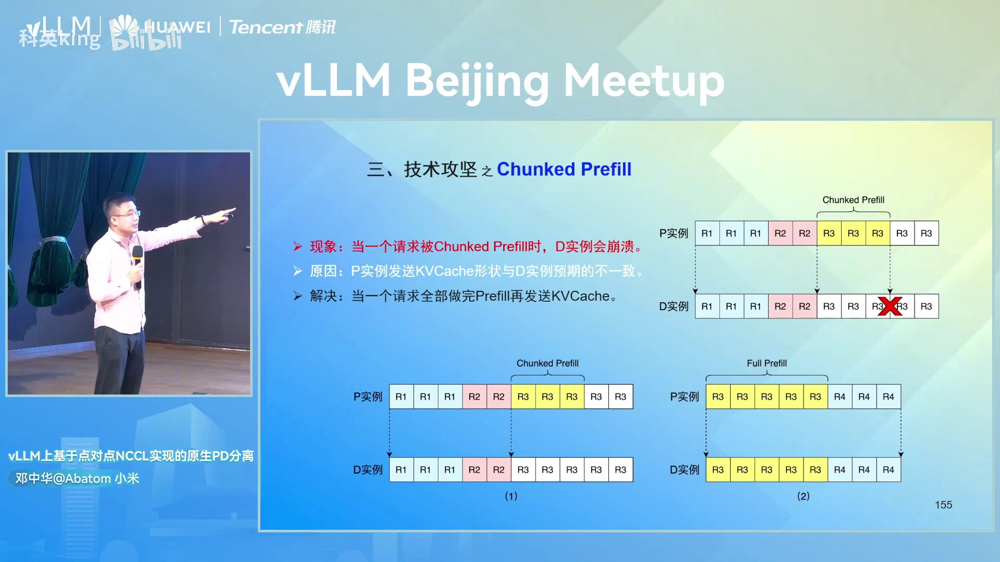 |
| 第二个是性能优化方面，从两个方面展开。第一个是 CPU 方面：我把 P 实例提取 KV Cache 那个操作移动到了发送线程——我们不是有单独的发送线程嘛，我把它移动过去，这样能减少一部分 CPU 负载， [【跳转到 19:06】](https://www.bilibili.com/video/BV1FwvTzZEfM/?t=1146) | 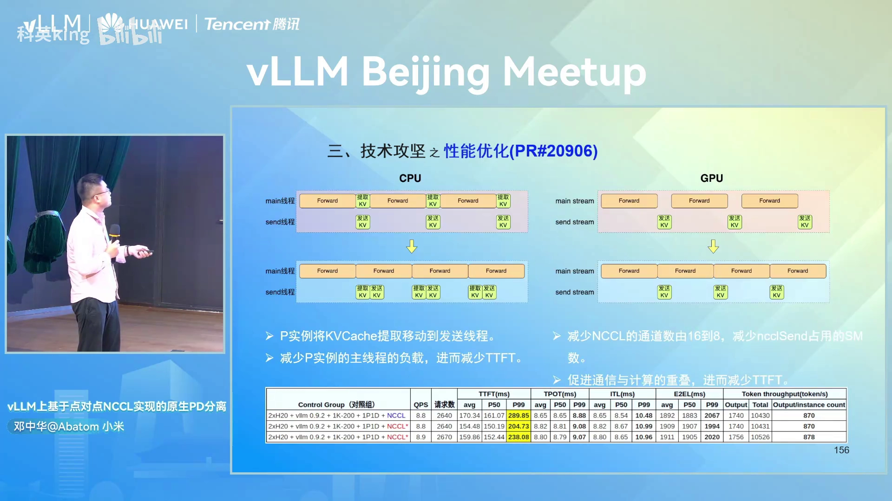 |
| 主线程的负载就减少了，能减少一点是一点，然后它可以继续做自己的 Prefill 操作，进而能减少一些 TTFT。第二个方向是 GPU 方面，前面老师也提到，channel 数量会影响到它使用的 SM 数量。一张卡的 SM 数量是固定的， [【跳转到 19:31】](https://www.bilibili.com/video/BV1FwvTzZEfM/?t=1171) |  |
| 但如果你 send nccl 那个 NCCL 通信的算子占用的 SM 多了，就会影响推理过程中推理算子使用的 SM 数；如果两者不够用，就可能造成串行。为了不让它串行、让它并行，我就把 channel 数量减少了。我也实测下来，发现 channel 等于 16 和 channel 等于 8 [【跳转到 19:56】](https://www.bilibili.com/video/BV1FwvTzZEfM/?t=1196) | 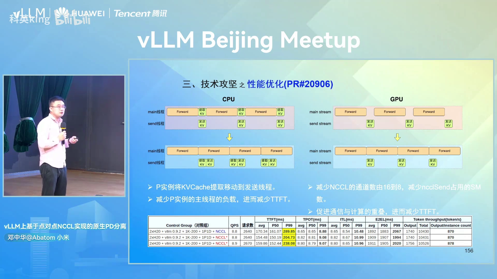 |
| 差别不大，进而也能减少 TTFT。下边这张表格是我实测的数据：第一行是 NCCL 优化之前的数据，能达到 8.8 QPS 的时候 TTFT 就不行了、直接崩掉了，P99 是 289ms。 [【跳转到 20:21】](https://www.bilibili.com/video/BV1FwvTzZEfM/?t=1221) | 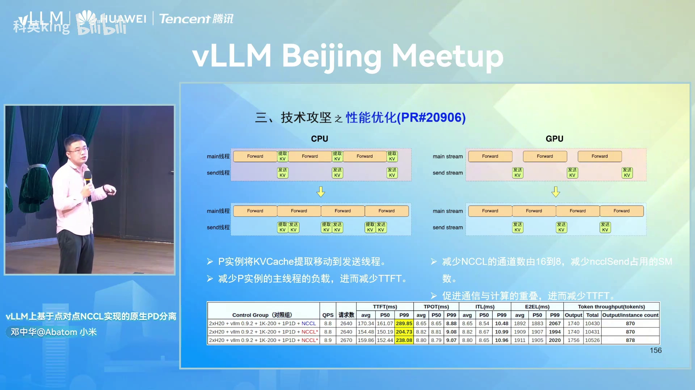 |
| 优化之后，同样 8.8 QPS 的情况下，我降到了 204ms。我优化之后的 QPS 能达到 8.9（原来达不到 8.9），并且优化之后版本的 TTFT 也比原来那个 8.8 的 [【跳转到 20:46】](https://www.bilibili.com/video/BV1FwvTzZEfM/?t=1246) | 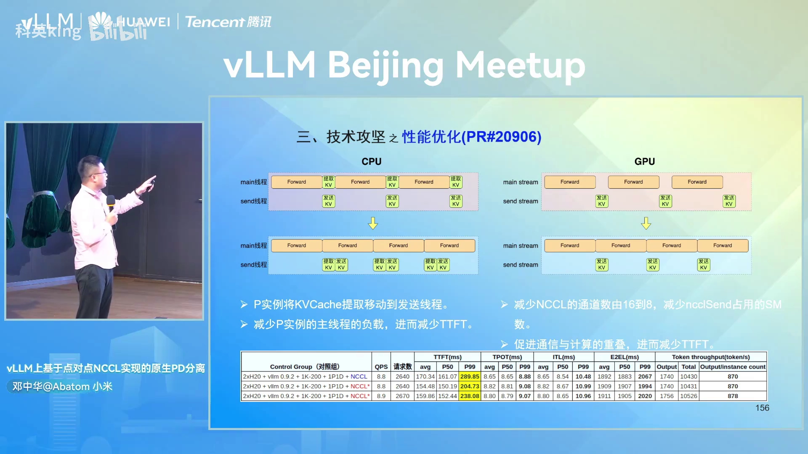 |
| 要好一些。然后第三个问题， [【跳转到 21:11】](https://www.bilibili.com/video/BV1FwvTzZEfM/?t=1271) | 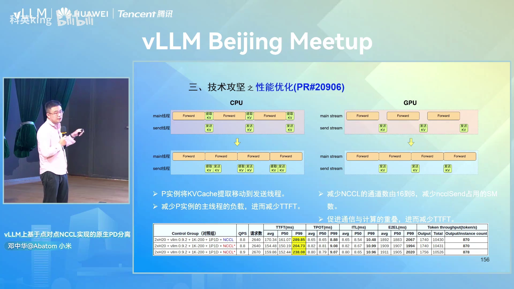 |
| 这也是最后一个，是我遇到的比较困难的挑战。我边压测边 curl 单次请求，返回了乱码，当时心里很难受。然后我就各种查： [【跳转到 21:16】](https://www.bilibili.com/video/BV1FwvTzZEfM/?t=1276) |  |
| 检查发送的 KV 数量和接收的 KV 数量是不是一样（因为我是 ZMQ 发、NCCL 发，两个协议配合，担心有没有乱序），检查下来都没问题。然后打 log，也没法把所有 tensor 都打出来看，就抓其中的几个点、 [【跳转到 21:41】](https://www.bilibili.com/video/BV1FwvTzZEfM/?t=1301) |  |
| 几个元素看，发现有的时候是对的、有的时候不对。因为 tensor 是一层一层发的，不是所有层一起发，layer 是一层一层发的，所以有的层对、有的层不对。当时也很苦恼。后来——我之前也被驱动和 CUDA 版本坑过好几回， [【跳转到 22:06】](https://www.bilibili.com/video/BV1FwvTzZEfM/?t=1326) | 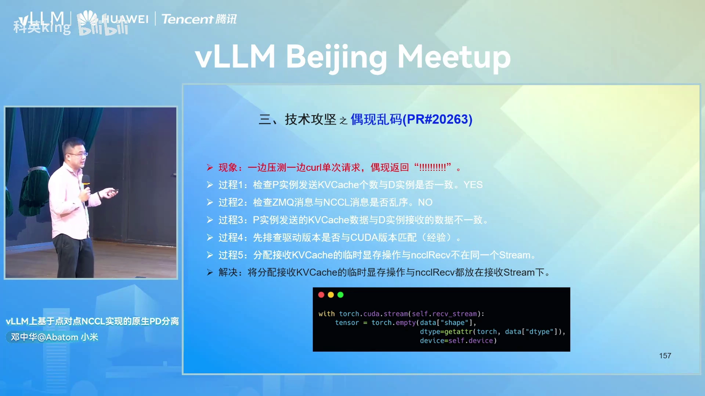 |
| 建议大家排查问题的时候，先排查驱动版本和 CUDA 版本是不是一致的、是不是匹配的，先排除掉。因为我这个事已经被坑过了，这也是个经验，传授给不知道的推理优化工程师。我先做这个事，发现驱动版本也是对的。后来实在没办法就去看代码， [【跳转到 22:31】](https://www.bilibili.com/video/BV1FwvTzZEfM/?t=1351) | 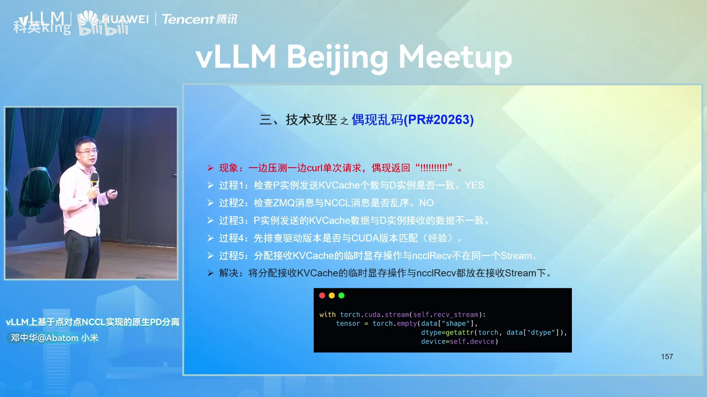 |
| 就发现我的 KV Cache，也就是下面那个代码里申请临时显存 torch.empty 的操作，它是在默认的 stream 下去申请的——这是我优化之后的，优化之前是没有把 torch.empty 放到那个 stream 的， [【跳转到 22:56】](https://www.bilibili.com/video/BV1FwvTzZEfM/?t=1376) |  |
| 它是在默认的 stream 下做申请；而我的 ncclRecv 这个操作是在 receive stream 下做的。两者不在同一个 stream，这样 GPU 的行为就不可预知。我把它们放在同一个 stream 下面之后，就没有乱码了， [【跳转到 23:21】](https://www.bilibili.com/video/BV1FwvTzZEfM/?t=1401) | 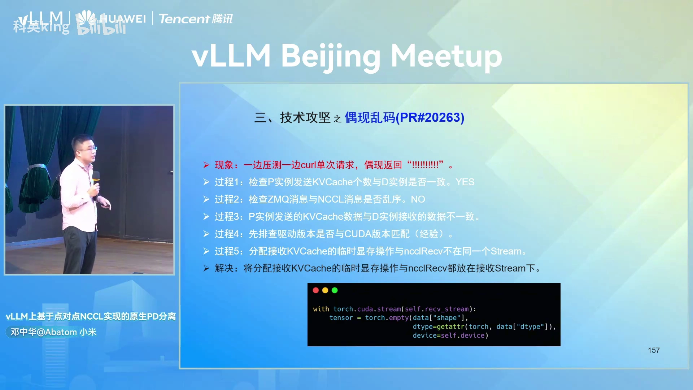 |
| 问题就解决了。 [【跳转到 23:46】](https://www.bilibili.com/video/BV1FwvTzZEfM/?t=1426) | 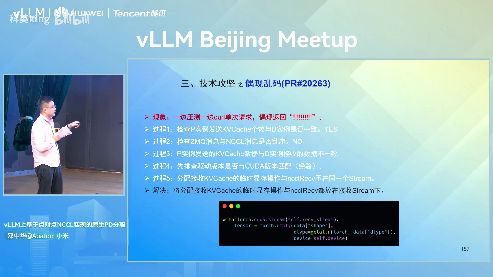 |
| 然后第四部分是案例分享，如何使用我这个方案。启动一个 1P2D 的例子：上面是 Proxy，是一个 toy proxy，启动很简单；这边是 P 实例，那边是两个 D 实例。红色箭头是提醒需要注意的一点：kv_port [【跳转到 23:51】](https://www.bilibili.com/video/BV1FwvTzZEfM/?t=1431) |  |
| 还有 http_port 要保持一致。黄色箭头我示意的是：如果我要再增加一个 D 实例，只要改黄色箭头指向的两个点就可以了，很方便扩容。 [【跳转到 24:16】](https://www.bilibili.com/video/BV1FwvTzZEfM/?t=1456) | 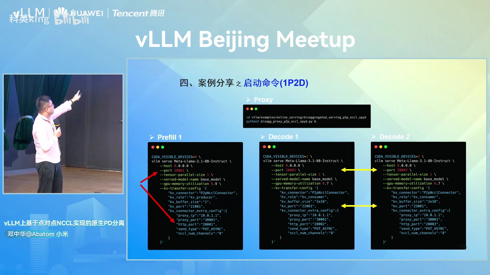 |
| 然后看一下我压测的数据。业务场景是在 H20 上，输入 1K、输出 200，模型是 Llama-3.1-8B，条件是满足 P99 端到端延时在 2 秒左右。这个场景下，1P1D 的 NCCL 方案相比单实例，TTFT 上涨 86%， [【跳转到 24:33】](https://www.bilibili.com/video/BV1FwvTzZEfM/?t=1473) |  |
| TPOT 下降 7%，ITL 下降 90%，这是非常明显的，输出吞吐提升 84%。NIXL 的方案相比单实例，TTFT 上涨 83%，TPOT 下降 9%，ITL 下降 86%，输出吞吐提升 87%。通过这个表格和柱状图来看， [【跳转到 24:58】](https://www.bilibili.com/video/BV1FwvTzZEfM/?t=1498) | 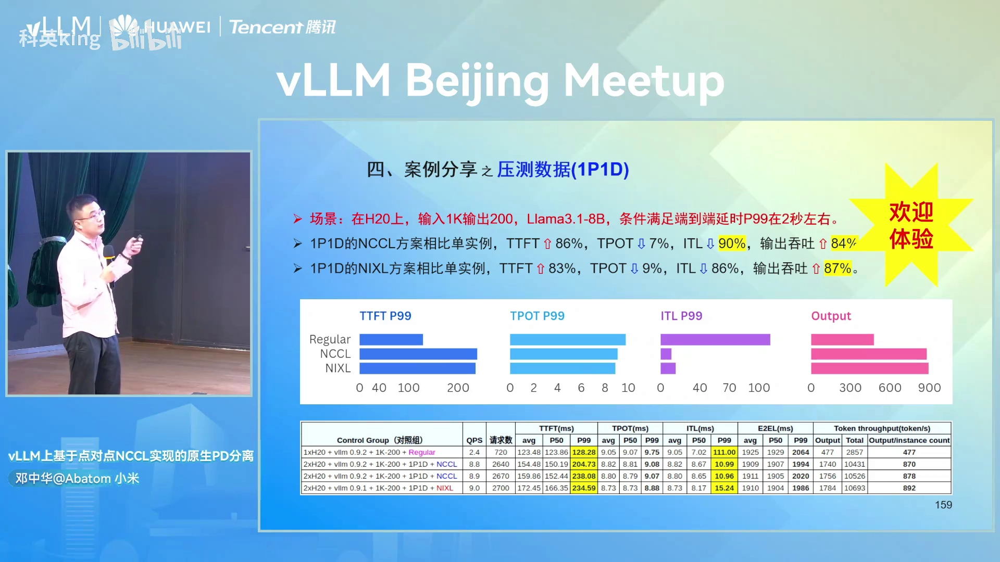 |
| PD 分离对于这种长输入、短输出的场景提升还是很明显的。我也测过输出长的场景，实测下来在我这种场景下收益不大。在我的认知范围内，P 分离更适合应对那种输入长、 [【跳转到 25:23】](https://www.bilibili.com/video/BV1FwvTzZEfM/?t=1523) | 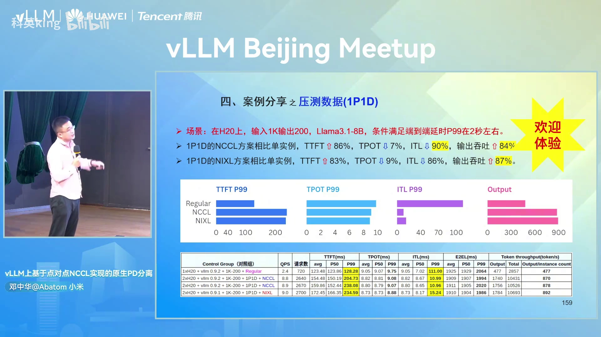 |
| 输出短的场景，是有效果的。前面老师也都介绍过，你看他们都没有说 1P多少D，都是说 2P1D 或 3P1D，就是多 P 少 D 的场景。说白了就是输入长度越多， [【跳转到 25:48】](https://www.bilibili.com/video/BV1FwvTzZEfM/?t=1548) | 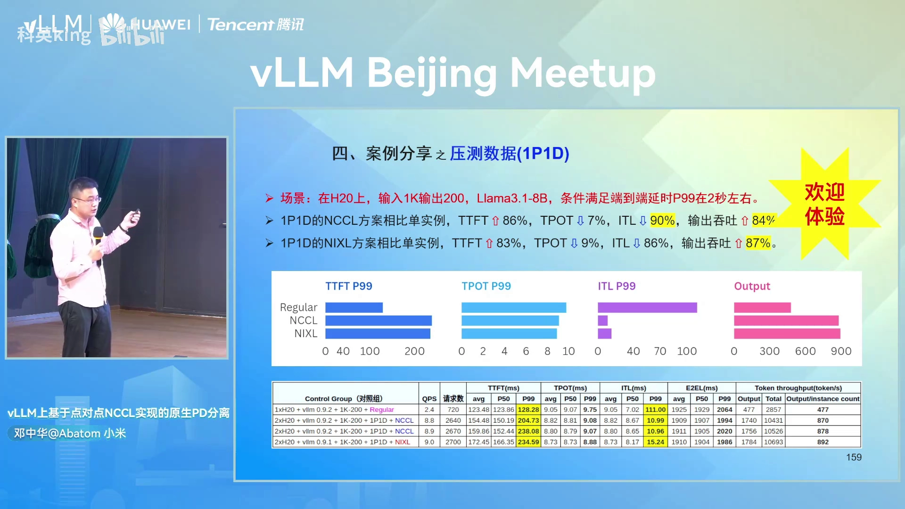 |
| 需要的 P 就越多；输出长度越多，需要的 D 就越多，是有一个比例的。你可以看到，我的方案和 NIXL 的方案其实大差不差、相差很少，并且我这个方案还不需要安装那些库。所以给这个打个广告，欢迎大家来 [【跳转到 26:13】](https://www.bilibili.com/video/BV1FwvTzZEfM/?t=1573) | 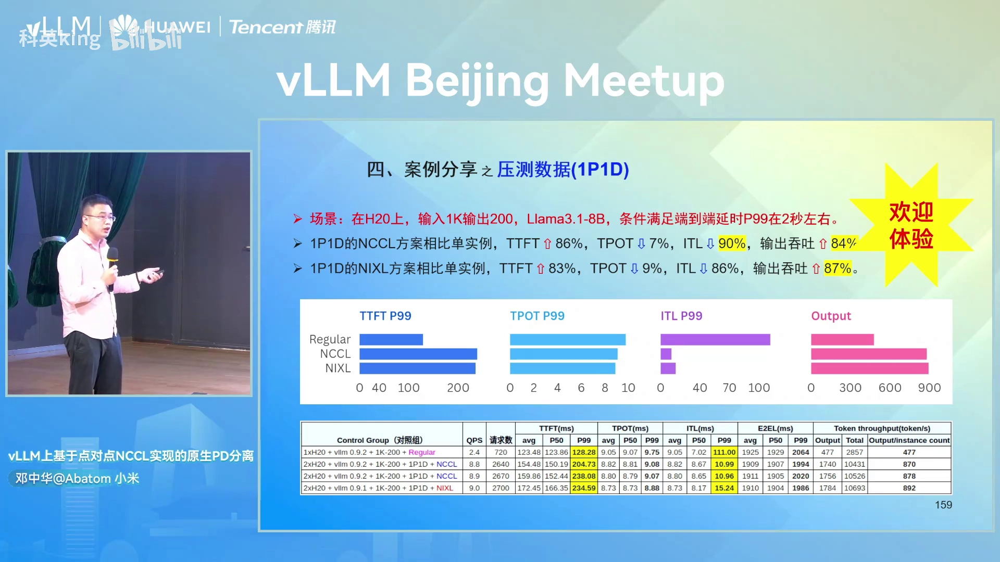 |
| 体验一下。第五部分是后续计划。 [【跳转到 26:38】](https://www.bilibili.com/video/BV1FwvTzZEfM/?t=1598) | 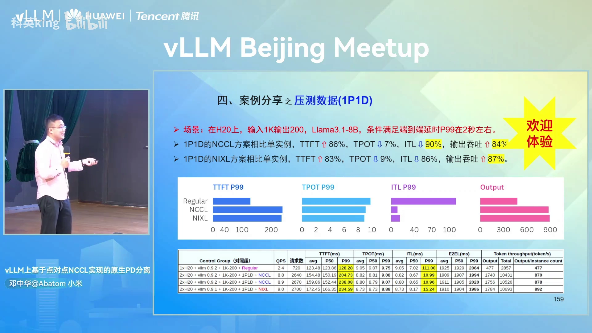 |
| 第一是继续跟 NIXL 对标，跟它死磕，我就是想把它超过。第二是支持 P/D 实例崩溃的自动摘除。现在说白了，我之前在 GitHub 上有一个 PR 提到让（崩溃实例）摘除，我把它关了，因为摘除比扩容难多了， [【跳转到 26:43】](https://www.bilibili.com/video/BV1FwvTzZEfM/?t=1603) | 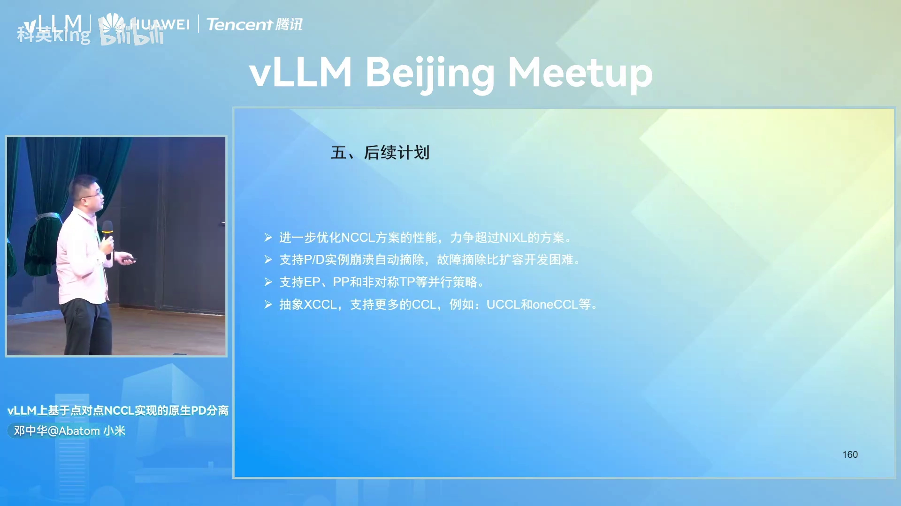 |
| 要考虑的异常场景太多了，我就先把它关了，后面等我把性能提升好之后再重新搞。还有就是支持 EP、PP 还有非对称的 TP 等并行策略，目前我的方案只支持对称的 TP。还有就是对（通信库做）抽象， [【跳转到 27:08】](https://www.bilibili.com/video/BV1FwvTzZEfM/?t=1628) | 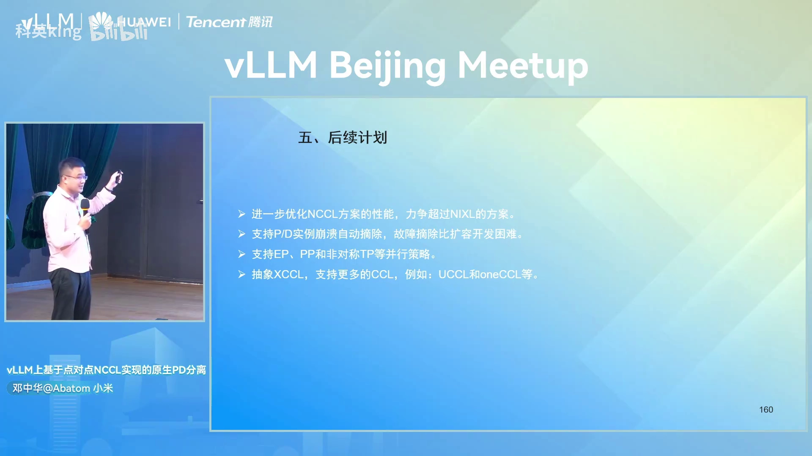 |
| 就是支持其他的集合通信库，比如 UCCL、oneCCL 这些通信库。我也与 UCCL 的作者联系了，她还挺乐于配合我去搞一下 UCCL 方案。UCCL 方案可能能解决 [【跳转到 27:33】](https://www.bilibili.com/video/BV1FwvTzZEfM/?t=1653) | 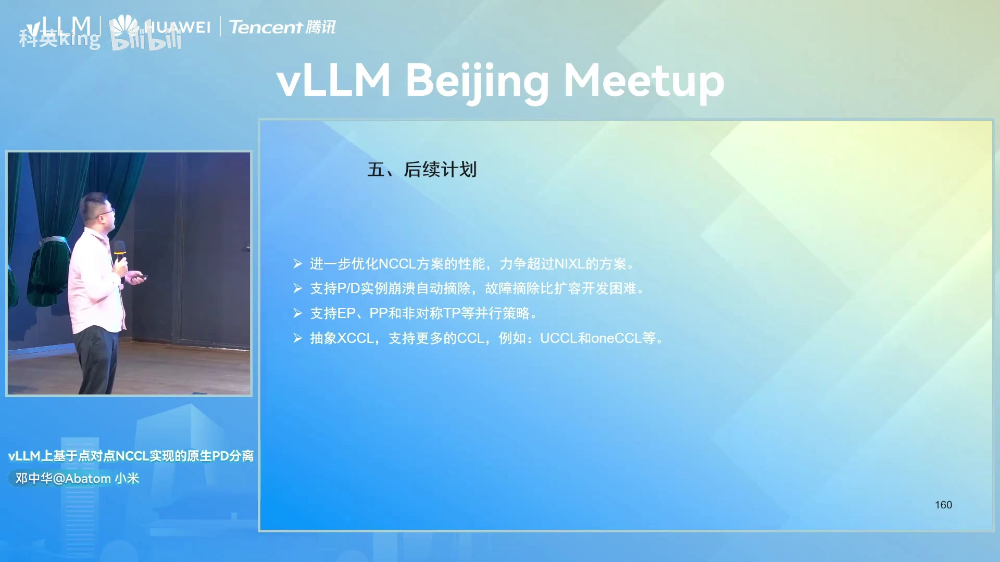 |
| 显存 buffer 这个事情，很有可能就能解决，显存 buffer 就不用额外申请显存 buffer 了。好，谢谢大家。谢谢老师的精彩分享。 [【跳转到 27:58】](https://www.bilibili.com/video/BV1FwvTzZEfM/?t=1678) | 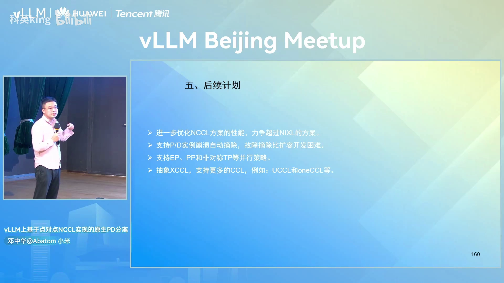 |
| （此区间无字幕） [【跳转到 28:11】](https://www.bilibili.com/video/BV1FwvTzZEfM/?t=1691) | 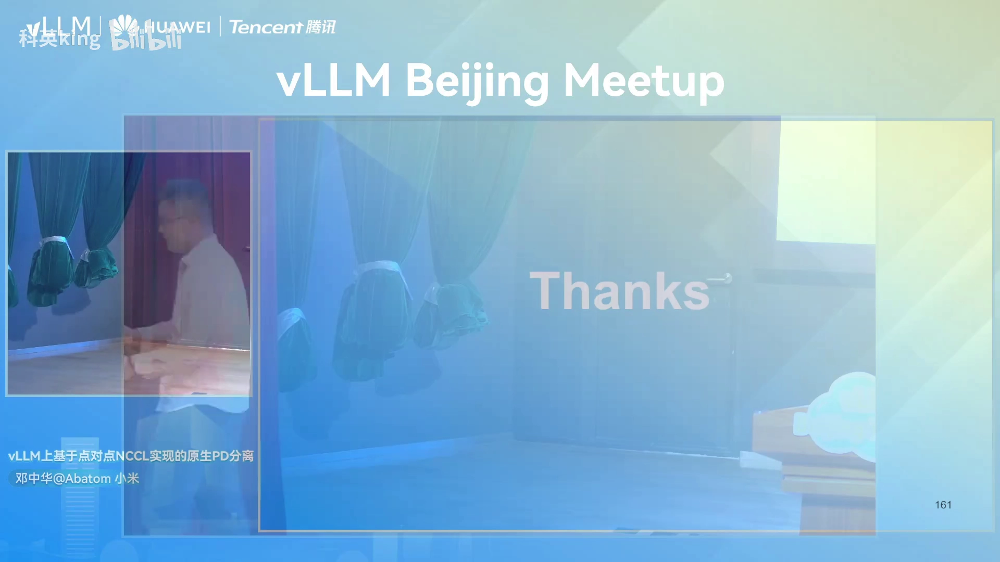 |